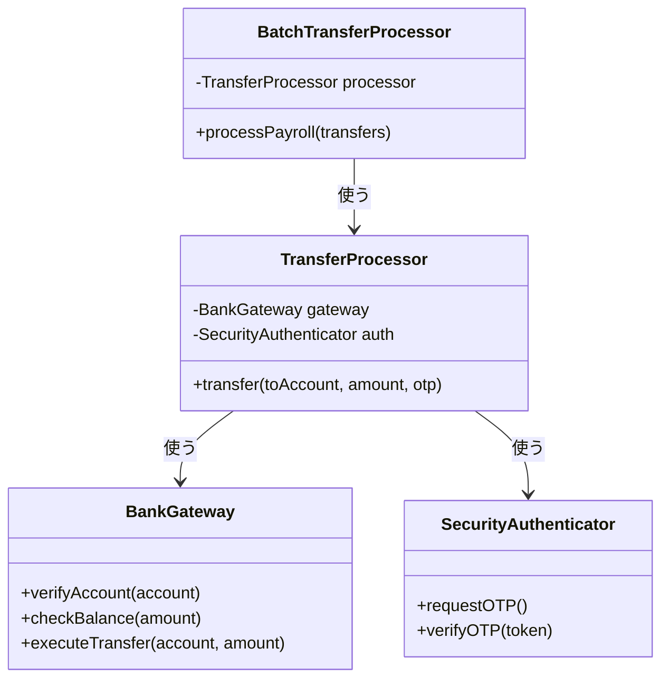
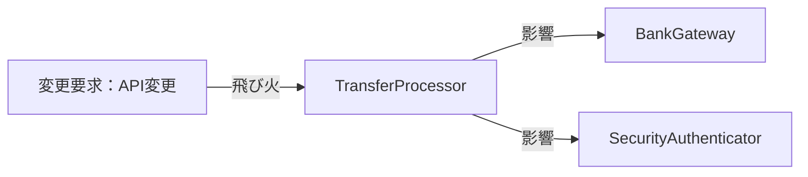
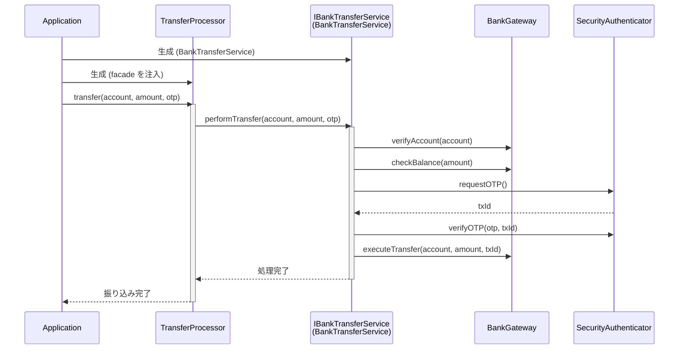
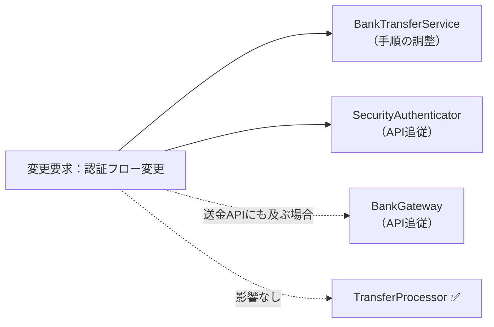
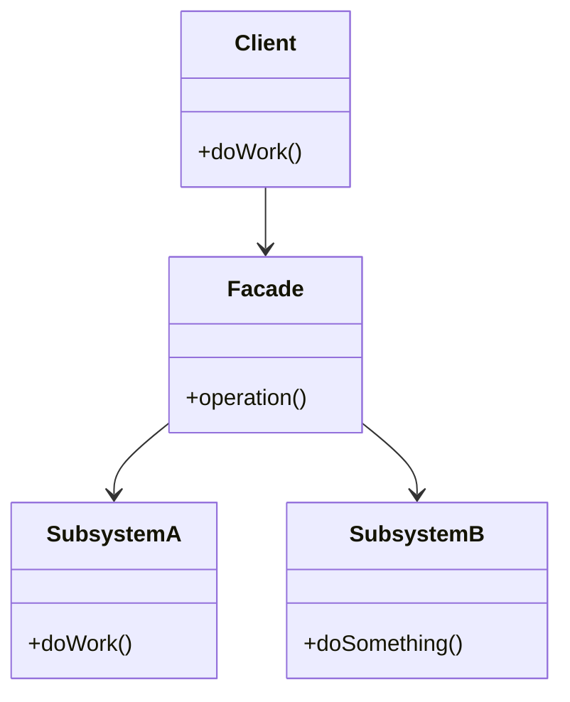

## 第2章 窓口を一本化する ―― Facade パターン

### この章の核心

**複雑な外部システムの仕様変更が、私たちのビジネスロジック全体に波及してしまう。それは、相手の「詳細な使い方」を私たちが直接知りすぎているからだ。**

---

### この章を読むと得られること

この章の痛みは「外部システムの詳細を、自社のコードが直接知りすぎている」問題です。

* **得られること1：** 「依存の広がり」という観点で、コードの波及範囲を識別できるようになる
* **得られること2：** 外部システムの詳細を知りすぎているクラスを見つけ、そこが変更に弱い接続点（変更の痛みの発生源）だと判断できるようになる
* **得られること3：** 複雑な呼び出し手順をカプセル化することで、クライアントコードをスッキリ保つ方法を説明できるようになる
* **得られること4：** 外部システムと自社システムの境界線（窓口）をどこに引くべきか判断できるようになる

---

## 🔵 フェーズ1：現状把握 ―― 仕様を整理し、システムと紐付ける

### 1-1：このシステムの仕様

このシステムは、ネット銀行の**振り込み処理を実行**します。

「振込先口座番号」「送金金額」を入力として受け取り、銀行のAPIを通じて以下の手順で振り込みを完了させます。

**振り込みの処理手順**

| 手順 | 処理内容 | 失敗した場合 |
|---|---|---|
| ① 口座確認 | 振込先口座が存在し有効であることを確認する | エラーで中止 |
| ② 残高確認 | 送金元の残高が十分あることを確認する | エラーで中止 |
| ③ OTP認証 | ワンタイムパスワードで本人確認を行う | エラーで中止 |
| ④ 送金実行 | 銀行APIへ送金指示を送信する | エラーで中止 |

この4つの手順は必ず順番通りに実行される必要があります。どこかで失敗すれば後続の手順は実行されません。

**このシステムの関係者**

| 役割 | 担当者 | 管轄する知識 |
|---|---|---|
| 振り込みシステム開発チーム | 自チーム | 振り込みの処理フロー全体 |
| 銀行側のシステム担当者 | 銀行API管理部門 | 口座確認・残高確認・送金APIの仕様 |
| 銀行側のセキュリティ担当者 | 銀行セキュリティ部門 | OTP認証の手順・認証方式 |

後のフェーズで「誰の判断で変わる知識か」を確認するとき、この関係者表が基準になります。

---

### 1-2：動作例テーブル

仕様を定義したところで、実際にどのような入力に対してどのような結果が返るかを確認します。このテーブルは「このシステムが正しく動いているとはどういう状態か」の基準になります。後で設計の改善（リファクタリング）を段階的に進めるときも、この表に立ち返ります。

| 振り込み先口座 | 送金金額 | 結果 | 適用ルール |
|---|---|---|---|
| 12345678（有効） | 5,000円（残高十分） | 振り込み完了 | 口座確認→残高確認→認証→送金 |
| 99999999（存在しない） | 5,000円 | エラー：口座なし | 口座確認で中止 |
| 12345678（有効） | 1,000,000円（残高不足） | エラー：残高不足 | 残高確認で中止 |
| 12345678（有効） | 5,000円（残高十分） | エラー：認証失敗 | 認証コード検証で中止 |
| 87654321（有効・バッチ） | 30,000円（残高十分） | 振り込み完了（OTP不要） | 口座確認→残高確認→送金（バッチ処理は事前に社内承認が完了しているため、OTPによる追加認証が不要） |

コードを読む前に、このシステムが「何をする必要があるか」をこの表で確認できました。次は「どのように実装されているか」を見ていきます。

---

### 1-3：クラス構成図

コードを読んだところで、クラス間の関係を図で整理します。



`BatchTransferProcessor` は `TransferProcessor` を使って一括処理を行い、`TransferProcessor` が `BankGateway` と `SecurityAuthenticator` の両方を直接保持し、それぞれのメソッドを順番に呼び出してフローを制御しています。

---

### 1-4：実装コード（現状）

#### このシステムの登場クラス

| クラス名 | 役割 | 担当する仕様 |
|---|---|---|
| TransferProcessor | 個別振り込みフロー進行 | 仕様全体 |
| BatchTransferProcessor | 一括振り込み（バッチ）進行 | 複数の振り込みの呼び出し |
| BankGateway | 銀行API通信 | 仕様①、②、④ |
| SecurityAuthenticator | 認証制御 | 仕様③ |

データの流れ：BatchTransferProcessor → TransferProcessor → BankGateway / SecurityAuthenticator → 外部API
この章で注目するポイント：振り込み業務の流れと、銀行APIの呼び出し手順がどのように結びついているか


#### 銀行システムと通信するクラス群

はじめに、銀行APIとの通信を担うクラスと認証を担うクラスを見てみます。

```cpp
#include <iostream>
#include <string>
#include <vector>
#include <utility>

// 銀行との通信を担うクラス
class BankGateway {
public:
    void handleAccountNotFoundError() {
        std::cout << "エラー: 口座なし\n";
    }
    void handleInsufficientBalanceError() {
        std::cout << "エラー: 残高不足\n";
    }
    bool verifyAccount(const std::string& account) {
        std::cout << "口座確認: " << account << "\n";
        if (account == "99999999") {
            handleAccountNotFoundError();
            return false;
        }
        return true;
    }
    bool checkBalance(int amount) {
        std::cout << "残高確認\n";
        if (amount > 100000) {
            handleInsufficientBalanceError();
            return false;
        }
        return true;
    }
    void executeTransfer(
            const std::string& /*account*/, int amount) {
        std::cout << "送金実行: " << amount << "円\n";
    }
};

// 認証を担うクラス
class SecurityAuthenticator {
public:
    void handleAuthenticationFailed() {
        std::cout << "エラー: 認証失敗\n";
    }
    void requestOTP() { std::cout << "認証コード発行\n"; }
    bool verifyOTP(const std::string& token) {
        std::cout << "認証コード検証\n";
        if (token == "INVALID") {
            handleAuthenticationFailed();
            return false;
        }
        return true;
    }
};
```

`BankGateway` と `SecurityAuthenticator` は、それぞれ銀行APIとの通信・認証の詳細を担う専門クラスです。

#### 振り込み処理クラス

次に、振り込みの全体フローを管理するクラスを見ます。

```cpp
// 振り込み処理クラス
class TransferProcessor {
private:
    BankGateway gateway;
    SecurityAuthenticator auth;
public:
    bool transfer(
        const std::string& toAccount, int amount,
        const std::string& otp) {
        // 銀行システムの複雑な手順を直接制御している
        if (!gateway.verifyAccount(toAccount)) return false;
        if (!gateway.checkBalance(amount)) return false;

        auth.requestOTP();
        if (!auth.verifyOTP(otp)) return false;

        gateway.executeTransfer(toAccount, amount);
        std::cout << "振り込み完了\n";
        return true;
    }

    bool transferApprovedBatch(
        const std::string& toAccount, int amount) {
        // 社内承認済みバッチ用。通常振込と手順が重複している
        if (!gateway.verifyAccount(toAccount)) return false;
        if (!gateway.checkBalance(amount)) return false;
        gateway.executeTransfer(toAccount, amount);
        std::cout << "振り込み完了（OTP不要）\n";
        return true;
    }
};

// 給与振り込みなどの一括処理バッチ（もう1つの呼び出し元）
class BatchTransferProcessor {
private:
    TransferProcessor processor;
public:
    void processPayroll(
            const std::vector<std::pair<std::string, int>>& transfers) {
        for (int i = 0; i < (int)transfers.size(); i++) {
            const std::string& account = transfers[i].first;
            int amount = transfers[i].second;
            processor.transferApprovedBatch(account, amount);
        }
    }
};
```

このクラス群が今章の中心です。`TransferProcessor` の二つのメソッドには、
「振り込みという業務フローの制御」と「銀行APIの具体的な呼び出し手順」が
一緒に書かれています。バッチではOTPを省略できますが、口座確認・残高確認・
送金という手順を通常振込とは別に記述しています。

#### 呼び出し元と実行確認

```cpp
int main() {
    TransferProcessor processor;

    std::cout << "--- 行1: 正常な個別振り込み ---\n";
    processor.transfer("12345678", 5000, "999999");

    std::cout << "--- 行2: 存在しない口座 ---\n";
    processor.transfer("99999999", 5000, "999999");

    std::cout << "--- 行3: 残高不足 ---\n";
    processor.transfer("12345678", 1000000, "999999");

    std::cout << "--- 行4: 認証失敗 ---\n";
    processor.transfer("12345678", 5000, "INVALID");

    std::cout << "--- 行5: 社内承認済みバッチ ---\n";
    BatchTransferProcessor batch;
    std::vector<std::pair<std::string, int>> payroll = {
        {"87654321", 30000}
    };
    batch.processPayroll(payroll);

    return 0;
}
```

上記コードの実行結果：

```
--- 行1: 正常な個別振り込み ---
口座確認: 12345678
残高確認
認証コード発行
認証コード検証
送金実行: 5000円
振り込み完了
--- 行2: 存在しない口座 ---
口座確認: 99999999
エラー: 口座なし
--- 行3: 残高不足 ---
口座確認: 12345678
残高確認
エラー: 残高不足
--- 行4: 認証失敗 ---
口座確認: 12345678
残高確認
認証コード発行
認証コード検証
エラー: 認証失敗
--- 行5: 社内承認済みバッチ ---
口座確認: 87654321
残高確認
送金実行: 30000円
振り込み完了（OTP不要）
```

動作例テーブルの全5行について、成功時の処理順、失敗時の中止位置、
バッチでOTPを実行しないことを確認できました。現状でも仕様は満たしています。

次のフェーズで変更が来たときに何が起きるかを確認します。

---

### 1-5：変更要求

ある月曜日の朝、銀行のシステム担当者から緊急の連絡が入りました。

「来月から、銀行APIの認証仕様が大幅に変わります。これまでは単一のOTP（ワンタイムパスワード）認証だけで十分でしたが、今後は、はじめに『認証コードの発行』をリクエストし、その応答で返る『取引ID』とあわせて検証する必要があります。」

さらに、これに続いて「銀行側の送金APIのインターフェースもセキュリティ強化のため、送金時のパラメータに『トランザクションID』が必須になります」とのこと。

リリースは来月の頭。

**仕様変更の内容**

変更要求を受けて、認証と送金の手順がどう変わるかを整理します。（これらの変更はすべて「銀行側のシステム担当者・セキュリティ担当者」の判断で発生した要求です）


| 手順 | 変更前 | 変更後 |
|---|---|---|
| ① 口座確認 | 変更なし | 変更なし |
| ② 残高確認 | 変更なし | 変更なし |
| **③ 認証** | OTP（ワンタイムパスワード）1ステップで完了 | **「認証コードの発行」→「取引IDと認証コードの照合」の2ステップに変更** |
| **④ 送金実行** | 振込先口座と金額だけを指定して送金 | **「トランザクションID」が必須パラメータとして追加** |

現行の認証では発行と検証の間に識別子を受け渡していませんでした。新仕様では `requestOTP()` の応答から取引IDを受け取り、`verifyOTP(authCode, transactionId)` で検証します。検証済みの同じ取引IDを、`executeTransfer(account, amount, transactionId)` にも渡します。

フェーズ1でシステムの現状と変更要求が把握できました。次のフェーズ2では、「何が変わり、何が変わらないか」を整理します。

---

## 🟣 フェーズ2：仮説立案 ―― 何が変わるかを観察し、ヒアリングで裏付ける

### 2-1：変わりそうな仕様の見当をつける

フェーズ1の仕様表を振り返ります。振り込み処理の各ステップのうち、特に変化が予想される仕様があります。

- **OTP認証の手順**：セキュリティ要件は年々厳格化する傾向があり、認証方式が変わることは業界全体で一般的です
- **送金APIのパラメータ**：銀行の決済基幹システムは更新されることがあり、インターフェース変更が起きる可能性があります

一方、「口座確認→残高確認→認証→送金」という振り込みの処理フロー自体は、銀行の送金業務として安定した手順です。

**仮説：銀行APIの認証仕様や送金パラメータは、今後も変更される可能性がある。**

この仮説をヒアリングで確認します。

### 2-2：今回の変更で確実に変わること

今回の変更要求から確定している変更は2点です。

- **銀行APIの認証手順の変更**：OTP1ステップから、認証コード発行＋取引IDとの照合という2ステップに変更される
- **送金APIのパラメータ追加**：送金時にトランザクションIDが必須になる

ただし「この変更が1回限りか、今後も続くか」によって、どこまで設計を変えるべきかが大きく変わります。関係者に確認します。

### ヒアリングに向けた背景確認

このシステムは、あるネット銀行の振り込み処理を自動化するためのものです。銀行のシステムは非常に堅牢で、安全に送金を行うために、口座情報の確認、残高チェック、手数料の計算、そして実際の送金指示という、いくつもの手順を正しい順番で実行する必要があります。

開発チームは、この銀行のAPIを直接叩いて振り込みを行うプログラムをメンテナンスしています。当初は単純な送金機能だけでしたが、最近では、振り込み先に応じた送金限度額の確認や、二要素認証の呼び出しなど、銀行側から求められるセキュリティ要件が年々厳しくなってきました。

### 2-2：関係者ヒアリング

> **現実のヒアリングでは——** 本書のヒアリングシーンでは設計判断を明確にするため、意図的に「理想的な回答」が返ってくるように描いています。これはシミュレーションです。現実には、「変わるかどうか分からない」「たぶん変わらない」という曖昧な答えが返ることも多いです。そのときは `git log` や過去の障害記録を「ヒアリングの代わり」として使ってみてください。「過去に何度変わったか」が最も正直な証拠です。

今回の変更が一時的なものか、将来も続くリスクがあるのかを確認するため、銀行のAPI担当者にヒアリングを行いました。

- **開発者：** 「認証の仕様が変わるとのことですが、今回の変更は一時的なものでしょうか？今後、さらに認証方式が増える予定はありますか？」
- **銀行API担当者：** 「申し訳ありませんが、セキュリティ強化の波は止まりません。数ヶ月後には、生体認証を導入する予定もあります。今後も認証手順はさらに複雑になる可能性が高いです。」
- **開発者：** 「なるほど。送金APIについても、今後パラメータが増えたり、呼び出し順序が変わったりすることは考えられますか？」
- **銀行API担当者：** 「ええ、来年以降には、さらに上位のトランザクション管理システムと連携するため、送金時のリクエスト形式が現在のJSONからXMLへ移行する計画もあります。」
- **開発者：** 「分かりました。かなり頻繁に接続仕様が変わりそうですね。今回の認証フローの変更についても、将来的にさらに手順が増えるリスクはありますか？」
- **銀行API担当者：** 「おっしゃる通りです。現在は二段階認証ですが、将来的には三段階になるかもしれません。現時点での固定的な手順に縛られない設計にしておいた方が、お互いのためかもしれませんね。」

### 2-2：ヒアリングで判明した将来リスク

ヒアリングで浮かび上がった「確定ではないが、近い将来起こりうる変化」を記録します。これは今回の設計判断の材料です。

| **将来リスク** | **時期の目安** | **根拠** |
|---|---|---|
| 認証フローの多段階化（二段階→三段階認証） | 銀行側のセキュリティ強化時 | 銀行API担当者との確認 |
| 送金リクエスト形式の変更（JSON→XML移行計画） | 来年以降の基幹システム連携時 | 銀行API担当者との確認 |
| 生体認証の導入 | 数ヶ月後の予定 | 銀行API担当者との確認 |

### 将来の変更仕様の見通し

ヒアリングで判明した将来変更を踏まえ、「生体認証の導入（数ヶ月後）」が実際に届いた場合、振り込み認証仕様がどう変わるかを整理しておきます。

| 認証ステップ | 現在（変更後） | 将来（数ヶ月後）|
|---|---|---|
| ①OTP発行 | requestOTP() → txId取得 | 変更なし |
| ②OTP検証 | verifyOTP(otp, txId) | 変更なし |
| **③生体認証（将来）** | —（なし） | **verifyBiometric(token) + confirmBiometricLink(txId)** |
| ④送金実行 | executeTransfer(to, amount, txId) | 変更なし（ただしtxId連携が変わる可能性） |

認証ステップが増えるたびに `TransferProcessor` 内の手順管理が複雑になります。この変更が来たとき、現在の構造でどう対応するかをフェーズ3で確認します。

フェーズ2で「今変わること（確定）」と「将来変わるかもしれないこと（リスク）」を分けて整理できました。次のフェーズ3では、現在の構造で変更を試みたときに何が起きるかを確認します。

---

## 🟣 フェーズ3：問題特定 ―― 変更の痛みを発見する

### 3-1：変更を試みる

「銀行APIの認証フロー変更（発行と検証の2段階化）」と「送金時のトランザクションID付与」を、現在の `TransferProcessor` クラスの `transfer` メソッドに直接書き込む作業を試みてみましょう。変更前のコードはこうでした。

```cpp
gateway.verifyAccount(toAccount);
gateway.checkBalance(amount);

auth.requestOTP();
auth.verifyOTP(otp);

gateway.executeTransfer(toAccount, amount);
```

このコードに今回の変更を適用すると、以下のようになります。

```cpp
void transfer(
        const std::string& toAccount, int amount,
        const std::string& otp) {
    gateway.verifyAccount(toAccount);
    gateway.checkBalance(amount);

    // 【痛み：認証の手順が変わる】
    // 既存のコードを書き換える必要がある
    // 認証コードの発行応答から取引IDを受け取る
    std::string transactionId = auth.requestOTP();
    // 検証時に取引IDを渡す必要がある
    auth.verifyOTP(otp, transactionId);

    // 【痛み：送金APIの仕様が変わる】
    // 認証済みの取引IDを送金APIにも渡す
    gateway.executeTransfer(toAccount, amount, transactionId);

    std::cout << "振り込み完了\n";
}
```

変更後のコードを実行すると、次のような結果になります。

```cpp
// 動作確認用のスタブ（変更後の実行を確認）
struct Auth {
    std::string requestOTP() {
        std::cout << "OTP発行 → 取引ID取得" << std::endl;
        return "TX-9001";
    }
    void verifyOTP(const std::string& otp,
                   const std::string& txId) {
        std::cout << "OTP検証（txId=" << txId
                  << "）" << std::endl;
    }
};

struct Gateway {
    void verifyAccount(const std::string& to) {
        std::cout << "口座確認: " << to << std::endl;
    }
    void checkBalance(int amount) {
        std::cout << "残高確認: " << amount << " 円"
                  << std::endl;
    }
    void executeTransfer(const std::string& to,
                         int amount,
                         const std::string& txId) {
        std::cout << "送金: " << to << " / "
                  << amount << " 円（txId="
                  << txId << "）" << std::endl;
    }
};

int main() {
    Auth auth;
    Gateway gateway;
    gateway.verifyAccount("987-654321");
    gateway.checkBalance(50000);
    std::string txId = auth.requestOTP();
    auth.verifyOTP("123456", txId);
    gateway.executeTransfer("987-654321", 50000, txId);
    std::cout << "振り込み完了" << std::endl;
    return 0;
}
```

実行結果：

```
口座確認: 987-654321
残高確認: 50000 円
OTP発行 → 取引ID取得
OTP検証（txId=TX-9001）
送金: 987-654321 / 50000 円（txId=TX-9001）
振り込み完了
```

コード自体は正しく動いていますが、`transactionId` という一時的な状態が `transfer` メソッドの中を流れていることが分かります。

この変更を試みたとき、はじめに気づくのは `TransferProcessor` クラスが「銀行APIの細かな使い方」をあまりにも詳細に知りすぎているという点です。認証のステップが増えただけでメソッドのシグネチャを追いかける必要があり、ロジックの修正が連鎖的に発生してしまいます。

「振り込みを実行する」という業務上の命令を処理しているはずの `TransferProcessor` が、銀行システム側から送られてくる「取引IDを保持する」といった一時的な状態管理まで背負わされています。銀行側のAPI仕様が一つ変わるたびに、私たちの業務フローを制御するクラスのコードを書き換え、その結果、振り込み処理全体のテストをやり直さなければならないのです。

さらに、ヒアリングで予告された「生体認証の導入」も視野に入れると、`transfer()` の引数にバイオメトリクストークンが増え、`verifyBiometric()` と `confirmBiometricLink()` といった認証ステップが同じメソッドにさらに積み重なることが見えてきます。ヒアリング段階ではまだ仕様が固まっていないため全コードを書ける状況ではありませんが、認証手順が増えるたびに `TransferProcessor` の手順管理が肥大化する構造は変わりません。

### 3-2：変更影響グラフ



このグラフを見ると、銀行APIの仕様という「外部システム都合の変更」が、私たちの業務フローの中枢である `TransferProcessor` を経由して、通信クラスや認証クラス全体に飛び火していることが分かります。

> **グラフの読み方：** この矢印は「フェーズ3で実際に変更したクラス」ではなく、「変更要求が来たときに影響が波及するリスクのある依存関係」を示しています。`TransferProcessor` が `BankGateway` と `SecurityAuthenticator` を直接知っているため、銀行APIの仕様が変わると `TransferProcessor` を経由して両クラスへの影響が及ぶ可能性があることを可視化しています。

### 3-3：痛みの言語化

**1つ目：仕様変更の波が業務ロジックに直撃する恐怖。** 今回の認証フローの変更は、本来であれば「振り込み」という業務プロセスには影響しないはずのものです。しかし、今の構造では、銀行APIという「外部システムの使い方」を `TransferProcessor` が直接知っているため、APIの引数が増えたり手順が変わったりするたびに、業務フローを記述している核心部分を書き換える羽目になります。

**2つ目：目的が見えなくなる複雑化。** コードを見れば、口座確認、残高確認、認証発行、検証、送金実行と、手続きが淡々と並んでいます。しかし、新しい仕様に対応するために一時的なIDを保持したり、条件分岐を足したりすることで、コードは「何のために振り込んでいるのか」という業務上の目的よりも、「銀行のAPIにどうやって命令を通すか」という技術的な手順の記述で埋め尽くされてしまいます。

---
> **📌 問題（確定）**
> 振り込み処理の認証手順や送金パラメータが変わるたびに、業務フローを管理する `TransferProcessor` のコードを直接書き換えなければならない。変わる理由が異なるコードが同じ場所に混在しているため、銀行API側の仕様変更が振り込み業務ロジック全体に波及し、影響範囲が読めない。
---

フェーズ3で「変更が辛い」ことが確認できました。次のフェーズ4では、なぜ辛いのかを構造的に言語化します。

---

## 🟠 フェーズ4：原因分析 ―― なぜ辛いのかを構造で言語化する

### 4-1：痛みの根源を探る（観察と原因）

フェーズ3で確認した「変更の辛さ」は、コードのどこから来ているのでしょうか。コードを注意深く観察すると、痛みを引き起こしている2つの事実が浮かび上がってきます。

第一に、新しい認証ステップが追加されたとき、なぜ毎回 `TransferProcessor` を開かなければならないのでしょうか？
それは、このクラス自身が「`auth.requestOTP()` を呼んで、取引IDを取得して、`auth.verifyOTP()` を呼ぶ」といった**銀行APIの具体的な呼び出し手順をすべて直接知ってしまっている（抱え込んでいる）**からです。

第二に、なぜ変更の影響範囲が読めず、振り込み全体のテストをやり直す恐怖を感じるのでしょうか？
それは、「振り込みという業務プロセスの進行」という責任と、「銀行APIという外部システムの技術的な利用手順」という責任が、**同じメソッドの中で物理的に混ざり合っている**からです。

この「症状（痛み）」と「根本原因」を整理すると、以下のようになります。

| **観察した症状（痛み）** | **構造的な原因（痛みの根源）** |
|---|---|
| 仕様変更の波が業務ロジックに直撃する | `TransferProcessor` が銀行APIの具体的な呼び出し手順を直接知っているから |
| 複雑化して目的が見えなくなる | 変わる理由が違う2つのもの（「振り込み業務のフロー」と「銀行APIの技術手順」）が同じメソッドの中に混在しているから |

### 4-2：変わるもの/変わってほしくないもの

> **「変わらないもの」と「変わってほしくないもの」は異なります。** 「変わらないもの」は経験的事実（今まで変わっていない）、「変わってほしくないもの」は設計意図（ここを安定させてほかを守りたい）です。ここで整理するのは後者です。

| **変わり続けるもの（外部システムの詳細）** | **変わってほしくないもの（業務フローの骨格）** |
|---|---|
| 銀行APIの認証手順（発行・検証のステップ） | 振り込みの全体フロー（口座確認→残高確認→送金） |
| 送金APIのパラメータ（IDの追加や型変更） | 振り込みという業務上の目的 |

**【変わる部分（外部システムの技術詳細）】**
```cpp
        // ← 銀行側の都合で変わり続ける部分
        std::string transactionId = auth.requestOTP();
        auth.verifyOTP(otp, transactionId);
        gateway.executeTransfer(toAccount, amount, transactionId);
```

**【変わらない部分（業務フローの不変の骨格）】**
```cpp
        // ← 振り込みという業務の意図は変わらない
        // （口座を確認する）
        // （認証する）
        // （送金を実行する）
        std::cout << "振り込み完了\n";
```

### 4-3：接続点に漏れている手順を確認する

現在、`TransferProcessor`は銀行APIのクラス名だけでなく、口座確認・認証・送金・確認という呼び出し順序まで知っています。接続点で必要なのは「振込を依頼し、結果を受け取ること」ですが、外部APIの技術的な手順が業務側へ漏れています。

現在の `TransferProcessor` は、銀行APIという「特定の機器」に対して、専用のケーブルを直に配線しているような状態です。

**【銀行APIの手順が呼び出し元へ漏れているコード】**
```cpp
class TransferProcessor {
private:
    BankGateway gateway;         // ← 具体：型名を直接宣言
    SecurityAuthenticator auth;  // ← 具体：型名を直接宣言
public:
    void transfer(...) {
        // ← 直接：各APIメソッドを窓口なしに直接順に呼び出す
        gateway.verifyAccount(toAccount);
        auth.requestOTP();
        // gateway.executeTransfer(fromAccount, toAccount, amount);
        // gateway.confirmTransaction(); など送金実行処理が直接続く
    }
};
```

銀行側の認証方式や送金パラメータが変わるたびに、業務フローを持つ`TransferProcessor`まで修正する必要があります。

「振り込み業務」と「銀行APIの仕様」は、変わる理由が全く異なります。これらが同じ場所に混在していることが、根本原因として確認できました。

今回着目する接続点は、「振込依頼」と「振込結果」の境界です。銀行APIの手順は、その境界の向こう側へ移せます。

---
> **📌 原因（確定）**
> `TransferProcessor`が銀行APIの呼び出し順序を抱え込んでいるため、外部システムの都合で変わる知識と、振込業務のフローが同じクラスに混在している。
---

フェーズ4で根本原因が言語化できました。「どこを分けるか」は明確です。次のフェーズ5では、その境界で実際に何が流れているかを値・型のレベルで具体化し、「何が変わり、何が変わらないか」を明確にします。

---

## 🟡 フェーズ5：課題定義 ―― 接続点で何が流れているかを見る

フェーズ4は「なぜ辛いか」を答えました。フェーズ5が問うのは「分けるべき境界で、実際に何が流れているか」です。クラスの参照関係ではなく、**値・型のレベル**に降りていきます。

フェーズ4の分析により、問題は「振り込み業務のフロー」と「銀行APIの技術的な呼び出し手順」が混在していることだと分かりました。その境界で何がやり取りされているかを具体化します。

### 接続点を特定する

`transfer()` の中で分けるべき境界は1か所です。銀行APIの呼び出し手順と、業務フローとの間で受け渡しているデータを見ます。

```cpp
void transfer(
        const std::string& toAccount, int amount,
        const std::string& otp) {

    // ↓ 銀行APIの呼び出し手順（変わり続ける）
    gateway.verifyAccount(toAccount);
    gateway.checkBalance(amount);
    std::string transactionId = auth.requestOTP();
    auth.verifyOTP(otp, transactionId);
    gateway.executeTransfer(toAccount, amount, transactionId);
    // ↑ ここまでが分離するターゲット

    std::cout << "振り込み完了\n"; // ← 変わらない骨格
}
```

「銀行API呼び出し群」が受け取るのは振り込み先・金額・OTPです。内部では認証応答の取引IDを検証と送金へ引き継ぎます。完了は副作用（void）で表現されます。

| 接続点 | 接続するデータ | 変わるもの |
|---|---|---|
| 銀行API群 → 通常振込の骨格 | toAccount（string）・amount（int）・otp（string）→ 完了（void） | APIの呼び出し手順・実装詳細 |

### 何が変わり、何が変わらないか

- **変わるもの**：銀行APIの呼び出し手順（gateway/auth のメソッド群・順序・パラメータ）。外部システムの仕様変更のたびに内部が変わる。
- **比較的安定しているもの**：通常振込という業務上の操作、および口座・金額・認証コードという入力。外部API内の取引ID受け渡しは窓口の外へ見せない。

呼び出し元（`TransferProcessor` 等）が知る必要があるのは、口座・金額・OTPを窓口へ渡す方法です。問題は「どのAPIをどの順番でどう呼ぶか」という**外部連携の手順**まで呼び出し元へ漏れていることです。

**現状のままでよい場面**：銀行APIの手順が単純で、当面変更されず、利用箇所も1か所だけなら現状を保つ判断もあります。今回は認証と送金手順の変更が続くため、呼び出し元から手順を隠す窓口を検討します。

### 変わるものを一緒に分離するか、分けて分離するか

「銀行APIの呼び出し手順を分離する」と決めたとき、次に考えることがあります。認証（`SecurityAuthenticator`）と送金（`BankGateway`）を**別々の窓口に分けるか、1つの窓口にまとめるか**です。

フェーズ4の分析で確認したように、認証フローと送金APIはどちらも同じ銀行ベンダーのAPI仕様に従って変わります。生体認証の導入や形式変更は、認証だけでなく送金フローにも連動して影響を与えます。2つを別々に管理すると、1つのAPI変更でも両方の窓口を修正しなければならない状況が生まれます。

**変わる理由が同じ（同じ外部ベンダーの都合）→ 1つの窓口にまとめる。** これが今回の粒度の判断です。

認証と送金をまとめて1つの `BankTransferFacade` として扱うことで、銀行API側の変更を窓口の内側に閉じ込めます。`TransferProcessor` はこの窓口だけを知れば十分になります。この構造がフェーズ6での設計方針になります。

---
> **📌 課題（確定）**
> ヒアリングで確認した認証フローや送金仕様の変更に備えるには、`TransferProcessor` が外部APIの呼び出し手順を直接知り続ける構造では変更箇所が広がりやすい。銀行APIの具体的な呼び出し手順を窓口の内側へまとめ、`TransferProcessor` からは安定したインターフェース越しに処理を委譲できる構造に変える。
---

## 🔴 フェーズ6：対策検討 ―― 段階的な改善と決断

フェーズ5で「変わるのは銀行APIの呼び出し手順であり、業務フローが窓口へ渡す引数の型は比較的安定している」ことが分かりました。ここでは、その手順をどのように窓口の内側へ閉じ込めるかを段階的に検討します。いきなり正解へ飛ぶのではなく、各ステップで「どこまで痛みが解消されるか」を確認しながら、今回の要件において「どのステップで止めるべきか」を決断します。

### ステップ1：呼び出し元でヘルパーメソッドに切り出す（同じクラスの中で整理する）

「API呼び出しが複雑に絡み合っているなら、意味のある単位でメソッドに切り出して整理しよう」というのが自然な最初の発想です。クラスを新しく作るのはコストがかかる。`TransferProcessor` の中で、各手順を意味のある単位にまとめてみます。

```cpp
class TransferProcessor {
    BankGateway gateway;
    SecurityAuthenticator auth;

    // 口座の確認手順をまとめる
    void checkAccount(const std::string& account, int amount) {
        gateway.verifyAccount(account);
        gateway.checkBalance(amount);
    }

    // 認証手順をまとめる
    std::string authenticate(const std::string& otp) {
        std::string txId = auth.requestOTP();
        auth.verifyOTP(otp, txId);
        return txId;
    }

    // 送金手順をまとめる
    void sendMoney(const std::string& account, int amount,
                   const std::string& txId) {
        gateway.executeTransfer(account, amount, txId);
    }

public:
    void transfer(
            const std::string& toAccount, int amount,
            const std::string& otp) {
        checkAccount(toAccount, amount);  // ← 手順の意図が読めるようになった
        std::string txId = authenticate(otp);
        sendMoney(toAccount, amount, txId);
        std::cout << "振り込み完了\n";
    }
};
```

`transfer()` の本文が「振り込みの手順」として読めるようになり、各ステップの意図が伝わるようになった。

**この段階の評価：** `transfer()` は格段に読みやすくなりました。しかし `checkAccount()`・`authenticate()`・`sendMoney()` はすべて TransferProcessor クラスの内部にあります。銀行側の認証仕様が変わるたびに、結局はこの TransferProcessor を開いて書き直す必要があるのではないでしょうか。呼び出し元がきれいになったが、銀行APIの手順という知識は呼び出し元に残ったままです。

私が試みるのは、いきなりクラスを分けることではなく、まずはこのように処理を関数に切り出すことです。やってみると、それでも同じクラスの中に知識が残り続けることに気づき、クラスを分けるという発想に至ります。

これを外に出すために「専用のクラスを作る」方向を試してみましょう。

---

### ステップ2：銀行API手順を専用の窓口へ集約する（銀行操作の窓口クラス）

「銀行APIとのやり取りをすべて別のクラスに任せてしまえば、`TransferProcessor` は呼ぶだけでよくなる」という発想です。手順全体を担当するクラスを新しく作り、呼び出し元はそのクラスを1つ呼ぶだけにします。

```cpp
// 銀行APIとのやり取りをすべて担う専用の窓口（銀行操作の窓口クラス）
class BankTransferHelper {
    BankGateway gateway;         // ← 具体クラスを直接保持
    SecurityAuthenticator auth;  // ← 具体クラスを直接保持
public:
    void execute(const std::string& account, int amount,
                 const std::string& otp) {
        // 複雑な手順はすべてここに集まる
        gateway.verifyAccount(account);
        gateway.checkBalance(amount);
        std::string txId = auth.requestOTP();
        auth.verifyOTP(otp, txId);
        gateway.executeTransfer(account, amount, txId);
    }

    void executeApprovedBatch(const std::string& account, int amount) {
        gateway.verifyAccount(account);
        gateway.checkBalance(amount);
        gateway.executeTransfer(account, amount, "APPROVED-BATCH");
    }
};

// 振り込み処理クラス（呼び出し元1）
class TransferProcessor {
    BankTransferHelper* helper; // ← 具体クラスを直接知っている
public:
    TransferProcessor(BankTransferHelper* h) : helper(h) {}
    void transfer(const std::string& toAccount, int amount,
                  const std::string& otp) {
        helper->execute(toAccount, amount, otp); // 1行に集約された
        std::cout << "振り込み完了\n";
    }
};

// 給与振り込みなどの一括処理バッチ（呼び出し元2）
class BatchTransferProcessor {
    BankTransferHelper* helper; // ← 同じ具体クラスをここでも直接保持
public:
    BatchTransferProcessor(BankTransferHelper* h) : helper(h) {}
    void processPayroll(
            const std::vector<std::pair<std::string, int>>& transfers) {
        for (int i = 0; i < (int)transfers.size(); i++) {
            const std::string& account = transfers[i].first;
            int amount = transfers[i].second;
            helper->executeApprovedBatch(account, amount);
        }
    }
};
```

`TransferProcessor` も `BatchTransferProcessor` も `helper->execute()` の1行を呼ぶだけになり、呼び出し元は大幅にシンプルになった。

**この段階の評価：** 呼び出し元はシンプルになり、銀行APIの複雑な手順が `BankTransferHelper` に集まりました。これはすでに単一の窓口クラスとしての基本形です。`BankTransferHelper` の公開メソッドを保ったまま内部のAPI呼び出しを変える限り、`TransferProcessor` と `BatchTransferProcessor` の修正は不要です。

一方、呼び出し元は具体型 `BankTransferHelper` に依存しています。別銀行向けの実装やテスト用の偽物へ差し替えたい場合、または業務側が所有する安定した契約を明示したい場合には、抽象インターフェースを追加する価値があります。次のステップは窓口クラスを完成させるためではなく、**窓口の差し替え可能性とテスト容易性を追加するため**の設計です。

---

### ステップ3：窓口クラスの前に抽象インターフェースを置く

「呼び出し元には業務側が所有する抽象インターフェースを見せ、具体的な窓口クラスを組み立て時に注入しよう」という発想です。窓口クラスは `BankTransferService` であり、`IBankTransferService` はその差し替えを可能にする契約です。

```cpp
// 業務フロー側に見せる窓口（インターフェース）
class IBankTransferService {
public:
    virtual void performTransfer(
        const std::string& account, int amount,
        const std::string& otp) = 0;
    virtual void performApprovedBatchTransfer(
        const std::string& account, int amount) = 0;
    virtual ~IBankTransferService() = default;
};

// 銀行との複雑なやり取りをすべて隠蔽する窓口クラス（Facade）
class BankTransferService : public IBankTransferService {
    BankGateway gateway;         // ← サブシステムは窓口の内側に隠れる
    SecurityAuthenticator auth;  // ← サブシステムは窓口の内側に隠れる
public:
    void performTransfer(
            const std::string& account, int amount,
            const std::string& otp) override {
        // 複雑な手順はすべてこの窓口の中に閉じる
        gateway.verifyAccount(account);
        gateway.checkBalance(amount);
        std::string txId = auth.requestOTP();
        auth.verifyOTP(otp, txId);
        gateway.executeTransfer(account, amount, txId);
    }

    void performApprovedBatchTransfer(
            const std::string& account, int amount) override {
        gateway.verifyAccount(account);
        gateway.checkBalance(amount);
        // 実際には事前承認処理が発行した取引IDを受け取る
        gateway.executeTransfer(account, amount, "APPROVED-BATCH");
    }
};

// 振り込み処理クラス：銀行の仕様を一切知らなくてよい
class TransferProcessor {
private:
    IBankTransferService* facade; // ← 抽象型だけを知る
public:
    TransferProcessor(IBankTransferService* f) : facade(f) {}
    void transfer(
            const std::string& toAccount, int amount,
            const std::string& otp) {
        facade->performTransfer(toAccount, amount, otp);
        std::cout << "振り込み完了\n";
    }
};

// 給与振り込みなどの一括処理バッチ
class BatchTransferProcessor {
private:
    IBankTransferService* facade; // ← 同じ抽象型を共有する
public:
    BatchTransferProcessor(IBankTransferService* f) : facade(f) {}
    void processPayroll(
            const std::vector<std::pair<std::string, int>>& transfers) {
        for (int i = 0; i < (int)transfers.size(); i++) {
            const std::string& account = transfers[i].first;
            int amount = transfers[i].second;
            facade->performApprovedBatchTransfer(account, amount);
        }
    }
};

// ─── 呼び出し側のコード（依存性の注入） ───
int main() {
    // 具体クラス名を知っているのはここだけ
    BankTransferService facade;
    TransferProcessor processor(&facade);
    processor.transfer("12345678", 5000, "999999");
    return 0;
}
```

> [!INFO] 生ポインタの使用について
> このサンプルでは依存性の注入を示すため、生ポインタ（`IBankTransferService* facade`）を使用しています。本書では全章を通じて生ポインタを使い、所有権の議論よりも構造の変化に集中します。

`TransferProcessor` は `BankGateway` や `SecurityAuthenticator` という具体クラスを直接参照せず、窓口となる `IBankTransferService* facade` だけを知る状態になりました。

**この段階の評価：** `TransferProcessor` と `BatchTransferProcessor` は、銀行APIの具体的な呼び出し順序を知らず、窓口へ必要な値を渡すだけになりました。認証手順など窓口の内側の変更は `BankTransferService` へ局所化できます。一方、送金パラメータや戻り値など窓口の契約自体が変わる場合は、インターフェースと呼び出し元の変更も必要です。この構造は、安定させたい窓口と変わりやすい内部手順の境界を作る設計です。

---

### どこまで設計を進めるのが良いか（採用ステップの決断）

それぞれのステップには一長一短があります。ステップ3のインターフェース化は強力ですが、ファイル数や型が増えるという「初期投資コスト」もかかります。どこで止めるかは、**「今後の変更頻度（ビジネス要求）」**で決断します。

*   **ステップ1（ヘルパーメソッド化）で止めるケース：** 「銀行APIの仕様変更が過去5年で一度も起きていない」場合。現在のコードを整理するだけで十分です。
*   **ステップ2（具体的な窓口クラスへの集約）で止めるケース：** 呼び出し元から複雑な手順を隠すことが目的で、窓口実装の差し替えやテスト用実装が不要な場合。内部APIの変更は、この段階でも窓口クラス内へ集約できます。
*   **ステップ3（窓口クラスの抽象化）まで進むケース：** 別銀行向け実装への差し替え、外部通信を行わない単体テスト、複数の呼び出し元で共有する安定契約が必要な場合。インターフェース導入のコストを払う根拠は、外部APIの変更頻度だけではなく、窓口を交換する必要性です。

**今回の決断：**
フェーズ2のヒアリングで、銀行APIの変更が続くと確認できたため、まず具体的な窓口クラスへの集約が必要です。さらに本章には通常振込と給与バッチという複数の呼び出し元があり、外部通信を切り離した単体テストにも価値があります。そこで今回は、具体的な窓口クラスに加えて**ステップ3（窓口インターフェースの導入）まで進める**案を採用します。

フェーズ6で採用ステップが決まりました。次のフェーズ7では、この決断を最終的なコードに落とし込みます。

## 🟢 フェーズ7：対策実施 ―― 変化に強いコードを完成させる

### 7-1：解決後のコード（全体）

ステップ3で決断した構造を、実行可能な完全なコードとして組み上げます。各役割ごとにコードを分けて見ていきましょう。

**1. サブシステム群（銀行APIと認証）**
銀行との通信を担うクラスと認証クラスです。今後も銀行側の仕様変更に応じて変わり続けるクラスですが、それを `TransferProcessor` は知らなくてよくなります。

```cpp
#include <iostream>
#include <string>
#include <vector>

// 銀行との通信を担うクラス（サブシステム1）
class BankGateway {
public:
    void verifyAccount(const std::string& account) {
        std::cout << "口座確認: " << account << "\n";
    }
    void checkBalance(int /*amount*/) {
        std::cout << "残高確認\n";
    }
    void executeTransfer(const std::string& account, int amount,
                         const std::string& txId) {
        (void)account;
        (void)txId;
        std::cout << "送金実行: " << amount << "円\n";
    }
};

// 認証を担うクラス（サブシステム2）
class SecurityAuthenticator {
public:
    std::string requestOTP() {
        std::cout << "認証コード発行\n";
        return "TXN12345"; // 銀行APIの応答で返る取引ID
    }
    void verifyOTP(const std::string& token,
                   const std::string& txId) {
        (void)token;
        (void)txId;
        std::cout << "認証コード検証\n";
    }
};
```

**2. 窓口となるインターフェースとFacade実装**
業務フロー側に見せる窓口インターフェースと、銀行APIの複雑な手順を隠蔽するFacade実装です。契約が保たれる別実装やテスト用実装は、組み立て箇所で差し替えられます。

```cpp
// 業務フロー側に見せる窓口（インターフェース）
class IBankTransferService {
public:
    virtual void performTransfer(
        const std::string& account, int amount,
        const std::string& otp) = 0;
    virtual ~IBankTransferService() = default;
};

// 銀行との複雑なやり取りをすべて隠蔽する窓口クラス（Facade）
class BankTransferService : public IBankTransferService {
private:
    BankGateway gateway;
    SecurityAuthenticator auth;
public:
    void performTransfer(
            const std::string& account, int amount,
            const std::string& otp) override {
        // 複雑な手順はすべてこの窓口の中に閉じる
        gateway.verifyAccount(account);
        gateway.checkBalance(amount);
        std::string txId = auth.requestOTP();
        auth.verifyOTP(otp, txId);
        gateway.executeTransfer(account, amount, txId);
    }
};
```

**3. 本体クラス（コンテキスト）**
振り込みという業務フローを担うクラスです。具体的なAPIの呼び出し手順を知らず、インターフェースだけを通じて処理を委譲します。銀行APIへの依存自体が消えるのではなく、Facadeの背後へ間接化され、業務クラスから技術的な手順が見えなくなります。

```cpp
// 振り込み処理クラス：銀行の仕様を一切知らなくてよい
class TransferProcessor {
private:
    IBankTransferService* facade;
public:
    TransferProcessor(IBankTransferService* f) : facade(f) {}
    void transfer(
            const std::string& toAccount, int amount,
            const std::string& otp) {
        // 振り込みという業務プロセスに集中できる
        facade->performTransfer(toAccount, amount, otp);
        std::cout << "振り込み完了\n";
    }
};

// 4. 組み立てと実行（メイン関数）
// 最後に、必要な部品を組み立てて実行します。具体的なクラス名（`BankTransferService`）を知っているのは、この組み立てを行う箇所だけです。

// 依存の組み立てを担うクラス（Composition Root）
class Application {
public:
    void run() {
        BankTransferService facade;
        TransferProcessor processor(&facade);

        processor.transfer("12345678", 5000, "999999");
    }
};

int main() {
    Application app;
    app.run();
    return 0;
}
```

上記コードの実行結果：

```
口座確認: 12345678
残高確認
認証コード発行
認証コード検証
送金実行: 5000円
振り込み完了
```

動作例テーブルの行1（12345678 / 5,000円 → 振り込み完了）の動作を確認しました。行2〜4（口座なし・残高不足・認証失敗）は本番実装では各サブシステムがエラーを返すことで対応します。`TransferProcessor` は `BankGateway` や `SecurityAuthenticator` を直接参照せず、`IBankTransferService` という窓口に依存する形へ変わりました。

### 7-2：動作シーケンス図

具体Facadeに抽象インターフェースを加えた最終構造の、実行時のオブジェクト間のやり取りを可視化します。`Application` が依存関係を組み立て、`TransferProcessor` が具象クラスを知らずに抽象インターフェース経由で処理を委譲する流れが確認できます。



### 7-3：変更影響グラフ（改善後）



フェーズ3の変更影響グラフと比べると、変更はFacadeとその内側のサブシステムへ集まり、業務側の呼び出し元へは波及しにくくなりました。Facadeの効果は「必ず1クラスだけが変わる」ことではなく、サブシステム側の変更境界をクライアントから隠すことです。

### 7-4：変更シナリオ表

| **シナリオ** | **現状コードでの影響** | **この設計での影響** |
|---|---|---|
| 銀行APIの手順が変わる（OTP方式など） | `TransferProcessor` の振込メソッドを修正 | `BankTransferService` の内部のみ修正 |
| 通知先（Slack等）を追加 | `TransferProcessor` に通知ロジックを追記 | `INotifier` 実装クラスを新規作成 |

---

## 整理

### この章で定義したこと

| | 内容 |
|---|---|
| **問題** | 振り込み処理の認証手順や送金パラメータが変わるたびに、変わる理由が異なるコードが同じ場所に混在しているため `TransferProcessor` への修正が連鎖し、影響範囲が読めない |
| **原因** | 認証フローの多段階化・送金パラメータの変更という外部都合の変化を、`TransferProcessor` が銀行APIの呼び出し手順として直接抱え込んでいる |
| **課題** | 銀行APIの呼び出し手順を窓口の内側へまとめ、`TransferProcessor` は安定したインターフェース越しに処理を委譲できる構造にする |
| **解決策** | Facade パターン：`BankTransferService` を単一窓口として銀行サブシステム群を隠し、必要に応じて `IBankTransferService` で差し替え可能にする |

### フェーズとこの章でやったこと

| **フェーズ** | **この章でやったこと** |
|---|---|
| 🔵 フェーズ1：現状把握 | 仕様と動作例テーブルを確認した後、コードをクラス単位で読んだ。クラス構成図と変更要求を把握した |
| 🟣 フェーズ2：仮説立案 | フェーズ1の仕様表から「銀行APIの認証仕様や送金パラメータは今後も変更される可能性がある」という仮説を立て、ヒアリングで裏付けた。今回の確定変更とヒアリングで判明した将来リスクを分けて整理した |
| 🟣 フェーズ3：問題特定 | API変更の適用を試み、影響が `TransferProcessor` を経由して全体に飛び火することを確認した |
| 🟠 フェーズ4：原因分析 | 振り込み業務のフローと銀行APIの技術詳細が同じ場所にいることが痛みの根本と特定した |
| 🟡 フェーズ5：課題定義 | 接続点では toAccount/amount/otp を受け渡し、変わるAPI呼び出し手順を窓口の内側へまとめる課題を定めた |
| 🔴 フェーズ6：対策検討 | 具体Facadeへの集約と、その前に抽象インターフェースを置く追加設計を分けて比較し、差し替えとテストのためステップ3まで進める決断を下した |
| 🟢 フェーズ7：対策実施 | 最終コードを実装し、変更影響グラフで変更の局所化を確認した |

> [!NOTE]
> 上記のフェーズと確認内容は設計思考の概念的な整理を示したものです。実際の動作保証は実行可能なテストコード等で行ってください。

### 責任の移動

| **責任** | **変更前** | **変更後** |
|---|---|---|
| 振り込み業務フローの進行 | `TransferProcessor` | `TransferProcessor`（変わらず） |
| 銀行APIの呼び出し手順の管理 | `TransferProcessor`（直書き） | `BankTransferService` |
| 銀行API窓口の契約定義 | —（なし） | `IBankTransferService` |

---

## 振り返り

### 「この章を読むと得られること」は手に入ったか

| **得られること** | **この章のどこで示したか** |
|---|---|
| 1. 依存の広がりを識別 | フェーズ2のヒアリングで、銀行APIの認証仕様と送金パラメータが今後も継続して変更される可能性を確認した |
| 2. 接続点の診断 | フェーズ4で、銀行APIのクラス名と呼び出し順序が業務側へ漏れている状態を確認した |
| 3. 変更局所化の説明 | フェーズ7の変更シナリオ表で、変更がFacadeとその内側のサブシステムへ集まり、業務側へ波及しにくい構造を示した |
| 4. 境界線の引き方 | フェーズ5の課題定義とフェーズ4の原因分析を通じて、「誰の判断で変わるか」を境界線の根拠にする原則を体験した |

### 3つの設計原則はどう適用されたか

**原則1「変わるものをカプセル化せよ」の現れ**

- 具体化された場所：`BankTransferService` クラス
- 解説：銀行APIの複雑な手順という「頻繁に変わる詳細」を、`BankTransferService` の中に閉じ込めた。これにより、業務クラスは銀行APIの詳細を知る必要がなくなった。

**原則2「実装ではなくインターフェースに対してプログラムせよ」の現れ**

- 具体化された場所：`TransferProcessor` のメンバ変数 `IBankTransferService* facade`
- 解説：業務クラスは「どのようなAPIか」ではなく、「振り込みを実行する（`performTransfer`）」という窓口のインターフェースに対して命令を送るようになった。

**原則3「継承よりコンポジションを優先せよ」の現れ**

- 具体化された場所：`TransferProcessor` に `IBankTransferService` を持たせる構造
- 解説：（もし継承を使って銀行APIの変更に対応しようとすると）継承を使うと銀行APIの変更のたびにクラス階層が深くなる。コンストラクタインジェクションによるコンポジションは、Facadeを切り替えたり将来的なFacadeの増設にも容易に対応できる。

---

## あなたのコードで考えてみてください

1. **変動の兆候を探す：** あなたのコードに「外部APIやライブラリの呼び出し手順（認証→接続→送信→確認など）を、ビジネスロジックと同じ場所に書いている」箇所がありますか？
2. **変える理由を問う：** そのコードの各行は、誰の判断で変わりますか？同じチームで完結していますか、それとも外部の担当者が絡んでいますか？
3. **知りすぎを測る：** ビジネスロジックのコードが、外部システムの「エラーコードの体系」や「接続パラメータの名前」を直接知っていますか？
4. **窓口を想像する：** もし「外部システムとのやりとりをすべて担う窓口クラス」を1つ置いたとすると、外部仕様が変わったときの修正は主にどこに絞られるようになりますか？（Facade内部の実装も含む場合があります）

---

## パターン解説：Facade パターン

### パターンの骨格

Facadeパターンは、サブシステム（銀行APIなど）の一連のインターフェースに対する統合された窓口を提供し、サブシステムを使いやすくするパターンです。



### この章の実装との対応

GoF（Gang of Four）とは、1994年に出版された書籍『Design Patterns』の4人の著者の総称です。彼らが整理した23のパターンは、現在も設計の共通言語として広く使われています。

| GoFの名前 | この章での対応 |
|---|---|
| Client | `TransferProcessor` |
| Facade | `BankTransferService` |
| Subsystem | `BankGateway` / `SecurityAuthenticator` |

`IBankTransferService` はGoFのFacade構造に必須の役ではなく、この章で差し替えとテストをしやすくするために追加した抽象契約です。

### 使いどころと限界

- **使うと良い：** サブシステムが複雑で、クライアントが直接扱うには手順が多すぎる場合。または、サブシステムとクライアントの依存関係を減らしたい場合。
- **使わない方が良い：** サブシステムが十分に単純であり、Facadeを介すことでかえってコードが複雑になる場合。ファイル数とクラス数が増えるコストが見合わない。

【過剰コード：ただのラッパーに過ぎない例】

```cpp
// Facadeを導入しても元のメソッドをそのまま呼ぶだけで
// 隠蔽の効果がない場合
class SimpleFacade {
    OriginalClass sub;
public:
    void doIt() { sub.doIt(); } // Facadeの意味が薄い
};
```

### この章のまとめ

振り込み処理というドメインと Facadeパターンの関係を一言で言うなら、外部システムの詳細な呼び出し手順を業務コードが直接知ることが「依存の広がり」を生む、ということです。銀行APIのセッション管理・認証・エラーハンドリングを窓口クラスの後ろへ集めることで、サブシステム側の変更が業務クラスへ直接波及する連鎖を抑えられます。

7つのフェーズを通じて、読者は「動いているコード」の観察から「誰の判断で変わるか」の分析へ、そして「どこまでを窓口の後ろに隠すか」という境界線の決断へと進みました。フェーズ2のヒアリングで銀行API仕様の変更頻度が分かった時点で隠す対象の輪郭が見え、フェーズ4で接続点を特定した時点で窓口クラスの責任が確定する——その順序で判断が積み上がっていくことを体験できたはずです。「実装の都合」ではなく「誰の判断で変わるか」で境界線を引くという原則は、この章の核心でした。

あなたのコードの中にも、外部システムの呼び出し手順が業務ロジックの中に直書きされている箇所があるはずです。その呼び出し手順が「誰の判断で変わるか」を問うことが、窓口クラスを設ける理由を見つける入口になります。
