## 第2章 窓口を一本化する ―― Facade パターン

### この章の核心

**一つの目的のために複数の境界を決められた順序で呼ぶ場面では、利用者が知る業務上の入口と、内部の検証・変換・外部呼び出し手順を分けて考えます。呼び先の仕様変更のたびに多くの利用側が同じ手順を直しているなら、詳細が窓口の外へ漏れていることが兆候です。利用側を一つの粗い操作へ絞り、手順と依存を窓口の後ろへ閉じ込められるかが判断軸になります。**

---

### この章を読むと得られること

この章の痛みは「外部システムの詳細を、自社のコードが直接知りすぎている」問題です。

* **得られること1：** 「依存の広がり」という観点で、コードの波及範囲を識別できるようになる
* **得られること2：** 外部システムの詳細を知りすぎているクラスを見つけ、そこが変更に弱い接続点（変更の痛みの発生源）だと判断できるようになる
* **得られること3：** 複雑な呼び出し手順をカプセル化することで、クライアントコードをスッキリ保つ方法を説明できるようになる
* **得られること4：** 外部システムと自社システムの境界線（窓口）をどこに引くべきか判断できるようになる

---

## 🔵 フェーズ1：現状把握 ―― 仕様を整理し、システムと紐付ける

### 1-1：このシステムの仕様

このシステムは、ネット銀行の**振り込み処理を実行**します。利用者から送金元口座、送金先口座、金額、認証コードを受け取り、両口座が登録済みか、送金元の残高が十分か、認証コードが正しいかを順に確認します。すべて成功した場合だけ銀行へ送金を依頼し、送金元を減額、送金先を加算して、名義と金額を振込履歴へ保存します。どこかで失敗した場合は後続処理を止め、残高と履歴を変更しません。個別振込に加えて、事前承認済みの給与振込を複数件処理する入口も持ちます。

この章で観察する中心は、振込金額の計算ではなく、台帳・銀行・認証・履歴という複数の境界を正しい順で呼ぶ手順です。まず代表的な成功結果を見てから、その出力を生む要求とコードへ進みます。
#### まず代表入力と実行結果から動きをつかむ

詳細な仕様やコードへ入る前に、1-4の`main()`で利用者がACC001からACC002へ5000円を個別振り込みする入力を確認します。

**代表入力（1-4の`main()`から抜粋）：**

```cpp
    // 準備：自社台帳・銀行・履歴を組み立てて振込入口を作る
    AccountDatabase db;
    Bank bank;
    TransferHistory history;
    TransferProcessor processor(db, bank, history);

    // 1回目：ACC001 → ACC002 へ 5000円（認証コード 999999）
    processor.transfer("ACC001", "ACC002", 5000, "999999");

    // 2回目：同じ入口へ、残高を超える金額を渡す
    processor.transfer("ACC001", "ACC002", 1000000, "999999");
```

この入力に対する代表的な実行結果は次のとおりです。

```
口座確認: ACC001 OK
口座確認: ACC002 OK
残高確認: ACC001 150000円 >= 5000円 OK
認証コード入力受付
認証コード検証: 一致
送金実行: ACC001 -5000→145000円 / ACC002 +5000→35000円
振り込み完了
口座確認: ACC001 OK
口座確認: ACC002 OK
残高確認: ACC001 145000円 >= 1000000円 NG
エラー: 残高不足
```

2回目に注目してください。残高確認が **145,000円** から始まっています。1回目の送金で減った残高が保存され、次の呼び出しはそこから始まります。また、残高不足で止まったため**認証コードの確認まで進んでいません**。確認を安い順に並べているという設計判断が、この2回目の出力に現れています。

この入力と出力から、(1)振込元・振込先・金額を受け取り、(2)口座確認→残高確認→認証→残高増減の順に進み、(3)送金結果と残高更新が残る、という一連の動きが読み取れます。同じ入力を含む完全なコードと実行結果は1-4に掲載します。

#### 最初にシステム全体をつかむ

- **入力：** 送金元・送金先口座ID、送金額、OTPを受け取る。
- **処理：** 口座存在、残高、OTPを順に確認し、すべて成功したときだけ残高を移動して振込履歴を保存する。
- **出力：** 振込の成否、両口座の変更後残高、保存された履歴を返し、途中で失敗した場合は残高も履歴も変えない。
- **掲載コードでの代替：** 自社台帳と銀行残高はメモリ上の登録表、外部通信や画面表示は標準出力で表す。OTP照合、残高の増減、履歴追加は実際に行う。

まずこの一連の動きを押さえ、以降で要求、確認順序、外部境界、クラス、コードの順に詳細を確認します。

#### 現行要求ベースライン

| 要求ID  | 現行要求                               | 受入条件                      |
| ----- | ---------------------------------- | ------------------------- |
| 要求ID1 | 送金元・送金先口座の存在を確認する                  | 不正口座では後続処理を行わない           |
| 要求ID2 | 送金元残高が送金額以上か確認する                   | 残高不足では認証・送金を行わない          |
| 要求ID3 | OTPを1段階で検証する                       | 正しいOTPだけ送金へ進む             |
| 要求ID4 | 認証成功後に送金し、両口座残高を更新する               | 成功時だけ送金元を減算し送金先を加算する      |
| 要求ID5 | 単発振込の成功時だけ履歴を保存し、失敗時は残高・履歴を変えない    | 成功時1件保存、各失敗時0件のままになる      |
| 要求ID6 | 承認済み一括振込は、OTP認証を省略して各明細を送金する | 2件の給与明細が送金され、履歴が2件増える |

「送金元口座ID」「送金先口座ID」「送金金額」「OTP」を入力として受け取り、銀行の外部システムを通じて以下の手順で振り込みを完了させます。成功時は送金元残高を減らし、送金先残高を増やし、振り込み履歴を1件保存します。失敗時は残高も履歴も変更しません。

この手順の順番には業務上の理由があります。「口座が存在しない相手に送金しようとする」「残高が足りないのに認証コードを発行する」といった無駄なコストを避けるため、この章のシステムでは安価な確認（口座・残高）を先に行い、コストのかかる認証・送金を後回しにしています。

この章で扱う現状仕様は、次の範囲です。

| 仕様項目 | この章で扱う値 | 具体例 | 何に使うか |
|---|---|---|---|
| 送金元口座ID | 引き落とし元の口座ID | ACC001 | 口座存在、残高、名義を確認し、成功時に減額する |
| 振込先口座番号 | 送金先の口座ID | ACC002 | 口座が存在するかを確認する |
| 送金金額 | 1円以上の金額 | 10,000円 | 残高確認と送金実行に使う |
| 認証コード | 利用者が入力するOTP | 999999 | 口座と残高が確認できた後に検証する |
| 口座残高 | 送金元と送金先の現在残高 | ACC001: 150,000円 | 成功時だけ送金額を減算・加算する |
| 振込履歴 | 成功した振り込みの記録 | ACC001→ACC002: 5,000円 | 送金元・送金先・金額を後から確認する |
| 出力 | 成功 / 失敗 | 振り込み完了、口座エラー、残高不足、認証エラー | どの確認で止まったかを動作例で照合する |

ここで確認する対象は、振り込みがどの確認を通って完了または失敗になるかです。

**登録済みの口座**

このシステムが扱う口座は次の3件です。名義は自社台帳が、残高は銀行が保持します。掲載コードは利用者から任意の文字列を受け取れますが、簡略化した認証器が正解として持つ `999999` と一致した場合だけ認証成功にします。コードの発行・配送・有効期限・口座とのひも付けは、現状例では扱いません。

| 口座ID | 名義（自社台帳） | 残高（銀行） |
|---|---|---|
| ACC001 | 田中 一郎 | 150,000円 |
| ACC002 | 佐藤 花子 | 30,000円 |
| ACC003 | 鈴木 次郎 | 500,000円 |

登録されていない口座IDを指定すると口座エラー、残高を超える金額は残高不足になります。

まず、ネット銀行画面、振り込み処理、保存データ、認証・銀行システムの境界を確認します。

**システム全体図：振り込み処理と外部境界**

最も大きな境界は「利用者 → ネット銀行の振込システム → 外部の認証・銀行システム」です。画面、業務処理、口座台帳、振込履歴を対象システムの内側にまとめます。

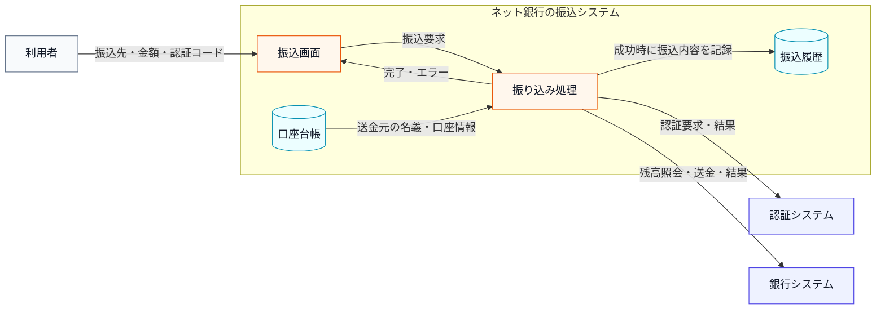
```mermaid
flowchart LR
    U["利用者"] -->|"振込先・金額・認証コード"| W

    subgraph TRANSFER["ネット銀行の振込システム"]
        W["振込画面"]
        S["振り込み処理"]
        A[("口座台帳")]
        H[("振込履歴")]
        W -->|"振込要求"| S
        A -->|"送金元の名義・口座情報"| S
        S -->|"成功時に振込内容を記録"| H
    end

    S -->|"認証要求・結果"| O["認証システム"]
    S -->|"残高照会・送金・結果"| B["銀行システム"]
    S -->|"完了・エラー"| W

    classDef actor fill:#f8fafc,stroke:#64748b,color:#111827;
    classDef system fill:#fff7ed,stroke:#ea580c,color:#111827;
    classDef data fill:#ecfeff,stroke:#0891b2,color:#111827;
    classDef boundary fill:#eef2ff,stroke:#4f46e5,color:#111827;
    class U actor;
    class W,S system;
    class A,H data;
    class O,B boundary;
```

この図では、振り込み処理を一つの箱として見て、口座台帳と履歴の保存、認証・銀行システムとのやり取りを示しています。

次に箱の中を開き、正常に振り込みが完了する場合の入力・判定・加工・出力を整理します。

**システム内部図：正常系の入力・判定・加工・出力**

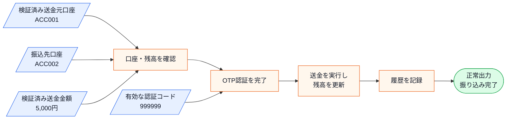
```mermaid
flowchart LR
    A[/検証済み送金元口座<br>ACC001/]:::input --> D[口座・残高を確認]:::process
    C[/振込先口座<br>ACC002/]:::input --> D
    E[/検証済み送金金額<br>5,000円/]:::input --> D
    D --> G[OTP認証を完了]:::process
    F[/有効な認証コード<br>999999/]:::input --> G
    G --> H[送金を実行し<br>残高を更新]:::process
    H --> I[履歴を記録]:::process
    I --> J([正常出力<br>振り込み完了]):::normal

    classDef input fill:#e7f0ff,stroke:#2563eb,color:#111827;
    classDef process fill:#fff7ed,stroke:#ea580c,color:#111827;
    classDef decision fill:#fef9c3,stroke:#ca8a04,color:#111827;
    classDef normal fill:#dcfce7,stroke:#16a34a,color:#111827;
```

この図から読み取ることは、次の3点です。

- 振り込みは、送金元・振込先・金額・認証情報がそろって初めて実行できる。
- 口座確認、残高確認、認証は、送金実行の前に満たすべき条件として順に確認される。
- 正常系では、送金実行で残高を更新し、履歴を記録してから振り込み完了を返す。

**振り込みの基本手順**

| 手順 | 入力 | 成功時に次へ渡すもの |
|---|---|---|
| (1) 口座確認 | 送金元口座ID・振込先口座ID | 有効な送金元・振込先口座 |
| (2) 残高確認 | 送金元口座ID・送金額 | 送金可能という確認結果 |
| (3) OTP認証 | 利用者が入力した認証コード | 本人確認済みという結果 |
| (4) 送金実行 | 口座・金額 | 送金受付結果 |
| (5) 送金結果照会 | 送金受付結果 | 確定した送金結果 |
| (6) 保存 | 確定した送金結果 | 更新後残高・振込履歴 |

「失敗したら中止」というルールは、誤った口座への送金や、確認前の引き落としを防ぐためです。口座・残高・認証の各戻り値を確認し、失敗なら送金APIを呼びません。掲載コードの `Bank::executeTransfer()` は、両口座の残高変更を一つの同期処理として完了させる簡易モデルなので、「送金元だけ減って送金先が増えない」途中失敗は発生しない前提です。

一方、実運用では送金API成功後に履歴保存だけ失敗する可能性があります。本章の掲載コードはメモリ上の `vector` への追加を成功前提とし、保存失敗、永続DBトランザクション、冪等キー、照会・再試行は扱いません。実システムでは、銀行の確定結果を先に記録できる永続キューや、同じ取引IDで再照会・再保存できる仕組みが必要です。本章はその詳細を窓口の内側へ置ける設計境界までを対象にします。

**この仕様を決める業務機能**

| 業務機能 | この章の仕様で決めていること |
|---|---|
| 振込業務 | 成功時の残高更新と履歴記録、失敗時に更新しないこと |
| 銀行API | 口座確認・残高確認・送金・結果照会の仕様 |
| 認証 | OTPの発行・検証手順 |
| 処理の骨格 | 各確認を実行する順序 |

この基本仕様を押さえたうえで、通信を伴う詳細条件とエラー条件を確認します。

**実システムの複雑さと掲載コードでの簡略化**

この章では、外部銀行APIを単純な1回の呼び出しとして扱いません。振り込みは、複数の確認を順番に通し、前のAPI応答を次のAPIへ渡す処理です。さらに実運用では、送金実行後の結果照会、タイムアウト、再試行も起こります。

| 複雑さ        | 実際の仕様                       | 掲載コードでの表現                                                      |
| ---------- | --------------------------- | -------------------------------------------------------------- |
| 順次API実行    | 口座確認→残高確認→認証→送金→結果照会の順で進める  | 各境界メソッドを同じ順序で呼ぶ                                                |
| 認証入力       | 利用者が入力したOTPを1回検証する          | 任意の文字列を受け取り、固定した正解値 `999999` と完全一致した場合だけ成功にする |
| タイムアウト・再試行 | 結果が確定しなければ照会を再試行し、上限後は保留にする | 通信待ち時間は省略し、境界から失敗・保留結果を返す                                      |

送金結果照会は、掲載コードでは `executeTransfer()` の成功応答と履歴記録で簡略化しています。実際の銀行APIで照会APIや再試行制御が必要になっても、この章の判断は変わりません。呼び出し元は「振込を依頼し、結果を受け取る」ことだけを知り、細かい順次APIや再試行は窓口の内側へ閉じ込めます。

**エラー条件**

正常系の送金実行へ進めない入力や外部確認の失敗は、次のように分けて扱います。

| エラー条件             | どこで分かるか  | 出力         | 保存・通知などの副作用                 |
| ----------------- | -------- | ---------- | --------------------------- |
| 振込先口座が存在しない、または無効 | 口座確認時    | 口座エラー      | 残高更新なし、履歴記録なし               |
| 送金元残高が不足している      | 残高確認時    | 残高不足エラー    | 残高更新なし、履歴記録なし               |
| OTP認証に失敗する        | 認証コード検証時 | 認証エラー      | 残高更新なし、履歴記録なし               |
| 銀行API送信に失敗する      | 送金実行時    | 送金エラー      | この章では外部API境界の詳細なリトライ処理は扱わない |
| 送金結果照会がタイムアウトする   | 結果照会時    | 保留または送金エラー | 実運用では窓口内で再試行・保留記録を行う        |

---

### 1-2：動作例テーブル

仕様を定義したところで、入力に対する結果と保存後の状態を確認します。成功ケースでは送金元・送金先の残高と履歴件数が変わり、失敗ケースではいずれも変わりません。通常振込は利用者が入力したOTPを検証する単発処理です。バッチ振込は給与データなど事前承認済みの複数明細を処理する入口で、各明細のOTP入力を省略します。

| ケース    | 振込条件                                     | 処理後残高                            | 結果・履歴      |
| ------ | ---------------------------------------- | -------------------------------- | ---------- |
| 通常振込成功 | ACC001（150,000円）→ACC002（30,000円）へ5,000円  | ACC001: 145,000円、ACC002: 35,000円 | 完了、履歴0→1件  |
| 振込先なし  | ACC001→UNKNOWNへ5,000円                    | 150,000円のまま                      | 口座エラー、履歴0件 |
| 残高不足   | ACC001→ACC002へ1,000,000円                 | 150,000円、30,000円のまま              | 残高不足、履歴0件  |
| 認証失敗   | ACC001→ACC002へ5,000円                     | 150,000円、30,000円のまま              | 認証エラー、履歴0件 |
| バッチ成功  | ACC003（500,000円）→ACC002へ30,000円、ACC001へ20,000円 | ACC003: 450,000円、ACC002: 60,000円、ACC001: 170,000円 | 2件完了、履歴0→2件  |

この表の各行は、口座残高と履歴を初期状態へ戻して1ケースずつ実行した場合の期待値です。1-4の `main()` は同じDBで行1〜5を連続実行するため、行1の5,000円送金後に行5の2明細が続き、最後はACC001が165,000円、ACC002が65,000円、ACC003が450,000円、履歴は3件になります。

コードを読む前に、このシステムが「何をする必要があるか」をこの表で確認できました。次は「どのように実装されているか」を確認します。

---

### 1-3：登場クラスとクラス構成図

#### このシステムの登場クラス

`AccountDatabase` と `Bank` は境界が違います。`AccountDatabase` は自社が保持する口座の名義を読む台帳境界、`Bank` は別システムである外部銀行で、残高を保持し送金を実際に実行する通信境界です。

掲載コードでは、台帳と銀行残高を `std::map`、外部への表示を `std::cout` で表します。ただし `Bank.executeTransfer()` は残高を実際に増減し、認証は入力コードを照合します。printは境界の先で起きる通信・保存・画面表示を手元で確認できる形に置き換えたもので、状態は実際に変化します。

次表の「手順(1)〜(4)」は、1-1「振り込みの基本手順」の読む順を短く参照したものです。要求を管理するIDではなく、複数クラスが一連の処理のどこを担当するかを示す案内番号です。要求の継続・変更・受入は、別の「要求ID」で追跡します。

| クラス名 | 役割 | 担当する仕様 |
|---|---|---|
| `AccountDatabase` | 自社台帳（口座名義の保持・検索） | 口座名義の照会 |
| `Bank` | 外部銀行（残高保持・照会・送金） | 仕様(1)口座確認・(2)残高確認・(4)送金 |
| `SecurityAuthenticator` | 認証制御（コード発行・照合） | 仕様(3)認証 |
| `TransferRecord` | 振り込み1件分のデータ | 振り込み履歴の1レコード |
| `TransferHistory` | 振り込み履歴の管理 | 成功した振り込みの記録・一覧表示 |
| `TransferProcessor` | 個別振り込みフロー進行 | 仕様全体 |
| `BatchTransferProcessor` | 一括振り込み（バッチ）進行 | 複数の振り込みの呼び出し |

データの流れ：BatchTransferProcessor → TransferProcessor → Bank / SecurityAuthenticator（外部銀行）
この章で注目するポイント：振り込み業務の流れと、銀行の呼び出し手順がどのように結びついているか

各クラスの役割を把握したところで、クラス間の関係を図で整理します。

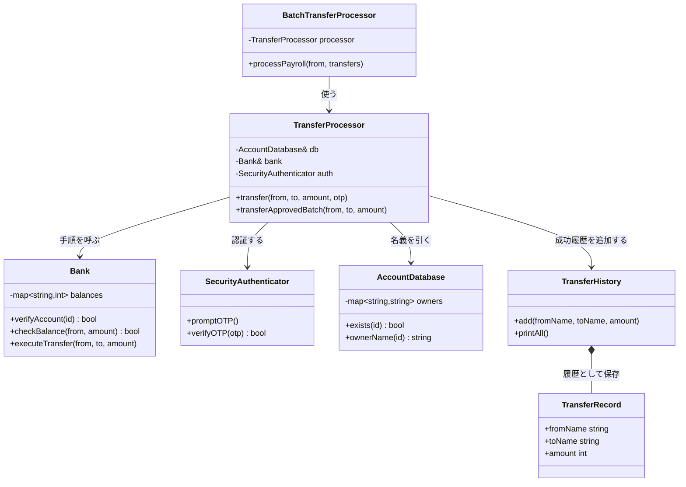
```mermaid
classDiagram
    class BatchTransferProcessor {
        -TransferProcessor processor
        +processPayroll(from, transfers)
    }
    class TransferProcessor {
        -AccountDatabase& db
        -Bank& bank
        -SecurityAuthenticator auth
        +transfer(from, to, amount, otp)
        +transferApprovedBatch(from, to, amount)
    }
    class Bank {
        -map~string,int~ balances
        +verifyAccount(id) bool
        +checkBalance(from, amount) bool
        +executeTransfer(from, to, amount)
    }
    class SecurityAuthenticator {
        +promptOTP()
        +verifyOTP(otp) bool
    }
    class AccountDatabase {
        -map~string,string~ owners
        +exists(id) bool
        +ownerName(id) string
    }
    class TransferHistory {
        +add(fromName, toName, amount)
        +printAll()
    }
    class TransferRecord {
        +fromName string
        +toName string
        +amount int
    }

    BatchTransferProcessor --> TransferProcessor : 使う
    TransferProcessor --> Bank : 手順を呼ぶ
    TransferProcessor --> SecurityAuthenticator : 認証する
    TransferProcessor --> AccountDatabase : 名義を引く
    TransferProcessor --> TransferHistory : 成功履歴を追加する
    TransferHistory *-- TransferRecord : 履歴として保存
```

**クラス図に出てくる主なメンバーと操作**

| クラス | メンバー・操作 | 何ができるか |
|---|---|---|
| `BatchTransferProcessor` | `processPayroll()` | 給与振込などの一括処理を進める |
| `TransferProcessor` | `bank` / `auth` | 外部銀行と認証処理を直接呼び出す |
| `TransferProcessor` | `transfer()` | 口座確認・残高確認・認証・送金を順に実行する |
| `Bank` | `checkBalance()` / `executeTransfer()` | 残高を照会し、実際に送金する |
| `SecurityAuthenticator` | `promptOTP()` / `verifyOTP()` | 入力された認証コードを照合する |

| 実システムの処理 | 掲載コードでの代替 | この章で確認すること |
|---|---|---|
| 自社台帳の名義照会 | `AccountDatabase` 内の `std::map` | 名義で履歴を記録できること |
| 銀行の残高保持・送金 | `Bank` 内の `std::map` を実際に増減 | 成功時だけ残高が動くこと |
| 振込履歴テーブルへの追加 | `TransferHistory` 内の `std::vector` | 成功1件につき履歴が1件増えること |
| OTP認証 | `SecurityAuthenticator` の照合 | 認証失敗時に送金へ進まないこと |


`BatchTransferProcessor` は `TransferProcessor` を使って一括処理を行い、`TransferProcessor` が `Bank` と `SecurityAuthenticator` の両方を直接保持し、それぞれのメソッドを順番に呼び出してフローを制御しています。

**現状システムの処理シーケンス**

クラス図の静的な関係に続けて、正常系（振り込み成功）で1件の振り込みを処理する間に、各クラスがどの順で呼ばれ何を受け渡すかを時系列で示します。手段固有の具体の手順は `TransferProcessor` の注記に、エラー系はメモとして添えます。1-4の現状コードを読む前の地図です。

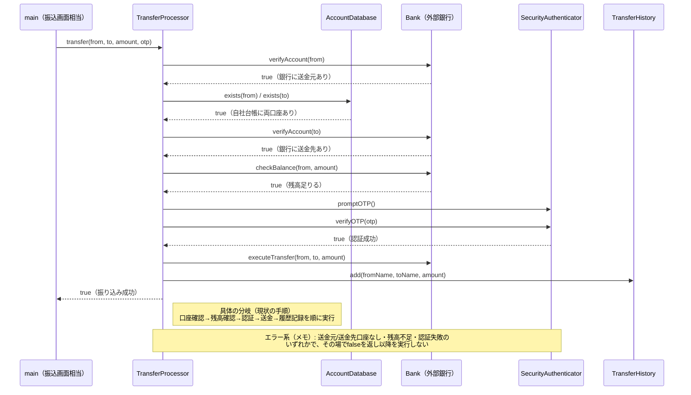
```mermaid
sequenceDiagram
    participant Main as main（振込画面相当）
    participant TP as TransferProcessor
    participant DB as AccountDatabase
    participant Bank as Bank（外部銀行）
    participant Auth as SecurityAuthenticator
    participant Hist as TransferHistory
    Main->>TP: transfer(from, to, amount, otp)
    TP->>Bank: verifyAccount(from)
    Bank-->>TP: true（銀行に送金元あり）
    TP->>DB: exists(from) / exists(to)
    DB-->>TP: true（自社台帳に両口座あり）
    TP->>Bank: verifyAccount(to)
    Bank-->>TP: true（銀行に送金先あり）
    TP->>Bank: checkBalance(from, amount)
    Bank-->>TP: true（残高足りる）
    TP->>Auth: promptOTP()
    TP->>Auth: verifyOTP(otp)
    Auth-->>TP: true（認証成功）
    TP->>Bank: executeTransfer(from, to, amount)
    TP->>Hist: add(fromName, toName, amount)
    TP-->>Main: true（振り込み成功）
    Note right of TP: 具体の分岐（現状の手順）<br>口座確認→残高確認→認証→送金→履歴記録を順に実行
    Note over TP,Auth: エラー系（メモ）: 送金元/送金先口座なし・残高不足・認証失敗の<br>いずれかで、その場でfalseを返し以降を実行しない
```

図から読み取れるのは、`TransferProcessor` が銀行APIと認証の呼び出し手順（口座確認→残高確認→認証→送金→記録）を自分の中で順に握っていること、各ステップの失敗はメモのとおりその場で中断されること、成功時だけ `Bank` の残高が動き `TransferHistory` に1件記録されることです。

**この章での簡略化**

掲載コードで実際に進める振込処理と、外部システムを置き換えた部分を分けます。

| 実システムの要素 | 現状の掲載コードで行うこと | 代替・省略する範囲 |
|---|---|---|
| 振込画面 | `main()`から振込元・振込先・金額・OTPを渡す | GUI、セッション、画面イベントは作らない |
| 自社口座・銀行残高 | `std::map`へ固定登録し、存在・残高を実際に照合して増減する | 永続DBと外部銀行APIはメモリ上の境界で代替する |
| OTP認証 | 入力したOTPを登録値と実際に照合する | OTP発行、配送、有効期限、試行回数制限は扱わない |
| 送金と履歴 | 成功時に両口座の残高を同期更新し、履歴へ追加する | 外部APIの遅延、照会、冪等化、履歴DBの保存失敗は扱わない |
| 結果表示 | 成否と残高を`std::cout`へ出す | 実画面や通知を標準出力で代替する |

---

### 1-4：実装コード（現状）

#### コードを読む前に：クラスの責任と境界

この表は、振込処理がどの責任をどの順で呼ぶかを示す読解用の地図です。外部境界の代替方法は簡略化節で確認済みです。

| 対象 | 主な責任 | 接続先・結果 |
|---|---|---|
| `AccountDatabase` | 自社が知る口座を名義で引く | 名義文字列を振込処理へ返す |
| `Bank` | 口座・残高を照会して送金する | 成否を返し、成功時に残高を増減する |
| 認証 | 発行済みコードと入力を照合する | 認証成否を返す |
| `TransferHistory` | 成立した送金を受け取る | 履歴へ1レコード追加する |

残高は外部銀行（`Bank`）が権威として保持し、自社台帳（`AccountDatabase`）は名義だけを持ちます。失敗時に残高と履歴を更新しない契約を、次のコードで確認します。

#### 現状コード

クラスを1つずつ、上から順に読みます。まずメンバーが保持する状態を確認し、次に公開操作の入力・戻り値・状態変更を追います。宣言と定義を分ける `TransferProcessor` では、宣言で依存先と公開入口を確認してから、各定義を処理順に読みます。

口座マスターは1-1で示した3口座（ACC001〜ACC003）です。名義は自社台帳（`AccountDatabase`）が、残高は銀行（`Bank`）が保持します。`std::map` は口座IDから名義・残高を引く保存領域、`std::vector` は成功した履歴を順に追加する領域です。基本操作は第0章「サンプルで使うC++標準ライブラリ」を参照してください。

`main()` と実行結果は最後に、行のまとまりごとに並べます。上から順に連結すれば、そのまま1つのC++14プログラムとして動きます。

---

**共通ヘッダー**

```cpp
#include <iostream>
#include <map>
#include <string>
#include <vector>
#include <utility>
```

以降のすべてのクラスが使います。

---

**AccountDatabase**

自社が知っているのは名義だけです。残高は持ちません。

```cpp
// 自社台帳：口座の名義を保持する（残高は持たない）
class AccountDatabase {
private:
    std::map<std::string, std::string> owners;
public:
    AccountDatabase() {
        owners["ACC001"] = "田中 一郎";
        owners["ACC002"] = "佐藤 花子";
        owners["ACC003"] = "鈴木 次郎";
    }

    bool exists(const std::string& id) const {
        return owners.count(id) > 0;
    }

    std::string ownerName(const std::string& id) const {
        return owners.at(id);
    }
};
```

`exists()` は自社台帳に載っているかを、`ownerName()` は履歴へ書く名義を返します。**残高の権威は次の `Bank` にあり、自社台帳とは別物です。**

---

**Bank**

外部銀行サブシステムです。口座IDごとの現在残高を保持し、照会と送金を行います。先にメンバーと各操作の役割を対応付けます。

| メンバー・操作 | 入力／保持内容 | 戻り値・状態変化 |
|---|---|---|
| `balances` | 口座IDをキー、現在残高を値として保持 | `executeTransfer()` だけが値を書き換える |
| `Bank()` | なし | 3口座の初期残高を登録する |
| `verifyAccount(id)` | 確認する口座ID | `balances` にキーがあれば `true`。残高は変えない |
| `checkBalance(from, amount)` | 送金元IDと必要額 | 口座が存在し、現在残高が必要額以上なら `true`。残高は変えない |
| `executeTransfer(from, to, amount)` | 送金元・送金先・金額 | 送金元から減算し、送金先へ同額を加算する |
| `balanceOf(id)` | 確認する口座ID | 処理後の現在残高を返す。残高は変えない |

```cpp
// 外部銀行サブシステム：残高を保持し、実際に送金する
class Bank {
private:
    std::map<std::string, int> balances;
public:
    Bank() {
        balances["ACC001"] = 150000;
        balances["ACC002"] =  30000;
        balances["ACC003"] = 500000;
    }

    bool verifyAccount(const std::string& id) {
        bool ok = balances.count(id) > 0;
        std::cout << "口座確認: " << id
                  << (ok ? " OK" : " NG") << "\n";
        return ok;
    }

    bool checkBalance(const std::string& from, int amount) {
        auto account = balances.find(from);
        bool ok = account != balances.end() && account->second >= amount;
        int currentBalance = account == balances.end() ? 0 : account->second;
        std::cout << "残高確認: " << from << " " << currentBalance
                  << "円 >= " << amount << "円 "
                  << (ok ? "OK" : "NG") << "\n";
        return ok;
    }

    void executeTransfer(const std::string& from,
                         const std::string& to, int amount) {
        balances[from] -= amount;
        balances[to]   += amount;
        std::cout << "送金実行: " << from << " -" << amount
                  << "→" << balances[from] << "円 / "
                  << to << " +" << amount
                  << "→" << balances[to] << "円\n";
    }

    int balanceOf(const std::string& id) const {
        return balances.at(id);
    }
};
```

- **責任：** 口座の存在確認、残高照会、残高の増減
- **副作用：** `executeTransfer()` だけが `balances` を書き換える

照会系（`verifyAccount` / `checkBalance`）は残高を変えず、成否だけを返します。実システムの銀行APIを、実行終了まで覚えているインメモリの `std::map` で代替しています。

---

**SecurityAuthenticator**

```cpp
// 認証サブシステム：正しいコードを仮決めし、検証で照合する
class SecurityAuthenticator {
public:
    void promptOTP() { std::cout << "認証コード入力受付\n"; }
    bool verifyOTP(const std::string& otp) {
        bool ok = (otp == "999999");  // 仮決めの正しいコードと照合
        std::cout << "認証コード検証: "
                  << (ok ? "一致" : "不一致") << "\n";
        return ok;
    }
};
```

発行した正しいコードとの照合を担います。実システムのSMS送信とコード発行を、固定値 `999999` との比較で代替しています。

---

**TransferRecord と TransferHistory**

履歴は起動時は空で、振り込みが成功するたびに1件追記されます。

```cpp
// 自社の振込記録
struct TransferRecord {
    std::string fromName;
    std::string toName;
    int amount;
};
```

**TransferHistory**

このブロックでは `TransferHistory` の定義だけを確認します。

```cpp
class TransferHistory {
private:
    std::vector<TransferRecord> records;
public:
    void add(const std::string& fromName,
             const std::string& toName, int amount) {
        records.push_back({fromName, toName, amount});
    }

    void printAll() const {
        for (const auto& r : records)
            std::cout << r.fromName << " → " << r.toName
                      << " : " << r.amount << "円\n";
    }
};
```

記録するのは口座IDではなく名義です。`add()` を呼ぶ側が `AccountDatabase` で引いてから渡します。

---

**TransferProcessor の宣言**

振り込みの全体フローを管理します。`main()` と `BatchTransferProcessor` の2か所から呼ばれます。

```cpp
// 振り込み処理クラス：銀行APIの手順を直接制御している
class TransferProcessor {
private:
    AccountDatabase& db;
    Bank& bank;
    TransferHistory& history;
    SecurityAuthenticator auth;

    bool validateAccountsAndBalance(const std::string& from,
                                    const std::string& to,
                                    int amount);
public:
    TransferProcessor(AccountDatabase& database, Bank& b,
                      TransferHistory& hist)
        : db(database), bank(b), history(hist) {}

    bool transfer(const std::string& from, const std::string& to,
                  int amount, const std::string& otp);
    bool transferApprovedBatch(const std::string& from,
                               const std::string& to, int amount);
};
```

台帳・銀行・履歴は外から受け取って参照で持ち、認証だけは自分で持ちます。**公開入口が2つあること**を覚えておいてください。定義を3つ、上のメンバーを見ながら読んでいきます。

---

**TransferProcessor::validateAccountsAndBalance()**

2つの公開入口が共通で使う検証です。

```cpp
bool TransferProcessor::validateAccountsAndBalance(
        const std::string& from, const std::string& to, int amount) {
    bool sourceAtBank = bank.verifyAccount(from);

    if (!db.exists(from) || !sourceAtBank) {
        std::cout << "エラー: 送金元口座なし\n";

        return false;
    }

    bool destinationAtBank = bank.verifyAccount(to);

    if (!db.exists(to) || !destinationAtBank) {
        std::cout << "エラー: 送金先口座なし\n";

        return false;
    }

    if (!bank.checkBalance(from, amount)) {
        std::cout << "エラー: 残高不足\n";

        return false;
    }

    return true;
}
```

- **順序に意味：** 送金元 → 送金先 → 残高の順に確認します。口座が無いと分かった時点で `false` を返すので、残高照会まで進みません
- **失敗の扱い：** どこで落ちたかをその場で表示し、残高も履歴も変えずに戻ります

自社台帳と銀行の両方へ問い合わせています。片方にしか無い口座も、ここで弾かれます。

---

**TransferProcessor::transfer()**

利用者からの通常の振り込みです。

```cpp
bool TransferProcessor::transfer(const std::string& from,
                                 const std::string& to,
                                 int amount, const std::string& otp) {
    if (!validateAccountsAndBalance(from, to, amount)) return false;

    auth.promptOTP();

    if (!auth.verifyOTP(otp)) {
        std::cout << "エラー: 認証失敗\n";

        return false;
    }

    bank.executeTransfer(from, to, amount);
    history.add(db.ownerName(from), db.ownerName(to), amount);
    std::cout << "振り込み完了\n";

    return true;
}
```

- **順序に意味：** 検証 → 認証 → 送金 → 履歴の順です。認証を送金の後に置くと、認証失敗でも残高が動いてしまいます
- **失敗の扱い：** どの段階で落ちても、`executeTransfer()` へ到達しない限り残高と履歴は変わりません

**銀行の呼び出し手順が、この関数に直接書かれています。**

---

**TransferProcessor::transferApprovedBatch()**

社内で承認済みの一括処理用です。

```cpp
bool TransferProcessor::transferApprovedBatch(const std::string& from,
                                              const std::string& to,
                                              int amount) {
    if (!validateAccountsAndBalance(from, to, amount)) return false;

    bank.executeTransfer(from, to, amount);
    history.add(db.ownerName(from), db.ownerName(to), amount);
    std::cout << "振り込み完了（OTP不要）\n";

    return true;
}
```

検証は共通化できましたが、OTPを省くため**認証以降の送金・履歴の手順は `transfer()` と別に書かれています。** 送金と履歴の2行が、2つの入口へ重複しています。

---

**BatchTransferProcessor**

給与振り込みなど、もう1つの呼び出し元です。

```cpp
// 給与振り込みなどの一括処理バッチ（もう1つの呼び出し元）
class BatchTransferProcessor {
private:
    TransferProcessor processor;
public:
    BatchTransferProcessor(AccountDatabase& database, Bank& b,
                           TransferHistory& hist)
        : processor(database, b, hist) {}
    void processPayroll(
            const std::string& payrollSourceAccount,
            const std::vector<std::pair<std::string, int>>& payrollEntries) {
        // payrollEntries は給与システムが作る「振込先口座・支給額」の一覧
        for (const auto& entry : payrollEntries) {
            const std::string& destinationAccount = entry.first;
            int paymentAmount = entry.second;
            processor.transferApprovedBatch(
                payrollSourceAccount, destinationAccount, paymentAmount);
        }
    }
};
```

`payrollEntries` は呼び出し元の給与システムが作る入力一覧で、各要素は「振込先口座・支給額」です。1件ずつ `transferApprovedBatch()` へ渡すだけで、失敗しても残りの件を続けます。

---

#### `main()` と実行結果

1-2の動作例5行を、行ごとに区切って実行します。**残高は行をまたいで引き継がれます。**

---

**組み立てと、行1：正常な個別振り込み**

```cpp
int main() {
    AccountDatabase db;
    Bank bank;
    TransferHistory history;
    TransferProcessor processor(db, bank, history);

    std::cout << "--- 行1: 正常な個別振り込み ---\n";
    processor.transfer("ACC001", "ACC002", 5000, "999999");
```

```
--- 行1: 正常な個別振り込み ---
口座確認: ACC001 OK
口座確認: ACC002 OK
残高確認: ACC001 150000円 >= 5000円 OK
認証コード入力受付
認証コード検証: 一致
送金実行: ACC001 -5000→145000円 / ACC002 +5000→35000円
振り込み完了
```

口座確認・残高確認・認証・送金が、`transfer()` に書かれた順どおりに出ています。ACC001が145000円になりました。

---

**行2：存在しない口座**

```cpp
    std::cout << "--- 行2: 存在しない口座 ---\n";
    processor.transfer("ACC001", "UNKNOWN", 5000, "999999");
```

```
--- 行2: 存在しない口座 ---
口座確認: ACC001 OK
口座確認: UNKNOWN NG
エラー: 送金先口座なし
```

送金先の確認で止まりました。残高照会も認証も実行されていません。

---

**行3：残高不足**

```cpp
    std::cout << "--- 行3: 残高不足 ---\n";
    processor.transfer("ACC001", "ACC002", 1000000, "999999");
```

```
--- 行3: 残高不足 ---
口座確認: ACC001 OK
口座確認: ACC002 OK
残高確認: ACC001 145000円 >= 1000000円 NG
エラー: 残高不足
```

照会された残高が145000円です。行1の送金結果が銀行側に残っていることが確認できます。

---

**行4：認証失敗**

```cpp
    std::cout << "--- 行4: 認証失敗 ---\n";
    processor.transfer("ACC001", "ACC002", 5000, "INVALID");
```

```
--- 行4: 認証失敗 ---
口座確認: ACC001 OK
口座確認: ACC002 OK
残高確認: ACC001 145000円 >= 5000円 OK
認証コード入力受付
認証コード検証: 不一致
エラー: 認証失敗
```

検証はすべて通りましたが、認証で止まりました。**残高は145000円のままです。**

---

**行5：社内承認済みバッチと、最終確認**

```cpp
    std::cout << "--- 行5: 社内承認済みバッチ ---\n";
    BatchTransferProcessor batch(db, bank, history);
    batch.processPayroll("ACC003",
                         {{"ACC002", 30000}, {"ACC001", 20000}});

    std::cout << "--- 最終残高 ---\n";
    std::cout << "ACC001: " << bank.balanceOf("ACC001") << "円\n";
    std::cout << "ACC002: " << bank.balanceOf("ACC002") << "円\n";
    std::cout << "ACC003: " << bank.balanceOf("ACC003") << "円\n";
    std::cout << "--- 振り込み履歴 ---\n";
    history.printAll();

    return 0;
}
```

```
--- 行5: 社内承認済みバッチ ---
口座確認: ACC003 OK
口座確認: ACC002 OK
残高確認: ACC003 500000円 >= 30000円 OK
送金実行: ACC003 -30000→470000円 / ACC002 +30000→65000円
振り込み完了（OTP不要）
口座確認: ACC003 OK
口座確認: ACC001 OK
残高確認: ACC003 470000円 >= 20000円 OK
送金実行: ACC003 -20000→450000円 / ACC001 +20000→165000円
振り込み完了（OTP不要）
--- 最終残高 ---
ACC001: 165000円
ACC002: 65000円
ACC003: 450000円
--- 振り込み履歴 ---
田中 一郎 → 佐藤 花子 : 5000円
鈴木 次郎 → 佐藤 花子 : 30000円
鈴木 次郎 → 田中 一郎 : 20000円
```

バッチの2明細とも認証コードの2行が出ていません。履歴は、成功した行1の1件と行5の2件を合わせた3件です。失敗した行2〜行4は残高も履歴も動かしていません。

---

動作例テーブルの全5行について、成功時の処理順、失敗時の中止位置、バッチでOTPを実行しないことを確認できました。行3は銀行の残高照会で、行4はOTPの照合で実際に弾かれ、成功時は銀行残高が増減しています。現状でも仕様は満たしています。

> **手元で動かすには**
> このコードは1つの `.cpp` に貼り付けて、そのままコンパイル・実行できます（例：`g++ chapter02.cpp -o app && ./app`）。`main()` は自由に組み替えて構いません。口座の名義は自社台帳、残高は銀行が持ち、プロセス実行中だけ有効です（永続DBはこの章の論点ではありません）。

次のフェーズで変更が来たときに何が起きるかを確認します。

---


#### 仕様入力が現状コードで使われるまで

1-1の振込依頼を、`transfer()` が受け取ってから残高と履歴へ反映するまで追います。

| 仕様入力 | コード上の受け取り口 | 実際に使う箇所 | 結果への現れ方 |
|---|---|---|---|
| 送金元・送金先口座ID | `TransferProcessor::transfer(from, to, ...)` | 自社台帳と銀行の存在確認、`Bank::executeTransfer()` | 送金元の減額、送金先の増額、名義付き履歴に反映される |
| 金額 | `transfer(..., amount, ...)` | `Bank::checkBalance()`、`executeTransfer()`、`TransferHistory::add()` | 残高の前後差と履歴金額に同じ値が現れる |
| OTP | `transfer(..., otp)` | `SecurityAuthenticator::verifyOTP()` | 一致時だけ送金・履歴追加へ進み、不一致時は状態を変えない |

### 1-5：変更要求

ある月曜日の朝、銀行のシステム担当者から緊急の連絡が入りました。

「来月から、銀行APIの認証仕様が大幅に変わります。これまでは単一のOTP（ワンタイムパスワード）認証だけで十分でしたが、今後は、はじめに『認証コードの発行』をリクエストし、その応答で返る『取引ID』とあわせて検証する必要があります。」

さらに、これに続いて「銀行側の送金APIのインターフェースもセキュリティ強化のため、送金時のパラメータに『トランザクションID』が必須になります」とのこと。

続けて、運用チームからも要望が出ました。「給与振込のような一括処理で、途中の1件が残高不足で止まったとき、それより前に送金済みの分がそのまま残ってしまいます。今は運用担当が手作業で戻しているので、途中で失敗したら完了済みを自動で取り消してほしい。監査のため、取り消した記録も履歴に残してください」。

依頼文を、実行結果で判定できる変更依頼へ分けます。本章では銀行の説明に出てくる「トランザクションID」と、コード上の「取引ID（`txId`）」を同じ識別子として扱います。変更ID1で発行・照合し、変更ID2で同じ値を送金APIへ必須入力として渡します。

| 変更依頼ID | 確定した変更内容 | 入力 | 受入条件 |
|---|---|---|---|
| 変更ID1 | 認証を、認証コード発行と取引ID付き照合の2段階へ変える | 認証コード、発行時に返るトランザクションID（取引ID） | 発行した取引IDと認証コードの組み合わせで照合し、誤りなら送金しない |
| 変更ID2 | 検証済み取引IDを送金APIの必須入力にする | 送金元、振込先、金額、検証済み取引ID | 同じ取引IDを送金へ渡し、成功時だけ残高と履歴を更新する |
| 変更ID3 | 一括振込の途中失敗時に、完了済みを逆順で取り消し、取り消しも履歴へ残す | 完了済み送金の一覧 | 2件目が残高不足で止まると1件目が戻り、両口座の残高が開始前に戻る |

#### 変更後要求ベースライン

| 要求ID  | 変更種別・根拠となる変更ID   | 変更後要求                              | 受入条件                                     |
| ----- | ---------------- | ---------------------------------- | ---------------------------------------- |
| 要求ID1 | 継続<br/>根拠: —     | 送金元・送金先口座の存在を確認する                  | 不正口座では後続処理を行わない                          |
| 要求ID2 | 継続<br/>根拠: —     | 送金元残高が送金額以上か確認する                   | 残高不足では認証・送金を行わない                         |
| 要求ID3 | 変更<br/>根拠: 変更ID1 | 認証コードを発行し、返された取引IDとOTPを照合する        | 発行した取引IDと正しいOTPの組だけ成功する                  |
| 要求ID4 | 変更<br/>根拠: 変更ID2 | 検証済みの同じ取引IDを必須入力として送金する            | 発行した取引IDが検証と送金へ同じ値で渡り、成功時だけ残高を更新する       |
| 要求ID5 | 継続<br/>根拠: —     | 単発振込の成功時だけ履歴を保存し、失敗時は残高・履歴を変えない    | 成功時1件保存、各失敗時は件数・残高不変になる                  |
| 要求ID6 | 継続<br/>根拠: —     | 承認済み一括振込は、OTP認証を省略して専用取引IDで各件を送金する | フェーズ1「動作例テーブル」のバッチ成功ケースで2件が送金され、履歴が2件増える |
| 要求ID7 | 追加<br/>根拠: 変更ID3 | 一括振込の途中失敗時に完了済みを逆順で取り消し、取り消しも履歴へ残す | 開始前の残高へ戻り、送金と取り消しが履歴に対で残る                |

**変更要求を試すための認証・補償モデル**

全章共通の簡略化範囲は1-3の「実システムの複雑さと掲載コードでの簡略化」で説明済みです。ここでは今回の変更要求に固有の、取引ID付き認証と一括振込の補償だけを具体化します。

- 認証システムは同期呼び出しで、`requestOTP()` のたびに連番から `TX-9001`、`TX-9002` のような取引IDを返す。実運用の乱数強度、失効時刻、利用者端末への配信は扱わない。
- 発行した取引IDと正しいOTPの対応をメモリ上の表へ保持し、`verifyOTP(otp, txId)` がその組を照合する。照合済みの同じ取引IDを送金へ渡す。
- 承認済みバッチは利用者OTPを使わず、掲載コードでは専用値 `APPROVED-BATCH` を送金APIへ渡す。実運用の承認ワークフローや署名は範囲外とする。
- 一括処理の補償は、成功済み明細をメモリ上の一覧へ積み、失敗時に逆順で残高を戻して逆向きの履歴を追加する。補償自体の失敗やプロセス再起動後の再開には、永続化されたSagaログなどが必要だが本章では扱わない。

この前提を先に固定し、以降のコードでは「どう作るか」を初めて明かすのではなく、ここで決めた簡易モデルを実装へ対応させます。

**変更前→変更後の要求対照（今回変える要求IDだけ）**

現行ベースラインと変更後ベースラインを往復せずに済むよう、今回変える要求IDだけを取り出し、変更前と変更後を同じ行へ並べます。

| 要求ID  | 変更前の要求（現行）           | 変更後の有効要求                           | 根拠変更ID |
| ----- | -------------------- | ---------------------------------- | ------ |
| 要求ID3 | OTPを1段階で検証する         | 認証コードを発行し、返された取引IDとOTPを照合する        | 変更ID1  |
| 要求ID4 | 認証成功後に送金し、両口座残高を更新する | 検証済みの同じ取引IDを必須入力として送金する            | 変更ID2  |
| 要求ID7 | （新規・現行なし）            | 一括振込の途中失敗時に完了済みを逆順で取り消し、取り消しも履歴へ残す | 変更ID3  |

要求ID1・要求ID2・要求ID5・要求ID6は継続（変更前＝変更後）のため対照表には載せません。変更後ベースラインで内容を確認できます。要求ID4の「検証済み取引ID」は単発振込の入口に対する条件で、承認済み一括振込（要求ID6）は現行どおりOTP検証を通らず専用取引IDを使います。両者を分けて追うため、バッチは要求ID6・要求ID7で確認します。

リリースは来月の頭。

**仕様変更の内容**

変更要求を受けて、認証・送金・一括処理失敗時の取り消しがどう変わるかを整理します。認証と送金APIは「インフラ・システム管理」、補償判断は「給与振込運用」の業務機能に属します。

| 手順 | 変更前 | 変更後 |
|---|---|---|
| (1) 口座確認 | 既存の口座確認を実行 | 同じ確認手順を継続 |
| (2) 残高確認 | 既存の残高確認を実行 | 同じ確認手順を継続 |
| **(3) 認証** | OTP（ワンタイムパスワード）1ステップで完了 | **「認証コードの発行」→「取引IDと認証コードの照合」の2ステップに変更** |
| **(4) 送金実行** | 振込先口座と金額だけを指定して送金 | **「トランザクションID」が必須パラメータとして追加** |
| (5) 結果確定・保存 | 成功した単発・一括明細を履歴へ追加 | 同じ保存を継続 |
| **(6) 一括失敗時の補償** | 失敗前に成功した明細は残り、運用担当が手で戻す | **成功済み明細を逆順で取り消し、逆向き履歴も保存** |

今回変えるのは認証と送金APIの契約、および一括失敗時の業務処理です。口座情報の取得方法と履歴の保存形式は変更前後で維持しますが、補償時にも既存の履歴追加操作を使うため、履歴の呼び出し箇所は増えます。

| 変更対象外の共通基盤 | 変更前 | 変更後 |
|---|---|---|
| `AccountDatabase` | 口座情報と残高を取得する | **変更なし** |
| `TransferHistory` | 送金結果を履歴へ保存する | 保存形式は変更なし。補償時は逆向き記録の保存にも使う |

現行の認証では発行と検証の間に識別子を受け渡していませんでした。新仕様では `requestOTP()` の応答から取引IDを受け取り、`verifyOTP(otp, txId)` で検証します。検証済みの同じ取引IDを、`executeTransfer(from, to, amount, txId)` にも渡します。

**変更前後の入力・判定・加工・出力差分**

1-1の現状仕様を退避し、変更要求を当てた後の仕様と同じ粒度で並べます。単発振込の認証・送金だけでなく、一括振込の取り消し入力、判定、加工、出力も同じ表で追います。

| 要素 | 変更前（1-1の現状仕様） | 変更後（今回の要求） | 差分として追うもの |
|---|---|---|---|
| 入力 | 送金元・振込先口座、送金金額、認証コード。一括処理は給与明細一覧 | 単発は同じ入力と発行された取引ID。一括は給与明細一覧と処理中の成功済み明細一覧 | 取引IDが認証と送金の間を流れ、補償対象を成功済み一覧で追う |
| 判定 | 口座有効、残高十分、OTP一致 | 左記に加え、取引IDと認証コードの照合成功、一括明細の途中失敗 | 認証判定が2段階になり、補償開始条件が増える |
| 加工 | OTP検証後に送金。一括は成功分を残して中止 | 認証コードを発行し取引ID付きで送金。一括失敗時は成功済みを逆順で取り消す | 認証発行・取引ID受け渡し・補償手順が増える |
| 出力 | 振込成功または各種エラー。成功分の履歴 | 振込成功、認証発行・照合・送金エラー。補償時は開始前残高と送金・逆向き履歴 | 失敗位置と、補償後の残高・履歴を追う |

**変更後の入力・加工・出力**

変更後の仕様を、1-1と同じ粒度で、正常系の入力・判定・加工・出力として確認します。1-1の図との差分は、認証が「発行」と「照合」の2ステップになることと、発行時に受け取る「取引ID」が送金実行にも受け渡されることの2点です。図では変更した処理を黄色で示します。一括失敗時の補償は正常な単発振込へ混ぜず、直後の差分表とエラー条件で追います。

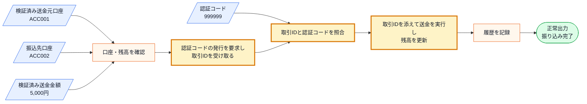
```mermaid
flowchart LR
    A[/検証済み送金元口座<br>ACC001/]:::input --> D[口座・残高を確認]:::process
    C[/振込先口座<br>ACC002/]:::input --> D
    E[/検証済み送金金額<br>5,000円/]:::input --> D
    D --> P[認証コードの発行を要求し<br>取引IDを受け取る]:::process
    F[/認証コード<br>999999/]:::input --> G
    P --> G[取引IDと認証コードを照合]:::process
    G --> H
    H[取引IDを添えて送金を実行し<br>残高を更新]:::process
    H --> I[履歴を記録]:::process
    I --> J([正常出力<br>振り込み完了]):::normal

    classDef input fill:#e7f0ff,stroke:#2563eb,color:#111827;
    classDef process fill:#fff7ed,stroke:#ea580c,color:#111827;
    classDef changed fill:#fef3c7,stroke:#d97706,stroke-width:3px,color:#111827;
    classDef decision fill:#fef9c3,stroke:#ca8a04,color:#111827;
    classDef normal fill:#dcfce7,stroke:#16a34a,color:#111827;
    class P,G,H changed;
```

この図から読み取ることは、次の3点です。

- 口座確認・残高確認と、送金後の履歴記録は1-1のまま変わらない。
- 認証が「認証コードの発行」と「取引IDと認証コードの照合」の2ステップになり、発行の応答で受け取る「取引ID」という新しい値が加わる。
- 取引IDは認証の中で完結せず、送金実行にも必須の値として受け渡される。

| エラー条件              | どこで分かるか  | 出力      | 保存・通知などの副作用                 |
| ------------------ | -------- | ------- | --------------------------- |
| 振込先口座が存在しない、または無効  | 口座確認時    | 口座エラー   | 残高更新なし、履歴記録なし               |
| 送金元残高が不足している       | 残高確認時    | 残高不足エラー | 残高更新なし、履歴記録なし               |
| 認証コードの発行に失敗する      | 認証コード発行時 | 認証発行エラー | 残高更新なし、履歴記録なし               |
| 取引IDと認証コードの照合に失敗する | 認証コード検証時 | 認証エラー   | 残高更新なし、履歴記録なし               |
| 取引ID付き送金に失敗する      | 送金実行時    | 送金エラー   | この章では外部API境界の詳細なリトライ処理は扱わない |
| 一括振込の途中明細が失敗する | 各明細の口座・残高確認時 | 一括処理中断 | 成功済み明細を逆順で取り消し、逆向き履歴を追加する |

図に加わった「取引ID」の受け渡しが実際にコードのどこへ書かれるかは、フェーズ3「問題特定」で変更を試すコードと、フェーズ7の最終コード・実行結果で追います。

**フェーズ1のまとめ：今回追う変更ID一覧**

| 変更ID | 変更依頼の要点 | 関係する要求ID（追加は変更後ID） |
|---|---|---|
| 変更ID1 | 認証を、認証コード発行と取引ID付き照合の2段階へ変える | 要求ID3 |
| 変更ID2 | 検証済み取引IDを送金APIの必須入力にする | 要求ID4 |
| 変更ID3 | 一括振込の途中失敗時に完了済みを逆順で取り消す | 要求ID6、要求ID7 |


---

## 🟣 フェーズ2：仮説立案 ―― 何が変わるかを観察し、ヒアリングで裏付ける
### 2-1：変わりそうな仕様の見当をつける

フェーズ2「仮説立案」では、フェーズ1「現状把握」で見た仕様のうち、どの条件・手順・外部呼び出しが変わりそうかを見当づけます。責務の配置は、変更要求を当てた後の痛みと合わせて確認します。単に「すべて `transfer()` にある」とせず、関数内のどの処理が何をきっかけに変わるかまで分けます。

| 仕様候補 | 仕様上の場所 | フェーズ1の現状コードでの場所 | 見立て |
|---|---|---|---|
| 口座確認・残高確認 | 判定、外部API呼び出し | `transfer()` 冒頭の `verifyAccount` / `checkBalance` 呼び出し | 銀行APIの入力や確認順序が変わる可能性がある |
| OTP認証 | 判定、認証手順 | `transfer()` 中盤の `promptOTP` / `verifyOTP` 呼び出し | 新仕様では`requestOTP`が取引IDを返すため、戻り値・引数・順序が変わる |
| 送金実行 | 加工、外部API呼び出し | `transfer()` 後半の `executeTransfer` 呼び出し | 送金APIが取引IDや冪等キーを要求すると変わる |
| 残高更新・履歴 | 保存 | `transfer()` 成功分岐の `bank.executeTransfer` / `history.add` | 外部送金確定後だけ行うという条件は維持したい |
| 振り込みの大枠 | 入力から確認・認証・送金へ進む順序 | `TransferProcessor.transfer()` | この章の変更要求では、順序の大枠は当面維持する前提で見る |

この表から、今回の検討対象は「銀行API確認」「OTP認証」「送金API呼び出し」の3つに絞れます。これらが同じ場所に書かれていて困るかどうかは、フェーズ3「問題特定」で変更を入れてから確認します。

#### ヒアリングで確認すること

2-1で見当を付けた銀行APIの変化について、設計条件にする前に確認すべき不明点を質問へ変換します。

| 見当 | 現時点の仮説 | 確認する質問 | 確認先 |
|---|---|---|---|
| 認証手順 | 認証方式と段数は今後も変わる | 生体認証など別方式や手順追加を予定しているか | 銀行API担当者 |
| 送金API | 入力形式や呼出順が変わる | パラメータ・形式・トランザクション管理は変わるか | 銀行API担当者 |

この質問を2-3へ持ち込み、今回だけの変更か、将来も続く変化かを確認します。

### 2-2：今回の変更で確実に変わること

1-5で確定した変更IDを、そのまま今回確実に変わることとして確認します。章ごとに異なる色や記号は使わず、以降でも同じ変更IDで追跡します。

- **変更ID1：認証を、認証コード発行と取引ID付き照合の2段階へ変える**
- **変更ID2：検証済み取引IDを送金APIの必須入力にする**
- **変更ID3：一括振込の途中失敗時に、完了済みを逆順で取り消し、取り消しも履歴へ残す**

ただし「この変更が1回限りか、今後も続くか」によって、どこまで設計を変えるべきかが大きく変わります。関係者に確認します。

### ヒアリングに向けた背景確認

このシステムは、あるネット銀行の振り込み処理を自動化するためのものです。銀行のシステムは非常に堅牢で、安全に送金を行うために、口座情報の確認、残高チェック、手数料の計算、そして実際の送金指示という、いくつもの手順を正しい順番で実行する必要があります。

開発チームは、この銀行のAPIを直接叩いて振り込みを行うプログラムをメンテナンスしています。当初は単純な送金機能だけでしたが、最近では、振り込み先に応じた送金限度額の確認や、二要素認証の呼び出しなど、銀行側から求められるセキュリティ要件が年々厳しくなってきました。

### 2-3：関係者ヒアリング


今回の変更が一時的なものか、将来も続くリスクがあるのかを確認するため、銀行のAPI担当者にヒアリングを行いました。

- **開発者：** 「認証の仕様が変わるとのことですが、今回の変更は一時的なものでしょうか？今後、さらに認証方式が増える予定はありますか？」
- **銀行API担当者：** 「申し訳ありませんが、セキュリティ強化の波は止まりません。数ヶ月後には、生体認証を導入する予定もあります。今後も認証手順はさらに複雑になる可能性が高いです。」
- **開発者：** 「なるほど。送金APIについても、今後パラメータが増えたり、呼び出し順序が変わったりすることは考えられますか？」
- **銀行API担当者：** 「ええ、来年以降には、さらに上位のトランザクション管理システムと連携するため、送金時のリクエスト形式が現在のJSONからXMLへ移行する計画もあります。」
- **開発者：** 「分かりました。かなり頻繁に接続仕様が変わりそうですね。今回の認証フローの変更についても、将来的にさらに手順が増えるリスクはありますか？」
- **銀行API担当者：** 「おっしゃる通りです。現在は二段階認証ですが、将来的には三段階になるかもしれません。現時点での固定的な手順に縛られない設計にしておいた方が、お互いのためかもしれませんね。」

### 2-4：ヒアリングで判明した将来リスク

ヒアリングで浮かび上がった「確定ではないが、近い将来起こりうる変化」を記録します。これは今回の設計判断の材料です。

| リスクID | 将来リスク | 時期の目安 | 根拠 |
|---|---|---|---|
| リスクID1 | 認証フローの多段階化（二段階→三段階認証） | 銀行側のセキュリティ強化時 | 銀行API担当者との確認 |
| リスクID2 | 送金リクエスト形式の変更（JSON→XML移行計画） | 来年以降の基幹システム連携時 | 銀行API担当者との確認 |
| リスクID3 | 生体認証の導入 | 数ヶ月後の予定 | 銀行API担当者との確認 |

なお、送金結果の通知方法自体（画面表示からSMS・メール明細への変更）もヒアリングで話題になりましたが、今回の変更対象ではないためリスクIDには起こさず対象外として記録します。通知手段は認証・送金の軸とは独立した境界であり、本章で扱う多段階認証の分離には影響しません。


### 2-5：変わる見込みと今回維持する範囲を確定する

2-4のリスクIDを、設計で扱う変化軸へ整理します。「はい」は先行実装の指示ではなく、フェーズ6で**変化する外部仕様を振込処理の安定した入口から分離できるか**を判定するための印です。

| リスクID・変化軸 | 変わる見込み | 変えられるようにする部分 | 今回維持する部分 |
|---|---|---|---|
| リスクID1：認証フローの多段階化（二段階→三段階認証） | はい | 認証手順の段階数と実行順 | 振込依頼の入口、送金結果、成功時だけ保存する流れ |
| リスクID2：送金リクエスト形式の変更（JSON→XML移行計画） | はい | 外部APIへ渡す形式と変換 | 送金元・振込先・金額という業務入力、振込履歴 |
| リスクID3：生体認証の導入 | はい | 認証方式の具体処理 | 振込処理の入口と結果契約、口座確認 |

したがって2-5の出力は、「認証手順・認証方式・外部形式は変えられるようにし、振込依頼から結果保存までの業務上の流れは守る」という設計条件です。フェーズ3「問題特定」では変更ID1・変更ID2だけを現在の構造へ適用し、リスクIDはフェーズ6の構造評価に使います。

---

## 🟣 フェーズ3：問題特定 ―― 変更の痛みを発見する
### 3-1：変更を試みる

「銀行APIの認証フロー変更（発行と検証の2段階化）」「送金時のトランザクションID付与」「一括振込の途中失敗時の取り消し」を、今のコードにそのまま実装してみます。

> **この抜粋の外は、現状のままです。** `AccountDatabase` による名義照会、`Bank` による残高確認、`TransferHistory` への記録は変更せず、抜粋の前後で実行されます。`from`・`to`・`amount`・`otp` を直接書くのは、1-4の公開入口と同じ位置引数を展開して手順の痛みを見せるためです。

変更した定義は4つです。1-4と同じ並び順で、上から見ていきます。

| 1-4での掲載単位 | 今回の変更 | 根拠 |
|---|---|---|
| `Bank` | `executeTransfer()` へ取引ID引数を追加し、`cancelTransfer()` を新設 | 変更ID2・変更ID3 |
| `SecurityAuthenticator` | `promptOTP()` を `requestOTP()`（取引IDを返す）へ、`verifyOTP()` へ取引ID引数を追加 | 変更ID1 |
| `TransferProcessor::transfer()` | 取引IDを受け取って認証と送金へ渡す | 変更ID1・変更ID2 |
| 一括振込の本体 | 完了分を覚え、失敗時に逆順で取り消して履歴へ残す | 変更ID3 |

---

**TransferProcessor::transfer()（変更前）**

変える場所を先に確認します。`TransferProcessor::transfer()` の認証・送金手順の部分です。

```cpp
if (!bank.verifyAccount(to)) return false;
if (!bank.checkBalance(from, amount)) return false;

auth.promptOTP();  // 戻り値を持たない、入力受付を表すコマンド
if (!auth.verifyOTP(otp)) return false;

bank.executeTransfer(from, to, amount);
```

`promptOTP()` は戻り値を持たない入力受付のコマンドで、`verifyOTP()` はコードだけを受け取ります。送金も口座と金額だけで済んでいます。

---

**TransferProcessor::transfer()（変更後）**

```cpp
bool transfer(const std::string& from, const std::string& to,
              int amount, const std::string& otp) {
    if (!bank.verifyAccount(to)) return false;
    if (!bank.checkBalance(from, amount)) return false;

    // 【痛み：認証の手順が変わる】既存コードを書き換える
    // 認証コードの発行応答から取引IDを受け取る
    std::string txId = auth.requestOTP();
    // 検証時に取引IDを渡す必要がある
    if (!auth.verifyOTP(otp, txId)) {
        std::cout << "エラー: 認証失敗\n";

        return false;
    }

    // 【痛み：送金の仕様が変わる】取引IDを送金にも渡す
    bank.executeTransfer(from, to, amount, txId);

    std::cout << "振り込み完了\n";

    return true;
}
```

- **シグネチャが3つ変わる：** `promptOTP()` が `requestOTP()`（取引IDを返す）へ、`verifyOTP()` が2引数へ、`executeTransfer()` が4引数へ変わりました。**認証の手順が変わっただけで、送金の呼び方まで変わっています**
- **一時的な状態が業務フローへ現れる：** `txId` は業務上の概念ではなく、銀行APIの都合で生まれた値です。それが `transfer()` のローカル変数として、発行から送金まで持ち回されています
- **順序に意味：** 発行 → 検証 → 送金の順で、同じ `txId` を3か所へ渡します。1か所でも渡し忘れると、銀行側で別取引として扱われます

---

#### `main()` と実行結果（変更ID1・変更ID2）

ACC001からACC002へ50,000円を送る代表ケースを通します。**見るのは動くかどうかではなく、銀行の認証仕様が変わったことで取引IDが業務フロー側までどう流れ込むかです。**

```cpp
// 最小構成：変更後の手順（取引IDの受け渡し）だけを確認する
struct Auth {
    std::string requestOTP() {
        std::cout << "OTP発行 → 取引ID取得\n";

        return "TX-9001";
    }

    bool verifyOTP(const std::string& otp, const std::string& txId) {
        std::cout << "OTP検証（txId=" << txId << "）\n";

        return otp == "999999";  // 仮決めの正しいコードと照合
    }
};
```

**Bank**

このブロックでは `Bank` の定義だけを確認します。

```cpp
struct Bank {
    bool verifyAccount(const std::string& id) {
        std::cout << "口座確認: " << id << "\n";

        return id == "ACC001" || id == "ACC002";
    }

    bool checkBalance(const std::string& from, int amount) {
        std::cout << "残高確認: " << from << " " << amount << "円\n";

        return from == "ACC001" && amount <= 150000;
    }

    void executeTransfer(const std::string& from,
                         const std::string& to, int amount,
                         const std::string& txId) {
        std::cout << "送金: " << from << "→" << to << " "
                  << amount << "円（txId=" << txId << "）\n";
    }
};

int main() {
    Auth auth;
    Bank bank;

    if (!bank.verifyAccount("ACC002")) return 1;
    if (!bank.checkBalance("ACC001", 50000)) return 1;

    std::string txId = auth.requestOTP();

    if (!auth.verifyOTP("999999", txId)) return 1;

    bank.executeTransfer("ACC001", "ACC002", 50000, txId);
    std::cout << "振り込み完了\n";

    return 0;
}
```

```
口座確認: ACC002
残高確認: ACC001 50000円
OTP発行 → 取引ID取得
OTP検証（txId=TX-9001）
送金: ACC001→ACC002 50000円（txId=TX-9001）
振り込み完了
```

**動作は正しくなっています。** 同じ `TX-9001` が発行・検証・送金の3行すべてに現れ、業務フローの中を流れているのが見えます。

---

**Bank::cancelTransfer()（追加）**

残る変更ID3を当てはめます。まず、取り消しを行う銀行APIを外部境界へ足します。

```cpp
    // 変更ID3：完了済みを取り消す銀行API
    void cancelTransfer(const std::string& from,
                        const std::string& to, int amount,
                        const std::string& txId) {
        std::cout << "取消: " << from << "→" << to << " "
                  << amount << "円（txId=" << txId << "）\n";
    }
```

送金と同じ4引数です。取り消しにも取引IDが要ります。

---

**一括振込の本体（追加）**

完了した件を覚えておき、途中で失敗したら逆順に取り消します。取り消しも履歴へ残します。

```cpp
// 一括振込の1件分
struct BatchItem { std::string to; int amount; };
```

**HistoryLine**

このブロックでは `HistoryLine` の定義だけを確認します。

```cpp
// 変更ID3：履歴へ残す1行（取り消しも記録する）
struct HistoryLine { std::string kind; std::string to; int amount; };

    // 変更ID2：一括側にも取引IDが要る。承認済みなのでOTPは省く。
    std::string batchTxId = "TX-9002";
    std::vector<BatchItem> done;
    bool aborted = false;

    for (size_t i = 0; i < items.size(); ++i) {
        if (!bank.verifyAccount(items[i].to)) {
            std::cout << "エラー: 口座 " << items[i].to
                      << " が確認できません\n";
            aborted = true;
            break;
        }

        bank.executeTransfer("ACC001", items[i].to,
                             items[i].amount, batchTxId);
        history.push_back({"送金", items[i].to, items[i].amount});
        done.push_back(items[i]);
    }

    if (aborted) {
        // 変更ID3：完了済みを逆順で取り消し、取り消しも履歴へ残す
        std::cout << "一括振込を中止し、完了分を逆順で取り消します\n";

        for (size_t k = done.size(); k > 0; --k) {
            const BatchItem& d = done[k - 1];
            bank.cancelTransfer("ACC001", d.to, d.amount, batchTxId);
            history.push_back({"取消", d.to, d.amount});
        }
    }
```

- **業務フローが3つの新しい知識を持つ：** どこまで完了したかを覚える `done`、どの順で戻すかという逆順ループ、「取り消しも履歴に残す」という記録規則
- **順序に意味：** 逆順で戻さないと、依存のある送金の巻き戻しが破綻します
- **変更ID2がここへも波及：** 取引IDは単発の `transfer()` だけでなく、一括側の送金・取消の**両方**へ渡す必要があります

---

#### `main()` と実行結果（変更ID3）

3件のうち3件目を未登録口座にして実行します。**見るのは、完了分を逆順で戻して履歴へ残せるかと、そのために業務フロー側へ何が増えたかです。**

```text
--- 変更ID3: 承認済み一括振込（3件目で失敗） ---
口座確認: ACC002
送金: ACC001→ACC002 30000円（txId=TX-9002）
口座確認: ACC003
送金: ACC001→ACC003 40000円（txId=TX-9002）
口座確認: ACC999
エラー: 口座 ACC999 が確認できません
一括振込を中止し、完了分を逆順で取り消します
取消: ACC001→ACC003 40000円（txId=TX-9002）
取消: ACC001→ACC002 30000円（txId=TX-9002）

--- 履歴 ---
送金: ACC002 50000円
送金: ACC002 30000円
送金: ACC003 40000円
取消: ACC003 40000円
取消: ACC002 30000円
```

逆順で取り消され、取り消しも履歴へ2件残りました。**動作は正しくなっています。** 変更要求は満たせました。

---

痛いのは結果ではなく、そこへ至る過程です。認証の手順、送金の引数、補償の順序という**変わる理由の違う3つの変更が、すべて同じ業務フローのメソッドへ入りました。** `TransferProcessor` は「振り込みを実行する」という業務上の命令を処理するクラスなのに、銀行APIの細かな使い方を詳細に知りすぎています。認証のステップが1つ増えただけで、メソッドのシグネチャ（名前・引数・戻り値の形）を追いかけ、送金の呼び方まで書き換えることになりました。

### 3-2：変更影響グラフ

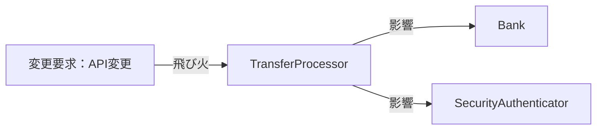
```mermaid
graph LR
    T1["変更要求：API変更"] -->|"飛び火"| A["TransferProcessor"]
    A -->|"影響"| B["Bank"]
    A -->|"影響"| C["SecurityAuthenticator"]
```

このグラフを見ると、銀行APIの仕様という「外部システム都合の変更」が、私たちの業務フローの中枢である `TransferProcessor` を経由して、通信クラスや認証クラス全体に飛び火していることが分かります。

> **グラフの読み方：** この矢印は、変更ID1・変更ID2を適用した際に確認が必要になった依存関係を示しています。`TransferProcessor` が `Bank` と `SecurityAuthenticator` を直接知っているため、今回の認証手順変更が `TransferProcessor` を経由して両クラスへ波及したことを可視化しています。

### 3-3：痛みの言語化

**1つ目：今回の外部手順変更が業務ロジックへ波及したこと。** `TransferProcessor`が銀行APIの使い方を直接知っているため、変更ID1の認証手順と変更ID2の送金引数を追加するために、振り込み業務の核心部分を書き換えました。

**2つ目：目的が見えなくなる複雑化。** コードを見れば、口座確認、残高確認、認証発行、検証、送金実行と、手続きが淡々と並んでいます。しかし、新しい仕様に対応するために一時的なIDを保持したり、条件分岐を足したりすることで、コードは「何のために振り込んでいるのか」という業務上の目的よりも、「銀行のAPIにどうやって命令を通すか」という技術的な手順の記述で埋め尽くされてしまいます。

---
> **📌 問題（確定）**
> 変更ID1の認証手順と変更ID2の送金パラメータを適用すると、業務フローを管理する`TransferProcessor`を直接書き換える必要があった。外部API手順と振り込み業務が同じ場所にあり、今回の変更が業務ロジック全体へ波及した。
---

観測した痛みへ`問題ID`を付け、どの変更IDから来たかを対応づけます。

| 問題ID | 観測した痛み（変更途中コード） | 起点の変更ID |
|---|---|---|
| 問題ID1 | 認証手順と送金引数の追加で、業務フロー本体 `TransferProcessor` を直接書き換え、振込全体を回帰確認した | 変更ID1・変更ID2 |
| 問題ID2 | 変更ID3の補償で、どこまで完了したかを覚える`done`・逆順ループ・取り消しの記録規則の3つが業務フロー側へ入った | 変更ID3 |
| 問題ID3 | 変更ID2のtxId必須化が単発の送金だけでなく一括側の送金・取消の両方へ波及し、複数の入口が銀行APIの具象手順に依存して一緒に変わる | 変更ID2 |


---

## 🟠 フェーズ4：原因分析 ―― なぜ辛いのかを構造で言語化する
### 4-1：痛みの根源を探る（観察と原因）

第一に、新しい認証ステップが追加されたとき、なぜ毎回 `TransferProcessor` を開かなければならないのでしょうか？
それは、このクラス自身が「`auth.requestOTP()` を呼んで、取引IDを取得して、`auth.verifyOTP()` を呼ぶ」といった**銀行APIの具体的な呼び出し手順をすべて直接知ってしまっている（抱え込んでいる）**からです。

第二に、なぜ変更の影響範囲が読めず、振り込み全体のテストをやり直す恐怖を感じるのでしょうか？
それは、「振り込みという業務プロセスの進行」という責任と、「銀行APIという外部システムの技術的な利用手順」という責任が、**同じメソッドの中で物理的に混ざり合っている**からです。

第三に、なぜタイムアウトや結果照会への対応を足すたびに分岐がふくらむのでしょうか？
それは、再試行・照会・保留判断といった**通信上の都合が、振り込み業務の目的と同じメソッドの中に書かれている**からです。

| **観察した症状（痛み）** | **構造的な原因（痛みの根源）** |
|---|---|
| 仕様変更の波が業務ロジックに直撃する | `TransferProcessor` が銀行APIの具体的な呼び出し手順を直接知っているから |
| 複雑化して目的が見えなくなる | 変わる理由が違う2つのもの（「振り込み業務のフロー」と「銀行APIの技術手順」）が同じメソッドの中に混在しているから |
| タイムアウトや結果照会が増えるたびに分岐が増える | 再試行・照会・保留判断といった通信上の都合が、振り込み業務の目的と同じメソッドに書かれるから |

### 4-2：今回変える責任/ほかの変更から守る責任

ここで注意したいのは、`bank.verifyAccount()` や `bank.checkBalance()` という**呼び出しそのものは銀行APIの一部**だということです。メソッド名・引数・確認の仕方は銀行側の都合で変わり得るため、変わる側に属します。守りたいのは、その呼び出しではなく「**送金の前に口座と残高を確認し、認証を通し、送金したら記録する**」という業務手順の意図と順序です。

| **今回変える責任** | **ほかの変更から守る責任** |
|---|---|
| 銀行APIの呼び出し一式（`verifyAccount`・`checkBalance`・`executeTransfer` の呼び方・パラメータ） | 「確認→認証→送金→記録」という業務手順の意図と順序 |
| 認証手順（`promptOTP`・`verifyOTP` の発行・検証ステップ） | 振り込みという業務上の目的と、依頼へ成否を返すこと |
| 送金APIのパラメータ（IDの追加や型変更） | 自社台帳での送金元検証（`db.exists`）と履歴の記録（`history.add`） |

1-4の `transfer()` を、行ごとに「変わる側」「守る側」へ塗り分けると次のようになります。接続点の判断材料なので、略さず全行を示します。

```cpp
    bool transfer(const std::string& from, const std::string& to,
                  int amount, const std::string& otp) {
        if (!db.exists(from)) {                  // 守る側：自社台帳の検証
            std::cout << "エラー: 送金元口座なし\n";

            return false;
        }

        if (!bank.verifyAccount(to)) {           // 変わる側：銀行APIの口座確認
            std::cout << "エラー: 送金先口座なし\n";

            return false;
        }

        if (!bank.checkBalance(from, amount)) {  // 変わる側：銀行APIの残高確認
            std::cout << "エラー: 残高不足\n";

            return false;
        }

        auth.promptOTP();                       // 変わる側：voidの入力受付コマンド
        if (!auth.verifyOTP(otp)) {              // 変わる側：認証検証
            std::cout << "エラー: 認証失敗\n";

            return false;
        }

        bank.executeTransfer(from, to, amount);  // 変わる側：送金API
        history.add(db.ownerName(from),          // 守る側：履歴の記録
                    db.ownerName(to), amount);
        std::cout << "振り込み完了\n";            // 守る側：依頼への結果報告

        return true;
    }
```

「確認してから認証し、送金したら記録する」という順序は業務の要請なので守ります。しかしその順序を構成している個々の呼び出し（`bank.〜`・`auth.〜`）は銀行・認証仕様の一部で、変わる側です。つまりこのメソッドは、**守りたい順序の骨組みの中に、変わる呼び出しの詳細が直接編み込まれている**状態です。

### 4-3：接続点に漏れている手順を確認する

現在、`TransferProcessor`は銀行APIのクラス名だけでなく、口座確認・認証・送金・確認という呼び出し順序まで知っています。接続点で必要なのは「振込を依頼し、結果を受け取ること」ですが、外部APIの技術的な手順が業務側へ漏れています。

現在の `TransferProcessor` は、銀行APIという「特定の機器」に対して、専用のケーブルを直に配線しているような状態です。接続点の判断材料なので、漏れている手順を略さず全て示します。

この章の完全なコードと実行用コードでは、成否を返す `bool`／`TransferResult` を必ず分岐または表示に使います。`promptOTP()` は入力受付を命令するだけの `void` 操作なので戻り値はありません。ほかの章についても、「成否を返す呼び出しを文として捨てていないか」を横断チェック項目へ追加します。

**【銀行APIの手順が呼び出し元へ漏れているコード】**
```cpp
class TransferProcessor {
private:
    Bank& bank;                  // ← 具体：外部銀行を直接保持
    SecurityAuthenticator auth;  // ← 具体：型名を直接宣言
public:
    bool transfer(const std::string& from, const std::string& to,
                  int amount, const std::string& otp) {
        // ← 直接：銀行・認証の各手順を窓口なしに順に呼び出す
        if (!bank.verifyAccount(to)) return false;          // 手順1：口座確認
        if (!bank.checkBalance(from, amount)) return false; // 手順2：残高確認
        auth.promptOTP();                                  // 手順3：voidの認証コード受付
        if (!auth.verifyOTP(otp)) return false;             // 手順4：認証検証
        bank.executeTransfer(from, to, amount);  // 手順5：送金実行

        return true;
    }
};
```

骨格側が知ってしまっている名前・順序・型を拾い、接続点に残す最小の約束としてまとめると次のようになります。

| 抽出段階 | 内容 |
|---|---|
| 骨格側が知っている名前 | `Bank`・`SecurityAuthenticator` という具体クラス名と、`verifyAccount`・`checkBalance`・`promptOTP`・`verifyOTP`・`executeTransfer` というメソッド名 |
| 骨格側が知っている順序 | 手順1〜5の並びと、途中失敗時に後続を実行しないという前後条件 |
| 骨格側が知っている型 | 各メソッドの引数（口座ID `std::string`・金額 `int`・OTP `std::string`）と戻り値（`bool`） |
| 接続点に残す最小の約束 | 「振込依頼（送金元・送金先・金額・認証コード）を渡すと、振込結果（成否と理由）が返る」という1往復だけ |

銀行側の認証方式や送金パラメータが変わるたびに、業務フローを持つ`TransferProcessor`まで修正する必要があります。

「振り込み業務」と「銀行APIの仕様」は、変わる理由が全く異なります。これらが同じ場所に混在していることが、根本原因として確認できました。

今回着目する接続点は、「振込依頼」と「振込結果」の境界です。銀行APIの手順は、その境界の向こう側へ移せます。

---
> **📌 原因（確定）**
> `TransferProcessor`が銀行APIの呼び出し順序を抱え込んでいるため、外部システムの都合で変わる知識と、振込業務のフローが同じクラスに混在している。
---

フェーズ3の問題IDに対応づけて、構造上の原因へ`原因ID`を付けます。次のフェーズ5は、この原因IDから課題IDを導きます。

| 原因ID | 構造上の原因（何が同じ責任へ集まっているか） | 対応する問題ID |
|---|---|---|
| 原因ID1 | `TransferProcessor` が銀行APIの呼出順序・手順を抱え込み、外部都合の知識と振込業務フローが同居している | 問題ID1・問題ID2 |
| 原因ID2 | 利用側が具体的な振込実装を直接選び、実行と実装選択が同じ場所にある | 問題ID3 |

フェーズ4「原因分析」で根本原因が言語化できました。「どこを分けるか」は明確です。次のフェーズ5「課題定義」では、その境界で実際に何が流れているかを値・型のレベルで具体化し、「何を変え、何を守るか」を明確にします。

---

## 🟡 フェーズ5：課題定義 ―― 原因から課題を検討して確定する

### 5-1：原因から課題候補を洗い出す

| 原因ID・確定した事実 | そのままだと残る痛み | 課題候補 | 候補を導いた理由 |
|---|---|---|---|
| 原因ID1：振込処理が口座確認・認証・送金APIの具体手順を知る | API変更で業務フローとバッチ入口まで確認が広がる | 銀行APIの一連手順を振込業務フローから分離する | 外部API手順と振込依頼の利用方法は別の理由で変わる |
| 原因ID2：利用側が具体的な振込実装を直接選ぶ | 接続先変更・テスト差替えで複数入口が変わる | 振込実装の選択を利用側から外す | 実行と実装選択は別の責任である |

### 5-2：課題候補の重複と依存を整理する

| 課題候補 | 必要性・他候補との関係 | 統合／分割の判断 | 整理結果 |
|---|---|---|---|
| 銀行API手順の分離 | 必須。変更ID1・変更ID2で認証から送金まで同時変更になった | 一つの窓口責任として統合 | 課題として残す |
| 実装選択の分離 | 必須。窓口だけ作っても利用側の具象依存が残る | API手順とは別の接続点として追跡 | 課題として残す |

### 5-3：課題IDと接続点を確定する

| 課題ID・接続点 | 接続するもの・変わる側 | 守る側 | 完了条件 |
|---|---|---|---|
| 課題ID1：銀行API手順と振込業務フローの境界 | **接続:** 振込依頼と処理結果<br/>**変わる側:** 認証・送金APIの呼出順とパラメータ | 口座確認、履歴保存、依頼結果 | 利用側がAPI手順を知らず、一つの振込操作だけを呼べる |
| 課題ID2：振込実装の選択と利用側の境界 | **接続:** 振込依頼を処理する実装<br/>**変わる側:** 接続先・テスト用実装の選択 | 単発・一括の利用フロー | 具体実装の差替えで利用側の呼出手順が変わらない |

📌 **システム全体の完了状態**：単発・一括の利用側は振込依頼と結果だけを扱い、認証・送金APIの手順と具体実装の選択は境界の内側へ閉じる。

課題IDを定義できたので、ここまでの追跡を一列で見渡します。

| 問題ID（フェーズ3の痛み） | 原因ID（フェーズ4の構造原因） | 課題ID（達成目標） |
|---|---|---|
| 問題ID1・問題ID2：外部手順の混在による波及と分岐増 | 原因ID1：APIの呼出順序・手順を業務フローが抱え込む | 課題ID1：銀行API手順を振込業務フローから分離 |
| 問題ID3：実装差替えで複数入口が一緒に変わる | 原因ID2：利用側が具体的な振込実装を直接選ぶ | 課題ID2：振込実装の選択を利用側から外す |

## 🔴 フェーズ6：対策検討 ―― 全体のデータと実体の流れを決める

#### まず全体像 ―― どんな構造へ変えるか（抽象）

フェーズ4「原因分析」で、`TransferProcessor` が「振り込み業務の流れ」と「銀行APIの呼び出し手順」という**別々の理由で変わる2つの知識**を、同じ場所へ抱えていることを確認しました。対策は、この2つを別々の責任へ分け、一つの振込経路へ再結合することです。この段階では、問題から導いた「窓口構造」という名前だけを使います。一般に共有されているデザインパターン名は、実装と効果を確認した後で結び付けます。

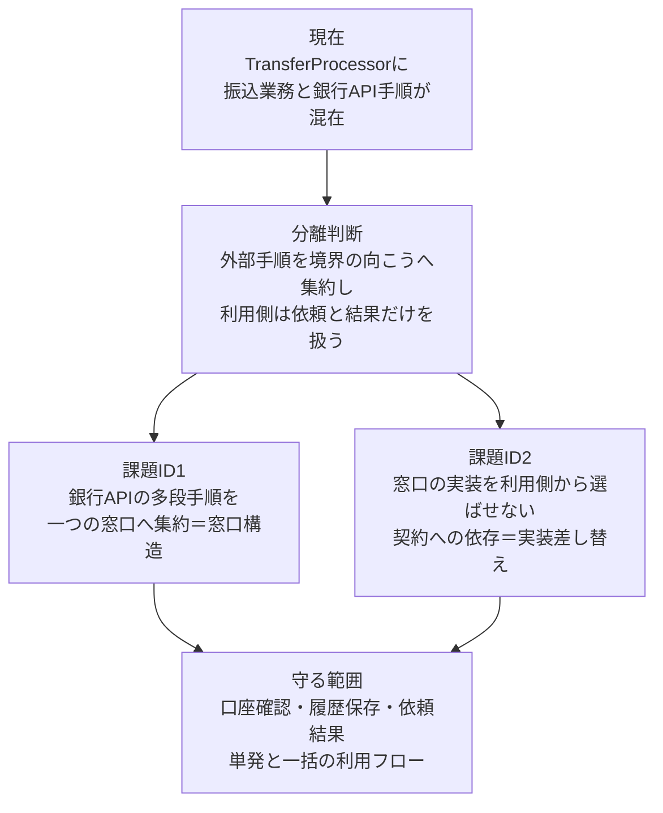
```mermaid
flowchart TB
    A[現在<br/>TransferProcessorに<br/>振込業務と銀行API手順が混在] --> B[分離判断<br/>外部手順を境界の向こうへ集約し<br/>利用側は依頼と結果だけを扱う]
    B --> C[課題ID1<br/>銀行APIの多段手順を<br/>一つの窓口へ集約＝窓口構造]
    B --> D[課題ID2<br/>窓口の実装を利用側から選ばせない<br/>契約への依存＝実装差し替え]
    C --> E[守る範囲<br/>口座確認・履歴保存・依頼結果<br/>単発と一括の利用フロー]
    D --> E
```

**守る範囲 ―― この章で変えないもの。**

- **口座確認と残高確認**：送金先の存在確認と、送金元の残高が足りるかの確認。どちらも行うこと自体と、失敗したら送金しないこと
- **履歴保存**：成功した振り込みだけを記録し、一覧できること
- **依頼結果**：呼び出し側が「成功したか」と「失敗した理由」を受け取れること
- **単発と一括の利用フロー**：1件ずつ振り込む流れと、給与一括振込の流れ。一括は途中で失敗したら、そこまでの成功分を戻す

この4つが変わっていないことは、フェーズ7の受入・回帰エビデンスで確認します。ただし、**分離と組み立ての判断を終えるたびにも照合します。**

### 対策検討のクラス図：1-3の責任と依存をどう変えるか

フェーズ1の1-3で作ったクラス図が、これから書き換えていく**基準の図**です。まずここへフェーズ2〜5の判断を注記として載せ、どの責任を残し、どの責任を移すかを確定します。

| クラス図を変える材料 | 前工程で確認したこと | クラス図へ反映すること |
|---|---|---|
| フェーズ1のクラス図 | 現在のクラス、操作、依存関係 | 変更前クラス図としてそのまま使う |
| フェーズ2の変化予測 | リスクID1〜リスクID3。認証は多段化し、送金形式も変わる | 銀行都合で変わる責任へ `【移す】` と注記する |
| フェーズ4の原因 | 原因ID1（API手順の抱え込み）と原因ID2（利用側が実装を直接選ぶ） | 同じクラスの中で `【残す】` と `【移す】` を分ける |
| フェーズ5の接続点 | 利用側は振込依頼と結果だけを扱えばよい | 課題ID1のAPI手順と課題ID2の実装選択を、それぞれ利用側の外へ出す |

**薄い黄色が着目クラス**です。ここでは `TransferProcessor` の `【残す】` と `【移す】` を追います。矢印は1-3と同じ利用・保持関係です。

**変更前のクラス図（基準の図）：**

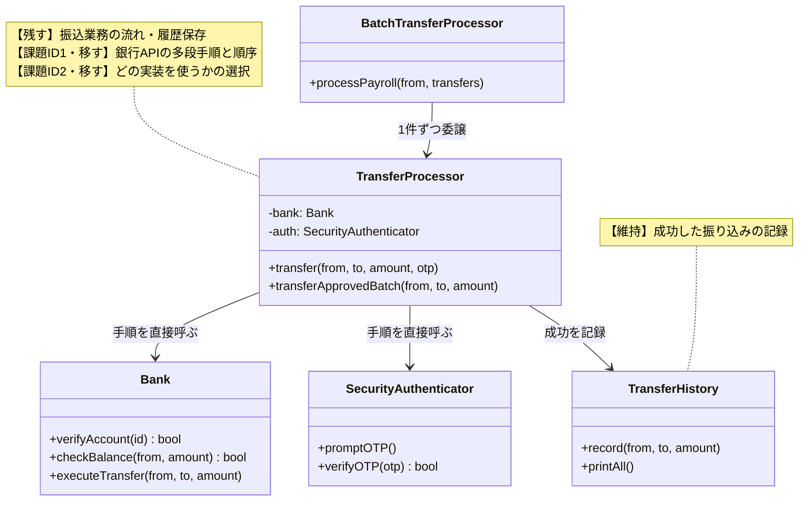
```mermaid
classDiagram
    class BatchTransferProcessor {
        +processPayroll(from, transfers)
    }
    class TransferProcessor {
        -bank: Bank
        -auth: SecurityAuthenticator
        +transfer(from, to, amount, otp)
        +transferApprovedBatch(from, to, amount)
    }
    class Bank {
        +verifyAccount(id) bool
        +checkBalance(from, amount) bool
        +executeTransfer(from, to, amount)
    }
    class SecurityAuthenticator {
        +promptOTP()
        +verifyOTP(otp) bool
    }
    class TransferHistory {
        +record(from, to, amount)
        +printAll()
    }
    BatchTransferProcessor --> TransferProcessor : 1件ずつ委譲
    TransferProcessor --> Bank : 手順を直接呼ぶ
    TransferProcessor --> SecurityAuthenticator : 手順を直接呼ぶ
    TransferProcessor --> TransferHistory : 成功を記録

    note for TransferProcessor "【残す】振込業務の流れ・履歴保存<br/>【課題ID1・移す】銀行APIの多段手順と順序<br/>【課題ID2・移す】どの実装を使うかの選択"
    note for TransferHistory "【維持】成功した振り込みの記録"

    classDef focus fill:#FFF2CC,stroke:#D6B656,stroke-width:2px,color:#222222
    cssClass "TransferProcessor" focus
```

向きと掲載クラスは1-3から変えていません。同じ図に注記と色だけを加え、`TransferProcessor` のどの責任を残し、どの責任を移すかに着目します。**この図を基準に、分離と組み立てで必要な関係を足していきます。**

クラス図の変更として書くと、次の3操作になります。**どんなクラスを新設し、何という名前にするかは、直後の全体経路で決めます。** ここで確定しているのは操作の種類だけです。

1. 課題ID1：銀行APIの多段手順を、`TransferProcessor` の外にある1つの責任へまとめる。
2. 課題ID2：その責任が満たす共通契約を新設し、利用側を契約だけに依存させる。
3. 課題ID1・課題ID2：実体を生成・所有する場所を決め、単発と一括の両方の入口へ渡す。

これらの操作を、直後の全体経路へまとめます。

#### 全体経路を決めるための確認観点

全体経路を決めるとき、次の二点を同時に確認します。

- **契約と具体による分離**：振込業務に何を残し、外部手順と実装差をどの契約・具体へ置くかをセットで決める。
- **実体の組み立て**：実体を誰が生成・所有し、単発と一括の入口へ契約として渡してどう実行するかを一本で決める。

### 全体のデータと実体の流れを先に決める

最初に、生成した窓口が実際に使われるまでの全体経路を決めます。ACC001からACC002への5000円の振り込みを、生成→利用側への受け渡し→入口→具体手順→結果返却の順で固定します。

| 実行順・ポイント | 掲載箇所 | 実際のコード接続 | 次の呼出先 |
|---|---|---|---|
| 1. 生成 | `Application::run()` | `BankTransferService service(db, bank, history);` で窓口を1つ作る | 注入へ |
| 2. 注入 | `TransferProcessor::TransferProcessor(IBankTransferService&)` | `TransferProcessor processor(service);` ―― 契約への参照を受け取る | 実行開始へ |
| 3. 実行開始 | `Application::run()` | `processor.transfer({"ACC001", "ACC002", 5000, "999999"});` | `TransferProcessor::transfer()` |
| 4. 骨格 | `TransferProcessor::transfer(const TransferRequest&)` | `service.performTransfer(req)` を1回呼び、結果を表示する | `IBankTransferService::performTransfer()` |
| 5. 契約→具体 | `BankTransferService::performTransfer(const TransferRequest&)` | 口座確認→残高確認→認証発行→認証検証→送金→履歴記録の5手順 | 戻り値を骨格が表示 |

**生成と注入のあいだが、この章の分離点です。** 4は銀行のメソッド名を1つも知らず、5はそのすべてを知っています。**リスクID1で認証が三段階になったとき、増える行は5の中だけです。**

**一括振込は3から6へ分かれます。** `BatchTransferProcessor` が `performApprovedBatchTransfer()` を件数ぶん呼び、途中で失敗したら `compensate()` を成功済みの件数ぶん逆順に呼びます。**通る窓口は同じ実体です。** 全体経路の準備コードで「単発と一括が同じ実体を使う」と決めた結果が、ここに出ています。

### 全体の流れを実現するコードを決める

**【課題の原因】** 課題ID1は、問題ID1・問題ID2（外部手順の混在による波及と分岐増）＝原因ID1（APIの呼出順序・手順を業務フローが抱え込む）。課題ID2は、問題ID3（実装差替えで複数入口が一緒に変わる）＝原因ID2（利用側が具体的な振込実装を直接選ぶ）。この2つを分離対象にします。

**この課題（何を解きたいか）：** 銀行が認証を1段増やすだけで振込業務のクラスを触り、テスト用の実装へ替えるだけで単発と一括の両方の入口を触る。**利用側がAPI手順を知らず、一つの振込操作だけを呼べる**ようにするのが課題ID1、**実装を差し替えても利用側の呼出手順が変わらない**ようにするのが課題ID2です。

**ここで全体経路と対応づけるコード：** 銀行APIの多段手順を呼び出し元からどこまで外し、依頼と結果をどの形で接続し、具体的な処理役を誰が生成・所有するかをコードで示します。

**2つの課題を、別々に解いて後で合流させる形にはしません。** ただし、**この2つは対等な2軸ではありません。** 課題ID2は「課題ID1で作った窓口を、利用側からどう見せるか」の話なので、**課題ID1の結論が決まらないと課題ID2を決められません。**

銀行の認証手順と実装の選択は別々の理由で変わりますが、実装選択が差し替える対象は銀行窓口です。そのため、先に「窓口が何を受け取り何を返すか」を決め、その公開操作を利用側が依存する契約にします。

**全体経路との対応。** フェーズ5「課題の確定（5-3）」で決まったのは、銀行APIの手順と実装の選択を、振込業務とは別の変更へ閉じる境界を作ることです。全体経路で決めた接続を、ここから**境界を関数・表・クラス契約のどれで表し、どのコードで繋ぐか**へ落とします。

書き換える前のコードはフェーズ3「変更を試みる（3-1）」にあります。**ここで全部を再掲することはしません。** 分離と組み立ての判断に必要な数行だけを変更試行（3-1）から抜き出し、変更後と並べます。

---

#### 1. 契約と具体をセットで決める（分離）

ここでは契約だけを先に完成させません。境界へ残す操作・値と、その裏で変わる判断を持つ具体を往復し、両側がかみ合うところまでを一つの判断として扱います。

##### 契約：境界の形と受け渡しを決める

**この章でクラス境界まで分ける根拠は、利用箇所の数や銀行実装の種類ではなく、変更理由と利用側の数です。** 変更試行では、銀行側の認証手順が変わっただけで振込業務の `TransferProcessor` が修正対象になりました。さらに、同じ銀行手順を単発振込と一括振込の二つの入口が使います。関数を `TransferProcessor` の内側へ切り出すだけでは銀行都合の変更が業務クラスに残り、一括側からも共有できません。

そこで、口座確認・認証・送金・履歴保存を一つの銀行窓口へ移し、単発と一括の両方が同じ操作を呼ぶ境界にします。テスト用実装へ差し替える要求もあるため、窓口の公開操作はクラス契約として表します。判断の軸は「何種類あるか」ではなく、**銀行APIの変更を二つの業務フローへ漏らさず、同じ窓口を共有できるか**です。

分けると決めたので、コードに線を引きます。

**掲載箇所：`TransferProcessor::transfer(const string&, const string&, int, const string&)`** ―― 3-1の振込フロー（対策前）

```cpp
    bool transfer(const std::string& from, const std::string& to,
                  int amount, const std::string& otp) {
        if (!db.exists(from)) {                  // 守る側：自社台帳の検証
            std::cout << "エラー: 送金元口座なし\n";

            return false;
        }

        if (!bank.verifyAccount(to)) {           // ← 出て行く側
            std::cout << "エラー: 送金先口座なし\n";

            return false;
        }

        if (!bank.checkBalance(from, amount)) {  // ← 出て行く側
            std::cout << "エラー: 残高不足\n";

            return false;
        }

        auth.promptOTP();                        // ← 出て行く側
        if (!auth.verifyOTP(otp)) {              // ← 出て行く側
            std::cout << "エラー: 認証失敗\n";

            return false;
        }

        bank.executeTransfer(from, to, amount);  // ← 出て行く側
        history.add(db.ownerName(from),          // 守る側：履歴の記録
                    db.ownerName(to), amount);
        std::cout << "振り込み完了\n";            // 残る側（結果を返す）

        return true;
    }
```

**割り方の根拠は、銀行側の都合で変わるかどうかです。** リスクID1で認証が三段階になれば3〜4行目が増えます。リスクID2で送金形式が変われば5行目が変わります。**残るのは「結果を呼び出し側へ返す」ことだけ**で、これは銀行が何をしようと変わりません。

**5-3が挙げた候補は2つです。** 振込依頼と、処理結果。**このうち何がいくつ境界を流れるかは、まだ決まっていません。** 1つずつ形を決めます。

| 接続するもの（5-3の候補） | 決めた形 | そう決めた理由 |
|---|---|---|
| 振込依頼 | **1つの値にまとめて引数で渡す**（送金元・送金先・金額・認証コード） | 4つをばらばらの引数にすると、認証方式が変わるたびに引数の数が変わる。呼び出し側の全行を触ることになる |
| 処理結果 | **成否と理由の2つを1つの値で返す** | 変更前は `bool` だけで、失敗理由が呼び出し側に届いていなかった。守る範囲の「依頼結果」に理由が含まれるので、ここで形にする |

**候補2つが、そのまま2つとも境界を流れます。** どちらも値として渡す形にしたので、構造で表すことにしたものはありません。

**「失敗理由を返す形にしてよいのか」** ——ここは踏み外しやすいので、根拠を書きます。**変更前のコードは `bool` しか返していないので、「変更前が消費していた値」を根拠にはできません。** 使えるのは1-5の変更後要求ベースラインです。要求ID5が「未登録口座・残高不足・認証失敗をそれぞれ理由付きで拒否する」と定めていて、変更前は理由を `cout` で直接出していました。**手順を境界の向こうへ移すと、その `cout` も一緒に移ります。** 移した先が理由を持っているのに呼び出し側へ返さないと、要求ID5を満たせません。だから戻り値に理由を含めます。

**変更前に無かった情報を返すときは、変更前のコードではなく要求IDが根拠になります。**

**掲載箇所：`TransferRequest`／`TransferResult`（構造体全体）** ―― 境界を流れる2つの値

```cpp
struct TransferRequest {
    std::string fromAccount;
    std::string toAccount;
    int amount;
    std::string otp;
};
```

**TransferResult**

このブロックでは `TransferResult` の定義だけを確認します。

```cpp
struct TransferResult {
    bool success;
    std::string message;
};
```

**振り込みという1回のやり取りが、1つの依頼と1つの結果になりました。** 銀行が認証を1段増やしても、依頼に入るのは認証コードのままです。増えるのは境界の向こう側の手順です。

**ここで契約そのものは置きません。** 銀行APIの手順を受け取る側が何という操作を持つかは、**分離の検算で「誰が呼ぶか」を決めてから**でないと決まりません。単発の振り込みだけなのか、一括振込にも別の操作が要るのかは、呼ぶ側の形で変わります。


**では、この2つの値をやり取りする相手を、誰が呼ぶのか。**

---

##### 分離の検算：守る処理が契約だけを呼べるか

呼べるのは、銀行の都合が変わっても今回維持する側だけです。出て行った側が出て行った側を呼べば、認証が変わるたびに両方を触ることになり、分けた意味が消えます。

**この章では、契約を骨格の外へ置きます。** ただし、実行中に相手が入れ替わるからではありません。1回の振り込みで窓口が途中で別物になることはありませんし、実行中に接続先が変わることもありません。

**それでも別クラスになるのは、骨格が2つあるからです。** 単発振込（`TransferProcessor`）と一括振込（`BatchTransferProcessor`）は、どちらも同じ窓口を呼びます。基底クラスの内側に契約を置くと、**2つの骨格それぞれが窓口の手順を継承することになり、窓口が2つに分かれます。** それでは集約した意味がありません。

**決め手は「同じ相手を複数の骨格が使うか」です。** 使うなら、契約は骨格の外に置くしかありません。

残った側は、`TransferProcessor` と `BatchTransferProcessor` の2つです。**どちらも名前は変えません。** 1-3で書いた役割は「個別振り込みフロー進行」「一括振り込み進行」で、ここの後もそれは変わらないからです。出て行くのは銀行APIの手順であって、フロー進行そのものではありません。**責任が変わっていないのに名前だけ変えると、差分が増えるだけです。**

**掲載箇所：`TransferProcessor::transfer(const TransferRequest&)`** ―― 骨格

```cpp
    void transfer(const TransferRequest& req) {
        TransferResult r = service.performTransfer(req);  // ←この service が未定
        std::cout << (r.success ? "振り込み完了\n"
                                : "エラー: " + r.message + "\n");
    }
```

**5行あった手順が1行になりました。** 残ったのは「窓口へ依頼を渡し、返ってきた結果を表示する」だけです。

**このコード片には、`service` を受け取る行がまだ現れていません。** ここへ `BankTransferService` のような具体名を書くと、課題ID2の完了条件「実装を差し替えても利用側の呼出手順が変わらない」が崩れます。全体経路で決めたとおり、`Application::run()` が生成した窓口をコンストラクタで渡すコードを後で示します。

**一括振込も同じ形です。** ただし呼ぶ操作が違います。

**掲載箇所：`BatchTransferProcessor::processPayroll(const string&, const vector<pair<string,int> >&)`** ―― 骨格の中心部分

```cpp
        for (const auto& entry : payrollEntries) {
            TransferResult r =
                service.performApprovedBatchTransfer(   // ←同じ service を呼ぶ
                    payrollSourceAccount, entry.first, entry.second);
            if (r.success) { completedEntries.push_back(entry); }
            else { /* …中断して完了済みを戻す（省略）… */ }
        }
```

**一括では認証コードを渡しません。** 給与振込は事前承認済みなので、1件ごとにOTPを求めません。**だから `TransferRequest` を渡す操作とは別の操作が要ります。** 契約の確認で「契約は分離の検算で決まってから」と書いたのは、これが理由です。呼ぶ側が2種類あって、必要な操作が2つだと、ここで初めて分かりました。

**そして中断時の戻しにも、もう1つ操作が要ります。** 一括の途中で失敗したら、そこまでの成功分を戻します。戻す処理も銀行APIの手順なので、境界の向こう側です。

**契約が3操作に決まりました。**

| 操作 | 呼ぶ骨格 | 受け取るもの | 返すもの |
|---|---|---|---|
| 単発の振り込み | `TransferProcessor` | 振込依頼（認証コードを含む） | 処理結果 |
| 承認済み一括の振り込み | `BatchTransferProcessor` | 送金元・送金先・金額 | 処理結果 |
| 補償（戻し） | `BatchTransferProcessor` | 送金元・送金先・金額 | 無し |

**契約の名前を決めます。** 銀行への振込処理を提供する窓口の契約なので `IBankTransferService` とします。

**掲載箇所：`IBankTransferService`（クラス全体）**

```cpp
// 窓口の契約
class IBankTransferService {
public:
    virtual TransferResult performTransfer(
        const TransferRequest& req) = 0;
    virtual TransferResult performApprovedBatchTransfer(
        const std::string& from, const std::string& to,
        int amount) = 0;
    virtual void compensate(
        const std::string& from, const std::string& to,
        int amount) = 0;
    virtual ~IBankTransferService() = default;
};
```

**銀行のメソッド名が1つも出てきません。** `verifyAccount`・`checkBalance`・`promptOTP`・`verifyOTP`・`executeTransfer` は、すべて契約の向こう側です。**3-1で「骨格側が知っている名前」として挙げた5つが、ここで全部消えました。**

**ここで検算します。認証が三段階になったとき、この3操作は変わるか。** 変わりません。増えるのは窓口の内側の手順で、依頼に入る認証コードの数が変わる可能性はありますが、それは `TransferRequest` の中身の話です。**穴が空いたままでも、この検算はできます。**

**ここで図に描けるのは、2つの骨格から契約への依存だけです。** 実体を得る経路は全体像で決めていますが、この部分図は契約との依存だけに着目するため、その線は後の組み立て図で示します。

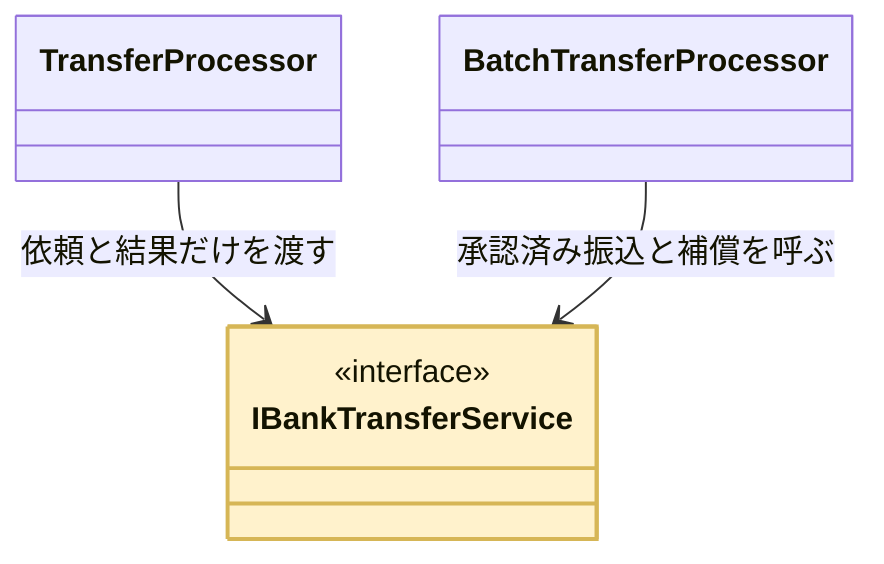
```mermaid
classDiagram
    class TransferProcessor
    class BatchTransferProcessor
    class IBankTransferService { <<interface>> }
    TransferProcessor --> IBankTransferService : 依頼と結果だけを渡す
    BatchTransferProcessor --> IBankTransferService : 承認済み振込と補償を呼ぶ
    class IBankTransferService:::focus
    classDef focus fill:#FFF2CC,stroke:#D6B656,stroke-width:2px
```

**基準の図にあった `TransferProcessor --> Bank` と `TransferProcessor --> SecurityAuthenticator` が、ここで消えます。** 2本の矢印が1本になりました。`TransferHistory` への矢印も消えますが、それは記録が窓口側へ移るからで、具体の確認で確かめます。


**では、契約の裏には何を置くのか。**

---

##### 具体：契約の裏へ変わる判断を置く

契約と、それを呼ぶ骨格が決まりました。**ここで契約の裏を埋めます。**

**課題ID1（窓口軸）。ここは、1つ違います。実装が1つしかありません。**

**それでも分ける価値があるのは、目的が差し替えではないからです。** 契約の確認で確認したとおり、この章で止めたいのは「銀行APIの知識が振込業務へ漏れること」でした。**手順を1か所へ集めた時点で、その目的は達成されます。** 実装が2つ以上ないと意味がない、という構造ではありません。

**掲載箇所：`BankTransferService`（クラス宣言とメンバー）** ―― 契約の裏

```cpp
// 窓口：銀行の多段手順と認証・台帳・履歴を束ねて隠す
class BankTransferService : public IBankTransferService {
private:
    AccountDatabase& db;
    Bank& bank;
    TransferHistory& history;
    SecurityAuthenticator auth;
    // …口座と残高をまとめて確認する内部処理（省略。詳細は7-1）…
public:
    TransferResult performTransfer(const TransferRequest& req);
    TransferResult performApprovedBatchTransfer(
        const std::string& from, const std::string& to, int amount);
    void compensate(const std::string& from, const std::string& to,
                    int amount);
};
```

**3-1で `TransferProcessor` が持っていた `bank` と `auth` が、ここへ移りました。** そして `history` も一緒に来ています。**履歴の記録が窓口側へ移ったのは、記録するのが「送金が成功した瞬間」だからです。** その瞬間を知っているのは手順を実行している側で、骨格は結果を受け取るだけです。

**守る範囲の「履歴保存」は、置き場所が変わっただけで動きは同じです。** 成功した振り込みだけを記録し、一覧できる——これは3-1のままです。

**掲載箇所：`BankTransferService::performTransfer(const TransferRequest&)`** ―― 3-1の5手順が移った先

```cpp
TransferResult BankTransferService::performTransfer(
        const TransferRequest& req) {
    TransferResult v = validateAccountsAndBalance(
        req.fromAccount, req.toAccount, req.amount);
    if (!v.success) return v;                       // 手順1・2：口座と残高
    std::string txId = auth.issueChallenge();       // 手順3：認証コード発行
    if (!auth.verifyOTP(txId, req.otp)) {           // 手順4：認証検証
        return {false, "認証に失敗しました"};
    }

    bank.executeTransfer(req.fromAccount, req.toAccount, req.amount);
    history.record(req.fromAccount, req.toAccount, req.amount);

    return {true, ""};                              // 手順5：送金と記録
}
```

**3-1の5手順が、順序を変えずにそのまま入っています。** 変わったのは、失敗のたびに `false` を返す代わりに理由を添えるようになったことだけです。**リスクID1で認証が三段階になったら、増える行はこの関数の中です。** `TransferProcessor` は1行も変わりません。

**課題ID2（実装選択軸）。こちらの裏は、いま作ったものがそのまま埋めます。** 課題ID2が求めていたのは「利用側が実装を直接選ばないこと」で、そのための契約は分離の検算で置きました。**裏に置く実装は、課題ID1で作った窓口です。**

**2つの課題が、ここで初めて同じものを指しました。** 課題ID1は「手順をどこへ集めるか」、課題ID2は「それを利用側からどう見せるか」。**先に課題ID1を決めたから、課題ID2は契約を1つ足すだけで済みました。** 順序を逆にしていたら、契約を先に決めてから中身が入らないと分かり、作り直すことになります。

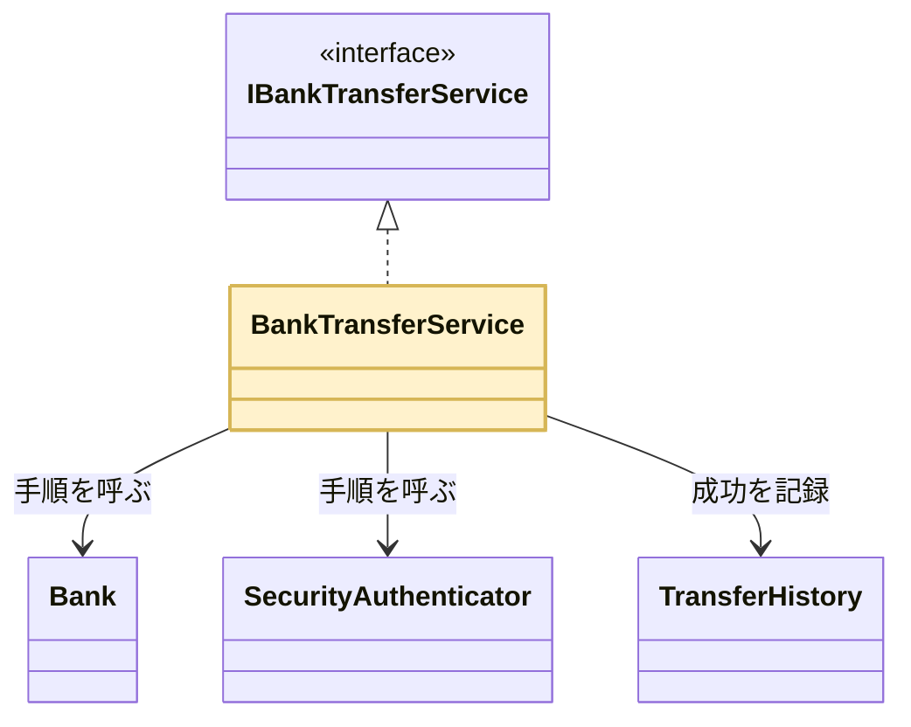
```mermaid
classDiagram
    class IBankTransferService { <<interface>> }
    class BankTransferService
    class Bank
    class SecurityAuthenticator
    class TransferHistory
    IBankTransferService <|.. BankTransferService
    BankTransferService --> Bank : 手順を呼ぶ
    BankTransferService --> SecurityAuthenticator : 手順を呼ぶ
    BankTransferService --> TransferHistory : 成功を記録
    class BankTransferService:::focus
    classDef focus fill:#FFF2CC,stroke:#D6B656,stroke-width:2px
```

**基準の図で `TransferProcessor` から出ていた3本の矢印が、そのまま `BankTransferService` から出ています。** 矢印の数も向きも変わっていません。**変わったのは、根元がどのクラスかだけです。** これが「手順を移した」の実態です。

**もう一度検算します。契約のメソッド以外に書きたくなるものがあるか。** 出てきませんでした。3操作で単発・一括・戻しがすべて表せています。

**守る範囲との照合：** **口座確認と残高確認**、**履歴保存**に触りました。どちらも置き場所が `TransferProcessor` から `BankTransferService` へ移っただけで、確認する内容も、失敗したら送金しないことも、成功だけを記録することも変わっていません。単発と一括の利用フロー、依頼結果には触っていません。

**ここまでで、クラスの設計は終わりです。** 残っているのは、これらを誰が作り、どう渡すかだけになりました。**そしてここから先は、2つの軸で共通です。**

---

#### 2. 全体経路をコードで組み立てる

ここからは三つを別々の設計判断として扱いません。具体を作る行から、契約として骨格へ入り、公開入口から実行される行までを一つの経路として追います。

##### 全体経路の準備：実体と所有者をコードで示す

**分離の検算で穴が1つ空きました。** 骨格が持つ `service` です。ここで決めるのは、**誰が窓口の実体を作り、誰が持つか**です。

持つ者に必要な条件は、分離の検算で分かっています。

- **具体クラスを知っていること。** `BankTransferService` を作る以上、作る側はその名前を知っていなければなりません
- **`TransferProcessor` でも `BatchTransferProcessor` でもないこと。** 分離の検算で確認したとおり、知った時点で課題ID2が崩れます

**もう1つ条件があります。単発と一括が同じ実体を使うこと。** 別々に作ると、履歴が2つに分かれます。給与振込の記録が単発の一覧に出てこない、ということが起きます。**守る範囲の「履歴保存」が崩れるので、実体は1つです。**

**この3つを満たすのは、両方の入口より外側にいる者です。** この章では組み立て役の `Application` がそれにあたります。

**掲載箇所：`Application::run()`** ―― 組み立て（対策後）

```cpp
    void run() {
        AccountDatabase db;
        Bank bank;
        TransferHistory history;
        BankTransferService service(db, bank, history);
        TransferProcessor processor(service);
```

**4行で組み立てが終わります。** `db`・`bank`・`history` は1-4から続く境界で、これは変更前と同じです。**新しく増えたのは `service` の1行と、それを `processor` へ渡す部分だけです。**

**所有と生存期間もここで決まります。**

- `db`・`bank`・`history`・`service`・`processor` は、すべて `run()` のローカル変数です。生ポインタも `new` も使いません
- `BankTransferService` が持つ `db`・`bank`・`history` は**参照**です。所有はしません。宣言順が上なので、窓口より先に消えることはありません
- `TransferProcessor` が持つ `service` も**参照**です。同じく宣言順が上なので、骨格より先に消えません
- **借りているものは、すべて同じ `run()` の中にあります。** 生存期間を追うために別の関数を読む必要がありません

**なぜ参照で借りるのか。** 値で持つと、単発と一括が別々の窓口を持ってしまい、上で確認した「実体は1つ」が崩れます。**共有したいものは借りる、というのがこの章の選び方です。**

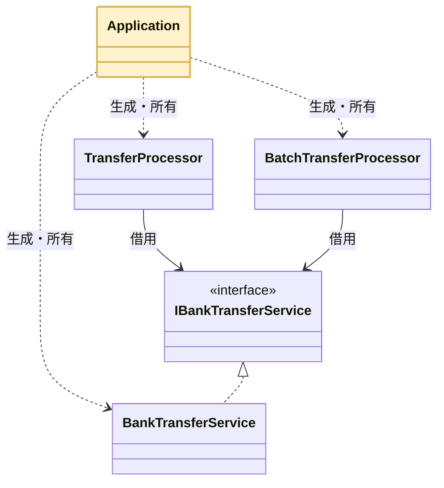
```mermaid
classDiagram
    class Application
    class TransferProcessor
    class BatchTransferProcessor
    class IBankTransferService { <<interface>> }
    class BankTransferService
    Application ..> BankTransferService : 生成・所有
    Application ..> TransferProcessor : 生成・所有
    Application ..> BatchTransferProcessor : 生成・所有
    TransferProcessor --> IBankTransferService : 借用
    BatchTransferProcessor --> IBankTransferService : 借用
    IBankTransferService <|.. BankTransferService
    class Application:::focus
    classDef focus fill:#FFF2CC,stroke:#D6B656,stroke-width:2px
```

**点線が生成・所有、実線が借用です。** `Bank`・`SecurityAuthenticator`・`TransferHistory` はこの図に描いていませんが、具体の確認から変わっていません。


**ここが終わった時点で、実体はすべて存在しています。** 窓口、2つの骨格、それらを持つ組み立て役。**まだ起きていないのは1つだけです。骨格の `IBankTransferService&` と書かれた変数へ、具体が入ることです。続けて、全体経路で決めた受け渡しをコードで確認します。**

---

##### 全体経路の受け渡し：生成済み実体を利用側へ渡す

**分離の検算で書いた骨格には、`service` としか書いてありません。** `BankTransferService` とは書いていません。それでも実行すれば銀行の手順が動きます。**ここで見るのは、いつ・何によって、その実装が入るのかです。**

**掲載箇所：`TransferProcessor`（メンバーとコンストラクタ）** ―― 実装が入る場所

```cpp
class TransferProcessor {
private:
    IBankTransferService& service;          // ←契約としか書いていない
public:
    explicit TransferProcessor(IBankTransferService& s)
        : service(s) {}                     // ←ここで実装が入る
```

**この1行が注入です。** 型は `IBankTransferService&` なのに、実行時に入っているのは `BankTransferService` です。入れているのは全体経路の準備コードで示した `TransferProcessor processor(service);` の側で、骨格ではありません。**骨格は、何が入ったかを最後まで知りません。**

**この章は1つ目です。** 決め手は「組み立て役が何を渡したか」で、**組み立てのときに1回決まります。** `processor` を作った後は、`transfer()` を何回呼んでも同じ窓口です。

| 軸 | 実装が決まる決め手 | 決め手の出どころ | 入る場所 |
|---|---|---|---|
| 窓口（課題ID1・課題ID2） | 組み立て役が渡した実体 | `Application::run()` の1行 | `TransferProcessor`／`BatchTransferProcessor` のコンストラクタ |

**課題ID2の完了条件が、ここで満たされます。** テスト用の実装を作って渡す先を替えれば、`TransferProcessor` も `BatchTransferProcessor` も1行も変わりません。**変わるのは組み立ての1行だけです。** 変更前は、実装を替えると両方の入口を触ることになっていました。

**骨格が窓口へ届く方法は、外で生成した同じ実体を参照で借りることです。** 値メンバとして内部生成すれば外からの注入ではなくなり、単発と一括で別実体になり得ます。この章は「単発と一括が同じ窓口を使う」ため、`Application::run()`で一つを生成して両方へ注入します。


---

##### 実行：公開入口から骨格・契約・具体へつなぐ

組み立てが終わりました。呼び出し側がどう変わったかを、変更前と並べて見ます。

**掲載箇所：`main()`／`Application::run()`** ―― 3-1の個別振り込み（対策前）

```cpp
    processor.transfer("ACC001", "ACC002", 5000, "999999");
```

**掲載箇所：`Application::run()`** ―― 同じ操作（対策後）

```cpp
    processor.transfer({"ACC001", "ACC002", 5000, "999999"});
```

**引数が4つから1つになりました。** 中身は同じ4項目ですが、`TransferRequest` という1つの値にまとまっています。**銀行が認証を三段階にしても、呼び出し側のこの行は変わりません。** 変わるのは `TransferRequest` の中身と、窓口の内側です。

**組み立ての行は増えました。** 変更前は `TransferProcessor processor(bank);` の1行でしたが、変更後は窓口を作る行が1つ増えています。**この章の対策で `main()` が払ったコストは1行です。** 隠さずに書いておきます。増えたぶんは、銀行APIの変更が振込業務のクラスへ届かなくなることと引き換えです。

**全体経路で先に決めた呼び方を、ここで実コードと突き合わせます。** 章によって公開入口が変わる場合と変わらない場合がありますが、重要なのは先に決めた経路と各コードの接続が一致することです。

**守る範囲との照合：** **単発と一括の利用フロー**を保っていることを、いま確認しました。1件ずつ振り込む流れも、一括の中断と戻しも、呼ぶ形は変わっていません。分離と組み立てを通して、守る範囲の4つはいずれも定義に反していません。最終確認はフェーズ7の受入・回帰エビデンスで行いますが、**そこで初めて確かめるのではなく、全体経路と詳細コードで照合済みです。**


#### システム全体の最終構造を決める

分離と組み立ての部分図を重ねると、システム全体の最終構造になります。`BankTransferService` が銀行APIの多段手順を集約し、`IBankTransferService` がそれを利用側から隠し、単発と一括の2つの入口が同じ契約だけを見ます。

**この章の完成構造は一つに定まります。** 窓口を単発用と一括用の2つへ分ける形も理屈の上では置けますが、履歴が2つに分かれ、守る範囲の「履歴保存」が崩れます。責任配置が異なる完成構造が複数残ったわけではないので、当て馬を並べた比較は行いません。

全体経路を実現するコードで確定した部分がすべて入っているかを、次の図で照合します。

**採用した変更後のクラス図：**

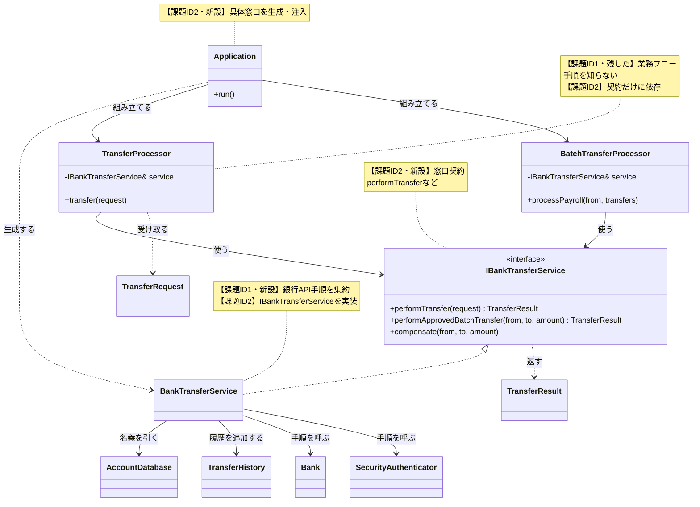
```mermaid
classDiagram
    direction TB
    class TransferRequest
    class TransferResult
    class AccountDatabase
    class TransferHistory
    class Bank
    class SecurityAuthenticator
    class Application {
        +run()
    }
    class TransferProcessor {
        -IBankTransferService& service
        +transfer(request)
    }
    class BatchTransferProcessor {
        -IBankTransferService& service
        +processPayroll(from, transfers)
    }
    class IBankTransferService {
        <<interface>>
        +performTransfer(request) TransferResult
        +performApprovedBatchTransfer(from, to, amount) TransferResult
        +compensate(from, to, amount)
    }
    class BankTransferService

    Application ..> BankTransferService : 生成する
    Application --> TransferProcessor : 組み立てる
    Application --> BatchTransferProcessor : 組み立てる
    TransferProcessor --> IBankTransferService : 使う
    BatchTransferProcessor --> IBankTransferService : 使う
    IBankTransferService <|.. BankTransferService
    BankTransferService --> AccountDatabase : 名義を引く
    BankTransferService --> TransferHistory : 履歴を追加する
    BankTransferService --> Bank : 手順を呼ぶ
    BankTransferService --> SecurityAuthenticator : 手順を呼ぶ
    TransferProcessor ..> TransferRequest : 受け取る
    IBankTransferService ..> TransferResult : 返す

    note for TransferProcessor "【課題ID1・残した】業務フロー<br/>手順を知らない<br/>【課題ID2】契約だけに依存"
    note for BankTransferService "【課題ID1・新設】銀行API手順を集約<br/>【課題ID2】IBankTransferServiceを実装"
    note for IBankTransferService "【課題ID2・新設】窓口契約<br/>performTransferなど"
    note for Application "【課題ID2・新設】具体窓口を生成・注入"

    classDef focus fill:#FFF2CC,stroke:#D6B656,stroke-width:2px,color:#222222
    cssClass "TransferProcessor,BatchTransferProcessor,IBankTransferService,BankTransferService,Application" focus
```

**基準の図と見比べてください。** `TransferProcessor` から `Bank`・`SecurityAuthenticator` へ出ていた矢印が消え、同じ矢印が `BankTransferService` から出ています。**矢印の数も向きも変わっていません。根元のクラスが変わっただけです。**

このクラス図が、課題ID1・課題ID2を反映したシステム全体の設計結論です。課題IDは図の差分を追うために使い、以降はこの構造に必要なコードだけを示します。

### 6-1：決めた流れとコードの照合

#### 流れを成立させる二つの確認

契約と具体による分離と、生成から実行までの組み立てを二行で確認します。

| 判断 | 変更前の所属 → 変更後の所属 | 設計結論 | 検算 |
|---|---|---|---|
| 契約と具体による分離 | 銀行手順を直接呼ぶ業務処理 → `IBankTransferService` と `BankTransferService` | `TransferRequest`・`TransferResult` を境界にし、銀行・認証・履歴の手順を具体へ閉じる | 単発・一括の入口は銀行API名を知らない |
| 実体の組み立て | 各入口が具体を持つ → `Application::run()` が窓口を1つ所有し両入口へ貸す | コンストラクタで契約参照を渡し、同じ窓口を単発・一括から実行する | 生成した窓口が両経路で共有される |

公開入口は、4引数ではなく一つの `TransferRequest` を受け取ります。組み立てでは、同じ窓口実体を単発と一括の両方へ渡します。

### 6-2：システム全体の契約とデータ配置を確定する

採用システムの契約、生成場所、依存注入を一表で確定します。`TransferRequest` は対策の抽象ではなく、振込1件に必要な入力（口座・金額・認証コード）を窓口へ渡す要求オブジェクト、`TransferResult` は成否と理由を返す結果オブジェクトです。

```cpp
struct TransferRequest {
    std::string fromAccount;   // 送金元
    std::string toAccount;     // 送金先
    int amount;                // 金額
    std::string otp;           // 認証コード
};
```

**TransferResult**

このブロックでは `TransferResult` の定義だけを確認します。

```cpp
struct TransferResult {
    bool success;              // 成否
    std::string message;       // 完了、または失敗理由
};
```

| 接続点を変える観点 | システム全体での設計判断 | 変えたくない側が知らなくなる詳細 |
|---|---|---|
| 何を分離するか | 課題ID1の銀行API手順と課題ID2の具体窓口選択を窓口クラスと契約へ置く | 手順の並びと具体窓口名 |
| どこで生成・選択するか | `Application` が `BankTransferService` を生成・所有・選択する | 具体窓口の生成方法 |
| どう依存を渡すか | 呼び出し元へ `IBankTransferService&` を注入する | 選ばれた窓口の具体実体 |
| 安定側はどう実行するか | 呼び出し元は `performTransfer` など契約の操作だけを呼ぶ | 手順・認証・補償の詳細 |

参照で非所有の依存を保持するため、`Application` の `BankTransferService` は呼び出し元より長く生存させます。

### 6-3：課題から完成構造までの設計トレース

ここまでの決定を、課題ID1→課題ID2の順に一望へまとめます。この表は設計課題だけを追います。変更要求の受入はフェーズ7の要求ID表、変更影響は7-4の変更ID表で別に確認します。

| 課題ID | 採用構造と生成・接続場所 | 完成コードの主な場所 | 確認 |
|---|---|---|---|
| 課題ID1（API手順） | 窓口固定。認証→送金→履歴の手順一式を窓口の内側へ集約 | `BankTransferService::performTransfer()` | API順序・入力の変更が窓口内側へ閉じる |
| 課題ID2（窓口の選択） | 契約差し替え。`Application`が生成・所有し`IBankTransferService&`を注入 | `IBankTransferService`、`Application` | 二つのProcessorが具体窓口を知らない |
| 変更対象外 | 口座確認・履歴保存・依頼結果。窓口はそのまま利用する | `Bank`、`TransferHistory` | 1-4、成功時1件・失敗時不変 |

このクラス図、コード適用結果、シーケンス、コード変更表が、フェーズ7へ渡す完成設計です。

### 6-4：将来リスクに対する設計上の確認

ここでは未確定機能の実装有無ではなく、フェーズ2のリスクIDを採用構造へ再適用し、窓口の外側をどこまで守れ、どの境界に弱点が残るかを評価します。

| リスクID・将来リスク | 現在の構造による備え | リスク発生時の変更先 | 守れる範囲・残る弱点 |
|---|---|---|---|
| リスクID1：認証フローの多段階化（二段階→三段階認証） | 認証と送金の手順をBankTransferServiceの内側に集め、Applicationの窓口から隠す | BankTransferService、SecurityAuthenticator | 呼び出し元の1回の窓口呼出しを守れる。認証が非同期化する場合は同期のTransferResult契約が弱点になる |
| リスクID2：送金リクエスト形式の変更（JSON→XML移行計画） | 外部形式の知識をBank境界とService側へ置き、TransferRequestを使う呼び出し元から分ける | Bank、BankTransferServiceの変換処理 | アプリ内要求を守り、外部形式差分を境界へ限定できる。Bank自身が形式変換を抱え続ける場合は変換専用境界が必要になる |
| リスクID3：生体認証の導入 | 認証境界をSecurityAuthenticatorとして独立させ、送金窓口は認証の具体方式を知らない | SecurityAuthenticator、BankTransferServiceの認証手順 | 送金入口を守り、認証方式の変更先を限定できる。複数方式の選択条件は現在の単一Authenticatorでは未分離である |

リスクID1〜リスクID3は、集約した窓口の境界を評価する材料です。今回の完成コードには、確定要求にない認証方式や外部形式を先回りして実装しません。

## 🟢 フェーズ7：対策実施 ―― 変化に強いコードを完成させる
### 7-1：解決後のコード（全体）

フェーズ6で確定・実装した窓口構造を、実行可能な完全なコードとして組み上げます。

#### 完成後のクラス一覧

完成コードで定義する型を先に一覧化します。各型の依存方向と実現関係は、直後のクラス図で確認します。

- `TransferRequest`、`TransferResult`、`AccountDatabase`、`TransferHistory`
- `Bank`、`SecurityAuthenticator`、`Application`、`TransferProcessor`
- `BatchTransferProcessor`、`IBankTransferService`、`BankTransferService`

#### 完成後のクラス図

フェーズ6の対策検討クラス図で確定したクラス構成が完成コードでも成立しているかを確認します。薄い黄色は、変更前クラス図の責任を見直した結果、操作または依存を変更・新設したクラスです。`TransferProcessor` / `BatchTransferProcessor` が窓口を呼び出す利用側、`BankTransferService` が手順を集約する窓口、DB・履歴・銀行API・認証が窓口の背後で個別処理を担う部品に対応します。`IBankTransferService` は、具体窓口を知らずに差し替えるために追加した契約です。


```mermaid
classDiagram
    direction TB
    class TransferRequest
    class TransferResult
    class AccountDatabase
    class TransferHistory
    class Bank
    class SecurityAuthenticator
    class Application {
        +run()
    }
    class TransferProcessor {
        -IBankTransferService& service
        +transfer(request)
    }
    class BatchTransferProcessor {
        -IBankTransferService& service
        +processPayroll(from, transfers)
    }
    class IBankTransferService {
        <<interface>>
        +performTransfer(request) TransferResult
        +performApprovedBatchTransfer(from, to, amount) TransferResult
        +compensate(from, to, amount)
    }
    class BankTransferService

    Application ..> BankTransferService : 生成する
    Application --> TransferProcessor : 組み立てる
    Application --> BatchTransferProcessor : 組み立てる
    TransferProcessor --> IBankTransferService : 使う
    BatchTransferProcessor --> IBankTransferService : 使う
    IBankTransferService <|.. BankTransferService
    BankTransferService --> AccountDatabase : 名義を引く
    BankTransferService --> TransferHistory : 履歴を追加する
    BankTransferService --> Bank : 手順を呼ぶ
    BankTransferService --> SecurityAuthenticator : 手順を呼ぶ
    TransferProcessor ..> TransferRequest : 受け取る
    IBankTransferService ..> TransferResult : 返す

    note for TransferProcessor "【課題ID1・残した】業務フロー<br/>手順を知らない<br/>【課題ID2】契約だけに依存"
    note for BankTransferService "【課題ID1・新設】銀行API手順を集約<br/>【課題ID2】IBankTransferServiceを実装"
    note for IBankTransferService "【課題ID2・新設】窓口契約<br/>performTransferなど"
    note for Application "【課題ID2・新設】具体窓口を生成・注入"

    classDef focus fill:#FFF2CC,stroke:#D6B656,stroke-width:2px,color:#222222
    cssClass "TransferProcessor,BatchTransferProcessor,IBankTransferService,BankTransferService,Application" focus
```

現状では、銀行API手順と具体依存の生成が `TransferProcessor` の内部に集まっていました。完成後は、振込を依頼する2つのClientが同じ窓口契約を参照し、手順は `BankTransferService` の内側へ、具体窓口の生成は `Application` へ移っています。`IBankTransferService` 自体には手順がないため、新しい集約点へ移しただけではありません。

#### 完成後の実行シーケンス

具体窓口構造に抽象インターフェースを加えた最終構造の、実行時のオブジェクト間のやり取りを可視化します。`Application` が依存関係を組み立て、`TransferProcessor` が具象クラスを知らずに抽象インターフェース経由で処理を委譲する流れが確認できます。

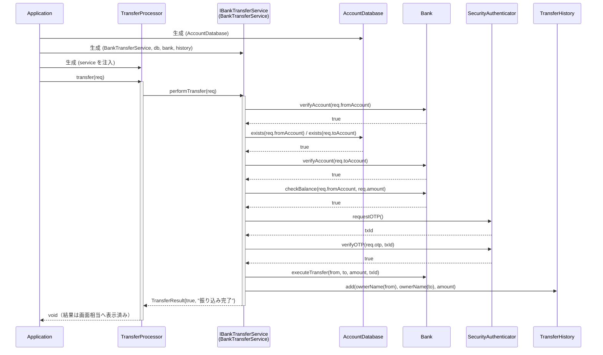
```mermaid
sequenceDiagram
    participant App as Application
    participant T as TransferProcessor
    participant F as IBankTransferService<br/>(BankTransferService)
    participant DB as AccountDatabase
    participant G as Bank
    participant A as SecurityAuthenticator
    participant H as TransferHistory

    App->>DB: 生成 (AccountDatabase)
    App->>F: 生成 (BankTransferService, db, bank, history)
    App->>T: 生成 (service を注入)
    App->>T: transfer(req)
    activate T
    T->>F: performTransfer(req)
    activate F
    F->>G: verifyAccount(req.fromAccount)
    G-->>F: true
    F->>DB: exists(req.fromAccount) / exists(req.toAccount)
    DB-->>F: true
    F->>G: verifyAccount(req.toAccount)
    G-->>F: true
    F->>G: checkBalance(req.fromAccount, req.amount)
    G-->>F: true
    F->>A: requestOTP()
    A-->>F: txId
    F->>A: verifyOTP(req.otp, txId)
    A-->>F: true
    F->>G: executeTransfer(from, to, amount, txId)
    F->>H: add(ownerName(from), ownerName(to), amount)
    F-->>T: TransferResult{true, "振り込み完了"}
    deactivate F
    T-->>App: void（結果は画面相当へ表示済み）
    deactivate T
```

#### 完成コード

クラスを1つずつ、上から順に読みます。**メンバー変数と、それを使う処理を同じ場所で見られるように**しています。1-4と同じ顔ぶれが並ぶので、どこが変わったかを見比べてください。

`main()` と実行結果は最後に、行のまとまりごとに並べます。上から順に連結すれば、そのまま1つのC++14プログラムとして動きます。

---

**共通ヘッダーと AccountDatabase と Bank**

残高を保持し実際に送金する `Bank`、名義を持つ自社台帳 `AccountDatabase` です。**どちらも1-4から変わっていません。** 今後も銀行側の仕様変更で変わりますが、それを `TransferProcessor` は知らなくてよくなります。

```cpp
#include <iostream>
#include <map>
#include <string>
#include <vector>
```

**AccountDatabase**

このブロックでは `AccountDatabase` の定義だけを確認します。

```cpp
// 自社台帳：口座の名義を保持する（残高は持たない）
class AccountDatabase {
private:
    std::map<std::string, std::string> owners;
public:
    AccountDatabase() {
        owners["ACC001"] = "田中 一郎";
        owners["ACC002"] = "佐藤 花子";
        owners["ACC003"] = "鈴木 次郎";
    }

    bool exists(const std::string& id) const {
        return owners.count(id) > 0;
    }

    std::string ownerName(const std::string& id) const {
        return owners.at(id);
    }
};
```

**Bank**

このブロックでは `Bank` の定義だけを確認します。

```cpp
// 外部銀行サブシステム：残高を保持し、実際に送金する
class Bank {
private:
    std::map<std::string, int> balances;
public:
    Bank() {
        balances["ACC001"] = 150000;
        balances["ACC002"] =  30000;
        balances["ACC003"] = 500000;
    }

    bool verifyAccount(const std::string& id) {
        bool ok = balances.count(id) > 0;
        std::cout << "口座確認: " << id
                  << (ok ? " OK" : " NG") << "\n";
        return ok;
    }

    bool checkBalance(const std::string& from, int amount) {
        auto account = balances.find(from);
        bool ok = account != balances.end() && account->second >= amount;
        int currentBalance = account == balances.end() ? 0 : account->second;
        std::cout << "残高確認: " << from << " " << currentBalance
                  << "円 >= " << amount << "円 "
                  << (ok ? "OK" : "NG") << "\n";
        return ok;
    }

    void executeTransfer(const std::string& from,
                         const std::string& to, int amount,
                         const std::string& txId) {
        balances[from] -= amount;
        balances[to]   += amount;
        std::cout << "送金実行(txId=" << txId << "): "
                  << from << " -" << amount
                  << "→" << balances[from] << "円 / "
                  << to << " +" << amount
                  << "→" << balances[to] << "円\n";
    }

    void reverseTransfer(const std::string& from,
                         const std::string& to, int amount,
                         const std::string& txId) {
        balances[to]   -= amount;
        balances[from] += amount;
        std::cout << "補償(txId=" << txId << "): "
                  << to << " -" << amount
                  << "→" << balances[to] << "円 / "
                  << from << " +" << amount
                  << "→" << balances[from] << "円\n";
    }

    int balanceOf(const std::string& id) const {
        return balances.at(id);
    }
};

// 認証サブシステム：発行時に正しいコードを仮決めし、検証で照合する
```

---

**SecurityAuthenticator**

コードを照合する認証です。

```cpp
class SecurityAuthenticator {
private:
    int seq = 9000;
    std::map<std::string, std::string> issued;  // txId -> 正しいコード
public:
    std::string requestOTP() {
        std::string txId = "TX-" + std::to_string(++seq);
        issued[txId] = "999999";  // 本来は利用者端末へ送る。ここは仮決め
        std::cout << "認証コード発行: txId=" << txId << "\n";

        return txId;
    }

    bool verifyOTP(const std::string& otp, const std::string& txId) {
        bool ok = issued.count(txId) && issued.at(txId) == otp;
        std::cout << "認証コード検証(txId=" << txId << "): "
                  << (ok ? "一致" : "不一致") << "\n";
        return ok;
    }
};
```

---

**TransferRecord と TransferHistory**
成功のたびに1件追記される自社の記録です。

```cpp
// 自社の振込記録
struct TransferRecord {
    std::string fromName;
    std::string toName;
    int amount;
};
```

**TransferHistory**

このブロックでは `TransferHistory` の定義だけを確認します。

```cpp
class TransferHistory {
private:
    std::vector<TransferRecord> records;
public:
    void add(const std::string& fromName,
             const std::string& toName, int amount) {
        records.push_back({fromName, toName, amount});
    }

    void printAll() const {
        for (const auto& r : records)
            std::cout << r.fromName << " → " << r.toName
                      << " : " << r.amount << "円\n";
    }
};
```

---

**TransferRequest と TransferResult と IBankTransferService**

業務フロー側に見せる窓口契約と、振込の要求・結果を表す型です。契約を保つ別実装やテスト用実装は、組み立て箇所で差し替えられます。

```cpp
// 窓口へ渡す要求と結果
struct TransferRequest {
    std::string fromAccount;
    std::string toAccount;
    int amount;
    std::string otp;
};
```

**TransferResult**

このブロックでは `TransferResult` の定義だけを確認します。

```cpp
struct TransferResult {
    bool success;
    std::string message;
};
```

**IBankTransferService**

このブロックでは `IBankTransferService` の定義だけを確認します。

```cpp
// 窓口の契約
class IBankTransferService {
public:
    virtual TransferResult performTransfer(
        const TransferRequest& req) = 0;
    virtual TransferResult performApprovedBatchTransfer(
        const std::string& from, const std::string& to,
        int amount) = 0;
    virtual void compensate(
        const std::string& from, const std::string& to,
        int amount) = 0;
    virtual ~IBankTransferService() = default;
};
```

---

**BankTransferService**

銀行の多段手順（口座確認・残高確認・認証・送金・補償）と自社台帳・履歴を、この窓口の内側へ閉じ込めます。残高は注入された `Bank` が実際に増減します。

```cpp
// 窓口：銀行の多段手順と認証・台帳・履歴を束ねて隠す
class BankTransferService : public IBankTransferService {
private:
    AccountDatabase& db;
    Bank& bank;
    TransferHistory& history;
    SecurityAuthenticator auth;

    TransferResult validateAccountsAndBalance(
            const std::string& from,
            const std::string& to,
            int amount) {
        bool sourceAtBank = bank.verifyAccount(from);

        if (!db.exists(from) || !sourceAtBank)
            return {false, "送金元口座なし"};

        bool destinationAtBank = bank.verifyAccount(to);

        if (!db.exists(to) || !destinationAtBank)
            return {false, "送金先口座なし"};

        if (!bank.checkBalance(from, amount))
            return {false, "残高不足"};
        return {true, "検証成功"};
    }
public:
    BankTransferService(AccountDatabase& database, Bank& b,
                        TransferHistory& hist)
        : db(database), bank(b), history(hist) {}

    TransferResult performTransfer(
            const TransferRequest& req) override {
        TransferResult validation = validateAccountsAndBalance(
            req.fromAccount, req.toAccount, req.amount);
        if (!validation.success) return validation;

        std::string txId = auth.requestOTP();

        if (!auth.verifyOTP(req.otp, txId))
            return {false, "認証失敗"};
        bank.executeTransfer(req.fromAccount, req.toAccount,
                             req.amount, txId);
        history.add(db.ownerName(req.fromAccount),
                    db.ownerName(req.toAccount), req.amount);
        return {true, "振り込み完了"};
    }

    TransferResult performApprovedBatchTransfer(
            const std::string& from, const std::string& to,
            int amount) override {
        TransferResult validation =
            validateAccountsAndBalance(from, to, amount);
        if (!validation.success) return validation;

        bank.executeTransfer(from, to, amount, "APPROVED-BATCH");
        history.add(db.ownerName(from), db.ownerName(to), amount);

        return {true, "振り込み完了"};
    }

    void compensate(const std::string& from,
                    const std::string& to, int amount) override {
        bank.reverseTransfer(from, to, amount, "COMPENSATE");
        history.add(db.ownerName(to), db.ownerName(from), amount);
    }
};
```

**銀行の多段手順は、すべてこのクラスの内側にあります。** 1-4では `TransferProcessor` に書かれていた `verifyAccount` → `checkBalance` → `promptOTP` → `verifyOTP` → `executeTransfer` の並びが、契約の裏へ移りました。

---

**TransferProcessor と BatchTransferProcessor**

業務フローを担い、銀行手順を知らず窓口契約だけへ委譲します。一括送金は途中失敗時に、完了済みを逆順で `compensate`（銀行が残高を戻す）します。

```cpp
// 業務フロー：銀行手順を知らず、窓口契約だけを使う
class TransferProcessor {
private:
    IBankTransferService& service;
public:
    explicit TransferProcessor(IBankTransferService& s)
        : service(s) {}
    void transfer(const TransferRequest& req) {
        TransferResult r = service.performTransfer(req);
        std::cout << (r.success ? "振り込み完了\n"
                                : "エラー: " + r.message + "\n");
    }
};
```

**BatchTransferProcessor**

このブロックでは `BatchTransferProcessor` の定義だけを確認します。

```cpp
class BatchTransferProcessor {
private:
    IBankTransferService& service;
public:
    explicit BatchTransferProcessor(IBankTransferService& s)
        : service(s) {}
    void processPayroll(
            const std::string& payrollSourceAccount,
            const std::vector<std::pair<std::string, int>>&
                payrollEntries) {
        std::vector<std::pair<std::string, int>> completedEntries;

        for (const auto& entry : payrollEntries) {
            const std::string& destinationAccount = entry.first;
            int paymentAmount = entry.second;
            TransferResult r =
                service.performApprovedBatchTransfer(
                    payrollSourceAccount,
                    destinationAccount,
                    paymentAmount);
            if (r.success) {
                std::cout << "振り込み完了（OTP不要）\n";
                completedEntries.push_back(entry);
            } else {
                std::cout << "一括処理を中断し、完了済み"
                          << (int)completedEntries.size()
                          << "件を取り消します\n";
                for (int j = (int)completedEntries.size() - 1;
                     j >= 0; j--)
                    service.compensate(
                        payrollSourceAccount,
                        completedEntries[j].first,
                        completedEntries[j].second);
                return;
            }
        }
    }
};
```

**このクラスに銀行の関数名は1つも出てきません。** 使うのは `IBankTransferService` の操作だけです。

---

#### `main()` と実行結果

必要な部品を組み立てて実行します。具体窓口 `BankTransferService` と外部銀行 `Bank` を生成・注入するのは、この組み立て箇所だけです。**確認したいのは、外部から見える振り込み結果を保ちながら、銀行の具体手順が窓口の内側に閉じ、銀行残高が実際に増減・復元することです。**

---

**組み立てと、行1：正常な個別振り込み**

```cpp
// 依存の組み立てを担うクラス（Composition Root）
class Application {
public:
    void run() {
        AccountDatabase db;
        Bank bank;
        TransferHistory history;
        BankTransferService service(db, bank, history);
        TransferProcessor processor(service);

        std::cout << "--- 行1: 正常な個別振り込み ---\n";
        processor.transfer({"ACC001", "ACC002", 5000, "999999"});
```

行1の実行結果（口座確認→残高確認→認証→送金の順に銀行残高が動く）：

```
--- 行1: 正常な個別振り込み ---
口座確認: ACC001 OK
口座確認: ACC002 OK
残高確認: ACC001 150000円 >= 5000円 OK
認証コード発行: txId=TX-9001
認証コード検証(txId=TX-9001): 一致
送金実行(txId=TX-9001): ACC001 -5000→145000円 / ACC002 +5000→35000円
振り込み完了
```

同じ `Application::run()` の中で、行2は送金先口座が存在しないケースです。

```cpp
        std::cout << "--- 行2: 存在しない口座 ---\n";
        processor.transfer({"ACC001", "UNKNOWN", 5000, "999999"});
```

行2の実行結果：

```
--- 行2: 存在しない口座 ---
口座確認: ACC001 OK
口座確認: UNKNOWN NG
エラー: 送金先口座なし
```

同じ `Application::run()` の中で、行3は送金元の残高が不足するケースです。

```cpp
        std::cout << "--- 行3: 残高不足 ---\n";
        processor.transfer({"ACC001", "ACC002", 1000000, "999999"});
```

行3の実行結果：

```
--- 行3: 残高不足 ---
口座確認: ACC001 OK
口座確認: ACC002 OK
残高確認: ACC001 145000円 >= 1000000円 NG
エラー: 残高不足
```

同じ `Application::run()` の中で、行4は認証コードが一致せず認証に失敗するケースです。

```cpp
        std::cout << "--- 行4: 認証失敗 ---\n";
        processor.transfer({"ACC001", "ACC002", 5000, "INVALID"});
```

行4の実行結果：

```
--- 行4: 認証失敗 ---
口座確認: ACC001 OK
口座確認: ACC002 OK
残高確認: ACC001 145000円 >= 5000円 OK
認証コード発行: txId=TX-9002
認証コード検証(txId=TX-9002): 不一致
エラー: 認証失敗
```

同じ `Application::run()` の中で、行5は社内承認済みバッチ（OTP不要の経路）です。

```cpp
        std::cout << "--- 行5: 社内承認済みバッチ ---\n";
        BatchTransferProcessor batch(service);
        batch.processPayroll("ACC003",
                             {{"ACC002", 30000}, {"ACC001", 20000}});
```

行5の実行結果：

```
--- 行5: 社内承認済みバッチ ---
口座確認: ACC003 OK
口座確認: ACC002 OK
残高確認: ACC003 500000円 >= 30000円 OK
送金実行(txId=APPROVED-BATCH): ACC003 -30000→470000円 / ACC002 +30000→65000円
振り込み完了（OTP不要）
口座確認: ACC003 OK
口座確認: ACC001 OK
残高確認: ACC003 470000円 >= 20000円 OK
送金実行(txId=APPROVED-BATCH): ACC003 -20000→450000円 / ACC001 +20000→165000円
振り込み完了（OTP不要）
```

同じ `Application::run()` の中で、行6はバッチの途中で失敗し、完了済みの送金を補償（取り消し）するケースです。

```cpp
        std::cout << "--- 行6: バッチ途中失敗と補償 ---\n";
        batch.processPayroll("ACC003",
                             {{"ACC002", 20000}, {"ACC001", 600000}});
```

行6の実行結果（1件目は完了、2件目が残高不足で中断し、1件目を補償で戻す）：

```
--- 行6: バッチ途中失敗と補償 ---
口座確認: ACC003 OK
口座確認: ACC002 OK
残高確認: ACC003 450000円 >= 20000円 OK
送金実行(txId=APPROVED-BATCH): ACC003 -20000→430000円 / ACC002 +20000→85000円
振り込み完了（OTP不要）
口座確認: ACC003 OK
口座確認: ACC001 OK
残高確認: ACC003 430000円 >= 600000円 NG
一括処理を中断し、完了済み1件を取り消します
補償(txId=COMPENSATE): ACC002 -20000→65000円 / ACC003 +20000→450000円
```

最後に、最終残高と振り込み履歴を確認し、`main()` から実行します。

```cpp
        std::cout << "--- 最終残高 ---\n";
        std::cout << "ACC001: " << bank.balanceOf("ACC001")
                  << "円\n";
        std::cout << "ACC002: " << bank.balanceOf("ACC002")
                  << "円\n";
        std::cout << "ACC003: " << bank.balanceOf("ACC003")
                  << "円\n";
        std::cout << "--- 振り込み履歴 ---\n";
        history.printAll();
    }
};

int main() {
    Application app;
    app.run();

    return 0;
}
```

最終残高・振り込み履歴の実行結果：

```
--- 最終残高 ---
ACC001: 165000円
ACC002: 65000円
ACC003: 450000円
--- 振り込み履歴 ---
田中 一郎 → 佐藤 花子 : 5000円
鈴木 次郎 → 佐藤 花子 : 30000円
鈴木 次郎 → 田中 一郎 : 20000円
鈴木 次郎 → 佐藤 花子 : 20000円
佐藤 花子 → 鈴木 次郎 : 20000円
```

動作例テーブルの全5ケースに加え、バッチ途中失敗と補償を確認しました。残高は銀行側で実際に増減し、行3は残高照会、行4はOTP照合で弾かれ、補償では送金先から送金元へ残高が戻ります。失敗した要求は残高を更新しません。


#### 最終要求の実装・受入エビデンス

変更後要求ベースラインの全有効要求IDを同じ順序で照合します。今回変わらなかった既存要求も対象にするため、要求の消失を検出できます。

| 要求ID  | 最終要求                               | 適用コード                                           | 実行シナリオ・観測結果・判定                                              |
| ----- | ---------------------------------- | ----------------------------------------------- | ----------------------------------------------------------- |
| 要求ID1 | 送金元・送金先口座の存在を確認する                  | `AccountDatabase`、`BankTransferService`         | 不正口座で後続処理なし<br/>**判定:** 合格                                  |
| 要求ID2 | 送金元残高が送金額以上か確認する                   | `Bank::checkBalance()`                          | 残高不足で認証・送金なし<br/>**判定:** 合格                                 |
| 要求ID3 | 認証コードを発行し、返された取引IDとOTPを照合する        | `SecurityAuthenticator`、`BankTransferService`   | 正しい組だけ成功し、不一致は送金なし<br/>**判定:** 合格                           |
| 要求ID4 | 検証済みの同じ取引IDを必須入力として送金する            | `BankTransferService::performTransfer()`、`Bank` | 同一取引ID付き送金だけ成功<br/>**判定:** 合格                               |
| 要求ID5 | 単発振込の成功時だけ履歴を保存し、失敗時は残高・履歴を変えない    | `TransferHistory`、残高ログ                          | 成功時1件、失敗時は件数・残高不変<br/>**判定:** 合格                            |
| 要求ID6 | 承認済み一括振込は、OTP認証を省略して専用取引IDで各件を送金する | `performApprovedBatchTransfer()`                | フェーズ7「社内承認済みバッチ」でOTPなしに2件送金し履歴が2件増える<br/>**判定:** 合格 |
| 要求ID7 | 一括振込の途中失敗時に完了済みを逆順で取り消し、取り消しも履歴へ残す | `compensate()`、`BatchTransferProcessor`         | 行6で2件目が残高不足になり1件目を補償。両口座が開始前へ戻り、送金と取り消しが対で残る<br/>**判定:** 合格 |

上の表は継続（要求ID1・要求ID2・要求ID5）・変更（要求ID3・要求ID4）を同じ順序で並べ、変わらなかった既存要求も回帰対象に含めています。継続要求が合格していることで、既存動作が落ちていないことを確認できます。要求の受入・回帰はここで完了します。課題IDへ直接対応付けず、以下では変更試行の痛みから導いた構造課題だけを別に確認します。

#### 設計課題の構造改善結果

要求の受入とは分けて、課題IDごとに構造と変更影響を確認します。

| 課題ID | 構造差分・コード適用先 | 確認できた効果 | 残る変更先 |
|---|---|---|---|
| 課題ID1 | `BankTransferService`へ外部API手順を集約 | 利用側が認証・送金順序を知らなくなった | 銀行窓口内のAPI変更 |
| 課題ID2 | `IBankTransferService`を単発・一括入口へ注入 | 具象差替えで両入口の呼出手順が変わらない | `Application`での組み立て |
#### 変更前→変更後の不変条件照合

| 変更対象外 | 変更前 | 変更後 | 確認根拠 |
|---|---|---|---|
| 口座検証 | `AccountDatabase` を参照 | 同じ口座・残高検証 | 1-4と7-1の正常・エラーケース |
| 振込履歴 | `TransferHistory` に保存 | 同じ取引IDと結果を保存 | 実行結果の履歴件数 |

### 7-2：動作シーケンス図の検証

完成クラス図と実行シーケンスは、完成コードへ入る前に示しました。ここまでのコード、要求追跡表、不変条件照合を証拠として、次節で変更影響を再確認します。

### 7-3：変更影響グラフ（改善後）

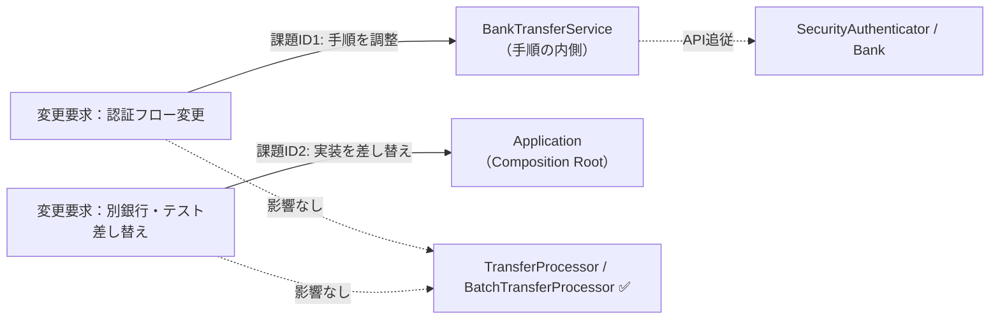
```mermaid
graph LR
    T1["変更要求：認証フロー変更"]
        -->|"課題ID1: 手順を調整"| N1["BankTransferService<br>（手順の内側）"]
    N1 -.->|"API追従"| S1["SecurityAuthenticator / Bank"]
    T2["変更要求：別銀行・テスト差し替え"]
        -->|"課題ID2: 実装を差し替え"| N2["Application<br>（Composition Root）"]
    T1 -.->|"影響なし"| A["TransferProcessor / BatchTransferProcessor ✅"]
    T2 -.->|"影響なし"| A
```

フェーズ3の変更影響グラフと同じ要求・同じ粒度で比べると、`TransferProcessor` と `BatchTransferProcessor` は変更先から消えました。課題ID1（手順変更）は `BankTransferService` の内側とサブシステムに集まり、課題ID2（実装差し替え）は `Application` の組み立て1か所に集まります。窓口構造の効果は「必ず1クラスだけが変わる」ことではなく、サブシステム側の変更境界と具体窓口の選択をクライアントから隠すことです。

| 3-2で影響した場所 | 修正後 | 構造変更との対応 |
|---|---|---|
| `TransferProcessor` の手順全体 | **修正しない** | 手順を `BankTransferService` へ移し、契約だけを呼ぶようにした |
| `BatchTransferProcessor` の重複手順 | **修正しない** | 同じ契約を注入し、重複手順を窓口へ集約した |
| 3-2には窓口がなかった | `BankTransferService` の内側を修正する | 銀行固有の変更先を新しく作った |
| 3-2には差し替え点がなかった | `Application` の1行を差し替える | 具体窓口の選択を組み立て側へ集めた |

### 7-4：変更シナリオ表

ここでは今回の変更ID1・変更ID2・変更ID3だけを完成構造へ再適用します。

| 変更依頼 | フェーズ1の現状構造での影響 | 完成構造での結果 |
|---|---|---|
| 変更ID1：認証を、認証コード発行と取引ID付き照合の2段階へ変える | `TransferProcessor`へ発行・取引ID保持・照合の手順を追加 | `BankTransferService`内で2段階認証を完了し、誤った組み合わせでは送金しないことを確認 |
| 変更ID2：検証済み取引IDを送金APIの必須入力にする | `TransferProcessor`から認証結果を送金呼び出しへ渡す修正が必要 | 同じ取引IDを`BankTransferService`から`Bank`へ渡し、成功時だけ残高と履歴を更新することを確認 |
| 変更ID3：一括振込の途中失敗時に、完了済みを逆順で取り消し、取り消しも履歴へ残す | `BatchTransferProcessor`が銀行APIを直接呼ぶため、取り消し手順と履歴記録をバッチ側へ書き足す必要がある | 窓口契約へ`compensate()`を1つ足すだけで、`BatchTransferProcessor`は完了済みを逆順に渡すだけになることを確認 |

---

## 整理

### 問題・原因・課題・解決策

| | 内容 |
|---|---|
| **問題** | 振り込み処理の認証手順や送金パラメータが変わるたびに、変わる理由が異なるコードが同じ場所に混在しているため `TransferProcessor` への修正が連鎖し、影響範囲が読めない |
| **原因** | 認証フローの多段階化・送金パラメータの変更という外部都合の変化を、`TransferProcessor` が銀行APIの呼び出し手順として直接抱え込んでいる |
| **課題ID1** | 銀行APIの呼び出し手順を窓口の内側へまとめ、`TransferProcessor` と `BatchTransferProcessor` が手順を直接持たないようにする |
| **課題ID2** | 窓口を `IBankTransferService` 契約の背後へ置き、具体窓口の生成・選択を組み立て側へ移して差し替え可能にする |
| **解決策** | 窓口構造：`BankTransferService` に手順を集約して銀行サブシステム群を隠し、`IBankTransferService` 契約で差し替え、`Application` が生成・注入する |

### フェーズとこの章でやったこと

| **フェーズ** | **この章でやったこと** |
|---|---|
| 🔵 フェーズ1：現状把握 | 仕様と動作例テーブルを確認した後、コードをクラス単位で読んだ。クラス構成図と変更要求を把握した |
| 🟣 フェーズ2：仮説立案 | 仕様候補とフェーズ1のコード位置を対応させた表で、`TransferProcessor` が外部システムの詳細を多く抱え込んでいる状態を整理した。今回の確定変更とヒアリングで判明した将来リスクを分けて扱った |
| 🟣 フェーズ3：問題特定 | API変更の適用を試み、影響が `TransferProcessor` を経由して全体に飛び火することを確認した |
| 🟠 フェーズ4：原因分析 | 振り込み業務のフローと銀行APIの技術詳細が同じ場所にいることが痛みの根本と特定した |
| 🟡 フェーズ5：課題定義 | 手順の集約を課題ID1、窓口の差し替えを課題ID2として分け、振込依頼・振込結果の接続点を定めた |
| 🔴 フェーズ6：対策検討 | 課題ID1・課題ID2を両方満たす完成構造を一つに定め（責任配置の異なる完成構造は複数成立しないため比較は不要）、採用クラス図を課題ID別の【1】〜【6】でコードへ反映した |
| 🟢 フェーズ7：対策実施 | 最終コードを実装し、変更影響グラフで変更の局所化を確認した |

### 責任の移動

| **責任** | **変更前** | **変更後** |
|---|---|---|
| 振り込み業務フローの進行 | `TransferProcessor` | `TransferProcessor`（変わらず） |
| 銀行APIの呼び出し手順の管理（課題ID1） | `TransferProcessor`（直書き） | `BankTransferService` |
| 窓口契約の定義と差し替え（課題ID2） | —（なし） | `IBankTransferService` |
| 具体窓口の生成・選択（課題ID2） | `TransferProcessor`（bank/authを直接保持） | `Application`（Composition Root） |

### 複雑さを足しても対策は変わるか

第2章では、単純な送金API呼び出しではなく、順次API実行、取引IDの受け渡し、結果照会、タイムアウト・再試行を含めて考えました。それでも対策の論理は変わりません。複雑な手順が増えたときほど、業務フロー側に見せる約束を小さく保つ必要があります。

| 追加した複雑さ | 見えた原因 | 定めた課題 | 採用した扱い |
|---|---|---|---|
| 口座確認→残高確認→認証→送金→結果照会の順次API | 呼び出し元がAPI順序を直接知っている | 細かいAPI手順を振込依頼の境界の内側へ寄せる | `BankTransferService` を窓口にする |
| 認証発行で得た取引IDを送金へ渡す | 外部APIの一時値が業務フローへ漏れている | 呼び出し元は取引IDを知らず、振込結果だけ受け取る | 取引IDは窓口内部の値として扱う |
| タイムアウト・再試行・保留 | 通信上の失敗判断が業務フローへ混ざりやすい | 失敗処理を銀行API境界側へ閉じ込める | 窓口内の戻り値・再試行ポリシーとして整理する |

---

## 振り返り

### 「この章を読むと得られること」は手に入ったか

| **得られること** | **この章のどこで示したか** |
|---|---|
| 1. 依存の広がりを識別 | フェーズ2の仕様候補とコード位置の対応表で、変更候補の3つ（銀行API確認・OTP認証・送金API呼び出し）がいずれも `TransferProcessor.transfer()` の中にあることを確認した |
| 2. 接続点の診断 | フェーズ4で、銀行APIのクラス名と呼び出し順序が業務側へ漏れている状態を確認した |
| 3. 変更局所化の説明 | フェーズ7の変更シナリオ表で、変更が窓口構造とその内側のサブシステムへ集まり、業務側へ波及しにくい構造を示した |
| 4. 境界線の引き方 | フェーズ5の課題定義とフェーズ2のヒアリングを通じて、「どの業務機能に属するか」を境界線の根拠にする原則を体験した |

### 第0章の3つの設計原則はどう適用されたか

**原則1「変わるものをカプセル化せよ」の現れ**

- 具体化された場所：`BankTransferService` クラス
- 解説：銀行APIの複雑な手順という「頻繁に変わる詳細」を、`BankTransferService` の中に閉じ込めた。これにより、業務クラスは銀行APIの詳細を知る必要がなくなった。

**原則2「実装ではなくインターフェースに対してプログラムせよ」の現れ**

- 具体化された場所：`TransferProcessor` のメンバ変数 `IBankTransferService& service`
- 解説：業務クラスは「どのようなAPIか」ではなく、「振り込みを実行する（`performTransfer`）」という窓口のインターフェースに対して命令を送るようになった。

**原則3「継承よりコンポジションを優先せよ」の現れ**

- 具体化された場所：`TransferProcessor` に `IBankTransferService` を持たせる構造
- 解説：（もし継承を使って銀行APIの変更に対応しようとすると）継承を使うと銀行APIの変更のたびにクラス階層が深くなる。コンストラクタインジェクションによるコンポジションは、窓口構造を切り替えたり将来的な窓口構造の増設にも容易に対応できる。

---

## あなたのコードで考えてみてください

1. **変動の兆候を探す：** あなたのコードに「外部APIやライブラリの呼び出し手順（認証→接続→送信→確認など）を、ビジネスロジックと同じ場所に書いている」箇所がありますか？
2. **変える理由を問う：** そのコードの各行は、どの業務機能に属しますか？同じ業務機能の中で完結していますか、それとも異なる業務機能が混在していますか？
3. **知りすぎを測る：** ビジネスロジックのコードが、外部システムの「エラーコードの体系」や「接続パラメータの名前」を直接知っていますか？
4. **窓口を想像する：** もし「外部システムとのやりとりをすべて担う窓口クラス」を1つ置いたとすると、外部仕様が変わったときの修正は主にどこに絞られるようになりますか？（窓口構造内部の実装も含む場合があります）

---

**題材を置き換えるときの共通手順**

この章の題材名を、自分の現場のシステム名に置き換えて考えます。

1. そのシステムは、誰が何を達成するために使うものか。
2. 入力、加工、出力は何か。
3. 最近入った変更要求、または次に来そうな変更要求は何か。
4. その変更で、触りたくない場所まで修正や再テストが広がるか。
5. 変えたいものと守りたいものを分けると、接続点には何を残すべきか。
6. 全課題を満たす完成構造が複数成立するか。成立するなら、責任配置・変更影響・導入コストの差は何か。

ここまで問題から導いた「窓口構造」は、一般に **Facadeパターン**と呼ばれます。ここからは題材を離れ、この名前で共有される抽象的な骨格を確認します。

## パターン解説：Facade パターン

### パターンの骨格

Facadeパターンは、サブシステム（銀行APIなど）の一連のインターフェースに対する統合された窓口を提供し、サブシステムを使いやすくするパターンです。

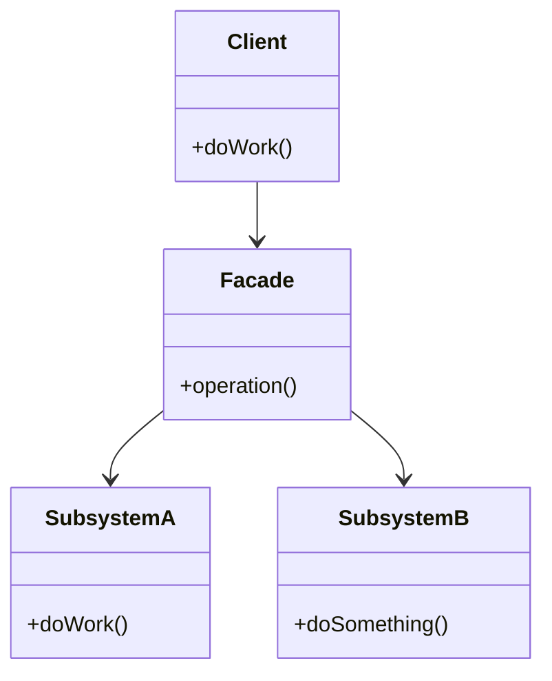
```mermaid
classDiagram
    class Client {
        +doWork()
    }
    class Facade {
        +operation()
    }
    class SubsystemA {
        +doWork()
    }
    class SubsystemB {
        +doSomething()
    }
    Client --> Facade
    Facade --> SubsystemA
    Facade --> SubsystemB
```

### 抽象骨格の実行シーケンス

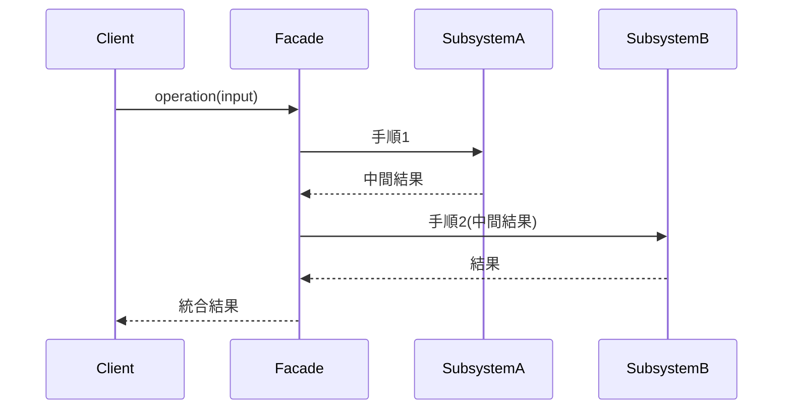
```mermaid
sequenceDiagram
    participant C as Client
    participant F as Facade
    participant A as SubsystemA
    participant B as SubsystemB
    C->>F: operation(input)
    F->>A: 手順1
    A-->>F: 中間結果
    F->>B: 手順2(中間結果)
    B-->>F: 結果
    F-->>C: 統合結果
```

Clientはサブシステムの順序や中間値を知らず、Facadeの1操作だけを呼びます。

### この章の実装との対応

GoF（Gang of Four）とは、1994年に出版された書籍『Design Patterns』の4人の著者の総称です。彼らが整理した23のパターンは、現在も設計の共通言語として広く使われています。

| GoFの名前 | この章での対応 |
|---|---|
| Client | `TransferProcessor` |
| Facade | `BankTransferService` |
| Subsystem | `Bank` / `SecurityAuthenticator` |

`IBankTransferService` はGoFのFacade構造に必須の役ではなく、この章で差し替えとテストをしやすくするために追加した抽象契約です。

### 使いどころと限界

- **使うと良い：** サブシステムが複雑で、クライアントが直接扱うには手順が多すぎる場合。または、サブシステムとクライアントの依存関係を減らしたい場合。
- **使わない方が良い：** サブシステムが十分に単純であり、Facadeを介すことでかえってコードが複雑になる場合。ファイル数とクラス数が増えるコストが見合わない。

【過剰コード：ただのラッパー（元のメソッドを包んで呼ぶだけのクラス）に過ぎない例】

```cpp
// 窓口クラスを足しても元のメソッドをそのまま呼ぶだけで
// 隠蔽の効果がない場合
class SimpleFacade {
    OriginalClass sub;
public:
    void doIt() { sub.doIt(); } // Facadeの意味が薄い
};
```

> [!INFO]
> **採用しなかった構造：手順の関数化**
>
> フェーズ6で比較した「手順を自由関数へ切り出す」案です。どのクラスにも属さない自由関数 `performTransferSteps()` が、`Bank` と `SecurityAuthenticator` の呼び出し手順をまとめます。課題ID1の手順変更の局所化は解けるため、差し替え要求がない状況なら十分に選べます。採用しなかった案が読者の判断材料になる章だけに置く任意コラムで、形式は全章でこのINFOに統一します。

```cpp
// 手順一式を1つの関数へ集約する（クラスも契約も作らない）
bool performTransferSteps(Bank& bank, SecurityAuthenticator& auth,
                          const std::string& from, const std::string& to,
                          int amount, const std::string& otp) {
    if (!bank.verifyAccount(to))          return false;  // 手順1
    if (!bank.checkBalance(from, amount)) return false;  // 手順2
    auth.promptOTP();                                    // 手順3
    if (!auth.verifyOTP(otp))             return false;  // 手順4
    bank.executeTransfer(from, to, amount);              // 手順5

    return true;
}
```

呼び出し元は `performTransferSteps(...)` を1回呼ぶだけになり、手順の重複と漏れ（課題ID1）は解消します。しかしこの関数は差し替えの単位になりません。テスト時に外部通信を止める、または別銀行へ接続する必要が生じると、関数の中身へ分岐を入れるか、呼び出し側を書き換えることになります。これは要求IDではなく、フェーズ3・4で観測した依存の広がりから定めた課題ID2が残ることを意味します。課題ID2の完了条件「具体実装の差替えで利用側の呼出手順が変わらない」を満たせないため、本章では手順の集約と差し替えの単位を兼ねられる窓口クラス＋契約の形を採用しました。逆に言えば、差し替えを設計条件にしないシステムでは、この関数案で止める判断が成立します。

### この章のまとめ

振り込み処理というドメインと Facadeパターンの関係を一言で言うなら、外部システムの詳細な呼び出し手順を業務コードが直接知ることが「依存の広がり」を生む、ということです。銀行APIのセッション管理・認証・エラーハンドリングを窓口クラスの後ろへ集めることで、サブシステム側の変更が業務クラスへ直接波及する連鎖を抑えられます。

7つのフェーズを通じて、読者は「動いているコード」の観察から「どの業務機能に属するか」の分析へ、そして「どこまでを窓口の後ろに隠すか」という境界線の決断へと進みました。フェーズ2のヒアリングで銀行API仕様の変更頻度が分かった時点で隠す対象の輪郭が見え、フェーズ4で接続点を特定した時点で窓口クラスの責任が確定する——その順序で判断が積み上がっていくことを体験できたはずです。「実装の都合」ではなく「どの業務機能に属するか」で境界線を引くという原則は、この章の核心でした。

あなたのコードの中にも、外部システムの呼び出し手順が業務ロジックの中に直書きされている箇所があるはずです。その呼び出し手順が「どの業務機能に属するか」を問うことが、窓口クラスを設ける理由を見つける入口になります。
