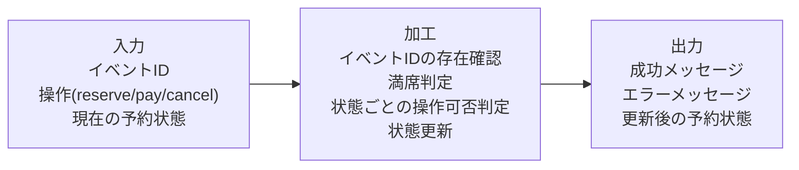
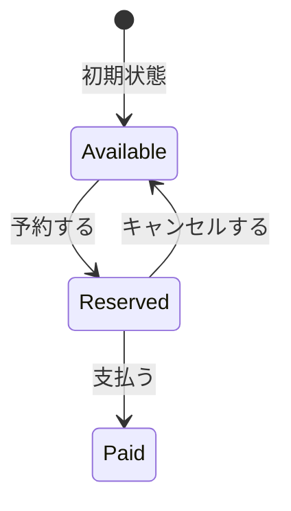
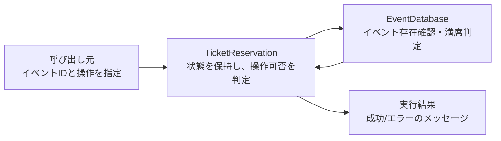
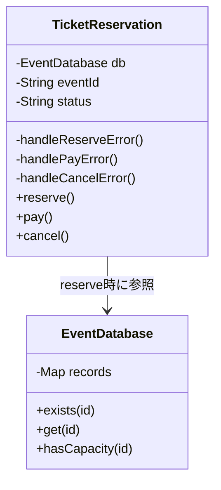
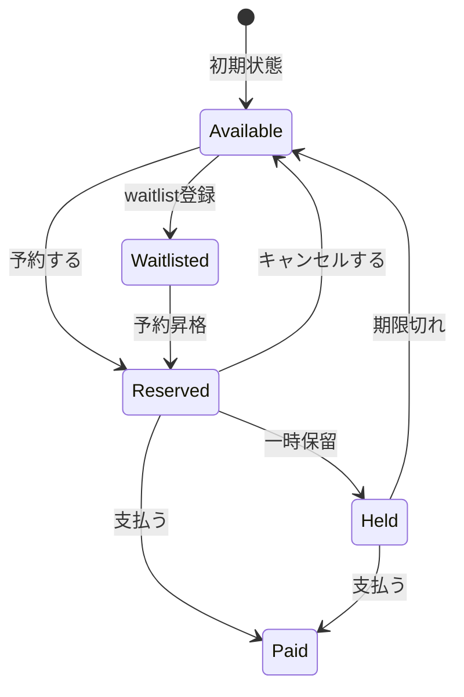
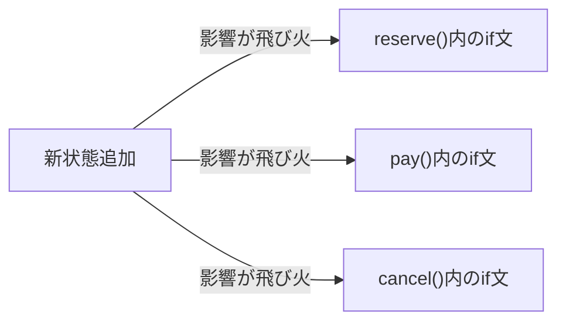
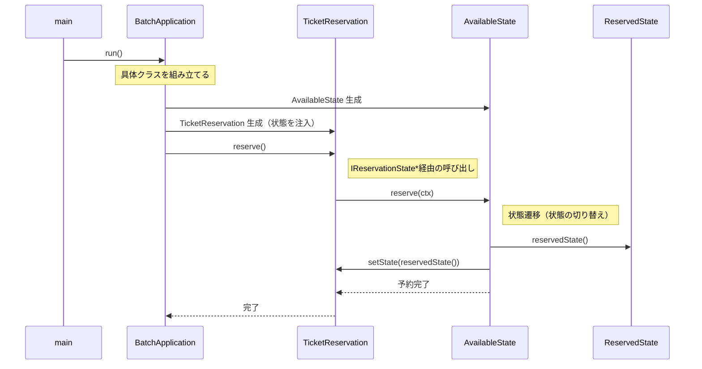
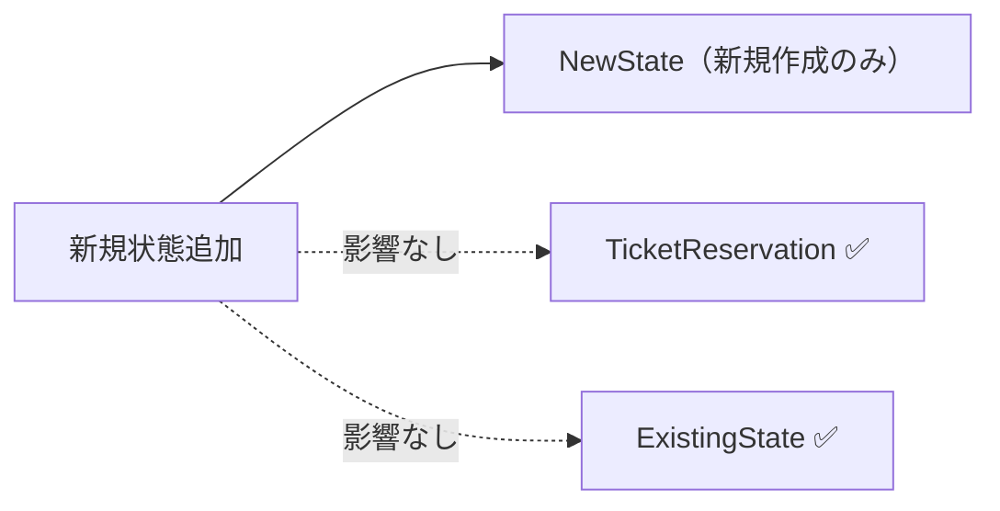
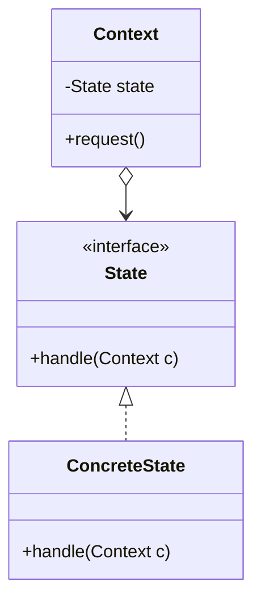
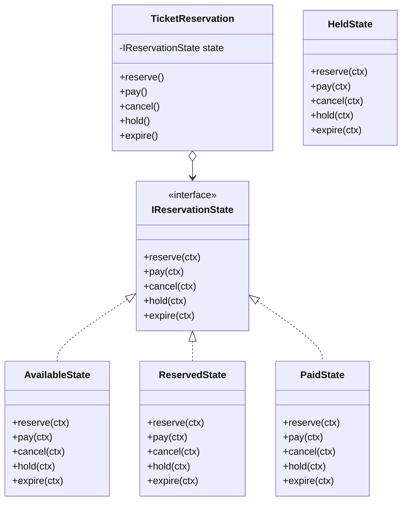

## 第3章 状態に応じた振る舞いの切り替え ―― State パターン

―― 思考の型：状態によって振る舞いが変わる処理が、条件分岐で混在している

### この章の核心

**予約状態が1つ増えるたびに、予約・支払い・キャンセルなど複数の処理で条件分岐を書き直す必要が生じる。こういう問題は、「状態」と「状態ごとの振る舞い」が同じ場所に文字列や分岐として混在しているシステムで起きている。**

### この章を読むと得られること

この章の痛みは「状態が1つ増えるたびに、すべての処理分岐を書き直さなければならない」という問題です。

* **得られること1：** 「状態の変化に伴う振る舞いの切り替え」という観点で、コードの変動箇所を識別できるようになる
* **得られること2：** 条件分岐が複雑に絡み合ったクラスを見て、そこが状態管理の痛みの発生源だと判断できるようになる
* **得られること3：** 状態ごとの振る舞いを別クラスに分離することで、条件分岐を排除した構造改善の説明ができるようになる
* **得られること4：** 状態が増える可能性がある設計において、既存のフローを壊さずに状態を追加する判断ができるようになる

## 🔵 フェーズ1：現状把握 ―― 仕様を整理し、システムと紐付ける
はじめに、チケット予約管理システムの現状を整理します。

まずは、このシステムが受け取る入力、内部で行う判定、返す出力を整理します。ここでは設計の良し悪しを判断せず、現状を事実としてそろえます。

### 1-1：このシステムの仕様

このシステムは、イベントごとに**チケット予約の状態を管理**します。イベントIDを指定して、予約・支払い・キャンセルなどの操作を行う小さな予約管理システムです。

各予約は「予約可能（Available）」「予約済み（Reserved）」「支払済み（Paid）」の3つの状態を持ちます。お客様の操作（予約・支払・キャンセル）に応じて状態が遷移し、状態によって許可される操作が異なります。

**仕様の入力・加工・出力**



この図の要素は、後続で次のように使います。

| 図の要素 | コードで出る形 | 後で使う場所 |
|---|---|---|
| イベントID、操作、現在の予約状態 | `eventId`、`reserve/pay/cancel`、`Available/Reserved/Paid` | 動作例テーブル、`main()`、状態遷移表 |
| 存在確認、満席判定、状態ごとの操作可否判定、状態更新 | `TicketReservation` の条件分岐と状態更新処理 | 現状コードの観察、変更シミュレーション、原因分析 |
| 成功/エラーメッセージ、更新後の状態 | 実行結果のメッセージと状態表示 | 動作例テーブル、実行結果、変更シナリオ表 |

**状態遷移マトリクス**

「——」は操作を受け付けず、エラーメッセージを出力して終了することを表します。なぜ「——」を設けるのかというと、「現在の状態にとって意味をなさない操作」をシステムが受け入れてしまうと、データの整合性が崩れるからです。たとえば、まだ予約していないチケットに対して突然「支払う」を実行できてしまうと、どの予約に対する支払いなのかがシステム上で確定できません。そのため「今の状態では受け付けられない」を明示的にエラーとして返すことが、業務上のルールとして正しい設計です。これはチケット予約に限らず、EC注文・銀行振込・申請ワークフローなど、状態を持つシステム全般で広く採用されているルールです。

| 現在の状態 | 予約する | 支払う | キャンセルする |
|---|---|---|---|
| Available（予約可能） | → Reserved | —— | —— |
| Reserved（予約済み） | —— | → Paid | → Available |
| Paid（支払済み） | —— | —— | —— |

表の各行に着目すると、それぞれのルールには明確な業務上の理由があります。

- **Available（予約可能）で「支払う」「キャンセルする」が——の理由**：予約が存在しない状態で支払いを受け付けると「どの予約に対する支払いか」が確定しません。キャンセルについても、そもそも予約がなければキャンセルする対象がなく、操作自体が無意味です。
- **Reserved（予約済み）で「予約する」が——の理由**：同じ予約枠を二重予約することは、業務上あり得ません。イベントチケット、ホテル、航空券など、枠を一意に確保するシステムでは共通の制約です。
- **Paid（支払済み）でのすべての操作が——の理由**：支払いが完了した予約は「確定済み」扱いになります。この状態からのキャンセルを認める場合は、返金処理・在庫の戻し・会計記録の修正など、複数の業務プロセスが連動して動く必要があります。この章では、返金処理は State パターンの論点から外れるため扱いません。キャンセルポリシーを設ける場合は、「キャンセル済み（Cancelled）」という別の状態を追加して対応するのが通常の設計です。



このマトリクスが、後のフェーズで「新しい状態が増えるとどこが変わるか」を確認する基準になります。

---

### 1-2：動作例テーブル

コードを読む前に、このシステムがどんな入力に対してどんな出力を返すかを確認します。この章のどのステップも、以下の動作を実現します。

| ケースID | 入力 | 加工 | 出力 |
|---|---|---|---|
| TC1 | `EVT001` / `reserve()` → `pay()` | 空きありのイベントを予約し、予約済みから支払いへ進める | 予約対象、予約完了、支払い完了 |
| TC2 | `EVT001` / `reserve()` → `cancel()` | 空きありのイベントを予約し、予約済みから予約可能へ戻す | 予約対象、予約完了、キャンセル完了 |
| TC3 | `EVT003` / `reserve()` | 満席イベントを検出する | 満席エラー |
| TC4 | `UNKNOWN` / `reserve()` | 存在しないイベントIDを検出する | イベントID不存在エラー |
| TC5 | `EVT001` / `pay()` | `Available` 状態で支払いを試みる | 支払い不可エラー |
| TC6 | `EVT001` / `reserve()` → `pay()` → `cancel()` | `Paid` 状態でキャンセルを試みる | キャンセル不可エラー |

確認したいことは、通常の予約・支払いフロー、キャンセルフロー、予約前の外部条件による拒否、状態に合わない操作の拒否が、それぞれ入力と出力で対応していることです。

この動作テーブルは、後のフェーズでステップを比較するときに「同じ入力なら同じ出力を返すことで動作不変を確認する」ための基準として使います。State パターンで変えたいのは構造であり、利用者から見える動作ではありません。

---

### 1-3：登場クラスとクラス構成図

#### このシステムの登場クラス

| クラス名 | 役割 | 担当する仕様 |
|---|---|---|
| EventDatabase | イベント情報の保持と検索 | イベントIDの存在確認・満席判定 |
| TicketReservation | チケット予約の状態管理と各状態の振る舞い | `Available` / `Reserved` / `Paid` の状態遷移 |

データの流れは、次のように分かれます。



各クラスの役割を把握したところで、クラス間の関係を図で整理します。



→ `reserve()`・`pay()`・`cancel()` の各メソッドに `if (status == ...)` という条件分岐が散在しており、`TicketReservation` クラスがすべての予約状態と、状態ごとの処理ロジックを一手に抱え込んでいることが分かります。


**この章での簡略化**

1-3でクラス構成を確認したので、掲載コードで何を代替しているかを整理してから現状コードへ進みます。

この章の主役は、`Available` / `Reserved` / `Paid` という**予約状態に応じて振る舞いが切り替わる部分**です。イベントIDの存在確認や満席判定は、実際の予約システムなら必要な周辺処理ですが、State パターンの論点ではありません。そのため、この章では `EventDatabase` というメモリ上の簡易データで表現し、データベース接続、同時予約制御、決済API、発券処理は扱いません。

---

### 1-4：実装コード（現状）

このシステムには以下の3件のイベントデータがあらかじめ登録されています。

| イベントID | タイトル | 定員 | 現在の予約数 |
|---|---|---|---|
| EVT001 | 春の音楽祭 | 100 | 20（空きあり） |
| EVT002 | 夏のフェス | 500 | 499（残り1席） |
| EVT003 | 秋の映画会 | 50 | 50（満席） |

コードを読む前に、どのIDが満席でどのIDに空きがあるかを把握しておくと、動作結果と仕様の対応が追いやすくなります。

```cpp
#include <iostream>
#include <string>
#include <map>

struct EventInfo {
    std::string title;   // イベント名
    int capacity;        // 定員
    int reserved;        // 現在の予約数
};

class EventDatabase {
private:
    std::map<std::string, EventInfo> records;
public:
    EventDatabase() {
        records["EVT001"] = {"春の音楽祭",  100,  20};
        records["EVT002"] = {"夏のフェス",  500, 499};
        records["EVT003"] = {"秋の映画会",   50,  50};  // 満席
    }

    bool exists(const std::string& id) const {
        return records.count(id) > 0;
    }

    EventInfo get(const std::string& id) const {
        return records.at(id);
    }

    bool hasCapacity(const std::string& id) const {
        const auto& e = records.at(id);
        return e.reserved < e.capacity;
    }
};

class TicketReservation {
private:
    EventDatabase& db;
    std::string eventId;
    std::string status; // "Available", "Reserved", "Paid"

    void handleReserveError() {
        std::cout << "現在予約できません\n";
    }

    void handlePayError() {
        std::cout << "支払いに適した状態ではありません\n";
    }

    void handleCancelError() {
        std::cout << "キャンセルできません\n";
    }

public:
    TicketReservation(EventDatabase& db, const std::string& eventId)
        : db(db), eventId(eventId), status("Available") {}

    void reserve() {
        if (!db.exists(eventId)) {
            std::cout << "エラー：イベントID " << eventId << " は存在しません\n";
            return;
        }
        if (!db.hasCapacity(eventId)) {
            std::cout << "エラー：" << db.get(eventId).title << " は満席です\n";
            return;
        }
        if (status == "Available") {
            status = "Reserved";
            std::cout << "予約対象：" << db.get(eventId).title << "\n";
            std::cout << "予約完了しました\n";
        } else {
            handleReserveError();
        }
    }

    void pay() {
        if (status == "Reserved") {
            status = "Paid";
            std::cout << "支払い完了しました\n";
        } else {
            handlePayError();
        }
    }

    void cancel() {
        if (status == "Reserved") {
            status = "Available";
            std::cout << "予約をキャンセルしました\n";
        } else {
            handleCancelError();
        }
    }
};
```

このコードを見ると、`reserve`、`pay`、`cancel` の各メソッドの中に、現在の `status` を判定する条件分岐が散らばっていることが分かります。実際の動作を確認するために、このクラスを呼び出す `main` 関数と実行結果を合わせて示します。

```cpp
int main() {
    EventDatabase db;

    // 行1: 正常な予約から支払いまで
    std::cout << "--- 行1: EVT001 予約 → 支払い ---\n";
    TicketReservation seat1(db, "EVT001");
    seat1.reserve();  // Available → Reserved
    seat1.pay();      // Reserved  → Paid

    // 行2: 予約からキャンセルまで
    std::cout << "\n--- 行2: EVT001 予約 → キャンセル ---\n";
    TicketReservation seat2(db, "EVT001");
    seat2.reserve();  // Available → Reserved
    seat2.cancel();   // Reserved  → Available

    // 行3: 満席イベントへの予約試み
    std::cout << "\n--- 行3: EVT003 満席イベントへの予約 ---\n";
    TicketReservation seat3(db, "EVT003");
    seat3.reserve();  // エラー（満席）

    // 行4: 存在しないイベントへの予約試み
    std::cout << "\n--- 行4: UNKNOWN 存在しないイベントへの予約 ---\n";
    TicketReservation seat4(db, "UNKNOWN");
    seat4.reserve();  // エラー（存在しない）

    // 行5: 状態エラー — 予約前に支払いを試みる
    std::cout << "\n--- 行5: 予約なしで支払いを試みる ---\n";
    TicketReservation seat5(db, "EVT001");
    seat5.pay();      // エラー（Available状態）

    // 行6: 状態エラー — 支払い済みをキャンセルしようとする
    std::cout << "\n--- 行6: 支払い済みをキャンセルしようとする ---\n";
    TicketReservation seat6(db, "EVT001");
    seat6.reserve();  // Available → Reserved
    seat6.pay();      // Reserved  → Paid
    seat6.cancel();   // エラー（Paid状態）

    return 0;
}
```

実行対象コード：1-4の現状コード
対応する動作例：TC1〜TC6
確認したいこと：イベントID検証・満席判定・状態遷移の結果が、動作例テーブルと対応していること

実行結果：

```
--- 行1: EVT001 予約 → 支払い ---
予約対象：春の音楽祭
予約完了しました
支払い完了しました

--- 行2: EVT001 予約 → キャンセル ---
予約対象：春の音楽祭
予約完了しました
予約をキャンセルしました

--- 行3: EVT003 満席イベントへの予約 ---
エラー：秋の映画会 は満席です

--- 行4: UNKNOWN 存在しないイベントへの予約 ---
エラー：イベントID UNKNOWN は存在しません

--- 行5: 予約なしで支払いを試みる ---
支払いに適した状態ではありません

--- 行6: 支払い済みをキャンセルしようとする ---
予約対象：春の音楽祭
予約完了しました
支払い完了しました
キャンセルできません
```

`main()` はイベントIDと操作の組み合わせを指示するだけで、存在確認・満席判定・状態チェックはすべて `TicketReservation` 内部で行っています。次のフェーズで変更が来たときに何が起きるかを確認します。

---

### 1-5：変更要求

ある週明けの朝、イベント運営担当から開発チームへ、新しい施策についての連絡が入りました。

「来月から、リピーター向けに『キャンセル待ち』機能を実装したいのです。予約枠がいっぱいの場合でも、空きが出たら自動的に予約が割り当てられるようにしたい。また、それに伴い『予約一時保留』という状態も追加してほしい。イベント開始の24時間前までなら、予約を確保したまま決済を24時間待つ仕組みです。」

運営担当は、この機能が実装されれば、直前キャンセルによる空き枠を減らし、収益が大きく改善すると期待しています。ここで整理しておくと、「キャンセル待ち」とは予約枠が満杯のときに空き待ちを登録する状態、「予約一時保留」とは予約を確保したまま決済の期限を延期する状態です。

**仕様変更の内容**

変更要求を受けて、状態の種類と遷移ルールがどう変わるかを整理します。

**状態の変化**

| 状態 | 変更前 | 変更後 |
|---|---|---|
| Available（予約可能） | あり | 変更なし |
| Reserved（予約済み） | あり | 変更なし |
| Paid（支払済み） | あり | 変更なし |
| **Waitlisted（キャンセル待ち）** | なし | **新規追加** |
| **Held（一時保留）** | なし | **新規追加** |

**新しく追加される遷移ルール**

| 現在の状態 | 操作 | 遷移先 | 処理内容 |
|---|---|---|---|
| Available | addToWaitlist | Waitlisted | キャンセル待ちリストに追加する |
| Waitlisted | upgrade | Reserved | 空きが出たので予約に昇格する |
| Reserved | hold | Held | 予約を確保したまま24時間決済を保留する |
| Held | pay | Paid | 保留期限内に決済を完了する |
| Held | expire | Available | 保留期限（24時間）が切れ、予約枠を空きに戻す |

現状の `if` 文を使った状態分岐ロジックに、この2状態と5遷移を追加することになります。

**仕様変更後の状態遷移マトリクス（全体像）**

「——」は操作を受け付けず、エラーメッセージを出力して終了することを表します。列数の都合で表を2つに分けています。

【表1：従来の操作】

| 現在の状態 | 予約する | 支払う | キャンセルする |
|---|---|---|---|
| Available（予約可能） | → Reserved | —— | —— |
| Reserved（予約済み） | —— | → Paid | → Available |
| Paid（支払済み） | —— | —— | —— |
| Waitlisted（キャンセル待ち） | —— | —— | —— |
| Held（一時保留） | —— | → Paid | —— |

【表2a：キャンセル待ち系の操作】

| 現在の状態 | waitlist登録 | 予約昇格 |
|---|---|---|
| Available（予約可能） | → Waitlisted | —— |
| Reserved（予約済み） | —— | —— |
| Paid（支払済み） | —— | —— |
| Waitlisted（キャンセル待ち） | —— | → Reserved |
| Held（一時保留） | —— | —— |

【表2b：一時保留系の操作】

| 現在の状態 | 一時保留 | 期限切れ |
|---|---|---|
| Available（予約可能） | —— | —— |
| Reserved（予約済み） | → Held | —— |
| Paid（支払済み） | —— | —— |
| Waitlisted（キャンセル待ち） | —— | —— |
| Held（一時保留） | —— | → Available |



フェーズ1でシステムの現状と変更要求が把握できました。次のフェーズ2では、「何を変え、何を守るか」を整理します。

---

## 🟣 フェーズ2：仮説立案 ―― 何が変わるかを観察し、ヒアリングで裏付ける
### 2-1：変わりそうな仕様の見当をつける

この表は「コードの各行が、どの知識を持っているか」を可視化するものです。作り方はシンプルで、実装コードを1行ずつ読みながら「この行は何を知っているか」「その知識は誰が持つべきか」を書き出すだけです。知識の持ち主が2人以上になる行が見つかれば、そこが「変わる理由の混在」を示す兆候です。

| **クラス名** | **責任（1文）** | **知るべきこと** |
|---|---|---|
| `TicketReservation` | チケットの予約から発券までの状態を管理する | 現在の予約ステータス、各状態における可能なアクション、状態遷移のルール |

各クラスの責任と知識の定義が確認できました。`TicketReservation` クラスが「予約ステータス」と「全状態の遷移ロジック」の両方を定義していることが分かります。

#### 変わる理由の分析

業務機能の所在表でクラスの責任が整理できました。次に、コードの各行が「どの業務機能に属する知識か」を確認することで、混在している責任をさらに細かく特定します。判断基準は、「このクラスが担う業務機能（ここでは処理の骨格）とは別の業務機能が変更を決定するかどうか」です。別の業務機能が決定するなら、それは「責任外（❌）」と判断します。

`TicketReservation` の各メソッドを見ると：

| **コードの行** | **持っている知識** | **どの業務機能か** | **この章の中心クラスが直接持つ知識か** |
|---|---|---|---|
| `if (status == "Available")` | 予約が可能な状態の定義 | 業務ルール管理 | ❌ 別業務機能 |
| `status = "Reserved";` | 予約後の遷移先の状態 | 業務ルール管理 | ❌ 別業務機能 |
| `std::cout << "予約完了しました\n";` | 予約成功時のメッセージ出力 | 処理の骨格（開発設計判断） | ✅ |
| `if (status == "Reserved")` | 支払いが可能な状態の定義 | 業務ルール管理 | ❌ 別業務機能 |
| `status = "Paid";` | 支払い後の遷移先の状態 | 業務ルール管理 | ❌ 別業務機能 |
| `if (status == "Reserved")` | キャンセル可能な状態の定義 | 業務ルール管理 | ❌ 別業務機能 |
| `status = "Available";` | キャンセル後の遷移先の状態 | 業務ルール管理 | ❌ 別業務機能 |

3つのメソッドにまたがって、「状態遷移ルール（企画担当が決める）」と「予約フローの処理（開発チームが管理する）」という変わる理由が異なる2種類の知識が混在しています。今すぐ問題とは言えませんが、これが後の痛みの予兆です。

### 2-2：今回の変更で確実に変わること

変更要求として届いた内容のうち、今回のリリースで確実に発生する変更を整理します。

| **分類** | **具体的な内容** | **変わるタイミング** | **根拠** |
|---|---|---|---|
| 🔴 **変動する** | 状態の種類（キャンセル待ち・一時保留の追加） | 今回のリリース | 運営担当からの変更要求に明記されている |
| 🔴 **変動する** | 各状態における振る舞い（状態ごとのアクション可否） | 今回のリリース | 新状態の導入に伴い定義が必要 |
| 🟢 **不変** | イベントの基本情報（開催名、定員） | 変わる日は来ない | 運営管理部門との合意 |

この時点で確定しているのは「状態が2つ増える」という事実だけです。将来どれだけ変わり続けるかは、次の関係者ヒアリングで確認します。

### ヒアリングに向けた背景確認

このシステムは、イベントチケットの予約管理を担っています。イベントごとに予約、支払い、発券といった一連のプロセスを管理する、イベント運営の中核となるシステムです。

現在このシステムは、「Available（予約可能）」「Reserved（予約済み）」「Paid（支払い済み）」という3つの状態で動作しています。チケットの予約、支払い、キャンセルという操作に対して、現在の状態に応じた処理が実行される仕組みです。

### 2-3：関係者ヒアリング

仮説を確実なものにするため、企画担当の鈴木氏にヒアリングを行いました。このシステムでは「状態の種類」と「状態遷移ルール」が密接に結びついています。どちらが変わりやすいかによって設計の方向が大きく変わるため、この2点を重点的に確認します。


* **開発者：** 「キャンセル待ちや一時保留など、状態がかなり増えますが、今後さらに状態が増える予定はありますか？」
* **企画担当 鈴木：** 「実は、上映後のアンケート回答者に付与する『特別優待予約』なども今後検討しています。状態は今後も増えていくはずです。」
* **開発者：** 「なるほど。状態遷移のルール、例えば『保留中からキャンセル待ちへ移行できるか』などは、今後ルールが変わる可能性はありますか？」
* **企画担当 鈴木：** 「それも十分にあり得ます。今は保留中からのキャンセルを認めていますが、来月には『一度保留にしたらキャンセル不可』というルール変更も考えられます。」

ヒアリングの結果、「状態の種類」だけでなく「状態遷移ルールそのもの」も頻繁に変わり続けるという事実が見えてきました。

### 2-4：ヒアリングで判明した将来リスク

ヒアリングで浮かび上がった「確定ではないが、近い将来起こりうる変化」を記録します。これは今回の設計判断の材料です。

| **将来リスク** | **時期の目安** | **根拠** |
|---|---|---|
| 状態遷移のルール（アクションの可否）の変更 | キャンペーンや運用の見直し時 | 企画担当 鈴木氏との確認 |
| 状態の種類（特別優待予約などの追加） | 新機能導入時 | 企画担当 鈴木氏との確認 |

フェーズ2で「今変わること（確定）」と「将来変わるかもしれないこと（リスク）」を分けて整理できました。次のフェーズ3では、現在の構造で変更を試みたときに何が起きるかを確認します。

### 2-5：変わる見込みと当面安定の前提を確定する

ヒアリングで「状態遷移ルールの変更」と「状態の種類の追加」が予告されました。フェーズ2の出力として、変わるものと変わらないものをここで確定します。

| 変更内容 | 現在 | 将来（時期の目安） |
|---|---|---|
| 予約可能な状態の種類 | Available / Reserved / Paid の3種類 | キャンセル待ち・特別優待予約など、新機能導入のたびに増加 |
| 各状態からの遷移可否ルール | 固定ルール（Reserved → Paidのみ等） | キャンペーンや運用の見直しごとに変更される |

この変化が来たとき、現在の構造がどれだけの修正コストを要求するかを、次のフェーズ3で実際に確かめます。

---

## 🟣 フェーズ3：問題特定 ―― 変更の痛みを発見する
フェーズ2で「状態遷移のルールは頻繁に変わる」という確信が持てました。このフェーズでは、確定した新しい状態遷移（キャンセル待ち・一時保留）を、今のコードの構造のまま適用しようとしたとき、システムにどのような「痛み」が生じるのかを観察してみます。

### 3-1：変更を試みる

フェーズ2の変更要求を受けて、今のコードに「一時保留（Held）」と「キャンセル待ち（Waitlisted）」の両方の状態を追加してみます。追加する必要がある仕様と、その修正対象箇所は次の通りです。

| 仕様 | 修正対象メソッド |
|---|---|
| `Held`（一時保留）：イベント開始24時間前まで予約枠を仮押さえする状態 | `pay()` / `cancel()` の両メソッドに `else if (status == "Held")` の追加が必要。また、保留期限切れを処理する `expire()` が必要。 |
| `Waitlisted`（キャンセル待ち）：予約枠が満杯のときに空き待ちを登録する状態 | キャンセル待ちに登録する `addToWaitlist()`、および予約へ昇格させる `upgrade()` が必要。 |

この仕様を今の `TicketReservation` クラスに当てはめてみます。追加した箇所が分かるよう、コメントで「追加」と明示します。

```cpp
// 変更後の TicketReservation（Held および Waitlisted 状態追加後）
class TicketReservation {
    std::string status = "Available";

    void handleReserveError() {
        std::cout << "現在予約できません\n";
    }
    void handleHoldError() {
        std::cout << "保留できません\n";
    }
    void handlePayError() {
        std::cout << "支払いに適した状態ではありません\n";
    }
    void handleCancelError() {
        std::cout << "キャンセルできません\n";
    }
    void handleExpireError() {
        std::cout << "期限切れ処理は行えません\n";
    }
    void handleWaitlistError() {
        std::cout << "キャンセル待ちに登録できません\n";
    }
    void handleUpgradeError() {
        std::cout << "予約に昇格できません\n";
    }

public:
    void reserve() {
        if (status == "Available") {
            status = "Reserved";
            std::cout << "予約完了しました\n";
        } else {
            handleReserveError();
        }
    }
    void hold() {
        if (status == "Reserved") {
            status = "Held";
            std::cout << "保留にしました\n";
        } else {
            handleHoldError();
        }
    }
    void pay() {
        if (status == "Reserved") {
            status = "Paid";
            std::cout << "支払い完了しました\n";
        } else if (status == "Held") {   // ← Held 対応を追加
            status = "Paid";
            std::cout << "保留から支払い完了しました\n";
        } else {
            handlePayError();
        }
    }
    void cancel() {
        if (status == "Reserved") {
            status = "Available";
            std::cout << "予約をキャンセルしました\n";
        } else if (status == "Held") {   // ← Held 対応を追加
            status = "Available";
            std::cout << "保留からキャンセルしました\n";
        } else {
            handleCancelError();
        }
    }
    void expire() {                      // ← 新規追加
        if (status == "Held") {
            status = "Available";
            std::cout << "保留期限が切れました\n";
        } else {
            handleExpireError();
        }
    }
    void addToWaitlist() {               // ← 新規追加
        if (status == "Available") {
            status = "Waitlisted";
            std::cout << "キャンセル待ちに登録しました\n";
        } else {
            handleWaitlistError();
        }
    }
    void upgrade() {                     // ← 新規追加
        if (status == "Waitlisted") {
            status = "Reserved";
            std::cout << "予約に昇格しました\n";
        } else {
            handleUpgradeError();
        }
    }
};

int main() {
    // シナリオ1：予約 → 保留 → 支払い
    TicketReservation t1;
    t1.reserve(); t1.hold(); t1.pay();

    std::cout << "---" << std::endl;

    // シナリオ2：予約 → 保留 → 期限切れ → Available に戻る
    TicketReservation t2;
    t2.reserve(); t2.hold(); t2.expire();

    std::cout << "---" << std::endl;

    // シナリオ3：キャンセル待ち登録 → 予約昇格 → 支払い
    TicketReservation t3;
    t3.addToWaitlist(); t3.upgrade(); t3.pay();

    return 0;
}
```

実行対象コード：3-1の変更試行コード
対応する動作例：変更要求後の代表シナリオ1〜3
確認したいこと：新しい状態を追加すると、現状構造では条件分岐と新メソッドが `TicketReservation` に増えること

実行結果：

```text
予約完了しました
保留にしました
保留から支払い完了しました
---
予約完了しました
保留にしました
保留期限が切れました
---
キャンセル待ちに登録しました
予約に昇格しました
支払い完了しました
```

コード自体は正しく動いています。しかし `pay()` にも `expire()` にも、状態を判定する `if-else` が増え続けている点に注目してください。

状態遷移マトリクスで見ると、Held を追加するとは「行を1行増やす」ことに見えます。

| 現在の状態 | `reserve()` | `pay()` | `cancel()` |
|---|---|---|---|
| Available | → Reserved | —— | —— |
| Reserved | —— | → Paid | → Available |
| Paid | —— | —— | —— |
| **Held（新規）** | —— | → Paid | → Available |

しかし実装では、この1行のためにメソッド2本（`pay` / `cancel`）を開いて `else if` を追加する必要があるのではないでしょうか。さらに `reserve()` の中にも「Heldのときは予約操作を拒否する」という制御を追加するかどうか検討しなければならず、状態ごとに「このメソッドでは何が起きるべきか」をすべてのメソッドで見直す必要が生じます。`reserve` メソッドを修正したとき、同時に `pay` メソッドや `cancel` メソッドの中にある `if` 文の条件もすべて見直し、新しい状態である `Held`（保留）を考慮しなければならないことに気づきます。

もし、さらに「キャンセル待ち」状態が追加されたらどうなるでしょうか。すべてのメソッドにある条件分岐がさらに増殖し、一つのアクションを行うたびに、今の `status` が何なのかを常に意識しなければならないのです。

「この先、状態が5つ、6つと増えたら、一つのアクションを判定するのにどれだけの `if` 文を積み重ねればいいんだろう……」

この痛みは定量的に言うと、**状態が1つ増えるたびに `reserve()`・`pay()`・`cancel()` の3メソッド全てに条件分岐の追加が必要**になります。状態数が n であれば修正箇所は最大 n × 3 になる計算です。コードのあちこちで同じような条件判定が繰り返され、一箇所でも判定ロジックを書き忘れると、システムは「ありえない状態遷移」を許してしまうことになります。

### 3-2：変更影響グラフ

変更を試みようとしたときに頭の中で起きた「影響の広がり」を図にしてみます。



このグラフが示す通り、たった一つの「状態追加」という変更要求が、クラス内のほぼすべてのロジックに飛び火しています。

### 3-3：痛みの言語化

変更を試みてみた結果、現場でよく直面する2つの辛い状況が浮かび上がってきました。

1つ目は、修正漏れがバグに直結する恐怖です。新しい状態を追加するためには、すべてのメソッド内にある条件分岐を一つずつ確認し、適切にロジックを追記する必要があるのではないでしょうか。もし `pay` メソッドで「保留中からの支払い」を考慮し忘れたらどうなるでしょうか。ユーザーは支払いができず、システムは正しく動かないまま放置されます。一つの小さな仕様変更のために、クラス内の全てのロジックを神経質にチェックしなければならないというのは、非常にコストが高く、リスクの大きい作業です。

2つ目は、システムの振る舞いが「コードの迷路」になってしまうことです。現状では、`TicketReservation` クラスを開けば予約のルールを比較的追いやすい状態でした。しかし、状態が増えるたびに `if` や `else if` が折り重なり、ビジネス上のルールがどこに書かれているのかが見えにくくなります。コードを読むたびに、脳内で「今この状態なら、このメソッドは動いて……」というシミュレーションを繰り返す必要が出てきます。これでは、誰かが修正を加えるたびに別の場所へ副作用を出すリスクが高まります。

フェーズ3で「変更が辛い」という事実が確認できました。次のフェーズ4では、なぜ辛いのかを構造的に言語化します。

---
> **📌 問題（確定）**
> 状態が1つ増えるたびに、`reserve()`・`pay()`・`cancel()` のすべてのメソッドで条件分岐の追加が必要になる。ヒアリングで「キャンセル待ち」「特別優待予約」など状態が今後も増え続けることが確定しており、この頻度では `TicketReservation` を何度も開き直すコストが合わない。
---

## 🟠 フェーズ4：原因分析 ―― なぜ辛いのかを構造で言語化する
フェーズ3で確認した「状態追加のたびに条件分岐が増え、修正漏れの可能性が高まる」という痛み。このフェーズでは、状態の知識がどこへ漏れているかを接続点から掘り下げます。

### 4-1：痛みの根源を探る（観察と原因）

「ステータスと振る舞いが同じクラスに混在すること」は、それ自体は一般的な実装です。問題は「変わる理由が異なる2つのもの」が混在しているかどうかです。`status` という状態は「業務ルール管理（どの遷移を許可するか）」という業務機能で変わり、`reserve()` などの処理フローは「処理の骨格（どんな操作ができるか）」という業務機能で変わります。ここでの判定軸は「**状態遷移のルールがどの業務機能によるか**」です。業務ルール管理と処理の骨格という2つの業務機能が異なるなら、この2つは別々の変わる理由を持っています。同じクラスに入っていると、片方だけを変更したい場合にも同じクラスを開くことになり、影響確認の範囲が重なります。それが下の表で示す「原因の方向」です。

この表は「フェーズ3で感じた痛み」を出発点にして、その痛みが生まれた構造的な理由を探る表です。痛みを1つ取り上げ、「なぜそうなるのか？」と問いかけ続けることで、根本原因の方向が見えてきます。

| **観察した症状（痛み）** | **構造的な原因（痛みの根源）** |
|---|---|
| 新しい状態を追加するたびに、既存の全メソッドの条件分岐を書き換える必要がある | 「現在の状態（ステータス）」と「その状態で実行可能な振る舞い」という、本来分離する必要がある知識が、一つのクラスの中に混在しているから |
| 複雑な条件分岐により、現在の状態が何であるかを常に意識しないとコードが書けない | 状態管理のルール（遷移条件）がロジックの中に埋め込まれ、状態の変化を追跡するのが困難になっているから |

### 4-2：変わるもの/変わってほしくないもの

> **「変わらないもの」と「変わってほしくないもの」は異なります。** 「変わらないもの」は経験的事実（今まで変わっていない）、「変わってほしくないもの」は設計意図（ここを安定させてほかを守りたい）です。ここで整理するのは後者です。

原因分析の結果から、「変わり続けるもの」と「変わってほしくないもの」を整理します。

| **変わり続けるもの（🔴）** | **変わってほしくないもの（🟢）** |
|---|---|
| 状態の種類（キャンセル待ち、保留中などの追加） | 予約システムとしての基本的な業務フロー |
| 各状態における振る舞い（状態ごとのアクション） | 状態を管理するという概念（状態があること自体） |

私たちが守りたいのは「予約管理」という概念であり、増え続ける「状態の種類」や「状態ごとの細かなルール」は、安定した業務フローから切り離す必要がある存在なのです。

### 4-3：接続点に漏れている状態の知識を確認する

現在、`TicketReservation`の各操作メソッドは、`status`の文字列と状態ごとの遷移ルールを知っています。本来の接続点は「現在の状態へ操作を依頼すること」ですが、状態名と分岐条件がコンテキスト側へ漏れています。

状態の知識が漏れている根拠は次の2点です。

| 観点 | コードの証拠 |
|---|---|
| **「具体」＝専用規格** | `if (status == "Available")` など — 状態名を文字列リテラルとしてコードに直書きしており、他の書き方に差し替えられない |
| **「直接」＝直差し** | `reserve()` / `pay()` / `cancel()` の各メソッドが `status` を直接読み書きしており、間に何も挟まっていない |

`Available`などの状態名と遷移条件が複数メソッドに埋め込まれているため、状態が増えるたびに既存の操作メソッドを横断して確認する必要があります。

フェーズ4で根本原因が言語化できました。「どこを分けるか」は明確です。次のフェーズ5では、その境界で実際に何が流れているかを値・型のレベルで具体化し、「何を変え、何を守るか」を明確にします。

---
> **📌 原因（確定）**
> `TicketReservation`が「現在の状態の判断」と「操作ごとの処理フロー」の両方を保持している。状態の追加や遷移ルールの変更では、関係する操作メソッドを横断して修正・再テストする必要がある。
---

## 🟡 フェーズ5：課題定義 ―― 解くべき接続点を定める
フェーズ4は「なぜ辛いか」を答えました。フェーズ5が問うのは「分けるべき境界で、実際に何が流れているか」です。クラスの参照関係ではなく、**値・型のレベル**に降りていきます。

フェーズ4で、「現在の状態」と「その状態での振る舞い」が `TicketReservation` の中に混在していることが分かりました。その境界で何がやり取りされているかを具体化します。

### 接続点を特定する

`reserve()` / `pay()` / `cancel()` の中で分けるべき境界は1か所です。公開する操作と、状態ごとの振る舞いとの間で受け渡している情報を見ます。

現在の結合状況：`status` という文字列値が各メソッドの条件分岐に直接埋め込まれており、状態の判断と振る舞いが同じ場所に混在しています。

| 接続点 | 接続するデータ | 変わるもの |
|---|---|---|
| 状態ごとの振る舞い → `reserve()`/`pay()`/`cancel()` の骨格 | status（string値）→ 操作結果（void） | 状態ごとの振る舞いロジック（新しい状態が追加されると増える） |

### 何を変え、何を守るか

- **変わるもの**：状態ごとの振る舞いロジック（どの状態でreserve/pay/cancelが何をするか）。新しい状態が追加されるたびに分岐が増える。
- **守りたい前提**：操作インターフェース名（`reserve()` / `pay()` / `cancel()`）とその引数型。呼び出し元はこれらのメソッド名を変えずに使える。

呼び出し元は `reserve()` などの操作を呼べれば十分です。問題は「どの状態のときに何をするか」という**状態固有の判断**が `TicketReservation` の中で状態の数だけ膨れ続けることです。

**現状のままでよい場面**：状態が少なく、遷移ルールも当面固定されるなら、`if-else`を保つ判断もあります。今回は状態と遷移ルールの追加が見込まれるため、状態ごとの知識をコンテキストから切り離す設計を検討します。

---
> **📌 課題（確定）**
> `reserve()`・`pay()`・`cancel()` という公開操作と、「どの状態のときに何をするか」という状態ごとの振る舞いを切り離す。`TicketReservation` から状態固有の判断を取り出し、公開操作は現在の状態へ処理を委譲する構造にする。状態を追加するときは新しい状態クラスと遷移の組み立てを変更し、`TicketReservation` の条件分岐を増やさずに済む形を目指す。
---

## 🔴 フェーズ6：対策検討 ―― 案を比べ、採用する形を決める
フェーズ5で「変わるのは状態ごとの振る舞いであり、公開する操作（reserve/pay/cancel）は安定している」ことが分かりました。ここでは、その振る舞いをどのように状態ごとに分けるかを段階的に検討します。どのステップも動作例テーブルで示した動作を実現します。違うのは「変更が来たときにどこを触ることになるか」です。ステップ1から順に試していくことで、どこで止めるのが適切かを自分の目で確かめていきましょう。

---

### ステップ1：各状態処理をプライベートメソッドへ切り出す

フェーズ3で確認した痛みは「状態ごとの分岐が複数メソッドに散らばっている」でした。一番最小限の改善として、`reserve()` の中に直接書かれていたロジックを `reserveFromAvailable()` などの専用プライベートメソッドへ移してみます。

```cpp
class TicketReservation {
private:
    std::string status;

    void reserveFromAvailable() {
        status = "Reserved";
        std::cout << "予約完了しました\n";
    }

    void payFromReserved() {
        status = "Paid";
        std::cout << "支払い完了しました\n";
    }

    void cancelFromReserved() {
        status = "Available";
        std::cout << "予約をキャンセルしました\n";
    }

    void handleReserveError() {
        std::cout << "現在予約できません\n";
    }

    void handlePayError() {
        std::cout << "支払いに適した状態ではありません\n";
    }

    void handleCancelError() {
        std::cout << "キャンセルできません\n";
    }

public:
    TicketReservation() : status("Available") {}

    void reserve() {
        if (status == "Available") {
            reserveFromAvailable();
            return;
        }
        handleReserveError();
    }
    void pay() {
        if (status == "Reserved") {
            payFromReserved();
            return;
        }
        handlePayError();
    }
    void cancel() {
        if (status == "Reserved") {
            cancelFromReserved();
            return;
        }
        handleCancelError();
    }
};
```

各状態での処理が名前つきのメソッドとして読めるようになり、`reserve()` などの本文が短くなりました。

**評価：** 見通しは良くなったが、新しい状態（キャンセル待ち等）を追加するときには `reserve()`・`pay()`・`cancel()` の全メソッドに新しい分岐を書き足すことに変わりはない。`TicketReservation` が「どの状態のときに何をするか」をすべて知っている構造が続く限り、状態が増えるたびにこのクラスを触り続けることになる。

---

### ステップ2：状態ごとにクラスを作る

ステップ1の限界を確認したところで、「状態ごとのロジックを別クラスに切り出せば整理できるのでは」という自然な発想が浮かぶ。`ReservedState`・`AvailableState`・`PaidState` という3つのクラスを作り、`TicketReservation` がそれぞれを直接フィールドとして持つ形を試してみる。

```cpp
class AvailableState {
public:
    void reserve(std::string& status) {
        status = "Reserved";
        std::cout << "予約完了しました\n";
    }
};

class ReservedState {
public:
    void pay(std::string& status) {
        status = "Paid";
        std::cout << "支払い完了しました\n";
    }
    void cancel(std::string& status) {
        status = "Available";
        std::cout << "予約をキャンセルしました\n";
    }
};

class PaidState {
public:
    void errorReserve() {
        std::cout << "支払い済みのため再予約できません\n";
    }
    void errorCancel() {
        std::cout << "支払い済みのためキャンセルできません\n";
    }
};

class TicketReservation {
private:
    std::string    status;
    AvailableState available; // ← 具体クラスを直接保持
    ReservedState  reserved;  // ← 具体クラスを直接保持
    PaidState      paid;      // ← 具体クラスを直接保持

    void handleReserveError() {
        std::cout << "現在予約できません\n";
    }
    void handlePayError() {
        std::cout << "支払いに適した状態ではありません\n";
    }
    void handleCancelError() {
        std::cout << "キャンセルできません\n";
    }

public:
    TicketReservation() : status("Available") {}

    void reserve() {
        if (status == "Available") { available.reserve(status); return; }
        if (status == "Paid")      { paid.errorReserve();       return; }
        handleReserveError();
    }
    void pay() {
        if (status == "Reserved") { reserved.pay(status); return; }
        handlePayError();
    }
    void cancel() {
        if (status == "Reserved") { reserved.cancel(status); return; }
        if (status == "Paid")     { paid.errorCancel();      return; }
        handleCancelError();
    }
};
```

状態ごとのロジックが `TicketReservation` から別クラスに移り、クラスを見ただけで「これがAvailable状態のふるまい」と分かるようになった。

**評価：** 状態ごとのロジックは分離できたが、`TicketReservation`が全状態クラス名と選択条件を知っている。新しい状態（`WaitlistedState`）が必要になったとき、新クラスを追加するだけでなく、`reserve()`・`pay()`・`cancel()`の分岐も追記しなければならない。

---

### ステップ3：状態の契約を導入し、現在の状態に委譲する

ステップ2で「`TicketReservation` が全状態クラスを直接知っている」ことが問題だと分かった。解消するには `TicketReservation` が具体的なクラス名を知らなくてよい構造にすればいい。「どの状態クラスも `reserve()`・`pay()`・`cancel()` を持つ」という契約（インターフェース）を定め、`TicketReservation` はその契約だけを通じて現在の状態に処理を丸投げする。

**状態インターフェース（IReservationState）：**

> [!INFO] C++の「純粋仮想関数（`= 0`）」とは
> `virtual void reserve(...) = 0;` の `= 0` は「このメソッドはサブクラスで必ず実装しなければならない」という宣言です。Java の `interface` メソッドや Python の `@abstractmethod` と同じ役割で、このクラス自体はインスタンス化できません。C++ にはJavaの `interface` キーワードがないため、すべてのメソッドを `= 0` にした抽象クラスがインターフェースの代わりを果たします。

以下に状態インターフェースの定義を示します：

```cpp
class TicketReservation;

class IReservationState {
public:
    virtual void reserve(TicketReservation* ctx) = 0;
    virtual void pay(TicketReservation* ctx) = 0;
    virtual void cancel(TicketReservation* ctx) = 0;
    virtual ~IReservationState() = default;
};

// 状態オブジェクトを共有するための取得関数
IReservationState* availableState();
IReservationState* reservedState();
IReservationState* paidState();
```

メソッド引数に `TicketReservation* ctx` を受け取るのは、各状態クラスが遷移後の状態を `ctx->setState()` でセットするためにコンテキストへのポインタが必要だからだ。

**各状態クラス：**

```cpp
class AvailableState : public IReservationState {
public:
    void reserve(TicketReservation* ctx) override {
        std::cout << "予約完了しました\n";
        // 遷移はctx->setState()で行う（フェーズ7で実装）
    }
    void pay(TicketReservation* ctx) override {
        std::cout << "予約なしで支払いはできません\n";
    }
    void cancel(TicketReservation* ctx) override {
        std::cout << "予約可能状態のためキャンセル不要です\n";
    }
};

class ReservedState : public IReservationState {
public:
    void reserve(TicketReservation* ctx) override {
        std::cout << "既に予約済みです\n";
    }
    void pay(TicketReservation* ctx) override {
        std::cout << "支払い完了しました\n";
    }
    void cancel(TicketReservation* ctx) override {
        std::cout << "予約をキャンセルしました\n";
    }
};

class PaidState : public IReservationState {
public:
    void reserve(TicketReservation* ctx) override {
        std::cout << "支払い済みのため再予約できません\n";
    }
    void pay(TicketReservation* ctx) override {
        std::cout << "既に支払い済みです\n";
    }
    void cancel(TicketReservation* ctx) override {
        std::cout << "支払い済みのためキャンセルできません\n";
    }
};
```

各クラスが「自分の状態のときに何ができて何ができないか」を自己完結して持っている。

**コンテキストクラス（TicketReservation）：**

```cpp
class TicketReservation {
private:
    IReservationState* state; // ← インターフェース型のみ知っている
public:
    TicketReservation(IReservationState* s) : state(s) {}
    void setState(IReservationState* s) { state = s; }
    void reserve() { state->reserve(this); }
    void pay()     { state->pay(this); }
    void cancel()  { state->cancel(this); }
};
```

`TicketReservation` から状態名を判定する `if` 文がなくなりました。新しい状態 `WaitlistedState` を追加するときは、`IReservationState` を実装するクラスを作り、遷移関係を組み立てる箇所へ登録します。公開操作を委譲する `TicketReservation` の条件分岐は増やさずに済みます。

**評価：** 状態ごとの振る舞いを新しい状態クラスへ置けるようになりました。実際の追加時には、新クラスに加えて遷移先の設定や組み立て箇所の登録が必要です。なお、このコードはまだ状態遷移処理を省いているため、動作例テーブルの全パターンは再現できません。完成版はフェーズ7で示します。

---

### 採用する形を決める

各ステップには一長一短があります。どこで止めるかは、「今後の変更頻度（ビジネス要求）」で決断します。

* **ステップ1で止めるケース：** 状態の種類が固定されており、今後も増える見込みがない場合。1クラス内の整理で十分であり、クラスを増やすコストに見合いません。
* **ステップ2で止めるケース：** 状態ごとの処理を別クラスに整理したいが、新しい状態が追加されるかどうかまだ確証がない場合。状態の数が少なく、追加の見込みが薄ければここで止めるのも現実的な選択です。
* **ステップ3まで進むケース：** 今後も頻繁に新しい状態が追加されると確定している場合。今すぐ初期投資コストを払ってでも、業務フローのコンテキストクラスを変更から守る設計が適切です。

**今回の決断：**
フェーズ2のヒアリングで、「キャンセル待ち状態」「特別優待予約」など、状態は今後も増え続けると予告されています。また、状態遷移のルール自体も変わりうると確認できています。したがって、今回は**ステップ3（状態の契約を導入し、現在の状態へ委譲する）まで進化させる**決断を下します。

**この状態ごとのクラス分割構造により、コンテキスト（`TicketReservation`）は現在の状態に処理を委譲します。今回のような状態追加では、コンテキストの条件分岐を変更せず、状態クラスと遷移の組み立てを追加できます。**

---

## 🟢 フェーズ7：対策実施 ―― 変化に強いコードを完成させる
採用した設計（ステップ3：状態の契約と委譲）を、実際のコードに実装します。これにより、これまで`TicketReservation`が抱え込んでいた複雑な条件分岐を、個別の状態クラスへ移します。

この設計変更の最大の価値は、今後「キャンセル待ち」や「特別優待」といった新しい状態がどれだけ増えても、既存の業務フローの条件分岐を変更せず、新しい状態クラスと組み立て設定を追加することで機能拡張ができる安定性を手に入れたことです。

### 7-1：解決後のコード（全体）

新しい設計の基盤となる状態インターフェースを定義します。このインターフェースが「すべての状態クラスが守るべき契約」を定めます。

C++では、インターフェースとなる基底クラスの仮想関数にデフォルト挙動（エラーメッセージを出力する、または何もしない）を実装しておくことで、派生クラス（各状態の具体クラス）は自分に関係する（状態遷移や固有の振る舞いがある）メソッドだけをオーバーライドすればよくなります。これにより、不要なエラー処理の記述を各クラスで重複して書く必要が減り、コードを比較的シンプルに保ちやすくなります。

```cpp
#include <iostream>
#include <string>
#include <map>
#include <vector>

struct EventInfo {
    std::string title;   // イベント名
    int capacity;        // 定員
    int reserved;        // 現在の予約数
};

class EventDatabase {
private:
    std::map<std::string, EventInfo> records;
public:
    EventDatabase() {
        records["EVT001"] = {"春の音楽祭",  100,  20};
        records["EVT002"] = {"夏のフェス",  500, 499};
        records["EVT003"] = {"秋の映画会",   50,  50};  // 満席
    }

    bool exists(const std::string& id) const {
        return records.count(id) > 0;
    }

    EventInfo get(const std::string& id) const {
        return records.at(id);
    }

    bool hasCapacity(const std::string& id) const {
        const auto& e = records.at(id);
        return e.reserved < e.capacity;
    }
};
```

予約履歴（`ReservationHistory`）はシステム起動時は空で、予約・決済・キャンセルが行われるたびに1件追記されます。ここではファイルへの保存は行わず、実行中のメモリ上にのみ保持します。

```cpp
struct ReservationRecord {
    std::string eventId;
    std::string eventTitle;
    std::string action;   // "予約", "決済", "キャンセル"
};

// 予約履歴を管理するクラス
class ReservationHistory {
    std::vector<ReservationRecord> records;
public:
    void add(const std::string& eventId, const std::string& eventTitle,
             const std::string& action) {
        records.push_back({eventId, eventTitle, action});
    }
    void printAll() const {
        for (const auto& r : records) {
            std::cout << "[" << r.eventId << "] " << r.eventTitle
                      << " -> " << r.action << std::endl;
        }
    }
    int size() const { return (int)records.size(); }
};
```

```cpp
class TicketReservation;

// 状態ごとの振る舞いを定義するインターフェース
class IReservationState {
public:
    virtual void reserve(TicketReservation* ctx) {
        std::cout << "現在予約できません\n";
    }
    virtual void pay(TicketReservation* ctx) {
        std::cout << "支払いに適した状態ではありません\n";
    }
    virtual void cancel(TicketReservation* ctx) {
        std::cout << "キャンセルできません\n";
    }
    virtual void addToWaitlist(TicketReservation* ctx) {
        std::cout << "キャンセル待ちに登録できません\n";
    }
    virtual void upgrade(TicketReservation* ctx) {
        std::cout << "予約に昇格できません\n";
    }
    virtual void hold(TicketReservation* ctx) {
        std::cout << "保留できません\n";
    }
    virtual void expire(TicketReservation* ctx) {
        std::cout << "期限切れ処理は行えません\n";
    }
    virtual ~IReservationState() = default;
};
```

次に、5つの状態に対応する状態クラスを宣言し、それぞれが必要なアクションをオーバーライドします。

```cpp
// 各状態クラスのフォワード宣言とシングルトン取得関数
class AvailableState;
class ReservedState;
class PaidState;
class WaitlistedState;
class HeldState;

IReservationState* availableState();
IReservationState* reservedState();
IReservationState* paidState();
IReservationState* waitlistedState();
IReservationState* heldState();

// Available（予約可能）状態：予約またはキャンセル待ちを受け付けられる
class AvailableState : public IReservationState {
public:
    void reserve(TicketReservation* ctx) override;
    void addToWaitlist(TicketReservation* ctx) override;
};

// Reserved（予約済み）状態：支払い、キャンセル、または保留を待つ
class ReservedState : public IReservationState {
public:
    void pay(TicketReservation* ctx) override;
    void cancel(TicketReservation* ctx) override;
    void hold(TicketReservation* ctx) override;
};

// Paid（支払い済み）状態：完了状態のため、オーバーライドなし（すべて拒否）
class PaidState : public IReservationState {};

// Waitlisted（キャンセル待ち）状態：予約への昇格を待つ
class WaitlistedState : public IReservationState {
public:
    void upgrade(TicketReservation* ctx) override;
};

// Held（一時保留）状態：保留中からの支払い、キャンセル、期限切れを処理する
class HeldState : public IReservationState {
public:
    void pay(TicketReservation* ctx) override;
    void cancel(TicketReservation* ctx) override;
    void expire(TicketReservation* ctx) override;
};
```

続いて、状態クラスを保持し、操作を現在の状態に委譲する中心クラス（コンテキスト）です。

```cpp
// 予約クラス：状態を保持し操作を委譲するだけ
class TicketReservation {
private:
    IReservationState* state;
public:
    TicketReservation(IReservationState* initialState)
        : state(initialState) {}

    // 状態遷移時に呼ばれる
    void setState(IReservationState* s) { state = s; }

    // 操作を現在の状態に委譲するだけ
    void reserve()         { state->reserve(this); }
    void pay()             { state->pay(this); }
    void cancel()          { state->cancel(this); }
    void addToWaitlist()   { state->addToWaitlist(this); }
    void upgrade()         { state->upgrade(this); }
    void hold()            { state->hold(this); }
    void expire()          { state->expire(this); }
};
```

状態オブジェクトは振る舞いだけを持つため、関数ローカルの静的オブジェクトを共有し、遷移のたびに `new` しない形にします。各状態クラスのメソッド実装は以下のようになります。

```cpp
// 各状態クラスのメソッド実装
void AvailableState::reserve(TicketReservation* ctx) {
    std::cout << "予約完了しました\n";
    ctx->setState(reservedState());
}
void AvailableState::addToWaitlist(TicketReservation* ctx) {
    std::cout << "キャンセル待ちに登録しました\n";
    ctx->setState(waitlistedState());
}

void ReservedState::pay(TicketReservation* ctx) {
    std::cout << "支払い完了しました\n";
    ctx->setState(paidState());
}
void ReservedState::cancel(TicketReservation* ctx) {
    std::cout << "予約をキャンセルしました\n";
    ctx->setState(availableState());
}
void ReservedState::hold(TicketReservation* ctx) {
    std::cout << "保留にしました\n";
    ctx->setState(heldState());
}

void WaitlistedState::upgrade(TicketReservation* ctx) {
    std::cout << "予約に昇格しました\n";
    ctx->setState(reservedState());
}

void HeldState::pay(TicketReservation* ctx) {
    std::cout << "保留から支払い完了しました\n";
    ctx->setState(paidState());
}
void HeldState::cancel(TicketReservation* ctx) {
    std::cout << "保留からキャンセルしました\n";
    ctx->setState(availableState());
}
void HeldState::expire(TicketReservation* ctx) {
    std::cout << "保留期限が切れました\n";
    ctx->setState(availableState());
}

// 状態オブジェクト取得関数の実体
IReservationState* availableState() {
    static AvailableState state;
    return &state;
}
IReservationState* reservedState() {
    static ReservedState state;
    return &state;
}
IReservationState* paidState() {
    static PaidState state;
    return &state;
}
IReservationState* waitlistedState() {
    static WaitlistedState state;
    return &state;
}
IReservationState* heldState() {
    static HeldState state;
    return &state;
}
```

最後に、依存の組み立てと実行の責任を分離し、様々な遷移シナリオを検証します。

```cpp
// BatchApplication：依存の組み立てを担う入口
class BatchApplication {
    EventDatabase db;
    ReservationHistory history;

    // イベントIDを検証し、問題があればエラーを出力して false を返す
    bool validate(const std::string& eventId) {
        if (!db.exists(eventId)) {
            std::cout << "エラー：イベントID " << eventId
                      << " は存在しません\n";
            return false;
        }
        if (!db.hasCapacity(eventId)) {
            EventInfo info = db.get(eventId);
            std::cout << "エラー：" << info.title
                      << " は満席です\n";
            return false;
        }
        return true;
    }

public:
    void run() {
        // シナリオ1：通常予約フロー (Available → Reserved → Paid)
        std::cout << "--- シナリオ1: 通常予約 ---\n";
        if (validate("EVT001")) {
            EventInfo i1 = db.get("EVT001");
            std::cout << "予約対象：" << i1.title << "\n";
            TicketReservation seat1(availableState());
            seat1.reserve();
            history.add("EVT001", i1.title, "予約");
            seat1.pay();
            history.add("EVT001", i1.title, "決済");
        }

        // シナリオ2：通常キャンセル (Available → Reserved → Available)
        std::cout << "--- シナリオ2: 通常キャンセル ---\n";
        if (validate("EVT001")) {
            EventInfo i2 = db.get("EVT001");
            TicketReservation seat2(availableState());
            seat2.reserve();
            history.add("EVT001", i2.title, "予約");
            seat2.cancel();
            history.add("EVT001", i2.title, "キャンセル");
        }

        // シナリオ3：保留と支払い (Available → Reserved → Held → Paid)
        std::cout << "--- シナリオ3: 保留と支払い ---\n";
        if (validate("EVT002")) {
            EventInfo i3 = db.get("EVT002");
            std::cout << "予約対象：" << i3.title << "\n";
            TicketReservation seat3(availableState());
            seat3.reserve();
            history.add("EVT002", i3.title, "予約");
            seat3.hold();
            seat3.pay();
            history.add("EVT002", i3.title, "決済");
        }

        // シナリオ4：保留期限切れ (Available → Reserved → Held → Available)
        std::cout << "--- シナリオ4: 保留期限切れ ---\n";
        if (validate("EVT002")) {
            EventInfo i4 = db.get("EVT002");
            TicketReservation seat4(availableState());
            seat4.reserve();
            history.add("EVT002", i4.title, "予約");
            seat4.hold();
            seat4.expire();
            history.add("EVT002", i4.title, "キャンセル");
        }

        // シナリオ5：キャンセル待ちから昇格
        // (Available → Waitlisted → Reserved → Paid)
        std::cout << "--- シナリオ5: キャンセル待ちから昇格 ---\n";
        if (validate("EVT001")) {
            EventInfo i5 = db.get("EVT001");
            TicketReservation seat5(availableState());
            seat5.addToWaitlist();
            seat5.upgrade();
            history.add("EVT001", i5.title, "予約");
            seat5.pay();
            history.add("EVT001", i5.title, "決済");
        }

        // シナリオ6：無効な操作の拒否 (Available → pay)
        std::cout << "--- シナリオ6: 無効な操作の拒否 ---\n";
        if (validate("EVT001")) {
            TicketReservation seat6(availableState());
            seat6.pay();
        }

        // シナリオ7：存在しないイベントIDのエラー
        std::cout << "--- シナリオ7: 存在しないイベントID ---\n";
        validate("EVT999");

        // シナリオ8：満席イベントへの予約試みのエラー
        std::cout << "--- シナリオ8: 満席イベントへの予約 ---\n";
        validate("EVT003");

        std::cout << "\n--- 予約履歴 ---\n";
        history.printAll();
    }
};

int main() {
    BatchApplication app;
    app.run();
    return 0;
}
```

実行対象コード：7-1の解決後コード
対応する動作例：TC1〜TC6、および変更要求後のシナリオ3〜5
確認したいこと：外部から見える結果を保ちながら、状態ごとの振る舞いが状態クラスへ移っていること

実行結果：

```text
--- シナリオ1: 通常予約 ---
予約対象：春の音楽祭
予約完了しました
支払い完了しました
--- シナリオ2: 通常キャンセル ---
予約完了しました
予約をキャンセルしました
--- シナリオ3: 保留と支払い ---
予約対象：夏のフェス
予約完了しました
保留にしました
保留から支払い完了しました
--- シナリオ4: 保留期限切れ ---
予約完了しました
保留にしました
保留期限が切れました
--- シナリオ5: キャンセル待ちから昇格 ---
キャンセル待ちに登録しました
予約に昇格しました
支払い完了しました
--- シナリオ6: 無効な操作の拒否 ---
支払いに適した状態ではありません
--- シナリオ7: 存在しないイベントID ---
エラー：イベントID EVT999 は存在しません
--- シナリオ8: 満席イベントへの予約 ---
エラー：秋の映画会 は満席です

--- 予約履歴 ---
[EVT001] 春の音楽祭 -> 予約
[EVT001] 春の音楽祭 -> 決済
[EVT001] 春の音楽祭 -> 予約
[EVT001] 春の音楽祭 -> キャンセル
[EVT002] 夏のフェス -> 予約
[EVT002] 夏のフェス -> 決済
[EVT002] 夏のフェス -> 予約
[EVT002] 夏のフェス -> キャンセル
[EVT001] 春の音楽祭 -> 予約
[EVT001] 春の音楽祭 -> 決済
```

この実行結果は、フェーズ1の動作例テーブルと、フェーズ1-5で追加した仕様遷移の代表ケースに対応しています。構造が分離され、`TicketReservation` に状態ごとの条件分岐を増やさずに状態を追加・管理できるようになりました。


### 7-2：動作シーケンス図

`seat.reserve()` が呼ばれたとき、どのクラスがどの順番で動くかを確認します。



`TicketReservation` は `AvailableState` という具体クラス名を知らず、`IReservationState*` 経由で呼び出すだけです。状態の切り替え判断（`setState(reservedState())`）は `AvailableState` 自身が行います。`reservedState()` は静的オブジェクトへのポインタを返す関数で、遷移のたびに `new` でオブジェクトを生成しません。

### 7-3：変更影響グラフ（改善後）

フェーズ3で確認した「状態追加」のシナリオを再度適用します。



フェーズ3の変更影響グラフと比較して、新しい状態の追加という変更要求の中心が、新規作成した状態クラスへ移りました。組み立てコードやテストは追加されますが、既存の状態分岐を読み解いて広範囲に直す必要は小さくなっています。

### 7-4：変更シナリオ表

この設計で手に入れたものと、諦めたものを整理します。

| **シナリオ** | **現状コードでの影響** | **この設計での影響** |
|---|---|---|
| キャンセル待ち状態を追加 | `TicketReservation` の全メソッドに新条件分岐を追加 | `WaitlistedState` を追加し、組み立て側へ登録 |
| 支払済みからの返金対応 | `TicketReservation` の `pay()` `cancel()` を修正 | `PaidState` のみ修正 |
| 有効期限切れ処理を追加 | `TicketReservation` に新メソッドと全状態への分岐を追加 | 対象状態へ `expire()` を追加し、必要な遷移を登録 |

現状コードでは新しい状態のたびに `TicketReservation` 全体を修正する必要がありました。改善後は、変更の中心を状態クラスと組み立て側へ寄せられます。諦めたものは、状態ごとのクラスファイルが増加するという可読性のコストです。

---

## 整理

### 問題・原因・課題・解決策

| | 内容 |
|---|---|
| **問題** | 状態が1つ増えるたびに全操作メソッドの条件分岐を書き直さなければならず、ヒアリングで確定した追加頻度ではコストが合わない |
| **原因** | 状態遷移ルール（企画担当）と操作フロー（開発チーム）が`TicketReservation`に混在し、状態変更時に関係する操作メソッドの確認が必要になる |
| **課題** | 状態ごとの振る舞いを `TicketReservation` から切り離し、公開操作は現在の状態へ委譲する構造にする |
| **解決策** | State パターン：`IReservationState` を境界として状態ごとの振る舞いを各クラスに分離し、`TicketReservation` はインターフェース経由で現在の状態に処理を委譲する |

### フェーズとこの章でやったこと

この章では、複雑化する状態遷移が `if` や `switch` 文による条件分岐の混在を生み、システムの保守性を低下させている現状を学びました。7フェーズの思考プロセスを適用して、この構造的課題をどのように解決したのかを振り返ります。

| **フェーズ** | **この章でやったこと** |
|---|---|
| 🔵 フェーズ1：現状把握 | 予約ステータスが `TicketReservation` クラス内に直接記述され、条件分岐で管理されている現状を観察しました。 |
| 🟣 フェーズ2：仮説立案 | 企画担当者へのヒアリングを通じ、今後「状態」の種類も「遷移ルール」も頻繁に変わるリスクを特定しました。 |
| 🟣 フェーズ3：問題特定 | 新しい状態（一時保留など）の追加を試み、全メソッドの修正が不可避になる「痛み」を確認しました。 |
| 🟠 フェーズ4：原因分析 | 状態管理のルールと業務ロジックが同じ場所に混在していることが、システムを脆くしている根本原因だと突き止めました。 |
| 🟡 フェーズ5：課題定義 | 公開操作と状態固有の振る舞いの境界を定め、状態追加時に条件分岐を増やさない課題を定めた |
| 🔴 フェーズ6：対策検討 | ステップ1〜3を比較し、状態の契約を導入して現在の状態へ委譲するステップ3を採用しました。 |
| 🟢 フェーズ7：対策実施 | 状態を個別のクラスへ分割し、業務クラスから直接的な条件分岐を取り除きました。 |

### 責任の移動

今回の設計変更により、`TicketReservation` が抱え込んでいた責任がどこへ移動したかを示します。

| **責任** | **変更前** | **変更後** |
|---|---|---|
| 予約コンテキストの保持と委譲 | `TicketReservation` | `TicketReservation`（変わらず） |
| 各状態での操作可否の判断 | `TicketReservation`（if-else直書き） | `ReservedState` 等の各実装クラス |
| 状態遷移後の状態値の設定 | `TicketReservation`（if-else直書き） | `ReservedState` 等の各実装クラス |
| 状態の振る舞い契約の定義 | —（なし） | `IReservationState` |

> このプロセスを回した結果にたどり着いた構造こそが State パターンです。

---

## 振り返り

### 「この章を読むと得られること」は手に入ったか

| **得られること** | **この章のどこで示したか** |
|---|---|
| 1. 変動箇所の識別 | フェーズ2のヒアリングを通じて、「状態の種類」と「状態遷移ルール」が頻繁に変わることを特定したこと。 |
| 2. 痛みの発生源の判断 | フェーズ4の分析で、「状態（ステータス）」と「その状態での振る舞い」が同じクラスに混在していることが、条件分岐の爆発という痛みの根本原因だと突き止めたこと。 |
| 3. 構造改善の説明 | 新しい状態を追加するとき、`TicketReservation`の条件分岐ではなく、状態クラスと遷移の組み立てを変更する設計を実現したこと。 |
| 4. 状態追加の判断 | フェーズ6のステップ比較で、変更頻度に応じてどのステップで止めるかを判断する基準を得たこと。 |

### 3つの設計原則はどう適用されたか

* **原則1「変わるものをカプセル化せよ」の現れ**
  * 具体化された場所：各状態クラス（`ReservedState` など）
  * 解説：状態ごとの細かなルールという「頻繁に変わる詳細」を、個別の状態クラスの中にカプセル化しました。これにより、業務クラス側は状態の内部ルールを知る必要がなくなりました。

* **原則2「実装ではなくインターフェースに対してプログラムせよ」の現れ**
  * 具体化された場所：`TicketReservation` クラスと `IReservationState` インターフェース
  * 解説：`TicketReservation` は具体的な状態クラスを直接参照せず、抽象的なインターフェースを通じて振る舞いを実行するようにしました。

* **原則3「継承よりコンポジションを優先せよ」の現れ**
  * 具体化された場所：`TicketReservation` が `IReservationState` を持つ構造
  * 解説：状態を継承で表現しようとすると階層が深まり柔軟性を失いますが、コンポジション（オブジェクトを内部に保持して利用する仕組み）として状態を持たせることで、実行時に状態を自由に入れ替えられるようになりました。

---

## あなたのコードで考えてみてください

この章で辿った思考プロセスを、あなた自身のコードに当てはめてみましょう。以下の判定ツリーに沿って確認してください。

**Q1：** 同じメソッドの中に「状態フラグや種別によって全く異なる処理をする」分岐がありますか？

- **No →** 現時点ではStateパターンは不要です。シンプルなコードを維持してください。
- **Yes → Q2へ**

**Q2：** 状態の種類が1つ増えたとき、修正が必要なメソッドは2つ以上になりますか？

- **No →** 分岐の数が少なく影響範囲が限定的です。今すぐパターンを適用する必然性はありません。
- **Yes → Q3へ**

**Q3：** 今後も状態の種類やルールが増える見込みがありますか（ヒアリングまたは変更履歴から判断）？

- **No →** 一時的な複雑さとして許容し、コメントで意図を明記する方が現実的です。
- **Yes →** Stateパターンの適用を検討してください。状態ごとにクラスを切り出すことで、次の変更の影響を1クラスに閉じ込めることができます。

---

## パターン解説：State パターン

Stateパターンは、オブジェクトの内部状態が変化したときに、そのオブジェクトの振る舞いを変更できるようにするパターンです。

### パターンの骨格

状態ごとに専用のクラスを作成し、コンテキスト（状態を持つオブジェクト）は現在の状態オブジェクトに処理を委譲します。



### この章の実装との対応

| GoFの名前 | この章での対応 |
|---|---|
| Context | `TicketReservation` |
| State | `IReservationState` |
| ConcreteState | `AvailableState` / `ReservedState` / `PaidState` 等 |



抽象ロールである `IReservationState` が、現実の `ReservedState` などの具体クラスと結びついています。

### 使いどころと限界

* **使うと良い状況：** 状態に応じてオブジェクトの振る舞いが劇的に変わる場合。また、状態の種類が将来的に増える見込みがある場合。

* **使わない方が良い状況：** 状態が2〜3つ程度で、今後も増える可能性がほとんどない場合。状態が少なければ `if` 文1本で全パターンを見通せるため、クラスを分けるコスト（ファイル数の増加・クラス間の依存関係の把握）が得られる利点を上回ります。「状態が増えたときにどこを直すか」が1メソッド内で完結するうちは、パターンの導入は過剰設計になります。

【過剰コード：状態が固定で増えないのにパターン化した例】

```cpp
// 「開いている」「閉まっている」の2状態しかなく
// 今後も増える予定がない扉の状態管理
// — この程度ならif文で十分
class IDoorState {
public:
    virtual void open() = 0;
    virtual void close() = 0;
    virtual ~IDoorState() = default;
};
class OpenState : public IDoorState {
public:
    void open()  { std::cout << "既に開いています\n"; }
    void close() { std::cout << "閉めました\n"; }
};
class ClosedState : public IDoorState {
public:
    void open()  { std::cout << "開けました\n"; }
    void close() { std::cout << "既に閉まっています\n"; }
};
```

上記は状態が2つしかなく今後も増えない場合の例です。`if (isOpen)` の1行で済む処理のために4クラスを導入するのは、コードの見通しを悪化させます。

| **状況** | **適切な選択** | **理由** |
|---|---|---|
| **変化の予定がある場合** | **Stateパターンを使う** | 状態の追加が他のロジックを汚染しないため |
| **変化の予定がない場合** | **シンプルなif文で十分** | クラス数の増加というコストに見合わないため |

### この章のまとめ

チケット予約というドメインと Stateパターンの関係を一言で言うなら、状態と振る舞いを同じクラスに置く限り、状態が増えるたびに関連する条件分岐を開かなければならない、ということです。「仮予約」「確定」「キャンセル」という状態ごとに異なる振る舞いが `TicketReservation` の中に同居していた。その構造が条件分岐の増殖を生んでいた——そこまで分析できれば、「状態の振る舞いを状態クラスへ移す」という方向性は自然に見えてきます。

7つのフェーズを通じて、読者は `status` 文字列の直書きという観察から「どの業務機能によるか」の分析へ、そして状態クラスへの分離という判断へと進みました。フェーズ2のヒアリングで「状態の種類は今後も増える」と確認した時点で変化軸が確定し、フェーズ4で「状態と振る舞いの混在」を接続点として特定した時点で解決の方向が定まる——その気づきの積み上げが、パターン名の暗記では得られない体験です。

あなたのコードの中にも、ステータス文字列や状態フラグで分岐している箇所があるはずです。それぞれの分岐が「どの業務機能によるか」を問うことが、状態をクラスとして分離する理由を見つける入口になります。
