## 第3章 状態に応じた振る舞いの切り替え

―― 思考の型：状態によって振る舞いが変わる処理が、条件分岐で混在している
### この章の核心

**特定の条件（状態）ごとに処理の内容が切り替わるコードは、状態が増えるたびに条件分岐が肥大化し、システムの保守性を損なう。それは、「状態」と「その状態での振る舞い」が、同じクラスの中に混在しているからだ。**

### この章を読むと得られること

この章の痛みは「状態が1つ増えるたびに、すべての処理分岐を書き直さなければならない」という問題です。

* **得られること1：** 「状態の変化に伴う振る舞いの切り替え」という観点で、コードの変動箇所を識別できるようになる
* **得られること2：** 条件分岐が複雑に絡み合ったクラスを見て、そこが状態管理の痛みの発生源だと判断できるようになる
* **得られること3：** 状態ごとの振る舞いを別クラスに分離することで、条件分岐を排除した構造改善の説明ができるようになる
* **得られること4：** 状態が増える可能性がある設計において、既存のフローを壊さずに状態を追加する判断ができるようになる

## 🔵 フェーズ1：現状把握 ―― 変更が来る前にコードを把握する

まずは、チケット予約管理システムという、私たちの目の前にあるシステムの現状を、ありのままの事実として把握するところから始めましょう。

### 1-1：システムの背景

このシステムは、ある映画館のチケット予約管理を担っています。映画の上映スケジュールに対して、座席の予約、支払い、発券といった一連のプロセスを管理する、映画館運営の中核となるシステムです。

現在このシステムは、「Available（空席）」「Reserved（予約済み）」「Paid（支払い済み）」という3つの状態で動作しています。座席の予約、支払い、キャンセルという操作に対して、現在の状態に応じた処理が実行される仕組みです。


### 1-2：仕様表

**予約状態遷移ルール**

| ルール名        | 発動条件               | 結果                                    | 具体例                 |
| ----------- | ------------------ | ------------------------------------- | ------------------- |
| 予約可能チェック    | `reserve()` を呼んだとき | 空席（Available）の場合のみ予約済み（Reserved）へ遷移する | 既に予約済みの座席は再予約できない   |
| 支払い可能チェック   | `pay()` を呼んだとき     | 予約済み（Reserved）の場合のみ支払い済み（Paid）へ遷移する   | 空席状態で支払いを試みてもエラーになる |
| キャンセル可能チェック | `cancel()` を呼んだとき  | 予約済み（Reserved）の場合のみ空席（Available）へ戻る   | 支払い済みの状態ではキャンセルできない |

**このルールを使う場所**

同じ状態遷移ロジックを2か所で使います。この「2か所で使う」という仕様が、設計の違いを生む起点になります。

| 使用場所 | 用途 |
| --- | --- |
| `TicketReservation` | 顧客が行う通常の予約・支払い・キャンセル操作 |
| `AdminPanel` | スタッフが行う管理操作（強制キャンセル・状態確認） |

### 1-3：動作例テーブル ―― 仕様を「動かした結果」で確認する

コードを読む前に、このシステムがどんな入力に対してどんな出力を返すかを確認します。この章のどの案も、以下の動作を実現します。

| # | 現在の状態 | 操作 | 結果 | 備考 |
|---|---|---|---|---|
| 1 | Available（空席） | `reserve()` | Reserved（予約済み）へ遷移 | 通常の予約フロー |
| 2 | Reserved（予約済み） | `pay()` | Paid（支払い済み）へ遷移 | 支払い完了フロー |
| 3 | Reserved（予約済み） | `cancel()` | Available（空席）へ戻る | 予約キャンセルフロー |
| 4 | Paid（支払い済み） | `cancel()` | エラー（キャンセル不可） | 支払い後はキャンセルできない |
| 5 | Available（空席） | `pay()` | エラー（支払い不可） | 予約なしで支払いを試みた場合 |
| 6 | Paid（支払い済み） | `reserve()` | エラー（予約不可） | 支払い済み座席には再予約できない |

この動作テーブルは、後のフェーズで案を比較するときの「ものさし」になります。案1から案4まで、どれを採用しても上記の動作が変わってはいけません。違いはあくまで「変更が来たときにどこを触るか」という構造上の差だけです。

### 1-4：クラス構成図

予約管理の中核となるクラスの現状の構造を見てみましょう。

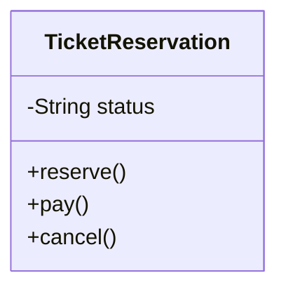

→ `TicketReservation` クラスがすべての予約状態と、状態ごとの処理ロジックを抱え込んでいます。

### 1-5：責任配置テーブル

| **クラス名** | **責任（1文）** | **知るべきこと** |
| --- | --- | --- |
| `TicketReservation` | チケットの予約から発券までの状態を管理する | 現在の予約ステータス、各状態における可能なアクション、状態遷移のルール |

各クラスの責任と知識の定義が確認できました。`TicketReservation` クラスが「予約ステータス」と「全状態の遷移ロジック」の両方を定義していることが分かります。

### 1-6：依存グラフ

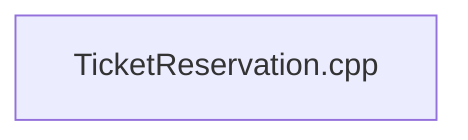

→ 現在は一つのクラス内にロジックが凝縮されており、外部への依存よりもクラス内部での知識の混在が顕著であることが分かります。

### 1-7：実装コード

現在の予約管理クラスの姿を確認します。

```cpp
#include <iostream>
#include <string>

class TicketReservation {
private:
    std::string status; // "Available", "Reserved", "Paid"
public:
    TicketReservation() : status("Available") {}

    void reserve() {
        if (status == "Available") {
            status = "Reserved";
            std::cout << "予約完了しました\n";
        } else {
            std::cout << "現在予約できません\n";
        }
    }

    void pay() {
        if (status == "Reserved") {
            status = "Paid";
            std::cout << "支払い完了しました\n";
        } else {
            std::cout << "支払いに適した状態ではありません\n";
        }
    }

    void cancel() {
        if (status == "Reserved") {
            status = "Available";
            std::cout << "予約をキャンセルしました\n";
        } else {
            std::cout << "キャンセルできません\n";
        }
    }
};

```

このコードを見ると、`reserve`、`pay`、`cancel` の各メソッドの中に、現在の `status` を判定する条件分岐が散らばっていることが分かります。実際の動作を確認するために、このクラスを呼び出す `main` 関数と実行結果を合わせて示します。

```cpp
int main() {
    TicketReservation seat;
    seat.reserve();  // Available → Reserved
    seat.pay();      // Reserved  → Paid
    return 0;
}
```

### 1-8：実行結果

```text
出力：
予約完了しました
支払い完了しました

```

このコードは正しく動いています。これから検討するのは、同じ機能を保ちながら、変更に強い構造をどう作るかという点です。

### 1-9：責任チェック表

この表は「コードの各行が、どの知識を持っているか」を可視化するものです。作り方はシンプルで、実装コードを1行ずつ読みながら「この行は何を知っているか」「その知識は誰が持つべきか」を書き出すだけです。知識の持ち主が2人以上になる行が見つかれば、そこが「変わる理由の混在」を示す兆候です。

| **コードの行** | **持っている知識** | **管理者（観察）** |
| --- | --- | --- |
| `if (status == "Available")` | 予約が可能であるという状態判定の知識 | 業務フロー管理者がルールを決める |
| `status = "Reserved";` | 次に遷移すべき状態の知識 | 業務フロー管理者がルールを決める |

責任チェックの結果、`status` という知識が複数のメソッドで利用されており、すべての状態遷移ルールを `TicketReservation` クラス自身が管理している様子が見えてきました。

要するに、各メソッド内で `status` 変数を判定しているという観察から、「現在の状態」と「状態ごとに実行すべき振る舞い」が同じ場所に混在しているという構造の問題が見えてくる。

フェーズ1で責任配置の観察が終わりました。次のフェーズ2では、実際に届いた変更要求を受けて、「何が変わり、何が変わらないか」を整理します。

## 🟠 フェーズ2：仮説立案 ―― 変更要求を受けて、変動と不変を整理する

フェーズ1で、チケット予約システムの現状をコードレベルで把握しました。次のフェーズ2では、具体的な変更要求を受けて、「コードのどこが変わりそうで、どこが変わらないか」を仮説として整理し、関係者ヒアリングで確定させます。

### 2-1：届いた変更要求

ある週明けの朝、映画館の支配人から開発チームへ、新しい施策についての連絡が入りました。

「来月から、リピーター向けに『キャンセル待ち』機能を実装したいのです。予約枠がいっぱいの場合でも、空きが出たら自動的に予約が割り当てられるようにしたい。また、それに伴い『予約一時保留』という状態も追加してほしい。上映開始の24時間前までなら、予約を確保したまま決済を24時間待つ仕組みです。」

支配人は、この機能が実装されれば、直前キャンセルによる空席を減らし、収益が大きく改善すると期待しています。しかし、現在の `TicketReservation` クラスには、すでに `Available`、`Reserved`、`Paid` という3つの状態が密接に絡み合っています。ここに「キャンセル待ち」と「保留中」という2つの新しい状態を、従来の `if` 文のロジックに追加していくのは、かなり骨の折れる作業になりそうです。

### 2-2：変動・不変の仮説テーブル

変更要求を受けて、フェーズ1で観察したコードのどこに影響が出そうかを仮説として整理します。ここでの「仮説」とは、まだヒアリング前の時点での予測です。この後の関係者ヒアリングで確定させます。

| **分類** | **仮説** | **根拠（フェーズ1の観察から）** |
| --- | --- | --- |
| 🔴 **変動しそう** | 状態遷移ルール（全状態の組み合わせ） | 現在の各メソッド内で `status` 変数を判定しているため、状態が増えるたびにすべてのメソッドで条件分岐の修正が必要となるため |
| 🔴 **変動しそう** | 各メソッド内での振る舞い（予約可否や支払い可否） | 新しい状態（保留中など）ごとに、アクションの可否が個別に定義される必要があるため |
| 🟢 **不変そう** | 映画の上映スケジュールと座席データ | 状態管理の仕組みとは独立しており、変更要求の影響を受けないため |

仮説を立ててみて改めて痛感するのは、今の構造だと状態が2つ増えるだけで、ロジックが指数関数的に複雑になりそうだという点です。

### 2-3：今回の確定変更テーブル

変更要求として届いた内容のうち、今回のリリースで確実に発生する変更を整理します。これはヒアリング前の段階でも、要件として明確に確定している内容です。

| **分類** | **具体的な内容** | **変わるタイミング** | **根拠** |
| --- | --- | --- | --- |
| 🔴 **変動する** | 状態の種類（キャンセル待ち・一時保留の追加） | 今回のリリース | 支配人からの変更要求に明記されている |
| 🔴 **変動する** | 各状態における振る舞い（状態ごとのアクション可否） | 今回のリリース | 新状態の導入に伴い定義が必要 |
| 🟢 **不変** | 映画館の基本情報（上映時間、座席数） | 変わる日は来ない | 運営管理部門との合意 |

この時点で確定しているのは「状態が2つ増える」という事実だけです。将来どれだけ変わり続けるかは、次の関係者ヒアリングで確認します。

### 2-4：関係者ヒアリング

仮説を確実なものにするため、企画担当の鈴木氏にヒアリングを行いました。

* **開発者：** 「キャンセル待ちや一時保留など、状態がかなり増えますが、今後さらに状態が増える予定はありますか？」
* **企画担当 鈴木：** 「実は、上映後のアンケート回答者に付与する『特別優待予約』なども今後検討しています。状態は今後も増えていくはずです。」
* **開発者：** 「なるほど。状態遷移のルール、例えば『保留中からキャンセル待ちへ移行できるか』などは、今後ルールが変わる可能性はありますか？」
* **企画担当 鈴木：** 「それも十分にあり得ます。今は保留中からのキャンセルを認めていますが、来月には『一度保留にしたらキャンセル不可』というルール変更も考えられます。」

ヒアリングの結果、「状態の種類」だけでなく「状態遷移ルールそのもの」も頻繁に変わり続けるという事実が見えてきました。

> **現実のヒアリングでは——** このシナリオでは相手がちょうど設計に役立つ情報を教えてくれています。現実には「変わるかどうか分からない」「たぶん変わらない」という答えが返ることも多いです。そのときは、コードの変更履歴（`git log`）や過去の障害記録を「ヒアリングの代わり」として使ってみてください。「過去に何度変わったか」が、「将来変わりやすいか」の最も正直な証拠です。

### 2-5：将来リスクテーブル

ヒアリングで判明した「今後起こりうる変化のリスク」を、今回の確定変更とは分けて整理します。これらはまだ確定ではありませんが、設計の方向性を決める重要な情報です。

| **分類** | **具体的なリスク** | **変わるタイミング** | **根拠（誰との確認か）** |
| --- | --- | --- | --- |
| 🔴 **変動リスク** | 状態遷移のルール（アクションの可否） | キャンペーンや運用の見直し時 | 企画担当 鈴木氏との確認 |
| 🔴 **変動リスク** | 状態の種類（特別優待予約などの追加） | 新機能導入時 | 企画担当 鈴木氏との確認 |

確定した情報とリスク情報を合わせて見ると、今回の設計変更は「状態を一つ追加して終わり」ではなく、今後の度重なるルール変更に対して「いかにしなやかに対応するか」という構造上の問題であることが分かります。

フェーズ2で「何が変わり、何が変わらないか」が確定しました。次のフェーズ3では、今のコードでこの変更を実際に試みたときに何が起きるかを確認します。

## 🟡 フェーズ3：問題特定 ―― 変更を試みて、痛みを発見する

フェーズ2で「状態遷移のルールは頻繁に変わる」という確信が持てました。このフェーズでは、確定した新しい状態遷移（キャンセル待ち・一時保留）を、今のコードの構造のまま適用しようとしたとき、システムにどのような「痛み」が生じるのかを観察してみます。

### 3-1：変更シミュレーション

フェーズ2の変更要求を受けて、今のコードに「一時保留（Held）」状態を追加してみます。追加すべき仕様は次の通りです。

- `Held`（一時保留）：上映24時間前まで座席を仮押さえする状態
- `Held` からは `reserve()` で `Reserved` に遷移できる
- `Held` からも `cancel()` でキャンセルできる

この仕様を今の `TicketReservation` クラスに当てはめてみます。例えば `reserve` メソッドを修正すると次のようになります。

```cpp
void reserve() {
    if (status == "Available") {
        status = "Reserved";
        std::cout << "予約完了しました\n";
    } else if (status == "Held") { // 新しい状態への対応
        status = "Reserved";
        std::cout << "保留から予約へ変更しました\n";
    } else {
        std::cout << "現在予約できません\n";
    }
}

```

`reserve` メソッドを修正したとき、同時に `pay` メソッドや `cancel` メソッドの中にある `if` 文の条件もすべて見直し、新しい状態である `Held`（保留）を考慮しなければならないことに気づきます。

もし、さらに「キャンセル待ち」状態が追加されたらどうなるでしょうか。すべてのメソッドにある条件分岐がさらに増殖し、一つのアクションを行うたびに、今の `status` が何なのかを常に意識しなければならないのです。

「この先、状態が5つ、6つと増えたら、一つのアクションを判定するのにどれだけの `if` 文を積み重ねればいいんだろう……」

コードのあちこちで同じような条件判定が繰り返され、一箇所でも判定ロジックを書き忘れると、システムは「ありえない状態遷移」を許してしまうことになります。

### 3-2：変更影響グラフ

変更を試みようとしたときに頭の中で起きた「影響の広がり」を図にしてみます。

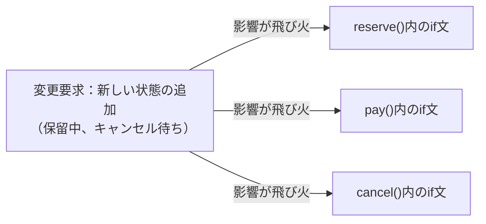

このグラフが示す通り、たった一つの「状態追加」という変更要求が、クラス内のほぼすべてのロジックに飛び火しています。

### 3-3：痛みの言語化

変更を試みてみた結果、現場でよく直面する2つの辛い状況が浮かび上がってきました。

1つ目は、修正漏れがバグに直結する恐怖です。
新しい状態を追加するためには、すべてのメソッド内にある条件分岐を一つずつ確認し、適切にロジックを追記しなければなりません。もし `pay` メソッドで「保留中からの支払い」を考慮し忘れたらどうなるでしょうか。ユーザーは支払いができず、システムは正しく動かないまま放置されます。一つの小さな仕様変更のために、クラス内の全てのロジックを神経質にチェックしなければならないというのは、非常にコストが高く、リスクの大きい作業です。

2つ目は、システムの振る舞いが「コードの迷路」になってしまうことです。
現状では、`TicketReservation` クラスを開けば予約のルールが一目瞭然でした。しかし、状態が増えるたびに `if` や `else if` が折り重なり、ビジネス上のルールがどこに書かれているのかが見えにくくなります。コードを読むたびに、脳内で「今この状態なら、このメソッドは動いて……」というシミュレーションを繰り返さなければなりません。これでは、誰かが修正を加えるたびに別の場所を壊してしまう「副作用」の温床になってしまいます。

こういうとき困る、という感覚は広く共有されています。まずは現状の辛さを言語化することが、次のステップへ進むための準備になります。

フェーズ3で「変更が辛い」という事実が確認できました。次のフェーズ4では、なぜ辛いのかを構造的に言語化します。

## 🔴 フェーズ4：原因分析 ―― 「なぜ辛いのか」を構造的に言語化する

フェーズ3で確認した「状態追加のたびに条件分岐が爆発的に増え、修正漏れがバグを生む」という痛み。このフェーズでは、なぜそのような辛さが生じるのかを、コードの構造（接続形態）の観点から深く掘り下げます。

### 4-1：観察→原因テーブル

フェーズ3で確認した「痛み」と、その背後にある構造的な原因を対応させてみます。

「ステータスと振る舞いが同じクラスに混在すること」は、それ自体は一般的な実装です。問題は「変わる理由が異なる2つのもの」が混在しているかどうかです。`status` という状態は「業務ルール（どの遷移を許可するか）」で変わり、`reserve()` などの処理フローは「機能要件（どんな操作ができるか）」で変わります。この2つの「変わる理由」が同じクラスに入っているとき、片方の変更が必ずもう片方に影響します。それが下の表で示す「原因の方向」です。

この表は「フェーズ3で感じた痛み」を出発点にして、その痛みが生まれた構造的な理由を探る表です。痛みを1つ取り上げ、「なぜそうなるのか？」と問いかけ続けることで、根本原因の方向が見えてきます。

| **観察（フェーズ3で感じた痛み）** | **原因の方向（なぜそうなるのか）** |
| --- | --- |
| 新しい状態を追加するたびに、既存の全メソッドの条件分岐を書き換える必要がある | 「現在の状態（ステータス）」と「その状態で実行可能な振る舞い」という、本来分離すべき知識が、一つのクラスの中に混在しているから |
| 複雑な条件分岐により、現在の状態が何であるかを常に意識しないとコードが書けない | 状態管理のルール（遷移条件）がロジックの中に埋め込まれ、状態の変化を追跡するのが困難になっているから |

### 4-2：変わるもの / 変わらないものテーブル

原因分析の結果から、「変わり続けるもの」と「変わってほしくないもの」を整理します。

| **変わり続けるもの（🔴）** | **変わってほしくないもの（🟢）** |
| --- | --- |
| 状態の種類（キャンセル待ち、保留中などの追加） | 予約システムとしての基本的な業務フロー |
| 各状態における振る舞い（状態ごとのアクション） | 状態を管理するという概念（状態があること自体） |

私たちが守るべきは「予約管理」という概念であり、増え続ける「状態の種類」や「状態ごとの細かなルール」は、安定した業務フローから切り離すべき存在なのです。

### 4-3：接続形態を診断する

第0章で紹介した「接続形態の2×2マトリクス」を使って、現在のコードがどの位置にあるかを診断します。

|  | 直接（直差し） | 間接（アダプター経由） |
|:---:|:---|:---|
| **具体**（専用規格） | **← 現在のコード**　`TicketReservation` が `status` 文字列を直接知って操作する | `StateManager` などの仲介役を挟む（状態名は知っている） |
| **抽象**（汎用規格） | `IReservationState*` 型経由で直接呼ぶ | インターフェース＋仲介役の両方を挟む |

現在のコードが「具体×直接」に該当する根拠は次の2点です。

| 観点 | コードの証拠 |
|---|---|
| **「具体」＝専用規格** | `if (status == "Available")` など — 状態名を文字列リテラルとしてコードに直書きしており、他の書き方に差し替えられない |
| **「直接」＝直差し** | `reserve()` / `pay()` / `cancel()` の各メソッドが `status` を直接読み書きしており、間に何も挟まっていない |

ちょうどiPhone専用のLightningケーブルがApple純正機器にしか刺さらないように、このコードも「Availableという状態名」と「TicketReservationというクラス」が専用の接続で結びついており、他の状態を差し込む口がありません。状態が増えるたびに既存の接続を切り直す必要が生じるのは、この「具体×直接」という接続形態が原因です。

「状態」ごとに振る舞いを別クラスに切り出すことができれば、この接続を「抽象×直接（USB-C直差し）」のような柔軟な形に変えられるはずです。

フェーズ4で根本原因が言語化できました。次のフェーズ5では、この状況を解決するための具体的な課題を定義します。

## 🟣 フェーズ5：課題定義 ―― 解くべき問題を具体的に定める

フェーズ4で、「現在の状態」と「その状態で実行すべき振る舞い」が `TicketReservation` クラスの中に密接に混在しているという構造的問題が明らかになりました。対策案（フェーズ6）に進む前に、ここで「何を解くべき課題とするか」を具体的に確定させます。

### 5-1：接続点の特定

今回のリファクタリングにおいて、もっとも深刻な影響が出ている場所、つまり、解決すべき「接続点（ジョイント）」は以下の1箇所です。

* **接続点A：** `TicketReservation`（状態管理・業務フロークラス） ←→ `status` による条件分岐（具体的な状態ごとの処理）の境界

この接続点は、「予約」という概念を管理する場所と、「保留中」や「キャンセル待ち」といった具体的な振る舞いの詳細がつながっている場所です。ここを切り離すことで、新しい状態が追加された際に業務フローのコード全体を修正しなくても済む設計を目指します。

### 5-2：非機能制約の確認

このシステムの規模では、状態クラスの導入によるパフォーマンスコストは設計判断を絞り込む制約になりません。唯一注意すべき点は、人気映画の公開初日など同一座席への同時予約リクエストが集中するケースです。**状態遷移のロジックがどこに集約されているか**が、楽観的ロック等の競合制御を実装できる場所を決定します。この点は案3・案4の選定に影響するため、各案のトレードオフで触れます。

### 5-3：クライアントへの影響範囲

「接続点A」を変えることで、どのクラスに修正が及ぶかを確認します。

現在の `TicketReservation` クラスがこの接続点のクライアントです。`TicketReservation` は `status` 変数を直接持ち、すべての遷移ロジックを自身で抱えています。この境界を切り離すことは、`TicketReservation` の内部実装を作り変えることになります。ただしこの変更は一回限りであり、一度切り離しを完了すれば、以降の状態追加時には `TicketReservation` に一切手を触れることなく、新しい「状態クラス」を追加するだけで済むようになります。この認識をもとに、次のフェーズ6で対策案を比較します。

### 5-4：課題まとめ表

以上の情報をまとめ、フェーズ6での対策案検討の基盤となる課題定義を確定させます。

| **接続点** | **分けた理由** | **非機能制約** | **クライアント影響** |
| --- | --- | --- | --- |
| 接続点A | 状態ごとの「変わる理由」を業務フローから隔離するため | 同一座席への同時予約競合に対する整合性保証が必要 | `TicketReservation` の内部ロジックを全面刷新する必要あり |

フェーズ5で「何を解くか」が具体化されました。次のフェーズ6では、この課題に対してどのような「接続の形」を採用すべきか、案1〜案4を並べてコスト比較を行います。

## 🟢 フェーズ6：対策案検討 ―― 解決策を並べ、コストで選ぶ

フェーズ5で課題定義した「状態管理ロジックの混在」を解消するための対策案（案1〜案4）を検討します。

どの案も、動作例テーブルで示した動作を実現します。違うのは「変更が来たときにどこを触ることになるか」です。

### 6-1：接続の形 2×2マトリクス

現在のコードは、`TicketReservation` クラスがすべての状態を直接知っている「具体×直接」の位置にあります。ここから、新しい状態を柔軟に追加できる設計を目指します。下の表では、各接続形態とこのシステムの構成要素との対応も合わせて示します。

| 接続形態 | ケーブル例 | このシステムでの意味 | 特徴 |
|:---:|:---|:---|:---|
| **具体×直接**（現在） | iPhone → [Lightning] → Apple純正ドック | `TicketReservation` が `status` 文字列を直接知って操作 | 専用接続のみ。差し替え不可 |
| **具体×間接** | iPhone → [Lightning] → [変換] → USB-A充電器 | `StateManager` 仲介役を挟むが、内部は具体クラスを直接知っている | 仲介あり、ただし内部の柔軟性は限定的 |
| **抽象×直接** | MacBook → [USB-C] → USB-C対応モニター | `IReservationState*` 型で受け取り、具体クラス名を知らない | どの状態クラスでも同じ口で繋がる |
| **抽象×間接** | MacBook → [USB-C] → [ハブ] → HDMI・USB-A・LAN | インターフェース＋仲介役の両方を挟む | 最も柔軟、ただし層が増える |

---

#### 案1：現状のまま ―― 構造を変えない

**この形の考え方：**
クラスの分割やインターフェースの導入を行わず、既存の `reserve()` や `pay()` メソッドの中に、新しい状態の条件分岐を `if` 文で追加します。変更頻度が極めて低く、これ以上複雑にならないと断言できる場合にのみ許容される最小コストの選択です。

なお、クラス図に `AdminPanel` が登場していますが、これはフェーズ1の1-2節「このルールを使う場所」で示した通り、同じ状態遷移ロジックを使う2つ目の呼び出し元です。案1はあくまり構造を変えない選択ですが、`AdminPanel` もすでに仕様として存在しています。それぞれが同じ `if` 文を重複して抱える点が、案1の問題として示したいことです。

**手段の比較：**

| 手段 | 方法 | 特徴 |
|---|---|---|
| 手段A：分岐をメソッドに追記 | 既存の各メソッドの `if` 文に `else if` を足す | 変更箇所が最小だが、全メソッドに修正が必要 |
| 手段B：状態ごとのメソッドに分割 | `reserveIfAvailable()` のような状態別メソッドを作る | 分岐の見通しは良くなるが、メソッド数が状態数 × 操作数だけ増える |

→ **採用：手段A**（構造を変えないという案1の趣旨に最も合っているため）

**構造図：**

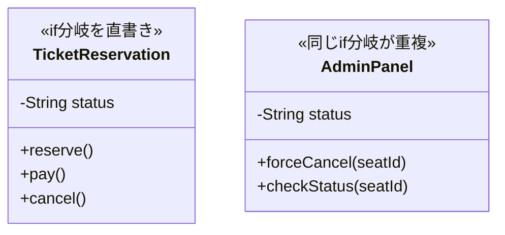

両クラスがそれぞれ状態判定ロジックを内部に直書きしており、状態が増えるたびに両方のif文を同時に修正しなければならない。

**状態インターフェース（なし）：**

案1は状態の分離を行わないため、インターフェースや状態クラスは存在しません。すべてのロジックが `TicketReservation` と `AdminPanel` の各メソッドに直書きされます。

**各状態クラス（なし）：**

状態クラスは作りません。`status` 文字列の値が状態の区別に使われます。

**コンテキストクラス（TicketReservation と AdminPanel）：**

```cpp
// 呼び出し元1：顧客が行う通常の予約フロー
class TicketReservation {
private:
    std::string status; // "Available", "Reserved", "Paid"
public:
    TicketReservation() : status("Available") {}
    void reserve() {
        // ← 具体："Available"という条件を呼び出し側が直接書いている
        if (status == "Available") {
            status = "Reserved";
            std::cout << "予約完了\n";
        } else if (status == "Held") {
            status = "Reserved";
            std::cout << "保留から予約へ変更しました\n";
        } else {
            std::cout << "現在予約できません\n";
        }
    }
    void cancel() {
        if (status == "Reserved") {
            status = "Available";
            std::cout << "キャンセル完了\n";
        } else {
            std::cout << "キャンセルできません\n";
        }
    }
    std::string getStatus() const { return status; }
};
```

このコードを見ると、新しい状態 `Held` に対応するために `reserve()` に `else if` を追加しています。同じ修正を `pay()` や `cancel()` にも繰り返す必要があります。

**管理パネル（AdminPanel）：**

```cpp
// 管理パネル（呼び出し元2）
// ← 案1の問題：TicketReservationと同じif文を重複して持つことになる
class AdminPanel {
private:
    std::string status; // "Available", "Reserved", "Paid"
public:
    AdminPanel() : status("Available") {}
    void forceCancel(const std::string& seatId) {
        // ← TicketReservationと全く同じ条件判定が重複している
        if (status == "Reserved" || status == "Paid") {
            status = "Available";
            std::cout << "座席 " << seatId << " を強制キャンセルしました\n";
        } else {
            std::cout << "キャンセル対象外の状態です\n";
        }
    }
    void checkStatus(const std::string& seatId) {
        // ← これもTicketReservationと同じ状態チェックロジックが重複している
        if (status == "Available") std::cout << seatId << ": 空席\n";
        else if (status == "Reserved") std::cout << seatId << ": 予約済み\n";
        else if (status == "Paid") std::cout << seatId << ": 支払い済み\n";
    }
};
```

状態判定ロジックが `TicketReservation` と `AdminPanel` の両方に重複して書かれていることが分かります。新しい状態が追加されるたびに、両方のクラスの `if` 文を同時に修正しなければなりません。

**組み立て（BatchApplication / main）：**

```cpp
// 案1（現状のまま）の呼び出し側
int main() {
    TicketReservation reservation;
    reservation.reserve();   // ← 具体：内部でif文による状態判定が走る

    AdminPanel admin;
    admin.forceCancel("A-15");   // ← 同じif文が重複して走る
    admin.checkStatus("A-15");
    return 0;
}
```

状態判定ロジックが各クラスの内部に直書きされているため外部への委譲が発生せず、同じ分岐が2か所で並行して走る。

**この形のトレードオフ：**

* 変更容易性：低（状態が増えるたび全メソッドの修正が必要）
* テスト容易性：低（状態が複雑に絡み合い、テスト網羅が困難）
* 実装コスト：低（今のコードに修正を加えるだけ）

---

#### 案2：具体×直接 ―― クラスを分けるが参照は具体型のまま

**この形の考え方：**

案1との違いは「状態ごとのロジックをクラスに切り出したかどうか」です。案1は `TicketReservation` の中に `if` 文が直書きされていましたが、案2では `ReservedState` や `AvailableState` という状態クラスを別に作り、それぞれのロジックをそちらに移します。ただし、`TicketReservation` がそれらの具体クラスを型名で直接知っている点は変わりません。

なぜコントロール側（`TicketReservation`）も変えるのかというと、「どの状態クラスを使うか」を `TicketReservation` 自身が決めなければならないためです。この判断が呼び出し元に残る限り、状態クラスが増えるたびに呼び出し元の修正も発生します。状態ごとにクラスは分かれたが、依存が2か所（`TicketReservation` と `AdminPanel`）に重複している——それが案2の問題です。

**手段の比較：**

| 手段 | 方法 | 特徴 |
|---|---|---|
| 手段A：状態クラスをポインタで保持 | `TicketReservation` が `ReservedState*` 等を直接メンバに持つ | クラスは分かれるが依存が増える |
| 手段B：状態クラスを値で保持 | `ReservedState reserved;` のように値メンバとして持つ | ポインタ管理が不要だが、状態の入れ替えに制限がある |

→ **採用：手段A**（状態の切り替えを実行時に行うにはポインタが必要なため）

**構造図：**

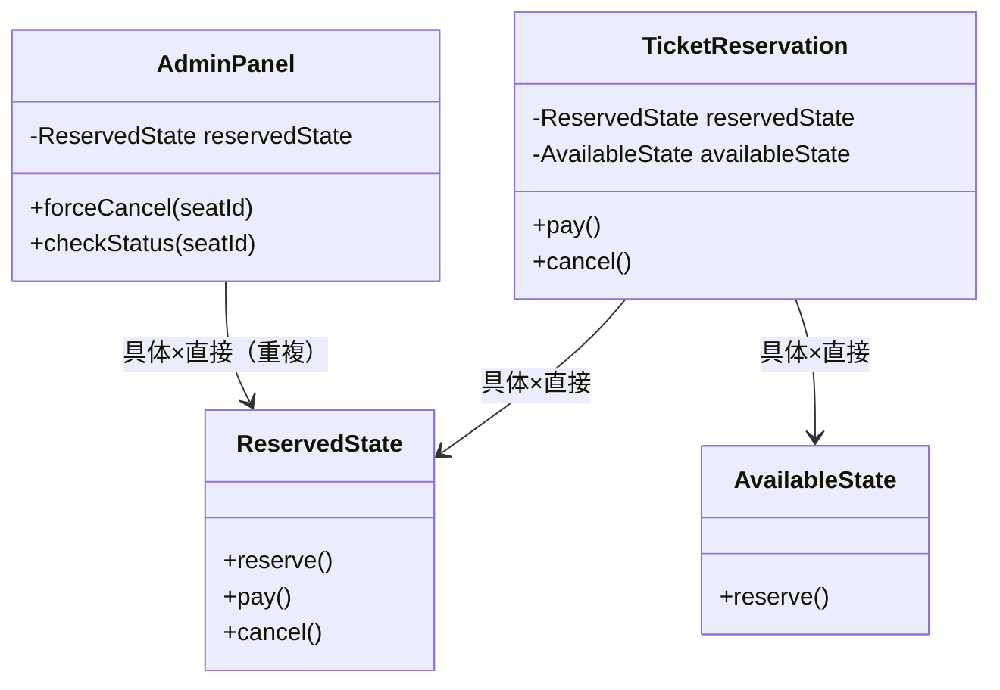

両クラスが `ReservedState` などの具体クラスを直接参照しており、状態クラスが増えるたびに呼び出し元2箇所の修正が必要になる。

**状態クラス群：**

```cpp
// ← 具体：ReservedStateという型名を直接書いている
class ReservedState {
public:
    void reserve() { std::cout << "既に予約済みです\n"; }
    void pay() { std::cout << "支払い完了\n"; }
    void cancel() { std::cout << "キャンセル完了\n"; }
};

class AvailableState {
public:
    void reserve() { std::cout << "予約完了\n"; }
};
```

状態ごとのロジックがクラスに分かれたことで、案1よりも各状態の振る舞いが読みやすくなっています。ただし、インターフェースがないため `TicketReservation` はこれらの具体クラスを型名で知っています。

**コンテキストクラス（TicketReservation）：**

```cpp
// 呼び出し元1：顧客が行う通常の予約フロー
// ← 直接：呼び出し側がこのクラスを直接インスタンス化している
class TicketReservation {
    ReservedState* reservedState;
    AvailableState* availableState;
public:
    TicketReservation(ReservedState* rs, AvailableState* as)
        : reservedState(rs), availableState(as) {}
    void pay() { reservedState->pay(); }
    void cancel() { reservedState->cancel(); }
};
```

`TicketReservation` が `ReservedState` という具体クラスを直接知っていることが分かります。新しい状態クラスが追加されるたびに、このクラスの修正も避けられません。

**管理パネル（AdminPanel）：**

```cpp
// 管理パネル（呼び出し元2）
class AdminPanel {
    ReservedState* reservedState;   // ← 直接：同じ具体クラスをここでも直接保持
public:
    AdminPanel(ReservedState* rs) : reservedState(rs) {}
    // ← 「どのクラスを使うか」という選択ロジックがここにも重複している
    void forceCancel(const std::string& seatId) {
        reservedState->cancel();   // ← 直接：具体クラスをここでも直接呼び出す
        std::cout << "強制キャンセル: " << seatId << "\n";
    }
    void checkStatus(const std::string& seatId) {
        std::cout << seatId << ": 予約済み\n";
    }
};
```

`AdminPanel` も `ReservedState` を直接知っており、状態クラスが増えるたびに両方の呼び出し元が影響を受けます。状態クラスは別ファイルに切り出せましたが、依存関係の重複が両クラスに残っています。

**組み立て（BatchApplication / main）：**

```cpp
// 案2（具体×直接）の呼び出し側
int main() {
    ReservedState reserved;
    AvailableState available;
    TicketReservation reservation(&reserved, &available);  // ← 直接：具体クラスを直接渡す
    reservation.pay();

    AdminPanel admin(&reserved);  // ← 直接：同じ具体クラスをここでも直接渡す
    admin.forceCancel("A-15");
    return 0;
}
```

クラスは分かれたが「どの状態クラスを呼ぶか」という判断を両方の呼び出し元がそれぞれ行っており、呼び出し経路が2本並んで重複している。

**この形のトレードオフ：**

* 変更容易性：低〜中（状態が増えると呼び出し側の修正が避けられない）
* テスト容易性：低（具体クラスへの依存が強いため切り離せない）
* 実装コスト：低（既存のロジックをクラスへ移すだけ）


---

#### 案3：抽象×直接 ―― インターフェースを挟み、型だけで接続する

**この形の考え方：**
「状態」をインターフェース化し、呼び出し側はインターフェース型に対してプログラムします。状態が増えても `TicketReservation` はインターフェースしか知らないため、修正が不要になります。

**手段の比較：**

| 手段 | 方法 | 特徴 |
|---|---|---|
| 手段A：コンストラクタインジェクション | `TicketReservation(IReservationState* s)` で外から受け取る | 依存の組み立てが呼び出し元に移り、テストしやすい |
| 手段B：セッターインジェクション | `setState(IReservationState* s)` で後から切り替える | 状態の動的切り替えが可能だが、未設定時の制御が必要 |
| 手段C：継承による状態定義 | `TicketReservation` を継承して状態ごとにサブクラスを作る | クラス階層が深まり、状態の実行時切り替えができない |

→ **採用：手段A＋手段Bの併用**（初期状態をコンストラクタで受け取り、遷移時は `setState` で切り替えるのが最も自然なため）

**構造図：**

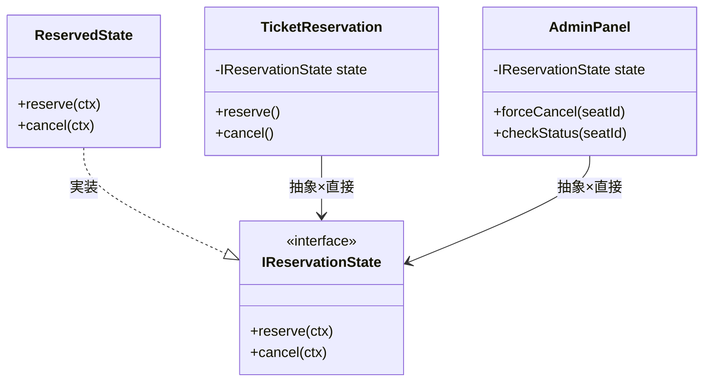

両クラスが `IReservationState` インターフェースだけを知り、新しい状態クラスを追加しても呼び出し元を一切変更しなくてよい。

**状態インターフェース（IReservationState）：**

```cpp
class TicketReservation;

// 抽象による分離：状態ごとの振る舞いを定義するインターフェース
class IReservationState {
public:
    virtual void reserve(TicketReservation* ctx) = 0;
    virtual void cancel(TicketReservation* ctx) = 0;
    virtual ~IReservationState() = default;
};
```

このインターフェースが「どの状態クラスでも同じ口で繋がる」ことを保証します。呼び出し元はこの型しか知らないため、具体クラスが何であっても呼び出し方が変わりません。

**各状態クラス（AvailableState / ReservedState / PaidState）：**

```cpp
class AvailableState : public IReservationState {
public:
    void reserve(TicketReservation* ctx) override {
        // 予約処理：Reserved状態へ遷移する
        std::cout << "予約完了しました\n";
    }
    void cancel(TicketReservation* ctx) override {
        std::cout << "空席状態のためキャンセル不要です\n";
    }
};

class ReservedState : public IReservationState {
public:
    void reserve(TicketReservation* ctx) override {
        std::cout << "既に予約済みです\n";
    }
    void cancel(TicketReservation* ctx) override {
        // キャンセル処理：Available状態へ戻す
        std::cout << "予約をキャンセルしました\n";
    }
};

class PaidState : public IReservationState {
public:
    void reserve(TicketReservation* ctx) override {
        std::cout << "支払い済みのため再予約できません\n";
    }
    void cancel(TicketReservation* ctx) override {
        // 支払い済みはキャンセル不可
        std::cout << "支払い済みのためキャンセルできません\n";
    }
};
```

新しい状態（例：`HeldState`）を追加したいときは、この `IReservationState` を実装したクラスを1つ追加するだけで済みます。既存のクラスに一切触れません。

**コンテキストクラス（TicketReservation）：**

```cpp
// 呼び出し元1：顧客が行う通常の予約フロー
class TicketReservation {
private:
    // ← 抽象：IReservationState*型で受け取り、具体クラスを知らない
    IReservationState* state;
public:
    TicketReservation(IReservationState* s) : state(s) {}
    void setState(IReservationState* s) { state = s; }
    void reserve() { state->reserve(this); }
    void cancel() { state->cancel(this); }
};
```

`TicketReservation` が `IReservationState*` というインターフェース型しか持っていないことが分かります。どの状態クラスが渡されても、呼び出し方は変わりません。

**管理パネル（AdminPanel）：**

```cpp
// 管理パネル（呼び出し元2）
class AdminPanel {
private:
    IReservationState* state;  // ← 抽象：具体クラスを知らない
public:
    AdminPanel(IReservationState* s) : state(s) {}
    // 管理画面からの強制キャンセル
    void forceCancel(const std::string& seatId) {
        // ← 抽象：IReservationState経由でキャンセルを依頼するだけ
        TicketReservation ctx(state);
        ctx.cancel();
        std::cout << "強制キャンセル: " << seatId << "\n";
    }
    void checkStatus(const std::string& seatId) {
        std::cout << seatId << ": 状態確認完了\n";
    }
};
```

`AdminPanel` も `IReservationState*` しか知らないため、状態クラスが変わっても `AdminPanel` に触る必要がありません。

**組み立て（BatchApplication / main）：**

```cpp
// 案3（抽象×直接）の呼び出し側
int main() {
    ReservedState state;                       // ← 具体：呼び出し側だけが具体クラスを生成
    TicketReservation reservation(&state);     // ← 直接：同じstateを注入
    AdminPanel admin(&state);                  // ← 直接：同じstateを使い回せる
    reservation.cancel();
    admin.forceCancel("A-15");
    return 0;
}
```

`main()` が具体型を組み立て、両方の呼び出し元は `IReservationState*` という型だけを介して同じオブジェクトを呼ぶため、状態クラスが変わっても呼び出し経路は変わらない。

**この形のトレードオフ：**

* 変更容易性：高（新しい状態クラスを追加するだけでよい）
* テスト容易性：高（状態ごとのクラスを単体テスト可能）
* 実装コスト：中（設計の抽象化が必要）

---

#### 案4：抽象×間接 ―― インターフェース＋仲介役を両立する

**この形の考え方：**
インターフェースと仲介役の両方を導入し、層を抽象化します。極めて柔軟ですが、クラス数と層が増えるため、小〜中規模のチケット予約管理には過剰になる可能性が高いです。

**手段の比較：**

| 手段 | 方法 | 特徴 |
|---|---|---|
| 手段A：Manager＋インターフェースの2層 | `IStateManager` インターフェースと `StateManager` 実装クラスを分ける | 最大の柔軟性。テスト時に Manager をモック化できる |
| 手段B：Manager のみ（インターフェースなし） | `StateManager` 具体クラスだけを仲介役として置く | 案3（具体×間接）に相当。抽象化が不完全 |

→ **採用：手段A**（案4の趣旨である「抽象×間接」を実現するには2層が必要なため）

**構造図：**

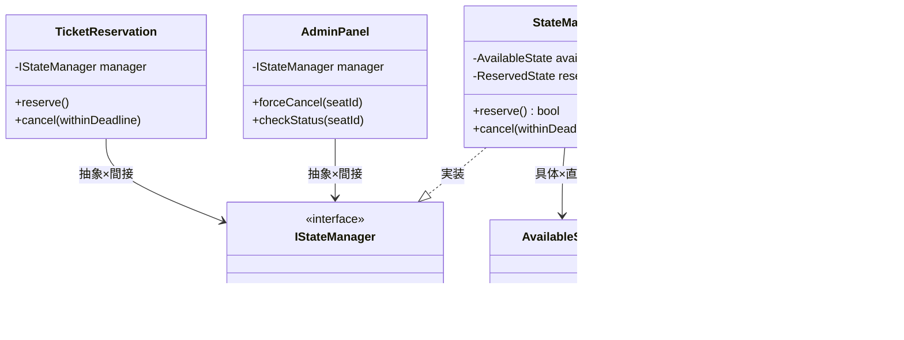

インターフェース層（`IStateManager`）と仲介層（`StateManager`）の2層を挟むことで、両クラスは具体的な状態実装を一切知らない最も柔軟な構造。

**状態インターフェース（IStateManager）：**

```cpp
// 抽象化された管理インターフェース
class IStateManager {
public:
    virtual bool reserve() = 0;
    virtual bool cancel(bool withinDeadline) = 0;
    virtual ~IStateManager() = default;
};
```

このインターフェースが `TicketReservation` と `AdminPanel` から見える唯一の接点です。`StateManager` の内部実装は完全に隠蔽されます。

**仲介クラス（StateManager）と各状態クラス：**

```cpp
// 具体的な状態クラス群
class AvailableState {
public:
    bool reserve() { return true; }
};

class ReservedState {
public:
    bool cancel(bool withinDeadline) {
        if (withinDeadline) { return true; }
        return true;
    }
};

// 仲介役：内部の状態クラス群を隠しつつ、外部には統一インターフェースを提供する
class StateManager : public IStateManager {
    AvailableState available;
    ReservedState  reserved;
    std::string    current; // "Available" / "Reserved"
public:
    StateManager() : current("Available") {}

    bool reserve() override {
        if (current != "Available") return false;
        if (!available.reserve()) return false;
        current = "Reserved";
        return true;
    }

    bool cancel(bool withinDeadline) override {
        if (current == "Reserved") {
            bool ok = reserved.cancel(withinDeadline);
            if (ok) current = "Available";
            return ok;
        }
        return false;
    }
};
```

`StateManager` が状態クラス群をカプセル化しており、呼び出し元はその存在を知りません。状態が増えた場合、`StateManager` 内の修正で済みます。

**コンテキストクラスと管理パネル：**

```cpp
// 呼び出し元1：顧客が行う通常の予約フロー
class TicketReservation {
private:
    // ← 抽象：IStateManager*型で受け取り、具体実装を知らない
    // ← 間接：Managerを経由するため内部クラス群が見えない
    IStateManager* manager;
public:
    TicketReservation(IStateManager* mgr) : manager(mgr) {}
    void reserve() {
        if (manager->reserve()) std::cout << "予約完了\n";
        else std::cout << "予約できません\n";
    }
    void cancel(bool withinDeadline) {
        if (manager->cancel(withinDeadline)) std::cout << "キャンセル完了\n";
        else std::cout << "キャンセルできません\n";
    }
};

// 管理パネル（呼び出し元2）
class AdminPanel {
private:
    IStateManager* manager;  // ← 抽象：IStateManager*型
public:
    AdminPanel(IStateManager* mgr) : manager(mgr) {}
    void forceCancel(const std::string& seatId) {
        // 管理画面からのキャンセルは常に「期限内」扱いとする
        if (manager->cancel(true)) std::cout << "強制キャンセル: " << seatId << "\n";
        else std::cout << "キャンセル対象外の状態です\n";
    }
    void checkStatus(const std::string& seatId) {
        std::cout << seatId << ": 状態確認完了\n";
    }
};
```

変更の影響は最も小さく抑えられますが、ファイル数が一気に増え、システム全体の繋がりを追うのが非常に難しくなっていることが分かります。

**組み立て（BatchApplication / main）：**

```cpp
// 案4（抽象×間接）の呼び出し側
int main() {
    StateManager mgr;                          // ← 具体：組み立て側だけが具体型を知る
    TicketReservation reservation(&mgr);       // ← 間接：抽象Managerのみ見えて具体実装は隠れる
    AdminPanel admin(&mgr);                    // ← 間接：同じManagerを共有
    reservation.reserve();
    admin.forceCancel("A-15");
    return 0;
}
```

**動作図：**

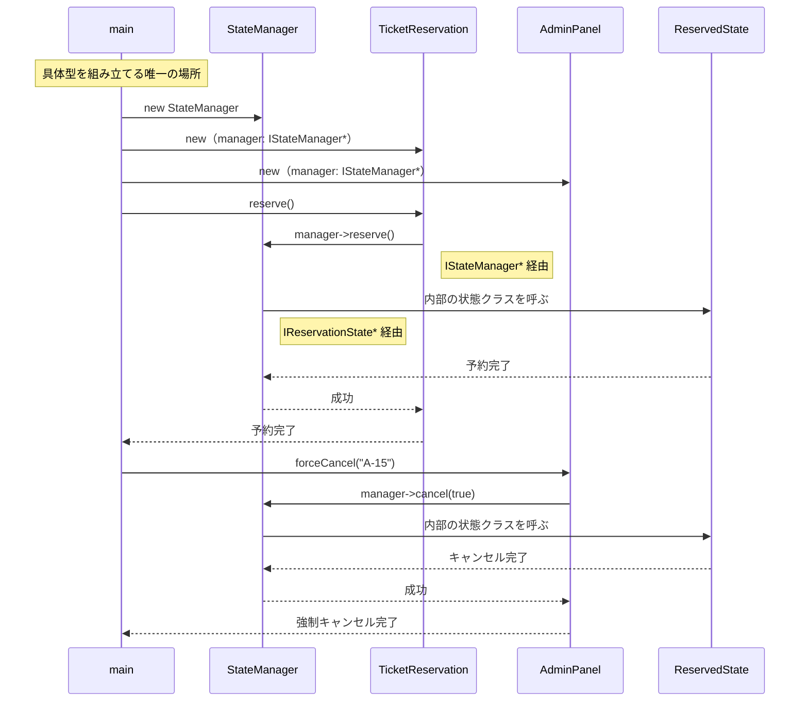

呼び出し元→`IStateManager*`→内部の状態クラスという2段階の抽象型を経由するため、どの具体クラスが動くかは `main()` の組み立て部分だけが知っている。

**この形のトレードオフ：**

* 変更容易性：高（全層が抽象化されており影響が最小）
* テスト容易性：高（各層を切り離してテスト可能）
* 実装コスト：高（設計の複雑度が高い）

### 6-7：評価軸

対策案が揃ったところで、どの案を採用すべきかを決めるための「ものさし」を宣言します。設計の意思決定を透明にするため、比較表の提示に先立って評価軸を合意します。

今回のチケット予約システムでは、以下の3軸で評価を行います。

| **評価軸** | **意味** | **ウェイト** |
| --- | --- | --- |
| 変更容易性 | 変更要求が来たとき、触る場所が最小で済むか | ×3 |
| テスト容易性 | 依存をスタブ/モックに差し替えてテストを書けるか | ×2 |
| 可読性 | コードの読みやすさ・構造を理解する工数 | ×1 |

> **注：** このウェイト（変更容易性×3など）は本書の例です。チームの変更頻度・テスト文化に合わせて、比較を始める前にチームで合意してください。スコアは「答えを決める計算式」ではなく、「チームの議論を整理する道具」です。

| 点数 | 変更容易性 | テスト容易性 | 可読性 |
| --- | --- | --- | --- |
| 3 | 変更が1クラスのみで完結する | スタブ1つで完全に切り離せる | クラス数が増えない・既存構造と同じ読み方で理解できる |
| 2 | 変更が2〜3クラスに及ぶ | 一部スタブが必要だが差し替え可能 | クラスが1〜2増える |
| 1 | 変更が4クラス以上に波及する | 実装に依存しテストが困難 | 中間層・インターフェースが複数増え理解コストが高い |

パフォーマンスのVETO（拒否権）については、フェーズ5で「ホットパスではない」と判断したため、今回はスコアリングを優先して検討します。

---

### 6-8：コスト天秤

案1〜案4を定量的に比較します。

| **案** | **現在の対応コスト** | **未来の対応コスト** |
| --- | --- | --- |
| 案1：現状のまま | 低 | 高 |
| 案2：具体×直接 | 低〜中 | 高 |
| 案3：抽象×直接 | 中 | 低〜中 |
| 案4：抽象×間接 | 高 | 低 |

**ステップ1：採点表**（1＝低い、2＝中程度、3＝高い）

| 案 | 変更容易性（×3） | テスト容易性（×2） | 可読性（×1） |
| --- | --- | --- | --- |
| 案1：現状のまま | 1 | 1 | 3 |
| 案2：具体×直接 | 1 | 2 | 3 |
| 案3：抽象×直接 | 3 | 3 | 2 |
| 案4：抽象×間接 | 3 | 3 | 1 |

**ステップ2：加重合計表**（変更容易性×3 ＋ テスト容易性×2 ＋ 可読性×1）

| 案 | 加重スコア | 判定 |
| --- | --- | --- |
| 案1 | 8 |  |
| 案2 | 10 |  |
| 案3 | 17 | ← 採用候補 |
| 案4 | 16 |  |

※案3が最高スコアとなりました。状態遷移の追加に対する柔軟性と、テストのしやすさが最もバランスよく実現されています。

---

### 6-9：採用案の決定

**採用する案：** 案3

**理由：** 状態が増えるたびに条件分岐を修正する現状から脱却し、各状態をクラスとして切り出すことで、変更時の影響をそのクラス内だけに閉じることができます。案3は案4に比べて実装コストが低く、このシステムの規模と変更頻度のバランスに最も適しています。

**この構造は、State（ステート）パターンと呼ばれています。**

状態ごとに専用のクラスを用意し、コンテキスト（`TicketReservation`）はインターフェース経由で現在の状態に処理を委譲します。状態が増えても、コンテキストクラスに一切触れることなく、新しい状態クラスを追加するだけで機能拡張できる構造です。

---

### 6-10：耐久テスト

フェーズ2のヒアリングで挙がった「将来のリスク」をシミュレートし、案3の変更耐性を検証します。

| **変更シナリオ** | **触る場所** | **コスト評価** |
| --- | --- | --- |
| 特別優待予約という新状態の追加 | `SpecialReservationState` クラスの新規作成のみ | 低 |
| 予約保留からのキャンセル不可ルール追加 | `HeldState` クラスの修正のみ | 低 |

この設計変更により、今後どれだけチケットの状態が増えようとも、既存の予約フローを壊す心配はなくなりました。私たちは「状態管理」の責務をクラスの外へ追い出すことに成功したのです。

## 🟤 フェーズ7：対策実施 ―― 決断し、変化に強い設計を手に入れる

採用した設計（案3：抽象×直接）を、実際のコードに実装します。これにより、これまで `TicketReservation` クラスが抱え込んでいた複雑な条件分岐を、個別の状態クラスへと移譲します。

この設計変更の最大の価値は、今後「キャンセル待ち」や「特別優待」といった新しい状態がどれだけ増えても、既存の業務フローや他の状態クラスに影響を与えることなく、新しいクラスを追加するだけで機能拡張ができる安定性を手に入れたことです。

### 7-1：状態インターフェース

新しい設計の基盤となるインターフェースを定義します。このインターフェースが「すべての状態クラスが守るべき契約」を定めます。

```cpp
#include <iostream>
#include <string>

class TicketReservation;

// 状態ごとの振る舞いを定義するインターフェース
// このインターフェースを実装したクラスだけが「予約状態」として扱える
class IReservationState {
public:
    virtual void reserve(TicketReservation* ctx) = 0;
    virtual void pay(TicketReservation* ctx) = 0;
    virtual void cancel(TicketReservation* ctx) = 0;
    virtual ~IReservationState() = default;
};
```

`IReservationState` が `TicketReservation*` を受け取る形になっているのは、状態クラスが遷移時にコンテキスト（`TicketReservation`）の状態を切り替えるためです。インターフェースがこの契約を定めることで、どの状態クラスも同じ方法で呼び出せます。

### 7-2：各状態クラス

状態ごとの振る舞いをそれぞれのクラスに実装します。各クラスは「その状態のときだけの責任」を持ちます。

```cpp
// Available（空席）状態：予約を受け付けられる状態
class AvailableState : public IReservationState {
public:
    void reserve(TicketReservation* ctx) override;  // 予約してReservedへ
    void pay(TicketReservation* ctx) override {
        std::cout << "予約なしで支払いはできません\n";
    }
    void cancel(TicketReservation* ctx) override {
        std::cout << "空席状態のためキャンセル不要です\n";
    }
};
```

```cpp
// Reserved（予約済み）状態：支払いかキャンセルを待っている状態
class ReservedState : public IReservationState {
public:
    void reserve(TicketReservation* ctx) override {
        std::cout << "既に予約済みです\n";
    }
    void pay(TicketReservation* ctx) override;     // 支払いしてPaidへ
    void cancel(TicketReservation* ctx) override;  // キャンセルしてAvailableへ
};
```

```cpp
// Paid（支払い済み）状態：発券待ちの状態
class PaidState : public IReservationState {
public:
    void reserve(TicketReservation* ctx) override {
        std::cout << "支払い済みのため再予約できません\n";
    }
    void pay(TicketReservation* ctx) override {
        std::cout << "既に支払い済みです\n";
    }
    void cancel(TicketReservation* ctx) override {
        std::cout << "支払い済みのためキャンセルできません\n";
    }
};
```

各クラスが「自分の状態のときに何ができて、何ができないか」を自己完結して持っています。`TicketReservation` 内に散らばっていた条件分岐が、それぞれのクラスに分散して格納されました。

### 7-3：コンテキストクラス（TicketReservation）

状態クラスを保持し、操作を現在の状態に委譲する中心クラスです。

```cpp
// 予約クラス：現在の状態オブジェクトを保持し、操作を委譲するだけ
class TicketReservation {
private:
    IReservationState* state; // ← ここだけ変わる。ifもswitchも一切ない
public:
    TicketReservation(IReservationState* initialState)
        : state(initialState) {}

    // 状態遷移時に呼ばれる（各状態クラスから呼び出す）
    void setState(IReservationState* s) { state = s; }

    // 操作を現在の状態に委譲するだけ
    void reserve() { state->reserve(this); }
    void pay()     { state->pay(this); }
    void cancel()  { state->cancel(this); }
};
```

このクラスを見ると、`if` 文や `switch` 文が一切ないことが分かります。`TicketReservation` はただ「今の状態に丸投げする」だけの存在になりました。状態が何であるかを知らなくてもよいため、状態が増えてもこのクラスに触る必要がありません。

状態遷移の実装（`reserve()` や `cancel()` の中で `setState()` を呼ぶ部分）は、各状態クラスのメソッド内で行います。例えば `AvailableState::reserve()` の中で `ctx->setState(new ReservedState())` を呼ぶ形です。

### 7-4：組み立て（BatchApplication / main）

依存の組み立てと実行の責任を分離します。

```cpp
// BatchApplication：依存の組み立てを担う唯一の場所
class BatchApplication {
public:
    void run() {
        // 具体クラスを知っているのはここだけ
        AvailableState initialState;
        TicketReservation seat(&initialState);

        // 動作例テーブルの動作を確認
        seat.reserve();   // Available → Reserved
        seat.pay();       // Reserved  → Paid
        seat.cancel();    // Paid → エラー（支払い済みはキャンセル不可）
    }
};

int main() {
    BatchApplication app;
    app.run();
    return 0;
}
```

```text
出力：
予約完了しました
支払い完了しました
支払い済みのためキャンセルできません
```

この実行結果は、フェーズ1の動作例テーブル（行4）で示した「Paid状態でcancel()を呼ぶとエラー」という動作と一致しています。構造が変わっても、動作は変わっていません。

### 7-5：変更影響グラフ（改善後）

フェーズ3で確認した「状態追加」のシナリオを再度適用します。

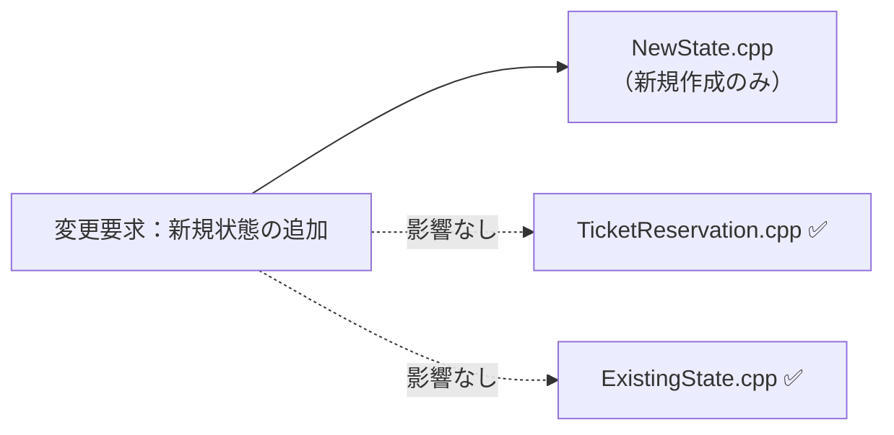

→ **フェーズ3の変更影響グラフと比較して、新しい状態の追加という変更要求が、新規作成したクラスだけに閉じた設計になりました**。

### 7-6：変更シナリオ表

この設計で手に入れたものと、諦めたものを整理します。

| **シナリオ** | **変わるクラス（触る場所）** | **変わらないクラス** |
| --- | --- | --- |
| キャンセル待ち状態の追加 | `WaitingState` (新規作成) | `TicketReservation`, `ReservedState` |
| 支払い済みからの返金対応 | `PaidState` (修正のみ) | `TicketReservation`, `ReservedState` |

変更が来ても、触るのは状態クラスだけで済みます——それがこの設計で手に入れたものです。諦めたものは、状態ごとのクラスファイルが増加するという、わずかな可読性のコストです。

---

### 7-7：接続形態の確認 ── この設計はどの接続か

フェーズ4-3で診断した通り、変更前のコードは **具体×直接** の状態でした。
採用した案3では、接続形態が **抽象×直接（USB-C直差し）** へと変化しています。

**「抽象×直接」の証拠となるコード：**

```cpp
class TicketReservation {
    IReservationState* state; // ← インターフェース型 = 「抽象」の証拠
public:
    void reserve() { state->reserve(this); }   // ← 直接呼び出し = 「直接」の証拠
    void pay()     { state->pay(this); }
};
```

- メンバ変数 `state` の型が `IReservationState*`（純粋仮想クラス）→ **「抽象」** の証拠（具体的な状態クラス名を知らない）
- `state->reserve(this)` は中間クラスを挟まない直接呼び出し → **「直接」** の証拠

「状態ごとの振る舞いを差し替えたい」という動機から、**抽象×直接** が選ばれました。

第3章の整理、振り返り、そしてStateパターンの解説をまとめます。

---

### 整理：7フェーズとこの章でやったこと

この章では、複雑化する状態遷移が `if` や `switch` 文による条件分岐の混在を生み、システムの保守性を低下させている現状を学びました。7フェーズの思考プロセスを適用して、この構造的課題をどのように解決したのかを振り返ります。

| **フェーズ** | **この章でやったこと** |
| --- | --- |
| 🔵 フェーズ1：現状把握 | 予約ステータスが `TicketReservation` クラス内に直接記述され、条件分岐で管理されている現状を観察しました。 |
| 🟠 フェーズ2：仮説立案 | 企画担当者へのヒアリングを通じ、今後「状態」の種類も「遷移ルール」も頻繁に変わるリスクを特定しました。 |
| 🟡 フェーズ3：問題特定 | 新しい状態（一時保留など）の追加を試み、全メソッドの修正が不可避になる「痛み」を確認しました。 |
| 🔴 フェーズ4：原因分析 | 状態管理のルールと業務ロジックが同じ場所に混在していることが、システムを脆くしている根本原因だと突き止めました。 |
| 🟣 フェーズ5：課題定義 | 接続点（予約管理と状態遷移の境界）を特定し、状態ごとの振る舞いをカプセル化する課題を設定しました。 |
| 🟢 フェーズ6：対策案検討 | 案1〜案4を比較し、最も変更耐性が高くテストも容易な案3（抽象×直接）を採用しました。 |
| 🟤 フェーズ7：対策実施 | 状態を個別のクラスへ分割し、業務クラスから直接的な条件分岐を取り除きました。 |

### 各クラスの最終的な責任

今回の設計変更により、各クラスの責任は以下のように整理されました。

| **クラス名** | **責任（1文）** | **変わる理由** |
| --- | --- | --- |
| `TicketReservation` | 予約のコンテキストを保持し、現在の状態へ振る舞いを委譲する | 予約管理という業務そのものの定義が変わるとき |
| `IReservationState` | 各状態が持つべき振る舞いの契約を定義する | 予約システム全体の状態遷移ルールが変わるとき |
| `ReservedState` 等 | 特定の状態におけるアクションを実装する | その特定の状態におけるルールが変わるとき |

> このプロセスを回した結果にたどり着いた構造こそが State パターンです。

---

### 振り返り：「この章を読むと得られること」は手に入ったか

| **得られること** | **この章のどこで示したか** |
| --- | --- |
| 1. 変動箇所の識別 | フェーズ2の仮説立案で、状態遷移が頻繁に変わることを特定したこと。 |
| 2. 接続形態の診断 | フェーズ4で、現在の状態混在を「Lightning直差し」として診断したこと。 |
| 3. 構造改善の説明 | フェーズ7で、状態クラスの追加だけで機能拡張できる変更耐性を実証したこと。 |

---

### 振り返り：3つの設計原則はどう適用されたか

* **原則1「変わるものをカプセル化せよ」の現れ**
* **具体化された場所：** 各状態クラス（`ReservedState` など）
* **解説：** 状態ごとの細かなルールという「頻繁に変わる詳細」を、個別の状態クラスの中にカプセル化しました。これにより、業務クラス側は状態の内部ルールを知る必要がなくなりました。


* **原則2「実装ではなくインターフェースに対してプログラムせよ」の現れ**
* **具体化された場所：** `TicketReservation` クラスと `IReservationState` インターフェース
* **解説：** `TicketReservation` は具体的な状態クラスを直接参照せず、抽象的なインターフェースを通じて振る舞いを実行するようにしました。


* **原則3「継承よりコンポジションを優先せよ」の現れ**
* **具体化された場所：** `TicketReservation` が `IReservationState` を持つ構造
* **解説：** 状態を継承で表現しようとすると階層が深まり柔軟性を失いますが、コンポジションとして状態を持たせることで、実行時に状態を自由に入れ替えられるようになりました。


---

---

### あなたのコードで考えてみてください

この章で辿った思考プロセスを、あなた自身のコードに当てはめてみましょう。

1. **変動の兆候を探す：** あなたのコードに「同じメソッドなのに、オブジェクトの状態（フラグや種別）によって全く異なる処理をしている」分岐がありますか？
2. **変える理由を問う：** 状態の種類が1つ増えたとき、修正が必要なメソッドは何個でしたか？「1状態追加 = 1箇所の修正」で済みましたか？
3. **読む難しさを測る：** 「状態Aのときは処理1、状態Bのときは処理2…」という分岐を読んで、すべての組み合わせを理解するのに何分かかりましたか？
4. **分けた後を想像する：** もし状態ごとに別クラスを作ったとすると、新しい状態を追加するとき、既存の状態クラスに一切触れずに済みますか？

### パターン解説：State パターン

Stateパターンは、オブジェクトの内部状態が変化したときに、そのオブジェクトの振る舞いを変更できるようにするパターンです。

#### パターンの骨格

状態ごとに専用のクラスを作成し、コンテキスト（状態を持つオブジェクト）は現在の状態オブジェクトに処理を委譲します。

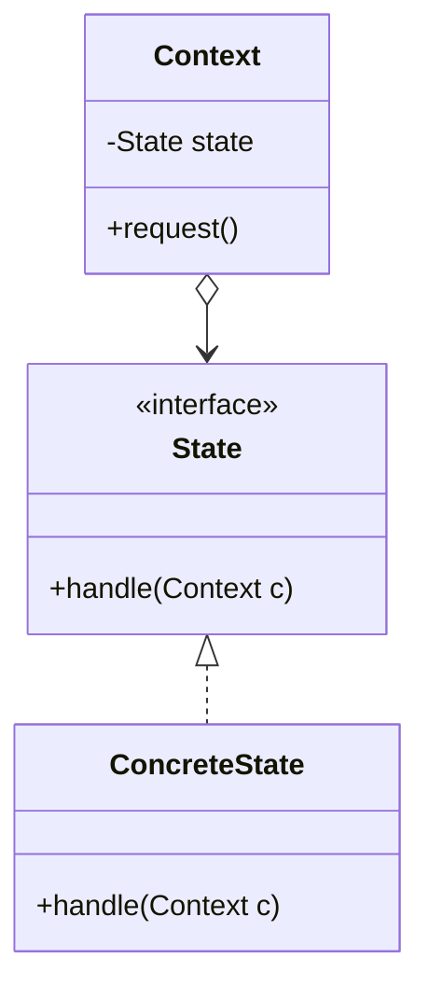

#### この章の実装との対応

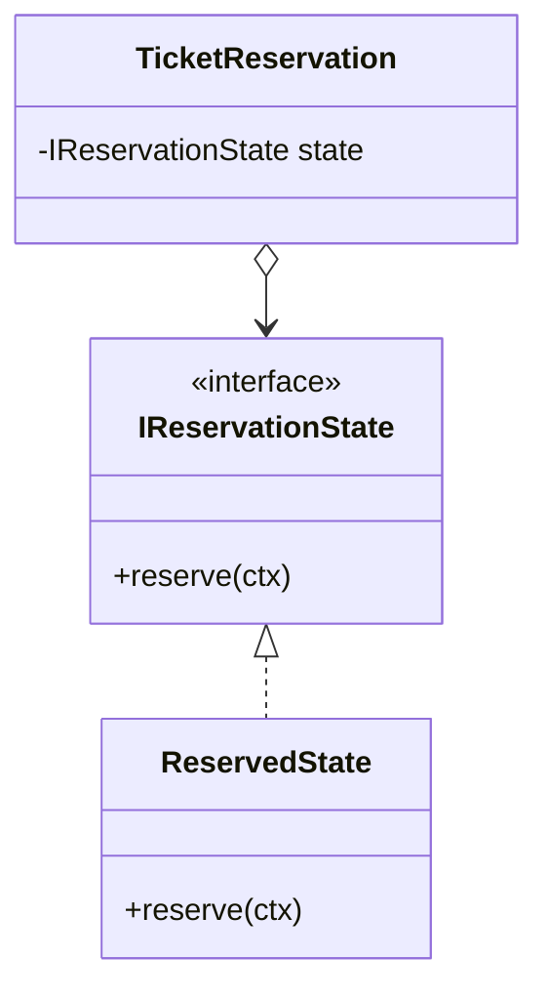

抽象ロールである `IReservationState` が、現実の `ReservedState` などの具体クラスと結びついています。

---

### 使いどころと限界

* **使うと良い状況**：状態に応じてオブジェクトの振る舞いが劇的に変わる場合。また、状態の種類が将来的に増える見込みがある場合。


* **使わない方が良い状況**：状態が2〜3つ程度で、今後も増える可能性がほとんどない場合。


【過剰コード：状態が一つしかないのにパターン化した例】

```cpp
// 状態が一つしかないのに、無理にクラスを分けてインターフェースを作るのは過剰です
class OnlyOneState : public IState { };

```

| **状況** | **適切な選択** | **理由** |
| --- | --- | --- |
| **変化の予定がある場合** | **Stateパターンを使う** | 状態の追加が他のロジックを汚染しないため |
| **変化の予定がない場合** | **シンプルなif文で十分** | クラス数の増加というコストに見合わないため |

### この章のまとめ

この章の冒頭で「得られること」として示した4点を、あらためて確認します。

**得られること1**（変動箇所の識別）：フェーズ2のヒアリングを通じて、「状態の種類」と「状態遷移ルール」が頻繁に変わることを特定できました。フェーズ1で観察した `status` 文字列の直書きという構造が、その変化を吸収できない原因だと分かりました。

**得られること2**（痛みの発生源の判断）：フェーズ4の分析で、「状態（ステータス）」と「その状態での振る舞い」が同じクラスに混在していることが、条件分岐の爆発という痛みの根本原因だと突き止めました。

**得られること3**（構造改善の説明）：フェーズ7で実装した State パターンにより、新しい状態を追加するとき `TicketReservation` に一切触れず、新しい状態クラスを追加するだけで済む設計を実現しました。

**得られること4**（状態追加の判断）：フェーズ6の耐久テストで、将来「特別優待予約」や「一時保留のキャンセル不可ルール」が来ても、既存のフローを壊さずに対応できることを確認しました。

チケット予約システムという一つの題材を通じて、「状態と振る舞いの混在」という構造問題を分析し、解決するまでの思考の流れを体験できたのではないかと思います。この章で辿った7つのフェーズは、設計に悩んだとき、どんな現場のコードに対しても同じように使える型です。
