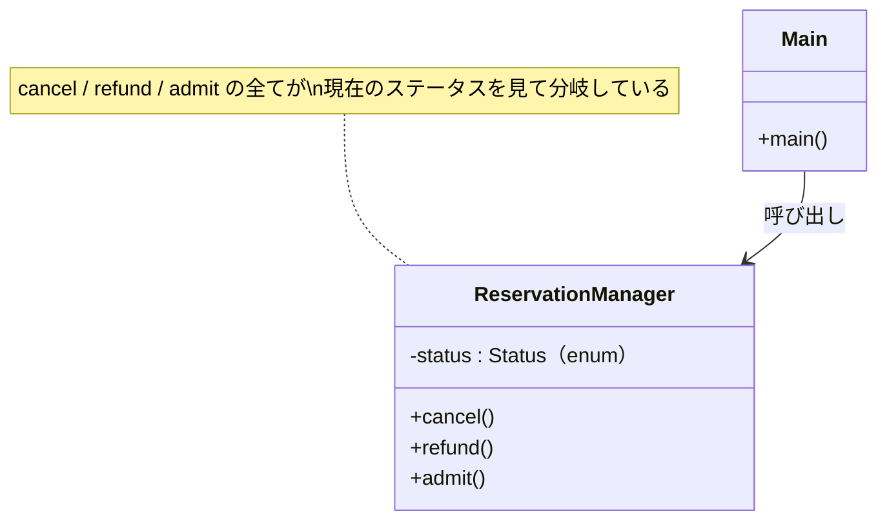
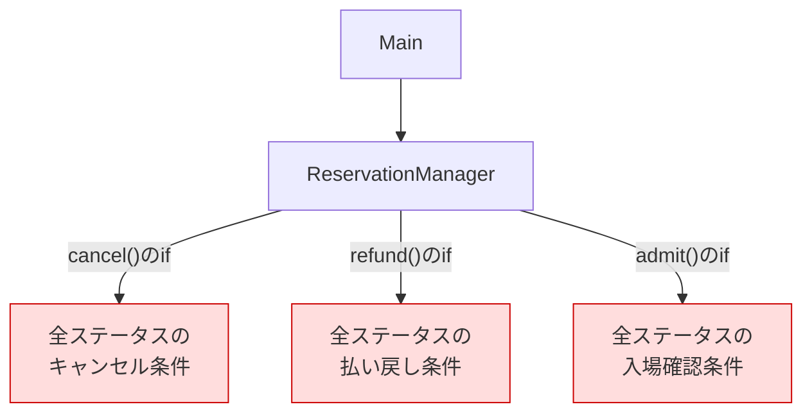
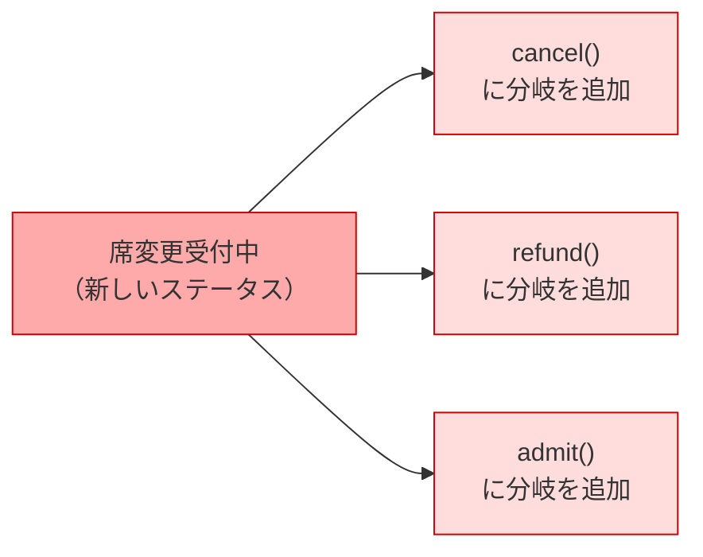
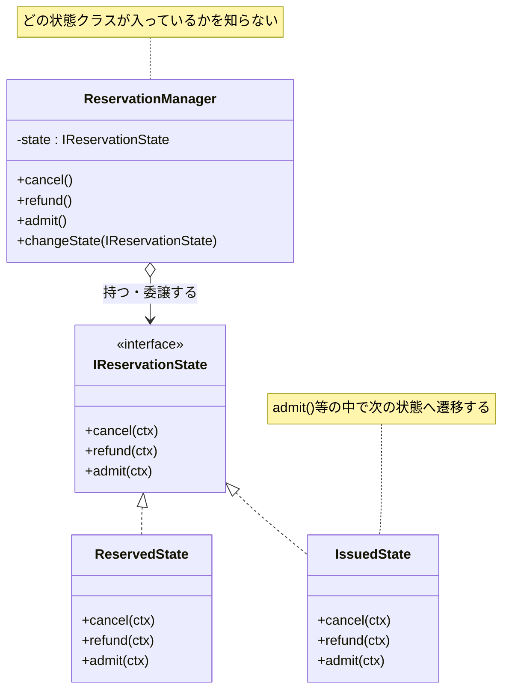
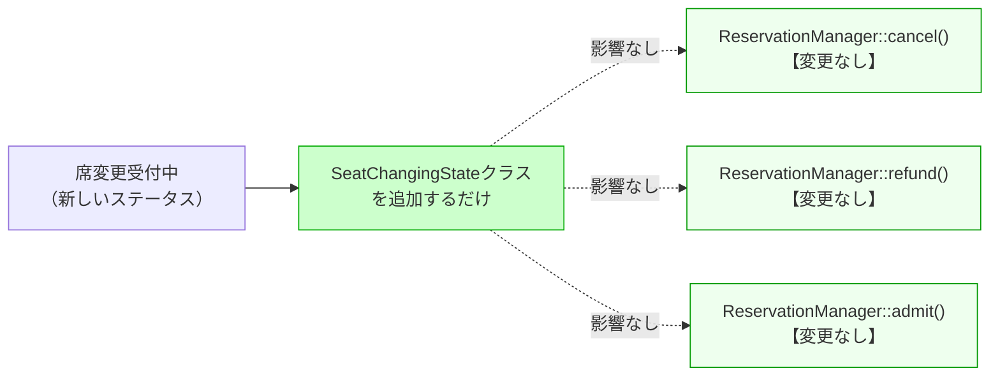
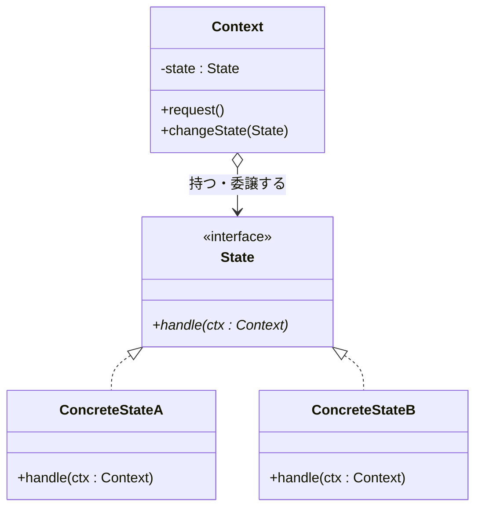
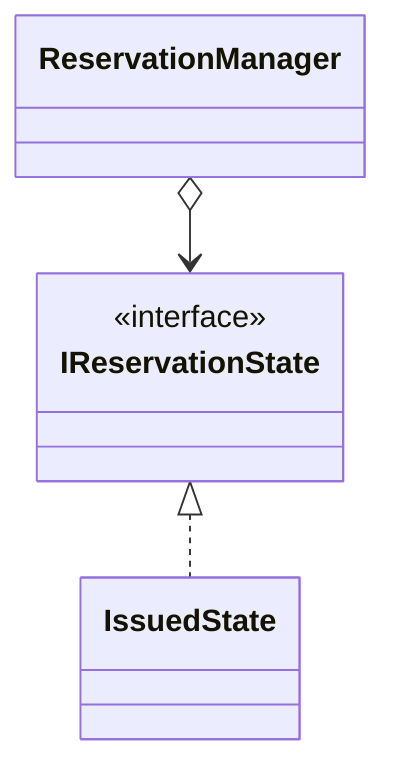

# 第3章　ステータスが増えるたびに全メソッドを開き直す設計を断ち切る（State）
―― 思考の型：「状態ごとの振る舞いが、1か所に集まっていない」ことに気づく

> **この章の核心**
> `cancel()` を直すと `refund()` も `admit()` も開き直さなければならない。
> それは「どの状態でどう動くか」という情報が、
> 全メソッドに分散しているからだ。
> 状態ごとの振る舞いを1か所に集めると、状態が増えても既存コードに触れなくなる。

> [!INFO] レゴブロックで考える：Stateパターン
> この章のパターンは、レゴブロックの**「分ける」**操作に対応しています。
> 「状態ごとに振る舞いが変わる」ブロックを、状態別に分離します。1つのブロックに色々な状態を詰め込むのではなく、状態ごとに専用のブロックを作るイメージです。
> コードでも同じように、状態によって変わる振る舞いを、状態クラスとして分離し、文脈（Context）が委譲する構造を作ります。

---

## この章を読むと得られること

- 自分のコードの中で「ステータスが増えるたびに複数のメソッドを開き直している」状態を発見できるようになる
- 複数のメソッドに分散した状態ごとの振る舞いを、状態クラスとして1か所に集める設計を作れるようになる
- このパターンが過剰になる場面（状態が少なく今後も増えない場合）を見極め、シンプルな代替案との使い分けができるようになる
- 変更要求が来たとき、「新しい状態クラスを追加するだけ」で対応できる設計と、全メソッドを開き直す設計の違いを事前に読めるようになる

---


## ステップ0：システムを把握し、仮説を立てる ―― クラス構成を見てから「変わりそうな場所」を予測する

> **入力：** システムのシナリオ説明 ＋ クラス構成の概要（仕様表・責任一覧）。実装コードはまだ読まない。
> **産物：** 変動と不変の「仮説テーブル」

**全パターンに共通する問い**

> 「このコードの中に、**『変わる理由』が異なる2つのものが、
> 同じ場所に混在していないか？」**

「変わる理由」とは **「誰の判断で変わるか」** のことです。
そのコードを変更するとき、答えが2人以上になるなら、変わる理由が複数混在しています。

### 3.0 この章のシステム構成と仮説

**この章で扱うシステム：**
コンサートや演劇のチケット予約を管理するシステムです。
予約には「予約受付 → 支払い待ち → 確定 → 発券済み → 入場済み」という流れがあり、
現在のステータスによって「キャンセル」「払い戻し」「入場確認」の動作が変わります。
`ReservationManager` クラスが1件の予約とその現在ステータスを保持しています。

**仕様表（何ができるシステムか）**

| 機能 | 担当 | 入力 | 出力 |
|---|---|---|---|
| キャンセル処理 | `cancel()` | なし（現在のステータスに依存） | なし（ステータスを更新） |
| 払い戻し申請 | `refund()` | なし（現在のステータスに依存） | なし（ステータスを更新） |
| 入場確認 | `admit()` | なし（現在のステータスに依存） | なし（ステータスを更新） |

**クラス構成の概要**



*→ 1つのクラスが「全ステータスにおける全操作の振る舞い」を知っている。
ステータスが増えるたびに、このクラスの全メソッドに手を入れるしかない。*

**各クラスの責任一覧**

| 対象 | 責任（1文） | 知るべきこと |
|---|---|---|
| `ReservationManager` | 予約の現在状態を管理し、操作を受け付ける | 現在のステータスと操作の対応ルール |
| `main()` | プログラムを起動する | 起動に必要な情報のみ |

---

この構成を踏まえた上で、仮説を立てます。
`ReservationManager` が「全ステータスにおける全操作の振る舞い」を抱えていることが見えています。
どの部分が変わりやすく、どの部分は変わらないでしょうか。

**変動と不変の仮説（実装コードを読む前に立てる）**

| 分類 | 仮説 | 根拠（クラス構成から読み取れること） |
|---|---|---|
| 🔴 **変動する** | 各ステータスにおけるキャンセル・払い戻し・入場確認の振る舞い | 運営判断でステータスの種類や条件が変わる |
| 🔴 **変動する** | ステータスの種類と遷移先 | 公演の種類や運営企画によって状態が追加される |
| 🟢 **不変** | 「現在のステータスに応じて操作を実行する」という骨格 | システムがある限り変わらない |
| 🟢 **不変** | 操作の種類（cancel / refund / admit） | 基本操作として固定されている |

この仮説をステップ2（3.3）でヒアリング後に確定します。

---

## ステップ1：実装コードを読む ―― 責任チェックで問題の行を見つける

> **入力：** ステップ0で把握したクラス責任 ＋ 実際の実装コード
> **産物：** 責任チェック表。「このクラスが持つべきでない知識」が混在している行の発見。

### 3.1 実装コードと責任チェック

ステップ0でクラスの責任は把握しました。
ここでは実際の実装コードを読み、「責任通りに書かれているか」を1行ずつ確認します。

**要するに状態ごとの振る舞いをクラスとして切り出し、状態が変わるたびにオブジェクトを差し替えるパターン。**

**依存の広がり（実装前の全体像）**



*→ `ReservationManager` 1クラスが全ステータスの全操作ルールを抱えている。*

```cpp
// 【起点コード】
// チケット予約管理システム
// コンサートや演劇のチケット予約を管理する

enum Status {
    Reserved,        // 予約受付
    AwaitingPayment, // 支払い待ち
    Confirmed,       // 確定
    Issued,          // 発券済み
    Admitted         // 入場済み
};

class ReservationManager {
public:
    ReservationManager() : status_(Reserved) {}

    // キャンセル処理
    void cancel() {
        if (status_ == Reserved) {
            status_ = Reserved; // キャンセル受付（実際は削除処理へ）
            // キャンセル確定メール送信
        } else if (status_ == AwaitingPayment) {
            status_ = Reserved; // 支払い前なのでキャンセル可
            // キャンセル確定メール送信
        } else if (status_ == Confirmed) {
            // 確定後はキャンセル不可
            // エラーメッセージを表示
        } else if (status_ == Issued) {
            // 発券済みはキャンセル不可
            // エラーメッセージを表示
        } else if (status_ == Admitted) {
            // 入場済みはキャンセル不可
            // エラーメッセージを表示
        }
    }

    // 払い戻し申請
    void refund() {
        if (status_ == Reserved) {
            // 予約受付中は払い戻し不可
            // エラーメッセージを表示
        } else if (status_ == AwaitingPayment) {
            // 支払い前は払い戻し不可
            // エラーメッセージを表示
        } else if (status_ == Confirmed) {
            status_ = Reserved; // 払い戻し申請受付
            // 払い戻し手続き開始メール送信
        } else if (status_ == Issued) {
            status_ = Reserved; // 発券済みも払い戻し申請可
            // 払い戻し手続き開始メール送信
        } else if (status_ == Admitted) {
            // 入場済みは払い戻し不可
            // エラーメッセージを表示
        }
    }

    // 入場確認
    void admit() {
        if (status_ == Reserved) {
            // 予約受付中は入場不可
            // エラーメッセージを表示
        } else if (status_ == AwaitingPayment) {
            // 支払い待ちは入場不可
            // エラーメッセージを表示
        } else if (status_ == Confirmed) {
            // 確定済みは発券が必要
            // エラーメッセージを表示
        } else if (status_ == Issued) {
            status_ = Admitted; // 発券済みのみ入場確認可
            // 入場完了ログ記録
        } else if (status_ == Admitted) {
            // 既に入場済み
            // エラーメッセージを表示
        }
    }

private:
    Status status_;
};

int main() {
    ReservationManager mgr;
    mgr.admit();   // 予約受付中 → 入場不可
    mgr.cancel();  // 予約受付中 → キャンセル可
    return 0;
}
```

**実行結果：**
```
[admit] 予約受付中のため入場できません
[cancel] キャンセルを受け付けました
```

このコードは正しく動きます。問題は構造にあります。

**責任チェック：`ReservationManager` は自分の責任だけを持っているか**

`ReservationManager` の責任は「予約の現在状態を管理し、操作を受け付けること」です。
「知るべきこと」は「現在のステータスと操作の対応ルール」のはずです。

| コードの行 | 持っている知識 | 責任内か |
|---|---|---|
| `cancel()` 内の `if (status_ == Reserved)` | 予約受付中のキャンセルルール | **✗ 各ステータスの判断** |
| `cancel()` 内の `if (status_ == AwaitingPayment)` | 支払い待ちのキャンセルルール | **✗ 各ステータスの判断** |
| `refund()` 内の `if (status_ == Confirmed)` | 確定時の払い戻しルール | **✗ 各ステータスの判断** |
| `admit()` 内の `if (status_ == Issued)` | 発券済みの入場確認ルール | **✗ 各ステータスの判断** |
| `status_` メンバー変数 | 現在のステータスを保持 | ✅ |

`ReservationManager` は「現在のステータスがどう動くべきか」を全ステータス分抱えています。
「予約受付中のキャンセルルール」を知っているのも、「確定済みの払い戻しルール」を知っているのも、すべて同じクラスです。
状態ごとの責任が、全メソッドに分散して散らばっています。

---

### 3.2 届いた変更要求

> **運営企画から、期日付きの要求が届きました：**
>
> 「確定後の一定期間、席変更を受け付けたい。
> 『席変更受付中』という新しいステータスを設けて、
> その間は払い戻しなしで席変更のみ許可したい。
> 次回公演の2週間前までに対応してほしい。」

---

## ステップ2：仮説を確定する ―― 関係者ヒアリングで「変わる理由」に根拠をつける

> **入力：** ステップ0の仮説 × ステップ1の責任チェック結果。関係者に直接確認する。
> **産物：** 確定した変動/不変テーブル（「誰の判断で変わるか」明記）

### 3.3 仮説の検証と変動/不変の確定

ステップ0で仮説を立てました。ステップ1で責任チェックからも確認できました。
しかし——**コードを読んだだけで「変わる」「変わらない」と断定するのは危険です。**

---

**関係者ヒアリング**

> **開発者**：「現在5つのステータスがあります。今後、ステータスが増える可能性はありますか？」
>
> **運営企画**：「今回の席変更受付中だけでなく、今後もキャンセル待ち受付などを検討しています。公演の形態によって状態を増やしたいことがあります。」

> **開発者**：「各ステータスのキャンセル・払い戻し・入場確認の条件は、今後変わることはありますか？」
>
> **運営企画**：「変わります。今回もそうですが、公演ごとにキャンセルポリシーが違います。VIP席は払い戻しの期間が長い、なども将来的に検討しています。」

> **開発者**：「操作の種類（cancel / refund / admit）自体は変わりますか？」
>
> **チームリーダー**：「基本操作の種類は変わらないと思います。増える可能性はゼロではありませんが、今の設計で固定して問題ありません。」

---

| 分類 | 具体的な内容 | 変わるタイミング | 根拠 |
|---|---|---|---|
| 🔴 **変動する** | 各ステータスにおける各操作の振る舞い | 公演ポリシーの変更・新しいステータスの追加 | 運営企画との確認 |
| 🔴 **変動する** | ステータスの種類と数 | 公演形態の変化（席変更受付中・キャンセル待ちなど） | 運営企画との確認 |
| 🟢 **不変** | 操作の種類（cancel / refund / admit） | 変わる日は来ない | チームリーダーとの合意 |
| 🟢 **不変** | 「現在のステータスに応じて操作を委譲する」骨格 | 変わる日は来ない | システム要件として確定 |

> **設計の決断**：🟢 不変な部分を「契約（インターフェース）」として固定し、
> 🔴 変動する部分はそれぞれのインターフェースの裏側に押し込む。

---

## ステップ3：課題分析 ―― 変更が来たとき、どこが辛いかを確認する

「席変更受付中」というステータスを追加するとき、今のコードで何が起きるかを確認します。

**依存の広がり**



1つのステータスを追加するだけで、**3つのメソッド全てを開いて分岐を追加する**必要があります。
私自身、このような修正を急いで進めたとき、`refund()` の修正を忘れてバグを出したことがあります。
修正漏れのリスクが、メソッドの数だけ存在しています。

さらに、**変更後のテストも3メソッドすべてを再確認する**必要があります。
`cancel()` だけを直したつもりでも、`refund()` や `admit()` の既存動作が壊れていないか確認しなければなりません。

---

### ステップ4：原因分析 ―― 困難の根本にある設計の問題を言語化する

ステップ3で確認したように、「席変更受付中」という新しいステータスを追加しようとしただけで、変更箇所が複数のメソッドに飛び火してしまいました。

仕様が複雑だから仕方がない、と諦める前に、今のコードの「構造」そのものに目を向けてみます。なぜ、このような飛び火が起きるのでしょうか。

|**観察**|**原因の方向**|
|---|---|
|ステータスが1つ増えると、`cancel()`, `refund()`, `admit()` の3メソッド全てを修正する必要がある|1つのステータスの振る舞いが、3か所のメソッドに分断されて散らばっている|
|`cancel()` だけを修正したつもりでも、`refund()` や `admit()` の既存動作に影響がないか不安になる|状態ごとの「責任の境界」がメソッドの中に埋もれており、コード上で隔離されていない|
|「席変更受付中でのキャンセル条件は？」と聞かれても、即答できずコードを読み解く必要がある|ステータスと振る舞いの対応関係が、コード上の一箇所ではなく、開発者の頭の中にしかない|

ここで少し、現場での等身大の苦労を思い出させてください。

かつて保守していたシステムでも、このように一つの状態に関する処理が複数のメソッドに散らばっている構造がありました。ある日、特定のステータスに関する挙動を変更する要求が来ました。該当するであろう if文 を見つけて修正しましたが、その状態は他のメソッドの分岐にも関係しており、システム全体として予期せぬ不整合を引き起こしてしまったのです。

影響範囲を正確に把握しようと、ステータス変数をキーにしてソースコード全体を検索（grep）します。すると、無数の箇所がヒットします。さらに、「このメソッドは一体どこから呼ばれているのか？」と呼び出し元をgrepで探すと、また新たな呼び出し元が芋づる式に現れます。検索結果がさらなる検索結果を呼び、次第に自分が何を追いかけていたのか分からなくなっていく……。これは、影響範囲が読み切れずに何度もgrepを繰り返して疲弊する、いわば「grep地獄」という泥臭い痛みです。

この構造では、特定の状態に関するルールを頭の中でパッチワークのようにつなぎ合わせなければ、安全に変更を加えることが難しくなっています。事実として、「現在の構造では、ステータスが増えたり条件が変わったりしたときの変更と影響範囲の特定が極めて難しい」と言えます。

**変わるものと変わらないものが同じ場所にいる**

この困難の根本はどこにあるのでしょうか。それを探るために、「変わるもの」と「変わらないもの」を仕分けてみます。

|**変わり続けるもの（🔴）**|**変わってほしくないもの（🟢）**|
|---|---|
|各ステータスにおける「キャンセル」「払い戻し」「入場確認」の具体的な振る舞い（条件やルール）|「現在のステータスに応じて操作を委譲する」という大枠の骨格|
|ステータスの種類と数（席変更受付中など、今後も増える可能性がある）|操作の種類（`cancel`, `refund`, `admit` というインターフェース自体）|

現在の設計では、この2つ（🔴と🟢）が `ReservationManager` の各メソッドの中に隙間なく混在しています。

第0章でお話しした哲学の1つ目を思い出してみてください。

**哲学1「変わるものをカプセル化せよ」** です。

今、私たちの目の前にあるコードは、公演ごとに変わり続ける「ステータスごとの振る舞い」と、システムが存在する限り変わってほしくない「操作の骨格」が一緒に織り込まれています。そのため、ステータスが1つ増えるという「変わる」出来事が発生したとき、変わってほしくないはずの「操作の骨格」までこじ開けて、すべてのメソッドに if文 を追加しなければならなくなっています。

本来であれば1か所にまとまっていてほしい「予約受付中における振る舞い一式」が、`cancel()`・`refund()`・`admit()` という3つのメソッドに散らばっていること。これが、少しの変更でコード全体を見直さなければならなくなる真因です。

以下それぞれに対して観察した結果を残します。原因がどこに該当するかを見極めることで、次に打つべき手札が決まります。

|**次元**|**物理操作（手札）**|**本質的な原因（何が問題か）**|**使うべき構造的対策案（本質）**|
|---|---|---|---|
|要素|① 分割する（切る）|複数の異なる状態の責任（予約中、確定済み等のルール）が、1つのメソッド内に癒着・混在している。|状態ごとの責任の分割（クラスの切り出し）|
|要素|② 隠蔽する（包む）|「現在の状態が何か」という事実が、各メソッド内で無防備に if文 として露出している。|状態が持つ固有の振る舞いのカプセル化|
|関係|③ 規格化する（形を揃える）|状態ごとに異なる振る舞いを呼び出すための「共通のつなぎ目」がない。|インターフェースの統一（各状態が共通の契約を持つ）|
|関係|④ 間接化する（間に挟む）|マネージャーが「特定の状態の時の具体的な処理」に直接触れてしまっている。|現在の状態を表すオブジェクトへの処理の委譲|

> **💡 立ち止まって考える**
> 
> ここで、少し視点を変えてみましょう。
> 
> もし「予約受付中」という状態そのものが、実体を持った専門の担当者として目の前に存在するとしたらどうでしょうか？
> 
> その「予約受付中」さんに「キャンセル処理をお願いします」「払い戻しをお願いします」と頼めば、自分がどう振る舞うべきかを彼自身が知っているはずです。
> 
> 現状のコードは、たった一人のマネージャー（ReservationManager）がすべての状態の分厚いマニュアルを丸暗記して、「えーと、予約受付中の時はキャンセル可で…」と毎回ページをめくって確認しているようなものです。マニュアルのページ数（ステータス）が増えれば増えるほど、探すのも書き換えるのも限界が来ます。
> 
> 私たちが目指すべきは、一人のマネージャーが全知全能になることではなく、各状態に「自分自身の振る舞いを知っている」という責任を持たせることです。

変更のたびにすべてのメソッドを開き直し、grep検索を繰り返して影響範囲の特定に疲弊する。この構造的な痛みを和らげ、設計を改善するためには、手札を使ってコードを整理していく必要があります。

次のステップ5では、この真因に対して具体的にどのアプローチを取るべきか、段階的に検討していきましょう。

---

### ステップ5：対策案の検討 ―― 原因から手札を選ぶ

ステップ4で特定した真因は、**「状態ごとの振る舞いが、メソッドごとに分断されて散らばっていること」**、そして「変わり続ける『ステータスごとのルール』と、変わってほしくない『操作の骨格』が混在していること」でした。

原因が見えれば、打つべき手札の方向性が決まります。この混在を解消し、散らばった振る舞いを「集める」、そして「分ける」ことが必要です。

#### 方向性の特定

第0章の4分類で手札を絞り込みます。

現在のコードでは、`cancel()` や `refund()` のメソッドの中に、すべてのステータスの判断が if 文としてむき出しになっています。まずはこれを「要素」の次元で整理し、状態ごとに見通しを良くするアプローチ（分離・隠蔽）から試してみましょう。

#### 1. 分離・隠蔽を試す（手段①の基本）

一番直感的な改善案は、if-else の連続を `switch` 文に置き換え、各状態の処理を整理することです。C++ の `enum` と `switch` を組み合わせれば、新しいステータスを追加したときにコンパイラが「この case が処理されていませんよ」と警告を出してくれるメリットがあります。

早速コードを書いてみましょう。

```cpp
// 手段①：switch文で状態ごとの分岐を整理する

enum Status {
    Reserved,        // 予約受付
    AwaitingPayment, // 支払い待ち
    Confirmed,       // 確定
    Issued,          // 発券済み
    Admitted         // 入場済み
    // SeatChanging  // 新しく追加する予定のステータス
};

class ReservationManager {
public:
    ReservationManager() : status_(Reserved) {}

    void cancel() {
        switch (status_) {
            case Reserved:
            case AwaitingPayment:
                status_ = Reserved; // キャンセル受付
                // メール送信処理など...
                break;
            case Confirmed:
            case Issued:
            case Admitted:
                // キャンセル不可のエラー処理
                break;
        }
    }

    void refund() {
        switch (status_) {
            case Confirmed:
            case Issued:
                status_ = Reserved; // 払い戻し受付
                break;
            case Reserved:
            case AwaitingPayment:
            case Admitted:
                // 払い戻し不可のエラー処理
                break;
        }
    }

    void admit() {
        switch (status_) {
            case Issued:
                status_ = Admitted; // 入場確認完了
                break;
            case Reserved:
            case AwaitingPayment:
            case Confirmed:
            case Admitted:
                // 入場不可のエラー処理
                break;
        }
    }

private:
    Status status_;
};
```

if-else が続いていた時よりは、どの状態がどう処理されるかが幾分か分かりやすくなりました。コンパイラの警告機能を使えば、「`refund()` の修正を忘れる」といったヒューマンエラーはある程度防ぎやすくなります。

**残る課題：なぜこれでは不十分なのか**

しかし、この手段①で「席変更受付中（SeatChanging）」を追加するシナリオを想像してみてください。

enum に `SeatChanging` を追加した瞬間、`cancel()`, `refund()`, `admit()` の3つのメソッド全てでコンパイル警告が出ます。警告を出してくれるのはありがたいですが、結局のところ「3つのメソッドすべてを開いて、該当する case を書き足す」という物理的な作業量は何も減っていません。

「予約受付中における振る舞い一式」は依然として3か所に分散しており、状態が増えるたびに既存のクラス（`ReservationManager`）に手を入れる必要があります。これでは、変更が呼び出し元に波及し、呼び出し元を調べるために何度も検索を繰り返すあの「grep地獄」を引き起こす構造的な脆さは根本的に解決されていないのです。

#### 2. さらに規格化・間接化を重ねる（手段②：インターフェース導入）

手段①の限界は、ステータスごとの振る舞いをつなぐ「規格化された境界」がないために、`ReservationManager` が「現在のステータス」という具体的な値の束に直接依存してしまっている点にあります。

ここで、第0章の手札選択表を引いてみましょう。

関係の次元における問題「型や引数による分岐の増殖、具象への直接依存」を解決する手札として、**③ 規格化する（形を揃える）** と **④ 間接化する（間に挟む）** があります。

具体的には、「現在の状態」を単なる列挙型の値ではなく、振る舞いを持った「オブジェクト」として扱います。そして、すべての状態クラスが共通の「操作の骨格」を守るようにインターフェースで規格化し、`ReservationManager` はそのインターフェースを介して（間接化して）処理を委譲するように発想を転換します。

> **レゴブロックで考える：状態の専用ブロック**
> 
> これまでは、1つの大きなブロックの中にすべての状態の色（ルール）を塗り分けていました。これからは、「赤い状態のブロック」「青い状態のブロック」のように、状態ごとに独立したブロックを作ります。
> 
> ブロックの接続部分（インターフェース）の形は規格化されているので、マネージャーは「今手元にあるブロック」のボタンを押すだけです。色が赤から青に変わっても、マネージャー側の土台は一切組み直す必要がありません。
> 
> `[ImagePrompt: A top-down 3D illustration of Lego blocks. A base plate with a standardized connector. Next to it, several different colored, specialized Lego bricks, each designed to snap into the standardized connector perfectly. Clean white background, isometric view, educational illustration style.]`

それでは、この発想に基づいてコードを書き換えてみます。

まずは、各状態が必ず持たなければならない「振る舞いの契約」をインターフェースとして規格化します。

```cpp
// ステータスの契約：どのステータスも cancel / refund / admit を知っている
class ReservationManager; // 前方宣言

class IReservationState {
public:
    virtual void cancel(ReservationManager& ctx) = 0;
    virtual void refund(ReservationManager& ctx) = 0;
    virtual void admit(ReservationManager& ctx)  = 0;
    virtual ~IReservationState() {}
};
```

次に、このインターフェースを実装する形で、各状態の振る舞いを「状態ごとのクラス」として切り出します。これにより、これまで分散していたルールが、状態ごとに1か所に集まります。

状態遷移も、このクラスの中で行います。「次にどの状態へ移るべきか」は、その状態自身が一番よく知っているからです。

```cpp
// 予約受付中の振る舞いを1か所に集めたクラス
class ReservedState : public IReservationState {
public:
    void cancel(ReservationManager& ctx) override {
        // キャンセル処理の実装（状態を削除など）
        // ← 次の状態への遷移も自身で行う
        ctx.changeState(nullptr); 
    }
    void refund(ReservationManager& ctx) override {
        // まだ支払いがないため払い戻し不可（エラー処理）
    }
    void admit(ReservationManager& ctx) override {
        // 発券されていないため入場不可（エラー処理）
    }
};

// 発券済みの振る舞いを1か所に集めたクラス
class IssuedState : public IReservationState {
public:
    void cancel(ReservationManager& ctx) override {
        // 発券済みはキャンセル不可
    }
    void refund(ReservationManager& ctx) override {
        ctx.changeState(new ReservedState()); // 払い戻し申請受付へ遷移
    }
    void admit(ReservationManager& ctx) override {
        // 実装はAdmittedStateへ遷移
        // ctx.changeState(new AdmittedState());
    }
};
```

（※他の状態クラスも、同様に独立したクラスとして実装します）

最後に、`ReservationManager` の構造を変えます。

もはや、全ステータスの if 文を抱え込む必要はありません。規格化されたインターフェース（`IReservationState`）に対するポインタを保持し、操作をそのまま委譲するだけです。


```cpp
class ReservationManager {
public:
    // 初期状態をセット
    ReservationManager() : state_(new ReservedState()) {}

    // ← 知らなくていい：現在の中身が ReservedState なのか IssuedState なのか
    void cancel() { state_->cancel(*this); }
    void refund() { state_->refund(*this); }
    void admit()  { state_->admit(*this); }

    void changeState(IReservationState* newState) {
        delete state_;
        state_ = newState;
    }

    ~ReservationManager() { delete state_; }

private:
    IReservationState* state_; // ← ここだけが変わる（状態をオブジェクトとして保持）
};
```

この変更により、クラス間の関係は次のように整理されました。




手段①（switch文）では解消できなかった問題が、見事に解きほぐされています。

「ある特定の状態における振る舞い一式」は、それぞれ専用のクラス内にカプセル化されました。そして、`ReservationManager` は「操作の骨格」だけを提供するシンプルなクラスへと生まれ変わりました。

しかし、これは本当に変更に強い設計と言えるのでしょうか？

次のステップ6で、この手段②が将来の変化の痛みにどう耐え、置換と拡張の要件を満たすのか、天秤にかけて評価してみましょう。


---

### ステップ6：天秤にかける ―― 手段を評価する

ステップ5では、直感的な「手段①：switch文による整理」と、発想を転換した「手段②：インターフェースと状態クラスの導入」の2つを検討しました。

ここでは、手段②が本当に優れた設計なのか、将来の変化に耐えうるのかを検証します。

評価に進む前に、私たちがどのような基準でこの2つの手段を天秤にかけるのかを明確にしておきましょう。設計において「置換」や「拡張」といった言葉をよく耳にするかもしれませんが、これらはコードを直接いじる物理的な操作ではなく、分割・隠蔽・規格化・間接化といった手札を切った後に「システムがどれだけの能力を手に入れたか」を測るための事後評価の基準（評価軸）です。

今回は、以下の3つの軸で手段を評価します。

**評価軸の宣言**

|**評価軸**|**この場面で重視する理由**|
|---|---|
|**導入コスト**|クラス数が増えることによる、初期の読み解きの負担度合い。|
|**置換できるか**|既存コードの if 文や switch 文をこじ開けることなく、現在の状態に応じた振る舞いを「丸ごと差し替え」できるか。|
|**拡張できるか**|既存の操作の骨格（`ReservationManager`）を壊すことなく、新しい状態（例：席変更受付中）を安全に「追加」できるか。|

#### 3.8 手段①vs手段②の比較

宣言した評価軸で、両方の手段を測ります。

|**評価軸**|**手段①（switch文での整理）**|**手段②（インターフェースと状態クラス）**|
|---|---|---|
|**導入コスト**|🟢 低い（1つのクラス内に収まるため、パッと見のコード量は増えない）|🟡 中程度（状態の数だけクラスが増えるため、ファイルや定義は増える）|
|**置換できるか**|❌ 不可（状態ごとに振る舞いを変えるには、必ず既存の switch 文を直接書き換える必要がある）|🟢 優秀（状態オブジェクトのポインタを切り替えるだけで、振る舞い一式が完全に切り替わる）|
|**拡張できるか**|❌ 不可（状態を追加するたびに、全メソッドを開き直して case を足す作業から逃れられない）|🟢 優秀（既存クラスに一切触れず、新しい状態クラスを1つ追加するだけで完了する）|

> **結論：** 今回の状況では、**手段②（状態クラスの導入）**を採用します。

「席変更受付中」といった新しいステータスが今後も増える可能性があり、公演ごとにキャンセルや払い戻しのポリシー（振る舞い）が変わるという事実がヒアリングから確定しています。

手段①では、コンパイラが警告を出してくれるとはいえ、結局は「ステータスが増えるたびに3つのメソッドをすべて開き直す」という物理的な作業からは逃れられません。修正漏れの不安から何度もgrep検索を繰り返して呼び出し元を追いかけ、影響範囲の特定に疲弊するあの「grep地獄」の温床は残ったままです。

手段②のように規格化と間接化を重ねた結果得られる「置換」と「拡張」の能力は、将来の激しい変化に対して、クラスを増やすという導入コストを支払ってでも手に入れる価値があると判断できます。

#### 3.9 耐久テスト ―― ヒアリングで挙がった変化が来た

では、私たちが選んだ手段②が、実際に「拡張」の評価軸でどれほどの耐久力を見せるのかをシミュレートしてみましょう。

ステップ2のチームリーダーへのヒアリングの中で、こんな言葉がありました。

「基本操作の種類は変わらないと思いますが、増える可能性はゼロではありません。今の設計で固定して問題ありません。」

さらに、雑談ベースでこのような将来の構想も出ていました。

**「もしシステムメンテナンスが入ったら、全操作を一時的にロックして『メンテナンス中』という扱いにしたいかもしれない」**

この「システムメンテナンス中（一時停止）」という新しい状態を追加する要求が、今、あなたの元に届いたとします。

手段②を採用した今のコードなら、どう対応するでしょうか。

```cpp
// 耐久テスト：既存コードに一切触れず、新しい状態クラスを追加する

// ────────────────────────────────────────────────────────
// 新しく追加するクラス（これだけを書けばよい）
// ────────────────────────────────────────────────────────
class SuspendedState : public IReservationState {
public:
    void cancel(ReservationManager& ctx) override {
        // システムメンテナンス中はキャンセル不可
        // エラーメッセージの出力等
    }
    void refund(ReservationManager& ctx) override {
        // システムメンテナンス中は払い戻し申請不可
    }
    void admit(ReservationManager& ctx) override {
        // システムメンテナンス中は入場確認不可
    }
};

// ────────────────────────────────────────────────────────
// 呼び出し側のイメージ（マネージャーに新しい状態を差し込む）
// ────────────────────────────────────────────────────────
void startSystemMaintenance(ReservationManager& mgr) {
    // ← 知らなくていい：マネージャーの内部がどうなっているか
    // ただ、規格化された新しい状態ブロックを差し込むだけ
    mgr.changeState(new SuspendedState()); 
}
```

> `[ImagePrompt: A top-down 3D illustration of a base Lego plate representing a system. A new, bright yellow Lego block labeled "Suspended" is being perfectly snapped onto the standardized connector of the base plate, without needing to dismantle or move any of the existing colorful blocks around it. Clean white background, isometric view, educational illustration style.]`

**結果の解説：**

ここでの最大の成果は、「何を書いたか」ではなく「何を触らずに済んだか」**です。 私たちは `SuspendedState` というクラスを1つ**新規作成しただけです。

`IReservationState` インターフェースには触れていません。

`ReservedState` や `IssuedState` といった既存のステータスクラスのコードも一切開いていません。

そして何より、`ReservationManager` の `cancel()` や `refund()` といった骨格のロジックには指一本触れていないのです。

「`cancel()` を直したせいで、`refund()` にバグが混入したかもしれない」という恐怖は完全に消え去りました。新しい状態のルールは、すべて `SuspendedState` という1つのファイル（境界）の中に安全に隔離されています。

変更のたびにgrep地獄に陥ることもありません。これが「規格化」と「間接化」を組み合わせた結果手に入る「拡張できる」という能力の正体です。

#### 3.10 使う場面・使わない場面

この構造は、状態が増え続けるシステムにおいては非常に強力な防具となります。

しかし、設計に絶対の正解はありません。強力な道具であればあるほど、使いどころを間違えればただの重しになってしまいます。「ステータスを管理する変数があるから、常にこの状態クラス化を行えばいい」というわけではないのです。

**【過剰コード：変化の予定がないものまでパターン化した例】**

例えば、ECサイトのバックヤードで「注文データの取り込み処理」を書いているとします。

状態は「処理中（Processing）」と「完了（Completed）」の2つだけで、今後も増える予定は一切ありません。操作も「キャンセル」しかありません。

```cpp
// 過剰な設計の例：状態が2つで固定され、操作も1つしかない場面

class IOrderImportState {         // ← これは過剰な規格化
public:
    virtual void cancel() = 0;
    virtual ~IOrderImportState() {}
};

class ProcessingState : public IOrderImportState {
public:
    void cancel() override {
        // 処理中のキャンセルロジック
    }
};

class CompletedState : public IOrderImportState {
public:
    void cancel() override {
        // 完了済みはキャンセル不可
    }
};

// ...これを呼び出すためのContextクラスも必要になる...
```

状態が2〜3個で固定されており、今後も増える見込みがない。さらに操作の数も少ないのであれば、クラスを何個も作ってポインタを管理する複雑さの方が、素朴な if 文や switch 文の複雑さを上回ってしまいます。これは明確なオーバーエンジニアリングです。単純な `if (status == Processing)` の方が、後から読む人にとって圧倒的に親切です。

以下に、現場で判断する際の1つの指針を示します。

|**状況**|**適切な選択**|**理由**|
|---|---|---|
|ステータスが4つ以上あり、**今後も増える見込みがある**|**状態クラス化（手段②）**|ステータス追加による変更が1つのクラスに局所化され、他への飛び火を防げるため。|
|**複数のメソッド**が、ステータスによって全く違う振る舞いをする|**状態クラス化（手段②）**|「特定のステータスでの振る舞い一式」を1箇所に集め、grep地獄を回避するため。|
|状態が2〜3個で**固定**されており、メソッドの数も少ない|**switch文またはif分岐（手段①など）**|クラスを増やす認知負荷やファイル管理のコストが、得られるメリットに見合わないため。|
|状態の追加が予測できない（まだシステムが手探り段階）|**当面はswitch文やif分岐で進める**|どこが変わるか分からない段階で複雑な構造を入れると、間違った抽象化で首を絞めるため。痛みが強くなってから移行する。|

設計には「これをやっておけば絶対に安心」という銀の弾丸はありません。

今、目の前のコードが抱えている「変わる理由」の頻度はどれくらいか。チームの規模や習熟度はどの程度か。そうした現実の要素を踏まえて、「今、どのリスクを優先して、どこまで対策のコストを支払うか」をチームで話し合って決めることが、設計の最も重要なプロセスだと、現場の経験から感じています。自然な帰結としてこの構造にたどり着くまでは、あえて複雑な手段を見送る勇気も必要です。

---


### ステップ7：決断と、手に入れた未来

「席変更受付中」という新しいステータスの追加要求から始まり、私たちはコードが抱える根本的な原因を見つめ直しました。そして、状態クラス化（手段②）という手札を切り、変更が他に飛び火しない構造を手に入れました。

ここでは、最終的に私たちがたどり着いた全体のコードと、その構造がもたらす安心感を確認します。

#### 3.12 解決後のコード（全体）

以下が、C++で書かれた最終的なコード全体です。相互に参照し合うため、クラスの前方宣言とメソッドの実装位置を整理しています。


```cpp
#include <iostream>

// ────────────────────────────────────────────────────────
// 状態インターフェース
// ────────────────────────────────────────────────────────

class ReservationManager; // 前方宣言

// ステータスの契約：どのステータスも cancel / refund / admit を知っている
class IReservationState {
public:
    virtual void cancel(ReservationManager& ctx) = 0;
    virtual void refund(ReservationManager& ctx) = 0;
    virtual void admit(ReservationManager& ctx)  = 0;
    virtual ~IReservationState() {}
};

// ────────────────────────────────────────────────────────
// コンテキスト：現在の状態に操作を委譲する（操作の骨格）
// ────────────────────────────────────────────────────────

class ReservationManager {
public:
    ReservationManager();

    // ← 知らなくていい：現在どのステータスなのか
    void cancel() { state_->cancel(*this); }
    void refund() { state_->refund(*this); }
    void admit()  { state_->admit(*this); }

    void changeState(IReservationState* newState) {
        if (state_ != nullptr) {
            delete state_;
        }
        state_ = newState;
    }

    ~ReservationManager() { 
        if (state_ != nullptr) {
            delete state_; 
        }
    }

private:
    IReservationState* state_; // ← ここだけが変わる
};

// ────────────────────────────────────────────────────────
// 各状態クラス（状態ごとの振る舞い一式が1か所にまとまる）
// ────────────────────────────────────────────────────────

class ReservedState : public IReservationState {
public:
    void cancel(ReservationManager& ctx) override {
        std::cout << "[cancel] キャンセルを受け付け、予約を削除しました\n";
        ctx.changeState(nullptr); // 予約削除（キャンセル完了）
    }
    void refund(ReservationManager& ctx) override {
        std::cout << "[refund] まだ支払いがないため払い戻しできません\n";
    }
    void admit(ReservationManager& ctx) override {
        std::cout << "[admit] 発券されていないため入場できません\n";
    }
};

class AwaitingPaymentState : public IReservationState {
public:
    void cancel(ReservationManager& ctx) override {
        std::cout << "[cancel] キャンセルを受け付けました\n";
        ctx.changeState(new ReservedState());
    }
    void refund(ReservationManager& ctx) override {
        std::cout << "[refund] 支払い前のため払い戻しできません\n";
    }
    void admit(ReservationManager& ctx) override {
        std::cout << "[admit] 支払い未完了のため入場できません\n";
    }
};

class ConfirmedState : public IReservationState {
public:
    void cancel(ReservationManager& ctx) override {
        std::cout << "[cancel] 確定後はキャンセルできません\n";
    }
    void refund(ReservationManager& ctx) override {
        std::cout << "[refund] 払い戻し申請を受け付けました\n";
        ctx.changeState(new ReservedState());
    }
    void admit(ReservationManager& ctx) override {
        std::cout << "[admit] 発券前は入場できません\n";
    }
};

class AdmittedState : public IReservationState {
public:
    void cancel(ReservationManager& ctx) override {
        std::cout << "[cancel] 入場済みはキャンセルできません\n";
    }
    void refund(ReservationManager& ctx) override {
        std::cout << "[refund] 入場済みは払い戻しできません\n";
    }
    void admit(ReservationManager& ctx) override {
        std::cout << "[admit] すでに入場済みです\n";
    }
};

class IssuedState : public IReservationState {
public:
    void cancel(ReservationManager& ctx) override {
        std::cout << "[cancel] 発券済みはキャンセルできません\n";
    }
    void refund(ReservationManager& ctx) override {
        std::cout << "[refund] 払い戻し申請を受け付けました\n";
        ctx.changeState(new ReservedState());
    }
    void admit(ReservationManager& ctx) override {
        std::cout << "[admit] 入場確認が完了しました\n";
        // 次の状態への遷移も自分で行う
        ctx.changeState(new AdmittedState()); 
    }
};

// ────────────────────────────────────────────────────────
// コンストラクタの定義（前方宣言の解決後に記述）
// ────────────────────────────────────────────────────────

// 初期状態は「予約受付中」とする
ReservationManager::ReservationManager() : state_(new ReservedState()) {}


// ────────────────────────────────────────────────────────
// ReservationApplication（Composition Root）
// 「どの状態クラスを使うか」を決めて組み立てる場所。
// ────────────────────────────────────────────────────────

class ReservationApplication {
public:
    void run() {
        std::cout << "--- シナリオ1：予約受付 → キャンセル ---\n";
        ReservationManager mgr1;
        mgr1.cancel();  // 予約受付中 → キャンセル受付

        std::cout << "\n--- シナリオ2：予約 → 確定 → 発券 → 入場 ---\n";
        ReservationManager mgr2;
        // ※実際は支払い処理等の結果として状態が変わるが、ここでは手動で進める
        mgr2.changeState(new AwaitingPaymentState()); // 支払い待ちへ
        mgr2.changeState(new ConfirmedState());       // 確定へ
        mgr2.changeState(new IssuedState());          // 発券済みへ
        mgr2.admit();   // 発券済み → 入場確認完了
        mgr2.admit();   // 入場済み → エラー
    }
};

// ────────────────────────────────────────────────────────
// main() は Application をキックするだけ
// ────────────────────────────────────────────────────────

int main() {
    ReservationApplication app;
    app.run();
    return 0;
}
```

#### 3.13 変更影響グラフ（改善後）

ステップ3で確認した「席変更受付中（新しいステータス）」を追加する要求が来たとき、現在の設計ではどのような影響が出るでしょうか。




→ **変更箇所が「新しいクラスの追加」という1点に局所化され、既存のメソッドに一切飛び火しなくなりました。**

これなら、検索結果から呼び出し元を芋づる式に探るあの泥臭いgrep検索も必要ありません。「席変更受付中」のルールは、追加された新しいファイル（クラス）を読めばすべて把握できます。

#### 3.14 変更シナリオ表と最終責任テーブル

**変更シナリオ表：何が変わったとき、どこが変わるか**

|**シナリオ**|**変わるクラス**|**変わらないクラス**|
|---|---|---|
|新しいステータス（席変更受付中）を追加する|`SeatChangingState`（新規追加）|`IReservationState`, `ReservationManager`, 既存の全状態クラス|
|特定ステータス（VIP等）のキャンセル条件が変わる|該当するStateクラスの `cancel()` のみ|他の全状態クラス, `ReservationManager`|
|基本操作の種類（`cancel`, `refund`, `admit`）が増える|`IReservationState`, `ReservationManager`, 全Stateクラス|`ReservationApplication`|

もし基本操作自体が増えれば全体に影響が出ますが、ステップ2のヒアリングで「操作の種類は変わらない」と合意が取れているため、そのリスクは許容しています。

**最終責任テーブル**

|**クラス名**|**責任（1文）**|**変わる理由**|
|---|---|---|
|`ReservationApplication`|依存を組み立て、処理のシナリオを起動する|使うシナリオの組み合わせが変わるとき|
|`ReservationManager`|現在の状態に操作を委譲し、操作の骨格を提供する|操作の種類（`cancel`等）が変わるとき|
|`IReservationState`|状態が持つべき振る舞いの契約を定義する|操作の責任範囲が変わるとき|
|`ReservedState`|予約受付中での振る舞い一式を実装する|予約受付中のポリシーが変わるとき|
|`IssuedState` など|該当状態での振る舞い一式を実装する|該当状態のポリシーが変わるとき|

各クラスの「変わる理由」が、見事に1つずつに絞り込まれました。

---

### 整理

#### 8ステップとこの章でやったこと

|**ステップ**|**この章でやったこと**|
|---|---|
|ステップ0|システムの仕様を確認し、「状態ごとの振る舞いは変わりやすく、操作の骨格は変わらない」という仮説を立てた。|
|ステップ1|`ReservationManager` の各メソッドに、全ステータスの判断ロジック（if文）が分散していることを発見した。|
|ステップ2|運営企画へのヒアリングで「ステータスは今後も増える」「ポリシーも変わる」という仮説を事実として確定させた。|
|ステップ3|「席変更受付中」を追加しようとすると、3つのメソッドすべてを開き直さなければならない飛び火を確認した。|
|ステップ4|「変わり続けるステータスのルール」と「変わってほしくない操作の骨格」が混在していることを根本原因として言語化した。|
|ステップ5|真因から手札を選び、手段①（switch文）の限界を確認した後、手段②（状態クラス化）でインターフェースを導入した。|
|ステップ6|評価軸で手段②を採用し、耐久テストで「メンテナンス中」が既存コードに触れず追加できる（拡張できる）ことを確認した。|
|ステップ7|最終的なコードと責任テーブルを整理し、変更の飛び火を防ぐ構造が完成したことを確認した。|

#### 各クラスの最終的な責任

|**クラス名**|**責任**|**変わる理由**|
|---|---|---|
|`ReservationManager`|現在の状態に操作を委譲する|操作の種類が変わるとき|
|`IReservationState`|状態の振る舞いの契約を定義する|操作の責任範囲が変わるとき|
|各種 `State` クラス|特定の状態での振る舞い一式を実装する|その状態のポリシーが変わるとき|

> **このプロセスを回した結果にたどり着いた構造こそが State パターン です。**

---

### 振り返り：第0章の3つの哲学はどう適用されたか

改めて、ここまで導き出してきた最終的な設計を、第0章でお話しした「3つの哲学」と照らし合わせてみましょう。一通り設計のプロセスを体験した今なら、あの哲学がコードのどの部分に宿っているかが、はっきりと見えるはずです。

- **哲学1「変わるものをカプセル化せよ」の現れ**
    
    - **具体化された場所：** 各ステータスの振る舞いを独立させた `ReservedState` や `IssuedState` などの状態クラス。
        
    - **解説：** 「予約受付中でのキャンセルルール」や「発券済みでの入場ルール」は、公演ポリシーの変更によって変わり続ける部分です。これを `ReservationManager` のメソッド内に同居させるのをやめ、状態ごとに独立したクラスへ切り出してカプセル化（隔離）しました。結果として、ステータスが10種類に増えようと、`ReservationManager` 側のロジックは一切傷つかなくなりました。
        
- **哲学2「実装ではなくインターフェースに対してプログラムせよ」の現れ**
    
    - **具体化された場所：** `ReservationManager` が具体クラス（`IssuedState`など）を知らず、`IReservationState` インターフェースだけを知っている構造。
        
    - **解説：** `ReservationManager` のメンバー変数は `IReservationState* state_` と宣言されており、具象クラスの名前はどこにも登場しません。「契約（メソッドの形）」だけを知り、「中身（実装）」を知らない状態を維持することで、後から新しい状態ブロック（`SuspendedState`など）が追加されても、マネージャーは「今まで通りボタンを押すだけ」で安全に処理を委譲できるようになっています。
        
- **哲学3「継承よりコンポジションを優先せよ」の現れ**
    
    - **具体化された場所：** `ReservationManager` が `IReservationState*` をメンバー変数として「持つ（has-a）」構造。
        
    - **解説：** もし「発券済みのマネージャー」を作るために継承を使っていたら、ステータスが増えるたびに `IssuedReservationManager` のようなサブクラスが量産されていたでしょう。コンポジション（部品として持つ構造）を選んだことで、同じ一つの `ReservationManager` インスタンスが、動的に状態オブジェクトを差し替える（`changeState`）だけで、まるで別人のように振る舞いを変えることができる柔軟性を手に入れました。
        

---

### パターン解説：Stateパターン

**パターンの骨格**

Stateパターンは、「現在の状態」によって振る舞いが変わるロジックが、複数のメソッドに分散してしまう構造問題を解くパターンです。




- **Context**: パターンの利用者であり、現在の状態オブジェクトを保持し、具体的な処理をその状態オブジェクトに委譲します。
    
- **State**: すべての具体的な状態クラスが実装すべき共通のインターフェース（契約）です。
    
- **ConcreteStateA/B**: 特定の状態における振る舞い一式を実装します。条件を満たせば、自身の内部から Context に働きかけて次の状態へ遷移させます。
    

**この章の実装との対応**




`Context` にあたるのが `ReservationManager` であり、抽象的な `State` が `IReservationState` です。そして `ConcreteState` が `ReservedState` や `IssuedState` といった各状態クラスに対応しています。

**どんな構造問題を解くか**

「この状態の時はどう動くか」という知識が、クラス内の至る所のメソッド（if文）に散らばり、状態が増えるたびにすべてのメソッドを修正しなければならない状態こそが、このパターンの出番です。全体の手続きの骨格（キャンセルや払い戻しという操作）は変わらないが、状態によって「具体的に何をするか」がガラリと変わる場合に、その振る舞いを安全に一箇所に集約できます。

**使いどころと限界**

- **使いどころ**: 状態が多数あり（目安として4つ以上）、かつ今後も増える可能性が高い場合。また、複数のメソッドが「現在の状態」によって複雑に分岐している場合に使用します。
    
- **限界**: 状態が2〜3個で固定されており、今後も増える見込みがない場合は過剰な設計（オーバーエンジニアリング）になります。クラス数が状態の数だけ増えるため、システム全体を俯瞰するときのファイル追跡のコストが高くなる点には注意が必要です。
    

**この章のまとめ**

ステータスが増えるたびに、影響範囲に怯えながらあちこちのメソッドを開き直し、何度もgrepを繰り返す。そんな現場の泥臭い苦労を解消する鍵は、「状態ごとの振る舞い」を独立したクラスとしてカプセル化することにありました。

Stateパターンは決して特別な魔法ではありません。変わるものと変わらないものを見極め、影響を局所化しようと試行錯誤した結果たどり着く、非常に自然で合理的な「思考の型」なのです。