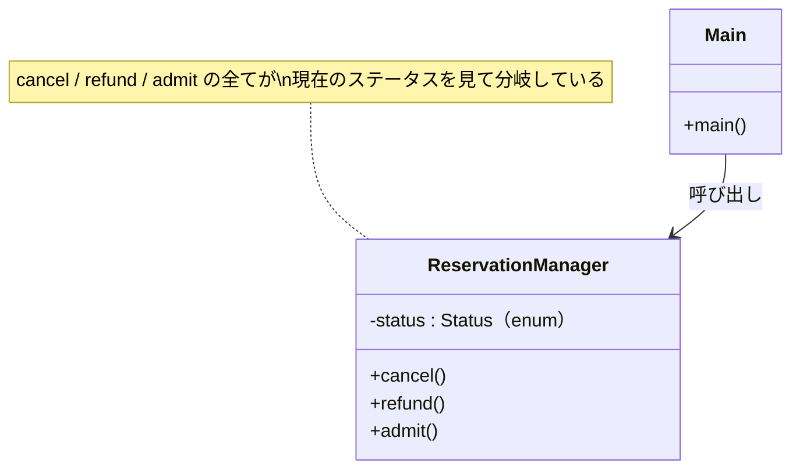
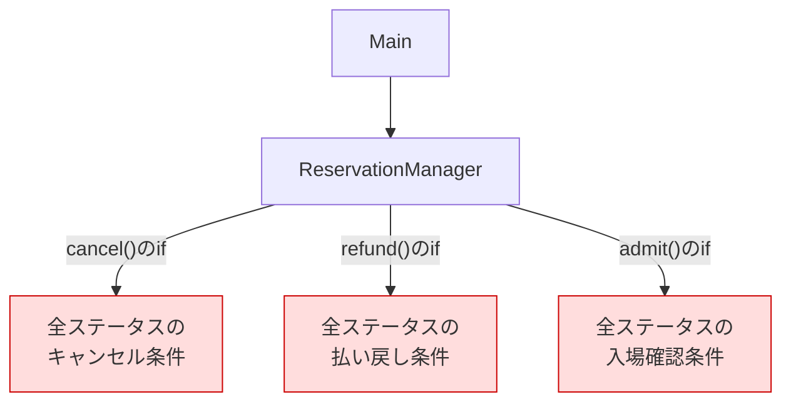
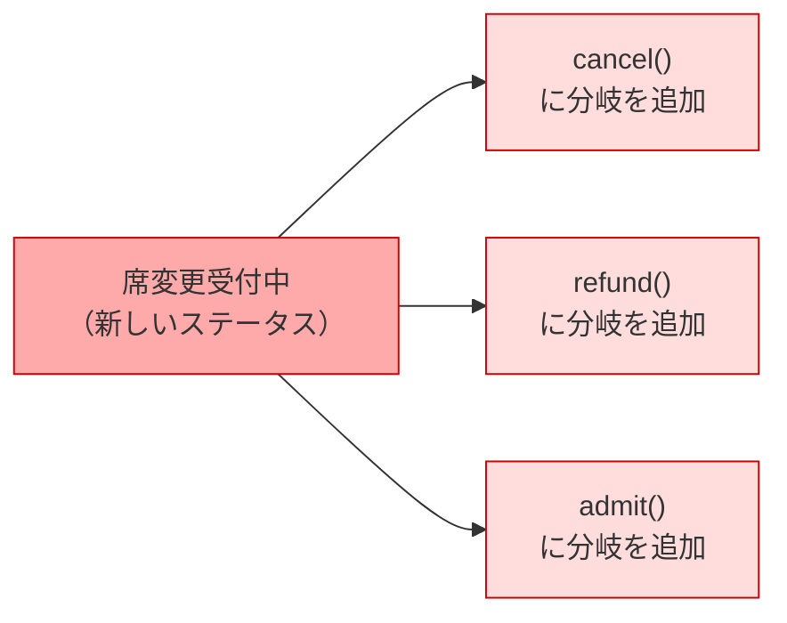
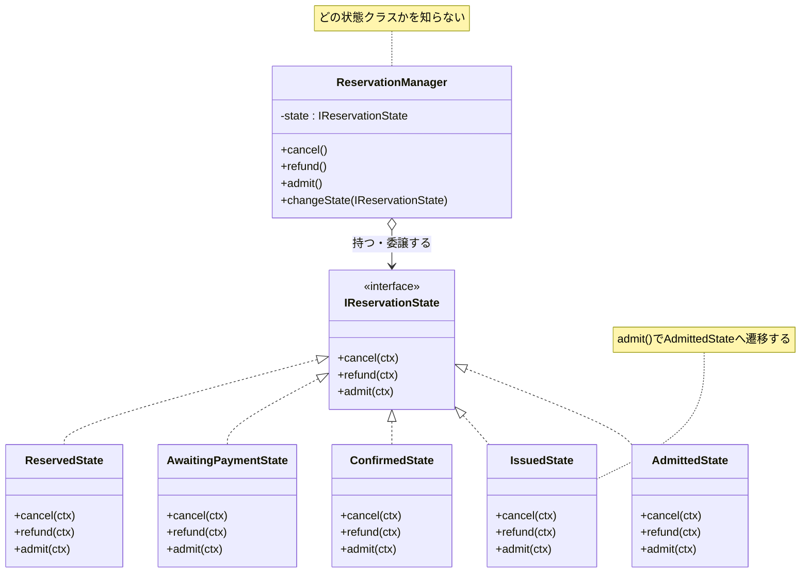
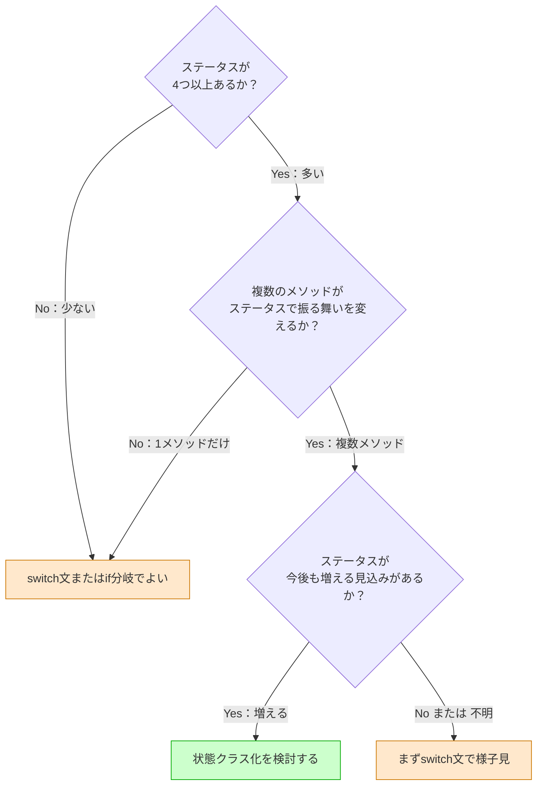
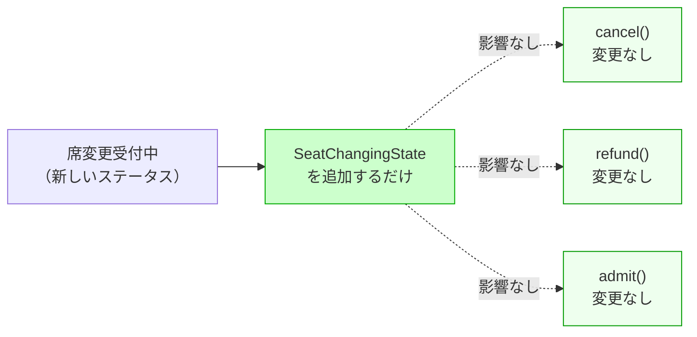
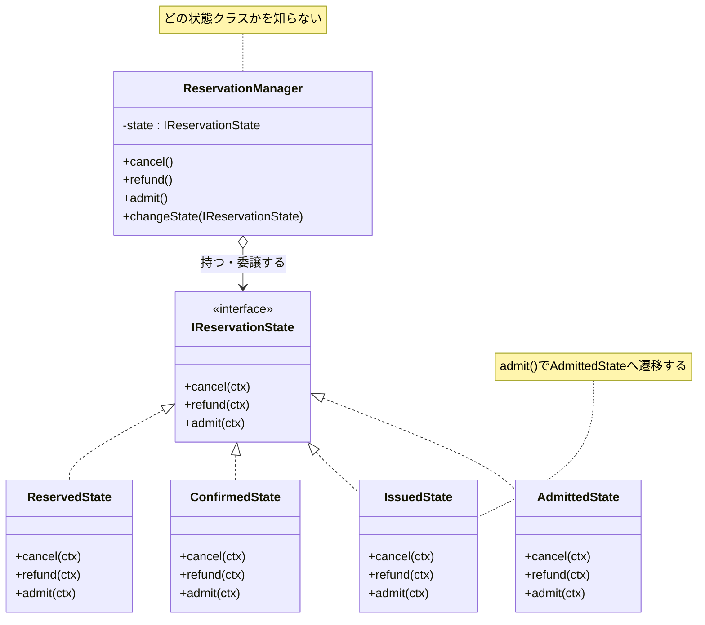

# 第3章　ステータスが増えるたびに全メソッドを開き直す設計を断ち切る（State）
―― 思考の型：「状態ごとの振る舞いが、1か所に集まっていない」ことに気づく

> **この章の核心**
> `cancel()` を直すと `refund()` も `admit()` も開き直さなければならない。
> それは「どの状態でどう動くか」という情報が、
> 全メソッドに分散しているからだ。
> 状態ごとの振る舞いを1か所に集めると、状態が増えても既存コードに触れなくなる。

---

## この章を読むと得られること

- 自分のコードの中で「ステータスが増えるたびに複数のメソッドを開き直している」状態を発見できるようになる
- 複数のメソッドに分散した状態ごとの振る舞いを、状態クラスとして1か所に集める設計を作れるようになる
- このパターンが過剰になる場面（状態が少なく今後も増えない場合）を見極め、シンプルな代替案との使い分けができるようになる
- 変更要求が来たとき、「新しい状態クラスを追加するだけ」で対応できる設計と、全メソッドを開き直す設計の違いを事前に読めるようになる

---

## ステップ0：システムを把握し、仮説を立てる ―― クラス構成を見てから「変わりそうな場所」を予測する

> **入力：** システムのシナリオ説明 ＋ クラス構成の概要（仕様表・責任一覧）。実装コードはまだ読まない。
> **産物：** 変動と不変の「仮説テーブル」

**全パターンに共通する問い**

> 「このコードの中に、**『変わる理由』が異なる2つのものが、
> 同じ場所に混在していないか？」**

「変わる理由」とは **「誰の判断で変わるか」** のことです。
そのコードを変更するとき、答えが2人以上になるなら、変わる理由が複数混在しています。

### 3.0 この章のシステム構成と仮説

**この章で扱うシステム：**
コンサートや演劇のチケット予約を管理するシステムです。
予約には「予約受付 → 支払い待ち → 確定 → 発券済み → 入場済み」という流れがあり、
現在のステータスによって「キャンセル」「払い戻し」「入場確認」の動作が変わります。
`ReservationManager` クラスが1件の予約とその現在ステータスを保持しています。

**仕様表（何ができるシステムか）**

| 機能 | 担当 | 入力 | 出力 |
|---|---|---|---|
| キャンセル処理 | `cancel()` | なし（現在のステータスに依存） | なし（ステータスを更新） |
| 払い戻し申請 | `refund()` | なし（現在のステータスに依存） | なし（ステータスを更新） |
| 入場確認 | `admit()` | なし（現在のステータスに依存） | なし（ステータスを更新） |

**クラス構成の概要**



*→ 1つのクラスが「全ステータスにおける全操作の振る舞い」を知っている。
ステータスが増えるたびに、このクラスの全メソッドに手を入れるしかない。*

**各クラスの責任一覧**

| 対象 | 責任（1文） | 知るべきこと |
|---|---|---|
| `ReservationManager` | 予約の現在状態を管理し、操作を受け付ける | 現在のステータスと操作の対応ルール |
| `main()` | プログラムを起動する | 起動に必要な情報のみ |

---

この構成を踏まえた上で、仮説を立てます。
`ReservationManager` が「全ステータスにおける全操作の振る舞い」を抱えていることが見えています。
どの部分が変わりやすく、どの部分は変わらないでしょうか。

**変動と不変の仮説（実装コードを読む前に立てる）**

| 分類 | 仮説 | 根拠（クラス構成から読み取れること） |
|---|---|---|
| 🔴 **変動する** | 各ステータスにおけるキャンセル・払い戻し・入場確認の振る舞い | 運営判断でステータスの種類や条件が変わる |
| 🔴 **変動する** | ステータスの種類と遷移先 | 公演の種類や運営企画によって状態が追加される |
| 🟢 **不変** | 「現在のステータスに応じて操作を実行する」という骨格 | システムがある限り変わらない |
| 🟢 **不変** | 操作の種類（cancel / refund / admit） | 基本操作として固定されている |

この仮説をステップ2（3.3）でヒアリング後に確定します。

---

## ステップ1：実装コードを読む ―― 責任チェックで問題の行を見つける

> **入力：** ステップ0で把握したクラス責任 ＋ 実際の実装コード
> **産物：** 責任チェック表。「このクラスが持つべきでない知識」が混在している行の発見。

### 3.1 実装コードと責任チェック

ステップ0でクラスの責任は把握しました。
ここでは実際の実装コードを読み、「責任通りに書かれているか」を1行ずつ確認します。

**依存の広がり（実装前の全体像）**



*→ `ReservationManager` 1クラスが全ステータスの全操作ルールを抱えている。*

```cpp
// 【起点コード】
// チケット予約管理システム
// コンサートや演劇のチケット予約を管理する

enum Status {
    Reserved,        // 予約受付
    AwaitingPayment, // 支払い待ち
    Confirmed,       // 確定
    Issued,          // 発券済み
    Admitted         // 入場済み
};

class ReservationManager {
public:
    ReservationManager() : status_(Reserved) {}

    // キャンセル処理
    void cancel() {
        if (status_ == Reserved) {
            status_ = Reserved; // キャンセル受付（実際は削除処理へ）
            // キャンセル確定メール送信
        } else if (status_ == AwaitingPayment) {
            status_ = Reserved; // 支払い前なのでキャンセル可
            // キャンセル確定メール送信
        } else if (status_ == Confirmed) {
            // 確定後はキャンセル不可
            // エラーメッセージを表示
        } else if (status_ == Issued) {
            // 発券済みはキャンセル不可
            // エラーメッセージを表示
        } else if (status_ == Admitted) {
            // 入場済みはキャンセル不可
            // エラーメッセージを表示
        }
    }

    // 払い戻し申請
    void refund() {
        if (status_ == Reserved) {
            // 予約受付中は払い戻し不可
            // エラーメッセージを表示
        } else if (status_ == AwaitingPayment) {
            // 支払い前は払い戻し不可
            // エラーメッセージを表示
        } else if (status_ == Confirmed) {
            status_ = Reserved; // 払い戻し申請受付
            // 払い戻し手続き開始メール送信
        } else if (status_ == Issued) {
            status_ = Reserved; // 発券済みも払い戻し申請可
            // 払い戻し手続き開始メール送信
        } else if (status_ == Admitted) {
            // 入場済みは払い戻し不可
            // エラーメッセージを表示
        }
    }

    // 入場確認
    void admit() {
        if (status_ == Reserved) {
            // 予約受付中は入場不可
            // エラーメッセージを表示
        } else if (status_ == AwaitingPayment) {
            // 支払い待ちは入場不可
            // エラーメッセージを表示
        } else if (status_ == Confirmed) {
            // 確定済みは発券が必要
            // エラーメッセージを表示
        } else if (status_ == Issued) {
            status_ = Admitted; // 発券済みのみ入場確認可
            // 入場完了ログ記録
        } else if (status_ == Admitted) {
            // 既に入場済み
            // エラーメッセージを表示
        }
    }

private:
    Status status_;
};

int main() {
    ReservationManager mgr;
    mgr.admit();   // 予約受付中 → 入場不可
    mgr.cancel();  // 予約受付中 → キャンセル可
    return 0;
}
```

**実行結果：**
```
[admit] 予約受付中のため入場できません
[cancel] キャンセルを受け付けました
```

このコードは正しく動きます。問題は構造にあります。

**責任チェック：`ReservationManager` は自分の責任だけを持っているか**

`ReservationManager` の責任は「予約の現在状態を管理し、操作を受け付けること」です。
「知るべきこと」は「現在のステータスと操作の対応ルール」のはずです。

| コードの行 | 持っている知識 | 責任内か |
|---|---|---|
| `cancel()` 内の `if (status_ == Reserved)` | 予約受付中のキャンセルルール | **✗ 各ステータスの判断** |
| `cancel()` 内の `if (status_ == AwaitingPayment)` | 支払い待ちのキャンセルルール | **✗ 各ステータスの判断** |
| `refund()` 内の `if (status_ == Confirmed)` | 確定時の払い戻しルール | **✗ 各ステータスの判断** |
| `admit()` 内の `if (status_ == Issued)` | 発券済みの入場確認ルール | **✗ 各ステータスの判断** |
| `status_` メンバー変数 | 現在のステータスを保持 | ✅ |

`ReservationManager` は「現在のステータスがどう動くべきか」を全ステータス分抱えています。
「予約受付中のキャンセルルール」を知っているのも、「確定済みの払い戻しルール」を知っているのも、すべて同じクラスです。
状態ごとの責任が、全メソッドに分散して散らばっています。

---

### 3.2 届いた変更要求

> **運営企画から、期日付きの要求が届きました：**
>
> 「確定後の一定期間、席変更を受け付けたい。
> 『席変更受付中』という新しいステータスを設けて、
> その間は払い戻しなしで席変更のみ許可したい。
> 次回公演の2週間前までに対応してほしい。」

---

## ステップ2：仮説を確定する ―― 関係者ヒアリングで「変わる理由」に根拠をつける

> **入力：** ステップ0の仮説 × ステップ1の責任チェック結果。関係者に直接確認する。
> **産物：** 確定した変動/不変テーブル（「誰の判断で変わるか」明記）

### 3.3 仮説の検証と変動/不変の確定

ステップ0で仮説を立てました。ステップ1で責任チェックからも確認できました。
しかし——**コードを読んだだけで「変わる」「変わらない」と断定するのは危険です。**

---

**関係者ヒアリング**

> **開発者**：「現在5つのステータスがあります。今後、ステータスが増える可能性はありますか？」
>
> **運営企画**：「今回の席変更受付中だけでなく、今後もキャンセル待ち受付などを検討しています。公演の形態によって状態を増やしたいことがあります。」

> **開発者**：「各ステータスのキャンセル・払い戻し・入場確認の条件は、今後変わることはありますか？」
>
> **運営企画**：「変わります。今回もそうですが、公演ごとにキャンセルポリシーが違います。VIP席は払い戻しの期間が長い、なども将来的に検討しています。」

> **開発者**：「操作の種類（cancel / refund / admit）自体は変わりますか？」
>
> **チームリーダー**：「基本操作の種類は変わらないと思います。増える可能性はゼロではありませんが、今の設計で固定して問題ありません。」

---

| 分類 | 具体的な内容 | 変わるタイミング | 根拠 |
|---|---|---|---|
| 🔴 **変動する** | 各ステータスにおける各操作の振る舞い | 公演ポリシーの変更・新しいステータスの追加 | 運営企画との確認 |
| 🔴 **変動する** | ステータスの種類と数 | 公演形態の変化（席変更受付中・キャンセル待ちなど） | 運営企画との確認 |
| 🟢 **不変** | 操作の種類（cancel / refund / admit） | 変わる日は来ない | チームリーダーとの合意 |
| 🟢 **不変** | 「現在のステータスに応じて操作を委譲する」骨格 | 変わる日は来ない | システム要件として確定 |

> **設計の決断**：🟢 不変な部分を「契約（インターフェース）」として固定し、
> 🔴 変動する部分はそれぞれのインターフェースの裏側に押し込む。

---

## ステップ3：課題分析 ―― 変更が来たとき、どこが辛いかを確認する

「席変更受付中」というステータスを追加するとき、今のコードで何が起きるかを確認します。

**依存の広がり**



1つのステータスを追加するだけで、**3つのメソッド全てを開いて分岐を追加する**必要があります。
私自身、このような修正を急いで進めたとき、`refund()` の修正を忘れてバグを出したことがあります。
修正漏れのリスクが、メソッドの数だけ存在しています。

さらに、**変更後のテストも3メソッドすべてを再確認する**必要があります。
`cancel()` だけを直したつもりでも、`refund()` や `admit()` の既存動作が壊れていないか確認しなければなりません。

---

## ステップ4：原因分析 ―― 困難の根本にある設計の問題を言語化する

| 観察 | 原因の方向 |
|---|---|
| ステータスが1つ増えると3メソッド全てを修正する | 1つのステータスの振る舞いが3か所に分散している |
| `cancel()` を修正すると `refund()` も確認が必要 | 状態ごとの責任の境界がメソッドではなくステータスにある |
| 「席変更受付中でのキャンセルは？」という問いに即答できない | ステータスと振る舞いの対応が開発者の頭の中にしかない |

#### 変わるものと変わらないものが同じ場所にいる

| 変わり続けるもの | 変わってほしくないもの |
|---|---|
| 各ステータスにおけるキャンセル・払い戻し・入場確認の振る舞い | 「現在のステータスに操作を委譲する」という骨格 |
| ステータスの種類と数 | 操作の種類（cancel / refund / admit） |

現在の設計では、この2つが `ReservationManager` の各メソッドに混在しています。
問題の根本は「**ステータスごとの振る舞いが、メソッドごとに分断されている**」ことです。
本来1か所にまとまっていてほしい「予約受付中での振る舞い一式」が、`cancel()`・`refund()`・`admit()` の3か所に散らばっています。

---

## ステップ5：対策案の検討 ―― 原因から手札を選ぶ

> **ステップ4で特定した真因：** ステータスごとの振る舞いが、メソッドごとに分断されている

### 3.6 手札の選定

真因を改めて確認します。

「予約受付中での振る舞い一式」が `cancel()`・`refund()`・`admit()` の3メソッドに散らばっている。
これを解消するには「**ステータスを軸に振る舞いを集める**」必要があります。

第0章の手札選択表を引くと：「オブジェクトの状態とそれに伴う振る舞いが変わる」→ **状態クラス化**（第0章 手札）。この原因に直接対応します。

**却下した案：switch文への統一**

if文の代わりにswitch文を使えば、コンパイラの警告（未処理ケースの検知）というメリットが得られます。

```cpp
// switch文でif文を置き換えた場合

void cancel() {
    switch (status_) {
        case Reserved:    status_ = Reserved; break; // キャンセル受付
        case AwaitingPayment: status_ = Reserved; break;
        case Confirmed: case Issued: case Admitted: break; // キャンセル不可
    }
}
void refund() {
    switch (status_) {
        case Confirmed: case Issued: status_ = Reserved; break; // 払い戻し受付
        default: break; // 払い戻し不可
    }
}
void admit() {
    switch (status_) {
        case Issued: status_ = Admitted; break; // 入場確認完了
        default: break; // 入場不可
    }
}
```

「席変更受付中」を追加するとき：

```cpp
// 追加が必要な箇所
enum Status { ..., SeatChanging }; // enum に追加
// cancel()  を開く → SeatChangingのcaseを追加
// refund()  を開く → SeatChangingのcaseを追加
// admit()   を開く → SeatChangingのcaseを追加
```

コンパイラ警告で追加漏れは検知できますが、**3メソッド全てを開いて修正する構造は変わりません。**
「席変更受付中の振る舞い一式」は依然として3か所に分散しています。
switch文は「if文の書き方を変えた」だけで、**真因（振る舞いのメソッド軸への分断）を解消していません。**

**採用する手札：状態クラス化（第0章 手札）**

真因に直接対処するには「ステータスをクラスとして定義し、そのクラスの中に cancel・refund・admit 全ての振る舞いをまとめる」しかありません。**状態クラス化**（第0章 手札）を適用し、各ステータスをインターフェースを実装するクラスとして表現します。

「1つのステータスが持つべき振る舞いの契約」をインターフェースとして定義します。

---

### 3.7 状態クラス化の適用：IReservationState インターフェースの導入

```cpp
// ステータスの契約：どのステータスも cancel / refund / admit を知っている
class IReservationState {
public:
    virtual void cancel(ReservationManager& ctx) = 0;
    virtual void refund(ReservationManager& ctx) = 0;
    virtual void admit(ReservationManager& ctx)  = 0;
    virtual ~IReservationState() {}
};
```

次に、各ステータスをこのインターフェースを実装したクラスとして作ります。
**状態遷移はこのクラスの中で行います。** 各状態クラスが「自分が次にどの状態へ移るか」を知っています。

```cpp
// ────────────────────────────────────────────────────────
// 予約受付中：cancel可、refund/admit不可
// ────────────────────────────────────────────────────────
class ReservedState : public IReservationState {
public:
    void cancel(ReservationManager& ctx) override {
        ctx.changeState(nullptr); // 予約削除（キャンセル完了）
    }
    void refund(ReservationManager& ctx) override {
        // まだ支払いがないため払い戻し不可
    }
    void admit(ReservationManager& ctx) override {
        // 発券されていないため入場不可
    }
};

// ────────────────────────────────────────────────────────
// 支払い待ち：cancel可、refund/admit不可
// ────────────────────────────────────────────────────────
class AwaitingPaymentState : public IReservationState {
public:
    void cancel(ReservationManager& ctx) override {
        ctx.changeState(new ReservedState()); // キャンセル受付
    }
    void refund(ReservationManager& ctx) override {
        // 支払い前のため払い戻し不可
    }
    void admit(ReservationManager& ctx) override {
        // 支払い未完了のため入場不可
    }
};

// ────────────────────────────────────────────────────────
// 確定済み：cancel不可、refund可、admit不可
// ────────────────────────────────────────────────────────
class ConfirmedState : public IReservationState {
public:
    void cancel(ReservationManager& ctx) override {
        // 確定後はキャンセル不可
    }
    void refund(ReservationManager& ctx) override {
        ctx.changeState(new ReservedState()); // 払い戻し申請受付
    }
    void admit(ReservationManager& ctx) override {
        // 発券前は入場不可
    }
};

// ────────────────────────────────────────────────────────
// 発券済み：cancel不可、refund可、admit可
// ────────────────────────────────────────────────────────
class IssuedState : public IReservationState {
public:
    void cancel(ReservationManager& ctx) override {
        // 発券済みはキャンセル不可
    }
    void refund(ReservationManager& ctx) override {
        ctx.changeState(new ReservedState()); // 払い戻し申請受付
    }
    void admit(ReservationManager& ctx) override {
        ctx.changeState(new AdmittedState()); // 入場確認完了 → 入場済みへ
    }
};

// ────────────────────────────────────────────────────────
// 入場済み：全操作不可
// ────────────────────────────────────────────────────────
class AdmittedState : public IReservationState {
public:
    void cancel(ReservationManager& ctx) override {
        // 入場済みはキャンセル不可
    }
    void refund(ReservationManager& ctx) override {
        // 入場済みは払い戻し不可
    }
    void admit(ReservationManager& ctx) override {
        // すでに入場済み
    }
};
```

`ReservationManager` は `IReservationState*` だけを知り、現在の状態に操作を委譲します。

```cpp
class ReservationManager {
public:
    ReservationManager() : state_(new ReservedState()) {}

    void cancel() { state_->cancel(*this); }
    void refund() { state_->refund(*this); }
    void admit()  { state_->admit(*this); }

    void changeState(IReservationState* newState) {
        delete state_;
        state_ = newState;
    }

    ~ReservationManager() { delete state_; }

private:
    IReservationState* state_;
};
```

構造を整理します。




この構造を採用することを最終決定します。これは **Stateパターン** と呼ばれています。
GoFがこの構造を観察して付けたラベルです。
「状態ごとの振る舞いをクラスとして切り出す」——今回のプロセスで自然にたどり着いた構造がそのままです。

「席変更受付中」を追加するとき、何が起きるでしょうか。

```cpp
// 新しい状態クラスを追加するだけでよい

class SeatChangingState : public IReservationState {
public:
    void cancel(ReservationManager& ctx) override {
        // 席変更受付中 → キャンセル不可
    }
    void refund(ReservationManager& ctx) override {
        // 席変更受付中 → 払い戻し不可
    }
    void admit(ReservationManager& ctx) override {
        // 席変更受付中 → 入場不可
    }
};
```

`ReservationManager` も `cancel()` も `refund()` も `admit()` も、一切変更しません。
「席変更受付中での振る舞い一式」が `SeatChangingState` という1か所にまとまっています。

---

### 3.8 評価軸の宣言

比較を始める前に「何を重視するか」を明示します。

| 評価軸 | なぜこの状況で重要か |
|---|---|
| 変更の局所性 | ステータスが追加されるたびに変更箇所を1か所に収めたい |
| 振る舞いの追跡容易性 | 「席変更受付中でのキャンセルは？」をコードで即答できるようにしたい |
| 既存コードへの影響 | 新しいステータス追加が既存ステータスの動作を壊さないようにしたい |

---

### 3.9 各手札をテストで比較する

**却下した案（switch文）のテスト**

```cpp
// switch文の場合：「席変更受付中でのキャンセル」を確認するには
// ReservationManager ごとテストし、cancel() の中の switch 全体を確認する必要がある

TEST(ReservationManagerTest, SeatChangingCannotCancel) {
    ReservationManager mgr;
    // 内部enum を直接操作できないため状態セットアップが複雑
    // cancel() の switch 文全体を読まないと振る舞いが把握できない
    // 同時に Reserved や Confirmed の動作も「壊していないか」確認が必要になる
    mgr.cancel();
}
```

**採用した手札（IReservationState）のテスト**

```cpp
// IReservationState の場合：SeatChangingState だけをテストすれば確認できる

TEST(SeatChangingStateTest, CannotCancel) {
    SeatChangingState state;
    ReservationManager ctx;
    state.cancel(ctx);
    // 状態が変化していないことを確認
    // IssuedState や ConfirmedState には一切触れない
}

TEST(IssuedStateTest, AdmitChangesToAdmitted) {
    IssuedState state;
    ReservationManager ctx;
    state.admit(ctx);
    // AdmittedState に遷移していることを確認
}
```

各状態クラスが「自分のステータスでの振る舞いだけ」をテストしています。
`IssuedState` を変えても `ConfirmedState` のテストには影響しません。

**比較のまとめ**

| 基準 | 却下した案（switch文） | 採用した手札（IReservationState） |
|---|---|---|
| 変更の局所性 | △ ステータス追加で全メソッドを修正 | ○ 新しいクラスを追加するだけ |
| 振る舞いの追跡容易性 | △ メソッドのswitch文を読む必要がある | ○ 状態クラス1つを読めば分かる |
| 既存コードへの影響 | △ 全メソッドのテストを再確認する | ○ 既存クラスに触れないため影響なし |
| 実装コスト | 少ない（クラス定義不要） | 多い（インターフェース＋クラス必要） |

*この比較はあくまで「今回の状況と基準」に対するものです。
別の状況・別の基準であれば、違う選択が正解になります。*

---

## ステップ6：天秤にかける ―― 柔軟性とシンプルさのバランスを評価する

### 3.10 耐久テスト ―― ヒアリングで挙がった変化が来た

3.3のヒアリングで、チームリーダーからこんな話がありました。
「システムメンテナンス中は全操作を一時的にロックしたい。」

この変化が実際に来た場面をシミュレートします。
「一時停止」という新しい状態を追加する要求です。

```cpp
// 既存の状態クラスには一切触れずに追加できる

class SuspendedState : public IReservationState {
public:
    void cancel(ReservationManager& ctx) override {
        // システムメンテナンス中 → キャンセル不可
    }
    void refund(ReservationManager& ctx) override {
        // システムメンテナンス中 → 払い戻し申請不可
    }
    void admit(ReservationManager& ctx) override {
        // システムメンテナンス中 → 入場確認不可
    }
};

// 使い方：メンテナンス開始時
void startMaintenance(ReservationManager& mgr) {
    mgr.changeState(new SuspendedState());
}
```

`IReservationState` も `ReservedState` も `ConfirmedState` も、一切変更していません。
`ReservationManager` の `cancel()` / `refund()` / `admit()` も変わりません。

これが**状態クラス化**（第0章 手札）の真の価値です。
「既存コードへの影響ゼロで新しい状態を追加できる」——この保証が、ステータスが増え続けるシステムでの安心感になります。

---

### 3.11 使う場面・使わない場面

「では、ステータスがあれば常に状態クラスを使えばいいのか？」という問いは自然です。
正解はないのですが、一つの考え方として——

```cpp
// 使いすぎた例：状態が2つで今後も変わらない場面

// 注文の「処理中 / 完了」だけを管理するシステム
// → キャンセル 1メソッドだけが状態で変わる

class IOrderState {         // これは過剰
    virtual void cancel() = 0;
};
class ProcessingState : public IOrderState {
    void cancel() override {
        std::cout << "[OK] 注文をキャンセルしました\n";
    }
};
class CompletedState : public IOrderState {
    void cancel() override {
        std::cout << "[NG] 完了済みの注文はキャンセルできません\n";
    }
};
```

状態が2〜3個で今後も増える見込みがなく、操作も少なければ、シンプルなif文やswitch文で十分です。クラスを増やす複雑さのほうが、状態管理の複雑さを上回ってしまいます。

| 状況 | 適切な選択 | 理由 |
|---|---|---|
| 状態が4つ以上・今後も増える見込みがある | **状態クラス化**（IReservationState） | ステータス追加の影響が局所化される |
| 複数のメソッドがステータスで振る舞いを変える | **状態クラス化**（IReservationState） | 振る舞いを状態軸でまとめられる |
| 状態が2〜3個・固定・メソッドも少ない | switch文またはif分岐 | クラスを増やすコストが割に合わない |
| 状態の追加が予測できない | まずswitch文で様子見 | 複雑さを抑えて後から移行を検討 |

**適用判断のフローチャート：**



*このフローは「今回の評価軸」に対するもの。別の状況・別の基準なら、違う判断になります。*

設計に絶対の正解はありません。
「今どのリスクを優先して対処するか」をチームで話し合うことが、設計の一歩だと私は感じています。

---

## ステップ7：決断と、手に入れた未来

### 3.12 解決後のコード（全体）

```cpp
// ────────────────────────────────────────────────────────
// 状態インターフェース
// ────────────────────────────────────────────────────────

class ReservationManager; // 前方宣言

class IReservationState {
public:
    virtual void cancel(ReservationManager& ctx) = 0;
    virtual void refund(ReservationManager& ctx) = 0;
    virtual void admit(ReservationManager& ctx)  = 0;
    virtual ~IReservationState() {}
};

// ────────────────────────────────────────────────────────
// コンテキスト：現在の状態に操作を委譲する
// ────────────────────────────────────────────────────────

class ReservationManager {
public:
    ReservationManager();

    void cancel() { state_->cancel(*this); }
    void refund() { state_->refund(*this); }
    void admit()  { state_->admit(*this); }

    void changeState(IReservationState* newState) {
        delete state_;
        state_ = newState;
    }

    ~ReservationManager() { delete state_; }

private:
    IReservationState* state_;
};

// ────────────────────────────────────────────────────────
// 各状態クラス（状態ごとの振る舞い一式が1か所にまとまる）
// ────────────────────────────────────────────────────────

class ReservedState : public IReservationState {
public:
    void cancel(ReservationManager& ctx) override {
        ctx.changeState(nullptr); // 予約削除（キャンセル完了）
    }
    void refund(ReservationManager& ctx) override {
        // まだ支払いがないため払い戻し不可
    }
    void admit(ReservationManager& ctx) override {
        // 発券されていないため入場不可
    }
};

class AwaitingPaymentState : public IReservationState {
public:
    void cancel(ReservationManager& ctx) override {
        ctx.changeState(new ReservedState()); // キャンセル受付
    }
    void refund(ReservationManager& ctx) override {
        // 支払い前のため払い戻し不可
    }
    void admit(ReservationManager& ctx) override {
        // 支払い未完了のため入場不可
    }
};

class ConfirmedState : public IReservationState {
public:
    void cancel(ReservationManager& ctx) override {
        // 確定後はキャンセル不可
    }
    void refund(ReservationManager& ctx) override {
        ctx.changeState(new ReservedState()); // 払い戻し申請受付
    }
    void admit(ReservationManager& ctx) override {
        // 発券前は入場不可
    }
};

class IssuedState : public IReservationState {
public:
    void cancel(ReservationManager& ctx) override {
        // 発券済みはキャンセル不可
    }
    void refund(ReservationManager& ctx) override {
        ctx.changeState(new ReservedState()); // 払い戻し申請受付
    }
    void admit(ReservationManager& ctx) override {
        ctx.changeState(new AdmittedState()); // 入場確認完了
    }
};

class AdmittedState : public IReservationState {
public:
    void cancel(ReservationManager& ctx) override {
        // 入場済みはキャンセル不可
    }
    void refund(ReservationManager& ctx) override {
        // 入場済みは払い戻し不可
    }
    void admit(ReservationManager& ctx) override {
        // すでに入場済み
    }
};

// ────────────────────────────────────────────────────────
// 追加シナリオ：席変更受付中（既存クラスに触れずに追加）
// ────────────────────────────────────────────────────────

class SeatChangingState : public IReservationState {
public:
    void cancel(ReservationManager& ctx) override {
        // 席変更期間中はキャンセル不可
    }
    void refund(ReservationManager& ctx) override {
        // 席変更期間中は払い戻し不可
    }
    void admit(ReservationManager& ctx) override {
        // 席変更期間中は入場不可
    }
};

// ────────────────────────────────────────────────────────
// コンストラクタの定義（前方宣言の解決後に記述）
// ────────────────────────────────────────────────────────

ReservationManager::ReservationManager() : state_(new ReservedState()) {}

// ────────────────────────────────────────────────────────
// ReservationApplication（Composition Root）
// 「どの状態クラスを使うか」を決めて組み立てる唯一の場所。
// Composition Root とは「具体クラスを知ってよい唯一の場所」というパターン名で、
// ここだけがインターフェースの裏に何があるかを知っている。
// ────────────────────────────────────────────────────────

class ReservationApplication {
public:
    void run() {
        // シナリオ1：予約受付 → キャンセル
        ReservationManager mgr1;
        mgr1.cancel();  // 予約受付中 → キャンセル受付

        // シナリオ2：予約 → 確定 → 発券 → 入場
        ReservationManager mgr2;
        mgr2.changeState(new AwaitingPaymentState()); // 支払い待ちへ
        mgr2.changeState(new ConfirmedState());       // 確定へ
        mgr2.changeState(new IssuedState());          // 発券済みへ
        mgr2.admit();   // 発券済み → 入場確認完了
    }
};

// ────────────────────────────────────────────────────────
// main() は ReservationApplication をキックするだけ
// ────────────────────────────────────────────────────────

int main() {
    ReservationApplication app;
    app.run();
    return 0;
}
```

**実行結果：**
```
[cancel] キャンセルを受け付けました
[admit] 入場確認が完了しました
```

---

### 3.13 変更シナリオ表と最終責任テーブル

**変更影響グラフ（改善後）**



*→ ステップ3と同じ「席変更受付中の追加」シナリオで、変更が新しいクラス1つに局所化された。*

**変更シナリオ表：何が変わったとき、どこが変わるか**

| シナリオ | 変わるクラス | 変わらないクラス |
|---|---|---|
| 新しいステータスを追加する | 新しい〇〇State クラスを追加 | IReservationState / ReservationManager / 既存全状態クラス |
| 特定ステータスのキャンセル条件が変わる | 該当するStateクラスの cancel() のみ | 他の全状態クラス / ReservationManager |
| 払い戻しポリシーが変わる | 該当するStateクラスの refund() のみ | ReservationManager / 他のメソッド |
| 入場確認の遷移先が変わる | IssuedState の admit() のみ | 他の全状態クラス |

どのシナリオでも、変わるクラスが1クラスに収まっています。

**最終責任テーブル**

| クラス | 責任（1文） | 変わる理由 |
|---|---|---|
| `main()` | プログラムを起動する | 起動方法が変わるとき |
| `ReservationApplication` | 依存を組み立て、処理を起動する | 使うシナリオの組み合わせが変わるとき |
| `ReservationManager` | 現在の状態に操作を委譲する | 操作の種類が変わるとき |
| `IReservationState` | 状態の振る舞いの契約を定義する | 操作の責任範囲が変わるとき |
| `ReservedState` | 予約受付中での振る舞いを実装する | 予約受付中のポリシーが変わるとき |
| `AwaitingPaymentState` | 支払い待ちでの振る舞いを実装する | 支払い待ちのポリシーが変わるとき |
| `ConfirmedState` | 確定済みでの振る舞いを実装する | 確定済みのポリシーが変わるとき |
| `IssuedState` | 発券済みでの振る舞いを実装する | 発券済みのポリシーが変わるとき |
| `AdmittedState` | 入場済みでの振る舞いを実装する | 入場済みのポリシーが変わるとき |

各クラスが持つ「変わる理由」が1つに絞られています。
これが、ステップ4で特定した問題への答えです。

---

## 整理

### 8ステップとこの章でやったこと

| ステップ | この章でやったこと |
|---|---|
| ステップ0 | チケット予約管理システムの構成を確認し、「状態ごとの振る舞いは変わりやすく、操作の骨格は変わらない」という仮説を立てた |
| ステップ1 | 各行が責任範囲内かを確認し、`ReservationManager` の各メソッドに「全ステータスの判断ロジック」が分散していることを発見した |
| ステップ2 | 運営企画へのヒアリングで「ステータスは今後も増える」「各ステータスのポリシーも変わる」という仮説を事実として確定した |
| ステップ3 | 「席変更受付中」を追加しようとすると cancel / refund / admit の3メソッド全てを開き直す必要があることを確認した |
| ステップ4 | 「変わる理由の異なる2つのもの（状態ごとの振る舞い・操作の骨格）が同じ場所にいる」という根本原因を言語化した |
| ステップ5 | 真因から手札を選定した。switch文統一は真因を解消しないと判断し、**状態クラス化**（第0章 手札）を適用して IReservationState を導入した |
| ステップ6 | 変更の局所性・振る舞いの追跡容易性・既存コードへの影響という評価軸で採用した手札の価値を確認し、今回のケースでは採用する価値があると判断した |
| ステップ7 | 全コードを示し、変更シナリオ別に「変わるクラス・変わらないクラス」で効果を確認した |

**各クラスの最終的な責任**

| クラス | 責任 | 変わる理由 |
|---|---|---|
| `main()` | プログラムを起動する | 起動方法が変わるとき |
| `ReservationApplication` | 依存を組み立て、処理を起動する | 使うシナリオの組み合わせが変わるとき |
| `ReservationManager` | 現在の状態に操作を委譲する | 操作の種類が変わるとき |
| `IReservationState` | 状態の振る舞いの契約を定義する | 操作の責任範囲が変わるとき |
| `ReservedState` | 予約受付中での振る舞いを実装する | 予約受付中のポリシーが変わるとき |
| `ConfirmedState` | 確定済みでの振る舞いを実装する | 確定済みのポリシーが変わるとき |
| `IssuedState` | 発券済みでの振る舞いを実装する | 発券済みのポリシーが変わるとき |

「変わる理由が1つ」のクラスだけで構成されている。
このプロセスを回した結果にたどり着いた構造こそが **Stateパターン** です。

設計に絶対の正解はありません。ただ「各クラスの責任は何か」「変わる理由は1つか」を問い続けることが、変更に強いコードへの入り口になります。

---

## 振り返り：第0章の3つの哲学はどう適用されたか

改めて、ここまで導き出してきた「最終的な設計（図やコード）」を、第0章でお話しした「3つの哲学」と照らし合わせてみましょう。一通り設計のプロセスを体験した今なら、あの哲学が「コードのどの部分に現れているか」がはっきりと見えるはずです。

### 哲学1「変わるものをカプセル化せよ」の現れ

**具体化された場所：** 各ステータスの振る舞いを独立させた `ReservedState`・`ConfirmedState`・`IssuedState` などの各状態クラス

「予約受付中でのキャンセルルール」「確定済みでの払い戻しルール」——これらは公演ポリシーの変更のたびに変わります。こうした変わり続ける振る舞いを、`ReservationManager` の各メソッドに同居させるのをやめました。変わる部分をステータスごとに独立したクラスへ切り出し、その中にカプセル化（隔離）しました。

結果として、**ステータスが10種類に増えても、`ReservationManager` の `cancel()` / `refund()` / `admit()` はまったく変わらない構造** を手に入れることができました。

### 哲学2「実装ではなくインターフェースに対してプログラムせよ」の現れ

**具体化された場所：** `ReservationManager` が具体クラスを知らず、`IReservationState` インターフェースだけを知っている構造

`ReservationManager` のメンバー変数は `IReservationState* state_` と宣言されており、`ReservedState` や `IssuedState` の名前はどこにも出てきません。具体クラスを知っているのは `ReservationApplication`（Composition Root）だけです。

この構造により、どんな状態クラスが追加・変更されても `ReservationManager` は一切変わりません。`SuspendedState` を追加したときも、`SeatChangingState` を追加したときも、`ReservationManager` の1行も触りませんでした。「契約だけを知り、実装を知らない」ことが、変更の飛び火を止める壁になっています。

---

### 哲学3「継承よりコンポジションを優先せよ」の現れ

**具体化された場所：** `ReservationManager` が `IReservationState*` をメンバー変数として「持つ（has-a）」構造

「確定済みでの振る舞いを持つReservationManager」を継承で作ろうとすれば、`ReservedReservationManager`・`ConfirmedReservationManager`・`IssuedReservationManager`…と、ステータスの数だけクラスが必要になります。コンポジションでは `IReservationState` を差し込む口を1つ持つだけで、どのステータスの振る舞いを当てるかは外から決められます。

`changeState()` で状態を差し替えるだけで、同じ `ReservationManager` インスタンスが「今は予約受付中として動く・今は発券済みとして動く」と振る舞いを変えます。新しいステータスを追加するとき、`ReservationManager` 本体に継承関係の変更は一切発生しません。

---

第3章で体験したプロセスを振り返ると、Stateパターンは「答えとして学ぶもの」ではなく、「こういう状況に直面したとき、このように考えると自然にたどり着く構造」だとわかります。

---

## パターン解説：Stateパターン

> **GoFとは：** GoF（Gang of Four）とは1994年に発表された書籍 *Design Patterns: Elements of Reusable Object-Oriented Software* の4人の著者を指します。この書籍で定義された23種のパターンが「GoFデザインパターン」と総称されています。Stateパターンはその中の1つです。

### パターンの骨格

Stateパターンは「状態ごとの振る舞いの分散」という構造問題を解くパターンです。
複数のメソッドが「現在の状態」によって振る舞いを変えるとき、その分岐を各メソッドの中に書くのではなく、状態そのものをクラスとして切り出します。


**Context** は「現在の状態」への参照を持ち、操作を `State` に委譲します。どの状態クラスかを知りません。**State** は「状態が持つべき振る舞いの契約」です。**ConcreteState** は1つの状態における振る舞いを実装します。状態遷移は `ConcreteState` の内部から `ctx.changeState()` を呼ぶことで行います。

### この章の実装との対応



`ReservationManager` は `IReservationState` の `cancel()` / `refund()` / `admit()` を呼ぶだけです。どの状態クラスが入っているかを知っているのは `ReservationApplication`（Composition Root）だけです。席変更受付中を追加するとき、`ReservationManager` には一切触れません。

### どんな構造問題を解くか

「現在の状態に応じた振る舞い」と「操作を受け付ける骨格」が同じクラスにいる状態がStageパターンの出番です。

状態が増えるたびに複数のメソッドを開き直す——この状態では「このステータスでのキャンセルは？」という問いへの答えが、コードの複数箇所に分散しています。Stateパターンは「状態�