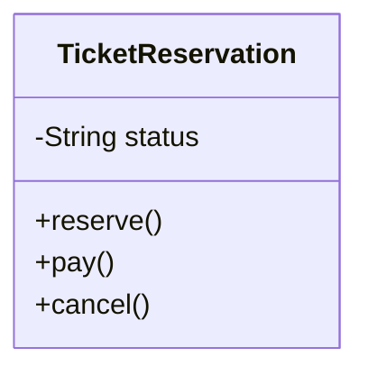
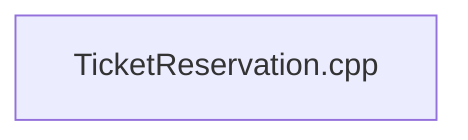
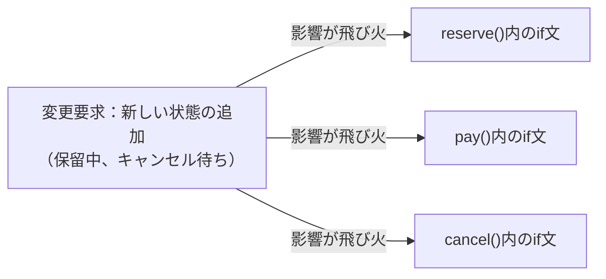
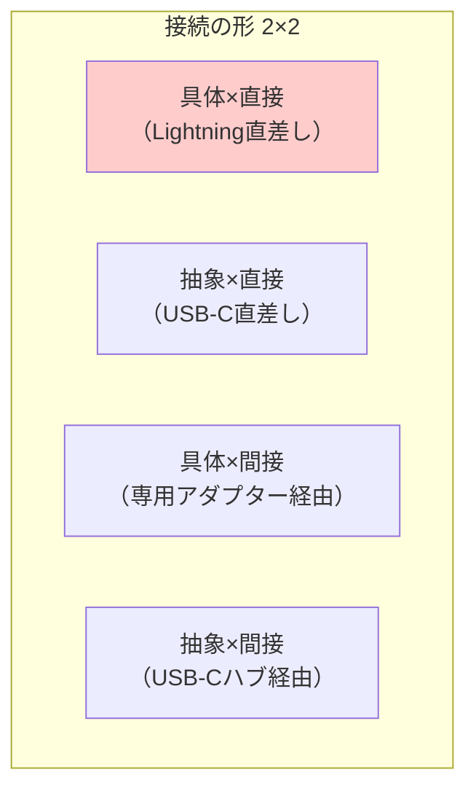
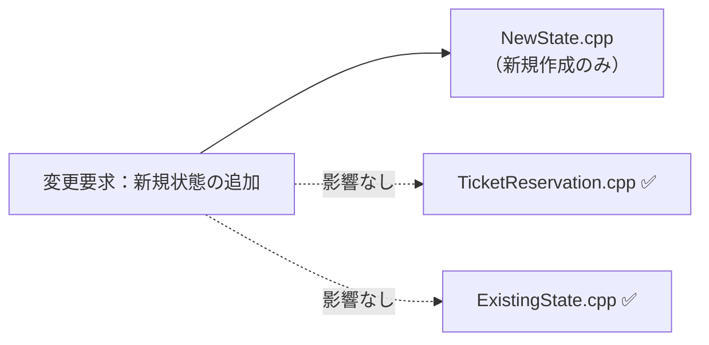
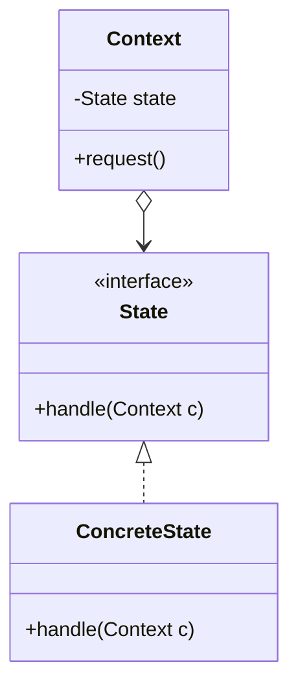
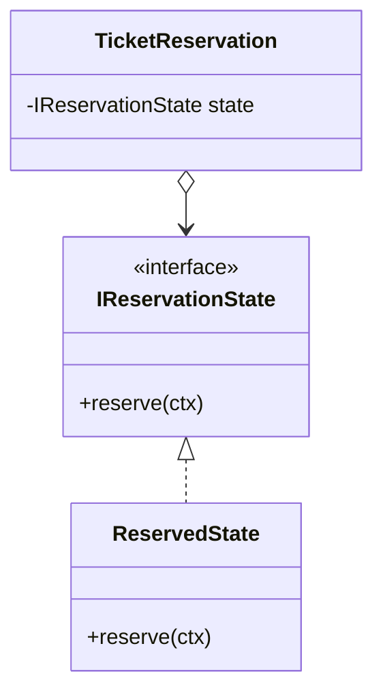

## 第3章 状態に応じた振る舞いの切り替え ―― State パターン

―― 思考の型：状態によって振る舞いが変わる処理が、条件分岐で混在している

### この章の核心

**特定の条件（状態）ごとに処理の内容が切り替わるコードは、状態が増えるたびに条件分岐が肥大化し、システムの保守性を損なう。それは、「状態」と「その状態での振る舞い」が、同じクラスの中に混在しているからだ。**

### この章を読むと得られること

* **得られること1：** 「状態の変化に伴う振る舞いの切り替え」という観点で、コードの変動箇所を識別できるようになる
* **得られること2：** 条件分岐が複雑に絡み合ったクラスを見て、そこが状態管理の痛みの発生源だと判断できるようになる
* **得られること3：** 状態ごとの振る舞いを別クラスに分離することで、条件分岐を排除した構造改善の説明ができるようになる
* **得られること4：** 状態が増える可能性がある設計において、既存のフローを壊さずに状態を追加する判断ができるようになる

## 🔵 フェーズ1：現状把握 ―― 変更が来る前にコードを把握する

まずは、チケット予約管理システムという、私たちの目の前にあるシステムの現状を、ありのままの事実として把握するところから始めましょう。

### 1-1：システムの背景

このシステムは、ある映画館のチケット予約管理を担っています。映画の上映スケジュールに対して、座席の予約、支払い、発券といった一連のプロセスを管理する、映画館運営の中核となるシステムです。

当初は、「上映開始前」の座席を予約し、「上映開始」を迎え、「上映終了」後にチケットが無効になるというシンプルなライフサイクルでした。しかし最近、お客様からの要望で「上映開始後のキャンセル受け付け」や「特定条件での予約の一時保留」といった機能が追加され、チケットの状態遷移が複雑化しています。

このコードが今日まで映画館の運営を支えてきたという事実は、まず率直に認めたいと思います。当時の担当者が、限られた制約の中で必死につないできた跡が、このコードには詰まっています。

一見すると、予約状況を表す `status` という変数があり、それに基づいて処理が分岐しているため、今の構造でもそれなりに上手く回っているように見えます。状態が3つしかないうちは、コードを上から下に追えば何が起きているか理解できたからです。

しかし、これから「キャンセル待ち」や「返金処理中」といった新しい状態が増えていくことを想像すると、少しだけ違和感が見えてきます。現在の設計では、新しい状態が一つ増えるたびに、すべてのメソッド内の `if` 文や `switch` 文に手を入れなければなりません。

### 1-2：仕様表

このシステムが持つ基本的な機能を整理します。

| **機能名** | **担当クラス** | **入力** | **出力** |
| --- | --- | --- | --- |
| 座席予約の実行 | `TicketReservation` | 希望座席情報 | 予約成功・失敗 |
| チケットの支払い | `TicketReservation` | 決済情報 | 支払い完了・エラー |
| チケットのキャンセル | `TicketReservation` | キャンセル理由 | キャンセル完了 |

### 1-3：クラス構成図

予約管理の中核となるクラスの現状の構造を見てみましょう。



→ `TicketReservation` クラスがすべての予約状態と、状態ごとの処理ロジックを抱え込んでいます。

### 1-4：責任配置テーブル

| **クラス名** | **責任（1文）** | **知るべきこと** |
| --- | --- | --- |
| `TicketReservation` | チケットの予約から発券までの状態を管理する | 現在の予約ステータス、各状態における可能なアクション、状態遷移のルール |

各クラスの責任と知識の定義が確認できました。`TicketReservation` クラスが「予約ステータス」と「全状態の遷移ロジック」の両方を定義していることが分かります。

### 1-5：依存グラフ



→ 現在は一つのクラス内にロジックが凝縮されており、外部への依存よりもクラス内部での知識の混在が顕著であることが分かります。

### 1-6：実装コード

現在の予約管理クラスの姿を確認します。

```cpp
#include <iostream>
#include <string>

class TicketReservation {
private:
    std::string status; // "Available", "Reserved", "Paid"
public:
    TicketReservation() : status("Available") {}

    void reserve() {
        if (status == "Available") {
            status = "Reserved";
            std::cout << "予約完了しました\n";
        } else {
            std::cout << "現在予約できません\n";
        }
    }

    void pay() {
        if (status == "Reserved") {
            status = "Paid";
            std::cout << "支払い完了しました\n";
        } else {
            std::cout << "支払いに適した状態ではありません\n";
        }
    }

    void cancel() {
        if (status == "Reserved") {
            status = "Available";
            std::cout << "予約をキャンセルしました\n";
        } else {
            std::cout << "キャンセルできません\n";
        }
    }
};

```

このコードを見ると、`reserve`、`pay`、`cancel` の各メソッドの中に、現在の `status` を判定する条件分岐が散らばっていることが分かります。

### 1-7：実行結果

```
出力：
予約完了しました
支払い完了しました

```

このコードは正しく動きます。これから変えていくのは「機能」ではなく「構造」だ。

### 1-8：責任チェック表

| **コードの行** | **持っている知識** | **管理者（観察）** |
| --- | --- | --- |
| `if (status == "Available")` | 予約が可能であるという状態判定の知識 | 業務フロー管理者がルールを決める |
| `status = "Reserved";` | 次に遷移すべき状態の知識 | 業務フロー管理者がルールを決める |

責任チェックの結果、`status` という知識が複数のメソッドで利用されており、すべての状態遷移ルールを `TicketReservation` クラス自身が管理している様子が見えてきました。

要するに、各メソッド内で `status` 変数を判定しているという観察から、「現在の状態」と「状態ごとに実行すべき振る舞い」が同じ場所に混在しているという構造の問題が見えてくる。

フェーズ1で責任配置の観察が終わりました。次のフェーズ2では、変更要求を受けて「何が変わり、何が変わらないか」の仮説を立てます。

## 🟠 フェーズ2：仮説立案 ―― 変更要求を受けて、変動と不変を整理する

フェーズ1で、チケット予約システムの現状をコードレベルで把握しました。次のフェーズ2では、具体的な変更要求を受けて、「コードのどこが変わり、どこが変わらないのか」を整理し、関係者とのヒアリングを通じて設計の方向性を定めます。

### 2-1：届いた変更要求

ある週明けの朝、映画館の支配人から開発チームへ、新しい施策についての連絡が入りました。

「来月から、リピーター向けに『キャンセル待ち』機能を実装したいのです。予約枠がいっぱいの場合でも、空きが出たら自動的に予約が割り当てられるようにしたい。また、それに伴い『予約一時保留』という状態も追加してほしい。上映開始の24時間前までなら、予約を確保したまま決済を24時間待つ仕組みです。」

支配人は、この機能が実装されれば、直前キャンセルによる空席を減らし、収益が大きく改善すると期待しています。しかし、現在の `TicketReservation` クラスには、すでに `Available`、`Reserved`、`Paid` という3つの状態が密接に絡み合っています。ここに「キャンセル待ち」と「保留中」という2つの新しい状態を、従来の `if` 文のロジックに追加していくのは、かなり骨の折れる作業になりそうです。

### 2-2：変動・不変の仮説テーブル

フェーズ1の観察に基づき、この変更がどこに影響するかを仮説立てします。

| **分類** | **仮説** | **根拠（フェーズ1の観察から）** |
| --- | --- | --- |
| 🔴 **変動しそう** | 状態遷移ルール（全状態の組み合わせ） | 現在の各メソッド内で `status` 変数を判定しているため、状態が増えるたびにすべてのメソッドで条件分岐の修正が必要となるため |
| 🔴 **変動しそう** | 各メソッド内での振る舞い（予約可否や支払い可否） | 新しい状態（保留中など）ごとに、アクションの可否が個別に定義される必要があるため |
| 🟢 **不変そう** | 映画の上映スケジュールと座席データ | 状態管理の仕組みとは独立しており、変更要求の影響を受けないため |

仮説を立ててみて改めて痛感するのは、今の構造だと状態が2つ増えるだけで、ロジックが指数関数的に複雑になりそうだという点です。

### 2-3：関係者ヒアリング

仮説を確実なものにするため、企画担当の鈴木氏にヒアリングを行いました。

* **開発者：** 「キャンセル待ちや一時保留など、状態がかなり増えますが、今後さらに状態が増える予定はありますか？」
* **企画担当 鈴木：** 「実は、上映後のアンケート回答者に付与する『特別優待予約』なども今後検討しています。状態は今後も増えていくはずです。」
* **開発者：** 「なるほど。状態遷移のルール、例えば『保留中からキャンセル待ちへ移行できるか』などは、今後ルールが変わる可能性はありますか？」
* **企画担当 鈴木：** 「それも十分にあり得ます。今は保留中からのキャンセルを認めていますが、来月には『一度保留にしたらキャンセル不可』というルール変更も考えられます。」

ヒアリングの結果、「状態の種類」だけでなく「状態遷移ルールそのもの」も頻繁に変わり続けるという事実が見えてきました。

### 2-4：確定した変動/不変テーブル

ヒアリングを反映し、今回の変更で影響を受ける領域を確定します。

| **分類** | **具体的な内容** | **変わるタイミング** | **根拠（誰との確認か）** |
| --- | --- | --- | --- |
| 🔴 **変動する** | 状態遷移のルール（アクションの可否） | キャンペーンや運用の見直し時 | 企画担当 鈴木氏との確認 |
| 🔴 **変動する** | 状態の種類（ステータスの追加） | 新機能導入時 | 企画担当 鈴木氏との確認 |
| 🟢 **不変** | 映画館の基本情報（上映時間、座席数） | 変わる日は来ない | 運営管理部門との合意 |

確定したテーブルを見ると、今回の設計変更は「状態を一つ追加して終わり」ではなく、今後の度重なるルール変更に対して「いかにしなやかに対応するか」という構造上の問題であることが分かります。

フェーズ2で「何が変わり、何が変わらないか」が確定しました。次のフェーズ3では、今のコードでこの変更を実際に試みたときに何が起きるかを確認します。

## 🟡 フェーズ3：問題特定 ―― 変更を試みて、痛みを発見する

フェーズ2で「状態遷移のルールは頻繁に変わる」という確信が持てました。このフェーズでは、確定した新しい状態遷移（キャンセル待ち・一時保留）を、今のコードの構造のまま適用しようとしたとき、システムにどのような「痛み」が生じるのかを観察してみます。

### 3-1：変更シミュレーション

今の `TicketReservation` クラスには、すでに `Available`、`Reserved`、`Paid` という3つの状態に対する条件分岐が書かれています。ここに新しい状態を足そうとすると、何が起きるでしょうか。

例えば、`reserve` メソッドに「一時保留」の状態を追加してみます。

```cpp
void reserve() {
    if (status == "Available") {
        status = "Reserved";
        std::cout << "予約完了しました\n";
    } else if (status == "Held") { // 新しい状態への対応
        status = "Reserved";
        std::cout << "保留から予約へ変更しました\n";
    } else {
        std::cout << "現在予約できません\n";
    }
}

```

コードを書きながら、ふと手が止まります。`reserve` メソッドを直したなら、当然 `pay` メソッドや `cancel` メソッドの中にある `if` 文の条件もすべて見直し、新しい状態である `Held`（保留）を考慮しなければなりません。

もし、さらに「キャンセル待ち」状態が追加されたらどうなるでしょうか。すべてのメソッドにある条件分岐がさらに増殖し、一つのアクションを行うたびに、今の `status` が何なのかを常に意識しなければならないのです。

「この先、状態が5つ、6つと増えたら、一つのアクションを判定するのにどれだけの `if` 文を積み重ねればいいんだろう……」

コードのあちこちで同じような条件判定が繰り返され、一箇所でも判定ロジックを書き忘れると、システムは「ありえない状態遷移」を許してしまうことになります。

### 3-2：変更影響グラフ

変更を試みようとしたときに頭の中で起きた「影響の広がり」を図にしてみます。



このグラフが示す通り、たった一つの「状態追加」という変更要求が、クラス内のほぼすべてのロジックに飛び火しています。

### 3-3：痛みの言語化

変更を試みてみた結果、現場でよく直面する2つの辛い状況が浮かび上がってきました。

1つ目は、修正漏れがバグに直結する恐怖です。
新しい状態を追加するためには、すべてのメソッド内にある条件分岐を一つずつ確認し、適切にロジックを追記しなければなりません。もし `pay` メソッドで「保留中からの支払い」を考慮し忘れたらどうなるでしょうか。ユーザーは支払いができず、システムは正しく動かないまま放置されます。一つの小さな仕様変更のために、クラス内の全てのロジックを神経質にチェックしなければならないというのは、非常にコストが高く、リスクの大きい作業です。

2つ目は、システムの振る舞いが「コードの迷路」になってしまうことです。
現状では、`TicketReservation` クラスを開けば予約のルールが一目瞭然でした。しかし、状態が増えるたびに `if` や `else if` が折り重なり、ビジネス上のルールがどこに書かれているのかが見えにくくなります。コードを読むたびに、脳内で「今この状態なら、このメソッドは動いて……」というシミュレーションを繰り返さなければなりません。これでは、誰かが修正を加えるたびに別の場所を壊してしまう「副作用」の温床になってしまいます。

こういうとき困る、という感覚、皆さんも同じではないでしょうか。間違えても大丈夫です。まずは現状の辛さをしっかりと感じ取ることが、次のステップへ進むための大切な準備になります。

フェーズ3で「変更が辛い」という事実が確認できました。次のフェーズ4では、なぜ辛いのかを構造的に言語化します。

## 🔴 フェーズ4：原因分析 ―― 「なぜ辛いのか」を構造的に言語化する

フェーズ3で確認した「状態追加のたびに条件分岐が爆発的に増え、修正漏れがバグを生む」という痛み。このフェーズでは、なぜそのような辛さが生じるのかを、コードの構造（接続形態）の観点から深く掘り下げます。

### 4-1：観察→原因テーブル

フェーズ3で確認した「痛み」と、その背後にある構造的な原因を対応させてみます。

| **観察** | **原因の方向** |
| --- | --- |
| 新しい状態を追加するたびに、既存の全メソッドの条件分岐を書き換える必要がある | 「現在の状態（ステータス）」と「その状態で実行可能な振る舞い」という、本来分離すべき知識が、一つのクラスの中に混在しているから |
| 複雑な条件分岐により、現在の状態が何であるかを常に意識しないとコードが書けない | 状態管理のルール（遷移条件）がロジックの中に埋め込まれ、状態の変化を追跡するのが困難になっているから |

### 4-2：変わるもの / 変わらないものテーブル

原因分析の結果から、「変わり続けるもの」と「変わってほしくないもの」を整理します。

| **変わり続けるもの（🔴）** | **変わってほしくないもの（🟢）** |
| --- | --- |
| 状態の種類（キャンセル待ち、保留中などの追加） | 予約システムとしての基本的な業務フロー |
| 各状態における振る舞い（状態ごとのアクション） | 状態を管理するという概念（状態があること自体） |

私たちが守るべきは「予約管理」という概念であり、増え続ける「状態の種類」や「状態ごとの細かなルール」は、安定した業務フローから切り離すべき存在なのです。

### 4-3：ケーブルで考える

現在の `TicketReservation` クラスと状態管理の接続は、すべての状態と振る舞いが一枚の大きな回路基板上に溶接されている状態（具体×直接）だと診断できます。

この状態では、新しい予約ルールという「部品」を一つ追加しようとするたびに、基板上の回路を焼き直さなければなりません。まさに、特定の端子に特定のケーブルを直にハンダ付けしているようなものです。これでは、状態が増えるたびに基板全体が複雑化し、ちょっとした変更でも回路全体がショート（バグが発生）してしまうのは当然のことと言えるでしょう。

```mermaid
quadrantChart
    title State パターン ── ★具体×直接（Lightning直差し）
    x-axis 直接（直差し） --> 間接（アダプター経由）
    y-axis 抽象（汎用規格） --> 具体（専用規格）
    quadrant-1 専用アダプター経由 (具体×間接)
    quadrant-2 ★ Lightning直差し (具体×直接)
    quadrant-3 USB-C直差し (抽象×直接)
    quadrant-4 USB-Cハブ経由 (抽象×間接)
    Lightning直差し: [0.25, 0.75]
    専用アダプター経由: [0.8, 0.75]
    USB-C直差し: [0.25, 0.25]
    USB-Cハブ経由: [0.8, 0.25]
```

「状態」ごとに振る舞いを別クラスに切り出すことができれば、この配線を「USB-Cハブ経由（抽象×間接）」のような柔軟な接続に変えられるはずです。

フェーズ4で根本原因が言語化できました。次のフェーズ5では、この状況を解決するための具体的な課題を定義します。

## 🟣 フェーズ5：課題定義 ―― 解くべき問題を具体的に定める

フェーズ4で、「現在の状態」と「その状態で実行すべき振る舞い」が `TicketReservation` クラスの中に密接に混在しているという構造的問題が明らかになりました。対策案（フェーズ6）に進む前に、ここで「何を解くべき課題とするか」を具体的に確定させます。

### 5-1：接続点の特定

今回のリファクタリングにおいて、もっとも深刻な影響が出ている場所、つまり、解決すべき「接続点（ジョイント）」は以下の1箇所です。

* **接続点A：** `TicketReservation`（状態管理・業務フロークラス） ←→ `status` による条件分岐（具体的な状態ごとの処理）の境界

この接続点は、「予約」という概念を管理する場所と、「保留中」や「キャンセル待ち」といった具体的な振る舞いの詳細がつながっている場所です。ここを切り離すことで、新しい状態が追加された際に業務フローのコード全体を修正しなくても済む設計を目指します。

### 5-2：非機能制約の確認

この接続点における非機能制約を整理します。

| **確認項目** | **内容** | **この章での判断** |
| --- | --- | --- |
| 変更頻度 | この接続点はどのくらいの頻度で変わるか | 高（今後、新しい状態が頻繁に追加される可能性があるため） |
| パフォーマンス | ホットパスか（高頻度で呼ばれるか） | いいえ（チケット予約処理は、極端な高頻度アクセスを想定するホットパスではない） |
| メモリ | 間接層の追加でオーバーヘッドが問題になるか | いいえ（状態クラスの導入による微小なインスタンス増加は許容範囲内） |

今回のケースでは、パフォーマンスへの厳しい制約はありません。そのため、今後の変更への耐性を最大限に高めるために「抽象」と「間接」を組み合わせた設計を検討できます。

### 5-3：クライアントへの影響範囲

「接続点A」を変えることで、どのクラスに修正が及ぶかを確認します。

現在の `TicketReservation` クラスがこの接続点のクライアントです。`TicketReservation` は `status` 変数を直接持ち、すべての遷移ロジックを自身で抱えています。この境界を切り離すことは、`TicketReservation` の内部実装を完全に作り変えることと同義であり、既存の状態管理を全く別の仕組みへと移行させることになります。

一度この切り離しを行えば、以降の状態追加時には `TicketReservation` に一切手を触れることなく、新しい「状態クラス」を追加するだけで済むようになります。

### 5-4：課題まとめ表

以上の情報をまとめ、フェーズ6での対策案検討の基盤となる課題定義を確定させます。

| **接続点** | **分けた理由** | **非機能制約** | **クライアント影響** |
| --- | --- | --- | --- |
| 接続点A | 状態ごとの「変わる理由」を業務フローから隔離するため | パフォーマンス制約は緩やか | `TicketReservation` の内部ロジックを全面刷新する必要あり |

フェーズ5で「何を解くか」が具体化されました。次のフェーズ6では、この課題に対してどのような「接続の形」を採用すべきか、案0〜案4を並べてコスト比較を行います。

## 🟢 フェーズ6：対策案検討 ―― 解決策を並べ、コストで選ぶ

フェーズ5で課題定義した「状態管理ロジックの混在」を解消するための対策案（案0〜案4）を検討します。

### 6-1：接続の形 2×2マトリクス

現在のコードは、`TicketReservation` クラスがすべての状態を直接知っている「具体×直接」の状態です。ここから、新しい状態を柔軟に追加できる設計を目指します。



---

#### 案0：現状維持 ―― 構造を変えない

**この形の考え方：**
クラスの分割やインターフェースの導入を行わず、既存の `reserve()` や `pay()` メソッドの中に、新しい状態の条件分岐を `if` 文で追加します。変更頻度が極めて低く、これ以上複雑にならないと断言できる場合にのみ許容される最小コストの選択です。

**この形にするための準備：**

* 既存の条件分岐に `else if` を追加し、新しい状態の振る舞いを記述する。

【コード例】

```cpp
void reserve() {
    if (status == "Available") { /* ... */ }
    else if (status == "Held") { /* 保留中の予約処理 */ }
    else { /* エラー処理 */ }
}

```

**この形のトレードオフ：**

* 変更容易性：低（状態が増えるたび全メソッドの修正が必要）
* テスト容易性：低（状態が複雑に絡み合い、テスト網羅が困難）
* 実装コスト：低（今のコードに修正を加えるだけ）

---

#### 案1：具体×直接 ―― クラスを分けるが参照は具体型のまま

**この形の考え方：**
状態ごとにクラスを分割しますが、呼び出し側の `TicketReservation` がそれらの具体クラスを直接知っている状態です。責任は整理されますが、状態を追加するたびに呼び出し側の依存関係を修正する必要があります。

**この形にするための準備：**

1. 各状態ごとの処理クラス（`ReservedState` 等）を作成する
2. `TicketReservation` がそれらを `new` して保持する

【コード例】

```cpp
class ReservedState {
public:
    void pay() { /* ... */ }
};
// TicketReservationはReservedStateを知っている
void pay() { reservedState.pay(); }

```

**この形のトレードオフ：**

* 変更容易性：低〜中（状態が増えると呼び出し側の修正が避けられない）
* テスト容易性：低（具体クラスへの依存が強いため切り離せない）
* 実装コスト：低（既存のロジックをクラスへ移すだけ）

---

#### 案2：抽象×直接 ―― インターフェースを挟み、型だけで接続する

**この形の考え方：**
「状態」をインターフェース化し、呼び出し側はインターフェース型に対してプログラムします。状態が増えても `TicketReservation` はインターフェースしか知らないため、修正が不要です。この構造を **State（ステート）** パターンと呼びます。

**この形にするための準備：**

1. `IReservationState` インターフェースを定義する
2. 各状態クラス（`AvailableState`, `ReservedState` 等）にI/Fを実装させる
3. `TicketReservation` が `IReservationState` を委譲するように書き換える

【コード例】

```cpp
class IReservationState { // 抽象による分離
public:
    virtual void reserve(TicketReservation* ctx) = 0;
};

class ReservedState : public IReservationState {
    void reserve(TicketReservation* ctx) override { /* 処理 */ }
};

```

**この形のトレードオフ：**

* 変更容易性：高（新しい状態クラスを追加するだけでよい）
* テスト容易性：高（状態ごとのクラスを単体テスト可能）
* 実装コスト：中（設計の抽象化が必要）

---

#### 案3：具体×間接 ―― 仲介クラスを置くが、具体型を知っている

**この形の考え方：**
`StateManager` のような仲介クラスを置き、そこに状態管理を委譲します。しかし、仲介クラスが個々の状態クラスを知っているため、状態を追加する際には仲介クラスの修正が必要です。

**この形にするための準備：**

1. `StateManager` を作り、現在の `status` と振る舞いを移行する
2. 業務クラスは `StateManager` を経由して振る舞いを呼び出す

【コード例】

```cpp
class StateManager {
    ReservedState res;
    AvailableState ava;
public:
    void handleReserve() { res.reserve(); }
};

```

**この形のトレードオフ：**

* 変更容易性：中（状態追加はManager内の修正で済む）
* テスト容易性：中（Managerを差し替えればOK）
* 実装コスト：中（仲介クラスの作成が必要）

---

#### 案4：抽象×間接 ―― インターフェース＋仲介役を両立する

**この形の考え方：**
インターフェースと仲介役の両方を導入し、層を抽象化します。極めて柔軟ですが、クラス数と層が増えるため、小〜中規模のチケット予約管理には過剰になる可能性が高いです。

**この形にするための準備：**

1. `IState` インターフェースを定義し、各状態をクラス化する（案2）
2. 状態管理を抽象化した `IStateManager` を作り、それを経由して状態を操作する

【コード例】

```cpp
// 抽象化された管理インターフェース
class IStateManager {
    virtual void changeState(IReservationState* s) = 0;
};

```

**この形のトレードオフ：**

* 変更容易性：高（全層が抽象化されており影響が最小）
* テスト容易性：高（各層を切り離してテスト可能）
* 実装コスト：高（設計の複雑度が高い）

### 6-7：評価軸

対策案が揃ったところで、どの案を採用すべきかを決めるための「ものさし」を宣言します。設計の意思決定を透明にするため、比較表の提示に先立って評価軸を合意します。

今回のチケット予約システムでは、以下の3軸で評価を行います。

| **評価軸** | **意味** | **ウェイト** |
| --- | --- | --- |
| 変更容易性 | 変更要求が来たとき、触る場所が最小で済むか | ×3 |
| テスト容易性 | 依存をスタブ/モックに差し替えてテストを書けるか | ×2 |
| 可読性 | コードの読みやすさ・構造を理解する工数 | ×1 |

採点基準は、本書の全章で共通のものを用います。

| 点数 | 変更容易性 | テスト容易性 | 可読性 |
| --- | --- | --- | --- |
| 3 | 変更が1クラスのみで完結する | スタブ1つで完全に切り離せる | クラス数が増えない・既存構造と同じ読み方で理解できる |
| 2 | 変更が2〜3クラスに及ぶ | 一部スタブが必要だが差し替え可能 | クラスが1〜2増える |
| 1 | 変更が4クラス以上に波及する | 実装に依存しテストが困難 | 中間層・インターフェースが複数増え理解コストが高い |

パフォーマンスのVETO（拒否権）については、フェーズ5で「ホットパスではない」と判断したため、今回はスコアリングを優先して検討します。

---

### 6-8：コスト天秤

案0〜案4を定量的に比較します。

| **案** | **現在の対応コスト** | **未来の対応コスト** |
| --- | --- | --- |
| 案0：構造を変えない | 低 | 高 |
| 案1：具体×直接 | 低〜中 | 高 |
| 案2：抽象×直接 | 中 | 低〜中 |
| 案3：具体×間接 | 中 | 中 |
| 案4：抽象×間接 | 高 | 低 |

**ステップ1：採点表**（1＝低い、2＝中程度、3＝高い）

| 案 | 変更容易性（×3） | テスト容易性（×2） | 可読性（×1） |
| --- | --- | --- | --- |
| 案0：構造を変えない | 1 | 1 | 3 |
| 案1：具体×直接 | 1 | 2 | 3 |
| 案2：抽象×直接 | 3 | 3 | 2 |
| 案3：具体×間接 | 2 | 2 | 2 |
| 案4：抽象×間接 | 3 | 3 | 1 |

**ステップ2：加重合計表**（変更容易性×3 ＋ テスト容易性×2 ＋ 可読性×1）

| 案 | 加重スコア | 判定 |
| --- | --- | --- |
| 案0 | 8 |  |
| 案1 | 10 |  |
| 案2 | 17 | ← 採用候補 |
| 案3 | 12 |  |
| 案4 | 16 |  |

※案2が最高スコアとなりました。状態遷移の追加に対する柔軟性と、テストのしやすさが最もバランスよく実現されています。

---

### 6-9：採用案の決定

**採用する案：** 案2

**理由：** 状態が増えるたびに条件分岐を修正する現状から脱却し、各状態をクラスとして切り出すことで、変更時の影響をそのクラス内だけに閉じるため、案2を採用します。この構造を **State（ステート）** パターンと呼びます。

---

### 6-10：耐久テスト

フェーズ2のヒアリングで挙がった「将来のリスク」をシミュレートし、案2の変更耐性を検証します。

| **変更シナリオ** | **触る場所** | **コスト評価** |
| --- | --- | --- |
| 特別優待予約という新状態の追加 | `SpecialReservationState` クラスの新規作成のみ | 低 |
| 予約保留からのキャンセル不可ルール追加 | `HeldState` クラスの修正のみ | 低 |

この設計変更により、今後どれだけチケットの状態が増えようとも、既存の予約フローを壊す心配はなくなりました。私たちは「状態管理」の責務をクラスの外へ追い出すことに成功したのです。

## 🟤 フェーズ7：対策実施 ―― 決断し、変化に強い設計を手に入れる

採用した「Stateパターンによる状態管理」を、実際のコードに実装します。これにより、これまで `TicketReservation` クラスが抱え込んでいた複雑な条件分岐を、個別の状態クラスへと移譲します。

この設計変更の最大の価値は、今後「キャンセル待ち」や「特別優待」といった新しい状態がどれだけ増えても、既存の業務フローや他の状態クラスに影響を与えることなく、新しいクラスを追加するだけで機能拡張ができる安定性を手に入れたことです。

### 7-1：解決後のコード（全体）

新しい設計では、チケットの状態を `IReservationState` インターフェースとして定義し、具体的な状態変化を個別のクラスが担います。

```cpp
#include <iostream>
#include <string>

class TicketReservation;

// 状態ごとの振る舞いを定義するインターフェース
class IReservationState {
public:
    virtual void reserve(TicketReservation* ctx) = 0;
    virtual void pay(TicketReservation* ctx) = 0;
    virtual void cancel(TicketReservation* ctx) = 0;
};

// 予約クラス：各状態を切り替えて管理する
class TicketReservation {
private:
    IReservationState* state; // ← ここだけ変わる
public:
    void setState(IReservationState* s) { state = s; }
    void reserve() { state->reserve(this); }
    void pay() { state->pay(this); }
    void cancel() { state->cancel(this); }
};

// 具体的な状態クラスの例
class ReservedState : public IReservationState {
public:
    void reserve(TicketReservation* ctx) override { /* ... */ }
    void pay(TicketReservation* ctx) override { /* 支払い処理 */ }
    void cancel(TicketReservation* ctx) override { /* キャンセル処理 */ }
};

```

この実装により、`TicketReservation` クラスの中から `if` 文や `switch` 文による状態判定が完全に排除されました。このクラスは「現在の状態オブジェクト」に処理を委譲するだけで、予約管理という責務を果たせるようになりました。

### 7-2：変更影響グラフ（改善後）

フェーズ3で確認した「状態追加」のシナリオを再度適用します。



→ **フェーズ3の変更影響グラフと比較して、新しい状態の追加という変更要求が、新規作成したクラスだけに閉じた設計になりました**。

### 7-3：変更シナリオ表

この設計で手に入れたものと、諦めたものを整理します。

| **シナリオ** | **変わるクラス（触る場所）** | **変わらないクラス** |
| --- | --- | --- |
| キャンセル待ち状態の追加 | `WaitingState` (新規作成) | `TicketReservation`, `ReservedState` |
| 支払い済みからの返金対応 | `PaidState` (修正のみ) | `TicketReservation`, `ReservedState` |

変更が来ても、触るのは状態クラスだけで済みます——それがこの設計で手に入れたものだ。諦めたものは、状態ごとのクラスファイルが増加するという、わずかな可読性のコストです。

第3章の整理、振り返り、そしてStateパターンの解説をまとめます。

---

### 整理：7フェーズとこの章でやったこと

この章では、複雑化する状態遷移が `if` や `switch` 文による条件分岐の混在を生み、システムの保守性を低下させている現状を学びました。7フェーズの思考プロセスを適用して、この構造的課題をどのように解決したのかを振り返ります。

| **フェーズ** | **この章でやったこと** |
| --- | --- |
| 🔵 フェーズ1：現状把握 | 予約ステータスが `TicketReservation` クラス内に直接記述され、条件分岐で管理されている現状を観察しました。

 |
| 🟠 フェーズ2：仮説立案 | 企画担当者へのヒアリングを通じ、今後「状態」の種類も「遷移ルール」も頻繁に変わるリスクを特定しました。

 |
| 🟡 フェーズ3：問題特定 | 新しい状態（一時保留など）の追加を試み、全メソッドの修正が不可避になる「痛み」を確認しました。

 |
| 🔴 原因分析 | 状態管理のルールと業務ロジックが同じ場所に混在していることが、システムを脆くしている根本原因だと突き止めました。

 |
| 🔴 課題定義 | 接続点（予約管理と状態遷移の境界）を特定し、状態ごとの振る舞いをカプセル化する課題を設定しました。

 |
| 🟢 対策案検討 | 案0〜案4を比較し、最も変更耐性が高くテストも容易な「Stateパターン」を採用しました。

 |
| 🔵 対策実施 | 状態を個別のクラスへ分割し、業務クラスから直接的な条件分岐を取り除きました。

 |

### 各クラスの最終的な責任

今回の設計変更により、各クラスの責任は以下のように整理されました。

| **クラス名** | **責任（1文）** | **変わる理由** |
| --- | --- | --- |
| `TicketReservation` | 予約のコンテキストを保持し、現在の状態へ振る舞いを委譲する | 予約管理という業務そのものの定義が変わるとき |
| `IReservationState` | 各状態が持つべき振る舞いの契約を定義する | 予約システム全体の状態遷移ルールが変わるとき |
| `ReservedState` 等 | 特定の状態におけるアクションを実装する | その特定の状態におけるルールが変わるとき |

> このプロセスを回した結果にたどり着いた構造こそが State パターンです。
> 
> 

---

### 振り返り：「この章を読むと得られること」は手に入ったか

| **得られること** | **この章のどこで示したか** |
| --- | --- |
| 1. 変動箇所の識別 | フェーズ2の仮説立案で、状態遷移が頻繁に変わることを特定したこと。

 |
| 2. 接続形態の診断 | フェーズ4で、現在の状態混在を「Lightning直差し」として診断したこと。

 |
| 3. 構造改善の説明 | フェーズ7で、状態クラスの追加だけで機能拡張できる変更耐性を実証したこと。

 |

---

### 振り返り：第0章の3つの設計原則はどう適用されたか

* **原則1「変わるものをカプセル化せよ」の現れ**
* **具体化された場所：** 各状態クラス（`ReservedState` など）
* **解説：** 状態ごとの細かなルールという「頻繁に変わる詳細」を、個別の状態クラスの中にカプセル化しました。これにより、業務クラス側は状態の内部ルールを知る必要がなくなりました。


* **原則2「実装ではなくインターフェースに対してプログラムせよ」の現れ**
* **具体化された場所：** `TicketReservation` クラスと `IReservationState` インターフェース
* **解説：** `TicketReservation` は具体的な状態クラスを直接参照せず、抽象的なインターフェースを通じて振る舞いを実行するようにしました。


* **原則3「継承よりコンポジションを優先せよ」の現れ**
* **具体化された場所：** `TicketReservation` が `IReservationState` を持つ構造
* **解説：** 状態を継承で表現しようとすると階層が深まり柔軟性を失いますが、コンポジションとして状態を持たせることで、実行時に状態を自由に入れ替えられるようになりました。


---

### パターン解説：State パターン

Stateパターンは、オブジェクトの内部状態が変化したときに、そのオブジェクトの振る舞いを変更できるようにするパターンです。

#### パターンの骨格

状態ごとに専用のクラスを作成し、コンテキスト（状態を持つオブジェクト）は現在の状態オブジェクトに処理を委譲します。



#### この章の実装との対応



抽象ロールである `IReservationState` が、現実の `ReservedState` などの具体クラスと結びついています。

---

### 使いどころと限界

* **使うと良い状況**：状態に応じてオブジェクトの振る舞いが劇的に変わる場合。また、状態の種類が将来的に増える見込みがある場合。


* **使わない方が良い状況**：状態が2〜3つ程度で、今後も増える可能性がほとんどない場合。


【過剰コード：状態が一つしかないのにパターン化した例】

```cpp
// 状態が一つしかないのに、無理にクラスを分けてインターフェースを作るのは過剰です[cite: 1]
class OnlyOneState : public IState { ... }; 

```

| **状況** | **適切な選択** | **理由** |
| --- | --- | --- |
| **変化の予定がある場合** | **Stateパターンを使う** | 状態の追加が他のロジックを汚染しないため

 |
| **変化の予定がない場合** | **シンプルなif文で十分** | クラス数の増加というコストに見合わないため

 |

### この章のまとめ

チケット予約システムにおいて、状態ごとの振る舞いをクラスに分離することで、私たちは条件分岐の迷路から抜け出しました。接続点の形を「具体×直接」から「抽象×直接」へと変化させることで、状態の追加という変更要求が、1つの小さなクラスファイルを追加するだけの作業に変わったのです。

