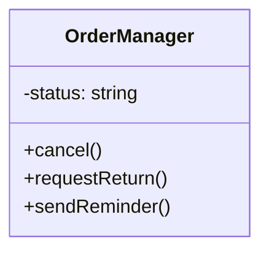
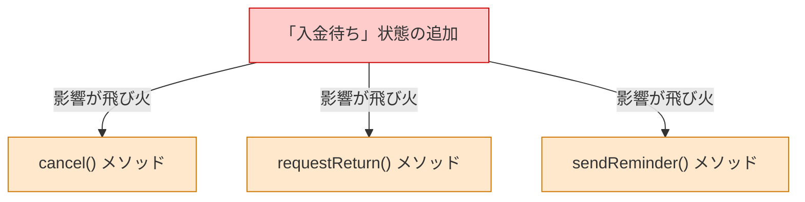
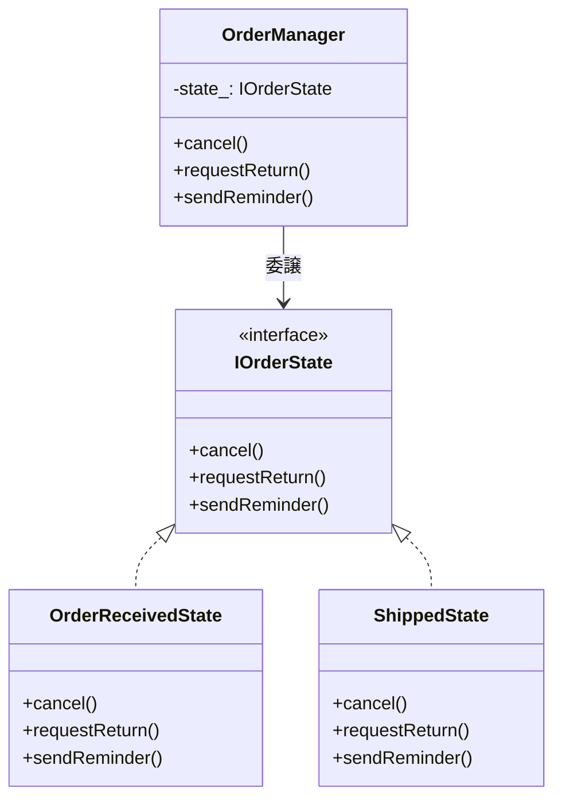
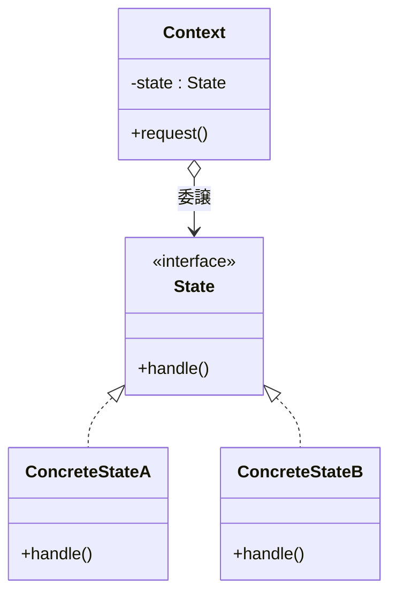

# 第3章　状態によって変わる振る舞いをどう整理するか（State）
―― 思考の型：「状態」と「それに伴う振る舞い」がメソッドごとに散らばっていることに気づく

> **この章の核心**
> 状態が1つ増えたとき、複数のメソッドを同時に修正しなければならないなら、
> 「状態ごとの振る舞い」が1か所にまとまっていない証拠だ。
> 状態そのものを独立したオブジェクトにすれば、分岐は消滅する。

---

## ステップ0：システムを把握し、仮説を立てる ―― クラス構成を見てから「変わりそうな場所」を予測する

> **入力：** システムのシナリオ説明 ＋ クラス構成の概要（仕様表・責任一覧）。実装コードはまだ読まない。
> **産物：** 変動と不変の「仮説テーブル」

**【全パターン共通の問い】**

> 「このコードの中に、**『変わる理由』が異なる2つのものが、
> 同じ場所に混在していないか？」**

「変わる理由」とは **「誰の判断で変わるか」** のことです。

### 3.0 この章のシステム構成と仮説

**この章で扱うシステム：**
ECサイトの注文ステータスを管理するシステムです。
注文には「注文受付」→「入金確認」→「発送済み」→「完了」というステータス（状態）があり、
現在の状態によって「キャンセル」「返品」「催促メール送信」という操作が実行できるかどうかが変わります。

**仕様表（何ができるシステムか）**

| 機能 | 担当 | 入力 | 出力 |
|---|---|---|---|
| 注文のキャンセル | `cancel` | （現在状態） | 状態の変更、または失敗 |
| 返品の申請 | `requestReturn` | （現在状態） | 状態の変更、または失敗 |
| 催促メール送信 | `sendReminder` | （現在状態） | メール送信、またはスキップ |

**クラス構成の概要**



*→ `OrderManager` がすべての状態を持ち、すべての操作を受け付けている。
「この状態のときは何ができるか」という知識がこのクラスに集約されているように見える。*

**各クラスの責任一覧**

| 対象 | 責任（1文） | 知るべきこと |
|---|---|---|
| `OrderManager` | 注文の状態遷移と操作を統括する | 各ステータスのルール |

---

この構成を踏まえた上で、仮説を立てます。

**変動と不変の仮説（実装コードを読む前に立てる）**

| 分類 | 仮説 | 根拠（クラス構成から読み取れること） |
|---|---|---|
| 🔴 **変動する** | 状態の数（新しいステータスの追加） | 業務要件によって管理したい段階は増減するはず |
| 🔴 **変動する** | 状態ごとに「何ができるか」のルール | 顧客対応ポリシーの変更で変わる |
| 🟢 **不変** | 「注文を管理する」という業務の存在 | ECサイトの根幹機能 |

この仮説をステップ2（3.3）でヒアリング後に確定します。

---

## ステップ1：実装コードを読む ―― 責任チェックで問題の行を見つける

> **入力：** ステップ0で把握したクラス責任 ＋ 実際の実装コード
> **産物：** 責任チェック表。「このクラスが持つべきでない知識」が混在している行の発見。

### 3.1 実装コードと責任チェック

ステップ0でクラスの責任は把握しました。
ここでは実際の実装コードを読み、「責任通りに書かれているか」を確認します。

```cpp
// 注文ステータス管理
// OrderManager.cpp

#include <iostream>
#include <string>

class OrderManager {
public:
    OrderManager() : status_("OrderReceived") {}

    void cancel() {
        if (status_ == "OrderReceived" || status_ == "PaymentConfirmed") {
            std::cout << "注文をキャンセルしました。\n";
            status_ = "Cancelled";
        } else {
            std::cout << "エラー：発送済み以降はキャンセルできません。\n";
        }
    }

    void requestReturn() {
        if (status_ == "Shipped" || status_ == "Completed") {
            std::cout << "返品申請を受け付けました。\n";
            status_ = "Returned";
        } else {
            std::cout << "エラー：発送前の商品は返品申請できません。\n";
        }
    }

    void sendReminder() {
        if (status_ == "OrderReceived") {
            std::cout << "入金の催促メールを送信しました。\n";
        } else {
            // 他の状態では何もしない
        }
    }

    void setStatus(const std::string& status) {
        status_ = status;
    }

private:
    std::string status_;
};

int main() {
    OrderManager order;
    order.cancel(); // 注文受付時なのでキャンセル可能
    return 0;
}
```

**実行結果：**
```
注文をキャンセルしました。
```

このコードは動きます。しかし、構造としての問題を探すために**責任チェック**を行います。

**責任チェック：`OrderManager` は自分の責任だけを持っているか**

`OrderManager` の責任は「注文の状態遷移と操作を統括すること」です。

| コードの行 | 持っている知識 | 責任内か |
|---|---|---|
| `if (status_ == "OrderReceived")` | 「注文受付状態」のキャンセルルール | △ （ルールが各メソッドに散らばっている） |
| `if (status_ == "Shipped")` | 「発送済み状態」の返品ルール | △ （同上） |

現状、`OrderManager` 自体がルールを持っていること自体は、クラスの責任（統括）から外れてはいません。
しかし、その**知識の持ち方**に問題があります。
「注文受付状態」に関するルールが、`cancel` と `sendReminder` の両方に引き裂かれて（分散して）存在しています。

---

### 3.2 届いた変更要求

営業企画部門から要件追加の連絡が入りました。

「振り込みの遅いお客様のために、**『入金待ち』**という新しいステータスを追加したい。
入金確認前の猶予期間とし、この状態でもキャンセルと催促メール送信は可能にしてほしい。来週のリリースで頼む。」

---

## ステップ2：仮説を確定する ―― 関係者ヒアリングで「変わる理由」に根拠をつける

> **入力：** ステップ0の仮説 × ステップ1の責任チェック結果。関係者に直接確認する。
> **産物：** 確定した変動/不変テーブル（「誰の判断で変わるか」明記）

### 3.3 仮説の検証と変動/不変の確定

コード上で、ステータスの条件分岐が各メソッドに散らばっていることが確認できました。
ヒアリングで仮説を確定させます。

**関係者ヒアリング**

> **開発者**：「今後も、今回のように『新しい状態（ステータス）』が増えることはありますか？」
>
> **営業企画**：「はい、運用に応じて細かく分けていきたいです。例えば『一時停止中』や『配送トラブル対応中』なども検討しています。」
>
> **開発者**：「各状態での『何ができるか』のルールも変わりますか？」
>
> **カスタマーサポート**：「しょっちゅう変わります。トラブル時は特例でキャンセルできるようにしたり、通知を送らないようにしたりと、状態ごとの対応手順は随時見直しています。」

| 分類 | 具体的な内容 | 変わるタイミング | 根拠 |
|---|---|---|---|
| 🔴 **変動する** | 状態の数（新しい状態の追加） | 業務フロー変更のたびに | 営業企画・サポートの要望 |
| 🔴 **変動する** | 状態ごとに許可される操作 | 顧客対応ポリシー変更のたびに | サポートの要望 |
| 🟢 **不変** | 「キャンセル」「返品」「催促」という操作の口（インターフェース） | 変わらない | 注文管理の基本要件 |

> **設計の決断**：🟢 不変な操作の口を固定し、
> 🔴 変動する「状態」をそれぞれ独立させて裏側に押し込む。

---

## ステップ3：課題分析 ―― 変更が来たとき、どこが辛いかを確認する

「入金待ち（WaitingForPayment）」という新しい状態を追加しようとすると何が起きるでしょうか。

```cpp
// cancel() を開いて修正
void cancel() {
    if (status_ == "OrderReceived" || status_ == "PaymentConfirmed" || 
        status_ == "WaitingForPayment") { // ← 追加
        // ...
    }
}

// requestReturn() を開いて修正（この状態では不可であることを確認）

// sendReminder() を開いて修正
void sendReminder() {
    if (status_ == "OrderReceived" || status_ == "WaitingForPayment") { // ← 追加
        // ...
    }
}
```

状態が1つ増えるたびに、**すべてのメソッド（`cancel`, `requestReturn`, `sendReminder`）を開いて、新しい `if` を書き足して回る**必要があります。
もし一つでも修正から漏れれば、それは「状態と操作の不整合」という重大なバグになります。

**依存の広がり**



---

## ステップ4：原因分析 ―― 困難の根本にある設計の問題を言語化する

| 観察 | 原因の方向 |
|---|---|
| 状態が1つ増えると、3つのメソッドすべてを修正しなければならない | 「状態ごとの振る舞い」が各メソッドに分散しているから |

#### 変わるものと変わらないものが同じ場所にいる

| 変わり続けるもの | 変わってほしくないもの |
|---|---|
| 状態の数と、その状態での各振る舞い | 注文というオブジェクトの存在、外から呼ばれるメソッドの種類 |

状態と振る舞いのマトリクス（表）が、コード上では「メソッドごとのif文」としてバラバラに縦割りされています。そのため、「ある特定の状態のときにどう振る舞うか」を俯瞰することができません。

---

## ステップ5：対策案の検討 ―― 原因から手札を選び、構造を作る

ステップ4の結論に対して、第0章の「構造的対策（手札）の網羅的リスト」から対応する手札を選びます。

- **特定した原因（何が変わるのか）：** オブジェクトの状態とそれに伴う振る舞いが増減・変化する
- **選ぶ手札（設計の構造的対策）：** 状態のオブジェクト化

この手札を今のコードに適用するために、段階的に試みを行います。

### 3.4 試み①：EnumとSwitch文に統一する（手札適用前）

まず、散らばった `if` を `switch` 文に整理してみます。

```cpp
enum class OrderStatus { Received, Waiting, Confirmed, Shipped, Completed };

void OrderManager::cancel() {
    switch (status_) {
        case OrderStatus::Received:
        case OrderStatus::Waiting:
        case OrderStatus::Confirmed:
            std::cout << "キャンセルしました。\n"; break;
        default:
            std::cout << "エラー。\n"; break;
    }
}
// 他のメソッドも同様に switch(status_) を書く
```

**試み①の限界**
見た目は少し整いましたが、**「状態が増えたらすべてのメソッド（switch文）を開く」という根本原因は全く解決していません。** 状態が10個になれば、巨大なswitch文がメソッドの数だけ増殖します。

---

### 3.5 試み②：状態をオブジェクト化する（Stateパターン）

「状態ごとの振る舞い」を分離するためには、「状態」そのものをクラスとして切り出します。
「今の状態オブジェクト」に操作を委譲すれば、巨大な分岐は消滅します。

```cpp
// 状態の契約（インターフェース）
class IOrderState {
public:
    virtual void cancel() = 0;
    virtual void requestReturn() = 0;
    virtual void sendReminder() = 0;
    virtual ~IOrderState() {}
};
```

各状態クラスは、「自分の状態のときに何をするか」だけを持ちます。

```cpp
// 注文受付状態
class OrderReceivedState : public IOrderState {
public:
    void cancel() override {
        std::cout << "注文をキャンセルしました。\n";
    }
    void requestReturn() override {
        std::cout << "エラー：発送前は返品できません。\n";
    }
    void sendReminder() override {
        std::cout << "入金の催促メールを送信しました。\n";
    }
};

// 発送済み状態
class ShippedState : public IOrderState {
public:
    void cancel() override {
        std::cout << "エラー：発送済み以降はキャンセルできません。\n";
    }
    void requestReturn() override {
        std::cout << "返品申請を受け付けました。\n";
    }
    void sendReminder() override {
        // 何もしない
    }
};
```

そして `OrderManager` は、状態の判断をしません。「今の状態」に委譲するだけです。

```cpp
// OrderManager（手札適用後）
class OrderManager {
public:
    OrderManager(IOrderState* initialState) : state_(initialState) {}

    void cancel()        { state_->cancel(); }
    void requestReturn() { state_->requestReturn(); }
    void sendReminder()  { state_->sendReminder(); }

    void changeState(IOrderState* newState) {
        state_ = newState;
    }

private:
    IOrderState* state_;
};
```



**手札適用後の責任チェック**

| コードの行 | 持っている知識 | 責任内か |
|---|---|---|
| `state_->cancel()` | 「現在の状態オブジェクトに処理を委ねる」という骨格 | ✅ OrderManagerの責任 |

`if (status_ == ...)` という分岐がすべて消滅しました。
この「状態をクラスとして抽出し、委譲によって振る舞いを切り替える構造」こそが **Stateパターン** です。

---

### 3.6 評価軸の宣言

| 評価軸 | なぜこの状況で重要か |
|---|---|
| 状態追加コスト | 新しい状態を追加した際、既存コードを壊すリスクがないか |
| 凝集度 | 「この状態では何ができるか」が一覧して見やすいか |

---

### 3.7 各アプローチを比較する

**比較のまとめ**

| 基準 | 試み①（Switch文） | 試み②（手札：状態のオブジェクト化） |
|---|---|---|
| 状態追加コスト | ❌ 全メソッドのswitch文を開いて修正が必要 | ⭕ 新しい状態クラスを追加するだけ |
| 凝集度 | ❌ 状態の振る舞いが各メソッドに散らばる | ⭕ 1つの状態クラスを見れば全振る舞いがわかる |

---

## ステップ6：天秤にかける ―― 柔軟性とシンプルさのバランスを評価する

### 3.8 耐久テスト ―― ヒアリングで挙がった変化が来た

3.3のヒアリングで挙がった、さらに高度な要求をシミュレートします。
「トラブル発生時に操作をすべて一時停止する**『一時停止状態（Suspended）』**を追加したい」

手札適用後の設計なら、新しいクラスを作るだけです。

```cpp
class SuspendedState : public IOrderState {
public:
    void cancel() override {
        std::cout << "エラー：一時停止中はキャンセルできません。\n";
    }
    void requestReturn() override {
        std::cout << "エラー：一時停止中は返品申請できません。\n";
    }
    void sendReminder() override {
        // 催促も送らない
    }
};
```

既存の `OrderManager` や `OrderReceivedState` を**一切変更せずに**、新しい状態とその複雑なルールを追加できました。「既存コードへの影響ゼロ」が、この手札の真の価値です。

---

### 3.9 使う場面・使わない場面

| 状況 | 適切な選択 | 理由 |
|---|---|---|
| 状態が4つ以上あり、今後も増える | 状態のオブジェクト化（State） | 状態追加時の修正漏れバグを防げるため |
| 状態ごとに振る舞いが大きく異なる | 状態のオブジェクト化（State） | 状態クラスの凝集度が高まり読みやすくなるため |
| 状態が2〜3個で、ただのフラグ | if/switch文 | クラスを作るコストが見合わないため |

---

## ステップ7：決断と、手に入れた未来

### 3.10 変更シナリオ表と最終責任テーブル

**変更シナリオ表：何が変わったとき、どこが変わるか**

| シナリオ | 変わるクラス | 変わらないクラス |
|---|---|---|
| 「入金待ち」状態の追加 | `WaitingState` クラス（新規追加） | `OrderManager`、他の全状態クラス |
| 「注文受付」時のキャンセル不可ルールへの変更 | `OrderReceivedState` のみ | `OrderManager`、他の全状態クラス |

**最終責任テーブル**

| クラス | 責任（1文） | 変わる理由 |
|---|---|---|
| `OrderManager` | 現在の状態を保持し、操作を委譲する | 操作の口（インターフェース）が変わるとき |
| `OrderReceivedState` | 「注文受付」状態での各振る舞いを定義する | 受付時のビジネスルールが変わるとき |
| `ShippedState` | 「発送済み」状態での各振る舞いを定義する | 発送後のビジネスルールが変わるとき |

---

## 整理

### 8ステップとこの章でやったこと

| ステップ | この章でやったこと |
|---|---|
| ステップ0 | システム構成から「状態」が変化の軸になると仮説を立てた |
| ステップ1 | 状態判定の分岐が複数のメソッドに散らばっている事実を確認した |
| ステップ2 | ヒアリングで「状態の種類」と「状態ごとのルール」が変わることを確定させた |
| ステップ3 | 状態を追加するたびに全メソッドを開く痛みをシミュレートした |
| ステップ4 | 「状態とそれに伴う振る舞いが分散している」ことを原因と特定した |
| ステップ5 | 原因から「状態のオブジェクト化」という手札を選び、構造を作った |
| ステップ6 | さらに新しい状態（一時停止）を追加し、影響がゼロであることを確認した |
| ステップ7 | 各クラスが「自分の状態のルール」だけを持つ責任体制を確立した |

このプロセスを回した結果にたどり着いた構造こそが **Stateパターン** です。

---

## 振り返り：第0章の3つの哲学はどう適用されたか

### 哲学1「変わるものをカプセル化せよ」の現れ

**具体化された場所：** 各状態クラス（`OrderReceivedState` など）

「状態が追加されること」「状態ごとのルールが変わること」という変化の要因を、それぞれのクラスに閉じ込めました。結果として、OrderManagerから分岐が消えました。

### 哲学2「実装ではなくインターフェースに対してプログラムせよ」の現れ

**具体化された場所：** `IOrderState` インターフェース

OrderManagerは「今の状態が『注文受付クラス』である」という実装を知りません。「状態の契約（`IOrderState`）」に対して操作を委譲しているだけなので、未知の新しい状態クラスが渡されても正常に動きます。

---

## パターン解説：Stateパターン

### パターンの骨格

状態ごとの振る舞いを別々のクラスにカプセル化し、現在の状態を表すオブジェクトを切り替えることで、振る舞いを変更する構造です。



- **Context（状況）**：現在の状態オブジェクトを保持し、クライアントからの操作を受け取る。
- **State（状態）**：各状態が共通で持つべきメソッドの契約を定義する。
- **ConcreteState（具体的な状態）**：「この状態のときはどう振る舞うか」を実装する。

### どんな構造問題を解くか

「もし今の状態がAなら処理1、Bなら処理2…」という分岐が、複数のメソッドにまたがって増殖してしまう問題を解きます。
「メソッドの中に状態分岐を書く」のではなく、「状態の中にメソッドを書く」という発想の転換により、if文を多態性（ポリモーフィズム）に置き換えます。
