## 第3章 状態ごとの振る舞いを分離する ―― State パターン

―― 思考の型：状態によって振る舞いが変わる処理が、条件分岐で混在している

### この章の核心

**予約状態が1つ増えるたびに、予約・支払い・キャンセルなど複数の処理で条件分岐を書き直す必要が生じる。こういう問題は、「状態」と「状態ごとの振る舞い」が同じ場所に文字列や分岐として混在しているシステムで起きている。**

### この章を読むと得られること

この章の痛みは「状態が1つ増えるたびに、すべての処理分岐を書き直さなければならない」という問題です。

* **得られること1：** 「状態の変化に伴う振る舞いの切り替え」という観点で、コードの変動箇所を識別できるようになる
* **得られること2：** 条件分岐が複雑に絡み合ったクラスを見て、そこが状態管理の痛みの発生源だと判断できるようになる
* **得られること3：** 状態ごとの振る舞いを別クラスに分離することで、条件分岐を排除した構造改善の説明ができるようになる
* **得られること4：** 状態が増える可能性がある設計において、既存のフローを壊さずに状態を追加する判断ができるようになる

## 🔵 フェーズ1：現状把握 ―― 仕様を整理し、システムと紐付ける
はじめに、チケット予約管理システムの現状を整理します。

このシステムが受け取る入力、内部で行う判定、返す出力を整理します。

### 1-1：このシステムの仕様

このシステムは、イベントごとに**チケット予約の状態を管理**します。イベントIDを指定して、予約・支払い・キャンセルなどの操作を行う小さな予約管理システムです。

各予約は「予約可能（Available）」「予約済み（Reserved）」「支払済み（Paid）」の3つの状態を持ちます。お客様の操作（予約・支払・キャンセル）に応じて状態が遷移し、状態によって許可される操作が異なります。

この章で扱う現状仕様は、次の範囲です。

| 仕様項目   | この章で扱う値        | 具体例                | 何に使うか                                                                               |
| ------ | -------------- | ------------------ | ----------------------------------------------------------------------------------- |
| イベントID | 予約対象のイベント | EVT001=春の音楽祭、EVT002=夏のフェス、EVT003=秋の映画会 | イベントの存在と空席を確認する |
| 操作     | 予約・支払・キャンセル    | 予約する、支払う、キャンセルする   | 現在状態で許可される操作かを判定する                                                                  |
| 予約状態   | 予約可能・予約済み・支払済み | 予約可能から予約済みへ変わる     | 操作後に次の状態へ遷移する                                                                       |
| 出力     | 操作結果と状態変化      | 予約完了、満席エラー、操作不可エラー | 状態が変わる結果と変わらない結果を照合する                                                               |

ここで確認する対象は、どの状態でどの操作が許可され、どの結果になるかです。

この章では、利用者が「現在状態」を毎回指定するのではありません。現在状態は `TicketReservation` が保持し、利用者はイベントIDと操作を指定します。状態は操作のたびにシステム内部で読み出され、更新されます。

**仕様整理図：保存データとアクセス関係**

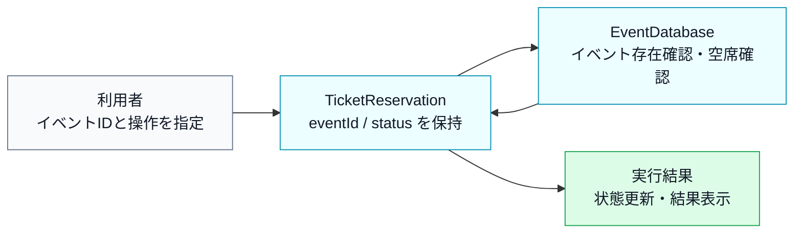

上の文章と表で仕様を一通り確認したので、まず正常に状態更新できる場合の入力・判定・加工・出力の流れとして整理します。

**仕様整理図：正常系の入力・判定・加工・出力**

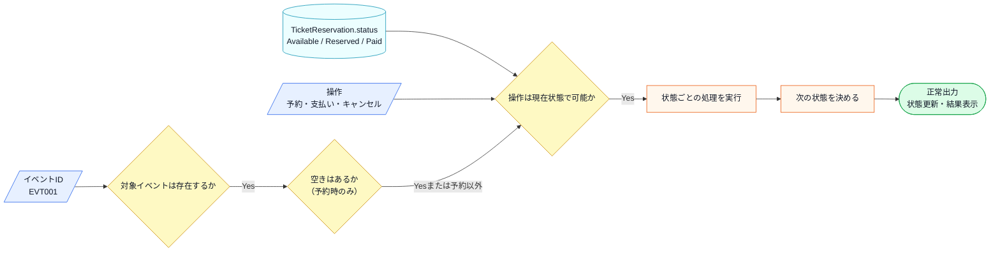

この図から読み取ることは、次の3点です。

- 同じ操作でも、現在の予約状態によって受け付けられるかどうかが変わる。
- 状態更新へ進む前に、イベントの存在、空席、操作可否を順に確認する必要がある。
- 正常系では、現在状態と操作から次の状態を決め、状態更新と結果表示を行う。

**状態遷移マトリクス**

この表は、現在の状態ごとに、各操作を受け付けたとき次にどの状態へ進むかを整理したものです。行は「いまの状態」、列は「利用者が行う操作」、セルは「操作後の状態」を表します。予約可能な状態で予約すると予約済みに進み、予約済みの状態で支払うと支払済みに進む、という基本の流れを確認します。

| 現在の状態 | 予約する | 支払う | キャンセルする |
|---|---|---|---|
| Available（予約可能） | → Reserved | —— | —— |
| Reserved（予約済み） | —— | → Paid | → Available |
| Paid（支払済み） | —— | —— | —— |

「——」は、その状態では操作を受け付けず、エラーメッセージを出力して終了することを表します。これは表の中心ではなく、基本の状態遷移に当てはまらない操作を明示するための記号です。

表の各行に着目すると、それぞれのルールには明確な業務上の理由があります。

- **Available（予約可能）で「支払う」「キャンセルする」が——の理由**：予約が存在しない状態で支払いを受け付けると「どの予約に対する支払いか」が確定しません。キャンセルについても、そもそも予約がなければキャンセルする対象がなく、操作自体が無意味です。
- **Reserved（予約済み）で「予約する」が——の理由**：同じ予約枠を二重予約することは、業務上あり得ないためです。
- **Paid（支払済み）でのすべての操作が——の理由**：支払いが完了した予約は「確定済み」扱いになります。この状態からのキャンセルを認める場合は、返金処理・在庫の戻し・会計記録の修正など、複数の業務プロセスが連動して動く必要があります。この章では、返金処理はこの章の設計論点から外れるため扱いません。キャンセルポリシーを設ける場合は、「キャンセル済み（Cancelled）」という別の状態を追加して対応できます。

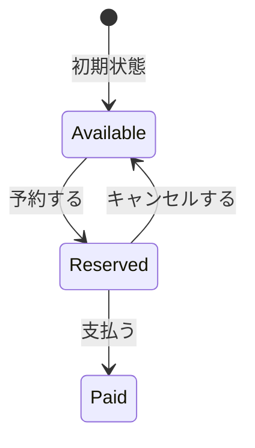

このマトリクスが、後のフェーズで「新しい状態が増えるとどこが変わるか」を確認する基準になります。

**エラー条件**

正常系の仕様を一通り確認したうえで、最後に、状態更新へ進めない入力や操作を分けて整理します。

| エラー条件 | どこで分かるか | 出力 | 状態保存・通知 |
|---|---|---|---|
| イベントIDが存在しない | `EventDatabase` の存在確認時 | 対象なしエラー | `TicketReservation.status` は変更しない |
| 予約時に空席がない | `EventDatabase` の空席確認時 | 満席エラー | `TicketReservation.status` は変更しない |
| 現在状態では操作できない | `TicketReservation.status` と操作の組み合わせ確認時 | 操作不可エラー | `TicketReservation.status` は変更しない |

---

### 1-2：動作例テーブル

コードを読む前に、このシステムがどんな入力に対してどんな出力を返すかを確認します。この章のどのステップも、以下の動作を実現します。

| ケース | 入力 | 加工 | 出力 |
|---|---|---|---|
| ケース1：予約して支払う | 空きありイベント / 予約する → 支払う | 空きありのイベントを予約し、予約済みから支払いへ進める | 予約対象、予約完了、支払い完了 |
| ケース2：予約してキャンセルする | 空きありイベント / 予約する → キャンセルする | 空きありのイベントを予約し、予約済みから予約可能へ戻す | 予約対象、予約完了、キャンセル完了 |
| ケース3：満席イベントを予約する | 満席イベント / 予約する | 満席イベントを検出する | 満席エラー |
| ケース4：存在しないイベントを予約する | 存在しないイベント / 予約する | 存在しないイベントIDを検出する | イベントID不存在エラー |
| ケース5：予約前に支払う | 空きありイベント / 支払う | 予約可能状態で支払いを試みる | 支払い不可エラー |
| ケース6：支払後にキャンセルする | 空きありイベント / 予約する → 支払う → キャンセルする | 支払済み状態でキャンセルを試みる | キャンセル不可エラー |

確認したいことは、通常の予約・支払いフロー、キャンセルフロー、予約前の外部条件による拒否、状態に合わない操作の拒否が、それぞれ入力と出力で対応していることです。

この動作テーブルは、後のフェーズでステップを比較するときに「同じ入力なら同じ出力を返すことで動作不変を確認する」ための基準として使います。この章で変えたいのは内部の構造であり、利用者から見える動作ではありません。

---

### 1-3：登場クラスとクラス構成図

#### このシステムの登場クラス

| クラス名 | 役割 | 担当する仕様 |
|---|---|---|
| EventDatabase | イベント情報の保持と検索 | イベントIDの存在確認・満席判定 |
| TicketReservation | チケット予約の状態管理と各状態の振る舞い | `Available` / `Reserved` / `Paid` の状態遷移 |

データの流れは、次のように分かれます。

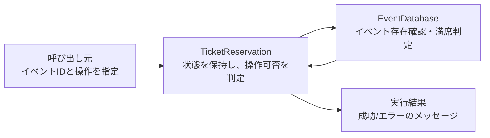

**クラス図に出てくる主なメンバーと操作**

| クラス | メンバー・操作 | 何ができるか |
|---|---|---|
| `EventDatabase` | `records` | イベントIDごとの情報を保持する |
| `EventDatabase` | `exists()` / `get()` / `hasCapacity()` | 対象イベントの存在確認、情報取得、満席判定を行う |
| `TicketReservation` | `db` / `eventId` / `status` | 予約対象イベントと現在状態を保持する |
| `TicketReservation` | `reserve()` / `pay()` / `cancel()` | 現在状態に応じて予約、支払い、キャンセルを実行する |
| `TicketReservation` | `handleReserveError()` など | 操作できない状態のエラーを返す |


各クラスの役割を把握したところで、クラス間の関係を図で整理します。

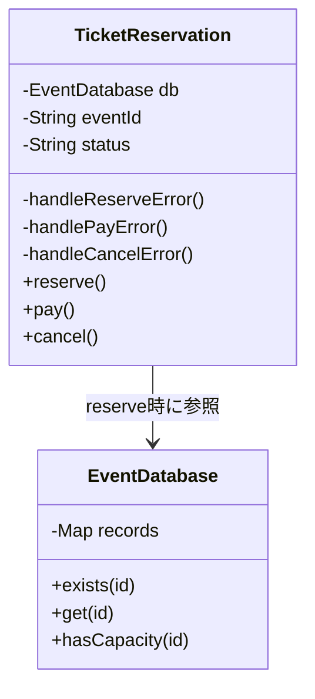

この図から分かるのは、予約する、支払う、キャンセルするという操作が同じ予約管理クラスに集まっていることです。各操作の中で状態をどう判定しているかは、次の実装コードで確認します。


**この章での簡略化**

1-3でクラス構成を確認したので、掲載コードで何を代替しているかを整理してからフェーズ1の現状コードへ進みます。

この章の主役は、`Available` / `Reserved` / `Paid` という**予約状態に応じて振る舞いが切り替わる部分**です。イベントIDの存在確認や満席判定は、実際の予約システムなら必要な周辺処理ですが、この章の設計論点ではありません。そのため、この章では `EventDatabase` というメモリ上の簡易データで表現し、データベース接続、同時予約制御、決済API、発券処理は扱いません。

---

### 1-4：実装コード（現状）

#### コードを読む前に：クラスの責任と境界

| 対象 | 呼び出しと内部処理 | 戻り値・副作用 | 掲載上の表現 |
|---|---|---|---|
| `EventDatabase` | イベントIDで空席を確認し予約数を増減する | 更新後の`reserved` | `std::map`をイベントDBとして使う |
| `TicketReservation` | 利用者操作を受け現在状態で可否を決める | 状態遷移とメッセージ | 決済・発券は論点外とする |
| 例外 | 確認なしの満席更新を拒否する | `runtime_error` | 通常の満席は戻り値で先に判定する |

実DB、同時予約の排他制御、決済APIは省略します。省略しても、予約成功で件数を増やし、キャンセル・期限切れで減らすという在庫の契約はコードに残します。

このシステムには以下の3件のイベントデータがあらかじめ登録されています。

| イベントID | タイトル | 定員 | 現在の予約数 |
|---|---|---|---|
| EVT001 | 春の音楽祭 | 100 | 20（空きあり） |
| EVT002 | 夏のフェス | 500 | 499（残り1席） |
| EVT003 | 秋の映画会 | 50 | 50（満席） |

コードを読む前に、どのIDが満席でどのIDに空きがあるかを把握しておくと、動作結果と仕様の対応が追いやすくなります。予約が成功するとメモリ上の `reserved` を1増やし、予約済み状態でキャンセルすると1減らします。たとえばEVT002は499件から予約すると500件で満席になり、その予約をキャンセルすると499件へ戻ります。

このコードの `std::map` はイベントIDから `EventInfo` を引くメモリ上のイベント表です。`at(id)` は存在確認済みのIDに対応するデータを取得します。`throw std::runtime_error(...)` は、満席という前提違反を呼び出し元へ例外として通知する記法です。通常の満席判定は先に `hasCapacity()` で行い、例外は確認を飛ばして更新しようとした場合の安全網として使います。

コードは責任の固まりごとに分けて読みます。

**① イベント在庫を表すクラス（EventInfo / EventDatabase）**

最初に、1-1の「イベント」にあたるデータと在庫を持つ部分です。イベントIDから定員・予約数を引き、予約成功で件数を増やし、キャンセルで減らす在庫の役割を担います。エラー条件「存在しないID」「満席」もここで判定します。

```cpp
#include <iostream>
#include <string>
#include <map>
#include <stdexcept>

struct EventInfo {
    std::string title;   // イベント名
    int capacity;        // 定員
    int reserved;        // 現在の予約数
};

class EventDatabase {
private:
    std::map<std::string, EventInfo> records;
public:
    EventDatabase() {
        records["EVT001"] = {"春の音楽祭",  100,  20};
        records["EVT002"] = {"夏のフェス",  500, 499};
        records["EVT003"] = {"秋の映画会",   50,  50};  // 満席
    }

    bool exists(const std::string& id) const {
        return records.count(id) > 0;
    }

    EventInfo get(const std::string& id) const {
        return records.at(id);
    }

    bool hasCapacity(const std::string& id) const {
        const auto& e = records.at(id);
        return e.reserved < e.capacity;
    }

    void reserveSeat(const std::string& id) {
        ++records.at(id).reserved;
    }

    void cancelSeat(const std::string& id) {
        auto& e = records.at(id);
        if (e.reserved > 0) --e.reserved;
    }

    void save(const std::string& id, const EventInfo& info) {
        records[id] = info;             // 実行中のイベント表へ追加
    }
};
```

`EventDatabase` は `std::map` でイベントIDと `EventInfo` を対応付けた在庫データです。`exists()` でIDの存在確認、`hasCapacity()` で空席判定、`reserveSeat()` / `cancelSeat()` で予約数を増減します。実システムのDBを、この章では実行終了まで覚えているインメモリの登録表で代替しています。

**② 予約操作をまとめるクラス（TicketReservation）**

この章の中心です。1-1の「予約・支払い・キャンセル」という利用者操作を受け取り、現在の状態（Available / Reserved / Paid）に応じて可否を判定してから在庫を更新します。

```cpp
class TicketReservation {
private:
    EventDatabase& db;
    std::string eventId;
    std::string status; // "Available", "Reserved", "Paid"

    void handleReserveError() {
        std::cout << "現在予約できません\n";
    }

    void handlePayError() {
        std::cout << "支払いに適した状態ではありません\n";
    }

    void handleCancelError() {
        std::cout << "キャンセルできません\n";
    }

public:
    TicketReservation(EventDatabase& db, const std::string& eventId)
        : db(db), eventId(eventId), status("Available") {}

    void reserve() {
        if (!db.exists(eventId)) {
            std::cout << "エラー：イベントID " << eventId << " は存在しません\n";
            return;
        }
        if (!db.hasCapacity(eventId)) {
            std::cout << "エラー：" << db.get(eventId).title << " は満席です\n";
            return;
        }
        if (status == "Available") {
            db.reserveSeat(eventId);
            status = "Reserved";
            std::cout << "予約対象：" << db.get(eventId).title << "\n";
            std::cout << "予約完了しました\n";
        } else {
            handleReserveError();
        }
    }

    void pay() {
        if (status == "Reserved") {
            status = "Paid";
            std::cout << "支払い完了しました\n";
        } else {
            handlePayError();
        }
    }

    void cancel() {
        if (status == "Reserved") {
            db.cancelSeat(eventId);
            status = "Available";
            std::cout << "予約をキャンセルしました\n";
        } else {
            handleCancelError();
        }
    }
};
```

このコードを見ると、`reserve`、`pay`、`cancel` の各メソッドの中に、現在の `status` を判定する条件分岐が散らばっていることが分かります。

**③ 実行して動作例と照合する（main）**

このクラスを呼び出す `main` 関数と実行結果を合わせて示します。

```cpp
int main() {
    EventDatabase db;

    // 行1: 正常な予約から支払いまで
    std::cout << "--- 行1: EVT001 予約 → 支払い ---\n";
    TicketReservation seat1(db, "EVT001");
    seat1.reserve();  // Available → Reserved
    seat1.pay();      // Reserved  → Paid

    // 行2: 予約からキャンセルまで
    std::cout << "\n--- 行2: EVT001 予約 → キャンセル ---\n";
    TicketReservation seat2(db, "EVT001");
    seat2.reserve();  // Available → Reserved
    seat2.cancel();   // Reserved  → Available

    // 行3: 満席イベントへの予約試み
    std::cout << "\n--- 行3: EVT003 満席イベントへの予約 ---\n";
    TicketReservation seat3(db, "EVT003");
    seat3.reserve();  // エラー（満席）

    // 行4: 存在しないイベントへの予約試み
    std::cout << "\n--- 行4: UNKNOWN 存在しないイベントへの予約 ---\n";
    TicketReservation seat4(db, "UNKNOWN");
    seat4.reserve();  // エラー（存在しない）

    // 行5: 状態エラー — 予約前に支払いを試みる
    std::cout << "\n--- 行5: 予約なしで支払いを試みる ---\n";
    TicketReservation seat5(db, "EVT001");
    seat5.pay();      // エラー（Available状態）

    // 行6: 状態エラー — 支払い済みをキャンセルしようとする
    std::cout << "\n--- 行6: 支払い済みをキャンセルしようとする ---\n";
    TicketReservation seat6(db, "EVT001");
    seat6.reserve();  // Available → Reserved
    seat6.pay();      // Reserved  → Paid
    seat6.cancel();   // エラー（Paid状態）

    return 0;
}
```

実行対象コード：1-4の現状コード
対応する動作例：ケース1〜ケース6
確認したいこと：イベントID検証・満席判定・状態遷移の結果が、動作例テーブルと対応していること

実行結果：

```
--- 行1: EVT001 予約 → 支払い ---
予約対象：春の音楽祭
予約完了しました
支払い完了しました

--- 行2: EVT001 予約 → キャンセル ---
予約対象：春の音楽祭
予約完了しました
予約をキャンセルしました

--- 行3: EVT003 満席イベントへの予約 ---
エラー：秋の映画会 は満席です

--- 行4: UNKNOWN 存在しないイベントへの予約 ---
エラー：イベントID UNKNOWN は存在しません

--- 行5: 予約なしで支払いを試みる ---
支払いに適した状態ではありません

--- 行6: 支払い済みをキャンセルしようとする ---
予約対象：春の音楽祭
予約完了しました
支払い完了しました
キャンセルできません
```

`main()` はイベントIDと操作の組み合わせを指示するだけで、存在確認・満席判定・状態チェックはすべて `TicketReservation` 内部で行っています。

> **手元で動かすには**
> このコードは1つの `.cpp` に貼り付けて、そのままコンパイル・実行できます（例：`g++ chapter03.cpp -o app && ./app`）。`main()` は自由に組み替えて構いません。たとえば `db.save("EVT010", {"冬の演劇祭", 80, 0});` でイベントを足し、`TicketReservation seat(db, "EVT010");` を作って `reserve()` や `pay()` を呼べば、追加したイベントの予約と状態遷移がその場の実行結果に表れます。イベントデータはプロセス実行中だけ有効で、終了すると消えます（DBのような永続化はこの章の論点ではありません）。

次のフェーズで変更が来たときに何が起きるかを確認します。

---

### 1-5：変更要求

ある週明けの朝、イベント運営担当から開発チームへ、新しい施策についての連絡が入りました。

「来月から、リピーター向けに『キャンセル待ち』機能を実装したいのです。予約枠がいっぱいの場合でも、空きが出たら自動的に予約が割り当てられるようにしたい。また、それに伴い『予約一時保留』という状態も追加してほしい。イベント開始の24時間前までなら、予約を確保したまま決済を24時間待つ仕組みです。」

運営担当は、この機能が実装されれば、直前キャンセルによる空き枠を減らし、収益が大きく改善すると期待しています。ここで整理しておくと、「キャンセル待ち」とは予約枠が満杯のときに空き待ちを登録する状態、「予約一時保留」とは予約を確保したまま決済の期限を延期する状態です。

実際の予約システムでは、入力は利用者のボタン操作だけではありません。キャンセルで空席が出たときの予約昇格イベント、保留期限を過ぎたときのタイマーイベント、決済APIから返る失敗結果も、予約状態を動かす入力になります。この章では、それらを「状態によって扱いが変わる入力」として同じ粒度で整理します。

**仕様変更の内容**

変更要求を受けて、状態の種類と遷移ルールがどう変わるかを整理します。

**状態の変化**

| 状態 | 変更前 | 変更後 |
|---|---|---|
| Available（予約可能） | あり | 変更なし |
| Reserved（予約済み） | あり | 変更なし |
| Paid（支払済み） | あり | 変更なし |
| **Waitlisted（キャンセル待ち）** | なし | **新規追加** |
| **Held（一時保留）** | なし | **新規追加** |

**新しく追加される遷移ルール**

| 現在の状態 | 操作 | 遷移先 | 処理内容 |
|---|---|---|---|
| Available | addToWaitlist | Waitlisted | キャンセル待ちリストに追加する |
| Waitlisted | upgrade | Reserved | 空きが出たので予約に昇格する |
| Reserved | hold | Held | 予約を確保したまま24時間決済を保留する |
| Held | pay | Paid | 保留期限内に決済を完了する |
| Held | expire | Available | 保留期限（24時間）が切れ、予約枠を空きに戻す |
| Reserved / Held | paymentFailed | Reserved / Held | 決済失敗を記録し、予約済みまたは保留中のまま再試行できる状態に戻す |

現状の `if` 文を使った状態分岐ロジックに、この2状態と、操作・イベントによる6種類の遷移/状態維持を追加することになります。

**この章が扱う複雑さ**

| 入力の種類 | 具体例 | 状態に与える影響 | この章で見ること |
|---|---|---|---|
| 利用者操作 | 予約、支払い、キャンセル、一時保留 | 現在状態に応じて許可/拒否と遷移先が変わる | 操作メソッドに状態分岐が増えるか |
| システムイベント | キャンセル待ちからの予約昇格 | 空席発生をきっかけに `Waitlisted` から `Reserved` へ進む | 利用者操作でなくても状態ごとの扱いが必要か |
| タイマー | 保留期限切れ | `Held` から `Available` へ戻り、枠を解放する | 時間起点の入力でも同じ接続点で扱えるか |
| 外部API結果 | 決済失敗 | `Reserved` または `Held` を維持し、再試行できる状態にする | 成功だけでなく失敗戻りも状態ごとの振る舞いか |

**仕様変更後の状態遷移マトリクス（全体像）**

この表は、既存の3状態に「キャンセル待ち」と「一時保留」を追加した後、各操作でどの状態へ進むかを整理したものです。状態と操作の組み合わせが増えたため、列数の都合で表を2つに分けています。「——」は、その状態では操作を受け付けず、エラーメッセージを出力して終了することを表します。

【表1：従来の操作】

`Waitlisted` は変更要求で初めて追加される状態です。従来は満席なら予約エラーで終了し、キャンセル待ちとして保存する機能自体がありませんでした。そのため従来の「予約する・支払う・キャンセルする」を `Waitlisted` に直接適用する欄は「——」です。キャンセル待ちからの操作は、直後の表2aにある専用イベント（登録・予約昇格）として扱います。

| 現在の状態 | 予約する | 支払う | キャンセルする |
|---|---|---|---|
| Available（予約可能） | → Reserved | —— | —— |
| Reserved（予約済み） | —— | → Paid | → Available |
| Paid（支払済み） | —— | —— | —— |
| Waitlisted（キャンセル待ち） | —— | —— | —— |
| Held（一時保留） | —— | → Paid | —— |

【表2a：キャンセル待ち系の操作】

| 現在の状態 | waitlist登録 | 予約昇格 |
|---|---|---|
| Available（予約可能） | → Waitlisted | —— |
| Reserved（予約済み） | —— | —— |
| Paid（支払済み） | —— | —— |
| Waitlisted（キャンセル待ち） | —— | → Reserved |
| Held（一時保留） | —— | —— |

【表2b：一時保留系の操作】

| 現在の状態 | 一時保留 | 期限切れ |
|---|---|---|
| Available（予約可能） | —— | —— |
| Reserved（予約済み） | → Held | —— |
| Paid（支払済み） | —— | —— |
| Waitlisted（キャンセル待ち） | —— | —— |
| Held（一時保留） | —— | → Available |

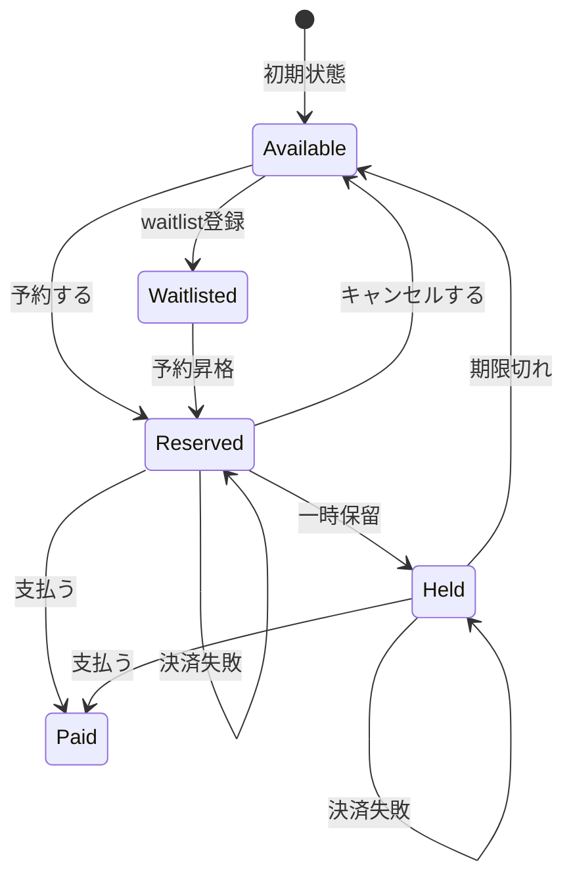

**変更前後の入力・判定・加工・出力差分**

1-1の現状仕様を退避し、変更要求を当てた後の仕様と同じ粒度で並べます。以降の分析では、この差分を追います。

| 要素 | 変更前（1-1の現状仕様） | 変更後（今回の要求） | 差分として追うもの |
|---|---|---|---|
| 入力 | イベントID、操作、内部に保持している現在の予約状態 | イベントID、操作/イベント、内部に保持している現在の予約状態、キャンセル待ち/一時保留/決済失敗に関わる入力 | 操作・イベントと状態の種類が増える |
| 判定 | 現在状態で操作可能か | 新状態を含めて操作/イベントを受け付けるか、保留期限内か、決済失敗時に再試行できるか | 状態ごとの判定が増える |
| 加工 | 予約・支払・キャンセルに応じて状態を更新 | キャンセル待ち登録、予約昇格、一時保留、期限切れ、決済失敗時の状態維持を処理 | 状態遷移ルールと状態維持ルールが増える |
| 出力 | 操作結果と更新後状態 | 操作結果、Waitlisted/Heldを含む更新後状態 | 新状態の出力を追う |

**変更後の入力・加工・出力**

変更後の仕様を、1-1と同じ粒度で、正常系の入力・判定・加工・出力として確認します。1-1の図との差分は、内部に保持する「現在状態」が3種類から5種類へ、「操作・イベント」が3種類から8種類へ増えることです。判定・加工・出力の流れ自体は変わりません。図中のイベントIDも、現状データに存在する3件を省略せず示します。

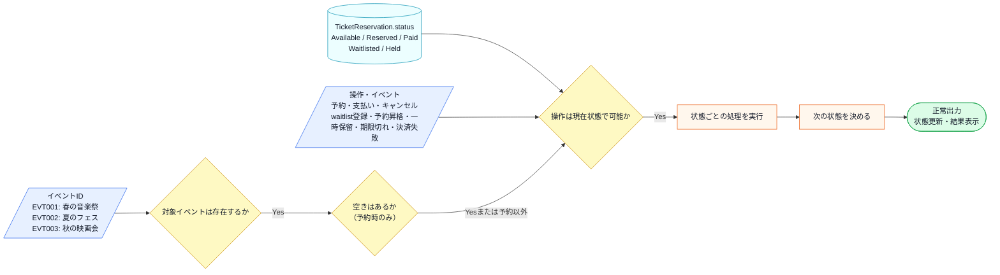

この図から読み取ることは、次の3点です。

- 新しい入力は「Waitlisted・Held」の2状態と「waitlist登録・予約昇格・一時保留・期限切れ・決済失敗」の5操作/イベントで、図の箱そのものは増えていない。
- 増えるのは「操作は現在状態で可能か」で受け付ける組み合わせと、「次の状態を決める」の行き先である。
- 受け付けられない組み合わせは、変更後も既存の「操作不可エラー」として扱う。

変更後も、失敗条件は正常系図へ混ぜずに別で確認します。

| エラー条件 | どこで分かるか | 出力 | 状態保存・通知 |
|---|---|---|---|
| イベントIDが存在しない | `EventDatabase` の存在確認時 | 対象なしエラー | `TicketReservation.status` は変更しない |
| 予約時に空席がない | `EventDatabase` の空席確認時 | 満席エラー。必要ならキャンセル待ち登録へ進む | `Waitlisted` へ変える場合は変更要求側の仕様として扱う |
| 現在状態では操作できない | `TicketReservation.status` と操作の組み合わせ確認時 | 操作不可エラー | `TicketReservation.status` は変更しない |
| 決済APIが失敗する | 支払い処理の結果受信時 | 決済失敗メッセージ | `Reserved` または `Held` を維持し、再試行可能にする |

増えた状態と操作の組み合わせが実際にコードのどこへ書かれるかは、フェーズ3で変更を試すコードと、フェーズ7の最終コード・実行結果で追います。

フェーズ1でシステムの現状と変更要求が把握できました。次のフェーズ2では、「何を変え、何を守るか」を整理します。

---

## 🟣 フェーズ2：仮説立案 ―― 何が変わるかを観察し、ヒアリングで裏付ける
### 2-1：変わりそうな仕様の見当をつける

ここで作る一覧は、思いつきで「変わりそう」と感じたものを並べる表ではありません。フェーズ1で確認した仕様・動作例・クラス図を材料に、次の順で候補を絞ります。

1. 仕様図と動作例から、入力・判定・加工・出力のうち条件や値が変わりそうな箇所を拾う。
2. その箇所が、1-3のどのクラス・メソッドに書かれているかを対応づける。
3. その仕様が、どんな理由で、何をきっかけに、どのくらいの頻度で変わりそうかを仮説として書く。
4. 逆に、当面変えない前提にできる処理の骨格も分けておく。

この手順で見ると、「予約を管理する」という大きな処理全体ではなく、その中のどの状態・操作可否・遷移先が変更候補なのかを読者自身で追えるようになります。

フェーズ1で整理した仕様をもとに、「どの仕様が変わりやすいか」を見立てます。責務配置の評価は、変更を当てたときの痛みと合わせてフェーズ3・4で確認します。

変わりそうな仕様は、1-3のクラス図の中心 `TicketReservation` にあります。`reserve()` / `pay()` / `cancel()` の中で判定している「どの状態なら操作できるか」と「操作後にどの状態へ遷移するか」を、どんな仕様が、誰の何をきっかけに変わりそうかと一緒に整理します。

| 変わりそうな仕様 | 所在（クラス・メソッド） | 変える主体・きっかけ | 変わりやすさの見立て |
|---|---|---|---|
| 状態の種類 | `TicketReservation.status` の取りうる値 | 企画担当の新機能導入（キャンセル待ち等） | 高い |
| 操作可能な状態の判定条件 | 各メソッド内の `if (status == ...)` | 企画担当の運用ルール見直し | 高い |
| 操作後の遷移先の状態 | 各メソッド内の `status = ...` 代入 | 企画担当の運用ルール見直し | 高い |
| 状態を動かす入力の種類 | 現状は利用者操作を受ける各メソッド | 決済失敗・期限切れなど外部入力の追加 | 高い |
| 予約成功・失敗などの通知や画面表示 | 各メソッド内の表示処理 | 予約フローそのものは当面安定 | 低い |

見えてくるのは、**1つの `TicketReservation` の中で、「どの状態なら何ができるか」「操作後どの状態へ移るか」という状態遷移の仕様が、企画担当の施策や運用見直しをきっかけに変わりやすい**という見立てです。逆に、予約完了・支払い完了などを通知する予約フローの骨格は、当面変わらない前提に置けます。

ここでは「このクラスは責任が多い」「構造が良い/悪い」という評価はしません。上の表は、変わりそうな仕様が `TicketReservation` のどのメソッドのどの行にあるかという所在の見立てです。状態遷移の仕様を1つのクラスにまとめている今の配置が、変更要求を当てたときに**実際に痛みになるか**はフェーズ3で確かめ、なぜ辛いのかはフェーズ4で原因として言語化します。2-1は、その検証対象に当たりをつける段階です。

### 2-2：今回の変更で確実に変わること

変更要求として届いた内容のうち、今回のリリースで確実に発生する変更を整理します。

| **分類** | **具体的な内容** | **変わるタイミング** | **根拠** |
|---|---|---|---|
| 🔴 **変動する** | 状態の種類（キャンセル待ち・一時保留の追加） | 今回のリリース | 運営担当からの変更要求に明記されている |
| 🔴 **変動する** | 各状態における振る舞い（状態ごとのアクション可否） | 今回のリリース | 新状態の導入に伴い定義が必要 |
| 🔴 **変動する** | 状態を動かす入力の種類（利用者操作、システムイベント、タイマー、決済結果） | 今回のリリース | 予約昇格・期限切れ・決済失敗の扱いが追加される |
| 🟢 **今回守りたい前提** | イベントの基本情報（開催名、定員） | 今回の変更対象外 | 予約状態の設計課題からは外れる |

ここで確定しているのは「状態が2つ増える」ことと、「利用者操作以外の入力も状態を動かす」ことです。将来どれだけ変わり続けるかは、次の関係者ヒアリングで確認します。

### ヒアリングに向けた背景確認

このシステムは、イベントチケットの予約管理を担っています。イベントごとに予約、支払い、発券といった一連のプロセスを管理する、イベント運営の中核となるシステムです。

現在このシステムは、「Available（予約可能）」「Reserved（予約済み）」「Paid（支払い済み）」という3つの状態で動作しています。チケットの予約、支払い、キャンセルという操作に対して、現在の状態に応じた処理が実行される仕組みです。

### 2-3：関係者ヒアリング

仮説を確実なものにするため、企画担当の鈴木氏にヒアリングを行いました。このシステムでは「状態の種類」と「状態遷移ルール」が密接に結びついています。どちらが変わりやすいかによって設計の方向が大きく変わるため、この2点を重点的に確認します。


* **開発者：** 「キャンセル待ちや一時保留など、状態がかなり増えますが、今後さらに状態が増える予定はありますか？」
* **企画担当 鈴木：** 「実は、上映後のアンケート回答者に付与する『特別優待予約』なども今後検討しています。状態は今後も増えていくはずです。」
* **開発者：** 「なるほど。状態遷移のルール、例えば『保留中からキャンセル待ちへ移行できるか』などは、今後ルールが変わる可能性はありますか？」
* **企画担当 鈴木：** 「それも十分にあり得ます。今は保留中からのキャンセルを認めていますが、来月には『一度保留にしたらキャンセル不可』というルール変更も考えられます。」

ヒアリングの結果、「状態の種類」だけでなく「状態遷移ルールそのもの」も頻繁に変わり続けるという事実が見えてきました。

### 2-4：ヒアリングで判明した将来リスク

ヒアリングで浮かび上がった「確定ではないが、近い将来起こりうる変化」を記録します。これは今回の設計判断の材料です。

| **将来リスク** | **時期の目安** | **根拠** |
|---|---|---|
| 状態遷移のルール（アクションの可否）の変更 | キャンペーンや運用の見直し時 | 企画担当 鈴木氏との確認 |
| 状態の種類（特別優待予約などの追加） | 新機能導入時 | 企画担当 鈴木氏との確認 |
| 状態を動かすイベントの追加 | 外部連携や運用自動化の追加時 | 決済失敗、期限切れ、空席発生など、利用者操作以外の入力が増えるため |

フェーズ2で「今変わること（確定）」と「将来変わるかもしれないこと（リスク）」を分けて整理できました。次のフェーズ3では、現在の構造で変更を試みたときに何が起きるかを確認します。

### 2-5：変わる見込みと当面安定の前提を確定する

ヒアリングで「状態遷移ルールの変更」と「状態の種類の追加」が予告されました。フェーズ2の出力として、変わるものと変わらないものをここで確定します。

| 変更内容 | 現在 | 将来（時期の目安） |
|---|---|---|
| 予約可能な状態の種類 | Available / Reserved / Paid の3種類 | キャンセル待ち・特別優待予約など、新機能導入のたびに増加 |
| 各状態からの遷移可否ルール | 固定ルール（Reserved → Paidのみ等） | キャンペーンや運用の見直しごとに変更される |
| 状態を動かす入力 | 利用者操作が中心 | 空席発生イベント、期限切れタイマー、決済失敗結果などが追加される |

この変化が来たとき、現在の構造がどれだけの修正コストを要求するかを、次のフェーズ3で実際に確かめます。

---

## 🟣 フェーズ3：問題特定 ―― 変更の痛みを発見する
フェーズ2で「状態遷移のルールは頻繁に変わる」という確信が持てました。このフェーズでは、確定した新しい状態遷移（キャンセル待ち・一時保留）を、今のコードの構造のまま適用しようとしたとき、システムにどのような「痛み」が生じるのかを観察してみます。

### 3-1：変更を試みる

フェーズ2の変更要求を受けて、今のコードに「一時保留（Held）」と「キャンセル待ち（Waitlisted）」の両方の状態を追加してみます。追加する必要がある仕様と、その修正対象箇所は次の通りです。

> **中間コードの継続条件：** 以下は `TicketReservation` の状態分岐だけを抜き出します。フェーズ1の `EventDatabase` によるイベント存在確認と座席数の読み書きは維持し、予約成立・キャンセル・期限切れに伴う座席更新の前後で、この状態処理を呼びます。

| 仕様 | 修正対象メソッド |
|---|---|
| `Held`（一時保留）：イベント開始24時間前まで予約枠を仮押さえする状態 | `pay()` / `cancel()` の両メソッドに `else if (status == "Held")` の追加が必要。また、保留期限切れを処理する `expire()` が必要。 |
| `Waitlisted`（キャンセル待ち）：予約枠が満杯のときに空き待ちを登録する状態 | キャンセル待ちに登録する `addToWaitlist()`、および予約へ昇格させる `upgrade()` が必要。 |
| 決済失敗：決済APIが失敗したら予約を消さずに再試行可能な状態へ戻す | `pay()` の中で、`Reserved` からの失敗と `Held` からの失敗を分けて扱う必要がある。 |

この仕様を今の `TicketReservation` クラスに当てはめてみます。追加した箇所が分かるよう、コメントで「追加」と明示します。なお、イベントの存在確認・満席判定は今回の変更で変わらないため、この変更試行コードでは省略しています。

```cpp
// 変更後の TicketReservation（Held および Waitlisted 状態追加後）
class TicketReservation {
    std::string status = "Available";

    void handleReserveError() {
        std::cout << "現在予約できません\n";
    }
    void handleHoldError() {
        std::cout << "保留できません\n";
    }
    void handlePayError() {
        std::cout << "支払いに適した状態ではありません\n";
    }
    void handleCancelError() {
        std::cout << "キャンセルできません\n";
    }
    void handleExpireError() {
        std::cout << "期限切れ処理は行えません\n";
    }
    void handleWaitlistError() {
        std::cout << "キャンセル待ちに登録できません\n";
    }
    void handleUpgradeError() {
        std::cout << "予約に昇格できません\n";
    }

public:
    void reserve() {
        if (status == "Available") {
            status = "Reserved";
            std::cout << "予約完了しました\n";
        } else {
            handleReserveError();
        }
    }
    void hold() {
        if (status == "Reserved") {
            status = "Held";
            std::cout << "保留にしました\n";
        } else {
            handleHoldError();
        }
    }
    void pay() {
        if (status == "Reserved") {
            status = "Paid";
            std::cout << "支払い完了しました\n";
        } else if (status == "Held") {   // ← Held 対応を追加
            status = "Paid";
            std::cout << "保留から支払い完了しました\n";
        } else {
            handlePayError();
        }
    }
    void cancel() {
        if (status == "Reserved") {
            status = "Available";
            std::cout << "予約をキャンセルしました\n";
        } else if (status == "Held") {   // ← Held 対応を追加
            status = "Available";
            std::cout << "保留からキャンセルしました\n";
        } else {
            handleCancelError();
        }
    }
    void expire() {                      // ← 新規追加
        if (status == "Held") {
            status = "Available";
            std::cout << "保留期限が切れました\n";
        } else {
            handleExpireError();
        }
    }
    void addToWaitlist() {               // ← 新規追加
        if (status == "Available") {
            status = "Waitlisted";
            std::cout << "キャンセル待ちに登録しました\n";
        } else {
            handleWaitlistError();
        }
    }
    void upgrade() {                     // ← 新規追加
        if (status == "Waitlisted") {
            status = "Reserved";
            std::cout << "予約に昇格しました\n";
        } else {
            handleUpgradeError();
        }
    }
};

int main() {
    // シナリオ1：予約 → 保留 → 支払い
    TicketReservation t1;
    t1.reserve(); t1.hold(); t1.pay();

    std::cout << "---" << std::endl;

    // シナリオ2：予約 → 保留 → 期限切れ → Available に戻る
    TicketReservation t2;
    t2.reserve(); t2.hold(); t2.expire();

    std::cout << "---" << std::endl;

    // シナリオ3：キャンセル待ち登録 → 予約昇格 → 支払い
    TicketReservation t3;
    t3.addToWaitlist(); t3.upgrade(); t3.pay();

    return 0;
}
```

実行対象コード：3-1の変更試行コード
対応する動作例：変更要求後の代表シナリオ1〜3
確認したいこと：新しい状態を追加すると、現状構造では条件分岐と新メソッドが `TicketReservation` に増えること

実行結果：

```text
予約完了しました
保留にしました
保留から支払い完了しました
---
予約完了しました
保留にしました
保留期限が切れました
---
キャンセル待ちに登録しました
予約に昇格しました
支払い完了しました
```

コード自体は正しく動いています。しかし `pay()` にも `expire()` にも、状態を判定する `if-else` が増え続けている点に注目してください。

状態遷移マトリクスで見ると、Held を追加するとは「行を1行増やす」ことに見えます。

| 現在の状態 | `reserve()` | `pay()` | `cancel()` |
|---|---|---|---|
| Available | → Reserved | —— | —— |
| Reserved | —— | → Paid | → Available |
| Paid | —— | —— | —— |
| **Held（新規）** | —— | → Paid | → Available |

しかし実装では、この1行のためにメソッド2本（`pay` / `cancel`）を開いて `else if` を追加する必要があるのではないでしょうか。さらに `reserve()` の中にも「Heldのときは予約操作を拒否する」という制御を追加するかどうか検討しなければならず、状態ごとに「このメソッドでは何が起きるべきか」をすべてのメソッドで見直す必要が生じます。`reserve` メソッドを修正したとき、同時に `pay` メソッドや `cancel` メソッドの中にある `if` 文の条件もすべて見直し、新しい状態である `Held`（保留）を考慮しなければならないことに気づきます。

もし、さらに「キャンセル待ち」状態や「決済失敗後の再試行」イベントが追加されたらどうなるでしょうか。すべてのメソッドにある条件分岐がさらに増殖し、一つのアクションを行うたびに、今の `status` が何なのかを常に意識しなければならないのです。

「この先、状態が5つ、6つと増えたら、一つのアクションを判定するのにどれだけの `if` 文を積み重ねればいいんだろう……」

この痛みは定量的に言うと、**状態が1つ増えるたびに `reserve()`・`pay()`・`cancel()` などの公開操作を横断して条件分岐の追加が必要**になります。さらに、タイマーや決済API結果のようなイベント入力が増えると、状態数 × 入力種類の組み合わせを `TicketReservation` の中で確認することになります。コードのあちこちで同じような条件判定が繰り返され、一箇所でも判定ロジックを書き忘れると、システムは「ありえない状態遷移」や「再試行できるはずの予約を失う」といったバグを許してしまいます。

### 3-2：変更影響グラフ

変更を試みようとしたときに頭の中で起きた「影響の広がり」を図にしてみます。

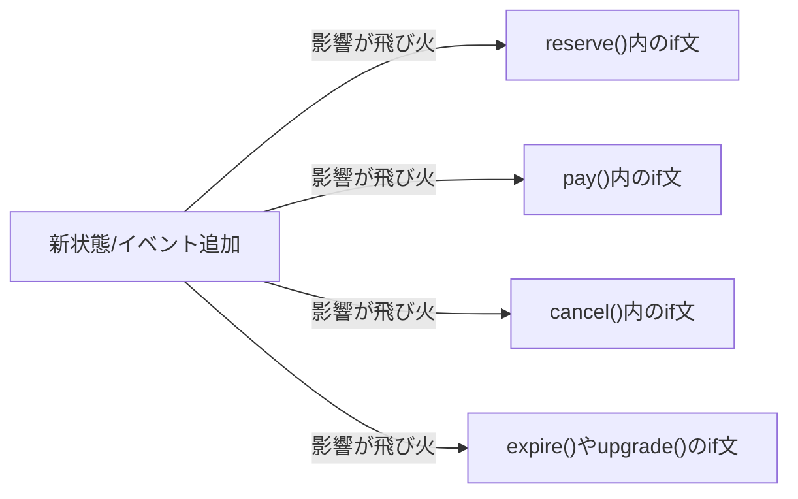

このグラフが示す通り、「状態追加」や「状態を動かすイベント追加」という変更要求が、クラス内の複数のロジックに飛び火しています。

### 3-3：痛みの言語化

変更を試みてみた結果、現場でよく直面する2つの辛い状況が浮かび上がってきました。

1つ目は、修正漏れがバグに直結する恐怖です。新しい状態を追加するためには、すべてのメソッド内にある条件分岐を一つずつ確認し、適切にロジックを追記する必要があるのではないでしょうか。もし `pay` メソッドで「保留中からの支払い」を考慮し忘れたらどうなるでしょうか。ユーザーは支払いができず、システムは正しく動かないまま放置されます。一つの小さな仕様変更のために、クラス内の全てのロジックを神経質にチェックしなければならないというのは、非常にコストが高く、リスクの大きい作業です。

2つ目は、システムの振る舞いが「コードの迷路」になってしまうことです。現状では、`TicketReservation` クラスを開けば予約のルールを比較的追いやすい状態でした。しかし、状態が増えるたびに `if` や `else if` が折り重なり、ビジネス上のルールがどこに書かれているのかが見えにくくなります。コードを読むたびに、脳内で「今この状態なら、このメソッドは動いて……」というシミュレーションを繰り返す必要が出てきます。これでは、誰かが修正を加えるたびに別の場所へ副作用を出すリスクが高まります。

フェーズ3で「変更が辛い」という事実が確認できました。次のフェーズ4では、なぜ辛いのかを構造的に言語化します。

---
> **📌 問題（確定）**
> 状態や状態を動かすイベントが増えるたびに、`reserve()`・`pay()`・`cancel()`・`expire()` などのメソッドで条件分岐の追加が必要になる。ヒアリングで「キャンセル待ち」「特別優待予約」など状態が今後も増える見込みがあり、この頻度では `TicketReservation` を何度も開き直すコストが合わない。
---

## 🟠 フェーズ4：原因分析 ―― なぜ辛いのかを構造で言語化する
フェーズ3で確認した「状態追加のたびに条件分岐が増え、修正漏れの可能性が高まる」という痛み。このフェーズでは、状態の知識がどこへ漏れているかを接続点から掘り下げます。

### 4-1：痛みの根源を探る（観察と原因）

「ステータスと振る舞いが同じクラスに混在すること」は、それ自体を誤りとは判断できません。問題は「変わる理由が異なる2つのもの」が混在しているかどうかです。`status` という状態は「業務ルール管理（どの遷移を許可するか）」という業務機能で変わり、`reserve()` などの処理フローは「処理の骨格（どんな操作ができるか）」という業務機能で変わります。ここでの判定軸は「**状態遷移のルールがどの業務機能によるか**」です。業務ルール管理と処理の骨格という2つの業務機能が異なるなら、この2つは別々の変わる理由を持っています。同じクラスに入っていると、片方だけを変更したい場合にも同じクラスを開くことになり、影響確認の範囲が重なります。それが下の表で示す「原因の方向」です。

この表は「フェーズ3で感じた痛み」を出発点にして、その痛みが生まれた構造的な理由を探る表です。痛みを1つ取り上げ、「なぜそうなるのか？」と問いかけ続けることで、根本原因の方向が見えてきます。

| **観察した症状（痛み）** | **構造的な原因（痛みの根源）** |
|---|---|
| 新しい状態を追加するたびに、既存の全メソッドの条件分岐を書き換える必要がある | 「現在の状態（ステータス）」と「その状態で実行可能な振る舞い」という、本来分離する必要がある知識が、一つのクラスの中に混在しているから |
| 複雑な条件分岐により、現在の状態が何であるかを常に意識しないとコードが書けない | 状態管理のルール（遷移条件）がロジックの中に埋め込まれ、状態の変化を追跡するのが困難になっているから |
| 期限切れタイマーや決済失敗のような入力が増えると、どの状態で受け付けるかを中心クラスが全部知る必要がある | 入力の発生源は違っても、状態ごとの扱いを選ぶ責任が `TicketReservation` に集まっているから |

### 4-2：変わるもの/変わってほしくないもの

> **「変わらないもの」と「変わってほしくないもの」は異なります。** 「変わらないもの」は経験的事実（今まで変わっていない）、「変わってほしくないもの」は設計意図（ここを安定させてほかを守りたい）です。ここで整理するのは後者です。

原因分析の結果から、「変わり続けるもの」と「変わってほしくないもの」を整理します。

| **変わり続けるもの（🔴）** | **変わってほしくないもの（🟢）** |
|---|---|
| 状態の種類（キャンセル待ち、保留中などの追加） | 予約システムとしての基本的な業務フロー |
| 各状態における振る舞い（状態ごとのアクション） | 状態を管理するという概念（状態があること自体） |
| 状態を動かす入力（利用者操作、タイマー、外部API結果） | 呼び出し元が「予約に対して操作/イベントを渡す」という入口 |

私たちが守りたいのは「予約管理」という概念であり、増え続ける「状態の種類」や「状態ごとの細かなルール」は、安定した業務フローから切り離す必要がある存在なのです。

### 4-3：接続点に漏れている状態の知識を確認する

ここでの「確認すること」は、前節までに見つけた原因から抽出します。まず、原因文から「守りたい骨格」と「変わる差分」を分けます。次に、その差分を動かすために骨格側が知ってしまっている名前・条件・順序・型を拾います。最後に、接続点に残す最小の約束を、値・型・操作・イベントとして書きます。

原因によって、接続点で見る抽象観点は変わります。条件分岐が原因なら条件・定数・選択基準を見ます。処理手順が原因なら呼び出し順・前後条件・失敗時分岐を見ます。生成判断が原因なら具体クラス名・生成条件・登録場所を見ます。通知や外部連携が原因なら通知先・タイミング・成否の扱いを見ます。データや状態が原因なら、境界を流れる値・型・状態を見ます。

現在、`TicketReservation`の各操作メソッドは、`status`の文字列と状態ごとの遷移ルールを知っています。本来の接続点は「現在の状態へ操作を依頼すること」ですが、状態名と分岐条件がコンテキスト側へ漏れています。

状態の知識が漏れている根拠は次の2点です。

| 観点 | コードの証拠 |
|---|---|
| **「具体」＝専用規格** | `if (status == "Available")` など — 状態名を文字列リテラルとしてコードに直書きしており、他の書き方に差し替えられない |
| **「直接」＝直差し** | `reserve()` / `pay()` / `cancel()` の各メソッドが `status` を直接読み書きしており、間に何も挟まっていない |
| **「入力ごとの横断」** | `expire()` や `upgrade()` のようなイベント入力が増えるたびに、状態名と許可条件を同じクラスへ追記する |

`Available`などの状態名と遷移条件が複数メソッドに埋め込まれているため、状態が増えるたびに既存の操作メソッドを横断して確認する必要があります。

フェーズ4で根本原因が言語化できました。「どこを分けるか」は明確です。次のフェーズ5では、その境界で実際に何が流れているかを値・型のレベルで具体化し、「何を変え、何を守るか」を明確にします。

---
> **📌 原因（確定）**
> `TicketReservation`が「現在の状態の判断」と「操作/イベントごとの処理フロー」の両方を保持している。状態の追加や遷移ルールの変更では、関係する操作メソッドとイベント処理を横断して修正・再テストする必要がある。
---

## 🟡 フェーズ5：課題定義 ―― 解くべき接続点を定める
フェーズ4は「なぜ辛いか」を答えました。フェーズ5が問うのは「分けるべき境界で、実際に何が流れているか」です。クラスの参照関係ではなく、**値・型のレベル**に降りていきます。

フェーズ4で、「現在の状態」と「その状態での振る舞い」が `TicketReservation` の中に混在していることが分かりました。その境界で何がやり取りされているかを具体化します。

### 接続点を特定する

接続点は、クラス図の線やインターフェース名から探すのではなく、変更要求を当てて特定します。まず、その要求で変えたい側と変えたくない側を分けます。次に、両者がどのメソッド呼び出し・引数・戻り値・生成・イベントでつながっているかを見ます。そのつながりのうち、変更要求のたびに知識が漏れて修正が波及する場所が、ここで解くべき接続点です。

`reserve()` / `pay()` / `cancel()` の中で分けるべき境界は1か所です。公開する操作と、状態ごとの振る舞いとの間で受け渡している情報を見ます。

現在の結合状況：`status` という文字列値が各メソッドの条件分岐に直接埋め込まれており、状態の判断と振る舞いが同じ場所に混在しています。

| 接続点 | 接続するデータ | 変わるもの |
|---|---|---|
| 状態ごとの振る舞い → `reserve()`/`pay()`/`cancel()` の骨格 | status（string値）→ 操作結果（void） | 状態ごとの振る舞いロジック（新しい状態が追加されると増える） |
| 状態ごとのイベント処理 → `expire()`/`upgrade()`/決済失敗処理の骨格 | status（string値）と入力イベント → 状態維持/状態遷移 | タイマー、空席発生、決済失敗など、利用者操作以外の入力への反応 |

### 何を変え、何を守るか

- **変わるもの**：状態ごとの振る舞いロジック（どの状態でreserve/pay/cancel/expire/upgrade/paymentFailedが何をするか）。新しい状態やイベントが追加されるたびに分岐が増える。
- **守りたい前提**：予約オブジェクトに対して操作/イベントを渡す入口。呼び出し元は、現在状態ごとの分岐を知らずに使える。

呼び出し元は `reserve()` などの操作を呼べれば十分です。問題は「どの状態のときに何をするか」という**状態固有の判断**が `TicketReservation` の中で状態の数だけ膨れ続けることです。

**現状のままでよい場面**：状態が少なく、遷移ルールも当面固定されるなら、`if-else`を保つ判断もあります。今回は状態と遷移ルールの追加が見込まれるため、状態ごとの知識をコンテキストから切り離す設計を検討します。

---
> **📌 課題（確定）**
> `reserve()`・`pay()`・`cancel()`・`expire()` などの入力入口と、「どの状態のときに何をするか」という状態ごとの振る舞いを切り離す。`TicketReservation` から状態固有の判断を取り出し、操作やイベントは現在の状態へ処理を委譲する構造にする。状態を追加するときは新しい状態クラスと遷移の組み立てを変更し、`TicketReservation` の条件分岐を増やさずに済む形を目指す。
---

## 🔴 フェーズ6：対策検討 ―― 案を比べ、採用する形を決める

フェーズ6は、フェーズ5で定めた課題——**状態ごとの振る舞いを、公開操作の形を変えずに切り離す接続点を作る**——を受けて始めます。ここで決めるのは実装ではなく設計です。課題は「何を切り離すか」までを決めており、**その接続点をどんな形にするか**は、痛みコードを変換して探します。動く実装一式はフェーズ7で書きます。
フェーズ5の課題から、対策候補は次のように出します。

| フェーズ4で見えた原因 | フェーズ5で定めた課題 | だからフェーズ6で見る候補 |
|---|---|---|
| `TicketReservation` が状態名と、各状態で許可される操作をまとめて判定している | 状態ごとの振る舞いを、公開操作の形を変えずに切り離す | 状態ごとの振る舞いを状態オブジェクトへ移す案を見る |
| 状態追加のたびに `reserve/pay/cancel` の分岐が増える | 新しい状態を追加しても既存状態の判定を触らない接続点を作る | 状態ごとのクラスへ振る舞いを移し、同じ操作名で呼べるかを見る |
| タイマーや決済結果の入力でも、状態ごとの扱いを中心クラスが選んでいる | 入力の発生源が違っても、状態ごとの反応を同じ境界へ寄せる | 操作とイベントを現在状態オブジェクトへ委譲できるかを見る |
| 呼び出し元は「予約する」などの操作だけ知っていればよい | 呼び出し元に状態遷移の内部条件を漏らさない | 現在状態オブジェクトへ処理を委譲する形まで進めるか判断する |

---

#### 起点：フェーズ3の痛みコード

比較元は、`Held` と `Waitlisted` を追加した結果、公開操作ごとに状態分岐が増えたフェーズ3の変更途中コードです。

```cpp
// フェーズ3の変更途中コード（対策前）の要点
void pay() {
    if (status == "Reserved")   status = "Paid";
    else if (status == "Held")  status = "Paid";
    else handlePayError();
}
void cancel() {
    if (status == "Reserved" || status == "Held") status = "Available";
    else handleCancelError();
}
void hold()   { if (status == "Reserved")   status = "Held";       else handleHoldError(); }
void expire() { if (status == "Held")       status = "Available";  else handleExpireError(); }
// addToWaitlist / upgrade も同じく status 分岐が並ぶ
```

### 6-1：痛みコードを変換して、接続点の「形」を探す

痛みは、`pay`/`cancel`/`hold`/… の**どの操作にも `status` の分岐**があり、状態を1つ増やすと全操作の分岐を触ることでした。どんな形なら状態を切り離せるか、痛みコードを変換して探します。どの分岐も「その状態で操作を受け付け、次状態へ移す」だけで、共通の形は既に見えています。だから関数へ切り出す段階は飛ばし、**状態そのものをオブジェクトにする**変換から始めます。

**変換1：状態ごとにクラスを作り、その状態で受け付ける操作を寄せる。**

```cpp
class ReservedState { void pay(ctx){/*→Paid*/}  void cancel(ctx){/*→Available*/} };
class HeldState     { void pay(ctx){/*→Paid*/}  void cancel(ctx){/*→Available*/} void expire(ctx){/*→Available*/} };
```

見えたこと：どの状態クラスも `reserve`/`pay`/`cancel`… という**同じ操作の集まり**を持ち、状態ごとに違うのは中身だけ。
まだ詰まること：`TicketReservation` がまだ「今 `status` が何かで、どの状態クラスを呼ぶか」を分岐で選んでいる。状態追加でその分岐が増える。

**変換2：現在状態を状態オブジェクトとして持ち、操作を委譲する。** `status` 文字列でなく現在状態オブジェクトを保持し、操作をそれへ丸投げします。

```cpp
IReservationState* state;                 // 現在状態そのもの
void pay()    { state->pay(this); }        // 分岐なしで委譲
void cancel() { state->cancel(this); }     // 次状態への遷移は状態側で setState
```

詰まり解消：`TicketReservation` は「今どの状態か」を分岐で選ばず、**現在状態オブジェクトへ一律委譲**する。状態遷移は各状態クラスが `setState` で行う。

**変換の結論：** 状態ごとの振る舞いを状態オブジェクトへ閉じ込め、全状態が満たす**共通契約（`reserve`/`pay`/`cancel`…）**で委譲すれば、中心クラスは状態名で分岐しない。これが接続点の正体です。

### 6-2：見つけた形を契約にし、データの置き場所を決める

見つけた形を、状態が満たすべき契約として定義します（実装本体はフェーズ7）。

```cpp
// 状態の契約：既定を「操作不可エラー」にし、各状態は受け付ける操作だけ override する
class IReservationState {
public:
    virtual void reserve(TicketReservation* ctx);  // 既定＝操作不可エラー
    virtual void pay(TicketReservation* ctx);
    virtual void cancel(TicketReservation* ctx);
    // hold / expire / addToWaitlist / upgrade も同じ形で並ぶ
    virtual ~IReservationState() = default;
};
```

次に、データの置き場所を決めます。

| データ | 現状の置き場所 | 対策後の置き場所 | 置き場所を決める理由 |
|---|---|---|---|
| 現在状態 | `TicketReservation.status`（文字列） | `TicketReservation.state`（`IReservationState*`） | 状態名でなく状態オブジェクトを持てば、分岐でなく委譲になる |
| イベント存在・空席 | `EventDatabase` | 変えない | 状態設計とは別の関心事 |

接続点で受け渡すのは、操作対象の**コンテキスト（`TicketReservation* ctx`）**です。状態は次状態へ `setState` で遷移します。

### 6-3：構造の見立て（変換の結果、こうなる）

変換して契約とデータ配置を決めた結果、構造はこうなります。図は出発点ではなく結論です。

現状（中心クラスが `status` 分岐で各操作を処理）：

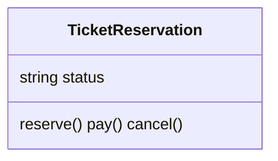

見立て（中心クラスは現在状態へ委譲するだけ）：

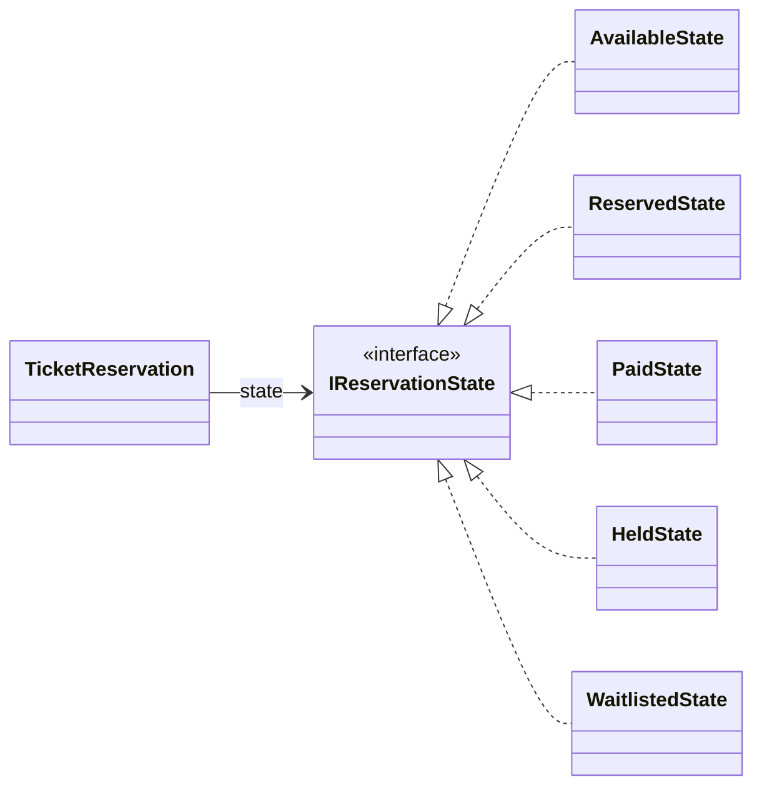

図から読み取ること：中心クラスから `status` 分岐が消え、現在状態オブジェクトへの委譲だけが残る。状態の追加はクラスを1つ増やすことになる。

### 6-4：影響範囲（この設計で変更要求を再度当てたら）

| 変更要求 | 修正する場所 | 再テスト範囲 |
|---|---|---|
| 状態を1つ追加（キャンセル待ちなど） | `IReservationState` を実装した状態クラスを1つ追加し、遷移元で `setState` する | 追加クラス単体。**既存操作の分岐は無変更** |
| ある状態の遷移ルールを変える | 該当の状態クラスのみ | その状態 |
| タイマー・決済失敗などの入力を追加 | 該当状態クラスに操作を1つ足す | その状態 |

現状との差：現状は状態を追加するたびに全操作の `status` 分岐を開く。対策後は状態クラスを1つ足すだけで、中心クラスを触らない。**この「触る範囲の差」がこの構造を採る理由**です。

### 採用する形を決める

各案には一長一短があります。どこで止めるかは、「今後の変更頻度（ビジネス要求）」で決断します。

| 案 | 解けること | 残ること | 今回の判断 |
|---|---|---|---|
| 何もしない | クラス数は増えない | 状態追加のたびに分岐が増える | 今後の状態追加と合わない |
| 状態ごとにクラス分離 | 状態ごとの振る舞いを別に読める | 呼び出し側が具体状態を知り続ける可能性がある | 中間策として有効 |
| 現在状態へ委譲する | コンテキストは状態ごとの分岐を知らずに済む | 状態クラスと遷移の組み立てが増える | 状態追加が主な変化軸のため採用する |

**今回の決断：** フェーズ2のヒアリングで、「キャンセル待ち状態」「特別優待予約」など、状態は今後も増え続けると予告されています。状態遷移のルール自体も変わりうると確認できています。期限切れタイマーや決済失敗は入力の発生源こそ違いますが、最終的には「現在状態ごとに受け付けるか、どの状態へ戻すか」を決める問題です。したがって、今回は**状態の契約を導入し、現在の状態へ委譲する形を採用する**決断を下します。

フェーズ6で採用する設計（接続点の契約・データ配置・構造・影響範囲）が決まりました。次のフェーズ7では、この決断を動く実装（`EventDatabase`・全状態クラス・`TicketReservation` の委譲・実行結果）に落とし込み、変更要求で効果を確認します。

---

## 🟢 フェーズ7：対策実施 ―― 変化に強いコードを完成させる
採用した設計（ステップ2：状態の契約と委譲）を、実際のコードに実装します。これにより、これまで`TicketReservation`が抱え込んでいた複雑な条件分岐を、個別の状態クラスへ移します。

この設計変更の最大の価値は、今後「キャンセル待ち」や「特別優待」といった新しい状態がどれだけ増えても、既存の業務フローの条件分岐を変更せず、新しい状態クラスと組み立て設定を追加することで機能拡張ができる安定性を手に入れたことです。

### 7-1：解決後のコード（全体）

解決後のコードも、責任の固まりごとに分けて読みます。

**① イベント在庫（EventInfo / EventDatabase）**

1-4と同じ、イベントの定員と予約数を持つ在庫クラスです。

```cpp
#include <iostream>
#include <string>
#include <map>
#include <vector>

struct EventInfo {
    std::string title;   // イベント名
    int capacity;        // 定員
    int reserved;        // 現在の予約数
};

class EventDatabase {
private:
    std::map<std::string, EventInfo> records;
public:
    EventDatabase() {
        records["EVT001"] = {"春の音楽祭",  100,  20};
        records["EVT002"] = {"夏のフェス",  500, 499};
        records["EVT003"] = {"秋の映画会",   50,  50};  // 満席
    }

    bool exists(const std::string& id) const {
        return records.count(id) > 0;
    }

    EventInfo get(const std::string& id) const {
        return records.at(id);
    }

    bool hasCapacity(const std::string& id) const {
        const auto& e = records.at(id);
        return e.reserved < e.capacity;
    }

    void reserveSeat(const std::string& id) {
        ++records.at(id).reserved;
    }

    void cancelSeat(const std::string& id) {
        auto& e = records.at(id);
        if (e.reserved > 0) --e.reserved;
    }

    void save(const std::string& id, const EventInfo& info) {
        records[id] = info;             // 実行中のイベント表へ追加
    }
};
```

**② 予約履歴（ReservationRecord / ReservationHistory）**

予約履歴（`ReservationHistory`）はシステム起動時は空で、予約・決済・キャンセルが行われるたびに1件追記されます。ここではファイルへの保存は行わず、実行中のメモリ上にのみ保持します。

```cpp
struct ReservationRecord {
    std::string eventId;
    std::string eventTitle;
    std::string action;   // "予約", "決済", "キャンセル"
};

// 予約履歴を管理するクラス
class ReservationHistory {
    std::vector<ReservationRecord> records;
public:
    void add(const std::string& eventId, const std::string& eventTitle,
             const std::string& action) {
        records.push_back({eventId, eventTitle, action});
    }
    void printAll() const {
        for (const auto& r : records) {
            std::cout << "[" << r.eventId << "] " << r.eventTitle
                      << " -> " << r.action << std::endl;
        }
    }
    int size() const { return (int)records.size(); }
};
```

**③ 状態インターフェース（IReservationState）**

新しい設計の基盤となる状態インターフェースを定義します。このインターフェースが「すべての状態クラスが守るべき契約」を定めます。C++では、基底クラスの仮想関数にデフォルト挙動（エラーメッセージを出力する、または何もしない）を実装しておくことで、各状態の具体クラスは自分に関係するメソッドだけをオーバーライドすればよくなります。

```cpp
class TicketReservation;

// 状態ごとの振る舞いを定義するインターフェース
class IReservationState {
public:
    virtual void reserve(TicketReservation* ctx) {
        std::cout << "現在予約できません\n";
    }
    virtual void pay(TicketReservation* ctx) {
        std::cout << "支払いに適した状態ではありません\n";
    }
    virtual void cancel(TicketReservation* ctx) {
        std::cout << "キャンセルできません\n";
    }
    virtual void addToWaitlist(TicketReservation* ctx) {
        std::cout << "キャンセル待ちに登録できません\n";
    }
    virtual void upgrade(TicketReservation* ctx) {
        std::cout << "予約に昇格できません\n";
    }
    virtual void hold(TicketReservation* ctx) {
        std::cout << "保留できません\n";
    }
    virtual void expire(TicketReservation* ctx) {
        std::cout << "期限切れ処理は行えません\n";
    }
    virtual ~IReservationState() = default;
};
```

**④ 各状態クラス（AvailableState / ReservedState / PaidState / WaitlistedState / HeldState）**

5つの状態に対応する状態クラスを宣言し、それぞれが必要なアクションをオーバーライドします。

```cpp
// 各状態クラスの事前宣言と、共有する状態オブジェクトの取得関数
class AvailableState;
class ReservedState;
class PaidState;
class WaitlistedState;
class HeldState;

IReservationState* availableState();
IReservationState* reservedState();
IReservationState* paidState();
IReservationState* waitlistedState();
IReservationState* heldState();

// Available（予約可能）状態：予約またはキャンセル待ちを受け付けられる
class AvailableState : public IReservationState {
public:
    void reserve(TicketReservation* ctx) override;
    void addToWaitlist(TicketReservation* ctx) override;
};

// Reserved（予約済み）状態：支払い、キャンセル、または保留を待つ
class ReservedState : public IReservationState {
public:
    void pay(TicketReservation* ctx) override;
    void cancel(TicketReservation* ctx) override;
    void hold(TicketReservation* ctx) override;
};

// Paid（支払い済み）状態：完了状態のため、オーバーライドなし（すべて拒否）
class PaidState : public IReservationState {};

// Waitlisted（キャンセル待ち）状態：予約への昇格を待つ
class WaitlistedState : public IReservationState {
public:
    void upgrade(TicketReservation* ctx) override;
};

// Held（一時保留）状態：保留中からの支払い、キャンセル、期限切れを処理する
class HeldState : public IReservationState {
public:
    void pay(TicketReservation* ctx) override;
    void cancel(TicketReservation* ctx) override;
    void expire(TicketReservation* ctx) override;
};
```

**⑤ 予約操作のコンテキスト（TicketReservation）**

状態クラスを保持し、操作を現在の状態に委譲する中心クラス（コンテキスト）です。

```cpp
// 予約クラス：状態を保持し操作を委譲するだけ
class TicketReservation {
private:
    IReservationState* state;
    EventDatabase* db;           // 在庫の保存データ（境界）
    ReservationHistory* history; // 予約履歴
    std::string eventId;
    std::string title;
public:
    TicketReservation(IReservationState* initialState,
                      EventDatabase* db,
                      ReservationHistory* history,
                      const std::string& eventId,
                      const std::string& title)
        : state(initialState), db(db), history(history),
          eventId(eventId), title(title) {}

    // 状態遷移時に呼ばれる
    void setState(IReservationState* s) { state = s; }

    // 状態遷移の副作用：在庫の増減と履歴の記録
    void reserveSeat() { db->reserveSeat(eventId); }
    void cancelSeat()  { db->cancelSeat(eventId); }
    void record(const std::string& action) {
        history->add(eventId, title, action);
    }

    // 操作を現在の状態に委譲するだけ
    void reserve()         { state->reserve(this); }
    void pay()             { state->pay(this); }
    void cancel()          { state->cancel(this); }
    void addToWaitlist()   { state->addToWaitlist(this); }
    void upgrade()         { state->upgrade(this); }
    void hold()            { state->hold(this); }
    void expire()          { state->expire(this); }
};
```

状態オブジェクトは振る舞いだけを持つため、関数ローカルの静的オブジェクトを共有し、遷移のたびに `new` しない形にします。在庫の増減（`reserveSeat`/`cancelSeat`）と履歴記録は、呼び出し側が手動で行うのではなく、状態遷移の副作用として各状態のメソッド内から `ctx` 経由で実行します。予約成立時に席を確保し、キャンセルや保留期限切れで席を戻す、という実処理が状態遷移と一体になります。

**⑥ 各状態クラスのメソッド実装**

各状態クラスのメソッド実装は以下のようになります。

```cpp
// 各状態クラスのメソッド実装
void AvailableState::reserve(TicketReservation* ctx) {
    ctx->reserveSeat();
    ctx->record("予約");
    std::cout << "予約完了しました\n";
    ctx->setState(reservedState());
}
void AvailableState::addToWaitlist(TicketReservation* ctx) {
    std::cout << "キャンセル待ちに登録しました\n";
    ctx->setState(waitlistedState());
}

void ReservedState::pay(TicketReservation* ctx) {
    ctx->record("決済");
    std::cout << "支払い完了しました\n";
    ctx->setState(paidState());
}
void ReservedState::cancel(TicketReservation* ctx) {
    ctx->cancelSeat();
    ctx->record("キャンセル");
    std::cout << "予約をキャンセルしました\n";
    ctx->setState(availableState());
}
void ReservedState::hold(TicketReservation* ctx) {
    std::cout << "保留にしました\n";
    ctx->setState(heldState());
}

void WaitlistedState::upgrade(TicketReservation* ctx) {
    ctx->reserveSeat();
    ctx->record("予約");
    std::cout << "予約に昇格しました\n";
    ctx->setState(reservedState());
}

void HeldState::pay(TicketReservation* ctx) {
    ctx->record("決済");
    std::cout << "保留から支払い完了しました\n";
    ctx->setState(paidState());
}
void HeldState::cancel(TicketReservation* ctx) {
    ctx->cancelSeat();
    ctx->record("キャンセル");
    std::cout << "保留からキャンセルしました\n";
    ctx->setState(availableState());
}
void HeldState::expire(TicketReservation* ctx) {
    ctx->cancelSeat();
    ctx->record("キャンセル");
    std::cout << "保留期限が切れました\n";
    ctx->setState(availableState());
}

// 状態オブジェクト取得関数の実体
IReservationState* availableState() {
    static AvailableState state;
    return &state;
}
IReservationState* reservedState() {
    static ReservedState state;
    return &state;
}
IReservationState* paidState() {
    static PaidState state;
    return &state;
}
IReservationState* waitlistedState() {
    static WaitlistedState state;
    return &state;
}
IReservationState* heldState() {
    static HeldState state;
    return &state;
}
```

**⑦ 組み立てと実行（BatchApplication / main）**

依存の組み立てと実行の責任を分離し、様々な遷移シナリオを検証します。

```cpp
// BatchApplication：依存の組み立てを担う入口
class BatchApplication {
    EventDatabase db;
    ReservationHistory history;

    // イベントIDを検証し、問題があればエラーを出力して false を返す
    bool validate(const std::string& eventId) {
        if (!db.exists(eventId)) {
            std::cout << "エラー：イベントID " << eventId
                      << " は存在しません\n";
            return false;
        }
        if (!db.hasCapacity(eventId)) {
            EventInfo info = db.get(eventId);
            std::cout << "エラー：" << info.title
                      << " は満席です\n";
            return false;
        }
        return true;
    }

public:
    void run() {
        // シナリオ1：通常予約フロー (Available → Reserved → Paid)
        std::cout << "--- シナリオ1: 通常予約 ---\n";
        if (validate("EVT001")) {
            EventInfo i1 = db.get("EVT001");
            std::cout << "予約対象：" << i1.title << "\n";
            TicketReservation seat1(availableState(), &db,
                                    &history, "EVT001", i1.title);
            seat1.reserve();
            seat1.pay();
        }

        // シナリオ2：通常キャンセル (Available → Reserved → Available)
        std::cout << "--- シナリオ2: 通常キャンセル ---\n";
        if (validate("EVT001")) {
            EventInfo i2 = db.get("EVT001");
            TicketReservation seat2(availableState(), &db,
                                    &history, "EVT001", i2.title);
            seat2.reserve();
            seat2.cancel();
        }

        // シナリオ3：保留と支払い (Available → Reserved → Held → Paid)
        std::cout << "--- シナリオ3: 保留と支払い ---\n";
        if (validate("EVT002")) {
            EventInfo i3 = db.get("EVT002");
            std::cout << "予約対象：" << i3.title << "\n";
            TicketReservation seat3(availableState(), &db,
                                    &history, "EVT002", i3.title);
            seat3.reserve();
            seat3.hold();
            seat3.pay();
        }

        // シナリオ4：保留期限切れ (Available → Reserved → Held → Available)
        std::cout << "--- シナリオ4: 保留期限切れ ---\n";
        if (validate("EVT001")) {
            EventInfo i4 = db.get("EVT001");
            TicketReservation seat4(availableState(), &db,
                                    &history, "EVT001", i4.title);
            seat4.reserve();
            seat4.hold();
            seat4.expire();
        }

        // シナリオ5：キャンセル待ちから昇格
        // (Available → Waitlisted → Reserved → Paid)
        std::cout << "--- シナリオ5: キャンセル待ちから昇格 ---\n";
        if (validate("EVT001")) {
            EventInfo i5 = db.get("EVT001");
            TicketReservation seat5(availableState(), &db,
                                    &history, "EVT001", i5.title);
            seat5.addToWaitlist();
            seat5.upgrade();
            seat5.pay();
        }

        // シナリオ6：無効な操作の拒否 (Available → pay)
        std::cout << "--- シナリオ6: 無効な操作の拒否 ---\n";
        if (validate("EVT001")) {
            EventInfo i6 = db.get("EVT001");
            TicketReservation seat6(availableState(), &db,
                                    &history, "EVT001", i6.title);
            seat6.pay();
        }

        // シナリオ7：存在しないイベントIDのエラー
        std::cout << "--- シナリオ7: 存在しないイベントID ---\n";
        validate("EVT999");

        // シナリオ8：満席イベントへの予約試みのエラー
        std::cout << "--- シナリオ8: 満席イベントへの予約 ---\n";
        validate("EVT003");

        std::cout << "\n--- 予約履歴 ---\n";
        history.printAll();
    }
};

int main() {
    BatchApplication app;
    app.run();
    return 0;
}
```

実行対象コード：7-1の解決後コード
対応する動作例：ケース1〜ケース6、および変更要求後のシナリオ3〜5
確認したいこと：外部から見える結果を保ちながら、状態ごとの振る舞いが状態クラスへ移っていること

実行結果：

```text
--- シナリオ1: 通常予約 ---
予約対象：春の音楽祭
予約完了しました
支払い完了しました
--- シナリオ2: 通常キャンセル ---
予約完了しました
予約をキャンセルしました
--- シナリオ3: 保留と支払い ---
予約対象：夏のフェス
予約完了しました
保留にしました
保留から支払い完了しました
--- シナリオ4: 保留期限切れ ---
予約完了しました
保留にしました
保留期限が切れました
--- シナリオ5: キャンセル待ちから昇格 ---
キャンセル待ちに登録しました
予約に昇格しました
支払い完了しました
--- シナリオ6: 無効な操作の拒否 ---
支払いに適した状態ではありません
--- シナリオ7: 存在しないイベントID ---
エラー：イベントID EVT999 は存在しません
--- シナリオ8: 満席イベントへの予約 ---
エラー：秋の映画会 は満席です

--- 予約履歴 ---
[EVT001] 春の音楽祭 -> 予約
[EVT001] 春の音楽祭 -> 決済
[EVT001] 春の音楽祭 -> 予約
[EVT001] 春の音楽祭 -> キャンセル
[EVT002] 夏のフェス -> 予約
[EVT002] 夏のフェス -> 決済
[EVT001] 春の音楽祭 -> 予約
[EVT001] 春の音楽祭 -> キャンセル
[EVT001] 春の音楽祭 -> 予約
[EVT001] 春の音楽祭 -> 決済
```

この実行結果は、フェーズ1の動作例テーブルと、フェーズ1-5で追加した仕様遷移の代表ケースに対応しています。構造が分離され、`TicketReservation` に状態ごとの条件分岐を増やさずに状態を追加・管理できるようになりました。


#### 解決後のクラス構成

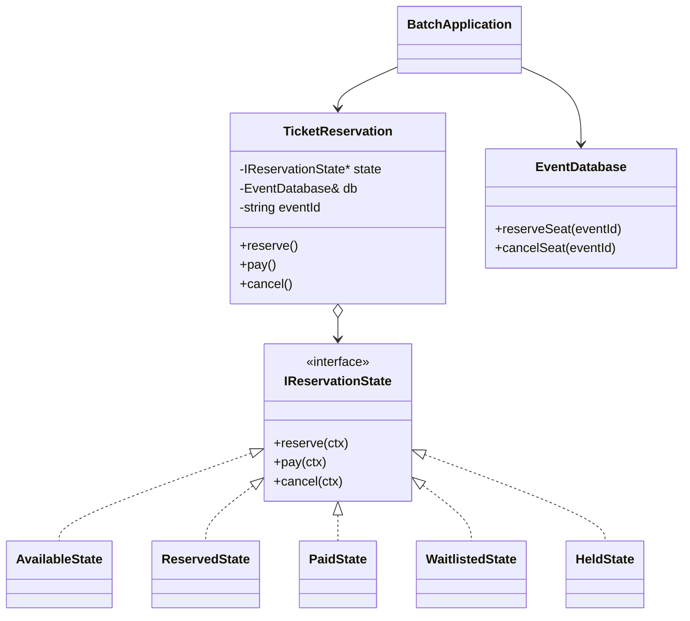

章末のState骨格図では `TicketReservation` がContext、`IReservationState` がState、5つの状態クラスがConcreteStateに対応します。イベントの予約数は状態オブジェクト自身に複製せず、ユースケースを組み立てる `BatchApplication` が状態遷移の成功後に `EventDatabase` へ増減を保存します。状態の振る舞いと座席在庫の永続化は別の責任として扱います。

### 7-2：動作シーケンス図

`seat.reserve()` が呼ばれたとき、どのクラスがどの順番で動くかを確認します。

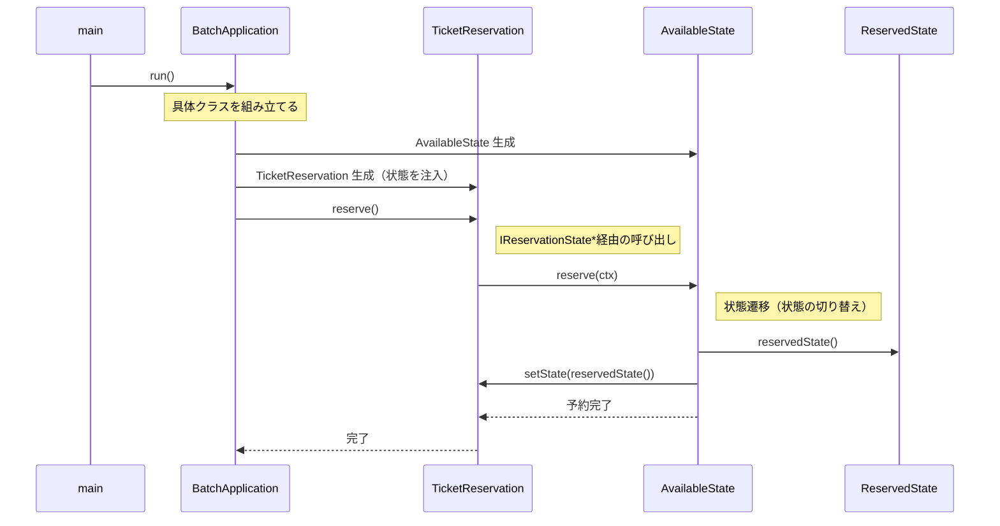

`TicketReservation` は `AvailableState` という具体クラス名を知らず、`IReservationState*` 経由で呼び出すだけです。状態の切り替え判断（`setState(reservedState())`）は `AvailableState` 自身が行います。`reservedState()` は静的オブジェクトへのポインタを返す関数で、遷移のたびに `new` でオブジェクトを生成しません。

### 7-3：変更影響グラフ（改善後）

フェーズ3で確認した「状態追加」のシナリオを再度適用します。

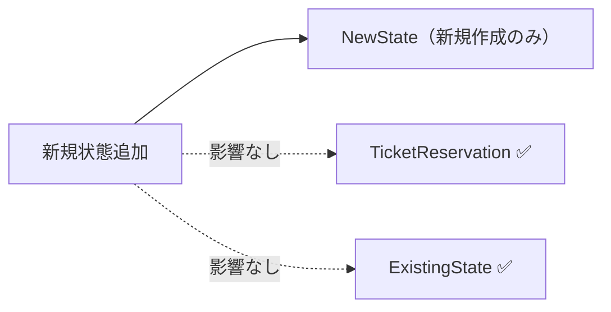

フェーズ3の変更影響グラフと比較して、新しい状態の追加という変更要求の中心が、新規作成した状態クラスへ移りました。組み立てコードやテストは追加されますが、既存の状態分岐を読み解いて広範囲に直す必要は小さくなっています。

### 7-4：変更シナリオ表

この設計で手に入れたものと、諦めたものを整理します。

| **シナリオ** | **フェーズ1の現状コードでの影響** | **この設計での影響** |
|---|---|---|
| キャンセル待ちと一時保留を追加 | `TicketReservation` の各操作へ `Waitlisted` / `Held` の条件分岐を追加 | `WaitlistedState` / `HeldState` と遷移の組み立てを追加。既存状態クラスは保つ |
| 支払済みからの返金対応 | `TicketReservation` の `pay()` `cancel()` を修正 | `IReservationState` と `TicketReservation` に返金操作を追加し、`PaidState` に振る舞いを実装する |
| 有効期限切れ処理を追加 | `TicketReservation` に新メソッドと全状態への分岐を追加 | 対象状態へ `expire()` を追加し、必要な遷移を登録 |
| 決済失敗後に再試行可能にする | `pay()` の成功/失敗分岐と状態ごとの戻り先を修正 | `ReservedState` / `HeldState` に失敗時の扱いを置く |

フェーズ1の現状コードでは新しい状態のたびに `TicketReservation` 全体を修正する必要がありました。改善後は、変更の中心を状態クラスと組み立て側へ寄せられます。諦めたものは、状態ごとのクラスファイルが増加するという可読性のコストです。

---

## 整理

### 問題・原因・課題・解決策

| | 内容 |
|---|---|
| **問題** | 状態が1つ増えるたびに全操作メソッドの条件分岐を書き直さなければならず、ヒアリングで確定した追加頻度ではコストが合わない |
| **原因** | 状態遷移ルール（企画担当）と操作フロー（開発チーム）が`TicketReservation`に混在し、状態変更時に関係する操作メソッドの確認が必要になる |
| **課題** | 状態ごとの振る舞いを `TicketReservation` から切り離し、公開操作は現在の状態へ委譲する構造にする |
| **解決策** | 状態分離構造：`IReservationState` を境界として状態ごとの振る舞いを各クラスに分離し、`TicketReservation` はインターフェース経由で現在の状態に処理を委譲する |

### フェーズとこの章でやったこと

この章では、複雑化する状態遷移が `if` や `switch` 文による条件分岐の混在を生み、システムの保守性を低下させている現状を学びました。7フェーズの思考プロセスを適用して、この構造的課題をどのように解決したのかを振り返ります。

| **フェーズ** | **この章でやったこと** |
|---|---|
| 🔵 フェーズ1：現状把握 | 予約ステータスが `TicketReservation` クラス内に直接記述され、条件分岐で管理されている現状を観察しました。 |
| 🟣 フェーズ2：仮説立案 | 企画担当者へのヒアリングを通じ、今後「状態」の種類も「遷移ルール」も頻繁に変わるリスクを特定しました。 |
| 🟣 フェーズ3：問題特定 | 新しい状態（一時保留など）の追加を試み、全メソッドの修正が不可避になる「痛み」を確認しました。 |
| 🟠 フェーズ4：原因分析 | 状態管理のルールと業務ロジックが同じ場所に混在していることが、システムを脆くしている根本原因だと突き止めました。 |
| 🟡 フェーズ5：課題定義 | 公開操作と状態固有の振る舞いの境界を定め、状態追加時に条件分岐を増やさない課題を定めた |
| 🔴 フェーズ6：対策検討 | ステップ1〜2を比較し、状態の契約を導入して現在の状態へ委譲するステップ2を採用しました。 |
| 🟢 フェーズ7：対策実施 | 状態を個別のクラスへ分割し、業務クラスから直接的な条件分岐を取り除きました。 |

### 責任の移動

今回の設計変更により、`TicketReservation` が抱え込んでいた責任がどこへ移動したかを示します。

| **責任** | **変更前** | **変更後** |
|---|---|---|
| 予約コンテキストの保持と委譲 | `TicketReservation` | `TicketReservation`（変わらず） |
| 各状態での操作可否の判断 | `TicketReservation`（if-else直書き） | `ReservedState` 等の各実装クラス |
| 状態遷移後の状態値の設定 | `TicketReservation`（if-else直書き） | `ReservedState` 等の各実装クラス |
| 状態の振る舞い契約の定義 | —（なし） | `IReservationState` |

### 複雑さを足しても対策は変わるか

| 追加した複雑さ | 見えた原因 | 定めた課題 | 採用した扱い |
|---|---|---|---|
| キャンセル待ちからの予約昇格イベント | 利用者操作でなくても、状態ごとの受け付け可否を中心クラスが知っている | 操作とイベントの発生源を問わず、現在状態へ委譲する | `WaitlistedState` に昇格時の振る舞いを置く |
| 保留期限切れタイマー | 時間起点の入力も `Held` だけが意味を持つのに、中心クラスへ条件が増える | 特定状態だけが扱うイベントを、その状態の責任に寄せる | `HeldState` に期限切れ時の遷移を置く |
| 決済失敗後の戻り | 成功時と失敗時で、維持すべき状態が状態ごとに変わる | 外部API結果を受けても、呼び出し元へ状態分岐を漏らさない | `ReservedState` / `HeldState` が失敗時の状態維持と再試行可否を決める |

> このプロセスを回した結果にたどり着いた構造こそが 状態分離構造です。

---

## 振り返り

### 「この章を読むと得られること」は手に入ったか

| **得られること** | **この章のどこで示したか** |
|---|---|
| 1. 変動箇所の識別 | フェーズ2のヒアリングを通じて、「状態の種類」と「状態遷移ルール」が頻繁に変わることを特定したこと。 |
| 2. 痛みの発生源の判断 | フェーズ4の分析で、「状態（ステータス）」と「その状態での振る舞い」が同じクラスに混在していることが、条件分岐の爆発という痛みの根本原因だと突き止めたこと。 |
| 3. 構造改善の説明 | 新しい状態を追加するとき、`TicketReservation`の条件分岐ではなく、状態クラスと遷移の組み立てを変更する設計を実現したこと。 |
| 4. 状態追加の判断 | フェーズ6のステップ比較で、変更頻度に応じてどのステップで止めるかを判断する基準を得たこと。 |

### 3つの設計原則はどう適用されたか

* **原則1「変わるものをカプセル化せよ」の現れ**
  * 具体化された場所：各状態クラス（`ReservedState` など）
  * 解説：状態ごとの細かなルールという「頻繁に変わる詳細」を、個別の状態クラスの中にカプセル化しました。これにより、業務クラス側は状態の内部ルールを知る必要がなくなりました。

* **原則2「実装ではなくインターフェースに対してプログラムせよ」の現れ**
  * 具体化された場所：`TicketReservation` クラスと `IReservationState` インターフェース
  * 解説：`TicketReservation` は具体的な状態クラスを直接参照せず、抽象的なインターフェースを通じて振る舞いを実行するようにしました。

* **原則3「継承よりコンポジションを優先せよ」の現れ**
  * 具体化された場所：`TicketReservation` が `IReservationState` を持つ構造
  * 解説：状態を継承で表現しようとすると階層が深まり柔軟性を失いますが、コンポジション（オブジェクトを内部に保持して利用する仕組み）として状態を持たせることで、実行時に状態を自由に入れ替えられるようになりました。

---

## あなたのコードで考えてみてください

この章で辿った思考プロセスを、あなた自身のコードに当てはめてみましょう。以下の判定ツリーに沿って確認してください。

**Q1：** 同じメソッドの中に「状態フラグや種別によって全く異なる処理をする」分岐がありますか？

- **No →** 現時点では状態分離構造は不要です。シンプルなコードを維持してください。
- **Yes → Q2へ**

**Q2：** 状態の種類が1つ増えたとき、修正が必要なメソッドは2つ以上になりますか？

- **No →** 分岐の数が少なく影響範囲が限定的です。今すぐ構造を適用する必然性はありません。
- **Yes → Q3へ**

**Q3：** 今後も状態の種類やルールが増える見込みがありますか（ヒアリングまたは変更履歴から判断）？

- **No →** 一時的な複雑さとして許容し、コメントで意図を明記する方が現実的です。
- **Yes →** 状態分離構造の適用を検討してください。状態ごとにクラスを切り出すことで、次の変更の影響を1クラスに閉じ込めることができます。

---

**題材を置き換えるときの共通手順**

この章の題材名を、自分の現場のシステム名に置き換えて考えます。

1. そのシステムは、誰が何を達成するために使うものか。
2. 入力、加工、出力は何か。
3. 最近入った変更要求、または次に来そうな変更要求は何か。
4. その変更で、触りたくない場所まで修正や再テストが広がるか。
5. 変えたいものと守りたいものを分けると、接続点には何を残すべきか。
6. 何もしない、関数化、クラス分離、契約導入、登録/組み立て移動のうち、どこまで進めるのが今回の文脈に合うか。

## パターン解説：State パターン

Stateパターンは、オブジェクトの内部状態が変化したときに、そのオブジェクトの振る舞いを変更できるようにするパターンです。

### パターンの骨格

状態ごとに専用のクラスを作成し、コンテキスト（状態を持つオブジェクト）は現在の状態オブジェクトに処理を委譲します。

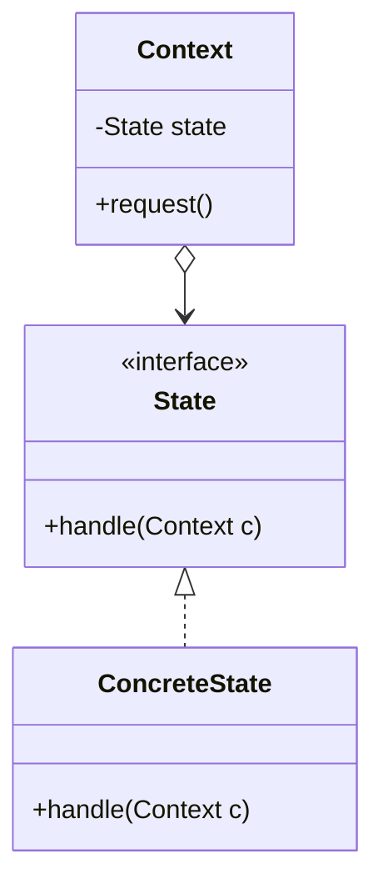

### 抽象骨格の実行シーケンス

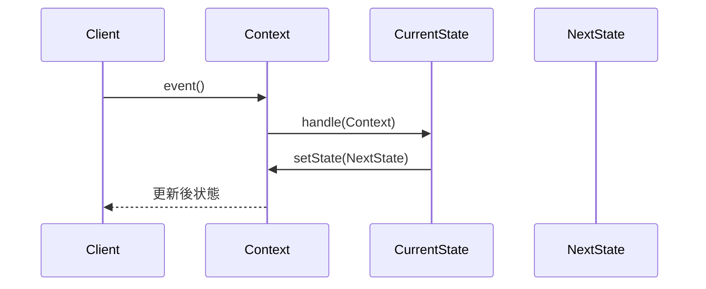

Clientは現在状態を指定せず、Contextが保持するStateへイベントを委譲します。

### この章の実装との対応

| GoFの名前 | この章での対応 |
|---|---|
| Context | `TicketReservation` |
| State | `IReservationState` |
| ConcreteState | `AvailableState` / `ReservedState` / `PaidState` 等 |

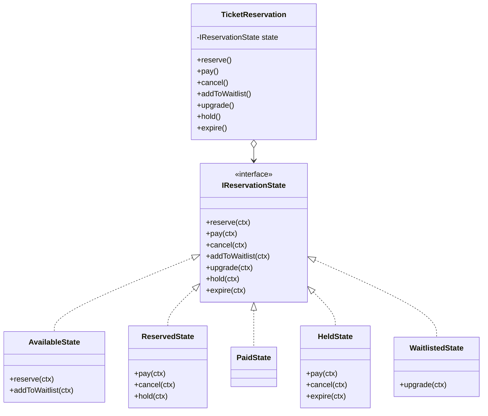

抽象ロールである `IReservationState` が、現実の `ReservedState` などの具体クラスと結びついています。

### 使いどころと限界

* **使うと良い状況：** 状態に応じてオブジェクトの振る舞いが劇的に変わる場合。また、状態の種類が将来的に増える見込みがある場合。

* **使わない方が良い状況：** 状態が2〜3つ程度で、今後も増える可能性がほとんどない場合。状態が少なければ `if` 文1本で全パターンを見通せるため、クラスを分けるコスト（ファイル数の増加・クラス間の依存関係の把握）が得られる利点を上回ります。「状態が増えたときにどこを直すか」が1メソッド内で完結するうちは、パターンの導入は過剰設計になります。

【過剰コード：状態が固定で増えないのにパターン化した例】

```cpp
// 「開いている」「閉まっている」の2状態しかなく
// 今後も増える予定がない扉の状態管理
// — この程度ならif文で十分
class IDoorState {
public:
    virtual void open() = 0;
    virtual void close() = 0;
    virtual ~IDoorState() = default;
};
class OpenState : public IDoorState {
public:
    void open()  { std::cout << "既に開いています\n"; }
    void close() { std::cout << "閉めました\n"; }
};
class ClosedState : public IDoorState {
public:
    void open()  { std::cout << "開けました\n"; }
    void close() { std::cout << "既に閉まっています\n"; }
};
```

上記は状態が2つしかなく今後も増えない場合の例です。`if (isOpen)` の1行で済む処理のために4クラスを導入するのは、コードの見通しを悪化させます。

| **状況** | **適切な選択** | **理由** |
|---|---|---|
| **変化の予定がある場合** | **Stateパターンを使う** | 状態の追加が他のロジックを汚染しないため |
| **変化の予定がない場合** | **シンプルなif文で十分** | クラス数の増加というコストに見合わないため |

### この章のまとめ

チケット予約というドメインと Stateパターンの関係を一言で言うなら、状態と振る舞いを同じクラスに置く限り、状態が増えるたびに関連する条件分岐を開かなければならない、ということです。「仮予約」「確定」「キャンセル」という状態ごとに異なる振る舞いが `TicketReservation` の中に同居していた。その構造が条件分岐の増殖を生んでいた——そこまで分析できれば、「状態の振る舞いを状態クラスへ移す」という方向性は自然に見えてきます。

7つのフェーズを通じて、読者は `status` 文字列の直書きという観察から「どの業務機能によるか」の分析へ、そして状態クラスへの分離という判断へと進みました。フェーズ2のヒアリングで「状態の種類は今後も増える」と確認した時点で変化軸が確定し、フェーズ4で「状態と振る舞いの混在」を接続点として特定した時点で解決の方向が定まる——その気づきの積み上げが、パターン名の暗記では得られない体験です。

あなたのコードの中にも、ステータス文字列や状態フラグで分岐している箇所があるはずです。それぞれの分岐が「どの業務機能によるか」を問うことが、状態をクラスとして分離する理由を見つける入口になります。
