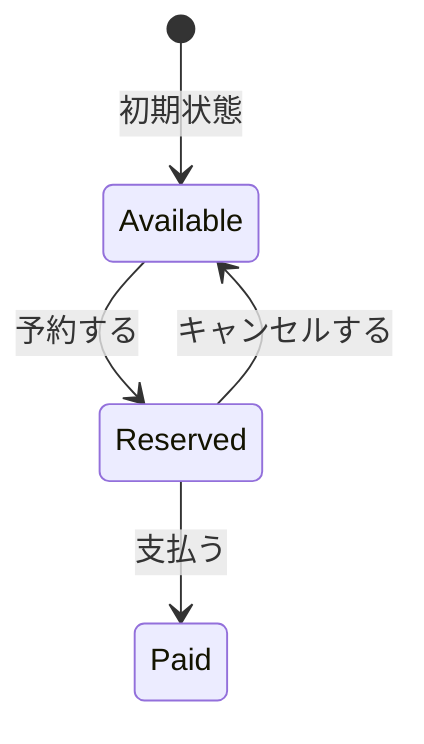
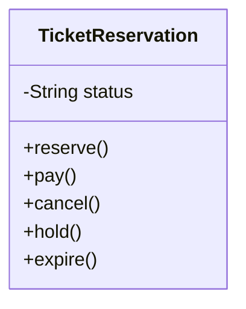
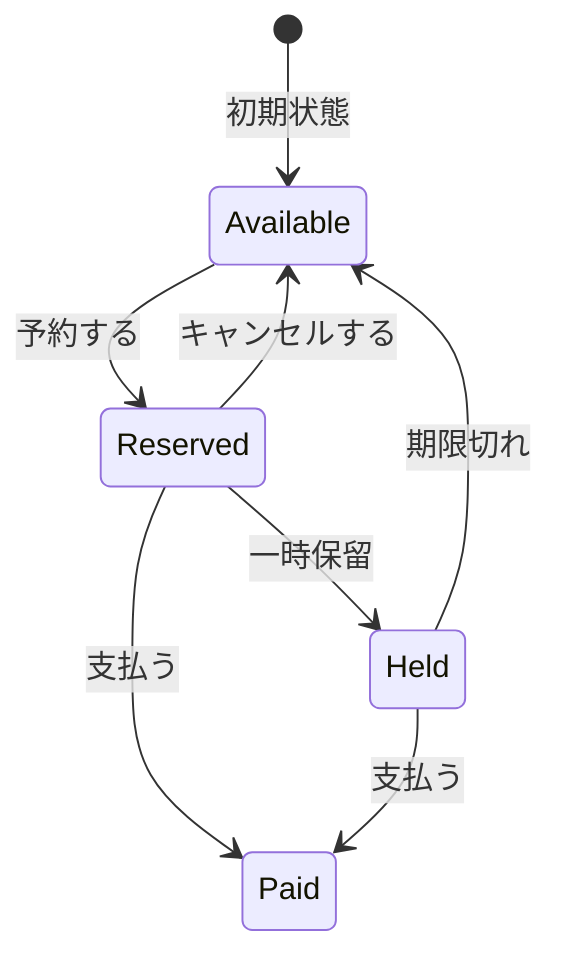
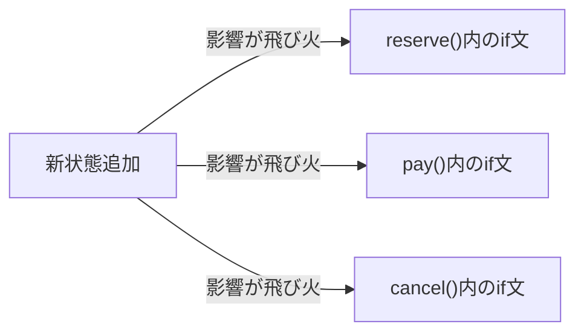
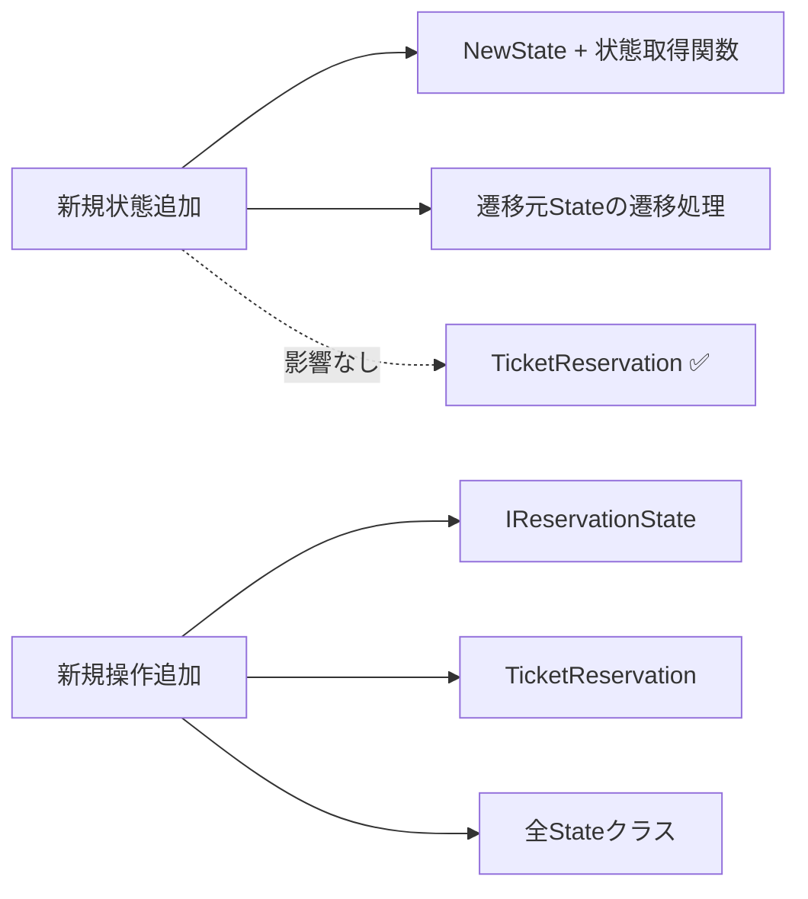
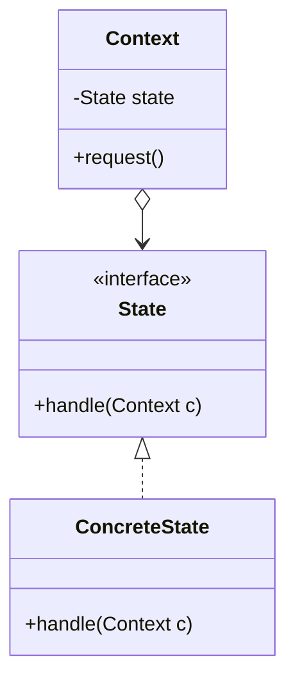
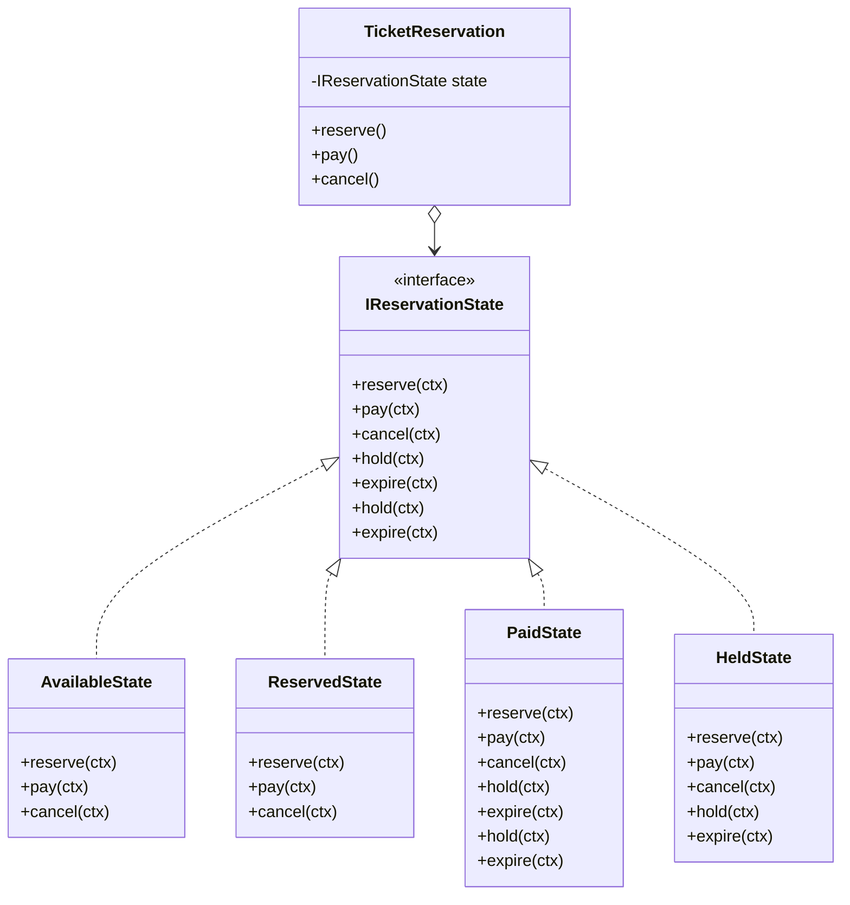

## 第3章 状態に応じた振る舞いの切り替え ―― State パターン

―― 思考の型：状態によって振る舞いが変わる処理が、条件分岐で混在している

### この章の核心

**特定の条件（状態）ごとに処理の内容が切り替わるコードは、状態が増えるたびに条件分岐が肥大化し、システムの保守性を損なう。それは、「状態」と「その状態での振る舞い」が、同じクラスの中に混在しているからだ。**

### この章を読むと得られること

この章の痛みは「状態が1つ増えるたびに、すべての処理分岐を書き直さなければならない」という問題です。

* **得られること1：** 「状態の変化に伴う振る舞いの切り替え」という観点で、コードの変動箇所を識別できるようになる
* **得られること2：** 条件分岐が複雑に絡み合ったクラスを見て、そこが状態管理の痛みの発生源だと判断できるようになる
* **得られること3：** 状態ごとの振る舞いを別クラスに分離することで、条件分岐を排除した構造改善の説明ができるようになる
* **得られること4：** 状態が増える可能性がある設計において、既存のフローを壊さずに状態を追加する判断ができるようになる

## 🔵 フェーズ1：現状把握 ―― 仕様を整理し、システムと紐付ける

はじめには、チケット予約管理システムという、私たちの目の前にあるシステムの現状を、ありのままの事実として把握するところから始めましょう。

### 1-1：このシステムの仕様

このシステムは、映画館の座席ごとに**チケット予約の状態を管理**します。

各座席は「空席（Available）」「予約済み（Reserved）」「支払済み（Paid）」の3つの状態を持ちます。お客様の操作（予約・支払・キャンセル）に応じて状態が遷移し、状態によって許可される操作が異なります。

**状態遷移マトリクス**

「——」は操作を受け付けず、エラーメッセージを出力して終了することを表します。

| 現在の状態 | 予約する | 支払う | キャンセルする |
|---|---|---|---|
| Available（空席） | → Reserved | —— | —— |
| Reserved（予約済み） | —— | → Paid | → Available |
| Paid（支払済み） | —— | —— | —— |



このマトリクスが、後のフェーズで「新しい状態が増えるとどこが変わるか」を確認する基準になります。

**このシステムの関係者**

| 役割 | 担当者 | 管轄する知識 |
|---|---|---|
| システム開発チーム | 自チーム | 予約フローの実装・保守 |
| 企画担当 | 映画館運営企画部門 | 状態遷移のルール（どの状態からどの操作を許可するか） |

後のフェーズで「誰の判断で変わる知識か」を確認するとき、この関係者表が基準になります。

---

### 1-2：動作例テーブル

コードを読む前に、このシステムがどんな入力に対してどんな出力を返すかを確認します。この章のどのステップも、以下の動作を実現します。

| # | 現在の状態 | 操作 | 結果 | 備考 |
|---|---|---|---|---|
| 1 | Available（空席） | 予約する | Reserved（予約済み）へ遷移 | 通常の予約フロー |
| 2 | Reserved（予約済み） | 支払う | Paid（支払い済み）へ遷移 | 支払い完了フロー |
| 3 | Reserved（予約済み） | キャンセルする | Available（空席）へ戻る | 予約キャンセルフロー |
| 4 | Paid（支払い済み） | キャンセルする | エラー（キャンセル不可） | 支払い後はキャンセルできない |
| 5 | Available（空席） | 支払う | エラー（支払い不可） | 予約なしで支払いを試みた場合 |
| 6 | Paid（支払い済み） | 予約する | エラー（予約不可） | 支払い済み座席には再予約できない |

この動作テーブルは、後のフェーズでステップを比較するときに「全ステップがこのテーブルと同じ出力を返すことで動作不変を確認する」ための基準として使います。ステップ1からステップ3まで、どれを採用しても上記の動作が変わってはいけません。違いはあくまで「変更が来たときにどこを触るか」という構造上の差だけです。

---

### 1-3：クラス構成図

コードを読んだところで、クラス間の関係を図で整理します。



→ 1-4節のコードを見ると、`reserve()`・`pay()`・`cancel()` の各メソッドに `if (status == ...)` という条件分岐が散在しており、`TicketReservation` クラスがすべての予約状態と、状態ごとの処理ロジックを一手に抱え込んでいることが分かります。

---

### 1-4：実装コード（現状）

#### このシステムの登場クラス

| クラス名 | 役割 | 担当する仕様 |
|---|---|---|
| TicketReservation | チケット予約の状態管理と各状態の振る舞い | 仕様全体 |

データの流れ：クライアントからの操作 → TicketReservation内部でstatus変数を変更
この章で注目するポイント：一つのクラスの中に、複数の状態のルールがどのように混在しているか


```cpp
#include <iostream>
#include <string>

class TicketReservation {
private:
    std::string status; // "Available", "Reserved", "Paid"
public:
    TicketReservation() : status("Available") {}

    void reserve() {
        if (status == "Available") {
            status = "Reserved";
            std::cout << "予約完了しました\n";
        } else {
            std::cout << "現在予約できません\n";
        }
    }

    void pay() {
        if (status == "Reserved") {
            status = "Paid";
            std::cout << "支払い完了しました\n";
        } else {
            std::cout << "支払いに適した状態ではありません\n";
        }
    }

    void cancel() {
        if (status == "Reserved") {
            status = "Available";
            std::cout << "予約をキャンセルしました\n";
        } else {
            std::cout << "キャンセルできません\n";
        }
    }
};
```

このコードを見ると、`reserve`、`pay`、`cancel` の各メソッドの中に、現在の `status` を判定する条件分岐が散らばっていることが分かります。実際の動作を確認するために、このクラスを呼び出す `main` 関数と実行結果を合わせて示します。

```cpp
int main() {
    TicketReservation seat;
    seat.reserve();  // Available → Reserved
    seat.pay();      // Reserved  → Paid
    return 0;
}
```

上記コードの実行結果：

```
予約完了しました
支払い完了しました
```

動作例テーブルの行1（Available → Reserved）と行2（Reserved → Paid）と一致しています。次のフェーズで変更が来たときに何が起きるかを確認します。

---

### 1-5：変更要求

ある週明けの朝、映画館の支配人から開発チームへ、新しい施策についての連絡が入りました。

「来月から、『予約一時保留』という状態を追加してほしい。座席を確保したまま、決済を24時間待てる仕組みです。保留期限内に支払えば支払済みへ進み、期限が切れたら座席を空席へ戻してください。また、将来はリピーター向けの『キャンセル待ち』機能も検討しています。」

支配人は、この機能が実装されれば、決済前の利用者に猶予を与えながら座席を確保できると期待しています。`Held` は座席予約のライフサイクルに属するため、`TicketReservation` の状態として扱えます。一方、キャンセル待ちは「満席の座席を待つ顧客の列」であり、座席1つの状態とは責任が異なります。本章では無理に `TicketReservation` の状態へ含めず、別の待ち行列モデルとして検討すべき将来要求に分類します。

**仕様変更の内容**

変更要求を受けて、状態の種類と遷移ルールがどう変わるかを整理します。

**状態の変化**

| 状態 | 変更前 | 変更後 |
|---|---|---|
| Available（空席） | あり | 変更なし |
| Reserved（予約済み） | あり | 変更なし |
| Paid（支払済み） | あり | 変更なし |
| **Held（一時保留）** | なし | **新規追加** |

**新しく追加される遷移ルール**

| 現在の状態 | 操作 | 遷移先 | 処理内容 |
|---|---|---|---|
| Reserved | hold | Held | 予約を確保したまま24時間決済を保留する |
| Held | pay | Paid | 保留期限内に決済を完了する |
| Held | expire | Available | 保留期限（24時間）が切れ、座席を空きに戻す |

現状の `if` 文を使った状態分岐ロジックに、1状態と3遷移を追加することになります。キャンセル待ちは別モデルとして、本章の実装対象から外します。

**仕様変更後の状態遷移マトリクス（全体像）**

「——」は操作を受け付けず、エラーメッセージを出力して終了することを表します。

【表1：従来の操作】

| 現在の状態 | 予約する | 支払う | キャンセルする |
|---|---|---|---|
| Available（空席） | → Reserved | —— | —— |
| Reserved（予約済み） | —— | → Paid | → Available |
| Paid（支払済み） | —— | —— | —— |
| Held（一時保留） | —— | → Paid | —— |

【表2：一時保留系の操作】

| 現在の状態 | 一時保留 | 期限切れ |
|---|---|---|
| Available（空席） | —— | —— |
| Reserved（予約済み） | → Held | —— |
| Paid（支払済み） | —— | —— |
| Held（一時保留） | —— | → Available |



フェーズ1でシステムの現状と変更要求が把握できました。次のフェーズ2では、「何が変わり、何が変わらないか」を整理します。

---

## 🟣 フェーズ2：仮説立案 ―― 何が変わるかを観察し、ヒアリングで裏付ける

### 2-1：`TicketReservation`に混在している知識と変更の構造

`TicketReservation` が現在抱えている知識と、変更が起きたときの影響範囲を確認します。

| 知識（コードが直接持っているもの） | 変更のきっかけ | 変更時の影響範囲 |
|---|---|---|
| Available状態の操作ルールと遷移先 | 企画担当が状態を変更 | Available関連の全分岐 |
| Reserved状態の操作ルールと遷移先 | 企画担当が状態を変更 | Reserved関連の全分岐 |
| Paid状態の操作ルールと遷移先 | 企画担当が状態を変更 | Paid関連の全分岐 |

企画担当がある状態のルールを見直すとき、本来は「Reservedでできること」のように状態単位で考えます。しかしコードは `reserve()`・`pay()`・`cancel()` という操作単位に分散しています。**業務側の変更単位とコードの配置単位がずれている**ことが、後の痛みの予兆です。

### 2-3：今回の変更で確実に変わること

変更要求として届いた内容のうち、今回のリリースで確実に発生する変更を整理します。

| **分類** | **具体的な内容** | **変わるタイミング** | **根拠** |
|---|---|---|---|
| 🔴 **変動する** | 状態の種類（一時保留の追加） | 今回のリリース | 支配人からの変更要求に明記されている |
| 🔴 **変動する** | 各状態における振る舞い（状態ごとのアクション可否） | 今回のリリース | 新状態の導入に伴い定義が必要 |
| 🟢 **不変** | 映画館の基本情報（上映時間、座席数） | 変わる日は来ない | 運営管理部門との合意 |

この時点で確定しているのは「状態が2つ増える」という事実だけです。将来どれだけ変わり続けるかは、次の関係者ヒアリングで確認します。

### ヒアリングに向けた背景確認

このシステムは、ある映画館のチケット予約管理を担っています。映画の上映スケジュールに対して、座席の予約、支払い、発券といった一連のプロセスを管理する、映画館運営の中核となるシステムです。

現在このシステムは、「Available（空席）」「Reserved（予約済み）」「Paid（支払い済み）」という3つの状態で動作しています。座席の予約、支払い、キャンセルという操作に対して、現在の状態に応じた処理が実行される仕組みです。

### 2-4：関係者ヒアリング

仮説を確実なものにするため、企画担当の鈴木氏にヒアリングを行いました。このシステムでは「状態の種類」と「状態遷移ルール」が密接に結びついています。どちらが変わりやすいかによって設計の方向が大きく変わるため、この2点を重点的に確認します。

> **現実のヒアリングでは——** このシナリオでは相手がちょうど設計に役立つ情報を教えてくれています。現実には「変わるかどうか分からない」「たぶん変わらない」という答えが返ることも多いです。そのときは、コードの変更履歴（`git log`）や過去の障害記録を「ヒアリングの代わり」として使ってみてください。「過去に何度変わったか」が、「将来変わりやすいか」の最も正直な証拠です。

* **開発者：** 「一時保留のほかに、予約のライフサイクルへ状態が増える予定はありますか？」
* **企画担当 鈴木：** 「法人審査中や返金処理中などは検討しています。ただし、キャンセル待ちは顧客の待ち行列なので、座席予約の状態とは分けて考えたいです。」
* **開発者：** 「保留中に許可する操作も変わる可能性がありますか？」
* **企画担当 鈴木：** 「あります。今回は支払いと期限切れだけですが、運用を見て手動キャンセルを認める可能性があります。」

ヒアリングの結果、「状態の種類」だけでなく「状態遷移ルールそのもの」も頻繁に変わり続けるという事実が見えてきました。

### 2-5：ヒアリングで判明した将来リスク

ヒアリングで浮かび上がった「確定ではないが、近い将来起こりうる変化」を記録します。これは今回の設計判断の材料です。

| **将来リスク** | **時期の目安** | **根拠** |
|---|---|---|
| 状態遷移のルール（アクションの可否）の変更 | キャンペーンや運用の見直し時 | 企画担当 鈴木氏との確認 |
| 予約ライフサイクルの状態（法人審査中・返金処理中など）の追加 | 新機能導入時 | 企画担当 鈴木氏との確認 |
| キャンセル待ちを別の待ち行列モデルとして追加 | 将来の集客施策導入時 | 座席状態とは別責任であることをヒアリングで確認 |

フェーズ2で「今変わること（確定）」と「将来変わるかもしれないこと（リスク）」を分けて整理できました。次のフェーズ3では、現在の構造で変更を試みたときに何が起きるかを確認します。

---

## 🟣 フェーズ3：問題特定 ―― 変更の痛みを発見する

フェーズ2で「予約ライフサイクルの状態遷移ルールは今後も変わりうる」と確認できました。このフェーズでは、今回確定した一時保留を、今のコード構造のまま適用しようとしたときの「痛み」を観察します。

### 3-1：変更を試みる

フェーズ2の変更要求を受けて、今のコードに「一時保留（Held）」状態を追加してみます。追加する必要がある仕様と、その修正対象箇所は次の通りです。

| 仕様 | 修正対象メソッド |
|---|---|
| `Held`（一時保留）：決済を24時間待つ状態 | 状態値の追加に加え、`hold()`・`expire()` という新しい操作が必要 |
| `Held` からは `pay()` で `Paid` に遷移できる | `pay()` を修正 |
| `Held` からは `expire()` で `Available` に戻る | `expire()` を追加 |

この仕様を今の `TicketReservation` クラスに当てはめると、既存の `pay()` を修正し、新たに `hold()` と `expire()` を追加します。

```cpp
// pay() に追加が必要な箇所
} else if (status == "Held") {  // ← Held 対応を追加
    status = "Paid";
    std::cout << "保留から支払い完了しました\n";
}

// 新しい expire() に必要な状態判定
if (status == "Held") {
    status = "Available";
    std::cout << "保留期限が切れました\n";
}
```

状態遷移マトリクスで見ると、Held を追加するとは「行を1行増やす」ことに見えます。

| 現在の状態 | `reserve()` | `pay()` | `cancel()` | `hold()` | `expire()` |
|---|---|---|---|---|---|
| Available | → Reserved | —— | —— | —— | —— |
| Reserved | —— | → Paid | → Available | → Held | —— |
| Paid | —— | —— | —— | —— | —— |
| **Held（新規）** | —— | → Paid | —— | —— | → Available |

しかし実装では、既存の `pay()` にHeldの分岐を追加し、`hold()` と `expire()` という操作も新設する必要があります。さらに、新しい2操作について、Available・Reserved・Paid・Heldの各状態で許可するか拒否するかを定義しなければなりません。状態の追加と操作の追加が同時に起きると、クラス内の条件分岐を縦横に確認する作業が発生します。

もし、さらに「法人審査中」のような予約状態が追加されたらどうなるでしょうか。関係する操作の条件分岐がさらに増え、一つのアクションを行うたびに、今の `status` が何なのかを意識しなければなりません。

「この先、状態が5つ、6つと増えたら、一つのアクションを判定するのにどれだけの `if` 文を積み重ねればいいんだろう……」

状態を追加したとき、すべての操作メソッドを必ず修正するとは限りません。ただし、**既存の各操作で新状態をどう扱うかを確認する必要**があります。さらに操作そのものが増える場合は、全状態に対する許可・拒否を定義します。修正箇所の数よりも、状態×操作の組み合わせを横断して確認しなければならないことが、この構造の痛みです。

> [!INFO] コラム: Enumとswitch文ではダメなの？
> 状態が少なく、遷移ルールも単純な場合は、Enumとswitch文を使う方がシンプルで適していることもあります。しかし、状態ごとに複雑な処理（API通信やDB保存など）が発生したり、新しい状態が頻繁に追加されたりするシステムでは、条件分岐が肥大化して限界を迎えます。Stateパターンは、そのような「複雑に成長してしまった状態管理」を整理するための強力な武器になります。

### 3-2：変更影響グラフ

変更を試みようとしたときに頭の中で起きた「影響の広がり」を図にしてみます。



このグラフが示す通り、たった一つの「状態追加」という変更要求が、クラス内のほぼすべてのロジックに飛び火しています。

### 3-3：痛みの言語化

変更を試みてみた結果、現場でよく直面する2つの辛い状況が浮かび上がってきました。

1つ目は、修正漏れがバグに直結する恐怖です。新しい状態を追加すると、既存の各操作でその状態をどう扱うかを確認します。さらに新しい操作も追加するなら、すべての状態で許可・拒否を定義します。もし `pay()` で「保留中からの支払い」を考慮し忘れたら、利用者は支払いができません。状態×操作の組み合わせを人手で追う作業は、変更が重なるほど高コストになります。

2つ目は、システムの振る舞いが「コードの迷路」になってしまうことです。現状では、`TicketReservation` クラスを開けば予約のルールが一目瞭然でした。しかし、状態が増えるたびに `if` や `else if` が折り重なり、ビジネス上のルールがどこに書かれているのかが見えにくくなります。コードを読むたびに、脳内で「今この状態なら、このメソッドは動いて……」というシミュレーションを繰り返さなければなりません。これでは、誰かが修正を加えるたびに別の場所を壊してしまう「副作用」の温床になってしまいます。

フェーズ3で「変更が辛い」という事実が確認できました。次のフェーズ4では、なぜ辛いのかを構造的に言語化します。

---
> **📌 問題（確定）**
> `Held` の追加では既存の支払い分岐に加えて `hold()`・`expire()` が必要になり、状態×操作の組み合わせを `TicketReservation` 内で横断して確認しなければならない。今後も予約状態と遷移ルールが変わる見込みがあり、この確認コストが増え続ける。
---

## 🟠 フェーズ4：原因分析 ―― なぜ辛いのかを構造で言語化する

フェーズ3で確認した「状態追加のたびに条件分岐が増え、修正漏れの可能性が高まる」という痛み。このフェーズでは、状態の知識がどこへ漏れているかを接続点から掘り下げます。

### 4-1：痛みの根源を探る（観察と原因）

「ステータスと振る舞いが同じクラスにあること」は、それ自体が問題ではありません。この章で問題なのは、企画担当が状態単位で変更するルールが、コードでは操作単位のメソッドへ分散していることです。たとえばHeldの仕様を確認するには、`pay()`・`cancel()`・`hold()`・`expire()` を横断します。ここでは「誰が決めるか」だけでは境界を決められません。**何が一緒に変わるか**を見ると、状態ごとの許可・拒否と遷移先を同じ場所へまとめる方向が見えてきます。

この表は「フェーズ3で感じた痛み」を出発点にして、その痛みが生まれた構造的な理由を探る表です。痛みを1つ取り上げ、「なぜそうなるのか？」と問いかけ続けることで、根本原因の方向が見えてきます。

| **観察した症状（痛み）** | **構造的な原因（痛みの根源）** |
|---|---|
| 状態や操作を追加するたびに、関係する条件分岐を横断して許可・拒否と遷移を確認する必要がある | 「現在の状態（ステータス）」と「その状態で実行可能な振る舞い」が、一つのクラスの中に混在しているから |
| 複雑な条件分岐により、現在の状態が何であるかを常に意識しないとコードが書けない | 状態管理のルール（遷移条件）がロジックの中に埋め込まれ、状態の変化を追跡するのが困難になっているから |

### 4-2：変わるもの/変わってほしくないもの

> **「変わらないもの」と「変わってほしくないもの」は異なります。** 「変わらないもの」は経験的事実（今まで変わっていない）、「変わってほしくないもの」は設計意図（ここを安定させてほかを守りたい）です。ここで整理するのは後者です。

原因分析の結果から、「変わり続けるもの」と「変わってほしくないもの」を整理します。

| **変わり続けるもの（🔴）** | **変わってほしくないもの（🟢）** |
|---|---|
| 予約ライフサイクルの状態（保留中、法人審査中などの追加） | 予約システムとしての基本的な業務フロー |
| 各状態における振る舞い（状態ごとのアクション） | 状態を管理するという概念（状態があること自体） |

私たちが守るべきは「予約管理」という概念であり、増え続ける「状態の種類」や「状態ごとの細かなルール」は、安定した業務フローから切り離す必要がある存在なのです。

### 4-3：接続点に漏れている状態の知識を確認する

現在、`TicketReservation`の各操作メソッドは、`status`の文字列と状態ごとの遷移ルールを知っています。本来の接続点は「現在の状態へ操作を依頼すること」ですが、状態名と分岐条件がコンテキスト側へ漏れています。

状態の知識が漏れている根拠は次の2点です。

| 観点 | コードの証拠 |
|---|---|
| **「具体」＝専用規格** | `if (status == "Available")` など — 状態名を文字列リテラルとしてコードに直書きしており、他の書き方に差し替えられない |
| **「直接」＝直差し** | `reserve()` / `pay()` / `cancel()` の各メソッドが `status` を直接読み書きしており、間に何も挟まっていない |

`Available`などの状態名と遷移条件が複数メソッドに埋め込まれているため、状態が増えるたびに既存の操作メソッドを横断して確認する必要があります。

フェーズ4で根本原因が言語化できました。「どこを分けるか」は明確です。次のフェーズ5では、その境界で実際に何が流れているかを値・型のレベルで具体化し、「何が変わり、何が変わらないか」を明確にします。

---
> **📌 原因（確定）**
> `TicketReservation`が「現在の状態の判断」と「操作ごとの処理フロー」の両方を保持している。状態の追加や遷移ルールの変更では、関係する操作メソッドを横断して修正・再テストする必要がある。
---

## 🟡 フェーズ5：課題定義 ―― 接続点で何が流れているかを見る

フェーズ4は「なぜ辛いか」を答えました。フェーズ5が問うのは「分けるべき境界で、実際に何が流れているか」です。クラスの参照関係ではなく、**値・型のレベル**に降りていきます。

フェーズ4で、「現在の状態」と「その状態での振る舞い」が `TicketReservation` の中に混在していることが分かりました。その境界で何がやり取りされているかを具体化します。

### 接続点を特定する

`reserve()` / `pay()` / `cancel()` の中で分けるべき境界は1か所です。公開する操作と、状態ごとの振る舞いとの間で受け渡している情報を見ます。

現在の結合状況：`status` という文字列値が各メソッドの条件分岐に直接埋め込まれており、状態の判断と振る舞いが同じ場所に混在しています。

| 接続点 | 接続するデータ | 変わるもの |
|---|---|---|
| 状態ごとの振る舞い → `reserve()`/`pay()`/`cancel()` の骨格 | status（string値）→ 操作結果（void） | 状態ごとの振る舞いロジック（新しい状態が追加されると増える） |

### 何が変わり、何が変わらないか

- **変わるもの**：状態ごとの振る舞いロジック（どの状態でreserve/pay/cancelが何をするか）。新しい状態が追加されるたびに分岐が増える。
- **比較的安定しているもの**：既存操作（`reserve()` / `pay()` / `cancel()`）の呼び出し方。ただし今回の `hold()` / `expire()` のように業務操作自体が増える場合もある。

呼び出し元は `reserve()` などの操作を呼べれば十分です。問題は「どの状態のときに何をするか」という**状態固有の判断**が `TicketReservation` の中で状態の数だけ膨れ続けることです。

**現状のままでよい場面**：状態が少なく、遷移ルールも当面固定されるなら、`if-else`を保つ判断もあります。今回は状態と遷移ルールの追加が見込まれるため、状態ごとの知識をコンテキストから切り離す設計を検討します。

---
> **📌 課題（確定）**
> `reserve()`・`pay()`・`cancel()` という公開操作と、「どの状態のときに何をするか」という状態ごとの振る舞いを切り離す。`TicketReservation` から状態固有の判断を取り出し、公開操作は現在の状態へ処理を委譲する構造にする。状態を追加するときは新しい状態クラスと遷移の組み立てを変更し、`TicketReservation` の条件分岐を増やさずに済む形を目指す。
---

## 🔴 フェーズ6：対策検討 ―― 段階的な改善と決断

フェーズ5で、状態ごとの許可・拒否と遷移先が主な変化軸であり、既存操作の呼び出し方は比較的安定していると分かりました。一方、操作追加も起こりうるため、その場合のコストも比較対象にします。ここでは状態ごとの振る舞いをどのようにまとめるかを段階的に検討します。

---

### ステップ1：各状態処理をプライベートメソッドへ切り出す

フェーズ3で確認した痛みは「状態ごとの分岐が複数メソッドに散らばっている」でした。一番最小限の改善として、`reserve()` の中に直接書かれていたロジックを `reserveFromAvailable()` などの専用プライベートメソッドへ移してみます。

```cpp
class TicketReservation {
private:
    std::string status;

    void reserveFromAvailable() {
        status = "Reserved";
        std::cout << "予約完了しました\n";
    }

    void payFromReserved() {
        status = "Paid";
        std::cout << "支払い完了しました\n";
    }

    void cancelFromReserved() {
        status = "Available";
        std::cout << "予約をキャンセルしました\n";
    }

public:
    TicketReservation() : status("Available") {}

    void reserve() {
        if (status == "Available") {
            reserveFromAvailable();
            return;
        }
        std::cout << "現在予約できません\n";
    }
    void pay() {
        if (status == "Reserved") {
            payFromReserved();
            return;
        }
        std::cout << "支払いに適した状態ではありません\n";
    }
    void cancel() {
        if (status == "Reserved") {
            cancelFromReserved();
            return;
        }
        std::cout << "キャンセルできません\n";
    }
};
```

各状態での処理が名前つきのメソッドとして読めるようになり、`reserve()` などの本文が短くなりました。

**評価：** 見通しは良くなりましたが、新しい状態を追加するときには、関係する操作の分岐を `TicketReservation` に書き足します。新しい操作も増えるなら、その操作で全状態を判定する分岐が増えます。`TicketReservation` が「どの状態のときに何をするか」をすべて知る構造は変わっていません。

---

### ステップ2：状態ごとにクラスを作る

ステップ1の限界を確認したところで、「状態ごとのロジックを別クラスに切り出せば整理できるのでは」という自然な発想が浮かぶ。`ReservedState`・`AvailableState`・`PaidState` という3つのクラスを作り、`TicketReservation` がそれぞれを直接フィールドとして持つ形を試してみる。

```cpp
class AvailableState {
public:
    void reserve(std::string& status) {
        status = "Reserved";
        std::cout << "予約完了しました\n";
    }
};

class ReservedState {
public:
    void pay(std::string& status) {
        status = "Paid";
        std::cout << "支払い完了しました\n";
    }
    void cancel(std::string& status) {
        status = "Available";
        std::cout << "予約をキャンセルしました\n";
    }
};

class PaidState {
public:
    void errorReserve() {
        std::cout << "支払い済みのため再予約できません\n";
    }
    void errorCancel() {
        std::cout << "支払い済みのためキャンセルできません\n";
    }
};

class TicketReservation {
private:
    std::string    status;
    AvailableState available; // ← 具体クラスを直接保持
    ReservedState  reserved;  // ← 具体クラスを直接保持
    PaidState      paid;      // ← 具体クラスを直接保持

public:
    TicketReservation() : status("Available") {}

    void reserve() {
        if (status == "Available") { available.reserve(status); return; }
        if (status == "Paid")      { paid.errorReserve();       return; }
        std::cout << "現在予約できません\n";
    }
    void pay() {
        if (status == "Reserved") { reserved.pay(status); return; }
        std::cout << "支払いに適した状態ではありません\n";
    }
    void cancel() {
        if (status == "Reserved") { reserved.cancel(status); return; }
        if (status == "Paid")     { paid.errorCancel();      return; }
        std::cout << "キャンセルできません\n";
    }
};
```

状態ごとのロジックが `TicketReservation` から別クラスに移り、クラスを見ただけで「これがAvailable状態のふるまい」と分かるようになった。

**評価：** 状態ごとのロジックは分離できましたが、`TicketReservation` が全状態クラス名と選択条件を知っています。新しい状態（`HeldState`）を追加するとき、新クラスだけでなく、関係する操作の分岐も追記しなければなりません。

---

### ステップ3：状態の契約を導入し、現在の状態に委譲する

ステップ2で「`TicketReservation` が全状態クラスを直接知っている」ことが問題だと分かった。解消するには `TicketReservation` が具体的なクラス名を知らなくてよい構造にすればいい。「どの状態クラスも `reserve()`・`pay()`・`cancel()` を持つ」という契約（インターフェース）を定め、`TicketReservation` はその契約だけを通じて現在の状態に処理を丸投げする。

**状態インターフェース（IReservationState）：**

```cpp
class TicketReservation;

class IReservationState {
public:
    virtual void reserve(TicketReservation* ctx) = 0;
    virtual void pay(TicketReservation* ctx) = 0;
    virtual void cancel(TicketReservation* ctx) = 0;
    virtual void hold(TicketReservation* ctx) = 0;
    virtual void expire(TicketReservation* ctx) = 0;
    virtual ~IReservationState() = default;
};

// 状態オブジェクトを共有するための取得関数
IReservationState* availableState();
IReservationState* reservedState();
IReservationState* paidState();
IReservationState* heldState();
```

メソッド引数に `TicketReservation* ctx` を受け取るのは、各状態クラスが遷移後の状態を `ctx->setState()` でセットするためにコンテキストへのポインタが必要だからだ。

**各状態クラス：**

```cpp
class AvailableState : public IReservationState {
public:
    void reserve(TicketReservation* ctx) override {
        std::cout << "予約完了しました\n";
        // 遷移はctx->setState()で行う（フェーズ7で実装）
    }
    void pay(TicketReservation* ctx) override {
        std::cout << "予約なしで支払いはできません\n";
    }
    void cancel(TicketReservation* ctx) override {
        std::cout << "空席状態のためキャンセル不要です\n";
    }
    void hold(TicketReservation*) override {
        std::cout << "予約前のため保留できません\n";
    }
    void expire(TicketReservation*) override {
        std::cout << "保留状態ではありません\n";
    }
};

class ReservedState : public IReservationState {
public:
    void reserve(TicketReservation* ctx) override {
        std::cout << "既に予約済みです\n";
    }
    void pay(TicketReservation* ctx) override {
        std::cout << "支払い完了しました\n";
    }
    void cancel(TicketReservation* ctx) override {
        std::cout << "予約をキャンセルしました\n";
    }
    void hold(TicketReservation* ctx) override {
        std::cout << "予約を一時保留しました\n";
    }
    void expire(TicketReservation*) override {
        std::cout << "保留状態ではありません\n";
    }
};

class PaidState : public IReservationState {
public:
    void reserve(TicketReservation* ctx) override {
        std::cout << "支払い済みのため再予約できません\n";
    }
    void pay(TicketReservation* ctx) override {
        std::cout << "既に支払い済みです\n";
    }
    void cancel(TicketReservation* ctx) override {
        std::cout << "支払い済みのためキャンセルできません\n";
    }
    void hold(TicketReservation*) override {
        std::cout << "支払い済みのため保留できません\n";
    }
    void expire(TicketReservation*) override {
        std::cout << "保留状態ではありません\n";
    }
};

class HeldState : public IReservationState {
public:
    void reserve(TicketReservation*) override {
        std::cout << "保留中のため再予約できません\n";
    }
    void pay(TicketReservation* ctx) override {
        std::cout << "保留中の予約を支払いました\n";
    }
    void cancel(TicketReservation*) override {
        std::cout << "保留中は手動キャンセルできません\n";
    }
    void hold(TicketReservation*) override {
        std::cout << "既に保留中です\n";
    }
    void expire(TicketReservation* ctx) override {
        std::cout << "保留期限が切れました\n";
    }
};
```

各クラスが「自分の状態のときに何ができて何ができないか」を自己完結して持っている。

**コンテキストクラス（TicketReservation）：**

```cpp
class TicketReservation {
private:
    IReservationState* state; // ← インターフェース型のみ知っている
public:
    TicketReservation(IReservationState* s) : state(s) {}
    void setState(IReservationState* s) { state = s; }
    void reserve() { state->reserve(this); }
    void pay()     { state->pay(this); }
    void cancel()  { state->cancel(this); }
    void hold()    { state->hold(this); }
    void expire()  { state->expire(this); }
};
```

`TicketReservation` から状態名を判定する `if` 文がなくなりました。既存の操作契約の範囲で新しい状態を追加するなら、`IReservationState` を実装するクラスを作り、その状態へ入る遷移元を変更します。今回のように `hold()`・`expire()` という**新しい操作も追加する場合**は、インターフェース、コンテキスト、すべての状態クラスへメソッドを追加する必要があります。Stateは状態追加と操作追加で得意な変更方向が異なります。

**評価：** 状態ごとの振る舞いを新しい状態クラスへ置けるようになりました。実際の追加時には、新クラスに加えて遷移先の設定や組み立て箇所の登録が必要です。なお、このコードはまだ状態遷移処理を省いているため、動作例テーブルの全パターンは再現できません。完成版はフェーズ7で示します。

---

### どこまで設計を進めるのが良いか（採用ステップの決断）

各ステップには一長一短があります。どこで止めるかは、「今後の変更頻度（ビジネス要求）」で決断します。

* **ステップ1で止めるケース：** 状態の種類が固定されており、今後も増える見込みがない場合。1クラス内の整理で十分であり、クラスを増やすコストに見合いません。
* **ステップ2で止めるケース：** 状態ごとの処理を別クラスに整理したいが、新しい状態が追加されるかどうかまだ確証がない場合。状態の数が少なく、追加の見込みが薄ければここで止めるのも現実的な選択です。
* **ステップ3まで進むケース：** 今後も頻繁に新しい状態が追加されると確定している場合。今すぐ初期投資コストを払ってでも、業務フローのコンテキストクラスを変更から守る設計が適切です。

**今回の決断：**
フェーズ2のヒアリングで、「法人審査中」「返金処理中」など、予約ライフサイクルの状態が今後も増える可能性が確認されました。また、状態遷移のルール自体も変わりえます。したがって、今回は**ステップ3（状態の契約を導入し、現在の状態へ委譲する）まで進化させる**決断を下します。

**この構造は、State（ステート）パターンと呼ばれています。**

状態ごとに専用のクラスを用意し、コンテキスト（`TicketReservation`）は現在の状態に処理を委譲します。今回のような状態追加では、コンテキストの条件分岐を変更せず、状態クラスと遷移の組み立てを追加できます。

---

## 🟢 フェーズ7：対策実施 ―― 変化に強いコードを完成させる

採用した設計（ステップ3：状態の契約と委譲）を、実際のコードに実装します。これにより、これまで`TicketReservation`が抱え込んでいた複雑な条件分岐を、個別の状態クラスへ移します。

この設計変更の価値は、`reserve()`・`pay()` など既存操作の範囲で新しい予約状態を増やすとき、コンテキストの条件分岐を増やさず、状態クラスと遷移元へ変更を寄せられることです。一方、新しい操作を増やす場合は全状態クラスにその操作の振る舞いを定義します。本章では両方の変更を実装し、違いを確認します。

### 7-1：解決後のコード（全体）

新しい設計の基盤となるインターフェースを定義します。このインターフェースが「すべての状態クラスが守るべき契約」を定めます。

```cpp
#include <iostream>
#include <string>

class TicketReservation;

// 状態ごとの振る舞いを定義するインターフェース
class IReservationState {
public:
    virtual void reserve(TicketReservation* ctx) = 0;
    virtual void pay(TicketReservation* ctx) = 0;
    virtual void cancel(TicketReservation* ctx) = 0;
    virtual void hold(TicketReservation* ctx) = 0;
    virtual void expire(TicketReservation* ctx) = 0;
    virtual ~IReservationState() = default;
};
```

`IReservationState` が `TicketReservation*` を受け取る形になっているのは、状態クラスが遷移先を `ctx->setState()` で設定するためにコンテキストへのポインタが必要だからです。例えば `AvailableState::reserve()` は処理後に `ctx->setState(reservedState())` を呼んで状態を切り替えます。インターフェースがこの契約を定めることで、どの状態クラスも同じ方法で呼び出せます。

次に、状態ごとの振る舞いをそれぞれのクラスに実装します。各クラスは「その状態のときだけの責任」を持ちます。

```cpp
// Available（空席）状態：予約を受け付けられる状態
class AvailableState : public IReservationState {
public:
    void reserve(TicketReservation* ctx) override;
    void pay(TicketReservation* ctx) override;
    void cancel(TicketReservation* ctx) override;
    void hold(TicketReservation* ctx) override;
    void expire(TicketReservation* ctx) override;
};
```

```cpp
// Reserved（予約済み）状態：支払いかキャンセルを待つ
class ReservedState : public IReservationState {
public:
    void reserve(TicketReservation* ctx) override;
    void pay(TicketReservation* ctx) override;
    void cancel(TicketReservation* ctx) override;
    void hold(TicketReservation* ctx) override;
    void expire(TicketReservation* ctx) override;
};
```

```cpp
// Paid（支払い済み）状態：発券待ちの状態
class PaidState : public IReservationState {
public:
    void reserve(TicketReservation* ctx) override;
    void pay(TicketReservation* ctx) override;
    void cancel(TicketReservation* ctx) override;
    void hold(TicketReservation* ctx) override;
    void expire(TicketReservation* ctx) override;
};
```

```cpp
// Held（一時保留）状態：支払いまたは期限切れを待つ
class HeldState : public IReservationState {
public:
    void reserve(TicketReservation* ctx) override;
    void pay(TicketReservation* ctx) override;
    void cancel(TicketReservation* ctx) override;
    void hold(TicketReservation* ctx) override;
    void expire(TicketReservation* ctx) override;
};
```

各状態クラスは、対応する操作メソッドを宣言します。`TicketReservation` の定義後にメソッド本体を書くことで、C++の定義順を守りながら、状態ごとの責任をクラス単位で確認できる形にします。

続いて、状態クラスを保持し、操作を現在の状態に委譲する中心クラスです。

```cpp
// 予約クラス：状態を保持し操作を委譲するだけ
class TicketReservation {
private:
    // 現在状態への参照だけを保持し、具体的な状態名は判定しない
    IReservationState* state;
public:
    TicketReservation(IReservationState* initialState)
        : state(initialState) {}

    // 状態遷移時に呼ばれる（各状態クラスから呼び出す）
    void setState(IReservationState* s) { state = s; }

    // 操作を現在の状態に委譲するだけ
    void reserve() { state->reserve(this); }
    void pay()     { state->pay(this); }
    void cancel()  { state->cancel(this); }
    void hold()    { state->hold(this); }
    void expire()  { state->expire(this); }
};
```

このクラスには、具体的な状態名を判定する `if` 文や `switch` 文がありません。`TicketReservation` は公開操作を現在の状態へ委譲します。状態を追加するときは状態クラスと遷移の組み立てを変更し、公開操作や状態インターフェースの契約が変わらない限り、この委譲部分は保てます。

状態クラスのメソッド本体を、必要な型がすべて定義された後に記述します。状態オブジェクトは振る舞いだけを持つため、この例では関数ローカルの静的オブジェクトを共有し、遷移のたびに `new` しない形にします。

```cpp
IReservationState* availableState() {
    static AvailableState state;
    return &state;
}

IReservationState* reservedState() {
    static ReservedState state;
    return &state;
}

IReservationState* paidState() {
    static PaidState state;
    return &state;
}

IReservationState* heldState() {
    static HeldState state;
    return &state;
}

void AvailableState::reserve(TicketReservation* ctx) {
    std::cout << "予約完了しました\n";
    ctx->setState(reservedState());
}
void AvailableState::pay(TicketReservation*) {
    std::cout << "予約なしで支払いはできません\n";
}
void AvailableState::cancel(TicketReservation*) {
    std::cout << "空席状態のためキャンセル不要です\n";
}
void AvailableState::hold(TicketReservation*) {
    std::cout << "予約前のため保留できません\n";
}
void AvailableState::expire(TicketReservation*) {
    std::cout << "保留状態ではありません\n";
}

void ReservedState::reserve(TicketReservation*) {
    std::cout << "既に予約済みです\n";
}
void ReservedState::pay(TicketReservation* ctx) {
    std::cout << "支払い完了しました\n";
    ctx->setState(paidState());
}
void ReservedState::cancel(TicketReservation* ctx) {
    std::cout << "予約をキャンセルしました\n";
    ctx->setState(availableState());
}
void ReservedState::hold(TicketReservation* ctx) {
    std::cout << "予約を一時保留しました\n";
    ctx->setState(heldState());
}
void ReservedState::expire(TicketReservation*) {
    std::cout << "保留状態ではありません\n";
}

void PaidState::reserve(TicketReservation*) {
    std::cout << "支払い済みのため再予約できません\n";
}
void PaidState::pay(TicketReservation*) {
    std::cout << "既に支払い済みです\n";
}
void PaidState::cancel(TicketReservation*) {
    std::cout << "支払い済みのためキャンセルできません\n";
}
void PaidState::hold(TicketReservation*) {
    std::cout << "支払い済みのため保留できません\n";
}
void PaidState::expire(TicketReservation*) {
    std::cout << "保留状態ではありません\n";
}

void HeldState::reserve(TicketReservation*) {
    std::cout << "保留中のため再予約できません\n";
}
void HeldState::pay(TicketReservation* ctx) {
    std::cout << "保留中の予約を支払いました\n";
    ctx->setState(paidState());
}
void HeldState::cancel(TicketReservation*) {
    std::cout << "保留中は手動キャンセルできません\n";
}
void HeldState::hold(TicketReservation*) {
    std::cout << "既に保留中です\n";
}
void HeldState::expire(TicketReservation* ctx) {
    std::cout << "保留期限が切れました\n";
    ctx->setState(availableState());
}
```

最後に、依存の組み立てと実行の責任を分離します。

```cpp
// BatchApplication：依存の組み立てを担う唯一の場所
class BatchApplication {
public:
    void run() {
        // 具体クラスを知っているのはここだけ

        // 行1：Available → reserve() → Reserved
        // 行2：Reserved → pay() → Paid
        TicketReservation seat1(availableState());
        seat1.reserve();
        seat1.pay();

        // 行3：Reserved → cancel() → Available
        TicketReservation seat2(availableState());
        seat2.reserve();
        seat2.cancel();

        // 行4：Paid → cancel() → エラー（キャンセル不可）
        TicketReservation seat3(availableState());
        seat3.reserve();
        seat3.pay();
        seat3.cancel();

        // 行5：Available → pay() → エラー（支払い不可）
        TicketReservation seat4(availableState());
        seat4.pay();

        // 行6：Paid → reserve() → エラー（再予約不可）
        TicketReservation seat5(availableState());
        seat5.reserve();
        seat5.pay();
        seat5.reserve();

        // 変更要求：Reserved → hold() → Held → pay() → Paid
        TicketReservation seat6(availableState());
        seat6.reserve();
        seat6.hold();
        seat6.pay();

        // 変更要求：Reserved → hold() → Held → expire() → Available
        TicketReservation seat7(availableState());
        seat7.reserve();
        seat7.hold();
        seat7.expire();
        seat7.reserve(); // Availableへ戻ったことを確認
    }
};

int main() {
    BatchApplication app;
    app.run();
    return 0;
}
```

上記コードの実行結果：

```text
予約完了しました
支払い完了しました
予約完了しました
予約をキャンセルしました
予約完了しました
支払い完了しました
支払い済みのためキャンセルできません
予約なしで支払いはできません
予約完了しました
支払い完了しました
支払い済みのため再予約できません
予約完了しました
予約を一時保留しました
保留中の予約を支払いました
予約完了しました
予約を一時保留しました
保留期限が切れました
予約完了しました
```

この実行結果は、変更前の動作例テーブル全6行を保ちつつ、変更要求の `Reserved → Held → Paid` と `Reserved → Held → Available` も実現しています。

### 7-2：動作シーケンス図

`seat.reserve()` が呼ばれたとき、どのクラスがどの順番で動くかを確認します。


`TicketReservation` は `AvailableState` という具体クラス名を知らず、`IReservationState*` 経由で呼び出すだけです。状態の切り替え判断（`setState(reservedState())`）は `AvailableState` 自身が行います。`reservedState()` は静的オブジェクトへのポインタを返す関数で、遷移のたびに `new` でオブジェクトを生成しません。

### 7-3：変更影響グラフ（改善後）

フェーズ3で確認した「状態追加」のシナリオを再度適用します。



フェーズ3の変更影響グラフと比較して、**既存操作の範囲で状態を追加する変更**は、新しい状態クラスと遷移元へ寄せられます。一方、`hold()`・`expire()` のような**新しい操作の追加**は、インターフェース・コンテキスト・全状態クラスへ波及します。Stateは状態方向の拡張に強く、操作方向の拡張にはコストがある構造です。

### 7-4：変更シナリオ表

この設計で手に入れたものと、諦めたものを整理します。

| **シナリオ** | **変わるクラス（触る場所）** | **変わらないクラス** |
|---|---|---|
| 既存操作だけを使う新状態の追加 | 新しいState、状態取得関数、その状態へ遷移するState | `TicketReservation`、遷移に関係しないState |
| 支払い済みからの返金対応 | `PaidState`（修正のみ） | `TicketReservation`、`ReservedState` |
| 新しい操作 `hold()` / `expire()` の追加 | `IReservationState`、`TicketReservation`、全State | 既存操作のメソッド本体 |

変更内容を、状態クラスと遷移関係へ局所化できることが、この設計で手に入れたものです。代わりに、状態ごとのクラスと遷移の組み立てを管理するコストを引き受けます。なお「変わらないクラス」の表記は「この変更シナリオの範囲では修正が不要」という意味であり、あらゆる変更に対して不変というわけではありません。

---

## 整理

### この章で定義したこと

| | 内容 |
|---|---|
| **問題** | 状態と操作の組み合わせが増えるたびに、`TicketReservation` 内の分岐を横断して許可・拒否と遷移を確認する必要があり、今後の変更頻度ではコストが合わない |
| **原因** | 状態単位で一緒に変わる許可・拒否と遷移先が、操作単位のメソッドへ分散し、状態変更時に複数メソッドを横断する配置になっている |
| **課題** | 状態ごとの振る舞いを `TicketReservation` から切り離し、公開操作は現在の状態へ委譲する構造にする |
| **解決策** | State パターン：`IReservationState` を境界として状態ごとの振る舞いを各クラスに分離し、`TicketReservation` はインターフェース経由で現在の状態に処理を委譲する |

### フェーズとこの章でやったこと

この章では、複雑化する状態遷移が `if` や `switch` 文による条件分岐の混在を生み、システムの保守性を低下させている現状を学びました。7フェーズの思考プロセスを適用して、この構造的課題をどのように解決したのかを振り返ります。

| **フェーズ** | **この章でやったこと** |
|---|---|
| 🔵 フェーズ1：現状把握 | 予約ステータスが `TicketReservation` クラス内に直接記述され、条件分岐で管理されている現状を観察しました。 |
| 🟣 フェーズ2：仮説立案 | 企画担当者へのヒアリングを通じ、今後「状態」の種類も「遷移ルール」も頻繁に変わるリスクを特定しました。 |
| 🟣 フェーズ3：問題特定 | 一時保留という状態と新しい操作の追加を試み、状態×操作の条件を横断して確認する「痛み」を確認しました。 |
| 🟠 フェーズ4：原因分析 | 状態管理のルールと業務ロジックが同じ場所に混在していることが、システムを脆くしている根本原因だと突き止めました。 |
| 🟡 フェーズ5：課題定義 | 公開操作と状態固有の振る舞いの境界を定め、状態追加時に条件分岐を増やさない課題を定めた |
| 🔴 フェーズ6：対策検討 | ステップ1〜3を比較し、状態の契約を導入して現在の状態へ委譲するステップ3を採用しました。 |
| 🟢 フェーズ7：対策実施 | 状態を個別のクラスへ分割し、業務クラスから直接的な条件分岐を取り除きました。 |

### 責任の移動

今回の設計変更により、`TicketReservation` が抱え込んでいた責任がどこへ移動したかを示します。

| **責任** | **変更前** | **変更後** |
|---|---|---|
| 予約コンテキストの保持と委譲 | `TicketReservation` | `TicketReservation`（変わらず） |
| 各状態での操作可否の判断 | `TicketReservation`（if-else直書き） | `ReservedState` 等の各実装クラス |
| 状態遷移後の状態値の設定 | `TicketReservation`（if-else直書き） | `ReservedState` 等の各実装クラス |
| 状態の振る舞い契約の定義 | —（なし） | `IReservationState` |

> このプロセスを回した結果にたどり着いた構造こそが State パターンです。

---

## 振り返り

### 「この章を読むと得られること」は手に入ったか

| **得られること** | **この章のどこで示したか** |
|---|---|
| 1. 変動箇所の識別 | フェーズ2のヒアリングを通じて、「状態の種類」と「状態遷移ルール」が頻繁に変わることを特定したこと。 |
| 2. 痛みの発生源の判断 | フェーズ4の分析で、「状態（ステータス）」と「その状態での振る舞い」が同じクラスに混在していることが、条件分岐の爆発という痛みの根本原因だと突き止めたこと。 |
| 3. 構造改善の説明 | 新しい状態を追加するとき、`TicketReservation`の条件分岐ではなく、状態クラスと遷移の組み立てを変更する設計を実現したこと。 |
| 4. 状態追加の判断 | フェーズ6のステップ比較で、変更頻度に応じてどのステップで止めるかを判断する基準を得たこと。 |

### 3つの設計原則はどう適用されたか

* **原則1「変わるものをカプセル化せよ」の現れ**
  * 具体化された場所：各状態クラス（`ReservedState` など）
  * 解説：状態ごとの細かなルールという「頻繁に変わる詳細」を、個別の状態クラスの中にカプセル化しました。これにより、業務クラス側は状態の内部ルールを知る必要がなくなりました。

* **原則2「実装ではなくインターフェースに対してプログラムせよ」の現れ**
  * 具体化された場所：`TicketReservation` クラスと `IReservationState` インターフェース
  * 解説：`TicketReservation` は具体的な状態クラスを直接参照せず、抽象的なインターフェースを通じて振る舞いを実行するようにしました。

* **原則3「継承よりコンポジションを優先せよ」の現れ**
  * 具体化された場所：`TicketReservation` が `IReservationState` を持つ構造
  * 解説：状態を継承で表現しようとすると階層が深まり柔軟性を失いますが、コンポジション（オブジェクトを内部に保持して利用する仕組み）として状態を持たせることで、実行時に状態を自由に入れ替えられるようになりました。

---

## あなたのコードで考えてみてください

この章で辿った思考プロセスを、あなた自身のコードに当てはめてみましょう。以下の判定ツリーに沿って確認してください。

**Q1：** 同じメソッドの中に「状態フラグや種別によって全く異なる処理をする」分岐がありますか？

- **No →** 現時点ではStateパターンは不要です。シンプルなコードを維持してください。
- **Yes → Q2へ**

**Q2：** 状態の種類が1つ増えたとき、修正が必要なメソッドは2つ以上になりますか？

- **No →** 分岐の数が少なく影響範囲が限定的です。今すぐパターンを適用する必然性はありません。
- **Yes → Q3へ**

**Q3：** 今後も状態の種類やルールが増える見込みがありますか（ヒアリングまたは変更履歴から判断）？

- **No →** 一時的な複雑さとして許容し、コメントで意図を明記する方が現実的です。
- **Yes →** Stateパターンの適用を検討してください。既存操作の範囲で状態を追加する変更は、状態クラスと遷移元へ寄せられます。ただし新しい操作の追加は全状態クラスへ及ぶため、どちらの変更が多いかも確認してください。

---

## パターン解説：State パターン

Stateパターンは、オブジェクトの内部状態が変化したときに、そのオブジェクトの振る舞いを変更できるようにするパターンです。

### パターンの骨格

状態ごとに専用のクラスを作成し、コンテキスト（状態を持つオブジェクト）は現在の状態オブジェクトに処理を委譲します。



### この章の実装との対応

| GoFの名前 | この章での対応 |
|---|---|
| Context | `TicketReservation` |
| State | `IReservationState` |
| ConcreteState | `AvailableState` / `ReservedState` / `PaidState` 等 |



抽象ロールである `IReservationState` が、現実の `ReservedState` などの具体クラスと結びついています。

### 使いどころと限界

* **使うと良い状況：** 状態に応じてオブジェクトの振る舞いが劇的に変わる場合。また、状態の種類が将来的に増える見込みがある場合。

* **使わない方が良い状況：** 状態が2〜3つ程度で、今後も増える可能性がほとんどない場合。状態が少なければ `if` 文1本で全パターンを見通せるため、クラスを分けるコスト（ファイル数の増加・クラス間の依存関係の把握）が得られる利点を上回ります。「状態が増えたときにどこを直すか」が1メソッド内で完結するうちは、パターンの導入は過剰設計になります。

* **操作追加が多い場合の注意：** Stateは新しい状態を追加しやすい一方、状態インターフェースへ新しい操作を加えると全ConcreteStateの変更が必要です。状態より操作の種類が頻繁に増えるシステムでは、遷移表、Command、イベント駆動など別の表現とも比較します。

【過剰コード：状態が固定で増えないのにパターン化した例】

```cpp
// 「開いている」「閉まっている」の2状態しかなく
// 今後も増える予定がない扉の状態管理
// — この程度ならif文で十分
class IDoorState {
public:
    virtual void open() = 0;
    virtual void close() = 0;
    virtual ~IDoorState() = default;
};
class OpenState : public IDoorState {
public:
    void open()  { std::cout << "既に開いています\n"; }
    void close() { std::cout << "閉めました\n"; }
};
class ClosedState : public IDoorState {
public:
    void open()  { std::cout << "開けました\n"; }
    void close() { std::cout << "既に閉まっています\n"; }
};
```

上記は状態が2つしかなく今後も増えない場合の例です。`if (isOpen)` の1行で済む処理のために4クラスを導入するのは、コードの見通しを悪化させます。

| **状況** | **適切な選択** | **理由** |
|---|---|---|
| **変化の予定がある場合** | **Stateパターンを使う** | 状態の追加が他のロジックを汚染しないため |
| **変化の予定がない場合** | **シンプルなif文で十分** | クラス数の増加というコストに見合わないため |

### この章のまとめ

チケット予約というドメインと Stateパターンの関係を一言で言うなら、状態と振る舞いを同じクラスに置く限り、状態が増えるたびにすべての条件分岐を開かなければならない、ということです。「仮予約」「確定」「キャンセル」という状態ごとに異なる振る舞いが `ReservationManager` の中に同居していた。その構造が条件分岐の爆発を生んでいた——そこまで分析できれば、「状態の追加を新しいクラスの作成だけで完結させる」という方向性は自然に見えてきます。

7つのフェーズを通じて、読者は `status` 文字列の直書きという観察から「誰の判断で変わるか」の分析へ、そして状態クラスへの分離という判断へと進みました。フェーズ2のヒアリングで「状態の種類は今後も増える」と確認した時点で変化軸が確定し、フェーズ4で「状態と振る舞いの混在」を接続点として特定した時点で解決の方向が定まる——その気づきの積み上げが、パターン名の暗記では得られない体験です。

あなたのコードの中にも、ステータス文字列や状態フラグで分岐している箇所があるはずです。それぞれの分岐が「誰の判断で変わるか」を問うことが、状態をクラスとして分離する理由を見つける入口になります。
