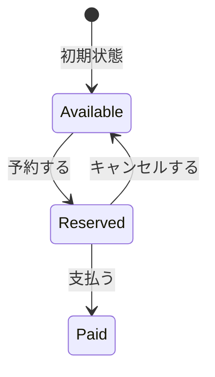
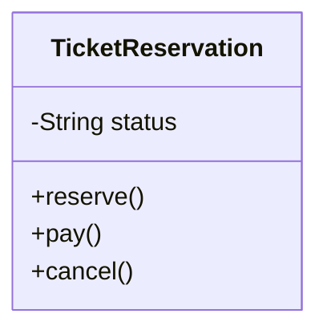
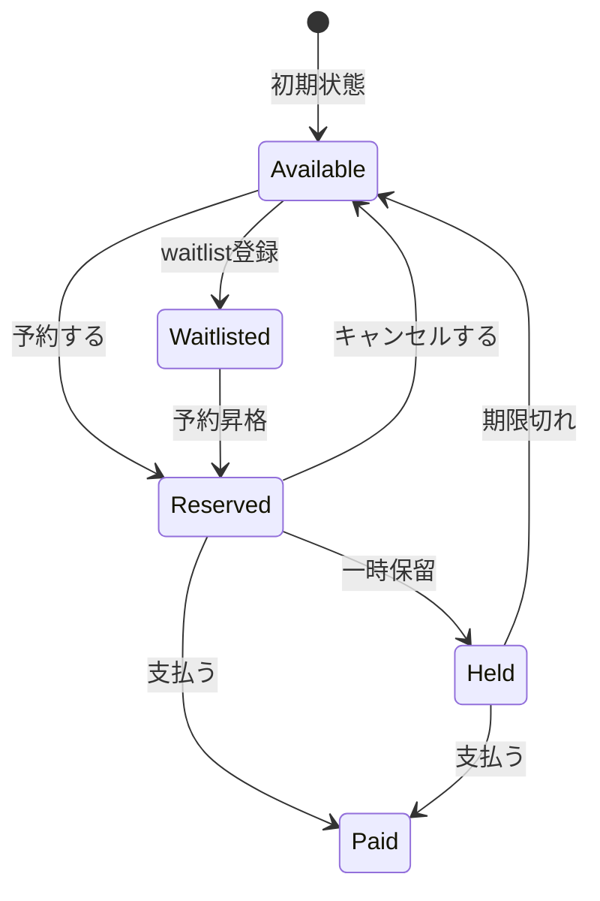
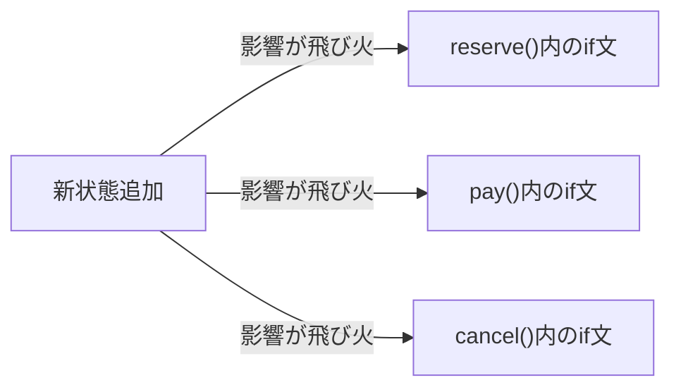
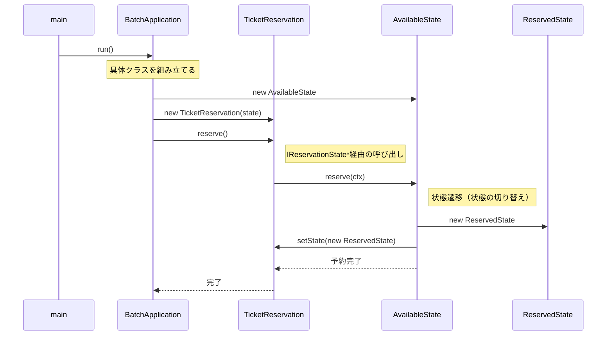
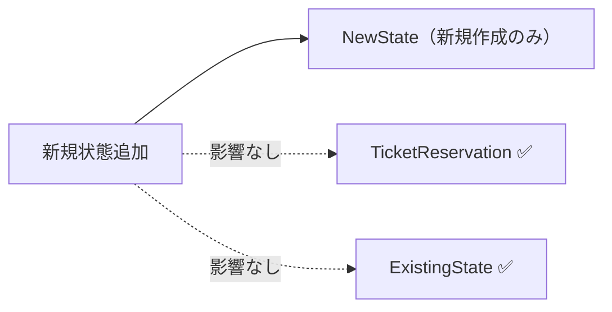
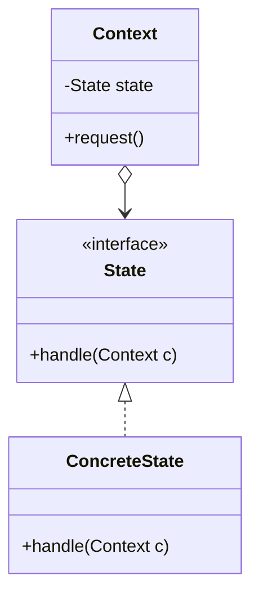
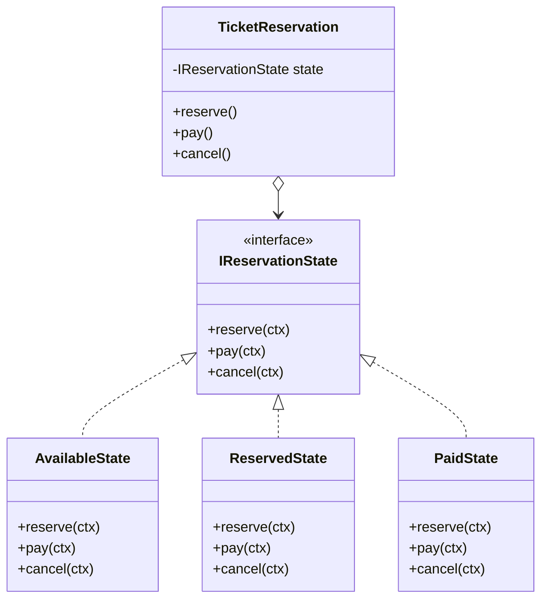

## 第3章 状態に応じた振る舞いの切り替え ―― State パターン

―― 思考の型：状態によって振る舞いが変わる処理が、条件分岐で混在している

### この章の核心

**特定の条件（状態）ごとに処理の内容が切り替わるコードは、状態が増えるたびに条件分岐が肥大化し、システムの保守性を損なう。それは、「状態」と「その状態での振る舞い」が、同じクラスの中に混在しているからだ。**

### この章を読むと得られること

この章の痛みは「状態が1つ増えるたびに、すべての処理分岐を書き直さなければならない」という問題です。

* **得られること1：** 「状態の変化に伴う振る舞いの切り替え」という観点で、コードの変動箇所を識別できるようになる
* **得られること2：** 条件分岐が複雑に絡み合ったクラスを見て、そこが状態管理の痛みの発生源だと判断できるようになる
* **得られること3：** 状態ごとの振る舞いを別クラスに分離することで、条件分岐を排除した構造改善の説明ができるようになる
* **得られること4：** 状態が増える可能性がある設計において、既存のフローを壊さずに状態を追加する判断ができるようになる

## 🔵 フェーズ1：現状把握 ―― コードとクラス構成を読む

はじめには、チケット予約管理システムという、私たちの目の前にあるシステムの現状を、ありのままの事実として把握するところから始めましょう。

### 1-1：このシステムの仕様

このシステムは、映画館の座席ごとに**チケット予約の状態を管理**します。

各座席は「空席（Available）」「予約済み（Reserved）」「支払済み（Paid）」の3つの状態を持ちます。お客様の操作（予約・支払・キャンセル）に応じて状態が遷移し、状態によって許可される操作が異なります。

**状態遷移マトリクス**

「——」は操作を受け付けず、エラーメッセージを出力して終了することを表します。

| 現在の状態 | 予約する | 支払う | キャンセルする |
|---|---|---|---|
| Available（空席） | → Reserved | —— | —— |
| Reserved（予約済み） | —— | → Paid | → Available |
| Paid（支払済み） | —— | —— | —— |



このマトリクスが、後のフェーズで「新しい状態が増えるとどこが変わるか」を確認する基準になります。

---

### 1-2：動作例テーブル ―― 仕様を「動かした結果」で確認する

コードを読む前に、このシステムがどんな入力に対してどんな出力を返すかを確認します。この章のどのステップも、以下の動作を実現します。

| # | 現在の状態 | 操作 | 結果 | 備考 |
|---|---|---|---|---|
| 1 | Available（空席） | 予約する | Reserved（予約済み）へ遷移 | 通常の予約フロー |
| 2 | Reserved（予約済み） | 支払う | Paid（支払い済み）へ遷移 | 支払い完了フロー |
| 3 | Reserved（予約済み） | キャンセルする | Available（空席）へ戻る | 予約キャンセルフロー |
| 4 | Paid（支払い済み） | キャンセルする | エラー（キャンセル不可） | 支払い後はキャンセルできない |
| 5 | Available（空席） | 支払う | エラー（支払い不可） | 予約なしで支払いを試みた場合 |
| 6 | Paid（支払い済み） | 予約する | エラー（予約不可） | 支払い済み座席には再予約できない |

この動作テーブルは、後のフェーズでステップを比較するときに「全ステップがこのテーブルと同じ出力を返すことで動作不変を確認する」ための基準として使います。ステップ1からステップ3まで、どれを採用しても上記の動作が変わってはいけません。違いはあくまで「変更が来たときにどこを触るか」という構造上の差だけです。

---

### 1-3：実装コード（現状）

```cpp
#include <iostream>
#include <string>

class TicketReservation {
private:
    std::string status; // "Available", "Reserved", "Paid"
public:
    TicketReservation() : status("Available") {}

    void reserve() {
        if (status == "Available") {
            status = "Reserved";
            std::cout << "予約完了しました\n";
        } else {
            std::cout << "現在予約できません\n";
        }
    }

    void pay() {
        if (status == "Reserved") {
            status = "Paid";
            std::cout << "支払い完了しました\n";
        } else {
            std::cout << "支払いに適した状態ではありません\n";
        }
    }

    void cancel() {
        if (status == "Reserved") {
            status = "Available";
            std::cout << "予約をキャンセルしました\n";
        } else {
            std::cout << "キャンセルできません\n";
        }
    }
};
```

このコードを見ると、`reserve`、`pay`、`cancel` の各メソッドの中に、現在の `status` を判定する条件分岐が散らばっていることが分かります。実際の動作を確認するために、このクラスを呼び出す `main` 関数と実行結果を合わせて示します。

```cpp
int main() {
    TicketReservation seat;
    seat.reserve();  // Available → Reserved
    seat.pay();      // Reserved  → Paid
    return 0;
}
```

上記コードの実行結果：

```
予約完了しました
支払い完了しました
```

動作例テーブルの行1（Available → Reserved）と行2（Reserved → Paid）と一致しています。次のフェーズで変更が来たときに何が起きるかを確認します。

---

### 1-4：クラス構成図

コードを読んだところで、クラス間の関係を図で整理します。



→ 1-3節のコードを見ると、`reserve()`・`pay()`・`cancel()` の各メソッドに `if (status == ...)` という条件分岐が散在しており、`TicketReservation` クラスがすべての予約状態と、状態ごとの処理ロジックを一手に抱え込んでいることが分かります。

---

### 1-5：変更要求

ある週明けの朝、映画館の支配人から開発チームへ、新しい施策についての連絡が入りました。

「来月から、リピーター向けに『キャンセル待ち』機能を実装したいのです。予約枠がいっぱいの場合でも、空きが出たら自動的に予約が割り当てられるようにしたい。また、それに伴い『予約一時保留』という状態も追加してほしい。上映開始の24時間前までなら、予約を確保したまま決済を24時間待つ仕組みです。」

支配人は、この機能が実装されれば、直前キャンセルによる空席を減らし、収益が大きく改善すると期待しています。ここで整理しておくと、「キャンセル待ち」とは予約枠が満杯のときに空き待ちを登録する状態、「予約一時保留」とは予約を確保したまま決済の期限を延期する状態です。しかし、現在の `TicketReservation` クラスには、すでに `Available`、`Reserved`、`Paid` という3つの状態が密接に絡み合っています。ここに2つの新しい状態を、従来の `if` 文のロジックに追加していくのは、かなり骨の折れる作業になりそうです。

**仕様変更の内容**

変更要求を受けて、状態の種類と遷移ルールがどう変わるかを整理します。

**状態の変化**

| 状態 | 変更前 | 変更後 |
|---|---|---|
| Available（空席） | あり | 変更なし |
| Reserved（予約済み） | あり | 変更なし |
| Paid（支払済み） | あり | 変更なし |
| **Waitlisted（キャンセル待ち）** | なし | **新規追加** |
| **Held（一時保留）** | なし | **新規追加** |

**新しく追加される遷移ルール**

| 現在の状態 | 操作 | 遷移先 | 処理内容 |
|---|---|---|---|
| Available | addToWaitlist | Waitlisted | キャンセル待ちリストに追加する |
| Waitlisted | upgrade | Reserved | 空きが出たので予約に昇格する |
| Reserved | hold | Held | 予約を確保したまま24時間決済を保留する |
| Held | pay | Paid | 保留期限内に決済を完了する |
| Held | expire | Available | 保留期限（24時間）が切れ、座席を空きに戻す |

現状の `if` 文を使った状態分岐ロジックに、この2状態と5遷移を追加することになります。

**仕様変更後の状態遷移マトリクス（全体像）**

「——」は操作を受け付けず、エラーメッセージを出力して終了することを表します。列数の都合で表を2つに分けています。

【表1：従来の操作】

| 現在の状態 | 予約する | 支払う | キャンセルする |
|---|---|---|---|
| Available（空席） | → Reserved | —— | —— |
| Reserved（予約済み） | —— | → Paid | → Available |
| Paid（支払済み） | —— | —— | —— |
| Waitlisted（キャンセル待ち） | —— | —— | —— |
| Held（一時保留） | —— | → Paid | —— |

【表2：新規追加の操作】

| 現在の状態 | waitlist登録 | 予約昇格 | 一時保留 | 期限切れ |
|---|---|---|---|---|
| Available（空席） | → Waitlisted | —— | —— | —— |
| Reserved（予約済み） | —— | —— | → Held | —— |
| Paid（支払済み） | —— | —— | —— | —— |
| Waitlisted（キャンセル待ち） | —— | → Reserved | —— | —— |
| Held（一時保留） | —— | —— | —— | → Available |



フェーズ1でシステムの現状と変更要求が把握できました。次のフェーズ2では、「何が変わり、何が変わらないか」を整理します。

---

## 🟣 フェーズ2：仮説立案 ―― 何が変わるかを観察し、ヒアリングで裏付ける

### 2-1：責任チェック表

この表は「コードの各行が、どの知識を持っているか」を可視化するものです。作り方はシンプルで、実装コードを1行ずつ読みながら「この行は何を知っているか」「その知識は誰が持つべきか」を書き出すだけです。知識の持ち主が2人以上になる行が見つかれば、そこが「変わる理由の混在」を示す兆候です。

| **クラス名** | **責任（1文）** | **知るべきこと** |
|---|---|---|
| `TicketReservation` | チケットの予約から発券までの状態を管理する | 現在の予約ステータス、各状態における可能なアクション、状態遷移のルール |

各クラスの責任と知識の定義が確認できました。`TicketReservation` クラスが「予約ステータス」と「全状態の遷移ロジック」の両方を定義していることが分かります。

### 2-2：変わる理由の分析

責任チェック表でクラスの責任が整理できました。次に、コードの各行が「誰の判断で変わる知識か」を確認することで、混在している責任をさらに細かく特定します。判断基準は、「このクラスの担当者（ここでは予約フロー管理の開発チーム）とは別の人間が変更を決定するかどうか」です。別の人間が決定するなら、それは「責任外（❌）」と判断します。

`TicketReservation` の各メソッドを見ると：

| **コードの行** | **持っている知識** | **誰の判断で変わるか** | **責任内か** |
|---|---|---|---|
| `if (status == "Available")` | 予約が可能な状態の定義 | 状態遷移ルール（企画担当） | ❌ 別担当者 |
| `status = "Reserved";` | 予約後に遷移すべき状態 | 状態遷移ルール（企画担当） | ❌ 別担当者 |
| `std::cout << "予約完了しました\n";` | 予約成功時のメッセージ出力 | 予約フロー管理（開発チーム） | ✅ |
| `if (status == "Reserved")` | 支払いが可能な状態の定義 | 状態遷移ルール（企画担当） | ❌ 別担当者 |
| `status = "Paid";` | 支払い後に遷移すべき状態 | 状態遷移ルール（企画担当） | ❌ 別担当者 |
| `if (status == "Reserved")` | キャンセル可能な状態の定義 | 状態遷移ルール（企画担当） | ❌ 別担当者 |
| `status = "Available";` | キャンセル後に遷移すべき状態 | 状態遷移ルール（企画担当） | ❌ 別担当者 |

3つのメソッドにまたがって、「状態遷移ルール（企画担当が決める）」と「予約フローの処理（開発チームが管理する）」という変わる理由が異なる2種類の知識が混在しています。今すぐ問題とは言えませんが、これが後の痛みの予兆です。

### 2-3：今回の変更で確実に変わること

変更要求として届いた内容のうち、今回のリリースで確実に発生する変更を整理します。

| **分類** | **具体的な内容** | **変わるタイミング** | **根拠** |
|---|---|---|---|
| 🔴 **変動する** | 状態の種類（キャンセル待ち・一時保留の追加） | 今回のリリース | 支配人からの変更要求に明記されている |
| 🔴 **変動する** | 各状態における振る舞い（状態ごとのアクション可否） | 今回のリリース | 新状態の導入に伴い定義が必要 |
| 🟢 **不変** | 映画館の基本情報（上映時間、座席数） | 変わる日は来ない | 運営管理部門との合意 |

この時点で確定しているのは「状態が2つ増える」という事実だけです。将来どれだけ変わり続けるかは、次の関係者ヒアリングで確認します。

### ヒアリングに向けた背景確認

このシステムは、ある映画館のチケット予約管理を担っています。映画の上映スケジュールに対して、座席の予約、支払い、発券といった一連のプロセスを管理する、映画館運営の中核となるシステムです。

現在このシステムは、「Available（空席）」「Reserved（予約済み）」「Paid（支払い済み）」という3つの状態で動作しています。座席の予約、支払い、キャンセルという操作に対して、現在の状態に応じた処理が実行される仕組みです。

### 2-4：関係者ヒアリング

仮説を確実なものにするため、企画担当の鈴木氏にヒアリングを行いました。このシステムでは「状態の種類」と「状態遷移ルール」が密接に結びついています。どちらが変わりやすいかによって設計の方向が大きく変わるため、この2点を重点的に確認します。

> **現実のヒアリングでは——** このシナリオでは相手がちょうど設計に役立つ情報を教えてくれています。現実には「変わるかどうか分からない」「たぶん変わらない」という答えが返ることも多いです。そのときは、コードの変更履歴（`git log`）や過去の障害記録を「ヒアリングの代わり」として使ってみてください。「過去に何度変わったか」が、「将来変わりやすいか」の最も正直な証拠です。

* **開発者：** 「キャンセル待ちや一時保留など、状態がかなり増えますが、今後さらに状態が増える予定はありますか？」
* **企画担当 鈴木：** 「実は、上映後のアンケート回答者に付与する『特別優待予約』なども今後検討しています。状態は今後も増えていくはずです。」
* **開発者：** 「なるほど。状態遷移のルール、例えば『保留中からキャンセル待ちへ移行できるか』などは、今後ルールが変わる可能性はありますか？」
* **企画担当 鈴木：** 「それも十分にあり得ます。今は保留中からのキャンセルを認めていますが、来月には『一度保留にしたらキャンセル不可』というルール変更も考えられます。」

ヒアリングの結果、「状態の種類」だけでなく「状態遷移ルールそのもの」も頻繁に変わり続けるという事実が見えてきました。

### 2-5：ヒアリングで判明した将来リスク

ヒアリングで浮かび上がった「確定ではないが、近い将来起こりうる変化」を記録します。これは今回の設計判断の材料です。

| **将来リスク** | **時期の目安** | **根拠** |
|---|---|---|
| 状態遷移のルール（アクションの可否）の変更 | キャンペーンや運用の見直し時 | 企画担当 鈴木氏との確認 |
| 状態の種類（特別優待予約などの追加） | 新機能導入時 | 企画担当 鈴木氏との確認 |

フェーズ2で「今変わること（確定）」と「将来変わるかもしれないこと（リスク）」を分けて整理できました。次のフェーズ3では、現在の構造で変更を試みたときに何が起きるかを確認します。

---

## 🟣 フェーズ3：問題特定 ―― 変更の痛みを発見する

フェーズ2で「状態遷移のルールは頻繁に変わる」という確信が持てました。このフェーズでは、確定した新しい状態遷移（キャンセル待ち・一時保留）を、今のコードの構造のまま適用しようとしたとき、システムにどのような「痛み」が生じるのかを観察してみます。

### 3-1：変更を試みる

フェーズ2の変更要求を受けて、今のコードに「一時保留（Held）」状態を追加してみます。追加する必要がある仕様と、その修正対象箇所は次の通りです。

| 仕様 | 修正対象メソッド |
|---|---|
| `Held`（一時保留）：上映24時間前まで座席を仮押さえする状態 | `pay()` / `cancel()` の両メソッドに `else if (status == "Held")` の追加が必要 |
| `Held` からは `pay()` で `Paid` に遷移できる | `pay()` を修正 |
| `Held` からは `cancel()` でキャンセルし `Available` に戻る | `cancel()` を同様に修正 |

この仕様を今の `TicketReservation` クラスに当てはめてみます。`pay` と `cancel` を修正します。

```cpp
// pay() に追加が必要な箇所
} else if (status == "Held") {  // ← Held 対応を追加
    status = "Paid";
    std::cout << "保留から支払い完了しました\n";
}

// cancel() に追加が必要な箇所
} else if (status == "Held") {  // ← Held 対応を追加
    status = "Available";
    std::cout << "保留からキャンセルしました\n";
}
```

状態遷移マトリクスで見ると、Held を追加するとは「行を1行増やす」ことに見えます。

| 現在の状態 | `reserve()` | `pay()` | `cancel()` |
|---|---|---|---|
| Available | → Reserved | —— | —— |
| Reserved | —— | → Paid | → Available |
| Paid | —— | —— | —— |
| **Held（新規）** | —— | → Paid | → Available |

しかし実装では、この1行のためにメソッド2本（`pay` / `cancel`）を開いて `else if` を追加しなければなりません。さらに `reserve()` の中にも「Heldのときは予約操作を拒否する」という制御を追加するかどうか検討しなければならず、状態ごとに「このメソッドでは何が起きるべきか」をすべてのメソッドで見直す必要が生じます。`reserve` メソッドを修正したとき、同時に `pay` メソッドや `cancel` メソッドの中にある `if` 文の条件もすべて見直し、新しい状態である `Held`（保留）を考慮しなければならないことに気づきます。

もし、さらに「キャンセル待ち」状態が追加されたらどうなるでしょうか。すべてのメソッドにある条件分岐がさらに増殖し、一つのアクションを行うたびに、今の `status` が何なのかを常に意識しなければならないのです。

「この先、状態が5つ、6つと増えたら、一つのアクションを判定するのにどれだけの `if` 文を積み重ねればいいんだろう……」

この痛みは定量的に言うと、**状態が1つ増えるたびに `reserve()`・`pay()`・`cancel()` の3メソッド全てに条件分岐の追加が必要**になります。状態数が n であれば修正箇所は最大 n × 3 になる計算です。コードのあちこちで同じような条件判定が繰り返され、一箇所でも判定ロジックを書き忘れると、システムは「ありえない状態遷移」を許してしまうことになります。

### 3-2：変更影響グラフ

変更を試みようとしたときに頭の中で起きた「影響の広がり」を図にしてみます。



このグラフが示す通り、たった一つの「状態追加」という変更要求が、クラス内のほぼすべてのロジックに飛び火しています。

### 3-3：痛みの言語化

変更を試みてみた結果、現場でよく直面する2つの辛い状況が浮かび上がってきました。

1つ目は、修正漏れがバグに直結する恐怖です。新しい状態を追加するためには、すべてのメソッド内にある条件分岐を一つずつ確認し、適切にロジックを追記しなければなりません。もし `pay` メソッドで「保留中からの支払い」を考慮し忘れたらどうなるでしょうか。ユーザーは支払いができず、システムは正しく動かないまま放置されます。一つの小さな仕様変更のために、クラス内の全てのロジックを神経質にチェックしなければならないというのは、非常にコストが高く、リスクの大きい作業です。

2つ目は、システムの振る舞いが「コードの迷路」になってしまうことです。現状では、`TicketReservation` クラスを開けば予約のルールが一目瞭然でした。しかし、状態が増えるたびに `if` や `else if` が折り重なり、ビジネス上のルールがどこに書かれているのかが見えにくくなります。コードを読むたびに、脳内で「今この状態なら、このメソッドは動いて……」というシミュレーションを繰り返さなければなりません。これでは、誰かが修正を加えるたびに別の場所を壊してしまう「副作用」の温床になってしまいます。

フェーズ3で「変更が辛い」という事実が確認できました。次のフェーズ4では、なぜ辛いのかを構造的に言語化します。

---
> **📌 問題（確定）**
> 状態が1つ増えるたびに、`reserve()`・`pay()`・`cancel()` のすべてのメソッドで条件分岐の追加が必要になる。ヒアリングで「キャンセル待ち」「特別優待予約」など状態が今後も増え続けることが確定しており、この頻度では `TicketReservation` を何度も開き直すコストが合わない。
---

## 🟠 フェーズ4：原因分析 ―― なぜ辛いのかを構造で言語化する

フェーズ3で確認した「状態追加のたびに条件分岐が爆発的に増え、修正漏れがバグを生む」という痛み。このフェーズでは、なぜそのような辛さが生じるのかを、コードの構造（接続形態）の観点から深く掘り下げます。

### 4-1：痛みの根源を探る（観察と原因）

「ステータスと振る舞いが同じクラスに混在すること」は、それ自体は一般的な実装です。問題は「変わる理由が異なる2つのもの」が混在しているかどうかです。`status` という状態は「業務ルール（どの遷移を許可するか）」で変わり、`reserve()` などの処理フローは「機能要件（どんな操作ができるか）」で変わります。ここでの判定軸は「**状態遷移のルールを誰が決めるか**」です。業務ルールを決める人（企画担当）と、操作フローを決める人（開発チーム）が異なるなら、この2つは別々の変わる理由を持っています。この2つの「変わる理由」が同じクラスに入っているとき、片方の変更が必ずもう片方に影響します。それが下の表で示す「原因の方向」です。

この表は「フェーズ3で感じた痛み」を出発点にして、その痛みが生まれた構造的な理由を探る表です。痛みを1つ取り上げ、「なぜそうなるのか？」と問いかけ続けることで、根本原因の方向が見えてきます。

| **観察した症状（痛み）** | **構造的な原因（痛みの根源）** |
|---|---|
| 新しい状態を追加するたびに、既存の全メソッドの条件分岐を書き換える必要がある | 「現在の状態（ステータス）」と「その状態で実行可能な振る舞い」という、本来分離する必要がある知識が、一つのクラスの中に混在しているから |
| 複雑な条件分岐により、現在の状態が何であるかを常に意識しないとコードが書けない | 状態管理のルール（遷移条件）がロジックの中に埋め込まれ、状態の変化を追跡するのが困難になっているから |

### 4-2：変わるもの/変わってほしくないもの

> **「変わらないもの」と「変わってほしくないもの」は異なります。** 「変わらないもの」は経験的事実（今まで変わっていない）、「変わってほしくないもの」は設計意図（ここを安定させてほかを守りたい）です。ここで整理するのは後者です。

原因分析の結果から、「変わり続けるもの」と「変わってほしくないもの」を整理します。

| **変わり続けるもの（🔴）** | **変わってほしくないもの（🟢）** |
|---|---|
| 状態の種類（キャンセル待ち、保留中などの追加） | 予約システムとしての基本的な業務フロー |
| 各状態における振る舞い（状態ごとのアクション） | 状態を管理するという概念（状態があること自体） |

私たちが守るべきは「予約管理」という概念であり、増え続ける「状態の種類」や「状態ごとの細かなルール」は、安定した業務フローから切り離す必要がある存在なのです。

### 4-3：接続形態の診断

現在のコードが「具体×直接」に該当する根拠は次の2点です。

| 観点 | コードの証拠 |
|---|---|
| **「具体」＝専用規格** | `if (status == "Available")` など — 状態名を文字列リテラルとしてコードに直書きしており、他の書き方に差し替えられない |
| **「直接」＝直差し** | `reserve()` / `pay()` / `cancel()` の各メソッドが `status` を直接読み書きしており、間に何も挟まっていない |

ちょうどiPhone専用のLightningケーブルがApple純正機器にしか刺さらないように、このコードも「Availableという状態名」と「TicketReservationというクラス」が専用の接続で結びついており、他の状態を差し込む口がありません。状態が増えるたびに既存の接続を切り直す必要が生じるのは、この「具体×直接」という接続形態が原因です。

フェーズ4で根本原因が言語化できました。「どこを分けるか」は明確です。次のフェーズ5では、その境界で実際に何が流れているかを値・型のレベルで具体化し、「何が変わり、何が変わらないか」を明確にします。

---
> **📌 原因（確定）**
> `TicketReservation` クラスが「現在の状態の判断（状態遷移ルール）」と「操作ごとの処理フロー」の両方を直接保持しているため、状態遷移ルールの変更が必ずすべての操作メソッドに波及する。ヒアリングで確認された「状態の追加」と「遷移ルールの変更」という2種類の変化が今の接続形態では分離できておらず、状態が増えるたびにクラス全体を触り続けることになる。
---

## 🟡 フェーズ5：課題定義 ―― 接続点で何が流れているかを見る

フェーズ4は「なぜ辛いか」を答えました。フェーズ5が問うのは「分けるべき境界で、実際に何が流れているか」です。クラスの参照関係ではなく、**値・型のレベル**に降りていきます。

フェーズ4で、「現在の状態」と「その状態での振る舞い」が `TicketReservation` の中に混在していることが分かりました。その境界で何がやり取りされているかを具体化します。

### 接続点を特定する

`reserve()` / `pay()` / `cancel()` の中で分けるべき境界は1か所。「状態ごとの振る舞いを決める生産者」が業務フローに渡しているデータを見ます。

現在の結合状況：`status` という文字列値が各メソッドの条件分岐に直接埋め込まれており、状態の判断と振る舞いが同じ場所に混在しています。

| 接続点 | 接続するデータ | 変わるもの |
|---|---|---|
| 状態ごとの振る舞い → `reserve()`/`pay()`/`cancel()` の骨格 | status（string値）→ 操作結果（void） | 状態ごとの振る舞いロジック（新しい状態が追加されると増える） |

### 何が変わり、何が変わらないか

- **変わるもの**：状態ごとの振る舞いロジック（どの状態でreserve/pay/cancelが何をするか）。新しい状態が追加されるたびに分岐が増える。
- **変わらないもの**：操作インターフェース名（`reserve()` / `pay()` / `cancel()`）とその引数型。呼び出し元はこれらのメソッド名を変えずに使える。

呼び出し元は「reserve() を呼べば予約できる」という事実だけを知れば十分です。問題は「どの状態のときに何をするか」という**振る舞いの生産者**が状態の数だけ膨れ続けること。

**具体×直接のままでよい場面**：状態が今後増えない確証があれば、現状の `if-else`（具体×直接）で十分です。接続形態の選択は「**生産者が変わるかどうか**」で決まります。今回は状態追加リスクがヒアリングで確認済みなので、次のフェーズで生産者を差し替えられる設計を検討します。

---
> **📌 課題（確定）**
> `reserve()`・`pay()`・`cancel()` という操作インターフェース（変わらない）と、「どの状態のときに何をするか」という状態ごとの振る舞いロジック（変わり続ける生産者）を切り離す必要がある。`TicketReservation` から状態ごとの振る舞いを取り出し、操作インターフェースはそれを呼び出すだけの構造にすることで、状態が増えても `TicketReservation` を変更せずに済む。
---

## 🔴 フェーズ6：対策検討 ―― 段階的な改善と決断

フェーズ5で「変わるのは状態ごとの振る舞いロジック（生産者）であり、操作インターフェース（reserve/pay/cancel）は安定している」ことが分かりました。ここでは、その生産者をどのように差し替え可能にするかを段階的に検討します。どのステップも動作例テーブルで示した動作を実現します。違うのは「変更が来たときにどこを触ることになるか」です。ステップ1から順に試していくことで、どこで止めるのが適切かを自分の目で確かめていきましょう。

---

### ステップ1：各状態処理をプライベートメソッドへ切り出す

フェーズ3で確認した痛みは「状態ごとの分岐が複数メソッドに散らばっている」でした。一番最小限の改善として、`reserve()` の中に直接書かれていたロジックを `reserveFromAvailable()` などの専用プライベートメソッドへ移してみます。

```cpp
class TicketReservation {
private:
    std::string status;

    void reserveFromAvailable() {
        status = "Reserved";
        std::cout << "予約完了しました\n";
    }

    void payFromReserved() {
        status = "Paid";
        std::cout << "支払い完了しました\n";
    }

    void cancelFromReserved() {
        status = "Available";
        std::cout << "予約をキャンセルしました\n";
    }

public:
    TicketReservation() : status("Available") {}

    void reserve() {
        if (status == "Available") {
            reserveFromAvailable();
            return;
        }
        std::cout << "現在予約できません\n";
    }
    void pay() {
        if (status == "Reserved") {
            payFromReserved();
            return;
        }
        std::cout << "支払いに適した状態ではありません\n";
    }
    void cancel() {
        if (status == "Reserved") {
            cancelFromReserved();
            return;
        }
        std::cout << "キャンセルできません\n";
    }
};
```

各状態での処理が名前つきのメソッドとして読めるようになり、`reserve()` などの本文が短くなりました。

**評価：** 見通しは良くなったが、新しい状態（キャンセル待ち等）を追加するときには `reserve()`・`pay()`・`cancel()` の全メソッドに新しい分岐を書き足すことに変わりはない。`TicketReservation` が「どの状態のときに何をするか」をすべて知っている構造が続く限り、状態が増えるたびにこのクラスを触り続けることになる。

---

### ステップ2：状態ごとにクラスを作り、直接参照する（具体×直接）

ステップ1の限界を確認したところで、「状態ごとのロジックを別クラスに切り出せば整理できるのでは」という自然な発想が浮かぶ。`ReservedState`・`AvailableState`・`PaidState` という3つのクラスを作り、`TicketReservation` がそれぞれを直接フィールドとして持つ形を試してみる。

```cpp
class AvailableState {
public:
    void reserve(std::string& status) {
        status = "Reserved";
        std::cout << "予約完了しました\n";
    }
};

class ReservedState {
public:
    void pay(std::string& status) {
        status = "Paid";
        std::cout << "支払い完了しました\n";
    }
    void cancel(std::string& status) {
        status = "Available";
        std::cout << "予約をキャンセルしました\n";
    }
};

class PaidState {
public:
    void errorReserve() {
        std::cout << "支払い済みのため再予約できません\n";
    }
    void errorCancel() {
        std::cout << "支払い済みのためキャンセルできません\n";
    }
};

class TicketReservation {
private:
    std::string    status;
    AvailableState available; // ← 具体クラスを直接保持
    ReservedState  reserved;  // ← 具体クラスを直接保持
    PaidState      paid;      // ← 具体クラスを直接保持

public:
    TicketReservation() : status("Available") {}

    void reserve() {
        if (status == "Available") { available.reserve(status); return; }
        if (status == "Paid")      { paid.errorReserve();       return; }
        std::cout << "現在予約できません\n";
    }
    void pay() {
        if (status == "Reserved") { reserved.pay(status); return; }
        std::cout << "支払いに適した状態ではありません\n";
    }
    void cancel() {
        if (status == "Reserved") { reserved.cancel(status); return; }
        if (status == "Paid")     { paid.errorCancel();      return; }
        std::cout << "キャンセルできません\n";
    }
};
```

状態ごとのロジックが `TicketReservation` から別クラスに移り、クラスを見ただけで「これがAvailable状態のふるまい」と分かるようになった。

**評価：** 状態ごとのロジックは分離できたが、`TicketReservation` が全状態クラスを直接知っている。新しい状態（`WaitlistedState`）が必要になったとき、新クラスを追加するだけでなく、`reserve()`・`pay()`・`cancel()` の3メソッドすべてを開いて `if` 分岐を追記しなければならない。`TicketReservation` が具体クラスを直接名指しで持っている（具体×直接）限り、状態が増えるたびにこのクラスを修正し続ける。

---

### ステップ3：インターフェースを導入し、現在の状態に委譲する（抽象×直接）

ステップ2で「`TicketReservation` が全状態クラスを直接知っている」ことが問題だと分かった。解消するには `TicketReservation` が具体的なクラス名を知らなくてよい構造にすればいい。「どの状態クラスも `reserve()`・`pay()`・`cancel()` を持つ」という契約（インターフェース）を定め、`TicketReservation` はその契約だけを通じて現在の状態に処理を丸投げする。

**状態インターフェース（IReservationState）：**

```cpp
class TicketReservation;

class IReservationState {
public:
    virtual void reserve(TicketReservation* ctx) = 0;
    virtual void pay(TicketReservation* ctx) = 0;
    virtual void cancel(TicketReservation* ctx) = 0;
    virtual ~IReservationState() = default;
};
```

メソッド引数に `TicketReservation* ctx` を受け取るのは、各状態クラスが遷移後の状態を `ctx->setState()` でセットするためにコンテキストへのポインタが必要だからだ。

**各状態クラス：**

```cpp
class AvailableState : public IReservationState {
public:
    void reserve(TicketReservation* ctx) override {
        std::cout << "予約完了しました\n";
        // 遷移はctx->setState()で行う（フェーズ7で実装）
    }
    void pay(TicketReservation* ctx) override {
        std::cout << "予約なしで支払いはできません\n";
    }
    void cancel(TicketReservation* ctx) override {
        std::cout << "空席状態のためキャンセル不要です\n";
    }
};

class ReservedState : public IReservationState {
public:
    void reserve(TicketReservation* ctx) override {
        std::cout << "既に予約済みです\n";
    }
    void pay(TicketReservation* ctx) override {
        std::cout << "支払い完了しました\n";
    }
    void cancel(TicketReservation* ctx) override {
        std::cout << "予約をキャンセルしました\n";
    }
};

class PaidState : public IReservationState {
public:
    void reserve(TicketReservation* ctx) override {
        std::cout << "支払い済みのため再予約できません\n";
    }
    void pay(TicketReservation* ctx) override {
        std::cout << "既に支払い済みです\n";
    }
    void cancel(TicketReservation* ctx) override {
        std::cout << "支払い済みのためキャンセルできません\n";
    }
};
```

各クラスが「自分の状態のときに何ができて何ができないか」を自己完結して持っている。

**コンテキストクラス（TicketReservation）：**

```cpp
class TicketReservation {
private:
    IReservationState* state; // ← インターフェース型のみ知っている
public:
    TicketReservation(IReservationState* s) : state(s) {}
    void setState(IReservationState* s) { state = s; }
    void reserve() { state->reserve(this); }
    void pay()     { state->pay(this); }
    void cancel()  { state->cancel(this); }
};
```

`TicketReservation` の中に `if` 文が一切なくなった。新しい状態 `WaitlistedState` が追加されたとき、`IReservationState` を実装した新クラスを作るだけで組み込める。`TicketReservation` には一切触れる必要がない。

**評価：** 新しい状態を追加するコストが「新クラスを1つ作るだけ」に下がった。状態が増えても既存のコードを修正する必要がなく、修正漏れによるバグも発生しない。なお、このコードはまだ状態遷移処理が省かれており、動作例テーブルの全パターンを再現できない。完全な実装はフェーズ7で示す。

---

### どこまで設計を進めるべきか（採用ステップの決断）

各ステップには一長一短があります。どこで止めるかは、「今後の変更頻度（ビジネス要求）」で決断します。

* **ステップ1で止めるケース：** 状態の種類が固定されており、今後も増える見込みがない場合。1クラス内の整理で十分であり、クラスを増やすコストに見合いません。
* **ステップ2で止めるケース：** 状態ごとの処理を別クラスに整理したいが、新しい状態が追加されるかどうかまだ確証がない場合。状態の数が少なく、追加の見込みが薄ければここで止めるのも現実的な選択です。
* **ステップ3まで進むケース：** 今後も頻繁に新しい状態が追加されると確定している場合。今すぐ初期投資コストを払ってでも、業務フローのコンテキストクラスを変更から守る設計が適切です。

**今回の決断：**
フェーズ2のヒアリングで、「キャンセル待ち状態」「特別優待予約」など、状態は今後も増え続けると予告されています。また、状態遷移のルール自体も変わりうると確認できています。したがって、今回は**ステップ3（インターフェース化・抽象×直接）まで進化させる**決断を下します。

**この構造は、State（ステート）パターンと呼ばれています。**

状態ごとに専用のクラスを用意し、コンテキスト（`TicketReservation`）はインターフェース経由で現在の状態に処理を委譲します。状態が増えても、コンテキストクラスに一切触れることなく、新しい状態クラスを追加するだけで機能拡張できる構造です。

---

## 🟢 フェーズ7：対策実施 ―― 変化に強いコードを完成させる

採用した設計（ステップ3：抽象×直接）を、実際のコードに実装します。これにより、これまで `TicketReservation` クラスが抱え込んでいた複雑な条件分岐を、個別の状態クラスへと移譲します。

この設計変更の最大の価値は、今後「キャンセル待ち」や「特別優待」といった新しい状態がどれだけ増えても、既存の業務フローや他の状態クラスに影響を与えることなく、新しいクラスを追加するだけで機能拡張ができる安定性を手に入れたことです。

### 7-1：解決後のコード（全体）

新しい設計の基盤となるインターフェースを定義します。このインターフェースが「すべての状態クラスが守るべき契約」を定めます。

```cpp
#include <iostream>
#include <string>

class TicketReservation;

// 状態ごとの振る舞いを定義するインターフェース
class IReservationState {
public:
    virtual void reserve(TicketReservation* ctx) = 0;
    virtual void pay(TicketReservation* ctx) = 0;
    virtual void cancel(TicketReservation* ctx) = 0;
    virtual ~IReservationState() = default;
};
```

`IReservationState` が `TicketReservation*` を受け取る形になっているのは、状態クラスが遷移先を `ctx->setState()` で設定するためにコンテキストへのポインタが必要だからです。例えば `AvailableState::reserve()` は処理後に `ctx->setState(new ReservedState())` を呼んで状態を切り替えます。インターフェースがこの契約を定めることで、どの状態クラスも同じ方法で呼び出せます。

次に、状態ごとの振る舞いをそれぞれのクラスに実装します。各クラスは「その状態のときだけの責任」を持ちます。

```cpp
// Available（空席）状態：予約を受け付けられる状態
class AvailableState : public IReservationState {
public:
    void reserve(TicketReservation* ctx) override {
        std::cout << "予約完了しました\n";
        // ← 遷移：コンテキストにReservedStateをセット
        ctx->setState(new ReservedState());
    }
    void pay(TicketReservation* ctx) override {
        std::cout << "予約なしで支払いはできません\n";
    }
    void cancel(TicketReservation* ctx) override {
        std::cout << "空席状態のためキャンセル不要です\n";
    }
};
```

```cpp
// Reserved（予約済み）状態：支払いかキャンセルを待つ
class ReservedState : public IReservationState {
public:
    void reserve(TicketReservation* ctx) override {
        std::cout << "既に予約済みです\n";
    }
    void pay(TicketReservation* ctx) override {
        std::cout << "支払い完了しました\n";
        // ← 遷移：コンテキストにPaidStateをセット
        ctx->setState(new PaidState());
    }
    void cancel(TicketReservation* ctx) override {
        std::cout << "予約をキャンセルしました\n";
        // ← 遷移：コンテキストにAvailableStateをセット
        ctx->setState(new AvailableState());
    }
};
```

```cpp
// Paid（支払い済み）状態：発券待ちの状態
class PaidState : public IReservationState {
public:
    void reserve(TicketReservation* ctx) override {
        std::cout << "支払い済みのため再予約できません\n";
    }
    void pay(TicketReservation* ctx) override {
        std::cout << "既に支払い済みです\n";
    }
    void cancel(TicketReservation* ctx) override {
        std::cout << "支払い済みのためキャンセルできません\n";
    }
};
```

各クラスが「自分の状態のときに何ができて、何ができないか」を自己完結して持っています。`ctx->setState(new ReservedState())` のように、遷移先の状態クラスを呼び出し元（コンテキスト）にセットする責任も各状態クラスが担います。`TicketReservation` 内に散らばっていた条件分岐が、それぞれのクラスに分散して格納されました。

続いて、状態クラスを保持し、操作を現在の状態に委譲する中心クラスです。

```cpp
// 予約クラス：状態を保持し操作を委譲するだけ
class TicketReservation {
private:
    // ← ここだけ変わる。ifもswitchも一切ない
    IReservationState* state;
public:
    TicketReservation(IReservationState* initialState)
        : state(initialState) {}

    // 状態遷移時に呼ばれる（各状態クラスから呼び出す）
    void setState(IReservationState* s) { state = s; }

    // 操作を現在の状態に委譲するだけ
    void reserve() { state->reserve(this); }
    void pay()     { state->pay(this); }
    void cancel()  { state->cancel(this); }
};
```

このクラスを見ると、`if` 文や `switch` 文が一切ないことが分かります。`TicketReservation` はただ「今の状態に丸投げする」だけの存在になりました。状態が何であるかを知らなくてもよいため、状態が増えてもこのクラスに触る必要がありません。

最後に、依存の組み立てと実行の責任を分離します。

```cpp
// BatchApplication：依存の組み立てを担う唯一の場所
class BatchApplication {
public:
    void run() {
        // 具体クラスを知っているのはここだけ

        // 行1：Available → reserve() → Reserved
        // 行2：Reserved → pay() → Paid
        TicketReservation seat1(new AvailableState());
        seat1.reserve();
        seat1.pay();

        // 行3：Reserved → cancel() → Available
        TicketReservation seat2(new AvailableState());
        seat2.reserve();
        seat2.cancel();

        // 行4：Paid → cancel() → エラー（キャンセル不可）
        TicketReservation seat3(new AvailableState());
        seat3.reserve();
        seat3.pay();
        seat3.cancel();

        // 行5：Available → pay() → エラー（支払い不可）
        TicketReservation seat4(new AvailableState());
        seat4.pay();

        // 行6：Paid → reserve() → エラー（再予約不可）
        TicketReservation seat5(new AvailableState());
        seat5.reserve();
        seat5.pay();
        seat5.reserve();
    }
};

int main() {
    BatchApplication app;
    app.run();
    return 0;
}
```

上記コードの実行結果：

```text
予約完了しました
支払い完了しました
予約完了しました
予約をキャンセルしました
予約完了しました
支払い完了しました
支払い済みのためキャンセルできません
予約なしで支払いはできません
予約完了しました
支払い完了しました
支払い済みのため再予約できません
```

この実行結果は、フェーズ1の動作例テーブルの全6行の動作と一致しています。構造が変わっても、動作は変わっていません。

### 7-2：動作シーケンス図

`seat.reserve()` が呼ばれたとき、どのクラスがどの順番で動くかを確認します。



`TicketReservation` は `AvailableState` という具体クラス名を知らず、`IReservationState*` 経由で呼び出すだけです。状態の切り替え判断（`setState(new ReservedState())`）は `AvailableState` 自身が行います。

### 7-3：変更影響グラフ（改善後）

フェーズ3で確認した「状態追加」のシナリオを再度適用します。



フェーズ3の変更影響グラフと比較して、新しい状態の追加という変更要求が、新規作成したクラスだけに閉じた設計になりました。

### 7-4：変更シナリオ表

この設計で手に入れたものと、諦めたものを整理します。

| **シナリオ** | **変わるクラス（触る場所）** | **変わらないクラス** |
|---|---|---|
| キャンセル待ち状態の追加 | `WaitlistedState`（新規作成） | `TicketReservation`、`ReservedState` |
| 支払い済みからの返金対応 | `PaidState`（修正のみ） | `TicketReservation`、`ReservedState` |

変更が来ても、触るのは状態クラスだけで済みます——それがこの設計で手に入れたものです。諦めたものは、状態ごとのクラスファイルが増加するという、わずかな可読性のコストです。なお「変わらないクラス」の表記は「この変更シナリオの範囲では修正が不要」という意味であり、あらゆる変更に対して絶対に不変というわけではありません。`TicketReservation` であっても、予約フローそのものの仕様が変わった場合は修正が発生します。

---

## 整理

### この章で定義したこと

| | 内容 |
|---|---|
| **問題** | 状態が1つ増えるたびに全操作メソッドの条件分岐を書き直さなければならず、ヒアリングで確定した追加頻度ではコストが合わない |
| **原因** | 状態遷移ルール（誰の判断で変わるか：企画担当）と操作フロー（開発チーム）が `TicketReservation` に混在しており、片方の変化が必ずもう片方に波及する |
| **課題** | 状態ごとの振る舞いロジック（生産者）を `TicketReservation` から切り離し、操作インターフェースは委譲するだけの構造にする必要がある |
| **解決策** | State パターン：`IReservationState` を境界として状態ごとの振る舞いを各クラスに分離し、`TicketReservation` はインターフェース経由で現在の状態に処理を委譲する |

### フェーズとこの章でやったこと

この章では、複雑化する状態遷移が `if` や `switch` 文による条件分岐の混在を生み、システムの保守性を低下させている現状を学びました。7フェーズの思考プロセスを適用して、この構造的課題をどのように解決したのかを振り返ります。

| **フェーズ** | **この章でやったこと** |
|---|---|
| 🔵 フェーズ1：現状把握 | 予約ステータスが `TicketReservation` クラス内に直接記述され、条件分岐で管理されている現状を観察しました。 |
| 🟣 フェーズ2：仮説立案 | 企画担当者へのヒアリングを通じ、今後「状態」の種類も「遷移ルール」も頻繁に変わるリスクを特定しました。 |
| 🟣 フェーズ3：問題特定 | 新しい状態（一時保留など）の追加を試み、全メソッドの修正が不可避になる「痛み」を確認しました。 |
| 🟠 フェーズ4：原因分析 | 状態管理のルールと業務ロジックが同じ場所に混在していることが、システムを脆くしている根本原因だと突き止めました。 |
| 🟡 フェーズ5：課題定義 | 接続点で流れるのは status（string値）→ void（安定）、変わるのは状態ごとの振る舞いロジック（生産者）であることを特定した |
| 🔴 フェーズ6：対策検討 | ステップ1〜3を段階的に比較し、最も変更耐性が高くテストも容易なステップ3（抽象×直接）を採用しました。 |
| 🟢 フェーズ7：対策実施 | 状態を個別のクラスへ分割し、業務クラスから直接的な条件分岐を取り除きました。 |

### 責任の移動

今回の設計変更により、`TicketReservation` が抱え込んでいた責任がどこへ移動したかを示します。

| **責任** | **変更前** | **変更後** |
|---|---|---|
| 予約コンテキストの保持と委譲 | `TicketReservation` | `TicketReservation`（変わらず） |
| 各状態での操作可否の判断 | `TicketReservation`（if-else直書き） | `ReservedState` 等の各実装クラス |
| 状態遷移後の状態値の設定 | `TicketReservation`（if-else直書き） | `ReservedState` 等の各実装クラス |
| 状態の振る舞い契約の定義 | —（なし） | `IReservationState` |

> このプロセスを回した結果にたどり着いた構造こそが State パターンです。

---

## 振り返り

### 「この章を読むと得られること」は手に入ったか

| **得られること** | **この章のどこで示したか** |
|---|---|
| 1. 変動箇所の識別 | フェーズ2のヒアリングを通じて、「状態の種類」と「状態遷移ルール」が頻繁に変わることを特定したこと。 |
| 2. 痛みの発生源の判断 | フェーズ4の分析で、「状態（ステータス）」と「その状態での振る舞い」が同じクラスに混在していることが、条件分岐の爆発という痛みの根本原因だと突き止めたこと。 |
| 3. 構造改善の説明 | フェーズ7で実装した State パターンにより、新しい状態を追加するとき `TicketReservation` に一切触れず、新しい状態クラスを追加するだけで済む設計を実現したこと。 |
| 4. 状態追加の判断 | フェーズ6のステップ比較で、変更頻度に応じてどのステップで止めるかを判断する基準を得たこと。 |

### 3つの設計原則はどう適用されたか

* **原則1「変わるものをカプセル化せよ」の現れ**
  * 具体化された場所：各状態クラス（`ReservedState` など）
  * 解説：状態ごとの細かなルールという「頻繁に変わる詳細」を、個別の状態クラスの中にカプセル化しました。これにより、業務クラス側は状態の内部ルールを知る必要がなくなりました。

* **原則2「実装ではなくインターフェースに対してプログラムせよ」の現れ**
  * 具体化された場所：`TicketReservation` クラスと `IReservationState` インターフェース
  * 解説：`TicketReservation` は具体的な状態クラスを直接参照せず、抽象的なインターフェースを通じて振る舞いを実行するようにしました。

* **原則3「継承よりコンポジションを優先せよ」の現れ**
  * 具体化された場所：`TicketReservation` が `IReservationState` を持つ構造
  * 解説：状態を継承で表現しようとすると階層が深まり柔軟性を失いますが、コンポジション（オブジェクトを内部に保持して利用する仕組み）として状態を持たせることで、実行時に状態を自由に入れ替えられるようになりました。

---

## あなたのコードで考えてみてください

この章で辿った思考プロセスを、あなた自身のコードに当てはめてみましょう。以下の判定ツリーに沿って確認してください。

**Q1：** 同じメソッドの中に「状態フラグや種別によって全く異なる処理をする」分岐がありますか？

- **No →** 現時点ではStateパターンは不要です。シンプルなコードを維持してください。
- **Yes → Q2へ**

**Q2：** 状態の種類が1つ増えたとき、修正が必要なメソッドは2つ以上になりますか？

- **No →** 分岐の数が少なく影響範囲が限定的です。今すぐパターンを適用する必然性はありません。
- **Yes → Q3へ**

**Q3：** 今後も状態の種類やルールが増える見込みがありますか（ヒアリングまたは変更履歴から判断）？

- **No →** 一時的な複雑さとして許容し、コメントで意図を明記する方が現実的です。
- **Yes →** Stateパターンの適用を検討してください。状態ごとにクラスを切り出すことで、次の変更の影響を1クラスに閉じ込めることができます。

---

## パターン解説：State パターン

Stateパターンは、オブジェクトの内部状態が変化したときに、そのオブジェクトの振る舞いを変更できるようにするパターンです。

### パターンの骨格

状態ごとに専用のクラスを作成し、コンテキスト（状態を持つオブジェクト）は現在の状態オブジェクトに処理を委譲します。



### この章の実装との対応

| GoFの名前 | この章での対応 |
|---|---|
| Context | `TicketReservation` |
| State | `IReservationState` |
| ConcreteState | `AvailableState` / `ReservedState` / `PaidState` 等 |



抽象ロールである `IReservationState` が、現実の `ReservedState` などの具体クラスと結びついています。

### 使いどころと限界

* **使うと良い状況：** 状態に応じてオブジェクトの振る舞いが劇的に変わる場合。また、状態の種類が将来的に増える見込みがある場合。

* **使わない方が良い状況：** 状態が2〜3つ程度で、今後も増える可能性がほとんどない場合。状態が少なければ `if` 文1本で全パターンを見通せるため、クラスを分けるコスト（ファイル数の増加・クラス間の依存関係の把握）が得られる利点を上回ります。「状態が増えたときにどこを直すか」が1メソッド内で完結するうちは、パターンの導入は過剰設計になります。

【過剰コード：状態が固定で増えないのにパターン化した例】

```cpp
// 「開いている」「閉まっている」の2状態しかなく
// 今後も増える予定がない扉の状態管理
// — この程度ならif文で十分
class IDoorState {
public:
    virtual void open() = 0;
    virtual void close() = 0;
    virtual ~IDoorState() = default;
};
class OpenState : public IDoorState {
public:
    void open()  { std::cout << "既に開いています\n"; }
    void close() { std::cout << "閉めました\n"; }
};
class ClosedState : public IDoorState {
public:
    void open()  { std::cout << "開けました\n"; }
    void close() { std::cout << "既に閉まっています\n"; }
};
```

上記は状態が2つしかなく今後も増えない場合の例です。`if (isOpen)` の1行で済む処理のために4クラスを導入するのは、コードの見通しを悪化させます。

| **状況** | **適切な選択** | **理由** |
|---|---|---|
| **変化の予定がある場合** | **Stateパターンを使う** | 状態の追加が他のロジックを汚染しないため |
| **変化の予定がない場合** | **シンプルなif文で十分** | クラス数の増加というコストに見合わないため |

### この章のまとめ

この章の冒頭で「得られること」として示した4点を、あらためて確認します。

**得られること1**（変動箇所の識別）：フェーズ2のヒアリングを通じて、「状態の種類」と「状態遷移ルール」が頻繁に変わることを特定できました。フェーズ1で観察した `status` 文字列の直書きという構造が、その変化を吸収できない原因だと分かりました。

**得られること2**（痛みの発生源の判断）：フェーズ4の分析で、「状態（ステータス）」と「その状態での振る舞い」が同じクラスに混在していることが、条件分岐の爆発という痛みの根本原因だと突き止めました。

**得られること3**（構造改善の説明）：フェーズ7で実装した State パターンにより、新しい状態を追加するとき `TicketReservation` に一切触れず、新しい状態クラスを追加するだけで済む設計を実現しました。

**得られること4**（状態追加の判断）：フェーズ6のステップ比較で、変更頻度に応じてどのステップで止めるかを判断する基準を得ました。今後「特別優待予約」や「一時保留のキャンセル不可ルール」が来ても、既存のフローを壊さずに対応できることを確認しました。

チケット予約システムという一つの題材を通じて、「状態と振る舞いの混在」という構造問題を分析し、解決するまでの思考の流れを体験できたのではないかと思います。この章で辿った7つのフェーズは、設計に悩んだとき、どんな現場のコードに対しても同じように使える型です。
