## 第3章 状態ごとの振る舞いを分離する ―― State パターン

―― 思考の型：状態によって振る舞いが変わる処理が、条件分岐で混在している

### この章の核心

**予約状態が1つ増えるたびに、予約・支払い・キャンセルなど複数の処理で条件分岐を書き直す必要が生じる。こういう問題は、「状態」と「状態ごとの振る舞い」が同じ場所に文字列や分岐として混在しているシステムで起きている。**

### この章を読むと得られること

この章の痛みは「状態が1つ増えるたびに、すべての処理分岐を書き直さなければならない」という問題です。

* **得られること1：** 「状態の変化に伴う振る舞いの切り替え」という観点で、コードの変動箇所を識別できるようになる
* **得られること2：** 条件分岐が複雑に絡み合ったクラスを見て、そこが状態管理の痛みの発生源だと判断できるようになる
* **得られること3：** 状態ごとの振る舞いを別クラスに分離することで、条件分岐を排除した構造改善の説明ができるようになる
* **得られること4：** 状態が増える可能性がある設計において、既存のフローを壊さずに状態を追加する判断ができるようになる

## 🔵 フェーズ1：現状把握 ―― 仕様を整理し、システムと紐付ける
はじめに、チケット予約管理システムの現状を整理します。

このシステムが受け取る入力、内部で行う判定、返す出力を整理します。

### 1-1：このシステムの仕様

このシステムは、イベントごとに**チケット予約の状態を管理**します。イベントIDを指定して、予約・支払い・キャンセルなどの操作を行う小さな予約管理システムです。

#### まず実行結果から動きをつかむ

詳細な仕様やコードへ入る前に、利用者がイベントEVT001（春の音楽祭）を予約し、続けて支払った結果を見ます。

**代表的な実行結果：**

```
予約対象：春の音楽祭
予約完了しました
支払い完了しました
```

この出力から、①イベントを指定して予約・支払いを操作し、②状態が空き→予約済み→支払い済みへ遷移し、③各操作の成否が表示される、という一連の動きが読み取れます。これを押さえてから、以降の要求・仕様・コードを読み進めます。

**この結果を生む入力（1-4の`main()`から抜粋）：**

```cpp
TicketReservation seat1(db, "EVT001"); // イベントEVT001（春の音楽祭）の座席
seat1.reserve();                        // 予約する（空席 → 予約済み）
seat1.pay();                            // 支払う（予約済み → 支払い済み）
```

同じ入力を含む完全なコードと実行結果は1-4に掲載します。

#### 最初にシステム全体をつかむ

- **入力：** イベントIDと予約・支払・キャンセルの操作を受け取る。
- **処理：** 保存済みの予約状態とイベントの予約数を読み、現在状態で操作できるかを判定して、成功時だけ状態と予約数を更新する。
- **出力：** 操作結果と変更後状態を返し、不正操作では状態も予約数も変えない。
- **掲載コードでの代替：** 実システムの予約DBとイベントDBはメモリ上の登録表で表す。状態遷移と予約数の増減は実際に行う。一時保留・期限切れ・キャンセル待ちは1-5の変更要求で加わる範囲で、現状コードにはない。

まずこの一連の動きを押さえ、以降で要求、状態と操作、保存データ、クラス、コードの順に詳細を確認します。

#### 現行要求ベースライン

| 要求ID | 現行要求 | 受入条件 |
|---|---|---|
| 要求ID1 | イベントの存在と空席数を確認する | 未登録イベント・満席では予約状態を変えない |
| 要求ID2 | 予約可能から予約済みへ遷移し、予約数を1増やす | 残り1席の予約後に満席の数値になる |
| 要求ID3 | 予約済みを支払済みへ遷移する | 支払成功時だけPaidになる |
| 要求ID4 | 予約済みをキャンセルして予約可能へ戻し、予約数を1減らす | 取消直後に空席数が数値で増える |
| 要求ID5 | 現在状態で許可されない操作はエラーにし、状態と予約数を変えない | エラー前後の状態・件数が一致する |

本章の追跡は**要求IDと変更ID**で行います。変更で各要求IDの内容がどう変わるか——継続・変更・追加——は、1-5「変更後要求ベースライン」の「変更種別・根拠となる変更ID」列で追えます。既存動作が落ちていないかは、フェーズ7の要求ID別回帰で確認します。

各予約は「予約可能（Available）」「予約済み（Reserved）」「支払済み（Paid）」の3つの状態を持ちます。お客様の操作（予約・支払・キャンセル）に応じて状態が遷移し、状態によって許可される操作が異なります。

この章で扱う現状仕様は、次の範囲です。

| 仕様項目   | この章で扱う値        | 具体例                | 何に使うか                                                                               |
| ------ | -------------- | ------------------ | ----------------------------------------------------------------------------------- |
| イベントID | 予約対象のイベント | EVT001=春の音楽祭、EVT002=夏のフェス、EVT003=秋の映画会 | イベントの存在と空席を確認する |
| 操作     | 予約・支払・キャンセル    | 予約する、支払う、キャンセルする   | 現在状態で許可される操作かを判定する                                                                  |
| 予約状態   | 予約可能・予約済み・支払済み | 予約可能から予約済みへ変わる     | 操作後に次の状態へ遷移する                                                                       |
| 出力     | 操作結果と状態変化      | 予約完了、満席エラー、操作不可エラー | 状態が変わる結果と変わらない結果を照合する                                                               |

ここで確認する対象は、どの状態でどの操作が許可され、どの結果になるかです。

**登録済みのイベント**

イベントの空席は、次の3件の定員と現在の予約数から判定します。予約数が定員に達しているイベントは満席で、予約するとエラーになります。

| イベントID | タイトル | 定員 | 現在の予約数 |
|---|---|---|---|
| EVT001 | 春の音楽祭 | 100 | 20（空きあり） |
| EVT002 | 夏のフェス | 500 | 499（残り1席） |
| EVT003 | 秋の映画会 | 50 | 50（満席） |

登録されていないイベントIDを指定すると、イベントを取得できずエラーになります。

この章では、利用者が「現在状態」を毎回指定するのではありません。現在状態は予約管理システムが予約1件ごとに保持し、利用者はイベントIDと操作を指定します。状態は操作のたびにシステム内部で読み出され、更新されます。

予約は利用者ごとに1件ずつ作られ、その1件分の状態（Available/Reserved/Paid）を持ちます。イベント全体の残席数はイベント情報の保存領域が別に管理し、予約時に空席を1つ減らし、キャンセルや期限切れで1つ戻します。したがって、ある予約が Reserved（予約済み・未払い）のまま支払いを待っていても、残席がある限り別の利用者は自分の予約を進められます。押さえているのは在庫のうちの1席だけで、「予約済みの間は次の人が予約できない」わけではありません。状態マトリクスの「Reserved で『予約する』が——」は、イベントの占有ではなく、同じ予約1件を二重予約させないという意味です。

**システム全体図：予約管理と保存データの境界**

最も大きな境界は「利用者 → チケット予約管理システム」です。イベント情報、予約状態、結果表示は対象システムの内側にまとめ、どの保存データを使うかだけを示します。

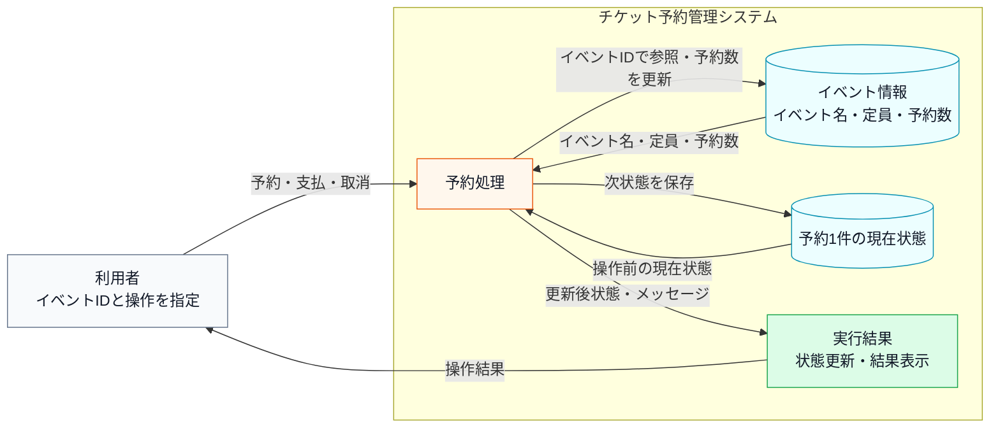
```mermaid
flowchart LR
    U["利用者<br>イベントIDと操作を指定"] -->|"予約・支払・取消"| T

    subgraph RESERVATION["チケット予約管理システム"]
        T["予約処理"]
        D[("イベント情報<br>イベント名・定員・予約数")]
        S[("予約1件の現在状態")]
        R["実行結果<br>状態更新・結果表示"]
        T -->|"イベントIDで参照・予約数を更新"| D
        D -->|"イベント名・定員・予約数"| T
        T -->|"次状態を保存"| S
        S -->|"操作前の現在状態"| T
        T -->|"更新後状態・メッセージ"| R
    end

    R -->|"操作結果"| U

    classDef actor fill:#f8fafc,stroke:#64748b,color:#111827;
    classDef data fill:#ecfeff,stroke:#0891b2,color:#111827;
    classDef process fill:#fff7ed,stroke:#ea580c,color:#111827;
    classDef result fill:#dcfce7,stroke:#16a34a,color:#111827;
    class U actor;
    class D,S data;
    class T process;
    class R result;
```

上の文章と表で仕様を一通り確認したので、まず正常に状態更新できる場合の入力・判定・加工・出力の流れとして整理します。

**システム内部図：正常系の入力・判定・加工・出力**


```mermaid
flowchart LR
    A[(検証済み予約<br>Available / Reserved / Paid)]:::data --> B[イベント存在・空席・操作可否を確認]:::process
    C[/操作<br>予約・支払い・キャンセル/]:::input --> B
    D[/イベントID<br>EVT001・EVT002・EVT003/]:::input --> B
    B --> F[状態ごとの処理を実行]:::process
    F --> G[次の状態を決める]:::process
    G --> H([正常出力<br>状態更新・結果表示]):::normal

    classDef data fill:#ecfeff,stroke:#0891b2,color:#111827;
    classDef input fill:#e7f0ff,stroke:#2563eb,color:#111827;
    classDef process fill:#fff7ed,stroke:#ea580c,color:#111827;
    classDef decision fill:#fef9c3,stroke:#ca8a04,color:#111827;
    classDef normal fill:#dcfce7,stroke:#16a34a,color:#111827;
```

この図から読み取ることは、次の3点です。

- 同じ操作でも、現在の予約状態によって受け付けられるかどうかが変わる。
- 状態更新へ進む前に、イベントの存在、空席、操作可否を順に確認する必要がある。
- 正常系では、現在状態と操作から次の状態を決め、状態更新と結果表示を行う。

**状態遷移マトリクス**

この表は、現在の状態ごとに、各操作を受け付けたとき次にどの状態へ進むかを整理したものです。行は「いまの状態」、列は「利用者が行う操作」、セルは「操作後の状態」を表します。予約可能な状態で予約すると予約済みに進み、予約済みの状態で支払うと支払済みに進む、という基本の流れを確認します。

| 現在の状態 | 予約する | 支払う | キャンセルする |
|---|---|---|---|
| Available（予約可能） | → Reserved | —— | —— |
| Reserved（予約済み） | —— | → Paid | → Available |
| Paid（支払済み） | —— | —— | —— |

「——」は、その状態では操作を受け付けず、エラーメッセージを出力して終了することを表します。これは表の中心ではなく、基本の状態遷移に当てはまらない操作を明示するための記号です。

表の各行に着目すると、それぞれのルールには明確な業務上の理由があります。

- **Available（予約可能）で「支払う」「キャンセルする」が——の理由**：予約が存在しない状態で支払いを受け付けると「どの予約に対する支払いか」が確定しません。キャンセルについても、そもそも予約がなければキャンセルする対象がなく、操作自体が無意味です。
- **Reserved（予約済み）で「予約する」が——の理由**：同じ予約枠を二重予約することは、業務上あり得ないためです。
- **Paid（支払済み）でのすべての操作が——の理由**：支払いが完了した予約は「確定済み」扱いになります。この状態からのキャンセルを認める場合は、返金処理・在庫の戻し・会計記録の修正など、複数の業務プロセスが連動して動く必要があります。この章では、返金処理はこの章の設計論点から外れるため扱いません。キャンセルポリシーを設ける場合は、「キャンセル済み（Cancelled）」という別の状態を追加して対応できます。

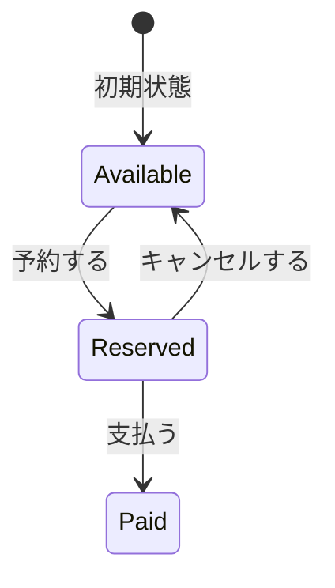
```mermaid
stateDiagram-v2
    [*] --> Available : 初期状態
    Available --> Reserved : 予約する
    Reserved --> Paid : 支払う
    Reserved --> Available : キャンセルする
```

このマトリクスが、後のフェーズで「新しい状態が増えるとどこが変わるか」を確認する基準になります。

**エラー条件**

正常系の仕様を一通り確認したうえで、最後に、状態更新へ進めない入力や操作を分けて整理します。

| エラー条件 | どこで分かるか | 出力 | 状態保存・通知 |
|---|---|---|---|
| イベントIDが存在しない | イベント情報の存在確認時 | 対象なしエラー | 予約状態は変更しない |
| 予約時に空席がない | イベント情報の空席確認時 | 満席エラー | 予約状態は変更しない |
| 現在状態では操作できない | 現在の予約状態と操作の組み合わせ確認時 | 操作不可エラー | 現在の予約状態は変更しない |

---

### 1-2：動作例テーブル

コードを読む前に、このシステムがどんな入力に対してどんな出力を返すかを確認します。この章のどのステップも、以下の動作を実現します。

| ケース | 入力 | 加工 | 出力 |
|---|---|---|---|
| ケース1：予約して支払う | 空きありイベント / 予約する → 支払う | 空きありのイベントを予約し、予約済みから支払いへ進める | 予約対象、予約完了、支払い完了 |
| ケース2：予約してキャンセルする | 空きありイベント / 予約する → キャンセルする | 空きありのイベントを予約し、予約済みから予約可能へ戻す | 予約対象、予約完了、キャンセル完了 |
| ケース3：満席イベントを予約する | 満席イベント / 予約する | 満席イベントを検出する | 満席エラー |
| ケース4：存在しないイベントを予約する | 存在しないイベント / 予約する | 存在しないイベントIDを検出する | イベントID不存在エラー |
| ケース5：予約前に支払う | 空きありイベント / 支払う | 予約可能状態で支払いを試みる | 支払い不可エラー |
| ケース6：支払後にキャンセルする | 空きありイベント / 予約する → 支払う → キャンセルする | 支払済み状態でキャンセルを試みる | キャンセル不可エラー |

確認したいことは、通常の予約・支払いフロー、キャンセルフロー、予約前の外部条件による拒否、状態に合わない操作の拒否が、それぞれ入力と出力で対応していることです。

この動作テーブルは、後のフェーズでステップを比較するときに「同じ入力なら同じ出力を返すことで動作不変を確認する」ための基準として使います。この章で変えたいのは内部の構造であり、利用者から見える動作ではありません。

---

### 1-3：登場クラスとクラス構成図

#### このシステムの登場クラス

| クラス名 | 役割 | 担当する仕様 |
|---|---|---|
| `EventInfo` | イベント1件分の情報 | イベント名・定員・予約数の受け渡し |
| `EventDatabase` | イベント情報の保持と検索 | イベントIDの存在確認・満席判定 |
| `TicketReservation` | チケット予約の状態管理と各状態の振る舞い | `Available` / `Reserved` / `Paid` の状態遷移 |

データの流れは、次のように分かれます。

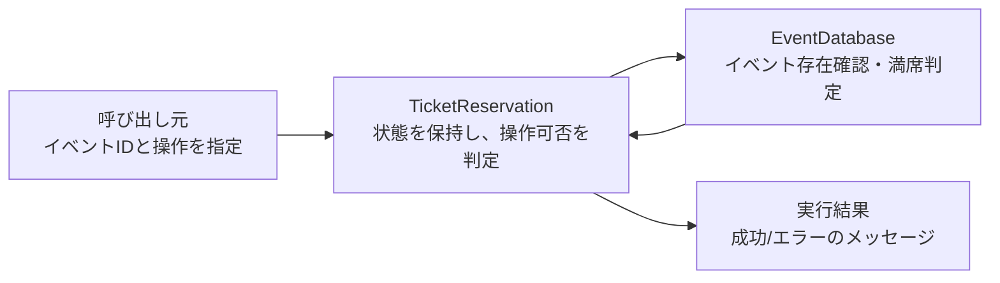
```mermaid
flowchart LR
    C["呼び出し元<br/>イベントIDと操作を指定"]
    T["TicketReservation<br/>状態を保持し、操作可否を判定"]
    D["EventDatabase<br/>イベント存在確認・満席判定"]
    R["実行結果<br/>成功/エラーのメッセージ"]

    C --> T
    T --> D
    D --> T
    T --> R
```

**クラス図に出てくる主なメンバーと操作**

| クラス | メンバー・操作 | 何ができるか |
|---|---|---|
| `EventDatabase` | `records` | イベントIDごとの情報を保持する |
| `EventDatabase` | `exists()` / `get()` / `hasCapacity()` | 対象イベントの存在確認、情報取得、満席判定を行う |
| `TicketReservation` | `db` / `eventId` / `status` | 予約対象イベントと現在状態を保持する |
| `TicketReservation` | `reserve()` / `pay()` / `cancel()` | 現在状態に応じて予約、支払い、キャンセルを実行する |
| `TicketReservation` | `handleReserveError()` など | 操作できない状態のエラーを返す |


各クラスの役割を把握したところで、クラス間の関係を図で整理します。

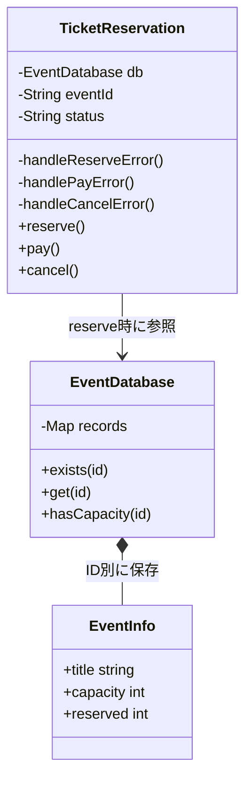
```mermaid
classDiagram
    class EventDatabase {
        -Map records
        +exists(id)
        +get(id)
        +hasCapacity(id)
    }
    class EventInfo {
        +title string
        +capacity int
        +reserved int
    }
    class TicketReservation {
        -EventDatabase db
        -String eventId
        -String status
        -handleReserveError()
        -handlePayError()
        -handleCancelError()
        +reserve()
        +pay()
        +cancel()
    }

    EventDatabase *-- EventInfo : ID別に保存
    TicketReservation --> EventDatabase : reserve時に参照
```

この図から分かるのは、予約する、支払う、キャンセルするという操作が同じ予約管理クラスに集まっていることです。各操作の中で状態をどう判定しているかは、次の実装コードで確認します。

**現状システムの処理シーケンス**

静的な関係に続けて、正常系（予約→支払い）で各操作がどの順に呼ばれ、状態がどう遷移するかを時系列で示します。状態ごとの具体の分岐は `TicketReservation` の注記に、エラー系はメモとして添えます。1-4の現状コードを読む前の地図です。

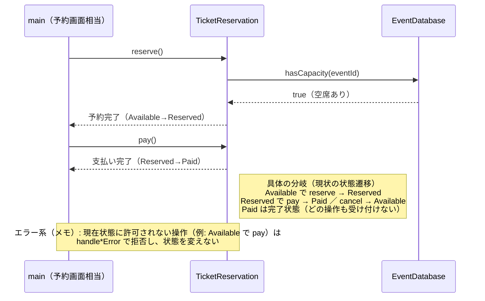
```mermaid
sequenceDiagram
    participant Main as main（予約画面相当）
    participant TR as TicketReservation
    participant DB as EventDatabase
    Main->>TR: reserve()
    TR->>DB: hasCapacity(eventId)
    DB-->>TR: true（空席あり）
    TR-->>Main: 予約完了（Available→Reserved）
    Main->>TR: pay()
    TR-->>Main: 支払い完了（Reserved→Paid）
    Note right of TR: 具体の分岐（現状の状態遷移）<br>Available で reserve → Reserved<br>Reserved で pay → Paid ／ cancel → Available<br>Paid は完了状態（どの操作も受け付けない）
    Note over Main,TR: エラー系（メモ）: 現在状態に許可されない操作（例: Available で pay）は<br>handle*Error で拒否し、状態を変えない
```

図から読み取れるのは、公開操作（`reserve`／`pay`／`cancel`）が同じ `TicketReservation` に集まり、各操作が現在の `status` を見て遷移先を決めていること、席の空きは `EventDatabase.hasCapacity()` で確認すること、許可されない操作はメモのとおり状態を変えずに拒否されることです。状態ごとに「どの操作で何が起きるか」がこの時系列と注記で確認できます。


**この章での簡略化**

1-3でクラス構成を確認したので、掲載コードで何を代替しているかを整理してからフェーズ1の現状コードへ進みます。

この章の主役は、`Available` / `Reserved` / `Paid` という**予約状態に応じて振る舞いが切り替わる部分**です。イベントIDの存在確認や満席判定は、実際の予約システムなら必要な周辺処理ですが、この章の設計論点ではありません。そのため、この章では `EventDatabase` というメモリ上の簡易データで表現し、データベース接続、同時予約制御、決済API、発券処理は扱いません。

---

### 1-4：実装コード（現状）

#### コードを読む前に：クラスの責任と境界

| 対象 | 呼び出しと内部処理 | 戻り値・副作用 | 掲載上の表現 |
|---|---|---|---|
| `EventDatabase` | イベントIDで空席を確認し予約数を増減する | 更新後の`reserved` | `std::map`をイベントDBとして使う |
| `TicketReservation` | 利用者操作を受け現在状態で可否を決める | 状態遷移とメッセージ | 決済・発券は論点外とする |
| 例外 | 確認なしの満席更新を拒否する | `runtime_error` | 通常の満席は戻り値で先に判定する |

実DB、同時予約の排他制御、決済APIは省略します。省略しても、予約成功で件数を増やし、キャンセル・期限切れで減らすという在庫の契約はコードに残します。

#### 仕様入力が現状コードで使われるまで

この章では操作種別を文字列で渡さず、`reserve()` / `pay()` / `cancel()` という入口そのものが利用者の操作を表します。イベントIDと現在状態を合わせて、どの処理へ進むかが決まります。

| 仕様入力 | コード上の受け取り口 | 実際に使う箇所 | 結果への現れ方 |
|---|---|---|---|
| イベントID | `TicketReservation(db, eventId)` | `EventDatabase::exists()` / `hasCapacity()` / `reserveSeat()` / `cancelSeat()` | 対象イベントの予約数が増減し、未登録IDは拒否される |
| 予約・支払・キャンセル操作 | `reserve()` / `pay()` / `cancel()` | 各メソッド内の現在状態による分岐 | 状態遷移または操作不可メッセージになる |
| 現在状態 | `TicketReservation::status` | 3つの操作メソッドの条件判定 | 同じ操作でも状態に応じて成功・拒否が変わる |

イベントマスターは1-1で示した3件（EVT001〜EVT003）です。次のコードの `EventDatabase` が、その定員と現在の予約数を保持します。予約が成功するとメモリ上の `reserved` を1増やし、予約済み状態でキャンセルすると1減らします。たとえばEVT002は499件から予約すると500件で満席になり、その予約をキャンセルすると499件へ戻ります。

このコードの `std::map` はイベントIDから `EventInfo` を引くメモリ上のイベント表です。`at(id)` は存在確認済みのIDに対応するデータを取得します。`throw std::runtime_error(...)` は、満席という前提違反を呼び出し元へ例外として通知する記法です。通常の満席判定は先に `hasCapacity()` で行い、例外は確認を飛ばして更新しようとした場合の安全網として使います。

コードは責任の固まりごとに分けて読みます。

**① イベント在庫を表すクラス（EventInfo / EventDatabase）**

最初に、1-1の「イベント」にあたるデータと在庫を持つ部分です。イベントIDから定員・予約数を引き、予約成功で件数を増やし、キャンセルで減らす在庫の役割を担います。エラー条件「存在しないID」「満席」もここで判定します。

```cpp
#include <iostream>
#include <string>
#include <map>
#include <stdexcept>

struct EventInfo {
    std::string title;   // イベント名
    int capacity;        // 定員
    int reserved;        // 現在の予約数
};

class EventDatabase {
private:
    std::map<std::string, EventInfo> records;
public:
    EventDatabase() {
        records["EVT001"] = {"春の音楽祭",  100,  20};
        records["EVT002"] = {"夏のフェス",  500, 499};
        records["EVT003"] = {"秋の映画会",   50,  50};  // 満席
    }

    bool exists(const std::string& id) const {
        return records.count(id) > 0;
    }

    EventInfo get(const std::string& id) const {
        return records.at(id);
    }

    bool hasCapacity(const std::string& id) const {
        const auto& e = records.at(id);
        return e.reserved < e.capacity;
    }

    void reserveSeat(const std::string& id) {
        ++records.at(id).reserved;
    }

    void cancelSeat(const std::string& id) {
        auto& e = records.at(id);
        if (e.reserved > 0) --e.reserved;
    }

    void save(const std::string& id, const EventInfo& info) {
        records[id] = info;             // 実行中のイベント表へ追加
    }
};
```

`EventDatabase` は `std::map` でイベントIDと `EventInfo` を対応付けた在庫データです。`exists()` でIDの存在確認、`hasCapacity()` で空席判定、`reserveSeat()` / `cancelSeat()` で予約数を増減します。実システムのDBを、この章では実行終了まで覚えているインメモリの登録表で代替しています。

**② 予約操作をまとめるクラス（TicketReservation）**

この章の中心です。1-1の「予約・支払い・キャンセル」という利用者操作を受け取り、現在の状態（Available / Reserved / Paid）に応じて可否を判定してから在庫を更新します。同型で並列な極小関数（各状態のエラー出力）は、並列関係が縦に見えるよう1行揃えで書きます（本書共通のスタイル）。

```cpp
class TicketReservation {
private:
    // --- データ ---
    EventDatabase& db;   // 共有の在庫データ（外部から注入）
    std::string eventId; // 予約対象のイベント
    std::string status;  // 状態 "Available"/"Reserved"/"Paid"

    // 各状態で操作できないときのエラー出力
    void handleReserveError() { std::cout << "現在予約できません\n"; }
    void handlePayError()     { std::cout << "支払いに適した状態ではありません\n"; }
    void handleCancelError()  { std::cout << "キャンセルできません\n"; }

public:
    TicketReservation(EventDatabase& db, const std::string& eventId)
        : db(db), eventId(eventId), status("Available") {}

    void reserve() {
        if (!db.exists(eventId)) {
            std::cout << "エラー：イベントID " << eventId << " は存在しません\n";
            return;
        }
        if (!db.hasCapacity(eventId)) {
            std::cout << "エラー：" << db.get(eventId).title << " は満席です\n";
            return;
        }
        if (status == "Available") {
            db.reserveSeat(eventId);
            status = "Reserved";
            std::cout << "予約対象：" << db.get(eventId).title << "\n";
            std::cout << "予約完了しました\n";
        } else {
            handleReserveError();
        }
    }

    void pay() {
        if (status == "Reserved") {
            status = "Paid";
            std::cout << "支払い完了しました\n";
        } else {
            handlePayError();
        }
    }

    void cancel() {
        if (status == "Reserved") {
            db.cancelSeat(eventId);
            status = "Available";
            std::cout << "予約をキャンセルしました\n";
        } else {
            handleCancelError();
        }
    }
};
```

このコードを見ると、`reserve`、`pay`、`cancel` の各メソッドの中に、現在の `status` を判定する条件分岐が散らばっていることが分かります。

**③ 実行して動作例と照合する（main）**

1-2の動作例テーブルを、ケースごとにコードとその実行結果を並べて確認します（実行対象は1-4の現状コード）。

まず依存を組み立て、行1（EVT001 予約 → 支払い）を実行します。

```cpp
int main() {
    EventDatabase db;

    // 行1: 正常な予約から支払いまで
    std::cout << "--- 行1: EVT001 予約 → 支払い ---\n";
    TicketReservation seat1(db, "EVT001");
    seat1.reserve();  // Available → Reserved
    seat1.pay();      // Reserved  → Paid
```

行1（EVT001 予約 → 支払い）の実行結果：

```
--- 行1: EVT001 予約 → 支払い ---
予約対象：春の音楽祭
予約完了しました
支払い完了しました
```

続いて、行2（EVT001 予約 → キャンセル）を実行します。

```cpp
    // 行2: 予約からキャンセルまで
    std::cout << "\n--- 行2: EVT001 予約 → キャンセル ---\n";
    TicketReservation seat2(db, "EVT001");
    seat2.reserve();  // Available → Reserved
    seat2.cancel();   // Reserved  → Available
```

行2（EVT001 予約 → キャンセル）の実行結果：

```
--- 行2: EVT001 予約 → キャンセル ---
予約対象：春の音楽祭
予約完了しました
予約をキャンセルしました
```

続いて、行3（EVT003 満席イベントへの予約）を実行します。

```cpp
    // 行3: 満席イベントへの予約試み
    std::cout << "\n--- 行3: EVT003 満席イベントへの予約 ---\n";
    TicketReservation seat3(db, "EVT003");
    seat3.reserve();  // エラー（満席）
```

行3（EVT003 満席イベントへの予約）の実行結果：

```
--- 行3: EVT003 満席イベントへの予約 ---
エラー：秋の映画会 は満席です
```

続いて、行4（UNKNOWN 存在しないイベントへの予約）を実行します。

```cpp
    // 行4: 存在しないイベントへの予約試み
    std::cout << "\n--- 行4: UNKNOWN 存在しないイベントへの予約 ---\n";
    TicketReservation seat4(db, "UNKNOWN");
    seat4.reserve();  // エラー（存在しない）
```

行4（UNKNOWN 存在しないイベントへの予約）の実行結果：

```
--- 行4: UNKNOWN 存在しないイベントへの予約 ---
エラー：イベントID UNKNOWN は存在しません
```

続いて、行5（予約なしで支払いを試みる）を実行します。

```cpp
    // 行5: 状態エラー — 予約前に支払いを試みる
    std::cout << "\n--- 行5: 予約なしで支払いを試みる ---\n";
    TicketReservation seat5(db, "EVT001");
    seat5.pay();      // エラー（Available状態）
```

行5（予約なしで支払いを試みる）の実行結果：

```
--- 行5: 予約なしで支払いを試みる ---
支払いに適した状態ではありません
```

最後に、行6（支払い済みをキャンセルしようとする）を実行し、`main()` を終了します。

```cpp
    // 行6: 状態エラー — 支払い済みをキャンセルしようとする
    std::cout << "\n--- 行6: 支払い済みをキャンセルしようとする ---\n";
    TicketReservation seat6(db, "EVT001");
    seat6.reserve();  // Available → Reserved
    seat6.pay();      // Reserved  → Paid
    seat6.cancel();   // エラー（Paid状態）

    return 0;
}
```

行6（支払い済みをキャンセルしようとする）の実行結果：

```
--- 行6: 支払い済みをキャンセルしようとする ---
予約対象：春の音楽祭
予約完了しました
支払い完了しました
キャンセルできません
```

各ケースのコードとその実行結果をその場で並べたので、離れた `main()` と出力を行き来せずに照合できます（確認したいこと：イベントID検証・満席判定・状態遷移の結果が、動作例テーブルと対応していること）。

`main()` はイベントIDと操作の組み合わせを指示するだけで、存在確認・満席判定・状態チェックはすべて `TicketReservation` 内部で行っています。

> **手元で動かすには**
> このコードは1つの `.cpp` に貼り付けて、そのままコンパイル・実行できます（例：`g++ chapter03.cpp -o app && ./app`）。`main()` は自由に組み替えて構いません。たとえば `db.save("EVT010", {"冬の演劇祭", 80, 0});` でイベントを足し、`TicketReservation seat(db, "EVT010");` を作って `reserve()` や `pay()` を呼べば、追加したイベントの予約と状態遷移がその場の実行結果に表れます。イベントデータはプロセス実行中だけ有効で、終了すると消えます（DBのような永続化はこの章の論点ではありません）。

次のフェーズで変更が来たときに何が起きるかを確認します。

---

### 1-5：変更要求

ある週明けの朝、イベント運営担当から開発チームへ、新しい施策についての連絡が入りました。

「来月から、リピーター向けに『キャンセル待ち』機能を実装したいのです。予約枠がいっぱいの場合でも、空きが出たら自動的に予約が割り当てられるようにしたい。また、それに伴い『予約一時保留』という状態も追加してほしい。イベント開始の24時間前までなら、予約を確保したまま決済を24時間待つ仕組みです。」

運営担当は、この機能が実装されれば、直前キャンセルによる空き枠を減らし、収益が大きく改善すると期待しています。ここで整理しておくと、「キャンセル待ち」とは予約枠が満杯のときに空き待ちを登録する状態、「予約一時保留」とは予約を確保したまま決済の期限を延期する状態です。

依頼文を、実行結果で判定できる変更依頼へ分けます。先に曖昧さをなくすため、本章では次の業務ルールを固定します。

- 満席時の通常の予約要求は、システムが空席数を確認して自動的にキャンセル待ちへ登録する。利用者が満席を判断して別操作を選ぶ必要はない。
- 空席が1席出るたびに待ち行列の先頭1件だけを自動昇格し、後続の待機者は先着順のまま残る。複数席空けば、席数分だけ同じ処理を繰り返す。
- 利用者は `Reserved` と `Held` のどちらからも明示的にキャンセルできる。いずれも席を解放し、待機者がいれば自動昇格する。
- 通常の `Reserved` は15分の決済期限を持つ。利用者が明示的に一時保留を選ぶと `Held` へ移り、期限が24時間へ延長される。どちらも期限切れはスケジューラから届き、席を解放する。
- 本章ではキャンセル待ち自体の取り下げ、イベント開始時刻との厳密な比較、プロセス再起動後のタイマー復元は扱わない。

| 変更依頼ID | 確定した変更内容 | 入力 | 受入条件 |
|---|---|---|---|
| 変更ID1 | 満席時の予約要求を自動でキャンセル待ちへ登録し、空席発生時に先頭を自動昇格する | イベントID、満席状態、予約要求、予約済み取消 | 予約要求だけで待機登録され、取消で49/50になった直後、先頭待機者が予約済みとなり50/50へ戻る |
| 変更ID2 | 通常の15分決済期限を、明示的な一時保留で24時間へ延長し、期限切れで席を解放する | 予約済み状態、一時保留操作、期限切れイベント | Reserved/Heldの期限中は席を確保し、期限切れ時は空席へ戻して待機者がいれば自動昇格する |

#### 変更後要求ベースライン

| 要求ID | 変更種別・根拠となる変更ID | 変更後要求 | 受入条件 |
|---|---|---|---|
| 要求ID1 | 継続<br/>根拠: — | イベントの存在と空席数を確認する | 未登録イベント・満席の既存判定を維持する |
| 要求ID2 | 継続<br/>根拠: — | 予約可能から予約済みへ遷移し、予約数を1増やす | 残り1席の予約後に満席になる |
| 要求ID3 | 変更<br/>根拠: 変更ID2 | 予約済みまたは一時保留から支払済みへ遷移する | 支払成功時だけPaidになる |
| 要求ID4 | 変更<br/>根拠: 変更ID1 | 予約取消で席を解放し、待機者がいれば先頭を同じ処理内で自動昇格する | 50/50→49/50→50/50と件数変化し、手動昇格を要しない |
| 要求ID5 | 継続<br/>根拠: — | 許可されない操作や決済失敗では状態と予約数を変えない | エラー前後の状態・件数が一致する |
| 要求ID6 | 追加<br/>根拠: 変更ID1 | 満席時の予約要求をシステムがキャンセル待ちへ登録する | 利用者は予約操作だけを行い、待機順を保存して空席発生時に先頭から昇格する |
| 要求ID7 | 追加<br/>根拠: 変更ID2 | Reservedは15分、一時保留したHeldは24時間の期限を持ち、期限切れで席を解放する | 期限中は席を確保し、期限切れ後は待機者を自動昇格する |

**変更前→変更後の要求対照（今回変える要求IDだけ）**

現行ベースラインと変更後ベースラインを往復せずに済むよう、今回変える要求IDだけを取り出し、変更前と変更後を同じ行へ並べます。

| 要求ID | 変更前の要求（現行） | 変更後の有効要求 | 根拠変更ID |
|---|---|---|---|
| 要求ID3 | 予約済みを支払済みへ遷移する | 予約済みまたは一時保留から支払済みへ遷移する | 変更ID2 |
| 要求ID4 | 予約済みをキャンセルして予約可能へ戻し、予約数を1減らす | 予約取消で席を解放し、待機者がいれば先頭を同じ処理内で自動昇格する | 変更ID1 |
| 要求ID6 | （新規・現行なし） | 満席時の予約要求をシステムがキャンセル待ちへ登録する | 変更ID1 |
| 要求ID7 | （新規・現行なし） | Reservedは15分、一時保留したHeldは24時間の期限を持ち、期限切れで席を解放する | 変更ID2 |

要求ID1・要求ID2・要求ID5は継続（変更前＝変更後）のため対照表には載せません。変更後ベースラインで内容を確認できます。

決済失敗時に状態を変えない戻り値と、期限切れイベントを受けるスケジューラ境界は、変更ID1・変更ID2を安全に実行するための内部契約です。独立した利用者要求として数えません。

実際の予約システムでは、入力は利用者のボタン操作だけではありません。キャンセルで空席が出たときの予約昇格イベント、保留期限を過ぎたときのタイマーイベント、決済APIから返る失敗結果も、予約状態を動かす入力になります。この章では、それらを「状態によって扱いが変わる入力」として同じ粒度で整理します。

**仕様変更の内容**

変更要求を受けて、状態の種類と遷移ルールがどう変わるかを整理します。

**状態の変化**

| 状態 | 変更前 | 変更後 |
|---|---|---|
| Available（予約可能） | あり | 変更なし |
| Reserved（予約済み） | あり | 変更なし |
| Paid（支払済み） | あり | 変更なし |
| **Waitlisted（キャンセル待ち）** | なし | **新規追加** |
| **Held（一時保留）** | なし | **新規追加** |

今回変えるのは予約状態と遷移です。イベント情報と空席数を管理する保存基盤は仕様変更の対象ではないため、`EventDatabase` の取得・更新契約は変更前後で**変更なし**とします。

**新しく追加される遷移ルール**

| 現在の状態 | 操作 | 遷移先 | 処理内容 |
|---|---|---|---|
| Available | reserve（満席時） | Waitlisted | 通常の予約要求をキャンセル待ちへ自動登録する |
| Waitlisted | promoteBySystem | Reserved | 空席発生時にシステムが予約へ昇格する |
| Reserved | hold | Held | 通常の15分期限を24時間へ延長する |
| Reserved | expire | Available | 通常の15分決済期限が切れ、予約枠を空きに戻す |
| Held | pay | Paid | 保留期限内に決済を完了する |
| Held | cancel | Available | 保留中の予約を取り消し、予約枠を空きに戻す |
| Held | expire | Available | 保留期限（24時間）が切れ、予約枠を空きに戻す |
| Reserved / Held | paymentFailed | Reserved / Held | 決済失敗を記録し、予約済みまたは保留中のまま再試行できる状態に戻す |

**実運用での状態の動き（イメージ）**

各遷移が「誰の・何をきっかけに」起きるかを、時間の流れで並べると次のようになります。

1. **予約する（Available→Reserved／Waitlisted）**：利用者は常に「予約」を押します。空席があれば席数から1席を引いて予約済み（未払い）となり、満席ならシステムが自動でキャンセル待ちへ登録します。`Reserved` の標準決済期限は15分です。
2. **一時保留する（Reserved→Held）**：利用者が明示的に「一時保留」を選ぶと、席を確保したまま決済期限を24時間へ延長します。予約の放置を自動で保留へ変える操作ではありません。
3. **支払う（Reserved／Held→Paid）**：期限内に決済すると確定します。
4. **期限切れ（Reserved／Held→Available）**：Reservedは15分、Heldは24時間が経過しても未払いなら、タイマーイベントが枠を空きに戻します。空いた1席は、キャンセル待ち（Waitlisted）の先頭が自動昇格して受け取ります。
5. **決済失敗（Reserved／Held を維持）**：決済APIが失敗を返しても状態は進めず、同じ状態のまま再試行できます。

現状の `if` 文を使った状態分岐ロジックに、この2状態と、操作・イベントによる6種類の遷移/状態維持を追加することになります。

**実システムのイベントと掲載コードでの模擬方法**

実運用では、期限時刻を永続化し、バックグラウンドのタイマー基盤が期限到来を検知して予約システムへイベントを送ります。掲載コードは実時間を待たず、テスト用の `BatchApplication` がタイマー基盤の代役として `ReservationExpiryScheduler::onPaymentDeadlineExpired()` を直接呼びます。呼び出し行は利用者操作の実装ではなく、外部タイマーからイベントが届いた状況を即時再現するテストハーネスです。時刻計算・ジョブ再実行・永続化は省略しても、予約オブジェクトが期限切れイベントを受けた後の遷移は実際に動かします。

| 入力の種類 | 具体例 | 状態に与える影響 | この章で見ること |
|---|---|---|---|
| 利用者操作 | 予約、支払い、キャンセル、一時保留 | 現在状態に応じて許可/拒否と遷移先が変わる | 操作メソッドに状態分岐が増えるか |
| システムイベント | キャンセル待ちからの予約昇格 | 空席発生をきっかけに `Waitlisted` から `Reserved` へ進む | 利用者操作でなくても状態ごとの扱いが必要か |
| タイマー | 保留期限切れ | `Held` から `Available` へ戻り、枠を解放する | 時間起点の入力でも同じ接続点で扱えるか |
| 外部API結果 | 決済失敗 | `Reserved` または `Held` を維持し、再試行できる状態にする | 成功だけでなく失敗戻りも状態ごとの振る舞いか |

**仕様変更後の状態遷移マトリクス（全体像）**

この表は、既存の3状態に「キャンセル待ち」と「一時保留」を追加した後、各操作でどの状態へ進むかを整理したものです。状態と操作の組み合わせが増えたため、列数の都合で表を2つに分けています。「——」は、その状態では操作を受け付けず、エラーメッセージを出力して終了することを表します。

【表1：従来の操作】

`Waitlisted` は変更要求で初めて追加される状態です。従来は満席なら予約エラーで終了し、キャンセル待ちとして保存する機能自体がありませんでした。そのため従来の「予約する・支払う・キャンセルする」を `Waitlisted` に直接適用する欄は「——」です。キャンセル待ちからの操作は、直後の表2aにある専用イベント（登録・予約昇格）として扱います。

| 現在の状態 | 予約する | 支払う | キャンセルする |
|---|---|---|---|
| Available（予約可能） | → Reserved | —— | —— |
| Reserved（予約済み） | —— | → Paid | → Available |
| Paid（支払済み） | —— | —— | —— |
| Waitlisted（キャンセル待ち） | —— | —— | —— |
| Held（一時保留） | —— | → Paid | → Available |

【表2a：キャンセル待ち系の操作】

| 現在の状態 | 満席時の予約要求 | 予約昇格 |
|---|---|---|
| Available（予約可能） | → Waitlisted | —— |
| Reserved（予約済み） | —— | —— |
| Paid（支払済み） | —— | —— |
| Waitlisted（キャンセル待ち） | —— | → Reserved |
| Held（一時保留） | —— | —— |

【表2b：一時保留系の操作】

| 現在の状態 | 一時保留 | 期限切れ |
|---|---|---|
| Available（予約可能） | —— | —— |
| Reserved（予約済み） | → Held | —— |
| Paid（支払済み） | —— | —— |
| Waitlisted（キャンセル待ち） | —— | —— |
| Held（一時保留） | —— | → Available |

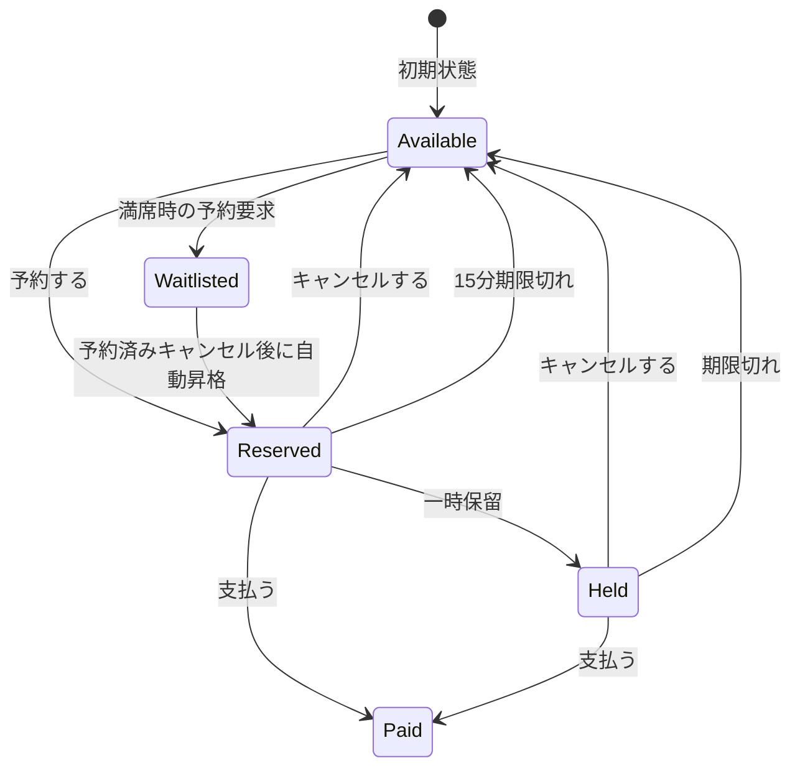
```mermaid
stateDiagram-v2
    [*] --> Available : 初期状態
    Available --> Reserved : 予約する
    Reserved --> Paid : 支払う
    Reserved --> Available : キャンセルする
    Available --> Waitlisted : 満席時の予約要求
    Waitlisted --> Reserved : 予約済みキャンセル後に自動昇格
    Reserved --> Held : 一時保留
    Reserved --> Available : 15分期限切れ
    Held --> Paid : 支払う
    Held --> Available : キャンセルする
    Held --> Available : 期限切れ
```

操作不可・満席・決済失敗は状態を変えない結果なので、状態遷移の矢印には含めません。これらは直後のエラー条件表で「状態保存なし」として扱います。

**変更前後の入力・判定・加工・出力差分**

1-1の現状仕様を退避し、変更要求を当てた後の仕様と同じ粒度で並べます。以降の分析では、この差分を追います。

| 要素 | 変更前（1-1の現状仕様） | 変更後（今回の要求） | 差分として追うもの |
|---|---|---|---|
| 入力 | イベントID、操作、内部に保持している現在の予約状態 | イベントID、操作/イベント、内部に保持している現在の予約状態、キャンセル待ち/一時保留/決済失敗に関わる入力 | 操作・イベントと状態の種類が増える |
| 判定 | 現在状態で操作可能か | 新状態を含めて操作/イベントを受け付けるか、保留期限内か、決済失敗時に再試行できるか | 状態ごとの判定が増える |
| 加工 | 予約・支払・キャンセルに応じて状態を更新 | キャンセル待ち登録、予約昇格、一時保留、期限切れ、決済失敗時の状態維持を処理 | 状態遷移ルールと状態維持ルールが増える |
| 出力 | 操作結果と更新後状態 | 操作結果、Waitlisted/Heldを含む更新後状態 | 新状態の出力を追う |

**変更後の入力・加工・出力**

変更後の仕様を、1-1と同じ粒度で、正常系の入力・判定・加工・出力として確認します。1-1の図との差分は、内部に保持する「現在状態」が3種類から5種類へ、「操作・イベント」が3種類から8種類へ増えることです。判定・加工・出力の流れ自体は変わりません。図中のイベントIDも、現状データに存在する3件を省略せず示します。

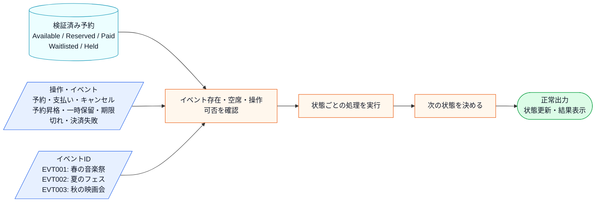
```mermaid
flowchart LR
    A[(検証済み予約<br>Available / Reserved / Paid<br>Waitlisted / Held)]:::data --> B[イベント存在・空席・操作可否を確認]:::process
    C[/操作・イベント<br>予約・支払い・キャンセル<br>予約昇格・一時保留・期限切れ・決済失敗/]:::input --> B
    D[/イベントID<br>EVT001: 春の音楽祭<br>EVT002: 夏のフェス<br>EVT003: 秋の映画会/]:::input --> B
    B --> F[状態ごとの処理を実行]:::process
    F --> G[次の状態を決める]:::process
    G --> H([正常出力<br>状態更新・結果表示]):::normal

    classDef data fill:#ecfeff,stroke:#0891b2,color:#111827;
    classDef input fill:#e7f0ff,stroke:#2563eb,color:#111827;
    classDef process fill:#fff7ed,stroke:#ea580c,color:#111827;
    classDef decision fill:#fef9c3,stroke:#ca8a04,color:#111827;
    classDef normal fill:#dcfce7,stroke:#16a34a,color:#111827;
```

この図から読み取ることは、次の3点です。

- 新しい入力は「Waitlisted・Held」の2状態と「満席時の自動待機登録・予約昇格・一時保留・期限切れ・決済失敗」の5操作/イベントで、図の箱そのものは増えていない。
- 増えるのは「操作は現在状態で可能か」で受け付ける組み合わせと、「次の状態を決める」の行き先である。
- 受け付けられない組み合わせは、変更後も既存の「操作不可エラー」として扱う。

変更後も、失敗条件は正常系図へ混ぜずに別で確認します。

| エラー条件 | どこで分かるか | 出力 | 状態保存・通知 |
|---|---|---|---|
| イベントIDが存在しない | イベント台帳の存在確認時 | 対象なしエラー | 現在の予約状態は変更しない |
| 予約時に空席がない | `EventDatabase` の空席確認時 | 満席エラー。必要ならキャンセル待ち登録へ進む | `Waitlisted` へ変える場合は変更要求側の仕様として扱う |
| 現在状態では操作できない | 現在の予約状態と操作の組み合わせ確認時 | 操作不可エラー | 現在の予約状態は変更しない |
| 決済APIが失敗する | 支払い処理の結果受信時 | 決済失敗メッセージ | `Reserved` または `Held` を維持し、再試行可能にする |

増えた状態と操作の組み合わせが実際にコードのどこへ書かれるかは、フェーズ3で変更を試すコードと、フェーズ7の最終コード・実行結果で追います。

**フェーズ1のまとめ：今回追う変更ID一覧**

このフェーズで確定した変更依頼を一覧にして締めます。フェーズ2でこの変更IDを仮説・ヒアリングへ、フェーズ3で一つずつ試して痛みへ、と順につなぎます。

| 変更ID | 変更依頼の要点 | 関係する要求ID（追加は変更後ID） |
|---|---|---|
| 変更ID1 | 満席時にキャンセル待ちへ登録し、空席発生時に先頭を自動昇格する | 要求ID4、要求ID6 |
| 変更ID2 | 予約済みを24時間の一時保留へ移し、期限切れで席を解放する | 要求ID3、要求ID7 |

フェーズ1でシステムの現状と変更要求が把握できました。次のフェーズ2では、「何を変え、何を守るか」を整理します。

---

## 🟣 フェーズ2：仮説立案 ―― 何が変わるかを観察し、ヒアリングで裏付ける
### 2-1：変わりそうな仕様の見当をつける

ここで作る一覧は、思いつきで「変わりそう」と感じたものを並べる表ではありません。フェーズ1で確認した仕様・動作例・クラス図を材料に、次の順で候補を絞ります。

1. 仕様図と動作例から、入力・判定・加工・出力のうち条件や値が変わりそうな箇所を拾う。
2. その箇所が、1-3のどのクラス・メソッドに書かれているかを対応づける。
3. その仕様が、どんな理由で、何をきっかけに、どのくらいの頻度で変わりそうかを仮説として書く。
4. 逆に、当面変えない前提にできる処理の骨格も分けておく。

この手順で見ると、「予約を管理する」という大きな処理全体ではなく、その中のどの状態・操作可否・遷移先が変更候補なのかを読者自身で追えるようになります。

フェーズ1で整理した仕様をもとに、「どの仕様が変わりやすいか」を見立てます。責務配置の評価は、変更を当てたときの痛みと合わせてフェーズ3・4で確認します。

変わりそうな仕様は、1-3のクラス図の中心 `TicketReservation` にあります。`reserve()` / `pay()` / `cancel()` の中で判定している「どの状態なら操作できるか」と「操作後にどの状態へ遷移するか」を、どんな仕様が、誰の何をきっかけに変わりそうかと一緒に整理します。

| 変わりそうな仕様 | 所在（クラス・メソッド） | 変える主体・きっかけ | 変わりやすさの見立て |
|---|---|---|---|
| 状態の種類 | `TicketReservation.status` の取りうる値 | 企画担当の新機能導入（キャンセル待ち等） | 高い |
| 操作可能な状態の判定条件 | 各メソッド内の `if (status == ...)` | 企画担当の運用ルール見直し | 高い |
| 操作後の遷移先の状態 | 各メソッド内の `status = ...` 代入 | 企画担当の運用ルール見直し | 高い |
| 状態を動かす入力の種類 | 現状は利用者操作を受ける各メソッド | 決済失敗・期限切れなど外部入力の追加 | 高い |
| 予約成功・失敗などの通知や画面表示 | 各メソッド内の表示処理 | 予約フローそのものは当面安定 | 低い |

見えてくるのは、**1つの `TicketReservation` の中で、「どの状態なら何ができるか」「操作後どの状態へ移るか」という状態遷移の仕様が、企画担当の施策や運用見直しをきっかけに変わりやすい**という見立てです。逆に、予約完了・支払い完了などを通知する予約フローの骨格は、当面変わらない前提に置けます。

ここでは「このクラスは責任が多い」「構造が良い/悪い」という評価はしません。上の表は、変わりそうな仕様が `TicketReservation` のどのメソッドのどの行にあるかという所在の見立てです。状態遷移の仕様を1つのクラスにまとめている今の配置が、変更要求を当てたときに**実際に痛みになるか**はフェーズ3で確かめ、なぜ辛いのかはフェーズ4で原因として言語化します。2-1は、その検証対象に当たりをつける段階です。

#### ヒアリングで確認すること

状態に関する見当を、設計判断に必要な二つの質問へ絞ります。

| 見当 | 現時点の仮説 | 確認する質問 | 確認先 |
|---|---|---|---|
| 状態の種類 | 新しい予約状態が今後も増える | キャンセル待ち以外の状態も追加されるか | 企画担当 |
| 遷移ルール | 同じ状態でも操作可否が変わる | 状態間の遷移条件を今後見直す予定があるか | 企画担当 |

この二点を2-3で確認し、「状態名が増えるだけ」なのか「振る舞いも変わる」のかを分けます。

### 2-2：今回の変更で確実に変わること

変更要求として届いた内容のうち、今回のリリースで確実に発生する変更を整理します。

| **分類** | **具体的な内容** | **変わるタイミング** | **根拠** |
|---|---|---|---|
| 🔴 **変動する** | 状態の種類（キャンセル待ち・一時保留の追加） | 今回のリリース | 運営担当からの変更要求に明記されている |
| 🔴 **変動する** | 各状態における振る舞い（状態ごとのアクション可否） | 今回のリリース | 新状態の導入に伴い定義が必要 |
| 🔴 **変動する** | 状態を動かす入力の種類（利用者操作、システムイベント、タイマー、決済結果） | 今回のリリース | 予約昇格・期限切れ・決済失敗の扱いが追加される |
| 🟢 **今回守りたい前提** | イベントの基本情報（開催名、定員） | 今回の変更対象外 | 予約状態の設計課題からは外れる |

ここで確定しているのは「状態が2つ増える」ことと、「利用者操作以外の入力も状態を動かす」ことです。将来どれだけ変わり続けるかは、次の関係者ヒアリングで確認します。

### ヒアリングに向けた背景確認

このシステムは、イベントチケットの予約管理を担っています。イベントごとに予約、支払い、発券といった一連のプロセスを管理する、イベント運営の中核となるシステムです。

現在このシステムは、「Available（予約可能）」「Reserved（予約済み）」「Paid（支払い済み）」という3つの状態で動作しています。チケットの予約、支払い、キャンセルという操作に対して、現在の状態に応じた処理が実行される仕組みです。

### 2-3：関係者ヒアリング

仮説を確実なものにするため、企画担当の鈴木氏にヒアリングを行いました。このシステムでは「状態の種類」と「状態遷移ルール」が密接に結びついています。どちらが変わりやすいかによって設計の方向が大きく変わるため、この2点を重点的に確認します。


* **開発者：** 「キャンセル待ちや一時保留など、状態がかなり増えますが、今後さらに状態が増える予定はありますか？」
* **企画担当 鈴木：** 「実は、上映後のアンケート回答者に付与する『特別優待予約』なども今後検討しています。状態は今後も増えていくはずです。」
* **開発者：** 「なるほど。状態遷移のルール、例えば『保留中からキャンセル待ちへ移行できるか』などは、今後ルールが変わる可能性はありますか？」
* **企画担当 鈴木：** 「それも十分にあり得ます。今は保留中からのキャンセルを認めていますが、来月には『一度保留にしたらキャンセル不可』というルール変更も考えられます。」

ヒアリングの結果、「状態の種類」だけでなく「状態遷移ルールそのもの」も頻繁に変わり続けるという事実が見えてきました。

### 2-4：ヒアリングで判明した将来リスク

ヒアリングで浮かび上がった「確定ではないが、近い将来起こりうる変化」を記録します。これは今回の設計判断の材料です。

| リスクID | 将来リスク | 時期の目安 | 根拠 |
|---|---|---|---|
| リスクID1 | 状態遷移のルール（アクションの可否）の変更 | キャンペーンや運用の見直し時 | 企画担当 鈴木氏との確認 |
| リスクID2 | 状態の種類（特別優待予約などの追加） | 新機能導入時 | 企画担当 鈴木氏との確認 |
| リスクID3 | 状態を動かすイベントの追加 | 外部連携や運用自動化の追加時 | 決済失敗、期限切れ、空席発生など、利用者操作以外の入力が増えるため |

なお、予約結果の通知方法自体（画面表示からメール・SMSへの変更）もヒアリングで話題になりましたが、今回の変更対象ではないためリスクIDには起こさず対象外として記録します。通知手段は状態遷移の軸とは独立した境界であり、本章で扱う状態管理の分離には影響しません。

フェーズ2で「今変わること（確定）」と「将来変わるかもしれないこと（リスク）」を分けて整理できました。次のフェーズ3では、現在の構造で変更を試みたときに何が起きるかを確認します。

### 2-5：変わる見込みと当面安定の前提を確定する

2-4のリスクIDを、状態を変えられるようにする側と、予約システムとして守る側へ分けます。「はい」は、フェーズ6で**状態や遷移が変わっても、予約の入口・保存・席数管理へ影響を広げない構造か**を判定するための印です。

| リスクID・変化軸 | 変わる見込み | 変えられるようにする部分 | 当面安定として守る部分 |
|---|---|---|---|
| リスクID1：状態遷移のルール（アクションの可否）の変更 | はい | 状態ごとの許可操作と遷移先 | 予約操作の入口、予約履歴、席数の保存 |
| リスクID2：状態の種類（特別優待予約などの追加） | はい | 状態の種類と、その状態に固有の振る舞い | イベントID・利用者IDの受け渡し、予約結果 |
| リスクID3：状態を動かすイベントの追加 | はい | イベントと状態遷移の接続 | 状態保存、待ち順、利用者操作の入口 |

したがって2-5の出力は、「状態・遷移・イベント接続は変えられるようにし、予約の受付・保存・席数管理は守る」という設計条件です。フェーズ3では変更ID1・変更ID2だけを現在の構造へ適用し、リスクIDはフェーズ6の構造評価に使います。

---

## 🟣 フェーズ3：問題特定 ―― 変更の痛みを発見する
フェーズ2で「状態遷移のルールは頻繁に変わる」という確信が持てました。このフェーズでは、確定した新しい状態遷移（キャンセル待ち・一時保留）を、今のコードの構造のまま適用しようとしたとき、システムにどのような「痛み」が生じるのかを観察してみます。

### 3-1：変更を試みる

フェーズ2の変更要求を受けて、今のコードに「一時保留（Held）」と「キャンセル待ち（Waitlisted）」の両方の状態を追加してみます。追加する必要がある仕様と、その修正対象箇所は次の通りです。

> **抜粋の前提（周辺は現状のまま）：** 以下は `TicketReservation` の状態分岐だけを抜き出します。フェーズ1の `EventDatabase` によるイベント存在確認と座席数の読み書きは維持し、予約成立・キャンセル・期限切れに伴う座席更新の前後で、この状態処理を呼びます。

| 仕様 | 修正対象メソッド |
|---|---|
| `Held`（一時保留）：イベント開始24時間前まで予約枠を仮押さえする状態 | `pay()` / `cancel()` の両メソッドに `else if (status == "Held")` の追加が必要。また、保留期限切れを処理する `expire()` が必要。 |
| `Waitlisted`（キャンセル待ち）：予約枠が満杯のときに空き待ちを登録する状態 | `reserve()` の満席分岐で待ち行列へ自動登録し、`cancel()` / `expire()` による空席発生直後に先頭を自動昇格させる処理が必要。 |
| 決済失敗：決済APIが失敗したら予約を消さずに再試行可能な状態へ戻す | `pay()` の中で、`Reserved` からの失敗と `Held` からの失敗を分けて扱う必要がある。 |

この仕様を今の `TicketReservation` クラスに当てはめてみます。追加した箇所が分かるよう、コメントで「追加」と明示します。座席在庫の存在確認・空席判定・座席の増減は1-4の `EventDatabase` がそのまま担うため、この抜粋では在庫まわりを省き、状態遷移に絡む部分へ集中します。新しく登場する待ち行列は、0章「共有データの持ち方」の全章共通規約に従い、在庫（`EventDatabase`）と同じく組み立て側が所有する共有ストアとしてコンストラクタで外から受け取ります。グローバルな `static` で持つと生成順や実行順に依存し、どのインスタンスがいつ書いたのか追えなくなるためです。こうすると、在庫も待ち行列も「外から渡される共有ストア」で管理場所がそろいます。関数の先頭と主要データにはコメントを付けます。

```cpp
#include <iostream>
#include <string>
#include <deque>

// 変更後の TicketReservation（Held・Waitlisted を追加した状態）
// 在庫（EventDatabase）は1-4のものをそのまま使う想定で、この抜粋では
// 状態遷移と、状態処理に絡む待ち行列だけを示す。
class TicketReservation {
    // --- データ ---
    std::deque<TicketReservation*>& waitlist;  // 共有の待ち行列（借用ポインタ）
    std::string status;  // 状態 Available/Reserved/Paid/Held/Waitlisted

    // 空席発生時にシステムが呼ぶ内部遷移（利用側からは呼ばせない）
    void promoteBySystem() {
        if (status == "Waitlisted") {
            status = "Reserved";
            std::cout << "空席発生を検知し、予約へ自動昇格しました\n";
        }
    }
    // 待ち行列の先頭を1件だけ取り出して昇格させる
    void promoteNextWaitlisted() {
        if (waitlist.empty()) return;
        TicketReservation* next = waitlist.front();
        waitlist.pop_front();
        next->promoteBySystem();
    }

    // 各状態で操作できないときのエラー出力
    void handleReserveError()  { std::cout << "現在予約できません\n"; }
    void handleHoldError()     { std::cout << "保留できません\n"; }
    void handlePayError()      { std::cout << "支払いに適した状態ではありません\n"; }
    void handleCancelError()   { std::cout << "キャンセルできません\n"; }
    void handleExpireError()   { std::cout << "期限切れ処理は行えません\n"; }
public:
    // 共有の待ち行列を受け取り、初期状態は予約可能
    explicit TicketReservation(std::deque<TicketReservation*>& waitlist)
        : waitlist(waitlist), status("Available") {}

    // 通常の予約要求。満席判定結果は周辺のEventDatabaseからシステムが渡す。
    void reserve(bool hasCapacity = true) {
        if (status == "Available") {
            if (hasCapacity) {
                status = "Reserved";
                std::cout << "予約完了しました\n";
            } else {
                status = "Waitlisted";
                waitlist.push_back(this);
                std::cout << "満席のためキャンセル待ちに登録しました\n";
            }
        } else {
            handleReserveError();
        }
    }
    // 一時保留する（Reserved のときだけ24時間の保留枠へ）
    void hold() {
        if (status == "Reserved") {
            status = "Held";
            std::cout << "保留にしました\n";
        } else {
            handleHoldError();
        }
    }
    // 支払う（Reserved と Held の両方から支払済みへ ← Held 対応を追加）
    void pay() {
        if (status == "Reserved") {
            status = "Paid";
            std::cout << "支払い完了しました\n";
        } else if (status == "Held") {   // ← Held 対応を追加
            status = "Paid";
            std::cout << "保留から支払い完了しました\n";
        } else {
            handlePayError();
        }
    }
    // キャンセルする（Reserved と Held から予約可能へ ← Held 対応を追加）
    void cancel() {
        if (status == "Reserved") {
            status = "Available";
            std::cout << "予約をキャンセルしました\n";
            promoteNextWaitlisted();     // 空いた枠へ待ち行列の先頭を昇格
        } else if (status == "Held") {   // ← Held 対応を追加
            status = "Available";
            std::cout << "保留からキャンセルしました\n";
            promoteNextWaitlisted();
        } else {
            handleCancelError();
        }
    }
    // 決済期限切れ（Reservedは15分、Heldは24時間で枠を解放）
    void expire() {                      // ← 新規追加
        if (status == "Reserved" || status == "Held") {
            status = "Available";
            std::cout << "決済期限が切れました\n";
            promoteNextWaitlisted();
        } else {
            handleExpireError();
        }
    }
};
```

`front()` は先頭の借用ポインタを読むだけで、予約オブジェクトを削除しません。続く `pop_front()` がキューからそのポインタ1件を除きますが、参照先の `TicketReservation` は呼び出し側が所有したままです。第0章で説明した `deque` の「先頭参照」と「先頭要素の除去」を、この待ち行列へ適用しています。

この変更後コードを、代表シナリオごとに実行します。

実行対象コード：3-1の変更試行コード
対応する動作例：変更要求後の代表シナリオ1〜3
確認したいこと：変更ID1・変更ID2を適用すると、条件分岐と新メソッドが`TicketReservation`へ集中すること

まずシナリオ1（予約→保留→支払い）を実行します。

```cpp
int main() {
    // 全予約で共有する待ち行列（在庫と同じく組み立て側が持ち、外から渡す）
    std::deque<TicketReservation*> waitlist;

    // シナリオ1：予約 → 保留 → 支払い
    TicketReservation t1(waitlist);
    t1.reserve(); t1.hold(); t1.pay();

    std::cout << "---" << std::endl;
```

シナリオ1（予約→保留→支払い）の実行結果：

```text
予約完了しました
保留にしました
保留から支払い完了しました
---
```

続いて、シナリオ2（予約→保留→期限切れ）を実行します。

```cpp
    // シナリオ2：予約 → 保留 → 期限切れ → Available に戻る
    TicketReservation t2(waitlist);
    t2.reserve(); t2.hold(); t2.expire();

    std::cout << "---" << std::endl;
```

シナリオ2（予約→保留→期限切れ）の実行結果：

```text
予約完了しました
保留にしました
決済期限が切れました
---
```

最後に、シナリオ3（満席時の自動待機登録→キャンセル→自動昇格→支払い）を実行し、`main()` を終了します。この抜粋では `false` が周辺の `EventDatabase::hasCapacity()` による満席判定結果を表し、利用者は通常の `reserve()` 以外の待機登録操作を選びません。
```cpp
    // シナリオ3：既存予約のキャンセル → 待ち行列の先頭を自動昇格 → 支払い
    TicketReservation occupied(waitlist);
    occupied.reserve();
    TicketReservation waiting(waitlist);
    waiting.reserve(false);        // システムが満席判定を渡し、自動待機登録
    occupied.cancel();             // 利用側が行うのはキャンセルだけ
    waiting.pay();                 // 昇格済みなので支払える

    return 0;
}
```

シナリオ3（キャンセル→自動昇格→支払い）の実行結果：

```text
予約完了しました
満席のためキャンセル待ちに登録しました
予約をキャンセルしました
空席発生を検知し、予約へ自動昇格しました
支払い完了しました
```

各シナリオのコードとその実行結果をその場で並べたので、離れた `main()` と出力を行き来せずに照合できます。

コード自体は正しく動いています。しかし変更ID1・変更ID2のために、`reserve()`・`cancel()`・`pay()`・`hold()`・`expire()`へ状態判定を追加した点に注目してください。

状態遷移マトリクスで見ると、Held を追加するとは「行を1行増やす」ことに見えます。

| 現在の状態 | `reserve()` | `pay()` | `cancel()` |
|---|---|---|---|
| Available | → Reserved | —— | —— |
| Reserved | —— | → Paid | → Available |
| Paid | —— | —— | —— |
| **Held（新規）** | —— | → Paid | → Available |

しかし実装では、Heldの1行を追加するために`pay()`と`cancel()`を開いて`else if`を追加し、`reserve()`でも保留中の予約操作を拒否する必要があるか確認しました。変更ID1のWaitlistedも含めると、二つの確定要求だけで複数の公開操作を横断して状態数×操作数の組み合わせを点検しています。一箇所でも条件を漏らすと、変更ID1・変更ID2の受入条件を満たせません。

### 3-2：変更影響グラフ

変更を試みようとしたときに頭の中で起きた「影響の広がり」を図にしてみます。

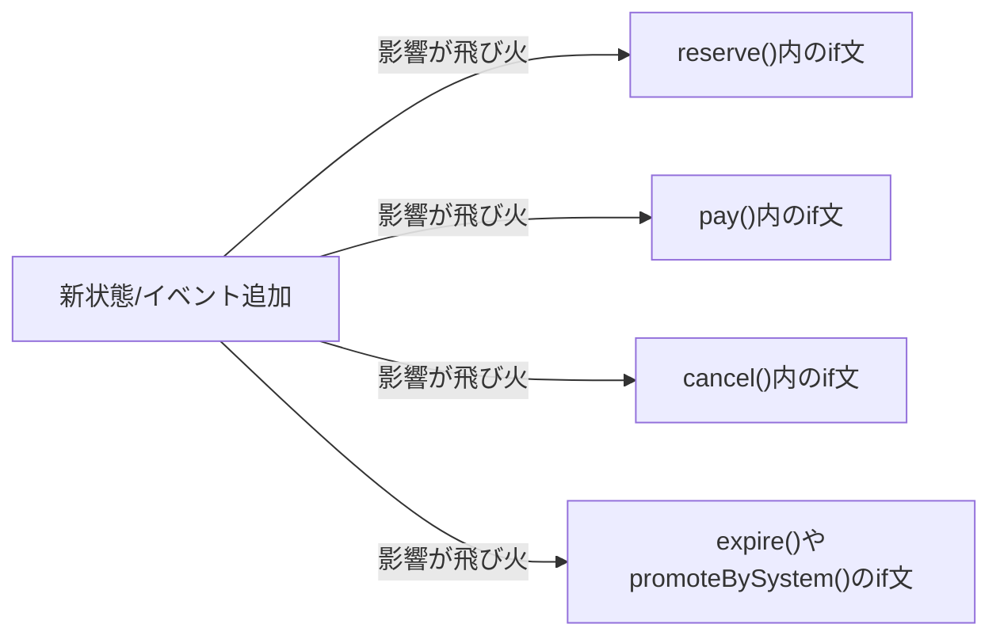
```mermaid
graph LR
    T1["新状態/イベント追加"] -->|"影響が飛び火"| A["reserve()内のif文"]
    T1 -->|"影響が飛び火"| B["pay()内のif文"]
    T1 -->|"影響が飛び火"| C["cancel()内のif文"]
    T1 -->|"影響が飛び火"| D["expire()やpromoteBySystem()のif文"]
```

このグラフが示す通り、「状態追加」や「状態を動かすイベント追加」という変更要求が、クラス内の複数のロジックに飛び火しています。

### 3-3：痛みの言語化

変更を試みてみた結果、現場でよく直面する2つの辛い状況が浮かび上がってきました。

1つ目は、修正漏れが受入条件の不成立に直結することです。変更ID2では、`pay()`で保留中からの支払いを許可するだけでなく、`reserve()`・`cancel()`・`expire()`でもHeldの扱いを確認しました。一つの確定要求に対してクラス内の複数操作を点検する必要があります。

2つ目は、変更ID1・変更ID2の振る舞いを追うために複数メソッドの`if`と`else if`を行き来する必要があることです。「今この状態なら、この操作は何をするか」を一つの場所で読めず、今回修正した全操作をまとめて確認しなければなりません。

フェーズ3で「変更が辛い」という事実が確認できました。次のフェーズ4では、なぜ辛いのかを構造的に言語化します。

---
> **📌 問題（確定）**
> 変更ID1のキャンセル待ちと変更ID2の一時保留を追加しただけで、`reserve()`・`pay()`・`cancel()`・`expire()`など複数のメソッドへ条件分岐を追加する必要がある。状態ごとの許可操作と遷移先が`TicketReservation`全体へ散らばり、一つの確定要求に対する修正・確認範囲が広い。
---

観測した痛みへ`問題ID`を付け、どの変更IDから来たかを対応づけます。この問題IDが、フェーズ4の原因ID、フェーズ5の課題IDへ順につながります。

| 問題ID | 観測した痛み（変更途中コード） | 起点の変更ID |
|---|---|---|
| 問題ID1 | 保留・キャンセル待ちを足すだけで `reserve/pay/cancel/expire` の複数メソッドへ分岐を追加し、修正漏れが受入不成立へ直結する | 変更ID1・変更ID2 |
| 問題ID2 | 「今この状態でこの操作は何をするか」が一箇所で読めず、今回修正した全操作を横断して確認する | 変更ID2 |
| 問題ID3 | キャンセル待ちの追加で、席解放後の自動昇格と待機順の管理が予約本体の各所へ散らばる | 変更ID1 |

## 🟠 フェーズ4：原因分析 ―― なぜ辛いのかを構造で言語化する
フェーズ3で確認した「状態追加のたびに条件分岐が増え、修正漏れの可能性が高まる」という痛み。このフェーズでは、状態の知識がどこへ漏れているかを接続点から掘り下げます。

### 4-1：痛みの根源を探る（観察と原因）

「ステータスと振る舞いが同じクラスに混在すること」は、それ自体を誤りとは判断できません。問題は「変わる理由が異なる2つのもの」が混在しているかどうかです。`status` という状態は「業務ルール管理（どの遷移を許可するか）」という業務機能で変わり、`reserve()` などの処理フローは「処理の骨格（どんな操作ができるか）」という業務機能で変わります。ここでの判定軸は「**状態遷移のルールがどの業務機能によるか**」です。業務ルール管理と処理の骨格という2つの業務機能が異なるなら、この2つは別々の変わる理由を持っています。同じクラスに入っていると、片方だけを変更したい場合にも同じクラスを開くことになり、影響確認の範囲が重なります。それが下の表で示す「原因の方向」です。

この表は「フェーズ3で感じた痛み」を出発点にして、その痛みが生まれた構造的な理由を探る表です。痛みを1つ取り上げ、「なぜそうなるのか？」と問いかけ続けることで、根本原因の方向が見えてきます。

| **観察した症状（痛み）** | **構造的な原因（痛みの根源）** |
|---|---|
| 新しい状態を追加するたびに、既存の全メソッドの条件分岐を書き換える必要がある | 「現在の状態（ステータス）」と「その状態で実行可能な振る舞い」という、本来分離する必要がある知識が、一つのクラスの中に混在しているから |
| 複雑な条件分岐により、現在の状態が何であるかを常に意識しないとコードが書けない | 状態管理のルール（遷移条件）がロジックの中に埋め込まれ、状態の変化を追跡するのが困難になっているから |
| 期限切れタイマーや決済失敗のような入力が増えると、どの状態で受け付けるかを中心クラスが全部知る必要がある | 入力の発生源は違っても、状態ごとの扱いを選ぶ責任が `TicketReservation` に集まっているから |

### 4-2：変わるもの/変わってほしくないもの

> **「変わらないもの」と「変わってほしくないもの」は異なります。** 「変わらないもの」は経験的事実（今まで変わっていない）、「変わってほしくないもの」は設計意図（ここを安定させてほかを守りたい）です。ここで整理するのは後者です。

原因分析の結果から、「変わり続けるもの」と「変わってほしくないもの」を整理します。分類は色付き記号に頼らず、列名と各行の内容で示します。

| **変わり続けるもの** | **変わってほしくないもの** |
|---|---|
| 状態の種類（キャンセル待ち、保留中などの追加） | 予約システムとしての基本的な業務フロー |
| 各状態における振る舞い（状態ごとのアクション） | 状態を管理するという概念（状態があること自体） |
| 状態を動かす入力（利用者操作、タイマー、外部API結果） | 呼び出し元が「予約に対して操作/イベントを渡す」という入口 |

私たちが守りたいのは「予約管理」という概念であり、増え続ける「状態の種類」や「状態ごとの細かなルール」は、安定した業務フローから切り離す必要がある存在なのです。

### 4-3：接続点に漏れている状態の知識を確認する

4-3は、原因から対策へ飛ばず、「境界に残す最小の約束」を確定するための全パターン章共通セクションです。テンプレートと全章を同じ見出し構成で横断確認します。本章では、状態名・分岐条件を利用側へ漏らさず、現在状態へ操作を委譲することが接続点です。

ここでの「確認すること」は、前節までに見つけた原因から抽出します。まず、原因文から「守りたい骨格」と「変わる差分」を分けます。次に、その差分を動かすために骨格側が知ってしまっている名前・条件・順序・型を拾います。最後に、接続点に残す最小の約束を、値・型・操作・イベントとして書きます。

原因によって、接続点で見る抽象観点は変わります。条件分岐が原因なら条件・定数・選択基準を見ます。処理手順が原因なら呼び出し順・前後条件・失敗時分岐を見ます。生成判断が原因なら具体クラス名・生成条件・登録場所を見ます。通知や外部連携が原因なら通知先・タイミング・成否の扱いを見ます。データや状態が原因なら、境界を流れる値・型・状態を見ます。

現在、`TicketReservation`の各操作メソッドは、`status`の文字列と状態ごとの遷移ルールを知っています。本来の接続点は「現在の状態へ操作を依頼すること」ですが、状態名と分岐条件がコンテキスト側へ漏れています。

状態の知識が漏れている根拠は次の3点です。

| 観点 | コードの証拠 |
|---|---|
| **「具体」＝専用規格** | `if (status == "Available")` など — 状態名を文字列リテラルとしてコードに直書きしており、他の書き方に差し替えられない |
| **「直接」＝直差し** | `reserve()` / `pay()` / `cancel()` の各メソッドが `status` を直接読み書きしており、間に何も挟まっていない |
| **「入力ごとの横断」** | `expire()` や `promoteBySystem()` のようなイベント入力が増えるたびに、状態名と許可条件を同じクラスへ追記する |

`Available`などの状態名と遷移条件が複数メソッドに埋め込まれているため、状態が増えるたびに既存の操作メソッドを横断して確認する必要があります。

フェーズ4で根本原因が言語化できました。「どこを分けるか」は明確です。次のフェーズ5では、その境界で実際に何が流れているかを値・型のレベルで具体化し、「何を変え、何を守るか」を明確にします。

---
> **📌 原因（確定）**
> `TicketReservation`が「現在の状態の判断」と「操作/イベントごとの処理フロー」の両方を保持している。状態の追加や遷移ルールの変更では、関係する操作メソッドとイベント処理を横断して修正・再テストする必要がある。
---

フェーズ3の問題IDに対応づけて、構造上の原因へ`原因ID`を付けます。次のフェーズ5は、この原因IDから課題IDを導きます。

| 原因ID | 構造上の原因（何が同じ責任へ集まっているか） | 対応する問題ID |
|---|---|---|
| 原因ID1 | `TicketReservation` が「現在状態の判断」と「操作・イベントごとの処理フロー」を同居させている | 問題ID1・問題ID2 |
| 原因ID2 | 席解放後の自動昇格と待機順の管理が状態処理へ絡み、待ち行列の責任が予約本体へ散在している | 問題ID3 |

## 🟡 フェーズ5：課題定義 ―― 原因から課題を検討して確定する

フェーズ4で確定した原因は、まだ課題そのものではありません。まず変えるべき構造を候補として導き、システム全体で候補の関係を整理してから、解くべき接続点を確定します。

### 5-1：原因から課題候補を洗い出す

| 原因ID・確定した事実 | そのままだと残る痛み | 課題候補 | 候補を導いた理由 |
|---|---|---|---|
| 原因ID1：一つの予約管理が状態名ごとの全操作・イベントを分岐する | 状態追加で無関係な操作とイベント入口まで修正する | 状態固有の許可操作と遷移判断を状態ごとに分離する | 状態別動作は独立して増減する |
| 原因ID2：席解放と待機者選択・昇格が別の手動操作になり得る | 取消・期限切れ後に運用者が昇格を呼ぶと業務が閉じない | 席解放から待機先頭の選択・自動昇格までを接続する | 空席発生は自動昇格の業務イベントだから |

この段階では、解決クラス名・契約名・パターン名・生成場所を決めません。原因のどの構造を変える必要があるかだけを候補にします。

### 5-2：課題候補をシステム全体で評価する

| 課題候補 | 必要性・他候補との関係 | 統合／分割の判断 | 採否 |
|---|---|---|---|
| 状態固有動作の分離 | 必須。二状態追加で全分岐が広がった | 公開入口と副作用の位置は共通契約として残す | 採用 |
| 待機列と自動昇格の接続 | 必須。状態だけ分けても手動昇格なら変更ID1・変更ID2が未完了 | 状態分離と連携する独立責任 | 採用 |

候補を一つずつ部分対策として採用するのではなく、すべてを解いた完成状態から逆算します。変更IDと課題IDは一対一とは限らないため、変更依頼の数に合わせて課題を増減させません。

### 5-3：課題IDと接続点を確定する

評価を通過した候補だけに課題ID1から欠番なくIDを付けます。

| 課題ID・接続点 | 接続するもの・変わる側 | 守る側 | 完了条件 |
|---|---|---|---|
| 課題ID1：状態固有動作と公開操作・イベント入口の境界 | **接続:** 現在状態、操作・タイマー・空席イベント、次状態、結果<br/>**変わる側:** 状態ごとの操作可否・遷移先 | 公開入口、座席数更新、履歴 | 状態追加が新しい状態動作と遷移登録に閉じる |
| 課題ID2：待ち行列と席解放処理の境界 | **接続:** 待機者の追加・先頭取出し・昇格イベント<br/>**変わる側:** 待ち順序・探索方針 | 席解放直後に1件を昇格する契約 | 取消・期限切れから自動昇格まで一つのユースケースで完了する |

📌 **システム全体の完了状態**：公開操作は現在状態へ処理を委ね、取消・期限切れで空席が出た場合は保存された待機順に従う自動昇格までシステム内で完了する。

課題IDを定義できたので、ここまでの追跡を一列で見渡します。

| 問題ID（フェーズ3の痛み） | 原因ID（フェーズ4の構造原因） | 課題ID（達成目標） |
|---|---|---|
| 問題ID1・問題ID2：状態追加で複数操作を横断修正・確認 | 原因ID1：現在状態の判断と処理フローが同居 | 課題ID1：状態固有の動作と遷移を各状態クラスへ分離 |
| 問題ID3：キャンセル待ちで昇格・待機順が散在 | 原因ID2：待ち行列の責任が状態処理へ絡む | 課題ID2：待ち行列と席解放処理を専用の係へ |

この表と完了状態が、そのままフェーズ6の入力です。要求の受入は要求ID、設計課題の解消は課題ID、今回の変更影響は変更IDで別々に追跡します。
## 🔴 フェーズ6：対策検討 ―― システム全体の最終構造を定める

**ここからしばらくは抽象の話です。** 個々のクラスへ入る前に、この章で「何を、どんな構造へ変えるのか」を先に決めます。

#### まず全体像 ―― どんな構造へ変えるか（抽象）

フェーズ4で、一つの`TicketReservation`が「公開操作（予約・支払い・取消）」の中に「状態ごとの振る舞い（操作可否・遷移先）」と「待ち行列と席解放後の自動昇格」を条件分岐で抱えていることを確認しました。対策は、状態ごとの振る舞いを状態オブジェクトへ分け、待ち行列は専用の係へ寄せることです。ここで使う中心構造は、第一部で扱った基本構造です。構造名（と対応するパターン名）を語彙として併記しますが、パターン名から設計を選ぶのではなく、上で確認した「状態ごとに変わる振る舞い」から必要な構造を導きます。

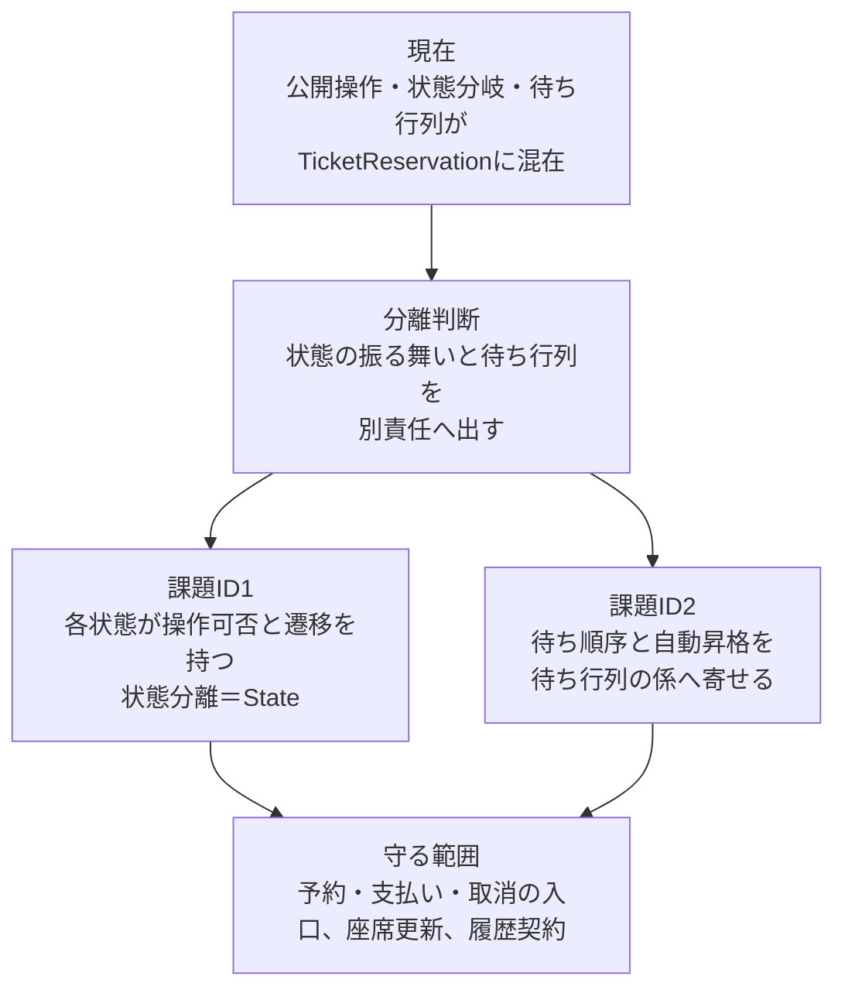
```mermaid
flowchart TB
    A[現在<br/>公開操作・状態分岐・待ち行列が<br/>TicketReservationに混在] --> B[分離判断<br/>状態の振る舞いと待ち行列を<br/>別責任へ出す]
    B --> C[課題ID1<br/>各状態が操作可否と遷移を持つ<br/>状態分離＝State]
    B --> D[課題ID2<br/>待ち順序と自動昇格を<br/>待ち行列の係へ寄せる]
    C --> E[守る範囲<br/>予約・支払い・取消の入口、座席更新、履歴契約]
    D --> E
```

まだクラスの中身は見ません。この段階でつかんでほしいのは「状態ごとの振る舞いを状態オブジェクトへ分け（課題ID1）、待ち行列と自動昇格を専用の係へ寄せて（課題ID2）、公開入口は現在状態へ委譲するだけにする」という筋だけです。「どのクラスが生成し、どの契約で実行するか」という具体の結論は、この後の課題ID1・課題ID2で決めていきます。決めた結論をまとめて振り返る表は、フェーズ6の末尾（6-3 設計トレース）に置きます。ここでは先に結論表を出しません。

第0章の「設計の醍醐味」の四拍子でいえば、この章は〈状態の共通契約を見つけて状態別の振る舞いを分離〉→〈各状態を生成（共有シングルトン）〉→〈現在状態として保持〉→〈公開入口は具体状態を意識しない〉という同じ順序をたどります。

#### 接続点の分離・配置・組み立てを決める

課題ID1と課題ID2は別々に採用する対策ではありません。課題ID1で状態固有の判断を分離しても、席解放後の昇格が課題ID2の待ち行列へ自動接続されなければ、変更要求を満たすシステムにはならないからです。

判断は次の順序で導きます。課題ID1の変わる側は「現在状態ごとの判断」なので、公開操作の入口から外し、状態ごとのクラスへ置きます。課題ID2の変わる側は「待機者の探索・削除・先頭選択」なので、状態クラスへ重ねず `ReservationWaitlist` へ置きます。最後に、守りたい「席が空いた直後の自動昇格」を切らないよう、席を解放する状態処理から待ち行列へ接続します。

| 接続点を変える観点 | システム全体の考え方 | 課題ID1のコードへの反映 | 課題ID2のコードへの反映 |
|---|---|---|---|
| 分離方法 | 変わる判断を公開操作・副作用の骨格から外し、境界には必要な操作だけを残す | `reserve/pay/cancel/expire/paymentFailed` を `IReservationState` の契約にする | 待機者の追加・削除・先頭取得を `ReservationWaitlist` の契約にする |
| 配置場所 | 変更理由が異なる責任を別の変更単位へ置く | 状態固有の判断と次状態の選択を、状態1つにつき1クラスへ置く | 探索・削除・昇格対象の選択を `ReservationWaitlist` へ置く |
| 組み立て方法（生成・所有・登録・注入） | 外側で必要な部品を用意し、実行時の自動連携まで接続する | `TicketReservation` が現在状態を所有し、公開操作を現在状態へ委譲する | `BatchApplication` が待ち行列を生成・所有して予約へ注入し、席解放処理が先頭1件の昇格を直ちに呼ぶ |

表の左から右へ読むと、フェーズ5の「変わる側／守る側」が、状態操作の契約、責任を置くクラス、生成・所有・注入、自動昇格の呼び出しへ変換されます。後続のクラス図と実装は、この三行を同じ順序で具体化します。

#### 設計判断ごとの部分クラス図

課題ID1では、公開操作を持つ`TicketReservation`から状態固有の判断を外し、現在の`IReservationState`へ委ねます。

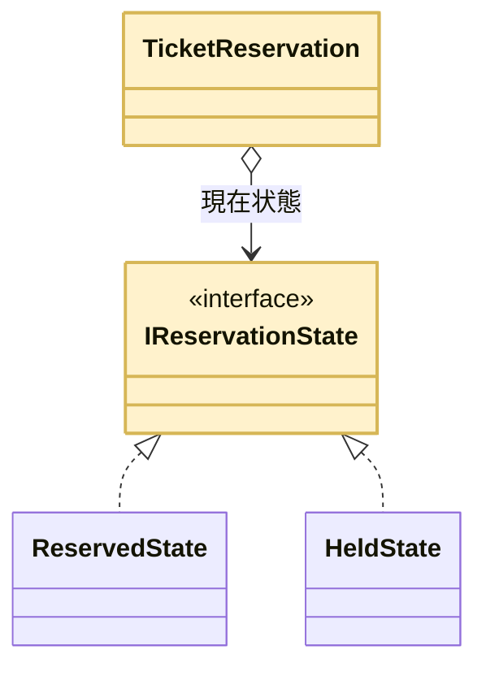
```mermaid
classDiagram
    class TicketReservation
    class IReservationState { <<interface>> }
    class ReservedState
    class HeldState
    TicketReservation o--> IReservationState : 現在状態
    IReservationState <|.. ReservedState
    IReservationState <|.. HeldState
    class TicketReservation:::focus
    class IReservationState:::focus
    classDef focus fill:#FFF2CC,stroke:#D6B656,stroke-width:2px
```

課題ID2では、待機順の管理を`ReservationWaitlist`へ置き、取消・期限切れを受ける予約から自動昇格へ接続します。

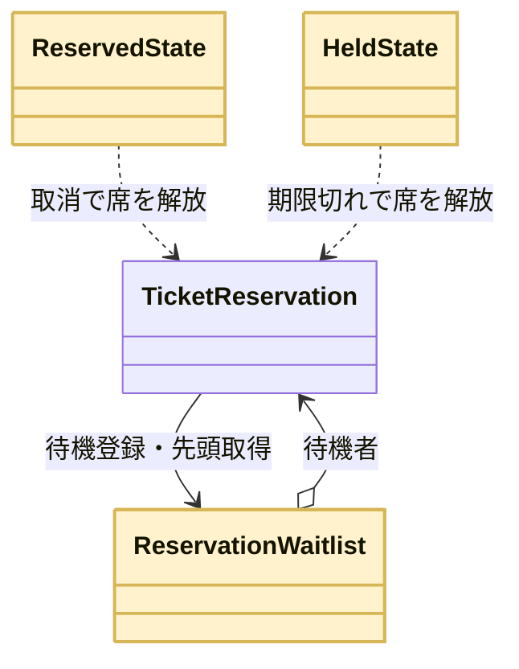
```mermaid
classDiagram
    class TicketReservation
    class ReservedState
    class HeldState
    class ReservationWaitlist
    TicketReservation --> ReservationWaitlist : 待機登録・先頭取得
    ReservedState ..> TicketReservation : 取消で席を解放
    HeldState ..> TicketReservation : 期限切れで席を解放
    ReservationWaitlist o--> TicketReservation : 待機者
    class ReservationWaitlist:::focus
    class ReservedState:::focus
    class HeldState:::focus
    classDef focus fill:#FFF2CC,stroke:#D6B656,stroke-width:2px
```

この接続により、昇格を`main()`が手動で呼ぶ必要はありません。次のコードでは状態契約、席解放、自動昇格の順に実装します。

#### システム全体の最終構造を決める

この章は変化軸が2本あり、それぞれ別の理由で変わるため、最終構造は**2つの分離構造を一つのシステムへ組み合わせて**決まります。各状態クラスに待ち行列操作まで持たせる案は、方針変更のたびに複数の状態クラスを開く途中状態なので比較対象にしません。状態固有の振る舞いは各状態クラスへ、待ち行列方針は `ReservationWaitlist` へ移し、席を解放する各状態処理が後者を呼ぶ共通の1経路で接続します。

| 組み合わせる構造 | 担う変化軸 | 移す責任 | 触る場所 |
|---|---|---|---|
| 状態分離構造 | 課題ID1 状態ごとの振る舞い | 状態固有の判断と遷移を各状態クラスへ | `IReservationState` と5つの状態クラス |
| 待ち行列分離構造 | 課題ID2 待ち行列方針 | 待機者の探索・削除・先頭選択を専用クラスへ | `ReservationWaitlist` |

2つの構造は、席を解放する各状態処理（`ReservedState::cancel()`・`HeldState::cancel()`・`HeldState::expire()`）が `promoteNextWaitlisted()` を呼び、`ReservationWaitlist` の先頭を自動昇格させるという共通の1経路だけで接続します。ここを切らないことが、課題ID1と課題ID2を独立に変えても業務契約が壊れない条件です。

### 対策検討のクラス図：1-3の責任と依存をどう変えるか

フェーズ1の1-3で作ったクラス図へフェーズ2〜5の判断を反映し、変更後の形へ更新します。

| クラス図を変える材料 | 前工程で確認したこと | クラス図へ反映すること |
|---|---|---|
| フェーズ1のクラス図 | 現在のクラス、操作、依存関係 | 変更前クラス図としてそのまま使う |
| フェーズ2の変化予測 | 状態の種類と待ち行列方針は今後も増える | 毎回変わる責任へ `【移す】` と注記する |
| フェーズ4の原因 | `TicketReservation` に状態判断と待ち行列操作が混在する | 同じクラスの中で `【残す】` と `【移す】` を分ける |
| フェーズ5の接続点 | 公開操作は現在状態へ委譲し、待ち行列は専用クラスへ閉じればよい | 課題ID1の状態判断を状態クラスへ、課題ID2のキュー操作を `ReservationWaitlist` へ置く |

**薄い黄色が着目クラス**です。変更前では `TicketReservation` の `【残す】` と `【移す】`、変更後では移動先の `【新設】` を追います。矢印は1-3と同じ利用・実装・委譲関係です。

**変更前のクラス図（1-3を責任見直し用に再掲）：**

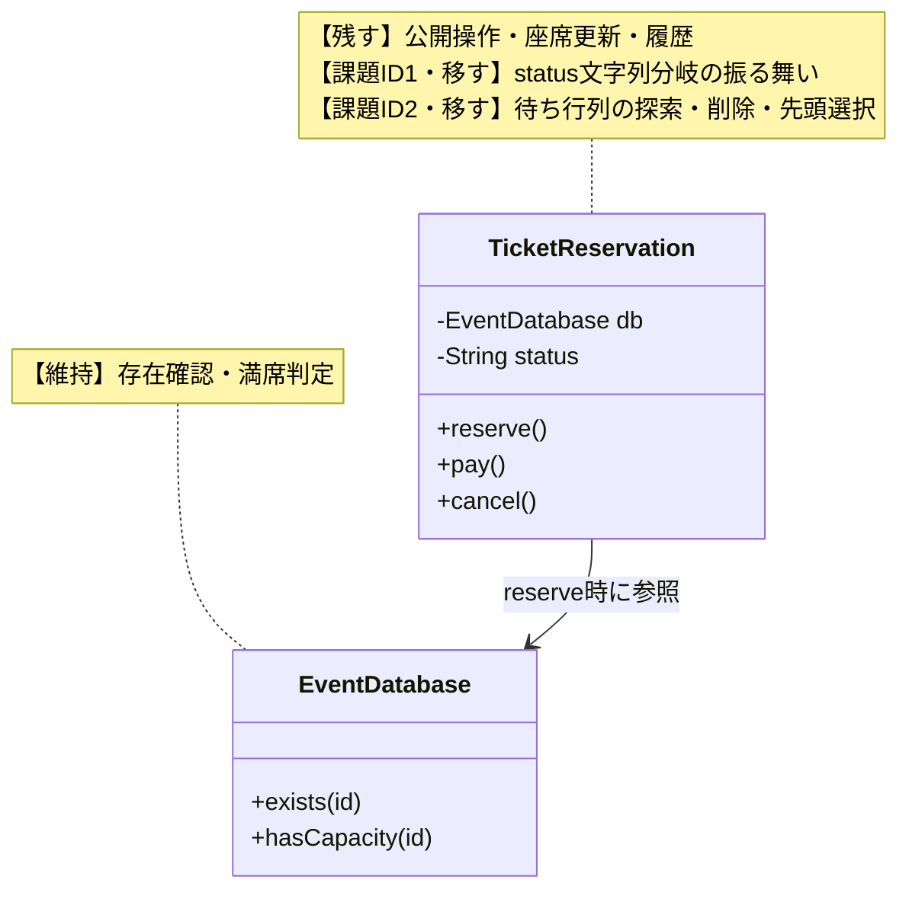
```mermaid
classDiagram
    direction TB
    class EventDatabase {
        +exists(id)
        +hasCapacity(id)
    }
    class TicketReservation {
        -EventDatabase db
        -String status
        +reserve()
        +pay()
        +cancel()
    }
    TicketReservation --> EventDatabase : reserve時に参照

    note for TicketReservation "【残す】公開操作・座席更新・履歴<br/>【課題ID1・移す】status文字列分岐の振る舞い<br/>【課題ID2・移す】待ち行列の探索・削除・先頭選択"
    note for EventDatabase "【維持】存在確認・満席判定"

    classDef focus fill:#FFF2CC,stroke:#D6B656,stroke-width:2px,color:#222222
    cssClass "TicketReservation" focus
```

変更前は `TicketReservation` が全状態の分岐と待ち行列操作を抱え、状態追加や待ち行列方針の変更のたびに公開操作の中身が膨らみます。

課題ID1・課題ID2をクラス図の変更として書くと、次の3操作になります。

1. 課題ID1：状態が満たす共通契約 `IReservationState`（`reserve/pay/cancel/promoteBySystem`）を新設する。
2. 課題ID1：各状態を `IReservationState` 実装へ移し、`TicketReservation` は現在状態へ委譲するだけにする。
3. 課題ID2：待機者の探索・削除・先頭選択を `ReservationWaitlist` へ移し、`ReservedState::cancel()` から自動昇格を呼ぶ。

変更後は、公開操作が状態を判定せず現在状態へ委譲し、待ち行列が専用クラスへ閉じ、`TicketReservation` の文字列分岐が消えたことを確認します。

**採用した変更後のクラス図：**

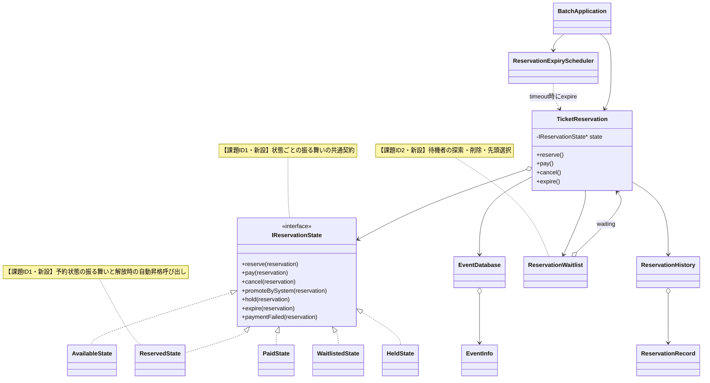
```mermaid
classDiagram
    class TicketReservation {
        -IReservationState* state
        +reserve()
        +pay()
        +cancel()
        +expire()
    }
    class IReservationState {
        <<interface>>
        +reserve(reservation)
        +pay(reservation)
        +cancel(reservation)
        +promoteBySystem(reservation)
        +hold(reservation)
        +expire(reservation)
        +paymentFailed(reservation)
    }
    class EventInfo
    class ReservationRecord
    class EventDatabase
    class ReservationHistory
    class ReservationWaitlist
    class AvailableState
    class ReservedState
    class PaidState
    class WaitlistedState
    class HeldState
    class ReservationExpiryScheduler
    class BatchApplication
    TicketReservation o--> IReservationState
    TicketReservation --> EventDatabase
    TicketReservation --> ReservationHistory
    TicketReservation --> ReservationWaitlist
    ReservationWaitlist o--> TicketReservation : waiting
    EventDatabase o--> EventInfo
    ReservationHistory o--> ReservationRecord
    IReservationState <|.. AvailableState
    IReservationState <|.. ReservedState
    IReservationState <|.. PaidState
    IReservationState <|.. WaitlistedState
    IReservationState <|.. HeldState
    ReservationExpiryScheduler ..> TicketReservation : timeout時にexpire
    BatchApplication --> TicketReservation
    BatchApplication --> ReservationExpiryScheduler

    note for IReservationState "【課題ID1・新設】状態ごとの振る舞いの共通契約"
    note for ReservedState "【課題ID1・新設】予約状態の振る舞いと解放時の自動昇格呼び出し"
    note for ReservationWaitlist "【課題ID2・新設】待機者の探索・削除・先頭選択"

    classDef focus fill:#FFF2CC,stroke:#D6B656,stroke-width:2px,color:#222222
    cssClass "IReservationState,AvailableState,ReservedState,PaidState,WaitlistedState,HeldState,ReservationWaitlist,ReservationExpiryScheduler" focus
```

クラス図の変更とコード変更を一対一で対応させると、次のようになります。

| 課題ID | クラス図をどう変えるか | コードレベルで何をするか | 詳しく解く節 |
|---|---|---|---|
| 課題ID1 | 共通契約 `IReservationState` と5状態を新設し委譲へ変える | `reserve/pay/cancel/promoteBySystem` を純粋仮想で定義、各状態が振る舞いを実装、`TicketReservation` は共有状態を保持して委譲 | 課題ID1節（①〜⑥） |
| 課題ID2 | 待ち行列を専用クラスへ移す | `ReservationWaitlist` が探索・削除・先頭選択を持ち、`ReservedState::cancel()` の1点で自動昇格を接続する | 課題ID2節（③⑤⑥） |

このクラス図が、課題ID1・課題ID2を反映したシステム全体の設計結論です。課題IDは図の差分を追うために使い、以降はこの構造に必要なコードだけを示します。

#### 課題箇所のおさらい（フェーズ3の関連コード）

統合表で特定した箇所だけを振り返ります。課題ID1は公開操作ごとの `status` 文字列分岐、課題ID2は状態処理に絡む待ち行列操作と昇格処理です。課題に関係しないコードは省略し、フェーズ3で明記した維持条件（在庫は `EventDatabase`、待ち行列は外から渡す共有ストア）をそのまま引き継ぎます。フェーズ3の変更試行コードから、該当する `if` ブロックをそのままの形で抜き出します。

```cpp
// 現状：状態判断と待ち行列操作が TicketReservation に混在する
class TicketReservation {
    std::vector<TicketReservation*>& waitlist;  // 共有の待ち行列（外部から注入）
    std::string status;                         // 現在状態
public:
    // 予約する（Available のときだけ予約済みへ）
    void reserve() {
        if (status == "Available") {           // 課題ID1: 状態ごとの分岐
            status = "Reserved";
        } else {
            handleReserveError();
        }
    }
    // キャンセルする（席を解放し、待ち行列の先頭を昇格）
    void cancel() {
        if (status == "Reserved") {
            status = "Available";
            promoteNextWaitlisted();           // 課題ID2: 待ち行列操作が状態処理に絡む
        } else {
            handleCancelError();
        }
    }
    // pay() / hold() / expire() にも同じ status 分岐が並ぶ
};
```

### 課題ID1：状態固有の動作と遷移を各状態クラスへ分離する

**【課題ID1の原因】** 問題ID1・問題ID2（状態追加で複数操作を横断修正・確認）＝原因ID1（`TicketReservation` が現在状態の判断と処理フローを同居）。この原因を分離対象にします。

**この課題（何を解きたいか）：** 状態を1種足すたび、`reserve/pay/cancel/expire` の複数メソッドへ分岐が増え、修正漏れが受入不成立へ直結する——問題ID1・問題ID2（痛み）／原因ID1です。**公開入口は現在状態へ委譲するだけにし、状態ごとの可否と遷移だけを差し替えられる**ようにするのが課題ID1です。

**どう解決するか（方針）：** 状態を共通契約の裏へ出し、公開操作は現在状態へ委譲します（状態分離構造＝State）。①契約 →③具体 →④生成 →⑤保持・遷移 →⑥委譲 の順で組み立てます（②骨格は無し）。①〜⑥は第0章で定義した全章共通の読み順で、Stateには固定骨格がないため②を使いません。

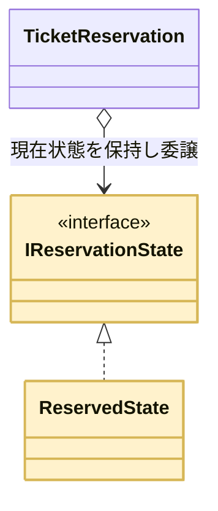
```mermaid
classDiagram
    class TicketReservation
    class IReservationState { <<interface>> }
    class ReservedState
    TicketReservation o--> IReservationState : 現在状態を保持し委譲
    IReservationState <|.. ReservedState
    class IReservationState:::focus
    class ReservedState:::focus
    classDef focus fill:#FFF2CC,stroke:#D6B656,stroke-width:2px
```

**① 共通契約 `IReservationState` を定義する。** すべての状態が満たす操作を宣言し、`TicketReservation` はこの契約だけを軸に委譲します。

```cpp
class TicketReservation;
class IReservationState {
public:
    // 既定は「その状態では不可」。各状態は許す操作だけを上書きする。
    virtual void reserve(TicketReservation*) { /* 不可メッセージ */ }
    virtual void pay(TicketReservation*) { /* 不可メッセージ */ }
    virtual void cancel(TicketReservation*) { /* 不可メッセージ */ }
    virtual void promoteBySystem(TicketReservation*) { /* 不可メッセージ */ }
    virtual ~IReservationState() = default;
};
```

純粋仮想（`= 0`）ではなく既定実装つきにしているのは、`PaidState` のように「どの操作も受け付けない」状態を、1つも上書きしない空のクラスとして書けるようにするためです。期限切れ（`hold` / `expire`）と決済失敗（`paymentFailed`）の操作は1-5の変更要求で加わるので、契約への追加は7-1で示します。

**③ 各状態が自分の振る舞いと遷移だけを実装する（`status` 文字列分岐は持たない）。**

```cpp
class ReservedState : public IReservationState {
public:
    void cancel(TicketReservation* reservation) override {
        reservation->cancelSeat();                // 席を解放
        reservation->promoteNextWaitlisted();     // 待機者を昇格（課題ID2へ橋渡し）
        reservation->setState(availableState());  // ⑤ 共有状態へ遷移
    }
    // reserve()/pay() は各状態が自分の可否を実装する
};
```

**④ 状態は関数ローカルの静的オブジェクトを共有する（生成・破棄を持たない）。** 遷移のたびに `new` せず、共有シングルトンを指すため所有・破棄の問題が起きません。

```cpp
IReservationState* availableState() {
    static AvailableState state;   // 共有シングルトン（new/deleteは不要）
    return &state;
}
```

**⑤ `TicketReservation` が現在状態を保持し、⑥ 公開操作は現在状態へ委譲するだけ。** 状態名も分岐条件も持たず、`setState()` で次状態へ移ります。状態追加は新しい状態クラスと遷移元だけで済み、課題ID1の完了条件「状態追加が新状態動作と遷移登録に閉じる」を満たします。

### 課題ID2：待ち行列と席解放処理を専用の係へ分離する

**【課題ID2の原因】** 問題ID3（キャンセル待ちで昇格・待機順が散在）＝原因ID2（待ち行列の責任が状態処理へ絡む）。この原因を分離対象にします。

**この課題（何を解きたいか）：** キャンセル待ちの追加で、席解放後の自動昇格と待機順の管理が予約本体の各所へ散らばる——問題ID3（痛み）／原因ID2です。**待機者の探索・削除・先頭選択を専用の係へ寄せ、席解放直後に先頭1件だけ自動昇格する接続を1点に保つ**のが課題ID2です。

**どう解決するか（方針）：** 待ち行列を専用クラスへ分離し、状態処理からは1点だけで接続します。③具体 →⑤接続 →⑥実行 に相当します（①契約は状態側の `promoteBySystem()` を使うため新設せず、②骨格も無し）。

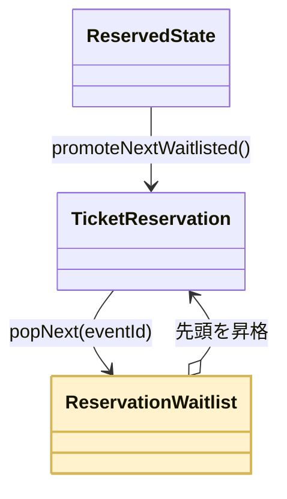
```mermaid
classDiagram
    class ReservedState
    class TicketReservation
    class ReservationWaitlist
    ReservedState --> TicketReservation : promoteNextWaitlisted()
    TicketReservation --> ReservationWaitlist : popNext(eventId)
    ReservationWaitlist o--> TicketReservation : 先頭を昇格
    class ReservationWaitlist:::focus
    classDef focus fill:#FFF2CC,stroke:#D6B656,stroke-width:2px
```

**③ 待機者の探索・削除・先頭選択を `ReservationWaitlist` が持つ。**

```cpp
class ReservationWaitlist {
    // イベントIDごとの先着順（借用参照）
    std::map<std::string, std::deque<TicketReservation*>> queues;
public:
    void enqueue(const std::string& eventId, TicketReservation* r) {
        queues[eventId].push_back(r);
    }
    TicketReservation* popNext(const std::string& eventId) {
        auto& q = queues[eventId];
        if (q.empty()) return nullptr;
        TicketReservation* next = q.front();
        q.pop_front();
        return next;                // 昇格の呼び出しは状態側が行う
    }
};
```

`front()` で先頭の借用ポインタを読み、`pop_front()` でキュー内のその1件だけを除きます。参照先の予約オブジェクトは削除しません。この `deque` の操作と所有権は第0章の標準ライブラリ説明にも反映しています。

**⑤ 状態処理からは1経路だけで接続する。** 席を解放する各状態処理が `promoteNextWaitlisted()` を通じて `ReservationWaitlist::popNext()` を呼びます。**⑥ 実行**では先頭1件が `promoteBySystem()` で自動昇格します。これで課題ID2の完了条件「取消・期限切れから自動昇格まで一つのユースケースで完了する」を満たし、状態分離構造と待ち行列分離構造が1点で接続されます。

### 6-1：生成・所有・実行順のまとめ

この節は完成構造をコードへ渡す前に、生成・所有・注入・実行順を確定する全パターン章共通の節です。章ごとの差ではなくテンプレート上の必須構成として扱い、第8章を含む全章の有無を横断確認します。

課題ID1・課題ID2を一本の実行経路へ束ね直します。上の課題別展開は試行錯誤の履歴ではなく、完成構造を理解できる単位へ分けた実装順です。

- 状態オブジェクト：関数ローカルの静的（共有シングルトン）で、`new`／`delete` を持たない。
- 待ち行列：`ReservationWaitlist` は `TicketReservation*` を借用参照で保持（所有は予約側）。
- 実行順：公開操作→現在状態へ委譲→（席を解放するなら）`cancelSeat()`→`promoteNextWaitlisted()`→`popNext()`→先頭を `promoteBySystem()`。2つの変化軸（状態・待ち行列）は、この共通の1経路で接続されます。

### 6-2：システム全体の契約とデータ配置を確定する

採用システムの契約、生成場所、依存注入を一表で確定します。接続点で受け渡すのは、状態遷移を進める `TicketReservation&`（コンテキスト参照）と、昇格対象の `TicketReservation*` です。座席数と履歴は従来どおり `EventDatabase`／`ReservationHistory` が持ちます。

```cpp
class TicketReservation {
    IReservationState* state;      // 現在状態（委譲先）
    EventDatabase& db;
    ReservationHistory& history;
    ReservationWaitlist& waitlist;
public:
    void reserve() { state->reserve(*this); }   // 判定せず委譲
    void cancel()  { state->cancel(*this); }
    void setState(IReservationState* s) { state = s; }
};
```

| 接続点を変える観点 | システム全体での設計判断 | 変えたくない側が知らなくなる詳細 |
|---|---|---|
| 何を分離するか | 課題ID1の状態振る舞いを状態クラスへ、課題ID2のキュー操作を `ReservationWaitlist` へ置く | 状態の種類・遷移、待ち行列の方針 |
| どこで生成・選択するか | 遷移元の状態が次の状態を生成し、組み立て側が待ち行列を渡す | 具体状態クラスの選択 |
| どう依存を渡すか | 委譲時に `TicketReservation&` を渡し、待ち行列は参照で注入する | 状態・待ち行列の実体 |
| 安定側はどう実行するか | 利用側は `reserve()`／`cancel()` だけを呼ぶ | 現在どの状態か、待機者が何人か |

待ち行列と履歴は組み立て側が所有し、`TicketReservation` は参照で受け取ります。自動昇格の接続は状態処理内に残すため、キャンセルから昇格までが1つの操作で完結します。

#### システム全体のコード適用結果

| 追跡対象 | 課題定義で目指した状態 | 適用した構造とコード | 適用結果 |
|---|---|---|---|
| 課題ID1：予約状態 | 状態追加で公開操作と既存状態を変えない | `IReservationState` と状態クラスへ委譲 | 新状態と遷移元へ変更が閉じた |
| 課題ID2：待ち行列 | 待ち行列方針と自動昇格を利用者の手動操作にしない | `ReservationWaitlist` と席を解放する各状態処理→`promoteNextWaitlisted()` | 席解放直後にシステムが先頭を自動昇格した |
| 課題ID1・課題ID2を接続したシステム全体 | 公開操作・座席・履歴更新を維持する | 状態処理が待ち行列へ自動接続される | 二軸を一つの予約経路で動かし、入口と副作用を維持した |

**システム全体の実装結果：達成。** 課題ID1と課題ID2が一つの予約経路で接続され、フェーズ5で目指した状態を実現しました。実際の動作と変更影響はフェーズ7で確認します。

### 6-3：課題から完成構造までの設計トレース

ここまでの決定を、課題ID1→課題ID2の順に一望へまとめます。この表は設計課題だけを追います。変更要求の受入はフェーズ7の要求ID表、変更影響は7-4の変更ID表で別に確認します。

| 課題ID | 採用構造と生成・接続場所 | 完成コードの主な場所 | 確認 |
|---|---|---|---|
| 課題ID1（予約状態） | 状態分離。`TicketReservation`が現在状態へ委譲し、各状態が遷移先を持つ | `IReservationState`、`AvailableState`／`ReservedState`／`PaidState`／`WaitlistedState`／`HeldState` | 状態追加が新状態と遷移登録に閉じる |
| 課題ID2（待ち行列） | 待ち行列分離。席を解放する各状態処理が`promoteNextWaitlisted()`を呼び自動昇格 | `ReservationWaitlist`、`ReservedState::cancel()`／`HeldState::cancel()`／`HeldState::expire()` | 席解放直後にシステムが先頭を自動昇格する |
| 変更対象外 | 公開入口・座席数更新・履歴。委譲先だけが振る舞いを変える | `TicketReservation`の公開操作、`EventDatabase` | 1-4、50/50→49/50→50/50 |

このクラス図、コード適用結果、シーケンス、コード変更表が、フェーズ7へ渡す完成設計です。

### 6-4：将来リスクに対する設計上の確認

ここは将来機能を実装する場ではありません。フェーズ2のリスクIDを採用構造へ再適用し、リスクが現実になった場合の変更先と、今回守れる範囲を確認します。

| リスクID・将来リスク | 採用構造での考慮 | 将来の主な変更先 | 今回の判断 |
|---|---|---|---|
| リスクID1：状態遷移のルール（アクションの可否）の変更 | 可否と次状態を現在状態のIReservationState実装へ置く | 影響するStateクラスの対象操作 | 他状態と受付入口への波及を抑えられる。将来ルールは完成コードへ追加しない |
| リスクID2：状態の種類（特別優待予約などの追加） | 状態ごとの振る舞いを共通契約で分ける | 新しいStateクラスと、その状態へ入る遷移 | 局所化できる。未確定状態は完成コードへ追加しない |
| リスクID3：状態を動かすイベントの追加 | イベントの起点と状態判断を分け、システム起点の処理もTicketReservationへ接続する | 新イベント入口、IReservationStateの操作、必要なスケジューラ | 接続点は予測できる。未確定イベントは完成コードへ追加しない |

リスクID1〜リスクID3により、State化が現在の要求だけの分岐整理ではなく、状態とイベントの将来変更をどこへ閉じるかという判断になっていることを確認できます。

## 🟢 フェーズ7：対策実施 ―― 変化に強いコードを完成させる
フェーズ6で確定した課題ID1・課題ID2を同時に満たす設計を、実際のコードに実装します。`TicketReservation`が抱えていた状態分岐を各状態クラスへ移し、キャンセル待ちの探索・先頭選択・自動昇格を`ReservationWaitlist`へ移します。

この設計変更の最大の価値は、今後「キャンセル待ち」や「特別優待」といった新しい状態がどれだけ増えても、既存の業務フローの条件分岐を変更せず、新しい状態クラスと組み立て設定を追加することで機能拡張ができる安定性を手に入れたことです。

### 7-1：解決後のコード（全体）

解決後のコードも、責任の固まりごとに分けて読みます。

**① イベント在庫（EventInfo / EventDatabase）**

1-4と同じ、イベントの定員と予約数を持つ在庫クラスです。

#### 完成後のクラス一覧

完成コードで定義する型を先に一覧化します。各型の依存方向と実現関係は、直後のクラス図で確認します。

- `TicketReservation`、`IReservationState`、`EventInfo`、`ReservationRecord`
- `EventDatabase`、`ReservationHistory`、`ReservationWaitlist`、`AvailableState`
- `ReservedState`、`PaidState`、`WaitlistedState`、`HeldState`
- `ReservationExpiryScheduler`、`BatchApplication`

#### 完成後のクラス図


```mermaid
classDiagram
    class TicketReservation {
        -IReservationState* state
        +reserve()
        +pay()
        +cancel()
        +expire()
    }
    class IReservationState {
        <<interface>>
        +reserve(reservation)
        +pay(reservation)
        +cancel(reservation)
        +promoteBySystem(reservation)
        +hold(reservation)
        +expire(reservation)
        +paymentFailed(reservation)
    }
    class EventInfo
    class ReservationRecord
    class EventDatabase
    class ReservationHistory
    class ReservationWaitlist
    class AvailableState
    class ReservedState
    class PaidState
    class WaitlistedState
    class HeldState
    class ReservationExpiryScheduler
    class BatchApplication
    TicketReservation o--> IReservationState
    TicketReservation --> EventDatabase
    TicketReservation --> ReservationHistory
    TicketReservation --> ReservationWaitlist
    ReservationWaitlist o--> TicketReservation : waiting
    EventDatabase o--> EventInfo
    ReservationHistory o--> ReservationRecord
    IReservationState <|.. AvailableState
    IReservationState <|.. ReservedState
    IReservationState <|.. PaidState
    IReservationState <|.. WaitlistedState
    IReservationState <|.. HeldState
    ReservationExpiryScheduler ..> TicketReservation : timeout時にexpire
    BatchApplication --> TicketReservation
    BatchApplication --> ReservationExpiryScheduler

    note for IReservationState "【課題ID1・新設】状態ごとの振る舞いの共通契約"
    note for ReservedState "【課題ID1・新設】予約状態の振る舞いと解放時の自動昇格呼び出し"
    note for ReservationWaitlist "【課題ID2・新設】待機者の探索・削除・先頭選択"

    classDef focus fill:#FFF2CC,stroke:#D6B656,stroke-width:2px,color:#222222
    cssClass "IReservationState,AvailableState,ReservedState,PaidState,WaitlistedState,HeldState,ReservationWaitlist,ReservationExpiryScheduler" focus
```

章末のState骨格図では `TicketReservation` がContext、`IReservationState` がState、5つの状態クラスがConcreteStateに対応します。掲載コードに登場する在庫・履歴・待ち行列・組み立てクラスも省略せず記載しています。予約数の増減と待機者の自動昇格は状態処理からコンテキスト経由で実行され、`BatchApplication` はシナリオを起動するだけです。

#### 完成後の実行シーケンス

満席イベントの既存予約に `cancel()` が呼ばれたとき、空席作成から待機者の自動昇格までをどのクラスが担うか確認します。

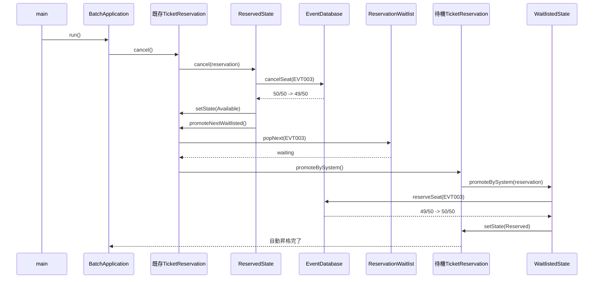
```mermaid
sequenceDiagram
    participant main
    participant BA as BatchApplication
    participant C as 既存TicketReservation
    participant RS as ReservedState
    participant DB as EventDatabase
    participant WQ as ReservationWaitlist
    participant W as 待機TicketReservation
    participant WS as WaitlistedState

    main->>BA: run()
    BA->>C: cancel()
    C->>RS: cancel(reservation)
    RS->>DB: cancelSeat(EVT003)
    DB-->>RS: 50/50 -> 49/50
    RS->>C: setState(Available)
    RS->>C: promoteNextWaitlisted()
    C->>WQ: popNext(EVT003)
    WQ-->>C: waiting
    C->>W: promoteBySystem()
    W->>WS: promoteBySystem(reservation)
    WS->>DB: reserveSeat(EVT003)
    DB-->>WS: 49/50 -> 50/50
    WS->>W: setState(Reserved)
    W-->>BA: 自動昇格完了
```

`BatchApplication` は昇格を呼びません。`ReservedState::cancel()` が座席解放後に待ち行列を進め、`WaitlistedState` が同じ席を確保して `Reserved` へ遷移します。したがって途中で運用者が介入する空白はありません。

期限切れも同様に、利用者や運用者が予約の状態を手動で進めません。掲載コードでは実際の時計を待たないため、`ReservationExpiryScheduler`の`onPaymentDeadlineExpired()`をタイマー基盤から届くイベントのスタブとして使います。

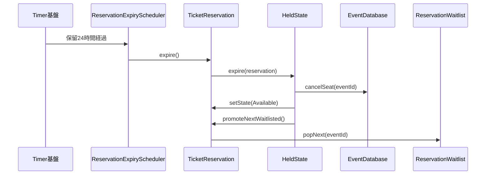
```mermaid
sequenceDiagram
    participant Timer as Timer基盤
    participant S as ReservationExpiryScheduler
    participant C as TicketReservation
    participant H as HeldState
    participant DB as EventDatabase
    participant WQ as ReservationWaitlist

    Timer->>S: 保留24時間経過
    S->>C: expire()
    C->>H: expire(reservation)
    H->>DB: cancelSeat(eventId)
    H->>C: setState(Available)
    H->>C: promoteNextWaitlisted()
    C->>WQ: popNext(eventId)
```

`main()`は`BatchApplication::run()`を起動するだけで、期限切れを直接呼びません。実運用ではTimer基盤が時刻を監視し、期限到達時に同じスケジューラ境界を呼びます。

#### 完成コード

```cpp
#include <iostream>
#include <string>
#include <map>
#include <vector>
#include <deque>
#include <stdexcept>

struct EventInfo {
    std::string title;   // イベント名
    int capacity;        // 定員
    int reserved;        // 現在の予約数
};

class EventDatabase {
private:
    std::map<std::string, EventInfo> records;
public:
    EventDatabase() {
        records["EVT001"] = {"春の音楽祭",  100,  20};
        records["EVT002"] = {"夏のフェス",  500, 499};
        records["EVT003"] = {"秋の映画会",   50,  50};  // 満席
    }

    bool exists(const std::string& id) const {
        return records.count(id) > 0;
    }

    EventInfo get(const std::string& id) const {
        return records.at(id);
    }

    bool hasCapacity(const std::string& id) const {
        const auto& e = records.at(id);
        return e.reserved < e.capacity;
    }

    void reserveSeat(const std::string& id) {
        auto& event = records.at(id);
        if (event.reserved >= event.capacity) {
            throw std::runtime_error("満席のイベントは予約できません");
        }
        int before = event.reserved;
        ++event.reserved;
        std::cout << "[予約数] " << id << " "
                  << before << "/" << event.capacity
                  << " -> " << event.reserved << "/" << event.capacity;
        if (event.reserved == event.capacity) std::cout << "（満席）";
        std::cout << std::endl;
    }

    void cancelSeat(const std::string& id) {
        auto& event = records.at(id);
        int before = event.reserved;
        if (event.reserved > 0) --event.reserved;
        std::cout << "[予約数] " << id << " "
                  << before << "/" << event.capacity
                  << " -> " << event.reserved << "/" << event.capacity
                  << std::endl;
    }

    void save(const std::string& id, const EventInfo& info) {
        records[id] = info;             // 実行中のイベント表へ追加
    }
};
```

**② 予約履歴（ReservationRecord / ReservationHistory）**

予約履歴（`ReservationHistory`）はシステム起動時は空で、予約・決済・キャンセルが行われるたびに1件追記されます。ここではファイルへの保存は行わず、実行中のメモリ上にのみ保持します。

```cpp
struct ReservationRecord {
    std::string eventId;
    std::string eventTitle;
    std::string action;   // "予約", "決済", "キャンセル"
};

// 予約履歴を管理するクラス
class ReservationHistory {
    std::vector<ReservationRecord> records;
public:
    void add(const std::string& eventId, const std::string& eventTitle,
             const std::string& action) {
        records.push_back({eventId, eventTitle, action});
    }
    void printAll() const {
        for (const auto& r : records) {
            std::cout << "[" << r.eventId << "] " << r.eventTitle
                      << " -> " << r.action << std::endl;
        }
    }
    int size() const { return (int)records.size(); }
};
```

**③ キャンセル待ちキュー（ReservationWaitlist）**

キャンセル待ちはイベントごとの先着順キューです。利用者や `main()` が昇格を指示するのではなく、予約済み・保留中の席が解放された直後に、状態処理から先頭を取り出します。

```cpp
class TicketReservation;

class ReservationWaitlist {
    std::map<std::string, std::deque<TicketReservation*>> queues;
public:
    void enqueue(const std::string& eventId,
                 TicketReservation* reservation) {
        queues[eventId].push_back(reservation);
        std::cout << "[待ち行列] " << eventId
                  << " 待機数=" << queues[eventId].size()
                  << std::endl;
    }

    TicketReservation* popNext(const std::string& eventId) {
        auto& queue = queues[eventId];
        if (queue.empty()) return nullptr;
        TicketReservation* next = queue.front();
        queue.pop_front();
        std::cout << "[待ち行列] " << eventId
                  << " 待機数=" << queue.size()
                  << std::endl;
        return next;
    }
};
```

**④ 状態インターフェース（IReservationState）**

新しい設計の基盤となる状態インターフェースを定義します。このインターフェースが「すべての状態クラスが守るべき契約」を定めます。C++では、基底クラスの仮想関数にデフォルト挙動（エラーメッセージを出力する、または何もしない）を実装しておくことで、各状態の具体クラスは自分に関係するメソッドだけをオーバーライドすればよくなります。

```cpp
class TicketReservation;

// 状態ごとの振る舞いを定義するインターフェース
class IReservationState {
public:
    // 引数は操作対象の予約コンテキスト（TicketReservation*）。
    // 既定実装では使わないため仮引数名を省略し、派生側では reservation と名付ける。
    virtual void reserve(TicketReservation*) {
        std::cout << "現在予約できません\n";
    }
    virtual void pay(TicketReservation*) {
        std::cout << "支払いに適した状態ではありません\n";
    }
    virtual void cancel(TicketReservation*) {
        std::cout << "キャンセルできません\n";
    }
    virtual void promoteBySystem(TicketReservation*) {
        std::cout << "システム昇格の対象ではありません\n";
    }
    virtual void hold(TicketReservation*) {
        std::cout << "保留できません\n";
    }
    virtual void expire(TicketReservation*) {
        std::cout << "期限切れ処理は行えません\n";
    }
    virtual void paymentFailed(TicketReservation*) {
        std::cout << "決済失敗を扱える状態ではありません\n";
    }
    virtual ~IReservationState() = default;
};
```

**⑤ 予約操作のコンテキスト（TicketReservation）**

状態クラスを保持し、操作を現在の状態に委譲する中心クラス（コンテキスト）です。

```cpp
// 予約クラス：状態を保持し操作を委譲するだけ
class TicketReservation {
private:
    IReservationState* state;
    EventDatabase* db;           // 在庫の保存データ（境界）
    ReservationHistory* history; // 予約履歴
    ReservationWaitlist* waitlist;
    std::string eventId;
    std::string title;

    // キャンセル待ち昇格は外部公開せず、システム連鎖からだけ呼ぶ
    void promoteBySystem() {
        state->promoteBySystem(this);
    }
public:
    TicketReservation(IReservationState* initialState,
                      EventDatabase* db,
                      ReservationHistory* history,
                      ReservationWaitlist* waitlist,
                      const std::string& eventId,
                      const std::string& title)
        : state(initialState), db(db), history(history),
          waitlist(waitlist),
          eventId(eventId), title(title) {}

    // 状態遷移時に、共有状態オブジェクトへの借用ポインタを差し替える。
    // 状態は関数ローカルstaticが所有するため、ここではdeleteしない。
    void setState(IReservationState* nextState) { state = nextState; }

    // 状態遷移の副作用：在庫の増減と履歴の記録
    void reserveSeat() { db->reserveSeat(eventId); }
    void cancelSeat()  { db->cancelSeat(eventId); }
    bool hasCapacity() const { return db->hasCapacity(eventId); }
    void record(const std::string& action) {
        history->add(eventId, title, action);
    }
    void joinWaitlist() {
        waitlist->enqueue(eventId, this);
    }
    void promoteNextWaitlisted() {
        TicketReservation* next = waitlist->popNext(eventId);
        if (next != nullptr) next->promoteBySystem();
    }

    // 操作を現在の状態に委譲するだけ
    void reserve()         { state->reserve(this); }
    void pay()             { state->pay(this); }
    void cancel()          { state->cancel(this); }
    void hold()            { state->hold(this); }
    void expire()          { state->expire(this); }
    void paymentFailed()   { state->paymentFailed(this); }
};
```

状態オブジェクトは振る舞いだけを持つため、関数ローカルの静的オブジェクトを共有し、遷移のたびに `new` しない形にします。`state` はそれらへの非所有ポインタなので、`setState()` は参照先を切り替えるだけです。古い状態オブジェクトはプログラム終了まで共有され、削除対象になりません。席数の増減（`reserveSeat`/`cancelSeat`）と履歴記録は、呼び出し側が手動で行うのではなく、状態遷移の副作用として各状態のメソッド内から予約コンテキスト経由で実行します。さらに席を解放した状態処理が `promoteNextWaitlisted()` まで呼ぶため、キャンセルと自動昇格が1つのシステム処理として完結します。

**⑥ 各状態クラスとオーバーライド実装**

先に`TicketReservation`の完全な定義を置いたので、ここでは各状態クラスの宣言とオーバーライド実装を分断せず、クラス単位でまとめて読めます。状態取得関数の宣言だけは、状態同士の遷移先を互いに参照するためクラス定義の直前へ置きます。

```cpp
IReservationState* availableState();
IReservationState* reservedState();
IReservationState* paidState();
IReservationState* waitlistedState();
IReservationState* heldState();

// Available（予約可能）：空席なら予約、満席なら自動待機登録する
class AvailableState : public IReservationState {
public:
    void reserve(TicketReservation* reservation) override {
        if (!reservation->hasCapacity()) {
            reservation->joinWaitlist();
            std::cout << "満席のためキャンセル待ちに登録しました\n";
            reservation->setState(waitlistedState());
            return;
        }
        reservation->reserveSeat();
        reservation->record("予約");
        std::cout << "予約完了しました\n";
        reservation->setState(reservedState());
    }
};

// Reserved（予約済み）：支払い、取消、保留、期限切れを処理する
class ReservedState : public IReservationState {
public:
    void pay(TicketReservation* reservation) override {
        reservation->record("決済");
        std::cout << "支払い完了しました\n";
        reservation->setState(paidState());
    }
    void cancel(TicketReservation* reservation) override {
        reservation->cancelSeat();
        reservation->record("キャンセル");
        std::cout << "予約をキャンセルしました\n";
        reservation->setState(availableState());
        reservation->promoteNextWaitlisted();
    }
    void hold(TicketReservation* reservation) override {
        std::cout << "保留にしました\n";
        reservation->setState(heldState());
    }
    void expire(TicketReservation* reservation) override {
        reservation->cancelSeat();
        reservation->record("通常決済期限切れ");
        std::cout << "通常の決済期限が切れました\n";
        reservation->setState(availableState());
        reservation->promoteNextWaitlisted();
    }
    void paymentFailed(TicketReservation* reservation) override {
        reservation->record("決済失敗");
        std::cout << "決済に失敗しました。予約済みのまま再試行できます\n";
    }
};

// Paid（支払い済み）：完了状態のため、すべて既定の拒否を使う
class PaidState : public IReservationState {};

// Waitlisted（キャンセル待ち）：システムからの昇格だけを受ける
class WaitlistedState : public IReservationState {
public:
    void promoteBySystem(TicketReservation* reservation) override {
        reservation->reserveSeat();
        reservation->record("キャンセル待ちから自動昇格");
        std::cout << "空席発生を検知し、予約へ自動昇格しました\n";
        reservation->setState(reservedState());
    }
};

// Held（一時保留）：支払い、取消、期限切れ、決済失敗を処理する
class HeldState : public IReservationState {
public:
    void pay(TicketReservation* reservation) override {
        reservation->record("決済");
        std::cout << "保留から支払い完了しました\n";
        reservation->setState(paidState());
    }
    void cancel(TicketReservation* reservation) override {
        reservation->cancelSeat();
        reservation->record("キャンセル");
        std::cout << "保留からキャンセルしました\n";
        reservation->setState(availableState());
        reservation->promoteNextWaitlisted();
    }
    void expire(TicketReservation* reservation) override {
        reservation->cancelSeat();
        reservation->record("保留期限切れ");
        std::cout << "保留期限が切れました\n";
        reservation->setState(availableState());
        reservation->promoteNextWaitlisted();
    }
    void paymentFailed(TicketReservation* reservation) override {
        reservation->record("決済失敗");
        std::cout << "決済に失敗しました。保留中のまま再試行できます\n";
    }
};

// タイマー基盤から期限切れイベントを予約へ渡す境界。
// 利用者や運用者がexpire()を手動実行する構造にはしない。
class ReservationExpiryScheduler {
public:
    void onPaymentDeadlineExpired(TicketReservation& reservation) {
        reservation.expire();
    }
};

// 状態オブジェクト取得関数。関数ローカルstaticが所有する。
IReservationState* availableState() {
    static AvailableState state;
    return &state;
}
IReservationState* reservedState() {
    static ReservedState state;
    return &state;
}
IReservationState* paidState() {
    static PaidState state;
    return &state;
}
IReservationState* waitlistedState() {
    static WaitlistedState state;
    return &state;
}
IReservationState* heldState() {
    static HeldState state;
    return &state;
}
```

**⑦ 組み立てと実行（BatchApplication / main）**

依存の組み立てと実行の責任を分離し、様々な遷移シナリオを検証します。

実行対象は7-1の完成コードです。ここからはシナリオ1〜7ごとに、実行するコードとその実行結果を並べます。まずクラスを組み立て、シナリオ1（通常予約フロー）を実行します。

```cpp
// BatchApplication：依存の組み立てを担う入口
class BatchApplication {
    EventDatabase db;
    ReservationHistory history;
    ReservationWaitlist waitlist;
    ReservationExpiryScheduler expiryScheduler;

    bool validateExists(const std::string& eventId) {
        if (!db.exists(eventId)) {
            std::cout << "エラー：イベントID " << eventId
                      << " は存在しません\n";
            return false;
        }
        return true;
    }

    // 予約前に現在の席数を表示する。満席判定と待機登録はreserve()側が行う。
    bool showAvailability(const std::string& eventId) {
        if (!validateExists(eventId)) return false;
        EventInfo info = db.get(eventId);
        std::cout << "[席数確認] " << eventId << " "
                  << info.reserved << "/" << info.capacity;
        if (info.reserved == info.capacity) std::cout << "（満席）";
        std::cout << std::endl;
        return true;
    }

public:
    void run() {
        // シナリオ1：通常予約フロー (Available → Reserved → Paid)
        std::cout << "--- シナリオ1: 通常予約 ---\n";
        if (showAvailability("EVT001")) {
            EventInfo i1 = db.get("EVT001");
            std::cout << "予約対象：" << i1.title << "\n";
            TicketReservation seat1(availableState(), &db,
                                    &history, &waitlist,
                                    "EVT001", i1.title);
            seat1.reserve();
            seat1.pay();
        }
```

シナリオ1の実行結果：

```
--- シナリオ1: 通常予約 ---
[席数確認] EVT001 20/100
予約対象：春の音楽祭
[予約数] EVT001 20/100 -> 21/100
予約完了しました
支払い完了しました
```

シナリオ2は、通常キャンセル（Reserved→Available）です。

```cpp
        // シナリオ2：通常キャンセル (Available → Reserved → Available)
        std::cout << "--- シナリオ2: 通常キャンセル ---\n";
        if (showAvailability("EVT001")) {
            EventInfo i2 = db.get("EVT001");
            TicketReservation seat2(availableState(), &db,
                                    &history, &waitlist,
                                    "EVT001", i2.title);
            seat2.reserve();
            seat2.cancel();
        }
```

シナリオ2の実行結果です。「在席」は会場に現在いる人数を意味するため、予約枠については「席数確認」「予約数」と表記します。
```
--- シナリオ2: 通常キャンセル ---
[席数確認] EVT001 21/100
[予約数] EVT001 21/100 -> 22/100
予約完了しました
[予約数] EVT001 22/100 -> 21/100
予約をキャンセルしました
```

シナリオ3は、保留と支払い（Reserved→Held→Paid）です。

```cpp
        // シナリオ3：保留と支払い (Available → Reserved → Held → Paid)
        std::cout << "--- シナリオ3: 保留と支払い ---\n";
        if (showAvailability("EVT002")) {
            EventInfo i3 = db.get("EVT002");
            std::cout << "予約対象：" << i3.title << "\n";
            TicketReservation seat3(availableState(), &db,
                                    &history, &waitlist,
                                    "EVT002", i3.title);
            seat3.reserve();
            seat3.hold();
            seat3.pay();
        }
```

シナリオ3の実行結果：

```
--- シナリオ3: 保留と支払い ---
[席数確認] EVT002 499/500
予約対象：夏のフェス
[予約数] EVT002 499/500 -> 500/500（満席）
予約完了しました
保留にしました
保留から支払い完了しました
```

シナリオ4は、保留期限切れ（Held→Available）です。

```cpp
        // シナリオ4：保留期限切れ (Available → Reserved → Held → Available)
        std::cout << "--- シナリオ4: 保留期限切れ ---\n";
        if (showAvailability("EVT001")) {
            EventInfo i4 = db.get("EVT001");
            TicketReservation seat4(availableState(), &db,
                                    &history, &waitlist,
                                    "EVT001", i4.title);
            seat4.reserve();
            seat4.hold();
            // テストハーネスから「24時間経過」を即時注入する。
            // 本番では利用者でなくタイマー基盤が同じ境界を呼ぶ。
            expiryScheduler.onPaymentDeadlineExpired(seat4);
        }
```

シナリオ4の実行結果：

```
--- シナリオ4: 保留期限切れ ---
[席数確認] EVT001 21/100
[予約数] EVT001 21/100 -> 22/100
予約完了しました
保留にしました
[予約数] EVT001 22/100 -> 21/100
保留期限が切れました
```

シナリオ4aは、一時保留を選ばず `Reserved` の標準15分期限が切れた場合です。テストハーネスが同じ期限切れ境界へイベントを注入し、予約を放置しても席が永久に確保されないことを確認します。

```cpp
        // シナリオ4a：通常の15分決済期限切れ (Reserved → Available)
        std::cout << "--- シナリオ4a: 通常決済期限切れ ---\n";
        if (showAvailability("EVT001")) {
            EventInfo i4a = db.get("EVT001");
            TicketReservation seat4a(availableState(), &db,
                                     &history, &waitlist,
                                     "EVT001", i4a.title);
            seat4a.reserve();
            expiryScheduler.onPaymentDeadlineExpired(seat4a);
        }
```

シナリオ4aの実行結果：

```
--- シナリオ4a: 通常決済期限切れ ---
[席数確認] EVT001 21/100
[予約数] EVT001 21/100 -> 22/100
予約完了しました
[予約数] EVT001 22/100 -> 21/100
通常の決済期限が切れました
```

シナリオ5は、満席→予約失敗→待機登録→既存予約のキャンセルで自動昇格です。

```cpp
        // シナリオ5：満席確認 → 通常の予約要求で自動待機登録 →
        // 既存予約のキャンセルを起点に自動昇格
        std::cout << "--- シナリオ5: 満席からの自動昇格 ---\n";
        EventInfo full = db.get("EVT003");
        showAvailability("EVT003"); // 50/50を表示。reserve()が満席を判定する

        TicketReservation waiting(availableState(), &db,
                                  &history, &waitlist,
                                  "EVT003", full.title);
        waiting.reserve(); // 利用者は通常の予約操作だけ。満席なので自動待機登録

        // 初期50件のうち1件を表す既存予約。利用側はcancel()だけを呼ぶ。
        TicketReservation occupied(reservedState(), &db,
                                   &history, &waitlist,
                                   "EVT003", full.title);
        occupied.cancel(); // 50→49、その直後にwaitingを49→50へ自動昇格
        waiting.pay();
```

シナリオ5の実行結果：

```
--- シナリオ5: 満席からの自動昇格 ---
[席数確認] EVT003 50/50（満席）
[待ち行列] EVT003 待機数=1
満席のためキャンセル待ちに登録しました
[予約数] EVT003 50/50 -> 49/50
予約をキャンセルしました
[待ち行列] EVT003 待機数=0
[予約数] EVT003 49/50 -> 50/50（満席）
空席発生を検知し、予約へ自動昇格しました
支払い完了しました
```

シナリオ5bは、保留の期限切れを起点にした自動昇格です。シナリオ4は待ち行列が空だったため昇格が発動せず、要求ID7の受入条件「期限切れ時は空席へ戻して待機者がいれば自動昇格する」の後半が未確認でした。ここでは待機者がいる状態で期限を切らせます。

```cpp
        // シナリオ5b：待機者がいる状態での期限切れ → 自動昇格
        std::cout << "--- シナリオ5b: 期限切れからの自動昇格 ---\n";
        EventInfo f2 = db.get("EVT003");
        // 50/50の満席状態。1件を保留にしてから待機者を登録する
        TicketReservation held(reservedState(), &db,
                               &history, &waitlist,
                               "EVT003", f2.title);
        held.hold();                   // 50→49（保留で席を確保）
        TicketReservation waiting2(availableState(), &db,
                                   &history, &waitlist,
                                   "EVT003", f2.title);
        waiting2.reserve(); // 満席判定により自動待機登録
        // 24時間経過。席が空き、待機者が自動昇格する
        expiryScheduler.onPaymentDeadlineExpired(held);
```

シナリオ5bの実行結果：

```
--- シナリオ5b: 期限切れからの自動昇格 ---
保留にしました
[待ち行列] EVT003 待機数=1
満席のためキャンセル待ちに登録しました
[予約数] EVT003 50/50 -> 49/50
保留期限が切れました
[待ち行列] EVT003 待機数=0
[予約数] EVT003 49/50 -> 50/50（満席）
空席発生を検知し、予約へ自動昇格しました
```

期限切れは利用者操作ではなくスケジューラから届くイベントですが、席を解放したあとの自動昇格はキャンセル起点（シナリオ5）とまったく同じ経路を通ります。`HeldState::expire()` も `ReservedState::cancel()` も、席を戻したあとに共通の `promoteNextWaitlisted()` を呼ぶだけだからです。待ち行列の方針を変えても、状態クラス側は書き換えずに済みます。

シナリオ6は、無効な操作（未予約でのpay）の拒否です。

```cpp
        // シナリオ6：無効な操作の拒否 (Available → pay)
        std::cout << "--- シナリオ6: 無効な操作の拒否 ---\n";
        if (validateExists("EVT001")) {
            EventInfo i6 = db.get("EVT001");
            TicketReservation seat6(availableState(), &db,
                                    &history, &waitlist,
                                    "EVT001", i6.title);
            seat6.pay();
        }
```

シナリオ6の実行結果：

```
--- シナリオ6: 無効な操作の拒否 ---
支払いに適した状態ではありません
```

シナリオ7は、存在しないイベントIDのエラーです。

```cpp
        // シナリオ7：存在しないイベントIDのエラー
        std::cout << "--- シナリオ7: 存在しないイベントID ---\n";
        validateExists("EVT999");
```

シナリオ7の実行結果：

```
--- シナリオ7: 存在しないイベントID ---
エラー：イベントID EVT999 は存在しません
```

シナリオ8は、決済失敗（予約済みのまま再試行できる）です。State構造なので、`IReservationState` に `paymentFailed` を足し、`Reserved`／`Held` だけが「状態を変えずに失敗を記録する」振る舞いで応じます。呼び出し元は現在状態を意識しません。

```cpp
        // シナリオ8：決済失敗 (Available → Reserved → 決済失敗、Reservedのまま)
        std::cout << "--- シナリオ8: 決済失敗（再試行可能） ---\n";
        if (showAvailability("EVT001")) {
            EventInfo i8 = db.get("EVT001");
            TicketReservation seat8(availableState(), &db,
                                    &history, &waitlist,
                                    "EVT001", i8.title);
            seat8.reserve();
            seat8.paymentFailed();
        }
```

シナリオ8の実行結果：

```
--- シナリオ8: 決済失敗（再試行可能） ---
[席数確認] EVT001 21/100
[予約数] EVT001 21/100 -> 22/100
予約完了しました
決済に失敗しました。予約済みのまま再試行できます
```

最後に予約履歴を出力し、`main()` から実行します。

```cpp
        std::cout << "\n--- 予約履歴 ---\n";
        history.printAll();
    }
};

int main() {
    BatchApplication app;
    app.run();
    return 0;
}
```

予約履歴の実行結果：

```
--- 予約履歴 ---
[EVT001] 春の音楽祭 -> 予約
[EVT001] 春の音楽祭 -> 決済
[EVT001] 春の音楽祭 -> 予約
[EVT001] 春の音楽祭 -> キャンセル
[EVT002] 夏のフェス -> 予約
[EVT002] 夏のフェス -> 決済
[EVT001] 春の音楽祭 -> 予約
[EVT001] 春の音楽祭 -> 保留期限切れ
[EVT001] 春の音楽祭 -> 予約
[EVT001] 春の音楽祭 -> 通常決済期限切れ
[EVT003] 秋の映画会 -> キャンセル
[EVT003] 秋の映画会 -> キャンセル待ちから自動昇格
[EVT003] 秋の映画会 -> 決済
[EVT003] 秋の映画会 -> 保留期限切れ
[EVT003] 秋の映画会 -> キャンセル待ちから自動昇格
[EVT001] 春の音楽祭 -> 予約
[EVT001] 春の音楽祭 -> 決済失敗
```

この実行結果は、フェーズ1の動作例テーブルと、フェーズ1-5で追加した仕様遷移の代表ケースに対応しています。EVT003は、まず `50/50` の満席が見え、通常の予約要求が自動待機登録になり、既存予約のキャンセルで `50→49`、直後の自動昇格で `49→50` へ戻ります。利用側が待機登録の専用メソッドを呼ぶ行はなく、利用側が昇格メソッドを呼ぶ行はありません。


#### 最終要求の実装・受入エビデンス

ここで照合する要求IDは、1-5の**変更後要求ベースラインにある最終有効要求ID**です。変更前だけの要求一覧ではありません。継続・変更・追加を同じ順序で確認するため、変更されなかった既存要求の消失も検出できます。

変更IDの受入証拠も省略しません。要求ID表の後に、7-4で変更ID1・変更ID2を「どの最終要求へ反映し、どの実行結果で確認したか」の単位で再照合します。つまり、要求ID表は最終仕様全体の受入・回帰、変更ID表は今回の依頼差分の受入という二つの役割です。

| 要求ID | 最終要求 | 適用コード | 実行シナリオ・観測結果・判定 |
|---|---|---|---|
| 要求ID1 | イベントの存在と空席数を確認する | `EventDatabase`、`AvailableState` | 未登録・満席の既存判定を維持<br/>**判定:** 合格 |
| 要求ID2 | 予約可能から予約済みへ遷移し、予約数を1増やす | `AvailableState::reserve()` | 残り1席から満席へ数値変化<br/>**判定:** 合格 |
| 要求ID3 | 予約済みまたは一時保留から支払済みへ遷移する | `ReservedState`、`HeldState` | 支払成功時だけPaid<br/>**判定:** 合格 |
| 要求ID4 | 予約取消で席を解放し、待機者がいれば先頭を同じ処理内で自動昇格する | `ReservedState::cancel()`、`ReservationWaitlist` | 50/50→49/50→50/50、手動昇格なし<br/>**判定:** 合格 |
| 要求ID5 | 許可されない操作や決済失敗では状態と予約数を変えない | 各`IReservationState`実装 | エラー前後の状態・件数が一致<br/>**判定:** 合格 |
| 要求ID6 | 満席時の予約要求をシステムがキャンセル待ちへ登録する | `AvailableState`、`WaitlistedState`、`ReservationWaitlist` | シナリオ5で `reserve()` だけを呼び自動登録、先頭から昇格<br/>**判定:** 合格 |
| 要求ID7 | Reservedは15分、一時保留したHeldは24時間の期限を持ち、期限切れで席を解放する | `ReservedState`、`HeldState`、`ReservationExpiryScheduler` | シナリオ4aで通常期限、シナリオ4・5bで保留期限と自動昇格<br/>**判定:** 合格 |

上の表は継続（要求ID1・要求ID2・要求ID5）・変更（要求ID3・要求ID4）・追加（要求ID6・要求ID7）を同じ順序で並べ、変わらなかった既存要求も回帰対象に含めています。継続要求が合格していることで、既存動作が落ちていないことを確認できます。要求の受入・回帰はここで完了します。課題IDへ直接対応付けず、以下では変更試行の痛みから導いた構造課題だけを別に確認します。

#### 設計課題の構造改善結果

要求の受入とは分けて、課題IDごとに構造と変更影響を確認します。

| 課題ID | 構造差分・コード適用先 | 確認できた効果 | 残る変更先 |
|---|---|---|---|
| 課題ID1 | 状態別動作を`IReservationState`の各実装へ分離 | 状態追加が新Stateと遷移接続に閉じた | 新状態と遷移登録 |
| 課題ID2 | `ReservationWaitlist`を席解放経路へ接続 | 取消・期限切れから自動昇格まで閉じた | 待機順序方針 |
#### 変更前→変更後の不変条件照合

| 変更対象外 | 変更前 | 変更後 | 確認根拠 |
|---|---|---|---|
| イベント・定員データ | `EventDatabase` が保持 | 同じRepositoryと数値を更新 | 満席前後の50/50ログ |
| 利用側の取消入口 | 予約に `cancel()` | 同じ入口だけを呼ぶ | 自動昇格シナリオの呼び出しコード |

### 7-2：動作シーケンス図の検証

完成クラス図と実行シーケンスは、完成コードへ入る前に示しました。ここまでのコード、要求追跡表、不変条件照合を証拠として、次節で変更影響を再確認します。

### 7-3：変更影響グラフ（改善後）

フェーズ3で確認した「変更要求：状態追加」と「待ち行列方針の変更」のシナリオを、3-2と同じ粒度で再度適用します。

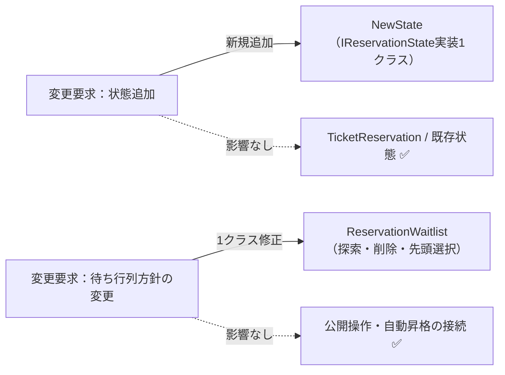
```mermaid
graph LR
    T1["変更要求：状態追加"]
        -->|新規追加| N1["NewState<br>（IReservationState実装1クラス）"]
    T2["変更要求：待ち行列方針の変更"]
        -->|1クラス修正| N2["ReservationWaitlist<br>（探索・削除・先頭選択）"]
    T1 -. "影響なし" .-> A["TicketReservation / 既存状態 ✅"]
    T2 -. "影響なし" .-> B["公開操作・自動昇格の接続 ✅"]
```

フェーズ3の変更影響グラフと同じ要求・同じ粒度で比べると、課題ID1の状態追加は共通契約 `IReservationState` の実装1クラスへ、課題ID2の待ち行列方針変更は `ReservationWaitlist` の中だけへ限定されました。`TicketReservation` の公開操作と、キャンセル直後の自動昇格の接続はどちらの変更でも触りません。

| 3-2で影響した場所 | 修正後 | 構造変更との対応 |
|---|---|---|
| 公開操作ごとの `status` 文字列分岐（課題ID1） | **修正しない** | 振る舞いを各状態クラスへ移した |
| 状態処理に絡む待ち行列操作と昇格処理（課題ID2） | `ReservationWaitlist` の中だけ修正 | キュー方針を専用クラスへ閉じた |
| 3-2には状態部品の契約がなかった | `NewState` を1クラス追加する | 状態の変更先を新しく作った |

### 7-4：変更シナリオ表

今回の変更ID1・変更ID2について、フェーズ1の構造で必要だった修正と完成構造の結果を整理します。

| 変更依頼 | フェーズ1の現状構造での影響 | 完成構造での結果 |
|---|---|---|
| 変更ID1：満席時の予約要求を自動でキャンセル待ちへ登録し、空席発生時に先頭を自動昇格する | `TicketReservation`の予約・取消へ待ち行列と昇格条件を追加 | 通常の`reserve()`だけで待機登録し、取消直後に49/50から先頭を自動昇格して50/50へ戻ることを確認 |
| 変更ID2：通常の15分決済期限を、明示的な一時保留で24時間へ延長し、期限切れで席を解放する | `TicketReservation`の複数操作へ通常・保留の期限分岐を追加 | `ReservedState`と`HeldState`へ期限切れを置き、どちらも空席へ戻した後の自動昇格まで確認 |

変更ID1・変更ID2の判断を状態クラスへ分けた代わりに、状態ごとのクラスと遷移の組み立てを管理するコストを引き受けます。

---

## 整理

### 問題・原因・課題・解決策

| | 内容 |
|---|---|
| **問題** | 状態が1つ増えるたびに全操作メソッドの条件分岐を書き直さなければならず、ヒアリングで確定した追加頻度ではコストが合わない |
| **原因** | 状態遷移ルール（企画担当）と操作フロー（開発チーム）が`TicketReservation`に混在し、状態変更時に関係する操作メソッドの確認が必要になる |
| **課題** | 状態ごとの振る舞いを `TicketReservation` から切り離し、公開操作は現在の状態へ委譲する構造にする |
| **解決策** | 状態分離構造：`IReservationState` を境界として状態ごとの振る舞いを各クラスに分離し、`TicketReservation` はインターフェース経由で現在の状態に処理を委譲する |

### フェーズとこの章でやったこと

この章では、複雑化する状態遷移が `if` や `switch` 文による条件分岐の混在を生み、システムの保守性を低下させている現状を学びました。7フェーズの思考プロセスを適用して、この構造的課題をどのように解決したのかを振り返ります。

| **フェーズ** | **この章でやったこと** |
|---|---|
| 🔵 フェーズ1：現状把握 | 予約ステータスが `TicketReservation` クラス内に直接記述され、条件分岐で管理されている現状を観察しました。 |
| 🟣 フェーズ2：仮説立案 | 企画担当者へのヒアリングを通じ、今後「状態」の種類も「遷移ルール」も頻繁に変わるリスクを特定しました。 |
| 🟣 フェーズ3：問題特定 | 新しい状態（一時保留など）の追加を試み、全メソッドの修正が不可避になる「痛み」を確認しました。 |
| 🟠 フェーズ4：原因分析 | 状態管理のルールと業務ロジックが同じ場所に混在していることが、システムを脆くしている根本原因だと突き止めました。 |
| 🟡 フェーズ5：課題定義 | 公開操作と状態固有の振る舞いの境界を定め、状態追加時に条件分岐を増やさない課題を定めた |
| 🔴 フェーズ6：対策検討 | 課題ID1の状態判断と課題ID2の待ち行列を同時に分離する最終構造を確定し、状態契約→状態実装→自動昇格接続の順でコードへ反映した。 |
| 🟢 フェーズ7：対策実施 | 状態を個別クラスへ分け、待ち行列の探索・先頭選択と席解放直後の昇格を`ReservationWaitlist`へ集約した。 |

### 責任の移動

今回の設計変更により、`TicketReservation` が抱え込んでいた責任がどこへ移動したかを示します。

| **責任** | **変更前** | **変更後** |
|---|---|---|
| 予約コンテキストの保持と委譲 | `TicketReservation` | `TicketReservation`（変わらず） |
| 各状態での操作可否の判断 | `TicketReservation`（if-else直書き） | `ReservedState` 等の各実装クラス |
| 状態遷移後の状態値の設定 | `TicketReservation`（if-else直書き） | `ReservedState` 等の各実装クラス |
| 状態の振る舞い契約の定義 | —（なし） | `IReservationState` |
| キャンセル待ちの探索・先頭選択 | 呼び出し元の手順 | `ReservationWaitlist` |
| 席解放後の昇格 | 手動呼び出しになり得る | `TicketReservation`から`ReservationWaitlist`へ自動委譲 |

### 複雑さを足しても対策は変わるか

| 追加した複雑さ | 見えた原因 | 定めた課題 | 採用した扱い |
|---|---|---|---|
| キャンセル待ちからの予約昇格イベント | 利用者操作でなくても、状態ごとの受け付け可否を中心クラスが知っている | 操作とイベントの発生源を問わず、現在状態へ委譲する | `WaitlistedState` に昇格時の振る舞いを置く |
| 保留期限切れタイマー | 時間起点の入力も `Held` だけが意味を持つのに、中心クラスへ条件が増える | 特定状態だけが扱うイベントを、その状態の責任に寄せる | `HeldState` に期限切れ時の遷移を置く |
| 決済失敗後の戻り | 成功時と失敗時で、維持すべき状態が状態ごとに変わる | 外部API結果を受けても、呼び出し元へ状態分岐を漏らさない | `ReservedState` / `HeldState` が失敗時の状態維持と再試行可否を決める |

> このプロセスを回した結果にたどり着いた構造こそが 状態分離構造です。

---

## 振り返り

### 「この章を読むと得られること」は手に入ったか

| **得られること** | **この章のどこで示したか** |
|---|---|
| 1. 変動箇所の識別 | フェーズ2のヒアリングを通じて、「状態の種類」と「状態遷移ルール」が頻繁に変わることを特定したこと。 |
| 2. 痛みの発生源の判断 | フェーズ4の分析で、「状態（ステータス）」と「その状態での振る舞い」が同じクラスに混在していることが、条件分岐の爆発という痛みの根本原因だと突き止めたこと。 |
| 3. 構造改善の説明 | 新しい状態を追加するとき、`TicketReservation`の条件分岐ではなく、状態クラスと遷移の組み立てを変更する設計を実現したこと。 |
| 4. 状態追加の判断 | フェーズ6で、課題ID1・課題ID2を残さない最終構造を先に確定し、状態追加と待ち行列変更の影響先を分けたこと。 |

### 第0章の3つの設計原則はどう適用されたか

* **原則1「変わるものをカプセル化せよ」の現れ**
  * 具体化された場所：各状態クラス（`ReservedState` など）
  * 解説：状態ごとの細かなルールという「頻繁に変わる詳細」を、個別の状態クラスの中にカプセル化しました。これにより、業務クラス側は状態の内部ルールを知る必要がなくなりました。

* **原則2「実装ではなくインターフェースに対してプログラムせよ」の現れ**
  * 具体化された場所：`TicketReservation` クラスと `IReservationState` インターフェース
  * 解説：`TicketReservation` は具体的な状態クラスを直接参照せず、抽象的なインターフェースを通じて振る舞いを実行するようにしました。

* **原則3「継承よりコンポジションを優先せよ」の現れ**
  * 具体化された場所：`TicketReservation` が `IReservationState` を持つ構造
  * 解説：状態を継承で表現しようとすると階層が深まり柔軟性を失いますが、コンポジション（オブジェクトを内部に保持して利用する仕組み）として状態を持たせることで、実行時に状態を自由に入れ替えられるようになりました。

---

## あなたのコードで考えてみてください

この章で辿った思考プロセスを、あなた自身のコードに当てはめてみましょう。以下の判定ツリーに沿って確認してください。

**Q1：** 同じメソッドの中に「状態フラグや種別によって全く異なる処理をする」分岐がありますか？

- **No →** 現時点では状態分離構造は不要です。シンプルなコードを維持してください。
- **Yes → Q2へ**

**Q2：** 状態の種類が1つ増えたとき、修正が必要なメソッドは2つ以上になりますか？

- **No →** 分岐の数が少なく影響範囲が限定的です。今すぐ構造を適用する必然性はありません。
- **Yes → Q3へ**

**Q3：** 今後も状態の種類やルールが増える見込みがありますか（ヒアリングまたは変更履歴から判断）？

- **No →** 一時的な複雑さとして許容し、コメントで意図を明記する方が現実的です。
- **Yes →** 状態分離構造の適用を検討してください。状態ごとにクラスを切り出すことで、次の変更の影響を1クラスに閉じ込めることができます。

---

**題材を置き換えるときの共通手順**

この章の題材名を、自分の現場のシステム名に置き換えて考えます。

1. そのシステムは、誰が何を達成するために使うものか。
2. 入力、加工、出力は何か。
3. 最近入った変更要求、または次に来そうな変更要求は何か。
4. その変更で、触りたくない場所まで修正や再テストが広がるか。
5. 変えたいものと守りたいものを分けると、接続点には何を残すべきか。
6. 全課題を満たす完成構造が複数成立するか。成立するなら、責任配置・変更影響・導入コストの差は何か。

## パターン解説：State パターン

ここまでに採用した「`TicketReservation` は公開入口を保ち、現在の `IReservationState` へ操作を委譲し、状態ごとのクラスが次の状態を決める」という完成構造には、既に知られた名前があります。それが **Stateパターン**です。先にパターン名から設計を選んだのではなく、変更の痛みと接続点から導いた構造を、ここで一般的な設計語彙へ対応づけます。

Stateパターンは、オブジェクトの内部状態が変化したときに、そのオブジェクトの振る舞いを変更できるようにするパターンです。

### パターンの骨格

状態ごとに専用のクラスを作成し、コンテキスト（状態を持つオブジェクト）は現在の状態オブジェクトに処理を委譲します。

```mermaid
classDiagram
    class Context {
        -State state
        +request()
    }
    class State {
        <<interface>>
        +handle(Context c)
    }
    class ConcreteState {
        +handle(Context c)
    }
    Context o--> State
    State <|.. ConcreteState
```

### 抽象骨格の実行シーケンス

```mermaid
sequenceDiagram
    participant C as Client
    participant X as Context
    participant S as CurrentState
    participant N as NextState
    C->>X: event()
    X->>S: handle(Context)
    S->>X: setState(NextState)
    X-->>C: 更新後状態
```

Clientは現在状態を指定せず、Contextが保持するStateへイベントを委譲します。

### この章の実装との対応

| GoFの名前 | この章での対応 |
|---|---|
| Context | `TicketReservation` |
| State | `IReservationState` |
| ConcreteState | `AvailableState` / `ReservedState` / `PaidState` 等 |

```mermaid
classDiagram
    class TicketReservation {
        -IReservationState state
        +reserve()
        +pay()
        +cancel()
        +hold()
        +expire()
    }
    class IReservationState {
        <<interface>>
        +reserve(reservation)
        +pay(reservation)
        +cancel(reservation)
        +promoteBySystem(reservation)
        +hold(reservation)
        +expire(reservation)
    }
    class AvailableState {
        +reserve(reservation)
    }
    class ReservedState {
        +pay(reservation)
        +cancel(reservation)
        +hold(reservation)
        +expire(reservation)
    }
    class PaidState
    class HeldState {
        +pay(reservation)
        +cancel(reservation)
        +expire(reservation)
    }
    class WaitlistedState {
        +promoteBySystem(reservation)
    }
    class ReservationWaitlist
    class EventDatabase
    class ReservationHistory
    TicketReservation --> ReservationWaitlist
    TicketReservation --> EventDatabase
    TicketReservation --> ReservationHistory
    TicketReservation o--> IReservationState
    IReservationState <|.. AvailableState
    IReservationState <|.. ReservedState
    IReservationState <|.. PaidState
    IReservationState <|.. HeldState
    IReservationState <|.. WaitlistedState
```

抽象ロールである `IReservationState` が、現実の `ReservedState` などの具体クラスと結びついています。

### 使いどころと限界

* **使うと良い状況：** 状態に応じてオブジェクトの振る舞いが劇的に変わる場合。また、状態の種類が将来的に増える見込みがある場合。

* **使わない方が良い状況：** 状態が2〜3つ程度で、今後も増える可能性がほとんどない場合。状態が少なければ `if` 文1本で全パターンを見通せるため、クラスを分けるコスト（ファイル数の増加・クラス間の依存関係の把握）が得られる利点を上回ります。「状態が増えたときにどこを直すか」が1メソッド内で完結するうちは、パターンの導入は過剰設計になります。

【過剰コード：状態が固定で増えないのにパターン化した例】

```cpp
// 「開いている」「閉まっている」の2状態しかなく
// 今後も増える予定がない扉の状態管理
// — この程度ならif文で十分
class IDoorState {
public:
    virtual void open() = 0;
    virtual void close() = 0;
    virtual ~IDoorState() = default;
};
class OpenState : public IDoorState {
public:
    void open()  { std::cout << "既に開いています\n"; }
    void close() { std::cout << "閉めました\n"; }
};
class ClosedState : public IDoorState {
public:
    void open()  { std::cout << "開けました\n"; }
    void close() { std::cout << "既に閉まっています\n"; }
};
```

上記は状態が2つしかなく今後も増えない場合の例です。`if (isOpen)` の1行で済む処理のために4クラスを導入するのは、コードの見通しを悪化させます。

| **状況** | **適切な選択** | **理由** |
|---|---|---|
| **変化の予定がある場合** | **Stateパターンを使う** | 状態の追加が他のロジックを汚染しないため |
| **変化の予定がない場合** | **シンプルなif文で十分** | クラス数の増加というコストに見合わないため |

### この章のまとめ

チケット予約というドメインと Stateパターンの関係を一言で言うなら、状態と振る舞いを同じクラスに置く限り、状態が増えるたびに関連する条件分岐を開かなければならない、ということです。「仮予約」「確定」「キャンセル」という状態ごとに異なる振る舞いが `TicketReservation` の中に同居していた。その構造が条件分岐の増殖を生んでいた——そこまで分析できれば、「状態の振る舞いを状態クラスへ移す」という方向性は自然に見えてきます。

7つのフェーズを通じて、読者は `status` 文字列の直書きという観察から「どの業務機能によるか」の分析へ、そして状態クラスへの分離という判断へと進みました。フェーズ2のヒアリングで「状態の種類は今後も増える」と確認した時点で変化軸が確定し、フェーズ4で「状態と振る舞いの混在」を接続点として特定した時点で解決の方向が定まる——その気づきの積み上げが、パターン名の暗記では得られない体験です。

あなたのコードの中にも、ステータス文字列や状態フラグで分岐している箇所があるはずです。それぞれの分岐が「どの業務機能によるか」を問うことが、状態をクラスとして分離する理由を見つける入口になります。
