## 第3章 状態ごとの振る舞いを分離する ―― State パターン

―― 思考の型：状態によって振る舞いが変わる処理が、条件分岐で混在している

### この章の核心

**同じ操作でも現在状態によって許可・結果・次状態が変わる場面では、状態値と状態固有の振る舞いを一組として考えます。状態を増やすたびに複数メソッドの分岐を同期して直しているなら、遷移規則が中央へ散らばっていることが兆候です。各状態が許可する操作と次状態を引き受け、利用側から状態判定を外せるかが判断軸になります。**

### この章を読むと得られること

この章の痛みは「状態が1つ増えるたびに、すべての処理分岐を書き直さなければならない」という問題です。

* **得られること1：** 「状態の変化に伴う振る舞いの切り替え」という観点で、コードの変動箇所を識別できるようになる
* **得られること2：** 条件分岐が複雑に絡み合ったクラスを見て、そこが状態管理の痛みの発生源だと判断できるようになる
* **得られること3：** 状態ごとの振る舞いを別クラスに分離することで、条件分岐を排除した構造改善の説明ができるようになる
* **得られること4：** 状態が増える可能性がある設計において、既存のフローを壊さずに状態を追加する判断ができるようになる

## 🔵 フェーズ1：現状把握 ―― 仕様を整理し、システムと紐付ける
はじめに、チケット予約管理システムの現状を整理します。

このシステムが受け取る入力、内部で行う判定、返す出力を整理します。

### 1-1：このシステムの仕様

このシステムは、イベントごとに**チケット予約の状態を管理**します。利用者からイベントIDと予約・支払い・キャンセルなどの操作を受け取り、イベント台帳から席数と現在の予約状態を取得します。現在状態で操作が許可されるかを判定し、成立した場合だけ席数と状態を更新して保存し、対象イベント名と状態遷移またはエラーを表示します。

#### まず代表入力と実行結果から動きをつかむ

詳細な仕様やコードへ入る前に、1-4の`main()`で利用者がイベントEVT001（春の音楽祭）を予約し、続けて支払う入力を確認します。

**代表入力（1-4の`main()`から抜粋）：**

```cpp
    // 準備：イベント台帳（EVT001＝春の音楽祭）を用意する
    EventDatabase db;

    // 1席目：予約して支払う（空席 → 予約済み → 支払い済み）
    TicketReservation seat1(db, "EVT001");
    seat1.reserve();
    seat1.pay();

    // 2席目：予約して取り消す（空席 → 予約済み → 空席）
    TicketReservation seat2(db, "EVT001");
    seat2.reserve();
    seat2.cancel();
```

この入力に対する代表的な実行結果は次のとおりです。

```
予約対象：春の音楽祭
予約完了しました
支払い完了しました
予約対象：春の音楽祭
予約完了しました
予約をキャンセルしました
```

同じイベントの座席を2つ扱いました。1席目は `Available → Reserved → Paid` と進み、2席目は `Available → Reserved → Available` と戻ります。**同じ `reserve()` を呼んでも、その次に何ができるかは現在の状態で決まります。** 1回だけ実行していたら、状態によって操作の可否が変わるという、この章の中心が見えませんでした。

この入力と出力から、(1)イベントを指定して予約・支払いを操作し、(2)状態が空き→予約済み→支払い済みへ遷移し、(3)各操作の成否が表示される、という一連の動きが読み取れます。同じ入力を含む完全なコードと実行結果は1-4に掲載します。

#### 最初にシステム全体をつかむ

- **入力：** イベントIDと予約・支払・キャンセルの操作を受け取る。
- **処理：** 保存済みの予約状態とイベントの予約数を読み、現在状態で操作できるかを判定して、成功時だけ状態と予約数を更新する。
- **出力：** 操作結果と変更後状態を返し、不正操作では状態も予約数も変えない。
- **掲載コードでの代替：** 実システムの予約DBとイベントDBはメモリ上の登録表で表す。状態遷移と予約数の増減は実際に行う。一時保留・期限切れ・キャンセル待ちは1-5の変更要求で加わる範囲で、現状コードにはない。

まずこの一連の動きを押さえ、以降で要求、状態と操作、保存データ、クラス、コードの順に詳細を確認します。

#### 現行要求ベースライン

| 要求ID | 現行要求 | 受入条件 |
|---|---|---|
| 要求ID1 | イベントの存在と空席数を確認する | 未登録イベント・満席では予約状態を変えない |
| 要求ID2 | 予約可能から予約済みへ遷移し、予約数を1増やす | 残り1席の予約後に満席の数値になる |
| 要求ID3 | 予約済みを支払済みへ遷移する | 支払成功時だけPaidになる |
| 要求ID4 | 予約済みをキャンセルして予約可能へ戻し、予約数を1減らす | 取消直後に空席数が数値で増える |
| 要求ID5 | 現在状態で許可されない操作はエラーにし、状態と予約数を変えない | エラー前後の状態・件数が一致する |

各予約は「予約可能（Available）」「予約済み（Reserved）」「支払済み（Paid）」の3つの状態を持ちます。お客様の操作（予約・支払・キャンセル）に応じて状態が遷移し、状態によって許可される操作が異なります。

この章で扱う現状仕様は、次の範囲です。

| 仕様項目   | この章で扱う値        | 具体例                | 何に使うか                                                                               |
| ------ | -------------- | ------------------ | ----------------------------------------------------------------------------------- |
| イベントID | 予約対象のイベント | EVT001=春の音楽祭、EVT002=夏のフェス、EVT003=秋の映画会 | イベントの存在と空席を確認する |
| 操作     | 予約・支払・キャンセル    | 予約する、支払う、キャンセルする   | 現在状態で許可される操作かを判定する                                                                  |
| 予約状態   | 予約可能・予約済み・支払済み | 予約可能から予約済みへ変わる     | 操作後に次の状態へ遷移する                                                                       |
| 出力     | 操作結果と状態変化      | 予約完了、満席エラー、操作不可エラー | 状態が変わる結果と変わらない結果を照合する                                                               |

ここで確認する対象は、どの状態でどの操作が許可され、どの結果になるかです。

**登録済みのイベント**

イベントの空席は、次の3件の定員と現在の予約数から判定します。予約数が定員に達しているイベントは満席で、予約するとエラーになります。

| イベントID | タイトル | 定員 | 現在の予約数 |
|---|---|---|---|
| EVT001 | 春の音楽祭 | 100 | 20（空きあり） |
| EVT002 | 夏のフェス | 500 | 499（残り1席） |
| EVT003 | 秋の映画会 | 50 | 50（満席） |

登録されていないイベントIDを指定すると、イベントを取得できずエラーになります。

この章では、利用者が「現在状態」を毎回指定するのではありません。現在状態は予約管理システムが予約1件ごとに保持し、利用者はイベントIDと操作を指定します。状態は操作のたびにシステム内部で読み出され、更新されます。

予約は利用者ごとに1件ずつ作られ、その1件分の状態（Available/Reserved/Paid）を持ちます。イベント全体の残席数はイベント情報の保存領域が別に管理し、予約時に空席を1つ減らし、キャンセルや期限切れで1つ戻します。したがって、ある予約が Reserved（予約済み・未払い）のまま支払いを待っていても、残席がある限り別の利用者は自分の予約を進められます。押さえているのは在庫のうちの1席だけで、「予約済みの間は次の人が予約できない」わけではありません。状態マトリクスの「Reserved で『予約する』が——」は、イベントの占有ではなく、同じ予約1件を二重予約させないという意味です。

**システム全体図：予約管理と保存データの境界**

最も大きな境界は「利用者 → チケット予約管理システム」です。イベント情報、予約状態、結果表示は対象システムの内側にまとめ、どの保存データを使うかだけを示します。

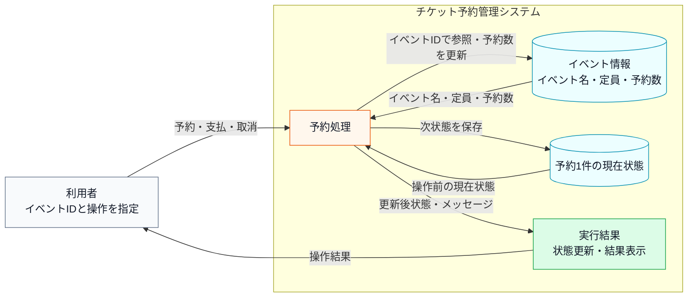
```mermaid
flowchart LR
    U["利用者<br>イベントIDと操作を指定"] -->|"予約・支払・取消"| T

    subgraph RESERVATION["チケット予約管理システム"]
        T["予約処理"]
        D[("イベント情報<br>イベント名・定員・予約数")]
        S[("予約1件の現在状態")]
        R["実行結果<br>状態更新・結果表示"]
        T -->|"イベントIDで参照・予約数を更新"| D
        D -->|"イベント名・定員・予約数"| T
        T -->|"次状態を保存"| S
        S -->|"操作前の現在状態"| T
        T -->|"更新後状態・メッセージ"| R
    end

    R -->|"操作結果"| U

    classDef actor fill:#f8fafc,stroke:#64748b,color:#111827;
    classDef data fill:#ecfeff,stroke:#0891b2,color:#111827;
    classDef process fill:#fff7ed,stroke:#ea580c,color:#111827;
    classDef result fill:#dcfce7,stroke:#16a34a,color:#111827;
    class U actor;
    class D,S data;
    class T process;
    class R result;
```

上の文章と表で仕様を一通り確認したので、まず正常に状態更新できる場合の入力・判定・加工・出力の流れとして整理します。

**システム内部図：正常系の入力・判定・加工・出力**

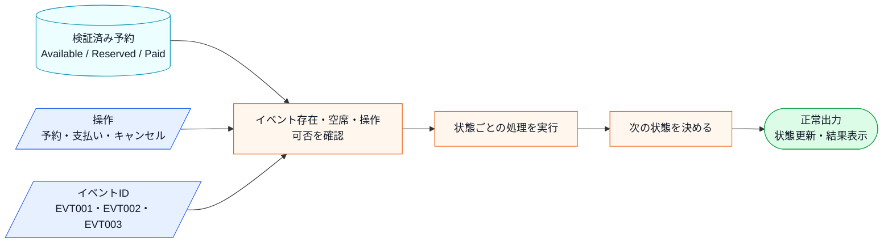
```mermaid
flowchart LR
    A[(検証済み予約<br>Available / Reserved / Paid)]:::data --> B[イベント存在・空席・操作可否を確認]:::process
    C[/操作<br>予約・支払い・キャンセル/]:::input --> B
    D[/イベントID<br>EVT001・EVT002・EVT003/]:::input --> B
    B --> F[状態ごとの処理を実行]:::process
    F --> G[次の状態を決める]:::process
    G --> H([正常出力<br>状態更新・結果表示]):::normal

    classDef data fill:#ecfeff,stroke:#0891b2,color:#111827;
    classDef input fill:#e7f0ff,stroke:#2563eb,color:#111827;
    classDef process fill:#fff7ed,stroke:#ea580c,color:#111827;
    classDef decision fill:#fef9c3,stroke:#ca8a04,color:#111827;
    classDef normal fill:#dcfce7,stroke:#16a34a,color:#111827;
```

この図から読み取ることは、次の3点です。

- 同じ操作でも、現在の予約状態によって受け付けられるかどうかが変わる。
- 状態更新へ進む前に、イベントの存在、空席、操作可否を順に確認する必要がある。
- 正常系では、現在状態と操作から次の状態を決め、状態更新と結果表示を行う。

**状態遷移マトリクス**

この表は、現在の状態ごとに、各操作を受け付けたとき次にどの状態へ進むかを整理したものです。行は「いまの状態」、列は「利用者が行う操作」、セルは「操作後の状態」を表します。予約可能な状態で予約すると予約済みに進み、予約済みの状態で支払うと支払済みに進む、という基本の流れを確認します。

| 現在の状態 | 予約する | 支払う | キャンセルする |
|---|---|---|---|
| Available（予約可能） | → Reserved | —— | —— |
| Reserved（予約済み） | —— | → Paid | → Available |
| Paid（支払済み） | —— | —— | —— |

「——」は、その状態では操作を受け付けず、エラーメッセージを出力して終了することを表します。これは表の中心ではなく、基本の状態遷移に当てはまらない操作を明示するための記号です。

表の各行に着目すると、それぞれのルールには明確な業務上の理由があります。

- **Available（予約可能）で「支払う」「キャンセルする」が——の理由**：予約が存在しない状態で支払いを受け付けると「どの予約に対する支払いか」が確定しません。キャンセルについても、そもそも予約がなければキャンセルする対象がなく、操作自体が無意味です。
- **Reserved（予約済み）で「予約する」が——の理由**：同じ予約枠を二重予約することは、業務上あり得ないためです。
- **Paid（支払済み）でのすべての操作が——の理由**：支払いが完了した予約は「確定済み」扱いになります。この状態からのキャンセルを認める場合は、返金処理・在庫の戻し・会計記録の修正など、複数の業務プロセスが連動して動く必要があります。この章では、返金処理はこの章の設計論点から外れるため扱いません。キャンセルポリシーを設ける場合は、「キャンセル済み（Cancelled）」という別の状態を追加して対応できます。

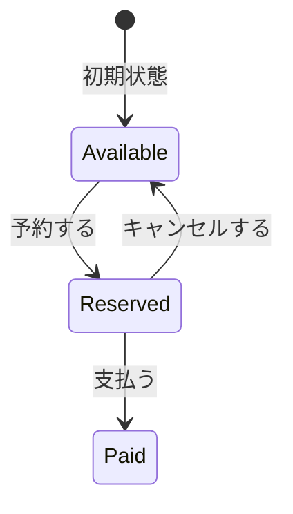
```mermaid
stateDiagram-v2
    [*] --> Available : 初期状態
    Available --> Reserved : 予約する
    Reserved --> Paid : 支払う
    Reserved --> Available : キャンセルする
```

このマトリクスが、後のフェーズで「新しい状態が増えるとどこが変わるか」を確認する基準になります。

**エラー条件**

正常系の仕様を一通り確認したうえで、最後に、状態更新へ進めない入力や操作を分けて整理します。

| エラー条件 | どこで分かるか | 出力 | 状態保存・通知 |
|---|---|---|---|
| イベントIDが存在しない | イベント情報の存在確認時 | 対象なしエラー | 予約状態は変更しない |
| 予約時に空席がない | イベント情報の空席確認時 | 満席エラー | 予約状態は変更しない |
| 現在状態では操作できない | 現在の予約状態と操作の組み合わせ確認時 | 操作不可エラー | 現在の予約状態は変更しない |

---

### 1-2：動作例テーブル

コードを読む前に、このシステムがどんな入力に対してどんな出力を返すかを確認します。この章のどのステップも、以下の動作を実現します。

| ケース | 入力 | 加工 | 出力 |
|---|---|---|---|
| ケース1：予約して支払う | 空きありイベント / 予約する → 支払う | 空きありのイベントを予約し、予約済みから支払いへ進める | 予約対象、予約完了、支払い完了 |
| ケース2：予約してキャンセルする | 空きありイベント / 予約する → キャンセルする | 空きありのイベントを予約し、予約済みから予約可能へ戻す | 予約対象、予約完了、キャンセル完了 |
| ケース3：満席イベントを予約する | 満席イベント / 予約する | 満席イベントを検出する | 満席エラー |
| ケース4：存在しないイベントを予約する | 存在しないイベント / 予約する | 存在しないイベントIDを検出する | イベントID不存在エラー |
| ケース5：予約前に支払う | 空きありイベント / 支払う | 予約可能状態で支払いを試みる | 支払い不可エラー |
| ケース6：支払後にキャンセルする | 空きありイベント / 予約する → 支払う → キャンセルする | 支払済み状態でキャンセルを試みる | キャンセル不可エラー |

確認したいことは、通常の予約・支払いフロー、キャンセルフロー、予約前の外部条件による拒否、状態に合わない操作の拒否が、それぞれ入力と出力で対応していることです。

この動作テーブルは、後のフェーズでステップを比較するときに「同じ入力なら同じ出力を返すことで動作不変を確認する」ための基準として使います。この章で変えたいのは内部の構造であり、利用者から見える動作ではありません。

---

### 1-3：登場クラスとクラス構成図

#### このシステムの登場クラス

| クラス名 | 役割 | 担当する仕様 |
|---|---|---|
| `EventInfo` | イベント1件分の情報 | イベント名・定員・予約数の受け渡し |
| `EventDatabase` | イベント情報の保持と検索 | イベントIDの存在確認・満席判定 |
| `TicketReservation` | チケット予約の状態管理と各状態の振る舞い | `Available` / `Reserved` / `Paid` の状態遷移 |

データの流れは、次のように分かれます。

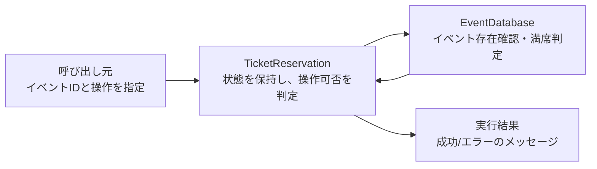
```mermaid
flowchart LR
    C["呼び出し元<br/>イベントIDと操作を指定"]
    T["TicketReservation<br/>状態を保持し、操作可否を判定"]
    D["EventDatabase<br/>イベント存在確認・満席判定"]
    R["実行結果<br/>成功/エラーのメッセージ"]

    C --> T
    T --> D
    D --> T
    T --> R
```

**クラス図に出てくる主なメンバーと操作**

| クラス | メンバー・操作 | 何ができるか |
|---|---|---|
| `EventDatabase` | `records` | イベントIDごとの情報を保持する |
| `EventDatabase` | `exists()` / `get()` / `hasCapacity()` | 対象イベントの存在確認、情報取得、満席判定を行う |
| `TicketReservation` | `db` / `eventId` / `status` | 予約対象イベントと現在状態を保持する |
| `TicketReservation` | `reserve()` / `pay()` / `cancel()` | 現在状態に応じて予約、支払い、キャンセルを実行する |
| `TicketReservation` | `handleReserveError()` など | 操作できない状態のエラーを返す |


各クラスの役割を把握したところで、クラス間の関係を図で整理します。

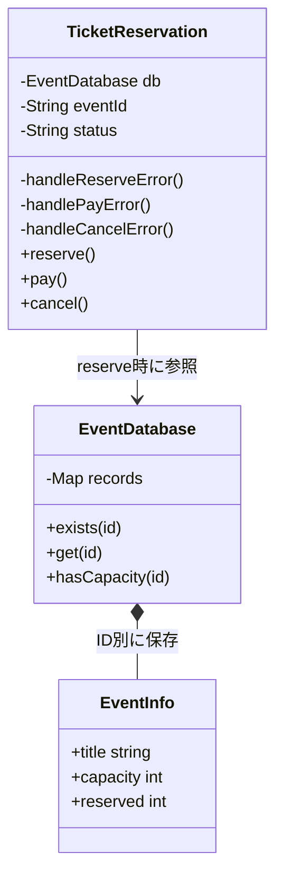
```mermaid
classDiagram
    class EventDatabase {
        -Map records
        +exists(id)
        +get(id)
        +hasCapacity(id)
    }
    class EventInfo {
        +title string
        +capacity int
        +reserved int
    }
    class TicketReservation {
        -EventDatabase db
        -String eventId
        -String status
        -handleReserveError()
        -handlePayError()
        -handleCancelError()
        +reserve()
        +pay()
        +cancel()
    }

    EventDatabase *-- EventInfo : ID別に保存
    TicketReservation --> EventDatabase : reserve時に参照
```

この図から分かるのは、予約する、支払う、キャンセルするという操作が同じ予約管理クラスに集まっていることです。各操作の中で状態をどう判定しているかは、次の実装コードで確認します。

**現状システムの処理シーケンス**

静的な関係に続けて、正常系（予約→支払い）で各操作がどの順に呼ばれ、状態がどう遷移するかを時系列で示します。状態ごとの具体の分岐は `TicketReservation` の注記に、エラー系はメモとして添えます。1-4の現状コードを読む前の地図です。

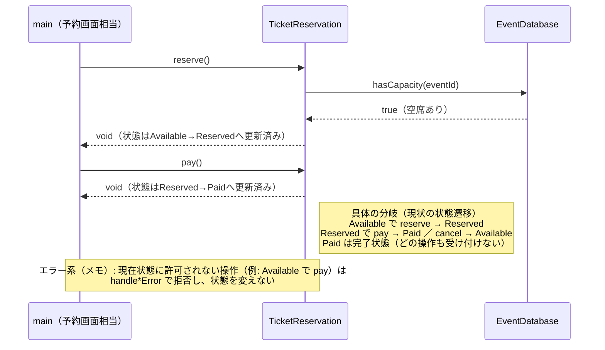
```mermaid
sequenceDiagram
    participant Main as main（予約画面相当）
    participant TR as TicketReservation
    participant DB as EventDatabase
    Main->>TR: reserve()
    TR->>DB: hasCapacity(eventId)
    DB-->>TR: true（空席あり）
    TR-->>Main: void（状態はAvailable→Reservedへ更新済み）
    Main->>TR: pay()
    TR-->>Main: void（状態はReserved→Paidへ更新済み）
    Note right of TR: 具体の分岐（現状の状態遷移）<br>Available で reserve → Reserved<br>Reserved で pay → Paid ／ cancel → Available<br>Paid は完了状態（どの操作も受け付けない）
    Note over Main,TR: エラー系（メモ）: 現在状態に許可されない操作（例: Available で pay）は<br>handle*Error で拒否し、状態を変えない
```

図から読み取れるのは、公開操作（`reserve`／`pay`／`cancel`）が同じ `TicketReservation` に集まり、各操作が現在の `status` を見て遷移先を決めていること、席の空きは `EventDatabase.hasCapacity()` で確認すること、許可されない操作はメモのとおり状態を変えずに拒否されることです。状態ごとに「どの操作で何が起きるか」がこの時系列と注記で確認できます。


**この章での簡略化**

この章の主役は、`Available` / `Reserved` / `Paid` という**予約状態に応じて振る舞いが切り替わる部分**です。イベントIDの存在確認や満席判定は、実際の予約システムなら必要な周辺処理ですが、この章の設計論点ではありません。そのため、この章では `EventDatabase` というメモリ上の簡易データで表現し、データベース接続、同時予約制御、決済API、発券処理は扱いません。

---

### 1-4：実装コード（現状）

#### コードを読む前に：クラスの責任と境界

この表は、イベントの席数と予約状態がどこで接続するかを示す読解用の地図です。省略する外部機能は簡略化節へ集約しました。

| 対象 | 主な責任 | 接続先・結果 |
|---|---|---|
| `EventDatabase` | イベントIDで空席を確認し予約数を増減する | 更新後の`reserved`を返す |
| `TicketReservation` | 利用者操作を受け現在状態で可否を決める | 状態を更新し、結果メッセージを出す |
| 例外 | 確認なしの満席更新を拒否する | 継続不能な不整合を呼び出し側へ返す |

予約成功で件数を増やし、キャンセル・期限切れで減らすという在庫の契約を次のコードで確認します。

#### 現状コード

クラスを1つずつ、上から順に読みます。**メンバー変数と、それを使う処理を同じ場所で見られるように**しています。宣言と定義を分けるのは `TicketReservation` だけです。判断の基準は次の一行です。

コードを読むときは、まずメンバーが保持する状態を確認し、次に各操作の入力・戻り値・状態変更を追います。

`main()` と実行結果は最後に、行のまとまりごとに並べます。上から順に連結すれば、そのまま1つのC++14プログラムとして動きます。

---

**共通ヘッダー**

```cpp
#include <iostream>
#include <string>
#include <map>
#include <stdexcept>
```

以降のすべてのクラスが使います。

---

**EventInfo と EventDatabase**

1-1の「イベント」にあたるデータと在庫です。イベントIDから定員・予約数を引き、エラー条件「存在しないID」「満席」もここで判定します。

```cpp
struct EventInfo {
    std::string title;   // イベント名
    int capacity;        // 定員
    int reserved;        // 現在の予約数
};
```

**EventDatabase**

このブロックでは `EventDatabase` の定義だけを確認します。

```cpp
class EventDatabase {
private:
    std::map<std::string, EventInfo> records;
public:
    EventDatabase() {
        records["EVT001"] = {"春の音楽祭",  100,  20};
        records["EVT002"] = {"夏のフェス",  500, 499};
        records["EVT003"] = {"秋の映画会",   50,  50};  // 満席
    }

    bool exists(const std::string& id) const {
        return records.count(id) > 0;
    }

    EventInfo get(const std::string& id) const {
        return records.at(id);
    }

    bool hasCapacity(const std::string& id) const {
        const auto& e = records.at(id);

        return e.reserved < e.capacity;
    }

    void reserveSeat(const std::string& id) {
        ++records.at(id).reserved;
    }

    void cancelSeat(const std::string& id) {
        auto& e = records.at(id);

        if (e.reserved > 0) --e.reserved;
    }

    void save(const std::string& id, const EventInfo& info) {
        records[id] = info;             // 実行中のイベント表へ追加
    }
};
```

- **責任：** イベントIDから空席を確認し、予約数を増減する
- **副作用：** `reserveSeat()` / `cancelSeat()` / `save()` だけが `records` を書き換える

`std::map` はイベントIDから `EventInfo` を引くメモリ上のイベント表です。EVT002は499件なので、1件予約すると500件で満席になり、その予約をキャンセルすると499件へ戻ります。実システムのDBを、実行終了まで覚えているインメモリの登録表で代替しています。

---

**TicketReservation の宣言**

この章の中心です。1-1の「予約・支払い・キャンセル」という利用者操作を受け取ります。

```cpp
class TicketReservation {
private:
    // --- データ ---
    EventDatabase& db;   // 共有の在庫データ（外部から注入）
    std::string eventId; // 予約対象のイベント
    std::string status;  // 状態 "Available"/"Reserved"/"Paid"

    // 各状態で操作できないときのエラー出力
    void handleReserveError() { std::cout << "現在予約できません\n"; }
    void handlePayError()     { std::cout << "支払いに適した状態ではありません\n"; }
    void handleCancelError()  { std::cout << "キャンセルできません\n"; }

public:
    TicketReservation(EventDatabase& db, const std::string& eventId)
        : db(db), eventId(eventId), status("Available") {}

    void reserve();
    void pay();
    void cancel();
};
```

在庫は外から受け取って参照で持ち、対象イベントと現在状態は自分で持ちます。**この `status` が、3つの操作すべての可否を決めます。** 同型で並列な3つのエラー出力は、並列関係が縦に見えるよう1行揃えで書いています（本書共通のスタイル）。定義を3つ、上のメンバーを見ながら読んでいきます。

---

**TicketReservation::reserve()**

```cpp
void TicketReservation::reserve() {
    if (!db.exists(eventId)) {
        std::cout << "エラー：イベントID " << eventId << " は存在しません\n";
        return;
    }

    if (!db.hasCapacity(eventId)) {
        std::cout << "エラー：" << db.get(eventId).title << " は満席です\n";
        return;
    }

    if (status == "Available") {
        db.reserveSeat(eventId);
        status = "Reserved";
        std::cout << "予約対象：" << db.get(eventId).title << "\n";
        std::cout << "予約完了しました\n";
    } else {
        handleReserveError();
    }
}
```

- **判断が3つ：** イベントの存在、空席の有無、現在状態。3つとも別々の理由で失敗します
- **順序に意味：** 存在確認を先に置かないと、`hasCapacity()` の `at()` が未登録IDで落ちます
- **副作用：** 3つとも通ったときだけ在庫を1件増やし、状態を `Reserved` にします

`hasCapacity()` で先に満席を弾くので、この経路では例外が出ません。`throw std::runtime_error(...)` は、確認を飛ばして更新しようとした場合の安全網です。

---

**TicketReservation::pay()**

```cpp
void TicketReservation::pay() {
    if (status == "Reserved") {
        status = "Paid";
        std::cout << "支払い完了しました\n";
    } else {
        handlePayError();
    }
}
```

`Reserved` のときだけ通ります。在庫は動きません。

---

**TicketReservation::cancel()**

```cpp
void TicketReservation::cancel() {
    if (status == "Reserved") {
        db.cancelSeat(eventId);
        status = "Available";
        std::cout << "予約をキャンセルしました\n";
    } else {
        handleCancelError();
    }
}
```

`Reserved` のときだけ通り、在庫を1件戻します。**`Paid` からは戻せません。**

3つの定義を並べて見ると、`reserve` `pay` `cancel` のどれもが冒頭で `status` を見ています。現在状態の判定が3か所へ散らばっています。

---

#### `main()` と実行結果

1-2の動作例テーブルを、行ごとに区切って実行します。**在庫は行をまたいで引き継がれます。**

---

**組み立てと、行1：EVT001 予約 → 支払い**

```cpp
int main() {
    EventDatabase db;

    // 行1: 正常な予約から支払いまで
    std::cout << "--- 行1: EVT001 予約 → 支払い ---\n";
    TicketReservation seat1(db, "EVT001");
    seat1.reserve();  // Available → Reserved
    seat1.pay();      // Reserved  → Paid
```

```
--- 行1: EVT001 予約 → 支払い ---
予約対象：春の音楽祭
予約完了しました
支払い完了しました
```

`db` を1つだけ作り、以降のすべての `TicketReservation` へ参照で渡します。在庫が共有されるのはこのためです。

---

**行2：EVT001 予約 → キャンセル**

```cpp
    // 行2: 予約からキャンセルまで
    std::cout << "\n--- 行2: EVT001 予約 → キャンセル ---\n";
    TicketReservation seat2(db, "EVT001");
    seat2.reserve();  // Available → Reserved
    seat2.cancel();   // Reserved  → Available
```

```
--- 行2: EVT001 予約 → キャンセル ---
予約対象：春の音楽祭
予約完了しました
予約をキャンセルしました
```

予約で1件増え、キャンセルで1件戻りました。EVT001の予約数は行1の分だけ増えた状態で残ります。

---

**行3：EVT003 満席イベントへの予約**

```cpp
    // 行3: 満席イベントへの予約試み
    std::cout << "\n--- 行3: EVT003 満席イベントへの予約 ---\n";
    TicketReservation seat3(db, "EVT003");
    seat3.reserve();  // エラー（満席）
```

```
--- 行3: EVT003 満席イベントへの予約 ---
エラー：秋の映画会 は満席です
```

`hasCapacity()` で止まりました。状態は `Available` のままです。

---

**行4：UNKNOWN 存在しないイベントへの予約**

```cpp
    // 行4: 存在しないイベントへの予約試み
    std::cout << "\n--- 行4: UNKNOWN 存在しないイベントへの予約 ---\n";
    TicketReservation seat4(db, "UNKNOWN");
    seat4.reserve();  // エラー（存在しない）
```

```
--- 行4: UNKNOWN 存在しないイベントへの予約 ---
エラー：イベントID UNKNOWN は存在しません
```

先頭の `exists()` で止まるので、満席判定へは進みません。

---

**行5：予約なしで支払いを試みる**

```cpp
    // 行5: 状態エラー — 予約前に支払いを試みる
    std::cout << "\n--- 行5: 予約なしで支払いを試みる ---\n";
    TicketReservation seat5(db, "EVT001");
    seat5.pay();      // エラー（Available状態）
```

```
--- 行5: 予約なしで支払いを試みる ---
支払いに適した状態ではありません
```

---

**行6：支払い済みをキャンセルしようとする**

```cpp
    // 行6: 状態エラー — 支払い済みをキャンセルしようとする
    std::cout << "\n--- 行6: 支払い済みをキャンセルしようとする ---\n";
    TicketReservation seat6(db, "EVT001");
    seat6.reserve();  // Available → Reserved
    seat6.pay();      // Reserved  → Paid
    seat6.cancel();   // エラー（Paid状態）

    return 0;
}
```

```
--- 行6: 支払い済みをキャンセルしようとする ---
予約対象：春の音楽祭
予約完了しました
支払い完了しました
キャンセルできません
```

同じ `cancel()` が、行2では成功し行6では拒否されました。違いは現在状態だけです。

---

`main()` はイベントIDと操作の組み合わせを指示するだけで、存在確認・満席判定・状態チェックはすべて `TicketReservation` 内部で行っています。

> **手元で動かすには**
> このコードは1つの `.cpp` に貼り付けて、そのままコンパイル・実行できます（例：`g++ chapter03.cpp -o app && ./app`）。`main()` は自由に組み替えて構いません。たとえば `db.save("EVT010", {"冬の演劇祭", 80, 0});` でイベントを足し、`TicketReservation seat(db, "EVT010");` を作って `reserve()` や `pay()` を呼べば、追加したイベントの予約と状態遷移がその場の実行結果に表れます。イベントデータはプロセス実行中だけ有効で、終了すると消えます（DBのような永続化はこの章の論点ではありません）。
>
> **掲載用1ファイルと実務の分割：** この1つの`.cpp`は、手元で動かすための掲載形式です。実務では、第0章「掲載ブロックと実ファイルの分け方」に従い、公開する契約・宣言を`.h`、処理本体を`.cpp`、生成・登録・注入を`main.cpp`へ置くことを基本にします。

次のフェーズで変更が来たときに何が起きるかを確認します。

---

#### 仕様入力が現状コードで使われるまで

この章では操作種別を文字列で渡さず、`reserve()` / `pay()` / `cancel()` という入口そのものが利用者の操作を表します。イベントIDと現在状態を合わせて、どの処理へ進むかが決まります。

| 仕様入力 | コード上の受け取り口 | 実際に使う箇所 | 結果への現れ方 |
|---|---|---|---|
| イベントID | `TicketReservation(db, eventId)` | `EventDatabase::exists()` / `hasCapacity()` / `reserveSeat()` / `cancelSeat()` | 対象イベントの予約数が増減し、未登録IDは拒否される |
| 予約・支払・キャンセル操作 | `reserve()` / `pay()` / `cancel()` | 各メソッド内の現在状態による分岐 | 状態遷移または操作不可メッセージになる |
| 現在状態 | `TicketReservation::status` | 3つの操作メソッドの条件判定 | 同じ操作でも状態に応じて成功・拒否が変わる |

### 1-5：変更要求

ある週明けの朝、イベント運営担当から開発チームへ、新しい施策についての連絡が入りました。

「来月から、リピーター向けに『キャンセル待ち』機能を実装したいのです。予約枠がいっぱいの場合でも、空きが出たら自動的に予約が割り当てられるようにしたい。また、それに伴い『予約一時保留』という状態も追加してほしい。イベント開始の24時間前までなら、予約を確保したまま決済を24時間待つ仕組みです。」

運営担当は、この機能が実装されれば、直前キャンセルによる空き枠を減らし、収益が大きく改善すると期待しています。ここで整理しておくと、「キャンセル待ち」とは予約枠が満杯のときに空き待ちを登録する状態、「予約一時保留」とは予約を確保したまま決済の期限を延期する状態です。

依頼文を、実行結果で判定できる変更依頼へ分けます。先に曖昧さをなくすため、本章では次の業務ルールを固定します。

- 満席時の通常の予約要求は、システムが空席数を確認して自動的にキャンセル待ちへ登録する。利用者が満席を判断して別操作を選ぶ必要はない。
- 空席が1席出るたびに待ち行列の先頭1件だけを自動昇格し、後続の待機者は先着順のまま残る。複数席空けば、席数分だけ同じ処理を繰り返す。
- 利用者は `Reserved` と `Held` のどちらからも明示的にキャンセルできる。いずれも席を解放し、待機者がいれば自動昇格する。
- 通常の `Reserved` は15分の決済期限を持つ。利用者が明示的に一時保留を選ぶと `Held` へ移り、期限が24時間へ延長される。どちらも期限切れはスケジューラから届き、席を解放する。
- 本章ではキャンセル待ち自体の取り下げ、イベント開始時刻との厳密な比較、プロセス再起動後のタイマー復元は扱わない。

| 変更依頼ID | 確定した変更内容 | 入力 | 受入条件 |
|---|---|---|---|
| 変更ID1 | 満席時の予約要求を自動でキャンセル待ちへ登録し、空席発生時に先頭を自動昇格する | イベントID、満席状態、予約要求、予約済み取消 | 予約要求だけで待機登録され、取消で49/50になった直後、先頭待機者が予約済みとなり50/50へ戻る |
| 変更ID2 | 通常の15分決済期限を、明示的な一時保留で24時間へ延長し、期限切れで席を解放する | 予約済み状態、一時保留操作、期限切れイベント | Reserved/Heldの期限中は席を確保し、期限切れ時は空席へ戻して待機者がいれば自動昇格する |

#### 変更後要求ベースライン

| 要求ID | 変更種別・根拠となる変更ID | 変更後要求 | 受入条件 |
|---|---|---|---|
| 要求ID1 | 継続<br/>根拠: — | イベントの存在と空席数を確認する | 未登録イベント・満席の既存判定を維持する |
| 要求ID2 | 継続<br/>根拠: — | 予約可能から予約済みへ遷移し、予約数を1増やす | 残り1席の予約後に満席になる |
| 要求ID3 | 変更<br/>根拠: 変更ID2 | 予約済みまたは一時保留から支払済みへ遷移する | 支払成功時だけPaidになる |
| 要求ID4 | 変更<br/>根拠: 変更ID1 | 予約取消で席を解放し、待機者がいれば先頭を同じ処理内で自動昇格する | 50/50→49/50→50/50と件数変化し、手動昇格を要しない |
| 要求ID5 | 継続<br/>根拠: — | 許可されない操作や決済失敗では状態と予約数を変えない | エラー前後の状態・件数が一致する |
| 要求ID6 | 追加<br/>根拠: 変更ID1 | 満席時の予約要求をシステムがキャンセル待ちへ登録する | 利用者は予約操作だけを行い、待機順を保存して空席発生時に先頭から昇格する |
| 要求ID7 | 追加<br/>根拠: 変更ID2 | Reservedは15分、一時保留したHeldは24時間の期限を持ち、期限切れで席を解放する | 期限中は席を確保し、期限切れ後は待機者を自動昇格する |

**変更前→変更後の要求対照（今回変える要求IDだけ）**

現行ベースラインと変更後ベースラインを往復せずに済むよう、今回変える要求IDだけを取り出し、変更前と変更後を同じ行へ並べます。

| 要求ID | 変更前の要求（現行） | 変更後の有効要求 | 根拠変更ID |
|---|---|---|---|
| 要求ID3 | 予約済みを支払済みへ遷移する | 予約済みまたは一時保留から支払済みへ遷移する | 変更ID2 |
| 要求ID4 | 予約済みをキャンセルして予約可能へ戻し、予約数を1減らす | 予約取消で席を解放し、待機者がいれば先頭を同じ処理内で自動昇格する | 変更ID1 |
| 要求ID6 | （新規・現行なし） | 満席時の予約要求をシステムがキャンセル待ちへ登録する | 変更ID1 |
| 要求ID7 | （新規・現行なし） | Reservedは15分、一時保留したHeldは24時間の期限を持ち、期限切れで席を解放する | 変更ID2 |

要求ID1・要求ID2・要求ID5は継続（変更前＝変更後）のため対照表には載せません。変更後ベースラインで内容を確認できます。

決済失敗時に状態を変えない戻り値と、期限切れイベントを受けるスケジューラ境界は、変更ID1・変更ID2を安全に実行するための内部契約です。独立した利用者要求として数えません。

実際の予約システムでは、入力は利用者のボタン操作だけではありません。キャンセルで空席が出たときの予約昇格イベント、保留期限を過ぎたときのタイマーイベント、決済APIから返る失敗結果も、予約状態を動かす入力になります。この章では、それらを「状態によって扱いが変わる入力」として同じ粒度で整理します。

**仕様変更の内容**

変更要求を受けて、状態の種類と遷移ルールがどう変わるかを整理します。

**状態の変化**

| 状態 | 変更前 | 変更後 |
|---|---|---|
| Available（予約可能） | あり | 変更なし |
| Reserved（予約済み） | あり | 変更なし |
| Paid（支払済み） | あり | 変更なし |
| **Waitlisted（キャンセル待ち）** | なし | **新規追加** |
| **Held（一時保留）** | なし | **新規追加** |

今回変えるのは予約状態と遷移です。イベント情報と空席数を管理する保存基盤は仕様変更の対象ではないため、`EventDatabase` の取得・更新契約は変更前後で**変更なし**とします。

**新しく追加される遷移ルール**

| 現在の状態 | 操作 | 遷移先 | 処理内容 |
|---|---|---|---|
| Available | reserve（満席時） | Waitlisted | 通常の予約要求をキャンセル待ちへ自動登録する |
| Waitlisted | promoteBySystem | Reserved | 空席発生時にシステムが予約へ昇格する |
| Reserved | hold | Held | 通常の15分期限を24時間へ延長する |
| Reserved | expire | Available | 通常の15分決済期限が切れ、予約枠を空きに戻す |
| Held | pay | Paid | 保留期限内に決済を完了する |
| Held | cancel | Available | 保留中の予約を取り消し、予約枠を空きに戻す |
| Held | expire | Available | 保留期限（24時間）が切れ、予約枠を空きに戻す |
| Reserved / Held | paymentFailed | Reserved / Held | 決済失敗を記録し、予約済みまたは保留中のまま再試行できる状態に戻す |

**実運用での状態の動き（イメージ）**

各遷移が「誰の・何をきっかけに」起きるかを、時間の流れで並べると次のようになります。

1. **予約する（Available→Reserved／Waitlisted）**：利用者は常に「予約」を押します。空席があれば席数から1席を引いて予約済み（未払い）となり、満席ならシステムが自動でキャンセル待ちへ登録します。`Reserved` の標準決済期限は15分です。
2. **一時保留する（Reserved→Held）**：利用者が明示的に「一時保留」を選ぶと、席を確保したまま決済期限を24時間へ延長します。予約の放置を自動で保留へ変える操作ではありません。
3. **支払う（Reserved／Held→Paid）**：期限内に決済すると確定します。
4. **期限切れ（Reserved／Held→Available）**：Reservedは15分、Heldは24時間が経過しても未払いなら、タイマーイベントが枠を空きに戻します。空いた1席は、キャンセル待ち（Waitlisted）の先頭が自動昇格して受け取ります。
5. **決済失敗（Reserved／Held を維持）**：決済APIが失敗を返しても状態は進めず、同じ状態のまま再試行できます。

現状の `if` 文を使った状態分岐ロジックに、この2状態と、操作・イベントによる6種類の遷移/状態維持を追加することになります。

**実システムのイベントと掲載コードでの模擬方法**

実運用では、期限時刻を永続化し、バックグラウンドのタイマー基盤が期限到来を検知して予約システムへイベントを送ります。掲載コードは実時間を待たず、実行ハーネスがタイマー基盤の代役として期限到来イベントを直接送ります。呼び出し行は利用者操作の実装ではなく、外部タイマーからイベントが届いた状況を即時再現するテストハーネスです。時刻計算・ジョブ再実行・永続化は省略しても、予約オブジェクトが期限切れイベントを受けた後の遷移は実際に動かします。

| 入力の種類 | 具体例 | 状態に与える影響 | この章で見ること |
|---|---|---|---|
| 利用者操作 | 予約、支払い、キャンセル、一時保留 | 現在状態に応じて許可/拒否と遷移先が変わる | 操作メソッドに状態分岐が増えるか |
| システムイベント | キャンセル待ちからの予約昇格 | 空席発生をきっかけに `Waitlisted` から `Reserved` へ進む | 利用者操作でなくても状態ごとの扱いが必要か |
| タイマー | 保留期限切れ | `Held` から `Available` へ戻り、枠を解放する | 時間起点の入力でも同じ接続点で扱えるか |
| 外部API結果 | 決済失敗 | `Reserved` または `Held` を維持し、再試行できる状態にする | 成功だけでなく失敗戻りも状態ごとの振る舞いか |

**仕様変更後の状態遷移マトリクス（全体像）**

この表は、既存の3状態に「キャンセル待ち」と「一時保留」を追加した後、各操作でどの状態へ進むかを整理したものです。状態と操作の組み合わせが増えたため、列数の都合で表を2つに分けています。「——」は、その状態では操作を受け付けず、エラーメッセージを出力して終了することを表します。

【表1：従来の操作】

`Waitlisted` は変更要求で初めて追加される状態です。従来は満席なら予約エラーで終了し、キャンセル待ちとして保存する機能自体がありませんでした。そのため従来の「予約する・支払う・キャンセルする」を `Waitlisted` に直接適用する欄は「——」です。キャンセル待ちからの操作は、直後の表2aにある専用イベント（登録・予約昇格）として扱います。

| 現在の状態 | 予約する | 支払う | キャンセルする |
|---|---|---|---|
| Available（予約可能） | → Reserved | —— | —— |
| Reserved（予約済み） | —— | → Paid | → Available |
| Paid（支払済み） | —— | —— | —— |
| Waitlisted（キャンセル待ち） | —— | —— | —— |
| Held（一時保留） | —— | → Paid | → Available |

【表2a：キャンセル待ち系の操作】

| 現在の状態 | 満席時の予約要求 | 予約昇格 |
|---|---|---|
| Available（予約可能） | → Waitlisted | —— |
| Reserved（予約済み） | —— | —— |
| Paid（支払済み） | —— | —— |
| Waitlisted（キャンセル待ち） | —— | → Reserved |
| Held（一時保留） | —— | —— |

【表2b：一時保留系の操作】

| 現在の状態 | 一時保留 | 期限切れ |
|---|---|---|
| Available（予約可能） | —— | —— |
| Reserved（予約済み） | → Held | —— |
| Paid（支払済み） | —— | —— |
| Waitlisted（キャンセル待ち） | —— | —— |
| Held（一時保留） | —— | → Available |

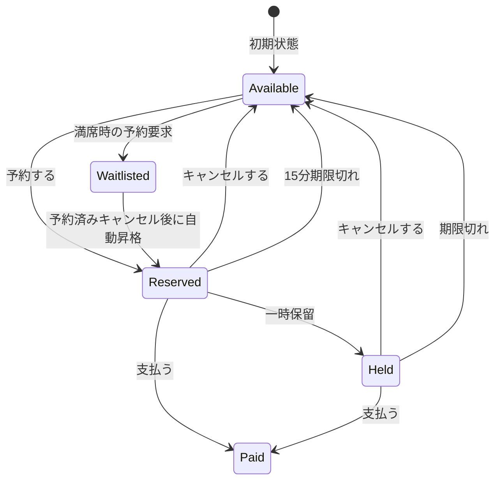
```mermaid
stateDiagram-v2
    [*] --> Available : 初期状態
    Available --> Reserved : 予約する
    Reserved --> Paid : 支払う
    Reserved --> Available : キャンセルする
    Available --> Waitlisted : 満席時の予約要求
    Waitlisted --> Reserved : 予約済みキャンセル後に自動昇格
    Reserved --> Held : 一時保留
    Reserved --> Available : 15分期限切れ
    Held --> Paid : 支払う
    Held --> Available : キャンセルする
    Held --> Available : 期限切れ
```

操作不可・満席・決済失敗は状態を変えない結果なので、状態遷移の矢印には含めません。これらは直後のエラー条件表で「状態保存なし」として扱います。

**変更前後の入力・判定・加工・出力差分**

1-1の現状仕様を退避し、変更要求を当てた後の仕様と同じ粒度で並べます。以降の分析では、この差分を追います。

| 要素 | 変更前（1-1の現状仕様） | 変更後（今回の要求） | 差分として追うもの |
|---|---|---|---|
| 入力 | イベントID、操作、内部に保持している現在の予約状態 | イベントID、操作/イベント、内部に保持している現在の予約状態、キャンセル待ち/一時保留/決済失敗に関わる入力 | 操作・イベントと状態の種類が増える |
| 判定 | 現在状態で操作可能か | 新状態を含めて操作/イベントを受け付けるか、保留期限内か、決済失敗時に再試行できるか | 状態ごとの判定が増える |
| 加工 | 予約・支払・キャンセルに応じて状態を更新 | キャンセル待ち登録、予約昇格、一時保留、期限切れ、決済失敗時の状態維持を処理 | 状態遷移ルールと状態維持ルールが増える |
| 出力 | 操作結果と更新後状態 | 操作結果、Waitlisted/Heldを含む更新後状態 | 新状態の出力を追う |

**変更後の入力・加工・出力**

変更後の仕様を、1-1と同じ粒度で、正常系の入力・判定・加工・出力として確認します。1-1の図との差分は、内部に保持する「現在状態」が3種類から5種類へ、「操作・イベント」が3種類から8種類へ増えることです。判定・加工・出力の流れ自体は変わりません。図中のイベントIDも、現状データに存在する3件を省略せず示します。

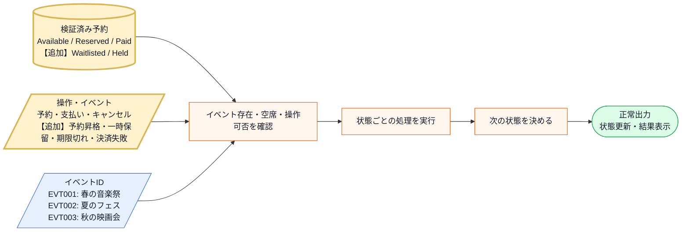
```mermaid
flowchart LR
    A[(検証済み予約<br>Available / Reserved / Paid<br>【追加】Waitlisted / Held)]:::data --> B[イベント存在・空席・操作可否を確認]:::process
    C[/操作・イベント<br>予約・支払い・キャンセル<br>【追加】予約昇格・一時保留・期限切れ・決済失敗/]:::input --> B
    D[/イベントID<br>EVT001: 春の音楽祭<br>EVT002: 夏のフェス<br>EVT003: 秋の映画会/]:::input --> B
    B --> F[状態ごとの処理を実行]:::process
    F --> G[次の状態を決める]:::process
    G --> H([正常出力<br>状態更新・結果表示]):::normal

    classDef data fill:#ecfeff,stroke:#0891b2,color:#111827;
    classDef input fill:#e7f0ff,stroke:#2563eb,color:#111827;
    classDef process fill:#fff7ed,stroke:#ea580c,color:#111827;
    classDef decision fill:#fef9c3,stroke:#ca8a04,color:#111827;
    classDef normal fill:#dcfce7,stroke:#16a34a,color:#111827;
    classDef changed fill:#fff2cc,stroke:#d6b656,stroke-width:3px,color:#111827;
    class A,C changed;
```

この図から読み取ることは、次の3点です。

- 新しい入力は「Waitlisted・Held」の2状態と「満席時の自動待機登録・予約昇格・一時保留・期限切れ・決済失敗」の5操作/イベントで、図の箱そのものは増えていない。
- 増えるのは「操作は現在状態で可能か」で受け付ける組み合わせと、「次の状態を決める」の行き先である。
- 受け付けられない組み合わせは、変更後も既存の「操作不可エラー」として扱う。

変更後も、失敗条件は正常系図へ混ぜずに別で確認します。

| エラー条件 | どこで分かるか | 出力 | 状態保存・通知 |
|---|---|---|---|
| イベントIDが存在しない | イベント台帳の存在確認時 | 対象なしエラー | 現在の予約状態は変更しない |
| 予約時に空席がない | `EventDatabase` の空席確認時 | 満席エラー。必要ならキャンセル待ち登録へ進む | `Waitlisted` へ変える場合は変更要求側の仕様として扱う |
| 現在状態では操作できない | 現在の予約状態と操作の組み合わせ確認時 | 操作不可エラー | 現在の予約状態は変更しない |
| 決済APIが失敗する | 支払い処理の結果受信時 | 決済失敗メッセージ | `Reserved` または `Held` を維持し、再試行可能にする |

増えた状態と操作の組み合わせが実際にコードのどこへ書かれるかは、フェーズ3「問題特定」で変更を試すコードと、フェーズ7の最終コード・実行結果で追います。

**フェーズ1のまとめ：今回追う変更ID一覧**

| 変更ID | 変更依頼の要点 | 関係する要求ID（追加は変更後ID） |
|---|---|---|
| 変更ID1 | 満席時にキャンセル待ちへ登録し、空席発生時に先頭を自動昇格する | 要求ID4、要求ID6 |
| 変更ID2 | 予約済みを24時間の一時保留へ移し、期限切れで席を解放する | 要求ID3、要求ID7 |


---

## 🟣 フェーズ2：仮説立案 ―― 何が変わるかを観察し、ヒアリングで裏付ける
### 2-1：変わりそうな仕様の見当をつける

フェーズ1「現状把握」で整理した仕様をもとに、「どの仕様に変更の見込みがあり、今回どこを維持するか」を見立てます。責務配置の評価は、変更を当てたときの痛みと合わせてフェーズ3「問題特定」とフェーズ4「原因分析」で確認します。

変わりそうな仕様は、1-3のクラス図の中心 `TicketReservation` にあります。`reserve()` / `pay()` / `cancel()` の中で判定している「どの状態なら操作できるか」と「操作後にどの状態へ遷移するか」を、どんな仕様が、誰の何をきっかけに変わりそうかと一緒に整理します。

| 変わりそうな仕様 | 所在（クラス・メソッド） | 変える主体・きっかけ | 現時点の仮説 |
|---|---|---|---|
| 状態の種類 | `TicketReservation.status` の取りうる値 | 企画担当の新機能導入（キャンセル待ち等） | 変更候補 |
| 操作可能な状態の判定条件 | 各メソッド内の `if (status == ...)` | 企画担当の運用ルール見直し | 変更候補 |
| 操作後の遷移先の状態 | 各メソッド内の `status = ...` 代入 | 企画担当の運用ルール見直し | 変更候補 |
| 状態を動かす入力の種類 | 現状は利用者操作を受ける各メソッド | 決済失敗・期限切れなど外部入力の追加 | 変更候補 |
| 予約成功・失敗などの通知や画面表示 | 各メソッド内の表示処理 | 今回の要求では予約結果を返す流れを変更しない | 今回維持する |

見えてくるのは、**1つの `TicketReservation` の中で、「どの状態なら何ができるか」「操作後どの状態へ移るか」という状態遷移の仕様に、企画担当の施策や運用見直しによる変更が見込まれる**という仮説です。一方、予約完了・支払い完了などの結果を返す流れは、今回維持する前提に置きます。

ここで見るのは所在だけです。責任の多さや構造の善し悪しは、変更を当てて痛みを観測してから判断します。上の表は、変わりそうな仕様が `TicketReservation` のどのメソッドのどの行にあるかという所在の見立てです。状態遷移の仕様を1つのクラスにまとめている今の配置が、変更要求を当てたときに**実際に痛みになるか**はフェーズ3「問題特定」で確かめ、なぜ辛いのかはフェーズ4「原因分析」で原因として言語化します。2-1は、その検証対象に当たりをつける段階です。

#### ヒアリングで確認すること

状態に関する見当を、設計判断に必要な二つの質問へ絞ります。

| 見当 | 現時点の仮説 | 確認する質問 | 確認先 |
|---|---|---|---|
| 状態の種類 | 新しい予約状態が今後も増える | キャンセル待ち以外の状態も追加されるか | 企画担当 |
| 遷移ルール | 同じ状態でも操作可否が変わる | 状態間の遷移条件を今後見直す予定があるか | 企画担当 |

この二点を2-3で確認し、「状態名が増えるだけ」なのか「振る舞いも変わる」のかを分けます。

### 2-2：今回の変更で確実に変わること

1-5で確定した変更IDを、そのまま今回確実に変わることとして確認します。章ごとに異なる色や記号は使わず、以降でも同じ変更IDで追跡します。

- **変更ID1：満席時の予約要求を自動でキャンセル待ちへ登録し、空席発生時に先頭を自動昇格する**
- **変更ID2：通常の15分決済期限を、明示的な一時保留で24時間へ延長し、期限切れで席を解放する**

これらが今回確実に変わる範囲です。将来どれだけ変わり続けるかは、次の関係者ヒアリングで確認します。

### ヒアリングに向けた背景確認

このシステムは、イベントチケットの予約管理を担っています。イベントごとに予約、支払い、発券といった一連のプロセスを管理する、イベント運営の中核となるシステムです。

現在このシステムは、「Available（予約可能）」「Reserved（予約済み）」「Paid（支払い済み）」という3つの状態で動作しています。チケットの予約、支払い、キャンセルという操作に対して、現在の状態に応じた処理が実行される仕組みです。

### 2-3：関係者ヒアリング

仮説を確実なものにするため、企画担当の鈴木氏にヒアリングを行いました。このシステムでは「状態の種類」と「状態遷移ルール」が密接に結びついています。どちらにどんな変更が見込まれるかによって設計の方向が変わるため、この2点を重点的に確認します。


* **開発者：** 「キャンセル待ちや一時保留など、状態がかなり増えますが、今後さらに状態が増える予定はありますか？」
* **企画担当 鈴木：** 「実は、上映後のアンケート回答者に付与する『特別優待予約』なども今後検討しています。状態は今後も増えていくはずです。」
* **開発者：** 「なるほど。状態遷移のルール、例えば『保留中からキャンセル待ちへ移行できるか』などは、今後ルールが変わる可能性はありますか？」
* **企画担当 鈴木：** 「それも十分にあり得ます。今は保留中からのキャンセルを認めていますが、来月には『一度保留にしたらキャンセル不可』というルール変更も考えられます。」

ヒアリングの結果、「状態の種類」だけでなく「状態遷移ルールそのもの」も頻繁に変わり続けるという事実が見えてきました。

### 2-4：ヒアリングで判明した将来リスク

ヒアリングで浮かび上がった「確定ではないが、近い将来起こりうる変化」を記録します。これは今回の設計判断の材料です。

| リスクID | 将来リスク | 時期の目安 | 根拠 |
|---|---|---|---|
| リスクID1 | 状態遷移のルール（アクションの可否）の変更 | キャンペーンや運用の見直し時 | 企画担当 鈴木氏との確認 |
| リスクID2 | 状態の種類（特別優待予約などの追加） | 新機能導入時 | 企画担当 鈴木氏との確認 |
| リスクID3 | 状態を動かすイベントの追加 | 外部連携や運用自動化の追加時 | 決済失敗、期限切れ、空席発生など、利用者操作以外の入力が増えるため |

なお、予約結果の通知方法自体（画面表示からメール・SMSへの変更）もヒアリングで話題になりましたが、今回の変更対象ではないためリスクIDには起こさず対象外として記録します。通知手段は状態遷移の軸とは独立した境界であり、本章で扱う状態管理の分離には影響しません。


### 2-5：変わる見込みと今回維持する範囲を確定する

2-4のリスクIDを、状態を変えられるようにする側と、予約システムとして守る側へ分けます。「はい」は、フェーズ6で**状態や遷移が変わっても、予約の入口・保存・席数管理へ影響を広げない構造か**を判定するための印です。

| リスクID・変化軸 | 変わる見込み | 変えられるようにする部分 | 今回維持する部分 |
|---|---|---|---|
| リスクID1：状態遷移のルール（アクションの可否）の変更 | はい | 状態ごとの許可操作と遷移先 | 予約操作の入口、予約履歴、席数の保存 |
| リスクID2：状態の種類（特別優待予約などの追加） | はい | 状態の種類と、その状態に固有の振る舞い | イベントID・利用者IDの受け渡し、予約結果 |
| リスクID3：状態を動かすイベントの追加 | はい | イベントと状態遷移の接続 | 状態保存、待ち順、利用者操作の入口 |

したがって2-5の出力は、「状態・遷移・イベント接続は変えられるようにし、予約の受付・保存・席数管理は守る」という設計条件です。フェーズ3「問題特定」では変更ID1・変更ID2だけを現在の構造へ適用し、リスクIDはフェーズ6の構造評価に使います。

---

## 🟣 フェーズ3：問題特定 ―― 変更の痛みを発見する
フェーズ2「仮説立案」で「状態遷移のルールは頻繁に変わる」という確信が持てました。このフェーズでは、確定した新しい状態遷移（キャンセル待ち・一時保留）を、今のコードの構造のまま適用しようとしたとき、システムにどのような「痛み」が生じるのかを観察してみます。

### 3-1：変更を試みる

フェーズ2の変更要求を受けて、今のコードに「一時保留（Held）」と「キャンセル待ち（Waitlisted）」の両方の状態を追加してみます。追加する必要がある仕様と、その修正対象箇所は次の通りです。

> **この抜粋の外は、現状のままです。** 以下は `TicketReservation` の状態分岐だけを抜き出します。フェーズ1の `EventDatabase` によるイベント存在確認と座席数の読み書きは維持し、予約成立・キャンセル・期限切れに伴う座席更新の前後で、この状態処理を呼びます。

| 仕様 | 修正対象メソッド |
|---|---|
| `Held`（一時保留）：イベント開始24時間前まで予約枠を仮押さえする状態 | `pay()` / `cancel()` の両メソッドに `else if (status == "Held")` の追加が必要。また、保留期限切れを処理する `expire()` が必要。 |
| `Waitlisted`（キャンセル待ち）：予約枠が満杯のときに空き待ちを登録する状態 | `reserve()` の満席分岐で待ち行列へ自動登録し、`cancel()` / `expire()` による空席発生直後に先頭を自動昇格させる処理が必要。 |
| 決済失敗：決済APIが失敗したら予約を消さずに再試行可能な状態へ戻す | `pay()` の中で、`Reserved` からの失敗と `Held` からの失敗を分けて扱う必要がある。 |

変更した定義は6つです。1-4と同じ並び順で、上から見ていきます。座席在庫の存在確認・空席判定・座席の増減は1-4の `EventDatabase` がそのまま担うため、この抜粋では在庫まわりを省き、状態遷移に絡む部分へ集中します。

| 1-4での掲載単位 | 今回の変更 | 根拠 |
|---|---|---|
| `TicketReservation` の宣言 | 待ち行列を受け取り、状態値を5つへ、内部遷移と2つのエラー出力を追加 | 変更ID1・変更ID2 |
| `TicketReservation::reserve()` | 満席時に待ち行列へ自動登録する分岐を追加 | 変更ID1 |
| （新規） | `hold()` を追加 | 変更ID2 |
| `TicketReservation::pay()` | `Held` からの支払いを追加 | 変更ID2 |
| `TicketReservation::cancel()` | `Held` からのキャンセルと、空席発生時の自動昇格を追加 | 変更ID1・変更ID2 |
| （新規） | `expire()` を追加 | 変更ID2 |

---

**TicketReservation の宣言（変更あり）**

新しく登場する待ち行列は、0章「共有データの持ち方」の全章共通規約に従い、在庫（`EventDatabase`）と同じく組み立て側が所有する共有ストアとしてコンストラクタで外から受け取ります。グローバルな `static` で持つと生成順や実行順に依存し、どのインスタンスがいつ書いたのか追えなくなるためです。こうすると、在庫も待ち行列も「外から渡される共有ストア」で管理場所がそろいます。

```cpp
#include <iostream>
#include <string>
#include <deque>

// 変更後の TicketReservation（Held・Waitlisted を追加した状態）
// 在庫（EventDatabase）は1-4のものをそのまま使う想定で、この抜粋では
// 状態遷移と、状態処理に絡む待ち行列だけを示す。
class TicketReservation {
    // --- データ ---
    std::deque<TicketReservation*>& waitlist;  // 共有の待ち行列（借用ポインタ）
    std::string status;  // 状態 Available/Reserved/Paid/Held/Waitlisted

    // 空席発生時にシステムが呼ぶ内部遷移（利用側からは呼ばせない）
    void promoteBySystem();
    // 待ち行列の先頭を1件だけ取り出して昇格させる
    void promoteNextWaitlisted();

    // 各状態で操作できないときのエラー出力
    void handleReserveError()  { std::cout << "現在予約できません\n"; }
    void handleHoldError()     { std::cout << "保留できません\n"; }
    void handlePayError()      { std::cout << "支払いに適した状態ではありません\n"; }
    void handleCancelError()   { std::cout << "キャンセルできません\n"; }
    void handleExpireError()   { std::cout << "期限切れ処理は行えません\n"; }
public:
    // 共有の待ち行列を受け取り、初期状態は予約可能
    explicit TicketReservation(std::deque<TicketReservation*>& waitlist)
        : waitlist(waitlist), status("Available") {}

    void reserve(bool hasCapacity = true);
    void hold();
    void pay();
    void cancel();
    void expire();
};
```

1-4から増えたのは、待ち行列への参照、状態値2つ（`Held`・`Waitlisted`）、内部遷移2つ、エラー出力2つ、公開操作2つ（`hold()`・`expire()`）です。**公開操作は3つから5つになりました。**

---

**TicketReservation::promoteBySystem() と promoteNextWaitlisted()（追加）**

空席が出たときに、待ち行列の先頭を予約へ昇格させます。

```cpp
void TicketReservation::promoteBySystem() {
    if (status == "Waitlisted") {
        status = "Reserved";
        std::cout << "空席発生を検知し、予約へ自動昇格しました\n";
    }
}

void TicketReservation::promoteNextWaitlisted() {
    if (waitlist.empty()) return;

    TicketReservation* next = waitlist.front();
    waitlist.pop_front();
    next->promoteBySystem();
}
```

`front()` は先頭の借用ポインタを読むだけで、予約オブジェクトを削除しません。続く `pop_front()` がキューからそのポインタ1件を除きますが、参照先の `TicketReservation` は呼び出し側が所有したままです。第0章で説明した `deque` の「先頭参照」と「先頭要素の除去」を、この待ち行列へ適用しています。

**利用側からは呼べません。** 昇格は利用者の操作ではなく、空席発生に伴ってシステムが起こす遷移だからです。

---

**TicketReservation::reserve()（変更あり）**

```cpp
// 通常の予約要求。満席判定結果は周辺のEventDatabaseからシステムが渡す。
void TicketReservation::reserve(bool hasCapacity) {
    if (status == "Available") {
        if (hasCapacity) {
            status = "Reserved";
            std::cout << "予約完了しました\n";
        } else {
            status = "Waitlisted";
            waitlist.push_back(this);
            std::cout << "満席のためキャンセル待ちに登録しました\n";
        }
    } else {
        handleReserveError();
    }
}
```

満席のときの分岐が増えました。**`Available` の中がさらに2つに割れています。** 状態判定の中へ、在庫の判定が入れ子で入りました。

---

**TicketReservation::hold()（追加）**

```cpp
// 一時保留する（Reserved のときだけ24時間の保留枠へ）
void TicketReservation::hold() {
    if (status == "Reserved") {
        status = "Held";
        std::cout << "保留にしました\n";
    } else {
        handleHoldError();
    }
}
```

新しい公開操作です。1-4の3つの操作と同じ形で、冒頭で `status` を見ます。

---

**TicketReservation::pay()（変更あり）**

```cpp
// 支払う（Reserved と Held の両方から支払済みへ ← Held 対応を追加）
void TicketReservation::pay() {
    if (status == "Reserved") {
        status = "Paid";
        std::cout << "支払い完了しました\n";
    } else if (status == "Held") {   // ← Held 対応を追加
        status = "Paid";
        std::cout << "保留から支払い完了しました\n";
    } else {
        handlePayError();
    }
}
```

`else if` を1本足しました。**中身は上の分岐とほぼ同じで、表示文だけが違います。**

---

**TicketReservation::cancel()（変更あり）**

```cpp
// キャンセルする（Reserved と Held から予約可能へ ← Held 対応を追加）
void TicketReservation::cancel() {
    if (status == "Reserved") {
        status = "Available";
        std::cout << "予約をキャンセルしました\n";
        promoteNextWaitlisted();     // 空いた枠へ待ち行列の先頭を昇格
    } else if (status == "Held") {   // ← Held 対応を追加
        status = "Available";
        std::cout << "保留からキャンセルしました\n";
        promoteNextWaitlisted();
    } else {
        handleCancelError();
    }
}
```

- **2か所へ同じ2行を書く：** `Held` の分岐にも `promoteNextWaitlisted()` が要ります。片方だけ書き忘れても、もう一方は正しく動きます
- **順序に意味：** 状態を `Available` にしてから昇格を呼びます。逆にすると、空いていない枠へ昇格させることになります

---

**TicketReservation::expire()（追加）**

```cpp
// 決済期限切れ（Reservedは15分、Heldは24時間で枠を解放）
void TicketReservation::expire() {      // ← 新規追加
    if (status == "Reserved" || status == "Held") {
        status = "Available";
        std::cout << "決済期限が切れました\n";
        promoteNextWaitlisted();
    } else {
        handleExpireError();
    }
}
```

`cancel()` と**ほぼ同じ処理**です。状態を戻し、昇格を呼びます。違うのは表示文と、2状態を `||` で1本にまとめている点だけです。

---

#### `main()` と実行結果

変更要求後の代表シナリオ1〜3を、シナリオごとに区切って実行します。**見るのは動くかどうかではなく、変更ID1・変更ID2を当てたことで条件分岐と新しいメソッドが `TicketReservation` へどれだけ集まるかです。**

---

**シナリオ1：予約 → 保留 → 支払い**

```cpp
int main() {
    // 全予約で共有する待ち行列（在庫と同じく組み立て側が持ち、外から渡す）
    std::deque<TicketReservation*> waitlist;

    // シナリオ1：予約 → 保留 → 支払い
    TicketReservation t1(waitlist);
    t1.reserve(); t1.hold(); t1.pay();

    std::cout << "---" << std::endl;
```

```text
予約完了しました
保留にしました
保留から支払い完了しました
---
```

新しい `hold()` を挟んでも、`pay()` は `Held` から支払えます。

---

**シナリオ2：予約 → 保留 → 期限切れ**

```cpp
    // シナリオ2：予約 → 保留 → 期限切れ → Available に戻る
    TicketReservation t2(waitlist);
    t2.reserve(); t2.hold(); t2.expire();

    std::cout << "---" << std::endl;
```

```text
予約完了しました
保留にしました
決済期限が切れました
---
```

`Held` から `expire()` で `Available` へ戻りました。

---

**シナリオ3：満席時の自動待機登録 → キャンセル → 自動昇格 → 支払い**

`false` は周辺の `EventDatabase::hasCapacity()` による満席判定結果を表します。利用者は通常の `reserve()` 以外の待機登録操作を選びません。
```cpp
    // シナリオ3：既存予約のキャンセル → 待ち行列の先頭を自動昇格 → 支払い
    TicketReservation occupied(waitlist);
    occupied.reserve();
    TicketReservation waiting(waitlist);
    waiting.reserve(false);        // システムが満席判定を渡し、自動待機登録
    occupied.cancel();             // 利用側が行うのはキャンセルだけ
    waiting.pay();                 // 昇格済みなので支払える

    return 0;
}
```

```text
予約完了しました
満席のためキャンセル待ちに登録しました
予約をキャンセルしました
空席発生を検知し、予約へ自動昇格しました
支払い完了しました
```

利用側が呼んだのは `cancel()` だけで、昇格は自動で起きました。**動作は正しくなっています。** 変更要求は満たせました。

---

痛いのは結果ではなく、そこへ至る過程です。変更ID1・変更ID2のために、`reserve()`・`pay()`・`cancel()`・`hold()`・`expire()` の5つすべてへ状態判定を書きました。

状態遷移マトリクスで見ると、Held を追加するとは「行を1行増やす」ことに見えます。

| 現在の状態 | `reserve()` | `pay()` | `cancel()` |
|---|---|---|---|
| Available | → Reserved | —— | —— |
| Reserved | —— | → Paid | → Available |
| Paid | —— | —— | —— |
| **Held（新規）** | —— | → Paid | → Available |

しかし実装では、Heldの1行を追加するために`pay()`と`cancel()`を開いて`else if`を追加し、`reserve()`でも保留中の予約操作を拒否する必要があるか確認しました。変更ID1のWaitlistedも含めると、二つの確定要求だけで複数の公開操作を横断して状態数×操作数の組み合わせを点検しています。一箇所でも条件を漏らすと、変更ID1・変更ID2の受入条件を満たせません。

### 3-2：変更影響グラフ

変更を試みようとしたときに頭の中で起きた「影響の広がり」を図にしてみます。

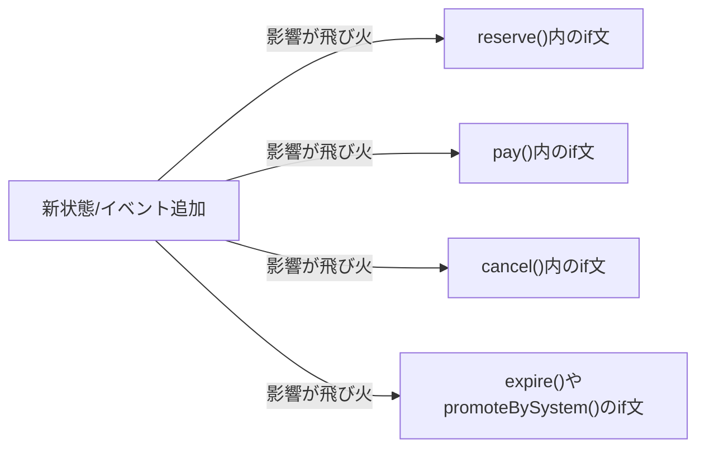
```mermaid
graph LR
    T1["新状態/イベント追加"] -->|"影響が飛び火"| A["reserve()内のif文"]
    T1 -->|"影響が飛び火"| B["pay()内のif文"]
    T1 -->|"影響が飛び火"| C["cancel()内のif文"]
    T1 -->|"影響が飛び火"| D["expire()やpromoteBySystem()のif文"]
```

このグラフが示す通り、「状態追加」や「状態を動かすイベント追加」という変更要求が、クラス内の複数のロジックに飛び火しています。

### 3-3：痛みの言語化

変更を試みてみた結果、現場でよく直面する2つの辛い状況が浮かび上がってきました。

1つ目は、修正漏れが受入条件の不成立に直結することです。変更ID2では、`pay()`で保留中からの支払いを許可するだけでなく、`reserve()`・`cancel()`・`expire()`でもHeldの扱いを確認しました。一つの確定要求に対してクラス内の複数操作を点検する必要があります。

2つ目は、変更ID1・変更ID2の振る舞いを追うために複数メソッドの`if`と`else if`を行き来する必要があることです。「今この状態なら、この操作は何をするか」を一つの場所で読めず、今回修正した全操作をまとめて確認しなければなりません。


---
> **📌 問題（確定）**
> 変更ID1のキャンセル待ちと変更ID2の一時保留を追加しただけで、`reserve()`・`pay()`・`cancel()`・`expire()`など複数のメソッドへ条件分岐を追加する必要がある。状態ごとの許可操作と遷移先が`TicketReservation`全体へ散らばり、一つの確定要求に対する修正・確認範囲が広い。
---

観測した痛みへ`問題ID`を付け、どの変更IDから来たかを対応づけます。

| 問題ID | 観測した痛み（変更途中コード） | 起点の変更ID |
|---|---|---|
| 問題ID1 | 保留・キャンセル待ちを足すだけで `reserve/pay/cancel/expire` の複数メソッドへ分岐を追加し、修正漏れが受入不成立へ直結する | 変更ID1・変更ID2 |
| 問題ID2 | 「今この状態でこの操作は何をするか」が一箇所で読めず、今回修正した全操作を横断して確認する | 変更ID2 |
| 問題ID3 | キャンセル待ちの追加で、席解放後の自動昇格と待機順の管理が予約本体の各所へ散らばる | 変更ID1 |

## 🟠 フェーズ4：原因分析 ―― なぜ辛いのかを構造で言語化する
フェーズ3「問題特定」で確認した「状態追加のたびに条件分岐が増え、修正漏れの可能性が高まる」という痛み。このフェーズでは、状態の知識がどこへ漏れているかを接続点から掘り下げます。

### 4-1：痛みの根源を探る（観察と原因）

「ステータスと振る舞いが同じクラスに混在すること」は、それ自体を誤りとは判断できません。問題は「変わる理由が異なる2つのもの」が混在しているかどうかです。`status` という状態は「業務ルール管理（どの遷移を許可するか）」という業務機能で変わり、`reserve()` などの処理フローは「処理の骨格（どんな操作ができるか）」という業務機能で変わります。ここでの判定軸は「**状態遷移のルールがどの業務機能によるか**」です。業務ルール管理と処理の骨格という2つの業務機能が異なるなら、この2つは別々の変わる理由を持っています。同じクラスに入っていると、片方だけを変更したい場合にも同じクラスを開くことになり、影響確認の範囲が重なります。それが下の表で示す「原因の方向」です。

この表は「フェーズ3「問題特定」で感じた痛み」を出発点にして、その痛みが生まれた構造的な理由を探る表です。痛みを1つ取り上げ、「なぜそうなるのか？」と問いかけ続けることで、根本原因の方向が見えてきます。

| **観察した症状（痛み）** | **構造的な原因（痛みの根源）** |
|---|---|
| 新しい状態を追加するたびに、既存の全メソッドの条件分岐を書き換える必要がある | 「現在の状態（ステータス）」と「その状態で実行可能な振る舞い」という、本来分離する必要がある知識が、一つのクラスの中に混在しているから |
| 複雑な条件分岐により、現在の状態が何であるかを常に意識しないとコードが書けない | 状態管理のルール（遷移条件）がロジックの中に埋め込まれ、状態の変化を追跡するのが困難になっているから |
| 期限切れタイマーや決済失敗のような入力が増えると、どの状態で受け付けるかを中心クラスが全部知る必要がある | 入力の発生源は違っても、状態ごとの扱いを選ぶ責任が `TicketReservation` に集まっているから |

### 4-2：今回変える責任/ほかの変更から守る責任

> **「今回守る」と「変わらない」は異なります。** 左列は今回の変更試行とヒアリングで変更理由を確認した責任、右列はその変更に巻き込まず守りたい責任です。将来ずっと変わる／変わらないという分類ではありません。

原因分析の結果から、「今回変える責任」と「ほかの変更から守る責任」を整理します。分類は色付き記号に頼らず、列名と各行の内容で示します。

| **今回変える責任** | **ほかの変更から守る責任** |
|---|---|
| 状態の種類（キャンセル待ち、保留中などの追加） | 予約システムとしての基本的な業務フロー |
| 各状態における振る舞い（状態ごとのアクション） | 状態を管理するという概念（状態があること自体） |
| 状態を動かす入力（利用者操作、タイマー、外部API結果） | 呼び出し元が「予約に対して操作/イベントを渡す」という入口 |

私たちが守りたいのは「予約管理」という概念であり、増え続ける「状態の種類」や「状態ごとの細かなルール」は、安定した業務フローから切り離す必要がある存在なのです。

### 4-3：接続点に漏れている状態の知識を確認する

ここでは原因から対策へ飛ばず、`TicketReservation` と状態ごとの判断の間で何を受け渡せばよいかを確認します。利用側が必要とするのは、状態名や分岐条件ではなく、現在の状態に対して操作を依頼し、結果を受け取ることです。

現在、`TicketReservation`の各操作メソッドは、`status`の文字列と状態ごとの遷移ルールを知っています。本来の接続点は「現在の状態へ操作を依頼すること」ですが、状態名と分岐条件がコンテキスト側へ漏れています。

状態の知識が漏れている根拠は次の3点です。

| 観点 | コードの証拠 |
|---|---|
| **「具体」＝専用規格** | `if (status == "Available")` など — 状態名を文字列リテラルとしてコードに直書きしており、他の書き方に差し替えられない |
| **「直接」＝直差し** | `reserve()` / `pay()` / `cancel()` の各メソッドが `status` を直接読み書きしており、間に何も挟まっていない |
| **「入力ごとの横断」** | `expire()` や `promoteBySystem()` のようなイベント入力が増えるたびに、状態名と許可条件を同じクラスへ追記する |

`Available`などの状態名と遷移条件が複数メソッドに埋め込まれているため、状態が増えるたびに既存の操作メソッドを横断して確認する必要があります。

フェーズ4「原因分析」で根本原因が言語化できました。「どこを分けるか」は明確です。次のフェーズ5「課題定義」では、その境界で実際に何が流れているかを値・型のレベルで具体化し、「何を変え、何を守るか」を明確にします。

---
> **📌 原因（確定）**
> `TicketReservation`が「現在の状態の判断」と「操作/イベントごとの処理フロー」の両方を保持している。状態の追加や遷移ルールの変更では、関係する操作メソッドとイベント処理を横断して修正・再テストする必要がある。
---

フェーズ3の問題IDに対応づけて、構造上の原因へ`原因ID`を付けます。次のフェーズ5は、この原因IDから課題IDを導きます。

| 原因ID | 構造上の原因（何が同じ責任へ集まっているか） | 対応する問題ID |
|---|---|---|
| 原因ID1 | `TicketReservation` が「現在状態の判断」と「操作・イベントごとの処理フロー」を同居させている | 問題ID1・問題ID2 |
| 原因ID2 | 席解放後の自動昇格と待機順の管理が状態処理へ絡み、待ち行列の責任が予約本体へ散在している | 問題ID3 |

## 🟡 フェーズ5：課題定義 ―― 原因から課題を検討して確定する

### 5-1：原因から課題候補を洗い出す

| 原因ID・確定した事実 | そのままだと残る痛み | 課題候補 | 候補を導いた理由 |
|---|---|---|---|
| 原因ID1：一つの予約管理が状態名ごとの全操作・イベントを分岐する | 状態追加で無関係な操作とイベント入口まで修正する | 状態固有の許可操作と遷移判断を状態ごとに分離する | 状態別動作は独立して増減する |
| 原因ID2：席解放と待機者選択・昇格が別の手動操作になり得る | 取消・期限切れ後に運用者が昇格を呼ぶと業務が閉じない | 席解放から待機先頭の選択・自動昇格までを接続する | 空席発生は自動昇格の業務イベントだから |

### 5-2：課題候補の重複と依存を整理する

| 課題候補 | 必要性・他候補との関係 | 統合／分割の判断 | 整理結果 |
|---|---|---|---|
| 状態固有動作の分離 | 必須。二状態追加で全分岐が広がった | 公開入口と副作用の位置は共通契約として残す | 課題として残す |
| 待機列と自動昇格の接続 | 必須。状態だけ分けても手動昇格なら変更ID1・変更ID2が未完了 | 状態分離と連携する独立責任 | 課題として残す |

変更IDと課題IDは一対一とは限らないため、変更依頼の数に合わせて課題を増減させません。

### 5-3：課題IDと接続点を確定する

| 課題ID・接続点 | 接続するもの・変わる側 | 守る側 | 完了条件 |
|---|---|---|---|
| 課題ID1：状態固有動作と公開操作・イベント入口の境界 | **接続:** 現在状態、操作・タイマー・空席イベント、次状態、結果<br/>**変わる側:** 状態ごとの操作可否・遷移先 | 公開入口、座席数更新、履歴 | 状態追加が新しい状態動作と遷移登録に閉じる |
| 課題ID2：待ち行列と席解放処理の境界 | **接続:** 待機者の追加・先頭取出し・昇格イベント<br/>**変わる側:** 待ち順序・探索方針 | 席解放直後に1件を昇格する契約 | 取消・期限切れから自動昇格まで一つのユースケースで完了する |

📌 **システム全体の完了状態**：公開操作は現在状態へ処理を委ね、取消・期限切れで空席が出た場合は保存された待機順に従う自動昇格までシステム内で完了する。

課題IDを定義できたので、ここまでの追跡を一列で見渡します。

| 問題ID（フェーズ3の痛み） | 原因ID（フェーズ4の構造原因） | 課題ID（達成目標） |
|---|---|---|
| 問題ID1・問題ID2：状態追加で複数操作を横断修正・確認 | 原因ID1：現在状態の判断と処理フローが同居 | 課題ID1：状態固有の動作と遷移判断を公開フローから分離 |
| 問題ID3：キャンセル待ちで昇格・待機順が散在 | 原因ID2：待ち行列の責任が状態処理へ絡む | 課題ID2：待ち順の管理と席解放後の自動昇格を一つの流れへ接続 |

## 🔴 フェーズ6：対策検討 ―― 全体のデータと実体の流れを決める

#### まず全体像 ―― どんな構造へ変えるか（抽象）

フェーズ4「原因分析」で、`TicketReservation` が「状態ごとの操作可否と遷移」と「待ち行列の探索・削除・先頭選択」という**別々の理由で変わる2つの判断**を、同じ場所へ抱えていることを確認しました。対策は、この2つを別々の責任へ分け、一つの予約進行経路へ再結合することです。この段階では、問題から導いた「状態分離構造」という名前だけを使います。一般に共有されているデザインパターン名は、実装と効果を確認した後で結び付けます。

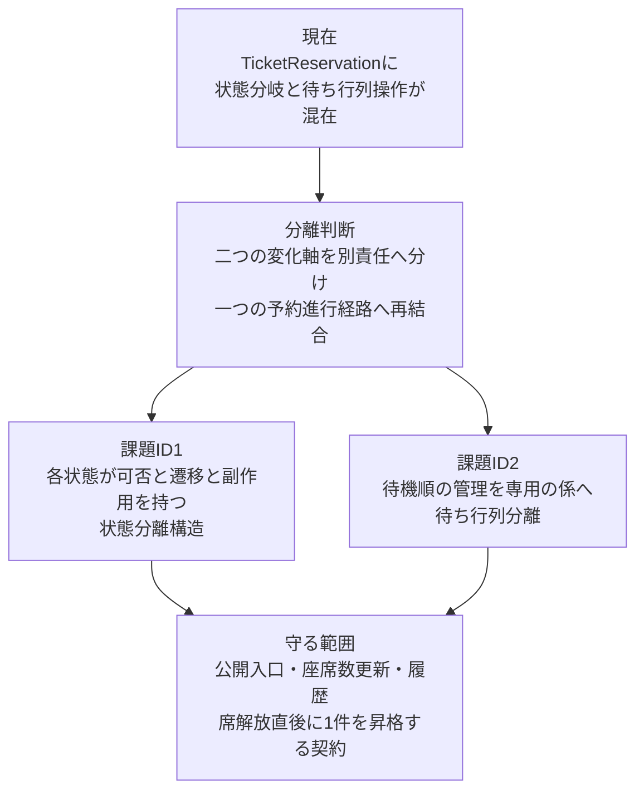
```mermaid
flowchart TB
    A[現在<br/>TicketReservationに<br/>状態分岐と待ち行列操作が混在] --> B[分離判断<br/>二つの変化軸を別責任へ分け<br/>一つの予約進行経路へ再結合]
    B --> C[課題ID1<br/>各状態が可否と遷移と副作用を持つ<br/>状態分離構造]
    B --> D[課題ID2<br/>待機順の管理を専用の係へ<br/>待ち行列分離]
    C --> E[守る範囲<br/>公開入口・座席数更新・履歴<br/>席解放直後に1件を昇格する契約]
    D --> E
```

**守る範囲 ―― この章で変えないもの。**

- **公開入口**：`reserve()`・`pay()`・`cancel()`・`hold()`・`expire()` という利用側から呼ぶ操作の形
- **座席数更新**：予約で席を1つ減らし、取消と期限切れで1つ戻すこと
- **履歴**：状態が変わった操作を記録すること
- **席解放直後に1件を昇格する契約**：席が空いたら、待機順の先頭を1件だけ自動で予約へ上げること

この4つが変わっていないことは、フェーズ7の受入・回帰エビデンスで確認します。ただし、**分離と組み立ての判断を終えるたびにも照合します。**

### 対策検討のクラス図：1-3の責任と依存をどう変えるか

フェーズ1の1-3で作ったクラス図が、これから書き換えていく**基準の図**です。まずここへフェーズ2〜5の判断を注記として載せ、どの責任を残し、どの責任を移すかを確定します。

| クラス図を変える材料 | 前工程で確認したこと | クラス図へ反映すること |
|---|---|---|
| フェーズ1のクラス図 | 現在のクラス、操作、依存関係 | 変更前クラス図としてそのまま使う |
| フェーズ2の変化予測 | リスクID1〜リスクID3。可否・状態の種類・入力イベントが増える | 毎回変わる責任へ `【移す】` と注記する |
| フェーズ4の原因 | `TicketReservation` に状態判断と待ち行列操作が混在する | 同じクラスの中で `【残す】` と `【移す】` を分ける |
| フェーズ5の接続点 | 公開操作は現在状態へ委譲し、待ち行列は専用の係へ閉じればよい | 課題ID1の状態判断と課題ID2の待機順管理を、それぞれ `TicketReservation` の外へ出す |

**薄い黄色が着目クラス**です。ここでは `TicketReservation` の `【残す】` と `【移す】` を追います。矢印は1-3と同じ利用関係です。

**変更前のクラス図（基準の図）：**

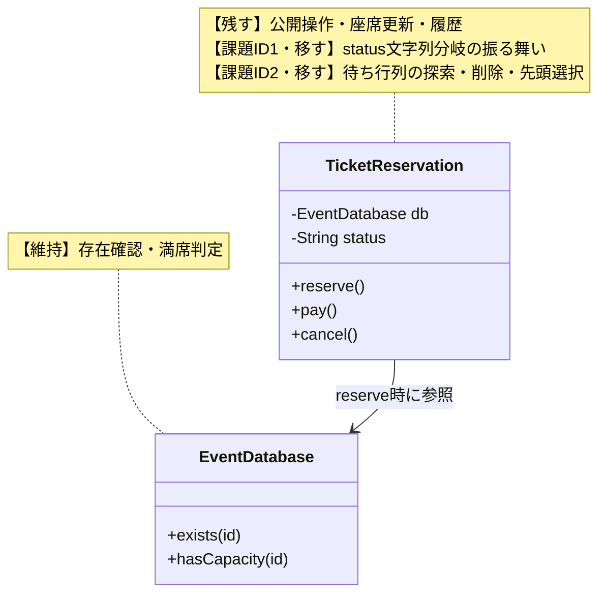
```mermaid
classDiagram
    direction TB
    class EventDatabase {
        +exists(id)
        +hasCapacity(id)
    }
    class TicketReservation {
        -EventDatabase db
        -String status
        +reserve()
        +pay()
        +cancel()
    }
    TicketReservation --> EventDatabase : reserve時に参照

    note for TicketReservation "【残す】公開操作・座席更新・履歴<br/>【課題ID1・移す】status文字列分岐の振る舞い<br/>【課題ID2・移す】待ち行列の探索・削除・先頭選択"
    note for EventDatabase "【維持】存在確認・満席判定"

    classDef focus fill:#FFF2CC,stroke:#D6B656,stroke-width:2px,color:#222222
    cssClass "TicketReservation" focus
```

向きと掲載クラスは1-3から変えていません。同じ図に注記と色だけを加え、`TicketReservation` のどの責任を残し、どの責任を移すかに着目します。**この図を基準に、分離と組み立てで必要な関係を足していきます。**

クラス図の変更として書くと、次の3操作になります。**どんなクラスを新設し、何という名前にするかは、直後の全体経路で決めます。** ここで確定しているのは操作の種類だけです。

1. 課題ID1：状態が満たす共通契約を新設し、状態ごとの振る舞いをその実装へ移す。
2. 課題ID2：待機順の管理を専用のクラスへ移す。
3. 課題ID1・課題ID2：実体を生成・所有する場所を決め、公開操作を持つクラスへ渡す。

これらの操作を、直後の全体経路へまとめます。

#### 全体経路を組み立てる判断

状態クラスを先に作るのではなく、状態が替わる時点、待ち行列の寿命、2軸の接点を前工程の事実から決めます。

| 前工程で確定した事実 | ここで決めること | 判断 | 全体経路への反映 |
|---|---|---|---|
| 原因ID1：公開操作が状態文字列を判定している | 状態固有の可否と遷移を誰が答えるか | 現在状態を表す実体へ公開操作を委譲する | 予約本体→現在状態→状態固有処理と結ぶ |
| 状態実体はデータを持たず、同じ振る舞いを複数予約で使える | 状態を予約ごとに生成するか共有するか | 状態は共有実体とし、予約は非所有参照だけを差し替える | 初期状態の受け渡しと遷移時の差し替えを分ける |
| 原因ID2：待機順は複数予約をまたいで維持される | 待ち行列を誰が所有するか | バッチ全体で1つ所有し、各予約が同じ待ち行列を借りる | 予約生成時に待ち行列への参照を渡す |
| 取消で空席が生じた直後に先頭を昇格する | 状態軸と待ち行列軸をどこで接続するか | 取消状態処理から予約本体の昇格入口を1回呼ぶ | 取消→席返却→先頭取得→次状態への遷移を一本にする |

### 全体のデータと実体の流れを先に決める

上の判断を順につなぎ、生成した状態と待ち行列が実際に使われるまでの全体経路を決めます。満席のイベントで待機していた予約が、他の予約の取消によって自動昇格するまでを一本で固定します。表中の識別子は役割を示す設計名で、実装行は次の節で示します。

| 実行順・ポイント | 担う場所 | 経路で受け渡すもの・起きること | 次の呼出先 |
|---|---|---|---|
| 1. 生成         | `BatchApplication`（`db`・`history`・`waitlist` はメンバー）    | 在庫・履歴・待ち行列を1つずつ所有し、状態は `availableState()` などが共有実体を返す                                 | 初期状態の受け渡しへ                                   |
| 2. 初期状態を渡す    | `BatchApplication` の予約生成行                              | `TicketReservation r(availableState(), &db, &history, &waitlist, ...)` で生成済みの初期状態を渡す | 実行開始へ                                        |
| 3. 実行開始       | `BatchApplication`                                     | 予約済みの予約に対して `r.cancel();` を呼ぶ                                                        | `TicketReservation::cancel()`                |
| 4. 骨格状態軸      | `TicketReservation::cancel()`                          | `state->cancel(this)` の1行。状態を判定しない                                                   | `IReservationState::cancel()`                |
| 5. 取消と状態遷移    | `ReservedState::cancel(TicketReservation*)`            | `setState(availableState())`で次状態へ遷移 → 席を戻す → 履歴 → `promoteNextWaitlisted()`          | `TicketReservation::promoteNextWaitlisted()` |
| 6. 骨格待ち行列軸    | `TicketReservation::promoteNextWaitlisted()`           | `waitlist->popNext(eventId)` で1件取り出す                                                 | `ReservationWaitlist::popNext()`             |
| 7. 契約→具体待ち行列軸 | `ReservationWaitlist::popNext(const string&)`          | イベントIDの行列から先頭を1件返す                                                                   | 戻り値を骨格が昇格へ回す                                 |
| 8. 契約→具体状態軸   | `WaitlistedState::promoteBySystem(TicketReservation*)` | `setState(reservedState())` → 席を1つ減らす → 履歴                                           | 完了                                           |

**5と6のあいだが、2つの軸の接点です。** 状態軸の処理が待ち行列軸を呼び、返ってきた予約に対してもう一度状態軸が動きます。**この1本の経路以外に、2つの軸が触れる場所はありません。** 5-2で確認した独立性が、実行経路でも確認できます。

初期状態は予約生成時に渡し、次状態は遷移のたびに`setState()`で差し替えます。同じ「状態実体を渡す」処理でも、起動時に一度だけ行う組み立てではありません。

### 全体の流れを実現するコードを決める

**【課題の原因】** 課題ID1は、問題ID1・問題ID2（状態追加で複数操作を横断修正・確認）＝原因ID1（現在状態の判断と処理フローが同居）。課題ID2は、問題ID3（キャンセル待ちで昇格・待機順が散在）＝原因ID2（待ち行列の責任が状態処理へ絡む）。この2つを分離対象にします。

**この課題（何を解きたいか）：** 「保留中」を1つ足すだけで `reserve`・`pay`・`cancel`・`expire` の各分岐を横断して直し、待機順の扱いを変えるだけで状態処理まで再確認になる。**公開操作は状態を判定せず、状態ごとの許可操作と遷移先だけを差し替えられる**ようにするのが課題ID1、**待機順の管理を状態処理から切り離す**のが課題ID2です。

**ここで全体経路と対応づけるコード：** 状態ごとの判断と待機順の管理を公開フローからどこまで外し、現在状態への操作と席解放後の自動昇格をどう接続するかをコードで示します。

状態ごとの可否規則と待機順の方針は別々の理由で変わります。二つの接点は、席を解放した状態処理が待ち行列の先頭を昇格させる経路だけです。この経路を保ったまま、状態判断と待機順管理を別々に変更できる形を決めます。

**全体経路との対応。** フェーズ5「課題の確定（5-3）」で決まったのは、状態ごとの振る舞いと待機順の管理を、予約の公開入口とは別の変更へ閉じる境界を作ることです。全体経路で決めた接続を、ここから**境界を関数・表・クラス契約のどれで表し、どのコードで繋ぐか**へ落とします。

書き換える前のコードはフェーズ3「変更を試みる（3-1）」にあります。**ここで全部を再掲することはしません。** 分離と組み立ての判断に必要な数行だけを変更試行（3-1）から抜き出し、変更後と並べます。

---

#### 1. 契約と具体をセットで決める（分離）

ここでは契約だけを先に完成させません。境界へ残す操作・値と、その裏で変わる判断を持つ具体を往復し、両側がかみ合うところまでを一つの判断として扱います。

##### 契約：境界の形と受け渡しを決める

**関数を一つ切り出すだけでは、変更を閉じ込められません。** 状態ごとの可否は `reserve`・`hold`・`pay`・`cancel`・`expire` の5つの関数それぞれに `if (status == ...)` として現れます。そして2-4のリスクID1（可否の変更）、リスクID2（状態の種類の追加）、リスクID3（入力イベントの追加）が、3方向とも「増える」と言っています。**現に変更要求で、保留中とキャンセル待ちの2状態が増えました。** そのため、各操作が同じ問い方で状態固有の判断を呼べるクラス契約まで分けます。

分けると決めたので、コードに線を引きます。

**掲載箇所：`TicketReservation::cancel()`** ―― 3-1の分岐から、変更要求で保留対応を足した部分（対策前）

```cpp
void TicketReservation::cancel() {
    if (status == "Reserved") {
        status = "Available";                    // ← 出て行く側（遷移先）
        std::cout << "予約をキャンセルしました\n"; // ← 出て行く側（可否とメッセージ）
        promoteNextWaitlisted();                 // ← 出て行く側（この遷移固有の副作用）
    } else if (status == "Held") {               // ← 出て行く側（可否）
        status = "Available";
        std::cout << "保留からキャンセルしました\n";
        promoteNextWaitlisted();
    } else {
        handleCancelError();
    }
}
```

**割り方の根拠は、状態が増えたときに触るかどうかです。** 「特別優待予約」を足すと `else if` が1本増えます。5つの関数すべてで増えます。**残るのは「操作を受け付ける入口であること」だけ**で、これは状態が何種類あっても変わりません。

**5-3が挙げた候補は4つです。** 現在状態、操作・タイマー・空席イベント、次状態、結果。**このうち何がいくつ境界を流れるかは、まだ決まっていません。** 1つずつ形を決めます。

| 接続するもの（5-3の候補） | 決めた形 | そう決めた理由 |
|---|---|---|
| 現在状態 | 引数で渡さない。状態ごとに別のクラスを用意し、**オブジェクトそのものが現在状態を体現する** | 引数で渡すと、受け取った側がまた状態で分岐する。分岐が移動するだけになる |
| 操作・タイマー・空席イベント | 引数で渡さない。**操作ごとに別のメソッド**にする | 変更前は関数ごとに `if` を書いていた。文字列や種別で渡せば、その `if` が移動するだけになる |
| 次状態 | **状態オブジェクトそのもの**を、呼び出し元へ設定してもらう | 下で理由を詳しく書く |
| 結果 | **戻り値では返さない。** 不可のときはその場でメッセージを出す | 変更前も `handleCancelError()` がその場で出していた。呼び出し側は成否で分岐していない |

**3つ目が、この章のいちばん大事な判断です。** 「次はどの状態か」を名前で返して、呼び出し元に書き換えさせる形も考えられます。**その形をこの章で採れない理由があります。**

上の変更前コードを見てください。`Reserved` からの取消は、状態を変えるだけでなく `promoteNextWaitlisted()` を呼びます。`Held` からの期限切れも同じです。**ところが `Reserved` からの支払いは呼びません。** つまり**遷移ごとに副作用が違います。** 名前だけを返す形にすると、受け取った側が「どの遷移のときに席を戻し、どの遷移のときに昇格させるか」を知ることになります。**それは状態ごとの知識そのもので、いま外へ出そうとしているものです。**

**だから、遷移も副作用も状態の側が実行します。** そのために、状態は操作対象（予約そのもの）を受け取る必要があります。

| 接続するもの（追加で決めたこと） | 決めた形 | そう決めた理由 |
|---|---|---|
| 操作対象の予約 | **引数で契約へ渡す** | 状態が席数・履歴・待ち行列・次状態を動かすには、動かす相手が要る |

**境界を実際に流れるのは、下りの1つだけです。** 候補4つのうち、現在状態と操作はクラスとメソッド名が体現し、次状態と結果は戻り値になりません。**代わりに、操作対象が引数として境界を下っていきます。** 状態は受け取った予約へ、遷移と副作用を書き戻します。

**候補の数と実数が一致しないのが普通です。** 5-3は境界を跨ぐものを漏れなく挙げる表で、ここはそれを形へ変える段です。形を決めれば、値として流れなくなるものが出ます。

**契約の名前を決めます。** 予約の状態が満たすべき約束なので `IReservationState` とします。

**掲載箇所：`IReservationState`（クラス全体・抜粋）** ―― 7操作のうち3つ

```cpp
// 状態ごとの共通操作と、許可されない操作の既定処理を持つ基底クラス
class IReservationState {
public:
    // 引数は操作対象の予約コンテキスト（TicketReservation*）。
    // 既定実装では使わないため仮引数名を省略し、派生側では reservation と名付ける。
    virtual void reserve(TicketReservation*) {
        std::cout << "現在予約できません\n";
    }

    virtual void cancel(TicketReservation*) {
        std::cout << "キャンセルできません\n";
    }

    virtual void promoteBySystem(TicketReservation*) {
        std::cout << "システム昇格の対象ではありません\n";
    }

    // pay / hold / expire / paymentFailed も同じ形で、既定は断りのメッセージ
    virtual ~IReservationState() = default;
};
```

**7つ並びます。** 利用者の操作が5つ（予約・支払い・取消・保留・期限切れ）、システム側の入力が2つ（空席発生による昇格・決済失敗）です。**リスクID3が「入力イベントの追加」を予告していたので、利用者操作とシステム入力を同じ契約に並べておきます。**

**許可されない操作は既定実装が引き受けます。** 変更前の `handleCancelError()` などが、そのまま既定の中身になりました。**呼ぶ側は状態を判定しません。**

**契約だけでは、決めた形が本当に成立するのか確かめられません。** 実装を1つ見ます。

**掲載箇所：`ReservedState`（クラス全体・抜粋）** ―― 予約済みの状態

```cpp
// Reserved（予約済み）：支払い・保留・取消ができる
class ReservedState : public IReservationState {
public:
    void cancel(TicketReservation* reservation) override {
        reservation->setState(availableState());   // 次状態を設定する
        reservation->cancelSeat();                 // この遷移固有の副作用
        reservation->record("cancel");
        std::cout << "予約をキャンセルしました\n";
        reservation->promoteNextWaitlisted();      // 席が空いたので1件昇格
    }

    // pay / hold も同じ形で、それぞれの遷移先と副作用を持つ
};
```

- **「現在状態を引数で渡さない」の実態。** `cancel()` に状態の引数がありません。それでも「予約済みからの取消」と分かるのは、**このクラスであること自体が『予約済み』だから**です。**メンバー変数が1つもない**のはそのためです
- **「操作ごとに別メソッド」の実態。** `if (status == ...)` の比較がありません。メソッド名が操作そのものになっています
- **「操作対象を引数で渡す」の実態。** `reservation` を受け取り、次状態・席数・履歴・昇格の4つをすべてこのクラスが動かしています。**変更前の `cancel()` の `if` の中身が、そっくりここへ来ました**

**この形を採ると、状態どうしが互いの名前を知ります。** `ReservedState::cancel()` は `availableState()` を呼びます。**状態を1つ足すと、そこへ遷移する既存の状態も触ることになります。** これは5-3の完了条件が「状態追加が新しい状態動作と**遷移登録**に閉じる」と書いているとおりで、遷移元を触ることは条件に含まれています。**払っているコストを隠さずに書いておきます。**

**課題ID2（待ち行列軸）。** 同じことを待機順の管理にします。

**掲載箇所：`TicketReservation::promoteNextWaitlisted()`** ―― 3-1の待ち行列操作（対策前）

```cpp
void TicketReservation::promoteNextWaitlisted() {
    if (waitlist.empty()) return;           // ← 出て行く側（探索方針）
    TicketReservation* next = waitlist.front();  // ← 出て行く側（先頭選択）
    waitlist.pop_front();                   // ← 出て行く側（削除）
    next->promoteBySystem();                // ← 残る側（昇格を1件だけ起こす）
}
```

**5-3が挙げた候補は3つです。** 待機者の追加、先頭取出し、昇格イベント。こちらも形を決めます。

| 接続するもの（5-3の候補） | 決めた形 | そう決めた理由 |
|---|---|---|
| 待機者の追加 | **予約とイベントIDを引数で渡す** | どのイベントの待ち行列かは予約が知っている。待ち行列の側がイベントを探しに行くと、予約の中身を知ることになる |
| 先頭取出し | **イベントIDを渡し、予約を1件返す**（居なければ何も返さない） | 「誰を上げるか」は待機順の方針そのもの。返すのは選ばれた1件だけでよい |
| 昇格イベント | **境界を流れない。** 返ってきた予約へ、呼んだ側が昇格を伝える | 昇格は状態遷移なので、課題ID1の契約の仕事。待ち行列が状態を動かすと、2つの軸が絡む |

**候補3つのうち、境界を流れるのは2つです。** 3つ目は「流さない」と決めました。**これが2つの軸を1本の細い経路だけでつなぐための判断です。**

**掲載箇所：`ReservationWaitlist`（クラス全体）**

```cpp
class ReservationWaitlist {
    std::map<std::string, std::deque<TicketReservation*> > queues;
public:
    void enqueue(const std::string& eventId,
                 TicketReservation* reservation) {
        queues[eventId].push_back(reservation);
        // …待機数の1行表示（省略。詳細は7-1）…
    }

    TicketReservation* popNext(const std::string& eventId) {
        std::deque<TicketReservation*>& queue = queues[eventId];

        if (queue.empty()) return NULL;

        TicketReservation* next = queue.front();
        queue.pop_front();
        // …待機数の1行表示（省略。詳細は7-1）…
        return next;
    }
};
```

**このクラスは状態を1つも知りません。** `Reserved` も `Waitlisted` も出てきません。**待機順の方針を先着順から抽選へ変えるなら、触るのは `popNext()` の中だけです。**

**イベントIDごとに待ち行列が分かれています。** 変更前は1本の `deque` を全予約で共有していました。**イベントが2つ以上あると別のイベントの待機者を昇格させてしまう**ので、ここで分けます。これは待機順の方針に属する話なので、この軸の中で決めます。


**では、この2つを誰が呼ぶのか。**

---

##### 分離の検算：守る処理が契約だけを呼べるか

呼べるのは、状態や待機順が増えても今回維持する側だけです。出て行った側が出て行った側を呼べば、具体が増えるたびに両方を触ることになり、分けた意味が消えます。

**この章では、契約を骨格の外へ置きます。** 1つの予約が、受付可能から予約済みへ、さらに支払済みへと進みます。**同じインスタンスが、操作のたびに違う状態の実体を使い分けなければなりません。** だから予約本体とは別の型として `IReservationState` を置きます。

もし状態ごとに `TicketReservation` を丸ごと別インスタンスにするなら、契約を基底クラスの内側へ置けます。しかしそれは、予約が1つ進むたびに予約そのものを作り直すということです。**イベントIDも履歴も引き継げなくなるので、成り立ちません。**

残った側は、公開操作を持つクラス——`TicketReservation` です。**名前は変えません。** 1-3で書いた役割は「予約の進行と座席・履歴の更新」で、ここの後もそれは変わりません。出て行くのは状態ごとの判断であって、予約であること自体ではありません。

**掲載箇所：`TicketReservation`（クラス宣言・ここで分かるところまで）**

```cpp
class TicketReservation {
    IReservationState* state;   // 現在状態。どこから得るかは未定
    std::string eventId;
    std::string title;
public:
    void reserve() { state->reserve(this); }
    void pay()     { state->pay(this); }
    void cancel()  { state->cancel(this); }
    // hold / expire / paymentFailed も同じ形
};
```

**公開操作が1行になりました。** どれも「現在状態へ、自分を渡して委譲する」だけです。**`if (status == ...)` が1つも残っていません。**

**穴が2つ空きました。**

1. `state` に**最初に何が入るのか**。予約を作った直後の状態はどこから来るのか
2. 状態が呼び返す `setState()`・`cancelSeat()`・`record()`・`promoteNextWaitlisted()` は、**何を相手に動くのか**

**1つ目は、`AvailableState` のような具体の名前をここに書くわけにいきません。** 書けば課題ID1で分けた意味が消えます。**2つ目は、席数・履歴・待ち行列という3つの相手が要ります。** どちらも**全体経路の準備コードで決めます。**

**課題ID2（待ち行列軸）も、呼ぶのは同じ側です。** ただし呼ぶのは公開操作ではありません。

**掲載箇所：`TicketReservation::promoteNextWaitlisted()`** ―― 状態から呼び返される内部処理

```cpp
    void promoteNextWaitlisted() {
        // ←この waitlist がまだ未定
        TicketReservation* next = waitlist->popNext(eventId);

        if (next != NULL) next->promoteBySystem();
    }
```

**3-1の4行が2行になりました。** 探索・先頭選択・削除の3つが `popNext()` の向こうへ行き、**残ったのは「1件だけ昇格させる」ことだけ**です。これが守る範囲の「席解放直後に1件を昇格する契約」そのものです。

**2つの軸の接点は、この2行だけです。** 上の行が課題ID2の契約を呼び、下の行が課題ID1の契約を呼びます。**片方を変えても、もう片方はこの2行の外側で完結します。**

**ここで検算します。状態を1つ足したとき、公開操作は変わるか。** 変わりません。`state->reserve(this)` の呼び方は同じで、`state` に入るものが増えるだけです。**待機順の方針を変えたときは。** `promoteNextWaitlisted()` の2行は変わりません。`popNext()` の中身が変わるだけです。**穴が空いたままでも、この検算はできます。**

**ここで図に描けるのは、骨格から2つの契約への依存だけです。** 実体を得る経路は全体像で決めていますが、この部分図は契約との依存だけに着目するため、その線は後の組み立て図で示します。

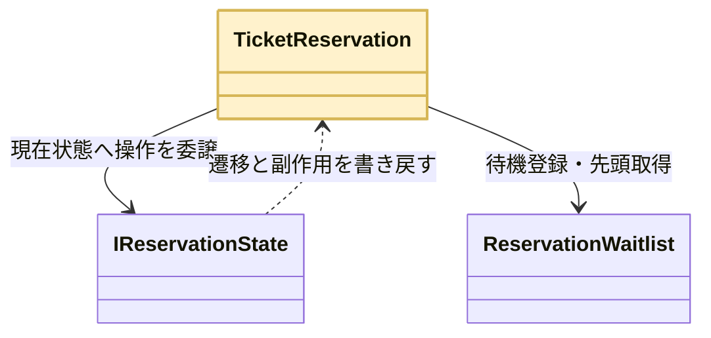
```mermaid
classDiagram
    class TicketReservation
    class IReservationState
    class ReservationWaitlist
    TicketReservation --> IReservationState : 現在状態へ操作を委譲
    TicketReservation --> ReservationWaitlist : 待機登録・先頭取得
    IReservationState ..> TicketReservation : 遷移と副作用を書き戻す
    class TicketReservation:::focus
    classDef focus fill:#FFF2CC,stroke:#D6B656,stroke-width:2px
```

**`IReservationState` と `ReservationWaitlist` の間に矢印がありません。** 状態と待機順は互いを知らない、というのが5-2で確認した独立性で、図にもそのまま出ています。**代わりに、契約から骨格へ戻る点線があります。** 契約の確認で「操作対象を引数で渡す」と決めた結果です。


**では、契約の裏には何を置くのか。**

---

##### 具体：契約の裏へ変わる判断を置く

契約と、それを呼ぶ骨格が決まりました。契約の確認では契約の裏を1つずつ覗いて、渡すもの・書き戻すものを確かめました。**ここで残り全部を埋めます。**

**課題ID1（状態軸）。** 契約の確認で見た `ReservedState` の疑問が、ここで解けます。**`if (status == ...)` を書かないのは、クラスであること自体が状態を表しているからです。** 契約の裏に置くのは「この状態で何が許されるか」「許されたとき次はどこで、何が起きるか」の2つだけです。

残りの4クラスも同じ形です。ここでは `ReservedState` と対照的なものを1つ見ます。

**掲載箇所：`WaitlistedState`（クラス全体）** ―― 変更要求で追加したキャンセル待ちの状態

```cpp
// Waitlisted（キャンセル待ち）：システムからの昇格だけを受け付ける
class WaitlistedState : public IReservationState {
public:
    void promoteBySystem(TicketReservation* reservation) override {
        reservation->setState(reservedState());
        reservation->reserveSeat();
        reservation->record("promote");
        std::cout << "空席発生を検知し、予約へ自動昇格しました\n";
    }
};
```

**`reserve()` も `pay()` も `cancel()` もありません。** キャンセル待ちの人は自分では何もできない、という規則を、**書かないことで表しています。** 書かなければ `IReservationState` の既定が断りのメッセージを引き受けます。変更前は「その `if` に該当の分岐が無い」という不在で表していたものが、「そのクラスに `override` が無い」という不在へ移りました。

5クラスを並べると、1-2の状態遷移表がそのままクラスの一覧になります。

| 状態クラス | 上書きする操作 | 遷移先と副作用 |
|---|---|---|
| `AvailableState` | `reserve()` | 空席あり→予約済み・席を1つ減らす／満席→キャンセル待ち・待機登録 |
| `ReservedState` | `pay()` / `hold()` / `cancel()` | 支払済み／保留中／受付可能・席を戻して1件昇格 |
| `HeldState` | `pay()` / `cancel()` / `expire()` | 支払済み／受付可能・席を戻して1件昇格／同左 |
| `PaidState` | 無し | すべて既定の断り（支払済みは終端） |
| `WaitlistedState` | `promoteBySystem()` | 予約済み・席を1つ減らす |

**`PaidState` には何も書きません。** 支払済みからは何もできないので、7操作すべてが既定のままです。**クラスは空でも要ります。** 「支払済みという状態が存在する」ことを型で表しているからです。

**`AvailableState` だけが、1つの操作の中で分岐します。** 空席があれば予約済みへ、満席ならキャンセル待ちへ。**これは状態による分岐ではなく在庫による分岐なので、この状態の中に残ります。** 状態を1つ足しても、この `if` は増えません。

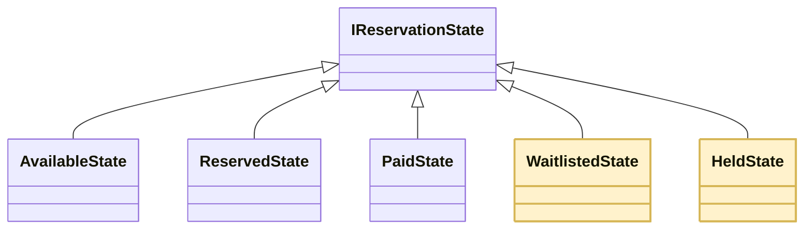
```mermaid
classDiagram
    class IReservationState
    class AvailableState
    class ReservedState
    class PaidState
    class WaitlistedState
    class HeldState
    IReservationState <|-- AvailableState
    IReservationState <|-- ReservedState
    IReservationState <|-- PaidState
    IReservationState <|-- WaitlistedState
    IReservationState <|-- HeldState
    class HeldState:::focus
    class WaitlistedState:::focus
    classDef focus fill:#FFF2CC,stroke:#D6B656,stroke-width:2px
```

5つの関数に散っていた `if` の枝が、5つのクラスになりました。**変更要求で足した保留中とキャンセル待ちが、`HeldState` と `WaitlistedState` の2クラスに収まっています。** これで課題ID1の完了条件「状態追加が新しい状態動作と遷移登録に閉じる」を満たします。守る側の公開入口・座席数更新・履歴は1行も触りません。

**課題ID2（待ち行列軸）。こちらは契約の確認で見た `ReservationWaitlist` がそのまま完成形です。** 待機順を扱う以外に書くことがないので、増える段がありません。**実装も1つだけです。** 待機順の方針は今1つで、抽選や優先度つきに替える予定は2-4に挙がっていません。**替えられる形にしておく必要が無いので、契約を作らず、クラス1つで止めます。**

**分けたのに契約を作らない、という選択があります。** 課題ID2で止めたかったのは「待機順の扱いが状態処理へ絡むこと」でした。専用クラスへ移した時点でそれは達成されます。**差し替えの必要が出たときに契約を足せばよく、いま足すと使われない抽象が1つ増えます。**

**もう一度検算します。契約のメソッド以外に書きたくなるものがあるか。** どちらの軸でも出てきませんでした。

**守る範囲との照合：** **座席数更新**と**履歴**に触りました。どちらも呼ぶ場所が公開操作の中から状態クラスの中へ移っただけで、予約で1つ減らし取消と期限切れで1つ戻すことも、状態が変わった操作を記録することも変わっていません。**席解放直後に1件を昇格する契約**にも触りましたが、`ReservedState::cancel()` と `HeldState::cancel()`・`HeldState::expire()` の3か所すべてで `promoteNextWaitlisted()` を呼んでいます。3-1で昇格していた遷移と同じ3つです。

**ここまでで、クラスの設計は終わりです。** 残っているのは、これらを誰が作り、どう渡すかだけになりました。**そしてここから先は、2つの軸で共通です。**

---

#### 2. 全体経路をコードで組み立てる

ここからは三つを別々の設計判断として扱いません。具体を作る行から、契約として骨格へ入り、公開入口から実行される行までを一つの経路として追います。

##### 全体経路の準備：実体と所有者をコードで示す

**分離の検算で穴が2つ空きました。** 骨格の `state` に最初に何が入るのか、そして状態が呼び返す先（席数・履歴・待ち行列）を骨格がどう持つのかです。

**まず状態の実体から決めます。** 5つの状態クラスは**メンバー変数を1つも持ちません**。具体の確認で確認したとおり、どれも「渡された予約を動かす」だけです。**同じ状態の実体を、何個の予約が共有しても壊れません。**

**だから、状態は予約ごとに作りません。** 5つを1つずつ用意して全予約で共有します。作る場所は、状態を返す関数です。

**掲載箇所：`availableState()` ほか、状態を返す5つの関数** ―― 宣言と、1つの実装

```cpp
IReservationState* availableState();
IReservationState* reservedState();
IReservationState* paidState();
IReservationState* waitlistedState();
IReservationState* heldState();

IReservationState* reservedState() {
    static ReservedState instance;   // 最初の呼び出しで1つだけ作る

    return &instance;
}
```

**宣言を5つ先に並べるのは、状態どうしが互いの遷移先を呼ぶからです。** 契約の確認で「状態どうしが互いの名前を知る」と書いたコストが、ここに形として出ます。

**`static` にすると、最初の呼び出しで1つだけ作られ、プログラムが終わるまで生きます。** `new` も `delete` も書きません。骨格が持つ `state` は**この共有実体を指すだけの借用ポインタ**なので、`setState()` は指す先を切り替えるだけです。**借りているものが先に消えることはありません。**

**次に、状態が呼び返す先を決めます。** 具体の確認で `reservation->cancelSeat()`・`record()`・`promoteNextWaitlisted()` と書きました。これらを実行するには、骨格が在庫・履歴・待ち行列を持っている必要があります。

**掲載箇所：`TicketReservation`（クラス宣言・完成）**

```cpp
class TicketReservation {
    IReservationState* state;      // 共有の状態を借りる
    EventDatabase* db;             // 在庫（境界）
    ReservationHistory* history;   // 予約履歴
    ReservationWaitlist* waitlist; // 課題ID2の係
    std::string eventId;
    std::string title;
public:
    TicketReservation(IReservationState* initialState,
                      EventDatabase* db,
                      ReservationHistory* history,
                      ReservationWaitlist* waitlist,
                      const std::string& eventId,
                      const std::string& title);
    void setState(IReservationState* nextState) { state = nextState; }
    void reserveSeat();
    void cancelSeat();
    void record(const std::string& action);
    void joinWaitlist();
    void promoteNextWaitlisted();
    // 公開操作 reserve / pay / cancel / hold / expire / paymentFailed
};
```

**4つとも借用ポインタです。** 所有しません。**とくに `waitlist` は借りる必要があります。** 同じイベントの予約が全員で1つの待ち行列を見なければ、待機順が成り立たないからです。値で持つと予約ごとに別の行列ができます。

**では、待ち行列と在庫と履歴の実体は誰が持つのか。** 全予約より外側にいる者です。この章では組み立て役の `BatchApplication` がそれにあたります。

**掲載箇所：`BatchApplication`（メンバー。生成は `BatchApplication::run()` の中）** ―― 共有される実体の置き場

```cpp
class BatchApplication {
    EventDatabase db;
    ReservationHistory history;
    ReservationWaitlist waitlist;   // 全予約で1つを共有する
    // …予約の生成と実行（省略。詳細は7-1）…
};
```

**3つとも値メンバです。** `BatchApplication` が生きているあいだ生きていて、予約はそれを借ります。**予約のほうが先に消えるので、参照が宙に浮くことはありません。** 生ポインタで `new` するものは1つもありません。

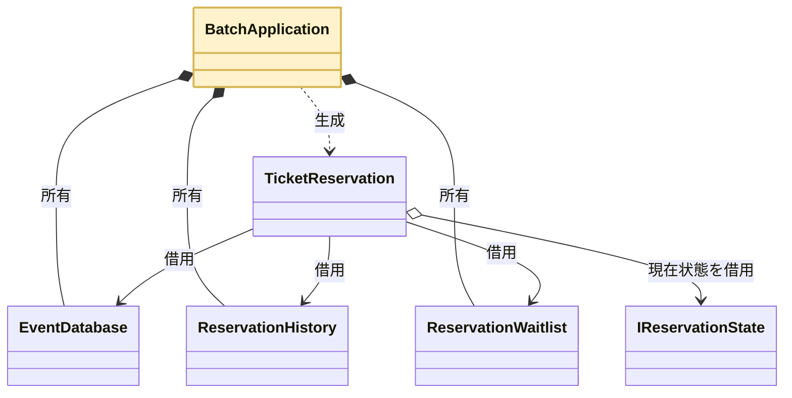
```mermaid
classDiagram
    class BatchApplication
    class TicketReservation
    class EventDatabase
    class ReservationHistory
    class ReservationWaitlist
    class IReservationState
    BatchApplication *-- EventDatabase : 所有
    BatchApplication *-- ReservationHistory : 所有
    BatchApplication *-- ReservationWaitlist : 所有
    BatchApplication ..> TicketReservation : 生成
    TicketReservation --> EventDatabase : 借用
    TicketReservation --> ReservationHistory : 借用
    TicketReservation --> ReservationWaitlist : 借用
    TicketReservation o--> IReservationState : 現在状態を借用
    class BatchApplication:::focus
    classDef focus fill:#FFF2CC,stroke:#D6B656,stroke-width:2px
```

**実線が所有、点線が生成、それ以外が借用です。** 5つの状態クラスはこの図に描いていませんが、具体の確認から変わっていません。


**ここが終わった時点で、実体はすべて存在しています。** 5つの状態、待ち行列、在庫、履歴、それらを持つ組み立て役。**まだ起きていないのは1つだけです。骨格の `IReservationState*` と書かれた変数へ、具体が入ることです。続けて、全体経路で決めた受け渡しをコードで確認します。**

---

##### 全体経路の状態遷移：初期状態と次状態を渡す

**分離の検算で書いた骨格には、`state->cancel(this)` としか書いてありません。** `ReservedState` とも `HeldState` とも書いていません。それでも予約済みの予約を取り消せば予約済み用の処理が動きます。**ここで見るのは、いつ・何によって、その実装が入るのかです。**

**この章では、実装が2回に分けて入ります。**

**1回目は、予約を作るときです。**

**掲載箇所：`BatchApplication::run()`** ―― 予約を1件作る行

```cpp
        TicketReservation r(availableState(), &db, &history,
                            &waitlist, "EVT001", "夏フェス");
```

**`availableState()` の戻りが、骨格の `state` へ入ります。** 最初の状態は必ず受付可能なので、ここは組み立て時に1回決まります。

**2回目は、状態が遷移するたびです。**

**掲載箇所：`ReservedState::cancel(TicketReservation*)`** ―― 具体の確認で書いた1行目

```cpp
        reservation->setState(availableState());   // ←ここで次の実装が入る
```

**この1行が状態遷移です。** `setState()`へ次状態の参照を渡すと、骨格の `IReservationState*` が `AvailableState` を指します。次状態を決めて渡すのは遷移元の状態で、骨格は具体型を判定しません。

**この章は1つ目です。ただし引き当てる主体が特徴的です。** 骨格が状態値から引くのではなく、**遷移元の状態が次の状態を名指しします。** 決め手は「いまどの状態にいて、どの操作を受けたか」の組です。

| 軸 | 実装が決まる決め手 | 決め手の出どころ | 入る場所 |
|---|---|---|---|
| 状態（課題ID1） | 現在の状態クラスと、受けた操作の組 | 直前の遷移で設定された `state` | `TicketReservation::setState()` |
| 待ち行列（課題ID2） | **選ばない。実装は1つ** | ―― | `BatchApplication` が渡す1回だけ |

**課題ID2には決め手がありません。** 具体の確認で確認したとおり実装が1つしかないので、選ぶ判断そのものが存在しません。**「決め手が要る」構造と「要らない」構造が、同じ章に並んでいます。**

**骨格が状態を借りる方法（ポインタで共有実体を指す）は、全体経路の準備コードで示した話です。** 値で持つと遷移のたびにオブジェクトを作り直します。この章で実際に起きるのは、生成済みの次状態を `setState()` へ渡す状態遷移です。


---

##### 実行：公開入口から骨格・契約・具体へつなぐ

組み立てが終わりました。呼び出し側がどう変わったかを、変更前と並べて見ます。

**掲載箇所：`main()`** ―― 3-1の予約と取消（対策前）

```cpp
    r.reserve(true);
    r.cancel();
```

**掲載箇所：`BatchApplication::run()`** ―― 同じ操作（対策後）

```cpp
    r.reserve();
    r.cancel();
```

**引数が1つ減りました。** 変更前は満席かどうかを呼び出し側が渡していましたが、いまは `AvailableState` が在庫へ直接聞きます。**空席があるかは在庫が知っていることで、呼び出し側が調べて渡すことではありませんでした。**

**取消の呼び方は変わっていません。** そして**昇格を呼ぶ行は、変更前も変更後も `main()` にありません。** 席が空いた瞬間に状態処理が待ち行列へつなぐので、利用側は昇格を意識しません。**これが課題ID2の完了条件「取消・期限切れから自動昇格まで一つのユースケースで完了する」です。**

**組み立ての行は増えました。** 予約を1件作るのに、状態・在庫・履歴・待ち行列の4つを渡します。**この章の対策で組み立てが払ったコストは、引数4つぶんです。** 隠さずに書いておきます。増えたぶんは、状態を1つ足すときに触る範囲が新しいクラス1つと遷移元に収まることと引き換えです。

**全体経路で先に決めた呼び方を、ここで実コードと突き合わせます。** 課題によって公開入口が変わる場合と変わらない場合がありますが、重要なのは先に決めた経路と各コードの接続が一致することです。

**守る範囲との照合：** **公開入口**を保っていることを、いま確認しました。`reserve()` の引数が1つ減りましたが、これは呼び出し側が持つべきでない在庫の知識を返しただけで、操作の形は変わっていません。分離と組み立てを通して、守る範囲の4つはいずれも定義に反していません。最終確認はフェーズ7の受入・回帰エビデンスで行いますが、**そこで初めて確かめるのではなく、全体経路と詳細コードで照合済みです。**


#### システム全体の最終構造を決める

分離と組み立ての部分図を重ねると、システム全体の最終構造になります。`TicketReservation` が公開入口と副作用の実行を持ち、5つの状態クラスが可否と遷移を持ち、`ReservationWaitlist` が待機順を持ちます。

**この章の完成構造は一つに定まります。** 各状態クラスに待ち行列操作まで持たせる案も置けますが、待機順の方針を変えるたびに複数の状態クラスを開くことになり、課題ID2を解いていない途中状態です。責任配置が異なる完成構造が複数残ったわけではないので、当て馬を並べた比較は行いません。

**2つの構造は、1本の経路だけで接続します。** 席を解放する状態処理（`ReservedState::cancel()`・`HeldState::cancel()`・`HeldState::expire()`）が `promoteNextWaitlisted()` を呼び、`ReservationWaitlist` の先頭を昇格させる——この1本です。**ここを切らないことが、課題ID1と課題ID2を独立に変えても業務契約が壊れない条件です。**

全体経路を実現するコードで確定した部分がすべて入っているかを、次の図で照合します。

**採用した変更後のクラス図：**

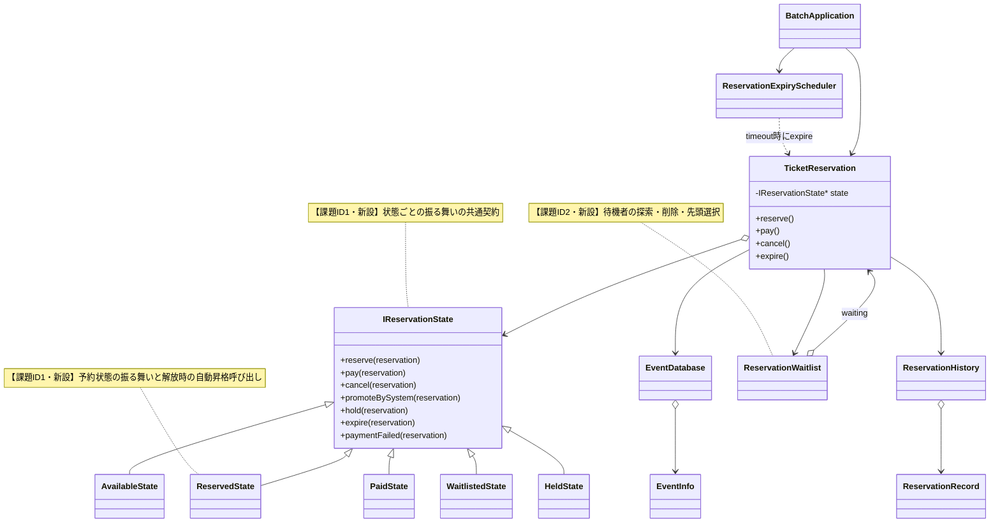
```mermaid
classDiagram
    class TicketReservation {
        -IReservationState* state
        +reserve()
        +pay()
        +cancel()
        +expire()
    }
    class IReservationState {
        +reserve(reservation)
        +pay(reservation)
        +cancel(reservation)
        +promoteBySystem(reservation)
        +hold(reservation)
        +expire(reservation)
        +paymentFailed(reservation)
    }
    class EventInfo
    class ReservationRecord
    class EventDatabase
    class ReservationHistory
    class ReservationWaitlist
    class AvailableState
    class ReservedState
    class PaidState
    class WaitlistedState
    class HeldState
    class ReservationExpiryScheduler
    class BatchApplication
    TicketReservation o--> IReservationState
    TicketReservation --> EventDatabase
    TicketReservation --> ReservationHistory
    TicketReservation --> ReservationWaitlist
    ReservationWaitlist o--> TicketReservation : waiting
    EventDatabase o--> EventInfo
    ReservationHistory o--> ReservationRecord
    IReservationState <|-- AvailableState
    IReservationState <|-- ReservedState
    IReservationState <|-- PaidState
    IReservationState <|-- WaitlistedState
    IReservationState <|-- HeldState
    ReservationExpiryScheduler ..> TicketReservation : timeout時にexpire
    BatchApplication --> TicketReservation
    BatchApplication --> ReservationExpiryScheduler

    note for IReservationState "【課題ID1・新設】状態ごとの振る舞いの共通契約"
    note for ReservedState "【課題ID1・新設】予約状態の振る舞いと解放時の自動昇格呼び出し"
    note for ReservationWaitlist "【課題ID2・新設】待機者の探索・削除・先頭選択"

    classDef focus fill:#FFF2CC,stroke:#D6B656,stroke-width:2px,color:#222222
    cssClass "IReservationState,AvailableState,ReservedState,PaidState,WaitlistedState,HeldState,ReservationWaitlist,ReservationExpiryScheduler" focus
```

このクラス図が、課題ID1・課題ID2を反映したシステム全体の設計結論です。課題IDは図の差分を追うために使い、以降はこの構造に必要なコードだけを示します。

### 6-1：決めた流れとコードの照合

#### 流れを成立させる二つの確認

契約と具体による分離と、生成から実行までの組み立てを二行で確認します。

| 判断 | 変更前の所属 → 変更後の所属 | 設計結論 | 検算 |
|---|---|---|---|
| 契約と具体による分離 | 状態分岐と待ち行列探索 → `IReservationState` の具体群と `ReservationWaitlist` | 状態ごとの可否・副作用を具体へ、待機順を専用クラスへ閉じる | 公開操作は現在状態へ委譲し、状態名を判定しない |
| 実体の組み立て | 予約が全分岐・行列を内包 → 組み立て役が共有状態・行列・在庫・履歴を用意 | 生成時に初期状態を渡し、遷移時に次状態を入れ、取消から自動昇格まで実行する | 状態軸と待ち行列軸の接点が一経路で追える |

公開入口の `reserve()` は在庫判定を引数で受けず、自分の依存へ問い合わせます。取消後の昇格も同じ実行経路の中で自動的に起こります。

### 6-2：システム全体の契約とデータ配置を確定する

採用システムの契約、生成場所、依存注入を一表で確定します。接続点で受け渡すのは、状態遷移を進める `TicketReservation&`（コンテキスト参照）と、昇格対象の `TicketReservation*` です。座席数と履歴は従来どおり `EventDatabase`／`ReservationHistory` が持ちます。

```cpp
class TicketReservation {
    IReservationState* state;      // 現在状態（委譲先）
    EventDatabase& db;
    ReservationHistory& history;
    ReservationWaitlist& waitlist;
public:
    void reserve() { state->reserve(*this); }   // 判定せず委譲
    void cancel()  { state->cancel(*this); }
    void setState(IReservationState* s) { state = s; }
};
```

| 接続点を変える観点 | システム全体での設計判断 | 変えたくない側が知らなくなる詳細 |
|---|---|---|
| 何を分離するか | 課題ID1の状態振る舞いを状態クラスへ、課題ID2のキュー操作を `ReservationWaitlist` へ置く | 状態の種類・遷移、待ち行列の方針 |
| どこで生成・選択するか | 遷移元の状態が次の状態を生成し、組み立て側が待ち行列を渡す | 具体状態クラスの選択 |
| どう依存を渡すか | 委譲時に `TicketReservation&` を渡し、待ち行列は参照で注入する | 状態・待ち行列の実体 |
| 安定側はどう実行するか | 利用側は `reserve()`／`cancel()` だけを呼ぶ | 現在どの状態か、待機者が何人か |

待ち行列と履歴は組み立て側が所有し、`TicketReservation` は参照で受け取ります。自動昇格の接続は状態処理内に残すため、キャンセルから昇格までが1つの操作で完結します。

**骨格 待ち行列連携の安定骨格。** 席を解放する処理から `TicketReservation::promoteNextWaitlisted()` を1経路だけ通します。先頭1件を取り出して `promoteBySystem()` を呼ぶ形は、状態が増えても変わりません。

```cpp
void TicketReservation::promoteNextWaitlisted() {
    TicketReservation* next = waitlist.popNext(eventId);  // 骨格 先頭を取る
    if (next == nullptr) return;

    next->promoteBySystem();                              // 骨格 自動昇格
}
```

**具体 待機者の探索・削除・先頭選択を `ReservationWaitlist` が持つ。**

```cpp
class ReservationWaitlist {
    // イベントIDごとの先着順（借用参照）
    std::map<std::string, std::deque<TicketReservation*>> queues;
public:
    void enqueue(const std::string& eventId, TicketReservation* r) {
        queues[eventId].push_back(r);
    }

    TicketReservation* popNext(const std::string& eventId) {
        auto& q = queues[eventId];

        if (q.empty()) return nullptr;

        TicketReservation* next = q.front();
        q.pop_front();

        return next;                // 昇格の呼び出しは状態側が行う
    }
};
```

`front()` で先頭の借用ポインタを読み、`pop_front()` でキュー内のその1件だけを除きます。参照先の予約オブジェクトは削除しません。この `deque` の操作と所有権は第0章の標準ライブラリ説明にも反映しています。

### 6-3：課題から完成構造までの設計トレース

ここまでの決定を、課題ID1→課題ID2の順に一望へまとめます。この表は設計課題だけを追います。変更要求の受入はフェーズ7の要求ID表、変更影響は7-4の変更ID表で別に確認します。

| 課題ID | 採用構造と生成・接続場所 | 完成コードの主な場所 | 確認 |
|---|---|---|---|
| 課題ID1（予約状態） | 状態分離。`TicketReservation`が現在状態へ委譲し、各状態が遷移先を持つ | `IReservationState`、`AvailableState`／`ReservedState`／`PaidState`／`WaitlistedState`／`HeldState` | 状態追加が新状態と遷移登録に閉じる |
| 課題ID2（待ち行列） | 待ち行列分離。席を解放する各状態処理が`promoteNextWaitlisted()`を呼び自動昇格 | `ReservationWaitlist`、`ReservedState::cancel()`／`HeldState::cancel()`／`HeldState::expire()` | 席解放直後にシステムが先頭を自動昇格する |
| 変更対象外 | 公開入口・座席数更新・履歴。委譲先だけが振る舞いを変える | `TicketReservation`の公開操作、`EventDatabase` | 1-4、50/50→49/50→50/50 |

このクラス図、コード適用結果、シーケンス、コード変更表が、フェーズ7へ渡す完成設計です。

### 6-4：将来リスクに対する設計上の確認

ここでは未確定状態を実装するかではなく、フェーズ2のリスクIDを採用構造へ再適用し、現在状態へ委譲する入口をどこまで守れ、何が弱点として残るかを評価します。

| リスクID・将来リスク | 現在の構造による備え | リスク発生時の変更先 | 守れる範囲・残る弱点 |
|---|---|---|---|
| リスクID1：状態遷移のルール（アクションの可否）の変更 | 可否と次状態を現在状態の`IReservationState`実装へ置く | 影響する状態クラスの対象操作 | 他状態と受付入口を守り、変更を遷移元の状態クラスへ閉じられる。複数状態共通の規則は重複しやすい |
| リスクID2：状態の種類（特別優待予約などの追加） | 状態ごとの振る舞いを共通契約で分ける | 新しい状態クラスと、その状態へ入る遷移 | 既存状態と公開操作を守れる。進入元が多い状態では複数の状態クラスへの遷移追加が残る |
| リスクID3：状態を動かすイベントの追加 | イベントの起点と状態判断を分け、システム起点の処理も`TicketReservation`へ接続する | 新イベント入口、`IReservationState`の操作、必要なスケジューラ | 状態判断を状態クラス側へ保てる。時刻監視や再試行の実行基盤は現在の同期入口の外に必要になる |

リスクID1〜リスクID3により、状態分離が現在の要求だけの分岐整理ではなく、状態とイベントの将来変更をどこへ閉じるかという判断になっていることを確認できます。

## 🟢 フェーズ7：対策実施 ―― 変化に強いコードを完成させる
フェーズ6で確定した課題ID1・課題ID2を同時に満たす設計を、実際のコードに実装します。`TicketReservation`が抱えていた状態分岐を各状態クラスへ移し、キャンセル待ちの探索・先頭選択・自動昇格を`ReservationWaitlist`へ移します。

この設計変更の最大の価値は、今後「キャンセル待ち」や「特別優待」といった新しい状態がどれだけ増えても、既存の業務フローの条件分岐を変更せず、新しい状態クラスと組み立て設定を追加することで機能拡張ができる安定性を手に入れたことです。

### 7-1：解決後のコード（全体）


#### 完成後のクラス一覧

完成コードで定義する型を先に一覧化します。各型の依存方向と実現関係は、直後のクラス図で確認します。

- `TicketReservation`、`IReservationState`、`EventInfo`、`ReservationRecord`
- `EventDatabase`、`ReservationHistory`、`ReservationWaitlist`、`AvailableState`
- `ReservedState`、`PaidState`、`WaitlistedState`、`HeldState`
- `ReservationExpiryScheduler`、`BatchApplication`

#### 完成後のクラス図

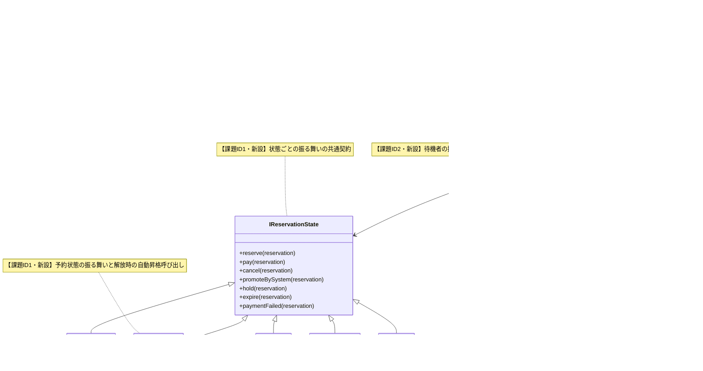
```mermaid
classDiagram
    class TicketReservation {
        -IReservationState* state
        +reserve()
        +pay()
        +cancel()
        +expire()
    }
    class IReservationState {
        +reserve(reservation)
        +pay(reservation)
        +cancel(reservation)
        +promoteBySystem(reservation)
        +hold(reservation)
        +expire(reservation)
        +paymentFailed(reservation)
    }
    class EventInfo
    class ReservationRecord
    class EventDatabase
    class ReservationHistory
    class ReservationWaitlist
    class AvailableState
    class ReservedState
    class PaidState
    class WaitlistedState
    class HeldState
    class ReservationExpiryScheduler
    class BatchApplication
    TicketReservation o--> IReservationState
    TicketReservation --> EventDatabase
    TicketReservation --> ReservationHistory
    TicketReservation --> ReservationWaitlist
    ReservationWaitlist o--> TicketReservation : waiting
    EventDatabase o--> EventInfo
    ReservationHistory o--> ReservationRecord
    IReservationState <|-- AvailableState
    IReservationState <|-- ReservedState
    IReservationState <|-- PaidState
    IReservationState <|-- WaitlistedState
    IReservationState <|-- HeldState
    ReservationExpiryScheduler ..> TicketReservation : timeout時にexpire
    BatchApplication --> TicketReservation
    BatchApplication --> ReservationExpiryScheduler

    note for IReservationState "【課題ID1・新設】状態ごとの振る舞いの共通契約"
    note for ReservedState "【課題ID1・新設】予約状態の振る舞いと解放時の自動昇格呼び出し"
    note for ReservationWaitlist "【課題ID2・新設】待機者の探索・削除・先頭選択"

    classDef focus fill:#FFF2CC,stroke:#D6B656,stroke-width:2px,color:#222222
    cssClass "IReservationState,AvailableState,ReservedState,PaidState,WaitlistedState,HeldState,ReservationWaitlist,ReservationExpiryScheduler" focus
```

この完成図では、`TicketReservation` が現在状態へ操作を委譲し、`IReservationState` が状態ごとの共通契約、5つの状態クラスがその具体動作を担います。掲載コードに登場する在庫・履歴・待ち行列・組み立てクラスも省略せず記載しています。予約数の増減と待機者の自動昇格は状態処理から予約本体を経由して実行され、`BatchApplication` はシナリオを起動するだけです。

#### 完成後の実行シーケンス

満席イベントの既存予約に `cancel()` が呼ばれたとき、空席作成から待機者の自動昇格までをどのクラスが担うか確認します。


```mermaid
sequenceDiagram
    participant main
    participant BA as BatchApplication
    participant C as 既存TicketReservation
    participant RS as ReservedState
    participant DB as EventDatabase
    participant WQ as ReservationWaitlist
    participant W as 待機TicketReservation
    participant WS as WaitlistedState

    main->>BA: run()
    BA->>C: cancel()
    C->>RS: cancel(reservation)
    RS->>DB: cancelSeat(EVT003)
    DB-->>RS: 50/50 -> 49/50
    RS->>C: setState(Available)
    RS->>C: promoteNextWaitlisted()
    C->>WQ: popNext(EVT003)
    WQ-->>C: waiting
    C->>W: promoteBySystem()
    W->>WS: promoteBySystem(reservation)
    WS->>DB: reserveSeat(EVT003)
    DB-->>WS: 49/50 -> 50/50
    WS->>W: setState(Reserved)
    W-->>BA: void（Reservedへ更新済み）
```

`BatchApplication` は昇格を呼びません。`ReservedState::cancel()` が座席解放後に待ち行列を進め、`WaitlistedState` が同じ席を確保して `Reserved` へ遷移します。したがって途中で運用者が介入する空白はありません。

期限切れも同様に、利用者や運用者が予約の状態を手動で進めません。掲載コードでは実際の時計を待たないため、タイマー基盤から届く期限到来イベントをスタブで再現します。

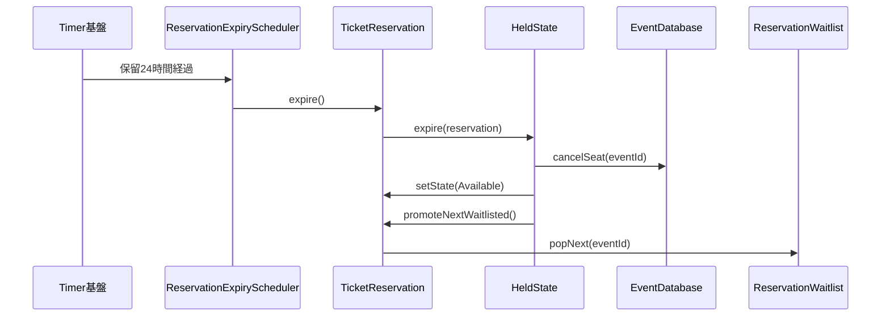
```mermaid
sequenceDiagram
    participant Timer as Timer基盤
    participant S as ReservationExpiryScheduler
    participant C as TicketReservation
    participant H as HeldState
    participant DB as EventDatabase
    participant WQ as ReservationWaitlist

    Timer->>S: 保留24時間経過
    S->>C: expire()
    C->>H: expire(reservation)
    H->>DB: cancelSeat(eventId)
    H->>C: setState(Available)
    H->>C: promoteNextWaitlisted()
    C->>WQ: popNext(eventId)
```

`main()`は`BatchApplication::run()`を起動するだけで、期限切れを直接呼びません。実運用ではTimer基盤が時刻を監視し、期限到達時に同じスケジューラ境界を呼びます。

#### 完成コード

クラスを1つずつ、上から順に読みます。**メンバー変数と、それを使う処理を同じ場所で見られるように**しています。1-4と同じ顔ぶれが並ぶので、どこが変わったかを見比べてください。

`main()` と実行結果は最後に、シナリオごとに並べます。上から順に連結すれば、そのまま1つのC++14プログラムとして動きます。

---

**共通ヘッダーと EventInfo と EventDatabase（1-4のまま）**

イベントの定員と予約数を持つ在庫クラスです。

```cpp
#include <iostream>
#include <string>
#include <map>
#include <vector>
#include <deque>
#include <stdexcept>
```

**EventInfo**

このブロックでは `EventInfo` の定義だけを確認します。

```cpp
struct EventInfo {
    std::string title;   // イベント名
    int capacity;        // 定員
    int reserved;        // 現在の予約数
};
```

**EventDatabase**

このブロックでは `EventDatabase` の定義だけを確認します。

```cpp
class EventDatabase {
private:
    std::map<std::string, EventInfo> records;
public:
    EventDatabase() {
        records["EVT001"] = {"春の音楽祭",  100,  20};
        records["EVT002"] = {"夏のフェス",  500, 499};
        records["EVT003"] = {"秋の映画会",   50,  50};  // 満席
    }

    bool exists(const std::string& id) const {
        return records.count(id) > 0;
    }

    EventInfo get(const std::string& id) const {
        return records.at(id);
    }

    bool hasCapacity(const std::string& id) const {
        const auto& e = records.at(id);

        return e.reserved < e.capacity;
    }

    void reserveSeat(const std::string& id) {
        auto& event = records.at(id);

        if (event.reserved >= event.capacity) {
            throw std::runtime_error("満席のイベントは予約できません");
        }

        int before = event.reserved;
        ++event.reserved;
        std::cout << "[予約数] " << id << " "
                  << before << "/" << event.capacity
                  << " -> " << event.reserved << "/" << event.capacity;
        if (event.reserved == event.capacity) std::cout << "（満席）";
        std::cout << std::endl;
    }

    void cancelSeat(const std::string& id) {
        auto& event = records.at(id);
        int before = event.reserved;

        if (event.reserved > 0) --event.reserved;
        std::cout << "[予約数] " << id << " "
                  << before << "/" << event.capacity
                  << " -> " << event.reserved << "/" << event.capacity
                  << std::endl;
    }

    void save(const std::string& id, const EventInfo& info) {
        records[id] = info;             // 実行中のイベント表へ追加
    }
};
```

---

**ReservationRecord と ReservationHistory**

予約履歴（`ReservationHistory`）はシステム起動時は空で、予約・決済・キャンセルが行われるたびに1件追記されます。ここではファイルへの保存は行わず、実行中のメモリ上にのみ保持します。

```cpp
struct ReservationRecord {
    std::string eventId;
    std::string eventTitle;
    std::string action;   // "予約", "決済", "キャンセル"
};
```

**ReservationHistory**

このブロックでは `ReservationHistory` の定義だけを確認します。

```cpp
// 予約履歴を管理するクラス
class ReservationHistory {
    std::vector<ReservationRecord> records;
public:
    void add(const std::string& eventId, const std::string& eventTitle,
             const std::string& action) {
        records.push_back({eventId, eventTitle, action});
    }

    void printAll() const {
        for (const auto& r : records) {
            std::cout << "[" << r.eventId << "] " << r.eventTitle
                      << " -> " << r.action << std::endl;
        }
    }

    int size() const { return (int)records.size(); }
};
```

---

**ReservationWaitlist**

キャンセル待ちはイベントごとの先着順キューです。利用者や `main()` が昇格を指示するのではなく、予約済み・保留中の席が解放された直後に、状態処理から先頭を取り出します。

```cpp
class TicketReservation;
```

**ReservationWaitlist**

このブロックでは `ReservationWaitlist` の定義だけを確認します。

```cpp
class ReservationWaitlist {
    std::map<std::string, std::deque<TicketReservation*>> queues;
public:
    void enqueue(const std::string& eventId,
                 TicketReservation* reservation) {
        queues[eventId].push_back(reservation);
        std::cout << "[待ち行列] " << eventId
                  << " 待機数=" << queues[eventId].size()
                  << std::endl;
    }

    TicketReservation* popNext(const std::string& eventId) {
        auto& queue = queues[eventId];

        if (queue.empty()) return nullptr;

        TicketReservation* next = queue.front();
        queue.pop_front();
        std::cout << "[待ち行列] " << eventId
                  << " 待機数=" << queue.size()
                  << std::endl;
        return next;
    }
};
```

---

**IReservationState**

新しい設計の基盤となる状態インターフェースを定義します。このインターフェースが「すべての状態クラスが守るべき契約」を定めます。C++では、基底クラスの仮想関数にデフォルト挙動（エラーメッセージを出力する、または何もしない）を実装しておくことで、各状態の具体クラスは自分に関係するメソッドだけをオーバーライドすればよくなります。

```cpp
class TicketReservation;
```

**IReservationState**

このブロックでは `IReservationState` の定義だけを確認します。

```cpp
// 状態ごとの共通操作と、許可されない操作の既定処理を持つ基底クラス
class IReservationState {
public:
    // 引数は操作対象の予約コンテキスト（TicketReservation*）。
    // 既定実装では使わないため仮引数名を省略し、派生側では reservation と名付ける。
    virtual void reserve(TicketReservation*) {
        std::cout << "現在予約できません\n";
    }

    virtual void pay(TicketReservation*) {
        std::cout << "支払いに適した状態ではありません\n";
    }

    virtual void cancel(TicketReservation*) {
        std::cout << "キャンセルできません\n";
    }

    virtual void promoteBySystem(TicketReservation*) {
        std::cout << "システム昇格の対象ではありません\n";
    }

    virtual void hold(TicketReservation*) {
        std::cout << "保留できません\n";
    }

    virtual void expire(TicketReservation*) {
        std::cout << "期限切れ処理は行えません\n";
    }

    virtual void paymentFailed(TicketReservation*) {
        std::cout << "決済失敗を扱える状態ではありません\n";
    }

    virtual ~IReservationState() = default;
};
```

---

**TicketReservation**

状態クラスを保持し、操作を現在の状態に委譲する中心クラス（コンテキスト）です。

```cpp
// 予約クラス：状態を保持し操作を委譲するだけ
class TicketReservation {
private:
    IReservationState* state;
    EventDatabase* db;           // 在庫の保存データ（境界）
    ReservationHistory* history; // 予約履歴
    ReservationWaitlist* waitlist;
    std::string eventId;
    std::string title;

    // キャンセル待ち昇格は外部公開せず、システム連鎖からだけ呼ぶ
    void promoteBySystem() {
        state->promoteBySystem(this);
    }
public:
    TicketReservation(IReservationState* initialState,
                      EventDatabase* db,
                      ReservationHistory* history,
                      ReservationWaitlist* waitlist,
                      const std::string& eventId,
                      const std::string& title)
        : state(initialState), db(db), history(history),
          waitlist(waitlist),
          eventId(eventId), title(title) {}

    // 状態遷移時に、共有状態オブジェクトへの借用ポインタを差し替える。
    // 状態は関数ローカルstaticが所有するため、ここではdeleteしない。
    void setState(IReservationState* nextState) { state = nextState; }

    // 状態遷移の副作用：在庫の増減と履歴の記録
    void reserveSeat() { db->reserveSeat(eventId); }
    void cancelSeat()  { db->cancelSeat(eventId); }
    bool hasCapacity() const { return db->hasCapacity(eventId); }
    void record(const std::string& action) {
        history->add(eventId, title, action);
    }

    void joinWaitlist() {
        waitlist->enqueue(eventId, this);
    }

    void promoteNextWaitlisted() {
        TicketReservation* next = waitlist->popNext(eventId);

        if (next != nullptr) next->promoteBySystem();
    }

    // 操作を現在の状態に委譲するだけ
    void reserve()         { state->reserve(this); }
    void pay()             { state->pay(this); }
    void cancel()          { state->cancel(this); }
    void hold()            { state->hold(this); }
    void expire()          { state->expire(this); }
    void paymentFailed()   { state->paymentFailed(this); }
};
```

状態オブジェクトは振る舞いだけを持つため、関数ローカルの静的オブジェクトを共有し、遷移のたびに `new` しない形にします。`state` はそれらへの非所有ポインタなので、`setState()` は参照先を切り替えるだけです。古い状態オブジェクトはプログラム終了まで共有され、削除対象になりません。席数の増減（`reserveSeat`/`cancelSeat`）と履歴記録は、呼び出し側が手動で行うのではなく、状態遷移の副作用として各状態のメソッド内から予約コンテキスト経由で実行します。さらに席を解放した状態処理が `promoteNextWaitlisted()` まで呼ぶため、キャンセルと自動昇格が1つのシステム処理として完結します。

---

**状態取得関数の宣言と AvailableState**

先に `TicketReservation` の完全な定義を置いたので、ここからは各状態クラスの宣言とオーバーライド実装を分断せず、クラス単位でまとめて読めます。状態取得関数の宣言だけは、状態同士の遷移先を互いに参照するためクラス定義の直前へ置きます。

```cpp
IReservationState* availableState();
IReservationState* reservedState();
IReservationState* paidState();
IReservationState* waitlistedState();
IReservationState* heldState();

// Available（予約可能）：空席なら予約、満席なら自動待機登録する
class AvailableState : public IReservationState {
public:
    void reserve(TicketReservation* reservation) override {
        if (!reservation->hasCapacity()) {
            reservation->joinWaitlist();
            std::cout << "満席のためキャンセル待ちに登録しました\n";
            reservation->setState(waitlistedState());
            return;
        }

        reservation->reserveSeat();
        reservation->record("予約");
        std::cout << "予約完了しました\n";
        reservation->setState(reservedState());
    }
};
```

`AvailableState` は空席の有無で予約または待機登録へ進めます。**1-4では `TicketReservation::reserve()` の中にあった判定が、状態クラスへ移りました。**

---

**ReservedState と PaidState**

```cpp
// Reserved（予約済み）：支払い、取消、保留、期限切れを処理する
class ReservedState : public IReservationState {
public:
    void pay(TicketReservation* reservation) override {
        reservation->record("決済");
        std::cout << "支払い完了しました\n";
        reservation->setState(paidState());
    }

    void cancel(TicketReservation* reservation) override {
        reservation->cancelSeat();
        reservation->record("キャンセル");
        std::cout << "予約をキャンセルしました\n";
        reservation->setState(availableState());
        reservation->promoteNextWaitlisted();
    }

    void hold(TicketReservation* reservation) override {
        std::cout << "保留にしました\n";
        reservation->setState(heldState());
    }

    void expire(TicketReservation* reservation) override {
        reservation->cancelSeat();
        reservation->record("通常決済期限切れ");
        std::cout << "通常の決済期限が切れました\n";
        reservation->setState(availableState());
        reservation->promoteNextWaitlisted();
    }

    void paymentFailed(TicketReservation* reservation) override {
        reservation->record("決済失敗");
        std::cout << "決済に失敗しました。予約済みのまま再試行できます\n";
    }
};
```

**PaidState**

このブロックでは `PaidState` の定義だけを確認します。

```cpp
// Paid（支払い済み）：完了状態のため、すべて既定の拒否を使う
class PaidState : public IReservationState {};
```

`ReservedState` は席を解放する操作から待機者の自動昇格まで完結させ、`PaidState` は既定の拒否だけを使います。**`PaidState` の中身が空なのは、許可する操作が1つもないからです。** 禁止の組み合わせを書き並べる必要がありません。

---

**WaitlistedState と HeldState と ReservationExpiryScheduler**

```cpp
// Waitlisted（キャンセル待ち）：システムからの昇格だけを受ける
class WaitlistedState : public IReservationState {
public:
    void promoteBySystem(TicketReservation* reservation) override {
        reservation->reserveSeat();
        reservation->record("キャンセル待ちから自動昇格");
        std::cout << "空席発生を検知し、予約へ自動昇格しました\n";
        reservation->setState(reservedState());
    }
};
```

**HeldState**

このブロックでは `HeldState` の定義だけを確認します。

```cpp
// Held（一時保留）：支払い、取消、期限切れ、決済失敗を処理する
class HeldState : public IReservationState {
public:
    void pay(TicketReservation* reservation) override {
        reservation->record("決済");
        std::cout << "保留から支払い完了しました\n";
        reservation->setState(paidState());
    }

    void cancel(TicketReservation* reservation) override {
        reservation->cancelSeat();
        reservation->record("キャンセル");
        std::cout << "保留からキャンセルしました\n";
        reservation->setState(availableState());
        reservation->promoteNextWaitlisted();
    }

    void expire(TicketReservation* reservation) override {
        reservation->cancelSeat();
        reservation->record("保留期限切れ");
        std::cout << "保留期限が切れました\n";
        reservation->setState(availableState());
        reservation->promoteNextWaitlisted();
    }

    void paymentFailed(TicketReservation* reservation) override {
        reservation->record("決済失敗");
        std::cout << "決済に失敗しました。保留中のまま再試行できます\n";
    }
};
```

**ReservationExpiryScheduler**

このブロックでは `ReservationExpiryScheduler` の定義だけを確認します。

```cpp
// タイマー基盤から期限切れイベントを予約へ渡す境界。
// 利用者や運用者がexpire()を手動実行する構造にはしない。
class ReservationExpiryScheduler {
public:
    void onPaymentDeadlineExpired(TicketReservation& reservation) {
        reservation.expire();
    }
};

// 状態オブジェクト取得関数。関数ローカルstaticが所有する。
IReservationState* availableState() {
    static AvailableState state;

    return &state;
}

IReservationState* reservedState() {
    static ReservedState state;

    return &state;
}

IReservationState* paidState() {
    static PaidState state;

    return &state;
}

IReservationState* waitlistedState() {
    static WaitlistedState state;

    return &state;
}

IReservationState* heldState() {
    static HeldState state;

    return &state;
}
```

---

**BatchApplication**

依存の組み立てと実行の責任を分離します。**状態オブジェクトの具体クラス名は、`availableState()` の呼び出し以外に出てきません。**

```cpp
// BatchApplication：依存の組み立てを担う入口
class BatchApplication {
    EventDatabase db;
    ReservationHistory history;
    ReservationWaitlist waitlist;
    ReservationExpiryScheduler expiryScheduler;

    bool validateExists(const std::string& eventId) {
        if (!db.exists(eventId)) {
            std::cout << "エラー：イベントID " << eventId
                      << " は存在しません\n";
            return false;
        }

        return true;
    }

    // 予約前に現在の席数を表示する。満席判定と待機登録はreserve()側が行う。
    bool showAvailability(const std::string& eventId) {
        if (!validateExists(eventId)) return false;

        EventInfo info = db.get(eventId);
        std::cout << "[席数確認] " << eventId << " "
                  << info.reserved << "/" << info.capacity;
        if (info.reserved == info.capacity) std::cout << "（満席）";
        std::cout << std::endl;

        return true;
    }

public:
    void run() {
        // シナリオ1：通常予約フロー (Available → Reserved → Paid)
        std::cout << "--- シナリオ1: 通常予約 ---\n";

        if (showAvailability("EVT001")) {
            EventInfo i1 = db.get("EVT001");
            std::cout << "予約対象：" << i1.title << "\n";
            TicketReservation seat1(availableState(), &db,
                                    &history, &waitlist,
                                    "EVT001", i1.title);
            seat1.reserve();
            seat1.pay();
        }
```

```
--- シナリオ1: 通常予約 ---
[席数確認] EVT001 20/100
予約対象：春の音楽祭
[予約数] EVT001 20/100 -> 21/100
予約完了しました
支払い完了しました
```

---

**シナリオ2：通常キャンセル（Reserved→Available）**

同じ `BatchApplication::run()` の中の続きです。

```cpp
        // シナリオ2：通常キャンセル (Available → Reserved → Available)
        std::cout << "--- シナリオ2: 通常キャンセル ---\n";

        if (showAvailability("EVT001")) {
            EventInfo i2 = db.get("EVT001");
            TicketReservation seat2(availableState(), &db,
                                    &history, &waitlist,
                                    "EVT001", i2.title);
            seat2.reserve();
            seat2.cancel();
        }
```

「在席」は会場に現在いる人数を意味するため、予約枠については「席数確認」「予約数」と表記します。

```
--- シナリオ2: 通常キャンセル ---
[席数確認] EVT001 21/100
[予約数] EVT001 21/100 -> 22/100
予約完了しました
[予約数] EVT001 22/100 -> 21/100
予約をキャンセルしました
```

---

**シナリオ3：保留と支払い（Reserved→Held→Paid）**

同じ `BatchApplication::run()` の中の続きです。

```cpp
        // シナリオ3：保留と支払い (Available → Reserved → Held → Paid)
        std::cout << "--- シナリオ3: 保留と支払い ---\n";

        if (showAvailability("EVT002")) {
            EventInfo i3 = db.get("EVT002");
            std::cout << "予約対象：" << i3.title << "\n";
            TicketReservation seat3(availableState(), &db,
                                    &history, &waitlist,
                                    "EVT002", i3.title);
            seat3.reserve();
            seat3.hold();
            seat3.pay();
        }
```

シナリオ3の実行結果：

```
--- シナリオ3: 保留と支払い ---
[席数確認] EVT002 499/500
予約対象：夏のフェス
[予約数] EVT002 499/500 -> 500/500（満席）
予約完了しました
保留にしました
保留から支払い完了しました
```

---

**シナリオ4：保留期限切れ（Held→Available）**

同じ `BatchApplication::run()` の中の続きです。

```cpp
        // シナリオ4：保留期限切れ (Available → Reserved → Held → Available)
        std::cout << "--- シナリオ4: 保留期限切れ ---\n";

        if (showAvailability("EVT001")) {
            EventInfo i4 = db.get("EVT001");
            TicketReservation seat4(availableState(), &db,
                                    &history, &waitlist,
                                    "EVT001", i4.title);
            seat4.reserve();
            seat4.hold();
            // テストハーネスから「24時間経過」を即時注入する。
            // 本番では利用者でなくタイマー基盤が同じ境界を呼ぶ。
            expiryScheduler.onPaymentDeadlineExpired(seat4);
        }
```

シナリオ4の実行結果：

```
--- シナリオ4: 保留期限切れ ---
[席数確認] EVT001 21/100
[予約数] EVT001 21/100 -> 22/100
予約完了しました
保留にしました
[予約数] EVT001 22/100 -> 21/100
保留期限が切れました
```

シナリオ4aは、一時保留を選ばず `Reserved` の標準15分期限が切れた場合です。テストハーネスが同じ期限切れ境界へイベントを注入し、予約を放置しても席が永久に確保されないことを確認します。

```cpp
        // シナリオ4a：通常の15分決済期限切れ (Reserved → Available)
        std::cout << "--- シナリオ4a: 通常決済期限切れ ---\n";

        if (showAvailability("EVT001")) {
            EventInfo i4a = db.get("EVT001");
            TicketReservation seat4a(availableState(), &db,
                                     &history, &waitlist,
                                     "EVT001", i4a.title);
            seat4a.reserve();
            expiryScheduler.onPaymentDeadlineExpired(seat4a);
        }
```

シナリオ4aの実行結果：

```
--- シナリオ4a: 通常決済期限切れ ---
[席数確認] EVT001 21/100
[予約数] EVT001 21/100 -> 22/100
予約完了しました
[予約数] EVT001 22/100 -> 21/100
通常の決済期限が切れました
```

---

**シナリオ5：満席→待機登録→キャンセルで自動昇格**

同じ `BatchApplication::run()` の中の続きです。

```cpp
        // シナリオ5：満席確認 → 通常の予約要求で自動待機登録 →
        // 既存予約のキャンセルを起点に自動昇格
        std::cout << "--- シナリオ5: 満席からの自動昇格 ---\n";
        EventInfo full = db.get("EVT003");
        showAvailability("EVT003"); // 50/50を表示。reserve()が満席を判定する

        TicketReservation waiting(availableState(), &db,
                                  &history, &waitlist,
                                  "EVT003", full.title);
        waiting.reserve(); // 利用者は通常の予約操作だけ。満席なので自動待機登録

        // 初期50件のうち1件を表す既存予約。利用側はcancel()だけを呼ぶ。
        TicketReservation occupied(reservedState(), &db,
                                   &history, &waitlist,
                                   "EVT003", full.title);
        occupied.cancel(); // 50→49、その直後にwaitingを49→50へ自動昇格
        waiting.pay();
```

シナリオ5の実行結果：

```
--- シナリオ5: 満席からの自動昇格 ---
[席数確認] EVT003 50/50（満席）
[待ち行列] EVT003 待機数=1
満席のためキャンセル待ちに登録しました
[予約数] EVT003 50/50 -> 49/50
予約をキャンセルしました
[待ち行列] EVT003 待機数=0
[予約数] EVT003 49/50 -> 50/50（満席）
空席発生を検知し、予約へ自動昇格しました
支払い完了しました
```

---

**シナリオ5b：保留の期限切れを起点にした自動昇格**

同じ `BatchApplication::run()` の中の続きです。シナリオ4は待ち行列が空だったため昇格が発動せず、要求ID7の受入条件「期限切れ時は空席へ戻して待機者がいれば自動昇格する」の後半が未確認でした。ここでは待機者がいる状態で期限を切らせます。

```cpp
        // シナリオ5b：待機者がいる状態での期限切れ → 自動昇格
        std::cout << "--- シナリオ5b: 期限切れからの自動昇格 ---\n";
        EventInfo f2 = db.get("EVT003");
        // 50/50の満席状態。1件を保留にしてから待機者を登録する
        TicketReservation held(reservedState(), &db,
                               &history, &waitlist,
                               "EVT003", f2.title);
        held.hold();                   // 50→49（保留で席を確保）
        TicketReservation waiting2(availableState(), &db,
                                   &history, &waitlist,
                                   "EVT003", f2.title);
        waiting2.reserve(); // 満席判定により自動待機登録
        // 24時間経過。席が空き、待機者が自動昇格する
        expiryScheduler.onPaymentDeadlineExpired(held);
```

シナリオ5bの実行結果：

```
--- シナリオ5b: 期限切れからの自動昇格 ---
保留にしました
[待ち行列] EVT003 待機数=1
満席のためキャンセル待ちに登録しました
[予約数] EVT003 50/50 -> 49/50
保留期限が切れました
[待ち行列] EVT003 待機数=0
[予約数] EVT003 49/50 -> 50/50（満席）
空席発生を検知し、予約へ自動昇格しました
```

期限切れは利用者操作ではなくスケジューラから届くイベントですが、席を解放したあとの自動昇格はキャンセル起点（シナリオ5）とまったく同じ経路を通ります。`HeldState::expire()` も `ReservedState::cancel()` も、席を戻したあとに共通の `promoteNextWaitlisted()` を呼ぶだけだからです。待ち行列の方針を変えても、状態クラス側は書き換えずに済みます。

シナリオ6は、無効な操作（未予約でのpay）の拒否です。

```cpp
        // シナリオ6：無効な操作の拒否 (Available → pay)
        std::cout << "--- シナリオ6: 無効な操作の拒否 ---\n";

        if (validateExists("EVT001")) {
            EventInfo i6 = db.get("EVT001");
            TicketReservation seat6(availableState(), &db,
                                    &history, &waitlist,
                                    "EVT001", i6.title);
            seat6.pay();
        }
```

シナリオ6の実行結果：

```
--- シナリオ6: 無効な操作の拒否 ---
支払いに適した状態ではありません
```

---

**シナリオ7：存在しないイベントIDのエラー**

同じ `BatchApplication::run()` の中の続きです。

```cpp
        // シナリオ7：存在しないイベントIDのエラー
        std::cout << "--- シナリオ7: 存在しないイベントID ---\n";
        validateExists("EVT999");
```

シナリオ7の実行結果：

```
--- シナリオ7: 存在しないイベントID ---
エラー：イベントID EVT999 は存在しません
```

シナリオ8は、決済失敗（予約済みのまま再試行できる）です。状態別動作を共通契約の裏へ分けているため、`IReservationState` に `paymentFailed` を足し、`Reserved`／`Held` だけが「状態を変えずに失敗を記録する」振る舞いで応じます。呼び出し元は現在状態を意識しません。

```cpp
        // シナリオ8：決済失敗 (Available → Reserved → 決済失敗、Reservedのまま)
        std::cout << "--- シナリオ8: 決済失敗（再試行可能） ---\n";

        if (showAvailability("EVT001")) {
            EventInfo i8 = db.get("EVT001");
            TicketReservation seat8(availableState(), &db,
                                    &history, &waitlist,
                                    "EVT001", i8.title);
            seat8.reserve();
            seat8.paymentFailed();
        }
```

シナリオ8の実行結果：

```
--- シナリオ8: 決済失敗（再試行可能） ---
[席数確認] EVT001 21/100
[予約数] EVT001 21/100 -> 22/100
予約完了しました
決済に失敗しました。予約済みのまま再試行できます
```

最後に予約履歴を出力し、`main()` から実行します。

```cpp
        std::cout << "\n--- 予約履歴 ---\n";
        history.printAll();
    }
};

int main() {
    BatchApplication app;
    app.run();

    return 0;
}
```

予約履歴の実行結果：

```
--- 予約履歴 ---
[EVT001] 春の音楽祭 -> 予約
[EVT001] 春の音楽祭 -> 決済
[EVT001] 春の音楽祭 -> 予約
[EVT001] 春の音楽祭 -> キャンセル
[EVT002] 夏のフェス -> 予約
[EVT002] 夏のフェス -> 決済
[EVT001] 春の音楽祭 -> 予約
[EVT001] 春の音楽祭 -> 保留期限切れ
[EVT001] 春の音楽祭 -> 予約
[EVT001] 春の音楽祭 -> 通常決済期限切れ
[EVT003] 秋の映画会 -> キャンセル
[EVT003] 秋の映画会 -> キャンセル待ちから自動昇格
[EVT003] 秋の映画会 -> 決済
[EVT003] 秋の映画会 -> 保留期限切れ
[EVT003] 秋の映画会 -> キャンセル待ちから自動昇格
[EVT001] 春の音楽祭 -> 予約
[EVT001] 春の音楽祭 -> 決済失敗
```

この実行結果は、フェーズ1の動作例テーブルと、フェーズ1-5で追加した仕様遷移の代表ケースに対応しています。EVT003は、まず `50/50` の満席が見え、通常の予約要求が自動待機登録になり、既存予約のキャンセルで `50→49`、直後の自動昇格で `49→50` へ戻ります。利用側が待機登録の専用メソッドを呼ぶ行はなく、利用側が昇格メソッドを呼ぶ行はありません。


#### 最終要求の実装・受入エビデンス

ここで照合する要求IDは、1-5の**変更後要求ベースラインにある最終有効要求ID**です。変更前だけの要求一覧ではありません。継続・変更・追加を同じ順序で確認するため、変更されなかった既存要求の消失も検出できます。

変更IDの受入証拠も省略しません。要求ID表の後に、7-4で変更ID1・変更ID2を「どの最終要求へ反映し、どの実行結果で確認したか」の単位で再照合します。つまり、要求ID表は最終仕様全体の受入・回帰、変更ID表は今回の依頼差分の受入という二つの役割です。

| 要求ID | 最終要求 | 適用コード | 実行シナリオ・観測結果・判定 |
|---|---|---|---|
| 要求ID1 | イベントの存在と空席数を確認する | `EventDatabase`、`AvailableState` | 未登録・満席の既存判定を維持<br/>**判定:** 合格 |
| 要求ID2 | 予約可能から予約済みへ遷移し、予約数を1増やす | `AvailableState::reserve()` | 残り1席から満席へ数値変化<br/>**判定:** 合格 |
| 要求ID3 | 予約済みまたは一時保留から支払済みへ遷移する | `ReservedState`、`HeldState` | 支払成功時だけPaid<br/>**判定:** 合格 |
| 要求ID4 | 予約取消で席を解放し、待機者がいれば先頭を同じ処理内で自動昇格する | `ReservedState::cancel()`、`ReservationWaitlist` | 50/50→49/50→50/50、手動昇格なし<br/>**判定:** 合格 |
| 要求ID5 | 許可されない操作や決済失敗では状態と予約数を変えない | 各`IReservationState`実装 | エラー前後の状態・件数が一致<br/>**判定:** 合格 |
| 要求ID6 | 満席時の予約要求をシステムがキャンセル待ちへ登録する | `AvailableState`、`WaitlistedState`、`ReservationWaitlist` | シナリオ5で `reserve()` だけを呼び自動登録、先頭から昇格<br/>**判定:** 合格 |
| 要求ID7 | Reservedは15分、一時保留したHeldは24時間の期限を持ち、期限切れで席を解放する | `ReservedState`、`HeldState`、`ReservationExpiryScheduler` | シナリオ4aで通常期限、シナリオ4・5bで保留期限と自動昇格<br/>**判定:** 合格 |

上の表は継続（要求ID1・要求ID2・要求ID5）・変更（要求ID3・要求ID4）・追加（要求ID6・要求ID7）を同じ順序で並べ、変わらなかった既存要求も回帰対象に含めています。継続要求が合格していることで、既存動作が落ちていないことを確認できます。要求の受入・回帰はここで完了します。課題IDへ直接対応付けず、以下では変更試行の痛みから導いた構造課題だけを別に確認します。

#### 設計課題の構造改善結果

要求の受入とは分けて、課題IDごとに構造と変更影響を確認します。

| 課題ID | 構造差分・コード適用先 | 確認できた効果 | 残る変更先 |
|---|---|---|---|
| 課題ID1 | 状態別動作を`IReservationState`の各実装へ分離 | 状態追加が新しい状態クラスと遷移接続に閉じた | 新状態と遷移登録 |
| 課題ID2 | `ReservationWaitlist`を席解放経路へ接続 | 取消・期限切れから自動昇格まで閉じた | 待機順序方針 |
#### 変更前→変更後の不変条件照合

| 変更対象外 | 変更前 | 変更後 | 確認根拠 |
|---|---|---|---|
| イベント・定員データ | `EventDatabase` が保持 | 同じRepositoryと数値を更新 | 満席前後の50/50ログ |
| 利用側の取消入口 | 予約に `cancel()` | 同じ入口だけを呼ぶ | 自動昇格シナリオの呼び出しコード |

### 7-2：動作シーケンス図の検証

完成クラス図と実行シーケンスは、完成コードへ入る前に示しました。ここまでのコード、要求追跡表、不変条件照合を証拠として、次節で変更影響を再確認します。

### 7-3：変更影響グラフ（改善後）

フェーズ3で確認した「変更要求：状態追加」と「待ち行列方針の変更」のシナリオを、3-2と同じ粒度で再度適用します。

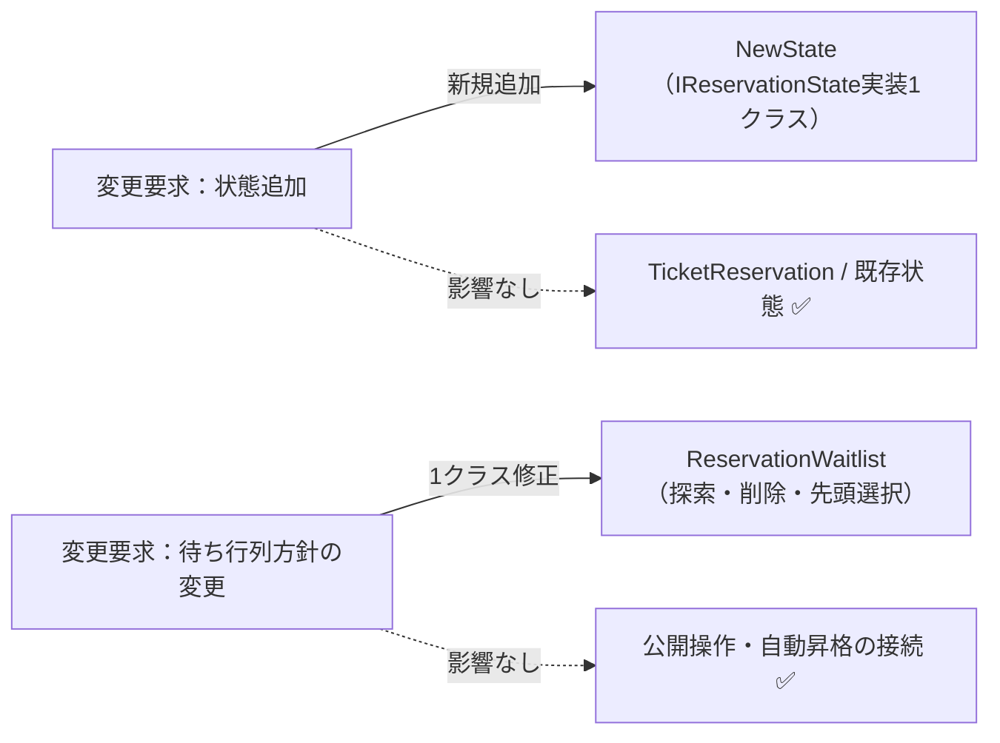
```mermaid
graph LR
    T1["変更要求：状態追加"]
        -->|新規追加| N1["NewState<br>（IReservationState実装1クラス）"]
    T2["変更要求：待ち行列方針の変更"]
        -->|1クラス修正| N2["ReservationWaitlist<br>（探索・削除・先頭選択）"]
    T1 -. "影響なし" .-> A["TicketReservation / 既存状態 ✅"]
    T2 -. "影響なし" .-> B["公開操作・自動昇格の接続 ✅"]
```

フェーズ3の変更影響グラフと同じ要求・同じ粒度で比べると、課題ID1の状態追加は共通契約 `IReservationState` の実装1クラスへ、課題ID2の待ち行列方針変更は `ReservationWaitlist` の中だけへ限定されました。`TicketReservation` の公開操作と、キャンセル直後の自動昇格の接続はどちらの変更でも触りません。

| 3-2で影響した場所 | 修正後 | 構造変更との対応 |
|---|---|---|
| 公開操作ごとの `status` 文字列分岐（課題ID1） | **修正しない** | 振る舞いを各状態クラスへ移した |
| 状態処理に絡む待ち行列操作と昇格処理（課題ID2） | `ReservationWaitlist` の中だけ修正 | キュー方針を専用クラスへ閉じた |
| 3-2には状態部品の契約がなかった | `NewState` を1クラス追加する | 状態の変更先を新しく作った |

### 7-4：変更シナリオ表

今回の変更ID1・変更ID2について、フェーズ1の構造で必要だった修正と完成構造の結果を整理します。

| 変更依頼 | フェーズ1の現状構造での影響 | 完成構造での結果 |
|---|---|---|
| 変更ID1：満席時の予約要求を自動でキャンセル待ちへ登録し、空席発生時に先頭を自動昇格する | `TicketReservation`の予約・取消へ待ち行列と昇格条件を追加 | 通常の`reserve()`だけで待機登録し、取消直後に49/50から先頭を自動昇格して50/50へ戻ることを確認 |
| 変更ID2：通常の15分決済期限を、明示的な一時保留で24時間へ延長し、期限切れで席を解放する | `TicketReservation`の複数操作へ通常・保留の期限分岐を追加 | `ReservedState`と`HeldState`へ期限切れを置き、どちらも空席へ戻した後の自動昇格まで確認 |

変更ID1・変更ID2の判断を状態クラスへ分けた代わりに、状態ごとのクラスと遷移の組み立てを管理するコストを引き受けます。

---

## 整理

### 問題・原因・課題・解決策

| | 内容 |
|---|---|
| **問題** | 状態が1つ増えるたびに全操作メソッドの条件分岐を書き直さなければならず、ヒアリングで確定した追加頻度ではコストが合わない |
| **原因** | 状態遷移ルール（企画担当）と操作フロー（開発チーム）が`TicketReservation`に混在し、状態変更時に関係する操作メソッドの確認が必要になる |
| **課題** | 状態ごとの振る舞いを `TicketReservation` から切り離し、公開操作は現在の状態へ委譲する構造にする |
| **解決策** | 状態分離構造：`IReservationState` を境界として状態ごとの振る舞いを各クラスに分離し、`TicketReservation` は共通基底型を通じて現在の状態に処理を委譲する |

### フェーズとこの章でやったこと

この章では、複雑化する状態遷移が `if` や `switch` 文による条件分岐の混在を生み、システムの保守性を低下させている現状を学びました。7フェーズの思考プロセスを適用して、この構造的課題をどのように解決したのかを振り返ります。

| **フェーズ** | **この章でやったこと** |
|---|---|
| 🔵 フェーズ1：現状把握 | 予約ステータスが `TicketReservation` クラス内に直接記述され、条件分岐で管理されている現状を観察しました。 |
| 🟣 フェーズ2：仮説立案 | 企画担当者へのヒアリングを通じ、今後「状態」の種類も「遷移ルール」も頻繁に変わるリスクを特定しました。 |
| 🟣 フェーズ3：問題特定 | 新しい状態（一時保留など）の追加を試み、全メソッドの修正が不可避になる「痛み」を確認しました。 |
| 🟠 フェーズ4：原因分析 | 状態管理のルールと業務ロジックが同じ場所に混在していることが、システムを脆くしている根本原因だと突き止めました。 |
| 🟡 フェーズ5：課題定義 | 公開操作と状態固有の振る舞いの境界を定め、状態追加時に条件分岐を増やさない課題を定めた |
| 🔴 フェーズ6：対策検討 | 課題ID1の状態判断と課題ID2の待ち行列を同時に分離する最終構造を確定し、状態契約→状態実装→自動昇格接続の順でコードへ反映した。 |
| 🟢 フェーズ7：対策実施 | 状態を個別クラスへ分け、待ち行列の探索・先頭選択と席解放直後の昇格を`ReservationWaitlist`へ集約した。 |

### 責任の移動

今回の設計変更により、`TicketReservation` が抱え込んでいた責任がどこへ移動したかを示します。

| **責任** | **変更前** | **変更後** |
|---|---|---|
| 予約コンテキストの保持と委譲 | `TicketReservation` | `TicketReservation`（変わらず） |
| 各状態での操作可否の判断 | `TicketReservation`（if-else直書き） | `ReservedState` 等の各実装クラス |
| 状態遷移後の状態値の設定 | `TicketReservation`（if-else直書き） | `ReservedState` 等の各実装クラス |
| 状態の振る舞い契約の定義 | —（なし） | `IReservationState` |
| キャンセル待ちの探索・先頭選択 | 呼び出し元の手順 | `ReservationWaitlist` |
| 席解放後の昇格 | 手動呼び出しになり得る | `TicketReservation`から`ReservationWaitlist`へ自動委譲 |

### 複雑さを足しても対策は変わるか

| 追加した複雑さ | 見えた原因 | 定めた課題 | 採用した扱い |
|---|---|---|---|
| キャンセル待ちからの予約昇格イベント | 利用者操作でなくても、状態ごとの受け付け可否を中心クラスが知っている | 操作とイベントの発生源を問わず、現在状態へ委譲する | `WaitlistedState` に昇格時の振る舞いを置く |
| 保留期限切れタイマー | 時間起点の入力も `Held` だけが意味を持つのに、中心クラスへ条件が増える | 特定状態だけが扱うイベントを、その状態の責任に寄せる | `HeldState` に期限切れ時の遷移を置く |
| 決済失敗後の戻り | 成功時と失敗時で、維持すべき状態が状態ごとに変わる | 外部API結果を受けても、呼び出し元へ状態分岐を漏らさない | `ReservedState` / `HeldState` が失敗時の状態維持と再試行可否を決める |

> このプロセスを回した結果にたどり着いた構造こそが 状態分離構造です。

---

## 振り返り

### 「この章を読むと得られること」は手に入ったか

| **得られること** | **この章のどこで示したか** |
|---|---|
| 1. 変動箇所の識別 | フェーズ2のヒアリングを通じて、「状態の種類」と「状態遷移ルール」が頻繁に変わることを特定したこと。 |
| 2. 痛みの発生源の判断 | フェーズ4の分析で、「状態（ステータス）」と「その状態での振る舞い」が同じクラスに混在していることが、条件分岐の爆発という痛みの根本原因だと突き止めたこと。 |
| 3. 構造改善の説明 | 新しい状態を追加するとき、`TicketReservation`の条件分岐ではなく、状態クラスと遷移の組み立てを変更する設計を実現したこと。 |
| 4. 状態追加の判断 | フェーズ6で、課題ID1・課題ID2を残さない最終構造を先に確定し、状態追加と待ち行列変更の影響先を分けたこと。 |

### 第0章の3つの設計原則はどう適用されたか

* **原則1「変わるものをカプセル化せよ」の現れ**
  * 具体化された場所：各状態クラス（`ReservedState` など）
  * 解説：状態ごとの細かなルールという「頻繁に変わる詳細」を、個別の状態クラスの中にカプセル化しました。これにより、業務クラス側は状態の内部ルールを知る必要がなくなりました。

* **原則2「実装ではなくインターフェースに対してプログラムせよ」の現れ**
  * 具体化された場所：`TicketReservation` クラスと共通基底型 `IReservationState`
  * 解説：`IReservationState`は純粋仮想関数だけのC++インターフェースではなく、許可されない操作の既定処理も持つ通常の基底クラスです。それでも利用側の`TicketReservation`は`ReservedState`などの具体状態を直接参照せず、公開された共通操作だけに依存します。ここでいう「インターフェース」はC++のステレオタイプではなく、利用側から見える共通の入口という原則上の意味です。

* **原則3「継承よりコンポジションを優先せよ」の判断**
  * 判断：`TicketReservation`が現在の`IReservationState`を借り、遷移時に参照を差し替える。予約本体を状態別に派生させないため、同じ予約が実行中に状態を替えられる。
  * 実装継承を使う箇所：各状態は、許可されない操作の既定処理を持つ`IReservationState`を継承する。これは機能を組み合わせるためではなく、全状態に共通する拒否処理を浅い1階層へ固定する選択である。
  * 両者の関係：状態の共通処理には継承、実行中の状態交換にはコンポジションを使っており、目的を分けている。型名の`I`だけを理由にインターフェース実装とは扱わない。

---

## あなたのコードで考えてみてください

この章で辿った思考プロセスを、あなた自身のコードに当てはめてみましょう。以下の判定ツリーに沿って確認してください。

**Q1：** 同じメソッドの中に「状態フラグや種別によって全く異なる処理をする」分岐がありますか？

- **No →** 現時点では状態分離構造は不要です。シンプルなコードを維持してください。
- **Yes → Q2へ**

**Q2：** 状態の種類が1つ増えたとき、修正が必要なメソッドは2つ以上になりますか？

- **No →** 分岐の数が少なく影響範囲が限定的です。今すぐ構造を適用する必然性はありません。
- **Yes → Q3へ**

**Q3：** 今後も状態の種類やルールが増える見込みがありますか（ヒアリングまたは変更履歴から判断）？

- **No →** 一時的な複雑さとして許容し、コメントで意図を明記する方が現実的です。
- **Yes →** 状態分離構造の適用を検討してください。状態ごとにクラスを切り出すことで、次の変更の影響を1クラスに閉じ込めることができます。

---

**題材を置き換えるときの共通手順**

この章の題材名を、自分の現場のシステム名に置き換えて考えます。

1. そのシステムは、誰が何を達成するために使うものか。
2. 入力、加工、出力は何か。
3. 最近入った変更要求、または次に来そうな変更要求は何か。
4. その変更で、触りたくない場所まで修正や再テストが広がるか。
5. 変えたいものと守りたいものを分けると、接続点には何を残すべきか。
6. 全課題を満たす完成構造が複数成立するか。成立するなら、責任配置・変更影響・導入コストの差は何か。

ここまで問題から導いた「状態分離構造」は、一般に **Stateパターン**と呼ばれます。ここからは題材を離れ、この名前で共有される抽象的な骨格を確認します。

## パターン解説：State パターン

Stateパターンは、オブジェクトの内部状態が変化したときに、そのオブジェクトの振る舞いを変更できるようにするパターンです。

### パターンの骨格

状態ごとに専用のクラスを作成し、コンテキスト（状態を持つオブジェクト）は現在の状態オブジェクトに処理を委譲します。

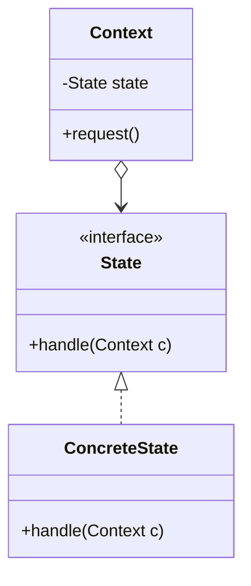
```mermaid
classDiagram
    class Context {
        -State state
        +request()
    }
    class State {
        <<interface>>
        +handle(Context c)
    }
    class ConcreteState {
        +handle(Context c)
    }
    Context o--> State
    State <|.. ConcreteState
```

### 抽象骨格の実行シーケンス

```mermaid
sequenceDiagram
    participant C as Client
    participant X as Context
    participant S as CurrentState
    participant N as NextState
    C->>X: event()
    X->>S: handle(Context)
    S->>X: setState(NextState)
    X-->>C: 更新後状態
```

Clientは現在状態を指定せず、Contextが保持するStateへイベントを委譲します。

### この章の実装との対応

| GoFの名前 | この章での対応 |
|---|---|
| Context | `TicketReservation` |
| State | `IReservationState` |
| ConcreteState | `AvailableState` / `ReservedState` / `PaidState` 等 |

```mermaid
classDiagram
    class TicketReservation {
        -IReservationState state
        +reserve()
        +pay()
        +cancel()
        +hold()
        +expire()
    }
    class IReservationState {
        +reserve(reservation)
        +pay(reservation)
        +cancel(reservation)
        +promoteBySystem(reservation)
        +hold(reservation)
        +expire(reservation)
    }
    class AvailableState {
        +reserve(reservation)
    }
    class ReservedState {
        +pay(reservation)
        +cancel(reservation)
        +hold(reservation)
        +expire(reservation)
    }
    class PaidState
    class HeldState {
        +pay(reservation)
        +cancel(reservation)
        +expire(reservation)
    }
    class WaitlistedState {
        +promoteBySystem(reservation)
    }
    class ReservationWaitlist
    class EventDatabase
    class ReservationHistory
    TicketReservation --> ReservationWaitlist
    TicketReservation --> EventDatabase
    TicketReservation --> ReservationHistory
    TicketReservation o--> IReservationState
    IReservationState <|-- AvailableState
    IReservationState <|-- ReservedState
    IReservationState <|-- PaidState
    IReservationState <|-- HeldState
    IReservationState <|-- WaitlistedState
```

共通基底ロールである `IReservationState` が、`ReservedState` などの具体クラスと結びついています。型名の`I`は命名上残っていますが、既定処理を持つため、第0章のクラス図規約では`<<interface>>`を付けません。

### 使いどころと限界

* **使うと良い状況：** 状態に応じてオブジェクトの振る舞いが劇的に変わる場合。また、状態の種類が将来的に増える見込みがある場合。

* **使わない方が良い状況：** 状態が2〜3つ程度で、今後も増える可能性がほとんどない場合。状態が少なければ `if` 文1本で全パターンを見通せるため、クラスを分けるコスト（ファイル数の増加・クラス間の依存関係の把握）が得られる利点を上回ります。「状態が増えたときにどこを直すか」が1メソッド内で完結するうちは、パターンの導入は過剰設計になります。

【過剰コード：状態が固定で増えないのにパターン化した例】

```cpp
// 「開いている」「閉まっている」の2状態しかなく
// 今後も増える予定がない扉の状態管理
// — この程度ならif文で十分
class IDoorState {
public:
    virtual void open() = 0;
    virtual void close() = 0;
    virtual ~IDoorState() = default;
};
```

**OpenState**

このブロックでは `OpenState` の定義だけを確認します。

```cpp
class OpenState : public IDoorState {
public:
    void open()  { std::cout << "既に開いています\n"; }
    void close() { std::cout << "閉めました\n"; }
};
```

**ClosedState**

このブロックでは `ClosedState` の定義だけを確認します。

```cpp
class ClosedState : public IDoorState {
public:
    void open()  { std::cout << "開けました\n"; }
    void close() { std::cout << "既に閉まっています\n"; }
};
```

上記は状態が2つしかなく今後も増えない場合の例です。`if (isOpen)` の1行で済む処理のために4クラスを導入するのは、コードの見通しを悪化させます。

| **状況** | **適切な選択** | **理由** |
|---|---|---|
| **変化の予定がある場合** | **状態ごとの振る舞いを別クラスへ移す** | 状態の追加が他のロジックを汚染しないため |
| **変化の予定がない場合** | **シンプルなif文で十分** | クラス数の増加というコストに見合わないため |

### この章のまとめ

チケット予約というドメインと Stateパターンの関係を一言で言うなら、状態と振る舞いを同じクラスに置く限り、状態が増えるたびに関連する条件分岐を開かなければならない、ということです。「仮予約」「確定」「キャンセル」という状態ごとに異なる振る舞いが `TicketReservation` の中に同居していた。その構造が条件分岐の増殖を生んでいた——そこまで分析できれば、「状態の振る舞いを状態クラスへ移す」という方向性は自然に見えてきます。

7つのフェーズを通じて、読者は `status` 文字列の直書きという観察から「どの業務機能によるか」の分析へ、そして状態クラスへの分離という判断へと進みました。フェーズ2のヒアリングで「状態の種類は今後も増える」と確認した時点で変化軸が確定し、フェーズ4で「状態と振る舞いの混在」を接続点として特定した時点で解決の方向が定まる——その気づきの積み上げが、パターン名の暗記では得られない体験です。

あなたのコードの中にも、ステータス文字列や状態フラグで分岐している箇所があるはずです。それぞれの分岐が「どの業務機能によるか」を問うことが、状態をクラスとして分離する理由を見つける入口になります。
