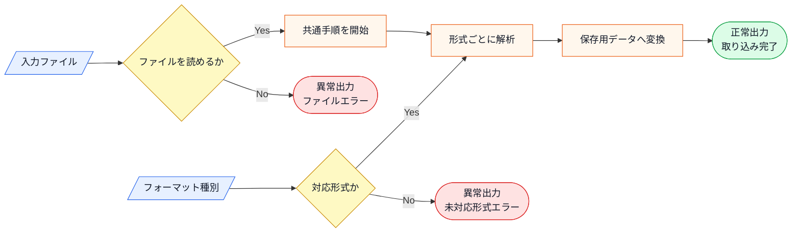
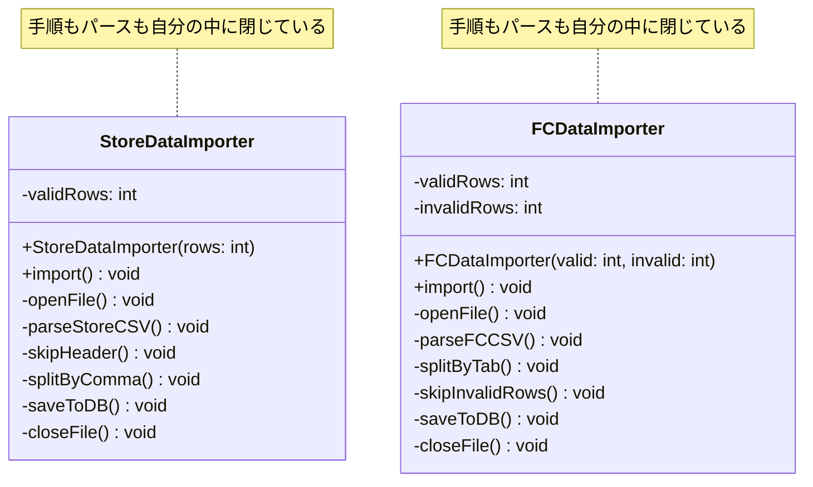
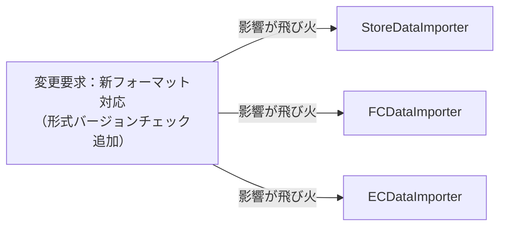
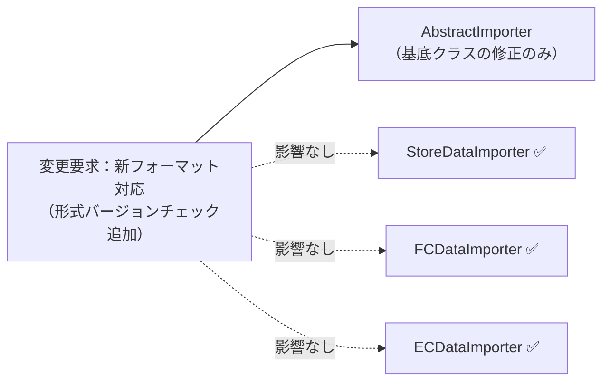
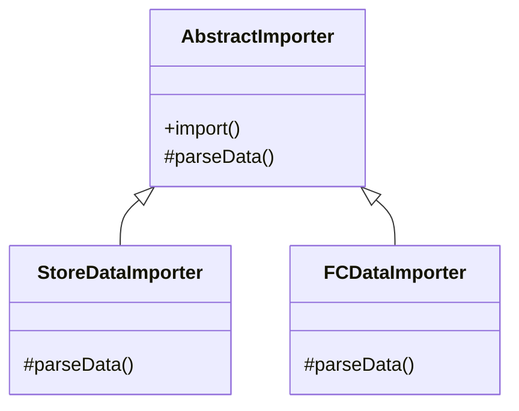
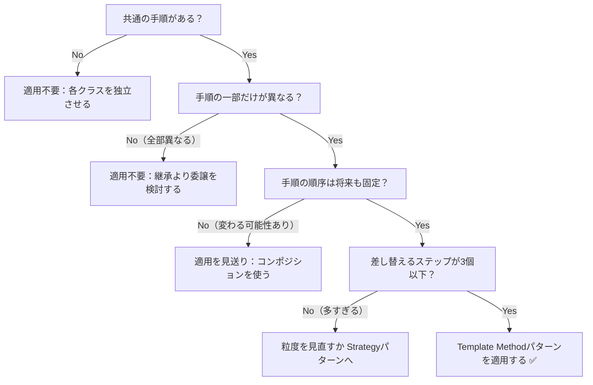

## 第4章 処理の骨格を固定する ―― Template Method パターン

―― 思考の型：手順の骨格は同じなのに、詳細部分が異なる処理が複数存在している

### この章の核心

**インポート手順の守りたい骨格と、ファイル形式ごとに異なるパース詳細が同じ場所に混在しているとき、形式が増えるたびに手順全体まで修正が必要になる。こういう問題は、「処理順序」と「各ステップの具体処理」が同じ場所に混在しているシステムで起きている。**

### この章を読むと得られること

この章のテーマは「同じ手順なのに、ファイル形式ごとにほぼ同じコードをコピーしている」という問題です。

* **得られること1：** 「共通の手順」という観点で、コード内の処理の骨格を識別できるようになる


* **得られること2：** 処理の詳細がハードコードされている箇所を見て、そこが変更の痛みの発生源だと判断できるようになる


* **得られること3：** 骨格となる手順を抽出し、詳細をサブクラスに委譲することで、変更を局所化できることを説明できるようになる


* **得られること4：** 「共通部分」と「異なる部分」を見極め、どのような場合にこの構造を選ぶべきかを判断できるようになる

## 🔵 フェーズ1：現状把握 ―― 仕様を整理し、システムと紐付ける
はじめには、CSVインポート処理という現場でよくあるシステムを例に、その現状を事実として観察していきましょう。

まずは、CSVインポート処理が何を入力として受け取り、どの処理で加工し、何を出力するのかを整理します。ここでは設計の良し悪しを判断せず、現状を事実としてそろえます。

### 1-1：このシステムの仕様

このシステムは、各店舗のPOSレジから出力される売上データをCSVファイルとして受け取り、DBへ**インポート**します。

インポート処理は以下の4ステップで構成されており、どの店舗形態でもこの大きな流れは変わりません。この章のシステムでは、「開く→変換する→保存する→閉じる」という順序を処理の骨格として固定しています。順序を固定するのは、開く前に保存しようとしたり、閉じた後に読もうとしたりするバグを防ぐためです。

ここまでの説明を、入力・判定・加工・出力の流れとして整理します。

**仕様の入力・加工・出力**



この図から読み取ることは、次の3点です。

- 入力ファイルを読めることと、フォーマット種別に対応していることが、取り込み処理へ進む前提になる。
- 共通手順の開始、形式ごとの解析、保存用データへの変換は順番に依存している。
- ファイルエラーや未対応形式の場合は、保存用データへの変換へ進まず、その時点の異常出力として終わる。

このシステムは、**システム基盤担当**と**業務担当者**の2つの立場で保守されています。システム基盤担当はファイルの開閉やDBへの保存といったインフラ寄りの処理を管理し、業務担当者は店舗形態ごとのデータパースルールや計算ロジックを管理します。この2立場の存在は、後で「変わる理由がどの業務機能によるか」を見極める際の参考になります。

**インポートの処理手順**

| ステップ | 処理内容 | 店舗形態による違い | 業務機能 |
|---|---|---|---|
| ① ファイルオープン | CSVファイルを読み込み可能な状態にする | 全形式で共通 | インフラ・システム管理 |
| ② データパース | フォーマットに従いCSV行を内部データに変換する | 形式ごとに異なる | 業務ルール管理 |
| ③ DB保存 | 変換済みデータをDBに登録する | 全形式で共通 | インフラ・システム管理 |
| ④ ファイルクローズ | ファイルリソースを解放する | 全形式で共通 | インフラ・システム管理 |

「②データパース」だけが「形式ごとに異なる」となっているのは、店舗ごとにPOSレジのメーカーや設定が違うためです。直営店とFC店では、もともと別々のレジシステムを導入していた経緯があり、出力されるCSVのフォーマットを統一することが難しい状況にあります。「①③④」が全形式で共通なのは、ファイルの開閉やDBの接続手順はフォーマットの違いに関係なく同じ手順で済むからです。

次の表は、現在このシステムが対応している2種類のフォーマットの違いをまとめたものです。区切り文字やヘッダー行の有無は、POSレジが出力する仕様の差であり、このシステムが独自に決めたルールではありません。

**現在対応しているフォーマット**

| 店舗形態 | 区切り文字 | ヘッダー行 | 不正行の扱い |
|---|---|---|---|
| 直営店 | カンマ区切り | あり（スキップ） | — |
| FC店 | タブ区切り | なし | スキップして続行 |

フォーマット差分は、実際に入力されるデータ例で比較すると分かりやすくなります。

**直営店CSVの例（カンマ区切り・ヘッダー行あり）**

```csv
商品ID,商品名,金額
1001,シャツ,3000
1002,パンツ,4500
```

**FC店CSVの例（タブ区切り・ヘッダー行なし・不正行をスキップ）**

```text
2001	バッグ	5200
不正な行
2002	帽子	1800
```

この例を見ると、直営店CSVでは1行目をデータとして扱わず、2行目以降をカンマで分割します。FC店CSVでは最初の行からデータとして扱い、タブで分割できない行は取り込まずに次の行へ進みます。

| 比較観点 | 直営店CSV | FC店CSV |
|---|---|---|
| 1行目 | ヘッダー行なのでスキップする | 商品データとして読む |
| 区切り文字 | `,` | タブ |
| 不正行 | 現状仕様では扱わない | スキップして続行する |
| 取り込み対象 | `1001`、`1002` の2件 | `2001`、`2002` の2件 |

「ヘッダー行のスキップ」は、CSVファイルの1行目に「商品名,数量,金額」のような列名が書かれている場合、それをデータとして読み込まないための処理です。表計算ソフトで言えば「1行目を見出し行として扱う」設定と同じです。一方FC店では、POSレジがヘッダーなしで最初の行から数値データを出力するため、スキップする処理自体が不要です。「不正行のスキップ」は、データが欠けているなど正常に変換できない行を無視して処理を続けるルールです。この章では、FC店の取り込みだけが不正行をスキップして続行し、直営店CSVの不正行は現状仕様ではまだ扱わない拡張候補として残します。

一見すると、この仕組みは各店舗のCSVを読み込み、データを抽出してDBに保存するという目的をしっかり達成できています。処理を順に追っていけば、ファイルの読み込みからデータの加工、保存という一連の流れが記述されており、全体の動きは見通しやすい状態です。

---

### 1-2：動作例テーブル

コードを読む前に、変更要求が届く前のシステムがどんな入力に対して
どんな出力を返すかを確認します。ここでは現在対応している直営店とFC店の
正常系・境界ケースを基準にします。直営店CSVファイルで不正行が含まれるケースは、現状ではこのフェーズの基準動作に含めず、後続の変更要求で扱う拡張候補として残します。

| 入力ファイル     | フォーマット種別       | データの状態         | 期待する出力        |
| ---------- | -------------- | -------------- | ------------- |
| 直営店CSVファイル | カンマ区切り・ヘッダー行あり | 正常データ10件       | インポート成功、10件追加 |
| FC店CSVファイル | タブ区切り・不正行スキップ  | 正常データ5件        | インポート成功、5件更新  |
| 直営店CSVファイル | カンマ区切り・ヘッダー行あり | 空ファイル（ヘッダー行のみ） | 0件インポート、エラーなし |
| FC店CSVファイル | タブ区切り・不正行スキップ | 全行不正データ | 0件インポート、エラー件数を報告 |
---

### 1-3：登場クラスとクラス構成図

実装コードへ入る前に、現状の登場クラスを確認します。

| クラス名 | 役割 | 担当する仕様 |
|---|---|---|
| `StoreDataImporter` | 直営店CSVの取り込み処理を進める | カンマ区切り、ヘッダー行ありのCSVを開き、解析し、保存する |
| `FCDataImporter` | FC店CSVの取り込み処理を進める | タブ区切り、ヘッダーなし、不正行スキップありのCSVを開き、解析し、保存する |

この図では、クラス同士の協調関係ではなく、`StoreDataImporter` と `FCDataImporter` が互いに依存せず、同じ手順を別々に抱えていることを見ます。そのため、あえてクラス間の矢印は引きません。



**クラス図に出てくる主なメンバーと操作**

| クラス | メンバー・操作 | 何ができるか |
|---|---|---|
| `StoreDataImporter` | `validRows` | 直営店CSVで取り込める行数を保持する |
| `StoreDataImporter` | `import()` | 直営店CSVを開き、カンマ区切りで解析し、DB保存まで進める |
| `StoreDataImporter` | `skipHeader()` / `splitByComma()` | ヘッダー行を読み飛ばし、カンマで各項目に分ける |
| `FCDataImporter` | `validRows` / `invalidRows` | 取り込める行数とスキップする不正行数を保持する |
| `FCDataImporter` | `import()` | FC店CSVを開き、タブ区切りで解析し、不正行を除いて保存する |
| `FCDataImporter` | `splitByTab()` / `skipInvalidRows()` | タブで各項目に分け、不正行を読み飛ばす |


→ `StoreDataImporter` と `FCDataImporter` の間に矢印はありません。両クラスは互いを知らず、それぞれが「ファイルを開く・パースする・保存する・閉じる」という手順全体を自分の中に独立して持っています。

これから検討するのは、同じ機能を保ちながら、変更に強い構造をどう作るかという点です。


**この章での簡略化**

1-3でクラス構成を確認したので、掲載コードで何を代替しているかを整理してから現状コードへ進みます。

この図から読み取ることは、次の3点です。

- インポート処理は、ファイルを開く、形式ごとにパースする、保存する、閉じるという順序で成立する。
- フォーマット種別は、パース方法を選ぶための入力であり、手順全体を変えるためのものではない。
- 出力には成功結果だけでなく、ファイル、パース、保存の各段階で起きるエラーも含む。

実際のファイルI/OやDB接続は、掲載コードでは `std::cout` と件数の固定値で簡略化します。論点は「開く→変換する→保存する→閉じる」という手順の骨格と、形式ごとに変わるパース処理をどこで分けるかです。ファイルの読み取り失敗、DBトランザクション、文字コード変換は実運用では必要ですが、本章では設計論点から外れるため扱いません。

---

### 1-4：実装コード（現状）

コードを見る前に、このシステムに登場する主要なクラスと、その役割を整理しておきます。

#### このシステムの登場クラス
| クラス名 | 役割 | 担当する仕様 |
|---|---|---|
| `StoreDataImporter` | 直営店CSVファイルのインポート処理全体 | カンマ区切り、ヘッダーありのCSVを処理する |
| `FCDataImporter` | FC店CSVファイルのインポート処理全体 | タブ区切り、不正行スキップでCSVを処理する |
| `SchemaRegistry` | インポートスキーマの登録・参照 | インポートタイプごとの必須カラム定義を保持し、タイプの存在確認と取得を担う |

この段階での注目ポイントは、どちらのクラスも「ファイルを開く」「データを加工する」「保存する」「閉じる」というデータの流れ（処理の手順）を、それぞれのクラス内に独立して持っている点です。

実際の処理コードを見てみましょう。直営店用とFC店用の2クラスが存在します。どちらも「開く→加工→保存→閉じる」という大きな流れは共通していますが、パースの中身は少し違っています。クラスごとにブロックを分けて確認します。

このシステムには以下の3種類のインポートスキーマがあらかじめ登録されています。

| タイプ | スキーマ名 | 必須カラム |
|---|---|---|
| customer | 顧客データ | id, name, email |
| product | 商品データ | id, name, price |
| order | 注文データ | id, customerId, amount |

登録されていないタイプ（例：`"online"`）を指定するとエラーになります。コードを読む前にこの対応を把握しておくと、動作結果が追いやすくなります。

```cpp
#include <iostream>
#include <map>
#include <vector>

// インポートスキーマ（タイプごとの必須カラム定義）
struct ImportSchema {
    std::string name;                         // スキーマ名
    std::vector<std::string> requiredColumns; // 必須カラム
};

// インポートスキーマの登録・参照を担うクラス
class SchemaRegistry {
    std::map<std::string, ImportSchema> schemas;
public:
    SchemaRegistry() {
        schemas["store"]  = {"直営店データ", {"id", "name", "amount"}};
        schemas["fc"]     = {"FC店データ",   {"id", "name", "amount"}};
    }

    bool exists(const std::string& type) const {
        return schemas.count(type) > 0;
    }

    ImportSchema get(const std::string& type) const {
        return schemas.at(type);
    }
};

// 直営店データのインポート（カンマ区切り・ヘッダー行あり）
class StoreDataImporter {
    int validRows;
public:
    explicit StoreDataImporter(int rows) : validRows(rows) {}

    void import() {
        // 手順：開く → 加工 → 保存
        openFile();
        parseStoreCSV(); // カンマ区切りでヘッダー行をスキップして読む
        saveToDB();
        closeFile();
        std::cout << "インポート成功: " << validRows << "件追加\n";
    }
private:
    void openFile() { std::cout << "直営店CSVを開く\n"; }
    void parseStoreCSV() {
        // ヘッダー行をスキップし、カンマで各フィールドに分割する
        skipHeader();
        splitByComma();
    }
    void skipHeader() { std::cout << "ヘッダーをスキップ\n"; }
    void splitByComma() { std::cout << "カンマ区切りで解析\n"; }
    void saveToDB() {
        std::cout << validRows << "件をDBへ追加\n";
    }
    void closeFile() { std::cout << "ファイルを閉じる\n"; }
};

// FC店データのインポート（タブ区切り・エラー行は無視する）
class FCDataImporter {
    int validRows;
    int invalidRows;
public:
    FCDataImporter(int valid, int invalid)
        : validRows(valid), invalidRows(invalid) {}

    void import() {
        // 手順：開く → 加工 → 保存
        openFile();
        parseFCCSV(); // タブ区切りで不正行をスキップしながら読む
        saveToDB();
        closeFile();
        std::cout << "インポート成功: " << validRows << "件更新";
        if (invalidRows > 0) {
            std::cout << "、エラー" << invalidRows << "件";
        }
        std::cout << "\n";
    }
private:
    void openFile() { std::cout << "FC店CSVを開く\n"; }
    void parseFCCSV() {
        // タブで各フィールドに分割し、不正な行は読み飛ばす
        splitByTab();
        skipInvalidRows();
    }
    void splitByTab() { std::cout << "タブ区切りで解析\n"; }
    void skipInvalidRows() {
        std::cout << "不正行を" << invalidRows << "件スキップ\n";
    }
    void saveToDB() {
        std::cout << validRows << "件をDBへ更新\n";
    }
    void closeFile() { std::cout << "ファイルを閉じる\n"; }
};
```

このコードを見ると、`import` メソッドの中で「開く」「加工」「保存」「閉じる」という手順がどちらも同じ順序で記述されていることが分かります。一方で、加工ステップの中身（`parseStoreCSV` と `parseFCCSV`）は、区切り文字やエラー処理の方針が異なっています。「手順の骨格は共通で、詳細部分だけが違う」という構造が見て取れます。

#### 呼び出し元と実行確認

```cpp
int main() {
    SchemaRegistry registry;

    // タイプ "store" はレジストリに登録済み
    std::string type1 = "store";
    if (!registry.exists(type1)) {
        std::cout << "[エラー] 未登録のインポートタイプ: "
                  << type1 << "\n";
        return 1;
    }
    ImportSchema s1 = registry.get(type1);
    std::cout << "--- 行1: " << s1.name << " 10件 ---\n";
    StoreDataImporter storeNormal(10);
    storeNormal.import();

    // タイプ "fc" はレジストリに登録済み
    std::string type2 = "fc";
    if (!registry.exists(type2)) {
        std::cout << "[エラー] 未登録のインポートタイプ: "
                  << type2 << "\n";
        return 1;
    }
    ImportSchema s2 = registry.get(type2);
    std::cout << "--- 行2: " << s2.name << " 5件 ---\n";
    FCDataImporter fcNormal(5, 0);
    fcNormal.import();

    std::cout << "--- 行3: 直営店空ファイル ---\n";
    StoreDataImporter storeEmpty(0);
    storeEmpty.import();

    std::cout << "--- 行4: FC店全行不正 ---\n";
    FCDataImporter fcInvalid(0, 5);
    fcInvalid.import();

    // タイプ "online" は未登録 → エラーで中断
    std::string type5 = "online";
    if (!registry.exists(type5)) {
        std::cout << "[エラー] 未登録のインポートタイプ: "
                  << type5 << " — 処理を中断します\n";
        return 1;
    }
    return 0;
}
```

実行対象コード：1-4の現状コード
対応する動作例：1-2の動作例テーブル
確認したいこと：入力、加工、出力が仕様どおりに対応していること

実行結果：

```text
--- 行1: 直営店データ 10件 ---
直営店CSVを開く
ヘッダーをスキップ
カンマ区切りで解析
10件をDBへ追加
ファイルを閉じる
インポート成功: 10件追加
--- 行2: FC店データ 5件 ---
FC店CSVを開く
タブ区切りで解析
不正行を0件スキップ
5件をDBへ更新
ファイルを閉じる
インポート成功: 5件更新
--- 行3: 直営店空ファイル ---
直営店CSVを開く
ヘッダーをスキップ
カンマ区切りで解析
0件をDBへ追加
ファイルを閉じる
インポート成功: 0件追加
--- 行4: FC店全行不正 ---
FC店CSVを開く
タブ区切りで解析
不正行を5件スキップ
0件をDBへ更新
ファイルを閉じる
インポート成功: 0件更新、エラー5件
[エラー] 未登録のインポートタイプ: online — 処理を中断します
```

動作例テーブルの全4行について、処理順序、処理件数、不正行の報告が
一致することを確認できました。未登録タイプ（"online"）はレジストリの
チェックで処理を中断し、エラーメッセージを出力します。

---

### 1-5：変更要求

ある日、店舗運営部の担当者から連絡がありました。「来月から、ネット通販（ECサイト）の売上データもこのシステムで取り込みたい。フォーマットは既存の直営店用と似ているが、会員ランクやポイント付与情報といったEC特有の項目が含まれるため、読み込み後の計算処理が少し追加される。また、データ整合性と互換性を保証するため、すべての形式（直営店・FC店・新規のEC店）について、ファイルを開いた直後にファイルメタデータの形式バージョンを確認する機能も共通で追加してほしい」と。

なるほど、店舗のデータとECサイトのデータ。どちらも「開く → バージョン検証 → 加工 → 保存 → 閉じる」という大きな流れは共通のはずですが、一部の計算ルールやパースルールだけが異なるのですね。

変更要求によって仕様がどう変わるのかを体系的に整理します。

| 項目 | 変更前 | 変更後 |
| --- | --- | --- |
| 対応フォーマット | 直営店・FC店の2形式 | 直営店・FC店・EC店の3形式 |
| バージョンチェック | なし | 全形式でファイルオープン直後に実行 |
| EC向け計算処理 | なし | EC店のみ（ポイント付与・会員ランク割引） |

**変更後の仕様表（ECサイト対応とバージョンチェックの追加）**

| ルール名 | 発動条件 | 結果 | 具体例 |
| --- | --- | --- | --- |
| ファイルオープン | インポート開始時に必ず実行 | CSVファイルを読み込み可能な状態にする | 直営店・FC店・EC店、どの形式でも同じ手順 |
| **形式バージョンチェック** | **ファイルオープン直後に実行** | **メタデータ内の形式バージョンが正常か検証する** | **直営店・FC店・EC店、どの形式でも同じ手順** |
| データパース | フォーマットごとに異なるルールを適用 | CSV行をシステム内部データに変換する | 直営店：カンマ区切り／FC店：タブ区切り／**EC：ポイント項目・会員ランク追加** |
| **EC向け計算処理** | **ECデータのパース完了後に実行** | **ポイント付与量・会員ランク割引を計算する** | **EC店のみ。直営店・FC店にはこのステップなし** |
| DB保存 | パース完了後に必ず実行 | 変換済みデータをDBに登録する | 保存先・保存形式はどの形式でも共通 |
| ファイルクローズ | 保存完了後に必ず実行 | ファイルリソースを解放する | 直営店・FC店・EC店、どの形式でも同じ手順 |

**変更後の動作例テーブル**

| 入力ファイル | データの状態 | 期待する出力 |
| --- | --- | --- |
| 直営店CSVファイル | 正常データ10件 | インポート成功、10件追加（変わらず） |
| FC店CSVファイル | 正常データ5件 | インポート成功、5件更新（変わらず） |
| **EC店CSVファイル** | **正常データ8件 + 不正データ行2件** | **正常行8件のみ処理、ポイント計算済み** |

仕様表を見ると、「ファイルオープン」「DB保存」「ファイルクローズ」は変更なしで、「データパース」とEC固有の「計算処理ステップ」が追加されています。

フェーズ1でシステムの現状と変更要求が把握できました。次のフェーズ2では、「何を変え、何を守るか」を整理します。

## 🟣 フェーズ2：仮説立案 ―― 何が変わるかを観察し、ヒアリングで裏付ける
### 2-1：変わりそうな仕様の見当をつける

ここで作る一覧は、思いつきで「変わりそう」と感じたものを並べる表ではありません。フェーズ1で確認した仕様・動作例・クラス図を材料に、次の順で候補を絞ります。

1. 仕様図と動作例から、入力・判定・加工・出力のうち条件や値が変わりそうな箇所を拾う。
2. その箇所が、1-3のどのクラス・メソッドに書かれているかを対応づける。
3. その仕様が、どんな理由で、何をきっかけに、どのくらいの頻度で変わりそうかを仮説として書く。
4. 逆に、当面変えない前提にできる処理の骨格も分けておく。

この手順で見ると、「CSVをインポートする」という大きな処理全体ではなく、その中のどの手順・フォーマット差分・パース規則が変更候補なのかを読者自身で追えるようになります。

`StoreDataImporter.import()` と `FCDataImporter.import()` が現在抱えている知識と、それぞれを変更するチームを確認します。

| 知識（コードが直接持っているもの） | 業務機能 | 適切か |
|---|---|---|
| ファイルの開閉・DBへの保存手順 | インフラ・システム管理 | ✅ |
| 直営店CSV特有のパース処理 | 業務ルール管理 | ❌ 混在 |
| FC店CSV特有のパース処理 | 業務ルール管理 | ❌ 混在 |

❌が2つある。インポートの骨格を変えたいシステム基盤担当と、パース方法を変えたい各業務担当者が、同じメソッドに手を入れることになります。これが後の変更の痛みの予兆です。

### 2-2：今回の変更で確実に変わること

今回の変更要求から確定している変更は以下の2点です。

- **ECサイト向けCSVのパース方法の追加**：会員ランク・ポイント項目を読み込む処理が必要
- **EC向け計算処理ステップの追加**：ポイント付与量・会員ランク割引を計算する処理が必要

ただし「この変更が1回限りか、今後も続くか」によって、どこまで設計を変えるべきかが大きく変わります。関係者に確認します。

### ヒアリングに向けた背景確認

このシステムは、ある小売店舗で日々の売上データを管理するために使われています。各店舗のPOSレジから出力される売上データをCSVファイルとして受け取り、システムへ取り込むのが主な役割です。インポートされたデータは夜間バッチで一括処理されるほか、管理画面からも手動でアップロードできる仕組みになっています。

当初は1種類のCSVフォーマットだけを読み込んでいましたが、店舗網の拡大とともに、店舗形態や仕入れ先によって「日付の形式」「ヘッダー行の有無」「カンマ区切りかタブ区切りか」といった細かな違いがあるCSVが持ち込まれるようになりました。

当時の担当者が、増え続けるフォーマットに対応するために一つずつコードを書き足してきた結果が、現在の実装です。

### 2-3：関係者ヒアリング


仮説の確度を上げるため、システム基盤担当と業務担当者に確認を行いました。

* **開発者：** 「今後もインポート対象のシステムが増える予定はありますか？」
* **システム基盤担当：** 「あります。次はSNS経由の販売データを取り込む予定です。ファイル操作の手順は既存と全く同じはずです。」
* **開発者：** 「読み込みの手順自体が変わる可能性はありますか？」
* **業務担当：** 「いいえ、ファイルを開いて閉じるという手順は固定です。ただ、中身のデータ項目が少しずつ増えたり計算ルールが変わったりすることは頻繁にあります。」

### 2-4：ヒアリングで判明した将来リスク

ヒアリングで浮かび上がった「確定ではないが、近い将来起こりうる変化」を記録します。これは今回の設計判断の材料です。

| **将来リスク** | **時期の目安** | **根拠** |
| --- | --- | --- |
| SNS販売データのインポート形式追加 | 継続的に | インポート対象チャネルが増える予定（システム基盤担当より） |
| 各店のデータ項目の追加・計算ルール変更 | 継続的に | 頻繁にあると業務担当が言及 |

フェーズ2で「今変わること（確定）」と「将来変わるかもしれないこと（リスク）」を分けて整理できました。次のフェーズ3では、現在の構造で変更を試みたときに何が起きるかを確認します。

### 2-5：変わる見込みと当面安定の前提を確定する

ヒアリングで判明したリスクを、「現在の状態」と「将来起こりうる変化」の対比で整理します。これが次のフェーズ以降の設計判断の基準になります。

| 変更内容 | 現在 | 将来（時期の目安） |
| --- | --- | --- |
| インポート対象チャネル | 直営店・FC店の2形式 | SNS販売データなど継続的に追加（システム基盤担当より） |
| 各店のデータ項目 | 固定（区切り文字・ヘッダー有無など） | 項目の追加・変更が継続的に発生（業務担当より） |
| 計算ルール | EC店のみポイント・会員ランク計算あり | 他形式でも同様の後処理が必要になる可能性あり |

この変化が来たとき、現在の構造では各インポートクラスに同じ修正を繰り返すことになります。次のフェーズ3では、その「痛み」を実際に変更を試みることで確認します。

---

## 🟣 フェーズ3：問題特定 ―― 変更の痛みを発見する
フェーズ2で、CSVインポートの処理手順は共通しており、データ加工のルールだけが変わるという構造が明確になりました。このフェーズでは、新しいECサイト向けCSVの取り込みを、現在のクラス構造のまま実装しようとするとどのような「痛み」が生じるのかを確認します。

### 3-1：変更を試みる

ECサイトの売上データをインポートする機能を実装しようと、既存の `StoreDataImporter` クラスを参考に、新しい `ECDataImporter` クラスを作成してみましょう。

```cpp
// EC店データのインポート（ポイント・会員ランク項目あり）
class ECDataImporter {
public:
    void import() {
        // 既存の直営店用と同じ手順を再度記述する
        openFile();
        parseECData();   // EC特有の加工ロジック
        calcPointBonus(); // ポイント付与計算（EC店のみ）
        saveToDB();
        closeFile();
    }
private:
    void parseECData() {
        // カンマ区切りで、会員ランク・ポイント列を追加で読む
        splitByComma();
        readMemberRank();
        readPointColumn();
    }
    void calcPointBonus() {
        // 会員ランクに応じたポイント付与量を計算する
    }
};

```

変更後のコードを実行すると、次のような結果になります。

```cpp
// 動作確認（出力付きのスタブで手順の流れを確認）
class ECDataImporter {
public:
    void import() {
        openFile();
        parseECData();
        calcPointBonus();
        saveToDB();
        closeFile();
    }
private:
    void openFile() {
        std::cout << "ファイルを開く" << std::endl;
    }
    void parseECData() {
        std::cout << "ECデータをパース（会員ランク・ポイント）"
                  << std::endl;
    }
    void calcPointBonus() {
        std::cout << "ポイント付与量を計算" << std::endl;
    }
    void saveToDB() {
        std::cout << "DBに保存" << std::endl;
    }
    void closeFile() {
        std::cout << "ファイルを閉じる" << std::endl;
    }
};

int main() {
    ECDataImporter importer;
    importer.import();
    return 0;
}
```

実行対象コード：3-1の変更試行コード
対応する動作例：変更要求後の代表ケース
確認したいこと：変更要求を現状構造へ当てはめたとき、修正箇所と痛みがどこに出るか

実行結果：

```
ファイルを開く
ECデータをパース（会員ランク・ポイント）
ポイント付与量を計算
DBに保存
ファイルを閉じる
```

コードは正しく動いています。しかし `openFile()`・`saveToDB()`・`closeFile()` は、直営店・FC店のコードと全く同じ実装です。

実装しながら、一つの違和感に気づきます。「あれ、`openFile()`・`saveToDB()`・`closeFile()` は直営店やFC店と全く同じなのに、また自分のクラスに書いているな」と。

さらに、同時に要求されていた「形式バージョンチェック機能」も追加してみましょう。「直営店・FC店・EC店のすべてについて、ファイルメタデータに形式バージョンを付与し、ファイルを開いた直後に対応可能なバージョンか確認する」という仕様です。

「バージョンチェック」はフォーマット種別に関わらず全店舗で共通の手順変更です。しかし現在の重複した構造では、`StoreDataImporter`・`FCDataImporter`・`ECDataImporter` の3つのクラスそれぞれに、同じバージョンチェックのコードを追加しなければなりません。

「3つのクラスすべてに同じ修正を入れる作業。しかも今後インポート形式が増えるたびに、同様の共通手順変更をすべてのクラスにコピペしなければならないのか……」

### 3-2：変更影響グラフ

変更要求が既存システムにどのように波及するかをグラフ化します。



→ このグラフを見ると、「形式バージョンチェック」という共通の手順変更が、インポートクラスの数だけ波及していることが分かります。バージョンチェックは1か所に書けば済むはずの処理なのに、各クラスが「手順の骨格」を独自に持っているために、3か所を同時に修正することになります。今後インポート形式が増えるたびに、この波及範囲も広がります。

### 3-3：痛みの言語化

変更を試みたことで、2つの「痛み」が鮮明になりました。

1つ目は、同じ修正の繰り返しです。具体的には、`openFile()` という1行が `StoreDataImporter`・`FCDataImporter`・`ECDataImporter` の3クラスそれぞれの `import()` メソッドに重複して存在しています（1-4節のコードで確認できます）。「バージョンチェックを追加してほしい」という1つの要求に対して、この同じ修正を3箇所で繰り返すことになります。今後インポート形式が4つ・5つと増えれば、修正箇所もその数だけ増えます。共通の手順であるはずのファイル操作やDB保存のコードが形式ごとに複製されているため、関連クラスを検索し、同じ修正を反映する必要があります。修正漏れを防ぐための確認範囲も広がります。

2つ目は、システムの「変更耐性の低さ」です。本来、ビジネスロジックである「店舗ごとのデータパース」だけを変えれば済むはずの状況で、ファイル操作やDB接続という「手順の骨格」まで修正対象になってしまっています。システム基盤側の知識が業務ロジックのクラスに漏れ出しているために、本来無関係な場所まで変更することになり、設計上の無駄が蓄積してしまいます。

こういうとき困る、という感覚、皆さんも同じではないでしょうか。この「共通の手順が散らばっている」という状態が、私たちの設計を硬直させている元凶なのです。

フェーズ3で「手順の重複が辛い」という事実が確認できました。次のフェーズ4では、なぜこの辛さが構造的に発生するのかを分析します。

---
> **📌 問題（確定）**
> インポート形式が1つ増えるたびに、`openFile()`・`saveToDB()`・`closeFile()` という共通手順を新しいクラスにも重複して書くことになる。ヒアリングで「SNS販売データなど今後もインポート対象が増える」と確定しており、この頻度では共通手順の重複管理コストが合わなくなってくる。
---

## 🟠 フェーズ4：原因分析 ―― なぜ辛いのかを構造で言語化する
フェーズ3で、インポート処理の「手順の重複」という痛みが確認できました。このフェーズでは、なぜそのような辛さが生じるのかを、コードの構造的な観点から言語化します。

### 4-1：痛みの根源を探る（観察と原因）

フェーズ3で確認した「変更の辛さ」は、コードのどこから来ているのでしょうか。コードを注意深く観察すると、痛みを引き起こしている2つの事実が浮かび上がってきます。

| **観察した症状（痛み）** | **構造的な原因（痛みの根源）** |
|---|---|
| 新しいインポート形式を追加するたびに、ファイルを開く・閉じる・保存する等の「手順」を全クラスで書き直す必要がある | 共通の手順（処理の骨格）と、店舗ごとのデータパース（詳細）が、同じメソッドの中に混在しているから |
| 共通であるはずのファイル操作手順に修正が入ったとき、全インポートクラスを修正することになる | 共通の手順という「守りたい骨格」を、店舗ごとの詳細という「形式ごとの違い」が引きずり回しているから |

### 4-2：変わるもの/変わってほしくないもの

> **「変わらないもの」と「変わってほしくないもの」は異なります。** 「変わらないもの」は経験的事実（今まで変わっていない）、「変わってほしくないもの」は設計意図（ここを安定させてほかを守りたい）です。ここで整理するのは後者です。

原因分析の結果として、「変わり続けるもの」と「変わってほしくないもの」を明確に分けます。

| **変わり続けるもの（🔴）** | **変わってほしくないもの（🟢）** |
| --- | --- |
| CSVのデータパースルール | ファイルを開く・閉じるというファイル操作手順 |
| 個別のデータ加工処理 | データベースへの保存という一連のフロー |

本来、これらは別々の理由で変わるはずのものです。ビジネス側が「パースルール」を変えるたびに、システム基盤側が管理する「ファイル操作手順」まで影響を受けてしまっていることが、設計上の問題です。

### 4-3：接続点に混在する骨格と差分を確認する

ここでの「確認すること」は、前節までに見つけた原因から抽出します。まず、原因文から「守りたい骨格」と「変わる差分」を分けます。次に、その差分を動かすために骨格側が知ってしまっている名前・条件・順序・型を拾います。最後に、接続点に残す最小の約束を、値・型・操作・イベントとして書きます。

原因によって、接続点で見る抽象観点は変わります。条件分岐が原因なら条件・定数・選択基準を見ます。処理手順が原因なら呼び出し順・前後条件・失敗時分岐を見ます。生成判断が原因なら具体クラス名・生成条件・登録場所を見ます。通知や外部連携が原因なら通知先・タイミング・成否の扱いを見ます。データや状態が原因なら、境界を流れる値・型・状態を見ます。

各インポーターの`import()`には、全形式で共通するファイル操作・DB保存と、形式ごとに変わるパース処理が同居しています。接続点で必要なのは、共通手順の途中で「この形式のデータを解析する」と依頼することです。しかし現在は、その接続点がなく、共通手順そのものが各クラスへ複製されています。

接続点を確認するときは、分類名を付けるのではなく、今回の変更要求に対して次の事実を見ます。

| 確認すること | 現在のコード |
|---|---|
| 共通手順を決めている場所 | 各Importerの `import()` に重複している |
| 形式ごとの差分を呼ぶ場所 | 各 `import()` が固有名の `parseStoreCSV()` / `parseFCCSV()` を呼ぶ |
| 共通手順を変更したときの影響 | すべてのImporterを修正・確認する |
| 新しい形式を追加するときに複製するもの | open→parse→save→closeという手順全体 |

問題は特定の分類に当てはまることではなく、共通手順を変更する要求が来たとき、同じ順序を持つすべてのクラスへ修正が波及することです。

フェーズ4で根本原因が言語化できました。「どこを分けるか」は明確です。次のフェーズ5では、その境界で実際に何が流れているかを値・型のレベルで具体化し、「何を変え、何を守るか」を明確にします。

---
> **📌 原因（確定）**
> `StoreDataImporter` と `FCDataImporter` の各クラスが「処理の骨格（open→parse→save→close）」と「店舗固有のパースルール」を同じ `import()` メソッドの中に直接混在させているため、骨格への変更が全インポートクラスに波及する。業務担当者が管理するパースルールと、システム基盤担当が管理する骨格という、変わる理由が異なる2つの知識が分離されていないことが原因である。
---

## 🟡 フェーズ5：課題定義 ―― 解くべき接続点を定める
フェーズ4は「なぜ辛いか」を答えました。フェーズ5が問うのは「分けるべき境界で、実際に何が流れているか」です。クラスの参照関係ではなく、**値・型のレベル**に降りていきます。

フェーズ4で、「共通の手順（骨格）」と「店舗ごとのパースルール（詳細）」が同じメソッド内に混在していることが分かりました。その境界で何がやり取りされているかを具体化します。

### 接続点を特定する

`import()` の中で分けるべき境界は1か所です。共通の処理順序と、形式ごとのパース処理との境界を見ます。

現在の結合状況：`StoreDataImporter` と `FCDataImporter` はそれぞれの `import()` の中で骨格手順とパースロジックを直接混在させています。各クラスが `parseStoreCSV()` / `parseFCCSV()` という異なる名前でパース処理を実装しており、中身は形式ごとに異なります。

| 接続点 | 接続するデータ | 変わるもの |
|---|---|---|
| 各クラスのパース処理 → `import()` の骨格 | 骨格の呼び出し順序（openFile→パース処理→saveToDB→closeFile）→ 処理完了（void） | パースロジックの実装（店舗形式ごとに異なる） |

### 何を変え、何を守るか

- **変わるもの**：形式ごとのパース処理（直営店・FC・EC形式で読み方が異なる）。新しいインポート形式が増えるたびに実装の種類が増えます。
- **守りたい前提**：骨格の呼び出し順序（open→parse→save→close）。その順序が意味する「インポートという業務の流れ」です。

呼び出し元が期待するのは「ファイルを受け取って適切にDBへ保存すること」です。課題は、形式ごとに異なるパース処理と共通の手順が各クラスへ一緒に複製されていることです。

**現状のままでよい場面**：対応形式が少なく、共通手順も当面変わらないなら、重複を許容する判断もあります。今回は形式追加と共通手順の変更が見込まれるため、骨格を1か所に置き、形式ごとの差分だけを接続点から呼ぶ設計を検討します。

---
> **📌 課題（確定）**
> 骨格の呼び出し順序（open→parse→save→close）と、形式ごとに異なるパース処理を切り離す。骨格を1か所に集約し、各インポートクラスはパースルールだけを担う構造にする。新しい形式を追加するときはパース実装と組み立て箇所を変更し、共通手順の重複を増やさない。
---

## 🔴 フェーズ6：対策検討 ―― 案を比べ、採用する形を決める
フェーズ5で「変わるのは形式ごとの `parseData()` の実装であり、骨格の呼び出し順序は安定している」ことが分かりました。ここでは、共通手順と形式別処理をどのように分けるかを段階的に検討します。それぞれの段階（ステップ）でどこまで痛みが解消されるかを確認し、今回の要件において「どのステップで止めるべきか」を決断します。

### ステップ1：各処理を独立したメソッドとして切り出し、共通構造に気づく

「コピペをやめる」という第一歩として、まず各クラスの処理を整理することから始める。`import()` の中に混在している「開く・パースする・保存する・閉じる」を、それぞれ独立したプライベートメソッドとして切り出してみよう。

```cpp
// 直営店：各処理を独立したメソッドとして切り出す
class StoreDataImporter {
public:
    void import() {
        openFile();
        parse();
        saveToDB();
        closeFile();
    }
private:
    // ファイル操作（共通）
    void openFile()  { /* 直営店CSVを開く */ }
    void saveToDB()  { /* DBへ追加 */ }
    void closeFile() { /* ファイルを閉じる */ }

    // パース処理（直営店固有）
    void parse() {
        skipHeader();
        splitByComma();
    }
    void skipHeader()   { /* ヘッダーをスキップ */ }
    void splitByComma() { /* カンマで分割 */ }
};

// FC店：同じく各処理を独立したメソッドとして切り出す
class FCDataImporter {
public:
    void import() {
        openFile();
        parse();
        saveToDB();
        closeFile();
    }
private:
    // ファイル操作（共通）
    void openFile()  { /* FC店CSVを開く */ }
    void saveToDB()  { /* DBへ更新 */ }
    void closeFile() { /* ファイルを閉じる */ }

    // パース処理（FC店固有）
    void parse() {
        splitByTab();
        skipInvalidRows();
    }
    void splitByTab()      { /* タブで分割 */ }
    void skipInvalidRows() { /* 不正行をスキップ */ }
};
```

処理がメソッド単位で整理されたことで、コードの意図が読みやすくなった。

ここで気づくことがあります。2つのクラスを並べてみると、`parse()` というメソッドが両方に存在しています。引数なし、戻り値 `void`——シグネチャが完全に一致しています。さらに `openFile()` / `saveToDB()` / `closeFile()` も、両クラスで同じシグネチャを持ちながら、内容は形式ごとに実装されています。

**この段階の評価：** 処理がメソッド単位で独立したことで、各クラスの構造が見えやすくなりました。ここで重要な観察が2つあります。1つ目は、`parse()` が両クラスで同じシグネチャ（引数なし・戻り値 `void`）を持っているという点です。これが「共通の構造」の初めての兆候です。2つ目は、`import()` に書かれた呼び出し順序（`openFile` → `parse` → `saveToDB` → `closeFile`）が、両クラスで完全に同じだという点です。同じシグネチャの `parse()` が並んでいる——これは「2つのクラスが同じ契約を実装している」ことを示しています。次のステップでは、この共通構造を活かして骨格を1か所に集約します。

ただし、骨格（呼び出し順序）を変更するときには `StoreDataImporter::import()` と `FCDataImporter::import()` の両クラスを直さないといけない点は変わっていません。「バージョンチェックをオープン直後に追加してほしい」という変更が来れば、2クラスの `import()` を両方開いて同じ行を追記することになります。呼び出し順序という「骨格」が各クラスに分散しているのが、まだ解消されていない問題です。

私の経験でも、最初はメソッド分割から始めることが多いです。そうすると「同じシグネチャのメソッドが複数クラスに並んでいる」という光景が見えてくる。これが「骨格そのものを1か所に集約し、差分だけを委ねる」という次の発想へのきっかけになりました。

> [!INFO] コラム: ヘルパークラスにまとめるだけではダメ？
> openFileやsaveToDBを別のヘルパークラスに切り出して呼び出す方法（委譲・コンポジション）も、有効な設計です。この設計のメリットは、「手順の骨格（順番）」を共通化しやすい点にあります。チーム開発などで「同じステップ・同じ順序でインポート処理を実装しやすくしたい」という場合には、親クラスで全体の流れを固定するこの構造が力を発揮します。

---

### ステップ2：骨格を基底クラスに固定し、変わる部分だけをサブクラスに委ねる

ステップ1の問題は「骨格（呼び出し順序）が各クラスに散らばっている」ことだった。骨格そのものを1つの基底クラスに閉じ込め、変わる部分（`parseData()`）だけを純粋仮想関数としてサブクラスに委ねれば、骨格は1か所だけで管理できる。

```cpp
// 骨格を固定する抽象基底クラス
class AbstractImporter {
public:
    void import() { // ← 骨格（変えさせない）
        openFile();
        parseData(); // ← 各店の実装を呼ぶ
        afterParse(); // ← 必要な形式だけが後処理を追加する
        saveToDB();
        closeFile();
    }
protected:
    virtual void parseData() = 0; // ← 実装詳細をサブクラスへ
    virtual void afterParse() {}  // ← 既定では何もしない任意フック
    void openFile()  { /* 共通手順 */ }
    void saveToDB()  { /* 共通手順 */ }
    void closeFile() { /* 共通手順 */ }
};

// 直営店：parseData() だけを実装する
class StoreDataImporter : public AbstractImporter {
protected:
    void parseData() override {
        skipHeader();
        splitByComma();
    }
};

// FC店：parseData() だけを実装する
class FCDataImporter : public AbstractImporter {
protected:
    void parseData() override {
        splitByTab();
        skipInvalidRows();
    }
};

// 呼び出し側：AbstractImporter* で受け取る
class BatchImportJob {
public:
    void run(AbstractImporter* importer) {
        importer->import(); // ← 抽象型だけを知る
    }
};
```

骨格（`openFile` → `parseData` → `afterParse` → `saveToDB` → `closeFile`）が `AbstractImporter` という1か所だけに存在するようになった。`parseData()` は全形式で必要な純粋仮想関数なので、サブクラスが実装しなければコンパイルエラーになります。一方、`afterParse()` は既定では何もしない任意フックです。EC店のようにパース後の計算が必要な形式だけがオーバーライドできます。

**評価：** 骨格の変更（バージョンチェック追加など）は`AbstractImporter::import()`へ集約されました。新しい形式はパース処理を実装するサブクラスとして追加し、利用側の組み立て箇所へ登録します。

---

### 採用する形を決める

それぞれのステップには一長一短があります。ステップ2の抽象基底クラスによる分離は強力ですが、クラス設計が必要になるという「初期投資コスト」もかかります。どこで止めるかは、**「今後の変更頻度（ビジネス要求）」**で決断します。

*   **ステップ1（ユーティリティ切り出し）で止めるケース：** 当面、新しいインポート形式が増える見込みが低い場合。コードの重複を減らすだけで十分であり、継承階層を作るコストに見合わないことがあります。
*   **ステップ2（抽象基底クラスへの集約）まで進むケース：** 「今後も新しいインポート形式が追加される」と確定している場合。今すぐ初期投資コストを払ってでも、将来の変更箇所を限定するのが適切です。

**今回の決断：**
フェーズ2のヒアリングで、システム基盤担当から「次はSNS経由の販売データを取り込む予定」と明言されています。形式追加の見込みを重視し、今回は**ステップ2（骨格を抽象基底クラスへ集約し、差分だけを委譲する）まで進化させる**案を採用します。

このように、処理の骨格を基底クラスが定義し、変わる部分のステップだけをサブクラスが差し替える設計構造を採用します。

フェーズ6で採用する形が決まりました。次のフェーズ7では、この決断を最終的なコードに落とし込みます。

## 🟢 フェーズ7：対策実施 ―― 変化に強いコードを完成させる
採用したステップ2の設計を、実際のコードに実装します。これまでは個別のクラスで重複していたファイル操作やDB保存の手順を、基底クラスにテンプレートとして集約します。

また、フェーズ3の追加要求で示した「全形式共通の形式バージョンチェック」を `checkFormatVersion()` として骨格に組み込みます。骨格が1か所（`AbstractImporter`）に集約されているため、この追加は基底クラスへの1回の修正で全形式に反映できます。

この設計変更により、新しいインポート形式を追加するときは、共通の手順を複製せずに、形式ごとのパース処理と必要に応じた後処理をサブクラスへ記述できます。共通手順そのものを変える場合は `AbstractImporter` を修正し、利用する形式を増やす場合は組み立て箇所へ登録します。

### 7-1：解決後のコード（全体）

新しい設計では、共通の手順を親クラスで定義し、形式ごとのパース処理と任意の後処理をサブクラスに委譲します。各役割ごとにコードを分けて確認します。

**スキーマ定義とSchemaRegistryクラス：**

```cpp
#include <iostream>
#include <map>
#include <vector>

using namespace std;

// インポートスキーマ（タイプごとの必須カラム定義）
struct ImportSchema {
    string name;                         // スキーマ名
    vector<string> requiredColumns;      // 必須カラム
};

// インポートスキーマの登録・参照を担うクラス
class SchemaRegistry {
    map<string, ImportSchema> schemas;
public:
    SchemaRegistry() {
        schemas["customer"] = {"顧客データ", {"id", "name", "email"}};
        schemas["product"]  = {"商品データ", {"id", "name", "price"}};
        schemas["order"]    = {"注文データ", {"id", "customerId", "amount"}};
    }

    bool exists(const string& type) const {
        return schemas.count(type) > 0;
    }

    ImportSchema get(const string& type) const {
        return schemas.at(type);
    }
};
```

`SchemaRegistry` はコンストラクタで3種類のスキーマを登録しています。`exists()` でタイプの存在確認、`get()` でスキーマの取得を行います。未登録タイプは `exists()` が `false` を返すため、呼び出し元で処理を中断できます。

インポート結果ログ（`ImportResultLog`）はシステム起動時は空で、インポート処理が実行されるたびに結果を1件追記します。ファイルへの保存は行わず、実行中のメモリ上にのみ保持します。

```cpp
struct ImportResult {
    string schemaType;  // "customer", "product", "order"
    string schemaName;  // "顧客データ", "商品データ", "注文データ"
    int rowCount;
    string status;      // "成功", "失敗"
};

// インポート結果ログを管理するクラス
class ImportResultLog {
    vector<ImportResult> records;
public:
    void add(const string& schemaType, const string& schemaName,
             int rowCount, const string& status) {
        records.push_back({schemaType, schemaName, rowCount, status});
    }
    void printAll() const {
        for (const auto& r : records) {
            cout << "[" << r.schemaType << "] " << r.schemaName
                 << " " << r.rowCount << "行 -> " << r.status << endl;
        }
    }
    int size() const { return (int)records.size(); }
};
```

**AbstractImporterクラス（骨格の定義）：**

```cpp
// 共通の骨格を持つ基底クラス
class AbstractImporter {
public:
    virtual ~AbstractImporter() = default;

    // 手順の骨格を定義するメソッド。
    // サブクラスはこのメソッドではなく、protectedの差分だけを実装する。
    void import() {
        openFile();
        checkFormatVersion();
        parseData();  // ← 形式ごとに必須
        afterParse(); // ← 必要な形式だけが追加
        saveToDB();
        closeFile();
    }
protected:
    virtual void parseData() = 0;
    virtual void afterParse() {} // 既定では何もしない任意フック
    void openFile()  { cout << "ファイルをオープンしました。" << endl; }
    void checkFormatVersion() {
        cout << "[全共通] ファイルメタデータの"
             << "形式バージョンを確認しました。" << endl;
    }
    void saveToDB()  { cout << "DBへの保存が完了しました。" << endl; }
    void closeFile() { cout << "ファイルをクローズしました。" << endl; }
};

```

`import()` が処理の順序を一か所に集約しています。全形式で必要な `parseData()` は純粋仮想関数とし、形式によって要否が異なるパース後処理は `afterParse()` という任意フックにしています。このように、全体の流れが基底クラスで固定され、サブクラスは必要な手順（ステップ）のみを埋めるだけで済むようになります。

**具体クラス（StoreDataImporter / FCDataImporter / ECDataImporter）：**

```cpp
// 直営店用インポート：パース処理だけを実装する
class StoreDataImporter : public AbstractImporter {
protected:
    void parseData() override {
        cout << "[直営店] ヘッダー行をスキップしました。" << endl;
        cout << "[直営店] カンマ区切りで10件のデータを読み込みました。" << endl;
    }
};

// FC店用インポート：パース処理だけを実装する
class FCDataImporter : public AbstractImporter {
protected:
    void parseData() override {
        cout << "[FC店] タブ区切りで行を分割しました。" << endl;
        cout << "[FC店] 5件のデータを更新しました（不正行スキップ）。" << endl;
    }
};

// EC店用インポート：パース処理とEC固有の後処理を実装する
class ECDataImporter : public AbstractImporter {
protected:
    void parseData() override {
        cout << "[EC店] カンマ区切りで行を分割しました。" << endl;
        cout << "[EC店] 会員ランクを読み込みました。" << endl;
        cout << "[EC店] ポイント列を読み込みました。" << endl;
    }
    void afterParse() override {
        cout << "[EC店] ポイントボーナスを計算しました"
             << "（8件処理、2件スキップ）。" << endl;
    }
};

```

> **EC向け計算処理を任意フックにした理由：** 1-5節の仕様表では、EC向け計算は「パース完了後、DB保存前」に行う独立したステップです。そこで骨格にも `afterParse()` という位置を用意し、既定実装は何もしない形にしました。直営店・FC店はそのまま通過し、EC店だけが計算処理を追加します。仕様上の順序とコード上の順序が一致するため、後から別形式にも同様の後処理が必要になったとき、置き場所を判断しやすくなります。

各サブクラスは形式ごとの `parseData()` を実装し、必要な場合だけ `afterParse()` を追加します。ファイルの開閉、バージョンチェック、DB保存の手順は基底クラスが担当します。

**呼び出し側（BatchImportJob / ManualImportController）：**

```cpp
// 夜間バッチ：抽象型で受け取り、具体クラスに依存しない
class BatchImportJob {
public:
    void run(AbstractImporter* importer) {
        importer->import(); // ← AbstractImporter* 経由
    }
};

// 手動実行：こちらも同じく抽象型で受け取るだけ
class ManualImportController {
public:
    void importFile(AbstractImporter* importer) {
        importer->import(); // ← 同じ形で受け取れる
    }
};

```

`BatchImportJob` と `ManualImportController` はどちらも `AbstractImporter*` を受け取るだけで、「どの具体クラスか」を知らずに済みます。新しいインポート形式が増えても、どちらの呼び出し元も修正は不要です。

**BatchApplicationクラス（組み立て）：**

```cpp
// 依存関係の組み立てを担うクラス
class BatchApplication {
    SchemaRegistry registry;
    ImportResultLog log;
public:
    void run() {
        runImport("customer", new StoreDataImporter(), 10);
        runImport("product",  new FCDataImporter(),    5);
        runImport("order",    new ECDataImporter(),    8);
        // 未登録タイプの場合はエラーで中断する
        runImport("unknown",  nullptr,                 0);

        cout << "\n--- インポート結果ログ ---\n";
        log.printAll();
    }
private:
    void runImport(const string& type, AbstractImporter* importer,
                  int rowCount) {
        if (!registry.exists(type)) {
            cout << "[エラー] 未登録のインポートタイプ: "
                 << type << " — 処理を中断します" << endl;
            return;
        }
        ImportSchema schema = registry.get(type);
        cout << "--- " << schema.name << "インポート ---" << endl;
        BatchImportJob batch;
        batch.run(importer);
        log.add(type, schema.name, rowCount, "成功");
    }
};
```

`BatchApplication` は `SchemaRegistry` を保持し、`runImport()` の中でタイプの存在確認を行います。未登録タイプは `exists()` が `false` を返すため、インポーターを呼び出す前にエラーメッセージを出力して処理を中断します。登録済みタイプは `get()` でスキーマを取得し、スキーマ名をログに使います。

**main関数：**

```cpp
int main() {
    BatchApplication app;
    app.run();
    return 0;
}
```

実行対象コード：7-1の解決後コード
対応する動作例：1-2の動作例テーブル、および変更要求後の代表ケース
確認したいこと：外部から見える結果を保ちながら、変更理由ごとの責任が分離されていること

**実行結果：**

```
--- 顧客データインポート ---
ファイルをオープンしました。
[全共通] ファイルメタデータの形式バージョンを確認しました。
[直営店] ヘッダー行をスキップしました。
[直営店] カンマ区切りで10件のデータを読み込みました。
DBへの保存が完了しました。
ファイルをクローズしました。
--- 商品データインポート ---
ファイルをオープンしました。
[全共通] ファイルメタデータの形式バージョンを確認しました。
[FC店] タブ区切りで行を分割しました。
[FC店] 5件のデータを更新しました（不正行スキップ）。
DBへの保存が完了しました。
ファイルをクローズしました。
--- 注文データインポート ---
ファイルをオープンしました。
[全共通] ファイルメタデータの形式バージョンを確認しました。
[EC店] カンマ区切りで行を分割しました。
[EC店] 会員ランクを読み込みました。
[EC店] ポイント列を読み込みました。
[EC店] ポイントボーナスを計算しました（8件処理、2件スキップ）。
DBへの保存が完了しました。
ファイルをクローズしました。
[エラー] 未登録のインポートタイプ: unknown — 処理を中断します

--- インポート結果ログ ---
[customer] 顧客データ 10行 -> 成功
[product] 商品データ 5行 -> 成功
[order] 注文データ 8行 -> 成功
```

フェーズ2で予告された共通の「バージョンチェック」は基底クラスへ1回追加し、EC店だけの計算処理は `afterParse()` へ置きました。変更理由の異なる2つの処理が、それぞれ対応する場所へ分かれています。未登録タイプ（"unknown"）は `SchemaRegistry.exists()` で検出し、インポーター呼び出し前にエラーを出力して処理を中断します。

このコードは実ファイルを解析する代わりに、顧客・商品・注文データという代表シナリオをログで模擬しています。空ファイル・全行不正・大量データを含む全仕様を実証するコードではないため、それらは実際のパーサーとデータを使うテストで確認します。

`main()` はキックするだけで、具体クラスの知識と `SchemaRegistry` の参照は `BatchApplication` に閉じています。

### 7-2：動作シーケンス図

ステップ2で到達した骨格固定構造の実行時のオブジェクト間のやり取りを可視化します。`BatchApplication` が依存関係を組み立て、`BatchImportJob` が具象クラスを知らずに抽象インターフェース経由で処理を委譲する流れが確認できます。


`BatchApplication` が具体型を組み立て、`BatchImportJob` は `AbstractImporter*` という型だけを介して `import()` を呼びます。`import()` の中では、共通処理を基底クラスが実行し、`parseData()` と必要に応じた `afterParse()` だけがサブクラスの実装へ切り替わります。これが骨格固定構造の動きです。

### 7-3：変更影響グラフ（改善後）

フェーズ3で確認した「形式バージョンチェック追加」のシナリオを再度適用します。



→ **フェーズ3の変更影響グラフと比較して、形式バージョンチェックの追加という変更要求が、基底クラスである `AbstractImporter` 一箇所に集約されました**。

### 7-4：変更シナリオ表

現状コードと改善後コードで、変更要求への影響がどう変わるかを対比します。

| **シナリオ** | **現状コードでの影響** | **この設計での影響** |
|---|---|---|
| 新しいファイル形式（XML等）を追加 | 全クラスを参考に新しいクラスをゼロから作成 | `DataImporter` を継承した新クラスを作成するだけ |
| 全形式共通の前処理（ログ等）を追加 | StoreDataImporter・FCDataImporter・ECDataImporter 全クラスを修正 | `DataImporter` の `process()` に1箇所追加 |
| 特定形式の変換ロジックを変更 | 対象クラスを直接修正（他との差分が不明確） | 対象のサブクラスのみ修正 |

共通の手順を基底クラスに集約したことで、共通ステップの変更先を予測しやすくなりました。代わりに、サブクラスは基底クラスが定めた順序とフックの位置に従う必要があり、基底クラスの変更が全サブクラスへ意味的な影響を与える可能性があります。継承関係や、フックの増加を管理するコストを引き受けます。

---

## 整理

### 問題・原因・課題・解決策

| | 内容 |
|---|---|
| **問題** | インポート形式が1つ増えるたびに共通手順を重複して書かなければならず、ヒアリングで確定した追加頻度ではコストが合わない |
| **原因** | 骨格（システム基盤担当が管理）とパースルール（業務担当者が管理）が各クラスの `import()` に混在しており、骨格への変更が全インポートクラスに波及する |
| **課題** | 共通の呼び出し順序と形式ごとの `parseData()` を切り離し、骨格を1か所に集約する |
| **解決策** | 骨格固定構造：`AbstractImporter` に骨格を固定し、必須の `parseData()` と任意の `afterParse()` をサブクラスへ委ねる |

### フェーズとこの章でやったこと

この章では、手順の骨格は同じなのに詳細が異なる複数のクラスが乱立し、変更が全クラスに飛び火していた現状を学びました。7フェーズの思考プロセスを適用して、どのように構造を改善したのかを振り返ります。

| **フェーズ** | **この章でやったこと** |
| --- | --- |
| 🔵 フェーズ1：現状把握 | 複数のインポートクラスでファイル操作手順が重複して記述されている現状を観察しました。変更要求（EC店追加）を把握しました |
| 🟣 フェーズ2：仮説立案 | 業務機能の所在表で各行の変わる理由を確認しました。インポートの「手順」は当面安定と見て、「パースルール」は形式ごとに変わるという仮説を立て、ヒアリングで裏付けました |
| 🟣 フェーズ3：問題特定 | 新しいインポート形式を追加しようとした際に、全クラスで同じ修正が必要になる「痛み」を確認しました |
| 🟠 フェーズ4：原因分析 | 共通の「骨格（手順）」と固有の「詳細（ロジック）」が混在していることが、変更影響を拡大させる根本原因だと突き止めました |
| 🟡 フェーズ5：課題定義 | 共通の処理順序と形式ごとの parseData() の境界を定め、手順の重複を増やさない課題を定めた |
| 🔴 フェーズ6：対策検討 | ステップ1〜2を比較し、共通手順を基底クラスにテンプレート化して分離するステップ2を採用しました |
| 🟢 フェーズ7：対策実施 | 共通の手順を基底クラスに集約し、固有ロジックだけをサブクラスで実装する構造へ移行しました |

### 責任の移動

| **責任** | **変更前** | **変更後** |
| --- | --- | --- |
| CSVインポートの共通手順（骨格）の管理 | `StoreDataImporter` / `FCDataImporter`（各クラスに重複して直書き） | `AbstractImporter` |
| 店舗固有のパース・後処理の実装 | `StoreDataImporter` / `FCDataImporter`（骨格と混在） | 各サブクラスの `parseData()` と、必要な場合だけ `afterParse()` |

> このプロセスを回した結果にたどり着いた構造こそが 骨格固定構造です。

---

## 振り返り

### 「この章を読むと得られること」は手に入ったか

| **得られること** | **この章のどこで示したか** |
| --- | --- |
| 1. 変動箇所の識別 | フェーズ2の業務機能の所在表と変わる理由の分析で、守りたい骨格と形式ごとに変わるパースを区別しました |
| 2. 痛みの発生源の判断 | フェーズ4で、共通手順が各Importerへ重複し、形式ごとの差分と同じ場所で管理されていることを変更シナリオから特定しました |
| 3. 構造改善の説明 | フェーズ7の変更シナリオ表で、修正が基底クラスに局所化されたことを実証しました |
| 4. いつ使うかの判断 | フェーズ6の「採用する形を決める」で判断基準を示しました |

### 3つの設計原則はどう適用されたか

**原則1「変わるものをカプセル化せよ」の現れ**

- 具体化された場所：各サブクラス（`StoreDataImporter` など）
- 解説：頻繁に変わる「パース・加工ルール」をサブクラスへとカプセル化しました。これにより、基底クラスの手順は変更の影響を受けずに安定しました。

**原則2「実装ではなくインターフェースに対してプログラムせよ」の現れ**

- 具体化された場所：`AbstractImporter` の抽象メソッド `parseData()`
- 解説：基底クラスの手順は、具体的なパース実装ではなく抽象化されたインターフェース（抽象メソッド）に対して動作します。

**原則3「継承よりコンポジションを優先せよ」の現れ**

- 具体化された場所：テンプレートメソッドによる継承階層
- 解説：本章では「手順の共通化」のために継承を用いましたが、これは変更理由が手順の骨格にある場合に限定した適用です。パースルールの差し替えが目的ならルール差し替え構造（コンポジション）が候補になります。

---

## あなたのコードで考えてみてください

この章で辿った思考プロセスを、あなた自身のコードに当てはめてみましょう。手順は「① 重複を探す → ② 変更理由を数える → ③ 骨格を1か所に書いた場合の修正範囲を見積もる」の3ステップです。

1. **変動の兆候を探す：** あなたのコードに「前処理→本処理→後処理」という同じ流れで、本処理だけが異なる処理が複数ありますか（コピー＆ペーストの痕跡が残っている箇所）？
2. **変える理由を問う：** 共通の「前処理」や「後処理」に変更が入ったとき、何箇所を修正しましたか？1箇所で済みましたか？
3. **骨格の重複を測る：** 似たような処理が複数あるとき、「どれが最新の正しいバージョンか」を判断するのに時間がかかったことはありますか？
4. **共通化した後を想像する：** もし骨格を1箇所に集約したとすると、「前処理のバグ修正」は何ファイルへの変更で完結しますか？

---

## パターン解説：Template Method パターン

### パターンの骨格

Template Methodパターンは、アルゴリズムの構造を定義し、具体的な実装をサブクラスに遅延させるパターンです。基底クラスにメソッドの処理手順（テンプレートメソッド）を記述し、一部のステップを抽象メソッドとしてサブクラスに実装させます。


### この章の実装との対応

GoF（Gang of Four）とは、1994年に出版された書籍『Design Patterns』の4人の著者の総称です。彼らが整理した23のパターンは、現在も設計の共通言語として広く使われています。

| GoFの名前 | この章での対応 |
|---|---|
| AbstractClass | `AbstractImporter` |
| templateMethod | `import()` |
| primitiveOperation / hook | `parseData()` / `afterParse()` |
| ConcreteClass | `StoreDataImporter` / `FCDataImporter` / `ECDataImporter` |



`AbstractImporter` が骨格となる手順を所有し、`StoreDataImporter` などのサブクラスがその詳細を埋めています。

### 使いどころと限界

Template Methodパターンは「手順の骨格」を再利用するのに強力ですが、使いどころを間違えると「硬直した設計」を生み出します。実務で導入を迷いやすい場面と、その判断基準を整理します。

**1. 手順の一部が「不要なクラス」が現れた場合**
たとえば「ファイルを開かずに、ネットワークから直接読み込む新しいインポート形式」が追加されたとします。このとき、既存の骨格（`openFile()`）が邪魔になります。
このような場合は、無理に既存のTemplate Methodに押し込めず、**新しい骨格クラスを作るか、手順の再利用（継承）自体を諦めてコンポジション（オブジェクトを内部に保持して利用する仕組み）に切り替える**のが一つの考え方です。

**2. 差し替えるステップ（フック）が多すぎる場合**
基底クラスに `parseHeader()`, `parseBody()`, `parseFooter()`, `validateData()` など、サブクラスが実装しなければならないメソッドが5個も6個もある場合、サブクラスの実装負担が大きすぎます。
この場合は、骨格の粒度が細かすぎるサインです。いくつかのステップをまとめて大きなステップにするか、**Strategyパターンなどの別の設計**への移行を検討してみてはいかがでしょうか。

**3. 途中で失敗したときに後始末が必要な場合**
ファイル、DBトランザクション、ロックなどを扱う処理では、処理の途中でエラー（例外等）が発生しても確実にクローズ処理などの後始末（資源解放）が行われる必要があります。
テンプレートメソッド側で複雑なエラーハンドリングを行うよりは、C++のRAII（資源の生存期間をオブジェクトの寿命で管理する仕組み）を活用し、ファイルやDB接続を自動解放するオブジェクトとして保持することが推奨されます。「正常系の順序を共通化しただけ」で例外発生時にリソースリークを起こさないよう、資源管理の設計と組み合わせて適用することが重要です。

| **迷う状況** | **設計の判断基準** |
| --- | --- |
| 手順の一部を使わないサブクラスが出た | 既存の骨格への追加を諦め、骨格クラスを分ける |
| 実装が必要なステップ数が多すぎる | 骨格の粒度を見直すか、Strategyパターンへ移行する |
| 将来、手順の順序自体が変わる可能性がある | Template Methodの導入を見送り、コンポジション（保持・委譲）を使う |
| 途中失敗時に資源解放やロールバックが必要 | RAII（資源の寿命管理オブジェクト）と組み合わせる |

**Template Methodパターン 適用判断フロー：**



### この章のまとめ

CSVインポートというドメインと Template Methodパターンの関係を一言で言うなら、「手順の骨格」と「フォーマット別の処理」は変わる理由が違う、ということです。「開く→読む→変換する→保存する→閉じる」という骨格はどのフォーマットでも共通ですが、変換ロジックはフォーマットごとに担当者も変更頻度も異なります。その2つが `import()` の中に同居していた限り、新しいCSV形式が来るたびに骨格まで手を入れる必要が生じていました。

7つのフェーズを通じて、読者は処理の骨格を観察するところから始まり、「どの業務機能によって変わるか」の分析を経て、骨格を抽象クラスに固定し差分だけをサブクラスへ委ねるという判断へと進みました。フェーズ2のヒアリングで「フォーマットは今後も増える」と確認した時点で分離の理由が確定し、フェーズ4で接続点を特定した時点で骨格と差分の境界線が引かれる——その積み上げの中に、パターン名の背後にある判断の論理があります。「骨格が共通かどうか」という問いが、この章のすべての起点でした。

あなたのコードの中にも、同じ処理フローの中に複数の担当者の知識が混在している箇所があるはずです。「この手順は全ケースで共通か、それとも各ケースで変わるか」を問うことが、Template Methodを使う理由を見つける入口になります。
