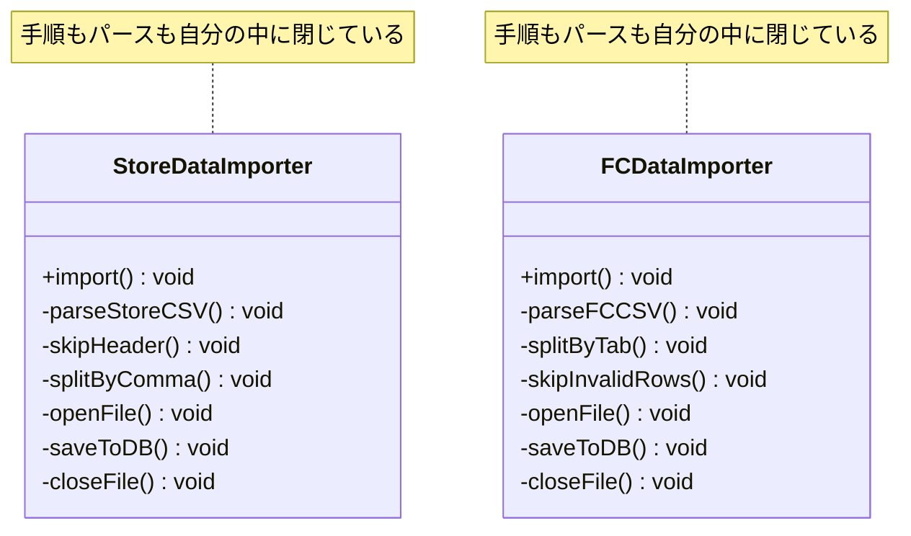
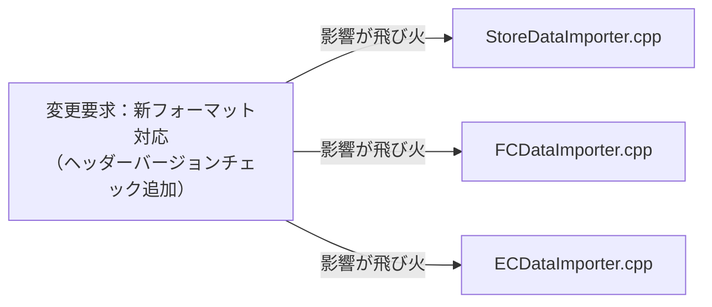
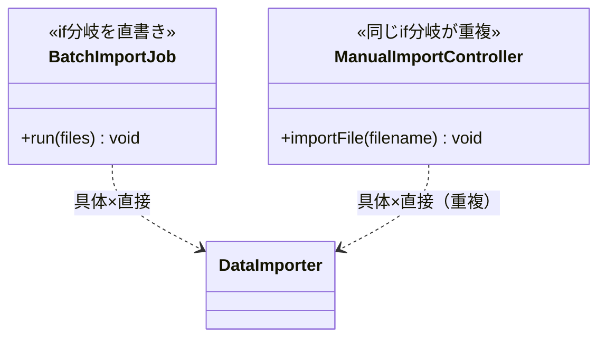
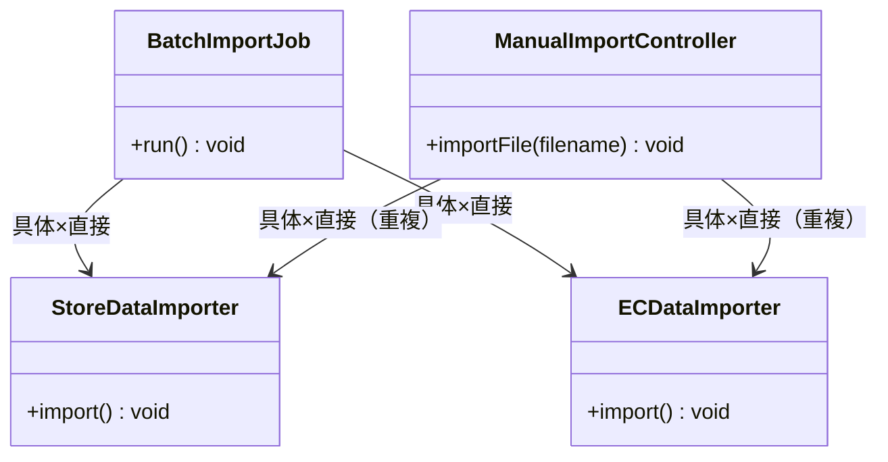
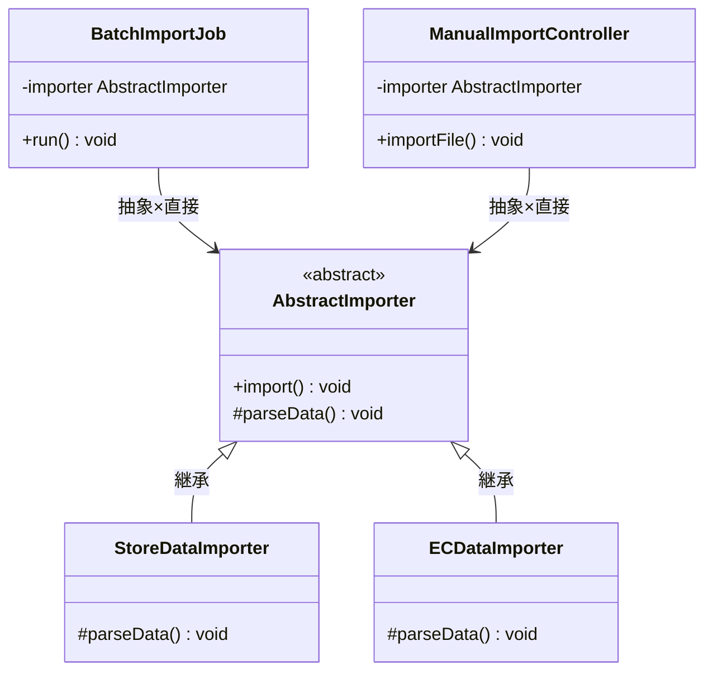
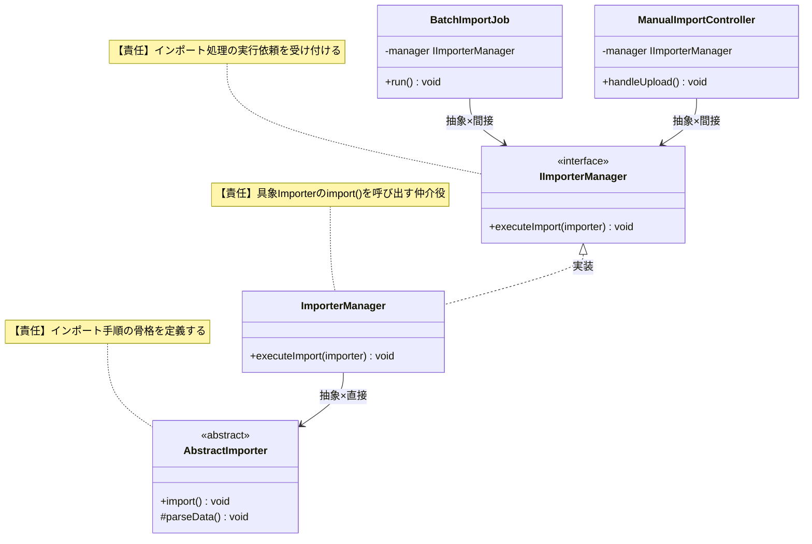
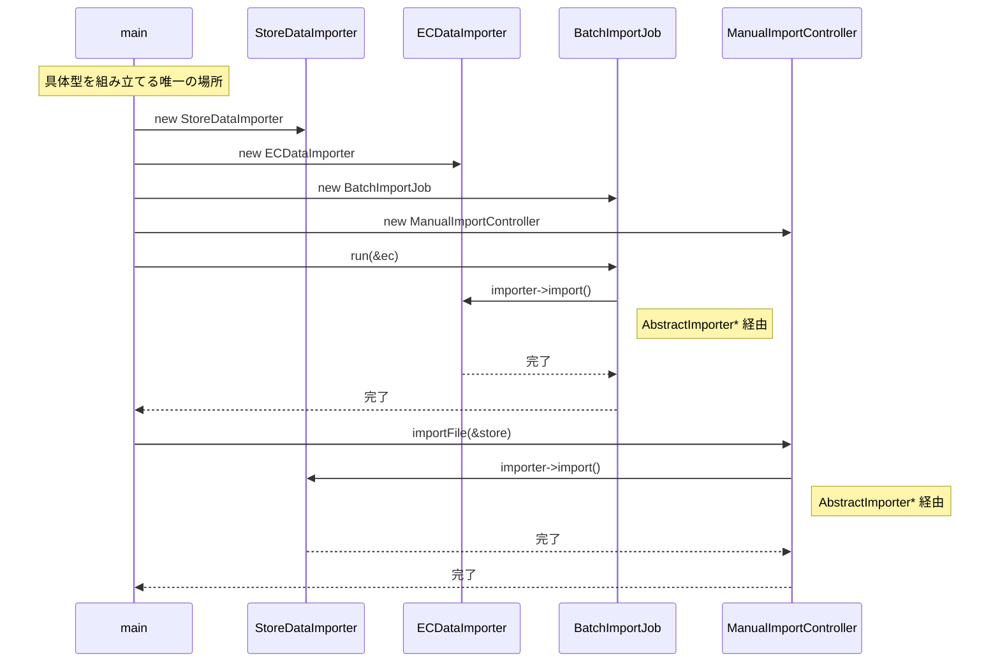
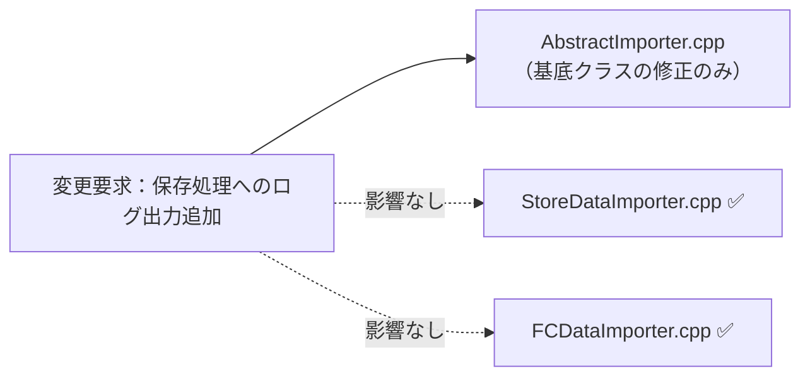
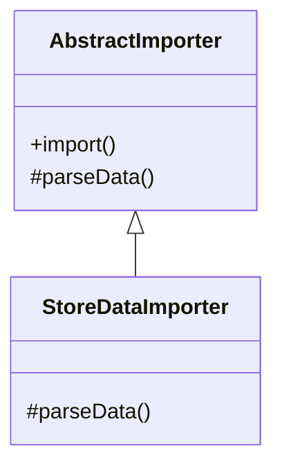

## 第4章 処理のステップの切り出し ―― Template Method パターン

―― 思考の型：手順の骨格は同じなのに、詳細部分が異なる処理が複数存在している

### この章の核心

**一連の手順は共通しているが、その中の一部のステップだけが異なる複数の処理が混在しているコードは、ステップごとに処理をコピー＆ペーストしてしまいがちだ。それは、「処理の骨格」と「詳細な実装」が、同じ場所に混在しているからだ。**

### この章を読むと得られること

これまでの章では「ルールの混在」「外部依存」「状態管理」という痛みを扱いました。この章の痛みはまた別の顔を持っています——「同じ手順なのに、ファイル形式ごとにほぼ同じコードをコピーしている」という問題です。

* **得られること1：** 「共通の手順」という観点で、コード内の処理の骨格を識別できるようになる


* **得られること2：** 処理の詳細がハードコードされている箇所を見て、そこが変更の痛みの発生源だと判断できるようになる


* **得られること3：** 骨格となる手順を抽出し、詳細をサブクラスに委譲することで、変更を局所化できることを説明できるようになる


* **得られること4：** 「共通部分」と「異なる部分」を見極め、どのような場合にこの構造を選ぶべきかを判断できるようになる

## 🔵 フェーズ1：現状把握 ―― 変更が来る前にコードを把握する
はじめには、CSVインポート処理という現場でよくあるシステムを例に、その現状を事実として観察していきましょう。
### 1-1：このシステムについて

このシステムは、ある小売店舗で日々の売上データを管理するために使われています。各店舗のPOSレジから出力される売上データをCSVファイルとして受け取り、システムへ取り込むのが主な役割です。インポートされたデータは夜間バッチで一括処理されるほか、管理画面からも手動でアップロードできる仕組みになっています。

当初は1種類のCSVフォーマットだけを読み込んでいましたが、店舗網の拡大とともに、店舗形態や仕入れ先によって「日付の形式」「ヘッダー行の有無」「カンマ区切りかタブ区切りか」といった細かな違いがあるCSVが持ち込まれるようになりました。

当時の担当者が、増え続けるフォーマットに対応するために一つずつコードを書き足してきた結果が、現在の実装です。

一見すると、このコードは各店舗のCSVを読み込み、データを抽出してDBに保存するという目的をしっかり達成できています。コードを上から追っていけば、ファイルの読み込みからデータの加工、保存という一連の流れが記述されており、全体の動きは見通しやすい状態です。

しかし、新しいフォーマットが加わるたびに、読み込み手順やデータ加工のロジックが微妙に異なるコードが次々と追加され、少しずつ違和感が見え始めています。
### 1-2：動作例テーブル ―― 仕様を「動かした結果」で確認する

コードを読む前に、このシステムがどんな入力に対してどんな出力を返すかを確認します。この章のどの案も、以下の動作を実現します。フォーマットの違い（カンマ区切り／タブ区切り／ポイント列あり）がシステムの動作にどう反映されるかを「フォーマット種別」列で確認してください。

| 入力ファイル | フォーマット種別 | データの状態 | 期待する出力 |
| --- | --- | --- | --- |
| 直営店CSVファイル | カンマ区切り・ヘッダー行あり | 正常データ10件 | インポート成功、10件追加 |
| FC店CSVファイル | タブ区切り・不正行スキップ | 正常データ5件 | インポート成功、5件更新 |
| EC店CSVファイル | カンマ区切り・ポイント列・会員ランク列あり | 正常データ8件 + 不正データ行2件 | 正常行8件のみ処理、エラー行2件スキップ |
| 直営店CSVファイル | カンマ区切り・ヘッダー行あり | 空ファイル（ヘッダー行のみ） | 0件インポート、エラーなし |
| FC店CSVファイル | タブ区切り・不正行スキップ | 全行不正データ | 0件インポート、エラー件数を報告 |
| EC店CSVファイル | カンマ区切り・ポイント列・会員ランク列あり | 正常データ100件（大量） | インポート成功、100件追加 |
### 1-3：実装コード

実際の処理コードを見てみましょう。直営店用とFC店用の2クラスが存在します。どちらも「開く→加工→保存→閉じる」という大きな流れは共通していますが、パースの中身は少し違っています。クラスごとにブロックを分けて確認します。

```cpp
// 直営店データのインポート（カンマ区切り・ヘッダー行あり）
class StoreDataImporter {
public:
    void import() {
        // 手順：開く → 加工 → 保存
        openFile();
        parseStoreCSV(); // カンマ区切りでヘッダー行をスキップして読む
        saveToDB();
        closeFile();
    }
private:
    void parseStoreCSV() {
        // ヘッダー行をスキップし、カンマで各フィールドに分割する
        skipHeader();
        splitByComma();
    }
};

// FC店データのインポート（タブ区切り・エラー行は無視する）
class FCDataImporter {
public:
    void import() {
        // 手順：開く → 加工 → 保存
        openFile();
        parseFCCSV(); // タブ区切りで不正行をスキップしながら読む
        saveToDB();
        closeFile();
    }
private:
    void parseFCCSV() {
        // タブで各フィールドに分割し、不正な行は読み飛ばす
        splitByTab();
        skipInvalidRows();
    }
};

```

このコードを見ると、`import` メソッドの中で「開く」「加工」「保存」「閉じる」という手順がどちらも同じ順序で記述されていることが分かります。一方で、加工ステップの中身（`parseStoreCSV` と `parseFCCSV`）は、区切り文字やエラー処理の方針が異なっています。「手順の骨格は共通で、詳細部分だけが違う」という構造が見て取れます。
### 1-4：クラス構成図

実装コードを踏まえて、クラスの関係性を可視化します。



→ `StoreDataImporter` と `FCDataImporter` の間に矢印はありません。両クラスは互いを知らず、それぞれが「ファイルを開く・パースする・保存する・閉じる」という手順全体を自分の中に独立して持っています。この「関係性がない」という事実こそが、後で問題となる重複の源です。

このコードは正しく動いています。これから検討するのは、同じ機能を保ちながら、変更に強い構造をどう作るかという点です。
### 1-5：責任配置テーブル

各クラスが「何を知るべきか」を整理します。後の責任チェック表（1-9節）と対応させることで、責任が混在している箇所を特定しやすくなります。

| **クラス名** | **責任（1文）** | **知るべきこと** |
| --- | --- | --- |
| `StoreDataImporter` | 直営店CSVを読み込みDBへ登録する | CSVのパース方法、データ加工ルール、DB接続情報 |
| `FCDataImporter` | FC店CSVを読み込みDBへ登録する | CSVのパース方法、データ加工ルール、DB接続情報 |

この表から、両クラスが「ファイルを読み込み、加工し、保存する」という一連の処理手順という知識をそれぞれ独立して定義していることが確認できます。
### 1-6：依存グラフ


→ 各インポートクラスは独立しており、一見きれいですが、共通の「保存先」や「読み込み手順」といった知識が重複して管理されている様子が見て取れます。
### 1-7：実行結果

上記コードの実行結果：

```text
直営店データのインポートが完了しました（10件追加）
FC店データのインポートが完了しました（5件更新、2件スキップ）
```

直営店では全10件が正常処理されています。FC店では不正行のスキップ処理（`skipInvalidRows()`）が機能した結果、5件の更新と2件のスキップが記録されています。このように、同じ `import()` という呼び出しでも、内部の加工ステップが違うため出力の内訳も異なります。

### 1-9：責任チェック表

この表は「コードの各行が、どの知識を持っているか」を可視化するものです。作り方はシンプルで、実装コードを1行ずつ読みながら「この行は何を知っているか」「その知識は誰が持つべきか」を書き出すだけです。知識の持ち主が2人以上になる行が見つかれば、そこが「変わる理由の混在」を示す兆候です。

仕様表（1-2節）では「ファイルオープン・データパース・DB保存・ファイルクローズ」という4つの処理ルールを整理しました。それぞれのルールを誰が管理しているかを対応させると、以下のようになります。「システム基盤担当」はインフラ寄りの処理を、「各店舗の業務担当者」はフォーマット固有のルールを、それぞれ把握・変更する立場の人です。

| **コードの行** | **持っている知識** | **管理する立場** |
| --- | --- | --- |
| `openFile()` | ファイルの開け方という知識 | システム基盤担当が管理 |
| `parseCSV()` | 各店特有のデータパースという知識 | 各店舗の業務担当者が管理 |
| `saveToDB()` | データベースへの保存という知識 | システム基盤担当が管理 |

責任チェックの結果、ファイル操作やDB保存といった「共通の手順」と、CSVのパースという「店舗固有のルール」が、同じメソッド内に混在している可能性が見えます。

要するに、すべてのインポートクラスが同じ手順の骨格を抱え込んでいるという観察から、共通の手順と店舗ごとの詳細な実装が混在しているという構造の問題が見えてくる。

フェーズ1で責任配置の観察が終わりました。次のフェーズ2では、変更要求を受けて「何が変わり、何が変わらないか」の仮説を立てます。

---

## 🟣 フェーズ2：仮説立案 ―― 変更要求を受けて、変動と不変を整理する

フェーズ1でCSVインポート処理の構造を把握しました。次に、新しい要件が届いた場面を想定して、「何が変わり、何が変わらないか」を整理していきます。

### 2-1：届いた変更要求

ある日、店舗運営部の担当者から連絡がありました。「来月から、ネット通販（ECサイト）の売上データもこのシステムで取り込みたい。フォーマットは既存の直営店用と似ているが、会員ランクやポイント付与情報といったEC特有の項目が含まれるため、読み込み後の計算処理が少し追加されることになる」と。

なるほど、店舗のデータとECサイトのデータ。どちらも「開く → 加工 → 保存」という大きな流れは同じはずですが、中身の計算ルールだけが異なるのですね。確かに、ここをそのまま既存のクラスをコピーして実装するのは少し待ったほうが良さそうです。

はじめに、変更要求によって仕様がどう変わるのかを体系的に整理します。

**変更後の仕様表（ECサイト対応を追加）**

| ルール名 | 発動条件 | 結果 | 具体例 |
| --- | --- | --- | --- |
| ファイルオープン | インポート開始時に必ず実行 | CSVファイルを読み込み可能な状態にする | 直営店・FC店・EC店、どの形式でも同じ手順 |
| データパース | フォーマットごとに異なるルールを適用 | CSV行をシステム内部データに変換する | 直営店：カンマ区切り／FC店：タブ区切り／**EC：ポイント項目・会員ランク追加** |
| **EC向け計算処理** | **ECデータのパース完了後に実行** | **ポイント付与量・会員ランク割引を計算する** | **EC店のみ。直営店・FC店にはこのステップなし** |
| DB保存 | パース完了後に必ず実行 | 変換済みデータをDBに登録する | 保存先・保存形式はどの形式でも共通 |
| ファイルクローズ | 保存完了後に必ず実行 | ファイルリソースを解放する | 直営店・FC店・EC店、どの形式でも同じ手順 |

**変更後の動作例テーブル**

| 入力ファイル | データの状態 | 期待する出力 |
| --- | --- | --- |
| 直営店CSVファイル | 正常データ10件 | インポート成功、10件追加（変わらず） |
| FC店CSVファイル | 正常データ5件 | インポート成功、5件更新（変わらず） |
| **EC店CSVファイル** | **正常データ8件 + 不正データ行2件** | **正常行8件のみ処理、ポイント計算済み** |

仕様表を見ると、「ファイルオープン」「DB保存」「ファイルクローズ」は変更なしで、「データパース」とEC固有の「計算処理ステップ」が追加されています。この観察から、変動と不変の仮説を立てられます。

### 2-2：変動と不変の整理 ―― 仮説を立てる

変更要求を受けたとき、はじめに「今回確実に変わること」と「変わらないこと」を仕様表から読み取ります。次に「将来もさらに変わりそうか」という仮説を立て、ヒアリングで確認する必要がある観点を準備します。

**ステップ1：今回の変更から変動と不変を読み取る**

| **分類** | **具体的な内容** | **読み取れる根拠** |
| --- | --- | --- |
| 🔴 **変動する（今回確定）** | データパース方法 | EC特有の会員ランク・ポイント項目を読み込む必要があるため |
| 🔴 **変動する（今回確定）** | インポート後のデータ加工処理 | EC特有の計算ルール（ポイント付与等）が追加されるため |
| 🟢 **不変** | ファイルの開閉手順（オープン、クローズ） | どのCSV形式でも同じ手順のはず |
| 🟢 **不変** | データベースへの保存手順 | 保存先のDB構造は共通のはず |

**ステップ2：将来の変化を予測する（仮説）**

仕様表を見ると、「データパース」はフォーマットごとに異なると明示されています。今後もECサイト以外の販売チャネルが増えれば、新しいパースルールが追加される可能性が高いと予測できます。

- **仮説1**：インポート対象のシステムは今後も増える（パースルールの追加が繰り返される）
- **仮説2**：ファイルの開閉やDB保存の手順は変わらない（共通の骨格として固定できる）

この仮説を持ってヒアリングに臨むことで、「骨格を共通化する必要があるか」「個別ロジックだけを差し替えられる構造が必要か」という確認ポイントが明確になります。

### 2-3：関係者ヒアリング

仮説の確度を上げるため、システム基盤担当と業務担当者に確認を行いました。

* **開発者：** 「今後もインポート対象のシステムが増える予定はありますか？」
* **システム基盤担当：** 「あります。次はSNS経由の販売データを取り込む予定です。ファイル操作の手順は既存と全く同じはずです。」
* **開発者：** 「読み込みの手順自体が変わる可能性はありますか？」
* **業務担当：** 「いいえ、ファイルを開いて閉じるという手順は固定です。ただ、中身のデータ項目が少しずつ増えたり計算ルールが変わったりすることは頻繁にあります。」

ヒアリングの結果、2-2の仮説が確認されました。ファイル操作や保存の手順は将来にわたって安定しており、インポートのデータ構造や加工ロジックは今後も追加され続けるリスクがあると分かりました。

> **現実のヒアリングでは——** CSVインポートの現場では、相手が「フォーマットは絶対変わらない」と言っても、翌月には新しいカラムが追加されることが珍しくありません。コードの変更履歴（`git log`）で「このパースロジック、過去1年で何回変わったか」を確認するのが、変動リスクの最も正直な証拠です。

### 2-4：今回の確定変更テーブル

ヒアリングを経て、仮説から確定した変更点を整理します。

| **分類** | **具体的な内容** | **変わる理由** |
| --- | --- | --- |
| 🔴 **変動する** | ECサイト向けCSVのパース方法 | EC特有の会員ランク・ポイント項目を読み込む必要があるため |
| 🔴 **変動する** | インポート後のデータ加工処理 | EC特有の計算ルール（ポイント付与等）が追加されるため |
| 🟢 **不変** | ファイルの開閉手順（オープン、クローズ） | どのCSV形式であってもファイル操作の手順自体は変わらないため |
| 🟢 **不変** | データベースへの保存手順 | 保存先のDB構造は共通であり、保存操作そのものも不変なため |

### 2-5：将来リスクテーブル

ヒアリングで判明した「今後変わるかもしれない」リスクを、今回の確定変更とは別に整理します。これらは現時点では確定していませんが、設計判断に影響する見込みのある変化です。フェーズ6の対策案を選ぶ際に、この将来リスクを念頭に置きます。

| **将来のリスク** | **発生条件** | **根拠** |
| --- | --- | --- |
| 🟡 **変わるかもしれない** | SNS販売データのインポート形式追加 | インポート対象チャネルが増える予定（システム基盤担当より） |
| 🟡 **変わるかもしれない** | 各店のデータ項目の追加・計算ルール変更 | 頻繁にあると業務担当が言及 |

フェーズ2で「今回確実に変わるもの」と「将来変わるかもしれないもの」が整理できました。次のフェーズ3では、この「変わる部分」を今の構造のまま追加しようとしたときに何が起きるかを確認します。

## 🟣 フェーズ3：問題特定 ―― 変更を試みて、痛みを発見する

フェーズ2で、CSVインポートの処理手順は共通しており、データ加工のルールだけが変わるという構造が明確になりました。このフェーズでは、新しいECサイト向けCSVの取り込みを、現在のクラス構造のまま実装しようとするとどのような「痛み」が生じるのかを確認します。

### 3-1：変更シミュレーション

ECサイトの売上データをインポートする機能を実装しようと、既存の `StoreDataImporter` クラスを参考に、新しい `ECDataImporter` クラスを作成してみましょう。

```cpp
// EC店データのインポート（ポイント・会員ランク項目あり）
class ECDataImporter {
public:
    void import() {
        // 既存の直営店用と同じ手順を再度記述する
        openFile();
        parseECData();   // EC特有の加工ロジック
        calcPointBonus(); // ポイント付与計算（EC店のみ）
        saveToDB();
        closeFile();
    }
private:
    void parseECData() {
        // カンマ区切りで、会員ランク・ポイント列を追加で読む
        splitByComma();
        readMemberRank();
        readPointColumn();
    }
    void calcPointBonus() {
        // 会員ランクに応じたポイント付与量を計算する
    }
};

```

実装しながら、一つの違和感に気づきます。「あれ、`openFile()`・`saveToDB()`・`closeFile()` は直営店やFC店と全く同じなのに、また自分のクラスに書いているな」と。

さて、ECサイト対応が完了した翌月、今度は別の要件が届きました。「直営店・FC店・EC店のすべてについて、CSVのフォーマットを新バージョンに切り替える。新フォーマットではヘッダー行の仕様が変わるため、ファイルを開いた直後にバージョンチェック処理を追加してほしい」という内容です。

「バージョンチェック」はフォーマット種別に関わらず全インポートで共通の手順変更です。しかし現在の構造では、`StoreDataImporter`・`FCDataImporter`・`ECDataImporter` の3つのクラスそれぞれに、同じバージョンチェックのコードを追加しなければなりません。

「3つとも同じ修正を入れる作業。しかもこれからインポート対象が増えるたびに同じことが繰り返される……」

### 3-2：変更影響グラフ

変更要求が既存システムにどのように波及するかをグラフ化します。



→ このグラフを見ると、「ヘッダーバージョンチェック」という共通の手順変更が、インポートクラスの数だけ波及していることが分かります。バージョンチェックは1か所に書けば済むはずの処理なのに、各クラスが「手順の骨格」を独自に持っているために、3か所を同時に修正しなければなりません。今後インポート形式が増えるたびに、この波及範囲も広がり続けます。

### 3-3：痛みの言語化

変更を試みたことで、2つの「痛み」が鮮明になりました。

1つ目は、修正の「コピー＆ペースト地獄」です。共通の手順であるはずのファイル操作やDB保存のコードが、インポートの数だけ量産されています。これにより、手順に修正が入るたびに、関連するすべてのクラスをgrepして同じ修正を繰り返さなければなりません。これは非常に退屈で、かつ修正漏れというバグを生み出しやすい作業です。

2つ目は、システムの「変更耐性の低さ」です。本来、ビジネスロジックである「店舗ごとのデータパース」だけを変えれば済むはずの状況で、ファイル操作やDB接続という「手順の骨格」まで修正対象になってしまっています。システム基盤側の知識が業務ロジックのクラスに漏れ出しているために、本来無関係な場所まで変更しなければならないという、設計上の無駄が蓄積しています。

こういうとき困る、という感覚、皆さんも同じではないでしょうか。この「共通の手順が散らばっている」という状態が、私たちの設計を硬直させている元凶なのです。

フェーズ3で「手順の重複が辛い」という事実が確認できました。次のフェーズ4では、なぜこの辛さが構造的に発生するのかを分析します。

## 🟠 フェーズ4：原因分析 ―― 処理の骨格と詳細の分離

フェーズ3で、インポート処理の「手順の重複」という痛みが確認できました。このフェーズでは、なぜそのような辛さが生じるのかを、コードの構造的な観点から言語化します。

### 4-1：観察→原因テーブル

フェーズ3で観察した「痛み」と、その根本にある構造的な原因を対応させます。

| **観察** | **原因の方向** |
| --- | --- |
| 新しいインポート形式を追加するたびに、ファイルを開く・閉じる・保存する等の「手順」を全クラスで書き直す必要がある | 共通の手順（処理の骨格）と、店舗ごとのデータパース（詳細）が、同じメソッドの中に混在しているから。 |
| 共通であるはずのファイル操作手順に修正が入ったとき、全インポートクラスを修正しなければならない | 共通の手順という「変わらないもの」を、店舗ごとの詳細という「変わるもの」が引きずり回しているから。 |

### 4-2：変わるもの / 変わらないものテーブル

原因分析の結果として、「変わり続けるもの」と「変わってほしくないもの」を明確に分けます。

| **変わり続けるもの（🔴）** | **変わってほしくないもの（🟢）** |
| --- | --- |
| CSVのデータパースルール | ファイルを開く・閉じるというファイル操作手順 |
| 個別のデータ加工処理 | データベースへの保存という一連のフロー |

本来、これらは別々の理由で変わるはずのものです。ビジネス側が「パースルール」を変えるたびに、システム基盤側が管理する「ファイル操作手順」まで影響を受けてしまっていることが、設計上の問題です。

### 4-3：接続形態を診断する

現在のインポート処理クラスは、各クラスの `import()` メソッド内にファイル操作手順とパースロジックが直接同居している状態です。これは **「具体×直接」の接続形態** です。

iPhone に専用の Lightning ケーブルを直差しした状態と同じで、新しい店舗のCSV形式が増えるたびに、クラス本体に新しい配線（`parseXXX()` メソッド）を直接追加しなければなりません。

|  | 直接（直差し） | 間接（アダプター経由） |
|:---:|:---|:---|
| **具体**（専用規格） | **← 現在地**　iPhone → [Lightning] → Apple純正ドック（Lightning端子） | iPhone → [Lightning] → [変換] → USB-A充電器（汎用端子） |
| **抽象**（汎用規格） | MacBook → [USB-C] → USB-C対応モニター（汎用端子） | MacBook → [USB-C] → [ハブ] → HDMI・USB-A・LAN |

このコードで言うと：

| ケーブル比喩 | コードの対応箇所 |
|---|---|
| 「具体」＝専用規格ケーブル | `StoreDataImporter::import()` と `FCDataImporter::import()` の両方に `openFile(); parseCSV(); saveToDB(); closeFile();` が重複して存在する |
| 「直接」＝直差し | 各インポートクラスがスケルトン全体を直接所有し、共通の抽象クラスを持たないため手順の変更は全クラスを書き直す必要がある |

本来であれば、手順の骨格だけを「USB-Cの汎用規格（抽象×直接）」のように決めておき、具体的なパースロジックを必要に応じて差し込める形にする必要があるでしょう。

フェーズ4で根本原因が言語化できました。次のフェーズ5では、解決する必要がある問題を具体的に定めます。

## 🟡 フェーズ5：課題定義 ―― 解くべき問題を具体的に定める

フェーズ4で、「共通の手順（骨格）」と「店舗ごとのパースルール（詳細）」が同じメソッド内に混在しているという構造的問題が明らかになりました。対策案（フェーズ6）に進む前に、ここで「何を解くべき課題とするか」を具体的に確定させます。

### 5-1：接続点の特定

今回のリファクタリングにおいて、最も深刻な影響が出ている場所、つまり解決する必要がある「接続点（ジョイント）」は以下の1箇所です。

* **接続点A：** `Importer`クラス（処理手順クラス） ←→ `parseCSV` / `processData`（加工ルール）の境界


この接続点は、「ファイルを開いて閉じる」という基盤的な手順と、「CSVの中身をどう読み解くか」という業務知識がつながっている場所です。ここを切り離すことで、新しいインポート形式が追加された際も、手順のコードに手を触れずに済む設計を目指します。

### 5-2：非機能制約の確認

このシステムの規模では、抽象化層の導入によるパフォーマンスコストは設計判断を絞り込む制約になりません。ただし、月次の一括インポートで全店舗分を処理する場合、ファイルサイズが大きくなり**ストリーミング設計**が必要になることがあります。処理の骨格と個別の解析ロジックがどう分離されているかが、この将来的な対応しやすさに影響します。この点は案3・案4の選定に影響するため、各案のトレードオフで触れます。

### 5-3：クライアントへの影響範囲

「分けること」で既存コードにどの程度の変更が波及するかを確認します。

分離対象のパースロジックを呼び出している `StoreDataImporter` や `FCDataImporter` といった既存のインポートクラスがクライアントです。この接続点の形を変えると、これらのクラスは既存の処理手順を継承する形に作り変える必要があります。

一度この切り離しを行えば、以降のインポート形式追加時は、共通の基底クラスを継承してパースロジックを実装するだけで済むようになります。

### 5-4：課題まとめ表

以上の情報をまとめ、フェーズ6での対策案検討の基盤となる課題定義を確定します。

| **接続点** | **分けた理由** | **非機能制約** | **クライアント影響** |
| --- | --- | --- | --- |
| 接続点A | 処理の骨格と詳細な加工ルールを隔離するため | 通常は低頻度・一括処理時にデータ量が大きく（ストリーミング設計の考慮が必要） | 各Importerクラスを基底クラス継承へ移行する必要あり |

フェーズ5で「何を解くか」が確定しました。次のフェーズ6では、この課題に対してどのような「接続の形」を採用する必要があるか、案1〜案4を並べてコスト比較を行います。

## 🔴 フェーズ6：対策案検討 ―― 解決策を並べ、コストで選ぶ

フェーズ5で課題定義した「共通手順とパースルールの混在」を解消するための対策案を検討します。

どの案も、動作例テーブルで示した動作を実現します。違うのは「変更が来たときにどこを触ることになるか」です。

### 6-1：接続の形 2×2マトリクス

現在のコードは、各インポートクラスが自身の `import()` メソッド内でファイル操作手順をハードコードしている「具体×直接」の状態です。ここから、共通手順を「不変」として切り出し、パースルールだけを「変動」として差し込める設計を目指します。

| 接続形態 | ケーブル例 | 今のCSVインポートシステムでの具体例 |
|:---:|:---|:---|
| **具体×直接**（← 現在地） | iPhone → Lightning → Apple純正ドック | `StoreDataImporter` / `FCDataImporter` が `openFile()` / `saveToDB()` を内部に直書きしている |
| **具体×間接** | iPhone → 変換 → USB-A充電器 | 共通手順を担う中継クラス（`ImportProcessor`等）を置き、具体クラスがそれを呼び出す |
| **抽象×直接** | MacBook → USB-C → USB-C対応モニター | `AbstractImporter` という抽象基底クラスを定義し、各店舗が `parseData()` だけを実装 |
| **抽象×間接** | MacBook → USB-C → ハブ → HDMI/USB-A | `AbstractImporter` + `IImporterManager` の2層抽象で呼び出し元が具体クラスを一切知らない |

**現在のシステムの位置：**

> **現在のシステムはここ → 具体×直接**
> 各インポートクラス（`StoreDataImporter`・`FCDataImporter`・`ECDataImporter`）がそれぞれ `openFile()`・`saveToDB()`・`closeFile()` という手順を直接・具体的に持っている状態。Lightningコネクタが機器ごとに個別に用意されているようなイメージです。

---

#### 案1：現状のまま ―― 構造を変えない

> **ケーブルで言うと：** LightningケーブルをそのままApple純正ドックに差し込んだまま使い続ける。新しい機器が増えるたびに専用ケーブルを追加する。接続方法を変える工事は不要だが、機器が増えるほどケーブルの山になる。

**この形の考え方：**
クラスの分割やインターフェースの導入を行わず、既存の `import()` メソッドの中に、新しいフォーマット用の処理を `if` 文で追加します。変更頻度が低く、将来的な変化が見込めない場合に許容される最小コストの選択です。

**手段の比較：**

| 手段 | 方法 | 特徴 |
|---|---|---|
| 手段A：if文追加 | 既存メソッド内にif分岐でEC処理を追記する | 最小の変更量だが条件分岐が肥大化する |
| 手段B：メソッド分割 | フォーマット別の処理をprivateメソッドに切り出す | 読みやすくなるが根本的な重複は残る |

→ **採用：手段A**（現状維持という案の主旨に沿った最小変更として）

**構造図：**



両クラスがフォーマット検出ロジックを内部に直書きしており、インポート形式が増えるたびに両方の条件分岐を同時に修正しなければならない。

以下に各案の全コードを掲載します。前のページに戻らなくても、この節だけで各案の全体像を把握できます。

**DataImporterクラス：**

```cpp
// ← 具体："EC"という条件を呼び出し側が直接書いている
class DataImporter {
public:
    std::string format;
    void import() {
        openFile();
        if (format == "EC") parseECData();
        else parseStoreData(); // 直営店用
        saveToDB();
        closeFile();
    }
};

```

このコードを見ると、フォーマット種別に関する知識が `DataImporter` の中に直接埋め込まれており、EC以外の新形式が増えるたびにここの条件分岐が膨らんでいくことが分かります。

**呼び出し側（BatchImportJob / ManualImportController）：**

```cpp
// 案1（現状のまま）の呼び出し側
// 夜間バッチ：フォーマット条件値をそのまま書く
class BatchImportJob {
public:
    void run(std::vector<std::string> files) {
        for (auto& f : files) {
            DataImporter importer;
            // ← 具体：フォーマット種別を呼び出し側が直接指定
            importer.format = detectFormat(f);
            importer.import();
        }
    }
};

// 手動実行：同じ条件分岐ロジックが再び現れる（重複）
class ManualImportController {
public:
    void importFile(std::string filename) {
        DataImporter importer;
        // ← 重複：BatchImportJobと同じformat検出ロジックをここでも書く
        importer.format = detectFormat(filename);
        importer.import();
    }
};

```

`BatchImportJob` と `ManualImportController` の両方が、フォーマット検出と `import()` の呼び出しという同じロジックをそれぞれの場所に書いている。呼び出し元が増えるたびに、同じ条件分岐の重複が量産されていく。

**組み立て（main）：**

```cpp
int main() {
    BatchImportJob batch;
    batch.run({"store_may.csv", "ec_may.csv"});

    ManualImportController ctrl;
    ctrl.importFile("store_extra.csv");
    return 0;
}
```

ロジックが各呼び出し元の内部に直書きされているため、フォーマット検出の同じ条件分岐が `BatchImportJob` と `ManualImportController` の2か所で並行して走る。

**この形のトレードオフ：**

* 変更容易性：低（インポート形式が増えるたび、条件分岐が肥大化する）


* テスト容易性：低（ロジックが散在し、テストが網羅しにくい）


* 実装コスト：低（今のコードに追記するだけ）


---

#### 案2：具体×直接 ―― クラスを分けるが参照は具体型のまま

> **ケーブルで言うと：** Lightningケーブルはそのままだが、機器ごとに専用ケーブルを整理してラベルを貼る。ケーブル自体の規格は変わらず専用のまま。機器が増えれば専用ケーブルも増え続けるが、案1よりは整理されている。

**この形の考え方：**
インポート処理を店舗ごとにクラス分割しますが、呼び出し側が各具体クラスを直接知っている状態です。責任の境界は引かれますが、新しい形式の追加時には呼び出し側のコード修正が避けられません。

**手段の比較：**

| 手段 | 方法 | 特徴 |
|---|---|---|
| 手段A：クラス分割のみ | 店舗ごとにクラスを作り、呼び出し元は具体クラスを直接生成する | 責任は分かれるが呼び出し元の重複が残る |
| 手段B：継承を使った分割 | 既存クラスを親として継承し、パース部分だけをオーバーライドする | コード量は減るが呼び出し元は具体型を知る必要がある |

→ **採用：手段A**（この案の「具体×直接」という接続形態の本質を示すため）

**構造図：**



2つの呼び出し元がどちらも `StoreDataImporter`・`ECDataImporter` という同じ具体クラスを直接参照しており、形式が増えるたびに両方の呼び出し元の修正が必要になる。

**StoreDataImporterクラス：**

```cpp
// 直営店用インポート
class StoreDataImporter {
public:
    void import() {
        openFile();
        parseStoreData(); // 直営店形式
        saveToDB();
        closeFile();
    }
};

```

**ECDataImporterクラス：**

```cpp
// ← 具体：ECDataImporterという型名を直接書いている
class ECDataImporter {
public:
    void import() {
        openFile();
        parseECData(); // EC特有の加工ロジック
        saveToDB();
        closeFile();
    }
};

```

このコードを見ると、どちらのクラスも `openFile()`・`saveToDB()`・`closeFile()` という同じ手順を繰り返し書いていることが分かります。クラスは分かれましたが、手順の重複という問題は解消されていません。

**呼び出し側（BatchImportJob / ManualImportController）：**

```cpp
// 案2（具体×直接）の呼び出し側
// 夜間バッチ：具体クラスを直接生成して実行
class BatchImportJob {
public:
    void run() {
        StoreDataImporter store; // ← 直接：具体クラスを直接生成
        store.import();
        ECDataImporter ec;       // ← 直接：具体クラスを直接生成
        ec.import();
    }
};

// 手動実行：呼び出し側でも同じく具体クラスを直接選んで生成する
class ManualImportController {
public:
    void importFile(std::string filename) {
        // ← 重複：どのクラスを使うかの選択ロジックがここにも現れる
        if (filename.find("ec_") != std::string::npos) {
            ECDataImporter importer;
            importer.import();
        } else {
            StoreDataImporter importer;
            importer.import();
        }
    }
};

```

`BatchImportJob` と `ManualImportController` の両方が、「どの具体クラスを使うか」という選択ロジックをそれぞれ持っている。新しいインポート形式が増えるたびに、両方の呼び出し元を修正しなければならない。

**組み立て（main）：**

```cpp
int main() {
    BatchImportJob batch;
    batch.run();

    ManualImportController ctrl;
    ctrl.importFile("store_extra.csv");
    return 0;
}
```

クラスは分かれたが「どのクラスを呼ぶか」という判断を両方の呼び出し元がそれぞれ行っており、呼び出し経路が2本並んで重複している。

**この形のトレードオフ：**

* 変更容易性：低〜中（新形式追加時に呼び出し側の修正が必要）


* テスト容易性：低（具体クラスへの依存が強いため切り離せない）


* 実装コスト：低（既存ロジックをクラスへ移すだけ）


---

#### 案3：抽象×直接 ―― インターフェースを挟み、型だけで接続する

> **ケーブルで言うと：** LightningからUSB-Cコネクタに変換する。どのメーカーの充電器でも同じUSB-C口で繋がるようになり、機器が増えても口の規格を変える必要がなくなる。

**この形の考え方：**
インポート処理の「骨格となる手順」を親クラスで定義し、詳細な「パース・加工処理」をサブクラスで実装する形式です。呼び出し側は親クラスのインターフェースさえ知っていれば、具体的な実装クラスに依存せずに処理を進められます。

**手段の比較：**

| 手段 | 方法 | 特徴 |
|---|---|---|
| 手段A：継承（基底クラスで骨格を定義） | 抽象基底クラスに共通手順を実装し、サブクラスがパース処理だけをオーバーライドする | 骨格が一箇所に集まり重複を排除できる。継承関係が生まれる |
| 手段B：コンポジション（パーサーを注入） | インポートクラスにパーサーオブジェクトを渡し、内部で委譲する | 継承関係がなく差し替えやすいが、骨格の保護が弱い |
| 手段C：フックメソッド | 基底クラスが空のフックメソッドを用意し、サブクラスが必要な箇所だけ上書きする | 任意の拡張が可能だが、何をオーバーライドする必要があるか分かりにくい |

→ **採用：手段A**（手順の骨格を完全に基底クラスに閉じ込めることが今回の目的に合致しているため。コンポジション（手段B）は骨格の順序をサブクラスが自由に変えられてしまうリスクがある）

**構造図：**



両クラスが `AbstractImporter` の抽象インターフェースだけを知り、`main()` だけが具体クラスを生成・注入する構造。新しいインポート形式を追加しても呼び出し元は変更不要。

**AbstractImporterクラス（抽象基底クラス）：**

```cpp
// ← 抽象：AbstractImporter*型で受け取り、具体クラスを知らない
class AbstractImporter {
public:
    void import() { // 共通手順（骨格を定義するメソッド）
        openFile();
        parseData(); // 各店の実装を呼ぶ
        saveToDB();
        closeFile();
    }
    virtual void parseData() = 0; // 実装詳細をサブクラスへ
protected:
    void openFile()  { /* 共通手順 */ }
    void saveToDB()  { /* 共通手順 */ }
    void closeFile() { /* 共通手順 */ }
};

```

`import()` の中で `openFile()`・`parseData()`・`saveToDB()`・`closeFile()` という手順が一度だけ定義されており、重複が消えていることが分かります。変わる部分は `parseData()` という1か所に集約されています。

**具体クラス（StoreDataImporter / ECDataImporter）：**

```cpp
// 直営店：パース処理だけを実装する
class StoreDataImporter : public AbstractImporter {
protected:
    void parseData() override { /* 直営店形式のパース処理 */ }
};

// EC店：パース処理だけを実装する
class ECDataImporter : public AbstractImporter {
protected:
    void parseData() override { /* EC特有のパース処理 */ }
};

```

各サブクラスは `parseData()` だけを実装しており、ファイル操作やDB保存の手順は一切知りません。手順の骨格は基底クラスが完全に管理しています。

**呼び出し側（BatchImportJob / ManualImportController）：**

```cpp
// 案3（抽象×直接）の呼び出し側
// 夜間バッチ：抽象型で受け取り、具体クラスに依存しない
class BatchImportJob {
public:
    void run(AbstractImporter* importer) {
        // ← 直接：インターフェース経由で受け取る
        importer->import();
    }
};

// 手動実行：こちらも同じく抽象型で受け取るだけ（重複なし）
class ManualImportController {
public:
    void importFile(AbstractImporter* importer) {
        // ← 直接：同じ形で受け取れる
        importer->import();
    }
};

```

`BatchImportJob` と `ManualImportController` はどちらも `AbstractImporter*` を受け取るだけで、「どの具体クラスか」を知らずに済む。新しいインポート形式が増えても、どちらの呼び出し元も修正は不要だ。

**組み立て（main）：**

```cpp
int main() {
    ECDataImporter ec;       // ← 具体：組み立て側だけが具体クラスを知る
    StoreDataImporter store;

    BatchImportJob batch;
    batch.run(&ec);

    ManualImportController ctrl;
    ctrl.importFile(&store); // ← 同じインターフェースを使い回せる
    return 0;
}
```

**この形のトレードオフ：**

* 変更容易性：中〜高（サブクラスを追加するだけで新形式に対応可）


* テスト容易性：高（サブクラスを個別に単体テスト可能）


* 実装コスト：中（クラス設計が必要だが、将来的な拡張性は高い）


---

#### 案4：抽象×間接 ―― インターフェース＋仲介役を両立する

> **ケーブルで言うと：** USB-CハブをMacBookに接続し、そのハブを介してHDMI・USB-A・LANなど多様な機器へ展開する。ハブが仲介役になるため、Macbook本体は各機器の規格を一切知らなくてよい。最も柔軟だが、ハブ自体のコストと配線の複雑さも増す。

**この形の考え方：**
処理の骨格を持つ各クラスを、さらに仲介者経由で利用する形です。実装の詳細はどの層も知らず、変更影響は最も局所化されますが、クラス数と層の深さが増え、小規模なシステムには過剰になりがちです。

**手段の比較：**

| 手段 | 方法 | 特徴 |
|---|---|---|
| 手段A：Manager＋Interfaceの2層 | IImporterManagerというインターフェースを作りManagerが実装する | 最も柔軟だが層が増えて理解コストが高い |
| 手段B：Managerのみ（具体×間接） | ImporterManagerという具体クラスを仲介役として置く | 仲介の効果はあるが抽象化の恩恵が薄い |

→ **採用：手段A**（呼び出し元が仲介役の実装にも依存しない完全な分離を実現するため）

**構造図：**



インターフェース層（`IImporterManager`）と仲介層（`ImporterManager`）の2層を挟み、両クラスは具体実装を一切知らない最も柔軟な構造。変更影響は `main()` の組み立て部分だけに閉じる。

**インターフェース（IImporterManager）：**

```cpp
// インターフェース：呼び出し元はこれだけを知る
class IImporterManager {
public:
    virtual void executeImport(AbstractImporter* importer) = 0;
};

```

**仲介クラス（ImporterManager）：**

```cpp
// 仲介クラス：IImporterManagerを実装し、実際の実行を担う
class ImporterManager : public IImporterManager {
public:
    void executeImport(AbstractImporter* importer) override {
        importer->import(); // AbstractImporter* 経由で骨格メソッドを呼ぶ
    }
};

```

このコードを見ると、`ImporterManager` は `AbstractImporter*` を受け取るだけで、どの具体的なインポートクラスが来るかを一切知らないことが分かります。

**呼び出し側（BatchImportJob / ManualImportController）：**

```cpp
// 案4（抽象×間接）の呼び出し側
// 夜間バッチ：抽象Managerのみ知り、具体実装は見えない
class BatchImportJob {
    IImporterManager* manager; // ← 抽象：インターフェース型で保持
public:
    BatchImportJob(IImporterManager* m) : manager(m) {}
    void run(AbstractImporter* importer) {
        manager->executeImport(importer); // ← 間接：Manager経由で実行
    }
};

// 手動実行：こちらも同じ抽象Managerを受け取る（重複なし）
class ManualImportController {
    IImporterManager* manager; // ← 抽象：同じインターフェース型で保持
public:
    ManualImportController(IImporterManager* m) : manager(m) {}
    void importFile(AbstractImporter* importer) {
        manager->executeImport(importer); // ← 間接：Manager経由で実行
    }
};

```

`BatchImportJob` と `ManualImportController` はどちらも `IImporterManager*` という抽象インターフェースしか知らない。具体的な実装クラスの知識は `main()` の組み立て部分だけに閉じている。

**組み立て（main）：**

```cpp
int main() {
    ImporterManager mgr;          // ← 具体：組み立て側だけが具体型を知る
    ECDataImporter ec;
    StoreDataImporter store;

    BatchImportJob batch(&mgr);
    batch.run(&ec);

    ManualImportController ctrl(&mgr);
    ctrl.importFile(&store);
    return 0;
}
```

呼び出し元 → `IImporterManager*` → `AbstractImporter*` という2段階の抽象型を経由するため、どの具体クラスが動くかは `main()` の組み立て部分だけが知っている。`BatchImportJob` と `ManualImportController` はどちらも `IImporterManager*` しか見えず、内部で何が動くかは完全に隠蔽されている。

**この形のトレードオフ：**

* 変更容易性：高（全層が抽象化され、変更が完全に局所化される）


* テスト容易性：高（各層を切り離してテスト可能）


* 実装コスト：高（インターフェースと仲介クラスの設計が必要）


* ※ 大量データ時のストリーミング：`IImporter` インターフェース越しにストリーミング対応の実装に差し替えることが容易。呼び出し元を変更せずに、将来的な大容量ファイル対応が可能になる。

### 6-7：評価軸

対策案が揃ったところで、どの案を採用する必要があるかを決めるための「ものさし」を宣言します。設計の意思決定を透明にするため、比較表の提示に先立って評価軸を合意します。

今回のCSVインポート処理では、以下の3軸で評価を行います。

| **評価軸** | **意味** | **ウェイト** |
| --- | --- | --- |
| 変更容易性 | 新しいインポート形式が増えたとき、既存コードに影響を与えないか | ×3 |
| テスト容易性 | インポートロジックを分離して単体テストを書けるか | ×2 |
| 可読性 | 手順と固有ロジックが明確に分かれて読みやすいか | ×1 |

> **注：** このウェイト（変更容易性×3など）は本書の例です。チームの変更頻度・テスト文化に合わせて、比較を始める前にチームで合意してください。スコアは「答えを決める計算式」ではなく、「チームの議論を整理する道具」です。

| 点数 | 変更容易性 | テスト容易性 | 可読性 |
| --- | --- | --- | --- |
| 3 | 変更が1クラスのみで完結する | スタブ1つで完全に切り離せる | クラス数が増えない・既存構造と同じ読み方で理解できる |
| 2 | 変更が2〜3クラスに及ぶ | 一部スタブが必要だが差し替え可能 | クラスが1〜2増える |
| 1 | 変更が4クラス以上に波及する | 実装に依存しテストが困難 | 中間層・インターフェースが複数増え理解コストが高い |

パフォーマンスについては、本件が非同期のバッチ処理であり、かつインポート処理におけるオーバーヘッドが微小であるため、今回の評価軸からは除外します。

---

### 6-8：コスト天秤

案1〜案4を定量的に比較します。

| **案** | **現在の対応コスト** | **未来の対応コスト** |
| --- | --- | --- |
| 案1：現状のまま | 低 | 高 |
| 案2：具体×直接 | 低〜中 | 高 |
| 案3：抽象×直接 | 中 | 低〜中 |
| 案4：抽象×間接 | 高 | 低 |

**ステップ1：採点表**（1＝低い、2＝中程度、3＝高い）

| 案 | 変更容易性（×3） | テスト容易性（×2） | 可読性（×1） |
| --- | --- | --- | --- |
| 案1：現状のまま | 1 | 1 | 3 |
| 案2：具体×直接 | 1 | 2 | 3 |
| 案3：抽象×直接 | 3 | 3 | 2 |
| 案4：抽象×間接 | 3 | 3 | 1 |

**ステップ2：加重合計表**（変更容易性×3 ＋ テスト容易性×2 ＋ 可読性×1）

| 案 | 加重スコア | 判定 |
| --- | --- | --- |
| 案1 | 8 |  |
| 案2 | 10 |  |
| 案3 | 17 | ← 採用候補 |
| 案4 | 16 |  |

※案3が加重スコアで最高となりました。シンプルかつ強力にインポート形式の追加に対応できるためです。

---

### 6-9：採用案の決定

**採用する案：** 案3

**理由：** 共通手順を基底クラスにテンプレートとして定義し、各店固有のパースロジックをサブクラスへ追い出すことで、変更時の影響を最小化できる案3を採用します。案4は変更容易性・テスト容易性ともに同等ですが、仲介クラスとインターフェースの2層が加わることで実装コストが高く、現時点のシステム規模には過剰です。

---

### 6-10：耐久テスト

フェーズ2のヒアリングで挙がった「将来のリスク」が実際に発生した場面をシミュレートし、案3の変更耐性を検証します。

| **変更シナリオ** | **触る場所** | **コスト評価** |
| --- | --- | --- |
| 新しいインポート形式（SNS売上）の追加 | `SNSDataImporter` クラスの新規作成のみ | 低 |
| 共通ログ出力手順の追加 | `AbstractImporter` 基底クラスの修正のみ | 低 |

この設計変更により、今後どれだけインポート形式が増えようとも、既存のインポートロジックを壊すことなく安全に機能追加できる体制が整いました。

## 🟢 フェーズ7：対策実施 ―― 決断し、変化に強い設計を手に入れる

採用した案3の設計を、実際のコードに実装します。これまでは個別のクラスで重複していたファイル操作やDB保存の手順を、基底クラスにテンプレートとして集約します。

**この構造は、Template Method（テンプレートメソッド）パターンと呼ばれています。**

処理の骨格（手順の順序）を基底クラスが定義し、その中の一部のステップだけをサブクラスが差し替える——この構造に、設計の世界ではTemplate Methodという名前が付いています。フェーズ1から6の思考プロセスを回した結果、この名前の付いた構造にたどり着いたわけです。

この設計変更により、今後新しいインポート形式がどれだけ増えても、既存の「手順の骨格」を壊すことなく、パースロジックだけをサブクラスで実装するだけで安全に機能拡張ができる安定性を手に入れました。

### 7-1：解決後のコード（全体）

新しい設計では、共通の手順を親クラスで定義し、具体的なパース処理だけをサブクラスに委譲します。この構造をシーケンス図で確認します。

**シーケンス図：**



`main()` が具体型を組み立て、両方の呼び出し元は `AbstractImporter*` という型だけを介して同じインターフェースを呼ぶため、具体クラスが変わっても呼び出し経路は変わりません。

**AbstractImporterクラス（骨格の定義）：**

```cpp
// 共通の骨格を持つ基底クラス
class AbstractImporter {
public:
    // 手順の骨格を定義するメソッド（変更させない）
    void import() {
        openFile();
        parseData(); // ← ここだけ変わる
        saveToDB();
        closeFile();
    }
protected:
    virtual void parseData() = 0; // 実装詳細をサブクラスへ
    void openFile()  { /* 共通手順 */ }
    void saveToDB()  { /* 共通手順 */ }
    void closeFile() { /* 共通手順 */ }
};

```

`import()` というメソッドが処理の骨格を一箇所に集約していることが分かります。`parseData()` だけが純粋仮想関数として残り、各サブクラスが自分のフォーマットに合わせて実装します。

**具体クラス（StoreDataImporter / ECDataImporter）：**

```cpp
// 直営店用インポート：パース処理だけを実装する
class StoreDataImporter : public AbstractImporter {
protected:
    void parseData() override { /* 直営店形式のパース処理 */ }
};

// EC店用インポート：パース処理だけを実装する
class ECDataImporter : public AbstractImporter {
protected:
    void parseData() override { /* EC特有のパース処理 */ }
};

```

各サブクラスは `parseData()` の1メソッドだけを実装しており、ファイルの開閉やDB保存の知識を一切持っていません。「自分に関わる部分だけ」を担当する責任の分担が実現されています。

**BatchApplicationクラス（組み立て）：**

```cpp
// 依存関係の組み立てを担うクラス
class BatchApplication {
public:
    void run() {
        ECDataImporter ec;       // ← 具体：組み立て側だけが具体クラスを知る
        StoreDataImporter store;

        BatchImportJob batch;
        batch.run(&ec);

        ManualImportController ctrl;
        ctrl.importFile(&store);
    }
};

```

**main関数：**

```cpp
int main() {
    BatchApplication app;
    app.run();
    return 0;
}
```

`main()` はキックするだけで、具体クラスの知識は `BatchApplication` に閉じています。

### 7-2：変更影響グラフ（改善後）

フェーズ3で確認した「ログ出力追加」のシナリオを再度適用します。



→ **フェーズ3の変更影響グラフと比較して、ログ出力の追加という変更要求が、基底クラスである `AbstractImporter.cpp` 一箇所に閉じた設計になりました**。

### 7-3：変更シナリオ表

この設計で手に入れたものと、諦めたものを整理します。

| **シナリオ** | **変わるクラス（触る場所）** | **変わらないクラス** |
| --- | --- | --- |
| 新しいインポート形式（SNS売上）の追加 | `SNSDataImporter` (新規作成) | `AbstractImporter`, `ECDataImporter` |
| 共通ログ出力手順の追加 | `AbstractImporter` (修正のみ) | `ECDataImporter`, `FCDataImporter` |

共通の手順を基底クラスに「カプセル化」したことで、変更が来ても触るのは1箇所（または新規追加のみ）で済むようになりました——それがこの設計で手に入れたものです。諦めたものは、クラスの継承関係によるわずかな設計の複雑さだけです。

---

### 7-4：接続形態の確認 ── この設計はどの接続か

フェーズ4-3で診断した通り、変更前のコードは **具体×直接** の状態でした。
採用した案3の設計では、接続形態が **抽象×直接（USB-C直差し）** へと変化しています。

**「抽象×直接」の証拠となるコード：**

```cpp
class AbstractImporter {
public:
    void import() {
        openFile();
        parseData(); // ← 純粋仮想メソッドを直接呼び出し = 「直接」の証拠
        saveToDB();
        closeFile();
    }
protected:
    virtual void parseData() = 0; // ← 純粋仮想宣言 = 「抽象」の証拠
};
```

- `virtual void parseData() = 0` は純粋仮想関数（インターフェース相当）→ **「抽象」** の証拠
- `import()` の中で `parseData()` を中間クラスなしに直接呼び出し → **「直接」** の証拠

Template Method は継承を使う特殊な形で、基底クラスが「何を呼ぶか（骨格）」を定め、派生クラスが「どう振る舞うか（詳細）」を実装します。「処理の骨格を変えずに実装だけ差し替えたい」という動機から、**抽象×直接** が選ばれました。

第4章の締めくくりとして、CSVインポート処理を通して学んだ「手順の共通化」と「詳細の分離」を振り返ります。

---

### 整理：7フェーズとこの章でやったこと

この章では、手順の骨格は同じなのに詳細が異なる複数のクラスが乱立し、変更が全クラスに飛び火していた現状を学びました。7フェーズの思考プロセスを適用して、どのように構造を改善したのかを振り返ります。

| **フェーズ** | **この章でやったこと** |
| --- | --- |
| 🔵 フェーズ1：現状把握 | 複数のインポートクラスでファイル操作手順が重複して記述されている現状を観察しました。 |
| 🟣 フェーズ2：仮説立案 | インポートの「手順」は不変だが、「パースルール」は店舗ごとに変動するという仮説を立てました。 |
| 🟣 フェーズ3：問題特定 | 新しいインポート形式を追加しようとした際に、全クラスで同じ修正が必要になる「痛み」を確認しました。 |
| 🟠 フェーズ4：原因分析 | 共通の「骨格（手順）」と固有の「詳細（ロジック）」が混在していることが、変更影響を拡大させる根本原因だと突き止めました。 |
| 🟡 フェーズ5：課題定義 | インポート処理の「手順」と「パース処理」の境界を接続点として特定しました。 |
| 🔴 フェーズ6：対策案検討 | 案1〜案4を比較し、共通手順を基底クラスにテンプレート化して分離する案3を採用しました。 |
| 🟢 フェーズ7：対策実施 | 共通の手順を基底クラスに集約し、固有ロジックだけをサブクラスで実装する構造へ移行しました。 |

### 各クラスの最終的な責任

今回の設計変更により、各クラスの責任は以下のように整理されました。

| **クラス名** | **責任（1文）** | **変わる理由** |
| --- | --- | --- |
| `AbstractImporter` | CSVインポートの共通手順（骨格）を定義・管理する | インポートの手順自体（エラーハンドリング等）が変わるとき |
| `StoreDataImporter` | 直営店特有のパースおよび加工ルールを実装する | 直営店用のデータ形式が変わるとき |
| `FCDataImporter` | FC店特有のパースおよび加工ルールを実装する | FC店用のデータ形式が変わるとき |

> このプロセスを回した結果にたどり着いた構造こそが Template Method パターンです。
> 
> 

---

### 振り返り：「この章を読むと得られること」は手に入ったか

| **得られること** | **この章のどこで示したか** |
| --- | --- |
| 1. 変動箇所の識別 | フェーズ2の仮説立案で、処理の「骨格」と「詳細」を分けたこと。 |
| 2. 接続形態の診断 | フェーズ4で、コードの混在を「専用ケーブル直差し」として診断したこと。 |
| 3. 構造改善の説明 | フェーズ7の変更シナリオ表で、修正が基底クラスに局所化されたことを実証したこと。 |

---

### 振り返り：3つの設計原則はどう適用されたか

* **原則1「変わるものをカプセル化せよ」の現れ**
* **具体化された場所：** 各サブクラス（`StoreDataImporter` など）
* **解説：** 頻繁に変わる「パース・加工ルール」をサブクラスへとカプセル化しました。これにより、基底クラスの手順は変更の影響を受けずに安定しました。


* **原則2「実装ではなくインターフェースに対してプログラムせよ」の現れ**
* **具体化された場所：** `AbstractImporter` の抽象メソッド `parseData()`
* **解説：** 基底クラスの手順は、具体的なパース実装ではなく抽象化されたインターフェース（抽象メソッド）に対して動作します。


* **原則3「継承よりコンポジションを優先せよ」の現れ**
* **具体化された場所：** テンプレートメソッドによる継承階層
* **解説：** 本章では「手順の共通化」のために継承を用いましたが、これは変化の軸が手順の骨格にある場合に限定した適用です。


---

---

### あなたのコードで考えてみてください

この章で辿った思考プロセスを、あなた自身のコードに当てはめてみましょう。

1. **変動の兆候を探す：** あなたのコードに「前処理→本処理→後処理」という同じ流れで、本処理だけが異なる処理が複数ありますか（コピー＆ペーストの痕跡が残っている箇所）？
2. **変える理由を問う：** 共通の「前処理」や「後処理」に変更が入ったとき、何箇所を修正しましたか？1箇所で済みましたか？
3. **骨格の重複を測る：** 似たような処理が複数あるとき、「どれが最新の正しいバージョンか」を判断するのに時間がかかったことはありますか？
4. **共通化した後を想像する：** もし骨格を1箇所に集約したとすると、「前処理のバグ修正」は何ファイルへの変更で完結しますか？

### パターン解説：Template Method パターン

Template Methodパターンは、アルゴリズムの構造を定義し、具体的な実装をサブクラスに遅延させるパターンです。

#### パターンの骨格

基底クラスにメソッドの処理手順（テンプレートメソッド）を記述し、一部のステップを抽象メソッドとしてサブクラスに実装させます。


#### この章の実装との対応



`AbstractImporter` が骨格となる手順を所有し、`StoreDataImporter` などのサブクラスがその詳細を埋めています。

---

### 使いどころと限界

Template Methodパターンは「手順の骨格」を再利用するのに強力ですが、使いどころを間違えると「硬直した設計」を生み出します。実務で導入を迷いやすい場面と、その判断基準を整理します。

**1. 手順の一部が「不要なクラス」が現れた場合**
たとえば「ファイルを開かずに、ネットワークから直接読み込む新しいインポート形式」が追加されたとします。このとき、既存の骨格（`openFile()`）が邪魔になります。
このような場合は、無理に既存のTemplate Methodに押し込めず、**新しい骨格クラスを作るか、手順の再利用（継承）自体を諦めてコンポジション（オブジェクトを内部に保持して利用する仕組み）に切り替える**のが正解です。

**2. 差し替えるステップ（フック）が多すぎる場合**
基底クラスに `parseHeader()`, `parseBody()`, `parseFooter()`, `validateData()` など、サブクラスが実装しなければならないメソッドが5個も6個もある場合、サブクラスの実装負担が大きすぎます。
この場合は、骨格の粒度が細かすぎるサインです。いくつかのステップをまとめて大きなステップにするか、**Strategyパターンなどの別の設計**への移行を検討します。

| **迷う状況** | **設計の判断基準** |
| --- | --- |
| 手順の一部を使わないサブクラスが出た | 既存の骨格への追加を諦め、骨格クラスを分ける |
| 実装が必要なステップ数が多すぎる | 骨格の粒度を見直すか、Strategyパターンへ移行する |
| 将来、手順の順序自体が変わる可能性がある | Template Methodの導入を見送り、コンポジション（保持・委譲）を使う |

### この章のまとめ

この章の冒頭で示した「得られること」4点を、あらためて確認します。

**得られること1**（共通の手順の識別）：フェーズ1で、「ファイルを開く→読み込む→変換する→保存する→閉じる」という処理の骨格が、どのCSV形式でも共通していることを確認しました。「共通の手順」という切り口で、コード内の変動・不変を見分ける視点が養われたはずです。

**得られること2**（変更の痛みの発生源の判断）：フェーズ4で、パースロジックが `CsvImporter` に直書きされている箇所を「変わる理由が混在している場所」と特定しました。フォーマットが増えるたびに同じクラスを修正しなければならない痛みの原因が、ここにあると判断できるようになります。

**得られること3**（骨格抽出と委譲の説明）：フェーズ7で、抽象クラスに骨格のみを残し、各サブクラスが差分の実装を担う構造を確認しました。「変わる部分だけをオーバーライドできる」という Template Method の仕組みを、コードの形から説明できる状態になったと思います。

**得られること4**（いつ使うかの判断）：フェーズ6の過剰コード警告で、処理の手順が店舗ごとに全く異なる場合にはこの構造が機能しないことも確認しました。「骨格が共通かどうか」という問いが、このパターンを使う・使わないの判断基準になります。

CSVインポートという身近な題材を通じて、共通の骨格と個別の詳細を切り分けるという設計の視点を体験できたのではないかと思います。この章で辿った7つのフェーズは、どんな現場のコードにも同じように使える思考の型です。
