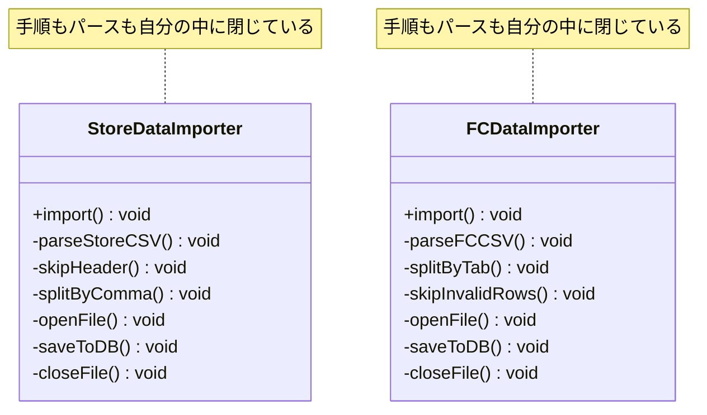
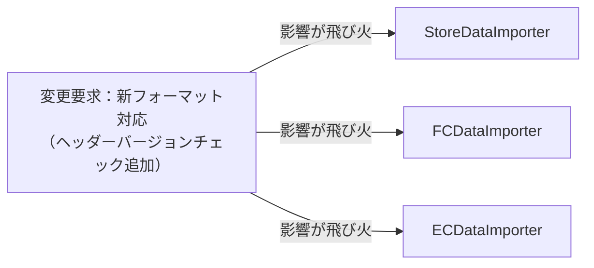
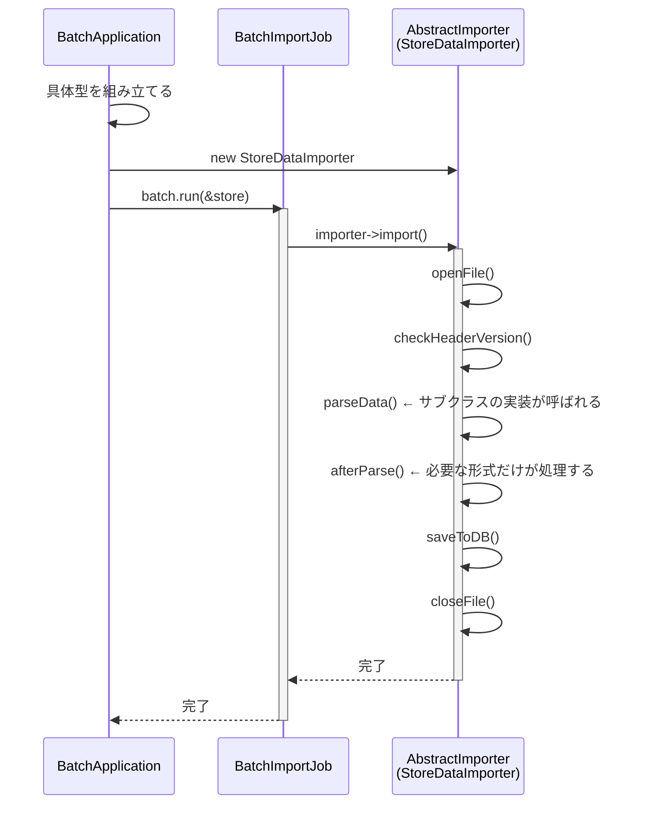
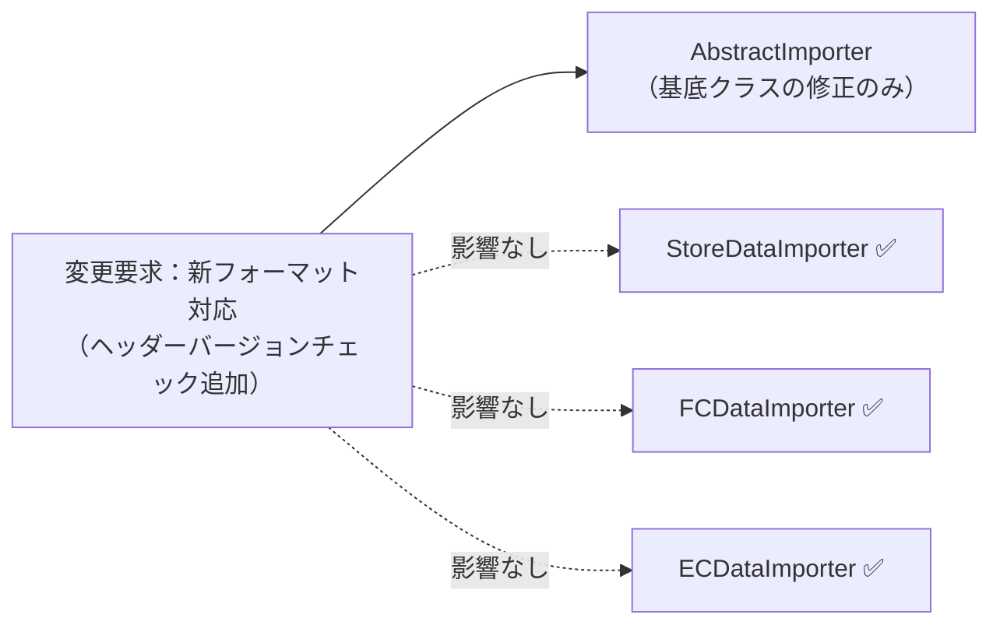
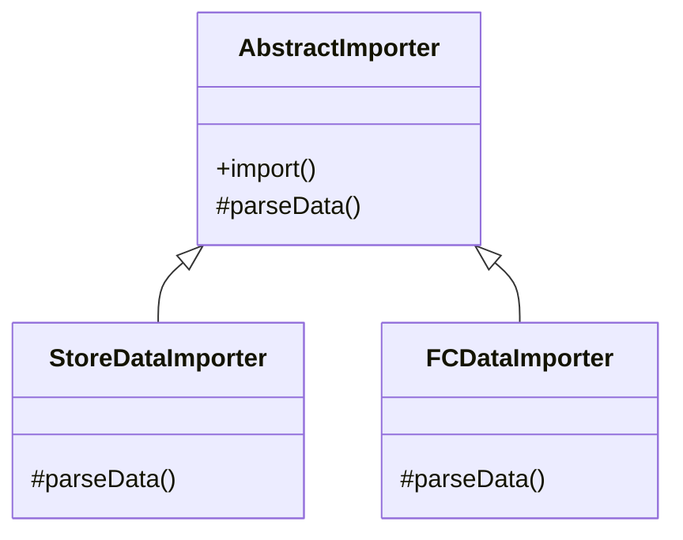
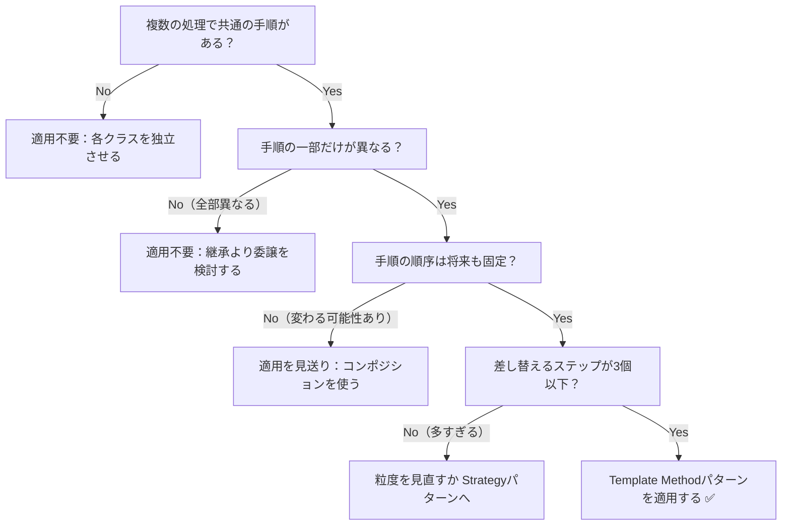

## 第4章 処理のステップの切り出し ―― Template Method パターン

―― 思考の型：手順の骨格は同じなのに、詳細部分が異なる処理が複数存在している

### この章の核心

**一連の手順は共通しているが、その中の一部のステップだけが異なる複数の処理が混在しているコードは、ステップごとに処理をコピー＆ペーストしてしまいがちだ。それは、「処理の骨格」と「詳細な実装」が、同じ場所に混在しているからだ。**

### この章を読むと得られること

この章のテーマは「同じ手順なのに、ファイル形式ごとにほぼ同じコードをコピーしている」という問題です。

* **得られること1：** 「共通の手順」という観点で、コード内の処理の骨格を識別できるようになる


* **得られること2：** 処理の詳細がハードコードされている箇所を見て、そこが変更の痛みの発生源だと判断できるようになる


* **得られること3：** 骨格となる手順を抽出し、詳細をサブクラスに委譲することで、変更を局所化できることを説明できるようになる


* **得られること4：** 「共通部分」と「異なる部分」を見極め、どのような場合にこの構造を選ぶべきかを判断できるようになる

## 🔵 フェーズ1：現状把握 ―― 仕様を整理し、システムと紐付ける
はじめには、CSVインポート処理という現場でよくあるシステムを例に、その現状を事実として観察していきましょう。
### 1-1：このシステムの仕様

このシステムは、**システム基盤担当**と**業務担当者**の2つの立場で保守されています。システム基盤担当はファイルの開閉やDBへの保存といったインフラ寄りの処理を管理し、業務担当者は店舗形態ごとのデータパースルールや計算ロジックを管理します。この2立場の存在は、後で「変わる理由が誰の判断によるか」を見極める際の重要な基準になります。

このシステムは、各店舗のPOSレジから出力される売上データをCSVファイルとして受け取り、DBへ**インポート**します。

インポート処理は以下の4ステップで構成されており、どの店舗形態でもこの大きな流れは変わりません。

**インポートの処理手順**

| ステップ | 処理内容 | 店舗形態による違い | 判断するチーム |
|---|---|---|---|
| ① ファイルオープン | CSVファイルを読み込み可能な状態にする | 全形式で共通 | システム基盤担当 |
| ② データパース | フォーマットに従いCSV行を内部データに変換する | 形式ごとに異なる | 業務担当者 |
| ③ DB保存 | 変換済みデータをDBに登録する | 全形式で共通 | システム基盤担当 |
| ④ ファイルクローズ | ファイルリソースを解放する | 全形式で共通 | システム基盤担当 |

**現在対応しているフォーマット**

| 店舗形態 | 区切り文字 | ヘッダー行 | 不正行の扱い |
|---|---|---|---|
| 直営店 | カンマ区切り | あり（スキップ） | — |
| FC店 | タブ区切り | なし | スキップして続行 |

一見すると、このコードは各店舗のCSVを読み込み、データを抽出してDBに保存するという目的をしっかり達成できています。コードを上から追っていけば、ファイルの読み込みからデータの加工、保存という一連の流れが記述されており、全体の動きは見通しやすい状態です。

しかし、新しいフォーマットが加わるたびに、読み込み手順やデータ加工のロジックが微妙に異なるコードが次々と追加され、少しずつ違和感が見え始めています。

---

### 1-2：動作例テーブル

コードを読む前に、このシステムがどんな入力に対してどんな出力を返すかを確認します。この章の各ステップは、基本シナリオ（行1〜3）の動作を実現します。行4〜6（空ファイル・全行不正・大量データ等）はファイル内容に依存するため、動作仕様の確認として使用してください。フォーマットの違い（カンマ区切り／タブ区切り／ポイント列あり）がシステムの動作にどう反映されるかを「フォーマット種別」列で確認してください。

| 入力ファイル | フォーマット種別 | データの状態 | 期待する出力 |
| --- | --- | --- | --- |
| 直営店CSVファイル | カンマ区切り・ヘッダー行あり | 正常データ10件 | インポート成功、10件追加 |
| FC店CSVファイル | タブ区切り・不正行スキップ | 正常データ5件 | インポート成功、5件更新 |
| 直営店CSVファイル | カンマ区切り・ヘッダー行あり | 空ファイル（ヘッダー行のみ） | 0件インポート、エラーなし |
| FC店CSVファイル | タブ区切り・不正行スキップ | 全行不正データ | 0件インポート、エラー件数を報告 |
| ↓ 変更要求による追加分（EC店対応は1-5節で導入）↓ | | | |
| EC店CSVファイル | カンマ区切り・ポイント列・会員ランク列あり | 正常データ8件 + 不正データ行2件 | 正常行8件のみ処理、エラー行2件スキップ |
| EC店CSVファイル | カンマ区切り・ポイント列・会員ランク列あり | 正常データ100件（大量） | インポート成功、100件追加 |
---

### 1-3：クラス構成図

実装コードを踏まえて、クラスの関係性を可視化します。



→ `StoreDataImporter` と `FCDataImporter` の間に矢印はありません。両クラスは互いを知らず、それぞれが「ファイルを開く・パースする・保存する・閉じる」という手順全体を自分の中に独立して持っています。この「関係性がない」という事実こそが、後で問題となる重複の源です。

これから検討するのは、同じ機能を保ちながら、変更に強い構造をどう作るかという点です。

---

### 1-4：実装コード（現状）

コードを見る前に、このシステムに登場する主要なクラスと、その役割を整理しておきます。

#### このシステムの登場クラス
| クラス名 | 役割 | 担当する仕様 |
|---|---|---|
| `StoreDataImporter` | 直営店CSVファイルのインポート処理全体 | カンマ区切り、ヘッダーありのCSVを処理する |
| `FCDataImporter` | FC店CSVファイルのインポート処理全体 | タブ区切り、不正行スキップでCSVを処理する |

この段階での注目ポイントは、どちらのクラスも「ファイルを開く」「データを加工する」「保存する」「閉じる」というデータの流れ（処理の手順）を、それぞれのクラス内に独立して持っている点です。

実際の処理コードを見てみましょう。直営店用とFC店用の2クラスが存在します。どちらも「開く→加工→保存→閉じる」という大きな流れは共通していますが、パースの中身は少し違っています。クラスごとにブロックを分けて確認します。

```cpp
// 直営店データのインポート（カンマ区切り・ヘッダー行あり）
class StoreDataImporter {
public:
    void import() {
        // 手順：開く → 加工 → 保存
        openFile();
        parseStoreCSV(); // カンマ区切りでヘッダー行をスキップして読む
        saveToDB();
        closeFile();
    }
private:
    void parseStoreCSV() {
        // ヘッダー行をスキップし、カンマで各フィールドに分割する
        skipHeader();
        splitByComma();
    }
};

// FC店データのインポート（タブ区切り・エラー行は無視する）
class FCDataImporter {
public:
    void import() {
        // 手順：開く → 加工 → 保存
        openFile();
        parseFCCSV(); // タブ区切りで不正行をスキップしながら読む
        saveToDB();
        closeFile();
    }
private:
    void parseFCCSV() {
        // タブで各フィールドに分割し、不正な行は読み飛ばす
        splitByTab();
        skipInvalidRows();
    }
};

```

このコードを見ると、`import` メソッドの中で「開く」「加工」「保存」「閉じる」という手順がどちらも同じ順序で記述されていることが分かります。一方で、加工ステップの中身（`parseStoreCSV` と `parseFCCSV`）は、区切り文字やエラー処理の方針が異なっています。「手順の骨格は共通で、詳細部分だけが違う」という構造が見て取れます。

---

### 1-5：変更要求

ある日、店舗運営部の担当者から連絡がありました。「来月から、ネット通販（ECサイト）の売上データもこのシステムで取り込みたい。フォーマットは既存の直営店用と似ているが、会員ランクやポイント付与情報といったEC特有の項目が含まれるため、読み込み後の計算処理が少し追加されることになる」と。

なるほど、店舗のデータとECサイトのデータ。どちらも「開く → 加工 → 保存」という大きな流れは同じはずですが、中身の計算ルールだけが異なるのですね。確かに、ここをそのまま既存のクラスをコピーして実装するのは少し待ったほうが良さそうです。

変更要求によって仕様がどう変わるのかを体系的に整理します。

**変更後の仕様表（ECサイト対応を追加）**

| ルール名 | 発動条件 | 結果 | 具体例 |
| --- | --- | --- | --- |
| ファイルオープン | インポート開始時に必ず実行 | CSVファイルを読み込み可能な状態にする | 直営店・FC店・EC店、どの形式でも同じ手順 |
| データパース | フォーマットごとに異なるルールを適用 | CSV行をシステム内部データに変換する | 直営店：カンマ区切り／FC店：タブ区切り／**EC：ポイント項目・会員ランク追加** |
| **EC向け計算処理** | **ECデータのパース完了後に実行** | **ポイント付与量・会員ランク割引を計算する** | **EC店のみ。直営店・FC店にはこのステップなし** |
| DB保存 | パース完了後に必ず実行 | 変換済みデータをDBに登録する | 保存先・保存形式はどの形式でも共通 |
| ファイルクローズ | 保存完了後に必ず実行 | ファイルリソースを解放する | 直営店・FC店・EC店、どの形式でも同じ手順 |

**変更後の動作例テーブル**

| 入力ファイル | データの状態 | 期待する出力 |
| --- | --- | --- |
| 直営店CSVファイル | 正常データ10件 | インポート成功、10件追加（変わらず） |
| FC店CSVファイル | 正常データ5件 | インポート成功、5件更新（変わらず） |
| **EC店CSVファイル** | **正常データ8件 + 不正データ行2件** | **正常行8件のみ処理、ポイント計算済み** |

仕様表を見ると、「ファイルオープン」「DB保存」「ファイルクローズ」は変更なしで、「データパース」とEC固有の「計算処理ステップ」が追加されています。

フェーズ1でシステムの現状と変更要求が把握できました。次のフェーズ2では、「何が変わり、何が変わらないか」を整理します。

## 🟣 フェーズ2：仮説立案 ―― 何が変わるかを観察し、ヒアリングで裏付ける

### 2-1：責任チェック表

設計を見直す際、私の場合は「このコードは誰の判断で変わるのか」を可視化することから始めます。変わる理由の決定者が誰かを知ることで、クラスが抱えすぎているものを整理しやすくなるからです。

| **クラス名** | **本来の責任** | **コード内に混在している知識** |
| --- | --- | --- |
| `StoreDataImporter` | 直営店CSVの読み込み | CSVのパース方法（業務担当）、ファイルやDBの操作手順（基盤担当） |
| `FCDataImporter` | FC店CSVの読み込み | CSVのパース方法（業務担当）、ファイルやDBの操作手順（基盤担当） |

この表から、それぞれのクラスの中に、複数の決定者が関わる知識が同居していることが見えてきます。

### 2-2：変わる理由の分析

コードの各行が「誰の判断で変わる知識か」をさらに細かく確認してみます。

`StoreDataImporter.import()` と `FCDataImporter.import()` の各行を見ると：

| **コードの行** | **持っている知識** | **変更の決定者** |
|---|---|---|
| `openFile()` | ファイルの開け方という知識 | システム基盤担当 |
| `parseStoreCSV()` | 直営店特有のカンマ区切りパース | 直営店の業務担当者 |
| `parseFCCSV()` | FC店特有のタブ区切りパース | FC店の業務担当者 |
| `saveToDB()` | データベースへの保存という知識 | システム基盤担当 |
| `closeFile()` | ファイルのクローズという知識 | システム基盤担当 |

1つのメソッドの中に、変える理由（決定者）が異なる複数の知識が混在しています。`parseStoreCSV` と `parseFCCSV` はそれぞれ異なるチームの業務担当者が決定する知識であり、インポートの骨格（openFile/saveToDB/closeFile）はシステム基盤担当が決定する知識です。このように決定者が異なるチームにまたがっている状態は、変更の際に調整コストを生む要因ではないでしょうか。

### 2-3：今回の変更で確実に変わること

今回の変更要求から確定している変更は以下の2点です。

- **ECサイト向けCSVのパース方法の追加**：会員ランク・ポイント項目を読み込む処理が必要
- **EC向け計算処理ステップの追加**：ポイント付与量・会員ランク割引を計算する処理が必要

ただし「この変更が1回限りか、今後も続くか」によって、どこまで設計を変えるべきかが大きく変わります。関係者に確認します。

### ヒアリングに向けた背景確認

このシステムは、ある小売店舗で日々の売上データを管理するために使われています。各店舗のPOSレジから出力される売上データをCSVファイルとして受け取り、システムへ取り込むのが主な役割です。インポートされたデータは夜間バッチで一括処理されるほか、管理画面からも手動でアップロードできる仕組みになっています。

当初は1種類のCSVフォーマットだけを読み込んでいましたが、店舗網の拡大とともに、店舗形態や仕入れ先によって「日付の形式」「ヘッダー行の有無」「カンマ区切りかタブ区切りか」といった細かな違いがあるCSVが持ち込まれるようになりました。

当時の担当者が、増え続けるフォーマットに対応するために一つずつコードを書き足してきた結果が、現在の実装です。

### 2-4：関係者ヒアリング

> **現実のヒアリングでは——** 本書のヒアリングシーンでは設計判断を明確にするため、意図的に「理想的な回答」が返ってくるように描いています。これはシミュレーションです。現実には、「変わるかどうか分からない」「たぶん変わらない」という曖昧な答えが返ることも多いです。そのときは `git log` や過去の障害記録を「ヒアリングの代わり」として使ってみるのも一つの考え方です。「過去に何度変わったか」が最も正直な証拠になります。

仮説の確度を上げるため、システム基盤担当と業務担当者に確認を行いました。

* **開発者：** 「今後もインポート対象のシステムが増える予定はありますか？」
* **システム基盤担当：** 「あります。次はSNS経由の販売データを取り込む予定です。ファイル操作の手順は既存と全く同じはずです。」
* **開発者：** 「読み込みの手順自体が変わる可能性はありますか？」
* **業務担当：** 「いいえ、ファイルを開いて閉じるという手順は固定です。ただ、中身のデータ項目が少しずつ増えたり計算ルールが変わったりすることは頻繁にあります。」

### 2-5：ヒアリングで判明した将来リスク

ヒアリングで浮かび上がった「確定ではないが、近い将来起こりうる変化」を記録します。これは今回の設計判断の材料です。

| **将来リスク** | **時期の目安** | **根拠** |
| --- | --- | --- |
| SNS販売データのインポート形式追加 | 継続的に | インポート対象チャネルが増える予定（システム基盤担当より） |
| 各店のデータ項目の追加・計算ルール変更 | 継続的に | 頻繁にあると業務担当が言及 |

フェーズ2で「今変わること（確定）」と「将来変わるかもしれないこと（リスク）」を分けて整理できました。次のフェーズ3では、現在の構造で変更を試みたときに何が起きるかを確認します。

---

## 🟣 フェーズ3：問題特定 ―― 変更の痛みを発見する

フェーズ2で、CSVインポートの処理手順は共通しており、データ加工のルールだけが変わるという構造が明確になりました。このフェーズでは、新しいECサイト向けCSVの取り込みを、現在のクラス構造のまま実装しようとするとどのような「痛み」が生じるのかを確認します。

### 3-1：変更を試みる

ECサイトの売上データをインポートする機能を実装しようと、既存の `StoreDataImporter` クラスを参考に、新しい `ECDataImporter` クラスを作成してみましょう。

```cpp
// EC店データのインポート（ポイント・会員ランク項目あり）
class ECDataImporter {
public:
    void import() {
        // 既存の直営店用と同じ手順を再度記述する
        openFile();
        parseECData();   // EC特有の加工ロジック
        calcPointBonus(); // ポイント付与計算（EC店のみ）
        saveToDB();
        closeFile();
    }
private:
    void parseECData() {
        // カンマ区切りで、会員ランク・ポイント列を追加で読む
        splitByComma();
        readMemberRank();
        readPointColumn();
    }
    void calcPointBonus() {
        // 会員ランクに応じたポイント付与量を計算する
    }
};

```

変更後のコードを実行すると、次のような結果になります。

```cpp
// 動作確認（出力付きのスタブで手順の流れを確認）
class ECDataImporter {
public:
    void import() {
        openFile();
        parseECData();
        calcPointBonus();
        saveToDB();
        closeFile();
    }
private:
    void openFile() {
        std::cout << "ファイルを開く" << std::endl;
    }
    void parseECData() {
        std::cout << "ECデータをパース（会員ランク・ポイント）"
                  << std::endl;
    }
    void calcPointBonus() {
        std::cout << "ポイント付与量を計算" << std::endl;
    }
    void saveToDB() {
        std::cout << "DBに保存" << std::endl;
    }
    void closeFile() {
        std::cout << "ファイルを閉じる" << std::endl;
    }
};

int main() {
    ECDataImporter importer;
    importer.import();
    return 0;
}
```

実行結果：

```
ファイルを開く
ECデータをパース（会員ランク・ポイント）
ポイント付与量を計算
DBに保存
ファイルを閉じる
```

コードは正しく動いています。しかし `openFile()`・`saveToDB()`・`closeFile()` は、直営店・FC店のコードと全く同じ実装です。

実装しながら、一つの違和感に気づきます。「あれ、`openFile()`・`saveToDB()`・`closeFile()` は直営店やFC店と全く同じなのに、また自分のクラスに書いているな」と。

さて、ECサイト対応が完了した翌月、今度は別の要件が届きました。「直営店・FC店・EC店のすべてについて、CSVのフォーマットを新バージョンに切り替える。新フォーマットではヘッダー行の仕様が変わるため、ファイルを開いた直後にバージョンチェック処理を追加してほしい」という内容です。

「バージョンチェック」はフォーマット種別に関わらず全インポートで共通の手順変更です。しかし現在の構造では、`StoreDataImporter`・`FCDataImporter`・`ECDataImporter` の3つのクラスそれぞれに、同じバージョンチェックのコードを追加することになります。

「3つとも同じ修正を入れる作業。しかもこれからインポート対象が増えるたびに同じことが繰り返される……」

### 3-2：変更影響グラフ

変更要求が既存システムにどのように波及するかをグラフ化します。



→ このグラフを見ると、「ヘッダーバージョンチェック」という共通の手順変更が、インポートクラスの数だけ波及していることが分かります。バージョンチェックは1か所に書けば済むはずの処理なのに、各クラスが「手順の骨格」を独自に持っているために、3か所を同時に修正することになります。今後インポート形式が増えるたびに、この波及範囲も広がり続けるのではないでしょうか。

### 3-3：痛みの言語化

変更を試みたことで、2つの「痛み」が鮮明になりました。

1つ目は、同じ修正の繰り返しです。具体的には、`openFile()` という1行が `StoreDataImporter`・`FCDataImporter`・`ECDataImporter` の3クラスそれぞれの `import()` メソッドに重複して存在しています（1-4節のコードで確認できます）。「バージョンチェックを追加してほしい」という1つの要求に対して、この同じ修正を3箇所で繰り返すことになります。今後インポート形式が4つ・5つと増えれば、修正箇所もその数だけ増えます。共通の手順であるはずのファイル操作やDB保存のコードが形式ごとに複製されているため、関連クラスを検索し、同じ修正を反映する必要があります。修正漏れを防ぐための確認範囲も広がります。

2つ目は、システムの「変更耐性の低さ」です。本来、ビジネスロジックである「店舗ごとのデータパース」だけを変えれば済むはずの状況で、ファイル操作やDB接続という「手順の骨格」まで修正対象になってしまっています。システム基盤側の知識が業務ロジックのクラスに漏れ出しているために、本来無関係な場所まで変更することになり、設計上の無駄が蓄積してしまいます。

こういうとき困る、という感覚、皆さんも同じではないでしょうか。この「共通の手順が散らばっている」という状態が、私たちの設計を硬直させている元凶なのです。

フェーズ3で「手順の重複が辛い」という事実が確認できました。次のフェーズ4では、なぜこの辛さが構造的に発生するのかを分析します。

---
> **📌 問題（確定）**
> インポート形式が1つ増えるたびに、`openFile()`・`saveToDB()`・`closeFile()` という共通手順を新しいクラスにも重複して書くことになる。ヒアリングで「SNS販売データなど今後もインポート対象が増える」と確定しており、この頻度では共通手順の重複管理コストが合わなくなってくる。
---

## 🟠 フェーズ4：原因分析 ―― なぜ辛いのかを構造で言語化する

フェーズ3で、インポート処理の「手順の重複」という痛みが確認できました。このフェーズでは、なぜそのような辛さが生じるのかを、コードの構造的な観点から言語化します。

### 4-1：痛みの根源を探る（観察と原因）

フェーズ3で確認した「変更の辛さ」は、コードのどこから来ているのでしょうか。コードを注意深く観察すると、痛みを引き起こしている2つの事実が浮かび上がってきます。

| **観察した症状（痛み）** | **構造的な原因（痛みの根源）** |
|---|---|
| 新しいインポート形式を追加するたびに、ファイルを開く・閉じる・保存する等の「手順」を全クラスで書き直す必要がある | 共通の手順（処理の骨格）と、店舗ごとのデータパース（詳細）が、同じメソッドの中に混在しているから |
| 共通であるはずのファイル操作手順に修正が入ったとき、全インポートクラスを修正することになる | 共通の手順という「変わらないもの」を、店舗ごとの詳細という「変わるもの」が引きずり回しているから |

### 4-2：変わるもの/変わってほしくないもの

> **「変わらないもの」と「変わってほしくないもの」は異なります。** 「変わらないもの」は経験的事実（今まで変わっていない）、「変わってほしくないもの」は設計意図（ここを安定させてほかを守りたい）です。ここで整理するのは後者です。

原因分析の結果として、「変わり続けるもの」と「変わってほしくないもの」を明確に分けます。

| **変わり続けるもの（🔴）** | **変わってほしくないもの（🟢）** |
| --- | --- |
| CSVのデータパースルール | ファイルを開く・閉じるというファイル操作手順 |
| 個別のデータ加工処理 | データベースへの保存という一連のフロー |

本来、これらは別々の理由で変わるはずのものです。ビジネス側が「パースルール」を変えるたびに、システム基盤側が管理する「ファイル操作手順」まで影響を受けてしまっていることが、設計上の問題です。

### 4-3：接続点に混在する骨格と差分を確認する

各インポーターの`import()`には、全形式で共通するファイル操作・DB保存と、形式ごとに変わるパース処理が同居しています。接続点で必要なのは、共通手順の途中で「この形式のデータを解析する」と依頼することです。しかし現在は、その接続点がなく、共通手順そのものが各クラスへ複製されています。

接続点を視覚的に説明するため、共通の流れと形式ごとの差分を分けて見ます。

| **用語** | **コードの世界での意味** |
| --- | --- |
| 具体 | 特定のクラスに直接依存している（クラス名をコードに書いている） |
| 抽象 | インターフェースや基底クラスを介して依存している（具体名を書かない） |
| 直接 | 呼び出し元が呼び出し先を中継なしに直接知っている |
| 間接 | ManagerやFactoryなど中継役を経由してつながっている |

iPhone に専用の Lightning ケーブルを直差しした状態と同じで、新しい店舗のCSV形式が増えるたびに、クラス本体に新しい配線（`parseXXX()` メソッド）を直接追加することになります。

フェーズ4で根本原因が言語化できました。「どこを分けるか」は明確です。次のフェーズ5では、その境界で実際に何が流れているかを値・型のレベルで具体化し、「何が変わり、何が変わらないか」を明確にします。

---
> **📌 原因（確定）**
> `StoreDataImporter` と `FCDataImporter` の各クラスが「処理の骨格（open→parse→save→close）」と「店舗固有のパースルール」を同じ `import()` メソッドの中に直接混在させているため、骨格への変更が全インポートクラスに波及する。業務担当者が管理するパースルールと、システム基盤担当が管理する骨格という、変わる理由が異なる2つの知識が分離されていないことが原因である。
---

## 🟡 フェーズ5：課題定義 ―― 接続点で何が流れているかを見る

フェーズ4は「なぜ辛いか」を答えました。フェーズ5が問うのは「分けるべき境界で、実際に何が流れているか」です。クラスの参照関係ではなく、**値・型のレベル**に降りていきます。

フェーズ4で、「共通の手順（骨格）」と「店舗ごとのパースルール（詳細）」が同じメソッド内に混在していることが分かりました。その境界で何がやり取りされているかを具体化します。

### 接続点を特定する

`import()` の中で分けるべき境界は1か所です。共通の処理順序と、形式ごとのパース処理との境界を見ます。

現在の結合状況：`StoreDataImporter` と `FCDataImporter` はそれぞれの `import()` の中で骨格手順とパースロジックを直接混在させています。各クラスが `parseStoreCSV()` / `parseFCCSV()` という異なる名前でパース処理を実装しており、中身は形式ごとに異なります。

| 接続点 | 接続するデータ | 変わるもの |
|---|---|---|
| 各クラスのパース処理 → `import()` の骨格 | 骨格の呼び出し順序（openFile→パース処理→saveToDB→closeFile）→ 処理完了（void） | パースロジックの実装（店舗形式ごとに異なる） |

### 何が変わり、何が変わらないか

- **変わるもの**：形式ごとのパース処理（直営店・FC・EC形式で読み方が異なる）。新しいインポート形式が増えるたびに実装の種類が増えます。
- **変わらないもの**：骨格の呼び出し順序（open→parse→save→close）。その順序が意味する「インポートという業務の流れ」です。

呼び出し元が期待するのは「ファイルを受け取って適切にDBへ保存すること」です。課題は、形式ごとに異なるパース処理と共通の手順が各クラスへ一緒に複製されていることです。

**現状のままでよい場面**：対応形式が少なく、共通手順も当面変わらないなら、重複を許容する判断もあります。今回は形式追加と共通手順の変更が見込まれるため、骨格を1か所に置き、形式ごとの差分だけを接続点から呼ぶ設計を検討します。

---
> **📌 課題（確定）**
> 骨格の呼び出し順序（open→parse→save→close）と、形式ごとに異なるパース処理を切り離す。骨格を1か所に集約し、各インポートクラスはパースルールだけを担う構造にする。新しい形式を追加するときはパース実装と組み立て箇所を変更し、共通手順の重複を増やさない。
---

## 🔴 フェーズ6：対策検討 ―― 段階的な改善と決断

フェーズ5で「変わるのは形式ごとの `parseData()` の実装であり、骨格の呼び出し順序は安定している」ことが分かりました。ここでは、共通手順と形式別処理をどのように分けるかを段階的に検討します。それぞれの段階（ステップ）でどこまで痛みが解消されるかを確認し、今回の要件において「どのステップで止めるべきか」を決断します。

### ステップ1：共通メソッドをユーティリティとして切り出し、両クラスから呼ぶ

「コピペをやめる」という第一歩として、`openFile()` / `saveToDB()` / `closeFile()` という共通処理を別クラス（ユーティリティ）に切り出し、`StoreDataImporter` と `FCDataImporter` の両方から呼び出す形を試してみる。これが「重複を消したい」という自然な最初の発想だ。

```cpp
// 共通手順を切り出したユーティリティクラス
class ImporterUtil {
public:
    static void openFile()  { /* 共通手順 */ }
    static void saveToDB()  { /* 共通手順 */ }
    static void closeFile() { /* 共通手順 */ }
};

// 直営店：ユーティリティを呼び出す
class StoreDataImporter {
public:
    void import() {
        ImporterUtil::openFile();
        parse(); // ← パースは自分で担当
        ImporterUtil::saveToDB();
        ImporterUtil::closeFile();
    }
private:
    void parse() {
        skipHeader();
        splitByComma();
    }
};

// FC店：同じくユーティリティを呼び出す
class FCDataImporter {
public:
    void import() {
        ImporterUtil::openFile();
        parse(); // ← パースは自分で担当
        ImporterUtil::saveToDB();
        ImporterUtil::closeFile();
    }
private:
    void parse() {
        splitByTab();
        skipInvalidRows();
    }
};
```

`openFile()` / `saveToDB()` / `closeFile()` の実装は1箇所（`ImporterUtil`）にまとまり、コードの重複は減った。

**評価：** 重複は減らせたが、骨格（開く→パース→保存→閉じる）を変更するときには `StoreDataImporter::import()` と `FCDataImporter::import()` の両クラスを直さないといけない。「バージョンチェックをオープン直後に追加してほしい」という変更が来れば、2クラスの `import()` を両方開いて同じ行を追記することになる。呼び出し順序という「骨格」がまだ各クラスに分散しているのが原因だ。

私の経験でも、最初は関数分割（ユーティリティの切り出し）から試すことが多いです。しかし、インポート対象が増えるにつれてユーティリティを呼び出すだけのクラスが膨大に増え、手順を変更するたびに全クラスを書き換える手間が限界を迎えました。そこで「手順という骨格そのものを1か所に集約し、クラスを分ける」という発想に至ったのです。

---

### ステップ2：骨格を基底クラスに固定し、変わる部分だけをサブクラスに委ねる

ステップ1の問題は「骨格（呼び出し順序）が各クラスに散らばっている」ことだった。骨格そのものを1つの基底クラスに閉じ込め、変わる部分（`parseData()`）だけを純粋仮想関数としてサブクラスに委ねれば、骨格は1か所だけで管理できる。

```cpp
// 骨格を固定する抽象基底クラス
class AbstractImporter {
public:
    void import() { // ← 骨格（変えさせない）
        openFile();
        parseData(); // ← 各店の実装を呼ぶ
        afterParse(); // ← 必要な形式だけが後処理を追加する
        saveToDB();
        closeFile();
    }
protected:
    virtual void parseData() = 0; // ← 実装詳細をサブクラスへ
    virtual void afterParse() {}  // ← 既定では何もしない任意フック
    void openFile()  { /* 共通手順 */ }
    void saveToDB()  { /* 共通手順 */ }
    void closeFile() { /* 共通手順 */ }
};

// 直営店：parseData() だけを実装する
class StoreDataImporter : public AbstractImporter {
protected:
    void parseData() override {
        skipHeader();
        splitByComma();
    }
};

// FC店：parseData() だけを実装する
class FCDataImporter : public AbstractImporter {
protected:
    void parseData() override {
        splitByTab();
        skipInvalidRows();
    }
};

// 呼び出し側：AbstractImporter* で受け取る
class BatchImportJob {
public:
    void run(AbstractImporter* importer) {
        importer->import(); // ← 抽象型だけを知る
    }
};
```

骨格（`openFile` → `parseData` → `afterParse` → `saveToDB` → `closeFile`）が `AbstractImporter` という1か所だけに存在するようになった。`parseData()` は全形式で必要な純粋仮想関数なので、サブクラスが実装しなければコンパイルエラーになります。一方、`afterParse()` は既定では何もしない任意フックです。EC店のようにパース後の計算が必要な形式だけがオーバーライドできます。

**評価：** 骨格の変更（バージョンチェック追加など）は`AbstractImporter::import()`へ集約されました。新しい形式はパース処理を実装するサブクラスとして追加し、利用側の組み立て箇所へ登録します。

---

### どこまで設計を進めるのが良いか（採用ステップの決断）

それぞれのステップには一長一短があります。ステップ2の抽象基底クラスによる分離は強力ですが、クラス設計が必要になるという「初期投資コスト」もかかります。どこで止めるかは、**「今後の変更頻度（ビジネス要求）」**で決断します。

*   **ステップ1（ユーティリティ切り出し）で止めるケース：** 当面、新しいインポート形式が増える見込みが低い場合。コードの重複を減らすだけで十分であり、継承階層を作るコストに見合わないことがあります。
*   **ステップ2（抽象基底クラスへの集約）まで進むケース：** 「今後も新しいインポート形式が追加される」と確定している場合。今すぐ初期投資コストを払ってでも、将来の変更箇所を限定するのが適切です。

**今回の決断：**
フェーズ2のヒアリングで、システム基盤担当から「次はSNS経由の販売データを取り込む予定」と明言されています。形式追加の見込みを重視し、今回は**ステップ2（骨格を抽象基底クラスへ集約し、差分だけを委譲する）まで進化させる**案を採用します。

このように、処理の骨格を基底クラスが定義し、変わる部分のステップだけをサブクラスが差し替える設計構造を **Template Method（テンプレートメソッド）パターン** と呼びます。

フェーズ6で採用ステップが決まりました。次のフェーズ7では、この決断を最終的なコードに落とし込みます。

## 🟢 フェーズ7：対策実施 ―― 変化に強いコードを完成させる

採用したステップ2の設計を、実際のコードに実装します。これまでは個別のクラスで重複していたファイル操作やDB保存の手順を、基底クラスにテンプレートとして集約します。

また、1-5節の変更要求で示されていた「全形式共通のヘッダーバージョンチェック」を `checkHeaderVersion()` として骨格に組み込みます。骨格が1か所（`AbstractImporter`）に集約されているため、この追加は基底クラスへの1回の修正で全形式に反映できます。

この設計変更により、新しいインポート形式を追加するときは、共通の手順を複製せずに、形式ごとのパース処理と必要に応じた後処理をサブクラスへ記述できます。共通手順そのものを変える場合は `AbstractImporter` を修正し、利用する形式を増やす場合は組み立て箇所へ登録します。

### 7-1：解決後のコード（全体）

新しい設計では、共通の手順を親クラスで定義し、形式ごとのパース処理と任意の後処理をサブクラスに委譲します。各役割ごとにコードを分けて見ていきましょう。

**AbstractImporterクラス（骨格の定義）：**

```cpp
#include <iostream>

using namespace std;

// 共通の骨格を持つ基底クラス
class AbstractImporter {
public:
    // 手順の骨格を定義するメソッド（変更させない）
    void import() {
        openFile();
        checkHeaderVersion();
        parseData();  // ← 形式ごとに必須
        afterParse(); // ← 必要な形式だけが追加
        saveToDB();
        closeFile();
    }
protected:
    virtual void parseData() = 0;
    virtual void afterParse() {} // 既定では何もしない任意フック
    void openFile()  { cout << "ファイルをオープンしました。" << endl; }
    void checkHeaderVersion() {
        cout << "[全共通] ヘッダーのバージョンチェックを実行しました。" << endl;
    }
    void saveToDB()  { cout << "DBへの保存が完了しました。" << endl; }
    void closeFile() { cout << "ファイルをクローズしました。" << endl; }
};

```

`import()` が処理の順序を一か所に集約しています。全形式で必要な `parseData()` は純粋仮想関数とし、形式によって要否が異なるパース後処理は `afterParse()` という任意フックにしています。これにより、必須ステップと任意ステップをコード上でも区別できます。

**具体クラス（StoreDataImporter / FCDataImporter / ECDataImporter）：**

```cpp
// 直営店用インポート：パース処理だけを実装する
class StoreDataImporter : public AbstractImporter {
protected:
    void parseData() override {
        cout << "[直営店] ヘッダー行をスキップしました。" << endl;
        cout << "[直営店] カンマ区切りで10件のデータを読み込みました。" << endl;
    }
};

// FC店用インポート：パース処理だけを実装する
class FCDataImporter : public AbstractImporter {
protected:
    void parseData() override {
        cout << "[FC店] タブ区切りで行を分割しました。" << endl;
        cout << "[FC店] 5件のデータを更新しました（不正行スキップ）。" << endl;
    }
};

// EC店用インポート：パース処理とEC固有の後処理を実装する
class ECDataImporter : public AbstractImporter {
protected:
    void parseData() override {
        cout << "[EC店] カンマ区切りで行を分割しました。" << endl;
        cout << "[EC店] 会員ランクを読み込みました。" << endl;
        cout << "[EC店] ポイント列を読み込みました。" << endl;
    }
    void afterParse() override {
        cout << "[EC店] ポイントボーナスを計算しました（8件処理、2件スキップ）。" << endl;
    }
};

```

> **EC向け計算処理を任意フックにした理由：** 1-5節の仕様表では、EC向け計算は「パース完了後、DB保存前」に行う独立したステップです。そこで骨格にも `afterParse()` という位置を用意し、既定実装は何もしない形にしました。直営店・FC店はそのまま通過し、EC店だけが計算処理を追加します。仕様上の順序とコード上の順序が一致するため、後から別形式にも同様の後処理が必要になったとき、置き場所を判断しやすくなります。

各サブクラスは形式ごとの `parseData()` を実装し、必要な場合だけ `afterParse()` を追加します。ファイルの開閉、バージョンチェック、DB保存の手順は基底クラスが担当します。

**呼び出し側（BatchImportJob / ManualImportController）：**

```cpp
// 夜間バッチ：抽象型で受け取り、具体クラスに依存しない
class BatchImportJob {
public:
    void run(AbstractImporter* importer) {
        importer->import(); // ← AbstractImporter* 経由
    }
};

// 手動実行：こちらも同じく抽象型で受け取るだけ
class ManualImportController {
public:
    void importFile(AbstractImporter* importer) {
        importer->import(); // ← 同じ形で受け取れる
    }
};

```

`BatchImportJob` と `ManualImportController` はどちらも `AbstractImporter*` を受け取るだけで、「どの具体クラスか」を知らずに済みます。新しいインポート形式が増えても、どちらの呼び出し元も修正は不要です。

**BatchApplicationクラス（組み立て）：**

```cpp
// 依存関係の組み立てを担うクラス
class BatchApplication {
public:
    void run() {
        StoreDataImporter store; // 行1
        FCDataImporter fc;       // 行2
        ECDataImporter ec;       // 行3

        BatchImportJob batch;
        cout << "--- 直営店インポート（行1） ---" << endl;
        batch.run(&store);
        cout << "--- FC店インポート（行2） ---" << endl;
        batch.run(&fc);
        cout << "--- EC店インポート（行3） ---" << endl;
        batch.run(&ec);
    }
};

```

**main関数：**

```cpp
int main() {
    BatchApplication app;
    app.run();
    return 0;
}
```

**実行結果：**

```
--- 直営店インポート（行1） ---
ファイルをオープンしました。
[全共通] ヘッダーのバージョンチェックを実行しました。
[直営店] ヘッダー行をスキップしました。
[直営店] カンマ区切りで10件のデータを読み込みました。
DBへの保存が完了しました。
ファイルをクローズしました。
--- FC店インポート（行2） ---
ファイルをオープンしました。
[全共通] ヘッダーのバージョンチェックを実行しました。
[FC店] タブ区切りで行を分割しました。
[FC店] 5件のデータを更新しました（不正行スキップ）。
DBへの保存が完了しました。
ファイルをクローズしました。
--- EC店インポート（行3） ---
ファイルをオープンしました。
[全共通] ヘッダーのバージョンチェックを実行しました。
[EC店] カンマ区切りで行を分割しました。
[EC店] 会員ランクを読み込みました。
[EC店] ポイント列を読み込みました。
[EC店] ポイントボーナスを計算しました（8件処理、2件スキップ）。
DBへの保存が完了しました。
ファイルをクローズしました。
```

フェーズ2で予告された共通の「バージョンチェック」は基底クラスへ1回追加し、EC店だけの計算処理は `afterParse()` へ置きました。変更理由の異なる2つの処理が、それぞれ対応する場所へ分かれています。

動作テーブル行1〜3と一致しています。行4〜6（空ファイル・全行不正・大量データ）はファイル内容に依存するため、ここでは省略しています。

`main()` はキックするだけで、具体クラスの知識は `BatchApplication` に閉じています。

### 7-2：動作シーケンス図

ステップ2で到達したTemplate Methodパターンの実行時のオブジェクト間のやり取りを可視化します。`BatchApplication` が依存関係を組み立て、`BatchImportJob` が具象クラスを知らずに抽象インターフェース経由で処理を委譲する流れが確認できます。



`BatchApplication` が具体型を組み立て、`BatchImportJob` は `AbstractImporter*` という型だけを介して `import()` を呼びます。`import()` の中では、共通処理を基底クラスが実行し、`parseData()` と必要に応じた `afterParse()` だけがサブクラスの実装へ切り替わります。これがTemplate Methodパターンの動きです。

### 7-3：変更影響グラフ（改善後）

フェーズ3で確認した「ヘッダーバージョンチェック追加」のシナリオを再度適用します。



→ **フェーズ3の変更影響グラフと比較して、ヘッダーバージョンチェックの追加という変更要求が、基底クラスである `AbstractImporter` 一箇所に閉じた設計になりました**。

### 7-4：変更シナリオ表

この設計で手に入れたものと、諦めたものを整理します。

| **シナリオ** | **変わるクラス（触る場所）** | **変わらないクラス** |
| --- | --- | --- |
| 新しいインポート形式（SNS売上）の追加 | `SNSDataImporter` (新規作成) | `AbstractImporter`, `ECDataImporter` |
| 共通ログ出力手順の追加 | `AbstractImporter` (修正のみ) | `ECDataImporter`, `FCDataImporter` |

共通の手順を基底クラスに「カプセル化」したことで、変更が来ても触るのは1箇所（または新規追加のみ）で済むようになりました——それがこの設計で手に入れたものです。諦めたものは、クラスの継承関係によるわずかな設計の複雑さだけです。

---

## 整理

### この章で定義したこと

| | 内容 |
|---|---|
| **問題** | インポート形式が1つ増えるたびに共通手順を重複して書かなければならず、ヒアリングで確定した追加頻度ではコストが合わない |
| **原因** | 骨格（システム基盤担当が管理）とパースルール（業務担当者が管理）が各クラスの `import()` に混在しており、骨格への変更が全インポートクラスに波及する |
| **課題** | 共通の呼び出し順序と形式ごとの `parseData()` を切り離し、骨格を1か所に集約する |
| **解決策** | Template Method パターン：`AbstractImporter` に骨格を固定し、必須の `parseData()` と任意の `afterParse()` をサブクラスへ委ねる |

### フェーズとこの章でやったこと

この章では、手順の骨格は同じなのに詳細が異なる複数のクラスが乱立し、変更が全クラスに飛び火していた現状を学びました。7フェーズの思考プロセスを適用して、どのように構造を改善したのかを振り返ります。

| **フェーズ** | **この章でやったこと** |
| --- | --- |
| 🔵 フェーズ1：現状把握 | 複数のインポートクラスでファイル操作手順が重複して記述されている現状を観察しました。変更要求（EC店追加）を把握しました |
| 🟣 フェーズ2：仮説立案 | 責任チェック表で各行の変わる理由を確認しました。インポートの「手順」は不変だが「パースルール」は変動するという仮説を立て、ヒアリングで裏付けました |
| 🟣 フェーズ3：問題特定 | 新しいインポート形式を追加しようとした際に、全クラスで同じ修正が必要になる「痛み」を確認しました |
| 🟠 フェーズ4：原因分析 | 共通の「骨格（手順）」と固有の「詳細（ロジック）」が混在していることが、変更影響を拡大させる根本原因だと突き止めました |
| 🟡 フェーズ5：課題定義 | 共通の処理順序と形式ごとの parseData() の境界を定め、手順の重複を増やさない課題を定めた |
| 🔴 フェーズ6：対策検討 | ステップ1〜2を比較し、共通手順を基底クラスにテンプレート化して分離するステップ2を採用しました |
| 🟢 フェーズ7：対策実施 | 共通の手順を基底クラスに集約し、固有ロジックだけをサブクラスで実装する構造へ移行しました |

### 責任の移動

| **責任** | **変更前** | **変更後** |
| --- | --- | --- |
| CSVインポートの共通手順（骨格）の管理 | `StoreDataImporter` / `FCDataImporter`（各クラスに重複して直書き） | `AbstractImporter` |
| 店舗固有のパース・後処理の実装 | `StoreDataImporter` / `FCDataImporter`（骨格と混在） | 各サブクラスの `parseData()` と、必要な場合だけ `afterParse()` |

> このプロセスを回した結果にたどり着いた構造こそが Template Method パターンです。

---

## 振り返り

### 「この章を読むと得られること」は手に入ったか

| **得られること** | **この章のどこで示したか** |
| --- | --- |
| 1. 変動箇所の識別 | フェーズ2の責任チェック表と変わる理由の分析で、骨格（不変）とパース（変動）を区別しました |
| 2. 痛みの発生源の判断 | フェーズ4で、パースロジックが骨格と同じ場所に混在していることを「専用ケーブル直差し」として診断し、そこが変更の痛みの発生源だと特定しました |
| 3. 構造改善の説明 | フェーズ7の変更シナリオ表で、修正が基底クラスに局所化されたことを実証しました |
| 4. いつ使うかの判断 | フェーズ6の「どこまで設計を進めるべきか」で判断基準を示しました |

### 3つの設計原則はどう適用されたか

**原則1「変わるものをカプセル化せよ」の現れ**

- 具体化された場所：各サブクラス（`StoreDataImporter` など）
- 解説：頻繁に変わる「パース・加工ルール」をサブクラスへとカプセル化しました。これにより、基底クラスの手順は変更の影響を受けずに安定しました。

**原則2「実装ではなくインターフェースに対してプログラムせよ」の現れ**

- 具体化された場所：`AbstractImporter` の抽象メソッド `parseData()`
- 解説：基底クラスの手順は、具体的なパース実装ではなく抽象化されたインターフェース（抽象メソッド）に対して動作します。

**原則3「継承よりコンポジションを優先せよ」の現れ**

- 具体化された場所：テンプレートメソッドによる継承階層
- 解説：本章では「手順の共通化」のために継承を用いましたが、これは変化の軸が手順の骨格にある場合に限定した適用です。パースルールの差し替えが目的ならStrategyパターン（コンポジション）が候補になります。

---

## あなたのコードで考えてみてください

この章で辿った思考プロセスを、あなた自身のコードに当てはめてみましょう。手順は「① 重複を探す → ② 変更理由を数える → ③ 骨格を1か所に書いた場合の修正範囲を見積もる」の3ステップです。

1. **変動の兆候を探す：** あなたのコードに「前処理→本処理→後処理」という同じ流れで、本処理だけが異なる処理が複数ありますか（コピー＆ペーストの痕跡が残っている箇所）？
2. **変える理由を問う：** 共通の「前処理」や「後処理」に変更が入ったとき、何箇所を修正しましたか？1箇所で済みましたか？
3. **骨格の重複を測る：** 似たような処理が複数あるとき、「どれが最新の正しいバージョンか」を判断するのに時間がかかったことはありますか？
4. **共通化した後を想像する：** もし骨格を1箇所に集約したとすると、「前処理のバグ修正」は何ファイルへの変更で完結しますか？

---

## パターン解説：Template Method パターン

### パターンの骨格

Template Methodパターンは、アルゴリズムの構造を定義し、具体的な実装をサブクラスに遅延させるパターンです。基底クラスにメソッドの処理手順（テンプレートメソッド）を記述し、一部のステップを抽象メソッドとしてサブクラスに実装させます。


### この章の実装との対応

GoF（Gang of Four）とは、1994年に出版された書籍『Design Patterns』の4人の著者の総称です。彼らが整理した23のパターンは、現在も設計の共通言語として広く使われています。

| GoFの名前 | この章での対応 |
|---|---|
| AbstractClass | `AbstractImporter` |
| templateMethod | `import()` |
| primitiveOperation / hook | `parseData()` / `afterParse()` |
| ConcreteClass | `StoreDataImporter` / `FCDataImporter` / `ECDataImporter` |



`AbstractImporter` が骨格となる手順を所有し、`StoreDataImporter` などのサブクラスがその詳細を埋めています。

### 使いどころと限界

Template Methodパターンは「手順の骨格」を再利用するのに強力ですが、使いどころを間違えると「硬直した設計」を生み出します。実務で導入を迷いやすい場面と、その判断基準を整理します。

**1. 手順の一部が「不要なクラス」が現れた場合**
たとえば「ファイルを開かずに、ネットワークから直接読み込む新しいインポート形式」が追加されたとします。このとき、既存の骨格（`openFile()`）が邪魔になります。
このような場合は、無理に既存のTemplate Methodに押し込めず、**新しい骨格クラスを作るか、手順の再利用（継承）自体を諦めてコンポジション（オブジェクトを内部に保持して利用する仕組み）に切り替える**のが一つの考え方です。

**2. 差し替えるステップ（フック）が多すぎる場合**
基底クラスに `parseHeader()`, `parseBody()`, `parseFooter()`, `validateData()` など、サブクラスが実装しなければならないメソッドが5個も6個もある場合、サブクラスの実装負担が大きすぎます。
この場合は、骨格の粒度が細かすぎるサインです。いくつかのステップをまとめて大きなステップにするか、**Strategyパターンなどの別の設計**への移行を検討してみてはいかがでしょうか。

| **迷う状況** | **設計の判断基準** |
| --- | --- |
| 手順の一部を使わないサブクラスが出た | 既存の骨格への追加を諦め、骨格クラスを分ける |
| 実装が必要なステップ数が多すぎる | 骨格の粒度を見直すか、Strategyパターンへ移行する |
| 将来、手順の順序自体が変わる可能性がある | Template Methodの導入を見送り、コンポジション（保持・委譲）を使う |

**Template Methodパターン 適用判断フロー：**



### この章のまとめ

CSVインポートというドメインと Template Methodパターンの関係を一言で言うなら、「手順の骨格」と「フォーマット別の処理」は変わる理由が違う、ということです。「開く→読む→変換する→保存する→閉じる」という骨格はどのフォーマットでも共通ですが、変換ロジックはフォーマットごとに担当者も変更頻度も異なります。その2つが `import()` の中に同居していた限り、新しいCSV形式が来るたびに骨格まで手を入れる必要が生じていました。

7つのフェーズを通じて、読者は処理の骨格を観察するところから始まり、「誰の判断で変わるか」の分析を経て、骨格を抽象クラスに固定し差分だけをサブクラスへ委ねるという判断へと進みました。フェーズ2のヒアリングで「フォーマットは今後も増える」と確認した時点で分離の理由が確定し、フェーズ4で接続点を特定した時点で骨格と差分の境界線が引かれる——その積み上げの中に、パターン名の背後にある判断の論理があります。「骨格が共通かどうか」という問いが、この章のすべての起点でした。

あなたのコードの中にも、同じ処理フローの中に複数の担当者の知識が混在している箇所があるはずです。「この手順は全ケースで共通か、それとも各ケースで変わるか」を問うことが、Template Methodを使う理由を見つける入口になります。
