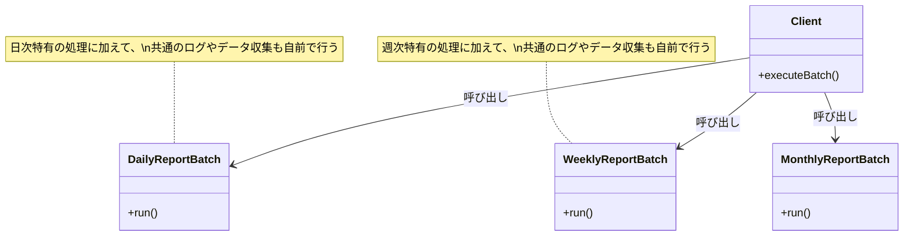
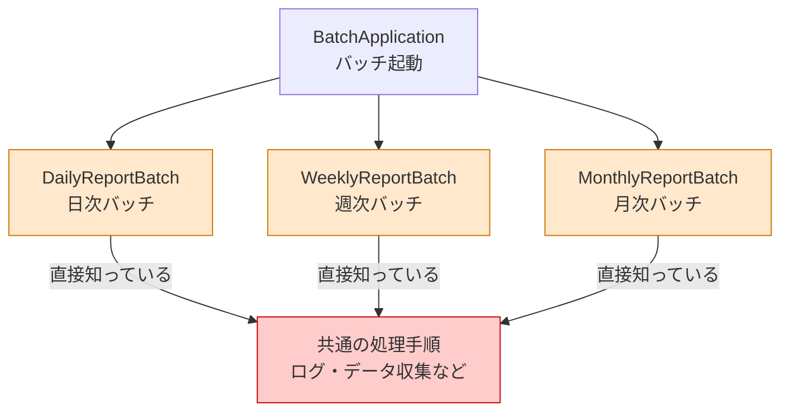
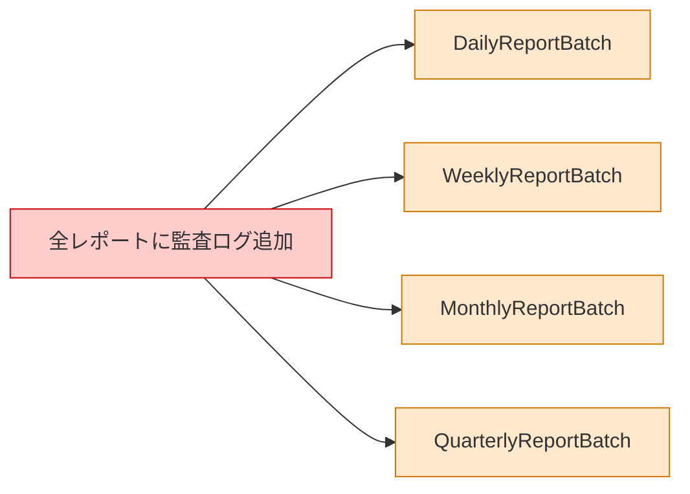
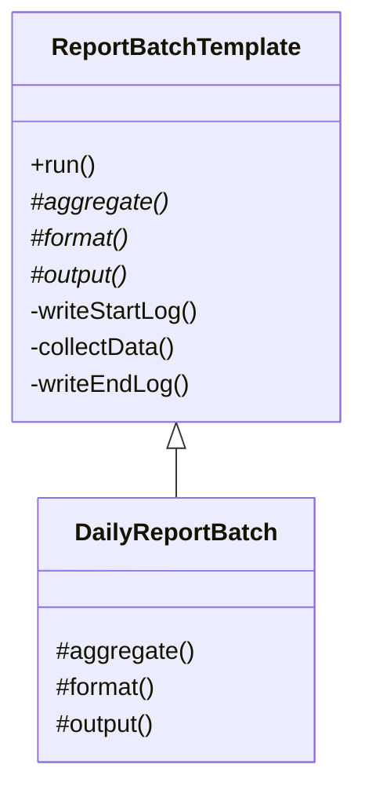
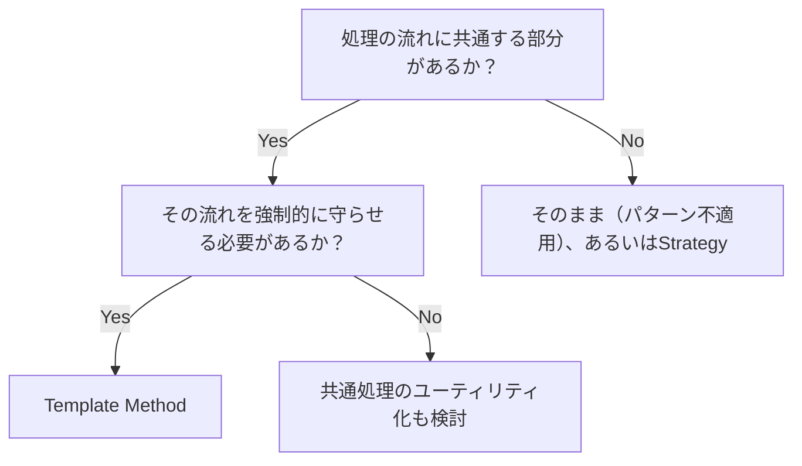
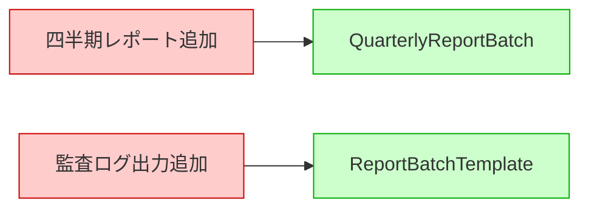
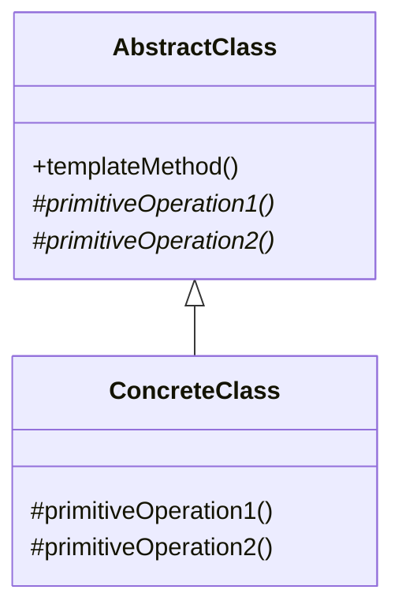
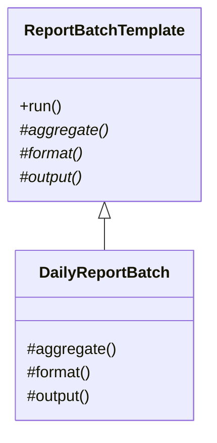

# 第4章　骨格を固定して、新バッチを追加しても既存コードに触れない設計へ（Template Method）
―― 思考の型：「処理の骨格（流れ）」と「個別ステップの実装」が同じ場所にいる

> **この章の核心**
> 処理の骨格を固定し、変わる一部だけをサブクラスに委ねる

---

## この章を読むと得られること

- 処理の骨格を変えたいのに、全クラスを個別修正している問題に気づけるようになる
- 共通の処理をユーティリティとして切り出すか、骨格を固定して委ねるかを判断できるようになる
- 新しい要件が追加されたときに、変更が影響する範囲を事前に読めるようになる

---

## ステップ0：システムを把握し、仮説を立てる ―― クラス構成を見てから「変わりそうな場所」を予測する

> **入力：** システムのシナリオ説明 ＋ クラス構成の概要（仕様表・責任一覧）。実装コードはまだ読まない。
> **産物：** 変動と不変の「仮説テーブル」

**全パターンに共通する問い**

> 「このコードの中に、**『変わる理由』が異なる2つのものが、
> 同じ場所に混在していないか？」**

「変わる理由」とは **「誰の判断で変わるか」** のことです。
そのコードを変更するとき、答えが2人以上になるなら、変わる理由が複数混在しています。

### 4.0 この章のシステム構成と仮説

**要するに処理の流れを固定し、変わる中身だけをサブクラスに委ねるパターン。**

**この章で扱うシステム：**
毎日・毎週・毎月の3種類の定期レポートを生成するバッチシステムです。
各レポートは「データ収集 → データ集計 → フォーマット適用 → 出力先に書き込み」という共通の流れを持ちますが、集計ロジックと出力先がレポートの種類によって異なります。

**仕様表（何ができるシステムか）**

| 機能 | 担当 | 入力 | 出力 |
|---|---|---|---|
| 日次レポート生成 | `DailyReportBatch` | 前日の売上データ | CSVファイル |
| 週次レポート生成 | `WeeklyReportBatch` | 週次のKPI | メール送信 |
| 月次レポート生成 | `MonthlyReportBatch` | 月次損益データ | PDFファイル |

**クラス構成の概要**



*→ 各バッチクラスが独立して同じような処理の流れを抱え込んでいます。
流れを制御する場所がなく、各クラスが個別に処理を進行しています。*

**各クラスの責任一覧**

| 対象 | 責任（1文） | 知るべきこと |
|---|---|---|
| `DailyReportBatch` | 日次レポートを生成して出力する | データ収集手順、日次集計ロジック、CSVフォーマット、出力先、ログの書き方 |
| `WeeklyReportBatch` | 週次レポートを生成して送信する | データ収集手順、週次集計ロジック、メールフォーマット、送信先、ログの書き方 |
| `MonthlyReportBatch` | 月次レポートを生成して出力する | データ収集手順、月次集計ロジック、PDFフォーマット、出力先、ログの書き方 |

---

この構成を踏まえた上で、仮説を立てます。
このコードが今日まで現場を支えてきた事実を、素直に認めたいと思います。当時の担当者が納期の中で必死に各レポートを作り上げた跡が伺えます。

**変動と不変の仮説（実装コードを読む前に立てる）**

| 分類 | 仮説 | 根拠（クラス構成から読み取れること） |
|---|---|---|
| 🔴 **変動する** | 集計ロジック | レポートの種類によって異なると仕様に明記されているため |
| 🔴 **変動する** | フォーマット適用と出力先 | csv、メール、pdfと出力手段が完全に分かれているため |
| 🟢 **不変** | 「データ収集→集計→フォーマット→出力」という流れ | 全レポートで共通の手順として定義されているため |
| 🟢 **不変** | データ収集とログ出力の中身 | 全レポートで共通の前提処理・後処理に見えるため |

この仮説をステップ2（4.3）でヒアリング後に確定します。

---

## ステップ1：実装コードを読む ―― 責任チェックで問題の行を見つける

> **入力：** ステップ0で把握したクラス責任 ＋ 実際の実装コード
> **産物：** 責任チェック表。「このクラスが持つべきでない知識」が混在している行の発見。

### 4.1 実装コードと責任チェック

ステップ0でクラスの責任は把握しました。
ここでは実際の実装コードを読み、「責任通りに書かれているか」を1行ずつ確認します。

**依存の広がり（実装前の全体像）**



*→ 各レポートバッチが完全に独立しており、共通の骨格が存在しません。処理手順がそれぞれの中に散らばっています。*

```cpp
#include <iostream>
#include <string>

// ---------------------------------------------------------
// 日次レポートバッチ
// ---------------------------------------------------------
class DailyReportBatch {
public:
    void run() {
        std::cout << "[LOG] Batch Started" << std::endl; // ← 知らなくていい
        collectData();                                   // ← 知らなくていい
        
        std::string data = aggregateDaily();
        std::string csv = formatCsv(data);
        outputToDisk(csv);
        
        std::cout << "[LOG] Batch Finished" << std::endl; // ← 知らなくていい
    }

private:
    void collectData() { 
        std::cout << "Connecting to database..." << std::endl; 
        std::cout << "Collecting data..." << std::endl; 
    }
    std::string aggregateDaily() { 
        return "Daily Data"; 
    }
    std::string formatCsv(const std::string& data) { 
        return data + " as CSV"; 
    }
    void outputToDisk(const std::string& csv) { 
        std::cout << "Writing to disk: " << csv << std::endl; 
    }
};

// ---------------------------------------------------------
// 週次レポートバッチ
// ---------------------------------------------------------
class WeeklyReportBatch {
public:
    void run() {
        std::cout << "[LOG] Batch Started" << std::endl; // ← 知らなくていい
        collectData();                                   // ← 知らなくていい
        
        std::string data = aggregateWeekly();
        std::string mail = formatMail(data);
        sendMail(mail);
        
        std::cout << "[LOG] Batch Finished" << std::endl; // ← 知らなくていい
    }

private:
    void collectData() { 
        std::cout << "Connecting to database..." << std::endl; 
        std::cout << "Collecting data..." << std::endl; 
    }
    std::string aggregateWeekly() { 
        return "Weekly Data"; 
    }
    std::string formatMail(const std::string& data) { 
        return data + " as Mail"; 
    }
    void sendMail(const std::string& mail) { 
        std::cout << "Sending mail: " << mail << std::endl; 
    }
};

// ---------------------------------------------------------
// バッチアプリケーション（起動側）
// ---------------------------------------------------------
int main() {
    DailyReportBatch daily;
    std::cout << "--- Running Daily Batch ---" << std::endl;
    daily.run();
    
    WeeklyReportBatch weekly;
    std::cout << "--- Running Weekly Batch ---" << std::endl;
    weekly.run();
    
    return 0;
}
```

**実行結果：**
```
--- Running Daily Batch ---
[LOG] Batch Started
Connecting to database...
Collecting data...
Writing to disk: Daily Data as CSV
[LOG] Batch Finished
--- Running Weekly Batch ---
[LOG] Batch Started
Connecting to database...
Collecting data...
Sending mail: Weekly Data as Mail
[LOG] Batch Finished
```

このコードは要件通りに正しく動きます。問題は「構造として何が混在しているか」です。

**責任チェック：`DailyReportBatch` は自分の責任だけを持っているか**

`DailyReportBatch` の責任は「日次レポートを生成して出力する」ことです。知るべきことは「日次集計、CSV化、ディスク出力」のロジックです。

| コードの行 | 持っている知識 | 責任内か |
|---|---|---|
| `std::cout << "[LOG] Batch Started" << std::endl;` | ログのフォーマットと出力のタイミング | **✗ 全バッチ共通の仕組みの責任** |
| `collectData();` | 共通のデータ収集処理の呼び出しタイミング | **✗ 全バッチ共通の流れの責任** |
| `std::string data = aggregateDaily();` | 日次の集計ロジック | ✅ 日次特有の責任 |
| `std::cout << "[LOG] Batch Finished" << std::endl;` | 終了ログの出力タイミング | **✗ 全バッチ共通の仕組みの責任** |

データ収集やログ出力といった「全レポートに共通する流れ」が、各バッチクラスの中にベタ書きされています。これらは各バッチクラスが本来知るべき知識ではありません。
もし「ログのフォーマットを変えたい」と言われたとき、私たちは全ての実装クラスを開いて修正して回る必要があります。

---

### 4.2 届いた変更要求

経営企画チームから、こんな相談が届きました。

> 「四半期レポートを追加してほしい。集計は月次レポートの延長なんだけど、出力先はダッシュボードAPIにお願いしたい。3日後の役員会議で見たいから、急ぎで頼めるかな」

四半期レポート用の新しいクラス（`QuarterlyReportBatch`）を追加すれば済みそうです。しかし、既存のコードを見ながら実装を始めると、同じ流れのコードを何度も手作業でコピーすることに不安を感じるのは、私だけでしょうか。

---

## ステップ2：仮説を確定する ―― 関係者ヒアリングで「変わる理由」に根拠をつける

> **入力：** ステップ0の仮説 × ステップ1の責任チェック結果。関係者に直接確認する。
> **産物：** 確定した変動/不変テーブル（「誰の判断で変わるか」明記）

### 4.3 仮説の検証と変動/不変の確定

ステップ0で仮説を立てました。ステップ1で責任チェックからも確認できました。
しかし——**コードを読んだだけで「変わる」「変わらない」と断定するのは危険です。**

---

**関係者ヒアリング**

変動・不変の境界を確かなものにするため、バッチの仕様を決めている経営企画と、システム運用を担当しているインフラチームの双方に確認しました。

> **開発者**：「四半期レポートを追加するにあたって確認ですが、レポート生成の流れ（データ収集→集計→フォーマット→出力）自体は今後も共通ですか？」
>
> **経営企画**：「はい、流れは変わりません。集計の内容と出力先だけがレポートごとに変わります。」
>
> **開発者**：「わかりました。インフラチームにも確認したいのですが、監査の観点からログ出力は全レポートで必須と考えてよいでしょうか」
>
> **インフラ担当**：「はい。むしろ、セキュリティ要件が厳しくなったので、将来的には全レポートの開始時と終了時に専用の『監査ログ』を必ず出すようにしたいです。今はまだ標準出力ですが、いずれ監査基盤に飛ばすことになります。」

---

| 分類 | 具体的な内容 | 変わるタイミング | 根拠 |
|---|---|---|---|
| 🔴 **変動する** | 集計ロジック、フォーマット、出力先 | レポート種別が増えたり要件が変わったとき | 経営企画への確認 |
| 🟢 **不変** | データ収集→集計→出力の流れ、ログ出力 | 変わる日は来ない（むしろ監査要件として強化される） | 経営企画・インフラ担当との合意 |

> **設計の決断**：🟢 不変な部分を「契約（インターフェース）」として固定し、🔴 変動する部分はそれぞれのインターフェースの裏側に押し込む。

ここでの決断は、一つの参考として受け取っていただければと思います。設計に絶対の正解はありませんから、チームで話し合って決めることが一番大切です。

---

## ステップ3：課題分析 ―― 変更が来たとき、どこが辛いかを確認する

新しい `QuarterlyReportBatch` を素朴に追加する際、私たちは既存のコードをコピーして修正するでしょう。これには2つの大きな「痛み」が伴います。

1. 新しいクラスを作る人が、「データ収集」や「ログ出力」を正しい順序で呼び出すことを知っていなければなりません。
2. 将来、ヒアリングで挙がった「監査ログ」を全レポートに追加しようとしたら、すべてのバッチクラスを一つずつ開いて、全く同じ修正を入れなければなりません。

**依存の広がり**



*→ 一つの要件変更が、全てのバッチクラスに飛び火してしまう状態です。*

---

## ステップ4：原因分析 ―― 困難の根本にある設計の問題を言語化する

| 観察 | 原因の方向 |
|---|---|
| 各クラスのrun()メソッドの冒頭と末尾が完全にコピペになっている | 共通の処理が各クラスに分散している |
| 全レポートに監査ログを追加しようとすると、全クラスを修正する必要がある | 「流れの骨格」を守る仕組みがなく、呼び出し順が各クラスに委ねられている |

#### 変わるものと変わらないものが同じ場所にいる

| 変わり続けるもの | 変わってほしくないもの |
|---|---|
| 集計ロジック、フォーマット、出力先 | データ収集→集計→出力の流れ、ログ出力のタイミング |
| レポートごとの仕様の判断 | 監査ログなどのシステム横断的なルールの判断 |

> [!NOTE]
> 少し立ち止まって、考えてみてください。「変わるもの」と「変わらないもの」が同じクラスの `run()` メソッド内に同居していることが真因です。これを分離できれば、流れを変えるときは1箇所だけ修正し、新しいレポートを作るときは中身のロジックだけを書けば済むはずです。

---

## ステップ5：対策案の検討 ―― 原因から手札を選ぶ

> **ステップ4で特定した真因：** 「処理の流れ（骨格）」と「個別の中身」が同じ場所にあること

### 4.4 手札の選定

第0章の手札選択表を引くと：「共通の骨格に対する部分的なステップが変わる」→ **骨格・ステップ分離**（第0章 手札）。この原因に直接対応します。

**却下した案：共通処理のユーティリティ関数化**

「共通処理が重複しているなら、ユーティリティとして切り出せばいい」と考えるのは自然な発想です。

```cpp
// 共通処理を切り出す
class BatchUtils {
public:
    static void collectData() { std::cout << "Collecting data..." << std::endl; }
    static void startLog() { std::cout << "[LOG] Batch Started" << std::endl; }
    static void endLog() { std::cout << "[LOG] Batch Finished" << std::endl; }
};

// 各バッチで呼ぶ
class DailyReportBatch {
public:
    void run() {
        BatchUtils::startLog();
        BatchUtils::collectData();
        
        // ... 独自処理 ...
        
        BatchUtils::endLog();
    }
};
```

→ コードの重複は確かに減りましたが、「正しい流れで呼び出す責任」は依然として各バッチクラスに残っています。開発者が新しいバッチを作るときに `BatchUtils::startLog()` を呼び忘れるリスクを防ぐ根本解決になりません。問題の場所が少し移動しただけです。

**採用する手札：骨格・ステップ分離（第0章 手札）**

ユーティリティクラスを作るのではなく、「骨格そのものを親クラスに固定する」方法をとります。変わる部分だけを抽象メソッドとし、子クラス（サブクラス）に実装させます。これなら、子クラスを作る人は「流れ」を意識する必要すらなくなります。これが **骨格・ステップ分離**（第0章 手札）の適用です。

---

### 4.5 手札の適用

```cpp
#include <iostream>
#include <string>

// 骨格を定義する抽象基底クラス
class ReportBatchTemplate {
public:
    virtual ~ReportBatchTemplate() = default;

    // Template Method：全体の流れを固定する
    void run() {
        writeStartLog();
        collectData();
        
        std::string data = aggregate();
        std::string formatted = format(data);
        output(formatted);
        
        writeEndLog();
    }

protected:
    // 子クラスが必ず実装しなければならない「変わる部分」
    virtual std::string aggregate() = 0;
    virtual std::string format(const std::string& data) = 0;
    virtual void output(const std::string& formatted) = 0;

private:
    // 変わらない部分は親クラスに隠蔽し、子クラスからも触れないようにする
    void writeStartLog() { std::cout << "[LOG] Batch Started" << std::endl; }
    void writeEndLog() { std::cout << "[LOG] Batch Finished" << std::endl; }
    void collectData() { 
        std::cout << "Connecting to database..." << std::endl; 
        std::cout << "Collecting data..." << std::endl; 
    }
};

// 実装クラス
class DailyReportBatch : public ReportBatchTemplate {
protected:
    std::string aggregate() override { 
        return "Daily Data"; 
    }
    std::string format(const std::string& data) override { 
        return data + " as CSV"; 
    }
    void output(const std::string& formatted) override { 
        std::cout << "Writing to disk: " << formatted << std::endl; 
    }
};
```



これが **Template Methodパターン** です。
親クラスが「いつ・どの順番で処理を呼ぶか」を完全にコントロールしています。これを「ハリウッドの原則（我々を呼ぶな、我々が君を呼ぶ）」と呼びます。

---

### 4.6 評価軸の宣言

| 評価軸 | なぜこの状況で重要か |
|---|---|
| 骨格の保護度 | 監査ログの追加などを確実に全レポートに適用できるか |
| 実装の容易さ | 新しいレポートを追加するときに、担当者が迷わず実装できるか |
| チームの分担 | インフラ側の要件変更が、ビジネスロジック開発者に影響しないか |

---

### 4.7 各手札をテストで比較する

```cpp
// 却下した案（ユーティリティ化）のテスト
void testUtilityApproach() {
    DailyReportBatch_Old daily;
    daily.run(); // 開発者が BatchUtils::startLog() を呼び忘れるとログが出ない危険がある
}
```

```cpp
// Template Methodのテスト
void testTemplateMethodApproach() {
    DailyReportBatch daily;
    daily.run(); 
    // 親クラスの run() が呼ばれるため、ログ出力もデータ収集も確実に実行される
    // 子クラスの実装漏れは、コンパイラが「抽象メソッドが実装されていない」と弾いてくれる
}
```

**比較のまとめ**

| 基準 | ユーティリティ関数化 | **骨格・ステップ分離**（Template Method） |
|---|---|---|
| 骨格の保護度 | 低（呼び出し順が子クラス任せ） | 高（親クラスで完全に固定） |
| 実装の容易さ | 中（呼び出す関数の知識が必要） | 高（指定されたメソッドを埋めるだけ） |
| チームの分担 | 低（インフラ変更時に全クラス修正） | 高（インフラ要件は親クラスだけで完結） |

---

## ステップ6：天秤にかける ―― 柔軟性とシンプルさのバランスを評価する

### 4.8 耐久テスト ―― ヒアリングで挙がった変化が来た

ステップ2でインフラチームから言われていた「全レポートへの監査ログ追加」が実際に要件として降りてきました。

```cpp
class ReportBatchTemplate {
public:
    void run() {
        writeAuditLog("Start"); // ← 全クラスに自動適用！
        writeStartLog();
        collectData();
        
        std::string data = aggregate();
        std::string formatted = format(data);
        output(formatted);
        
        writeEndLog();
        writeAuditLog("End");   // ← 全クラスに自動適用！
    }
    // ...
private:
    void writeAuditLog(const std::string& event) {
        // ここで将来的に外部の監査基盤へAPIを飛ばす処理が入る
        std::cout << "[AUDIT] " << event << std::endl;
    }
};
```

各バッチクラスには一切触れることなく、安全に要件を満たすことができました。監査ログの出力処理が複雑になっても、影響を受けるのは `ReportBatchTemplate` クラスだけです。

---

### 4.9 使う場面・使わない場面

「では、どんな処理でもTemplate Methodで共通化すればいいのか？」という問いは自然です。
間違えても大丈夫です。気づいたときにまた見直せばよいのですが、一つの考え方として紹介します。

```cpp
// 【過剰コード：変化の予定がないものまでパターン化した例】
class SimpleDataExporterTemplate {
public:
    void run() { 
        exportData(); // 骨格と呼べるほどステップがない
    } 
protected:
    virtual void exportData() = 0;
};
```

処理のステップが1つしかない場合や、流れに「守るべきルール」が存在しない場合にまでTemplate Methodを適用すると、単にクラスの数が増えるだけのオーバーヘッドになります。そのような場合は、単純なインターフェースの実装（Strategyなど）にとどめるべきです。

| 状況 | 適切な選択 | 理由 |
|---|---|---|
| 複数のクラスで処理の流れが共通しており、一部だけ異なる | Template Method | 骨格を固定し、重複を排除できるため |
| 監査要件などで「必ずこの順序で処理する」制約がある | Template Method | サブクラスの裁量による手順の逸脱を防げるため |
| 共通する部分が少なく、処理の流れ自体が異なる | 使わない | 抽象クラスを作るコストが見合わないため |
| 骨格がなく、単発の処理のみを切り替えたい | Strategy | 手順の強制が必要ないため |

**適用判断フロー**



---

## ステップ7：決断と、手に入れた未来

### 4.10 解決後のコード（全体）

```cpp
#include <iostream>
#include <string>

// ────────────────────────────────────────────────────────
// 骨格を定義する抽象クラス（不変）
// ────────────────────────────────────────────────────────
class ReportBatchTemplate {
public:
    virtual ~ReportBatchTemplate() = default;

    // テンプレートメソッド
    void run() {
        writeStartLog();
        collectData();
        
        std::string data = aggregate();
        std::string formatted = format(data);
        output(formatted);
        
        writeEndLog();
    }

protected:
    // サブクラスに委ねるステップ
    virtual std::string aggregate() = 0;
    virtual std::string format(const std::string& data) = 0;
    virtual void output(const std::string& formatted) = 0;

private:
    // 共通の処理手順は隠蔽する
    void writeStartLog() { std::cout << "[LOG] Batch Started" << std::endl; }
    void writeEndLog() { std::cout << "[LOG] Batch Finished" << std::endl; }
    void collectData() { 
        std::cout << "Connecting to database..." << std::endl; 
        std::cout << "Collecting data..." << std::endl; 
    }
};

// ────────────────────────────────────────────────────────
// 中身を実装するサブクラス（変動）
// ────────────────────────────────────────────────────────
class DailyReportBatch : public ReportBatchTemplate {
protected:
    std::string aggregate() override { return "Daily Data"; }
    std::string format(const std::string& data) override { return data + " as CSV"; }
    void output(const std::string& formatted) override { 
        std::cout << "Writing to disk: " << formatted << std::endl; 
    }
};

class QuarterlyReportBatch : public ReportBatchTemplate {
protected:
    std::string aggregate() override { return "Quarterly Data"; }
    std::string format(const std::string& data) override { return "{ \"data\": \"" + data + "\" }"; }
    void output(const std::string& formatted) override { 
        std::cout << "Calling Dashboard API: " << formatted << std::endl; 
    }
};

// ────────────────────────────────────────────────────────
// バッチの組み立て・起動（Composition Root）
// ────────────────────────────────────────────────────────
class BatchApplication {
public:
    void runBatch(ReportBatchTemplate* batch) {
        batch->run();
    }
};

int main() {
    BatchApplication app;
    
    DailyReportBatch daily;
    std::cout << "--- Running Daily Batch ---" << std::endl;
    app.runBatch(&daily);
    
    QuarterlyReportBatch quarterly;
    std::cout << "--- Running Quarterly Batch ---" << std::endl;
    app.runBatch(&quarterly);
    
    return 0;
}
```

---

### 4.11 変更影響グラフ（改善後）



*→ レポート追加はサブクラス作成のみ、骨格の変更は親クラスのみに局所化されました。*

---

### 4.12 変更シナリオ表と最終責任テーブル

**変更シナリオ表：何が変わったとき、どこが変わるか**

| シナリオ | 変わるクラス | 変わらないクラス |
|---|---|---|
| 新しいレポート種別の追加 | （新しいサブクラス） | `ReportBatchTemplate` |
| 全レポートのデータ収集方法の変更 | `ReportBatchTemplate` | 全てのサブクラス |
| 日次レポートのフォーマット変更 | `DailyReportBatch` | `ReportBatchTemplate`、他サブクラス |

**最終責任テーブル**

| クラス | 責任（1文） | 変わる理由 |
|---|---|---|
| `ReportBatchTemplate` | バッチ全体の処理の流れを制御する | データ収集方法や全体の流れが変わるとき |
| `DailyReportBatch` | 日次レポート固有の集計と出力を行う | 日次の仕様が変わるとき |

---

## 整理

### 8ステップとこの章でやったこと

| ステップ | この章でやったこと |
|---|---|
| ステップ0 | レポートバッチの処理の流れと個別の差異を確認した |
| ステップ1 | 各バッチが「全体の流れ」を直接知ってしまっている問題を見つけた |
| ステップ2 | 流れ自体は今後も変わらず、むしろ制約が強くなることを確認した |
| ステップ3 | 流れを変更する際に全クラスの修正が必要になる痛みを特定した |
| ステップ4 | 骨格と中身が同じ場所にいることが原因だとわかった |
| ステップ5 | **骨格・ステップ分離**（第0章 手札）を用いて親クラスに骨格を固定した |
| ステップ6 | 監査ログの追加が親クラスだけで安全に済むことを確認した |
| ステップ7 | 追加にも変更にも強い構造を手に入れた |

**各クラスの最終的な責任**

| クラス | 責任 | 変わる理由 |
|---|---|---|
| `ReportBatchTemplate` | バッチの骨格を定義・制御する | 全体の流れが変わるとき |
| 各バッチのサブクラス | そのレポート固有の処理を提供する | そのレポートの仕様が変わるとき |

このプロセスを回した結果にたどり着いた構造こそが **Template Methodパターン** です。

---

## 振り返り：第0章の3つの哲学はどう適用されたか

### 哲学1「変わるものをカプセル化せよ」の現れ

**具体化された場所：** `ReportBatchTemplate` の `protected virtual` メソッド

集計、フォーマット、出力という「変わる部分」を抽象メソッドとして切り出し、それを各サブクラスにカプセル化しました。これにより、一つのレポートの変更が他に影響を与えなくなりました。

### 哲学2「実装ではなくインターフェースに対してプログラムせよ」の現れ

**具体化された場所：** `ReportBatchTemplate` の `run()` メソッドの内部

`run()` メソッドは、具体的な実装（DailyやWeekly）を知りません。自身が定義した抽象メソッド（契約）だけを呼び出して処理を進めています。

---

### 哲学3「継承よりコンポジションを優先せよ」の現れ

**具体化された場所：** Template Methodにおける例外的な「継承の活用」

デザインパターンの中では珍しく、Template Methodは明確に「継承」を主役として活用します。これは「親が子の流れを完全に制御する」という強力な制約が必要な場面だからです。コンポジション（Strategyなど）では呼び出し順序の制御が呼び出し側に委ねられてしまうため、あえて継承を選んでいます。

---

## パターン解説：Template Methodパターン

### パターンの骨格

処理の骨格を親クラスのテンプレートメソッドに定義し、具体的なステップの実装をサブクラスに委ねる構造です。



- **AbstractClass**：骨格となる処理手順（Template Method）を実装し、一部のステップを抽象メソッドとして定義します。
- **ConcreteClass**：抽象メソッドを実装し、具体的な処理を提供します。

### この章の実装との対応



- AbstractClass → `ReportBatchTemplate`
- ConcreteClass → `DailyReportBatch`、`QuarterlyReportBatch`
- templateMethod() → `run()`
- primitiveOperation() → `aggregate()`、`format()`、`output()`

### どんな構造問題を解くか

複数のクラスで「処理の大きな流れ」は同じなのに、細かい手順だけが異なるコードが散在している問題を解決します。このパターンを使うことで、「正しい順序で処理を呼び出す」という責任を親クラスが一手に引き受けることができます。

### 使いどころと限界

**使いどころ：**
「全体の流れ」が変わることはなく、中身の一部だけを多様に変えたい場合に適しています。特に、監査ログやトランザクション制御など「絶対にこの順序で実行しなければならない」という制約を強制したい場合に威力を発揮します。私自身、現場でバッチ処理の共通化で迷った際によく助けられました。

**限界：**
継承を使うため、言語によってはクラスの階層が固定されてしまうという強めの制約を受けます。また、サブクラスごとに処理の流れそのものを大きく変えたい場合には対応しきれません。その場合はStrategyパターンなど、他のアプローチを検討することになります。
