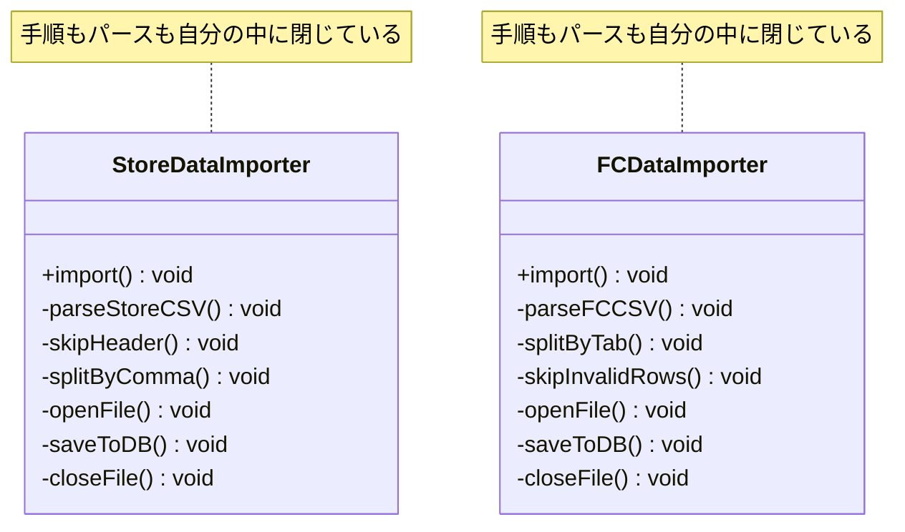
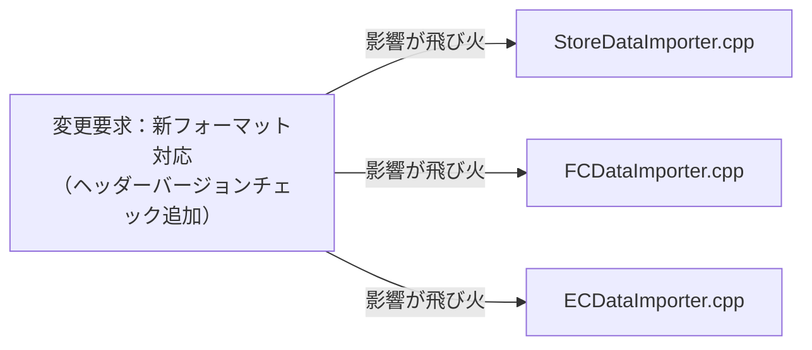
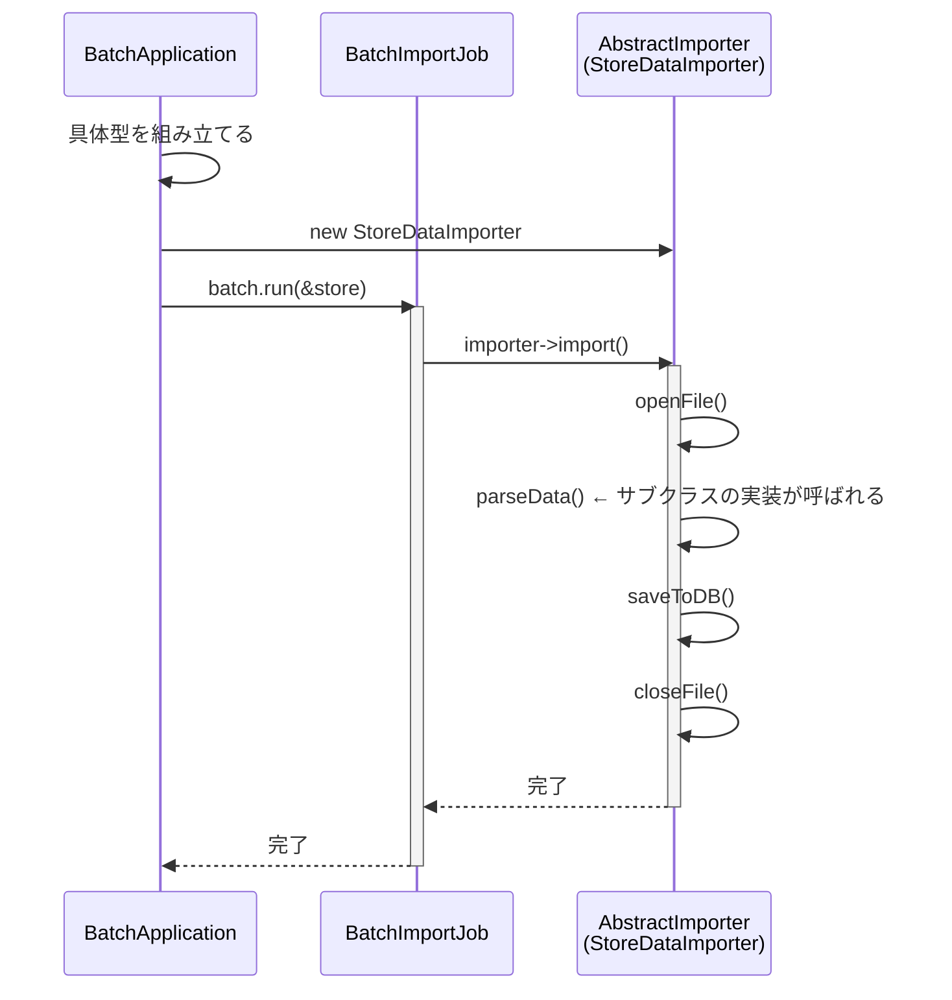
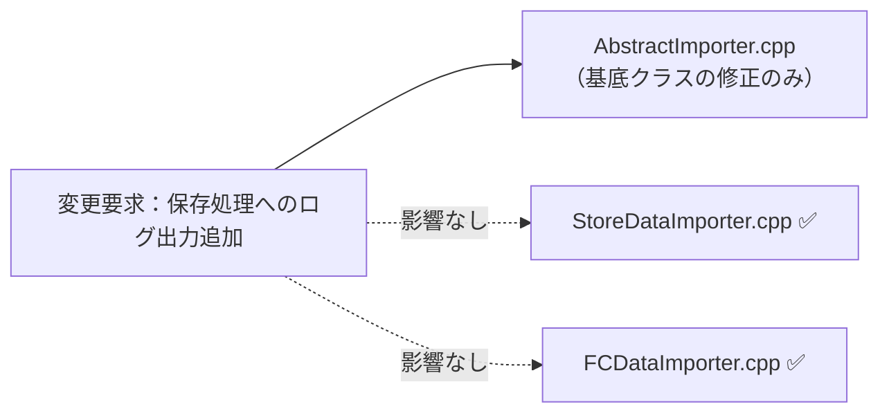
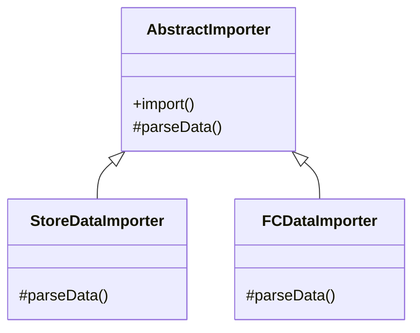
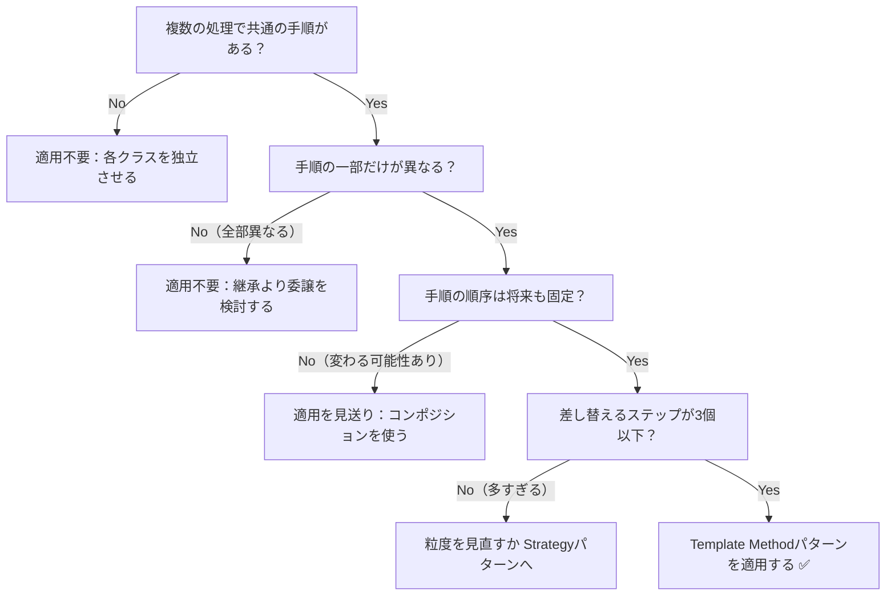

## 第4章 処理のステップの切り出し ―― Template Method パターン

―― 思考の型：手順の骨格は同じなのに、詳細部分が異なる処理が複数存在している

### この章の核心

**一連の手順は共通しているが、その中の一部のステップだけが異なる複数の処理が混在しているコードは、ステップごとに処理をコピー＆ペーストしてしまいがちだ。それは、「処理の骨格」と「詳細な実装」が、同じ場所に混在しているからだ。**

### この章を読むと得られること

この章のテーマは「同じ手順なのに、ファイル形式ごとにほぼ同じコードをコピーしている」という問題です。

* **得られること1：** 「共通の手順」という観点で、コード内の処理の骨格を識別できるようになる


* **得られること2：** 処理の詳細がハードコードされている箇所を見て、そこが変更の痛みの発生源だと判断できるようになる


* **得られること3：** 骨格となる手順を抽出し、詳細をサブクラスに委譲することで、変更を局所化できることを説明できるようになる


* **得られること4：** 「共通部分」と「異なる部分」を見極め、どのような場合にこの構造を選ぶべきかを判断できるようになる

## 🔵 フェーズ1：現状把握 ―― コードとクラス構成を読む
はじめには、CSVインポート処理という現場でよくあるシステムを例に、その現状を事実として観察していきましょう。
### 1-1：このシステムの仕様

このシステムは、**システム基盤担当**と**業務担当者**の2つの立場で保守されています。システム基盤担当はファイルの開閉やDBへの保存といったインフラ寄りの処理を管理し、業務担当者は店舗形態ごとのデータパースルールや計算ロジックを管理します。この2立場の存在は、後で「変わる理由が誰の判断によるか」を見極める際の重要な基準になります。

このシステムは、各店舗のPOSレジから出力される売上データをCSVファイルとして受け取り、DBへ**インポート**します。

インポート処理は以下の5ステップで構成されており、どの店舗形態でもこの大きな流れは変わりません。

**インポートの処理手順**

| ステップ | 処理内容 | 店舗形態による違い |
|---|---|---|
| ① ファイルオープン | CSVファイルを読み込み可能な状態にする | 全形式で共通 |
| ② データパース | フォーマットに従いCSV行を内部データに変換する | 形式ごとに異なる |
| ③ DB保存 | 変換済みデータをDBに登録する | 全形式で共通 |
| ④ ファイルクローズ | ファイルリソースを解放する | 全形式で共通 |

**現在対応しているフォーマット**

| 店舗形態 | 区切り文字 | ヘッダー行 | 不正行の扱い |
|---|---|---|---|
| 直営店 | カンマ区切り | あり（スキップ） | — |
| FC店 | タブ区切り | なし | スキップして続行 |

一見すると、このコードは各店舗のCSVを読み込み、データを抽出してDBに保存するという目的をしっかり達成できています。コードを上から追っていけば、ファイルの読み込みからデータの加工、保存という一連の流れが記述されており、全体の動きは見通しやすい状態です。

しかし、新しいフォーマットが加わるたびに、読み込み手順やデータ加工のロジックが微妙に異なるコードが次々と追加され、少しずつ違和感が見え始めています。
---

### 1-2：動作例テーブル ―― 仕様を「動かした結果」で確認する

コードを読む前に、このシステムがどんな入力に対してどんな出力を返すかを確認します。この章のどのステップも、以下の動作を実現します。フォーマットの違い（カンマ区切り／タブ区切り／ポイント列あり）がシステムの動作にどう反映されるかを「フォーマット種別」列で確認してください。

| 入力ファイル | フォーマット種別 | データの状態 | 期待する出力 |
| --- | --- | --- | --- |
| 直営店CSVファイル | カンマ区切り・ヘッダー行あり | 正常データ10件 | インポート成功、10件追加 |
| FC店CSVファイル | タブ区切り・不正行スキップ | 正常データ5件 | インポート成功、5件更新 |
| EC店CSVファイル | カンマ区切り・ポイント列・会員ランク列あり | 正常データ8件 + 不正データ行2件 | 正常行8件のみ処理、エラー行2件スキップ |
| 直営店CSVファイル | カンマ区切り・ヘッダー行あり | 空ファイル（ヘッダー行のみ） | 0件インポート、エラーなし |
| FC店CSVファイル | タブ区切り・不正行スキップ | 全行不正データ | 0件インポート、エラー件数を報告 |
| EC店CSVファイル | カンマ区切り・ポイント列・会員ランク列あり | 正常データ100件（大量） | インポート成功、100件追加 |
---

### 1-3：実装コード（現状）

実際の処理コードを見てみましょう。直営店用とFC店用の2クラスが存在します。どちらも「開く→加工→保存→閉じる」という大きな流れは共通していますが、パースの中身は少し違っています。クラスごとにブロックを分けて確認します。

```cpp
// 直営店データのインポート（カンマ区切り・ヘッダー行あり）
class StoreDataImporter {
public:
    void import() {
        // 手順：開く → 加工 → 保存
        openFile();
        parseStoreCSV(); // カンマ区切りでヘッダー行をスキップして読む
        saveToDB();
        closeFile();
    }
private:
    void parseStoreCSV() {
        // ヘッダー行をスキップし、カンマで各フィールドに分割する
        skipHeader();
        splitByComma();
    }
};

// FC店データのインポート（タブ区切り・エラー行は無視する）
class FCDataImporter {
public:
    void import() {
        // 手順：開く → 加工 → 保存
        openFile();
        parseFCCSV(); // タブ区切りで不正行をスキップしながら読む
        saveToDB();
        closeFile();
    }
private:
    void parseFCCSV() {
        // タブで各フィールドに分割し、不正な行は読み飛ばす
        splitByTab();
        skipInvalidRows();
    }
};

```

このコードを見ると、`import` メソッドの中で「開く」「加工」「保存」「閉じる」という手順がどちらも同じ順序で記述されていることが分かります。一方で、加工ステップの中身（`parseStoreCSV` と `parseFCCSV`）は、区切り文字やエラー処理の方針が異なっています。「手順の骨格は共通で、詳細部分だけが違う」という構造が見て取れます。
---

### 1-4：クラス構成図

実装コードを踏まえて、クラスの関係性を可視化します。



→ `StoreDataImporter` と `FCDataImporter` の間に矢印はありません。両クラスは互いを知らず、それぞれが「ファイルを開く・パースする・保存する・閉じる」という手順全体を自分の中に独立して持っています。この「関係性がない」という事実こそが、後で問題となる重複の源です。

これから検討するのは、同じ機能を保ちながら、変更に強い構造をどう作るかという点です。

---

### 1-5：変更要求

ある日、店舗運営部の担当者から連絡がありました。「来月から、ネット通販（ECサイト）の売上データもこのシステムで取り込みたい。フォーマットは既存の直営店用と似ているが、会員ランクやポイント付与情報といったEC特有の項目が含まれるため、読み込み後の計算処理が少し追加されることになる」と。

なるほど、店舗のデータとECサイトのデータ。どちらも「開く → 加工 → 保存」という大きな流れは同じはずですが、中身の計算ルールだけが異なるのですね。確かに、ここをそのまま既存のクラスをコピーして実装するのは少し待ったほうが良さそうです。

変更要求によって仕様がどう変わるのかを体系的に整理します。

**変更後の仕様表（ECサイト対応を追加）**

| ルール名 | 発動条件 | 結果 | 具体例 |
| --- | --- | --- | --- |
| ファイルオープン | インポート開始時に必ず実行 | CSVファイルを読み込み可能な状態にする | 直営店・FC店・EC店、どの形式でも同じ手順 |
| データパース | フォーマットごとに異なるルールを適用 | CSV行をシステム内部データに変換する | 直営店：カンマ区切り／FC店：タブ区切り／**EC：ポイント項目・会員ランク追加** |
| **EC向け計算処理** | **ECデータのパース完了後に実行** | **ポイント付与量・会員ランク割引を計算する** | **EC店のみ。直営店・FC店にはこのステップなし** |
| DB保存 | パース完了後に必ず実行 | 変換済みデータをDBに登録する | 保存先・保存形式はどの形式でも共通 |
| ファイルクローズ | 保存完了後に必ず実行 | ファイルリソースを解放する | 直営店・FC店・EC店、どの形式でも同じ手順 |

**変更後の動作例テーブル**

| 入力ファイル | データの状態 | 期待する出力 |
| --- | --- | --- |
| 直営店CSVファイル | 正常データ10件 | インポート成功、10件追加（変わらず） |
| FC店CSVファイル | 正常データ5件 | インポート成功、5件更新（変わらず） |
| **EC店CSVファイル** | **正常データ8件 + 不正データ行2件** | **正常行8件のみ処理、ポイント計算済み** |

仕様表を見ると、「ファイルオープン」「DB保存」「ファイルクローズ」は変更なしで、「データパース」とEC固有の「計算処理ステップ」が追加されています。

フェーズ1でシステムの現状と変更要求が把握できました。次のフェーズ2では、「何が変わり、何が変わらないか」を整理します。

## 🟣 フェーズ2：仮説立案 ―― 何が変わるかを観察し、ヒアリングで裏付ける

### 2-1：責任チェック表

各クラスが「何を知るべきか」を整理します。

| **クラス名** | **責任（1文）** | **知るべきこと** |
| --- | --- | --- |
| `StoreDataImporter` | 直営店CSVを読み込みDBへ登録する | CSVのパース方法、データ加工ルール、DB接続情報 |
| `FCDataImporter` | FC店CSVを読み込みDBへ登録する | CSVのパース方法、データ加工ルール、DB接続情報 |

この表から、両クラスが「ファイルを読み込み、加工し、保存する」という一連の処理手順という知識をそれぞれ独立して定義していることが確認できます。

### 2-2：変わる理由の分析

責任チェック表でクラスの責任が整理できました。次に、コードの各行が「誰の判断で変わる知識か」を確認することで、混在している責任をさらに細かく特定します。判断基準は、「このクラスの担当者（ここではシステム基盤担当）とは別の人間が変更を決定するかどうか」です。別の人間が決定するなら、それは「責任外（❌）」と判断します。

`StoreDataImporter.import()` と `FCDataImporter.import()` の各行を見ると：

| **コードの行** | **持っている知識** | **誰の判断で変わるか** | **責任内か** |
|---|---|---|---|
| `openFile()` | ファイルの開け方という知識 | システム基盤担当が管理 | ✅ |
| `parseStoreCSV()` | 直営店特有のカンマ区切りパース | 直営店の業務担当者が管理 | ❌ 別担当者 |
| `parseFCCSV()` | FC店特有のタブ区切りパース | FC店の業務担当者が管理 | ❌ 別担当者 |
| `saveToDB()` | データベースへの保存という知識 | システム基盤担当が管理 | ✅ |
| `closeFile()` | ファイルのクローズという知識 | システム基盤担当が管理 | ✅ |

1つのメソッドの中に、変える理由が異なる複数の知識が混在しています。`parseStoreCSV` と `parseFCCSV` はそれぞれ異なるチームの業務担当者が管理する知識であり、インポートの骨格（openFile/saveToDB/closeFile）はシステム基盤担当が管理します。今すぐ問題とは言えませんが、これが後の痛みの予兆です。

### 2-3：今回の変更で確実に変わること

今回の変更要求から確定している変更は以下の2点です。

- **ECサイト向けCSVのパース方法の追加**：会員ランク・ポイント項目を読み込む処理が必要
- **EC向け計算処理ステップの追加**：ポイント付与量・会員ランク割引を計算する処理が必要

ただし「この変更が1回限りか、今後も続くか」によって、どこまで設計を変えるべきかが大きく変わります。関係者に確認します。

### ヒアリングに向けた背景確認

このシステムは、ある小売店舗で日々の売上データを管理するために使われています。各店舗のPOSレジから出力される売上データをCSVファイルとして受け取り、システムへ取り込むのが主な役割です。インポートされたデータは夜間バッチで一括処理されるほか、管理画面からも手動でアップロードできる仕組みになっています。

当初は1種類のCSVフォーマットだけを読み込んでいましたが、店舗網の拡大とともに、店舗形態や仕入れ先によって「日付の形式」「ヘッダー行の有無」「カンマ区切りかタブ区切りか」といった細かな違いがあるCSVが持ち込まれるようになりました。

当時の担当者が、増え続けるフォーマットに対応するために一つずつコードを書き足してきた結果が、現在の実装です。

### 2-4：関係者ヒアリング

> **現実のヒアリングでは——** 本書のヒアリングシーンでは設計判断を明確にするため、意図的に「理想的な回答」が返ってくるように描いています。これはシミュレーションです。現実には、「変わるかどうか分からない」「たぶん変わらない」という曖昧な答えが返ることも多いです。そのときは `git log` や過去の障害記録を「ヒアリングの代わり」として使ってみてください。「過去に何度変わったか」が最も正直な証拠です。

仮説の確度を上げるため、システム基盤担当と業務担当者に確認を行いました。

* **開発者：** 「今後もインポート対象のシステムが増える予定はありますか？」
* **システム基盤担当：** 「あります。次はSNS経由の販売データを取り込む予定です。ファイル操作の手順は既存と全く同じはずです。」
* **開発者：** 「読み込みの手順自体が変わる可能性はありますか？」
* **業務担当：** 「いいえ、ファイルを開いて閉じるという手順は固定です。ただ、中身のデータ項目が少しずつ増えたり計算ルールが変わったりすることは頻繁にあります。」

### 2-5：ヒアリングで判明した将来リスク

ヒアリングで浮かび上がった「確定ではないが、近い将来起こりうる変化」を記録します。これは今回の設計判断の材料です。

| **将来リスク** | **時期の目安** | **根拠** |
| --- | --- | --- |
| SNS販売データのインポート形式追加 | 継続的に | インポート対象チャネルが増える予定（システム基盤担当より） |
| 各店のデータ項目の追加・計算ルール変更 | 継続的に | 頻繁にあると業務担当が言及 |

フェーズ2で「今変わること（確定）」と「将来変わるかもしれないこと（リスク）」を分けて整理できました。次のフェーズ3では、現在の構造で変更を試みたときに何が起きるかを確認します。

---

## 🟣 フェーズ3：問題特定 ―― 変更の痛みを発見する

フェーズ2で、CSVインポートの処理手順は共通しており、データ加工のルールだけが変わるという構造が明確になりました。このフェーズでは、新しいECサイト向けCSVの取り込みを、現在のクラス構造のまま実装しようとするとどのような「痛み」が生じるのかを確認します。

### 3-1：変更を試みる

ECサイトの売上データをインポートする機能を実装しようと、既存の `StoreDataImporter` クラスを参考に、新しい `ECDataImporter` クラスを作成してみましょう。

```cpp
// EC店データのインポート（ポイント・会員ランク項目あり）
class ECDataImporter {
public:
    void import() {
        // 既存の直営店用と同じ手順を再度記述する
        openFile();
        parseECData();   // EC特有の加工ロジック
        calcPointBonus(); // ポイント付与計算（EC店のみ）
        saveToDB();
        closeFile();
    }
private:
    void parseECData() {
        // カンマ区切りで、会員ランク・ポイント列を追加で読む
        splitByComma();
        readMemberRank();
        readPointColumn();
    }
    void calcPointBonus() {
        // 会員ランクに応じたポイント付与量を計算する
    }
};

```

実装しながら、一つの違和感に気づきます。「あれ、`openFile()`・`saveToDB()`・`closeFile()` は直営店やFC店と全く同じなのに、また自分のクラスに書いているな」と。

さて、ECサイト対応が完了した翌月、今度は別の要件が届きました。「直営店・FC店・EC店のすべてについて、CSVのフォーマットを新バージョンに切り替える。新フォーマットではヘッダー行の仕様が変わるため、ファイルを開いた直後にバージョンチェック処理を追加してほしい」という内容です。

「バージョンチェック」はフォーマット種別に関わらず全インポートで共通の手順変更です。しかし現在の構造では、`StoreDataImporter`・`FCDataImporter`・`ECDataImporter` の3つのクラスそれぞれに、同じバージョンチェックのコードを追加しなければなりません。

「3つとも同じ修正を入れる作業。しかもこれからインポート対象が増えるたびに同じことが繰り返される……」

### 3-2：変更影響グラフ

変更要求が既存システムにどのように波及するかをグラフ化します。



→ このグラフを見ると、「ヘッダーバージョンチェック」という共通の手順変更が、インポートクラスの数だけ波及していることが分かります。バージョンチェックは1か所に書けば済むはずの処理なのに、各クラスが「手順の骨格」を独自に持っているために、3か所を同時に修正しなければなりません。今後インポート形式が増えるたびに、この波及範囲も広がり続けます。

### 3-3：痛みの言語化

変更を試みたことで、2つの「痛み」が鮮明になりました。

1つ目は、修正の「コピー＆ペースト地獄」です。具体的には、`openFile()` という1行が `StoreDataImporter`・`FCDataImporter`・`ECDataImporter` の3クラスそれぞれの `import()` メソッドに重複して存在しています（1-3節のコードで確認できます）。「バージョンチェックを追加してほしい」という1つの要求に対して、この同じ修正を3箇所で繰り返さなければなりません。今後インポート形式が4つ・5つと増えれば、修正箇所もその数だけ増え続けます。共通の手順であるはずのファイル操作やDB保存のコードが、インポートの数だけ量産されているために、手順に修正が入るたびに、関連するすべてのクラスをgrepして同じ修正を繰り返さなければなりません。これは非常に退屈で、かつ修正漏れというバグを生み出しやすい作業です。

2つ目は、システムの「変更耐性の低さ」です。本来、ビジネスロジックである「店舗ごとのデータパース」だけを変えれば済むはずの状況で、ファイル操作やDB接続という「手順の骨格」まで修正対象になってしまっています。システム基盤側の知識が業務ロジックのクラスに漏れ出しているために、本来無関係な場所まで変更しなければならないという、設計上の無駄が蓄積しています。

こういうとき困る、という感覚、皆さんも同じではないでしょうか。この「共通の手順が散らばっている」という状態が、私たちの設計を硬直させている元凶なのです。

フェーズ3で「手順の重複が辛い」という事実が確認できました。次のフェーズ4では、なぜこの辛さが構造的に発生するのかを分析します。

## 🟠 フェーズ4：原因分析 ―― なぜ辛いのかを構造で言語化する

フェーズ3で、インポート処理の「手順の重複」という痛みが確認できました。このフェーズでは、なぜそのような辛さが生じるのかを、コードの構造的な観点から言語化します。

### 4-1：痛みの根源を探る（観察と原因）

フェーズ3で確認した「変更の辛さ」は、コードのどこから来ているのでしょうか。コードを注意深く観察すると、痛みを引き起こしている2つの事実が浮かび上がってきます。

| **観察した症状（痛み）** | **構造的な原因（痛みの根源）** |
|---|---|
| 新しいインポート形式を追加するたびに、ファイルを開く・閉じる・保存する等の「手順」を全クラスで書き直す必要がある | 共通の手順（処理の骨格）と、店舗ごとのデータパース（詳細）が、同じメソッドの中に混在しているから |
| 共通であるはずのファイル操作手順に修正が入ったとき、全インポートクラスを修正しなければならない | 共通の手順という「変わらないもの」を、店舗ごとの詳細という「変わるもの」が引きずり回しているから |

### 4-2：変わるもの/変わってほしくないもの

> **「変わらないもの」と「変わってほしくないもの」は異なります。** 「変わらないもの」は経験的事実（今まで変わっていない）、「変わってほしくないもの」は設計意図（ここを安定させてほかを守りたい）です。ここで整理するのは後者です。

原因分析の結果として、「変わり続けるもの」と「変わってほしくないもの」を明確に分けます。

| **変わり続けるもの（🔴）** | **変わってほしくないもの（🟢）** |
| --- | --- |
| CSVのデータパースルール | ファイルを開く・閉じるというファイル操作手順 |
| 個別のデータ加工処理 | データベースへの保存という一連のフロー |

本来、これらは別々の理由で変わるはずのものです。ビジネス側が「パースルール」を変えるたびに、システム基盤側が管理する「ファイル操作手順」まで影響を受けてしまっていることが、設計上の問題です。

### 4-3：接続形態の診断

現在のインポート処理クラスは、各クラスの `import()` メソッド内にファイル操作手順とパースロジックが直接同居している状態です。これは **「具体×直接」の接続形態** です。コードで言うと、1-3節の `StoreDataImporter::import()` に `openFile(); parseStoreCSV(); saveToDB(); closeFile();` と直書きされており、`FCDataImporter::import()` にも同じ呼び出しが並んでいます。共通の基底クラスは存在しないため、呼び出し元は具体クラスを直接名指しするしかありません——これが「具体×直接」の証拠です。

接続形態を視覚的に説明するため比喩を使います。ここでの4つの軸は次のように定義します。

| **用語** | **コードの世界での意味** |
| --- | --- |
| 具体 | 特定のクラスに直接依存している（クラス名をコードに書いている） |
| 抽象 | インターフェースや基底クラスを介して依存している（具体名を書かない） |
| 直接 | 呼び出し元が呼び出し先を中継なしに直接知っている |
| 間接 | ManagerやFactoryなど中継役を経由してつながっている |

iPhone に専用の Lightning ケーブルを直差しした状態と同じで、新しい店舗のCSV形式が増えるたびに、クラス本体に新しい配線（`parseXXX()` メソッド）を直接追加しなければなりません。

フェーズ4で根本原因が言語化できました。分けるべき場所（変わる理由が異なる2つのもの）が特定できた段階です。しかし「どこを分けるか」は分かっても、「何を（どの塊を）取り出せばいいか」はまだ曖昧です。次のフェーズ5では、この「取り出すターゲット」を具体的に特定します。

## 🟡 フェーズ5：課題定義 ―― 解くべき接続点を特定する

フェーズ4は「なぜ辛いか」を答えました。フェーズ5が問うのは「その境界でどんなデータが流れているか」です。型・値のレベルに降りていきます。

フェーズ4で、「共通の手順（骨格）」と「店舗ごとのパースルール（詳細）」が同じメソッド内に混在しているという構造的問題が明らかになりました。各ステップ（フェーズ6）に進む前に、ここで「何を解くべき課題とするか」を具体的に確定させます。

今回のリファクタリングにおいて、最も深刻な影響が出ている場所——つまり解決する必要がある「接続点」は以下の1箇所です。

* **接続点A：** `import()` 内の呼び出し順序：`openFile()` → `parseData()` → `saveToDB()` → `closeFile()` ―― 手順の骨格とパースロジックが同じメソッド内に直接書かれており、手順の変更がパースロジックの修正を巻き込む

この接続点は、「ファイルを開いて閉じる」という基盤的な手順と、「CSVの中身をどう読み解くか」という業務知識がつながっている場所です。ここを切り離すことで、新しいインポート形式が追加された際も、手順のコードに手を触れずに済む設計を目指します。

現在の結合状況を確認します。`StoreDataImporter` と `FCDataImporter` は、それぞれの `import()` メソッド内で「ファイルを開く・閉じる・保存する」という骨格手順と「パースロジック」を直接混在させています。これが「骨格が変わるたびに全クラスを修正しなければならない」現在の痛みの原因です。

| **接続点** | **接続するデータ（型・呼び出し順序）** |
| --- | --- |
| 接続点A | `import()` 内の呼び出しシーケンス：`openFile()` → `parseData()` → `saveToDB()` → `closeFile()` ― 骨格の呼び出し順序とパースの実装が同一メソッド内に直書きされている |

フェーズ5で「何を解くか」が確定しました。次のフェーズ6では、この課題に対してどのような「接続の形」を採用する必要があるか、ステップ1〜5を段階的に進めてコスト比較を行います。

---

## 🔴 フェーズ6：対策検討 ―― 段階的な改善と決断

ターゲットである「骨格に混在したパースロジック」を外に出すために、いきなり正解へ飛ぶのではなく、段階的にリファクタリングを進めてみます。それぞれの段階（ステップ）でどこまで痛みが解消されるかを確認し、今回の要件において「どのステップで止めるべきか」を決断します。

### ステップ1：共通部分を1つのメソッドに集める（とりあえず分ける）

はじめに、骨格はそのままに、各クラスのパース処理をプライベートメソッドとして整理してみます。「とりあえず処理の意図を名前で見える化する」という最小コストの一手です。

```cpp
// 直営店：プライベートメソッドで処理を整理した版
class StoreDataImporter {
public:
    void import() {
        openFile();
        parse(); // ← 処理の意図を名前で示す
        saveToDB();
        closeFile();
    }
private:
    void parse() {
        skipHeader();
        splitByComma();
    }
    // openFile / saveToDB / closeFile はここにも定義される
};

// FC店：同じく整理した版
class FCDataImporter {
public:
    void import() {
        openFile();
        parse(); // ← 同じ名前を使っているが、別クラスの別メソッド
        saveToDB();
        closeFile();
    }
private:
    void parse() {
        splitByTab();
        skipInvalidRows();
    }
    // openFile / saveToDB / closeFile はここにも定義される
};
```

**この段階の評価：**
各クラスの `import()` 骨格は `parse()` というメソッドで処理の意図が読みやすくなりました。しかし、`openFile()` / `saveToDB()` / `closeFile()` という骨格コードが依然として各クラスに重複しています。「バージョンチェックを全クラスに追加してほしい」という変更が来れば、またすべてのクラスを開かなければなりません。

### ステップ2：共通の骨格を template() メソッドとして固定する

ステップ1の「骨格の重複」という問題を解決するために、共通手順を担うクラスを1つ用意して骨格を集約してみます。

```cpp
// 骨格を持つ基底クラス（骨格のみ）
class ImporterBase {
public:
    void import() {
        openFile();
        parse(); // ← どのサブクラスの parse() を呼ぶかは実行時に決まる
        saveToDB();
        closeFile();
    }
    // parse() はまだ virtual として定義していない
    void parse() { /* 何もしない */ }
protected:
    void openFile()  { /* 共通手順 */ }
    void saveToDB()  { /* 共通手順 */ }
    void closeFile() { /* 共通手順 */ }
};

// 直営店：基底クラスを継承して parse() を上書き
class StoreDataImporter : public ImporterBase {
public:
    void parse() { // ← virtualでないため上書きが保証されない
        skipHeader();
        splitByComma();
    }
};
```

**この段階の評価：**
骨格（`openFile` / `saveToDB` / `closeFile`）が `ImporterBase` に集約されました。しかし、`parse()` が `virtual` でないため、`ImporterBase*` 型を通じて呼び出すと基底クラスの空の `parse()` が呼ばれてしまいます。サブクラスの `parse()` が確実に実行されるという保証がなく、バグの温床になります。

### ステップ3：変わるステップだけを抽象メソッドとして分ける

骨格の呼び出し順序を基底クラスで固定しつつ、変わるステップだけを純粋仮想関数（抽象メソッド）にします。これにより、サブクラスは「変わる部分だけ」を実装すればよくなります。

```cpp
// 骨格を固定し、変わる部分だけを抽象メソッドにする
class ImporterBase {
public:
    void import() { // ← 骨格（手順の順序は変えさせない）
        openFile();
        parse(); // ← 純粋仮想：サブクラスが必ず実装する
        saveToDB();
        closeFile();
    }
protected:
    virtual void parse() = 0; // ← ここだけ変わる
    void openFile()  { /* 共通手順 */ }
    void saveToDB()  { /* 共通手順 */ }
    void closeFile() { /* 共通手順 */ }
};

// 直営店：変わる部分だけを実装する
class StoreDataImporter : public ImporterBase {
protected:
    void parse() override {
        skipHeader();
        splitByComma();
    }
};

// FC店：変わる部分だけを実装する
class FCDataImporter : public ImporterBase {
protected:
    void parse() override {
        splitByTab();
        skipInvalidRows();
    }
};
```

**この段階の評価：**
`parse()` が純粋仮想関数になったことで、サブクラスは必ずこれを実装しなければコンパイルエラーになります。骨格の呼び出し順序は基底クラスが保証し、各サブクラスは「自分に関わる部分だけ」を担当できています。これが「関数化（手続き型）の限界」を超えた最初の地点です。

### ステップ4：別クラスへの継承（具体×直接 — 抽象クラスに具体的な実装）

「クラスは分けたいが、共通の抽象基底クラスはまだ用意したくない」という判断を試してみます。各インポートクラスを独立させた上で、共通手順を担う別クラスに委ねる形です。

```cpp
// ただクラスに分けただけ（基底クラスはない）
class StoreDataImporter {
public:
    void import() {
        openFile();
        parseStoreData(); // 直営店形式
        saveToDB();
        closeFile();
    }
private:
    void parseStoreData() { /* 直営店形式のパース処理 */ }
    // openFile / saveToDB / closeFile はここにも定義される
};

class ECDataImporter {
public:
    void import() {
        openFile();
        parseECData(); // EC特有の加工ロジック
        saveToDB();
        closeFile();
    }
private:
    void parseECData() { /* EC特有のパース処理 */ }
    // openFile / saveToDB / closeFile はここにも定義される
};
```

**この段階の評価：**
それぞれの計算ロジックが別のクラスに分かれたため、一見すると整理されたように思えます。しかし、これでは**何も解決していません**。クラスを分けたにもかかわらず、`openFile()` / `saveToDB()` / `closeFile()` という骨格コードは依然としてすべてのクラスに重複しています。「バージョンチェックを全クラスに追加してほしい」という変更が来れば、またすべてのクラスを開かなければなりません。これが「具体×直接」の限界です。

### ステップ5：完全な Template Method パターン（抽象×直接）

既存コード（本体）を一切触らずに新しいインポート形式を追加するにはどうすればよいでしょうか？骨格を抽象基底クラスに閉じ込め、変わる部分だけを純粋仮想関数として定義します。

```cpp
// 骨格を固定する抽象基底クラス
class AbstractImporter {
public:
    void import() { // ← 骨格（変えさせない）
        openFile();
        parseData(); // ← 各店の実装を呼ぶ
        saveToDB();
        closeFile();
    }
protected:
    virtual void parseData() = 0; // ← 実装詳細をサブクラスへ
    void openFile()  { /* 共通手順 */ }
    void saveToDB()  { /* 共通手順 */ }
    void closeFile() { /* 共通手順 */ }
};

// 直営店：parseData() だけを実装する
class StoreDataImporter : public AbstractImporter {
protected:
    void parseData() override {
        skipHeader();
        splitByComma();
    }
};

// FC店：parseData() だけを実装する
class FCDataImporter : public AbstractImporter {
protected:
    void parseData() override {
        splitByTab();
        skipInvalidRows();
    }
};

// 呼び出し側：AbstractImporter* で受け取る
class BatchImportJob {
public:
    void run(AbstractImporter* importer) {
        importer->import(); // ← 抽象型だけを知る
    }
};
```

**この段階の評価：**
ついに、骨格（`openFile` / `saveToDB` / `closeFile`）が `AbstractImporter` という1か所だけに存在するようになりました。呼び出し側は `AbstractImporter*` という抽象型だけを知ればよく、具体クラスを知りません。新しいインポート形式が増えても、新しいサブクラスを1つ追加するだけで対応でき、既存のコードは一切触らずに済みます。接続の形が**「抽象×直接」**に到達しました。

---

### どこまで設計を進めるべきか（採用ステップの決断）

それぞれのステップには一長一短があります。ステップ5の抽象基底クラスによる分離は強力ですが、クラス設計が必要になるという「初期投資コスト」もかかります。どこで止めるかは、**「今後の変更頻度（ビジネス要求）」**で決断します。

*   **ステップ1（プライベートメソッド整理）で止めるケース：** これ以上新しいインポート形式が増える予定が絶対にない場合。コードを読みやすく整理するだけで十分です。
*   **ステップ2・3（骨格の集約）で止めるケース：** 骨格の重複は排除したいが、呼び出し元が抽象型を意識するほどの規模でない場合の「中間策」です。
*   **ステップ4（具体クラスへの分離）で止めるケース：** クラスを分けて整理したいが、継承や抽象クラスのコストをまだかけたくない場合。ただし骨格の重複は残ります。
*   **ステップ5（抽象基底クラスへの集約）まで進むケース：** 「今後も新しいインポート形式が追加される」と確定している場合。今すぐ初期投資コストを払ってでも、将来の変更コストをゼロにするのが適切です。

**今回の決断：**
フェーズ2のヒアリングで、システム基盤担当から「次はSNS経由の販売データを取り込む予定」と明言されています。インポート形式は今後も増え続けると確定しているため、今回は迷わず**ステップ5（抽象基底クラスへの集約・抽象×直接）まで進化させる**決断を下します。

このように、処理の骨格を基底クラスが定義し、変わる部分のステップだけをサブクラスが差し替える設計構造を **Template Method（テンプレートメソッド）パターン** と呼びます。

フェーズ6で採用ステップが決まりました。次のフェーズ7では、この決断を最終的なコードに落とし込みます。

## 🟢 フェーズ7：対策実施 ―― 変化に強いコードを完成させる

採用したステップ5の設計を、実際のコードに実装します。これまでは個別のクラスで重複していたファイル操作やDB保存の手順を、基底クラスにテンプレートとして集約します。

この設計変更により、今後新しいインポート形式がどれだけ増えても、既存の「手順の骨格」を壊すことなく、パースロジックだけをサブクラスで実装するだけで安全に機能拡張ができる安定性を手に入れました。

### 7-1：解決後のコード（全体）

新しい設計では、共通の手順を親クラスで定義し、具体的なパース処理だけをサブクラスに委譲します。各役割ごとにコードを分けて見ていきましょう。

**AbstractImporterクラス（骨格の定義）：**

```cpp
// 共通の骨格を持つ基底クラス
class AbstractImporter {
public:
    // 手順の骨格を定義するメソッド（変更させない）
    void import() {
        openFile();
        parseData(); // ← ここだけ変わる
        saveToDB();
        closeFile();
    }
protected:
    virtual void parseData() = 0; // 実装詳細をサブクラスへ
    void openFile()  { cout << "ファイルをオープンしました。" << endl; }
    void saveToDB()  { cout << "DBへの保存が完了しました。" << endl; }
    void closeFile() { cout << "ファイルをクローズしました。" << endl; }
};

```

`import()` というメソッドが処理の骨格を一箇所に集約していることが分かります。`parseData()` だけが純粋仮想関数として残り、各サブクラスが自分のフォーマットに合わせて実装します。

**具体クラス（StoreDataImporter / FCDataImporter / ECDataImporter）：**

```cpp
// 直営店用インポート：パース処理だけを実装する
class StoreDataImporter : public AbstractImporter {
protected:
    void parseData() override {
        cout << "[直営店] ヘッダー行をスキップしました。" << endl;
        cout << "[直営店] カンマ区切りで10件のデータを読み込みました。" << endl;
    }
};

// FC店用インポート：パース処理だけを実装する
class FCDataImporter : public AbstractImporter {
protected:
    void parseData() override {
        cout << "[FC店] タブ区切りで行を分割しました。" << endl;
        cout << "[FC店] 5件のデータを取得しました（不正行スキップ）。" << endl;
    }
};

// EC店用インポート：パース処理だけを実装する
class ECDataImporter : public AbstractImporter {
protected:
    void parseData() override {
        cout << "[EC店] カンマ区切りで行を分割しました。" << endl;
        cout << "[EC店] 会員ランクを読み込みました。" << endl;
        cout << "[EC店] ポイント列を読み込みました。" << endl;
        cout << "[EC店] ポイントボーナスを計算しました（8件処理、2件スキップ）。" << endl;
    }
};

```

各サブクラスは `parseData()` の1メソッドだけを実装しており、ファイルの開閉やDB保存の知識を一切持っていません。「自分に関わる部分だけ」を担当する責任の分担が実現されています。

**呼び出し側（BatchImportJob / ManualImportController）：**

```cpp
// 夜間バッチ：抽象型で受け取り、具体クラスに依存しない
class BatchImportJob {
public:
    void run(AbstractImporter* importer) {
        importer->import(); // ← AbstractImporter* 経由
    }
};

// 手動実行：こちらも同じく抽象型で受け取るだけ
class ManualImportController {
public:
    void importFile(AbstractImporter* importer) {
        importer->import(); // ← 同じ形で受け取れる
    }
};

```

`BatchImportJob` と `ManualImportController` はどちらも `AbstractImporter*` を受け取るだけで、「どの具体クラスか」を知らずに済みます。新しいインポート形式が増えても、どちらの呼び出し元も修正は不要です。

**BatchApplicationクラス（組み立て）：**

```cpp
// 依存関係の組み立てを担うクラス
class BatchApplication {
public:
    void run() {
        StoreDataImporter store; // 行1
        FCDataImporter fc;       // 行2
        ECDataImporter ec;       // 行3

        BatchImportJob batch;
        cout << "--- 直営店インポート（行1） ---" << endl;
        batch.run(&store);
        cout << "--- FC店インポート（行2） ---" << endl;
        batch.run(&fc);
        cout << "--- EC店インポート（行3） ---" << endl;
        batch.run(&ec);
    }
};

```

**main関数：**

```cpp
int main() {
    BatchApplication app;
    app.run();
    return 0;
}
```

**実行結果：**

```
--- 直営店インポート（行1） ---
ファイルをオープンしました。
[直営店] ヘッダー行をスキップしました。
[直営店] カンマ区切りで10件のデータを読み込みました。
DBへの保存が完了しました。
ファイルをクローズしました。
--- FC店インポート（行2） ---
ファイルをオープンしました。
[FC店] タブ区切りで行を分割しました。
[FC店] 5件のデータを取得しました（不正行スキップ）。
DBへの保存が完了しました。
ファイルをクローズしました。
--- EC店インポート（行3） ---
ファイルをオープンしました。
[EC店] カンマ区切りで行を分割しました。
[EC店] 会員ランクを読み込みました。
[EC店] ポイント列を読み込みました。
[EC店] ポイントボーナスを計算しました（8件処理、2件スキップ）。
DBへの保存が完了しました。
ファイルをクローズしました。
```

動作テーブル行1〜3と一致しています。行4〜6（空ファイル・全行不正・大量データ）はファイル内容に依存するため、ここでは省略しています。

`main()` はキックするだけで、具体クラスの知識は `BatchApplication` に閉じています。

### 7-2：動作シーケンス図

ステップ5で到達したTemplate Methodパターンの実行時のオブジェクト間のやり取りを可視化します。`main()` が依存関係を注入し、`BatchImportJob` が具象クラスを知らずに抽象インターフェース経由で処理を委譲する流れが確認できます。



`BatchApplication` が具体型を組み立て、`BatchImportJob` は `AbstractImporter*` という型だけを介して `import()` を呼びます。`import()` の中で `parseData()` が呼ばれると、実行時に具体クラスのオーバーライド実装が動きます——これがTemplate Methodパターンの動きです。

### 7-3：変更影響グラフ（改善後）

フェーズ3で確認した「ログ出力追加」のシナリオを再度適用します。



→ **フェーズ3の変更影響グラフと比較して、ログ出力の追加という変更要求が、基底クラスである `AbstractImporter.cpp` 一箇所に閉じた設計になりました**。

### 7-4：変更シナリオ表

この設計で手に入れたものと、諦めたものを整理します。

| **シナリオ** | **変わるクラス（触る場所）** | **変わらないクラス** |
| --- | --- | --- |
| 新しいインポート形式（SNS売上）の追加 | `SNSDataImporter` (新規作成) | `AbstractImporter`, `ECDataImporter` |
| 共通ログ出力手順の追加 | `AbstractImporter` (修正のみ) | `ECDataImporter`, `FCDataImporter` |

共通の手順を基底クラスに「カプセル化」したことで、変更が来ても触るのは1箇所（または新規追加のみ）で済むようになりました——それがこの設計で手に入れたものです。諦めたものは、クラスの継承関係によるわずかな設計の複雑さだけです。

---

## 整理

### フェーズとこの章でやったこと

この章では、手順の骨格は同じなのに詳細が異なる複数のクラスが乱立し、変更が全クラスに飛び火していた現状を学びました。7フェーズの思考プロセスを適用して、どのように構造を改善したのかを振り返ります。

| **フェーズ** | **この章でやったこと** |
| --- | --- |
| 🔵 フェーズ1：現状把握 | 複数のインポートクラスでファイル操作手順が重複して記述されている現状を観察しました。変更要求（EC店追加）を把握しました |
| 🟣 フェーズ2：仮説立案 | 責任チェック表で各行の変わる理由を確認しました。インポートの「手順」は不変だが「パースルール」は変動するという仮説を立て、ヒアリングで裏付けました |
| 🟣 フェーズ3：問題特定 | 新しいインポート形式を追加しようとした際に、全クラスで同じ修正が必要になる「痛み」を確認しました |
| 🟠 フェーズ4：原因分析 | 共通の「骨格（手順）」と固有の「詳細（ロジック）」が混在していることが、変更影響を拡大させる根本原因だと突き止めました |
| 🟡 フェーズ5：課題定義 | インポート処理の「手順」と「パース処理」の境界を接続点として特定しました |
| 🔴 フェーズ6：対策検討 | ステップ1〜5を比較し、共通手順を基底クラスにテンプレート化して分離するステップ5を採用しました |
| 🟢 フェーズ7：対策実施 | 共通の手順を基底クラスに集約し、固有ロジックだけをサブクラスで実装する構造へ移行しました |

### 各クラスの最終的な責任

今回の設計変更により、各クラスの責任は以下のように整理されました。

| **クラス名** | **責任（1文）** | **変わる理由** |
| --- | --- | --- |
| `AbstractImporter` | CSVインポートの共通手順（骨格）を定義・管理する | インポートの手順自体（エラーハンドリング等）が変わるとき |
| `StoreDataImporter` | 直営店特有のパースおよび加工ルールを実装する | 直営店用のデータ形式が変わるとき |
| `FCDataImporter` | FC店特有のパースおよび加工ルールを実装する | FC店用のデータ形式が変わるとき |

> このプロセスを回した結果にたどり着いた構造こそが Template Method パターンです。

---

## 振り返り

### 「この章を読むと得られること」は手に入ったか

| **得られること** | **この章のどこで示したか** |
| --- | --- |
| 1. 変動箇所の識別 | フェーズ2の責任チェック表と変わる理由の分析で、骨格（不変）とパース（変動）を区別しました |
| 2. 接続形態の診断 | フェーズ4で、コードの混在を「専用ケーブル直差し」として診断しました |
| 3. 構造改善の説明 | フェーズ7の変更シナリオ表で、修正が基底クラスに局所化されたことを実証しました |
| 4. いつ使うかの判断 | フェーズ6の「どこまで設計を進めるべきか」で判断基準を示しました |

### 3つの設計原則はどう適用されたか

**原則1「変わるものをカプセル化せよ」の現れ**

- 具体化された場所：各サブクラス（`StoreDataImporter` など）
- 解説：頻繁に変わる「パース・加工ルール」をサブクラスへとカプセル化しました。これにより、基底クラスの手順は変更の影響を受けずに安定しました。

**原則2「実装ではなくインターフェースに対してプログラムせよ」の現れ**

- 具体化された場所：`AbstractImporter` の抽象メソッド `parseData()`
- 解説：基底クラスの手順は、具体的なパース実装ではなく抽象化されたインターフェース（抽象メソッド）に対して動作します。

**原則3「継承よりコンポジションを優先せよ」の現れ**

- 具体化された場所：テンプレートメソッドによる継承階層
- 解説：本章では「手順の共通化」のために継承を用いましたが、これは変化の軸が手順の骨格にある場合に限定した適用です。パースルールの差し替えが目的ならStrategyパターン（コンポジション）が候補になります。

---

## あなたのコードで考えてみてください

この章で辿った思考プロセスを、あなた自身のコードに当てはめてみましょう。手順は「① 重複を探す → ② 変更理由を数える → ③ 骨格を1か所に書いた場合の修正範囲を見積もる」の3ステップです。

1. **変動の兆候を探す：** あなたのコードに「前処理→本処理→後処理」という同じ流れで、本処理だけが異なる処理が複数ありますか（コピー＆ペーストの痕跡が残っている箇所）？
2. **変える理由を問う：** 共通の「前処理」や「後処理」に変更が入ったとき、何箇所を修正しましたか？1箇所で済みましたか？
3. **骨格の重複を測る：** 似たような処理が複数あるとき、「どれが最新の正しいバージョンか」を判断するのに時間がかかったことはありますか？
4. **共通化した後を想像する：** もし骨格を1箇所に集約したとすると、「前処理のバグ修正」は何ファイルへの変更で完結しますか？

---

## パターン解説：Template Method パターン

### パターンの骨格

Template Methodパターンは、アルゴリズムの構造を定義し、具体的な実装をサブクラスに遅延させるパターンです。基底クラスにメソッドの処理手順（テンプレートメソッド）を記述し、一部のステップを抽象メソッドとしてサブクラスに実装させます。


### この章の実装との対応

GoF（Gang of Four）とは、1994年に出版された書籍『Design Patterns』の4人の著者の総称です。彼らが整理した23のパターンは、現在も設計の共通言語として広く使われています。

| GoFの名前 | この章での対応 |
|---|---|
| AbstractClass | `AbstractImporter` |
| templateMethod | `import()` |
| primitiveOperation | `parseData()` |
| ConcreteClass | `StoreDataImporter` / `FCDataImporter` / `ECDataImporter` |



`AbstractImporter` が骨格となる手順を所有し、`StoreDataImporter` などのサブクラスがその詳細を埋めています。

### 使いどころと限界

Template Methodパターンは「手順の骨格」を再利用するのに強力ですが、使いどころを間違えると「硬直した設計」を生み出します。実務で導入を迷いやすい場面と、その判断基準を整理します。

**1. 手順の一部が「不要なクラス」が現れた場合**
たとえば「ファイルを開かずに、ネットワークから直接読み込む新しいインポート形式」が追加されたとします。このとき、既存の骨格（`openFile()`）が邪魔になります。
このような場合は、無理に既存のTemplate Methodに押し込めず、**新しい骨格クラスを作るか、手順の再利用（継承）自体を諦めてコンポジション（オブジェクトを内部に保持して利用する仕組み）に切り替える**のが正解です。

**2. 差し替えるステップ（フック）が多すぎる場合**
基底クラスに `parseHeader()`, `parseBody()`, `parseFooter()`, `validateData()` など、サブクラスが実装しなければならないメソッドが5個も6個もある場合、サブクラスの実装負担が大きすぎます。
この場合は、骨格の粒度が細かすぎるサインです。いくつかのステップをまとめて大きなステップにするか、**Strategyパターンなどの別の設計**への移行を検討します。

| **迷う状況** | **設計の判断基準** |
| --- | --- |
| 手順の一部を使わないサブクラスが出た | 既存の骨格への追加を諦め、骨格クラスを分ける |
| 実装が必要なステップ数が多すぎる | 骨格の粒度を見直すか、Strategyパターンへ移行する |
| 将来、手順の順序自体が変わる可能性がある | Template Methodの導入を見送り、コンポジション（保持・委譲）を使う |

**Template Methodパターン 適用判断フロー：**



### この章のまとめ

この章の冒頭で示した「得られること」4点を、あらためて確認します。

**得られること1**（共通の手順の識別）：フェーズ1で、「ファイルを開く→読み込む→変換する→保存する→閉じる」という処理の骨格が、どのCSV形式でも共通していることを確認しました。「共通の手順」という切り口で、コード内の変動・不変を見分ける視点が養われたはずです。

**得られること2**（変更の痛みの発生源の判断）：フェーズ4で、パースロジックが `import()` メソッドに直書きされている箇所を「変わる理由が混在している場所」と特定しました。フォーマットが増えるたびに同じクラスを修正しなければならない痛みの原因が、ここにあると判断できるようになります。

**得られること3**（骨格抽出と委譲の説明）：フェーズ7で、抽象クラスに骨格のみを残し、各サブクラスが差分の実装を担う構造を確認しました。「変わる部分だけをオーバーライドできる」という Template Method の仕組みを、コードの形から説明できる状態になったと思います。

**得られること4**（いつ使うかの判断）：フェーズ6の「どこまで設計を進めるべきか」で、処理の手順が店舗ごとに全く異なる場合にはこの構造が機能しないことも確認しました。「骨格が共通かどうか」という問いが、このパターンを使う・使わないの判断基準になります。

CSVインポートという身近な題材を通じて、共通の骨格と個別の詳細を切り分けるという設計の視点を体験できたのではないかと思います。この章で辿った7つのフェーズは、どんな現場のコードにも同じように使える思考の型です。
