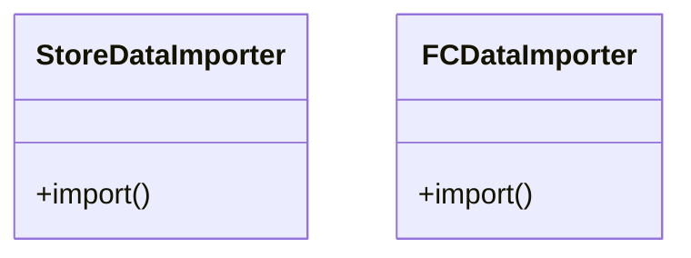
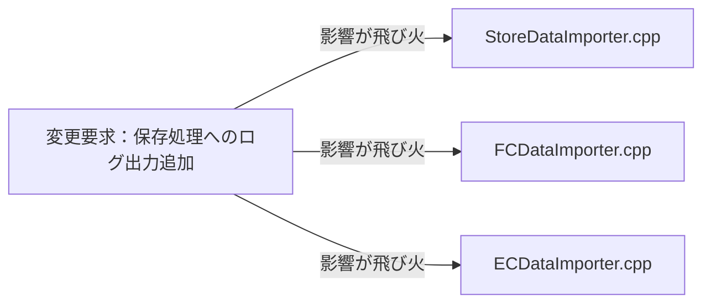
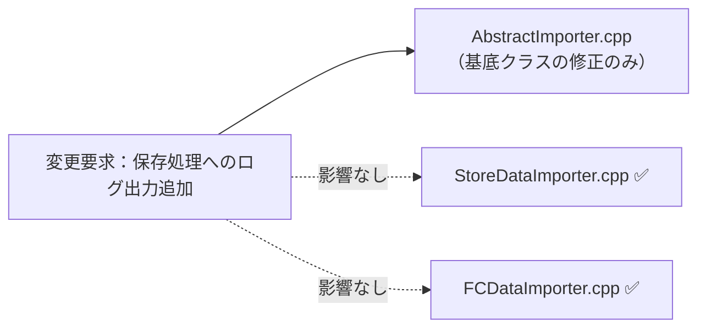
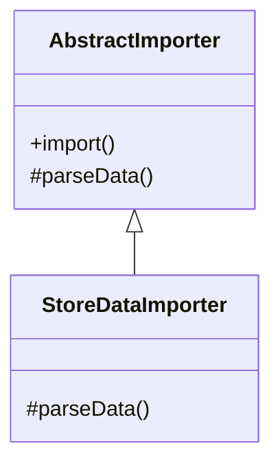

## 第4章 処理のステップの切り出し ―― Template Method パターン

―― 思考の型：手順の骨格は同じなのに、詳細部分が異なる処理が複数存在している

### この章の核心

**一連の手順は共通しているが、その中の一部のステップだけが異なる複数の処理が混在しているコードは、ステップごとに処理をコピー＆ペーストしてしまいがちだ。それは、「処理の骨格」と「詳細な実装」が、同じ場所に混在しているからだ。**

### この章を読むと得られること

これまでの章では「ルールの混在」「外部依存」「状態管理」という痛みを扱いました。この章の痛みはまた別の顔を持っています——「同じ手順なのに、ファイル形式ごとにほぼ同じコードをコピーしている」という問題です。

* **得られること1：** 「共通の手順」という観点で、コード内の処理の骨格を識別できるようになる


* **得られること2：** 処理の詳細がハードコードされている箇所を見て、そこが変更の痛みの発生源だと判断できるようになる


* **得られること3：** 骨格となる手順を抽出し、詳細をサブクラスに委譲することで、変更を局所化できることを説明できるようになる


* **得られること4：** 「共通部分」と「異なる部分」を見極め、どのような場合にこの構造を選ぶべきかを判断できるようになる

## 🔵 フェーズ1：現状把握 ―― 変更が来る前にコードを把握する

まずは、CSVインポート処理という現場でよくあるシステムを例に、その現状を事実として観察していきましょう。

### 1-1：システムの背景

このシステムは、ある小売店舗で日々の売上データを管理するために使われています。各店舗のPOSレジから出力される売上データをCSVファイルとして受け取り、システムへ取り込むのが主な役割です。

当初は1種類のCSVフォーマットだけを読み込んでいましたが、店舗網の拡大とともに、店舗形態や仕入れ先によって「日付の形式」「ヘッダー行の有無」「カンマ区切りかタブ区切りか」といった細かな違いがあるCSVが持ち込まれるようになりました。

当時の担当者が、増え続けるフォーマットに対応するために一つずつコードを書き足してきた結果が、現在の実装です。このコードが今日まで店舗の日次業務を支えてきた事実に、まずは敬意を表したいと思います。

一見すると、このコードは各店舗のCSVを読み込み、データを抽出してDBに保存するという目的をしっかり達成できています。コードを上から追っていけば、ファイルの読み込みからデータの加工、保存という一連の流れが記述されており、全体の動きは見通しやすい状態です。

しかし、新しいフォーマットが加わるたびに、読み込み手順やデータ加工のロジックが微妙に異なるコードが次々と追加され、少しずつ違和感が見え始めています。

### 1-2：仕様表

今回扱うCSVインポート処理の主要な機能を整理します。

| **機能名** | **担当クラス** | **入力** | **出力** |
| --- | --- | --- | --- |
| 直営店データ取り込み | `StoreDataImporter` | 店舗用CSV | DBレコード作成 |
| FC店データ取り込み | `FCDataImporter` | FC店用CSV | DBレコード作成 |

### 1-3：クラス構成図

現在のコードの構造をクラス図で可視化します。



→ `StoreDataImporter` と `FCDataImporter` の両方が、ファイルを読み込み、データを加工し、保存するという手順をそれぞれのクラス内に独自に実装しています。

### 1-4：責任配置テーブル

| **クラス名** | **責任（1文）** | **知るべきこと** |
| --- | --- | --- |
| `StoreDataImporter` | 直営店CSVを読み込みDBへ登録する | CSVのパース方法、データ加工ルール、DB接続情報 |
| `FCDataImporter` | FC店CSVを読み込みDBへ登録する | CSVのパース方法、データ加工ルール、DB接続情報 |

この表から、両クラスが「ファイルを読み込み、加工し、保存する」という一連の処理手順という知識をそれぞれ独立して定義していることが確認できます。

### 1-5：依存グラフ


→ 各インポートクラスは独立しており、一見きれいですが、共通の「保存先」や「読み込み手順」といった知識が重複して管理されている様子が見て取れます。

### 1-6：実装コード

実際の処理コードを見てみましょう。

```cpp
// 直営店データのインポート
class StoreDataImporter {
public:
    void import() {
        // 手順：開く → 加工 → 保存
        openFile();
        parseCSV(); // 直営店形式
        saveToDB();
        closeFile();
    }
};

// FC店データのインポート
class FCDataImporter {
public:
    void import() {
        // 手順：開く → 加工 → 保存
        openFile();
        parseCSV(); // FC店形式
        saveToDB();
        closeFile();
    }
};

```

このコードを見ると、`import` メソッド内で「開く」「加工」「保存」「閉じる」という手順（ステップ）がどちらも同じ順序で記述されていることが分かります。

### 1-7：実行結果

```text
出力：直営店データのインポートが完了しました
出力：FC店データのインポートが完了しました

```

このコードは正しく動く。これから変えていくのは「機能」ではなく「構造」だ。

### 1-8：責任チェック表

| **コードの行** | **持っている知識** | **管理者（観察）** |
| --- | --- | --- |
| `openFile()` | ファイルの開け方という知識 | システム基盤担当が管理 |
| `parseCSV()` | 各店特有のデータパースという知識 | 各店舗の業務担当者が管理 |
| `saveToDB()` | データベースへの保存という知識 | システム基盤担当が管理 |

責任チェックの結果、ファイル操作やDB保存といった「共通の手順」と、CSVのパースという「店舗固有のルール」が、同じメソッド内に混在している可能性が見えます。

要するに、すべてのインポートクラスが同じ手順の骨格を抱え込んでいるという観察から、共通の手順と店舗ごとの詳細な実装が混在しているという構造の問題が見えてくる。

フェーズ1で責任配置の観察が終わりました。次のフェーズ2では、変更要求を受けて「何が変わり、何が変わらないか」の仮説を立てます。


---

## 🟠 フェーズ2：仮説立案 ―― 変更要求を受けて、変動と不変を整理する

フェーズ1でCSVインポート処理の構造を把握しました。次に、新しい要件が届いた場面を想定して、「何が変わり、何が変わらないか」を整理していきます。

### 2-1：届いた変更要求

ある日、店舗運営部の担当者から連絡がありました。「来月から、ネット通販（ECサイト）の売上データもこのシステムで取り込みたい。フォーマットは既存の直営店用と似ているが、会員ランクやポイント付与情報といったEC特有の項目が含まれるため、読み込み後の計算処理が少し追加されることになる」と。

なるほど、店舗のデータとECサイトのデータ。どちらも「開く → 加工 → 保存」という大きな流れは同じはずですが、中身の計算ルールだけが異なるのですね。確かに、ここをそのまま既存のクラスをコピーして実装するのは少し待ったほうが良さそうです。

### 2-2：変動・不変の仮説テーブル

フェーズ1の責任チェック表を材料に、今回の変更がコードのどこに影響するか仮説を立てます。

| **分類** | **仮説** | **根拠（フェーズ1の観察から）** |
| --- | --- | --- |
| 🔴 **変動しそう** | CSVのパース方法（パースロジック） | 1-8で、CSVのパース知識は店舗ごとに異なると観察したため。 |
| 🔴 **変動しそう** | インポート後のデータ加工処理 | 店舗ごとに計算ルールが異なると示唆されたため。 |
| 🟢 **不変** | ファイルの開閉手順（オープン、クローズ） | どのCSV形式であってもファイル操作の手順自体は変わらないため。 |
| 🟢 **不変** | データベースへの保存手順 | 保存先のDB構造は共通であり、保存操作そのものも不変なため。 |

この仮説に基づくと、「処理の骨格」は不変であり、「データパースと加工」だけが変動するという構造が見えてきます。

### 2-3：関係者ヒアリング

仮説の確度を上げるため、システム基盤担当と業務担当者に確認を行いました。

* **開発者：** 「今後もインポート対象のシステムが増える予定はありますか？」
* **システム基盤担当：** 「あります。次はSNS経由の販売データを取り込む予定です。ファイル操作の手順は既存と全く同じはずです。」
* **開発者：** 「読み込みの手順自体が変わる可能性はありますか？」
* **業務担当：** 「いいえ、ファイルを開いて閉じるという手順は固定です。ただ、中身のデータ項目が少しずつ増えたり計算ルールが変わったりすることは頻繁にあります。」

ヒアリングの結果、ファイル操作や保存の手順は将来にわたって安定していることが確認できました。一方で、インポートのデータ構造や加工ロジックは今後も追加され続けるリスクがあるという確信が得られました。

> **現実のヒアリングでは——** このシナリオでは相手がちょうど設計に役立つ情報を教えてくれています。現実には「変わるかどうか分からない」「たぶん変わらない」という答えが返ることも多いです。そのときは、コードの変更履歴（`git log`）や過去の障害記録を「ヒアリングの代わり」として使ってみてください。「過去に何度変わったか」が、「将来変わりやすいか」の最も正直な証拠です。

### 2-4：確定した変動/不変テーブル

ヒアリングの結果を反映し、今回の変更における変動と不変を確定します。

| **分類** | **具体的な内容** | **変わるタイミング** | **根拠（誰との確認か）** |
| --- | --- | --- | --- |
| 🔴 **変動する** | 個別のCSVパースおよびデータ加工ロジック | 新店舗・新チャネル導入時 | 業務担当者との確認 |
| 🟢 **不変** | ファイルのオープン・クローズ、DB保存手順 | システム基盤の更新時 | システム基盤担当との合意 |

フェーズ2で「何が変わり、何が変わらないか」が確定しました。次のフェーズ3では、この「変わる部分」を今の構造のまま追加しようとしたときに何が起きるかを確認します。

## 🟡 フェーズ3：問題特定 ―― 変更を試みて、痛みを発見する

フェーズ2で、CSVインポートの処理手順は共通しており、データ加工のルールだけが変わるという構造が明確になりました。このフェーズでは、新しいECサイト向けCSVの取り込みを、現在のクラス構造のまま実装しようとするとどのような「痛み」が生じるのかを確認します。

### 3-1：変更シミュレーション

ECサイトの売上データをインポートする機能を実装しようと、既存の `StoreDataImporter` クラスを参考に、新しい `ECDataImporter` クラスを作成してみましょう。

```cpp
class ECDataImporter {
public:
    void import() {
        // 既存の直営店用と同じ手順を再度記述する
        openFile();
        parseECData(); // EC特有の加工ロジック
        saveToDB();
        closeFile();
    }
};

```

実装しながら、一つの違和感に気づきます。「あれ、手順は全く同じなのに、また `openFile()` や `closeFile()`、`saveToDB()` を書いているな」と。

今回であればクラスを新しく作るだけで済みましたが、もしシステム基盤の変更で「保存の前にログ出力を行う」という要件が追加されたらどうなるでしょうか。既存の `StoreDataImporter`、`FCDataImporter`、そして今回作った `ECDataImporter` のすべてに対して、同じ修正を加えなければなりません。

「同じことをしているのに、なぜ3回も同じ手順を書き直しているんだろう……」

変更を試みる前は「クラスを分けるだけで十分」に見えていた構造が、変更を重ねるごとに「手順の重複」という足かせになっていくのが見えてきます。

### 3-2：変更影響グラフ

変更要求が既存システムにどのように波及するかをグラフ化します。



→ このグラフを見ると、システム基盤の共通要件であるはずの「ログ出力」が、各インポートクラスに散らばっているため、全てのインポート関連クラスに修正が飛び火していることが分かります。

### 3-3：痛みの言語化

変更を試みたことで、2つの「痛み」が鮮明になりました。

1つ目は、修正の「コピー＆ペースト地獄」です。共通の手順であるはずのファイル操作やDB保存のコードが、インポートの数だけ量産されています。これにより、手順に修正が入るたびに、関連するすべてのクラスをgrepして同じ修正を繰り返さなければなりません。これは非常に退屈で、かつ修正漏れというバグを生み出しやすい作業です。

2つ目は、システムの「変更耐性の低さ」です。本来、ビジネスロジックである「店舗ごとのデータパース」だけを変えれば済むはずの状況で、ファイル操作やDB接続という「手順の骨格」まで修正対象になってしまっています。システム基盤側の知識が業務ロジックのクラスに漏れ出しているために、本来無関係な場所まで変更しなければならないという、設計上の無駄が蓄積しています。

こういうとき困る、という感覚、皆さんも同じではないでしょうか。この「共通の手順が散らばっている」という状態が、私たちの設計を硬直させている元凶なのです。

フェーズ3で「手順の重複が辛い」という事実が確認できました。次のフェーズ4では、なぜこの辛さが構造的に発生するのかを分析します。

## 🔴 フェーズ4：原因分析 ―― 処理の骨格と詳細の分離

フェーズ3で、インポート処理の「手順の重複」という痛みが確認できました。このフェーズでは、なぜそのような辛さが生じるのかを、コードの構造的な観点から言語化します。

### 4-1：観察→原因テーブル

フェーズ3で観察した「痛み」と、その根本にある構造的な原因を対応させます。

| **観察** | **原因の方向** |
| --- | --- |
| 新しいインポート形式を追加するたびに、ファイルを開く・閉じる・保存する等の「手順」を全クラスで書き直す必要がある | 共通の手順（処理の骨格）と、店舗ごとのデータパース（詳細）が、同じメソッドの中に混在しているから。 |
| 共通であるはずのファイル操作手順に修正が入ったとき、全インポートクラスを修正しなければならない | 共通の手順という「変わらないもの」を、店舗ごとの詳細という「変わるもの」が引きずり回しているから。 |

### 4-2：変わるもの / 変わらないものテーブル

原因分析の結果として、「変わり続けるもの」と「変わってほしくないもの」を明確に分けます。

| **変わり続けるもの（🔴）** | **変わってほしくないもの（🟢）** |
| --- | --- |
| CSVのデータパースルール | ファイルを開く・閉じるというファイル操作手順 |
| 個別のデータ加工処理 | データベースへの保存という一連のフロー |

本来、これらは別々の理由で変わるはずのものです。ビジネス側が「パースルール」を変えるたびに、システム基盤側が管理する「ファイル操作手順」まで影響を受けてしまっていることが、設計上の問題です。

### 4-3：接続形態を診断する

現在のインポート処理クラスと「読み込み・保存の手順」との接続は、すべての処理手順と固有ロジックが一枚の基板上に直付けされている状態（具体×直接）だと診断できます。

この状態では、新しい店舗のCSVに対応しようとするたびに、基板全体を書き換えて、新しい店舗用のロジックを直にハンダ付けする必要があります。これは、専用ケーブルで特定の機器と直接つながっているような状態です。もしファイル操作の手順自体に改善（例えばエラーログの強化など）を加えたくなったら、すべての専用ケーブルを一旦外して、ハンダ付けし直さなければならないのです。

|  | 直接（直差し） | 間接（アダプター経由） |
|:---:|:---|:---|
| **具体**（専用規格） | **← 現在地**　iPhone → [Lightning] → Apple純正ドック（Lightning端子） | iPhone → [Lightning] → [変換] → USB-A充電器（汎用端子） |
| **抽象**（汎用規格） | MacBook → [USB-C] → USB-C対応モニター（汎用端子） | MacBook → [USB-C] → [ハブ] → HDMI・USB-A・LAN |

このコードで言うと：

| ケーブル比喩 | コードの対応箇所 |
|---|---|
| 「具体」＝専用規格ケーブル | `StoreDataImporter::import()` と `FCDataImporter::import()` の両方に `openFile(); parseCSV(); saveToDB(); closeFile();` が重複して存在する |
| 「直接」＝直差し | 各インポートクラスがスケルトン全体を直接所有し、共通の抽象クラスを持たないため手順の変更は全クラスを書き直す必要がある |

本来であれば、手順の骨格だけを「USB-Cの汎用規格（抽象×直接）」のように決めておき、具体的なパースロジックを必要に応じて差し込める形にすべきでしょう。

フェーズ4で根本原因が言語化できました。次のフェーズ5では、解決すべき問題を具体的に定めます。

## 🟣 フェーズ5：課題定義 ―― 解くべき問題を具体的に定める

フェーズ4で、「共通の手順（骨格）」と「店舗ごとのパースルール（詳細）」が同じメソッド内に混在しているという構造的問題が明らかになりました。対策案（フェーズ6）に進む前に、ここで「何を解くべき課題とするか」を具体的に確定させます。

### 5-1：接続点の特定

今回のリファクタリングにおいて、最も深刻な影響が出ている場所、つまり解決すべき「接続点（ジョイント）」は以下の1箇所です。

* **接続点A：** `Importer`クラス（処理手順クラス） ←→ `parseCSV` / `processData`（加工ルール）の境界


この接続点は、「ファイルを開いて閉じる」という基盤的な手順と、「CSVの中身をどう読み解くか」という業務知識がつながっている場所です。ここを切り離すことで、新しいインポート形式が追加された際も、手順のコードに手を触れずに済む設計を目指します。

### 5-2：非機能制約の確認

このシステムの規模では、抽象化層の導入によるパフォーマンスコストは設計判断を絞り込む制約になりません。ただし、月次の一括インポートで全店舗分を処理する場合、ファイルサイズが大きくなり**ストリーミング設計**が必要になることがあります。処理の骨格と個別の解析ロジックがどう分離されているかが、この将来的な対応しやすさに影響します。この点は案3・案4の選定に影響するため、各案のトレードオフで触れます。

### 5-3：クライアントへの影響範囲

「分けること」で既存コードにどの程度の変更が波及するかを確認します。

分離対象のパースロジックを呼び出している `StoreDataImporter` や `FCDataImporter` といった既存のインポートクラスがクライアントです。この接続点の形を変えると、これらのクラスは既存の処理手順を継承する形に作り変える必要があります。

一度この切り離しを行えば、以降のインポート形式追加時は、共通の基底クラスを継承してパースロジックを実装するだけで済むようになります。

### 5-4：課題まとめ表

以上の情報をまとめ、フェーズ6での対策案検討の基盤となる課題定義を確定します。

| **接続点** | **分けた理由** | **非機能制約** | **クライアント影響** |
| --- | --- | --- | --- |
| 接続点A | 処理の骨格と詳細な加工ルールを隔離するため | ホットパスではない | 各Importerクラスを基底クラス継承へ移行する必要あり |

フェーズ5で「何を解くか」が確定しました。次のフェーズ6では、この課題に対してどのような「接続の形」を採用すべきか、案0〜案4を並べてコスト比較を行います。

## 🟢 フェーズ6：対策案検討 ―― 解決策を並べ、コストで選ぶ

フェーズ5で課題定義した「共通手順とパースルールの混在」を解消するための対策案を検討します。

### 6-1：接続の形 2×2マトリクス

現在のコードは、各インポートクラスが自身の `import()` メソッド内でファイル操作手順をハードコードしている「具体×直接」の状態です。ここから、共通手順を「不変」として切り出し、パースルールだけを「変動」として差し込める設計を目指します。

| 接続形態 | ケーブル例 | 特徴 |
|:---:|:---|:---|
| **具体×直接**（← 現在地） | iPhone → [Lightning] → Apple純正ドック（Lightning端子） | 専用端子のみ対応。差し替え不可 |
| **具体×間接** | iPhone → [Lightning] → [変換] → USB-A充電器（汎用端子） | 変換器を挟むが規格は専用のまま |
| **抽象×直接** | MacBook → [USB-C] → USB-C対応モニター（汎用端子） | どのメーカーでも同じ口で繋がる |
| **抽象×間接** | MacBook → [USB-C] → [ハブ] → HDMI・USB-A・LAN | ハブを介して多様な機器へ展開可能 |

---

#### 案0：現状維持 ―― 構造を変えない

**この形の考え方：**
クラスの分割やインターフェースの導入を行わず、既存の `import()` メソッドの中に、新しいフォーマット用の処理を `if` 文で追加します。変更頻度が低く、将来的な変化が見込めない場合に許容される最小コストの選択です。

**この形にするための準備：**

* 既存コードを触れる最小範囲（`if` の追加など）を特定する。
* 変更が波及しないことを確認してから実施する。

【コード例（一部）】

```cpp
void import() {
    openFile();
    // ← 具体："EC"という条件を呼び出し側が直接書いている
    if (format == "EC") parseECData();
    else parseStoreData(); // 直営店用
    saveToDB();
    closeFile();
}

```

**呼び出し側から見た違い（main() 例）：**

```cpp
// 案0（現状維持）の呼び出し側
int main() {
    DataImporter importer;
    importer.format = "EC";   // ← 具体："EC"という条件値をそのまま渡している
    importer.import();
    return 0;
}
```

**この形のトレードオフ：**

* 変更容易性：低（インポート形式が増えるたび、条件分岐が肥大化する）


* テスト容易性：低（ロジックが散在し、テストが網羅しにくい）


* 実装コスト：低（今のコードに追記するだけ）


---

#### 案1：具体×直接 ―― クラスを分けるが参照は具体型のまま

**この形の考え方：**
インポート処理を店舗ごとにクラス分割しますが、呼び出し側が各具体クラスを直接知っている状態です。責任の境界は引かれますが、新しい形式の追加時には呼び出し側のコード修正が避けられません。

**この形にするための準備：**

1. 共通手順を基底クラスに持たせ、店舗ごとにサブクラス化する。
2. 呼び出し側で各具体クラスを直接インスタンス化する。

【コード例（一部）】

```cpp
// ← 具体：ECDataImporterという型名を直接書いている
class ECDataImporter : public StoreDataImporter {
public:
    void import() { // 継承を利用するが、呼び出し側は各型を知る必要がある
        openFile();
        parseECData();
        saveToDB();
        closeFile();
    }
};

```

**呼び出し側から見た違い（main() 例）：**

```cpp
// 案1（具体×直接）の呼び出し側
int main() {
    ECDataImporter importer;             // ← 直接：呼び出し側が具体クラスを直接生成
    importer.import();
    return 0;
}
```

**この形のトレードオフ：**

* 変更容易性：低〜中（新形式追加時に呼び出し側の修正が必要）


* テスト容易性：低（具体クラスへの依存が強いため切り離せない）


* 実装コスト：低（既存ロジックをクラスへ移すだけ）


---

#### 案2：抽象×直接 ―― インターフェースを挟み、型だけで接続する

**この形の考え方：**
インポート処理の「骨格となる手順」を親クラスで定義し、詳細な「パース・加工処理」をサブクラスで実装する形式です。この構造を **Template Method（テンプレートメソッド）** パターンと呼びます。呼び出し側は親クラスのインターフェースさえ知っていれば、具体的な実装クラスに依存せずに処理を進められます。

**この形にするための準備：**

1. 共通手順を定義した親クラス（`AbstractImporter`）を作成する。
2. 手順の中の「パース処理」を純粋仮想関数（`abstract method`）として定義する。
3. 店舗ごとのサブクラスで、パース処理だけを実装する。

【コード例（一部）】

```cpp
// ← 抽象：AbstractImporter*型で受け取り、具体クラスを知らない
class AbstractImporter {
public:
    void import() { // 共通手順（テンプレートメソッド）
        openFile();
        parseData(); // 各店の実装を呼ぶ
        saveToDB();
        closeFile();
    }
    virtual void parseData() = 0; // 実装詳細をサブクラスへ
};

```

**呼び出し側から見た違い（main() 例）：**

```cpp
// 案2（抽象×直接）の呼び出し側
int main() {
    ECDataImporter importer;                 // ← 具体：呼び出し側だけが具体クラスを生成
    AbstractImporter* runner = &importer;    // ← 直接：インターフェース経由で直接注入
    runner->import();
    return 0;
}
```

**この形のトレードオフ：**

* 変更容易性：中〜高（サブクラスを追加するだけで新形式に対応可）


* テスト容易性：高（サブクラスを個別に単体テスト可能）


* 実装コスト：中（クラス設計が必要だが、将来的な拡張性は高い）


---

#### 案3：具体×間接 ―― 仲介クラスを置くが、具体型を知っている

**この形の考え方：**
`ImporterManager` のような仲介クラスを置き、インポート処理の実行をそこに集約します。仲介役が具体クラスを直接知っているため、インポート形式の追加時には仲介クラスの修正が発生します。

**この形にするための準備：**

1. `ImporterManager` を作り、インポート実行ロジックを集約する。
2. インポートを実行したい場所は、すべてこのマネージャーを経由するようにする。

【コード例（一部）】

```cpp
// ← 具体：ImporterManagerという具体型を持っている
// ← 間接：呼び出し側はManagerのみ知り、内部のクラス群は見えない
class ImporterManager {
public:
    void execute(std::string type) {
        if (type == "EC") ECDataImporter().import();
        else StoreDataImporter().import();
    }
};

```

**呼び出し側から見た違い（main() 例）：**

```cpp
// 案3（具体×間接）の呼び出し側
int main() {
    ImporterManager manager;             // ← 間接：ImporterManagerが内部に隠れており呼び出し側には見えない
    manager.execute("EC");               // 内部でECDataImporterが動くが、呼び出し側は知らない
    return 0;
}
```

**この形のトレードオフ：**

* 変更容易性：中（新形式追加はManager内の修正で済む）


* テスト容易性：中（Managerをスタブ化すれば差し替え可能）


* 実装コスト：中（仲介クラスの責任設計が必要）


* ※ 大量データ時のストリーミング：`ImportManager` が各インポーター呼び出しを一元管理しているため、ストリーミング対応の実装への切り替えをここ一箇所で制御できる。


---

#### 案4：抽象×間接 ―― インターフェース＋仲介役を両立する

**この形の考え方：**
Template Methodで実装された各クラスを、さらに仲介者経由で利用する形です。実装の詳細はどの層も知らず、変更影響は最も局所化されますが、クラス数と層の深さが増え、小規模なシステムには過剰になりがちです。

**この形にするための準備：**

1. 案2の手順で親クラスとサブクラスを作成する。
2. その基底クラスを扱う仲介役の抽象インターフェースを作成する。

【コード例（一部）】

```cpp
class IImporterManager {
    virtual void executeImport(AbstractImporter* importer) = 0;
};

// BatchExecutorのメンバ変数：
// ← 抽象：IImporterManager*型で受け取り、具体実装を知らない
// ← 間接：Managerを経由するため内部クラス群が見えない

```

**呼び出し側から見た違い（main() 例）：**

```cpp
// 案4（抽象×間接）の呼び出し側
int main() {
    ImporterManager mgr;                     // ← 具体：組み立て側だけが具体型を知る
    BatchExecutor executor(&mgr);            // ← 間接：抽象Managerのみ見えて具体実装は隠れる
    executor.run();
    return 0;
}
```

**この形のトレードオフ：**

* 変更容易性：高（全層が抽象化され、変更が完全に局所化される）


* テスト容易性：高（各層を切り離してテスト可能）


* 実装コスト：高（インターフェースと仲介クラスの設計が必要）

### 6-7：評価軸

対策案が揃ったところで、どの案を採用すべきかを決めるための「ものさし」を宣言します。設計の意思決定を透明にするため、比較表の提示に先立って評価軸を合意します。

今回のCSVインポート処理では、以下の3軸で評価を行います。

| **評価軸** | **意味** | **ウェイト** |
| --- | --- | --- |
| 変更容易性 | 新しいインポート形式が増えたとき、既存コードに影響を与えないか | ×3 |
| テスト容易性 | インポートロジックを分離して単体テストを書けるか | ×2 |
| 可読性 | 手順と固有ロジックが明確に分かれて読みやすいか | ×1 |

> **注：** このウェイト（変更容易性×3など）は本書の例です。チームの変更頻度・テスト文化に合わせて、比較を始める前にチームで合意してください。スコアは「答えを決める計算式」ではなく、「チームの議論を整理する道具」です。

| 点数 | 変更容易性 | テスト容易性 | 可読性 |
| --- | --- | --- | --- |
| 3 | 変更が1クラスのみで完結する | スタブ1つで完全に切り離せる | クラス数が増えない・既存構造と同じ読み方で理解できる |
| 2 | 変更が2〜3クラスに及ぶ | 一部スタブが必要だが差し替え可能 | クラスが1〜2増える |
| 1 | 変更が4クラス以上に波及する | 実装に依存しテストが困難 | 中間層・インターフェースが複数増え理解コストが高い |

パフォーマンスについては、本件が非同期のバッチ処理であり、かつインポート処理におけるオーバーヘッドが微小であるため、今回の評価軸からは除外します。

---

### 6-8：コスト天秤

案0〜案4を定量的に比較します。

| **案** | **現在の対応コスト** | **未来の対応コスト** |
| --- | --- | --- |
| 案0：現状維持 | 低 | 高 |
| 案1：具体×直接 | 低〜中 | 高 |
| 案2：抽象×直接 | 中 | 低〜中 |
| 案3：具体×間接 | 中 | 中 |
| 案4：抽象×間接 | 高 | 低 |

**ステップ1：採点表**（1＝低い、2＝中程度、3＝高い）

| 案 | 変更容易性（×3） | テスト容易性（×2） | 可読性（×1） |
| --- | --- | --- | --- |
| 案0：構造を変えない | 1 | 1 | 3 |
| 案1：具体×直接 | 1 | 2 | 3 |
| 案2：抽象×直接 | 3 | 3 | 2 |
| 案3：具体×間接 | 2 | 2 | 2 |
| 案4：抽象×間接 | 3 | 3 | 1 |

**ステップ2：加重合計表**（変更容易性×3 ＋ テスト容易性×2 ＋ 可読性×1）

| 案 | 加重スコア | 判定 |
| --- | --- | --- |
| 案0 | 8 |  |
| 案1 | 10 |  |
| 案2 | 17 | ← 採用候補 |
| 案3 | 12 |  |
| 案4 | 16 |  |

※案2が加重スコアで最高となりました。シンプルかつ強力にインポート形式の追加に対応できるためです。

---

### 6-9：採用案の決定

**採用する案：** 案2

**理由：** 共通手順を基底クラスにテンプレートとして定義し、各店固有のパースロジックをサブクラスへ追い出すことで、変更時の影響を最小化できる案2を採用します。この構造こそが、テンプレートメソッドという設計の真骨頂です。

---

### 6-10：耐久テスト

フェーズ2のヒアリングで挙がった「将来のリスク」が実際に発生した場面をシミュレートし、案2の変更耐性を検証します。

| **変更シナリオ** | **触る場所** | **コスト評価** |
| --- | --- | --- |
| 新しいインポート形式（SNS売上）の追加 | `SNSDataImporter` クラスの新規作成のみ | 低 |
| 共通ログ出力手順の追加 | `AbstractImporter` 基底クラスの修正のみ | 低 |

この設計変更により、今後どれだけインポート形式が増えようとも、既存のインポートロジックを壊すことなく安全に機能追加できる体制が整いました。

## 🟤 フェーズ7：対策実施 ―― 決断し、変化に強い設計を手に入れる

採用した「Template Methodパターンによる手順の共通化」を、実際のコードに実装します。これまでは個別のクラスで重複していたファイル操作やDB保存の手順を、基底クラスにテンプレートとして集約します。

この設計変更により、今後新しいインポート形式がどれだけ増えても、既存の「手順の骨格」を壊すことなく、パースロジックだけをサブクラスで実装するだけで安全に機能拡張ができる安定性を手に入れました。

### 7-1：解決後のコード（全体）

新しい設計では、共通の手順を親クラスで定義し、具体的なパース処理だけをサブクラスに委譲します。

```cpp
// 共通の骨格を持つ基底クラス
class AbstractImporter {
public:
    // テンプレートメソッド：手順の骨格を定義する（final相当）
    void import() {
        openFile();
        parseData(); // ← ここだけ変わる
        saveToDB();
        closeFile();
    }
protected:
    virtual void parseData() = 0; // 実装詳細をサブクラスへ
    void openFile() { /* 共通手順 */ }
    void saveToDB() { /* 共通手順 */ }
    void closeFile() { /* 共通手順 */ }
};

// サブクラス：具体的なパースロジックだけを実装する
class ECDataImporter : public AbstractImporter {
protected:
    void parseData() override { /* EC特有のパース処理 */ }
};

```

この実装により、`import()` メソッドという「手順の骨格」を親クラスに閉じ込めました。各インポートクラスは、自分にしか関わりのない「パース処理」だけに集中できるようになりました。

### 7-2：変更影響グラフ（改善後）

フェーズ3で確認した「ログ出力追加」のシナリオを再度適用します。



→ **フェーズ3の変更影響グラフと比較して、ログ出力の追加という変更要求が、基底クラスである `AbstractImporter.cpp` 一箇所に閉じた設計になりました**。

### 7-3：変更シナリオ表

この設計で手に入れたものと、諦めたものを整理します。

| **シナリオ** | **変わるクラス（触る場所）** | **変わらないクラス** |
| --- | --- | --- |
| 新しいインポート形式（SNS売上）の追加 | `SNSDataImporter` (新規作成) | `AbstractImporter`, `ECDataImporter` |
| 共通ログ出力手順の追加 | `AbstractImporter` (修正のみ) | `ECDataImporter`, `FCDataImporter` |

共通の手順を基底クラスに「カプセル化」したことで、変更が来ても触るのは1箇所（または新規追加のみ）で済むようになりました——それがこの設計で手に入れたものです。諦めたものは、クラスの継承関係によるわずかな設計の複雑さだけです。

---

### 7-4：接続形態の確認 ── この設計はどの接続か

フェーズ4-3で診断した通り、変更前のコードは **具体×直接** の状態でした。
採用した Template Method パターンでは、接続形態が **抽象×直接（USB-C直差し）** へと変化しています。

**「抽象×直接」の証拠となるコード：**

```cpp
class AbstractImporter {
public:
    void import() {
        openFile();
        parseData(); // ← 純粋仮想メソッドを直接呼び出し = 「直接」の証拠
        saveToDB();
        closeFile();
    }
protected:
    virtual void parseData() = 0; // ← 純粋仮想宣言 = 「抽象」の証拠
};
```

- `virtual void parseData() = 0` は純粋仮想関数（インターフェース相当）→ **「抽象」** の証拠
- `import()` の中で `parseData()` を中間クラスなしに直接呼び出し → **「直接」** の証拠

Template Method は継承を使う特殊な形で、基底クラスが「何を呼ぶか（骨格）」を定め、派生クラスが「どう振る舞うか（詳細）」を実装します。「処理の骨格を変えずに実装だけ差し替えたい」という動機から、**抽象×直接** が選ばれました。

第4章の締めくくりとして、CSVインポート処理を通して学んだ「手順の共通化」と「詳細の分離」を振り返ります。

---

### 整理：7フェーズとこの章でやったこと

この章では、手順の骨格は同じなのに詳細が異なる複数のクラスが乱立し、変更が全クラスに飛び火していた現状を学びました。7フェーズの思考プロセスを適用して、どのように構造を改善したのかを振り返ります。

| **フェーズ** | **この章でやったこと** |
| --- | --- |
| 🔵 フェーズ1：現状把握 | 複数のインポートクラスでファイル操作手順が重複して記述されている現状を観察しました。 |
| 🟠 フェーズ2：仮説立案 | インポートの「手順」は不変だが、「パースルール」は店舗ごとに変動するという仮説を立てました。 |
| 🟡 フェーズ3：問題特定 | 新しいインポート形式を追加しようとした際に、全クラスで同じ修正が必要になる「痛み」を確認しました。 |
| 🔴 フェーズ4：原因分析 | 共通の「骨格（手順）」と固有の「詳細（ロジック）」が混在していることが、変更影響を拡大させる根本原因だと突き止めました。 |
| 🟣 フェーズ5：課題定義 | インポート処理の「手順」と「パース処理」の境界を接続点として特定しました。 |
| 🟢 フェーズ6：対策案検討 | 案0〜案4を比較し、共通手順を基底クラスにテンプレート化して分離する案2を採用しました。 |
| 🟤 フェーズ7：対策実施 | 共通の手順を基底クラスに集約し、固有ロジックだけをサブクラスで実装する構造へ移行しました。 |

### 各クラスの最終的な責任

今回の設計変更により、各クラスの責任は以下のように整理されました。

| **クラス名** | **責任（1文）** | **変わる理由** |
| --- | --- | --- |
| `AbstractImporter` | CSVインポートの共通手順（骨格）を定義・管理する | インポートの手順自体（エラーハンドリング等）が変わるとき |
| `StoreDataImporter` | 直営店特有のパースおよび加工ルールを実装する | 直営店用のデータ形式が変わるとき |
| `FCDataImporter` | FC店特有のパースおよび加工ルールを実装する | FC店用のデータ形式が変わるとき |

> このプロセスを回した結果にたどり着いた構造こそが Template Method パターンです。
> 
> 

---

### 振り返り：「この章を読むと得られること」は手に入ったか

| **得られること** | **この章のどこで示したか** |
| --- | --- |
| 1. 変動箇所の識別 | フェーズ2の仮説立案で、処理の「骨格」と「詳細」を分けたこと。 |
| 2. 接続形態の診断 | フェーズ4で、コードの混在を「専用ケーブル直差し」として診断したこと。 |
| 3. 構造改善の説明 | フェーズ7の変更シナリオ表で、修正が基底クラスに局所化されたことを実証したこと。 |

---

### 振り返り：3つの設計原則はどう適用されたか

* **原則1「変わるものをカプセル化せよ」の現れ**
* **具体化された場所：** 各サブクラス（`StoreDataImporter` など）
* **解説：** 頻繁に変わる「パース・加工ルール」をサブクラスへとカプセル化しました。これにより、基底クラスの手順は変更の影響を受けずに安定しました。


* **原則2「実装ではなくインターフェースに対してプログラムせよ」の現れ**
* **具体化された場所：** `AbstractImporter` の抽象メソッド `parseData()`
* **解説：** 基底クラスの手順は、具体的なパース実装ではなく抽象化されたインターフェース（抽象メソッド）に対して動作します。


* **原則3「継承よりコンポジションを優先せよ」の現れ**
* **具体化された場所：** テンプレートメソッドによる継承階層
* **解説：** 本章では「手順の共通化」のために継承を用いましたが、これは変化の軸が手順の骨格にある場合に限定した適用です。


---

---

### あなたのコードで考えてみてください

この章で辿った思考プロセスを、あなた自身のコードに当てはめてみましょう。

1. **変動の兆候を探す：** あなたのコードに「前処理→本処理→後処理」という同じ流れで、本処理だけが異なる処理が複数ありますか（コピー＆ペーストの痕跡が残っている箇所）？
2. **変える理由を問う：** 共通の「前処理」や「後処理」に変更が入ったとき、何箇所を修正しましたか？1箇所で済みましたか？
3. **骨格の重複を測る：** 似たような処理が複数あるとき、「どれが最新の正しいバージョンか」を判断するのに時間がかかったことはありますか？
4. **共通化した後を想像する：** もし骨格を1箇所に集約したとすると、「前処理のバグ修正」は何ファイルへの変更で完結しますか？

### パターン解説：Template Method パターン

Template Methodパターンは、アルゴリズムの構造を定義し、具体的な実装をサブクラスに遅延させるパターンです。

#### パターンの骨格

基底クラスにメソッドの処理手順（テンプレートメソッド）を記述し、一部のステップを抽象メソッドとしてサブクラスに実装させます。


#### この章の実装との対応



`AbstractImporter` が骨格となる手順を所有し、`StoreDataImporter` などのサブクラスがその詳細を埋めています。

---

### 使いどころと限界

* **使うと良い状況**：複数のクラスで処理手順の骨格が共通しており、一部のステップだけが異なる場合。


* **使わない方が良い状況**：処理の手順自体がほとんど共通していない場合や、サブクラス側で手順を自由に変えたい場合。


【過剰コード：共通手順がほとんどない例】

```cpp
// 共通手順がほぼゼロなら、テンプレートメソッドにする必要はありません
void import() { 
    // ただの一行の呼び出しだけであれば、無理に継承を使うのは過剰です
    parseData();
}

```

| **状況** | **適切な選択** | **理由** |
| --- | --- | --- |
| **共通の手順がある場合** | **Template Methodを使う** | 重複を排除し、保守性を高めるため |
| **手順がバラバラな場合** | **無理に使わない** | 継承による結合度が高まり、かえって不便になるため |

### この章のまとめ

CSVインポートという具体的なドメインを通じて、私たちは共通の手順という「骨格」と、店舗ごとのパースルールという「詳細」を分離する手法を学びました。接続点の形を「抽象×直接」へと変化させることで、私たちは今後増え続けるインポート形式に、恐れることなく対応できる柔軟な設計を手に入れたのです。
