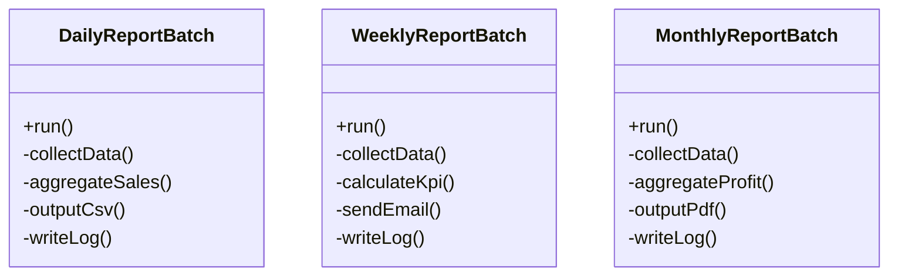
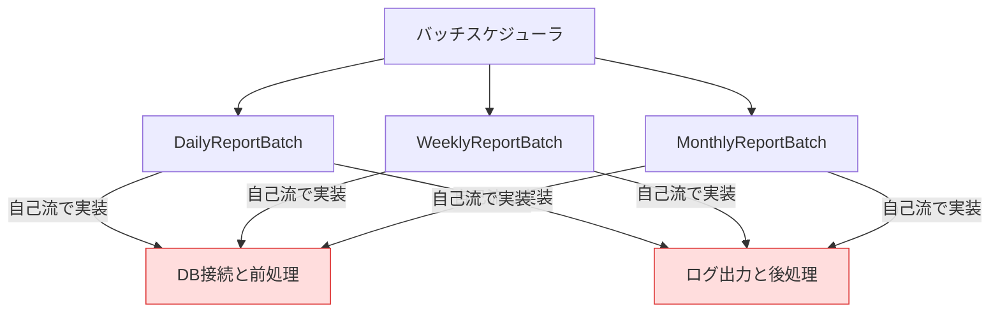
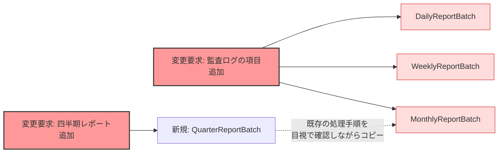
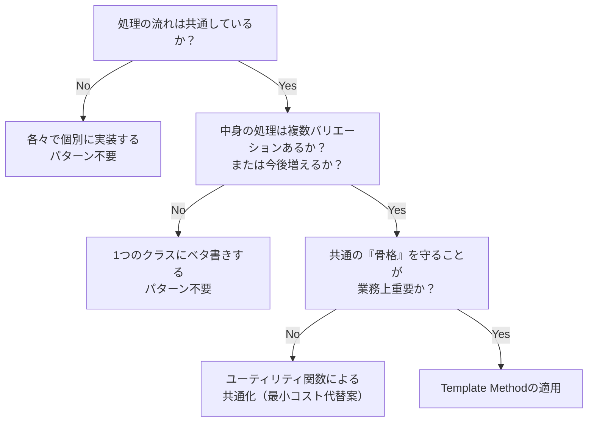
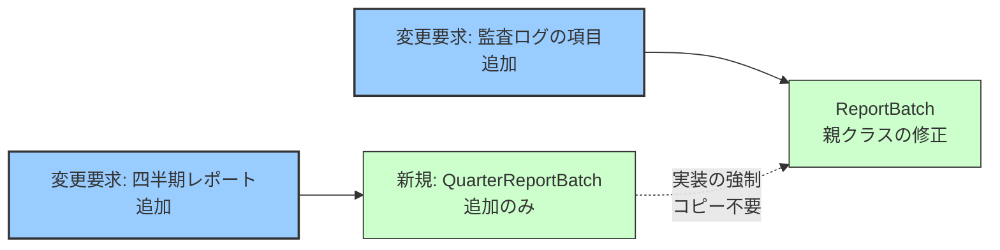
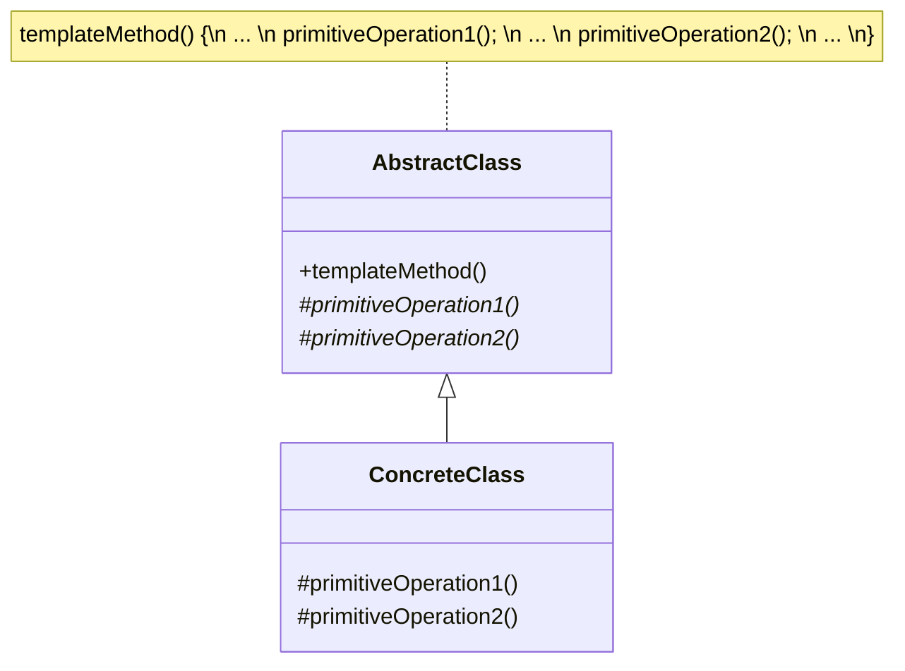

# 第4章　骨格を固定して、新バッチを追加しても既存コードに触れない設計へ（Template Method）

―― 思考の型：変わらない流れと、変わる中身を分ける

### この章の核心

処理の骨格（順番）をただ一つの正解として固定し、変わる一部のステップだけを個別のパーツとして委ねる。

> **【レゴブロックで考える：Template Method】**
> 
> 共通の「車のシャーシ（土台）」ブロックを思い浮かべてください。タイヤの配置や車体の長さといった「基本の構造」はすでに固定されています。そこに、上に乗せるブロック（消防車のハシゴやダンプカーの荷台など）だけをカチャッと付け替えることで、違う種類の車を作ります。「変わらない土台」にあらかじめ用意された「空いているポッチ（接続部）」に、「変わるパーツ」を差し込むような操作です。
> 
> `[ImagePrompt: A top-down 3D illustration of Lego blocks. A base chassis of a toy car is fixed and completely assembled, with two different top pieces (a red fire engine ladder and a yellow dump truck bed) hovering above, ready to be attached to the empty studs on the base. Bright, colorful, educational illustration style, clean white background, isometric view.]`

### この章を読むと得られること

- 「全体の流れ」と「個別の処理」がコード上で混ざっている状態を発見できるようになる
    
- 処理の順番を守らせつつ、一部だけを安全に変更できる境界線を引けるようになる
    
- 共通処理を単なるユーティリティ関数に切り出すことの限界を理解し、より安全な構造を選べるようになる
    
- 複数のクラスにまたがる「暗黙のコピペ」による負債を、一つの強固な骨格へとまとめ上げることができるようになる
    

---

### ステップ0：システムを把握し、仮説を立てる ―― クラス構成を見てから「変わりそうな場所」を予測する

日々の開発でバッチ処理を書くことは多いと思います。最初は1つだったバッチ処理が、「週次のレポートもよろしく」「月次版も作ってほしい」とビジネスの成長に合わせて増えていく。現場ではよくある光景です。

その時、私たちはつい既存のクラスをコピーして、中の集計ロジックと出力先だけを書き換えてしまいがちです。まずはコードを1行ずつ追う前に、全体像から「どこにどんな変更の圧力がかかりそうか」を予想してみましょう。

> **全パターンに共通する問い**
> 
> 「このコードの中に、『変わる理由』が異なる2つのものが、同じ場所に混在していないか？」
> 
> ※「変わる理由」とは「誰の判断で変わるか」のことです。

#### 4.0 この章のシステム構成と仮説

**この章で扱うシステム：**

今回は「定期レポート生成バッチシステム」を扱います。毎日、毎週、毎月など、異なるタイミングと内容で業務レポートを作成し、所定の出力先へ連携するシステムです。

**仕様表（何ができるシステムか）**

|**機能名**|**担当クラス**|**入力**|**出力**|
|---|---|---|---|
|日次レポート生成|`DailyReportBatch`|前日の売上データ|CSVファイル|
|週次レポート生成|`WeeklyReportBatch`|週次のKPIデータ|メール送信|
|月次レポート生成|`MonthlyReportBatch`|月次の損益データ|PDFファイル|

これだけ見ると、単に3つの異なるバッチ処理があるだけに見えます。しかし、それぞれのクラスがどのようなメソッドを持っているか、クラス図で俯瞰してみましょう。

**クラス構成の概要**




→ **3つの独立したクラスが、「データ収集 → 集計 → 出力 → ログ記録」という一連のよく似た手順を、それぞれバラバラに抱え込んでいる状態です。**

図を見ると、`collectData()` や `writeLog()` といった全く同じ名前のメソッドが存在する一方で、集計や出力のメソッド名はバラバラです。この時点で、「何か共通の手順があるのに、それぞれのクラスが勝手に自己流で実装しているのではないか？」という匂いがします。

ここで、各クラスの責任（何を知っていて、何をすべきか）を言葉にして確認します。

**各クラスの責任一覧**

|**クラス名**|**対象責任（1文）**|**知るべきこと**|
|---|---|---|
|`DailyReportBatch`|日次の売上データを収集・集計しCSVを出力する|売上データの集計方法、CSVの書き込み手順、**バッチ全体の手順**|
|`WeeklyReportBatch`|週次のKPIを計算しメールで送信する|KPIの計算式、メールの送信手順、**バッチ全体の手順**|
|`MonthlyReportBatch`|月次の損益を集計しPDFを出力する|損益の計算ロジック、PDFの描画手順、**バッチ全体の手順**|

注目すべきは、右端の「知るべきこと」です。それぞれのクラスは「自分専用の集計・出力方法」を知っているだけでなく、「バッチ全体として、どのような順番で処理を進めるべきか」という**全体の業務フロー（手順）まで知ってしまっています**。本来、個別のレポート出力係が、全体の進行管理まで担うべきなのでしょうか。

この構成を踏まえた上で、どこが変わりやすく、どこが変わらなそうか仮説を立てます。

**変動と不変の仮説（実装コードを読む前に立てる）**

|**分類**|**仮説**|**根拠（クラス構成から読み取れること）**|
|---|---|---|
|🔴 **変動する**|レポートごとの「集計ロジック」と「出力形式」|「日次」「週次」といったレポートの目的が異なるため。ビジネス側の要望（経営企画やマーケティング等）によって、今後も新しい種類や別の出力先が追加される可能性が高い。|
|🟢 **不変**|「データ収集 → 集計 → 出力 → ログ記録」という処理の順番（骨格）|全てのレポートに共通する大枠の流れであり、システム運用や監査の観点からも「この順番で行わなければならない」というシステム側のルールとして固定されているはずだから。|

私たちの経験上、「流れの骨格」はめったに変わりませんが、「具体的な中身（集計内容や出力先）」は日常的に追加・変更されます。もしこれらが同じクラスの中に癒着していると、新しいレポートを追加するたびに「過去のクラスをコピーして、中身の行だけを慎重に書き換える」という、レビューが非常に辛い作業が発生することになります。

本当にそのような構造になっているのか、次のステップで実際の実装コードを見て、1行ずつ「責任」を確認していきましょう。

### ステップ1：実装コードを読む ―― 責任チェックで問題の行を見つける

#### 4.1 実装コードと責任チェック

ステップ0で「処理の骨格（順番）」と「中身の集計ロジック」が混在しているのではないか、という仮説を立てました。ここでは実際の実装コードを開き、その仮説が正しいかどうかを1行ずつ確認していきます。

まずは、現在のシステム全体がどのような依存関係になっているか、マクロな視点で眺めてみましょう。

**依存の広がり（実装前の全体像）**




→ **共通であるべき「前処理」や「後処理」のルールを、各バッチクラスが個別に抱え込んでしまっている状態です。**

では、なぜこのような構造になってしまったのでしょうか。現場で新しいバッチ処理を追加するとき、私たちはよく「既存の動いているバッチ処理のクラスをコピーして、名前を変え、中の集計処理だけを書き換える」という安全策をとります。既存のコードを壊すリスクがなく、手っ取り早いからです。

その結果生まれたのが、以下のコードです。今回は代表として「日次バッチ」と「月次バッチ」のコードを見てみましょう。

```cpp
#include <iostream>
#include <string>

using namespace std;

// 【起点コード】日次レポート生成バッチ
class DailyReportBatch {
public:
    void run() {
        // 1. データ収集と前処理（どのバッチでも共通するはずの手順）
        cout << "[System] データベースに接続します..." << endl;      // ← 知らなくていい
        cout << "[System] 実行開始ログを記録します。" << endl;      // ← 知らなくていい

        // 2. 日次専用の集計処理
        cout << "【Daily】 前日の売上データを店舗別に集計します。" << endl; // ← ここだけ変わる

        // 3. 日次専用の出力処理
        cout << "【Daily】 集計結果を daily_report.csv に出力します。" << endl; // ← ここだけ変わる

        // 4. 後処理（どのバッチでも共通するはずの手順）
        cout << "[System] 実行終了ログを記録します。" << endl;      // ← 知らなくていい
        cout << "[System] データベース接続を閉じます。" << endl;      // ← 知らなくていい
    }
};

// 【起点コード】月次レポート生成バッチ
class MonthlyReportBatch {
public:
    void run() {
        // 1. データ収集と前処理（日次バッチからのコピペ）
        cout << "[System] データベースに接続します..." << endl;      // ← 知らなくていい
        cout << "[System] 実行開始ログを記録します。" << endl;      // ← 知らなくていい

        // 2. 月次専用の集計処理
        cout << "【Monthly】 月次の損益データを事業部別に集計します。" << endl; // ← ここだけ変わる

        // 3. 月次専用の出力処理
        cout << "【Monthly】 集計結果を monthly_report.pdf に描画します。" << endl; // ← ここだけ変わる

        // 4. 後処理（日次バッチからのコピペ）
        cout << "[System] 実行終了ログを記録します。" << endl;      // ← 知らなくていい
        cout << "[System] データベース接続を閉じます。" << endl;      // ← 知らなくていい
    }
};

int main() {
    cout << "--- 日次バッチ実行 ---" << endl;
    DailyReportBatch daily;
    daily.run();

    cout << "\n--- 月次バッチ実行 ---" << endl;
    MonthlyReportBatch monthly;
    monthly.run();

    return 0;
}
```

**実行結果：**

```
--- 日次バッチ実行 ---
[System] データベースに接続します...
[System] 実行開始ログを記録します。
【Daily】 前日の売上データを店舗別に集計します。
【Daily】 集計結果を daily_report.csv に出力します。
[System] 実行終了ログを記録します。
[System] データベース接続を閉じます。

--- 月次バッチ実行 ---
[System] データベースに接続します...
[System] 実行開始ログを記録します。
【Monthly】 月次の損益データを事業部別に集計します。
【Monthly】 集計結果を monthly_report.pdf に描画します。
[System] 実行終了ログを記録します。
[System] データベース接続を閉じます。
```

コードは期待通りに動いています。出力結果も完璧です。

しかし、設計の視点で見ると、このコードは非常に脆い状態にあります。「クラスが知るべき責任」の観点から、`DailyReportBatch` クラスの中身を1行ずつチェックしてみましょう。

**責任チェック：`DailyReportBatch` は自分の責任だけを持っているか**

このクラスの本来の責任は「日次の売上データを収集・集計しCSVを出力する」ことです。これがこのクラスの「知るべきこと」の境界線になります。

|**コードの行**|**持っている知識**|**責任内か**|
|---|---|---|
|`cout << "[System] データベースに接続します..."`|システム共通のDB接続手順|❌ 共通インフラの責任|
|`cout << "[System] 実行開始ログを記録します。"`|バッチ全体の監査ログの書き方|❌ システム監査の責任|
|`cout << "【Daily】 前日の売上データを店舗別に集計..."`|日次特有の売上集計ロジック|✅|
|`cout << "【Daily】 集計結果を daily_report.csv..."`|CSVファイルへの出力手順|✅|
|`cout << "[System] 実行終了ログを記録します。"`|バッチ全体の監査ログの書き方|❌ システム監査の責任|
|`cout << "[System] データベース接続を閉じます。"`|システム共通のDB切断手順|❌ 共通インフラの責任|

このように1行ずつ見ていくと、「日次レポートの作り方」という本来の責任に対して、「DB接続」や「ログ出力」といった**インフラやシステム全体に関わるルールが大量に混ざり込んでいる**ことがわかります。

しかも、この「責任外の知識」は、週次バッチや月次バッチにもそっくりそのままコピー＆ペーストされています。これはつまり、**「バッチ処理の正しい手順（骨格）」が、システム上の1箇所に定義されておらず、複数のクラスの間に"暗黙の了解"として散らばって存在している**ということです。

今は平和ですが、ひとたびシステム全体のルールが変わったとき、この「暗黙のコピペ」が私たちに牙を剥きます。

#### 4.2 届いた変更要求

ある日、経営企画とシステムインフラチームから同時に依頼が舞い込んできました。

**誰から：** 経営企画部 ＆ インフラチーム

**何の要求が：**

1. 「セキュリティ監査が厳しくなったため、すべてのバッチ処理の開始時と終了時に、『実行ユーザーID』と『メモリ使用量』を含む新しい形式の監査ログを出力するようにしてほしい」（インフラチーム）
    
2. 「四半期（3ヶ月）ごとの売上をまとめる『四半期レポートバッチ』を新しく追加してほしい。集計は月次の延長だが、出力先はPDFではなく社内ダッシュボードのAPIにしてほしい」（経営企画部）
    
    **いつまでに：** 3日後
    

「新しい監査ログの要件」と「新しいレポートの追加」。

一見すると普通のタスクに見えますが、現在の「手順が各クラスに散らばっている」構造のままこの要求に応えようとすると、私たちはコードの中で迷子になり、変更の恐怖に怯えることになります。

次のステップで、この要求を実装する前に、現場のエンジニアと依頼者のヒアリングを通じて「何が変わるのか、何が変わらないのか」という仮説をより強固なものにしていきましょう。

### ステップ2：仮説を確定する ―― 関係者ヒアリングで「変わる理由」に根拠をつける

#### 4.3 仮説の検証と変動/不変の確定

ステップ0で「処理の骨格（順番）」と「中身の集計ロジック」という仮説を立て、ステップ1でそれがコードに混在していることを確認しました。しかし、コードを眺めただけで「ここは頻繁に変わる」「ここは絶対に変わらない」とエンジニアが勝手に決めつけるのは、システム開発において非常に危険な行為です。

コード上の「変わる理由」は、現実のビジネスの「誰がそれを決めているか」に直結しています。設計の境界線を引く前に、必ず関係者に直接確認を取りましょう。

**関係者ヒアリング**

今回は、レポートの内容を決めている「経営企画部」と、システムの運用・監査を担う「インフラチーム」の両方に話を聞きに行きます。

- **開発者：** 「四半期レポートの追加依頼、承知しました。今後もこういったレポートの追加や、出力先の変更はよく発生しそうでしょうか？」
    
- **経営企画担当：** 「はい、ビジネスの状況に合わせてどんどん増やしたいと思っています。実は、近いうちに『特定のVIP顧客向けの即時レポートをSlackに通知する』といった要件も相談しようと思っていました。」
    
- **開発者：** 「なるほど、集計の内容や出力の手段は今後も頻繁に変わるということですね。では、インフラチームに伺いますが、バッチ処理の流れ（DB接続 → 開始ログ → 処理 → 終了ログ → 切断）が変わることはありますか？」
    
- **インフラ担当：** 「その一連の『順番』はシステム要件として絶対に守ってください。順番が狂ったり、どこかのログが抜けたりすると、監査ログの不整合とみなされてコンプライアンス違反になります。」
    
- **開発者：** 「順番は『不変』ですね。ちなみに、今回監査ログに項目が追加されますが、今後ログ出力メソッドに渡すパラメータ（今は単純な文字列ですが）の型が変わる可能性はありますか？」
    
- **インフラ担当：** 「はい。ゆくゆくは単なる文字列ではなく、プロセスIDや環境情報を含めた専用の『コンテキスト構造体』のようなものを渡す形に変更するかもしれません。」
    

ヒアリングの結果、私たちの仮説は裏付けられました。そして、設計の指針となる重要な「合意」と「将来の予兆」を得ることができました。

1. **集計と出力の種類は増え続ける（変動）**：VIP向けレポートやSlack通知など、今後も具体的な処理のバリエーションは増え続けます。この「Slack通知の追加」要件が来たときに、私たちの設計が本当に耐えられるか、後ほど耐久テスト（ステップ6）で実演します。
    
2. **手順の骨格は監査ルールにより固定（不変）**：どのレポートであっても、「接続→開始→処理→終了→切断」という順番は絶対に崩してはならない、システム上の鉄の掟です。
    
3. **パラメータの型が将来変わるリスク**：引数の型が将来的に変更される可能性が示唆されました。複数クラスにまたがるメソッドの「引数の型」が変わる変更は、どんなに綺麗な設計を作ったとしても完全に防ぐのが難しい「設計の限界」に関わる問題です。これについても後ほど触れます。
    

これらを元に、変動と不変のテーブルを確定させます。

|**分類**|**具体的な内容**|**変わるタイミング**|**根拠**|
|---|---|---|---|
|🔴 **変動する**|レポートごとの「集計ロジック」と「出力形式」|経営企画から新しいレポートや通知先の要望が来たとき|経営企画部との合意（ビジネス要件の拡大）|
|🟢 **不変**|「DB接続 → 開始ログ → 処理 → 終了ログ → 切断」という手順の順序|変わる日は来ない|インフラチームとの合意（監査・コンプライアンスの遵守）|

> **設計の決断：**
> 
> 🟢 不変な部分（処理の流れ・骨格）を「唯一の正解」として1つの場所に固定し、
> 
> 🔴 変動する部分（個別の集計・出力処理）は、その骨格から呼び出される「穴埋めパーツ」として切り離す。

これで、何をどこに分けるべきかが確定しました。

次のステップでは、今の「手順が各クラスにコピペされて散らばっている」コードのまま、今回の「監査ログの追加」と「四半期レポートの追加」という変更を行おうとすると、現場でどんな痛みが伴うのかをリアルに確認してみましょう。

### ステップ3：課題分析 ―― 変更が来たとき、どこが辛いかを確認する

ヒアリングを終え、インフラチームからは「監査ログの追加（実行ユーザーIDとメモリ使用量）」、経営企画部からは「四半期レポートバッチの追加（API出力）」という2つの具体的な変更要求を受け取りました。

それでは、現在の「それぞれが処理の順番をコピペで持っている」コードのまま、この要求を実装しようとすると現場で何が起きるでしょうか。実際にエディタを開いて作業を始める様子を想像してみてください。

**痛み1：監査ルールの変更が、全てのクラスに飛び火する**

まずはインフラチームの要求です。バッチの開始時と終了時に出力しているログに、新しい項目を追加しなければなりません。

私たちはエディタの検索窓に `cout << "[System] 実行開始ログ"` と打ち込み、プロジェクト全体をgrepします。「あ、`DailyReportBatch.cpp` にあった。よし、実行ユーザーIDとメモリ使用量の出力を足して…次は `WeeklyReportBatch.cpp` を開いて…最後は `MonthlyReportBatch.cpp` か…」

「なんでログの形式を変えるだけで、全バッチのファイルを開いて回らなきゃいけないんだ……」

思わずそんな独り言が漏れてしまう、あの瞬間です。現在は3クラスだからまだ数分で終わるかもしれませんが、これが10個、20個のバッチクラスに増えていたらどうでしょうか。もし1箇所でも修正を忘れたり、コピーミスをしたりすれば、そのバッチだけ監査ログの形式が狂い、重大なシステムインシデントになりかねません。

変更したいのは「システム全体のログのルール」という1つの理由なのに、修正するファイルがバッチの数だけ存在している。これが1つ目の大きな痛みです。

**痛み2：「正しい骨格」の再現と、目視レビューの疲弊**

次は経営企画部からの「四半期レポート」の追加です。

新しく `QuarterReportBatch` クラスを作ります。一から書くのは面倒ですし、順番を間違えるのが怖いので、一番要件が近い `MonthlyReportBatch` のコードを丸ごとコピーしてくるでしょう。そして、中の集計ロジックと出力先APIの呼び出し部分だけを慎重に書き換えます。

しかし、プルリクエストを出したとき、レビューアは非常に神経を使うことになります。「集計処理は合っているな。でも待てよ、このバッチ、ちゃんと『DB接続→開始ログ→処理→終了ログ→DB切断』の順番通りになっているか？」

ルールがシステム上の「どこか1箇所」に明記されているわけではなく、「暗黙のコピペ」によって受け継がれているため、正しい順番になっているかどうかを人間の目で1行ずつ確認しなければならないのです。

これらの痛みを、変更が波及する様子として可視化してみましょう。

**依存の広がり**




現状のコードに変更を加えようとすると何が起きるか、図から一目で分かります。インフラの変更要求は既存の全クラスに飛び火し、新しいクラスを追加する作業は既存クラスの「暗黙のルール」に強く依存しています。

設計の価値とは、単に新しいコードをきれいに書けることだけではありません。本当に価値を感じるのは、**既存のコードに変更を加えるとき、その影響を「この1箇所だけ」に閉じ込められること**です。現在のコードは、その要件を満たしていません。

なぜこのような「痛みを伴う飛び火」が起きてしまうのでしょうか。次のステップで、この困難の根本にある原因を「設計の次元」から言語化していきましょう。

### ステップ4：原因分析 ―― 困難の根本にある設計の問題を言語化する

なぜ、インフラチームから「監査ログに項目を足してほしい」と言われただけで、私たちはすべてのバッチ処理ファイルを開き、一つひとつgrepで探しながら修正しなければならなかったのでしょうか。なぜ、新しいレポートを追加するときに、「ただコピーする」という安全なはずの行動が、レビューでの目視確認というアナログな負担を生んでしまったのでしょうか。

コードの重複を見ると、私たちは現場の反射神経として「関数に共通化すればいい」と考えがちです。しかし、今回の痛みの根本原因は、単なるコードのコピペではありません。事実と原因を冷静に紐解いてみましょう。

|**観察**|**原因の方向**|
|---|---|
|監査ログの要件が1つ追加されただけで、すべてのレポート生成クラスを修正しなければならなかった。|「バッチ処理全体の正しい進行手順（骨格）」という本来システムに1つであるべき知識が、各クラスに複製・散逸してしまっているから。|
|新しいレポートバッチを追加した際、既存のクラスをコピーした上で、処理の順番が正しいか1行ずつ目視でレビューしなければならなかった。|「絶対に変わってほしくないシステム全体の手順」と、「レポートごとに変わる集計処理」が、一つのメソッド（`run()`）の中に完全に癒着しているから。|

問題の本質は、「`cout << データベース接続`」という処理の文字列が重複していることではありません。**「データベース接続の後に、開始ログを書き、その後に集計処理を行い、最後に切断する」という『処理の順番（骨格）』そのものが保護されていないこと**です。

この構造では、「正しい順番」を守る責任が、各レポート生成クラス（と、それを書く開発者の注意力）に丸投げされてしまっています。

ここで、前段のヒアリングで確定した「変わるもの」と「変わらないもの」が、コードの中でどのように配置されているかを確認してみましょう。

**変わるものと変わらないものが同じ場所にいる**

|**変わり続けるもの（🔴）**|**変わってほしくないもの（🟢）**|
|---|---|
|レポートごとの集計ロジックや、出力フォーマットの形式（経営企画の要望で日々追加・変更される）|「DB接続 → ログ → 処理 → ログ → 切断」という、システム監査上守るべき処理手順の順番|

🔴と🟢は、そもそも「変わる理由（誰の要求で変わるか）」が全く異なります。片方はビジネスの要望で軽やかに変わり続けるべきものであり、もう片方は監査ルールのために決して揺らいではならないものです。

しかし、先ほどの `DailyReportBatch` のコードでは、この2つが `run()` メソッドの中に、何の境界線もなくベタ書きされていました。変わってほしくない🟢の骨組みの間に、変わり続ける🔴のパーツが接着剤でガチガチに固定されているような状態です。これでは、🔴のパーツを別のものに交換しようとしたとき、🟢の骨格ごと一度壊して、また一から組み直さなければなりません。

この困難を構造的に解決するために、第0章で紹介した「4つの物理操作（手札）」を引いてみましょう。

|**次元**|**物理操作（手札）**|**本質的な原因（何が問題か）**|**使うべき構造的対策案（本質）**|
|---|---|---|---|
|要素|① 分割する（切る）|「バッチ全体の進行を管理する責任（骨格）」と「個別の集計を行う責任（中身）」が1つの塊に癒着している。|共通する部分を切り出し、骨格と中身の責任を別々の場所に分割する。|
|関係|③ 規格化する（形を揃える）|骨格と中身が一体化しており、中身の具体的な処理（`aggregateSales`等）を直接呼び出している。|中身の呼び出し口を「集計する」「出力する」という抽象的なインターフェース（規格）に統一し、骨格が具体的な中身を知らない状態にする。|

今回のケースは、「要素」の混在と「関係」の直接依存の両方が絡み合っています。

多くの現場では、このようなコードを見ると「とりあえず共通の手順をユーティリティ関数に切り出そう（手札①）」というアプローチをとります。確かに、処理を関数に切って分割すれば、コードの重複は減るでしょう。

しかし、それだけで本当に「監査ルールを守る骨格」は強固になるのでしょうか？

次のステップ5では、まず私たちが現場でやりがちな「ユーティリティ関数への切り出し（手段①）」を真剣に実装して試してみます。そして、その手続き的なアプローチが抱える「限界」を直視した上で、インターフェースを使ったさらなる規格化（手段②）へとステップアップしていきましょう。

### ステップ5：対策案の検討 ―― 原因から手札を選ぶ

- **ステップ4で特定した真因：** 「バッチ処理全体の進行を管理する責任（骨格）」と「個別のレポートを集計・出力する責任（中身）」が、一つのクラスの中に境界線なく癒着している。
    

この真因に対して、私たちはどうアプローチすればよいのでしょうか。現場でよく行われる「とりあえずの整理」から出発し、本当に「骨格を守れる」設計へと段階的に検証していきましょう。

#### 1. 分離・隠蔽を試す（手段①：共通処理をユーティリティ関数に切り出す）

現場でコードのコピペ（重複）を見たとき、私たちが最初に切るべきカードは手札①（分割する）です。同じ文字列が何度も登場するなら、それを関数や別のクラスに切り出して共通化すればいい、という発想です。

「DB接続」や「ログ出力」といったインフラ処理を、専用のユーティリティクラス（`SystemInfra`）に切り出してみましょう。そして、各レポートバッチからはその関数を呼び出す形に変更します。

```cpp
#include <iostream>
#include <string>

using namespace std;

// 手段①：共通処理を切り出したユーティリティクラス
class SystemInfra {
public:
    void connectDb() { cout << "[System] データベースに接続します..." << endl; }
    void closeDb() { cout << "[System] データベース接続を閉じます。" << endl; }
    void writeStartLog(const string& batchName) { 
        cout << "[System] " << batchName << " 実行開始ログを記録します。" << endl; 
    }
    void writeEndLog(const string& batchName) { 
        cout << "[System] " << batchName << " 実行終了ログを記録します。" << endl; 
    }
};

// 手段①：ユーティリティを呼び出す日次バッチ
class DailyReportBatch {
private:
    SystemInfra infra; // 共通処理クラスを持つ

public:
    void run() {
        // バッチの進行手順（骨格）を、このクラス自身が「呼び出す」
        infra.connectDb();
        infra.writeStartLog("DailyReport");

        // 中身の処理
        cout << "【Daily】 前日の売上データを店舗別に集計します。" << endl; // ← ここだけ変わる
        cout << "【Daily】 集計結果を daily_report.csv に出力します。" << endl; // ← ここだけ変わる

        infra.writeEndLog("DailyReport");
        infra.closeDb();
    }
};
```

**手段①の限界（残る課題）**

コードからは生々しい `cout` の重複が消え、ずいぶんスッキリしました。この時点での `DailyReportBatch` の責任チェックを行ってみましょう。

|**コードの行**|**持っている知識**|**責任内か**|
|---|---|---|
|`infra.connectDb();`|バッチ開始時にDB接続を**呼ぶべき**という手順|❌ バッチ進行の責任|
|`cout << "【Daily】..."`|日次の集計と出力のロジック|✅|
|`infra.writeEndLog(...);`|終了時にログを**呼ぶべき**という手順|❌ バッチ進行の責任|

「ログをどうやって出力するか」という具体的な知識は `SystemInfra` に隠蔽できましたが、大きな問題が残っています。それは、**「いつ、どの順番でインフラ関数を呼び出すか」という『処理の順番（骨格）』に関する知識を、依然として `DailyReportBatch` クラスが握ってしまっている**ことです。

この構造では、新しく「四半期レポート」を作るとき、開発者が `infra.writeEndLog()` の呼び出しを1行書き忘れたり、`connectDb()` の前にログ出力を書いてしまったりするミスを、コードの構造として防ぐことができません。インフラチームから「絶対に順番を守れ」と釘を刺された監査ルールを、結局は「開発者の気合いと目視レビュー」で守り続けるしかないのです。

私たちは、ユーティリティを「呼び出す」というアプローチを捨てなければなりません。

#### 2. さらに規格化・間接化を重ねる（手段②：インターフェースによる骨格の固定）

発想を逆転させましょう。各レポートクラスが共通処理を「呼び出す」のではなく、**共通処理の流れ（骨格）が、各レポートクラスの「中身」を呼び出す**ようにするのです。

ここで、手札③（規格化する）と手札②（隠蔽する）を組み合わせて使います。

> **【レゴブロックで考える：手段②の適用】**
> 
> 手段①までは、各パーツが「ボンドでくっついている」状態でした。手段②では、まず「変わらない車のシャーシ（土台）」を作ります。この土台にはタイヤやエンジンが最初から正しい位置に固定されています。そして、土台の上の部分にだけ「空のポッチ（接続部）」を規格として開けておきます。消防車のハシゴであれ、ダンプカーの荷台であれ、規格さえ合えば土台の上のポッチにカチャッとはめ込むことができます。
> 
> `[ImagePrompt: A top-down 3D illustration of Lego blocks. A gray toy car chassis with wheels and engine is fully assembled. In the center of the chassis, there are two distinct, empty connection studs. A red fire engine ladder piece is hovering directly above the studs, ready to be attached. Bright, colorful, educational illustration style, clean white background, isometric view.]`

「絶対に変わってほしくない処理の順番」を、1つの親クラスの中に隔離（隠蔽）してロックします。そして、「変わる中身」だけを純粋仮想関数（インターフェース）として規格化し、子クラスに実装を強制させます。

```cpp
#include <iostream>
#include <string>

using namespace std;

// 手段②：骨格を固定する親クラス（車のシャーシ）
class ReportBatch {
public:
    // 仮想デストラクタ（C++のお作法）
    virtual ~ReportBatch() = default;

    // バッチを実行する唯一の入り口
    // このメソッドは virtual にしない（サブクラスに勝手に手順を変えさせないため）
    void run() {
        connectDb();
        writeStartLog();
        
        // --- ここから「空のポッチ（規格化された穴）」 ---
        processData();  // 子クラスが実装した「集計」が呼ばれる
        outputReport(); // 子クラスが実装した「出力」が呼ばれる
        // --- ここまで ---

        writeEndLog();
        closeDb();
    }

protected:
    // 子クラスが必ず埋めなければならない「空のポッチ」（純粋仮想関数）
    virtual void processData() = 0;
    virtual void outputReport() = 0;

private:
    // 骨格を支えるインフラ処理（子クラスからすら隠蔽する）
    void connectDb() { cout << "[System] データベースに接続します..." << endl; }
    void closeDb() { cout << "[System] データベース接続を閉じます。" << endl; }
    void writeStartLog() { cout << "[System] 実行開始ログを記録します。" << endl; }
    void writeEndLog() { cout << "[System] 実行終了ログを記録します。" << endl; }
};

// 手段②：中身だけを実装する日次バッチ（消防車のハシゴ）
class DailyReportBatch : public ReportBatch {
protected:
    // 親クラスの「空のポッチ」を埋める責任だけを持つ
    void processData() override {
        cout << "【Daily】 前日の売上データを店舗別に集計します。" << endl; // ← ここだけ変わる
    }

    void outputReport() override {
        cout << "【Daily】 集計結果を daily_report.csv に出力します。" << endl; // ← ここだけ変わる
    }
};

// 中身だけを実装する月次バッチ（ダンプカーの荷台）
class MonthlyReportBatch : public ReportBatch {
protected:
    void processData() override {
        cout << "【Monthly】 月次の損益データを事業部別に集計します。" << endl; // ← ここだけ変わる
    }

    void outputReport() override {
        cout << "【Monthly】 集計結果を monthly_report.pdf に描画します。" << endl; // ← ここだけ変わる
    }
};
```

**手段②がもたらす劇的な変化**

この構造にしたことで、`DailyReportBatch` や `MonthlyReportBatch` は `run()` メソッドを持つ必要がなくなりました。彼らのコードの中には、「DBにいつ接続するか」「ログをいつ出すか」という情報が1文字も含まれていません。

これが **「制御の反転（Inversion of Control）」** と呼ばれる、設計における強力なパラダイムシフトです。

- **手段①まで：** `DailyReportBatch` が主導権を持ち、インフラを「いつ呼ぶか」を自分で決めていた。
    
- **手段②から：** `ReportBatch`（親クラス）が主導権を持ち、全体の進行を管理する。`DailyReportBatch` は、親クラスから「今、集計処理をやってくれ」と呼ばれる側（パーツ）に徹する。
    

親クラスの `run()` メソッドという「絶対に変わってほしくない骨格」の中に、子クラスの実装（`processData()` と `outputReport()`）がスッポリとはめ込まれています。この「枠組み（Template）」の中に「処理（Method）」をはめ込む構造こそが、**Template Methodパターン**の正体です。

これで、私たちは「順番を間違える」という人的ミスの恐怖から解放されました。 次のステップ6で、この「手段①」と「手段②」を天秤にかけ、ヒアリングで挙がっていた「将来の変更リスク（監査ログの追加、Slackへの出力など）」が来たときに、この骨格がどれほど私たちの身を守ってくれるのか、耐久テストを行って実証します。

### ステップ6：天秤にかける ―― 手段を評価する

ステップ5で実装した2つのアプローチを、私たちの開発現場という現実に持ち込んで比較してみましょう。

- **手段①（分離・隠蔽のみ：ユーティリティ関数呼び出し）の評価：** 「インフラ処理を関数に分けて隠蔽したことで、コード上の文字列の重複は消えました。しかし、関数を呼ぶつなぎ目が『規格化』されていないため、新しいレポート処理を足すには依然として開発者が『正しい順番』を意識しながらユーティリティ関数を呼び出す必要があります。人間の注意力に依存している以上、『安全に拡張できる』という評価軸では不合格です。」
    
- **手段②（＋規格化・隠蔽：インターフェースによる骨格固定）の評価：** 「親クラスの `run()` メソッドで処理の骨格を固定（隠蔽）し、子クラスが実装すべき中身を純粋仮想関数で『規格化』しました。これにより、既存の骨組みを一切触らずに、新しいレポートを『拡張』する能力を手に入れました。厳格な監査ルールが存在し、かつレポートの種類が増え続ける今回の状況では、このレベルまで対策を打つ価値があります。」
    

#### 4.4 手段①vs手段②の比較

「変更コスト」という投資判断の視点で、両者を宣言した評価軸で測ります。

|**評価軸**|**手段①（ユーティリティ関数）**|**手段②（Template Method）**|**評価の観点**|
|---|---|---|---|
|**現状の設計コスト**|非常に低い|やや低い|手段①は関数を作るだけで済む。手段②は継承関係の設計が必要になるが、一度形を作れば難しくない。|
|**現状の評価コスト**|高い|低い|手段①は全てのバッチクラスで「順番通りに呼ばれているか」を目視やテストで毎回確認する必要がある。手段②はその心配がない。|
|**未来の設計コスト**|高い|非常に低い（**変更容易性**）|手段①は新規作成時にコピーミスや呼び出し忘れが発生する。手段②は空いている関数を埋めるだけで済む。|
|**未来の評価コスト**|非常に高い|非常に低い（**保守・追跡性**）|骨格を変える要件が来たとき、手段①は全ファイルを開いて修正・テストする地獄になる。手段②は親クラス1箇所の修正で済む。|
|**現状・未来 総合コスト**|短期的には早いが、技術負債が雪だるま式に膨らむ|初期コストは少し払うが、将来の拡張と仕様変更が極めて安全になる|今回のように「監査要件の変更」と「種類の追加」が頻発する環境では、手段②の投資対効果が圧倒的に高い。|

> **結論：** 今回の状況では、将来の変更コストを抑え、監査ルールをシステム構造として守り抜くために、手段②（Template Methodパターン）を採用します。

#### 4.5 耐久テスト ―― ヒアリングで挙がった変化が来た

ステップ2のヒアリングで挙がっていた「将来のリスク」が、ついに現実のものになった場面をシミュレートします。

**要件1：監査ログに実行ユーザーIDなどの新しい項目を追加したい（インフラチーム）**

**要件2：特定のVIP顧客向けの即時レポートをSlackに通知するバッチを追加したい（経営企画）**

手段②で構築したシステムに、この変更を加えてみましょう。

```cpp
#include <iostream>
#include <string>

using namespace std;

// 【耐久テスト：変更前からの既存クラス】
class ReportBatch {
public:
    virtual ~ReportBatch() = default;

    void run() {
        connectDb();
        writeStartLog();
        processData();  
        outputReport(); 
        writeEndLog();
        closeDb();
    }

protected:
    virtual void processData() = 0;
    virtual void outputReport() = 0;

private:
    void connectDb() { cout << "[System] データベースに接続します..." << endl; }
    void closeDb() { cout << "[System] データベース接続を閉じます。" << endl; }

    // ▼ 変更点1：監査ログの出力を修正する（ここ1箇所だけ！）
    void writeStartLog() { 
        cout << "[System] 実行開始ログを記録します。実行ユーザー: SystemAdmin" << endl; 
    }
    void writeEndLog() { 
        cout << "[System] 実行終了ログを記録します。メモリ使用量: 120MB" << endl; 
    }
};

// 【耐久テスト：変更前からの既存クラス（一切触らない）】
class DailyReportBatch : public ReportBatch {
protected:
    void processData() override { cout << "【Daily】..." << endl; }
    void outputReport() override { cout << "【Daily】..." << endl; }
};

// 【耐久テスト：新規追加クラス】
// ▼ 変更点2：既存コードを一切壊さずに、新しいバッチを追加するだけ
class VipSlackReportBatch : public ReportBatch {
protected:
    void processData() override {
        cout << "【VIP】 特定顧客のリアルタイム売上を集計します。" << endl;
    }
    void outputReport() override {
        cout << "【VIP】 集計結果をSlack API経由で即時通知します。" << endl;
    }
};
```

**結果の解説：**

見事に変更が局所化されました。監査ログの形式変更は、親クラス `ReportBatch` の `private` メソッドを1箇所書き換えるだけで、`DailyReportBatch` や新しい `VipSlackReportBatch` 全てに自動的に適用されます。

そして、新しいSlack通知バッチの追加は、既存のバッチ処理や親クラスを一切開くことなく、新しいクラスを1つ増やすだけで完了しました。これが「骨格の固定」がもたらす安心感です。

**この設計で守れない変更（型の変更リスク）**

ここで、読者の皆さんに正直にお伝えしなければならない限界があります。ヒアリングでインフラ担当が示唆していた「ゆくゆくはログ出力に渡す引数を、単純な文字列ではなくプロセスID等を含めた構造体に変えたい」という変更についてです。

もし、`processData()` というインターフェースのシグネチャが `void processData(int processId, string mode)` のように引数を取る形に変わった場合、Template Methodパターンであろうと何であろうと、この関数をオーバーライドしている全ての子クラスのシグネチャを書き換える必要があります。

複数クラスをまたぐ「引数の型の変更」は、どのような設計構造があっても完全に防ぐことはできません。こういう状況では、パターンの限界を嘆くのではなく、型をどう扱うかを先に決める問題だと捉えるべきです。カプセル化（第0章）の応用として、引数の型情報自体を隠蔽する選択肢をチームで持っておくことが重要です。

|**型を隠蔽する選択肢**|**解説**|
|---|---|
|**独自型（コンテキストオブジェクト）で包む**|`void processData(const BatchContext& context)` のように構造体やクラスで引数を包む。将来項目が増えてもインターフェースのシグネチャは変わらない。|
|**メンバ変数として保持する**|必要な情報は実行前にコンストラクタやセッターで渡し、各メソッドは引数なし `void processData()` を貫く。|

「設計に絶対の正解はありません。」という事実を胸に刻み、どこまで変化に備えるかはチームの状況に応じて決めてください。

#### 4.6 使う場面・使わない場面

この構造は強力ですが、いつでも使えばいいというわけではありません。クラス階層が深くなるとコードを読むのが難しくなるというデメリットもあります。

**【過剰コード：変化の予定がないものまでパターン化した例】**

「とりあえず将来のために」と、共通部分がわずか1行しかないのに、わざわざ抽象クラスと具象クラスに分けたとします。

```cpp
class DataProcessor {
public:
    void execute() {
        cout << "開始します" << endl; // これだけのために骨格を作る
        process();
    }
protected:
    virtual void process() = 0;
};

// 結局、サブクラスは1つしか存在せず、今後も増える予定がない
class OnlyOneProcessor : public DataProcessor {
protected:
    void process() override {
        // 実質的な処理はここにすべて書かれている
    }
};
```

このように「変更が繰り返し発生しない」「依存関係が1箇所しかない」状況でパターンを適用すると、読まなければならないファイルが無駄に2つに割れるだけです。シンプルに保つこともエンジニアリングの重要な選択です。

**適用判断フローチャート**



|**状況**|**適切な選択**|**理由**|
|---|---|---|
|監査ルールやフレームワークのライフサイクルのように、**絶対に呼ばれる順番を間違えてはならない**場合|Template Method|骨格を固定することで、開発者のミスを構造的に防ぐことができるため。|
|共通部分は多いが、たまに「このバッチだけ順番を変えたい」という例外が頻発する場合|パターンを使わず、関数による共通化に留める|Template Methodは骨格の硬さが売りだが、骨格自体がコロコロ変わる要件には極めて脆いため。|
|バッチ処理は1〜2個しかなく、今後も増える予定が全くない場合|何もしない（1クラスに書く）|抽象化のメリット（将来の変更コスト減）よりも、クラス分割の実装コストと可読性低下のデメリットが上回るため。|

すべての選択肢を天秤にかけた結果、今回のシステムではTemplate Methodを採用することが最善であると判断しました。次のステップ7で、この決断がもたらした最終的な姿と手に入れた未来の形を確認しましょう。

### ステップ7：決断と、手に入れた未来

私たちはインフラの「監査ルール（骨格）」と、経営企画の「個別のレポート内容（中身）」が癒着しているコードの痛みを直視し、Template Methodパターン（手段②）という構造の導入を決断しました。

この決断が、私たちのシステムの全体像をどう変えたのか、最終的なコードと影響範囲のグラフで確認しましょう。

#### 4.7 解決後のコード（全体）

こちらが、日次バッチ・月次バッチ・四半期バッチを含むシステム全体の最終的なコードです。

```cpp
#include <iostream>
#include <string>

using namespace std;

// 【骨格の管理者】
// 責任：監査ルールに従ったバッチの正しい進行手順を強制する
class ReportBatch {
public:
    virtual ~ReportBatch() = default;

    // バッチの入り口。「絶対に変わらない手順」がここに固定される
    void run() {
        connectDb();
        writeStartLog();
        
        // サブクラスに委ねた「中身」を、親クラスから呼び出す（制御の反転）
        processData();  
        outputReport(); 
        
        writeEndLog();
        closeDb();
    }

protected:
    // サブクラスが必ず実装しなければならない「空のポッチ」
    virtual void processData() = 0;
    virtual void outputReport() = 0;

private:
    // インフラ処理は外部からもサブクラスからも完全に隠蔽する
    void connectDb() { cout << "[System] データベースに接続します..." << endl; }
    void closeDb() { cout << "[System] データベース接続を閉じます。" << endl; }
    void writeStartLog() { cout << "[System] 実行開始ログを記録します。" << endl; }
    void writeEndLog() { cout << "[System] 実行終了ログを記録します。" << endl; }
};

// 【中身の提供者たち】
// 責任：それぞれのレポートに必要な集計と出力のロジックを提供する

class DailyReportBatch : public ReportBatch {
protected:
    void processData() override {
        cout << "【Daily】 前日の売上データを店舗別に集計します。" << endl;
    }
    void outputReport() override {
        cout << "【Daily】 集計結果を daily_report.csv に出力します。" << endl;
    }
};

class MonthlyReportBatch : public ReportBatch {
protected:
    void processData() override {
        cout << "【Monthly】 月次の損益データを事業部別に集計します。" << endl;
    }
    void outputReport() override {
        cout << "【Monthly】 集計結果を monthly_report.pdf に描画します。" << endl;
    }
};

class QuarterReportBatch : public ReportBatch {
protected:
    void processData() override {
        cout << "【Quarter】 四半期の業績データを事業部別に集計します。" << endl;
    }
    void outputReport() override {
        cout << "【Quarter】 集計結果を社内ダッシュボードAPIに送信します。" << endl;
    }
};

// 【組み立てと起動（Composition Root）】
int main() {
    // 使うバッチの「生成」と「起動」だけが main() の責任
    // main() 自体は「バッチの中でどんな順番で処理が進むか」を一切知らない
    
    cout << "--- 日次バッチ実行 ---" << endl;
    DailyReportBatch daily;
    daily.run();

    cout << "\n--- 月次バッチ実行 ---" << endl;
    MonthlyReportBatch monthly;
    monthly.run();

    cout << "\n--- 四半期バッチ実行 ---" << endl;
    QuarterReportBatch quarter;
    quarter.run();

    return 0;
}
```

このコードでは、`main()` は「どのバッチを動かすか」を知っているだけで、インフラ処理やログ出力について一切関与していません。全てのバッチは `run()` を呼ぶだけで、監査ルールに完全に準拠した動作を保証します。

#### 4.8 変更影響グラフ（改善後）

この構造によって、ステップ3で私たちが恐怖した「変更の飛び火」はどう抑え込まれたのでしょうか。




→ 監査ルールの変更は親クラス1箇所の修正に収まり、新しいバッチの追加は既存クラスを目視コピーすることなく純粋な「追加」として完了するようになりました。

改善前は、1つの変更要求から何本もの矢印が各クラスに飛び火していました。しかし改善後のグラフでは、変更要求と修正すべきクラスの線が1対1で綺麗に繋がっています。影響が局所化され、私たちがどこを開けばいいかが一目で分かるようになりました。

#### 4.9 変更シナリオ表と最終責任テーブル

具体的に、どのような変更が来たときにどのクラスが変わる（開く必要がある）のかを表で実証します。

**変更シナリオ表：何が変わったとき、どこが変わるか**

|**シナリオ**|**変わるクラス**|**変わらないクラス**|
|---|---|---|
|**監査ルールの変更**（メモリ使用量ログの追加等）|`ReportBatch`|`DailyReportBatch` 等の全サブクラス、`main()`|
|**新しいレポートの追加**（年次バッチの追加等）|新規追加クラスのみ、`main()`（呼び出し元）|`ReportBatch`、既存の全サブクラス|
|**既存レポートの要件変更**（日次の出力先をS3に変える等）|`DailyReportBatch` 等の対象サブクラス|`ReportBatch`、他の全サブクラス、`main()`|
|**バッチの実行順・組み合わせ変更**|`main()`|`ReportBatch`、全サブクラス|

この表が示しているのは、いかなる変更シナリオにおいても「変わるクラス（修正対象）が常に1〜2箇所に抑え込まれている」という事実です。これが、「変更に強い設計」の真の意味です。

**最終責任テーブル**

|**クラス名**|**責任（1文）**|**変わる理由**|
|---|---|---|
|`ReportBatch`|全バッチ共通の進行手順（骨格）を管理し強制する|システム全体の手順や監査ルールが変わったとき|
|`DailyReportBatch` 等|個別のレポートの「集計・出力処理」を提供する|該当レポートのビジネス要件や出力先が変わったとき|
|`main()`|クラスをインスタンス化し、バッチを起動する|バッチの実行スケジュールや対象が変わったとき|

それぞれのクラスが、「変わる理由」を1つだけ持つように美しく分割されました。

---

### 整理

#### 8ステップとこの章でやったこと

|**ステップ**|**この章でやったこと**|
|---|---|
|ステップ0|クラス構成図から、処理の骨格と集計処理が混在している仮説を立てた|
|ステップ1|実装コードの `cout` 出力行を1行ずつ調べ、システムルールと個別ルールが癒着しているのを確認した|
|ステップ2|経営企画とインフラチームへヒアリングし、「手順は不変」「内容は変動」という契約の合意を取った|
|ステップ3|変更要求が既存の全てのバッチクラスに波及（grep地獄）する痛みを言語化した|
|ステップ4|原因が「骨格の知識の散逸と、中身との癒着」にあると特定した|
|ステップ5|ユーティリティ関数の限界（手段①）を確認し、インターフェースで骨格を固定するTemplate Method（手段②）へ至った|
|ステップ6|保守・追跡コストの観点で手段を評価し、監査ルールの追加と新レポート追加の耐久テストをクリアした|
|ステップ7|最終的なコード構造において、変更が常に1クラスに局所化されることを証明した|

#### 振り返り：第0章の3つの哲学はどう適用されたか

- **哲学1「変わるものをカプセル化せよ」の現れ**
    
    - **具体化された場所：** `ReportBatch` の `run()` メソッドと、サブクラスの具象メソッド
        
    - **解説：** 「絶対に変わってほしくないインフラ処理の手順」を `ReportBatch::run()` という保護された殻の中にカプセル化しました。同時に、レポートごとに「変わり続ける集計と出力の処理」をサブクラスの中にカプセル化し、お互いの変更が影響し合わないように隔離しました。
        
- **哲学2「実装ではなくインターフェースに対してプログラムせよ」の現れ**
    
    - **具体化された場所：** `ReportBatch` が自身で定義した純粋仮想関数 `processData()` と `outputReport()` を呼び出している箇所
        
    - **解説：** `ReportBatch` は、日次や月次といった「具体的な処理内容」を全く知りません。彼が知っているのは「集計機能」と「出力機能」という抽象的なインターフェース（自分が開けた空のポッチ）だけです。インターフェースに対して処理を記述することで、制御の反転（Hollywood Principle: "Don't call us, we'll call you"）を実現しています。
        
- **哲学3「継承よりコンポジションを優先せよ」の現れ**
    
    - **具体化された場所：** 今回は意図的に**継承**（クラスの継承）を使用しています。
        
    - **解説：** この原則は「親の便利なメソッドを再利用するためだけに安易な継承をするな」という戒めです。しかし、Template Methodパターンの継承は単なる再利用ではありません。親クラスが「処理の骨組みを子に強制し、ルールを守らせる」という強力な契約のために継承を使っています。これは「IS-A関係」としての子クラスの振る舞いを厳格に縛るための、正しい継承の使い方のひとつです。
        

---

### パターン解説：Template Methodパターン

**パターンの骨格**

Template Methodパターンは、アルゴリズムの「骨格（枠組み）」を親クラスで定義し、アルゴリズムの「一部のステップ」の実装をサブクラスに遅延させるパターンです。これにより、アルゴリズムの全体的な構造を変えずに、特定のステップの振る舞いだけを再定義できるようになります。




- `AbstractClass`（`ReportBatch`）：処理の骨格となる `templateMethod`（`run()`）を持ちます。その中で呼び出される変化するステップを抽象メソッドとして定義します。
    
- `ConcreteClass`（`DailyReportBatch` 等）：抽象メソッドを実装し、具体的な処理を提供します。
    

**この章のまとめ**

私たちは日々の開発で、既存のコードをコピーして新しい機能を作る誘惑に常に駆られます。それは短期的な安全をもたらす一方で、「暗黙の手順ルール」をシステム中にまき散らし、将来の変更コストを雪だるま式に増やしていきます。

Template Methodパターンは、そんな私たちが「本当に守るべきルール（骨格）」をたった一つの場所に固定し、将来の自分たちやレビューアの目を「順番の確認」という退屈な作業から解放してくれる、非常に実務的な設計技術です。レゴブロックの土台（シャーシ）のように、変わらない部分をどっしりと構えさせることで、私たちは「変わり続けるブロック（新しい要件）」を組み立てるという、本来の創造的な作業に集中できるようになるのです。