## 第4章 処理の骨格を固定する ―― Template Method パターン

―― 思考の型：手順の骨格は同じなのに、詳細部分が異なる処理が複数存在している

### この章の核心

**インポート手順の守りたい骨格と、ファイル形式ごとに異なるパース詳細が同じ場所に混在しているとき、形式が増えるたびに手順全体まで修正が必要になる。こういう問題は、「処理順序」と「各ステップの具体処理」が同じ場所に混在しているシステムで起きている。**

### この章を読むと得られること

この章のテーマは「同じ手順なのに、ファイル形式ごとにほぼ同じコードをコピーしている」という問題です。

* **得られること1：** 「共通の手順」という観点で、コード内の処理の骨格を識別できるようになる


* **得られること2：** 処理の詳細がハードコードされている箇所を見て、そこが変更の痛みの発生源だと判断できるようになる


* **得られること3：** 骨格となる手順を抽出し、詳細をサブクラスに委譲することで、変更を局所化できることを説明できるようになる


* **得られること4：** 「共通部分」と「異なる部分」を見極め、どのような場合にこの構造を選ぶべきかを判断できるようになる

## 🔵 フェーズ1：現状把握 ―― 仕様を整理し、システムと紐付ける
この章では、CSVインポート処理の現状仕様から確認します。

CSVインポート処理が何を入力として受け取り、どの処理で加工し、何を出力するのかを整理します。

### 1-1：このシステムの仕様

このシステムは、各店舗のPOSレジから出力される売上データをCSVファイルとして受け取り、DBへ**インポート**します。

インポート処理は以下の4ステップで構成されており、どの店舗形態でもこの大きな流れは変わりません。この章のシステムでは、「開く→変換する→保存する→閉じる」という順序を処理の骨格として固定しています。順序を固定するのは、開く前に保存しようとしたり、閉じた後に読もうとしたりするバグを防ぐためです。

この章で扱う現状仕様は、次の範囲です。

| 仕様項目 | この章で扱う値 | 具体例 | 何に使うか |
|---|---|---|---|
| CSVファイル | 店舗売上データ | id,name,amount の行 | 店舗形態ごとのパース対象になる |
| 店舗形態 | 直営店・FC店 | 直営店データ、FC店データ | どのパース規則を使うかを決める |
| 共通手順 | 開く・変換する・保存する・閉じる | open → parse → save → close | どの形式でも守る処理順序として扱う |
| 出力 | DB保存結果 | 直営店データ保存完了 | 変換できた売上データが保存されたことを確認する |

ここで確認する対象は、どの手順が共通で、どこが店舗形態ごとに変わるかです。

フォーマット差分は、実際に入力されるデータの形を見ると追いやすくなります。

| 店舗形態 | 入力データ例 | 正常系で行う加工 |
|---|---|---|
| 直営店 | `商品ID,商品名,金額` というヘッダー行のあとに `1001,シャツ,3000` が続く | 1行目をヘッダーとしてスキップし、カンマで分割して売上データへ変換する |
| FC店 | `2001 バッグ 5200` のようなタブ区切り行が先頭から続く | タブで分割できる行だけを売上データへ変換する |

上の文章、表、データ例で仕様を一通り確認したので、まず正常に取り込める場合の入力・判定・加工・出力の流れとして整理します。フォーマット種別は文字列IDで指定し、`store` は「カンマ区切り・ヘッダーあり」、`fc` は「タブ区切り・ヘッダーなし」を表します。未登録の `online` などが入力された場合は、ファイルを解析せず形式エラーにします。

**仕様整理図：正常系の入力・判定・加工・出力**

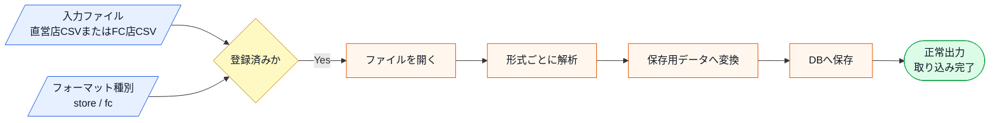

この図から読み取ることは、次の3点です。

- 入力ファイルを開き、対応形式を確認してから、形式ごとの解析に進む。
- 共通手順の開始、形式ごとの解析、保存用データへの変換は順番に依存している。
- 正常系では、保存用データへ変換したあとDB保存まで行い、取り込み完了を返す。

このシステムは、**システム基盤担当**と**業務担当者**の2つの立場で保守されています。システム基盤担当はファイルの開閉やDBへの保存といったインフラ寄りの処理を、業務担当者は店舗形態ごとのデータパースルールや計算ロジックを管理します。どの立場が何を管理するかは、後のフェーズで「変わる理由がどの業務機能によるか」を確認する際に使います。

**インポートの処理手順**

| ステップ | 処理内容 | 店舗形態による違い | 業務機能 |
|---|---|---|---|
| ① ファイルオープン | CSVファイルを読み込み可能な状態にする | 全形式で共通 | インフラ・システム管理 |
| ② データパース | フォーマットに従いCSV行を内部データに変換する | 形式ごとに異なる | 業務ルール管理 |
| ③ DB保存 | 変換済みデータをDBに登録する | 全形式で共通 | インフラ・システム管理 |
| ④ ファイルクローズ | ファイルリソースを解放する | 全形式で共通 | インフラ・システム管理 |

「②データパース」だけが「形式ごとに異なる」となっているのは、店舗ごとにPOSレジのメーカーや設定が違うためです。直営店とFC店では、もともと別々のレジシステムを導入していた経緯があり、出力されるCSVのフォーマットを統一することが難しい状況にあります。「①③④」が全形式で共通なのは、ファイルの開閉やDBの接続手順はフォーマットの違いに関係なく同じ手順で済むからです。

次の表は、現在このシステムが対応している2種類のフォーマットの違いをまとめたものです。区切り文字やヘッダー行の有無は、POSレジが出力する仕様の差であり、このシステムが独自に決めたルールではありません。

**現在対応しているフォーマット**

| 店舗形態 | 区切り文字 | ヘッダー行 | 不正行の扱い |
|---|---|---|---|
| 直営店 | カンマ区切り | あり（スキップ） | スキップして続行するが件数は報告しない |
| FC店 | タブ区切り | なし | スキップして続行 |

フォーマット差分は、実際に入力されるデータ例で比較すると分かりやすくなります。

**直営店CSVの例（カンマ区切り・ヘッダー行あり）**

```csv
商品ID,商品名,金額
1001,シャツ,3000
1002,パンツ,4500
```

**FC店CSVの例（タブ区切り・ヘッダー行なし・不正行をスキップ）**

```text
2001	バッグ	5200
不正な行
2002	帽子	1800
```

この例を見ると、直営店CSVでは1行目をデータとして扱わず、2行目以降をカンマで分割します。FC店CSVでは最初の行からデータとして扱い、タブで分割できない行は取り込まずに次の行へ進みます。

| 比較観点 | 直営店CSV | FC店CSV |
|---|---|---|
| 1行目 | ヘッダー行なのでスキップする | 商品データとして読む |
| 区切り文字 | `,` | タブ |
| 不正行 | スキップして続行するが件数は報告しない | スキップして件数を報告する |
| 取り込み対象 | `1001`、`1002` の2件 | `2001`、`2002` の2件 |

「ヘッダー行のスキップ」は、CSVファイルの1行目に「商品名,数量,金額」のような列名が書かれている場合、それをデータとして読み込まないための処理です。一方FC店では、ヘッダーなしで最初の行から商品データが続きます。「不正行のスキップ」は、項目が3つに分割できない行を保存対象へ入れず、次の行へ進むことです。現状コードは両形式とも不正行を保存しませんが、FC店だけがスキップ件数を `ImportResult` で報告します。

**エラー条件**

正常系の仕様を一通り確認したうえで、最後に、取り込みへ進めない入力を分けて整理します。掲載コードはファイルの開閉とDB保存を `cout` の表示で代替しているため（詳細は1-4「実物とスタブの境界」）、掲載コードで実際に起こるのは「未登録の形式」と「不正行のスキップ」です。ファイルオープン失敗のような外部境界のエラーは、実システムでは起こりますが掲載コードでは発生しません。両者を分けて示します。

| エラー条件 | どこで分かるか | 出力 | 掲載コードでの扱い |
|---|---|---|---|
| フォーマット種別が未登録 | `SchemaRegistry.exists()` の確認時 | 未対応形式エラーで中断 | **実際に発生**：`"online"` など未登録の種別を指定すると取り込みを実行せず中断する |
| FC店CSVでタブ分割できない行がある | FC店の解析時 | その行をスキップし、スキップ件数を報告 | **実際に発生**：不正行を含むサンプルで再現し、正常行だけ取り込む |
| 直営店CSVで3項目に分割できない行がある | 直営店の解析時 | その行をスキップ（件数報告なし） | **実際に発生**：不正行を含むサンプルで再現し、正常行だけ取り込む |
| 入力ファイルを開けない | ファイルオープン時 | ファイルエラー | 実システムの境界。掲載コードはファイルを開かず `vector<string>` で行を受け取るため発生しない |

一見すると、この仕組みは各店舗のCSVを読み込み、データを抽出してDBに保存するという目的をしっかり達成できています。処理を順に追っていけば、ファイルの読み込みからデータの加工、保存という一連の流れが記述されており、全体の動きは見通しやすい状態です。

---

### 1-2：動作例テーブル

コードを読む前に、変更要求が届く前のシステムがどんな入力に対して
どんな出力を返すかを確認します。ここでは現在対応している直営店とFC店の
正常系・境界ケースを基準にします。直営店とFC店はどちらも3項目に分割できない行を保存しませんが、スキップ件数を呼び出し元へ返すのはFC店だけです。

| 入力ファイル     | フォーマット種別       | データの状態         | 期待する出力        |
| ---------- | -------------- | -------------- | ------------- |
| 直営店CSVファイル | カンマ区切り・ヘッダー行あり | 正常データ10件       | インポート成功、10件追加 |
| FC店CSVファイル | タブ区切り・不正行スキップ  | 正常データ5件        | インポート成功、5件更新  |
| 直営店CSVファイル | カンマ区切り・ヘッダー行あり | 空ファイル（ヘッダー行のみ） | 0件インポート、エラーなし |
| FC店CSVファイル | タブ区切り・不正行スキップ | 全行不正データ | 0件インポート、エラー件数を報告 |
| 直営店CSVファイル | カンマ区切り・ヘッダー行あり | 正常1件＋不正1件 | 正常1件だけ追加、スキップ件数は報告しない |
---

### 1-3：登場クラスとクラス構成図

実装コードへ入る前に、現状の登場クラスを確認します。

| クラス名                | 役割                | 担当する仕様                                 |
| ------------------- | ----------------- | -------------------------------------- |
| `StoreDataImporter` | 直営店CSVの取り込み処理を進める | カンマ区切り、ヘッダー行ありのCSVを開き、解析し、保存する         |
| `FCDataImporter`    | FC店CSVの取り込み処理を進める | タブ区切り、ヘッダーなし、不正行スキップありのCSVを開き、解析し、保存する |
| `SchemaRegistry`    | インポートスキーマの登録・参照   | インポートタイプごとの必須カラム定義を保持し、タイプの存在確認と取得を担う  |

この図では、クラス同士の協調関係ではなく、`StoreDataImporter` と `FCDataImporter` が互いに依存せず、同じ手順を別々に抱えていることを見ます。そのため、あえてクラス間の矢印は引きません。現状は「開く・パースする・保存する・閉じる」という手順が、まだメソッドに分けられておらず、それぞれの `import()` の中にひとまとめでべた書きされている点にも注目してください。この「まだ関数化されていない」状態が、フェーズ6のステップ1で共通項を見つける出発点になります。

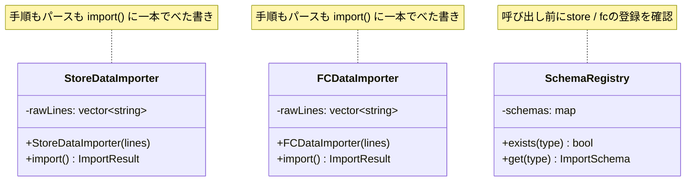

**クラス図に出てくる主なメンバーと操作**

| クラス | メンバー・操作 | 何ができるか |
|---|---|---|
| `StoreDataImporter` | `rawLines` | 取り込む対象のCSV各行を保持する |
| `StoreDataImporter` | `import()` | 直営店CSVを開き、カンマ区切りで解析し、DB保存まで進めて `ImportResult` を返す |
| `FCDataImporter` | `rawLines` | 取り込む対象のCSV各行を保持する |
| `FCDataImporter` | `import()` | FC店CSVを開き、タブ区切りで解析し、不正行を除いて保存し、`ImportResult` を返す |

`import()` の戻り値 `ImportResult` は、スキーマ名・保存件数・スキップ件数を持つ小さな構造体です。呼び出し元は「何件保存でき、何件スキップしたか」を戻り値として受け取れます（`void` で投げっぱなしにしません）。

→ `StoreDataImporter` と `FCDataImporter` の間に矢印はありません。両クラスは互いを知らず、それぞれが「ファイルを開く・パースする・保存する・閉じる」という手順全体を、`import()` の中に独立してべた書きで持っています。

これから検討するのは、同じ機能を保ちながら、変更に強い構造をどう作るかという点です。


**この章での簡略化 ―― 実物とスタブの境界**

1-3でクラス構成を確認したので、掲載コードで「何を実際に動かし、何をスタブ（仮想）で代替しているか」を先に整理します。この境界は全フェーズで共通です。同じ種類の表は本章だけの補足ではなく、全章で外部境界を説明する共通形式として使います。

| 要素                          | 掲載コードでの扱い                                              | 実運用では                     |
| --------------------------- | ------------------------------------------------------ | ------------------------- |
| 手順の順序（開く→検証→パース→行検証→保存→閉じる） | **実物**（骨格として実行される）                                     | 同じ                        |
| 形式ごとのパース・行検証・EC計算・形式分岐      | **実物**（サンプルCSVを実際に解析する）                                | 同じ                        |
| 取込結果（件数・スキップ・成否）の受け渡し       | **実物**（`ImportResult` 等で返す）                            | 同じ                        |
| ファイルの読み書き | **現状コード**：`vector<string>`を直接保持。**最終コード**：`ImportFileGateway`で取得 | 本物のファイルAPI／オブジェクトストレージ |
| DB保存 | **現状コード**：件数を表示。**最終コード**：`SalesImportRepository`で保存件数・金額を保持 | 本物のDBドライバ・トランザクション |
| 形式バージョン確認                   | **スタブ**：メッセージ表示のみ                                      | メタデータの実検証                 |
| 同期/非同期の実行                   | **スタブ**：スケジューラは逐次実行で代替（決定的な出力のため）                      | ワーカースレッド等で並行実行            |

論点は「開く→変換する→保存する→閉じる」という手順の骨格と、形式ごとに変わるパース処理をどこで分けるかです。現状コードはファイル行と保存表示をImporterへ直接持ちます。フェーズ7では同じ処理を `ImportFileGateway`／`SalesImportRepository` の境界へ移し、保存媒体の変更を骨格から分けます。文字コード変換と実スレッドは、扱わない理由を最終コード前で補足します。

---

### 1-4：実装コード（現状）

#### コードを読む前に：クラスの責任と境界

| 対象 | 呼び出しと内部処理 | 戻り値・副作用 | 掲載上の表現 |
|---|---|---|---|
| 各Importer | `main()`から全行を受け、形式別に分割する | 保存・スキップ件数 | ファイル内容を`vector<string>`で渡す |
| `stringstream` | 1行と区切り文字を受け項目へ分解する | 項目の`vector` | CSVパーサの最小代替 |
| `map` | `store` / `fc`からスキーマを検索する | 登録有無・必須列 | メモリ上のスキーマ登録表 |
| `move` | コンストラクタで受け取った行一覧をImporterへ移す | 同じ行一覧のコピーを避ける | 移動後の引数は使わない |

現状コードで使うのは、行一覧、スキーマ検索、CSV分割です。`std::function`、`std::queue`、Gateway、Repositoryは後のフェーズで初めて登場するため、その使用直前で説明します。

コードを見る前に、このシステムに登場する主要なクラスと、その役割を整理しておきます。

#### このシステムの登場クラス
| クラス名 | 役割 | 担当する仕様 |
|---|---|---|
| `StoreDataImporter` | 直営店CSVファイルのインポート処理全体 | カンマ区切り、ヘッダーありのCSVを処理する |
| `FCDataImporter` | FC店CSVファイルのインポート処理全体 | タブ区切り、不正行スキップでCSVを処理する |
| `SchemaRegistry` | インポートスキーマの登録・参照 | インポートタイプごとの必須カラム定義を保持し、タイプの存在確認と取得を担う |

この段階での注目ポイントは、どちらのクラスも「ファイルを開く」「データを加工する」「保存する」「閉じる」というデータの流れ（処理の手順）を、それぞれのクラス内に独立して持っている点です。しかも現状では、この手順はまだ小さなメソッドに分けられておらず、`import()` の中に上から下へべた書きされています。「共通の手順」と「形式ごとの差分」がまだ切り出されていない、この素朴な状態が出発点です。

実際の処理コードを見てみましょう。直営店用とFC店用の2クラスが存在します。どちらも `import()` の中に「開く→加工→保存→閉じる」を上から順にべた書きしており、大きな流れは共通していますが、パースの中身（区切り文字・ヘッダー・不正行の扱い）は少し違っています。クラスごとにブロックを分けて確認します。

このシステムには以下の2種類のインポートスキーマがあらかじめ登録されています。

| タイプ | スキーマ名 | 必須カラム |
|---|---|---|
| store | 直営店データ | id, name, amount |
| fc | FC店データ | id, name, amount |

登録されていないタイプ（例：`"online"`）を指定するとエラーになります。コードを読む前にこの対応を把握しておくと、動作結果が追いやすくなります。

**① スキーマ登録クラスと共通の型（SchemaRegistry / SalesRow / ImportResult / ImportSchema）**

```cpp
#include <iostream>
#include <sstream>
#include <string>
#include <vector>
#include <map>
#include <utility>
using namespace std;

// 1行を区切り文字で分割する小さなヘルパー
static vector<string> splitLine(const string& line, char delim) {
    vector<string> cols; string cur; istringstream iss(line);
    while (getline(iss, cur, delim)) cols.push_back(cur);
    return cols;
}

// パース済みの売上1行
struct SalesRow { string id; string name; long amount; };

// インポート1回分の結果（void をやめ、件数を返す）
struct ImportResult { string schemaName; int saved; int skipped; };

// インポートスキーマ（タイプごとの必須カラム定義）
struct ImportSchema { string name; vector<string> requiredColumns; };

// インポートスキーマの登録・参照を担うクラス
class SchemaRegistry {
    map<string, ImportSchema> schemas;
public:
    SchemaRegistry() {
        schemas["store"] = {"直営店データ", {"id", "name", "amount"}};
        schemas["fc"]    = {"FC店データ",   {"id", "name", "amount"}};
    }
    bool exists(const string& type) const { return schemas.count(type) > 0; }
    ImportSchema get(const string& type) const { return schemas.at(type); }
};

```

`SchemaRegistry` は `main()` から呼ばれ、フォーマット種別IDを受け取って登録有無と表示名を返します。`std::map` は種別IDからスキーマを検索するメモリ上の登録表、`std::vector` は必須列を順番に保持する一覧です。このクラスはCSV本文を解析せず、どの形式として処理を始めてよいかだけを判断します。

**② 直営店データのインポートクラス（StoreDataImporter）**

```cpp

// 直営店データのインポート（カンマ区切り・ヘッダー行あり）
class StoreDataImporter {
    vector<string> rawLines;
public:
    explicit StoreDataImporter(vector<string> lines) : rawLines(move(lines)) {}

    // 手順がすべて import() の中にべた書きされている
    ImportResult import() {
        // (1) 開く
        cout << "直営店CSVを開く\n";

        // (2) パース：1行目をヘッダーとして飛ばし、カンマで分割する（べた書き）
        vector<SalesRow> rows;
        for (size_t i = 1; i < rawLines.size(); ++i) {
            vector<string> c = splitLine(rawLines[i], ',');
            if (c.size() < 3) continue;
            rows.push_back({c[0], c[1], stol(c[2])});
        }
        cout << "カンマ区切りで" << rows.size() << "件を読み込む\n";

        // (3) 保存
        cout << rows.size() << "件をDBへ追加\n";

        // (4) 閉じる
        cout << "ファイルを閉じる\n";

        return {"直営店データ", (int)rows.size(), 0};
    }
};

```

`StoreDataImporter` は `main()` から直営店の全行を受け取ります。`import()` は先頭行をヘッダーとして除外し、残りをカンマで3項目へ分割し、変換できた行数を `ImportResult` で返します。`std::move(lines)` は、受け取った行一覧の所有内容を `rawLines` へ移し、同じ大量文字列を複製しないための記法です。

**③ FC店データのインポートクラス（FCDataImporter）**

```cpp

// FC店データのインポート（タブ区切り・ヘッダーなし・不正行スキップ）
class FCDataImporter {
    vector<string> rawLines;
public:
    explicit FCDataImporter(vector<string> lines) : rawLines(move(lines)) {}

    // こちらも手順がすべて import() にべた書きされている
    ImportResult import() {
        // (1) 開く
        cout << "FC店CSVを開く\n";

        // (2) パース：先頭行からタブで分割し、割れない行はスキップ（べた書き）
        vector<SalesRow> rows;
        int skipped = 0;
        for (size_t i = 0; i < rawLines.size(); ++i) {
            vector<string> c = splitLine(rawLines[i], '\t');
            if (c.size() < 3) { ++skipped; continue; }
            rows.push_back({c[0], c[1], stol(c[2])});
        }
        cout << "タブ区切りで" << rows.size() << "件を読み込み、"
             << skipped << "件をスキップ\n";

        // (3) 保存
        cout << rows.size() << "件をDBへ更新\n";

        // (4) 閉じる
        cout << "ファイルを閉じる\n";

        return {"FC店データ", (int)rows.size(), skipped};
    }
};
```

`FCDataImporter` も `main()` から全行を受け取りますが、先頭行からタブで分割します。3項目に分けられない行は `skipped` を増やして次へ進み、保存件数とスキップ件数の両方を返します。2クラスを分けて読むと、呼び出し方と戻り値は似ている一方、ヘッダー・区切り文字・不正行報告が異なることを確認できます。

このコードを見ると、`import()` の中に「開く」「パース」「保存」「閉じる」がどちらも同じ順序で**べた書き**されていることが分かります。まだ小さなメソッドには分かれていません。一方で、パース部分の中身（区切り文字・ヘッダーの扱い・不正行のスキップ）は形式ごとに異なります。「手順の骨格は共通で、詳細部分だけが違う」という構造が、同じ `import()` の中に埋もれている状態です。この共通項はフェーズ6のステップ1で初めてメソッドとして切り出します。

#### 呼び出し元と実行確認

```cpp
int main() {
    SchemaRegistry registry;

    // 直営店：ヘッダー行 + 正常10件
    vector<string> storeLines = {"商品ID,商品名,金額"};
    for (int i = 1; i <= 10; ++i)
        storeLines.push_back("100" + to_string(i)
            + ",商品" + to_string(i) + ",3000");

    string type1 = "store";
    if (!registry.exists(type1)) {
        cout << "[エラー] 未登録のインポートタイプ: " << type1 << "\n"; return 1;
    }
    cout << "--- 行1: " << registry.get(type1).name << " ---\n";
    StoreDataImporter storeNormal(storeLines);
    ImportResult r1 = storeNormal.import();
    cout << "インポート成功: " << r1.saved << "件追加\n";

    // FC店：タブ区切り・正常5件
    vector<string> fcLines;
    for (int i = 1; i <= 5; ++i)
        fcLines.push_back("200" + to_string(i)
            + "\t商品" + to_string(i) + "\t5200");

    string type2 = "fc";
    if (!registry.exists(type2)) {
        cout << "[エラー] 未登録のインポートタイプ: " << type2 << "\n"; return 1;
    }
    cout << "--- 行2: " << registry.get(type2).name << " ---\n";
    FCDataImporter fcNormal(fcLines);
    ImportResult r2 = fcNormal.import();
    cout << "インポート成功: " << r2.saved << "件更新\n";

    // 直営店：空ファイル（ヘッダー行のみ）
    cout << "--- 行3: 直営店空ファイル ---\n";
    StoreDataImporter storeEmpty({"商品ID,商品名,金額"});
    ImportResult r3 = storeEmpty.import();
    cout << "インポート成功: " << r3.saved << "件追加\n";

    // FC店：全行不正（タブ分割できない）
    cout << "--- 行4: FC店全行不正 ---\n";
    FCDataImporter fcInvalid({"不正な行", "壊れた行", "欠損行"});
    ImportResult r4 = fcInvalid.import();
    cout << "インポート成功: " << r4.saved << "件更新";
    if (r4.skipped > 0) cout << "、エラー" << r4.skipped << "件";
    cout << "\n";

    // 直営店：正常1件＋列不足1件（不正行件数は報告しない）
    cout << "--- 行5: 直営店に不正行あり ---\n";
    StoreDataImporter storeMixed({
        "商品ID,商品名,金額", "1001,シャツ,3000", "9001,欠損"});
    ImportResult r5 = storeMixed.import();
    cout << "インポート成功: " << r5.saved << "件追加\n";

    // タイプ "online" は未登録 → エラーで中断
    string unknownType = "online";
    if (!registry.exists(unknownType)) {
        cout << "[エラー] 未登録のインポートタイプ: "
             << unknownType << " — 処理を中断します\n";
        return 1;
    }
    return 0;
}
```

実行対象コード：1-4の現状コード
対応する動作例：1-2の動作例テーブル
確認したいこと：入力、加工、出力が仕様どおりに対応していること

実行結果：

```text
--- 行1: 直営店データ ---
直営店CSVを開く
カンマ区切りで10件を読み込む
10件をDBへ追加
ファイルを閉じる
インポート成功: 10件追加
--- 行2: FC店データ ---
FC店CSVを開く
タブ区切りで5件を読み込み、0件をスキップ
5件をDBへ更新
ファイルを閉じる
インポート成功: 5件更新
--- 行3: 直営店空ファイル ---
直営店CSVを開く
カンマ区切りで0件を読み込む
0件をDBへ追加
ファイルを閉じる
インポート成功: 0件追加
--- 行4: FC店全行不正 ---
FC店CSVを開く
タブ区切りで0件を読み込み、3件をスキップ
0件をDBへ更新
ファイルを閉じる
インポート成功: 0件更新、エラー3件
--- 行5: 直営店に不正行あり ---
直営店CSVを開く
カンマ区切りで1件を読み込む
1件をDBへ追加
ファイルを閉じる
インポート成功: 1件追加
[エラー] 未登録のインポートタイプ: online — 処理を中断します
```

動作例テーブルの全5行について、処理順序、処理件数、不正行の報告が
一致することを確認できました。`import()` は結果を画面に流すだけでなく、
保存件数・スキップ件数を持つ `ImportResult` として呼び出し元へ返します。
未登録タイプ（"online"）はレジストリのチェックで処理を中断し、
エラーメッセージを出力します。

---

> **手元で動かすには**
> このコードは1つの `.cpp` に貼り付けて、そのままコンパイル・実行できます（例：`g++ -std=c++14 chapter04.cpp -o app && ./app`）。この対策前コードでは、まだ `ImportFileGateway` を導入しておらず、CSVの中身を `main()` の中の文字列（`storeLines` など、メモリ上の行データ）で直接与えています。実ファイルは読み書きしません。「自由にCSVを作る」とは、この `storeLines` を書き換えることです。たとえば列不足の行（`"9001,欠損"` のようにカンマ項目が2つしかない行）を足せば、その行はパース時に読み飛ばされ、保存件数が1件減った実行結果に表れます。実ファイルI/OやDB保存はこの章の論点ではないため扱わず、フェーズ7では同じ「メモリ上のサンプルCSV」を `ImportFileGateway` の裏に隔離して、骨格が保存媒体を知らない形にします。

### 1-5：変更要求

ある日、店舗運営部の担当者から連絡がありました。「来月から、ネット通販（ECサイト）の売上データもこのシステムで取り込みたい。フォーマットは既存の直営店用と似ているが、会員ランクやポイント付与情報といったEC特有の項目が含まれるため、読み込み後の計算処理が少し追加される。また、データ整合性と互換性を保証するため、すべての形式（直営店・FC店・新規のEC店）について、ファイルを開いた直後にファイルメタデータの形式バージョンを確認する機能も共通で追加してほしい」と。

なるほど、店舗のデータとECサイトのデータ。どちらも「ファイルを取得する → バージョンを検証する → 解析する → 行単位で検証する → 保存する → 取込結果を返す」という大きな流れは共通のはずですが、一部の計算ルールやパースルールだけが異なるのですね。

変更要求によって仕様がどう変わるのかを体系的に整理します。

| 項目 | 変更前 | 変更後 |
| --- | --- | --- |
| 対応フォーマット | 直営店・FC店の2形式 | 直営店・FC店・EC店の3形式 |
| バージョンチェック | なし | 全形式でファイルオープン直後に実行 |
| 行単位検証 | FC店の不正行スキップのみ | 全形式で検証位置をそろえ、形式ごとの検証内容だけ変える |
| EC向け計算処理 | なし | EC店のみ（ポイント付与・会員ランク割引） |
| 取込結果 | 成功メッセージ中心 | 成功件数、スキップ件数、失敗理由を結果として残す |

**複雑度ストレス条件**

| 順次処理 | 共通骨格か、形式差分か | 具体例 | この章で見ること |
|---|---|---|---|
| ファイル取得 | 共通骨格 | ファイルAPIからCSVを開く | 取得前に解析や保存へ進まない順序を守れるか |
| メタデータ検証 | 共通骨格 | 形式バージョンを確認する | 全形式に同じ検証を1回で追加できるか |
| 形式別解析 | 形式差分 | カンマ、タブ、EC固有列を読む | 形式追加時に骨格を複製しないか |
| 行単位検証 | 置き場所は共通、内容は形式差分 | 不正行をスキップし、件数を数える | エラー行の扱いを形式ごとに変えられるか |
| DB保存 | 共通骨格 | 正常行だけ保存する | 保存前に検証済みデータだけが流れるか |
| 取込結果 | 共通骨格 | 成功件数、スキップ件数、失敗理由を記録する | 呼び出し元が形式差分を知らず結果を受け取れるか |

**変更後の仕様表（ECサイト対応とバージョンチェックの追加）**

| ルール名 | 発動条件 | 結果 | 具体例 |
| --- | --- | --- | --- |
| ファイルオープン | インポート開始時に必ず実行 | CSVファイルを読み込み可能な状態にする | 直営店・FC店・EC店、どの形式でも同じ手順 |
| **形式バージョンチェック** | **ファイルオープン直後に実行** | **メタデータ内の形式バージョンが正常か検証する** | **直営店・FC店・EC店、どの形式でも同じ手順** |
| データパース | フォーマットごとに異なるルールを適用 | CSV行をシステム内部データに変換する | 直営店：カンマ区切り／FC店：タブ区切り／**EC：ポイント項目・会員ランク追加** |
| 行単位検証 | パース完了後、保存前に実行 | 取り込めない行を除外し、スキップ件数を取込結果へ記録する | 検証の位置は共通、検証内容は形式ごとに異なる |
| **EC向け計算処理** | **ECデータのパース完了後に実行** | **ポイント付与量・会員ランク割引を計算する** | **EC店のみ。直営店・FC店にはこのステップなし** |
| DB保存 | パース完了後に必ず実行 | 変換済みデータをDBに登録する | 保存先・保存形式はどの形式でも共通 |
| ファイルクローズ | 保存完了後に必ず実行 | ファイルリソースを解放する | 直営店・FC店・EC店、どの形式でも同じ手順 |

**変更後の動作例テーブル**

| 入力ファイル | データの状態 | 期待する出力 |
| --- | --- | --- |
| 直営店CSVファイル | 正常データ10件 | インポート成功、10件追加（変わらず） |
| FC店CSVファイル | 正常データ5件 | インポート成功、5件更新（変わらず） |
| **EC店CSVファイル** | **正常データ8件 + 不正データ行2件** | **正常行8件のみ処理、スキップ2件を取込結果に記録、ポイント計算済み** |

仕様表を見ると、「ファイル取得」「メタデータ検証」「行単位検証」「DB保存」「ファイルクローズ」は順序として守りたい骨格です。一方で、「データパース」「行ごとの検証内容」「EC固有の計算処理」は形式ごとに変わる差分です。

**変更前後の入力・判定・加工・出力差分**

1-1の現状仕様を退避し、変更要求を当てた後の仕様と同じ粒度で並べます。以降の分析では、この差分を追います。

| 要素 | 変更前（1-1の現状仕様） | 変更後（今回の要求） | 差分として追うもの |
|---|---|---|---|
| 入力 | 直営店CSV、FC店CSV | 直営店CSV、FC店CSV、EC店CSV、形式バージョン、行単位エラー | EC店データ、バージョン情報、不正行情報が増える |
| 判定 | 店舗形態ごとの形式判定 | 店舗形態判定に加え、全形式でバージョン確認と行単位検証を行う | 共通判定の置き場所と形式別判定の中身を分ける |
| 加工 | 形式別にパースしDB保存する | バージョン確認後に形式別パースし、行検証後にEC店はポイント・会員ランク計算を追加 | 共通手順と形式差分の両方が変わる |
| 出力 | 保存成功またはパースエラー | 保存成功、バージョンエラー、行スキップ件数、EC計算済みデータ | 取込結果として残す情報が増える |

**変更後の入力・加工・出力**

変更後の仕様を、1-1と同じ粒度で、正常系の入力・判定・加工・出力として確認します。1-1の図との差分は、フォーマット種別に「EC店」が加わること、全形式共通の「形式バージョンを確認」と「行単位検証」が骨格へ加わること、EC店だけ解析後に「ポイント付与・会員ランク割引の計算」という加工が加わることです。

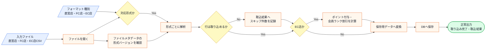

この図から読み取ることは、次の4点です。

- ファイルを読める確認、対応形式の確認、保存用データへの変換は1-1のまま変わらない。
- 「形式バージョンの確認」は直営店・FC店・EC店のすべてが通る共通の加工として、共通手順の直後に1か所だけ挟まる。
- 「行単位検証」は保存前に必ず通る位置だけを共通化し、不正行の扱いは形式ごとの実装へ任せる。
- 「ポイント付与・会員ランク割引の計算」はEC店だけが通る加工で、直営店・FC店の流れは変わらない。

変更後も、失敗条件は正常系図へ混ぜずに別で確認します。

| エラー条件 | どこで分かるか | 出力 | 保存・通知などの副作用 |
|---|---|---|---|
| 入力ファイルを開けない | ファイルオープン時 | ファイルエラー | DB保存なし |
| フォーマット種別に対応していない | 形式判定時 | 未対応形式エラー | DB保存なし |
| 形式バージョンが対応範囲外 | メタデータ確認時 | バージョンエラー | DB保存なし |
| EC店CSVに不正行がある | EC店の解析時 | 不正行を除外して続行 | 正常行と計算済みデータだけDB保存する |
| DB保存に失敗する | 保存処理時 | 保存失敗 | 取込結果へ失敗を記録し、ファイルは閉じる |

図に加わった「形式バージョンの確認」「行単位検証」「EC店だけの計算」が実際にコードのどこへ書かれるかは、フェーズ3で変更を試すコードと、フェーズ7の最終コード・実行結果で追います。

フェーズ1でシステムの現状と変更要求が把握できました。次のフェーズ2では、「何を変え、何を守るか」を整理します。

## 🟣 フェーズ2：仮説立案 ―― 何が変わるかを観察し、ヒアリングで裏付ける
### 2-1：変わりそうな仕様の見当をつける

ここで作る一覧は、思いつきで「変わりそう」と感じたものを並べる表ではありません。フェーズ1で確認した仕様・動作例・クラス図を材料に、次の順で候補を絞ります。

1. 仕様図と動作例から、入力・判定・加工・出力のうち条件や値が変わりそうな箇所を拾う。
2. その箇所が、1-3のどのクラス・メソッドに書かれているかを対応づける。
3. その仕様が、どんな理由で、何をきっかけに、どのくらいの頻度で変わりそうかを仮説として書く。
4. 逆に、当面変えない前提にできる処理の骨格も分けておく。

この手順で見ると、「CSVをインポートする」という大きな処理全体ではなく、その中のどの手順・フォーマット差分・パース規則が変更候補なのかを読者自身で追えるようになります。

フェーズ2では、フェーズ1で見た仕様のうち、どのフォーマット・変換・保存手順が変わりそうかを見当づけます。責務の配置は、変更要求を当てた後の痛みと合わせて確認します。

| 仕様候補 | 仕様上の場所 | フェーズ1の現状コードでの場所 | 見立て |
|---|---|---|---|
| 直営店CSVの列構成 | 入力フォーマット、パース | `StoreDataImporter.import()` | 直営店側のCSV項目追加でパース規則が変わる可能性があるため、今回見る |
| FC店CSVの列構成 | 入力フォーマット、パース | `FCDataImporter.import()` | FC店側のCSV項目や表記差分が変わる可能性があるため、今回見る |
| 行単位検証とスキップ件数 | 判定、出力 | 各Importerのパース処理と保存前処理 | 検証する位置は共通だが、何を不正行とするかは形式ごとに変わるため、今回見る |
| ファイルの開閉 | 加工前後の共通手順 | `StoreDataImporter.import()`、`FCDataImporter.import()` | この章の変更要求では、共通手順として当面維持する前提で見る |
| DB保存 | 出力、保存処理 | `saveToDB()` 相当の処理 | 保存先やトランザクションは論点外として深追いしない |

この表から、今回の検討対象は「店舗種別ごとのCSVパース規則」と「形式ごとの行検証」です。どちらも保存前に必ず通る順次処理の中にありますが、変わる理由は形式ごとの差分にあります。共通手順と差分が同じ場所に書かれて困るかどうかは、フェーズ3で変更を入れてから確認します。

### 2-2：今回の変更で確実に変わること

今回の変更要求から確定している変更は以下の3点です。

- **ECサイト向けCSVのパース方法の追加**：会員ランク・ポイント項目を読み込む処理が必要
- **行単位検証と取込結果の拡張**：不正行をスキップし、成功件数・スキップ件数を結果として残す必要がある
- **EC向け計算処理ステップの追加**：ポイント付与量・会員ランク割引を計算する処理が必要

ただし「この変更が1回限りか、今後も続くか」によって、どこまで設計を変えるべきかが大きく変わります。関係者に確認します。

### ヒアリングに向けた背景確認

このシステムは、ある小売店舗で日々の売上データを管理するために使われています。各店舗のPOSレジから出力される売上データをCSVファイルとして受け取り、システムへ取り込むのが主な役割です。インポートされたデータは夜間バッチで一括処理されるほか、管理画面からも手動でアップロードできる仕組みになっています。

当初は1種類のCSVフォーマットだけを読み込んでいましたが、店舗網の拡大とともに、店舗形態や仕入れ先によって「日付の形式」「ヘッダー行の有無」「カンマ区切りかタブ区切りか」といった細かな違いがあるCSVが持ち込まれるようになりました。

当時の担当者が、増え続けるフォーマットに対応するために一つずつコードを書き足してきた結果が、現在の実装です。

### 2-3：関係者ヒアリング


仮説の確度を上げるため、システム基盤担当と業務担当者に確認を行いました。

* **開発者：** 「今後もインポート対象のシステムが増える予定はありますか？」
* **システム基盤担当：** 「あります。次はSNS経由の販売データを取り込む予定です。ファイル操作の手順は既存と全く同じはずです。」
* **開発者：** 「読み込みの手順自体が変わる可能性はありますか？」
* **業務担当：** 「いいえ、ファイルを開いて閉じるという手順は固定です。ただ、中身のデータ項目が少しずつ増えたり計算ルールが変わったりすることは頻繁にあります。」
* **開発者：** 「不正行の扱いは、全形式で同じですか？」
* **業務担当：** 「検証する位置は保存前でそろえたいです。ただ、どの列を必須にするか、スキップできるか、エラー終了にするかは形式ごとに変わります。」

### 2-4：ヒアリングで判明した将来リスク

ヒアリングで浮かび上がった「確定ではないが、近い将来起こりうる変化」を記録します。これは今回の設計判断の材料です。

| **将来リスク** | **時期の目安** | **根拠** |
| --- | --- | --- |
| SNS販売データのインポート形式追加 | 継続的に | インポート対象チャネルが増える予定（システム基盤担当より） |
| 各店のデータ項目の追加・計算ルール変更 | 継続的に | 頻繁にあると業務担当が言及 |

フェーズ2で「今変わること（確定）」と「将来変わるかもしれないこと（リスク）」を分けて整理できました。次のフェーズ3では、現在の構造で変更を試みたときに何が起きるかを確認します。

### 2-5：変わる見込みと当面安定の前提を確定する

ヒアリングで判明したリスクを、「現在の状態」と「将来起こりうる変化」の対比で整理します。これが次のフェーズ以降の設計判断の基準になります。

| 変更内容 | 現在 | 将来（時期の目安） |
| --- | --- | --- |
| インポート対象チャネル | 直営店・FC店の2形式 | SNS販売データなど継続的に追加（システム基盤担当より） |
| 各店のデータ項目 | 固定（区切り文字・ヘッダー有無など） | 項目の追加・変更が継続的に発生（業務担当より） |
| 計算ルール | EC店のみポイント・会員ランク計算あり | 他形式でも同様の後処理が必要になる可能性あり |

この変化が来たとき、現在の構造では各インポートクラスに同じ修正を繰り返すことになります。次のフェーズ3では、その「痛み」を実際に変更を試みることで確認します。

---

## 🟣 フェーズ3：問題特定 ―― 変更の痛みを発見する
フェーズ2で、CSVインポートの処理手順は共通しており、データ加工のルールだけが変わるという構造が明確になりました。このフェーズでは、新しいECサイト向けCSVの取り込みを、現在のクラス構造のまま実装しようとするとどのような「痛み」が生じるのかを確認します。

### 3-1：変更を試みる

ECサイトの売上データをインポートする機能を実装しようと、既存の `StoreDataImporter` クラスを参考に、新しい `ECDataImporter` クラスを作成してみましょう。現状コードにならい、手順は `import()` の中にべた書きします。

```cpp
// EC店データのインポート（会員ランク・ポイント項目あり）
// 既存の直営店・FC店と同じ手順を、また import() の中にべた書きでコピーしている
class ECDataImporter {
    vector<string> rawLines;
public:
    explicit ECDataImporter(vector<string> lines) : rawLines(move(lines)) {}

    ImportResult import() {
        // (1) 開く ← StoreDataImporter・FCDataImporter と全く同じコピー
        cout << "EC店CSVを開く\n";

        // (2) パース：カンマ区切り＋会員ランク・ポイント列（EC固有）
        vector<SalesRow> rows; int skipped = 0;
        for (size_t i = 1; i < rawLines.size(); ++i) {
            vector<string> c = splitLine(rawLines[i], ',');
            if (c.size() < 5) { ++skipped; continue; }   // ランク/ポイント列が不足
            rows.push_back({c[0], c[1], stol(c[2])});
        }
        cout << "カンマ区切りで会員ランク・ポイント列まで解析（有効"
             << rows.size() << "件・スキップ" << skipped << "件）\n";

        // (2') EC固有：ポイント付与量を計算
        long pointBonus = 0;
        for (auto& r : rows) pointBonus += r.amount / 100;
        cout << "ポイントボーナスを計算（合計" << pointBonus << "pt）\n";

        // (3) 保存 ← また同じコピー
        cout << rows.size() << "件をDBへ追加\n";

        // (4) 閉じる ← また同じコピー
        cout << "ファイルを閉じる\n";

        return {"EC店データ", (int)rows.size(), skipped};
    }
};

int main() {
    vector<string> ecLines = {"id,name,amount,rank,points"};
    for (int i = 1; i <= 10; ++i) {
        if (i == 4 || i == 9)   // 2件は列不足（不正行）
            ecLines.push_back("E00" + to_string(i)
                + ",商品" + to_string(i) + ",3000");
        else
            ecLines.push_back("E00" + to_string(i) + ",商品"
                + to_string(i) + ",3000,gold,50");
    }
    ECDataImporter importer(ecLines);
    ImportResult r = importer.import();
    cout << "インポート成功: " << r.saved << "件追加、スキップ" << r.skipped << "件\n";
    return 0;
}
```

実行対象コード：3-1の変更試行コード（`splitLine`・`SalesRow`・`ImportResult` は1-4と共通）
対応する動作例：変更要求後の代表ケース（EC店 正常8件＋不正2件）
確認したいこと：変更要求を現状構造へ当てはめたとき、修正箇所と痛みがどこに出るか

実行結果：

```text
EC店CSVを開く
カンマ区切りで会員ランク・ポイント列まで解析（有効8件・スキップ2件）
ポイントボーナスを計算（合計240pt）
8件をDBへ追加
ファイルを閉じる
インポート成功: 8件追加、スキップ2件
```

コードは正しく動いています。しかし冒頭の「EC店CSVを開く」と末尾の「DBへ追加」「ファイルを閉じる」は、直営店・FC店の `import()` にべた書きした手順と全く同じ形です。

実装しながら、一つの違和感に気づきます。「あれ、開く・保存する・閉じるは直営店やFC店と全く同じなのに、また自分の `import()` にべた書きしているな」と。

さらに、同時に要求されていた「形式バージョンチェック機能」も追加してみましょう。「直営店・FC店・EC店のすべてについて、ファイルメタデータに形式バージョンを付与し、ファイルを開いた直後に対応可能なバージョンか確認する」という仕様です。

「バージョンチェック」はフォーマット種別に関わらず全店舗で共通の手順変更です。しかし現在の重複した構造では、`StoreDataImporter`・`FCDataImporter`・`ECDataImporter` の3つのクラスそれぞれに、同じバージョンチェックのコードを追加しなければなりません。

「3つのクラスすべてに同じ修正を入れる作業。しかも今後インポート形式が増えるたびに、同様の共通手順変更をすべてのクラスにコピペしなければならないのか……」

### 3-2：変更影響グラフ

変更要求が既存システムにどのように波及するかをグラフ化します。

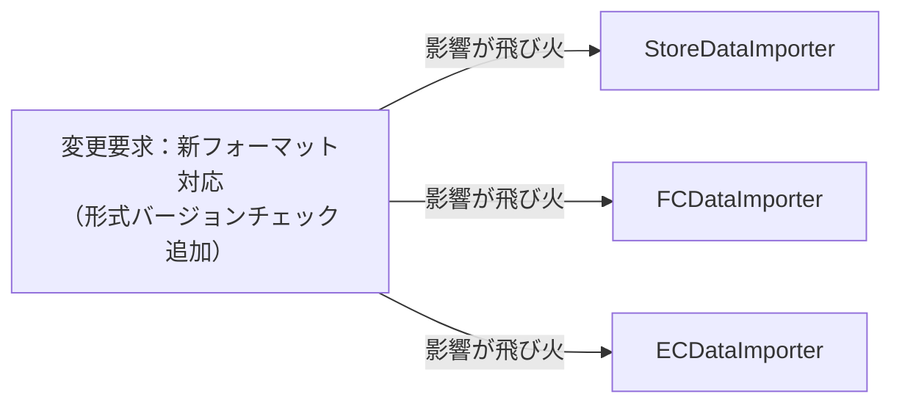

→ このグラフを見ると、「形式バージョンチェック」という共通の手順変更が、インポートクラスの数だけ波及していることが分かります。バージョンチェックは1か所に書けば済むはずの処理なのに、各クラスが「手順の骨格」を独自に持っているために、3か所を同時に修正することになります。今後インポート形式が増えるたびに、この波及範囲も広がります。

### 3-3：痛みの言語化

変更を試みたことで、2つの「痛み」が鮮明になりました。

1つ目は、同じ修正の繰り返しです。具体的には、`openFile()` という1行が `StoreDataImporter`・`FCDataImporter`・`ECDataImporter` の3クラスそれぞれの `import()` メソッドに重複して存在しています（1-4節のコードで確認できます）。「バージョンチェックを追加してほしい」という1つの要求に対して、この同じ修正を3箇所で繰り返すことになります。今後インポート形式が4つ・5つと増えれば、修正箇所もその数だけ増えます。共通の手順であるはずのファイル操作やDB保存のコードが形式ごとに複製されているため、関連クラスを検索し、同じ修正を反映する必要があります。修正漏れを防ぐための確認範囲も広がります。

2つ目は、システムの「変更耐性の低さ」です。本来、ビジネスロジックである「店舗ごとのデータパース」だけを変えれば済むはずの状況で、ファイル操作やDB接続という「手順の骨格」まで修正対象になってしまっています。システム基盤側の知識が業務ロジックのクラスに漏れ出しているために、本来無関係な場所まで変更することになり、設計上の無駄が蓄積してしまいます。

こういうとき困る、という感覚、皆さんも同じではないでしょうか。この「共通の手順が散らばっている」という状態が、私たちの設計を硬直させている元凶なのです。

フェーズ3で「手順の重複が辛い」という事実が確認できました。次のフェーズ4では、なぜこの辛さが構造的に発生するのかを分析します。

---
> **📌 問題（確定）**
> インポート形式が1つ増えるたびに、`openFile()`・`saveToDB()`・`closeFile()` という共通手順を新しいクラスにも重複して書くことになる。ヒアリングで「SNS販売データなど今後もインポート対象が増える」と確定しており、この頻度では共通手順の重複管理コストが合わなくなってくる。
---

## 🟠 フェーズ4：原因分析 ―― なぜ辛いのかを構造で言語化する
フェーズ3で、インポート処理の「手順の重複」という痛みが確認できました。このフェーズでは、なぜそのような辛さが生じるのかを、コードの構造的な観点から言語化します。

### 4-1：痛みの根源を探る（観察と原因）

フェーズ3で確認した「変更の辛さ」は、コードのどこから来ているのでしょうか。コードを注意深く観察すると、痛みを引き起こしている2つの事実が浮かび上がってきます。

| **観察した症状（痛み）** | **構造的な原因（痛みの根源）** |
|---|---|
| 新しいインポート形式を追加するたびに、ファイルを開く・閉じる・保存する等の「手順」を全クラスで書き直す必要がある | 共通の手順（処理の骨格）と、店舗ごとのデータパース（詳細）が、同じメソッドの中に混在しているから |
| 共通であるはずのファイル操作手順に修正が入ったとき、全インポートクラスを修正することになる | 共通の手順という「守りたい骨格」を、店舗ごとの詳細という「形式ごとの違い」が引きずり回しているから |
| 行単位検証や取込結果の記録を追加すると、各Importerに同じ保存前処理を足す必要がある | 検証の置き場所と、形式ごとに違う検証内容が同じ `import()` に混在しているから |

### 4-2：変わるもの/変わってほしくないもの

> **「変わらないもの」と「変わってほしくないもの」は異なります。** 「変わらないもの」は経験的事実（今まで変わっていない）、「変わってほしくないもの」は設計意図（ここを安定させてほかを守りたい）です。ここで整理するのは後者です。

原因分析の結果として、「変わり続けるもの」と「変わってほしくないもの」を明確に分けます。

| **変わり続けるもの（🔴）** | **変わってほしくないもの（🟢）** |
| --- | --- |
| CSVのデータパースルール | 開く→保存→閉じるという**手順の順序** |
| 個別のデータ加工処理 | データベースへ保存する**という一連のフローの位置** |
| 形式ごとの行検証ルール | 解析後、保存前に検証するという順序 |
| スキップ件数や成功件数の作り方 | 呼び出し元へ取込結果を返す流れ |

ここで「変わってほしくない」と置いているのは、あくまで**手順の順序**です。「開く」「保存する」の**実体（保存媒体）**——ファイルなのかDBなのかオブジェクトストレージなのか——は、むしろ変わりうる部分で、後のフェーズでは境界クラス（ゲートウェイ／リポジトリ）の裏に隔離します。本来、パースルールと手順の順序は別々の理由で変わるはずのものです。ビジネス側が「パースルール」を変えるたびに、システム基盤側が管理する「手順の順序」まで影響を受けてしまっていることが、設計上の問題です。

### 4-3：接続点に混在する骨格と差分を確認する

ここでの「確認すること」は、前節までに見つけた原因から抽出します。まず、原因文から「守りたい骨格」と「変わる差分」を分けます。次に、その差分を動かすために骨格側が知ってしまっている名前・条件・順序・型を拾います。最後に、接続点に残す最小の約束を、値・型・操作・イベントとして書きます。

原因によって、接続点で見る抽象観点は変わります。条件分岐が原因なら条件・定数・選択基準を見ます。処理手順が原因なら呼び出し順・前後条件・失敗時分岐を見ます。生成判断が原因なら具体クラス名・生成条件・登録場所を見ます。通知や外部連携が原因なら通知先・タイミング・成否の扱いを見ます。データや状態が原因なら、境界を流れる値・型・状態を見ます。

各インポーターの`import()`には、全形式で共通するファイル操作・DB保存と、形式ごとに変わるパース処理が同居しています。接続点で必要なのは、共通手順の途中で「この形式のデータを解析する」と依頼することです。しかし現在は、その接続点がなく、共通手順そのものが各クラスへ複製されています。

接続点を確認するときは、分類名を付けるのではなく、今回の変更要求に対して次の事実を見ます。

| 確認すること | 現在のコード |
|---|---|
| 共通手順を決めている場所 | 各Importerの `import()` に重複している |
| 形式ごとの差分を呼ぶ場所 | 各 `import()` がパース処理を直接べた書きしており、共通の呼び出し口がない |
| 行検証を置く場所 | FC店はパース内で不正行をスキップし、他形式へ同じ位置を強制できない |
| 取込結果を作る場所 | 各Importerが成功件数やエラー件数を独自に出力している |
| 共通手順を変更したときの影響 | すべてのImporterを修正・確認する |
| 新しい形式を追加するときに複製するもの | open→parse→validate→save→closeという手順全体 |

問題は特定の分類に当てはまることではなく、共通手順を変更する要求が来たとき、同じ順序を持つすべてのクラスへ修正が波及することです。

フェーズ4で根本原因が言語化できました。「どこを分けるか」は明確です。次のフェーズ5では、その境界で実際に何が流れているかを値・型のレベルで具体化し、「何を変え、何を守るか」を明確にします。

---
> **📌 原因（確定）**
> `StoreDataImporter` と `FCDataImporter` の各クラスが「処理の骨格（open→parse→validate→save→close）」と「店舗固有のパース/行検証ルール」を同じ `import()` メソッドの中に直接混在させているため、骨格への変更が全インポートクラスに波及する。業務担当者が管理するパース/検証ルールと、システム基盤担当が管理する骨格という、変わる理由が異なる2つの知識が分離されていないことが原因である。
---

## 🟡 フェーズ5：課題定義 ―― 解くべき接続点を定める
フェーズ4は「なぜ辛いか」を答えました。フェーズ5が問うのは「分けるべき境界で、実際に何が流れているか」です。クラスの参照関係ではなく、**値・型のレベル**に降りていきます。

フェーズ4で、「共通の手順（骨格）」と「店舗ごとのパースルール（詳細）」が同じメソッド内に混在していることが分かりました。その境界で何がやり取りされているかを具体化します。

### 接続点を特定する

接続点は、クラス図の線やインターフェース名から探すのではなく、変更要求を当てて特定します。まず、その要求で変えたい側と変えたくない側を分けます。次に、両者がどのメソッド呼び出し・引数・戻り値・生成・イベントでつながっているかを見ます。そのつながりのうち、変更要求のたびに知識が漏れて修正が波及する場所が、ここで解くべき接続点です。

`import()` の中で分けるべき境界は1か所です。共通の処理順序と、形式ごとのパース処理との境界を見ます。

現在の結合状況：`StoreDataImporter` と `FCDataImporter` はそれぞれの `import()` の中で、骨格手順とパースロジックを直接べた書きで混在させています。パース処理は独立したメソッドにも切り出されておらず、中身は形式ごとに異なります。

| 接続点 | 接続するデータ | 変わるもの |
|---|---|---|
| 各クラスのパース処理 → `import()` の骨格 | 骨格の呼び出し順序（openFile→パース処理→validateRows→saveToDB→closeFile）→ 取込結果 | パースロジックと行検証の実装（店舗形式ごとに異なる） |

### 何を変え、何を守るか

- **変わるもの**：形式ごとのパース処理と行検証処理（直営店・FC・EC形式で読み方や不正行の扱いが異なる）。新しいインポート形式が増えるたびに実装の種類が増えます。
- **守りたい前提**：骨格の呼び出し順序（open→checkVersion→parse→validate→save→close→result）。その順序が意味する「インポートという業務の流れ」です。

呼び出し元が期待するのは「ファイルを受け取って適切にDBへ保存すること」です。課題は、形式ごとに異なるパース処理と共通の手順が各クラスへ一緒に複製されていることです。

**現状のままでよい場面**：対応形式が少なく、共通手順も当面変わらないなら、重複を許容する判断もあります。今回は形式追加と共通手順の変更が見込まれるため、骨格を1か所に置き、形式ごとの差分だけを接続点から呼ぶ設計を検討します。

---
> **📌 課題（確定）**
> 骨格の呼び出し順序（open→checkVersion→parse→validate→save→close→result）と、形式ごとに異なるパース/行検証処理を切り離す。骨格を1か所に集約し、各インポートクラスはパースルールと検証ルールだけを担う構造にする。新しい形式を追加するときは差分実装と組み立て箇所を変更し、共通手順の重複を増やさない。
---

## 🔴 フェーズ6：対策検討 ―― 案を比べ、採用する形を決める

フェーズ6は、フェーズ5で定めた課題——**骨格の呼び出し順序（open→checkVersion→parse→validate→save→close→result）を守りつつ、形式ごとのパース／検証を切り離す接続点を作る**——を受けて始めます。ここで決めるのは実装ではなく設計です。課題は「何を切り離すか」までを決めており、**その接続点をどんな形にするか**は、痛みコードを変換して探します。動く実装一式はフェーズ7で書きます。
フェーズ5の課題から、対策候補は次のように出します。

| フェーズ4で見えた原因 | フェーズ5で定めた課題 | だからフェーズ6で見る候補 |
|---|---|---|
| 各形式の処理に、開く・変換する・保存する・閉じる順序が重複している | 共通手順の骨格を1か所へ寄せ、形式差分だけを切り替える | まず共通手順を関数化し、重複している骨格を確認する |
| 変わるのは `parseData()` や `validateRows()` など形式別処理なのに、骨格も一緒にコピーされる | 形式追加時に共通手順を再実装しなくて済む接続点を作る | 骨格を親側へ置き、形式別処理だけを差し替える案を見る |
| 成功件数・スキップ件数・失敗理由を作る流れが各形式に散る | 呼び出し元へ返す取込結果の作り方を骨格側でそろえる | 保存後の結果記録を共通手順へ置けるかを見る |
| 手順順序は守りたいが、変換方法は増える | 呼び出し順を固定しつつ、一部の処理だけを後から定義できる形にする | フックとして差分処理を渡す形まで進めるか判断する |

#### 起点：フェーズ3の痛みコード

比較元は、EC店形式と形式バージョンチェックを追加したフェーズ3の変更途中コードです。直営店・FC店・EC店の3クラスが、同じ手順を各 `import()` にべた書きで複製しています。

```cpp
// フェーズ3の変更途中コード（対策前）の要点（3クラスが同じ手順を複製）
ImportResult ECDataImporter::import() {
    openFile();               // ← 直営店・FC店と同一コピー
    checkFormatVersion();     // ← 全Importerへ同じ追記
    // EC固有：5列を解析し、不正行をスキップ／ポイント計算
    saveToDB(rows);           // ← 同一コピー
    closeFile();              // ← 同一コピー
    return {"EC店データ", (int)rows.size(), skipped};
}
```

### 6-1：痛みコードを変換して、接続点の「形」を探す

課題は「骨格を守りつつ形式差分を切り離す」と言っていますが、**どんな形なら切り離せるか**は課題からもクラス図からも出てきません。痛みコードを変換し、詰まる場所から形を見つけます（動く実装一式はフェーズ7）。

**変換1：各 `import()` の手順を独立したメソッドへ切り出す。** 何が共通で何が差分かを、名前として浮かび上がらせます。

```cpp
void openFile();            // 直営店・FC店・EC店で一字一句同じコピー
void checkFormatVersion();  // 同上（今回追加した要求も3か所へ複製）
vector<ParsedRow> parseData();       // 形式ごとに中身が違う（差分）
ValidationResult validateRows(...);  // 形式ごとに中身が違う（差分）
void saveToDB(...);         // 一字一句同じコピー
void closeFile();           // 一字一句同じコピー
```

見えたこと：`openFile`/`checkFormatVersion`/`saveToDB`/`closeFile` は3クラスで**一字一句同じコピー**、`parseData`/`validateRows` だけが形式ごとに違う。しかも `import()` の**呼び出し順序も3クラスで完全一致**している。
まだ詰まること：共通の手順（順序＋同一メソッド）が3クラスに複製されたまま。順序を変える（バージョンチェック追加など）と、また3クラスを触る。

**変換2：共通の順序を1か所へ、差分だけを残す。** 一致している順序と同一メソッドを1つの親クラスの `import()` へまとめ、形式ごとに違う `parseData`/`validateRows` だけをサブクラス側に残そうとします。

詰まり解消：親クラスに `import()` の順序と共通処理を1つだけ置き、サブクラスは `parseData`/`validateRows` の中身だけを埋める。順序変更は親の1か所で済む。ここで分かるのは、**「骨格（順序）を親に固定し、変わるステップだけを"後から埋める穴"にすればよい」**ということ。

**変換の結論：** 親クラスが `import()` の**骨格（順序）を固定**し、形式ごとに変わるステップ（`parseData`/`validateRows`、任意で `afterParse`）を**抽象メソッド（フック）**としてサブクラスへ委譲する。接続点は「骨格の中に開けたフック点」です。

### 6-2：見つけた形を契約にし、データの置き場所を決める

見つけた形を、骨格を固定する親クラスと、サブクラスが埋めるフック（抽象メソッド）として定義します（実装本体はフェーズ7）。

```cpp
// 骨格を固定する親クラス：import() の順序は1か所だけ（実装本体はフェーズ7）
class AbstractImporter {
public:
    ImportResult import() {          // ← 骨格（順序）を固定
        auto lines  = gateway.open(filePath());
        gateway.checkFormatVersion();
        auto parsed = parseData(lines);      // ↓ フック（サブクラスが埋める）
        auto v      = validateRows(parsed);
        afterParse(v.validRows);             // 任意フック（EC店のみ）
        int saved   = repo.save(v.validRows);
        gateway.close();
        return { schemaType(), schemaName(), saved, v.skipped, true };
    }
protected:
    virtual vector<ParsedRow> parseData(const vector<string>&) = 0;   // 差分＝フック
    virtual ValidationResult  validateRows(const vector<ParsedRow>&) = 0;
    virtual void afterParse(const vector<SalesRow>&) {}               // 既定は何もしない
};
```

次に、データ（骨格が触る外部境界）の置き場所を決めます。

| データ | 現状の置き場所 | 対策後の置き場所 | 置き場所を決める理由 |
|---|---|---|---|
| ファイルの開閉 | 各 `import()` に直書き | `ImportFileGateway`（注入） | 骨格は境界を呼ぶだけで、保存媒体の実体を知らない |
| DB保存 | 各 `import()` に直書き | `SalesImportRepository`（注入） | 同上。媒体が変わっても骨格は不変 |
| 形式ごとのパース／検証 | 各クラスにべた書き | サブクラスのフック実装 | 変わるのはここだけ |

接続点で受け渡すのは、フックを通る **`lines → ParsedRow → ValidationResult → 保存件数`** です。

### 6-3：構造の見立て（変換の結果、こうなる）

変換して骨格とフックを決めた結果、構造はこうなります。図は出発点ではなく結論です。

現状（3クラスが骨格を複製）：

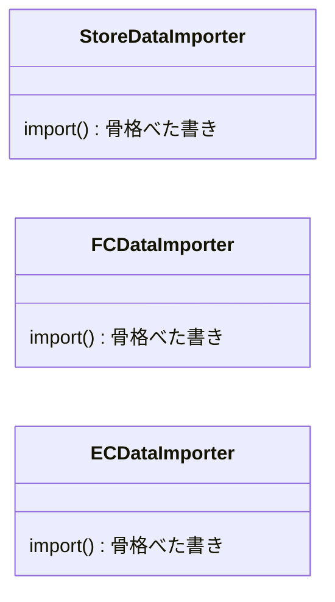

見立て（骨格は親に1つ、差分だけサブクラス）：

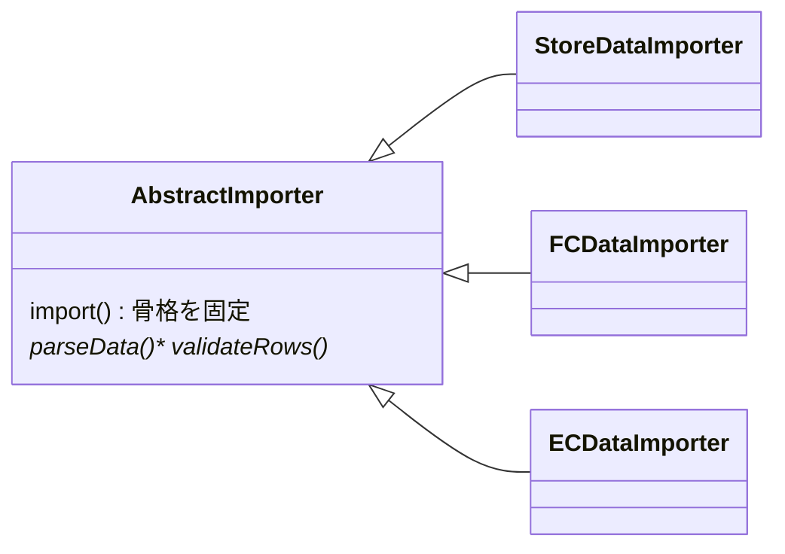

図から読み取ること：骨格の複製が消え、親クラスの `import()` 1か所に集約。サブクラスは差分フックだけを持つ。

### 6-4：影響範囲（この設計で変更要求を再度当てたら）

| 変更要求 | 修正する場所 | 再テスト範囲 |
|---|---|---|
| 形式を1つ追加（SNS経由など） | `AbstractImporter` を継承し、`parseData`/`validateRows` を実装したクラスを1つ追加 | 追加クラス単体。**骨格と既存形式は無変更** |
| 共通手順を変える（バージョンチェック追加など） | 親クラスの `import()` の1か所 | 骨格（全形式に一度で効く） |
| EC店だけの計算を足す | `afterParse` フックのみ | EC店 |

現状との差：現状は共通手順を変えるたびに全形式の `import()` を触る。対策後は親の1か所で済み、形式追加はサブクラスを1つ足すだけ。**この「触る範囲の差」がこの構造を採る理由**です。

### 採用する形を決める

各案には一長一短があります。どこで止めるかは、**「今後の変更頻度（ビジネス要求）」**で決断します。今回の課題は、共通手順を守りながら、店舗種別ごとのパース差分と検証差分だけを差し替えることです。

| 案 | 解けること | 残ること | 今回の判断 |
|---|---|---|---|
| 何もしない | 追加コストはない | 形式追加のたびに共通手順を複製しやすい | 新形式追加の予定と合わない |
| ユーティリティ化 | 重複した小処理を減らせる | 手順全体の順序は各クラスに残る | 最初の整理として有効 |
| 共通手順を親側へ集約 | 手順の順序を1か所で守れる | 差分ステップを定義する基底クラスが増える | 共通手順を守る課題に合うため採用する |

**今回の決断：** フェーズ2のヒアリングで、システム基盤担当から「次はSNS経由の販売データを取り込む予定」と明言されています。形式追加の見込みを重視し、今回は**骨格を親クラスの `import()` へ固定し、差分をフックへ委譲する形を採用する**決断を下します。処理の骨格を親クラスが定義し、変わるステップだけをサブクラスが差し替えます。

フェーズ6で採用する設計（骨格とフックの接続点・データ配置・構造・影響範囲）が決まりました。次のフェーズ7では、この決断を動く実装（`ImportFileGateway`・`SalesImportRepository`・`AbstractImporter` と各形式クラス・実行結果）に落とし込み、変更要求で効果を確認します。

## 🟢 フェーズ7：対策実施 ―― 変化に強いコードを完成させる
採用したステップ2の設計を、実際のコードに実装します。これまでは個別のクラスで重複していたファイル操作やDB保存の手順を、基底クラスにテンプレートとして集約します。

また、フェーズ3の追加要求で示した「全形式共通の形式バージョンチェック」を `checkFormatVersion()` として骨格に組み込みます。骨格が1か所（`AbstractImporter`）に集約されているため、この追加は基底クラスへの1回の修正で全形式に反映できます。

この設計変更により、新しいインポート形式を追加するときは、共通の手順を複製せずに、形式ごとのパース処理・行検証・必要に応じた後処理をサブクラスへ記述できます。共通手順そのものを変える場合は `AbstractImporter` を修正し、利用する形式を増やす場合は組み立て箇所へ登録します。

### 7-1：解決後のコード（全体）

新しい設計では、共通の手順を親クラスで定義し、形式ごとのパース処理、行検証、任意の後処理をサブクラスに委譲します。各役割ごとにコードを分けて確認します。

**スキーマ定義・ドメイン型・SchemaRegistryクラス：**

```cpp
#include <iostream>
#include <sstream>
#include <string>
#include <vector>
#include <map>
#include <queue>
#include <functional>
using namespace std;

// 1行を区切り文字で分割する小さなヘルパー
static vector<string> splitLine(const string& line, char delim) {
    vector<string> cols; string cur; istringstream iss(line);
    while (getline(iss, cur, delim)) cols.push_back(cur);
    return cols;
}

// ---- ドメインデータ型（void をやめ、実データを受け渡す）----
struct SalesRow { string id; string name; long amount; };
struct ParsedRow { SalesRow row; bool wellFormed; };
struct ValidationResult {
    vector<SalesRow> validRows;
    int skipped;
    vector<string> reasons;
};
struct ImportResult {
    string schemaType;
    string schemaName;
    int saved;
    int skipped;
    bool success;
};

// ---- スキーマ ----
struct ImportSchema { string name; vector<string> requiredColumns; };
class SchemaRegistry {
    map<string, ImportSchema> schemas;
public:
    SchemaRegistry() {
        schemas["store"] = {"直営店データ", {"id","name","amount"}};
        schemas["fc"]    = {"FC店データ",   {"id","name","amount"}};
        schemas["ec"]    = {"EC店データ",
            {"id","name","amount","memberRank","point"}};
    }
    bool exists(const string& t) const { return schemas.count(t) > 0; }
    ImportSchema get(const string& t) const { return schemas.at(t); }
};
```

`SchemaRegistry` は1-4の2種類（store / fc）に、変更要求のEC店（ec）が加わり、ecには会員ランク（memberRank）とポイント（point）の列が増えています。戻り値の型もすべて `void` をやめました。`import()` は `ImportResult`（種別・スキーマ名・保存件数・スキップ件数・成否）を返し、`parseData()` は `vector<ParsedRow>`、`validateRows()` は `ValidationResult` を返します。`ParsedRow`／`ValidationResult` は、パースと行検証の境界で受け渡す中間データです。

**ファイルI/OとDBの境界スタブ：**

```cpp
// ---- 境界スタブ：ファイルI/OとDB（本章の論点外を簡略化）----
// 実ファイルは使わず、メモリ上にサンプルCSVを保持する。実運用ではこの内側が
// 本物のファイルAPI・DB・オブジェクトストレージへ差し替わる（骨格は媒体を知らない）。
class ImportFileGateway {
    map<string, vector<string>> store;   // 論理パス -> 行データ（実ファイルの代わり）
public:
    void prepareSample(const string& path, const string& content) {
        vector<string> lines; string line; istringstream iss(content);
        while (getline(iss, line)) {
            if (!line.empty() && line.back() == '\r') line.pop_back();
            if (!line.empty()) lines.push_back(line);
        }
        store[path] = lines;
    }
    vector<string> open(const string& path) {
        cout << "ファイルをオープンしました。\n";
        return store.count(path) ? store[path] : vector<string>{};
    }
    void close() { cout << "ファイルをクローズしました。\n"; }
    string checkFormatVersion() {
        cout << "[全共通] 形式バージョンを確認しました。\n"; return "v1";
    }
};
class SalesImportRepository {
    long totalAmount = 0;
public:
    int save(const vector<SalesRow>& rows) {
        for (auto& r : rows) totalAmount += r.amount;
        cout << "DBへ" << rows.size() << "件を保存しました。\n";
        return (int)rows.size();
    }
    long savedAmount() const { return totalAmount; }
};
```

ファイルI/OとDBは本章の論点外なので、どちらも実物ではなくスタブにしています。`ImportFileGateway` は実ファイルを読み書きせず、`prepareSample()` でメモリ上にサンプルCSV（行の配列）を用意し、`open()` はそれを返すだけです。`SalesImportRepository.save()` も、受け取った `SalesRow` を件数として数えるだけのスタブです。重要なのは、骨格 `import()` が `gateway.open()` と `repo.save()` を呼ぶだけで**保存媒体の実体を知らない**点です。実運用でファイル・DB・オブジェクトストレージのどれになっても、差し替わるのはこの2つの境界クラスの内側だけで、骨格は変わりません（この点は本節の後半で改めて確認します）。

**AbstractImporterクラス（骨格の定義）：**

```cpp
// ---- 骨格を固定する基底クラス（テンプレートメソッド）----
class AbstractImporter {
    ImportFileGateway& gateway;
    SalesImportRepository& repo;
public:
    AbstractImporter(ImportFileGateway& g, SalesImportRepository& r)
        : gateway(g), repo(r) {}
    virtual ~AbstractImporter() = default;

    // テンプレートメソッド。戻り値は ImportResult（void をやめる）。
    ImportResult import() {
        vector<string> lines = gateway.open(filePath());    // (1) 開く
        gateway.checkFormatVersion();                       // (2) バージョン確認（全共通）
        vector<ParsedRow> parsed = parseData(lines);        // (3) 形式ごとのパース
        ValidationResult v = validateRows(parsed);          // (4) 形式ごとの行検証
        afterParse(v.validRows);                            // (5) 任意フック（EC店のみ）
        int saved = repo.save(v.validRows);                 // (6) 保存
        gateway.close();                                    // (7) 閉じる
        return { schemaType(), schemaName(), saved, v.skipped, true };
    }
protected:
    virtual string filePath() const = 0;
    virtual string schemaType() const = 0;
    virtual string schemaName() const = 0;
    virtual vector<ParsedRow> parseData(const vector<string>& lines) = 0;
    virtual ValidationResult validateRows(const vector<ParsedRow>& parsed) = 0;
    virtual void afterParse(const vector<SalesRow>&) {}     // 既定は何もしない任意フック
};

```

`import()` が処理の順序を一か所に集約し、各ステップの戻り値（読み込んだ行・パース結果・検証結果・保存件数）を次のステップへ受け渡します。全形式で必要な `parseData()`（`vector<ParsedRow>` を返す）と `validateRows()`（`ValidationResult` を返す）は純粋仮想関数とし、形式によって要否が異なるパース後処理は `afterParse()` という任意フックにしています。全体の流れが基底クラスで固定され、サブクラスは必要な手順（ステップ）の中身だけを埋めれば済みます。

**具体クラス（StoreDataImporter / FCDataImporter / ECDataImporter）：**

```cpp
// ---- 直営店（カンマ区切り・ヘッダーあり）----
class StoreDataImporter : public AbstractImporter {
public:
    using AbstractImporter::AbstractImporter;
protected:
    string filePath()   const override { return "store_sales.csv"; }
    string schemaType() const override { return "store"; }
    string schemaName() const override { return "直営店データ"; }
    vector<ParsedRow> parseData(const vector<string>& lines) override {
        cout << "[直営店] ヘッダー行をスキップし、カンマ区切りで解析します。\n";
        vector<ParsedRow> out;
        for (size_t i = 1; i < lines.size(); ++i) {          // 1行目=ヘッダー
            vector<string> c = splitLine(lines[i], ',');
            bool ok = (c.size() >= 3);
            SalesRow r = ok ? SalesRow{c[0], c[1], stol(c[2])} : SalesRow{};
            out.push_back({r, ok});
        }
        return out;
    }
    ValidationResult validateRows(const vector<ParsedRow>& parsed) override {
        ValidationResult v{{}, 0, {}};
        for (auto& p : parsed) {
            if (p.wellFormed) v.validRows.push_back(p.row);
            else { ++v.skipped; v.reasons.push_back("必須列不足"); }
        }
        cout << "[直営店] 必須列を検証しました（有効" << v.validRows.size()
             << "件 / スキップ" << v.skipped << "件）。\n";
        return v;
    }
};

// ---- FC店（タブ区切り・ヘッダーなし・不正行スキップ）----
class FCDataImporter : public AbstractImporter {
public:
    using AbstractImporter::AbstractImporter;
protected:
    string filePath()   const override { return "fc_sales.csv"; }
    string schemaType() const override { return "fc"; }
    string schemaName() const override { return "FC店データ"; }
    vector<ParsedRow> parseData(const vector<string>& lines) override {
        cout << "[FC店] 先頭行からタブ区切りで解析します。\n";
        vector<ParsedRow> out;
        for (size_t i = 0; i < lines.size(); ++i) {          // ヘッダーなし
            vector<string> c = splitLine(lines[i], '\t');
            bool ok = (c.size() >= 3);
            SalesRow r = ok ? SalesRow{c[0], c[1], stol(c[2])} : SalesRow{};
            out.push_back({r, ok});
        }
        return out;
    }
    ValidationResult validateRows(const vector<ParsedRow>& parsed) override {
        ValidationResult v{{}, 0, {}};
        for (auto& p : parsed) {
            if (p.wellFormed) v.validRows.push_back(p.row);
            else { ++v.skipped; v.reasons.push_back("タブ分割不可"); }
        }
        cout << "[FC店] 不正行を検証しました（有効" << v.validRows.size()
             << "件 / スキップ" << v.skipped << "件）。\n";
        return v;
    }
};

// ---- EC店（カンマ区切り・会員ランク/ポイント・後処理あり）----
class ECDataImporter : public AbstractImporter {
    long pointBonus = 0;
public:
    using AbstractImporter::AbstractImporter;
protected:
    string filePath()   const override { return "ec_sales.csv"; }
    string schemaType() const override { return "ec"; }
    string schemaName() const override { return "EC店データ"; }
    vector<ParsedRow> parseData(const vector<string>& lines) override {
        cout << "[EC店] カンマ区切りで会員ランク・ポイント列まで解析します。\n";
        vector<ParsedRow> out;
        for (size_t i = 1; i < lines.size(); ++i) {          // 1行目=ヘッダー
            vector<string> c = splitLine(lines[i], ',');
            // id,name,amount,rank,point
            bool ok = (c.size() >= 5);
            SalesRow r = ok ? SalesRow{c[0], c[1], stol(c[2])} : SalesRow{};
            out.push_back({r, ok});
        }
        return out;
    }
    ValidationResult validateRows(const vector<ParsedRow>& parsed) override {
        ValidationResult v{{}, 0, {}};
        for (auto& p : parsed) {
            if (p.wellFormed) v.validRows.push_back(p.row);
            else { ++v.skipped; v.reasons.push_back("EC必須列(ランク/ポイント)不足"); }
        }
        cout << "[EC店] 不正行を検証しました（有効" << v.validRows.size()
             << "件 / スキップ" << v.skipped << "件）。\n";
        return v;
    }
    void afterParse(const vector<SalesRow>& rows) override {
        for (auto& r : rows) pointBonus += r.amount / 100;   // ポイント付与量
        cout << "[EC店] ポイントボーナスを計算しました（" << rows.size()
             << "件・合計" << pointBonus << "pt）。\n";
    }
};

```

> **EC向け計算処理を任意フックにした理由：** 1-5節の仕様表では、EC向け計算は「パース完了後、行検証を終え、DB保存する前」に行う独立したステップです。そこで骨格にも `afterParse()` という位置を用意し、既定実装は何もしない形にしました。直営店・FC店はそのまま通過し、EC店だけが計算処理を追加します。仕様上の順序とコード上の順序が一致するため、後から別形式にも同様の後処理が必要になったとき、置き場所を判断しやすくなります。

各サブクラスは形式ごとの `parseData()` と `validateRows()` を実装し、必要な場合だけ `afterParse()` を追加します。ファイルの開閉、バージョンチェック、DB保存、結果記録へ進む順序は基底クラスが担当します。

**呼び出し側（非同期の夜間バッチ／同期の手動アップロード）：**

夜間バッチと手動アップロードは、同じ `import()` を呼びますが、実行の仕方が違います。夜間バッチは複数形式を**非同期**にまとめて流し、手動アップロードはその場で**同期**実行して即座に結果を返します。この同期/非同期の違いは呼び出し側に閉じており、テンプレートメソッド `import()` 自体は同期のままです。

ここで初めて使う `std::function<ImportResult()>` は、「引数なしで呼ぶと `ImportResult` を返す処理」を値として保持する型です。`std::queue` はその処理と表示ラベルを先入れ先出しで保持します。`submit()` は処理を実行せずキューへ積み、`runAll()` が先頭から取り出して呼びます。掲載コードは別スレッドを起動しないため、`[非同期]` は受付と実行を分けた構成を示すラベルであり、処理自体は決定的な順序で逐次実行されます。

```cpp
// ---- 非同期実行を模したスケジューラ ----
// 実運用ではワーカースレッドで並行実行するが、掲載コードでは決定的な出力のため逐次実行で代替する。
class ImportScheduler {
    queue<function<ImportResult()>> tasks;
    queue<string> labels;
public:
    void submit(const string& label, function<ImportResult()> task) {
        cout << "[非同期] " << label << " をキューへ投入しました。\n";
        tasks.push(move(task)); labels.push(label);
    }
    vector<ImportResult> awaitAll() {
        vector<ImportResult> results;
        while (!tasks.empty()) {
            cout << "[非同期] " << labels.front() << " の実行を開始します。\n";
            results.push_back(tasks.front()());
            tasks.pop(); labels.pop();
        }
        return results;
    }
};

// 夜間バッチ：複数形式を非同期に投入する
class BatchImportJob {
    ImportScheduler& scheduler;
public:
    explicit BatchImportJob(ImportScheduler& s) : scheduler(s) {}
    void enqueue(const string& label, AbstractImporter* importer) {
        scheduler.submit(label, [importer]{ return importer->import(); });
    }
};

// 手動アップロード：同期で即時実行し、結果をその場で返す
class ManualImportController {
public:
    ImportResult importNow(AbstractImporter* importer) {
        cout << "[同期] 手動アップロードを即時実行します。\n";
        return importer->import();
    }
};

```

`BatchImportJob` は `ImportScheduler` に処理を投入して後でまとめて待ち、`ManualImportController` はその場で `import()` を呼びます。どちらも受け取るのは `AbstractImporter*` だけで、「どの具体クラスか」を知りません。新しいインポート形式が増えても、どちらの呼び出し元も修正は不要です。`ImportScheduler` は実運用ではワーカースレッドで並行実行する部分ですが、掲載コードでは出力を決定的にするため逐次実行で代替しています（ファイルI/OやDBと同じく、本章の設計論点から外れる部分の簡略化です）。

**BatchApplicationクラス（組み立て）：**

```cpp
// ---- 依存関係の組み立てを担うクラス ----
class BatchApplication {
    SchemaRegistry registry;
    ImportFileGateway gateway;
    SalesImportRepository repo;
    ImportScheduler scheduler;
public:
    void run() {
        // 実ファイルではなく、メモリ上にサンプルCSVを用意する
        gateway.prepareSample("store_sales.csv", storeCsv());
        gateway.prepareSample("fc_sales.csv",    fcCsv());
        gateway.prepareSample("ec_sales.csv",    ecCsv());

        StoreDataImporter store(gateway, repo);
        FCDataImporter    fc(gateway, repo);
        ECDataImporter    ec(gateway, repo);

        // 夜間バッチ：直営店・FC店を非同期でまとめて処理
        cout << "==== 夜間バッチ（非同期） ====\n";
        BatchImportJob batch(scheduler);
        batch.enqueue("直営店", &store);
        batch.enqueue("FC店", &fc);
        vector<ImportResult> batchResults = scheduler.awaitAll();

        // 手動アップロード：EC店を同期で即時処理
        cout << "\n==== 手動アップロード（同期） ====\n";
        ManualImportController manual;
        ImportResult ecResult = manual.importNow(&ec);

        cout << "\n--- インポート結果ログ ---\n";
        for (auto& r : batchResults) printResult(r);
        printResult(ecResult);
        reportUnknown("online");   // 未登録タイプはエラーで中断
    }
private:
    void printResult(const ImportResult& r) {
        if (!registry.exists(r.schemaType)) return;
        cout << "[" << r.schemaType << "] " << r.schemaName
             << " 保存" << r.saved << "件 / スキップ" << r.skipped << "件 -> "
             << (r.success ? "成功" : "失敗") << "\n";
    }
    void reportUnknown(const string& type) {
        if (!registry.exists(type))
            cout << "[エラー] 未登録のインポートタイプ: " << type << " — 処理を中断します\n";
    }
    // サンプルCSVの中身（直営店=10件、FC店=5件、EC店=10件中2件不正）
    string storeCsv() {
        string s = "id,name,amount\n";
        for (int i = 1; i <= 10; ++i)
            s += "S00" + to_string(i) + ",商品" + to_string(i) + ",1000\n";
        return s;
    }
    string fcCsv() {
        string s;
        for (int i = 1; i <= 5; ++i)
            s += "F00" + to_string(i) + "\t商品" + to_string(i) + "\t2000\n";
        return s;
    }
    string ecCsv() {
        string s = "id,name,amount,rank,points\n";
        for (int i = 1; i <= 10; ++i) {
            if (i == 4 || i == 9)   // 2件は列不足（不正行）
                s += "E00" + to_string(i) + ",商品" + to_string(i) + ",3000\n";
            else
                s += "E00" + to_string(i) + ",商品"
                    + to_string(i) + ",3000,gold,50\n";
        }
        return s;
    }
};
```

`BatchApplication` は `SchemaRegistry` を保持し、結果を出力する前にタイプの存在確認を行います。夜間バッチは `BatchImportJob` 経由で直営店・FC店を非同期に投入してまとめて待ち、手動アップロードは `ManualImportController` 経由でEC店を同期実行します。未登録タイプ（"online"）は `exists()` が `false` を返すため、`reportUnknown()` がエラーメッセージを出力します。

**main関数：**

```cpp
int main() {
    BatchApplication app;
    app.run();
    return 0;
}
```

実行対象コード：7-1の解決後コード
対応する動作例：1-2の動作例テーブル、および変更要求後の代表ケース
確認したいこと：外部から見える結果を保ちながら、変更理由ごとの責任が分離されていること。夜間バッチ（非同期）と手動アップロード（同期）が同じ `import()` を使えること

**実行結果：**

```text
==== 夜間バッチ（非同期） ====
[非同期] 直営店 をキューへ投入しました。
[非同期] FC店 をキューへ投入しました。
[非同期] 直営店 の実行を開始します。
ファイルをオープンしました。
[全共通] 形式バージョンを確認しました。
[直営店] ヘッダー行をスキップし、カンマ区切りで解析します。
[直営店] 必須列を検証しました（有効10件 / スキップ0件）。
DBへ10件を保存しました。
ファイルをクローズしました。
[非同期] FC店 の実行を開始します。
ファイルをオープンしました。
[全共通] 形式バージョンを確認しました。
[FC店] 先頭行からタブ区切りで解析します。
[FC店] 不正行を検証しました（有効5件 / スキップ0件）。
DBへ5件を保存しました。
ファイルをクローズしました。

==== 手動アップロード（同期） ====
[同期] 手動アップロードを即時実行します。
ファイルをオープンしました。
[全共通] 形式バージョンを確認しました。
[EC店] カンマ区切りで会員ランク・ポイント列まで解析します。
[EC店] 不正行を検証しました（有効8件 / スキップ2件）。
[EC店] ポイントボーナスを計算しました（8件・合計240pt）。
DBへ8件を保存しました。
ファイルをクローズしました。

--- インポート結果ログ ---
[store] 直営店データ 保存10件 / スキップ0件 -> 成功
[fc] FC店データ 保存5件 / スキップ0件 -> 成功
[ec] EC店データ 保存8件 / スキップ2件 -> 成功
[エラー] 未登録のインポートタイプ: online — 処理を中断します
```

フェーズ2で予告された共通の「バージョンチェック」は基底クラスへ1回追加し、形式ごとの行検証は `validateRows()` へ置き、EC店だけの計算処理は `afterParse()` へ置きました。変更理由の異なる処理が、それぞれ対応する場所へ分かれています。夜間バッチは直営店・FC店を**非同期**にまとめて流し、手動アップロードはEC店を**同期**で即時実行していますが、どちらも同じ `import()` を呼ぶだけで、骨格の順序は変わりません。未登録タイプ（"online"）は `SchemaRegistry.exists()` で検出し、結果出力の際にエラーを出力します。

このコードは `BatchApplication` が実行時にメモリ上へ `store_sales.csv`・`fc_sales.csv`・`ec_sales.csv` 相当のサンプルCSVを用意し（ディスクにファイルは作りません）、それを `gateway.open()` で読み込んで件数を数えます。上の実行結果の「10件」「5件」「2件スキップ」「240pt」は、この用意したCSVの実データから算出した値で、`storeCsv()`／`fcCsv()`／`ecCsv()` の中身を書き換えれば結果もその場で変わります。空ファイル・大量データなど全仕様を網羅するコードではないため、それらは実際のデータを使うテストで確認します。

`main()` はキックするだけで、具体クラスの知識・同期/非同期の使い分け・`SchemaRegistry` の参照は `BatchApplication` に閉じています。

**補足：保存媒体が変わったら？（骨格とゲートウェイの境界）**

「開く・保存する・閉じる」を骨格に固定した、と言うと「では入力がファイルでなくDBやオブジェクトストレージになったら骨格ごと壊れるのでは」という疑問が出ます。ここは分けて考えます。

- **保存媒体の変更（ファイル→DB→S3など）は、骨格を壊しません。** 骨格 `import()` は `gateway.open()` と `repo.save()` を呼ぶだけで、媒体の実体を知りません。媒体が変わっても差し替わるのは `ImportFileGateway`／`SalesImportRepository` の内側だけで、`import()` の順序も各Importerのパース処理も変わりません。つまり「媒体」はこの2つの境界クラスに閉じ込めた**変化軸**であり、骨格側では安定して見えます。
- **壊れるのは「手順の順序そのもの」が変わるときです。** たとえば「開く前に一部を保存する」「開かずにストリームから逐次読みながら保存する」のように順序が別物になる形式が来た場合、`open→…→close` という骨格の前提が合わなくなります。これはこの章の設計の限界で、パターン解説の「使いどころと限界」で扱います。

言い換えると、この章で「変わってほしくない」と置いたのは**手順の順序**であって、**保存媒体**ではありません。保存媒体は最初からゲートウェイの裏に隔離してある、というのが7-1の構造です。

#### 解決後のクラス構成

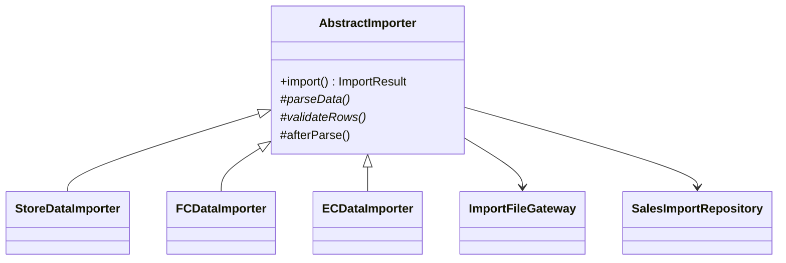

章末のTemplate Method骨格図では `AbstractImporter.import()` が共通の骨格、3つのImporterが個別ステップを実装する具象クラスに対応します。ファイル取得とDB保存は骨格へ直書きせず、それぞれの外部境界へ委譲します。

### 7-2：動作シーケンス図

ステップ2で到達した骨格固定構造の実行時のやり取りを可視化します。夜間バッチ（非同期）と手動アップロード（同期）が、同じ `import()` を別々の呼び出し方で使う様子と、`import()` が骨格の順序どおりに各ステップの戻り値を受け渡して `ImportResult` を返す流れが確認できます。

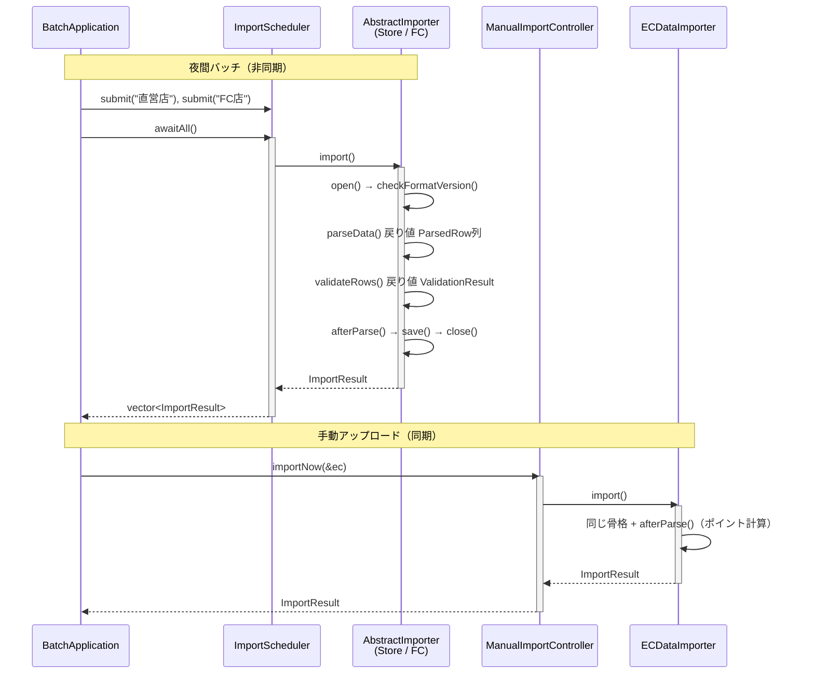

夜間バッチは `ImportScheduler` に処理を投入して非同期にまとめて待ち、手動アップロードは `ManualImportController` が同期で即時実行します。呼び出し方は違っても、どちらも `AbstractImporter*` 経由で同じ `import()` を呼ぶだけで、`import()` の中では共通処理を基底クラスが実行し、`parseData()`／`validateRows()`／必要に応じた `afterParse()` だけがサブクラスの実装へ切り替わります。各ステップの戻り値が次のステップへ渡り、最後に `ImportResult` が呼び出し元へ返ります。これが骨格固定構造の動きです。

### 7-3：変更影響グラフ（改善後）

フェーズ3で確認した「形式バージョンチェック追加」のシナリオを再度適用します。

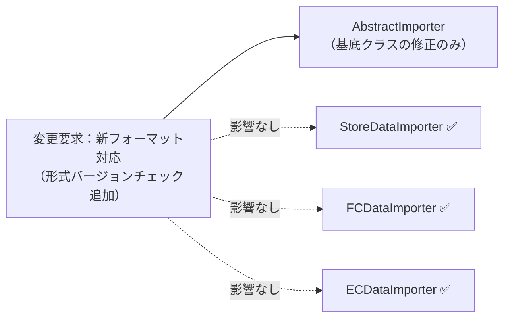

→ **フェーズ3の変更影響グラフと比較して、形式バージョンチェックの追加という変更要求が、基底クラスである `AbstractImporter` 一箇所に集約されました**。

### 7-4：変更シナリオ表

フェーズ1の現状コードと改善後コードで、変更要求への影響がどう変わるかを対比します。

| **シナリオ** | **フェーズ1の現状コードでの影響** | **この設計での影響** |
|---|---|---|
| EC形式とEC固有の計算を追加 | 既存Importerを参考に取得・解析・検証・保存を複製し、EC計算を差し込む | `ECDataImporter`、`SchemaRegistry` の定義、サンプル入力と組み立てを追加。骨格は保つ |
| 全形式へ形式バージョン確認を追加 | StoreDataImporter・FCDataImporter・ECDataImporter 全クラスへ同じ手順を追加 | `AbstractImporter::import()` の `checkFormatVersion()` 呼び出しを1か所に置く |
| 新しいファイル形式（XML等）を追加 | 全クラスを参考に新しいクラスをゼロから作成 | `AbstractImporter` の新サブクラス、スキーマ定義、入力と組み立てを追加 |
| 特定形式の変換ロジックを変更 | 対象クラスを直接修正（他との差分が不明確） | 対象のサブクラスのみ修正 |
| 行単位検証のルールを形式ごとに変える | 各 `import()` の保存前処理を探して修正 | 対象サブクラスの `validateRows()` を修正 |
| 取込結果にスキップ件数を追加 | 各クラスの出力処理を個別に修正 | 骨格の結果記録に項目を追加し、形式別件数はサブクラスから渡す |

共通の手順を基底クラスに集約したことで、共通ステップの変更先を予測しやすくなりました。代わりに、サブクラスは基底クラスが定めた順序とフックの位置に従う必要があり、基底クラスの変更が全サブクラスへ意味的な影響を与える可能性があります。継承関係や、フックの増加を管理するコストを引き受けます。

---

## 整理

### 問題・原因・課題・解決策

| | 内容 |
|---|---|
| **問題** | インポート形式や行単位検証が増えるたびに共通手順を重複して書かなければならず、想定される追加頻度ではコストが合わない |
| **原因** | 骨格（システム基盤担当が管理）とパース/行検証ルール（業務担当者が管理）が各クラスの `import()` に混在しており、骨格への変更が全インポートクラスに波及する |
| **課題** | 共通の呼び出し順序と形式ごとの `parseData()` / `validateRows()` を切り離し、骨格を1か所に集約する |
| **解決策** | 骨格固定構造：`AbstractImporter` に骨格を固定し、必須の `parseData()` / `validateRows()` と任意の `afterParse()` をサブクラスへ委ねる |

### フェーズとこの章でやったこと

この章では、手順の骨格は同じなのに詳細が異なる複数のクラスが乱立し、変更が全クラスに飛び火していた現状を学びました。7フェーズの思考プロセスを適用して、どのように構造を改善したのかを振り返ります。

| **フェーズ** | **この章でやったこと** |
| --- | --- |
| 🔵 フェーズ1：現状把握 | 複数のインポートクラスでファイル操作手順が重複して記述されている現状を観察しました。変更要求（EC店追加）を把握しました |
| 🟣 フェーズ2：仮説立案 | 業務機能の所在表で各行の変わる理由を確認しました。インポートの「手順」は当面安定と見て、「パースルール」は形式ごとに変わるという仮説を立て、ヒアリングで裏付けました |
| 🟣 フェーズ3：問題特定 | 新しいインポート形式を追加しようとした際に、全クラスで同じ修正が必要になる「痛み」を確認しました |
| 🟠 フェーズ4：原因分析 | 共通の「骨格（手順）」と固有の「詳細（ロジック）」が混在していることが、変更影響を拡大させる根本原因だと突き止めました |
| 🟡 フェーズ5：課題定義 | 共通の処理順序と形式ごとの `parseData()` / `validateRows()` の境界を定め、手順の重複を増やさない課題を定めた |
| 🔴 フェーズ6：対策検討 | ステップ1〜2を比較し、共通手順を基底クラスにテンプレート化して分離するステップ2を採用しました |
| 🟢 フェーズ7：対策実施 | 共通の手順を基底クラスに集約し、固有ロジックだけをサブクラスで実装する構造へ移行しました |

### 責任の移動

| **責任** | **変更前** | **変更後** |
| --- | --- | --- |
| CSVインポートの共通手順（骨格）の管理 | `StoreDataImporter` / `FCDataImporter`（各クラスに重複して直書き） | `AbstractImporter` |
| 店舗固有のパース・行検証・後処理の実装 | `StoreDataImporter` / `FCDataImporter`（骨格と混在） | 各サブクラスの `parseData()` / `validateRows()` と、必要な場合だけ `afterParse()` |
| 取込結果を返す順序 | 各Importerの出力処理に分散 | `AbstractImporter` から保存後の結果記録へ進む流れ |

### 複雑度ストレス検証

| 追加した複雑さ | 見えた原因 | 定めた課題 | 採用した扱い |
|---|---|---|---|
| ファイル取得→解析→検証→保存の順次処理 | 順序が各Importerに複製されるため、共通ステップ追加が全クラスへ波及する | 骨格の呼び出し順序を1か所に集約する | `AbstractImporter::import()` に順序を固定する |
| 行単位エラー | 検証位置は共通なのに、何を不正とするかは形式ごとに異なる | 保存前に検証する位置を固定し、検証内容だけを差し替える | `validateRows()` を必須差分としてサブクラスへ委ねる |
| 取込結果 | 成功件数・スキップ件数の作り方が各形式に散る | 呼び出し元へ返す結果の流れを骨格側でそろえる | 保存後に結果記録へ進む共通の流れを維持する |

> このプロセスを回した結果にたどり着いた構造こそが 骨格固定構造です。

---

## 振り返り

### 「この章を読むと得られること」は手に入ったか

| **得られること** | **この章のどこで示したか** |
| --- | --- |
| 1. 変動箇所の識別 | フェーズ2の業務機能の所在表と変わる理由の分析で、守りたい骨格と形式ごとに変わるパースを区別しました |
| 2. 痛みの発生源の判断 | フェーズ4で、共通手順が各Importerへ重複し、形式ごとの差分と同じ場所で管理されていることを変更シナリオから特定しました |
| 3. 構造改善の説明 | フェーズ7の変更シナリオ表で、修正が基底クラスに局所化されたことを実証しました |
| 4. いつ使うかの判断 | フェーズ6の「採用する形を決める」で判断基準を示しました |

### 3つの設計原則はどう適用されたか

**原則1「変わるものをカプセル化せよ」の現れ**

- 具体化された場所：各サブクラス（`StoreDataImporter` など）
- 解説：頻繁に変わる「パース・行検証・加工ルール」をサブクラスへとカプセル化しました。これにより、基底クラスの手順は変更の影響を受けずに安定しました。

**原則2「実装ではなくインターフェースに対してプログラムせよ」の現れ**

- 具体化された場所：`AbstractImporter` の抽象メソッド `parseData()` / `validateRows()`
- 解説：基底クラスの手順は、具体的なパース実装ではなく抽象化されたインターフェース（抽象メソッド）に対して動作します。

**原則3「継承よりコンポジションを優先せよ」の現れ**

- 具体化された場所：テンプレートメソッドによる継承階層
- 解説：本章では「手順の共通化」のために継承を用いましたが、これは変更理由が手順の骨格にある場合に限定した適用です。パースルールの差し替えが目的ならルール差し替え構造（コンポジション）が候補になります。

---

## あなたのコードで考えてみてください

この章で辿った思考プロセスを、あなた自身のコードに当てはめてみましょう。手順は「① 重複を探す → ② 変更理由を数える → ③ 骨格を1か所に書いた場合の修正範囲を見積もる」の3ステップです。

1. **変動の兆候を探す：** あなたのコードに「前処理→本処理→後処理」という同じ流れで、本処理だけが異なる処理が複数ありますか（コピー＆ペーストの痕跡が残っている箇所）？
2. **変える理由を問う：** 共通の「前処理」や「後処理」に変更が入ったとき、何箇所を修正しましたか？1箇所で済みましたか？
3. **骨格の重複を測る：** 似たような処理が複数あるとき、「どれが最新の正しいバージョンか」を判断するのに時間がかかったことはありますか？
4. **共通化した後を想像する：** もし骨格を1箇所に集約したとすると、「前処理のバグ修正」は何ファイルへの変更で完結しますか？

---

**題材を置き換えるときの共通手順**

この章の題材名を、自分の現場のシステム名に置き換えて考えます。

1. そのシステムは、誰が何を達成するために使うものか。
2. 入力、加工、出力は何か。
3. 最近入った変更要求、または次に来そうな変更要求は何か。
4. その変更で、触りたくない場所まで修正や再テストが広がるか。
5. 変えたいものと守りたいものを分けると、接続点には何を残すべきか。
6. 何もしない、関数化、クラス分離、契約導入、登録/組み立て移動のうち、どこまで進めるのが今回の文脈に合うか。

## パターン解説：Template Method パターン

### パターンの骨格

Template Methodパターンは、アルゴリズムの構造を定義し、具体的な実装をサブクラスに遅延させるパターンです。基底クラスにメソッドの処理手順（テンプレートメソッド）を記述し、一部のステップを抽象メソッドとしてサブクラスに実装させます。


### 抽象骨格の実行シーケンス

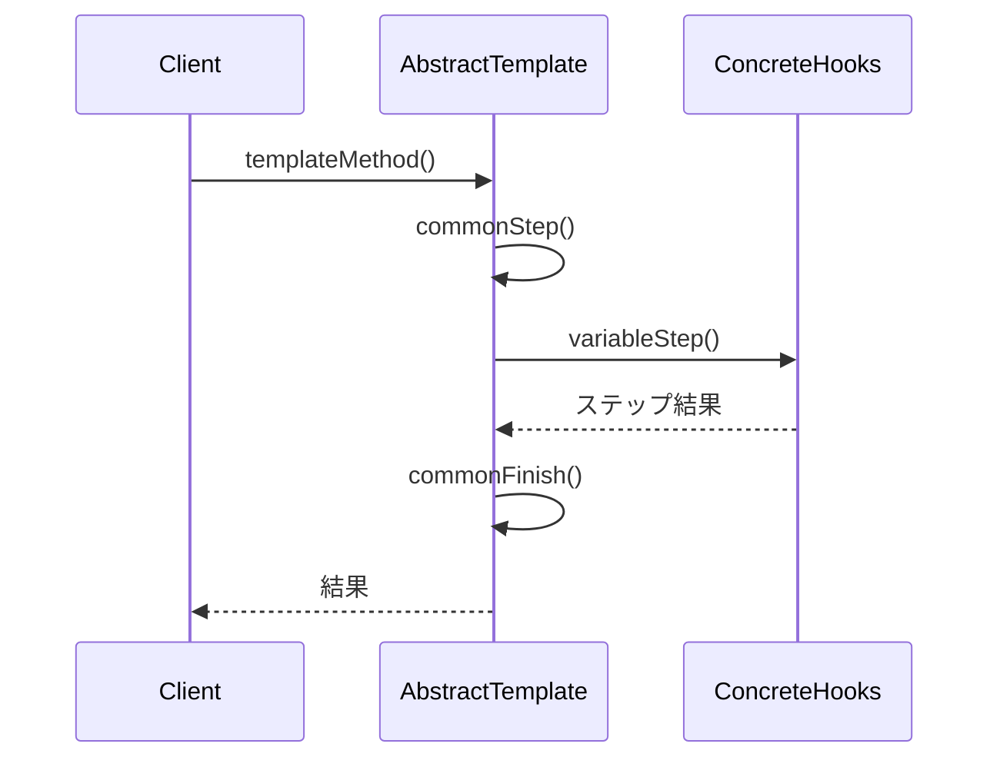

処理順序は基底クラスが固定し、変わるステップだけを具象クラスへ問い合わせます。

### この章の実装との対応

GoF（Gang of Four）とは、1994年に出版された書籍『Design Patterns』の4人の著者の総称です。彼らが整理した23のパターンは、現在も設計の共通言語として広く使われています。

| GoFの名前 | この章での対応 |
|---|---|
| AbstractClass | `AbstractImporter` |
| templateMethod | `import()` |
| primitiveOperation / hook | `parseData()` / `validateRows()` / `afterParse()` |
| ConcreteClass | `StoreDataImporter` / `FCDataImporter` / `ECDataImporter` |

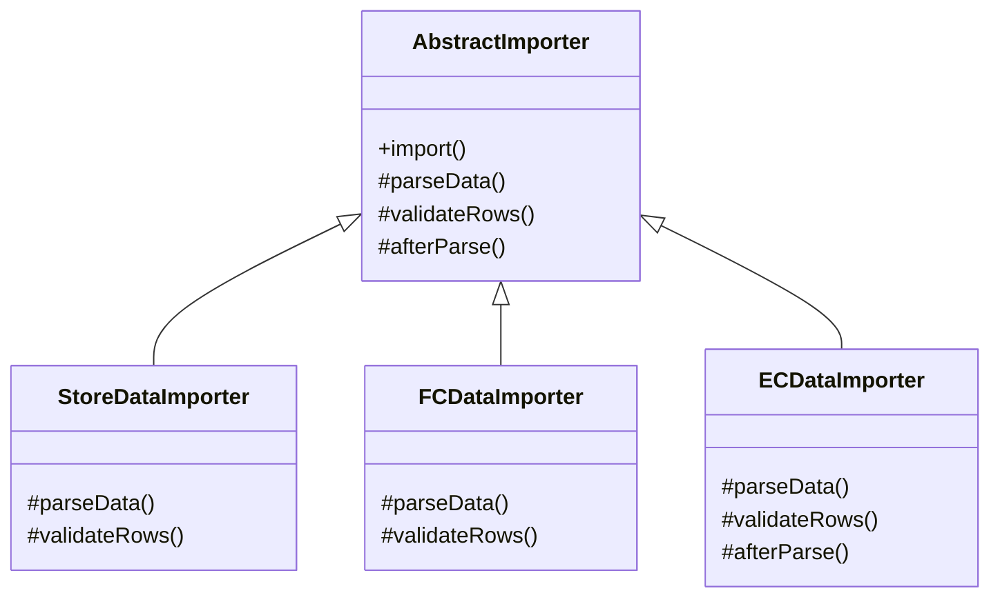

`AbstractImporter` が骨格となる手順を所有し、`StoreDataImporter` などのサブクラスがその詳細を埋めています。

### 使いどころと限界

Template Methodパターンは「手順の骨格」を再利用するのに強力ですが、使いどころを間違えると「硬直した設計」を生み出します。実務で導入を迷いやすい場面と、その判断基準を整理します。

**1. 手順の一部が「不要なクラス」が現れた場合**
たとえば「ファイルを開かずに、ネットワークから直接読み込む新しいインポート形式」が追加されたとします。このとき、既存の骨格（`openFile()`）が邪魔になります。
このような場合は、無理に既存のTemplate Methodに押し込めず、**新しい骨格クラスを作るか、手順の再利用（継承）自体を諦めてコンポジション（オブジェクトを内部に保持して利用する仕組み）に切り替える**のが一つの考え方です。

**2. 差し替えるステップ（フック）が多すぎる場合**
基底クラスに `parseHeader()`, `parseBody()`, `parseFooter()`, `validateData()` など、サブクラスが実装しなければならないメソッドが5個も6個もある場合、サブクラスの実装負担が大きすぎます。
この場合は、骨格の粒度が細かすぎるサインです。いくつかのステップをまとめて大きなステップにするか、**Strategyパターンなどの別の設計**への移行を検討してみてはいかがでしょうか。

**3. 途中で失敗したときに後始末が必要な場合**
ファイル、DBトランザクション、ロックなどを扱う処理では、処理の途中でエラー（例外等）が発生しても確実にクローズ処理などの後始末（資源解放）が行われる必要があります。
テンプレートメソッド側で複雑なエラーハンドリングを行うよりは、C++のRAII（資源の生存期間をオブジェクトの寿命で管理する仕組み）を活用し、ファイルやDB接続を自動解放するオブジェクトとして保持することが推奨されます。「正常系の順序を共通化しただけ」で例外発生時にリソースリークを起こさないよう、資源管理の設計と組み合わせて適用することが重要です。

| **迷う状況** | **設計の判断基準** |
| --- | --- |
| 手順の一部を使わないサブクラスが出た | 既存の骨格への追加を諦め、骨格クラスを分ける |
| 実装が必要なステップ数が多すぎる | 骨格の粒度を見直すか、Strategyパターンへ移行する |
| 将来、手順の順序自体が変わる可能性がある | Template Methodの導入を見送り、コンポジション（保持・委譲）を使う |
| 途中失敗時に資源解放やロールバックが必要 | RAII（資源の寿命管理オブジェクト）と組み合わせる |

**Template Methodパターン 適用判断フロー：**

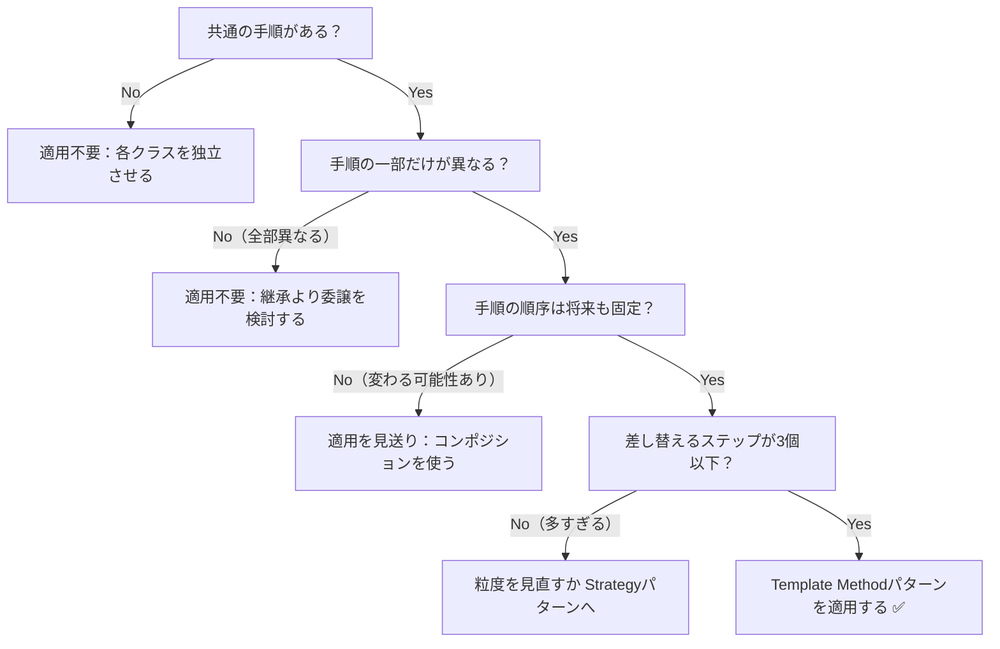

### この章のまとめ

CSVインポートというドメインと Template Methodパターンの関係を一言で言うなら、「手順の骨格」と「フォーマット別の処理」は変わる理由が違う、ということです。「開く→読む→変換する→保存する→閉じる」という骨格はどのフォーマットでも共通ですが、変換ロジックはフォーマットごとに担当者も変更頻度も異なります。その2つが `import()` の中に同居していた限り、新しいCSV形式が来るたびに骨格まで手を入れる必要が生じていました。

7つのフェーズを通じて、読者は処理の骨格を観察するところから始まり、「どの業務機能によって変わるか」の分析を経て、骨格を抽象クラスに固定し差分だけをサブクラスへ委ねるという判断へと進みました。フェーズ2のヒアリングで「フォーマットは今後も増える」と確認した時点で分離の理由が確定し、フェーズ4で接続点を特定した時点で骨格と差分の境界線が引かれる——その積み上げの中に、パターン名の背後にある判断の論理があります。「骨格が共通かどうか」という問いが、この章のすべての起点でした。

あなたのコードの中にも、同じ処理フローの中に複数の担当者の知識が混在している箇所があるはずです。「この手順は全ケースで共通か、それとも各ケースで変わるか」を問うことが、Template Methodを使う理由を見つける入口になります。
