## 第4章 処理の骨格を固定する ―― Template Method パターン

―― 思考の型：手順の骨格は同じなのに、詳細部分が異なる処理が複数存在している

### この章の核心

**インポート手順の守りたい骨格と、ファイル形式ごとに異なるパース詳細が同じ場所に混在しているとき、形式が増えるたびに手順全体まで修正が必要になる。こういう問題は、「処理順序」と「各ステップの具体処理」が同じ場所に混在しているシステムで起きている。**

### この章を読むと得られること

この章のテーマは「同じ手順なのに、ファイル形式ごとにほぼ同じコードをコピーしている」という問題です。

* **得られること1：** 「共通の手順」という観点で、コード内の処理の骨格を識別できるようになる


* **得られること2：** 処理の詳細がハードコードされている箇所を見て、そこが変更の痛みの発生源だと判断できるようになる


* **得られること3：** 骨格となる手順を抽出し、詳細をサブクラスに委譲することで、変更を局所化できることを説明できるようになる


* **得られること4：** 「共通部分」と「異なる部分」を見極め、どのような場合にこの構造を選ぶべきかを判断できるようになる

## 🔵 フェーズ1：現状把握 ―― 仕様を整理し、システムと紐付ける
この章では、CSVインポート処理の現状仕様から確認します。

CSVインポート処理が何を入力として受け取り、どの処理で加工し、何を出力するのかを整理します。

### 1-1：このシステムの仕様

このシステムは、各店舗のPOSレジから出力される売上データをCSVファイルとして受け取り、DBへ**インポート**します。

#### まず実行結果から動きをつかむ

詳細な仕様やコードへ入る前に、運用者が直営店の売上CSV（必須3列・10件）をインポートした結果を見ます。

**代表的な実行結果：**

```
直営店CSVを開く
カンマ区切りで10件を読み込む
10件をDBへ追加
ファイルを閉じる
直営店データ インポート成功: 10件追加
```

この出力から、①取り込むCSVの種類とデータを入力し、②開く→解析→検証→保存→閉じるの順に進み、③追加件数が表示される、という一連の動きが読み取れます。これを押さえてから、以降の要求・仕様・コードを読み進めます。

**この結果を生む入力（1-4の`main()`から抜粋）：**

```cpp
// 直営店フォーマット（必須3列・10件）のCSVを取り込む
StoreDataImporter storeNormal(SampleFileStore::get("store-normal"));
storeNormal.import(); // 開く→解析→検証→保存→閉じる（取込結果を件数で返す）
```

同じ入力を含む完全なコードと実行結果は1-4に掲載します。

#### 最初にシステム全体をつかむ

- **入力：** 取込対象のファイルキーと店舗形式を受け取り、対応するCSV行を読み出す。
- **処理：** 形式を確認し、ファイルを開く、行を解析・検証する、正常行を保存する、ファイルを閉じる、という順序で処理する。
- **出力：** 成功件数、スキップ件数、失敗理由を返し、不正行は保存しない。
- **掲載コードでの代替：** 実ファイルはメモリ上の文字列配列、DB保存はインメモリの境界スタブで表す。CSVの解析、検証、件数集計は実際の入力行から行う。

まずこの一連の動きを押さえ、以降で要求、形式別データ、処理順、クラス、コードの順に詳細を確認します。

#### 現行要求ベースライン

| 要求ID | 現行要求 | 受入条件 |
|---|---|---|
| 要求ID1 | 直営店とFC店の2形式を取り込む | 登録された各形式を選択して処理できる |
| 要求ID2 | ファイルを開く→解析する→保存する→閉じる順を守る | 正常時も失敗時も開いたファイルを閉じる |
| 要求ID3 | 形式ごとの区切り・列定義で解析する | 直営店とFC店の各入力を正しい売上データへ変換する |
| 要求ID4 | 不正行を保存せず、成功・スキップ件数と失敗理由を返す | 正常行だけ保存され、ImportResultに件数が残る |

本章の追跡は**要求IDと変更ID**で行います（利用者・運用者から見た「まとまった働き」を束ねる機能IDは設けません）。変更で各要求IDの内容がどう変わるか——継続・変更・追加——は、1-5「変更後要求ベースライン」の「変更種別・根拠となる変更ID」列で追えます。既存動作が落ちていないかは、フェーズ7の要求ID別回帰で確認します。

インポート処理は以下の4ステップで構成されており、どの店舗形態でもこの大きな流れは変わりません。この章のシステムでは、「開く→変換する→保存する→閉じる」という順序を処理の骨格として固定しています。順序を固定するのは、開く前に保存しようとしたり、閉じた後に読もうとしたりするバグを防ぐためです。

この章で扱う現状仕様は、次の範囲です。

| 仕様項目 | この章で扱う値 | 具体例 | 何に使うか |
|---|---|---|---|
| CSVファイル | 店舗売上データ | id,name,amount の行 | 店舗形態ごとのパース対象になる |
| 店舗形態 | 直営店・FC店 | 直営店データ、FC店データ | どのパース規則を使うかを決める |
| 共通手順 | 開く・変換する・保存する・閉じる | open → parse → save → close | どの形式でも守る処理順序として扱う |
| 出力 | DB保存結果 | 直営店データ保存完了 | 変換できた売上データが保存されたことを確認する |

ここで確認する対象は、どの手順が共通で、どこが店舗形態ごとに変わるかです。

**登録済みのインポートスキーマ**

取込形式は、次の2種類があらかじめ登録されています。各形式は必須カラムを持ち、登録されていないタイプ（例：`"online"`）を指定するとエラーになります。

| タイプ | スキーマ名 | 必須カラム |
|---|---|---|
| store | 直営店データ | id, name, amount |
| fc | FC店データ | id, name, amount |

フォーマット差分は、実際に入力されるデータの形を見ると追いやすくなります。

| 店舗形態 | 入力データ例 | 正常系で行う加工 |
|---|---|---|
| 直営店 | `商品ID,商品名,金額` というヘッダー行のあとに `1001,シャツ,3000` が続く | 1行目をヘッダーとしてスキップし、カンマで分割して売上データへ変換する |
| FC店 | `2001 バッグ 5200` のようなタブ区切り行が先頭から続く | タブで分割できる行だけを売上データへ変換する |

まず、店舗、売上CSVインポート、入力ファイル、売上DBの境界を確認します。

**システム全体図：売上CSVインポートの境界**

最も大きな境界は「運用担当者・店舗POS → 売上CSVインポートシステム」です。入力ファイル、形式定義、保存先は対象システムの内側にまとめます。

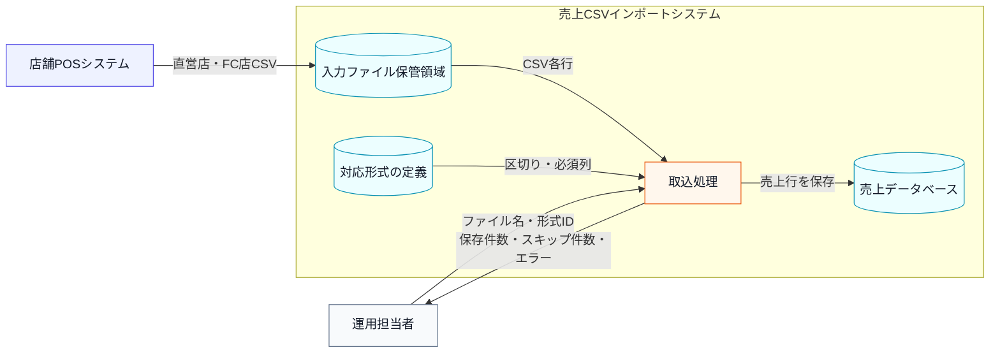
```mermaid
flowchart LR
    U["運用担当者"] -->|"ファイル名・形式ID"| S
    P["店舗POSシステム"] -->|"直営店・FC店CSV"| F

    subgraph IMPORT["売上CSVインポートシステム"]
        S["取込処理"]
        F[("入力ファイル保管領域")]
        C[("対応形式の定義")]
        D[("売上データベース")]
        F -->|"CSV各行"| S
        C -->|"区切り・必須列"| S
        S -->|"売上行を保存"| D
    end

    S -->|"保存件数・スキップ件数・エラー"| U

    classDef actor fill:#f8fafc,stroke:#64748b,color:#111827;
    classDef system fill:#fff7ed,stroke:#ea580c,color:#111827;
    classDef data fill:#ecfeff,stroke:#0891b2,color:#111827;
    classDef boundary fill:#eef2ff,stroke:#4f46e5,color:#111827;
    class U actor;
    class S system;
    class F,C,D data;
    class P boundary;
```

この図では、インポートシステムを一つの箱として見て、CSVの取得元、形式定義、売上DB、運用担当者への結果を示しています。

次に箱の中を開き、正常に取り込める場合の入力・判定・加工・出力を整理します。フォーマット種別は文字列IDで指定し、`store` は「カンマ区切り・ヘッダーあり」、`fc` は「タブ区切り・ヘッダーなし」を表します。未登録の `online` などが入力された場合は、ファイルを解析せず形式エラーにします。

**システム内部図：正常系の入力・判定・加工・出力**

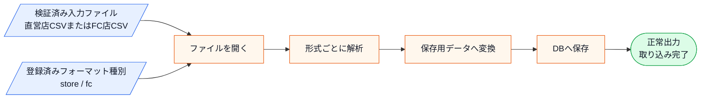
```mermaid
flowchart LR
    A[/検証済み入力ファイル<br>直営店CSVまたはFC店CSV/]:::input --> E[ファイルを開く]:::process
    C[/登録済みフォーマット種別<br>store / fc/]:::input --> E
    E --> F[形式ごとに解析]:::process
    F --> G[保存用データへ変換]:::process
    G --> S[DBへ保存]:::process
    S --> H([正常出力<br>取り込み完了]):::normal

    classDef input fill:#e7f0ff,stroke:#2563eb,color:#111827;
    classDef process fill:#fff7ed,stroke:#ea580c,color:#111827;
    classDef decision fill:#fef9c3,stroke:#ca8a04,color:#111827;
    classDef normal fill:#dcfce7,stroke:#16a34a,color:#111827;
```

この図から読み取ることは、次の3点です。

- 入力ファイルを開き、対応形式を確認してから、形式ごとの解析に進む。
- 共通手順の開始、形式ごとの解析、保存用データへの変換は順番に依存している。
- 正常系では、保存用データへ変換したあとDB保存まで行い、取り込み完了を返す。

このシステムは、**システム基盤担当**と**業務担当者**の2つの立場で保守されています。システム基盤担当はファイルの開閉やDBへの保存といったインフラ寄りの処理を、業務担当者は店舗形態ごとのデータパースルールや計算ロジックを管理します。どの立場が何を管理するかは、後のフェーズで「変わる理由がどの業務機能によるか」を確認する際に使います。

**インポートの処理手順**

| ステップ | 処理内容 | 店舗形態による違い | 業務機能 |
|---|---|---|---|
| ① ファイルオープン | CSVファイルを読み込み可能な状態にする | 全形式で共通 | インフラ・システム管理 |
| ② データパース | フォーマットに従いCSV行を内部データに変換する | 形式ごとに異なる | 業務ルール管理 |
| ③ DB保存 | 変換済みデータをDBに登録する | 全形式で共通 | インフラ・システム管理 |
| ④ ファイルクローズ | ファイルリソースを解放する | 全形式で共通 | インフラ・システム管理 |

「②データパース」だけが「形式ごとに異なる」となっているのは、店舗ごとにPOSレジのメーカーや設定が違うためです。直営店とFC店では、もともと別々のレジシステムを導入していた経緯があり、出力されるCSVのフォーマットを統一することが難しい状況にあります。「①③④」が全形式で共通なのは、ファイルの開閉やDBの接続手順はフォーマットの違いに関係なく同じ手順で済むからです。

次の表は、現在このシステムが対応している2種類のフォーマットの違いをまとめたものです。区切り文字やヘッダー行の有無は、POSレジが出力する仕様の差であり、このシステムが独自に決めたルールではありません。

**現在対応しているフォーマット**

| 店舗形態 | 区切り文字 | ヘッダー行 | 不正行の扱い |
|---|---|---|---|
| 直営店 | カンマ区切り | あり（スキップ） | スキップして続行するが件数は報告しない |
| FC店 | タブ区切り | なし | スキップして続行 |

フォーマット差分は、実際に入力されるデータ例で比較すると分かりやすくなります。

**直営店CSVの例（カンマ区切り・ヘッダー行あり）**

```csv
商品ID,商品名,金額
1001,シャツ,3000
1002,パンツ,4500
```

**FC店CSVの例（タブ区切り・ヘッダー行なし・不正行をスキップ）**

```text
2001	バッグ	5200
不正な行
2002	帽子	1800
```

この例を見ると、直営店CSVでは1行目をデータとして扱わず、2行目以降をカンマで分割します。FC店CSVでは最初の行からデータとして扱い、タブで分割できない行は取り込まずに次の行へ進みます。

| 比較観点 | 直営店CSV | FC店CSV |
|---|---|---|
| 1行目 | ヘッダー行なのでスキップする | 商品データとして読む |
| 区切り文字 | `,` | タブ |
| 不正行 | スキップして続行するが件数は報告しない | スキップして件数を報告する |
| 取り込み対象 | `1001`、`1002` の2件 | `2001`、`2002` の2件 |

「ヘッダー行のスキップ」は、CSVファイルの1行目に「商品名,数量,金額」のような列名が書かれている場合、それをデータとして読み込まないための処理です。一方FC店では、ヘッダーなしで最初の行から商品データが続きます。「不正行のスキップ」は、項目が3つに分割できない行を保存対象へ入れず、次の行へ進むことです。現状コードは両形式とも不正行を保存しませんが、FC店だけがスキップ件数を取り込み結果で報告します。

**エラー条件**

正常系の仕様を一通り確認したうえで、最後に、取り込みへ進めない入力を分けて整理します。掲載コードはファイルの開閉とDB保存を `cout` の表示で代替しているため（詳細は1-4「実物とスタブの境界」）、掲載コードで実際に起こるのは「未登録の形式」と「不正行のスキップ」です。ファイルオープン失敗のような外部境界のエラーは、実システムでは起こりますが掲載コードでは発生しません。両者を分けて示します。

| エラー条件 | どこで分かるか | 出力 | 掲載コードでの扱い |
|---|---|---|---|
| フォーマット種別が未登録 | 対応形式の登録確認時 | 未対応形式エラーで中断 | **実際に発生**：`"online"` など未登録の種別を指定すると取り込みを実行せず中断する |
| FC店CSVでタブ分割できない行がある | FC店の解析時 | その行をスキップし、スキップ件数を報告 | **実際に発生**：不正行を含むサンプルで再現し、正常行だけ取り込む |
| 直営店CSVで3項目に分割できない行がある | 直営店の解析時 | その行をスキップ（件数報告なし） | **実際に発生**：不正行を含むサンプルで再現し、正常行だけ取り込む |
| 入力ファイルを開けない | ファイルオープン時 | ファイルエラー | 実システムの境界。掲載コードはファイルを開かず `vector<string>` で行を受け取るため発生しない |

一見すると、この仕組みは各店舗のCSVを読み込み、データを抽出してDBに保存するという目的をしっかり達成できています。処理を順に追っていけば、ファイルの読み込みからデータの加工、保存という一連の流れが記述されており、全体の動きは見通しやすい状態です。

---

### 1-2：動作例テーブル

コードを読む前に、変更要求が届く前のシステムがどんな入力に対して
どんな出力を返すかを確認します。ここでは現在対応している直営店とFC店の
正常系・境界ケースを基準にします。直営店とFC店はどちらも3項目に分割できない行を保存しませんが、スキップ件数を呼び出し元へ返すのはFC店だけです。

| 入力ファイル     | フォーマット種別       | データの状態         | 期待する出力        |
| ---------- | -------------- | -------------- | ------------- |
| 直営店CSVファイル | カンマ区切り・ヘッダー行あり | 正常データ10件       | インポート成功、10件追加 |
| FC店CSVファイル | タブ区切り・不正行スキップ  | 正常データ5件        | インポート成功、5件更新  |
| 直営店CSVファイル | カンマ区切り・ヘッダー行あり | 空ファイル（ヘッダー行のみ） | 0件インポート、エラーなし |
| FC店CSVファイル | タブ区切り・不正行スキップ | 全行不正データ | 0件インポート、エラー件数を報告 |
| 直営店CSVファイル | カンマ区切り・ヘッダー行あり | 正常1件＋不正1件 | 正常1件だけ追加、スキップ件数は報告しない |
---

### 1-3：登場クラスとクラス構成図

実装コードへ入る前に、現状の登場クラスを確認します。

| クラス名                | 役割                | 担当する仕様                                 |
| ------------------- | ----------------- | -------------------------------------- |
| `StoreDataImporter` | 直営店CSVの取り込み処理を進める | カンマ区切り、ヘッダー行ありのCSVを開き、解析し、保存する         |
| `FCDataImporter`    | FC店CSVの取り込み処理を進める | タブ区切り、ヘッダーなし、不正行スキップありのCSVを開き、解析し、保存する |
| `SalesRow` | パース済みの売上1行を表す | 商品ID・商品名・金額の受け渡し |
| `ImportResult` | 取り込み1回の結果を表す | 形式名・保存件数・スキップ件数の受け渡し |
| `ImportSchema` | 形式1件の必須列定義を表す | 形式名・必須列の受け渡し |
| `SchemaRegistry`    | インポートスキーマの登録・参照   | インポートタイプごとの必須カラム定義を保持し、タイプの存在確認と取得を担う  |
| `SampleFileStore`   | 実行前から登録済みのサンプルファイルを提供する | 組み立て側が直営店・FC店の入力行を取得する |

この図では、`StoreDataImporter` と `FCDataImporter` が同じ手順を別々に抱え、どちらも`SalesRow`を作って`ImportResult`を返すことを見ます。`SchemaRegistry`は`ImportSchema`を保存し、`SampleFileStore`の入力行は組み立て時に各Importerへ渡されます。現状は「開く・パースする・保存する・閉じる」という手順が、まだメソッドに分けられておらず、それぞれの `import()` の中にひとまとめでべた書きされています。

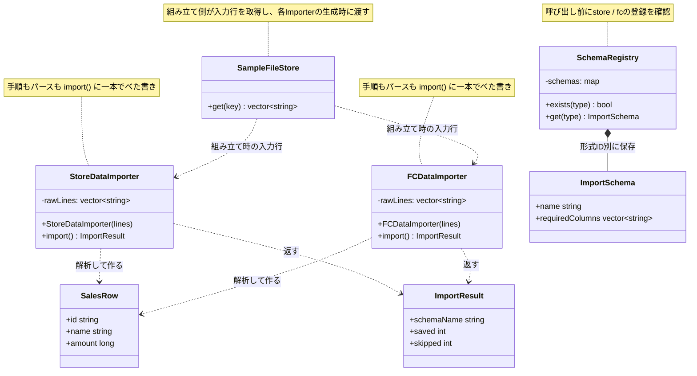
```mermaid
classDiagram
    class StoreDataImporter {
        -rawLines: vector~string~
        +StoreDataImporter(lines)
        +import() ImportResult
    }
    class FCDataImporter {
        -rawLines: vector~string~
        +FCDataImporter(lines)
        +import() ImportResult
    }
    class SchemaRegistry {
        -schemas: map
        +exists(type) bool
        +get(type) ImportSchema
    }
    class SampleFileStore {
        +get(key) vector~string~
    }
    class SalesRow {
        +id string
        +name string
        +amount long
    }
    class ImportResult {
        +schemaName string
        +saved int
        +skipped int
    }
    class ImportSchema {
        +name string
        +requiredColumns vector~string~
    }
    StoreDataImporter ..> SalesRow : 解析して作る
    FCDataImporter ..> SalesRow : 解析して作る
    StoreDataImporter ..> ImportResult : 返す
    FCDataImporter ..> ImportResult : 返す
    SchemaRegistry *-- ImportSchema : 形式ID別に保存
    SampleFileStore ..> StoreDataImporter : 組み立て時の入力行
    SampleFileStore ..> FCDataImporter : 組み立て時の入力行
    note for StoreDataImporter "手順もパースも import() に一本でべた書き"
    note for FCDataImporter "手順もパースも import() に一本でべた書き"
    note for SchemaRegistry "呼び出し前にstore / fcの登録を確認"
    note for SampleFileStore "組み立て側が入力行を取得し、各Importerの生成時に渡す"

```

**クラス図に出てくる主なメンバーと操作**

| クラス | メンバー・操作 | 何ができるか |
|---|---|---|
| `StoreDataImporter` | `rawLines` | 取り込む対象のCSV各行を保持する |
| `StoreDataImporter` | `import()` | 直営店CSVを開き、カンマ区切りで解析し、DB保存まで進めて `ImportResult` を返す |
| `FCDataImporter` | `rawLines` | 取り込む対象のCSV各行を保持する |
| `FCDataImporter` | `import()` | FC店CSVを開き、タブ区切りで解析し、不正行を除いて保存し、`ImportResult` を返す |

`import()` の戻り値 `ImportResult` は、スキーマ名・保存件数・スキップ件数を持つ小さな構造体です。呼び出し元は「何件保存でき、何件スキップしたか」を戻り値として受け取れます（`void` で投げっぱなしにしません）。

→ `StoreDataImporter` と `FCDataImporter` は互いを知らず、それぞれが「ファイルを開く・パースする・保存する・閉じる」という手順全体を、`import()` の中に独立してべた書きで持っています。同じ手順が2か所に重複していることが、形式を増やすたびに骨格を作り直す痛みの出発点になります。

**現状システムの処理シーケンス**

静的な関係に続けて、正常系（直営店CSVの取り込み1回）で `import()` の中がどの順に進むかを時系列で示します。形式ごとに変わる具体の分岐は `StoreDataImporter` の注記に、エラー系はメモとして添えます。1-4の現状コードを読む前の地図です。

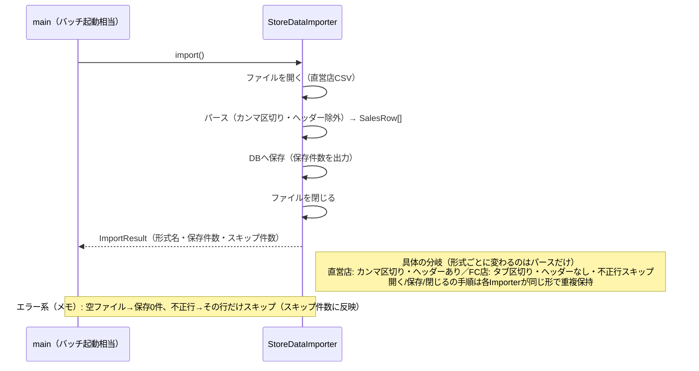
```mermaid
sequenceDiagram
    participant Main as main（バッチ起動相当）
    participant SI as StoreDataImporter
    Main->>SI: import()
    SI->>SI: ファイルを開く（直営店CSV）
    SI->>SI: パース（カンマ区切り・ヘッダー除外）→ SalesRow[]
    SI->>SI: DBへ保存（保存件数を出力）
    SI->>SI: ファイルを閉じる
    SI-->>Main: ImportResult（形式名・保存件数・スキップ件数）
    Note right of SI: 具体の分岐（形式ごとに変わるのはパースだけ）<br>直営店: カンマ区切り・ヘッダーあり／FC店: タブ区切り・ヘッダーなし・不正行スキップ<br>開く/保存/閉じるの手順は各Importerが同じ形で重複保持
    Note over Main,SI: エラー系（メモ）: 空ファイル→保存0件、不正行→その行だけスキップ（スキップ件数に反映）
```

図から読み取れるのは、`import()` が「開く→パース→保存→閉じる」を1メソッド内で順に実行し、`ImportResult` を返すこと、形式によって変わるのはパースだけで、開く・保存・閉じるの手順は各Importerが同じ形で重複して抱えていることです。空ファイルや不正行はメモのとおり件数へ反映されます。

これから検討するのは、同じ機能を保ちながら、変更に強い構造をどう作るかという点です。


**この章での簡略化 ―― 実物とスタブの境界**

1-3でクラス構成を確認したので、掲載コードで「何を実際に動かし、何をスタブ（仮想）で代替しているか」を先に整理します。この境界は全フェーズで共通です。同じ種類の表は本章だけの補足ではなく、全章で外部境界を説明する共通形式として使います。

| 要素                          | 掲載コードでの扱い                                              | 実運用では                     |
| --------------------------- | ------------------------------------------------------ | ------------------------- |
| 手順の順序（開く→検証→パース→行検証→保存→閉じる） | **実物**（骨格として実行される）                                     | 同じ                        |
| 形式ごとのパース・行検証・EC計算・形式分岐      | **実物**（サンプルCSVを実際に解析する）                                | 同じ                        |
| 取込結果（件数・スキップ・成否）の受け渡し       | **実物**（`ImportResult` 等で返す）                            | 同じ                        |
| ファイルの読み書き | **現状コード**：`vector<string>`を直接保持。**最終コード**：`ImportFileGateway`で取得 | 本物のファイルAPI／オブジェクトストレージ |
| DB保存 | **現状コード**：件数を表示。**最終コード**：`SalesImportRepository`で保存件数・金額を保持 | 本物のDBドライバ・トランザクション |
| 形式バージョン確認                   | **スタブ**：メッセージ表示のみ                                      | メタデータの実検証                 |

論点は「開く→変換する→保存する→閉じる」という手順の骨格と、形式ごとに変わるパース処理をどこで分けるかです。現状コードは、ファイル行の取得と保存表示をImporterが直接持っています。文字コード変換を扱わない理由は、最終コード前で補足します。

---

### 1-4：実装コード（現状）

#### コードを読む前に：クラスの責任と境界

| 対象 | 呼び出しと内部処理 | 戻り値・副作用 | 掲載上の表現 |
|---|---|---|---|
| 各Importer | `main()`から全行を受け、形式別に分割する | 保存・スキップ件数 | ファイル内容を`vector<string>`で渡す |
| `stringstream` | 1行と区切り文字を受け項目へ分解する | 項目の`vector` | CSVパーサの最小代替 |
| `map` | `store` / `fc`からスキーマを検索する | 登録有無・必須列 | メモリ上のスキーマ登録表 |
| `move` | コンストラクタで受け取った行一覧をImporterへ移す | 同じ行一覧のコピーを避ける | 移動後の引数は使わない |

現状コードで使うのは、行一覧、スキーマ検索、CSV分割です。現状コードに出てこない標準ライブラリや境界クラスは、後で初めて使う箇所で説明します。

#### 仕様入力が現状コードで使われるまで

1-1の「ファイル」と「形式」は、掲載コードではファイルキー、登録済み行、Importerの種類として受け渡します。ファイル名だけを置いて本文を別に作るのではなく、`SampleFileStore` から取得した同じ行一覧を処理します。

| 仕様入力 | コード上の受け取り口 | 実際に使う箇所 | 結果への現れ方 |
|---|---|---|---|
| ファイルキー | `SampleFileStore::get(key)` | キーに対応するCSV行一覧を取得する | 動作例ごとの入力本文がImporterへ渡る |
| 取込形式 | `store` / `fc` の選択と `SchemaRegistry` | スキーマ存在確認と、生成するImporterの選択 | ヘッダー、区切り文字、不正行の扱いが決まる |
| CSV各行 | 各Importerのコンストラクタから `rawLines` へ渡す | `import()` が `splitLine()` と数値変換を行う | `ImportResult` の保存件数・スキップ件数に反映される |

コードを見る前に、このシステムに登場する主要なクラスと、その役割を整理しておきます。

#### このシステムの登場クラス
| クラス名 | 役割 | 担当する仕様 |
|---|---|---|
| `StoreDataImporter` | 直営店CSVファイルのインポート処理全体 | カンマ区切り、ヘッダーありのCSVを処理する |
| `FCDataImporter` | FC店CSVファイルのインポート処理全体 | タブ区切り、不正行スキップでCSVを処理する |
| `SchemaRegistry` | インポートスキーマの登録・参照 | インポートタイプごとの必須カラム定義を保持し、タイプの存在確認と取得を担う |

この段階での注目ポイントは、どちらのクラスも「ファイルを開く」「データを加工する」「保存する」「閉じる」というデータの流れ（処理の手順）を、それぞれのクラス内に独立して持っている点です。しかも現状では、この手順はまだ小さなメソッドに分けられておらず、`import()` の中に上から下へべた書きされています。「共通の手順」と「形式ごとの差分」がまだ切り出されていない、この素朴な状態が出発点です。

実際の処理コードを見てみましょう。直営店用とFC店用の2クラスが存在します。どちらも `import()` の中に「開く→加工→保存→閉じる」を上から順にべた書きしており、大きな流れは共通していますが、パースの中身（区切り文字・ヘッダー・不正行の扱い）は少し違っています。クラスごとにブロックを分けて確認します。

スキーマは1-1で示した2種類（`store` / `fc`）です。次のコードの `SchemaRegistry` が、そのスキーマ名と必須カラムを保持します。

**① スキーマ登録クラスと共通の型（SchemaRegistry / SalesRow / ImportResult / ImportSchema）**

```cpp
#include <iostream>
#include <sstream>
#include <string>
#include <vector>
#include <map>
#include <utility>
using namespace std;

// 1行を区切り文字で分割する小さなヘルパー
static vector<string> splitLine(const string& line, char delim) {
    vector<string> cols; string cur; istringstream iss(line);
    while (getline(iss, cur, delim)) cols.push_back(cur);
    return cols;
}

// パース済みの売上1行（商品ID・商品名・金額）
struct SalesRow { string id; string name; long amount; };

// インポート1回分の結果（void をやめ、件数を返す）
struct ImportResult { string schemaName; int saved; int skipped; };

// インポートスキーマ（タイプごとの必須カラム定義）
struct ImportSchema { string name; vector<string> requiredColumns; };

// インポートスキーマの登録・参照を担うクラス
class SchemaRegistry {
    map<string, ImportSchema> schemas;
public:
    SchemaRegistry() {
        schemas["store"] = {"直営店データ", {"id", "name", "amount"}};
        schemas["fc"]    = {"FC店データ",   {"id", "name", "amount"}};
    }
    bool exists(const string& type) const { return schemas.count(type) > 0; }
    ImportSchema get(const string& type) const { return schemas.at(type); }
};

// 動作例の入力ファイルを、呼び出し元の外で事前登録する
class SampleFileStore {
public:
    static vector<string> get(const string& name) {
        static const map<string, vector<string>> files = {
            {"store-normal", makeStoreNormal()},
            {"fc-normal", makeFcNormal()},
            {"store-empty", {"商品ID,商品名,金額"}},
            {"fc-invalid", {"不正な行", "壊れた行", "欠損行"}},
            {"store-mixed", {
                "商品ID,商品名,金額",
                "1001,シャツ,3000",
                "9001,欠損"
            }}
        };
        return files.at(name);
    }
private:
    static vector<string> makeStoreNormal() {
        vector<string> lines = {"商品ID,商品名,金額"};
        for (int i = 1; i <= 10; ++i) {
            lines.push_back("100" + to_string(i)
                + ",商品" + to_string(i) + ",3000");
        }
        return lines;
    }
    static vector<string> makeFcNormal() {
        vector<string> lines;
        for (int i = 1; i <= 5; ++i) {
            lines.push_back("200" + to_string(i)
                + "\t商品" + to_string(i) + "\t5200");
        }
        return lines;
    }
};

```

`SchemaRegistry` は `main()` から呼ばれ、フォーマット種別IDを受け取って登録有無と表示名を返します。`std::map` は種別IDからスキーマを検索するメモリ上の登録表、`std::vector` は必須列を順番に保持する一覧です。このクラスはCSV本文を解析せず、どの形式として処理を始めてよいかだけを判断します。

**② 直営店データのインポートクラス（StoreDataImporter）**

```cpp

// 直営店データのインポート（カンマ区切り・ヘッダー行あり）
class StoreDataImporter {
    vector<string> rawLines;
public:
    explicit StoreDataImporter(vector<string> lines) : rawLines(move(lines)) {}

    // 手順がすべて import() の中にべた書きされている
    ImportResult import() {
        // (1) 開く
        cout << "直営店CSVを開く\n";

        // (2) パース：1行目をヘッダーとして飛ばし、カンマで分割する（べた書き）
        vector<SalesRow> rows;
        for (size_t i = 1; i < rawLines.size(); ++i) {
            vector<string> c = splitLine(rawLines[i], ',');
            if (c.size() < 3) continue;
            rows.push_back({c[0], c[1], stol(c[2])});
        }
        cout << "カンマ区切りで" << rows.size() << "件を読み込む\n";

        // (3) 保存
        cout << rows.size() << "件をDBへ追加\n";

        // (4) 閉じる
        cout << "ファイルを閉じる\n";

        return {"直営店データ", (int)rows.size(), 0};
    }
};

```

`StoreDataImporter` は `main()` から直営店の全行を受け取ります。`import()` は先頭行をヘッダーとして除外し、残りをカンマで3項目へ分割し、変換できた行数を `ImportResult` で返します。`std::move(lines)` は、受け取った行一覧の所有内容を `rawLines` へ移し、同じ大量文字列を複製しないための記法です。

**③ FC店データのインポートクラス（FCDataImporter）**

```cpp

// FC店データのインポート（タブ区切り・ヘッダーなし・不正行スキップ）
class FCDataImporter {
    vector<string> rawLines;
public:
    explicit FCDataImporter(vector<string> lines) : rawLines(move(lines)) {}

    // こちらも手順がすべて import() にべた書きされている
    ImportResult import() {
        // (1) 開く
        cout << "FC店CSVを開く\n";

        // (2) パース：先頭行からタブで分割し、割れない行はスキップ（べた書き）
        vector<SalesRow> rows;
        int skipped = 0;
        for (size_t i = 0; i < rawLines.size(); ++i) {
            vector<string> c = splitLine(rawLines[i], '\t');
            if (c.size() < 3) { ++skipped; continue; }
            rows.push_back({c[0], c[1], stol(c[2])});
        }
        cout << "タブ区切りで" << rows.size() << "件を読み込み、"
             << skipped << "件をスキップ\n";

        // (3) 保存
        cout << rows.size() << "件をDBへ更新\n";

        // (4) 閉じる
        cout << "ファイルを閉じる\n";

        return {"FC店データ", (int)rows.size(), skipped};
    }
};
```

`FCDataImporter` も `main()` から全行を受け取りますが、先頭行からタブで分割します。3項目に分けられない行は `skipped` を増やして次へ進み、保存件数とスキップ件数の両方を返します。2クラスを分けて読むと、呼び出し方と戻り値は似ている一方、ヘッダー・区切り文字・不正行報告が異なることを確認できます。

このコードを見ると、`import()` の中に「開く」「パース」「保存」「閉じる」がどちらも同じ順序で**べた書き**されていることが分かります。まだ小さなメソッドには分かれていません。一方で、パース部分の中身（区切り文字・ヘッダーの扱い・不正行のスキップ）は形式ごとに異なります。「手順の骨格は共通で、詳細部分だけが違う」という構造が、同じ `import()` の中に埋もれている状態です。

動作例のCSV本文は `SampleFileStore` に事前登録し、`main()` は「どのファイルをどの形式で取り込むか」だけを指定します。これにより、入力データを組み立てるループと、取込ユースケースの実行を混ぜません。現時点の保存メッセージはDB境界の代替ですが、対策後は `SalesImportRepository` が実データをメモリへ保存し、取得元も `ImportFileGateway` の交換可能な境界になります。
#### 呼び出し元と実行確認

まず依存を組み立て、行1（直営店データ（必須列3））を実行します。

```cpp
int main() {
    SchemaRegistry registry;

    string type1 = "store";
    if (!registry.exists(type1)) {
        cout << "[エラー] 未登録のインポートタイプ: " << type1 << "\n"; return 1;
    }
    ImportSchema schema1 = registry.get(type1);
    cout << "--- 行1: " << schema1.name << "（必須列"
         << schema1.requiredColumns.size() << "）---\n";
    StoreDataImporter storeNormal(SampleFileStore::get("store-normal"));
    ImportResult r1 = storeNormal.import();
    cout << r1.schemaName << " インポート成功: "
         << r1.saved << "件追加\n";
```

行1（直営店データ（必須列3））の実行結果：

```text
--- 行1: 直営店データ（必須列3）---
直営店CSVを開く
カンマ区切りで10件を読み込む
10件をDBへ追加
ファイルを閉じる
直営店データ インポート成功: 10件追加
```

続いて、行2（FC店データ（必須列3））を実行します。

```cpp
    string type2 = "fc";
    if (!registry.exists(type2)) {
        cout << "[エラー] 未登録のインポートタイプ: " << type2 << "\n"; return 1;
    }
    ImportSchema schema2 = registry.get(type2);
    cout << "--- 行2: " << schema2.name << "（必須列"
         << schema2.requiredColumns.size() << "）---\n";
    FCDataImporter fcNormal(SampleFileStore::get("fc-normal"));
    ImportResult r2 = fcNormal.import();
    cout << r2.schemaName << " インポート成功: "
         << r2.saved << "件更新\n";
```

行2（FC店データ（必須列3））の実行結果：

```text
--- 行2: FC店データ（必須列3）---
FC店CSVを開く
タブ区切りで5件を読み込み、0件をスキップ
5件をDBへ更新
ファイルを閉じる
FC店データ インポート成功: 5件更新
```

続いて、行3（直営店空ファイル）を実行します。

```cpp
    cout << "--- 行3: 直営店空ファイル ---\n";
    StoreDataImporter storeEmpty(SampleFileStore::get("store-empty"));
    ImportResult r3 = storeEmpty.import();
    cout << "インポート成功: " << r3.saved << "件追加\n";
```

行3（直営店空ファイル）の実行結果：

```text
--- 行3: 直営店空ファイル ---
直営店CSVを開く
カンマ区切りで0件を読み込む
0件をDBへ追加
ファイルを閉じる
インポート成功: 0件追加
```

続いて、行4（FC店全行不正）を実行します。

```cpp
    cout << "--- 行4: FC店全行不正 ---\n";
    FCDataImporter fcInvalid(SampleFileStore::get("fc-invalid"));
    ImportResult r4 = fcInvalid.import();
    cout << "インポート成功: " << r4.saved << "件更新";
    if (r4.skipped > 0) cout << "、エラー" << r4.skipped << "件";
    cout << "\n";
```

行4（FC店全行不正）の実行結果：

```text
--- 行4: FC店全行不正 ---
FC店CSVを開く
タブ区切りで0件を読み込み、3件をスキップ
0件をDBへ更新
ファイルを閉じる
インポート成功: 0件更新、エラー3件
```

最後に、行5（直営店に不正行あり）を実行し、`main()` を終了します。

```cpp
    cout << "--- 行5: 直営店に不正行あり ---\n";
    StoreDataImporter storeMixed(SampleFileStore::get("store-mixed"));
    ImportResult r5 = storeMixed.import();
    cout << "インポート成功: " << r5.saved << "件追加\n";

    // タイプ "online" は未登録 → エラーで中断
    string unknownType = "online";
    if (!registry.exists(unknownType)) {
        cout << "[エラー] 未登録のインポートタイプ: "
             << unknownType << " — 処理を中断します\n";
        return 1;
    }
    return 0;
}
```

行5（直営店に不正行あり）の実行結果：

```text
--- 行5: 直営店に不正行あり ---
直営店CSVを開く
カンマ区切りで1件を読み込む
1件をDBへ追加
ファイルを閉じる
インポート成功: 1件追加
[エラー] 未登録のインポートタイプ: online — 処理を中断します
```

各ケースのコードとその実行結果をその場で並べたので、離れた `main()` と出力を行き来せずに照合できます（確認したいこと：入力、加工、出力が仕様どおりに対応していること）。

動作例テーブルの全5行について、処理順序、処理件数、不正行の報告が
一致することを確認できました。`import()` は結果を画面に流すだけでなく、
保存件数・スキップ件数を持つ `ImportResult` として呼び出し元へ返します。
未登録タイプ（"online"）はレジストリのチェックで処理を中断し、
エラーメッセージを出力します。

---

> **手元で動かすには**
> このコードは1つの `.cpp` に貼り付けて、そのままコンパイル・実行できます（例：`g++ -std=c++14 chapter04.cpp -o app && ./app`）。この対策前コードでは、まだ `ImportFileGateway` を導入しておらず、CSVの中身を `SampleFileStore` の登録済み文字列として与えています。実ファイルは読み書きしません。「自由にCSVを作る」とは、`SampleFileStore::get()` が返す行一覧を追加・変更することです。たとえば列不足の行（`"9001,欠損"` のようにカンマ項目が2つしかない行）を登録データへ足せば、その行はパース時に読み飛ばされ、保存件数が1件減った実行結果に表れます。実ファイルI/OやDB保存はこの章の論点ではないため扱わず、メモリ上のサンプルCSVで代替します。

### 1-5：変更要求

ある日、店舗運営部の担当者から連絡がありました。「来月から、ネット通販（ECサイト）の売上データもこのシステムで取り込みたい。フォーマットは既存の直営店用と似ているが、会員ランクやポイント付与情報といったEC特有の項目が含まれるため、読み込み後の計算処理が少し追加される。また、データ整合性と互換性を保証するため、すべての形式（直営店・FC店・新規のEC店）について、ファイルを開いた直後にファイルメタデータの形式バージョンを確認する機能も共通で追加してほしい」と。

依頼文を、実行結果で判定できる変更依頼へ分けます。

| 変更依頼ID | 確定した変更内容 | 入力 | 受入条件 |
|---|---|---|---|
| 変更ID1 | ECサイト形式を追加し、会員ランクとポイントを解析・計算する | EC店CSV、会員ランク、ポイント項目 | 正常なEC行だけを保存し、EC固有の計算済み結果を返す |
| 変更ID2 | 全形式で、ファイルを開いた直後に形式バージョンを確認する | 直営店・FC店・EC店ファイルのメタデータ | 対応バージョンだけ解析へ進み、不一致時は保存せず終了する |

#### 変更後要求ベースライン

| 要求ID | 変更種別・根拠となる変更ID | 変更後要求 | 受入条件 |
|---|---|---|---|
| 要求ID1 | 変更<br/>根拠: 変更ID1 | 直営店・FC店・EC店の3形式を取り込む | 登録された各形式を選択して処理できる |
| 要求ID2 | 変更<br/>根拠: 変更ID2 | 開く→形式バージョン確認→解析→行検証→保存→閉じる順を全形式で守る | 不一致時は解析・保存せず、開いたファイルは閉じる |
| 要求ID3 | 変更<br/>根拠: 変更ID1 | 形式ごとの解析と、EC固有の会員ランク・ポイント計算を行う | EC正常行から計算済み結果を得る |
| 要求ID4 | 継続<br/>根拠: — | 不正行を保存せず、成功・スキップ件数と失敗理由を返す | 全形式で正常行だけ保存される |

**変更前→変更後の要求対照（今回変える要求IDだけ）**

現行ベースラインと変更後ベースラインを往復せずに済むよう、今回変える要求IDだけを取り出し、変更前と変更後を同じ行へ並べます。

| 要求ID | 変更前の要求（現行） | 変更後の有効要求 | 根拠変更ID |
|---|---|---|---|
| 要求ID1 | 直営店とFC店の2形式を取り込む | 直営店・FC店・EC店の3形式を取り込む | 変更ID1 |
| 要求ID2 | ファイルを開く→解析する→保存する→閉じる順を守る | 開く→形式バージョン確認→解析→行検証→保存→閉じる順を全形式で守る | 変更ID2 |
| 要求ID3 | 形式ごとの区切り・列定義で解析する | 形式ごとの解析と、EC固有の会員ランク・ポイント計算を行う | 変更ID1 |

要求ID4は継続（変更前＝変更後）のため対照表には載せません。変更後ベースラインで内容を確認できます。

行単位検証を置く位置と`ImportResult`の件数・失敗理由は、変更ID1・変更ID2を既存の取込経路へ接続する内部契約です。既存のFC店にある不正行スキップと結果契約を保ち、要求にない新しい業務機能として数えません。

なるほど、店舗のデータとECサイトのデータ。どちらも「ファイルを取得する → バージョンを検証する → 解析する → 行単位で検証する → 保存する → 取込結果を返す」という大きな流れは共通のはずですが、一部の計算ルールやパースルールだけが異なるのですね。

変更要求によって仕様がどう変わるのかを体系的に整理します。

| 項目 | 変更前 | 変更後 |
| --- | --- | --- |
| 対応フォーマット | 直営店・FC店の2形式 | 直営店・FC店・EC店の3形式 |
| バージョンチェック | なし | 全形式でファイルオープン直後に実行 |
| 行単位検証 | FC店の不正行スキップと結果記録 | 既存動作を保ち、EC店にも形式固有の検証を定義する |
| EC向け計算処理 | なし | EC店のみ（ポイント付与・会員ランク割引） |
| 取込結果 | 成功件数、スキップ件数、失敗理由を`ImportResult`へ残す | **変更なし** |

**この章が扱う複雑さ**

| 順次処理 | 共通骨格か、形式差分か | 具体例 | この章で見ること |
|---|---|---|---|
| ファイル取得 | 共通骨格 | ファイルAPIからCSVを開く | 取得前に解析や保存へ進まない順序を守れるか |
| メタデータ検証 | 共通骨格 | 形式バージョンを確認する | 全形式に同じ検証を1回で追加できるか |
| 形式別解析 | 形式差分 | カンマ、タブ、EC固有列を読む | 形式追加時に骨格を複製しないか |
| 行単位検証 | 置き場所は共通、内容は形式差分 | 不正行をスキップし、件数を数える | エラー行の扱いを形式ごとに変えられるか |
| DB保存 | 共通骨格 | 正常行だけ保存する | 保存前に検証済みデータだけが流れるか |
| 取込結果 | 共通骨格 | 成功件数、スキップ件数、失敗理由を記録する | 呼び出し元が形式差分を知らず結果を受け取れるか |

今回変えるのは取込形式と処理骨格の分け方です。取込結果の契約と形式定義の管理は仕様変更の対象ではないため、次の共通基盤は変更前後で維持します。

| 変更対象外の共通基盤 | 変更前 | 変更後 |
|---|---|---|
| `ImportResult` | 成功件数・スキップ件数・失敗理由を返す | **変更なし** |
| `SchemaRegistry` | 形式定義を登録・検索する | **変更なし** |

**変更後の仕様表（ECサイト対応とバージョンチェックの追加）**

| ルール名 | 発動条件 | 結果 | 具体例 |
| --- | --- | --- | --- |
| ファイルオープン | インポート開始時に必ず実行 | CSVファイルを読み込み可能な状態にする | 直営店・FC店・EC店、どの形式でも同じ手順 |
| **形式バージョンチェック** | **ファイルオープン直後に実行** | **メタデータ内の形式バージョンが正常か検証する** | **直営店・FC店・EC店、どの形式でも同じ手順** |
| データパース | フォーマットごとに異なるルールを適用 | CSV行をシステム内部データに変換する | 直営店：カンマ区切り／FC店：タブ区切り／**EC：ポイント項目・会員ランク追加** |
| 行単位検証 | パース完了後、保存前に実行 | 取り込めない行を除外し、スキップ件数を取込結果へ記録する | 検証の位置は共通、検証内容は形式ごとに異なる |
| **EC向け計算処理** | **ECデータのパース完了後に実行** | **ポイント付与量・会員ランク割引を計算する** | **EC店のみ。直営店・FC店にはこのステップなし** |
| DB保存 | パース完了後に必ず実行 | 変換済みデータをDBに登録する | 保存先・保存形式はどの形式でも共通 |
| ファイルクローズ | 保存完了後に必ず実行 | ファイルリソースを解放する | 直営店・FC店・EC店、どの形式でも同じ手順 |

**変更後の動作例テーブル**

| 入力ファイル | データの状態 | 期待する出力 |
| --- | --- | --- |
| 直営店CSVファイル | 正常データ10件 | インポート成功、10件追加（変わらず） |
| FC店CSVファイル | 正常データ5件 | インポート成功、5件更新（変わらず） |
| **EC店CSVファイル** | **正常データ8件 + 不正データ行2件** | **正常行8件のみ処理、スキップ2件を取込結果に記録、ポイント計算済み** |

仕様表を見ると、「ファイル取得」「メタデータ検証」「行単位検証」「DB保存」「ファイルクローズ」は順序として守りたい骨格です。一方で、「データパース」「行ごとの検証内容」「EC固有の計算処理」は形式ごとに変わる差分です。

**変更前後の入力・判定・加工・出力差分**

1-1の現状仕様を退避し、変更要求を当てた後の仕様と同じ粒度で並べます。以降の分析では、この差分を追います。

| 要素 | 変更前（1-1の現状仕様） | 変更後（今回の要求） | 差分として追うもの |
|---|---|---|---|
| 入力 | 直営店CSV、FC店CSV | 直営店CSV、FC店CSV、EC店CSV、形式バージョン、行単位エラー | EC店データ、バージョン情報、不正行情報が増える |
| 判定 | 店舗形態ごとの形式判定 | 店舗形態判定に加え、全形式でバージョン確認と行単位検証を行う | 共通判定の置き場所と形式別判定の中身を分ける |
| 加工 | 形式別にパースしDB保存する | バージョン確認後に形式別パースし、行検証後にEC店はポイント・会員ランク計算を追加 | 共通手順と形式差分の両方が変わる |
| 出力 | 保存成功またはパースエラー | 保存成功、バージョンエラー、行スキップ件数、EC計算済みデータ | 取込結果として残す情報が増える |

**変更後の入力・加工・出力**

変更後の仕様を、1-1と同じ粒度で、正常系の入力・判定・加工・出力として確認します。1-1の図との差分は、フォーマット種別に「EC店」が加わること、全形式共通の「形式バージョンを確認」と「行単位検証」が骨格へ加わること、EC店だけ解析後に「ポイント付与・会員ランク割引の計算」という加工が加わることです。

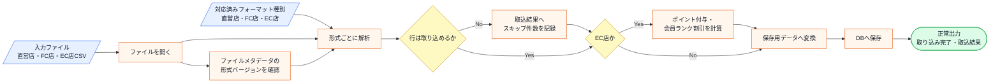
```mermaid
flowchart LR
    A[/入力ファイル<br>直営店・FC店・EC店CSV/]:::input --> E[ファイルを開く]:::process
    C[/対応済みフォーマット種別<br>直営店・FC店・EC店/]:::input --> F
    E --> V[ファイルメタデータの<br>形式バージョンを確認]:::process
    E --> F[形式ごとに解析]:::process
    V --> F
    F --> R{行は取り込めるか}:::decision
    R -->|No| L[取込結果へ<br>スキップ件数を記録]:::process
    L --> Q
    R -->|Yes| Q{EC店か}:::decision
    Q -->|Yes| P[ポイント付与・<br>会員ランク割引を計算]:::process
    P --> G[保存用データへ変換]:::process
    Q -->|No| G
    G --> S[DBへ保存]:::process
    S --> H([正常出力<br>取り込み完了・取込結果]):::normal

    classDef input fill:#e7f0ff,stroke:#2563eb,color:#111827;
    classDef process fill:#fff7ed,stroke:#ea580c,color:#111827;
    classDef decision fill:#fef9c3,stroke:#ca8a04,color:#111827;
    classDef normal fill:#dcfce7,stroke:#16a34a,color:#111827;
```

この図から読み取ることは、次の4点です。

- ファイルを読める確認、対応形式の確認、保存用データへの変換は1-1のまま変わらない。
- 「形式バージョンの確認」は直営店・FC店・EC店のすべてが通る共通の加工として、共通手順の直後に1か所だけ挟まる。
- 「行単位検証」は保存前に必ず通る位置だけを共通化し、不正行の扱いは形式ごとの実装へ任せる。
- 「ポイント付与・会員ランク割引の計算」はEC店だけが通る加工で、直営店・FC店の流れは変わらない。

変更後も、失敗条件は正常系図へ混ぜずに別で確認します。

| エラー条件 | どこで分かるか | 出力 | 保存・通知などの副作用 |
|---|---|---|---|
| 入力ファイルを開けない | ファイルオープン時 | ファイルエラー | DB保存なし |
| フォーマット種別に対応していない | 形式判定時 | 未対応形式エラー | DB保存なし |
| 形式バージョンが対応範囲外 | メタデータ確認時 | バージョンエラー | DB保存なし |
| EC店CSVに不正行がある | EC店の解析時 | 不正行を除外して続行 | 正常行と計算済みデータだけDB保存する |
| DB保存に失敗する | 保存処理時 | 保存失敗 | 取込結果へ失敗を記録し、ファイルは閉じる |

図に加わった「形式バージョンの確認」「行単位検証」「EC店だけの計算」が実際にコードのどこへ書かれるかは、フェーズ3で変更を試すコードと、フェーズ7の最終コード・実行結果で追います。

**フェーズ1のまとめ：今回追う変更ID一覧**

このフェーズで確定した変更依頼を一覧にして締めます。フェーズ2でこの変更IDを仮説・ヒアリングへ、フェーズ3で一つずつ試して痛みへ、と順につなぎます。

| 変更ID | 変更依頼の要点 | 関係する要求ID（追加は変更後ID） |
|---|---|---|
| 変更ID1 | ECサイト形式を追加し、会員ランクとポイントを解析・計算する | 要求ID1、要求ID3 |
| 変更ID2 | 全形式で、ファイルを開いた直後に形式バージョンを確認する | 要求ID2 |

フェーズ1でシステムの現状と変更要求が把握できました。次のフェーズ2では、「何を変え、何を守るか」を整理します。

## 🟣 フェーズ2：仮説立案 ―― 何が変わるかを観察し、ヒアリングで裏付ける
### 2-1：変わりそうな仕様の見当をつける

ここで作る一覧は、思いつきで「変わりそう」と感じたものを並べる表ではありません。フェーズ1で確認した仕様・動作例・クラス図を材料に、次の順で候補を絞ります。

1. 仕様図と動作例から、入力・判定・加工・出力のうち条件や値が変わりそうな箇所を拾う。
2. その箇所が、1-3のどのクラス・メソッドに書かれているかを対応づける。
3. その仕様が、どんな理由で、何をきっかけに、どのくらいの頻度で変わりそうかを仮説として書く。
4. 逆に、当面変えない前提にできる処理の骨格も分けておく。

この手順で見ると、「CSVをインポートする」という大きな処理全体ではなく、その中のどの手順・フォーマット差分・パース規則が変更候補なのかを読者自身で追えるようになります。

フェーズ2では、フェーズ1で見た仕様のうち、どのフォーマット・変換・保存手順が変わりそうかを見当づけます。責務の配置は、変更要求を当てた後の痛みと合わせて確認します。

| 仕様候補 | 仕様上の場所 | フェーズ1の現状コードでの場所 | 見立て |
|---|---|---|---|
| 直営店CSVの列構成 | 入力フォーマット、パース | `StoreDataImporter.import()` | 直営店側のCSV項目追加でパース規則が変わる可能性があるため、今回見る |
| FC店CSVの列構成 | 入力フォーマット、パース | `FCDataImporter.import()` | FC店側のCSV項目や表記差分が変わる可能性があるため、今回見る |
| 行単位検証とスキップ件数 | 判定、出力 | 各Importerのパース処理と保存前処理 | 検証する位置は共通だが、何を不正行とするかは形式ごとに変わるため、今回見る |
| ファイルの開閉 | 加工前後の共通手順 | `StoreDataImporter.import()`、`FCDataImporter.import()` | この章の変更要求では、共通手順として当面維持する前提で見る |
| DB保存 | 出力、保存処理 | `saveToDB()` 相当の処理 | 保存先やトランザクションは論点外として深追いしない |

この表から、今回の検討対象は「店舗種別ごとのCSVパース規則」と「形式ごとの行検証」です。どちらも保存前に必ず通る順次処理の中にありますが、変わる理由は形式ごとの差分にあります。共通手順と差分が同じ場所に書かれて困るかどうかは、フェーズ3で変更を入れてから確認します。

#### ヒアリングで確認すること

入力形式ごとの差と共通手順の見当から、将来も変わる部分と当面守る部分を確認する質問を作ります。

| 見当 | 現時点の仮説 | 確認する質問 | 確認先 |
|---|---|---|---|
| 取込元 | 新しい形式が追加される | 今後も別システムの取込が増えるか | システム基盤担当 |
| 共通手順 | 処理順は維持される | 取得から結果作成までの順序は固定か | システム基盤担当 |
| 行検証 | 不正条件は形式ごとに違う | 必須列・スキップ・中止条件は形式別か | 業務担当 |

2-3ではこの三点と、保存先の変更可能性を確認します。

### 2-2：今回の変更で確実に変わること

今回の変更要求から確定している変更は以下の3点です。

- **ECサイト向けCSVのパース方法の追加**：会員ランク・ポイント項目を読み込む処理が必要
- **行単位検証と取込結果の拡張**：不正行をスキップし、成功件数・スキップ件数を結果として残す必要がある
- **EC向け計算処理ステップの追加**：ポイント付与量・会員ランク割引を計算する処理が必要

ただし「この変更が1回限りか、今後も続くか」によって、どこまで設計を変えるべきかが大きく変わります。関係者に確認します。

### ヒアリングに向けた背景確認

このシステムは、ある小売店舗で日々の売上データを管理するために使われています。各店舗のPOSレジから出力される売上データをCSVファイルとして受け取り、形式ごとにシステムへ取り込むのが主な役割です。

当初は1種類のCSVフォーマットだけを読み込んでいましたが、店舗網の拡大とともに、店舗形態や仕入れ先によって「日付の形式」「ヘッダー行の有無」「カンマ区切りかタブ区切りか」といった細かな違いがあるCSVが持ち込まれるようになりました。

当時の担当者が、増え続けるフォーマットに対応するために一つずつコードを書き足してきた結果が、現在の実装です。

### 2-3：関係者ヒアリング


仮説の確度を上げるため、システム基盤担当と業務担当者に確認を行いました。

* **開発者：** 「今後もインポート対象のシステムが増える予定はありますか？」
* **システム基盤担当：** 「あります。次はSNS経由の販売データを取り込む予定です。ファイル操作の手順は既存と全く同じはずです。」
* **開発者：** 「取得元や保存先、処理の順序は変わる可能性がありますか？」
* **システム基盤担当：** 「保存先がDBからオブジェクトストレージへ変わる可能性はあります。そのためアクセス方法は固定とは考えません。一方、1回の取込で『取得→形式バージョン確認→パース→行検証→保存→結果作成』の順序は、監査要件として当面維持します。」
* **業務担当：** 「形式ごとのデータ項目や計算ルールは頻繁に変わります。」
* **開発者：** 「不正行の扱いは、全形式で同じですか？」
* **業務担当：** 「検証する位置は保存前でそろえたいです。ただ、どの列を必須にするか、スキップできるか、エラー終了にするかは形式ごとに変わります。」

### 2-4：ヒアリングで判明した将来リスク

ヒアリングで浮かび上がった「確定ではないが、近い将来起こりうる変化」を記録します。これは今回の設計判断の材料です。

| リスクID | 将来リスク | 時期の目安 | 根拠 |
|---|---|---|---|
| リスクID1 | SNS販売データのインポート形式追加 | 継続的に | インポート対象チャネルが増える予定（システム基盤担当より） |
| リスクID2 | 各店のデータ項目の追加・計算ルール変更 | 継続的に | 頻繁にあると業務担当が言及 |

なお、取込結果の出力先自体（ローカル保存からクラウドDWH・帳票出力への変更）もヒアリングで話題になりましたが、今回の変更対象ではないためリスクIDには起こさず対象外として記録します。出力先は取込手順の軸とは独立した境界であり、本章で扱う共通手順と形式差の分離には影響しません。

フェーズ2で「今変わること（確定）」と「将来変わるかもしれないこと（リスク）」を分けて整理できました。次のフェーズ3では、現在の構造で変更を試みたときに何が起きるかを確認します。

### 2-5：変わる見込みと当面安定の前提を確定する

2-4のリスクIDを、形式ごとに変えられるようにする部分と、全形式で守る取込手順へ分けます。「はい」は、フェーズ6で**形式差分が増減しても共通手順を修正せずに済む構造か**を判定するための印です。

| リスクID・変化軸 | 変わる見込み | 変えられるようにする部分 | 当面安定として守る部分 |
|---|---|---|---|
| リスクID1：SNS販売データのインポート形式追加 | はい | 形式固有の解析、行検証、項目変換 | 開く、形式確認、保存、閉じるという取込順序と結果契約 |
| リスクID2：各店のデータ項目の追加・計算ルール変更 | はい | 形式固有の項目定義と計算 | ファイル取得・保存の境界、正常行だけを保存する流れ |

したがって2-5の出力は、「形式固有の解析・検証・計算は変えられるようにし、取込手順と結果契約は守る」という設計条件です。フェーズ3では変更ID1・変更ID2だけを現在の構造へ適用し、リスクIDはフェーズ6の構造評価に使います。

---

## 🟣 フェーズ3：問題特定 ―― 変更の痛みを発見する
フェーズ2で、CSVインポートの処理手順は共通しており、データ加工のルールだけが変わるという構造が明確になりました。このフェーズでは、新しいECサイト向けCSVの取り込みを、現在のクラス構造のまま実装しようとするとどのような「痛み」が生じるのかを確認します。

### 3-1：変更を試みる

ECサイトの売上データをインポートする機能を実装しようと、既存の `StoreDataImporter` クラスを参考に、新しい `ECDataImporter` クラスを作成してみましょう。現状コードにならい、手順は `import()` の中にべた書きします。

```cpp
// EC店データのインポート（会員ランク・ポイント項目あり）
// 既存の直営店・FC店と同じ手順を、また import() の中にべた書きでコピーしている
class ECDataImporter {
    vector<string> rawLines;
public:
    explicit ECDataImporter(vector<string> lines) : rawLines(move(lines)) {}

    ImportResult import() {
        // (1) 開く ← StoreDataImporter・FCDataImporter と全く同じコピー
        cout << "EC店CSVを開く\n";

        // (2) パース：カンマ区切り＋会員ランク・ポイント列（EC固有）
        vector<SalesRow> rows; int skipped = 0;
        for (size_t i = 1; i < rawLines.size(); ++i) {
            vector<string> c = splitLine(rawLines[i], ',');
            if (c.size() < 5) { ++skipped; continue; }   // ランク/ポイント列が不足
            rows.push_back({c[0], c[1], stol(c[2])});
        }
        cout << "カンマ区切りで会員ランク・ポイント列まで解析（有効"
             << rows.size() << "件・スキップ" << skipped << "件）\n";

        // (2') EC固有：ポイント付与量を計算
        long pointBonus = 0;
        for (auto& r : rows) pointBonus += r.amount / 100;
        cout << "ポイントボーナスを計算（合計" << pointBonus << "pt）\n";

        // (3) 保存 ← また同じコピー
        cout << rows.size() << "件をDBへ追加\n";

        // (4) 閉じる ← また同じコピー
        cout << "ファイルを閉じる\n";

        return {"EC店データ", (int)rows.size(), skipped};
    }
};

int main() {
    vector<string> ecLines = {"id,name,amount,rank,points"};
    for (int i = 1; i <= 10; ++i) {
        if (i == 4 || i == 9)   // 2件は列不足（不正行）
            ecLines.push_back("E00" + to_string(i)
                + ",商品" + to_string(i) + ",3000");
        else
            ecLines.push_back("E00" + to_string(i) + ",商品"
                + to_string(i) + ",3000,gold,50");
    }
    ECDataImporter importer(ecLines);
    ImportResult r = importer.import();
    cout << "インポート成功: " << r.saved << "件追加、スキップ" << r.skipped << "件\n";
    return 0;
}
```

実行対象コード：3-1の変更試行コード（`splitLine`・`SalesRow`・`ImportResult` は1-4と共通）
対応する動作例：変更要求後の代表ケース（EC店 正常8件＋不正2件）
確認したいこと：変更要求を現状構造へ当てはめたとき、修正箇所と痛みがどこに出るか

実行結果：

```text
EC店CSVを開く
カンマ区切りで会員ランク・ポイント列まで解析（有効8件・スキップ2件）
ポイントボーナスを計算（合計240pt）
8件をDBへ追加
ファイルを閉じる
インポート成功: 8件追加、スキップ2件
```

コードは正しく動いています。しかし冒頭の「EC店CSVを開く」と末尾の「DBへ追加」「ファイルを閉じる」は、直営店・FC店の `import()` にべた書きした手順と全く同じ形です。

実装しながら、一つの違和感に気づきます。「あれ、開く・保存する・閉じるは直営店やFC店と全く同じなのに、また自分の `import()` にべた書きしているな」と。

さらに、同時に要求されていた「形式バージョンチェック機能」も追加してみましょう。「直営店・FC店・EC店のすべてについて、ファイルメタデータに形式バージョンを付与し、ファイルを開いた直後に対応可能なバージョンか確認する」という仕様です。

「バージョンチェック」はフォーマット種別に関わらず全店舗で共通の手順変更です。しかし現在の重複した構造では、`StoreDataImporter`・`FCDataImporter`・`ECDataImporter` の3つのクラスそれぞれに、同じバージョンチェックのコードを追加しなければなりません。

「形式バージョン確認という一つの確定要求のために、3つのクラスすべてへ同じ修正を入れる必要があるのか……」

### 3-2：変更影響グラフ

変更要求が既存システムにどのように波及するかをグラフ化します。

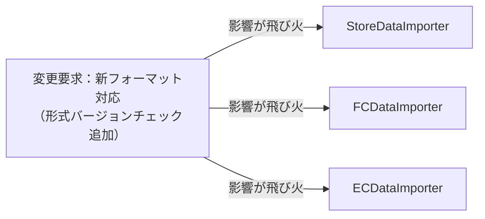
```mermaid
graph LR
    T1["変更要求：新フォーマット対応<br>（形式バージョンチェック追加）"]
    T1 -->|"影響が飛び火"| A["StoreDataImporter"]
    T1 -->|"影響が飛び火"| B["FCDataImporter"]
    T1 -->|"影響が飛び火"| C["ECDataImporter"]

```

→ このグラフを見ると、「形式バージョンチェック」という一つの手順変更が、現在ある3つのインポートクラスすべてへ波及したことが分かります。各クラスが「手順の骨格」を独自に持っているため、同じ判断を3か所へ反映しなければなりません。

### 3-3：痛みの言語化

変更を試みたことで、2つの「痛み」が鮮明になりました。

1つ目は、同じ修正の繰り返しです。具体的には、ファイルを開く・保存する・閉じるという手順が、`StoreDataImporter`・`FCDataImporter`・`ECDataImporter` の3クラスそれぞれの `import()` に `cout` でべた書きされています（1-4と3-1のコードで確認できます）。「バージョンチェックを追加してほしい」という変更ID2をここへ当てると、同じ1行を3箇所へ繰り返し足すことになります。共通の手順であるはずのファイル操作やDB保存のコードが形式ごとに複製されているため、関連クラスを検索し、修正漏れがないか広く確認する必要があります。

2つ目は、システムの「変更耐性の低さ」です。本来、ビジネスロジックである「店舗ごとのデータパース」だけを変えれば済むはずの状況で、ファイル操作やDB接続という「手順の骨格」まで修正対象になってしまっています。システム基盤側の知識が業務ロジックのクラスに漏れ出しているために、本来無関係な場所まで変更することになり、設計上の無駄が蓄積してしまいます。

こういうとき困る、という感覚、皆さんも同じではないでしょうか。この「共通の手順が散らばっている」という状態が、私たちの設計を硬直させている元凶なのです。

フェーズ3で「手順の重複が辛い」という事実が確認できました。次のフェーズ4では、なぜこの辛さが構造的に発生するのかを分析します。

---
> **📌 問題（確定）**
> 変更ID1のEC形式を追加すると共通手順をもう一組複製し、変更ID2の形式バージョン確認では`StoreDataImporter`・`FCDataImporter`・`ECDataImporter`の3クラスを同時に修正した。形式固有処理と共通手順が各クラスに重複しているため、一つの確定要求に対する修正・確認範囲が広い。
---

観測した痛みへ`問題ID`を付け、どの変更IDから来たかを対応づけます。この問題IDが、フェーズ4の原因ID、フェーズ5の課題IDへ順につながります。

| 問題ID | 観測した痛み（変更途中コード） | 起点の変更ID |
|---|---|---|
| 問題ID1 | 新形式（EC）追加のたび、開く・保存・閉じる等の共通手順を全クラスで複製・書き直す | 変更ID1 |
| 問題ID2 | 共通のはずの手順（バージョン確認）に修正が入ると、3つのImporterを同時修正する | 変更ID2 |
| 問題ID3 | 行検証・取込結果記録を足すと、各Importerへ同じ保存前処理を重複追加する | 変更ID2 |

## 🟠 フェーズ4：原因分析 ―― なぜ辛いのかを構造で言語化する
フェーズ3で、インポート処理の「手順の重複」という痛みが確認できました。このフェーズでは、なぜそのような辛さが生じるのかを、コードの構造的な観点から言語化します。

### 4-1：痛みの根源を探る（観察と原因）

フェーズ3で確認した「変更の辛さ」は、コードのどこから来ているのでしょうか。コードを注意深く観察すると、痛みを引き起こしている2つの事実が浮かび上がってきます。

| **観察した症状（痛み）** | **構造的な原因（痛みの根源）** |
|---|---|
| 新しいインポート形式を追加するたびに、ファイルを開く・閉じる・保存する等の「手順」を全クラスで書き直す必要がある | 共通の手順（処理の骨格）と、店舗ごとのデータパース（詳細）が、同じメソッドの中に混在しているから |
| 共通であるはずのファイル操作手順に修正が入ったとき、全インポートクラスを修正することになる | 共通の手順という「守りたい骨格」を、店舗ごとの詳細という「形式ごとの違い」が引きずり回しているから |
| 行単位検証や取込結果の記録を追加すると、各Importerに同じ保存前処理を足す必要がある | 検証の置き場所と、形式ごとに違う検証内容が同じ `import()` に混在しているから |

### 4-2：変わるもの/変わってほしくないもの

> **「変わらないもの」と「変わってほしくないもの」は異なります。** 「変わらないもの」は経験的事実（今まで変わっていない）、「変わってほしくないもの」は設計意図（ここを安定させてほかを守りたい）です。ここで整理するのは後者です。

原因分析の結果として、「変わり続けるもの」と「変わってほしくないもの」を明確に分けます。

| **変わり続けるもの（🔴）** | **変わってほしくないもの（🟢）** |
| --- | --- |
| CSVのデータパースルール | 開く→保存→閉じるという**手順の順序** |
| 個別のデータ加工処理 | データベースへ保存する**という一連のフローの位置** |
| 形式ごとの行検証ルール | 解析後、保存前に検証するという順序 |
| スキップ件数や成功件数の作り方 | 呼び出し元へ取込結果を返す流れ |

ここで「変わってほしくない」と置いているのは、あくまで**手順の順序**です。「開く」「保存する」の**実体（保存媒体）**——ファイルなのかDBなのかオブジェクトストレージなのか——は、むしろ変わりうる部分で、後のフェーズでは境界クラス（ゲートウェイ／リポジトリ）の裏に隔離します。本来、パースルールと手順の順序は別々の理由で変わるはずのものです。ビジネス側が「パースルール」を変えるたびに、システム基盤側が管理する「手順の順序」まで影響を受けてしまっていることが、設計上の問題です。

### 4-3：接続点に混在する骨格と差分を確認する

ここでの「確認すること」は、前節までに見つけた原因から抽出します。まず、原因文から「守りたい骨格」と「変わる差分」を分けます。次に、その差分を動かすために骨格側が知ってしまっている名前・条件・順序・型を拾います。最後に、接続点に残す最小の約束を、値・型・操作・イベントとして書きます。

原因によって、接続点で見る抽象観点は変わります。条件分岐が原因なら条件・定数・選択基準を見ます。処理手順が原因なら呼び出し順・前後条件・失敗時分岐を見ます。生成判断が原因なら具体クラス名・生成条件・登録場所を見ます。通知や外部連携が原因なら通知先・タイミング・成否の扱いを見ます。データや状態が原因なら、境界を流れる値・型・状態を見ます。

各インポーターの`import()`には、全形式で共通するファイル操作・DB保存と、形式ごとに変わるパース処理が同居しています。接続点で必要なのは、共通手順の途中で「この形式のデータを解析する」と依頼することです。しかし現在は、その接続点がなく、共通手順そのものが各クラスへ複製されています。

接続点を確認するときは、分類名を付けるのではなく、今回の変更要求に対して次の事実を見ます。

| 確認すること | 現在のコード |
|---|---|
| 共通手順を決めている場所 | 各Importerの `import()` に重複している |
| 形式ごとの差分を呼ぶ場所 | 各 `import()` がパース処理を直接べた書きしており、共通の呼び出し口がない |
| 行検証を置く場所 | FC店はパース内で不正行をスキップし、他形式へ同じ位置を強制できない |
| 取込結果を作る場所 | 各Importerが成功件数やエラー件数を独自に出力している |
| 共通手順を変更したときの影響 | すべてのImporterを修正・確認する |
| 新しい形式を追加するときに複製するもの | open→parse→validate→save→closeという手順全体 |

問題は特定の分類に当てはまることではなく、共通手順を変更する要求が来たとき、同じ順序を持つすべてのクラスへ修正が波及することです。

フェーズ4で根本原因が言語化できました。「どこを分けるか」は明確です。次のフェーズ5では、その境界で実際に何が流れているかを値・型のレベルで具体化し、「何を変え、何を守るか」を明確にします。

---
> **📌 原因（確定）**
> `StoreDataImporter` と `FCDataImporter` の各クラスが「処理の骨格（open→parse→validate→save→close）」と「店舗固有のパース/行検証ルール」を同じ `import()` メソッドの中に直接混在させているため、骨格への変更が全インポートクラスに波及する。業務担当者が管理するパース/検証ルールと、システム基盤担当が管理する骨格という、変わる理由が異なる2つの知識が分離されていないことが原因である。
---

フェーズ3の問題IDに対応づけて、構造上の原因へ`原因ID`を付けます。次のフェーズ5は、この原因IDから課題IDを導きます。

| 原因ID | 構造上の原因（何が同じ責任へ集まっているか） | 対応する問題ID |
|---|---|---|
| 原因ID1 | 各Importerが「処理の骨格（open→parse→validate→save→close）」と「形式固有のパース・行検証」を同じ `import()` へ混在させ、骨格が形式差分に引きずられている | 問題ID1・問題ID2・問題ID3 |

## 🟡 フェーズ5：課題定義 ―― 原因から課題を検討して確定する

フェーズ4で確定した原因は、まだ課題そのものではありません。まず変えるべき構造を候補として導き、システム全体で候補の関係を整理してから、解くべき接続点を確定します。

### 5-1：原因から課題候補を洗い出す

| 原因として確定した事実 | そのままだと残る痛み | 課題候補 | 候補を導いた理由 |
|---|---|---|---|
| 形式ごとの取込クラスが共通順序を重複して持つ | 全形式共通の確認追加で各クラスを同時修正する | 共通の取込順序と形式固有処理を分離する | 処理骨格と形式差分は別の理由で変わる |

この段階では、解決クラス名・契約名・パターン名・生成場所を決めません。原因のどの構造を変える必要があるかだけを候補にします。

### 5-2：課題候補をシステム全体で評価する

| 課題候補 | 必要性・他候補との関係 | 統合／分割の判断 | 採否 |
|---|---|---|---|
| 共通順序と形式差分の分離 | 必須。変更ID1は形式差分、変更ID2は全形式共通順序を変える | 同じ処理列の二側面なので一つの接続点へ統合 | 採用 |

候補を一つずつ部分対策として採用するのではなく、すべてを解いた完成状態から逆算します。変更IDと課題IDは一対一とは限らないため、変更依頼の数に合わせて課題を増減させません。

### 5-3：課題IDと接続点を確定する

評価を通過した候補だけに課題ID1から欠番なくIDを付けます。

| 課題ID・接続点 | 接続するもの・変わる側 | 守る側 | 完了条件 |
|---|---|---|---|
| 課題ID1：形式固有処理と取込骨格の境界 | **接続:** 取得行、検証済み行、保存件数、取込結果<br/>**変わる側:** 形式ごとの解析・行検証・計算 | 開く→形式確認→解析→検証→保存→閉じる順序 | 形式追加は差分処理だけ、共通手順追加は骨格1か所だけの変更で済む |

📌 **システム全体の完了状態**：取込順序を一つの骨格として維持し、各形式は解析・行検証・計算の差分だけを提供する。

課題IDを定義できたので、ここまでの追跡を一列で見渡します。本章は共通手順と形式差分という一つの軸なので、3つの痛みは一つの原因・一つの課題へ集約します。

| 問題ID（フェーズ3の痛み） | 原因ID（フェーズ4の構造原因） | 課題ID（達成目標） |
|---|---|---|
| 問題ID1・問題ID2・問題ID3：手順の重複と全クラス同時修正 | 原因ID1：骨格と形式差分が同じ `import()` に混在 | 課題ID1：形式固有処理と取込骨格を分離 |

この表と完了状態が、そのままフェーズ6の入力です。要求の受入は要求ID、設計課題の解消は課題ID、今回の変更影響は変更IDで別々に追跡します。
## 🔴 フェーズ6：対策検討 ―― システム全体の最終構造を定める

**ここからしばらくは抽象の話です。** 個々のクラスへ入る前に、この章で「何を、どんな構造へ変えるのか」を先に決めます。

#### まず全体像 ―― どんな構造へ変えるか（抽象）

フェーズ4で、各Importerの`import()`が「取込の業務順序（守りたい骨格）」と「形式ごとに変わるパース・行検証」を同じ場所へ抱えていることを確認しました。対策は、業務順序を骨格として一度だけ固定し、形式ごとに変わる処理だけをフックとして外へ出すことです。ここで使う構造は、第一部で扱った基本構造です。構造名（と対応するパターン名）を語彙として併記しますが、パターン名から設計を選ぶのではなく、上で確認した「形式ごとに変わる処理」から必要な構造を導きます。

```text
現在：各Importer が
      取込の業務順序（骨格）＋ 形式ごとのパース・行検証 を同じ import() に持つ
                      ↓
変更後：業務順序を骨格として固定し、形式ごとに変わる処理だけをフックへ外へ出す（骨格固定＝Template Method）
   取込の業務順序（開く→形式確認→解析→検証→保存→閉じる） → 基底の import() へ一度だけ固定 → 課題ID1（骨格）
   形式ごとのパース・行検証・計算                         → 派生の parseData()／validateRows() フックへ残す → 課題ID1（差分）
守る範囲：取得（Gateway）・保存（Repository）の契約、ImportResult の件数・失敗理由
```

まだクラスの中身は見ません。この段階でつかんでほしいのは「業務順序を基底へ一度だけ固定し、形式ごとに変わる処理を派生のフックへ外へ出す」という筋だけです（この章の接続課題は一つ＝課題ID1で、骨格と形式差分の境界です）。「どのクラスが生成し、どの契約で実行するか」という具体の結論は、この後の課題ID1で決めていきます。決めた結論をまとめて振り返る表は、フェーズ6の末尾（6-3 設計トレース）に置きます。ここでは先に結論表を出しません。

第0章の「設計の醍醐味」の四拍子でいえば、この章は〈共通の取込骨格を見つけて形式差分を分離〉→〈形式ごとの派生を生成〉→〈骨格の継承フックへ差し込む〉→〈骨格は形式の中身を意識しない〉という同じ順序をたどります。

#### 接続点の分離・配置・組み立てを決める

| 接続点を変える観点 | システム全体の考え方 | この章での答え |
|---|---|---|
| 分離方法 | 変わる部分と守る骨格をどの契約で切るか | 課題ID1：`import()` の業務順序から、形式別の `parseData()`／`validateRows()` と、取得・保存操作を切る。行一覧、検証結果、保存件数、`ImportResult` を接続点へ残す |
| 配置場所 | 切り出した責任をどこへ置くか | 課題ID1：業務順序を `AbstractImporter`、形式差分を各Importer、取得を `ImportFileGateway`、保存を `SalesImportRepository` へ置く |
| 組み立て方法（生成・所有・登録・注入） | 誰がどう接続するか | 課題ID1：`BatchApplication` が境界と形式別Importerを生成・所有し、Gateway／Repositoryを基底へ注入して順に実行する |

#### 設計判断ごとの部分クラス図

課題ID1では、全形式で守る取込順序を`AbstractImporter`へ残し、解析・行検証・計算の差分だけを派生クラスへ移します。

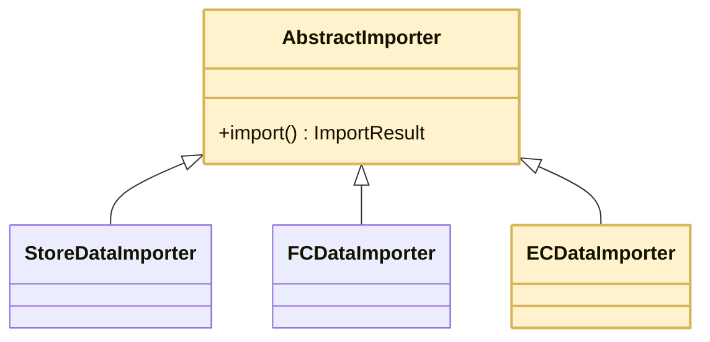
```mermaid
classDiagram
    class AbstractImporter {
        +import() ImportResult
    }
    class StoreDataImporter
    class FCDataImporter
    class ECDataImporter
    AbstractImporter <|-- StoreDataImporter
    AbstractImporter <|-- FCDataImporter
    AbstractImporter <|-- ECDataImporter
    class AbstractImporter:::focus
    class ECDataImporter:::focus
    classDef focus fill:#FFF2CC,stroke:#D6B656,stroke-width:2px
```

継承を選ぶ理由は、実行順が全形式で一つに固定され、差分ステップだけを派生側へ渡せるためです。次のコードでは骨格を先に示し、そのフックを各形式が実装します。

#### システム全体の最終構造を決める

この章の最終構造は、三つの設計決定から**一つに定まります**。業務順序を1か所に保ち、形式差分だけを差し込むため、共通順序を基底クラスの `import()` に固定し、変わるステップを派生クラスのフックへ委ねます。取得元と保存先は注入する境界として別にします。

各ステップを関数ポインタのテーブルで差し替える方式も理屈の上では置けますが、骨格の前後条件や失敗時の中断がテーブルの束へ散り、形式単位の責任とテスト境界が見えにくくなります。したがって当て馬を並べた比較は行いません（完成形が複数競合する章でのみ、構造差分を比較します）。

一意に定まった骨格固定構造を、`AbstractImporter`（固定骨格）、形式別Importer（パース・検証フック）、`SchemaRegistry`（形式登録）の責任として具体化します。

### 対策検討のクラス図：1-3の責任と依存をどう変えるか

フェーズ1の1-3で作ったクラス図へフェーズ2〜5の判断を反映し、変更後の形へ更新します。

| クラス図を変える材料 | 前工程で確認したこと | クラス図へ反映すること |
|---|---|---|
| フェーズ1のクラス図 | 現在のクラス、操作、依存関係 | 変更前クラス図としてそのまま使う |
| フェーズ2の変化予測 | 取込形式は今後も増える | 毎回複製される責任へ `【移す】` と注記する |
| フェーズ4の原因 | 各Importerに共通骨格と形式差分が混在する | 同じクラスの中で `【残す】` と `【移す】` を分ける |
| フェーズ5の接続点 | 骨格は形式の読み方を知らず、形式は順序を知らなくてよい | 課題ID1の共通骨格を `AbstractImporter` へ、差分をフックへ置く |

**薄い黄色が着目クラス**です。変更前では各Importerの `【残す】` と `【移す】`、変更後では移動先の `【新設】` を追います。矢印は1-3と同じ継承・利用関係です。

**変更前のクラス図（1-3を責任見直し用に再掲）：**

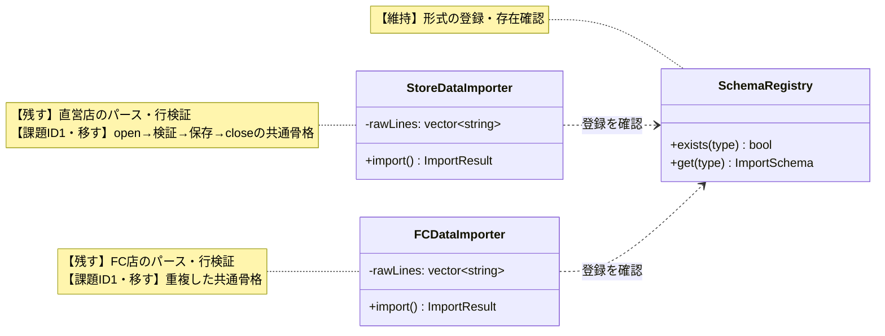
```mermaid
classDiagram
    direction LR
    class StoreDataImporter {
        -rawLines: vector~string~
        +import() ImportResult
    }
    class FCDataImporter {
        -rawLines: vector~string~
        +import() ImportResult
    }
    class SchemaRegistry {
        +exists(type) bool
        +get(type) ImportSchema
    }
    StoreDataImporter ..> SchemaRegistry : 登録を確認
    FCDataImporter ..> SchemaRegistry : 登録を確認
    note for StoreDataImporter "【残す】直営店のパース・行検証<br/>【課題ID1・移す】open→検証→保存→closeの共通骨格"
    note for FCDataImporter "【残す】FC店のパース・行検証<br/>【課題ID1・移す】重複した共通骨格"
    note for SchemaRegistry "【維持】形式の登録・存在確認"

    classDef focus fill:#FFF2CC,stroke:#D6B656,stroke-width:2px,color:#222222
    cssClass "StoreDataImporter,FCDataImporter" focus
```

変更前は各Importerが共通骨格と形式差分を一本の `import()` に抱え、形式追加のたびに骨格が複製されます。

課題ID1をクラス図の変更として書くと、次の3操作になります。

1. 課題ID1：各Importerの `import()` から共通骨格（open→検証→パース→行検証→保存→close）を外す。
2. 課題ID1：共通骨格を `AbstractImporter::import()` の1か所へ固定する（新設）。
3. 課題ID1：形式ごとのパース・行検証を派生クラスの `parseData()` / `validateRows()` フックへ残す。

変更後は同じ3つのImporterから読み、共通骨格が `AbstractImporter` へ移り、各Importerが差分フックだけを持つこと、保存・取得が外部境界へ分かれたことを確認します。

**採用した変更後のクラス図：**

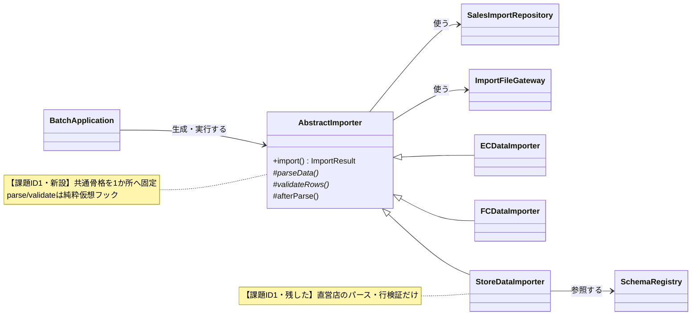
```mermaid
classDiagram
    direction LR
    class SchemaRegistry
    class ImportFileGateway
    class SalesImportRepository
    class BatchApplication
    class AbstractImporter {
        +import() ImportResult
        #parseData()*
        #validateRows()*
        #afterParse()
    }
    class StoreDataImporter
    class FCDataImporter
    class ECDataImporter

    AbstractImporter <|-- StoreDataImporter
    AbstractImporter <|-- FCDataImporter
    AbstractImporter <|-- ECDataImporter
    AbstractImporter --> ImportFileGateway : 使う
    AbstractImporter --> SalesImportRepository : 使う
    StoreDataImporter --> SchemaRegistry : 参照する
    BatchApplication --> AbstractImporter : 生成・実行する

    note for AbstractImporter "【課題ID1・新設】共通骨格を1か所へ固定<br/>parse/validateは純粋仮想フック"
    note for StoreDataImporter "【課題ID1・残した】直営店のパース・行検証だけ"

    classDef focus fill:#FFF2CC,stroke:#D6B656,stroke-width:2px,color:#222222
    cssClass "AbstractImporter,StoreDataImporter,FCDataImporter,ECDataImporter" focus
```

クラス図の変更とコード変更を一対一で対応させると、次のようになります。

| 課題ID | クラス図をどう変えるか | コードレベルで何をするか | 詳しく解く節 |
|---|---|---|---|
| 課題ID1 | 共通骨格を `AbstractImporter` へ固定し、形式差分を派生へ残す | `import()` に固定順序を書き可変部を純粋仮想フックに、各Importerが `parseData()`/`validateRows()` を実装、`ImportFileGateway`/`SalesImportRepository` を注入 | 課題ID1節（①〜⑥） |

このクラス図が、課題ID1を反映したシステム全体の設計結論です。課題IDは図の差分を追うために使い、以降はこの構造に必要なコードだけを示します。

#### 課題箇所のおさらい（フェーズ3の関連コード）

統合表で特定した箇所だけを振り返ります。課題ID1は各 `import()` にべた書きされた共通骨格と、その中に混ざる形式差分です。課題に関係しないコードは省略し、フェーズ3で明記した維持条件をそのまま引き継ぎます。

```cpp
// EC店データのインポート（会員ランク・ポイント項目あり）
// 既存の直営店・FC店と同じ手順を、また import() の中にべた書きでコピーしている
class ECDataImporter {
    vector<string> rawLines;
public:
    explicit ECDataImporter(vector<string> lines) : rawLines(move(lines)) {}

    ImportResult import() {
        cout << "EC店CSVを開く\n";                  // (1) 開く ← 全形式で同じコピー
        vector<SalesRow> rows; int skipped = 0;
        for (size_t i = 1; i < rawLines.size(); ++i) {
            vector<string> c = splitLine(rawLines[i], ',');
            if (c.size() < 5) { ++skipped; continue; }   // EC固有の列数
            rows.push_back({c[0], c[1], stol(c[2])});
        }
        long pointBonus = 0;                        // (2') EC固有：ポイント付与
        for (auto& r : rows) pointBonus += r.amount / 100;
        cout << rows.size() << "件をDBへ追加\n";     // (3) 保存 ← また同じコピー
        cout << "ファイルを閉じる\n";                 // (4) 閉じる ← また同じコピー
        return {"EC店データ", (int)rows.size(), skipped};
    }
};
```

### 課題ID1：形式固有処理と取込骨格を分離する

**【課題ID1の原因】** 問題ID1・問題ID2・問題ID3（手順の重複と全クラス同時修正）＝原因ID1（各Importerが処理の骨格と形式固有のパース・行検証を同じ `import()` へ混在）。この原因を分離対象にします。

**この課題（何を解きたいか）：** 新形式を足すたび共通手順を複製し、共通手順に修正が入ると全Importerを同時修正する——問題ID1〜問題ID3（痛み）／原因ID1です。**開く→形式確認→解析→行検証→保存→閉じるの順序を1か所に固定し、形式ごとの解析・行検証だけを差し替えられる**ようにするのが課題ID1です。

**どう解決するか（方針）：** 共通順序を基底クラスの骨格へ固定し、変わる部分だけを派生のフックへ外へ出します（骨格固定構造＝Template Method）。この章は骨格を持つので、①契約（フック宣言）→②骨格（固定順）→③具体（フック実装）→④生成 →⑤注入 →⑥実行 の順で組み立てます。

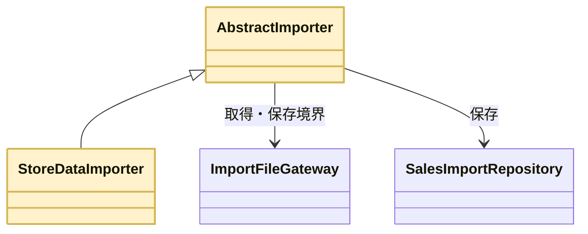
```mermaid
classDiagram
    class AbstractImporter
    class StoreDataImporter
    class ImportFileGateway
    class SalesImportRepository
    AbstractImporter <|-- StoreDataImporter
    AbstractImporter --> ImportFileGateway : 取得・保存境界
    AbstractImporter --> SalesImportRepository : 保存
    class AbstractImporter:::focus
    class StoreDataImporter:::focus
    classDef focus fill:#FFF2CC,stroke:#D6B656,stroke-width:2px
```

**①② 基底 `AbstractImporter` が、フックを宣言（①契約）し、共通順を `import()` へ固定する（②骨格）。** 形式で変わるステップは純粋仮想フックにして派生へ委ねます。

```cpp
class AbstractImporter {
    ImportFileGateway& gateway;
    SalesImportRepository& repo;
public:
    AbstractImporter(ImportFileGateway& g, SalesImportRepository& r)
        : gateway(g), repo(r) {}
    virtual ~AbstractImporter() = default;
    // ② 骨格：この順序だけを1か所に固定する
    ImportResult import() {
        vector<string> lines = gateway.open(filePath());
        gateway.checkFormatVersion();
        vector<ParsedRow> parsed = parseData(lines);      // ③ 形式差分
        ValidationResult v = validateRows(parsed);        // ③ 形式差分
        afterParse(v.validRows);                          // 任意フック
        int saved = repo.save(v.validRows);
        gateway.close();
        return { schemaType(), schemaName(), saved, v.skipped, true };
    }
protected:                                        // ① 契約（差し替え点）
    virtual string filePath() const = 0;
    virtual string schemaType() const = 0;
    virtual string schemaName() const = 0;
    virtual vector<ParsedRow> parseData(const vector<string>&) = 0;
    virtual ValidationResult validateRows(const vector<ParsedRow>&) = 0;
    virtual void afterParse(const vector<SalesRow>&) {}
};
```

**③ 各形式は骨格を持たず、フックの中身だけを実装する。** 直営店もFC店もEC店も共通順を複製しません。

```cpp
class StoreDataImporter : public AbstractImporter {
public:
    using AbstractImporter::AbstractImporter;
protected:
    string filePath()   const override { return "store_sales.csv"; }
    string schemaType() const override { return "store"; }
    string schemaName() const override { return "直営店データ"; }
    vector<ParsedRow> parseData(const vector<string>& lines) override {
        vector<ParsedRow> out;                       // カンマ区切り・ヘッダーあり
        for (size_t i = 1; i < lines.size(); ++i) {
            vector<string> c = splitLine(lines[i], ',');
            bool ok = (c.size() >= 3);
            SalesRow r = ok ? SalesRow{c[0], c[1], stol(c[2])} : SalesRow{};
            out.push_back({r, ok});
        }
        return out;
    }
    ValidationResult validateRows(const vector<ParsedRow>& parsed) override {
        ValidationResult v{{}, 0, {}};
        for (auto& p : parsed)
            if (p.wellFormed) v.validRows.push_back(p.row);
            else ++v.skipped;
        return v;
    }
};
```

**④ 生成と⑤ 注入。** 取得・保存の境界（`ImportFileGateway`／`SalesImportRepository`）を組み立て側で生成し、派生Importerへ注入します。これらは1-4の既存境界のままで、保存媒体や永続化仕様は追加しません。

```cpp
ImportFileGateway gateway;
SalesImportRepository repo;
gateway.prepareSample("store_sales.csv", storeCsv);
StoreDataImporter store(gateway, repo);   // ④⑤ 骨格へ境界を注入
```

**⑥ 実行部は骨格の固定順を1回呼ぶだけ。** 派生の種類にかかわらず `import()` が同じ順序で走り、形式差分だけがフックの向こうで変わります。

```cpp
ImportResult r = store.import();          // ⑥ 固定順序で実行
```

これで課題ID1の完了条件「形式追加は差分処理だけ、共通手順追加は骨格1か所だけの変更で済む」を満たします。`ImportFileGateway` の内側は1-4の `SampleFileStore` と同じ `map<string, vector<string>>`、`save()` は1-4と同じ件数表示のままです。

### 6-1：生成・所有・実行順のまとめ

課題ID1を一本の実行経路へ束ね直します。上の課題別展開は試行錯誤の履歴ではなく、完成構造を理解できる単位へ分けた実装順です。

- 骨格：`AbstractImporter::import()` が共通順を1か所に固定し、派生はフックだけを実装。
- 境界：`ImportFileGateway`／`SalesImportRepository` を組み立て側が生成・所有し、Importerへ注入（1-4の既存仕様のまま）。
- 実行順：`import()` → open → 形式確認 → `parseData()`（③）→ `validateRows()`（③）→ save → close。形式差分だけが骨格の外で差し替わります。

### 6-2：システム全体の契約とデータ配置を確定する

採用システムの契約、生成場所、依存注入を一表で確定します。`ImportResult` は対策の抽象ではなく、取込1回の種別・保存件数・スキップ件数・成否を呼び出し元へ返す結果オブジェクトです。

```cpp
struct ImportResult {
    string schemaType;   // 形式の種別
    string schemaName;   // 表示名
    int saved;           // 保存できた件数
    int skipped;         // スキップした件数
    bool success;        // 成否
};
```

| 接続点を変える観点 | システム全体での設計判断 | 変えたくない側が知らなくなる詳細 |
|---|---|---|
| 分離方法 | 課題ID1の形式ごとのパース・行検証を派生クラスのフックへ置く | 形式ごとの読み方 |
| 配置場所 | 業務順序を基底、形式差分を派生、取得・保存を境界へ置く | 具体形式と保存媒体の詳細 |
| 組み立て方法 | `BatchApplication` が生成・所有し、境界を注入して各Importerを実行する | 具体形式クラスの生成・選択 |

参照で非所有の依存を保持するため、`main()` の境界オブジェクトはImporterより長く生存させます。

#### システム全体のコード適用結果

| 追跡対象 | 課題定義で目指した状態 | 適用した構造とコード | 適用結果 |
|---|---|---|---|
| 課題ID1：形式差分 | 形式追加を差分と登録へ限定する | 各Importerの `parseData()`／`validateRows()` とSchemaRegistry登録 | 新形式クラスと登録へ変更が閉じた |
| 課題ID1を適用したシステム全体 | 共通順序と `ImportResult` を維持する | `AbstractImporter::import()` が取得→版確認→解析→検証→保存を固定 | 骨格を複製せず、件数・スキップ・成否を維持した |

**システム全体の実装結果：達成。** 課題ID1の形式差分・境界実装と業務順序が分かれ、フェーズ5で目指した状態を実現しました。実際の動作と変更影響はフェーズ7で確認します。

### 6-3：課題から完成構造までの設計トレース

ここまでの決定を、課題ID1の骨格側と差分側に分けて一望へまとめます。この表は設計課題だけを追います。変更要求の受入はフェーズ7の要求ID表、変更影響は7-4の変更ID表で別に確認します。

| 課題ID | 採用構造と生成・接続場所 | 完成コードの主な場所 | 確認 |
|---|---|---|---|
| 課題ID1（骨格） | 骨格固定。業務順序を基底の1か所へ固定 | `AbstractImporter::import()` | 共通手順追加が骨格1か所の変更で済む |
| 課題ID1（形式差分） | フック分離。形式ごとの解析・行検証を派生フックへ残す | `StoreDataImporter`／`FCDataImporter`／`ECDataImporter` の`parseData()`／`validateRows()` | 形式追加が差分クラスと登録に閉じる |
| 変更対象外 | 取得・保存・取込結果。基底が契約経由で利用する | `ImportFileGateway`、`SalesImportRepository`、`ImportResult` | 1-4、正常行だけ保存し件数・理由を返す |

このクラス図、コード適用結果、シーケンス、コード変更表が、フェーズ7へ渡す完成設計です。

### 6-4：将来リスクに対する設計上の確認

ここは将来機能を実装する場ではありません。フェーズ2のリスクIDを採用構造へ再適用し、リスクが現実になった場合の変更先と、今回守れる範囲を確認します。

| リスクID・将来リスク | 採用構造での考慮 | 将来の主な変更先 | 今回の判断 |
|---|---|---|---|
| リスクID1：SNS販売データのインポート形式追加 | 読込から保存までの共通順をAbstractImporterに残し、形式差分を具体Importerへ置く | 新しいImporter、SchemaRegistry、BatchApplicationの登録 | 共通順を守れる。SNS形式は完成コードへ追加しない |
| リスクID2：各店のデータ項目の追加・計算ルール変更 | parse・validate・transformの差し替え点へ店舗固有知識を閉じる | 対象ImporterとSchemaRegistry | 形式固有変更へ局所化できる。未確定項目は完成コードへ追加しない |

リスクID1・リスクID2はTemplate Methodの差し替え点を決める材料です。将来形式を実装せず、どの共通順を変更から守れるかだけを設計時に確認します。

## 🟢 フェーズ7：対策実施 ―― 変化に強いコードを完成させる
フェーズ6で確定した骨格固定構造を、実際のコードに実装します。これまでは個別のクラスで重複していたファイル操作やDB保存の手順を、基底クラスにテンプレートとして集約します。

また、フェーズ3の追加要求で示した「全形式共通の形式バージョンチェック」を `checkFormatVersion()` として骨格に組み込みます。骨格が1か所（`AbstractImporter`）に集約されているため、この追加は基底クラスへの1回の修正で全形式に反映できます。

この設計変更により、新しいインポート形式を追加するときは、共通の手順を複製せずに、形式ごとのパース処理・行検証・必要に応じた後処理をサブクラスへ記述できます。共通手順そのものを変える場合は `AbstractImporter` を修正し、利用する形式を増やす場合は組み立て箇所へ登録します。

### 7-1：解決後のコード（全体）

新しい設計では、共通の手順を親クラスで定義し、形式ごとのパース処理、行検証、任意の後処理をサブクラスに委譲します。各役割ごとにコードを分けて確認します。

**スキーマ定義・ドメイン型・SchemaRegistryクラス：**

#### 完成後のクラス一覧

完成コードで定義する型を先に一覧化します。各型の依存方向と実現関係は、直後のクラス図で確認します。

- `SchemaRegistry`、`ImportFileGateway`、`SalesImportRepository`、`BatchApplication`
- `AbstractImporter`、`StoreDataImporter`、`FCDataImporter`、`ECDataImporter`

#### 完成後のクラス図


```mermaid
classDiagram
    direction LR
    class SchemaRegistry
    class ImportFileGateway
    class SalesImportRepository
    class BatchApplication
    class AbstractImporter {
        +import() ImportResult
        #parseData()*
        #validateRows()*
        #afterParse()
    }
    class StoreDataImporter
    class FCDataImporter
    class ECDataImporter

    AbstractImporter <|-- StoreDataImporter
    AbstractImporter <|-- FCDataImporter
    AbstractImporter <|-- ECDataImporter
    AbstractImporter --> ImportFileGateway : 使う
    AbstractImporter --> SalesImportRepository : 使う
    StoreDataImporter --> SchemaRegistry : 参照する
    BatchApplication --> AbstractImporter : 生成・実行する

    note for AbstractImporter "【課題ID1・新設】共通骨格を1か所へ固定<br/>parse/validateは純粋仮想フック"
    note for StoreDataImporter "【課題ID1・残した】直営店のパース・行検証だけ"

    classDef focus fill:#FFF2CC,stroke:#D6B656,stroke-width:2px,color:#222222
    cssClass "AbstractImporter,StoreDataImporter,FCDataImporter,ECDataImporter" focus
```

章末のTemplate Method骨格図では `AbstractImporter.import()` が共通の骨格、3つのImporterが個別ステップを実装する具象クラスに対応します。ファイル取得とDB保存は骨格へ直書きせず、それぞれの外部境界へ委譲します。

#### 完成後の実行シーケンス

変更ID1のEC取込も、既存の直営店・FC店も、同じ骨格を通ります。変更ID2のバージョン確認が解析より前に1回だけ実行され、形式固有処理だけが派生クラスへ切り替わる流れを示します。

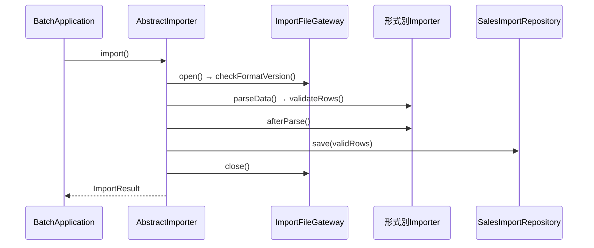
```mermaid
sequenceDiagram
    participant A as BatchApplication
    participant I as AbstractImporter
    participant G as ImportFileGateway
    participant C as 形式別Importer
    participant R as SalesImportRepository
    A->>I: import()
    I->>G: open() → checkFormatVersion()
    I->>C: parseData() → validateRows()
    I->>C: afterParse()
    I->>R: save(validRows)
    I->>G: close()
    I-->>A: ImportResult
```

`BatchApplication`が知るのは、組み立てたImporterへ`import()`を依頼することだけです。骨格は基底クラス、形式差分は派生クラス、ファイル取得と保存は境界クラスに分かれています。

#### 完成コード

```cpp
#include <iostream>
#include <sstream>
#include <string>
#include <vector>
#include <map>
using namespace std;

// 店舗形式ID（スキーマ登録と各Importerの型宣言で使う定数）
namespace SchemaType {
    const string Store = "store";
    const string Fc    = "fc";
    const string Ec    = "ec";
}

// 1行を区切り文字で分割する小さなヘルパー
static vector<string> splitLine(const string& line, char delim) {
    vector<string> cols; string cur; istringstream iss(line);
    while (getline(iss, cur, delim)) cols.push_back(cur);
    return cols;
}

// ---- ドメインデータ型（void をやめ、実データを受け渡す）----
struct SalesRow { string id; string name; long amount; };
struct ParsedRow { SalesRow row; bool wellFormed; };
struct ValidationResult {
    vector<SalesRow> validRows;
    int skipped;
    vector<string> reasons;
};
struct ImportResult {
    string schemaType;
    string schemaName;
    int saved;
    int skipped;
    bool success;
    vector<string> reasons;   // 保存できなかった行の理由
};

// ---- スキーマ ----
struct ImportSchema { string name; vector<string> requiredColumns; };
class SchemaRegistry {
    map<string, ImportSchema> schemas;
public:
    SchemaRegistry() {
        schemas[SchemaType::Store] = {"直営店データ", {"id","name","amount"}};
        schemas[SchemaType::Fc]    = {"FC店データ",   {"id","name","amount"}};
        schemas[SchemaType::Ec]    = {"EC店データ",
            {"id","name","amount","memberRank","point"}};
    }
    bool exists(const string& t) const { return schemas.count(t) > 0; }
    ImportSchema get(const string& t) const { return schemas.at(t); }
};
```

店舗形式ID（`store`／`fc`／`ec`）は `SchemaType` の名前付き定数へまとめ、スキーマ登録のキーと各Importerの `schemaType()` の戻り値を同じ定数で揃えて、直文字列の打ち間違いを防ぎます。`SchemaRegistry` は1-4の2種類（store / fc）に、変更要求のEC店（ec）が加わり、ecには会員ランク（memberRank）とポイント（point）の列が増えています。戻り値の型もすべて `void` をやめました。`import()` は `ImportResult`（種別・スキーマ名・保存件数・スキップ件数・成否）を返し、`parseData()` は `vector<ParsedRow>`、`validateRows()` は `ValidationResult` を返します。`ParsedRow`／`ValidationResult` は、パースと行検証の境界で受け渡す中間データです。

**ファイルI/OとDBの境界スタブ：**

```cpp
// ---- 境界スタブ：ファイルI/OとDB（本章の論点外を簡略化）----
// 実ファイルは使わず、メモリ上にサンプルCSVを保持する。実運用ではこの内側が
// 本物のファイルAPI・DB・オブジェクトストレージへ差し替わる（骨格は媒体を知らない）。
class ImportFileGateway {
    map<string, vector<string>> store;   // 論理パス -> 行データ（実ファイルの代わり）
public:
    void prepareSample(const string& path, const string& content) {
        vector<string> lines; string line; istringstream iss(content);
        while (getline(iss, line)) {
            if (!line.empty() && line.back() == '\r') line.pop_back();
            if (!line.empty()) lines.push_back(line);
        }
        store[path] = lines;
    }
    vector<string> open(const string& path) {
        cout << "ファイルをオープンしました。\n";
        return store.count(path) ? store[path] : vector<string>{};
    }
    void close() { cout << "ファイルをクローズしました。\n"; }
    string checkFormatVersion() {
        cout << "[全共通] 形式バージョンを確認しました。\n"; return "v1";
    }
};
class SalesImportRepository {
public:
    int save(const vector<SalesRow>& rows) {
        cout << "DBへ" << rows.size() << "件を保存しました。\n";
        if (!rows.empty()) {
            const SalesRow& s = rows.front();
            cout << "  先頭行: " << s.id << " " << s.name
                 << " " << s.amount << "円\n";
        }
        return (int)rows.size();
    }
};
```

ファイルI/OとDBは本章の論点外なので、どちらも1-4と同じインメモリのスタブです。`ImportFileGateway`は`SampleFileStore`と同じく行配列を保持して返し、`SalesImportRepository.save()`も受け取った行の件数を表示するだけで、永続化や累積金額という新しい仕様を足しません。変えたのは共通骨格から呼ぶ位置であり、保存方法ではありません。

**AbstractImporterクラス（骨格の定義）：**

```cpp
// ---- 骨格を固定する基底クラス（テンプレートメソッド）----
class AbstractImporter {
    ImportFileGateway& gateway;
    SalesImportRepository& repo;
public:
    AbstractImporter(ImportFileGateway& g, SalesImportRepository& r)
        : gateway(g), repo(r) {}
    virtual ~AbstractImporter() = default;

    // テンプレートメソッド。戻り値は ImportResult（void をやめる）。
    ImportResult import() {
        vector<string> lines = gateway.open(filePath());    // (1) 開く
        string version = gateway.checkFormatVersion();      // (2) バージョン確認（全共通）
        if (version != expectedVersion()) {                 //     不一致なら解析も保存もしない
            cout << "  形式バージョン不一致(" << version
                 << "≠" << expectedVersion() << ")のため中止します。\n";
            gateway.close();                                // (7) 閉じるだけは必ず通る
            ImportResult ng = { schemaType(), schemaName(), 0, 0, false, {} };
            ng.reasons.push_back("形式バージョン不一致");
            return ng;
        }
        vector<ParsedRow> parsed = parseData(lines);        // (3) 形式ごとのパース
        ValidationResult v = validateRows(parsed);          // (4) 形式ごとの行検証
        afterParse(v.validRows);                            // (5) 任意フック（EC店のみ）
        int saved = repo.save(v.validRows);                 // (6) 保存
        gateway.close();                                    // (7) 閉じる
        ImportResult ok = { schemaType(), schemaName(), saved, v.skipped, true, {} };
        ok.reasons = v.reasons;                             //     失敗理由を結果へ載せる
        return ok;
    }
protected:
    virtual string filePath() const = 0;
    virtual string schemaType() const = 0;
    virtual string schemaName() const = 0;
    virtual string expectedVersion() const { return "v1"; } // 既定は現行形式
    virtual vector<ParsedRow> parseData(const vector<string>& lines) = 0;
    virtual ValidationResult validateRows(const vector<ParsedRow>& parsed) = 0;
    virtual void afterParse(const vector<SalesRow>&) {}     // 既定は何もしない任意フック
};

```

`import()` が処理の順序を一か所に集約し、各ステップの戻り値（読み込んだ行・パース結果・検証結果・保存件数）を次のステップへ受け渡します。全形式で必要な `parseData()`（`vector<ParsedRow>` を返す）と `validateRows()`（`ValidationResult` を返す）は純粋仮想関数とし、形式によって要否が異なるパース後処理は `afterParse()` という任意フックにしています。全体の流れが基底クラスで固定され、サブクラスは必要な手順（ステップ）の中身だけを埋めれば済みます。

**具体クラス（StoreDataImporter / FCDataImporter / ECDataImporter）：**

```cpp
// ---- 直営店（カンマ区切り・ヘッダーあり）----
class StoreDataImporter : public AbstractImporter {
public:
    using AbstractImporter::AbstractImporter;
protected:
    string filePath()   const override { return "store_sales.csv"; }
    string schemaType() const override { return SchemaType::Store; }
    string schemaName() const override { return "直営店データ"; }
    vector<ParsedRow> parseData(const vector<string>& lines) override {
        cout << "[直営店] ヘッダー行をスキップし、カンマ区切りで解析します。\n";
        vector<ParsedRow> out;
        for (size_t i = 1; i < lines.size(); ++i) {          // 1行目=ヘッダー
            vector<string> c = splitLine(lines[i], ',');
            bool ok = (c.size() >= 3);
            SalesRow r = ok ? SalesRow{c[0], c[1], stol(c[2])} : SalesRow{};
            out.push_back({r, ok});
        }
        return out;
    }
    ValidationResult validateRows(const vector<ParsedRow>& parsed) override {
        ValidationResult v{{}, 0, {}};
        for (auto& p : parsed) {
            if (p.wellFormed) v.validRows.push_back(p.row);
            else { ++v.skipped; v.reasons.push_back("必須列不足"); }
        }
        cout << "[直営店] 必須列を検証しました（有効" << v.validRows.size()
             << "件 / スキップ" << v.skipped << "件）。\n";
        return v;
    }
};

// ---- FC店（タブ区切り・ヘッダーなし・不正行スキップ）----
class FCDataImporter : public AbstractImporter {
public:
    using AbstractImporter::AbstractImporter;
protected:
    string filePath()   const override { return "fc_sales.csv"; }
    string schemaType() const override { return SchemaType::Fc; }
    string schemaName() const override { return "FC店データ"; }
    vector<ParsedRow> parseData(const vector<string>& lines) override {
        cout << "[FC店] 先頭行からタブ区切りで解析します。\n";
        vector<ParsedRow> out;
        for (size_t i = 0; i < lines.size(); ++i) {          // ヘッダーなし
            vector<string> c = splitLine(lines[i], '\t');
            bool ok = (c.size() >= 3);
            SalesRow r = ok ? SalesRow{c[0], c[1], stol(c[2])} : SalesRow{};
            out.push_back({r, ok});
        }
        return out;
    }
    ValidationResult validateRows(const vector<ParsedRow>& parsed) override {
        ValidationResult v{{}, 0, {}};
        for (auto& p : parsed) {
            if (p.wellFormed) v.validRows.push_back(p.row);
            else { ++v.skipped; v.reasons.push_back("タブ分割不可"); }
        }
        cout << "[FC店] 不正行を検証しました（有効" << v.validRows.size()
             << "件 / スキップ" << v.skipped << "件）。\n";
        return v;
    }
};

// ---- 回帰確認用（骨格もパースも変えず、読む先と期待バージョンだけ差し替える）----
class StoreEmptyImporter : public StoreDataImporter {   // 空ファイル
public:
    using StoreDataImporter::StoreDataImporter;
protected:
    string filePath() const override { return "store_empty.csv"; }
};
class FCBrokenImporter : public FCDataImporter {        // 全行タブ分割不可
public:
    using FCDataImporter::FCDataImporter;
protected:
    string filePath() const override { return "fc_broken.csv"; }
};
class StoreV2Importer : public StoreDataImporter {      // 形式バージョン不一致
public:
    using StoreDataImporter::StoreDataImporter;
protected:
    string filePath()        const override { return "store_v2.csv"; }
    string expectedVersion() const override { return "v2"; }
};

// ---- EC店（カンマ区切り・会員ランク/ポイント・後処理あり）----
class ECDataImporter : public AbstractImporter {
    long pointBonus = 0;
public:
    using AbstractImporter::AbstractImporter;
protected:
    string filePath()   const override { return "ec_sales.csv"; }
    string schemaType() const override { return SchemaType::Ec; }
    string schemaName() const override { return "EC店データ"; }
    vector<ParsedRow> parseData(const vector<string>& lines) override {
        cout << "[EC店] カンマ区切りで会員ランク・ポイント列まで解析します。\n";
        vector<ParsedRow> out;
        for (size_t i = 1; i < lines.size(); ++i) {          // 1行目=ヘッダー
            vector<string> c = splitLine(lines[i], ',');
            // id,name,amount,rank,point
            bool ok = (c.size() >= 5);
            SalesRow r = ok ? SalesRow{c[0], c[1], stol(c[2])} : SalesRow{};
            out.push_back({r, ok});
        }
        return out;
    }
    ValidationResult validateRows(const vector<ParsedRow>& parsed) override {
        ValidationResult v{{}, 0, {}};
        for (auto& p : parsed) {
            if (p.wellFormed) v.validRows.push_back(p.row);
            else { ++v.skipped; v.reasons.push_back("EC必須列(ランク/ポイント)不足"); }
        }
        cout << "[EC店] 不正行を検証しました（有効" << v.validRows.size()
             << "件 / スキップ" << v.skipped << "件）。\n";
        return v;
    }
    void afterParse(const vector<SalesRow>& rows) override {
        for (auto& r : rows) pointBonus += r.amount / 100;   // ポイント付与量
        cout << "[EC店] ポイントボーナスを計算しました（" << rows.size()
             << "件・合計" << pointBonus << "pt）。\n";
    }
};

```

> **EC向け計算処理を任意フックにした理由：** 1-5節の仕様表では、EC向け計算は「パース完了後、行検証を終え、DB保存する前」に行う独立したステップです。そこで骨格にも `afterParse()` という位置を用意し、既定実装は何もしない形にしました。直営店・FC店はそのまま通過し、EC店だけが計算処理を追加します。仕様上の順序とコード上の順序が一致するため、後から別形式にも同様の後処理が必要になったとき、置き場所を判断しやすくなります。

各サブクラスは形式ごとの `parseData()` と `validateRows()` を実装し、必要な場合だけ `afterParse()` を追加します。ファイルの開閉、バージョンチェック、DB保存、結果記録へ進む順序は基底クラスが担当します。

**BatchApplicationクラス（組み立て）：**

`BatchApplication`は境界と3形式のImporterを組み立て、同じ`import()`骨格を順に実行します。今回の要求にないスケジューラ、非同期キュー、手動アップロード入口は追加しません。

```cpp
// ---- 依存関係の組み立てを担うクラス ----
class BatchApplication {
    SchemaRegistry registry;
    ImportFileGateway gateway;
    SalesImportRepository repo;
public:
    void run() {
        // 実ファイルではなく、メモリ上にサンプルCSVを用意する
        gateway.prepareSample("store_sales.csv", storeCsv());
        gateway.prepareSample("fc_sales.csv",    fcCsv());
        gateway.prepareSample("ec_sales.csv",    ecCsv());

        StoreDataImporter store(gateway, repo);
        FCDataImporter    fc(gateway, repo);
        ECDataImporter    ec(gateway, repo);

        vector<ImportResult> results;
        results.push_back(store.import());
        results.push_back(fc.import());
        results.push_back(ec.import());

        cout << "\n--- インポート結果ログ ---\n";
        for (auto& r : results) printResult(r);
        reportUnknown("online");   // 未登録タイプはエラーで中断

        // 継続要求の回帰：1-2の動作例にある異常系を同じ完成コードで確認する
        cout << "\n--- 回帰1: 直営店 空ファイル ---\n";
        gateway.prepareSample("store_empty.csv", "id,name,amount\n");
        StoreEmptyImporter empty(gateway, repo);
        printResult(empty.import());

        cout << "\n--- 回帰2: FC店 全行不正 ---\n";
        gateway.prepareSample("fc_broken.csv", "F001,商品1,2000\nF002,商品2,2000\n");
        FCBrokenImporter broken(gateway, repo);
        printResult(broken.import());

        cout << "\n--- 回帰3: 形式バージョン不一致 ---\n";
        gateway.prepareSample("store_v2.csv", storeCsv());
        StoreV2Importer v2(gateway, repo);
        printResult(v2.import());
    }
private:
    void printResult(const ImportResult& r) {
        if (!registry.exists(r.schemaType)) return;
        ImportSchema schema = registry.get(r.schemaType);
        if (schema.name != r.schemaName) {
            cout << "[エラー] スキーマ表示名が一致しません\n";
            return;
        }
        cout << "[" << r.schemaType << "] " << r.schemaName
             << "（必須列" << schema.requiredColumns.size() << "）"
             << " 保存" << r.saved << "件 / スキップ" << r.skipped << "件 -> "
             << (r.success ? "成功" : "失敗") << "\n";
        for (size_t i = 0; i < r.reasons.size(); ++i)   // 要求ID4：理由も出す
            cout << "    理由" << (i + 1) << ": " << r.reasons[i] << "\n";
    }
    void reportUnknown(const string& type) {
        if (!registry.exists(type))
            cout << "[エラー] 未登録のインポートタイプ: " << type << " — 処理を中断します\n";
    }
    // サンプルCSVの中身（直営店=10件、FC店=5件、EC店=10件中2件不正）
    string storeCsv() {
        string s = "id,name,amount\n";
        for (int i = 1; i <= 10; ++i)
            s += "S00" + to_string(i) + ",商品" + to_string(i) + ",1000\n";
        return s;
    }
    string fcCsv() {
        string s;
        for (int i = 1; i <= 5; ++i)
            s += "F00" + to_string(i) + "\t商品" + to_string(i) + "\t2000\n";
        return s;
    }
    string ecCsv() {
        string s = "id,name,amount,rank,points\n";
        for (int i = 1; i <= 10; ++i) {
            if (i == 4 || i == 9)   // 2件は列不足（不正行）
                s += "E00" + to_string(i) + ",商品" + to_string(i) + ",3000\n";
            else
                s += "E00" + to_string(i) + ",商品"
                    + to_string(i) + ",3000,gold,50\n";
        }
        return s;
    }
};
```

`main()`は`BatchApplication`を組み立てて`run()`を呼ぶだけで、具体クラスの生成と境界の注入はすべて`BatchApplication`に閉じています。

```cpp
int main() {
    BatchApplication app;
    app.run();
    return 0;
}
```

**実行結果：**

```text
ファイルをオープンしました。
[全共通] 形式バージョンを確認しました。
[直営店] ヘッダー行をスキップし、カンマ区切りで解析します。
[直営店] 必須列を検証しました（有効10件 / スキップ0件）。
DBへ10件を保存しました。
  先頭行: S001 商品1 1000円
ファイルをクローズしました。
ファイルをオープンしました。
[全共通] 形式バージョンを確認しました。
[FC店] 先頭行からタブ区切りで解析します。
[FC店] 不正行を検証しました（有効5件 / スキップ0件）。
DBへ5件を保存しました。
  先頭行: F001 商品1 2000円
ファイルをクローズしました。
ファイルをオープンしました。
[全共通] 形式バージョンを確認しました。
[EC店] カンマ区切りで会員ランク・ポイント列まで解析します。
[EC店] 不正行を検証しました（有効8件 / スキップ2件）。
[EC店] ポイントボーナスを計算しました（8件・合計240pt）。
DBへ8件を保存しました。
  先頭行: E001 商品1 3000円
ファイルをクローズしました。

--- インポート結果ログ ---
[store] 直営店データ（必須列3） 保存10件 / スキップ0件 -> 成功
[fc] FC店データ（必須列3） 保存5件 / スキップ0件 -> 成功
[ec] EC店データ（必須列5） 保存8件 / スキップ2件 -> 成功
    理由1: EC必須列(ランク/ポイント)不足
    理由2: EC必須列(ランク/ポイント)不足
[エラー] 未登録のインポートタイプ: online — 処理を中断します

--- 回帰1: 直営店 空ファイル ---
ファイルをオープンしました。
[全共通] 形式バージョンを確認しました。
[直営店] ヘッダー行をスキップし、カンマ区切りで解析します。
[直営店] 必須列を検証しました（有効0件 / スキップ0件）。
DBへ0件を保存しました。
ファイルをクローズしました。
[store] 直営店データ（必須列3） 保存0件 / スキップ0件 -> 成功

--- 回帰2: FC店 全行不正 ---
ファイルをオープンしました。
[全共通] 形式バージョンを確認しました。
[FC店] 先頭行からタブ区切りで解析します。
[FC店] 不正行を検証しました（有効0件 / スキップ2件）。
DBへ0件を保存しました。
ファイルをクローズしました。
[fc] FC店データ（必須列3） 保存0件 / スキップ2件 -> 成功
    理由1: タブ分割不可
    理由2: タブ分割不可

--- 回帰3: 形式バージョン不一致 ---
ファイルをオープンしました。
[全共通] 形式バージョンを確認しました。
  形式バージョン不一致(v1≠v2)のため中止します。
ファイルをクローズしました。
[store] 直営店データ（必須列3） 保存0件 / スキップ0件 -> 失敗
    理由1: 形式バージョン不一致
```

変更ID2の共通バージョンチェックは基底クラスへ1回だけ置き、形式ごとの行検証は`validateRows()`へ、変更ID1のEC計算は`afterParse()`へ置きました。3形式とも同じ`import()`を呼び、骨格の順序は変わりません。未登録タイプ（"online"）は`SchemaRegistry.exists()`で検出し、結果出力の際にエラーを出力します。

回帰1〜3は、1-2の動作例と変更ID2の受入条件を完成コードで確認するためのシナリオです。回帰1と回帰2は、フェーズ1から続く「空ファイルでも手順を最後まで通す」「不正行はスキップして件数と理由を返す」という既存動作が、骨格を基底クラスへ移した後も変わっていないことを示します。読む先を差し替えただけで骨格もパースも共有しているため、確認のために書き足したのは `filePath()` の1メソッドだけです。

回帰3は、変更ID2の受入条件「不一致時は解析・保存せず終了」を満たすことを示します。`import()` は `checkFormatVersion()` の戻り値を `expectedVersion()` と比べ、違えば `parseData()` にも `repo.save()` にも進まず、`close()` だけを通して失敗理由を返します。骨格に判定を1か所置いたので、この中止条件は3形式すべてに同時に効きます。

このコードは `BatchApplication` が実行時にメモリ上へ `store_sales.csv`・`fc_sales.csv`・`ec_sales.csv` 相当のサンプルCSVを用意し（ディスクにファイルは作りません）、それを `gateway.open()` で読み込んで件数を数えます。上の実行結果の「10件」「5件」「2件スキップ」「240pt」は、この用意したCSVの実データから算出した値で、`storeCsv()`／`fcCsv()`／`ecCsv()` の中身を書き換えれば結果もその場で変わります。空ファイル・大量データなど全仕様を網羅するコードではないため、それらは実際のデータを使うテストで確認します。

`main()`はキックするだけで、具体クラスの知識と`SchemaRegistry`の参照は`BatchApplication`に閉じています。

**補足：保存媒体が変わったら？（骨格とゲートウェイの境界）**

「開く・保存する・閉じる」を骨格に固定した、と言うと「では入力がファイルでなくDBやオブジェクトストレージになったら骨格ごと壊れるのでは」という疑問が出ます。ここは分けて考えます。

- **保存媒体の変更（ファイル→DB→S3など）は、骨格を壊しません。** 骨格 `import()` は `gateway.open()` と `repo.save()` を呼ぶだけで、媒体の実体を知りません。媒体が変わっても差し替わるのは `ImportFileGateway`／`SalesImportRepository` の内側だけで、`import()` の順序も各Importerのパース処理も変わりません。つまり「媒体」はこの2つの境界クラスに閉じ込めた**変化軸**であり、骨格側では安定して見えます。
- **壊れるのは「手順の順序そのもの」が変わるときです。** たとえば「開く前に一部を保存する」「開かずにストリームから逐次読みながら保存する」のように順序が別物になる形式が来た場合、`open→…→close` という骨格の前提が合わなくなります。これはこの章の設計の限界で、パターン解説の「使いどころと限界」で扱います。

言い換えると、この章で「変わってほしくない」と置いたのは**手順の順序**であって、**保存媒体**ではありません。保存媒体は最初からゲートウェイの裏に隔離してある、というのが7-1の構造です。

#### 最終要求の実装・受入エビデンス

変更後要求ベースラインの全有効要求IDを同じ順序で照合します。今回変わらなかった既存要求も対象にするため、要求の消失を検出できます。

| 要求ID | 最終要求 | 適用コード | 実行シナリオ・観測結果・判定 |
|---|---|---|---|
| 要求ID1 | 直営店・FC店・EC店の3形式を取り込む | 各`AbstractImporter`派生、`SchemaRegistry` | 3形式を選択して処理<br/>**判定:** 合格 |
| 要求ID2 | 開く→形式バージョン確認→解析→行検証→保存→閉じる順を全形式で守る | `AbstractImporter::import()`、`expectedVersion()` | 回帰3で不一致(v1≠v2)を検出し、解析・保存なしでcloseだけ実行<br/>**判定:** 合格 |
| 要求ID3 | 形式ごとの解析と、EC固有の会員ランク・ポイント計算を行う | `ECDataImporter` | EC正常行から計算済み結果<br/>**判定:** 合格 |
| 要求ID4 | 不正行を保存せず、成功・スキップ件数と失敗理由を返す | `ImportResult.reasons`、保存境界 | EC2件と回帰2の2件で件数と理由を出力。回帰1の空ファイルも0件で完走<br/>**判定:** 合格 |

上の表は継続（要求ID4）・変更（要求ID1・要求ID2・要求ID3）を同じ順序で並べ、変わらなかった既存要求も回帰対象に含めています。継続要求が合格していることで、既存動作が落ちていないことを確認できます。要求の受入・回帰はここで完了します。課題IDへ直接対応付けず、以下では変更試行の痛みから導いた構造課題だけを別に確認します。

#### 設計課題の構造改善結果

要求の受入とは分けて、課題IDごとに構造と変更影響を確認します。

| 課題ID | 構造差分・コード適用先 | 確認できた効果 | 残る変更先 |
|---|---|---|---|
| 課題ID1 | 共通順を`AbstractImporter`、形式差分を派生へ分離 | 形式追加と共通手順追加の変更先を分けた | 新Importerとスキーマ登録 |
#### 変更前→変更後の不変条件照合

| 変更対象外 | 変更前 | 変更後 | 確認根拠 |
|---|---|---|---|
| 取込結果契約 | `ImportResult` を返す | 同じ成功・保存・スキップ情報を返す | 1-4と7-1の結果ログ |
| データ保存境界 | 読み取った行をRepositoryへ保存 | 同じ行表現を `SalesImportRepository` へ渡す | 7-1の保存件数・先頭行出力 |

### 7-2：動作シーケンス図の検証

完成クラス図と実行シーケンスは、完成コードへ入る前に示しました。ここまでのコード、要求追跡表、不変条件照合を証拠として、次節で変更影響を再確認します。

### 7-3：変更影響グラフ（改善後）

フェーズ3で確認した「EC店形式の追加」のシナリオを、3-2と同じ粒度で再度適用します。

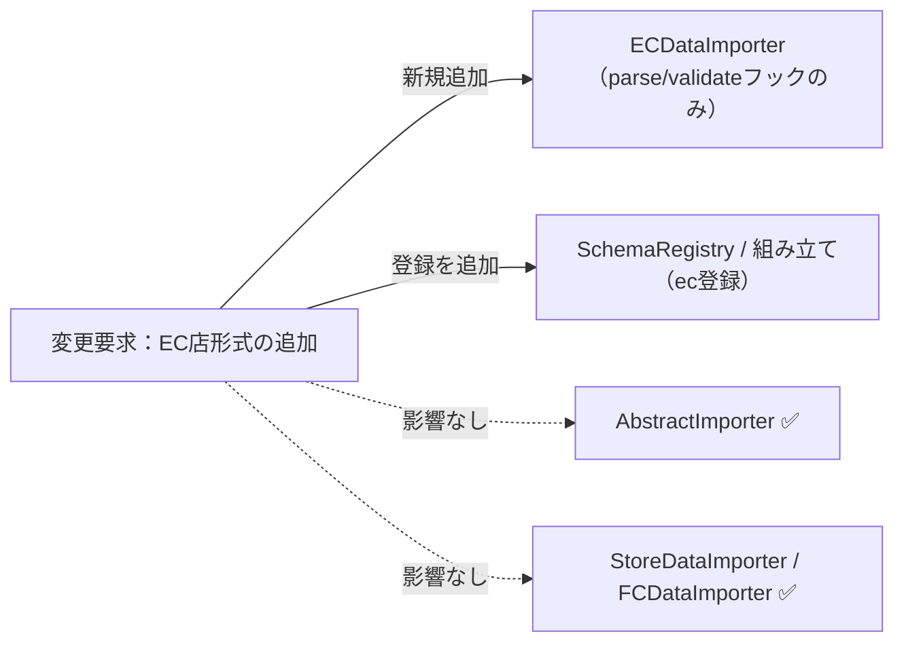
```mermaid
graph LR
    T1["変更要求：EC店形式の追加"]
        -->|新規追加| N1["ECDataImporter<br>（parse/validateフックのみ）"]
    T1 -->|登録を追加| N2["SchemaRegistry / 組み立て<br>（ec登録）"]
    T1 -. "影響なし" .-> A["AbstractImporter ✅"]
    T1 -. "影響なし" .-> B["StoreDataImporter / FCDataImporter ✅"]
```

フェーズ3の変更影響グラフと同じ要求・同じ粒度で比べると、共通骨格 `AbstractImporter` と既存形式は変更先から消えました。EC店形式の追加は、`ECDataImporter` のフック実装と `SchemaRegistry` への登録だけに限定されます。

| 3-2で影響した場所 | 修正後 | 構造変更との対応 |
|---|---|---|
| 各Importerの共通骨格 | **修正しない** | 骨格を `AbstractImporter` へ集約した |
| 3-2には共通の骨格がなかった | `AbstractImporter::import()` は無変更 | 順序を1か所へ固定した |
| 3-2には形式差分の置き場がなかった | `ECDataImporter` のフックを追加する | 形式差分の変更先を新しく作った |
| 形式の登録 | `SchemaRegistry` へ ec を追加する | 形式の登録だけを増やす |

### 7-4：変更シナリオ表

今回の変更ID1・変更ID2について、フェーズ1の構造で必要だった修正と完成構造の結果を対比します。

| 変更依頼 | フェーズ1の現状構造での影響 | 完成構造での結果 |
|---|---|---|
| 変更ID1：ECサイト形式を追加し、会員ランクとポイントを解析・計算する | 取得・解析・検証・保存の全手順を`ECDataImporter`へ複製 | EC固有処理を`ECDataImporter`へ置き、正常なEC行だけを共通手順で保存することを確認 |
| 変更ID2：全形式で、ファイルを開いた直後に形式バージョンを確認する | 3つのImporterへ同じ確認処理を追加 | `AbstractImporter::import()`の1か所で確認し、不一致時に全形式で保存しないことを確認 |

共通手順を基底クラスに集約した代わりに、各サブクラスは基底クラスが定めた順序とフックに従います。継承関係とフックを管理するコストを引き受けます。

---

## 整理

### 問題・原因・課題・解決策

| | 内容 |
|---|---|
| **問題** | インポート形式や行単位検証が増えるたびに共通手順を重複して書かなければならず、想定される追加頻度ではコストが合わない |
| **原因** | 骨格（システム基盤担当が管理）とパース/行検証ルール（業務担当者が管理）が各クラスの `import()` に混在しており、骨格への変更が全インポートクラスに波及する |
| **課題ID1** | 共通の呼び出し順序と形式ごとの `parseData()` / `validateRows()` を切り離し、骨格を1か所に集約する |
| **解決策** | 骨格固定構造：`AbstractImporter` に骨格を固定し、必須の `parseData()` / `validateRows()` と任意の `afterParse()` をサブクラスへ委ねる |

### フェーズとこの章でやったこと

この章では、手順の骨格は同じなのに詳細が異なる複数のクラスが乱立し、変更が全クラスに飛び火していた現状を学びました。7フェーズの思考プロセスを適用して、どのように構造を改善したのかを振り返ります。

| **フェーズ** | **この章でやったこと** |
| --- | --- |
| 🔵 フェーズ1：現状把握 | 複数のインポートクラスでファイル操作手順が重複して記述されている現状を観察しました。変更要求（EC店追加）を把握しました |
| 🟣 フェーズ2：仮説立案 | 業務機能の所在表で各行の変わる理由を確認しました。インポートの「手順」は当面安定と見て、「パースルール」は形式ごとに変わるという仮説を立て、ヒアリングで裏付けました |
| 🟣 フェーズ3：問題特定 | 新しいインポート形式を追加しようとした際に、全クラスで同じ修正が必要になる「痛み」を確認しました |
| 🟠 フェーズ4：原因分析 | 共通の「骨格（手順）」と固有の「詳細（ロジック）」が混在していることが、変更影響を拡大させる根本原因だと突き止めました |
| 🟡 フェーズ5：課題定義 | 共通の処理順序と形式ごとの `parseData()` / `validateRows()` の境界を定め、手順の重複を増やさない課題を定めた |
| 🔴 フェーズ6：対策検討 | 課題ID1を満たす最終構造は骨格固定構造に一意に定まると確認し、採用クラス図を課題ID別の①〜⑥でコードへ反映した |
| 🟢 フェーズ7：対策実施 | 共通の手順を基底クラスに集約し、固有ロジックだけをサブクラスで実装する構造へ移行しました |

### 責任の移動

| **責任** | **変更前** | **変更後** |
| --- | --- | --- |
| CSVインポートの共通手順（骨格）の管理 | `StoreDataImporter` / `FCDataImporter`（各クラスに重複して直書き） | `AbstractImporter` |
| 店舗固有のパース・行検証・後処理の実装 | `StoreDataImporter` / `FCDataImporter`（骨格と混在） | 各サブクラスの `parseData()` / `validateRows()` と、必要な場合だけ `afterParse()` |
| 取込結果を返す順序 | 各Importerの出力処理に分散 | `AbstractImporter` から保存後の結果記録へ進む流れ |

### 複雑さを足しても対策は変わるか

| 追加した複雑さ | 見えた原因 | 定めた課題 | 採用した扱い |
|---|---|---|---|
| ファイル取得→解析→検証→保存の順次処理 | 順序が各Importerに複製されるため、共通ステップ追加が全クラスへ波及する | 骨格の呼び出し順序を1か所に集約する | `AbstractImporter::import()` に順序を固定する |
| 行単位エラー | 検証位置は共通なのに、何を不正とするかは形式ごとに異なる | 保存前に検証する位置を固定し、検証内容だけを差し替える | `validateRows()` を必須差分としてサブクラスへ委ねる |
| 取込結果 | 成功件数・スキップ件数の作り方が各形式に散る | 呼び出し元へ返す結果の流れを骨格側でそろえる | 保存後に結果記録へ進む共通の流れを維持する |

> このプロセスを回した結果にたどり着いた構造こそが 骨格固定構造です。

---

## 振り返り

### 「この章を読むと得られること」は手に入ったか

| **得られること** | **この章のどこで示したか** |
| --- | --- |
| 1. 変動箇所の識別 | フェーズ2の業務機能の所在表と変わる理由の分析で、守りたい骨格と形式ごとに変わるパースを区別しました |
| 2. 痛みの発生源の判断 | フェーズ4で、共通手順が各Importerへ重複し、形式ごとの差分と同じ場所で管理されていることを変更シナリオから特定しました |
| 3. 構造改善の説明 | フェーズ7の変更シナリオ表で、修正が基底クラスに局所化されたことを実証しました |
| 4. いつ使うかの判断 | フェーズ6の「採用する形を決める」で判断基準を示しました |

### 第0章の3つの設計原則はどう適用されたか

**原則1「変わるものをカプセル化せよ」の現れ**

- 具体化された場所：各サブクラス（`StoreDataImporter` など）
- 解説：頻繁に変わる「パース・行検証・加工ルール」をサブクラスへとカプセル化しました。これにより、基底クラスの手順は変更の影響を受けずに安定しました。

**原則2「実装ではなくインターフェースに対してプログラムせよ」の現れ**

- 具体化された場所：`AbstractImporter` の抽象メソッド `parseData()` / `validateRows()`
- 解説：基底クラスの手順は、具体的なパース実装ではなく抽象化されたインターフェース（抽象メソッド）に対して動作します。

**原則3「継承よりコンポジションを優先せよ」の現れ**

- 具体化された場所：テンプレートメソッドによる継承階層
- 解説：本章では「手順の共通化」のために継承を用いましたが、これは変更理由が手順の骨格にある場合に限定した適用です。パースルールの差し替えが目的ならルール差し替え構造（コンポジション）が候補になります。

---

## あなたのコードで考えてみてください

この章で辿った思考プロセスを、あなた自身のコードに当てはめてみましょう。手順は「① 重複を探す → ② 変更理由を数える → ③ 骨格を1か所に書いた場合の修正範囲を見積もる」の3ステップです。

1. **変動の兆候を探す：** あなたのコードに「前処理→本処理→後処理」という同じ流れで、本処理だけが異なる処理が複数ありますか（コピー＆ペーストの痕跡が残っている箇所）？
2. **変える理由を問う：** 共通の「前処理」や「後処理」に変更が入ったとき、何箇所を修正しましたか？1箇所で済みましたか？
3. **骨格の重複を測る：** 似たような処理が複数あるとき、「どれが最新の正しいバージョンか」を判断するのに時間がかかったことはありますか？
4. **共通化した後を想像する：** もし骨格を1箇所に集約したとすると、「前処理のバグ修正」は何ファイルへの変更で完結しますか？

---

**題材を置き換えるときの共通手順**

この章の題材名を、自分の現場のシステム名に置き換えて考えます。

1. そのシステムは、誰が何を達成するために使うものか。
2. 入力、加工、出力は何か。
3. 最近入った変更要求、または次に来そうな変更要求は何か。
4. その変更で、触りたくない場所まで修正や再テストが広がるか。
5. 変えたいものと守りたいものを分けると、接続点には何を残すべきか。
6. 全課題を満たす完成構造が複数成立するか。成立するなら、責任配置・変更影響・導入コストの差は何か。

## パターン解説：Template Method パターン

### パターンの骨格

Template Methodパターンは、アルゴリズムの構造を定義し、具体的な実装をサブクラスに遅延させるパターンです。基底クラスにメソッドの処理手順（テンプレートメソッド）を記述し、一部のステップを抽象メソッドとしてサブクラスに実装させます。

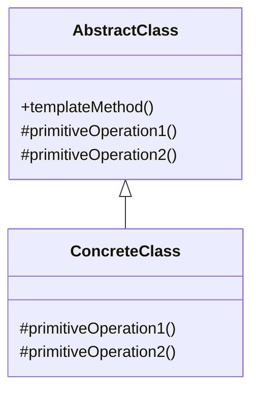
```mermaid
classDiagram
    class AbstractClass {
        +templateMethod()
        #primitiveOperation1()
        #primitiveOperation2()
    }
    class ConcreteClass {
        #primitiveOperation1()
        #primitiveOperation2()
    }
    AbstractClass <|-- ConcreteClass

```

### 抽象骨格の実行シーケンス

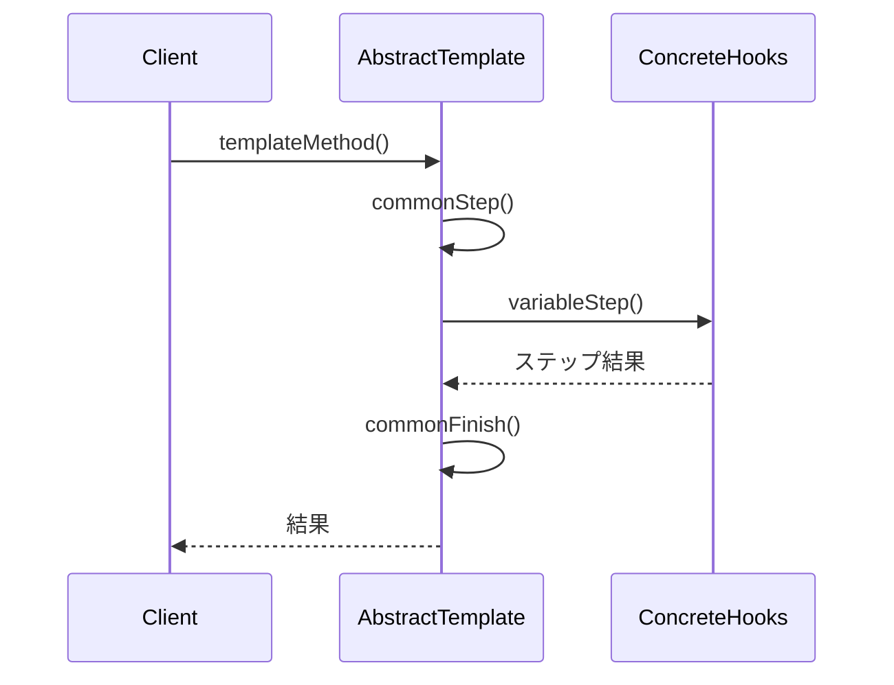
```mermaid
sequenceDiagram
    participant C as Client
    participant T as AbstractTemplate
    participant H as ConcreteHooks
    C->>T: templateMethod()
    T->>T: commonStep()
    T->>H: variableStep()
    H-->>T: ステップ結果
    T->>T: commonFinish()
    T-->>C: 結果
```

処理順序は基底クラスが固定し、変わるステップだけを具象クラスへ問い合わせます。

### この章の実装との対応

GoF（Gang of Four）とは、1994年に出版された書籍『Design Patterns』の4人の著者の総称です。彼らが整理した23のパターンは、現在も設計の共通言語として広く使われています。

| GoFの名前 | この章での対応 |
|---|---|
| AbstractClass | `AbstractImporter` |
| templateMethod | `import()` |
| primitiveOperation / hook | `parseData()` / `validateRows()` / `afterParse()` |
| ConcreteClass | `StoreDataImporter` / `FCDataImporter` / `ECDataImporter` |

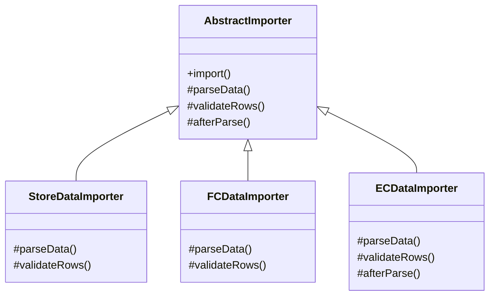
```mermaid
classDiagram
    class AbstractImporter {
        +import()
        #parseData()
        #validateRows()
        #afterParse()
    }
    class StoreDataImporter {
        #parseData()
        #validateRows()
    }
    class FCDataImporter {
        #parseData()
        #validateRows()
    }
    class ECDataImporter {
        #parseData()
        #validateRows()
        #afterParse()
    }
    AbstractImporter <|-- StoreDataImporter
    AbstractImporter <|-- FCDataImporter
    AbstractImporter <|-- ECDataImporter

```

`AbstractImporter` が骨格となる手順を所有し、`StoreDataImporter` などのサブクラスがその詳細を埋めています。

### 使いどころと限界

Template Methodパターンは「手順の骨格」を再利用するのに強力ですが、使いどころを間違えると「硬直した設計」を生み出します。実務で導入を迷いやすい場面と、その判断基準を整理します。

**1. 手順の一部が「不要なクラス」が現れた場合**
たとえば「ファイルを開かずに、ネットワークから直接読み込む新しいインポート形式」が追加されたとします。このとき、既存の骨格（`openFile()`）が邪魔になります。
このような場合は、無理に既存のTemplate Methodに押し込めず、**新しい骨格クラスを作るか、手順の再利用（継承）自体を諦めてコンポジション（オブジェクトを内部に保持して利用する仕組み）に切り替える**のが一つの考え方です。

**2. 差し替えるステップ（フック）が多すぎる場合**
基底クラスに `parseHeader()`, `parseBody()`, `parseFooter()`, `validateData()` など、サブクラスが実装しなければならないメソッドが5個も6個もある場合、サブクラスの実装負担が大きすぎます。
この場合は、骨格の粒度が細かすぎるサインです。いくつかのステップをまとめて大きなステップにするか、**Strategyパターンなどの別の設計**への移行を検討してみてはいかがでしょうか。

**3. 途中で失敗したときに後始末が必要な場合**
ファイル、DBトランザクション、ロックなどを扱う処理では、処理の途中でエラー（例外等）が発生しても確実にクローズ処理などの後始末（資源解放）が行われる必要があります。
テンプレートメソッド側で複雑なエラーハンドリングを行うよりは、C++のRAII（資源の生存期間をオブジェクトの寿命で管理する仕組み）を活用し、ファイルやDB接続を自動解放するオブジェクトとして保持することが推奨されます。「正常系の順序を共通化しただけ」で例外発生時にリソースリークを起こさないよう、資源管理の設計と組み合わせて適用することが重要です。

| **迷う状況** | **設計の判断基準** |
| --- | --- |
| 手順の一部を使わないサブクラスが出た | 既存の骨格への追加を諦め、骨格クラスを分ける |
| 実装が必要なステップ数が多すぎる | 骨格の粒度を見直すか、Strategyパターンへ移行する |
| 将来、手順の順序自体が変わる可能性がある | Template Methodの導入を見送り、コンポジション（保持・委譲）を使う |
| 途中失敗時に資源解放やロールバックが必要 | RAII（資源の寿命管理オブジェクト）と組み合わせる |

**Template Methodパターン 適用判断フロー：**

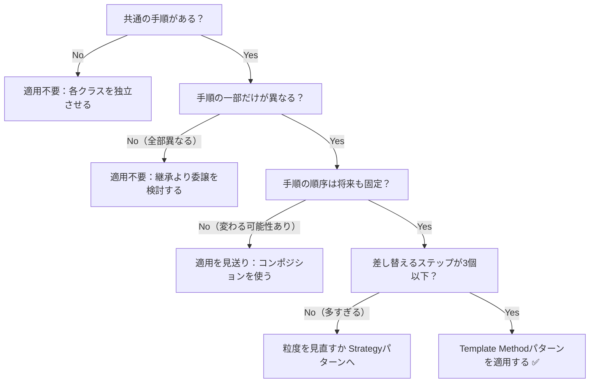
```mermaid
flowchart TD
    A["共通の手順がある？"] -->|No| B["適用不要：各クラスを独立させる"]
    A -->|Yes| C["手順の一部だけが異なる？"]
    C -->|No（全部異なる）| D["適用不要：継承より委譲を検討する"]
    C -->|Yes| E["手順の順序は将来も固定？"]
    E -->|No（変わる可能性あり）| F["適用を見送り：コンポジションを使う"]
    E -->|Yes| G["差し替えるステップが3個以下？"]
    G -->|No（多すぎる）| H["粒度を見直すか Strategyパターンへ"]
    G -->|Yes| I["Template Methodパターンを適用する ✅"]
```

### この章のまとめ

CSVインポートというドメインと Template Methodパターンの関係を一言で言うなら、「手順の骨格」と「フォーマット別の処理」は変わる理由が違う、ということです。「開く→読む→変換する→保存する→閉じる」という骨格はどのフォーマットでも共通ですが、変換ロジックはフォーマットごとに担当者も変更頻度も異なります。その2つが `import()` の中に同居していた限り、新しいCSV形式が来るたびに骨格まで手を入れる必要が生じていました。

7つのフェーズを通じて、読者は処理の骨格を観察するところから始まり、「どの業務機能によって変わるか」の分析を経て、骨格を抽象クラスに固定し差分だけをサブクラスへ委ねるという判断へと進みました。フェーズ2のヒアリングで「フォーマットは今後も増える」と確認した時点で分離の理由が確定し、フェーズ4で接続点を特定した時点で骨格と差分の境界線が引かれる——その積み上げの中に、パターン名の背後にある判断の論理があります。「骨格が共通かどうか」という問いが、この章のすべての起点でした。

あなたのコードの中にも、同じ処理フローの中に複数の担当者の知識が混在している箇所があるはずです。「この手順は全ケースで共通か、それとも各ケースで変わるか」を問うことが、Template Methodを使う理由を見つける入口になります。
