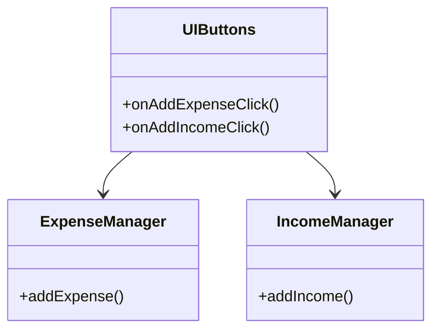
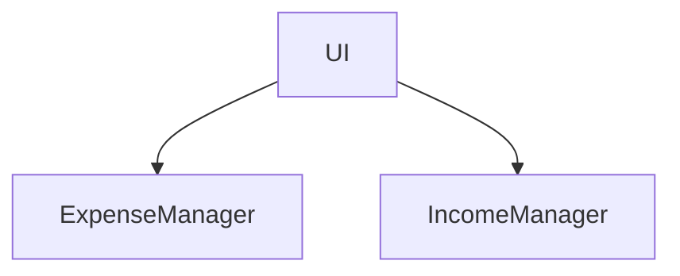
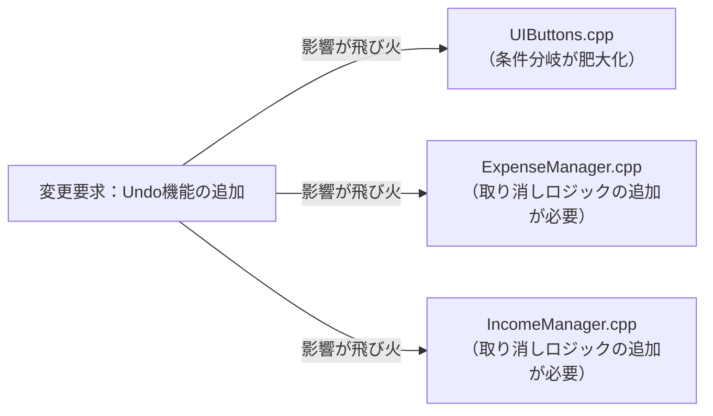
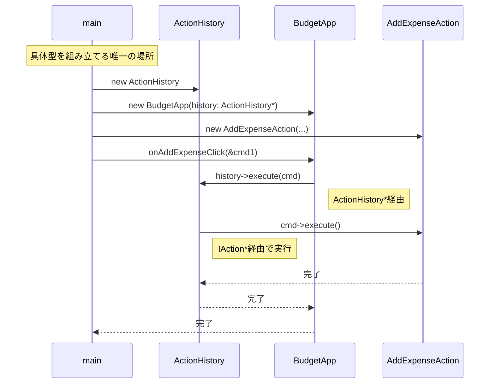
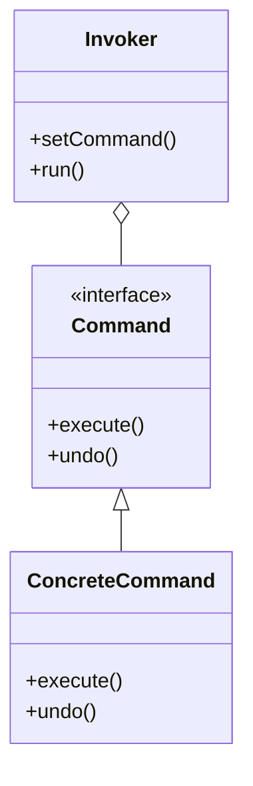

## 第5章 操作の履歴をオブジェクト化する ―― Command パターン

―― 思考の型：「操作（アクション）」と「それを実行するロジック」が混在している

### この章の核心

**ある操作を実行するボタンやメニューなどの呼び出し元が、実行内容そのものを直接知っていると、操作の追加や取り消しといった機能拡張が困難になる。それは、「何をする必要があるか（操作）」と「どう実行するか（処理）」が、同じ場所に混在しているからだ。**

### この章を読むと得られること

この章の痛みは「やった操作を取り消したい」「操作の履歴を残したい」という要求が来たとき、呼び出し元が処理の詳細を直接知っているために実現できない、という問題です。

* **得られること1：** 「操作の種類」という観点で、ユーザーの指示と処理の実行箇所を識別できるようになる


* **得られること2：** 呼び出し元が個別の処理を直接知っている状態を「依存の過多」と判断できるようになる


* **得られること3：** 操作をオブジェクトに包むことで、操作の履歴保持や取り消しを構造から説明できるようになる


* **得られること4：** 操作を「いつ実行するか」や「取り消すか」を判断する際の、柔軟な設計手法がわかるようになる

## 🔵 フェーズ1：現状把握 ―― コードとクラス構成を読む
家計簿アプリにおける操作履歴管理という、日々の記録を支える機能の現状を観察していきましょう。
### 1-1：このシステムの仕様

このシステムは、利用者が日々の**収入・支出を記録・管理**するアプリです。

ボタン操作でデータを追加・削除でき、現在の残高（収入合計 − 支出合計）がリアルタイムで表示されます。

**利用できる操作**

| 操作 | 処理内容 | 残高への影響 |
|---|---|---|
| 支出登録 | 金額とカテゴリを入力し支出をDBに保存する | 指定金額だけ減る |
| 収入登録 | 金額とカテゴリを入力し収入をDBに保存する | 指定金額だけ増える |
| 最後を削除 | 最後に追加したデータを削除する | そのデータ分だけ元に戻る |

現時点では「取り消し（Undo）」機能はなく、削除は「最後に追加したデータを削除する」という操作として実装されています。
---

---

### 1-2：動作例テーブル ―― 仕様を「動かした結果」で確認する

コードを読む前に、このシステムがどんな入力に対してどんな出力を返すかを確認します。この章のどのステップも、以下の動作を実現します。

| 操作 | 入力 | 処理内容 | 残高の変化 |
| --- | --- | --- | --- |
| 支出登録 | 1,000円／食費 | 支出をDBに保存し画面を更新する | 残高が1,000円減る |
| 収入登録 | 5,000円／給与 | 収入をDBに保存し画面を更新する | 残高が5,000円増える |
| Undoを1回実行 | （直前は収入登録5,000円） | 直前の操作（収入登録）を取り消す | 残高が5,000円戻る（元の残高に戻る） |
| Undoを2回連続実行 | （操作履歴：収入→支出の順） | 収入登録を取り消し、続けて支出登録も取り消す | 2段階前の残高に戻る |
| Redoを1回実行 | （直前にUndoで取り消した操作あり） | 取り消した操作を再実行する | 取り消し前の残高に戻る |
| CSVから一括インポート（3件） | 2,000円／家賃、300円／水道、800円／食費 | 3件を順に登録する | 残高が3,100円減る |

各ステップはすべてこの動作を実現します。違いは「変更が来たときにどこを触ることになるか」だけです。
---

---

### 1-3：実装コード

操作実行部分のコード例です。

```cpp
class ExpenseManager {
public:
    void addExpense(int amount, std::string category) {
        std::cout << "支出を追加しました：" << category
                  << " " << amount << "円" << std::endl;
        // DB保存・画面更新処理
    }
    void removeExpense(int amount, std::string category) {
        std::cout << "支出を取り消しました：" << category
                  << " " << amount << "円" << std::endl;
        // DB削除・画面更新処理
    }
};

class IncomeManager {
public:
    void addIncome(int amount, std::string source) {
        std::cout << "収入を追加しました：" << source
                  << " " << amount << "円" << std::endl;
        // DB保存・画面更新処理
    }
    void removeIncome(int amount, std::string source) {
        std::cout << "収入を取り消しました：" << source
                  << " " << amount << "円" << std::endl;
        // DB削除・画面更新処理
    }
};

// ユーザーインターフェース層（上記2クラスを直接呼び出す）
class UIButtons {
    ExpenseManager em;
    IncomeManager im;
public:
    void onAddExpenseClick() {
        em.addExpense(1000, "Food");
    }
    void onAddIncomeClick() {
        im.addIncome(3000, "Salary");
    }
};

```

このコードを見ると、ボタン押下という「操作」と、マネージャクラスによる「処理の実行」が密接に結びついていることが分かります。
---

---

### 1-4：クラス構成図

現在の操作実行部分の構造です。



→ `UIButtons` クラスが `ExpenseManager` と `IncomeManager` を直接知り、ボタン押下時にそれぞれのメソッドを直接呼び出しています。
---

---

### 1-5：依存グラフ



→ `UIButtons` クラス（UI）に、操作を実行する各マネージャクラスへの依存が集中していることが分かります。
---

---

### 1-6：実行結果

上記コードの実行結果：

```text
支出データを追加しました
収入データを追加しました
```

これから検討するのは、同じ機能を保ちながら、変更に強い構造をどう作るかという点です。

---

### 1-7：届いた変更要求

「利用者から、誤って登録したデータを簡単に取り消したいという要望が多く届いています。来週までに、直近の操作を取り消す『Undo機能』を実装してください」と、プロダクトマネージャーから連絡がありました。

なるほど、ボタンクリックという「操作」を記録しておき、それを巻き戻す必要があるのですね。ただ、現状の `UIButtons` クラスの中に「操作を巻き戻すためのリスト」まで書いてしまうと、ボタンの数が増えるたびに管理ロジックがどんどん膨らんでしまいそうです。

**仕様変更の内容**

変更要求を受けて、利用できる操作がどう変わるかを整理します。

| 操作 | 変更前 | 変更後 |
|---|---|---|
| 支出登録 | 支出をDBに保存し画面を更新 | **変更なし**（ただし操作履歴への記録が必要になる） |
| 収入登録 | 収入をDBに保存し画面を更新 | **変更なし**（ただし操作履歴への記録が必要になる） |
| 最後を削除 | 最後のデータをDBから削除し画面を更新 | **変更なし**（ただし操作履歴への記録が必要になる） |
| **Undo実行（新規）** | —（なし） | **直前の操作を取り消し、残高を操作前に戻す** |

「3つの操作が変更なし」という点に戸惑うかもしれません。操作そのものには影響なし——支出登録は今も、これからも「支出をDBに保存して画面を更新する」だけです。変わるのは「その操作をどう管理するか」という層であり、そこが新たに必要になる部分です。言い換えると、「何をする操作か」は変わらず、「操作の記録をどう扱うか」という責任層が加わるのです。

**Undo動作の詳細**

- 支出登録の直後にUndoを実行 → その支出が取り消され、残高が元に戻る
- 収入登録の直後にUndoを実行 → その収入が取り消され、残高が元に戻る
- Undoを連続実行 → 操作の順番を逆に遡って取り消しを繰り返す

既存の3つの操作に「Undo対象として記録する」処理が追加される点と、新たに「Undo実行」操作が加わる点が、この変更の核心です。

---

## 🟣 フェーズ2：仮説立案 ―― 何が変わるかを観察し、ヒアリングで裏付ける

フェーズ1で、家計簿アプリがUIボタンから各マネージャクラスを直接呼び出している現状を把握しました。次に、ユーザーから寄せられた「操作を取り消したい」という要望を起点に、この設計における変動と不変を整理します。

「操作」と「実行」は、変わる理由が異なります。たとえば、支出登録のDB保存方法が変わるのはシステム開発者の技術的判断（RDBからNoSQLへ移行など）によるものです。一方、「履歴管理が必要かどうか」は営業やプロダクトの判断（ユーザー要望・法令対応など）によるものです。変わる理由の担当者が異なる——それが「分けるべき」サインです。

### 2-1：責任テーブル

| **クラス名** | **責任（1文）** | **知るべきこと** |
| --- | --- | --- |
| `UIButtons` | ユーザーの操作を受け取り、処理を呼び出す | どのマネージャにどの操作を依頼するか |
| `ExpenseManager` | 支出データの追加処理を担当する | 支出データのバリデーション、DB保存方法 |
| `IncomeManager` | 収入データの追加処理を担当する | 収入データのバリデーション、DB保存方法 |

各クラスの責任と知識の定義が確認できました。

### 2-2：責任チェック表

この表は「コードの各行が、どの知識を持っているか」を可視化するものです。作り方はシンプルで、実装コードを1行ずつ読みながら「この行は何を知っているか」「その知識は誰が持つべきか」を書き出すだけです。知識の持ち主が2人以上になる行が見つかれば、そこが「変わる理由の混在」を示す兆候です。

| **コードの行** | **持っている知識** | **管理者（観察）** |
| --- | --- | --- |
| `em.addExpense(...)` | 支出追加の具体的なメソッドを知っている | 画面UIが操作内容と実行手段を混在させて管理しているようだ |
| `im.addIncome(...)` | 収入追加の具体的なメソッドを知っている | 画面UIが操作内容と実行手段を混在させて管理しているようだ |

> `UIButtons` クラスが「どの操作をする必要があるか」という意図だけでなく、「どうやって実行するか（具体的なメソッド呼び出し）」まで知ってしまっていることが観察できます。
> 
> 

要するに、操作ボタンという呼び出し元が、処理を実行するマネージャクラスの具体的なメソッドを直接知っているという観察から、実行する必要がある操作の意図と、具体的な実行手段が同じ場所に混在しているという構造の問題が見えてくる。

### 2-3：変動・不変の仮説テーブル

フェーズ2の責任チェック表を材料に、Undo機能の実装に向けた仮説を立てます。

| **分類** | **仮説** | **根拠（フェーズ2の観察から）** |
| --- | --- | --- |
| 🔴 **変動しそう** | 個別の操作を実行するロジック（追加・削除など） | 操作内容が増えるたびに、マネージャクラスへの依存が増えるため。 |
| 🔴 **変動しそう** | 履歴の管理方法（スタックやリストなど） | Undo機能の要件に応じて、履歴を保持・操作する構造が必要になるため。 |
| 🟢 **不変** | ボタン押下を検知して操作を実行するというフロー | ボタンがクリックされるというインターフェース（契機）自体は不変なため。 |

「操作」を今のまま「メソッド呼び出し」として直付けしていると、Undo機能のために、呼び出し元と実行先の両方を大掛かりに書き換える必要が出てきそうです。

### 2-4：今回の確定変更テーブル

ここで2つのテーブルの違いを整理しておきます。上の「変動・不変の仮説テーブル（2-3）」は「将来的に変わりそうかどうか」という観点での仮説です。一方、次の「今回の確定変更テーブル」は「今回のUndo機能追加という変更要求によって、確実に変わる箇所はどこか」という確定事実の整理です。仮説は「将来」、確定変更は「今回」——この違いを意識して読み進めてください。

変更要求（Undo機能の追加）によって、今回のコード変更で確実に変わる箇所を整理します。

| **分類** | **具体的な内容** | **変わるタイミング** | **根拠** |
| --- | --- | --- | --- |
| 🔴 **今回確定で変動する** | 操作を実行するロジックの実装方法 | 今回のUndo対応で確実に変わる | 現在はメソッド直呼び出し。履歴管理を入れるには構造変更が必要 |
| 🔴 **今回確定で変動する** | UIクラスからマネージャへの依存方法 | 今回のUndo対応で確実に変わる | 現在の直接呼び出し構造ではUndoを組み込めない |
| 🟢 **今回は変わらない** | ボタン押下を検知してアクションを起こすフロー | ボタンUI自体の廃止時のみ | ユーザーの操作契機（クリック）は変わらない |

### ヒアリングに向けた背景確認

このアプリは、利用者が日々の支出や収入を手軽に記録するためのものです。現在のシステムは、シンプルなボタン操作でマネージャクラスを直接呼び出す構成になっています。

これまではデータを記録するだけのシンプルな作りでしたが、現在は「操作の取り消し（Undo）」や「やり直し（Redo）」という、より高度な操作が求められるフェーズにあります。当時の開発者が、ボタンクリックに応じて直接処理を呼び出すよう実装したコードが、今、その限界を迎えようとしています。

一見すると、このコードは各ボタンに対応するメソッドが綺麗に分かれており、直感的で読みやすい構造をしています。このシンプルな設計は当初の要件（記録のみ）には十分でした。ただ、操作履歴を管理するという新しい要件では、この設計の延長線上では解決しにくい構造的な課題が生まれます。

### 2-5：関係者ヒアリング

確定変更の背景をさらに深掘りするため、UIデザイナーとシステム開発担当に確認を行いました。この会話が、次の「将来リスクテーブル」の根拠になります。

* **開発者：** 「Undo機能以外に、操作をやり直す『Redo機能』を追加する予定はありますか？」
* **UIデザイナー：** 「あります。ユーザーからは『一度取り消したものを戻したい』という声も根強いです。」
* **開発者：** 「操作を履歴として記録する仕組みは、将来的に他の機能にも適用する可能性はありますか？」
* **システム開発担当：** 「あります。今は支出と収入の追加だけですが、将来的に口座の移動やカテゴリ編集といった複雑な操作もUndo対象にしたいと考えています。」
* **開発者：** 「操作そのものの『意図』が変わることはありますか？」
* **UIデザイナー：** 「ええ、例えば『一括削除』のような、一度に複数のデータに作用する操作も追加されるかもしれません。」

ヒアリングの結果、操作の「実行」と「取り消し」の仕組みは、将来的に複雑な操作が追加されても安定している必要があると分かりました。

> **現実のヒアリングでは——** このシナリオでは相手がちょうど設計に役立つ情報を教えてくれています。現実には「変わるかどうか分からない」「たぶん変わらない」という答えが返ることも多いです。そのときは、コードの変更履歴（`git log`）や過去の障害記録を「ヒアリングの代わり」として使ってみてください。「過去に何度変わったか」が、「将来変わりやすいか」の最も正直な証拠です。

### 2-6：将来リスクテーブル

ヒアリングで明らかになった「今後変わるかもしれないリスク」を整理します。これは今回の変更で確実に起きることではなく、将来の拡張リスクです。

| **分類** | **将来リスクの内容** | **変わりうるタイミング** | **根拠（誰との確認か）** |
| --- | --- | --- | --- |
| 🟡 **将来リスク** | 操作の種類（追加、削除、一括削除など） | 機能追加・操作内容の変更時 | UIデザイナーとの確認 |
| 🟡 **将来リスク** | Redo機能の追加 | ユーザー要望が固まった時点 | UIデザイナーとの確認 |
| 🟡 **将来リスク** | Undo対象となる操作の複雑化（口座移動・編集など） | 口座管理機能の追加時 | システム開発担当との確認 |

フェーズ2で「今回確実に変わるもの」と「将来変わるかもしれないもの」の両方が整理できました。ここで立てた仮説——「操作の実行方法」と「操作の管理方法」は変わる理由が異なる——が正しいかどうかを、次のフェーズ3で実際にUndoを追加しようとすることで確かめます。仮説を「痛みとして体験する」ことが、このフェーズの目的です。

## 🟣 フェーズ3：問題特定 ―― 変更の痛みを発見する

フェーズ2で、操作の種類や履歴管理ロジックは今後も増え続ける変動要因であることが分かりました。このフェーズでは、現在のように `UIButtons` クラスが各マネージャクラスを直接知っている構造のまま、操作履歴（Undo）機能を実装しようとすると何が起きるかを確認します。

### 3-1：変更シミュレーション

「操作を取り消したい」という要望に応えるため、今の `UIButtons` クラスに「直前の操作を記録して元に戻す」機能を強引に追加してみましょう。

```cpp
class UIButtons {
    ExpenseManager em;
    IncomeManager im;
    // 履歴管理のためのリスト（ここから既に無理がある…）
    std::vector<std::string> history; 
public:
    void onAddExpenseClick() {
        em.addExpense(1000, "Food");
        history.push_back("Expense"); // 履歴記録
    }
    void undo() {
        // 取り消しのために、何が最後に実行されたかを確認する巨大な分岐が必要
        if (history.back() == "Expense") {
            // em.undoExpense(1000, "Food");
            // そもそも取り消しメソッドがない！
        }
        // ...
    }
};

```

**これがStep 1の限界です。** コードに手を入れようとした瞬間に、「取り消すメソッドがない」「金額やカテゴリをどこに保存していたか分からない」という問題が次々と現れます。現在の構造のままUndoを追加することは、根本的な構造変更なしには実現できないのです。

実装を始めてすぐに、ある重大な問題に気づきます。現在の `ExpenseManager` には「取り消し（Undo）」のためのメソッドが存在しないため、履歴を記録しても元に戻す手段がないのです。

結局、Undo機能を実装するには、すべてのマネージャクラスに `undo` メソッドを追加し、それを呼び出す巨大な条件分岐を `UIButtons` クラスに書き加える必要があります。機能を追加するたびに、呼び出し元であるUIクラスが肥大化し、かつ、それぞれの業務ロジックの内部事情をさらに詳細に知らなければならないという、逃げ場のない状況に陥っているのです。

### 3-2：変更影響グラフ

Undo機能を実装しようとした際、変更がどのようにシステムを汚染するかをグラフ化します。



→ このグラフを見ると、本来は画面UIと業務ロジックで役割が分かれているはずなのに、「Undo」という一つの要求に対して、UIクラスとすべてのマネージャクラスという広範囲のコードに修正が飛び火していることが分かります。

### 3-3：痛みの言語化

変更を試みたことで、設計の「痛み」が鮮明になりました。

1つ目は、「条件分岐の爆発」という痛みです。操作の種類が増えるたびに、`UIButtons` クラス内の `undo()` メソッドは、どの操作をどう元に戻する必要があるかという判定ロジックで膨れ上がっていきます。これでは、何か一つ操作を追加するたびに、巨大な `if` 文の迷路を解き明かさなければなりません。

2つ目は、「業務ロジックへの過度な依存」という痛みです。Undo機能という画面UI側の都合で、本来その操作の実行しか知らないはずのマネージャクラスにまで「取り消し」という新しい責務を押し付けています。本来、画面は「どうやって実行するか」を知らなくても良いはずなのに、現在の構造では実行の詳細を知りすぎているため、変更がクラスの枠を越えて連鎖してしまうのです。

こういうとき困る、という感覚、皆さんも同じではないでしょうか。この「操作の意図と実行ロジックが直接結びついている」という状態が、私たちの設計を硬直させている元凶なのです。

フェーズ3で「操作の追加が辛い」という事実が確認できました。次のフェーズ4では、なぜこの辛さが構造的に発生するのかを分析します。


## 🟠 フェーズ4：原因分析 ―― なぜ辛いのかを構造で言語化する

フェーズ3で、Undo機能の実装において、呼び出し元のUIクラスが各操作の実行手段をすべて知らなければならないという「過度な依存」が確認できました。本来、画面（UI）は「どのボタンが押されたか」だけを知っていれば十分なはずです。「それをどのメソッドで、どのクラスで実行するか」まで知っている状態——これが「過度な依存」の意味です。このフェーズでは、なぜそのような辛さが生じるのかをコードの構造的な観点から分析します。

### 4-1：観察→原因テーブル

ここで2つの問いを立てて、構造的な原因を掘り下げます。

- **なぜ、操作が増えるたびに `UIButtons` クラスを開かなければならないのか？**
- **なぜ、Undo機能を追加しようとすると影響範囲が読めなくなるのか？**

この2つの「なぜ」を出発点に、問題の根を辿ります。

フェーズ3で観察した痛みと、その根本的な原因を対応させます。

| **観察** | **原因の方向** |
| --- | --- |
| Undo機能を実装しようとすると、UIクラスが全マネージャクラスの全メソッドを知っている必要がある | 操作ボタンが「実行したい操作」の意図だけでなく、「具体的な実行手順（メソッド呼び出し）」まで直接知っているから |
| 操作の種類が増えるたびに、UIクラスの条件分岐が巨大化する | ユーザーが「何をしたいか」という操作の意図を、オブジェクトとして切り出さず、単なるメソッド呼び出しとして混在させているから |

### 4-2：変わるもの / 変わらないものテーブル

原因分析の結果として、「変わり続けるもの」と「変わってほしくないもの」を明確に分けます。

| **変わり続けるもの（🔴）** | **変わってほしくないもの（🟢）** |
| --- | --- |
| 操作の内容（支出追加、収入追加、削除など） | 操作をキックするトリガー（UIボタン自体） |
| 操作ごとの実行ロジックと取り消しロジック | 履歴のリストを管理し、Undoを実行する仕組み |

本来、UIボタンは「操作ボタンが押された」ことだけを知っていれば十分なはずです。現在の構造では、操作の「意図」と「実行手段」が密接に結合しているため、操作が増えるたびにUIクラスが改修の嵐にさらされているのです。

### 4-3：接続形態を診断する

現在の `UIButtons` クラスと各マネージャクラスの接続は、すべての操作ロジックがUIクラスの基板上に「直差し」されている状態（具体×直接）だと診断できます。

この「どこに問題があるか」を説明するために、接続の形を4つの象限で整理します。縦軸は「具体（クラス名をそのまま知る）か抽象（インターフェース経由か）」、横軸は「直接（呼び出し元が直接呼ぶ）か間接（仲介役を挟む）か」です。この4軸で現在地を確認することで、「何をどう変えれば改善できるか」の方向が見えてきます。

この状態をケーブルで例えると、リモコンのボタン一つひとつから伸びた専用ケーブルが、テレビ側の専用ポートに直接差し込まれているようなものです。新しい操作（機能）を追加するたびに、リモコンの配線を変更し、新しい専用ケーブルを用意して差し込まなければなりません。これでは、機能が増えるたびに配線作業が発生し、極めて非効率です。

|  | 直接（直差し） | 間接（アダプター経由） |
|:---:|:---|:---|
| **具体**（専用規格） | **← 現在地**　ライトニング直生え → iPhone（直差し） | ライトニング直生え → ゲーム機専用アダプタを挟む → ゲーム機 |
| **抽象**（汎用規格） | Type-C直生え → 各種機器（直差し） | ライトニング直生え → Type-C変換アダプタを挟む → 各種機器 |

このコードで言うと：

| ケーブル比喩 | コードの対応箇所 |
|---|---|
| 「具体」＝専用規格ケーブル | `ExpenseManager em;` / `IncomeManager im;` — `UIButtons` が具体的なマネージャクラスをメンバとして直接保持している |
| 「直接」＝直差し | `em.addExpense(1000, "Food");` / `im.addIncome(3000, "Salary");` — コマンドオブジェクトを介さず、ボタン処理から直接メソッドを呼び出している |

本来であれば、ボタンが押されたとき「何らかの操作オブジェクト」を投げるようにし、実行・取り消しはそのオブジェクト自身が知っているという「Type-C変換アダプタ経由（抽象×間接）」のような構造にする必要があるでしょう。

フェーズ4で「UIとマネージャを切り離すべき場所（接続点）」が言語化できました。次のフェーズ5では、この『どこを分けるか』が決まった状態を受けて、『何を取り出す（分離する）べきか』を具体的に特定します。

## 🟡 フェーズ5：課題定義 ―― 解くべき接続点を特定する

フェーズ4で、「操作の意図」と「具体的な実行ロジック」が密接に結びついており、操作を追加するたびに呼び出し元であるUIクラスが肥大化・複雑化しているという構造的問題が明らかになりました。各ステップ（フェーズ6）に進む前に、ここで「何を解くべき課題とするか」を具体的に確定させます。

### 5-1：接続点の特定

今回のリファクタリングにおいて、解決する必要がある「接続点（ジョイント）」は以下の1箇所です。

* **接続点A：** `UIButtons`クラス（呼び出し元） ←→ `ExpenseManager`/`IncomeManager`（実行先）の境界


この接続点は、ユーザーからの「操作」という意図と、それを「どう実行するか」という処理が直接結合している場所です。ここを切り離し、操作の意図を独立したオブジェクトとして扱えるようにすることで、UIクラスは「何を実行するか」を直接知らなくてもよくなります。

### 5-2：クライアントへの影響範囲

「分けること」で既存コードにどの程度の変更が波及するかを確認します。

クライアントである `UIButtons` クラスは、現在各マネージャクラスのメソッドを直接呼び出しています。この接続点の形を変えると、`UIButtons` は直接メソッドを呼ぶのではなく、操作オブジェクトを生成して「実行依頼」を送る形に修正する必要があります。

一度この切り離しを行えば、以降は操作オブジェクトを増やすだけで、UI側には全く触れずに新しい操作やUndo機能を追加できるようになります。

### 5-3：課題まとめ表

以上の情報をまとめ、フェーズ6での対策検討の基盤となる課題定義を確定します。

| **接続点** | **何を分離すべきか** | **非機能制約** | **クライアント影響** |
| --- | --- | --- | --- |
| 接続点A | 「操作の意図（何をしたいか）」と「実行手段（どのクラスのどのメソッドを呼ぶか）」を別の場所に置く | ホットパスではないが履歴サイズの上限設計が必要（大量操作時のメモリ圧迫を防ぐため） | UIButtonsから直接メソッド呼び出しを削除する必要あり |

フェーズ5で「何を解くか」が確定しました。次のフェーズ6では、この課題に対してどのような「接続の形」を採用するかを、段階的なリファクタリングを通じて検討します。

## 🔴 フェーズ6：対策検討 ―― 段階的な改善と決断

ターゲットである「UIボタンが各マネージャのメソッドを直接知っている」という密結合を解消するために、いきなり正解へ飛ぶのではなく、段階的にリファクタリングを進めてみます。それぞれのステップでどこまで痛みが解消されるかを確認し、今回の要件において「どのステップで止めるべきか」を決断します。

### ステップ1：ボタン処理をプライベートメソッドに切り出す（とりあえず分ける）

はじめに、クラスを分けずに、各ボタン処理の実体をプライベートメソッドとして分離してみます。

```cpp
class BudgetApp {
    ExpenseManager em;
    IncomeManager im;
    std::vector<std::string> history;

    // ボタン処理の実体をプライベートメソッドに切り出す
    void executeAddExpense(int amount, std::string cat) {
        em.addExpense(amount, cat);
        history.push_back("Expense:" + cat); // 文字列で記録
    }
    void executeUndo() {
        if (history.empty()) return;
        std::string last = history.back();
        history.pop_back();
        // 文字列から操作を判断するが、元の金額情報がない！
        if (last.rfind("Expense:", 0) == 0) {
            // em.removeExpense(???, ???); ← 情報が足りない
        }
    }
public:
    void onAddExpenseClick(int amount, std::string cat) {
        executeAddExpense(amount, cat); // 呼び出しだけに
    }
    void onUndoClick() { executeUndo(); }
};
```

**この段階の評価：**
各ボタンハンドラの骨格はスッキリしました。しかし、プライベートメソッドの中身を見ると深刻な問題があります。操作履歴を文字列で記録しているため、Undo時に「元の金額」や「カテゴリ」が取り出せず、正確な取り消しができません。

### ステップ2：実行情報を構造体で保持する（追跡可能にする）

ステップ1の「情報が足りない」問題を解決するために、操作の詳細をそのまま保持できる構造体を使います。

```cpp
struct OperationRecord {
    std::string type;   // "Expense" or "Income"
    int amount;
    std::string detail;
};

class BudgetApp {
    ExpenseManager em;
    IncomeManager im;
    std::vector<OperationRecord> history;

    void executeAddExpense(int amount, std::string cat) {
        em.addExpense(amount, cat);
        history.push_back({"Expense", amount, cat}); // 全情報を保存
    }
    void executeUndo() {
        if (history.empty()) return;
        OperationRecord last = history.back();
        history.pop_back();
        if (last.type == "Expense")
            em.removeExpense(last.amount, last.detail); // 正確に取り消せる
        else if (last.type == "Income")
            im.removeIncome(last.amount, last.detail);
        // 操作が増えるたびに、ここに if が追加される...
    }
public:
    void onAddExpenseClick(int amount, std::string cat) {
        executeAddExpense(amount, cat);
    }
    void onUndoClick() { executeUndo(); }
};
```

**この段階の評価：**
取り消し処理が正確になりました。しかし、新しい操作（「口座移動」など）が増えるたびに `executeUndo()` 内の条件分岐が増え続けます。また `BudgetApp` と同じロジックが `ImportService` にも重複して書かれる問題は残っています。

### ステップ3：操作ごとに取り消し関数を分ける（最大の関数化）

ステップ2の「if文の肥大化」を解決するために、操作の種類ごとに取り消し関数を分けてみます。

```cpp
class BudgetApp {
    ExpenseManager em;
    IncomeManager im;
    std::vector<OperationRecord> history;

    // 取り消しロジックを操作ごとに分ける
    void undoExpense(const OperationRecord& r) {
        em.removeExpense(r.amount, r.detail);
    }
    void undoIncome(const OperationRecord& r) {
        im.removeIncome(r.amount, r.detail);
    }
    void executeUndo() {
        if (history.empty()) return;
        OperationRecord last = history.back();
        history.pop_back();
        if (last.type == "Expense") undoExpense(last);
        else if (last.type == "Income") undoIncome(last);
        // 口座移動が来たら: else if (last.type == "Transfer") undoTransfer(last);
    }
public:
    void onAddExpenseClick(int amount, std::string cat) {
        em.addExpense(amount, cat);
        history.push_back({"Expense", amount, cat});
    }
    void onUndoClick() { executeUndo(); }
};
```

**この段階の評価：**
コードが英語の文章のように読みやすくなりました。**これが「関数化（手続き型プログラミング）」によるコード整理の限界（最終到達点）**です。

ここで関数群をよく観察してください。`undoExpense` / `undoIncome` など、すべての取り消し関数が「同じ引数（OperationRecord）を受け取る」という一貫した構造を持っています。「綺麗に関数として並べられる」ということは、「共通のインターフェースとして抽象化できる」という証拠です。

しかし、関数化のままでは最大の痛みが残っています。新しい操作が来るたびに結局は `BudgetApp` クラスを開いて新しい関数を追加し、`executeUndo` の中に **新しい `if` 文を書き足さなければならない** のです。そして同じロジックが `ImportService` にも重複します。

### ステップ4：操作をクラスに切り出してみる（具体×直接）

「操作の実行と取り消しを一つのクラスに閉じ込めてみよう」という発想を試します。


```cpp
class AddExpenseAction {
    ExpenseManager& em;
    int amount;
    std::string category;
public:
    AddExpenseAction(ExpenseManager& em, int amount, std::string category)
        : em(em), amount(amount), category(category) {}
    void execute() { em.addExpense(amount, category); }
    void undo()    { em.removeExpense(amount, category); }
};

class BudgetApp {
    ExpenseManager em;
    IncomeManager im;
    // ← 具体型のまま保持：AddExpenseAction* しか積めない
    std::vector<AddExpenseAction*> history;
public:
    void onAddExpenseClick(int amount, std::string cat) {
        AddExpenseAction* cmd = new AddExpenseAction(em, amount, cat);
        cmd->execute();
        history.push_back(cmd);
    }
    void onUndoClick() {
        if (history.empty()) return;
        history.back()->undo();
        history.pop_back();
    }
};
```

**この段階の評価：**
操作の実行・取り消しが `AddExpenseAction` という1クラスに閉じ込められました。`BudgetApp` の中から条件分岐が消え、操作ごとの責任が明確になります。しかし `history` が `std::vector<AddExpenseAction*>` という具体型を直接保持しているため、「口座移動」という新しい操作が来ると `TransferAction*` を同じスタックに積めません。**複数種類の操作を1つの履歴として管理するには、すべての操作クラスが共通のインターフェースを実装する必要があります。**「同じシグネチャ（execute・undo）を持つ操作クラスが複数ある」——この繰り返し構造こそが、次のステップへの合図です。

### ステップ5：インターフェース＋仲介役で完全分離する（抽象×間接）

ステップ4の「具体型が散らばる」問題を解決するために、`IAction` インターフェースと `ActionHistory` 仲介役を導入します。`BudgetApp` と `ImportService` は `ActionHistory*` だけを知り、どの具体操作クラスが来ても変更不要になります。

```cpp
// 操作の契約：実行と取り消しをすべての操作クラスに強制する
class IAction {
public:
    virtual ~IAction() {}
    virtual void execute() = 0;
    virtual void undo() = 0;
};

// 支出追加の操作をカプセル化したクラス
class AddExpenseAction : public IAction {
    ExpenseManager& em;
    int amount;
    std::string category;
public:
    AddExpenseAction(ExpenseManager& em, int amount, std::string category)
        : em(em), amount(amount), category(category) {}
    void execute() override { em.addExpense(amount, category); }
    void undo()    override { em.removeExpense(amount, category); }
};

// 収入追加の操作をカプセル化したクラス
class AddIncomeAction : public IAction {
    IncomeManager& im;
    int amount;
    std::string source;
public:
    AddIncomeAction(IncomeManager& im, int amount, std::string source)
        : im(im), amount(amount), source(source) {}
    void execute() override { im.addIncome(amount, source); }
    void undo()    override { im.removeIncome(amount, source); }
};

// 操作履歴を保持し、Undo/Redoを制御する仲介役
class ActionHistory {
    std::stack<IAction*> undoStack;
    static const int MAX_HISTORY = 50;
public:
    // ← 抽象型で受け取る：どの具体操作クラスかを知らない
    void execute(IAction* cmd) {
        cmd->execute();
        undoStack.push(cmd);
        while ((int)undoStack.size() > MAX_HISTORY) undoStack.pop();
    }
    void undo() {
        if (undoStack.empty()) return;
        IAction* cmd = undoStack.top();
        undoStack.pop();
        cmd->undo();
    }
    int historySize() const { return (int)undoStack.size(); }
};

// BudgetApp：ActionHistory*だけを知り、具体操作クラスを一切知らない
class BudgetApp {
    ActionHistory* history; // ← 抽象×間接の証拠
public:
    BudgetApp(ActionHistory* h) : history(h) {}
    void onAddExpenseClick(IAction* cmd) { history->execute(cmd); }
    void onUndoClick() { history->undo(); }
};

// ImportService：同じActionHistory*を共有できる（重複なし）
class ImportService {
    ActionHistory* history;
public:
    ImportService(ActionHistory* h) : history(h) {}
    void importTransactions(std::vector<IAction*> cmds) {
        for (auto* cmd : cmds) history->execute(cmd);
    }
    void rollback(int count) {
        for (int i = 0; i < count; i++) history->undo();
    }
};

int main() {
    ExpenseManager em;
    IncomeManager im;
    ActionHistory hist; // ← 組み立て側だけが具体型を知る
    BudgetApp app(&hist);

    AddExpenseAction cmd1(em, 1000, "Food");
    app.onAddExpenseClick(&cmd1);
    app.onUndoClick();

    ImportService importer(&hist);
    AddExpenseAction cmd2(em, 2000, "Rent");
    importer.importTransactions({&cmd2});
    importer.rollback(1);
    return 0;
}
```

**この段階の評価：**
`BudgetApp` も `ActionHistory` も `IAction*` という抽象型だけを知っており、具体クラス名はどこにも登場しません。新しい操作（口座移動・一括削除）が来ても、新しいクラスを追加するだけで、`BudgetApp` や `ActionHistory` への変更はゼロです。`BudgetApp` と `ImportService` が同じ `ActionHistory*` を共有できるため、Undo/Redoの重複実装も解消されます。

### どこまで設計を進めるべきか（採用ステップの決断）

それぞれのステップには一長一短があります。ステップ5の「インターフェース＋仲介役」は強力ですが、クラス数が増えるという初期投資コストもかかります。どこで止めるかは、**「今後の変更頻度（ビジネス要求）」**で決断します。

*   **ステップ1〜3で止めるケース：** Undo/Redo機能が不要で、操作の種類もこれ以上増えない場合。関数整理で十分です。
*   **ステップ4で止めるケース：** 操作の種類は増えるが、複数種類を一括管理する履歴スタックは不要な場合。
*   **ステップ5まで進むケース：** 操作の種類が頻繁に増え、複数ステップのUndo/Redoなど高度な履歴管理が要求される場合。

**今回の決断：**
フェーズ2のヒアリングで「口座間の移動」や「一括削除」など新しい操作が次々に追加されることが予告されています。また、Undo/Redo機能は操作の履歴管理という独立した責任を持ちます。したがって、初期投資コストを払ってでも、`IAction` インターフェースと `ActionHistory` の両方を導入する**ステップ5まで進化させる**決断を下します。

フェーズ6で採用ステップが決まりました。次のフェーズ7では、この決断を最終的なコードに落とし込みます。

## 🟢 フェーズ7：対策実施 ―― 変化に強いコードを完成させる

ステップ5の「操作のオブジェクト化＋仲介役による履歴管理」を、実際のコードに実装します。これまではUIが各マネージャの具体的なメソッドを知っていましたが、これを「操作そのものを表すオブジェクト」へと置き換えます。

**この構造は、Command（コマンド）パターンと呼ばれています。**

このパターンは「リクエストをオブジェクトとしてカプセル化し、呼び出し元と実行先を完全に分離する」という設計の本質に、GoFがつけた名前です。フェーズ6でStep 4を選んだ理由を振り返ると、そのままCommandパターンを選ぶ理由に重なります。パターン名を先に知ってから「どこで使うか」を探すのではなく、問題を解いた結果としてこの構造にたどり着く——それがこのプロセスの意図です。

この設計変更により、今後どれだけ操作の種類が増えようとも、UIクラスや履歴管理ロジックを壊すことなく、新しい操作クラスを追加するだけで安全に機能拡張ができる構造を手に入れました。

### 7-1：解決後のコード（全体）

操作を抽象化するためのインターフェースと、それを実行する履歴管理クラスを定義します。コードはクラスごとに分割して示します。

**はじめに、操作の契約となるインターフェースです。**

```cpp
// 操作の契約：実行と取り消しをすべての操作クラスに強制する
class IAction {
public:
    virtual ~IAction() {}
    virtual void execute() = 0;
    virtual void undo() = 0;
};

```

`IAction` を定めることで、履歴管理クラスはどの具体的な操作クラスが来ても同じ方法で扱える。この「型の統一」が、Undo/Redoを汎用的に実現する鍵になる。

**次に、具体的な操作クラスです。**

```cpp
// 支出追加の操作をカプセル化したクラス
class AddExpenseAction : public IAction {
    ExpenseManager& em;
    int amount;
    std::string category;
public:
    AddExpenseAction(ExpenseManager& em,
                      int amount, std::string category)
        : em(em), amount(amount), category(category) {}
    void execute() override {
        em.addExpense(amount, category);
    }
    void undo() override {
        em.removeExpense(amount, category);
    }
};

```

```cpp
// 収入追加の操作をカプセル化したクラス
class AddIncomeAction : public IAction {
    IncomeManager& im;
    int amount;
    std::string source;
public:
    AddIncomeAction(IncomeManager& im,
                     int amount, std::string source)
        : im(im), amount(amount), source(source) {}
    void execute() override {
        im.addIncome(amount, source);
    }
    void undo() override {
        im.removeIncome(amount, source);
    }
};

```

各操作クラスは「実行」と「取り消し」の両方を知っている。操作が増えても、このパターンで新しいクラスを追加するだけでよく、既存のクラスには一切触れない。

**次に、操作履歴を保持し、Undo/Redoを制御する仲介役クラスです。**

```cpp
// 操作履歴を保持し、Undo/Redoを制御する仲介役
class ActionHistory {
    std::stack<IAction*> undoStack;
    std::stack<IAction*> redoStack;
    static const int MAX_HISTORY = 50;
public:
    void execute(IAction* cmd) {
        cmd->execute();
        undoStack.push(cmd);
        while ((int)undoStack.size() > MAX_HISTORY) {
            undoStack.pop();
        }
        while (!redoStack.empty()) redoStack.pop();
    }
    void undo() {
        if (undoStack.empty()) return;
        IAction* cmd = undoStack.top();
        undoStack.pop();
        cmd->undo(); // ← ここだけ変わる
        redoStack.push(cmd);
    }
    void redo() {
        if (redoStack.empty()) return;
        IAction* cmd = redoStack.top();
        redoStack.pop();
        cmd->execute();
        undoStack.push(cmd);
    }
    int historySize() const {
        return (int)undoStack.size();
    }
};

```

`ActionHistory` は `IAction*` という抽象型だけを知っており、具体的な操作クラスを一切知らない。Undo/Redoのロジックがここに集約されているため、どの呼び出し元（BudgetAppやImportService）も履歴管理の詳細を知らなくてよい。

**最後に、呼び出し元と組み立てコードです。**

```cpp
// UIからの操作を受け取り、Historyに委譲するだけ
class BudgetApp {
    ActionHistory* history;
public:
    BudgetApp(ActionHistory* h) : history(h) {}
    void onAddExpenseClick(IAction* cmd) {
        history->execute(cmd);
    }
    void onUndoClick() { history->undo(); }
    void onRedoClick() { history->redo(); }
};

// 一括インポートからの操作を受け取り、Historyに委譲するだけ
class ImportService {
    ActionHistory* history;
public:
    ImportService(ActionHistory* h) : history(h) {}
    void importTransactions(std::vector<IAction*> cmds) {
        for (auto* cmd : cmds) {
            history->execute(cmd);
        }
        std::cout << cmds.size() << "件インポート完了"
                  << "（履歴: " << history->historySize()
                  << "件）" << std::endl;
    }
    void rollback(int count) {
        for (int i = 0; i < count; i++) history->undo();
        std::cout << count << "件ロールバック完了"
                  << std::endl;
    }
};

// 依存の組み立ては main() に集約する
int main() {
    ExpenseManager em;
    IncomeManager im;
    ActionHistory hist;

    BudgetApp app(&hist);
    AddExpenseAction cmd1(em, 1000, "Food");
    app.onAddExpenseClick(&cmd1);    // 支出1000円を登録
    app.onUndoClick();               // 取り消す

    ImportService importer(&hist);
    AddExpenseAction cmd2(em, 2000, "Rent");
    AddExpenseAction cmd3(em, 300, "Water");
    importer.importTransactions({&cmd2, &cmd3}); // 一括登録
    importer.rollback(2);            // 2件ロールバック
    return 0;
}
```

この実装により、UIは「コマンド」の `execute` メソッドを呼ぶだけでよくなり、業務ロジックの詳細から完全に解放されました。

### 7-2：動作シーケンス図



### 7-3：変更影響グラフ（改善後）

フェーズ3で確認したUndo機能の追加要求を再適用します。


→ **フェーズ3の変更影響グラフと比較して、新しい操作の追加という変更要求が、新規作成したコマンドクラスだけに閉じた設計になりました**。

### 7-4：変更シナリオ表

この設計で手に入れたものと、諦めたものを整理します。

| **シナリオ** | **変わるクラス（触る場所）** | **変わらないクラス** |
| --- | --- | --- |
| 新しい操作（例：振込）の追加 | `TransferCommand` (新規作成) | `UIButtons`, `ActionHistory` |
| Undo/Redoの仕様変更 | `ActionHistory` (修正のみ) | `UIButtons`, 各 `Command` クラス |
| 操作の上限件数変更 | `ActionHistory` 内の定数変更のみ | すべてのCommandクラス、UIクラス |

操作の意図をオブジェクトとして独立させたことで、UIは操作の実行方法を知る必要がなくなりました——それがこの設計で手に入れたものです。諦めたものは、操作ごとにクラスを定義することによる、わずかなクラス数の増加です。

## 整理

### フェーズとこの章でやったこと

この章では、ボタン押下という操作が特定の処理を直接知っているために、Undo/Redoのような機能追加でコード全体が複雑化する現状を学びました。7フェーズの思考プロセスを適用した改善の流れを振り返ります。

| **フェーズ** | **この章でやったこと** | **参照セクション** |
| --- | --- | --- |
| 🔵 フェーズ1：現状把握 | ボタン（UI）が各マネージャクラスを直接呼び出す構造を観察しました。 | 1-1〜1-7 |
| 🟣 フェーズ2：仮説立案 | 「操作」と「実行」は異なる理由で変わるため、分離できるという仮説を立て、関係者にヒアリングしました。 | 2-1〜2-6 |
| 🟣 フェーズ3：問題特定 | 操作を追加するたびに呼び出し元のUIクラスが肥大化する「痛み」を変更影響グラフで確認しました。 | 3-1〜3-3 |
| 🟠 フェーズ4：原因分析 | 操作の「意図」と「実行手段」が同じ場所に混在していることが変更影響を拡大させていると突き止め、接続形態を4象限で診断しました。 | 4-1〜4-3 |
| 🟡 フェーズ5：課題定義 | UIとマネージャクラスの間の直接的なメソッド呼び出しを接続点として特定し、課題まとめ表を確定しました。 | 5-1〜5-3 |
| 🔴 フェーズ6：対策検討 | ステップ1〜5を段階的に比較し、コスト天秤で `IAction` インターフェース＋`ActionHistory` 仲介役のステップ5を採用しました。 | 6-1〜6-5 |
| 🟢 フェーズ7：対策実施 | 操作をコマンドオブジェクトとして独立させ、呼び出し元から詳細を切り離した最終コードを示しました。 | 7-1〜7-4 |

### 各クラスの最終的な責任

今回の設計変更により、各クラスの役割がより明確に分担されました。

| **クラス名** | **責任（1文）** | **変わる理由** |
| --- | --- | --- |
| `IAction` | 操作の実行と取り消しというインターフェースを定義する | Undo/Redoの仕組み全体が変わるとき |
| `AddExpenseAction` | 支出追加の意図と実行・取り消しロジックを保持する | 支出追加の業務ルールが変わるとき |
| `AddIncomeAction` | 収入追加の意図と実行・取り消しロジックを保持する | 収入追加の業務ルールが変わるとき |
| `ActionHistory` | コマンドの実行履歴を保持し、Undo/Redoを制御する | Undo/Redoの回数制限や履歴管理方針が変わるとき |

> このプロセスを回した結果にたどり着いた構造こそが Command パターンです。
> 
> 

---

## 振り返り

### 「この章を読むと得られること」は手に入ったか

| **得られること** | **この章のどこで示したか** |
| --- | --- |
| 1. 操作の種類という観点での識別 | フェーズ2の仮説立案で、操作と実行を切り離したこと。 |
| 2. 依存過多の診断 | フェーズ4で、UIクラスが全実行先を知る構造を「具体×直接」と診断したこと。 |
| 3. 操作オブジェクト化の構造説明 | フェーズ7で、操作をオブジェクト化し履歴保持したこと。 |

---

### 3つの設計原則はどう適用されたか

* **原則1「変わるものをカプセル化せよ」の現れ**
* **具体化された場所：** 個別のコマンドクラス（`AddExpenseAction` など）
* **解説：** 操作ごとの「実行・取り消しロジック」を個別のクラスへカプセル化しました。これにより、UIクラスは操作の中身を知る必要がなくなりました。


* **原則2「実装ではなくインターフェースに対してプログラムせよ」の現れ**
* **具体化された場所：** `ActionHistory` が扱う `IAction` インターフェース
* **解説：** `ActionHistory` は具体的なコマンドクラスではなく、`IAction` インターフェースに対して実行を依頼します。


* **原則3「継承よりコンポジションを優先せよ」の現れ**
* **具体化された場所：** `ActionHistory` の履歴管理
* **解説：** 継承による振る舞いの固定ではなく、コマンドオブジェクトをスタックに保持するコンポジション（保持）を用いて柔軟な履歴操作を実現しました。


---

## あなたのコードで考えてみてください

この章で辿った思考プロセスを、あなた自身のコードに当てはめてみましょう。

1. **変動の兆候を探す：** あなたのコードに「操作を取り消したい」「操作の履歴を記録したい」という要件が来たとき、実装が難しかった経験はありますか？
2. **変える理由を問う：** 「ボタンAを押す → 処理Xを実行」という対応関係が、コードのどこに書かれているか、すぐに答えられますか？
3. **結合の強さを測る：** 操作を呼び出す側が処理の詳細を直接知っている場合、「後でまとめて実行する」「順番を入れ替える」という要件が来たとき、何ファイルを変更する必要がありますか？
4. **オブジェクト化した後を想像する：** もし「操作」をオブジェクトとして保存できるとしたら、「直前の操作を取り消す」機能はどれくらいシンプルに実装できますか？

---

## パターン解説：Command パターン

Commandパターンは、リクエストをオブジェクトとしてカプセル化し、呼び出し元と実行先を完全に分離するパターンです。

### パターンの骨格



### この章の実装との対応

`IAction` インターフェースが `Command` ロール、`AddExpenseAction` / `AddIncomeAction` が `ConcreteCommand` ロール、`ActionHistory` が `Invoker` ロールに対応しています。

---

### 使いどころと限界

* **使うと良い状況**：操作の取り消し（Undo）や再実行（Redo）が必要な場合や、実行タイミングを細かく制御したい場合。


* **使わない方が良い状況**：操作が単発で、履歴管理などが不要な場合。


【過剰コード：単なるメソッド呼び出しの代替】

```cpp
// 操作が単純でUndoが不要なら、無理にコマンド化するのはコードを増やすだけです
void onButtonClick() {
    manager.simpleAction(); // これだけで十分な場合もあります
}

```

### この章のまとめ

この章の冒頭で示した「得られること」4点を、あらためて確認します。

**得られること1**（操作の識別）：フェーズ1で、「記録を追加する」「記録を削除する」という各操作が `AddButton` や `DeleteButton` の中に直接埋め込まれていることを確認しました。「操作の種類」という切り口で、コードの変動箇所を見分ける視点が養われたはずです。

**得られること2**（呼び出し元の依存過多の判断）：フェーズ4で、ボタンが具体的な実行ロジックを直接知っている状態を「依存の過多」と診断しました。この診断ができると、なぜ操作の追加・変更のたびにUIコードまで修正が必要になるのかが接続の形から読めるようになります。

**得られること3**（Undo・履歴保持の説明）：フェーズ7で、操作をオブジェクトとして扱うことでコマンドスタックへの積み上げが可能になり、Undo機能が自然な形で実現できる構造を確認しました。「操作を名詞（オブジェクト）に変える」という発想が、機能拡張の選択肢を広げます。

**得られること4**（柔軟な設計の視点）：フェーズ6で、コマンドオブジェクトを組み合わせてマクロ機能やバッチ実行に発展させられる可能性も確認しました。「いつ実行するか」「取り消すか」「並べるか」という選択肢が、設計の段階から意識できるようになります。

家計簿アプリの操作履歴という題材を通じて、「操作」を独立したオブジェクトとして扱う設計の発想を体験できたのではないかと思います。この章で辿った7つのフェーズは、どんな現場のコードにも同じように使える思考の型です。
