## 第5章 操作の履歴をオブジェクト化する ―― Command パターン

―― 思考の型：「操作（アクション）」と「それを実行するロジック」が混在している

### この章の核心

**ある操作を実行するボタンやメニューなどの呼び出し元が、実行内容そのものを直接知っていると、操作の追加や取り消しといった機能拡張が困難になる。それは、「何をすべきか（操作）」と「どう実行するか（処理）」が、同じ場所に混在しているからだ。**

### この章を読むと得られること

この章の痛みは「やった操作を取り消したい」「操作の履歴を残したい」という要求が来たとき、呼び出し元が処理の詳細を直接知っているために実現できない、という問題です。

* **得られること1：** 「操作の種類」という観点で、ユーザーの指示と処理の実行箇所を識別できるようになる


* **得られること2：** ボタンやメニューといった呼び出し元が、個別の処理を直接知っている状態を「依存の過多」と判断できるようになる


* **得られること3：** 操作をオブジェクトに包むことで、操作の履歴保持や取り消しを構造から説明できるようになる


* **得られること4：** 操作を「いつ実行するか」や「取り消すか」を判断する際の、柔軟な設計手法がわかるようになる

## 🔵 フェーズ1：現状把握 ―― 変更が来る前にコードを把握する

家計簿アプリにおける操作履歴管理という、日々の記録を支える機能の現状を観察していきましょう。

### 1-1：システムの背景

このアプリは、利用者が日々の支出や収入を手軽に記録するためのものです。現在のシステムは、シンプルなボタン操作でマネージャクラスを直接呼び出す構成になっています。

これまではデータを記録するだけのシンプルな作りでしたが、現在は「操作の取り消し（Undo）」や「やり直し（Redo）」という、より高度な操作が求められるフェーズにあります。当時の開発者が、ボタンクリックに応じて直接処理を呼び出すよう実装したコードが、今、その限界を迎えようとしています。

一見すると、このコードは各ボタンに対応するメソッドが綺麗に分かれており、直感的で読みやすい構造をしています。このシンプルな設計は当初の要件（記録のみ）には十分でした。ただ、操作履歴を管理するという新しい要件では、この設計の延長線上では解決しにくい構造的な課題が生まれます。

### 1-2：仕様表


**家計簿操作ルール**

| ルール名 | 発動条件 | 結果 | 具体例 |
| --- | --- | --- | --- |
| 支出追加 | ユーザーが支出ボタンを押す | 指定金額・カテゴリをDBに保存し画面を更新する | 1,000円／食費 → DBに登録 |
| 収入追加 | ユーザーが収入ボタンを押す | 指定金額・発生源をDBに保存し画面を更新する | 3,000円／給与 → DBに登録 |
| 操作取り消し（Undo） | ユーザーがUndoを押す | 直前の操作を取り消し、DBと画面を元の状態に戻す | 登録した支出を削除して画面を元に戻す |

**このルールを使う場所**

同じ操作管理を2か所で使います。この「2か所で使う」という仕様が、設計の違いを生む起点になります。

| 使用場所 | 用途 |
| --- | --- |
| `BudgetApp` | UIボタン押下に応じてリアルタイムに操作を実行・取り消しする |
| `ImportService` | CSVなどから複数件を一括登録し、必要に応じてロールバックする |

### 1-3：クラス構成図

現在の操作実行部分の構造です。

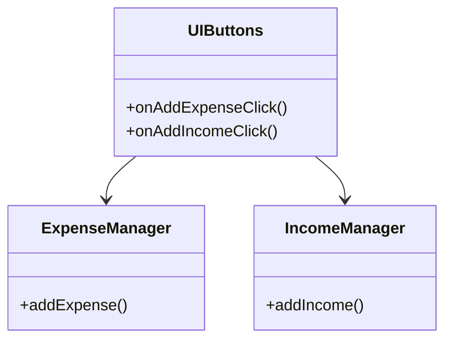

→ `UIButtons` クラスが `ExpenseManager` と `IncomeManager` を直接知り、ボタン押下時にそれぞれのメソッドを直接呼び出しています。

### 1-4：責任配置テーブル

| **クラス名** | **責任（1文）** | **知るべきこと** |
| --- | --- | --- |
| `UIButtons` | ユーザーの操作を受け取り、処理を呼び出す | どのマネージャにどの操作を依頼するか |
| `ExpenseManager` | 支出データの追加処理を担当する | 支出データのバリデーション、DB保存方法 |
| `IncomeManager` | 収入データの追加処理を担当する | 収入データのバリデーション、DB保存方法 |

各クラスの責任と知識の定義が確認できました。

### 1-5：依存グラフ

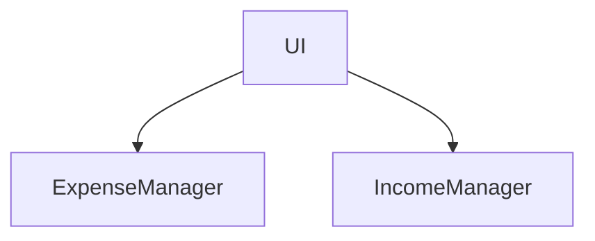

→ `UIButtons` クラス（UI）に、操作を実行する各マネージャクラスへの依存が集中していることが分かります。

### 1-6：実装コード

操作実行部分のコード例です。

```cpp
class ExpenseManager {
public:
    void addExpense(int amount, std::string category) {
        std::cout << "支出を追加しました：" << category << " " << amount << "円" << std::endl;
        // DB保存・画面更新処理
    }
};

class IncomeManager {
public:
    void addIncome(int amount, std::string source) {
        std::cout << "収入を追加しました：" << source << " " << amount << "円" << std::endl;
        // DB保存・画面更新処理
    }
};

// ユーザーインターフェース層（上記2クラスを直接呼び出す）
class UIButtons {
    ExpenseManager em;
    IncomeManager im;
public:
    void onAddExpenseClick() {
        em.addExpense(1000, "Food");
    }
    void onAddIncomeClick() {
        im.addIncome(3000, "Salary");
    }
};

```

このコードを見ると、ボタン押下という「操作」と、マネージャクラスによる「処理の実行」が密接に結びついていることが分かります。

### 1-7：実行結果

```text
出力：支出データを追加しました
出力：収入データを追加しました

```

このコードは正しく動いています。これから検討するのは、同じ機能を保ちながら、変更に強い構造をどう作るかという点です。

### 1-8：責任チェック表

この表は「コードの各行が、どの知識を持っているか」を可視化するものです。作り方はシンプルで、実装コードを1行ずつ読みながら「この行は何を知っているか」「その知識は誰が持つべきか」を書き出すだけです。知識の持ち主が2人以上になる行が見つかれば、そこが「変わる理由の混在」を示す兆候です。

| **コードの行** | **持っている知識** | **管理者（観察）** |
| --- | --- | --- |
| `em.addExpense(...)` | 支出追加の具体的なメソッドを知っている | 画面UIが操作内容と実行手段を混在させて管理しているようだ |
| `im.addIncome(...)` | 収入追加の具体的なメソッドを知っている | 画面UIが操作内容と実行手段を混在させて管理しているようだ |

> `UIButtons` クラスが「どの操作をすべきか」という意図だけでなく、「どうやって実行するか（具体的なメソッド呼び出し）」まで知ってしまっていることが観察できます。
> 
> 

要するに、操作ボタンという呼び出し元が、処理を実行するマネージャクラスの具体的なメソッドを直接知っているという観察から、実行すべき操作の意図と、具体的な実行手段が同じ場所に混在しているという構造の問題が見えてくる。

フェーズ1で責任配置の観察が終わりました。次のフェーズ2では、変更要求を受けて「何が変わり、何が変わらないか」の仮説を立てます。


---

## 🟠 フェーズ2：仮説立案 ―― 変更要求を受けて、変動と不変を整理する

フェーズ1で、家計簿アプリがUIボタンから各マネージャクラスを直接呼び出している現状を把握しました。次に、ユーザーから寄せられた「操作を取り消したい」という要望を起点に、この設計における変動と不変を整理します。

### 2-1：届いた変更要求

「利用者から、誤って登録したデータを簡単に取り消したいという要望が多く届いています。来週までに、直近の操作を取り消す『Undo機能』を実装してください」と、プロダクトマネージャーから連絡がありました。

なるほど、ボタンクリックという「操作」を記録しておき、それを巻き戻す必要があるのですね。ただ、現状の `UIButtons` クラスの中に「操作を巻き戻すためのリスト」まで書いてしまうと、ボタンの数が増えるたびに管理ロジックがどんどん膨らんでしまいそうです。

### 2-2：変動・不変の仮説テーブル

フェーズ1の責任チェック表を材料に、Undo機能の実装に向けた仮説を立てます。

| **分類** | **仮説** | **根拠（フェーズ1の観察から）** |
| --- | --- | --- |
| 🔴 **変動しそう** | 個別の操作を実行するロジック（追加・削除など） | 操作内容が増えるたびに、マネージャクラスへの依存が増えるため。 |
| 🔴 **変動しそう** | 履歴の管理方法（スタックやリストなど） | Undo機能の要件に応じて、履歴を保持・操作する構造が必要になるため。 |
| 🟢 **不変** | ボタン押下を検知して操作を実行するというフロー | ボタンがクリックされるというインターフェース（契機）自体は不変なため。 |

「操作」を今のまま「メソッド呼び出し」として直付けしていると、Undo機能のために、呼び出し元と実行先の両方を大掛かりに書き換える必要が出てきそうです。

### 2-3：関係者ヒアリング

仮説の確度を上げるため、UIデザイナーとシステム開発担当に確認を行いました。

* **開発者：** 「Undo機能以外に、操作をやり直す『Redo機能』を追加する予定はありますか？」
* **UIデザイナー：** 「あります。ユーザーからは『一度取り消したものを戻したい』という声も根強いです。」
* **開発者：** 「操作を履歴として記録する仕組みは、将来的に他の機能にも適用する可能性はありますか？」
* **システム開発担当：** 「あります。今は支出と収入の追加だけですが、将来的に口座の移動やカテゴリ編集といった複雑な操作もUndo対象にしたいと考えています。」
* **開発者：** 「操作そのものの『意図』が変わることはありますか？」
* **UIデザイナー：** 「ええ、例えば『一括削除』のような、一度に複数のデータに作用する操作も追加されるかもしれません。」

ヒアリングの結果、操作の「実行」と「取り消し」の仕組みは、将来的に複雑な操作が追加されても安定している必要があると分かりました。

> **現実のヒアリングでは——** このシナリオでは相手がちょうど設計に役立つ情報を教えてくれています。現実には「変わるかどうか分からない」「たぶん変わらない」という答えが返ることも多いです。そのときは、コードの変更履歴（`git log`）や過去の障害記録を「ヒアリングの代わり」として使ってみてください。「過去に何度変わったか」が、「将来変わりやすいか」の最も正直な証拠です。

### 2-4：確定した変動/不変テーブル

ヒアリング結果を反映し、今回の変更における変動と不変を確定します。

| **分類** | **具体的な内容** | **変わるタイミング** | **根拠（誰との確認か）** |
| --- | --- | --- | --- |
| 🔴 **変動する** | 操作の種類（追加、削除、編集など） | 機能追加・操作内容の変更時 | UIデザイナーとの確認 |
| 🔴 **変動する** | 操作の履歴管理ロジック（スタック管理など） | Undo/Redo機能の複雑化時 | UIデザイナーとの確認 |
| 🟢 **不変** | 操作を開始するトリガー（ボタン押下） | ボタンUI自体の廃止時のみ | システム開発担当との合意 |

フェーズ2で「何が変わり、何が変わらないか」が確定しました。次のフェーズ3では、操作を現在の構造のまま取り消せるようにしようとしたときに、どのような痛みが生まれるかを試みます。

## 🟡 フェーズ3：問題特定 ―― 変更を試みて、痛みを発見する

フェーズ2で、操作の種類や履歴管理ロジックは今後も増え続ける変動要因であることが分かりました。このフェーズでは、現在のように `UIButtons` クラスが各マネージャクラスを直接知っている構造のまま、操作履歴（Undo）機能を実装しようとすると何が起きるかを確認します。

### 3-1：変更シミュレーション

「操作を取り消したい」という要望に応えるため、今の `UIButtons` クラスに「直前の操作を記録して元に戻す」機能を強引に追加してみましょう。

```cpp
class UIButtons {
    ExpenseManager em;
    IncomeManager im;
    // 履歴管理のためのリスト（ここから既に無理がある…）
    std::vector<std::string> history; 
public:
    void onAddExpenseClick() {
        em.addExpense(1000, "Food");
        history.push_back("Expense"); // 履歴記録
    }
    void undo() {
        // 取り消しのために、何が最後に実行されたかを確認する巨大な分岐が必要になる
        if (history.back() == "Expense") {
            // em.undoExpense(1000, "Food"); // そもそも取り消しメソッドがない！
        }
        // ...
    }
};

```

実装を始めてすぐに、ある重大な問題に気づきます。現在の `ExpenseManager` には「取り消し（Undo）」のためのメソッドが存在しないため、履歴を記録しても元に戻す手段がないのです。

結局、Undo機能を実装するには、すべてのマネージャクラスに `undo` メソッドを追加し、それを呼び出す巨大な条件分岐を `UIButtons` クラスに書き加える必要があります。機能を追加するたびに、呼び出し元であるUIクラスが肥大化し、かつ、それぞれの業務ロジックの内部事情をさらに詳細に知らなければならないという、逃げ場のない状況に陥っているのです。

### 3-2：変更影響グラフ

Undo機能を実装しようとした際、変更がどのようにシステムを汚染するかをグラフ化します。

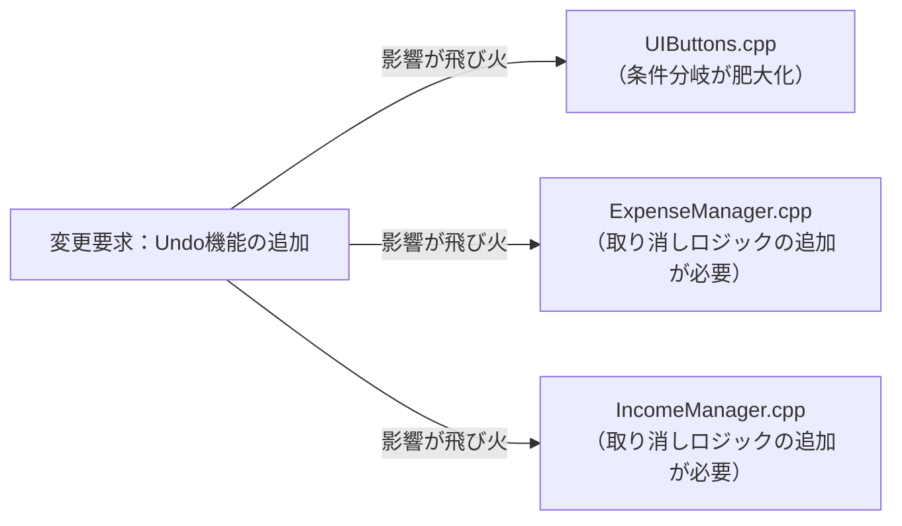

→ このグラフを見ると、本来は画面UIと業務ロジックで役割が分かれているはずなのに、「Undo」という一つの要求に対して、UIクラスとすべてのマネージャクラスという広範囲のコードに修正が飛び火していることが分かります。

### 3-3：痛みの言語化

変更を試みたことで、設計の「痛み」が鮮明になりました。

1つ目は、「条件分岐の爆発」という痛みです。操作の種類が増えるたびに、`UIButtons` クラス内の `undo()` メソッドは、どの操作をどう元に戻すべきかという判定ロジックで膨れ上がっていきます。これでは、何か一つ操作を追加するたびに、巨大な `if` 文の迷路を解き明かさなければなりません。

2つ目は、「業務ロジックへの過度な依存」という痛みです。Undo機能という画面UI側の都合で、本来その操作の実行しか知らないはずのマネージャクラスにまで「取り消し」という新しい責務を押し付けています。本来、画面は「どうやって実行するか」を知らなくても良いはずなのに、現在の構造では実行の詳細を知りすぎているため、変更がクラスの枠を越えて連鎖してしまうのです。

こういうとき困る、という感覚、皆さんも同じではないでしょうか。この「操作の意図と実行ロジックが直接結びついている」という状態が、私たちの設計を硬直させている元凶なのです。

フェーズ3で「操作の追加が辛い」という事実が確認できました。次のフェーズ4では、なぜこの辛さが構造的に発生するのかを分析します。


## 🔴 フェーズ4：原因分析 ―― 「操作」と「処理」の分離

フェーズ3で、Undo機能の実装において、呼び出し元のUIクラスが各操作の実行手段をすべて知らなければならないという「過度な依存」が確認できました。このフェーズでは、なぜそのような辛さが生じるのかをコードの構造的な観点から分析します。

### 4-1：観察→原因テーブル

フェーズ3で観察した痛みと、その根本的な原因を対応させます。

| **観察** | **原因の方向** |
| --- | --- |
| Undo機能を実装しようとすると、UIクラスが全マネージャクラスの全メソッドを知っている必要がある | 操作ボタンが「実行したい操作」の意図だけでなく、「具体的な実行手順（メソッド呼び出し）」まで直接知っているから |
| 操作の種類が増えるたびに、UIクラスの条件分岐が巨大化する | ユーザーが「何をしたいか」という操作の意図を、オブジェクトとして切り出さず、単なるメソッド呼び出しとして混在させているから |

### 4-2：変わるもの / 変わらないものテーブル

原因分析の結果として、「変わり続けるもの」と「変わってほしくないもの」を明確に分けます。

| **変わり続けるもの（🔴）** | **変わってほしくないもの（🟢）** |
| --- | --- |
| 操作の内容（支出追加、収入追加、削除など） | 操作をキックするトリガー（UIボタン自体） |
| 操作ごとの実行ロジックと取り消しロジック | 履歴のリストを管理し、Undoを実行する仕組み |

本来、UIボタンは「操作ボタンが押された」ことだけを知っていれば十分なはずです。現在の構造では、操作の「意図」と「実行手段」が密接に結合しているため、操作が増えるたびにUIクラスが改修の嵐にさらされているのです。

### 4-3：接続形態を診断する

現在の `UIButtons` クラスと各マネージャクラスの接続は、すべての操作ロジックがUIクラスの基板上に「直差し」されている状態（具体×直接）だと診断できます。

この状態は、リモコンのボタン一つひとつが、テレビの基板上の特定の回路に直接はんだ付けされているようなものです。新しい操作（機能）を追加するたびに、リモコンの筐体をこじ開け、新しい配線をはんだ付けしなければなりません。これでは、家電を買い替えるたびにリモコンの配線をやり直すようなもので、極めて非効率です。

|  | 直接（直差し） | 間接（アダプター経由） |
|:---:|:---|:---|
| **具体**（専用規格） | **← 現在地**　iPhone → [Lightning] → Apple純正ドック（Lightning端子） | iPhone → [Lightning] → [変換] → USB-A充電器（汎用端子） |
| **抽象**（汎用規格） | MacBook → [USB-C] → USB-C対応モニター（汎用端子） | MacBook → [USB-C] → [ハブ] → HDMI・USB-A・LAN |

このコードで言うと：

| ケーブル比喩 | コードの対応箇所 |
|---|---|
| 「具体」＝専用規格ケーブル | `ExpenseManager em;` / `IncomeManager im;` — `UIButtons` が具体的なマネージャクラスをメンバとして直接保持している |
| 「直接」＝直差し | `em.addExpense(1000, "Food");` / `im.addIncome(3000, "Salary");` — コマンドオブジェクトを介さず、ボタン処理から直接メソッドを呼び出している |

本来であれば、ボタンが押されたとき「何らかの操作オブジェクト」を投げるようにし、実行・取り消しはそのオブジェクト自身が知っているという「USB-Cハブ経由（抽象×間接）」のような構造にすべきでしょう。

フェーズ4で根本原因が言語化できました。次のフェーズ5では、解決すべき問題を具体的に定めます。

## 🟣 フェーズ5：課題定義 ―― 解くべき問題を具体的に定める

フェーズ4で、「操作の意図」と「具体的な実行ロジック」が密接に結びついており、操作を追加するたびに呼び出し元であるUIクラスが肥大化・複雑化しているという構造的問題が明らかになりました。対策案（フェーズ6）に進む前に、ここで「何を解くべき課題とするか」を具体的に確定させます。

### 5-1：接続点の特定

今回のリファクタリングにおいて、解決すべき「接続点（ジョイント）」は以下の1箇所です。

* **接続点A：** `UIButtons`クラス（呼び出し元） ←→ `ExpenseManager`/`IncomeManager`（実行先）の境界


この接続点は、ユーザーからの「操作」という意図と、それを「どう実行するか」という処理が直接結合している場所です。ここを切り離し、操作の意図を独立したオブジェクトとして扱えるようにすることで、UIクラスは「何を実行するか」を直接知らなくてもよくなります。

### 5-2：非機能制約の確認

この接続点における非機能制約を整理します。

| **確認項目** | **内容** | **この章での判断** |
| --- | --- | --- |
| 変更頻度 | この接続点はどのくらいの頻度で変わるか | 高（操作の種類やUndo/Redo要件は今後も増え続けるため） |
| パフォーマンス | ホットパスか（高頻度で呼ばれるか） | いいえ（ユーザーのボタンクリックに応じた処理であり、パフォーマンスがボトルネックになることはない） |
| メモリ | 間接層の追加でオーバーヘッドが問題になるか | いいえ（操作オブジェクトの生成コストは、ユーザー体験に影響しない） |
| 履歴サイズ | アンドゥ・リドゥ履歴をどれだけ保持するか | 要設計（ユーザーが大量の操作を行うと履歴オブジェクトがメモリを圧迫する可能性がある。最大保持件数の上限や古い履歴の自動廃棄ポリシーを、CommandInvokerの設計段階で決める必要がある） |

今回のケースでは、パフォーマンスへの厳しい制約はありません。ただし、長期間アプリを使い続けるユーザーが大量の操作を積み重ねると、履歴スタックがメモリを圧迫することがあります。CommandInvokerの設計段階で、履歴の最大保持件数と廃棄ポリシーを決めておくことが重要です。この点を接続形態の設計判断に加えておきます。

### 5-3：クライアントへの影響範囲

「分けること」で既存コードにどの程度の変更が波及するかを確認します。

クライアントである `UIButtons` クラスは、現在各マネージャクラスのメソッドを直接呼び出しています。この接続点の形を変えると、`UIButtons` は直接メソッドを呼ぶのではなく、操作オブジェクトを生成して「実行依頼」を送る形に修正する必要があります。

一度この切り離しを行えば、以降は操作オブジェクトを増やすだけで、UI側には全く触れずに新しい操作やUndo機能を追加できるようになります。

### 5-4：課題まとめ表

以上の情報をまとめ、フェーズ6での対策案検討の基盤となる課題定義を確定します。

| **接続点** | **分けた理由** | **非機能制約** | **クライアント影響** |
| --- | --- | --- | --- |
| 接続点A | 操作の意図と実行手段を隔離するため | ホットパスではないが履歴サイズの上限設計が必要（大量操作時のメモリ圧迫を防ぐため） | UIButtonsから直接メソッド呼び出しを削除する必要あり |

フェーズ5で「何を解くか」が確定しました。次のフェーズ6では、この課題に対してどのような「接続の形」を採用すべきか、案0〜案4を並べてコスト比較を行います。

## 🟢 フェーズ6：対策案検討 ―― 解決策を並べ、コストで選ぶ

### 6-1：接続の形 2×2マトリクス

現在は `UIButtons` クラスが各マネージャクラスのメソッドを直接呼び出している「具体×直接」の状態です。ここから、操作をオブジェクトとしてカプセル化することで、呼び出し元と実行先を疎結合にしていきます。

| 接続形態 | ケーブル例 | 特徴 |
|:---:|:---|:---|
| **具体×直接**（← 現在地） | iPhone → [Lightning] → Apple純正ドック（Lightning端子） | 専用端子のみ対応。差し替え不可 |
| **具体×間接** | iPhone → [Lightning] → [変換] → USB-A充電器（汎用端子） | 変換器を挟むが規格は専用のまま |
| **抽象×直接** | MacBook → [USB-C] → USB-C対応モニター（汎用端子） | どのメーカーでも同じ口で繋がる |
| **抽象×間接** | MacBook → [USB-C] → [ハブ] → HDMI・USB-A・LAN | ハブを介して多様な機器へ展開可能 |

---

#### 案0：現状維持 ―― 構造を変えない

**この形の考え方：**
クラスの分割やオブジェクト化を行わず、既存のメソッド呼び出しで対応し続けます。追加の設計コストはゼロですが、操作が増えるたびに `UIButtons` クラスの修正が不可避となります。

**構造図：**

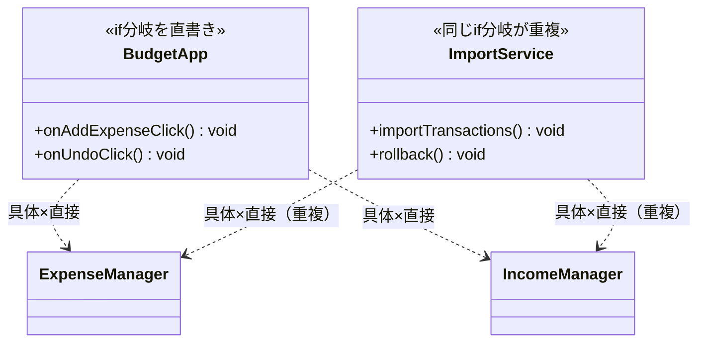

両呼び出し元が同じ具体クラスを個別に抱え込み、undo/redo管理ロジックまでそれぞれに重複して書かれている。

【コード例（一部）】

```cpp
void onAddExpenseClick() {
    // ← 具体：ExpenseManagerという具体型を呼び出し側が直接書いている
    em.addExpense(1000, "Food");
    history.push_back("Expense");
}

```

**呼び出し側から見た違い（main() 例）：**

```cpp
// 案0（現状維持）の呼び出し側
// UIからの操作：マネージャを直接呼び出し、履歴もここで管理
class BudgetApp {
    ExpenseManager em;
    IncomeManager im;
    std::vector<std::string> history; // ← 具体：履歴管理もここに直書き
public:
    void onAddExpenseClick(int amount, std::string cat) {
        em.addExpense(amount, cat);
        history.push_back("Expense:" + cat);
    }
    void onUndoClick() {
        // 巨大な条件分岐でundo処理を直書き…
    }
};

// 一括インポート：同じマネージャ直接呼び出しロジックが再び現れる（重複）
class ImportService {
    ExpenseManager em; // ← 重複：BudgetAppと同じ具体型を直接保持
    std::vector<std::string> history; // ← 重複：履歴管理も再び書く
public:
    void importTransactions(
            std::vector<std::pair<int,std::string>> data) {
        for (auto& r : data) {
            em.addExpense(r.first, r.second);
            history.push_back("Expense:" + r.second);
        }
    }
    void rollback(int count) {
        // ← 重複：undoロジックもここで再実装
    }
};

int main() {
    BudgetApp app;
    app.onAddExpenseClick(1000, "Food");
    app.onUndoClick();

    ImportService importer;
    importer.importTransactions({{2000, "Rent"}, {300, "Water"}});
    importer.rollback(2);
    return 0;
}
```

`BudgetApp` と `ImportService` の両方が、マネージャへの直接呼び出しとundo/redo管理ロジックをそれぞれに書いている。操作の種類が増えるたびに、両方の呼び出し元で同じ修正が必要になる。

**動作図：**

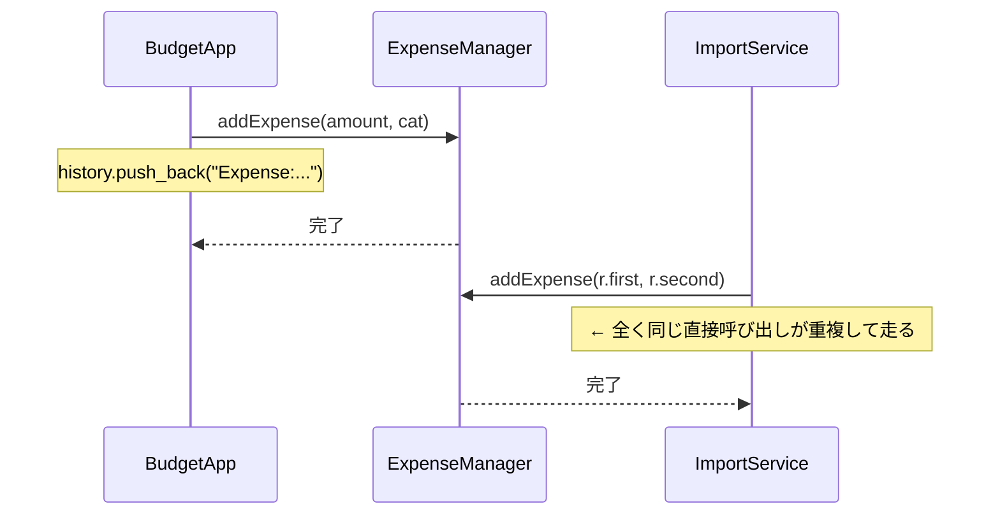
ロジックが各呼び出し元の内部に直書きされているため、マネージャへの直接呼び出しと履歴管理の同じコードが `BudgetApp` と `ImportService` の2か所で並行して走る。

**この形のトレードオフ：**

* 変更容易性：低（操作が増えるたびにUIクラスを修正する必要がある）


* テスト容易性：低（UIのボタン操作と処理実行が密結合している）


* 実装コスト：低（既存のコードに追記するのみ）


---

#### 案1：具体×直接 ―― 操作ごとにクラスを分けるが呼び出しは直接行う

**この形の考え方：**
操作ごとにクラスを分割しますが、呼び出し側が依然としてそのクラスを直接生成・呼び出しします。責任の境界は明確になりますが、呼び出し側は依然として具体的な操作クラスに依存します。


2. 呼び出し元で、その操作クラスを直接生成して実行する。

**構造図：**

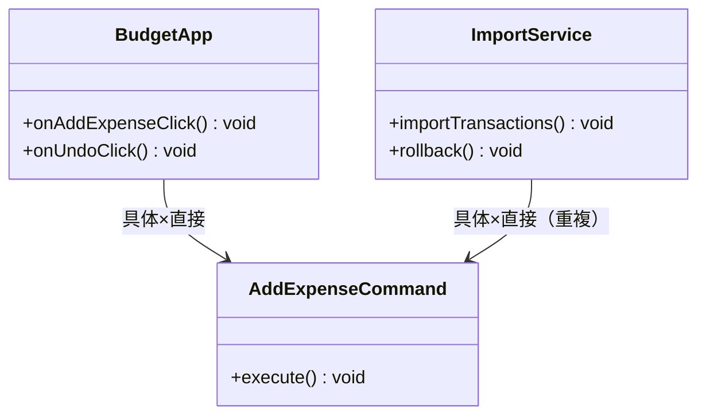

`BudgetApp` と `ImportService` の両方が同じ具体コマンドクラスを直接生成しており、新しい操作が増えるたびに両方の呼び出し元で修正が発生する。

【コード例（一部）】

```cpp
// ← 具体：AddExpenseCommandという型名を直接書いている
class AddExpenseCommand {
public:
    void execute() { em.addExpense(1000, "Food"); }
};
// UIButtons内で AddExpenseCommand().execute() を直接呼ぶ
// ← 直接：呼び出し側がこのクラスを直接インスタンス化している

```

**呼び出し側から見た違い（main() 例）：**

```cpp
// 案1（具体×直接）の呼び出し側
// UIからの操作：具体クラスを直接生成して実行
class BudgetApp {
public:
    void onAddExpenseClick(int amount, std::string cat) {
        AddExpenseCommand cmd(amount, cat); // ← 直接：具体クラスを直接生成
        cmd.execute();
    }
    void onUndoClick() {
        // undoするには具体クラスのundoメソッドを直接呼ぶ必要がある
    }
};

// 一括インポート：どの具体コマンドクラスを使うかの選択も重複する
class ImportService {
public:
    void importTransactions(
            std::vector<std::pair<int,std::string>> data) {
        for (auto& r : data) {
            // ← 重複：BudgetAppと同じAddExpenseCommandを直接生成
            AddExpenseCommand cmd(r.first, r.second);
            cmd.execute();
        }
    }
    void rollback(int count) {
        // ← 重複：取り消しのため具体クラスの知識をここにも書く
    }
};

int main() {
    BudgetApp app;
    app.onAddExpenseClick(1000, "Food");

    ImportService importer;
    importer.importTransactions({{2000, "Rent"}, {300, "Water"}});
    importer.rollback(2);
    return 0;
}
```

`BudgetApp` と `ImportService` の両方が、「どの具体コマンドクラスを使うか」という選択をそれぞれの場所で直接行っている。新しい操作が追加されるたびに、両方の呼び出し元を修正しなければならない。

**動作図：**

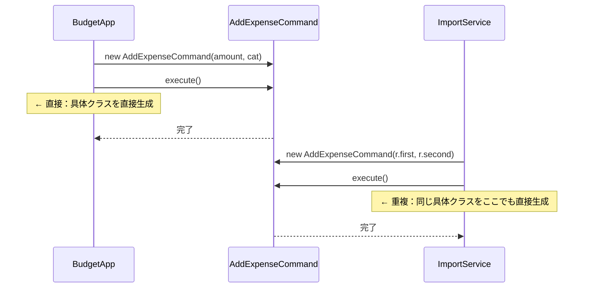
クラスは分かれたが「どの具体コマンドクラスを使うか」という選択を両方の呼び出し元がそれぞれ行っており、呼び出し経路が2本並んで重複している。

**この形のトレードオフ：**

* 変更容易性：低〜中（新操作追加時に呼び出し側のコード変更が発生する）


* テスト容易性：低（操作クラスが特定のマネージャに依存したまま）


* 実装コスト：低（クラスを分けるのみ）


---

#### 案2：抽象×直接 ―― インターフェースを挟み、型だけで接続する

**この形の考え方：**
操作を抽象的なインターフェースとして定義します。呼び出し元は具体的な操作クラスを知らずに、インターフェース経由で実行を依頼します。この構造を **Command（コマンド）** パターンと呼びます。


2. 各操作クラスに `ICommand` を実装させる。


3. 呼び出し元は `ICommand` 型として操作を受け取り、実行する。

**構造図：**

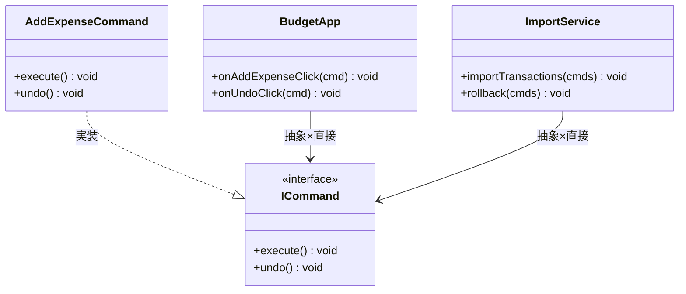

`main()` だけが具体クラスを知り、`BudgetApp` と `ImportService` は `ICommand*` という抽象型を直接受け取るだけで、具体的なコマンドクラスを一切知らずに済む。

【コード例（一部）】

```cpp
class ICommand {
public:
    virtual void execute() = 0;
};
class AddExpenseCommand : public ICommand {
    void execute() override { em.addExpense(1000, "Food"); }
};

// UIButtonsのメンバ変数：
// ← 抽象：ICommand*型で受け取り、具体クラスを知らない

```

**呼び出し側から見た違い（main() 例）：**

```cpp
// 案2（抽象×直接）の呼び出し側
// UIからの操作：抽象型で受け取り、具体クラスに依存しない
class BudgetApp {
public:
    void onAddExpenseClick(ICommand* cmd) { // ← 直接：インターフェース経由で受け取る
        cmd->execute();
    }
    void onUndoClick(ICommand* cmd) {
        cmd->undo();
    }
};

// 一括インポート：こちらも同じ抽象型で受け取るだけ（重複なし）
class ImportService {
public:
    void importTransactions(
            std::vector<ICommand*> cmds) { // ← 直接：同じ形で受け取れる
        for (auto* cmd : cmds) {
            cmd->execute();
        }
    }
    void rollback(std::vector<ICommand*> cmds) {
        for (auto* cmd : cmds) {
            cmd->undo(); // ← 同じインターフェースを使い回せる
        }
    }
};

int main() {
    AddExpenseCommand cmd1(1000, "Food"); // ← 具体：呼び出し側だけが具体クラスを生成
    AddExpenseCommand cmd2(2000, "Rent");

    BudgetApp app;
    app.onAddExpenseClick(&cmd1);

    ImportService importer;
    importer.importTransactions({&cmd2}); // ← 同じインターフェースを使い回せる
    return 0;
}
```

`BudgetApp` と `ImportService` はどちらも `ICommand*` を受け取るだけで、「どの具体クラスか」を知らずに済む。新しい操作が増えても、どちらの呼び出し元も修正は不要だ。

**動作図：**

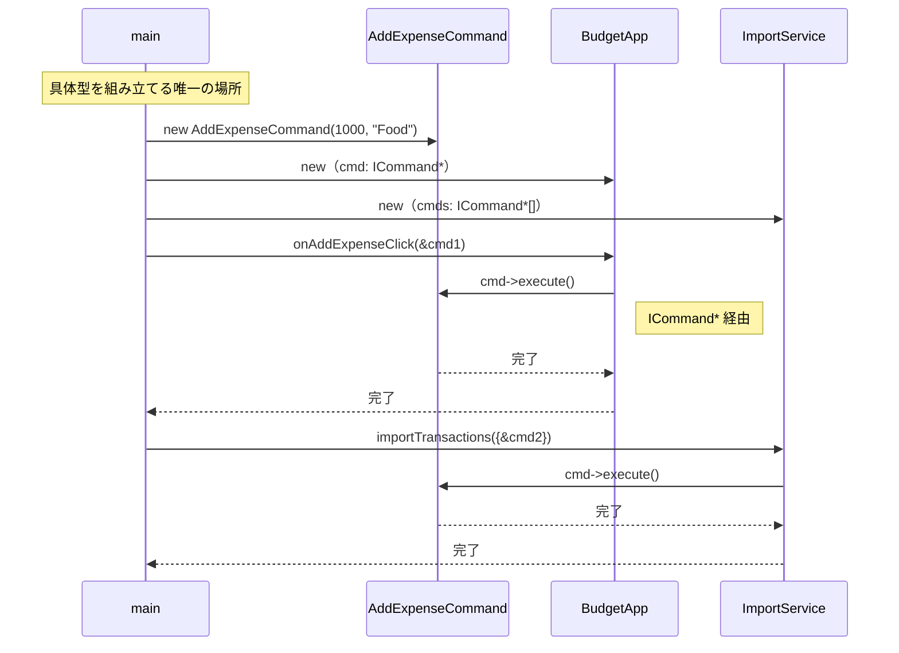
`main()` が具体型を組み立て、両方の呼び出し元は `ICommand*` という型だけを介して同じインターフェースを呼ぶため、具体クラスが変わっても呼び出し経路は変わらない。

**この形のトレードオフ：**

* 変更容易性：中〜高（呼び出し側は具体的なコマンドを知らなくて済む）


* テスト容易性：高（コマンドをスタブに差し替え可能）


* 実装コスト：中（インターフェース定義が必要）


---

#### 案3：具体×間接 ―― 仲介クラスを置くが、具体型を知っている

**この形の考え方：**
`CommandInvoker` のような仲介役を置き、実行・アンドゥ・リドゥのスタック管理と履歴の上限制御という複雑なロジックをそこに集約します。マネージャへの具体的な参照をその仲介役に閉じ込めることで、UIクラスからはマネージャの知識を隠蔽できます。

**構造図：**

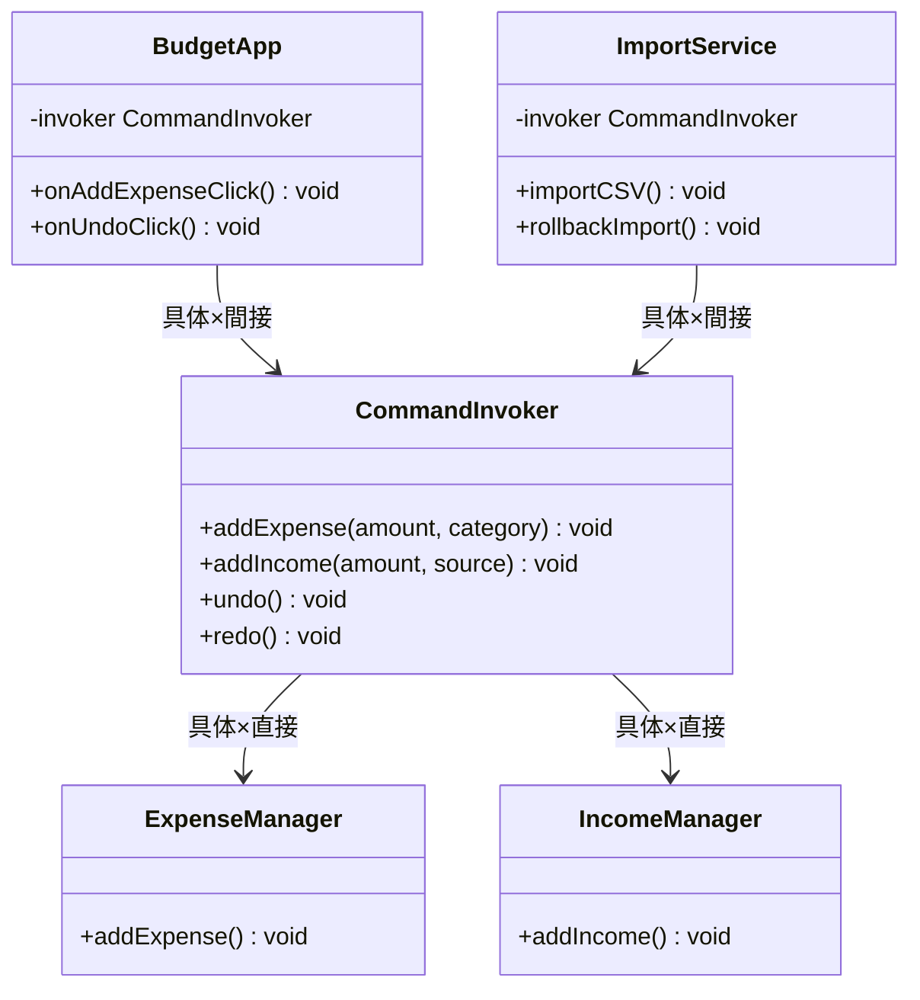

両呼び出し元は共有の `CommandInvoker` だけを知り、undo/redo スタック管理と履歴上限制御の複雑なロジックが仲介役の一箇所に集約されている。

【コード例（一部）】

```cpp
// ← 具体：CommandInvokerという具体型を持っている
// ← 間接：呼び出し側はInvokerのみ知り、内部のクラス群は見えない
class CommandInvoker {
    ExpenseManager em;
    IncomeManager im;
    // 実行履歴スタック（アンドゥ用）
    std::vector<std::string> undoStack;
    // リドゥ用スタック
    std::vector<std::string> redoStack;
    // 履歴の最大保持件数（メモリ圧迫防止）
    static const int MAX_HISTORY = 50;

public:
    void addExpense(int amount, std::string category) {
        em.addExpense(amount, category);
        pushHistory("EXPENSE:" + category + ":" +
                    std::to_string(amount));
    }
    void addIncome(int amount, std::string source) {
        im.addIncome(amount, source);
        pushHistory("INCOME:" + source + ":" +
                    std::to_string(amount));
    }
    void undo() {
        if (undoStack.empty()) return;
        std::string last = undoStack.back();
        undoStack.pop_back();
        redoStack.push_back(last);
        applyReverse(last);
    }
    void redo() {
        if (redoStack.empty()) return;
        std::string next = redoStack.back();
        redoStack.pop_back();
        undoStack.push_back(next);
        applyForward(next);
    }
    int historySize() const { return undoStack.size(); }

private:
    void pushHistory(std::string entry) {
        undoStack.push_back(entry);
        // 上限を超えたら古い履歴を自動廃棄
        if ((int)undoStack.size() > MAX_HISTORY) {
            undoStack.erase(undoStack.begin());
        }
        redoStack.clear(); // 新操作でリドゥ履歴をリセット
    }
    void applyReverse(std::string entry) { /* 取り消し処理 */ }
    void applyForward(std::string entry) { /* やり直し処理 */ }
};

// UIボタン操作からの呼び出し
class BudgetApp {
    CommandInvoker& invoker;
public:
    BudgetApp(CommandInvoker& inv) : invoker(inv) {}
    void onAddExpenseClick(int amount, std::string cat) {
        invoker.addExpense(amount, cat);
    }
    void onUndoClick() { invoker.undo(); }
    void onRedoClick() { invoker.redo(); }
};

// 一括インポートからの呼び出し（ロールバック可能）
class ImportService {
    CommandInvoker& invoker;
public:
    ImportService(CommandInvoker& inv) : invoker(inv) {}
    void importCSV(std::vector<std::pair<int,std::string>> records) {
        int importedCount = 0;
        for (auto& r : records) {
            invoker.addExpense(r.first, r.second);
            importedCount++;
        }
        std::cout << importedCount << "件インポート完了"
                  << "（履歴: " << invoker.historySize() << "件）"
                  << std::endl;
    }
    void rollbackImport(int count) {
        for (int i = 0; i < count; i++) invoker.undo();
        std::cout << count << "件ロールバック完了" << std::endl;
    }
};

```

このコードを見ると、`CommandInvoker` は依然として具体的な `ExpenseManager` や `IncomeManager` を直接操作しており、新しい操作が増えれば対応が必要です。しかし、アンドゥ・リドゥスタックの管理と履歴の上限制御という複雑なロジックを一箇所に集め、`BudgetApp`（UI操作）と `ImportService`（一括インポート）が同じ操作管理機構を共有できる点に、この形の価値があります。

**呼び出し側から見た違い（main() 例）：**

```cpp
// 案3（具体×間接）の呼び出し側 ― 2つの呼び出し元が同じInvokerを共有
int main() {
    CommandInvoker invoker;
    // UIからの操作
    BudgetApp app(invoker);
    app.onAddExpenseClick(1000, "Food");
    app.onAddExpenseClick(500, "Transport");
    app.onUndoClick(); // 直前の操作を取り消す

    // 一括インポート（ロールバック可能）
    ImportService importer(invoker);
    importer.importCSV({{2000, "Rent"}, {300, "Water"}});
    importer.rollbackImport(2); // インポートを丸ごと取り消す
    return 0;
}
```

**動作図：**

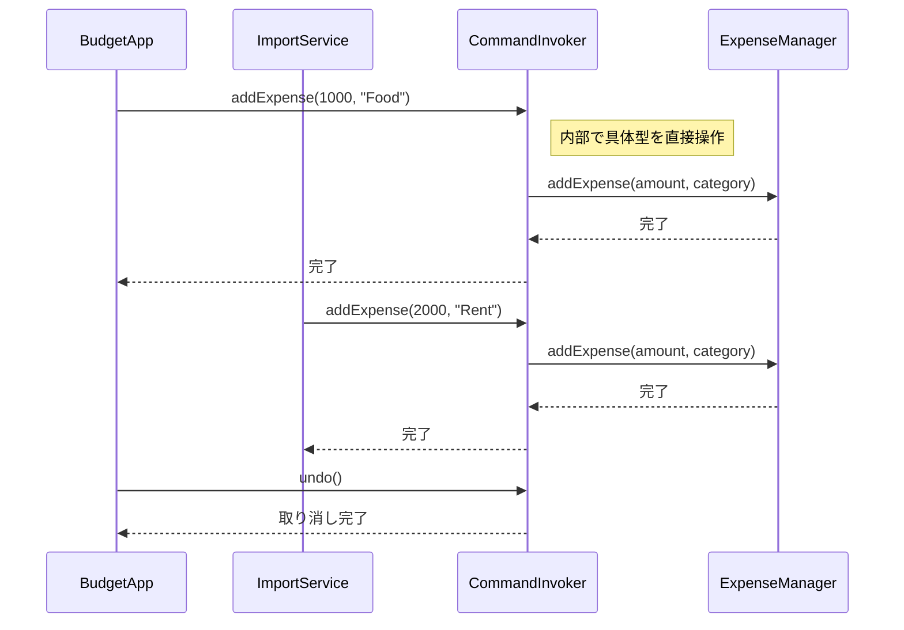
両方の呼び出し元が同じ `CommandInvoker` を経由するためundo/redoスタック管理の呼び出し経路が1本に収束し、履歴管理ロジックの重複が消える。

**この形のトレードオフ：**

* 変更容易性：中（Invoker内にロジックが集約されるため）


* テスト容易性：中（Invokerをモック化可能）


* 実装コスト：中（Invokerへの知識集約が必要）


---

#### 案4：抽象×間接 ―― インターフェース＋仲介役を両立する

**この形の考え方：**
抽象化されたコマンドを、さらに仲介役経由で実行する設計です。どの層も具体的な実装を知らず、操作の履歴保持やUndo/Redoが最も容易に実現できます。一方でクラス数や層が増えるため、小規模なアプリには複雑すぎる場合があります。


2. 案3の仲介クラスを作成し、コマンドインターフェースを受け取るようにする。

**構造図：**

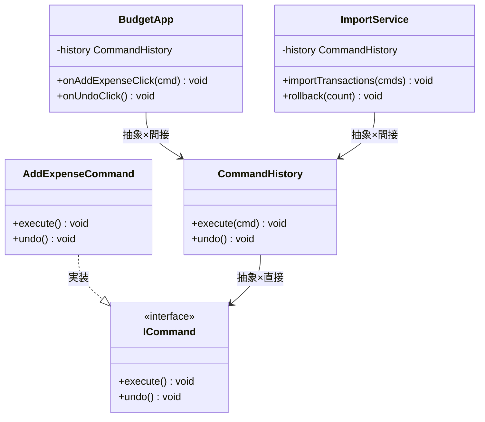

`BudgetApp` と `ImportService` は `CommandHistory*` という抽象インターフェースしか知らず、具体的な実装の知識は `main()` の組み立て部分だけに閉じている。

【コード例（一部）】

```cpp
class CommandHistory {
    std::stack<ICommand*> history;
public:
    // ← 抽象：ICommand*型で受け取り、具体実装を知らない
    // ← 間接：履歴管理クラスを経由するため操作の詳細が見えない
    void execute(ICommand* cmd) { cmd->execute(); history.push(cmd); }
};

```

**呼び出し側から見た違い（main() 例）：**

```cpp
// 案4（抽象×間接）の呼び出し側
// UIからの操作：抽象Historyのみ知り、具体実装は見えない
class BudgetApp {
    CommandHistory* history; // ← 抽象：インターフェース型で保持
public:
    BudgetApp(CommandHistory* h) : history(h) {}
    void onAddExpenseClick(ICommand* cmd) {
        history->execute(cmd); // ← 間接：History経由で実行
    }
    void onUndoClick() { history->undo(); }
};

// 一括インポート：こちらも同じ抽象Historyを受け取る（重複なし）
class ImportService {
    CommandHistory* history; // ← 抽象：同じインターフェース型で保持
public:
    ImportService(CommandHistory* h) : history(h) {}
    void importTransactions(std::vector<ICommand*> cmds) {
        for (auto* cmd : cmds) {
            history->execute(cmd); // ← 間接：History経由で実行
        }
    }
    void rollback(int count) {
        for (int i = 0; i < count; i++) history->undo();
    }
};

int main() {
    CommandHistory hist;               // ← 具体：組み立て側だけが具体型を知る
    AddExpenseCommand cmd1(1000, "Food");
    AddExpenseCommand cmd2(2000, "Rent");

    BudgetApp app(&hist);
    app.onAddExpenseClick(&cmd1);

    ImportService importer(&hist); // ← 間接：抽象Historyのみ見えて具体実装は隠れる
    importer.importTransactions({&cmd2});
    importer.rollback(1);
    return 0;
}
```

`BudgetApp` と `ImportService` はどちらも `CommandHistory*` という同じ抽象インターフェースしか知らない。具体的な実装クラスの知識は `main()` の組み立て部分だけに閉じている。

**動作図：**

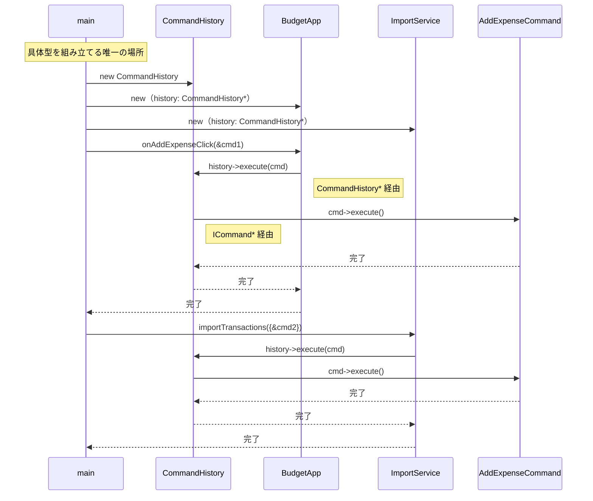
呼び出し元→`CommandHistory*`→`ICommand*` という2段階の抽象型を経由するため、どの具体クラスが動くかは `main()` の組み立て部分だけが知っている。

**この形のトレードオフ：**

* 変更容易性：高（操作と実行環境が完全に分離される）


* テスト容易性：高（各要素を独立してテスト可）


* 実装コスト：高（構成要素が多く設計が重い）

### 6-7：評価軸

対策案が揃いましたので、採用すべき案を決定するための「ものさし」を定義します。設計判断の根拠を透明にするため、比較表の提示に先立って評価軸を合意します。

今回の家計簿アプリにおけるUndo/Redo機能の実装では、以下の3軸で評価を行います。

| **評価軸** | **意味** | **ウェイト** |
| --- | --- | --- |
| 変更容易性 | 操作の種類が増えたとき、既存のUIコードへの影響を最小限に抑えられるか | ×3 |
| テスト容易性 | 操作オブジェクトを独立して単体テストできるか | ×2 |
| 可読性 | 操作の意図と実行ロジックが分かりやすく分離されているか | ×1 |

> **注：** このウェイト（変更容易性×3など）は本書の例です。チームの変更頻度・テスト文化に合わせて、比較を始める前にチームで合意してください。スコアは「答えを決める計算式」ではなく、「チームの議論を整理する道具」です。

| 点数 | 変更容易性 | テスト容易性 | 可読性 |
| --- | --- | --- | --- |
| 3 | 変更が1クラスのみで完結する | スタブ1つで完全に切り離せる | クラス数が増えない・既存構造と同じ読み方で理解できる |
| 2 | 変更が2〜3クラスに及ぶ | 一部スタブが必要だが差し替え可能 | クラスが1〜2増える |
| 1 | 変更が4クラス以上に波及する | 実装に依存しテストが困難 | 中間層・インターフェースが複数増え理解コストが高い |

本件は画面UI上の処理であり、ホットパス（高頻度で呼ばれる処理）ではないため、パフォーマンス上の制限による除外（VETO）は行いません。

---

### 6-8：コスト天秤

案0〜案4を3軸スコアリングで定量比較します。

| **案** | **現在の対応コスト** | **未来の対応コスト** |
| --- | --- | --- |
| 案0：現状維持 | 低 | 高 |
| 案1：具体×直接 | 低〜中 | 高 |
| 案2：抽象×直接 | 中 | 低〜中 |
| 案3：具体×間接 | 中 | 中 |
| 案4：抽象×間接 | 高 | 低 |

**ステップ1：採点表**（1＝低い、2＝中程度、3＝高い）

| 案 | 変更容易性（×3） | テスト容易性（×2） | 可読性（×1） |
| --- | --- | --- | --- |
| 案0：現状維持 | 1 | 1 | 3 |
| 案1：具体×直接 | 1 | 2 | 3 |
| 案2：抽象×直接 | 2 | 3 | 2 |
| 案3：具体×間接 | 2 | 2 | 2 |
| 案4：抽象×間接 | 3 | 3 | 1 |

**ステップ2：加重合計表**（変更容易性×3 ＋ テスト容易性×2 ＋ 可読性×1）

| 案 | 加重スコア | 判定 |
| --- | --- | --- |
| 案0 | 8 |  |
| 案1 | 10 |  |
| 案2 | 14 |  |
| 案3 | 12 |  |
| 案4 | 16 | ← 採用候補 |

加重スコアが最も高い案4を採用候補とします。

---

### 6-9：採用案の決定

**採用する案：** 案4

**理由：** 操作の履歴管理（Undo/Redo）を本格的に実装するためには、操作の実行者と呼び出し元を完全に分離し、かつ実行した履歴をオブジェクトとして保持できる案4が最適です。将来的な操作の複雑化を見据え、初期の実装コストは高いものの、長期的な拡張性を最優先して採用を決定しました。

---

### 6-10：耐久テスト

フェーズ2のヒアリングで挙がった「将来のリスク」が実際に発生した場面をシミュレートし、案4の変更耐性を検証します。

| **変更シナリオ** | **触る場所** | **コスト評価** |
| --- | --- | --- |
| 一括削除機能の追加（ヒアリングで予告） | 新しいコマンドクラスの新規作成のみ | 低 |
| Undo/Redoの回数制限機能の追加 | 履歴管理クラスの修正のみ | 低 |

採用案（案4）では、新しい操作が追加されても履歴管理ロジックやUIクラスには一切影響を与えないため、変更耐性が十分に高いことを確認できました。

## 🟤 フェーズ7：対策実施 ―― 決断し、変化に強い設計を手に入れる

採用した「Commandパターンによる操作のオブジェクト化」を、実際のコードに実装します。これまではUIが各マネージャの具体的なメソッドを知っていましたが、これを「操作そのものを表すオブジェクト」へと置き換えます。

この設計変更により、今後どれだけ操作の種類が増えようとも、UIクラスや履歴管理ロジックを壊すことなく、新しい操作クラスを追加するだけで安全に機能拡張ができる構造を手に入れました。

### 7-1：解決後のコード（全体）

操作を抽象化するためのインターフェースと、それを実行する履歴管理クラスを定義します。

```cpp
// 操作を抽象化するインターフェース
class ICommand {
public:
    virtual ~ICommand() {}
    virtual void execute() = 0;
    virtual void undo() = 0;
};

// 具体的な操作クラス
class AddExpenseCommand : public ICommand {
    ExpenseManager& em;
public:
    AddExpenseCommand(ExpenseManager& em) : em(em) {}
    void execute() override { em.addExpense(1000, "Food"); }
    void undo() override { em.removeExpense(1000, "Food"); }
};

// 組み立てと実行を担当するクラス
class CommandInvoker {
    std::stack<ICommand*> history;
public:
    void execute(ICommand* cmd) {
        cmd->execute();
        history.push(cmd);
    }
    void undo() {
        if (history.empty()) return;
        history.top()->undo(); // ← ここだけ変わる
        history.pop();
    }
};

```

この実装により、UIは「コマンド」の `execute` メソッドを呼ぶだけでよくなり、業務ロジックの詳細から完全に解放されました。

### 7-2：変更影響グラフ（改善後）

フェーズ3で確認したUndo機能の追加要求を再適用します。

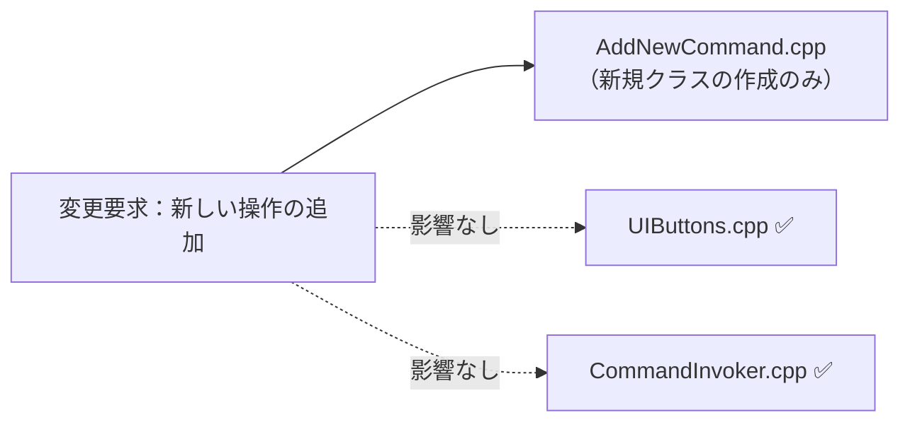

→ **フェーズ3の変更影響グラフと比較して、新しい操作の追加という変更要求が、新規作成したコマンドクラスだけに閉じた設計になりました**。

### 7-3：変更シナリオ表

この設計で手に入れたものと、諦めたものを整理します。

| **シナリオ** | **変わるクラス（触る場所）** | **変わらないクラス** |
| --- | --- | --- |
| 新しい操作（例：振込）の追加 | `TransferCommand` (新規作成) | `UIButtons`, `CommandInvoker` |
| Undo/Redoの仕様変更 | `CommandInvoker` (修正のみ) | `UIButtons`, 各 `Command` クラス |

操作の意図をオブジェクトとして独立させたことで、UIは操作の実行方法を知る必要がなくなりました——それがこの設計で手に入れたものです。諦めたものは、操作ごとにクラスを定義することによる、わずかなクラス数の増加です。

---

### 7-4：接続形態の確認 ── この設計はどの接続か

フェーズ4-3で診断した通り、変更前のコードは **具体×直接** の状態でした。
採用した Command パターンでは、接続形態が **抽象×間接（USB-Cハブ経由）** へと変化しています。

**「抽象×間接」の証拠となるコード：**

```cpp
class CommandInvoker {
    std::stack<ICommand*> history; // ← インターフェース型 = 「抽象」の証拠
public:
    void execute(ICommand* cmd) {
        cmd->execute(); // ← CommandInvoker 経由 = 「間接」の証拠
        history.push(cmd);
    }
};
// UIButtons → CommandInvoker → ICommand → 実際の処理（2段階の委譲）
```

- `ICommand*` はインターフェース型 → **「抽象」** の証拠（具体的な操作クラス名を知らない）
- `UIButtons` は `ExpenseManager` を直接知らず、`CommandInvoker` を経由して `ICommand` を実行する → **「間接」** の証拠

「操作を差し替えたい（操作の追加・変更）かつ履歴管理という仲介層が必要」という動機から、**抽象×間接** が選ばれました。

第5章の締めくくりとして、家計簿アプリの操作履歴管理を通じて学んだ「操作の意図と実行ロジックの分離」を振り返ります。

---

### 整理：7フェーズとこの章でやったこと

この章では、ボタン押下という操作が特定の処理を直接知っているために、Undo/Redoのような機能追加でコード全体が複雑化する現状を学びました。7フェーズの思考プロセスを適用した改善の流れを振り返ります。

| **フェーズ** | **この章でやったこと** |
| --- | --- |
| 🔵 フェーズ1：現状把握 | ボタン（UI）が各マネージャクラスを直接呼び出す構造を観察しました。 |
| 🟠 フェーズ2：仮説立案 | 「操作」と「実行」は異なる理由で変わるため、分離できるという仮説を立てました。 |
| 🟡 フェーズ3：問題特定 | 操作を追加するたびに呼び出し元のUIクラスが肥大化する「痛み」を確認しました。 |
| 🔴 フェーズ4：原因分析 | 操作の「意図」と「実行手段」が同じ場所に混在していることが、変更影響を拡大させていると突き止めました。 |
| 🟣 フェーズ5：課題定義 | UIとマネージャクラスの間の直接的なメソッド呼び出しを接続点として特定しました。 |
| 🟢 フェーズ6：対策案検討 | 案0〜案4を比較し、操作をオブジェクトとしてカプセル化する案4を採用しました。 |
| 🟤 フェーズ7：対策実施 | 操作をコマンドオブジェクトとして独立させ、呼び出し元から詳細を切り離しました。 |

### 各クラスの最終的な責任

今回の設計変更により、各クラスの役割がより明確に分担されました。

| **クラス名** | **責任（1文）** | **変わる理由** |
| --- | --- | --- |
| `ICommand` | 操作の実行と取り消しというインターフェースを定義する | Undo/Redoの仕組み全体が変わるとき |
| `AddExpenseCommand` | 支出追加の意図と実行・取り消しロジックを保持する | 支出追加の業務ルールが変わるとき |
| `CommandInvoker` | コマンドの実行履歴を保持し、Undo/Redoを制御する | Undo/Redoの回数制限や履歴管理方針が変わるとき |

> このプロセスを回した結果にたどり着いた構造こそが Command パターンです。
> 
> 

---

### 振り返り：「この章を読むと得られること」は手に入ったか

| **得られること** | **この章のどこで示したか** |
| --- | --- |
| 1. 操作の種類という観点での識別 | フェーズ2の仮説立案で、操作と実行を切り離したこと。 |
| 2. 依存過多の診断 | フェーズ4で、UIクラスが全実行先を知る構造を「具体×直接」と診断したこと。 |
| 3. 操作オブジェクト化の構造説明 | フェーズ7で、操作をオブジェクト化し履歴保持したこと。 |

---

### 振り返り：3つの設計原則はどう適用されたか

* **原則1「変わるものをカプセル化せよ」の現れ**
* **具体化された場所：** 個別のコマンドクラス（`AddExpenseCommand` など）
* **解説：** 操作ごとの「実行・取り消しロジック」を個別のクラスへカプセル化しました。これにより、UIクラスは操作の中身を知る必要がなくなりました。


* **原則2「実装ではなくインターフェースに対してプログラムせよ」の現れ**
* **具体化された場所：** `CommandInvoker` が扱う `ICommand` インターフェース
* **解説：** `CommandInvoker` は具体的なコマンドクラスではなく、`ICommand` インターフェースに対して実行を依頼します。


* **原則3「継承よりコンポジションを優先せよ」の現れ**
* **具体化された場所：** `CommandInvoker` の履歴管理
* **解説：** 継承による振る舞いの固定ではなく、コマンドオブジェクトをスタックに保持するコンポジションを用いて柔軟な履歴操作を実現しました。


---

### あなたのコードで考えてみてください

この章で辿った思考プロセスを、あなた自身のコードに当てはめてみましょう。

1. **変動の兆候を探す：** あなたのコードに「操作を取り消したい」「操作の履歴を記録したい」という要件が来たとき、実装が難しかった経験はありますか？
2. **変える理由を問う：** 「ボタンAを押す → 処理Xを実行」という対応関係が、コードのどこに書かれているか、すぐに答えられますか？
3. **結合の強さを測る：** 操作を呼び出す側が処理の詳細を直接知っている場合、「後でまとめて実行する」「順番を入れ替える」という要件が来たとき、何ファイルを変更する必要がありますか？
4. **オブジェクト化した後を想像する：** もし「操作」をオブジェクトとして保存できるとしたら、「直前の操作を取り消す」機能はどれくらいシンプルに実装できますか？

---

### パターン解説：Command パターン

Commandパターンは、リクエストをオブジェクトとしてカプセル化し、呼び出し元と実行先を完全に分離するパターンです。

#### パターンの骨格

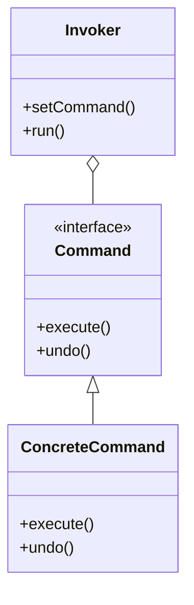

#### この章の実装との対応

`ICommand` インターフェースが `Command` ロール、`AddExpenseCommand` が `ConcreteCommand` ロール、`CommandInvoker` がそのまま `Invoker` ロールに対応しています。

---

### 使いどころと限界

* **使うと良い状況**：操作の取り消し（Undo）や再実行（Redo）が必要な場合や、実行タイミングを細かく制御したい場合。


* **使わない方が良い状況**：操作が単発で、履歴管理などが不要な場合。


【過剰コード：単なるメソッド呼び出しの代替】

```cpp
// 操作が単純でUndoが不要なら、無理にコマンド化するのはコードを増やすだけです
void onButtonClick() {
    manager.simpleAction(); // これだけで十分な場合もあります
}

```

### この章のまとめ

この章の冒頭で示した「得られること」4点を、あらためて確認します。

**得られること1**（操作の識別）：フェーズ1で、「記録を追加する」「記録を削除する」という各操作が `AddButton` や `DeleteButton` の中に直接埋め込まれていることを確認しました。「操作の種類」という切り口で、コードの変動箇所を見分ける視点が養われたはずです。

**得られること2**（呼び出し元の依存過多の判断）：フェーズ4で、ボタンが具体的な実行ロジックを直接知っている状態を「依存の過多」と診断しました。この診断ができると、なぜ操作の追加・変更のたびにUIコードまで修正が必要になるのかが接続の形から読めるようになります。

**得られること3**（Undo・履歴保持の説明）：フェーズ7で、操作をオブジェクトとして扱うことでコマンドスタックへの積み上げが可能になり、Undo機能が自然な形で実現できる構造を確認しました。「操作を名詞（オブジェクト）に変える」という発想が、機能拡張の選択肢を広げます。

**得られること4**（柔軟な設計の視点）：フェーズ6で、コマンドオブジェクトを組み合わせてマクロ機能やバッチ実行に発展させられる可能性も確認しました。「いつ実行するか」「取り消すか」「並べるか」という選択肢が、設計の段階から意識できるようになります。

家計簿アプリの操作履歴という題材を通じて、「操作」を独立したオブジェクトとして扱う設計の発想を体験できたのではないかと思います。この章で辿った7つのフェーズは、どんな現場のコードにも同じように使える思考の型です。