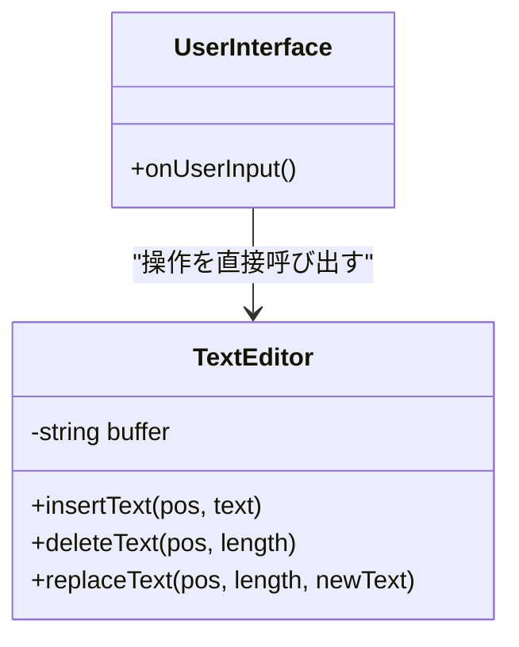
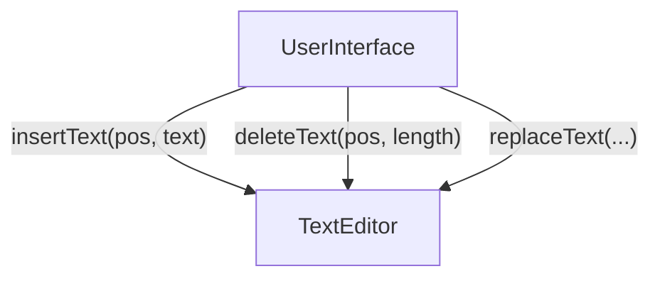
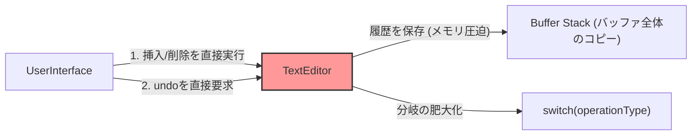
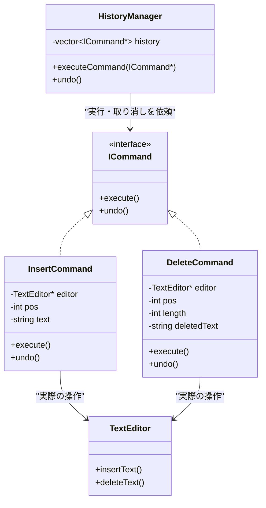
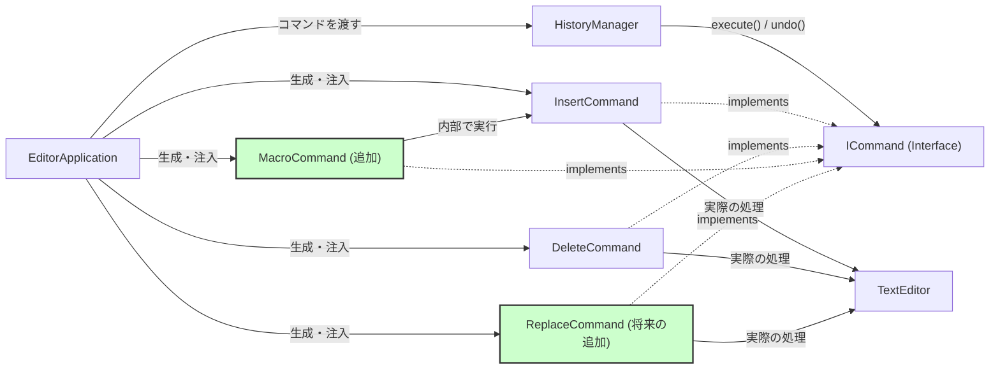
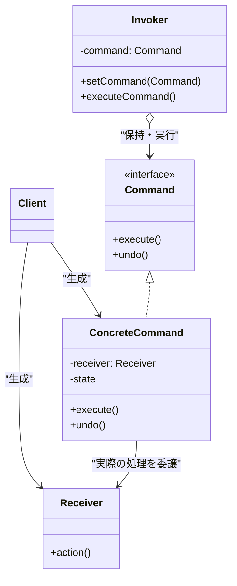

# 第5章　操作の種類が増えるたびにコードが膨らんでいないか ―― 思考の型：変化の混在(Commandパターン)


―― 思考の型：「実行する操作」が変わる

### この章の核心

**実行する操作そのものをオブジェクトとして表現し、取り消し・再実行・記録の主導権を取り戻す**

> **【レゴブロックで考える：Command】**
> 
> このパターンは、レゴブロックで言うと「ブロックを組み立てる『手順』そのものを、ひとつの特別なブロックとしてカプセル化（隠蔽）する」操作に似ています。
> 
> 普通は手を動かしてブロックをくっつけたら終わりですが、Commandパターンでは「赤いブロックを右の端に置いた」という記録ブロックを作って手元に残します。もし「今のなし！」と間違えに気づいたら、その記録ブロックを見て、逆の操作（赤いブロックを外す）を行うわけです。行動そのものをモノとして扱う、少し不思議な感覚を味わってみましょう。
> 
> **【画像生成AI用プロンプト案】**
> 
> `[ImagePrompt: A top-down 3D illustration of Lego blocks on a table. A child's hand is placing a red block. Next to it, there are special translucent blocks representing "instruction manuals" or "record of actions" with simple arrows on them. Bright, colorful, educational illustration style, clean white background, isometric view.]`

### この章を読むと得られること

- **得られること1：** 操作の実行と操作の記録を分離し、undo/redo（元に戻す/やり直し）が可能な構造を既存コードに見出せるようになる
    
- **得られること2：** 操作の実行をすぐに反映せず、キューに入れて遅延実行したり、バッチ処理したりする仕組みを作れるようになる
    
- **得られること3：** 操作の種類（機能）が増えたときに、既存のコアロジックに一切触れずに追加できる境界線を判断できるようになる
    

---

### ステップ0：システムを把握し、仮説を立てる ―― クラス構成を見てから「変わりそうな場所」を予測する

> **全パターンに共通する問い**
> 
> 「このコードの中に、『変わる理由』が異なる2つのものが、同じ場所に混在していないか？」
> 
> ※「変わる理由」とは「誰の判断で変わるか」のことです。

#### 5.0 この章のシステム構成と仮説

**この章で扱うシステム：**

今回私たちが立ち向かうのは、テキストを入力・削除・置換できる「シンプルなテキストエディタ」です。ユーザーがキーボードを叩くたびに、システムが裏側のテキストバッファを直接書き換える、現場でもよく見かけるとても素直な作りになっています。

**仕様表（何ができるシステムか）**

|**機能名**|**担当クラス**|**入力**|**出力**|
|---|---|---|---|
|テキストの挿入|TextEditor|挿入位置と文字列|バッファへの文字追加|
|テキストの削除|TextEditor|削除位置と長さ|バッファからの文字削除|
|テキストの置換|TextEditor|置換位置・長さ・新しい文字列|バッファの特定範囲の書き換え|

**クラス構成の概要**

まずは、現状のクラス構成を図で俯瞰してみましょう。



→ **ユーザーからの入力がそのままエディタのバッファ変更に直結しており、「何をしたか」という情報がどこにも残らない構造になっています。**

何かを入力すれば、すぐに結果が反映される。最初はこれで全く問題ありませんでした。むしろ、余計なクラスがない分、どこで何が行われているかが一目でわかりますよね。

**各クラスの責任一覧**

現状のコードが持っている責任（役割）と、それぞれのクラスが「何を知っているべきか」を整理しておきます。ここがブレると、後でどこに手を入れていいか分からなくなってしまいます。

|**クラス名**|**対象責任（1文）**|**知るべきこと**|
|---|---|---|
|UserInterface|ユーザーの入力を受け取り、エディタに伝える|ユーザーが何の操作をしたかと、呼び出すべきTextEditorのメソッド|
|TextEditor|テキストデータを保持し、要求に従って直接書き換える|現在のテキストバッファの状態と、文字列操作の具体的な処理方法|

この構成を踏まえた上で、今後どこに仕様変更のメスが入りそうか、設計の仮説を立ててみましょう。

**変動と不変の仮説（実装コードを読む前に立てる）**

テキストエディタというドメイン（業務領域）を考えると、次のような変更の波が予想できます。

|**分類**|**仮説**|**根拠（クラス構成から読み取れること）**|
|---|---|---|
|🔴 **変動する**|「実行できる操作（コマンド）」の種類|エディタが進化すれば、「太字にする」「大文字に変換する」など、操作の種類はユーザーや企画側の要望でどんどん増えていくため。|
|🔴 **変動する**|「操作の履歴」に関する機能の要求|現状の構造は「上書き保存」しかできず、人間が必ずミスをする生き物である以上、「元に戻す（undo）」機能は必ず求められるため。|
|🟢 **不変**|テキストバッファを保持するという本質|テキストエディタである以上、「文字列データをメモリ上に持っておく」というTextEditorの根本的な役割は変わらないため。|

このように、「操作の種類や履歴（やり直し）」は企画の都合でコロコロ**変わる**可能性が高いのに対し、「文字列を保持する」というデータ構造はシステム根幹の都合であり**変わらない**可能性が高いと推測できます。

これが本当に現場の要求と合致しているか、次のステップで実際のコードと照らし合わせながら確認していきましょう。

### ステップ1：実装コードを読む ―― 責任チェックで問題の行を見つける

#### 5.1 実装コードと責任チェック

ステップ0でクラスの役割と、将来の変更に関する仮説を立てました。ここからは実際の実装コードを開き、「責任通りに書かれているか」「将来の要求に耐えられる構造か」を1行ずつ紐解いていきます。

まずは、現在のモジュール間の依存関係（誰が誰を知っているか）をマクロな視点で確認しましょう。

**依存の広がり（実装前の全体像）**

コード スニペット



→ **ユーザーからの入力（イベント）が、エディタのバッファ変更処理に直接突き刺さっており、操作の過程を記録・保持する「クッション」が一切存在しない構造です。**

現場でも非常によく見かける、シンプルで素直な設計です。処理を追いかけるのも簡単ですね。では、実際のコードを見てみましょう。


```cpp
#include <iostream>
#include <string>

// エディタ本体：文字列バッファを管理し、要求に従って直接書き換える
class TextEditor {
private:
    std::string buffer;

public:
    // このクラスが知っていること：文字列バッファの現在状態と、その書き換え方

    void insertText(int pos, const std::string& text) {
        buffer.insert(pos, text); // ← 即座にバッファを更新する
    }

    void deleteText(int pos, int length) {
        buffer.erase(pos, length); // ← 即座にバッファを更新する
    }

    void print() const {
        std::cout << "現在のテキスト: [" << buffer << "]" << std::endl;
    }
};

// ユーザー入力を受け付けるUIクラス（今回はシンプルに表現）
class UserInterface {
private:
    TextEditor* editor;

public:
    UserInterface(TextEditor* ed) : editor(ed) {}

    // ユーザーが文字を打ち込んだ時のイベントハンドラ
    void onType(int pos, const std::string& text) {
        editor->insertText(pos, text); // ← 処理を直接呼び出して終わる
    }

    // ユーザーがBackspaceを押した時のイベントハンドラ
    void onBackspace(int pos, int length) {
        editor->deleteText(pos, length); // ← 処理を直接呼び出して終わる
    }
};

// --- プログラムの起点 ---
int main() {
    TextEditor* editor = new TextEditor();
    UserInterface* ui = new UserInterface(editor);

    std::cout << "--- エディタ操作開始 ---" << std::endl;
    
    ui->onType(0, "Hello");
    editor->print();

    ui->onType(5, " World");
    editor->print();

    ui->onBackspace(5, 6); // " World" を消す
    editor->print();

    delete ui;
    delete editor;
    return 0;
}
```

**実行結果：**

```
--- エディタ操作開始 ---
現在のテキスト: [Hello]
現在のテキスト: [Hello World]
現在のテキスト: [Hello]
```

このコードは、現在の「入力・削除・置換ができる」という仕様を完璧に満たしており、バグもなく正しく動いています。

しかし、設計の視点でこのコードの「振る舞い」を観察してみましょう。ここでは `UserInterface` クラスのメソッドに注目して責任チェックを行います。

**責任チェック：UserInterface は自分の責任だけを持っているか**

`UserInterface` の責任は「ユーザーの入力を受け取り、エディタに伝えること」です。

|**コードの行**|**持っている知識**|**責任内か**|
|---|---|---|
|`editor->insertText(pos, text);`|エディタの特定のメソッドを呼び出し、操作を依頼する知識|✅|
|（メソッドの終了時）|「たった今、位置posにtextを挿入した」という事実|✗ 実行された瞬間、スタックメモリから消滅する|

一見すると、どこにも間違った知識（他人の責任）を持っていません。UIは入力を伝え、エディタは文字を書き換える。それぞれのクラスが自分の仕事を全うしています。

**しかし、そこが最大の落とし穴なのです。**

この構造の本当の問題は「余計なことを知っている」ことではなく、「誰も覚えていない」ことにあります。`editor->insertText(pos, text);` というメソッド呼び出しが行われた瞬間、**「いつ、何を、どのように変更したのか」という操作の実態は、どこにもオブジェクトとして保存されず、虚空に消え去ります。**

現状のエディタ（`TextEditor`）には、変更されたあとの「最新の文字列（Hello）」しか残っていません。操作前の状態（Hello World）に戻るための手がかりは、システム上のどこを探しても見つからないのです。

これが「メソッド呼び出し（手続き）」だけで構成されたコードの限界です。「何かを実行する」ことはできても、「実行したという事実」をモノとして扱うことはできないのです。

#### 5.2 届いた変更要求

リリースを間近に控えたある日、私たちが恐れていた（そして薄々予想していた）要望がプロダクトマネージャーから舞い込んできました。

- **誰から：** プロダクトマネージャー
    
- **要求内容：** 「文字を打っていて間違えたときに、元に戻せないと不便だよね。Ctrl+Zで『元に戻す（undo）』機能を追加してほしい。もちろん『やり直し（redo）』もね。ショートカットキーでサクサク使えるようにしたいな」
    
- **期限：** 2週間後のv2リリース
    

「元に戻す」。言葉にすると簡単ですが、現状のコード構造――操作した瞬間に過去の情報が消滅し、バッファが上書きされる「撃ちっぱなし」の構造――に、この要求を組み込むのは至難の業です。

次章（ステップ3）以降で、この無邪気な変更要求が、私たちのシンプルだったコードにどのような痛み（grep地獄や肥大化）をもたらすのか、その原因と対策を一緒に考えていきましょう。

分割執筆エージェントのセットアップが完了しました。ご指示に従い、第5章のステップ2を出力します。

---

### ステップ2：仮説を確定する ―― 関係者ヒアリングで「変わる理由」に根拠をつける

#### 5.3 仮説の検証と変動/不変の確定

ステップ0で立てた仮説、そしてステップ1で確認した現在のコードの責任分界点。これらをもとに、「ここは将来変わりそうだ」「ここは変わらないはずだ」というアタリをつけることができました。

しかし、ここでエディタを開き、おもむろに新しいクラスを作り始めるのは少し待ってください。

現場で最も恐ろしいのは、エンジニアが「将来こうなるだろう」と勝手に推測して作り込んだ複雑な汎用設計が、結局一度も使われずに終わる「過剰設計（オーバーエンジニアリング）」です。あるいは、変わらないと信じ込んでいた根本的なデータ構造が、リリース直前にあっさりひっくり返される悲劇です。皆さんも、使われないままホコリを被っている `ICommandManager` や `AbstractTextEditor` のような過剰なクラスを保守して、ため息をついた経験が一度はあるのではないでしょうか。

設計の境界線（インターフェースをどこに引くか）は、コードの中やエンジニアの頭の中だけで決まるものではありません。それは常に、ビジネスの要求を持つ「関係者との合意（契約）」によって決まります。

そこで、今回の「undo/redo（元に戻す・やり直し）機能を追加してほしい。ショートカットキーで使えるようにする」という要望を持ってきたプロダクトマネージャー（PM）の席に足を運び、私たちの仮説が正しいか、そして将来どこまで仕様が拡張されるのかを直接ヒアリングしてみることにしました。

**関係者ヒアリング**

- **開発者（私）：** 「今回のv2リリースに向けたundo/redo機能の追加について、少し設計上のすり合わせをさせてください。現状、エディタができるのは『文字の挿入』と『削除』だけですが、将来的にこの操作の種類が増える予定はありますか？ 例えば、文字を太字にするフォーマット変更や、大文字小文字の変換などです。」
    
- **PM：** 「あ、それは確実に増えるよ！ むしろ今回のリリース後、ユーザーからのフィードバックを見て『単語の一括置換』機能なんかもすぐに入れたいと思ってるんだ。」
    
- **開発者（私）：** 「なるほど、操作の種類は今後もどんどん増えていく前提ですね。あと、もう一つ重要な確認があります。テキストを操作する際の『位置』は数値（`int`）、『文字』は単なる文字列（`string`）として扱っていますが、将来的にこれが『文字色やフォントサイズを持ったリッチテキストオブジェクト』のような複雑な構造に変わる可能性はありますか？」
    
- **PM：** 「いや、それはないと断言できるよ。このプロダクトのウリは『究極に軽快なプレーンテキストエディタ』だからね。装飾機能を付ける予定は全くないし、純粋な文字列データのままでいく方針だよ。」
    
- **開発者（私）：** 「安心しました。それなら今のデータ型のまま進められます。ちなみに、ショートカットでサクサク使えるようにしたいとのことですが、将来的に『操作を記録しておいて、ボタン一つで一気に実行したり、一気にundoしたりする』ような構想はありますか？」
    
- **PM：** 「おっ、鋭いね！ 実はそれ、ヘビーユーザーから一番よく聞く要望なんだよね。v2には間に合わないけど、ゆくゆくは『複数の操作をひとまとめにして一度のundoで戻したい（マクロ操作・バッチ編集）』という機能は絶対に入れたいと思ってる。」
    

この5分間の立ち話から、設計の根拠となる極めて重要な事実（ファクト）をいくつも引き出すことができました。

まず、操作の種類が「確実に増える」という点。これにより、操作ごとにif文を書き足すような実装ではすぐに破綻することが確定しました。操作の追加を想定した構造的対策が必要です。

次に、複数の操作をまとめる「マクロ機能」の構想があること。これは、操作を単なる「メソッドの呼び出し」という一過性の手続きとして終わらせるのではなく、リストや配列に詰め込める「モノ（データ）」として扱わなければ実現できないことを示唆しています。

そして何より大きかったのが、「引数の型（`int` や `string`）は変わらない」という合意です。もしここが「将来リッチテキストに変わるかも」と言われていたら、どんなに美しいインターフェースを作ったとしても、引数の型が変わった瞬間に全クラスのシグネチャ（メソッドの形）を書き換えるハメになります。複数クラスをまたぐ引数の型変更は、どんなデザインパターンを使っても守りきれない設計の急所です。このリスクがビジネス側の判断で明確に排除されたことで、私たちは安心して「操作の規格化」に踏み切ることができます。

これらのヒアリング結果をもとに、ステップ0の仮説テーブルを確定させましょう。

|**分類**|**具体的な内容**|**変わるタイミング**|**根拠**|
|---|---|---|---|
|🔴 **変動する**|実行できる操作（コマンド）の種類|新機能（置換など）の追加時|PMへの確認（操作の種類は確実に増える）|
|🔴 **変動する**|操作の実行タイミングと履歴（undo）の管理|マクロ機能やバッチ編集の実装時|PMへの確認（将来のマクロ構想あり）|
|🟢 **不変**|テキストバッファをメモリに保持するという本質|変わる日は来ない|テキストエディタというドメインの根本|
|🟢 **不変**|操作に用いる引数の型（`int`, `string`）|変わる日は来ない|PMとの合意（プレーンテキストを貫く方針）|

> **設計の決断：**
> 
> 🟢 不変な部分である「操作の窓口（実行と取り消しのメソッドの形）」と「引数の基本型」を「契約（インターフェース）」として固定し、
> 
> 🔴 変動する部分である「具体的にどんな操作をするか（挿入か、削除か、マクロか）」は、それぞれのインターフェースの裏側に別々のクラスとして押し込む。

これで、どこを切り離し、どこを守るべきかの境界線がくっきりと見えました。

次章（ステップ3）では、この決断を下さずに、現状の手続き型のコード（撃ちっぱなしのメソッド呼び出し）に対してそのままundo機能を追加しようとすると何が起きるのか。現場のエンジニアを苦しめる「痛み」の正体を、具体的にシミュレーションしてみましょう。

### ステップ3：課題分析 ―― 変更が来たとき、どこが辛いかを確認する

#### 5.4 届いた変更要求からの課題分析

ステップ2でビジネス側との合意が取れ、将来の拡張（置換機能の追加やマクロ機能）という「変わる理由」と、プレーンテキストを扱うという「変わらない本質」の境界線が見えました。

では、現状の手続き型のコード（ステップ1の状態）に対して、そのまま「undo（元に戻す）」機能を追加しようとすると、私たちのコードベースでどのような悲劇が起きるか、現場の視点でシミュレーションしてみましょう。

_「ええと、undoするには『直前の状態』を覚えなきゃいけないから…… TextEditorクラスの中に `lastOperationType` を足して、操作前のバッファ全体をコピーして保存する変数を追加して……いや、それだと1回しかundoできないぞ。じゃあ履歴用のスタック配列を用意して……あれ？ なんでテキストを管理するクラスが、履歴の配列管理までやってるんだ……？」_

現場でエディタを開きながら、こんな風に呟いて頭を抱えた経験はないでしょうか。操作が「撃ちっぱなし」になっている現状の構造に、無理やり履歴の概念を押し込もうとした場合の「依存の広がり（変更の飛び火）」を図解してみます。

**変更の影響グラフ（改善前）**




→ 操作の種類が増えるたびに、TextEditorクラス内のenum分岐とundo処理の両方を追加する必要があり、変更がTextEditorの内部に集中してしまいます。

この構造がもたらす「痛み」は、大きく分けて2つあります。

**痛み1：TextEditorの肥大化と責任オーバー** 元の `TextEditor` の責任は「テキストデータを保持し、要求に従って直接書き換えること」だけでした。しかしundoを実現するためには、「操作の履歴（スタック）」を管理し、さらに「どの操作がundoされたのか」を判定する巨大な `switch` 文を持つ必要があります。本来のテキスト管理のロジックが、履歴管理のロジックで埋め尽くされてしまいます。さらに、操作前のバッファ全体を毎度コピーして保存するようなアプローチ（トライアル実装）では、メモリ効率が悪く、大きなドキュメントでは現実的ではありません。

**痛み2：追跡困難なgrep地獄（変更の飛び火）**

将来、PMの予告通り「置換機能」や「マクロ機能」が追加されたとします。現状のまま実装すると、追加のたびに以下のすべての箇所に手を入れることになります。

- `UserInterface` の呼び出し部分
    
- `TextEditor` の実行メソッド（`replaceText` など）
    
- `TextEditor` の履歴保存ロジック
    
- `TextEditor` の `undo` 内の `switch` 文の分岐
    

コードのあちこちをgrepして回り、「置換処理を追加したのに、undoの分岐に足すのを忘れてバグった！」という事故が頻発する未来が容易に想像できます。変更が来るたびに既存のコアクラスを切り開いて手術しなければならない、まさに「変更の飛び火」です。

設計の価値は、決して「新しいコードをきれいに書けること」だけではありません。既存のコードに新しい要求を加えるとき、「変更の影響を、この1箇所だけに閉じ込められること」こそが、私たちが設計を学ぶ真の価値なのです。

操作を実行するだけなら現状のコードで十分でした。しかし「何をしたかという情報」が必要になった途端、メソッドを呼び出して終わり（撃ちっぱなし）の手続き型コードは限界を迎えます。「実行する操作そのもの」を取り扱い可能な『データ（モノ）』として保持できないからです。

次章（ステップ4）では、この「操作の実態が残らない」という根本原因に対し、コードのどの部分を分離・隠蔽すべきかを言語化し、物理的な手札（構造的対策）を選ぶための分析を行っていきます。

### ステップ4：原因分析 ―― 困難の根本にある設計の問題を言語化する

ステップ3でシミュレーションした「grep地獄」や「TextEditorクラスの肥大化」は、単なる実装のミスや手抜きの結果ではありません。実は、私たちが最初に採用した「シンプルで素直な設計」そのものが抱えている、構造上の限界が悲鳴を上げているのです。

では、なぜあのシンプルなコードにundo機能を追加しようとしただけで、これほどまでの痛みを伴うのか。現場の感覚を言語化し、根本的な原因を探っていきましょう。

|**観察**|**原因の方向**|
|---|---|
|UIからTextEditorのメソッドを呼び出すと、直前のバッファ状態や「何をしたか（位置や文字）」という情報がシステムから完全に消滅する。|「文字を挿入する」「削除する」という行為を、一過性の「手続き（メソッド呼び出し）」としてのみ扱っており、後から参照可能な「データ（モノ）」として残す仕組みがないため。|
|undoを実装しようとすると、テキストを管理するはずのTextEditorクラスの中に、履歴用のスタック配列や操作種別を判定する巨大なswitch文が入り込んでしまう。|「文字列をどう書き換えるか」というデータ管理の責任と、「操作の履歴をどう管理するか」というフロー制御の責任が、同じクラスに癒着してしまっているため。|

問題の根源は、私たちが日常的に書いている「メソッドを直接呼び出す」という当たり前の行為にあります。

`editor->insertText(5, "World");` と書いたとき、プログラムはその命令を瞬時に実行して終わります。命令した内容（どこに、何を）は、実行された直後に揮発してなくなります。これを元に戻すには、消えてしまう前に「何をしたか」を別の場所に記録しておかなければなりません。

しかし、実行する操作の種類が増えれば増えるほど、記録する内容も「挿入なら位置と文字列」「削除なら位置と長さ」「置換なら……」とバラバラになり、履歴を管理する側（今回は不本意ながらTextEditorが押し付けられていました）は、そのすべてのパターンの知識を持たざるを得なくなります。

ここでもう一度、このシステムにおいて「変わる理由」が異なるものを整理してみましょう。

**変わるものと変わらないものが同じ場所にいる**

|**変わり続けるもの（🔴）**|**変わってほしくないもの（🟢）**|
|---|---|
|ユーザーが実行できる操作の種類（置換、フォーマット変更、マクロなど）|メモリ上に文字列データを保持し、指定通りに書き換えるというコア機能|
|操作の実行タイミングと、履歴（undo/redo）の管理方法|`insertText` や `deleteText` といった基本操作の振る舞い|

今のままでは、🔴「操作の種類」が増えるたびに、🟢「変わってほしくないコア機能（TextEditor）」のファイルを直接開き、内部に分岐を追加しなければなりません。これこそが、変更が飛び火する本当の理由です。

では、この絡み合った依存と責任の糸を解きほぐすために、第0章で学んだ設計の「手札」からどれを使えばいいのかを分析します。

|**次元**|**物理操作（手札）**|**本質的な原因（何が問題か）**|**使うべき構造的対策案（本質）**|
|---|---|---|---|
|要素|**② 隠蔽する（包む）**|実行に必要な生データ（位置や文字列）と「実行するという行為」がバラバラに露出しており、後から履歴として扱えない。|**操作のオブジェクト化**<br><br>  <br><br>「何を・どう実行するか」という知識を、1つのオブジェクト（値）の中にカプセル化して包み込む。|
|関係|**③ 規格化する（形を揃える）**|呼び出し元や履歴管理者が、特定の操作（`insert`や`delete`）の具体的な手順に直接依存しており、分岐が避けられない。|**インターフェースの統一**<br><br>  <br><br>全ての操作を「実行する」「元に戻す」という共通の窓口（契約）で揃え、呼び出し側を抽象に依存させる。|

今回の問題は、大きく2つの段階で解決していく必要があります。

まず一つ目は、「要素の次元：隠蔽する（包む）」ことです。 「メソッドを呼び出す」という一過性の手続きをやめ、「〇文字目に、〇〇という文字を挿入するという『予定』」を持ったオブジェクトを作り出します。実行に必要なパラメータ（引数）をすべてクラスの内部に隠蔽（カプセル化）し、操作そのものを「モノ」として持ち運べるようにします。

二つ目は、「関係の次元：規格化する（形を揃える）」ことです。 操作をオブジェクト化できたとしても、「これは挿入オブジェクト」「こっちは削除オブジェクト」と呼び出し側が区別しなければならないのなら、結局switch文の分岐は消えません。そこで、これらすべての操作オブジェクトを「実行ボタン（`execute`）」と「取り消しボタン（`undo`）」だけが付いた共通のインターフェースで規格化します。

この2つの手札を組み合わせることで、「実行する操作」が変わったとしても、既存のTextEditorや履歴管理のコードには一切触れずに済む未来が見えてきます。

次章のステップ5では、この原因分析をもとに、実際に手札を切ってコードの構造を変えていきましょう。まずは「手段①：操作をオブジェクトとして包み込む」という手続き的な改善から始めます。

### ステップ5：対策案の検討 ―― 原因から手札を選ぶ

- **ステップ4で特定した真因：** 操作の実行に必要なデータ（位置や文字）と「実行する」という行為が、一過性の手続きとして消費され、後から参照できる「データ（モノ）」として残らないこと。
    

この根本原因に対して、第0章で学んだ設計の「手札」を切っていきましょう。今回は2段階のアプローチで構造を進化させていきます。

#### 1. 分離・隠蔽を試す（手段①の基本）

まずは、手札②「隠蔽する（包む）」を使います。

これまで「メソッドの引数」としてバラバラに渡され、実行直後に消えていた情報を、一つの構造体（カプセル）の中に押し込んで「データ」として残せるようにしてみましょう。

バッファ全体を丸ごとコピーするのではなく、「何をしたか（差分）」だけを記録する `Operation` 構造体を作り、履歴管理の責任を `TextEditor` から切り離すアプローチです。


```cpp
#include <iostream>
#include <string>
#include <vector>

class TextEditor {
private:
    std::string buffer;
public:
    void insertText(int pos, const std::string& text) { buffer.insert(pos, text); }
    void deleteText(int pos, int length) { buffer.erase(pos, length); }
    void print() const { std::cout << "[" << buffer << "]" << std::endl; }
};

// 操作の種類を定義
enum class OpType { INSERT, DELETE };

// 手段①：操作に必要な情報をひとまとめにしたカプセル（データ構造）
struct Operation {
    OpType type;
    int pos;
    std::string text; // 挿入された文字、または削除された文字
};

// 履歴管理の責任を持つクラス
class HistoryManager {
private:
    TextEditor* editor;
    std::vector<Operation> history;

public:
    HistoryManager(TextEditor* ed) : editor(ed) {}

    // 操作を実行し、履歴に残す
    void executeInsert(int pos, const std::string& text) {
        editor->insertText(pos, text);
        history.push_back({OpType::INSERT, pos, text}); // ← 情報をオブジェクトとして残す
    }

    void executeDelete(int pos, int length) {
        // 取り消すためには「消された文字」が必要なので、消す前に取得する
        // （※手段①の実装では、この事前取得ロジックが外に漏れ出している）
        std::string deletedText = "取得した文字"; // 簡略化
        
        editor->deleteText(pos, length);
        history.push_back({OpType::DELETE, pos, deletedText}); // ← 情報をオブジェクトとして残す
    }

    // 元に戻す処理
    void undo() {
        if (history.empty()) return;
        
        Operation lastOp = history.back();
        history.pop_back();

        // 操作の種類によって、逆の操作を分岐して実行する
        if (lastOp.type == OpType::INSERT) {
            // 挿入の取り消し＝削除
            editor->deleteText(lastOp.pos, lastOp.text.length()); // ← 分岐して逆操作
        } else if (lastOp.type == OpType::DELETE) {
            // 削除の取り消し＝挿入
            editor->insertText(lastOp.pos, lastOp.text); // ← 分岐して逆操作
        }
    }
};
```

**手段①の限界：**

このコードにより、バッファ全体をコピーするメモリの無駄遣いは解消され、履歴を管理する責任も `TextEditor` から剥がすことができました。手続き型のアプローチとしては非常に洗練されています。

しかし、`HistoryManager::undo()` の中身を見てください。

操作の種類を判定する `if` 文（`switch`文）が存在しています。これはつまり、プロダクトマネージャーが予告していた「置換」や「太字」といった**新しい操作（OpType）が追加されるたびに、この `undo` メソッドを開いて新しい分岐（`else if`）を書き足さなければならない**ことを意味します。

さらに、`Operation` 構造体も「すべての操作に必要な変数の寄せ集め」になっており、操作の種類が増えるほど使われないダミーの変数が構造体の中に増えていきます。「操作の種類」という変わる理由に対して、履歴管理クラスが引きずられて変更を余儀なくされる――これでは「拡張できるか」という評価軸で不合格です。

#### 2. さらに規格化・間接化を重ねる（手段②：インターフェース導入）

ここで、手段①の限界を突破するために、手札③「規格化する（形を揃える）」と手札④「間接化する（間に挟む）」を追加適用します。

手段①では、履歴管理者が「これは挿入だから削除で取り消そう」と、操作の具体的な中身（詳細）をすべて知っていました。これこそが分岐が消えない原因です。

ならば、**「自分自身をどうやって実行するか」「どうやって元に戻すか」という知識そのものを、それぞれの操作オブジェクトの内部に持たせてしまえばよい**のです。履歴管理者は、その中身を知る必要はなく、ただ「実行して」「元に戻して」とお願いするだけの形に揃えます（規格化）。

> **【レゴブロックで考える：Command】**
> 
> 手段①は、色々なパーツの「設計図（データ）」を箱にしまっておき、取り出す時に「これは赤いブロックの設計図だから、こうやって組み立てるのか」と頭で考えながら作業する状態です。
> 
> 手段②（Command）は、ブロック自体に「自分でくっつく機能」と「自分で外れる機能」が内蔵された特別なパーツを作るイメージです。箱から取り出して「外れて！」とボタンを押せば、どんな形のブロックでも勝手に元の状態に戻ってくれます。
> 
> **【画像生成AI用プロンプト案】**
> 
> `[ImagePrompt: A top-down 3D illustration of Lego blocks. In the center, a magical, glowing translucent Lego brick with a simple "Rewind/Undo" symbol on it. Mechanical arms or abstract visual effects suggest the block is assembling and disassembling itself. Bright, colorful, educational illustration style, clean white background, isometric view.]`

では、すべての操作を規格化するインターフェース `ICommand` を導入したコードを見てみましょう。


```cpp
// 手段②：操作の窓口を規格化するインターフェース
// ビジネス上の責任：「実行すること」と「取り消すこと」
class ICommand {
public:
    virtual ~ICommand() {}
    virtual void execute() = 0; // ← 呼び出し元が知るべきはこれだけ
    virtual void undo() = 0;    // ← 呼び出し元が知るべきはこれだけ
};
```

次に、この規格に従って「挿入」と「削除」の具体的なコマンドクラスを作ります。


```cpp
// 挿入操作のカプセル
class InsertCommand : public ICommand {
private:
    TextEditor* editor; // 操作対象
    int pos;            // 挿入位置
    std::string text;   // 挿入する文字

public:
    InsertCommand(TextEditor* ed, int p, const std::string& t)
        : editor(ed), pos(p), text(t) {}

    // このクラスが知っていること：文字列を挿入する手順と、その取り消し方

    void execute() override {
        editor->insertText(pos, text);
    }

    void undo() override {
        editor->deleteText(pos, text.length()); // ← 自分自身で逆操作を知っている
    }
};

// 削除操作のカプセル
class DeleteCommand : public ICommand {
private:
    TextEditor* editor;
    int pos;
    int length;
    std::string deletedText; // 取り消し用に、消した文字を覚えておく

public:
    DeleteCommand(TextEditor* ed, int p, int len)
        : editor(ed), pos(p), length(len) {}

    void execute() override {
        // ※実際にはエディタから消す前の文字を取得する処理が入る
        deletedText = "削除された文字"; 
        editor->deleteText(pos, length);
    }

    void undo() override {
        editor->insertText(pos, deletedText); // ← 自分自身で復元方法を知っている
    }
};
```

最後に、これらを呼び出す履歴管理クラス（間接化の層）です。


```cpp
// 履歴管理クラス
class HistoryManager {
private:
    std::vector<ICommand*> history;

public:
    // このクラスが知っていること：渡されたコマンドを実行し、積んで、戻す手順だけ

    void executeCommand(ICommand* command) {
        command->execute();          // ← 中身が何であれ「実行」ボタンを押すだけ
        history.push_back(command);  // ← 履歴として保存
    }

    void undo() {
        if (history.empty()) return;
        
        ICommand* lastCommand = history.back();
        history.pop_back();
        
        lastCommand->undo(); // ← 中身が何であれ「取り消し」ボタンを押すだけ
        delete lastCommand;
    }
};
```

**変更後のクラス図**

この構造によって、依存関係の矢印がどのように変わったかを確認しましょう。




手段②を適用したことで、`HistoryManager`（呼び出し元）は `ICommand` インターフェースだけを知る形になりました。内部に `if`文の分岐は一切ありません。

これこそが、インターフェースを挟む（間接化する）最大の理由です。もし `HistoryManager` が具体的なコマンド（`InsertCommand`など）を直接知っていたら、操作の種類が増えるたびに `HistoryManager` のコードも書き換えなければなりません（手段①の状態）。インターフェースを挟むことで、呼び出し元の「変わる理由」が「履歴の管理方法が変わったとき」の1つだけに絞り込まれたのです。

次章（ステップ6）では、この2つの手段を天秤にかけ、ヒアリングで挙がった「将来の変更リスク」に対してどちらが現場の投資コストに見合うのかを判断します。

### ステップ6：天秤にかける ―― 手段を評価する

前章（ステップ5）では、物理的な手札を使って2つの構造を検証しました。

- **手段①（分離・隠蔽のみ）の評価：** 操作に必要な情報（位置や文字列）を1つのオブジェクトに「隠蔽」することで、バッファ全体のコピーというメモリ問題は解決しました。コードも直感的です。しかし、つなぎ目が「規格化」されていないため、新しい操作（太字、置換など）を足すには、依然として履歴管理者（`HistoryManager`）の`switch`文を直接書き換える必要があります。つまり、「拡張できるか」という評価軸では不合格です。
    
- **手段②（＋規格化・間接化）の評価：** 全ての操作を `ICommand` インターフェースで「規格化」し、具象クラスを「間接化」しました。これにより、履歴管理者は「実行する」「取り消す」という契約だけを知っていればよく、具体的な操作内容を一切知らずに済むようになりました。既存コードに一切触れずに新しい操作を追加できる「拡張」の能力を手に入れています。
    

#### 5.5 手段①vs手段②の比較

設計の選択は、常に「現状の実装コスト」と「未来の変更コスト」のトレードオフです。ここで両者を天秤にかけ、評価軸に沿って比較してみましょう。

|**評価軸**|**手段①（隠蔽のみ）**|**手段②（＋規格化・間接化）**|**評価の観点**|
|---|---|---|---|
|**現状の設計コスト**|🟢 低い（クラスが少ない）|🔴 高い（操作ごとにクラスが必要）|実装工数や、初期開発時に作らなければならないファイルの数。|
|**現状の評価コスト**|🟡 中程度|🟢 低い（独立してテスト可能）|手段①は `HistoryManager` の条件分岐を全て網羅するテストが必要。手段②は各コマンドを単体でテストできる。|
|**未来の設計コスト**|🔴 高い（grepして修正）|🟢 低い（追加のみで対応）|**「変更容易性」**。新しい操作が来た際、既存のクラス（`HistoryManager`）を書き換える必要があるか。|
|**未来の評価コスト**|🔴 高い（デグレの恐怖）|🟢 低い（既存コードは安全）|**「保守・追跡性」**。手段①は分岐を触るため、既存の操作（挿入・削除）が壊れていないか全テストのやり直しが必要になる。|
|**現状・未来 総合コスト**|短期的なリリース速度優先|長期的な変更耐性への投資|クラスが増えて複雑になるコストを払ってでも、将来の安全性を買うかどうかの判断。|

> **結論：** 今回の状況では、**手段②（Commandパターン）**を採用します。

なぜなら、ステップ2のPMへのヒアリングで「操作の種類（フォーマット変更など）は確実に増える」「マクロ機能の構想もある」と明確に合意が取れているからです。 依存関係が1箇所だけで、今後二度と変更されないシステムであれば、手段①のシンプルさを選ぶのが正解かもしれません。しかし、今回のように「変更が繰り返し発生する」と確定している戦場では、今のうちにクラスを分ける実装コストを払ってでも、将来の「grep地獄」と「デグレード確認の恐怖」を無くす投資をする価値が十分にあります。

#### 5.6 耐久テスト ―― ヒアリングで挙がった変化が来た

では、私たちが投資した手段②の設計構造が、本当に現場の容赦ない仕様変更に耐えられるのかを検証しましょう。

ステップ2のヒアリングで、PMからこんな予告がありました。

**「複数の操作をひとまとめにして一度のundoで戻したい（マクロ操作・バッチ編集）」**

通常の設計なら、履歴管理用の配列の持ち方を変えたり、トランザクション管理のような複雑なフラグを追加したりと、大工事になる要求です。しかし、操作が「ICommand」というモノ（オブジェクト）として独立している今の設計ならどうでしょうか。

「複数のコマンドを束ねて、1つのコマンドのふりをする」クラスを新しく作るだけで解決します。実際にコードを書いてみましょう。

```cpp
#include <vector>

// 耐久テスト：複数の操作をまとめるマクロコマンド
class MacroCommand : public ICommand {
private:
    std::vector<ICommand*> commands; // ← 複数のコマンドを内部に保持する

public:
    ~MacroCommand() {
        for (size_t i = 0; i < commands.size(); ++i) {
            delete commands[i];
        }
    }

    void addCommand(ICommand* cmd) {
        commands.push_back(cmd);
    }

    // 実行時は、登録された順番に全て実行する
    void execute() override {
        for (size_t i = 0; i < commands.size(); ++i) {
            commands[i]->execute(); // ← 個別の具象クラスを知らなくても実行できる
        }
    }

    // 取り消し時は、実行したのとは『逆の順番』で取り消していく
    void undo() override {
        for (int i = commands.size() - 1; i >= 0; --i) {
            commands[i]->undo(); // ← 個別の復元ロジックは各コマンドにお任せ
        }
    }
};
```

> **【レゴブロックで考える：MacroCommand】**
> 
> これは「複数の小さなレゴブロックを、1つの大きなブロックの土台にカチッとまとめてしまう」操作に似ています。まとめた土台ごと動かせば、上のブロックも一緒に動きます。外のシステムから見れば、ただの「少し大きい1つのブロック」として扱えるのです。
> 
> **【画像生成AI用プロンプト案】**
> 
> `[ImagePrompt: A top-down 3D illustration of Lego blocks on a table. Several small, diverse Lego blocks are mounted onto one larger, transparent base plate block. The base plate has a "Rewind/Undo" symbol. Bright, colorful, educational illustration style, clean white background, isometric view.]`

**結果の解説：**

この `MacroCommand` を追加するにあたって、**既存の `TextEditor`、`HistoryManager`、そして `InsertCommand` などのファイルは一切開いていません（1行も書き換えていません）。**

`HistoryManager` から見れば、渡されたものがただの `InsertCommand` なのか、中に100個の操作が詰まった `MacroCommand` なのかを気にする必要はありません。ただ「実行しろ」「取り消せ」と言うだけで、マクロ機能が完全に動作します。ヒアリングで言及されたリスクを見事に跳ね返し、設計の真の価値（変更の局所化）を証明できました。

#### 5.7 使う場面・使わない場面

この構造は強力ですが、どんな場面でも魔法の杖になるわけではありません。パターンを使うとクラスが増え、処理を追うためのファイルジャンプが増えるという明確な「負債（コスト）」も背負います。

「分けない」「インターフェースを使わない」という選択肢、つまりシンプルに保つことも立派なエンジニアリングの決断です。ここでは、使ってはいけない「過剰設計」の例を見てみましょう。

**【過剰コード：変化の予定がないものまでパターン化した例】**


```cpp
// ログを出力するだけの処理にCommandパターンを適用してしまった悲劇
class WriteLogCommand : public ICommand {
public:
    void execute() override {
        Logger::write("システムが起動しました");
    }
    void undo() override {
        // ログは取り消せないので何もできない
        // ← 知らなくていい無意味な空メソッドの強制
    }
};

// 呼び出し側
WriteLogCommand* cmd = new WriteLogCommand();
cmd->execute(); // 普通に Logger::write() と書けば1行で終わるのに…
delete cmd;
```

このように、取り消し（undo）の概念が存在しないものや、操作が1〜2種類しかなく将来も増えないことが分かりきっている場合は、パターンを使う必要はありません。最小コストの代替案として、素直に関数呼び出し（メソッドの直接実行）で済ませるのが一番です。

|**状況**|**適切な選択**|**理由**|
|---|---|---|
|undo/redo機能が必須である|**Commandパターンを使用**|各操作の逆手順（差分）をオブジェクトとして安全に保持できるため。|
|操作をキューに入れて、後から非同期でバッチ実行したい|**Commandパターンを使用**|「実行する」という行為自体をリストに詰め込んで遅延評価できるため。|
|ログの書き込みなど、操作が取り消せなくていい場合|使わない（直接呼び出し）|履歴として保持する意味がなく、インターフェースの恩恵を受けられないため。|
|チームが1人で、操作も「挿入」と「削除」の2つから永遠に増えない|使わない（手段①のまま）|変更が繰り返し発生しないなら、クラスが増える実装・学習コストに見合わないため。|

設計に「常にこう書けば正解」という絶対のルールはありません。変更頻度、将来の見通し、そしてチームの規模という3つの軸で、この強力な手札を切るべきかどうかを現場で判断していきましょう。

### ステップ7：決断と、手に入れた未来

#### 5.8 解決後のコード（全体）

手段②（インターフェースによる規格化と間接化）を採用し、「操作をオブジェクトとして扱う」という未来を手に入れました。では、これまでの思考プロセスを経て辿り着いた、最終的なコード全体を見てみましょう。

コードが長くなるため、役割ごとに分割して掲載します。まずは、操作の「規格」となるインターフェースと、実際の操作をカプセル化したコマンド群です。

```cpp
#include <iostream>
#include <string>
#include <vector>

// --- レシーバー（操作対象） ---
// テキストを保持し、実際に書き換える責任を持つ
class TextEditor {
private:
    std::string buffer;
public:
    void insertText(int pos, const std::string& text) { buffer.insert(pos, text); }
    void deleteText(int pos, int length) { buffer.erase(pos, length); }
    void print() const { std::cout << "現在のテキスト: [" << buffer << "]" << std::endl; }
};

// --- インターフェース（規格） ---
// ビジネス上の責任：「実行すること」と「取り消すこと」
class ICommand {
public:
    virtual ~ICommand() {}
    virtual void execute() = 0; // ← 呼び出し元が知るべきはこれだけ
    virtual void undo() = 0;    // ← 呼び出し元が知るべきはこれだけ
};

// --- 具象コマンド ---
// 挿入操作のカプセル化
class InsertCommand : public ICommand {
private:
    TextEditor* editor;
    int pos;
    std::string text;

public:
    InsertCommand(TextEditor* ed, int p, const std::string& t)
        : editor(ed), pos(p), text(t) {}

    void execute() override {
        editor->insertText(pos, text);
    }
    void undo() override {
        editor->deleteText(pos, text.length()); // ← 自分自身の逆操作を知っている
    }
};

// 削除操作のカプセル化
class DeleteCommand : public ICommand {
private:
    TextEditor* editor;
    int pos;
    int length;
    std::string deletedText;

public:
    DeleteCommand(TextEditor* ed, int p, int len)
        : editor(ed), pos(p), length(len) {}

    void execute() override {
        // ※実際はエディタから削除前に文字を取得する
        deletedText = " World"; 
        editor->deleteText(pos, length);
    }
    void undo() override {
        editor->insertText(pos, deletedText); // ← 復元方法を知っている
    }
};

// マクロ操作のカプセル化（耐久テストで追加したクラス）
class MacroCommand : public ICommand {
private:
    std::vector<ICommand*> commands;

public:
    ~MacroCommand() {
        for (size_t i = 0; i < commands.size(); ++i) { delete commands[i]; }
    }
    void addCommand(ICommand* cmd) { commands.push_back(cmd); }

    void execute() override {
        for (size_t i = 0; i < commands.size(); ++i) { commands[i]->execute(); }
    }
    void undo() override {
        for (int i = commands.size() - 1; i >= 0; --i) { commands[i]->undo(); }
    }
};
```

次に、これらのコマンドを管理する「履歴管理者」と、すべての部品を組み合わせてアプリケーションを起動する「組み立てクラス（Composition Root）」です。


```cpp
// --- インボーカー（呼び出し元・履歴管理） ---
// 渡されたコマンドを実行し、履歴として積む責任を持つ
class HistoryManager {
private:
    std::vector<ICommand*> history;

public:
    ~HistoryManager() {
        for (size_t i = 0; i < history.size(); ++i) { delete history[i]; }
    }

    // このクラスが知っていること：渡されたコマンドを実行し、積んで、戻す手順だけ
    void executeCommand(ICommand* command) {
        command->execute();          // ← 中身が何であれ「実行」ボタンを押すだけ
        history.push_back(command);
    }

    void undo() {
        if (history.empty()) return;
        
        ICommand* lastCommand = history.back();
        history.pop_back();
        
        lastCommand->undo(); // ← 中身が何であれ「取り消し」ボタンを押すだけ
        delete lastCommand;
    }
};

// --- 組み立て点（Composition Root） ---
// 具体クラスを生成し、依存関係を注入する唯一の場所
class EditorApplication {
private:
    TextEditor* editor;
    HistoryManager* history;

public:
    EditorApplication() {
        editor = new TextEditor();
        history = new HistoryManager();
    }
    ~EditorApplication() {
        delete history;
        delete editor;
    }

    void run() {
        std::cout << "--- エディタ操作開始 ---" << std::endl;

        // 操作をオブジェクトとして生成し、履歴管理者に渡す
        ICommand* cmd1 = new InsertCommand(editor, 0, "Hello");
        history->executeCommand(cmd1);
        editor->print();

        ICommand* cmd2 = new InsertCommand(editor, 5, " World");
        history->executeCommand(cmd2);
        editor->print();

        std::cout << "--- Undoを実行 ---" << std::endl;
        history->undo();
        editor->print();

        std::cout << "--- マクロ（バッチ処理）を実行 ---" << std::endl;
        MacroCommand* macro = new MacroCommand();
        macro->addCommand(new InsertCommand(editor, 5, " C++"));
        macro->addCommand(new InsertCommand(editor, 9, " Design"));
        macro->addCommand(new InsertCommand(editor, 16, " Patterns"));
        
        // HistoryManagerから見れば、ただの1つのコマンド
        history->executeCommand(macro);
        editor->print();

        std::cout << "--- マクロのUndoを実行 ---" << std::endl;
        history->undo(); // 3つの操作が一度に戻る
        editor->print();
    }
};

// --- プログラムの起点 ---
// main()の責任はプログラムを起動すること。組み立てクラスを作ることだけが仕事。
int main() {
    EditorApplication app;
    app.run();
    return 0;
}
```

**実行結果：**

```
--- エディタ操作開始 ---
現在のテキスト: [Hello]
現在のテキスト: [Hello World]
--- Undoを実行 ---
現在のテキスト: [Hello]
--- マクロ（バッチ処理）を実行 ---
現在のテキスト: [Hello C++ Design Patterns]
--- マクロのUndoを実行 ---
現在のテキスト: [Hello]
```

見事に、ステップ1と同じ動き（挿入・削除）を維持したまま、undo機能とマクロ機能を完璧に実現しています。 `EditorApplication` が具象クラス（`InsertCommand` など）を知っている唯一の場所であり、`HistoryManager` の中にはインターフェース型のポインタ（`ICommand*`）しか書かれていません。呼び出し元が具象クラスを知らない（依存していない）ことが、コードによって証明されました。

#### 5.9 変更影響グラフ（改善後）

ステップ3では、新しい操作が追加されるたびに、TextEditorの肥大なswitch文や履歴の配列を触らなければならない「grep地獄」が起きていました。改善後のグラフを見てみましょう。




→ 操作の種類が増えても、新しいコマンドクラス（緑色）を追加し、組み立てクラス（EditorApplication）を変えるだけで済み、HistoryManagerやTextEditorには一切変更の飛び火が起きなくなりました。

#### 5.10 変更シナリオ表と最終責任テーブル

「変更に強い」とは、このように「どこを変えればいいのかが事前に分かり、かつその箇所が局所的であること」を指します。それをシナリオ表で確認しましょう。

**変更シナリオ表：何が変わったとき、どこが変わるか**

|**シナリオ**|**変わるクラス**|**変わらないクラス**|
|---|---|---|
|置換機能（Replace）が新たに追加された|`ReplaceCommand`（新規作成）、`EditorApplication`（組み立て）|`HistoryManager`、`TextEditor`|
|マクロ機能が追加された|`MacroCommand`（新規作成）、`EditorApplication`（組み立て）|`HistoryManager`、`TextEditor`|
|TextEditor自体の文字コード管理が変更された|`TextEditor`|`HistoryManager`、各種Command、`EditorApplication`|

既存のコア機能（エディタとしての振る舞いや履歴管理の仕組み）が、サービス変更時に「変わらないクラス」の列に鎮座していることがわかります。

**最終責任テーブル**

各クラスの責任と「変わる理由」が完全に分離されました。

|**クラス名**|**責任（1文）**|**変わる理由**|
|---|---|---|
|TextEditor|テキストデータを保持し、実際に書き換える|データ構造（バッファの持ち方）が変わったとき|
|ICommand|実行と取り消しの窓口（契約）を提供する|コマンドの規格（シグネチャ）が変わったとき|
|InsertCommand等|特定の操作の「実行手順」と「逆の手順」を知っている|その操作のルール自体が変わったとき|
|HistoryManager|渡されたコマンドを実行し、履歴を管理する|履歴の持ち方（スタック容量制限など）が変わったとき|
|EditorApplication|具体的な部品を生成し、組み合わせる|使う機能（操作）の組み合わせが変わったとき|

---

### 整理

#### 8ステップとこの章でやったこと

|**ステップ**|**この章でやったこと**|
|---|---|
|ステップ0|テキストエディタの構成を把握し、「操作の種類」と「履歴管理」が変わる理由だと予測した。|
|ステップ1|実装コードのメソッド呼び出しが「直前の状態を虚空に消している」ことを確認した。|
|ステップ2|PMにヒアリングし、「操作は確実に増え、マクロの要望もあるが、データ型は変わらない」と合意した。|
|ステップ3|undo機能を追加しようとすると、履歴管理や分岐がTextEditor内部に集中する痛みを言語化した。|
|ステップ4|原因は「実行する行為」をデータ（モノ）として扱えていないことだと突き止めた。|
|ステップ5|手段①で操作を構造体に隠蔽し、手段②でインターフェースとして規格化・間接化した。|
|ステップ6|変更が確定している状況から手段②の投資価値を認め、マクロコマンドで変更耐性を実証した。|
|ステップ7|コマンドの生成を組み立てクラスに寄せることで、呼び出し元が完全に抽象のみに依存する構造を完成させた。|

#### 各クラスの最終的な責任

|**クラス名**|**責任**|**変わる理由**|
|---|---|---|
|TextEditor|文字列バッファの保持と実際の書き換え|テキストの内部構造が変わったとき|
|InsertCommand|挿入という行為の実行方法と取り消し方法|挿入処理のルールが変わったとき|
|HistoryManager|コマンドの実行タイミングと履歴の保持|履歴の管理ポリシーが変わったとき|

> **このプロセスを回した結果にたどり着いた構造こそが Commandパターン です。**

#### 振り返り：第0章の3つの哲学はどう適用されたか

- **哲学1「変わるものをカプセル化せよ」の現れ**
    
    - **具体化された場所：** `InsertCommand` などの各種コマンドクラス
        
    - **解説：** 「何を」「どこに」「どのように」実行するかというバラバラになりがちな知識と、その逆操作の手順を、1つのクラス（カプセル）の中に包み込みました。これにより、「操作の種類」という変化の要因がカプセル内に閉じ込められました。
        
- **哲学2「実装ではなくインターフェースに対してプログラムせよ」の現れ**
    
    - **具体化された場所：** `HistoryManager` クラス
        
    - **解説：** 履歴管理者は `InsertCommand` や `MacroCommand` といった具体的な実装を一切知りません。ただ `ICommand` というインターフェース（契約）に対して「実行して」「元に戻して」とメッセージを送るだけに徹しています。
        
- **哲学3「継承よりコンポジションを優先せよ」の現れ**
    
    - **具体化された場所：** `MacroCommand` クラス
        
    - **解説：** 複数の操作を表現するために、複雑なクラス階層（継承）を作るのではなく、「複数の `ICommand` を配列（コンポジション）として持つ」ことで表現しました。これにより、実行時に自由に操作の組み合わせを変えることができるようになりました。
        

---

### パターン解説：Commandパターン

**パターンの骨格**

Commandパターンは、要求（操作）をオブジェクトとしてカプセル化することで、クライアント（呼び出し元）をさまざまな要求でパラメータ化したり、要求をキューに入れたり、取り消し可能な操作をサポートしたりするパターンです。「実行する行為」自体をモノとして扱うことで、呼び出しの主導権を時間的・空間的に分離します。




**この章のまとめ**

私たちは普段、当たり前のようにメソッドを呼び出し、処理を実行させています。しかし、その「呼び出し」という一過性の行為自体をオブジェクト（モノ）として捉え直したとき、システムには「遅延実行」「取り消し」「履歴の保存」といった新たな次元の能力が宿ります。

現場で「実行タイミングをずらしたい」「後から操作を無かったことにしたい」という要件にぶつかったときは、ぜひこの「操作をレゴブロックにする」不思議な感覚を思い出してみてください。きっと、コードの絡み合いをスマートに解きほぐす強力な武器になるはずです。