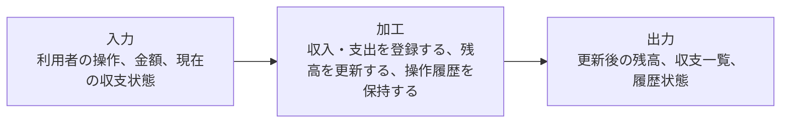
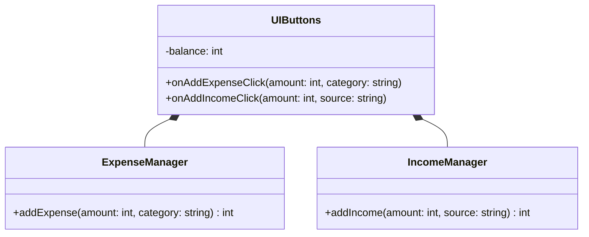
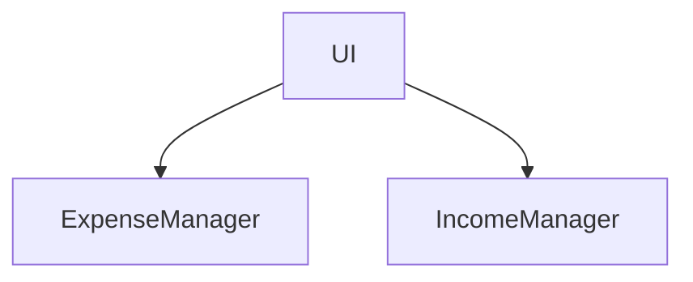
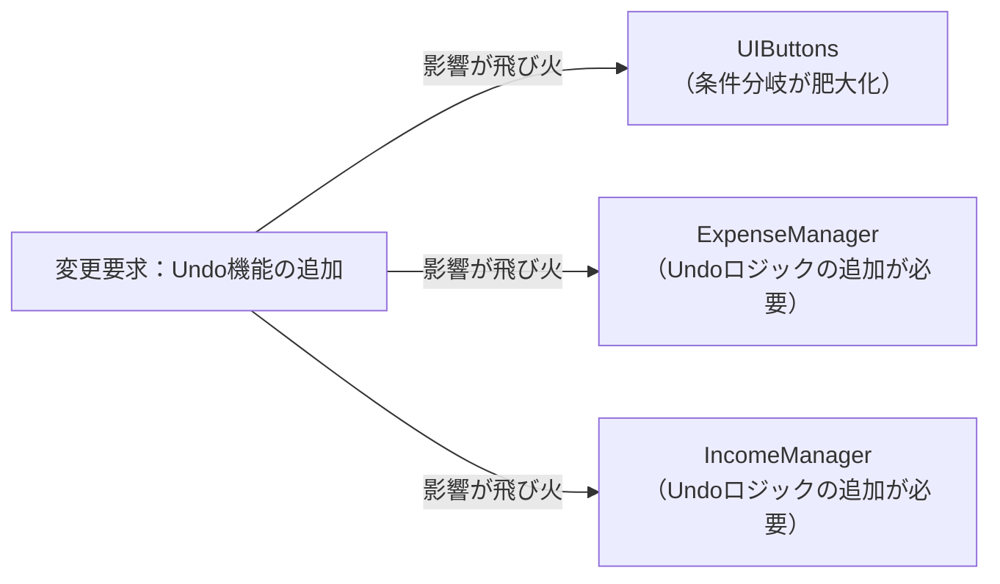
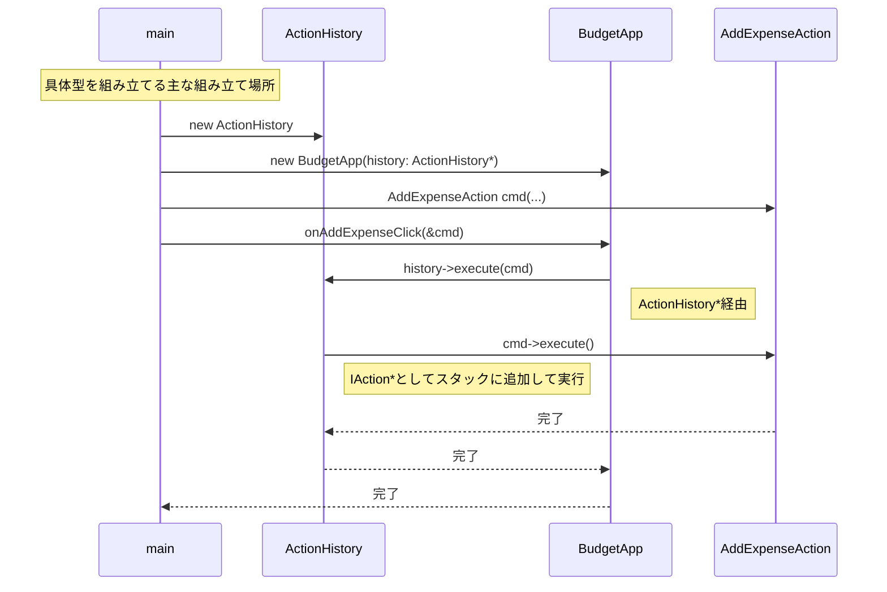
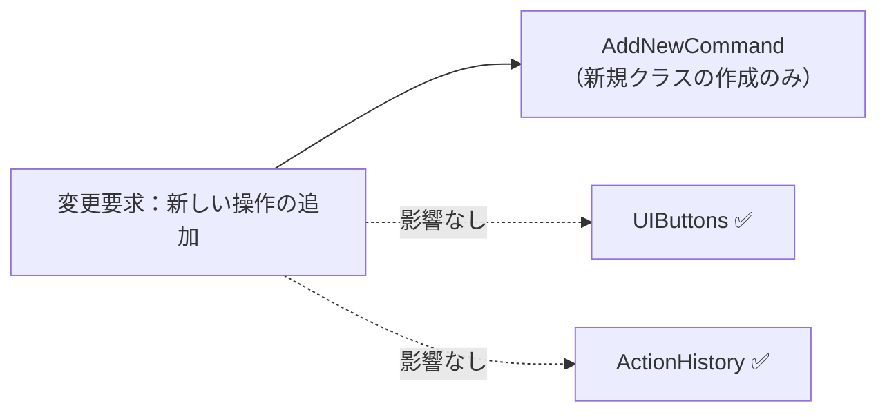
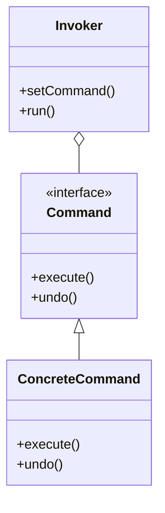

## 第5章 操作の履歴をオブジェクト化する ―― Command パターン

―― 思考の型：「操作（アクション）」と「それを実行するロジック」が混在している

### この章の核心

**UIボタンが実行先のクラス名・メソッド・引数まで直接知っていると、Undoや履歴のような操作管理を足すたびに呼び出し元まで書き直す必要が生じる。こういう問題は、「操作を依頼する側」と「操作の実行内容」が同じ場所に混在しているシステムで起きている。**

### この章を読むと得られること

この章の痛みは「やった操作を取り消したい」「操作の履歴を残したい」という要求が来たとき、呼び出し元が処理の詳細を直接知っているために実現できない、という問題です。

* **得られること1：** 「操作の種類」という観点で、ユーザーの指示と処理の実行箇所を識別できるようになる


* **得られること2：** 呼び出し元が個別の処理を直接知っている状態を「依存の過多」と判断できるようになる


* **得られること3：** 操作をオブジェクトに包むことで、操作の履歴保持や取り消しを構造から説明できるようになる


* **得られること4：** 操作を「いつ実行するか」や「取り消すか」を判断する際の、柔軟な設計手法がわかるようになる

## 🔵 フェーズ1：現状把握 ―― 仕様を整理し、システムと紐付ける
家計簿アプリにおける操作履歴管理という、日々の記録を支える機能の現状を観察していきましょう。

まずは、収支管理アプリが何を入力として受け取り、どの処理で加工し、何を出力するのかを整理します。ここでは設計の良し悪しを判断せず、現状を事実としてそろえます。

### 1-1：このシステムの仕様

この項目では、まず仕様を「入力→加工→出力」の形で整理します。コードの細部を読む前に、この変換の流れを押さえると、後のフェーズで仕様とコードを対応づけやすくなります。

**仕様の入力・加工・出力**



この図の要素は、後続で次のように使います。

| 図の要素 | コードで出る形 | 後で使う場所 |
|---|---|---|
| 利用者の操作、金額、現在の収支状態 | 支出/収入操作、金額、残高 | 動作例テーブル、`main()`、変更要求 |
| 登録、残高更新、操作履歴保持 | 収支操作の実行処理と履歴管理 | 現状コードの観察、Undo/Redo追加時の変更シミュレーション |
| 更新後の残高、収支一覧、履歴状態 | 実行結果の残高表示と履歴出力 | 動作例テーブル、実行結果、変更シナリオ表 |

このシステムは、利用者が日々の**収入・支出を記録・管理**するアプリです。

ボタン操作で支出・収入を追加でき、現在の残高（収入合計 − 支出合計）がリアルタイムで表示されます。

**利用できる操作**

「支出登録」と「収入登録」の2種類しかないのは、このシステムが「まず正確に記録する」ことを最優先に設計されているからです。この章では、操作の種類を絞った初期状態から、後で取り消しや口座移動などの要求が追加される状況を扱います。また「業務機能」の列は、どの業務機能に属する知識かを明示するためのものです。UIに表示する操作の追加・削除はプロダクト管理の業務機能によって決まり、その実現方法はシステム開発の業務機能が担う——この2つは変わる理由が異なります。

| 操作 | 処理内容 | 残高への影響 | 業務機能 |
|---|---|---|---|
| 支出登録 | 金額とカテゴリを入力し支出をDBに保存する | 指定金額だけ減る | UI・表示管理 / プロダクト管理 |
| 収入登録 | 金額とカテゴリを入力し収入をDBに保存する | 指定金額だけ増える | UI・表示管理 / プロダクト管理 |

現時点では「取り消し（Undo）」や「削除」機能はありません。これはこの章の現状仕様です。操作の取り消しはデータ整合性の管理が必要になるため、最初のコードには含めず、後から届く変更要求として扱います。

### 1-2：動作例テーブル

コードを読む前に、変更要求が届く前のシステムがどんな入力に対して
どんな出力を返すかを確認します。

| 操作 | 入力 | 処理内容 | 残高の変化 |
| --- | --- | --- | --- |
| 支出登録 | 1,000円／食費 | 支出をDBに保存し画面を更新する | 残高が1,000円減る |
| 収入登録 | 5,000円／給与 | 収入をDBに保存し画面を更新する | 残高が5,000円増える |

次は仕様とクラスを対応づけます。

**このシステムの登場クラス**

| クラス名 | 役割 | 担当する仕様 |
|---|---|---|
| `CategoryDatabase` | カテゴリIDから名称・種別を引く | カテゴリIDの存在確認と情報取得 |
| `ExpenseManager` | 支出データの追加 | 支出をDBに保存し画面を更新する |
| `IncomeManager` | 収入データの追加 | 収入をDBに保存し画面を更新する |
| `UIButtons` | ユーザーの操作を受け取り、各マネージャを呼び出す | 支出・収入の各登録アクションを発火する |

---

### 1-3：登場クラスとクラス構成図

現在の操作実行部分の構造です。



→ `UIButtons` クラスが `ExpenseManager` と `IncomeManager` を直接知り、ボタン押下時にそれぞれのメソッドを直接呼び出しています。

---

#### 補足：依存グラフ



→ `UIButtons` クラス（UI）に、操作を実行する各マネージャクラスへの依存が集中していることが分かります。


**この章での簡略化**

1-3でクラス構成を確認したので、掲載コードで何を代替しているかを整理してから現状コードへ進みます。

この章では、画面操作、永続化、実際の家計簿データ保存を `main()` とメモリ上のオブジェクト、`std::cout` で簡略化します。論点は「操作そのものをオブジェクトとして履歴に残し、Undo/Redoできるようにすること」です。UIイベント、ファイル保存、ユーザー認証は実運用では必要ですが、本章では設計論点から外れるため扱いません。

---

### 1-4：実装コード（現状）

操作実行部分のコード例です。

このシステムでは、操作時にカテゴリIDを指定します。カテゴリIDは「食費」「給与」などのカテゴリ名を一意に参照するための識別子です。現状コードには以下の4件のカテゴリデータがあらかじめ登録されています。

| カテゴリID | カテゴリ名 | 種別 |
|---|---|---|
| CAT001 | 給与 | 収入（income） |
| CAT002 | 食費 | 支出（expense） |
| CAT003 | 交通費 | 支出（expense） |
| CAT004 | 副収入 | 収入（income） |

登録されていないIDを指定するとエラーになります。コードを読む前にこの対応を把握しておくと、動作結果が追いやすくなります。

```cpp
#include <iostream>
#include <map>
#include <string>

struct Category {
    std::string name;  // カテゴリ名
    std::string type;  // "income"（収入）または "expense"（支出）
};

class CategoryDatabase {
    std::map<std::string, Category> records;
public:
    CategoryDatabase() {
        records["CAT001"] = {"給与",   "income"};
        records["CAT002"] = {"食費",   "expense"};
        records["CAT003"] = {"交通費", "expense"};
        records["CAT004"] = {"副収入", "income"};
    }
    bool exists(const std::string& id) const {
        return records.count(id) > 0;
    }
    Category get(const std::string& id) const {
        return records.at(id);
    }
};

class ExpenseManager {
    CategoryDatabase& db;
public:
    ExpenseManager(CategoryDatabase& db) : db(db) {}
    int addExpense(int amount, const std::string& categoryId) {
        if (!db.exists(categoryId)) {
            std::cout << "エラー：カテゴリID「" << categoryId
                      << "」は存在しません" << std::endl;
            return 0;
        }
        if (amount <= 0) {
            std::cout << "エラー：金額は1円以上を指定してください"
                      << std::endl;
            return 0;
        }
        Category cat = db.get(categoryId);
        std::cout << "支出を追加しました：" << cat.name
                  << " " << amount << "円" << std::endl;
        // DB保存・画面更新処理
        return -amount;
    }
};

class IncomeManager {
    CategoryDatabase& db;
public:
    IncomeManager(CategoryDatabase& db) : db(db) {}
    int addIncome(int amount, const std::string& categoryId) {
        if (!db.exists(categoryId)) {
            std::cout << "エラー：カテゴリID「" << categoryId
                      << "」は存在しません" << std::endl;
            return 0;
        }
        if (amount <= 0) {
            std::cout << "エラー：金額は1円以上を指定してください"
                      << std::endl;
            return 0;
        }
        Category cat = db.get(categoryId);
        std::cout << "収入を追加しました：" << cat.name
                  << " " << amount << "円" << std::endl;
        // DB保存・画面更新処理
        return amount;
    }
};

// ユーザーインターフェース層（上記2クラスを直接呼び出す）
class UIButtons {
    ExpenseManager em;
    IncomeManager im;
    int balance = 0;
public:
    UIButtons(CategoryDatabase& db) : em(db), im(db) {}
    void onAddExpenseClick(int amount, const std::string& categoryId) {
        balance += em.addExpense(amount, categoryId);
        std::cout << "現在残高：" << balance << "円\n";
    }
    void onAddIncomeClick(int amount, const std::string& categoryId) {
        balance += im.addIncome(amount, categoryId);
        std::cout << "現在残高：" << balance << "円\n";
    }
};
```

このコードを見ると、ボタン押下という「操作」と、マネージャクラスによる「処理の実行」が密接に結びついていることが分かります。

#### 呼び出し元と実行確認

```cpp
int main() {
    CategoryDatabase db;
    UIButtons buttons(db);

    std::cout << "--- 行1: 支出登録 ---\n";
    buttons.onAddExpenseClick(1000, "CAT002");  // 食費

    std::cout << "--- 行2: 収入登録 ---\n";
    buttons.onAddIncomeClick(5000, "CAT001");   // 給与
    return 0;
}
```

実行対象コード：1-4の現状コード
対応する動作例：1-2の動作例テーブル
確認したいこと：入力、加工、出力が仕様どおりに対応していること

実行結果：

```text
--- 行1: 支出登録 ---
支出を追加しました：食費 1000円
現在残高：-1000円
--- 行2: 収入登録 ---
収入を追加しました：給与 5000円
現在残高：4000円
```

動作例テーブルの2行どおり、支出で1,000円減り、その後の収入で
5,000円増えることを確認できました。現状にはUndoや削除の処理はありません。
ここでは開始残高を0円とした簡略例なので、1行目の支出直後は残高が-1,000円になります。実際の家計簿では初期残高や口座残高を別に持つこともありますが、この章では操作の実行と取り消しの構造に話を絞るため、残高計算を単純化しています。

---

### 1-5：変更要求

「利用者から、誤って登録したデータを簡単に取り消したいという要望が多く届いています。来週までに、直近の操作を取り消す『Undo機能』を実装してください」と、プロダクトマネージャーから連絡がありました。

なるほど、ボタンクリックという「操作」を記録しておき、それを巻き戻す必要があるのですね。

**仕様変更の内容**

変更要求を受けて、利用できる操作がどう変わるかを整理します。

| 操作 | 変更前 | 変更後 |
|---|---|---|
| 支出登録 | 支出をDBに保存し画面を更新 | **変更なし**（ただし操作履歴への記録が必要になる） |
| 収入登録 | 収入をDBに保存し画面を更新 | **変更なし**（ただし操作履歴への記録が必要になる） |
| **Undo実行（新規）** | —（なし） | **直前の操作を取り消し、残高を操作前に戻す** |

支出登録と収入登録そのものの意味は変わりません。変わるのは「その操作をどう記録し、どう取り消すか」という管理層です。言い換えると、「何をする操作か」は保ちながら、「操作の記録をどう扱うか」という責任が加わります。

**Undo動作の詳細**

- 支出登録の直後にUndoを実行 → その支出が取り消され、残高が元に戻る
- 収入登録の直後にUndoを実行 → その収入が取り消され、残高が元に戻る
- Undoを連続実行 → 操作の順番を逆に遡って取り消しを繰り返す

既存の2つの登録操作をUndo対象として記録し、新たに「Undo実行」という履歴操作を加える点が、この変更の核心です。

---

## 🟣 フェーズ2：仮説立案 ―― 何が変わるかを観察し、ヒアリングで裏付ける
フェーズ1で、家計簿アプリがUIボタンから各マネージャクラスを直接呼び出している現状を把握しました。次に、ユーザーから寄せられた「操作を取り消したい」という要望を起点に、この設計における変わる見込みと当面安定の前提を整理します。

「操作」と「実行」は、変わる理由が異なります。たとえば、支出登録のDB保存方法が変わるのはシステム設計・生成管理の業務機能（RDBからNoSQLへ移行など）によるものです。一方、「履歴管理が必要かどうか」はプロダクト管理の業務機能（ユーザー要望・法令対応など）によるものです。変わる理由がどの業務機能によるか——それが「分けるべき」サインです。

### 2-1：変わりそうな仕様の見当をつける

`UIButtons` が現在抱えている知識と、それぞれが属する業務機能を確認します。

| 知識（コードが直接持っているもの） | 業務機能 | 適切か |
|---|---|---|
| ユーザーがどのボタンを押したか | UI・表示管理 | ✅ |
| `ExpenseManager.addExpense()` の呼び出し方 | システム設計・生成管理 | ❌ 混在 |
| `IncomeManager.addIncome()` の呼び出し方 | システム設計・生成管理 | ❌ 混在 |

❌が2つある。UI・表示管理としてボタンの見た目を変えたいときも、システム設計・生成管理としてメソッドのシグネチャを変えたいときも、同じ `UIButtons` クラスに手が入ります。これが後の変更の痛みの予兆です。

#### 補足：変わる見込みと当面安定の仮説テーブル

フェーズ2の観察を材料に、Undo機能の実装に向けた仮説を立てます。

| **分類** | **仮説** | **根拠（フェーズ2の観察から）** |
| --- | --- | --- |
| 🔴 **変動しそう** | 個別の操作を実行するロジック（追加・削除など） | 操作内容が増えるたびに、マネージャクラスへの依存が増えるため。 |
| 🔴 **変動しそう** | 履歴の管理方法（スタックやリストなど） | Undo機能の要件に応じて、履歴を保持・操作する構造が必要になるため。 |
| 🟢 **当面安定** | ボタン押下を検知して操作を実行するというフロー | ボタンがクリックされるという契機自体は、この章の変更要求では変えないため。 |

「操作」を今のまま「メソッド呼び出し」として直付けしていると、Undo機能のために、呼び出し元と実行先の両方を大掛かりに書き換える必要が出てきそうです。

### 2-2：今回の変更で確実に変わること

ここで2つのテーブルの違いを整理しておきます。上の「変わる見込みと当面安定の仮説テーブル（2-3）」は「将来的に変わりそうかどうか」という観点での仮説です。一方、次の「今回の確定変更テーブル」は「今回のUndo機能追加という変更要求によって、確実に変わる箇所はどこか」という確定事実の整理です。仮説は「将来」、確定変更は「今回」——この違いを意識して読み進めてください。

変更要求（Undo機能の追加）によって、今回のコード変更で確実に変わる箇所を整理します。

| **分類** | **具体的な内容** | **変わるタイミング** | **根拠** |
| --- | --- | --- | --- |
| 🔴 **今回確定で変動する** | 操作を実行するロジックの実装方法 | 今回のUndo対応で確実に変わる | 現在はメソッド直呼び出し。履歴管理を入れるには構造変更が必要 |
| 🔴 **今回確定で変動する** | UIクラスからマネージャへの依存方法 | 今回のUndo対応で確実に変わる | 現在の直接呼び出し構造ではUndoを組み込めない |
| 🟢 **今回は変わらない** | ボタン押下を検知してアクションを起こすフロー | ボタンUI自体の廃止時のみ | ユーザーの操作契機（クリック）は変わらない |

### ヒアリングに向けた背景確認

このアプリは、利用者が日々の支出や収入を手軽に記録するためのものです。現在のシステムは、シンプルなボタン操作でマネージャクラスを直接呼び出す構成になっています。

これまではデータを記録するだけのシンプルな作りでしたが、現在は「操作の取り消し（Undo）」や「やり直し（Redo）」という、より高度な操作が求められるフェーズにあります。当時の開発者が、ボタンクリックに応じて直接処理を呼び出すよう実装したコードが、今、その限界を迎えようとしています。

一見すると、このコードは各ボタンに対応するメソッドが綺麗に分かれており、直感的で読みやすい構造をしています。このシンプルな設計は当初の要件（記録のみ）には十分でした。ただ、操作履歴を管理するという新しい要件では、この設計の延長線上では解決しにくい構造的な課題が生まれます。

### 2-3：関係者ヒアリング

確定変更の背景をさらに深掘りするため、UIデザイナーとシステム開発担当に確認を行いました。この会話が、次の「将来リスクテーブル」の根拠になります。

* **開発者：** 「Undo機能以外に、操作をやり直す『Redo機能』を追加する予定はありますか？」
* **UIデザイナー：** 「あります。ユーザーからは『一度取り消したものを戻したい』という声も根強いです。」
* **開発者：** 「操作を履歴として記録する仕組みは、将来的に他の機能にも適用する可能性はありますか？」
* **システム開発担当：** 「あります。今は支出と収入の追加だけですが、将来的に口座の移動やカテゴリ編集といった複雑な操作もUndo対象にしたいと考えています。」
* **開発者：** 「操作そのものの『意図』が変わることはありますか？」
* **UIデザイナー：** 「ええ、例えば『一括削除』のような、一度に複数のデータに作用する操作も追加されるかもしれません。」

ヒアリングの結果、操作の「実行」と「取り消し」の仕組みは、将来的に複雑な操作が追加されても安定している必要があると分かりました。

### 2-4：ヒアリングで判明した将来リスク

ヒアリングで明らかになった「今後変わるかもしれないリスク」を整理します。これは今回の変更で確実に起きることではなく、将来の拡張リスクです。

| **分類** | **将来リスクの内容** | **変わりうるタイミング** | **根拠（誰との確認か）** |
| --- | --- | --- | --- |
| 🟡 **将来リスク** | 操作の種類（追加、削除、一括削除など） | 機能追加・操作内容の変更時 | UIデザイナーとの確認 |
| 🟡 **将来リスク** | Redo機能の追加 | ユーザー要望が固まった時点 | UIデザイナーとの確認 |
| 🟡 **将来リスク** | Undo対象となる操作の複雑化（口座移動・編集など） | 口座管理機能の追加時 | システム開発担当との確認 |

フェーズ2で「今回確実に変わるもの」と「将来変わるかもしれないもの」の両方が整理できました。ここで立てた仮説——「操作の実行方法」と「操作の管理方法」は変わる理由が異なる——が正しいかどうかを、次のフェーズ3で実際にUndoを追加しようとすることで確かめます。仮説を「痛みとして体験する」ことが、このフェーズの目的です。

### 2-5：変わる見込みと当面安定の前提を確定する

ヒアリングで浮かび上がったリスクを、現在の仕様と将来の変更内容の対比として整理します。

| 変更内容 | 現在 | 将来（時期の目安） |
| --- | --- | --- |
| 操作の種類 | 支出登録・収入登録の2種類のみ | 口座移動・一括削除など（機能追加のタイミング） |
| 取り消し操作 | Undo機能なし（今回追加予定） | Redo機能も追加（ユーザー要望が固まり次第） |
| Undo対象の複雑さ | 単一操作（金額・カテゴリ単位） | 複合操作（口座移動・カテゴリ編集など）（口座管理機能の追加時） |

この変化が来たとき、現在の「UIが各マネージャを直接知る」構造では対応のたびに呼び出し元を書き換える必要が生じる——次のフェーズ3では、その痛みを実際に変更を試みることで確かめます。

## 🟣 フェーズ3：問題特定 ―― 変更の痛みを発見する
フェーズ2で、操作の種類や履歴管理ロジックは今後も増え続ける変動要因であることが分かりました。このフェーズでは、現在のように `UIButtons` クラスが各マネージャクラスを直接知っている構造のまま、操作履歴（Undo）機能を実装しようとすると何が起きるかを確認します。

### 3-1：変更を試みる

「操作を取り消したい」という要望に応えるため、今の `UIButtons` クラスに「直前の操作を記録して元に戻す」機能を強引に追加してみましょう。現状の `ExpenseManager` や `IncomeManager` には取り消し用メソッドがないため、履歴の記録だけでなく、逆操作をどこに実装するかまで `UIButtons` が考え始めることになります。

```cpp
class UIButtons {
    ExpenseManager em;
    IncomeManager im;
    // 履歴管理のためのリスト（ここから既に無理がある…）
    std::vector<std::string> history; 
public:
    void onAddExpenseClick() {
        em.addExpense(1000, "Food");
        history.push_back("Expense"); // 履歴記録
    }
    void undo() {
        // 取り消しのために、何が最後に実行されたかを確認する巨大な分岐が必要
        if (history.back() == "Expense") {
            // em.undoExpense(1000, "Food");
            // そもそも取り消しメソッドがない！
        }
        // Income・Transfer など他の種別の取り消しも
        // else if で続く（操作が増えるたびにここが肥大化する）
    }
};

```

変更後のコードを実行すると、次のような結果になります。

```cpp
// 動作確認（Undoが不完全な状態）
class ExpenseManager {
public:
    void addExpense(int amount, std::string cat) {
        std::cout << "支出追加: " << amount
                  << "円 [" << cat << "]" << std::endl;
    }
    // undoExpense() は存在しない
};

class UIButtons {
    ExpenseManager em;
    std::vector<std::string> history;
public:
    void onAddExpenseClick() {
        em.addExpense(1000, "Food");
        history.push_back("Expense");
    }
    void undo() {
        if (history.empty()) return;
        if (history.back() == "Expense") {
            // em.undoExpense() が存在しないため何もできない
            std::cout << "Undo失敗（取り消しメソッドがない）"
                      << std::endl;
        }
        history.pop_back();
    }
};

int main() {
    UIButtons buttons;
    buttons.onAddExpenseClick();
    buttons.onAddExpenseClick();
    buttons.undo(); // 取り消そうとするが…
    return 0;
}
```

実行対象コード：3-1の変更試行コード
対応する動作例：変更要求後の代表ケース
確認したいこと：変更要求を現状構造へ当てはめたとき、修正箇所と痛みがどこに出るか

実行結果：

```
支出追加: 1000円 [Food]
支出追加: 1000円 [Food]
Undo失敗（取り消しメソッドがない）
```

`undo()` を呼んでも実際には何も取り消せていません。`ExpenseManager` に取り消しメソッドがなく、履歴に金額やカテゴリも保存されていないためです。

**これがステップ1の限界です。** コードに手を入れようとした瞬間に、「取り消すメソッドがない」「金額やカテゴリをどこに保存していたか分からない」という問題が次々と現れます。現在の構造のままUndoを追加することは、根本的な構造変更なしには実現できないのです。

このように、単に操作履歴（文字列）を記録するだけでは、実際のアクションを取り消す（Undoする）ことができません。現在の `ExpenseManager` には「取り消し（Undo）」のためのメソッドが存在せず、履歴を記録したとしても元に戻す具体的な手段が提供されていないためです。

結局、このアプローチのままUndo機能を実装するには、すべてのマネージャクラスに `undo` メソッドを追加し、さらにそれを呼び出す巨大な条件分岐を `UIButtons` クラスに書き加えることになります。機能を追加するたびに、呼び出し元であるUIクラスが肥大化し、かつ、それぞれの業務ロジックの内部事情をさらに詳細に知らなければならないという、保守性の低い設計に陥ってしまうのです。

### 3-2：変更影響グラフ

Undo機能を実装しようとした際、変更がどのようにシステムを汚染するかをグラフ化します。



→ このグラフを見ると、本来は画面UIと業務ロジックで役割が分かれているはずなのに、「Undo」という一つの要求に対して、UIクラスとすべてのマネージャクラスという広範囲のコードに修正が飛び火していることが分かります。

### 3-3：痛みの言語化

変更を試みたことで、設計の「痛み」が鮮明になりました。

1つ目は、「条件分岐の爆発」という痛みです。操作の種類が増えるたびに、`UIButtons` クラス内の `undo()` メソッドは、どの操作をどう元に戻する必要があるかという判定ロジックで膨れ上がっていきます。これでは、何か一つ操作を追加するたびに、巨大な `if` 文の迷路を解き明かすことになります。

2つ目は、「業務ロジックへの過度な依存」という痛みです。Undo機能という画面UI側の都合で、本来その操作の実行しか知らないはずのマネージャクラスにまで「取り消し」という新しい責務を押し付けています。本来、画面は「どうやって実行するか」を知らなくても良いはずなのに、現在の構造では実行の詳細を知りすぎているため、変更がクラスの枠を越えて連鎖してしまうのです。

こういうとき困る、という感覚、皆さんも同じではないでしょうか。この「操作の意図と実行ロジックが直接結びついている」という状態が、私たちの設計を硬直させている元凶なのです。

フェーズ3で「操作の追加が辛い」という事実が確認できました。次のフェーズ4では、なぜこの辛さが構造的に発生するのかを分析します。

---
> **📌 問題（確定）**
> 操作の種類（支出追加・収入追加など）が増えるたびに、`UIButtons` の `undo()` 内の条件分岐が連動して肥大化する。今回のUndo機能追加というヒアリング済みの変更だけでも、呼び出し元UIと複数のマネージャクラスを同時に修正することになる。操作の意図（何をしたいか）と実行手段（どのクラスのどのメソッドを呼ぶか）が同じ場所に混在しているため、一つの変更要求が複数のクラスに連鎖するのだ。
---

（操作の「意図」と「実行手段」の混在が問題の核心だと確認できました。次のフェーズ4では、なぜこの混在が起きているのかを構造的に分析します。）

## 🟠 フェーズ4：原因分析 ―― なぜ辛いのかを構造で言語化する
フェーズ3で、Undo機能の実装において、呼び出し元のUIクラスが各操作の実行手段をすべて知らなければならないという「過度な依存」が確認できました。本来、画面（UI）は「どのボタンが押されたか」だけを知っていれば十分なはずです。「それをどのメソッドで、どのクラスで実行するか」まで知っている状態——これが「過度な依存」の意味です。このフェーズでは、なぜそのような辛さが生じるのかをコードの構造的な観点から分析します。

### 4-1：痛みの根源を探る（観察と原因）

ここで2つの問いを立てて、構造的な原因を掘り下げます。

- **なぜ、操作が増えるたびに `UIButtons` クラスを開かなければならないのか？**
- **なぜ、Undo機能を追加しようとすると影響範囲が読めなくなるのか？**

この2つの「なぜ」を出発点に、問題の根を辿ります。

フェーズ3で観察した痛みと、その根本的な原因を対応させます。

| **観察** | **原因の方向** |
| --- | --- |
| Undo機能を実装しようとすると、UIクラスが全マネージャクラスの全メソッドを知っている必要がある | 操作ボタンが「実行したい操作」の意図だけでなく、「具体的な実行手順（メソッド呼び出し）」まで直接知っているから |
| 操作の種類が増えるたびに、UIクラスの条件分岐が巨大化する | ユーザーが「何をしたいか」という操作の意図を、オブジェクトとして切り出さず、単なるメソッド呼び出しとして混在させているから |

### 4-2：変わるもの/変わってほしくないもの

> **「変わらないもの」と「変わってほしくないもの」は異なります。** 「変わらないもの」は経験的事実（今まで変わっていない）、「変わってほしくないもの」は設計意図（ここを安定させてほかを守りたい）です。ここで整理するのは後者です。

原因分析の結果として、「変わり続けるもの」と「変わってほしくないもの」を明確に分けます。

| **変わり続けるもの（🔴）** | **変わってほしくないもの（🟢）** |
| --- | --- |
| 操作の内容（支出追加、収入追加、削除など） | 操作をキックするトリガー（UIボタン自体） |
| 操作ごとの実行ロジックと取り消しロジック | 履歴のリストを管理し、Undoを実行する仕組み |

本来、UIボタンは「操作ボタンが押された」ことだけを知っていれば十分なはずです。現在の構造では、操作の「意図」と「実行手段」が密接に結合しているため、操作が増えるたびにUIクラスが改修の嵐にさらされているのです。

### 4-3：接続点に漏れている実行手段を確認する

現在の`UIButtons`は、ボタンの意図だけでなく、どのマネージャーのどのメソッドをどの引数で呼ぶかまで知っています。接続点で渡したいのは「実行でき、必要なら取り消せる操作」ですが、実行先と引数の知識がUI側へ漏れています。

この状態をケーブルで例えると、リモコンのボタン一つひとつから伸びた専用ケーブルが、テレビ側の専用ポートに直接差し込まれているようなものです。新しい操作（機能）を追加するたびに、リモコンの配線を変更し、新しい専用ケーブルを用意して差し込むことになります。これでは、機能が増えるたびに配線作業が発生し、極めて非効率ではないでしょうか。

フェーズ4で「UIとマネージャを切り離す場所」が言語化できました。「どこを分けるか」は明確です。次のフェーズ5では、その境界で実際に何が流れているかを値・型のレベルで具体化し、「何を変え、何を守るか」を明確にします。

---
> **📌 原因（確定）**
> `UIButtons`がボタン押下という「操作の意図」だけでなく、「どのクラスのどのメソッドを何の引数で呼ぶか」という実行手段まで知っている。操作が増えるたびにUIと履歴処理の両方へ知識が追加される。
---

（原因は、操作の意図と実行手段が同じ場所にあることだと分かりました。次のフェーズ5では、その接続点で何を渡せばよいかを値・型のレベルで見ていきます。）

## 🟡 フェーズ5：課題定義 ―― 解くべき接続点を定める
フェーズ4は「なぜ辛いか」を答えました。フェーズ5が問うのは「分けるべき境界で、実際に何が流れているか」です。クラスの参照関係ではなく、**値・型のレベル**に降りていきます。

フェーズ4の分析により、問題は「操作の意図（ボタンを押した事実）」と「実行手段（どのクラスのどのメソッドに何を渡すか）」が混在していることだと分かりました。その境界で何がやり取りされているかを具体化します。

### 接続点を特定する

`UIButtons` の各ボタン処理で分けるべき境界は1か所です。操作を依頼するUIと、具体的な実行手段との境界を見ます。

```cpp
void onAddExpenseClick() {
    // ↓ 具体的な実行手段（変わり続ける）
    em.addExpense(1000, "Food");
    //  ↑クラス名 ↑メソッド名 ↑引数の型・値まで知っている
    // ↑ ここまでが分離するターゲット
}
```

UIが「呼び出し先の具体的な知識」として保持しているのは、メソッド名・引数の型・引数の値の組み合わせです。

| 接続点 | 接続するデータ | 変わるもの |
|---|---|---|
| 実行手段 → `UIButtons` のボタン処理 | 呼び出し先（クラス名）・メソッド名・引数（int/string）→ 実行完了（void） | 具体的な呼び出し先の組み合わせ |

### 何を変え、何を守るか

- **変わるもの**：具体的な呼び出し先（どのクラスの何を呼ぶか、引数の構成）。新しい操作が追加されるたびにUIクラスの知識が増える。
- **守りたい前提**：「何かを実行する」という操作の意図そのもの。ボタンを押したら「何か」が実行されるという構造は変わらない。

呼び出し元（UIButtons）は「実行を依頼する」だけでよいはずです。問題は「どのクラスのどのメソッドをどの引数で呼ぶか」という**具体的な実行手段の知識**がUIに積み重なっていることです。

**現状のままでよい場面**：操作が少なく、Undoや履歴が不要なら、UIから処理を呼ぶ単純な構造を保つ判断もあります。今回は操作の追加とUndo/Redoが必要なため、操作そのものを接続点で受け渡す設計を検討します。

---
> **📌 課題（確定）**
> 切り離す境界は「操作の意図（ボタンを押した事実）」と「実行手段（クラス名・メソッド名・引数の組み合わせ）」の間にある。UIは `int` や `string` を渡す先の具体的な知識を持たず、「この操作を実行せよ」という依頼だけを送れる形にする。そのために、具体的な実行手段をオブジェクトとして切り出し、UIから分離する。
---

（切り離す境界と課題が明確になりました。次のフェーズ6では、その課題を解決するための対策を段階的に検討します。）

## 🔴 フェーズ6：対策検討 ―― 案を比べ、採用する形を決める
フェーズ5で「変わるのは具体的な呼び出し先であり、『実行する』という操作の意図は安定している」ことが分かりました。ここでは、その実行手段をどのようにオブジェクトとして差し替え可能にするかを段階的に検討します。それぞれのステップでどこまで痛みが解消されるかを確認し、今回の要件において「どのステップで止めるべきか」を決断します。

### ステップ1：直前の操作だけをフラグで覚える（最小限のUndo）

「Undoボタンが押されたとき、直前の操作を1回だけ取り消したい」——この要件に対して、思い浮かぶ最もシンプルな実装は何でしょうか。まず、各操作を独立したプライベートメソッドとして切り出し、そこから共通の構造を見つけていきましょう。

なお、以降のステップでは `UIButtons` クラスの名称を `BudgetApp` に変更します。同じクラスの呼び方を変えただけで、責務は変わりません。

```cpp
class BudgetApp {
    ExpenseManager em;
    IncomeManager im;
    // 直前の操作を1つだけ記憶する
    std::string lastType;  // "Expense" or "Income" or ""
    int lastAmount;
    std::string lastDetail;

    // 各操作を独立したプライベートメソッドとして切り出す
    void recordExpense(int amount, const std::string& cat) {
        em.addExpense(amount, cat);
        lastType   = "Expense";
        lastAmount = amount;
        lastDetail = cat;
    }
    void recordIncome(int amount, const std::string& src) {
        im.addIncome(amount, src);
        lastType   = "Income";
        lastAmount = amount;
        lastDetail = src;
    }

    // 判定（どの取り消し処理を選ぶか）も独立したメソッドとして切り出す
    void undoLast() {
        if (lastType == "Expense")
            em.removeExpense(lastAmount, lastDetail);
        else if (lastType == "Income")
            im.removeIncome(lastAmount, lastDetail);
        lastType = "";
    }

public:
    void onAddExpenseClick(int amount, const std::string& cat) {
        recordExpense(amount, cat);
    }
    void onAddIncomeClick(int amount, const std::string& src) {
        recordIncome(amount, src);
    }
    void onUndoClick() {
        undoLast();
    }
};
```

各操作を独立したプライベートメソッドに切り出し、判定（undoLast）も別のメソッドとして分けることで、「実行の記録」と「どれを取り消すかの判定」が分離された。

**この段階の評価：** 1回のUndoはできるようになった。しかし、「支出を登録→収入を登録→Undoを2回」という操作には対応できない。直前の1件しか覚えていないので、2回目のUndoで取り消す対象がない。

ここで気づくことがあります。`recordExpense` と `recordIncome` の2つは、引数の構成（`int amount, const std::string&`）も処理の構造（「操作を実行して、種別・金額・詳細を記憶する」）も同じです。同じシグネチャを持つメソッドが並んでいる——これが「共通の構造」の初めての兆候です。また、`undoLast` を独立させたことで、「各操作の記録」と「どれを取り消すかの判定」が別の関心事だということも見えてきました。次のステップでは、この記憶できる件数の制限を解消するために、履歴をスタックへ積む方法を試みます。

---

### ステップ2：スタックで複数の操作を積む（プリミティブな履歴管理）

ステップ1の「1回しか取り消せない」問題を解決するには、過去の操作をスタックとして積み上げればよいと考えられます。操作の種別と値を構造体にまとめてスタックへ積み、取り消すときはトップから取り出せばよいはずです。

```cpp
struct OperationRecord {
    std::string type;   // "Expense" or "Income"
    int amount;
    std::string detail;
};

class BudgetApp {
    ExpenseManager em;
    IncomeManager im;
    std::vector<OperationRecord> undoStack;  // スタックとして使う

public:
    void onAddExpenseClick(int amount, std::string cat) {
        em.addExpense(amount, cat);
        undoStack.push_back({"Expense", amount, cat});
    }
    void onAddIncomeClick(int amount, std::string src) {
        im.addIncome(amount, src);
        undoStack.push_back({"Income", amount, src});
    }
    void onUndoClick() {
        if (undoStack.empty()) return;
        OperationRecord last = undoStack.back();
        undoStack.pop_back();
        // 操作の種類ごとに取り消し処理を分岐する
        if (last.type == "Expense")
            em.removeExpense(last.amount, last.detail);
        else if (last.type == "Income")
            im.removeIncome(last.amount, last.detail);
        // 口座移動が来たら: else if (last.type == "Transfer") ...
    }
};
```

操作の詳細情報（種別・金額・カテゴリ）をスタックに積むことで複数回のUndoが実現できる。

**この段階の評価：** 複数回のUndoはできるようになった。しかし、新しい操作（「口座移動」「一括削除」など）が増えるたびに、`onUndoClick()` 内の `if/else if` チェーンに新しい分岐を書き足さなければならない。操作の追加が `BudgetApp` の修正を必ず伴う構造は変わっていない。複数回のUndoはできるようになったが、新しい操作が増えるたびに履歴管理クラスにも新しいif文を追加しなければならない。

私の経験でも、最初は状態や履歴をフラグやスタックで管理しようと試みます。しかし、操作の種類が増えるにつれて呼び出し元の分岐が爆発し、管理しきれなくなりました。そこで「操作そのものをオブジェクト化し、呼び出し元から切り離す」という発想に至ったのです。

---

### ステップ3：操作をオブジェクトに閉じ込める

ステップ2の根本的な問題は「操作の取り消し方を `BudgetApp` が知っている」ことにあります。操作が増えるたびに `BudgetApp` を開かなければならないのは、取り消しロジックが操作の定義側ではなく、履歴管理側に書かれているからです。

では、逆転の発想を試してみましょう。「実行と取り消しの両方を操作クラス自身が知っている」ように設計すれば、履歴管理側は操作の中身を知る必要がなくなるはずです。

実行と取り消しの両方を操作クラス自身が知っているように設計すれば、履歴管理を担当するクラス（後述する `ActionHistory`）は操作の具体的な中身を知る必要がなくなるはずです。

ただし、履歴に積まれた操作（`AddExpenseAction` や `AddIncomeAction` など）を共通の方法で呼び出すには、それらが同じ型として扱える必要があります。そのために、すべての操作クラスに `execute()`（実行）と `undo()`（取り消し）の実装を強制する共通のインターフェース `IAction` を導入します。これによって呼び出し側は、具体的な操作内容に関わらず `cmd->execute()` や `cmd->undo()` を呼ぶだけで済むようになります。

> [!INFO] コラム: なぜわざわざ「操作」をクラスにするの？
> 初学者のうちは、「操作の履歴を残すなら、配列に操作名を入れてif文で分岐すればいいのでは？」と思うかもしれません。しかし、その方法だと操作の種類（支出、収入、口座移動など）が増えるたびに、呼び出し側のif文が無限に長くなってしまいます。操作自体をオブジェクトにして execute() や undo() を持たせることで、呼び出し側は「中身を知らなくてもとにかく実行（または取り消し）できる」という状態を作れるのが最大のメリットです。

```cpp
#include <deque>
#include <iostream>
#include <string>
#include <vector>

// Commandが処理を委譲するReceiver
class ExpenseManager {
    int total = 0;
public:
    void addExpense(int amount, const std::string& category) {
        total += amount;
        std::cout << "支出を追加しました：" << category
                  << " " << amount << "円" << std::endl;
    }
    void removeExpense(int amount, const std::string& category) {
        total -= amount;
        std::cout << "支出を取り消しました：" << category
                  << " " << amount << "円" << std::endl;
    }
    int totalExpenses() const { return total; }
};

class IncomeManager {
    int total = 0;
public:
    void addIncome(int amount, const std::string& source) {
        total += amount;
        std::cout << "収入を追加しました：" << source
                  << " " << amount << "円" << std::endl;
    }
    void removeIncome(int amount, const std::string& source) {
        total -= amount;
        std::cout << "収入を取り消しました：" << source
                  << " " << amount << "円" << std::endl;
    }
    int totalIncome() const { return total; }
};

// 操作の契約：実行と取り消しをすべての操作クラスに強制する
class IAction {
public:
    virtual ~IAction() {}
    virtual void execute() = 0;
    virtual void undo() = 0;
};

// 支出追加の操作：実行と取り消しを自分自身が知っている
class AddExpenseAction : public IAction {
    ExpenseManager& em;
    int amount;
    std::string category;
public:
    AddExpenseAction(ExpenseManager& em, int amount,
                     std::string category)
        : em(em), amount(amount), category(category) {}
    void execute() override { em.addExpense(amount, category); }
    void undo()    override { em.removeExpense(amount, category); }
};

// 収入追加の操作：実行と取り消しを自分自身が知っている
class AddIncomeAction : public IAction {
    IncomeManager& im;
    int amount;
    std::string source;
public:
    AddIncomeAction(IncomeManager& im, int amount,
                    std::string source)
        : im(im), amount(amount), source(source) {}
    void execute() override { im.addIncome(amount, source); }
    void undo()    override { im.removeIncome(amount, source); }
};

// 履歴管理：IAction*という抽象型だけを知り、操作の中身を知らない
class ActionHistory {
    std::deque<IAction*> undoStack;  // ← 先頭（最古）を削除できるdequeを使う
    static const int MAX_HISTORY = 50;
public:
    void execute(IAction* cmd) {
        cmd->execute();
        undoStack.push_back(cmd);
        if ((int)undoStack.size() > MAX_HISTORY)
            undoStack.pop_front();  // ← 最古のコマンドを削除する
    }
    void undo() {
        if (undoStack.empty()) return;
        IAction* cmd = undoStack.back();
        undoStack.pop_back();
        cmd->undo();  // ← どの操作かを知らずに取り消せる
    }
    int historySize() const { return (int)undoStack.size(); }
};

// BudgetApp：ActionHistory*だけを知り、具体操作クラスへ直接依存しない
class BudgetApp {
    ActionHistory* history;
public:
    BudgetApp(ActionHistory* h) : history(h) {}
    void onAddExpenseClick(IAction* cmd) { history->execute(cmd); }
    void onUndoClick() { history->undo(); }
};

int main() {
    ExpenseManager em;
    IncomeManager im;
    ActionHistory hist;
    BudgetApp app(&hist);

    AddExpenseAction cmd1(em, 1000, "Food");
    app.onAddExpenseClick(&cmd1);
    app.onUndoClick();
    return 0;
}
```

`ActionHistory` は `cmd->undo()` を呼ぶだけで、取り消す対象が支出なのか収入なのかを知る必要がない。操作が増えても `ActionHistory` は変わらない。

**この段階の評価：** `BudgetApp` も `ActionHistory` も具体クラス名はどこにも登場しない。新しい操作（口座移動・一括削除）が来たときも、新しい操作クラスを追加し、組み立て箇所へ登録する形に寄せられるため、`BudgetApp`と`ActionHistory`の実行ロジックへの変更を抑えやすい。操作の実行・取り消し知識が操作クラス自身に閉じ込められたことで、履歴管理の責任を「スタックを管理する」方向へ絞り込めた。

---

### 採用する形を決める

それぞれのステップには一長一短があります。どこで止めるかは、**「今後の変更頻度（ビジネス要求）」**で決断します。

*   **ステップ1で止めるケース：** Undoが「1回だけあればよい」で、追加の操作種別が出てこない場合。
*   **ステップ2で止めるケース：** 複数回のUndoが必要だが、操作の種類がこれ以上増えない場合。プリミティブなスタック管理で十分です。
*   **ステップ3まで進むケース：** 操作の種類が頻繁に増え、複数ステップのUndo/Redoなど高度な履歴管理が要求される場合。

**今回の決断：**
フェーズ2のヒアリングで「口座間の移動」や「一括削除」など新しい操作が次々に追加されることが予告されています。また、Undo/Redo機能は操作の履歴管理という独立した責任を持ちます。したがって、私の場合は初期投資コストを払ってでも、`IAction` インターフェースと `ActionHistory` の両方を導入する**ステップ3まで進化させる**決断を下します。

フェーズ6で採用する形が決まりました。次のフェーズ7では、この決断を最終的なコードに落とし込みます。

## 🟢 フェーズ7：対策実施 ―― 変化に強いコードを完成させる
フェーズ6のステップ3で選んだ「操作のオブジェクト化＋仲介役による履歴管理」を、実際のコードに実装します。これまではUIが各マネージャの具体的なメソッドを知っていましたが、これを「操作そのものを表すオブジェクト」へと置き換えます。

**この構造は、Command（コマンド）パターンと呼ばれています。**

このパターンは「リクエストをオブジェクトとしてカプセル化し、呼び出し元から具体的な実行手段の知識を外す」という構造に、GoFがつけた名前です。フェーズ6でステップ3を選んだ理由を振り返ると、そのままCommandパターンを選ぶ理由に重なります。パターン名を先に知ってから「どこで使うか」を探すのではなく、問題を解いた結果としてこの構造にたどり着く——それがこのプロセスの意図です。

この設計変更により、新しい操作はCommandクラスとして追加し、UIやバッチへ割り当てる組み立て箇所を変更できます。`ActionHistory` へ操作種別ごとの条件分岐を追加せずに、同じUndo/Redoの仕組みを利用できます。

### 7-1：解決後のコード（全体）

操作を抽象化するためのインターフェースと、それを実行する履歴管理クラスを定義します。コードはクラスごとに分割して示します。

**はじめに、操作の契約となるインターフェースです。**

```cpp
#include <deque>
#include <iostream>
#include <map>
#include <string>
#include <vector>

struct Category {
    std::string name;  // カテゴリ名
    std::string type;  // "income"（収入）または "expense"（支出）
};

class CategoryDatabase {
    std::map<std::string, Category> records;
public:
    CategoryDatabase() {
        records["CAT001"] = {"給与",   "income"};
        records["CAT002"] = {"食費",   "expense"};
        records["CAT003"] = {"交通費", "expense"};
        records["CAT004"] = {"副収入", "income"};
    }
    bool exists(const std::string& id) const {
        return records.count(id) > 0;
    }
    Category get(const std::string& id) const {
        return records.at(id);
    }
};

// Commandが処理を委譲するReceiver
class ExpenseManager {
    int total = 0;
    CategoryDatabase& db;
public:
    ExpenseManager(CategoryDatabase& db) : db(db) {}
    bool addExpense(int amount, const std::string& categoryId) {
        if (!db.exists(categoryId)) {
            std::cout << "エラー：カテゴリID「" << categoryId
                      << "」は存在しません" << std::endl;
            return false;
        }
        if (amount <= 0) {
            std::cout << "エラー：金額は1円以上を指定してください"
                      << std::endl;
            return false;
        }
        Category cat = db.get(categoryId);
        total += amount;
        std::cout << "支出を追加しました：" << cat.name
                  << " " << amount << "円" << std::endl;
        return true;
    }
    void removeExpense(int amount, const std::string& categoryId) {
        Category cat = db.get(categoryId);
        total -= amount;
        std::cout << "支出を取り消しました：" << cat.name
                  << " " << amount << "円" << std::endl;
    }
    int totalExpenses() const { return total; }
};

class IncomeManager {
    int total = 0;
    CategoryDatabase& db;
public:
    IncomeManager(CategoryDatabase& db) : db(db) {}
    bool addIncome(int amount, const std::string& categoryId) {
        if (!db.exists(categoryId)) {
            std::cout << "エラー：カテゴリID「" << categoryId
                      << "」は存在しません" << std::endl;
            return false;
        }
        if (amount <= 0) {
            std::cout << "エラー：金額は1円以上を指定してください"
                      << std::endl;
            return false;
        }
        Category cat = db.get(categoryId);
        total += amount;
        std::cout << "収入を追加しました：" << cat.name
                  << " " << amount << "円" << std::endl;
        return true;
    }
    void removeIncome(int amount, const std::string& categoryId) {
        Category cat = db.get(categoryId);
        total -= amount;
        std::cout << "収入を取り消しました：" << cat.name
                  << " " << amount << "円" << std::endl;
    }
    int totalIncome() const { return total; }
};

// 操作の契約：実行と取り消しをすべての操作クラスに強制する
class IAction {
public:
    virtual ~IAction() {}
    virtual void execute() = 0;
    virtual void undo() = 0;
    virtual std::string describe() const = 0;
};

```

`IAction` を定めることで、履歴管理クラスはどの具体的な操作クラスが来ても同じ方法で扱える。この「型の統一」が、Undo/Redoを汎用的に実現する鍵になる。

**次に、具体的な操作クラスです。**

```cpp
// 支出追加の操作をカプセル化したクラス
class AddExpenseAction : public IAction {
    ExpenseManager& em;
    int amount;
    std::string categoryId;
public:
    AddExpenseAction(ExpenseManager& em,
                      int amount, std::string categoryId)
        : em(em), amount(amount), categoryId(categoryId) {}
    void execute() override {
        em.addExpense(amount, categoryId);
    }
    void undo() override {
        em.removeExpense(amount, categoryId);
    }
    std::string describe() const override {
        return "支出登録: " + categoryId + " "
               + std::to_string(amount) + "円";
    }
};

```

```cpp
// 収入追加の操作をカプセル化したクラス
class AddIncomeAction : public IAction {
    IncomeManager& im;
    int amount;
    std::string categoryId;
public:
    AddIncomeAction(IncomeManager& im,
                     int amount, std::string categoryId)
        : im(im), amount(amount), categoryId(categoryId) {}
    void execute() override {
        im.addIncome(amount, categoryId);
    }
    void undo() override {
        im.removeIncome(amount, categoryId);
    }
    std::string describe() const override {
        return "収入登録: " + categoryId + " "
               + std::to_string(amount) + "円";
    }
};

```

各操作クラスは「実行」と「取り消し」の両方を知っています。操作を増やすときはCommandクラスを追加し、画面やバッチへ割り当てる組み立て箇所を変更します。`ActionHistory` の履歴管理ロジックには、操作種別ごとの分岐を増やさずに済みます。

**次に、操作履歴を保持し、Undo/Redoを制御する仲介役クラスです。**

実行ログ（`executionLog`）はシステム起動時は空で、操作が実行・取り消しされるたびに1件追記されます。`undoStack` とは異なり、削除されることなく全操作の記録として保持します。

```cpp
// 操作履歴を保持し、Undo/Redoを制御する仲介役
class ActionHistory {
    std::deque<IAction*> undoStack;
    std::vector<std::string> executionLog;  // 実行ログ（追記のみ）
    std::deque<IAction*> redoStack;
    static const int MAX_HISTORY = 50;
public:
    void execute(IAction* cmd) {
        cmd->execute();
        undoStack.push_back(cmd);
        executionLog.push_back(cmd->describe());
        if ((int)undoStack.size() > MAX_HISTORY) {
            undoStack.pop_front();  // 最古のCommandを削除する
        }
        redoStack.clear();
    }
    void undo() {
        if (undoStack.empty()) return;
        // undo()が失敗した場合は、CommandをundoStackに残す
        IAction* cmd = undoStack.back();
        undoStack.pop_back();
        cmd->undo();
        executionLog.push_back("取り消し: " + cmd->describe());
        redoStack.push_back(cmd);
    }
    void redo() {
        if (redoStack.empty()) return;
        // execute()が失敗した場合は、CommandをredoStackに残す
        IAction* cmd = redoStack.back();
        redoStack.pop_back();
        cmd->execute();
        undoStack.push_back(cmd);
    }
    void printLog() const {
        for (const auto& entry : executionLog) {
            std::cout << entry << std::endl;
        }
    }
    int historySize() const {
        return (int)undoStack.size();
    }
};

```

`ActionHistory` は `IAction*` としてCommandを受け取り、スタックで管理します。具体的な操作クラスは知りません。Undo/Redoの実行に失敗した場合は、対象Commandを元のスタックに残す順序にしています。

**最後に、呼び出し元と組み立てコードです。**

フェーズ1の動作例テーブルに示した「CSVからの一括インポート」操作を担う `ImportService` も、同じ `IAction` インターフェースを通じて操作を実行します。

```cpp
// UIからの操作を受け取り、Historyに委譲するだけ
class BudgetApp {
    ActionHistory* history;
public:
    BudgetApp(ActionHistory* h) : history(h) {}
    void onAddExpenseClick(IAction* cmd) {
        history->execute(cmd);
    }
    void onAddIncomeClick(IAction* cmd) {
        history->execute(cmd);
    }
    void onUndoClick() { history->undo(); }
    void onRedoClick() { history->redo(); }
};

// 一括インポートからの操作を受け取り、Historyに委譲するだけ
class ImportService {
    ActionHistory* history;
public:
    ImportService(ActionHistory* h) : history(h) {}
    void importTransactions(
            std::vector<IAction*> cmds) {
        const std::size_t count = cmds.size();
        for (IAction* cmd : cmds) {
            history->execute(cmd);
        }
        std::cout << count << "件インポート完了"
                  << "（履歴: " << history->historySize()
                  << "件）" << std::endl;
    }
    void rollback(int count) {
        for (int i = 0; i < count; i++) history->undo();
        std::cout << count << "件ロールバック完了"
                  << std::endl;
    }
};

// 依存の組み立ては main() に集約する
int main() {
    CategoryDatabase db;
    ExpenseManager em(db);
    IncomeManager im(db);
    ActionHistory hist;

    BudgetApp app(&hist);
    AddExpenseAction cmd1(em, 1000, "CAT002");  // 食費
    app.onAddExpenseClick(&cmd1);
    AddIncomeAction cmd2(im, 5000, "CAT001");   // 給与
    app.onAddIncomeClick(&cmd2);
    std::cout << "残高: "
              << im.totalIncome() - em.totalExpenses()
              << "円" << std::endl;
    app.onUndoClick();               // 直前の収入を取り消す
    app.onUndoClick();               // さらに支出も取り消す
    std::cout << "Undo後の残高: "
              << im.totalIncome() - em.totalExpenses()
              << "円" << std::endl;
    app.onRedoClick();               // 支出を再実行
    std::cout << "Redo後の残高: "
              << im.totalIncome() - em.totalExpenses()
              << "円" << std::endl;

    ImportService importer(&hist);
    AddExpenseAction imp1(em, 2000, "CAT003");  // 交通費
    AddExpenseAction imp2(em, 300,  "CAT002");  // 食費
    AddExpenseAction imp3(em, 800,  "CAT002");  // 食費
    std::vector<IAction*> imported;
    imported.push_back(&imp1);
    imported.push_back(&imp2);
    imported.push_back(&imp3);
    importer.importTransactions(imported); // 一括登録（3件）
    std::cout << "インポート後の残高: "
              << im.totalIncome() - em.totalExpenses()
              << "円" << std::endl;
    importer.rollback(3);            // 3件ロールバック
    std::cout << "ロールバック後の残高: "
              << im.totalIncome() - em.totalExpenses()
              << "円" << std::endl;
    std::cout << "\n--- 操作履歴 ---\n";
    hist.printLog();
    return 0;
}
```

実行対象コード：7-1の解決後コード
対応する動作例：1-2の動作例テーブル、および変更要求後のUndo/Redo・一括インポートの代表ケース
確認したいこと：外部から見える収支結果を保ちながら、操作の実行・取り消し・再実行がCommandとして履歴に接続されていること

実行結果：

```text
支出を追加しました：食費 1000円
収入を追加しました：給与 5000円
残高: 4000円
収入を取り消しました：給与 5000円
支出を取り消しました：食費 1000円
Undo後の残高: 0円
支出を追加しました：食費 1000円
Redo後の残高: -1000円
支出を追加しました：交通費 2000円
支出を追加しました：食費 300円
支出を追加しました：食費 800円
3件インポート完了（履歴: 4件）
インポート後の残高: -4100円
支出を取り消しました：食費 800円
支出を取り消しました：食費 300円
支出を取り消しました：交通費 2000円
3件ロールバック完了
ロールバック後の残高: -1000円
```

支出1,000円と収入5,000円の登録後は残高4,000円、2回のUndo後は0円、Redo後は-1,000円になります。3件合計3,100円の支出をインポートすると-4,100円になり、3件をロールバックすると-1,000円へ戻ります。ログの順序だけでなく、Receiverが保持する集計状態も元へ戻ることを確認できます。

この実装により、UIはCommandのポインタを履歴へ渡すだけでよくなり、支出・収入ごとの実行手順を管理する必要がなくなりました。コマンドの生成と画面への割り当ては組み立て側に残ります。

### 7-2：動作シーケンス図



### 7-3：変更影響グラフ（改善後）

フェーズ3で確認したUndo機能の追加要求を再適用します。



→ **フェーズ3の変更影響グラフと比較して、新しい操作の追加という変更要求が、主に新規コマンドクラス内に限定できる形になりました**。

### 7-4：変更シナリオ表

現状コードと改善後コードで、変更要求への影響がどう変わるかを対比します。

| **シナリオ** | **現状コードでの影響** | **この設計での影響** |
|---|---|---|
| 新しい操作（振替等）を追加 | `UIButtons` に新しい呼び出しと取り消しロジックを追記 | `TransferAction` 実装クラスを新規作成するだけ |
| Undo/Redoの回数制限を変更 | `UIButtons` の履歴管理ロジックを修正 | `ActionHistory` のみ修正 |
| 操作履歴をログ出力する機能を追加 | `UIButtons` の各操作呼び出し箇所に追記 | `ActionHistory` に1箇所追加 |

操作の意図をオブジェクトとして独立させたことで、UIは操作の実行方法を知る必要がなくなりました。代わりに、操作ごとのクラス、Commandの所有権、履歴上限、失敗時の整合性を設計する必要があります。

### 問題・原因・課題・解決策

| | 内容 |
|---|---|
| **問題** | 操作の種類が増えるたびに、`UIButtons` の条件分岐と各マネージャへの依存が連動して肥大化する |
| **原因** | 操作の意図と実行手段が同じ場所に混在しており、ヒアリングで確認された操作追加の頻度ではこの接続コストが合わない |
| **課題** | 具体的な実行手段（クラス名・メソッド名・引数の組み合わせ）をUIから切り離し、差し替え可能なオブジェクトとして独立させる |
| **解決策** | Command パターン：操作の実行と取り消しを `IAction` インターフェースに統一し、`ActionHistory` が `IAction*` だけを知る仲介役として履歴を管理する |

## 整理

### フェーズとこの章でやったこと

この章では、ボタン押下という操作が特定の処理を直接知っているために、Undo/Redoのような機能追加でコード全体が複雑化する現状を学びました。7フェーズの思考プロセスを適用した改善の流れを振り返ります。

| **フェーズ** | **この章でやったこと** | **参照セクション** |
| --- | --- | --- |
| 🔵 フェーズ1：現状把握 | ボタン（UI）が各マネージャクラスを直接呼び出す構造を観察しました。 | 1-1〜1-5 |
| 🟣 フェーズ2：仮説立案 | 「操作」と「実行」は異なる理由で変わるため、分離できるという仮説を立て、関係者にヒアリングしました。 | 2-1〜2-6 |
| 🟣 フェーズ3：問題特定 | 操作を追加するたびに呼び出し元のUIクラスが肥大化する「痛み」を変更影響グラフで確認しました。 | 3-1〜3-3 |
| 🟠 フェーズ4：原因分析 | 操作の「意図」と「実行手段」が同じ場所に混在し、実行先の知識がUIへ漏れていることを確認しました。 | 4-1〜4-3 |
| 🟡 フェーズ5：課題定義 | 操作の依頼と具体的な呼び出し先の境界を定め、UIから実行手段の知識を外す課題を定めた | フェーズ5本文 |
| 🔴 フェーズ6：対策検討 | ステップ1〜3を段階的に比較し、コスト天秤で `IAction` インターフェース＋`ActionHistory` 仲介役のステップ3を採用しました。 | フェーズ6本文 |
| 🟢 フェーズ7：対策実施 | 操作をコマンドオブジェクトとして独立させ、呼び出し元から詳細を切り離した最終コードを示しました。 | 7-1〜7-4 |

### 責任の移動

| **責任** | **変更前** | **変更後** |
| --- | --- | --- |
| ボタン押下時の実行知識（何をどう呼ぶか） | `UIButtons`（直書き） | `AddExpenseAction` 等の各Actionクラス |
| 操作の取り消しロジック | —（なし） | `AddExpenseAction` 等の各Actionクラス |
| 実行履歴の管理とUndo/Redo制御 | —（なし） | `ActionHistory` |
| 操作の実行・取り消し契約定義 | —（なし） | `IAction` |

> このプロセスを回した結果にたどり着いた構造こそが Command パターンです。
> 
> 

---

## 振り返り

### 「この章を読むと得られること」は手に入ったか

| **得られること** | **この章のどこで示したか** |
| --- | --- |
| 1. 操作の種類という観点での識別 | フェーズ2の仮説立案で、操作と実行を切り離したこと。 |
| 2. 依存過多の診断 | フェーズ4で、UIクラスが全実行先と引数を知っていることを確認したこと。 |
| 3. 操作オブジェクト化の構造説明 | フェーズ7で、操作をオブジェクト化し履歴保持したこと。 |
| 4. 柔軟な設計手法の理解 | フェーズ6で、コマンドを組み合わせるマクロ・バッチ実行への発展可能性を確認したこと。 |

---

### 3つの設計原則はどう適用されたか

* **原則1「変わるものをカプセル化せよ」の現れ**
* **具体化された場所：** 個別のコマンドクラス（`AddExpenseAction` など）
* **解説：** 操作ごとの「実行・取り消しロジック」を個別のクラスへカプセル化しました。これにより、UIクラスは操作の中身を知る必要がなくなりました。


* **原則2「実装ではなくインターフェースに対してプログラムせよ」の現れ**
* **具体化された場所：** `ActionHistory` が扱う `IAction` インターフェース
* **解説：** `ActionHistory` は具体的なコマンドクラスではなく、`IAction` インターフェースに対して実行を依頼します。


* **原則3「継承よりコンポジションを優先せよ」の現れ**
* **具体化された場所：** `ActionHistory` の履歴管理
* **解説：** 継承による振る舞いの固定ではなく、コマンドオブジェクトをスタックに保持するコンポジション（保持）を用いて柔軟な履歴操作を実現しました。


---

## あなたのコードで考えてみてください

この章で辿った思考プロセスを、あなた自身のコードに当てはめてみましょう。

1. **変動の兆候を探す：** あなたのコードに「操作を取り消したい」「操作の履歴を記録したい」という要件が来たとき、実装が難しかった経験はありますか？
2. **変える理由を問う：** 「ボタンAを押す → 処理Xを実行」という対応関係が、コードのどこに書かれているか、すぐに答えられますか？
3. **結合の強さを測る：** 操作を呼び出す側が処理の詳細を直接知っている場合、「後でまとめて実行する」「順番を入れ替える」という要件が来たとき、何ファイルを変更することになりますか？
4. **オブジェクト化した後を想像する：** もし「操作」をオブジェクトとして保存できるとしたら、「直前の操作を取り消す」機能はどれくらいシンプルに実装できますか？

---

## パターン解説：Command パターン

Commandパターンは、リクエストをオブジェクトとしてカプセル化し、呼び出し元が具体的な実行先や引数の組み立てを直接知らずに依頼できるようにするパターンです。Commandオブジェクト自身は、処理を委譲するReceiverを保持することがあります。

### パターンの骨格



### この章の実装との対応

`IAction` インターフェースが `Command` ロール、`AddExpenseAction` / `AddIncomeAction` が `ConcreteCommand` ロール、`ActionHistory` が `Invoker` ロールに対応しています。

---

### 使いどころと限界

* **使うと良い状況**：操作の取り消し（Undo）や再実行（Redo）が必要な場合や、実行タイミングを細かく制御したい場合。


* **使わない方が良い状況**：操作が単発で、履歴管理などが不要な場合。


【過剰コード：単なるメソッド呼び出しの代替】

```cpp
// 操作が単純でUndoが不要なら、無理にコマンド化するのはコードを増やすだけです
void onButtonClick() {
    manager.simpleAction(); // これだけで十分な場合もあります
}

```

### この章のまとめ

家計簿アプリというドメインと Commandパターンの関係を一言で言うなら、操作を「動詞（メソッド呼び出し）」から「名詞（オブジェクト）」に変えた瞬間、履歴管理・Undo・バッチ実行という選択肢が設計として自然に現れる、ということです。`AddButton` がどのサービスのどのメソッドをどんな引数で呼ぶかを直接知っていた限り、「いつ実行するか」「取り消すか」「並べるか」という問いに答える余地がUIコードの中にありませんでした。

7つのフェーズを通じて、読者はボタンと処理の直結という観察から始まり、「呼び出し元が知りすぎている」という診断を経て、操作をオブジェクトとして切り出すという判断へと進みました。フェーズ2のヒアリングで「Undo機能は将来ほしい」と確認した時点で操作のオブジェクト化という方向性が見え、フェーズ4でボタンの依存過多を接続点として特定した時点で分離の理由が確定する——その気づきの順序を体験したことが、この章の核心だと思います。

あなたのコードの中にも、UIや呼び出し元が実行先のクラス名・メソッド・引数まで知っている箇所があるはずです。「この操作を後から取り消したり、並べたりする必要が来るか」を問うことが、Commandパターンを使う理由を見つける入口になります。
