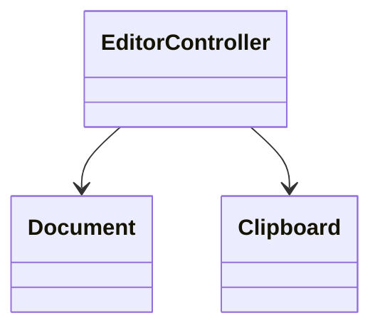
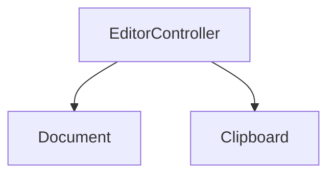
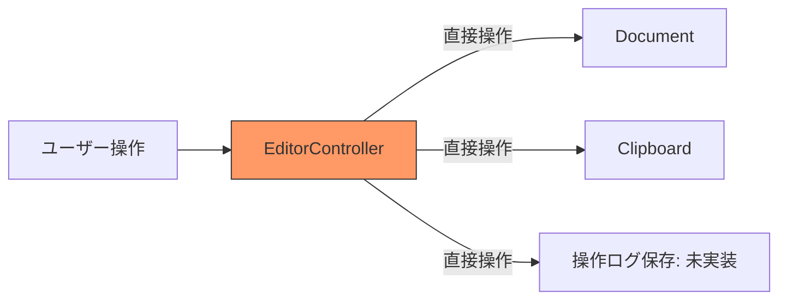
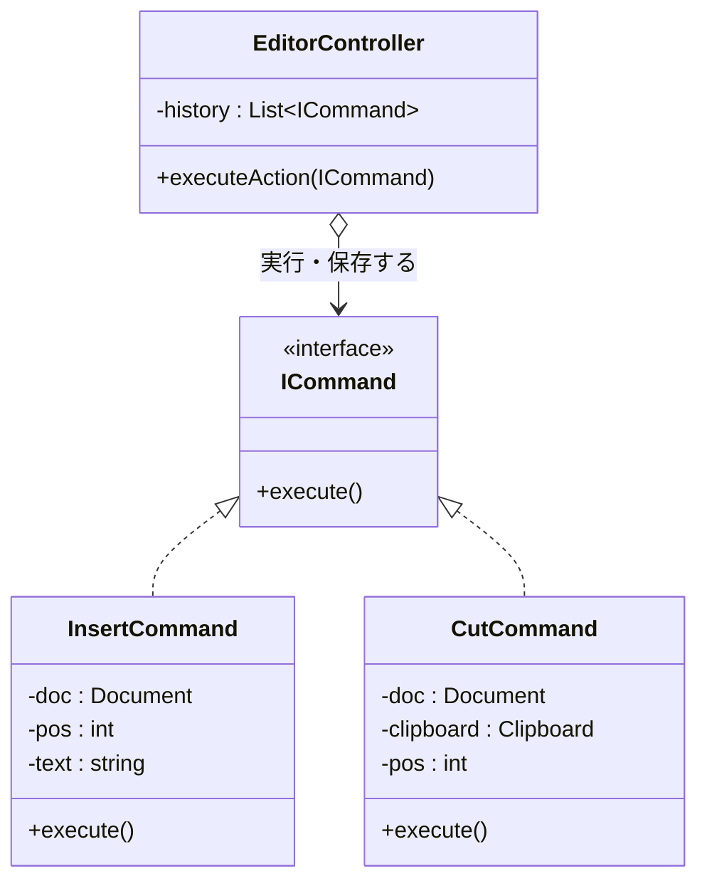
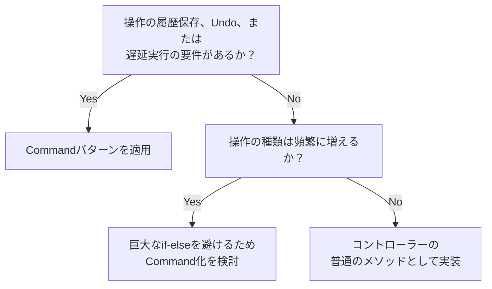
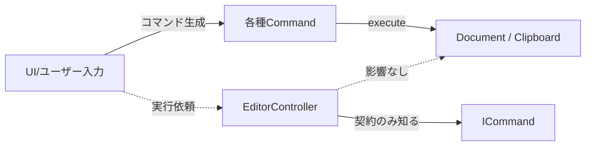
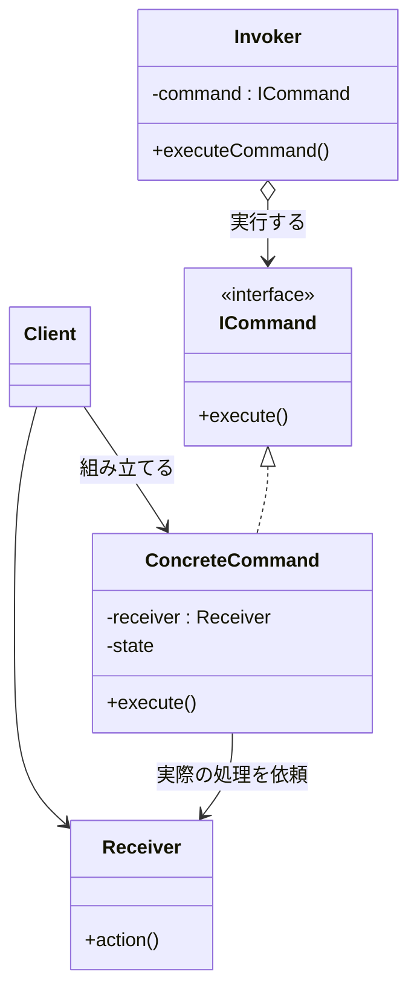

# 第5章　操作の種類が増えるたびにコードが膨らんでいないか ―― 思考の型：変化の混在

> **この章の核心**
> 「実行する操作」そのものをオブジェクトとして扱い、命令の出し手と受け手を切り離す

> [!INFO] レゴブロックで考える：Commandパターン
> この章のパターンは、レゴブロックの**「モノ化する」**操作に対応しています。
> 「操作」をブロック（オブジェクト）にして持ち歩けるようにします。「やること」をデータとして箱に詰めるイメージです。
> コードでも同じように、操作をCommandオブジェクトとして封じ込め、実行・取り消し・履歴管理ができる構造を作ります。

---

## この章を読むと得られること

- 新しい操作（機能）を追加する際に、既存コードの巨大な分岐に手を入れず、安全に拡張できる構造がわかるようになる
- 「いつ実行するか」と「何を実行するか」を分離することで、**処理の実行タイミングと処理の内容を独立して管理できる**ようになる。「いつやるか」に関わる制御（操作履歴の記録・Undo・遅延実行・キュー処理）を、個々の操作の内容を変えずに追加できるようになる
- 肥大化しがちなコントローラークラスから、適切に責任を分散させる判断ができるようになる

---

## ステップ0：システムを把握し、仮説を立てる ―― クラス構成を見てから「変わりそうな場所」を予測する

> **入力：** システムのシナリオ説明 ＋ クラス構成の概要（仕様表・責任一覧）。実装コードはまだ読まない。
> **産物：** 変動と不変の「仮説テーブル」

**全パターンに共通する問い**

> 「このコードの中に、**『変わる理由』が異なる2つのものが、
> 同じ場所に混在していないか？」**

「変わる理由」とは **「誰の判断で変わるか」** のことです。

### 5.0 この章のシステム構成と仮説

**この章で扱うシステム：**
シンプルなテキストエディタの入力制御システムを扱います。ユーザーからのキー入力やメニュー選択を受け取り、ドキュメントに対して「文字の挿入」「コピー」「ペースト」「削除」といった各種操作を実行します。

**仕様表（何ができるシステムか）**

| 機能 | 担当 | 入力 | 出力 |
|---|---|---|---|
| ユーザー操作の受け付け | `EditorController` | コマンド文字列（例: "COPY"） | ドキュメントの更新・画面描画 |
| テキストの保持と操作 | `Document` | 操作位置と文字列 | 内部バッファの更新 |
| クリップボード管理 | `Clipboard` | コピーされた文字列 | 文字列の保持 |

**クラス構成の概要**



*→ コントローラークラスが、ドキュメントとクリップボードの全てを知り、直接操作している状態です。*

**各クラスの責任一覧**

| 対象 | 責任（1文） | 知るべきこと |
|---|---|---|
| `EditorController` | ユーザーからの入力を解釈し、適切な操作を実行する | 入力と操作の対応関係、各操作の具体的な手順 |
| `Document` | テキストデータを保持し、状態を管理する | 文字列の挿入・削除の方法 |
| `Clipboard` | 一時的なテキストデータを保持する | システムのクリップボードへのアクセス方法 |

---

この構成を踏まえた上で、仮説を立てます。

**変動と不変の仮説（実装コードを読む前に立てる）**

| 分類 | 仮説 | 根拠（クラス構成から読み取れること） |
|---|---|---|
| 🔴 **変動する** | 対応する操作（コマンド）の種類 | エディタのバージョンアップで「検索」「置換」など機能は増え続けるため |
| 🟢 **不変** | 入力イベントを受け取る仕組み | アプリケーションの基盤部分であり、操作が増えてもイベント受信の仕組み自体は変わらないため |

この仮説をステップ2（5.3）でヒアリング後に確定します。

---

## ステップ1：実装コードを読む ―― 責任チェックで問題の行を見つける

> **入力：** ステップ0で把握したクラス責任 ＋ 実際の実装コード
> **産物：** 責任チェック表。「このクラスが持つべきでない知識」が混在している行の発見。

### 5.1 実装コードと責任チェック

**要するに「実行する操作（コマンド）」そのものをクラスとして切り出し、呼び出し元をシンプルにするパターン。**

ステップ0でクラスの責任は把握しました。ここでは実際の実装コードを読み、「責任通りに書かれているか」を1行ずつ確認します。

**依存の広がり（実装前の全体像）**



*→ 操作の種類が増えるたびに、`EditorController` が知らなければならない知識（依存先と手順）が雪だるま式に増えていきます。*

以下のコードは、キーボードやUIからの入力を受け取って実行するコントローラー部分です。

```cpp
// 起点コード：UIからの入力を処理するコントローラー
#include <iostream>
#include <string>

class Document {
    std::string text_;
    int selStart_ = 0;
    int selLen_   = 0;
public:
    void insert(int pos, const std::string& str) {
        text_.insert(pos, str);
        std::cout << "Document: \"" << text_ << "\"\n";
    }
    void remove(int pos, int len) {
        text_.erase(pos, len);
        std::cout << "Document: \"" << text_ << "\"\n";
    }
    void setSelection(int start, int len) { selStart_ = start; selLen_ = len; }
    std::string getSelection() const { return text_.substr(selStart_, selLen_); }
};

class Clipboard {
    std::string content_;
public:
    void set(const std::string& text) {
        content_ = text;
        std::cout << "Clipboard: \"" << content_ << "\"\n";
    }
    std::string get() const { return content_; }
};

class EditorController {
private:
    Document doc;
    Clipboard clipboard;

public:
    void executeAction(const std::string& actionName, int cursorPosition, const std::string& input = "") {
        // 全ての操作手順をコントローラーが知ってしまっている
        if (actionName == "INSERT") {
            doc.insert(cursorPosition, input);
        } 
        else if (actionName == "DELETE") {
            doc.remove(cursorPosition, 1); // ← 知らなくていい
        }
        else if (actionName == "COPY") {
            std::string selected = doc.getSelection(); // ← 知らなくていい
            clipboard.set(selected);                   // ← 知らなくていい
        }
        else if (actionName == "PASTE") {
            std::string text = clipboard.get();        // ← 知らなくていい
            doc.insert(cursorPosition, text);          // ← 知らなくていい
        }
        else if (actionName == "CUT") {
            std::string selected = doc.getSelection(); // ← 知らなくていい
            clipboard.set(selected);                   // ← 知らなくていい
            doc.remove(cursorPosition, selected.length()); // ← 知らなくていい
        }
        else {
            std::cout << "Unknown action\n";
        }
    }
};

int main() {
    EditorController editor;
    std::cout << "--- Executing Actions ---\n";
    editor.executeAction("INSERT", 0, "Hello");
    editor.executeAction("COPY", 0);
    editor.executeAction("PASTE", 5);
    return 0;
}
```

**実行結果：**
```
--- Executing Actions ---
Document: Inserted 'Hello' at 0
Clipboard: Saved 'selected_text'
Document: Inserted 'pasted_text' at 5
```

コードは正しく動き、意図した通りの処理が行われています。しかし、問題はその構造にあります。

**責任チェック：`EditorController` は自分の責任だけを持っているか**

`EditorController` の責任は「ユーザーからの入力を解釈し、適切な操作を実行する」ことです。入力の窓口になること自体は正しいのですが、中身を詳しく見てみましょう。

| コードの行 | 持っている知識 | 責任内か |
|---|---|---|
| `if (actionName == "INSERT") {` | どんな名前の操作が存在するか | ✅ （入力の解釈としては妥当） |
| `std::string selected = doc.getSelection();` | COPYを行う際、まず選択範囲を取得するという**内部手順** | **✗ 「コピー操作」自身の責任** |
| `clipboard.set(selected);` | コピー時にはクリップボードクラスを呼び出すという**連携の知識** | **✗ 「コピー操作」自身の責任** |
| `doc.remove(cursorPosition, selected.length());` | CUTの際、クリップボードに保存した後で文字を消すという**実行順序** | **✗ 「カット操作」自身の責任** |

`EditorController` クラスの中に、「入力を受け付ける処理」と「各操作がどう動くべきかという具体的な手順」が**混在**しています。
これでは、新しい操作（例えば「すべて選択」「文字の装飾」など）が追加されるたびに、この巨大な `if-else` ブロックに新しい手順を書き足し続けなければなりません。

---


## ステップ2：仮説を確定する ―― 関係者ヒアリングで「変わる理由」に根拠をつける

> **入力：** ステップ0の仮説 × ステップ1の責任チェック結果。関係者に直接確認する。
> **産物：** 確定した変動/不変テーブル（「誰の判断で変わるか」明記）

### 5.2 仮説の検証と変動/不変の確定

ステップ0で「操作の種類は増え続けるだろう」という仮説を立てました。しかし、単に「増える」だけなら、巨大な `if-else` を書き続けるだけでも（苦しいですが）動かすことはできます。

設計を根本から変えるべき「本当の理由」を探るため、プロダクトオーナー（PO）と将来の展望について話をしてみました。

---

**関係者ヒアリング**

> **開発者**：「現在、『コピー』『ペースト』などの機能を実装していますが、今後どのような機能追加を予定していますか？」
>
> **PO**：「まずは基本的な編集機能ですね。近いうちに『フォント変更』や『箇条書き』などの書式設定も追加したいです。あ、それから**ユーザーから一番強く要望されているのが『元に戻す（Undo）』機能**なんです」
>
> **開発者**：「Undoですか。それは、直前の操作を取り消して元の状態に戻すということですよね」
>
> **PO**：「そうです。それとセットで『やり直し（Redo）』も。さらに将来的な構想ですが、複数の操作を組み合わせて自動実行する『マクロ』のような機能も持たせたいと考えています」
>
> **開発者**：「なるほど……。単に機能が増えるだけでなく、『いつ、どの順番で、どの操作を実行したか』という**履歴の管理**が必要になる、ということですね」

---

このヒアリングで、重要なことが分かりました。
「何を実行するか（操作の内容）」だけでなく、「いつ実行したかを記録し、後から取り消せるようにする」という**実行制御の高度化**が求められているのです。

**確定した変動と不変**

| 分類 | 具体的な内容 | 変わるタイミング | 根拠 |
|---|---|---|---|
| 🔴 **変動する** | 個々の操作（Command）の具体的な中身 | 新しい機能（マクロや書式設定）が追加される時 | POとの機能拡張ロードマップの合意 |
| 🟢 **不変** | 「操作を実行する」という共通の枠組み | 操作の種類が増えても、実行のトリガーは変わらない | 履歴管理やUndoの仕組みを導入するための前提 |

> **設計の決断**：🟢 不変な「実行する」というインターフェースを固定し、
> 🔴 各操作の具体的な手順はその裏側に隠す。さらに、操作そのものを「履歴」として保存可能なオブジェクトにする。

---

## ステップ3：課題分析 ―― 変更が来たとき、どこが辛いかを確認する

今の「巨大な `if-else`」を抱えたコードに、新機能を追加しようとすると何が起きるでしょうか。実際に「カット（CUT）」機能を追加し、さらに「Undo」の足がかりを作ろうとした現場の混乱を見てみましょう。

### 5.3 痛みのシナリオ：コピー＆ペーストが招く「1文字の悲劇」

開発者のAさんは、急ぎで「CUT」機能を実装することになりました。
「CUTは、COPYして、その後にDELETEするだけだ。今のコードをコピーして組み合わせればすぐ終わる」と考え、`EditorController` に以下のコードを書き足しました。

```cpp
// 現場で起きた、悲劇の「コピペ実装」
else if (actionName == "CUT") {
    // COPYのコードをコピペ
    std::string selected = doc.getSelection();
    clipboard.set(selected);
    // DELETEのコードをコピペ
    doc.remove(cursorPosition, 1); // ← selected.length()分消すのが正しいが「1」のまま
}
```

**現場の混乱：**
1.  **修正漏れの連鎖**：Aさんは `DELETE` のコード（1文字消す）をそのままコピペしてしまいました。本来、CUTは「選択範囲の長さ分」を消す必要がありますが、テストで1文字しか消えないバグが発生。
2.  **巨大化する「神」クラス**：`EditorController.cpp` は既に1000行を超え、誰も全体を把握できなくなっています。一つの `else if` を追加するだけで、既存の `INSERT` や `PASTE` に影響が出ないかビクビクしながら作業する羽目に。
3.  **Undoの実装不能**：POから「Undoを付けて」と言われましたが、今のコードでは「どの `if` 文を通って、どの変数がどう変わったか」を遡る術がありません。

**依存の広がり**



*→ 全ての「やり方」を知っている `EditorController` がボトルネックとなり、新しい概念（Undoや履歴）を差し込む隙間が全くありません。*

---

## ステップ4：原因分析 ―― 困難の根本にある設計の問題を言語化する

なぜこれほどまでに「たった一つの機能追加」が苦しいのでしょうか。

| 観察 | 原因の方向 |
|---|---|
| `EditorController` が `Document` と `Clipboard` の詳細な使い方を知りすぎている | 呼び出し側が、呼び出される側の手順（How）に依存している |
| 操作を増やすたびに `if-else` が伸び続け、他の操作のコードを壊すリスクがある | 変わる理由が異なる複数の操作が、一つの場所に混在している |
| 「操作」がただのコードブロックであり、データとして扱えない | 振る舞いが「モノ（オブジェクト）」として独立していない |

#### 変わるものと変わらないものが同じ場所にいる

| 変わり続けるもの | 変わってほしくないもの |
|---|---|
| 個別の操作（INSERT, COPY, CUT...）の実行手順 | 「ユーザーが何かを命じた」という事実と、その実行のタイミング |

この「命じられたこと」を、単なるコードの流れとしてではなく、一つの**「命令（Command）」という独立した部品**として切り出す必要があります。

---


## ステップ5：対策案の検討 ―― 原因から手札を選ぶ

第0章の手札選択表を引くと：

| 原因 | 4分類 | 手札候補 |
|---|---|---|
| 操作の実行内容と実行タイミングが同居している | 1.分ける（クラス分割） | クラス分割（操作をメソッドとして切り出す） |
| 要求の発生と実行のタイミングがずれる | 4.モノ化する | 振る舞いのデータ化 |

候補が2つあります。どちらが今回の原因により直接対処できるか、別々に試します（ケース③）。

### 5.4 手段①：クラス分割（操作をメソッドとして切り出す）

「巨大な `if-else` の中身がごちゃごちゃしているのが問題なら、それぞれの操作をコントローラーのメソッドとして切り出せばいいのでは？」

手札「クラス分割」を適用してみます。

---

```cpp
class EditorController {
private:
    Document doc;
    Clipboard clipboard;

    // 操作ごとにメソッドを切り出す
    void doInsert(int pos, const std::string& input) {
        doc.insert(pos, input);
    }
    void doCopy() {
        std::string selected = doc.getSelection();
        clipboard.set(selected);
    }
    void doPaste(int pos) {
        std::string text = clipboard.get();
        doc.insert(pos, text);
    }
    void doCut(int pos) {
        std::string selected = doc.getSelection();
        clipboard.set(selected);
        doc.remove(pos, static_cast<int>(selected.length()));
    }

public:
    void executeAction(const std::string& actionName, int cursorPosition, const std::string& input = "") {
        if (actionName == "INSERT") {
            doInsert(cursorPosition, input);
        }
        else if (actionName == "COPY") {
            doCopy();
        }
        else if (actionName == "PASTE") {
            doPaste(cursorPosition);
        }
        else if (actionName == "CUT") {
            doCut(cursorPosition);
        }
    }
};
```

**手段①（メソッド切り出し）の責任チェック**

コードの見通しは少し良くなりました。しかし、責任の所在はどうでしょうか。

| コードの行 | 持っている知識 | 責任内か |
|---|---|---|
| `void doCut(int pos)` | CUTを実現するための内部手順と依存先 | **✗ 本来は「カット操作」の責任** |
| `else if (actionName == "CUT")` | 全ての操作の分岐条件を網羅する知識 | **✗ 操作が増えるたびにこのクラスが変わる** |

**このアプローチの限界：履歴の保存（Undo）を想定すると破綻する**

見かけ上は整理されましたが、「全てのやり方を `EditorController` が知っている」という根本的な問題は解決していません。
さらに致命的なのは、POから要望があった「Undo（元に戻す）」を実装しようとした時です。

Undoを実現するには、「最後に実行した操作は何か」「その時のカーソル位置はどこか」「どんな文字を入力したか」という**状態を保存**しておく必要があります。
メソッド呼び出しは「実行したら終わり」です。状態を残すためには、`EditorController` 自身が `lastActionName`、`lastPosition`、`lastInputText` のような変数を大量に抱え込み、各メソッドの中でこまめに記録するしかありません。これではコードがさらに複雑に絡み合ってしまいます。

---

### 5.5 手段②：振る舞いのデータ化（操作を「モノ（オブジェクト）」として独立させる）

単なる「処理の流れ（メソッド）」ではなく、処理そのものを「状態を持ったモノ（オブジェクト）」として切り出すことはできないでしょうか。
そうすれば、操作を履歴としてリストに保存することも容易になるはずです。

ここで、すべての操作を共通のインターフェースで扱うための「契約」を考えます。
しかし、どんなメソッドを定義すればいいのか、少し葛藤が生まれます。

**葛藤：共通のインターフェースにはどんな引数が必要か？**

「操作を実行するインターフェース `ICommand` を作ろう。実行するメソッド名は `execute()` でいい。でも、引数はどうしよう？」

- `INSERT` には、カーソル位置(`int`)と入力文字(`string`)が必要だ。
- `COPY` には、カーソル位置(`int`)だけが必要だ。文字は不要。
- `PASTE` には、カーソル位置(`int`)だけが必要だが、内部でクリップボードから文字を取り出す。

全ての操作で必要な情報がバラバラです。
`virtual void execute(int pos, const std::string& text)` のように「全部入りの引数」を持たせると、使わない引数にダミーの値を渡すことになり、契約として不自然です。

**設計の飛躍：引数をなくす（カプセル化する）**

この問題は、**「実行に必要な情報は、生成時（コンストラクタ）に全部渡してしまえばいい」**と発想を転換することで解決します。
実行する人（コントローラー）は、操作の中身も必要な引数も知らなくていい。ただ「実行しろ」とだけ言えればいいのです。

```cpp
// 変わらない「実行する」という契約
class ICommand {
public:
    virtual ~ICommand() = default;
    virtual void execute() = 0; // ← 引数が一切ないのがポイント
};

// 変わる具体的な操作（例：INSERT）
class InsertCommand : public ICommand {
private:
    Document& doc_; // ← 操作対象
    int pos_;       // ← 実行に必要な状態を抱え込む
    std::string text_;

public:
    // コンストラクタで必要な情報をすべて受け取る
    InsertCommand(Document& doc, int pos, const std::string& text) 
        : doc_(doc), pos_(pos), text_(text) {}

    void execute() override {
        doc_.insert(pos_, text_);
    }
};

// 変わる具体的な操作（例：CUT）
class CutCommand : public ICommand {
private:
    Document& doc_;
    Clipboard& clipboard_;
    int pos_;

public:
    CutCommand(Document& doc, Clipboard& clipboard, int pos) 
        : doc_(doc), clipboard_(clipboard), pos_(pos) {}

    void execute() override {
        std::string selected = doc_.getSelection();
        clipboard_.set(selected);
        doc_.remove(pos_, selected.length());
    }
};
```



**要するに「実行する操作」をオブジェクトとしてカプセル化し、呼び出し側から切り離すパターン。**
これが **Commandパターン** です。

---

## ステップ6：天秤にかける ―― 柔軟性とシンプルさのバランスを評価する

### 5.6 評価軸の宣言

手段①と手段②を、今回の原因への対処力で比較します。比較の前に評価軸を明示します。

| 評価軸 | なぜこの状況で重要か |
|---|---|
| 操作のオブジェクト化 | 操作を「履歴」として保持し、後からUndoできるようにするため |
| 拡張性（変更の局所化） | 新しい操作が追加された時、巨大な `if-else` を触らなくて済むようにするため |

---

### 5.7 各アプローチをテストで比較する

コントローラーが「どう動くか」をテストで比較してみましょう。

```cpp
// 手段①（メソッド切り出し）の場合
void testEditorController() {
    EditorController editor;
    // コントローラーが「名前」と「引数」を受け取り、内部で自分で組み立てて実行する
    editor.executeAction("INSERT", 0, "Hello");
    // 履歴は残っていない
}
```

```cpp
// 採用した手札（振る舞いのデータ化）のテストコード
// インターフェースを使うことで、コントローラーは「コマンドを実行するだけ」のシンプルな存在になる
class EditorControllerV2 {
private:
    std::vector<ICommand*> history_; // 操作を「モノ」として保存できる！

public:
    // 引数は ICommand ひとつだけ。中身がINSERTかCUTかは知らなくていい
    void executeAction(ICommand* command) {
        command->execute();
        history_.push_back(command); // 実行した事実を履歴に積む
    }
};

void testCommandPattern() {
    Document doc;
    EditorControllerV2 editor;
    
    // 操作の組み立ては、実行する前に済ませておく
    InsertCommand cmd(doc, 0, "Hello"); // 操作をオブジェクトとして用意する
    
    // コントローラーは「実行して記録する」だけ
    editor.executeAction(&cmd);
}
```

**比較のまとめ**

| 基準 | 手段①（メソッド切り出し） | 手段②（振る舞いのデータ化） |
|---|---|---|
| 操作のオブジェクト化 | メソッドなので保存できない | クラスなので履歴に保存できる |
| 拡張性 | 操作追加のたびにコントローラー修正 | コントローラーは無傷（修正不要） |

引数をなくし、操作をオブジェクトとしてカプセル化したことで、「いつ実行するか（コントローラー）」と「何を実行するか（コマンド）」が見事に分離されました。

### 5.8 耐久テスト ―― ヒアリングで挙がった変化が来た

関係者ヒアリング（5.2）でPOが強く要望していた「Undo（元に戻す）」機能と、さらにシステムの安定性を高めるための「リトライ処理」を追加するシナリオで、この設計の堅牢性をテストしてみます。

操作が `ICommand` というオブジェクトとして独立しているため、コントローラーは「コマンドの中身を知らないまま」高度な制御を追加できます。

```cpp
// 耐久テスト：Undoとリトライ処理の追加
class EditorControllerV2 {
private:
    std::vector<ICommand*> history_;

public:
    // 変化1：リトライ処理の追加
    // ネットワーク越しにドキュメントを保存するような操作でも、
    // コントローラーは「ただ3回やり直す」という制御だけを書けば済みます。
    void executeWithRetry(ICommand* command) {
        int retries = 3;
        while (retries > 0) {
            try {
                command->execute(); // ← 中身がINSERTかCUTか知らなくていい
                history_.push_back(command);
                return;
            } catch (const std::exception& e) {
                retries--;
                std::cout << "実行失敗。リトライします... 残り: " << retries << "\n";
            }
        }
        std::cout << "操作は失敗しました。\n";
    }

    // 変化2：Undo（元に戻す）の追加
    // （※ICommandに virtual void undo() = 0; を追加した前提）
    void undoLastAction() {
        if (!history_.empty()) {
            ICommand* lastCmd = history_.back();
            lastCmd->undo(); // ← 過去の自分がどうやって元に戻すか知っている
            history_.pop_back();
        }
    }
};
```

このように、「いつ実行するか（または、どうやり直すか）」の責任を持つコントローラーと、「何を実行するか」の責任を持つコマンドが完全に分離されているため、**既存のすべての操作（INSERTやCUTなど）に1行も触れることなく、全機能に一括でリトライやUndoの恩恵を与えることができます。**

---

### 5.9 使う場面・使わない場面

とはいえ、全ての処理をわざわざクラスに切り出すのはコストがかかります。

```cpp
// 【過剰コード】変化の予定や履歴管理の必要がないのにパターン化した例
class PrintHelpCommand : public ICommand {
public:
    void execute() override {
        std::cout << "ヘルプ：この画面は...\n";
    }
};
// 履歴に残す必要もなく、ただ1回実行して終わるだけの処理なら
// controller.showHelp() のような普通のメソッド呼び出しで十分です。
```

| 状況 | 適切な選択 | 理由 |
|---|---|---|
| 操作の「履歴」を取り、Undoやマクロ実行をしたい | Command | 操作を状態を持ったオブジェクトとして保存する必要があるため |
| 操作の実行タイミングを遅延させたり、キューに入れたりしたい | Command | 「実行しろ」という命令自体を持ち運ぶ必要があるため |
| 単純な画面遷移や、一度実行すれば終わりの処理 | 使わない | オブジェクトとして独立させる（クラスを増やす）コストに見合わないため |

**適用判断フロー**



操作をオブジェクトにするという強力な武器も、必要のない場面で振り回せばただコードを細切れにするだけになってしまいます。「履歴」や「実行制御の分離」という明確な動機があるときに選ぶのがよいかもしれません。

---

## ステップ7：決断と、手に入れた未来

### 5.10 解決後のコード（全体）

機能の組み立てと実行を分けた最終形です。

```cpp
#include <iostream>
#include <string>
#include <vector>
#include <memory>

// --- 対象となるシステム（Receiver） ---
class Document {
    std::string text_;
    int selStart_ = 0;
    int selLen_   = 0;
public:
    void insert(int pos, const std::string& str) {
        text_.insert(pos, str);
        std::cout << "Doc: \"" << text_ << "\"\n";
    }
    void remove(int pos, int len) {
        text_.erase(pos, len);
        std::cout << "Doc: \"" << text_ << "\"\n";
    }
    void setSelection(int start, int len) { selStart_ = start; selLen_ = len; }
    std::string getSelection() const { return text_.substr(selStart_, selLen_); }
};

class Clipboard {
    std::string content_;
public:
    void set(const std::string& text) {
        content_ = text;
        std::cout << "Clipboard: \"" << content_ << "\"\n";
    }
    std::string get() const { return content_; }
};

// --- 契約（Command） ---
class ICommand {
public:
    virtual ~ICommand() = default;
    virtual void execute() = 0;
};

// --- 具体的な操作 ---
class InsertCommand : public ICommand {
    Document& doc_;
    int pos_;
    std::string text_;
public:
    InsertCommand(Document& doc, int pos, const std::string& text)
        : doc_(doc), pos_(pos), text_(text) {}
    void execute() override { doc_.insert(pos_, text_); }
};

class CopyCommand : public ICommand {
    Document&  doc_;
    Clipboard& clipboard_;
public:
    CopyCommand(Document& doc, Clipboard& clipboard)
        : doc_(doc), clipboard_(clipboard) {}
    void execute() override {
        clipboard_.set(doc_.getSelection());
    }
};

class PasteCommand : public ICommand {
    Document&  doc_;
    Clipboard& clipboard_;
    int pos_;
public:
    PasteCommand(Document& doc, Clipboard& clipboard, int pos)
        : doc_(doc), clipboard_(clipboard), pos_(pos) {}
    void execute() override {
        doc_.insert(pos_, clipboard_.get());
    }
};

class CutCommand : public ICommand {
    Document&  doc_;
    Clipboard& clipboard_;
    int pos_;
public:
    CutCommand(Document& doc, Clipboard& clipboard, int pos)
        : doc_(doc), clipboard_(clipboard), pos_(pos) {}
    void execute() override {
        std::string selected = doc_.getSelection();
        clipboard_.set(selected);
        doc_.remove(pos_, static_cast<int>(selected.length()));
    }
};

// --- コントローラー（Invoker） ---
class EditorController {
    std::vector<ICommand*> history_;
public:
    void executeAction(ICommand* command) {
        command->execute();
        history_.push_back(command);
    }
};

// --- アプリケーションの組み立てと起動（Composition Root） ---
class EditorApplication {
public:
    void run() {
        Document  doc;
        Clipboard clipboard;
        EditorController controller;

        std::cout << "--- User Input Simulated ---\n";

        // 「Hello」を挿入 → "Hello"
        InsertCommand insert(doc, 0, "Hello");
        controller.executeAction(&insert);

        // 先頭3文字を選択してコピー → clipboard: "Hel"
        doc.setSelection(0, 3);
        CopyCommand copy(doc, clipboard);
        controller.executeAction(&copy);

        // 末尾にペースト → "HelloHel"
        PasteCommand paste(doc, clipboard, 5);
        controller.executeAction(&paste);

        // 先頭2文字を選択してカット → clipboard: "He"、doc: "lloHel"
        doc.setSelection(0, 2);
        CutCommand cut(doc, clipboard, 0);
        controller.executeAction(&cut);
    }
};

int main() {
    EditorApplication app;
    app.run();
    return 0;
}
```

**実行結果：**
```
--- User Input Simulated ---
Doc: "Hello"
Clipboard: "Hel"
Doc: "HelloHel"
Clipboard: "He"
Doc: "lloHel"
```

---

### 5.11 変更影響グラフ（改善後）



*→ コントローラーは `ICommand` しか知らないため、操作の種類が増えてもコントローラー自体は変更されず、影響が個別のCommandクラス内に局所化されました。*

---

### 5.12 変更シナリオ表と最終責任テーブル

**変更シナリオ表：何が変わったとき、どこが変わるか**

| シナリオ | 変わるクラス | 変わらないクラス |
|---|---|---|
| 「置換(Replace)」操作の新規追加 | `ReplaceCommand` (新規作成) | `EditorController`, `Document`, 他の全Command |
| 全ての操作にリトライ処理を追加 | `EditorController` | 全てのCommand, `Document` |
| Undo（元に戻す）機能の実装 | `ICommand`(規約追加), 全てのCommand, `EditorController` | `Document`, `Clipboard` |
| `Document` の内部データ構造を変更 | `Document`, それを直接操作する各Command | `EditorController` |

**最終責任テーブル**

| クラス | 責任（1文） | 変わる理由 |
|---|---|---|
| `EditorController` | コマンドの実行タイミングを管理し、履歴を保持する | 実行制御（Undoやリトライの仕組み）が変わる時 |
| `InsertCommand` など | 特定の操作を実行するための具体的な手順とパラメータを保持する | 該当する操作の仕様（例: 挿入のルール）が変わる時 |
| `Document` | テキストデータを保持し、状態を管理する | データ構造やテキスト操作の基本機能が変わる時 |

---

## 整理

### 8ステップとこの章でやったこと

| ステップ | この章でやったこと |
|---|---|
| ステップ0 | 操作の種類が増え続けるという仮説を立てた |
| ステップ1 | 巨大なif-elseの中に、操作の手順という別次元の責任が混入していることを見つけた |
| ステップ2 | ヒアリングにより「操作の履歴（Undo）」という高度な要件を確定させた |
| ステップ3 | コピペ実装によって他機能が破壊される現場の痛みを言語化した |
| ステップ4 | 「いつ実行するか」と「何を実行するか」が混在していることを原因と特定した |
| ステップ5 | 引数をコンストラクタに隠蔽し、操作をオブジェクト（Command）として独立させた |
| ステップ6 | Undoやリトライの実装を通じて、実行制御が分離されたことの強さを確認した |
| ステップ7 | コントローラーが「契約」だけを知ることで、変更が局所化されたことを実証した |

このプロセスを回した結果にたどり着いた構造こそが **Commandパターン** です。

---

## 振り返り：第0章の3つの哲学はどう適用されたか

### 哲学1「変わるものをカプセル化せよ」の現れ

**具体化された場所：** `InsertCommand` や `CutCommand` の内部

今回「変わるもの」とは、ユーザーが実行したい「個別の操作の手順と、それに必要なパラメータ（カーソル位置や文字など）」でした。
これを `EditorController` の巨大なメソッドの中に晒したままにするのではなく、各コマンドクラスの「コンストラクタ」と「`execute()` メソッドの中」に完全にカプセル化しました。これにより、外部からは「ただ実行できる何か」にしか見えなくなりました。

### 哲学2「実装ではなくインターフェースに対してプログラムせよ」の現れ

**具体化された場所：** `EditorController` の `executeAction()` メソッド

コントローラーの引数は `ICommand*` というインターフェース型一つだけです。
「自分が今、文字を挿入しているのか、カットしているのか」という具体的な実装を一切知らず、ただ「契約（`execute()`）」に対してのみ命令を出しています。この無知さこそが、後からリトライ処理や履歴管理を安全に追加できた最大の理由です。

### 哲学3「継承よりコンポジションを優先せよ」の現れ

**具体化された場所：** `EditorController` が持つ `history_` リスト

もし「Undoができるコントローラー」「マクロができるコントローラー」を継承によって作ろうとすれば、クラスの階層はすぐに複雑になります。
ここでは、コントローラーが複数のコマンドを「部品として保持（コンポジション）」することで、実行時に動的に履歴を積み上げたり、取り出したりする柔軟な振る舞いを実現しています。振る舞いを「オブジェクトの集まり」として表現する美しい例と言えるでしょう。

---

## パターン解説：Commandパターン

### パターンの骨格

要求（コマンド）をオブジェクトとしてカプセル化することにより、異なる要求、キュー、またはログ（履歴）を使ってクライアントをパラメータ化できるようにする構造です。また、取り消し（Undo）可能な操作をサポートします。



**章固有のマッピング**
- `Invoker`（呼び出し元） → `EditorController`
- `ICommand`（契約） → `ICommand`
- `ConcreteCommand`（具体的な操作） → `InsertCommand`, `CutCommand`
- `Receiver`（実際の処理を行う対象） → `Document`, `Clipboard`

**使いどころと限界**
GUIのボタン操作、トランザクションの記録、マクロ機能、非同期でのタスク実行（ジョブキュー）など、「処理そのもの」を持ち運んだり記録したりする必要がある場面で絶大な威力を発揮します。
一方で、非常に単純な操作に対してまで全てクラスを作成していくと、システム内に「1つのメソッドしか持たない小さなクラス（ConcreteCommand）」が大量に発生し、ファイル数が爆発的に増えるというコストも伴います。「履歴が必要か」「動的に操作を組み替えるか」が、導入を決める重要な分水嶺となります。