## 第5章 操作をオブジェクトにする ―― Command パターン

―― 思考の型：「操作（アクション）」と「それを実行するロジック」が混在している

### この章の核心

**UIボタンが実行先のクラス名・メソッド・引数まで直接知っていると、Undoや履歴のような操作管理を足すたびに呼び出し元まで書き直す必要が生じる。こういう問題は、「操作を依頼する側」と「操作の実行内容」が同じ場所に混在しているシステムで起きている。**

### この章を読むと得られること

この章の痛みは「やった操作を取り消したい」「操作の履歴を残したい」という要求が来たとき、呼び出し元が処理の詳細を直接知っているために実現できない、という問題です。

* **得られること1：** 「操作の種類」という観点で、ユーザーの指示と処理の実行箇所を識別できるようになる


* **得られること2：** 呼び出し元が個別の処理を直接知っている状態を「依存の過多」と判断できるようになる


* **得られること3：** 操作をオブジェクトに包むことで、操作の履歴保持や取り消しを構造から説明できるようになる


* **得られること4：** 操作を「いつ実行するか」や「取り消すか」を判断する際の、柔軟な設計手法がわかるようになる

## 🔵 フェーズ1：現状把握 ―― 仕様を整理し、システムと紐付ける
この章では、家計簿アプリにおける操作履歴管理を扱います。

家計簿アプリが何を入力として受け取り、どの処理で加工し、何を出力するのかを整理します。

### 1-1：このシステムの仕様

このシステムは、利用者が日々の**収入・支出を記録・管理**するアプリです。

#### まず実行結果から動きをつかむ

詳細な仕様やコードへ入る前に、利用者が「食費1000円」の支出を1件登録した結果を見ます。

**代表的な実行結果：**

```
支出を追加しました：食費 1000円
現在残高：-1000円
```

この出力から、①操作（支出登録）と金額を入力し、②検証→記録→残高計算の順に進み、③登録内容と現在残高が表示される、という一連の動きが読み取れます。これを押さえてから、以降の要求・仕様・コードを読み進めます。

**この結果を生む入力（1-4の`main()`から抜粋）：**

```cpp
// カテゴリCAT002（食費）へ 1000円 の支出を登録する
buttons.onAddExpenseClick(1000, "CAT002");
```

同じ入力を含む完全なコードと実行結果は1-4に掲載します。

#### 最初にシステム全体をつかむ

- **入力：** 利用者の支出追加または収入追加、カテゴリID、金額を受け取る。
- **処理：** カテゴリと金額を検証し、成功時だけ収入または支出を記録して、収入合計から支出合計を引いた残高を計算する。
- **出力：** 登録結果と変更後残高を返し、不正入力では残高を変えない。
- **掲載コードでの代替：** 画面のボタン操作は `main()` からのメソッド呼び出し、カテゴリDBはメモリ上の登録表、表示は標準出力で表す。検証と残高計算は実際に行う。収支明細を台帳へ保存する仕組みは1-5の変更要求で加わる範囲で、現状コードにはない。

まずこの一連の動きを押さえ、以降で要求、入力と残高規則、画面と保存の境界、クラス、コードの順に詳細を確認します。

#### 現行要求ベースライン

| 要求ID | 現行要求 | 受入条件 |
|---|---|---|
| 要求ID1 | 登録カテゴリへ1円以上の収入を追加する | 収入記録と更新後残高を返す |
| 要求ID2 | 登録カテゴリへ1円以上の支出を追加する | 支出記録と更新後残高を返し、負残高も許可する |
| 要求ID3 | 未登録・種別不一致カテゴリ、1円未満を拒否する | エラー時に記録件数と残高を変えない |
| 要求ID4 | 操作の増減を積み上げた現在残高を表示する | 操作のたびに変更前→変更後の残高を確認できる |

本章の追跡は**要求IDと変更ID**で行います。変更で各要求IDの内容がどう変わるか——継続・変更・追加——は、1-5「変更後要求ベースライン」の「変更種別・根拠となる変更ID」列で追えます。既存動作が落ちていないかは、フェーズ7の要求ID別回帰で確認します。

ボタン操作で支出・収入を追加でき、現在の残高（収入合計 − 支出合計）がリアルタイムで表示されます。登録されていないカテゴリIDを指定した場合や、金額が1円未満の場合は、エラーとして受け付けず、残高は変わりません。

この章の残高は銀行口座の利用可能額ではなく、登録済み収入合計から支出合計を引いた収支差額です。開始時は0円で、収入を登録する前に支出を登録すれば負の値になります。残高不足で支出を拒否する仕様はなく、負数は「支出超過」を表す正常な集計結果です。

この章で扱う現状仕様は、次の範囲です。

| 仕様項目 | この章で扱う値 | 具体例 | 何に使うか |
|---|---|---|---|
| 操作 | 支出追加・収入追加 | 食費 1,000円を支出追加、給与 200,000円を収入追加 | 押されたボタンに応じて記録を追加する |
| カテゴリID | 登録済みカテゴリ | CAT002 は食費、CAT001 は給与 | 収入または支出として扱えるカテゴリかを確認する |
| 金額 | 1円以上 | 1,000円、200,000円 | 残高計算に反映する |
| 出力 | 更新後残高またはエラー | 残高 -1,000円、カテゴリ未登録エラー | 正常入力と不正入力の結果を照合する |

ここで確認する対象は、どの入力で残高が変わり、どの入力で止まるかです。

**登録済みのカテゴリ**

カテゴリマスターには、次の4件が登録されています。種別が支出登録・収入登録のどちらに使えるかを決め、登録されていないカテゴリIDを指定するとエラーになります。

| カテゴリID | 名称 | 種別 |
|---|---|---|
| CAT001 | 給与 | income（収入） |
| CAT002 | 食費 | expense（支出） |
| CAT003 | 交通費 | expense（支出） |
| CAT004 | 副収入 | income（収入） |

現状コードは収支台帳へ明細を保存せず、`UIButtons` が実行中の整数残高だけを保持します。カテゴリマスターは読取専用で、カテゴリIDから名称・種別を取得するだけです。次の図では、矢印ラベルを「入力」「参照」「返却」「表示」に分け、データを更新するように見える無印の往復矢印を使いません。

**システム全体図：家計管理と参照データの境界**

最も大きな境界は「利用者 → 家計管理システム」です。カテゴリマスターと画面上の残高は対象システムの内側にまとめます。現状コードはカテゴリを参照するだけで、カテゴリ登録や台帳保存は行いません。

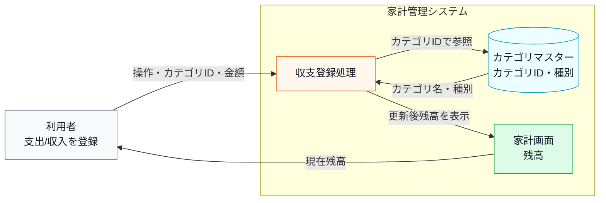
```mermaid
flowchart LR
    U["利用者<br>支出/収入を登録"] -->|"操作・カテゴリID・金額"| B

    subgraph BUDGET["家計管理システム"]
        B["収支登録処理"]
        C[("カテゴリマスター<br>カテゴリID・種別")]
        R["家計画面<br>残高"]
        B -->|"カテゴリIDで参照"| C
        C -->|"カテゴリ名・種別"| B
        B -->|"更新後残高を表示"| R
    end

    R -->|"現在残高"| U

    classDef actor fill:#f8fafc,stroke:#64748b,color:#111827;
    classDef data fill:#ecfeff,stroke:#0891b2,color:#111827;
    classDef process fill:#fff7ed,stroke:#ea580c,color:#111827;
    classDef result fill:#dcfce7,stroke:#16a34a,color:#111827;
    class U actor;
    class C data;
    class B process;
    class R result;
```

上の文章と表で仕様を一通り確認したので、まず正常に登録できる場合の入力・判定・加工・出力の流れとして整理します。

**システム内部図：正常系の入力・判定・加工・出力**

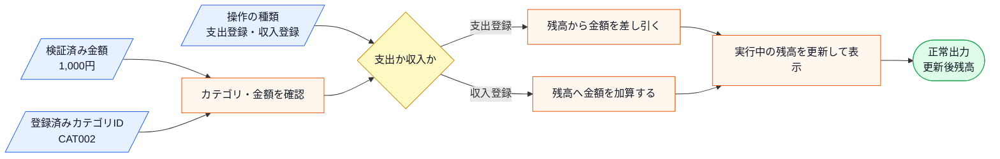
```mermaid
flowchart LR
    A[/操作の種類<br>支出登録・収入登録/]:::input --> F{支出か収入か}:::decision
    C[/検証済み金額<br>1,000円/]:::input --> V[カテゴリ・金額を確認]:::process
    E[/登録済みカテゴリID<br>CAT002/]:::input --> V
    V --> F
    F -->|支出登録| G[残高から金額を差し引く]:::process
    F -->|収入登録| H[残高へ金額を加算する]:::process
    G --> K[実行中の残高を更新して表示]:::process
    H --> K
    K --> L([正常出力<br>更新後残高]):::normal

    classDef input fill:#e7f0ff,stroke:#2563eb,color:#111827;
    classDef process fill:#fff7ed,stroke:#ea580c,color:#111827;
    classDef decision fill:#fef9c3,stroke:#ca8a04,color:#111827;
    classDef normal fill:#dcfce7,stroke:#16a34a,color:#111827;
```

この図から読み取ることは、次の3点です。

- 支出登録と収入登録は「操作の種類」という入力であり、残高から差し引くか、残高へ加算するかという加工の分かれ目になる。
- カテゴリIDの確認と金額の確認を通過した操作だけが、実行中の残高更新へ進む。
- 正常系では、Managerが返した正負の増減値を `UIButtons` の残高へ反映して表示する。

**利用できる操作**

現状の仕様で利用できる操作は、「支出登録」と「収入登録」の2種類です。「業務機能」の列は、どの業務機能に属する知識かを明示するためのものです。UIに表示する操作の追加・削除はプロダクト管理の業務機能によって決まり、その実現方法はシステム開発の業務機能が担う——この2つは変わる理由が異なります。

| 操作 | 処理内容 | 残高への影響 | 業務機能 |
|---|---|---|---|
| 支出登録 | 金額とカテゴリを入力し残高へ負の増減値を反映する | 指定金額だけ減る | UI・表示管理 / プロダクト管理 |
| 収入登録 | 金額とカテゴリを入力し残高へ正の増減値を反映する | 指定金額だけ増える | UI・表示管理 / プロダクト管理 |

現時点で扱う操作は、支出登録と収入登録です。

**エラー条件**

正常系の仕様を一通り確認したうえで、最後に、正常系の登録へ進めない入力を分けて整理します。

| エラー条件 | どこで分かるか | 出力 | 保存・通知などの副作用 |
|---|---|---|---|
| カテゴリIDが登録されていない | カテゴリ確認時 | カテゴリ不存在エラー | 残高変更なし |
| 金額が1円未満 | 金額確認時 | 金額エラー | 残高変更なし |

### 1-2：動作例テーブル

コードを読む前に、変更要求が届く前のシステムがどんな入力に対して
どんな出力を返すかを確認します。

| 操作 | 入力 | 処理内容 | 残高の変化 |
| --- | --- | --- | --- |
| 支出登録 | 1,000円／食費 | 支出の増減値を残高へ反映して表示する | 残高が1,000円減る |
| 収入登録 | 5,000円／給与 | 収入の増減値を残高へ反映して表示する | 残高が5,000円増える |
| 支出登録 | 500円／未登録カテゴリ | カテゴリ不存在エラーを表示する | 変わらない |
| 収入登録 | 0円／給与 | 金額エラーを表示する | 変わらない |

上の2行が1-1の図の正常出力に、下の2行が「カテゴリIDは登録済みか」「金額は1円以上か」の2つの判定で止まる異常出力に対応します。

### 1-3：登場クラスとクラス構成図

現在の操作実行部分に登場するクラスを先に確認します。

| クラス名 | 役割 | 担当する仕様 |
|---|---|---|
| `UIButtons` | 利用者のボタン操作を受け取り、残高表示を更新する | 支出登録・収入登録の起点 |
| `ExpenseManager` | 支出登録を実行する | 支出金額を残高から差し引く |
| `IncomeManager` | 収入登録を実行する | 収入金額を残高へ加算する |
| `Category` | カテゴリ1件分の情報を表す | カテゴリ名・収入/支出種別の受け渡し |
| `CategoryDatabase` | カテゴリマスタを保持する | 収入・支出カテゴリの存在と種別を返す |

各クラスの責任を把握したところで、クラス同士の関係を図で確認します。図中のクラスは必ず利用・所有・実装などの関係へ接続します。もし説明上どうしても線がつながらない場合は、誰が生成・利用するかをnoteで補います。

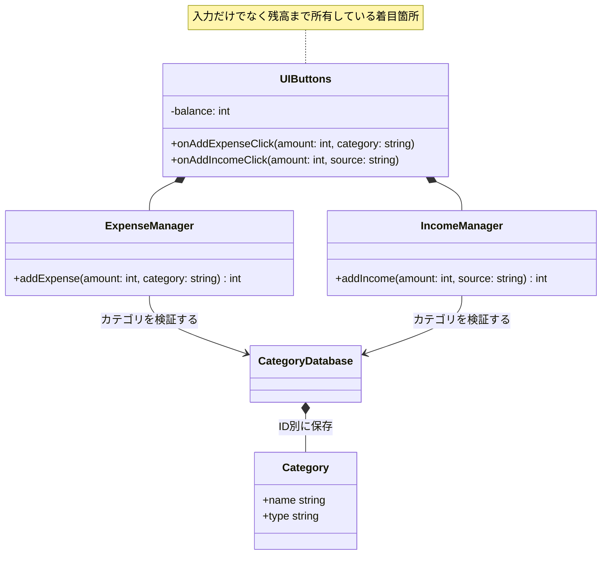
```mermaid
classDiagram
    class Category {
        +name string
        +type string
    }
    class CategoryDatabase
    class UIButtons {
        -balance: int
        +onAddExpenseClick(amount: int, category: string)
        +onAddIncomeClick(amount: int, source: string)
    }
    class ExpenseManager {
        +addExpense(amount: int, category: string) int
    }
    class IncomeManager {
        +addIncome(amount: int, source: string) int
    }
    UIButtons *-- ExpenseManager
    UIButtons *-- IncomeManager
    CategoryDatabase *-- Category : ID別に保存
    ExpenseManager --> CategoryDatabase : カテゴリを検証する
    IncomeManager --> CategoryDatabase : カテゴリを検証する

    note for UIButtons "入力だけでなく残高まで所有している着目箇所"
    classDef focus fill:#FFF2CC,stroke:#D6B656,stroke-width:2px,color:#222222
    cssClass "UIButtons" focus

```

**クラス図に出てくる主なメンバーと操作**

| クラス | メンバー・操作 | 何ができるか |
|---|---|---|
| `UIButtons` | `balance` | 現在の残高を保持する |
| `UIButtons` | `onAddExpenseClick()` | 支出登録ボタンの操作を受け取り、支出処理を呼び出す |
| `UIButtons` | `onAddIncomeClick()` | 収入登録ボタンの操作を受け取り、収入処理を呼び出す |
| `ExpenseManager` | `addExpense()` | 支出金額を残高から差し引いた結果を返す |
| `IncomeManager` | `addIncome()` | 収入金額を残高へ加算した結果を返す |


→ `UIButtons` クラスが `ExpenseManager` と `IncomeManager` を直接知り、ボタン押下時にそれぞれのメソッドを直接呼び出しています。

---

#### 補足：依存グラフ

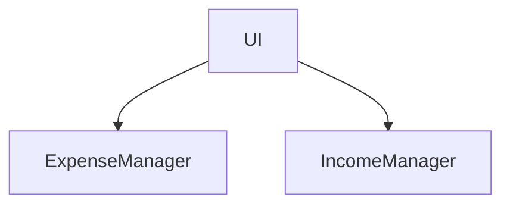
```mermaid
graph TD
    %% ユーザーインターフェースから各マネージャへ依存が向いています
    UI --> EM["ExpenseManager"]
    UI --> IM["IncomeManager"]

```

→ `UIButtons` クラス（UI）に、操作を実行する各マネージャクラスへの依存が集中していることが分かります。

**現状システムの処理シーケンス**

静的な関係に続けて、正常系（支出登録1件）で各クラスがどの順に呼ばれ何を受け渡すかを時系列で示します。操作ごとの具体の分岐は `UIButtons` の注記に、エラー系はメモとして添えます。現状では支出・収入の登録だけを扱います。1-4の現状コードを読む前の地図です。

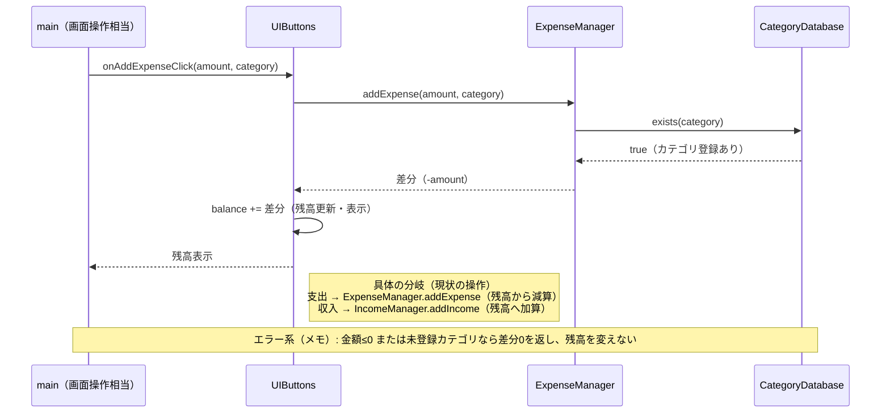
```mermaid
sequenceDiagram
    participant Main as main（画面操作相当）
    participant UI as UIButtons
    participant EM as ExpenseManager
    participant DB as CategoryDatabase
    Main->>UI: onAddExpenseClick(amount, category)
    UI->>EM: addExpense(amount, category)
    EM->>DB: exists(category)
    DB-->>EM: true（カテゴリ登録あり）
    EM-->>UI: 差分（-amount）
    UI->>UI: balance += 差分（残高更新・表示）
    UI-->>Main: 残高表示
    Note right of UI: 具体の分岐（現状の操作）<br>支出 → ExpenseManager.addExpense（残高から減算）<br>収入 → IncomeManager.addIncome（残高へ加算）
    Note over Main,DB: エラー系（メモ）: 金額≤0 または未登録カテゴリなら差分0を返し、残高を変えない
```

図から読み取れるのは、`UIButtons` がボタン操作を受けて対応するManagerを直接呼び、返ってきた差分で自分が持つ `balance` を更新していること、支出か収入かで呼ぶManagerが分かれること、無効な入力はメモのとおり残高を変えずに終わることです。この「UIが具体Managerと残高を直接握る」呼び出し順を、この時系列で確認できます。


**この章での簡略化**

1-3でクラス構成を確認したので、掲載コードで何を代替しているかを整理してからフェーズ1の現状コードへ進みます。

現状コードでは、画面操作を `main()` から `UIButtons` のメソッドを呼ぶ形で表し、`UIButtons` が残高をメモリ上に保持します。`ExpenseManager` / `IncomeManager` は保存処理そのものではなく、検証済みの増減値を返し、表示も `std::cout` で直接代替します。収支レコードの保存や操作履歴の仕組みは、現状コードにはありません。

---

### 1-4：実装コード（現状）

#### コードを読む前に：クラスの責任と境界

| 対象 | 呼び出しと内部処理 | 戻り値・副作用 | 掲載上の表現 |
|---|---|---|---|
| 各Manager | UIから金額・カテゴリIDを受けて検証する | 残高へ加える正負の値 | 現状は収支レコードを保存せず増減値を返す |
| `UIButtons` | ボタン操作を対応Managerへ渡す | 残高更新・画面表示 | 画面イベントをメソッド呼び出しで代替 |
| `CategoryDatabase` | カテゴリIDで名称・種別を検索する | `Category`を返す | `std::map`をカテゴリマスタとして使う |
| `balance` | Managerが返した正負の値を加える | 現在残高が変化する | `UIButtons` の整数メンバーで保持する |

現状コードは、実DBやDBトランザクションのような永続化の詳細を扱わず、メモリ上で完結します。まず、支出・収入の入力が各Managerを通り、`UIButtons` の残高へ直接反映される出発点を確認します。

#### 仕様入力が現状コードで使われるまで

操作種別は文字列ではなく、どちらのボタンメソッドを呼ぶかで表します。金額とカテゴリIDは、その後の検証と残高更新に実際に使われます。

| 仕様入力 | コード上の受け取り口 | 実際に使う箇所 | 結果への現れ方 |
|---|---|---|---|
| 支出・収入の操作 | `onAddExpenseClick()` / `onAddIncomeClick()` | 対応するManagerを選んで呼ぶ | 残高へ負値または正値が加わる |
| カテゴリID | 各ボタンメソッドからManagerへ渡す | `CategoryDatabase::exists()` / `get()` | カテゴリ名付きの結果または未登録エラーになる |
| 金額 | 各Managerの `addExpense()` / `addIncome()` | 1円以上かを検証し、正負の増減値へ変換する | `UIButtons::balance` の更新値に反映される |

操作実行部分のコード例です。

このシステムでは、操作時にカテゴリIDを指定します。カテゴリIDは「食費」「給与」などのカテゴリ名を一意に参照するための識別子です。フェーズ1の現状コードには以下の4件のカテゴリデータがあらかじめ登録されています。

| カテゴリID | カテゴリ名 | 種別 |
|---|---|---|
| CAT001 | 給与 | 収入（income） |
| CAT002 | 食費 | 支出（expense） |
| CAT003 | 交通費 | 支出（expense） |
| CAT004 | 副収入 | 収入（income） |

登録されていないIDを指定するとエラーになります。コードを読む前に、クラスごとの呼び出しと値の流れを整理します。

| クラス | 呼び出し元・入力 | 内部で行うこと | 戻り値・副作用 |
|---|---|---|---|
| `CategoryDatabase` | 各ManagerからカテゴリID | `std::map` で存在確認しカテゴリを返す | カテゴリ情報。未登録ならManagerが処理を止める |
| `ExpenseManager` | `UIButtons` から金額・カテゴリID | IDと金額を検証し支出を登録する | 残高へ加える負の金額。エラー時は0 |
| `IncomeManager` | `UIButtons` から金額・カテゴリID | IDと金額を検証し収入を登録する | 残高へ加える正の金額。エラー時は0 |
| `UIButtons` | `main()` からボタン操作 | 対応Managerを呼び、戻り値を残高へ加える | 更新後残高を画面境界として表示する |

上の表の順に、コードを責任の固まりごとに分けて読みます。

**① カテゴリデータを表すクラス（Category / CategoryDatabase）**

最初に、カテゴリIDからカテゴリ名・種別を引く部分です。エラー条件「登録されていないID」もここで判定します。

```cpp
#include <iostream>
#include <map>
#include <string>

struct Category {
    std::string name;  // カテゴリ名
    std::string type;  // "income"（収入）または "expense"（支出）
};

class CategoryDatabase {
    std::map<std::string, Category> records;
public:
    CategoryDatabase() {
        records["CAT001"] = {"給与",   "income"};
        records["CAT002"] = {"食費",   "expense"};
        records["CAT003"] = {"交通費", "expense"};
        records["CAT004"] = {"副収入", "income"};
    }
    bool exists(const std::string& id) const {
        return records.count(id) > 0;
    }
    Category get(const std::string& id) const {
        return records.at(id);
    }
    void save(const std::string& id, const Category& c) {
        records[id] = c;                // 実行中のカテゴリ表へ追加
    }
};
```

`CategoryDatabase` は `std::map` でカテゴリIDと `Category` を対応付けたマスターデータです。`exists()` で存在確認、`get()` で取得を行い、実システムのDBを実行中のインメモリ表で代替しています。

**② 収支を登録するクラス（ExpenseManager / IncomeManager）**

この章の中心の一つです。1-1の「支出登録」「収入登録」に対応し、カテゴリIDと金額を検証してから、残高へ加える正負の金額を返します。

```cpp
class ExpenseManager {
    CategoryDatabase& db;
public:
    ExpenseManager(CategoryDatabase& db) : db(db) {}
    int addExpense(int amount, const std::string& categoryId) {
        if (!db.exists(categoryId)) {
            std::cout << "エラー：カテゴリID「" << categoryId
                      << "」は存在しません" << std::endl;
            return 0;
        }
        if (amount <= 0) {
            std::cout << "エラー：金額は1円以上を指定してください"
                      << std::endl;
            return 0;
        }
        Category cat = db.get(categoryId);
        if (cat.type != "expense") {
            std::cout << "エラー：支出カテゴリを指定してください"
                      << std::endl;
            return 0;
        }
        std::cout << "支出を追加しました：" << cat.name
                  << " " << amount << "円" << std::endl;
        // 現状コードでは保存せず、残高へ反映する増減値を返す
        return -amount;
    }
};

class IncomeManager {
    CategoryDatabase& db;
public:
    IncomeManager(CategoryDatabase& db) : db(db) {}
    int addIncome(int amount, const std::string& categoryId) {
        if (!db.exists(categoryId)) {
            std::cout << "エラー：カテゴリID「" << categoryId
                      << "」は存在しません" << std::endl;
            return 0;
        }
        if (amount <= 0) {
            std::cout << "エラー：金額は1円以上を指定してください"
                      << std::endl;
            return 0;
        }
        Category cat = db.get(categoryId);
        if (cat.type != "income") {
            std::cout << "エラー：収入カテゴリを指定してください"
                      << std::endl;
            return 0;
        }
        std::cout << "収入を追加しました：" << cat.name
                  << " " << amount << "円" << std::endl;
        // 現状コードでは保存せず、残高へ反映する増減値を返す
        return amount;
    }
};
```

`ExpenseManager` と `IncomeManager` は、それぞれ支出・収入を登録します。どちらもカテゴリIDの存在確認と金額のチェックを行い、`ExpenseManager` は負の金額、`IncomeManager` は正の金額を返します。

**③ UI層のクラス（UIButtons）**

1-1の「画面操作」にあたる部分です。ボタン操作を対応するManagerへ渡し、戻り値を残高へ加えて表示します。つまり現状の `UIButtons` は、入力を受けるだけでなく現在残高の正本まで持っています。

```cpp
// ユーザーインターフェース層（上記2クラスを直接呼び出す）
class UIButtons {
    ExpenseManager em;
    IncomeManager im;
    int balance = 0;
public:
    UIButtons(CategoryDatabase& db) : em(db), im(db) {}
    void onAddExpenseClick(int amount, const std::string& categoryId) {
        balance += em.addExpense(amount, categoryId);
        std::cout << "現在残高：" << balance << "円\n";
    }
    void onAddIncomeClick(int amount, const std::string& categoryId) {
        balance += im.addIncome(amount, categoryId);
        std::cout << "現在残高：" << balance << "円\n";
    }
};
```

このコードを見ると、ボタン押下という「操作」と、マネージャクラスによる「処理の実行」が密接に結びついていることが分かります。

#### 呼び出し元と実行確認

まず依存を組み立て、行1（支出登録）を実行します。

```cpp
int main() {
    CategoryDatabase db;
    UIButtons buttons(db);

    std::cout << "--- 行1: 支出登録 ---\n";
    buttons.onAddExpenseClick(1000, "CAT002");  // 食費
```

行1（支出登録）の実行結果：

```text
--- 行1: 支出登録 ---
支出を追加しました：食費 1000円
現在残高：-1000円
```

続いて、行2（収入登録）を実行します。

```cpp
    std::cout << "--- 行2: 収入登録 ---\n";
    buttons.onAddIncomeClick(5000, "CAT001");   // 給与
```

行2（収入登録）の実行結果：

```text
--- 行2: 収入登録 ---
収入を追加しました：給与 5000円
現在残高：4000円
```

続いて、行3（未登録カテゴリの支出）を実行します。

```cpp
    std::cout << "--- 行3: 未登録カテゴリの支出 ---\n";
    buttons.onAddExpenseClick(500, "CAT999");   // 存在しないID
```

行3（未登録カテゴリの支出）の実行結果：

```text
--- 行3: 未登録カテゴリの支出 ---
エラー：カテゴリID「CAT999」は存在しません
現在残高：4000円
```

最後に、行4（金額0円の収入）を実行し、`main()` を終了します。

```cpp
    std::cout << "--- 行4: 金額0円の収入 ---\n";
    buttons.onAddIncomeClick(0, "CAT001");      // 金額エラー
    return 0;
}
```

行4（金額0円の収入）の実行結果：

```text
--- 行4: 金額0円の収入 ---
エラー：金額は1円以上を指定してください
現在残高：4000円
```

各ケースのコードとその実行結果をその場で並べたので、離れた `main()` と出力を行き来せずに照合できます（確認したいこと：入力、加工、出力が仕様どおりに対応していること）。

動作例テーブルの4行どおり、支出で1,000円減り、その後の収入で
5,000円増えることを確認できました。行3・行4では1-1の図の2つの判定
（カテゴリIDの確認・金額の確認）で処理が止まり、残高が4,000円のまま
変わらないことも確認できます。
ここでは開始残高を0円とした簡略例なので、1行目の支出直後は残高が-1,000円になります。実際の家計簿では初期残高や口座残高を別に持つこともありますが、この章では操作の実行と取り消しの構造に話を絞るため、残高計算を単純化しています。

---

> **手元で動かすには**
> このコードは1つの `.cpp` に貼り付けて、そのままコンパイル・実行できます（例：`g++ chapter05.cpp -o app && ./app`）。`main()` は自由に組み替えて構いません。たとえば `db.save("CAT005", {"娯楽費", "expense"});` でカテゴリを足し、そのカテゴリIDで支出登録を呼べば、追加したカテゴリの収支計上がその場の実行結果に表れます。カテゴリと収支データはプロセス実行中だけ有効で、終了すると消えます（永続化はこの章の論点ではありません）。

### 1-5：変更要求

「利用者から、誤って登録したデータを簡単に取り消したいという要望が多く届いています。来週までに、直近の操作を取り消す『Undo機能』と、取り消した操作をやり直す『Redo機能』を実装してください。あわせて、月初の定型支出をまとめて登録する『一括登録』も、途中で失敗したら成功分を巻き戻す形で入れてほしいのです」と、プロダクトマネージャーから連絡がありました。

依頼文を、実行結果で判定できる変更依頼へ分けます。

| 変更依頼ID | 確定した変更内容 | 入力 | 受入条件 |
|---|---|---|---|
| 変更ID1 | 直前の収入・支出操作を取り消す | Undo操作、実行済み履歴 | 対象操作が逆向きに実行され、残高と収支データが操作前へ戻る |
| 変更ID2 | Undoした同じ操作をやり直す | Redo操作、Undo済み履歴 | 同じ金額・カテゴリの操作が再実行され、実行済み履歴へ戻る |
| 変更ID3 | 複数操作を一括実行し、途中失敗時に成功分を巻き戻す | 順序付き操作列、各保存結果 | 失敗時は成功済み操作を逆順に取り消し、開始前の残高へ戻る |

#### 変更後要求ベースライン

| 要求ID | 変更種別・根拠となる変更ID | 変更後要求 | 受入条件 |
|---|---|---|---|
| 要求ID1 | 継続<br/>根拠: — | 登録カテゴリへ1円以上の収入を追加する | 収入記録と更新後残高を返す |
| 要求ID2 | 継続<br/>根拠: — | 登録カテゴリへ1円以上の支出を追加する | 支出記録と更新後残高を返す |
| 要求ID3 | 継続<br/>根拠: — | 不正入力を拒否し、記録件数と残高を変えない | 各エラー前後の数値が一致する |
| 要求ID4 | 変更<br/>根拠: 変更ID3 | 保存済み記録から残高を求める | 操作・取消・再実行後の件数と残高を照合できる |
| 要求ID5 | 追加<br/>根拠: 変更ID1 | 最後に成功した操作を取り消す | 記録件数と残高が操作前へ戻る |
| 要求ID6 | 追加<br/>根拠: 変更ID2 | 取り消した操作を同じ内容で再実行する | 記録件数と残高が取消前へ戻る |
| 要求ID7 | 追加<br/>根拠: 変更ID3 | バッチ途中失敗時に当該バッチだけを逆順ロールバックする | バッチ開始前の数値へ戻り、過去履歴は残る |

**変更前→変更後の要求対照（今回変える要求IDだけ）**

現行ベースラインと変更後ベースラインを往復せずに済むよう、今回変える要求IDだけを取り出し、変更前と変更後を同じ行へ並べます。

| 要求ID | 変更前の要求（現行） | 変更後の有効要求 | 根拠変更ID |
|---|---|---|---|
| 要求ID4 | 操作の増減を積み上げた現在残高を表示する | 保存済み記録から残高を求める | 変更ID3 |
| 要求ID5 | （新規・現行なし） | 最後に成功した操作を取り消す | 変更ID1 |
| 要求ID6 | （新規・現行なし） | 取り消した操作を同じ内容で再実行する | 変更ID2 |
| 要求ID7 | （新規・現行なし） | バッチ途中失敗時に当該バッチだけを逆順ロールバックする | 変更ID3 |

要求ID1〜要求ID3は継続（変更前＝変更後）のため対照表には載せません。変更後ベースラインで内容を確認できます。要求ID4を変更に含めたのは、一括インポートの途中失敗を逆順で取り消す（変更ID3）には、走行中の整数残高だけでは戻す対象を特定できず、収支明細を台帳へ保存して残高をそこから求める必要が生じたためです。

なるほど、ボタンクリックという「操作」を記録しておき、それを巻き戻したり再適用したりする必要があるのですね。一括登録も、複数の操作を1つの操作単位として扱えれば、途中失敗時の巻き戻しが素直に書けそうです。

**仕様変更の内容**

変更要求を受けて、利用できる操作がどう変わるかを整理します。今回の要求はUndo・Redo・一括登録の3つです。

Redoは、Undoで取り消した操作をもう一度適用する、つまり「取り消しの取り消し」です。編集ソフトや会計入力では、利用者が誤ってUndoしたときに元の操作を復元でき、同じ金額・カテゴリを入力し直すミスも防げます。今回の変更要求に含まれるため、「実行済み」と「Undo済み」の二つの履歴を同じ操作単位で扱えるように実装します。

| 操作 | 変更前 | 変更後 |
|---|---|---|
| 支出登録 | 支出をDBに保存し画面を更新 | **変更なし**（ただし操作履歴への記録が必要になる） |
| 収入登録 | 収入をDBに保存し画面を更新 | **変更なし**（ただし操作履歴への記録が必要になる） |
| **Undo実行（新規）** | —（なし） | **直前の操作を取り消し、残高を操作前に戻す** |
| **Redo実行（新規）** | —（なし） | **取り消した操作を再実行し、履歴へ戻す** |
| **一括登録（新規）** | —（なし） | **複数の操作を順番に実行し、途中失敗時は実行済み分を取り消す** |

今回変えるのは操作の記録・取消・再実行です。カテゴリ情報を取得する保存基盤は仕様変更の対象ではないため、`CategoryDatabase` のカテゴリ取得契約は変更前後で**変更なし**とします。

支出登録と収入登録そのものの意味は変わりません。変わるのは「その操作をどう記録し、どう取り消すか」という管理層です。言い換えると、「何をする操作か」は保ちながら、「操作の記録をどう扱うか」という責任が加わります。

**Undo動作の詳細**

- 支出登録の直後にUndoを実行 → その支出が取り消され、残高が元に戻る
- 収入登録の直後にUndoを実行 → その収入が取り消され、残高が元に戻る
- Undoを連続実行 → 操作の順番を逆に遡って取り消しを繰り返す
- Redoを実行 → 直前に取り消した操作を再実行する
- 一括登録の途中で保存に失敗 → それまで成功した操作を逆順に取り消し、失敗前の状態へ戻す
- 取り消せる操作が履歴に1件もない場合 → 何もしない（エラーにはしない）

**変更後の操作履歴と確認点**

| 追加する複雑さ | 具体例 | この章で見ること |
|---|---|---|
| 操作履歴 | 支出、収入、Undo/Redoを順に残す | 操作の種類を知らずに履歴へ積めるか |
| 複合操作 | 一括インポートで複数の支出を順番に登録する | 単発操作と同じ単位で並べて実行できるか |
| 永続化失敗時の補償 | 3件中2件目の保存で失敗したら1件目を取り消す | 成功した操作だけ履歴に残し、失敗時に逆向き実行できるか |
| 再実行 | Undoした操作をRedoする | 実行と取り消しを同じオブジェクトに持てるか |

**変更前後の入力・判定・加工・出力差分**

1-1の現状仕様を退避し、変更要求を当てた後の仕様と同じ粒度で並べます。以降の分析では、この差分を追います。

| 要素 | 変更前（1-1の現状仕様） | 変更後（今回の要求） | 差分として追うもの |
|---|---|---|---|
| 入力 | 支出追加、収入追加、カテゴリID、金額 | 支出追加、収入追加、Undo、Redo、一括登録、カテゴリID、金額、操作履歴、保存結果 | 操作履歴、再実行、複合操作、失敗結果が増える |
| 判定 | カテゴリが有効か、金額が有効か | カテゴリ/金額判定に加え、取り消せる履歴があるか、再実行できる操作があるか、保存に成功したか | 履歴操作と失敗時補償の判定が追加される |
| 加工 | 残高を更新する | 残高更新後に操作を履歴へ記録し、Undo/Redo時は同じ操作を逆向き/再実行し、複合操作失敗時は成功済み分を逆順に戻す | 実行・取消・再実行・補償を対応させる必要がある |
| 出力 | 更新後残高またはエラー | 更新後残高、履歴更新、Undo/Redo後残高、補償後残高、失敗ログ | 操作履歴と残高の両方を追う |

**変更後の入力・加工・出力**

変更後は、収支データに加えて操作履歴を保存します。履歴には「どの操作を、どの金額・カテゴリで実行したか」と「取り消すときに何を戻すか」が残ります。

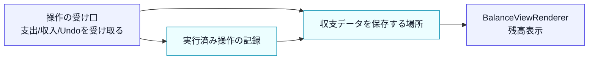
```mermaid
flowchart LR
    B["操作の受け口<br>支出/収入/Undoを受け取る"] --> L["収支データを保存する場所"]
    B --> H["実行済み操作の記録"]
    H --> L
    L --> R["BalanceViewRenderer<br>残高表示"]

    classDef boundary fill:#eef2ff,stroke:#4f46e5,color:#111827;
    classDef data fill:#ecfeff,stroke:#0891b2,color:#111827;
    class B,R boundary;
    class L,H data;
```

変更後の仕様は、入力が異なる二つの流れへ分けます。登録・一括登録は金額やカテゴリを入力に取り、Undo／Redoは履歴を入力に取るからです。

**登録・一括登録の流れ：**

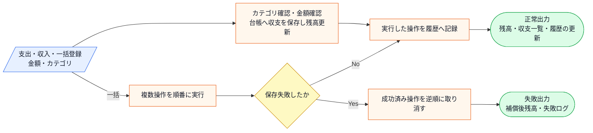
```mermaid
flowchart LR
    A[/支出・収入・一括登録<br>金額・カテゴリ/]:::input --> C[カテゴリ確認・金額確認<br>台帳へ収支を保存し残高更新]:::process
    C --> D[実行した操作を履歴へ記録]:::process
    D --> E([正常出力<br>残高・収支一覧・履歴の更新]):::normal
    A -->|一括| M[複数操作を順番に実行]:::process
    M --> N{保存失敗したか}:::decision
    N -->|No| D
    N -->|Yes| O[成功済み操作を逆順に取り消す]:::process
    O --> P([失敗出力<br>補償後残高・失敗ログ]):::normal

    classDef input fill:#e7f0ff,stroke:#2563eb,color:#111827;
    classDef process fill:#fff7ed,stroke:#ea580c,color:#111827;
    classDef decision fill:#fef9c3,stroke:#ca8a04,color:#111827;
    classDef normal fill:#dcfce7,stroke:#16a34a,color:#111827;
```

**Undo／Redoの流れ：**

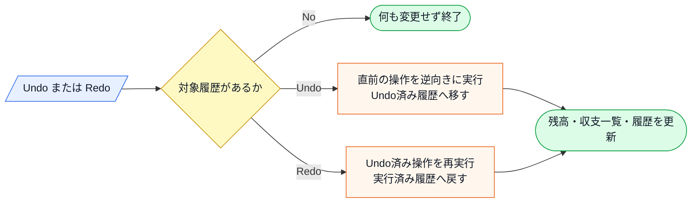
```mermaid
flowchart LR
    A[/Undo または Redo/]:::input --> B{対象履歴があるか}:::decision
    B -->|No| C([何も変更せず終了]):::normal
    B -->|Undo| D[直前の操作を逆向きに実行<br>Undo済み履歴へ移す]:::process
    B -->|Redo| E[Undo済み操作を再実行<br>実行済み履歴へ戻す]:::process
    D --> F([残高・収支一覧・履歴を更新]):::normal
    E --> F

    classDef input fill:#e7f0ff,stroke:#2563eb,color:#111827;
    classDef process fill:#fff7ed,stroke:#ea580c,color:#111827;
    classDef decision fill:#fef9c3,stroke:#ca8a04,color:#111827;
    classDef normal fill:#dcfce7,stroke:#16a34a,color:#111827;
```

この図から読み取ることは、次の4点です。

- 支出登録・収入登録の判定と加工は1-1のまま変わらず、実行に成功した操作だけを履歴へ記録する。
- Undo/Redoは金額やカテゴリを入力とせず、履歴だけを材料に「直前の操作を逆向きに実行する」「取り消した操作を再実行する」という加工を行う。
- 一括登録は複数の操作を順番に実行し、途中で保存に失敗した場合は成功済み操作を逆順に取り消す。
- 履歴が空のときのUndo/Redoはエラーではなく、何もせずに終わる。

図に加わった「履歴へ記録」「履歴から外す」が実際にどこへ書かれるかは、フェーズ3で変更を試すコードと、フェーズ7の最終コード・実行結果で追います。

既存の2つの登録操作をUndo対象として記録し、新たに「Undo実行」という履歴操作を加える点が、この変更の核心です。

**フェーズ1のまとめ：今回追う変更ID一覧**

このフェーズで確定した変更依頼を一覧にして締めます。フェーズ2でこの変更IDを仮説・ヒアリングへ、フェーズ3で一つずつ試して痛みへ、と順につなぎます。

| 変更ID | 変更依頼の要点 | 関係する要求ID（追加は変更後ID） |
|---|---|---|
| 変更ID1 | 直前の収入・支出操作を取り消す | 要求ID5 |
| 変更ID2 | Undoした同じ操作をやり直す | 要求ID6 |
| 変更ID3 | 複数操作を一括実行し、途中失敗時に成功分を巻き戻す | 要求ID7 |

---

## 🟣 フェーズ2：仮説立案 ―― 何が変わるかを観察し、ヒアリングで裏付ける
フェーズ1で、家計簿アプリがUIボタンから各マネージャクラスを直接呼び出している現状を把握しました。次に、ユーザーから寄せられた「操作を取り消したい」という要望を起点に、この設計における変わる見込みと当面安定の前提を整理します。

「操作」と「実行」は、変わる理由が異なります。たとえば、支出登録のDB保存方法が変わるのはシステム設計・生成管理の業務機能（RDBからNoSQLへ移行など）によるものです。一方、「履歴管理が必要かどうか」はプロダクト管理の業務機能（ユーザー要望・法令対応など）によるものです。変わる理由がどの業務機能によるか——それが「分けるべき」サインです。

### 2-1：変わりそうな仕様の見当をつける

ここで作る一覧は、思いつきで「変わりそう」と感じたものを並べる表ではありません。フェーズ1で確認した仕様・動作例・クラス図を材料に、次の順で候補を絞ります。

1. 仕様図と動作例から、入力・判定・加工・出力のうち条件や値が変わりそうな箇所を拾う。
2. その箇所が、1-3のどのクラス・メソッドに書かれているかを対応づける。
3. その仕様が、どんな理由で、何をきっかけに、どのくらいの頻度で変わりそうかを仮説として書く。
4. 逆に、当面変えない前提にできる処理の骨格も分けておく。

この手順で見ると、「家計簿の操作を実行する」という大きな処理全体ではなく、その中のどの操作種類・履歴管理・呼び出し方が変更候補なのかを読者自身で追えるようになります。

フェーズ2では、フェーズ1で見た仕様のうち、どの操作種類・呼び出し・履歴管理が変わりそうかを見当づけます。責務の配置は、変更要求を当てた後の痛みと合わせて確認します。

| 仕様候補 | 仕様上の場所 | フェーズ1の現状コードでの場所 | 見立て |
|---|---|---|---|
| 支出登録操作 | 入力、操作実行 | `UIButtons` から `ExpenseManager.addExpense()` を呼ぶ箇所 | 支出の入力項目や登録手順が変わる可能性があるため、今回見る |
| 収入登録操作 | 入力、操作実行 | `UIButtons` から `IncomeManager.addIncome()` を呼ぶ箇所 | 収入の入力項目や登録手順が変わる可能性があるため、今回見る |
| ボタン押下 | 入力イベント | `UIButtons` | クリックを契機に処理する大枠は当面維持する前提で見る |
| 操作履歴 | 1-5の変更要求で追加 | フェーズ1の現状コードにはない | Undo機能に必要な新しい要求として見る |
| 複合操作 | 一括登録、口座移動、一括削除 | フェーズ1の現状コードにはない | 複数の単発操作を同じ単位として並べられるかを見る |
| 保存失敗時の補償 | DB保存結果、ロールバック | 収支データの保存呼び出し | 成功した操作だけ履歴へ残し、失敗時に戻せるかを見る |

この表から、今回の検討対象は「操作の実行単位」「操作履歴」「複合操作と失敗時補償」です。UIと実行先の呼び出しが同じ場所に書かれて困るかどうかは、フェーズ3で変更を入れてから確認します。

#### ヒアリングで確認すること

操作単位と履歴の見当から、Undoの次に必要になる変化を質問へ変換します。

| 見当 | 現時点の仮説 | 確認する質問 | 確認先 |
|---|---|---|---|
| 履歴操作 | Undo後のRedoも必要になる | 取り消した操作をやり直す要求があるか | UIデザイナー |
| 操作種類 | 対象操作が増える | 口座移動やカテゴリ編集も履歴対象になるか | システム開発担当 |
| 複合操作 | 一度に複数件を扱う | 一括削除など複数データへ作用する操作が増えるか | UIデザイナー |

この質問を2-3で確認し、今回確定する変更と、将来リスクとして残す範囲を分けます。

### 2-2：今回の変更で確実に変わること

今回の変更要求から確定している変更は以下の3点です。章ごとに異なる色や記号は使わず、以降の工程でも追跡できる変更IDを見出し代わりにします。

- **変更ID1：直前の収入・支出操作を取り消す**：Undo操作を受け、対象操作を逆向きに実行する
- **変更ID2：Undoした同じ操作をやり直す**：Redo操作を受け、Undo済み操作を再実行する
- **変更ID3：複数操作を一括実行し、途中失敗時に成功分を巻き戻す**：失敗時は成功済み操作を逆順に取り消す

ただし「この変更が1回限りか、今後も続くか」によって、どこまで設計を変えるべきかが大きく変わります。関係者に確認します。

### ヒアリングに向けた背景確認

このアプリは、利用者が日々の支出や収入を手軽に記録するためのものです。現在のシステムは、シンプルなボタン操作でマネージャクラスを直接呼び出す構成になっています。

これまではデータを記録するだけのシンプルな作りでしたが、現在は「操作の取り消し（Undo）」や「やり直し（Redo）」という、より高度な操作が求められるフェーズにあります。当時の開発者が、ボタンクリックに応じて直接処理を呼び出すよう実装したコードが、今、その限界を迎えようとしています。

一見すると、このコードは各ボタンに対応するメソッドが綺麗に分かれており、直感的で読みやすい構造をしています。このシンプルな設計は当初の要件（記録のみ）には十分でした。ただ、操作履歴を管理するという新しい要件では、この設計の延長線上では解決しにくい構造的な課題が生まれます。

### 2-3：関係者ヒアリング

確定変更の背景をさらに深掘りするため、UIデザイナーとシステム開発担当に確認を行いました。この会話が、次の「将来リスクテーブル」の根拠になります。

* **開発者：** 「Undo機能以外に、操作をやり直す『Redo機能』を追加する予定はありますか？」
* **UIデザイナー：** 「あります。ユーザーからは『一度取り消したものを戻したい』という声も根強いです。」
* **開発者：** 「操作を履歴として記録する仕組みは、将来的に他の機能にも適用する可能性はありますか？」
* **システム開発担当：** 「あります。今は支出と収入の追加だけですが、将来的に口座の移動やカテゴリ編集といった複雑な操作もUndo対象にしたいと考えています。」
* **開発者：** 「操作そのものの『意図』が変わることはありますか？」
* **UIデザイナー：** 「ええ、例えば『一括削除』のような、一度に複数のデータに作用する操作も追加されるかもしれません。」

ヒアリングの結果、操作の「実行」と「取り消し」の仕組みは、将来的に複雑な操作が追加されても安定している必要があると分かりました。

### 2-4：ヒアリングで判明した将来リスク

ヒアリングで明らかになった「今後変わるかもしれないリスク」を整理します。これは今回の変更で確実に起きることではなく、将来の拡張リスクです。

| リスクID | 将来リスク | 時期の目安 | 根拠 |
|---|---|---|---|
| リスクID1 | 操作の種類の追加（削除・一括削除など） | 機能追加・操作内容の変更時 | UIデザイナーとの確認 |
| リスクID2 | Undo対象となる操作の複雑化（口座移動・編集など） | 口座管理機能の追加時 | システム開発担当との確認 |

なお、記録・残高の出力方法自体（画面表示からCSVエクスポート・帳票出力への変更）もヒアリングで話題になりましたが、今回の変更対象ではないためリスクIDには起こさず対象外として記録します。出力方法は操作履歴の軸とは独立した境界であり、本章で扱う操作の取消・再実行の分離には影響しません。

フェーズ2で「今回確実に変わるもの」と「将来変わるかもしれないもの」の両方が整理できました。ここで立てた仮説——「操作の実行方法」と「操作の管理方法」は変わる理由が異なる——が正しいかどうかを、次のフェーズ3で実際にUndoを追加しようとすることで確かめます。仮説を「痛みとして体験する」ことが、このフェーズの目的です。

### 2-5：変わる見込みと当面安定の前提を確定する

2-4のリスクIDを、操作ごとに変えられるようにする部分と、操作を受け付けて履歴を管理する安定側へ分けます。「はい」は、フェーズ6で**操作の種類や補償方法が変わっても、呼び出し元と履歴管理へ条件分岐を広げない構造か**を判定するための印です。

| リスクID・変化軸 | 変わる見込み | 変えられるようにする部分 | 当面安定として守る部分 |
|---|---|---|---|
| リスクID1：操作の種類の追加（削除・一括削除など） | はい | 操作ごとの実行方法と取り消し方 | 操作の受付、実行済み・取消済み履歴の管理 |
| リスクID2：Undo対象となる操作の複雑化（口座移動・編集など） | はい | 操作ごとの復元データと補償順序 | 実行・取消・再実行という入口、履歴の移動規則 |

したがって2-5の出力は、「具体操作と補償方法は変えられるようにし、操作の受付と履歴管理は守る」という設計条件です。フェーズ3では変更ID1〜変更ID3だけを現在の構造へ適用し、リスクIDはフェーズ6の構造評価に使います。

## 🟣 フェーズ3：問題特定 ―― 変更の痛みを発見する
このフェーズでは、変更ID1〜変更ID3を、`UIButtons`が各マネージャクラスを直接知っている現在の構造へ実装し、Undo・Redo・一括補償のためにどこを同時に変える必要があるかを確認します。

### 3-1：変更を試みる

「操作を取り消したい」という要望に応えるため、現在の責任配置を変えずに、Undoが実際に動くところまで実装します。未完成コードの失敗を見るのではなく、要求を満たした結果として、どのクラスを同時に直さなければならないかを観察します。

> **抜粋の前提（周辺は現状のまま）：** 以下は操作呼び出しと履歴の差分抜粋です。フェーズ1の `CategoryDatabase` によるカテゴリ存在・有効性確認と金額検証は維持します。フェーズ7の `LedgerRepository` はUndoで保存済みデータまで戻すために追加する境界であり、途中で既存検証を削除して復活させるものではありません。

まず、各マネージャクラスに取消用のメソッド（`removeExpense`、`removeIncome`）を追加した部分です。

```cpp
#include <iostream>
#include <map>
#include <string>
#include <vector>

class CategoryDatabase {
    std::map<std::string, std::string> names{
        {"CAT001", "給与"}, {"CAT002", "食費"}};
public:
    bool exists(const std::string& id) const {
        return names.find(id) != names.end();
    }
};

class ExpenseManager {
    CategoryDatabase& db;
public:
    explicit ExpenseManager(CategoryDatabase& db) : db(db) {}

    int addExpense(int amount, const std::string& categoryId) {
        if (amount <= 0 || !db.exists(categoryId)) return 0;
        std::cout << "支出追加: " << amount
                  << "円 [" << categoryId << "]\n";
        return -amount;
    }

    int removeExpense(int amount, const std::string& categoryId) {
        std::cout << "支出取消: " << amount
                  << "円 [" << categoryId << "]\n";
        return amount;
    }
};

class IncomeManager {
    CategoryDatabase& db;
public:
    explicit IncomeManager(CategoryDatabase& db) : db(db) {}

    int addIncome(int amount, const std::string& categoryId) {
        if (amount <= 0 || !db.exists(categoryId)) return 0;
        std::cout << "収入追加: " << amount
                  << "円 [" << categoryId << "]\n";
        return amount;
    }

    int removeIncome(int amount, const std::string& categoryId) {
        std::cout << "収入取消: " << amount
                  << "円 [" << categoryId << "]\n";
        return -amount;
    }
};
```

次に、UI側が履歴を管理し、Undoを実行するロジックです。

```cpp
struct HistoryItem {
    std::string type;
    int amount;
    std::string categoryId;
};

class UIButtons {
    ExpenseManager em;
    IncomeManager im;
    std::vector<HistoryItem> history;
    std::vector<HistoryItem> redoStack;  // 変更ID2で追加
    int balance = 0;
public:
    explicit UIButtons(CategoryDatabase& db) : em(db), im(db) {}

    void onAddExpenseClick(
        int amount, const std::string& categoryId) {
        int before = balance;
        int delta = em.addExpense(amount, categoryId);
        if (delta == 0) return;
        balance += delta;
        history.push_back({"Expense", amount, categoryId});
        std::cout << "現在残高: " << before
                  << " -> " << balance << "円\n";
    }

    void onAddIncomeClick(
        int amount, const std::string& categoryId) {
        int before = balance;
        int delta = im.addIncome(amount, categoryId);
        if (delta == 0) return;
        balance += delta;
        history.push_back({"Income", amount, categoryId});
        std::cout << "現在残高: " << before
                  << " -> " << balance << "円\n";
    }

    void undo() {
        if (history.empty()) return;
        HistoryItem last = history.back();
        int before = balance;
        if (last.type == "Expense") {
            balance += em.removeExpense(
                last.amount, last.categoryId);
        } else if (last.type == "Income") {
            balance += im.removeIncome(
                last.amount, last.categoryId);
        }
        history.pop_back();
        redoStack.push_back(last);      // 変更ID2：やり直し用に退避
        std::cout << "Undo後残高: " << before
                  << " -> " << balance << "円\n";
    }
```

変更ID2のRedoは、Undoで退避した操作をもう一度実行します。同じ種別分岐を、今度は順方向でもう一組書きます。

```cpp
    // 変更ID2：Undoした操作をもう一度実行する
    void redo() {
        if (redoStack.empty()) return;
        HistoryItem last = redoStack.back();
        redoStack.pop_back();
        int before = balance;
        if (last.type == "Expense") {           // ← 同じ種別分岐が3つ目
            balance += em.addExpense(
                last.amount, last.categoryId);
        } else if (last.type == "Income") {
            balance += im.addIncome(
                last.amount, last.categoryId);
        }
        history.push_back(last);
        std::cout << "Redo後残高: " << before
                  << " -> " << balance << "円\n";
    }
```

変更ID3の一括実行は、成功した操作を覚えておき、途中で失敗したら逆順に戻します。順方向の種別分岐と逆操作の種別分岐が、さらに一組ずつ増えます。

```cpp
    // 変更ID3：複数操作を一括実行し、途中失敗なら成功分を巻き戻す
    void runBatch(const std::vector<HistoryItem>& items) {
        std::vector<HistoryItem> done;
        for (size_t i = 0; i < items.size(); ++i) {
            const HistoryItem& it = items[i];
            int delta = 0;
            if (it.type == "Expense") {         // ← 同じ種別分岐が4つ目
                delta = em.addExpense(it.amount, it.categoryId);
            } else if (it.type == "Income") {
                delta = im.addIncome(it.amount, it.categoryId);
            }
            if (delta == 0) {
                std::cout << "一括実行が失敗したので巻き戻します\n";
                for (size_t k = done.size(); k > 0; --k) {
                    const HistoryItem& d = done[k - 1];
                    if (d.type == "Expense") {  // ← 逆操作の分岐が5つ目
                        balance += em.removeExpense(
                            d.amount, d.categoryId);
                    } else if (d.type == "Income") {
                        balance += im.removeIncome(
                            d.amount, d.categoryId);
                    }
                    history.pop_back();
                }
                std::cout << "巻き戻し後残高: " << balance << "円\n";
                return;
            }
            balance += delta;
            history.push_back(it);
            done.push_back(it);
        }
        std::cout << "一括実行後残高: " << balance << "円\n";
    }
};
```

最後に、動作確認用の `main` 関数です。

```cpp
int main() {
    CategoryDatabase db;
    UIButtons buttons(db);
    buttons.onAddExpenseClick(1000, "CAT002");
    buttons.onAddIncomeClick(5000, "CAT001");
    buttons.undo();

    std::cout << "\n--- 変更ID2: Undoした収入登録をやり直す ---\n";
    buttons.redo();

    std::cout << "\n--- 変更ID3: 一括実行（途中で失敗） ---\n";
    std::vector<HistoryItem> batch;
    batch.push_back({"Expense", 300, "CAT002"});
    batch.push_back({"Income", 700, "CAT001"});
    batch.push_back({"Expense", 500, "CAT999"});  // 未登録カテゴリで失敗
    buttons.runBatch(batch);
    return 0;
}
```

実行対象コード：3-1の変更試行コード<br>
対応する動作例：支出登録、収入登録、Undo、Redo、一括実行の途中失敗<br>
確認したいこと：変更ID1〜変更ID3を満たせるか、その実現に必要な修正がどの責任へ広がるか

実行結果：

```
支出追加: 1000円 [CAT002]
現在残高: 0 -> -1000円
収入追加: 5000円 [CAT001]
現在残高: -1000 -> 4000円
収入取消: 5000円 [CAT001]
Undo後残高: 4000 -> -1000円

--- 変更ID2: Undoした収入登録をやり直す ---
収入追加: 5000円 [CAT001]
Redo後残高: -1000 -> 4000円

--- 変更ID3: 一括実行（途中で失敗） ---
支出追加: 300円 [CAT002]
収入追加: 700円 [CAT001]
一括実行が失敗したので巻き戻します
収入取消: 700円 [CAT001]
支出取消: 300円 [CAT002]
巻き戻し後残高: 4000円
```

変更ID1のUndoでは、残高が`4000円`から収入登録前の`-1000円`へ戻りました。変更ID2のRedoでは、退避した収入登録をもう一度実行して`4000円`へ戻せています。変更ID3の一括実行では、3件目が未登録カテゴリ`CAT999`で失敗したため、成功済みの収入700円と支出300円を逆順に取り消し、一括実行前の`4000円`へ戻りました。三つとも要求は満たせています。

ただし、そのために各Managerへ逆操作を追加し、`HistoryItem`へ復元データを持たせ、`UIButtons`へ操作種別の分岐を書き続けました。種別を見る `if (type == "Expense")` は、`onAddExpenseClick`／`onAddIncomeClick` の入口に加えて、`undo()`・`redo()`・`runBatch()` の順方向・`runBatch()` の巻き戻しと、同じ形で5組に増えています。収支以外の操作種別（たとえば振替）を1つ足せば、この5か所すべてへ同じ分岐を書き足すことになります。

つまり変更ID1〜変更ID3は「関数を1つ足せば動く」変更ではありませんでした。**各マネージャへ逆操作を足し、呼び出し元の`UIButtons`が操作種別・逆操作・復元データ・実行順を知る形になりました。** 局所的なメソッド追加では済まず、今回の要求だけで責任が`UIButtons`へ集中しています。

### 3-2：変更影響グラフ

Undo機能を実装しようとした際、変更がどのようにシステムを汚染するかをグラフ化します。

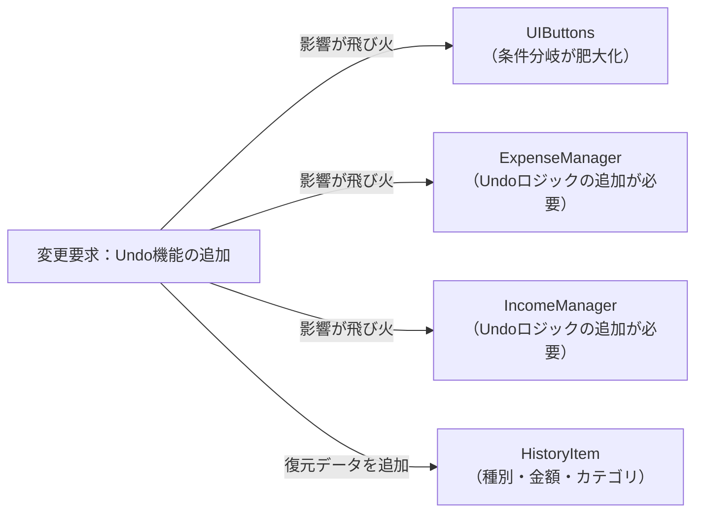
```mermaid
graph LR
    T1["変更要求：Undo機能の追加"]
        -->|"影響が飛び火"| A["UIButtons<br>（条件分岐が肥大化）"]
    T1 -->|"影響が飛び火"| B["ExpenseManager<br>（Undoロジックの追加が必要）"]
    T1 -->|"影響が飛び火"| C["IncomeManager<br>（Undoロジックの追加が必要）"]
    T1 -->|"復元データを追加"| D["HistoryItem<br>（種別・金額・カテゴリ）"]

```

→ このグラフを見ると、本来は画面UIと業務ロジックで役割が分かれているはずなのに、「Undo」という一つの要求に対して、UIクラスとすべてのマネージャクラスという広範囲のコードに修正が飛び火していることが分かります。

### 3-3：痛みの言語化

変更を試みたことで、設計の「痛み」が鮮明になりました。

1つ目は、変更ID1のために`UIButtons`内の`undo()`が操作種別を判定していることです。同じ形で変更ID2のRedoは種別ごとの再実行を、変更ID3は成功済み操作と逆順補償を必要とするため、三つの確定要求がいずれも同じ呼び出し元の条件分岐へ集中します。

2つ目は、「業務ロジックへの過度な依存」という痛みです。Undo機能という画面UI側の都合で、本来その操作の実行しか知らないはずのマネージャクラスにまで「取り消し」という新しい責務を押し付けています。本来、画面は「どうやって実行するか」を知らなくても良いはずなのに、現在の構造では実行の詳細を知りすぎているため、変更がクラスの枠を越えて連鎖してしまうのです。

こういうとき困る、という感覚、皆さんも同じではないでしょうか。この「操作の意図と実行ロジックが直接結びついている」という状態が、私たちの設計を硬直させている元凶なのです。

フェーズ3で「操作の追加が辛い」という事実が確認できました。次のフェーズ4では、なぜこの辛さが構造的に発生するのかを分析します。

---
> **📌 問題（確定）**
> 変更ID1〜変更ID3を満たすために、`UIButtons`の実行・Undo・Redo・一括補償の条件分岐と、複数のマネージャクラスを同時に修正した。操作の意図と実行手段が同じ場所に混在しているため、今回の確定要求が複数クラスへ連鎖した。
---

観測した痛みへ`問題ID`を付け、どの変更IDから来たかを対応づけます。この問題IDが、フェーズ4の原因ID、フェーズ5の課題IDへ順につながります。

| 問題ID | 観測した痛み（変更途中コード） | 起点の変更ID |
|---|---|---|
| 問題ID1 | 実行・Undo・Redo・一括補償の条件分岐が同じ入口 `UIButtons` へ集中する | 変更ID1・変更ID2・変更ID3 |
| 問題ID2 | 画面が「どのクラスのどのメソッドを何の引数で呼ぶか」まで知り、実行の詳細を知りすぎている | 変更ID1 |
| 問題ID3 | 一括実行の途中失敗で「何をどの順で戻すか」を`UIButtons`が知り、巻き戻し用の逆順ループと種別分岐を`runBatch()`の中へ書いた | 変更ID3 |
| 問題ID4 | 操作種別を見る同じ分岐が、入口2か所・`undo()`・`redo()`・`runBatch()`の順方向と巻き戻しで5組に増えた。種別を1つ足すと5か所すべてへ同じ分岐を書き足す | 変更ID1・変更ID2・変更ID3 |

（操作の「意図」と「実行手段」の混在が問題の核心だと確認できました。次のフェーズ4では、なぜこの混在が起きているのかを構造的に分析します。）

## 🟠 フェーズ4：原因分析 ―― なぜ辛いのかを構造で言語化する
フェーズ3で、Undo機能の実装において、呼び出し元のUIクラスが各操作の実行手段をすべて知らなければならないという「過度な依存」が確認できました。本来、画面（UI）は「どのボタンが押されたか」だけを知っていれば十分なはずです。「それをどのメソッドで、どのクラスで実行するか」まで知っている状態——これが「過度な依存」の意味です。このフェーズでは、なぜそのような辛さが生じるのかをコードの構造的な観点から分析します。

### 4-1：痛みの根源を探る（観察と原因）

ここで2つの問いを立てて、構造的な原因を掘り下げます。

- **なぜ、操作が増えるたびに `UIButtons` クラスを開かなければならないのか？**
- **なぜ、Undo機能を追加しようとすると影響範囲が読めなくなるのか？**

この2つの「なぜ」を出発点に、問題の根を辿ります。

フェーズ3で観察した痛みと、その根本的な原因を対応させます。

| **観察** | **原因の方向** |
| --- | --- |
| Undo機能を実装しようとすると、UIクラスが全マネージャクラスの全メソッドを知っている必要がある | 操作ボタンが「実行したい操作」の意図だけでなく、「具体的な実行手順（メソッド呼び出し）」まで直接知っているから |
| 操作の種類が増えるたびに、UIクラスの条件分岐が巨大化する | ユーザーが「何をしたいか」という操作の意図を、オブジェクトとして切り出さず、単なるメソッド呼び出しとして混在させているから |
| 複合操作や保存失敗時の補償を入れると、何をどの順番で戻すかをUIや履歴管理側が知る必要がある | 実行・取消・再実行・補償が「同じ操作の別の向き」としてまとまっておらず、操作ごとの知識が外側へ漏れているから |

### 4-2：変わるもの/変わってほしくないもの

> **「変わらないもの」と「変わってほしくないもの」は異なります。** 「変わらないもの」は経験的事実（今まで変わっていない）、「変わってほしくないもの」は設計意図（ここを安定させてほかを守りたい）です。ここで整理するのは後者です。

原因分析の結果として、「変わり続けるもの」と「変わってほしくないもの」を明確に分けます。

| **変わり続けるもの** | **変わってほしくないもの** |
| --- | --- |
| 入力端（UIボタン、API、バッチ）と操作内容（支出、収入、振替など） | 入力端に依存せず「操作を依頼する」アプリケーション境界 |
| DBやファイルなど台帳の保存方式 | 収支レコードと現在残高が一つの正本として整合する契約 |
| 操作ごとの実行ロジックと取り消しロジック | 履歴のリストを管理し、Undoを実行する仕組み |
| 操作ごとの失敗時補償、再実行、複合操作の内訳 | 操作を同じ単位として実行・取消・再実行できる契約 |

UIそのものを固定するのではありません。画面、API、バッチは変わる入力アダプタとして扱います。どの入力端からでも同じ操作単位をアプリケーション境界へ渡せることを守ります。現在の構造では、操作の意図、実行手段、残高の正本がUIに結合しているため、操作や入力端が増えるたびにUIへ変更が波及します。

### 4-3：接続点に漏れている実行手段を確認する

ここでの「確認すること」は、前節までに見つけた原因から抽出します。まず、原因文から「守りたい骨格」と「変わる差分」を分けます。次に、その差分を動かすために骨格側が知ってしまっている名前・条件・順序・型を拾います。最後に、接続点に残す最小の約束を、値・型・操作・イベントとして書きます。

原因によって、接続点で見る抽象観点は変わります。条件分岐が原因なら条件・定数・選択基準を見ます。処理手順が原因なら呼び出し順・前後条件・失敗時分岐を見ます。生成判断が原因なら具体クラス名・生成条件・登録場所を見ます。通知や外部連携が原因なら通知先・タイミング・成否の扱いを見ます。データや状態が原因なら、境界を流れる値・型・状態を見ます。

現在の`UIButtons`は、ボタンの意図だけでなく、どのマネージャーのどのメソッドをどの引数で呼ぶかまで知っています。接続点で渡したいのは「実行でき、必要なら取り消せ、再実行もできる操作」ですが、実行先と引数の知識がUI側へ漏れています。

漏れている知識を具体的に書くと、`ExpenseManager` / `IncomeManager` というクラス名、`addExpense()` / `addIncome()` というメソッド名、金額とカテゴリIDの組み合わせ、取り消すときに呼ぶ逆向き処理、保存失敗時にどこまで戻すか、という情報です。これらをUIや履歴管理が個別に知るほど、新しい操作や複合操作の追加時に同じ分岐が増えていきます。

フェーズ4で「UIとマネージャを切り離す場所」が言語化できました。「どこを分けるか」は明確です。次のフェーズ5では、その境界で実際に何が流れているかを値・型のレベルで具体化し、「何を変え、何を守るか」を明確にします。

---
> **📌 原因（確定）**
> `UIButtons`がボタン押下という「操作の意図」だけでなく、「どのクラスのどのメソッドを何の引数で呼ぶか」という実行手段まで知っている。さらに、Undo/Redoや保存失敗時の補償を入れると、実行・取消・再実行の対応関係まで外側が知る必要がある。操作が増えるたびにUIと履歴処理の両方へ知識が追加される。
---

フェーズ3の問題IDに対応づけて、構造上の原因へ`原因ID`を付けます。次のフェーズ5は、この原因IDから課題IDを導きます。

| 原因ID | 構造上の原因（何が同じ責任へ集まっているか） | 対応する問題ID |
|---|---|---|
| 原因ID1 | 操作ボタンが「実行したい操作の意図」だけでなく「具体的な実行手順」まで直接持ち、操作がオブジェクト化されていない | 問題ID1・問題ID2 |
| 原因ID2 | 実行・取消・再実行・補償が「同じ操作の別の向き」としてまとまらず、台帳更新・補償・履歴積替えの規則が複数箇所へ漏れる | 問題ID3 |

（原因は、操作の意図と実行手段が同じ場所にあることだと分かりました。次のフェーズ5では、その接続点で何を渡せばよいかを値・型のレベルで見ていきます。）

## 🟡 フェーズ5：課題定義 ―― 原因から課題を検討して確定する

フェーズ4で確定した原因は、まだ課題そのものではありません。まず変えるべき構造を候補として導き、システム全体で候補の関係を整理してから、解くべき接続点を確定します。

### 5-1：原因から課題候補を洗い出す
| 原因ID・確定した事実 | そのままだと残る痛み | 課題候補 | 候補を導いた理由 |
|---|---|---|---|
| 原因ID1：UIとバッチが収入・支出の具体呼出しと引数を知る | Undo・Redo・一括実行ごとに入口へ逆操作の分岐が増える | 実行可能な操作を同じ単位として扱う | 操作の種類と実行入口は別の理由で変わる |
| 原因ID2：台帳更新・取消・履歴積替えの規則が複数箇所に漏れる | 途中失敗時にどこまで戻すかを各入口が判断する | 操作効果と補償、履歴管理の責任を分離する | 台帳の正本と操作履歴は異なる責任だから |

この段階では、解決クラス名・契約名・パターン名・生成場所を決めません。原因のどの構造を変える必要があるかだけを候補にします。

### 5-2：課題候補をシステム全体で評価する

| 課題候補 | 必要性・他候補との関係 | 統合／分割の判断 | 採否 |
|---|---|---|---|
| 操作単位の分離 | 必須。変更ID1・変更ID2で同じ引数を逆向きに再構成している | UI・バッチ共通の実行境界として残す | 採用 |
| 補償と履歴管理の分離 | 必須。操作だけ分けても一括失敗の巻戻し範囲が決まらない | 操作単位と連携する独立責任 | 採用 |

候補を一つずつ部分対策として採用するのではなく、すべてを解いた完成状態から逆算します。変更IDと課題IDは一対一とは限らないため、変更依頼の数に合わせて課題を増減させません。

### 5-3：課題IDと接続点を確定する

評価を通過した候補だけに課題ID1から欠番なくIDを付けます。

| 課題ID・接続点 | 接続するもの・変わる側 | 守る側 | 完了条件 |
|---|---|---|---|
| 課題ID1：実行可能な操作とUI・バッチの境界 | **接続:** 金額・カテゴリを含む操作と実行結果<br/>**変わる側:** 収入・支出ごとの実行・取消方法 | 操作を依頼する入口 | UIとバッチが同じ操作契約で実行・取消できる |
| 課題ID2：操作効果・補償と台帳・履歴の境界 | **接続:** 収支記録、残高前後値、実行済み・取消済み操作<br/>**変わる側:** 更新・補償・履歴積替え | 台帳を残高の正本にする契約 | 成功操作だけ記録し、失敗時は対象範囲だけ逆順に戻せる |

📌 **システム全体の完了状態**：UIとバッチは同じ操作単位を実行し、台帳を正本とした結果に応じて履歴がUndo・Redo・一括補償を管理する。

課題IDを定義できたので、ここまでの追跡を一列で見渡します。

| 問題ID（フェーズ3の痛み） | 原因ID（フェーズ4の構造原因） | 課題ID（達成目標） |
|---|---|---|
| 問題ID1・問題ID2：実行手段の混在で入口へ分岐が集中 | 原因ID1：操作が意図と実行手順を抱えオブジェクト化されない | 課題ID1：実行可能な操作を同じ操作単位（契約）へ |
| 問題ID3：補償・巻戻し範囲を外側が判断 | 原因ID2：実行・取消・補償がまとまらず台帳・履歴規則が漏れる | 課題ID2：操作効果・補償と台帳・履歴を分離 |

この表と完了状態が、そのままフェーズ6の入力です。要求の受入は要求ID、設計課題の解消は課題ID、今回の変更影響は変更IDで別々に追跡します。
## 🔴 フェーズ6：対策検討 ―― システム全体の最終構造を定める

**ここからしばらくは抽象の話です。** 個々のクラスへ入る前に、この章で「何を、どんな構造へ変えるのか」を先に決めます。

#### まず全体像 ―― どんな構造へ変えるか（抽象）

フェーズ4で、UIボタンや`BudgetApp`が「操作を依頼する側」の中に「操作の実行内容（実行先クラス・メソッド・引数）」と「残高の所有」を抱え込んでいることを確認しました。対策は、操作をオブジェクトにして依頼側から実行内容を切り離し、残高は台帳を正本にして一体で更新することです。ここで使う中心構造は、第一部で扱った基本構造です。構造名（と対応するパターン名）を語彙として併記しますが、パターン名から設計を選ぶのではなく、上で確認した「操作の実行内容」から必要な構造を導きます。

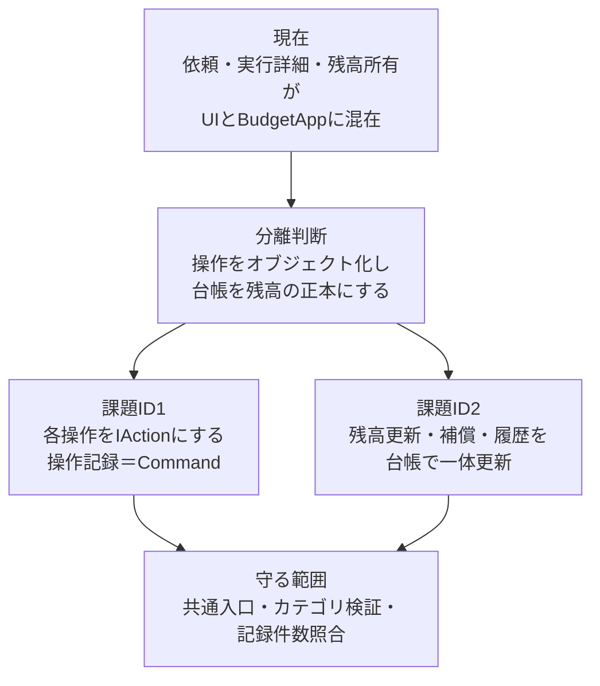
```mermaid
flowchart TB
    A[現在<br/>依頼・実行詳細・残高所有が<br/>UIとBudgetAppに混在] --> B[分離判断<br/>操作をオブジェクト化し<br/>台帳を残高の正本にする]
    B --> C[課題ID1<br/>各操作をIActionにする<br/>操作記録＝Command]
    B --> D[課題ID2<br/>残高更新・補償・履歴を<br/>台帳で一体更新]
    C --> E[守る範囲<br/>共通入口・カテゴリ検証・記録件数照合]
    D --> E
```

まだクラスの中身は見ません。この段階でつかんでほしいのは「操作をオブジェクトにして依頼側から実行内容を切り離し（課題ID1）、残高は台帳を正本にして一体更新する（課題ID2）」という筋だけです。「どのクラスが生成し、どの契約で実行するか」という具体の結論は、この後の課題ID1・課題ID2で決めていきます。決めた結論をまとめて振り返る表は、フェーズ6の末尾（6-3 設計トレース）に置きます。ここでは先に結論表を出しません。

第0章の「設計の醍醐味」の四拍子でいえば、この章は〈共通の操作契約を見つけて実行手段を分離〉→〈操作オブジェクトを生成〉→〈履歴・入口へ注入〉→〈UI・バッチは実行手段を意識しない〉という同じ順序をたどります。

#### 接続点の分離・配置・組み立てを決める

| 接続点を変える観点 | システム全体の考え方 | この章での答え |
|---|---|---|
| 分離方法 | 変わる部分と守る処理をどの契約で切るか | 具体Manager・引数・逆操作を `IAction::execute/undo` の向こうへ出す。台帳更新は `LedgerRepository` の収入・支出・取消操作へ閉じる |
| 配置場所 | 切り出した責任をどこへ置くか | 実行値と逆操作を各Action、履歴の積み替えを `ActionHistory`、収支レコードと現在残高を `LedgerRepository` へ置く。`BudgetApp` は入力端に依存しない受け口にする |
| 組み立て方法（生成・所有・登録・注入） | 誰がどう接続するか | Composition Root が台帳・Manager・History・Appを生成・所有し、ActionへManagerを注入する。UI／バッチはActionを生成してAppへ渡し、Historyは成功・失敗したActionを借用参照で並べる（所有はComposition Root） |

#### 設計判断ごとの部分クラス図

課題ID1では、UIとバッチが具体Managerを呼び分ける構造を、実行・取消できる`IAction`へ置き換えます。

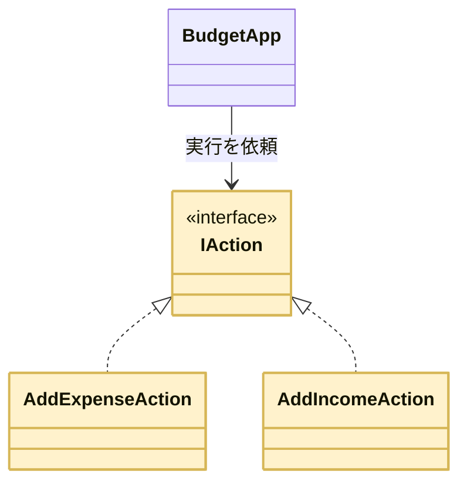
```mermaid
classDiagram
    class IAction { <<interface>> }
    class AddExpenseAction
    class AddIncomeAction
    class BudgetApp
    IAction <|.. AddExpenseAction
    IAction <|.. AddIncomeAction
    BudgetApp --> IAction : 実行を依頼
    class IAction:::focus
    class AddExpenseAction:::focus
    class AddIncomeAction:::focus
    classDef focus fill:#FFF2CC,stroke:#D6B656,stroke-width:2px
```

課題ID2では、成功した操作を`ActionHistory`が保持し、収支の正本は`LedgerRepository`へ一本化します。

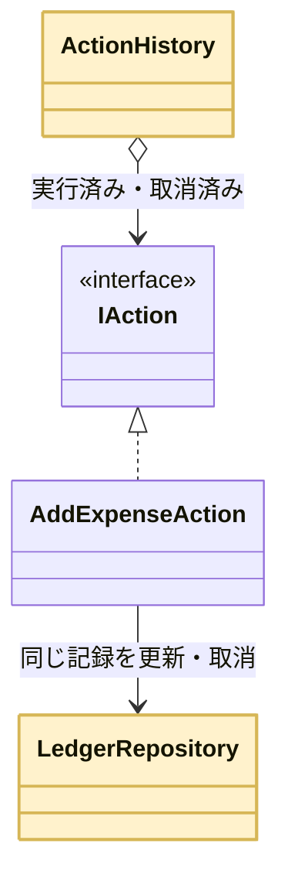
```mermaid
classDiagram
    class ActionHistory
    class IAction { <<interface>> }
    class LedgerRepository
    class AddExpenseAction
    ActionHistory o--> IAction : 実行済み・取消済み
    IAction <|.. AddExpenseAction
    AddExpenseAction --> LedgerRepository : 同じ記録を更新・取消
    class ActionHistory:::focus
    class LedgerRepository:::focus
    classDef focus fill:#FFF2CC,stroke:#D6B656,stroke-width:2px
```

次のコードでは、操作契約、台帳への効果と補償、履歴の積み替えの順に実装します。

#### システム全体の最終構造を決める

操作記録の構造は課題ID1から決まりますが、課題ID2の残高正本には二つの完成可能な配置が残ります。ここでは最終構造同士を比較します。

| 完成構造 | 課題ID1・課題ID2への答え | コスト | 判断 |
|---|---|---|---|
| 台帳正本型 | ActionがManagerを呼び、`LedgerRepository` が収支レコードと現在残高を一体で更新する | 永続化境界に残高整合性の責任が増える | 採用。監査用レコードと残高を同じトランザクション単位で扱える |
| 残高集約型 | Actionへ `AccountBalance` を注入し、集約が残高を更新して別Repositoryへ保存する | 集約と保存境界の整合・復元処理が増える | 不採用。複数口座や複雑な残高規則なら有力だが、この単一台帳では層が一つ増える |

「Actionへ現在残高の数値を渡して結果を返す」だけでは、その結果を誰が正本として保存するかが未解決で、利用側に計算・整合責任が残ります。完全な最終案にするには残高を所有する集約が必要です。今回は `LedgerRepository` が一つの台帳として収支と残高を所有する台帳正本型を採用します。

採用構造を、`IAction`（共通契約）、各Action（操作部品）、`ActionHistory`（実行・取消・履歴）、各Manager（検証と台帳操作）、`LedgerRepository`（収支と残高の正本）、`BudgetApp`（入力端に依存しない受け口）として具体化します。

### 対策検討のクラス図：1-3の責任と依存をどう変えるか

フェーズ1の1-3で作ったクラス図へフェーズ2〜5の判断を反映し、変更後の形へ更新します。

| クラス図を変える材料 | 前工程で確認したこと | クラス図へ反映すること |
|---|---|---|
| フェーズ1のクラス図 | 現在のクラス、操作、依存関係 | 変更前クラス図としてそのまま使う |
| フェーズ2の変化予測 | 操作の種類とUndo/Redo・一括処理は今後も増える | 毎回変わる責任へ `【移す】` と注記する |
| フェーズ4の原因 | `UIButtons` に操作の依頼と実行手段・逆操作の知識が混在する | 同じクラスの中で `【残す】` と `【移す】` を分ける |
| フェーズ5の接続点 | 利用側は種別を知らず、`execute/undo` を同じ契約で呼べばよい | 課題ID1の実行値・逆操作を各操作クラスへ置く |

**薄い黄色が着目クラス**です。変更前では `UIButtons` の `【残す】` と `【移す】`、変更後では移動先の `【新設】` を追います。矢印は1-3と同じ利用・実装・包含関係です。

**変更前のクラス図（1-3を責任見直し用に再掲）：**

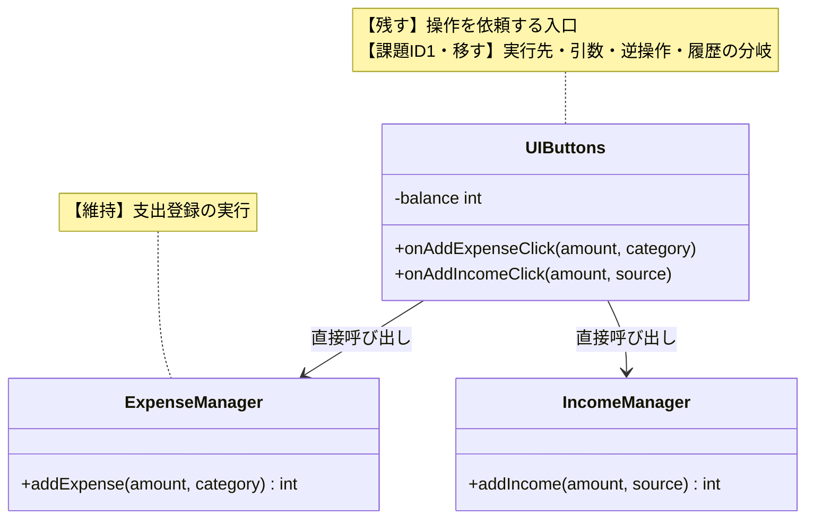
```mermaid
classDiagram
    direction TB
    class UIButtons {
        -balance int
        +onAddExpenseClick(amount, category)
        +onAddIncomeClick(amount, source)
    }
    class ExpenseManager {
        +addExpense(amount, category) int
    }
    class IncomeManager {
        +addIncome(amount, source) int
    }
    UIButtons --> ExpenseManager : 直接呼び出し
    UIButtons --> IncomeManager : 直接呼び出し

    note for UIButtons "【残す】操作を依頼する入口<br/>【課題ID1・移す】実行先・引数・逆操作・履歴の分岐"
    note for ExpenseManager "【維持】支出登録の実行"

    classDef focus fill:#FFF2CC,stroke:#D6B656,stroke-width:2px,color:#222222
    cssClass "UIButtons" focus
```

変更前は `UIButtons` が各Managerの具体メソッドと引数、逆操作、履歴の種別文字列を抱え、操作追加やUndo対応のたびに分岐が増えます。

課題ID1をクラス図の変更として書くと、次の3操作になります。

1. 課題ID1：各操作が満たす共通契約 `IAction`（`execute`／`undo`）を新設する。
2. 課題ID1：支出・収入の実行値と逆操作を、`AddExpenseAction`／`AddIncomeAction` へ移す。
3. 課題ID1：実行・取消・履歴登録を `ActionHistory` へ集め、`BudgetApp` は操作を渡すだけにする。

変更後は、UIも履歴も操作種別を判定せず `IAction` だけを扱い、`UIButtons` の逆操作分岐が消えたことを確認します。

**採用した変更後のクラス図：**

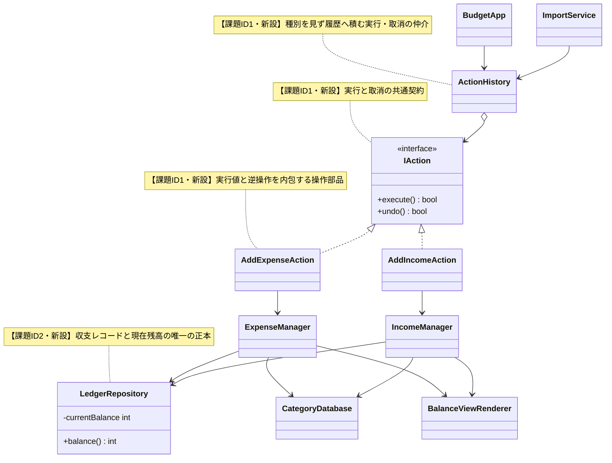
```mermaid
classDiagram
    class CategoryDatabase
    class LedgerRepository {
        -currentBalance int
        +balance() int
    }
    class BalanceViewRenderer
    class ImportService
    class IAction {
        <<interface>>
        +execute() bool
        +undo() bool
    }
    class AddExpenseAction
    class AddIncomeAction
    class ActionHistory
    class BudgetApp
    class ExpenseManager
    class IncomeManager
    IAction <|.. AddExpenseAction
    IAction <|.. AddIncomeAction
    ActionHistory o--> IAction
    BudgetApp --> ActionHistory
    AddExpenseAction --> ExpenseManager
    AddIncomeAction --> IncomeManager
    ExpenseManager --> LedgerRepository
    IncomeManager --> LedgerRepository
    ExpenseManager --> CategoryDatabase
    IncomeManager --> CategoryDatabase
    ExpenseManager --> BalanceViewRenderer
    IncomeManager --> BalanceViewRenderer
    ImportService --> ActionHistory

    note for IAction "【課題ID1・新設】実行と取消の共通契約"
    note for AddExpenseAction "【課題ID1・新設】実行値と逆操作を内包する操作部品"
    note for ActionHistory "【課題ID1・新設】種別を見ず履歴へ積む実行・取消の仲介"
    note for LedgerRepository "【課題ID2・新設】収支レコードと現在残高の唯一の正本"

    classDef focus fill:#FFF2CC,stroke:#D6B656,stroke-width:2px,color:#222222
    cssClass "IAction,AddExpenseAction,AddIncomeAction,ActionHistory,LedgerRepository" focus
```

クラス図の変更とコード変更を一対一で対応させると、次のようになります。

| 課題ID | クラス図をどう変えるか | コードレベルで何をするか | 詳しく解く節 |
|---|---|---|---|
| 課題ID1 | 共通契約 `IAction` と操作部品を新設し、UI・バッチを契約経由にする | `execute()`／`undo()` を純粋仮想で定義、`AddExpenseAction` が値と逆操作を内包、`BudgetApp` は操作を渡すだけ | 課題ID1節（①〜⑥） |
| 課題ID2 | `ActionHistory` の履歴・補償と `LedgerRepository` の正本を接続する | Undo/Redoスタックで成否管理、`ImportService` が一括失敗時に逆順ロールバック、台帳を残高の正本にする | 課題ID2節（③⑤⑥） |

このクラス図が、課題ID1を反映したシステム全体の設計結論です。課題IDは図の差分を追うために使い、以降はこの構造に必要なコードだけを示します。

#### 課題箇所のおさらい（フェーズ3の関連コード）

統合表で特定した箇所だけを振り返ります。課題ID1は `UIButtons` が持つ操作種別の履歴文字列と、取り消し時の種別分岐です。課題に関係しないコードは省略し、フェーズ3で明記した維持条件をそのまま引き継ぎます。

```cpp
// 3-1から抜粋：UIが実行先・引数・逆操作・履歴種別をすべて抱える
class UIButtons {
    ExpenseManager em;
    IncomeManager im;
    std::vector<HistoryItem> history;   // 種別文字列つきの履歴
    int balance = 0;
public:
    void onAddExpenseClick(int amount, const std::string& categoryId) {
        int delta = em.addExpense(amount, categoryId);
        if (delta == 0) return;
        balance += delta;
        history.push_back({"Expense", amount, categoryId});   // 種別を文字列で持つ
    }

    void undo() {
        if (history.empty()) return;
        HistoryItem last = history.back();
        if (last.type == "Expense") {                          // UIが種別ごとに
            balance += em.removeExpense(last.amount, last.categoryId);
        } else if (last.type == "Income") {                    // 逆操作を知っている
            balance += im.removeIncome(last.amount, last.categoryId);
        }
        history.pop_back();
        // Transfer が増えるたびに else if が伸びる
    }
};
```

### 課題ID1：実行可能な操作を同じ操作単位（契約）へ分離する

**【課題ID1の原因】** 問題ID1・問題ID2（実行手段の混在で入口へ分岐集中）＝原因ID1（操作が意図と実行手順を抱えオブジェクト化されない）。この原因を分離対象にします。

**この課題（何を解きたいか）：** 実行・Undo・Redo・一括補償の条件分岐が同じ入口 `UIButtons` へ集中し、画面が実行の詳細を知りすぎる——問題ID1・問題ID2（痛み）／原因ID1です。**操作をオブジェクトにして、UIもバッチも同じ契約で実行・取消できる**ようにするのが課題ID1です。

**どう解決するか（方針）：** 「実行したい操作」を部品（オブジェクト）にして、実行手段を依頼側から切り離します（操作記録構造＝Command）。①契約 →③具体 →④生成 →⑤注入 →⑥実行 の順で組み立てます（②骨格は無し）。

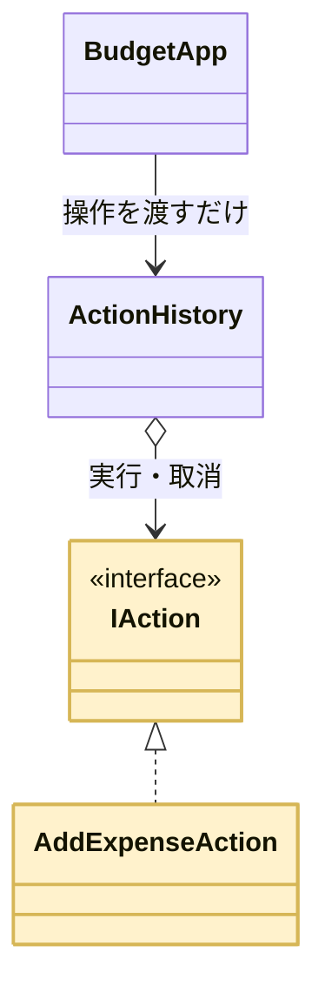
```mermaid
classDiagram
    class BudgetApp
    class ActionHistory
    class IAction { <<interface>> }
    class AddExpenseAction
    BudgetApp --> ActionHistory : 操作を渡すだけ
    ActionHistory o--> IAction : 実行・取消
    IAction <|.. AddExpenseAction
    class IAction:::focus
    class AddExpenseAction:::focus
    classDef focus fill:#FFF2CC,stroke:#D6B656,stroke-width:2px
```

**① 共通契約 `IAction` を定義する。** 利用側は種別を知らず、`execute()`／`undo()` だけを呼びます。

```cpp
class IAction {
public:
    virtual ~IAction() = default;
    virtual bool execute() = 0;
    virtual bool undo() = 0;
};
```

**③ 各操作が実行値と逆操作を内包する（UIは値も逆操作も持たない）。**

```cpp
class AddExpenseAction : public IAction {
    ExpenseManager& manager;
    int amount;
    std::string categoryId;
public:
    AddExpenseAction(ExpenseManager& m, int a, std::string c)
        : manager(m), amount(a), categoryId(c) {}
    bool execute() override {
        return manager.addExpense(amount, categoryId);
    }
    bool undo() override {
        return manager.removeExpense(amount, categoryId);
    }
};
```

**④ 生成・⑤ 注入。** 操作は呼び出し元（`main()`）がスタック生成・所有し、`ActionHistory` は `IAction*` を借用します。`BudgetApp` は履歴へ操作を渡すだけです。

```cpp
ActionHistory history;
BudgetApp app(&history);
AddExpenseAction cmd(expenseManager, 1000, "CAT002"); // ④ 生成・所有はmain
app.run(&cmd);    // ⑤ 履歴は IAction* を借用（非所有）
```

**⑥ 実行部は契約だけを呼ぶ。** `ActionHistory` は種別を見ず、直前の `IAction::undo()` を呼びます。これで課題ID1の完了条件「UIとバッチが同じ操作契約で実行・取消できる」を満たします。

```cpp
history.undo();   // ⑥ 種別を見ず契約だけ呼ぶ
```

### 課題ID2：操作効果・補償と台帳・履歴を分離する

**【課題ID2の原因】** 問題ID3（補償・巻戻し範囲を外側が判断）＝原因ID2（実行・取消・補償がまとまらず台帳・履歴規則が漏れる）。この原因を分離対象にします。

**この課題（何を解きたいか）：** 複合操作や保存失敗時の補償で「何をどの順で戻すか」をUIや履歴管理側が知る必要がある——問題ID3（痛み）／原因ID2です。**成功操作だけを履歴へ積み、失敗時は対象範囲だけを逆順に戻せる**ようにし、残高は台帳を正本にするのが課題ID2です。

**どう解決するか（方針）：** 実行・取消・再実行・補償を「同じ操作の別の向き」として `ActionHistory` へまとめ、残高は `LedgerRepository` を正本にします。③具体（履歴・台帳）→⑤接続（一括入口）→⑥補償 に相当します（①契約は課題ID1の `IAction` を使い、②骨格も無し）。

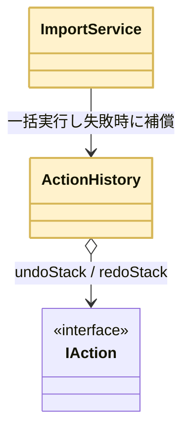
```mermaid
classDiagram
    class ActionHistory
    class IAction { <<interface>> }
    class ImportService
    ActionHistory o--> IAction : undoStack / redoStack
    ImportService --> ActionHistory : 一括実行し失敗時に補償
    class ActionHistory:::focus
    class ImportService:::focus
    classDef focus fill:#FFF2CC,stroke:#D6B656,stroke-width:2px
```

**③ `ActionHistory` が成否で履歴を管理する。** 成功した操作だけを `undoStack` へ積み、Undoで `redoStack` へ移します。台帳（`LedgerRepository`）を正本にした結果に応じて件数と残高が戻ります。
```cpp
void undo() {
    if (undoStack.empty()) return;
    IAction* cmd = undoStack.back();
    if (!cmd->undo()) return;   // 失敗時は履歴を変えずに終わる
    undoStack.pop_back();       // 成功時のみUndo履歴から外す
    redoStack.push_back(cmd);   // 成功した操作だけRedo対象へ
}
```

**⑤ 一括入口と⑥ 逆順補償。** `ImportService` はUIと同じ `ActionHistory` を共有し、一括実行の途中失敗時に、成功済み操作だけを逆順に取り消します（`rollback`）。

```cpp
void rollback(int count) {              // 成功済みcount件を逆順に戻す
    for (int i = 0; i < count; i++) history->undo();
}
```

これで課題ID2の完了条件「成功操作だけ記録し、失敗時は対象範囲だけ逆順に戻せる」を満たします。UI・バッチのどちらの入口から実行しても、同じ履歴と補償が働きます。

### 6-1：生成・所有・実行順のまとめ

課題ID1・課題ID2を一本の実行経路へ束ね直します。上の課題別展開は試行錯誤の履歴ではなく、完成構造を理解できる単位へ分けた実装順です。

- 操作オブジェクト：`main()` がスタック生成・所有し、`ActionHistory` は `IAction*` を借用（非所有）。
- 台帳：`LedgerRepository` を残高の正本にし、`execute()`／`undo()` が更新・補償する。
- 実行順：入口（UI／`ImportService`）→ `ActionHistory` が `execute()` し成功だけ積む → Undo/Redo/一括失敗時は逆順 `undo()`。2つの変化軸（操作単位と補償・履歴）が同じ `ActionHistory` で接続されます。

### 6-2：システム全体の契約とデータ配置を確定する

採用システムの契約、生成場所、依存注入を一表で確定します。接続点で受け渡すのは、実行に必要な値を内包した `IAction*` です。履歴の成否は `bool` で返し、失敗した操作はスタックへ積みません。
フェーズ6ではクラス間の契約（シグネチャ）と責務の配置を示すため、構造の要点となるメソッド（ここでは履歴への追加）のみ実装を示し、その他の実装はフェーズ7の全体コードで示します。

```cpp
class ActionHistory {
    std::deque<IAction*> done;      // 成功済み操作の並び（Undo対象）
    std::deque<IAction*> redoable;  // Undoした操作（Redo対象）
public:
    bool execute(IAction* a) {
        if (!a->execute()) {
            return false;
        }
        done.push_back(a);
        return true;
    }
    bool undo();                    // 実装はフェーズ7を参照
};
```

`undo()` の実装で守るのは「失敗したら履歴を動かさない」ことです。末尾を `back()` で参照したまま取り消しを試し、成功した場合にだけ `pop_back()` して Redo 側へ移します。先に取り出して失敗時に積み直す書き方でも結果は同じにできますが、途中で例外が出ると履歴が壊れます。参照してから取り除く順にすると、不変条件がコードの形として読めます。実装と失敗時の実行結果はフェーズ7で示します。

| 接続点を変える観点 | システム全体での設計判断 | 変えたくない側が知らなくなる詳細 |
|---|---|---|
| 分離方法 | 課題ID1の実行値・逆操作を各Actionへ、課題ID2の残高更新を台帳へ閉じる | 操作種別・引数・取り消し方・残高計算 |
| 配置場所 | 履歴を `ActionHistory`、収支と残高を `LedgerRepository` へ置く | 履歴と残高の保存詳細 |
| 組み立て方法 | Composition Rootが台帳・Manager・History・Appを所有し、ActionへManagerを注入する | 具体操作クラスと実行先の選択 |

操作オブジェクトの所有は `main()`（Composition Root）が担い、スタック変数として生存期間を管理します。`ActionHistory` は成功・失敗した操作を `IAction*` で借用参照として並べるだけで、破棄はしません。UIやバッチは操作を生成して渡すだけです。

#### システム全体のコード適用結果

| 追跡対象 | 課題定義で目指した状態 | 適用した構造とコード | 適用結果 |
|---|---|---|---|
| 課題ID1：操作と取消 | 操作追加でUI・履歴に種別分岐を増やさない | `IAction::execute/undo()` と `ActionHistory` | 新Actionと生成箇所へ変更が閉じた |
| 課題ID2：残高の正本 | 収支と残高を同じ保存責任で一体更新する | `LedgerRepository::balance()` と収支レコード | UI・Managerから残高所有が消えた |
| 課題ID1・課題ID2を接続したシステム全体 | 実行・取消・補償後も台帳整合を守る | ActionがManager経由で同じRepositoryを更新する | 履歴操作と残高正本が一つの経路で動く |

**システム全体の実装結果：達成。** 課題ID1の操作単位と課題ID2の残高正本が一つの構造へ接続され、フェーズ5で目指した状態を実現しました。実際の動作と変更影響はフェーズ7で確認します。

### 6-3：課題から完成構造までの設計トレース

ここまでの決定を、課題ID1→課題ID2の順に一望へまとめます。この表は設計課題だけを追います。変更要求の受入はフェーズ7の要求ID表、変更影響は7-4の変更ID表で別に確認します。

| 課題ID | 採用構造と生成・接続場所 | 完成コードの主な場所 | 確認 |
|---|---|---|---|
| 課題ID1（操作と取消） | 操作記録。`ActionHistory`が実行・取消・履歴登録を持ち、`BudgetApp`は操作を渡すだけ | `IAction::execute/undo()`、各Action、`ActionHistory` | 操作追加が新Actionと生成箇所に閉じる |
| 課題ID2（残高の正本） | 正本一元化。収支と残高を同じ保存責任で一体更新 | `LedgerRepository::balance()`、収支レコード | UI・Managerから残高所有が消える |
| 変更対象外 | 操作入口・カテゴリ検証。入口は操作を依頼するだけ | `BudgetApp`の公開操作、`CategoryDatabase` | 1-4、エラー前後の件数・残高不変 |

このクラス図、コード適用結果、シーケンス、コード変更表が、フェーズ7へ渡す完成設計です。

### 6-4：将来リスクに対する設計上の確認

ここは将来機能を実装する場ではありません。フェーズ2のリスクIDを採用構造へ再適用し、リスクが現実になった場合の変更先と、今回守れる範囲を確認します。

| リスクID・将来リスク | 採用構造での考慮 | 将来の主な変更先 | 今回の判断 |
|---|---|---|---|
| リスクID1：操作の種類の追加（削除・一括削除など） | 一回の操作と取消データをIAction実装へまとめ、履歴は具体操作を判断しない | 新しいAction、BudgetAppの生成・登録 | ActionHistoryを守れる。削除操作は完成コードへ追加しない |
| リスクID2：Undo対象となる操作の複雑化（口座移動・編集など） | Actionが取消に必要な変更前データを保持する責任を持つ | 対象Action、利用するRepository・Manager | 履歴契約へ局所化できるが、各操作の復元データ設計は将来行う。完成コードへ追加しない |

リスクID1・リスクID2は、履歴へ業務種別のifを置かない判断を支えます。将来操作そのものは要求確定後に追加します。

## 🟢 フェーズ7：対策実施 ―― 変化に強いコードを完成させる
フェーズ6で確定した「操作のオブジェクト化＋仲介役による履歴管理＋台帳を残高の正本とする構造」を、実際のコードに実装します。実装ステップは採用案を反映する順序であり、途中案の比較ではありません。

**この構造を、本書では操作記録構造と呼びます。**

この構造は「リクエストをオブジェクトとしてカプセル化し、呼び出し元から具体的な実行手段の知識を外す」という構造に、GoFがつけた名前です。フェーズ6で課題ID1・課題ID2を満たす構造を決めた理由が、そのまま操作記録構造を選ぶ理由に重なります。構造名を先に知ってから「どこで使うか」を探すのではなく、問題を解いた結果としてこの構造にたどり着く——それがこのプロセスの意図です。

この設計変更により、新しい操作は操作クラスとして追加し、UIやバッチへ割り当てる組み立て箇所を変更できます。`ActionHistory` へ操作種別ごとの条件分岐を追加せずに、同じUndo/Redoと失敗時補償の仕組みを利用できます。

### 7-1：解決後のコード（全体）

操作を抽象化するためのインターフェースと、それを実行する履歴管理クラスを定義します。コードはクラスごとに分割して示します。

解決後のコードも、責任の固まりごとに分けて読みます。

**① データとインフラ（Category / CategoryDatabase / LedgerRepository / BalanceViewRenderer）**

まず、カテゴリデータと、保存・表示を担う境界クラスです。

#### 完成後のクラス一覧

完成コードで定義する型を先に一覧化します。各型の依存方向と実現関係は、直後のクラス図で確認します。

- `CategoryDatabase`、`LedgerRepository`、`BalanceViewRenderer`、`ImportService`
- `IAction`、`AddExpenseAction`、`AddIncomeAction`、`ActionHistory`
- `BudgetApp`、`ExpenseManager`、`IncomeManager`

#### 完成後のクラス図


```mermaid
classDiagram
    class CategoryDatabase
    class LedgerRepository {
        -currentBalance int
        +balance() int
    }
    class BalanceViewRenderer
    class ImportService
    class IAction {
        <<interface>>
        +execute() bool
        +undo() bool
    }
    class AddExpenseAction
    class AddIncomeAction
    class ActionHistory
    class BudgetApp
    class ExpenseManager
    class IncomeManager
    IAction <|.. AddExpenseAction
    IAction <|.. AddIncomeAction
    ActionHistory o--> IAction
    BudgetApp --> ActionHistory
    AddExpenseAction --> ExpenseManager
    AddIncomeAction --> IncomeManager
    ExpenseManager --> LedgerRepository
    IncomeManager --> LedgerRepository
    ExpenseManager --> CategoryDatabase
    IncomeManager --> CategoryDatabase
    ExpenseManager --> BalanceViewRenderer
    IncomeManager --> BalanceViewRenderer
    ImportService --> ActionHistory

    note for IAction "【課題ID1・新設】実行と取消の共通契約"
    note for AddExpenseAction "【課題ID1・新設】実行値と逆操作を内包する操作部品"
    note for ActionHistory "【課題ID1・新設】種別を見ず履歴へ積む実行・取消の仲介"
    note for LedgerRepository "【課題ID2・新設】収支レコードと現在残高の唯一の正本"

    classDef focus fill:#FFF2CC,stroke:#D6B656,stroke-width:2px,color:#222222
    cssClass "IAction,AddExpenseAction,AddIncomeAction,ActionHistory,LedgerRepository" focus
```

章末のCommand骨格図では、`IAction` がCommand、各AddActionがConcreteCommand、`ActionHistory` がInvoker、各ManagerがReceiverに対応します。`BudgetApp` は操作を受け取りますが、具体的なManagerのメソッドやUndo手順は知りません。

#### 完成後の実行シーケンス

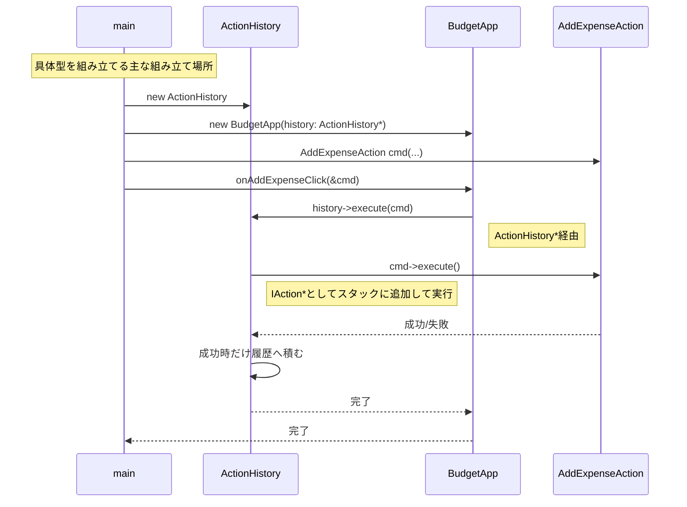
```mermaid
sequenceDiagram
    participant main
    participant CH as ActionHistory
    participant BA as BudgetApp
    participant AEC as AddExpenseAction
    Note over main: 具体型を組み立てる主な組み立て場所
    main->>CH: new ActionHistory
    main->>BA: new BudgetApp(history: ActionHistory*)
    main->>AEC: AddExpenseAction cmd(...)
    main->>BA: onAddExpenseClick(&cmd)
    BA->>CH: history->execute(cmd)
    Note right of BA: ActionHistory*経由
    CH->>AEC: cmd->execute()
    Note right of CH: IAction*としてスタックに追加して実行
    AEC-->>CH: 成功/失敗
    CH->>CH: 成功時だけ履歴へ積む
    CH-->>BA: 完了
    BA-->>main: 完了
```

#### 完成コード

```cpp
#include <deque>
#include <iostream>
#include <map>
#include <string>
#include <vector>

struct Category {
    std::string name;  // カテゴリ名
    std::string type;  // "income"（収入）または "expense"（支出）
};

class CategoryDatabase {
    std::map<std::string, Category> records;
public:
    CategoryDatabase() {
        records["CAT001"] = {"給与",   "income"};
        records["CAT002"] = {"食費",   "expense"};
        records["CAT003"] = {"交通費", "expense"};
        records["CAT004"] = {"副収入", "income"};
    }
    bool exists(const std::string& id) const {
        return records.count(id) > 0;
    }
    Category get(const std::string& id) const {
        return records.at(id);
    }
    void save(const std::string& id, const Category& c) {
        records[id] = c;                // 実行中のカテゴリ表へ追加
    }
};

struct LedgerEntry {
    std::string kind;
    std::string categoryName;
    int amount;
};

class LedgerRepository {
    std::vector<LedgerEntry> entries;
    int currentBalance = 0;
public:
    bool saveExpense(const Category& category, int amount) {
        entries.push_back({"expense", category.name, amount});
        currentBalance -= amount;
        return true;
    }
    bool saveIncome(const Category& category, int amount) {
        entries.push_back({"income", category.name, amount});
        currentBalance += amount;
        return true;
    }
    bool deleteExpense(const Category& category, int amount) {
        if (!removeLast("expense", category.name, amount)) {
            return false;
        }
        currentBalance += amount;
        return true;
    }
    bool deleteIncome(const Category& category, int amount) {
        if (!removeLast("income", category.name, amount)) {
            return false;
        }
        currentBalance -= amount;
        return true;
    }
    int balance() const {
        return currentBalance;
    }
    // 要求ID4：残高と突き合わせる収支記録の件数
    int recordCount() const {
        return (int)entries.size();
    }
private:
    bool removeLast(const std::string& kind,
                    const std::string& categoryName,
                    int amount) {
        for (std::size_t i = entries.size(); i > 0; --i) {
            const LedgerEntry& entry = entries[i - 1];
            if (entry.kind == kind
                    && entry.categoryName == categoryName
                    && entry.amount == amount) {
                entries.erase(entries.begin() + (i - 1));
                return true;
            }
        }
        return false;
    }
};

class BalanceViewRenderer {
public:
    void showMessage(const std::string& message) {
        std::cout << message << std::endl;
    }
};
```

`CategoryDatabase` はカテゴリのマスタ、`LedgerRepository` は収支レコードと現在残高を一体で所有する台帳の正本、`BalanceViewRenderer` は画面表示の境界です。`deleteExpense` / `deleteIncome` は保存済みレコードを取り消し、同じ操作で残高も戻します。利用側が収入合計と支出合計の差を計算する必要はありません。

**② 実行先クラス（ExpenseManager / IncomeManager）**

操作オブジェクトから処理を委ねられる実行先（Receiver）です。収支の登録・取消と残高の増減を担います。
まず、支出を管理する `ExpenseManager` です。

```cpp
// 操作オブジェクトから処理を委ねられる実行先（Receiver）
class ExpenseManager {
    CategoryDatabase& db;
    LedgerRepository& repository;
    BalanceViewRenderer& renderer;
public:
    ExpenseManager(CategoryDatabase& db,
                   LedgerRepository& repository,
                   BalanceViewRenderer& renderer)
        : db(db), repository(repository), renderer(renderer) {}
    bool addExpense(int amount, const std::string& categoryId) {
        if (!db.exists(categoryId)) {
            renderer.showMessage("エラー：カテゴリID「" + categoryId
                                 + "」は存在しません");
            return false;
        }
        if (amount <= 0) {
            renderer.showMessage("エラー：金額は1円以上を指定してください");
            return false;
        }
        Category cat = db.get(categoryId);
        if (cat.type != "expense") {
            renderer.showMessage("エラー：支出カテゴリを指定してください");
            return false;
        }
        int before = repository.balance();
        if (!repository.saveExpense(cat, amount)) {
            renderer.showMessage("エラー：支出の保存に失敗しました");
            return false;
        }
        renderer.showMessage("支出を追加しました：" + cat.name
                             + " " + std::to_string(amount) + "円"
                             + "（残高 "
                             + std::to_string(before) + "円 -> "
                             + std::to_string(repository.balance()) + "円）");
        return true;
    }
    bool removeExpense(int amount, const std::string& categoryId) {
        Category cat = db.get(categoryId);
        int before = repository.balance();
        if (!repository.deleteExpense(cat, amount)) {
            renderer.showMessage("エラー：支出の取消に失敗しました");
            return false;
        }
        renderer.showMessage("支出を取り消しました：" + cat.name
                             + " " + std::to_string(amount) + "円"
                             + "（残高 "
                             + std::to_string(before) + "円 -> "
                             + std::to_string(repository.balance()) + "円）");
        return true;
    }
};
```

続いて、収入を管理する `IncomeManager` です。

```cpp
class IncomeManager {
    CategoryDatabase& db;
    LedgerRepository& repository;
    BalanceViewRenderer& renderer;
public:
    IncomeManager(CategoryDatabase& db,
                  LedgerRepository& repository,
                  BalanceViewRenderer& renderer)
        : db(db), repository(repository), renderer(renderer) {}
    bool addIncome(int amount, const std::string& categoryId) {
        if (!db.exists(categoryId)) {
            renderer.showMessage("エラー：カテゴリID「" + categoryId
                                 + "」は存在しません");
            return false;
        }
        if (amount <= 0) {
            renderer.showMessage("エラー：金額は1円以上を指定してください");
            return false;
        }
        Category cat = db.get(categoryId);
        if (cat.type != "income") {
            renderer.showMessage("エラー：収入カテゴリを指定してください");
            return false;
        }
        int before = repository.balance();
        if (!repository.saveIncome(cat, amount)) {
            renderer.showMessage("エラー：収入の保存に失敗しました");
            return false;
        }
        renderer.showMessage("収入を追加しました：" + cat.name
                             + " " + std::to_string(amount) + "円"
                             + "（残高 "
                             + std::to_string(before) + "円 -> "
                             + std::to_string(repository.balance()) + "円）");
        return true;
    }
    bool removeIncome(int amount, const std::string& categoryId) {
        Category cat = db.get(categoryId);
        int before = repository.balance();
        if (!repository.deleteIncome(cat, amount)) {
            renderer.showMessage("エラー：収入の取消に失敗しました");
            return false;
        }
        renderer.showMessage("収入を取り消しました：" + cat.name
                             + " " + std::to_string(amount) + "円"
                             + "（残高 "
                             + std::to_string(before) + "円 -> "
                             + std::to_string(repository.balance()) + "円）");
        return true;
    }
};
```

`ExpenseManager` と `IncomeManager` は、それぞれ支出・収入の入力を検証し、台帳操作を依頼します。残高を所有・更新するのは `LedgerRepository` だけです。

**③ 操作の契約（IAction インターフェース）**

実行と取り消しを、すべての操作クラスに強制する契約です。

```cpp
// 操作の契約：実行と取り消しをすべての操作クラスに強制する
class IAction {
public:
    virtual ~IAction() {}
    virtual bool execute() = 0;
    virtual bool undo() = 0;
    virtual std::string describe() const = 0;
};
```

`IAction` を定めることで、履歴管理クラスはどの具体的な操作クラスが来ても同じ方法で扱える。この「型の統一」と「成否の統一」が、Undo/Redoと失敗時補償を汎用的に実現する鍵になる。

**④ 具体的な操作クラス（AddExpenseAction / AddIncomeAction）**

```cpp
// 支出追加の操作をカプセル化したクラス
class AddExpenseAction : public IAction {
    ExpenseManager& em;
    int amount;
    std::string categoryId;
public:
    AddExpenseAction(ExpenseManager& em,
                      int amount, std::string categoryId)
        : em(em), amount(amount), categoryId(categoryId) {}
    bool execute() override {
        return em.addExpense(amount, categoryId);
    }
    bool undo() override {
        return em.removeExpense(amount, categoryId);
    }
    std::string describe() const override {
        return "支出登録: " + categoryId + " "
               + std::to_string(amount) + "円";
    }
};

```

```cpp
// 収入追加の操作をカプセル化したクラス
class AddIncomeAction : public IAction {
    IncomeManager& im;
    int amount;
    std::string categoryId;
public:
    AddIncomeAction(IncomeManager& im,
                     int amount, std::string categoryId)
        : im(im), amount(amount), categoryId(categoryId) {}
    bool execute() override {
        return im.addIncome(amount, categoryId);
    }
    bool undo() override {
        return im.removeIncome(amount, categoryId);
    }
    std::string describe() const override {
        return "収入登録: " + categoryId + " "
               + std::to_string(amount) + "円";
    }
};

```

各操作クラスは「実行」と「取り消し」の両方を知っています。操作を増やすときは操作クラスを追加し、画面やバッチへ割り当てる組み立て箇所を変更します。`ActionHistory` の履歴管理ロジックには、操作種別ごとの分岐を増やさずに済みます。

**⑤ 操作履歴を保持しUndo/Redoを制御する仲介役クラス**

実行ログ（`executionLog`）はシステム起動時は空で、操作が実行・取り消しされるたびに1件追記されます。`undoStack` とは異なり、削除されることなく全操作の記録として保持します。なお `MAX_HISTORY` は `undoStack` が無制限に伸び続けないためのメモリ保護の安全弁で、仕様要件ではなく本章の動作例では上限に到達しません。

```cpp
// 操作履歴を保持し、Undo/Redoを制御する仲介役
class ActionHistory {
    std::deque<IAction*> undoStack;
    std::vector<std::string> executionLog;  // 実行ログ（追記のみ）
    std::deque<IAction*> redoStack;
    static const int MAX_HISTORY = 50;  // Undo履歴の上限（メモリ保護の安全弁）
public:
    bool execute(IAction* cmd) {
        if (!cmd->execute()) {
            executionLog.push_back("失敗: " + cmd->describe());
            return false;
        }
        undoStack.push_back(cmd);
        executionLog.push_back(cmd->describe());
        if ((int)undoStack.size() > MAX_HISTORY) {
            undoStack.pop_front();  // 最古の操作を削除する
        }
        redoStack.clear();
        return true;
    }
    void undo() {
        if (undoStack.empty()) return;
        // undo()が失敗した場合は、履歴を変えずに終わる
        IAction* cmd = undoStack.back();
        if (!cmd->undo()) {
            executionLog.push_back("取り消し失敗: " + cmd->describe());
            return;
        }
        undoStack.pop_back(); // 成功時のみUndo履歴から外す
        executionLog.push_back("取り消し: " + cmd->describe());
        redoStack.push_back(cmd);
    }
    void redo() {
        if (redoStack.empty()) return;
        // execute()が失敗した場合は、履歴を変えずに終わる
        IAction* cmd = redoStack.back();
        if (!cmd->execute()) {
            executionLog.push_back("再実行失敗: " + cmd->describe());
            return;
        }
        redoStack.pop_back(); // 成功時のみRedo履歴から外す
        executionLog.push_back("再実行: " + cmd->describe());
        undoStack.push_back(cmd);
    }
    void printLog() const {
        for (const auto& entry : executionLog) {
            std::cout << entry << std::endl;
        }
    }
    int historySize() const {
        return (int)undoStack.size();
    }
};

```

`ActionHistory` は `IAction*` として操作オブジェクトを受け取り、`undoStack`／`redoStack` で管理します。具体的な操作クラスは知りません。ここで保持する `IAction*` は**借用参照**で、操作オブジェクトの所有は生成元（`main()`）にあります。`ActionHistory` は生成も破棄もしないため、`undoStack` からあふれた操作を `delete` することはなく、`main()` の各操作オブジェクトが自身のスコープ終了時にまとめて破棄されます。Undo/Redoの実行に失敗した場合は、対象の操作を元のスタックに残す順序にしています。

**⑥ 呼び出し元と組み立て（main）**

UI以外の呼び出し元の例として、複数の操作をまとめて実行する `ImportService` を追加します。ヒアリング（2-3）で「一括削除のような複数データへの操作もあり得る」と予告されていた種類の呼び出し元です。UIと同じ `IAction` インターフェースを通じて操作を実行するため、履歴とUndoの仕組みをそのまま共有できます。まず、UIと一括インポートの2つの呼び出し元クラスを定義します。

```cpp
// UIからの操作を受け取り、Historyに委譲するだけ
class BudgetApp {
    ActionHistory* history;
public:
    BudgetApp(ActionHistory* h) : history(h) {}
    void onAddExpenseClick(IAction* cmd) {
        history->execute(cmd);
    }
    void onAddIncomeClick(IAction* cmd) {
        history->execute(cmd);
    }
    void onUndoClick() {
        history->undo();
    }
    void onRedoClick() {
        history->redo();
    }
};

// 一括インポートからの操作を受け取り、Historyに委譲するだけ
class ImportService {
    ActionHistory* history;
public:
    ImportService(ActionHistory* h) : history(h) {}
    void importTransactions(
            std::vector<IAction*> cmds) {
        int succeeded = 0;
        for (IAction* cmd : cmds) {
            if (!history->execute(cmd)) {
                rollback(succeeded);
                std::cout << "インポート失敗。成功済み操作を補償しました"
                          << std::endl;
                return;
            }
            succeeded++;
        }
        std::cout << succeeded << "件インポート完了"
                  << "（履歴: " << history->historySize()
                  << "件）" << std::endl;
    }
    void rollback(int count) {
        for (int i = 0; i < count; i++) history->undo();
        std::cout << count << "件ロールバック完了"
                  << std::endl;
    }
};
```

実行対象は7-1の完成コードです。確認したいのは、外部から見える収支結果を保ちながら、操作の実行・取り消し・再実行が操作オブジェクトとして履歴に接続されていることです。実行結果は、操作のまとまりごとに入力・処理・残高をインデントして示します。以降はまとまり（登録／Undo・Redo／一括インポート／ロールバック／操作履歴）ごとに、実行するコードとその結果を並べます。

まず依存を組み立て、支出と収入を登録します。

```cpp
// 依存の組み立ては main() に集約する
int main() {
    CategoryDatabase db;
    LedgerRepository repository;
    BalanceViewRenderer renderer;
    ExpenseManager em(db, repository, renderer);
    IncomeManager im(db, repository, renderer);
    ActionHistory hist;

    BudgetApp app(&hist);
    AddExpenseAction cmd1(em, 1000, "CAT002");  // 食費
    app.onAddExpenseClick(&cmd1);
    AddIncomeAction cmd2(im, 5000, "CAT001");   // 給与
    app.onAddIncomeClick(&cmd2);
    std::cout << "残高: "
              << repository.balance()
              << "円" << std::endl;
```

登録の実行結果：

```text
支出を追加しました：食費 1000円（残高 0円 -> -1000円）
収入を追加しました：給与 5000円（残高 -1000円 -> 4000円）
残高: 4000円
```

次に、直前の2操作をUndoし、支出をRedoします。

```cpp
    app.onUndoClick();               // 直前の収入を取り消す
    app.onUndoClick();               // さらに支出も取り消す
    std::cout << "Undo後の残高: "
              << repository.balance()
              << "円" << std::endl;
    app.onRedoClick();               // 支出を再実行
    std::cout << "Redo後の残高: "
              << repository.balance()
              << "円" << std::endl;
```

Undo / Redo の実行結果：

```text
収入を取り消しました：給与 5000円（残高 4000円 -> -1000円）
支出を取り消しました：食費 1000円（残高 -1000円 -> 0円）
Undo後の残高: 0円
支出を追加しました：食費 1000円（残高 0円 -> -1000円）
Redo後の残高: -1000円
```

続いて、UIと同じ履歴を共有する `ImportService` で3件を一括登録します。

```cpp
    ImportService importer(&hist);
    AddExpenseAction imp1(em, 2000, "CAT003");  // 交通費
    AddExpenseAction imp2(em, 300,  "CAT002");  // 食費
    AddExpenseAction imp3(em, 800,  "CAT002");  // 食費
    std::vector<IAction*> imported;
    imported.push_back(&imp1);
    imported.push_back(&imp2);
    imported.push_back(&imp3);
    importer.importTransactions(imported); // 一括登録（3件）
    std::cout << "インポート後の残高: "
              << repository.balance()
              << "円" << std::endl;
```

一括インポートの実行結果：

```text
支出を追加しました：交通費 2000円（残高 -1000円 -> -3000円）
支出を追加しました：食費 300円（残高 -3000円 -> -3300円）
支出を追加しました：食費 800円（残高 -3300円 -> -4100円）
3件インポート完了（履歴: 4件）
インポート後の残高: -4100円
```

次に、インポートした3件をロールバックします。

```cpp
    importer.rollback(3);            // 3件ロールバック
    std::cout << "ロールバック後の残高: "
              << repository.balance()
              << "円" << std::endl;
```

ロールバックの実行結果：

```text
支出を取り消しました：食費 800円（残高 -4100円 -> -3300円）
支出を取り消しました：食費 300円（残高 -3300円 -> -3000円）
支出を取り消しました：交通費 2000円（残高 -3000円 -> -1000円）
3件ロールバック完了
ロールバック後の残高: -1000円
```

次に、要求ID3の不正入力拒否と、要求ID7の「途中失敗時に成功済み分を逆順で取り消す」を確認します。まず単発の不正入力を2件試し、続いて一括インポートの2件目を未登録カテゴリにして失敗を起こします。

```cpp
    std::cout << "\n--- エラー例: 不正入力の拒否 ---\n";
    int beforeErr = repository.balance();
    int recordsBeforeErr = repository.recordCount();
    AddExpenseAction badCat(em, 1000, "CAT999");  // 未登録カテゴリ
    AddExpenseAction badAmt(em, 0, "CAT002");     // 0円
    app.onAddExpenseClick(&badCat);
    app.onAddExpenseClick(&badAmt);
    std::cout << "拒否後の残高: " << repository.balance()
              << "円（変化なし: "
              << (repository.balance() == beforeErr ? "はい" : "いいえ")
              << "）" << std::endl;
    std::cout << "拒否後の記録件数: " << repository.recordCount()
              << "件（変化なし: "
              << (repository.recordCount() == recordsBeforeErr
                      ? "はい" : "いいえ")
              << "）" << std::endl;

    std::cout << "\n--- エラー例: 一括インポートの途中失敗 ---\n";
    AddExpenseAction bad1(em, 1500, "CAT003");   // 成功する
    AddExpenseAction bad2(em, 1500, "CAT999");   // 未登録カテゴリで失敗
    AddExpenseAction bad3(em, 1500, "CAT002");   // ここへは到達しない
    std::vector<IAction*> broken;
    broken.push_back(&bad1);
    broken.push_back(&bad2);
    broken.push_back(&bad3);
    importer.importTransactions(broken);         // 失敗を起点に自動補償
    std::cout << "補償後の残高: " << repository.balance()
              << "円" << std::endl;
```

不正入力と途中失敗の実行結果：

```text
--- エラー例: 不正入力の拒否 ---
エラー：カテゴリID「CAT999」は存在しません
エラー：金額は1円以上を指定してください
拒否後の残高: -1000円（変化なし: はい）
拒否後の記録件数: 1件（変化なし: はい）

--- エラー例: 一括インポートの途中失敗 ---
支出を追加しました：交通費 1500円（残高 -1000円 -> -2500円）
エラー：カテゴリID「CAT999」は存在しません
支出を取り消しました：交通費 1500円（残高 -2500円 -> -1000円）
1件ロールバック完了
インポート失敗。成功済み操作を補償しました
補償後の残高: -1000円
```

不正入力の2件は残高も収支記録の件数も動かしません。要求ID3の受入条件はこの2行で確認できます。一括インポートでは2件目の失敗を `ImportService::importTransactions()` が検出し、`main()` が何もしなくても成功済みの1件を逆順で取り消しています。要求ID7の受入条件「途中失敗時に成功済み分を逆順に取り消す」は、この自動補償で満たされます。先ほどの `rollback(3)` は業務上の取り消し操作を明示的に呼んだもので、失敗起点の補償とは別の入口です。

次に、Undoが失敗したときに履歴が動かないことを確認します。取り消そうとした収支記録が台帳に無ければ `deleteExpense()` が失敗し、`ActionHistory::undo()` は末尾を取り除かずに戻ります。

```cpp
    std::cout << "\n--- エラー例: Undo失敗時の履歴不変 ---\n";
    // 登録は成功させて履歴へ積む。その後に台帳から実体を消しておくと、
    // 同じ操作のUndoは「取り消す対象が無い」状態になり失敗する。
    AddExpenseAction ghost(em, 9999, "CAT002");
    hist.execute(&ghost);
    em.removeExpense(9999, "CAT002");             // 台帳側だけ先に取り消す
    int beforeUndo = hist.historySize();
    int balanceBeforeUndo = repository.balance();
    hist.undo();                                  // 台帳に無いので取り消しは失敗する
    std::cout << "Undo失敗後の履歴件数: " << hist.historySize()
              << "（変化なし: "
              << (hist.historySize() == beforeUndo ? "はい" : "いいえ")
              << "）" << std::endl;
    std::cout << "Undo失敗後の残高: " << repository.balance()
              << "円（変化なし: "
              << (repository.balance() == balanceBeforeUndo ? "はい" : "いいえ")
              << "）" << std::endl;
```

Undo失敗時の実行結果：

```text
--- エラー例: Undo失敗時の履歴不変 ---
支出を追加しました：食費 9999円（残高 -1000円 -> -10999円）
支出を取り消しました：食費 9999円（残高 -10999円 -> -1000円）
エラー：支出の取消に失敗しました
Undo失敗後の履歴件数: 2（変化なし: はい）
Undo失敗後の残高: -1000円（変化なし: はい）
```

`undo()` は末尾を `back()` で参照するだけで、`cmd->undo()` が成功した場合にしか `pop_back()` しません。そのため失敗しても履歴は減らず、Redo側へも積まれません。残高も動かないので、利用者から見れば「取り消せなかった」だけで状態は元のままです。先に取り出してから失敗時に積み直す書き方でも同じ結果にはできますが、途中で例外が出ると履歴が壊れます。参照してから取り除く順にすると、不変条件がコードの形として読めます。

最後に操作履歴を出力し、`main()` を終了します。

```cpp
    std::cout << "\n--- 操作履歴 ---\n";
    hist.printLog();
    return 0;
}
```

操作履歴の実行結果：

```text
--- 操作履歴 ---
支出登録: CAT002 1000円
収入登録: CAT001 5000円
取り消し: 収入登録: CAT001 5000円
取り消し: 支出登録: CAT002 1000円
再実行: 支出登録: CAT002 1000円
支出登録: CAT003 2000円
支出登録: CAT002 300円
支出登録: CAT002 800円
取り消し: 支出登録: CAT002 800円
取り消し: 支出登録: CAT002 300円
取り消し: 支出登録: CAT003 2000円
失敗: 支出登録: CAT999 1000円
失敗: 支出登録: CAT002 0円
支出登録: CAT003 1500円
失敗: 支出登録: CAT999 1500円
取り消し: 支出登録: CAT003 1500円
支出登録: CAT002 9999円
取り消し失敗: 支出登録: CAT002 9999円
```

履歴には成功した操作だけでなく、失敗した操作も「失敗:」として残ります。エラー例で拒否した2件と、一括インポートで失敗した1件、その補償で取り消した1件が末尾に並んでいます。どの操作が試みられ、どれが台帳を動かさなかったかを履歴だけで追えます。

支出1,000円と収入5,000円の登録後は残高4,000円、2回のUndo後は0円、Redo後は-1,000円になります。3件合計3,100円の支出をインポートすると-4,100円になり、3件をロールバックすると-1,000円へ戻ります。各ログで一つの `LedgerRepository` の残高が変更前→変更後として見え、UIやManagerが差額を計算していないことを確認できます。

この実装により、UIは操作オブジェクトのポインタを履歴へ渡すだけでよくなり、支出・収入ごとの実行手順を管理する必要がなくなりました。操作オブジェクトの生成と画面への割り当ては組み立て側に残ります。
#### 最終要求の実装・受入エビデンス

変更後要求ベースラインの全有効要求IDを同じ順序で照合します。今回変わらなかった既存要求も対象にするため、要求の消失を検出できます。

| 要求ID | 最終要求 | 適用コード | 実行シナリオ・観測結果・判定 |
|---|---|---|---|
| 要求ID1 | 登録カテゴリへ1円以上の収入を追加する | `AddIncomeAction`、`IncomeManager` | 収入記録と更新後残高を出力<br/>**判定:** 合格 |
| 要求ID2 | 登録カテゴリへ1円以上の支出を追加する | `AddExpenseAction`、`ExpenseManager` | 支出記録と負数を含む残高を出力<br/>**判定:** 合格 |
| 要求ID3 | 不正入力を拒否し、記録件数と残高を変えない | `CategoryDatabase`、各Manager | 未登録カテゴリと0円の2件を拒否し、残高-1000円・記録1件が不変<br/>**判定:** 合格 |
| 要求ID4 | 保存済み記録から残高を求める | `LedgerRepository::balance()`／`recordCount()` | 拒否後に残高と記録件数の両方を出力して照合<br/>**判定:** 合格 |
| 要求ID5 | 最後に成功した操作を取り消す | `ActionHistory::undo()`、各`IAction::undo()` | 件数・残高が操作前へ戻る。取り消しに失敗したケースでは履歴2件・残高-1000円のまま不変<br/>**判定:** 合格 |
| 要求ID6 | 取り消した操作を同じ内容で再実行する | `ActionHistory::redo()` | 件数・残高が取消前へ戻る<br/>**判定:** 合格 |
| 要求ID7 | バッチ途中失敗時に当該バッチだけを逆順ロールバックする | `ImportService::importTransactions()` | 2件目の失敗で成功済み1件を自動補償し、開始前の-1000円へ復帰。過去履歴は維持<br/>**判定:** 合格 |

上の表は継続（要求ID1〜要求ID4）・追加（要求ID5・要求ID6・要求ID7）を同じ順序で並べ、変わらなかった既存要求も回帰対象に含めています。継続要求が合格していることで、既存動作が落ちていないことを確認できます。要求の受入・回帰はここで完了します。課題IDへ直接対応付けず、以下では変更試行の痛みから導いた構造課題だけを別に確認します。

#### 設計課題の構造改善結果

要求の受入とは分けて、課題IDごとに構造と変更影響を確認します。

| 課題ID | 構造差分・コード適用先 | 確認できた効果 | 残る変更先 |
|---|---|---|---|
| 課題ID1 | 実行・取消を`IAction`と具象操作へ分離 | UI・バッチが同じ操作契約を利用できた | 新Actionと生成箇所 |
| 課題ID2 | `LedgerRepository`を正本、`ActionHistory`を操作履歴に分離 | Undo・Redo・一括補償の範囲が閉じた | 履歴の保存方針 |
#### 変更前→変更後の不変条件照合

| 変更対象外 | 変更前 | 変更後 | 確認根拠 |
|---|---|---|---|
| カテゴリ検証 | `CategoryDatabase` で種別を確認 | 同じID・種別を各Managerで確認 | 正常・カテゴリ不一致ケース |
| 金額入力 | 収入・支出額を受け取る | 同じ金額が台帳レコードへ入る | 実行結果の残高推移 |

### 7-2：動作シーケンス図の検証

完成クラス図と実行シーケンスは、完成コードへ入る前に示しました。ここまでのコード、要求追跡表、不変条件照合を証拠として、次節で変更影響を再確認します。

### 7-3：変更影響グラフ（改善後）

フェーズ3で確認した「新しい操作（口座間移動）の追加」のシナリオを、3-2と同じ粒度で再度適用します。

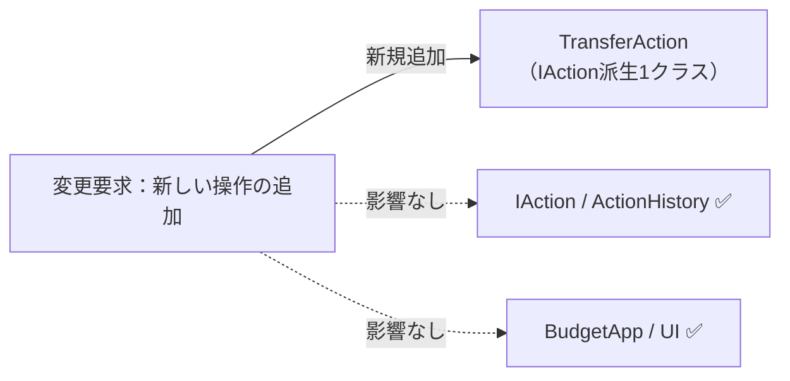
```mermaid
graph LR
    T1["変更要求：新しい操作の追加"]
        -->|新規追加| N1["TransferAction<br>（IAction派生1クラス）"]
    T1 -. "影響なし" .-> A["IAction / ActionHistory ✅"]
    T1 -. "影響なし" .-> B["BudgetApp / UI ✅"]
```

フェーズ3の変更影響グラフと同じ要求・同じ粒度で比べると、共通契約 `IAction` と履歴管理 `ActionHistory`、利用側の `BudgetApp` は変更先から消えました。口座間移動の追加は、`TransferAction` の1クラスと生成箇所への割り当てだけに限定されます。

| 3-2で影響した場所 | 修正後 | 構造変更との対応 |
|---|---|---|
| `UIButtons` の実行呼び出し・取消分岐 | **修正しない** | 実行値と逆操作を各操作クラスへ移した |
| 3-2には操作部品がなかった | `TransferAction` を1クラス追加する | 操作の変更先を新しく作った |
| 履歴・Undo/Redoの仕組み | `ActionHistory` を**修正しない** | 種別を見ず `IAction` を積む構造にした |

### 7-4：変更シナリオ表

今回の変更ID1〜変更ID3について、フェーズ1の構造で必要だった修正と完成構造の結果を対比します。

| 変更依頼 | フェーズ1の現状構造での影響 | 完成構造での結果 |
|---|---|---|
| 変更ID1：直前の収入・支出操作を取り消す | `UIButtons`と各Managerへ操作別の取消分岐を追加 | 各`IAction::undo()`へ補償を置き、残高と収支データが操作前へ戻ることを確認 |
| 変更ID2：Undoした同じ操作をやり直す | `UIButtons`へ操作データの保持と再実行分岐を追加 | `ActionHistory`が取消済み操作を戻し、同じ金額・カテゴリで再実行することを確認 |
| 変更ID3：複数操作を一括実行し、途中失敗時に成功分を巻き戻す | 呼び出し元が各操作の成功状態と逆順補償を管理 | 操作列を順に実行し、失敗時に成功済み`IAction`だけを逆順で戻して開始残高へ復元 |

操作の意図を独立させた代わりに、操作ごとのクラス、操作オブジェクトの所有権、失敗時の整合性を管理する必要があります。

### 問題・原因・課題・解決策

| | 内容 |
|---|---|
| **問題** | 変更ID1〜変更ID3を適用すると、`UIButtons`の条件分岐と各マネージャへの依存を連動して修正する必要があった |
| **原因** | 操作の意図、実行手段、取り消し方、再実行の仕方、失敗時補償が同じ場所に混在しており、操作追加の頻度ではこの接続コストが合わない |
| **課題** | 具体的な実行手段（クラス名・メソッド名・引数の組み合わせ）と補償手段をUIやバッチから切り離し、差し替え可能なオブジェクトとして独立させる |
| **解決策** | 操作記録構造：操作の実行・取り消し・成否を `IAction` インターフェースに統一し、`ActionHistory` が `IAction*` だけを知る仲介役として履歴を管理する |

## 整理

### フェーズとこの章でやったこと

この章では、ボタン押下という操作が特定の処理を直接知っているために、Undo/Redoのような機能追加でコード全体が複雑化する現状を学びました。ここでは参照番号を繰り返さず、各フェーズで何が次の判断材料になったかだけを振り返ります。

| **フェーズ** | **この章でやったこと** |
| --- | --- |
| 🔵 フェーズ1：現状把握 | ボタンが各Managerを直接呼び、正負の戻り値で残高を更新する事実を確認した |
| 🟣 フェーズ2：仮説立案 | 操作種類、実行時期、取消要否が別々に変わる可能性を確認した |
| 🟣 フェーズ3：問題特定 | Undo追加でUIが実行先と逆操作の両方を知る痛みを再現した |
| 🟠 フェーズ4：原因分析 | 操作の意図、実行手段、取消手段が呼び出し元に集まることを原因とした |
| 🟡 フェーズ5：課題定義 | UIが具体的な実行先と補償手段を知らずに依頼できる接続点を定めた |
| 🔴 フェーズ6：対策検討 | 課題ID1・課題ID2を満たす完成構造のうち、台帳を正本にする案と残高集約を正本にする案を比較し、台帳正本案を採用した。実装ステップは採用案の反映順とした |
| 🟢 フェーズ7：対策実施 | 操作をオブジェクト化し、Undo/Redoと一括補償を同じ契約で実行した |

### 責任の移動

| **責任** | **変更前** | **変更後** |
| --- | --- | --- |
| ボタン押下時の実行知識（何をどう呼ぶか） | `UIButtons`（直書き） | `AddExpenseAction` 等の各Actionクラス |
| 操作の取り消しロジック | —（なし） | `AddExpenseAction` 等の各Actionクラス |
| 操作の成否と失敗時の戻し方 | 呼び出し元や履歴側の分岐 | `IAction::execute()` / `undo()` の戻り値と各Actionクラス |
| 実行履歴の管理とUndo/Redo制御 | —（なし） | `ActionHistory` |
| 操作の実行・取り消し・成否契約定義 | —（なし） | `IAction` |
| 複合操作の実行順と補償 | 呼び出し元が個別に管理 | `IAction*` の列と `ActionHistory` の成否管理 |

### 複雑さを足しても対策は変わるか

| 追加した複雑さ | 見えた原因 | 定めた課題 | 採用した扱い |
|---|---|---|---|
| 操作履歴 | 文字列履歴では、実行済み操作を戻す方法が分からない | 実行と取消を同じ単位で履歴へ残す | `IAction` が `execute()` / `undo()` を持つ |
| 複合操作 | 一括登録では、呼び出し元が操作ごとの実行順と戻し順を知りやすい | 複数操作も同じ契約の列として扱う | `ImportService` が `IAction*` を順番に `ActionHistory` へ渡す |
| 永続化失敗時の補償 | 保存成否と履歴更新が分かれていないと、失敗操作まで履歴へ残る | 成功した操作だけ履歴へ積み、失敗時は成功済み分だけ戻す | `execute()` の戻り値で履歴追加を制御し、失敗時は `undo()` で補償する |
| 再実行 | Undoした操作を再実行するには、操作の中身を再び呼べる形で残す必要がある | Redo対象を操作オブジェクトとして保持する | `redoStack` に `IAction*` を残し、`execute()` を再度呼ぶ |

> このプロセスを回した結果にたどり着いた構造こそが 操作記録構造です。
> 
> 

---

## 振り返り

### 「この章を読むと得られること」は手に入ったか

| **得られること** | **この章のどこで示したか** |
| --- | --- |
| 1. 操作の種類という観点での識別 | フェーズ2の仮説立案で、操作と実行を切り離したこと。 |
| 2. 依存過多の診断 | フェーズ4で、UIクラスが全実行先と引数を知っていることを確認したこと。 |
| 3. 操作オブジェクト化の構造説明 | フェーズ7で、操作をオブジェクト化し履歴保持したこと。 |
| 4. 柔軟な設計手法の理解 | フェーズ6で、コマンドを組み合わせるマクロ・バッチ実行への発展可能性を確認したこと。 |

---

### 第0章の3つの設計原則はどう適用されたか

* **原則1「変わるものをカプセル化せよ」の現れ**
* **具体化された場所：** 個別のコマンドクラス（`AddExpenseAction` など）
* **解説：** 操作ごとの「実行・取り消しロジック」を個別のクラスへカプセル化しました。これにより、UIクラスは操作の中身を知る必要がなくなりました。


* **原則2「実装ではなくインターフェースに対してプログラムせよ」の現れ**
* **具体化された場所：** `ActionHistory` が扱う `IAction` インターフェース
* **解説：** `ActionHistory` は具体的なコマンドクラスではなく、`IAction` インターフェースに対して実行を依頼します。


* **原則3「継承よりコンポジションを優先せよ」の現れ**
* **具体化された場所：** `ActionHistory` の履歴管理
* **解説：** 継承による振る舞いの固定ではなく、コマンドオブジェクトをスタックに保持するコンポジション（保持）を用いて柔軟な履歴操作を実現しました。


---

## あなたのコードで考えてみてください

この章で辿った思考プロセスを、あなた自身のコードに当てはめてみましょう。

1. **変動の兆候を探す：** あなたのコードに「操作を取り消したい」「操作の履歴を記録したい」という要件が来たとき、実装が難しかった経験はありますか？
2. **変える理由を問う：** 「ボタンAを押す → 処理Xを実行」という対応関係が、コードのどこに書かれているか、すぐに答えられますか？
3. **結合の強さを測る：** 操作を呼び出す側が処理の詳細を直接知っている場合、「後でまとめて実行する」「順番を入れ替える」という要件が来たとき、何ファイルを変更することになりますか？
4. **オブジェクト化した後を想像する：** もし「操作」をオブジェクトとして保存できるとしたら、「直前の操作を取り消す」機能はどれくらいシンプルに実装できますか？

---

**題材を置き換えるときの共通手順**

この章の題材名を、自分の現場のシステム名に置き換えて考えます。

1. そのシステムは、誰が何を達成するために使うものか。
2. 入力、加工、出力は何か。
3. 最近入った変更要求、または次に来そうな変更要求は何か。
4. その変更で、触りたくない場所まで修正や再テストが広がるか。
5. 変えたいものと守りたいものを分けると、接続点には何を残すべきか。
6. 全課題を満たす完成構造が複数成立するか。成立するなら、責任配置・変更影響・導入コストの差は何か。

## パターン解説：Command パターン

Commandパターンは、リクエストをオブジェクトとしてカプセル化し、呼び出し元が具体的な実行先や引数の組み立てを直接知らずに依頼できるようにするパターンです。CommandはReceiverと実行に必要な引数を保持し、InvokerはCommandの共通契約だけを通じて実行・履歴化します。

### パターンの骨格

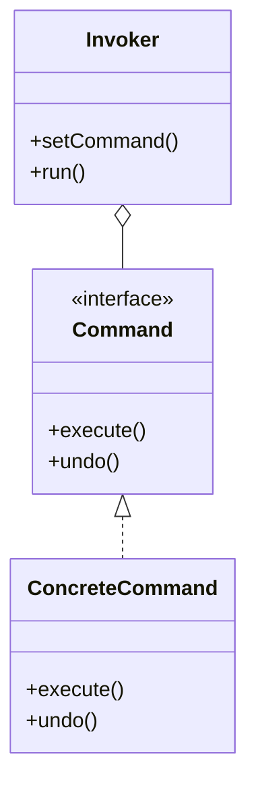
```mermaid
classDiagram
    class Command {
        <<interface>>
        +execute()
        +undo()
    }
    class ConcreteCommand {
        +execute()
        +undo()
    }
    class Invoker {
        +setCommand()
        +run()
    }
    Command <|.. ConcreteCommand
    Invoker o-- Command

```

### パターン骨格の実行シーケンス

```mermaid
sequenceDiagram
    participant C as Client
    participant I as Invoker
    participant CMD as Command
    participant R as Receiver
    C->>CMD: Receiverと引数を渡して生成
    C->>I: Commandを登録
    C->>I: 実行を依頼
    I->>CMD: execute()
    CMD->>R: 業務メソッドを呼ぶ
    R-->>CMD: 成功/失敗
    CMD-->>I: 実行結果
    opt 取り消し
        I->>CMD: undo()
        CMD->>R: 逆操作を呼ぶ
    end
```

この順序で重要なのは、InvokerがReceiverを直接呼ばないことです。具体的な呼び出し先と引数、逆操作はCommand内に閉じ、Invokerは `execute()` / `undo()` の契約だけで履歴を進めます。

### この章の実装との対応

`IAction` インターフェースが `Command` ロール、`AddExpenseAction` / `AddIncomeAction` が `ConcreteCommand` ロール、`ActionHistory` が `Invoker` ロールに対応しています。

---

### 使いどころと限界

* **使うと良い状況**：操作の取り消し（Undo）や再実行（Redo）が必要な場合や、実行タイミングを細かく制御したい場合。


* **使わない方が良い状況**：操作が単発で、履歴管理などが不要な場合。


【過剰コード：単なるメソッド呼び出しの代替】

```cpp
// 操作が単純でUndoが不要なら、無理にコマンド化するのはコードを増やすだけです
void onButtonClick() {
    manager.simpleAction(); // これだけで十分な場合もあります
}

```

### この章のまとめ

家計簿アプリというドメインと Commandパターンの関係を一言で言うなら、操作を「動詞（メソッド呼び出し）」から「名詞（オブジェクト）」に変えた瞬間、履歴管理・Undo・バッチ実行という選択肢が設計として自然に現れる、ということです。`AddButton` がどのサービスのどのメソッドをどんな引数で呼ぶかを直接知っていた限り、「いつ実行するか」「取り消すか」「並べるか」という問いに答える余地がUIコードの中にありませんでした。

7つのフェーズを通じて、読者はボタンと処理の直結という観察から始まり、「呼び出し元が知りすぎている」という診断を経て、操作をオブジェクトとして切り出すという判断へと進みました。フェーズ2のヒアリングで「Undo機能は将来ほしい」と確認した時点で操作のオブジェクト化という方向性が見え、フェーズ4でボタンの依存過多を接続点として特定した時点で分離の理由が確定する——その気づきの順序を体験したことが、この章の核心だと思います。

あなたのコードの中にも、UIや呼び出し元が実行先のクラス名・メソッド・引数まで知っている箇所があるはずです。「この操作を後から取り消したり、並べたりする必要が来るか」を問うことが、操作を記録できる構造が必要かどうかを判断する入口になります。
