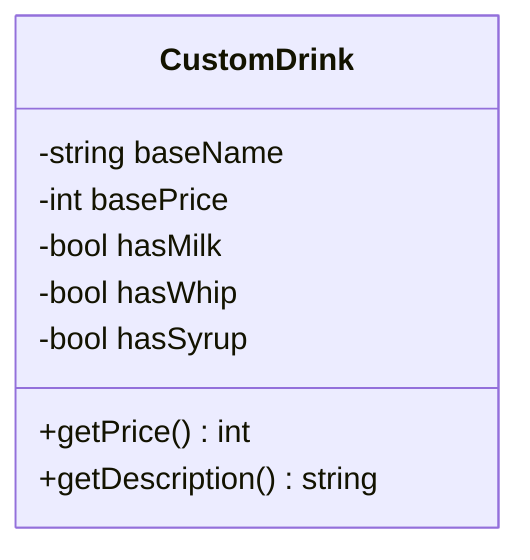
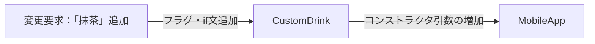
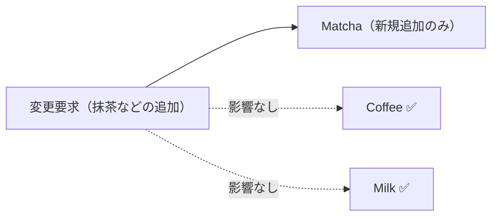
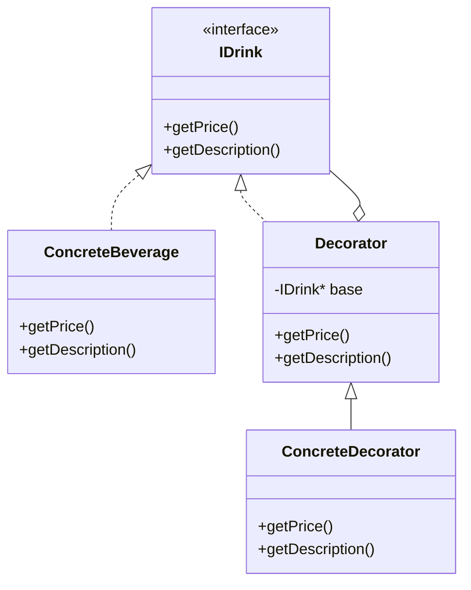

## 第6章 変わる機能の組み合わせ ―― Decorator パターン

―― 思考の型：基本の処理と追加の処理が混在している

### この章の核心

**機能の組み合わせが増えるたびに、条件分岐やクラスの数が際限なく増えていく。それは、「基本となる処理」と「後から付け足す処理」が同じ場所に混在しているからだ。**

---

### この章を読むと得られること

この章のテーマは「機能の組み合わせが増えるたびにクラスが爆発する」という問題です。「継承で全部作ろうとしたら間に合わなくなった」という経験がある方は、この章が直撃します。

* **得られること1：** 「機能の組み合わせ」という観点で、コードの変動箇所を識別できるようになる。「変わる機能」と「変わらない機能」を区別する問いを立てる習慣が、変動箇所を見抜く目を育てる。
* **得られること2：** 接続点で基本ドリンク側がトッピングの種類・価格・組み合わせをどこまで知っているかを調べ、変更の痛みが生まれる理由を説明できるようになる。
* **得られること3：** 接続点の約束をそろえると、トッピング追加の変更を実装クラスと組み立て箇所へ寄せられることを説明できるようになる。
* **得られること4：** 基本機能と追加機能を同じインターフェースで扱うことで、呼び出し側に違いを意識させずに機能を何層でも重ねていく視点が身につく。「追加するたびに呼び出し側も変える必要が生じます」という痛みを経験したとき、この構造の必要性が実感として伝わってくる。

---

## 🔵 フェーズ1：現状把握 ―― 仕様を整理し、システムと紐付ける
### 1-1：このシステムの仕様

このシステムは、カフェのドリンク注文を**カスタマイズ**し、合計金額と注文名称を算出します。

お客様は基本ドリンクを選択したうえで、複数のトッピングを自由に組み合わせられます。システムは選択された内容から `getPrice()`（合計金額）と `getDescription()`（注文名称）の2つの値を返します。

このシステムには、メニューとトッピングの価格・種類を決める**商品企画部**、スタッフに表示する注文名称のルールを管理する**店舗オペレーション部**、コードを保守する**開発チーム**の3者が関わっています。

**現在のメニューと価格**

| 種別 | 商品名 | 価格 |
|---|---|---|
| 基本ドリンク | Coffee（コーヒー） | 300円 |
| トッピング | Milk（ミルク） | +50円 |
| トッピング | Syrup（シロップ） | +30円 |
| トッピング | Whip（ホイップ） | +70円 |

トッピングは複数追加できます。`getDescription()` の出力例：`Coffee + Milk + Syrup`

---

### 1-2：動作例テーブル

コードを読む前に、このシステムがどんな入力に対してどんな出力を返すかを確認します。以下の動作を基準とし、フェーズ7では掲載した組み合わせを実行結果で照合します。

| 注文内容 | getDescription() の出力 | getPrice() の出力 |
| --- | --- | --- |
| ベースコーヒーのみ | `Coffee` | 300円 |
| コーヒー + ミルク | `Coffee + Milk` | 350円（300 + 50） |
| コーヒー + ミルク + シロップ | `Coffee + Milk + Syrup` | 380円（300 + 50 + 30） |
| コーヒー + ミルク + ホイップ | `Coffee + Milk + Whip` | 420円（300 + 50 + 70） |
| コーヒー + ホイップ×2 | `Coffee + Whip + Whip` | 440円（300 + 70 + 70） |
| コーヒー + ミルク + シロップ + ホイップ | `Coffee + Milk + Syrup + Whip` | 450円（300 + 50 + 30 + 70） |
| ↓ 変更要求による追加分（Matcha・Choco は1-5節で導入）↓ | | |
| コーヒー + ミルク + シロップ + ホイップ + 抹茶 | `Coffee + Milk + Syrup + Whip + Matcha` | 510円（300 + 50 + 30 + 70 + 60） |
| コーヒー + チョコ | `Coffee + Choco` | 340円（300 + 40） |
| コーヒー + ミルク + 抹茶 + チョコ | `Coffee + Milk + Matcha + Choco` | 450円（300 + 50 + 60 + 40） |

この表がこの章全体の動作の基準になります。フェーズ1からフェーズ7まで、構造がどれだけ違っても、この入出力の対応は変わりません。「何が同じで、何が違うのか」を意識しながらコードを読むと、各ステップの本質的な差異が見えやすくなります。

---

### 1-2.5：クラス概要サマリー

#### このシステムの登場クラス

| クラス名 | 役割 | 担当する仕様 |
|---|---|---|
| `CustomDrink` | ドリンク1注文の全情報を保持し、合計金額と注文名称を返す | 基本ドリンク選択・トッピング組み合わせ・金額計算・名称生成 |

**データの流れ：** `main()` → `CustomDrink`コンストラクタ（ベース名・価格・各トッピングフラグ） → `getPrice()` / `getDescription()` → 画面出力

**注目ポイント：** 現在は `CustomDrink` という1クラスがすべての処理を担っています。フェーズ3〜6で「このクラスが知りすぎていること」が問題として浮かび上がってきます。

---

### 1-3：クラス構成図

システムのクラス構成を可視化し、構造を確認します。



この図が示す通り、`CustomDrink` という単一のクラスが、ドリンクの基本情報とすべてのトッピング情報を一手に引き受けている構成になっています。

---

### 1-4：実装コード（現状）

コーヒーにミルクとホイップを追加する注文をシミュレートしています。

```cpp
#include <iostream>
#include <string>

using namespace std;

class CustomDrink {
private:
    string baseName;
    int basePrice;
    // トッピングごとの状態をフラグで管理している
    bool hasMilk;
    bool hasWhip;
    bool hasSyrup;

public:
    CustomDrink(string name, int price, bool milk, bool whip, bool syrup)
        : baseName(name), basePrice(price),
          hasMilk(milk), hasWhip(whip), hasSyrup(syrup) {}

    int getPrice() const {
        int total = basePrice;
        // トッピングごとの追加料金を計算
        if (hasMilk)  total += 50;
        if (hasWhip)  total += 70;
        if (hasSyrup) total += 30;
        return total;
    }

    string getDescription() const {
        string desc = baseName;
        // トッピングごとの名前を追加
        if (hasMilk)  desc += " + Milk";
        if (hasWhip)  desc += " + Whip";
        if (hasSyrup) desc += " + Syrup";
        return desc;
    }
};

// 呼び出し側のコード（モバイルアプリを想定）
int main() {
    // コーヒー(300円)、ミルクとホイップを追加、シロップはなし
    CustomDrink order("Coffee", 300, true, true, false);

    cout << "注文内容: " << order.getDescription() << endl;
    cout << "合計金額: " << order.getPrice() << "円" << endl;

    return 0;
}
```

`CustomDrink` がすべてのトッピングをフラグで持ち `if` 文で処理している。これが後に問題になる。

このコードを見ると、`CustomDrink` クラスがどのトッピングがいくらで、どんな名前になるかをすべて直接知っていることが分かります。

---

### 1-5：変更要求

**変更要求の発生チーム：** 今回の変更要求は**商品企画部**から届いています。トッピングの種類・価格を管理するチームです。開発チームは受け手となります。この点をフェーズ2の「誰の判断で変わるか」の議論への伏線として覚えておきます。

**仕様変更の内容**

変更要求を受けて、選択できるトッピングがどう変わるかを整理します。

| 項目 | 変更前 | 変更後 |
|---|---|---|
| トッピングの種類 | Milk・Syrup・Whip（3種） | **Milk・Syrup・Whip・Matcha・Choco（5種）** |
| 抹茶パウダー（Matcha） | 選択不可 | **+60円で追加可能** |
| チョコチップ（Choco） | 選択不可 | **+40円で追加可能** |

**変更後の出力例**

| 注文内容 | getDescription() | getPrice() |
|---|---|---|
| コーヒー + 抹茶パウダー | `Coffee + Matcha` | 360円（300 + 60） |
| コーヒー + チョコチップ | `Coffee + Choco` | 340円（300 + 40） |
| コーヒー + ミルク + 抹茶パウダー + チョコチップ | `Coffee + Milk + Matcha + Choco` | 450円（300 + 50 + 60 + 40） |

ベースドリンクの価格と既存トッピング（Milk・Syrup・Whip）の価格・名称は変更なしです。新しいトッピングを追加しても、既存の組み合わせパターンの動作は変わりません。

しかし、「これは1回限りの変更なのか、今後も続くのか」をすぐにコードで対応する前に確認しておきたいと思います。

フェーズ1でシステムの現状と変更要求が把握できました。次のフェーズ2では、「何が変わり、何が変わらないか」を整理します。

---

## 🟣 フェーズ2：仮説立案 ―― 何が変わるかを観察し、ヒアリングで裏付ける

フェーズ1でシステムの現状を観察しました。次のフェーズ2では、現場に届いた変更要求を起点にして「何が変わり、何が変わらないか」の仮説を立て、関係者とのヒアリングを通じてそれを確定させていきます。実装と責任が一致しない箇所こそが、のちの問題の発生源になります。

### 2-1：責任チェック表

コードが実際に「知っていること」を一行ずつ照合し、その知識が**誰の判断で変わるのか**を観察します。これは「クラスが責任を果たしているかどうか」ではなく、「同じクラスの中に、異なる意思決定者の判断が混在していないか」を可視化するための確認です。

| **クラス名** | **責任（1文）** | **知るべきこと** |
| --- | --- | --- |
| `CustomDrink` | ドリンクの基本料金とトッピング料金を合算して提供する。 | 基本価格、ミルクの有無と価格、ホイップの有無と価格、シロップの有無と価格。 |

一見してシンプルに見えたコードですが、一行ずつ観察していくと、商品企画部門が決めるべき「トッピングの価格」や、店舗オペレーション部が関わる「表示名」という、**異なる意思決定者の判断**が一つのクラスの中に並んでいることが見えてきます。変わる理由の決定者が混在しているという事実を、ここで確認しておきます。

---

### 2-2：変わる理由の分析

責任チェック表でクラスの責任が整理できました。次に、コードの各行が「誰の判断で、何をきっかけに変わる知識か」を確認し、混在している責任をさらに細かく特定します。ドリンク開発チームとは別の担当者が独立した時期に変更する知識は、責任を分ける有力な手掛かりです。ただし、担当者が違うだけで自動的に責任外とは決めず、変更頻度・共変更範囲・クラスの役割も合わせて判断します。

`CustomDrink.getPrice()` と `CustomDrink.getDescription()` の各行を見ると：

| **コードの行** | **持っている知識** | **誰の判断で変わるか** | **責任内か** |
|---|---|---|---|
| `string baseName; int basePrice;` | 基本ドリンクの名称と基本価格 | ドリンク開発チームが決定 | ✅ |
| `if (hasMilk) total += 50;` | ミルク追加の価格設定（50円） | 商品企画部が価格改定を決定 | ❌ 別担当者 |
| `if (hasWhip) total += 70;` | ホイップ追加の価格設定（70円） | 商品企画部が価格改定を決定 | ❌ 別担当者 |
| `if (hasSyrup) total += 30;` | シロップ追加の価格設定（30円） | 商品企画部が価格改定を決定 | ❌ 別担当者 |
| `if (hasMilk) desc += " + Milk";` | ミルク追加時の表示名 | 店舗オペレーション設計部が決定 | ❌ 別担当者 |

1つのクラスの中に、変える理由が異なる複数の知識が混在しています。今すぐ問題とは言えませんが、これが後の痛みの予兆です。

要するに、`getPrice()` や `getDescription()` の中にトッピングごとの処理が `if` 文で書き連ねられているという観察から、「後から追加される処理（各種トッピング）」と「基本となる処理（ドリンク本体）」が同じ場所に混在しているという構造の問題が見えてくる。

### 2-3：今回の変更で確実に変わること

いきなりコードを修正するのではなく、はじめに今回の変更要求で「確実に変わること」を整理します。

- **トッピングの種類の追加**：「抹茶パウダー（Matcha）」と「チョコチップ（Choco）」を追加する
- **`CustomDrink` クラスの修正**：新しいフラグ（`bool hasMatcha` 等）の追加とコンストラクタの変更が必要
- **呼び出し側のコード修正**：コンストラクタ引数の増加に伴い、既存の呼び出し箇所をすべて修正する必要がある

ただし「この変更が1回限りか、今後も続くか」によって、どこまで設計を変えるべきかが大きく変わります。関係者に確認します。

---

### ヒアリングに向けた背景確認

このシステムは、全国展開する人気カフェチェーンのモバイルオーダーを裏側で支える注文管理システムです。お客様がスマートフォンから事前にドリンクを注文し、店舗でスムーズに受け取れる仕組みを提供しています。

システムが立ち上がった当初、メニューは「コーヒー」や「紅茶」といったシンプルな基本ドリンクのみでした。しかし、ビジネスが成長し「自分好みにカスタマイズしたい」というお客様の声が大きくなるにつれて、ミルクの追加、ホイップの増量、シロップの変更など、多種多様なトッピング機能が追加されてきました。店舗のオペレーションと連動するため、注文システムは正確な「合計金額」と、ドリンクを作るスタッフに伝えるための「注文内容（名前）」を算出する重要な役割を担っています。

### 2-4：関係者ヒアリング

> **現実のヒアリングでは——** 本書のヒアリングシーンでは設計判断を明確にするため、意図的に「理想的な回答」が返ってくるように描いています。これはシミュレーションです。現実には、「変わるかどうか分からない」「たぶん変わらない」という曖昧な答えが返ることも多いです。そのときは `git log` や過去の障害記録を「ヒアリングの代わり」として使ってみてください。「過去に何度変わったか」が最も正直な証拠です。

確定変更を携えて、商品企画部の佐藤マネージャーとのミーティングの時間を設定しました。なお、ヒアリングで出てきた情報は「今回確定している変更」と「将来変わりうるリスク」に分けて後で整理します。

**開発者：** 「今回の『抹茶パウダー』と『チョコチップ』の追加の件、システムへの組み込みを検討しています。一つ確認させてください。今後もこのように、新しいトッピングの種類は増え続けると考えてよいでしょうか？」

**佐藤マネージャー：** 「もちろんです！お客様の反応が非常に良いので、毎月の季節キャンペーンごとに新しいカスタマイズをどんどん追加していく予定です。逆に、あまり人気のないトッピングはメニューから落としていく（廃止する）ことも考えています。」

**開発者：** 「なるほど、トッピングの種類は毎月のように入れ替わるのですね。ちなみに、各トッピングの価格（例えばミルク50円など）は今のところ固定ですが、これは今後も変わらないでしょうか？」

**佐藤マネージャー：** 「あ、実は原材料費の高騰もあって、来月から一部のトッピングを値上げする構想があります。価格改定は年に数回はあると思っておいてください。」

**開発者：** 「承知しました。価格も変動する要素ですね。他に、将来的に変わりそうなカスタマイズのルールや、お客様からの要望で実現したいことはありますか？ 今のうちにシステムの土台に備えをしておきたいので。」

**佐藤マネージャー：** 「そうですね……熱心なお客様から『ホイップを通常の2倍（ダブル）にしてほしい』とか『チョコチップを3倍（トリプル）で』という要望がかなり来ています。今はシステム上できないとお断りしているんですが、将来的には『同じトッピングを複数回追加できる機能』はどうしても実現したいですね。」

ヒアリングを通じて、当初の確定変更の裏側に、今の真偽値（booleanフラグ）の構造では到底太刀打ちできない将来の変化まで見えてきました。こうした未知の要件を初期段階で引き出せたことは、設計の見通しを立てる上で大きな前進です。

---

### 2-5：ヒアリングで判明した将来リスク

佐藤マネージャーとの対話から浮かび上がった、確定変更ではないが今後変わりうるリスクをまとめます。確定変更と混在させずに別テーブルとして保持することで、設計の根拠が後から追跡しやすくなります。

| **将来リスク** | **時期の目安** | **根拠** |
| --- | --- | --- |
| トッピングの種類の増減 | 毎月のキャンペーンごと | 商品企画部 佐藤マネージャーから直接確認 |
| トッピングの価格改定 | 年に数回（原材料費等による） | 商品企画部 佐藤マネージャーから直接確認 |
| 同じトッピングの複数回追加（ダブル、トリプル等） | 将来的な機能拡張時 | 商品企画部 佐藤マネージャーからの要望 |

ヒアリングを通じて、「トッピングに関する知識」は非常に変化が激しく、今後もビジネスの成長に合わせて多様な要求がやってくることが確定しました。当時の担当者の苦労を想像しながらも、そろそろこの `CustomDrink` クラスに背負わせている重荷を少し分けてあげる時期が来たのかもしれません。

フェーズ2で、トッピングの種類が今後も高頻度で追加されることが確定しました。次のフェーズ3では、その確定した「新しいトッピングの追加」を今のコードのままで試みて、何が起きるかを確認します。

---

## 🟣 フェーズ3：問題特定 ―― 変更の痛みを発見する

### 3-1：変更を試みる

佐藤マネージャーからの要求通り、「抹茶パウダー」と「チョコチップ」を既存のシステムに追加してみましょう。

はじめには、トッピングの有無を管理している `CustomDrink` クラスを開きます。クラスのメンバ変数として、`bool hasMatcha;` と `bool hasChocoChip;` という2つのフラグを追加します。
次に、初期化を行うためのコンストラクタの引数にも、この2つの真偽値（boolean）を追加する必要があります。
そして、価格を計算する `getPrice` メソッドの中に `if (hasMatcha) total += 60;` のような計算ロジックを足し、同様に `getDescription` メソッドの中にも名前を組み立てる `if` 文を書き足します。

抹茶を追加した後の `getPrice()` メソッド全体は、このようにif文が並ぶ形になります。

```cpp
int getPrice() const {
    int total = basePrice;
    if (hasMilk)     total += 50;
    if (hasWhip)     total += 70;
    if (hasSyrup)    total += 30;
    if (hasMatcha)   total += 60; // ← 抹茶パウダーを追加
    // if (hasChoco) total += 40; // ← チョコチップも同様に追加予定
    return total;
}
```

`getPrice()` と同様に、`getDescription()` にも抹茶の処理を書き足す必要があります。

```cpp
string getDescription() const {
    string desc = baseName;
    if (hasMilk)     desc += " + Milk";
    if (hasWhip)     desc += " + Whip";
    if (hasSyrup)    desc += " + Syrup";
    if (hasMatcha)   desc += " + Matcha"; // ← 抹茶パウダーを追加
    return desc;
}
```

これでクラスの修正は終わったと思い、コンパイルしてみると、コンストラクタの引数が増えたため、`main()` 内の `CustomDrink order(...)` でコンパイルエラーが発生しました。`CustomDrink` を生成しているモバイルアプリ側（呼び出し元）のコードです。コンストラクタの引数が増えたことで、既存の「コーヒーにミルクだけ」といった注文を生成しているすべての箇所が壊れてしまったのです。

たった2つのトッピングを追加しようとしただけなのに、クラスの中をあちこち探し回って修正した上に、呼び出し側のコードまで直す必要に迫られます状況になっています。

---

### 3-2：変更影響グラフ

変更を試みた結果、影響がどのように飛び火したかを図で可視化してみます。



「抹茶パウダーとチョコチップを追加する」という一つの変更要求が、`CustomDrink` クラスの内部を複数箇所変更させるだけでなく、それを呼び出しているモバイルアプリ側のコードにも影響が飛び火していることが見えます。

---

### 3-3：痛みの言語化

「なぜこのクラスに機能を追加するだけで、呼び出し側まで壊れるんだろう…」

この変更シミュレーションを通じて、現場のエンジニアが直面する具体的な辛さが2つ見えてきました。

1つ目は、修正箇所がクラス内に散らばっていて見落としやすいという辛さです。
新しいトッピングを追加しようとしたとき、メンバ変数を足し、コンストラクタを直し、価格計算のメソッドを探して直し、さらに名前組み立てのメソッドも直す必要がありました。一つの変更要求に対して、ファイルの中を何度もスクロールして修正箇所を探し回らなければなりません。もし一つでも `if` 文を足し忘れたら、価格の計算が合わないといった致命的な不具合につながってしまいます。

2つ目は、機能を追加するたびに呼び出し側が壊れるという、影響範囲の読めなさです。
トッピングの種類が増えるということは、`CustomDrink` を生成するための引数の数が増え続けることを意味します。このままでは、新しいキャンペーンが始まるたびに、システムのあちこちに散らばっている `new CustomDrink(...)` のコードをすべて探し出し、使わないトッピングのために `false` という引数を延々と書き足す作業に追われることになります。変えるとどこが壊れるか分からないという恐怖が、開発のスピードを少しずつ奪っていくのです。

フェーズ3で変更を試みた際に生じた痛みが確認できました。次のフェーズ4では、なぜこのような痛みが生じるのか、その根本的な原因をコードの構造という観点から言語化していきます。

---
> **📌 問題（確定）**
> トッピングの種類が増えるたびに、`CustomDrink` のメンバ変数・コンストラクタ・`getPrice()`・`getDescription()` の4箇所を連動して修正必要が生じます。ヒアリングで「毎月のキャンペーンごとにトッピングが入れ替わる」と確認された今の変更頻度では、1種類追加するだけで呼び出し側のコードまで壊れるこのコストは合わない。
---

（トッピング追加のたびに複数箇所が連動して変わる問題が確認できました。次のフェーズ4では、なぜこの連鎖が起きるのかを構造的に分析します。）

## 🟠 フェーズ4：原因分析 ―― なぜ辛いのかを構造で言語化する

### 4-1：痛みの根源を探る（観察と原因）

フェーズ3で確認した「変更箇所が散らばっていて見落としやすい」「呼び出し側が壊れてしまう」という2つの痛みを発見しました。この痛みがなぜ発生するのか、コードを注意深く観察するとことで根源が見えてきます。

第一に、新しいトッピングを追加するとき、なぜ毎回 `CustomDrink` を開かなければならないのでしょうか。それは、このクラス自身が「ミルクなら50円」「ホイップなら70円」といった具体的なトッピングの条件をすべて直接知ってしまっている（抱え込んでいる）からです。

第二に、なぜ変更の影響範囲が読めず、呼び出し側まで壊れるのでしょうか。それは、「基本ドリンクの価格を保持する」という変わらない骨格と、「各トッピングの価格と名前を知っている」というビジネスロジックが、同じクラスの同じメソッドの中で物理的に混ざり合っているからです。

この「症状（痛み）」と「根本原因」を整理すると、以下のようになります。

| **観察した症状** | **構造的な原因** |
|---|---|
| トッピングを追加するたびにクラス内の複数の `if` 文を探して修正必要が生じます | `CustomDrink` が各トッピングの価格・名前という具体的な条件を直接知っているから |
| コンストラクタ引数が増えて呼び出し側まで壊れてしまう | 「基本ドリンク」と「トッピング」という変わる理由が異なるものが同じ場所に混在しているから |

最初の頃、トッピングが「ミルク」と「ホイップ」だけだった時代は、一つのクラスを見ればすべての処理が追えるという大きなメリットがありました。当時の担当者が、素早く機能を提供するためにこの形を選んだのは、非常に合理的だったと思います。しかし、トッピングの種類が増えるにつれて、一つのクラスが「知りすぎている」状態になってしまったのではないでしょうか。「まずはフラグを足す」という判断は小規模な段階では有効でも、組み合わせが増えた後に変更箇所を見つけにくくすることがあります。

---

### 4-2：変わるもの/変わってほしくないもの

> **「変わらないもの」と「変わってほしくないもの」は異なります。** 「変わらないもの」は経験的事実（今まで変わっていない）、「変わってほしくないもの」は設計意図（ここを安定させてほかを守りたい）です。ここで整理するのは後者です。

原因の方向性が見えたところで、「変わり続けるもの」と「変わってほしくないもの」を明確に切り分けてみましょう。ここをしっかり整理することが、後で適切に分けるための土台になります。

| **変わり続けるもの（🔴）** | **変わってほしくないもの（🟢）** |
| --- | --- |
| トッピングの種類、それぞれの追加価格、表示名 | 基本となるドリンクの価格を保持し、そこにオプションの価格を上乗せして合計金額を計算するという処理の骨格 |

**【変わる部分（変わり続けるif文と価格・名前の知識）】**
```cpp
    if (hasMilk)  total += 50;  // ← 商品企画部の判断で変わる
    if (hasWhip)  total += 70;  // ← 商品企画部の判断で変わる
    if (hasSyrup) total += 30;  // ← 商品企画部の判断で変わる
```

**【変わらない部分（不変の骨格）】**
```cpp
    int total = basePrice;
    // ここにトッピングの処理が入る
    return total;
```

トッピングに関する情報は、商品企画部や店舗オペレーションの都合で今後も高頻度で変わり続けます。また、「ホイップをダブルにする」といった新しい組み合わせの要望もやってくるでしょう。これらは紛れもなく「変わり続けるもの」です。

一方で、ベースとなる飲み物にオプションを足していくという計算の大枠自体は、カフェのビジネスが続く限り変わらないはずです。この「変わる側」をうまくカプセル化できれば、「変わらない側」を安定させることができるはずです。

---

### 4-3：接続点に漏れているトッピングの知識を確認する

現在のシステムで、基本ドリンクとトッピングの境界にどの知識が漏れているかを確認します。

`CustomDrink`の中には、`hasMilk`・`hasWhip`・`hasSyrup`というフラグが並んでいます。基本ドリンク側が、追加できるトッピング名、価格、説明、個数の表現方法まで知っている状態です。

新しいトッピングが来るたびに、`CustomDrink`へ専用フラグと条件分岐を追加する必要があります。接続点で本当に必要なのは「価格と説明を追加すること」ですが、トッピングの種類そのものが基本ドリンク側へ漏れています。

一つの考え方として、基本となるドリンクの役割と、後から追加されるトッピングの役割は、変わる理由が異なるという点が重要です。これらが一つの場所に混在していることが、今回の痛みの根本につながっています。

フェーズ4で根本原因が言語化できました。「どこを分けるか」は明確です。次のフェーズ5では、その境界で実際に何が流れているかを値・型のレベルで具体化し、「何が変わり、何が変わらないか」を明確にします。

---
> **📌 原因（確定）**
> `CustomDrink`が各トッピングの名前・価格・有無・組み合わせ方を知っている。毎月の入れ替わりや同じトッピングの複数追加に対応するたび、基本ドリンクのクラスまで修正する必要がある。
---

（原因は、基本ドリンクとトッピングの知識が同じ場所に混在していることだと確認できました。次のフェーズ5では、切り離す境界で何を受け渡すかを見ていきます。）

## 🟡 フェーズ5：課題定義 ―― 接続点で何が流れているかを見る

フェーズ4は「なぜ辛いか」を答えました。フェーズ5が問うのは「分けるべき境界で、実際に何が流れているか」です。クラスの参照関係ではなく、**値・型のレベル**に降りていきます。

フェーズ4の分析により、問題は「基本ドリンクの骨格」と「各トッピングの知識」が混在していることだと分かりました。その境界で何がやり取りされているかを具体化します。

### 接続点を特定する

`CustomDrink` でトッピングの知識を切り出すと、2つの接続点が現れます。

- **接続点A**：コンストラクタ引数 ―― トッピングの有無を `bool` フラグで表現。新しいトッピングが増えるたびに引数が増える
- **接続点B**：`getPrice()` / `getDescription()` の戻り値 ―― `int` 型の金額と `string` 型の説明を返す

この章で特筆すべき点があります。トッピングは1つとは限りません。「コーヒーにミルクを追加し、さらにホイップを追加する」といった具合に、機能が**連鎖**していきます。つまりトッピング同士も数珠繋ぎにしていく接続点が必要です。

| 接続点 | 接続するデータ | 変わるもの |
|---|---|---|
| トッピング → `getPrice()` の骨格 | `int` 型の追加価格 | トッピングの種類・組み合わせ |
| トッピング → `getDescription()` の骨格 | `string` 型の表示名 | トッピングの種類・組み合わせ |

### 何が変わり、何が変わらないか

- **変わるもの**：トッピングの種類・組み合わせ。新しいトッピングが増えるたびに `bool` フラグと `if` 分岐が増える。
- **変わらないもの**：`getPrice()` が `int` を返し、`getDescription()` が `string` を返すという契約。呼び出し元（`MobileApp`）が使うインターフェースは変わらない。

呼び出し元が必要とするのは「価格と説明を取得できること」です。問題は「どのトッピングがいくらで何という名前か」という知識と、その組み合わせ判断が基本ドリンク側へ膨れ続けることです。

**現状のままでよい場面**：トッピングが数種類で固定され、重ね掛けも不要なら、`bool`フラグを保つ判断もあります。今回は種類と組み合わせが増えるため、価格と説明を同じ契約で重ねられる部品へ分ける設計を検討します。

---
> **📌 課題（確定）**
> 切り離すべき境界は「基本ドリンク」と「各トッピングが何円で何という名前か」の間にある。接続点で受け渡すのは `int` 型の金額と `string` 型の説明だが、トッピングの種類と組み合わせは変わり続ける。各トッピングを同じ契約で包み、基本ドリンク側の条件分岐を増やさず組み合わせられる形にすることが、この章の課題だ。
---

（切り離すべき境界と課題が明確になりました。次のフェーズ6では、その課題を解決するための対策を段階的に検討します。）

## 🔴 フェーズ6：対策検討 ―― 段階的な改善と決断

フェーズ5で「変わるのはトッピングの種類・組み合わせであり、`getPrice()` / `getDescription()` という操作は安定している」ことが分かりました。ここでは、各トッピングをどのように同じ操作で組み合わせられる形へ変えるかを段階的に検討します。それぞれの段階（ステップ）でどこまで痛みが解消されるかを確認し、今回の要件において「どのステップで止めるべきか」を決断します。

どのステップも、フェーズ1の動作基準テーブルの動作を実現します（ホイップ×2はステップ5以降で対応可能になります）。違うのは「変更が来たときにどこを触ることになるか」です。

---

### ステップ1：プライベートメソッドに切り出す（最小の整理）

手始めに、クラスを分けずに、トッピング処理をプライベートメソッドとして整理してみます。

```cpp
class CustomDrink {
private:
    string baseName;
    int basePrice;
    bool hasMilk;
    bool hasWhip;
    bool hasSyrup;
    bool hasMatcha;

    int calcToppingPrice() const {
        int extra = 0;
        if (hasMilk)   extra += 50;
        if (hasWhip)   extra += 70;
        if (hasSyrup)  extra += 30;
        if (hasMatcha) extra += 60;
        return extra;
    }

    string buildToppingDesc() const {
        string desc;
        if (hasMilk)   desc += " + Milk";
        if (hasWhip)   desc += " + Whip";
        if (hasSyrup)  desc += " + Syrup";
        if (hasMatcha) desc += " + Matcha";
        return desc;
    }

public:
    CustomDrink(string name, int price,
                bool milk, bool whip, bool syrup, bool matcha)
        : baseName(name), basePrice(price),
          hasMilk(milk), hasWhip(whip),
          hasSyrup(syrup), hasMatcha(matcha) {}

    int getPrice() const { return basePrice + calcToppingPrice(); }
    string getDescription() const { return baseName + buildToppingDesc(); }
};
```

`getPrice()` と `getDescription()` の見通しは改善されました。

**この段階の評価：** 読みやすくはなったが、問題の根本は何も変わっていない。新しいトッピングが来るたびに、フラグの追加・コンストラクタの変更・`calcToppingPrice` と `buildToppingDesc` の両方への追記・呼び出し元の修正という4箇所の修正が毎回必要になる。

ここで自然と「フラグの増加を止めるには？」という問いが浮かびます。まず関数分割を試すと、処理の名前は明確になりますが、呼び出し側の修正やクラス内部の肥大化は防げません。そこで次の候補として、役割ごとにクラスを分け、その手始めに「組み合わせ全体をクラスで表現する」アプローチを検討します。

---

### ステップ2：継承で全組み合わせを表現する（最初の直感）

「フラグではなく、組み合わせごとにサブクラスを作ればいい」という発想を試してみます。継承を使えば、各組み合わせを型として表現できます。

```cpp
class Coffee {
public:
    int getPrice() const { return 300; }
    string getDescription() const { return "Coffee"; }
};

// コーヒー + ミルク
class CoffeeMilk : public Coffee {
public:
    int getPrice() const { return 350; }  // 300 + 50
    string getDescription() const { return "Coffee + Milk"; }
};

// コーヒー + ホイップ
class CoffeeWhip : public Coffee {
public:
    int getPrice() const { return 370; }  // 300 + 70
    string getDescription() const { return "Coffee + Whip"; }
};

// コーヒー + ミルク + ホイップ
class CoffeeMilkWhip : public Coffee {
public:
    int getPrice() const { return 420; }  // 300 + 50 + 70
    string getDescription() const { return "Coffee + Milk + Whip"; }
};

// 抹茶を追加すると、さらに倍の数が必要になる
class CoffeeMatcha : public Coffee { };
class CoffeeMilkMatcha : public Coffee { };
class CoffeeWhipMatcha : public Coffee { };
class CoffeeMilkWhipMatcha : public Coffee { };
```

継承ツリーはメニューの「全組み合わせ」を型として持つことになります。

**この段階の評価：** 順序を区別せず、各トッピングを0回または1回だけ選ぶ場合でも、3種類なら最大2³ = 8通り、5種類なら最大2⁵ = 32通りの組み合わせ候補があります。すべてを専用サブクラスで表せば、トッピング追加のたびに組み合わせクラスが増えます。順序を区別したり、ホイップ×2のような重ね掛けを許したりするなら候補数はさらに増えます。継承でも `DoubleWhipCoffee` のような専用クラスを作れば表現できますが、回数や組み合わせごとに型を増やす方法は現実的に管理しにくくなります。

「継承ではなく、トッピングを独立したクラスとして切り出せないか」という方向に思考が向く。

---

### ステップ3：トッピングをクラスに切り出す

「継承で組み合わせを表現するのではなく、トッピングを独立したクラスとして持てばいい」という発想を試してみます。

```cpp
// インターフェースなし：ただクラスに分けただけ
class Milk {
public:
    int getPrice() const { return 50; }
    string getName() const { return " + Milk"; }
};

class Whip {
public:
    int getPrice() const { return 70; }
    string getName() const { return " + Whip"; }
};

class Matcha {
public:
    int getPrice() const { return 60; }
    string getName() const { return " + Matcha"; }
};

class CustomDrink {
private:
    string baseName;
    int basePrice;
    // ← 具体クラス名を直接メンバとして持つ
    Milk  milk;
    Whip  whip;
    Matcha matcha;
    bool hasMilk  = false;
    bool hasWhip  = false;
    bool hasMatcha = false;

public:
    CustomDrink(string name, int price)
        : baseName(name), basePrice(price) {}

    void addMilk()   { hasMilk  = true; }
    void addWhip()   { hasWhip  = true; }
    void addMatcha() { hasMatcha = true; }

    int getPrice() const {
        int total = basePrice;
        if (hasMilk)   total += milk.getPrice();
        if (hasWhip)   total += whip.getPrice();
        if (hasMatcha) total += matcha.getPrice();
        return total;
    }

    string getDescription() const {
        string desc = baseName;
        if (hasMilk)   desc += milk.getName();
        if (hasWhip)   desc += whip.getName();
        if (hasMatcha) desc += matcha.getName();
        return desc;
    }
};

// 使い方
int main() {
    CustomDrink order("Coffee", 300);
    order.addMilk();
    order.addWhip();
    cout << order.getDescription() << endl; // Coffee + Milk + Whip
    cout << order.getPrice() << "円" << endl; // 420円
    return 0;
}
```

トッピングの価格や名前の知識は個別クラスに移動し、`CustomDrink` は「何があるか」だけを管理するようになりました。

**この段階の評価：** 価格の変更（例：ミルク50円→60円）は `Milk.getPrice()` の1行だけで済む。しかし、`Choco`（チョコチップ）を追加しようとすると、`CustomDrink` に `Choco choco;` メンバと `bool hasChoco;` フラグと `addChoco()` メソッドを追加し、`getPrice()` と `getDescription()` にも `if` 文を書き足す必要が生じます。`CustomDrink` が具体クラス名（`Milk`, `Whip`, `Matcha`）を直接知っている状態は変わっていない。「具体クラスを直接知っている」ことが根本的な問題だと見えてくる。

---

### ステップ4：共通の契約を導入するが、スロットは固定のまま

「`CustomDrink` が具体クラスを直接知っているのが問題なら、インターフェースを挟もう」という方向を試してみます。

```cpp
// トッピング共通の契約
class ITopping {
public:
    virtual ~ITopping() = default;
    virtual int getPrice() const = 0;
    virtual string getName() const = 0;
};

class Milk : public ITopping {
public:
    int getPrice() const override { return 50; }
    string getName() const override { return " + Milk"; }
};

class Whip : public ITopping {
public:
    int getPrice() const override { return 70; }
    string getName() const override { return " + Whip"; }
};

class Matcha : public ITopping {
public:
    int getPrice() const override { return 60; }
    string getName() const override { return " + Matcha"; }
};

class CustomDrink {
private:
    string baseName;
    int basePrice;
    // ← 抽象型で受け取るが、ミルク・ホイップ・抹茶の「枠」が固定
    ITopping* milk   = nullptr;
    ITopping* whip   = nullptr;
    ITopping* matcha = nullptr;

public:
    CustomDrink(string name, int price)
        : baseName(name), basePrice(price) {}

    void setMilk(ITopping* t)   { milk   = t; }
    void setWhip(ITopping* t)   { whip   = t; }
    void setMatcha(ITopping* t) { matcha = t; }

    int getPrice() const {
        int total = basePrice;
        if (milk)   total += milk->getPrice();
        if (whip)   total += whip->getPrice();
        if (matcha) total += matcha->getPrice();
        return total;
    }

    string getDescription() const {
        string desc = baseName;
        if (milk)   desc += milk->getName();
        if (whip)   desc += whip->getName();
        if (matcha) desc += matcha->getName();
        return desc;
    }
};

// 使い方
int main() {
    CustomDrink order("Coffee", 300);
    Milk  m;
    Whip  w;
    order.setMilk(&m);
    order.setWhip(&w);
    cout << order.getDescription() << endl; // Coffee + Milk + Whip
    cout << order.getPrice() << "円" << endl; // 420円
    return 0;
}
```

`CustomDrink` は具体クラス名（`Milk`, `Whip`）を知らなくなりました。コンストラクタ引数の爆発もなくなっています。

**この段階の評価：** ミルクを `ITopping` を実装した別のクラスに差し替えても `CustomDrink` は変更不要になった。しかし、`Choco`（チョコチップ）を追加しようとすると、`CustomDrink` に `ITopping* choco = nullptr;` と `setChoco()` メソッドを追加し、`getPrice()` と `getDescription()` にも `if (choco)` を書き足す必要がある。トッピングの「枠（スロット）」が `CustomDrink` に固定されている限り、新しいトッピングを追加するたびに `CustomDrink` を修正必要が生じますという根本は変わっていない。また、「ホイップをダブルにする」という要望（`new Whip(new Whip(...))` のような連鎖）は、固定スロット方式では実現できない。

「`CustomDrink` にスロットを追加せずにトッピングを足したい」という問いが浮かぶ。

---

### ステップ5：トッピング自体がドリンクを包む

ステップ4の限界は、「トッピングの枠を `CustomDrink` が持っている」という構造から来ています。ここで発想を転換します。

**「トッピング自体が、別のドリンクを中に包む構造にしたら？」**

トッピングが `IDrink` インターフェースを実装して内部に別の `IDrink*` を持てば、`CustomDrink` というクラスは不要になります。`Coffee` も `Milk` も `Whip` もすべて同じ `IDrink` として扱えるので、何層にでも重ねることができます。

```cpp
// 基本ドリンクとトッピング共通の契約
class IDrink {
public:
    virtual ~IDrink() = default;
    virtual int getPrice() const = 0;
    virtual string getDescription() const = 0;
};

// 基本ドリンク
class Coffee : public IDrink {
public:
    int getPrice() const override { return 300; }
    string getDescription() const override { return "Coffee"; }
};

// トッピングの基底クラス：中に別のドリンクを包む仲介役
class ToppingWrapper : public IDrink {
protected:
    IDrink* baseDrink; // ← 何を包むかは知らない。IDrink*だけを知る
public:
    ToppingWrapper(IDrink* base) : baseDrink(base) {}
};

// 具体的なトッピング：ミルク
class Milk : public ToppingWrapper {
public:
    Milk(IDrink* base) : ToppingWrapper(base) {}
    int getPrice() const override {
        return baseDrink->getPrice() + 50; // ← 中身の価格に自分の価格を上乗せするだけ
    }
    string getDescription() const override {
        return baseDrink->getDescription() + " + Milk";
    }
};

// 新しいトッピングの振る舞いは、このクラスへまとめる
class Matcha : public ToppingWrapper {
public:
    Matcha(IDrink* base) : ToppingWrapper(base) {}
    int getPrice() const override { return baseDrink->getPrice() + 60; }
    string getDescription() const override {
        return baseDrink->getDescription() + " + Matcha";
    }
};

// WhipもSyrupも同じパターンで定義できる（Milkのコピーで価格だけ変える）
class Whip : public ToppingWrapper {
public:
    Whip(IDrink* base) : ToppingWrapper(base) {}
    int getPrice() const override { return baseDrink->getPrice() + 70; }
    string getDescription() const override {
        return baseDrink->getDescription() + " + Whip";
    }
};

// 組み立て
IDrink* order = new Matcha(new Milk(new Coffee()));
// ホイップ×2（ダブル）は、同じ型を2回包むだけ
IDrink* double_whip = new Whip(new Whip(new Coffee()));
```

`Matcha` クラスへ抹茶固有の価格と説明をまとめ、利用する組み立てコードで `Matcha` を追加すれば要件を満たせます。既存の `Coffee`、`Milk`、`ToppingWrapper` の実装へ抹茶の条件分岐を加える必要はありません。

**この段階の評価：** 新しいトッピングの振る舞いは新しいDecoratorクラスへ置き、提供メニューや生成処理などの組み立て箇所へ登録します。「ホイップをダブルにする」は `new Whip(new Whip(new Coffee()))` のように同じ部品を重ねて表現できます。ステップ4の「スロットを追加するたびに `CustomDrink` の条件分岐を増やす」という問題が解消されました。

---

### どこまで設計を進めるのが良いか（採用ステップの決断）

それぞれのステップには一長一短があります。ステップ5の「インターフェース＋ラッパークラス」は強力ですが、クラス数が増えるという「初期投資コスト」もかかります。どこで止めるかは、**「今後の変更頻度（ビジネス要求）」**で決断します。

- **ステップ1で止めるケース：** トッピングの追加が年に1回あるかないかの場合。整理するだけで十分。
- **ステップ3で止めるケース：** トッピングが数種類に固定されており、今後大きく変わらない場合の中間策。
- **ステップ4で止めるケース：** インターフェースを導入して差し替えやすくしたいが、チェーン構造まで必要ない場合。
- **ステップ5まで進むケース：** 「毎月新しいトッピングが追加される」「同じトッピングを複数回重ねる要望がある」と確定している場合。

**今回の決断：**
フェーズ2のヒアリングで、商品企画部の佐藤マネージャーから「毎月のキャンペーンごとにトッピングが入れ替わる」「ホイップのダブル・チョコチップのトリプルも将来実現したい」と明言されています。この組み合わせ要件を重視し、今回は**ステップ5（トッピング自体がドリンクを包む）まで進化させる**案を採用します。

このように、基本機能（ドリンク）と追加機能（トッピング）を同じインターフェースで統一し、追加機能が内部に別の機能を包む形で機能を動的に重ね合わせるこの設計構造を **Decorator（デコレーター）パターン** と呼びます。

フェーズ6で採用ステップが決まりました。次のフェーズ7では、この決断を最終的なコードに落とし込みます。

---

## 🟢 フェーズ7：対策実施 ―― 変化に強いコードを完成させる

### 7-1：解決後のコード（全体）

ステップ5で決断した構造を、実行可能な完全なコードとして組み上げます。トッピングの種類を管理していたフラグや `if` 文をなくし、基本ドリンクとトッピングを同じ `IDrink` というインターフェース（契約）で統一して扱えるように変更しています。また、オブジェクトの組み立ての責任は `OrderApplication` に集約しています。

**IDrink インターフェース（契約）：**

```cpp
#include <cassert>
#include <iostream>
#include <memory>
#include <string>
#include <utility>

using namespace std;

// ドリンクとしてのビジネス上の責任（契約）を示すインターフェース
class IDrink {
public:
    virtual ~IDrink() = default;
    virtual int getPrice() const = 0;
    virtual string getDescription() const = 0;
};
```

このインターフェースが基本ドリンクとトッピングの両方が守る「契約」です。呼び出し側はこの型だけを知れば済みます。

**Coffee クラス（基本ドリンク）：**

```cpp
// 変わらない処理の骨格：基本のドリンク
class Coffee : public IDrink {
public:
    int getPrice() const override { return 300; }
    string getDescription() const override { return "Coffee"; }
};
```

`Coffee` は最も変化が少ないクラスです。基本ドリンクの種類が増えるときだけ、このような新しいクラスを追加します。

**ToppingWrapper クラス（仲介役の基底）：**

```cpp
// 変わる部分を繋ぐ仲介役：トッピングの基底クラス
class ToppingWrapper : public IDrink {
protected:
    // ← 中身（基本ドリンクや他のトッピング）を隠し持つ
    std::unique_ptr<IDrink> baseDrink;
public:
    explicit ToppingWrapper(std::unique_ptr<IDrink> base)
        : baseDrink(std::move(base)) {}
};
```

`ToppingWrapper` が「中に別のドリンクを包む」仕組みを提供します。具体的なトッピングはこのクラスを継承するだけで済みます。

**Milk クラス・Whip クラス（具体的なトッピング）：**

```cpp
// 具体的なトッピング：ミルク
class Milk : public ToppingWrapper {
public:
    explicit Milk(std::unique_ptr<IDrink> base)
        : ToppingWrapper(std::move(base)) {}
    int getPrice() const override {
        // ← 中身が何であるかは知らなくていい。価格を上乗せするだけ
        return baseDrink->getPrice() + 50;
    }
    string getDescription() const override {
        return baseDrink->getDescription() + " + Milk";
    }
};

// 具体的なトッピング：ホイップ
class Whip : public ToppingWrapper {
public:
    explicit Whip(std::unique_ptr<IDrink> base)
        : ToppingWrapper(std::move(base)) {}
    int getPrice() const override {
        return baseDrink->getPrice() + 70;
    }
    string getDescription() const override {
        return baseDrink->getDescription() + " + Whip";
    }
};
```

各トッピングクラスは「中身の価格に自分の価格を足す」だけです。中身が何層に重なっているかを知る必要はありません。

**Syrup クラス・Matcha クラス（新規追加トッピング）：**

```cpp
// 新しいトッピングの振る舞いを追加し、組み立て側で利用する
class Syrup : public ToppingWrapper {
public:
    explicit Syrup(std::unique_ptr<IDrink> base)
        : ToppingWrapper(std::move(base)) {}
    int getPrice() const override {
        return baseDrink->getPrice() + 30;
    }
    string getDescription() const override {
        return baseDrink->getDescription() + " + Syrup";
    }
};

class Matcha : public ToppingWrapper {
public:
    explicit Matcha(std::unique_ptr<IDrink> base)
        : ToppingWrapper(std::move(base)) {}
    int getPrice() const override {
        return baseDrink->getPrice() + 60;
    }
    string getDescription() const override {
        return baseDrink->getDescription() + " + Matcha";
    }
};

class Choco : public ToppingWrapper {
public:
    explicit Choco(std::unique_ptr<IDrink> base)
        : ToppingWrapper(std::move(base)) {}
    int getPrice() const override {
        return baseDrink->getPrice() + 40;
    }
    string getDescription() const override {
        return baseDrink->getDescription() + " + Choco";
    }
};
```

佐藤マネージャーが要求した「抹茶パウダーの追加」も「チョコチップの追加」も、それぞれのクラスを1つ作るだけで完結します。中心となる既存クラスは変更していません。

**OrderApplication クラス（組み立てと実行）：**

```cpp
// 依存の組み立てと実行を担うアプリケーションクラス
class OrderApplication {
public:
    void run() {
        // 行1：コーヒーのみ
        auto o1 = std::make_unique<Coffee>();
        cout << o1->getDescription() << " → " << o1->getPrice() << "円" << endl;

        // 行2：コーヒー + ミルク
        auto o2 = std::make_unique<Milk>(
            std::make_unique<Coffee>());
        cout << o2->getDescription() << " → " << o2->getPrice() << "円" << endl;

        // 行3：コーヒー + ミルク + シロップ
        auto o3 = std::make_unique<Syrup>(
            std::make_unique<Milk>(
                std::make_unique<Coffee>()));
        cout << o3->getDescription() << " → " << o3->getPrice() << "円" << endl;

        // 行4：コーヒー + ミルク + ホイップ
        auto o4 = std::make_unique<Whip>(
            std::make_unique<Milk>(
                std::make_unique<Coffee>()));
        cout << o4->getDescription() << " → " << o4->getPrice() << "円" << endl;

        // 行5：コーヒー + ホイップ × 2（ダブル）
        auto o5 = std::make_unique<Whip>(
            std::make_unique<Whip>(
                std::make_unique<Coffee>()));
        cout << o5->getDescription() << " → " << o5->getPrice() << "円" << endl;

        // 行6：コーヒー + ミルク + シロップ + ホイップ
        auto o6 = std::make_unique<Whip>(
            std::make_unique<Syrup>(
                std::make_unique<Milk>(
                    std::make_unique<Coffee>())));
        cout << o6->getDescription() << " → " << o6->getPrice() << "円" << endl;

        // 行7：コーヒー + ミルク + シロップ + ホイップ + 抹茶（全5種）
        auto o7 = std::make_unique<Matcha>(
            std::make_unique<Whip>(
                std::make_unique<Syrup>(
                    std::make_unique<Milk>(
                        std::make_unique<Coffee>()))));
        cout << o7->getDescription() << " → " << o7->getPrice() << "円" << endl;

        // 行8：コーヒー + チョコ（変更要求で追加されたトッピング）
        auto o8 = std::make_unique<Choco>(
            std::make_unique<Coffee>());
        cout << o8->getDescription() << " → " << o8->getPrice() << "円" << endl;

        // 行9：コーヒー + ミルク + 抹茶 + チョコ（新トッピング2種の組み合わせ）
        auto o9 = std::make_unique<Choco>(
            std::make_unique<Matcha>(
                std::make_unique<Milk>(
                    std::make_unique<Coffee>())));
        cout << o9->getDescription() << " → " << o9->getPrice() << "円" << endl;

        // unique_ptrの連鎖により、外側の破棄時に内側も順に解放される
    }

    void testOrderCalculation() {
        auto o1 = std::make_unique<Coffee>();
        assert(o1->getPrice() == 300);  // ← Coffee のみ: 300円

        auto o6 = std::make_unique<Whip>(
            std::make_unique<Syrup>(
                std::make_unique<Milk>(
                    std::make_unique<Coffee>())));
        assert(o6->getPrice() == 450);  // ← 300 + 50 + 30 + 70 = 450円
    }
};

// main() の責任はプログラムを起動することだけ
int main() {
    OrderApplication app;
    app.run();
    // app.testOrderCalculation();
    return 0;
}
```

上記コードの実行結果：

```
Coffee → 300円
Coffee + Milk → 350円
Coffee + Milk + Syrup → 380円
Coffee + Milk + Whip → 420円
Coffee + Whip + Whip → 440円
Coffee + Milk + Syrup + Whip → 450円
Coffee + Milk + Syrup + Whip + Matcha → 510円
Coffee + Choco → 340円
Coffee + Milk + Matcha + Choco → 450円
```

掲載した実行結果は動作例テーブルの9行に対応しています。`Syrup`・`Matcha`・`Choco`は追加クラスとして定義し、利用する組み合わせを組み立てコードへ追加しています。

---

### 7-2：動作シーケンス図

Decoratorパターンの実行時のオブジェクト間のやり取りを可視化します。`OrderApplication` がオブジェクトを組み立て、`getPrice()` の呼び出しがデコレータチェーンを連鎖していく様子が確認できます。


`OrderApplication` は `IDrink*` という型だけを通じてチェーンを呼び出します。内部で何層に連鎖しているかの知識は、組み立て部分にだけ閉じています。

---

### 7-3：変更影響グラフ（改善後）

フェーズ3で確認した「抹茶パウダーとチョコチップの追加」という同じシナリオで、変更の影響がどのように変わったかをグラフで対比してみます。



フェーズ3のグラフと比較して、新しいトッピングを追加する変更が、トッピング実装と利用時の組み立てへ寄ったことを読み取れます。既存の`Coffee`や`Milk`には影響の矢印が向かっていません。

---

### 7-4：変更シナリオ表

この設計で私たちが何を手に入れたのかを、考えられる変更シナリオごとに「触る場所」と「触らない場所」に分けて整理してみます。

| **シナリオ** | **変わるクラス** | **変わらないクラス** |
| --- | --- | --- |
| 新しいトッピング「抹茶」を追加する | `Matcha`（新規追加）、`OrderApplication`（組み立て側） | `IDrink`, `Coffee`, `Milk`, `Whip` など既存のすべてのロジック |
| ミルクの価格を50円から60円に値上げする | `Milk`（1行修正） | `IDrink`, `Coffee`, 他のトッピング, `OrderApplication` |
| ホイップをダブル（2回追加）にする | `OrderApplication`（組み立て側で `Whip` を2回重ねるだけ） | `IDrink`, `Coffee`, `Whip` などのすべてのクラス |

トッピング固有の価格・説明は各Decoratorへ置き、利用する組み合わせは `OrderApplication` で変更できます。基本ドリンクや既存トッピングへ新しい条件分岐を増やさずに済むことが、この設計で手に入れたものです。代わりに、小さなクラスと組み立てコードが増える複雑さを引き受けます。

---

### この章で定義したこと

| | 内容 |
|---|---|
| **問題** | トッピングの種類が増えるたびに、`CustomDrink` のメンバ変数・コンストラクタ・価格計算・名称生成の4箇所と呼び出し側が連動して変わる |
| **原因** | 基本ドリンクの骨格と各トッピングの価格・名前という変わる理由が異なるものが同じ場所に混在しており、ヒアリングで確認された毎月のトッピング入れ替わりの頻度ではこの接続コストが合わない |
| **課題** | 各トッピングが価格と名前の知識を持ち、基本ドリンク側の条件分岐を増やさず組み合わせられる形にする |
| **解決策** | Decorator パターン：基本ドリンクとトッピングを同じ `IDrink` インターフェースで統一し、トッピング自身が別のドリンクを包む `ToppingWrapper` 構造で機能を動的に重ね合わせる |

## 整理

### フェーズとこの章でやったこと

| **フェーズ** | **この章でやったこと** |
| --- | --- |
| 🔵 フェーズ1：現状把握 | 仕様と動作例テーブルを確認した後、コードをクラス単位で読んだ。クラス構成図と変更要求を把握した |
| 🟣 フェーズ2：仮説立案 | 責任チェック表でクラスごとの変わる理由を確認した。今回の確定変更とヒアリングで判明した将来リスクを分けて整理した |
| 🟣 フェーズ3：問題特定 | 抹茶パウダーの追加を試み、影響がモバイルアプリ側にまで波及することを確認した |
| 🟠 フェーズ4：原因分析 | 変わる理由が異なる2つのものが同じ場所にいることが痛みの根本と特定した |
| 🟡 フェーズ5：課題定義 | getPrice()/getDescription() を共通の接続点とし、変わるトッピングを組み合わせられる課題を定めた |
| 🔴 フェーズ6：対策検討 | 5ステップの段階的進化で各アプローチの限界を確認した。継承による組み合わせ爆発→具体クラス直参照→抽象型スロット固定→ラッパー構造という思考の流れでステップ5（トッピング自体がドリンクを包む）まで進化させる決断を下した |
| 🟢 フェーズ7：対策実施 | 最終コードを実装し、変更影響グラフで変更の局所化を確認した |

### 責任の移動

| **責任** | **変更前** | **変更後** |
| --- | --- | --- |
| ドリンクの価格・名前の提供 | `CustomDrink`（全組み合わせをif-elseで直書き） | `Coffee` / `Milk` / `Matcha` 等の個別クラス |
| トッピングの連鎖的な価格加算 | `CustomDrink`（フラグで直書き） | `Milk` / `Matcha` 等のラッパークラス |
| ドリンク契約の定義 | —（なし） | `IDrink` |
| トッピング連鎖の仲介役定義 | —（なし） | `ToppingWrapper` |

---

## 振り返り

### 「この章を読むと得られること」は手に入ったか

| **得られること** | **この章のどこで示したか** |
| --- | --- |
| 1. 変動箇所の識別 | フェーズ2の責任チェック表と変わる理由の分析で、変わる理由の異なる知識の混在を発見した |
| 2. 接続点の診断 | フェーズ4で、トッピングの種類・価格・組み合わせ方が基本ドリンク側へ漏れていることを確認した |
| 3. 変更局所化の説明 | フェーズ7の変更シナリオ表で、変更の中心が新しい実装クラスへ移る構造を示した |
| 4. 同じインターフェースで重ねる視点 | フェーズ6のステップ5で、基本機能と追加機能を同じ `IDrink` で扱う構造を体験した |

### 3つの設計原則はどう適用されたか

**原則1「変わるものをカプセル化せよ」の現れ**

- 具体化された場所：各トッピングクラス（`Milk`, `Matcha` など）
- 解説：トッピングという「変わる理由」を個別のクラスに分離し、計算ロジックを隠蔽しました。新しいトッピングが追加されても `Coffee` や既存のトッピングクラスは無影響です。

**原則2「実装ではなくインターフェースに対してプログラムせよ」の現れ**

- 具体化された場所：`IDrink` インターフェース
- 解説：呼び出し側は具体クラスを知らず、`IDrink*` というインターフェースを通じて価格や説明を取得するようになりました。`ToppingWrapper` が `IDrink*` 型で内部のドリンクを保持していることが、デコレータの連鎖を可能にしています。

**原則3「継承よりコンポジションを優先せよ」の現れ**

- 具体化された場所：`ToppingWrapper` 内での `IDrink*` 保持
- 解説：「コーヒー + ミルク + ホイップ」を継承で表現しようとすると `MilkCoffee`, `WhipMilkCoffee`, `MilkWhipCoffee` …と組み合わせ爆発が起きます。コンポジション（保持）によって機能を動的に重ね合わせることで、この爆発を防いでいます。

---

## あなたのコードで考えてみてください

この章で辿った思考プロセスを、あなた自身のコードに当てはめてみましょう。

1. **変動の兆候を探す：** あなたのコードに「機能の組み合わせが増えるたびに、既存クラスを継承した新しいサブクラスを作っている」箇所がありますか？
2. **変える理由を問う：** その機能の組み合わせは、誰の判断で変わりますか？コンパイル時に決まるものですか、それとも実行時に動的に変わるものですか？
3. **継承の限界を測る：** n種類を各0回または1回、順序なしで組み合わせるだけでも候補は2ⁿ通りです。実際に必要な組み合わせ、順序、重複回数を専用サブクラスで管理できる数に収まっていますか？
4. **包んだ後を想像する：** もし「機能を追加する層」をクラスとして独立させると、既存のクラスに触れずに新しい機能を加えられますか？組み合わせの数はどう変わりますか？

---

## パターン解説：Decorator パターン

Decorate（装飾）という名の通り、既存のオブジェクトに「動的に」新しい機能を追加できる構造です。

### パターンの骨格

基本機能を持つオブジェクトを、それと同じインターフェースを持つ「装飾オブジェクト」で包み込むことで、機能を多層的に重ね合わせます。



### この章の実装との対応

GoF（Gang of Four）とは、1994年に出版された書籍『Design Patterns』の4人の著者の総称です。彼らが整理した23のパターンは、現在も設計の共通言語として広く使われています。

| GoFの名前 | この章での対応 |
|---|---|
| Component（インターフェース） | `IDrink` |
| ConcreteComponent（基本機能） | `Coffee` |
| Decorator（装飾の基底） | `ToppingWrapper` |
| ConcreteDecorator（具体的な装飾） | `Milk` / `Whip` / `Matcha` 等 |

### 使いどころと限界

- **使うと良い状況：** 実行時に動的に機能を組み合わせたい場合。クラスの継承爆発（`MilkCoffee`, `WhipMilkCoffee`…とクラスが激増する現象）を防ぎたい場合。同じ機能を複数回重ねる（ダブル・トリプル）要件がある場合。
- **使わない方が良い状況：** 組み合わせが全くない、あるいは固定されている場合。単に継承で済む単純な構造に使うと、いたずらにクラスが増えて複雑になります。

【過剰コード：変化の予定がないものまでパターン化した例】

```cpp
// そもそもトッピングが一切存在しないシステムで無理に Decorator を適用すると、
// 本来1行で済む処理がインターフェース定義と装飾クラスの作成で100行に膨れ上がります。
```

### この章のまとめ

コーヒートッピングというドメインと Decoratorパターンの関係を一言で言うなら、基本ドリンクとトッピングが同じインターフェースを共有することで、組み合わせを条件分岐なしに積み重ねられる、ということです。「包む」という構造が成立するのは、包むものと包まれるものが同じ契約を持っているからであって、それこそがこのパターンの核心です。`CustomDrink` がトッピングのフラグを知っていた構造では、組み合わせが増えるたびにクラスを増やすか条件分岐を増やすかしかありませんでした。

7つのフェーズを通じて、読者はトッピングの組み合わせ爆発という観察から始まり、「誰の判断でトッピングの種類が決まるか」の分析を経て、同じインターフェースで包み重ねるという設計へと進みました。フェーズ2のヒアリングで「トッピングの組み合わせは自由に増える」と確認した時点で条件分岐では対処できないことが見え、フェーズ4で基本ドリンクがトッピングの知識を抱えていることを接続点として特定した時点で、「包む」という方向性が定まりました。

あなたのコードの中にも、基本機能にオプション機能を組み合わせるために条件分岐やフラグを使っている箇所があるはずです。「このオプションを自由に組み合わせる必要が来るか」を問うことが、Decoratorパターンを使う理由を見つける入口になります。
