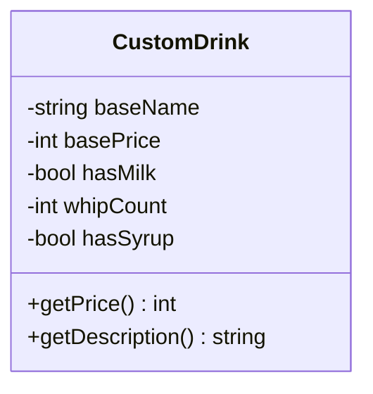
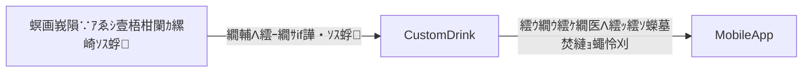
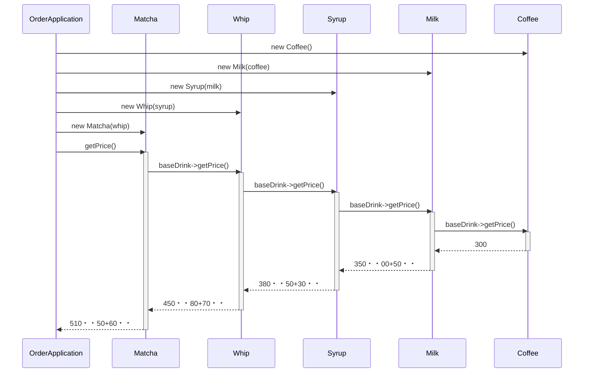
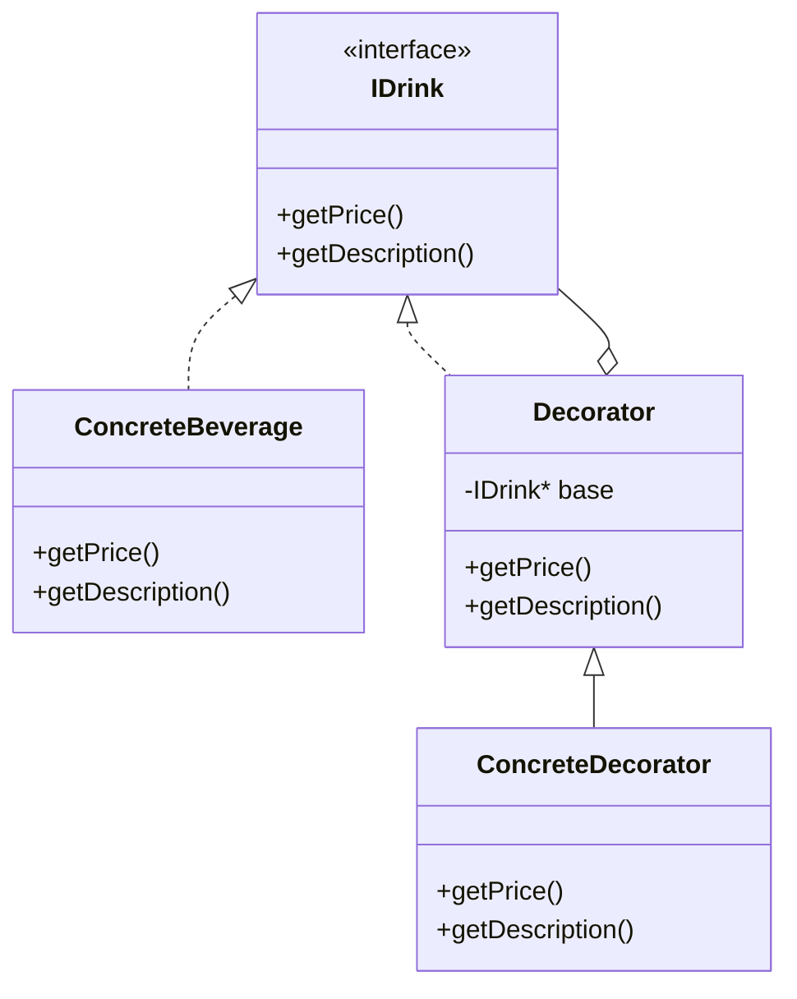

## 隨ｬ6遶 螟峨ｏ繧区ｩ溯・縺ｮ邨・∩蜷医ｏ縺・窶補€・Decorator 繝代ち繝ｼ繝ｳ

窶補€・諤晁€・・蝙具ｼ壼渕譛ｬ縺ｮ蜃ｦ逅・→霑ｽ蜉縺ｮ蜃ｦ逅・′豺ｷ蝨ｨ縺励※縺・ｋ

### 縺薙・遶縺ｮ譬ｸ蠢・

**讖溯・縺ｮ邨・∩蜷医ｏ縺帙′蠅励∴繧九◆縺ｳ縺ｫ縲∵擅莉ｶ蛻・ｲ舌ｄ繧ｯ繝ｩ繧ｹ縺ｮ謨ｰ縺碁圀髯舌↑縺丞｢励∴縺ｦ縺・￥縲ゅ◎繧後・縲√€悟渕譛ｬ縺ｨ縺ｪ繧句・逅・€阪→縲悟ｾ後°繧我ｻ倥￠雜ｳ縺吝・逅・€阪′蜷後§蝣ｴ謇€縺ｫ豺ｷ蝨ｨ縺励※縺・ｋ縺九ｉ縺縲・*

---

### 縺薙・遶繧定ｪｭ繧€縺ｨ蠕励ｉ繧後ｋ縺薙→

縺薙・遶縺ｮ繝・・繝槭・縲梧ｩ溯・縺ｮ邨・∩蜷医ｏ縺帙′蠅励∴繧九◆縺ｳ縺ｫ繧ｯ繝ｩ繧ｹ縺檎・逋ｺ縺吶ｋ縲阪→縺・≧蝠城｡後〒縺吶€ゅ€檎ｶ呎価縺ｧ蜈ｨ驛ｨ菴懊ｍ縺・→縺励◆繧蛾俣縺ｫ蜷医ｏ縺ｪ縺上↑縺｣縺溘€阪→縺・≧邨碁ｨ薙′縺ゅｋ譁ｹ縺ｯ縲√％縺ｮ遶縺檎峩謦・＠縺ｾ縺吶€・

* **蠕励ｉ繧後ｋ縺薙→1・・* 縲梧ｩ溯・縺ｮ邨・∩蜷医ｏ縺帙€阪→縺・≧隕ｳ轤ｹ縺ｧ縲√さ繝ｼ繝峨・螟牙虚邂・園繧定ｭ伜挨縺ｧ縺阪ｋ繧医≧縺ｫ縺ｪ繧九€ゅ€悟､峨ｏ繧区ｩ溯・縲阪→縲悟､峨ｏ繧峨↑縺・ｩ溯・縲阪ｒ蛹ｺ蛻･縺吶ｋ蝠上＞繧堤ｫ九※繧狗ｿ呈・縺後€∝､牙虚邂・園繧定ｦ区栢縺冗岼繧定ご縺ｦ繧九€・
* **蠕励ｉ繧後ｋ縺薙→2・・* 謗･邯夂せ縺ｧ蝓ｺ譛ｬ繝峨Μ繝ｳ繧ｯ蛛ｴ縺後ヨ繝・ヴ繝ｳ繧ｰ縺ｮ遞ｮ鬘槭・萓｡譬ｼ繝ｻ邨・∩蜷医ｏ縺帙ｒ縺ｩ縺薙∪縺ｧ遏･縺｣縺ｦ縺・ｋ縺九ｒ隱ｿ縺ｹ縲∝､画峩縺ｮ逞帙∩縺檎函縺ｾ繧後ｋ逅・罰繧定ｪｬ譏弱〒縺阪ｋ繧医≧縺ｫ縺ｪ繧九€・
* **蠕励ｉ繧後ｋ縺薙→3・・* 謗･邯夂せ縺ｮ邏・據繧偵◎繧阪∴繧九→縲√ヨ繝・ヴ繝ｳ繧ｰ霑ｽ蜉縺ｮ螟画峩繧貞ｮ溯｣・け繝ｩ繧ｹ縺ｨ邨・∩遶九※邂・園縺ｸ蟇・○繧峨ｌ繧九％縺ｨ繧定ｪｬ譏弱〒縺阪ｋ繧医≧縺ｫ縺ｪ繧九€・
* **蠕励ｉ繧後ｋ縺薙→4・・* 蝓ｺ譛ｬ讖溯・縺ｨ霑ｽ蜉讖溯・繧貞酔縺倥う繝ｳ繧ｿ繝ｼ繝輔ぉ繝ｼ繧ｹ縺ｧ謇ｱ縺・％縺ｨ縺ｧ縲∝他縺ｳ蜃ｺ縺怜・縺ｫ驕輔＞繧呈э隴倥＆縺帙★縺ｫ讖溯・繧剃ｽ募ｱ､縺ｧ繧る㍾縺ｭ縺ｦ縺・￥隕也せ縺瑚ｺｫ縺ｫ縺､縺上€ゅ€瑚ｿｽ蜉縺吶ｋ縺溘・縺ｫ蜻ｼ縺ｳ蜃ｺ縺怜・繧ょ､峨∴繧句ｿ・ｦ√′逕溘§縺ｾ縺吶€阪→縺・≧逞帙∩繧堤ｵ碁ｨ薙＠縺溘→縺阪€√％縺ｮ讒矩€縺ｮ蠢・ｦ∵€ｧ縺悟ｮ滓─縺ｨ縺励※莨昴ｏ縺｣縺ｦ縺上ｋ縲・

---

## 鳩 繝輔ぉ繝ｼ繧ｺ1・夂樟迥ｶ謚頑升 窶補€・莉墓ｧ倥ｒ謨ｴ逅・＠縲√す繧ｹ繝・Β縺ｨ邏蝉ｻ倥￠繧・
### 1-1・壹％縺ｮ繧ｷ繧ｹ繝・Β縺ｮ莉墓ｧ・

縺薙・繧ｷ繧ｹ繝・Β縺ｯ縲√き繝輔ぉ縺ｮ繝峨Μ繝ｳ繧ｯ豕ｨ譁・ｒ**繧ｫ繧ｹ繧ｿ繝槭う繧ｺ**縺励€∝粋險磯≡鬘阪→豕ｨ譁・錐遘ｰ繧堤ｮ怜・縺励∪縺吶€・

縺雁ｮ｢讒倥・蝓ｺ譛ｬ繝峨Μ繝ｳ繧ｯ繧帝∈謚槭＠縺溘≧縺医〒縲∬､・焚縺ｮ繝医ャ繝斐Φ繧ｰ繧定・逕ｱ縺ｫ邨・∩蜷医ｏ縺帙ｉ繧後∪縺吶€ゅす繧ｹ繝・Β縺ｯ驕ｸ謚槭＆繧後◆蜀・ｮｹ縺九ｉ `getPrice()`・亥粋險磯≡鬘搾ｼ峨→ `getDescription()`・域ｳｨ譁・錐遘ｰ・峨・2縺､縺ｮ蛟､繧定ｿ斐＠縺ｾ縺吶€・

縺薙・繧ｷ繧ｹ繝・Β縺ｫ縺ｯ縲√Γ繝九Η繝ｼ縺ｨ繝医ャ繝斐Φ繧ｰ縺ｮ萓｡譬ｼ繝ｻ遞ｮ鬘槭ｒ豎ｺ繧√ｋ**蝠・刀莨∫判驛ｨ**縲√せ繧ｿ繝・ヵ縺ｫ陦ｨ遉ｺ縺吶ｋ豕ｨ譁・錐遘ｰ縺ｮ繝ｫ繝ｼ繝ｫ繧堤ｮ｡逅・☆繧・*蠎苓・繧ｪ繝壹Ξ繝ｼ繧ｷ繝ｧ繝ｳ驛ｨ**縲√さ繝ｼ繝峨ｒ菫晏ｮ医☆繧・*髢狗匱繝√・繝**縺ｮ3閠・′髢｢繧上▲縺ｦ縺・∪縺吶€・

**迴ｾ蝨ｨ縺ｮ繝｡繝九Η繝ｼ縺ｨ萓｡譬ｼ**

| 遞ｮ蛻･ | 蝠・刀蜷・| 萓｡譬ｼ |
|---|---|---|
| 蝓ｺ譛ｬ繝峨Μ繝ｳ繧ｯ | Coffee・医さ繝ｼ繝偵・・・| 300蜀・|
| 繝医ャ繝斐Φ繧ｰ | Milk・医Α繝ｫ繧ｯ・・| +50蜀・|
| 繝医ャ繝斐Φ繧ｰ | Syrup・医す繝ｭ繝・・・・| +30蜀・|
| 繝医ャ繝斐Φ繧ｰ | Whip・医・繧､繝・・・・| +70蜀・|

繝医ャ繝斐Φ繧ｰ縺ｯ隍・焚霑ｽ蜉縺ｧ縺阪∪縺吶€ＡgetDescription()` 縺ｮ蜃ｺ蜉帑ｾ具ｼ啻Coffee + Milk + Syrup`

### 1-2・壼虚菴應ｾ九ユ繝ｼ繝悶Ν

繧ｳ繝ｼ繝峨ｒ隱ｭ繧€蜑阪↓縲√％縺ｮ繧ｷ繧ｹ繝・Β縺後←繧薙↑蜈･蜉帙↓蟇ｾ縺励※縺ｩ繧薙↑蜃ｺ蜉帙ｒ霑斐☆縺九ｒ遒ｺ隱阪＠縺ｾ縺吶€ゆｻ･荳九・蜍穂ｽ懊ｒ蝓ｺ貅悶→縺励€√ヵ繧ｧ繝ｼ繧ｺ7縺ｧ縺ｯ謗ｲ霈峨＠縺溽ｵ・∩蜷医ｏ縺帙ｒ螳溯｡檎ｵ先棡縺ｧ辣ｧ蜷医＠縺ｾ縺吶€・

| 豕ｨ譁・・螳ｹ | getDescription() 縺ｮ蜃ｺ蜉・| getPrice() 縺ｮ蜃ｺ蜉・|
| --- | --- | --- |
| 繝吶・繧ｹ繧ｳ繝ｼ繝偵・縺ｮ縺ｿ | `Coffee` | 300蜀・|
| 繧ｳ繝ｼ繝偵・ + 繝溘Ν繧ｯ | `Coffee + Milk` | 350蜀・ｼ・00 + 50・・|
| 繧ｳ繝ｼ繝偵・ + 繝溘Ν繧ｯ + 繧ｷ繝ｭ繝・・ | `Coffee + Milk + Syrup` | 380蜀・ｼ・00 + 50 + 30・・|
| 繧ｳ繝ｼ繝偵・ + 繝溘Ν繧ｯ + 繝帙う繝・・ | `Coffee + Milk + Whip` | 420蜀・ｼ・00 + 50 + 70・・|
| 繧ｳ繝ｼ繝偵・ + 繝帙う繝・・ﾃ・ | `Coffee + Whip + Whip` | 440蜀・ｼ・00 + 70 + 70・・|
| 繧ｳ繝ｼ繝偵・ + 繝溘Ν繧ｯ + 繧ｷ繝ｭ繝・・ + 繝帙う繝・・ | `Coffee + Milk + Syrup + Whip` | 450蜀・ｼ・00 + 50 + 30 + 70・・|

縺薙・陦ｨ縺後％縺ｮ遶蜈ｨ菴薙・蜍穂ｽ懊・蝓ｺ貅悶↓縺ｪ繧翫∪縺吶€ゅヵ繧ｧ繝ｼ繧ｺ1縺九ｉ繝輔ぉ繝ｼ繧ｺ7縺ｾ縺ｧ縲∵ｧ矩€縺後←繧後□縺鷹＆縺｣縺ｦ繧ゅ€√％縺ｮ蜈･蜃ｺ蜉帙・蟇ｾ蠢懊・螟峨ｏ繧翫∪縺帙ｓ縲ゅ€御ｽ輔′蜷後§縺ｧ縲∽ｽ輔′驕輔≧縺ｮ縺九€阪ｒ諢剰ｭ倥＠縺ｪ縺後ｉ繧ｳ繝ｼ繝峨ｒ隱ｭ繧€縺ｨ縲∝推繧ｹ繝・ャ繝励・譛ｬ雉ｪ逧・↑蟾ｮ逡ｰ縺瑚ｦ九∴繧・☆縺上↑繧翫∪縺吶€・

谺｡縺ｯ莉墓ｧ倥→繧ｯ繝ｩ繧ｹ繧貞ｯｾ蠢懊▼縺代∪縺吶€・

**縺薙・繧ｷ繧ｹ繝・Β縺ｮ逋ｻ蝣ｴ繧ｯ繝ｩ繧ｹ**

| 繧ｯ繝ｩ繧ｹ蜷・| 蠖ｹ蜑ｲ | 諡・ｽ薙☆繧倶ｻ墓ｧ・|
|---|---|---|
| `CustomDrink` | 繝峨Μ繝ｳ繧ｯ1豕ｨ譁・・蜈ｨ諠・ｱ繧剃ｿ晄戟縺励€∝粋險磯≡鬘阪→豕ｨ譁・錐遘ｰ繧定ｿ斐☆ | 蝓ｺ譛ｬ繝峨Μ繝ｳ繧ｯ驕ｸ謚槭・繝医ャ繝斐Φ繧ｰ邨・∩蜷医ｏ縺帙・驥鷹｡崎ｨ育ｮ励・蜷咲ｧｰ逕滓・ |

---

### 1-3・壹け繝ｩ繧ｹ讒区・蝗ｳ

繧ｷ繧ｹ繝・Β縺ｮ繧ｯ繝ｩ繧ｹ讒区・繧貞庄隕門喧縺励€∵ｧ矩€繧堤｢ｺ隱阪＠縺ｾ縺吶€・



縺薙・蝗ｳ縺檎､ｺ縺咎€壹ｊ縲～CustomDrink` 縺ｨ縺・≧蜊倅ｸ€縺ｮ繧ｯ繝ｩ繧ｹ縺後€√ラ繝ｪ繝ｳ繧ｯ縺ｮ蝓ｺ譛ｬ諠・ｱ縺ｨ縺吶∋縺ｦ縺ｮ繝医ャ繝斐Φ繧ｰ諠・ｱ繧剃ｸ€謇九↓蠑輔″蜿励￠縺ｦ縺・ｋ讒区・縺ｫ縺ｪ縺｣縺ｦ縺・∪縺吶€・

---

### 1-4・壼ｮ溯｣・さ繝ｼ繝会ｼ育樟迥ｶ・・

迴ｾ蝨ｨ謠蝉ｾ帑ｸｭ縺ｮ6縺､縺ｮ莉｣陦ｨ逧・↑邨・∩蜷医ｏ縺帙ｒ螳溯｡後＠縺ｾ縺吶€・

```cpp
#include <iostream>
#include <string>

using namespace std;

class CustomDrink {
private:
    string baseName;
    int basePrice;
    // 繝医ャ繝斐Φ繧ｰ縺斐→縺ｮ譛臥┌繝ｻ蛟区焚繧偵Γ繝ｳ繝舌〒邂｡逅・＠縺ｦ縺・ｋ
    bool hasMilk;
    bool hasSyrup;
    int whipCount;

public:
    CustomDrink(
        string name, int price, bool milk, bool syrup, int whip)
        : baseName(name), basePrice(price),
          hasMilk(milk), hasSyrup(syrup), whipCount(whip) {}

    int getPrice() const {
        int total = basePrice;
        // 繝医ャ繝斐Φ繧ｰ縺斐→縺ｮ霑ｽ蜉譁咎≡繧定ｨ育ｮ・
        if (hasMilk)  total += 50;
        if (hasSyrup) total += 30;
        total += 70 * whipCount;
        return total;
    }

    string getDescription() const {
        string desc = baseName;
        // 繝医ャ繝斐Φ繧ｰ縺斐→縺ｮ蜷榊燕繧定ｿｽ蜉
        if (hasMilk)  desc += " + Milk";
        if (hasSyrup) desc += " + Syrup";
        for (int i = 0; i < whipCount; ++i) {
            desc += " + Whip";
        }
        return desc;
    }
};

void printOrder(const string& label, const CustomDrink& order) {
    cout << label << "\n";
    cout << "豕ｨ譁・・螳ｹ: " << order.getDescription() << "\n";
    cout << "蜷郁ｨ磯≡鬘・ " << order.getPrice() << "蜀・n";
}

int main() {
    printOrder("--- 陦・: 繝吶・繧ｹ縺ｮ縺ｿ ---",
               CustomDrink("Coffee", 300, false, false, 0));
    printOrder("--- 陦・: 繝溘Ν繧ｯ ---",
               CustomDrink("Coffee", 300, true, false, 0));
    printOrder("--- 陦・: 繝溘Ν繧ｯ + 繧ｷ繝ｭ繝・・ ---",
               CustomDrink("Coffee", 300, true, true, 0));
    printOrder("--- 陦・: 繝溘Ν繧ｯ + 繝帙う繝・・ ---",
               CustomDrink("Coffee", 300, true, false, 1));
    printOrder("--- 陦・: 繝帙う繝・・2蝗・---",
               CustomDrink("Coffee", 300, false, false, 2));
    printOrder("--- 陦・: 蜈ｨ繝医ャ繝斐Φ繧ｰ ---",
               CustomDrink("Coffee", 300, true, true, 1));
    return 0;
}
```

荳願ｨ倥さ繝ｼ繝峨・螳溯｡檎ｵ先棡・・

```text
--- 陦・: 繝吶・繧ｹ縺ｮ縺ｿ ---
豕ｨ譁・・螳ｹ: Coffee
蜷郁ｨ磯≡鬘・ 300蜀・
--- 陦・: 繝溘Ν繧ｯ ---
豕ｨ譁・・螳ｹ: Coffee + Milk
蜷郁ｨ磯≡鬘・ 350蜀・
--- 陦・: 繝溘Ν繧ｯ + 繧ｷ繝ｭ繝・・ ---
豕ｨ譁・・螳ｹ: Coffee + Milk + Syrup
蜷郁ｨ磯≡鬘・ 380蜀・
--- 陦・: 繝溘Ν繧ｯ + 繝帙う繝・・ ---
豕ｨ譁・・螳ｹ: Coffee + Milk + Whip
蜷郁ｨ磯≡鬘・ 420蜀・
--- 陦・: 繝帙う繝・・2蝗・---
豕ｨ譁・・螳ｹ: Coffee + Whip + Whip
蜷郁ｨ磯≡鬘・ 440蜀・
--- 陦・: 蜈ｨ繝医ャ繝斐Φ繧ｰ ---
豕ｨ譁・・螳ｹ: Coffee + Milk + Syrup + Whip
蜷郁ｨ磯≡鬘・ 450蜀・
```

蜍穂ｽ應ｾ九ユ繝ｼ繝悶Ν縺ｮ蜈ｨ6陦後↓縺､縺・※縲∵ｳｨ譁・錐遘ｰ縺ｨ蜷郁ｨ磯≡鬘阪′荳€閾ｴ縺励※縺・∪縺吶€・
`CustomDrink` 縺後☆縺ｹ縺ｦ縺ｮ繝医ャ繝斐Φ繧ｰ繧偵Γ繝ｳ繝舌→縺励※謖√■縲∽ｾ｡譬ｼ險育ｮ励→蜷咲ｧｰ逕滓・縺ｧ
蛟句挨縺ｫ蜃ｦ逅・＠縺ｦ縺・ｋ轤ｹ縺後€∝ｾ後・螟画峩縺ｧ蝠城｡後↓縺ｪ繧翫∪縺吶€・

縺薙・繧ｳ繝ｼ繝峨ｒ隕九ｋ縺ｨ縲～CustomDrink` 繧ｯ繝ｩ繧ｹ縺後←縺ｮ繝医ャ繝斐Φ繧ｰ縺後＞縺上ｉ縺ｧ縲√←繧薙↑蜷榊燕縺ｫ縺ｪ繧九°繧偵☆縺ｹ縺ｦ逶ｴ謗･遏･縺｣縺ｦ縺・ｋ縺薙→縺悟・縺九ｊ縺ｾ縺吶€・

---

### 1-5・壼､画峩隕∵ｱ・

**螟画峩隕∵ｱゅ・逋ｺ逕溘メ繝ｼ繝・・* 莉雁屓縺ｮ螟画峩隕∵ｱゅ・**蝠・刀莨∫判驛ｨ**縺九ｉ螻翫＞縺ｦ縺・∪縺吶€ゅヨ繝・ヴ繝ｳ繧ｰ縺ｮ遞ｮ鬘槭・萓｡譬ｼ繧堤ｮ｡逅・☆繧九メ繝ｼ繝縺ｧ縺吶€る幕逋ｺ繝√・繝縺ｯ蜿励￠謇九→縺ｪ繧翫∪縺吶€ゅ％縺ｮ轤ｹ繧偵ヵ繧ｧ繝ｼ繧ｺ2縺ｮ縲瑚ｪｰ縺ｮ蛻､譁ｭ縺ｧ螟峨ｏ繧九°縲阪・隴ｰ隲悶∈縺ｮ莨冗ｷ壹→縺励※隕壹∴縺ｦ縺翫″縺ｾ縺吶€・

**莉墓ｧ伜､画峩縺ｮ蜀・ｮｹ**

螟画峩隕∵ｱゅｒ蜿励￠縺ｦ縲・∈謚槭〒縺阪ｋ繝医ャ繝斐Φ繧ｰ縺後←縺・､峨ｏ繧九°繧呈紛逅・＠縺ｾ縺吶€・

| 鬆・岼 | 螟画峩蜑・| 螟画峩蠕・|
|---|---|---|
| 繝医ャ繝斐Φ繧ｰ縺ｮ遞ｮ鬘・| Milk繝ｻSyrup繝ｻWhip・・遞ｮ・・| **Milk繝ｻSyrup繝ｻWhip繝ｻMatcha繝ｻChoco・・遞ｮ・・* |
| 謚ｹ闌ｶ繝代え繝€繝ｼ・・atcha・・| 驕ｸ謚樔ｸ榊庄 | **+60蜀・〒霑ｽ蜉蜿ｯ閭ｽ** |
| 繝√Ι繧ｳ繝√ャ繝暦ｼ・hoco・・| 驕ｸ謚樔ｸ榊庄 | **+40蜀・〒霑ｽ蜉蜿ｯ閭ｽ** |

**螟画峩蠕後・蜃ｺ蜉帑ｾ・*

| 豕ｨ譁・・螳ｹ | getDescription() | getPrice() |
|---|---|---|
| 繧ｳ繝ｼ繝偵・ + 謚ｹ闌ｶ繝代え繝€繝ｼ | `Coffee + Matcha` | 360蜀・ｼ・00 + 60・・|
| 繧ｳ繝ｼ繝偵・ + 繝√Ι繧ｳ繝√ャ繝・| `Coffee + Choco` | 340蜀・ｼ・00 + 40・・|
| 繧ｳ繝ｼ繝偵・ + 繝溘Ν繧ｯ + 謚ｹ闌ｶ繝代え繝€繝ｼ + 繝√Ι繧ｳ繝√ャ繝・| `Coffee + Milk + Matcha + Choco` | 450蜀・ｼ・00 + 50 + 60 + 40・・|

繝吶・繧ｹ繝峨Μ繝ｳ繧ｯ縺ｮ萓｡譬ｼ縺ｨ譌｢蟄倥ヨ繝・ヴ繝ｳ繧ｰ・・ilk繝ｻSyrup繝ｻWhip・峨・萓｡譬ｼ繝ｻ蜷咲ｧｰ縺ｯ螟画峩縺ｪ縺励〒縺吶€よ眠縺励＞繝医ャ繝斐Φ繧ｰ繧定ｿｽ蜉縺励※繧ゅ€∵里蟄倥・邨・∩蜷医ｏ縺帙ヱ繧ｿ繝ｼ繝ｳ縺ｮ蜍穂ｽ懊・螟峨ｏ繧翫∪縺帙ｓ縲・

縺励°縺励€√€後％繧後・1蝗樣剞繧翫・螟画峩縺ｪ縺ｮ縺九€∽ｻ雁ｾ後ｂ邯壹￥縺ｮ縺九€阪ｒ縺吶＄縺ｫ繧ｳ繝ｼ繝峨〒蟇ｾ蠢懊☆繧句燕縺ｫ遒ｺ隱阪＠縺ｦ縺翫″縺溘＞縺ｨ諤昴＞縺ｾ縺吶€・

繝輔ぉ繝ｼ繧ｺ1縺ｧ繧ｷ繧ｹ繝・Β縺ｮ迴ｾ迥ｶ縺ｨ螟画峩隕∵ｱゅ′謚頑升縺ｧ縺阪∪縺励◆縲よｬ｡縺ｮ繝輔ぉ繝ｼ繧ｺ2縺ｧ縺ｯ縲√€御ｽ輔′螟峨ｏ繧翫€∽ｽ輔′螟峨ｏ繧峨↑縺・°縲阪ｒ謨ｴ逅・＠縺ｾ縺吶€・

---

## 泪 繝輔ぉ繝ｼ繧ｺ2・壻ｻｮ隱ｬ遶区｡・窶補€・菴輔′螟峨ｏ繧九°繧定ｦｳ蟇溘＠縲√ヲ繧｢繝ｪ繝ｳ繧ｰ縺ｧ陬丈ｻ倥￠繧・

繝輔ぉ繝ｼ繧ｺ1縺ｧ繧ｷ繧ｹ繝・Β縺ｮ迴ｾ迥ｶ繧定ｦｳ蟇溘＠縺ｾ縺励◆縲よｬ｡縺ｮ繝輔ぉ繝ｼ繧ｺ2縺ｧ縺ｯ縲∫樟蝣ｴ縺ｫ螻翫＞縺溷､画峩隕∵ｱゅｒ襍ｷ轤ｹ縺ｫ縺励※縲御ｽ輔′螟峨ｏ繧翫€∽ｽ輔′螟峨ｏ繧峨↑縺・°縲阪・莉ｮ隱ｬ繧堤ｫ九※縲・未菫り€・→縺ｮ繝偵い繝ｪ繝ｳ繧ｰ繧帝€壹§縺ｦ縺昴ｌ繧堤｢ｺ螳壹＆縺帙※縺・″縺ｾ縺吶€ょｮ溯｣・→雋ｬ莉ｻ縺御ｸ€閾ｴ縺励↑縺・ｮ・園縺薙◎縺後€√・縺｡縺ｮ蝠城｡後・逋ｺ逕滓ｺ舌↓縺ｪ繧翫∪縺吶€・

### 2-1・啻CustomDrink`縺ｫ豺ｷ蝨ｨ縺励※縺・ｋ遏･隴倥→諡・ｽ薙メ繝ｼ繝

`CustomDrink.getPrice()` 縺ｨ `CustomDrink.getDescription()` 縺檎樟蝨ｨ謚ｱ縺医※縺・ｋ遏･隴倥→縲√◎繧後◇繧後ｒ螟画峩縺吶ｋ繝√・繝繧堤｢ｺ隱阪＠縺ｾ縺吶€・

| 遏･隴假ｼ医さ繝ｼ繝峨′逶ｴ謗･謖√▲縺ｦ縺・ｋ繧ゅ・・・| 螟画峩繧呈ｱｺ繧√ｋ繝√・繝 | 驕ｩ蛻・° |
|---|---|---|
| 蝓ｺ譛ｬ繝峨Μ繝ｳ繧ｯ縺ｮ蜷咲ｧｰ縺ｨ蝓ｺ譛ｬ萓｡譬ｼ | 繝峨Μ繝ｳ繧ｯ髢狗匱繝√・繝 | 笨・|
| 繝溘Ν繧ｯ霑ｽ蜉縺ｮ萓｡譬ｼ・・0蜀・ｼ峨・陦ｨ遉ｺ蜷・| 蝠・刀莨∫判驛ｨ / 蠎苓・繧ｪ繝壹Ξ繝ｼ繧ｷ繝ｧ繝ｳ險ｭ險磯Κ | 笶・豺ｷ蝨ｨ |
| 繝帙う繝・・霑ｽ蜉縺ｮ萓｡譬ｼ・・0蜀・ｼ・| 蝠・刀莨∫判驛ｨ | 笶・豺ｷ蝨ｨ |
| 繧ｷ繝ｭ繝・・霑ｽ蜉縺ｮ萓｡譬ｼ・・0蜀・ｼ・| 蝠・刀莨∫判驛ｨ | 笶・豺ｷ蝨ｨ |

笶後′3縺､縺ゅｋ縲ゅヨ繝・ヴ繝ｳ繧ｰ萓｡譬ｼ繧貞膚蜩∽ｼ∫判驛ｨ縺悟､峨∴繧九◆縺ｳ縺ｫ縲√ラ繝ｪ繝ｳ繧ｯ縺ｮ蝓ｺ譛ｬ諠・ｱ繧呈戟縺､繧ｯ繝ｩ繧ｹ縺ｫ謇九′蜈･繧翫∪縺吶€ＡgetPrice()` 繧・`getDescription()` 縺ｮ荳ｭ縺ｫ繝医ャ繝斐Φ繧ｰ縺斐→縺ｮ蜃ｦ逅・′ `if` 譁・〒譖ｸ縺埼€｣縺ｭ繧峨ｌ縺ｦ縺・ｋ縺溘ａ縲√€悟ｾ後°繧芽ｿｽ蜉縺輔ｌ繧句・逅・€阪→縲悟渕譛ｬ縺ｨ縺ｪ繧句・逅・€阪′蜷後§蝣ｴ謇€縺ｫ豺ｷ蝨ｨ縺励※縺・∪縺吶€ゅ％繧後′蠕後・螟画峩縺ｮ逞帙∩縺ｮ莠亥・縺ｧ縺吶€・

### 2-3・壻ｻ雁屓縺ｮ螟画峩縺ｧ遒ｺ螳溘↓螟峨ｏ繧九％縺ｨ

縺・″縺ｪ繧翫さ繝ｼ繝峨ｒ菫ｮ豁｣縺吶ｋ縺ｮ縺ｧ縺ｯ縺ｪ縺上€√・縺倥ａ縺ｫ莉雁屓縺ｮ螟画峩隕∵ｱゅ〒縲檎｢ｺ螳溘↓螟峨ｏ繧九％縺ｨ縲阪ｒ謨ｴ逅・＠縺ｾ縺吶€・

- **繝医ャ繝斐Φ繧ｰ縺ｮ遞ｮ鬘槭・霑ｽ蜉**・壹€梧柑闌ｶ繝代え繝€繝ｼ・・atcha・峨€阪→縲後メ繝ｧ繧ｳ繝√ャ繝暦ｼ・hoco・峨€阪ｒ霑ｽ蜉縺吶ｋ
- **`CustomDrink` 繧ｯ繝ｩ繧ｹ縺ｮ菫ｮ豁｣**・壽眠縺励＞繝輔Λ繧ｰ・・bool hasMatcha` 遲会ｼ峨・霑ｽ蜉縺ｨ繧ｳ繝ｳ繧ｹ繝医Λ繧ｯ繧ｿ縺ｮ螟画峩縺悟ｿ・ｦ・
- **蜻ｼ縺ｳ蜃ｺ縺怜・縺ｮ繧ｳ繝ｼ繝我ｿｮ豁｣**・壹さ繝ｳ繧ｹ繝医Λ繧ｯ繧ｿ蠑墓焚縺ｮ蠅怜刈縺ｫ莨ｴ縺・€∵里蟄倥・蜻ｼ縺ｳ蜃ｺ縺礼ｮ・園繧偵☆縺ｹ縺ｦ菫ｮ豁｣縺吶ｋ蠢・ｦ√′縺ゅｋ

縺溘□縺励€後％縺ｮ螟画峩縺・蝗樣剞繧翫°縲∽ｻ雁ｾ後ｂ邯壹￥縺九€阪↓繧医▲縺ｦ縲√←縺薙∪縺ｧ險ｭ險医ｒ螟峨∴繧九∋縺阪°縺悟､ｧ縺阪￥螟峨ｏ繧翫∪縺吶€る未菫り€・↓遒ｺ隱阪＠縺ｾ縺吶€・

---

### 繝偵い繝ｪ繝ｳ繧ｰ縺ｫ蜷代￠縺溯レ譎ｯ遒ｺ隱・

縺薙・繧ｷ繧ｹ繝・Β縺ｯ縲∝・蝗ｽ螻暮幕縺吶ｋ莠ｺ豌励き繝輔ぉ繝√ぉ繝ｼ繝ｳ縺ｮ繝｢繝舌う繝ｫ繧ｪ繝ｼ繝€繝ｼ繧定｣丞・縺ｧ謾ｯ縺医ｋ豕ｨ譁・ｮ｡逅・す繧ｹ繝・Β縺ｧ縺吶€ゅ♀螳｢讒倥′繧ｹ繝槭・繝医ヵ繧ｩ繝ｳ縺九ｉ莠句燕縺ｫ繝峨Μ繝ｳ繧ｯ繧呈ｳｨ譁・＠縲∝ｺ苓・縺ｧ繧ｹ繝繝ｼ繧ｺ縺ｫ蜿励￠蜿悶ｌ繧倶ｻ慕ｵ・∩繧呈署萓帙＠縺ｦ縺・∪縺吶€・

繧ｷ繧ｹ繝・Β縺檎ｫ九■荳翫′縺｣縺溷ｽ灘・縲√Γ繝九Η繝ｼ縺ｯ縲後さ繝ｼ繝偵・縲阪ｄ縲檎ｴ・幻縲阪→縺・▲縺溘す繝ｳ繝励Ν縺ｪ蝓ｺ譛ｬ繝峨Μ繝ｳ繧ｯ縺ｮ縺ｿ縺ｧ縺励◆縲ゅ＠縺九＠縲√ン繧ｸ繝阪せ縺梧・髟ｷ縺励€瑚・蛻・･ｽ縺ｿ縺ｫ繧ｫ繧ｹ繧ｿ繝槭う繧ｺ縺励◆縺・€阪→縺・≧縺雁ｮ｢讒倥・螢ｰ縺悟､ｧ縺阪￥縺ｪ繧九↓縺､繧後※縲√Α繝ｫ繧ｯ縺ｮ霑ｽ蜉縲√・繧､繝・・縺ｮ蠅鈴㍼縲√す繝ｭ繝・・縺ｮ螟画峩縺ｪ縺ｩ縲∝､夂ｨｮ螟壽ｧ倥↑繝医ャ繝斐Φ繧ｰ讖溯・縺瑚ｿｽ蜉縺輔ｌ縺ｦ縺阪∪縺励◆縲ょｺ苓・縺ｮ繧ｪ繝壹Ξ繝ｼ繧ｷ繝ｧ繝ｳ縺ｨ騾｣蜍輔☆繧九◆繧√€∵ｳｨ譁・す繧ｹ繝・Β縺ｯ豁｣遒ｺ縺ｪ縲悟粋險磯≡鬘阪€阪→縲√ラ繝ｪ繝ｳ繧ｯ繧剃ｽ懊ｋ繧ｹ繧ｿ繝・ヵ縺ｫ莨昴∴繧九◆繧√・縲梧ｳｨ譁・・螳ｹ・亥錐蜑搾ｼ峨€阪ｒ邂怜・縺吶ｋ驥崎ｦ√↑蠖ｹ蜑ｲ繧呈球縺｣縺ｦ縺・∪縺吶€・

### 2-4・夐未菫り€・ヲ繧｢繝ｪ繝ｳ繧ｰ

> **迴ｾ螳溘・繝偵い繝ｪ繝ｳ繧ｰ縺ｧ縺ｯ窶披€・* 譛ｬ譖ｸ縺ｮ繝偵い繝ｪ繝ｳ繧ｰ繧ｷ繝ｼ繝ｳ縺ｧ縺ｯ險ｭ險亥愛譁ｭ繧呈・遒ｺ縺ｫ縺吶ｋ縺溘ａ縲∵э蝗ｳ逧・↓縲檎炊諠ｳ逧・↑蝗樒ｭ斐€阪′霑斐▲縺ｦ縺上ｋ繧医≧縺ｫ謠上＞縺ｦ縺・∪縺吶€ゅ％繧後・繧ｷ繝溘Η繝ｬ繝ｼ繧ｷ繝ｧ繝ｳ縺ｧ縺吶€ら樟螳溘↓縺ｯ縲√€悟､峨ｏ繧九°縺ｩ縺・°蛻・°繧峨↑縺・€阪€後◆縺ｶ繧灘､峨ｏ繧峨↑縺・€阪→縺・≧譖匁乂縺ｪ遲斐∴縺瑚ｿ斐ｋ縺薙→繧ょ､壹＞縺ｧ縺吶€ゅ◎縺ｮ縺ｨ縺阪・ `git log` 繧・℃蜴ｻ縺ｮ髫懷ｮｳ險倬鹸繧偵€後ヲ繧｢繝ｪ繝ｳ繧ｰ縺ｮ莉｣繧上ｊ縲阪→縺励※菴ｿ縺｣縺ｦ縺ｿ縺ｦ縺上□縺輔＞縲ゅ€碁℃蜴ｻ縺ｫ菴募ｺｦ螟峨ｏ縺｣縺溘°縲阪′譛€繧よｭ｣逶ｴ縺ｪ險ｼ諡縺ｧ縺吶€・

遒ｺ螳壼､画峩繧呈声縺医※縲∝膚蜩∽ｼ∫判驛ｨ縺ｮ菴占陸繝槭ロ繝ｼ繧ｸ繝｣繝ｼ縺ｨ縺ｮ繝溘・繝・ぅ繝ｳ繧ｰ縺ｮ譎る俣繧定ｨｭ螳壹＠縺ｾ縺励◆縲ゅ↑縺翫€√ヲ繧｢繝ｪ繝ｳ繧ｰ縺ｧ蜃ｺ縺ｦ縺阪◆諠・ｱ縺ｯ縲御ｻ雁屓遒ｺ螳壹＠縺ｦ縺・ｋ螟画峩縲阪→縲悟ｰ・擂螟峨ｏ繧翫≧繧九Μ繧ｹ繧ｯ縲阪↓蛻・￠縺ｦ蠕後〒謨ｴ逅・＠縺ｾ縺吶€・

**髢狗匱閠・ｼ・* 縲御ｻ雁屓縺ｮ縲取柑闌ｶ繝代え繝€繝ｼ縲上→縲弱メ繝ｧ繧ｳ繝√ャ繝励€上・霑ｽ蜉縺ｮ莉ｶ縲√す繧ｹ繝・Β縺ｸ縺ｮ邨・∩霎ｼ縺ｿ繧呈､懆ｨ弱＠縺ｦ縺・∪縺吶€ゆｸ€縺､遒ｺ隱阪＆縺帙※縺上□縺輔＞縲ゆｻ雁ｾ後ｂ縺薙・繧医≧縺ｫ縲∵眠縺励＞繝医ャ繝斐Φ繧ｰ縺ｮ遞ｮ鬘槭・蠅励∴邯壹￠繧九→閠・∴縺ｦ繧医＞縺ｧ縺励ｇ縺・°・溘€・

**菴占陸繝槭ロ繝ｼ繧ｸ繝｣繝ｼ・・* 縲後ｂ縺｡繧阪ｓ縺ｧ縺呻ｼ√♀螳｢讒倥・蜿榊ｿ懊′髱槫ｸｸ縺ｫ濶ｯ縺・・縺ｧ縲∵ｯ取怦縺ｮ蟄｣遽€繧ｭ繝｣繝ｳ繝壹・繝ｳ縺斐→縺ｫ譁ｰ縺励＞繧ｫ繧ｹ繧ｿ繝槭う繧ｺ繧偵←繧薙←繧楢ｿｽ蜉縺励※縺・￥莠亥ｮ壹〒縺吶€る€・↓縲√≠縺ｾ繧贋ｺｺ豌励・縺ｪ縺・ヨ繝・ヴ繝ｳ繧ｰ縺ｯ繝｡繝九Η繝ｼ縺九ｉ關ｽ縺ｨ縺励※縺・￥・亥ｻ・ｭ｢縺吶ｋ・峨％縺ｨ繧り€・∴縺ｦ縺・∪縺吶€ゅ€・

**髢狗匱閠・ｼ・* 縲後↑繧九⊇縺ｩ縲√ヨ繝・ヴ繝ｳ繧ｰ縺ｮ遞ｮ鬘槭・豈取怦縺ｮ繧医≧縺ｫ蜈･繧梧崛繧上ｋ縺ｮ縺ｧ縺吶・縲ゅ■縺ｪ縺ｿ縺ｫ縲∝推繝医ャ繝斐Φ繧ｰ縺ｮ萓｡譬ｼ・井ｾ九∴縺ｰ繝溘Ν繧ｯ50蜀・↑縺ｩ・峨・莉翫・縺ｨ縺薙ｍ蝗ｺ螳壹〒縺吶′縲√％繧後・莉雁ｾ後ｂ螟峨ｏ繧峨↑縺・〒縺励ｇ縺・°・溘€・

**菴占陸繝槭ロ繝ｼ繧ｸ繝｣繝ｼ・・* 縲後≠縲∝ｮ溘・蜴滓攝譁呵ｲｻ縺ｮ鬮倬ｨｰ繧ゅ≠縺｣縺ｦ縲∵擂譛医°繧我ｸ€驛ｨ縺ｮ繝医ャ繝斐Φ繧ｰ繧貞€､荳翫￡縺吶ｋ讒区Φ縺後≠繧翫∪縺吶€ゆｾ｡譬ｼ謾ｹ螳壹・蟷ｴ縺ｫ謨ｰ蝗槭・縺ゅｋ縺ｨ諤昴▲縺ｦ縺翫＞縺ｦ縺上□縺輔＞縲ゅ€・

**髢狗匱閠・ｼ・* 縲梧価遏･縺励∪縺励◆縲ゆｾ｡譬ｼ繧ょ､牙虚縺吶ｋ隕∫ｴ縺ｧ縺吶・縲ゆｻ悶↓縲∝ｰ・擂逧・↓螟峨ｏ繧翫◎縺・↑繧ｫ繧ｹ繧ｿ繝槭う繧ｺ縺ｮ繝ｫ繝ｼ繝ｫ繧・€√♀螳｢讒倥°繧峨・隕∵悍縺ｧ螳溽樟縺励◆縺・％縺ｨ縺ｯ縺ゅｊ縺ｾ縺吶°・・莉翫・縺・■縺ｫ繧ｷ繧ｹ繝・Β縺ｮ蝨溷床縺ｫ蛯吶∴繧偵＠縺ｦ縺翫″縺溘＞縺ｮ縺ｧ縲ゅ€・

**菴占陸繝槭ロ繝ｼ繧ｸ繝｣繝ｼ・・* 縲後◎縺・〒縺吶・窶ｦ窶ｦ辭ｱ蠢・↑縺雁ｮ｢讒倥°繧峨€弱・繧､繝・・繧帝€壼ｸｸ縺ｮ2蛟搾ｼ医ム繝悶Ν・峨↓縺励※縺ｻ縺励＞縲上→縺九€弱メ繝ｧ繧ｳ繝√ャ繝励ｒ3蛟搾ｼ医ヨ繝ｪ繝励Ν・峨〒縲上→縺・≧隕∵悍縺後°縺ｪ繧頑擂縺ｦ縺・∪縺吶€ゆｻ翫・繧ｷ繧ｹ繝・Β荳翫〒縺阪↑縺・→縺頑妙繧翫＠縺ｦ縺・ｋ繧薙〒縺吶′縲∝ｰ・擂逧・↓縺ｯ縲主酔縺倥ヨ繝・ヴ繝ｳ繧ｰ繧定､・焚蝗櫁ｿｽ蜉縺ｧ縺阪ｋ讖溯・縲上・縺ｩ縺・＠縺ｦ繧ょｮ溽樟縺励◆縺・〒縺吶・縲ゅ€・

繝偵い繝ｪ繝ｳ繧ｰ繧帝€壹§縺ｦ縲∝ｽ灘・縺ｮ遒ｺ螳壼､画峩縺ｮ陬丞・縺ｫ縲∽ｻ翫・逵溷⊃蛟､・・oolean繝輔Λ繧ｰ・峨・讒矩€縺ｧ縺ｯ蛻ｰ蠎募､ｪ蛻€謇薙■縺ｧ縺阪↑縺・ｰ・擂縺ｮ螟牙喧縺ｾ縺ｧ隕九∴縺ｦ縺阪∪縺励◆縲ゅ％縺・＠縺滓悴遏･縺ｮ隕∽ｻｶ繧貞・譛滓ｮｵ髫弱〒蠑輔″蜃ｺ縺帙◆縺薙→縺ｯ縲∬ｨｭ險医・隕矩€壹＠繧堤ｫ九※繧倶ｸ翫〒螟ｧ縺阪↑蜑埼€ｲ縺ｧ縺吶€・

---

### 2-5・壹ヲ繧｢繝ｪ繝ｳ繧ｰ縺ｧ蛻､譏弱＠縺溷ｰ・擂繝ｪ繧ｹ繧ｯ

菴占陸繝槭ロ繝ｼ繧ｸ繝｣繝ｼ縺ｨ縺ｮ蟇ｾ隧ｱ縺九ｉ豬ｮ縺九・荳翫′縺｣縺溘€∫｢ｺ螳壼､画峩縺ｧ縺ｯ縺ｪ縺・′莉雁ｾ悟､峨ｏ繧翫≧繧九Μ繧ｹ繧ｯ繧偵∪縺ｨ繧√∪縺吶€ら｢ｺ螳壼､画峩縺ｨ豺ｷ蝨ｨ縺輔○縺壹↓蛻･繝・・繝悶Ν縺ｨ縺励※菫晄戟縺吶ｋ縺薙→縺ｧ縲∬ｨｭ險医・譬ｹ諡縺悟ｾ後°繧芽ｿｽ霍｡縺励ｄ縺吶￥縺ｪ繧翫∪縺吶€・

| **蟆・擂繝ｪ繧ｹ繧ｯ** | **譎よ悄縺ｮ逶ｮ螳・* | **譬ｹ諡** |
| --- | --- | --- |
| 繝医ャ繝斐Φ繧ｰ縺ｮ遞ｮ鬘槭・蠅玲ｸ・| 豈取怦縺ｮ繧ｭ繝｣繝ｳ繝壹・繝ｳ縺斐→ | 蝠・刀莨∫判驛ｨ 菴占陸繝槭ロ繝ｼ繧ｸ繝｣繝ｼ縺九ｉ逶ｴ謗･遒ｺ隱・|
| 繝医ャ繝斐Φ繧ｰ縺ｮ萓｡譬ｼ謾ｹ螳・| 蟷ｴ縺ｫ謨ｰ蝗橸ｼ亥次譚先侭雋ｻ遲峨↓繧医ｋ・・| 蝠・刀莨∫判驛ｨ 菴占陸繝槭ロ繝ｼ繧ｸ繝｣繝ｼ縺九ｉ逶ｴ謗･遒ｺ隱・|
| 蜷後§繝医ャ繝斐Φ繧ｰ縺ｮ隍・焚蝗櫁ｿｽ蜉・医ム繝悶Ν縲√ヨ繝ｪ繝励Ν遲会ｼ・| 蟆・擂逧・↑讖溯・諡｡蠑ｵ譎・| 蝠・刀莨∫判驛ｨ 菴占陸繝槭ロ繝ｼ繧ｸ繝｣繝ｼ縺九ｉ縺ｮ隕∵悍 |

繝偵い繝ｪ繝ｳ繧ｰ繧帝€壹§縺ｦ縲√€後ヨ繝・ヴ繝ｳ繧ｰ縺ｫ髢｢縺吶ｋ遏･隴倥€阪・髱槫ｸｸ縺ｫ螟牙喧縺梧ｿ€縺励￥縲∽ｻ雁ｾ後ｂ繝薙ず繝阪せ縺ｮ謌宣聞縺ｫ蜷医ｏ縺帙※螟壽ｧ倥↑隕∵ｱゅ′繧・▲縺ｦ縺上ｋ縺薙→縺檎｢ｺ螳壹＠縺ｾ縺励◆縲ょｽ捺凾縺ｮ諡・ｽ楢€・・闍ｦ蜉ｴ繧呈Φ蜒上＠縺ｪ縺後ｉ繧ゅ€√◎繧阪◎繧阪％縺ｮ `CustomDrink` 繧ｯ繝ｩ繧ｹ縺ｫ閭瑚ｲ繧上○縺ｦ縺・ｋ驥崎差繧貞ｰ代＠蛻・￠縺ｦ縺ゅ￡繧区凾譛溘′譚･縺溘・縺九ｂ縺励ｌ縺ｾ縺帙ｓ縲・

繝輔ぉ繝ｼ繧ｺ2縺ｧ縲√ヨ繝・ヴ繝ｳ繧ｰ縺ｮ遞ｮ鬘槭′莉雁ｾ後ｂ鬮倬ｻ蠎ｦ縺ｧ霑ｽ蜉縺輔ｌ繧九％縺ｨ縺檎｢ｺ螳壹＠縺ｾ縺励◆縲よｬ｡縺ｮ繝輔ぉ繝ｼ繧ｺ3縺ｧ縺ｯ縲√◎縺ｮ遒ｺ螳壹＠縺溘€梧眠縺励＞繝医ャ繝斐Φ繧ｰ縺ｮ霑ｽ蜉縲阪ｒ莉翫・繧ｳ繝ｼ繝峨・縺ｾ縺ｾ縺ｧ隧ｦ縺ｿ縺ｦ縲∽ｽ輔′襍ｷ縺阪ｋ縺九ｒ遒ｺ隱阪＠縺ｾ縺吶€・

---

## 泪 繝輔ぉ繝ｼ繧ｺ3・壼撫鬘檎音螳・窶補€・螟画峩縺ｮ逞帙∩繧堤匱隕九☆繧・

### 3-1・壼､画峩繧定ｩｦ縺ｿ繧・

菴占陸繝槭ロ繝ｼ繧ｸ繝｣繝ｼ縺九ｉ縺ｮ隕∵ｱる€壹ｊ縲√€梧柑闌ｶ繝代え繝€繝ｼ縲阪→縲後メ繝ｧ繧ｳ繝√ャ繝励€阪ｒ譌｢蟄倥・繧ｷ繧ｹ繝・Β縺ｫ霑ｽ蜉縺励※縺ｿ縺ｾ縺励ｇ縺・€・

縺ｯ縺倥ａ縺ｫ縺ｯ縲√ヨ繝・ヴ繝ｳ繧ｰ縺ｮ譛臥┌繧堤ｮ｡逅・＠縺ｦ縺・ｋ `CustomDrink` 繧ｯ繝ｩ繧ｹ繧帝幕縺阪∪縺吶€ゅけ繝ｩ繧ｹ縺ｮ繝｡繝ｳ繝仙､画焚縺ｨ縺励※縲～bool hasMatcha;` 縺ｨ `bool hasChocoChip;` 縺ｨ縺・≧2縺､縺ｮ繝輔Λ繧ｰ繧定ｿｽ蜉縺励∪縺吶€・
谺｡縺ｫ縲∝・譛溷喧繧定｡後≧縺溘ａ縺ｮ繧ｳ繝ｳ繧ｹ繝医Λ繧ｯ繧ｿ縺ｮ蠑墓焚縺ｫ繧ゅ€√％縺ｮ2縺､縺ｮ逵溷⊃蛟､・・oolean・峨ｒ霑ｽ蜉縺吶ｋ蠢・ｦ√′縺ゅｊ縺ｾ縺吶€・
縺昴＠縺ｦ縲∽ｾ｡譬ｼ繧定ｨ育ｮ励☆繧・`getPrice` 繝｡繧ｽ繝・ラ縺ｮ荳ｭ縺ｫ `if (hasMatcha) total += 60;` 縺ｮ繧医≧縺ｪ險育ｮ励Ο繧ｸ繝・け繧定ｶｳ縺励€∝酔讒倥↓ `getDescription` 繝｡繧ｽ繝・ラ縺ｮ荳ｭ縺ｫ繧ょ錐蜑阪ｒ邨・∩遶九※繧・`if` 譁・ｒ譖ｸ縺崎ｶｳ縺励∪縺吶€・

謚ｹ闌ｶ繧定ｿｽ蜉縺励◆蠕後・ `getPrice()` 繝｡繧ｽ繝・ラ蜈ｨ菴薙・縲√％縺ｮ繧医≧縺ｫif譁・′荳ｦ縺ｶ蠖｢縺ｫ縺ｪ繧翫∪縺吶€・

```cpp
int getPrice() const {
    int total = basePrice;
    if (hasMilk)     total += 50;
    if (hasWhip)     total += 70;
    if (hasSyrup)    total += 30;
    if (hasMatcha)   total += 60; // 竊・謚ｹ闌ｶ繝代え繝€繝ｼ繧定ｿｽ蜉
    // if (hasChoco) total += 40; // 竊・繝√Ι繧ｳ繝√ャ繝励ｂ蜷梧ｧ倥↓霑ｽ蜉莠亥ｮ・
    return total;
}
```

`getPrice()` 縺ｨ蜷梧ｧ倥↓縲～getDescription()` 縺ｫ繧よ柑闌ｶ縺ｮ蜃ｦ逅・ｒ譖ｸ縺崎ｶｳ縺吝ｿ・ｦ√′縺ゅｊ縺ｾ縺吶€・

```cpp
string getDescription() const {
    string desc = baseName;
    if (hasMilk)     desc += " + Milk";
    if (hasWhip)     desc += " + Whip";
    if (hasSyrup)    desc += " + Syrup";
    if (hasMatcha)   desc += " + Matcha"; // 竊・謚ｹ闌ｶ繝代え繝€繝ｼ繧定ｿｽ蜉
    return desc;
}
```

螟画峩蠕後・繧ｳ繝ｼ繝峨ｒ螳溯｡後☆繧九→縲∵ｬ｡縺ｮ繧医≧縺ｪ邨先棡縺ｫ縺ｪ繧翫∪縺吶€・

```cpp
// 螟画峩蠕後・ CustomDrink・域柑闌ｶ繝輔Λ繧ｰ霑ｽ蜉蠕鯉ｼ・
class CustomDrink {
    std::string baseName;
    int basePrice;
    bool hasMilk, hasWhip, hasSyrup, hasMatcha;
public:
    CustomDrink(std::string name, int price,
                bool milk, bool whip,
                bool syrup, bool matcha) // 竊・蠑墓焚縺・縺､蠅励∴縺・
        : baseName(name), basePrice(price),
          hasMilk(milk), hasWhip(whip),
          hasSyrup(syrup), hasMatcha(matcha) {}

    int getPrice() const {
        int total = basePrice;
        if (hasMilk)   total += 50;
        if (hasWhip)   total += 70;
        if (hasSyrup)  total += 30;
        if (hasMatcha) total += 60;
        return total;
    }
    std::string getDescription() const {
        std::string desc = baseName;
        if (hasMilk)   desc += " + Milk";
        if (hasWhip)   desc += " + Whip";
        if (hasSyrup)  desc += " + Syrup";
        if (hasMatcha) desc += " + Matcha";
        return desc;
    }
};

int main() {
    // 譁ｰ縺励＞繧ｳ繝ｳ繧ｹ繝医Λ繧ｯ繧ｿ蜻ｼ縺ｳ蜃ｺ縺暦ｼ亥ｼ墓焚6蛟具ｼ・
    CustomDrink order("Coffee", 500,
                      true, false, false, true);
    std::cout << order.getDescription() << std::endl;
    std::cout << order.getPrice() << " 蜀・ << std::endl;

    // 譌｢蟄倥・蜻ｼ縺ｳ蜃ｺ縺励・繧ｳ繝ｳ繝代う繝ｫ繧ｨ繝ｩ繝ｼ縺ｫ縺ｪ繧・
    // CustomDrink old("Coffee", 500, true, false, false);
    //                                              竊・蠑墓焚荳崎ｶｳ
    return 0;
}
```

螳溯｡檎ｵ先棡・・

```
Coffee + Milk + Matcha
610 蜀・
```

譁ｰ縺励＞豕ｨ譁・・豁｣縺励￥蜍輔＞縺ｦ縺・∪縺呻ｼ・00蜀・+ Milk 50蜀・+ Matcha 60蜀・= 610蜀・ｼ峨€ゅ＠縺九＠譌｢蟄倥・5蠑墓焚縺ｮ繧ｳ繝ｳ繧ｹ繝医Λ繧ｯ繧ｿ蜻ｼ縺ｳ蜃ｺ縺励・繧ｳ繝ｳ繝代う繝ｫ繧ｨ繝ｩ繝ｼ縺ｫ縺ｪ繧翫€√Δ繝舌う繝ｫ繧｢繝励Μ蛛ｴ縺ｮ菫ｮ豁｣縺悟ｿ・ｦ√〒縺吶€・

縺薙ｌ縺ｧ繧ｯ繝ｩ繧ｹ縺ｮ菫ｮ豁｣縺ｯ邨ゅｏ縺｣縺溘→諤昴＞縲√さ繝ｳ繝代う繝ｫ縺励※縺ｿ繧九→縲√さ繝ｳ繧ｹ繝医Λ繧ｯ繧ｿ縺ｮ蠑墓焚縺悟｢励∴縺溘◆繧√€～main()` 蜀・・ `CustomDrink order(...)` 縺ｧ繧ｳ繝ｳ繝代う繝ｫ繧ｨ繝ｩ繝ｼ縺檎匱逕溘＠縺ｾ縺励◆縲ＡCustomDrink` 繧堤函謌舌＠縺ｦ縺・ｋ繝｢繝舌う繝ｫ繧｢繝励Μ蛛ｴ・亥他縺ｳ蜃ｺ縺怜・・峨・繧ｳ繝ｼ繝峨〒縺吶€ゅさ繝ｳ繧ｹ繝医Λ繧ｯ繧ｿ縺ｮ蠑墓焚縺悟｢励∴縺溘％縺ｨ縺ｧ縲∵里蟄倥・縲後さ繝ｼ繝偵・縺ｫ繝溘Ν繧ｯ縺縺代€阪→縺・▲縺滓ｳｨ譁・ｒ逕滓・縺励※縺・ｋ縺吶∋縺ｦ縺ｮ邂・園縺悟｣翫ｌ縺ｦ縺励∪縺｣縺溘・縺ｧ縺吶€・

縺溘▲縺・縺､縺ｮ繝医ャ繝斐Φ繧ｰ繧定ｿｽ蜉縺励ｈ縺・→縺励◆縺縺代↑縺ｮ縺ｫ縲√け繝ｩ繧ｹ縺ｮ荳ｭ繧偵≠縺｡縺薙■謗｢縺怜屓縺｣縺ｦ菫ｮ豁｣縺励◆荳翫↓縲∝他縺ｳ蜃ｺ縺怜・縺ｮ繧ｳ繝ｼ繝峨∪縺ｧ逶ｴ縺吝ｿ・ｦ√↓霑ｫ繧峨ｌ縺ｾ縺咏憾豕√↓縺ｪ縺｣縺ｦ縺・∪縺吶€・

---

### 3-2・壼､画峩蠖ｱ髻ｿ繧ｰ繝ｩ繝・

螟画峩繧定ｩｦ縺ｿ縺溽ｵ先棡縲∝ｽｱ髻ｿ縺後←縺ｮ繧医≧縺ｫ鬟帙・轣ｫ縺励◆縺九ｒ蝗ｳ縺ｧ蜿ｯ隕門喧縺励※縺ｿ縺ｾ縺吶€・



縲梧柑闌ｶ繝代え繝€繝ｼ縺ｨ繝√Ι繧ｳ繝√ャ繝励ｒ霑ｽ蜉縺吶ｋ縲阪→縺・≧荳€縺､縺ｮ螟画峩隕∵ｱゅ′縲～CustomDrink` 繧ｯ繝ｩ繧ｹ縺ｮ蜀・Κ繧定､・焚邂・園螟画峩縺輔○繧九□縺代〒縺ｪ縺上€√◎繧後ｒ蜻ｼ縺ｳ蜃ｺ縺励※縺・ｋ繝｢繝舌う繝ｫ繧｢繝励Μ蛛ｴ縺ｮ繧ｳ繝ｼ繝峨↓繧ょｽｱ髻ｿ縺碁｣帙・轣ｫ縺励※縺・ｋ縺薙→縺瑚ｦ九∴縺ｾ縺吶€・

---

### 3-3・夂李縺ｿ縺ｮ險€隱槫喧

縲後↑縺懊％縺ｮ繧ｯ繝ｩ繧ｹ縺ｫ讖溯・繧定ｿｽ蜉縺吶ｋ縺縺代〒縲∝他縺ｳ蜃ｺ縺怜・縺ｾ縺ｧ螢翫ｌ繧九ｓ縺繧阪≧窶ｦ縲・

縺薙・螟画峩繧ｷ繝溘Η繝ｬ繝ｼ繧ｷ繝ｧ繝ｳ繧帝€壹§縺ｦ縲∫樟蝣ｴ縺ｮ繧ｨ繝ｳ繧ｸ繝九い縺檎峩髱｢縺吶ｋ蜈ｷ菴鍋噪縺ｪ霎帙＆縺・縺､隕九∴縺ｦ縺阪∪縺励◆縲・

1縺､逶ｮ縺ｯ縲∽ｿｮ豁｣邂・園縺後け繝ｩ繧ｹ蜀・↓謨｣繧峨・縺｣縺ｦ縺・※隕玖誠縺ｨ縺励ｄ縺吶＞縺ｨ縺・≧霎帙＆縺ｧ縺吶€・
譁ｰ縺励＞繝医ャ繝斐Φ繧ｰ繧定ｿｽ蜉縺励ｈ縺・→縺励◆縺ｨ縺阪€√Γ繝ｳ繝仙､画焚繧定ｶｳ縺励€√さ繝ｳ繧ｹ繝医Λ繧ｯ繧ｿ繧堤峩縺励€∽ｾ｡譬ｼ險育ｮ励・繝｡繧ｽ繝・ラ繧呈爾縺励※逶ｴ縺励€√＆繧峨↓蜷榊燕邨・∩遶九※縺ｮ繝｡繧ｽ繝・ラ繧ら峩縺吝ｿ・ｦ√′縺ゅｊ縺ｾ縺励◆縲ゆｸ€縺､縺ｮ螟画峩隕∵ｱゅ↓蟇ｾ縺励※縲√ヵ繧｡繧､繝ｫ縺ｮ荳ｭ繧剃ｽ募ｺｦ繧ゅせ繧ｯ繝ｭ繝ｼ繝ｫ縺励※菫ｮ豁｣邂・園繧呈爾縺怜屓繧峨↑縺代ｌ縺ｰ縺ｪ繧翫∪縺帙ｓ縲ゅｂ縺嶺ｸ€縺､縺ｧ繧・`if` 譁・ｒ雜ｳ縺怜ｿ倥ｌ縺溘ｉ縲∽ｾ｡譬ｼ縺ｮ險育ｮ励′蜷医ｏ縺ｪ縺・→縺・▲縺溯・蜻ｽ逧・↑荳榊・蜷医↓縺､縺ｪ縺後▲縺ｦ縺励∪縺・∪縺吶€・

2縺､逶ｮ縺ｯ縲∵ｩ溯・繧定ｿｽ蜉縺吶ｋ縺溘・縺ｫ蜻ｼ縺ｳ蜃ｺ縺怜・縺悟｣翫ｌ繧九→縺・≧縲∝ｽｱ髻ｿ遽・峇縺ｮ隱ｭ繧√↑縺輔〒縺吶€・
繝医ャ繝斐Φ繧ｰ縺ｮ遞ｮ鬘槭′蠅励∴繧九→縺・≧縺薙→縺ｯ縲～CustomDrink` 繧堤函謌舌☆繧九◆繧√・蠑墓焚縺ｮ謨ｰ縺悟｢励∴邯壹￠繧九％縺ｨ繧呈э蜻ｳ縺励∪縺吶€ゅ％縺ｮ縺ｾ縺ｾ縺ｧ縺ｯ縲∵眠縺励＞繧ｭ繝｣繝ｳ繝壹・繝ｳ縺悟ｧ九∪繧九◆縺ｳ縺ｫ縲√す繧ｹ繝・Β縺ｮ縺ゅ■縺薙■縺ｫ謨｣繧峨・縺｣縺ｦ縺・ｋ `new CustomDrink(...)` 縺ｮ繧ｳ繝ｼ繝峨ｒ縺吶∋縺ｦ謗｢縺怜・縺励€∽ｽｿ繧上↑縺・ヨ繝・ヴ繝ｳ繧ｰ縺ｮ縺溘ａ縺ｫ `false` 縺ｨ縺・≧蠑墓焚繧貞ｻｶ縲・→譖ｸ縺崎ｶｳ縺吩ｽ懈･ｭ縺ｫ霑ｽ繧上ｌ繧九％縺ｨ縺ｫ縺ｪ繧翫∪縺吶€ょ､峨∴繧九→縺ｩ縺薙′螢翫ｌ繧九°蛻・°繧峨↑縺・→縺・≧諱先€悶′縲・幕逋ｺ縺ｮ繧ｹ繝斐・繝峨ｒ蟆代＠縺壹▽螂ｪ縺｣縺ｦ縺・￥縺ｮ縺ｧ縺吶€・

繝輔ぉ繝ｼ繧ｺ3縺ｧ螟画峩繧定ｩｦ縺ｿ縺滄圀縺ｫ逕溘§縺溽李縺ｿ縺檎｢ｺ隱阪〒縺阪∪縺励◆縲よｬ｡縺ｮ繝輔ぉ繝ｼ繧ｺ4縺ｧ縺ｯ縲√↑縺懊％縺ｮ繧医≧縺ｪ逞帙∩縺檎函縺倥ｋ縺ｮ縺九€√◎縺ｮ譬ｹ譛ｬ逧・↑蜴溷屏繧偵さ繝ｼ繝峨・讒矩€縺ｨ縺・≧隕ｳ轤ｹ縺九ｉ險€隱槫喧縺励※縺・″縺ｾ縺吶€・

---
> **東 蝠城｡鯉ｼ育｢ｺ螳夲ｼ・*
> 繝医ャ繝斐Φ繧ｰ縺ｮ遞ｮ鬘槭′蠅励∴繧九◆縺ｳ縺ｫ縲～CustomDrink` 縺ｮ繝｡繝ｳ繝仙､画焚繝ｻ繧ｳ繝ｳ繧ｹ繝医Λ繧ｯ繧ｿ繝ｻ`getPrice()`繝ｻ`getDescription()` 縺ｮ4邂・園繧帝€｣蜍輔＠縺ｦ菫ｮ豁｣蠢・ｦ√′逕溘§縺ｾ縺吶€ゅヲ繧｢繝ｪ繝ｳ繧ｰ縺ｧ縲梧ｯ取怦縺ｮ繧ｭ繝｣繝ｳ繝壹・繝ｳ縺斐→縺ｫ繝医ャ繝斐Φ繧ｰ縺悟・繧梧崛繧上ｋ縲阪→遒ｺ隱阪＆繧後◆莉翫・螟画峩鬆ｻ蠎ｦ縺ｧ縺ｯ縲・遞ｮ鬘櫁ｿｽ蜉縺吶ｋ縺縺代〒蜻ｼ縺ｳ蜃ｺ縺怜・縺ｮ繧ｳ繝ｼ繝峨∪縺ｧ螢翫ｌ繧九％縺ｮ繧ｳ繧ｹ繝医・蜷医ｏ縺ｪ縺・€・
---

・医ヨ繝・ヴ繝ｳ繧ｰ霑ｽ蜉縺ｮ縺溘・縺ｫ隍・焚邂・園縺碁€｣蜍輔＠縺ｦ螟峨ｏ繧句撫鬘後′遒ｺ隱阪〒縺阪∪縺励◆縲よｬ｡縺ｮ繝輔ぉ繝ｼ繧ｺ4縺ｧ縺ｯ縲√↑縺懊％縺ｮ騾｣骼悶′襍ｷ縺阪ｋ縺ｮ縺九ｒ讒矩€逧・↓蛻・梵縺励∪縺吶€ゑｼ・

## 泛 繝輔ぉ繝ｼ繧ｺ4・壼次蝗蛻・梵 窶補€・縺ｪ縺懆ｾ帙＞縺ｮ縺九ｒ讒矩€縺ｧ險€隱槫喧縺吶ｋ

### 4-1・夂李縺ｿ縺ｮ譬ｹ貅舌ｒ謗｢繧具ｼ郁ｦｳ蟇溘→蜴溷屏・・

繝輔ぉ繝ｼ繧ｺ3縺ｧ遒ｺ隱阪＠縺溘€悟､画峩邂・園縺梧淵繧峨・縺｣縺ｦ縺・※隕玖誠縺ｨ縺励ｄ縺吶＞縲阪€悟他縺ｳ蜃ｺ縺怜・縺悟｣翫ｌ縺ｦ縺励∪縺・€阪→縺・≧2縺､縺ｮ逞帙∩繧堤匱隕九＠縺ｾ縺励◆縲ゅ％縺ｮ逞帙∩縺後↑縺懃匱逕溘☆繧九・縺九€√さ繝ｼ繝峨ｒ豕ｨ諢乗ｷｱ縺剰ｦｳ蟇溘☆繧九→縺薙→縺ｧ譬ｹ貅舌′隕九∴縺ｦ縺阪∪縺吶€・

隨ｬ荳€縺ｫ縲∵眠縺励＞繝医ャ繝斐Φ繧ｰ繧定ｿｽ蜉縺吶ｋ縺ｨ縺阪€√↑縺懈ｯ主屓 `CustomDrink` 繧帝幕縺九↑縺代ｌ縺ｰ縺ｪ繧峨↑縺・・縺ｧ縺励ｇ縺・°縲ゅ◎繧後・縲√％縺ｮ繧ｯ繝ｩ繧ｹ閾ｪ霄ｫ縺後€後Α繝ｫ繧ｯ縺ｪ繧・0蜀・€阪€後・繧､繝・・縺ｪ繧・0蜀・€阪→縺・▲縺溷・菴鍋噪縺ｪ繝医ャ繝斐Φ繧ｰ縺ｮ譚｡莉ｶ繧偵☆縺ｹ縺ｦ逶ｴ謗･遏･縺｣縺ｦ縺励∪縺｣縺ｦ縺・ｋ・域干縺郁ｾｼ繧薙〒縺・ｋ・峨°繧峨〒縺吶€・

隨ｬ莠後↓縲√↑縺懷､画峩縺ｮ蠖ｱ髻ｿ遽・峇縺瑚ｪｭ繧√★縲∝他縺ｳ蜃ｺ縺怜・縺ｾ縺ｧ螢翫ｌ繧九・縺ｧ縺励ｇ縺・°縲ゅ◎繧後・縲√€悟渕譛ｬ繝峨Μ繝ｳ繧ｯ縺ｮ萓｡譬ｼ繧剃ｿ晄戟縺吶ｋ縲阪→縺・≧螟峨ｏ繧峨↑縺・ｪｨ譬ｼ縺ｨ縲√€悟推繝医ャ繝斐Φ繧ｰ縺ｮ萓｡譬ｼ縺ｨ蜷榊燕繧堤衍縺｣縺ｦ縺・ｋ縲阪→縺・≧繝薙ず繝阪せ繝ｭ繧ｸ繝・け縺後€∝酔縺倥け繝ｩ繧ｹ縺ｮ蜷後§繝｡繧ｽ繝・ラ縺ｮ荳ｭ縺ｧ迚ｩ逅・噪縺ｫ豺ｷ縺悶ｊ蜷医▲縺ｦ縺・ｋ縺九ｉ縺ｧ縺吶€・

縺薙・縲檎裸迥ｶ・育李縺ｿ・峨€阪→縲梧ｹ譛ｬ蜴溷屏縲阪ｒ謨ｴ逅・☆繧九→縲∽ｻ･荳九・繧医≧縺ｫ縺ｪ繧翫∪縺吶€・

| **隕ｳ蟇溘＠縺溽裸迥ｶ** | **讒矩€逧・↑蜴溷屏** |
|---|---|
| 繝医ャ繝斐Φ繧ｰ繧定ｿｽ蜉縺吶ｋ縺溘・縺ｫ繧ｯ繝ｩ繧ｹ蜀・・隍・焚縺ｮ `if` 譁・ｒ謗｢縺励※菫ｮ豁｣蠢・ｦ√′逕溘§縺ｾ縺・| `CustomDrink` 縺悟推繝医ャ繝斐Φ繧ｰ縺ｮ萓｡譬ｼ繝ｻ蜷榊燕縺ｨ縺・≧蜈ｷ菴鍋噪縺ｪ譚｡莉ｶ繧堤峩謗･遏･縺｣縺ｦ縺・ｋ縺九ｉ |
| 繧ｳ繝ｳ繧ｹ繝医Λ繧ｯ繧ｿ蠑墓焚縺悟｢励∴縺ｦ蜻ｼ縺ｳ蜃ｺ縺怜・縺ｾ縺ｧ螢翫ｌ縺ｦ縺励∪縺・| 縲悟渕譛ｬ繝峨Μ繝ｳ繧ｯ縲阪→縲後ヨ繝・ヴ繝ｳ繧ｰ縲阪→縺・≧螟峨ｏ繧狗炊逕ｱ縺檎焚縺ｪ繧九ｂ縺ｮ縺悟酔縺伜ｴ謇€縺ｫ豺ｷ蝨ｨ縺励※縺・ｋ縺九ｉ |

譛€蛻昴・鬆・€√ヨ繝・ヴ繝ｳ繧ｰ縺後€後Α繝ｫ繧ｯ縲阪→縲後・繧､繝・・縲阪□縺代□縺｣縺滓凾莉｣縺ｯ縲∽ｸ€縺､縺ｮ繧ｯ繝ｩ繧ｹ繧定ｦ九ｌ縺ｰ縺吶∋縺ｦ縺ｮ蜃ｦ逅・′霑ｽ縺医ｋ縺ｨ縺・≧螟ｧ縺阪↑繝｡繝ｪ繝・ヨ縺後≠繧翫∪縺励◆縲ょｽ捺凾縺ｮ諡・ｽ楢€・′縲∫ｴ譌ｩ縺乗ｩ溯・繧呈署萓帙☆繧九◆繧√↓縺薙・蠖｢繧帝∈繧薙□縺ｮ縺ｯ縲・撼蟶ｸ縺ｫ蜷育炊逧・□縺｣縺溘→諤昴＞縺ｾ縺吶€ゅ＠縺九＠縲√ヨ繝・ヴ繝ｳ繧ｰ縺ｮ遞ｮ鬘槭′蠅励∴繧九↓縺､繧後※縲∽ｸ€縺､縺ｮ繧ｯ繝ｩ繧ｹ縺後€檎衍繧翫☆縺弱※縺・ｋ縲咲憾諷九↓縺ｪ縺｣縺ｦ縺励∪縺｣縺溘・縺ｧ縺ｯ縺ｪ縺・〒縺励ｇ縺・°縲ゅ€後∪縺壹・繝輔Λ繧ｰ繧定ｶｳ縺吶€阪→縺・≧蛻､譁ｭ縺ｯ蟆剰ｦ乗ｨ｡縺ｪ谿ｵ髫弱〒縺ｯ譛牙柑縺ｧ繧ゅ€∫ｵ・∩蜷医ｏ縺帙′蠅励∴縺溷ｾ後↓螟画峩邂・園繧定ｦ九▽縺代↓縺上￥縺吶ｋ縺薙→縺後≠繧翫∪縺吶€・

---

### 4-2・壼､峨ｏ繧九ｂ縺ｮ/螟峨ｏ縺｣縺ｦ縺ｻ縺励￥縺ｪ縺・ｂ縺ｮ

> **縲悟､峨ｏ繧峨↑縺・ｂ縺ｮ縲阪→縲悟､峨ｏ縺｣縺ｦ縺ｻ縺励￥縺ｪ縺・ｂ縺ｮ縲阪・逡ｰ縺ｪ繧翫∪縺吶€・* 縲悟､峨ｏ繧峨↑縺・ｂ縺ｮ縲阪・邨碁ｨ鍋噪莠句ｮ滂ｼ井ｻ翫∪縺ｧ螟峨ｏ縺｣縺ｦ縺・↑縺・ｼ峨€√€悟､峨ｏ縺｣縺ｦ縺ｻ縺励￥縺ｪ縺・ｂ縺ｮ縲阪・險ｭ險域э蝗ｳ・医％縺薙ｒ螳牙ｮ壹＆縺帙※縺ｻ縺九ｒ螳医ｊ縺溘＞・峨〒縺吶€ゅ％縺薙〒謨ｴ逅・☆繧九・縺ｯ蠕瑚€・〒縺吶€・

蜴溷屏縺ｮ譁ｹ蜷第€ｧ縺瑚ｦ九∴縺溘→縺薙ｍ縺ｧ縲√€悟､峨ｏ繧顔ｶ壹￠繧九ｂ縺ｮ縲阪→縲悟､峨ｏ縺｣縺ｦ縺ｻ縺励￥縺ｪ縺・ｂ縺ｮ縲阪ｒ譏守｢ｺ縺ｫ蛻・ｊ蛻・￠縺ｦ縺ｿ縺ｾ縺励ｇ縺・€ゅ％縺薙ｒ縺励▲縺九ｊ謨ｴ逅・☆繧九％縺ｨ縺後€∝ｾ後〒驕ｩ蛻・↓蛻・￠繧九◆繧√・蝨溷床縺ｫ縺ｪ繧翫∪縺吶€・

| **螟峨ｏ繧顔ｶ壹￠繧九ｂ縺ｮ・芋沐ｴ・・* | **螟峨ｏ縺｣縺ｦ縺ｻ縺励￥縺ｪ縺・ｂ縺ｮ・芋沺｢・・* |
| --- | --- |
| 繝医ャ繝斐Φ繧ｰ縺ｮ遞ｮ鬘槭€√◎繧後◇繧後・霑ｽ蜉萓｡譬ｼ縲∬｡ｨ遉ｺ蜷・| 蝓ｺ譛ｬ縺ｨ縺ｪ繧九ラ繝ｪ繝ｳ繧ｯ縺ｮ萓｡譬ｼ繧剃ｿ晄戟縺励€√◎縺薙↓繧ｪ繝励す繝ｧ繝ｳ縺ｮ萓｡譬ｼ繧剃ｸ贋ｹ励○縺励※蜷郁ｨ磯≡鬘阪ｒ險育ｮ励☆繧九→縺・≧蜃ｦ逅・・鬪ｨ譬ｼ |

**縲仙､峨ｏ繧矩Κ蛻・ｼ亥､峨ｏ繧顔ｶ壹￠繧喫f譁・→萓｡譬ｼ繝ｻ蜷榊燕縺ｮ遏･隴假ｼ峨€・*
```cpp
    if (hasMilk)  total += 50;  // 竊・蝠・刀莨∫判驛ｨ縺ｮ蛻､譁ｭ縺ｧ螟峨ｏ繧・
    if (hasWhip)  total += 70;  // 竊・蝠・刀莨∫判驛ｨ縺ｮ蛻､譁ｭ縺ｧ螟峨ｏ繧・
    if (hasSyrup) total += 30;  // 竊・蝠・刀莨∫判驛ｨ縺ｮ蛻､譁ｭ縺ｧ螟峨ｏ繧・
```

**縲仙､峨ｏ繧峨↑縺・Κ蛻・ｼ井ｸ榊､峨・鬪ｨ譬ｼ・峨€・*
```cpp
    int total = basePrice;
    // 縺薙％縺ｫ繝医ャ繝斐Φ繧ｰ縺ｮ蜃ｦ逅・′蜈･繧・
    return total;
```

繝医ャ繝斐Φ繧ｰ縺ｫ髢｢縺吶ｋ諠・ｱ縺ｯ縲∝膚蜩∽ｼ∫判驛ｨ繧・ｺ苓・繧ｪ繝壹Ξ繝ｼ繧ｷ繝ｧ繝ｳ縺ｮ驛ｽ蜷医〒莉雁ｾ後ｂ鬮倬ｻ蠎ｦ縺ｧ螟峨ｏ繧顔ｶ壹￠縺ｾ縺吶€ゅ∪縺溘€√€後・繧､繝・・繧偵ム繝悶Ν縺ｫ縺吶ｋ縲阪→縺・▲縺滓眠縺励＞邨・∩蜷医ｏ縺帙・隕∵悍繧ゅｄ縺｣縺ｦ縺上ｋ縺ｧ縺励ｇ縺・€ゅ％繧後ｉ縺ｯ邏帙ｌ繧ゅ↑縺上€悟､峨ｏ繧顔ｶ壹￠繧九ｂ縺ｮ縲阪〒縺吶€・

荳€譁ｹ縺ｧ縲√・繝ｼ繧ｹ縺ｨ縺ｪ繧矩｣ｲ縺ｿ迚ｩ縺ｫ繧ｪ繝励す繝ｧ繝ｳ繧定ｶｳ縺励※縺・￥縺ｨ縺・≧險育ｮ励・螟ｧ譫閾ｪ菴薙・縲√き繝輔ぉ縺ｮ繝薙ず繝阪せ縺檎ｶ壹￥髯舌ｊ螟峨ｏ繧峨↑縺・・縺壹〒縺吶€ゅ％縺ｮ縲悟､峨ｏ繧句・縲阪ｒ縺・∪縺上き繝励そ繝ｫ蛹悶〒縺阪ｌ縺ｰ縲√€悟､峨ｏ繧峨↑縺・・縲阪ｒ螳牙ｮ壹＆縺帙ｋ縺薙→縺後〒縺阪ｋ縺ｯ縺壹〒縺吶€・

---

### 4-3・壽磁邯夂せ縺ｫ貍上ｌ縺ｦ縺・ｋ繝医ャ繝斐Φ繧ｰ縺ｮ遏･隴倥ｒ遒ｺ隱阪☆繧・

迴ｾ蝨ｨ縺ｮ繧ｷ繧ｹ繝・Β縺ｧ縲∝渕譛ｬ繝峨Μ繝ｳ繧ｯ縺ｨ繝医ャ繝斐Φ繧ｰ縺ｮ蠅・阜縺ｫ縺ｩ縺ｮ遏･隴倥′貍上ｌ縺ｦ縺・ｋ縺九ｒ遒ｺ隱阪＠縺ｾ縺吶€・

`CustomDrink`縺ｮ荳ｭ縺ｫ縺ｯ縲～hasMilk`繝ｻ`hasWhip`繝ｻ`hasSyrup`縺ｨ縺・≧繝輔Λ繧ｰ縺御ｸｦ繧薙〒縺・∪縺吶€ょ渕譛ｬ繝峨Μ繝ｳ繧ｯ蛛ｴ縺後€∬ｿｽ蜉縺ｧ縺阪ｋ繝医ャ繝斐Φ繧ｰ蜷阪€∽ｾ｡譬ｼ縲∬ｪｬ譏弱€∝€区焚縺ｮ陦ｨ迴ｾ譁ｹ豕輔∪縺ｧ遏･縺｣縺ｦ縺・ｋ迥ｶ諷九〒縺吶€・

譁ｰ縺励＞繝医ャ繝斐Φ繧ｰ縺梧擂繧九◆縺ｳ縺ｫ縲～CustomDrink`縺ｸ蟆ら畑繝輔Λ繧ｰ縺ｨ譚｡莉ｶ蛻・ｲ舌ｒ霑ｽ蜉縺吶ｋ蠢・ｦ√′縺ゅｊ縺ｾ縺吶€よ磁邯夂せ縺ｧ譛ｬ蠖薙↓蠢・ｦ√↑縺ｮ縺ｯ縲御ｾ｡譬ｼ縺ｨ隱ｬ譏弱ｒ霑ｽ蜉縺吶ｋ縺薙→縲阪〒縺吶′縲√ヨ繝・ヴ繝ｳ繧ｰ縺ｮ遞ｮ鬘槭◎縺ｮ繧ゅ・縺悟渕譛ｬ繝峨Μ繝ｳ繧ｯ蛛ｴ縺ｸ貍上ｌ縺ｦ縺・∪縺吶€・

荳€縺､縺ｮ閠・∴譁ｹ縺ｨ縺励※縲∝渕譛ｬ縺ｨ縺ｪ繧九ラ繝ｪ繝ｳ繧ｯ縺ｮ蠖ｹ蜑ｲ縺ｨ縲∝ｾ後°繧芽ｿｽ蜉縺輔ｌ繧九ヨ繝・ヴ繝ｳ繧ｰ縺ｮ蠖ｹ蜑ｲ縺ｯ縲∝､峨ｏ繧狗炊逕ｱ縺檎焚縺ｪ繧九→縺・≧轤ｹ縺碁㍾隕√〒縺吶€ゅ％繧後ｉ縺御ｸ€縺､縺ｮ蝣ｴ謇€縺ｫ豺ｷ蝨ｨ縺励※縺・ｋ縺薙→縺後€∽ｻ雁屓縺ｮ逞帙∩縺ｮ譬ｹ譛ｬ縺ｫ縺､縺ｪ縺後▲縺ｦ縺・∪縺吶€・

繝輔ぉ繝ｼ繧ｺ4縺ｧ譬ｹ譛ｬ蜴溷屏縺瑚ｨ€隱槫喧縺ｧ縺阪∪縺励◆縲ゅ€後←縺薙ｒ蛻・￠繧九°縲阪・譏守｢ｺ縺ｧ縺吶€よｬ｡縺ｮ繝輔ぉ繝ｼ繧ｺ5縺ｧ縺ｯ縲√◎縺ｮ蠅・阜縺ｧ螳滄圀縺ｫ菴輔′豬√ｌ縺ｦ縺・ｋ縺九ｒ蛟､繝ｻ蝙九・繝ｬ繝吶Ν縺ｧ蜈ｷ菴灘喧縺励€√€御ｽ輔′螟峨ｏ繧翫€∽ｽ輔′螟峨ｏ繧峨↑縺・°縲阪ｒ譏守｢ｺ縺ｫ縺励∪縺吶€・

---
> **東 蜴溷屏・育｢ｺ螳夲ｼ・*
> `CustomDrink`縺悟推繝医ャ繝斐Φ繧ｰ縺ｮ蜷榊燕繝ｻ萓｡譬ｼ繝ｻ譛臥┌繝ｻ邨・∩蜷医ｏ縺帶婿繧堤衍縺｣縺ｦ縺・ｋ縲よｯ取怦縺ｮ蜈･繧梧崛繧上ｊ繧・酔縺倥ヨ繝・ヴ繝ｳ繧ｰ縺ｮ隍・焚霑ｽ蜉縺ｫ蟇ｾ蠢懊☆繧九◆縺ｳ縲∝渕譛ｬ繝峨Μ繝ｳ繧ｯ縺ｮ繧ｯ繝ｩ繧ｹ縺ｾ縺ｧ菫ｮ豁｣縺吶ｋ蠢・ｦ√′縺ゅｋ縲・
---

・亥次蝗縺ｯ縲∝渕譛ｬ繝峨Μ繝ｳ繧ｯ縺ｨ繝医ャ繝斐Φ繧ｰ縺ｮ遏･隴倥′蜷後§蝣ｴ謇€縺ｫ豺ｷ蝨ｨ縺励※縺・ｋ縺薙→縺縺ｨ遒ｺ隱阪〒縺阪∪縺励◆縲よｬ｡縺ｮ繝輔ぉ繝ｼ繧ｺ5縺ｧ縺ｯ縲∝・繧企屬縺吝｢・阜縺ｧ菴輔ｒ蜿励￠貂｡縺吶°繧定ｦ九※縺・″縺ｾ縺吶€ゑｼ・

## 泯 繝輔ぉ繝ｼ繧ｺ5・夊ｪｲ鬘悟ｮ夂ｾｩ 窶補€・謗･邯夂せ縺ｧ菴輔′豬√ｌ縺ｦ縺・ｋ縺九ｒ隕九ｋ

繝輔ぉ繝ｼ繧ｺ4縺ｯ縲後↑縺懆ｾ帙＞縺九€阪ｒ遲斐∴縺ｾ縺励◆縲ゅヵ繧ｧ繝ｼ繧ｺ5縺悟撫縺・・縺ｯ縲悟・縺代ｋ縺ｹ縺榊｢・阜縺ｧ縲∝ｮ滄圀縺ｫ菴輔′豬√ｌ縺ｦ縺・ｋ縺九€阪〒縺吶€ゅけ繝ｩ繧ｹ縺ｮ蜿ら・髢｢菫ゅ〒縺ｯ縺ｪ縺上€・*蛟､繝ｻ蝙九・繝ｬ繝吶Ν**縺ｫ髯阪ｊ縺ｦ縺・″縺ｾ縺吶€・

繝輔ぉ繝ｼ繧ｺ4縺ｮ蛻・梵縺ｫ繧医ｊ縲∝撫鬘後・縲悟渕譛ｬ繝峨Μ繝ｳ繧ｯ縺ｮ鬪ｨ譬ｼ縲阪→縲悟推繝医ャ繝斐Φ繧ｰ縺ｮ遏･隴倥€阪′豺ｷ蝨ｨ縺励※縺・ｋ縺薙→縺縺ｨ蛻・°繧翫∪縺励◆縲ゅ◎縺ｮ蠅・阜縺ｧ菴輔′繧・ｊ蜿悶ｊ縺輔ｌ縺ｦ縺・ｋ縺九ｒ蜈ｷ菴灘喧縺励∪縺吶€・

### 謗･邯夂せ繧堤音螳壹☆繧・

`CustomDrink` 縺ｧ繝医ャ繝斐Φ繧ｰ縺ｮ遏･隴倥ｒ蛻・ｊ蜃ｺ縺吶→縲・縺､縺ｮ謗･邯夂せ縺檎樟繧後∪縺吶€・

- **謗･邯夂せA**・壹さ繝ｳ繧ｹ繝医Λ繧ｯ繧ｿ蠑墓焚 窶補€・繝医ャ繝斐Φ繧ｰ縺ｮ譛臥┌繧・`bool` 繝輔Λ繧ｰ縺ｧ陦ｨ迴ｾ縲よ眠縺励＞繝医ャ繝斐Φ繧ｰ縺悟｢励∴繧九◆縺ｳ縺ｫ蠑墓焚縺悟｢励∴繧・
- **謗･邯夂せB**・啻getPrice()` / `getDescription()` 縺ｮ謌ｻ繧雁€､ 窶補€・`int` 蝙九・驥鷹｡阪→ `string` 蝙九・隱ｬ譏弱ｒ霑斐☆

縺薙・遶縺ｧ迚ｹ遲・☆縺ｹ縺咲せ縺後≠繧翫∪縺吶€ゅヨ繝・ヴ繝ｳ繧ｰ縺ｯ1縺､縺ｨ縺ｯ髯舌ｊ縺ｾ縺帙ｓ縲ゅ€後さ繝ｼ繝偵・縺ｫ繝溘Ν繧ｯ繧定ｿｽ蜉縺励€√＆繧峨↓繝帙う繝・・繧定ｿｽ蜉縺吶ｋ縲阪→縺・▲縺溷・蜷医↓縲∵ｩ溯・縺・*騾｣骼・*縺励※縺・″縺ｾ縺吶€ゅ▽縺ｾ繧翫ヨ繝・ヴ繝ｳ繧ｰ蜷悟｣ｫ繧よ焚迴郢九℃縺ｫ縺励※縺・￥謗･邯夂せ縺悟ｿ・ｦ√〒縺吶€・

| 謗･邯夂せ | 謗･邯壹☆繧九ョ繝ｼ繧ｿ | 螟峨ｏ繧九ｂ縺ｮ |
|---|---|---|
| 繝医ャ繝斐Φ繧ｰ 竊・`getPrice()` 縺ｮ鬪ｨ譬ｼ | `int` 蝙九・霑ｽ蜉萓｡譬ｼ | 繝医ャ繝斐Φ繧ｰ縺ｮ遞ｮ鬘槭・邨・∩蜷医ｏ縺・|
| 繝医ャ繝斐Φ繧ｰ 竊・`getDescription()` 縺ｮ鬪ｨ譬ｼ | `string` 蝙九・陦ｨ遉ｺ蜷・| 繝医ャ繝斐Φ繧ｰ縺ｮ遞ｮ鬘槭・邨・∩蜷医ｏ縺・|

### 菴輔′螟峨ｏ繧翫€∽ｽ輔′螟峨ｏ繧峨↑縺・°

- **螟峨ｏ繧九ｂ縺ｮ**・壹ヨ繝・ヴ繝ｳ繧ｰ縺ｮ遞ｮ鬘槭・邨・∩蜷医ｏ縺帙€よ眠縺励＞繝医ャ繝斐Φ繧ｰ縺悟｢励∴繧九◆縺ｳ縺ｫ `bool` 繝輔Λ繧ｰ縺ｨ `if` 蛻・ｲ舌′蠅励∴繧九€・
- **螟峨ｏ繧峨↑縺・ｂ縺ｮ**・啻getPrice()` 縺・`int` 繧定ｿ斐＠縲～getDescription()` 縺・`string` 繧定ｿ斐☆縺ｨ縺・≧螂醍ｴ・€ょ他縺ｳ蜃ｺ縺怜・・・MobileApp`・峨′菴ｿ縺・う繝ｳ繧ｿ繝ｼ繝輔ぉ繝ｼ繧ｹ縺ｯ螟峨ｏ繧峨↑縺・€・

蜻ｼ縺ｳ蜃ｺ縺怜・縺悟ｿ・ｦ√→縺吶ｋ縺ｮ縺ｯ縲御ｾ｡譬ｼ縺ｨ隱ｬ譏弱ｒ蜿門ｾ励〒縺阪ｋ縺薙→縲阪〒縺吶€ょ撫鬘後・縲後←縺ｮ繝医ャ繝斐Φ繧ｰ縺後＞縺上ｉ縺ｧ菴輔→縺・≧蜷榊燕縺九€阪→縺・≧遏･隴倥→縲√◎縺ｮ邨・∩蜷医ｏ縺帛愛譁ｭ縺悟渕譛ｬ繝峨Μ繝ｳ繧ｯ蛛ｴ縺ｸ閹ｨ繧檎ｶ壹￠繧九％縺ｨ縺ｧ縺吶€・

**迴ｾ迥ｶ縺ｮ縺ｾ縺ｾ縺ｧ繧医＞蝣ｴ髱｢**・壹ヨ繝・ヴ繝ｳ繧ｰ縺梧焚遞ｮ鬘槭〒蝗ｺ螳壹＆繧後€・㍾縺ｭ謗帙￠繧ゆｸ崎ｦ√↑繧峨€～bool`繝輔Λ繧ｰ繧剃ｿ昴▽蛻､譁ｭ繧ゅ≠繧翫∪縺吶€ゆｻ雁屓縺ｯ遞ｮ鬘槭→邨・∩蜷医ｏ縺帙′蠅励∴繧九◆繧√€∽ｾ｡譬ｼ縺ｨ隱ｬ譏弱ｒ蜷後§螂醍ｴ・〒驥阪・繧峨ｌ繧矩Κ蜩√∈蛻・￠繧玖ｨｭ險医ｒ讀懆ｨ弱＠縺ｾ縺吶€・

---
> **東 隱ｲ鬘鯉ｼ育｢ｺ螳夲ｼ・*
> 蛻・ｊ髮｢縺吶∋縺榊｢・阜縺ｯ縲悟渕譛ｬ繝峨Μ繝ｳ繧ｯ縲阪→縲悟推繝医ャ繝斐Φ繧ｰ縺御ｽ募・縺ｧ菴輔→縺・≧蜷榊燕縺九€阪・髢薙↓縺ゅｋ縲よ磁邯夂せ縺ｧ蜿励￠貂｡縺吶・縺ｯ `int` 蝙九・驥鷹｡阪→ `string` 蝙九・隱ｬ譏弱□縺後€√ヨ繝・ヴ繝ｳ繧ｰ縺ｮ遞ｮ鬘槭→邨・∩蜷医ｏ縺帙・螟峨ｏ繧顔ｶ壹￠繧九€ょ推繝医ャ繝斐Φ繧ｰ繧貞酔縺伜･醍ｴ・〒蛹・∩縲∝渕譛ｬ繝峨Μ繝ｳ繧ｯ蛛ｴ縺ｮ譚｡莉ｶ蛻・ｲ舌ｒ蠅励ｄ縺輔★邨・∩蜷医ｏ縺帙ｉ繧後ｋ蠖｢縺ｫ縺吶ｋ縺薙→縺後€√％縺ｮ遶縺ｮ隱ｲ鬘後□縲・
---

・亥・繧企屬縺吶∋縺榊｢・阜縺ｨ隱ｲ鬘後′譏守｢ｺ縺ｫ縺ｪ繧翫∪縺励◆縲よｬ｡縺ｮ繝輔ぉ繝ｼ繧ｺ6縺ｧ縺ｯ縲√◎縺ｮ隱ｲ鬘後ｒ隗｣豎ｺ縺吶ｋ縺溘ａ縺ｮ蟇ｾ遲悶ｒ谿ｵ髫守噪縺ｫ讀懆ｨ弱＠縺ｾ縺吶€ゑｼ・

## 閥 繝輔ぉ繝ｼ繧ｺ6・壼ｯｾ遲匁､懆ｨ・窶補€・谿ｵ髫守噪縺ｪ謾ｹ蝟・→豎ｺ譁ｭ

繝輔ぉ繝ｼ繧ｺ5縺ｧ縲悟､峨ｏ繧九・縺ｯ繝医ャ繝斐Φ繧ｰ縺ｮ遞ｮ鬘槭・邨・∩蜷医ｏ縺帙〒縺ゅｊ縲～getPrice()` / `getDescription()` 縺ｨ縺・≧謫堺ｽ懊・螳牙ｮ壹＠縺ｦ縺・ｋ縲阪％縺ｨ縺悟・縺九ｊ縺ｾ縺励◆縲ゅ％縺薙〒縺ｯ縲∝推繝医ャ繝斐Φ繧ｰ繧偵←縺ｮ繧医≧縺ｫ蜷後§謫堺ｽ懊〒邨・∩蜷医ｏ縺帙ｉ繧後ｋ蠖｢縺ｸ螟峨∴繧九°繧呈ｮｵ髫守噪縺ｫ讀懆ｨ弱＠縺ｾ縺吶€ゅ◎繧後◇繧後・谿ｵ髫趣ｼ医せ繝・ャ繝暦ｼ峨〒縺ｩ縺薙∪縺ｧ逞帙∩縺瑚ｧ｣豸医＆繧後ｋ縺九ｒ遒ｺ隱阪＠縲∽ｻ雁屓縺ｮ隕∽ｻｶ縺ｫ縺翫＞縺ｦ縲後←縺ｮ繧ｹ繝・ャ繝励〒豁｢繧√ｋ縺ｹ縺阪°縲阪ｒ豎ｺ譁ｭ縺励∪縺吶€・

縺ｩ縺ｮ繧ｹ繝・ャ繝励ｂ縲√ヵ繧ｧ繝ｼ繧ｺ1縺ｮ蜍穂ｽ懷渕貅悶ユ繝ｼ繝悶Ν縺ｮ蜍穂ｽ懊ｒ螳溽樟縺励∪縺呻ｼ医・繧､繝・・ﾃ・縺ｯ繧ｹ繝・ャ繝・莉･髯阪〒蟇ｾ蠢懷庄閭ｽ縺ｫ縺ｪ繧翫∪縺呻ｼ峨€る＆縺・・縺ｯ縲悟､画峩縺梧擂縺溘→縺阪↓縺ｩ縺薙ｒ隗ｦ繧九％縺ｨ縺ｫ縺ｪ繧九°縲阪〒縺吶€・

---

### 繧ｹ繝・ャ繝・・壹・繝ｩ繧､繝吶・繝医Γ繧ｽ繝・ラ縺ｫ蛻・ｊ蜃ｺ縺呻ｼ域怙蟆上・謨ｴ逅・ｼ・

謇句ｧ九ａ縺ｫ縲√け繝ｩ繧ｹ繧貞・縺代★縺ｫ縲√ヨ繝・ヴ繝ｳ繧ｰ蜃ｦ逅・ｒ繝励Λ繧､繝吶・繝医Γ繧ｽ繝・ラ縺ｨ縺励※謨ｴ逅・＠縺ｦ縺ｿ縺ｾ縺吶€・

```cpp
class CustomDrink {
private:
    string baseName;
    int basePrice;
    bool hasMilk;
    bool hasWhip;
    bool hasSyrup;
    bool hasMatcha;

    int calcToppingPrice() const {
        int extra = 0;
        if (hasMilk)   extra += 50;
        if (hasWhip)   extra += 70;
        if (hasSyrup)  extra += 30;
        if (hasMatcha) extra += 60;
        return extra;
    }

    string buildToppingDesc() const {
        string desc;
        if (hasMilk)   desc += " + Milk";
        if (hasWhip)   desc += " + Whip";
        if (hasSyrup)  desc += " + Syrup";
        if (hasMatcha) desc += " + Matcha";
        return desc;
    }

public:
    CustomDrink(string name, int price,
                bool milk, bool whip, bool syrup, bool matcha)
        : baseName(name), basePrice(price),
          hasMilk(milk), hasWhip(whip),
          hasSyrup(syrup), hasMatcha(matcha) {}

    int getPrice() const { return basePrice + calcToppingPrice(); }
    string getDescription() const { return baseName + buildToppingDesc(); }
};
```

`getPrice()` 縺ｨ `getDescription()` 縺ｮ隕矩€壹＠縺ｯ謾ｹ蝟・＆繧後∪縺励◆縲・

**縺薙・谿ｵ髫弱・隧穂ｾ｡・・* 隱ｭ縺ｿ繧・☆縺上・縺ｪ縺｣縺溘′縲∝撫鬘後・譬ｹ譛ｬ縺ｯ菴輔ｂ螟峨ｏ縺｣縺ｦ縺・↑縺・€よ眠縺励＞繝医ャ繝斐Φ繧ｰ縺梧擂繧九◆縺ｳ縺ｫ縲√ヵ繝ｩ繧ｰ縺ｮ霑ｽ蜉繝ｻ繧ｳ繝ｳ繧ｹ繝医Λ繧ｯ繧ｿ縺ｮ螟画峩繝ｻ`calcToppingPrice` 縺ｨ `buildToppingDesc` 縺ｮ荳｡譁ｹ縺ｸ縺ｮ霑ｽ險倥・蜻ｼ縺ｳ蜃ｺ縺怜・縺ｮ菫ｮ豁｣縺ｨ縺・≧4邂・園縺ｮ菫ｮ豁｣縺梧ｯ主屓蠢・ｦ√↓縺ｪ繧九€・

縺薙％縺ｧ閾ｪ辟ｶ縺ｨ縲後ヵ繝ｩ繧ｰ縺ｮ蠅怜刈繧呈ｭ｢繧√ｋ縺ｫ縺ｯ・溘€阪→縺・≧蝠上＞縺梧ｵｮ縺九・縺ｾ縺吶€ゅ∪縺夐未謨ｰ蛻・牡繧定ｩｦ縺吶→縲∝・逅・・蜷榊燕縺ｯ譏守｢ｺ縺ｫ縺ｪ繧翫∪縺吶′縲∝他縺ｳ蜃ｺ縺怜・縺ｮ菫ｮ豁｣繧・け繝ｩ繧ｹ蜀・Κ縺ｮ閧･螟ｧ蛹悶・髦ｲ縺偵∪縺帙ｓ縲ゅ◎縺薙〒谺｡縺ｮ蛟呵｣懊→縺励※縲∝ｽｹ蜑ｲ縺斐→縺ｫ繧ｯ繝ｩ繧ｹ繧貞・縺代€√◎縺ｮ謇句ｧ九ａ縺ｫ縲檎ｵ・∩蜷医ｏ縺帛・菴薙ｒ繧ｯ繝ｩ繧ｹ縺ｧ陦ｨ迴ｾ縺吶ｋ縲阪い繝励Ο繝ｼ繝√ｒ讀懆ｨ弱＠縺ｾ縺吶€・

---

### 繧ｹ繝・ャ繝・・夂ｶ呎価縺ｧ蜈ｨ邨・∩蜷医ｏ縺帙ｒ陦ｨ迴ｾ縺吶ｋ・域怙蛻昴・逶ｴ諢滂ｼ・

縲後ヵ繝ｩ繧ｰ縺ｧ縺ｯ縺ｪ縺上€∫ｵ・∩蜷医ｏ縺帙＃縺ｨ縺ｫ繧ｵ繝悶け繝ｩ繧ｹ繧剃ｽ懊ｌ縺ｰ縺・＞縲阪→縺・≧逋ｺ諠ｳ繧定ｩｦ縺励※縺ｿ縺ｾ縺吶€らｶ呎価繧剃ｽｿ縺医・縲∝推邨・∩蜷医ｏ縺帙ｒ蝙九→縺励※陦ｨ迴ｾ縺ｧ縺阪∪縺吶€・

```cpp
class Coffee {
public:
    int getPrice() const { return 300; }
    string getDescription() const { return "Coffee"; }
};

// 繧ｳ繝ｼ繝偵・ + 繝溘Ν繧ｯ
class CoffeeMilk : public Coffee {
public:
    int getPrice() const { return 350; }  // 300 + 50
    string getDescription() const { return "Coffee + Milk"; }
};

// 繧ｳ繝ｼ繝偵・ + 繝帙う繝・・
class CoffeeWhip : public Coffee {
public:
    int getPrice() const { return 370; }  // 300 + 70
    string getDescription() const { return "Coffee + Whip"; }
};

// 繧ｳ繝ｼ繝偵・ + 繝溘Ν繧ｯ + 繝帙う繝・・
class CoffeeMilkWhip : public Coffee {
public:
    int getPrice() const { return 420; }  // 300 + 50 + 70
    string getDescription() const { return "Coffee + Milk + Whip"; }
};

// 謚ｹ闌ｶ繧定ｿｽ蜉縺吶ｋ縺ｨ縲√＆繧峨↓蛟阪・謨ｰ縺悟ｿ・ｦ√↓縺ｪ繧・
class CoffeeMatcha : public Coffee { };
class CoffeeMilkMatcha : public Coffee { };
class CoffeeWhipMatcha : public Coffee { };
class CoffeeMilkWhipMatcha : public Coffee { };
```

邯呎価繝・Μ繝ｼ縺ｯ繝｡繝九Η繝ｼ縺ｮ縲悟・邨・∩蜷医ｏ縺帙€阪ｒ蝙九→縺励※謖√▽縺薙→縺ｫ縺ｪ繧翫∪縺吶€・

**縺薙・谿ｵ髫弱・隧穂ｾ｡・・* 鬆・ｺ上ｒ蛹ｺ蛻･縺帙★縲∝推繝医ャ繝斐Φ繧ｰ繧・蝗槭∪縺溘・1蝗槭□縺鷹∈縺ｶ蝣ｴ蜷医〒繧ゅ€・遞ｮ鬘槭↑繧画怙螟ｧ2ﾂｳ = 8騾壹ｊ縲・遞ｮ鬘槭↑繧画怙螟ｧ2竅ｵ = 32騾壹ｊ縺ｮ邨・∩蜷医ｏ縺帛€呵｣懊′縺ゅｊ縺ｾ縺吶€ゅ☆縺ｹ縺ｦ繧貞ｰら畑繧ｵ繝悶け繝ｩ繧ｹ縺ｧ陦ｨ縺帙・縲√ヨ繝・ヴ繝ｳ繧ｰ霑ｽ蜉縺ｮ縺溘・縺ｫ邨・∩蜷医ｏ縺帙け繝ｩ繧ｹ縺悟｢励∴縺ｾ縺吶€る・ｺ上ｒ蛹ｺ蛻･縺励◆繧翫€√・繧､繝・・ﾃ・縺ｮ繧医≧縺ｪ驥阪・謗帙￠繧定ｨｱ縺励◆繧翫☆繧九↑繧牙€呵｣懈焚縺ｯ縺輔ｉ縺ｫ蠅励∴縺ｾ縺吶€らｶ呎価縺ｧ繧・`DoubleWhipCoffee` 縺ｮ繧医≧縺ｪ蟆ら畑繧ｯ繝ｩ繧ｹ繧剃ｽ懊ｌ縺ｰ陦ｨ迴ｾ縺ｧ縺阪∪縺吶′縲∝屓謨ｰ繧・ｵ・∩蜷医ｏ縺帙＃縺ｨ縺ｫ蝙九ｒ蠅励ｄ縺呎婿豕輔・迴ｾ螳溽噪縺ｫ邂｡逅・＠縺ｫ縺上￥縺ｪ繧翫∪縺吶€・

> [!INFO] 繧ｳ繝ｩ繝: 繧ｯ繝ｩ繧ｹ縺ｮ縲檎・逋ｺ縲阪→縺ｯ・・
> 縲後ヨ繝・ヴ繝ｳ繧ｰ縺上ｉ縺・ｶ呎価縺ｧ菴懊ｌ縺ｰ縺・＞縺ｮ縺ｧ縺ｯ・溘€阪→諤昴≧縺九ｂ縺励ｌ縺ｾ縺帙ｓ縲ゅ＠縺九＠縲√ヨ繝・ヴ繝ｳ繧ｰ縺・遞ｮ鬘槭↑繧臥ｵ・∩蜷医ｏ縺帙・ 2^3=8 騾壹ｊ縺ｧ縺吶′縲・遞ｮ鬘槭↓縺ｪ繧後・32騾壹ｊ縺ｫ蠅励∴縺ｾ縺吶€ゅ＆繧峨↓縲後・繧､繝・・繧・蝗櫁ｿｽ蜉縺吶ｋ縲阪→縺・▲縺滄㍾隍・ｒ險ｱ縺吶→縲√ｂ縺ｯ繧・ｶ呎価縺ｧ縺ｯ陦ｨ迴ｾ縺励″繧後∪縺帙ｓ縲ゅ％縺ｮ繧医≧縺ｫ縲∵ｩ溯・縺ｮ邨・∩蜷医ｏ縺帙↓繧医▲縺ｦ繧ｯ繝ｩ繧ｹ謨ｰ縺梧欠謨ｰ髢｢謨ｰ逧・↓蠅励∴縺ｦ遐ｴ邯ｻ縺励※縺励∪縺・憾諷九ｒ縲∬ｨｭ險育畑隱槭〒縲後け繝ｩ繧ｹ縺ｮ辷・匱縲阪→蜻ｼ縺ｳ縺ｾ縺吶€・

縲檎ｶ呎価縺ｧ縺ｯ縺ｪ縺上€√ヨ繝・ヴ繝ｳ繧ｰ繧堤峡遶九＠縺溘け繝ｩ繧ｹ縺ｨ縺励※蛻・ｊ蜃ｺ縺帙↑縺・°縲阪→縺・≧譁ｹ蜷代↓諤晁€・′蜷代￥縲・

---

### 繧ｹ繝・ャ繝・・壹ヨ繝・ヴ繝ｳ繧ｰ繧偵け繝ｩ繧ｹ縺ｫ蛻・ｊ蜃ｺ縺・

縲檎ｶ呎価縺ｧ邨・∩蜷医ｏ縺帙ｒ陦ｨ迴ｾ縺吶ｋ縺ｮ縺ｧ縺ｯ縺ｪ縺上€√ヨ繝・ヴ繝ｳ繧ｰ繧堤峡遶九＠縺溘け繝ｩ繧ｹ縺ｨ縺励※謖√※縺ｰ縺・＞縲阪→縺・≧逋ｺ諠ｳ繧定ｩｦ縺励※縺ｿ縺ｾ縺吶€・

```cpp
// 繧､繝ｳ繧ｿ繝ｼ繝輔ぉ繝ｼ繧ｹ縺ｪ縺暦ｼ壹◆縺繧ｯ繝ｩ繧ｹ縺ｫ蛻・￠縺溘□縺・
class Milk {
public:
    int getPrice() const { return 50; }
    string getName() const { return " + Milk"; }
};

class Whip {
public:
    int getPrice() const { return 70; }
    string getName() const { return " + Whip"; }
};

class Matcha {
public:
    int getPrice() const { return 60; }
    string getName() const { return " + Matcha"; }
};

class CustomDrink {
private:
    string baseName;
    int basePrice;
    // 竊・蜈ｷ菴薙け繝ｩ繧ｹ蜷阪ｒ逶ｴ謗･繝｡繝ｳ繝舌→縺励※謖√▽
    Milk  milk;
    Whip  whip;
    Matcha matcha;
    bool hasMilk  = false;
    bool hasWhip  = false;
    bool hasMatcha = false;

public:
    CustomDrink(string name, int price)
        : baseName(name), basePrice(price) {}

    void addMilk()   { hasMilk  = true; }
    void addWhip()   { hasWhip  = true; }
    void addMatcha() { hasMatcha = true; }

    int getPrice() const {
        int total = basePrice;
        if (hasMilk)   total += milk.getPrice();
        if (hasWhip)   total += whip.getPrice();
        if (hasMatcha) total += matcha.getPrice();
        return total;
    }

    string getDescription() const {
        string desc = baseName;
        if (hasMilk)   desc += milk.getName();
        if (hasWhip)   desc += whip.getName();
        if (hasMatcha) desc += matcha.getName();
        return desc;
    }
};

// 菴ｿ縺・婿
int main() {
    CustomDrink order("Coffee", 300);
    order.addMilk();
    order.addWhip();
    cout << order.getDescription() << endl; // Coffee + Milk + Whip
    cout << order.getPrice() << "蜀・ << endl; // 420蜀・
    return 0;
}
```

繝医ャ繝斐Φ繧ｰ縺ｮ萓｡譬ｼ繧・錐蜑阪・遏･隴倥・蛟句挨繧ｯ繝ｩ繧ｹ縺ｫ遘ｻ蜍輔＠縲～CustomDrink` 縺ｯ縲御ｽ輔′縺ゅｋ縺九€阪□縺代ｒ邂｡逅・☆繧九ｈ縺・↓縺ｪ繧翫∪縺励◆縲・

**縺薙・谿ｵ髫弱・隧穂ｾ｡・・* 萓｡譬ｼ縺ｮ螟画峩・井ｾ具ｼ壹Α繝ｫ繧ｯ50蜀・・60蜀・ｼ峨・ `Milk.getPrice()` 縺ｮ1陦後□縺代〒貂医・縲ゅ＠縺九＠縲～Choco`・医メ繝ｧ繧ｳ繝√ャ繝暦ｼ峨ｒ霑ｽ蜉縺励ｈ縺・→縺吶ｋ縺ｨ縲～CustomDrink` 縺ｫ `Choco choco;` 繝｡繝ｳ繝舌→ `bool hasChoco;` 繝輔Λ繧ｰ縺ｨ `addChoco()` 繝｡繧ｽ繝・ラ繧定ｿｽ蜉縺励€～getPrice()` 縺ｨ `getDescription()` 縺ｫ繧・`if` 譁・ｒ譖ｸ縺崎ｶｳ縺吝ｿ・ｦ√′逕溘§縺ｾ縺吶€ＡCustomDrink` 縺悟・菴薙け繝ｩ繧ｹ蜷搾ｼ・Milk`, `Whip`, `Matcha`・峨ｒ逶ｴ謗･遏･縺｣縺ｦ縺・ｋ迥ｶ諷九・螟峨ｏ縺｣縺ｦ縺・↑縺・€ゅ€悟・菴薙け繝ｩ繧ｹ繧堤峩謗･遏･縺｣縺ｦ縺・ｋ縲阪％縺ｨ縺梧ｹ譛ｬ逧・↑蝠城｡後□縺ｨ隕九∴縺ｦ縺上ｋ縲・

---

### 繧ｹ繝・ャ繝・・壼・騾壹・螂醍ｴ・ｒ蟆主・縺吶ｋ縺後€√せ繝ｭ繝・ヨ縺ｯ蝗ｺ螳壹・縺ｾ縺ｾ

縲形CustomDrink` 縺悟・菴薙け繝ｩ繧ｹ繧堤峩謗･遏･縺｣縺ｦ縺・ｋ縺ｮ縺悟撫鬘後↑繧峨€√う繝ｳ繧ｿ繝ｼ繝輔ぉ繝ｼ繧ｹ繧呈検繧ゅ≧縲阪→縺・≧譁ｹ蜷代ｒ隧ｦ縺励※縺ｿ縺ｾ縺吶€・

```cpp
// 繝医ャ繝斐Φ繧ｰ蜈ｱ騾壹・螂醍ｴ・
class ITopping {
public:
    virtual ~ITopping() = default;
    virtual int getPrice() const = 0;
    virtual string getName() const = 0;
};

class Milk : public ITopping {
public:
    int getPrice() const override { return 50; }
    string getName() const override { return " + Milk"; }
};

class Whip : public ITopping {
public:
    int getPrice() const override { return 70; }
    string getName() const override { return " + Whip"; }
};

class Matcha : public ITopping {
public:
    int getPrice() const override { return 60; }
    string getName() const override { return " + Matcha"; }
};

class CustomDrink {
private:
    string baseName;
    int basePrice;
    // 竊・謚ｽ雎｡蝙九〒蜿励￠蜿悶ｋ縺後€√Α繝ｫ繧ｯ繝ｻ繝帙う繝・・繝ｻ謚ｹ闌ｶ縺ｮ縲梧棧縲阪′蝗ｺ螳・
    ITopping* milk   = nullptr;
    ITopping* whip   = nullptr;
    ITopping* matcha = nullptr;

public:
    CustomDrink(string name, int price)
        : baseName(name), basePrice(price) {}

    void setMilk(ITopping* t)   { milk   = t; }
    void setWhip(ITopping* t)   { whip   = t; }
    void setMatcha(ITopping* t) { matcha = t; }

    int getPrice() const {
        int total = basePrice;
        if (milk)   total += milk->getPrice();
        if (whip)   total += whip->getPrice();
        if (matcha) total += matcha->getPrice();
        return total;
    }

    string getDescription() const {
        string desc = baseName;
        if (milk)   desc += milk->getName();
        if (whip)   desc += whip->getName();
        if (matcha) desc += matcha->getName();
        return desc;
    }
};

// 菴ｿ縺・婿
int main() {
    CustomDrink order("Coffee", 300);
    Milk  m;
    Whip  w;
    order.setMilk(&m);
    order.setWhip(&w);
    cout << order.getDescription() << endl; // Coffee + Milk + Whip
    cout << order.getPrice() << "蜀・ << endl; // 420蜀・
    return 0;
}
```

`CustomDrink` 縺ｯ蜈ｷ菴薙け繝ｩ繧ｹ蜷搾ｼ・Milk`, `Whip`・峨ｒ遏･繧峨↑縺上↑繧翫∪縺励◆縲ゅさ繝ｳ繧ｹ繝医Λ繧ｯ繧ｿ蠑墓焚縺ｮ辷・匱繧ゅ↑縺上↑縺｣縺ｦ縺・∪縺吶€・

**縺薙・谿ｵ髫弱・隧穂ｾ｡・・* 繝溘Ν繧ｯ繧・`ITopping` 繧貞ｮ溯｣・＠縺溷挨縺ｮ繧ｯ繝ｩ繧ｹ縺ｫ蟾ｮ縺玲崛縺医※繧・`CustomDrink` 縺ｯ螟画峩荳崎ｦ√↓縺ｪ縺｣縺溘€ゅ＠縺九＠縲～Choco`・医メ繝ｧ繧ｳ繝√ャ繝暦ｼ峨ｒ霑ｽ蜉縺励ｈ縺・→縺吶ｋ縺ｨ縲～CustomDrink` 縺ｫ `ITopping* choco = nullptr;` 縺ｨ `setChoco()` 繝｡繧ｽ繝・ラ繧定ｿｽ蜉縺励€～getPrice()` 縺ｨ `getDescription()` 縺ｫ繧・`if (choco)` 繧呈嶌縺崎ｶｳ縺吝ｿ・ｦ√′縺ゅｋ縲ゅヨ繝・ヴ繝ｳ繧ｰ縺ｮ縲梧棧・医せ繝ｭ繝・ヨ・峨€阪′ `CustomDrink` 縺ｫ蝗ｺ螳壹＆繧後※縺・ｋ髯舌ｊ縲∵眠縺励＞繝医ャ繝斐Φ繧ｰ繧定ｿｽ蜉縺吶ｋ縺溘・縺ｫ `CustomDrink` 繧剃ｿｮ豁｣蠢・ｦ√′逕溘§縺ｾ縺吶→縺・≧譬ｹ譛ｬ縺ｯ螟峨ｏ縺｣縺ｦ縺・↑縺・€ゅ∪縺溘€√€後・繧､繝・・繧偵ム繝悶Ν縺ｫ縺吶ｋ縲阪→縺・≧隕∵悍・・new Whip(new Whip(...))` 縺ｮ繧医≧縺ｪ騾｣骼厄ｼ峨・縲∝崋螳壹せ繝ｭ繝・ヨ譁ｹ蠑上〒縺ｯ螳溽樟縺ｧ縺阪↑縺・€・

縲形CustomDrink` 縺ｫ繧ｹ繝ｭ繝・ヨ繧定ｿｽ蜉縺帙★縺ｫ繝医ャ繝斐Φ繧ｰ繧定ｶｳ縺励◆縺・€阪→縺・≧蝠上＞縺梧ｵｮ縺九・縲・

---

### 繧ｹ繝・ャ繝・・壹ヨ繝・ヴ繝ｳ繧ｰ閾ｪ菴薙′繝峨Μ繝ｳ繧ｯ繧貞桁繧€

繧ｹ繝・ャ繝・縺ｮ髯千阜縺ｯ縲√€後ヨ繝・ヴ繝ｳ繧ｰ縺ｮ譫繧・`CustomDrink` 縺梧戟縺｣縺ｦ縺・ｋ縲阪→縺・≧讒矩€縺九ｉ譚･縺ｦ縺・∪縺吶€ゅ％縺薙〒逋ｺ諠ｳ繧定ｻ｢謠帙＠縺ｾ縺吶€・

**縲後ヨ繝・ヴ繝ｳ繧ｰ閾ｪ菴薙′縲∝挨縺ｮ繝峨Μ繝ｳ繧ｯ繧剃ｸｭ縺ｫ蛹・・讒矩€縺ｫ縺励◆繧会ｼ溘€・*

繝医ャ繝斐Φ繧ｰ縺・`IDrink` 繧､繝ｳ繧ｿ繝ｼ繝輔ぉ繝ｼ繧ｹ繧貞ｮ溯｣・＠縺ｦ蜀・Κ縺ｫ蛻･縺ｮ `IDrink*` 繧呈戟縺ｦ縺ｰ縲～CustomDrink` 縺ｨ縺・≧繧ｯ繝ｩ繧ｹ縺ｯ荳崎ｦ√↓縺ｪ繧翫∪縺吶€ＡCoffee` 繧・`Milk` 繧・`Whip` 繧ゅ☆縺ｹ縺ｦ蜷後§ `IDrink` 縺ｨ縺励※謇ｱ縺医ｋ縺ｮ縺ｧ縲∽ｽ募ｱ､縺ｫ縺ｧ繧る㍾縺ｭ繧九％縺ｨ縺後〒縺阪∪縺吶€・

```cpp
// 蝓ｺ譛ｬ繝峨Μ繝ｳ繧ｯ縺ｨ繝医ャ繝斐Φ繧ｰ蜈ｱ騾壹・螂醍ｴ・
class IDrink {
public:
    virtual ~IDrink() = default;
    virtual int getPrice() const = 0;
    virtual string getDescription() const = 0;
};

// 蝓ｺ譛ｬ繝峨Μ繝ｳ繧ｯ
class Coffee : public IDrink {
public:
    int getPrice() const override { return 300; }
    string getDescription() const override { return "Coffee"; }
};

// 繝医ャ繝斐Φ繧ｰ縺ｮ蝓ｺ蠎輔け繝ｩ繧ｹ・壻ｸｭ縺ｫ蛻･縺ｮ繝峨Μ繝ｳ繧ｯ繧貞桁繧€莉ｲ莉句ｽｹ
class ToppingWrapper : public IDrink {
protected:
    IDrink* baseDrink; // 竊・菴輔ｒ蛹・・縺九・遏･繧峨↑縺・€・Drink*縺縺代ｒ遏･繧・
public:
    ToppingWrapper(IDrink* base) : baseDrink(base) {}
};

// 蜈ｷ菴鍋噪縺ｪ繝医ャ繝斐Φ繧ｰ・壹Α繝ｫ繧ｯ
class Milk : public ToppingWrapper {
public:
    Milk(IDrink* base) : ToppingWrapper(base) {}
    int getPrice() const override {
        return baseDrink->getPrice() + 50; // 竊・荳ｭ霄ｫ縺ｮ萓｡譬ｼ縺ｫ閾ｪ蛻・・萓｡譬ｼ繧剃ｸ贋ｹ励○縺吶ｋ縺縺・
    }
    string getDescription() const override {
        return baseDrink->getDescription() + " + Milk";
    }
};

// 譁ｰ縺励＞繝医ャ繝斐Φ繧ｰ縺ｮ謖ｯ繧玖・縺・・縲√％縺ｮ繧ｯ繝ｩ繧ｹ縺ｸ縺ｾ縺ｨ繧√ｋ
class Matcha : public ToppingWrapper {
public:
    Matcha(IDrink* base) : ToppingWrapper(base) {}
    int getPrice() const override { return baseDrink->getPrice() + 60; }
    string getDescription() const override {
        return baseDrink->getDescription() + " + Matcha";
    }
};

// Whip繧４yrup繧ょ酔縺倥ヱ繧ｿ繝ｼ繝ｳ縺ｧ螳夂ｾｩ縺ｧ縺阪ｋ・・ilk縺ｮ繧ｳ繝斐・縺ｧ萓｡譬ｼ縺縺大､峨∴繧具ｼ・
class Whip : public ToppingWrapper {
public:
    Whip(IDrink* base) : ToppingWrapper(base) {}
    int getPrice() const override { return baseDrink->getPrice() + 70; }
    string getDescription() const override {
        return baseDrink->getDescription() + " + Whip";
    }
};

// 邨・∩遶九※

> [!INFO] 生ポインタの使用について
> このサンプルではコードの簡潔化のため生ポインタを使用しています。実際のコードでは \std::unique_ptr\ などを使用して所有権を明確にしてください。

IDrink* order = new Matcha(new Milk(new Coffee()));
// 繝帙う繝・・ﾃ・・医ム繝悶Ν・峨・縲∝酔縺伜梛繧・蝗槫桁繧€縺縺・
IDrink* double_whip = new Whip(new Whip(new Coffee()));
```

`Matcha` 繧ｯ繝ｩ繧ｹ縺ｸ謚ｹ闌ｶ蝗ｺ譛峨・萓｡譬ｼ縺ｨ隱ｬ譏弱ｒ縺ｾ縺ｨ繧√€∝茜逕ｨ縺吶ｋ邨・∩遶九※繧ｳ繝ｼ繝峨〒 `Matcha` 繧定ｿｽ蜉縺吶ｌ縺ｰ隕∽ｻｶ繧呈ｺ€縺溘○縺ｾ縺吶€よ里蟄倥・ `Coffee`縲～Milk`縲～ToppingWrapper` 縺ｮ螳溯｣・∈謚ｹ闌ｶ縺ｮ譚｡莉ｶ蛻・ｲ舌ｒ蜉縺医ｋ蠢・ｦ√・縺ゅｊ縺ｾ縺帙ｓ縲・

**縺薙・谿ｵ髫弱・隧穂ｾ｡・・* 譁ｰ縺励＞繝医ャ繝斐Φ繧ｰ縺ｮ謖ｯ繧玖・縺・・譁ｰ縺励＞Decorator繧ｯ繝ｩ繧ｹ縺ｸ鄂ｮ縺阪€∵署萓帙Γ繝九Η繝ｼ繧・函謌仙・逅・↑縺ｩ縺ｮ邨・∩遶九※邂・園縺ｸ逋ｻ骭ｲ縺励∪縺吶€ゅ€後・繧､繝・・繧偵ム繝悶Ν縺ｫ縺吶ｋ縲阪・ `new Whip(new Whip(new Coffee()))` 縺ｮ繧医≧縺ｫ蜷後§驛ｨ蜩√ｒ驥阪・縺ｦ陦ｨ迴ｾ縺ｧ縺阪∪縺吶€ゅせ繝・ャ繝・縺ｮ縲後せ繝ｭ繝・ヨ繧定ｿｽ蜉縺吶ｋ縺溘・縺ｫ `CustomDrink` 縺ｮ譚｡莉ｶ蛻・ｲ舌ｒ蠅励ｄ縺吶€阪→縺・≧蝠城｡後′隗｣豸医＆繧後∪縺励◆縲・

---

### 縺ｩ縺薙∪縺ｧ險ｭ險医ｒ騾ｲ繧√ｋ縺ｮ縺瑚憶縺・°・域治逕ｨ繧ｹ繝・ャ繝励・豎ｺ譁ｭ・・

縺昴ｌ縺槭ｌ縺ｮ繧ｹ繝・ャ繝励↓縺ｯ荳€髟ｷ荳€遏ｭ縺後≠繧翫∪縺吶€ゅせ繝・ャ繝・縺ｮ縲後う繝ｳ繧ｿ繝ｼ繝輔ぉ繝ｼ繧ｹ・九Λ繝・ヱ繝ｼ繧ｯ繝ｩ繧ｹ縲阪・蠑ｷ蜉帙〒縺吶′縲√け繝ｩ繧ｹ謨ｰ縺悟｢励∴繧九→縺・≧縲悟・譛滓兜雉・さ繧ｹ繝医€阪ｂ縺九°繧翫∪縺吶€ゅ←縺薙〒豁｢繧√ｋ縺九・縲・*縲御ｻ雁ｾ後・螟画峩鬆ｻ蠎ｦ・医ン繧ｸ繝阪せ隕∵ｱゑｼ峨€・*縺ｧ豎ｺ譁ｭ縺励∪縺吶€・

- **繧ｹ繝・ャ繝・縺ｧ豁｢繧√ｋ繧ｱ繝ｼ繧ｹ・・* 繝医ャ繝斐Φ繧ｰ縺ｮ霑ｽ蜉縺悟ｹｴ縺ｫ1蝗槭≠繧九°縺ｪ縺・°縺ｮ蝣ｴ蜷医€よ紛逅・☆繧九□縺代〒蜊∝・縲・
- **繧ｹ繝・ャ繝・縺ｧ豁｢繧√ｋ繧ｱ繝ｼ繧ｹ・・* 繝医ャ繝斐Φ繧ｰ縺梧焚遞ｮ鬘槭↓蝗ｺ螳壹＆繧後※縺翫ｊ縲∽ｻ雁ｾ悟､ｧ縺阪￥螟峨ｏ繧峨↑縺・ｴ蜷医・荳ｭ髢鍋ｭ悶€・
- **繧ｹ繝・ャ繝・縺ｧ豁｢繧√ｋ繧ｱ繝ｼ繧ｹ・・* 繧､繝ｳ繧ｿ繝ｼ繝輔ぉ繝ｼ繧ｹ繧貞ｰ主・縺励※蟾ｮ縺玲崛縺医ｄ縺吶￥縺励◆縺・′縲√メ繧ｧ繝ｼ繝ｳ讒矩€縺ｾ縺ｧ蠢・ｦ√↑縺・ｴ蜷医€・
- **繧ｹ繝・ャ繝・縺ｾ縺ｧ騾ｲ繧€繧ｱ繝ｼ繧ｹ・・* 縲梧ｯ取怦譁ｰ縺励＞繝医ャ繝斐Φ繧ｰ縺瑚ｿｽ蜉縺輔ｌ繧九€阪€悟酔縺倥ヨ繝・ヴ繝ｳ繧ｰ繧定､・焚蝗樣㍾縺ｭ繧玖ｦ∵悍縺後≠繧九€阪→遒ｺ螳壹＠縺ｦ縺・ｋ蝣ｴ蜷医€・

**莉雁屓縺ｮ豎ｺ譁ｭ・・*
繝輔ぉ繝ｼ繧ｺ2縺ｮ繝偵い繝ｪ繝ｳ繧ｰ縺ｧ縲∝膚蜩∽ｼ∫判驛ｨ縺ｮ菴占陸繝槭ロ繝ｼ繧ｸ繝｣繝ｼ縺九ｉ縲梧ｯ取怦縺ｮ繧ｭ繝｣繝ｳ繝壹・繝ｳ縺斐→縺ｫ繝医ャ繝斐Φ繧ｰ縺悟・繧梧崛繧上ｋ縲阪€後・繧､繝・・縺ｮ繝€繝悶Ν繝ｻ繝√Ι繧ｳ繝√ャ繝励・繝医Μ繝励Ν繧ょｰ・擂螳溽樟縺励◆縺・€阪→譏手ｨ€縺輔ｌ縺ｦ縺・∪縺吶€ゅ％縺ｮ邨・∩蜷医ｏ縺幄ｦ∽ｻｶ繧帝㍾隕悶＠縲∽ｻ雁屓縺ｯ**繧ｹ繝・ャ繝・・医ヨ繝・ヴ繝ｳ繧ｰ閾ｪ菴薙′繝峨Μ繝ｳ繧ｯ繧貞桁繧€・峨∪縺ｧ騾ｲ蛹悶＆縺帙ｋ**譯医ｒ謗｡逕ｨ縺励∪縺吶€・

縺薙・繧医≧縺ｫ縲∝渕譛ｬ讖溯・・医ラ繝ｪ繝ｳ繧ｯ・峨→霑ｽ蜉讖溯・・医ヨ繝・ヴ繝ｳ繧ｰ・峨ｒ蜷後§繧､繝ｳ繧ｿ繝ｼ繝輔ぉ繝ｼ繧ｹ縺ｧ邨ｱ荳€縺励€∬ｿｽ蜉讖溯・縺悟・驛ｨ縺ｫ蛻･縺ｮ讖溯・繧貞桁繧€蠖｢縺ｧ讖溯・繧貞虚逧・↓驥阪・蜷医ｏ縺帙ｋ縺薙・險ｭ險域ｧ矩€繧・**Decorator・医ョ繧ｳ繝ｬ繝ｼ繧ｿ繝ｼ・峨ヱ繧ｿ繝ｼ繝ｳ** 縺ｨ蜻ｼ縺ｳ縺ｾ縺吶€・

繝輔ぉ繝ｼ繧ｺ6縺ｧ謗｡逕ｨ繧ｹ繝・ャ繝励′豎ｺ縺ｾ繧翫∪縺励◆縲よｬ｡縺ｮ繝輔ぉ繝ｼ繧ｺ7縺ｧ縺ｯ縲√％縺ｮ豎ｺ譁ｭ繧呈怙邨ら噪縺ｪ繧ｳ繝ｼ繝峨↓關ｽ縺ｨ縺苓ｾｼ縺ｿ縺ｾ縺吶€・

---

## 泙 繝輔ぉ繝ｼ繧ｺ7・壼ｯｾ遲門ｮ滓命 窶補€・螟牙喧縺ｫ蠑ｷ縺・さ繝ｼ繝峨ｒ螳梧・縺輔○繧・

### 7-1・夊ｧ｣豎ｺ蠕後・繧ｳ繝ｼ繝会ｼ亥・菴難ｼ・

繧ｹ繝・ャ繝・縺ｧ豎ｺ譁ｭ縺励◆讒矩€繧偵€∝ｮ溯｡悟庄閭ｽ縺ｪ螳悟・縺ｪ繧ｳ繝ｼ繝峨→縺励※邨・∩荳翫￡縺ｾ縺吶€ゅヨ繝・ヴ繝ｳ繧ｰ縺ｮ遞ｮ鬘槭ｒ邂｡逅・＠縺ｦ縺・◆繝輔Λ繧ｰ繧・`if` 譁・ｒ縺ｪ縺上＠縲∝渕譛ｬ繝峨Μ繝ｳ繧ｯ縺ｨ繝医ャ繝斐Φ繧ｰ繧貞酔縺・`IDrink` 縺ｨ縺・≧繧､繝ｳ繧ｿ繝ｼ繝輔ぉ繝ｼ繧ｹ・亥･醍ｴ・ｼ峨〒邨ｱ荳€縺励※謇ｱ縺医ｋ繧医≧縺ｫ螟画峩縺励※縺・∪縺吶€ゅ∪縺溘€√が繝悶ず繧ｧ繧ｯ繝医・邨・∩遶九※縺ｮ雋ｬ莉ｻ縺ｯ `OrderApplication` 縺ｫ髮・ｴ・＠縺ｦ縺・∪縺吶€・

**IDrink 繧､繝ｳ繧ｿ繝ｼ繝輔ぉ繝ｼ繧ｹ・亥･醍ｴ・ｼ会ｼ・*

```cpp
#include <cassert>
#include <iostream>
#include <memory>
#include <string>
#include <utility>

using namespace std;

// 繝峨Μ繝ｳ繧ｯ縺ｨ縺励※縺ｮ繝薙ず繝阪せ荳翫・雋ｬ莉ｻ・亥･醍ｴ・ｼ峨ｒ遉ｺ縺吶う繝ｳ繧ｿ繝ｼ繝輔ぉ繝ｼ繧ｹ
class IDrink {
public:
    virtual ~IDrink() = default;
    virtual int getPrice() const = 0;
    virtual string getDescription() const = 0;
};
```

縺薙・繧､繝ｳ繧ｿ繝ｼ繝輔ぉ繝ｼ繧ｹ縺悟渕譛ｬ繝峨Μ繝ｳ繧ｯ縺ｨ繝医ャ繝斐Φ繧ｰ縺ｮ荳｡譁ｹ縺悟ｮ医ｋ縲悟･醍ｴ・€阪〒縺吶€ょ他縺ｳ蜃ｺ縺怜・縺ｯ縺薙・蝙九□縺代ｒ遏･繧後・貂医∩縺ｾ縺吶€・

**Coffee 繧ｯ繝ｩ繧ｹ・亥渕譛ｬ繝峨Μ繝ｳ繧ｯ・会ｼ・*

```cpp
// 螟峨ｏ繧峨↑縺・・逅・・鬪ｨ譬ｼ・壼渕譛ｬ縺ｮ繝峨Μ繝ｳ繧ｯ
class Coffee : public IDrink {
public:
    int getPrice() const override { return 300; }
    string getDescription() const override { return "Coffee"; }
};
```

`Coffee` 縺ｯ譛€繧ょ､牙喧縺悟ｰ代↑縺・け繝ｩ繧ｹ縺ｧ縺吶€ょ渕譛ｬ繝峨Μ繝ｳ繧ｯ縺ｮ遞ｮ鬘槭′蠅励∴繧九→縺阪□縺代€√％縺ｮ繧医≧縺ｪ譁ｰ縺励＞繧ｯ繝ｩ繧ｹ繧定ｿｽ蜉縺励∪縺吶€・

**ToppingWrapper 繧ｯ繝ｩ繧ｹ・井ｻｲ莉句ｽｹ縺ｮ蝓ｺ蠎包ｼ会ｼ・*

```cpp
// 螟峨ｏ繧矩Κ蛻・ｒ郢九＄莉ｲ莉句ｽｹ・壹ヨ繝・ヴ繝ｳ繧ｰ縺ｮ蝓ｺ蠎輔け繝ｩ繧ｹ
class ToppingWrapper : public IDrink {
protected:
    // 竊・荳ｭ霄ｫ・亥渕譛ｬ繝峨Μ繝ｳ繧ｯ繧・ｻ悶・繝医ャ繝斐Φ繧ｰ・峨ｒ髫縺玲戟縺､
    std::unique_ptr<IDrink> baseDrink;
public:
    explicit ToppingWrapper(std::unique_ptr<IDrink> base)
        : baseDrink(std::move(base)) {}
};
```

`ToppingWrapper` 縺後€御ｸｭ縺ｫ蛻･縺ｮ繝峨Μ繝ｳ繧ｯ繧貞桁繧€縲堺ｻ慕ｵ・∩繧呈署萓帙＠縺ｾ縺吶€ょ・菴鍋噪縺ｪ繝医ャ繝斐Φ繧ｰ縺ｯ縺薙・繧ｯ繝ｩ繧ｹ繧堤ｶ呎価縺吶ｋ縺縺代〒貂医∩縺ｾ縺吶€・

**Milk 繧ｯ繝ｩ繧ｹ繝ｻWhip 繧ｯ繝ｩ繧ｹ・亥・菴鍋噪縺ｪ繝医ャ繝斐Φ繧ｰ・会ｼ・*

```cpp
// 蜈ｷ菴鍋噪縺ｪ繝医ャ繝斐Φ繧ｰ・壹Α繝ｫ繧ｯ
class Milk : public ToppingWrapper {
public:
    explicit Milk(std::unique_ptr<IDrink> base)
        : ToppingWrapper(std::move(base)) {}
    int getPrice() const override {
        // 竊・荳ｭ霄ｫ縺御ｽ輔〒縺ゅｋ縺九・遏･繧峨↑縺上※縺・＞縲ゆｾ｡譬ｼ繧剃ｸ贋ｹ励○縺吶ｋ縺縺・
        return baseDrink->getPrice() + 50;
    }
    string getDescription() const override {
        return baseDrink->getDescription() + " + Milk";
    }
};

// 蜈ｷ菴鍋噪縺ｪ繝医ャ繝斐Φ繧ｰ・壹・繧､繝・・
class Whip : public ToppingWrapper {
public:
    explicit Whip(std::unique_ptr<IDrink> base)
        : ToppingWrapper(std::move(base)) {}
    int getPrice() const override {
        return baseDrink->getPrice() + 70;
    }
    string getDescription() const override {
        return baseDrink->getDescription() + " + Whip";
    }
};
```

蜷・ヨ繝・ヴ繝ｳ繧ｰ繧ｯ繝ｩ繧ｹ縺ｯ縲御ｸｭ霄ｫ縺ｮ萓｡譬ｼ縺ｫ閾ｪ蛻・・萓｡譬ｼ繧定ｶｳ縺吶€阪□縺代〒縺吶€ゆｸｭ霄ｫ縺御ｽ募ｱ､縺ｫ驥阪↑縺｣縺ｦ縺・ｋ縺九ｒ遏･繧句ｿ・ｦ√・縺ゅｊ縺ｾ縺帙ｓ縲・

**Syrup 繧ｯ繝ｩ繧ｹ繝ｻMatcha 繧ｯ繝ｩ繧ｹ・域眠隕剰ｿｽ蜉繝医ャ繝斐Φ繧ｰ・会ｼ・*

```cpp
// 譁ｰ縺励＞繝医ャ繝斐Φ繧ｰ縺ｮ謖ｯ繧玖・縺・ｒ霑ｽ蜉縺励€∫ｵ・∩遶九※蛛ｴ縺ｧ蛻ｩ逕ｨ縺吶ｋ
class Syrup : public ToppingWrapper {
public:
    explicit Syrup(std::unique_ptr<IDrink> base)
        : ToppingWrapper(std::move(base)) {}
    int getPrice() const override {
        return baseDrink->getPrice() + 30;
    }
    string getDescription() const override {
        return baseDrink->getDescription() + " + Syrup";
    }
};

class Matcha : public ToppingWrapper {
public:
    explicit Matcha(std::unique_ptr<IDrink> base)
        : ToppingWrapper(std::move(base)) {}
    int getPrice() const override {
        return baseDrink->getPrice() + 60;
    }
    string getDescription() const override {
        return baseDrink->getDescription() + " + Matcha";
    }
};

class Choco : public ToppingWrapper {
public:
    explicit Choco(std::unique_ptr<IDrink> base)
        : ToppingWrapper(std::move(base)) {}
    int getPrice() const override {
        return baseDrink->getPrice() + 40;
    }
    string getDescription() const override {
        return baseDrink->getDescription() + " + Choco";
    }
};
```

菴占陸繝槭ロ繝ｼ繧ｸ繝｣繝ｼ縺瑚ｦ∵ｱゅ＠縺溘€梧柑闌ｶ繝代え繝€繝ｼ縺ｮ霑ｽ蜉縲阪ｂ縲後メ繝ｧ繧ｳ繝√ャ繝励・霑ｽ蜉縲阪ｂ縲√◎繧後◇繧後・繧ｯ繝ｩ繧ｹ繧・縺､霑ｽ蜉縺吶ｋ縺薙→縺ｧ蟇ｾ蠢懊〒縺阪∪縺吶€ゆｸｭ蠢・→縺ｪ繧区里蟄倥け繝ｩ繧ｹ縺ｯ螟画峩縺励※縺・∪縺帙ｓ縲・

**OrderApplication 繧ｯ繝ｩ繧ｹ・育ｵ・∩遶九※縺ｨ螳溯｡鯉ｼ会ｼ・*

```cpp
// 萓晏ｭ倥・邨・∩遶九※縺ｨ螳溯｡後ｒ諡・≧繧｢繝励Μ繧ｱ繝ｼ繧ｷ繝ｧ繝ｳ繧ｯ繝ｩ繧ｹ
class OrderApplication {
public:
    void run() {
        // 陦・・壹さ繝ｼ繝偵・縺ｮ縺ｿ
        auto o1 = std::make_unique<Coffee>();
        cout << o1->getDescription() << " 竊・" << o1->getPrice() << "蜀・ << endl;

        // 陦・・壹さ繝ｼ繝偵・ + 繝溘Ν繧ｯ
        auto o2 = std::make_unique<Milk>(
            std::make_unique<Coffee>());
        cout << o2->getDescription() << " 竊・" << o2->getPrice() << "蜀・ << endl;

        // 陦・・壹さ繝ｼ繝偵・ + 繝溘Ν繧ｯ + 繧ｷ繝ｭ繝・・
        auto o3 = std::make_unique<Syrup>(
            std::make_unique<Milk>(
                std::make_unique<Coffee>()));
        cout << o3->getDescription() << " 竊・" << o3->getPrice() << "蜀・ << endl;

        // 陦・・壹さ繝ｼ繝偵・ + 繝溘Ν繧ｯ + 繝帙う繝・・
        auto o4 = std::make_unique<Whip>(
            std::make_unique<Milk>(
                std::make_unique<Coffee>()));
        cout << o4->getDescription() << " 竊・" << o4->getPrice() << "蜀・ << endl;

        // 陦・・壹さ繝ｼ繝偵・ + 繝帙う繝・・ ﾃ・2・医ム繝悶Ν・・
        auto o5 = std::make_unique<Whip>(
            std::make_unique<Whip>(
                std::make_unique<Coffee>()));
        cout << o5->getDescription() << " 竊・" << o5->getPrice() << "蜀・ << endl;

        // 陦・・壹さ繝ｼ繝偵・ + 繝溘Ν繧ｯ + 繧ｷ繝ｭ繝・・ + 繝帙う繝・・
        auto o6 = std::make_unique<Whip>(
            std::make_unique<Syrup>(
                std::make_unique<Milk>(
                    std::make_unique<Coffee>())));
        cout << o6->getDescription() << " 竊・" << o6->getPrice() << "蜀・ << endl;

        // 陦・・壹さ繝ｼ繝偵・ + 繝溘Ν繧ｯ + 繧ｷ繝ｭ繝・・ + 繝帙う繝・・ + 謚ｹ闌ｶ・亥・5遞ｮ・・
        auto o7 = std::make_unique<Matcha>(
            std::make_unique<Whip>(
                std::make_unique<Syrup>(
                    std::make_unique<Milk>(
                        std::make_unique<Coffee>()))));
        cout << o7->getDescription() << " 竊・" << o7->getPrice() << "蜀・ << endl;

        // 陦・・壹さ繝ｼ繝偵・ + 繝√Ι繧ｳ・亥､画峩隕∵ｱゅ〒霑ｽ蜉縺輔ｌ縺溘ヨ繝・ヴ繝ｳ繧ｰ・・
        auto o8 = std::make_unique<Choco>(
            std::make_unique<Coffee>());
        cout << o8->getDescription() << " 竊・" << o8->getPrice() << "蜀・ << endl;

        // 陦・・壹さ繝ｼ繝偵・ + 繝溘Ν繧ｯ + 謚ｹ闌ｶ + 繝√Ι繧ｳ・域眠繝医ャ繝斐Φ繧ｰ2遞ｮ縺ｮ邨・∩蜷医ｏ縺幢ｼ・
        auto o9 = std::make_unique<Choco>(
            std::make_unique<Matcha>(
                std::make_unique<Milk>(
                    std::make_unique<Coffee>())));
        cout << o9->getDescription() << " 竊・" << o9->getPrice() << "蜀・ << endl;

        // unique_ptr縺ｮ騾｣骼悶↓繧医ｊ縲∝､門・縺ｮ遐ｴ譽・凾縺ｫ蜀・・繧る・↓隗｣謾ｾ縺輔ｌ繧・
    }

    void testOrderCalculation() {
        auto o1 = std::make_unique<Coffee>();
        assert(o1->getPrice() == 300);  // 竊・Coffee 縺ｮ縺ｿ: 300蜀・

        auto o6 = std::make_unique<Whip>(
            std::make_unique<Syrup>(
                std::make_unique<Milk>(
                    std::make_unique<Coffee>())));
        assert(o6->getPrice() == 450);  // 竊・300 + 50 + 30 + 70 = 450蜀・
    }
};

// main() 縺ｮ雋ｬ莉ｻ縺ｯ繝励Ο繧ｰ繝ｩ繝繧定ｵｷ蜍輔☆繧九％縺ｨ縺縺・
int main() {
    OrderApplication app;
    app.run();
    // app.testOrderCalculation();
    return 0;
}
```

荳願ｨ倥さ繝ｼ繝峨・螳溯｡檎ｵ先棡・・

```
Coffee 竊・300蜀・
Coffee + Milk 竊・350蜀・
Coffee + Milk + Syrup 竊・380蜀・
Coffee + Milk + Whip 竊・420蜀・
Coffee + Whip + Whip 竊・440蜀・
Coffee + Milk + Syrup + Whip 竊・450蜀・
Coffee + Milk + Syrup + Whip + Matcha 竊・510蜀・
Coffee + Choco 竊・340蜀・
Coffee + Milk + Matcha + Choco 竊・450蜀・
```

謗ｲ霈峨＠縺溷ｮ溯｡檎ｵ先棡縺ｯ蜍穂ｽ應ｾ九ユ繝ｼ繝悶Ν縺ｮ9陦後↓蟇ｾ蠢懊＠縺ｦ縺・∪縺吶€ＡSyrup`繝ｻ`Matcha`繝ｻ`Choco`縺ｯ霑ｽ蜉繧ｯ繝ｩ繧ｹ縺ｨ縺励※螳夂ｾｩ縺励€∝茜逕ｨ縺吶ｋ邨・∩蜷医ｏ縺帙ｒ邨・∩遶九※繧ｳ繝ｼ繝峨∈霑ｽ蜉縺励※縺・∪縺吶€・

---

### 7-2・壼虚菴懊す繝ｼ繧ｱ繝ｳ繧ｹ蝗ｳ

Decorator繝代ち繝ｼ繝ｳ縺ｮ螳溯｡梧凾縺ｮ繧ｪ繝悶ず繧ｧ繧ｯ繝磯俣縺ｮ繧・ｊ蜿悶ｊ繧貞庄隕門喧縺励∪縺吶€ＡOrderApplication` 縺後が繝悶ず繧ｧ繧ｯ繝医ｒ邨・∩遶九※縲～getPrice()` 縺ｮ蜻ｼ縺ｳ蜃ｺ縺励′繝・さ繝ｬ繝ｼ繧ｿ繝√ぉ繝ｼ繝ｳ繧帝€｣骼悶＠縺ｦ縺・￥讒伜ｭ舌′遒ｺ隱阪〒縺阪∪縺吶€・



`OrderApplication` 縺ｯ `IDrink*` 縺ｨ縺・≧蝙九□縺代ｒ騾壹§縺ｦ繝√ぉ繝ｼ繝ｳ繧貞他縺ｳ蜃ｺ縺励∪縺吶€ょ・驛ｨ縺ｧ菴募ｱ､縺ｫ騾｣骼悶＠縺ｦ縺・ｋ縺九・遏･隴倥・縲∫ｵ・∩遶九※驛ｨ蛻・↓縺縺鷹哩縺倥※縺・∪縺吶€・

---

### 7-3・壼､画峩蠖ｱ髻ｿ繧ｰ繝ｩ繝包ｼ域隼蝟・ｾ鯉ｼ・

繝輔ぉ繝ｼ繧ｺ3縺ｧ遒ｺ隱阪＠縺溘€梧柑闌ｶ繝代え繝€繝ｼ縺ｨ繝√Ι繧ｳ繝√ャ繝励・霑ｽ蜉縲阪→縺・≧蜷後§繧ｷ繝翫Μ繧ｪ縺ｧ縲∝､画峩縺ｮ蠖ｱ髻ｿ縺後←縺ｮ繧医≧縺ｫ螟峨ｏ縺｣縺溘°繧偵げ繝ｩ繝輔〒蟇ｾ豈斐＠縺ｦ縺ｿ縺ｾ縺吶€・

```mermaid
graph LR
    T1["螟画峩隕∵ｱゑｼ域柑闌ｶ縺ｪ縺ｩ縺ｮ霑ｽ蜉・・] --> F1["Matcha・域眠隕剰ｿｽ蜉縺ｮ縺ｿ・・]
    T1 -. "蠖ｱ髻ｿ縺ｪ縺・ .-> A["Coffee 笨・]
    T1 -. "蠖ｱ髻ｿ縺ｪ縺・ .-> B["Milk 笨・]
```

繝輔ぉ繝ｼ繧ｺ3縺ｮ繧ｰ繝ｩ繝輔→豈碑ｼ・＠縺ｦ縲∵眠縺励＞繝医ャ繝斐Φ繧ｰ繧定ｿｽ蜉縺吶ｋ螟画峩縺後€√ヨ繝・ヴ繝ｳ繧ｰ螳溯｣・→蛻ｩ逕ｨ譎ゅ・邨・∩遶九※縺ｸ蟇・▲縺溘％縺ｨ繧定ｪｭ縺ｿ蜿悶ｌ縺ｾ縺吶€よ里蟄倥・`Coffee`繧ЯMilk`縺ｫ縺ｯ蠖ｱ髻ｿ縺ｮ遏｢蜊ｰ縺悟髄縺九▲縺ｦ縺・∪縺帙ｓ縲・

---

### 7-4・壼､画峩繧ｷ繝翫Μ繧ｪ陦ｨ

縺薙・險ｭ險医〒遘√◆縺｡縺御ｽ輔ｒ謇九↓蜈･繧後◆縺ｮ縺九ｒ縲∬€・∴繧峨ｌ繧句､画峩繧ｷ繝翫Μ繧ｪ縺斐→縺ｫ縲瑚ｧｦ繧句ｴ謇€縲阪→縲瑚ｧｦ繧峨↑縺・ｴ謇€縲阪↓蛻・￠縺ｦ謨ｴ逅・＠縺ｦ縺ｿ縺ｾ縺吶€・

| **繧ｷ繝翫Μ繧ｪ** | **螟峨ｏ繧九け繝ｩ繧ｹ** | **螟峨ｏ繧峨↑縺・け繝ｩ繧ｹ** |
| --- | --- | --- |
| 譁ｰ縺励＞繝医ャ繝斐Φ繧ｰ縲梧柑闌ｶ縲阪ｒ霑ｽ蜉縺吶ｋ | `Matcha`・域眠隕剰ｿｽ蜉・峨€～OrderApplication`・育ｵ・∩遶九※蛛ｴ・・| `IDrink`, `Coffee`, `Milk`, `Whip` 縺ｪ縺ｩ譌｢蟄倥・縺吶∋縺ｦ縺ｮ繝ｭ繧ｸ繝・け |
| 繝溘Ν繧ｯ縺ｮ萓｡譬ｼ繧・0蜀・°繧・0蜀・↓蛟､荳翫￡縺吶ｋ | `Milk`・・陦鯉ｼ峨♀繧医・邨・∩遶九※繧ｳ繝ｼ繝・| `IDrink`, `Coffee`, 莉悶・繝医ャ繝斐Φ繧ｰ, `OrderApplication` |
| 繝帙う繝・・繧偵ム繝悶Ν・・蝗櫁ｿｽ蜉・峨↓縺吶ｋ | `OrderApplication`・育ｵ・∩遶九※蛛ｴ縺ｧ `Whip` 繧・蝗樣㍾縺ｭ繧九□縺托ｼ・| `IDrink`, `Coffee`, `Whip` 縺ｪ縺ｩ縺ｮ縺吶∋縺ｦ縺ｮ繧ｯ繝ｩ繧ｹ |

繝医ャ繝斐Φ繧ｰ蝗ｺ譛峨・萓｡譬ｼ繝ｻ隱ｬ譏弱・蜷Дecorator縺ｸ鄂ｮ縺阪€∝茜逕ｨ縺吶ｋ邨・∩蜷医ｏ縺帙・ `OrderApplication` 縺ｧ螟画峩縺ｧ縺阪∪縺吶€ょ渕譛ｬ繝峨Μ繝ｳ繧ｯ繧・里蟄倥ヨ繝・ヴ繝ｳ繧ｰ縺ｸ譁ｰ縺励＞譚｡莉ｶ蛻・ｲ舌ｒ蠅励ｄ縺輔★縺ｫ貂医・縺薙→縺後€√％縺ｮ險ｭ險医〒謇九↓蜈･繧後◆繧ゅ・縺ｧ縺吶€ゆｻ｣繧上ｊ縺ｫ縲∝ｰ上＆縺ｪ繧ｯ繝ｩ繧ｹ縺ｨ邨・∩遶九※繧ｳ繝ｼ繝峨′蠅励∴繧玖､・尅縺輔ｒ蠑輔″蜿励￠縺ｾ縺吶€・

---

### 縺薙・遶縺ｧ螳夂ｾｩ縺励◆縺薙→

| | 蜀・ｮｹ |
|---|---|
| **蝠城｡・* | 繝医ャ繝斐Φ繧ｰ縺ｮ遞ｮ鬘槭′蠅励∴繧九◆縺ｳ縺ｫ縲～CustomDrink` 縺ｮ繝｡繝ｳ繝仙､画焚繝ｻ繧ｳ繝ｳ繧ｹ繝医Λ繧ｯ繧ｿ繝ｻ萓｡譬ｼ險育ｮ励・蜷咲ｧｰ逕滓・縺ｮ4邂・園縺ｨ蜻ｼ縺ｳ蜃ｺ縺怜・縺碁€｣蜍輔＠縺ｦ螟峨ｏ繧・|
| **蜴溷屏** | 蝓ｺ譛ｬ繝峨Μ繝ｳ繧ｯ縺ｮ鬪ｨ譬ｼ縺ｨ蜷・ヨ繝・ヴ繝ｳ繧ｰ縺ｮ萓｡譬ｼ繝ｻ蜷榊燕縺ｨ縺・≧螟峨ｏ繧狗炊逕ｱ縺檎焚縺ｪ繧九ｂ縺ｮ縺悟酔縺伜ｴ謇€縺ｫ豺ｷ蝨ｨ縺励※縺翫ｊ縲√ヲ繧｢繝ｪ繝ｳ繧ｰ縺ｧ遒ｺ隱阪＆繧後◆豈取怦縺ｮ繝医ャ繝斐Φ繧ｰ蜈･繧梧崛繧上ｊ縺ｮ鬆ｻ蠎ｦ縺ｧ縺ｯ縺薙・謗･邯壹さ繧ｹ繝医′蜷医ｏ縺ｪ縺・|
| **隱ｲ鬘・* | 蜷・ヨ繝・ヴ繝ｳ繧ｰ縺御ｾ｡譬ｼ縺ｨ蜷榊燕縺ｮ遏･隴倥ｒ謖√■縲∝渕譛ｬ繝峨Μ繝ｳ繧ｯ蛛ｴ縺ｮ譚｡莉ｶ蛻・ｲ舌ｒ蠅励ｄ縺輔★邨・∩蜷医ｏ縺帙ｉ繧後ｋ蠖｢縺ｫ縺吶ｋ |
| **隗｣豎ｺ遲・* | Decorator 繝代ち繝ｼ繝ｳ・壼渕譛ｬ繝峨Μ繝ｳ繧ｯ縺ｨ繝医ャ繝斐Φ繧ｰ繧貞酔縺・`IDrink` 繧､繝ｳ繧ｿ繝ｼ繝輔ぉ繝ｼ繧ｹ縺ｧ邨ｱ荳€縺励€√ヨ繝・ヴ繝ｳ繧ｰ閾ｪ霄ｫ縺悟挨縺ｮ繝峨Μ繝ｳ繧ｯ繧貞桁繧€ `ToppingWrapper` 讒矩€縺ｧ讖溯・繧貞虚逧・↓驥阪・蜷医ｏ縺帙ｋ |

## 謨ｴ逅・

### 繝輔ぉ繝ｼ繧ｺ縺ｨ縺薙・遶縺ｧ繧・▲縺溘％縺ｨ

| **繝輔ぉ繝ｼ繧ｺ** | **縺薙・遶縺ｧ繧・▲縺溘％縺ｨ** |
| --- | --- |
| 鳩 繝輔ぉ繝ｼ繧ｺ1・夂樟迥ｶ謚頑升 | 莉墓ｧ倥→蜍穂ｽ應ｾ九ユ繝ｼ繝悶Ν繧堤｢ｺ隱阪＠縺溷ｾ後€√さ繝ｼ繝峨ｒ繧ｯ繝ｩ繧ｹ蜊倅ｽ阪〒隱ｭ繧薙□縲ゅけ繝ｩ繧ｹ讒区・蝗ｳ縺ｨ螟画峩隕∵ｱゅｒ謚頑升縺励◆ |
| 泪 繝輔ぉ繝ｼ繧ｺ2・壻ｻｮ隱ｬ遶区｡・| 雋ｬ莉ｻ繝√ぉ繝・け陦ｨ縺ｧ繧ｯ繝ｩ繧ｹ縺斐→縺ｮ螟峨ｏ繧狗炊逕ｱ繧堤｢ｺ隱阪＠縺溘€ゆｻ雁屓縺ｮ遒ｺ螳壼､画峩縺ｨ繝偵い繝ｪ繝ｳ繧ｰ縺ｧ蛻､譏弱＠縺溷ｰ・擂繝ｪ繧ｹ繧ｯ繧貞・縺代※謨ｴ逅・＠縺・|
| 泪 繝輔ぉ繝ｼ繧ｺ3・壼撫鬘檎音螳・| 謚ｹ闌ｶ繝代え繝€繝ｼ縺ｮ霑ｽ蜉繧定ｩｦ縺ｿ縲∝ｽｱ髻ｿ縺後Δ繝舌う繝ｫ繧｢繝励Μ蛛ｴ縺ｫ縺ｾ縺ｧ豕｢蜿翫☆繧九％縺ｨ繧堤｢ｺ隱阪＠縺・|
| 泛 繝輔ぉ繝ｼ繧ｺ4・壼次蝗蛻・梵 | 螟峨ｏ繧狗炊逕ｱ縺檎焚縺ｪ繧・縺､縺ｮ繧ゅ・縺悟酔縺伜ｴ謇€縺ｫ縺・ｋ縺薙→縺檎李縺ｿ縺ｮ譬ｹ譛ｬ縺ｨ迚ｹ螳壹＠縺・|
| 泯 繝輔ぉ繝ｼ繧ｺ5・夊ｪｲ鬘悟ｮ夂ｾｩ | getPrice()/getDescription() 繧貞・騾壹・謗･邯夂せ縺ｨ縺励€∝､峨ｏ繧九ヨ繝・ヴ繝ｳ繧ｰ繧堤ｵ・∩蜷医ｏ縺帙ｉ繧後ｋ隱ｲ鬘後ｒ螳壹ａ縺・|
| 閥 繝輔ぉ繝ｼ繧ｺ6・壼ｯｾ遲匁､懆ｨ・| 5繧ｹ繝・ャ繝励・谿ｵ髫守噪騾ｲ蛹悶〒蜷・い繝励Ο繝ｼ繝√・髯千阜繧堤｢ｺ隱阪＠縺溘€らｶ呎価縺ｫ繧医ｋ邨・∩蜷医ｏ縺帷・逋ｺ竊貞・菴薙け繝ｩ繧ｹ逶ｴ蜿ら・竊呈歓雎｡蝙九せ繝ｭ繝・ヨ蝗ｺ螳壺・繝ｩ繝・ヱ繝ｼ讒矩€縺ｨ縺・≧諤晁€・・豬√ｌ縺ｧ繧ｹ繝・ャ繝・・医ヨ繝・ヴ繝ｳ繧ｰ閾ｪ菴薙′繝峨Μ繝ｳ繧ｯ繧貞桁繧€・峨∪縺ｧ騾ｲ蛹悶＆縺帙ｋ豎ｺ譁ｭ繧剃ｸ九＠縺・|
| 泙 繝輔ぉ繝ｼ繧ｺ7・壼ｯｾ遲門ｮ滓命 | 譛€邨ゅさ繝ｼ繝峨ｒ螳溯｣・＠縲∝､画峩蠖ｱ髻ｿ繧ｰ繝ｩ繝輔〒螟画峩縺ｮ螻€謇€蛹悶ｒ遒ｺ隱阪＠縺・|

### 雋ｬ莉ｻ縺ｮ遘ｻ蜍・

| **雋ｬ莉ｻ** | **螟画峩蜑・* | **螟画峩蠕・* |
| --- | --- | --- |
| 繝峨Μ繝ｳ繧ｯ縺ｮ萓｡譬ｼ繝ｻ蜷榊燕縺ｮ謠蝉ｾ・| `CustomDrink`・亥・邨・∩蜷医ｏ縺帙ｒif-else縺ｧ逶ｴ譖ｸ縺搾ｼ・| `Coffee` / `Milk` / `Matcha` 遲峨・蛟句挨繧ｯ繝ｩ繧ｹ |
| 繝医ャ繝斐Φ繧ｰ縺ｮ騾｣骼也噪縺ｪ萓｡譬ｼ蜉邂・| `CustomDrink`・医ヵ繝ｩ繧ｰ縺ｧ逶ｴ譖ｸ縺搾ｼ・| `Milk` / `Matcha` 遲峨・繝ｩ繝・ヱ繝ｼ繧ｯ繝ｩ繧ｹ |
| 繝峨Μ繝ｳ繧ｯ螂醍ｴ・・螳夂ｾｩ | 窶費ｼ医↑縺暦ｼ・| `IDrink` |
| 繝医ャ繝斐Φ繧ｰ騾｣骼悶・莉ｲ莉句ｽｹ螳夂ｾｩ | 窶費ｼ医↑縺暦ｼ・| `ToppingWrapper` |

---

## 謖ｯ繧願ｿ斐ｊ

### 縲後％縺ｮ遶繧定ｪｭ繧€縺ｨ蠕励ｉ繧後ｋ縺薙→縲阪・謇九↓蜈･縺｣縺溘°

| **蠕励ｉ繧後ｋ縺薙→** | **縺薙・遶縺ｮ縺ｩ縺薙〒遉ｺ縺励◆縺・* |
| --- | --- |
| 1. 螟牙虚邂・園縺ｮ隴伜挨 | 繝輔ぉ繝ｼ繧ｺ2縺ｮ雋ｬ莉ｻ繝√ぉ繝・け陦ｨ縺ｨ螟峨ｏ繧狗炊逕ｱ縺ｮ蛻・梵縺ｧ縲∝､峨ｏ繧狗炊逕ｱ縺ｮ逡ｰ縺ｪ繧狗衍隴倥・豺ｷ蝨ｨ繧堤匱隕九＠縺・|
| 2. 謗･邯夂せ縺ｮ險ｺ譁ｭ | 繝輔ぉ繝ｼ繧ｺ4縺ｧ縲√ヨ繝・ヴ繝ｳ繧ｰ縺ｮ遞ｮ鬘槭・萓｡譬ｼ繝ｻ邨・∩蜷医ｏ縺帶婿縺悟渕譛ｬ繝峨Μ繝ｳ繧ｯ蛛ｴ縺ｸ貍上ｌ縺ｦ縺・ｋ縺薙→繧堤｢ｺ隱阪＠縺・|
| 3. 螟画峩螻€謇€蛹悶・隱ｬ譏・| 繝輔ぉ繝ｼ繧ｺ7縺ｮ螟画峩繧ｷ繝翫Μ繧ｪ陦ｨ縺ｧ縲∝､画峩縺ｮ荳ｭ蠢・′譁ｰ縺励＞螳溯｣・け繝ｩ繧ｹ縺ｸ遘ｻ繧区ｧ矩€繧堤､ｺ縺励◆ |
| 4. 蜷後§繧､繝ｳ繧ｿ繝ｼ繝輔ぉ繝ｼ繧ｹ縺ｧ驥阪・繧玖ｦ也せ | 繝輔ぉ繝ｼ繧ｺ6縺ｮ繧ｹ繝・ャ繝・縺ｧ縲∝渕譛ｬ讖溯・縺ｨ霑ｽ蜉讖溯・繧貞酔縺・`IDrink` 縺ｧ謇ｱ縺・ｧ矩€繧剃ｽ馴ｨ薙＠縺・|

### 3縺､縺ｮ險ｭ險亥次蜑・・縺ｩ縺・←逕ｨ縺輔ｌ縺溘°

**蜴溷援1縲悟､峨ｏ繧九ｂ縺ｮ繧偵き繝励そ繝ｫ蛹悶○繧医€阪・迴ｾ繧・*

- 蜈ｷ菴灘喧縺輔ｌ縺溷ｴ謇€・壼推繝医ャ繝斐Φ繧ｰ繧ｯ繝ｩ繧ｹ・・Milk`, `Matcha` 縺ｪ縺ｩ・・
- 隗｣隱ｬ・壹ヨ繝・ヴ繝ｳ繧ｰ縺ｨ縺・≧縲悟､峨ｏ繧狗炊逕ｱ縲阪ｒ蛟句挨縺ｮ繧ｯ繝ｩ繧ｹ縺ｫ蛻・屬縺励€∬ｨ育ｮ励Ο繧ｸ繝・け繧帝國阡ｽ縺励∪縺励◆縲よ眠縺励＞繝医ャ繝斐Φ繧ｰ縺瑚ｿｽ蜉縺輔ｌ縺ｦ繧・`Coffee` 繧・里蟄倥・繝医ャ繝斐Φ繧ｰ繧ｯ繝ｩ繧ｹ縺ｯ辟｡蠖ｱ髻ｿ縺ｧ縺吶€・

**蜴溷援2縲悟ｮ溯｣・〒縺ｯ縺ｪ縺上う繝ｳ繧ｿ繝ｼ繝輔ぉ繝ｼ繧ｹ縺ｫ蟇ｾ縺励※繝励Ο繧ｰ繝ｩ繝縺帙ｈ縲阪・迴ｾ繧・*

- 蜈ｷ菴灘喧縺輔ｌ縺溷ｴ謇€・啻IDrink` 繧､繝ｳ繧ｿ繝ｼ繝輔ぉ繝ｼ繧ｹ
- 隗｣隱ｬ・壼他縺ｳ蜃ｺ縺怜・縺ｯ蜈ｷ菴薙け繝ｩ繧ｹ繧堤衍繧峨★縲～IDrink*` 縺ｨ縺・≧繧､繝ｳ繧ｿ繝ｼ繝輔ぉ繝ｼ繧ｹ繧帝€壹§縺ｦ萓｡譬ｼ繧・ｪｬ譏弱ｒ蜿門ｾ励☆繧九ｈ縺・↓縺ｪ繧翫∪縺励◆縲ＡToppingWrapper` 縺・`IDrink*` 蝙九〒蜀・Κ縺ｮ繝峨Μ繝ｳ繧ｯ繧剃ｿ晄戟縺励※縺・ｋ縺薙→縺後€√ョ繧ｳ繝ｬ繝ｼ繧ｿ縺ｮ騾｣骼悶ｒ蜿ｯ閭ｽ縺ｫ縺励※縺・∪縺吶€・

**蜴溷援3縲檎ｶ呎価繧医ｊ繧ｳ繝ｳ繝昴ず繧ｷ繝ｧ繝ｳ繧貞━蜈医○繧医€阪・迴ｾ繧・*

- 蜈ｷ菴灘喧縺輔ｌ縺溷ｴ謇€・啻ToppingWrapper` 蜀・〒縺ｮ `IDrink*` 菫晄戟
- 隗｣隱ｬ・壹€後さ繝ｼ繝偵・ + 繝溘Ν繧ｯ + 繝帙う繝・・縲阪ｒ邯呎価縺ｧ陦ｨ迴ｾ縺励ｈ縺・→縺吶ｋ縺ｨ `MilkCoffee`, `WhipMilkCoffee`, `MilkWhipCoffee` 窶ｦ縺ｨ邨・∩蜷医ｏ縺帷・逋ｺ縺瑚ｵｷ縺阪∪縺吶€ゅさ繝ｳ繝昴ず繧ｷ繝ｧ繝ｳ・井ｿ晄戟・峨↓繧医▲縺ｦ讖溯・繧貞虚逧・↓驥阪・蜷医ｏ縺帙ｋ縺薙→縺ｧ縲√％縺ｮ辷・匱繧帝亟縺・〒縺・∪縺吶€・

---

## 縺ゅ↑縺溘・繧ｳ繝ｼ繝峨〒閠・∴縺ｦ縺ｿ縺ｦ縺上□縺輔＞

縺薙・遶縺ｧ霎ｿ縺｣縺滓€晁€・・繝ｭ繧ｻ繧ｹ繧偵€√≠縺ｪ縺溯・霄ｫ縺ｮ繧ｳ繝ｼ繝峨↓蠖薙※縺ｯ繧√※縺ｿ縺ｾ縺励ｇ縺・€・

1. **螟牙虚縺ｮ蜈・€吶ｒ謗｢縺呻ｼ・* 縺ゅ↑縺溘・繧ｳ繝ｼ繝峨↓縲梧ｩ溯・縺ｮ邨・∩蜷医ｏ縺帙′蠅励∴繧九◆縺ｳ縺ｫ縲∵里蟄倥け繝ｩ繧ｹ繧堤ｶ呎価縺励◆譁ｰ縺励＞繧ｵ繝悶け繝ｩ繧ｹ繧剃ｽ懊▲縺ｦ縺・ｋ縲咲ｮ・園縺後≠繧翫∪縺吶°・・
2. **螟峨∴繧狗炊逕ｱ繧貞撫縺・ｼ・* 縺昴・讖溯・縺ｮ邨・∩蜷医ｏ縺帙・縲∬ｪｰ縺ｮ蛻､譁ｭ縺ｧ螟峨ｏ繧翫∪縺吶°・溘さ繝ｳ繝代う繝ｫ譎ゅ↓豎ｺ縺ｾ繧九ｂ縺ｮ縺ｧ縺吶°縲√◎繧後→繧ょｮ溯｡梧凾縺ｫ蜍慕噪縺ｫ螟峨ｏ繧九ｂ縺ｮ縺ｧ縺吶°・・
3. **邯呎価縺ｮ髯千阜繧呈ｸｬ繧具ｼ・* n遞ｮ鬘槭ｒ蜷・蝗槭∪縺溘・1蝗槭€・・ｺ上↑縺励〒邨・∩蜷医ｏ縺帙ｋ縺縺代〒繧ょ€呵｣懊・2竅ｿ騾壹ｊ縺ｧ縺吶€ょｮ滄圀縺ｫ蠢・ｦ√↑邨・∩蜷医ｏ縺帙€・・ｺ上€・㍾隍・屓謨ｰ繧貞ｰら畑繧ｵ繝悶け繝ｩ繧ｹ縺ｧ邂｡逅・〒縺阪ｋ謨ｰ縺ｫ蜿弱∪縺｣縺ｦ縺・∪縺吶°・・
4. **蛹・ｓ縺蠕後ｒ諠ｳ蜒上☆繧具ｼ・* 繧ゅ＠縲梧ｩ溯・繧定ｿｽ蜉縺吶ｋ螻､縲阪ｒ繧ｯ繝ｩ繧ｹ縺ｨ縺励※迢ｬ遶九＆縺帙ｋ縺ｨ縲∵里蟄倥・繧ｯ繝ｩ繧ｹ縺ｫ隗ｦ繧後★縺ｫ譁ｰ縺励＞讖溯・繧貞刈縺医ｉ繧後∪縺吶°・溽ｵ・∩蜷医ｏ縺帙・謨ｰ縺ｯ縺ｩ縺・､峨ｏ繧翫∪縺吶°・・

---

## 繝代ち繝ｼ繝ｳ隗｣隱ｬ・咼ecorator 繝代ち繝ｼ繝ｳ

Decorate・郁｣・｣ｾ・峨→縺・≧蜷阪・騾壹ｊ縲∵里蟄倥・繧ｪ繝悶ず繧ｧ繧ｯ繝医↓縲悟虚逧・↓縲肴眠縺励＞讖溯・繧定ｿｽ蜉縺ｧ縺阪ｋ讒矩€縺ｧ縺吶€・

### 繝代ち繝ｼ繝ｳ縺ｮ鬪ｨ譬ｼ

蝓ｺ譛ｬ讖溯・繧呈戟縺､繧ｪ繝悶ず繧ｧ繧ｯ繝医ｒ縲√◎繧後→蜷後§繧､繝ｳ繧ｿ繝ｼ繝輔ぉ繝ｼ繧ｹ繧呈戟縺､縲瑚｣・｣ｾ繧ｪ繝悶ず繧ｧ繧ｯ繝医€阪〒蛹・∩霎ｼ繧€縺薙→縺ｧ縲∵ｩ溯・繧貞､壼ｱ､逧・↓驥阪・蜷医ｏ縺帙∪縺吶€・



### 縺薙・遶縺ｮ螳溯｣・→縺ｮ蟇ｾ蠢・

GoF・・ang of Four・峨→縺ｯ縲・994蟷ｴ縺ｫ蜃ｺ迚医＆繧後◆譖ｸ邀阪€札esign Patterns縲上・4莠ｺ縺ｮ闡苓€・・邱冗ｧｰ縺ｧ縺吶€ょｽｼ繧峨′謨ｴ逅・＠縺・3縺ｮ繝代ち繝ｼ繝ｳ縺ｯ縲∫樟蝨ｨ繧りｨｭ險医・蜈ｱ騾夊ｨ€隱槭→縺励※蠎・￥菴ｿ繧上ｌ縺ｦ縺・∪縺吶€・

| GoF縺ｮ蜷榊燕 | 縺薙・遶縺ｧ縺ｮ蟇ｾ蠢・|
|---|---|
| Component・医う繝ｳ繧ｿ繝ｼ繝輔ぉ繝ｼ繧ｹ・・| `IDrink` |
| ConcreteComponent・亥渕譛ｬ讖溯・・・| `Coffee` |
| Decorator・郁｣・｣ｾ縺ｮ蝓ｺ蠎包ｼ・| `ToppingWrapper` |
| ConcreteDecorator・亥・菴鍋噪縺ｪ陬・｣ｾ・・| `Milk` / `Whip` / `Matcha` 遲・|

### 菴ｿ縺・←縺薙ｍ縺ｨ髯千阜

- **菴ｿ縺・→濶ｯ縺・憾豕・ｼ・* 螳溯｡梧凾縺ｫ蜍慕噪縺ｫ讖溯・繧堤ｵ・∩蜷医ｏ縺帙◆縺・ｴ蜷医€ゅけ繝ｩ繧ｹ縺ｮ邯呎価辷・匱・・MilkCoffee`, `WhipMilkCoffee`窶ｦ縺ｨ繧ｯ繝ｩ繧ｹ縺梧ｿ€蠅励☆繧狗樟雎｡・峨ｒ髦ｲ縺弱◆縺・ｴ蜷医€ょ酔縺俶ｩ溯・繧定､・焚蝗樣㍾縺ｭ繧具ｼ医ム繝悶Ν繝ｻ繝医Μ繝励Ν・芽ｦ∽ｻｶ縺後≠繧句ｴ蜷医€・
- **菴ｿ繧上↑縺・婿縺瑚憶縺・憾豕・ｼ・* 邨・∩蜷医ｏ縺帙′蜈ｨ縺上↑縺・€√≠繧九＞縺ｯ蝗ｺ螳壹＆繧後※縺・ｋ蝣ｴ蜷医€ょ腰縺ｫ邯呎価縺ｧ貂医・蜊倡ｴ斐↑讒矩€縺ｫ菴ｿ縺・→縲√＞縺溘★繧峨↓繧ｯ繝ｩ繧ｹ縺悟｢励∴縺ｦ隍・尅縺ｫ縺ｪ繧翫∪縺吶€・

縲宣℃蜑ｰ繧ｳ繝ｼ繝会ｼ壼､牙喧縺ｮ莠亥ｮ壹′縺ｪ縺・ｂ縺ｮ縺ｾ縺ｧ繝代ち繝ｼ繝ｳ蛹悶＠縺滉ｾ九€・

```cpp
// 縺昴ｂ縺昴ｂ繝医ャ繝斐Φ繧ｰ縺御ｸ€蛻・ｭ伜惠縺励↑縺・す繧ｹ繝・Β縺ｧ辟｡逅・↓ Decorator 繧帝←逕ｨ縺吶ｋ縺ｨ縲・
// 譛ｬ譚･1陦後〒貂医・蜃ｦ逅・′繧､繝ｳ繧ｿ繝ｼ繝輔ぉ繝ｼ繧ｹ螳夂ｾｩ縺ｨ陬・｣ｾ繧ｯ繝ｩ繧ｹ縺ｮ菴懈・縺ｧ100陦後↓閹ｨ繧御ｸ翫′繧翫∪縺吶€・
```

### 縺薙・遶縺ｮ縺ｾ縺ｨ繧・

繧ｳ繝ｼ繝偵・繝医ャ繝斐Φ繧ｰ縺ｨ縺・≧繝峨Γ繧､繝ｳ縺ｨ Decorator繝代ち繝ｼ繝ｳ縺ｮ髢｢菫ゅｒ荳€險€縺ｧ險€縺・↑繧峨€∝渕譛ｬ繝峨Μ繝ｳ繧ｯ縺ｨ繝医ャ繝斐Φ繧ｰ縺悟酔縺倥う繝ｳ繧ｿ繝ｼ繝輔ぉ繝ｼ繧ｹ繧貞・譛峨☆繧九％縺ｨ縺ｧ縲∫ｵ・∩蜷医ｏ縺帙ｒ譚｡莉ｶ蛻・ｲ舌↑縺励↓遨阪∩驥阪・繧峨ｌ繧九€√→縺・≧縺薙→縺ｧ縺吶€ゅ€悟桁繧€縲阪→縺・≧讒矩€縺梧・遶九☆繧九・縺ｯ縲∝桁繧€繧ゅ・縺ｨ蛹・∪繧後ｋ繧ゅ・縺悟酔縺伜･醍ｴ・ｒ謖√▲縺ｦ縺・ｋ縺九ｉ縺ｧ縺ゅ▲縺ｦ縲√◎繧後％縺昴′縺薙・繝代ち繝ｼ繝ｳ縺ｮ譬ｸ蠢・〒縺吶€ＡCustomDrink` 縺後ヨ繝・ヴ繝ｳ繧ｰ縺ｮ繝輔Λ繧ｰ繧堤衍縺｣縺ｦ縺・◆讒矩€縺ｧ縺ｯ縲∫ｵ・∩蜷医ｏ縺帙′蠅励∴繧九◆縺ｳ縺ｫ繧ｯ繝ｩ繧ｹ繧貞｢励ｄ縺吶°譚｡莉ｶ蛻・ｲ舌ｒ蠅励ｄ縺吶°縺励°縺ゅｊ縺ｾ縺帙ｓ縺ｧ縺励◆縲・

7縺､縺ｮ繝輔ぉ繝ｼ繧ｺ繧帝€壹§縺ｦ縲∬ｪｭ閠・・繝医ャ繝斐Φ繧ｰ縺ｮ邨・∩蜷医ｏ縺帷・逋ｺ縺ｨ縺・≧隕ｳ蟇溘°繧牙ｧ九∪繧翫€√€瑚ｪｰ縺ｮ蛻､譁ｭ縺ｧ繝医ャ繝斐Φ繧ｰ縺ｮ遞ｮ鬘槭′豎ｺ縺ｾ繧九°縲阪・蛻・梵繧堤ｵ後※縲∝酔縺倥う繝ｳ繧ｿ繝ｼ繝輔ぉ繝ｼ繧ｹ縺ｧ蛹・∩驥阪・繧九→縺・≧險ｭ險医∈縺ｨ騾ｲ縺ｿ縺ｾ縺励◆縲ゅヵ繧ｧ繝ｼ繧ｺ2縺ｮ繝偵い繝ｪ繝ｳ繧ｰ縺ｧ縲後ヨ繝・ヴ繝ｳ繧ｰ縺ｮ邨・∩蜷医ｏ縺帙・閾ｪ逕ｱ縺ｫ蠅励∴繧九€阪→遒ｺ隱阪＠縺滓凾轤ｹ縺ｧ譚｡莉ｶ蛻・ｲ舌〒縺ｯ蟇ｾ蜃ｦ縺ｧ縺阪↑縺・％縺ｨ縺瑚ｦ九∴縲√ヵ繧ｧ繝ｼ繧ｺ4縺ｧ蝓ｺ譛ｬ繝峨Μ繝ｳ繧ｯ縺後ヨ繝・ヴ繝ｳ繧ｰ縺ｮ遏･隴倥ｒ謚ｱ縺医※縺・ｋ縺薙→繧呈磁邯夂せ縺ｨ縺励※迚ｹ螳壹＠縺滓凾轤ｹ縺ｧ縲√€悟桁繧€縲阪→縺・≧譁ｹ蜷第€ｧ縺悟ｮ壹∪繧翫∪縺励◆縲・

縺ゅ↑縺溘・繧ｳ繝ｼ繝峨・荳ｭ縺ｫ繧ゅ€∝渕譛ｬ讖溯・縺ｫ繧ｪ繝励す繝ｧ繝ｳ讖溯・繧堤ｵ・∩蜷医ｏ縺帙ｋ縺溘ａ縺ｫ譚｡莉ｶ蛻・ｲ舌ｄ繝輔Λ繧ｰ繧剃ｽｿ縺｣縺ｦ縺・ｋ邂・園縺後≠繧九・縺壹〒縺吶€ゅ€後％縺ｮ繧ｪ繝励す繝ｧ繝ｳ繧定・逕ｱ縺ｫ邨・∩蜷医ｏ縺帙ｋ蠢・ｦ√′譚･繧九°縲阪ｒ蝠上≧縺薙→縺後€．ecorator繝代ち繝ｼ繝ｳ繧剃ｽｿ縺・炊逕ｱ繧定ｦ九▽縺代ｋ蜈･蜿｣縺ｫ縺ｪ繧翫∪縺吶€・

