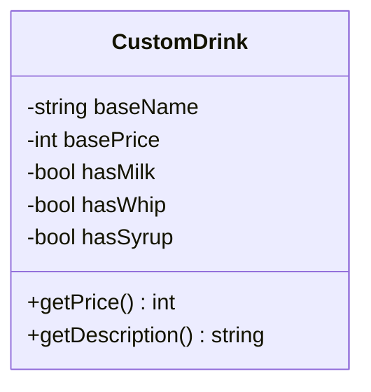
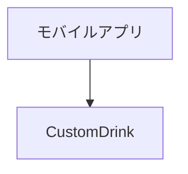
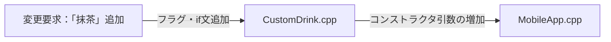
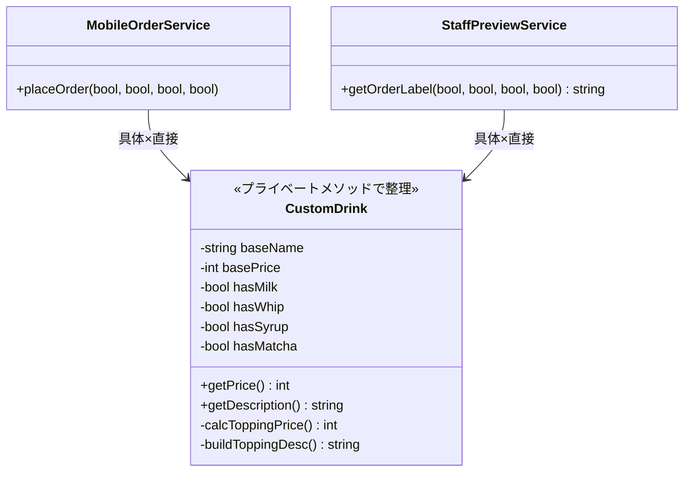
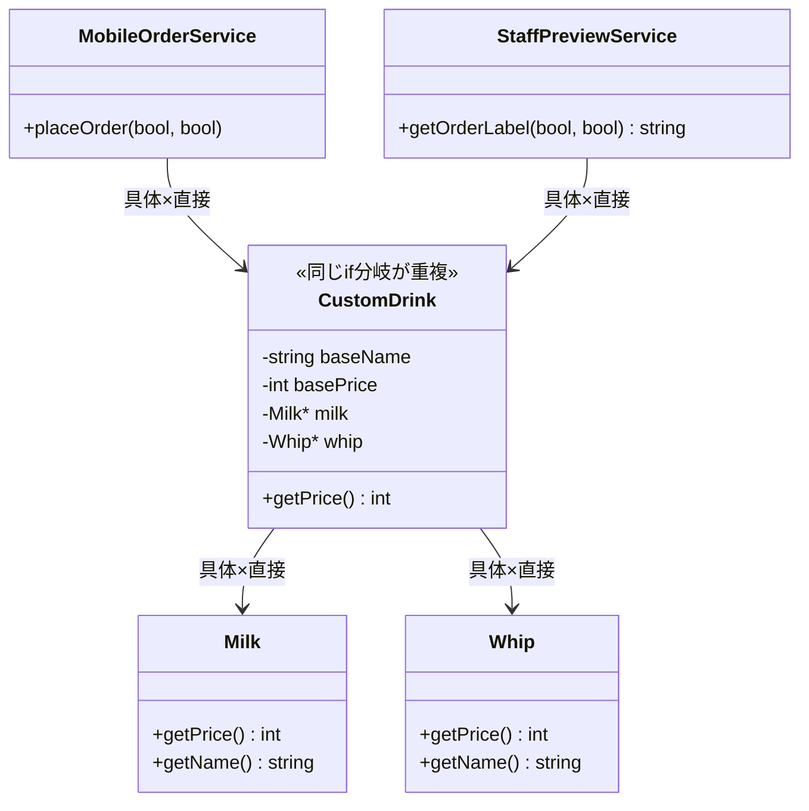
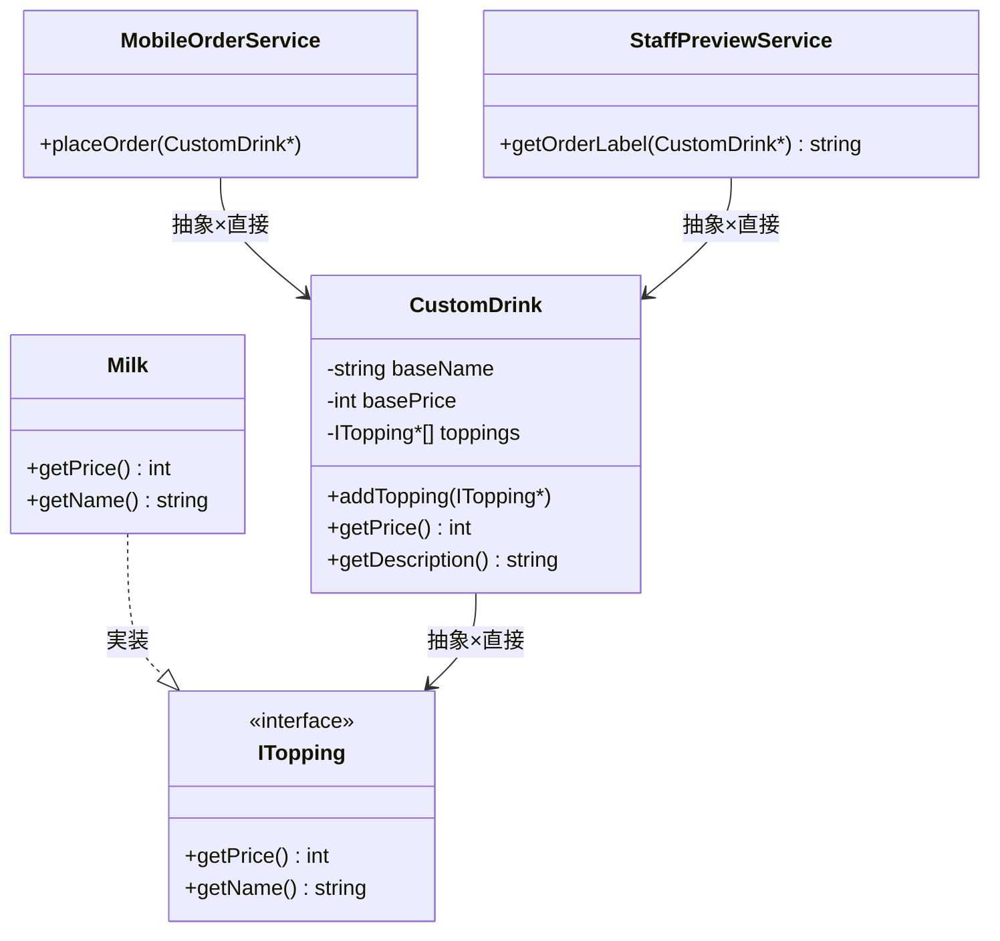
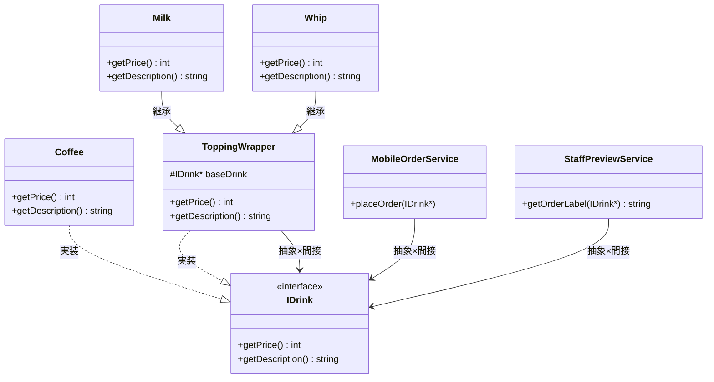
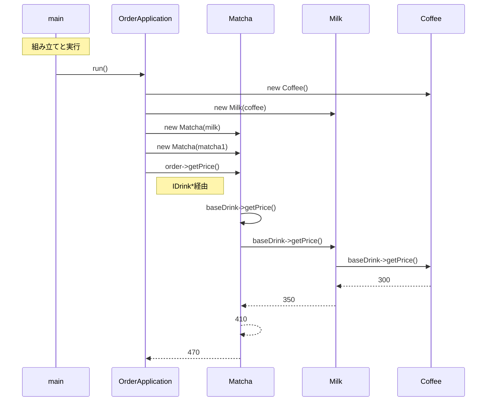
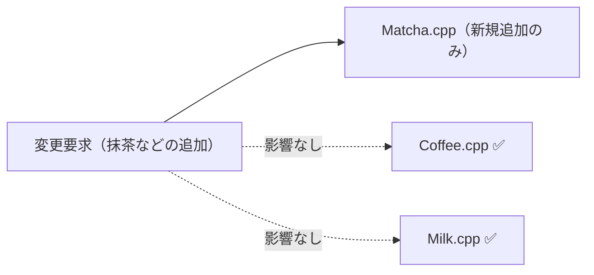
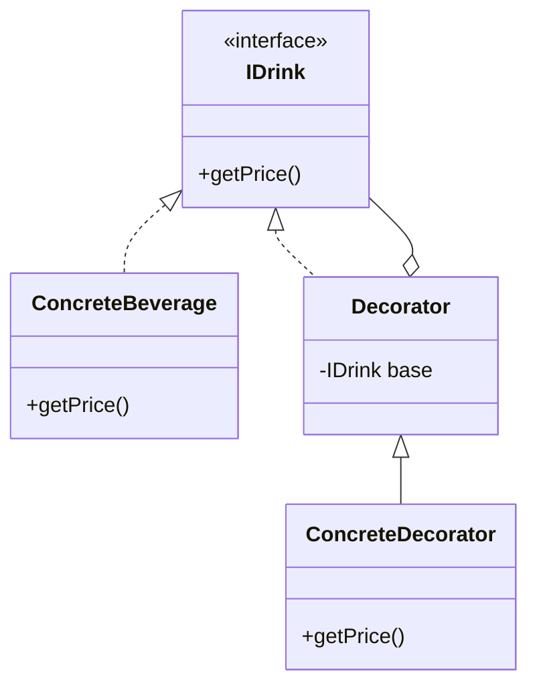

## 第6章 変わる機能の組み合わせ ―― Decorator パターン

―― 思考の型：基本の処理と追加の処理が混在している

### この章の核心

**機能の組み合わせが増えるたびに、条件分岐やクラスの数が際限なく増えていく。それは、「基本となる処理」と「後から付け足す処理」が同じ場所に混在しているからだ。**

---

### この章を読むと得られること

この章のテーマは「機能の組み合わせが増えるたびにクラスが爆発する」という問題です。「継承で全部作ろうとしたら間に合わなくなった」という経験がある方は、この章が直撃します。

* **得られること1：** 「機能の組み合わせ」という観点で、コードの変動箇所を識別できるようになる。「変わる機能」と「変わらない機能」を区別する問いを立てる習慣が、変動箇所を見抜く目を育てる。
* **得られること2：** 接続点（クラスとクラスのつなぎ目）が「具体×直接」（特定のクラスを名指しで直接知っている状態）になっているクラスを見て、そこが変更の痛みの発生源だと判断できるようになる。具体的な型を直接知っているということは、その型が変われば自分も変わらざるを得ないという構造的な必然を、接続の形から読み取れるようになるからだ。
* **得られること3：** 接続点の形を変えると変更がどのように局所化（変更の影響が1クラスだけで済む状態）されるかを、構造から説明できるようになる。「変わる責任はどのクラスが持つべきか」という問いが、変更の影響範囲を構造から予測する力を与えてくれる。
* **得られること4：** 基本機能と追加機能を同じインターフェースで扱うことで、呼び出し側に違いを意識させずに機能を何層でも重ねていく視点が身につく。「追加するたびに呼び出し側も変えなければならない」という痛みを経験したとき、この構造の必要性が実感として伝わってくる。

前段でこの章の目的と得られる視点を共有しました。ここからはいよいよ、実際のコードを前にして思考プロセスを回していきます。最初のステップであるフェーズ1では、システムの現状を「事実として」観察することから始めましょう。一緒に少しずつ解きほぐしていきましょう。

---

## 🔵 フェーズ1：現状把握 ―― コードとクラス構成を読む
### 1-1：このシステムの仕様

このシステムは、カフェのドリンク注文を**カスタマイズ**し、合計金額と注文名称を算出します。

お客様は基本ドリンクを選択したうえで、複数のトッピングを自由に組み合わせられます。システムは選択された内容から `getPrice()`（合計金額）と `getDescription()`（注文名称）の2つの値を返します。

**現在のメニューと価格**

| 種別 | 商品名 | 価格 |
|---|---|---|
| 基本ドリンク | Coffee（コーヒー） | 300円 |
| トッピング | Milk（ミルク） | +50円 |
| トッピング | Syrup（シロップ） | +30円 |
| トッピング | Whip（ホイップ） | +70円 |

トッピングは複数追加でき、同じトッピングを重ねることも可能です（例：ホイップ×2）。`getDescription()` の出力例：`Coffee + Milk + Syrup`

---
---

### 1-2：動作例テーブル ―― 仕様を「動かした結果」で確認する

コードを読む前に、このシステムがどんな入力に対してどんな出力を返すかを確認します。この章のどの案も、以下の動作を実現します。

| 注文内容 | getDescription() の出力 | getPrice() の出力 |
| --- | --- | --- |
| ベースコーヒーのみ | `Coffee` | 300円 |
| コーヒー + ミルク | `Coffee + Milk` | 350円（300 + 50） |
| コーヒー + ミルク + シロップ | `Coffee + Milk + Syrup` | 380円（300 + 50 + 30） |
| コーヒー + ミルク + ホイップ | `Coffee + Milk + Whip` | 420円（300 + 50 + 70） |
| コーヒー + ホイップ × 2（ダブル） | `Coffee + Whip + Whip` | 440円（300 + 70 + 70） |
| コーヒー + ミルク + シロップ + ホイップ | `Coffee + Milk + Syrup + Whip` | 450円（300 + 50 + 30 + 70） |
| コーヒー + ミルク + シロップ + ホイップ + 抹茶 | `Coffee + Milk + Syrup + Whip + Matcha` | 510円（300 + 50 + 30 + 70 + 60） |

この表がこの章全体のアンカーです。案1から案4まで、構造がどれだけ違っても、この入出力の対応は変わりません。「何が同じで、何が違うのか」を意識しながらコードを読むと、各案の本質的な差異が見えやすくなります。

---
---

### 1-3：実装コード

それでは、実際にシステムを動かしているコードを見てみましょう。文脈として、コーヒーにミルクとホイップを追加する注文をシミュレートしています。

```cpp
#include <iostream>
#include <string>

using namespace std;

class CustomDrink {
private:
    string baseName;
    int basePrice;
    // トッピングごとの状態をフラグで管理している
    bool hasMilk;
    bool hasWhip;
    bool hasSyrup;

public:
    CustomDrink(string name, int price, bool milk, bool whip, bool syrup)
        : baseName(name), basePrice(price),
          hasMilk(milk), hasWhip(whip), hasSyrup(syrup) {}

    int getPrice() const {
        int total = basePrice;
        // トッピングごとの追加料金を計算
        if (hasMilk)  total += 50;
        if (hasWhip)  total += 70;
        if (hasSyrup) total += 30;
        return total;
    }

    string getDescription() const {
        string desc = baseName;
        // トッピングごとの名前を追加
        if (hasMilk)  desc += " + Milk";
        if (hasWhip)  desc += " + Whip";
        if (hasSyrup) desc += " + Syrup";
        return desc;
    }
};

// 呼び出し側のコード（モバイルアプリを想定）
int main() {
    // コーヒー(300円)、ミルクとホイップを追加、シロップはなし
    CustomDrink order("Coffee", 300, true, true, false);

    cout << "注文内容: " << order.getDescription() << endl;
    cout << "合計金額: " << order.getPrice() << "円" << endl;

    return 0;
}

```

`CustomDrink` がすべてのトッピングをフラグで持ち `if` 文で処理している。これが後に問題になる。

このコードを見ると、`CustomDrink` クラスがどのトッピングがいくらで、どんな名前になるかをすべて直接知っていることが分かります。

---
---

### 1-4：クラス構成図

システムのクラス構成を可視化し、構造を確認します。



この図が示す通り、`CustomDrink` という単一のクラスが、ドリンクの基本情報とすべてのトッピング情報を一手に引き受けている構成になっています。

---
---

### 1-5：依存グラフ

クラス間の「依存の方向」をマクロな視点で示します。



呼び出し側であるモバイルアプリが、基本ドリンクとトッピングを包括した `CustomDrink` クラスに直接依存していることが分かります。

---
---

### 1-6：実行結果

上記コードの実行結果：

```text
注文内容: Coffee + Milk + Whip
合計金額: 420円

```

これから検討するのは、同じ機能を保ちながら、変更に強い構造をどう作るかという点です。

---

### 1-7：届いた変更要求

ある日の午後、商品企画部の佐藤マネージャーからチャットで連絡が入りました。

「来週から始まる春の新作キャンペーンに合わせて、モバイルオーダーのカスタマイズメニューに『抹茶パウダー』と『チョコチップ』を追加したいんです。お客様からの要望も多くて、絶対にヒットすると思うんですよね。来週のリリースに間に合いますか？」

なるほど、春の新作キャンペーンですか。確かに、新しいカスタマイズの選択肢が増えるのは、お客様にとって非常に魅力的な体験になりますし、ビジネスとしても単価アップが見込める素晴らしい施策です。

しかし、ちょっと待ってくれ、と私はフェーズ1で確認したコードを思い浮かべました。

あの `CustomDrink` クラスには、すでに `hasMilk` や `hasWhip` といったフラグが並んでおり、価格計算や名前の組み立て部分には `if` 文が連なっていました。ここに新しいトッピングを追加するということは、また新しいフラグと `if` 文をあのクラスに書き足すことを意味します。このままの構造で対応してしまって本当に良いのか、少し立ち止まって考えてみたいと思います。

**仕様変更の内容**

変更要求を受けて、選択できるトッピングがどう変わるかを整理します。

| 項目 | 変更前 | 変更後 |
|---|---|---|
| トッピングの種類 | Milk・Syrup・Whip（3種） | **Milk・Syrup・Whip・Matcha・Choco（5種）** |
| 抹茶パウダー（Matcha） | 選択不可 | **+60円で追加可能** |
| チョコチップ（Choco） | 選択不可 | **+40円で追加可能** |

**変更後の出力例**

| 注文内容 | getDescription() | getPrice() |
|---|---|---|
| コーヒー + 抹茶パウダー | `Coffee + Matcha` | 360円（300 + 60） |
| コーヒー + チョコチップ | `Coffee + Choco` | 340円（300 + 40） |
| コーヒー + ミルク + 抹茶パウダー + チョコチップ | `Coffee + Milk + Matcha + Choco` | 450円（300 + 50 + 60 + 40） |

ベースドリンクの価格と既存トッピング（Milk・Syrup・Whip）の価格・名称は変更なしです。新しいトッピングを追加しても、既存の組み合わせパターンの動作は変わりません。

---

## 🟣 フェーズ2：仮説立案 ―― 何が変わるかを観察し、ヒアリングで裏付ける

フェーズ1でシステムの現状と責任の配置を観察しました。次のフェーズ2では、現場に届いた変更要求を起点にして「何が変わり、何が変わらないか」の仮説を立て、関係者とのヒアリングを通じてそれを確定させていきます。実装と責任が一致しない箇所こそが、のちの問題の発生源になります。

### 2-1：責任テーブル

各クラスが「本来何を知るべきか（責任）」を定義し、事実を確認します。

| **クラス名** | **責任（1文）** | **知るべきこと** |
| --- | --- | --- |
| `CustomDrink` | ドリンクの基本料金とトッピング料金を合算して提供する。 | 基本価格、ミルクの有無と価格、ホイップの有無と価格、シロップの有無と価格。 |

この表から、`CustomDrink` がドリンク本体の知識だけでなく、トッピングに関するすべての知識を抱え込んでいる状態が見て取れます。私自身、現場でこういうクラスを見ると「少し荷物が重そうだな」と感じてしまうのですが、皆さんはいかがでしょうか。すべての情報を1箇所に集めているため、仕様を把握しやすいという側面も確かにあります。

---

### 2-2：責任チェック表

コードが実際に「知っていること」を一行ずつ照合し、その知識が誰の判断で変わるのかを観察します。

| **コードの行** | **持っている知識** | **誰が決定するか／変わる契機** |
| --- | --- | --- |
| `if (hasMilk) total += 50;` | ミルク追加の価格設定（50円） | 商品企画部門が価格改定を決定する／原材料費の変動時 |
| `if (hasWhip) desc += " + Whip";` | ホイップ追加時のレシートや画面への表示名 | 店舗オペレーション設計部門が決定する／メニューリニューアル時 |
| `string baseName; int basePrice;` | 基本ドリンク（コーヒー等）の名称と基本価格 | 商品企画部門が決定する／新ドリンク投入・価格改定時 |
| `bool hasSyrup;` | シロップというカスタマイズオプションが存在すること | 商品企画部門が決定する／メニュー追加・廃止時 |

一見してシンプルに見えたコードですが、一行ずつ観察していくと、商品企画部門が決めるべき「トッピングの価格」や、店舗設計部門が関わる「表示名」という異なる性質の知識が、一つのクラスの中に並んでいることが見えてきました。

当時の担当者の苦労を想像しながら読むと、急いでトッピング機能を追加するために、この場所に `if` 文を書き足すのが一番安全で確実だったのだろう、という背景も浮かんできます。しかし、ビジネスが成長しメニューが複雑化していく中で、この構造のまま進むとどうなるのか、少し立ち止まって考えてみたいと思います。

要するに、`getPrice` や `getDescription` の中にトッピングごとの処理が `if` 文で書き連ねられているという観察から、「後から追加される処理（各種トッピング）」と「基本となる処理（ドリンク本体）」が同じ場所に混在しているという構造の問題が見えてくる。

### 2-3：今回の確定変更テーブル

いきなりコードを修正するのではなく、はじめに今回の変更要求で「確実に変わること」を整理します。フェーズ2の責任チェック表を材料にして、今のコードに直接影響する変更だけをここにまとめます。

| **変わること** | **具体的な内容** | **根拠** |
| --- | --- | --- |
| トッピングの種類の追加 | 「抹茶パウダー」と「チョコチップ」の追加 | 佐藤マネージャーからの直接依頼 |
| `CustomDrink` クラスの修正 | 新しいフラグ（`bool hasMatcha` 等）の追加とコンストラクタの変更 | 現行構造でトッピングを追加するための必然的な変更 |
| 呼び出し側のコード修正 | コンストラクタ引数の増加に伴い、既存の呼び出し箇所をすべて修正 | コンストラクタ変更の波及 |

コードを読んだだけで「ここは変わる」と断定してしまうのは危険です。今回確定している変更と、将来変わりうるリスクは別物として扱う方がよいでしょう。設計に絶対の正解はありません。だからこそ、関係者に直接確認するプロセスが必要です。

---

### ヒアリングに向けた背景確認

このシステムは、全国展開する人気カフェチェーンのモバイルオーダーを裏側で支える注文管理システムです。お客様がスマートフォンから事前にドリンクを注文し、店舗でスムーズに受け取れる仕組みを提供しています。

システムが立ち上がった当初、メニューは「コーヒー」や「紅茶」といったシンプルな基本ドリンクのみでした。しかし、ビジネスが成長し「自分好みにカスタマイズしたい」というお客様の声が大きくなるにつれて、ミルクの追加、ホイップの増量、シロップの変更など、多種多様なトッピング機能が追加されてきました。店舗のオペレーションと連動するため、注文システムは正確な「合計金額」と、ドリンクを作るスタッフに伝えるための「注文内容（名前）」を算出する重要な役割を担っています。

このシステムは、すべてのトッピングの有無を真偽値（booleanフラグ）で管理し、一つのクラスの中で金額と名前を組み立てる構成になっています。追加要望が来るたびにフラグと `if` 文を足していくこのアプローチは、当時の現場のスピード感に最も合っていたのでしょう。

一見すると、処理が一つにまとまっておりシンプルで分かりやすい設計です。実際、このシステムは多くのお客様の複雑なカスタマイズ注文を正確に処理し、お店の売上を支え続けてきた実績のある設計です。

### 2-4：関係者ヒアリング

確定変更を携えて、商品企画部の佐藤マネージャーとのミーティングの時間を設定しました。チームで話し合う価値がある部分だと思います。なお、ヒアリングで出てきた情報は「今回確定している変更」と「将来変わりうるリスク」に分けて後で整理します。

**開発者：** 「今回の『抹茶パウダー』と『チョコチップ』の追加の件、システムへの組み込みを検討しています。一つ確認させてください。今後もこのように、新しいトッピングの種類は増え続けると考えてよいでしょうか？」

**佐藤マネージャー：** 「もちろんです！お客様の反応が非常に良いので、毎月の季節キャンペーンごとに新しいカスタマイズをどんどん追加していく予定です。逆に、あまり人気のないトッピングはメニューから落としていく（廃止する）ことも考えています。」

**開発者：** 「なるほど、トッピングの種類は毎月のように入れ替わるのですね。ちなみに、各トッピングの価格（例えばミルク50円など）は今のところ固定ですが、これは今後も変わらないでしょうか？」

**佐藤マネージャー：** 「あ、実は原材料費の高騰もあって、来月から一部のトッピングを値上げする構想があります。価格改定は年に数回はあると思っておいてください。」

**開発者：** 「承知しました。価格も変動する要素ですね。他に、将来的に変わりそうなカスタマイズのルールや、お客様からの要望で実現したいことはありますか？ 今のうちにシステムの土台に備えをしておきたいので。」

**佐藤マネージャー：** 「そうですね……熱心なお客様から『ホイップを通常の2倍（ダブル）にしてほしい』とか『チョコチップを3倍（トリプル）で』という要望がかなり来ています。今はシステム上できないとお断りしているんですが、将来的には『同じトッピングを複数回追加できる機能』は絶対に実現したいですね。」

ヒアリングを通じて、当初の確定変更の裏側に、今の真偽値（booleanフラグ）の構造では到底太刀打ちできない将来の変化まで見えてきました。

こうした未知の要件を初期段階で引き出せたことは、設計の見通しを立てる上で大きな前進です。

---

> **現実のヒアリングでは——** このシナリオでは相手がちょうど設計に役立つ情報を教えてくれています。現実には「変わるかどうか分からない」「たぶん変わらない」という答えが返ることも多いです。そのときは、コードの変更履歴（`git log`）や過去の障害記録を「ヒアリングの代わり」として使ってみてください。「過去に何度変わったか」が、「将来変わりやすいか」の最も正直な証拠です。

### 2-5：将来リスクテーブル

佐藤マネージャーとの対話から浮かび上がった、確定変更ではないが今後変わりうるリスクをまとめます。確定変更と混在させずに別テーブルとして保持することで、設計の根拠が後から追跡しやすくなります。

リスクの判定基準：実装のやり直し（クラス構造の変更）が必要になるものを「高」、ロジックの修正が軽微（値の書き換えや引数追加程度）で済むものを「中」とします。

| **将来リスク** | **具体的な内容** | **変わるタイミング** | **根拠（ヒアリング）** |
| --- | --- | --- | --- |
| 🔴 **リスク：高** | トッピングの種類の増減 | 毎月のキャンペーンごと | 商品企画部 佐藤マネージャーとの合意 |
| 🔴 **リスク：高** | トッピングの価格改定 | 年に数回（原材料費等による） | 商品企画部 佐藤マネージャーとの合意 |
| 🟡 **リスク：中** | 同じトッピングの複数回追加（ダブル、トリプル等） | 将来的な機能拡張時 | 商品企画部 佐藤マネージャーからの要望 |
| 🟢 **不変** | 基本ドリンクにトッピングの価格と名前を「上乗せしていく」という基本構造 | 変わる日は来ない | ビジネスモデルの根幹として合意 |

ヒアリングを通じて、「トッピングに関する知識」は非常に変化が激しく、今後もビジネスの成長に合わせて多様な要求がやってくることが確定しました。当時の担当者の苦労を想像しながらも、そろそろこの `CustomDrink` クラスに背負わせている重荷を少し分けてあげる時期が来たのかもしれません。

フェーズ2で、トッピングの種類が今後も高頻度で追加されることが確定しました。次のフェーズ3では、その確定した「新しいトッピングの追加」を今のコードのままで試みて、何が起きるかを確認します。

---

## 🟣 フェーズ3：問題特定 ―― 変更の痛みを発見する

### 3-1：変更シミュレーション

佐藤マネージャーからの要求通り、「抹茶パウダー」と「チョコチップ」を既存のシステムに追加してみましょう。

はじめには、トッピングの有無を管理している `CustomDrink` クラスを開きます。クラスのメンバ変数として、`bool hasMatcha;` と `bool hasChocoChip;` という2つのフラグを追加します。
次に、初期化を行うためのコンストラクタの引数にも、この2つの真偽値（boolean）を追加しなければなりません。
そして、価格を計算する `getPrice` メソッドの中に `if (hasMatcha) total += 60;` のような計算ロジックを足し、同様に `getDescription` メソッドの中にも名前を組み立てる `if` 文を書き足します。

抹茶を追加した後の `getPrice()` メソッド全体は、このようにif文が並ぶ形になります。

```cpp
int getPrice() const {
    int total = basePrice;
    if (hasMilk)     total += 50;
    if (hasWhip)     total += 70;
    if (hasSyrup)    total += 30;
    if (hasMatcha)   total += 60; // ← 抹茶パウダーを追加
    // if (hasChoco) total += 40; // ← チョコチップも同様に追加予定
    return total;
}
```

これでクラスの修正は終わったと思い、コンパイルしてみると、エラーが大量に出力されました。`CustomDrink` を生成しているモバイルアプリ側（呼び出し元）のコードです。コンストラクタの引数が増えたことで、既存の「コーヒーにミルクだけ」といった注文を生成しているすべての箇所が壊れてしまったのです。

たった2つのトッピングを追加しようとしただけなのに、クラスの中をあちこち探し回って修正した上に、呼び出し側のコードまで直さなければならない状況になっています。

---

### 3-2：変更影響グラフ

変更を試みた結果、影響がどのように飛び火したかを図で可視化してみます。



「抹茶パウダーとチョコチップを追加する」という一つの変更要求が、`CustomDrink` クラスの内部を複数箇所変更させるだけでなく、それを呼び出しているモバイルアプリ側のコードにも影響が飛び火していることが見えます。

---

### 3-3：痛みの言語化

「なぜこのクラスに機能を追加するだけで、呼び出し側まで壊れるんだろう…」

この変更シミュレーションを通じて、現場のエンジニアが直面する具体的な辛さが2つ見えてきました。

1つ目は、修正箇所がクラス内に散らばっていて見落としやすいという辛さです。
新しいトッピングを追加しようとしたとき、メンバ変数を足し、コンストラクタを直し、価格計算のメソッドを探して直し、さらに名前組み立てのメソッドも直す必要がありました。一つの変更要求に対して、ファイルの中を何度もスクロールして修正箇所を探し回らなければなりません。もし一つでも `if` 文を足し忘れたら、価格の計算が合わないといった致命的な不具合につながってしまいます。

2つ目は、機能を追加するたびに呼び出し側が壊れるという、影響範囲の読めなさです。
トッピングの種類が増えるということは、`CustomDrink` を生成するための引数の数が増え続けることを意味します。このままでは、新しいキャンペーンが始まるたびに、システムのあちこちに散らばっている `new CustomDrink(...)` のコードをすべて探し出し、使わないトッピングのために `false` という引数を延々と書き足す作業に追われることになります。変えるとどこが壊れるか分からないという恐怖が、開発のスピードを少しずつ奪っていくのです。

フェーズ3で変更を試みた際に生じた痛みが確認できました。次のフェーズ4では、なぜこのような痛みが生じるのか、その根本的な原因をコードの構造という観点から言語化していきます。

---

## 🟠 フェーズ4：原因分析 ―― なぜ辛いのかを構造で言語化する

### 4-1：観察→原因テーブル

前フェーズでの変更シミュレーションを通じて、「変更箇所が散らばっていて見落としやすい」「呼び出し側が壊れてしまう」という2つの痛みを発見しました。この痛みがなぜ発生するのか、観察した事実と構造的な原因の方向性を対応させてみましょう。

観察から原因を導き出す思考の流れはシンプルです。はじめに「何が辛いのか」を言語化する。次に「その辛さを引き起こしているのはコードのどの性質か」を問う。最後に「その性質がなぜ生まれたのか」を構造に問い返す。この3ステップを意識するだけで、現象の裏にある根本を掘り当てることができます。

| **観察（現象）** | **直接的な原因** | **根本原因** |
| --- | --- | --- |
| トッピングを追加するたびに、クラス内の複数の `if` 文やコンストラクタを探し出して修正しなければならない | `CustomDrink` クラスが、各種トッピングの価格や名前といった具体的な条件を直接知っているから | 「基本ドリンク」と「トッピング」という変わる理由が異なるものが同じ場所に混在しているから |
| 新しいトッピングが登場するたびにコンストラクタの引数が増え、モバイルアプリ側（呼び出し側）のコードまで壊れてしまう | コンストラクタがトッピングの種類を引数として受け取る構造になっているから | 「基本ドリンク」と「トッピング」という変わる理由が異なるものが同じ場所に混在しているから |

表にしてみると、「何が起きているか」と「なぜ起きているか」の因果関係がはっきりと見えてきます。

最初の頃、トッピングが「ミルク」と「ホイップ」だけだった時代は、一つのクラスを見ればすべての処理が追えるという大きなメリットがありました。当時の担当者が、素早く機能を提供するためにこの形を選んだのは、非常に合理的だったと思います。

しかし、トッピングの種類が増えるにつれて、一つのクラスが「知りすぎている」状態になってしまったのではないでしょうか。コーヒーという基本のドリンクが、ミルクの追加価格やホイップの表示名まで知っている必要は本来ありません。それらが同じ場所に混在していることが、変更の波及を生み出す根本的な発生源になっています。私自身、現場で「とりあえずフラグを足しておこう」と安易に判断して後悔したことが何度もあります。

---

### 4-2：変わるもの / 変わらないものテーブル

原因の方向性が見えたところで、次のステップに向けた準備として「変わり続けるもの」と「変わってほしくないもの」を明確に切り分けてみましょう。ここをしっかり整理することが、後で適切に分けるための土台になります。

| **変わり続けるもの（🔴）** | **変わってほしくないもの（🟢）** |
| --- | --- |
| トッピングの種類、それぞれの追加価格、表示名、およびそれらをどう組み合わせるかというルール | 基本となるドリンクの価格を保持し、そこにオプションの価格を上乗せして合計金額を計算するという処理の骨格 |

トッピングに関する情報は、商品企画部や店舗オペレーションの都合で今後も高頻度で変わり続けます。また、「ホイップをダブルにする」といった新しい組み合わせの要望もやってくるでしょう。これらは紛れもなく「変わり続けるもの」です。

一方で、ベースとなる飲み物にオプションを足していくという計算の大枠自体は、カフェのビジネスが続く限り変わらないはずです。また、呼び出し側（モバイルアプリ）から見たときに「それは一杯のドリンクである」という扱い方も変わりません。

この「変わる側」をうまくカプセル化（分離して隠蔽）できれば、「変わらない側」を安定させることができるはずです。

---

### 4-3：接続形態を診断する

現在のシステムがどのような接続形態になっているのかを、2×2マトリクスの視点から診断してみましょう。

現在の `CustomDrink` クラスは、ミルクやホイップといったトッピングの存在を、真偽値（boolean）のメンバ変数という形で具体的に直接知っています。これを私たちが普段使っているケーブルの比喩で言えば、Lightningケーブルで直差しの状態（具体×直接）だと言えます。

iPhoneに専用のケーブルを直接つなぐように、特定のトッピングを本体クラスに直接組み込んでいる状態です。この接続形態のままで新しいトッピング（新しい機器）をつなぎたいと思ったら、本体（クラス）の側にも新しい専用の差込口（コンストラクタの引数やメンバ変数）を増やさなければなりません。だからこそ、トッピングが増えるたびに本体側や呼び出し側に影響が飛び火していたのです。

|  | 直接（直差し） | 間接（アダプター経由） |
|:---:|:---|:---|
| **具体**（専用規格） | **← 現在地**　ライトニング直生え → iPhone（直差し） | ライトニング直生え → ゲーム機専用アダプタを挟む → ゲーム機 |
| **抽象**（汎用規格） | Type-C直生え → 各種機器（直差し） | ライトニング直生え → Type-C変換アダプタを挟む → 各種機器 |

ここでいう「具体」とは「クラス名を直接コードに書いている状態」を指します。`bool hasMilk` という変数名には「ミルク」という特定のトッピング名が埋め込まれており、ミルクを廃止してもコード上にその名前が残り続けます。「抽象」はその逆で、クラス名を直接書かず、インターフェース（共通の型）を通じて間接的に扱う状態です。

このコードで言うと：

| ケーブル比喩 | コードの対応箇所 |
|---|---|
| 「具体」＝専用規格ケーブル | `bool hasMilk; bool hasWhip; bool hasSyrup;` — トッピングの種類を `CustomDrink` クラスのメンバ変数として具体的に直接保持している |
| 「直接」＝直差し | `if (hasMilk) total += 50;` / `if (hasWhip) total += 70;` — `getPrice()` 内でラッパーを介さず各トッピングの価格計算をインラインで直接記述している |

ここで重要なのは、基本となるドリンクの役割と、後から追加されるトッピングの役割は、明らかに変わる理由が異なるということです。したがって、これらは一つの場所にまとめておくのではなく、分けるべきだと判断できます。

フェーズ4で根本原因が言語化でき、基本のドリンクと追加のトッピングは「変わる理由が異なるため分けるべきだ」という判断に至りました。しかし、すぐに解決策へ飛びつくのは危険です。次のフェーズ5では、対策に入る前に制約を整理し、「何を解くか」という課題を具体的に定めていきます。

---

## 🟡 フェーズ5：課題定義 ―― 解くべき接続点を特定する

### 5-1：接続点の特定

フェーズ4で「分ける」と判断した場所に、新たに接続点（ジョイント）が生まれます。その接続点がどこに何個あるのかを明確にします。

現在の `CustomDrink` クラスからトッピングの知識を切り出すと、以下のような接続点が現れます。

* 接続点A：基本となるドリンク（コーヒーなど） ←→ 追加されるトッピング（ミルクなど）の境界
* 接続点B：追加されたトッピング（ミルクなど） ←→ さらに重ねて追加されるトッピング（ホイップ、抹茶など）の境界。例：`Coffee` → `Milk` → `Whip` という連鎖の、`Milk` と `Whip` の間がこの接続点にあたる

ここで少し立ち止まって、考えてみてください。トッピングは1つとは限りません。「コーヒーにミルクを追加し、その上にさらにホイップを追加する」といった具合に、機能が連鎖していく特性を持っています。そのため、基本のドリンクとトッピングを繋ぐだけでなく、トッピング同士を数珠繋ぎにしていく接続点も考慮する必要があります。これらの接続点がどのような形になるかが、今回の設計の鍵を握りそうです。

### 5-2：クライアントへの影響範囲

次に、「分けること」で既存のコードにどの程度の変更が波及するかを確認します。

現在のモバイルアプリ側（呼び出し元）は、`new CustomDrink("Coffee", 300, true, true, false)` のように、コンストラクタの引数に直接 `true` や `false` を渡すことでトッピングを指定しています。

クラスを分離し、接続点の形を変えれば、この引数の渡し方は使えなくなります。つまり、モバイルアプリ側の「インスタンスを組み立てる部分」には確実な影響が波及し、修正が必要になります。呼び出し側のコードに手を入れなければならないという事実をあらかじめ覚悟しておく必要があります。

### 5-3：課題まとめ表

ここまでの内容を一覧にまとめ、次のフェーズの出発点を確定させます。

| **接続点** | **分けた理由** | **非機能制約** | **クライアント影響** |
| --- | --- | --- | --- |
| 接続点A・B | 変わる理由が異なる（基本機能と追加機能の混在を解消したい） | ホットパスではないが、ピーク時の同時注文集中時に注文計算・出力の一貫性保証が重要 | モバイルアプリ側（呼び出し元）の生成ロジックに影響 |

この表が、次に作る対策案の設計根拠になります。私自身、この課題定義を飛ばしてすぐにコードをいじり始め、後で「あ、クライアント側にこんなに影響が出るなんて」と手戻りになった経験が何度もあります。変更を加える前に状況を整理し、チームで話し合う価値がある部分だと思います。

フェーズ5で、私たちが解くべき課題と制約が明確になりました。次のフェーズ6では、この課題に対してどのような解決策があるのかを、変更コストと影響範囲の観点から比較検討していきます。最初から一つの正解を決め打ちするのではなく、はじめに選択肢をテーブルに並べてみましょう。

---

## 🔴 フェーズ6：段階的進化 ―― どこまで設計を進めるべきか

### 6-1：接続の形 2×2マトリクス

はじめに現在地と、これから取り得る選択肢の全体像を可視化します。フェーズ4で確認した通り、現在の `CustomDrink` クラスはトッピングのフラグを直接抱え込んでいる状態（具体×直接）です。

| 接続形態 | ケーブル例 | 特徴 |
|:---:|:---|:---|
| **具体×直接**（← 現在地） | ライトニング直生え → iPhone（直差し） | 専用端子のみ対応。差し替え不可 |
| **具体×間接** | ライトニング直生え → ゲーム機専用アダプタを挟む → ゲーム機 | 変換器を挟むが規格は専用のまま |
| **抽象×直接** | Type-C直生え → 各種機器（直差し） | どのメーカーでも同じ口で繋がる |
| **抽象×間接** | ライトニング直生え → Type-C変換アダプタを挟む → 各種機器 | アダプタを介して汎用規格で展開可能 |

私たちがこれから検討する対策案は、このマトリクスの中で「どのセルに移動するか」を選ぶ作業になります。

どの案も、動作例テーブル（1-X）で示した動作を実現します。違うのは「変更が来たときにどこを触ることになるか」です。

---

#### Step 1：具体×直接 ―― プライベートメソッドで責任を整理する

**この形の考え方：**
接続の形は変えません（具体×直接のまま）。フェーズ3で示したコードを、if/elseの各分岐をプライベートメソッドに抽出した形で整理します。各処理の意味がメソッド名で明確になり、コンストラクタ引数の爆発という問題は残りますが、クラス内部の可読性は向上します。

**手段の比較：**

| 手段 | 方法 | 特徴 |
|---|---|---|
| 手段A：プライベートメソッド抽出 | if分岐の各処理をプライベートメソッドに抽出する | 変更が最小限。コンストラクタ引数が増え続ける問題は残る |
| 手段B：デフォルト引数の活用 | コンストラクタのデフォルト引数で既存呼び出し元への影響を緩和する | 呼び出し元の即時破壊は防げるが、クラスの肥大化は止まらない |

**手段A**（フェーズ3のコードをベースに、プライベートメソッドで整理した形を示すため）のコードを以下に示します。

**構造図：**



両呼び出し元が `CustomDrink` を直接生成してフラグを個別に指定しており、トッピングが増えるたびにコンストラクタ引数の修正が両方の呼び出し元に波及する。

**基本クラス（CustomDrink）：**

```cpp
class CustomDrink {
private:
    string baseName;
    int basePrice;
    bool hasMilk;
    bool hasWhip;
    bool hasSyrup;
    bool hasMatcha; // ← 新しくフラグを追加

    // プライベートメソッドで処理を整理する
    int calcToppingPrice() const {
        int extra = 0;
        if (hasMilk)   extra += 50;
        if (hasWhip)   extra += 70;
        if (hasSyrup)  extra += 30;
        if (hasMatcha) extra += 60;
        return extra;
    }

    string buildToppingDesc() const {
        string desc;
        if (hasMilk)   desc += " + Milk";
        if (hasWhip)   desc += " + Whip";
        if (hasSyrup)  desc += " + Syrup";
        if (hasMatcha) desc += " + Matcha";
        return desc;
    }

public:
    // 引数が増え続けるため呼び出し側もすべて修正が必要
    CustomDrink(string name, int price,
                bool milk, bool whip, bool syrup, bool matcha)
        : baseName(name), basePrice(price),
          hasMilk(milk), hasWhip(whip),
          hasSyrup(syrup), hasMatcha(matcha) {}

    int getPrice() const {
        return basePrice + calcToppingPrice();
    }

    string getDescription() const {
        return baseName + buildToppingDesc();
    }
};

```

このコードを見ると、フェーズ3の直書きコードと比べてメソッド名で処理の意味が明確になっています。しかし、変更要求が来るたびに `CustomDrink` クラスのフラグとプライベートメソッドの両方を探して修正し、呼び出し側も壊れ続けることは変わりません。

**呼び出し側のコード：**

```cpp
// Step 1（具体×直接）の呼び出し側
// 顧客注文：フラグの組み合わせを呼び出し側が直接指定する
class MobileOrderService {
public:
    void placeOrder(bool milk, bool whip, bool syrup) {
        // ← 具体：フラグ組み合わせを呼び出し側が直接指定する
        CustomDrink order("Coffee", 300, milk, whip, syrup, false);
        cout << "注文確定: " << order.getDescription()
             << " / " << order.getPrice() << "円" << endl;
    }
};

// スタッフラベル確認：同じフラグ判定ロジックが再び現れる
class StaffPreviewService {
public:
    string getOrderLabel(bool milk, bool whip, bool syrup) {
        // ← 重複：同じCustomDrinkを直接生成して計算
        CustomDrink order("Coffee", 300, milk, whip, syrup, false);
        return order.getDescription() + " ("
               + to_string(order.getPrice()) + "円)";
    }
};

int main() {
    MobileOrderService mobile;
    mobile.placeOrder(true, true, false);

    StaffPreviewService staff;
    cout << "[ラベル] "
         << staff.getOrderLabel(true, true, false) << endl;
    return 0;
}
```

`MobileOrderService` と `StaffPreviewService` の両方が、`CustomDrink` の生成とフラグ指定ロジックをそれぞれの場所に書いている。新しいトッピングが増えるたびに、両方の呼び出し元でコンストラクタ引数を修正しなければならない。

一文要約：フラグとif分岐がCustomDrink内部に直書きされているため、両方の呼び出し元がそれぞれ同じコンストラクタ引数を指定してインスタンスを生成し、同じロジックが2か所で並行して走る。

**この形のトレードオフ：**

* 変更容易性：低（次の変更要求が来たときも同じようにクラス内部と呼び出し側を探して修正する作業が繰り返される）
* テスト容易性：低（トッピングの組み合わせパターンが指数関数的に増え、全パターンのテストが困難になる）
* 実装コスト：低（今のコードに数行足すだけなので、今すぐに対応できる）

---

#### Step 2：具体×間接 ―― 処理を別クラスに切り出して委ねる

**この形の考え方：**
フラグによる管理をやめ、トッピングごとにクラスを分割して責任を整理します。`CustomDrink` は分割された `Milk` や `Whip` の具体的な型を名指しで知っていますが、計算・処理はそのオブジェクトに「委ねる」（間接）構造です。直接自分でif文で計算するのではなく、呼び出しを委譲する点が案1との違いです。

**手段の比較：**

| 手段 | 方法 | 特徴 |
|---|---|---|
| 手段A：セッターで個別注入 | `setMilk(Milk*)` など個別のセッターを用意し、呼び出し側が具体型を生成して渡す | 呼び出し側が具体型を直接知り続ける。新トッピング追加でセッターも増える |
| 手段B：コンストラクタリストで受け取る | 具体トッピングのリストをコンストラクタで受け取る | リスト化で引数の爆発は防げるが、具体型の混在は変わらない |

**手段A**（セッターによる個別注入で「具体×直接」の構造を最も素直に示すため）のコードを以下に示します。

**構造図：**



`CustomDrink` がトッピングの具体型を直接保持しており、新しいトッピングが増えれば `CustomDrink` 自体の修正が必要になる。

**インターフェースなし・各トッピングクラス：**

```cpp
class Milk {
public:
    int getPrice() const { return 50; }
    string getName() const { return " + Milk"; }
};
// Whip クラス等も同様に作成...

```

価格や名前の知識は個別のトッピングクラスに移動しましたが、それぞれの具体クラスを知るものが依然として存在します。

**CustomDrink クラス（具体型を直接保持）：**

```cpp
class CustomDrink {
private:
    string baseName;
    int basePrice;
    // ← 具体：Milk*という具体型を直接知っている
    Milk* milk;
    // ← 直接：このクラスを直接インスタンス化している
    Whip* whip;

public:
    CustomDrink(string name, int price) {
        baseName = name;
        basePrice = price;
        milk = nullptr;
        whip = nullptr;
    }

    void setMilk(Milk* m) { milk = m; }
    void setWhip(Whip* w) { whip = w; }

    int getPrice() const {
        int total = basePrice;
        if (milk) total += milk->getPrice();
        if (whip) total += whip->getPrice();
        return total;
    }
};

```

このコードを見ると、価格や名前の知識は個別のトッピングクラスに移動しましたが、`CustomDrink` が「どのトッピングが存在し得るか」という具体的な型を直接知っている状態は変わっていないことが分かります。

**呼び出し側のコード：**

```cpp
// 案2（具体×直接）の呼び出し側
// 顧客注文：具体クラスを直接生成して設定する
class MobileOrderService {
public:
    void placeOrder(bool addMilk, bool addWhip) {
        CustomDrink order("Coffee", 300);
        // ← 直接：具体クラスを直接生成
        if (addMilk) { Milk m; order.setMilk(&m); }
        if (addWhip) { Whip w; order.setWhip(&w); }
        cout << "注文確定: " << order.getPrice() << "円" << endl;
    }
};

// スタッフラベル確認：具体クラスの選択も重複する
class StaffPreviewService {
public:
    string getOrderLabel(bool addMilk, bool addWhip) {
        CustomDrink order("Coffee", 300);
        // ← 重複：同じ具体クラス選択ロジックがここにも現れる
        if (addMilk) { Milk m; order.setMilk(&m); }
        if (addWhip) { Whip w; order.setWhip(&w); }
        return to_string(order.getPrice()) + "円";
    }
};

int main() {
    MobileOrderService mobile;
    mobile.placeOrder(true, true);

    StaffPreviewService staff;
    cout << "[ラベル] " << staff.getOrderLabel(true, true) << endl;
    return 0;
}
```

`MobileOrderService` と `StaffPreviewService` の両方が、「どの具体クラスを使うか」という選択ロジックをそれぞれの場所に持っている。新しいトッピングが増えるたびに、両方の呼び出し元を修正しなければならない。

一文要約：クラスは分かれたが「どの具体クラスを選ぶか」という判断を両方の呼び出し元がそれぞれ行っており、具体型への依存と選択ロジックが2か所に重複している。

**この形のトレードオフ：**

* 変更容易性：低〜中（トッピングの計算ロジックは分離できたが、種類が増えればやはり `CustomDrink` の修正が必要になる）
* テスト容易性：低（具体的なクラスに依存しているため、スタブに差し替えてテストすることができない）
* 実装コスト：中（クラスを切り出すリファクタリングの手間がかかる）

---

#### Step 3：抽象×直接 ―― インターフェースを挟み、呼び出し側は型だけを知る

**この形の考え方：**
トッピングの具体的な型を `CustomDrink` から隠すために、インターフェースを導入します。すべてのトッピングを `ITopping` という共通の型で扱い、リスト（配列）で保持します。「トッピングの種類を気にせず、一律に扱いたい」という動機に応える形です。

**手段の比較：**

| 手段 | 方法 | 特徴 |
|---|---|---|
| 手段A：コンストラクタインジェクション | `CustomDrink(ITopping* toppings[], int count)` で受け取る | 組み立て時点で確定する。後からトッピングを足せない |
| 手段B：セッターインジェクション | `addTopping(ITopping*)` で後から追加できる | 組み立てを段階的に行える。柔軟性が高い |
| 手段C：継承による拡張 | `MilkCoffee extends CustomDrink` のようにサブクラスで拡張する | 組み合わせが固定なら素直。組み合わせが増えるとクラスが爆発する |

**手段B**（トッピングを段階的に追加できる柔軟性が必要なため。手段Cは組み合わせ爆発の元凶であり今回は不適）のコードを以下に示します。

**構造図：**



`CustomDrink` は `ITopping*` のリストを保持するだけで具体クラスを知らず、新しいトッピングが増えても `CustomDrink` を修正する必要がない。

**ITopping インターフェース：**

```cpp
// トッピングのインターフェース
class ITopping {
public:
    virtual ~ITopping() = default;
    virtual int getPrice() const = 0;
    virtual string getName() const = 0;
};

```

このインターフェースが、`CustomDrink` と各トッピングクラスの間の「契約」になります。

**具体的なトッピングクラス（Milk の例）：**

```cpp
// 具体的なトッピング
class Milk : public ITopping {
public:
    int getPrice() const override { return 50; }
    string getName() const override { return " + Milk"; }
};

```

新しいトッピングを追加するときは、このように `ITopping` を実装するクラスを1つ追加するだけで済みます。

**CustomDrink クラス（抽象型のリストで保持）：**

```cpp
class CustomDrink {
private:
    string baseName;
    int basePrice;
    // ← 抽象：ITopping*型で受け取り、具体クラスを知らない
    std::vector<ITopping*> toppings;

public:
    CustomDrink(string name, int price) : baseName(name), basePrice(price) {}

    void addTopping(ITopping* topping) {
        toppings.push_back(topping);
    }

    int getPrice() const {
        int total = basePrice;
        // トッピングの種類を知らなくても合算できる
        for (auto* t : toppings) {
            total += t->getPrice();
        }
        return total;
    }
};

```

このコードを見ると、トッピングの種類が新しく増えても `CustomDrink` のクラス自体は一切修正しなくてよくなったことが分かります。

**呼び出し側のコード：**

```cpp
// Step 3（抽象×直接）の呼び出し側
// 顧客注文：抽象型で受け取り、具体クラスに依存しない
class MobileOrderService {
public:
    // ← 直接：インターフェース経由で受け取る
    void placeOrder(CustomDrink* order) {
        cout << "注文確定: " << order->getPrice() << "円" << endl;
    }
};

// スタッフラベル確認：こちらも同じ形で受け取るだけ（重複なし）
class StaffPreviewService {
public:
    string getOrderLabel(CustomDrink* order) { // ← 直接：同じ形で受け取れる
        return order->getDescription()
               + " (" + to_string(order->getPrice()) + "円)";
    }
};

int main() {
    Milk milk;                           // ← 具体：呼び出し側だけが具体クラスを生成
    Whip whip;
    CustomDrink order("Coffee", 300);    // ← 直接：インターフェース経由で直接注入
    order.addTopping(&milk);
    order.addTopping(&whip);

    MobileOrderService mobile;
    mobile.placeOrder(&order);

    StaffPreviewService staff;
    cout << "[ラベル] "
         << staff.getOrderLabel(&order) << endl; // ← 同じ形で使い回せる
    return 0;
}
```

`MobileOrderService` と `StaffPreviewService` はどちらも `CustomDrink*` を受け取るだけで、「どの具体トッピングが追加されているか」を知らずに済む。新しいトッピングが増えても、どちらの呼び出し元も修正は不要だ。

一文要約：`main()` が具体型を組み立て、両方の呼び出し元は `CustomDrink*` という型だけを介して同じオブジェクトを呼ぶため、具体クラスが変わっても呼び出し経路は変わらない。

**この形のトレードオフ：**

* 変更容易性：中〜高（トッピングの追加は `CustomDrink` を触らずに行えるが、「基本ドリンク」と「トッピング」が別々の扱いになっているため、ホイップの量を2倍にするといった複雑な組み合わせに対応しづらい）
* テスト容易性：高（スタブのトッピングを注入して価格計算のテストが容易になる）
* 実装コスト：中（インターフェースの設計と、リストで管理する仕組みへの変更が必要）

---

#### Step 4：抽象×間接 ―― インターフェース＋仲介役の両方で全層を抽象化する

**この形の考え方：**
「基本のドリンク」と「追加のトッピング」を全く同じインターフェースで扱います。トッピングのクラスは、内部に「別のドリンク（またはトッピング）」を保持する仲介役として振る舞い、機能の上に機能を何層にも被せて（ラップして）いく形をとります。「差し替えたい（追加したい）」かつ「呼び出し側には違いを知らせたくない」という2つの動機が重なる場合に必要になる形です。

**手段の比較：**

| 手段 | 方法 | 特徴 |
|---|---|---|
| 手段A：デコレータ合成 | 基本ドリンクとトッピングが同じ `IDrink` 型を実装し、トッピングが内部に `IDrink*` を保持する | 呼び出し元は `IDrink*` 一本で何層でも扱える。複数回追加も容易 |
| 手段B：ビルダーパターン | `DrinkBuilder` クラスがトッピングを積み重ねてドリンクを生成する | 組み立ての責任を明示できるが、基本とトッピングの型が統一されないため呼び出し元が複雑になる |

**手段A**（「同じ型で何層でも重ねられる」という今回の要件に最も合致するため。ヒアリングで挙がった「ダブル・トリプル」対応もこの形でそのまま実現できる）のコードを以下に示します。

**構造図：**



`MobileOrderService` と `StaffPreviewService` は `IDrink*` という抽象型だけを知り、トッピングが何層に重なっているかの具体的な構造は `main()` の組み立て部分だけに閉じている。

**IDrink インターフェース（基本ドリンクとトッピング共通の契約）：**

```cpp
// 基本ドリンクとトッピングを同じ型で扱うインターフェース
class IDrink {
public:
    virtual ~IDrink() = default;
    virtual int getPrice() const = 0;
    virtual string getDescription() const = 0;
};

```

このインターフェースが「基本ドリンク」と「トッピング」を同じ型として扱うことを可能にします。

**Coffee クラス（基本ドリンク）：**

```cpp
// 変わらない処理の骨格：基本のドリンク
class Coffee : public IDrink {
public:
    int getPrice() const override { return 300; }
    string getDescription() const override { return "Coffee"; }
};

```

`Coffee` は `IDrink` を実装するシンプルなクラスです。このクラス自体は今後ほとんど変わりません。

**ToppingWrapper クラス（仲介役の基底）：**

```cpp
// 変わる部分を繋ぐ仲介役：トッピングの基底クラス
class ToppingWrapper : public IDrink {
protected:
    // ← 抽象：IDrink*型で受け取り、具体実装を知らない
    // ← 間接：Decoratorを経由するため内部クラス群が見えない
    IDrink* baseDrink;
public:
    ToppingWrapper(IDrink* base) : baseDrink(base) {}
};

```

`ToppingWrapper` が「自分の中に別のドリンクを包む」という仲介の仕組みを担います。

**Milk クラス（具体的なトッピング）：**

```cpp
// 具体的なトッピング：ミルク
class Milk : public ToppingWrapper {
public:
    Milk(IDrink* base) : ToppingWrapper(base) {}
    
    int getPrice() const override {
        // 中身が何であるかは知らなくていい。価格を上乗せするだけ
        return baseDrink->getPrice() + 50;
    }
    string getDescription() const override {
        return baseDrink->getDescription() + " + Milk";
    }
};

// 呼び出し側のイメージ
// IDrink* order = new Whip(new Milk(new Coffee()));

```

このコードを見ると、トッピングクラスが「自分が包んでいる中身（基本ドリンクや他のトッピング）」の価格に自分の価格を上乗せするだけで完結しており、呼び出し側はそれが何層に重なっているかを一切知らなくて済むことが分かります。

**呼び出し側のコード：**

```cpp
// Step 4（抽象×間接）の呼び出し側
// 顧客注文：抽象IDrinkのみ知り、具体実装は見えない
class MobileOrderService {
public:
    void placeOrder(IDrink* order) { // ← 抽象：インターフェース型で受け取る
        cout << "注文確定: " << order->getDescription()
             << " / " << order->getPrice() << "円" << endl;
    }
};

// スタッフラベル確認：こちらも同じ抽象型を受け取る（重複なし）
class StaffPreviewService {
public:
    string getOrderLabel(IDrink* order) { // ← 抽象：同じインターフェース型で受け取る
        return order->getDescription()
               + " (" + to_string(order->getPrice()) + "円)";
    }
};

int main() {
    Coffee coffee;                        // ← 具体：組み立て側だけが具体型を知る
    // ← 間接：抽象IDrinkのみ見えて具体実装は多層に隠れる
    IDrink* order = new Whip(new Milk(&coffee));

    MobileOrderService mobile;
    mobile.placeOrder(order);

    StaffPreviewService staff;
    cout << "[ラベル] "
         << staff.getOrderLabel(order) << endl; // ← 間接：同じ抽象型で使い回せる
    return 0;
}
```

`MobileOrderService` と `StaffPreviewService` はどちらも `IDrink*` という抽象インターフェースしか知らない。具体的なトッピングの重ね方（何層になっているか）の知識は `main()` の組み立て部分だけに閉じている。

一文要約：呼び出し元→`IDrink*`→デコレータチェーンという間接経路を経由するため、トッピングが何層に重なっているかの知識は `main()` の組み立て部分だけが持っている。

**この形のトレードオフ：**

* 変更容易性：高（新しいトッピングが増えても、既存のクラスを一切触らずにクラスを一つ追加するだけで対応できる）
* テスト容易性：高（「ミルク追加」という単体の機能だけを、モックを包むことで独立してテストできる）
* 実装コスト：高（統一インターフェースと基底クラスの設計が必要で、小さなクラスが多数生成されるため構造の理解に少し時間がかかる）

---

### どこまで設計を進めるべきか（採用案の決断）

それぞれのステップには一長一短があります。ステップ4の「抽象×間接（インターフェース＋ラッパークラス）」は強力ですが、クラス数が増えるという「初期投資コスト」もかかります。どこで止めるかは、**「今後の変更頻度（ビジネス要求）」**で決断します。

*   **Step 1（具体×直接）で止めるケース：** トッピングの追加が年に1回あるかないかの場合。フラグを追加するだけで済むなら、クラス数を増やして複雑さを上げる必要はありません。
*   **Step 2（具体×間接）で止めるケース：** トッピングの種類は数個で固定されており、単純に価格表として分離したいだけの場合。
*   **Step 3（抽象×直接）で止めるケース：** カスタムドリンクの「単一の塊」として扱えればよく、ダブルやトリプルなど何層にも重ねる要望はない場合。
*   **Step 4（抽象×間接）まで進むケース：** トッピングの追加が頻繁にあり、かつ自由に複数のトッピングを重ね合わせたい場合。

**今回の決断：**
商品企画部へのヒアリングにより、「毎月のキャンペーンごとにトッピングが入れ替わり、ダブル・トリプルの複数追加も要求される」ことが確定しています。中長期的な運用を見据え、クラス数が増えるという初期の実装コストを支払ってでも、変更が1つのクラス追加だけで完結し無限に重ねられる構造を手に入れるため、**ステップ4（抽象×間接）まで進化させる**決断を下します。

### 6-5：耐久テスト

Step 4の構造を採用した場合、本当に未来の変更に対して強い構造になっているのか、思考の耐久テストを行ってみましょう。

フェーズ2の関係者ヒアリングで、佐藤マネージャーから「ホイップをダブルにしたい、チョコチップをトリプルにしたいという要望があり、将来的には同じトッピングの複数回追加を実現したい」という将来リスクが挙がっていました。あのとき言っていた変化が実際に要求された場面をシミュレートしてみます。

もしStep 1のフラグ管理（`bool hasWhip;`）のままだった場合、ダブルに対応するためには `int whipCount;` のように型を変え、価格計算のロジックをすべて掛け算に書き直すという大規模な修正が必要になっていたはずです。

しかし、Step 4ではどうなるでしょうか。基本機能（ドリンク）を拡張機能（トッピング）で何層にも包み込む構造になっているため、「ホイップのダブル」は以下のように呼び出し側でクラスを2回重ねるだけで実現できます。

```cpp
// 呼び出し側で Whip で2回包むだけ
IDrink* order = new Whip(new Whip(new Coffee()));

```

既存の `Coffee` クラスにも `Whip` クラスにも、修正を加える必要は一切ありません。新しい要件に対して、既存の部品を組み合わせるだけで対応できたのです。

| **変更シナリオ** | **触る場所** | **コスト評価** |
| --- | --- | --- |
| 新しいトッピング「抹茶パウダー」を追加する | 新規の `Matcha` クラスを作るだけ（既存コードの変更なし） | 低 |
| 「ホイップのダブル」を注文できるようにする | 呼び出し側の生成ロジックのみ（既存クラスの変更なし） | 低 |

これこそが、構造を変えることで得られる最大の恩恵です。機能を追加するために既存のコードを恐る恐る触るのではなく、新しい部品を作って（あるいは既存の部品を組み合わせて）はめ込むだけになるという感覚、うまく伝わっているでしょうか。

フェーズ6で段階的に進化させ、未来の変更に備えて「抽象×間接」の形を採用する決断を下しました。最後のフェーズ7では、この決断を実際のコードに落とし込み、変更がどのように局所化されたのかを確認します。

---

## 🟢 フェーズ7：対策実施 ―― 変化に強いコードを完成させる

### 7-1：解決後のコード（全体）

Step 4（抽象×間接）を実装した最終的なコードです。
トッピングの種類を管理していたフラグや `if` 文をなくし、基本ドリンクとトッピングを同じ `IDrink` というインターフェース（契約）で統一して扱えるように変更しています。また、オブジェクトの組み立ての責任は `OrderApplication` に集約しています。

**この構造は、Decorator（デコレーター）パターンと呼ばれています。** 7つのフェーズを経て「自然にたどり着いた構造」に、先人が名前をつけていたのです。

**IDrink インターフェース（契約）：**

```cpp
#include <iostream>
#include <string>

using namespace std;

// ドリンクとしてのビジネス上の責任（契約）を示すインターフェース
class IDrink {
public:
    virtual ~IDrink() = default;
    virtual int getPrice() const = 0;
    virtual string getDescription() const = 0;
};

```

このインターフェースが基本ドリンクとトッピングの両方が守る「契約」です。呼び出し側はこの型だけを知れば済みます。

**Coffee クラス（基本ドリンク）：**

```cpp
// 変わらない処理の骨格：基本のドリンク
class Coffee : public IDrink {
public:
    int getPrice() const override { return 300; }
    string getDescription() const override { return "Coffee"; }
};

```

`Coffee` は最も変化が少ないクラスです。基本ドリンクの種類が増えるときだけ、このような新しいクラスを追加します。

**ToppingWrapper クラス（仲介役の基底）：**

```cpp
// 変わる部分を繋ぐ仲介役：トッピングの基底クラス
class ToppingWrapper : public IDrink {
protected:
    // ← 中身（基本ドリンクや他のトッピング）を隠し持つ
    IDrink* baseDrink; 
public:
    ToppingWrapper(IDrink* base) : baseDrink(base) {}
};

```

`ToppingWrapper` が「中に別のドリンクを包む」仕組みを提供します。具体的なトッピングはこのクラスを継承するだけで済みます。

**Milk クラス・Whip クラス（具体的なトッピング）：**

```cpp
// 具体的なトッピング：ミルク
class Milk : public ToppingWrapper {
public:
    Milk(IDrink* base) : ToppingWrapper(base) {}
    int getPrice() const override {
        // ← 中身が何であるかは知らなくていい。価格を上乗せするだけ
        return baseDrink->getPrice() + 50;
    }
    string getDescription() const override {
        return baseDrink->getDescription() + " + Milk";
    }
};

// 具体的なトッピング：ホイップ
class Whip : public ToppingWrapper {
public:
    Whip(IDrink* base) : ToppingWrapper(base) {}
    int getPrice() const override {
        return baseDrink->getPrice() + 70;
    }
    string getDescription() const override {
        return baseDrink->getDescription() + " + Whip";
    }
};

```

各トッピングクラスは「中身の価格に自分の価格を足す」だけです。中身が何層に重なっているかを知る必要はありません。

**Matcha クラス（新規追加トッピング）：**

```cpp
// ← 新しいトッピングを追加する場合は、クラスを1つ増やすだけ（ここだけ変わる）
class Matcha : public ToppingWrapper {
public:
    Matcha(IDrink* base) : ToppingWrapper(base) {}
    int getPrice() const override {
        return baseDrink->getPrice() + 60;
    }
    string getDescription() const override {
        return baseDrink->getDescription() + " + Matcha";
    }
};

```

佐藤マネージャーが要求した「抹茶パウダーの追加」は、このクラスを1つ作るだけで完結します。既存のクラスには一切触れていません。

**OrderApplication クラス（組み立てと実行）：**

```cpp
// 依存の組み立てと実行を担うアプリケーションクラス
class OrderApplication {
public:
    void run() {
        // コーヒーにミルクと、抹茶のダブルを追加する
        // （フェーズ2で予告された「同じトッピングの複数回追加」を実演）
        IDrink* myOrder = new Matcha(new Matcha(new Milk(new Coffee())));
        
        cout << "注文内容: " << myOrder->getDescription() << endl;
        cout << "合計金額: " << myOrder->getPrice() << "円" << endl;

        // ※メモリ解放はサンプル簡略化のため省略
    }

    // ※ testOrderCalculation() は Google Test フレームワークを使用します。
    //   実際に実行する場合は #include <gtest/gtest.h> とリンク設定が必要です。
    void testOrderCalculation() {
        // EXPECT_EQ(期待値, 実際の値)：等しければテスト通過。Google Test のマクロ。
        IDrink* simpleCoffee = new Coffee();
        EXPECT_EQ(300, simpleCoffee->getPrice());
        
        IDrink* matchaDouble = new Matcha(new Matcha(new Milk(new Coffee())));
        EXPECT_EQ(470, matchaDouble->getPrice()); // 300 + 50 + 60*2 = 470
    }
};

// main() の責任はプログラムを起動することだけ
int main() {
    OrderApplication app;
    app.run();
    // app.testOrderCalculation();
    return 0;
}

```

このコードを見ると、新しいルール（抹茶）を追加するために既存のクラスを一切開く必要がなくなり、新しく `Matcha` クラスを作るだけで要件を満たせるようになったことが分かります。

**動作図（シーケンス図）：**



### 7-2：変更影響グラフ（改善後）

フェーズ3で確認した「抹茶パウダーとチョコチップの追加」という同じシナリオで、変更の影響がどのように変わったかをグラフで対比してみます。



フェーズ3のグラフと比較して、新しいトッピングを追加するという変更要求が、新規クラスの追加だけに閉じたことが一目で読み取れるのではないでしょうか。既存の `Coffee` や `Milk` には影響の矢印が向かっていません。

---

### 7-3：変更シナリオ表

この設計で私たちが何を手に入れたのかを、考えられる変更シナリオごとに「触る場所」と「触らない場所」に分けて整理してみます。

| **シナリオ** | **変わるクラス** | **変わらないクラス** |
| --- | --- | --- |
| 新しいトッピング「抹茶」を追加する | `Matcha` （新規追加）、`OrderApplication`（組み立て側） | `IDrink`, `Coffee`, `Milk`, `Whip` など既存のすべてのロジック |
| ミルクの価格を50円から60円に値上げする | `Milk` | `IDrink`, `Coffee`, 他のトッピング, `OrderApplication` |
| ホイップをダブル（2回追加）にする | `OrderApplication`（組み立て側で `Whip` を2回重ねるだけ） | `IDrink`, `Coffee`, `Whip` などのすべてのクラス |

変更が来ても、触るのは1クラスだけ——それがこの設計で手に入れたものだ。諦めたものは、小さなクラスが複数生まれるというわずかな複雑さだ。

---

### 7-4：接続形態の確認 ── この設計はどの接続か

フェーズ4-3で診断した通り、変更前のコードは **具体×直接** の状態でした。
採用した Decorator パターンでは、接続形態が **抽象×間接（Type-C変換アダプタ経由）** へと変化しています。

**「抽象×間接」の証拠となるコード：**

```cpp
class ToppingWrapper : public IDrink {
protected:
    IDrink* baseDrink; // ← インターフェース型 = 「抽象」の証拠
public:
    int getPrice() const override {
        return baseDrink->getPrice() + 50; // ← baseDrink 経由のチェーン = 「間接」の証拠
    }
};
// IDrink* order = new Milk(new Matcha(new Coffee()));
// → Coffee → Matcha → Milk とデコレータが連鎖する
```

- `IDrink* baseDrink` の型が `IDrink*`（純粋仮想クラス）→ **「抽象」** の証拠（具体的なドリンククラス名を知らない）
- `baseDrink->getPrice()` はデコレータチェーンを経由した間接呼び出し → **「間接」** の証拠

「トッピングを動的に追加・差し替えたいかつラップチェーンという仲介構造が必要」という動機から、**抽象×間接** が選ばれました。

フェーズ1から7までの長いプロセスを経て、コードの構造を改善することができました。最後のステップである「後段」では、これまでの思考プロセスを振り返り、なぜこの形が特定のパターン名で呼ばれているのかを整理していきます。

### 整理・振り返り・パターン解説

第6章の締めくくりとして、私たちが辿ってきた7フェーズの思考プロセスを振り返ります。このプロセスを意識的に回すことで、どんなに複雑なコードに対しても、設計の糸口を見つけることができるはずです。

#### 7フェーズとこの章でやったこと

| **フェーズ** | **この章でやったこと** |
| --- | --- |
| 🔵 フェーズ1：現状把握 | カフェの注文システムにおいて、ドリンク本体と各種トッピングが1つのクラスに混在している構造を観察した。 |
| 🟣 フェーズ2：仮説立案 | 商品企画部へのヒアリングを通じ、トッピングの頻繁な入れ替わりや複数追加の要望を「変動要因」として確定した。 |
| 🟣 フェーズ3：問題特定 | 新しいトッピングを追加しようとすると、複数のメソッドと呼び出し側まで波及するという「痛み」を確認した。 |
| 🟠 フェーズ4：原因分析 | ドリンク本体とトッピングの「変わる理由」が混在していることが、影響範囲を広げる根本原因だと特定した。 |
| 🟡 フェーズ5：課題定義 | ホットパスではないため間接層を許容できると判断し、変更が1箇所で完結する接続形態を課題とした。 |
| 🔴 フェーズ6：対策案検討 | 案1〜案4を並列で比較し、トッピングを何層にも重ねる構造にする案4を採用した。 |
| 🟢 フェーズ7：対策実施 | 統一インターフェースを導入し、呼び出し側から詳細を隠蔽して変更影響を局所化した。 |

#### 各クラスの最終的な責任

最終的なクラス構成は以下の通り整理されました。これにより、個別のクラスが特定の責任に集中できる体制が整いました。

| **クラス名** | **責任（1文）** | **変わる理由** |
| --- | --- | --- |
| `IDrink` | ドリンクの価格と名前を提供する契約。 | なし（抽象） |
| `Coffee` | 基本ドリンクの価格と名前を提供する。 | 商品企画部がメニューを変更する場合 |
| `Milk`, `Matcha`等 | 中身の価格に自身のトッピング価格を加算して提供する。 | 各トッピングの価格改定や名称変更がある場合 |

> **このプロセスを回した結果にたどり着いた構造こそが Decorator パターン です。**

#### 振り返り：「この章を読むと得られること」は手に入ったか

| **得られること** | **この章のどこで示したか** |
| --- | --- |
| 変動箇所の識別力 | フェーズ2の変動/不変テーブルで特定しました。 |
| 接続形態の診断力 | フェーズ4のケーブル比喩診断で明らかにしました。 |
| 構造改善の説明力 | フェーズ7の変更影響グラフ対比で証明しました。 |

#### 振り返り：3つの設計原則はどう適用されたか

* **原則1「変わるものをカプセル化せよ」の現れ**
* **具体化された場所：** 各トッピングクラス（`Milk`, `Matcha` など）
* **解説：** トッピングという「変わる理由」を個別のクラスに分離し、計算ロジックを隠蔽しました。


* **原則2「実装ではなくインターフェースに対してプログラムせよ」の現れ**
* **具体化された場所：** `IDrink` インターフェース
* **解説：** 呼び出し側は具体クラスを知らず、インターフェースを通じて価格や説明を取得するようになりました。


* **原則3「継承よりコンポジションを優先せよ」の現れ**
* **具体化された場所：** `ToppingWrapper` 内での `IDrink*` 保持
* **解説：** 継承階層を深くするのではなく、コンポジション（保持）によって機能を動的に重ね合わせる構造にしました。


---

### あなたのコードで考えてみてください

この章で辿った思考プロセスを、あなた自身のコードに当てはめてみましょう。

1. **変動の兆候を探す：** あなたのコードに「機能の組み合わせが増えるたびに、既存クラスを継承した新しいサブクラスを作っている」パターンがありますか？
2. **変える理由を問う：** その機能の組み合わせは、誰の判断で変わりますか？コンパイル時に決まるものですか、それとも実行時に動的に変わるものですか？
3. **継承の限界を測る：** 機能の組み合わせが n 種類になったとき、必要なサブクラスは何個になりますか？それは現実的に管理できる数ですか？
4. **包んだ後を想像する：** もし「機能を追加する層」をクラスとして独立させると、既存のクラスに触れずに新しい機能を加えられますか？組み合わせの数はどう変わりますか？

---

### パターン解説：Decorator パターン

Decorate（装飾）という名の通り、既存のオブジェクトに「動的に」新しい機能を追加できる構造です。

#### パターンの骨格

基本機能を持つオブジェクトを、それと同じインターフェースを持つ「装飾オブジェクト」で包み込むことで、機能を多層的に重ね合わせます。



#### この章の実装との対応

`IDrink` が `IDrink`（抽象ロール）、`Coffee` が `ConcreteBeverage`（具象コンポーネント）、`ToppingWrapper` が `Decorator`（装飾の基底）、`Milk` や `Matcha` が `ConcreteDecorator`（具象装飾）に対応します。

#### 使いどころと限界

* **使うと良い状況**：実行時に動的に機能を組み合わせたい、クラスの継承爆発（`MilkCoffee`, `WhipMilkCoffee`…とクラスが激増する現象）を防ぎたい場合。
* **使わない方が良い状況**：組み合わせが全くない、あるいは固定されている場合。単に継承で済む単純な構造に使うと、いたずらにクラスが増えて複雑になります。

【過剰コード：変化の予定がないものまでパターン化した例】

```cpp
// そもそもトッピングが一切存在しないシステムで無理に Decorator を適用すると、
// 本来1行で済む処理がインターフェース定義と装飾クラスの作成で100行に膨れ上がります。

```


