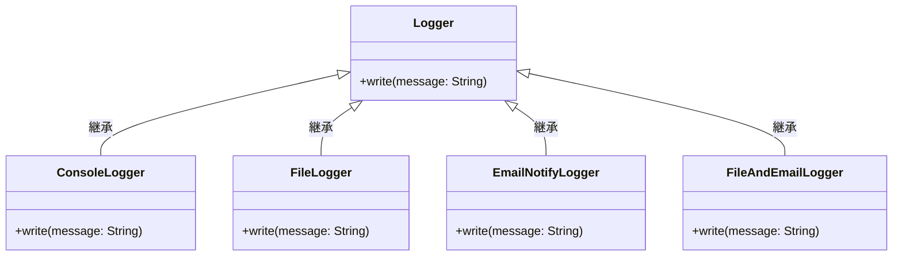
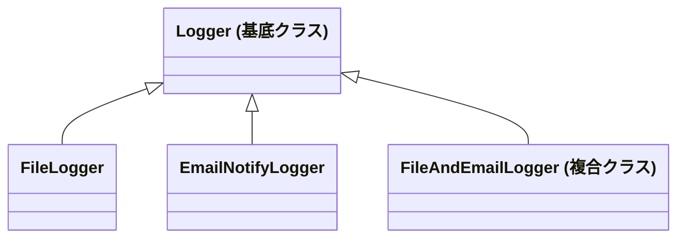
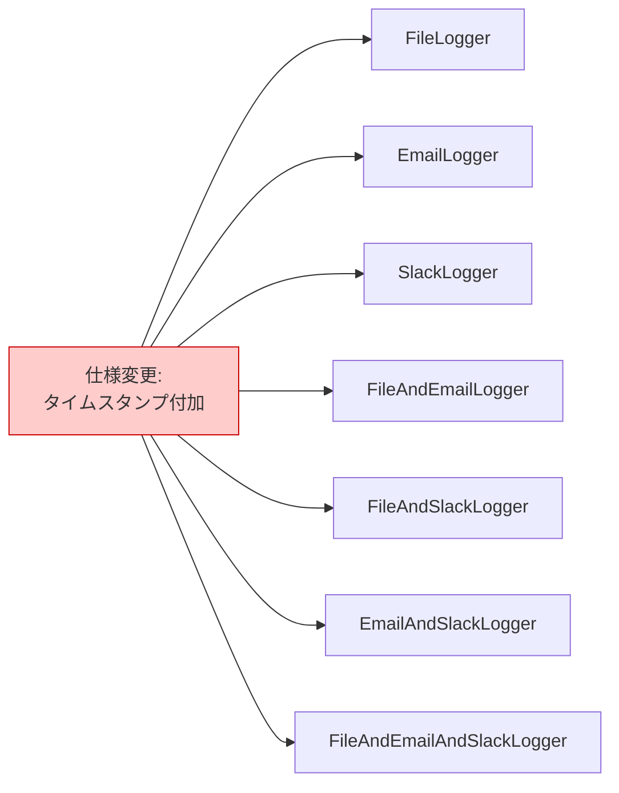
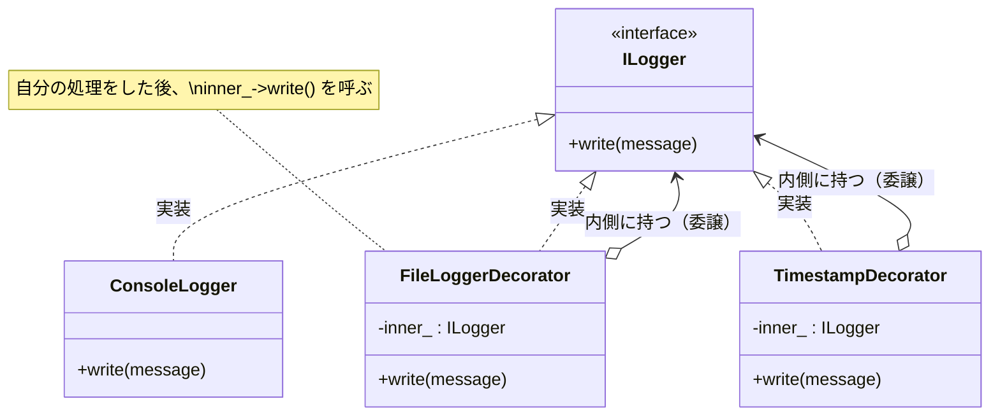
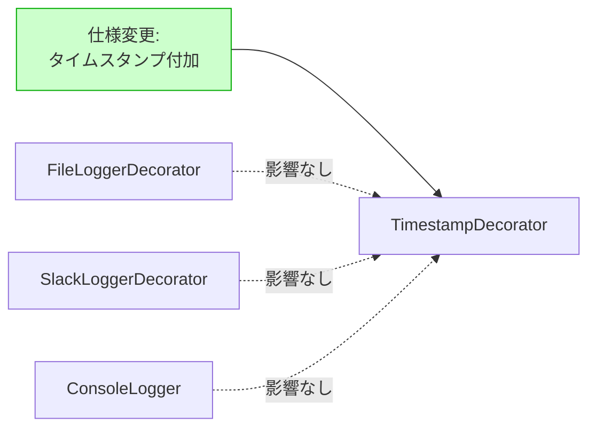
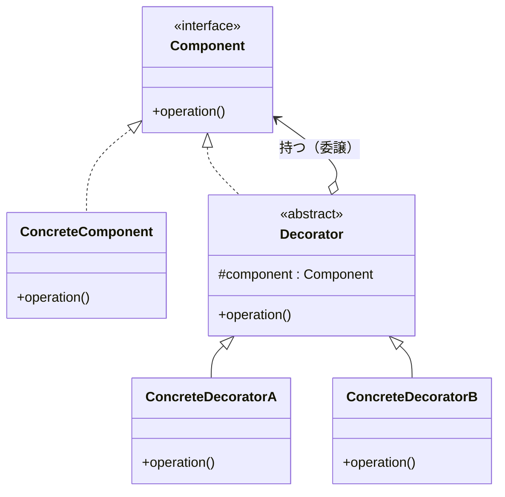

## 第6章　Decorator

―― 思考の型：「機能の組み合わせ」が変わる

> **この章の核心** 継承を使わず、機能の組み合わせをオブジェクトの包み込みで表現する

---

## この章を読むと得られること

- クラスを爆発的に増やさずに、既存の機能に新しい機能を追加・組み合わせる方法がわかるようになる
    
- 機能の追加をコンパイル時（クラス定義）ではなく、実行時の組み立てで柔軟に表現できるようになる
    
- 継承による「機能の重ね合わせ」が引き起こす構造的な問題を見つけられるようになる
    
- 「機能の追加」という変化に対し、既存コードを一切修正せずに対応する手法がわかるようになる
    

> **【レゴブロックの思考：この章の操作】**
> 
> この章で扱うのは、第0章で紹介したレゴブロックの操作のうち **「⑥ 拡張する（付け足す）」** と **「② 隠蔽する（包む）」** の組み合わせです。
> 
> すでに完成しているブロックの土台（例えば、ただの四角いブロック）に対して、「光る機能」や「音が出る機能」を追加したいとき、どうするでしょうか？
> 
> その土台を溶かして新しいブロックを作り直すのではなく、土台ブロックの上にカチッと「光るパーツ」を被せ、さらにその上に「音が出るパーツ」を被せるはずです。元の土台ブロックはそのままに、外側からパーツで「包み込む」ことで、機能の組み合わせを無限に作り出すことができます。
> 
> `[ImagePrompt: A top-down 3D illustration of Lego blocks. A basic solid blue Lego block in the center, being covered from above by a hollow transparent yellow Lego piece, and then a hollow transparent red Lego piece hovering above ready to cover it all. Showing the concept of wrapping or decorating existing blocks without changing the original core block.]`

---

## ステップ0：システムを把握し、仮説を立てる ―― クラス構成を見てから「変わりそうな場所」を予測する

> **入力：** システムのシナリオ説明 ＋ クラス構成の概要（仕様表・責任一覧）。実装コードはまだ読まない。
> 
> **産物：** 変動と不変の「仮説テーブル」

**全パターンに共通する問い**

> 「このコードの中に、**『変わる理由』が異なる2つのものが、 同じ場所に混在していないか？」**

「変わる理由」とは **「誰の判断で変わるか」** のことです。

### 6.0 この章のシステム構成と仮説

**この章で扱うシステム：** 今回見ていくのは、あるWebサービスで稼働している「アプリケーションログ出力システム」です。 サービスの処理結果やエラー情報を記録するための仕組みですが、単に画面（コンソール）に文字を出すだけでなく、用途に合わせて複数の出力方法が求められています。例えば、後から調査できるようにファイルに保存したり、重大なエラーが起きたときには担当者にメールで通知したりといった要件です。

**仕様表（何ができるシステムか）**

|**機能**|**担当**|**入力**|**出力**|
|---|---|---|---|
|基本ログ出力|アプリケーション基盤|ログメッセージ（文字列）|コンソールへの出力|
|ログの永続化|インフラ担当|ログメッセージ（文字列）|指定されたログファイルへの書き込み|
|エラー通知|監視運用担当|ログメッセージ（文字列）|管理者へのメール送信|
|複合出力|アプリケーション基盤|ログメッセージ（文字列）|ファイルへの書き込み ＋ メール送信の両方|

このシステムの特徴は、「メールだけ」「ファイルだけ」という単一の出力だけでなく、「ファイルに保存しつつ、メールも送る」といった**機能の組み合わせ**が要求されている点です。 これを実現するために、現状のシステムはどのような構造になっているのでしょうか。まずはクラス構成の概要を見てみましょう。

**クラス構成の概要**




_→ 「組み合わせ」の数だけ、それを表現するための新しいサブクラスが作られている。_

現状の構成では、基底となる `Logger` クラスがあり、それを継承して各機能を実現しています。 コンソール用、ファイル用、メール用といった単一機能のクラスに加えて、複数の機能を持たせたい場合は `FileAndEmailLogger` という複合クラスを作って対応しているようです。 これは現場で非常によく見かける構造です。「Aの機能とBの機能が両方必要だから、それらを持つ新しいクラスを作ろう」という、直感的で素直なアプローチと言えます。

では、各クラスの責任を整理してみましょう。

**各クラスの責任一覧**

|**対象**|**責任（1文）**|**知るべきこと**|
|---|---|---|
|`Logger`|ログ出力の基本型を提供する|ログ出力という振る舞いの存在|
|`ConsoleLogger`|コンソールにログを出力する|コンソールへの書き込み方法|
|`FileLogger`|ファイルにログを書き込む|ファイルパス、ファイルへの書き込み手順|
|`EmailNotifyLogger`|メッセージをメールで送信する|SMTPサーバー情報、メール送信手順|
|`FileAndEmailLogger`|ファイルへの書き込みとメール送信を同時に行う|ファイルの書き込み手順、メール送信手順|

ここで少し立ち止まって考えてみてください。

`FileAndEmailLogger` は、ファイルに書き込む知識と、メールを送る知識の両方を持っています。もし、インフラ担当から「ファイルへの書き込み先ディレクトリを変更したい」という要望が来た場合、`FileLogger` と `FileAndEmailLogger` の両方を修正する必要がありそうです。

これは、同じ知識が複数の場所に散らばっているサインかもしれません。

---

この構成を踏まえた上で、今後どこに変化が起こりそうか、仮説を立ててみます。

**変動と不変の仮説（実装コードを読む前に立てる）**

|**分類**|**仮説**|**根拠（クラス構成から読み取れること）**|
|---|---|---|
|🔴 **変動する**|**ログ出力機能の「組み合わせの種類」**|「ファイル＋メール」というクラスがすでに存在している。今後、「コンソール＋メール」などの新しい組み合わせが要求される可能性が高い。|
|🔴 **変動する**|**新しい出力手段（機能）の追加**|クラウド環境への移行などで、ログの出力先（Slack通知や外部APIなど）の選択肢自体が増えることが予想される。|
|🟢 **不変**|**「メッセージを受け取って記録する」という全体フロー**|システムがログを出力するという目的自体は変わらない。呼び出し元は、どこに出力されるかを気にせず、単に「書き込め」とだけ指示したいはず。|

ここから読み取れる懸念は、**「N種類の出力手段（機能）があるとき、それらの組み合わせをすべてクラスで表現しようとすると、クラス数が指数関数的に爆発する」** ということです。 もしここに「Slack通知」という機能が追加されたらどうなるでしょうか。`SlackLogger` だけでなく、`FileAndSlackLogger`、`EmailAndSlackLogger`、`FileAndEmailAndSlackLogger` といったクラスが次々と必要になってしまいます。

## ステップ1：実装コードを読む ―― 責任チェックで問題の行を見つける

### 6.1 実装コードと責任チェック

ステップ0でクラスの責任の概要を把握しました。

ここでは実際の実装コードを開き、「コードが責任通りに書かれているか」を1行ずつ確認していきます。

コードを読む前に、まずは現状の依存関係（誰が誰を知っているか）を図で見てみましょう。

**依存の広がり（実装前の全体像）**




_→ 新しい組み合わせが必要になるたびに、基底クラスを継承した新しいサブクラスが横並びで増えていく構造です。_

実際のシステムで稼働しているコードは以下のようになっています。 ここでは問題の焦点となる `FileAndEmailLogger` の実装を中心に見ていきます。


```c++
#include <iostream>
#include <string>

// 基本となるログのインターフェース
class Logger {
public:
    virtual void write(const std::string& message) = 0;
    virtual ~Logger() {}
};

// ファイル出力機能
class FileLogger : public Logger {
    std::string filePath_;
public:
    FileLogger(const std::string& path) : filePath_(path) {}
    void write(const std::string& message) override {
        // ファイルへの書き込み処理（簡略化して標準出力で表現）
        std::cout << "[File: " << filePath_ << "] " << message << "\n";
    }
};

// メール通知機能
class EmailNotifyLogger : public Logger {
    std::string smtpServer_;
public:
    EmailNotifyLogger(const std::string& smtp) : smtpServer_(smtp) {}
    void write(const std::string& message) override {
        // メール送信処理（簡略化して標準出力で表現）
        std::cout << "[Email via " << smtpServer_ << "] " << message << "\n";
    }
};

// 問題のクラス：ファイルとメールの両方に出力する複合クラス
class FileAndEmailLogger : public Logger {
    std::string filePath_;
    std::string smtpServer_;
public:
    FileAndEmailLogger(const std::string& path, const std::string& smtp)
        : filePath_(path), smtpServer_(smtp) {}

    void write(const std::string& message) override {
        // ファイル書き込みの知識（FileLoggerと同じコードの複製）
        std::cout << "[File: " << filePath_ << "] " << message << "\n"; // ← 知らなくていい
        
        // メール送信の知識（EmailNotifyLoggerと同じコードの複製）
        std::cout << "[Email via " << smtpServer_ << "] " << message << "\n"; // ← 知らなくていい
    }
};

// 呼び出し側（アプリケーションのメイン処理）
int main() {
    // ファイルとメールの両方にログを出したい場合
    FileAndEmailLogger logger("/var/log/app.log", "smtp.example.com");
    logger.write("決済処理が完了しました");
    
    return 0;
}
```

**実行結果：**

```
[File: /var/log/app.log] 決済処理が完了しました
[Email via smtp.example.com] 決済処理が完了しました
```

実行結果の通り、このコードは仕様通りに完璧に動きます。バグはありません。

しかし、設計の視点で見ると、このコードは非常に脆い構造を抱えています。

第0章でお伝えした通り、設計の問題を見つけるための基準は「誰の判断で変わるか」です。

`FileAndEmailLogger` クラスの責任をもう一度確認し、コードの各行がその責任内に収まっているかチェックしてみましょう。

**責任チェック：`FileAndEmailLogger` は自分の責任だけを持っているか**

このクラスの本来の責任は「ファイルへの書き込みとメール送信を同時に行うこと」です。

知るべきことは、「両方を呼び出す」という連携の事実だけのはずです。

|**コードの行**|**持っている知識**|**責任内か**|
|---|---|---|
|`std::cout << "[File: " << filePath_ << "] "...`|ファイルへの具体的な書き込み手順とフォーマット|**✗ インフラ担当（FileLogger）の責任**|
|`std::cout << "[Email via " << smtpServer_ << "] "...`|メール送信の具体的な手順とフォーマット|**✗ 監視運用担当（EmailNotifyLogger）の責任**|

`FileAndEmailLogger` は、ファイル出力とメール出力の具体的なやり方（How）を知りすぎてしまっています。 本来なら `FileLogger` と `EmailNotifyLogger` の中に閉じ込められているべき実装の詳細が、複合クラスの中にそのままコピー＆ペーストされて混入しているのです。

もし、インフラ担当から「ログファイルのフォーマットにタイムスタンプを足してほしい」と依頼されたらどうなるでしょうか？ `FileLogger` を修正するだけでなく、ファイル出力を伴うすべての複合クラス（`FileAndEmailLogger` など）を探し出し、同じ修正を適用して回らなければなりません。これを忘れると、「単体出力の時と、複合出力の時でログの書式が違う」という不可解なバグを生みます。

grep検索で「File」という文字を含むクラスを片っ端から開き、同じような修正をひたすら繰り返す……。現場でよく遭遇するあの疲弊する作業は、まさにこの「知識の重複（混在）」から生まれています。

---

### 6.2 届いた変更要求

そんな中、インフラ担当から新たな要望が舞い込みました。

> **インフラ担当**：「最近、障害時の初動を早くするためにSlackを導入したんだ。だから、エラーが起きたときは**Slackへの通知も追加**してほしい。あ、もちろん今まで通りファイルには残してほしいし、重要なエラーは『ファイル＋メール＋Slack』の全部に送るパターンも必要になるね。」
> 
> **あなた**：「なるほど、Slack通知ですね。単体の通知だけでなく、組み合わせのパターンも増えるということですか……。ちなみに、いつ頃までに必要ですか？」
> 
> **インフラ担当**：「急ぎで申し訳ないんだけど、**今週中**にお願いできるかな？」

Slack通知という新しい「機能」の追加。 そして、「ファイル＋Slack」「メール＋Slack」「ファイル＋メール＋Slack」という、新しい「組み合わせ」の要求です。

もし、今の継承を使ったアプローチのままこの要求に応えようとすると、何が起きるでしょうか。

次のステップで、関係者へのヒアリングを通じて、この要求がシステムに与える真のインパクト（変化の予測）を確定させていきます。

## ステップ2：仮説を確定する ―― 関係者ヒアリングで「変わる理由」に根拠をつける

### 6.3 仮説の検証と変動/不変の確定

ステップ0で「組み合わせの種類が変わりそうだ」という仮説を立てました。そしてステップ1の責任チェックでは、複合クラスの中に「ファイル出力」と「メール出力」の具体的なやり方（知識）がそのままコピペされて混在している構造上の脆さを確認しました。

ここですぐに「よし、クラスを分けよう」とエディタに向かい始めるのは、少し待ってください。

**コードを読んだだけで「ここが変わるはずだ」と断定するのは危険です。**

なぜなら、コードは「今の状態」しか語ってくれないからです。将来何が変わるのか、どのくらいの頻度で変わるのか、そしてそれは「誰の判断」で変わるのか——それを知っているのは、コードではなくその仕様を決める現場の人間だけです。私たちの勝手な推測で「変わりそう」と判断して複雑な仕組みを作ったのに、結局一度も使われなかった……そんな徒労を、私も現場で何度も経験してきました。

だからこそ、ステップ0の仮説を持って、関係者に直接ヒアリングに行きます。今回の主なステークホルダーは、要望を出してきた「インフラ担当」と、ログの基本仕様を管理している「アプリケーション基盤担当」です。

---

**関係者ヒアリング**

> **あなた（開発者）**：「インフラ担当さん、先ほどのSlack通知の追加と、組み合わせパターンの追加の件、状況は分かりました。少し先の話もお聞きしたいのですが、今後、Slack以外にも出力先の種類自体が増える予定はありますか？」
> 
> **インフラ担当**：「うーん、実は来期あたりにシステムをクラウドに移行する話が出ていてね。その時はDatadogのような専用のクラウドログ基盤にも送りたいと思っているんだ。それに、平常時は『ファイル＋クラウド』、障害調査の時は『コンソール＋ファイル＋Slack』みたいに、状況に合わせて出力の組み合わせを柔軟に切り替えたいんだよね。」
> 
> **あなた**：「なるほど、機能の種類も組み合わせのパターンも、今後継続的に変わっていくということですね。分かりました。……あともう一点、基盤担当さんにも確認させてください。」
> 
> **アプリケーション基盤担当**：「はい、なんでしょう？」
> 
> **あなた**：「今、ログを出力する `write` メソッドの引数は `std::string` のメッセージだけですよね。将来的に、ここに『エラーレベル(INFO/ERROR等)』や『ユーザーID』みたいなパラメータが増えたり、独自の構造体に変わったりする可能性はありますか？」
> 
> **アプリケーション基盤担当**：「あー、引数の型を変える予定はないかな。というのも、引数を構造体なんかに変えちゃうと、ログを出力しているアプリケーション側の全コードを修正しなきゃいけなくて大変でしょ？ だから、アプリ側から渡すのは今のまま『ただの文字列』で固定したい。」
> 
> **インフラ担当**：「あ、でも横からごめん。引数はそのままでいいんだけど、出力されるすべてのログの先頭に、自動で『タイムスタンプ』と『リクエストごとの処理ID』をくっつけて出力したいっていう要望は出そうとしているよ。調査の時に絶対に必要になるからね。全パターン共通で付けてほしい。」

---

この短い会話の中に、設計を決定づける重要な事実が含まれています。

まず、一つ目の重要な確認ポイント。それは「引数の型の安定性」についてです（Q6-1）。

なぜ基盤担当にわざわざ「引数の型は変わりますか？」と聞いたのでしょうか。実は、**引数の型（シグネチャ）が変わってしまうと、裏側でどんなに美しい設計構造を作っていても、インターフェースを通じてすべてのクラスに変更が波及してしまう**からです。複数クラスをまたぐ型の変更は、デザインパターンでは守りきれません。だからこそ、本格的に設計をいじる前に「この型は固定で合意してよいか」を関係者と握っておく必要があったのです。結果として、引数は `std::string` で不変であるという合意が取れました。

そして二つ目は、インフラ担当から飛び出した「全パターンのログにタイムスタンプと処理IDを付加したい」という横断的な変更リスクです（Q5-2）。

これは単なる「出力先の追加」とは毛色が違います。もし今のままの構造でこの要望に応えようとすれば、`ConsoleLogger`、`FileLogger`、`EmailNotifyLogger`……そして無数に増える複合クラスのすべての `write` メソッドの中に、タイムスタンプを付加するロジックを書き足して回らなければなりません。これはまさにステップ1で見た「知識の混在による悲劇」の拡大版です。このリスクは、後ほどステップ6の耐久テストで実際にコードに落とし込んで、私たちの設計が耐えられるか検証してみましょう。

ヒアリングの結果を踏まえ、ステップ0の仮説に「根拠」を紐付けて確定させます。

**確定した変動と不変のテーブル**

|**分類**|**具体的な内容**|**変わるタイミング**|**根拠**|
|---|---|---|---|
|🔴 **変動する**|**出力先（機能）の種類**|クラウド移行や新しいツールの導入時|インフラ担当とのヒアリング|
|🔴 **変動する**|**機能の「組み合わせ方」**|運用フェーズの変更や障害調査時など、状況に応じて|インフラ担当とのヒアリング|
|🔴 **変動する**|**全ログ共通の前処理（タイムスタンプ付加など）**|今後の運用改善のタイミングで追加される|インフラ担当からの予告（将来リスク）|
|🟢 **不変**|**ログを出力する目的と、引数の型（`std::string`）**|変わらない（アプリ全体への影響が大きすぎるため固定）|アプリケーション基盤担当との合意|

> **設計の決断**：
> 
> 🟢 不変な部分である「文字列を受け取って記録する」という契約（インターフェース）を強固に固定します。
> 
> そして、🔴 変動する「出力先の種類」や「組み合わせ方」、さらには「前処理の追加」といった要素は、そのインターフェースの裏側に押し込み、呼び出し側から隠蔽する構造を目指します。

「誰の判断で、何が変わるか」が明確になりました。

次はいよいよ、この変更要求を今の「継承による複合クラス」の仕組みにそのままぶつけてみます。ステップ3の課題分析で、現状のコードがどれほど悲鳴を上げるか（痛みの正体）を具体的に見ていきましょう。

## ステップ3：課題分析 ―― 変更が来たとき、どこが辛いかを確認する

ステップ2で確定した要求は、「Slack通知の追加」と「その組み合わせの追加」、そして将来の「タイムスタンプの共通付加」でした。 これらの要求を、現状の「継承」を使った構造のまま実装しようとすると、どのような痛みが待っているでしょうか。設計の良し悪しは、静かにコードを読んでいる時ではなく、「それに変更を加えようとした時」に最も顕著に現れます。頭の中で、実際にキーボードを叩いてこの要求を実装するプロセスをシミュレーションしてみましょう。

まず、Slackに通知する単体機能として `SlackLogger` クラスを作ります。ここまでは簡単です。既存の `FileLogger` や `EmailNotifyLogger` と横並びに新しいサブクラスを1つ追加するだけです。

問題はここからです。要求にあった「ファイル＋Slack」の組み合わせを実現するためには、`FileAndSlackLogger` という新しい複合クラスを作らなければなりません。そして、その `write` メソッドの中には、`FileLogger` のファイル書き込み処理と、`SlackLogger` のSlack送信処理をそのままコピー＆ペーストすることになります。 さらに、「メール＋Slack」という組み合わせのために `EmailAndSlackLogger` を作ります。 極めつけは、「ファイル＋メール＋Slack」という全部入りの要求に応えるための `FileAndEmailAndSlackLogger` です。このクラスの中には、3つのクラスの実装詳細が長々とコピペされることになります。

機能が3種類（ファイル、メール、Slack）になっただけで、単体クラス3つ＋複合クラス4つの、合計7つの派生クラスが必要になりました。 もしここに「外部APIへの送信」という4種類目の機能が追加されたらどうなるでしょうか？ クラスの数は一気に15個に跳ね上がります。「組み合わせ」を表現するために毎回新しいクラス（型）を継承で定義していると、機能の種類が増えるたびにクラスの数が指数関数的に爆発していくのです。これが「痛み」の1つ目、クラスの爆発とコードの重複です。

しかし、現場で私たちを本当に疲弊させるのは、次の痛みです。 ヒアリングでインフラ担当が言っていた、「全パターンのログにタイムスタンプと処理IDを付加したい」という横断的な追加要求が来た時のことを考えてみてください。

「出力されるすべてのログの先頭に、現在時刻を入れる」

言葉にすればとても単純な、たった1つの仕様変更です。しかし、この変更のために、私たちはいくつのクラスを開く必要があるでしょうか。

**依存の広がり（変更影響グラフ：改善前）**

コード スニペット



_→ 「タイムスタンプを追加する」という1つの変更要求が、すべてのログクラスのwriteメソッドに飛び火してしまっている。_

「……ただタイムスタンプを入れるだけなのに、なんで全クラスのファイルをgrepして、`write`メソッドを一つずつ開いて回らなきゃいけないんだ……」

現場で何度も同じような修正を繰り返していると、思わずこんな独り言が漏れてしまいます。 これが「痛み」の2つ目、変更の飛び火（波及）です。 ファイル出力の書き方が少し変わっても、メール送信のサーバーアドレスが変わっても、今回のようにタイムスタンプを付けたくなっても、私たちは常に「〜Logger」という名前のクラスを検索し、漏れがないかビクビクしながら、同じような修正をひたすら適用して回らなければならないのです。もし一つでも修正漏れがあれば、「ファイルにはタイムスタンプが出ているのに、メールのログには出ていない」という不整合なバグが生まれます。

ここで少し立ち止まって、私たちが設計というものを学ぶ理由について考えてみましょう。

設計の価値とは、決して「新しいコードをきれいに書けること」だけではありません。設計の真の価値とは、**既存コードを変えるとき、影響をこの1箇所に閉じ込められること**にあります。新しい要求が来たとき、どこが壊れるかを予測し、一つのファイルだけを開いて修正すれば完了する。その安心感を手に入れるために、私たちはコードの構造を考えるのです。

現状の「継承を使った組み合わせ」のコードは、その設計の力から大きく外れてしまっています。

なぜ、これほどまでに変更が飛び火してしまうのでしょうか？ なぜ、機能を組み合わせようとするだけで、これほどクラスが増えてしまうのでしょうか？

次のステップ4で、この「痛み」の根本にある構造的な原因を、感情ではなくロジックで言語化していきます。

## ステップ4：原因分析 ―― 困難の根本にある設計の問題を言語化する

ステップ3で見たように、現状のコードでは「機能を追加しようとするとクラスが爆発的に増える」「1つの変更要求が複数のクラスに飛び火する」という2つの大きな痛みがありました。

なぜ、このような痛みが生まれてしまうのでしょうか。対症療法で終わらせないために、痛みの根本にある「構造的な原因」を言語化していきます。

|**観察**|**原因の方向**|
|---|---|
|新しい機能の組み合わせが必要になるたびに、新しいクラス（`FileAndEmailLogger` など）を作らなければならない|**機能の「組み合わせ」を、「継承（is-a）」による新しい型（クラス）の定義で表現しようとしているから。**|
|タイムスタンプ付加のような1つの変更要求が、すべての複合クラスに飛び火する|**複合クラスが、各機能の具体的な実現方法（How）をコピペで抱え込み、知りすぎているから。**|

現状の設計が抱えている問題は、大きくこの2つに集約されます。

まず一つ目の原因、「継承による組み合わせの表現」について考えてみましょう。

継承は「〜は〜である（is-a）」という関係を表すのに適しています。「`ConsoleLogger` は `Logger` である」というのは自然です。しかし、「ファイル出力機能とメール出力機能を併せ持ったもの」を継承で表現しようとした瞬間から、無理が生じます。

継承は、既存のクラスをベースに「新しい特別な種類」を定義する仕組みであって、「独立した複数の機能ブロックを自由にガチャンとつなぎ合わせる」ための仕組みではありません。継承で組み合わせを作ろうとすると、組み合わせのパターンの数だけ「新しい種類（クラス）」を定義しなければならなくなり、結果としてクラス数が指数関数的に爆発してしまうのです。

二つ目の原因は、ステップ1の責任チェックでも指摘した「知識の混在」です。

`FileAndEmailLogger` という複合クラスは、「2つの機能を呼び出す」という責任だけを持てばよいはずなのに、「ファイルにはこうやって書き込む」「メールはこうやって送る」という具体的な手順（知識）まで知ってしまっています。

「知りすぎているクラスは、知っている知識が変わると必ず道連れになる」というのが設計の鉄則です。ログのフォーマットが変わるたびにgrepして回らなければならないのは、この「やり方」が各複合クラスの中に重複して散らばっているからです。

#### 変わるものと変わらないものが同じ場所にいる

問題の構図が見えてきました。このシステムでは、本来分かれているべき「変化のスピードが違うもの」が、複合クラスの中に癒着しています。

|**変わり続けるもの（分離すべきもの）**|**変わってほしくないもの（守るべきもの）**|
|---|---|
|出力先（機能）の種類（Slackなどの追加）|`Logger` の「文字列を受け取って記録する」というインターフェース|
|どの機能をどう組み合わせるかという「パターンの追加・変更」|個別の出力機能の具体的な実装（FileやEmail単体の書き込みロジック）|
|全パターンに横断的に追加される前処理（タイムスタンプなど）|既存のコード（新しい組み合わせが増えても、既存のクラスは修正したくない）|

私たちが直面している問題の本質は、「機能を追加・組み合わせたい（変わり続けるもの）」という要求に対して、「既存のクラスを継承して新しいクラスを作る」というアプローチを取っている点にあります。このアプローチでは、「変わってほしくない」はずの既存の仕組みに引きずられたり、同じ知識をあちこちに複製したりすることになってしまいます。

では、どうすれば「クラスを増殖させず」に、「既存のコードにも触れず」に、機能を無限に組み合わせることができるのでしょうか。

次のステップ5では、第0章で紹介した「設計の6つの手札」から、この状況を打開するための物理的な操作を選び出し、具体的なコードとして試していきます。

## ステップ5：対策案の検討 ―― 原因から手札を選ぶ

> **ステップ4で特定した真因：** 機能の「組み合わせ」を継承（is-a）で固定化しようとしており、複合クラスが各機能の具体的な実行手順（How）を知りすぎていること。

### 6.4 第0章の手札を引く

ステップ4で特定した原因を、第0章の「設計の6つの物理操作（手札）」に当てはめてみましょう。

|**原因**|**4分類（3次元）**|**手札候補**|
|---|---|---|
|機能の組み合わせの数だけクラスが爆発する|1. 要素の定義（粒度）|**① 分割する（切る）** / **まとめる（持つ）**|
|動的に機能を追加・組み合わせたい|3. 構造の発展（時間・総量）|**⑥ 拡張する（付け足す）** ＋ **② 隠蔽する（包む）**|

継承という「固定された溶接」をやめて、機能を柔軟に組み合わせるための手段として、今回は複数の手札を別々に試す（ケース③）アプローチを取ります。

現場で真っ先に思いつくであろう「リストでまとめて管理する」という手段①と、レゴブロックのように「包み込んで付け足す」という手段②。両方を本気で実装し、どちらが今後の変化の波（Slack追加やタイムスタンプ付加）を安全に乗りこなせるかを確認していきましょう。

---

### 6.5 手段①：専用の管理クラスに「まとめる」を試す（ケース③）

最初の候補は、「機能をクラスとして分割し、それを一つの管理クラスの中にリストとして持たせる（まとめる）」という手札です。 `FileAndEmailLogger` のような「最初から2つの機能が溶接されたクラス」を作るのではなく、出力先ごとにクラスを独立させ、それを `LoggerManager` という統括クラスが束ねて一斉に呼び出せばよいのではないか、という直感的なアプローチです。

さっそく、この手札を使ってコードを書いてみましょう。


```C++
#include <iostream>
#include <string>
#include <vector>

// 各出力機能のインターフェース
class ILogger {
public:
    virtual void write(const std::string& message) = 0;
    virtual ~ILogger() {}
};

// 単一の機能（ファイル出力）
class FileLogger : public ILogger {
    std::string filePath_;
public:
    FileLogger(const std::string& path) : filePath_(path) {}
    void write(const std::string& message) override {
        std::cout << "[File: " << filePath_ << "] " << message << "\n";
    }
};

// 単一の機能（メール送信）
class EmailLogger : public ILogger {
    std::string smtp_;
public:
    EmailLogger(const std::string& smtp) : smtp_(smtp) {}
    void write(const std::string& message) override {
        std::cout << "[Email: " << smtp_ << "] " << message << "\n";
    }
};

// 手段①：複数のロガーをまとめて管理するクラス
class LoggerManager {
    std::vector<ILogger*> loggers_; // 複数のロガーをリストで「持つ」
public:
    void addLogger(ILogger* logger) {
        loggers_.push_back(logger);
    }
    
    // 登録されたすべてのロガーに一斉送信する
    void writeAll(const std::string& message) {
        for (ILogger* l : loggers_) {
            l->write(message);
        }
    }
};

// 呼び出し側
int main() {
    FileLogger fileLogger("/var/log/app.log");
    EmailLogger emailLogger("smtp.example.com");
    
    LoggerManager manager;
    manager.addLogger(&fileLogger);
    manager.addLogger(&emailLogger);
    
    // 呼び出し元はManagerの専用メソッドを呼ぶ
    manager.writeAll("決済処理でエラーが発生しました");
    return 0;
}
```

このコードを書いた直後は、「よし、これでクラスの爆発は防げた！」と達成感を感じるかもしれません。確かに `FileAndEmailLogger` という複合クラスは消滅し、新しく `SlackLogger` が増えても `manager.addLogger(&slackLogger)` とするだけで済むようになりました。

**残る課題：**

しかし、この構造には後からじわじわと首を絞めてくる2つの「残る課題」が潜んでいます。

1. **呼び出し元の型（インターフェース）が変わってしまう** これまでアプリケーション側のコード（例：`OrderService`）は、`ILogger*` というインターフェースだけを知っていればログを出力できました。しかし、この手段を使うと、複数の出力を行いたい箇所では `ILogger*` ではなく `LoggerManager*` という全く別の型を受け取り、`writeAll` という別のメソッドを呼ばなければならなくなります（Q2-1）。 これでは、呼び出し元が「このログは単一出力か？ 複合出力か？」というインフラの都合を知ってしまうことになり、結合度が上がってしまいます。
    
2. **横断的な前処理（タイムスタンプ等）を追加しようとすると、責任が混在する** ステップ2のヒアリングで「全ログにタイムスタンプと処理IDを付けたい」という要求がありました。これをこの構造で実装しようとすると、どこに書くでしょうか？ おそらく、`LoggerManager::writeAll` の `for` ループの手前で `message = "[2026-05-04] " + message;` のように書き換えることになります。 しかし、それをした瞬間、`LoggerManager` は「複数のロガーを束ねて回す」という責任に加えて、「ログの書式（タイムスタンプ）を整形する」という2つ目の責任（変わる理由）を抱え込んでしまいます（Q1-3）。今後、「Slackにはタイムスタンプを出さないで」と言われたら、またこのManagerクラスを開いて `if` 文を追加しなければなりません。
    

管理クラスに「まとめる」手札は、一見うまく機能するように見えますが、呼び出し元の変更を強制し、結局はManagerクラス自体が肥大化して新たな「痛みの温床」になってしまうのです。

---

### 6.6 手段②：「包み込んで付け足す（隠蔽＋拡張）」を試す（ケース③）

手段①の課題をクリアするためには、次の条件を満たす必要があります。

- **呼び出し元には、ただの `ILogger` に見えなければならない（差し替え可能であること）**
    
- **組み合わせを管理するループ処理や、前処理のロジックが、一つのクラスに混在しないこと**
    

ここで登場するのが、第0章で紹介した **「⑥ 拡張する（付け足す）」** と **「② 隠蔽する（包む）」** の組み合わせです。

> `[ImagePrompt: A top-down 3D illustration of Lego blocks. A basic solid blue Lego block in the center, being covered from above by a hollow transparent yellow Lego piece, and then a hollow transparent red Lego piece hovering above ready to cover it all. Showing the concept of wrapping or decorating existing blocks without changing the original core block.]`

レゴブロックで例えるなら、土台となる「標準ブロック」の上から、カチッと「機能追加のカバー」を被せるようなイメージです。カバーを被せても、一番上にあるポッチの形は変わらないため、他のブロックからは依然として「ただの標準ブロック」として扱われます。

これをコードの構造に翻訳すると、「インターフェースを実装（is-a）しながら、同じインターフェースを内部に持つ（has-a）」という少し特殊な形になります。

これがどう機能するのか、実装を見てみましょう。


```C++
#include <iostream>
#include <string>

// ビジネス上の責任（何をするか）で付けたインターフェース名（Q4-1）
class ILogger {
public:
    virtual void write(const std::string& message) = 0;
    virtual ~ILogger() {}
};

// 終端となる基本のロガー（土台のブロック）
// ※今回は単純化のため、何もしない、あるいはコンソールに出すだけの土台とします
class ConsoleLogger : public ILogger {
public:
    void write(const std::string& message) override {
        // 土台は自分の仕事だけをする
        std::cout << "[Console] " << message << "\n";
    }
};

// ＝＝＝ ここからが機能を付け足す「包み紙」のクラス群 ＝＝＝

// ① ファイル出力を追加する包み紙
class FileLoggerDecorator : public ILogger { // ← 外から見ればただのILogger
    ILogger* inner_; // ← 内側に、別のILoggerを包み込んで持っている
    std::string filePath_;
public:
    // コンストラクタで「包む対象」を受け取る
    FileLoggerDecorator(ILogger* inner, const std::string& path)
        : inner_(inner), filePath_(path) {}

    void write(const std::string& message) override {
        // 1. 自分の追加機能（ファイルへの書き込み）を実行する
        std::cout << "[File: " << filePath_ << "] " << message << "\n";
        
        // 2. 内側に包んでいるロガーに、処理のバトンを渡す
        if (inner_) inner_->write(message);
    }
};

// ② メール送信を追加する包み紙
class EmailLoggerDecorator : public ILogger {
    ILogger* inner_;
    std::string smtp_;
public:
    EmailLoggerDecorator(ILogger* inner, const std::string& smtp)
        : inner_(inner), smtp_(smtp) {}

    void write(const std::string& message) override {
        std::cout << "[Email: " << smtp_ << "] " << message << "\n";
        if (inner_) inner_->write(message); // 次へ委譲
    }
};

// ③ タイムスタンプ（前処理）を追加する包み紙
class TimestampDecorator : public ILogger {
    ILogger* inner_;
public:
    TimestampDecorator(ILogger* inner) : inner_(inner) {}

    void write(const std::string& message) override {
        // 1. メッセージを加工（タイムスタンプを付加）
        std::string decoratedMessage = "[2026-05-04 11:13:16] " + message;
        
        // 2. 加工したメッセージを内側のロガーへ渡す
        // ← Timestamp自身は「どこに出力するか」を知らなくていい！
        if (inner_) inner_->write(decoratedMessage);
    }
};
```

このように、**「インターフェースを実装しつつ、同じインターフェースを内部に持ち、自分の処理をした後に内側へ委譲する」** 構造を、**Decorator（デコレーター）パターン** と呼びます。

では、この構造を使うと、複雑な「組み合わせ」や「横断的な前処理の追加」がどう表現できるのか。

メイン処理（組み立ての場所）を見てみましょう。


```c++
int main() {
    // 1. まず、土台となるロガーを作る
    ILogger* logger = new ConsoleLogger();
    
    // 2. 「ファイル出力」の機能で包む
    logger = new FileLoggerDecorator(logger, "/var/log/app.log");
    
    // 3. 「メール送信」の機能でさらに外側から包む
    logger = new EmailLoggerDecorator(logger, "smtp.example.com");
    
    // 4. 一番外側を「タイムスタンプ付加」の機能で包む
    logger = new TimestampDecorator(logger);

    // 呼び出し元は、何重に包まれているか知る必要はない。
    // ただの ILogger として write を呼ぶだけ。
    std::cout << "--- ログ出力開始 ---\n";
    logger->write("決済処理でエラーが発生しました");
    
    // (※本来はここでメモリ解放処理が必要です)
    return 0;
}
```

**実行結果：**

```Plaintext
--- ログ出力開始 ---
[Email: smtp.example.com] [2026-05-04 11:13:16] 決済処理でエラーが発生しました
[File: /var/log/app.log] [2026-05-04 11:13:16] 決済処理でエラーが発生しました
[Console] [2026-05-04 11:13:16] 決済処理でエラーが発生しました
```

見事に、すべての出力先にタイムスタンプが反映され、かつファイルとメールの両方にログが出力されています。 しかも、`FileLoggerDecorator` も `EmailLoggerDecorator` も、「タイムスタンプをつける」という処理を1行も書いていません。さらに `TimestampDecorator` 自身は、「ファイルに書くのか、メールで送るのか」を全く知らず、ただ「文字を加工して次へ渡す」という1つの責任だけに集中しています。

クラス図で構造を確認してみましょう。

コード スニペット



各クラスが独立した機能（パーツ）として存在し、それらを `main` 関数のような「組み立て専用の場所」で自由に包み込むことで、あらゆる組み合わせを表現しています。 これなら、Slackが追加になろうが、クラウド基盤への送信が追加になろうが、組み合わせの数だけクラスが爆発する悪夢を見ることはもうありません。

手段①（管理クラス）と手段②（Decorator）、どちらも一見「機能を追加する」という目的は達成していますが、その裏側にある構造の強靭さには大きな差があります。

次のステップ6では、この2つの手段をあらかじめ設定した「評価軸」で天秤にかけ、インフラ担当から予告されていた「Slack通知の追加」という耐久テストを実際にぶつけてみます。果たして、私たちの設計は変更の波を無傷で乗り切ることができるのでしょうか。

## ステップ6：天秤にかける ―― 手段を評価する

ステップ5で、私たちは「リストでまとめる管理クラス（手段①）」と「インターフェースを実装しながら持つ包み紙（手段②：Decoratorパターン）」の2つのアプローチを試しました。

ここからは、どちらが現場の負債になりにくく、将来の変化に強いかを冷静に比較し、採用する構造を決定します。

### 6.7 評価軸の宣言

設計には常に「複雑さ」というコストが伴います。比較を始める前に、今回の「ログ出力の組み合わせ」という課題において、私たちが「何を最も重視してこの複雑さのコストを払うのか」という評価軸を明示しておきましょう（Q8-2）。

|**評価軸**|**なぜこの状況で重要か**|
|---|---|
|**1. 変更の局所性（クラスの責任）**|タイムスタンプ付加のような「前処理」や、Slackのような「新しい出力先」が増えたとき、既存のクラスを書き換えずに済むか。|
|**2. 呼び出し元への影響**|ログを出す側（アプリケーション本体）が「単一出力か、複合出力か」を気にする必要があるか。|
|**3. テストの独立性**|「ファイルに書く処理」と「タイムスタンプをつける処理」を、それぞれ完全に独立して単体テストできるか。|

---

### 6.8 手段①vs手段②の比較

宣言した3つの評価軸で、両方の手段を測ってみます。

|**評価軸**|**手段①（Managerでまとめる）**|**手段②（Decoratorで包む）**|
|---|---|---|
|**1. 変更の局所性**|❌ Managerクラスが前処理やループ制御を抱え込み、肥大化する|✅ **機能ごとに完全にクラスが分かれ、互いに一切干渉しない**|
|**2. 呼び出し元への影響**|❌ `writeAll` という専用メソッドを呼ぶ必要があり、型が変わる|✅ **ただの `ILogger` に見えるため、呼び出し元は一切変わらない**|
|**3. テストの独立性**|❌ 前処理と出力処理がManager内で混ざり、単独テストが困難|✅ **「文字列を加工するだけ」「出力するだけ」と単独テストが容易**|

今回の状況では、文句なしで **手段②（Decoratorパターン）を採用します。**

確かに、Decoratorパターンを導入すると「単なるクラス」だけでなく「包むためのクラス」が増え、`main`関数などでの「組み立て」が少し長くなります。クラスが増えて複雑になるコストは確かに存在します。しかし、それは「将来、組み合わせの数だけクラスが指数関数的に爆発するコスト」や「仕様変更のたびに全ファイルをgrepして回るコスト」を、今のわずかな組み立てコードで前払いして防ぐ、という投資判断なのです（Q8-2）。

---

### 6.9 耐久テスト ―― ヒアリングで挙がった変化が来た

では、この設計が本当に投資に見合う強度を持っているか、ステップ2のヒアリングでインフラ担当から予告されていた「将来のリスク」をぶつけて実証してみましょう（Q5-2）。

**要求：**

「エラー時には、ファイルとメールに加えて **Slackにも通知** したい。さらに、それらすべてのログの先頭に **タイムスタンプを付加** したい。」

私たちがやるべきことは、ただ一つ。「Slack通知」という新しいブロック（クラス）を作ることだけです。

既存の `FileLoggerDecorator` や `TimestampDecorator` は一切開きません。


```C++
#include <iostream>
#include <string>

// ILoggerインターフェースと既存のデコレーター群は変更なし（省略）
class ILogger {
public:
    virtual void write(const std::string& message) = 0;
    virtual ~ILogger() {}
};

// ... ConsoleLogger, FileLoggerDecorator, TimestampDecorator など ...

// ＝＝＝ ここから追加するコード ＝＝＝

// Slack通知を追加する新しい包み紙（これを作るだけ！）
class SlackLoggerDecorator : public ILogger {
    ILogger* inner_;
    std::string webhookUrl_;
public:
    SlackLoggerDecorator(ILogger* inner, const std::string& url)
        : inner_(inner), webhookUrl_(url) {}

    void write(const std::string& message) override {
        // Slack特有のAPIを叩く処理（簡略化）
        std::cout << "[Slack → " << webhookUrl_ << "] " << message << "\n";
        
        // 次のロガーへ委譲
        if (inner_) inner_->write(message);
    }
};

// ＝＝＝ 組み立て場所（main関数） ＝＝＝

int main() {
    // 1. 一番内側の土台
    ILogger* logger = new ConsoleLogger();
    
    // 2. ファイル出力をかぶせる
    logger = new FileLoggerDecorator(logger, "/var/log/app.log");
    
    // 3. Slack通知をかぶせる（← 今回追加した機能をここで挟むだけ！）
    logger = new SlackLoggerDecorator(logger, "https://hooks.slack.com/...");
    
    // 4. 一番外側にタイムスタンプ処理をかぶせる
    // （一番外側で加工すれば、内側の全ロガーにタイムスタンプ付きの文字列が渡る）
    logger = new TimestampDecorator(logger);

    // 呼び出し元は、裏側で何が起きているか全く知らない
    std::cout << "--- 障害発生時のログ出力 ---\n";
    logger->write("DB接続タイムアウト");
    
    return 0;
}
```

**実行結果：**

Plaintext

```
--- 障害発生時のログ出力 ---
[Slack → https://hooks.slack.com/...] [2026-05-04 11:13:16] DB接続タイムアウト
[File: /var/log/app.log] [2026-05-04 11:13:16] DB接続タイムアウト
[Console] [2026-05-04 11:13:16] DB接続タイムアウト
```

見てください。新しい機能を追加し、それを既存の機能と複雑に組み合わせたにもかかわらず、既存のクラスは1行も変更されていません。「Slack用のクラスを1つ足して、組み立ての行を1行足すだけ」で要求が完了しました。

> 「SlackLoggerDecorator という名前だと、将来Teamsに変わったら名前がおかしくなりませんか？」と思うかもしれません。しかし、実装クラス名は技術手段（Slack）で付けて構いません。なぜなら、実装が変わる時はこの `new SlackLoggerDecorator` の行を `new TeamsLoggerDecorator` に差し替えるだけで済み、その「1行の差し替え」こそが変更内容を雄弁に語るドキュメントになるからです（Q4-2）。

#### この設計構造でも守れない変更（型の変更リスク）

変更を完璧に局所化できたように見えますが、ここで正直にお伝えしなければならない限界があります。

このDecoratorパターンを使っても、「守れない変更」が存在します（Q7-2）。

もし、アプリケーション基盤担当が「ごめん、やっぱりログを出力するときは、文字列じゃなくて、ユーザーIDとエラーコードを持った構造体を渡すようにしたい」と引数の型（シグネチャ）を変更してきたら、どうなるでしょうか。


```C++
// 変更前
virtual void write(const std::string& message) = 0;

// 変更後
virtual void write(int userId, int errorCode, const std::string& message) = 0;
```

この変更が起きた瞬間、`ILogger` という大元の契約書が書き換わります。すると、それに依存している `ConsoleLogger` も、`FileLoggerDecorator` も、`TimestampDecorator` も、すべてコンパイルエラーになり、一斉に修正しなければなりません。

複数インターフェースをまたぐ「引数の型の変更」は、どんなに美しいパターンの構造を作っていても防ぐことはできないのです（Q6-1）。ステップ2で、わざわざ基盤担当に「引数の型は変わりますか？」と念押しして確認したのはこのためです。

では、この恐怖から逃れる術はないのでしょうか？

ここで重要になるのが、「第0章のカプセル化の応用」です。インターフェースは「呼び出し元が知らなくていい詳細を隠す契約書」ですが、メソッドの引数（型）もまた、隠すべき詳細になり得ます（Q6-3）。

型が変わっても影響を受けないようにするための「型隠蔽」の選択肢を比較してみましょう（Q6-2）。

|**選択肢**|**実装例**|**インターフェース変更**|**メリット・デメリット**|
|---|---|---|---|
|**① 型を合意・固定する**|`write(int userId, string msg)`|型が変われば全滅する|✅シンプル。<br><br>  <br><br>❌変更リスクに無防備。|
|**② 独自型（Context）でくるむ**|`struct LogContext { string msg; int userId; };`<br><br>  <br><br>`write(LogContext ctx)`|**変わらない**|✅引数が増えても構造体に足すだけでIFは不変。<br><br>  <br><br>❌構造体の定義が1つ増える。|
|__③ void_ で型情報を消す_*|`write(void* context)`|**絶対変わらない**|✅究極の隠蔽。<br><br>  <br><br>❌型安全を完全に失う（C++では非推奨）。|

どれが正解かは、チームの状況と「型が将来どれくらい変わりそうか」という予測によって決まります。「こういう状況ではパターンの限界を責めるのではなく、型をどう扱うかを先にチームで決める問題」だということを覚えておいてください。設計に絶対の無敵の正解はありません。

---

### 6.10 使う場面・使わない場面

Decoratorパターンは機能の組み合わせを無限にする強力な手札ですが、常に使うべきではありません。「分けない」「インターフェースを使わない」という選択が設計の失敗だとは限らないのです（Q10-2）。

シンプルなままでいることを選ぶべき場面と、その時の最小コスト代替案を見てみましょう。

**【最小コスト代替案】：パターンを使わずに済む方法**

もし、ログの出力が「絶対にファイル出力しかなく、将来も絶対に変わらない」という前提なら、どう書くのが一番安いでしょうか。


```C++
class Logger {
public:
    void write(const std::string& message) {
        // ここに直接タイムスタンプ処理を書く
        std::string tsMsg = "[2026-05-04] " + message;
        // ここに直接ファイル書き込みを書く
        std::cout << "[File] " << tsMsg << "\n";
    }
};
```

（Q10-1）

ただこれだけです。インターフェースも、仮想関数も不要です。「パターンを使わずに、既存コードへの最小限の変更で対処する」のは、決して悪手ではありません。

これに対して、将来の変化の見通しがないのに無理やりパターンを導入するとどうなるか。そのコストの増加を実感してください。

**【過剰コード】：変化の予定がないものまでパターン化した例**


```C++
// ログはファイルに出すだけ、前処理も不要なのに、
// 「念のため」とDecorator構成を作ってしまった例
class ILogger { public: virtual void write(std::string m)=0; };
class FileLogger : public ILogger { /* ... */ };

// 機能追加の予定が一切ないのに、空のデコレーター基底クラスまで作る
class LoggerDecorator : public ILogger {
    ILogger* inner_;
public:
    LoggerDecorator(ILogger* inner) : inner_(inner) {}
    void write(std::string m) override { inner_->write(m); }
};

int main() {
    // 結局、1つしか包まないのに長ったらしい初期化が必要になる
    ILogger* logger = new FileLogger();
    logger->write("メッセージ");
}
```

（Q10-2）

このコードを見た別のエンジニアは「えっ、わざわざインターフェースを切ってDecoratorの準備をしているってことは、後から別の出力先が追加されるのかな？」と深読みし、コードを読むための認知負荷を無駄に跳ね上げてしまいます。シンプルに保つことも、立派なエンジニアリングの選択です。

これを踏まえ、Decoratorパターンを適用する判断基準をまとめます。

|**状況**|**適切な選択**|**理由**|
|---|---|---|
|**機能の組み合わせが多様で、数が増減する**|**Decoratorを使う**|継承で組み合わせを作ると、クラス数が指数関数的に爆発するため（今回のような場面）|
|**実行時に機能を付けたり外したりしたい**|**Decoratorを使う**|`main`関数などで動的にオブジェクトを包む構造が適しているため|
|**機能の組み合わせが固定で1〜2パターンしかない**|**使わない**|管理クラスや、クラス内の直接実装など、シンプルな構造で十分なため|
|**チームが1人で、変更が繰り返し発生しない**|**使わない**|パターンの導入コスト（クラスの増加）が、将来の変更を局所化するメリットを上回るため|

この「使う・使わない」の判断基準を手に入れた今、私たちはパターンに使われるのではなく、パターンを「道具」として使いこなせる地点に立っています。

最後のステップ7で、この決断が私たちのコードにどのような未来をもたらしたのか、変更シナリオ表を通して確認しましょう。

## ステップ7：決断と、手に入れた未来

### 6.11 解決後のコード（全体）

設計の判断を経て、私たちがたどり着いた最終的なコードの全体像です。

「機能の組み合わせ」という激しい変化の波から既存コードを守るため、インターフェースで規格を揃え、内側に同じ規格を持つことで「包み込む」構造（Decoratorパターン）を採用しました。


```C++
#include <iostream>
#include <string>

// 契約（インターフェース）
// 呼び出し元が知るべき唯一の知識
class ILogger {
public:
    virtual void write(const std::string& message) = 0;
    virtual ~ILogger() {}
};

// ----------------------------------------------------
// 土台となる基本ロガー
// ----------------------------------------------------
class ConsoleLogger : public ILogger {
public:
    void write(const std::string& message) override {
        std::cout << "[Console] " << message << "\n";
    }
};

// ----------------------------------------------------
// 機能を後付けする「包み紙」（デコレーター）群
// ※すべて ILogger を実装しつつ、内側に ILogger を持つ
// ----------------------------------------------------

// 1. ファイル出力を追加する機能
class FileLoggerDecorator : public ILogger {
    ILogger* inner_;
    std::string filePath_;
public:
    FileLoggerDecorator(ILogger* inner, const std::string& path)
        : inner_(inner), filePath_(path) {}

    void write(const std::string& message) override {
        // 自分の責任を果たす
        std::cout << "[File: " << filePath_ << "] " << message << "\n";
        // 内側のロガーへ処理を委譲
        if (inner_) inner_->write(message);
    }
};

// 2. Slack通知を追加する機能
class SlackLoggerDecorator : public ILogger {
    ILogger* inner_;
    std::string webhookUrl_;
public:
    SlackLoggerDecorator(ILogger* inner, const std::string& url)
        : inner_(inner), webhookUrl_(url) {}

    void write(const std::string& message) override {
        std::cout << "[Slack → " << webhookUrl_ << "] " << message << "\n";
        if (inner_) inner_->write(message);
    }
};

// 3. タイムスタンプ（横断的な前処理）を追加する機能
class TimestampDecorator : public ILogger {
    ILogger* inner_;
public:
    TimestampDecorator(ILogger* inner) : inner_(inner) {}

    void write(const std::string& message) override {
        // 前処理としてメッセージを加工する
        std::string decoratedMessage = "[2026-05-04 11:13:16] " + message;
        // 加工済みの文字列を内側へ渡す
        if (inner_) inner_->write(decoratedMessage);
    }
};

// ----------------------------------------------------
// 組み立てと呼び出し（Composition Root）
// ----------------------------------------------------
int main() {
    // インフラ担当の要望に合わせて、ここでブロックを組み合わせる
    
    // 土台
    ILogger* logger = new ConsoleLogger();
    // ファイル出力で包む
    logger = new FileLoggerDecorator(logger, "/var/log/app.log");
    // Slack通知で包む
    logger = new SlackLoggerDecorator(logger, "https://hooks.slack.com/...");
    // 最後にタイムスタンプ付加で包む
    logger = new TimestampDecorator(logger);

    // 呼び出し側（アプリケーションのメイン処理）は、
    // どれだけ複雑に包まれていても、ただの ILogger として扱うだけ。
    std::cout << "--- 処理開始 ---\n";
    logger->write("決済処理が完了しました");

    // （※実際の現場では、ここで delete によるメモリ解放が必要です）
    return 0;
}
```

---

### 6.12 変更影響グラフ（改善後）

ステップ3で「タイムスタンプを付けたい」という1つの変更要求が、すべての複合クラスに飛び火する痛ましいグラフを見ました。

私たちが手札を使って設計を組み替えた今、同じ変更要求が来たときの影響範囲はどうなったでしょうか（Q9-1）。




_→ 新しいクラス（`TimestampDecorator`）を1つ追加するだけで完了し、既存のどのクラスにも変更が飛び火しなくなりました（Q9-2）。_

「既存コードを変えるとき、影響をこの1箇所に閉じ込められること」。これこそが、私たちが少し長ったらしい初期化コードを書いてまで手に入れたかった、設計の真の価値です。

---

### 6.13 変更シナリオ表と最終責任テーブル

私たちが直面した変更リスクに対して、この設計が本当に耐えうるか。「何が変わったとき、どこを開けばいいのか」を数字と表で証明します（Q7-1）。

**変更シナリオ表：何が変わったとき、どこが変わるか**

|**シナリオ**|**変わるクラス**|**変わらないクラス**|
|---|---|---|
|SlackのAPI仕様が変わった|`SlackLoggerDecorator`（1クラスだけ）|他のすべてのクラス、`main()`（呼び出し元）|
|「使う部品の組み合わせ」が変わった（Q3-3）|`main()` の組み立て部分だけ|すべてのロガークラス|
|コンソール出力だけ別の機能（ダミーロガー等）に差し替える（Q2-3）|`main()` の土台生成部分だけ|`ILogger` を包んでいるすべてのDecoratorクラス|

各シナリオにおいて、私たちがファイルを開いて修正するクラスは常に1つ（または組み立て箇所だけ）に収まっています（Q7-1, Q9-2）。

各クラスがこのような局所性を保てるのは、それぞれが「たった1つの理由でしか変わらない」ように責任が分割されたからです。最後に、各クラスの最終的な責任を確認しておきましょう。

**最終責任チェック表**（Q1-4）

|**クラス**|**責任（1文）**|**変わる理由**|
|---|---|---|
|`ILogger`|ログ出力という振る舞いの契約を定義する|引数の型が変わるとき（めったにない）|
|`ConsoleLogger`|コンソールに文字を書き込む|コンソールへの出力仕様が変わるとき|
|`FileLoggerDecorator`|内側に処理を委譲しつつ、ファイルに書き込む|インフラ担当がファイルの保存仕様を変えるとき|
|`SlackLoggerDecorator`|内側に処理を委譲しつつ、SlackのAPIを叩く|インフラ担当がSlackの通知仕様を変えるとき|
|`TimestampDecorator`|内側へ渡す前に、文字列に時刻を付加する|ログの共通フォーマットが変わるとき|
|`main` (組み立て役)|部品をインスタンス化し、包み込んで組み合わせる|システム全体で要求される「組み合わせパターン」が変わるとき|

---

## 整理

### 8ステップとこの章でやったこと

|**ステップ**|**この章でやったこと**|
|---|---|
|ステップ0|「組み合わせ」ごとに継承クラスが増えている構成から、機能の増減が波及する仮説を立てた。|
|ステップ1|複合クラスの中に「ファイル出力」と「メール出力」の具体的な知識がコピペされていることを確認した。|
|ステップ2|インフラ担当とのヒアリングで、Slack通知の追加と、全パターン共通のタイムスタンプ付加（前処理）の要求を確定させた。|
|ステップ3|継承のままタイムスタンプを追加しようとすると、すべての複合クラスを開いて修正しなければならない痛みをシミュレートした。|
|ステップ4|原因は「組み合わせを継承（新しい型）で表現していること」と「複合クラスが具体的なやり方を知りすぎていること」だと特定した。|
|ステップ5|管理クラスでリストにまとめる手段（①）と、インターフェースを実装しつつ持つ手段（②：包み紙）を両方実装して試した。|
|ステップ6|「変更の局所性」などの軸で比較し、手段②を採用。Slack通知の追加という耐久テストを既存クラス無修正でクリアした。|
|ステップ7|最終的なコードと、変更が1箇所に閉じ込められたことを変更影響グラフとシナリオ表で証明した。|

このプロセスを回した結果にたどり着いた構造こそが **Decorator（デコレーター）パターン** です。

---

### 振り返り：第0章の3つの哲学はどう適用されたか

#### 哲学1「変わるものをカプセル化せよ」の現れ

**具体化された場所：** 各Decoratorクラスへの「機能の分割」と、`main()` への「組み合わせの分離」

継承を使った最初のコードでは、機能の「組み合わせ方」と「具体的な出力のやり方」が `FileAndEmailLogger` という一つのクラスの中に癒着していました。私たちは、やり方（File, Slack）をそれぞれ別のクラスに分離し、さらにそれらをどう組み合わせるかという判断を `main()` 関数に引き剥がしました。結果として、各クラスは「1つの理由でしか変わらない」純粋な部品になりました。

#### 哲学2「実装ではなくインターフェースに対してプログラムせよ」の現れ

**具体化された場所：** `ILogger` の導入と、Decorator内の `ILogger* inner_`

部品同士を組み合わせるため、私たちは `ConsoleLogger` や `FileLoggerDecorator` という「具体的な型」ではなく、`ILogger` という「規格（インターフェース）」に依存するようにしました。これにより、タイムスタンプ処理は「次に何が来るか」を一切気にせず、ただ `inner_->write()` と呼ぶだけで済むようになりました。

#### 哲学3「継承よりコンポジションを優先せよ」の現れ

**具体化された場所：** Decoratorにおける「インターフェースを実装しつつ、内側に同じインターフェースを持つ」構造

これがこの章の最大のテーマです。機能を追加するために「継承」でクラスを溶接するのではなく、「持つ（コンポジション）」ことで外側から包み込みました。レゴブロックの標準ポッチを保ったまま、上から「機能カバー」を被せていくアプローチによって、クラスを爆発させることなく、実行時に無限の組み合わせを作り出すことができました。

---

## パターン解説：Decoratorパターン

### パターンの骨格

Decoratorパターンは、オブジェクトに対して動的に（実行時に）新しい責任や機能を追加したい場合に、サブクラスを作って継承する代わりの柔軟な代替手段を提供するパターンです。

「既存のオブジェクトのインターフェースを変えずに、外側から包み込むことで振る舞いを拡張する」という構造を持っています。

コード スニペット



この図が示す通り、Decorator（包み紙）自身も Component（中身）と同じインターフェースを実装しているため、呼び出し元から見れば中身も包み紙も区別がつきません。マトリョーシカのように何重にも包み込むことができ、それぞれの包み紙が「委譲の前後」に自分の独自の処理を差し込むことで、機能の組み合わせを実現します。

**よく使われる場面：**

- 今回のような「ファイル＋メール＋Slack」など、機能の組み合わせが多数あり、継承を使うとクラス数が爆発してしまう場合。
    
- データのストリーム処理（圧縮、暗号化、バッファリングなどを組み合わせる Javaの `java.io` パッケージなどが有名です）。
    
- 既存のクラスを修正できない（ライブラリなど）状況で、そのクラスのメソッド呼び出しの前後に追加処理（ログ、実行時間計測、キャッシュなど）を挟み込みたい場合。