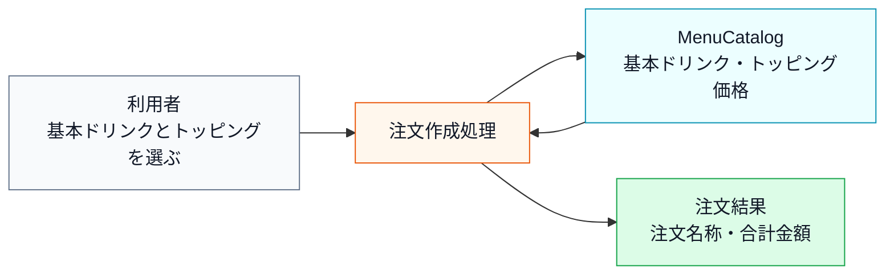
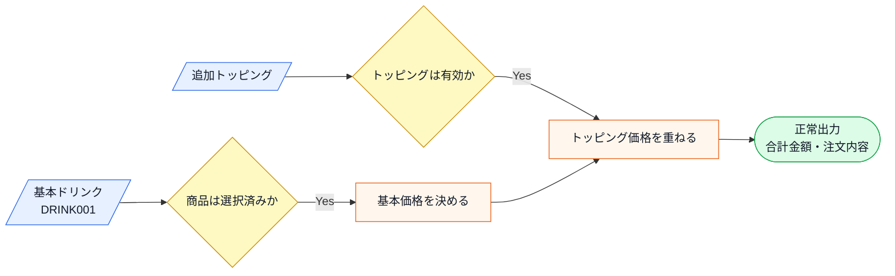
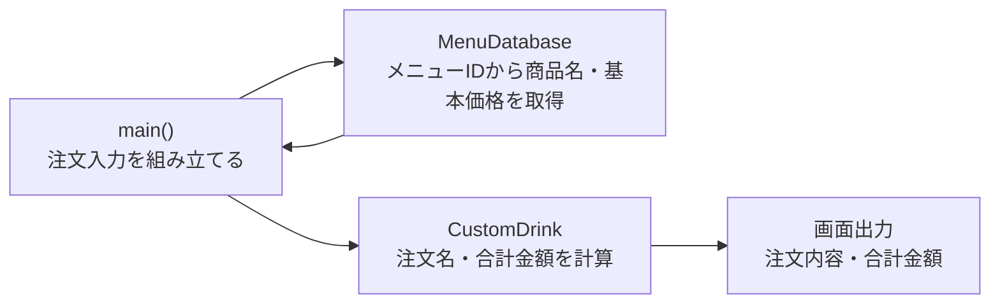
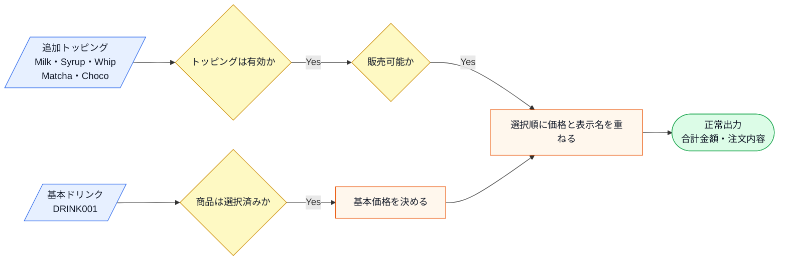
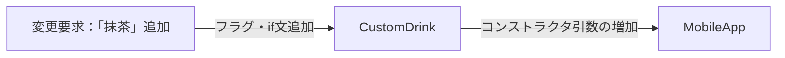
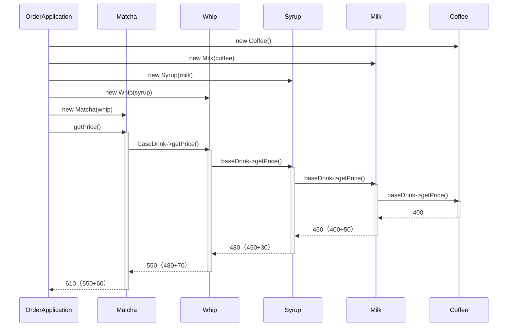
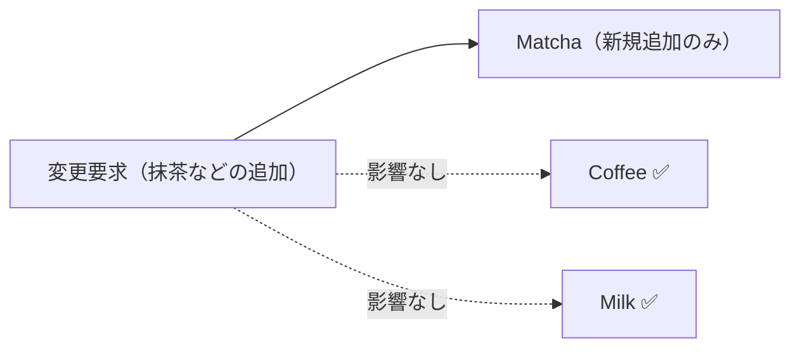
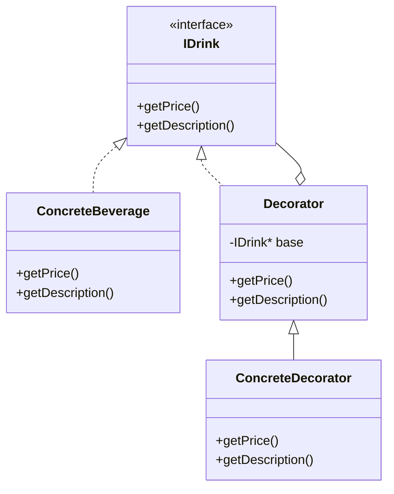

## 第6章 機能を重ねて追加する ―― Decorator パターン

―― 思考の型：基本の処理と追加の処理が混在している

### この章の核心

**ドリンク本体とトッピングの組み合わせが増えるたびに、条件分岐やクラスの数が際限なく膨れ上がる。こういう問題は、「守りたい基本の処理」と「後から重ねる追加機能」が同じ場所に混在しているシステムで起きている。**

---

### この章を読むと得られること

この章のテーマは「機能の組み合わせが増えるたびにクラスが爆発する」という問題です。「継承で全部作ろうとしたら間に合わなくなった」という経験がある方は、この章が直撃します。

* **得られること1：** 「機能の組み合わせ」という観点で、コードの変動箇所を識別できるようになる。「後から増える機能」と「守りたい基本機能」を区別する問いを立てる習慣が、変動箇所を見抜く目を育てる。
* **得られること2：** 接続点で基底となるオブジェクトが拡張機能の種類・コスト・組み合わせをどこまで知っているかを調べ、変更の痛みが生まれる理由を説明できるようになる。
* **得られること3：** 接続点の約束をそろえると、トッピング追加の変更を実装クラスと組み立て箇所へ寄せられることを説明できるようになる。
* **得られること4：** 基本機能と追加機能を同じインターフェースで扱うことで、呼び出し側に違いを意識させずに機能を何層でも重ねていく視点が身につく。「追加するたびに呼び出し側も変える必要が生じます」という痛みを経験したとき、この構造の必要性が実感として伝わってくる。

---

## 🔵 フェーズ1：現状把握 ―― 仕様を整理し、システムと紐付ける

ドリンク注文カスタマイズが何を入力として受け取り、どの処理で加工し、何を出力するのかを整理します。

### 1-1：このシステムの仕様

このシステムは、カフェのドリンク注文を**カスタマイズ**し、合計金額と注文名称を算出します。

お客様は基本ドリンクを選択したうえで、複数のトッピングを自由に組み合わせられます。システムは選択された内容から合計金額と注文名称の2つの値を算出します。

この章で扱う現状仕様は、次の範囲です。

| 仕様項目 | この章で扱う値 | 具体例 | 何に使うか |
|---|---|---|---|
| 基本ドリンク | メニューIDと基本価格 | DRINK001: ホットコーヒー 400円 | 注文名と基本価格の土台になる |
| トッピング | Milk・Syrup・Whip | Milk 50円、Syrup 30円 | 注文名と金額に追加される |
| 組み合わせ | 複数トッピング可 | ホットコーヒー + Milk + Syrup | 選んだトッピングを順に反映する |
| 出力 | 注文名称と合計金額 | Hot Coffee + Milk + Syrup、480円 | スタッフ向け指示と支払金額を照合する |

ここで確認する対象は、基本ドリンクと追加トッピングから何が計算されるかです。

この章では、基本ドリンクとトッピングの種類・価格はメニュー表に登録済みのデータとして扱います。利用者はメニューIDとトッピング名を選び、システムはメニュー表から価格と表示名を読み取って注文内容を組み立てます。

**仕様整理図：保存データとアクセス関係**



上の文章と表で仕様を一通り確認したので、まず正常に注文を組み立てられる場合の入力・判定・加工・出力の流れとして整理します。

**仕様整理図：正常系の入力・判定・加工・出力**



この図から読み取ることは、次の3点です。

- 注文結果は、基本ドリンクにトッピングを重ねることで決まる。
- 注文名と合計金額は別々の出力だが、どちらも同じトッピング選択の影響を受ける。
- 正常系では、メニュー表に登録済みの基本ドリンクとトッピングだけを使って注文名と合計金額を返す。

**エラー条件**

正常系の注文組み立てへ進めない入力は、次のように分けて扱います。

| エラー条件 | どこで分かるか | 出力 | 保存・通知などの副作用 |
|---|---|---|---|
| 基本ドリンクが選択されていない | 注文作成前 | 商品未選択エラー | 注文作成なし |
| トッピングがメニュー表に登録されていない | トッピング確認時 | 未対応トッピングエラー | 注文作成なし |

このシステムには、メニューとトッピングの価格・種類を決める**商品企画部**、スタッフに表示する注文名称のルールを管理する**店舗オペレーション部**、コードを保守する**開発チーム**の3者が関わっています。

**現在のメニューと価格**

この章のカフェ注文システムでは、「基本ドリンク」と「トッピング」を分けて管理します。基本ドリンクは注文の土台（ベース価格）として固定されており、トッピングはあとから積み上げて合計価格に加算されます。

| 種別 | ID/指定名 | 表示名 | 価格 |
|---|---|---|---|
| 基本ドリンク | DRINK001 | ホットコーヒー | 400円 |
| トッピング | Milk | ミルク | +50円 |
| トッピング | Syrup | シロップ | +30円 |
| トッピング | Whip | ホイップ | +70円 |

価格は商品企画部が管理する想定です。原材料費や販売戦略に応じて変更が生じるため、この章では開発チームではなく商品企画部が「何がいくらか」を決定するものとして扱います。

トッピングは複数追加できます。注文名称の表示例：コーヒー + ミルク + シロップ

この「注文名称」はお客様向けの表示ではなく、ドリンクを作る**スタッフへの作業指示**として使われます。「Coffee + Milk + Syrup」と表示されれば、スタッフはその順番で材料を足していけばよい、という設計です。表示のルールや区切り文字（「 + 」など）は店舗ごとに独自のルールを持つことがあり、このシステムでは店舗オペレーション部が管理する領域です。

---

### 1-2：動作例テーブル

コードを読む前に、このシステムがどんな注文に対してどんな表示と金額を返すかを確認します。ここでは、フェーズ1の現状コードで扱える Milk・Syrup・Whip の組み合わせだけを基準にします。

| 注文内容 | 注文名称 | 合計金額 |
| --- | --- | --- |
| ホットコーヒーのみ | ホットコーヒー | 400円 |
| ホットコーヒー + ミルク | ホットコーヒー + ミルク | 450円（400 + 50） |
| ホットコーヒー + ミルク + シロップ | ホットコーヒー + ミルク + シロップ | 480円（400 + 50 + 30） |
| ホットコーヒー + ミルク + ホイップ | ホットコーヒー + ミルク + ホイップ | 520円（400 + 50 + 70） |
| ホットコーヒー + シロップ + ホイップ | ホットコーヒー + ホイップ + シロップ | 500円（400 + 70 + 30） |
| 未登録メニューID | エラー表示 | 注文を作成しない |

この表がフェーズ1で把握する現状の動作です。注文内容から注文名称と合計金額を予測できることが、次のクラス構成を読むための前提になります。

---

### 1-3：登場クラスとクラス構成図

#### このシステムの登場クラス

| クラス名 | 役割 | 担当する仕様 |
|---|---|---|
| `CustomDrink` | ドリンク1注文の全情報を保持し、合計金額と注文名称を返す | 基本ドリンク選択・トッピング組み合わせ・金額計算・名称生成 |
| `MenuDatabase` | メニューIDから商品名と基本価格を検索する | メニューIDの存在確認・商品情報の取得 |

**データの流れ：** `main()` → `MenuDatabase`でIDを検索 → `CustomDrink`コンストラクタ（ベース名・価格・各トッピングフラグ） → `getPrice()` / `getDescription()` → 画面出力

**注目ポイント：** 現在は `CustomDrink` という1クラスがすべての処理を担っています。`MenuDatabase` はメニューIDから商品情報を引き出すためのデータ層として機能しています。

---

#### 補足：クラス構成図

システムのクラス構成を可視化し、呼び出し元がどのクラスを使っているかを確認します。



**図に出てくる主なデータと操作**

| 要素 | データ・操作 | 何ができるか |
|---|---|---|
| `main()` | メニューID、トッピング指定 | 注文入力を組み立て、必要なクラスを呼び出す |
| `MenuDatabase` | `exists()` / `get()` | メニューIDの存在確認と、商品名・基本価格の取得を行う |
| `CustomDrink` | `baseName` / `basePrice` | 基本ドリンク名と基本価格を保持する |
| `CustomDrink` | `hasMilk` / `hasWhip` / `hasSyrup` | どのトッピングを追加するかをフラグで保持する |
| `CustomDrink` | `getPrice()` / `getDescription()` | 合計金額と注文名称を返す |


この図が示す通り、`main()` は `MenuDatabase` から商品情報を取り出し、その値を使って `CustomDrink` を組み立てています。`CustomDrink` は、ドリンクの基本情報とすべてのトッピング情報を受け取り、注文名と合計金額を返す構成になっています。


**この章での簡略化**

1-3でクラス構成を確認したので、掲載コードで何を代替しているかを整理してからフェーズ1の現状コードへ進みます。

この章では、注文画面とレシート発行を省略し、注文名と金額の計算結果を中心に確認します。実システムなら画面表示やレシート発行は `OrderViewRenderer` や `ReceiptPrinter` のような境界へ渡します。在庫の引当処理までは扱いませんが、販売停止・在庫切れのような「このトッピングを重ねてよいか」の判定は、`ToppingAvailability` という境界スタブで簡略化します。

---

### 1-4：実装コード（現状）

コーヒーにミルクとホイップを追加する注文をシミュレートしています。

このシステムには以下の4件のメニューデータがあらかじめ登録されています。

| メニューID | 商品名 | 基本価格 |
|---|---|---|
| DRINK001 | ホットコーヒー | 400円 |
| DRINK002 | アイスコーヒー | 450円 |
| FOOD001 | サンドイッチ | 600円 |
| FOOD002 | スコーン | 300円 |

登録されていないIDを指定するとエラーになります。コードを読む前にこの対応を把握しておくと、動作結果が追いやすくなります。

```cpp
#include <iostream>
#include <string>
#include <map>

using namespace std;

struct MenuItem {
    string name;      // 商品名
    int basePrice;    // 基本価格（円）
};

class MenuDatabase {
private:
    map<string, MenuItem> items;
public:
    MenuDatabase() {
        items["DRINK001"] = {"ホットコーヒー", 400};
        items["DRINK002"] = {"アイスコーヒー", 450};
        items["FOOD001"]  = {"サンドイッチ",   600};
        items["FOOD002"]  = {"スコーン",        300};
    }

    bool exists(const string& id) const {
        return items.count(id) > 0;
    }

    MenuItem get(const string& id) const {
        return items.at(id);
    }
};

class CustomDrink {
private:
    string baseName;
    int basePrice;
    // トッピングごとの状態をフラグで管理している
    bool hasMilk;
    bool hasWhip;
    bool hasSyrup;

public:
    CustomDrink(string name, int price, bool milk, bool whip, bool syrup)
        : baseName(name), basePrice(price),
          hasMilk(milk), hasWhip(whip), hasSyrup(syrup) {}

    int getPrice() const {
        int total = basePrice;
        // トッピングごとの追加料金を計算
        if (hasMilk)  total += 50;
        if (hasWhip)  total += 70;
        if (hasSyrup) total += 30;
        return total;
    }

    string getDescription() const {
        string desc = baseName;
        // トッピングごとの名前を追加
        if (hasMilk)  desc += " + Milk";
        if (hasWhip)  desc += " + Whip";
        if (hasSyrup) desc += " + Syrup";
        return desc;
    }
};

// 呼び出し側のコード（モバイルアプリを想定）
int main() {
    MenuDatabase db;

    // メニューIDでドリンクを検索してから注文を生成する
    string itemId = "DRINK001";
    if (!db.exists(itemId)) {
        cout << "エラー：メニューID " << itemId
             << " は存在しません" << endl;
        return 1;
    }
    MenuItem item = db.get(itemId);

    // ミルクとホイップを追加、シロップはなし
    CustomDrink order(item.name, item.basePrice, true, true, false);

    cout << "注文内容: " << order.getDescription() << endl;
    cout << "合計金額: " << order.getPrice() << "円" << endl;

    return 0;
}
```

`CustomDrink` がすべてのトッピングをフラグで持ち `if` 文で処理している。

実行対象コード：1-4の現状コード
対応する動作例：1-2の動作例テーブル
確認したいこと：入力、加工、出力が仕様どおりに対応していること

実行結果：

```
注文内容: ホットコーヒー + Milk + Whip
合計金額: 520円
```

動作例テーブルの「ホットコーヒー + ミルク + ホイップ」と同じ結果です。任意の注文については、基本価格に選んだトッピングの価格を足し、注文名称へ選んだトッピング名を追加する、と読めば出力を予測できます。

このコードを見ると、`CustomDrink` クラスがどのトッピングがいくらで、どんな名前になるかをすべて直接知っていることが分かります。

---

### 1-5：変更要求

**変更要求の発生チーム：** 今回の変更要求は**商品企画部**から届いています。トッピングの種類・価格を管理するチームです。開発チームは受け手となります。この点をフェーズ2の「どの業務機能に属する知識か」の議論への伏線として覚えておきます。

**仕様変更の内容**

変更要求を受けて、選択できるトッピングがどう変わるかを整理します。

| 項目 | 変更前 | 変更後 |
|---|---|---|
| トッピングの種類 | Milk・Syrup・Whip（3種） | **Milk・Syrup・Whip・Matcha・Choco（5種）** |
| 抹茶パウダー（Matcha） | 選択不可 | **+60円で追加可能** |
| チョコチップ（Choco） | 選択不可 | **+40円で追加可能** |
| 重ね順 | 入力された順に表示 | **入力順のまま価格と表示名へ反映** |
| 販売可否 | 未対応 | **販売停止・在庫切れのトッピングは注文作成前に拒否** |

**複雑度ストレス条件**

| 追加する複雑さ | 具体例 | この章で見ること |
|---|---|---|
| トッピングの重ね順 | Milk → Matcha → Choco の順に表示する | 包む順序が出力名と価格再計算へ反映されるか |
| 在庫/販売停止 | SeasonalMint が販売停止中なら注文を作らない | 追加機能そのものと、追加可否の判定を分けられるか |
| 価格再計算 | 価格改定後も合計額へ反映する | 価格知識を対象トッピングクラスへ寄せられるか |
| 表示名再計算 | 店舗向けの作業指示名を組み直す | 表示名も価格と同じ契約で重ねられるか |

**変更後の出力例**

| 注文内容 | getDescription() | getPrice() |
|---|---|---|
| コーヒー + 抹茶パウダー | `Coffee + Matcha` | 460円（400 + 60） |
| コーヒー + チョコチップ | `Coffee + Choco` | 440円（400 + 40） |
| コーヒー + ミルク + 抹茶パウダー + チョコチップ | `Coffee + Milk + Matcha + Choco` | 550円（400 + 50 + 60 + 40） |

ベースドリンクの価格と既存トッピング（Milk・Syrup・Whip）の価格・名称は変更なしです。新しいトッピングを追加しても、既存の組み合わせ構造の動作は変わりません。

**変更前後の入力・判定・加工・出力差分**

1-1の現状仕様を退避し、変更要求を当てた後の仕様と同じ粒度で並べます。以降の分析では、この差分を追います。

| 要素 | 変更前（1-1の現状仕様） | 変更後（今回の要求） | 差分として追うもの |
|---|---|---|---|
| 入力 | 基本ドリンク、Milk/Syrup/Whip | 基本ドリンク、Milk/Syrup/Whip/Matcha/Choco、選択順、販売可否 | トッピングの種類、順序、使える/使えない状態が増える |
| 判定 | トッピングが有効か | 追加されたMatcha/Chocoも有効か、販売停止/在庫切れでないか | 有効な選択肢と販売可否が増える |
| 加工 | トッピング価格と説明を重ねる | 選択順に新トッピングの価格と説明も同じ流れで重ねる | 組み合わせ方は維持し、部品だけ増える |
| 出力 | 注文名と合計金額 | Matcha/Chocoを含む注文名と合計金額、販売不可エラー | 出力名と金額の組み合わせが増え、拒否ケースも増える |

**変更後の入力・加工・出力**

変更後の仕様を、1-1と同じ粒度で、正常系の入力・判定・加工・出力として確認します。1-1の図との差分は、入力の「追加トッピング」の選択肢が3種から5種へ増えること、販売可否を確認すること、選択順に価格と表示名を重ね直すことです。判定・加工・出力の骨格は変わりません。



この図から読み取ることは、次の3点です。

- 変わるのは「追加トッピング」の選択肢（Matcha・Chocoの2種が加わる）と、販売可否の判定対象である。
- 「トッピングは有効か」「販売可能か」の判定を通ったものだけ、選択順に価格と表示名へ反映する。
- 基本ドリンクの価格決定と、合計金額・注文内容という出力の形は変わらない。

変更後も、失敗条件は正常系図へ混ぜずに別で確認します。

| エラー条件 | どこで分かるか | 出力 | 保存・通知などの副作用 |
|---|---|---|---|
| 基本ドリンクが選択されていない | 注文作成前 | 商品未選択エラー | 注文作成なし |
| トッピングがメニュー表に登録されていない | トッピング確認時 | 未対応トッピングエラー | 注文作成なし |
| トッピングが販売停止または在庫切れ | 販売可否確認時 | 販売不可エラー | 注文作成なし |

選択肢が2つ増えるだけの変更が、実際のコードではどれだけの修正になるかを、フェーズ3で変更を試すコードで確認します。

しかし、「これは1回限りの変更なのか、今後も続くのか」をすぐにコードで対応する前に確認しておきたいと思います。

フェーズ1でシステムの現状と変更要求が把握できました。次のフェーズ2では、「何を変え、何を守るか」を整理します。

---

## 🟣 フェーズ2：仮説立案 ―― 何が変わるかを観察し、ヒアリングで裏付ける
フェーズ1でシステムの現状を整理しました。次のフェーズ2では、現場に届いた変更要求を起点にして「何が変わる見込みで、何を当面安定と見るか」の仮説を立て、関係者とのヒアリングで裏付けます。責任配置の評価は、変更要求を当てた後の痛みと合わせて確認します。

### 2-1：変わりそうな仕様の見当をつける

ここで作る一覧は、思いつきで「変わりそう」と感じたものを並べる表ではありません。フェーズ1で確認した仕様・動作例・クラス図を材料に、次の順で候補を絞ります。

1. 仕様図と動作例から、入力・判定・加工・出力のうち条件や値が変わりそうな箇所を拾う。
2. その箇所が、1-3のどのクラス・メソッドに書かれているかを対応づける。
3. その仕様が、どんな理由で、何をきっかけに、どのくらいの頻度で変わりそうかを仮説として書く。
4. 逆に、当面変えない前提にできる処理の骨格も分けておく。

この手順で見ると、「ドリンク注文を作る」という大きな処理全体ではなく、その中のどのトッピング価格・表示名・組み合わせ条件が変更候補なのかを読者自身で追えるようになります。

フェーズ1で整理した仕様をもとに、「どの仕様が変わりやすいか」を見立てます。責務配置の評価は、変更を当てたときの痛みと合わせてフェーズ3・4で確認します。

変わりそうな仕様は、1-3のクラス図の中心 `CustomDrink` の `getPrice()` / `getDescription()` の中にあります。トッピングごとの価格・表示名・組み合わせを、どんな仕様が、誰の何をきっかけに変わりそうかと一緒に整理します。

| 変わりそうな仕様 | 所在（クラス・メソッド） | 変える主体・きっかけ | 変わりやすさの見立て |
|---|---|---|---|
| トッピングの種類 | `CustomDrink` のフラグと両メソッドの分岐 | 商品企画部の毎月のキャンペーン | 高い |
| トッピングの追加価格 | `getPrice()` 内の `total += ...` | 料金・プロモーション管理の価格改定 | 高い |
| 表示名とその並び順 | `getDescription()` 内の `desc += ...` | 店舗オペレーション部の運用見直し | 高い |
| 販売可否（販売停止・在庫切れ） | 注文作成時の可否判定 | 商品/店舗運用の在庫・キャンペーン終了 | 中〜高 |
| 基本価格にオプションを積み上げる骨格 | `getPrice()` の加算の枠組み | ドリンク注文の基本フロー | 低い |

見えてくるのは、**1つの `CustomDrink` の中で、トッピングの種類・追加価格・表示名・販売可否という仕様が、商品企画部や店舗オペレーションの都合で変わりやすい**という見立てです。逆に、基本価格にオプションを積み上げるという処理の骨格は、当面変わらない前提に置けます。

ここでは「このクラスは責任が多い」「構造が良い/悪い」という評価はしません。上の表は、変わりそうな仕様が `CustomDrink` のどのメソッドのどの行にあるかという所在の見立てです。トッピングの知識を1つのクラスにまとめている今の配置が、変更要求を当てたときに**実際に痛みになるか**はフェーズ3で確かめ、なぜ辛いのかはフェーズ4で原因として言語化します。2-1は、その検証対象に当たりをつける段階です。

### 2-2：今回の変更で確実に変わること

いきなりコードを修正するのではなく、はじめに今回の変更要求で「確実に変わること」を整理します。

- **トッピングの種類の追加**：「抹茶パウダー（Matcha）」と「チョコチップ（Choco）」を追加する
- **販売可否の追加**：在庫切れ・販売停止のトッピングを注文作成前に拒否する
- **表示順ルールの明確化**：選択された順番でスタッフ向け表示名を組み立てる
- **`CustomDrink` クラスの修正**：新しいフラグ（`bool hasMatcha` 等）の追加とコンストラクタの変更が必要
- **呼び出し側のコード修正**：コンストラクタ引数の増加に伴い、既存の呼び出し箇所をすべて修正する必要がある

ただし「この変更が1回限りか、今後も続くか」によって、どこまで設計を変えるべきかが大きく変わります。関係者に確認します。

---

### ヒアリングに向けた背景確認

このシステムは、全国展開する人気カフェチェーンのモバイルオーダーを裏側で支える注文管理システムです。お客様がスマートフォンから事前にドリンクを注文し、店舗でスムーズに受け取れる仕組みを提供しています。

システムが立ち上がった当初、メニューは「コーヒー」や「紅茶」といったシンプルな基本ドリンクのみでした。しかし、ビジネスが成長し「自分好みにカスタマイズしたい」というお客様の声が大きくなるにつれて、ミルクの追加、ホイップの増量、シロップの変更など、多種多様なトッピング機能が追加されてきました。店舗のオペレーションと連動するため、注文システムは正確な「合計金額」と、ドリンクを作るスタッフに伝えるための「注文内容（名前）」を算出する重要な役割を担っています。

### 2-3：関係者ヒアリング


確定変更を携えて、商品企画部の佐藤マネージャーとのミーティングの時間を設定しました。なお、ヒアリングで出てきた情報は「今回確定している変更」と「将来変わりうるリスク」に分けて後で整理します。

**開発者：** 「今回の『抹茶パウダー』と『チョコチップ』の追加の件、システムへの組み込みを検討しています。一つ確認させてください。今後もこのように、新しいトッピングの種類は増え続けると考えてよいでしょうか？」

**佐藤マネージャー：** 「もちろんです！お客様の反応が良いので、毎月の季節キャンペーンごとに新しいカスタマイズをどんどん追加していく予定です。逆に、あまり人気のないトッピングはメニューから落としていく（廃止する）ことも考えています。」

**開発者：** 「なるほど、トッピングの種類は毎月のように入れ替わるのですね。ちなみに、各トッピングの価格（例えばミルク50円など）は今のところ固定ですが、これは今後も変わらないでしょうか？」

**佐藤マネージャー：** 「あ、実は原材料費の高騰もあって、来月から一部のトッピングを値上げする構想があります。価格改定は年に数回はあると思っておいてください。」

**開発者：** 「承知しました。価格も変動する要素ですね。他に、将来的に変わりそうなカスタマイズのルールや、お客様からの要望で実現したいことはありますか？ 今のうちにシステムの土台に備えをしておきたいので。」

**佐藤マネージャー：** 「そうですね……熱心なお客様から『ホイップを通常の2倍（ダブル）にしてほしい』とか『チョコチップを3倍（トリプル）で』という要望がかなり来ています。今はシステム上できないとお断りしているんですが、将来的には『同じトッピングを複数回追加できる機能』も実現したいですね。」

ヒアリングを通じて、当初の確定変更の裏側に、今の真偽値（booleanフラグ）の構造では到底太刀打ちできない将来の変化まで見えてきました。こうした未知の要件を初期段階で引き出せたことは、設計の見通しを立てる上で大きな前進です。

---

### 2-4：ヒアリングで判明した将来リスク

佐藤マネージャーとの対話から浮かび上がった、確定変更ではないが今後変わりうるリスクをまとめます。確定変更と混在させずに別テーブルとして保持することで、設計の根拠が後から追跡しやすくなります。

| **将来リスク** | **時期の目安** | **根拠** |
| --- | --- | --- |
| トッピングの種類の増減 | 毎月のキャンペーンごと | 商品企画部 佐藤マネージャーから直接確認 |
| トッピングの価格改定 | 年に数回（原材料費等による） | 商品企画部 佐藤マネージャーから直接確認 |
| 同じトッピングの複数回追加（ダブル、トリプル等） | 将来的な機能拡張時 | 商品企画部 佐藤マネージャーからの要望 |
| 販売停止・在庫切れの扱い | 店舗在庫やキャンペーン終了時 | 商品企画部・店舗オペレーション部の運用で変わる |
| 表示名の順序ルール | 店舗オペレーション変更時 | スタッフの作業順に合わせる必要がある |

ヒアリングを通じて、「トッピングに関する知識」は変化しやすく、今後もビジネスの成長に合わせて多様な要求がやってくることが見えてきました。当時の担当者の苦労を想像しながらも、そろそろこの `CustomDrink` クラスに背負わせている重荷を少し分けてあげる時期が来たのかもしれません。

フェーズ2で、トッピングの種類が今後も高頻度で追加されそうだという見込みが明確になりました。次のフェーズ3では、今回確定している「新しいトッピングの追加」を今のコードのままで試みて、何が起きるかを確認します。

### 2-5：変わる見込みと当面安定の前提を確定する

ヒアリングで「トッピング種類の増減」「価格改定」「複数回追加」が予告されました。この変化が来たとき、仕様がどう変わるかを整理しておきます。

| 変更内容 | 現在 | 将来（時期の目安） |
|---|---|---|
| トッピングの種類 | 現在のラインナップ固定 | 毎月のキャンペーンで追加・廃止が繰り返される |
| トッピングの価格 | 現在の固定価格 | 原材料費等に応じて年に数回改定される |
| 同一トッピングの追加回数 | 1回のみ | ダブル・トリプルなど複数回追加が将来的に解禁 |
| 販売可否 | 現状コードでは扱わない | 在庫切れ・販売停止で注文へ重ねられない場合がある |
| 表示名の順序 | `if` 文の並びに依存 | 選択順、または店舗が指定する作業順へ変わる |

この変化が来たとき、現在の構造がどれだけの修正コストを要求するかを、次のフェーズ3で実際に確かめます。

---

## 🟣 フェーズ3：問題特定 ―― 変更の痛みを発見する
### 3-1：変更を試みる

佐藤マネージャーからの要求通り、「抹茶パウダー」と「チョコチップ」を既存のシステムに追加してみましょう。

はじめに、トッピングの有無を管理している `CustomDrink` クラスを開きます。クラスのメンバ変数として、`bool hasMatcha;` と `bool hasChoco;` という2つのフラグを追加します。
次に、初期化を行うためのコンストラクタの引数にも、この2つの真偽値（boolean）を追加する必要があります。
そして、価格を計算する `getPrice` メソッドの中に `if (hasMatcha) total += 60;` および `if (hasChoco) total += 40;` の計算ロジックを足し、同様に `getDescription` メソッドの中にもトッピング名を組み立てる `if` 文を書き足します。

抹茶を追加した後の `getPrice()` メソッド全体は、このようにif文が並ぶ形になります。

```cpp
int getPrice() const {
    int total = basePrice;
    if (hasMilk)     total += 50;
    if (hasWhip)     total += 70;
    if (hasSyrup)    total += 30;
    if (hasMatcha)   total += 60; // ← 抹茶パウダーを追加
    if (hasChoco)    total += 40; // ← チョコチップを追加
    return total;
}
```

`getPrice()` と同様に、`getDescription()` にも抹茶の処理を書き足す必要があります。

```cpp
string getDescription() const {
    string desc = baseName;
    if (hasMilk)     desc += " + Milk";
    if (hasWhip)     desc += " + Whip";
    if (hasSyrup)    desc += " + Syrup";
    if (hasMatcha)   desc += " + Matcha"; // ← 抹茶パウダーを追加
    if (hasChoco)    desc += " + Choco";  // ← チョコチップを追加
    return desc;
}
```

変更後のコードを実行すると、次のような結果になります。

```cpp
// 変更後の CustomDrink（抹茶・チョコチップフラグ追加後）
class CustomDrink {
    std::string baseName;
    int basePrice;
    bool hasMilk, hasWhip, hasSyrup, hasMatcha, hasChoco;
public:
    CustomDrink(std::string name, int price,
                bool milk, bool whip, bool syrup,
                bool matcha, bool choco) // ← 引数が2つ増えた
        : baseName(name), basePrice(price),
          hasMilk(milk), hasWhip(whip), hasSyrup(syrup),
          hasMatcha(matcha), hasChoco(choco) {}

    int getPrice() const {
        int total = basePrice;
        if (hasMilk)   total += 50;
        if (hasWhip)   total += 70;
        if (hasSyrup)  total += 30;
        if (hasMatcha) total += 60;
        if (hasChoco)  total += 40;
        return total;
    }
    std::string getDescription() const {
        std::string desc = baseName;
        if (hasMilk)   desc += " + Milk";
        if (hasWhip)   desc += " + Whip";
        if (hasSyrup)  desc += " + Syrup";
        if (hasMatcha) desc += " + Matcha";
        if (hasChoco)  desc += " + Choco";
        return desc;
    }
};

int main() {
    // 新しいコンストラクタ呼び出し（引数7個）
    CustomDrink order("Coffee", 400,
                      true, false, false, true, true);
    std::cout << order.getDescription() << std::endl;
    std::cout << order.getPrice() << " 円" << std::endl;

    // 既存の呼び出し（引数5個）はコンパイルエラーになるため
    // コメントアウトして検証
    // CustomDrink old("Coffee", 400, true, false, false);
    //                                              ↑ 引数不足
    return 0;
}
```

実行対象コード：3-1の変更試行コード
対応する動作例：変更要求後の代表ケース
確認したいこと：変更要求を現状構造へ当てはめたとき、修正箇所と痛みがどこに出るか

実行結果：

```text
Coffee + Milk + Matcha + Choco
550 円
```

新しい注文（order）は正しく動き、期待される出力（コーヒー 400円 + Milk 50円 + Matcha 60円 + Choco 40円 = 550円）が得られます。しかし、コメントアウトされている `old` のように、既存の5つの引数で呼び出している箇所は、コンストラクタの引数の数が合わないためすべてコンパイルエラーになります。

つまり、この新しいトッピングを追加したクラスを導入するには、既存の「コーヒーにミルクだけ」といった注文を生成しているモバイルアプリ側（呼び出し元）のコードをすべて探し出し、新しい引数（`false, false` など）を追加するように修正しなければならないのです。

たった2つのトッピングを追加しようとしただけなのに、クラスの中をあちこち探し回って修正した上に、呼び出し側のコードまで直す必要に迫られる状況になっています。

---

### 3-2：変更影響グラフ

変更を試みた結果、影響がどのように飛び火したかを図で可視化してみます。



「抹茶パウダーとチョコチップを追加する」という一つの変更要求が、`CustomDrink` クラスの内部を複数箇所変更させるだけでなく、それを呼び出しているモバイルアプリ側のコードにも影響が飛び火していることが見えます。

---

### 3-3：痛みの言語化

「なぜこのクラスに機能を追加するだけで、呼び出し側まで壊れるんだろう…」

この変更シミュレーションを通じて、現場のエンジニアが直面する具体的な辛さが2つ見えてきました。

1つ目は、修正箇所がクラス内に散らばっていて見落としやすいという辛さです。
新しいトッピングを追加しようとしたとき、メンバ変数を足し、コンストラクタを直し、価格計算のメソッドを探して直し、さらに名前組み立てのメソッドも直す必要がありました。一つの変更要求に対して、ファイルの中を何度もスクロールして修正箇所を探し回らなければなりません。もし一つでも `if` 文を足し忘れたら、価格の計算が合わないといった致命的な不具合につながってしまいます。

2つ目は、機能を追加するたびに呼び出し側が壊れるという、影響範囲の読めなさです。
トッピングの種類が増えるということは、`CustomDrink` を生成するための引数の数が増え続けることを意味します。このままでは、新しいキャンペーンが始まるたびに、システムのあちこちに散らばっている `new CustomDrink(...)` のコードをすべて探し出し、使わないトッピングのために `false` という引数を延々と書き足す作業に追われることになります。変えるとどこが壊れるか分からないという恐怖が、開発のスピードを少しずつ奪っていくのです。

フェーズ3で変更を試みた際に生じた痛みが確認できました。次のフェーズ4では、なぜこのような痛みが生じるのか、その根本的な原因をコードの構造という観点から言語化していきます。

---
> **📌 問題（確定）**
> トッピングの種類が増えるたびに、`CustomDrink` のメンバ変数・コンストラクタ・`getPrice()`・`getDescription()` の4箇所を連動して修正が必要になります。毎月のキャンペーンごとにトッピングが入れ替わる前提では、1種類追加するだけで呼び出し側のコードまで壊れるこのコストは合わない。
---

（トッピング追加のたびに複数箇所が連動して変わる問題が確認できました。次のフェーズ4では、なぜこの連鎖が起きるのかを構造的に分析します。）

## 🟠 フェーズ4：原因分析 ―― なぜ辛いのかを構造で言語化する
### 4-1：痛みの根源を探る（観察と原因）

フェーズ3で確認した「変更箇所が散らばっていて見落としやすい」「呼び出し側が壊れてしまう」という2つの痛みを発見しました。この痛みがなぜ発生するのか、コードを注意深く観察することで根源が見えてきます。

第一に、新しいトッピングを追加するとき、なぜ毎回 `CustomDrink` を開かなければならないのでしょうか。それは、このクラス自身が「ミルクなら50円」「ホイップなら70円」といった具体的なトッピングの条件をすべて直接知ってしまっている（抱え込んでいる）からです。

第二に、なぜ変更の影響範囲が読めず、呼び出し側まで壊れるのでしょうか。それは、「基本ドリンクの価格を保持する」という変わらない骨格と、「各トッピングの価格と名前を知っている」というビジネスロジックが、同じクラスの同じメソッドの中で物理的に混ざり合っているからです。

この「症状（痛み）」と「根本原因」を整理すると、以下のようになります。

| **観察した症状** | **構造的な原因** |
|---|---|
| トッピングを追加するたびにクラス内の複数の `if` 文を探して修正が必要になります | `CustomDrink` が各トッピングの価格・名前という具体的な条件を直接知っているから |
| コンストラクタ引数が増えて呼び出し側まで壊れてしまう | 「基本ドリンク」と「トッピング」という変わる理由が異なるものが同じ場所に混在しているから |
| 販売停止や表示順が増えると、価格計算以外の条件も `CustomDrink` に増える | 追加可否・表示順・価格・名前の知識が、基本ドリンク側へ漏れているから |

最初の頃、トッピングが「ミルク」と「ホイップ」だけだった時代は、一つのクラスで主要な処理を追いやすいというメリットがありました。当時の担当者が、素早く機能を提供するためにこの形を選んだのは、合理的だったと思います。しかし、トッピングの種類が増えるにつれて、一つのクラスが「知りすぎている」状態になってしまったのではないでしょうか。「まずはフラグを足す」という判断は小規模な段階では有効でも、組み合わせが増えた後に変更箇所を見つけにくくすることがあります。

---

### 4-2：変わるもの/変わってほしくないもの

> **「変わらないもの」と「変わってほしくないもの」は異なります。** 「変わらないもの」は経験的事実（今まで変わっていない）、「変わってほしくないもの」は設計意図（ここを安定させてほかを守りたい）です。ここで整理するのは後者です。

原因の方向性が見えたところで、「変わり続けるもの」と「変わってほしくないもの」を明確に切り分けてみましょう。ここをしっかり整理することが、後で適切に分けるための土台になります。

| **変わり続けるもの（🔴）** | **変わってほしくないもの（🟢）** |
| --- | --- |
| トッピングの種類、それぞれの追加価格、表示名、販売可否、表示順 | 基本となるドリンクの価格を保持し、注文で選ばれたオプションを順に重ねて合計金額と注文内容を返すという処理の骨格 |

**【変わる部分（変わり続けるif文と価格・名前の知識）】**
```cpp
    if (hasMilk)  total += 50;  // ← 商品企画部の判断で変わる
    if (hasWhip)  total += 70;  // ← 商品企画部の判断で変わる
    if (hasSyrup) total += 30;  // ← 商品企画部の判断で変わる
```

**【変わってほしくない部分（守りたい骨格）】**
```cpp
    int total = basePrice;
    // ここにトッピングの処理が入る
    return total;
```

トッピングに関する情報は、商品企画部や店舗オペレーションの都合で今後も変わり続けます。価格だけでなく、販売停止・在庫切れの判定、スタッフが確認する表示順、「ホイップをダブルにする」といった組み合わせも変化の対象です。

一方で、ベースとなる飲み物にオプションを足していくという計算の大枠自体は、この章の変更要求では守りたい前提です。この「後から増える側」をうまくカプセル化できれば、「守りたい側」を安定させやすくなります。

---

### 4-3：接続点に漏れているトッピングの知識を確認する

ここでの「確認すること」は、前節までに見つけた原因から抽出します。まず、原因文から「守りたい骨格」と「変わる差分」を分けます。次に、その差分を動かすために骨格側が知ってしまっている名前・条件・順序・型を拾います。最後に、接続点に残す最小の約束を、値・型・操作・イベントとして書きます。

原因によって、接続点で見る抽象観点は変わります。条件分岐が原因なら条件・定数・選択基準を見ます。処理手順が原因なら呼び出し順・前後条件・失敗時分岐を見ます。生成判断が原因なら具体クラス名・生成条件・登録場所を見ます。通知や外部連携が原因なら通知先・タイミング・成否の扱いを見ます。データや状態が原因なら、境界を流れる値・型・状態を見ます。

現在のシステムで、基本ドリンクとトッピングの境界にどの知識が漏れているかを確認します。

`CustomDrink`の中には、`hasMilk`・`hasWhip`・`hasSyrup`というフラグが並んでいます。基本ドリンク側が、追加できるトッピング名、価格、説明、個数の表現方法、そして表示順まで知っている状態です。ここへ販売停止や在庫切れの判定を足すと、基本ドリンク側が「このトッピングを注文へ重ねてよいか」まで抱えることになります。

新しいトッピングが来るたびに、`CustomDrink`へ専用フラグと条件分岐を追加する必要があります。接続点で本当に必要なのは「注文へ重ねてよいトッピングを、選択順に価格と説明へ反映すること」ですが、トッピングの種類・販売可否・表示順の知識が基本ドリンク側へ漏れています。

一つの考え方として、基本となるドリンクの役割と、後から追加されるトッピングの役割は、変わる理由が異なるという点が重要です。これらが一つの場所に混在していることが、今回の痛みの根本につながっています。

フェーズ4で根本原因が言語化できました。「どこを分けるか」は明確です。次のフェーズ5では、その境界で実際に何が流れているかを値・型のレベルで具体化し、「何を変え、何を守るか」を明確にします。

---
> **📌 原因（確定）**
> `CustomDrink`が各トッピングの名前・価格・有無・表示順・組み合わせ方を知っている。販売停止や同じトッピングの複数追加に対応するたび、基本ドリンクのクラスまで修正する必要がある。
---

（原因は、基本ドリンクとトッピングの知識が同じ場所に混在していることだと確認できました。次のフェーズ5では、切り離す境界で何を受け渡すかを見ていきます。）

## 🟡 フェーズ5：課題定義 ―― 解くべき接続点を定める
フェーズ4は「なぜ辛いか」を答えました。フェーズ5が問うのは「分けるべき境界で、実際に何が流れているか」です。クラスの参照関係ではなく、**値・型のレベル**に降りていきます。

フェーズ4の分析により、問題は「基本ドリンクの骨格」と「各トッピングの知識」が混在していることだと分かりました。その境界で何がやり取りされているかを具体化します。

### 接続点を特定する

接続点は、クラス図の線やインターフェース名から探すのではなく、変更要求を当てて特定します。まず、その要求で変えたい側と変えたくない側を分けます。次に、両者がどのメソッド呼び出し・引数・戻り値・生成・イベントでつながっているかを見ます。そのつながりのうち、変更要求のたびに知識が漏れて修正が波及する場所が、ここで解くべき接続点です。

`CustomDrink` でトッピングの知識を切り出すと、2つの接続点が現れます。

- **接続点A**：コンストラクタ引数 ―― トッピングの有無を `bool` フラグで表現。新しいトッピングが増えるたびに引数が増える
- **接続点B**：`getPrice()` / `getDescription()` の戻り値 ―― `int` 型の金額と `string` 型の説明を返す
- **接続点C**：注文組み立て前の販売可否 ―― 販売停止・在庫切れのトッピングを、ドリンクへ包む前に拒否する

この章で注目したい点があります。トッピングは1つとは限りません。「コーヒーにミルクを追加し、さらにホイップを追加する」といった具合に、機能が**連鎖**していきます。つまりトッピング同士も数珠繋ぎにしていく接続点が必要です。

| 接続点 | 接続するデータ | 変わるもの |
|---|---|---|
| トッピング → `getPrice()` の骨格 | `int` 型の追加価格 | トッピングの種類・組み合わせ |
| トッピング → `getDescription()` の骨格 | `string` 型の表示名 | トッピングの種類・組み合わせ |
| トッピング → 販売可否確認 | トッピング名、販売状態 | 在庫・販売停止 |
| トッピング → 表示順 | 選択順、スタッフ向けの作業順 | 表示名の組み立て順 |

### 何を変え、何を守るか

- **変わるもの**：トッピングの種類・組み合わせ・販売可否・表示順。新しいトッピングが増えるたびに `bool` フラグと `if` 分岐が増える。
- **守りたい前提**：`getPrice()` が `int` を返し、`getDescription()` が `string` を返すという契約。呼び出し元（`MobileApp`）が使うインターフェースは変わらない。

呼び出し元が必要とするのは「販売できる注文であれば、価格と説明を取得できること」です。問題は「どのトッピングがいくらで何という名前か」「今販売できるか」「どの順に表示するか」という知識と、その組み合わせ判断が基本ドリンク側へ膨れ続けることです。

**現状のままでよい場面**：トッピングが数種類で固定され、重ね掛けも不要なら、`bool`フラグを保つ判断もあります。今回は種類と組み合わせが増えるため、価格と説明を同じ契約で重ねられる部品へ分ける設計を検討します。

---
> **📌 課題（確定）**
> 切り離す境界は「基本ドリンク」と「各トッピングが何円で何という名前か、注文へ重ねてよいか」の間にある。接続点で受け渡すのは `int` 型の金額と `string` 型の説明で、販売可否は組み立て前の境界で確認する。各トッピングを同じ契約で包み、基本ドリンク側の条件分岐を増やさず組み合わせられる形にすることが、この章の課題だ。
---

（切り離す境界と課題が明確になりました。次のフェーズ6では、その課題を解決するための対策を段階的に検討します。）

## 🔴 フェーズ6：対策検討 ―― 案を比べ、採用する形を決める

フェーズ6の出発点は、フェーズ3で変更要求（新しいトッピングの追加）を当てて痛んだ「変更途中コード」です。変更要求を容れる前の現状コードには戻しません。`CustomDrink` に増えた `hasXxx` フラグと価格・表示名の分岐から、同じ形で扱える共通点（`getPrice()` / `getDescription()` という操作で重ねられる契約）を抜き出し、変わる差分を接続点の外へ出す形へ整理していきます。読者が「痛み → 共通点の発見 → 抽象化」の順で追えるよう、最初の小さな案も、この変更途中コードを整理する形から始めます。

フェーズ6では、第0章の段階的進化アプローチを標準フローとして使います。ただし、ここでのステップは一本道の作業手順ではなく、対策案を比較するための候補です。まず小さな整理で何が見えるかを確認し、次に責任の移動、契約、窓口、組み合わせ、生成責任の移動のうち、この章の課題に必要な案だけを比べます。章の題材に合わない案を省略したり、順序を入れ替えたり、接続点ごとに分岐させたりする場合は、論点外・効果不足・導入コスト過多・接続点が別であるなどの理由を本文中で説明します。
フェーズ5で「変わるのはトッピングの種類・組み合わせであり、`getPrice()` / `getDescription()` という操作は安定している」ことが分かりました。ここでは、各トッピングをどのように同じ操作で組み合わせられる形へ変えるかを段階的に検討します。それぞれの段階（ステップ）でどこまで痛みが解消されるかを確認し、今回の要件において「どのステップで止めるべきか」を決断します。

フェーズ5の課題から、対策候補は次のように出します。

| フェーズ4で見えた原因 | フェーズ5で定めた課題 | だからフェーズ6で見る候補 |
|---|---|---|
| 注文金額と説明文の作り方が、トッピングの条件分岐として増えている | 基本ドリンクから、トッピングごとの加算処理と説明追加を切り離す | まず加算処理を関数化し、価格と説明の差分を見えるようにする |
| 複数トッピングの組み合わせで条件分岐が増える | トッピングを順に重ねても、呼び出し側は同じ操作で扱える接続点にする | ドリンクとトッピングを同じ操作で呼ぶ契約を作る案を見る |
| 販売可否や表示順も追加機能側の事情として増える | 追加前の判定と、重ね順を組み立て側へ寄せる | 同じ `IDrink` 契約で包み、販売可否は境界スタブで事前確認する |
| 将来、同じトッピングを複数回重ねる可能性がある | 組み合わせ数に応じてクラスや分岐を増やさない形にする | 部品を包み込んで合成する形まで進める必要があるか判断する |

どのステップも、フェーズ1の動作例テーブルの動作を実現します（ホイップ×2はステップ5以降で対応可能になります）。販売停止の判定は、トッピングを包む前に境界スタブで確認します。違うのは「変更が来たときにどこを触ることになるか」です。

---

### ステップ1：各トッピング処理を独立した関数として切り出す

手始めに、クラスを分けずに、各トッピングの処理を独立したプライベートメソッドとして切り出してみます。全部を1つのメソッドにまとめるのではなく、トッピングごとに関数を作るのがポイントです。

```cpp
class CustomDrink {
private:
    string baseName;
    int basePrice;
    bool hasMilk;
    bool hasWhip;
    bool hasSyrup;
    bool hasMatcha;

    // 各トッピングの価格計算を独立した関数として切り出す
    int applyMilkPrice(int total)   const { return total + 50; }
    int applyWhipPrice(int total)   const { return total + 70; }
    int applySyrupPrice(int total)  const { return total + 30; }
    int applyMatchaPrice(int total) const { return total + 60; }

    // 各トッピングの説明を独立した関数として切り出す
    string applyMilkDesc(string desc) const {
        return desc + " + Milk";
    }
    string applyWhipDesc(string desc) const {
        return desc + " + Whip";
    }
    string applySyrupDesc(string desc) const {
        return desc + " + Syrup";
    }
    string applyMatchaDesc(string desc) const {
        return desc + " + Matcha";
    }

public:
    CustomDrink(string name, int price,
                bool milk, bool whip, bool syrup, bool matcha)
        : baseName(name), basePrice(price),
          hasMilk(milk), hasWhip(whip),
          hasSyrup(syrup), hasMatcha(matcha) {}

    int getPrice() const {
        int total = basePrice;
        if (hasMilk)   total = applyMilkPrice(total);
        if (hasWhip)   total = applyWhipPrice(total);
        if (hasSyrup)  total = applySyrupPrice(total);
        if (hasMatcha) total = applyMatchaPrice(total);
        return total;
    }

    string getDescription() const {
        string desc = baseName;
        if (hasMilk)   desc = applyMilkDesc(desc);
        if (hasWhip)   desc = applyWhipDesc(desc);
        if (hasSyrup)  desc = applySyrupDesc(desc);
        if (hasMatcha) desc = applyMatchaDesc(desc);
        return desc;
    }
};
```

各トッピングの処理が独立した関数として切り出され、`getPrice()` と `getDescription()` の役割が見通しやすくなりました。

**この段階の評価：** ここで気づくことがあります。`applyMilkPrice`・`applyWhipPrice`・`applySyrupPrice`・`applyMatchaPrice` の4つは、引数も戻り値の型も同じです（`int` を受け取り `int` を返す）。同じシグネチャを持つ関数が並んでいる——これが「共通の構造」の初めての兆候です。同様に、説明系の関数（`applyMilkDesc` 等）も `string` を受け取り `string` を返す、同じシグネチャを持っています。しかし問題の根本は変わっていない。新しいトッピングが来るたびに、フラグの追加・コンストラクタの変更・価格関数と説明関数の両追加・`getPrice()` と `getDescription()` 内への `if` 文追加・呼び出し元の修正という複数箇所の修正が毎回必要になる。次のステップでは、この「同じシグネチャを持つ関数たち」をクラスに昇格させることを試みます。

ここで自然と「フラグの増加を止めるには？」という問いが浮かびます。クラス内部の肥大化を止めるために、次の候補として、役割ごとにクラスを分け、その手始めに「組み合わせ全体をクラスで表現する」アプローチを検討します。

---

### ステップ2：継承で全組み合わせを表現する（最初の直感）

「フラグではなく、組み合わせごとにサブクラスを作ればいい」という発想を試してみます。継承を使えば、各組み合わせを型として表現できます。

```cpp
class Coffee {
public:
    int getPrice() const { return 400; }
    string getDescription() const { return "Coffee"; }
};

// コーヒー + ミルク
class CoffeeMilk : public Coffee {
public:
    int getPrice() const { return 450; }  // 400 + 50
    string getDescription() const { return "Coffee + Milk"; }
};

// コーヒー + ホイップ
class CoffeeWhip : public Coffee {
public:
    int getPrice() const { return 470; }  // 400 + 70
    string getDescription() const { return "Coffee + Whip"; }
};

// コーヒー + ミルク + ホイップ
class CoffeeMilkWhip : public Coffee {
public:
    int getPrice() const { return 520; }  // 400 + 50 + 70
    string getDescription() const { return "Coffee + Milk + Whip"; }
};

// 抹茶を追加すると、さらに倍の数が必要になる
class CoffeeMatcha : public Coffee { };
class CoffeeMilkMatcha : public Coffee { };
class CoffeeWhipMatcha : public Coffee { };
class CoffeeMilkWhipMatcha : public Coffee { };
```

継承ツリーはメニューの「全組み合わせ」を型として持つことになります。

**この段階の評価：** トッピングが3種類なら 2³ = 8クラス、5種類なら 2⁵ = 32クラスが必要になる。「抹茶パウダー」1つを追加しようとしただけで、既存のすべての組み合わせに抹茶を足したクラスが一気に増える。また、ホイップ×2（ダブル）のような「同じトッピングを複数回」は、継承では原理的に表現できない。この方向はすぐに行き詰まる。

「継承ではなく、トッピングを独立したクラスとして切り出せないか」という方向に思考が向く。

---

### ステップ3：トッピングをクラスに切り出す

「継承で組み合わせを表現するのではなく、トッピングを独立したクラスとして持てばいい」という発想を試してみます。

```cpp
// インターフェースなし：ただクラスに分けただけ
class Milk {
public:
    int getPrice() const { return 50; }
    string getName() const { return " + Milk"; }
};

class Whip {
public:
    int getPrice() const { return 70; }
    string getName() const { return " + Whip"; }
};

class Matcha {
public:
    int getPrice() const { return 60; }
    string getName() const { return " + Matcha"; }
};

class CustomDrink {
private:
    string baseName;
    int basePrice;
    // ← 具体クラス名を直接メンバとして持つ
    Milk  milk;
    Whip  whip;
    Matcha matcha;
    bool hasMilk  = false;
    bool hasWhip  = false;
    bool hasMatcha = false;

public:
    CustomDrink(string name, int price)
        : baseName(name), basePrice(price) {}

    void addMilk()   { hasMilk  = true; }
    void addWhip()   { hasWhip  = true; }
    void addMatcha() { hasMatcha = true; }

    int getPrice() const {
        int total = basePrice;
        if (hasMilk)   total += milk.getPrice();
        if (hasWhip)   total += whip.getPrice();
        if (hasMatcha) total += matcha.getPrice();
        return total;
    }

    string getDescription() const {
        string desc = baseName;
        if (hasMilk)   desc += milk.getName();
        if (hasWhip)   desc += whip.getName();
        if (hasMatcha) desc += matcha.getName();
        return desc;
    }
};

// 使い方
int main() {
    CustomDrink order("Coffee", 400);
    order.addMilk();
    order.addWhip();
    cout << order.getDescription() << endl; // Coffee + Milk + Whip
    cout << order.getPrice() << "円" << endl; // 520円
    return 0;
}
```

トッピングの価格や名前の知識は個別クラスに移動し、`CustomDrink` は「何があるか」だけを管理するようになりました。

**この段階の評価：** 価格の変更（例：ミルク50円→60円）は `Milk.getPrice()` の1行だけで済む。しかし、`Choco`（チョコチップ）を追加しようとすると、`CustomDrink` に `Choco choco;` メンバと `bool hasChoco;` フラグと `addChoco()` メソッドを追加し、`getPrice()` と `getDescription()` にも `if` 文を書き足す必要が生じます。`CustomDrink` が具体クラス名（`Milk`, `Whip`, `Matcha`）を直接知っている状態は変わっていない。「具体クラスを直接知っている」ことが根本的な問題だと見えてくる。

---

### ステップ4：共通の契約を導入するが、スロットは固定のまま

「`CustomDrink` が具体クラスを直接知っているのが問題なら、インターフェースを挟もう」という方向を試してみます。

```cpp
// トッピング共通の契約
class ITopping {
public:
    virtual ~ITopping() = default;
    virtual int getPrice() const = 0;
    virtual string getName() const = 0;
};

class Milk : public ITopping {
public:
    int getPrice() const override { return 50; }
    string getName() const override { return " + Milk"; }
};

class Whip : public ITopping {
public:
    int getPrice() const override { return 70; }
    string getName() const override { return " + Whip"; }
};

class Matcha : public ITopping {
public:
    int getPrice() const override { return 60; }
    string getName() const override { return " + Matcha"; }
};

class CustomDrink {
private:
    string baseName;
    int basePrice;
    // ← 抽象型で受け取るが、ミルク・ホイップ・抹茶の「枠」が固定
    ITopping* milk   = nullptr;
    ITopping* whip   = nullptr;
    ITopping* matcha = nullptr;

public:
    CustomDrink(string name, int price)
        : baseName(name), basePrice(price) {}

    void setMilk(ITopping* t)   { milk   = t; }
    void setWhip(ITopping* t)   { whip   = t; }
    void setMatcha(ITopping* t) { matcha = t; }

    int getPrice() const {
        int total = basePrice;
        if (milk)   total += milk->getPrice();
        if (whip)   total += whip->getPrice();
        if (matcha) total += matcha->getPrice();
        return total;
    }

    string getDescription() const {
        string desc = baseName;
        if (milk)   desc += milk->getName();
        if (whip)   desc += whip->getName();
        if (matcha) desc += matcha->getName();
        return desc;
    }
};

// 使い方
int main() {
    CustomDrink order("Coffee", 400);
    Milk  m;
    Whip  w;
    order.setMilk(&m);
    order.setWhip(&w);
    cout << order.getDescription() << endl; // Coffee + Milk + Whip
    cout << order.getPrice() << "円" << endl; // 520円
    return 0;
}
```

> [!INFO] 生ポインタの使用について
> このサンプルでは抽象インターフェース経由のトッピング設定を示すため、生ポインタ（`ITopping* milk` 等）を使用しています。本書では全章を通じて生ポインタを使い、所有権の議論よりも構造の変化に集中します。

`CustomDrink` は具体クラス名（`Milk`, `Whip`）を知らなくなりました。コンストラクタ引数の爆発もなくなっています。

**この段階の評価：** ミルクを `ITopping` を実装した別のクラスに差し替えても `CustomDrink` は変更不要になった。しかし、`Choco`（チョコチップ）を追加しようとすると、`CustomDrink` に `ITopping* choco = nullptr;` と `setChoco()` メソッドを追加し、`getPrice()` と `getDescription()` にも `if (choco)` を書き足す必要がある。トッピングの「枠（スロット）」が `CustomDrink` に固定されている限り、新しいトッピングを追加するたびに `CustomDrink` を修正が必要になるという根本は変わっていない。また、「ホイップをダブルにする」という要望（`new Whip(new Whip(...))` のような連鎖）は実現できない。この方式を**固定スロット方式**と呼ぶことにします。`CustomDrink` が「ミルク用」「ホイップ用」「シロップ用」という固定の枠（スロット）を持っており、新しいトッピングを追加するには枠自体を増やす必要があるためです。

「`CustomDrink` にスロットを追加せずにトッピングを足したい」という問いが浮かぶ。

---

### ステップ5：トッピング自体がドリンクを包む

ステップ4の限界は、「トッピングの枠を `CustomDrink` が持っている」という構造から来ています。ここで発想を転換します。

**「トッピング自体が、別のドリンクを中に包む構造にしたら？」**

トッピングが `IDrink` インターフェースを実装して内部に別の `IDrink*` を持てば、`CustomDrink` というクラスは不要になります。`Coffee` も `Milk` も `Whip` もすべて同じ `IDrink` として扱えるので、何層にでも重ねることができます。

```cpp
// 基本ドリンクとトッピング共通の契約
class IDrink {
public:
    virtual ~IDrink() = default;
    virtual int getPrice() const = 0;
    virtual string getDescription() const = 0;
};

// 基本ドリンク
class Coffee : public IDrink {
public:
    int getPrice() const override { return 400; }
    string getDescription() const override { return "Coffee"; }
};

// トッピングの基底クラス：中に別のドリンクを包む仲介役
class ToppingWrapper : public IDrink {
protected:
    IDrink* baseDrink; // ← 何を包むかは知らない。IDrink*だけを知る
public:
    ToppingWrapper(IDrink* base) : baseDrink(base) {}
};

// 具体的なトッピング：ミルク
class Milk : public ToppingWrapper {
public:
    Milk(IDrink* base) : ToppingWrapper(base) {}
    int getPrice() const override {
        // ← 中身の価格に自分の価格を上乗せするだけ
        return baseDrink->getPrice() + 50;
    }
    string getDescription() const override {
        return baseDrink->getDescription() + " + Milk";
    }
};

// 新しいトッピングの振る舞いは、このクラスへまとめる
class Matcha : public ToppingWrapper {
public:
    Matcha(IDrink* base) : ToppingWrapper(base) {}
    int getPrice() const override { return baseDrink->getPrice() + 60; }
    string getDescription() const override {
        return baseDrink->getDescription() + " + Matcha";
    }
};

// WhipもSyrupも同じ構造で定義できる（Milkのコピーで価格だけ変える）
class Whip : public ToppingWrapper {
public:
    Whip(IDrink* base) : ToppingWrapper(base) {}
    int getPrice() const override { return baseDrink->getPrice() + 70; }
    string getDescription() const override {
        return baseDrink->getDescription() + " + Whip";
    }
};

// 組み立て
IDrink* order = new Matcha(new Milk(new Coffee()));
// ホイップ×2（ダブル）は、同じ型を2回包むだけ
IDrink* double_whip = new Whip(new Whip(new Coffee()));
```

`Matcha` クラスへ抹茶固有の価格と説明をまとめ、利用する組み立てコードで `Matcha` を追加すれば要件を満たせます。既存の `Coffee`、`Milk`、`ToppingWrapper` の実装へ抹茶の条件分岐を加える必要はありません。

**この段階の評価：** 新しいトッピングの振る舞いは新しいラッパー（別のドリンクを包む側の）クラスへ置き、提供メニューや生成処理などの組み立て箇所へ登録します。「ホイップをダブルにする」は `new Whip(new Whip(new Coffee()))` のように同じ部品を重ねて表現できます。ステップ4の「スロットを追加するたびに `CustomDrink` の条件分岐を増やす」という問題が解消されました。

---

### 採用する形を決める

それぞれのステップには一長一短があります。ステップ5の「インターフェース＋ラッパークラス」は強力ですが、クラス数が増えるという「初期投資コスト」もかかります。どこで止めるかは、**「今後の変更頻度（ビジネス要求）」**で決断します。

今回の課題は、トッピングの種類だけでなく「組み合わせ方」まで増えることです。単にトッピング処理を別クラスにするだけで足りるのか、同じトッピングを重ねる要求まで扱うのかを分けて考えます。

| 案 | 解けること | 残ること | 今回の判断 |
|---|---|---|---|
| 何もしない | 追加コストはない | トッピング追加のたびに分岐が増える | 毎月追加の前提と合わない |
| 関数化 | 各トッピング処理に名前が付く | 組み合わせの判断は同じ場所に残る | 最初の整理として有効 |
| トッピングを別クラス化 | 種類ごとの処理を分けられる | 重ね順や同じトッピング複数回を扱いにくい | 固定組み合わせなら有効 |
| 同じ契約で包む | 基本商品と追加機能を同じように重ねられる | ラッパークラスと組み立て順の理解が必要 | 組み合わせ要求が強いため採用する |

- **ステップ1で止めるケース：** トッピングの追加が年に1回あるかないかの場合。整理するだけで十分。
- **ステップ3で止めるケース：** トッピングが数種類に固定されており、今後大きく変わらない場合の中間策。
- **ステップ4で止めるケース：** インターフェースを導入して差し替えやすくしたいが、チェーン構造まで必要ない場合。
- **ステップ5まで進むケース：** 「毎月新しいトッピングが追加される」「同じトッピングを複数回重ねる要望がある」と確定している場合。

**今回の決断：**
フェーズ2のヒアリングで、商品企画部の佐藤マネージャーから「毎月のキャンペーンごとにトッピングが入れ替わる」「ホイップのダブル・チョコチップのトリプルも将来実現したい」と明言されています。この組み合わせ要件を重視し、今回は**ステップ5（トッピング自体がドリンクを包む）まで進化させる**案を採用します。

フェーズ6で採用する形が決まりました。次のフェーズ7では、この決断を最終的なコードに落とし込みます。

---

## 🟢 フェーズ7：対策実施 ―― 変化に強いコードを完成させる
このように、基本機能（ドリンク）と追加機能（トッピング）を同じインターフェースで統一し、追加機能が内部に別の機能を包む形で機能を動的に重ね合わせるこの設計構造を **装飾連結構造（デコレーター）** と呼びます。

### 7-1：解決後のコード（全体）

ステップ5で決断した構造を、実行可能な完全なコードとして組み上げます。トッピングの種類を管理していたフラグや `if` 文をなくし、基本ドリンクとトッピングを同じ `IDrink` というインターフェース（契約）で統一して扱えるように変更しています。また、オブジェクトの組み立ての責任は `OrderApplication` に集約しています。

**IDrink インターフェース（契約）：**

注文ログ（`OrderLog`）はシステム起動時は空で、注文が確定するたびに1件追記されます。ファイルへの保存は行わず、実行中のメモリ上にのみ保持します。

```cpp
#include <iostream>
#include <string>
#include <map>
#include <vector>
#include <cassert>

using namespace std;

struct MenuItem {
    string name;      // 商品名
    int basePrice;    // 基本価格（円）
};

class MenuDatabase {
private:
    map<string, MenuItem> items;
public:
    MenuDatabase() {
        items["DRINK001"] = {"ホットコーヒー", 400};
        items["DRINK002"] = {"アイスコーヒー", 450};
        items["FOOD001"]  = {"サンドイッチ",   600};
        items["FOOD002"]  = {"スコーン",        300};
    }

    bool exists(const string& id) const {
        return items.count(id) > 0;
    }

    MenuItem get(const string& id) const {
        return items.at(id);
    }
};

class ToppingAvailability {
private:
    map<string, bool> available;
public:
    ToppingAvailability() {
        available["Milk"] = true;
        available["Syrup"] = true;
        available["Whip"] = true;
        available["Matcha"] = true;
        available["Choco"] = true;
        available["SeasonalMint"] = false;
    }

    bool canUse(const string& toppingName) const {
        auto it = available.find(toppingName);
        return it != available.end() && it->second;
    }
};

struct OrderRecord {
    string itemId;
    string description;  // 注文の説明（e.g. "ホットコーヒー + ミルク + シロップ"）
    int totalPrice;
};

// 注文ログを管理するクラス
class OrderLog {
    vector<OrderRecord> records;
public:
    void add(const string& itemId, const string& description,
             int totalPrice) {
        records.push_back({itemId, description, totalPrice});
    }
    void printAll() const {
        for (const auto& r : records) {
            cout << "[" << r.itemId << "] " << r.description
                 << " " << r.totalPrice << "円" << endl;
        }
    }
    int size() const { return (int)records.size(); }
};

// ドリンクとしてのビジネス上の責任（契約）を示すインターフェース
class IDrink {
public:
    virtual ~IDrink() = default;
    virtual int getPrice() const = 0;
    virtual string getDescription() const = 0;
};
```

このインターフェースが基本ドリンクとトッピングの両方が守る「契約」です。呼び出し側はこの型だけを知れば済みます。

**Coffee クラス（基本ドリンク）：**

```cpp
// 変わらない処理の骨格：基本のドリンク
class Coffee : public IDrink {
public:
    int getPrice() const override { return 400; }
    string getDescription() const override { return "Coffee"; }
};
```

`Coffee` は最も変化が少ないクラスです。基本ドリンクの種類が増えるときだけ、このような新しいクラスを追加します。

**ToppingWrapper クラス（仲介役の基底）：**

```cpp
// 変わる部分を繋ぐ仲介役：トッピングの基底クラス
class ToppingWrapper : public IDrink {
protected:
    // ← 中身（基本ドリンクや他のトッピング）を隠し持つ
    IDrink* baseDrink;
public:
    ToppingWrapper(IDrink* base) : baseDrink(base) {}
    ~ToppingWrapper() override { delete baseDrink; }
};
```

`ToppingWrapper` が「中に別のドリンクを包む」仕組みを提供します。具体的なトッピングはこのクラスを継承するだけで済みます。

**Milk クラス・Whip クラス（具体的なトッピング）：**

```cpp
// 具体的なトッピング：ミルク
class Milk : public ToppingWrapper {
public:
    Milk(IDrink* base) : ToppingWrapper(base) {}
    int getPrice() const override {
        // ← 中身が何であるかは知らなくていい。価格を上乗せするだけ
        return baseDrink->getPrice() + 50;
    }
    string getDescription() const override {
        return baseDrink->getDescription() + " + Milk";
    }
};

// 具体的なトッピング：ホイップ
class Whip : public ToppingWrapper {
public:
    Whip(IDrink* base) : ToppingWrapper(base) {}
    int getPrice() const override {
        return baseDrink->getPrice() + 70;
    }
    string getDescription() const override {
        return baseDrink->getDescription() + " + Whip";
    }
};
```

各トッピングクラスは「中身の価格に自分の価格を足す」だけです。中身が何層に重なっているかを知る必要はありません。

**Syrup クラス・Matcha クラス（新規追加トッピング）：**

```cpp
// ← 新しいトッピングを追加する場合は、クラスを1つ増やすだけ（ここだけ変わる）
class Syrup : public ToppingWrapper {
public:
    Syrup(IDrink* base) : ToppingWrapper(base) {}
    int getPrice() const override {
        return baseDrink->getPrice() + 30;
    }
    string getDescription() const override {
        return baseDrink->getDescription() + " + Syrup";
    }
};

class Matcha : public ToppingWrapper {
public:
    Matcha(IDrink* base) : ToppingWrapper(base) {}
    int getPrice() const override {
        return baseDrink->getPrice() + 60;
    }
    string getDescription() const override {
        return baseDrink->getDescription() + " + Matcha";
    }
};

class Choco : public ToppingWrapper {
public:
    Choco(IDrink* base) : ToppingWrapper(base) {}
    int getPrice() const override {
        return baseDrink->getPrice() + 40;
    }
    string getDescription() const override {
        return baseDrink->getDescription() + " + Choco";
    }
};
```

佐藤マネージャーが要求した「抹茶パウダーの追加」も「チョコチップの追加」も、変更の中心はそれぞれの追加クラスと組み立てコードに移ります。中心となる既存クラスには、抹茶やチョコの条件分岐を追加していません。

**OrderApplication クラス（組み立てと実行）：**

```cpp
// 依存の組み立てと実行を担うアプリケーションクラス
class OrderApplication {
private:
    MenuDatabase db;
    ToppingAvailability availability;

    // メニューIDを検証する。存在しない場合はエラーを出力して false を返す
    bool validateMenu(const string& itemId) {
        if (!db.exists(itemId)) {
            cout << "エラー：メニューID " << itemId
                 << " は存在しません" << endl;
            return false;
        }
        return true;
    }

    bool validateTopping(const string& toppingName) {
        if (!availability.canUse(toppingName)) {
            cout << "エラー：トッピング " << toppingName
                 << " は販売停止または在庫切れです" << endl;
            return false;
        }
        return true;
    }

public:
    void run() {
        OrderLog log;

        // 存在しないメニューIDを指定した場合のエラー処理
        if (!validateMenu("DRINK999")) {
            // ← ここで処理を中断するか、次の注文に進むかを判断できる
        }

        // 販売停止トッピングを指定した場合のエラー処理
        if (!validateTopping("SeasonalMint")) {
            // ← 実システムなら注文を作らず、画面へ理由を返す
        }

        // 行1：コーヒーのみ（MenuDatabase でメニューIDの存在を確認してから生成）
        if (!validateMenu("DRINK001")) return;
        IDrink* o1 = new Coffee();
        cout << o1->getDescription() << " → " << o1->getPrice() << "円" << endl;
        log.add("DRINK001", o1->getDescription(), o1->getPrice());
        delete o1;

        // 行2：コーヒー + ミルク
        IDrink* o2 = new Milk(new Coffee());
        cout << o2->getDescription() << " → " << o2->getPrice() << "円" << endl;
        log.add("DRINK001", o2->getDescription(), o2->getPrice());
        delete o2;

        // 行3：コーヒー + ミルク + シロップ
        IDrink* o3 = new Syrup(new Milk(new Coffee()));
        cout << o3->getDescription() << " → " << o3->getPrice() << "円" << endl;
        log.add("DRINK001", o3->getDescription(), o3->getPrice());
        delete o3;

        // 行4：コーヒー + ミルク + ホイップ
        IDrink* o4 = new Whip(new Milk(new Coffee()));
        cout << o4->getDescription() << " → " << o4->getPrice() << "円" << endl;
        log.add("DRINK001", o4->getDescription(), o4->getPrice());
        delete o4;

        // 行5：コーヒー + ホイップ × 2（ダブル）
        IDrink* o5 = new Whip(new Whip(new Coffee()));
        cout << o5->getDescription() << " → " << o5->getPrice() << "円" << endl;
        log.add("DRINK001", o5->getDescription(), o5->getPrice());
        delete o5;

        // 行6：コーヒー + ミルク + シロップ + ホイップ
        IDrink* o6 = new Whip(new Syrup(new Milk(new Coffee())));
        cout << o6->getDescription() << " → " << o6->getPrice() << "円" << endl;
        log.add("DRINK001", o6->getDescription(), o6->getPrice());
        delete o6;

        // 行7：コーヒー + ミルク + シロップ + ホイップ + 抹茶（全5種）
        IDrink* o7 = new Matcha(
            new Whip(new Syrup(new Milk(new Coffee()))));
        cout << o7->getDescription() << " → " << o7->getPrice() << "円" << endl;
        log.add("DRINK001", o7->getDescription(), o7->getPrice());
        delete o7;

        // 行8：コーヒー + チョコ（変更要求で追加されたトッピング）
        IDrink* o8 = new Choco(new Coffee());
        cout << o8->getDescription() << " → " << o8->getPrice() << "円" << endl;
        log.add("DRINK001", o8->getDescription(), o8->getPrice());
        delete o8;

        // 行9：コーヒー + ミルク + 抹茶 + チョコ（新トッピング2種の組み合わせ）
        IDrink* o9 = new Choco(
            new Matcha(new Milk(new Coffee())));
        cout << o9->getDescription() << " → " << o9->getPrice() << "円" << endl;
        log.add("DRINK001", o9->getDescription(), o9->getPrice());
        delete o9;

        cout << "\n--- 注文ログ ---\n";
        log.printAll();
    }

    void testOrderCalculation() {
        IDrink* o1 = new Coffee();
        assert(o1->getPrice() == 400);  // ← Coffee のみ: 400円
        delete o1;

        IDrink* o6 = new Whip(new Syrup(new Milk(new Coffee())));
        assert(o6->getPrice() == 550);  // ← 400 + 50 + 30 + 70 = 550円
        delete o6;
    }
};

// main() の責任はプログラムを起動することだけ
int main() {
    OrderApplication app;
    app.run();
    // app.testOrderCalculation();
    return 0;
}
```

実行対象コード：7-1の解決後コード
対応する動作例：1-2の動作例テーブル、および変更要求後の代表ケース
確認したいこと：外部から見える結果を保ちながら、変更理由ごとの責任が分離されていること

実行結果：

```
エラー：メニューID DRINK999 は存在しません
エラー：トッピング SeasonalMint は販売停止または在庫切れです
Coffee → 400円
Coffee + Milk → 450円
Coffee + Milk + Syrup → 480円
Coffee + Milk + Whip → 520円
Coffee + Whip + Whip → 540円
Coffee + Milk + Syrup + Whip → 550円
Coffee + Milk + Syrup + Whip + Matcha → 610円
Coffee + Choco → 440円
Coffee + Milk + Matcha + Choco → 550円

--- 注文ログ ---
[DRINK001] Coffee 400円
[DRINK001] Coffee + Milk 450円
[DRINK001] Coffee + Milk + Syrup 480円
[DRINK001] Coffee + Milk + Whip 520円
[DRINK001] Coffee + Whip + Whip 540円
[DRINK001] Coffee + Milk + Syrup + Whip 550円
[DRINK001] Coffee + Milk + Syrup + Whip + Matcha 610円
[DRINK001] Coffee + Choco 440円
[DRINK001] Coffee + Milk + Matcha + Choco 550円
```

掲載した実行結果は、フェーズ1の現状動作例、1-5の変更後出力例、販売停止トッピングの拒否ケースに対応しています。`Syrup`・`Matcha`・`Choco`は追加クラスとして定義し、利用する組み合わせを組み立てコードへ追加しています。`SeasonalMint` は `ToppingAvailability` で販売停止として扱い、トッピングを包む前に注文作成を止めています。

---

### 7-2：動作シーケンス図

装飾連結構造の実行時のオブジェクト間のやり取りを可視化します。`OrderApplication` がオブジェクトを組み立て、`getPrice()` の呼び出しがデコレータチェーンを連鎖していく様子が確認できます。



`OrderApplication` は `IDrink*` という型だけを通じてチェーンを呼び出します。内部で何層に連鎖しているかの知識は、組み立て部分にだけ閉じています。

---

### 7-3：変更影響グラフ（改善後）

フェーズ3で確認した「抹茶パウダーとチョコチップの追加」という同じシナリオで、変更の影響がどのように変わったかをグラフで対比してみます。



フェーズ3のグラフと比較して、新しいトッピングを追加する変更が、トッピング実装と利用時の組み立てへ寄ったことを読み取れます。既存の`Coffee`や`Milk`には影響の矢印が向かっていません。

---

### 7-4：変更シナリオ表

フェーズ1の現状コードと改善後コードで、変更要求への影響がどう変わるかを対比します。

| **シナリオ** | **フェーズ1の現状コードでの影響** | **この設計での影響** |
|---|---|---|
| 新しいトッピング（抹茶パウダー等）を追加 | `CustomDrink` にフラグ追加・価格の if 文追加・説明の if 文追加（3箇所） | `Matcha` クラスを新規作成し、組み立てへ登録 |
| トッピングの価格を変更 | `CustomDrink` の if 文内を修正 | 対象のトッピングクラスのみ修正 |
| トッピングを販売停止にする | `CustomDrink` または呼び出し側へ個別判定を追加 | `ToppingAvailability` の販売状態を更新 |
| 表示順を選択順にする | `if` 文の並び順に依存し、順序変更の意図が読みにくい | 組み立て順がそのまま表示名と価格加算の順序になる |
| 同じトッピングを2回追加する仕様 | `CustomDrink` のフラグ管理を大幅に改修 | 装飾連結構造を2回重ねるだけ |

変更が来たときの修正の中心は、対象のトッピングクラス、販売可否の境界、組み立てコードへ寄ります。その代わり、小さなクラスが複数生まれ、組み立て順を読む必要があります。

---

### 問題・原因・課題・解決策

| | 内容 |
|---|---|
| **問題** | トッピングの種類が増えるたびに、`CustomDrink` のメンバ変数・コンストラクタ・価格計算・名称生成の4箇所と呼び出し側が連動して変わる |
| **原因** | 基本ドリンクの骨格と、各トッピングの価格・名前・販売可否・表示順という変わる理由が異なるものが同じ場所に混在している |
| **課題** | 各トッピングが価格と名前の知識を持ち、販売可否は組み立て前に確認し、基本ドリンク側の条件分岐を増やさず組み合わせられる形にする |
| **解決策** | 装飾連結構造：基本ドリンクとトッピングを同じ `IDrink` インターフェースで統一し、トッピング自身が別のドリンクを包む `ToppingWrapper` 構造で機能を動的に重ね合わせる。販売可否は `ToppingAvailability` で確認してから包む |

## 整理

### フェーズとこの章でやったこと

| **フェーズ** | **この章でやったこと** |
| --- | --- |
| 🔵 フェーズ1：現状把握 | 仕様と動作例テーブルを確認した後、コードをクラス単位で読んだ。クラス構成図と変更要求を把握した |
| 🟣 フェーズ2：仮説立案 | 業務機能の所在表でクラスごとの変わる理由を確認した。今回の確定変更と将来リスクを分け、販売可否や表示順も変化軸として整理した |
| 🟣 フェーズ3：問題特定 | 抹茶パウダーの追加を試み、影響がモバイルアプリ側にまで波及することを確認した |
| 🟠 フェーズ4：原因分析 | 変わる理由が異なる知識が同じ場所にいることが痛みの根本と特定した |
| 🟡 フェーズ5：課題定義 | getPrice()/getDescription() を共通の接続点とし、販売可否は組み立て前の境界で確認する課題を定めた |
| 🔴 フェーズ6：対策検討 | 5ステップの段階的進化で各アプローチの限界を確認した。継承による組み合わせ爆発→具体クラス直参照→抽象型スロット固定→ラッパー構造という思考の流れでステップ5（トッピング自体がドリンクを包む）まで進化させる決断を下した |
| 🟢 フェーズ7：対策実施 | 最終コードを実装し、販売停止ケースと変更影響グラフで変更の局所化を確認した |

### 責任の移動

| **責任** | **変更前** | **変更後** |
| --- | --- | --- |
| ドリンクの価格・名前の提供 | `CustomDrink`（全組み合わせをif-elseで直書き） | `Coffee` / `Milk` / `Matcha` 等の個別クラス |
| トッピングの連鎖的な価格加算 | `CustomDrink`（フラグで直書き） | `Milk` / `Matcha` 等のラッパークラス |
| トッピングの販売可否 | 未整理、または呼び出し側の個別判定 | `ToppingAvailability` |
| トッピングの表示順 | `CustomDrink` 内の `if` 文の並び | `OrderApplication` の組み立て順 |
| ドリンク契約の定義 | —（なし） | `IDrink` |
| トッピング連鎖の仲介役定義 | —（なし） | `ToppingWrapper` |

---

### 複雑度ストレス検証

| 追加した複雑さ | 見えた原因 | 定めた課題 | 採用した扱い |
|---|---|---|---|
| トッピングの重ね順 | `if` 文の並びが表示順を決めている | 選択順を組み立て順として表せるようにする | ラッパーを包む順序で価格と表示名を再計算する |
| 在庫/販売停止 | 注文へ重ねてよいかの判定が基本ドリンク側へ入りそうになる | 包む前の境界で販売可否を確認する | `ToppingAvailability` で拒否し、注文を作らない |
| 価格再計算 | 価格知識が `CustomDrink` の条件分岐へ集まる | 価格差分をトッピング側へ寄せる | 各トッピングクラスの `getPrice()` に閉じる |
| 表示名再計算 | 表示名の知識も `CustomDrink` に集まる | 価格と同じ契約で表示名も重ねる | 各トッピングクラスの `getDescription()` に閉じる |

---

## 振り返り

### 「この章を読むと得られること」は手に入ったか

| **得られること** | **この章のどこで示したか** |
| --- | --- |
| 1. 変動箇所の識別 | フェーズ2の業務機能の所在表と変わる理由の分析で、変わる理由の異なる知識の混在を発見した |
| 2. 接続点の診断 | フェーズ4で、トッピングの種類・価格・販売可否・表示順が基本ドリンク側へ漏れていることを確認した |
| 3. 変更局所化の説明 | フェーズ7の変更シナリオ表で、変更の中心が新しい実装クラス、販売可否境界、組み立てコードへ移る構造を示した |
| 4. 同じインターフェースで重ねる視点 | フェーズ6のステップ5で、基本機能と追加機能を同じ `IDrink` で扱う構造を体験した |

### 3つの設計原則はどう適用されたか

**原則1「変わるものをカプセル化せよ」の現れ**

- 具体化された場所：各トッピングクラス（`Milk`, `Matcha` など）
- 解説：トッピングという「変わる理由」を個別のクラスに分離し、計算ロジックを隠蔽しました。新しいトッピングが追加されても `Coffee` や既存のトッピングクラスは無影響です。

**原則2「実装ではなくインターフェースに対してプログラムせよ」の現れ**

- 具体化された場所：`IDrink` インターフェース
- 解説：呼び出し側は具体クラスを知らず、`IDrink*` というインターフェースを通じて価格や説明を取得するようになりました。`ToppingWrapper` が `IDrink*` 型で内部のドリンクを保持していることが、デコレータの連鎖を可能にしています。

**原則3「継承よりコンポジションを優先せよ」の現れ**

- 具体化された場所：`ToppingWrapper` 内での `IDrink*` 保持
- 解説：「コーヒー + ミルク + ホイップ」を継承で表現しようとすると `MilkCoffee`, `WhipMilkCoffee`, `MilkWhipCoffee` …と組み合わせ爆発が起きます。コンポジション（保持）によって機能を動的に重ね合わせることで、この爆発を防いでいます。

---

## あなたのコードで考えてみてください

この章で辿った思考プロセスを、あなた自身のコードに当てはめてみましょう。

1. **変動の兆候を探す：** あなたのコードに「機能の組み合わせが増えるたびに、既存クラスを継承した新しいサブクラスを作っている」構造がありますか？
2. **変える理由を問う：** その機能の組み合わせは、どの業務機能に属しますか？コンパイル時に決まるものですか、それとも実行時に動的に変わるものですか？
3. **継承の限界を測る：** トッピングの種類が n 種類になったとき、継承で全組み合わせを表現すると 2ⁿ 個のサブクラスが必要になります。あなたのコードは現実的に管理できる数に収まっていますか？
4. **包んだ後を想像する：** もし「機能を追加する層」をクラスとして独立させると、既存のクラスに触れずに新しい機能を加えられますか？組み合わせの数はどう変わりますか？

---

**題材を置き換えるときの共通手順**

この章の題材名を、自分の現場のシステム名に置き換えて考えます。

1. そのシステムは、誰が何を達成するために使うものか。
2. 入力、加工、出力は何か。
3. 最近入った変更要求、または次に来そうな変更要求は何か。
4. その変更で、触りたくない場所まで修正や再テストが広がるか。
5. 変えたいものと守りたいものを分けると、接続点には何を残すべきか。
6. 何もしない、関数化、クラス分離、契約導入、登録/組み立て移動のうち、どこまで進めるのが今回の文脈に合うか。

## パターン解説：Decorator パターン

Decorate（装飾）という名の通り、既存のオブジェクトに「動的に」新しい機能を追加できる構造です。

### パターンの骨格

基本機能を持つオブジェクトを、それと同じインターフェースを持つ「装飾オブジェクト」で包み込むことで、機能を多層的に重ね合わせます。



### この章の実装との対応

GoF（Gang of Four）とは、1994年に出版された書籍『Design Patterns』の4人の著者の総称です。彼らが整理した23のパターンは、現在も設計の共通言語として広く使われています。

| GoFの名前 | この章での対応 |
|---|---|
| Component（インターフェース） | `IDrink` |
| ConcreteComponent（基本機能） | `Coffee` |
| Decorator（装飾の基底） | `ToppingWrapper` |
| ConcreteDecorator（具体的な装飾） | `Milk` / `Whip` / `Matcha` 等 |

### 使いどころと限界

- **使うと良い状況：** 実行時に動的に機能を組み合わせたい場合。クラスの継承爆発（`MilkCoffee`, `WhipMilkCoffee`…とクラスが激増する現象）を防ぎたい場合。同じ機能を複数回重ねる（ダブル・トリプル）要件がある場合。
- **使わない方が良い状況：** 組み合わせが全くない、あるいは固定されている場合。単に継承で済む単純な構造に使うと、いたずらにクラスが増えて複雑になります。

【過剰コード：変化の予定がないものまでパターン化した例】

```cpp
// そもそもトッピングが一切存在しないシステムで無理に Decorator を適用すると、
// 本来1行で済む処理がインターフェース定義と
// 装飾クラスの作成で100行に膨れ上がります。
```

### この章のまとめ

コーヒートッピングというドメインと Decoratorパターンの関係を一言で言うなら、基本ドリンクとトッピングが同じインターフェースを共有することで、組み合わせを条件分岐なしに積み重ねられる、ということです。「包む」という構造が成立するのは、包むものと包まれるものが同じ契約を持っているからであって、それこそがこのパターンの核心です。`CustomDrink` がトッピングのフラグを知っていた構造では、組み合わせが増えるたびにクラスを増やすか条件分岐を増やすかしかありませんでした。

7つのフェーズを通じて、読者はトッピングの組み合わせ爆発という観察から始まり、「どの業務機能にトッピングの種類が属するか」の分析を経て、同じインターフェースで包み重ねるという設計へと進みました。フェーズ2のヒアリングで「トッピングの組み合わせは自由に増える」と確認した時点で条件分岐では対処できないことが見え、フェーズ4で基本ドリンクがトッピングの知識を抱えていることを接続点として特定した時点で、「包む」という方向性が定まりました。

あなたのコードの中にも、基本機能にオプション機能を組み合わせるために条件分岐やフラグを使っている箇所があるはずです。「このオプションを自由に組み合わせる必要が来るか」を問うことが、追加機能を重ねられる構造が必要かどうかを判断する入口になります。
