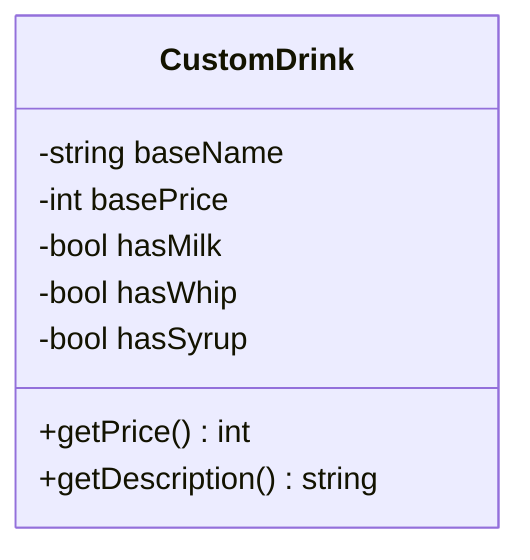
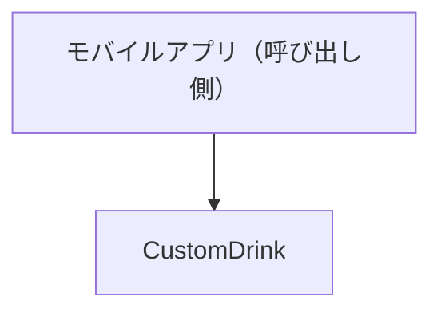
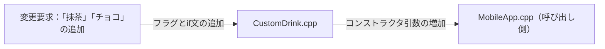
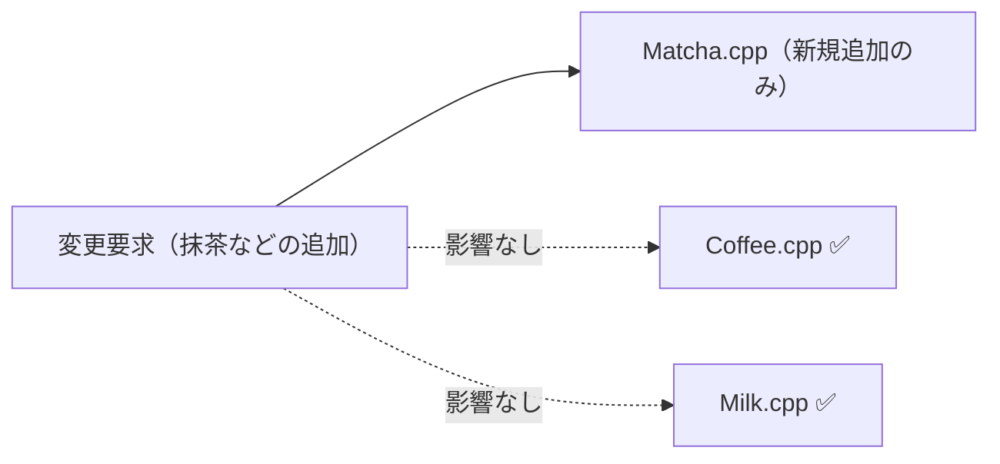
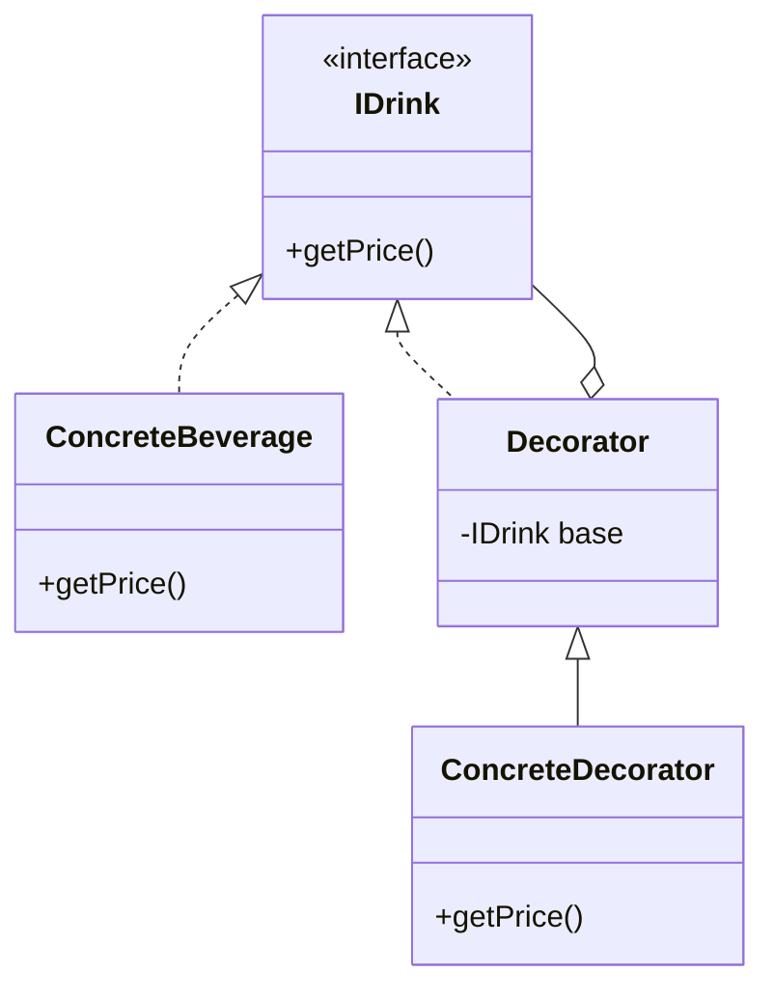

## 第6章 変わる機能の組み合わせ ―― Decorator パターン

―― 思考の型：基本の処理と追加の処理が混在している

### この章の核心

**機能の組み合わせが増えるたびに、条件分岐やクラスの数が際限なく増えていく。それは、「基本となる処理」と「後から付け足す処理」が同じ場所に混在しているからだ。**

---

### この章を読むと得られること

これまでの章では「ルールの混在」「外部依存」「状態管理」「骨格の重複」「操作のカプセル化」を扱いました。この章の痛みはまた異なります——「トッピングの組み合わせが増えるたびにクラスが爆発する」という問題です。「継承で全部作ろうとしたら間に合わなくなった」という経験がある方は、この章が直撃します。

* **得られること1：** 「機能の組み合わせ」という観点で、コードの変動箇所を識別できるようになる。「変わる機能」と「変わらない機能」を区別する問いを立てる習慣が、変動箇所を見抜く目を育てる。
* **得られること2：** 接続点（クラスとクラスのつなぎ目）が「具体×直接」（特定のクラスを名指しで直接知っている状態）になっているクラスを見て、そこが変更の痛みの発生源だと判断できるようになる。具体的な型を直接知っているということは、その型が変われば自分も変わらざるを得ないという構造的な必然を、接続の形から読み取れるようになるからだ。
* **得られること3：** 接続点の形を変えると変更がどのように局所化（変更の影響が1クラスだけで済む状態）されるかを、構造から説明できるようになる。「変わる責任はどのクラスが持つべきか」という問いが、変更の影響範囲を構造から予測する力を与えてくれる。
* **得られること4：** 基本機能と追加機能を同じインターフェースで扱うことで、呼び出し側に違いを意識させずに機能を何層でも重ねていく視点が身につく。「追加するたびに呼び出し側も変えなければならない」という痛みを経験したとき、この構造の必要性が実感として伝わってくる。

前段でこの章の目的と得られる視点を共有しました。ここからはいよいよ、実際のコードを前にして思考プロセスを回していきます。最初のステップであるフェーズ1では、システムの現状を「事実として」観察することから始めましょう。一緒に少しずつ解きほぐしていきましょう。

---

## 🔵 フェーズ1：現状把握 ―― 変更が来る前にコードを把握する

### 1-1：システムの背景

このシステムは、全国展開する人気カフェチェーンのモバイルオーダーを裏側で支える注文管理システムです。お客様がスマートフォンから事前にドリンクを注文し、店舗でスムーズに受け取れる仕組みを提供しています。

システムが立ち上がった当初、メニューは「コーヒー」や「紅茶」といったシンプルな基本ドリンクのみでした。しかし、ビジネスが成長し「自分好みにカスタマイズしたい」というお客様の声が大きくなるにつれて、ミルクの追加、ホイップの増量、シロップの変更など、多種多様なトッピング機能が追加されてきました。店舗のオペレーションと連動するため、注文システムは正確な「合計金額」と、ドリンクを作るスタッフに伝えるための「注文内容（名前）」を算出する重要な役割を担っています。

現在の構成では、すべてのトッピングの有無を真偽値（booleanフラグ）で管理し、`CustomDrink` クラスの中で金額と注文名を組み立てる形になっています。


---

### 1-2：仕様表

読者の皆さんがコードを読む前に、このシステムが「現在何をしているのか」を一覧で整理しておきましょう。

| **機能名**    | **担当クラス**     | **入力**                     | **出力**           |
| ---------- | ------------- | -------------------------- | ---------------- |
| 基本情報の保持    | `CustomDrink` | 基本ドリンク名(string)、基本価格(int)  | （内部状態として保持）      |
| トッピング状態の保持 | `CustomDrink` | ミルク有無(bool)、ホイップ有無(bool) 等 | （内部状態として保持）      |
| 合計金額の計算    | `CustomDrink` | なし（自身の内部状態を使用）             | 計算済み合計金額(int)    |
| 注文内容の組み立て  | `CustomDrink` | なし（自身の内部状態を使用）             | 注文内容の文字列(string) |

---

### 1-3：クラス構成図

システムのクラス構成を可視化し、構造を確認します。



この図が示す通り、`CustomDrink` という単一のクラスが、ドリンクの基本情報とすべてのトッピング情報を一手に引き受けている構成になっています。

---

### 1-4：責任配置テーブル

各クラスが「本来何を知るべきか（責任）」を定義し、事実を確認します。

| **クラス名** | **責任（1文）** | **知るべきこと** |
| --- | --- | --- |
| `CustomDrink` | ドリンクの基本料金とトッピング料金を合算して提供する。 | 基本価格、ミルクの有無と価格、ホイップの有無と価格、シロップの有無と価格。 |

この表から、`CustomDrink` がドリンク本体の知識だけでなく、トッピングに関するすべての知識を抱え込んでいる状態が見て取れます。私自身、現場でこういうクラスを見ると「少し荷物が重そうだな」と感じてしまうのですが、皆さんはいかがでしょうか。すべての情報を1箇所に集めているため、仕様を把握しやすいという側面も確かにあります。

---

### 1-5：依存グラフ

クラス間の「依存の方向」をマクロな視点で示します。



呼び出し側であるモバイルアプリが、基本ドリンクとトッピングを包括した `CustomDrink` クラスに直接依存していることが分かります。

---

### 1-6：実装コード

それでは、実際にシステムを動かしているコードを見てみましょう。文脈として、コーヒーにミルクとホイップを追加する注文をシミュレートしています。

```cpp
#include <iostream>
#include <string>

using namespace std;

class CustomDrink {
private:
    string baseName;
    int basePrice;
    // トッピングごとの状態をフラグで管理している
    bool hasMilk;
    bool hasWhip;
    bool hasSyrup;

public:
    CustomDrink(string name, int price, bool milk, bool whip, bool syrup)
        : baseName(name), basePrice(price),
          hasMilk(milk), hasWhip(whip), hasSyrup(syrup) {}

    int getPrice() const {
        int total = basePrice;
        // トッピングごとの追加料金を計算
        if (hasMilk)  total += 50;
        if (hasWhip)  total += 70;
        if (hasSyrup) total += 30;
        return total;
    }

    string getDescription() const {
        string desc = baseName;
        // トッピングごとの名前を追加
        if (hasMilk)  desc += " + Milk";
        if (hasWhip)  desc += " + Whip";
        if (hasSyrup) desc += " + Syrup";
        return desc;
    }
};

// 呼び出し側のコード（モバイルアプリを想定）
int main() {
    // コーヒー(300円)に、ミルクとホイップを追加、シロップはなし
    CustomDrink order("Coffee", 300, true, true, false);

    cout << "注文内容: " << order.getDescription() << endl;
    cout << "合計金額: " << order.getPrice() << "円" << endl;

    return 0;
}

```

このコードを見ると、`CustomDrink` クラスがどのトッピングがいくらで、どんな名前になるかをすべて直接知っていることが分かります。

---

### 1-7：実行結果

上記のコードを実行した結果は以下のようになります。

```text
注文内容: Coffee + Milk + Whip
合計金額: 420円

```

> このコードは正しく動く。これから変えていくのは「機能」ではなく「構造」だ。

---

### 1-8：責任チェック表

コードが実際に「知っていること」を一行ずつ照合し、その知識が誰の判断で変わるのかを観察します。

| **コードの行** | **持っている知識** | **管理者（観察）** |
| --- | --- | --- |
| `if (hasMilk) total += 50;` | ミルク追加の価格設定（50円） | 商品企画部門やマーケティング部門が決定する |
| `if (hasWhip) desc += " + Whip";` | ホイップ追加時のレシートや画面への表示名 | 店舗オペレーション設計部門やメニュー管理担当が決定する |
| `string baseName; int basePrice;` | 基本ドリンク（コーヒー等）の名称と基本価格 | 商品企画部門が決定する |
| `bool hasSyrup;` | シロップというカスタマイズオプションが存在すること | 商品企画部門がメニューとして提供するかを決定する |

一見してシンプルに見えたコードですが、一行ずつ観察していくと、商品企画部門が決めるべき「トッピングの価格」や、店舗設計部門が関わる「表示名」という異なる性質の知識が、一つのクラスの中に並んでいることが見えてきました。

トッピングの種類が増えるたびに、このクラスにフラグと `if` 文が追加されてきた経緯が読み取れます。

要するに、`getPrice` や `getDescription` の中にトッピングごとの処理が `if` 文で書き連ねられているという観察から、「後から追加される処理（各種トッピング）」と「基本となる処理（ドリンク本体）」が同じ場所に混在しているという構造の問題が見えてくる。

フェーズ1でシステムの現状と責任の配置を観察しました。次のフェーズ2では、現場に届いた変更要求を起点にして「何が変わり、何が変わらないか」の仮説を立て、関係者とのヒアリングを通じてそれを確定させていきます。実装と責任が一致しない箇所こそが、のちの問題の発生源になります。

---

### 2-1：届いた変更要求

ある日の午後、商品企画部の佐藤マネージャーからチャットで連絡が入りました。

「来週から始まる春の新作キャンペーンに合わせて、モバイルオーダーのカスタマイズメニューに『抹茶パウダー』と『チョコチップ』を追加したいんです。お客様からの要望も多くて、絶対にヒットすると思うんですよね。来週のリリースに間に合いますか？」

なるほど、春の新作キャンペーンですか。確かに、新しいカスタマイズの選択肢が増えるのは、お客様にとって非常に魅力的な体験になりますし、ビジネスとしても単価アップが見込める素晴らしい施策です。

しかし、ちょっと待ってくれ、と私はフェーズ1で確認したコードを思い浮かべました。

あの `CustomDrink` クラスには、すでに `hasMilk` や `hasWhip` といったフラグが並んでおり、価格計算や名前の組み立て部分には `if` 文が連なっていました。ここに新しいトッピングを追加するということは、また新しいフラグと `if` 文をあのクラスに書き足すことを意味します。このままの構造で対応してしまって本当に良いのか、少し立ち止まって考えてみたいと思います。

---

### 2-2：変動・不変の仮説テーブル

いきなりコードを修正するのではなく、まずはフェーズ1での観察（1-8の責任チェック表）を材料にして、「この先、何が変わりそうで、何が変わらなそうか」の仮説を立ててみます。

| **分類** | **仮説** | **根拠（フェーズ1の観察から）** |
| --- | --- | --- |
| 🔴 **変動しそう** | 新しいトッピングの種類が追加される、または既存のものが廃止される | 1-8で、トッピングの存在自体を商品企画部が決定していると観察したため。 |
| 🔴 **変動しそう** | トッピングの価格や、レシートへの表示名が変更される | 1-8で、価格や表示名がソースコードの `if` 文の中に直接ハードコードされていると観察したため。 |
| 🟢 **不変そう** | ドリンクの基本価格に、追加したトッピングの料金を加算して「合計金額」を出すという大枠の計算ルール | ベースとなる飲み物にオプションを追加するというビジネスの根幹であり、カスタマイズの種類が増えてもこの構造自体は変わらないと読み取れるため。 |

コードを読んだだけで「ここは間違いなく変わる」「ここは絶対に変わらない」と自分一人で断定してしまうのは危険です。私自身、現場でここで何度も迷い、勝手な思い込みで痛い目を見たことがあります。

設計に絶対の正解はありません。だからこそ、独りよがりにならず、この仮説がビジネスの方向性と合っているかを関係者に直接確認するプロセスが必要です。

---

### 2-3：関係者ヒアリング

仮説を携えて、商品企画部の佐藤マネージャーとのミーティングの時間を設定しました。チームで話し合う価値がある部分だと思います。

**開発者：** 「今回の『抹茶パウダー』と『チョコチップ』の追加の件、システムへの組み込みを検討しています。一つ確認させてください。今後もこのように、新しいトッピングの種類は増え続けると考えてよいでしょうか？」

**佐藤マネージャー：** 「もちろんです！お客様の反応が非常に良いので、毎月の季節キャンペーンごとに新しいカスタマイズをどんどん追加していく予定です。逆に、あまり人気のないトッピングはメニューから落としていく（廃止する）ことも考えています。」

**開発者：** 「なるほど、トッピングの種類は毎月のように入れ替わるのですね。ちなみに、各トッピングの価格（例えばミルク50円など）は今のところ固定ですが、これは今後も変わらないでしょうか？」

**佐藤マネージャー：** 「あ、実は原材料費の高騰もあって、来月から一部のトッピングを値上げする構想があります。価格改定は年に数回はあると思っておいてください。」

**開発者：** 「承知しました。価格も変動する要素ですね。他に、将来的に変わりそうなカスタマイズのルールや、お客様からの要望で実現したいことはありますか？ 今のうちにシステムの土台に備えをしておきたいので。」

**佐藤マネージャー：** 「そうですね……熱心なお客様から『ホイップを通常の2倍（ダブル）にしてほしい』とか『チョコチップを3倍（トリプル）で』という要望がかなり来ています。今はシステム上できないとお断りしているんですが、将来的には『同じトッピングを複数回追加できる機能』は絶対に実現したいですね。」

ヒアリングを通じて、当初の仮説が裏付けられただけでなく、「同じトッピングの複数回追加」という、今の真偽値（booleanフラグ）の構造では到底太刀打ちできない将来の変化まで見えてきました。

こうした未知の要件を初期段階で引き出せたことは、設計の見通しを立てる上で大きな前進です。

---

> **現実のヒアリングでは——** このシナリオでは相手がちょうど設計に役立つ情報を教えてくれています。現実には「変わるかどうか分からない」「たぶん変わらない」という答えが返ることも多いです。そのときは、コードの変更履歴（`git log`）や過去の障害記録を「ヒアリングの代わり」として使ってみてください。「過去に何度変わったか」が、「将来変わりやすいか」の最も正直な証拠です。

### 2-4：確定した変動/不変テーブル

佐藤マネージャーとの対話（ヒアリング）の結果を反映し、変動と不変の境界線を確定させます。

| **分類** | **具体的な内容** | **変わるタイミング** | **根拠（誰との確認か）** |
| --- | --- | --- | --- |
| 🔴 **変動する** | トッピングの種類の増減 | 毎月のキャンペーンごと | 商品企画部 佐藤マネージャーとの合意 |
| 🔴 **変動する** | トッピングの価格改定 | 年に数回（原材料費等による） | 商品企画部 佐藤マネージャーとの合意 |
| 🔴 **変動する** | 同じトッピングの複数回追加（ダブル、トリプル等） | 将来的な機能拡張時 | 商品企画部 佐藤マネージャーからの要望 |
| 🟢 **不変** | 基本ドリンクにトッピングの価格と名前を「上乗せしていく」という基本構造 | 変わる日は来ない | ビジネスモデルの根幹として合意 |

ヒアリングを通じて、「トッピングに関する知識」は今後もビジネスの成長に合わせて高頻度で変化することが確定しました。

フェーズ2で、トッピングの種類が今後も高頻度で追加されることが確定しました。次のフェーズ3では、その確定した「新しいトッピングの追加」を今のコードのままで試みて、何が起きるかを確認します。

---

## 🟡 フェーズ3：問題特定 ―― 変更を試みて、痛みを発見する

### 3-1：変更シミュレーション

佐藤マネージャーからの要求通り、「抹茶パウダー」と「チョコチップ」を既存のシステムに追加してみましょう。

まずは、トッピングの有無を管理している `CustomDrink` クラスを開きます。クラスのメンバ変数として、`bool hasMatcha;` と `bool hasChocoChip;` という2つのフラグを追加します。
次に、初期化を行うためのコンストラクタの引数にも、この2つの真偽値（boolean）を追加しなければなりません。
そして、価格を計算する `getPrice` メソッドの中に `if (hasMatcha) total += 60;` のような計算ロジックを足し、同様に `getDescription` メソッドの中にも名前を組み立てる `if` 文を書き足します。

これでクラスの修正は終わったと思い、コンパイルしてみると、エラーが大量に出力されました。`CustomDrink` を生成しているモバイルアプリ側（呼び出し元）のコードです。コンストラクタの引数が増えたことで、既存の「コーヒーにミルクだけ」といった注文を生成しているすべての箇所が壊れてしまったのです。

たった2つのトッピングを追加しようとしただけなのに、クラスの中をあちこち探し回って修正した上に、呼び出し側のコードまで直さなければならない状況になっています。

---

### 3-2：変更影響グラフ

変更を試みた結果、影響がどのように飛び火したかを図で可視化してみます。



「抹茶パウダーとチョコチップを追加する」という一つの変更要求が、`CustomDrink` クラスの内部を複数箇所変更させるだけでなく、それを呼び出しているモバイルアプリ側のコードにも影響が飛び火していることが見えます。

---

### 3-3：痛みの言語化

「なぜこのクラスに機能を追加するだけで、呼び出し側まで壊れるんだろう…」

この変更シミュレーションを通じて、現場のエンジニアが直面する具体的な辛さが2つ見えてきました。

1つ目は、修正箇所がクラス内に散らばっていて見落としやすいという辛さです。
新しいトッピングを追加しようとしたとき、メンバ変数を足し、コンストラクタを直し、価格計算のメソッドを探して直し、さらに名前組み立てのメソッドも直す必要がありました。一つの変更要求に対して、ファイルの中を何度もスクロールして修正箇所を探し回らなければなりません。もし一つでも `if` 文を足し忘れたら、価格の計算が合わないといった致命的な不具合につながってしまいます。

2つ目は、機能を追加するたびに呼び出し側が壊れるという、影響範囲の読めなさです。
トッピングの種類が増えるということは、`CustomDrink` を生成するための引数の数が増え続けることを意味します。このままでは、新しいキャンペーンが始まるたびに、システムのあちこちに散らばっている `new CustomDrink(...)` のコードをすべて探し出し、使わないトッピングのために `false` という引数を延々と書き足す作業に追われることになります。変えるとどこが壊れるか分からないという恐怖が、開発のスピードを少しずつ奪っていくのです。

フェーズ3で変更を試みた際に生じた痛みが確認できました。次のフェーズ4では、なぜこのような痛みが生じるのか、その根本的な原因をコードの構造という観点から言語化していきます。

---

## 🔴 フェーズ4：原因分析 ―― 「なぜ辛いのか」を構造的に言語化する

### 4-1：観察→原因テーブル

前フェーズでの変更シミュレーションを通じて、「変更箇所が散らばっていて見落としやすい」「呼び出し側が壊れてしまう」という2つの痛みを発見しました。この痛みがなぜ発生するのか、観察した事実と構造的な原因の方向性を対応させてみましょう。

観察から原因を導き出す思考の流れはシンプルです。まず「何が辛いのか」を言語化する。次に「その辛さを引き起こしているのはコードのどの性質か」を問う。最後に「その性質がなぜ生まれたのか」を構造に問い返す。この3ステップを意識するだけで、現象の裏にある根本を掘り当てることができます。

| **観察** | **原因の方向** |
| --- | --- |
| トッピングを追加するたびに、クラス内の複数の `if` 文やコンストラクタを探し出して修正しなければならない | `CustomDrink` クラスが、各種トッピングの価格や名前といった具体的な条件を直接知っているから |
| 新しいトッピングが登場するたびにコンストラクタの引数が増え、モバイルアプリ側（呼び出し側）のコードまで壊れてしまう | 変わる理由が異なる「基本ドリンク」と「トッピング」が同じ場所に混在しているから |

表にしてみると、「何が起きているか」と「なぜ起きているか」の因果関係がはっきりと見えてきます。

トッピングが少なかった初期は、一つのクラスを見ればすべての処理が追える構成でした。

しかし、トッピングの種類が増えるにつれて、一つのクラスが「知りすぎている」状態になってしまったのではないでしょうか。コーヒーという基本のドリンクが、ミルクの追加価格やホイップの表示名まで知っている必要は本来ありません。それらが同じ場所に混在していることが、変更の波及を生み出す根本的な発生源になっています。私自身、現場で「とりあえずフラグを足しておこう」と安易に判断して後悔したことが何度もあります。

---

### 4-2：変わるもの / 変わらないものテーブル

原因の方向性が見えたところで、次のステップに向けた準備として「変わり続けるもの」と「変わってほしくないもの」を明確に切り分けてみましょう。ここをしっかり整理することが、後で適切に分けるための土台になります。

| **変わり続けるもの（🔴）** | **変わってほしくないもの（🟢）** |
| --- | --- |
| トッピングの種類、それぞれの追加価格、表示名、およびそれらをどう組み合わせるかというルール | 基本となるドリンクの価格を保持し、そこにオプションの価格を上乗せして合計金額を計算するという処理の骨格 |

トッピングに関する情報は、商品企画部や店舗オペレーションの都合で今後も高頻度で変わり続けます。また、「ホイップをダブルにする」といった新しい組み合わせの要望もやってくるでしょう。これらは紛れもなく「変わり続けるもの」です。

一方で、ベースとなる飲み物にオプションを足していくという計算の大枠自体は、カフェのビジネスが続く限り変わらないはずです。また、呼び出し側（モバイルアプリ）から見たときに「それは一杯のドリンクである」という扱い方も変わりません。

この「変わる側」をうまくカプセル化（分離して隠蔽）できれば、「変わらない側」を安定させることができるはずです。

---

### 4-3：接続形態を診断する

現在のシステムがどのような接続形態になっているのかを、2×2マトリクスの視点から診断してみましょう。

現在の `CustomDrink` クラスは、ミルクやホイップといったトッピングの存在を、真偽値（boolean）のメンバ変数という形で具体的に直接知っています。これを私たちが普段使っているケーブルの比喩で言えば、Lightningケーブルで直差しの状態（具体×直接）だと言えます。

iPhoneに専用のケーブルを直接つなぐように、特定のトッピングを本体クラスに直接組み込んでいる状態です。この接続形態のままで新しいトッピング（新しい機器）をつなぎたいと思ったら、本体（クラス）の側にも新しい専用の差込口（コンストラクタの引数やメンバ変数）を増やさなければなりません。だからこそ、トッピングが増えるたびに本体側や呼び出し側に影響が飛び火していたのです。

|  | 直接（直差し） | 間接（アダプター経由） |
|:---:|:---|:---|
| **具体**（専用規格） | **← 現在地**　iPhone → [Lightning] → Apple純正ドック（Lightning端子） | iPhone → [Lightning] → [変換] → USB-A充電器（汎用端子） |
| **抽象**（汎用規格） | MacBook → [USB-C] → USB-C対応モニター（汎用端子） | MacBook → [USB-C] → [ハブ] → HDMI・USB-A・LAN |

このコードで言うと：

| ケーブル比喩 | コードの対応箇所 |
|---|---|
| 「具体」＝専用規格ケーブル | `bool hasMilk; bool hasWhip; bool hasSyrup;` — トッピングの種類を `CustomDrink` クラスのメンバ変数として具体的に直接保持している |
| 「直接」＝直差し | `if (hasMilk) total += 50;` / `if (hasWhip) total += 70;` — `getPrice()` 内でラッパーを介さず各トッピングの価格計算をインラインで直接記述している |

ここで重要なのは、基本となるドリンクの役割と、後から追加されるトッピングの役割は、明らかに変わる理由が異なるということです。したがって、これらは一つの場所にまとめておくのではなく、分けるべきだと判断できます。

フェーズ4で根本原因が言語化でき、基本のドリンクと追加のトッピングは「変わる理由が異なるため分けるべきだ」という判断に至りました。しかし、すぐに解決策へ飛びつくのは危険です。次のフェーズ5では、対策に入る前に制約を整理し、「何を解くか」という課題を具体的に定めていきます。

---

## 🟣 フェーズ5：課題定義 ―― 解くべき問題を具体的に定める

### 5-1：接続点の特定

フェーズ4で「分ける」と判断した場所に、新たに接続点（ジョイント）が生まれます。その接続点がどこに何個あるのかを明確にします。

現在の `CustomDrink` クラスからトッピングの知識を切り出すと、以下のような接続点が現れます。

* 接続点A：基本となるドリンク（コーヒーなど） ←→ 追加されるトッピング（ミルクなど）の境界
* 接続点B：追加されたトッピング ←→ さらに追加される別のトッピングの境界

ここで少し立ち止まって、考えてみてください。トッピングは1つとは限りません。「コーヒーにミルクを追加し、その上にさらにホイップを追加する」といった具合に、機能が連鎖していく特性を持っています。そのため、基本のドリンクとトッピングを繋ぐだけでなく、トッピング同士を数珠繋ぎにしていく接続点も考慮する必要があります。これらの接続点がどのような形になるかが、今回の設計の鍵を握りそうです。

### 5-2：非機能制約の確認

このシステムの規模では、トッピングクラスの導入によるパフォーマンスコストは設計判断を絞り込む制約になりません。ただし、ランチピーク時に多数の注文が短時間で集中する場合、注文内容の計算と出力の**一貫性保証**が設計上の課題になります。この点は案3・案4の選定に影響するため、各案のトレードオフで触れます。

### 5-3：クライアントへの影響範囲

次に、「分けること」で既存のコードにどの程度の変更が波及するかを確認します。

現在のモバイルアプリ側（呼び出し元）は、`new CustomDrink("Coffee", 300, true, true, false)` のように、コンストラクタの引数に直接 `true` や `false` を渡すことでトッピングを指定しています。

クラスを分離し、接続点の形を変えれば、この引数の渡し方は使えなくなります。つまり、モバイルアプリ側の「インスタンスを組み立てる部分」には確実な影響が波及し、修正が必要になります。呼び出し側のコードに手を入れなければならないという事実をあらかじめ覚悟しておく必要があります。

### 5-4：課題まとめ表

ここまでの内容を一覧にまとめ、次のフェーズの出発点を確定させます。

| **接続点** | **分けた理由** | **非機能制約** | **クライアント影響** |
| --- | --- | --- | --- |
| 接続点A・B | 変わる理由が異なる（基本機能と追加機能の混在を解消したい） | ホットパスではない | モバイルアプリ側（呼び出し元）の生成ロジックに影響 |

この表が、次に作る対策案の設計根拠になります。私自身、この課題定義を飛ばしてすぐにコードをいじり始め、後で「あ、クライアント側にこんなに影響が出るなんて」と手戻りになった経験が何度もあります。変更を加える前に状況を整理し、チームで話し合う価値がある部分だと思います。

フェーズ5で、私たちが解くべき課題と制約が明確になりました。次のフェーズ6では、この課題に対してどのような解決策があるのかを、変更コストと影響範囲の観点から比較検討していきます。最初から一つの正解を決め打ちするのではなく、まずは選択肢をテーブルに並べてみましょう。

---

## 🟢 フェーズ6：対策案検討 ―― 解決策を並べ、コストで選ぶ

### 6-1：接続の形 2×2マトリクス

まずは現在地と、これから取り得る選択肢の全体像を可視化します。フェーズ4で確認した通り、現在の `CustomDrink` クラスはトッピングのフラグを直接抱え込んでいる状態（具体×直接）です。

| 接続形態 | ケーブル例 | 特徴 |
|:---:|:---|:---|
| **具体×直接**（← 現在地） | iPhone → [Lightning] → Apple純正ドック（Lightning端子） | 専用端子のみ対応。差し替え不可 |
| **具体×間接** | iPhone → [Lightning] → [変換] → USB-A充電器（汎用端子） | 変換器を挟むが規格は専用のまま |
| **抽象×直接** | MacBook → [USB-C] → USB-C対応モニター（汎用端子） | どのメーカーでも同じ口で繋がる |
| **抽象×間接** | MacBook → [USB-C] → [ハブ] → HDMI・USB-A・LAN | ハブを介して多様な機器へ展開可能 |

私たちがこれから検討する対策案は、このマトリクスの中で「どのセルに移動するか」を選ぶ作業になります。

---

#### 案0：具体×直接（現状維持）―― 構造を変えずにフラグを足す

**この形の考え方：**
クラスの分割も接続形態の変更もしません。既存の構造のまま、新しいトッピング用の `bool` フラグを追加し、`if` 文を書き足してその場の変更要求に対応します。もしトッピングの追加が今回限りであり、将来的な変化も見込めないビジネス環境であれば、この選択が最も合理的な判断となります。

**この形にするための準備：**

1. `CustomDrink` クラスに新しいトッピングのフラグ（`hasMatcha` 等）を追加する
2. コンストラクタの引数を増やし、呼び出し元のコードをすべて修正する
3. `getPrice()` と `getDescription()` に新しい `if` 文を追加する

```cpp
class CustomDrink {
private:
    string baseName;
    int basePrice;
    bool hasMilk;
    bool hasWhip;
    bool hasSyrup;
    bool hasMatcha; // ← 新しくフラグを追加

public:
    // 引数が増え続けるため、呼び出し側はすべて修正が必要
    CustomDrink(string name, int price,
                bool milk, bool whip, bool syrup, bool matcha)
        : baseName(name), basePrice(price),
          hasMilk(milk), hasWhip(whip),
          hasSyrup(syrup), hasMatcha(matcha) {}

    int getPrice() const {
        int total = basePrice;
        // ← 具体："hasMilk"などの条件を呼び出し側が直接書いている
        if (hasMilk)   total += 50;
        if (hasWhip)   total += 70;
        if (hasSyrup)  total += 30;
        if (hasMatcha) total += 60; // ← 新しい計算ロジックを追加
        return total;
    }
    // getDescription() も同様に修正...
};

```

このコードを見ると、変更要求が来るたびに `CustomDrink` クラスがどんどん肥大化し、呼び出し側も壊れ続けることが分かります。

**呼び出し側から見た違い（main() 例）：**

```cpp
// 案0（現状維持）の呼び出し側
int main() {
    // ← 具体：フラグの組み合わせを呼び出し側が直接指定している
    CustomDrink order("Coffee", 300, true, true, false, false);
    cout << "合計金額: " << order.getPrice() << "円" << endl;
    return 0;
}
```

**この形のトレードオフ：**

* 変更容易性：低（次の変更要求が来たときも同じようにクラス内部と呼び出し側を探して修正する作業が繰り返される）
* テスト容易性：低（トッピングの組み合わせパターンが指数関数的に増え、全パターンのテストが困難になる）
* 実装コスト：低（今のコードに数行足すだけなので、今すぐに対応できる）

---

#### 案1：具体×直接 ―― クラスは分けるが、呼び出し側は具体型を直接知る

**この形の考え方：**
フラグによる管理をやめ、トッピングごとにクラスを分割して責任を整理します。しかし、`CustomDrink` は分割された `Milk` や `Whip` の具体的な型を直接知っている状態（ポインタなどを保持する状態）を維持します。「責任を分けたい」という動機はありますが、「実行時に柔軟に差し替える必要はない」という場合に合う形です。

**この形にするための準備：**

1. トッピングごとのクラス（`Milk`, `Whip` 等）を作成する
2. `CustomDrink` クラスに、各種トッピングのポインタを持たせる
3. `getPrice()` では、ポインタが有効な場合にそのトッピングの価格を加算する

```cpp
class Milk {
public:
    int getPrice() const { return 50; }
    string getName() const { return " + Milk"; }
};
// Whip クラス等も同様に作成...

class CustomDrink {
private:
    string baseName;
    int basePrice;
    // ← 具体：Milk*という具体型を直接知っている
    Milk* milk;
    // ← 直接：呼び出し側がこのクラスを直接インスタンス化している
    Whip* whip;

public:
    CustomDrink(string name, int price) {
        baseName = name;
        basePrice = price;
        milk = nullptr;
        whip = nullptr;
    }

    void setMilk(Milk* m) { milk = m; }
    void setWhip(Whip* w) { whip = w; }

    int getPrice() const {
        int total = basePrice;
        if (milk) total += milk->getPrice();
        if (whip) total += whip->getPrice();
        return total;
    }
};

// 呼び出し側のコード
int main() {
    CustomDrink order("Coffee", 300);
    Milk milk;
    Whip whip;
    order.setMilk(&milk);
    order.setWhip(&whip);
    cout << "合計金額: " << order.getPrice() << "円" << endl;
    return 0;
}

```

このコードを見ると、価格や名前の知識は個別のトッピングクラスに移動しましたが、`CustomDrink` が「どのトッピングが存在し得るか」という具体的な型を直接知っている状態は変わっていないことが分かります。

**呼び出し側から見た違い（main() 例）：**

```cpp
// 案1（具体×直接）の呼び出し側
int main() {
    Milk milk;                           // ← 直接：呼び出し側が具体クラスを直接生成
    Whip whip;
    CustomDrink order("Coffee", 300);
    order.setMilk(&milk);
    order.setWhip(&whip);
    cout << "合計金額: " << order.getPrice() << "円" << endl;
    return 0;
}
```

**この形のトレードオフ：**

* 変更容易性：低〜中（トッピングの計算ロジックは分離できたが、種類が増えればやはり `CustomDrink` の修正が必要になる）
* テスト容易性：低（具体的なクラスに依存しているため、スタブに差し替えてテストすることができない）
* 実装コスト：中（クラスを切り出すリファクタリングの手間がかかる）

---

#### 案2：抽象×直接 ―― インターフェースを挟み、呼び出し側は型だけを知る

**この形の考え方：**
トッピングの具体的な型を `CustomDrink` から隠すために、インターフェースを導入します。すべてのトッピングを `ITopping` という共通の型で扱い、リスト（配列）で保持します。「トッピングの種類を気にせず、一律に扱いたい」という動機に応える形です。

**この形にするための準備：**

1. トッピングが満たすべき `ITopping` インターフェースを定義する
2. `Milk` や `Whip` にそのインターフェースを実装させる
3. `CustomDrink` は `ITopping` のリストを持ち、ループで価格を合算するよう書き換える

```cpp
// トッピングのインターフェース
class ITopping {
public:
    virtual ~ITopping() = default;
    virtual int getPrice() const = 0;
    virtual string getName() const = 0;
};

// 具体的なトッピング
class Milk : public ITopping {
public:
    int getPrice() const override { return 50; }
    string getName() const override { return " + Milk"; }
};

class CustomDrink {
private:
    string baseName;
    int basePrice;
    // ← 抽象：ITopping*型で受け取り、具体クラスを知らない
    std::vector<ITopping*> toppings;

public:
    CustomDrink(string name, int price) : baseName(name), basePrice(price) {}

    void addTopping(ITopping* topping) {
        toppings.push_back(topping);
    }

    int getPrice() const {
        int total = basePrice;
        // トッピングの種類を知らなくても合算できる
        for (auto* t : toppings) {
            total += t->getPrice();
        }
        return total;
    }
};

```

このコードを見ると、トッピングの種類が新しく増えても `CustomDrink` のクラス自体は一切修正しなくてよくなったことが分かります。

**呼び出し側から見た違い（main() 例）：**

```cpp
// 案2（抽象×直接）の呼び出し側
int main() {
    Milk milk;                           // ← 具体：呼び出し側だけが具体クラスを生成
    Whip whip;
    CustomDrink order("Coffee", 300);    // ← 直接：インターフェース経由で直接注入
    order.addTopping(&milk);
    order.addTopping(&whip);
    cout << "合計金額: " << order.getPrice() << "円" << endl;
    return 0;
}
```

**この形のトレードオフ：**

* 変更容易性：中〜高（トッピングの追加は `CustomDrink` を触らずに行えるが、「基本ドリンク」と「トッピング」が別々の扱いになっているため、ホイップの量を2倍にするといった複雑な組み合わせに対応しづらい）
* テスト容易性：高（スタブのトッピングを注入して価格計算のテストが容易になる）
* 実装コスト：中（インターフェースの設計と、リストで管理する仕組みへの変更が必要）

---

#### 案3：具体×間接 ―― 仲介クラスを置くが、仲介役は具体型を知っている

**この形の考え方：**
ドリンクの計算とトッピングの組み合わせという複雑な処理を、専用の仲介役（カスタマイズマネージャー）に引き受けさせます。呼び出し側は仲介役に「コーヒーにミルクをお願い」と伝えるだけで済みますが、仲介役自身はすべてのトッピングの具体型を知っています。「呼び出し側からの複雑さを隠したい」場合に合う形です。

**この形にするための準備：**

1. `Drink` クラスをシンプルに保つ（基本価格だけを持つ）
2. 注文を組み立てる `OrderManager` という仲介クラスを作る
3. `OrderManager` の中に、どのトッピングを足すかのロジックを集約する

```cpp
class Coffee {
public:
    int getPrice() const { return 300; }
};

// ← 具体：OrderManagerという具体型を持っている
// ← 間接：呼び出し側はManagerのみ知り、内部のクラス群は見えない
// 仲介役が具体型を直接知って計算を行う
class OrderManager {
private:
    Coffee* coffee;
    Milk* milk;
    Whip* whip;

public:
    OrderManager() : coffee(new Coffee()), milk(nullptr), whip(nullptr) {}

    void addMilk() { milk = new Milk(); }
    void addWhip() { whip = new Whip(); }

    int calculateTotal() const {
        int total = coffee->getPrice();
        if (milk) total += milk->getPrice();
        if (whip) total += whip->getPrice();
        return total;
    }
};

```

**呼び出し側から見た違い（main() 例）：**

```cpp
// 案3（具体×間接）の呼び出し側
int main() {
    OrderManager manager;                // ← 間接：Coffee/Milk/Whipが内部に隠れており呼び出し側には見えない
    manager.addMilk();
    manager.addWhip();
    cout << "合計金額: " << manager.calculateTotal() << "円" << endl;  // 内部でCoffee等が動くが呼び出し側は知らない
    return 0;
}
```

このコードを見ると、呼び出し側から `Coffee`・`Milk`・`Whip` という具体的なクラス名が完全に消えており、これが「間接」の意味です。呼び出し側は `OrderManager` に「ミルクを追加して」と伝えるだけで、中身の実装を一切知りません。ただし、複雑さが `CustomDrink` から `OrderManager` へ移っただけとも言えます。`OrderManager` 自体はすべてのトッピングの具体型を知っており、種類が増えるたびに `OrderManager` の修正が必要になるという別の問題を引き起こしかねません。

**この形のトレードオフ：**

* 変更容易性：中（モバイルアプリ側への影響は抑えられるが、トッピングが増えるたびに `OrderManager` の修正が必要になる）
* テスト容易性：中（仲介役を通してある程度のテストは可能だが、仲介役自体が複雑化しやすい）
* 実装コスト：中（管理クラスの設計と実装の手間がかかる）
* ※ ピーク時の注文一貫性：`ToppingManager` が注文計算を一元管理しているため、ピーク時の処理を集中してコントロールできる。ステートレスな設計にしておくことで複数リクエスト間の状態混入を防げる。

---

#### 案4：抽象×間接 ―― インターフェース＋仲介役の両方で全層を抽象化する

**この形の考え方：**
「基本のドリンク」と「追加のトッピング」を全く同じインターフェースで扱います。トッピングのクラスは、内部に「別のドリンク（またはトッピング）」を保持する仲介役として振る舞い、機能の上に機能を何層にも被せて（ラップして）いく形をとります。「差し替えたい（追加したい）」かつ「呼び出し側には違いを知らせたくない」という2つの動機が重なる場合に必要になる形です。この構造を **Decorator（デコレーター）パターン** と呼びます。

**この形にするための準備：**

1. ドリンクとトッピングを統一して扱うための `IDrink` インターフェースを定義する
2. `Coffee` に `IDrink` を実装させる
3. トッピングの基底クラスを作り、`IDrink` を実装しつつ、内部に `IDrink*` を保持させる
4. 各トッピングは保持している中身の価格に、自身の価格を上乗せして返す

```cpp
// 基本ドリンクとトッピングを同じ型で扱うインターフェース
class IDrink {
public:
    virtual ~IDrink() = default;
    virtual int getPrice() const = 0;
    virtual string getDescription() const = 0;
};

// 基本のドリンク
class Coffee : public IDrink {
public:
    int getPrice() const override { return 300; }
    string getDescription() const override { return "Coffee"; }
};

// トッピングの基底（仲介役であり、かつ抽象型に依存する）
class ToppingDecorator : public IDrink {
protected:
    // ← 抽象：IDrink*型で受け取り、具体実装を知らない
    // ← 間接：Decoratorを経由するため内部クラス群が見えない
    IDrink* baseBeverage;
public:
    ToppingDecorator(IDrink* base) : baseBeverage(base) {}
};

// 具体的なトッピング
class Milk : public ToppingDecorator {
public:
    Milk(IDrink* base) : ToppingDecorator(base) {}
    
    int getPrice() const override {
        // 中身の価格に、自分の価格を上乗せする
        return baseBeverage->getPrice() + 50;
    }
    string getDescription() const override {
        return baseBeverage->getDescription() + " + Milk";
    }
};

// 呼び出し側のイメージ
// IDrink* order = new Whip(new Milk(new Coffee()));

```

このコードを見ると、トッピングクラスが「自分が包んでいる中身（基本ドリンクや他のトッピング）」の価格に自分の価格を上乗せするだけで完結しており、呼び出し側はそれが何層に重なっているかを一切知らなくて済むことが分かります。

**呼び出し側から見た違い（main() 例）：**

```cpp
// 案4（抽象×間接）の呼び出し側
int main() {
    Coffee coffee;                        // ← 具体：組み立て側だけが具体型を知る
    // ← 間接：抽象IDrinkのみ見えて具体実装は多層に隠れる
    IDrink* order = new Whip(new Milk(&coffee));
    cout << "合計金額: " << order->getPrice() << "円" << endl;
    return 0;
}
```

**この形のトレードオフ：**

* 変更容易性：高（新しいトッピングが増えても、既存のクラスを一切触らずにクラスを一つ追加するだけで対応できる）
* テスト容易性：高（「ミルク追加」という単体の機能だけを、モックを包むことで独立してテストできる）
* 実装コスト：高（統一インターフェースと基底クラスの設計が必要で、小さなクラスが多数生成されるため構造の理解に少し時間がかかる）
* ※ ピーク時の注文一貫性：`IToppingDecorator` インターフェース越しに注入される構造のため、注文オブジェクトをリクエスト単位で生成・破棄する設計が取りやすく、複数リクエスト間での状態混入リスクが低い。

---

5つの案がテーブルに並びました。どれが正解かはプロジェクトの状況によって異なります。次のステップでは、評価の「ものさし」を宣言し、コストの天秤にかけていきます。

### 6-7：評価軸

5つの対策案が出揃ったところで、どの案を採用するかを決めるための「ものさし」を先に宣言しておきましょう。比較表を見せてから「この軸で評価しました」と言うのは後付けになってしまうため、まずは評価の基準を透明にしておきます。

また、スコアリングに入る前に「パフォーマンスによる足切り（VETO）」の確認を行います。フェーズ5の課題定義で確認した通り、今回のドリンクの価格計算処理はマイクロ秒を争うようなホットパスではありませんでした。そのため、間接層が増える案2や案4を採用してもシステム全体への致命的な遅延は発生しないと判断し、今回はすべての案をスコアリングの対象としてテーブルに載せます。

| **評価軸** | **意味** | **ウェイト** |
| --- | --- | --- |
| 変更容易性 | 変更要求が来たとき、触る場所が最小で済むか | ×3 |
| テスト容易性 | 依存をスタブ/モックに差し替えてテストを書けるか | ×2 |
| 可読性 | コードの読みやすさ・構造を理解する工数 | ×1 |

> **注：** このウェイト（変更容易性×3など）は本書の例です。チームの変更頻度・テスト文化に合わせて、比較を始める前にチームで合意してください。スコアは「答えを決める計算式」ではなく、「チームの議論を整理する道具」です。

採点基準は以下の通りです。この基準はチーム内で「変更に強いとはどういう状態か」をすり合わせるための共通言語になります。

| 点数 | 変更容易性 | テスト容易性 | 可読性 |
| --- | --- | --- | --- |
| 3 | 変更が1クラスのみで完結する | スタブ1つで完全に切り離せる | クラス数が増えない・既存構造と同じ読み方で理解できる |
| 2 | 変更が2〜3クラスに及ぶ | 一部スタブが必要だが差し替え可能 | クラスが1〜2増える |
| 1 | 変更が4クラス以上に波及する | 実装に依存しテストが困難 | 中間層・インターフェースが複数増え理解コストが高い |

---

### 6-8：コスト天秤

それでは、先ほど設定した評価軸を用いて、各案を「現在の対応コスト（今の実装の手間）」と「未来の対応コスト（次の変更が来たときの手間）」という観点で比較してみましょう。

| **案** | **現在の対応コスト** | **未来の対応コスト** |
| --- | --- | --- |
| 案0：構造を変えない | 低 | 高 |
| 案1：具体×直接 | 低〜中 | 高 |
| 案2：抽象×直接 | 中 | 低〜中 |
| 案3：具体×間接 | 中 | 中 |
| 案4：抽象×間接 | 高 | 低 |

この概観を踏まえ、3つの軸で具体的にスコアリングを行います。

**ステップ1：採点表**

| 案 | 変更容易性（×3） | テスト容易性（×2） | 可読性（×1） |
| --- | --- | --- | --- |
| 案0：構造を変えない | 1 | 1 | 3 |
| 案1：具体×直接 | 1 | 2 | 3 |
| 案2：抽象×直接 | 2 | 3 | 2 |
| 案3：具体×間接 | 2 | 2 | 2 |
| 案4：抽象×間接 | 3 | 3 | 1 |

案0や案1は今のコードの延長線上にあり、クラス数も増えないため可読性（理解のしやすさ）は非常に高くなります。しかし、次のトッピング追加が来たときの変更容易性は著しく低く見積もられます。
一方で案4は、インターフェースや基底クラスが導入されるため、パッと見のコードの複雑さは増し（可読性スコア1）、実装コストもかかります。しかし、変更が完全に1つのクラスに閉じるため変更容易性は最高スコアになります。

**ステップ2：加重合計表**

それぞれのスコアにウェイト（変更容易性×3 ＋ テスト容易性×2 ＋ 可読性×1）を掛けて合計を出します。

| 案 | 加重スコア | 判定 |
| --- | --- | --- |
| 案0 | 1×3 ＋ 1×2 ＋ 3×1 ＝ 8 |  |
| 案1 | 1×3 ＋ 2×2 ＋ 3×1 ＝ 10 |  |
| 案2 | 2×3 ＋ 3×2 ＋ 2×1 ＝ 14 |  |
| 案3 | 2×3 ＋ 2×2 ＋ 2×1 ＝ 12 |  |
| 案4 | 3×3 ＋ 3×2 ＋ 1×1 ＝ 16 | ← 採用候補 |

加重スコアが最大となったのは案4（抽象×間接）でした。

---

### 6-9：採用案の決定

**採用する案：** 案4（抽象×間接 ―― これを Decorator パターンと呼ぶ）

**理由：**
商品企画部へのヒアリングにより、今後もトッピングの種類が高頻度で増減し続けることが確定しています。もし納期が明日で、今回の一度しか機能追加がないのであれば案0を選ぶこともエンジニアリングの正当な選択です。しかし、中長期的な運用を見据えた場合、トッピングの追加や複雑な組み合わせ（ダブル、トリプルなど）が要求されるたびに既存コードを壊し続ける未来コストは許容できません。クラス数が増えるという現在の実装コスト（とわずかな可読性の低下）を支払ってでも、変更が1つのクラス追加だけで完結する拡張性の高い構造を手に入れるため、案4を採用します。

どちらが正しいかは、チームの状況やビジネスの文脈によって変わります。正解はないのですが、一つの考え方として、今回は未来の変更耐性に投資する判断をしました。

---

### 6-10：耐久テスト

案4を採用した場合、本当に未来の変更に対して強い構造になっているのか、思考の耐久テストを行ってみましょう。

フェーズ2の関係者ヒアリングで、佐藤マネージャーから「ホイップをダブルにしたい、チョコチップをトリプルにしたいという要望があり、将来的には同じトッピングの複数回追加を実現したい」という将来リスクが挙がっていました。あのとき言っていた変化が実際に要求された場面をシミュレートしてみます。

もし案0のフラグ管理（`bool hasWhip;`）のままだった場合、ダブルに対応するためには `int whipCount;` のように型を変え、価格計算のロジックをすべて掛け算に書き直すという大規模な修正が必要になっていたはずです。

しかし、今回採用する案4（Decorator パターン）ではどうなるでしょうか。基本機能（ドリンク）を拡張機能（トッピング）で何層にも包み込む構造になっているため、「ホイップのダブル」は以下のように呼び出し側でクラスを2回重ねるだけで実現できます。

```cpp
// 呼び出し側で Whip で2回包むだけ
IDrink* order = new Whip(new Whip(new Coffee()));

```

既存の `Coffee` クラスにも `Whip` クラスにも、修正を加える必要は一切ありません。新しい要件に対して、既存の部品を組み合わせるだけで対応できたのです。

| **変更シナリオ** | **触る場所** | **コスト評価** |
| --- | --- | --- |
| 新しいトッピング「抹茶パウダー」を追加する | 新規の `Matcha` クラスを作るだけ（既存コードの変更なし） | 低 |
| 「ホイップのダブル」を注文できるようにする | 呼び出し側の生成ロジックのみ（既存クラスの変更なし） | 低 |

これこそが、構造を変えることで得られる最大の恩恵です。機能を追加するために既存のコードを恐る恐る触るのではなく、新しい部品を作って（あるいは既存の部品を組み合わせて）はめ込むだけになるという感覚、うまく伝わっているでしょうか。

フェーズ6で対策案を比較し、未来の変更に備えて「抽象×間接」の形（Decorator パターン）を採用する決断を下しました。最後のフェーズ7では、この決断を実際のコードに落とし込み、変更がどのように局所化されたのかを確認します。

---

## 🟤 フェーズ7：対策実施 ―― 決断し、変化に強い設計を手に入れる

### 7-1：解決後のコード（全体）

採用した案4（Decorator パターン）を実装した最終的なコードです。
トッピングの種類を管理していたフラグや `if` 文をなくし、基本ドリンクとトッピングを同じ `IDrink` というインターフェース（契約）で統一して扱えるように変更しています。また、オブジェクトの組み立ての責任は `OrderApplication` に集約しています。

```cpp
#include <iostream>
#include <string>

using namespace std;

// ドリンクとしてのビジネス上の責任（契約）を示すインターフェース
class IDrink {
public:
    virtual ~IDrink() = default;
    virtual int getPrice() const = 0;
    virtual string getDescription() const = 0;
};

// 変わらない処理の骨格：基本のドリンク
class Coffee : public IDrink {
public:
    int getPrice() const override { return 300; }
    string getDescription() const override { return "Coffee"; }
};

// 変わる部分を繋ぐ仲介役：トッピングの基底クラス
class ToppingDecorator : public IDrink {
protected:
    // ← 中身（基本ドリンクや他のトッピング）を隠し持つ
    IDrink* baseDrink; 
public:
    ToppingDecorator(IDrink* base) : baseDrink(base) {}
};

// 具体的なトッピング：ミルク
class Milk : public ToppingDecorator {
public:
    Milk(IDrink* base) : ToppingDecorator(base) {}
    int getPrice() const override {
        // ← 中身が何であるかは知らなくていい。価格を上乗せするだけ
        return baseDrink->getPrice() + 50;
    }
    string getDescription() const override {
        return baseDrink->getDescription() + " + Milk";
    }
};

// 具体的なトッピング：ホイップ
class Whip : public ToppingDecorator {
public:
    Whip(IDrink* base) : ToppingDecorator(base) {}
    int getPrice() const override {
        return baseDrink->getPrice() + 70;
    }
    string getDescription() const override {
        return baseDrink->getDescription() + " + Whip";
    }
};

// ← 新しいトッピングを追加する場合は、クラスを1つ増やすだけ（ここだけ変わる）
class Matcha : public ToppingDecorator {
public:
    Matcha(IDrink* base) : ToppingDecorator(base) {}
    int getPrice() const override {
        return baseDrink->getPrice() + 60;
    }
    string getDescription() const override {
        return baseDrink->getDescription() + " + Matcha";
    }
};

// 依存の組み立てと実行を担うアプリケーションクラス
class OrderApplication {
public:
    void run() {
        // コーヒーにミルクと、抹茶のダブルを追加する
        // （フェーズ2で予告された「同じトッピングの複数回追加」を実演）
        IDrink* myOrder = new Matcha(new Matcha(new Milk(new Coffee())));
        
        cout << "注文内容: " << myOrder->getDescription() << endl;
        cout << "合計金額: " << myOrder->getPrice() << "円" << endl;

        // ※メモリ解放はサンプル簡略化のため省略
    }

    // ※ testOrderCalculation() は Google Test フレームワークを使用します。
    //   実際に実行する場合は #include <gtest/gtest.h> とリンク設定が必要です。
    void testOrderCalculation() {
        // EXPECT_EQ(期待値, 実際の値)：等しければテスト通過。Google Test のマクロ。
        IDrink* simpleCoffee = new Coffee();
        EXPECT_EQ(300, simpleCoffee->getPrice());
        
        IDrink* matchaDouble = new Matcha(new Matcha(new Milk(new Coffee())));
        EXPECT_EQ(470, matchaDouble->getPrice()); // 300 + 50 + 60*2 = 470
    }
};

// main() の責任はプログラムを起動することだけ
int main() {
    OrderApplication app;
    app.run();
    // app.testOrderCalculation();
    return 0;
}

```

このコードを見ると、新しいルール（抹茶）を追加するために既存のクラスを一切開く必要がなくなり、新しく `Matcha` クラスを作るだけで要件を満たせるようになったことが分かります。

---

### 7-2：変更影響グラフ（改善後）

フェーズ3で確認した「抹茶パウダーとチョコチップの追加」という同じシナリオで、変更の影響がどのように変わったかをグラフで対比してみます。



フェーズ3のグラフと比較して、新しいトッピングを追加するという変更要求が、新規クラスの追加だけに閉じたことが一目で読み取れるのではないでしょうか。既存の `Coffee` や `Milk` には影響の矢印が向かっていません。

---

### 7-3：変更シナリオ表

この設計で私たちが何を手に入れたのかを、考えられる変更シナリオごとに「触る場所」と「触らない場所」に分けて整理してみます。

| **シナリオ** | **変わるクラス** | **変わらないクラス** |
| --- | --- | --- |
| 新しいトッピング「抹茶」を追加する | `Matcha` （新規追加）、`OrderApplication`（組み立て側） | `IDrink`, `Coffee`, `Milk`, `Whip` など既存のすべてのロジック |
| ミルクの価格を50円から60円に値上げする | `Milk` | `IDrink`, `Coffee`, 他のトッピング, `OrderApplication` |
| ホイップをダブル（2回追加）にする | `OrderApplication`（組み立て側で `Whip` を2回重ねるだけ） | `IDrink`, `Coffee`, `Whip` などのすべてのクラス |

変更が来ても、触るのは1クラスだけ——それがこの設計で手に入れたものだ。諦めたものは、小さなクラスが複数生まれるというわずかな複雑さだ。

---

### 7-4：接続形態の確認 ── この設計はどの接続か

フェーズ4-3で診断した通り、変更前のコードは **具体×直接** の状態でした。
採用した Decorator パターンでは、接続形態が **抽象×間接（USB-Cハブ経由）** へと変化しています。

**「抽象×間接」の証拠となるコード：**

```cpp
class ToppingDecorator : public IDrink {
protected:
    IDrink* baseDrink; // ← インターフェース型 = 「抽象」の証拠
public:
    int getPrice() const override {
        return baseDrink->getPrice() + 50; // ← baseDrink 経由のチェーン = 「間接」の証拠
    }
};
// IDrink* order = new Milk(new Matcha(new Coffee()));
// → Coffee → Matcha → Milk とデコレータが連鎖する
```

- `IDrink* baseDrink` の型が `IDrink*`（純粋仮想クラス）→ **「抽象」** の証拠（具体的なドリンククラス名を知らない）
- `baseDrink->getPrice()` はデコレータチェーンを経由した間接呼び出し → **「間接」** の証拠

「トッピングを動的に追加・差し替えたいかつラップチェーンという仲介構造が必要」という動機から、**抽象×間接** が選ばれました。

フェーズ1から7までの長いプロセスを経て、コードの構造を改善することができました。最後のステップである「後段」では、これまでの思考プロセスを振り返り、なぜこの形が特定のパターン名で呼ばれているのかを整理していきます。

### 整理・振り返り・パターン解説

第6章の締めくくりとして、私たちが辿ってきた7フェーズの思考プロセスを振り返ります。このプロセスを意識的に回すことで、どんなに複雑なコードに対しても、設計の糸口を見つけることができるはずです。

#### 7フェーズとこの章でやったこと

| **フェーズ** | **この章でやったこと** |
| --- | --- |
| 🔵 フェーズ1：現状把握 | カフェの注文システムにおいて、ドリンク本体と各種トッピングが1つのクラスに混在している構造を観察した。 |
| 🟠 フェーズ2：仮説立案 | 商品企画部へのヒアリングを通じ、トッピングの頻繁な入れ替わりや複数追加の要望を「変動要因」として確定した。 |
| 🟡 フェーズ3：問題特定 | 新しいトッピングを追加しようとすると、複数のメソッドと呼び出し側まで波及するという「痛み」を確認した。 |
| 🔴 フェーズ4：原因分析 | ドリンク本体とトッピングの「変わる理由」が混在していることが、影響範囲を広げる根本原因だと特定した。 |
| 🟣 フェーズ5：課題定義 | ホットパスではないため間接層を許容できると判断し、変更が1箇所で完結する接続形態を課題とした。 |
| 🟢 フェーズ6：対策案検討 | 案0〜案4を並列で比較し、トッピングを何層にも重ねる構造にする案4を採用した。 |
| 🟤 フェーズ7：対策実施 | 統一インターフェースを導入し、呼び出し側から詳細を隠蔽して変更影響を局所化した。 |

#### 各クラスの最終的な責任

最終的なクラス構成は以下の通り整理されました。これにより、個別のクラスが特定の責任に集中できる体制が整いました。

| **クラス名** | **責任（1文）** | **変わる理由** |
| --- | --- | --- |
| `IDrink` | ドリンクの価格と名前を提供する契約。 | なし（抽象） |
| `Coffee` | 基本ドリンクの価格と名前を提供する。 | 商品企画部がメニューを変更する場合 |
| `Milk`, `Matcha`等 | 中身の価格に自身のトッピング価格を加算して提供する。 | 各トッピングの価格改定や名称変更がある場合 |

> **このプロセスを回した結果にたどり着いた構造こそが Decorator パターン です。**

#### 振り返り：「この章を読むと得られること」は手に入ったか

| **得られること** | **この章のどこで示したか** |
| --- | --- |
| 変動箇所の識別力 | フェーズ2の変動/不変テーブルで特定しました。 |
| 接続形態の診断力 | フェーズ4のケーブル比喩診断で明らかにしました。 |
| 構造改善の説明力 | フェーズ7の変更影響グラフ対比で証明しました。 |

#### 振り返り：3つの設計原則はどう適用されたか

* **原則1「変わるものをカプセル化せよ」の現れ**
* **具体化された場所：** 各トッピングクラス（`Milk`, `Matcha` など）
* **解説：** トッピングという「変わる理由」を個別のクラスに分離し、計算ロジックを隠蔽しました。


* **原則2「実装ではなくインターフェースに対してプログラムせよ」の現れ**
* **具体化された場所：** `IDrink` インターフェース
* **解説：** 呼び出し側は具体クラスを知らず、インターフェースを通じて価格や説明を取得するようになりました。


* **原則3「継承よりコンポジションを優先せよ」の現れ**
* **具体化された場所：** `ToppingDecorator` 内での `IDrink*` 保持
* **解説：** 継承階層を深くするのではなく、コンポジション（保持）によって機能を動的に重ね合わせる構造にしました。


---

### あなたのコードで考えてみてください

この章で辿った思考プロセスを、あなた自身のコードに当てはめてみましょう。

1. **変動の兆候を探す：** あなたのコードに「機能の組み合わせが増えるたびに、既存クラスを継承した新しいサブクラスを作っている」パターンがありますか？
2. **変える理由を問う：** その機能の組み合わせは、誰の判断で変わりますか？コンパイル時に決まるものですか、それとも実行時に動的に変わるものですか？
3. **継承の限界を測る：** 機能の組み合わせが n 種類になったとき、必要なサブクラスは何個になりますか？それは現実的に管理できる数ですか？
4. **包んだ後を想像する：** もし「機能を追加する層」をクラスとして独立させると、既存のクラスに触れずに新しい機能を加えられますか？組み合わせの数はどう変わりますか？

---

### パターン解説：Decorator パターン

Decorate（装飾）という名の通り、既存のオブジェクトに「動的に」新しい機能を追加できる構造です。

#### パターンの骨格

基本機能を持つオブジェクトを、それと同じインターフェースを持つ「装飾オブジェクト」で包み込むことで、機能を多層的に重ね合わせます。



#### この章の実装との対応

`IDrink` が `IDrink`（抽象ロール）、`Coffee` が `ConcreteBeverage`（具象コンポーネント）、`ToppingDecorator` が `Decorator`（装飾の基底）、`Milk` や `Matcha` が `ConcreteDecorator`（具象装飾）に対応します。

#### 使いどころと限界

* **使うと良い状況**：実行時に動的に機能を組み合わせたい、クラスの継承爆発（`MilkCoffee`, `WhipMilkCoffee`…とクラスが激増する現象）を防ぎたい場合。
* **使わない方が良い状況**：組み合わせが全くない、あるいは固定されている場合。単に継承で済む単純な構造に使うと、いたずらにクラスが増えて複雑になります。

【過剰コード：変化の予定がないものまでパターン化した例】

```cpp
// そもそもトッピングが一切存在しないシステムで無理に Decorator を適用すると、
// 本来1行で済む処理がインターフェース定義と装飾クラスの作成で100行に膨れ上がります。

```

この章のまとめ：
接続点の形を「直差し」から「ハブ経由」に変えたことで、新しいトッピングの追加はクラスを一つ足すだけで完結し、既存コードを一切修正する必要がなくなりました。機能の組み合わせが複雑になればなるほど、この構造の威力が発揮されます。