## 第6章 機能を重ねて追加する ―― Decorator パターン

―― 思考の型：基本の処理と追加の処理が混在している

### この章の核心

**基本の振る舞いへ複数の追加機能を任意の順で重ねる場面では、土台と追加責任を同じ契約で扱います。組み合わせごとのクラスや条件分岐が積のように増えているなら、独立して変わる追加機能を一つの固定構成へ焼き込んでいることが兆候です。各追加機能が内側の同じ契約へ処理を委ね、利用時に必要な順で合成できるかが判断軸になります。**

---

### この章を読むと得られること

この章のテーマは「機能の組み合わせが増えるたびにクラスが爆発する」という問題です。「継承で全部作ろうとしたら間に合わなくなった」という経験がある方は、この章が直撃します。

* **得られること1：** 「機能の組み合わせ」という観点で、コードの変動箇所を識別できるようになる。「後から増える機能」と「守りたい基本機能」を区別する問いを立てる習慣が、変動箇所を見抜く目を育てる。
* **得られること2：** 接続点で基底となるオブジェクトが拡張機能の種類・コスト・組み合わせをどこまで知っているかを調べ、変更の痛みが生まれる理由を説明できるようになる。
* **得られること3：** 接続点の約束をそろえると、トッピング追加の変更を実装クラスと組み立て箇所へ寄せられることを説明できるようになる。
* **得られること4：** 基本機能と追加機能を同じインターフェースで扱うことで、呼び出し側に違いを意識させずに機能を何層でも重ねていく視点が身につく。「追加するたびに呼び出し側も変える必要が生じます」という痛みを経験したとき、この構造の必要性が実感として伝わってくる。

---

## 🔵 フェーズ1：現状把握 ―― 仕様を整理し、システムと紐付ける

### 1-1：このシステムの仕様

このシステムは、カフェのドリンク注文を**カスタマイズ**し、合計金額と注文名称を算出します。利用者から基本ドリンクIDと順序付きのトッピングIDを受け取り、メニュー表とトッピング表から名称、価格、販売可否を取得します。入力と販売可否を検証し、選択順に名称と価格を重ね、最終的な注文名称・合計金額または拒否理由を返します。

#### まず代表入力と実行結果から動きをつかむ

詳細な仕様やコードへ入る前に、1-4（実装コード）の`main()`で同じホットコーヒーへトッピングを0個、1個、2個と重ねる3ケースを確認します。

**代表入力（1-4の`main()`から抜粋）：**

```cpp
    // 準備：メニュー台帳（DRINK001＝ホットコーヒー 400円）を用意する
    MenuDatabase db;

    // 1回目：トッピングなし
    showOrder(db, "DRINK001", false, false, false);  // なし
```

1回目の実行結果です。

```
注文内容: ホットコーヒー
合計金額: 400円
```

続けて、ミルクを追加します。

```cpp
    // 2回目：ミルク
    showOrder(db, "DRINK001", true, false, false);
```

2回目の実行結果です。

```
注文内容: ホットコーヒー + Milk
合計金額: 450円
```

最後に、ミルクとシロップを追加します。

```cpp
    // 3回目：ミルク＋シロップ
    showOrder(db, "DRINK001", true, false, true);
```

3回目の実行結果です。

```
注文内容: ホットコーヒー + Milk + Syrup
合計金額: 480円
```

3回並べると、この章が扱うものが見えます。基本のホットコーヒー400円に、ミルクで+50円、シロップで+30円と積み上がり、注文名称にもトッピング名が足されていきます。**変わるのはトッピングの選択だけで、基本ドリンクの価格と名前は動きません。**

この入力と出力から、(1)注文する商品を受け取り、(2)名称と価格を合成して合計を計算し、(3)注文内容と合計金額が表示される、という一連の動きが読み取れます。同じ入力を含む完全なコードと実行結果は1-4に掲載します。

#### 最初にシステム全体をつかむ

- **入力：** 基本ドリンクのメニューIDと、指定順に並んだトッピングを受け取る。
- **処理：** メニューと組み合わせを検証し、基本ドリンクへ各トッピングの名称と価格を順番に加える。
- **出力：** 完成した注文名称と合計金額を返し、未登録商品や利用不可の組み合わせでは注文を確定しない。
- **掲載コードでの代替：** 実システムの商品DBはメモリ上のメニューマスター、注文画面は標準出力で表す。名称と価格の合成、入力検証は実際に行う。

まずこの一連の動きを押さえ、以降で要求、商品と組み合わせ、システム境界、クラス、コードの順に詳細を確認します。

#### 現行要求ベースライン

| 要求ID | 現行要求 | 受入条件 |
|---|---|---|
| 要求ID1 | 登録済みの基本ドリンクを選ぶ | ドリンク名と基本価格を取得し、未登録IDを拒否する |
| 要求ID2 | Milk・Whip・Syrupを組み合わせて注文名と合計金額へ反映する | 選択した各トッピングの名称と価格が加算される |
| 要求ID3 | 利用不可の組合せや不正入力を拒否する | エラー時に注文を確定しない |
| 要求ID4 | 確定した注文の注文名と合計金額を記録する | 注文ごとに注文内容と合計金額が残る |

お客様は基本ドリンクを選択したうえで、複数のトッピングを自由に組み合わせられます。システムは選択された内容から合計金額と注文名称の2つの値を算出します。

この章で扱う現状仕様は、次の範囲です。

| 仕様項目 | この章で扱う値 | 具体例 | 何に使うか |
|---|---|---|---|
| 基本ドリンク | メニューIDと基本価格 | DRINK001: ホットコーヒー 400円 | 注文名と基本価格の土台になる |
| トッピング | Milk・Whip・Syrup | Milk 50円、Whip 70円、Syrup 30円 | 注文名と金額に追加される |
| 組み合わせ | 複数トッピング可 | ホットコーヒー + Milk + Syrup | 選んだトッピングを順に反映する |
| 出力 | 注文名称と合計金額 | ホットコーヒー + Milk + Syrup、480円 | スタッフ向け指示と支払金額を照合する |

ここで確認する対象は、基本ドリンクと追加トッピングから何が計算されるかです。

**登録済みの基本ドリンク**

メニューマスターには、次の商品が登録されています。注文では基本ドリンクのメニューIDを指定し、登録されていないIDを指定するとエラーになります（本章の注文例では `DRINK001` を使います）。

| メニューID | 名称 | 基本価格 |
|---|---|---|
| DRINK001 | ホットコーヒー | 400円 |
| DRINK002 | アイスコーヒー | 450円 |

この章の注文対象は基本ドリンクだけです。食品メニューは登録せず、ドリンク用トッピングを食品へ適用する経路も作りません。トッピングは Milk・Syrup・Whip の3種類に固定され、利用者の選択は3つの有無として注文計算へ渡されます。トッピング名と価格も注文計算の条件分岐に直接書かれている状態です。

**システム全体図：注文作成とメニュー表の境界**

最も大きな境界は「利用者 → ドリンク注文システム」です。基本ドリンク表と注文結果は対象システムの内側にまとめ、利用者は商品の選択と結果だけをやり取りします。

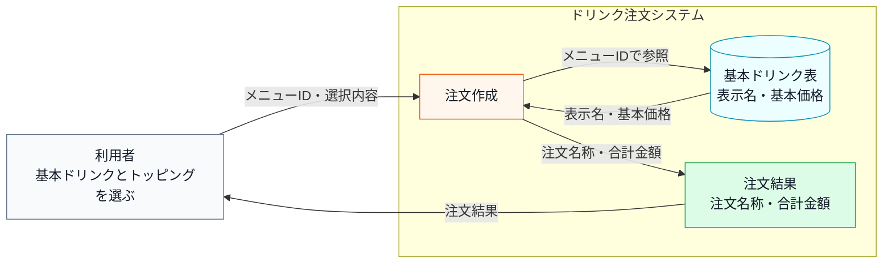
```mermaid
flowchart LR
    U["利用者<br>基本ドリンクとトッピングを選ぶ"] -->|"メニューID・選択内容"| O

    subgraph ORDER["ドリンク注文システム"]
        O["注文作成"]
        M[("基本ドリンク表<br>表示名・基本価格")]
        R["注文結果<br>注文名称・合計金額"]
        O -->|"メニューIDで参照"| M
        M -->|"表示名・基本価格"| O
        O -->|"注文名称・合計金額"| R
    end

    R -->|"注文結果"| U

    classDef actor fill:#f8fafc,stroke:#64748b,color:#111827;
    classDef data fill:#ecfeff,stroke:#0891b2,color:#111827;
    classDef process fill:#fff7ed,stroke:#ea580c,color:#111827;
    classDef result fill:#dcfce7,stroke:#16a34a,color:#111827;
    class U actor;
    class M data;
    class O process;
    class R result;
```

上の文章と表で仕様を一通り確認したので、まず正常に注文を組み立てられる場合の入力・判定・加工・出力の流れとして整理します。

**システム内部図：正常系の入力・判定・加工・出力**

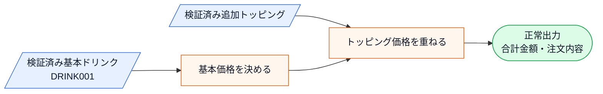
```mermaid
flowchart LR
    A[/検証済み基本ドリンク<br>DRINK001/]:::input --> E[基本価格を決める]:::process
    C[/検証済み追加トッピング/]:::input --> F[トッピング価格を重ねる]:::process
    E --> F
    F --> G([正常出力<br>合計金額・注文内容]):::normal

    classDef input fill:#e7f0ff,stroke:#2563eb,color:#111827;
    classDef process fill:#fff7ed,stroke:#ea580c,color:#111827;
    classDef decision fill:#fef9c3,stroke:#ca8a04,color:#111827;
    classDef normal fill:#dcfce7,stroke:#16a34a,color:#111827;
```

この図から読み取ることは、次の3点です。

- 注文結果は、基本ドリンクにトッピングを重ねることで決まる。
- 注文名と合計金額は別々の出力だが、どちらも同じトッピング選択の影響を受ける。
- 正常系では、メニュー表に登録済みの基本ドリンクと、現状コードが固定で扱う3種類のトッピングから注文名と合計金額を返す。

このシステムには、メニューとトッピングの価格・種類を決める**商品企画部**、スタッフに表示する注文名称のルールを管理する**店舗オペレーション部**、コードを保守する**開発チーム**の3者が関わっています。

**現在のメニューと価格**

この章のカフェ注文システムでは、「基本ドリンク」と「トッピング」を分けて管理します。基本ドリンクは注文の土台（ベース価格）として固定されており、トッピングはあとから積み上げて合計価格に加算されます。

| 種別 | ID/指定名 | 表示名 | 価格 |
|---|---|---|---|
| 基本ドリンク | DRINK001 | ホットコーヒー | 400円 |
| トッピング | Milk | Milk | +50円 |
| トッピング | Syrup | Syrup | +30円 |
| トッピング | Whip | Whip | +70円 |

価格は商品企画部が決定する想定ですが、現状システムでは基本価格だけが基本ドリンク表にあり、トッピング価格は注文計算へ直書きされています。この業務上の置き場所とシステム上の置き場所のずれも、後で構造を見直す材料になります。

トッピングは複数追加できます。注文名称の表示例：ホットコーヒー + Milk + Syrup

この「注文名称」はお客様向けの表示ではなく、ドリンクを作る**スタッフへの作業指示**として使われます。「ホットコーヒー + Milk + Syrup」と表示されれば、スタッフはその順番で材料を足していけばよい、という設計です。表示のルールや区切り文字（「 + 」など）は店舗ごとに独自のルールを持つことがあり、このシステムでは店舗オペレーション部が管理する領域です。

**エラー条件**

正常系の仕様を一通り確認したうえで、最後に、注文組み立てへ進めない入力を分けて整理します。

| エラー条件 | どこで分かるか | 出力 | 保存・通知などの副作用 |
|---|---|---|---|
| 基本ドリンクが選択されていない | 注文作成前 | 商品未選択エラー | 注文作成なし |
| 基本ドリンクのメニューIDが未登録 | メニュー検索時 | 未登録メニューエラー | 注文作成なし |

現状の公開入力は固定3種の真偽値なので、未対応トッピング名そのものを渡す経路はありません。任意のトッピング名、販売停止、在庫切れを入力として扱うのは1-5（変更要求）の変更後仕様です。

---

### 1-2：動作例テーブル

コードを読む前に、このシステムがどんな注文に対してどんな表示と金額を返すかを確認します。ここでは、フェーズ1の現状コードで扱える Milk・Syrup・Whip の組み合わせだけを基準にします。

| 注文内容 | 注文名称 | 合計金額 |
| --- | --- | --- |
| ホットコーヒーのみ | ホットコーヒー | 400円 |
| ホットコーヒー + Milk | ホットコーヒー + Milk | 450円（400 + 50） |
| ホットコーヒー + Milk + Syrup | ホットコーヒー + Milk + Syrup | 480円（400 + 50 + 30） |
| ホットコーヒー + Milk + Whip | ホットコーヒー + Milk + Whip | 520円（400 + 50 + 70） |
| ホットコーヒー + Syrup + Whip | ホットコーヒー + Whip + Syrup | 500円（400 + 70 + 30） |
| 未登録メニューID | エラー表示 | 注文を作成しない |

この表がフェーズ1「現状把握」で把握する現状の動作です。注文内容から注文名称と合計金額を予測できることが、次のクラス構成を読むための前提になります。

---

### 1-3：登場クラスとクラス構成図

#### このシステムの登場クラス

| クラス名 | 役割 | 担当する仕様 |
|---|---|---|
| `CustomDrink` | ドリンク1注文の全情報を保持し、合計金額と注文名称を返す | 基本ドリンク選択・トッピング組み合わせ・金額計算・名称生成 |
| `MenuItem` | メニュー1件分の情報を表す | 商品名・基本価格の受け渡し |
| `MenuDatabase` | メニューIDから商品名と基本価格を検索する | メニューIDの存在確認・商品情報の取得 |

**データの流れ：** `main()` → `MenuDatabase`でIDを検索 → `CustomDrink`コンストラクタ（ベース名・価格・各トッピングフラグ） → `getPrice()` / `getDescription()` → 画面出力

**注目ポイント：** 現在は `CustomDrink` という1クラスがすべての処理を担っています。`MenuDatabase` はメニューIDから商品情報を引き出すためのデータ層として機能しています。

---

#### 補足：クラス構成図

システムのクラス構成を可視化します。クラス図の矢印ラベルに「商品情報を取得」のような依存目的を書くこと自体は問題ありませんが、値が時間順にどう渡るかはシーケンス図で示します。ここではクラス、所有・利用関係、操作だけを扱います。`main()` はクラスではないため図へ入れず、Composition Rootとして生成・利用する事実をnoteと直後の表で補います。

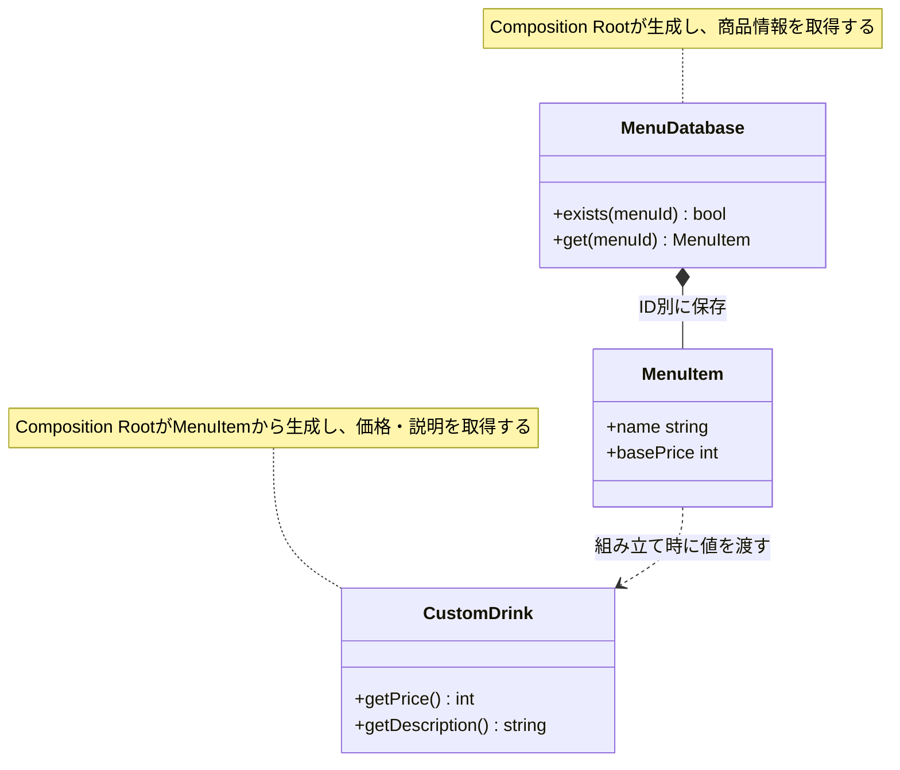
```mermaid
classDiagram
    direction TB
    class MenuDatabase {
        +exists(menuId) bool
        +get(menuId) MenuItem
    }
    class MenuItem {
        +name string
        +basePrice int
    }
    class CustomDrink {
        +getPrice() int
        +getDescription() string
    }
    MenuDatabase *-- MenuItem : ID別に保存
    MenuItem ..> CustomDrink : 組み立て時に値を渡す
    note for MenuDatabase "Composition Rootが生成し、商品情報を取得する"
    note for CustomDrink "Composition RootがMenuItemから生成し、価格・説明を取得する"

    classDef focus fill:#FFF2CC,stroke:#D6B656,stroke-width:2px,color:#222222
    cssClass "CustomDrink" focus
```

**図に出てくる主なデータと操作**

| 要素 | データ・操作 | 何ができるか |
|---|---|---|
| `main()` | メニューID、トッピング指定 | 注文入力を組み立て、必要なクラスを呼び出す |
| `MenuDatabase` | `exists()` / `get()` | メニューIDの存在確認と、商品名・基本価格の取得を行う |
| `CustomDrink` | `baseName` / `basePrice` | 基本ドリンク名と基本価格を保持する |
| `CustomDrink` | `hasMilk` / `hasWhip` / `hasSyrup` | どのトッピングを追加するかをフラグで保持する |
| `CustomDrink` | `getPrice()` / `getDescription()` | 合計金額と注文名称を返す |


この図が示す通り、`main()` は `MenuDatabase` から商品情報を取り出し、その値を使って `CustomDrink` を組み立てています。`CustomDrink` は、ドリンクの基本情報とすべてのトッピング情報を受け取り、注文名と合計金額を返す構成になっています。

**現状システムの処理シーケンス**

静的な関係に続けて、正常系（トッピング付き注文1件）で各クラスがどの順に呼ばれ何を受け渡すかを時系列で示します。価格・名称を組み立てる具体の分岐は `CustomDrink` の注記に、エラー系はメモとして添えます。1-4の現状コードを読む前の地図です。

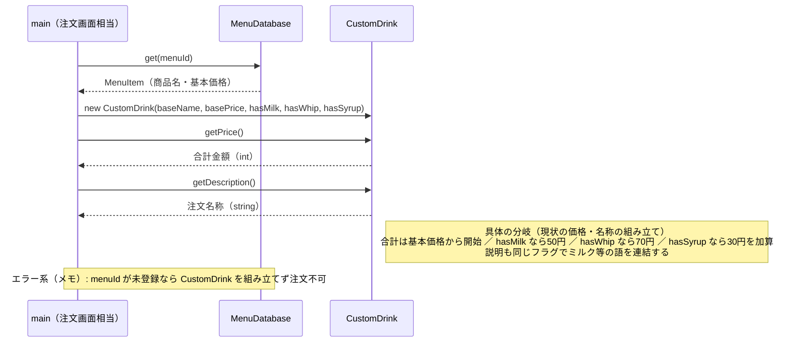
```mermaid
sequenceDiagram
    participant Main as main（注文画面相当）
    participant DB as MenuDatabase
    participant CD as CustomDrink
    Main->>DB: get(menuId)
    DB-->>Main: MenuItem（商品名・基本価格）
    Main->>CD: new CustomDrink(baseName, basePrice, hasMilk, hasWhip, hasSyrup)
    Main->>CD: getPrice()
    CD-->>Main: 合計金額（int）
    Main->>CD: getDescription()
    CD-->>Main: 注文名称（string）
    Note right of CD: 具体の分岐（現状の価格・名称の組み立て）<br>合計は基本価格から開始 ／ hasMilk なら50円 ／ hasWhip なら70円 ／ hasSyrup なら30円を加算<br>説明も同じフラグでミルク等の語を連結する
    Note over Main,DB: エラー系（メモ）: menuId が未登録なら CustomDrink を組み立てず注文不可
```

図から読み取れるのは、`main()` がメニューを引いて `CustomDrink` を1個組み立て、`getPrice()`／`getDescription()` を呼ぶこと、合計金額と名称は `CustomDrink` 内部の `hasMilk`／`hasWhip`／`hasSyrup` フラグの分岐で決まることです。トッピングごとの加算・連結が1クラスに集まっている呼び出し順を、この時系列と注記で確認できます。


**この章での簡略化**

この章では、注文画面とレシート発行を省略し、注文名と金額の計算結果を中心に確認します。実システムなら画面表示やレシート発行は別の境界へ渡しますが、現状コードは `std::cout` で直接表示します。在庫引当、販売停止、任意のトッピング名の入力は扱わず、固定3種（Milk・Whip・Syrup）の真偽値だけを扱います。

---

### 1-4：実装コード（現状）

固定3種の選択が価格加算と名称生成へどう使われるかを次のコードで確認します。

このシステムには、注文対象となる次の2件の基本ドリンクがあらかじめ登録されています。食品は対象外なので、ドリンク用トッピングを食品へ適用する入力はありません。

| メニューID | 商品名 | 基本価格 |
|---|---|---|
| DRINK001 | ホットコーヒー | 400円 |
| DRINK002 | アイスコーヒー | 450円 |

登録されていないIDを指定するとエラーになります。コードを読む前にこの対応を把握しておくと、動作結果が追いやすくなります。

#### 現状コード

定義を1つずつ、上から順に読みます。**メンバー変数と、それを使う処理を同じ場所で見られるように**しています。この章には手順を持つ関数がないので、宣言と定義を分けたクラスはありません。

`main()` と実行結果は最後に、行のまとまりごとに並べます。上から順に連結すれば、そのまま1つのC++14プログラムとして動きます。

---

**共通ヘッダー**

```cpp
#include <iostream>
#include <string>
#include <map>

using namespace std;
```

以降のすべてのクラスが使います。

---

**MenuItem と MenuDatabase**

1-1（このシステムの仕様）の「メニュー」にあたるデータです。メニューIDから商品名・基本価格を引き、エラー条件「登録されていないID」もここで判定します。

```cpp
struct MenuItem {
    string name;      // 商品名
    int basePrice;    // 基本価格（円）
};
```

**MenuDatabase**

このブロックでは `MenuDatabase` の定義だけを確認します。

```cpp
class MenuDatabase {
private:
    map<string, MenuItem> items;
public:
    MenuDatabase() {
        items["DRINK001"] = {"ホットコーヒー", 400};
        items["DRINK002"] = {"アイスコーヒー", 450};
    }

    bool exists(const string& id) const {
        return items.count(id) > 0;
    }

    MenuItem get(const string& id) const {
        return items.at(id);
    }

    void save(const string& id, const MenuItem& item) {
        items[id] = item;             // 実行中のメニュー表へ追加
    }
};
```

- **責任：** メニューIDから存在確認と商品情報の取得を行う
- **副作用：** `save()` を呼んだときだけ登録表が増える

実システムの商品DBを、実行終了まで覚えているインメモリの `std::map` で代替しています。

---

**CustomDrink**

この章の中心です。1-1の「注文内容の合成」——基本ドリンクにトッピングを重ねて金額と表示名を作る処理——に対応します。

```cpp
class CustomDrink {
private:
    string baseName;
    int basePrice;
    // トッピングごとの状態をフラグで管理している
    bool hasMilk;
    bool hasWhip;
    bool hasSyrup;

public:
    CustomDrink(string name, int price, bool milk, bool whip, bool syrup)
        : baseName(name), basePrice(price),
          hasMilk(milk), hasWhip(whip), hasSyrup(syrup) {}

    int getPrice() const {
        int total = basePrice;
        // トッピングごとの追加料金を計算
        if (hasMilk)  total += 50;
        if (hasWhip)  total += 70;
        if (hasSyrup) total += 30;
        return total;
    }

    string getDescription() const {
        string desc = baseName;
        // トッピングごとの名前を追加
        if (hasMilk)  desc += " + Milk";
        if (hasWhip)  desc += " + Whip";
        if (hasSyrup) desc += " + Syrup";
        return desc;
    }
};
```

トッピングの有無を `hasMilk` / `hasWhip` / `hasSyrup` の3つのフラグで保持します。`getPrice()` は各フラグを `if` で見て追加料金を足し、`getDescription()` は各フラグを見て表示名にトッピング名を足します。**トッピングの種類・価格・表示名を、このクラスがすべて直接持っています。**

---

**showOrder()**

1件分の注文を組み立てて表示する、`main()` から呼ぶヘルパーです。

```cpp
// 呼び出し側のコード（モバイルアプリを想定）
// 1件分の注文を表示する（mainから呼ぶ表示ヘルパー）
void showOrder(MenuDatabase& db, const string& itemId,
               bool milk, bool whip, bool syrup) {
    if (!db.exists(itemId)) {
        cout << "エラー：メニューID " << itemId
             << " は存在しません" << endl;
        return;
    }

    MenuItem item = db.get(itemId);
    CustomDrink order(
        item.name, item.basePrice, milk, whip, syrup);
    cout << "注文内容: " << order.getDescription() << endl;
    cout << "合計金額: " << order.getPrice() << "円" << endl;
}
```

受け取るのは注文そのもの（メニューIDとトッピングの選択）だけです。動作例テーブルの何行目かは注文の一部ではないので、照合用のラベルは `main()` 側で出します。存在しないIDはここで止まり、`CustomDrink` は作られません。

---

#### `main()` と実行結果

1-2（動作例テーブル）の5つの正常系と未登録メニューIDを、行ごとに区切って実行します。代表ケースは行3の「ホットコーヒー + Milk + Syrup」です。

---

**行1：ホットコーヒー・トッピングなし**

```cpp
int main() {
    MenuDatabase db;

    cout << "--- 行1 ---" << endl;
    showOrder(db, "DRINK001", false, false, false);
```

```
--- 行1 ---
注文内容: ホットコーヒー
合計金額: 400円
```

フラグが3つとも `false` なので、基本価格400円がそのまま合計になります。

---

**行2：＋Milk**

```cpp
    cout << "--- 行2 ---" << endl;
    showOrder(db, "DRINK001", true,  false, false);
```

```
--- 行2 ---
注文内容: ホットコーヒー + Milk
合計金額: 450円
```

---

**行3：＋Milk＋Syrup（代表ケース）**

```cpp
    cout << "--- 行3 ---" << endl;
    showOrder(db, "DRINK001", true,  false, true);
```

```
--- 行3 ---
注文内容: ホットコーヒー + Milk + Syrup
合計金額: 480円
```

基本価格400円にMilk 50円とSyrup 30円が加わりました。名称と合計金額の両方へ、同じ選択が反映されています。

---

**行4：＋Milk＋Whip**

```cpp
    cout << "--- 行4 ---" << endl;
    showOrder(db, "DRINK001", true,  true,  false);
```

```
--- 行4 ---
注文内容: ホットコーヒー + Milk + Whip
合計金額: 520円
```

---

**行5：＋Whip＋Syrup**

```cpp
    cout << "--- 行5 ---" << endl;
    showOrder(db, "DRINK001", false, true,  true);
```

```
--- 行5 ---
注文内容: ホットコーヒー + Whip + Syrup
合計金額: 500円
```

表示は `Whip → Syrup` の順です。これは選んだ順ではなく、`getDescription()` の `if` が並んでいる順です。呼び出し側から選択順を渡す手段がありません。

---

**行6：存在しないメニューID**

```cpp
    cout << "--- 行6 ---" << endl;
    showOrder(db, "DRINK999", false, false, false);

    return 0;
}
```

```
--- 行6 ---
エラー：メニューID DRINK999 は存在しません
```

---

動作例テーブルの全6行と同じ結果です。行ごとの合計と名称は、`CustomDrink` が持つ3つのフラグと `if` の並びだけで決まっています。このコードを見ると、`CustomDrink` クラスがどのトッピングがいくらで、どんな名前になるかをすべて直接知っていることが分かります。

---

> **手元で動かすには**
> このコードは1つの `.cpp` に貼り付けて、そのままコンパイル・実行できます（例：`g++ chapter06.cpp -o app && ./app`）。`main()` は自由に組み替えて構いません。たとえば `db.save("DRINK003", {"抹茶ラテ", 500});` で基本ドリンクを足し、その `DRINK003` を注文の基本ドリンクにしてトッピングを重ねれば、追加した商品の注文名と合計金額がその場の実行結果に表れます。メニューデータはプロセス実行中だけ有効で、終了すると消えます（永続化はこの章の論点ではありません）。
>
> **掲載用1ファイルと実務の分割：** この1つの`.cpp`は、手元で動かすための掲載形式です。実務では、第0章「掲載ブロックと実ファイルの分け方」に従い、公開する契約・宣言を`.h`、処理本体を`.cpp`、生成・登録・注入を`main.cpp`へ置くことを基本にします。

#### 仕様入力が現状コードで使われるまで

1-1の代表例「ホットコーヒー + Milk + Syrup」を、メニューIDと3つの選択フラグから同じ名称・金額へつなげます。

| 仕様入力 | コード上の受け取り口 | 実際に使う箇所 | 結果への現れ方 |
|---|---|---|---|
| 基本ドリンクID | `main()` の `itemId` | `MenuDatabase::exists()` / `get()` | 基本名・基本価格、または未登録エラーになる |
| Milk・Whip・Syrupの選択 | `CustomDrink` コンストラクタの3フラグ | `getPrice()` / `getDescription()` の各 `if` | 選択した名称と追加料金が両方へ反映される |
| 基本名・基本価格 | `MenuItem` から `CustomDrink` へ渡す | 名称と合計金額の初期値にする | 「ホットコーヒー」と400円が出力の土台になる |

### 1-5：変更要求

**変更要求の発生チーム：** 今回の変更要求は**商品企画部**から届いています。トッピングの種類・価格を管理するチームです。開発チームは受け手となります。この点は、フェーズ2「仮説立案」で「どの業務機能に属する知識か」を確認する際に使います。

**仕様変更の内容**

変更内容を、実行結果で判定できる確定要求へ分けます。

| 変更依頼ID | 確定した変更内容 | 入力 | 受入条件 |
|---|---|---|---|
| 変更ID1 | Matcha（60円）とChoco（40円）を追加する | 基本ドリンク、追加トッピング | 既存トッピングと同じ方法で名称と価格へ加算される |
| 変更ID2 | 利用者が指定した順にトッピングを重ねる | 順序付きトッピング列 | 出力名が入力順と一致し、合計価格も全要素を反映する |
| 変更ID3 | 販売停止・在庫切れのトッピングを注文前に拒否する | トッピングID、販売可否 | 注文を生成せず販売不可エラーを返す |

#### 変更後要求ベースライン

| 要求ID | 変更種別・根拠となる変更ID | 変更後要求 | 受入条件 |
|---|---|---|---|
| 要求ID1 | 継続<br/>根拠: — | 登録済みの基本ドリンクを選ぶ | ドリンク名と基本価格を取得し、未登録IDを拒否する |
| 要求ID2 | 変更<br/>根拠: 変更ID1, 変更ID2 | Matcha・Chocoを含む複数トッピングを指定順で重ねる | 入力順に名称が並び、全要素の価格が加算される |
| 要求ID3 | 変更<br/>根拠: 変更ID3 | 販売停止・在庫切れ・不正なトッピングを拒否する | 理由を返し、注文名・金額を確定しない |
| 要求ID4 | 継続<br/>根拠: — | 確定した注文の注文名と合計金額を記録する | 注文ごとに注文内容と合計金額が残る |

**変更前→変更後の要求対照（今回変える要求IDだけ）**

現行ベースラインと変更後ベースラインを往復せずに済むよう、今回変える要求IDだけを取り出し、変更前と変更後を同じ行へ並べます。

| 要求ID | 変更前の要求（現行） | 変更後の有効要求 | 根拠変更ID |
|---|---|---|---|
| 要求ID2 | Milk・Whip・Syrupを組み合わせて注文名と合計金額へ反映する | Matcha・Chocoを含む複数トッピングを指定順で重ねる | 変更ID1・変更ID2 |
| 要求ID3 | 利用不可の組合せや不正入力を拒否する | 販売停止・在庫切れ・不正なトッピングを拒否する | 変更ID3 |

要求ID1は継続（変更前＝変更後）のため対照表には載せません。変更後ベースラインで内容を確認できます。

変更要求を受けて、選択できるトッピングがどう変わるかを整理します。

| 項目 | 変更前 | 変更後 |
|---|---|---|
| トッピングの種類 | Milk・Syrup・Whip（3種） | **Milk・Syrup・Whip・Matcha・Choco（5種）＋販売停止の登録例としてSeasonalMint** |
| 抹茶パウダー（Matcha） | 選択不可 | **+60円で追加可能** |
| チョコチップ（Choco） | 選択不可 | **+40円で追加可能** |
| 重ね順 | フラグの判定順（Milk → Whip → Syrup）に表示 | **注文で指定した順のまま価格と表示名へ反映** |
| 販売可否 | 未対応 | **販売停止・在庫切れのトッピングは注文作成前に拒否** |

**変更後のトッピング処理と確認点**

| 追加する複雑さ | 具体例 | この章で見ること |
|---|---|---|
| トッピングの重ね順 | Milk → Matcha → Choco の順に表示する | 包む順序が出力名と価格再計算へ反映されるか |
| 在庫/販売停止 | SeasonalMint が販売停止中なら注文を作らない | 追加機能そのものと、追加可否の判定を分けられるか |
| 価格再計算 | 価格改定後も合計額へ反映する | 価格知識を対象トッピングクラスへ寄せられるか |
| 表示名再計算 | 店舗向けの作業指示名を組み直す | 表示名も価格と同じ契約で重ねられるか |

今回変えるのはトッピングの組み立てと追加可否です。メニュー情報の保存・取得は仕様変更の対象ではないため、次の共通基盤は変更前後で維持します。

| 変更対象外の共通基盤 | 変更前 | 変更後 |
|---|---|---|
| `MenuDatabase` | メニュー情報を保存・取得する | **変更なし** |
| `MenuItem` | 商品名と基準価格を表す | **変更なし** |

**変更後の出力例**

| 注文内容 | getDescription() | getPrice() |
|---|---|---|
| ホットコーヒー + Matcha | `ホットコーヒー + Matcha` | 460円（400 + 60） |
| ホットコーヒー + Choco | `ホットコーヒー + Choco` | 440円（400 + 40） |
| ホットコーヒー + Milk + Matcha + Choco | `ホットコーヒー + Milk + Matcha + Choco` | 550円（400 + 50 + 60 + 40） |

ベースドリンクの価格と既存トッピング（Milk・Syrup・Whip）の価格・名称は変更なしです。新しいトッピングを追加しても、既存の組み合わせ構造の動作は変わりません。

**変更前後の入力・判定・加工・出力差分**

1-1の現状仕様を退避し、変更要求を当てた後の仕様と同じ粒度で並べます。以降の分析では、この差分を追います。

| 要素 | 変更前（1-1の現状仕様） | 変更後（今回の要求） | 差分として追うもの |
|---|---|---|---|
| 入力 | 基本ドリンク、Milk/Syrup/Whip | 基本ドリンク、Milk/Syrup/Whip/Matcha/Choco、選択順、販売可否 | トッピングの種類、順序、使える/使えない状態が増える |
| 判定 | トッピングが有効か | 追加されたMatcha/Chocoも有効か、販売停止/在庫切れでないか | 有効な選択肢と販売可否が増える |
| 加工 | トッピング価格と説明を重ねる | 選択順に新トッピングの価格と説明も同じ流れで重ねる | 組み合わせ方は維持し、部品だけ増える |
| 出力 | 注文名と合計金額 | Matcha/Chocoを含む注文名と合計金額、販売不可エラー | 出力名と金額の組み合わせが増え、拒否ケースも増える |

**変更後の入力・加工・出力**

変更後の仕様を、1-1と同じ粒度で、正常系の入力・判定・加工・出力として確認します。1-1の図との差分は、入力の「追加トッピング」の選択肢が3種から5種へ増えること、販売可否を確認すること、選択順に価格と表示名を重ね直すことです。判定・加工・出力の骨格は変わりません。

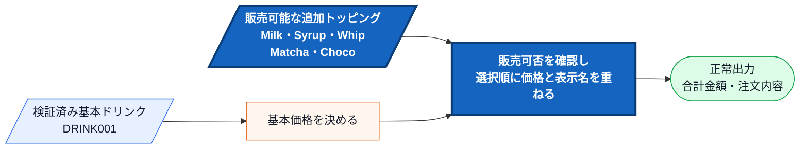
```mermaid
flowchart LR
    A[/検証済み基本ドリンク<br>DRINK001/]:::input --> E[基本価格を決める]:::process
    C[/販売可能な追加トッピング<br>Milk・Syrup・Whip<br>Matcha・Choco/]:::input --> F[販売可否を確認し<br>選択順に価格と表示名を重ねる]:::process
    E --> F
    F --> G([正常出力<br>合計金額・注文内容]):::normal

    classDef input fill:#e7f0ff,stroke:#2563eb,color:#111827;
    classDef process fill:#fff7ed,stroke:#ea580c,color:#111827;
    classDef decision fill:#fef9c3,stroke:#ca8a04,color:#111827;
    classDef normal fill:#dcfce7,stroke:#16a34a,color:#111827;
    classDef changed fill:#1565c0,stroke:#0b3d76,stroke-width:3px,color:#ffffff,font-weight:bold;
    class C,F changed;
```

この図から読み取ることは、次の3点です。

- 変わるのは「追加トッピング」の選択肢（Matcha・Chocoの2種が加わる）と、販売可否の判定対象である。
- 「トッピングは有効か」「販売可能か」の判定を通ったものだけ、選択順に価格と表示名へ反映する。
- 基本ドリンクの価格決定と、合計金額・注文内容という出力の形は変わらない。

変更後も、失敗条件は正常系図へ混ぜずに別で確認します。

| エラー条件 | どこで分かるか | 出力 | 保存・通知などの副作用 |
|---|---|---|---|
| 基本ドリンクが選択されていない | 注文作成前 | 商品未選択エラー | 注文作成なし |
| トッピングが対応一覧にない | トッピング確認時 | 未対応トッピングエラー | 注文作成なし |
| トッピングが販売停止または在庫切れ | 販売可否確認時 | 販売不可エラー | 注文作成なし |

選択肢が2つ増えるだけの変更が、実際のコードではどれだけの修正になるかを、フェーズ3「問題特定」で変更を試すコードで確認します。

しかし、「これは1回限りの変更なのか、今後も続くのか」をすぐにコードで対応する前に確認しておきたいと思います。

**フェーズ1のまとめ：今回追う変更ID一覧**

| 変更ID | 変更依頼の要点 | 関係する要求ID（追加は変更後ID） |
|---|---|---|
| 変更ID1 | Matcha（60円）とChoco（40円）を追加する | 要求ID2 |
| 変更ID2 | 利用者が指定した順にトッピングを重ねる | 要求ID2 |
| 変更ID3 | 販売停止・在庫切れのトッピングを注文前に拒否する | 要求ID3 |


---

## 🟣 フェーズ2：仮説立案 ―― 何が変わるかを観察し、ヒアリングで裏付ける
フェーズ1「現状把握」でシステムの現状を整理しました。次のフェーズ2「仮説立案」では、現場に届いた変更要求を起点にして「何が変わる見込みで、今回何を維持するか」の仮説を立て、関係者とのヒアリングで裏付けます。責任配置の評価は、変更要求を当てた後の痛みと合わせて確認します。

### 2-1：変わりそうな仕様の見当をつける

フェーズ1「現状把握」で整理した仕様をもとに、「どの仕様に変更の見込みがあり、今回どこを維持するか」を見立てます。責務配置の評価は、変更を当てたときの痛みと合わせてフェーズ3「問題特定」とフェーズ4「原因分析」で確認します。

変わりそうな仕様は、1-3（登場クラスとクラス構成図）のクラス図の中心 `CustomDrink` の `getPrice()` / `getDescription()` の中にあります。トッピングごとの価格・表示名・組み合わせを、どんな仕様が、誰の何をきっかけに変わりそうかと一緒に整理します。

| 変わりそうな仕様 | 所在（クラス・メソッド） | 変える主体・きっかけ | 現時点の仮説 |
|---|---|---|---|
| トッピングの種類 | `CustomDrink` のフラグと両メソッドの分岐 | 商品企画部の毎月のキャンペーン | 変更候補 |
| トッピングの追加価格 | `getPrice()` 内の `total += ...` | 料金・プロモーション管理の価格改定 | 変更候補 |
| 表示名とその並び順 | `getDescription()` 内の `desc += ...` | 店舗オペレーション部の運用見直し | 変更候補 |
| 販売可否（販売停止・在庫切れ） | 注文作成時の可否判定 | 商品・店舗運用の在庫とキャンペーン終了 | 変更候補 |
| 基本価格にオプションを積み上げる骨格 | `getPrice()` の加算の枠組み | 今回の要求では基本価格から順に加算する流れを変更しない | 今回維持する |

見えてくるのは、**1つの `CustomDrink` の中で、トッピングの種類・追加価格・表示名・販売可否という仕様に、商品企画部や店舗オペレーションの都合による変更が見込まれる**という仮説です。一方、基本価格にオプションを積み上げる処理順は、今回維持する前提に置きます。

ここで見るのは所在だけです。責任の多さや構造の善し悪しは、変更を当てて痛みを観測してから判断します。上の表は、変わりそうな仕様が `CustomDrink` のどのメソッドのどの行にあるかという所在の見立てです。トッピングの知識を1つのクラスにまとめている今の配置が、変更要求を当てたときに**実際に痛みになるか**はフェーズ3「問題特定」で確かめ、なぜ辛いのかはフェーズ4「原因分析」で原因として言語化します。2-1（変わりそうな仕様の見当をつける）は、その検証対象に当たりをつける段階です。

#### ヒアリングで確認すること

トッピングの種類・価格・回数という見当ごとに、今後の変化を確認する質問を決めます。

| 見当 | 現時点の仮説 | 確認する質問 | 確認先 |
|---|---|---|---|
| 種類 | 季節ごとに追加・廃止される | トッピングは今後も入れ替わるか | 商品企画部 |
| 価格 | 原材料費などで改定される | 追加価格はどの程度の頻度で変わるか | 商品企画部 |
| 追加回数 | 真偽値では足りなくなる | 同じトッピングを複数回加える要求があるか | 商品企画部 |

2-3（関係者ヒアリング）ではこの質問に沿って、今回追加する二種類の先にある変化を確認します。

### 2-2：今回の変更で確実に変わること

1-5（変更要求）で確定した変更IDを、そのまま今回確実に変わることとして確認します。章ごとに異なる色や記号は使わず、以降でも同じ変更IDで追跡します。

- **変更ID1：Matcha（60円）とChoco（40円）を追加する**
- **変更ID2：利用者が指定した順にトッピングを重ねる**
- **変更ID3：販売停止・在庫切れのトッピングを注文前に拒否する**

ただし「この変更が1回限りか、今後も続くか」によって、どこまで設計を変えるべきかが大きく変わります。関係者に確認します。

---

### ヒアリングに向けた背景確認

このシステムは、全国展開する人気カフェチェーンのモバイルオーダーを裏側で支える注文管理システムです。お客様がスマートフォンから事前にドリンクを注文し、店舗でスムーズに受け取れる仕組みを提供しています。

システムが立ち上がった当初、メニューはホットコーヒーとアイスコーヒーというシンプルな基本ドリンクだけでした。しかし、ビジネスが成長し「自分好みにカスタマイズしたい」というお客様の声が大きくなるにつれて、ミルクの追加、ホイップの増量、シロップの変更など、多種多様なトッピング機能が追加されてきました。店舗のオペレーションと連動するため、注文システムは正確な「合計金額」と、ドリンクを作るスタッフに伝えるための「注文内容（名前）」を算出する重要な役割を担っています。

### 2-3：関係者ヒアリング


確定変更を携えて、商品企画部の佐藤マネージャーとのミーティングの時間を設定しました。なお、ヒアリングで出てきた情報は「今回確定している変更」と「将来変わりうるリスク」に分けて後で整理します。

**開発者：** 「今回の『抹茶パウダー』と『チョコチップ』の追加の件、システムへの組み込みを検討しています。一つ確認させてください。今後もこのように、新しいトッピングの種類は増え続けると考えてよいでしょうか？」

**佐藤マネージャー：** 「もちろんです！お客様の反応が良いので、毎月の季節キャンペーンごとに新しいカスタマイズをどんどん追加していく予定です。逆に、あまり人気のないトッピングはメニューから落としていく（廃止する）ことも考えています。」

**開発者：** 「なるほど、トッピングの種類は毎月のように入れ替わるのですね。ちなみに、各トッピングの価格（例えばミルク50円など）は今のところ固定ですが、これは今後も変わらないでしょうか？」

**佐藤マネージャー：** 「あ、実は原材料費の高騰もあって、来月から一部のトッピングを値上げする構想があります。価格改定は年に数回はあると思っておいてください。」

**開発者：** 「承知しました。価格も変動する要素ですね。他に、将来的に変わりそうなカスタマイズのルールや、お客様からの要望で実現したいことはありますか？ 今のうちにシステムの土台に備えをしておきたいので。」

**佐藤マネージャー：** 「そうですね……熱心なお客様から『ホイップを通常の2倍（ダブル）にしてほしい』とか『チョコチップを3倍（トリプル）で』という要望がかなり来ています。今はシステム上できないとお断りしているんですが、将来的には『同じトッピングを複数回追加できる機能』も実現したいですね。」

ヒアリングを通じて、当初の確定変更の裏側に、今の真偽値（booleanフラグ）の構造では到底太刀打ちできない将来の変化まで見えてきました。こうした未知の要件を初期段階で引き出せたことは、設計の見通しを立てる上で大きな前進です。

---

### 2-4：ヒアリングで判明した将来リスク

佐藤マネージャーとの対話から浮かび上がった、確定変更ではないが今後変わりうるリスクをまとめます。確定変更とは混在させず、将来リスクだけを整理します。

| リスクID | 将来リスク | 時期の目安 | 根拠 |
|---|---|---|---|
| リスクID1 | トッピングの種類の増減 | 毎月のキャンペーンごと | 商品企画部 佐藤マネージャーから直接確認 |
| リスクID2 | トッピングの価格改定 | 年に数回（原材料費等による） | 商品企画部 佐藤マネージャーから直接確認 |
| リスクID3 | 同じトッピングの複数回追加（ダブル、トリプル等） | 将来的な機能拡張時 | 商品企画部 佐藤マネージャーからの要望 |
| リスクID4 | サイズや前段価格で変わる追加料 | 次回サイズ展開時 | 大サイズでは追加量と料金が変わり、固定額の足し算だけでは表せない |
| リスクID5 | 販売停止・在庫切れの判定元の変化 | 店舗在庫やキャンペーン終了時 | 商品企画部・店舗オペレーション部の運用で変わる |
| リスクID6 | 表示名の順序ルール | 店舗オペレーション変更時 | スタッフの作業順に合わせる必要がある |

リスクID5は、販売停止・在庫切れの注文を拒否すること自体ではありません。それは変更ID3として今回確定済みです。将来変わりうるのは、可否を何から判定するか（手動の販売停止フラグか、在庫システムとの連動か）という判定元のほうです。

また、リスクID4〜リスクID6は2-3の対話には出ておらず、開発側がフェーズ1のコード構造から予見したものです。ヒアリングで確認した内容と区別して読んでください。

なお、注文内容の出力方法自体（画面表示からレシート印刷・キッチンディスプレイへの変更）もヒアリングで話題になりましたが、今回の変更対象ではないためリスクIDには起こさず対象外として記録します。出力方法はトッピング加算の軸とは独立した境界であり、本章で扱う装飾の重ね合わせの分離には影響しません。

ヒアリングを通じて、「トッピングに関する知識」は変化しやすく、今後もビジネスの成長に合わせて多様な要求がやってくることが見えてきました。当時の担当者の苦労を想像しながらも、そろそろこの `CustomDrink` クラスに背負わせている重荷を少し分けてあげる時期が来たのかもしれません。

フェーズ2「仮説立案」で、トッピングの種類が今後も高頻度で追加されそうだという見込みが明確になりました。次のフェーズ3「問題特定」では、今回確定している「新しいトッピングの追加」を今のコードのままで試みて、何が起きるかを確認します。

### 2-5：変わる見込みと今回維持する範囲を確定する

2-4（ヒアリングで判明した将来リスク）のリスクIDを、トッピングごとに変えられるようにする部分と、注文・価格計算の安定側へ分けます。「はい」は、フェーズ6で**種類・価格・重ね方が変わっても、基本ドリンクと注文の入口へ分岐を広げない構造か**を判定するための印です。

| リスクID・変化軸 | 変わる見込み | 変えられるようにする部分 | 今回維持する部分 |
|---|---|---|---|
| リスクID1：トッピングの種類の増減 | はい | トッピング固有の名前と追加責任 | 基本ドリンク、注文入力、価格と表示名の返却 |
| リスクID2：トッピングの価格改定 | はい | トッピングIDごとの価格 | 基本価格の取得、合計価格の返却 |
| リスクID3：同じトッピングの複数回追加（ダブル、トリプル等） | はい | 同じ部品を重ねる回数 | 一要素ずつ価格と表示名を加える規則 |
| リスクID4：サイズや前段価格で変わる追加料 | はい | 注文文脈を使う追加料の計算 | 基本ドリンクとトッピングを同じ入口で扱う契約 |
| リスクID5：販売停止・在庫切れの判定元の変化 | はい | トッピングごとの販売可否 | 注文生成前に可否を確認し、不可なら生成しない流れ |
| リスクID6：表示名の順序ルール | はい | トッピングを重ねる順序 | 各要素が自分の表示名を一つ加える規則 |

したがって2-5（変わる見込みと今回維持する範囲を確定する）の出力は、「トッピング固有の値・可否・重ね方は変えられるようにし、基本ドリンクと注文結果の契約は守る」という設計条件です。フェーズ3「問題特定」では変更ID1〜変更ID3だけを現在の構造へ適用し、リスクIDはフェーズ6の構造評価に使います。

---

## 🟣 フェーズ3：問題特定 ―― 変更の痛みを発見する
### 3-1：変更を試みる

> **この抜粋の外は、現状のままです。** 変更対象へ累積適用した部分だけを掲載し、商品検索など変更対象外の処理はフェーズ1のまま維持します。

変更ID1〜変更ID3は同じ現状構造へ順に加わります。3件を別々に見ると互いの影響が消えてしまうので、3件を重ねた一つのコードで確認します。フェーズ1の `MenuDatabase` による基本ドリンクIDの存在確認は維持し、ここでは変更が集中する `CustomDrink` と呼び出し側を実行可能な最小構成にしています。

変更ID2の「利用者が指定した順に重ねる」は、真偽値のフラグでは表せません。フラグは「選んだかどうか」しか持たず、並び順を置く場所がないからです。ここで素直に選ぶ手は一つで、選ばれたトッピング名を選択順に`vector`へ積み、取り出すときも積んだ順に読むことです。実際に担当者が最初に思いつくのもこの形なので、そのまま当ててみます。

変更した定義は3つです。1-4（実装コード）と同じ並び順で、上から見ていきます。

| 1-4での掲載単位 | 今回の変更 | 根拠 |
|---|---|---|
| （新規） | `ToppingSale` を追加 | 変更ID3 |
| `CustomDrink` | フラグ5つをやめて選択順の`vector`へ、価格分岐を2本追加 | 変更ID1・変更ID2 |
| `showOrder()` に相当する呼び出し側 | 注文を組み立てる前に販売可否を確認 | 変更ID3 |

---

**共通ヘッダー**

```cpp
#include <iostream>
#include <string>
#include <vector>

using namespace std;
```

---

**ToppingSale（追加）**

販売を止めているトッピングを持ちます。

```cpp
// 変更ID3：販売を止めているトッピングを持つ
struct ToppingSale {
    vector<string> stopped;                 // 販売停止・在庫切れの種類
    bool isStopped(const string& name) const {
        for (size_t i = 0; i < stopped.size(); ++i)
            if (stopped[i] == name) return true;
        return false;
    }
};
```

停止中の種類名を持ち、問い合わせに答えるだけです。**`CustomDrink` の外に作りました。** 積まれたトッピングをそのまま受け取る `CustomDrink` には、「注文へ重ねてよいか」を判定する場所がないからです。

---

**CustomDrink（変更あり）**

フラグ5つをやめ、選択順の `vector` へ置き換えます。

```cpp
class CustomDrink {
    string baseName;
    int basePrice;
    // 変更ID2：選ばれたトッピングを、選択順にそのまま積む
    vector<string> toppings;
public:
    CustomDrink(string name, int price)
        : baseName(name), basePrice(price) {}

    void addTopping(const string& name) {
        toppings.push_back(name);           // 変更ID2：積むだけ
    }

    int getPrice() const {
        int total = basePrice;

        for (size_t i = 0; i < toppings.size(); ++i) {
            const string& t = toppings[i];
            // 変更ID1：Matcha・Chocoのために分岐を2本足した
            if      (t == "Milk")   total += 50;
            else if (t == "Whip")   total += 70;
            else if (t == "Syrup")  total += 30;
            else if (t == "Matcha") total += 60;
            else if (t == "Choco")  total += 40;
        }

        return total;
    }

    string getDescription() const {
        string desc = baseName;

        for (size_t i = 0; i < toppings.size(); ++i)
            desc += " + " + toppings[i];    // 変更ID2：積んだ順に取り出す
        return desc;
    }
};
```

- **コンストラクタ引数が5個から2個へ：** トッピングは `addTopping()` で後から積む形になりました
- **`getDescription()` が2行に：** 種類ごとの `if` が消えました。積んだ順に読むだけです
- **`getPrice()` の `if` は残り、2本増えた：** 価格の知識は依然として `CustomDrink` の中の1か所に集まっています

順番の管理という変わる理由はクラスから消えましたが、**価格の知識は残りました。**

---

#### `main()` と実行結果

3件の変更要求を当てた注文と、最後に痛みを1つ確かめる注文を通します。販売可否の確認は、注文を組み立てる側に置くことになります。**見るのは動くかどうかではなく、変更ID1〜3を同じ構造へ重ねたとき何が解けて、どの痛みが残るかです。**

```cpp
int main() {
    ToppingSale sale;

    cout << "--- 変更ID1・2: Matcha・Chocoを指定順に追加 ---\n";
    CustomDrink added("ホットコーヒー", 400);
    added.addTopping("Milk");
    added.addTopping("Matcha");
    added.addTopping("Choco");
    cout << added.getDescription() << "\n";
    cout << added.getPrice() << " 円\n";

    cout << "\n--- 変更ID2: Syrup→Milkの順で注文 ---\n";
    CustomDrink ordered("ホットコーヒー", 400);
    ordered.addTopping("Syrup");
    ordered.addTopping("Milk");
    cout << ordered.getDescription() << "\n";
    cout << ordered.getPrice() << " 円\n";

    cout << "\n--- 変更ID3: 在庫切れのChocoを含む注文 ---\n";
    sale.stopped.push_back("Choco");
    vector<string> requested;
    requested.push_back("Milk");
    requested.push_back("Choco");
    CustomDrink unavailable("ホットコーヒー", 400);
    bool accepted = true;

    for (size_t i = 0; i < requested.size(); ++i) {
        // 変更ID3：注文を作る前に、呼び出し側が販売可否を調べる
        if (sale.isStopped(requested[i])) {
            cout << "エラー：トッピング " << requested[i]
                 << " は販売停止または在庫切れです\n";
            accepted = false;
            break;
        }

        unavailable.addTopping(requested[i]);
    }

    if (accepted) cout << unavailable.getDescription() << "\n";

    cout << "\n--- 痛みの確認: 種類名を間違えても素通りする ---\n";
    CustomDrink typo("ホットコーヒー", 400);
    typo.addTopping("Mlik");                // Milk のつづり違い
    cout << typo.getDescription() << "\n";
    cout << typo.getPrice() << " 円\n";

    return 0;
}
```

```text
--- 変更ID1・2: Matcha・Chocoを指定順に追加 ---
ホットコーヒー + Milk + Matcha + Choco
550 円

--- 変更ID2: Syrup→Milkの順で注文 ---
ホットコーヒー + Syrup + Milk
480 円

--- 変更ID3: 在庫切れのChocoを含む注文 ---
エラー：トッピング Choco は販売停止または在庫切れです

--- 痛みの確認: 種類名を間違えても素通りする ---
ホットコーヒー + Mlik
400 円
```

**動作は正しくなっています。** 期待される出力（ホットコーヒー 400円 + Milk 50円 + Matcha 60円 + Choco 40円 = 550円）が得られました。3件の変更要求を当てた結果を、1件ずつ見ていきます。

---

**変更ID2（利用者が指定した順にトッピングを重ねる）の結果**

これは素直に解けました。`vector`へ積んだ順に取り出すだけなので、`getDescription()` は種類ごとの `if` が消えて2行になり、順番の管理という別の変わる理由もクラスから消えました。実行結果のSyrup→Milkで、価格は同じ480円のまま表示順だけが入力どおり変わります。コンストラクタ引数も5個から2個へ減り、トッピングは `addTopping()` で後から積む形になったので、呼び出し側が全種類ぶんの真偽値をそろえる必要もなくなりました。

**この変更は、痛みを減らしています。** 当てた3件のうち、素直な作りの変更で解けるものは解ける、というのは大事な事実です。ここで残るものだけが、構造を変えないと解けない痛みです。

---

**変更ID1（Matcha・Chocoの2種類を追加する）の結果**

`getPrice()` の中の種類名で分岐する `if` の連鎖へ、1種類につき1本ずつ足しました。今回は2本です。価格の知識は依然として `CustomDrink` の中の1か所に集まっていて、種類を足すときにこのクラスを開きます。

そして `vector` へ変えたことで、新しい落とし穴が1つ生まれました。トッピングの種類が `string` になったため、**存在しない種類名を渡しても止まりません**。実行結果の最後にある `"Mlik"`（`Milk` のつづり違い）は、エラーにならず「ホットコーヒー + Mlik」「400円」として通ります。真偽値のフラグだった頃は、引数を間違えればコンパイルが通りませんでした。順番は解けましたが、種類の指定はコンパイラが守ってくれない約束に変わっています。

---

**変更ID3（販売停止・在庫切れのトッピングを注文前に拒否する）の結果**

`ToppingSale` を外に作り、`main()` 側で1件ずつ確認してから `addTopping()` を呼ぶ形になりました。Chocoを在庫切れにした実行結果では拒否できています。

ただし「販売停止のトッピングは注文にできない」という業務判断が、注文を組み立てる呼び出し側へ移りました。確認せずに `addTopping()` を呼ぶ経路があれば、販売停止のトッピングがそのまま注文になります。`addTopping()` はどんな文字列でも受け取るので、この抜け道は型では塞げません。

---

**3件を当てはめた結果：トッピング1種類を増やすと何か所触るか**

| 触る箇所 | 変更前（真偽値フラグ） | 変更後（選択順の`vector`） |
|---|---|---|
| `CustomDrink` のメンバ | `bool hasX` を1つ | 増えない（`vector` が持つ） |
| コンストラクタ引数 | `bool x` を1つ | 増えない（`addTopping()` で積む） |
| `getPrice()` | `if` を1つ | 種類名で分ける分岐を1本 |
| `getDescription()` | `if` を1つ | 増えない（積んだ順に出すだけ） |
| 販売可否 | ―― | 停止リストへ種類名を1つ（分岐は増えない） |
| 呼び出し側 | 実引数を1つ | `addTopping()` の呼び出しを1行 |
| 種類名の打ち間違い | コンパイルエラーになる | 実行時も止まらず0円で通る |

触る箇所は減りました。それでも、トッピングを1種類足すときに `CustomDrink` を開く事実は変わりません。価格という「商品企画部の都合で変わる知識」が、注文を組み立てる骨格と同じクラスに残っているからです。そして販売可否は呼び出し側へ、種類名の正しさは実行時へ、それぞれ逃げていきました。

---

### 3-2：変更影響グラフ

変更を試みた結果、影響がどのように飛び火したかを図で可視化してみます。

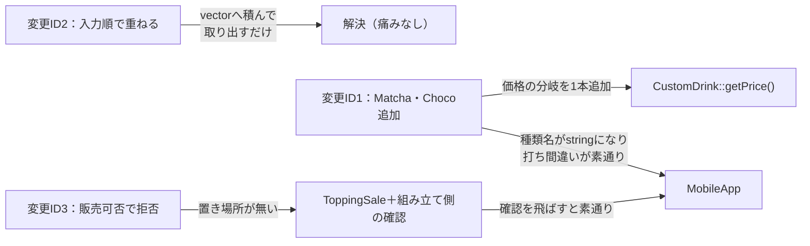
```mermaid
graph LR
    T2["変更ID2：入力順で重ねる"] -->|"vectorへ積んで<br>取り出すだけ"| S["解決（痛みなし）"]
    T1["変更ID1：Matcha・Choco追加"] -->|"価格の分岐を1本追加"| A["CustomDrink::getPrice()"]
    T1 -->|"種類名がstringになり<br>打ち間違いが素通り"| B["MobileApp"]
    T3["変更ID3：販売可否で拒否"] -->|"置き場所が無い"| C["ToppingSale＋組み立て側の確認"]
    C -->|"確認を飛ばすと素通り"| B
```

変更ID2は素直な作りの変更で解けました。残る2件は行き先が違います。変更ID1は`CustomDrink`の中の価格の分岐へ集まり、変更ID3は`CustomDrink`に置き場所が無いため呼び出し側の責任になりました。さらに、選択順を`vector`で表したことで種類名が`string`になり、打ち間違いを止める仕組みも呼び出し側の注意力へ移っています。変わる理由が違う3件のうち、2件が同じ2か所（このクラスと、その呼び出し側）へ重なっています。

---

### 3-3：痛みの言語化

「順番は素直に直せたのに、なぜ価格を足すたびにこのクラスを開くんだろう…」

変更ID1から変更ID3までを順に当てはめた結果、現場のエンジニアが直面する具体的な辛さが4つ見えてきました。先に、痛みではなかったものを1つ確認しておきます。**変更ID2（入力順で重ねる）は、選択順の`vector`へ置き換えるという素直な変更で解けました。** 順番の管理という変わる理由はクラスから消え、コンストラクタ引数も減っています。以下の4つは、その変更をした後にも残った痛みです。

1つ目は、トッピングを1種類足すたびに `CustomDrink` を開く必要があるという辛さです。
`getPrice()` の中に「Milkなら50円」「Whipなら70円」と種類名で分ける `if` が並んでいて、種類が増えるとここへ1本足します。価格は商品企画部の都合で変わり続けますが、その知識が注文を組み立てるクラスの中にあるため、変わる理由が違うものを同じファイルで触ることになります。

2つ目は、種類名の打ち間違いを誰も止めてくれないという辛さです。
`addTopping()` は `string` を受け取るので、`"Mlik"` のようなつづり違いもそのまま通ります。実行結果のとおり、エラーにならず「ホットコーヒー + Mlik」「400円」という注文ができてしまいます。真偽値のフラグだった頃は、引数を間違えればコンパイルが通りませんでした。順番を解いた代わりに、種類の指定はコンパイラが守ってくれない約束になりました。

3つ目は、追加した種類が `getPrice()` の分岐に無いと、静かに0円で通るという辛さです。
2つ目と同じ仕組みから来ますが、影響が違います。新しいトッピングを `addTopping()` で受け付けられるようにしたのに `getPrice()` へ分岐を足し忘れると、名称には出るのに金額が加算されません。「足し忘れ」が実行時のエラーではなく、金額の食い違いとして現れます。

4つ目は、変更ID3の販売可否をクラスの中へ置けなかった辛さです。
`CustomDrink` は積まれたトッピングをそのまま受け取るだけなので、「注文へ重ねてよいか」を判定する場所がありません。結果として `ToppingSale` をクラスの外へ作り、業務判断が注文を組み立てる呼び出し側へ移りました。確認せずに `addTopping()` を呼ぶ経路があれば、販売停止のトッピングがそのまま注文になります。

4つとも根は同じで、`CustomDrink` が「どんなトッピングが存在し、それぞれがいくらで、注文してよいか」を知っている（あるいは、知るべきなのに知らない）ことから来ています。

フェーズ3「問題特定」で変更を試みた際に生じた痛みが確認できました。次のフェーズ4「原因分析」では、なぜこのような痛みが生じるのか、その根本的な原因をコードの構造という観点から言語化していきます。

---
> **📌 問題（確定）**
> 変更ID2の入力順は、選択順の`vector`へ置き換えるという素直な変更で解けた。残りは解けなかった。変更ID1の2種類を追加するには`CustomDrink::getPrice()`の種類名の分岐を開く必要があり、価格の知識はこのクラスに残った。種類名が`string`になったため、`"Mlik"`のようなつづり違いも`getPrice()`の分岐漏れも実行時に止まらず、名称だけ出て0円で通る。変更ID3の販売可否は`CustomDrink`に置き場所が無く、`ToppingSale`と組み立て側の確認としてクラスの外へ出て呼び出し側の責任になった。触る箇所は減ったが、変わる理由が違う知識が同じクラスと呼び出し側へ残る形が、3件の試行で確認できた。
---

観測した痛みへ`問題ID`を付け、どの変更IDから来たかを対応づけます。

| 問題ID | 観測した痛み（変更途中コード） | 起点の変更ID |
|---|---|---|
| 問題ID1 | トッピング種類を1つ足すたび、`CustomDrink::getPrice()` の種類名の分岐を開く。価格という別の理由で変わる知識が、注文を組み立てるクラスに残っている | 変更ID1 |
| 問題ID2 | `getPrice()` の分岐を足し忘れると、名称には出るのに金額が加算されず、実行時のエラーにもならない | 変更ID1 |
| 問題ID3 | 種類を`string`で受けるため、`"Mlik"` のようなつづり違いが素通りする。真偽値だった頃はコンパイルエラーだった約束が、実行時まで確認されなくなった | 変更ID2 |
| 問題ID4 | 販売可否を`CustomDrink`へ置けず、`ToppingSale`と組み立て側の確認がクラスの外へ出て、業務判断が呼び出し側の責任になった | 変更ID3 |

（変更ID1〜変更ID3を実際に適用し、複数箇所が連動して変わる問題を確認できました。次のフェーズ4「原因分析」では、なぜこの連鎖が起きるのかを構造的に分析します。）

## 🟠 フェーズ4：原因分析 ―― なぜ辛いのかを構造で言語化する
### 4-1：痛みの根源を探る（観察と原因）

フェーズ3「問題特定」では、種類を足すたびに価格の分岐を開くこと、その足し忘れが金額の食い違いになること、種類名のつづり違いが素通りすること、販売可否の置き場所がクラスに無いことの4つの痛みを確認しました。入力順は素直な変更で解けたので、残ったのはこの4つです。この痛みがなぜ発生するのか、コードを注意深く観察することで根源が見えてきます。

第一に、新しいトッピングを追加するとき、なぜ毎回 `CustomDrink` を開かなければならないのでしょうか。それは、このクラス自身が「ミルクなら50円」「ホイップなら70円」といった具体的なトッピングの条件をすべて直接知ってしまっている（抱え込んでいる）からです。

第二に、なぜ変更の影響範囲が読めず、呼び出し側まで壊れるのでしょうか。それは、今回のトッピング追加から守りたい「基本ドリンクの価格を保持する処理」と、今回変わった「各トッピングの価格と名前を知る処理」が、同じクラスの同じメソッドの中で物理的に混ざり合っているからです。

| **観察した症状** | **構造的な原因** |
|---|---|
| トッピングを追加するたびにクラス内の複数の `if` 文を探して修正が必要になります | `CustomDrink` が各トッピングの価格・名前という具体的な条件を直接知っているから |
| 価格の知識が増え続け、変更のたびにこのクラスを開くことになります | 「基本ドリンク」と「トッピング」という変わる理由が異なるものが同じ場所に混在しているから |
| 種類名のつづり違いや分岐の足し忘れが、実行時も止まらず0円で通ります | トッピングを `string` でしか表しておらず、「その種類が存在し、いくらか」を保証する型が無いから |
| 販売可否を `CustomDrink` へ置けず、組み立て側の確認として呼び出し側の責任になりました | 積まれたトッピングをそのまま受け取るだけの構造なので、注文へ重ねてよいかの判定を受け取れないから |

最初の頃、トッピングが「ミルク」と「ホイップ」だけだった時代は、一つのクラスで主要な処理を追いやすいというメリットがありました。当時の担当者が、素早く機能を提供するためにこの形を選んだのは、合理的だったと思います。しかし、トッピングの種類が増えるにつれて、一つのクラスが「知りすぎている」状態になってしまったのではないでしょうか。「まずはフラグを足す」という判断は小規模な段階では有効でも、組み合わせが増えた後に変更箇所を見つけにくくすることがあります。

---

### 4-2：今回変える責任/ほかの変更から守る責任

> **「今回守る」と「変わらない」は異なります。** 左列は今回の変更試行とヒアリングで変更理由を確認した責任、右列はその変更に巻き込まず守りたい責任です。将来ずっと変わる／変わらないという分類ではありません。

原因の方向性が見えたところで、「今回変える責任」と「ほかの変更から守る責任」を明確に切り分けてみましょう。ここをしっかり整理することが、後で適切に分けるための土台になります。

| **今回変える責任** | **ほかの変更から守る責任** |
| --- | --- |
| トッピングの種類、それぞれの追加価格、表示名、販売可否、表示順 | 基本となるドリンクの価格を保持し、注文で選ばれたオプションを順に重ねて合計金額と注文内容を返すという処理の骨格 |

**【変わる部分（変わり続けるif文と価格・名前の知識）】** `CustomDrink::getPrice()` の中で、トッピングごとの加算を並べている部分です。
```cpp
    if (hasMilk)  total += 50;  // ← 商品企画部の判断で変わる
    if (hasWhip)  total += 70;  // ← 商品企画部の判断で変わる
    if (hasSyrup) total += 30;  // ← 商品企画部の判断で変わる
```

**【今回の変更から守る部分（守りたい骨格）】** 同じ `CustomDrink::getPrice()` の中で、基本価格から合計を組み立てている部分です。
```cpp
    int total = basePrice;
    // ここにトッピングの処理が入る
    return total;
```

トッピングに関する情報は、商品企画部や店舗オペレーションの都合で今後も変わり続けます。価格だけでなく、販売停止・在庫切れの判定、スタッフが確認する表示順、「ホイップをダブルにする」といった組み合わせも変化の対象です。

一方で、ベースとなる飲み物にオプションを足していくという計算の大枠自体は、この章の変更要求では守りたい前提です。この「後から増える側」をうまくカプセル化できれば、「守りたい側」を安定させやすくなります。

---

### 4-3：接続点に漏れているトッピングの知識を確認する

現在のシステムで、基本ドリンクとトッピングの境界にどの知識が漏れているかを確認します。

`CustomDrink`の中には、`"Milk"`なら50円、`"Whip"`なら70円という種類名と価格の対応が並んでいます。基本ドリンク側が、追加できるトッピング名、価格、説明の作り方まで知っている状態です。ここへ販売停止や在庫切れの判定を足すと、基本ドリンク側が「このトッピングを注文へ重ねてよいか」まで抱えることになります。

新しいトッピングが来るたびに、`CustomDrink`へ条件分岐を追加する必要があります。接続点で本当に必要なのは「注文へ重ねてよいトッピングを、選択順に価格と説明へ反映すること」ですが、トッピングの種類と価格の知識が基本ドリンク側へ残り、販売可否と種類名の正しさは呼び出し側へ漏れています。

一つの考え方として、基本となるドリンクの役割と、後から追加されるトッピングの役割は、変わる理由が異なるという点が重要です。これらが一つの場所に混在していることが、今回の痛みの根本につながっています。

フェーズ4「原因分析」で根本原因が言語化できました。「どこを分けるか」は明確です。次のフェーズ5「課題定義」では、その境界で実際に何が流れているかを値・型のレベルで具体化し、「何を変え、何を守るか」を明確にします。

---
> **📌 原因（確定）**
> `CustomDrink`が各トッピングの名前と価格を種類名の分岐として知っている。トッピングを1種類足すたび、基本ドリンクのクラスまで修正する必要がある。そしてトッピングを表す型が無いため、種類名の正しさと販売可否は呼び出し側の注意力に委ねられている。
---

フェーズ3の問題IDに対応づけて、構造上の原因へ`原因ID`を付けます。次のフェーズ5は、この原因IDから課題IDを導きます。

| 原因ID | 構造上の原因（何が同じ責任へ集まっているか） | 対応する問題ID |
|---|---|---|
| 原因ID1 | `CustomDrink` が各トッピングの名前と価格を種類名の分岐として持ち、基本ドリンクの骨格とトッピングの知識が同居している。トッピング自体を表す型が無い | 問題ID1・問題ID2・問題ID3 |
| 原因ID2 | 販売可否の確認を受け取る場所が契約に無く、利用側が注文してよいトッピングかを判断している | 問題ID4 |

（原因は、基本ドリンクとトッピングの知識が同じ場所に混在していることだと確認できました。次のフェーズ5「課題定義」では、切り離す境界で何を受け渡すかを見ていきます。）

## 🟡 フェーズ5：課題定義 ―― 原因から課題を検討して確定する

### 5-1：原因から課題候補を洗い出す

| 原因ID・確定した事実 | そのままだと残る痛み | 課題候補 | 候補を導いた理由 |
|---|---|---|---|
| 原因ID1：一つの注文クラスが全トッピングの価格を種類名で分岐し、トッピング自体を表す型が無い | 種類の追加が同じクラスへ集中し、種類名の誤りも分岐の漏れも実行時まで気づけない | トッピングごとの価格・説明を独立した部品へ分離する | 各トッピングは独立して追加・停止される |
| 原因ID2：利用側が注文してよいトッピングかを判断する | 販売状態を変えるたび利用側の確認処理も変わり、確認を飛ばす経路を止められない | 順序付き入力から検証と組み立てをまとめて引き受ける責任を利用側から外す | 利用と組み立ては別の責任だから |

### 5-2：課題候補の重複と依存を整理する

| 課題候補 | 必要性・他候補との関係 | 統合／分割の判断 | 整理結果 |
|---|---|---|---|
| トッピング部品の分離 | 必須。変更ID1で種類分岐が増える | 順序・販売状態の候補と同じ接続点で扱う | 統合して一つの課題にする |
| 順序・販売状態を含む組み立ての分離 | 必須。部品だけ分けても変更ID2・変更ID3が利用側へ残る | トッピング部品の候補へ統合する | 統合して一つの課題にする |

2候補はどちらも「販売可能なトッピングを入力順に重ねる」という同じ接続点を必要とします。5-3（課題IDと接続点を確定する）ではこの共通点を一つの課題として確定し、完成構造が異なる2案の採否はフェーズ6で比較します。

変更IDと課題IDは一対一とは限らないため、変更依頼の数に合わせて課題を増減させません。

### 5-3：課題IDと接続点を確定する

| 課題ID・接続点 | 接続するもの・変わる側 | 守る側 | 完了条件 |
|---|---|---|---|
| 課題ID1：トッピングと注文の価格・説明の境界 | **接続:** トッピングID、選択順、販売状態、価格、説明<br/>**変わる側:** 種類・価格・販売可否・説明追加 | 基本ドリンクが価格と説明を返す契約 | 販売可能な部品だけを入力順に重ね、種類追加が新部品と登録に閉じる |

📌 **システム全体の完了状態**：基本ドリンクとトッピングを同じ注文契約で扱い、販売可否を確認した部品を入力順に組み立てて名称と価格を得る。

課題IDを定義できたので、ここまでの追跡を一列で見渡します。本章は基本骨格とトッピング差分という一つの軸なので、4つの痛みは2つの原因を経て一つの課題へ集約します。

| 問題ID（フェーズ3の痛み） | 原因ID（フェーズ4の構造原因） | 課題ID（達成目標） |
|---|---|---|
| 問題ID1・問題ID2・問題ID3：追加のたび複数箇所と呼び出し側が連動 | 原因ID1：基本骨格とトッピングの知識が `CustomDrink` に同居 | 課題ID1：トッピングを独立部品へ分離し入力順に組み立て |
| 問題ID4：販売可否がクラスの外へ出て呼び出し側の責任になった | 原因ID2：販売可否と入力順の組み立てを受け取る場所が契約に無い | 課題ID1：販売可能な部品だけを入力順に重ねる契約へ集約 |

## 🔴 フェーズ6：対策検討 ―― 構想を一つのコード経路へ変える

フェーズ5で確定した全課題を、別々の部品案ではなく、生成から実行まで動く一つの構想としてまとめます。先に主要クラスと接続順を示し、その直後に同じ順でコードを確認します。

### 構想を決める

**【課題の原因】** 問題ID1・問題ID2・問題ID3（種類を足すたび価格の分岐を開き、つづり違いも分岐の足し忘れも実行時まで止まらない）＝原因ID1（基本骨格とトッピングの知識が `CustomDrink` に同居し、トッピングを表す型が無い）。問題ID4（販売可否が呼び出し側の責任になった）＝原因ID2（販売可否の確認を受け取る場所が契約に無い）。この2つの原因が課題ID1へ集約されます。

**この課題（何を解きたいか）：** トッピングを1種足すたび、注文クラスを開いて種類名の分岐を1本足すことになります。足し忘れても、つづりを間違えても、実行時まで止まりません。そして販売停止のトッピングを断る判断が、注文を組み立てる呼び出し側へ残っています。**販売可能な部品だけを入力順に重ね、種類の追加が新しい部品と登録に閉じる**ようにするのが課題ID1です。

**このフェーズで決めること：** 基本ドリンクとトッピングをどの接続点で扱い、価格・説明・販売可否・入力順をどこへ置き、組み合わせを誰が生成・所有するかをコードで示します。

まず、契約、具体、生成・所有、受け渡し、実行を一枚の構想へまとめます。

| 接続点を変える観点 | システム全体での設計判断                                            | 変えたくない側が知らなくなる詳細  |
| --------- | ------------------------------------------------------- | ----------------- |
| 契約と具体 | 課題ID1の価格・表示名・包む責任を`IDrink`の各具体へ、価格・販売可否を`ToppingCatalog`へ置く | トッピングの種類・価格・組み合わせ |
| 生成・所有・受け渡し | `OrderAssembler`が要求順に部品を生成し、各Wrapperへ直前の`IDrink`とCatalogを渡す。完成した外側が連なり全体を所有して破棄する | 具体トッピングの生成順と段数 |
| 公開入口からの実行 | `OrderApplication::run()`がAssemblerへ要求を渡し、完成した1つの`IDrink`から価格と説明を実行する | 各層の具体名と内側の構造 |

**構想上のコード経路：** `OrderApplication::run()`（注文開始）→ `OrderAssembler::assemble()`（基本飲料を生成）→ `wrapOne()`（外側へ順に重ねる）→ `IDrink::getPrice()`（契約）→ 基本飲料から外側へ価格を返す

この経路が成立するには、契約だけでなく、具体を選ぶ方法、実体の生成・所有、利用側へ渡す行、公開入口からの呼び出しが同時に必要です。以下では、この構想を分断せず、コードの依存順に続けて確認します。

### 構想をコードでつなぐ

> **コードの読み方：** 「契約→具体→生成・選択・受け渡し→公開入口からの実行」の順に読みます。変更前の抜粋は境界を引く根拠、変更後の断片は構想を成立させるコードです。断片はフェーズ7「解決後のコード」でクラス単位の全文へ統合します。

#### 契約：境界の形と受け渡しを決める

種類名で分ける判断は、フェーズ3「変更を試みる（3-1（変更を試みる））」で `getDescription()` の分岐を消した後なら `getPrice()` の1か所だけです。しかしリスクID1（種類の増減）とリスクID2（価格改定）があり、現に変更ID1でMatchaとChocoの2種類が増えました。さらに部品を同じ契約で重ねる必要があるため、単なる条件表ではなくクラス契約へ進みます。

**もう1つ理由があります。** 原因ID2の「販売可否の確認を受け取る場所が契約に無い」は、条件表を外へ出しても残ります。表を引くのは結局呼び出し側で、確認せずに積む経路を止められません。

**ただし、この章では「契約を作らず、種類ごとの値をデータの表として持つ」案も、途中状態ではなく完成案として残ります。** この案との比較は「構想を採用する」で、責任配置・変更影響・導入コストを一度だけ確認します。ここでは、種類が現に増えたという事実を根拠に契約へ進みます。

分けると決めたので、コードに線を引きます。

**変更前から抜き出す箇所：`CustomDrink::getPrice()`** ―― 3-1の合計金額（対策前）

```cpp
    int getPrice() const {
        int total = basePrice;                     // ← 今回維持する側（合計の始め方）
        for (size_t i = 0; i < toppings.size(); ++i) {
            const string& t = toppings[i];         // ← 今回維持する側（積んだ順に読む）
            if      (t == "Milk")   total += 50;   // ← 変わる側（種類と追加料金）
            else if (t == "Whip")   total += 70;   // ← 変わる側
            else if (t == "Syrup")  total += 30;   // ← 変わる側
            else if (t == "Matcha") total += 60;   // ← 変わる側
            else if (t == "Choco")  total += 40;   // ← 変わる側
        }

        return total;                              // ← 今回維持する側
    }
```

**割り方の根拠は、種類が増えたときに触るかどうかです。** 種類を1つ足すと `if` の連鎖は1本増えますが、外側の4行（合計の始め方・積んだ順に読むこと・返すこと）は1行も増えません。変更前のコードでは、この2種類が同じ関数の中で入れ子になっています。

**5-3（課題IDと接続点を確定する）の接続点定義表が挙げているのは、境界を跨ぐ「候補」です。実際に何がいくつ流れるかは、ここで形を決めた結果として決まります。**

**5-3が挙げた候補は5つです。** トッピングID、選択順、販売状態、価格、説明。1つずつ形を決めます。

| 接続するもの（5-3の候補） | 決めた形 | そう決めた理由 |
|---|---|---|
| トッピングID | 引数で渡さない。**種類ごとに別のクラス**を用意し、そのクラスであること自体が種類を体現する | 引数で渡すと、受け取った側がまた種類で分岐する。上の `if` 連鎖が移動するだけになる |
| 選択順 | 引数で渡さない。**重ねた順序そのもの**が並び順を表す | 順番号を渡すと、受け取った側が並べ替えを持つ。順序の管理は3-1でクラスから消えたのに、また戻ってくる |
| 販売状態 | **この境界を流れない。** 部品を作る前に確かめる別の場所で扱う | 契約へ載せると、基本ドリンクにも販売可否の操作が要る。守る側の「基本ドリンクが価格と説明を返す契約」が崩れる |
| 価格 | 合計金額（`int`）を**戻り値で返す** | 変更前の `getPrice()` が返していた値そのもの |
| 説明 | 注文名称（`string`）を**戻り値で返す** | 変更前の `getDescription()` が返していた値そのもの |

**候補は5つでしたが、境界を実際に流れるのは2つです。** トッピングIDと選択順は「クラスそのものが体現する」「重ねた順序が表す」と決めたので、引数にも戻り値にもなりません。**消えたのではなく、値として渡す代わりに構造で表すことにしたのです。** 販売状態は5-3の守る側「基本ドリンクが価格と説明を返す契約」に照らして、この境界から外しました。残る価格と説明の2つが、戻り値として流れます。

**候補の数と実数が一致しないのが普通です。** 5-3は境界を跨ぐものを漏れなく挙げる表で、ここはそれを形へ変える段です。形を決めれば、値として流れなくなるものが出ます。

**「返す情報の使い道を、まだ決めていないのに形を決めてよいのか」** ——根拠は変更前のコードにあります。3-1の `main()` が消費していたのは `getPrice()` の `int` と `getDescription()` の `string` の2つだけでした。**将来こう使うだろうという見込みではなく、変更前が実際に消費していたものを、そのまま契約の戻り値にしています。**

**契約を置く場所も、ここで決められます。** 5-3の完了状態が「基本ドリンクとトッピングを同じ注文契約で扱う」と言っている以上、**契約を満たすものが2種類（基本と追加機能）あることは前工程で決まっています。** 契約をどれか1つの基底クラスの内側へ置く形は、その基底を継いだものだけが契約を満たす形なので、もう一方が満たせません。だから独立した型として置きます。**この判断が骨格と噛み合うかは、構想の確認で確かめます。**

**ここで確認するコード：`IDrink`（クラス全体）** ―― 基本ドリンクとトッピングが共有する契約

```cpp
// 課題ID1接続点：基本ドリンクと追加機能が満たす共通契約
class IDrink {
public:
    virtual ~IDrink() = default;
    virtual int getPrice() const = 0;
    virtual string getDescription() const = 0;
};
```

境界を流れると決めた2つが、そのまま2つの操作になりました。引数は1つもありません。

**契約だけでは、決めた形が本当に成立するのか確かめられません。** 実装を1つ見ます。まず基本ドリンク側です。

**ここで確認するコード：`Coffee`（クラス全体）** ―― 基本ドリンク側の代表具体

```cpp
// 基本のドリンク：自分の名前と基本価格だけを持つ
class Coffee : public IDrink {
    string name;
    int basePrice;
public:
    Coffee(const string& itemName, int price)
        : name(itemName), basePrice(price) {}
    int getPrice() const override { return basePrice; }
    string getDescription() const override { return name; }
};
```

- **「トッピングIDを引数で渡さない」の実態。** `getPrice()` に引数がありません。基本ドリンクはトッピングの種類を1つも知らないまま、自分の価格を返せます
- **「選択順を引数で渡さない」の実態。** 並び順を受け取るメンバーも引数もありません。基本ドリンクは常に連なりの内側の端にいます
- **「価格と説明を返す」の実態。** `basePrice` と `name` の2つだけを返します。合計でも連結後の名称でもなく、自分ぶんです

**では、この契約を誰が呼ぶのか。**

---

#### 具体：契約の裏へ変わる判断を置く

契約の形を決め、代表実装で引数・戻り値が成立することを確認しました。ここでは、もう1つの具体を見て、変わる判断が契約の裏へ閉じることを確かめます。

具体の個数は契約コードで決まっています。「種類ごとに別のクラス」と決めた時点で、3-1の `if` 連鎖の5分岐がそのまま5クラスになります。**ここが決めるのは、各具体が何を書かないかです。**

**ここで確認するコード：`Milk`（クラス全体）** ―― 代表として1つ見ます

```cpp
// 具体的なトッピング：自分の識別子だけを名乗る
class Milk : public ToppingWrapper {
public:
    Milk(IDrink* base, const ToppingCatalog* cat)
        : ToppingWrapper(base, cat, "Milk") {}
};
```

**`getPrice()` も `getDescription()` もありません。** 上書きしないので、構想で仮置きした骨格の2行がそのまま動きます。**このクラスが書いているのは、自分がどの種類かを名乗る1つの文字列だけです。** 変更前は「`t == "Milk"` なら50を足す」という条件と結果の組で表していたものが、条件が消えて識別子だけになりました。条件が要らないのは、**このクラスであること自体が『ミルク』だから**です。

コンストラクタの引数は、構想で定めた包む相手と、追加料金・表示名の出どころです。**どちらもここでは受け取って基底へ渡すだけです。** 第2引数の `ToppingCatalog` は、続く生成・所有のコードで同じ実体の作り方を確認します。

5クラスを並べると、3-1の `if` 連鎖がそのままクラスの一覧になります。

| トッピングクラス | 名乗る識別子 | 変更前の対応箇所 | 書かないこと |
|---|---|---|---|
| `Milk` | `"Milk"` | 1本目の `if`（50円） | 価格・表示名・上書きする操作 |
| `Whip` | `"Whip"` | 2本目の `if`（70円） | 同上 |
| `Syrup` | `"Syrup"` | 3本目の `if`（30円） | 同上 |
| `Matcha` | `"Matcha"` | 4本目の `if`（変更ID1で追加） | 同上 |
| `Choco` | `"Choco"` | 5本目の `if`（変更ID1で追加） | 同上 |

**右端の列が全クラスで同じです。** 兄弟どうしの違いは識別子1つだけで、振る舞いの差はありません。**これは、価格と表示名を骨格が同じ経路で読むと構想の確認で決めたからです。** ここに差が出るなら、契約と具体の切り分けを見直すことになります。

**守る範囲との照合：** 4つのどれにも触っていません。各クラスは自分の識別子を名乗るだけで、基本ドリンクの選び方も、注文が返すものも、合計の出方も、入力順の意味も1行も書いていません。

ここまでで、契約と具体を確認できました。次は、構想で定めた2つの接続点を実コードへつなぎます。

---

#### 生成・所有・受け渡しを決める

契約と具体がコードで確認できたので、構想で仮置きした生成・所有・受け渡しを実コードで確かめます。生成しただけで止めず、同じ実体が公開入口から使われる直前までをつなぎます。

ここからは、具体を作る行から、契約として骨格へ入り、公開入口から実行される行までを一つの経路として追います。

##### 生成・所有：実体と所有者をコードで示す

構想で定めた接続点は2つです。自分ぶんの追加料金・表示名の出どころ（`myPrice()`／`myLabel()`）と、包む相手（`baseDrink`）を、値の登録から所有・生存期間まで順に確かめます。

**値をどこへ置くか。箱は部品ごとか、1つか。**

- **部品ごとに持つ。** `Milk` に `50` と `"Milk"` を書く。作るのは簡単ですが、価格改定（リスクID2）のたびにクラスを開きます。そして販売可否（要求ID3）は部品を作る前に確かめたいのに、部品の中にあると作らないと読めません
- **1つの保存データへ寄せる。** 種類を1つ足すときに触るのは、部品クラス1つと登録1行。価格改定は登録値だけ。販売可否は部品を作る前に読めます

**1つへ寄せる形を採ります。** 判断の基準は「種類を1つ足したとき、価格を1つ変えたときに触る場所」です。直前の具体コードで確認した完了条件が「新部品と登録に閉じる」と言っている、その「登録」がこの保存データです。**名前は `ToppingCatalog` とします。** 表示名・追加料金・販売可否の3つを、トッピングIDごとに持ちます。

**ここで確認するコード：`ToppingSpec`（構造体全体）** ―― トッピング1種類の登録データ

```cpp
// トッピングの表示名・追加料金・販売可否を保持する保存データ（境界）
struct ToppingSpec {
    string label;   // 表示名（スタッフ向け作業指示に使う）
    int price;      // 追加料金（円）
    bool onSale;    // 販売可否（販売停止・在庫切れはfalse）
};
```

**ToppingCatalog**

**ここで確認するコード：`ToppingCatalog`（クラス全体）** ―― トッピングIDから登録データを返す台帳

```cpp
class ToppingCatalog {
private:
    map<string, ToppingSpec> specs;
public:
    ToppingCatalog() {
        specs["Milk"]         = {"Milk",   50, true};
        specs["Syrup"]        = {"Syrup",  30, true};
        specs["Whip"]         = {"Whip",   70, true};
        specs["Matcha"]       = {"Matcha", 60, true};
        specs["Choco"]        = {"Choco",  40, true};
        specs["SeasonalMint"] = {"SeasonalMint", 80, false};
    }

    bool exists(const string& id) const { return specs.count(id) > 0; }
    bool onSale(const string& id) const {
        auto it = specs.find(id);

        return it != specs.end() && it->second.onSale;
    }

    int priceOf(const string& id) const { return specs.at(id).price; }
    string labelOf(const string& id) const { return specs.at(id).label; }
};
```

**中身は3つに分かれます。**

- **メンバー：** トッピングIDから `ToppingSpec` を引く1つの表です。3-1で `getPrice()` の `if` 連鎖にあった数値と、`ToppingSale` が別に持っていた停止リストが、ここで1つの表に合流しました
- **`exists()`／`onSale()`：** 部品を作る前に読める2つの問い合わせです。原因ID2の「販売可否の確認を受け取る場所が契約に無い」に対して、確認する相手をここに置きました
- **`priceOf()`／`labelOf()`：** 構想で定めた `myPrice()`／`myLabel()` の参照先です。**種類を1つ足すときに触るのは、この表への登録1行だけです**

価格と表示名の参照先が確定し、骨格の2行は次の形になります。

**ここで確認するコード：`ToppingWrapper`（クラス宣言・完成）**

```cpp
// 変わる部分を繋ぐ仲介役：トッピングの基底クラス
class ToppingWrapper : public IDrink {
protected:
    IDrink* baseDrink;             // 中身（基本ドリンクや他のトッピング）
    const ToppingCatalog* catalog; // 価格・表示名の保存データ
    string toppingId;              // 自分がどのトッピングか
public:
    ToppingWrapper(IDrink* base, const ToppingCatalog* cat,
                   const string& id)
        : baseDrink(base), catalog(cat), toppingId(id) {}
    ~ToppingWrapper() override { delete baseDrink; }
    int getPrice() const override {
        // 価格は自分で持たず、カタログ（保存データ）から読む
        return baseDrink->getPrice() + catalog->priceOf(toppingId);
    }

    string getDescription() const override {
        return baseDrink->getDescription()
             + " + " + catalog->labelOf(toppingId);
    }
};
```

**構想で仮置きした `myPrice()` が `catalog->priceOf(toppingId)` に、`myLabel()` が `catalog->labelOf(toppingId)` になりました。** 骨格の形——内側へ尋ねて自分ぶんを1つ足す——は1行も変わっていません。変わったなら、分離の切り方を間違えていたことになります。

**次に、具体の生成者を確認します。** 持つ者の条件は構想表と具体コードから分かっています。

- **具体クラスを全部知っていること。** `new Milk(...)` と書く以上、その名前を知っていなければなりません
- **骨格ではないこと。** 骨格が具体の名前を知った時点で、契約コードで分けた意味が消えます

**この2つを満たす場所を、組み立て役として新しく置きます。名前は `OrderAssembler` です。** 5-2（課題候補の重複と依存を整理する）で「順序・販売状態を含む組み立ての分離」を課題ID1へ統合したので、検証と生成と連結を同じ場所が引き受けます。

**ここで確認するコード：`OrderAssembler`（クラス宣言）**

```cpp
// 依存の組み立てと検証を担うクラス
class OrderAssembler {
private:
    MenuDatabase& db;
    ToppingCatalog& catalog;

    IDrink* wrapOne(const string& id, IDrink* base);
public:
    OrderAssembler(MenuDatabase& d, ToppingCatalog& c)
        : db(d), catalog(c) {}

    OrderResult assemble(const OrderRequest& req);
};
```

**メニューとカタログは外から参照で受け取ります。** 値で持つと、注文ごとに別のカタログを持つことになり、価格や販売可否の正本が分かれてしまいます。**公開操作は `assemble()` の1つだけで、具体を作る `wrapOne()` は外から呼べません。**

まず `wrapOne()` です。トッピングIDは名前付き定数（`ToppingId`）にして、直文字列の打ち間違いが分岐へ紛れ込まないようにします。

**ここで確認するコード：`OrderAssembler::wrapOne(const string&, IDrink*)`** ―― トッピングID1つを、内側のドリンクへ1層かぶせる

```cpp
IDrink* OrderAssembler::wrapOne(const string& id, IDrink* base) {
    if (id == ToppingId::Milk)   return new Milk(base, &catalog);
    if (id == ToppingId::Syrup)  return new Syrup(base, &catalog);
    if (id == ToppingId::Whip)   return new Whip(base, &catalog);
    if (id == ToppingId::Matcha) return new Matcha(base, &catalog);
    if (id == ToppingId::Choco)  return new Choco(base, &catalog);

    return base;
}
```

**具体クラスの名前を知っているのは、この関数だけです。** 3-1では種類名の分岐が価格の計算そのものでしたが、ここでは部品を1つ作るだけです。種類を1つ足すときに触るのは、この関数へ1行と、`ToppingCatalog` の登録へ1行です。

**入力順に重ねる責任も、この組み立て役が持ちます。** 骨格は「1段ぶんの重ね方」しか知らないので、何段を何の順で重ねるかは骨格の外で決まります。要求の並びをそのままループの順にすれば、包む順が入力順になります。

**ここで確認するコード：`OrderAssembler::assemble(const OrderRequest&)`** ―― 検証してから、選択順に重ねる

```cpp
OrderResult OrderAssembler::assemble(const OrderRequest& req) {
    if (!db.exists(req.baseItemId)) {
        return {false, "", 0,
                "メニューID " + req.baseItemId + " は存在しません"};
    }

    // 手順1：全トッピングの登録と販売可否を先に確認する
    for (const auto& toppingId : req.toppingIds) {
        if (!catalog.exists(toppingId)) {
            return {false, "", 0,
                    "トッピング " + toppingId + " は未対応です"};
        }

        if (!catalog.onSale(toppingId)) {
            return {false, "", 0, "トッピング " + toppingId
                    + " は販売停止または在庫切れです"};
        }
    }

    // 手順2：検証を通ったので、選択順に基本ドリンクへ重ねる
    MenuItem base = db.get(req.baseItemId);
    IDrink* drink = new Coffee(base.name, base.basePrice);

    for (const auto& toppingId : req.toppingIds) {
        drink = wrapOne(toppingId, drink);
    }

    OrderResult r{true, drink->getDescription(),
                  drink->getPrice(), ""};
    delete drink;

    return r;
}
```

**手順1と手順2の順序に意味があります。** 全件を先に確認し、それから生成へ進みます。逆にすると、途中で拒否したときに生成済みの層が宙に浮きます。**これで「販売可能な部品だけを入力順に重ね」という完了条件の前半が埋まりました。** 呼び出し側は確認を書きません。

要求と結果は、データとして持ちます。

**ここで確認するコード：`OrderRequest`（構造体全体）** ―― 基本ドリンクとトッピング順を渡す入力

```cpp
// 注文要求：基本ドリンクIDと、選択順のトッピングID列をデータで持つ
struct OrderRequest {
    string baseItemId;
    vector<string> toppingIds;
};
```

**OrderResult**

**ここで確認するコード：`OrderResult`（構造体全体）** ―― 受付可否・表示名・金額を返す結果

```cpp
// 注文結果（結果オブジェクト）：成功可否・注文名・金額・エラー理由
struct OrderResult {
    bool ok;
    string description;
    int totalPrice;
    string error;
};
```

**どの種類をどの順で重ねるかが、入れ子の式ではなくデータになりました。** 呼び出し側が `new Whip(new Milk(...))` と書く場所はどこにもありません。

**その持ち主自身は、誰が作り、誰が持つのか。** ここまで答えないと「生成」に答えたことになりません。先ほど示した `OrderAssembler` は、メニューとカタログを参照で借りる側です。次は、その2つと `OrderAssembler` を同じ生存期間で所有する側を決めます。

**ここで確認するコード：`OrderApplication`（クラス宣言）**

```cpp
// 依存の組み立てと実行を担うアプリケーションクラス
class OrderApplication {
private:
    MenuDatabase db;
    ToppingCatalog catalog;
    OrderAssembler assembler;
    OrderLog log;
public:
    OrderApplication() : assembler(db, catalog) {}

    void run();
    void runRegressionTests();
};
```

**4つの部品を値メンバとして所有します。** 宣言がそのまま生成なので、これを作れば実体がそろいます。`assembler` だけがコンストラクタで参照を受け取るので、初期化リストで貸します。値メンバは宣言順に作られるので、貸す側の2つが先に作られます。

**`OrderLog` は、課題ID1の分離とは別の依存です。** 要求ID4（確定した注文の注文名と合計金額を記録する）の継続要求で、種類が増えても変わりません。ここへ置くのは、注文を実行する場所と記録する場所を1か所にそろえるためで、トッピングの分離のためではありません。

**所有と生存期間。**

`assemble()` の完全な抜粋ですでに、基本ドリンクの生成と `drink = wrapOne(toppingId, drink)` を示しました。ループ1周前の戻り値が次の部品の `baseDrink` へ入り、最初の周だけは `Coffee` が入ります。包む相手は組み立て時に固定され、`getPrice()` と `getDescription()` は以後同じ内側へ委譲します。

同じ `new Milk(base, &catalog)` は、`base` を所有対象として渡し、`catalog` を非所有の参照先として貸します。具体名と入力順を知るのは `OrderAssembler` だけで、`ToppingWrapper` は内側の具体型も自分が何段目かも知りません。

---

#### 実行骨格：組み立てた実体を契約から呼ぶ

前節で、`OrderAssembler`が基本飲料を生成し、要求順に`ToppingWrapper`を重ね、最も外側の`IDrink*`を完成品として返しました。各Wrapperは内側を所有し、`getPrice()`と`getDescription()`を同じ契約から再帰的に呼びます。

トッピングを追加しても「内側へ尋ね、自分ぶんを加える」手順は変わりません。変わるのは追加部品、Catalogの登録、Assemblerの生成分岐です。生成順、所有の連なり、実行順が同じ構造で一致しています。

#### 公開入口から具体の実行まで追う

次は、公開入口へ入った要求が、直前に組み立てた同じ実体へ届き、契約を通って具体処理が呼ばれるまでをコードの呼び出し順で追います。

##### 公開入口から骨格・契約・具体へつなぐ

組み立てが終わりました。呼び出し側がどう変わったかを、変更前と並べて見ます。

**変更前から抜き出す箇所：`main()`** ―― 3-1の、在庫切れを含む注文（対策前）

```cpp
    CustomDrink unavailable("ホットコーヒー", 400);
    bool accepted = true;

    for (size_t i = 0; i < requested.size(); ++i) {
        // 変更ID3：注文を作る前に、呼び出し側が販売可否を調べる
        if (sale.isStopped(requested[i])) {
            cout << "エラー：トッピング " << requested[i]
                 << " は販売停止または在庫切れです\n";
            accepted = false;
            break;
        }

        unavailable.addTopping(requested[i]);
    }
```

**ここで確認するコード：`OrderApplication::run()`** ―― 同じ注文（対策後）

```cpp
    OrderRequest req{"DRINK001", {"Milk", "Syrup"}};
    OrderResult res = assembler.assemble(req);
```

**呼び方は変わりました。** 変更前は、呼び出し側が1件ずつ販売可否を調べ、通ったものだけを積み、途中で抜ける制御まで書いていました。変更後は、**何をどの順で重ねたいかをデータで渡して、1回呼ぶだけ**です。エラーは `OrderResult` の `error` に理由として返るので、呼び出し側は成否で分けるだけになります。

契約と具体、生成・所有で決めた「検証してから入力順に包む」という接続が、そのままこの2行になっています。ここでは、前段で決めた実体と実コードが一致することを確認します。

**組み立ての行も比べます。** 変更前の `main()` は、注文1件ごとに確認ループを書いていました。変更後の `main()` は次の2行です。

**ここで確認するコード：`main()`** ―― 組み立て（対策後）

```cpp
    OrderApplication app;
    app.run();
```

**`main()` の行は減りましたが、代わりに `OrderApplication` が4つの値メンバと初期化1行を持つことになりました。** 部品の実体を持つ場所が `main()` から移っただけで、組み立ての手間が消えたわけではありません。得たのは、注文1件ごとに書いていた確認と積み込みが1回の呼び出しになったことです。

利用側が `ToppingWrapper::getPrice()` を直接呼ぶことはありません。持っているのは `OrderResult` の値だけです。

**守る範囲との照合：** 「注文が返すもの」と「入力順の意味」を確認しました。`OrderResult` が返すのは注文名と合計金額の2つで、`{"Milk", "Syrup"}` と指定すれば表示名もその順に並びます。分離と組み立てを通して、守る範囲の4つはいずれも定義に反していません。最終確認はフェーズ7の受入・回帰エビデンスで行いますが、**そこで初めて確かめるのではなく、分離から実行までのコードで照合済みです。**

### 構想を採用する

ここまでの構想表と要点コードを合わせると、責任配置と実行経路が一つにつながります。ただしこの章では、**課題ID1を全部解く完成構造が2つ残ります。** 契約と具体の検算で保留した「契約を作らず、種類ごとの値をデータの表として持つ」案です。トッピングが「データだけ」か「内側のドリンクへ作用する振る舞い」かで比較します。

| 完成構造 | 向く目的 | 課題ID1への効果 | コスト・判断 |
|---|---|---|---|
| トッピング一覧構造 | 名前・固定価格・販売可否をデータとして足し合わせる小規模メニュー | 注文クラスが登録済みの一覧を走査し、種類別の分岐は増えない | 最も単純。現在要件がデータだけならこちらで足りる |
| 装飾連結構造 | 前段の価格・説明を参照し、順序で振る舞いが変わる部品を重ねる | 各部品が同じ契約を包み、内側へ作用する計算・説明を独立に追加できる | クラス数と動的生成が増える。リスクID4を見据えた長期判断として採用 |

完成クラス図は、構想を実装した結果としてフェーズ7「対策実施」だけに示します。ここでは、課題との対応と将来リスクへの備えを表で確定します。

#### 課題から採用構想までを照合する

ここまでの決定を、課題ID1の連結側と配置側に分けて一望へまとめます。この表は設計課題だけを追います。変更要求の受入はフェーズ7の要求ID表、変更影響は7-4（変更シナリオ表）の変更ID表で別に確認します。

| 課題ID | 採用構造と生成・接続場所 | 完成コードの主な場所 | 確認 |
|---|---|---|---|
| 課題ID1（機能連結） | 機能連結。各Wrapperが内側の`IDrink`を包み自分ぶんを足し、`OrderAssembler`が入力順に連結 | `IDrink`、`Milk`／`Whip`／`Syrup`／`Matcha`／`Choco`、`OrderAssembler` | 種類追加が新部品と登録に閉じる |
| 課題ID1（データ配置） | データ分離。価格・販売可否を`ToppingCatalog`へ寄せる | `ToppingCatalog` | 部品が価格・販売状態を自前で持たない |
| 変更対象外 | 基本ドリンクの価格・説明契約。基本は変更しない | `Coffee`（基本ドリンク） | 1-4、注文名・合計金額 |

#### 将来リスクに対して構想を確認する

フェーズ2のリスクIDを採用構造へ再適用し、基本ドリンクと注文入口をどこまで守れ、どの変化には追加設計が必要かを評価します。

| リスクID・将来リスク | 現在の構造による備え | リスク発生時の変更先 | 守れる範囲・残る弱点 |
|---|---|---|---|
| リスクID1：トッピングの種類の増減 | 同じ`IDrink`契約を満たす装飾部品として種類を追加し、組み立てを`OrderAssembler`へ集める | 新しい装飾部品、`ToppingCatalog`、`OrderAssembler` | `Coffee`と注文結果契約を守り、追加を新部品・登録・生成分岐へ限定できる。生成分岐自体は種類追加ごとに変わる |
| リスクID2：トッピングの価格改定 | 価格の正本を`ToppingCatalog`へ置き、装飾部品へ価格を埋め込まない | `ToppingCatalog`の登録値 | 各装飾部品と`OrderAssembler`を守り、価格変更を登録値へ閉じられる。期間別価格や同時更新の整合規則は現在のメモリ表にない |
| リスクID3：同じトッピングの複数回追加（ダブル、トリプル等） | 順序付きトッピング列を同じ装飾部品の連結へ変換する | 注文入力の個数規則、`OrderAssembler` | 連結構造を再利用し同じIDを複数回包める。上限・割引など数量規則は入力検証へ追加する必要がある |
| リスクID4：サイズや前段価格で変わる追加料 | 固定価格のpriceOf()では不足するため、価格計算の入力契約を見直す変更先を限定する | ToppingCatalog、ToppingWrapper、OrderAssembler | 基本ドリンク契約は守れるが、現在の引数なしgetPrice()では注文文脈を渡せず、価格ポリシー契約の追加が必要になる |
| リスクID5：販売停止・在庫切れの判定元の変化 | 利用可否の正本をカタログ側に置き、組み立て前に検証する | `ToppingCatalog`、`OrderAssembler` | 各装飾部品を守り、判定元の接続をカタログ境界へ限定できる。リアルタイム在庫の競合制御は現在のメモリ表では扱えない |
| リスクID6：表示名の順序ルール | 適用順と表示順が異なる場合は表示組み立ての責任を分ける | `OrderAssembler`または新しい表示境界 | いまは包む順と表示順が同じ場合に耐えられる。両者が異なる規則へ変わると、装飾部品の連結から表示責任を分ける必要がある |

リスクID4・リスクID6のように現在の構造だけでは吸収し切れないリスクも明記します。将来リスクを「対応済み」と見せず、変更先と残る設計課題を予測することが目的です。

## 🟢 フェーズ7：対策実施 ―― 変化に強いコードを完成させる
このように、基本機能（ドリンク）と追加機能（トッピング）を同じインターフェースで統一し、追加機能が内部に別の機能を包む形で機能を動的に重ね合わせるこの設計構造を **装飾連結構造（デコレーター）** と呼びます。

### 7-1：解決後のコード（全体）

フェーズ6で比較した二つの完成構造から、内側価格に依存する追加料を見据えて採用した装飾連結構造を、実行可能なコードとして組み上げます。`OrderApplication`はユースケースの入口と依存の所有を担い、実際の検証・生成・連結は`OrderAssembler`だけが担います。トッピングの価格・表示名・販売可否は`ToppingCatalog`へ寄せ、`OrderAssembler`が`OrderRequest`の順に部品を生成して所有連結します。

注文ログ（`OrderLog`）はシステム起動時は空で、注文が確定するたびに1件追記されます。ファイルへの保存は行わず、実行中のメモリ上にのみ保持します。

#### 完成後のクラス一覧

完成コードで定義する型を先に一覧化します。各型の依存方向と実現関係は、直後のクラス図で確認します。

- `MenuDatabase`、`OrderApplication`、`OrderLog`、`IDrink`
- `Coffee`、`ToppingWrapper`、`Milk`、`Whip`
- `Matcha`、`Choco`、`Syrup`、`ToppingCatalog`
- `OrderAssembler`

#### 完成後のクラス図

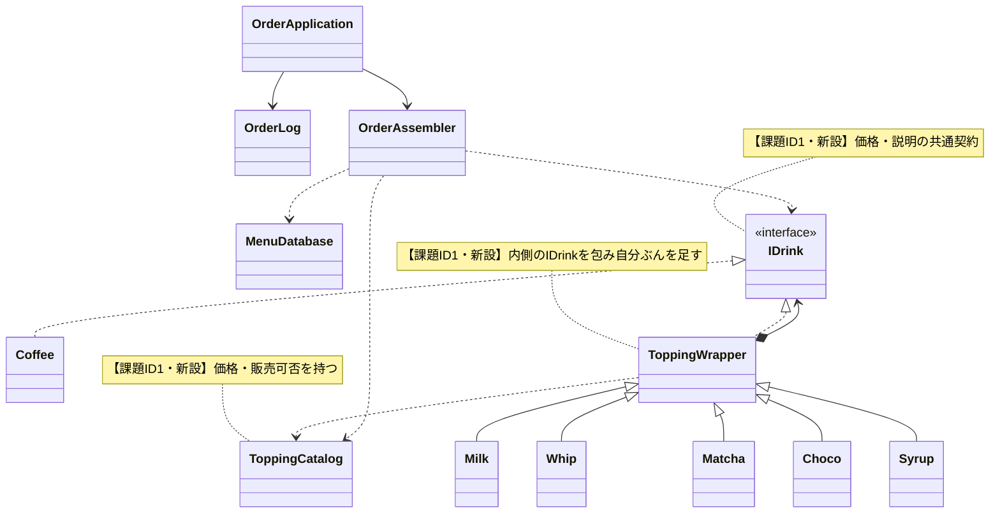
```mermaid
classDiagram
    class MenuDatabase
    class OrderApplication
    class OrderLog
    class IDrink { <<interface>> }
    class Coffee
    class ToppingWrapper
    class Milk
    class Whip
    class Matcha
    class Choco
    class Syrup
    class ToppingCatalog
    class OrderAssembler

    IDrink <|.. Coffee
    IDrink <|.. ToppingWrapper
    ToppingWrapper *--> IDrink
    ToppingWrapper <|-- Milk
    ToppingWrapper <|-- Whip
    ToppingWrapper <|-- Matcha
    ToppingWrapper <|-- Choco
    ToppingWrapper <|-- Syrup
    ToppingWrapper ..> ToppingCatalog
    OrderAssembler ..> ToppingCatalog
    OrderAssembler ..> MenuDatabase
    OrderAssembler ..> IDrink
    OrderApplication --> OrderAssembler
    OrderApplication --> OrderLog

    note for IDrink "【課題ID1・新設】価格・説明の共通契約"
    note for ToppingWrapper "【課題ID1・新設】内側のIDrinkを包み自分ぶんを足す"
    note for ToppingCatalog "【課題ID1・新設】価格・販売可否を持つ"

    classDef focus fill:#FFF2CC,stroke:#D6B656,stroke-width:2px,color:#222222
    cssClass "IDrink,ToppingWrapper,Milk,Whip,Matcha,Choco,Syrup,ToppingCatalog,OrderAssembler" focus
```

この完成図は、`IDrink`を軸に装飾を連結する構造に加え、価格・販売可否を持つ`ToppingCatalog`と、要求から組み立てる`OrderAssembler`を示しています。`IDrink`が共通契約、`Coffee`が基本部品、`ToppingWrapper`が内側を保持する装飾の共通骨格、各トッピングが具体的な装飾です。`ToppingCatalog`と`OrderAssembler`は、連結構造の外側で価格データと組み立てを支えます。

#### 完成後の実行シーケンス

装飾連結構造の実行時のオブジェクト間のやり取りを可視化します。`OrderApplication` が `OrderAssembler` へ組み立てを委ね、`OrderAssembler` が `wrapOne()` で選択順に包み、`getPrice()` の呼び出しがデコレータチェーンを連鎖していく様子が確認できます。

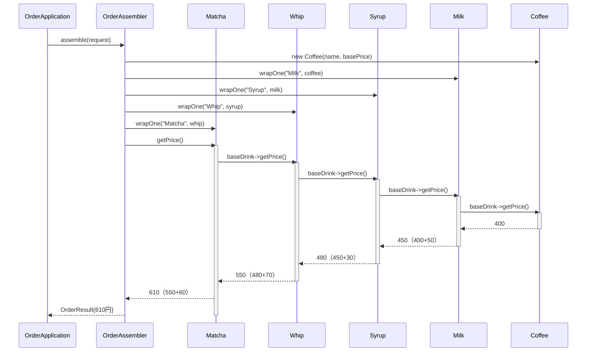
```mermaid
sequenceDiagram
    participant OA as OrderApplication
    participant AS as OrderAssembler
    participant Ma as Matcha
    participant Wh as Whip
    participant Sy as Syrup
    participant Mi as Milk
    participant C as Coffee

    OA->>AS: assemble(request)
    AS->>C: new Coffee(name, basePrice)
    AS->>Mi: wrapOne("Milk", coffee)
    AS->>Sy: wrapOne("Syrup", milk)
    AS->>Wh: wrapOne("Whip", syrup)
    AS->>Ma: wrapOne("Matcha", whip)
    AS->>Ma: getPrice()
    activate Ma
    Ma->>Wh: baseDrink->getPrice()
    activate Wh
    Wh->>Sy: baseDrink->getPrice()
    activate Sy
    Sy->>Mi: baseDrink->getPrice()
    activate Mi
    Mi->>C: baseDrink->getPrice()
    activate C
    C-->>Mi: 400
    deactivate C
    Mi-->>Sy: 450（400+50）
    deactivate Mi
    Sy-->>Wh: 480（450+30）
    deactivate Sy
    Wh-->>Ma: 550（480+70）
    deactivate Wh
    Ma-->>AS: 610（550+60）
    AS-->>OA: OrderResult{610円}
    deactivate Ma
```

`OrderApplication` は `IDrink*` という型だけを通じてチェーンを呼び出します。内部で何層に連鎖しているかの知識は、組み立て部分にだけ閉じています。

---

#### 完成コード

定義を1つずつ、上から順に読みます。**メンバー変数と、それを使う処理を同じ場所で見られるように**しています。宣言と定義を分けるのは `OrderAssembler` と `OrderApplication` だけです。判断の基準は次の一行です。

コードを読むときは、まずメンバーが保持する状態を確認し、次に各操作の入力・戻り値・状態変更を追います。

`main()` と実行結果は最後に置きます。上から順に連結すれば、そのまま1つのC++14プログラムとして動きます。

---

**共通ヘッダーとトッピングID**

```cpp
#include <iostream>
#include <string>
#include <map>
#include <vector>
#include <cassert>

using namespace std;

// トッピングID（生成の分岐で使う直文字列を名前へ置き換える）
namespace ToppingId {
    const string Milk   = "Milk";
    const string Syrup  = "Syrup";
    const string Whip   = "Whip";
    const string Matcha = "Matcha";
    const string Choco  = "Choco";
}
```

---

**MenuItem と MenuDatabase**

1-4（実装コード）のまま使います。

```cpp
struct MenuItem {
    string name;      // 商品名
    int basePrice;    // 基本価格（円）
};
```

**MenuDatabase**

このブロックでは `MenuDatabase` の定義だけを確認します。

```cpp
class MenuDatabase {
private:
    map<string, MenuItem> items;
public:
    MenuDatabase() {
        items["DRINK001"] = {"ホットコーヒー", 400};
        items["DRINK002"] = {"アイスコーヒー", 450};
    }

    bool exists(const string& id) const {
        return items.count(id) > 0;
    }

    MenuItem get(const string& id) const {
        return items.at(id);
    }

    void save(const string& id, const MenuItem& item) {
        items[id] = item;             // 実行中のメニュー表へ追加
    }
};
```

---

**ToppingSpec と ToppingCatalog**

トッピングの表示名・追加料金・販売可否を持つ保存データです。

```cpp
// トッピングの表示名・追加料金・販売可否を保持する保存データ（境界）
struct ToppingSpec {
    string label;   // 表示名（スタッフ向け作業指示に使う）
    int price;      // 追加料金（円）
    bool onSale;    // 販売可否（販売停止・在庫切れはfalse）
};
```

**ToppingCatalog**

このブロックでは `ToppingCatalog` の定義だけを確認します。

```cpp
class ToppingCatalog {
private:
    map<string, ToppingSpec> specs;
public:
    ToppingCatalog() {
        specs["Milk"]         = {"Milk",   50, true};
        specs["Syrup"]        = {"Syrup",  30, true};
        specs["Whip"]         = {"Whip",   70, true};
        specs["Matcha"]       = {"Matcha", 60, true};
        specs["Choco"]        = {"Choco",  40, true};
        specs["SeasonalMint"] = {"SeasonalMint", 80, false};
    }

    bool exists(const string& id) const { return specs.count(id) > 0; }
    bool onSale(const string& id) const {
        auto it = specs.find(id);

        return it != specs.end() && it->second.onSale;
    }

    int priceOf(const string& id) const { return specs.at(id).price; }
    string labelOf(const string& id) const { return specs.at(id).label; }
};
```

---

**OrderRecord と OrderLog**

```cpp
struct OrderRecord {
    string itemId;
    string description;  // 注文の説明（e.g. "ホットコーヒー + Milk + Syrup"）
    int totalPrice;
};
```

**OrderLog**

このブロックでは `OrderLog` の定義だけを確認します。

```cpp
// 注文ログを管理するクラス
class OrderLog {
    vector<OrderRecord> records;
public:
    void add(const string& itemId, const string& description,
             int totalPrice) {
        records.push_back({itemId, description, totalPrice});
    }

    void printAll() const {
        for (const auto& r : records) {
            cout << "[" << r.itemId << "] " << r.description
                 << " " << r.totalPrice << "円" << endl;
        }
    }

    int size() const { return (int)records.size(); }
};
```

---

**IDrink**

```cpp
// ドリンクとしてのビジネス上の責任（契約）を示すインターフェース
class IDrink {
public:
    virtual ~IDrink() = default;
    virtual int getPrice() const = 0;
    virtual string getDescription() const = 0;
};
```

このインターフェースが基本ドリンクとトッピングの両方が守る「契約」です。呼び出し側はこの型だけを知れば済みます。

`ToppingCatalog` は、トッピングの追加料金と販売可否を保持する保存データです。上のコードに登録した全トッピングを、代表ケースの図とは別に一覧で示します。価格は商品企画部が、販売可否は在庫・販売停止の状況が決めるデータで、各トッピングクラスはこの表の値を読みます。

| トッピングID      | 表示名          | 追加料金 | 販売可否 |
| ------------ | ------------ | ---- | ---- |
| Milk         | Milk         | +50円 | 販売中  |
| Syrup        | Syrup        | +30円 | 販売中  |
| Whip         | Whip         | +70円 | 販売中  |
| Matcha       | Matcha       | +60円 | 販売中  |
| Choco        | Choco        | +40円 | 販売中  |
| SeasonalMint | SeasonalMint | +80円 | 販売停止 |

---

**Coffee**

基本ドリンクです。

```cpp
// 変わらない処理の骨格：基本のドリンク
class Coffee : public IDrink {
    string name;
    int basePrice;
public:
    Coffee(const string& itemName, int price)
        : name(itemName), basePrice(price) {}
    int getPrice() const override { return basePrice; }
    string getDescription() const override { return name; }
};
```

`Coffee` は最も変化が少ないクラスです。基本ドリンクの種類が増えるときだけ、このような新しいクラスを追加します。

---

**ToppingWrapper**

トッピングの基底です。

```cpp
// 変わる部分を繋ぐ仲介役：トッピングの基底クラス
class ToppingWrapper : public IDrink {
protected:
    IDrink* baseDrink;             // 中身（基本ドリンクや他のトッピング）
    const ToppingCatalog* catalog; // 価格・表示名の保存データ
    string toppingId;              // 自分がどのトッピングか
public:
    ToppingWrapper(IDrink* base, const ToppingCatalog* cat,
                   const string& id)
        : baseDrink(base), catalog(cat), toppingId(id) {}
    ~ToppingWrapper() override { delete baseDrink; }
    int getPrice() const override {
        // 価格は自分で持たず、カタログ（保存データ）から読む
        return baseDrink->getPrice() + catalog->priceOf(toppingId);
    }

    string getDescription() const override {
        return baseDrink->getDescription()
             + " + " + catalog->labelOf(toppingId);
    }
};
```

`ToppingWrapper` が「中に別のドリンクを包む」仕組みを提供します。具体的なトッピングはこのクラスを継承するだけで済みます。

---

**Milk と Whip**

1-4から続く具体トッピングです。

```cpp
// 具体的なトッピング：自分の識別子だけを名乗る
class Milk : public ToppingWrapper {
public:
    Milk(IDrink* base, const ToppingCatalog* cat)
        : ToppingWrapper(base, cat, "Milk") {}
};
```

**Whip**

このブロックでは `Whip` の定義だけを確認します。

```cpp
// 具体的なトッピング：ホイップ
class Whip : public ToppingWrapper {
public:
    Whip(IDrink* base, const ToppingCatalog* cat)
        : ToppingWrapper(base, cat, "Whip") {}
};
```

各トッピングクラスは、自分がどのトッピングかを名乗るだけになりました。価格や表示名は自分では持たず、基底の `ToppingWrapper` が `ToppingCatalog`（保存データ）から読みます。中身が何層に重なっているかを知る必要もありません。

---

**Syrup と Matcha と Choco**

`Syrup` は1-4から、`Matcha` と `Choco` は変更要求で追加した具体トッピングです。

```cpp
// 新しいトッピングでは、この識別クラスに加えてカタログ登録と組み立て登録を行う
class Syrup : public ToppingWrapper {
public:
    Syrup(IDrink* base, const ToppingCatalog* cat)
        : ToppingWrapper(base, cat, "Syrup") {}
};
```

**Matcha**

このブロックでは `Matcha` の定義だけを確認します。

```cpp
class Matcha : public ToppingWrapper {
public:
    Matcha(IDrink* base, const ToppingCatalog* cat)
        : ToppingWrapper(base, cat, "Matcha") {}
};
```

**Choco**

このブロックでは `Choco` の定義だけを確認します。

```cpp
class Choco : public ToppingWrapper {
public:
    Choco(IDrink* base, const ToppingCatalog* cat)
        : ToppingWrapper(base, cat, "Choco") {}
};
```

佐藤マネージャーが要求した「抹茶パウダーの追加」も「チョコチップの追加」も、変更の中心はそれぞれの追加クラスと組み立てコードに移ります。中心となる既存クラスには、抹茶やチョコの条件分岐を追加していません。

---

**OrderRequest と OrderResult**

注文は `OrderRequest`（基本ドリンクIDと、選択順のトッピングID列）という要求オブジェクトで表します。どの種類をどの順で重ねるかは `new Whip(new Milk(...))` のような入れ子ではなく、要求データとして持ちます。`OrderResult` は注文名・金額、または失敗理由を返します。

```cpp
// 注文要求：基本ドリンクIDと、選択順のトッピングID列をデータで持つ
struct OrderRequest {
    string baseItemId;
    vector<string> toppingIds;
};
```

**OrderResult**

このブロックでは `OrderResult` の定義だけを確認します。

```cpp
// 注文結果（結果オブジェクト）：成功可否・注文名・金額・エラー理由
struct OrderResult {
    bool ok;
    string description;
    int totalPrice;
    string error;
};
```

`OrderRequest` は基本ドリンクIDとトッピングの並びをデータで表し、`OrderResult` は成功可否・注文名・金額・エラー理由を返します。

---

**OrderAssembler の宣言**

依存の組み立てと検証を担います。

```cpp
// 依存の組み立てと検証を担うクラス
class OrderAssembler {
private:
    MenuDatabase& db;
    ToppingCatalog& catalog;

    IDrink* wrapOne(const string& id, IDrink* base);
public:
    OrderAssembler(MenuDatabase& d, ToppingCatalog& c)
        : db(d), catalog(c) {}

    OrderResult assemble(const OrderRequest& req);
};
```

メニューとカタログを外から受け取って参照で持ちます。**公開操作は `assemble()` の1つだけです。**

---

**OrderAssembler::wrapOne()**

トッピングID1つを、内側のドリンクへ1層かぶせます。

```cpp
IDrink* OrderAssembler::wrapOne(const string& id, IDrink* base) {
    if (id == ToppingId::Milk)   return new Milk(base, &catalog);
    if (id == ToppingId::Syrup)  return new Syrup(base, &catalog);
    if (id == ToppingId::Whip)   return new Whip(base, &catalog);
    if (id == ToppingId::Matcha) return new Matcha(base, &catalog);
    if (id == ToppingId::Choco)  return new Choco(base, &catalog);

    return base;
}
```

**具体クラスの名前を知っているのは、この関数だけです。** 判定は `ToppingId` の名前付き定数で行うので、直文字列の打ち間違いを防げます。トッピングを追加するときに触るのは、ここと `ToppingCatalog` の登録です。

---

**OrderAssembler::assemble()**

```cpp
OrderResult OrderAssembler::assemble(const OrderRequest& req) {
    if (!db.exists(req.baseItemId)) {
        return {false, "", 0,
                "メニューID " + req.baseItemId + " は存在しません"};
    }

    // 手順1：全トッピングの登録と販売可否を先に確認する
    for (const auto& toppingId : req.toppingIds) {
        if (!catalog.exists(toppingId)) {
            return {false, "", 0,
                    "トッピング " + toppingId + " は未対応です"};
        }

        if (!catalog.onSale(toppingId)) {
            return {false, "", 0, "トッピング " + toppingId
                    + " は販売停止または在庫切れです"};
        }
    }

    // 手順2：検証を通ったので、選択順に基本ドリンクへ重ねる
    MenuItem base = db.get(req.baseItemId);
    IDrink* drink = new Coffee(base.name, base.basePrice);

    for (const auto& toppingId : req.toppingIds) {
        drink = wrapOne(toppingId, drink);
    }
OrderResult r{true, drink->getDescription(),
              drink->getPrice(), ""};
delete drink;

return r;
}
```

- **順序に意味：** 手順1で全トッピングを先に検証し、手順2で初めて生成へ進みます。逆にすると、途中で拒否したときに生成済みの層が漏れます
- **失敗の扱い：** どの検証で落ちても `OrderResult` の `error` に理由を入れ、注文を作りません
- **所有：** `delete drink;` が連鎖の先頭を消すと、`ToppingWrapper` のデストラクタが内側を順に消します

---

**OrderApplication の宣言**

依存の組み立てと実行を担います。

```cpp
// 依存の組み立てと実行を担うアプリケーションクラス
class OrderApplication {
private:
    MenuDatabase db;
    ToppingCatalog catalog;
    OrderAssembler assembler;
    OrderLog log;
public:
    OrderApplication() : assembler(db, catalog) {}

    void run();
    void runRegressionTests();
};
```

4つの部品を値メンバとして所有します。**`IDrink` の具体クラス名は1つも出てきません。**

---

**OrderApplication::run()**

代表的な注文シナリオを順に実行します。

```cpp
void OrderApplication::run() {
    vector<OrderRequest> requests = {
        {"DRINK001", {}},                          // 基本のみ（トッピングなし）
        {"DRINK001", {"Milk"}},               // ミルク1種を1個
        {"DRINK001", {"Milk", "Syrup"}}, // ミルク＋シロップ
        {"DRINK001", {"Milk", "Whip"}},  // ミルク＋ホイップ
        {"DRINK001", {"Syrup", "Whip"}}, // 指定順(Syrup→Whip)が表示名に反映
        {"DRINK001", {"Milk", "Syrup", "Whip"}}, // 3種盛り
        // 抹茶を足した4種
        {"DRINK001", {"Milk", "Syrup",
                      "Whip", "Matcha"}},
        {"DRINK001", {"Choco"}},              // 追加種類チョコ単体
        // 抹茶＋チョコ混在
        {"DRINK001", {"Milk", "Matcha", "Choco"}},
        {"DRINK999", {"Milk"}},               // 未登録メニュー → エラー
        {"DRINK001", {"SeasonalMint"}},       // 販売停止トッピング → エラー
    };

    for (const auto& req : requests) {
        OrderResult res = assembler.assemble(req);

        if (res.ok) {
            cout << res.description << " → " << res.totalPrice
                 << "円" << endl;
            log.add(req.baseItemId, res.description,
                    res.totalPrice);
        } else {
            cout << "エラー：" << res.error << endl;
        }
    }

cout << "\n--- 注文ログ ---\n";
log.printAll();
}
```

11件の要求を並べ、1件ずつ `assemble()` へ渡します。**要求はデータです。** `new Whip(new Milk(...))` のような入れ子を書く場所はどこにもありません。

---

**OrderApplication::runRegressionTests()**

```cpp
void OrderApplication::runRegressionTests() {
    OrderResult r1 = assembler.assemble({"DRINK001", {}});
    assert(r1.ok && r1.totalPrice == 400);
    OrderResult r6 = assembler.assemble(
        {"DRINK001", {"Milk", "Syrup", "Whip"}});
    assert(r6.ok && r6.totalPrice == 550);
    OrderResult invalid = assembler.assemble(
        {"DRINK001", {"SeasonalMint"}});
    assert(!invalid.ok);
    cout << "回帰テスト: PASS" << endl;
}
```

基本価格、3種合計、販売停止拒否の3点を `assert` で確認します。1-2（動作例テーブル）の既存ケースが落ちていないことの機械的な証拠です。

---

#### `main()` と実行結果

1-2の動作例テーブルと、変更要求後の代表ケースを通します。**見るのは、既存ケースの価格とエラー条件が保たれたまま、重ね順だけが注文で指定した順へ変わっているかです。**

```cpp
// main() の責任はプログラムを起動することだけ
int main() {
    OrderApplication app;
    app.run();
    app.runRegressionTests();

    return 0;
}
```

```
ホットコーヒー → 400円
ホットコーヒー + Milk → 450円
ホットコーヒー + Milk + Syrup → 480円
ホットコーヒー + Milk + Whip → 520円
ホットコーヒー + Syrup + Whip → 500円
ホットコーヒー + Milk + Syrup + Whip → 550円
ホットコーヒー + Milk + Syrup + Whip + Matcha → 610円
ホットコーヒー + Choco → 440円
ホットコーヒー + Milk + Matcha + Choco → 550円
エラー：メニューID DRINK999 は存在しません
エラー：トッピング SeasonalMint は販売停止または在庫切れです

--- 注文ログ ---
[DRINK001] ホットコーヒー 400円
[DRINK001] ホットコーヒー + Milk 450円
[DRINK001] ホットコーヒー + Milk + Syrup 480円
[DRINK001] ホットコーヒー + Milk + Whip 520円
[DRINK001] ホットコーヒー + Syrup + Whip 500円
[DRINK001] ホットコーヒー + Milk + Syrup + Whip 550円
[DRINK001] ホットコーヒー + Milk + Syrup + Whip + Matcha 610円
[DRINK001] ホットコーヒー + Choco 440円
[DRINK001] ホットコーヒー + Milk + Matcha + Choco 550円
回帰テスト: PASS
```

各注文は `OrderRequest`（基本ドリンクIDと、選択順のトッピングID列）として渡し、`OrderAssembler` がメニューとトッピングの販売可否を確認してから、選択順にドリンクを包みます。5行目の「ホットコーヒー + Syrup + Whip」は、フェーズ1ではフラグの判定順によって「ホットコーヒー + Whip + Syrup」と表示されていたケースです。変更後は注文で指定した Syrup → Whip の順が表示名に反映され、価格500円は変わりません。価格と表示名は各トッピングクラスが持たず、`ToppingCatalog`（保存データ）から読みます。`DRINK999` は未登録メニュー、`SeasonalMint` は `ToppingCatalog` で販売停止としているため、どちらも注文結果を作らずエラー理由だけを返しています。最後の`回帰テスト: PASS`は、基本価格、3種合計、販売停止拒否の`assert`を`main()`から実際に実行し、すべて通過した証拠です。

---

#### 最終要求の実装・受入エビデンス

変更後要求ベースラインの全有効要求IDを同じ順序で照合します。今回変わらなかった既存要求も対象にするため、要求の消失を検出できます。

| 要求ID | 最終要求 | 適用コード | 実行シナリオ・観測結果・判定 |
|---|---|---|---|
| 要求ID1 | 登録済みの基本ドリンクを選ぶ | メニュー取得、`Coffee` | 名称・基本価格を取得し未登録IDを拒否<br/>**判定:** 合格 |
| 要求ID2 | Matcha・Chocoを含む複数トッピングを指定順で重ねる | 各`ToppingWrapper`、`OrderAssembler` | 入力順の名称と全要素の合計価格<br/>**判定:** 合格 |
| 要求ID3 | 販売停止・在庫切れ・不正なトッピングを拒否する | トッピング設定、`OrderAssembler` | 理由を返し注文を生成しない<br/>**判定:** 合格 |
| 要求ID4 | 確定した注文の注文名と合計金額を記録する | `OrderLog`、`OrderApplication` | 注文ログ9件に注文名と合計金額が並ぶ<br/>**判定:** 合格 |

上の表は継続（要求ID1）・変更（要求ID2・要求ID3）を同じ順序で並べ、変わらなかった既存要求も回帰対象に含めています。継続要求が合格していることで、既存動作が落ちていないことを確認できます。要求の受入・回帰はここで完了します。課題IDへ直接対応付けず、以下では変更試行の痛みから導いた構造課題だけを別に確認します。

#### 設計課題の構造改善結果

要求の受入とは分けて、課題IDごとに構造と変更影響を確認します。

| 課題ID | 構造差分・コード適用先 | 確認できた効果 | 残る変更先 |
|---|---|---|---|
| 課題ID1 | `IDrink`と各Wrapperへ価格・説明を分離し、Assemblerが順に連結 | 種類・順序・販売状態の変更先が局所化した | 新トッピングとカタログ登録 |
#### 変更前→変更後の不変条件照合

| 変更対象外 | 変更前 | 変更後 | 確認根拠 |
|---|---|---|---|
| メニュー取得 | `MenuDatabase` から `MenuItem` を取得 | 同じ名前・基本価格をCoffeeへ渡す | 7-1の注文名と価格 |
| 注文入力 | 基本商品IDとトッピング列 | 同じ入力を `OrderAssembler` が解釈 | 正常・未登録トッピングケース |

### 7-2：動作シーケンス図の検証

完成クラス図と実行シーケンスは、完成コードへ入る前に示しました。ここまでのコード、要求追跡表、不変条件照合を証拠として、次節で変更影響を再確認します。

### 7-3：変更影響グラフ（改善後）

フェーズ3で確認した「抹茶トッピングの追加」のシナリオを、3-2（変更影響グラフ）と同じ粒度で再度適用します。

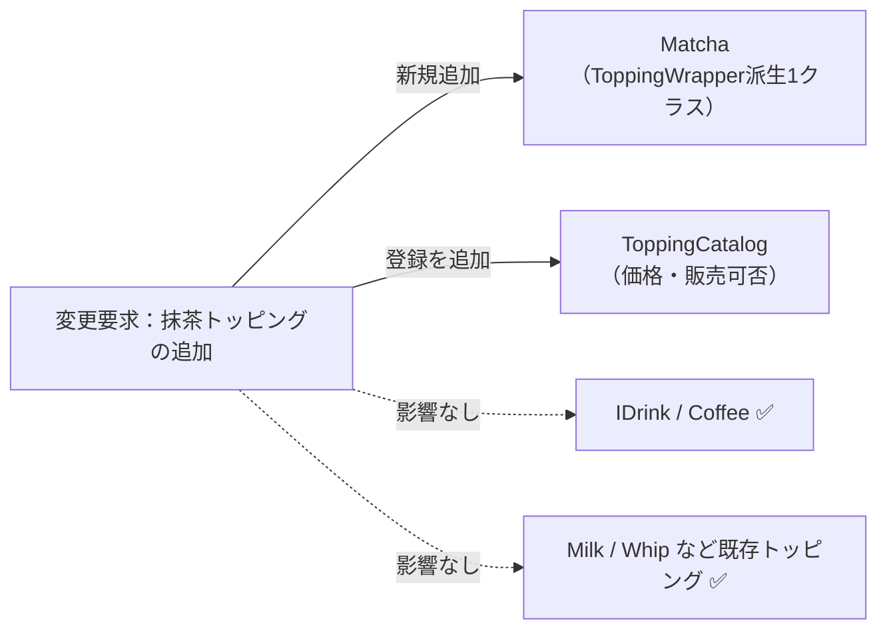
```mermaid
graph LR
    T1["変更要求：抹茶トッピングの追加"]
        -->|新規追加| N1["Matcha<br>（ToppingWrapper派生1クラス）"]
    T1 -->|登録を追加| N2["ToppingCatalog<br>（価格・販売可否）"]
    T1 -. "影響なし" .-> A["IDrink / Coffee ✅"]
    T1 -. "影響なし" .-> B["Milk / Whip など既存トッピング ✅"]
```

フェーズ3の変更影響グラフと同じ要求・同じ粒度で比べると、共通契約 `IDrink` と基本ドリンク・既存トッピングは変更先から消えました。抹茶トッピングの追加は、`Matcha` の1クラスと `ToppingCatalog` への登録だけに限定されます。

| 3-2で影響した場所 | 修正後 | 構造変更との対応 |
|---|---|---|
| `CustomDrink` のフラグ・価格分岐・説明分岐 | **修正しない** | 価格・表示名を各トッピングへ移した |
| 3-2にはトッピング部品がなかった | `Matcha` を1クラス追加する | トッピングの変更先を新しく作った |
| 価格・販売可否の登録 | `ToppingCatalog` へ抹茶を登録する | 登録だけを増やす |

---

### 7-4：変更シナリオ表

今回の変更ID1〜変更ID3について、フェーズ1の構造で必要だった修正と完成構造の結果を対比します。

| 変更依頼 | フェーズ1の現状構造での影響 | 完成構造での結果 |
|---|---|---|
| 変更ID1：Matcha（60円）とChoco（40円）を追加する | `CustomDrink`のフラグ・価格分岐・表示分岐を種類ごとに修正 | `Matcha`と`Choco`を組み立てへ登録し、既存と同じ方法で名称と価格へ加算 |
| 変更ID2：利用者が指定した順にトッピングを重ねる | `if`文の固定順を入力順へ作り直す | 順序付き入力どおりに部品を包み、表示名と合計価格が同じ順序で得られることを確認 |
| 変更ID3：販売停止・在庫切れのトッピングを注文前に拒否する | 呼び出し側または`CustomDrink`へ個別判定を追加 | `ToppingCatalog`で組み立て前に確認し、販売不可なら注文を生成しないことを確認 |

責任を小さな部品へ分けた代わりに、クラス数と組み立て順を管理する必要があります。

---

### 問題・原因・課題・解決策

| | 内容 |
|---|---|
| **問題** | 変更ID1〜変更ID3を適用すると、`CustomDrink`のメンバ変数・コンストラクタ・価格計算・名称生成と呼び出し側を連動して修正する必要があった |
| **原因** | 基本ドリンクの骨格と、各トッピングの価格・名前・販売可否・表示順という変わる理由が異なるものが同じ場所に混在している |
| **課題ID1** | 各トッピングは識別子と包む責任を持ち、価格・表示名・販売可否は `ToppingCatalog` から取得する。基本ドリンク側の条件分岐を増やさず、注文で指定した順に組み合わせられる形にする |
| **解決策** | 装飾連結構造：基本ドリンクとトッピングを同じ `IDrink` インターフェースで統一し、トッピング自身が別のドリンクを包む `ToppingWrapper` 構造で機能を動的に重ね合わせる。販売可否は `ToppingCatalog` で確認してから包む |

## 整理

### フェーズとこの章でやったこと

| **フェーズ** | **この章でやったこと** |
| --- | --- |
| 🔵 フェーズ1：現状把握 | 仕様と動作例テーブルを確認した後、コードをクラス単位で読んだ。クラス構成図と変更要求を把握した |
| 🟣 フェーズ2：仮説立案 | 業務機能の所在表でクラスごとの変わる理由を確認した。今回の確定変更と将来リスクを分け、販売可否や表示順も変化軸として整理した |
| 🟣 フェーズ3：問題特定 | 抹茶パウダーの追加を試み、影響がモバイルアプリ側にまで波及することを確認した |
| 🟠 フェーズ4：原因分析 | 変わる理由が異なる知識が同じ場所にいることが痛みの根本と特定した |
| 🟡 フェーズ5：課題定義 | getPrice()/getDescription() を共通の接続点とし、販売可否は組み立て前の境界で確認する課題を定めた |
| 🔴 フェーズ6：対策検討 | 一覧構造との完成案比較を行い、内側価格に依存する追加料を扱える連結構造を採用した。`OrderAssembler`が要求順に生成した各層を同じ`IDrink`として受け渡し、価格・説明の実行までつないだ |
| 🟢 フェーズ7：対策実施 | 最終コードを実装し、販売停止ケースと変更影響グラフで変更の局所化を確認した |

### 責任の移動

| **責任** | **変更前** | **変更後** |
| --- | --- | --- |
| ドリンクの価格・名前の提供 | `CustomDrink`（全組み合わせをif-elseで直書き） | `Coffee` / `Milk` / `Matcha` 等の個別クラス |
| トッピングの連鎖的な価格加算 | `CustomDrink`（フラグで直書き） | `Milk` / `Matcha` 等のラッパークラス |
| トッピングの販売可否 | 未整理、または呼び出し側の個別判定 | `ToppingCatalog` |
| トッピングの表示順 | `CustomDrink` 内の `if` 文の並び | `OrderRequest`の順を解釈する`OrderAssembler` |
| 注文部品の検証・生成・連結 | `CustomDrink`と呼び出し元へ分散 | `OrderAssembler` |
| ユースケース入口と依存の所有 | `main()`相当 | `OrderApplication`（`OrderAssembler`と`OrderLog`を所有） |
| ドリンク契約の定義 | —（なし） | `IDrink` |
| トッピング連鎖の仲介役定義 | —（なし） | `ToppingWrapper` |

---

### 複雑さを足しても対策は変わるか

| 追加した複雑さ | 見えた原因 | 定めた課題 | 採用した扱い |
|---|---|---|---|
| トッピングの重ね順 | `if` 文の並びが表示順を決めている | 選択順を組み立て順として表せるようにする | ラッパーを包む順序で価格と表示名を再計算する |
| 在庫/販売停止 | 注文へ重ねてよいかの判定が基本ドリンク側へ入りそうになる | 包む前の境界で販売可否を確認する | `ToppingCatalog` で拒否し、注文を作らない |
| 価格再計算 | 価格知識が `CustomDrink` の条件分岐へ集まる | 価格差分をトッピング側へ寄せる | 各トッピングクラスの `getPrice()` に閉じる |
| 表示名再計算 | 表示名の知識も `CustomDrink` に集まる | 価格と同じ契約で表示名も重ねる | 各トッピングクラスの `getDescription()` に閉じる |

---

## 振り返り

### 「この章を読むと得られること」は手に入ったか

| **得られること** | **この章のどこで示したか** |
| --- | --- |
| 1. 変動箇所の識別 | フェーズ2の業務機能の所在表と変わる理由の分析で、変わる理由の異なる知識の混在を発見した |
| 2. 接続点の診断 | フェーズ4で、トッピングの種類・価格・販売可否・表示順が基本ドリンク側へ漏れていることを確認した |
| 3. 変更局所化の説明 | フェーズ7の変更シナリオ表で、変更の中心が新しい実装クラス、販売可否境界、組み立てコードへ移る構造を示した |
| 4. 同じインターフェースで重ねる視点 | 課題ID1節の【1】契約で、基本機能と追加機能を同じ `IDrink` で扱う構造を体験した |

### 第0章の3つの設計原則はどう適用されたか

**原則1「変わるものをカプセル化せよ」の現れ**

- 具体化された場所：各トッピングクラス（`Milk`, `Matcha` など）
- 解説：トッピングという「変わる理由」を個別のクラスに分離し、計算ロジックを隠蔽しました。新しいトッピングが追加されても `Coffee` や既存のトッピングクラスは無影響です。

**原則2「実装ではなくインターフェースに対してプログラムせよ」の現れ**

- 具体化された場所：`IDrink` インターフェース
- 解説：呼び出し側は具体クラスを知らず、`IDrink*` というインターフェースを通じて価格や説明を取得するようになりました。`ToppingWrapper` が `IDrink*` 型で内部のドリンクを保持していることが、デコレータの連鎖を可能にしています。

**原則3「継承よりコンポジションを優先せよ」の判断**

- 判断：`ToppingWrapper`が内側の`IDrink`を所有し、入力順に包むことで機能を組み合わせる。「ホットコーヒー＋Milk＋Whip」を派生クラス名で表さないため、組み合わせ爆発を防げる。
- 継承との区別：`ToppingWrapper`や`Coffee`が`IDrink`を継承するのは、内側と外側を同じ入口から呼べるようにする契約実装である。追加機能を重ねる仕組みそのものは、`baseDrink`を保持するコンポジションにある。

---

## あなたのコードで考えてみてください

この章で辿った思考プロセスを、あなた自身のコードに当てはめてみましょう。

1. **変動の兆候を探す：** あなたのコードに「機能の組み合わせが増えるたびに、既存クラスを継承した新しいサブクラスを作っている」構造がありますか？
2. **変える理由を問う：** その機能の組み合わせは、どの業務機能に属しますか？コンパイル時に決まるものですか、それとも実行時に動的に変わるものですか？
3. **継承の限界を測る：** トッピングの種類が n 種類になったとき、継承で全組み合わせを表現すると 2ⁿ 個のサブクラスが必要になります。あなたのコードは現実的に管理できる数に収まっていますか？
4. **包んだ後を想像する：** もし「機能を追加する層」をクラスとして独立させると、既存のクラスに触れずに新しい機能を加えられますか？組み合わせの数はどう変わりますか？

---

**題材を置き換えるときの共通手順**

この章の題材名を、自分の現場のシステム名に置き換えて考えます。

1. そのシステムは、誰が何を達成するために使うものか。
2. 入力、加工、出力は何か。
3. 最近入った変更要求、または次に来そうな変更要求は何か。
4. その変更で、触りたくない場所まで修正や再テストが広がるか。
5. 変えたいものと守りたいものを分けると、接続点には何を残すべきか。
6. 全課題を満たす完成構造が複数成立するか。成立するなら、責任配置・変更影響・導入コストの差は何か。

ここまで問題から導いた「装飾連結構造」は、一般に **Decoratorパターン**と呼ばれます。ここからは題材を離れ、この名前で共有される抽象的な骨格を確認します。

## パターン解説：Decorator パターン

Decorate（装飾）という名の通り、既存のオブジェクトに「動的に」新しい機能を追加できる構造です。

### パターンの骨格

基本機能を持つオブジェクトを、それと同じインターフェースを持つ「装飾オブジェクト」で包み込むことで、機能を多層的に重ね合わせます。

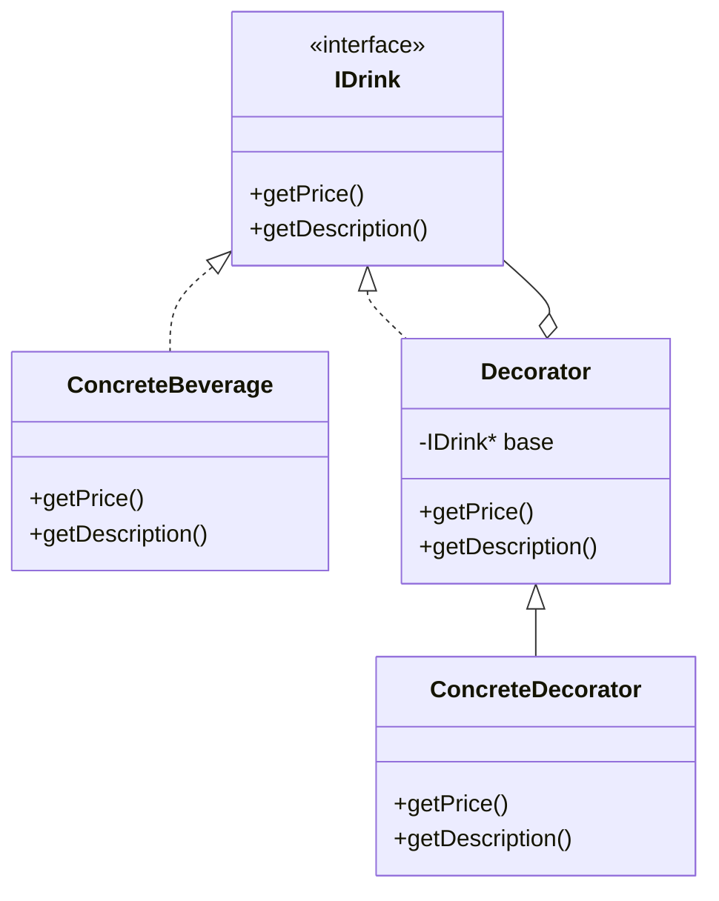
```mermaid
classDiagram
    class IDrink {
        <<interface>>
        +getPrice()
        +getDescription()
    }
    class ConcreteBeverage {
        +getPrice()
        +getDescription()
    }
    class Decorator {
        -IDrink* base
        +getPrice()
        +getDescription()
    }
    class ConcreteDecorator {
        +getPrice()
        +getDescription()
    }
    IDrink <|.. ConcreteBeverage
    IDrink <|.. Decorator
    Decorator o-- IDrink
    Decorator <|-- ConcreteDecorator
```

### 抽象骨格の実行シーケンス

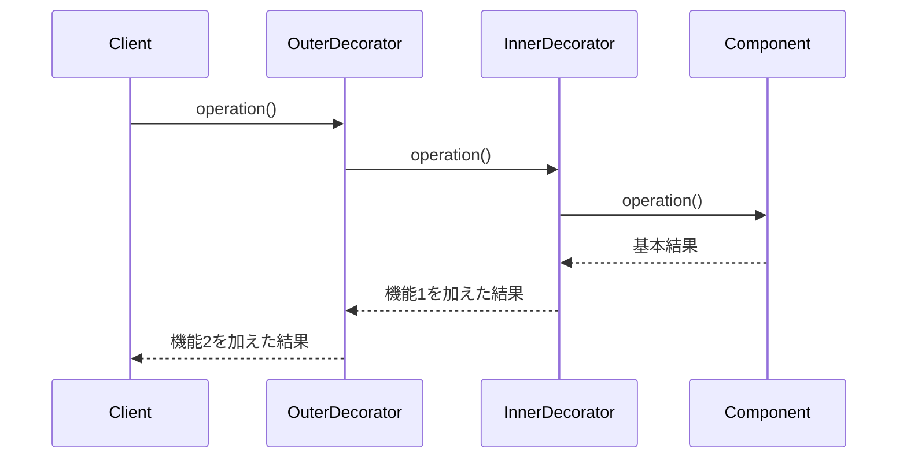
```mermaid
sequenceDiagram
    participant C as Client
    participant D2 as OuterDecorator
    participant D1 as InnerDecorator
    participant B as Component
    C->>D2: operation()
    D2->>D1: operation()
    D1->>B: operation()
    B-->>D1: 基本結果
    D1-->>D2: 機能1を加えた結果
    D2-->>C: 機能2を加えた結果
```

外側から内側へ同じ契約を呼び、戻りながら各Decoratorの機能を重ねます。

### この章の実装との対応

GoF（Gang of Four）とは、1994年に出版された書籍『Design Patterns』の4人の著者の総称です。彼らが整理した23のパターンは、現在も設計の共通言語として広く使われています。

| GoFの名前 | この章での対応 |
|---|---|
| Component（インターフェース） | `IDrink` |
| ConcreteComponent（基本機能） | `Coffee` |
| Decorator（装飾の基底） | `ToppingWrapper` |
| ConcreteDecorator（具体的な装飾） | `Milk` / `Whip` / `Matcha` 等 |

### 使いどころと限界

- **使うと良い状況：** 実行時に動的に機能を組み合わせたい場合。クラスの継承爆発（`MilkCoffee`, `WhipMilkCoffee`…とクラスが激増する現象）を防ぎたい場合。同じ機能を複数回重ねる（ダブル・トリプル）要件がある場合。
- **使わない方が良い状況：** 組み合わせが全くない、あるいは固定されている場合。単に継承で済む単純な構造に使うと、いたずらにクラスが増えて複雑になります。

【過剰コード：変化の予定がないものまでパターン化した例】

```cpp
// そもそもトッピングが一切存在しないシステムで装飾用のクラス階層を作ると、
// 本来1行で済む処理がインターフェース定義と
// 装飾クラスの作成で100行に膨れ上がります。
```

### この章のまとめ

コーヒートッピングというドメインと Decoratorパターンの関係を一言で言うなら、基本ドリンクとトッピングが同じインターフェースを共有することで、組み合わせを条件分岐なしに積み重ねられる、ということです。「包む」という構造が成立するのは、包むものと包まれるものが同じ契約を持っているからであって、それこそがこのパターンの核心です。`CustomDrink` がトッピングのフラグを知っていた構造では、組み合わせが増えるたびにクラスを増やすか条件分岐を増やすかしかありませんでした。

7つのフェーズを通じて、読者はトッピングの組み合わせ爆発という観察から始まり、「どの業務機能にトッピングの種類が属するか」の分析を経て、同じインターフェースで包み重ねるという設計へと進みました。フェーズ2のヒアリングで「トッピングの組み合わせは自由に増える」と確認した時点で条件分岐では対処できないことが見え、フェーズ4で基本ドリンクがトッピングの知識を抱えていることを接続点として特定した時点で、「包む」という方向性が定まりました。

あなたのコードの中にも、基本機能にオプション機能を組み合わせるために条件分岐やフラグを使っている箇所があるはずです。「このオプションを自由に組み合わせる必要が来るか」を問うことが、追加機能を重ねられる構造が必要かどうかを判断する入口になります。
