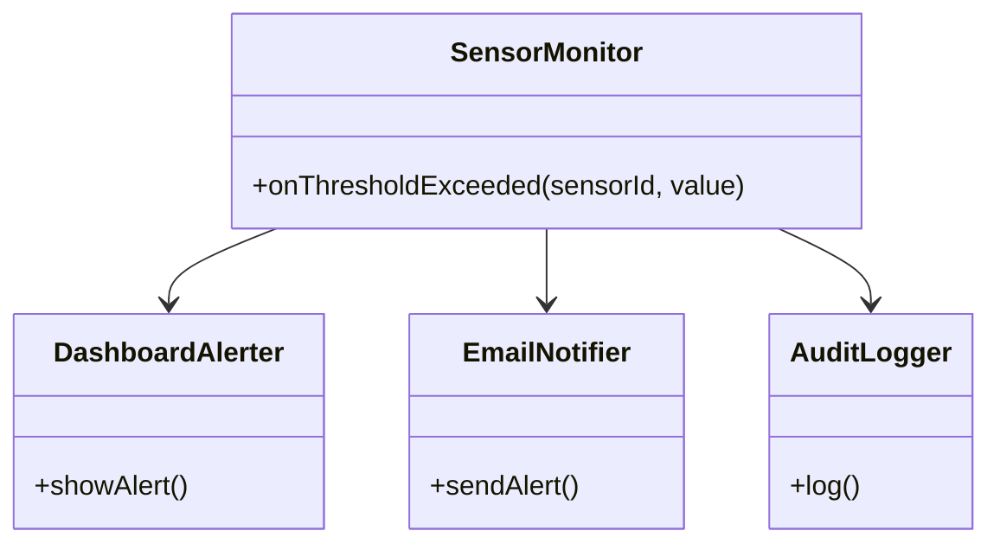
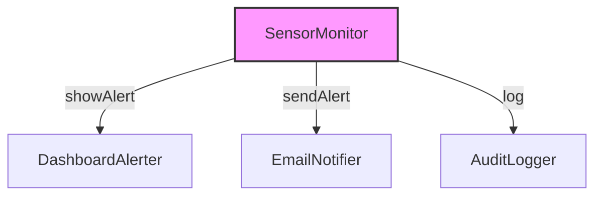
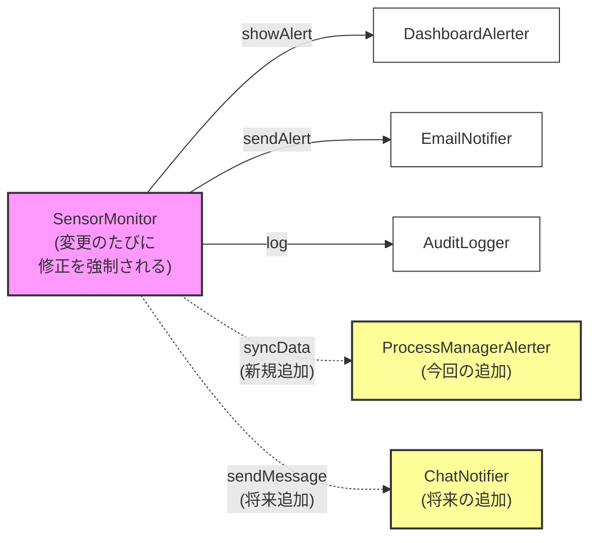
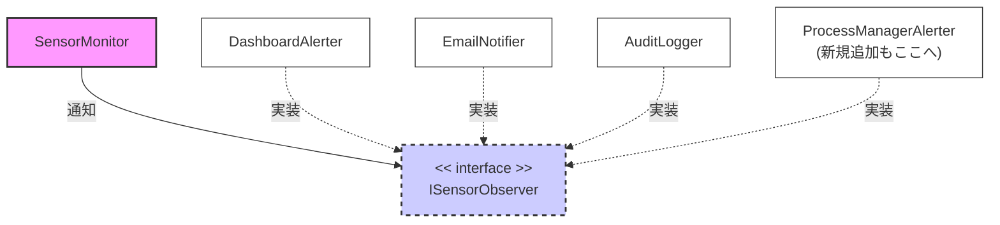
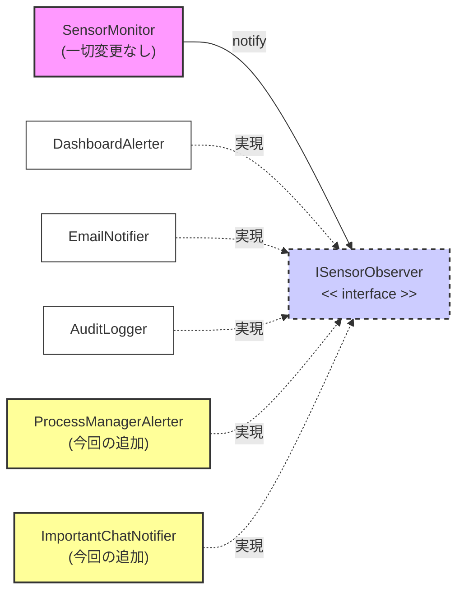
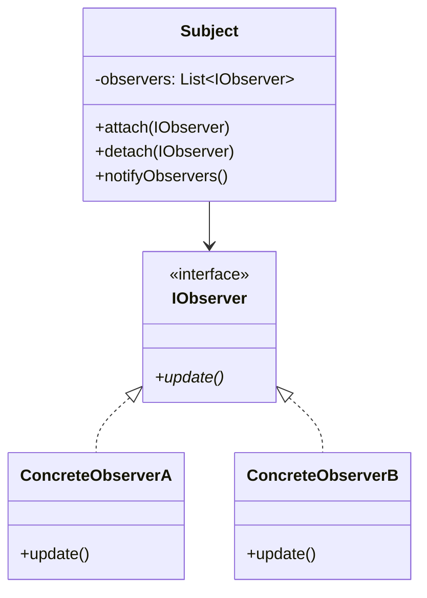
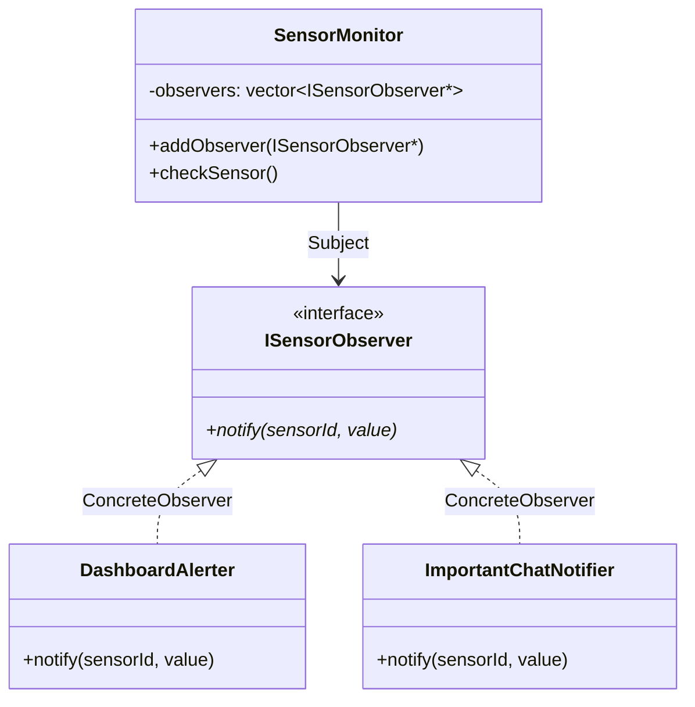

## 第7章　Observer

―― 思考の型：通知する側と、通知を受け取る側の混在

### この章の核心

通知の送り元と受け取り先を切り離し、送り元が相手を「知らなくても」確実に通知を届けられる構造を作ります。

> **【レゴブロックで考える：Observer】**
> 
> レゴブロックで言うと、これまでは特定の形のブロック同士を専用の接着剤で直接くっつけていた状態から、間に「標準化されたジョイントパーツ（手札③：規格化する）」を挟む操作にあたります。これによって、中心となるブロックは、相手がどんな形や色のブロックであっても、ジョイントさえ合えばカチッと繋げられるようになります。
> 
> **【画像生成AI用プロンプト案】**
> 
> `[ImagePrompt: A top-down 3D illustration of Lego blocks. One central white block has multiple standardized joint pieces extending outward, connecting seamlessly to various shapes and colors of other blocks without direct fusion. Bright, colorful, educational illustration style, clean white background, isometric view.]`

### この章を読むと得られること

- 通知先が複数あるシステムにおいて、どこに「変更の痛み」が潜んでいるかを自分のコードから発見できるようになる
    
- 送り元と受け取り先が密結合になっている状態を、適切に引き剥がす設計操作を判断できるようになる
    
- 「通知先が増減する」という変更要求が来たとき、既存コードに触れずに追加・削除ができる構造を作れるようになる
    

---

### ステップ0：システムを把握し、仮説を立てる ―― クラス構成を見てから「変わりそうな場所」を予測する

現場で新しい変更要件を渡されたとき、いきなりエディタを開いて該当しそうなコードを検索（grep）したくなるかもしれません。しかし、そこはぐっと堪えて、まずはシステムの全体像を俯瞰してみましょう。

なぜコードを読む前に仮説を立てるのでしょうか。それは、漫然とコードを上から下へ読んでいると「現在動いているのだから、この構造が正しいのではないか」と錯覚してしまい、コードに潜む「変わる理由の混在」を見逃してしまうからです。

> **全パターンに共通する問い**
> 
> 「このコードの中に、『変わる理由』が異なる2つのものが、同じ場所に混在していないか？」
> 
> ※「変わる理由」とは「誰の判断で変わるか」のことです。

#### 7.0 この章のシステム構成と仮説

**この章で扱うシステム：**

今回は「製造ラインのIoTセンサー監視システム」を題材に考えていきます。工場の製造ラインに設置された各種センサーの計測値を監視し、その値が規定の閾値を超えた（異常を検知した）ときに、複数の関係箇所へ通知を行うシステムです。

**仕様表（何ができるシステムか）**

|**機能名**|**担当クラス**|**入力**|**出力**|
|---|---|---|---|
|異常検知と一斉通知|SensorMonitor|センサーの計測値|各通知先クラスの呼び出し|
|画面アラート表示|DashboardAlerter|異常発生の合図|管理画面への警告表示|
|メール送信|EmailNotifier|異常発生の合図|担当者へのメール送信|
|ログ記録|AuditLogger|異常発生の合図|ファイルへの監査ログ書き込み|

**クラス構成の概要**

現在のシステムは、以下のようなクラス構成になっています。




→ **SensorMonitorクラスが、3つの具体的な通知先クラスを直接知っており、強く依存している状態です。**

**各クラスの責任一覧**

このクラス図から読み取れる、各クラスが現在持っている責任と「知るべきこと」を整理してみましょう。

|**クラス名**|**対象責任（1文）**|**知るべきこと**|
|---|---|---|
|SensorMonitor|センサー値の異常を検知し、各所へ通知を配る|閾値の判定ルールと、3つの通知先の「呼び出し方（メソッド名や引数）」|
|DashboardAlerter|管理画面へ警告を出す|画面描画のAPIやUIコンポーネントの操作方法|
|EmailNotifier|担当者へメールを送る|SMTPサーバーの接続先やメールフォーマット|
|AuditLogger|監査用にログを残す|ファイルシステムへの書き込み手順やログの出力フォーマット|

このシステムは、これまでの工場の稼働をしっかりと支えてきました。しかし、この構成図を眺めていると、ある種の「窮屈さ」を感じないでしょうか。監視役であるはずの `SensorMonitor` が、通知先の具体的なクラス名からメソッド名（`showAlert` や `log` など、それぞれバラバラです）まで、知りすぎているように見えます。

通知先がどこから呼ばれているのかを調べようとして関数名でgrepをかけると、予想外のクラスから呼ばれていて、さらにその呼び出し元をgrepして…という「grep地獄」に陥って疲弊した経験は、現場にいると誰しも一度は味わう痛みだと思います。

この構成を踏まえた上で、今後どこに変化が起きそうか、事前の仮説を立ててみます。

**変動と不変の仮説（実装コードを読む前に立てる）**

|**分類**|**仮説**|**根拠（クラス構成から読み取れること）**|
|---|---|---|
|🔴 **変動する**|通知先の種類と数|工場の運用ルールや体制が変われば、「パトランプを回したい」「チャットツールにも通知したい」など、受け取り先の増減は頻繁に発生すると考えられるから。|
|🟢 **不変**|センサー値が異常であるという「事実」の発生|「計測値が閾値を超えた」というイベントそのものは物理的な事象であり、誰に通知するかに関わらず発生する揺るぎない事実だから。|

通知先が増えたり減ったりするたびに、本来は「センサーの監視」が仕事であるはずの `SensorMonitor` のコードを開いて書き換えなければならないとしたら、それは少し危うい構造かもしれません。

この仮説が本当に現場の事実と合致しているのか。次からのステップで、実際の実装コードを確認し、関係者の声を聞いて検証していきましょう。

### ステップ1：実装コードを読む ―― 責任チェックで問題の行を見つける

ステップ0でクラスの責任と「変わりそうな場所」の仮説を立てました。次は、現場で今日まで稼働してきた実際の実装コードを開き、「責任通りに書かれているか」を1行ずつ確認していきます。

コードを上から順に眺めるのではなく、まずは依存の広がり（誰が誰を知っているか）を俯瞰してみましょう。

#### 7.1 実装コードと責任チェック

**依存の広がり（実装前の全体像）**




→ SensorMonitorクラスが、3つの異なる通知先の具体的なクラス名と、それぞれの固有のメソッド名を直接知ってしまっています。

それでは、この依存関係を生み出している起点コードを見てみましょう。C++で書かれた現在の `SensorMonitor` の実装です。

```cpp
#include <iostream>
#include <string>

// --- 通知先の具象クラス群 ---

class DashboardAlerter {
public:
    void showAlert(const std::string& sensorId, double value) {
        std::cout << "[Dashboard] ALERT: センサー " << sensorId 
                  << " が閾値を超えました。現在値: " << value << "\n";
    }
};

class EmailNotifier {
public:
    void sendAlert(const std::string& sensorId, double value) {
        std::cout << "[Email] 管理者へメール送信: センサー " << sensorId 
                  << " の異常を検知 (値: " << value << ")\n";
    }
};

class AuditLogger {
public:
    void log(const std::string& sensorId, double value) {
        std::cout << "[AuditLog] 監査ログ記録: " << sensorId 
                  << " にて異常値 " << value << " を記録\n";
    }
};


// --- センサー監視クラス ---

class SensorMonitor {
private:
    DashboardAlerter* dashboard;
    EmailNotifier* email;
    AuditLogger* logger;
    double threshold;

public:
    // コンストラクタで全通知先のポインタを受け取る
    SensorMonitor(DashboardAlerter* d, EmailNotifier* e, AuditLogger* l, double t) {
        dashboard = d;
        email = e;
        logger = l;
        threshold = t;
    }

    // センサーからの定期的な値チェック
    void checkSensor(const std::string& sensorId, double value) {
        std::cout << "--- 計測チェック: " << sensorId << " (現在値: " << value << ") ---\n";
        
        // 責任内の知識：閾値を超えたかどうかの判定
        if (value > threshold) {
            onThresholdExceeded(sensorId, value);
        }
    }

private:
    // 異常検知時の処理
    void onThresholdExceeded(const std::string& sensorId, double value) {
        // ← ここから下が問題の箇所。通知先の具体的な知識が混在している
        dashboard->showAlert(sensorId, value); // ← 知らなくていい（画面描画側の都合）
        email->sendAlert(sensorId, value);     // ← 知らなくていい（メール送信側の都合）
        logger->log(sensorId, value);          // ← 知らなくていい（ファイル記録側の都合）
    }
};

// --- アプリケーションの実行（起点） ---
int main() {
    DashboardAlerter dashboard;
    EmailNotifier email;
    AuditLogger logger;

    // 閾値100.0で監視モニターを起動
    SensorMonitor monitor(&dashboard, &email, &logger, 100.0);

    monitor.checkSensor("TEMP_001", 98.5);  // 正常な値
    monitor.checkSensor("TEMP_002", 105.2); // 異常発生！

    return 0;
}
```

**実行結果：**
```
--- 計測チェック: TEMP_001 (現在値: 98.5) ---
--- 計測チェック: TEMP_002 (現在値: 105.2) ---
[Dashboard] ALERT: センサー TEMP_002 が閾値を超えました。現在値: 105.2
[Email] 管理者へメール送信: センサー TEMP_002 の異常を検知 (値: 105.2)
[AuditLog] 監査ログ記録: TEMP_002 にて異常値 105.2 を記録
```

このコードは、仕様通りに完璧に動作します。画面にもメールにもログにも、正しく異常が伝わっています。しかし、問題は「動くかどうか」ではなく、「変更しやすい構造かどうか」です。

コードの行ごとに、クラスが持つべき知識の境界線を引いてみましょう。

**責任チェック：SensorMonitor は自分の責任だけを持っているか**

`SensorMonitor` の本来の責任は「センサー値の異常を検知し、外部へ知らせる」ことです。知るべきことは「判定のルール」と「通知を出すという事実」だけのはずです。

|**コードの行**|**持っている知識**|**責任内か**|
|---|---|---|
|`if (value > threshold)`|閾値を超えたかどうかの判定ルール|✅|
|`dashboard->showAlert(...)`|画面アラートクラスの存在と、その呼び出しメソッド名|✗ 画面表示の責任|
|`email->sendAlert(...)`|メール通知クラスの存在と、その呼び出しメソッド名|✗ メール配信の責任|
|`logger->log(...)`|監査ログクラスの存在と、その呼び出しメソッド名|✗ ログ管理の責任|

たった3行のメソッド呼び出しですが、ここには重大な「知識の越境」が発生しています。

`SensorMonitor` は、相手がどんなクラス名で、どんなメソッド名（`showAlert`なのか`sendAlert`なのか`log`なのか）を持っているかまで、深く知りすぎています。もしメール送信のライブラリがアップデートされて `sendAlert` が `dispatchEmail` に変わったら、全く無関係のはずの `SensorMonitor` クラスを開いてコードを修正しなければなりません。

呼び出し先の実装が変わるたびに、影響範囲が分からず呼び出し元をさかのぼってgrep検索を繰り返す……あの「grep地獄」の足音が聞こえてくる構造です。

#### 7.2 届いた変更要求

そんな現状のコードが稼働している最中、品質管理部門のリーダーから、チャットでこんな連絡が飛んできました。

> **【変更要求】**
> 
> **誰から：** 品質管理部門から
> 
> **何を：** 「センサー異常が検知されたとき、既存の通知先に加えて、工程管理システムにもリアルタイムでデータを連携するようにしてほしい」
> 
> **いつまでに：** 「来週月曜の稼働切り替えまでに頼む！」[cite: 1]

現場ではよくある話です。通知先が1つ増えただけですから、直感的には `SensorMonitor` のメンバ変数に `ProcessManagerAlerter*` のようなポインタを4つ目として追加し、`onThresholdExceeded` の中に4行目の呼び出しを書けば、月曜日の締め切りには間に合うでしょう。

しかし、立ち止まって考えてみてください。

設計に絶対の正解はありませんが、このまま「通知先が増えるたびに `SensorMonitor` のコードを開いて行を書き足す」というアプローチを続けると、このクラスはどうなってしまうでしょうか。将来、「やっぱりメール通知は特定のセンサーだけにしたい」といった条件が加わったとき、この3行（あるいは4行）のコードは、あっという間に巨大なif文の塊へと変貌してしまいます。

本当に、通知先は今後も変わり続けるものなのでしょうか？ 次のステップで、関係者に直接ヒアリングをして、ステップ0で立てた「仮説」を確定させにいきましょう。

### ステップ2：仮説を確定する ―― 関係者ヒアリングで「変わる理由」に根拠をつける

コードを読み終え、現状の `SensorMonitor` がどのような知識を抱え込んでいるかが明確になりました。

「なるほど、新しい工程管理システムを追加したいのか。じゃあ、`ProcessManagerAlerter` というクラスを作って、`SensorMonitor` の中に4つ目の呼び出しを書き足せばいいだけだな」

——と、エディタに向かってキーボードを叩き始めたくなる気持ちは、現場のエンジニアなら痛いほどよくわかります。「動いているコードはなるべく触らず、少しだけ書き足して終わらせたい」というのは、忙しい現場における生存戦略として決して間違っていません。

しかし、ここで立ち止まる必要があります。コードを読んだだけで「この部分はこう変わるだろう」「ここは変わらないだろう」と断定し、自分の想像だけで設計の方向性を決めてしまうのは、非常に危険な賭けです。

なぜなら、システムの「変わる理由」は、コードの中ではなく、システムを使っている「人間（組織・ビジネス・運用ルール）」の中に存在するからです。ステップ0で立てた仮説が本当に正しいのか、今回の変更要求の背後にはどんな「変更の波」が控えているのか、変更要求を持ってきた関係者に直接ヒアリングをして確かめにいきましょう。

#### 7.3 仮説の検証と変動/不変の確定

今回は、変更要求を持ってきた品質管理部門のリーダーと、工場のネットワークやサーバー運用を管理しているインフラ担当者の二人に声をかけて、少しだけ時間を取ってもらいました。

**関係者ヒアリング**

- **開発者（あなた）：** 「品質管理部門から依頼のあった『工程管理システムへの連携追加』の件、対応を進めています。システムへ繋ぎこむこと自体は問題ないのですが、今後の運用について少し確認させてください。通知先が増えるのは、今回で一段落でしょうか？ それとも、今後もこういった追加要件はありそうですか？」
    
- **品管リーダー：** 「あぁ、実は来月あたりに新しいデータ分析用のAIツールを試験導入する予定なんだ。それが決まれば、異常検知のデータはそこにもリアルタイムで流すことになると思う。あと、現場の班長からは『特定の重要センサーの異常だけは、管理画面やメールじゃなくて、直接スマホのチャットツールに飛ばしてほしい』っていう要望も上がってきていてね。まだ本決まりじゃないけど」
    
- **開発者（あなた）：** 「なるほど、通知先の種類はこれからさらに増えていく可能性があるのですね。（心の中：通知先が5つ、6つと増えていくのか。しかも『特定のセンサーだけ』という条件まで入ってくると、`SensorMonitor` の中の `if` 文が爆発してしまうな……）」
    
- **インフラ担当：** 「運用側からも一ついいかな。今、異常時に『メール送信』と『ログ出力』をしてると思うんだけど、サーバーの構成変更のタイミングなどで、一時的にメール送信だけを止めたりしたいんだよね。逆に、新しい通知先をテスト的に稼働させたり。今は監視プログラム自体を再起動しないと通知先を変えられないから、運用がちょっと窮屈でさ」
    
- **開発者（あなた）：** 「通知先を稼働中に動的に付け外したい、ということですね。ちなみに、『センサーの計測値が閾値を超えたら異常とみなす』という監視のルール自体が変わることはありますか？」
    
- **品管リーダー：** 「それはないね。センサーの閾値判定は、製造ラインの物理的な安全基準に基づくものだから、我々の部門が責任を持って厳密に管理している。誰にどう通知するかは状況によって変わるけど、『異常が発生した』という事実そのものは変わらないよ」
    

この短い立ち話から、非常に重要な事実が浮かび上がってきました。

ステップ0で「通知先の種類と数は変わるだろう」と立てた仮説は、単に当たっていただけでなく、現場の要求は想像以上に「通知先を柔軟に入れ替えたい（付け外ししたい）」というレベルにまで達していました。

一方で、センサーを監視し「異常を検知したという事実」を作り出すルールは、確固たるものとして存在し、通知先の都合とは完全に独立していることも確認できました。

ヒアリングの結果をもとに、改めてシステムにおける「変動」と「不変」を確定させましょう。

**確定した変動と不変のテーブル**

|**分類**|**具体的な内容**|**変わるタイミング**|**根拠**|
|---|---|---|---|
|🔴 **変動する**|通知先の種類・数・呼び出し方|新しいツールの導入、現場の運用ルールの変化、インフラ構成の変更など、ビジネスや運用の都合が変化したとき|品管リーダーからの「AIツールやチャットへの連携構想」、インフラ担当からの「一時的な停止やテスト稼働の要望」の合意|
|🟢 **不変**|センサー値が閾値を越えたという「異常発生の事実」|変わる日は来ない|異常検知は物理的な安全基準に基づくものであり、通知先がいくつあろうと「何が起きたか」という事実は揺るがないため|

システムの中で、この2つの要素は「変わる理由」が全く異なります。

「センサーの判定ルール」は、工場の物理的な制約や安全基準（品質管理部門の管轄）によって決まります。一方、「どこへ通知するか」は、システム運用や新しい業務ツールの導入（IT部門や現場の班長の都合）によって決まります。

現在のコードでは、この「誰の判断で変わるか」が全く異なる2つの知識が、`SensorMonitor` という一つのクラスの中にべったりと混在してしまっています。これが、少しの変更でコード全体に痛みが走る「密結合」の正体です。

> **設計の決断：**
> 
> ここで、一つの決断を下します。
> 
> 🟢 不変な部分である「異常が発生したという事実の通知（イベントの発生）」を「契約（インターフェース）」として固定し、
> 
> 🔴 変動する部分である「通知先の具体的な種類や処理内容」をその裏側に押し込みます。

これで、向かうべき設計のゴールが見えました。「通知元」と「通知先」を切り離すための道筋を、次のステップの「課題分析」と「原因分析」でさらに具体的に解き明かしていきましょう。

### ステップ3：課題分析 ―― 変更が来たとき、どこが辛いかを確認する

ステップ2のヒアリングを通じて、「通知先は今後もビジネスの都合で増減する」という変動のリスクと、「異常が発生した事実は変わらない」という不変のルールがはっきりと分かれました。

設計に絶対の正解はありませんが、だからこそ「今のままの構造で突き進むとどうなるのか」を事前にシミュレーションしておくことが大切です。品質管理部門からの「工程管理システムへの連携追加」という要求を、現在の `SensorMonitor` クラスにそのまま素直に実装しようとすると、どんな未来が待っているのかを想像してみましょう。

まず、新しい通知先である `ProcessManagerAlerter` クラスのポインタを `SensorMonitor` のメンバ変数として追加します。コンストラクタの引数も一つ増やさなければなりません。そして、異常を検知したときの処理は以下のようになっていくはずです。

```cpp
    void onThresholdExceeded(const std::string& sensorId, double value) {
        dashboard->showAlert(sensorId, value);
        email->sendAlert(sensorId, value);
        logger->log(sensorId, value);
        
        // 今回追加した素朴な処理
        processManager->syncData(sensorId, value);
        
        // さらに未来、ヒアリングで挙がった「特定のセンサーだけ」の条件が入ると…
        if (sensorId == "IMPORTANT_001") {
            chatNotifier->sendMessage(sensorId, value);
        }
        
        // メールを一時停止したいというインフラの要望が入ると…
        if (isEmailEnabled) {
            // email->sendAlert(sensorId, value);
        }
    }
```

一見すると、要件通りに動くコードが書けそうです。しかし、現場でこのコードの保守を任されたとき、私たちは深刻な「痛み」に直面することになります。

**現場で直面する2つの痛み**

1つ目の痛みは、**呼び出し元の調査が果てしなく続く「grep地獄」**です。

例えば、工程管理システム側のAPI仕様が変わり、`syncData` というメソッド名を変更しなければならなくなったとします。どこでこのメソッドが呼ばれているか探すためにコードベースをgrep検索すると、`SensorMonitor` クラスがヒットします。

「よし、`SensorMonitor` の中を書き換えよう」と手を入れるわけですが、今度は「`SensorMonitor` のコンストラクタの引数が変わったのだから、これを呼び出している `main` などの初期化処理も直さなければならない」と気づきます。影響範囲を確かめるために `SensorMonitor` の呼び出し元をgrepすると、さらに多くの利用箇所がヒットし、そこからまた別のクラスへ……と、1つのメソッド名の変更をきっかけに、雪だるま式に調査範囲が膨れ上がっていきます。呼び出し先を検索したら、さらに多くの呼び出し元が連鎖的に見つかってしまう。これは非常に辛い作業であり、現場で何度も味わってきた私自身の実体験でもあります。

2つ目の痛みは、**システムの中核を担うコアロジックを壊してしまう恐怖**です。

`SensorMonitor` クラスの本来の仕事は、「センサーの値を監視し、異常を正しく判定すること」です。工場を安全に稼働させるための、極めて重要な中核（コア）の責任を負っています。

それにもかかわらず、「チャットツールにも通知を出したい」「メールの文面を変えたい」といった、監視そのものとは無関係なビジネス要件が変わるたびに、この重要なクラスのコードを開いて修正しなければなりません。もし、新しく追加した通知先の処理の中にバグがあり、そこでプログラムが異常終了してしまったらどうなるでしょうか。本来動き続けるべき「センサー監視」の処理全体が道連れになって停止してしまいます。これは自然な結果と言えますね。通知先の追加という些細な変更が、システム全体の致命傷になり得る脆い状態なのです。

この「変更が飛び火していく様子」を、図で可視化してみましょう。

**依存の広がり（変更が飛び火する様子）**



→ 通知先（右側）が増えたり変わったりするたびに、本来不変であってほしい送り元のSensorMonitor（左側）へと変更の矢印が逆流し、修正が強いられています。

「通知する側」が「通知される側」の具体的な姿を知りすぎているせいで、両者がべったりと癒着してしまっています。このままでは、ヒアリングで挙がった数々の要望に応え続けることは難しそうです。

次章のステップ4では、この痛みを引き起こしている「本質的な原因」を言語化し、どのような構造の転換が必要なのかを探っていきましょう。

### ステップ4：原因分析 ―― 困難の根本にある設計の問題を言語化する

ステップ3で確認した「grep調査の連鎖」や「コアロジックを道連れにしてしまう恐怖」は、なぜ起きてしまうのでしょうか。現象の裏にある根本的な設計の問題を、具体的な事実から言語化していきます。

|**観察**|**原因の方向**|
|---|---|
|`SensorMonitor`が、通知先クラスごとの個別のメソッド名（`showAlert`や`sendAlert`など）を直接呼び出している|「通知する側」が「通知される側」の具体的な実装を知りすぎているため、相手の都合の変更に引きずられている|
|通知先が1つ増えるたびに `SensorMonitor` のコードを開いて変更しなければならない|通知先を増やすかどうかの判断（品管部門やインフラ部門の都合）と、センサー監視の責任が同じクラスに混在している|

**変わるものと変わらないものが同じ場所にいる**

ステップ2のヒアリング結果を元に、現在の `SensorMonitor::onThresholdExceeded` メソッドの中に混在している知識を仕分けてみます。

|**変わり続けるもの（🔴）**|**変わってほしくないもの（🟢）**|
|---|---|
|・通知先となるクラスがいくつあるか<br><br>  <br><br>・それぞれの具体的なクラス名は何か<br><br>  <br><br>・呼び出すためのメソッド名や引数の形は何か|・センサーの計測値が閾値を超えたという「異常検知の事実」<br><br>  <br><br>・異常を検知したタイミングで各所へ知らせるという全体ルール|

本来、工場の安全を守るための「異常検知の事実（🟢）」は、とても強固で変わってほしくないコアロジックです。しかし現状は、そのすぐ隣に「誰にどうやって伝えるか（🔴）」という、周りの人間関係やビジネスの都合でコロコロ変わる知識が同居してしまっています。

第0章で紹介した設計の哲学1「変わるものをカプセル化せよ」に照らし合わせると、まさにこの「🔴変わり続けるもの」を🟢から切り離し、変更の波及が及ばないように隔離（カプセル化）する必要があることが分かります。

> **立ち止まって考える：**
> 
> 「通知する側と受け取る側を切り離す」と口で言うのは簡単ですが、コードを書こうとすると一つの大きな疑問が浮かびます。
> 
> もし、`SensorMonitor`が「誰に通知するか（具体的なクラス名）」を全く知らなかったとしたら、一体どうやって通知先のプログラムを呼び出せばいいのでしょうか？
> 
> 「相手を直接知らないのに、確実に相手に情報を届ける」という一見矛盾した構造を、どうやって実現すればよいのか。ここに設計の腕の見せ所があります。

以下は、それぞれに対して観察した結果を残したものです。原因に該当するなら対策が必要ということになります。今回は「関係」の次元に明確な問題を見つけることができます。

|**次元**|**物理操作（手札）**|**本質的な原因（何が問題か）**|**使うべき構造的対策案（本質）**|
|---|---|---|---|
|関係|③ 規格化する（形を揃える）|特定の相手の「具体的な実装（クラスやメソッド名）」に直接依存しており、結合が固着している。|インターフェースの統一（抽象への依存・依存の逆転）|

今回の問題の本質は、「`SensorMonitor` クラスが巨大すぎる」といった要素の中身の問題ではなく、「`SensorMonitor` と 各通知先がどういう関係性で結ばれているか」という**関係の次元**にあります。

`DashboardAlerter` の `showAlert`、`EmailNotifier` の `sendAlert` など、通知先ごとにバラバラの形（インターフェース）をした相手に直接コードを繋ごうとするから、`SensorMonitor` の側がそれに合わせていびつな形に歪められ、変更のたびに痛みを感じてしまうのです。

これを解決するためには、手札③の「規格化する」という物理操作が必要になってきそうです。次のステップ5では、この原因に対して、まずは素朴な思いつきの解決策（手段①）を試してみます。そして、その限界をコードで実感した上で、インターフェースによる規格化を用いた本質的な解決（手段②）へとステップアップしていきましょう。

### ステップ5：対策案の検討 ―― 原因から手札を選ぶ

ステップ4で特定した真因は、「通知する側（`SensorMonitor`）が、通知される側の具体的なクラス名やバラバラなメソッド名に直接依存していること」でした。そのせいで、「通知先が増える・変わる」という周囲の都合に、監視のコアロジックがいちいち巻き込まれてしまっていました。

これを解消し、「誰の判断で変わるか」が異なる2つの要素を切り離していくための道筋を、順番に考えていきましょう。最初から完璧な正解を求める必要はありません。現場の制約の中で、まずはできそうなところから手を動かしてみるのが設計の第一歩です。

#### 1. 分離・隠蔽を試す（手段①の基本）

まずは、ヒアリングで挙がった「通知先を稼働中に動的に付け外したい」という運用インフラからの要望に応えるために、少しコードを整理してみましょう。

現状のコードは `onThresholdExceeded` の中にベタ書きで呼び出しが並んでいます。これを、手札②の「隠蔽する（包む）」操作を応用して、通知先リストを `SensorMonitor` に `std::vector` で持たせ、ループで呼び出すアプローチを試してみます。

```cpp
// 手段①：通知先のリストを持たせ、動的に管理しようとするアプローチ
#include <vector>
#include <string>
#include <iostream>

// 通知先クラスの実装は省略（既存のまま）
class DashboardAlerter { public: void showAlert(const std::string& id, double val) {} };
class EmailNotifier { public: void sendAlert(const std::string& id, double val) {} };
class AuditLogger { public: void log(const std::string& id, double val) {} };

class SensorMonitor {
private:
    double threshold;
    // それぞれの通知先の型が違うため、専用のリストを3つ持つしかない
    std::vector<DashboardAlerter*> dashboards;
    std::vector<EmailNotifier*> emails;
    std::vector<AuditLogger*> loggers;

public:
    SensorMonitor(double t) { threshold = t; }

    // 稼働中に動的に付け外しするための窓口を追加
    void addDashboard(DashboardAlerter* d) { dashboards.push_back(d); }
    void addEmailNotifier(EmailNotifier* e) { emails.push_back(e); }
    void addAuditLogger(AuditLogger* l) { loggers.push_back(l); }

    void checkSensor(const std::string& sensorId, double value) {
        if (value > threshold) {
            onThresholdExceeded(sensorId, value);
        }
    }

private:
    void onThresholdExceeded(const std::string& sensorId, double value) {
        // 異常検知時は、各リストを順番にループして呼び出す
        for (size_t i = 0; i < dashboards.size(); ++i) {
            dashboards[i]->showAlert(sensorId, value); // ← 結局メソッド名を知っている
        }
        for (size_t i = 0; i < emails.size(); ++i) {
            emails[i]->sendAlert(sensorId, value);     // ← 結局メソッド名を知っている
        }
        for (size_t i = 0; i < loggers.size(); ++i) {
            loggers[i]->log(sensorId, value);          // ← 結局メソッド名を知っている
        }
    }
};
```

**残る課題：なぜこの形では耐えられないのか**

この手段①によって、リストを使った動的な追加ができるようになり、運用側の要望には少し近づきました。しかし、コードを書いてみると致命的な限界にすぐに気がつきます。

- **限界1：共通のリストにまとめられない** それぞれの通知先クラスごとに、呼び出すべきメソッド名（`showAlert`や`sendAlert`など）がバラバラです。そのため、「通知先」という共通の枠組みで1つのリスト（`std::vector`）にまとめることができず、共通インターフェースなしでは1つのループで呼べません。
    
- **限界2：依存が全く解消されていない** 品質管理部門が希望している「工程管理システムへの連携」を追加しようとしたらどうなるでしょうか。結局、`SensorMonitor` の中に `std::vector<ProcessManagerAlerter*>` と `addProcessManager` メソッド、そして4つ目の `for` ループを追加しなければなりません。 `SensorMonitor` が依然として通知先の具体的なクラスを知り尽くしており、コードを開いて変更しなければならない依存は何も解消されていないのです。
    

#### 2. さらに規格化・間接化を重ねる（手段②：インターフェース導入）

手段①でぶつかった壁は「通知先ごとにリストとループを分けなければならない」ことでした。なぜ分けなければならないかというと、それぞれの通知先が持つ「メソッドの形」がバラバラだからです。

ここで、第0章の手札選択表を引いてみましょう。

「特定の相手の『具体的な実装』に直接依存しており、結合が固着している」という原因に対しては、手札③「規格化する（形を揃える）」と手札④「間接化する（間に挟む）」が本質的な解決策となります。

バラバラな形をした相手の都合に、中心となる `SensorMonitor` が無理に合わせにいくのはやめにしましょう。「通知を受け取りたいなら、こちらが用意した標準ジョイントの形に合わせてください」という共通の契約（インターフェース）を定義し、主導権を逆転させるのです。

> **【レゴブロックで考える：標準ジョイントの導入】**
> 
> 中心となるブロックから色々な部品へ専用の接着剤でくっつけていた状態をやめ、中心ブロックに「標準化された接続ピン」を取り付けます。周りのブロックは、そのピンにぴったり嵌まる「標準化された受け穴」を自分たちで用意する責任を持ちます。これにより、中心ブロックは相手の色や形を気にせず、どんなブロックでもカチッと繋げられるようになります。
> 
> `[ImagePrompt: A top-down 3D illustration of Lego blocks. One central white block has standardized round connector pins. Various other colored blocks (representing different notification targets) all have identical receiving holes that perfectly fit the white block's pins. Bright, colorful, educational illustration style, clean white background, isometric view.]`

では、この「標準ジョイント」をコードで表現してみましょう。


```cpp
// 手段②：共通インターフェースによる規格化
#include <vector>
#include <string>
#include <iostream>

// --- 規格化の要：通知を受け取るための共通ルール（インターフェース） ---
class ISensorObserver {
public:
    virtual ~ISensorObserver() {}
    
    // 全ての通知先は、このメソッド名と引数に合わせる責任を持つ
    virtual void notify(const std::string& sensorId, double value) = 0;
};

// --- 送り元（SensorMonitor）の実装 ---
class SensorMonitor {
private:
    double threshold;
    // どんな具体的なクラスであっても、ISensorObserver型として同じリストにまとめることができる
    std::vector<ISensorObserver*> observers;

public:
    SensorMonitor(double t) { threshold = t; }

    // 通知先を追加するメソッド。型が統一されているので、どんな通知先でもこれ1つで受け入れ可能
    void addObserver(ISensorObserver* observer) {
        observers.push_back(observer);
    }

    void checkSensor(const std::string& sensorId, double value) {
        if (value > threshold) {
            onThresholdExceeded(sensorId, value);
        }
    }

private:
    void onThresholdExceeded(const std::string& sensorId, double value) {
        // 通知先が何個あろうと、どんな種類であろうと、この1つのループだけで済む
        for (size_t i = 0; i < observers.size(); ++i) {
            observers[i]->notify(sensorId, value); // ← 相手の具体名や個別のメソッド名はもう知らなくていい
        }
    }
};

// --- 受け手側の実装（インターフェースに形を揃える、つまり「間接化」する） ---
class DashboardAlerter : public ISensorObserver {
public:
    // 規格化された notify メソッドを実装し、翻訳層として機能する
    void notify(const std::string& sensorId, double value) override {
        showAlert(sensorId, value); // 内部で自分本来の処理へ繋ぐ
    }
private:
    void showAlert(const std::string& sensorId, double value) {
        std::cout << "[Dashboard] ALERT: センサー " << sensorId 
                  << " が閾値を超えました。現在値: " << value << "\n";
    }
};

class EmailNotifier : public ISensorObserver {
public:
    void notify(const std::string& sensorId, double value) override {
        sendAlert(sensorId, value);
    }
private:
    void sendAlert(const std::string& sensorId, double value) {
        std::cout << "[Email] 管理者へメール送信: センサー " << sensorId 
                  << " の異常を検知 (値: " << value << ")\n";
    }
};
```

**変更後のクラス図**

この手札を適用したことで、クラスの依存関係は劇的に変化しました。




手段①では、`SensorMonitor` から無数の具体的な通知先クラスへ、それぞれのメソッドを狙い撃ちする依存の矢印がバラバラに伸びていました。しかし手段②では、`SensorMonitor` からの依存の矢印は `ISensorObserver` というインターフェース1本だけに美しく束ねられています。

通知される側（Dashboardなど）は、`ISensorObserver` という規格を満たすように振る舞う（手札④「間接化」して翻訳する）責任を持ちます。その結果、送り元である `SensorMonitor` は、「自分が誰に通知しているのか」を一切気にする必要がなくなりました。

これで、最初の目標であった「分離と規格化」は達成できたように見えます。しかし、現場の要求はこれだけではありませんでした。ヒアリングで品質管理部門のリーダーがこぼしていた「特定のセンサーだけの通知にしたい」という複雑な条件分岐の波が押し寄せてきたとき、この「規格化されたリスト」は本当に耐えられるのでしょうか？

次のステップ6で、この2つの手段を天秤にかけ、将来の変化を想定した「耐久テスト」で真の実力を検証してみましょう。</ProcessManagerAlerter*>

### ステップ6：天秤にかける ―― 手段を評価する

ステップ5で、2つの手段をコードとして書き出してみました。手段①は、素朴に「通知先ごとのリストとループ」を追加した手続き的な整理。手段②は、通知を受け取る側を「標準ジョイント（`ISensorObserver`）」で規格化し、間接的に呼び出すアプローチです。

どちらも「動くコード」であることに変わりはありません。しかし、私たちの目的はただ動かすことではなく、現場でこの先も発生し続ける「変更の波」を安全に乗りこなすことです。

比較の前に、今回の状況において何を評価の基準（軸）とするかを宣言しておきます。

|**評価軸**|**重視する理由**|
|---|---|
|**拡張（通知先の追加・条件変更）**|ヒアリングで「AIツールやチャットへの連携」など、通知先の種類や条件がさらに増えることが確定しているため。|
|**置換（通知の切り替え・停止）**|インフラ側から「稼働中に特定の通知だけを止めたい」という、動的な付け外しの要望が出ているため。|
|**関心の分離（コアロジックの保護）**|工場の安全を守る「異常検知（コア）」が、外部ツールの都合でバグを埋め込まれるリスクを避けたいため。|

#### 7.4 手段①vs手段②の比較

この3つの評価軸で、手段①と手段②を比較してみましょう。

|**評価軸**|**手段①（ベタ書きのリスト化）**|**手段②（インターフェースの導入）**|
|---|---|---|
|**拡張**|**不合格**：通知先が増えるたびに、`SensorMonitor` に新しいリスト（`vector`）と専用のループ処理を書き足す必要がある。|**合格**：通知先がいくつ増えても、`SensorMonitor` のコードは1行も変更する必要がない（既存のループ1つで全て処理できる）。|
|**置換**|**△（一部可）**：リストに持たせたことで動的な付け外しは可能になったが、通知先の種類ごとに別々の登録窓口が必要で複雑。|**合格**：`ISensorObserver` 型として統一されているため、登録・解除の窓口が1つで済み、運用中の切り替えが極めて容易。|
|**関心の分離**|**不合格**：`SensorMonitor` が依然として「誰に、どのメソッド名で伝えるか」を知り尽くしており、相手の都合に引きずられる。|**合格**：「自分は異常を知らせるだけ。どう受け取るかは相手の責任」という設計になり、監視のコアロジックが完全に保護される。|

> **結論：** 今回の状況では、圧倒的に変化に強い**手段②（インターフェースの導入）**を採用します。これが「Observer（観察者）パターン」の正体です。

#### 7.5 耐久テスト ―― ヒアリングで挙がった変化が来た

採用した手段②（Observerパターン）が、本当に現場の変更要求に耐えられるのか。ステップ2のヒアリングで挙がっていた、少し厄介な仕様追加をシミュレートしてみましょう。

品質管理リーダーの言葉を思い出してください。 「特定の重要センサー（例：`IMPORTANT_001`）の異常だけは、管理画面やメールじゃなくて、直接スマホのチャットツールに飛ばしてほしい」

もし手段①のままだったら、`SensorMonitor` の中に `if (sensorId == "IMPORTANT_001") { chat->sendMessage(...); }` という、監視とは全く無関係の「チャットアプリの都合」が混入するところでした。

しかし、規格化された Observerパターン を採用した私たちのコードは違います。

```cpp
#include <iostream>
#include <string>

// （ISensorObserver、SensorMonitorの定義はステップ5と同じ。一切変更なし）

// --- 新しい通知先：重要センサーのみ反応するチャット通知クラス ---
class ImportantChatNotifier : public ISensorObserver {
public:
    void notify(const std::string& sensorId, double value) override {
        // ← ここに注目。監視側ではなく、通知を受け取る側（Observer）が
        // 「自分にとって必要な通知かどうか」を判断する
        if (sensorId == "IMPORTANT_001") { 
            std::cout << "[Chat] 緊急！重要センサー " << sensorId 
                      << " が異常値: " << value << " を記録しました。\n";
        } else {
            // 重要センサー以外はスルーする（何もしない）
        }
    }
};

// --- アプリケーションの実行（起点） ---
int main() {
    // 監視のコア
    SensorMonitor monitor(100.0);

    // 既存の通知先
    DashboardAlerter dashboard;
    EmailNotifier email;
    // 今回新設した通知先
    ImportantChatNotifier chatNotifier; // ← 新しいクラスを追加

    // 稼働前に通知先を登録（ジョイントを繋ぐ）
    monitor.addObserver(&dashboard);
    monitor.addObserver(&email);
    monitor.addObserver(&chatNotifier); // ← 統一された窓口へ繋ぐだけ

    std::cout << "--- 汎用センサーのテスト ---\n";
    monitor.checkSensor("TEMP_005", 105.0); 

    std::cout << "\n--- 重要センサーのテスト ---\n";
    monitor.checkSensor("IMPORTANT_001", 102.5); 

    return 0;
}
```

**実行結果：**

```
--- 汎用センサーのテスト ---
[Dashboard] ALERT: センサー TEMP_005 が閾値を超えました。現在値: 105
[Email] 管理者へメール送信: センサー TEMP_005 の異常を検知 (値: 105)

--- 重要センサーのテスト ---
[Dashboard] ALERT: センサー IMPORTANT_001 が閾値を超えました。現在値: 102.5
[Email] 管理者へメール送信: センサー IMPORTANT_001 の異常を検知 (値: 102.5)
[Chat] 緊急！重要センサー IMPORTANT_001 が異常値: 102.5 を記録しました。
```

**結果の解説：** 見事に要件を満たしました。最も注目すべきは、**中核である `SensorMonitor` のコードを1行も書き換えていない（再コンパイルすら不要な状態にできる）**という事実です。

「特定のセンサーだけ通知したい」という条件付き購読のルールは、すべて `ImportantChatNotifier` という新しいクラスの中に閉じ込められました。 `SensorMonitor` はただ「異常が起きたぞ！」と全員に叫ぶ（ブロードキャストする）だけでよく、「誰がそれを聞いて行動するか」は受け手側の自己責任となったのです。 これが、依存関係を逆転させることによって得られる「置換・拡張」の強烈な能力です。

#### 7.6 使う場面・使わない場面

この構造は、送り元と受け取り先を美しく分離できる非常に強力な手札です。しかし、どんな設計にもトレードオフがあり、常にこの手札を切るのが正解というわけではありません。

**【過剰コード：変化の予定がないものまでパターン化した例】**

たとえば、異常を検知したときの動作が「工場全体の緊急停止レバーを物理的に引く」という1つのクラス（`EmergencyStopper`）だけであり、ビジネス要件上、通知先がこれ以上増えることは絶対にないとします。

```cpp
// 悪い例：通知先が絶対に1つで増えないのにObserverを使っている
class SensorMonitor {
private:
    std::vector<ISensorObserver*> observers; // ← 1つしか登録されないのにリスト管理
    // ...
    void onThresholdExceeded(const std::string& sensorId, double value) {
        for (auto obs : observers) { // ← 1回しか回らない無駄なループ
            obs->notify(sensorId, value);
        }
    }
};
```

このように「1対1の固い結びつき」が業務ルールの正解である場合、Observerパターンはコードを無駄に追いづらくするだけの過剰設計になります。直接 `emergencyStopper->pullLever()` と呼ぶべきです。

今回の検証を踏まえ、現場でこの手札を使うかどうかの判断基準を表にまとめます。

|**状況**|**適切な選択**|**理由**|
|---|---|---|
|あるイベントの通知先が複数あり、今後もビジネスの都合で増減する可能性がある|**Observerパターン**を採用する|送り元のコードを修正せずに、通知先の増減や条件変更（拡張）に安全に対応できるため。|
|特定の通知先だけを、運用中に動的にON/OFFしたい|**Observerパターン**を採用する|リストへの `add/remove` だけで、実行時のつなぎ替え（置換）が実現できるため。|
|通知先が1か所だけで、ビジネス要件として今後も増えることは絶対にない|使わない（直接呼び出す）|インターフェースやリストを管理する実装コストに見合うリターンがなく、追跡が難しくなるだけだから。|
|複数の通知先を呼び出す際、厳密な「順番」や「依存関係」がある（Aが終わらないとBを呼べない等）|使わない（他のパターンを検討）|Observerは「誰がどの順番で聞いているか知らない」ことを前提とするため、実行順序の制御には不向きだから。|

### ステップ7：決断と、手に入れた未来

度重なる仕様追加の波に揉まれながら、私たちは「インターフェースを導入し、通知元と通知先を規格化する（Observerパターン）」という決断を下しました。

この決断によって、バラバラだった通知先クラスの形が揃い、`SensorMonitor` は「相手が誰であるか」を知る必要から解放されました。ここでは、最終的に私たちが手に入れたシステム全体の姿を確認しましょう。

#### 7.7 解決後のコード（全体）

以下が、今回の一連の変更を終えた後の完全なコードです。 新しい通知先（チャット通知）の追加や、監視のコアロジックがどうなっているかに注目して読んでみてください。

```cpp
#include <iostream>
#include <vector>
#include <string>

// ===================================================================
// 1. 規格化の要（インターフェース）
// ===================================================================

// 通知を受け取るための共通ルール（標準ジョイント）
class ISensorObserver {
public:
    virtual ~ISensorObserver() {}
    
    // 全ての通知先は、必ずこの形で通知を受け取る責任を持つ
    virtual void notify(const std::string& sensorId, double value) = 0;
};

// ===================================================================
// 2. 通知先クラス群（間接化された受け手）
// ===================================================================

class DashboardAlerter : public ISensorObserver {
public:
    // インターフェースの形に合わせて通知を受け取り、自分の処理へ繋ぐ
    void notify(const std::string& sensorId, double value) override {
        showAlert(sensorId, value);
    }
private:
    void showAlert(const std::string& sensorId, double value) {
        std::cout << "[Dashboard] ALERT: センサー " << sensorId 
                  << " が閾値を超えました。現在値: " << value << "\n";
    }
};

class EmailNotifier : public ISensorObserver {
public:
    void notify(const std::string& sensorId, double value) override {
        sendAlert(sensorId, value);
    }
private:
    void sendAlert(const std::string& sensorId, double value) {
        std::cout << "[Email] 管理者へメール送信: センサー " << sensorId 
                  << " の異常を検知 (値: " << value << ")\n";
    }
};

class AuditLogger : public ISensorObserver {
public:
    void notify(const std::string& sensorId, double value) override {
        log(sensorId, value);
    }
private:
    void log(const std::string& sensorId, double value) {
        std::cout << "[AuditLog] 監査ログ記録: " << sensorId 
                  << " にて異常値 " << value << " を記録\n";
    }
};

// --- 品質管理部門から要求された新しい通知先 ---
class ImportantChatNotifier : public ISensorObserver {
public:
    void notify(const std::string& sensorId, double value) override {
        // 通知先自身が「自分に関係ある通知か」を判断する
        if (sensorId == "IMPORTANT_001") { 
            std::cout << "[Chat] 緊急！重要センサー " << sensorId 
                      << " が異常値: " << value << " を記録しました。\n";
        }
    }
};


// ===================================================================
// 3. 監視のコアクラス（通知の送り元）
// ===================================================================

class SensorMonitor {
private:
    double threshold;
    // 通知先の具体名は一切知らない。「ISensorObserver」という規格のリストを持つだけ
    std::vector<ISensorObserver*> observers;

public:
    SensorMonitor(double t) { 
        threshold = t; 
    }

    // 稼働中であっても、規格さえ合っていれば誰でもリストに参加できる
    void addObserver(ISensorObserver* observer) {
        observers.push_back(observer);
    }

    // 稼働中に通知先を取り外すことも可能（今回は簡略化のため実装のみ）
    // void removeObserver(ISensorObserver* observer) { ... }

    // センサーの監視ロジック（ここがシステムのコア）
    void checkSensor(const std::string& sensorId, double value) {
        std::cout << "--- 計測チェック: " << sensorId << " (現在値: " << value << ") ---\n";
        
        // 不変のルール：閾値を超えたら異常
        if (value > threshold) {
            onThresholdExceeded(sensorId, value);
        }
    }

private:
    void onThresholdExceeded(const std::string& sensorId, double value) {
        // 異常検知時は、リストに登録されている全員に「異常が起きた事実」だけを叫ぶ
        for (size_t i = 0; i < observers.size(); ++i) {
            // ← 誰がどう処理するかは知らなくていい
            observers[i]->notify(sensorId, value); 
        }
    }
};

// ===================================================================
// 4. アプリケーションの実行（起点）
// ===================================================================
int main() {
    // 1. 受け手（通知先）の準備
    DashboardAlerter dashboard;
    EmailNotifier email;
    AuditLogger logger;
    ImportantChatNotifier chatNotifier; // ← 新規追加

    // 2. 送り手（監視モニター）の準備。閾値は100.0
    SensorMonitor monitor(100.0);

    // 3. 稼働前のセットアップ：通知先をモニターに登録（ジョイントを繋ぐ）
    monitor.addObserver(&dashboard);
    monitor.addObserver(&email);
    monitor.addObserver(&logger);
    monitor.addObserver(&chatNotifier); // ← 新規追加。一行繋ぐだけ

    // 4. 工場の稼働シミュレーション
    monitor.checkSensor("TEMP_001", 98.5);  // 正常な値（何も起きない）
    monitor.checkSensor("TEMP_002", 105.2); // 異常発生（汎用センサー）
    monitor.checkSensor("IMPORTANT_001", 102.5); // 異常発生（重要センサー）

    return 0;
}
```

#### 7.8 変更影響グラフ（改善後）

ステップ3の時点では、新しい通知先を追加するたびに、コアロジックである `SensorMonitor` のコードに手を入れる必要がありました。改善後の構造では、その変更の矢印がどう変わったかを見てみましょう。




→ 通知先がいくつ増えても、`SensorMonitor` への変更の逆流はピタリと止まり、すべて `ISensorObserver` という壁（契約）で食い止められています。

もう、呼び出し元を探してgrepを繰り返す必要はありません。「通知先を足したい」と言われたら、`ISensorObserver` を継承した新しいクラスを1つ作り、`main` 関数で `addObserver` を1行足すだけです。

#### 7.9 変更シナリオ表と最終責任テーブル

このシステムにおいて、今後起こり得る変更要求と、そのときどこを修正すればよいかを整理します。

**変更シナリオ表：何が変わったとき、どこが変わるか**

|**シナリオ**|**変わるクラス**|**変わらないクラス**|
|---|---|---|
|新しいAI分析ツールへ異常データを連携したい|`AIAnalyzerObserver` (新規作成)<br><br>  <br><br>`main` (登録処理追加)|`SensorMonitor` (コア)<br><br>  <br><br>既存の全通知先クラス|
|メール通知の内容に、システム日時を追記したい|`EmailNotifier`|`SensorMonitor`<br><br>  <br><br>他の全通知先クラス|
|稼働中にメール通知だけを一時的に停止したい|`main` (運用管理クラスから `removeObserver` を呼ぶ)|`SensorMonitor`<br><br>  <br><br>既存の全通知先クラス|
|異常判定の閾値を100から120に引き上げたい|`main` (コンストラクタの引数を変えるだけ)|`SensorMonitor`<br><br>  <br><br>既存の全通知先クラス|

**最終責任テーブル**

|**クラス名**|**責任（1文）**|**変わる理由**|
|---|---|---|
|`SensorMonitor`|センサー値を監視し、異常の事実を登録者全員にブロードキャストする|監視のルールや閾値判定のロジックが変わるとき|
|`ISensorObserver`|通知を受け取るための統一された窓口（契約）を定義する|システム全体の「通知の受け渡しデータ（引数）」を変えざるを得ないとき|
|各通知先クラス|異常の通知を受け取り、自分たちの都合に合わせて処理・判断する|メールの文面や連携先のAPI仕様、特定の条件（重要センサーのみ等）が変わるとき|

---

### 整理

#### 8ステップとこの章でやったこと

|**ステップ**|**この章でやったこと**|
|---|---|
|ステップ0|クラス構成から、「通知元と通知先が密結合している」仮説を立てた。|
|ステップ1|`SensorMonitor` が個別のメソッド名（`showAlert`等）を知りすぎている事実をコードで確認した。|
|ステップ2|ヒアリングにより、通知先は増減する（変動）が、異常の事実は変わらない（不変）ことを確定させた。|
|ステップ3|そのまま実装するとgrep地獄に陥り、コアロジックにバグが混入する痛みを可視化した。|
|ステップ4|根本的な原因が、相手の「具体的な実装」に直接依存している「関係の固着」にあると特定した。|
|ステップ5|手札③（規格化）を用いて `ISensorObserver` を導入し、依存の方向を逆転させる手段を試した。|
|ステップ6|「拡張」と「関心の分離」の軸で評価し、条件付きの通知もコアを汚さず実装できることを証明した。|
|ステップ7|変更箇所が局所化された最終コードを完成させ、各クラスの責任を完全に分離した。|

#### 各クラスの最終的な責任

|**クラス名**|**責任**|**変わる理由**|
|---|---|---|
|`SensorMonitor`|異常を検知し、事実だけを配る|監視ルールの変更|
|`ImportantChatNotifier`等|受け取った事実をもとに、自身の処理を行う|通知先固有の仕様変更|

> **このプロセスを回した結果にたどり着いた構造こそが Observerパターン です。**

#### 振り返り：第0章の3つの哲学はどう適用されたか

- **哲学1「変わるものをカプセル化せよ」の現れ**
    
    - **具体化された場所：** 「誰に通知するか」「どんな条件で通知するか」という変動する知識が、各通知先クラス（`ImportantChatNotifier`等）の中にカプセル化されています。
        
    - **解説：** 以前は `SensorMonitor` の中に「このセンサーならチャットへ」といった変動する条件分岐が漏れ出そうになっていました。これを通知を受け取る側に移動させてカプセル化したことで、監視のコアロジックが安全に守られるようになりました。
        
- **哲学2「実装ではなくインターフェースに対してプログラムせよ」の現れ**
    
    - **具体化された場所：** `SensorMonitor` クラスが、具体的な通知先クラスではなく、`ISensorObserver` 型のリストを保持している点です。
        
    - **解説：** 相手がダッシュボードだろうがメールだろうが、そんな「実装」のことは一切気にしません。「`notify` というメソッドを持った、通知を受け取る者たち」という「インターフェース」の次元で会話するようになったため、相手がどんなクラスにすり替わっても全く影響を受けません。
        
- **哲学3「継承よりコンポジションを優先せよ」の現れ**
    
    - **具体化された場所：** `SensorMonitor` が通知先を「継承（自分の一部）」として持つのではなく、実行時に `addObserver` を通じて「部品（コンポジション）」として外部から差し込んでいる点です。
        
    - **解説：** もし継承を使って「メール通知機能付き監視クラス」を作っていたら、通知の種類ごとにクラスが爆発的に増えていたでしょう。部品として外部からリストに詰め込む（コンポジションする）構成にしたことで、稼働中の動的な付け外しすら可能になりました。
        

---

### パターン解説：Observerパターン

#### パターンの骨格

Observer（観察者）パターンは、「状態が変化する側（Subject）」と「それを観察して反応する側（Observer）」の依存関係を切り離し、通知を安全に届けるための構造です。



- **Subject**: 観察される対象（通知の送り元）です。状態が変化したとき、登録されている全てのObserverに通知を送ります。具体的なObserverのことは知らず、インターフェースだけを知っています。
    
- **IObserver**: 通知を受け取るための共通の窓口（インターフェース）です。
    
- **ConcreteObserverA/B**: 実際に通知を受け取り、それぞれの目的（画面更新、メール送信など）に合わせて固有の処理を実行します。
    

---

#### この章の実装との対応

本章で作成したクラスと、GoFの抽象ロールを対応させた図です。



抽象的な `Subject` の役割を `SensorMonitor` が担い、`IObserver` を `ISensorObserver` が担いました。 監視モニターは「異常」という状態変化を契機に、リストに登録されたすべての観察者へ通知を一斉送信（ブロードキャスト）しています。

---

#### どんな構造問題を解くか

「何かイベントが起きたという事実（コアロジック）」と「その事実を受けてどう振る舞うか（周辺機能）」が同じ場所に混在している状態こそが、このパターンの出番です。 「通知する側」が「通知を受け取る側」の事情（クラス名、メソッド名、条件分岐）を抱え込んでしまい、変更のたびにコアロジックに修正が強いられる密結合の構造を、インターフェースという「標準ジョイント」を使って安全に引き剥がします。

---

#### 使いどころと限界

- **使いどころ**: 「ある出来事（イベント）が起きた」という事実は不変だが、「誰に伝えるか」「どう伝えるか」という通知のバリエーションがビジネスの都合でコロコロ変わる場合に使用します。「誰の判断で振る舞いが変わるか」を見極め、通知元が相手の事情を知りすぎていると感じた時が導入のサインです。
    
- **限界**: 共通化した「骨格（`IObserver`の引数やメソッド）」側に頻繁な変更が予想される場合は注意が必要です。もし通知内容として「センサーの温度」だけでなく「湿度」や「エラーコード」も渡さなければならなくなった場合、全てのObserverクラスを一斉に修正する羽目になります。また、呼び出す順番が厳密に決まっている場合（Aの通知が終わらないとBを実行してはいけない等）は、Observerパターンの「誰がどの順番で受け取るか関知しない」という性質と衝突するため、適用すべきではありません。
    

---

#### この章のまとめ

通知先が一つ増えるだけだからと、コアロジックの端っこに素朴な `if` 文やメソッド呼び出しを1行書き足してしまう。現場の忙しさの中では、どうしてもそうしたくなります。しかし、その「たった1行」が、システムの寿命を縮める致命的な密結合の始まりです。

Observerパターンは、相手を「直接知る」ことをやめ、「規格を通じて間接的に知る」という関係性の転換をもたらしてくれます。これによって、私たちは「呼び出し元を探してgrep地獄をさまよう苦痛」から解放され、コアロジックを安全に守り抜く手段を手に入れました。

設計に絶対の正解はありません。しかし、コードから「変わる理由の異なる2つのもの」を見つけ出し、レゴブロックの標準ジョイントのように境界を引くことができれば、変化を恐れない強靭なシステムを育てていくことができるはずです。