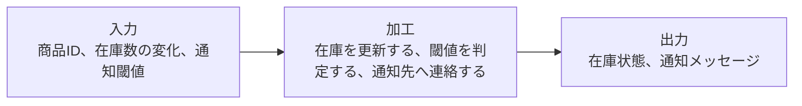
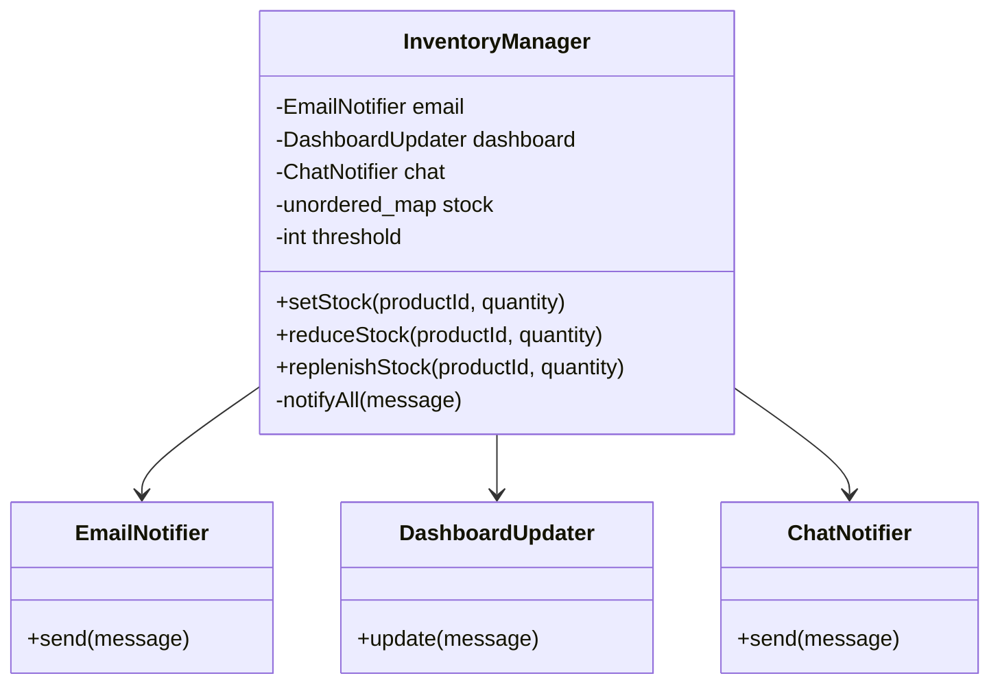
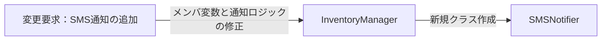
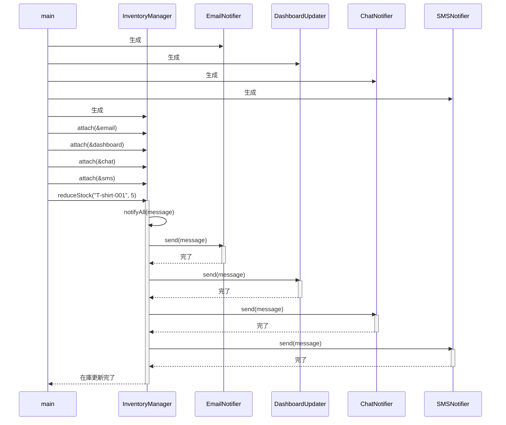
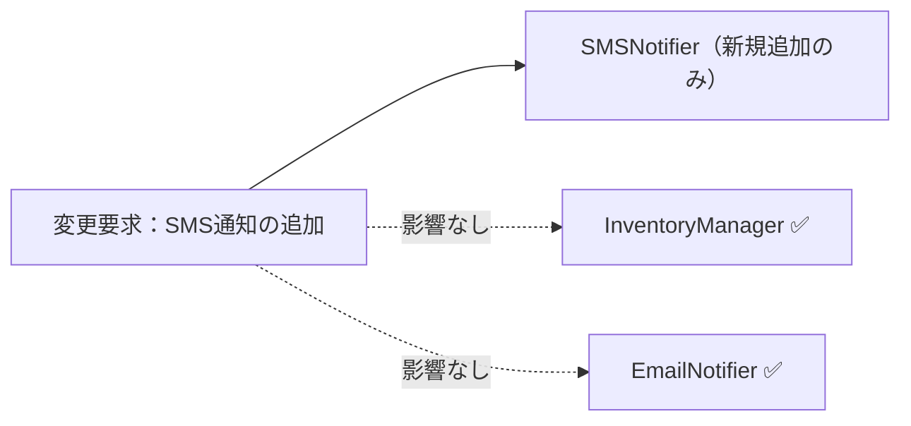
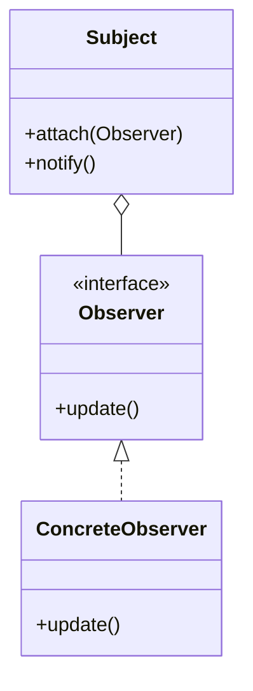

## 第7章 変わる通知先 ―― Observer パターン

―― 思考の型：一つの変化を、複数の相手にどう伝えるか

### この章の核心

**通知先が増えるたびに、在庫変化を検知する側まで修正が必要になる。こういう問題は、「在庫が少なくなった事実」と「誰にどう知らせるか」という知識を送る側が直接抱えているシステムで起きている。**

---

### この章を読むと得られること

この章のテーマは「誰に伝えるか」という問いです。通知先を増やすたびに通知元のコードを書き換えている——そんな設計の「伝言の密結合」がこの章で扱う問題です。

* **得られること1：** 「変化の発生元」と「変化を受け取る側」という観点で、コードの変動箇所を識別できるようになる
* **得られること2：** 通知元が通知先の種類と送信方法をどこまで知っているかを接続点から調べ、通知先追加の痛みが生まれる理由を説明できるようになる
* **得られること3：** 通知操作の約束をそろえると、通知先追加の変更を通知先の実装と登録処理へ寄せられることを説明できるようになる
* **得られること4：** 通知を送る側が通知先を具体的に知らなくても、動的に通知先を増やしたり減らしたりできる視点

## 🔵 フェーズ1：現状把握 ―― 仕様を整理し、システムと紐付ける

まずは、在庫通知システムが何を入力として受け取り、どの処理で加工し、何を出力するのかを整理します。ここでは設計の良し悪しを判断せず、現状を事実としてそろえます。

### 1-1：このシステムの仕様

この項目では、まず仕様を「入力→加工→出力」の形で整理します。コードの細部を読む前に、この変換の流れを押さえると、後のフェーズで仕様とコードを対応づけやすくなります。

**仕様の入力・加工・出力**



この図の要素は、後続で次のように確認します。

| 図の要素 | この章での呼び名 | 後で確認する場所 |
|---|---|---|
| 商品ID、在庫数の変化、通知閾値 | 商品ごとの在庫状態と通知条件 | 動作例テーブル、変更要求 |
| 在庫更新、閾値判定、通知先への連絡 | 在庫変化を検知して知らせる加工 | 現状仕様の確認、通知先追加時の変更シミュレーション |
| 在庫状態、通知メッセージ | 在庫更新後に返る結果 | 動作例テーブル、実行結果、変更シナリオ表 |

このシステムは、アパレルメーカーの在庫数を管理し、**在庫が閾値を下回ったときに複数の通知先へ通知**します。

在庫の増減を記録し、一定数を下回るイベントが発生すると、登録されているすべての通知先へ同時にメッセージを送ります。

**通知の動作ルール**

通知を送るかどうかの判断は「在庫数が閾値を下回ったか」という一点だけで決まります。補充のような在庫の増加は通知の対象外です。これは「発注が必要になった瞬間にだけ知らせる」という業務上の必要性から来ており、在庫管理システムでは広く採用されている一般的な考え方です。また、「通知先が0件のときにエラーにしない」のは、通知先が一時的にゼロになっても在庫管理そのものは止めたくないという運用上の理由があります——夜間バッチ処理や通知先の切り替え作業中でも、在庫の記録は続けなければならないからです。

| 状況 | 動作 |
|---|---|
| 在庫が閾値以下に減少した | 登録済みの全通知先へ通知を送る |
| 在庫が閾値を超えている | 通知しない |
| 通知先が1件も登録されていない | 何もしない（エラーにならない） |

「閾値以下になったら全通知先へ」という動作は、発注漏れを防ぐための安全策です。一部の通知先だけに送ると、担当者によって情報の到達タイミングがずれてしまうため、同時に全員へ届ける設計になっています。

**現在登録されている通知先**

通知先が3つあるのは、担当者の働く環境がそれぞれ違うからです。倉庫担当者は現場でメールを確認し、管理チームはPCのダッシュボードで状況を把握し、担当者はチャットで素早く連絡を受け取る——同じ情報でも、役割によって受け取り方が異なります。複数の通知手段を並走させる構成は、規模の大きい在庫管理システムでは一般的です。

| 通知先 | 通知手段 | 担当者 |
|---|---|---|
| メール通知 | メール | 倉庫担当者 |
| ダッシュボード更新 | 社内ダッシュボード | 在庫管理チーム |
| チャット通知 | 社内チャット | 在庫担当者 |

この3つの通知先は、それぞれ異なるシステムや担当チームによって管理されています。メールはインフラ管理部門が、ダッシュボードはフロントエンドチームが、チャットは各部門のマネージャーが運用を担っています。この「管理者の違い」が、後のフェーズで問題の核心になります。

**この仕様を決める業務機能**

このシステムでは、変わりやすい知識がどの業務機能に属するかを見ておきます。メール宛先はインフラ・システム管理の範囲、ダッシュボードの表示はUI・表示管理の範囲、チャット連絡網は通知・連携管理の範囲です。これら複数の業務機能の知識が一か所に混在していると、ある機能の変更が別の機能の領域にまで影響を及ぼす状況が生まれます。

| 業務機能 | この章の仕様で決めていること |
|---|---|
| インフラ・システム管理 | メール等の通知手段の採用・廃止 |
| UI・表示管理 | ダッシュボードの表示仕様 |
| 通知・連携管理 | チャット等の連絡網の変更 |
| 処理の骨格（開発設計判断） | 閾値判定ロジック・システム保守 |

後のフェーズで変更要求を扱うとき、どの業務機能の知識なのかを確認するための名前として使います。

### 1-2：動作例テーブル

コードを読む前に、変更要求が届く前の在庫システムがどんな入力に対して
どんな通知を行うか確認します。

| シナリオ | 操作 | 通知・更新の結果 |
| --- | --- | --- |
| 在庫が閾値以下に減少（通常） | Tシャツ-001の在庫を5減らす | 全通知先へ送信・更新 |
| 在庫が閾値以下に減少（複数通知先） | パンツ-002の在庫を3減らす | 全通知先へ送信・更新 |
| 在庫が補充された（閾値超え） | Tシャツ-001の在庫を20補充する | 送信されない・更新なし |
| 在庫が閾値ちょうどに減少（境界値） | キャップ-003の在庫を1減らす | 全通知先へ送信・更新 |

在庫が閾値以下になったときは現在の3通知先すべてへ送り、閾値を超えて
いるときは通知しないことが核心です。

次は仕様とクラスを対応づけます。

**このシステムの登場クラス**

| クラス名 | 役割 | 担当する仕様 |
|---|---|---|
| ProductDatabase | 商品マスタを保持し、在庫数・アラート閾値を提供する | 商品IDの存在確認、在庫数と閾値の参照 |
| InventoryManager | 在庫の増減を管理し、一定値を下回ったら通知を送る | 在庫数の監視、各通知先へのメッセージ送信 |
| EmailNotifier | メール送信を担当 | メール通知 |
| DashboardUpdater | ダッシュボード更新を担当 | ダッシュボードへの反映 |
| ChatNotifier | チャットツールへの送信を担当 | チャット通知 |

---

### 1-3：登場クラスとクラス構成図

システムのクラス構成を可視化し、構造を確認します。



この図が示す通り、InventoryManager という単一のクラスが、通知先であるすべてのクラス（メール、ダッシュボード、チャット）を直接保持している構成になっています。

---

**この章での簡略化**

1-3でクラス構成を確認したので、掲載コードで何を代替しているかを整理してから現状コードへ進みます。

この章では、メール送信、チャット投稿、ダッシュボード更新を実際の外部APIではなく `std::cout` で表します。論点は「在庫変化を複数の通知先へどう伝えるか」であり、通信失敗、リトライ、通知テンプレート管理は本章では扱いません。

---

### 1-4：実装コード（現状）

在庫が減った際に各通知先へメッセージを送る処理をシミュレートしています。

はじめに、各通知先クラスの定義です。それぞれが独立した実装を持ち、InventoryManager から直接呼び出されています。

このシステムには以下の3件の商品データがあらかじめ登録されています。

| 商品ID | 商品名 | 在庫数 | アラート閾値 |
|---|---|---|---|
| PRD001 | ワイヤレスマウス | 50 | 10（閾値以上） |
| PRD002 | USBハブ | 3 | 5（閾値以下→アラート発火） |
| PRD003 | キーボード | 0 | 5（在庫なし） |

在庫数がアラート閾値以下になるとObserverへの通知が発火します。コードを読む前にこの対応を把握しておくと、動作結果が追いやすくなります。

```cpp
#include <iostream>
#include <string>
#include <map>
#include <unordered_map>

using namespace std;

// 商品マスタの1件分
struct ProductInfo {
    string name;         // 商品名
    int    stock;        // 在庫数
    int    alertThreshold; // アラート閾値
};

// 商品マスタ（データ駆動バリデーション用）
class ProductDatabase {
private:
    map<string, ProductInfo> records;
public:
    ProductDatabase() {
        records["PRD001"] = {"ワイヤレスマウス", 50, 10};
        records["PRD002"] = {"USBハブ",           3,  5}; // 閾値以下
        records["PRD003"] = {"キーボード",         0,  5}; // 在庫なし
    }

    bool exists(const string& id) const {
        return records.count(id) > 0;
    }

    ProductInfo get(const string& id) const {
        return records.at(id);
    }

    bool isBelowThreshold(const string& id) const {
        const auto& p = records.at(id);
        return p.stock <= p.alertThreshold;
    }
};

// 各通知先の具体的な実装
class EmailNotifier {
public:
    void send(string m) { cout << "Email: " << m << endl; }
};
class DashboardUpdater {
public:
    void update(string m) { cout << "Dashboard: " << m << endl; }
};
class ChatNotifier {
public:
    void send(string m) { cout << "Chat: " << m << endl; }
};
```

`ProductDatabase` が商品マスタを保持し、`InventoryManager` は商品IDの存在確認と閾値判定をデータベース経由で行います。通知先クラスはそれぞれ独立した送信メソッドを持っていますが、メソッド名が `send` と `update` で統一されていないことに気づきます。次に、これらを直接呼び出す InventoryManager の実装を見てみましょう。

```cpp
class InventoryManager {
private:
    EmailNotifier    email;
    DashboardUpdater dashboard;
    ChatNotifier     chat;
    ProductDatabase  db;
    unordered_map<string, int> stock;

public:
    void setStock(const string& productId, int quantity) {
        if (!db.exists(productId)) {
            cout << "[エラー] 商品ID " << productId
                 << " はマスタに存在しません。" << endl;
            return;
        }
        stock[productId] = quantity;
    }

    void reduceStock(string productId, int quantity) {
        if (!db.exists(productId)) {
            cout << "[エラー] 商品ID " << productId
                 << " はマスタに存在しません。処理を中断します。"
                 << endl;
            return;
        }
        if (stock[productId] <= 0) {
            cout << "[エラー] 商品 " << productId
                 << " の在庫が0です。出庫できません。" << endl;
            return;
        }

        stock[productId] -= quantity;
        cout << "商品 " << productId
             << " の在庫を " << quantity << " 減らしました。残数: "
             << stock[productId] << endl;

        if (db.isBelowThreshold(productId)) {
            string message = "商品 " + productId
                           + " の在庫が閾値以下です。";
            notifyAll(message);
        }
    }

    void replenishStock(string productId, int quantity) {
        if (!db.exists(productId)) {
            cout << "[エラー] 商品ID " << productId
                 << " はマスタに存在しません。処理を中断します。"
                 << endl;
            return;
        }
        stock[productId] += quantity;
        cout << "商品 " << productId
             << " の在庫を " << quantity << " 補充しました。残数: "
             << stock[productId] << endl;
    }

private:
    void notifyAll(string message) {
        // 通知先が増えるたびに、ここが修正される
        email.send(message);
        dashboard.update(message);
        chat.send(message);
    }
};

int main() {
    InventoryManager manager;

    manager.setStock("PRD001", 10); // ワイヤレスマウス
    manager.setStock("PRD002", 8);  // USBハブ
    manager.setStock("PRD003", 6);  // キーボード

    cout << "--- 行1: PRD001を5減らす ---" << endl;
    manager.reduceStock("PRD001", 5);

    cout << "--- 行2: PRD002を3減らす ---" << endl;
    manager.reduceStock("PRD002", 3);

    cout << "--- 行3: PRD001を20補充する ---" << endl;
    manager.replenishStock("PRD001", 20);

    cout << "--- 行4: PRD003を1減らす ---" << endl;
    manager.reduceStock("PRD003", 1);

    cout << "--- 行5: 存在しない商品IDを操作する ---" << endl;
    manager.reduceStock("PRD999", 1);
    return 0;
}
```

実行対象コード：1-4の現状コード
対応する動作例：1-2の動作例テーブル
確認したいこと：入力、加工、出力が仕様どおりに対応していること

実行結果：

```text
--- 行1: PRD001を5減らす ---
商品 PRD001 の在庫を 5 減らしました。残数: 5
--- 行2: PRD002を3減らす ---
商品 PRD002 の在庫を 3 減らしました。残数: 5
Email: 商品 PRD002 の在庫が閾値以下です。
Dashboard: 商品 PRD002 の在庫が閾値以下です。
Chat: 商品 PRD002 の在庫が閾値以下です。
--- 行3: PRD001を20補充する ---
商品 PRD001 の在庫を 20 補充しました。残数: 25
--- 行4: PRD003を1減らす ---
[エラー] 商品 PRD003 の在庫が0です。出庫できません。
--- 行5: 存在しない商品IDを操作する ---
[エラー] 商品ID PRD999 はマスタに存在しません。処理を中断します。
```

動作例テーブルの全4行について、閾値以下では3通知先へ送信され、
補充後に閾値を超えている場合は通知されないことを確認できました。
同時に、`InventoryManager` が通知先のクラス名と呼び出し方をすべて直接
知っていることも分かります。

---
---

### 1-5：変更要求

**変更要求の発生チーム：** 今回の変更要求は店舗運営チームから届いています。通知先の増減を判断するチームです。一方で、在庫の管理自体はシステム基盤チームが担っています。この点をフェーズ2の「どの業務機能によるか」への伏線として覚えておきます。


ある週の月曜日、店舗運営部の田中部長から、在庫管理システムの改善依頼がメールで届きました。

「在庫が少なくなった時に、倉庫担当者のスマホへSMS（ショートメッセージ）で直接通知を送れるようにしたいんだ。今はメールだけだから、どうしても確認が遅れて発注が漏れることがあってね。来月の店舗改装のタイミングで運用を変えたいから、なんとか対応してくれないか？」

なるほど、倉庫担当者のスマホへのSMS通知ですね。バックヤードで作業中の担当者にとって、メールよりも気づきやすい手段が必要というのは、現場のオペレーションとして理にかなっています。

**仕様変更の内容**

変更要求を受けて、通知先の構成がどう変わるかを整理します。

| 通知先 | 変更前 | 変更後 |
|---|---|---|
| EmailNotifier（メール） | あり | 変更なし |
| DashboardUpdater（ダッシュボード） | あり | 変更なし |
| ChatNotifier（チャット） | あり | 変更なし |
| **SMSNotifier（SMS通知）** | なし | **新規追加** |

在庫が閾値を下回ったとき、これまでの3チャネル（メール・ダッシュボード・チャット）に加えて、倉庫担当者のスマートフォンへSMSが送信されるようになります。

通知のトリガー条件（在庫が閾値以下になること）と、「登録されている全通知先へ同時に通知する」という動作ルールは変わりません。変わるのは「通知先の種類が1つ増える」という点だけです。

---

## 🟣 フェーズ2：仮説立案 ―― 何が変わるかを観察し、ヒアリングで裏付ける
ここからフェーズ2（仮説立案）に進みます。フェーズ1で観察した事実をもとに、「何が変わる見込みか・何を当面安定と見るか」を仮説として立て、関係者へのヒアリングで裏付けます。

### 2-1：変わりそうな仕様の見当をつける

`InventoryManager.reduceStock()` が現在抱えている知識と、それぞれを変更する担当者を確認します。

| 知識（コードが直接持っているもの） | 業務機能 | 適切か |
|---|---|---|
| 在庫数の監視・閾値判定ロジック | 処理の骨格（開発設計判断） | ✅ |
| メール通知先の存在と送信方法 | インフラ・システム管理 | ❌ 混在 |
| ダッシュボードの更新方法 | UI・表示管理 | ❌ 混在 |
| チャット通知先の存在と送信方法 | 通知・連携管理 | ❌ 混在 |

❌が3つある。新しい通知先が増えるたびに、在庫管理のロジックを持つクラスに手が入ります。これが後の変更の痛みの予兆です。

### 2-2：今回の変更で確実に変わること

フェーズ1での観察と、今回届いた変更要求を材料にして、「今回の対応で確実に変わること」を整理します。これは将来の話ではなく、今回の要求対応に直結する変動です。

| **分類** | **今回の確定変更** | **根拠** |
| --- | --- | --- |
| 🔴 **変動する** | 通知先に SMSNotifier クラスが追加される | 田中部長からの変更要求が確定しているため |
| 🔴 **変動する** | `InventoryManager` の `notifyAll` に SMS送信の呼び出しが増える | 現状の構造では新しい通知先を直接追記する必要があるため |
| 🟢 **当面安定** | 「在庫が少なくなった」というイベント発生そのもののロジック | 商品の在庫を管理するというシステム本来の目的であり、通知の手段とは独立しているため |

コードを読んだだけで「ここは間違いなく変わる」「ここは当面安定している」と自分一人で断定してしまうのは危険です。今の設計思想では、新しい通知先が増えるたびに `InventoryManager` 自体を書き換える必要があると読み取れますが、本当に将来もこのまま追加し続ける運用でよいのか、関係者に直接確認します。

### ヒアリングに向けた背景確認

このシステムは、あるアパレルメーカーの在庫管理システムを支える一部です。日々、全国の店舗から刻々と送られてくる売上データを受けて、倉庫にある在庫数を減らし、規定数を下回れば追加発注をかける、といった業務の流れを管理しています。

システムが立ち上がった当初は、在庫が減ったことを倉庫の担当者に「メール」で送るだけで十分でした。しかし、昨今のデジタル化の流れを受け、在庫状況をリアルタイムで「社内ダッシュボード」に反映させたり、在庫が少なくなったら「在庫担当者のチャット」に通知したりと、在庫の変動を追いかける相手がどんどん増えてきました。

コードを眺めてみると、在庫が減ったことを検知する InventoryManager クラスの中で、メール送信クラス、ダッシュボード更新クラス、チャット通知クラスといった、具体的な通知先クラスを直接呼び出す構成になっています。システムが小さかった頃は、これらすべてを InventoryManager が把握していても問題はありませんでした。

一見すると、このコードは処理が一つにまとまっており、何が起きているか分かりやすく整理されているように見えます。

### 2-3：関係者ヒアリング

仮説を携えて、店舗運営部の田中部長と開発チームのミーティングを行いました。チームで話し合う価値がある部分だと思います。

**開発者：** 「田中部長、SMS通知の件承知しました。一点確認ですが、今回のような新しい通知手段は、今後もキャンペーンや業務効率化のたびに追加されていく予定でしょうか？」

**田中部長：** 「そうなんだよ。次は店舗のバックヤードにある音声通知システムと連携したいという話もあってね。しばらくは、新しい通知方法がどんどん増えていくと思うよ。」

**開発者：** 「なるほど。通知手段の入れ替わりは激しそうですね。では、通知のタイミング（在庫が少なくなった瞬間など）といった『通知の基準』自体は、今回の変更範囲では固定と考えてよいでしょうか？」

**田中部長：** 「ああ、今回そこは変えないよ。あくまで『在庫が切迫した時』に知らせるというルール自体は固定だ。」

**開発者：** 「承知しました。通知手段（先）は頻繁に増減するけれど、通知の基準（トリガー）は安定しているということですね。」

ヒアリングの結果、通知先という変動要素が今後も際限なく増え続けることが確定しました。これまでのように `InventoryManager` に新しい通知先をハードコードし続けるのは、システムの拡張性として限界がきているようです。

### 2-4：ヒアリングで判明した将来リスク

ヒアリングで明らかになった「将来変わるかもしれないこと」を、確定した変更とは分けて整理します。これは今すぐ対応するかどうかの判断材料であり、設計の方向性に影響します。

| **分類** | **将来リスク** | **変わるタイミング** | **根拠（誰との確認か）** |
| --- | --- | --- | --- |
| 🔴 **変動リスク高** | 通知先となるクラスの種類とその実装（音声通知システムなど） | 業務要件の変更があるたび | 田中部長との合意 |
| 🔴 **変動リスク高** | 通知先の増減（動的な登録・解除） | 随時 | 田中部長との合意 |
| 🟢 **当面安定** | 「在庫減少」というイベントの発生タイミング | 今回は固定 | ロジックの骨格として合意 |

通知先という「管理者が異なる知識」が今後も増え続けることが確定しました。今の `InventoryManager` クラスにこれ以上責任を背負わせるのは、そろそろ限界かもしれません。

### 2-5：変わる見込みと当面安定の前提を確定する

2-4のヒアリング結果をもとに、将来起こりうる変更を現状と並べて整理します。この見通しが、次のフェーズ3でどこに痛みが集中するかを読む基準になります。

| 変更内容 | 現在 | 将来（時期の目安） |
| --- | --- | --- |
| 通知先の種類 | メール・ダッシュボード・チャットの3種類（固定） | SMS・音声通知など随時追加（業務要件の変更ごと） |
| 通知先の登録・解除 | InventoryManager に固定でハードコード | 随時、動的に追加・解除できる運用が必要 |
| 通知のトリガー条件 | 在庫が閾値以下になった瞬間 | 今回は固定（田中部長と合意済み） |

この変化が来たとき、今の `InventoryManager` はその都度書き換えを迫られます。次のフェーズ3では、実際にSMS通知を追加しようとしたときに何が起きるかを試みます。

---

## 🟣 フェーズ3：問題特定 ―― 変更の痛みを発見する
### 3-1：変更を試みる

田中部長からの「倉庫担当者のスマホへSMSで通知を送りたい」という要求を、今のコードで実装しようと試みます。

はじめに、SMSを送るための SMSNotifier クラスを新規作成します。次に、通知の中心である InventoryManager クラスを開き、新しく作成した SMSNotifier クラスのインスタンスをメンバ変数として追加します。
コンストラクタで SMSNotifier を初期化し、さらに `notifyAll` メソッド内にも `sms.send(message);` という行を書き加える必要があります。つまり、コンストラクタと `notifyAll` の両方に、新クラスの初期化と呼び出しを追加する必要があります。

> [!INFO] コラム: 「数行足すだけ」が危険な理由
> 「通知先が増えたら、InventoryManager に数行足すだけでしょ？」と思うかもしれません。しかし、その数行を足すために「在庫管理の本体コード」を開くこと自体がリスクなのです。もし間違えて在庫を減らすロジックを消してしまったら、システム全体が停止します。「通知先の変更」という別の理由で、重要なビジネスロジックを触らなくて済むようにすることが、このような通知先と業務ロジックを分離する設計の狙いです。

ここでふと、ある懸念が頭をよぎります。「この先、在庫通知の種類がもっと増えたらどうなるのだろう？」と。
メール、ダッシュボード、チャットに続き、SMS、そして先ほど部長が言及した音声通知まで増えれば、InventoryManager クラスの notifyAll メソッドには何十行もの通知処理が並ぶことになります。さらに、通知先クラスが一つ増えるたびに、InventoryManager のメンバ変数を書き換え、コンストラクタを修正し、notifyAll を書き換えるという、同じような「掃除」を何度も繰り返すことになるのです。

実際に SMSNotifier を追加した変更後のコードは次のようになります。

```cpp
// 既存の通知クラス（変更なし）
class EmailNotifier {
public:
    void send(std::string msg) {
        std::cout << "[Email] " << msg << std::endl;
    }
};
class DashboardUpdater {
public:
    void update(std::string msg) {
        std::cout << "[Dashboard] " << msg << std::endl;
    }
};
class ChatNotifier {
public:
    void send(std::string msg) {
        std::cout << "[Chat] " << msg << std::endl;
    }
};

// 新規追加：SMS通知クラス
class SMSNotifier {
public:
    void send(std::string msg) {
        std::cout << "[SMS] " << msg << std::endl;
    }
};

// 変更後の InventoryManager（3箇所を修正）
class InventoryManager {
    EmailNotifier    email;
    DashboardUpdater dashboard;
    ChatNotifier     chat;
    SMSNotifier      sms; // ← ①メンバ変数を追加
public:
    void reduceStock(std::string id, int qty) {
        std::cout << "在庫減少: " << id
                  << " × " << qty << std::endl;
        std::string msg = id + " の在庫が減少しました";
        notifyAll(msg);
    }
private:
    void notifyAll(std::string msg) {
        email.send(msg);
        dashboard.update(msg);
        chat.send(msg);
        sms.send(msg); // ← ②notifyAll 内にも追加
    }
};

int main() {
    InventoryManager mgr;
    mgr.reduceStock("ITEM-001", 5);
    return 0;
}
```

実行対象コード：3-1の変更試行コード
対応する動作例：変更要求後の代表ケース
確認したいこと：変更要求を現状構造へ当てはめたとき、修正箇所と痛みがどこに出るか

実行結果：

```
在庫減少: ITEM-001 × 5
[Email] ITEM-001 の在庫が減少しました
[Dashboard] ITEM-001 の在庫が減少しました
[Chat] ITEM-001 の在庫が減少しました
[SMS] ITEM-001 の在庫が減少しました
```

SMS通知が正しく追加されています。しかし `SMSNotifier` を1つ追加するだけで、`InventoryManager` のメンバ変数と `notifyAll` の2箇所を修正しなければなりませんでした。

### 3-2：変更影響グラフ

変更を試みた結果、コード内の依存関係がどうなっているかを図にしてみます。



変更を加えるたびに InventoryManager が修正対象となり、通知先が増えるほど、このクラスが知るべき知識がどんどん増幅していく様子が見て取れます。

### 3-3：痛みの言語化

変更を試みる中で、構造上の問題が2つ浮かび上がりました。

1つ目は、InventoryManager が「通知先の存在」と「送信方法」という2種類の知識を抱え込んでいることです。本来、通知のタイミング（在庫が切迫した瞬間）の管理だけが責務であるべきなのに、通知先クラスの名前と各クラスのメソッド名まで知っています。結果として、通知先が増えるたびにメンバ変数・コンストラクタ・notifyAllの3箇所を修正しなければならず、このクラスの変更理由が際限なく増えていきます。

2つ目は、通知先と通知元の変更理由が混在していることです。通知先クラスが変わるたびに、通知元の InventoryManager まで修正対象になります。これは「在庫管理のビジネスルール」と「通知手段の選択」という、本来異なる変更理由を1つのクラスが抱えている状態です。

フェーズ3で「変更のたびに通知元クラスが書き換わる」という痛みが確認できました。次のフェーズ4では、通知元と通知先の接続点に漏れている知識を確認します。

---
> **📌 問題（確定）**
> 通知先が変わるたびに、通知元の `InventoryManager` クラスのメンバ変数・コンストラクタ・`notifyAll` の3箇所が連動して変わる。通知先という「管理者が異なる知識」が、在庫管理ロジックと同じクラスに混在しているため、通知先の追加・削除が通知元クラスへの修正を引き起こし続ける。
---

ここまでで「何が痛いか」が事実として確認できました。次のフェーズ4では、その痛みが「なぜ起きているか」を構造の言葉で言語化します。

---

## 🟠 フェーズ4：原因分析 ―― なぜ辛いのかを構造で言語化する
### 4-1：痛みの根源を探る（観察と原因）

フェーズ3で確認した「変更の辛さ」は、コードのどこから来ているのでしょうか。コードを注意深く観察すると、痛みを引き起こしている2つの事実が浮かび上がってきます。

第一に、新しい通知先を追加するとき、なぜ毎回 `InventoryManager` を開かなければならないのでしょうか？それは、このクラス自身が「EmailNotifier に send する」「DashboardUpdater に update する」「ChatNotifier に send する」といった**具体的な通知先の名前と送信方法を全部直接知ってしまっている（抱え込んでいる）**からです。

第二に、なぜ変更の影響範囲が読めず、修正を重ねるたびに不安を感じるのでしょうか？それは、「在庫が減った」というイベントの管理という本来の骨格ロジックと、「誰にどうやって知らせるか」という通知先ごとの実装が、**同じクラスの中で物理的に混ざり合っている**からです。

この「症状（痛み）」と「根本原因」を整理すると、以下のようになります。

| **観察した症状（痛み）** | **構造的な原因（痛みの根源）** |
|---|---|
| 新しい通知先を追加するたびに、通知元の InventoryManager クラスの修正が必要になる | InventoryManager が、通知する必要がある相手の「具体的なクラス名」と「通知方法」を直接知っているから |
| 通知先のクラスが変わったり増えたりするたびに、通知元クラスが影響を受ける | 在庫管理という「守りたい前提」と、通知先という「変わる見込み」が、同じクラスの中に混在しているから |

こうして整理すると、問題の本質が見えてきます。通知元である InventoryManager は、「在庫が減った」という事実を伝えたいだけなのに、その情報を「誰が」「どう受け取るか」という詳細な実装までを全部抱え込んでしまっているのです。これでは、通知先が増えるたびにこのクラスを汚していくことになり、影響範囲が広がり続けるのは避けられません。

### 4-2：変わるもの/変わってほしくないもの

> **「変わらないもの」と「変わってほしくないもの」は異なります。** 「変わらないもの」は経験的事実（今まで変わっていない）、「変わってほしくないもの」は設計意図（ここを安定させてほかを守りたい）です。ここで整理するのは後者です。

原因の方向性が見えたところで、「変わり続けるもの」と「変わってほしくないもの」を明確に切り分けます。

| **変わるもの（🔴）** | **変わってほしくないもの（🟢）** |
| --- | --- |
| 通知先のクラス（メール、ダッシュボード、チャット等）、その追加や削除、および具体的な通知手段 | 「在庫が少なくなった」というイベントの発生通知そのもの、およびそのトリガーとなる在庫管理ロジック |

**【変わる部分（変わり続ける通知先の知識）】**
```cpp
    void notifyAll(string message) {
        email.send(message);      // ← EmailNotifierを直接知っている
        dashboard.update(message); // ← DashboardUpdaterを直接知っている
        chat.send(message);       // ← ChatNotifierを直接知っている
    }
```

**【変わってほしくない部分（守りたい骨格）】**
```cpp
    void reduceStock(string productId, int quantity) {
        cout << "商品 " << productId
             << " の在庫を " << quantity << " 減らしました。" << endl;
        // ... (ここに変わる通知処理が入っている) ...
    }
```

「在庫が少なくなった」という出来事は、通知先が増えようが減ろうがシステムの中では等しく起きています。この「イベント発生の事実」こそが、変わってほしくないコア部分です。一方、通知先はビジネスの都合で今後も変動し続けます。この「変わる側」をうまく分離できれば、通知元は常に安定した状態を保てるはずです。

### 4-3：接続点に漏れている通知先の知識を確認する

現在の`InventoryManager`が、通知先について何を知っているかを確認します。

`InventoryManager`は、`EmailNotifier`や`ChatNotifier`というクラス名に加え、通知先ごとに異なるメソッド名と呼び出し順序まで知っています。接続点で必要なのは「メッセージを通知すること」だけです。

新しい通知先を追加すると、通知元へメンバー変数・初期化・呼び出しを追加する必要があります。通知先の種類と送信方法が通知元へ漏れているためです。

現状の InventoryManager と各通知先は、その「変わる理由」が異なります。このまま密接に接続させておくと、一方の変更がもう一方に波及し続けます。両者を切り離して疎な関係にすることが、根本原因への対処になります。

フェーズ4で根本原因が言語化できました。「どこを分けるか」は明確です。次のフェーズ5では、その境界で実際に何が流れているかを値・型のレベルで具体化し、「何を変え、何を守るか」を明確にします。

---
> **📌 原因（確定）**
> `InventoryManager`が通知先のクラス名と送信メソッドをすべて知っている。通知先を追加するたびに、在庫管理のクラスへメンバー・初期化・呼び出しを追加する必要がある。
---

「何が痛いか（問題）」と「なぜ痛いか（原因）」が揃いました。次のフェーズ5では、「何を切り離す必要があるか（課題）」を、接続点で流れるデータのレベルで言語化します。

---

## 🟡 フェーズ5：課題定義 ―― 解くべき接続点を定める
フェーズ4は「なぜ辛いか」を答えました。フェーズ5が問うのは「分けるべき境界で、実際に何が流れているか」です。クラスの参照関係ではなく、**値・型のレベル**に降りていきます。

フェーズ4の分析により、問題は「通知元（`InventoryManager`）が通知先の具体名を知りすぎている」ことだと分かりました。その境界で何がやり取りされているかを具体化します。

### 接続点を特定する

`notifyAll()` の中で分けるべき境界は「通知元 → 各通知先」の接続部分。各通知先に渡しているデータを見ます。

現在の状況：`InventoryManager` は `email.send(msg)` / `dashboard.update(msg)` / `chat.send(msg)` という**異なるメソッド名・クラス名**を直接知っています。通知先が増えるたびにこの接続点の数が増えます。

| 接続点 | 接続するデータ | 変わるもの |
|---|---|---|
| `InventoryManager` → 各通知先 | 通知メッセージ（`string` 型） → 各通知先が受け取る（void） | 通知先の種類・数（新しい通知先が追加されるたびに） |

### 何を変え、何を守るか

- **変わるもの**：通知先の種類（EmailNotifier / DashboardUpdater / ChatNotifier … が増え続ける）。新しい通知先が増えるたびに `InventoryManager` に知識が積み重なる。
- **守りたい前提**：通知として渡すデータの型（`string` 型のメッセージ）。「何かを伝える」という通知の行為そのもの。

`InventoryManager`に必要なのは「在庫が減ったことを知らせる」という役割です。問題は、「誰に・どのメソッドで知らせるか」という知識まで抱えていることです。

**現状のままでよい場面**：通知先が固定され、登録・解除も不要なら、現在の呼び出しを保つ判断もあります。今回は通知先が増減するため、通知元が同じ操作で通知でき、外部から登録できる契約を検討します。

---
> **📌 課題（確定）**
> 「通知元（`InventoryManager`）」と「通知先（`EmailNotifier`・`DashboardUpdater`・`ChatNotifier`）」を切り離す必要がある。渡すデータ（`string` 型のメッセージ）は安定しているため、「何を渡すか」ではなく「誰に渡すか・どのメソッドで渡すか」という通知先の知識を `InventoryManager` から取り除くことが課題である。
---

問題・原因・課題の3点が揃いました。次のフェーズ6では、この課題を解消するための具体的な設計案を段階的に検討します。

---

## 🔴 フェーズ6：対策検討 ―― 案を比べ、採用する形を決める
フェーズ5で「変わるのは通知先の種類や数であり、通知元が渡すメッセージ（string）は安定している」ことが分かりました。ここでは、通知先をどのように登録・解除できる形へ変えるかを段階的に検討します。それぞれの段階（ステップ）でどこまで痛みが解消されるかを確認し、今回の要件において「どのステップで止めるべきか」を決断します。

### ステップ1：各通知を独立したメソッドに切り出す（共通構造を発見する）

新しい通知先（SMS）を追加するとき、`reduceStock` の中に通知処理が直書きされているのが気になります。「それぞれの通知処理を独立したメソッドに切り出して、整理してみよう」と考えるのが最初の一歩です。一つにまとめるのではなく、まず各処理をバラバラに切り出します。

```cpp
class InventoryManager {
private:
    EmailNotifier    email;
    DashboardUpdater dashboard;
    ChatNotifier     chat;

    // 各通知を独立したメソッドとして切り出す
    void notifyEmail(string message) {
        email.send(message);
    }
    void notifyDashboard(string message) {
        dashboard.update(message);
    }
    void notifyChat(string message) {
        chat.send(message);
    }

    // 判定（どの通知先を呼ぶか）も独立したメソッドとして切り出す
    void notifyAll(string message) {
        notifyEmail(message);
        notifyDashboard(message);
        notifyChat(message);
    }

public:
    void reduceStock(string productId, int quantity) {
        cout << "商品 " << productId
             << " の在庫を " << quantity
             << " 減らしました。" << endl;
        string message = "商品 " + productId
                       + " の在庫が減少しました。";
        notifyAll(message);
    }
};
```

各通知先への呼び出しが独立したメソッドに分かれ、`reduceStock` の見通しが改善されたことが分かる。

**この段階の評価：** ここで気づくことがあります。`notifyEmail`・`notifyDashboard`・`notifyChat` の3つは、引数も戻り値の型も同じです。`string` を受け取り、`void` を返す——同じシグネチャを持つメソッドが3つ並んでいる。これが「共通の構造」の最初の兆候です。また、呼び出しのとりまとめ（`notifyAll`）を独立させたことで、「各通知処理の実行」と「どれを呼ぶかの制御」が別の関心事として見えてきました。

しかし問題は残っています。新しい通知先（SMSNotifier）を追加するには、InventoryManager を開いてメンバ変数・`notifySms` メソッド・`notifyAll` 内の呼び出しの3箇所を修正する必要があります。通知先の数だけこの修正パターンが繰り返されるという根本は変わっていない。次のステップでは、この共通構造を持つメソッドたちをどう扱うかを考えます。

---

### ステップ2：通知先をリストで持つ（同種の型を束ねる）

ステップ1で気になるのは「メンバ変数・初期化・呼び出しの3箇所」という修正の散らばりです。通知先の追加がリストへの追加だけで済めば、少なくとも修正箇所が減るはずです。同じ送信メソッド名 `send` を持つ具体クラスをリストにまとめてみます。

```cpp
class InventoryManager {
private:
    // 同種の型を束ねることで追加がリストだけで済む…はず
    vector<EmailNotifier*>     emailList;
    vector<ChatNotifier*>      chatList;
    // ← update() 型なので別リストが必要
    vector<DashboardUpdater*>  dashboardList;
    // SMSを追加するには vector<SMSNotifier*> smsListも必要になる

    void notifyAll(string message) {
        for (auto* n : emailList)     n->send(message);
        for (auto* n : chatList)      n->send(message);
        for (auto* n : dashboardList) n->update(message); // ← メソッド名が違う
        // SMS用のループも追加する必要が生じます
    }

public:
    void attachEmail(EmailNotifier* n)       { emailList.push_back(n); }
    void attachChat(ChatNotifier* n)         { chatList.push_back(n); }
    void attachDashboard(DashboardUpdater* n){ dashboardList.push_back(n); }

    void reduceStock(string productId, int quantity) {
        string message = "商品 " + productId
                       + " の在庫が減少しました。";
        notifyAll(message);
    }
};
```

リストで管理することで同種の通知先を複数登録できるようになったことが分かる。

**この段階の評価：** リストで管理することで通知先の追加はしやすくなった。しかし、リストに格納できる型が固定されている。新しい通知先（SMSNotifier）を追加するには `vector<SMSNotifier*>` という新しいリストを追加し、`notifyAll` にもループを追加する必要が生じます。通知先の種類が増えるたびに `InventoryManager` を修正する必要があるという根本は解決していない。

---

### ステップ3：通知操作の契約を統一する

ステップ2の問題は「具体型ごとにリストが必要になる」ことです。通知先クラスのメソッド名が `send` / `update` とバラバラなのも原因の一つでした。すべての通知先クラスに共通の契約（インターフェース）を持たせれば、`InventoryManager` が具体型に直接依存しない形へ近づけられます。

なお、インターフェース `INotification` の契約メソッドを `send()` に統一するため、`DashboardUpdater` は既存の `update()` を `send()` へと名前変更する必要があります。もし他の箇所で `dashboard.update()` と直接呼び出しているコードがあれば、その修正も伴います。これはインターフェース導入時に発生する「命名統一コスト」です。

```cpp
// 通知先が満たす必要がある契約（インターフェース）
class INotification {
public:
    virtual ~INotification() = default;
    virtual void send(string m) = 0;
};

// 各通知先クラスはインターフェースを実装するだけ
class EmailNotifier : public INotification {
public:
    void send(string m) override {
        cout << "Email: " << m << endl;
    }
};

class DashboardUpdater : public INotification {
public:
    void send(string m) override {
        cout << "Dashboard: " << m << endl;
    }
};

class ChatNotifier : public INotification {
public:
    void send(string m) override {
        cout << "Chat: " << m << endl;
    }
};

// 新しい通知先の実装例。利用時は通知元へ登録する
class SMSNotifier : public INotification {
public:
    void send(string m) override {
        cout << "SMS: " << m << endl;
    }
};

// 通知元クラス：具体クラスへ直接依存しない
class InventoryManager {
private:
    vector<INotification*> observers; // ← インターフェース型で統一

    void notifyAll(string message) {
        for (auto* o : observers) {
            o->send(message);  // 具体クラスを知らずに呼べる
        }
    }

public:
    void attach(INotification* o) { observers.push_back(o); }

    void reduceStock(string productId, int quantity) {
        string message = "商品 " + productId
                       + " の在庫が減少しました。";
        notifyAll(message);
    }
};

// 呼び出し側（main）だけが具体クラスを知る
int main() {
    EmailNotifier email;
    DashboardUpdater dashboard;
    ChatNotifier chat;
    SMSNotifier sms;

    InventoryManager manager;
    manager.attach(&email);
    manager.attach(&dashboard);
    manager.attach(&chat);
    manager.attach(&sms);

    manager.reduceStock("T-shirt-001", 5);
    return 0;
}
```

`InventoryManager` の中から具体的な通知先のクラス名がなくなり、共通契約である `INotification*` のリストだけが残りました。

**この段階の評価：** `InventoryManager` は「誰に通知するか」を知らずに済むようになった。新しい通知先を追加するには、`INotification` を実装した新しいクラスを作り、`attach()` で登録する。この変更シナリオでは、既存の通知元クラスを修正せずに対応できる。

---

### 採用する形を決める

それぞれのステップには一長一短があります。どこで止めるかは、**「今後の変更頻度（ビジネス要求）」**で決断します。

*   **ステップ1で止めるケース：** 通知先が固定で、当面増える見込みが低い場合。プライベートメソッドで整理するだけで十分なことがあります。
*   **ステップ2で止めるケース：** 同種の通知先を複数登録したいが、通知先の種類が増えることはない場合の「中間策」です。
*   **ステップ3（通知操作の契約を統一）まで進むケース：** 「チャット」「SMS」「別システム」など、今後新しい通知先が増減することが見込まれる場合。

**今回の決断：**
フェーズ2のヒアリングでSMS通知が要望され、今後も音声通知などが増える可能性があります。そこで、**ステップ3（通知操作の契約を統一し、登録できるようにする）で止める**決断を下します。

フェーズ6で採用する形が決まりました。次のフェーズ7では、この決断を最終的なコードに落とし込みます。

---

## 🟢 フェーズ7：対策実施 ―― 変化に強いコードを完成させる
フェーズ6のステップ3を実装し、通知元が通知先の種類を知らなくてよい構造へ変えます。`InventoryManager`は登録済みの通知先へ同じ操作を呼び出します。

**この構造は、Observer（オブザーバー）パターンと呼ばれています。**

名前の由来は、Subject（被観察者・通知を送る側）がObserver（観察者・通知先）に通知する仕組みだから、Observerパターンと呼ばれています。通知を「受け取る側」の役割名が、このパターンの名称になっています。

通知を送る側（Subject）がオブザーバーのリストを保持し、状態が変化したときに一斉に通知を送るという構造が、私たちが選んだステップ3そのものです。フェーズ1から積み上げてきた思考の結果、たどり着いた構造に名前があった——というのが本書の伝えたいことです。

### 7-1：解決後のコード（全体）

インターフェース INotification を定義し、通知先クラスがこれを実装するようにします。InventoryManager は INotification* のリストを管理するだけで済みます。

はじめに、すべての通知先が実装する必要がある契約となるインターフェースを定義します。

```cpp
#include <iostream>
#include <vector>
#include <string>
#include <map>
#include <algorithm>

using namespace std;

// 商品マスタの1件分
struct ProductInfo {
    string name;           // 商品名
    int    stock;          // 在庫数
    int    alertThreshold; // アラート閾値
};

// 商品マスタ（データ駆動バリデーション用）
class ProductDatabase {
private:
    map<string, ProductInfo> records;
public:
    ProductDatabase() {
        records["PRD001"] = {"ワイヤレスマウス", 50, 10};
        records["PRD002"] = {"USBハブ",           3,  5}; // 閾値以下
        records["PRD003"] = {"キーボード",         0,  5}; // 在庫なし
    }

    bool exists(const string& id) const {
        return records.count(id) > 0;
    }

    ProductInfo get(const string& id) const {
        return records.at(id);
    }

    bool isBelowThreshold(const string& id) const {
        const auto& p = records.at(id);
        return p.stock <= p.alertThreshold;
    }
};

// 通知先が満たする必要がある契約（インターフェース）
class INotification {
public:
    virtual ~INotification() = default;
    virtual void send(string m) = 0;
};
```

`ProductDatabase` が商品マスタを保持し、`INotification` がすべての通知先クラスが守るべき「契約」を定義します。次に、在庫変動の履歴を記録するログクラスを追加します。

在庫変動ログ（`StockEventLog`）はシステム起動時は空で、在庫の入荷・出荷・閾値警告が発生するたびに1件追記されます。ファイルへの保存は行わず、実行中のメモリ上にのみ保持します。

```cpp
struct StockEvent {
    std::string productId;
    std::string productName;
    std::string eventType;  // "入荷", "出荷", "閾値警告"
    int amount;
    int stockAfter;
};

// 在庫変動ログを管理するクラス
class StockEventLog {
    std::vector<StockEvent> records;
public:
    void add(const std::string& productId, const std::string& productName,
             const std::string& eventType, int amount, int stockAfter) {
        records.push_back({productId, productName, eventType, amount, stockAfter});
    }
    void printAll() const {
        for (const auto& r : records) {
            std::cout << "[" << r.productId << "] " << r.productName
                      << " " << r.eventType << " " << r.amount
                      << "個 (残:" << r.stockAfter << ")" << std::endl;
        }
    }
    int size() const { return (int)records.size(); }
};
```

`StockEventLog` を使うことで、実行中に発生した全在庫変動を後から一覧できます。次に、この契約を実装する具体的な通知先クラスを個別に見てみましょう。

```cpp
// 通知先1：メール通知
class EmailNotifier : public INotification {
public:
    void send(string m) override {
        cout << "Email: " << m << endl;
    }
};
```

```cpp
// 通知先2：ダッシュボード更新
class DashboardUpdater : public INotification {
public:
    void send(string m) override {
        cout << "Dashboard: " << m << endl;
    }
};
```

```cpp
// 通知先3：チャット通知
class ChatNotifier : public INotification {
public:
    void send(string m) override {
        cout << "Chat: " << m << endl;
    }
};
```

```cpp
// 新しい通知先の実装を追加し、組み立て側で登録する
// 通知先4：SMS通知（田中部長の要求に対応）
class SMSNotifier : public INotification {
public:
    void send(string m) override {
        cout << "SMS: " << m << endl;
    }
};
```

3つの通知先クラスはいずれも `INotification` を実装しているだけで、互いの存在を知りません。また `InventoryManager` の存在も知りません。次に通知元クラスを見てみましょう。

```cpp
// 通知元クラス（Subject に相当）
class InventoryManager {
private:
    // 非所有ポインタ。登録中のObserverはInventoryManagerより長く生存すること。
    vector<INotification*> observers;
    ProductDatabase         db;
    map<string, int>        stock;

public:
    // nullと重複登録を拒否する
    bool attach(INotification* o) {
        if (o == nullptr) return false;
        if (find(observers.begin(), observers.end(), o)
                != observers.end()) {
            return false;
        }
        observers.push_back(o);
        return true;
    }

    // 破棄前や購読停止時に登録を解除する
    void detach(INotification* o) {
        observers.erase(
            remove(observers.begin(), observers.end(), o),
            observers.end());
    }

    void reduceStock(string productId, int quantity) {
        if (!db.exists(productId)) {
            cout << "[エラー] 商品ID " << productId
                 << " はマスタに存在しません。処理を中断します。"
                 << endl;
            return;
        }
        if (stock[productId] <= 0) {
            cout << "[エラー] 商品 " << productId
                 << " の在庫が0です。出庫できません。" << endl;
            return;
        }

        stock[productId] -= quantity;
        cout << "商品 " << productId
             << " の在庫を " << quantity << " 減らしました。" << endl;

        if (db.isBelowThreshold(productId)) {
            notifyAll("商品 " + productId + " の在庫が閾値以下です。");
        }
    }

    void restoreStock(string productId, int quantity) {
        if (!db.exists(productId)) {
            cout << "[エラー] 商品ID " << productId
                 << " はマスタに存在しません。処理を中断します。"
                 << endl;
            return;
        }
        // 補充は閾値を超えるため通知しない
        stock[productId] += quantity;
        cout << "商品 " << productId
             << " の在庫を " << quantity
             << " 補充しました。（通知なし）" << endl;
    }

private:
    void notifyAll(string message) {
        for (auto* o : observers) {
            o->send(message);
        }
    }
};
```

`InventoryManager` は `INotification*` のリストと `ProductDatabase` を持ちます。商品IDの存在確認と閾値判定はデータベース経由で行うため、マスタに存在しないIDや在庫0の出庫操作はエラーとして中断されます。`EmailNotifier` や `SMSNotifier` の名前は知りません。この例のポインタは非所有なので、登録中の通知先は `InventoryManager` が通知を終えるまで生存させ、破棄前に `detach()` します。

> [!NOTE] 応用：通知中の通知先リスト変更（再入可能性）について
> 本書の実装では、`notifyAll` をシンプルなループで処理しています。もし「通知処理（`send`）を実行している最中に、ある通知先が自分自身を `detach`（登録解除）する」といった複雑な動的変更が発生する場合、反復子が破損してクラッシュする原因になります。実務の設計でそのような動的変更に対応する必要がある場合は、`notifyAll` 開始時にリストのコピー（スナップショット）を作成し、そのコピーに対してループを回すといった再入可能性への対策が必要になります。

```cpp
int main() {
    // 行1〜6: 全通知先を登録した状態
    InventoryManager manager;
    EmailNotifier    email;
    DashboardUpdater dashboard;
    ChatNotifier     chat;
    SMSNotifier      sms;
    manager.attach(&email);
    manager.attach(&dashboard);
    manager.attach(&chat);
    manager.attach(&sms);

    StockEventLog eventLog;

    // PRD001: 在庫50、閾値10 → 5減らしても閾値超えのまま
    cout << "--- 行1: 在庫が閾値以下に減少（通常） ---" << endl;
    manager.reduceStock("PRD001", 5);
    eventLog.add("PRD001", "ワイヤレスマウス", "出荷", 5, 45);

    // PRD002: 在庫3、閾値5 → 最初から閾値以下
    cout << "--- 行2: 在庫が閾値以下に減少（複数通知先） ---" << endl;
    manager.reduceStock("PRD002", 1);
    eventLog.add("PRD002", "USBハブ", "出荷", 1, 2);
    eventLog.add("PRD002", "USBハブ", "閾値警告", 1, 2);

    cout << "--- 行3: 在庫が補充された（閾値超え） ---" << endl;
    manager.restoreStock("PRD001", 20);
    eventLog.add("PRD001", "ワイヤレスマウス", "入荷", 20, 65);

    // PRD003: 在庫0 → 出庫エラー
    cout << "--- 行4: 在庫0の出庫操作 ---" << endl;
    manager.reduceStock("PRD003", 1);

    // 行5: 存在しない商品IDのエラー確認
    cout << "--- 行5: 存在しない商品IDを操作する ---" << endl;
    manager.reduceStock("PRD999", 1);

    // 行6: 既存managerから不要な通知先を解除し、Chatだけを残す
    cout << "--- 行6: 通知先をChatのみ登録した状態 ---" << endl;
    manager.detach(&email);
    manager.detach(&dashboard);
    manager.detach(&sms);
    manager.reduceStock("PRD002", 1);
    eventLog.add("PRD002", "USBハブ", "出荷", 1, 1);
    eventLog.add("PRD002", "USBハブ", "閾値警告", 1, 1);

    cout << "\n--- 在庫変動ログ ---\n";
    eventLog.printAll();

    return 0;
}
```

実行対象コード：7-1の解決後コード
対応する動作例：1-2の動作例テーブル、および変更要求後の代表ケース
確認したいこと：外部から見える結果を保ちながら、変更理由ごとの責任が分離されていること

**実行結果：**

```
--- 行1: 在庫が閾値以下に減少（通常） ---
商品 PRD001 の在庫を 5 減らしました。
--- 行2: 在庫が閾値以下に減少（複数通知先） ---
商品 PRD002 の在庫を 1 減らしました。
Email: 商品 PRD002 の在庫が閾値以下です。
Dashboard: 商品 PRD002 の在庫が閾値以下です。
Chat: 商品 PRD002 の在庫が閾値以下です。
SMS: 商品 PRD002 の在庫が閾値以下です。
--- 行3: 在庫が補充された（閾値超え） ---
商品 PRD001 の在庫を 20 補充しました。（通知なし）
--- 行4: 在庫0の出庫操作 ---
[エラー] 商品 PRD003 の在庫が0です。出庫できません。
--- 行5: 存在しない商品IDを操作する ---
[エラー] 商品ID PRD999 はマスタに存在しません。処理を中断します。
--- 行6: 通知先をChatのみ登録した状態 ---
商品 PRD002 の在庫を 1 減らしました。
Chat: 商品 PRD002 の在庫が閾値以下です。

--- 在庫変動ログ ---
[PRD001] ワイヤレスマウス 出荷 5個 (残:45)
[PRD002] USBハブ 出荷 1個 (残:2)
[PRD002] USBハブ 閾値警告 1個 (残:2)
[PRD001] ワイヤレスマウス 入荷 20個 (残:65)
[PRD002] USBハブ 出荷 1個 (残:1)
[PRD002] USBハブ 閾値警告 1個 (残:1)
```

掲載した実行結果で、動作テーブルの4つのシナリオに対応する通知を確認しました。

このコードにより、`InventoryManager` は通知先の具体的な実装ではなく `INotification` という契約へ依存します。契約が安定している限り、新しい通知方法は通知クラスの追加と登録処理の変更で対応でき、`InventoryManager` の通知ループへ分岐を増やさずに済みます。

### 7-2：動作シーケンス図

ステップ3で到達したObserverパターンの実行時のオブジェクト間のやり取りを可視化します。main() が依存関係を注入し、InventoryManager が具象クラスを知らずに抽象インターフェース経由で通知を送る流れが確認できます。



### 7-3：変更影響グラフ（改善後）

フェーズ3で行った「SMS通知を追加する」という要求を、改善後の構造で見てみましょう。



フェーズ3のグラフと比較して、新しい通知先の追加は、新規クラスの作成と登録処理（attach）へ局所化されました。`INotification` の契約が変わらない限り、既存の通知元クラスや他の通知先クラスの実装を変更せずに追加できます。

### 7-4：変更シナリオ表

現状コードと改善後で、変更の影響がどう変わるかを対比します。

| **シナリオ** | **現状コードでの影響** | **この設計での影響** |
|---|---|---|
| SMS通知を追加 | `InventoryManager` に `SMSNotifier` フィールドを追加し `notifyAll` を修正 | `SMSObserver` 実装クラスを新規作成し登録するだけ |
| メール通知の送信先を変更 | `InventoryManager` 内の `EmailNotifier` 呼び出しを修正 | `EmailObserver` のみ修正 |
| 特定条件でのみ通知する仕様を追加 | `InventoryManager` の通知ロジック全体を修正 | 対象 Observer の `update()` に条件を追加するだけ |

現状コードでは通知先の追加・変更のたびに `InventoryManager` を直接修正する必要がありました。改善後は `InventoryManager` に触れず、通知先のクラスだけを変えれば済みます——それがこの設計で手に入れたものです。諦めたものは、通知のたびにインターフェースを経由するというわずかな間接性と、Observerの登録・解除を管理するクラス数の増加です。

---

## 整理

### 問題・原因・課題・解決策

| | 内容 |
|---|---|
| **問題** | 通知先が変わるたびに `InventoryManager` のメンバ変数・コンストラクタ・`notifyAll` の3箇所が連動して変わる |
| **原因** | `InventoryManager` が通知先の具体クラス名と送信メソッドを直接知っており、通知先の増加コストが通知元クラスの修正に直結している |
| **課題** | 通知元と通知先を切り離し、`InventoryManager` が通知先の具体名を知らずに通知を送れる構造にする |
| **解決策** | Observer パターン：`INotification` インターフェースを介して通知先を登録リストで管理し、`InventoryManager` は `attach()` と `notifyAll()` だけを知る |

### フェーズとこの章でやったこと

| **フェーズ** | **この章でやったこと** |
| --- | --- |
| 🔵 フェーズ1：現状把握 | 在庫管理システムにおいて、通知元と複数の通知先クラスが密接に結合している構造を観察した。 |
| 🟣 フェーズ2：仮説立案 | 在庫通知の運用担当者へのヒアリングを通じ、通知先が今後も頻繁に入れ替わることを「変動要因」として確定した。 |
| 🟣 フェーズ3：問題特定 | 新しい通知手段を追加しようとすると、既存の通知元クラスを毎回修正必要が生じますという「痛み」を確認した。 |
| 🟠 フェーズ4：原因分析 | 通知元が、通知先の具体的な実装を直接知っていることが、影響範囲を広げる根本原因だと特定した。 |
| 🟡 フェーズ5：課題定義 | string 型メッセージを共通の接続点とし、変わる通知先を登録・解除できる課題を定めた |
| 🔴 フェーズ6：対策検討 | 3ステップを比較し、通知操作の契約を統一して外部から登録できるステップ3を採用した。 |
| 🟢 フェーズ7：対策実施 | 通知元はインターフェースのリストを保持するだけに留め、通知先を動的に登録・解除できる構造を実現した。この構造が Observer パターンと呼ばれると知った。 |

### 責任の移動

| **責任** | **変更前** | **変更後** |
| --- | --- | --- |
| 在庫減算と通知先への通知 | `InventoryManager` | `InventoryManager`（変わらず） |
| 具体的な通知先クラスの直接保持 | `InventoryManager`（メンバとして直接宣言） | 組み立て側が共通契約の登録リストへ追加・解除 |
| 個別の通知手段の実装 | `EmailNotifier` 等（変わらず） | `EmailNotifier` 等（`INotification`経由に） |
| 通知受け取り契約の定義 | —（なし） | `INotification` |

> **このプロセスを回した結果にたどり着いた構造こそが Observer パターン です。**

---

## 振り返り

### 「この章を読むと得られること」は手に入ったか

| **得られること** | **この章のどこで示したか** |
| --- | --- |
| 変動箇所の識別力 | フェーズ2の変わる見込み/当面安定テーブルで特定しました。 |
| 接続点の診断力 | フェーズ4で、通知先の種類と送信方法が通知元へ漏れていることを確認しました。 |
| 構造改善の説明力 | フェーズ7の変更影響グラフ対比で証明しました。 |
| 動的な通知先管理 | フェーズ6と7で、`attach()` による動的登録の仕組みを学びました。 |

### 3つの設計原則はどう適用されたか

* **原則1「変わるものをカプセル化せよ」の現れ**
* **具体化された場所：** 各通知先クラス（`EmailNotifier`, `ChatNotifier` など）
* **解説：** 送信という「変わる理由」を個別のクラスに分離し、具体的な実装を隠蔽しました。


* **原則2「実装ではなくインターフェースに対してプログラムせよ」の現れ**
* **具体化された場所：** `INotification` インターフェース
* **解説：** 通知元は具体的な通知先クラスを知らず、インターフェースを通じて通知を送るようになりました。


* **原則3「継承よりコンポジションを優先せよ」の現れ**
* **具体化された場所：** `InventoryManager` 内の `vector<INotification*>`
* **解説：** 継承階層で通知先を増やすのではなく、コンポジション（登録）によって動的に通知先を管理する構造にしました。

---

## あなたのコードで考えてみてください

この章で辿った思考プロセスを、あなた自身のコードに当てはめてみましょう。

1. **変動の兆候を探す：** あなたのコードに「ある処理が完了したとき、複数の箇所に通知や後処理を追加する必要があった」メソッドがありますか？
2. **変える理由を問う：** 通知先（ログ、メール、画面更新など）の増減は、どの業務機能に属する変更ですか？その業務機能の知識が通知元のコードに埋め込まれていませんか？
3. **結合の強さを測る：** 通知先を1つ追加するとき、通知元のクラスを直接書き換える必要がありますか？そのとき既存の通知ロジックが壊れる可能性はどのくらいですか？
4. **分けた後を想像する：** もし「通知元」と「通知先」が互いの具体クラスを知らなくて済むとしたら、新しい通知先の追加は何ファイルの変更で完結しますか？

---

## パターン解説：Observer パターン

Observer（観察者）という名の通り、あるオブジェクトの状態変化を、複数の「観察者」に自動的に通知する仕組みです。

### パターンの骨格

「通知を送る側（Subject）」が「通知を受け取る側（Observer）」のリストを保持し、状態が変化したときに一斉に通知を送ります。



### この章の実装との対応

`InventoryManager` が `Subject`（通知を送る側）、`INotification` が `Observer`（抽象ロール）、`EmailNotifier` 等が `ConcreteObserver`（具象観察者）に対応します。

### 使いどころと限界

* **使うと良い状況**：ある状態の変化を、複数の相手に即座に伝えたい場合。また、通知先が将来増えることが分かっている場合。
* **使わない方が良い状況**：（1）通知先が固定で増減の予定がない場合（例：ログ出力先が1か所のみで将来も変わらない）。（2）通知の順序や確実性が求められる同期処理の場合（例：処理AがBの完了を待ってから実行する必要がある連鎖処理）。このような場合、Observerの登録リストを管理するコストが設計の複雑さを増すだけになります。

* **寿命と通知中の変更に注意する状況**：SubjectがObserverを生ポインタで保持する場合、Observerを先に破棄するとダングリングポインタになります。登録解除を必須にする、所有期間を上位でそろえる、寿命の契約を決めます。また通知中の登録・解除、同一Observerの重複登録、Observer例外時に残りへ通知するかも仕様として定めます。

【過剰コード：変化の予定がないものまでパターン化した例】

```cpp
// そもそも通知先がメール一択で、今後も増える予定がないなら、
// 複雑な登録リストを管理するObserverパターンは過剰です。

```

### この章のまとめ

在庫通知というドメインと Observerパターンの関係を一言で言うなら、通知元が通知先を「具体的なクラス名で知ること」をやめ、「通知できる何か」という契約に置き換えることです。新しい通知先はリスナークラスとして追加し、組み立て箇所で登録します。通知契約が変わらない限り、在庫管理クラスの通知ループへ通知先ごとの分岐を増やさずに済みます。

7つのフェーズを通じて、読者は在庫管理クラスが通知先のクラス名を直接知っているという観察から始まり、「通知先が増えるたびに在庫管理を修正する」という痛みの分析を経て、通知先をリストとして管理し契約だけを通じて呼ぶという判断へと進みました。フェーズ2のヒアリングで「通知先は今後も追加される」と確認した時点で変化軸が確定し、フェーズ4で通知先の具体クラス名が接続点を越えて漏れていることを特定した時点で解決の方向が定まる——その気づきの順序こそが、この章の体験の核心です。

あなたのコードの中にも、ある処理が完了したときに複数の場所へ通知・連携を行っている箇所があるはずです。その通知先が「どの業務機能に属するか」を問うことが、Observerパターンを使う理由を見つける入口になります。
