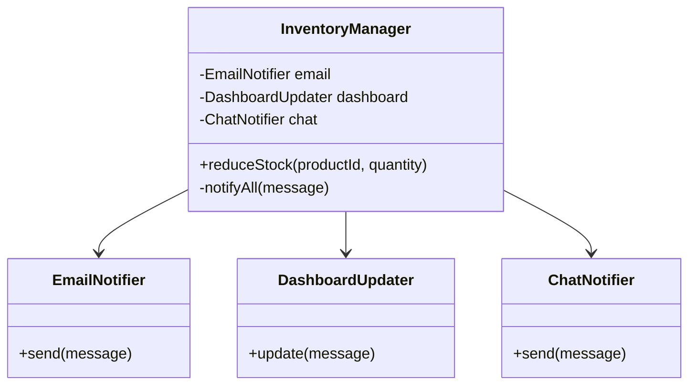
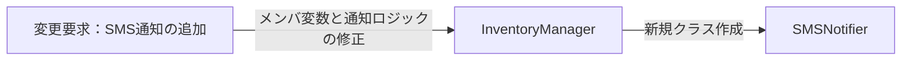
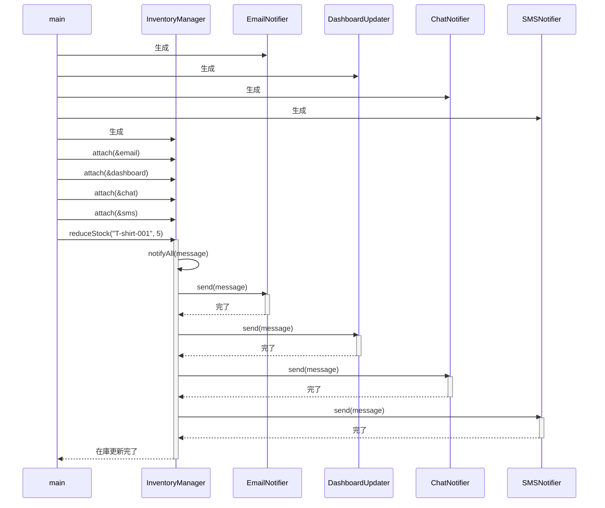
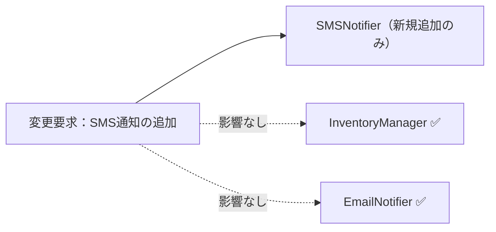
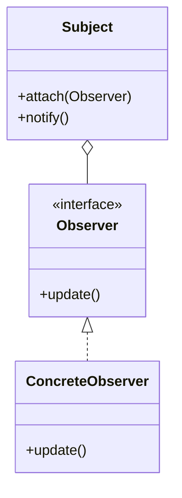

## 第7章 変わる通知先 ―― Observer パターン

―― 思考の型：一つの変化を、複数の相手にどう伝えるか

### この章の核心

**通知元のコードが通知先クラスを具体的なクラス名で直接知っていると、通知先が増えるたびに通知元クラスを書き換えることになり、修正のたびに無関係なクラスまで変更になる。**

---

### この章を読むと得られること

この章のテーマは「誰に伝えるか」という問いです。通知先を増やすたびに通知元のコードを書き換えている——そんな設計の「伝言の密結合」がこの章で扱う問題です。

* **得られること1：** 「変化の発生元」と「変化を受け取る側」という観点で、コードの変動箇所を識別できるようになる
* **得られること2：** 接続点（クラスとクラスのつなぎ目）が「具体×直接」（専用型のクラスを直接知っている状態）になっているクラスを見て、そこが変更の痛みの発生源だと判断できるようになる
* **得られること3：** 接続点の形を変えると変更がどのように局所化（変更の影響が1クラスだけで済む状態）されるかを、構造から説明できるようになる
* **得られること4：** 通知を送る側が通知先を具体的に知らなくても、動的に通知先を増やしたり減らしたりできる視点

## 🔵 フェーズ1：現状把握 ―― コードとクラス構成を読む
### 1-1：このシステムの仕様

このシステムは、アパレルメーカーの在庫数を管理し、**在庫が閾値を下回ったときに複数の通知先へ通知**します。

在庫の増減を記録し、一定数を下回るイベントが発生すると、登録されているすべての通知先へ同時にメッセージを送ります。

**通知の動作ルール**

| 状況 | 動作 |
|---|---|
| 在庫が閾値以下に減少した | 登録済みの全通知先へ通知を送る |
| 在庫が閾値を超えている | 通知しない |
| 通知先が1件も登録されていない | 何もしない（エラーにならない） |

**現在登録されている通知先**

| 通知先 | 通知手段 | 担当者 |
|---|---|---|
| メール通知 | メール | 倉庫担当者 |
| ダッシュボード更新 | 社内ダッシュボード | 在庫管理チーム |
| チャット通知 | 社内チャット | 在庫担当者 |

---
---

### 1-2：動作例テーブル ―― 仕様を「動かした結果」で確認する

コードを読む前に、このシステムがどんな入力に対してどんな出力を返すかを確認します。以下のテーブルは、この章の最終実装（フェーズ7）が実現する動作の全シナリオです。

| シナリオ | 操作 | Email通知 | Chat通知 | ダッシュボード更新 |
| --- | --- | --- | --- | --- |
| 在庫が閾値以下に減少（通常） | Tシャツ-001の在庫を5減らす | 送信される | 送信される | 更新される |
| 在庫が閾値以下に減少（複数通知先） | パンツ-002の在庫を3減らす | 送信される | 送信される | 更新される |
| 在庫が補充された（閾値超え） | Tシャツ-001の在庫を20補充する | 送信されない | 送信されない | 更新されない |
| 在庫が閾値ちょうどに減少（境界値） | キャップ-003の在庫を1減らす | 送信される | 送信される | 更新される |
| 出荷完了イベント | ORDER-001の出荷完了を記録する | 送信される | 送信される | 更新される |
| 通知先をChatのみ登録した状態 | シューズ-004の在庫を2減らす | 送信されない | 送信される | 更新されない |

このテーブルが示す通り、在庫が閾値以下になるたびに登録されているすべての通知先へメッセージが届き、閾値を超えていれば誰にも送らない、という動作が核心です。シナリオ1〜5については「どのステップを選ぶか」は実装の構造の話であって、動作結果は変わりません。ただしシナリオ6（通知先を動的に選択する動作）はフェーズ7のObserverパターン導入後にのみ実現できます。

> **注：** フェーズ7の最終実装ではSMS通知（田中部長の変更要求）も登録されており、シナリオ1〜5ではEmail・Chat・ダッシュボードに加えてSMSも送信されます。上記テーブルの列は初期の3通知先を基準に示しています。また、シナリオ6（通知先をChatのみ登録した状態）は、フェーズ7の Observer パターン導入後に初めて実現できる動作です。現状コード（1-3節）では全通知先がハードコードされているため、このシナリオを再現することはできません。

> **注：** フェーズ7の最終実装ではSMS通知（田中部長の変更要求）も登録されており、シナリオ1〜5ではEmail・Chat・ダッシュボードに加えてSMSも送信されます。上記テーブルの列は初期の3通知先を基準に示しています。また、シナリオ6（通知先をChatのみ登録した状態）は、フェーズ7の Observer パターン導入後に初めて実現できる動作です。現状コード（1-3節）では全通知先がハードコードされているため、このシナリオを再現することはできません。

---
---

### 1-2.5：クラス概要サマリー

#### このシステムの登場クラス

| クラス名 | 役割 | 担当する仕様 |
|---|---|---|
| InventoryManager | 在庫の増減を管理し、一定値を下回ったら通知を送る | 在庫数の監視、各通知先へのメッセージ送信 |
| EmailNotifier | メール送信を担当 | メール通知 |
| DashboardUpdater | ダッシュボード更新を担当 | ダッシュボードへの反映 |
| ChatNotifier | チャットツールへの送信を担当 | チャット通知 |

**データの流れ：** main() → InventoryManager.reduceStock() → 在庫減少判定 → EmailNotifier.send(), DashboardUpdater.update(), ChatNotifier.post()

**注目ポイント：** 現在は InventoryManager がすべての通知先クラスを直接抱え込み、それぞれ異なるメソッド名を呼び出しています。フェーズ3以降で、この「具体的な通知先を知りすぎていること」が問題として浮かび上がります。

---

### 1-3：実装コード（現状）

在庫が減った際に各通知先へメッセージを送る処理をシミュレートしています。

はじめに、各通知先クラスの定義です。それぞれが独立した実装を持ち、InventoryManager から直接呼び出されています。

```cpp
#include <iostream>
#include <string>

using namespace std;

// 各通知先の具体的な実装
class EmailNotifier {
public:
    void send(string m) { cout << "Email: " << m << endl; }
};
class DashboardUpdater {
public:
    void update(string m) { cout << "Dashboard: " << m << endl; }
};
class ChatNotifier {
public:
    void send(string m) { cout << "Chat: " << m << endl; }
};
```

通知先クラスはそれぞれ独立した送信メソッドを持っていますが、メソッド名が `send` と `update` で統一されていないことに気づきます。このメソッド名の違いが、通知を一律に扱う際の障害になります。次に、これらを直接呼び出す InventoryManager の実装を見てみましょう。

```cpp
class InventoryManager {
private:
    EmailNotifier email;
    DashboardUpdater dashboard;
    ChatNotifier chat;

public:
    void reduceStock(string productId, int quantity) {
        cout << "商品 " << productId
             << " の在庫を " << quantity << " 減らしました。" << endl;
        
        // 在庫が減ったことを検知して通知する
        string message = "商品 " + productId + " の在庫が減少しました。";
        notifyAll(message);
    }

private:
    void notifyAll(string message) {
        // 通知先が増えるたびに、ここが修正される
        email.send(message);
        dashboard.update(message);
        chat.send(message);
    }
};

int main() {
    InventoryManager manager;
    manager.reduceStock("T-shirt-001", 5);
    return 0;
}
```

このコードを見ると、InventoryManager クラスがどの通知先クラスが存在し、どうやって通知を送るかをすべて直接知っていることが分かります。

---
---

### 1-4：クラス構成図

システムのクラス構成を可視化し、構造を確認します。



この図が示す通り、InventoryManager という単一のクラスが、通知先であるすべてのクラス（メール、ダッシュボード、チャット）を直接保持している構成になっています。

---
---

### 1-5：変更要求

**変更要求の発生チーム：** 今回の変更要求は店舗運営チームから届いています。通知先の増減を判断するチームです。一方で、在庫の管理自体はシステム基盤チームが担っています。この点をフェーズ2の「誰の判断で変わるか」への伏線として覚えておきます。


ある週の月曜日、店舗運営部の田中部長から、在庫管理システムの改善依頼がメールで届きました。

「在庫が少なくなった時に、倉庫担当者のスマホへSMS（ショートメッセージ）で直接通知を送れるようにしたいんだ。今はメールだけだから、どうしても確認が遅れて発注が漏れることがあってね。来月の店舗改装のタイミングで運用を変えたいから、なんとか対応してくれないか？」

なるほど、倉庫担当者のスマホへのSMS通知ですね。確かに、バックヤードで作業中の担当者にとって、メールよりも気づきやすい手段が必要というのは、現場のオペレーションとして非常に理にかなっています。

ただ、ふとあの `InventoryManager` クラスの通知処理を思い出しました。あのクラスは、各通知先クラスを個別に保持し、`notifyAll` メソッドの中でそれぞれの送信メソッドを直列に呼び出していました。このまま新しい `SMSNotifier` クラスを書き足すと、また通知ロジックが一つ増え、クラスの中が通知先の知識で溢れかえってしまいそうです。

**仕様変更の内容**

変更要求を受けて、通知先の構成がどう変わるかを整理します。

| 通知先 | 変更前 | 変更後 |
|---|---|---|
| EmailNotifier（メール） | あり | 変更なし |
| DashboardUpdater（ダッシュボード） | あり | 変更なし |
| ChatNotifier（チャット） | あり | 変更なし |
| **SMSNotifier（SMS通知）** | なし | **新規追加** |

在庫が閾値を下回ったとき、これまでの3チャネル（メール・ダッシュボード・チャット）に加えて、倉庫担当者のスマートフォンへSMSが送信されるようになります。

通知のトリガー条件（在庫が閾値以下になること）と、「登録されている全通知先へ同時に通知する」という動作ルールは変わりません。変わるのは「通知先の種類が1つ増える」という点だけです。

---

## 🟣 フェーズ2：仮説立案 ―― 何が変わるかを観察し、ヒアリングで裏付ける

ここからフェーズ2（仮説立案）に進みます。フェーズ1で観察した事実をもとに、「何が変わるか・変わらないか」を仮説として立て、関係者へのヒアリングで裏付けます。

### 2-1：責任チェック表

コードが実際に「知っていること」を一行ずつ照合し、その知識が**誰の判断で変わるのか**を観察します。これは「クラスが責任を果たしているかどうか」ではなく、「同じクラスの中に、異なる意思決定者の判断が混在していないか」を可視化するための確認です。

| **コードの行** | **持っている知識** | **管理者（観察）** |
| --- | --- | --- |
| email.send(message); | メール通知クラスの存在と送信方法 | 通知先を選定するシステム管理者 |
| dashboard.update(message); | ダッシュボードの存在と更新方法 | 画面表示を決めるUI担当者 |
| chat.send(message); | チャット通知クラスの存在と送信方法 | 連絡網を決めるチーム管理者 |

責任チェックで見えたことを散文で述べます。通知に関する処理が InventoryManager の中で直列に並んでいることが見えました。まだ「問題だ」と判定しませんが、通知先という「管理者が異なる知識」が同じ場所に並んでいることが見えた、という事実に留めておきます。

### 2-2：変わる理由の分析

責任チェック表でクラスの責任が整理できました。次に、コードの各行が「誰の判断で変わる知識か」を確認することで、混在している責任をさらに細かく特定します。判断基準は、「このクラスの担当者（在庫管理システム開発チーム）とは別の人間が変更を決定するかどうか」です。別の人間が決定するなら、それは「責任外（❌）」と判断します。

`InventoryManager.notifyAll()` の各行を見ると：

| **コードの行** | **持っている知識** | **誰の判断で変わるか** | **責任内か** |
|---|---|---|---|
| `email.send(message);` | メール通知先の存在と送信方法 | 通知手段を決めるシステム管理者 | ❌ 別担当者 |
| `dashboard.update(message);` | ダッシュボードの更新方法 | 画面表示を決めるUI担当者 | ❌ 別担当者 |
| `chat.send(message);` | チャット通知先の存在と送信方法 | 連絡網を決めるチーム管理者 | ❌ 別担当者 |

1つのメソッドの中に、変える理由が異なる3つの知識が混在しています。今すぐ問題とは言えませんが、これが後の痛みの予兆です。

### 2-3：今回の変更で確実に変わること

フェーズ1での観察と、今回届いた変更要求を材料にして、「今回の対応で確実に変わること」を整理します。これは将来の話ではなく、今回の要求対応に直結する変動です。

| **分類** | **今回の確定変更** | **根拠** |
| --- | --- | --- |
| 🔴 **変動する** | 通知先に SMSNotifier クラスが追加される | 田中部長からの変更要求が確定しているため |
| 🔴 **変動する** | `InventoryManager` の `notifyAll` に SMS送信の呼び出しが増える | 現状の構造では新しい通知先を直接追記する必要があるため |
| 🟢 **不変** | 「在庫が少なくなった」というイベント発生そのもののロジック | 商品の在庫を管理するというシステム本来の目的であり、通知の手段とは独立しているため |

コードを読んだだけで「ここは間違いなく変わる」「ここは絶対に変わらない」と自分一人で断定してしまうのは危険です。今の設計思想では、新しい通知先が増えるたびに `InventoryManager` 自体を書き換える必要があると読み取れますが、本当に将来もこのまま追加し続ける運用でよいのか、関係者に直接確認します。

### ヒアリングに向けた背景確認

このシステムは、あるアパレルメーカーの在庫管理システムを支える一部です。日々、全国の店舗から刻々と送られてくる売上データを受けて、倉庫にある在庫数を減らし、規定数を下回れば追加発注をかける、といった業務の流れを管理しています。

システムが立ち上がった当初は、在庫が減ったことを倉庫の担当者に「メール」で送るだけで十分でした。しかし、昨今のデジタル化の流れを受け、在庫状況をリアルタイムで「社内ダッシュボード」に反映させたり、在庫が少なくなったら「在庫担当者のチャット」に通知したりと、在庫の変動を追いかける相手がどんどん増えてきました。

コードを眺めてみると、在庫が減ったことを検知する InventoryManager クラスの中で、メール送信クラス、ダッシュボード更新クラス、チャット通知クラスといった、具体的な通知先クラスを直接呼び出す構成になっています。システムが小さかった頃は、これらすべてを InventoryManager が把握していても問題はありませんでした。

一見すると、このコードは処理が一つにまとまっており、何が起きているか非常に分かりやすく整理されているように見えます。

### 2-4：関係者ヒアリング

仮説を携えて、店舗運営部の田中部長と開発チームのミーティングを行いました。チームで話し合う価値がある部分だと思います。

**開発者：** 「田中部長、SMS通知の件承知しました。一点確認ですが、今回のような新しい通知手段は、今後もキャンペーンや業務効率化のたびに追加されていく予定でしょうか？」

**田中部長：** 「そうなんだよ。次は店舗のバックヤードにある音声通知システムと連携したいという話もあってね。しばらくは、新しい通知方法がどんどん増えていくと思うよ。」

**開発者：** 「なるほど。通知手段の入れ替わりは激しそうですね。では、通知のタイミング（在庫が少なくなった瞬間など）といった『通知の基準』自体は今後も変わらないと考えてよいでしょうか？」

**田中部長：** 「ああ、そこは変わらないよ。あくまで『在庫が切迫した時』に知らせるというルール自体は固定だ。」

**開発者：** 「承知しました。通知手段（先）は頻繁に増減するけれど、通知の基準（トリガー）は安定しているということですね。」

ヒアリングの結果、通知先という変動要素が今後も際限なく増え続けることが確定しました。これまでのように `InventoryManager` に新しい通知先をハードコードし続けるのは、システムの拡張性として限界がきているようです。

> **現実のヒアリングでは——** このシナリオでは相手がちょうど設計に役立つ情報を教えてくれています。現実には「変わるかどうか分からない」「たぶん変わらない」という答えが返ることも多いです。そのときは、コードの変更履歴（`git log`）や過去の障害記録を「ヒアリングの代わり」として使ってみてください。「過去に何度変わったか」が、「将来変わりやすいか」の最も正直な証拠です。

### 2-5：ヒアリングで判明した将来リスク

ヒアリングで見たところなった「将来変わるかもしれないこと」を、確定変更とは分けて整理します。これは今すぐ対応するかどうかの判断材料であり、設計の方向性に影響します。

| **分類** | **将来リスク** | **変わるタイミング** | **根拠（誰との確認か）** |
| --- | --- | --- | --- |
| 🔴 **変動リスク高** | 通知先となるクラスの種類とその実装（音声通知システムなど） | 業務要件の変更があるたび | 田中部長との合意 |
| 🔴 **変動リスク高** | 通知先の増減（動的な登録・解除） | 随時 | 田中部長との合意 |
| 🟢 **不変** | 「在庫減少」というイベントの発生タイミング | 変わらない | ロジックの骨格として合意 |

通知先という「管理者が異なる知識」が今後も増え続けることが確定しました。今の `InventoryManager` クラスにこれ以上責任を背負わせるのは、そろそろ限界かもしれません。

フェーズ2で「通知手段の入れ替わりが激しい」という現状が確定しました。次のフェーズ3では、その要求を今のコードのままで変更しようとしたときに何が起きるか、実際に試みてみましょう。

---

## 🟣 フェーズ3：問題特定 ―― 変更の痛みを発見する

### 3-1：変更を試みる

田中部長からの「倉庫担当者のスマホへSMSで通知を送りたい」という要求を、今のコードで実装しようと試みます。

はじめに、SMSを送るための SMSNotifier クラスを新規作成します。次に、通知の中心である InventoryManager クラスを開き、新しく作成した SMSNotifier クラスのインスタンスをメンバ変数として追加します。
コンストラクタで SMSNotifier を初期化し、さらに `notifyAll` メソッド内にも `sms.send(message);` という行を書き加える必要があります。つまり、コンストラクタと `notifyAll` の両方に、新クラスの初期化と呼び出しを追加必要があります。

ここでふと、ある懸念が頭をよぎります。「この先、在庫通知の種類がもっと増えたらどうなるのだろう？」と。
メール、ダッシュボード、チャットに続き、SMS、そして先ほど部長が言及した音声通知まで増えれば、InventoryManager クラスの notifyAll メソッドには何十行もの通知処理が並ぶことになります。さらに、通知先クラスが一つ増えるたびに、InventoryManager のメンバ変数を書き換え、コンストラクタを修正し、notifyAll を書き換えるという、同じような「掃除」を何度も繰り返すことになるのです。

### 3-2：変更影響グラフ

変更を試みた結果、コード内の依存関係がどうなっているかを図にしてみます。



変更を加えるたびに InventoryManager が修正対象となり、通知先が増えるほど、このクラスが知るべき知識がどんどん増幅していく様子が見て取れます。

### 3-3：痛みの言語化

変更を試みる中で、構造上の問題が2つ浮かび上がりました。

1つ目は、InventoryManager が「通知先の存在」と「送信方法」という2種類の知識を抱え込んでいることです。本来、通知のタイミング（在庫が切迫した瞬間）の管理だけが責務であるべきなのに、通知先クラスの名前と各クラスのメソッド名まで知っています。結果として、通知先が増えるたびにメンバ変数・コンストラクタ・notifyAllの3箇所を修正しなければならず、このクラスの変更理由が際限なく増えていきます。

2つ目は、通知先と通知元の変更理由が混在していることです。通知先クラスが変わるたびに、通知元の InventoryManager まで修正対象になります。これは「在庫管理のビジネスルール」と「通知手段の選択」という、本来異なる変更理由を1つのクラスが抱えている状態です。

フェーズ3で「変更のたびに通知元クラスが書き換わる」という痛みが確認できました。次のフェーズ4では、この痛みの構造的な原因を、責任の境界や接続形態の観点から言語化していきます。

---
> **📌 問題（確定）**
> 通知先が変わるたびに、通知元の `InventoryManager` クラスのメンバ変数・コンストラクタ・`notifyAll` の3箇所が連動して変わる。通知先という「管理者が異なる知識」が、在庫管理ロジックと同じクラスに混在しているため、通知先の追加・削除が通知元クラスへの修正を引き起こし続ける。
---

ここまでで「何が痛いか」が事実として確認できました。次のフェーズ4では、その痛みが「なぜ起きているか」を構造の言葉で言語化します。

---

## 🟠 フェーズ4：原因分析 ―― なぜ辛いのかを構造で言語化する

### 4-1：痛みの根源を探る（観察と原因）

フェーズ3で確認した「変更の辛さ」は、コードのどこから来ているのでしょうか。コードを注意深く観察すると、痛みを引き起こしている2つの事実が浮かび上がってきます。

第一に、新しい通知先を追加するとき、なぜ毎回 `InventoryManager` を開かなければならないのでしょうか？それは、このクラス自身が「EmailNotifier に send する」「DashboardUpdater に update する」「ChatNotifier に send する」といった**具体的な通知先の名前と送信方法を全部直接知ってしまっている（抱え込んでいる）**からです。

第二に、なぜ変更の影響範囲が読めず、修正を重ねるたびに不安を感じるのでしょうか？それは、「在庫が減った」というイベントの管理という本来の骨格ロジックと、「誰にどうやって知らせるか」という通知先ごとの実装が、**同じクラスの中で物理的に混ざり合っている**からです。

この「症状（痛み）」と「根本原因」を整理すると、以下のようになります。

| **観察した症状（痛み）** | **構造的な原因（痛みの根源）** |
|---|---|
| 新しい通知先を追加するたびに、通知元の InventoryManager クラスの修正が必要になる | InventoryManager が、通知する必要がある相手の「具体的なクラス名」と「通知方法」を直接知っているから |
| 通知先のクラスが変わったり増えたりするたびに、通知元クラスが影響を受ける | 在庫管理という「変わらないもの」と、通知先という「変わるもの」が、同じクラスの中に混在しているから |

こうして整理すると、問題の本質が見えてきます。通知元である InventoryManager は、「在庫が減った」という事実を伝えたいだけなのに、その情報を「誰が」「どう受け取るか」という詳細な実装までを全部抱え込んでしまっているのです。これでは、通知先が増えるたびにこのクラスを汚していくことになり、影響範囲が広がり続けるのは避けられません。

### 4-2：変わるもの/変わってほしくないもの

> **「変わらないもの」と「変わってほしくないもの」は異なります。** 「変わらないもの」は経験的事実（今まで変わっていない）、「変わってほしくないもの」は設計意図（ここを安定させてほかを守りたい）です。ここで整理するのは後者です。

原因の方向性が見えたところで、「変わり続けるもの」と「変わってほしくないもの」を明確に切り分けます。

| **変わるもの（🔴）** | **変わってほしくないもの（🟢）** |
| --- | --- |
| 通知先のクラス（メール、ダッシュボード、チャット等）、その追加や削除、および具体的な通知手段 | 「在庫が少なくなった」というイベントの発生通知そのもの、およびそのトリガーとなる在庫管理ロジック |

**【変わる部分（変わり続ける通知先の知識）】**
```cpp
    void notifyAll(string message) {
        email.send(message);      // ← EmailNotifierを直接知っている
        dashboard.update(message); // ← DashboardUpdaterを直接知っている
        chat.send(message);       // ← ChatNotifierを直接知っている
    }
```

**【変わらない部分（不変の骨格）】**
```cpp
    void reduceStock(string productId, int quantity) {
        cout << "商品 " << productId
             << " の在庫を " << quantity << " 減らしました。" << endl;
        // ... (ここに変わる通知処理が入っている) ...
    }
```

「在庫が少なくなった」という出来事は、通知先が増えようが減ろうがシステムの中では等しく起きています。この「イベント発生の事実」こそが、変わってほしくないコア部分です。一方、通知先はビジネスの都合で今後も変動し続けます。この「変わる側」をうまく分離できれば、通知元は常に安定した状態を保てるはずです。

### 4-3：接続形態の診断

現在のシステムがどのような接続形態にあるのかを診断してみます。ここでは「クラス間の接続の形」をハードウェアのケーブル接続に置き換えて説明します。「具体」はクラス名を直接知っている状態、「直接」はインターフェースや仲介役を挟まずに呼び出している状態に対応します。

今の InventoryManager クラスは、通知先である EmailNotifier や ChatNotifier といった具体的なクラスを直接インポートして、メソッドを直接呼び出しています。これをケーブルの比喩で例えるなら、Lightningケーブルで直差しの状態（具体×直接）だと言えます。

通知先の機能（機器）を、通知元のクラス（iPhone本体）に専用規格のケーブルで直差ししているような状態です。新しい通知先を追加しようとすれば、本体側にその通知先専用の新しい差込口を追加で用意必要があります。これでは、通知先が増えるたびに通知元のクラスが修正され、影響が飛び火するのは当然です。

現状の InventoryManager と各通知先は、その「変わる理由」が異なります。このまま密接に接続させておくと、一方の変更がもう一方に波及し続けます。両者を切り離して疎な関係にすることが、根本原因への対処になります。

フェーズ4で根本原因が言語化できました。「どこを分けるか」は明確です。次のフェーズ5では、その境界で実際に何が流れているかを値・型のレベルで具体化し、「何が変わり、何が変わらないか」を明確にします。

---
> **📌 原因（確定）**
> `InventoryManager` が `EmailNotifier`・`DashboardUpdater`・`ChatNotifier` という具体的なクラス名と各クラスの送信メソッドを直接知っている（「具体×直接」の接続形態）。ヒアリングで「通知先は今後もどんどん増える」ことが確定しており、この接続形態のままでは通知先の追加コストが `InventoryManager` の修正回数に直結し続ける。
---

「何が痛いか（問題）」と「なぜ痛いか（原因）」が揃いました。次のフェーズ5では、「何を切り離す必要があるか（課題）」を、接続点で流れるデータのレベルで言語化します。

---

## 🟡 フェーズ5：課題定義 ―― 接続点で何が流れているかを見る

フェーズ4は「なぜ辛いか」を答えました。フェーズ5が問うのは「分けるべき境界で、実際に何が流れているか」です。クラスの参照関係ではなく、**値・型のレベル**に降りていきます。

フェーズ4の分析により、問題は「通知元（`InventoryManager`）が通知先の具体名を知りすぎている」ことだと分かりました。その境界で何がやり取りされているかを具体化します。

### 接続点を特定する

`notifyAll()` の中で分けるべき境界は「通知元 → 各通知先」の接続部分。各通知先に渡しているデータを見ます。

現在の状況：`InventoryManager` は `email.send(msg)` / `dashboard.update(msg)` / `chat.send(msg)` という**異なるメソッド名・クラス名**を直接知っています。通知先が増えるたびにこの接続点の数が増えます。

| 接続点 | 接続するデータ | 変わるもの |
|---|---|---|
| `InventoryManager` → 各通知先 | 通知メッセージ（`string` 型） → 各通知先が受け取る（void） | 通知先の種類・数（新しい通知先が追加されるたびに） |

### 何が変わり、何が変わらないか

- **変わるもの**：通知先の種類（EmailNotifier / DashboardUpdater / ChatNotifier … が増え続ける）。新しい通知先が増えるたびに `InventoryManager` に知識が積み重なる。
- **変わらないもの**：通知として渡すデータの型（`string` 型のメッセージ）。「何かを伝える」という通知の行為そのもの。

`InventoryManager` は「在庫が減ったことを知らせる」という役割だけを担うべきです。問題は「誰に・どのメソッドで知らせるか」という**通知先の生産者**の知識が増え続けること。

**具体×直接のままでよい場面**：通知先が今後増えない確証があれば、現状の直接呼び出し（具体×直接）で十分です。接続形態の選択は「**生産者が変わるかどうか**」で決まります。今回は通知先追加リスクがヒアリングで確認済みなので、次のフェーズで生産者を差し替えられる設計を検討します。

---
> **📌 課題（確定）**
> 「通知元（`InventoryManager`）」と「通知先（`EmailNotifier`・`DashboardUpdater`・`ChatNotifier`）」を切り離す必要がある。渡すデータ（`string` 型のメッセージ）は安定しているため、「何を渡すか」ではなく「誰に渡すか・どのメソッドで渡すか」という通知先の知識を `InventoryManager` から取り除くことが課題である。
---

問題・原因・課題の3点が揃いました。次のフェーズ6では、この課題を解消するための具体的な設計案を段階的に検討します。

---

## 🔴 フェーズ6：対策検討 ―― 段階的な改善と決断

フェーズ5で「変わるのは通知先の種類（生産者）であり、通知メッセージの型（string）は安定している」ことが分かりました。ここでは、その生産者をどのように差し替え可能にするかを段階的に検討します。それぞれの段階（ステップ）でどこまで痛みが解消されるかを確認し、今回の要件において「どのステップで止めるべきか」を決断します。

### ステップ1：通知処理をプライベートメソッドに切り出す（まず整理する）

新しい通知先（SMS）を追加するとき、`reduceStock` の中に通知処理が直書きされているのが気になります。「通知の呼び出しをひとつのメソッドにまとめれば、少なくとも変更箇所が一ヶ所になるはず」と考えて、プライベートメソッドに切り出してみます。

```cpp
class InventoryManager {
private:
    EmailNotifier email;
    DashboardUpdater dashboard;
    ChatNotifier chat;

    // 通知処理をプライベートメソッドにまとめる
    void notifyAll(string message) {
        email.send(message);
        dashboard.update(message);
        chat.send(message);
        // SMS通知を追加するにはここに1行書き足す
    }

public:
    void reduceStock(string productId, int quantity) {
        cout << "商品 " << productId
             << " の在庫を " << quantity << " 減らしました。" << endl;
        string message = "商品 " + productId
                       + " の在庫が減少しました。";
        notifyAll(message);  // ← 呼び出しは1行にまとまった
    }
};
```

`reduceStock` の見通しは改善され、通知ロジックが `notifyAll` に集約されたことが分かる。

**この段階の評価：** 通知処理は整理できた。しかし、新しい通知先（SMSNotifier）を追加するには、InventoryManager を開いてメンバ変数・初期化・`notifyAll` 内の呼び出しの3箇所を修正必要が生じます。通知先の数だけこの修正パターンが繰り返されるという根本は変わっていない。

---

### ステップ2：通知先をリストで持つ（同種の型を束ねる）

ステップ1で気になるのは「メンバ変数・初期化・呼び出しの3箇所」という修正の散らばりです。通知先の追加がリストへの追加だけで済めば、少なくとも修正箇所が減るはずです。同じ送信メソッド名 `send` を持つ具体クラスをリストにまとめてみます。

```cpp
class InventoryManager {
private:
    // 同種の型を束ねることで追加がリストだけで済む…はず
    vector<EmailNotifier*>     emailList;
    vector<ChatNotifier*>      chatList;
    vector<DashboardUpdater*>  dashboardList; // ← update() 型なので別リストが必要
    // SMSを追加するには vector<SMSNotifier*> smsListも必要になる

    void notifyAll(string message) {
        for (auto* n : emailList)     n->send(message);
        for (auto* n : chatList)      n->send(message);
        for (auto* n : dashboardList) n->update(message); // ← メソッド名が違う
        // SMS用のループも追加必要が生じます
    }

public:
    void attachEmail(EmailNotifier* n)       { emailList.push_back(n); }
    void attachChat(ChatNotifier* n)         { chatList.push_back(n); }
    void attachDashboard(DashboardUpdater* n){ dashboardList.push_back(n); }

    void reduceStock(string productId, int quantity) {
        string message = "商品 " + productId
                       + " の在庫が減少しました。";
        notifyAll(message);
    }
};
```

リストで管理することで同種の通知先を複数登録できるようになったことが分かる。

**この段階の評価：** リストで管理することで通知先の追加はしやすくなった。しかし、リストに格納できる型が固定されている。新しい通知先（SMSNotifier）を追加するには `vector<SMSNotifier*>` という新しいリストを追加し、`notifyAll` にもループを追加必要が生じます。通知先の種類が増えるたびに `InventoryManager` を修正する必要があるという根本は解決していない。

---

### ステップ3：インターフェースで型を統一する（抽象×直接）

ステップ2の問題は「具体型ごとにリストが必要になる」ことです。通知先クラスのメソッド名が `send` / `update` とバラバラなのも原因の一つでした。すべての通知先クラスに共通の契約（インターフェース）を持たせれば、`InventoryManager` は型を一切知らずに済むはずです。

なお、インターフェース `INotification` の契約メソッドを `send()` に統一するため、`DashboardUpdater` は既存の `update()` を `send()` へと名前変更する必要があります。もし他の箇所で `dashboard.update()` と直接呼び出しているコードがあれば、その修正も伴います。これはインターフェース導入時に発生する「命名統一コスト」です。

```cpp
// 通知先が満たす必要がある契約（インターフェース）
class INotification {
public:
    virtual ~INotification() = default;
    virtual void send(string m) = 0;
};

// 各通知先クラスはインターフェースを実装するだけ
class EmailNotifier : public INotification {
public:
    void send(string m) override {
        cout << "Email: " << m << endl;
    }
};

class DashboardUpdater : public INotification {
public:
    void send(string m) override {
        cout << "Dashboard: " << m << endl;
    }
};

class ChatNotifier : public INotification {
public:
    void send(string m) override {
        cout << "Chat: " << m << endl;
    }
};

// ← 新しい通知先はこのクラスを1つ増やすだけ
class SMSNotifier : public INotification {
public:
    void send(string m) override {
        cout << "SMS: " << m << endl;
    }
};

// 通知元クラス：具体クラスを一切知らない
class InventoryManager {
private:
    vector<INotification*> observers; // ← インターフェース型で統一

    void notifyAll(string message) {
        for (auto* o : observers) {
            o->send(message);  // 具体クラスを知らずに呼べる
        }
    }

public:
    void attach(INotification* o) { observers.push_back(o); }

    void reduceStock(string productId, int quantity) {
        string message = "商品 " + productId
                       + " の在庫が減少しました。";
        notifyAll(message);
    }
};

// 呼び出し側（main）だけが具体クラスを知る
int main() {
    EmailNotifier email;
    DashboardUpdater dashboard;
    ChatNotifier chat;
    SMSNotifier sms;

    InventoryManager manager;
    manager.attach(&email);
    manager.attach(&dashboard);
    manager.attach(&chat);
    manager.attach(&sms);

    manager.reduceStock("T-shirt-001", 5);
    return 0;
}
```

`InventoryManager` の中から具体クラス名（`EmailNotifier`、`DashboardUpdater`、`SMSNotifier`）が完全に消え去り、`INotification*` のリストだけが残ったことが分かる。

**この段階の評価：** `InventoryManager` は「誰に通知するか」を知らずに済むようになった。新しい通知先を追加するには、`INotification` を実装した新しいクラスを作り、`attach()` で登録する。この変更シナリオでは、既存の通知元クラスを修正せずに対応できる。

---

### どこまで設計を進めるべきか（採用ステップの決断）

それぞれのステップには一長一短があります。どこで止めるかは、**「今後の変更頻度（ビジネス要求）」**で決断します。

*   **ステップ1で止めるケース：** 通知先が固定で、当面増える見込みが低い場合。プライベートメソッドで整理するだけで十分なことがあります。
*   **ステップ2で止めるケース：** 同種の通知先を複数登録したいが、通知先の種類が増えることはない場合の「中間策」です。
*   **ステップ3（インターフェース化・抽象×直接）まで進むケース：** 「チャット」「SMS」「別システム」など、今後新しい通知先が増減することが見込まれる場合。通知元を一切修正せずに拡張できる仕組みを作るのが適切です。

**今回の決断：**
フェーズ2のヒアリングで「田中部長からSMSへの通知が要望されている」ことが確定しています。また、今後も音声通知システムとの連携など、通知先が増える可能性があります。未来のコストを最小化しつつ、現在の実装コストを許容範囲内に抑えるため、**ステップ3（インターフェース化・抽象×直接）で止める**決断を下します。

このように、変わる通知先をインターフェースで分離し、登録リストを通じて動的に通知できるようにするこの設計構造を **Observer（オブザーバー）パターン** と呼びます。

フェーズ6で採用ステップが決まりました。次のフェーズ7では、この決断を最終的なコードに落とし込みます。

---

## 🟢 フェーズ7：対策実施 ―― 変化に強いコードを完成させる

フェーズ6のステップ3（抽象×直接）を実装し、通知元と通知先の依存関係を劇的に改善します。この設計によって、通知元の InventoryManager は「誰に通知するか」を一切知ることなく、「通知を送る」という自分の責務だけを果たすようになります。

**この構造は、Observer（オブザーバー）パターンと呼ばれています。**

名前の由来は、Subject（被観察者・通知を送る側）がObserver（観察者・通知先）に通知する仕組みだから、Observerパターンと呼ばれています。通知を「受け取る側」の役割名が、このパターンの名称になっています。

通知を送る側（Subject）がオブザーバーのリストを保持し、状態が変化したときに一斉に通知を送るという構造が、私たちが選んだステップ3そのものです。フェーズ1から積み上げてきた思考の結果、たどり着いた構造に名前があった——というのが本書の伝えたいことです。

### 7-1：解決後のコード（全体）

インターフェース INotification を定義し、通知先クラスがこれを実装するようにします。InventoryManager は INotification* のリストを管理するだけで済みます。

はじめに、すべての通知先が実装する必要がある契約となるインターフェースを定義します。

```cpp
#include <iostream>
#include <vector>
#include <string>
#include <algorithm>

using namespace std;

// 通知先が満たする必要がある契約（インターフェース）
class INotification {
public:
    virtual ~INotification() = default;
    virtual void send(string m) = 0;
};
```

`INotification` がすべての通知先クラスが守るべき「契約」を定義します。次に、この契約を実装する具体的な通知先クラスを個別に見てみましょう。

```cpp
// 通知先1：メール通知
class EmailNotifier : public INotification {
public:
    void send(string m) override {
        cout << "Email: " << m << endl;
    }
};
```

```cpp
// 通知先2：ダッシュボード更新
class DashboardUpdater : public INotification {
public:
    void send(string m) override {
        cout << "Dashboard: " << m << endl;
    }
};
```

```cpp
// 通知先3：チャット通知
class ChatNotifier : public INotification {
public:
    void send(string m) override {
        cout << "Chat: " << m << endl;
    }
};
```

```cpp
// ← 新しい通知先を追加する場合は、このクラスを1つ増やすだけ（ここだけ変わる）
// 通知先4：SMS通知（田中部長の要求に対応）
class SMSNotifier : public INotification {
public:
    void send(string m) override {
        cout << "SMS: " << m << endl;
    }
};
```

3つの通知先クラスはいずれも `INotification` を実装しているだけで、互いの存在を知りません。また `InventoryManager` の存在も知りません。次に通知元クラスを見てみましょう。

```cpp
// 通知元クラス（Subject に相当）
class InventoryManager {
private:
    vector<INotification*> observers; // ← 具体的な実装クラスを知らない

public:
    // 通知先の登録
    void attach(INotification* o) { observers.push_back(o); }

    void reduceStock(string productId, int quantity) {
        cout << "商品 " << productId
             << " の在庫を " << quantity << " 減らしました。" << endl;
        notifyAll("商品 " + productId + " の在庫が減少しました。");
    }

    void restoreStock(string productId, int quantity) {
        // 補充は閾値を超えるため通知しない
        cout << "商品 " << productId
             << " の在庫を " << quantity << " 補充しました。（通知なし）" << endl;
    }

    void notifyShipped(string orderId) {
        cout << "注文 " << orderId << " の出荷が完了しました。" << endl;
        notifyAll("注文 " + orderId + " の出荷が完了しました。");
    }

private:
    void notifyAll(string message) {
        // 通知先が何であれ、一律に通知を送る
        for (auto* o : observers) {
            o->send(message);
        }
    }
};
```

`InventoryManager` は `INotification*` のリストを持つだけで、`EmailNotifier` や `SMSNotifier` の名前を一切知りません。最後に、具体クラスを組み立てる部分（main）を見てみましょう。

```cpp
int main() {
    // 行1〜5: 全通知先を登録した状態
    InventoryManager manager;
    EmailNotifier email;
    DashboardUpdater dashboard;
    ChatNotifier chat;
    SMSNotifier sms;
    manager.attach(&email);
    manager.attach(&dashboard);
    manager.attach(&chat);
    manager.attach(&sms);

    cout << "--- 行1: 在庫が閾値以下に減少（通常） ---" << endl;
    manager.reduceStock("T-shirt-001", 5);

    cout << "--- 行2: 在庫が閾値以下に減少（複数通知先） ---" << endl;
    manager.reduceStock("Pants-002", 3);

    cout << "--- 行3: 在庫が補充された（閾値超え） ---" << endl;
    manager.restoreStock("T-shirt-001", 20);

    cout << "--- 行4: 在庫が閾値ちょうどに減少（境界値） ---" << endl;
    manager.reduceStock("Cap-003", 1);

    cout << "--- 行5: 出荷完了イベント ---" << endl;
    manager.notifyShipped("ORDER-001");

    // 行6: Chatのみ登録した状態
    cout << "--- 行6: 通知先をChatのみ登録した状態 ---" << endl;
    InventoryManager managerChatOnly;
    managerChatOnly.attach(&chat);
    managerChatOnly.reduceStock("Shoes-004", 2);

    return 0;
}
```

**実行結果：**

```
--- 行1: 在庫が閾値以下に減少（通常） ---
商品 T-shirt-001 の在庫を 5 減らしました。
Email: 商品 T-shirt-001 の在庫が減少しました。
Dashboard: 商品 T-shirt-001 の在庫が減少しました。
Chat: 商品 T-shirt-001 の在庫が減少しました。
SMS: 商品 T-shirt-001 の在庫が減少しました。
--- 行2: 在庫が閾値以下に減少（複数通知先） ---
商品 Pants-002 の在庫を 3 減らしました。
Email: 商品 Pants-002 の在庫が減少しました。
Dashboard: 商品 Pants-002 の在庫が減少しました。
Chat: 商品 Pants-002 の在庫が減少しました。
SMS: 商品 Pants-002 の在庫が減少しました。
--- 行3: 在庫が補充された（閾値超え） ---
商品 T-shirt-001 の在庫を 20 補充しました。（通知なし）
--- 行4: 在庫が閾値ちょうどに減少（境界値） ---
商品 Cap-003 の在庫を 1 減らしました。
Email: 商品 Cap-003 の在庫が減少しました。
Dashboard: 商品 Cap-003 の在庫が減少しました。
Chat: 商品 Cap-003 の在庫が減少しました。
SMS: 商品 Cap-003 の在庫が減少しました。
--- 行5: 出荷完了イベント ---
注文 ORDER-001 の出荷が完了しました。
Email: 注文 ORDER-001 の出荷が完了しました。
Dashboard: 注文 ORDER-001 の出荷が完了しました。
Chat: 注文 ORDER-001 の出荷が完了しました。
SMS: 注文 ORDER-001 の出荷が完了しました。
--- 行6: 通知先をChatのみ登録した状態 ---
商品 Shoes-004 の在庫を 2 減らしました。
Chat: 商品 Shoes-004 の在庫が減少しました。
```

動作テーブル全6行と一致しています。

このコードにより、InventoryManager は通知先の具体的な実装に一切依存しなくなりました。新しい通知方法が増えても InventoryManager を修正する必要はありません。

### 7-2：動作シーケンス図

ステップ3で到達したObserverパターンの実行時のオブジェクト間のやり取りを可視化します。main() が依存関係を注入し、InventoryManager が具象クラスを知らずに抽象インターフェース経由で通知を送る流れが確認できます。



### 7-3：変更影響グラフ（改善後）

フェーズ3で行った「SMS通知を追加する」という要求を、改善後の構造で見てみましょう。



フェーズ3のグラフと比較して、新しい通知先の追加という要求が、新規クラスの作成と登録処理（attach）だけに閉じるようになりました。既存の通知元クラスや他の通知先クラスには一切影響が及んでいません。

### 7-4：変更シナリオ表

この設計で手に入れた「変更への耐性」を整理します。

| **シナリオ** | **変わるクラス（触る場所）** | **変わらないクラス** |
| --- | --- | --- |
| 新しい通知先「音声通知」を追加する | AudioNotifier（新規作成）、main（登録処理） | InventoryManager, EmailNotifier 等すべての既存クラス |
| 既存の「メール通知」を廃止する | main（`manager.attach(&email)` の呼び出しを削除。EmailNotifierクラス定義はコードに残るが、登録されないため呼び出されない） | InventoryManager, INotification, 他の通知先クラス |
| 通知の基準を変更する | InventoryManager | INotification, 各通知先クラス |

変更が来ても、触るのは新規作成するクラスか、組み立てを行うコードだけ——それがこの設計で手に入れたものです。諦めたものは、通知のたびにインターフェースを経由するというわずかな間接性と、Observerの登録・解除を管理するクラス数の増加です。

---

## 整理

### この章で定義したこと

| | 内容 |
|---|---|
| **問題** | 通知先が変わるたびに `InventoryManager` のメンバ変数・コンストラクタ・`notifyAll` の3箇所が連動して変わる |
| **原因** | `InventoryManager` が通知先の具体クラス名と送信メソッドを直接知っており、通知先の増加コストが通知元クラスの修正に直結している |
| **課題** | 通知元と通知先を切り離し、`InventoryManager` が通知先の具体名を知らずに通知を送れる構造にする |
| **解決策** | Observer パターン：`INotification` インターフェースを介して通知先を登録リストで管理し、`InventoryManager` は `attach()` と `notifyAll()` だけを知る |

### フェーズとこの章でやったこと

| **フェーズ** | **この章でやったこと** |
| --- | --- |
| 🔵 フェーズ1：現状把握 | 在庫管理システムにおいて、通知元と複数の通知先クラスが密接に結合している構造を観察した。 |
| 🟣 フェーズ2：仮説立案 | 在庫通知の運用担当者へのヒアリングを通じ、通知先が今後も頻繁に入れ替わることを「変動要因」として確定した。 |
| 🟣 フェーズ3：問題特定 | 新しい通知手段を追加しようとすると、既存の通知元クラスを毎回修正必要が生じますという「痛み」を確認した。 |
| 🟠 フェーズ4：原因分析 | 通知元が、通知先の具体的な実装を直接知っていることが、影響範囲を広げる根本原因だと特定した。 |
| 🟡 フェーズ5：課題定義 | 接続点で流れるのは string 型メッセージ（安定）、変わるのは通知先の種類・数（生産者）であることを特定した |
| 🔴 フェーズ6：対策検討 | 3ステップの段階的進化でそれぞれの痛みの限界を確認し、ステップ3（インターフェース化・抽象×直接）まで進化させる決断を下した。 |
| 🟢 フェーズ7：対策実施 | 通知元はインターフェースのリストを保持するだけに留め、通知先を動的に登録・解除できる構造を実現した。この構造が Observer パターンと呼ばれると知った。 |

### 責任の移動

| **責任** | **変更前** | **変更後** |
| --- | --- | --- |
| 在庫減算と通知先への通知 | `InventoryManager` | `InventoryManager`（変わらず） |
| 具体的な通知先クラスの直接保持 | `InventoryManager`（メンバとして直接宣言） | 各Notifierが登録リストに自己登録 |
| 個別の通知手段の実装 | `EmailNotifier` 等（変わらず） | `EmailNotifier` 等（`INotification`経由に） |
| 通知受け取り契約の定義 | —（なし） | `INotification` |

> **このプロセスを回した結果にたどり着いた構造こそが Observer パターン です。**

---

## 振り返り

### 「この章を読むと得られること」は手に入ったか

| **得られること** | **この章のどこで示したか** |
| --- | --- |
| 変動箇所の識別力 | フェーズ2の変動/不変テーブルで特定しました。 |
| 接続形態の診断力 | フェーズ4のケーブル比喩診断で見たところしました。 |
| 構造改善の説明力 | フェーズ7の変更影響グラフ対比で証明しました。 |
| 動的な通知先管理 | フェーズ6と7で、`attach()` による動的登録の仕組みを学びました。 |

### 3つの設計原則はどう適用されたか

* **原則1「変わるものをカプセル化せよ」の現れ**
* **具体化された場所：** 各通知先クラス（`EmailNotifier`, `ChatNotifier` など）
* **解説：** 送信という「変わる理由」を個別のクラスに分離し、具体的な実装を隠蔽しました。


* **原則2「実装ではなくインターフェースに対してプログラムせよ」の現れ**
* **具体化された場所：** `INotification` インターフェース
* **解説：** 通知元は具体的な通知先クラスを知らず、インターフェースを通じて通知を送るようになりました。


* **原則3「継承よりコンポジションを優先せよ」の現れ**
* **具体化された場所：** `InventoryManager` 内の `vector<INotification*>`
* **解説：** 継承階層で通知先を増やすのではなく、コンポジション（登録）によって動的に通知先を管理する構造にしました。

---

## あなたのコードで考えてみてください

この章で辿った思考プロセスを、あなた自身のコードに当てはめてみましょう。

1. **変動の兆候を探す：** あなたのコードに「ある処理が完了したとき、複数の箇所に通知や後処理を追加する必要があった」メソッドがありますか？
2. **変える理由を問う：** 通知先（ログ、メール、画面更新など）の増減は、誰の判断で決まりますか？その判断が通知元のコードに埋め込まれていませんか？
3. **結合の強さを測る：** 通知先を1つ追加するとき、通知元のクラスを直接書き換える必要がありますか？そのとき既存の通知ロジックが壊れる可能性はどのくらいですか？
4. **分けた後を想像する：** もし「通知元」と「通知先」が互いの具体クラスを知らなくて済むとしたら、新しい通知先の追加は何ファイルの変更で完結しますか？

---

## パターン解説：Observer パターン

Observer（観察者）という名の通り、あるオブジェクトの状態変化を、複数の「観察者」に自動的に通知する仕組みです。

### パターンの骨格

「通知を送る側（Subject）」が「通知を受け取る側（Observer）」のリストを保持し、状態が変化したときに一斉に通知を送ります。



### この章の実装との対応

`InventoryManager` が `Subject`（通知を送る側）、`INotification` が `Observer`（抽象ロール）、`EmailNotifier` 等が `ConcreteObserver`（具象観察者）に対応します。

### 使いどころと限界

* **使うと良い状況**：ある状態の変化を、複数の相手に即座に伝えたい場合。また、通知先が将来増えることが分かっている場合。
* **使わない方が良い状況**：（1）通知先が固定で増減の予定がない場合（例：ログ出力先が1か所のみで将来も変わらない）。（2）通知の順序や確実性が求められる同期処理の場合（例：処理AがBの完了を待ってから実行する必要がある連鎖処理）。このような場合、Observerの登録リストを管理するコストが設計の複雑さを増すだけになります。

【過剰コード：変化の予定がないものまでパターン化した例】

```cpp
// そもそも通知先がメール一択で、今後も増える予定がないなら、
// 複雑な登録リストを管理するObserverパターンは過剰です。

```

### この章のまとめ

この章の冒頭で示した「得られること」4点を、あらためて確認します。

**得られること1**（変動箇所の識別）：フェーズ1とフェーズ2を通じて、「通知先」というオブジェクト自体が変化し続けるものであることを確認しました。「変化の発生元」と「変化を受け取る側」という観点で変動箇所を識別する視点が得られたはずです。

**得られること2**（接続形態の診断）：フェーズ4で、通知先クラスを直接知っている状態を「具体×直接」の接続と診断しました。この接続形態が、通知先が増えるたびに通知元を書き換えなければならない痛みの発生源だと判断できるようになります。

**得られること3**（変更局所化の説明）：フェーズ7の変更シナリオ表で、変更が新規クラスの作成と登録処理だけに閉じる構造を示しました。接続の形を変えると変更がどのように局所化されるかを、構造から説明できるようになります。

**得られること4**（動的な通知先管理）：フェーズ6と7で、「抽象×直接」へと接続の形を変えることで、通知元を変えずに通知先を動的に追加・削除できるようになることを学びました。`attach()` による登録という仕組みが、この動的な管理を可能にしています。
