## 第7章 通知先への依存を切る ―― Observer パターン

―― 思考の型：一つの変化を、複数の相手にどう伝えるか

### この章の核心

**通知先が増えるたびに、在庫変化を検知する側まで修正が必要になる。こういう問題は、「在庫が少なくなった事実」と「誰にどう知らせるか」という知識を送る側が直接抱えているシステムで起きている。**

---

### この章を読むと得られること

この章のテーマは「誰に伝えるか」という問いです。通知先を増やすたびに通知元のコードを書き換えている——そんな設計の「伝言の密結合」がこの章で扱う問題です。

* **得られること1：** 「変化の発生元」と「変化を受け取る側」という観点で、コードの変動箇所を識別できるようになる
* **得られること2：** 通知元が通知先の種類と送信方法をどこまで知っているかを接続点から調べ、通知先追加の痛みが生まれる理由を説明できるようになる
* **得られること3：** 通知操作の約束をそろえると、通知先追加の変更を通知先の実装と登録処理へ寄せられることを説明できるようになる
* **得られること4：** 通知を送る側が通知先を具体的に知らなくても、動的に通知先を増やしたり減らしたりできる視点

## 🔵 フェーズ1：現状把握 ―― 仕様を整理し、システムと紐付ける

在庫通知システムが何を入力として受け取り、どの処理で加工し、何を出力するのかを整理します。

### 1-1：このシステムの仕様

このシステムは、PC周辺機器メーカーの在庫数を管理し、**在庫が閾値を下回ったときに複数の通知先へ通知**します。

在庫の増減を記録し、一定数を下回るイベントが発生すると、登録されているすべての通知先へ同時にメッセージを送ります。

この章で扱う現状仕様は、次の範囲です。

| 仕様項目 | この章で扱う値 | 具体例 | 何に使うか |
|---|---|---|---|
| 商品ID | 在庫管理対象の商品 | PRD002: USBハブ | 商品の現在在庫と閾値を取得する |
| 在庫変動 | 入荷・出荷などの数量変化 | 3個から2個へ減る | 現在在庫を更新する |
| 通知条件 | 閾値以下 | 閾値5個、現在2個 | 在庫不足として通知するかを判定する |
| 出力 | 在庫更新結果と通知 | 在庫2個、メール通知送信 | 在庫更新と通知発生を照合する |

ここで確認する対象は、どの在庫変動で通知が発生するかです。

通知を受け取る相手は倉庫担当者や在庫管理チームです。メール、ダッシュボード、チャットは、その相手へ届ける**通知手段**です。通知手段のアダプターは利用者が在庫操作のたびに入力するものではなく、システム起動時に登録され、在庫更新時に利用されます。

**仕様整理図：保存データとアクセス関係**

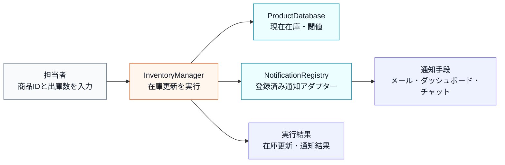

上の文章と表で仕様を一通り確認したので、ここでは商品IDと出庫数の検証が済んだ**正常系**だけを、入力・加工・出力の順に整理します。商品不存在や在庫不足は、後段のエラー条件表で別に扱います。正常系の図に片側しかない判定を置かないのは、存在しない分岐を読者に推測させないためです。

**仕様整理図：正常系の入力・判定・加工・出力**

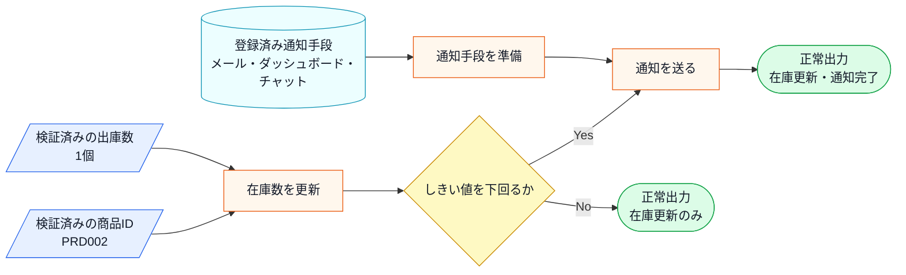

この図から読み取ることは、次の3点です。

- 通知は在庫更新そのものではなく、更新後の在庫が閾値を下回ったときに発生する。
- 商品の特定、在庫更新、閾値判定、通知は順番に依存している。
- 出力には在庫状態と通知メッセージがあり、通知先が増えると影響を受けるのは後者である。

**通知の動作ルール**

通知を送るかどうかの判断は「在庫数が閾値を下回ったか」という一点だけで決まります。補充のような在庫の増加は通知の対象外です。これは「発注が必要になった瞬間にだけ知らせる」という業務上の必要性から来ています。また、「通知先が0件のときにエラーにしない」のは、通知先が一時的にゼロになっても在庫管理そのものは止めたくないという運用上の理由があります——夜間バッチ処理や通知先の切り替え作業中でも、在庫の記録は続けなければならないからです。

| 状況 | 動作 |
|---|---|
| 在庫が閾値以下に減少した | 登録済みの全通知先へ通知を送る |
| 在庫が閾値を超えている | 通知しない |
| 通知先が1件も登録されていない | 何もしない（エラーにならない） |

「閾値以下になったら全通知先へ」という動作は、発注漏れを防ぐための安全策です。一部の通知先だけに送ると、担当者によって情報の到達タイミングがずれてしまうため、同時に全員へ届ける設計になっています。

**現在登録されている受信者と通知手段**

受信者は人またはチームであり、メールなどは受信者へ届ける手段です。コード上の通知アダプターは、この通知手段の違いを担当します。

| 受信者 | 通知手段 | コード上のアダプター |
|---|---|---|
| 倉庫担当者 | メール | `EmailNotifier` |
| 在庫管理チーム | 社内ダッシュボード | `DashboardUpdater` |
| 在庫担当者 | 社内チャット | `ChatNotifier` |

この3つの通知先は、それぞれ異なるシステムや担当チームによって管理されています。メールはインフラ管理部門が、ダッシュボードはフロントエンドチームが、チャットは各部門のマネージャーが運用を担っています。

**この仕様を決める業務機能**

このシステムでは、変わりやすい知識がどの業務機能に属するかを見ておきます。メール宛先はインフラ・システム管理の範囲、ダッシュボードの表示はUI・表示管理の範囲、チャット連絡網は通知・連携管理の範囲です。

| 業務機能 | この章の仕様で決めていること |
|---|---|
| インフラ・システム管理 | メール等の通知手段の採用・廃止 |
| UI・表示管理 | ダッシュボードの表示仕様 |
| 通知・連携管理 | チャット等の連絡網の変更 |
| 処理の骨格（開発設計判断） | 閾値判定ロジック・システム保守 |

後のフェーズで変更要求を扱うとき、どの業務機能の知識なのかを確認するための名前として使います。

**エラー条件**

正常系の仕様を一通り確認したうえで、最後に、在庫更新へ進めない入力や外部境界の懸念を分けて整理します。

| エラー条件 | どこで分かるか | 出力 | 保存・通知などの副作用 |
|---|---|---|---|
| 商品IDが商品マスタに存在しない | 商品確認時 | 商品IDエラー | 在庫更新なし、通知なし |
| 出庫数が現在在庫を超えている | 在庫確認時 | 在庫不足エラー | 在庫更新なし、通知なし |
| 通知送信に失敗する | 通知境界での送信時 | この章の現状コードでは詳細扱いなし | 実システムでは送信ログ、リトライ、失敗通知を検討する |

### 1-2：動作例テーブル

コードを読む前に、変更要求が届く前の在庫システムがどんな入力に対して
どんな通知を行うか確認します。

| シナリオ | 操作 | 通知・更新の結果 |
| --- | --- | --- |
| 在庫が閾値を超えたまま減少 | ワイヤレスマウス（PRD001）の在庫を5減らす | 50→45（閾値10）→ 通知なし |
| 在庫が閾値以下に減少 | USBハブ（PRD002）の在庫を1減らす | 3→2（閾値5）→ 全通知手段へ送信 |
| 在庫が補充される（閾値超え） | ワイヤレスマウス（PRD001）の在庫を20補充する | 45→65 → 送信されない・更新のみ |
| 在庫0の商品を減らす（エラー） | キーボード（PRD003）の在庫を1減らす | 出庫エラー・通知なし |
| 存在しない商品ID（エラー） | PRD999を操作する | マスタ不存在エラー・通知なし |

在庫が閾値以下になったときは現在の3通知先すべてへ送り、閾値を超えて
いるときは通知しないことが核心です。

次は、この仕様を担うクラスの顔ぶれと責任を確認します。

---

### 1-3：登場クラスとクラス構成図

このシステムに登場するクラスを先に確認します。

| クラス名 | 役割 | 担当する仕様 |
|---|---|---|
| `ProductDatabase` | 商品マスタを保持し、在庫数・アラート閾値を提供する | 商品IDの存在確認、在庫数と閾値の参照 |
| `InventoryManager` | 在庫数を管理し、必要な通知を呼び出す | 在庫更新、閾値判定、通知実行 |
| `EmailNotifier` | メール通知を送る | メール通知 |
| `DashboardUpdater` | ダッシュボード表示を更新する | 管理画面への反映 |
| `ChatNotifier` | チャット通知を送る | チャット連絡 |

各クラスの責任を把握したところで、クラス同士の関係を図で確認します。

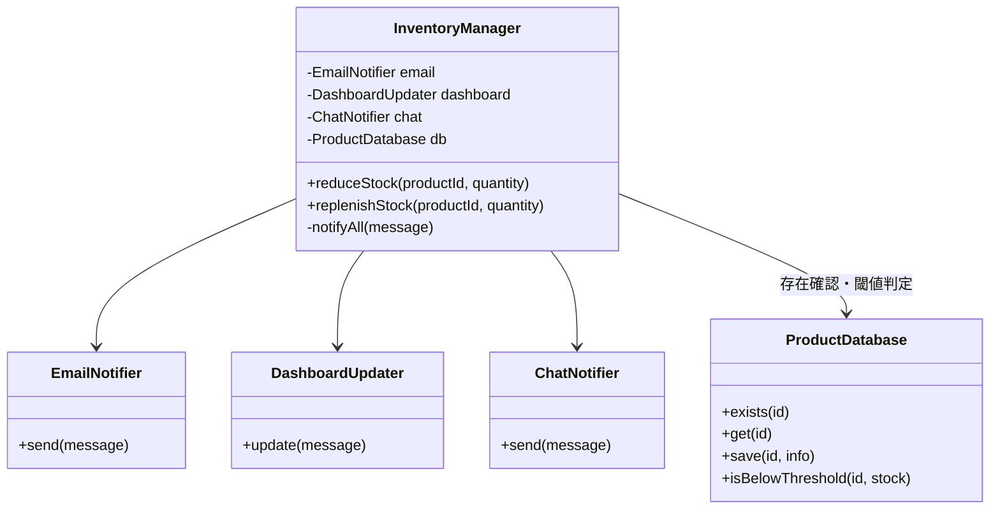

**クラス図に出てくる主なメンバーと操作**

| クラス | メンバー・操作 | 何ができるか |
|---|---|---|
| `InventoryManager` | `reduceStock()` / `replenishStock()` | 商品マスタの現在在庫を減少、補充する |
| `InventoryManager` | `notifyAll()` | 在庫がしきい値を下回ったとき、各通知先へ通知する |
| `ProductDatabase` | `exists()` / `get()` / `save()` / `isBelowThreshold()` | 商品ID・現在在庫・しきい値を一元管理する |
| `EmailNotifier` | `send()` | メール通知を送る |
| `DashboardUpdater` | `update()` | ダッシュボード表示を更新する |
| `ChatNotifier` | `send()` | チャット通知を送る |


この図が示す通り、InventoryManager という単一のクラスが、通知先であるすべてのクラス（メール、ダッシュボード、チャット）を直接保持している構成になっています。

---

**この章での簡略化**

1-3でクラス構成を確認したので、掲載コードで何を代替しているかを整理してからフェーズ1の現状コードへ進みます。

この章では、メール送信、チャット投稿、ダッシュボード更新を `EmailNotifier`、`ChatNotifier`、`DashboardUpdater` などの通知境界で表します。各通知先は受け取った通知を内部の受信箱へ実際に蓄積し、`std::cout` へは通し番号（何件目か）付きで表示します。実通信こそ省きますが、「誰に何件伝わったか」は実際の状態として残ります。論点は「在庫変化を複数の通知先へどう伝えるか」であり、通信のリトライや通知テンプレート管理は本章では扱いません。

ただし、通知先が増えると現実には「送信が同期で終わる先」と「受け付けだけして結果は後で確定する非同期の先」が混在し、一部の通知先だけ失敗する部分失敗も起こります。本章では、通知の受け付け結果を `DeliveryResult` という結果オブジェクトで表し、非同期の完了確認や失敗の詳細な通信処理は境界の先へ閉じます。`DeliveryResult` は「受付成功・受付失敗・保留（非同期で結果は後）」の3状態だけを持つ簡略表現とし、実システムの再送やタイムアウト制御までは扱いません。

---

### 1-4：実装コード（現状）

#### コードを読む前に：クラスの責任と境界

| 対象 | 呼び出しと内部処理 | 戻り値・副作用 | 掲載上の表現 |
|---|---|---|---|
| 在庫Repository | 商品IDで在庫を読み書きする | 更新後在庫 | `map` / `unordered_map`でDBを代替 |
| 通知元 | 在庫更新後に登録済み通知先を走査する | 各通知先へイベント送信 | `vector`を登録一覧に使う |
| `algorithm` | 通知先の検索・登録解除を行う | 一致要素を見つける/除く | ループの意図を標準操作で表す |
| 通知境界 | メール・Slack・ログへ送る | 成否・表示 | 実通信を`std::cout`で代替する |

通知は同期的に順番実行します。実運用の再試行、配信保証、通知中の登録解除は契約として説明し、サンプルでは決定的な実行順を優先します。

在庫が減った際に各通知先へメッセージを送る処理をシミュレートしています。

はじめに、各通知先クラスの定義です。それぞれが独立した実装を持ち、InventoryManager から直接呼び出されています。

このシステムには以下の3件の商品データがあらかじめ登録されています。

| 商品ID   | 商品名      | 在庫数 | アラート閾値         |
| ------ | -------- | --- | -------------- |
| PRD001 | ワイヤレスマウス | 50  | 10（閾値以上）       |
| PRD002 | USBハブ    | 3   | 5（閾値以下→アラート発火） |
| PRD003 | キーボード    | 0   | 5（在庫なし）        |

在庫数がアラート閾値以下になると、登録済みの通知先への通知が発火します。コードを読む前にこの対応を把握しておくと、動作結果が追いやすくなります。

この表の在庫数を、そのまま動作例の開始値として使います。商品マスタとは別の在庫表を作ると、どちらが正しい値か分からなくなるため、`ProductDatabase` の `ProductInfo::stock` を唯一の在庫データとします。

コードは責任の固まりごとに分けて読みます。

**① 商品マスタを表すクラス（ProductInfo / ProductDatabase）**

最初に、1-1の「商品」にあたるデータを持つ部分です。商品IDから在庫数・アラート閾値を引き、エラー条件「存在しないID」と閾値判定をここで担います。

```cpp
#include <iostream>
#include <string>
#include <vector>
#include <map>
#include <unordered_map>

using namespace std;

// 商品マスタの1件分
struct ProductInfo {
    string name;         // 商品名
    int    stock;        // 在庫数
    int    alertThreshold; // アラート閾値
};

// 商品マスタ（データ駆動バリデーション用）
class ProductDatabase {
private:
    map<string, ProductInfo> records;
public:
    ProductDatabase() {
        records["PRD001"] = {"ワイヤレスマウス", 50, 10};
        records["PRD002"] = {"USBハブ",           3,  5}; // 閾値以下
        records["PRD003"] = {"キーボード",         0,  5}; // 在庫なし
    }

    bool exists(const string& id) const {
        return records.count(id) > 0;
    }

    ProductInfo get(const string& id) const {
        return records.at(id);
    }

    void save(const string& id, const ProductInfo& info) {
        records[id] = info;           // 実行中の商品マスタへ追加
    }

    bool isBelowThreshold(const string& id, int currentStock) const {
        return currentStock <= records.at(id).alertThreshold;
    }
};
```

`ProductDatabase` は `std::map` で商品IDと `ProductInfo` を対応付けた商品マスタです。`exists()` で存在確認、`isBelowThreshold()` で在庫がアラート閾値以下かを判定します。実システムのDBを実行中のインメモリ表で代替しています。

**② 通知先クラス（EmailNotifier / DashboardUpdater / ChatNotifier）**

次に、1-1の3つの通知先にあたる部分です。それぞれ独立した送信クラスで、実際のメール・ダッシュボード・チャットへの送信を標準出力で代替します。

```cpp
// 各通知先の具体的な実装（受け取った通知を実際に蓄積する）
class EmailNotifier {
    vector<string> inbox;
public:
    void send(string m) {
        inbox.push_back(m);
        cout << "Email(" << inbox.size() << "件): " << m << endl;
    }
};
class DashboardUpdater {
    vector<string> inbox;
public:
    void update(string m) {
        inbox.push_back(m);
        cout << "Dashboard(" << inbox.size() << "件): " << m << endl;
    }
};
class ChatNotifier {
    vector<string> inbox;
public:
    void send(string m) {
        inbox.push_back(m);
        cout << "Chat(" << inbox.size() << "件): " << m << endl;
    }
};
```

通知先クラスはそれぞれ独立した送信メソッドを持っていますが、メソッド名が `send` と `update` で統一されていません。

**③ 在庫を管理するクラス（InventoryManager）**

この章の中心です。1-1の「在庫の増減」と「閾値以下での全通知先への通知」に対応します。商品IDの存在確認と閾値判定をデータベース経由で行い、閾値以下になると3つの通知先を直接呼び出します。

```cpp
class InventoryManager {
private:
    EmailNotifier    email;
    DashboardUpdater dashboard;
    ChatNotifier     chat;
    ProductDatabase  db;

public:

    void reduceStock(string productId, int quantity) {
        if (!db.exists(productId)) {
            cout << "[エラー] 商品ID " << productId
                 << " はマスタに存在しません。処理を中断します。"
                 << endl;
            return;
        }
        ProductInfo info = db.get(productId);
        if (quantity <= 0 || quantity > info.stock) {
            cout << "[エラー] 商品 " << productId
                 << " は " << quantity << " 個出庫できません。現在在庫: "
                 << info.stock << endl;
            return;
        }

        int before = info.stock;
        info.stock -= quantity;
        db.save(productId, info);
        cout << "商品 " << productId
             << " の在庫を " << quantity << " 減らしました。在庫: "
             << before << " -> " << info.stock << endl;

        if (db.isBelowThreshold(productId, info.stock)) {
            string message = "商品 " + productId
                           + " の在庫が閾値以下です。";
            notifyAll(message);
        }
    }

    void replenishStock(string productId, int quantity) {
        if (!db.exists(productId)) {
            cout << "[エラー] 商品ID " << productId
                 << " はマスタに存在しません。処理を中断します。"
                 << endl;
            return;
        }
        ProductInfo info = db.get(productId);
        int before = info.stock;
        info.stock += quantity;
        db.save(productId, info);
        cout << "商品 " << productId
             << " の在庫を " << quantity << " 補充しました。在庫: "
             << before << " -> " << info.stock << endl;
    }

private:
    void notifyAll(string message) {
        // 通知先が増えるたびに、ここが修正される
        email.send(message);
        dashboard.update(message);
        chat.send(message);
    }
};
```

`notifyAll()` が3つの通知先を名指しで直接呼び出しています。この `notifyAll()` が、通知先が増えるたびに修正される箇所です。

**④ 実行して動作例と照合する（main）**

```cpp
int main() {
    InventoryManager manager;

    cout << "--- 行1: PRD001を5減らす ---" << endl;
    manager.reduceStock("PRD001", 5);


    cout << "--- 行2: PRD002を1減らす ---" << endl;
    manager.reduceStock("PRD002", 1);


    cout << "--- 行3: PRD001を20補充する ---" << endl;
    manager.replenishStock("PRD001", 20);


    cout << "--- 行4: PRD003を1減らす ---" << endl;
    manager.reduceStock("PRD003", 1);


    cout << "--- 行5: 存在しない商品IDを操作する ---" << endl;
    manager.reduceStock("PRD999", 1);
    return 0;
}
```

実行対象コード：1-4の現状コード
対応する動作例：1-2の動作例テーブル
確認したいこと：入力、加工、出力が仕様どおりに対応していること

実行結果：

```text
--- 行1: PRD001を5減らす ---
商品 PRD001 の在庫を 5 減らしました。在庫: 50 -> 45

--- 行2: PRD002を1減らす ---
商品 PRD002 の在庫を 1 減らしました。在庫: 3 -> 2
Email(1件): 商品 PRD002 の在庫が閾値以下です。
Dashboard(1件): 商品 PRD002 の在庫が閾値以下です。
Chat(1件): 商品 PRD002 の在庫が閾値以下です。

--- 行3: PRD001を20補充する ---
商品 PRD001 の在庫を 20 補充しました。在庫: 45 -> 65

--- 行4: PRD003を1減らす ---
[エラー] 商品 PRD003 は 1 個出庫できません。現在在庫: 0

--- 行5: 存在しない商品IDを操作する ---
[エラー] 商品ID PRD999 はマスタに存在しません。処理を中断します。
```

動作例テーブルの各行について、在庫が閾値以下になった減少では3通知先へ送信され、
補充では通知されず、在庫0・未登録IDはエラーになることを確認できました。
同時に、`InventoryManager` が通知先のクラス名と呼び出し方をすべて直接
知っていることも分かります。

---
---

> **手元で動かすには**
> このコードは1つの `.cpp` に貼り付けて、そのままコンパイル・実行できます（例：`g++ chapter07.cpp -o app && ./app`）。開始在庫は `ProductDatabase` の登録値を使います。在庫データはプロセス実行中だけ有効で、終了すると消えます（通知手段への実送信はアダプタースタブで簡略化しています）。

### 1-5：変更要求

**変更要求の発生チーム：** 今回の変更要求は店舗運営チームから届いています。通知先の増減を判断するチームです。一方で、在庫の管理自体はシステム基盤チームが担っています。この点は、フェーズ2で「どの業務機能によるか」を確認する際に使います。


ある週の月曜日、店舗運営部の田中部長から、在庫管理システムの改善依頼がメールで届きました。

「在庫が少なくなった時に、倉庫担当者のスマホへSMS（ショートメッセージ）で直接通知を送れるようにしたいんだ。今はメールだけだから、どうしても確認が遅れて発注が漏れることがあってね。来月の店舗改装のタイミングで運用を変えたいから、なんとか対応してくれないか？」

なるほど、倉庫担当者のスマホへのSMS通知ですね。バックヤードで作業中の担当者にとって、メールよりも気づきやすい手段が必要というのは、現場のオペレーションとして理にかなっています。

**仕様変更の内容**

変更要求を受けて、通知先の構成がどう変わるかを整理します。

| 通知先 | 変更前 | 変更後 |
|---|---|---|
| EmailNotifier（メール） | あり | 変更なし |
| DashboardUpdater（ダッシュボード） | あり | 変更なし |
| ChatNotifier（チャット） | あり | 変更なし |
| **SMSNotifier（SMS通知）** | なし | **新規追加** |

在庫が閾値を下回ったとき、これまでの3チャネル（メール・ダッシュボード・チャット）に加えて、倉庫担当者のスマートフォンへSMSが送信されるようになります。

通知のトリガー条件（在庫が閾値以下になること）と、「登録されている全通知先へ同時に通知する」という動作ルールは変わりません。変わるのは「通知先の種類が1つ増える」という点です。ただし、追加されるSMSは外部の送信基盤へ依頼して受け付けだけを返す非同期通知であり、既存のメール・ダッシュボード・チャットのようにその場で送信が終わる同期通知とは、結果の返り方が異なります。

**この章が扱う複雑さ**

通知先が1つ増えるだけに見える変更でも、現実には次の複雑さが同時に入ります。この章では、これらが通知元（`InventoryManager`）へ漏れるかどうかを追います。

| 追加する複雑さ | 具体例 | この章で見ること |
|---|---|---|
| 在庫不足イベント | 閾値を下回った瞬間に通知が発生する | 通知元がイベント発生だけに集中できるか |
| 複数通知先 | メール・ダッシュボード・チャット・SMSへ同報する | 通知先の数が増えても通知元の分岐が増えないか |
| 非同期通知 | SMSは受け付けだけ返し、結果は後で確定する | 同期と非同期が混在しても通知元が同じ操作で扱えるか |
| 部分失敗 | 4通知先のうちSMSだけ受付に失敗する | 一部が失敗しても他の通知と在庫更新が止まらないか |

**変更前後の入力・判定・加工・出力差分**

1-1の現状仕様を退避し、変更要求を当てた後の仕様と同じ粒度で並べます。以降の分析では、この差分を追います。

| 要素 | 変更前（1-1の現状仕様） | 変更後（今回の要求） | 差分として追うもの |
|---|---|---|---|
| 入力 | 商品ID、在庫変動、通知先リスト | 商品ID、在庫変動、通知先リスト、SMS通知先（非同期） | 通知先が増え、同期と非同期が混ざる |
| 判定 | 商品存在、在庫十分、閾値以下 | 同じ判定を維持 | 判定条件は変わらない |
| 加工 | 在庫更新後、登録済み通知先へ通知 | 在庫更新後、既存通知先とSMSへ同報し、各先の受付結果を集める | 通知先の配布対象が増え、部分失敗を扱う |
| 出力 | 在庫更新結果と既存通知 | 在庫更新結果と、各通知先の受付結果（成功/保留/失敗） | 通知出力が増え、結果が通知先ごとに分かれる |

**変更後の入力・加工・出力**

変更後の仕様も、1-1と同じく入力検証済みの正常系として確認します。登録済み通知手段にSMS（非同期）が加わり、通知後に受付結果を集める点だけが差分です。

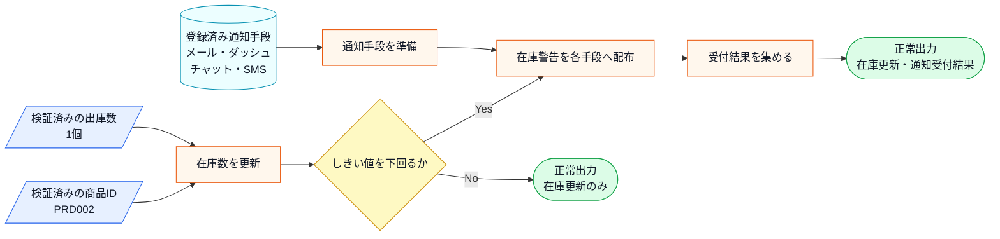

この図から読み取ることは、次の3点です。

- 在庫更新・しきい値判定・「同報する」という加工の骨格は、通知先が増えても変わらない。
- 変わるのは登録済み通知先の中身（SMSが加わり4件になり、同期と非同期が混ざる）と、同報の後で受付結果を集める枝が増えることである。
- 通知先が1件増え、そのうち1件が非同期で一部失敗しうるという入力の変化を、「同報する」がそのまま受け止められるかが、フェーズ3で確認する点になる。

変更後も、失敗条件は正常系図へ混ぜずに別で確認します。

| エラー条件 | どこで分かるか | 出力 | 保存・通知などの副作用 |
|---|---|---|---|
| 商品IDが商品マスタに存在しない | 商品確認時 | 商品IDエラー | 在庫更新なし、通知なし |
| 出庫数が現在在庫を超えている | 在庫確認時 | 在庫不足エラー | 在庫更新なし、通知なし |
| SMS通知の受付に失敗する（部分失敗） | SMS境界の受付結果 | 受付失敗を `DeliveryResult` で返す | 在庫更新は確定、他通知先は継続。SMSのみ失敗として記録 |
| SMSが受付のみで結果は後（非同期） | SMS境界の受付結果 | 保留を `DeliveryResult` で返す | 在庫更新は確定。完了確認は境界の先で行い本章では扱わない |

部分失敗と非同期のSMSは、正常系の在庫更新を止めません。通知先が1件でも失敗すると在庫記録まで止まってしまう作りは避け、通知元は「イベントを出して受付結果を集める」ところまでを責務とします。通知先が1つ増えるだけの変更が、実際のコードではどれだけの修正になるかを、フェーズ3で変更を試すコードで確認します。

---

## 🟣 フェーズ2：仮説立案 ―― 何が変わるかを観察し、ヒアリングで裏付ける
ここからフェーズ2（仮説立案）に進みます。フェーズ1で観察した事実をもとに、「何が変わる見込みか・何を当面安定と見るか」を仮説として立て、関係者へのヒアリングで裏付けます。

### 2-1：変わりそうな仕様の見当をつける

ここで作る一覧は、思いつきで「変わりそう」と感じたものを並べる表ではありません。フェーズ1で確認した仕様・動作例・クラス図を材料に、次の順で候補を絞ります。

1. 仕様図と動作例から、入力・判定・加工・出力のうち条件や値が変わりそうな箇所を拾う。
2. その箇所が、1-3のどのクラス・メソッドに書かれているかを対応づける。
3. その仕様が、どんな理由で、何をきっかけに、どのくらいの頻度で変わりそうかを仮説として書く。
4. 逆に、当面変えない前提にできる処理の骨格も分けておく。

この手順で見ると、「在庫を更新して通知する」という大きな処理全体ではなく、その中のどの通知先・通知方法・しきい値判定が変更候補なのかを読者自身で追えるようになります。

フェーズ2では、フェーズ1で見た仕様のうち、どの通知先・通知方法・しきい値判定が変わりそうかを見当づけます。責務の配置は、変更要求を当てた後の痛みと合わせて確認します。

| 仕様候補 | 仕様上の場所 | フェーズ1の現状コードでの場所 | 見立て |
|---|---|---|---|
| 在庫しきい値 | 判定 | `InventoryManager.reduceStock()` | 在庫不足とみなす条件が変わる可能性があるため、今回見る |
| メール通知 | 出力、通知処理 | `InventoryManager.reduceStock()` | 通知文面・宛先・送信方法が変わる可能性があるため、今回見る |
| ダッシュボード更新 | 出力、画面更新 | `InventoryManager.reduceStock()` | 表示先や更新方式が変わる可能性があるため、今回見る |
| SMS通知（非同期） | 1-5の変更要求で追加 | フェーズ1の現状コードにはない | 受付だけ返す新しい通知先として見る |
| 通知先ごとの受付結果 | 出力、部分失敗の扱い | `InventoryManager.notifyAll()` | 同期・非同期・失敗が混在し、扱い方が変わるため今回見る |

この表から、今回の検討対象は「在庫判定」と「通知先の増減」に加えて「通知先ごとの受付結果（同期・非同期・部分失敗）」に絞れます。通知先が同じ場所に書かれて困るかどうかは、フェーズ3で変更を入れてから確認します。

### 2-2：今回の変更で確実に変わること

フェーズ1での観察と、今回届いた変更要求を材料にして、「今回の対応で確実に変わること」を整理します。これは将来の話ではなく、今回の要求対応に直結する変動です。

| **分類** | **今回の確定変更** | **根拠** |
| --- | --- | --- |
| 🔴 **変動する** | 通知先に SMSNotifier クラスが追加される | 田中部長からの変更要求が確定しているため |
| 🔴 **変動する** | `InventoryManager` の `notifyAll` に SMS送信の呼び出しが増える | 現状の構造では新しい通知先を直接追記する必要があるため |
| 🔴 **変動する** | 通知先ごとに同期・非同期・受付失敗の扱いが分かれる | SMSが受付だけ返す非同期であり、部分失敗も起こりうるため |
| 🟢 **当面安定** | 「在庫が少なくなった」というイベント発生そのもののロジック | 商品の在庫を管理するというシステム本来の目的であり、通知の手段とは独立しているため |

コードを読んだだけで「ここは間違いなく変わる」「ここは当面安定している」と自分一人で断定してしまうのは危険です。今の設計思想では、新しい通知先が増えるたびに `InventoryManager` 自体を書き換える必要があると読み取れますが、本当に将来もこのまま追加し続ける運用でよいのか、関係者に直接確認します。

### ヒアリングに向けた背景確認

このシステムは、あるPC周辺機器メーカーの在庫管理システムを支える一部です。日々、全国の店舗から刻々と送られてくる売上データを受けて、倉庫にある在庫数を減らし、規定数を下回れば追加発注をかける、といった業務の流れを管理しています。

システムが立ち上がった当初は、在庫が減ったことを倉庫の担当者に「メール」で送るだけで十分でした。しかし、昨今のデジタル化の流れを受け、在庫状況をリアルタイムで「社内ダッシュボード」に反映させたり、在庫が少なくなったら「在庫担当者のチャット」に通知したりと、在庫の変動を追いかける相手がどんどん増えてきました。

コードを眺めてみると、在庫が減ったことを検知する InventoryManager クラスの中で、メール送信クラス、ダッシュボード更新クラス、チャット通知クラスといった、具体的な通知先クラスを直接呼び出す構成になっています。システムが小さかった頃は、これらすべてを InventoryManager が把握していても問題はありませんでした。

一見すると、このコードは処理が一つにまとまっており、何が起きているか分かりやすく整理されているように見えます。

### 2-3：関係者ヒアリング

仮説を携えて、店舗運営部の田中部長と開発チームのミーティングを行いました。チームで話し合う価値がある部分だと思います。

**開発者：** 「田中部長、SMS通知の件承知しました。一点確認ですが、今回のような新しい通知手段は、今後もキャンペーンや業務効率化のたびに追加されていく予定でしょうか？」

**田中部長：** 「そうなんだよ。次は店舗のバックヤードにある音声通知システムと連携したいという話もあってね。しばらくは、新しい通知方法がどんどん増えていくと思うよ。」

**開発者：** 「なるほど。通知手段の入れ替わりは激しそうですね。では、通知のタイミング（在庫が少なくなった瞬間など）といった『通知の基準』自体は、今回の変更範囲では固定と考えてよいでしょうか？」

**田中部長：** 「ああ、今回そこは変えないよ。あくまで『在庫が切迫した時』に知らせるというルール自体は固定だ。」

**開発者：** 「承知しました。通知手段（先）は頻繁に増減するけれど、通知の基準（トリガー）は安定しているということですね。もう一点、SMSは外部の送信基盤へ依頼する形になるので、その場では受け付けだけ返って結果は後から確定します。もし受付に失敗しても、在庫の記録や他の通知は止めないという理解でよいですか？」

**田中部長：** 「そうしてほしい。SMSが一時的に詰まっても、メールやダッシュボードには届いてほしいし、在庫の数字が止まるのは困る。SMSだけ後で再送する運用は別で考えるよ。」

**開発者：** 「承知しました。通知先ごとに同期・非同期や成否が分かれても、通知元は在庫イベントを出して受付結果を集めるところまでを担う、という切り分けですね。」

ヒアリングの結果、通知先という変動要素が今後も際限なく増え続けること、そして通知先ごとに同期・非同期や部分失敗が混ざっても在庫記録を止めないことが確定しました。これまでのように `InventoryManager` に新しい通知先をハードコードし続けるのは、システムの拡張性として限界がきているようです。

### 2-4：ヒアリングで判明した将来リスク

ヒアリングで明らかになった「将来変わるかもしれないこと」を、確定した変更とは分けて整理します。これは今すぐ対応するかどうかの判断材料であり、設計の方向性に影響します。

| **分類**        | **将来リスク**                                                      | **変わるタイミング**    | **根拠（誰との確認か）**    |
| ------------- | -------------------------------------------------------------- | --------------- | ----------------- |
| 🔴 **変動リスク高** | 通知先となるクラスの種類とその実装（音声通知システムなど）                                  | 業務要件の変更があるたび    | 田中部長との合意          |
| 🔴 **変動リスク高** | 通知先の増減（動的な登録・解除）                                               | 随時              | 田中部長との合意          |
| 🔴 **変動リスク高** | 通知先ごとの同期・非同期や受付失敗の扱い                                           | 送信基盤や外部連携が増えるたび | 田中部長との合意（在庫は止めない） |
| 🟢 **当面安定**   | 商品マスタの在庫更新が成功した後に、更新後在庫で閾値を判定して通知イベントを発生させる処理順 | 今回は固定 | 田中部長と確認した業務ロジック |

通知先という「管理者が異なる知識」が今後も増え続けることが確定しました。今の `InventoryManager` クラスにこれ以上責任を背負わせるのは、そろそろ限界かもしれません。

### 2-5：変わる見込みと当面安定の前提を確定する

2-4のヒアリング結果をもとに、将来起こりうる変更を現状と並べて整理します。この見通しが、次のフェーズ3でどこに痛みが集中するかを読む基準になります。

| 変更内容 | 現在 | 将来（時期の目安） |
| --- | --- | --- |
| 通知先の種類 | メール・ダッシュボード・チャットの3種類（固定） | SMS・音声通知など随時追加（業務要件の変更ごと） |
| 通知先の登録・解除 | InventoryManager に固定でハードコード | 随時、動的に追加・解除できる運用が必要 |
| 通知先ごとの受付結果 | すべて同期で送りきる（結果を意識しない） | 同期・非同期が混在し、部分失敗を受付結果として扱う |
| 通知のトリガー条件 | 在庫が閾値以下になった瞬間 | 今回は固定（田中部長と合意済み） |

この変化が来たとき、今の `InventoryManager` はその都度書き換えを迫られます。次のフェーズ3では、実際にSMS通知を追加しようとしたときに何が起きるかを試みます。

---

## 🟣 フェーズ3：問題特定 ―― 変更の痛みを発見する
### 3-1：変更を試みる

田中部長からの「倉庫担当者のスマホへSMSで通知を送りたい」という要求を、今のコードで実装しようと試みます。

> **中間コードの継続条件：** 以下は通知先追加の差分抜粋です。フェーズ1の `ProductDatabase` による商品存在・在庫数の確認、出庫数の検証、在庫更新、しきい値判定は維持し、在庫更新が確定した後の `notifyAll()` だけを変更します。

はじめに、SMSを送るための SMSNotifier クラスを新規作成します。次に、通知の中心である InventoryManager クラスを開き、新しく作成した SMSNotifier クラスのインスタンスをメンバ変数として追加します。
コンストラクタで SMSNotifier を初期化し、さらに `notifyAll` メソッド内にも `sms.send(message);` という行を書き加える必要があります。つまり、コンストラクタと `notifyAll` の両方に、新クラスの初期化と呼び出しを追加する必要があります。

> [!INFO] コラム: 「数行足すだけ」が危険な理由
> 「通知先が増えたら、InventoryManager に数行足すだけでしょ？」と思うかもしれません。しかし、その数行を足すために「在庫管理の本体コード」を開くこと自体がリスクなのです。もし間違えて在庫を減らすロジックを消してしまったら、システム全体が停止します。「通知先の変更」という別の理由で、重要なビジネスロジックを触らなくて済むようにすることが、このような通知先と業務ロジックを分離する設計の狙いです。

さらに、この先で在庫通知の種類が増えた場合を考えます。メール、ダッシュボード、チャットに続き、SMS、そして先ほど部長が言及した音声通知まで増えれば、InventoryManager クラスの notifyAll メソッドには何十行もの通知処理が並ぶことになります。さらに、通知先クラスが一つ増えるたびに、InventoryManager のメンバ変数を書き換え、コンストラクタを修正し、notifyAll を書き換えるという、同じような「掃除」を何度も繰り返すことになるのです。

実際に SMSNotifier を追加した変更後のコードは次のようになります。

```cpp
// 通知手段ごとに表現を変えられる、共通の在庫警告データ
struct StockAlert {
    std::string productId;
    std::string productName;
    int stock;
    int threshold;
};

class EmailNotifier {
public:
    void send(const StockAlert& a) {
        std::cout << "[Email] 件名:在庫不足 / " << a.productName
                  << " 残" << a.stock << " 閾値" << a.threshold << std::endl;
    }
};
class DashboardUpdater {
public:
    void update(const StockAlert& a) {
        std::cout << "[Dashboard] " << a.productId
                  << " | 残" << a.stock << " | 要発注" << std::endl;
    }
};
class ChatNotifier {
public:
    void send(const StockAlert& a) {
        std::cout << "[Chat] " << a.productName
                  << " 残" << a.stock << "個。発注を確認してください。" << std::endl;
    }
};

// 新規追加：外部SMS基盤へ非同期送信を依頼し、受付だけを返す
class SMSNotifier {
public:
    void requestAsync(const StockAlert& a) {
        std::cout << "[SMS受付] 在庫警告 " << a.productId
                  << " 残" << a.stock << std::endl;
    }
};

// 変更後の InventoryManager（具体的な通知手段を直接知る）
class InventoryManager {
    EmailNotifier    email;
    DashboardUpdater dashboard;
    ChatNotifier     chat;
    SMSNotifier      sms; // ← ①非同期SMSの具体型を追加
public:
    void reduceStock(const std::string& productId,
                     const std::string& productName,
                     int stockAfter, int threshold) {
        notifyAll({productId, productName, stockAfter, threshold});
    }
private:
    void notifyAll(const StockAlert& alert) {
        email.send(alert);
        dashboard.update(alert);
        chat.send(alert);
        sms.requestAsync(alert); // ← ②SMS固有の呼び方を追加
    }
};

int main() {
    InventoryManager manager;
    manager.reduceStock("PRD002", "USBハブ", 2, 5);
    return 0;
}
```

実行対象コード：3-1の変更試行コード
対応する動作例：変更要求後の代表ケース
確認したいこと：変更要求を現状構造へ当てはめたとき、修正箇所と痛みがどこに出るか

実行結果：

```
[Email] 件名:在庫不足 / USBハブ 残2 閾値5
[Dashboard] PRD002 | 残2 | 要発注
[Chat] USBハブ 残2個。発注を確認してください。
[SMS受付] 在庫警告 PRD002 残2
```

SMSはその場で配信完了を待たず、外部基盤への受付だけを行う非同期手段として追加しました。また、全手段へ完成済みの同一文字列を渡すのではなく、商品ID・商品名・在庫数・閾値という共通の `StockAlert` を渡し、メール、画面、チャット、SMSが用途に合う表現へ整形しています。それでも `SMSNotifier` を1つ追加するだけで、`InventoryManager` のメンバ変数と `notifyAll` の2箇所を修正し、固有メソッド `requestAsync()` まで知らなければなりません。

### 3-2：変更影響グラフ

変更を試みた結果、コード内の依存関係がどうなっているかを図にしてみます。

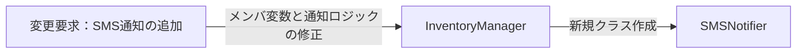

変更を加えるたびに InventoryManager が修正対象となり、通知先が増えるほど、このクラスが知るべき知識がどんどん増幅していく様子が見て取れます。

### 3-3：痛みの言語化

変更を試みる中で、構造上の問題が2つ浮かび上がりました。

1つ目は、InventoryManager が「通知先の存在」と「送信方法」という2種類の知識を抱え込んでいることです。本来、通知のタイミング（在庫が切迫した瞬間）の管理だけが責務であるべきなのに、通知先クラスの名前と各クラスのメソッド名まで知っています。結果として、通知先が増えるたびにメンバ変数・コンストラクタ・notifyAllの3箇所を修正しなければならず、このクラスの変更理由が際限なく増えていきます。

2つ目は、通知先と通知元の変更理由が混在していることです。通知先クラスが変わるたびに、通知元の InventoryManager まで修正対象になります。これは「在庫管理のビジネスルール」と「通知手段の選択」という、本来異なる変更理由を1つのクラスが抱えている状態です。

3つ目は、通知先ごとの結果の違い（同期・非同期・部分失敗）まで通知元へ入り込みそうなことです。SMSは受付だけ返す非同期であり、受付に失敗することもあります。もし `notifyAll` の中に「SMSは受付結果を見て、失敗なら記録し、他は続ける」といった分岐を書き足せば、通知元が通知手段ごとの成否と待ち方まで知ることになります。田中部長と合意した「SMSが失敗しても在庫記録や他通知は止めない」という要求は、通知元がイベントを出すだけに徹してこそ素直に守れます。

フェーズ3で「変更のたびに通知元クラスが書き換わる」という痛みと、「通知先ごとの成否・待ち方まで通知元へ入りそうだ」という痛みが確認できました。次のフェーズ4では、通知元と通知先の接続点に漏れている知識を確認します。

---
> **📌 問題（確定）**
> 通知先が変わるたびに、通知元の `InventoryManager` クラスのメンバ変数・コンストラクタ・`notifyAll` の3箇所が連動して変わる。通知先という「管理者が異なる知識」が、在庫管理ロジックと同じクラスに混在しているため、通知先の追加・削除が通知元クラスへの修正を引き起こし続ける。
---

ここまでで「何が痛いか」が見えました。次のフェーズ4では、その痛みが「なぜ起きているか」を構造の言葉で言語化します。

---

## 🟠 フェーズ4：原因分析 ―― なぜ辛いのかを構造で言語化する
### 4-1：痛みの根源を探る（観察と原因）

フェーズ3で確認した「変更の辛さ」は、コードのどこから来ているのでしょうか。コードを注意深く観察すると、痛みを引き起こしている2つの事実が浮かび上がってきます。

第一に、新しい通知先を追加するとき、なぜ毎回 `InventoryManager` を開かなければならないのでしょうか？それは、このクラス自身が「EmailNotifier に send する」「DashboardUpdater に update する」「ChatNotifier に send する」といった**具体的な通知先の名前と送信方法を全部直接知ってしまっている（抱え込んでいる）**からです。

第二に、なぜ変更の影響範囲が読めず、修正を重ねるたびに不安を感じるのでしょうか？それは、「在庫が減った」というイベントの管理という本来の骨格ロジックと、「誰にどうやって知らせるか」という通知先ごとの実装が、**同じクラスの中で物理的に混ざり合っている**からです。

この「症状（痛み）」と「根本原因」を整理すると、以下のようになります。

| **観察した症状（痛み）** | **構造的な原因（痛みの根源）** |
|---|---|
| 新しい通知先を追加するたびに、通知元の InventoryManager クラスの修正が必要になる | InventoryManager が、通知する必要がある相手の「具体的なクラス名」と「通知方法」を直接知っているから |
| 通知先のクラスが変わったり増えたりするたびに、通知元クラスが影響を受ける | 在庫管理という「守りたい前提」と、通知先という「変わる見込み」が、同じクラスの中に混在しているから |
| SMSの非同期や受付失敗の扱いが、在庫更新のコードへ入り込もうとする | 通知手段ごとの同期・非同期・成否という「通知先の事情」を、イベントを出すだけの通知元が抱え込もうとするから |

こうして整理すると、問題の本質が見えてきます。通知元である InventoryManager は、「在庫が減った」という事実を伝えたいだけなのに、その情報を「誰が」「どう受け取るか」という詳細な実装までを全部抱え込んでしまっているのです。これでは、通知先が増えるたびにこのクラスを汚していくことになり、影響範囲が広がり続けるのは避けられません。

### 4-2：変わるもの/変わってほしくないもの

> **「変わらないもの」と「変わってほしくないもの」は異なります。** 「変わらないもの」は経験的事実（今まで変わっていない）、「変わってほしくないもの」は設計意図（ここを安定させてほかを守りたい）です。ここで整理するのは後者です。

原因の方向性が見えたところで、「変わり続けるもの」と「変わってほしくないもの」を明確に切り分けます。

| **変わるもの（🔴）** | **変わってほしくないもの（🟢）** |
| --- | --- |
| 通知先のクラス（メール、ダッシュボード、チャット等）、その追加や削除、具体的な通知手段、および通知先ごとの同期・非同期や受付成否 | 「在庫が少なくなった」というイベントの発生通知そのもの、およびそのトリガーとなる在庫管理ロジック。一部の通知先が失敗しても在庫更新を止めないという骨格 |

**【変わる部分（変わり続ける通知先の知識）】**
```cpp
    void notifyAll(string message) {
        email.send(message);      // ← EmailNotifierを直接知っている
        dashboard.update(message); // ← DashboardUpdaterを直接知っている
        chat.send(message);       // ← ChatNotifierを直接知っている
    }
```

**【変わってほしくない部分（守りたい骨格）】**
```cpp
    void reduceStock(string productId, int quantity) {
        stock[productId] -= quantity; // 在庫を減らす（守りたい骨格）
        // 閾値を下回ったか（守りたい骨格）
        if (db.isBelowThreshold(productId, stock[productId])) {
            string message = productId + " の在庫が閾値以下です。";
            notifyAll(message);   // ← 「在庫が少ない」イベントを出す。誰に送るかは変わる側
        }
    }
```

「在庫が少なくなった」という出来事は、通知先が増えようが減ろうがシステムの中では等しく起きています。この「イベント発生の事実」こそが、変わってほしくないコア部分です。一方、通知先はビジネスの都合で今後も変動し続けます。この「変わる側」をうまく分離できれば、通知元は常に安定した状態を保てるはずです。

### 4-3：接続点に漏れている通知先の知識を確認する

ここでの「確認すること」は、前節までに見つけた原因から抽出します。まず、原因文から「守りたい骨格」と「変わる差分」を分けます。次に、その差分を動かすために骨格側が知ってしまっている名前・条件・順序・型を拾います。最後に、接続点に残す最小の約束を、値・型・操作・イベントとして書きます。

原因によって、接続点で見る抽象観点は変わります。条件分岐が原因なら条件・定数・選択基準を見ます。処理手順が原因なら呼び出し順・前後条件・失敗時分岐を見ます。生成判断が原因なら具体クラス名・生成条件・登録場所を見ます。通知や外部連携が原因なら通知先・タイミング・成否の扱いを見ます。データや状態が原因なら、境界を流れる値・型・状態を見ます。

現在の`InventoryManager`が、通知先について何を知っているかを確認します。

`InventoryManager`は、`EmailNotifier`や`ChatNotifier`というクラス名に加え、通知先ごとに異なるメソッド名と呼び出し順序まで知っています。ここへSMSの非同期・受付失敗を素直に足そうとすると、通知先ごとの成否や待ち方まで通知元が知ることになります。接続点で必要なのは「メッセージを通知し、受付結果を1つ受け取ること」だけです。

新しい通知先を追加すると、通知元へメンバー変数・初期化・呼び出しを追加する必要があります。通知先の種類・送信方法・同期非同期の別・受付成否が通知元へ漏れているためです。これらを通知先側と結果オブジェクトへ寄せれば、通知元はイベント発生と受付結果の集約だけに集中できます。

現状の InventoryManager と各通知先は、その「変わる理由」が異なります。このまま密接に接続させておくと、一方の変更がもう一方に波及し続けます。両者を切り離して疎な関係にすることが、根本原因への対処になります。

フェーズ4で根本原因が言語化できました。「どこを分けるか」は明確です。次のフェーズ5では、その境界で実際に何が流れているかを値・型のレベルで具体化し、「何を変え、何を守るか」を明確にします。

---
> **📌 原因（確定）**
> `InventoryManager`が通知先のクラス名・送信メソッド・同期非同期の別・受付成否まで知っている。通知先を追加したり、非同期や部分失敗が加わるたびに、在庫管理のクラスへメンバー・初期化・呼び出し・成否分岐を追加する必要がある。
---

「何が痛いか（問題）」と「なぜ痛いか（原因）」が揃いました。次のフェーズ5では、「何を切り離す必要があるか（課題）」を、接続点で流れるデータのレベルで言語化します。

---

## 🟡 フェーズ5：課題定義 ―― 解くべき接続点を定める
フェーズ4は「なぜ辛いか」を答えました。ここでは、3-2で波及した場所を起点に、変わる通知手段と守る在庫処理が接する場所を、値・型のレベルで一度だけ定義します。

フェーズ4の分析により、問題は「通知元（`InventoryManager`）が通知先の具体名を知りすぎている」ことだと分かりました。その境界で何がやり取りされているかを具体化します。

### 接続点を特定する

接続点は、クラス図の線やインターフェース名から探すのではなく、変更要求を当てて特定します。まず、その要求で変えたい側と変えたくない側を分けます。次に、両者がどのメソッド呼び出し・引数・戻り値・生成・イベントでつながっているかを見ます。そのつながりのうち、変更要求のたびに知識が漏れて修正が波及する場所が、ここで解くべき接続点です。

`notifyAll()` の中で分けるべき境界は「通知元 → 各通知手段」の接続部分です。各手段に必要なのは完成済みの同一文面ではなく、手段ごとに文面を作れる在庫警告データです。

現在の状況：`InventoryManager` は `email.send(msg)` / `dashboard.update(msg)` / `chat.send(msg)` という**異なるメソッド名・クラス名**を直接知っています。通知先が増えるたびにこの接続点の数が増えます。

| 課題ID・接続点 | 接続するデータ | 変わる側 | 守る側 |
|---|---|---|---|
| P1：`InventoryManager` → 通知手段 | `StockAlert`（商品ID・商品名・更新後在庫・閾値）を渡し、`DeliveryResult`（成功・保留・失敗）を受け取る | 通知手段の種類・数、手段別の文面、同期／非同期、受付成否 | 商品確認、在庫更新、更新後の閾値判定、一部失敗でも在庫更新と他通知を止めない処理順 |

システム全体の課題は、在庫更新を行う `InventoryManager` から、通知手段の具体型・固有メソッド・文面・同期非同期を外すことです。そのうえで、在庫更新後に作った `StockAlert` を登録済み手段へ一律に渡し、共通の `DeliveryResult` を集約するところまでを安定側の責任として残します。

**現状のままでよい場面**：通知先が固定され、登録・解除も不要で、すべて同期で成否も気にしないなら、現在の呼び出しを保つ判断もあります。今回は通知先が増減し、同期・非同期・部分失敗が混ざるため、通知元が同じ操作で通知でき、結果を共通の `DeliveryResult` で受け取れる契約を検討します。

---
> **📌 課題（確定）**
> P1の接続点を `StockAlert → DeliveryResult` という契約へ揃え、通知手段の追加・文面・同期非同期を通知アダプター側へ閉じる。`InventoryManager` は、在庫更新後に警告データを作り、登録済み手段へ一律配布して結果を集約するところまでに徹する。
---

問題・原因・課題の3点が揃いました。次のフェーズ6では、このP1を入力として、システム全体の完成構造を決めます。

## 🔴 フェーズ6：対策検討 ―― システム全体の最終構造を定める

フェーズ5で定めた一つの接続点を、次の三つの観点で完成構造へ変換します。

| 接続点を変える観点 | システム全体の考え方 | P1のコードへの反映 |
|---|---|---|
| 分離方法 | 通知元には `StockAlert` の発行と `DeliveryResult` の集約だけを残し、手段別の送信・文面・同期非同期を外す | `INotification::send(const StockAlert&)` を境界にする |
| 配置場所 | メール、画面、チャット、SMSの表現と送信方法は各具象通知クラスへ置く | 各クラスが同じ警告データから手段別の文面を作る |
| 組み立て方法 | 組み立て側がDB・ログ・通知手段を生成して所有し、`InventoryManager` へDB・ログをコンストラクタ注入、通知手段を `attach()` で登録する | `InventoryManager` は非所有参照と非所有ポインタだけを保持し、具体型を知らず `send()` だけを呼ぶ |

この三観点を同時に満たす完成形は一つです。通知手段ごとの専用メンバを残す形はP1の波及を解消しない途中状態なので、比較案にはしません。採用するのは、共通契約を実装した通知アダプターを外側で生成・登録し、通知元が登録リストへ一律配布する通知分離構造です。

### 対策検討のクラス図：1-3の責任と依存をどう変えるか

フェーズ1の1-3で作ったクラス図へフェーズ2〜5の判断を反映し、変更後の形へ更新します。

| クラス図を変える材料 | 前工程で確認したこと | クラス図へ反映すること |
|---|---|---|
| フェーズ1のクラス図 | 現在のクラス、操作、依存関係 | 変更前クラス図としてそのまま使う |
| フェーズ2の変化予測 | 通知先の種類と同期・非同期は今後も増える | 毎回変わる責任へ `【移す】` と注記する |
| フェーズ4の原因 | `InventoryManager` に在庫管理と通知先の具体知識が混在する | 同じクラスの中で `【残す】` と `【移す】` を分ける |
| フェーズ5の接続点 | 通知元は種別を知らず、`string` を渡し `DeliveryResult` を集めればよい | P1の送信手段・受付結果を各通知クラスへ置く |

**薄い黄色が着目クラス**です。変更前では `InventoryManager` の `【残す】` と `【移す】`、変更後では移動先の `【新設】` を追います。矢印は1-3と同じ利用・実装・登録関係です。

**変更前のクラス図（1-3を責任見直し用に再掲）：**

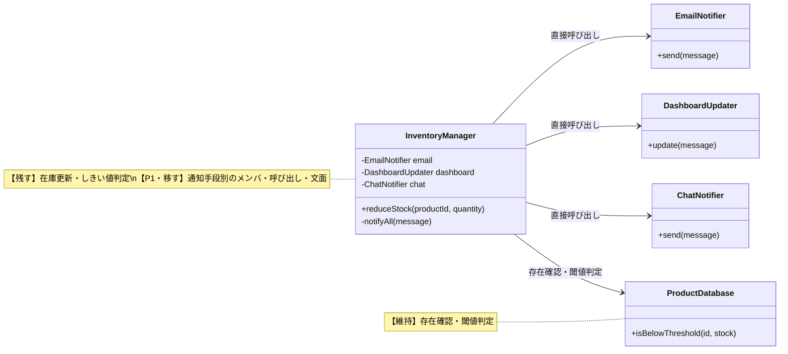

変更前は `InventoryManager` が通知先の具体型・メソッド名・同期非同期を抱え、通知先追加のたびにメンバと `notifyAll()` の呼び出しが増えます。

P1をクラス図の変更として書くと、次の3操作になります。

1. P1：通知手段が満たす共通契約 `INotification`（`StockAlert` と受付結果 `DeliveryResult`）を新設する。
2. P1：各通知手段を `INotification` 実装へ移し、文面・送信方法・受付結果を具象クラス側へ閉じる。
3. P1：`InventoryManager` を登録リスト（`attach`）と一律配布へ変える。組み立て側が `ProductDatabase` と `StockEventLog` を注入し、在庫更新とログ記録を自動で連続実行させる。

変更後は、通知元が具体型を知らず登録リストへ一律配布し、`InventoryManager` の通知先別メンバと分岐が消えたことを確認します。

**採用した変更後のクラス図：**


クラス図の変更とコード変更を一対一で対応させると、次のようになります。

| 課題ID | クラス図をどう変えるか | コードレベルで何をするか | 実装ステップ |
|---|---|---|---|
| P1 | 共通契約 `INotification` を新設する | `send(const StockAlert&)` を純粋仮想で定義し `DeliveryResult` を返す | ステップ1 |
| P1 | 各通知手段を契約実装へ移す | `EmailNotifier` などが手段別の文面を作って `send()` する | ステップ2 |
| P1 | 通知元を登録・一律配布へ変える | `InventoryManager` がDB・ログの注入を受け、`attach` と `notifyAll` を持つ | ステップ3 |

このクラス図が、P1を反映したシステム全体の設計結論です。課題IDは図の差分を追うために使い、以降はこの構造に必要なコードだけを示します。

#### 課題箇所のおさらい（フェーズ3の関連コード）

統合表で特定した箇所だけを振り返ります。P1は `InventoryManager` の通知先別メンバと、`notifyAll()` 内の通知先別呼び出しです。課題に関係しないコードは省略し、フェーズ3で明記した維持条件をそのまま引き継ぎます。

```cpp
// 現状：通知元が通知先の具体型・メソッド名を直接抱える
class InventoryManager {
    EmailNotifier    email;
    DashboardUpdater dashboard;
    ChatNotifier     chat;
    SMSNotifier      sms;   // ← 通知先追加でメンバが増える
public:
    void reduceStock(std::string productId, int quantity) {
        // 在庫更新・しきい値判定（維持）
        notifyAll({productId, productName, stockAfter, threshold});
    }
private:
    void notifyAll(const StockAlert& alert) {
        email.send(alert);
        dashboard.update(alert);   // ← 名前もシグネチャも通知先ごとに違う
        chat.send(alert);
        sms.requestAsync(alert);   // ← 通知先追加でここも増える
    }
};
```

### 6-1：採用設計をコードへ段階的に反映する

採用するクラス図と責任配置は、コードを書く前に確定しています。ここからの区切りは試行錯誤の履歴ではありません。完成形を理解できる大きさに分け、各ステップで「クラス図のどの操作・関連を実装したか」を確認します。

#### 実装ステップ1（P1）：通知の共通契約 `INotification` を定める

すべての通知手段が満たす契約 `INotification` を定義します。入力は手段別に文面を作れる `StockAlert`、戻り値は成功・保留・失敗を持つ `DeliveryResult` に揃えます。

```cpp
struct DeliveryResult {
    enum State { Accepted, Pending, Failed } state;
};

struct StockAlert {
    std::string productId;
    std::string productName;
    int stock;
    int threshold;
};

class INotification {
public:
    virtual ~INotification() = default;
    virtual DeliveryResult send(const StockAlert& alert) = 0;
};
```

**P1との対応：** `INotification` を新設しました。通知元は種別を知らず、`send()` だけを呼び、`DeliveryResult` を集めます。

#### 実装ステップ2（P1）：各通知先を契約実装へ移す

各通知手段は文面・送信方法・受付結果を自分の中に閉じ、`send()` で共通の `DeliveryResult` を返します。通知元は一律に呼べます。

```cpp
class EmailNotifier : public INotification {
public:
    DeliveryResult send(const StockAlert& alert) override {
        // StockAlertからメール向け件名・本文を作って同期送信する
        return { DeliveryResult::Accepted };
    }
};
```

**P1との対応：** `INotification <|.. EmailNotifier` の実装関係を実装しました。`DashboardUpdater`・`ChatNotifier`・`SMSNotifier` も同じ入力から手段別の文面を作り、同期非同期の差を内側に持ちます。

#### 実装ステップ3（P1）：通知元を登録・一律配布へ変える

`InventoryManager` は通知アダプターを `attach` で登録リストへ持ち、在庫更新とログ記録の後に `StockAlert` を一律配布して結果を集約します。手段別のメンバも分岐も持ちません。

```cpp
InventoryManager manager(productDatabase, stockEventLog);
manager.attach(&emailNotifier);
manager.attach(&smsNotifier);
manager.reduceStock("PRD002", 1);  // 在庫更新・自動記録→登録先へ一律 send
```

**P1との対応：** `InventoryManager o--> INotification` の登録関係を実装しました。ここで通知元と通知先が一つの通知分離構造として接続されました。

### 6-2：システム全体の契約とデータ配置を確定する

採用システムの生成・所有・登録・注入を確認します。接続点で受け渡すのは `StockAlert` と `DeliveryResult` です。通知の成否は在庫更新を巻き戻さず、`InventoryManager` が確定した在庫変動を `StockEventLog` へ自動記録します。

```cpp
class StockEventLog {
    std::vector<StockEvent> events;   // 確定した在庫変動の記録
public:
    void record(const StockEvent& e) { events.push_back(e); }
    int count() const { return (int)events.size(); }
};
```

| 共通の問い | システム全体での答え | 変えたくない側が知らなくなる詳細 |
|---|---|---|
| 分離方法 | P1の文面・送信手段・受付結果を各通知クラスと `INotification` へ置く | 通知手段の種類・数・文面・同期非同期 |
| 配置場所 | 在庫更新と警告生成は `InventoryManager`、手段別処理は具象通知クラスに置く | 具体的な配信処理 |
| 組み立て方法 | 組み立て側がDB・ログ・通知手段を生成・所有し、DB・ログをコンストラクタ注入、通知手段を `attach` 登録する | 具体クラスの生成と生存期間 |
| 安定側の実行 | 通知元は登録先へ一律 `send(alert)` を呼ぶ | 何件が同期で何件が非同期か |

DB、ログ、通知アダプターは組み立て側が生成・所有します。通知元はDBとログを参照で受け取り、通知アダプターは非所有の `INotification*` として登録します。所有側の生存期間が通知元より長いことを組み立てコードで確認します。

ここまでで、P1は「具象通知クラスと登録だけが変わる構造」へ変換されました。`InventoryManager` の在庫更新・閾値判定・結果集約は具体的な通知手段を知らず、DB更新後のログも利用者の追加操作ではなく同じ処理内で記録されます。実行結果と変更影響は、完成コードを示した後のフェーズ7で確認します。

## 🟢 フェーズ7：対策実施 ―― 変化に強いコードを完成させる
フェーズ6のステップ3を実装し、通知元が通知先の種類を知らなくてよい構造へ変えます。`InventoryManager`は登録済みの通知先へ同じ操作を呼び出します。

**この構造は、通知分離構造（オブザーバー）と呼ばれています。**

名前の由来は、Subject（被観察者・通知を送る側）がオブザーバー（観察者・通知先）へ通知する仕組みだからです。通知を「受け取る側」の役割名が、この構造の名称になっています。

通知を送る側（Subject）がオブザーバーのリストを保持し、状態が変化したときに一斉に通知を送るという構造が、私たちが選んだステップ3そのものです。フェーズ1から積み上げてきた思考の結果、たどり着いた構造に名前があった——というのが本書の伝えたいことです。

### 7-1：解決後のコード（全体）

インターフェース INotification を定義し、通知先クラスがこれを実装するようにします。InventoryManager は INotification* のリストを管理するだけで済みます。解決後のコードも、責任の固まりごとに分けて読みます。

**① 商品マスタ・送信結果・通知インターフェース（ProductDatabase / DeliveryResult / INotification）**

まず、商品マスタと送信結果の型、そしてすべての通知先が実装する契約となるインターフェースを定義します。

```cpp
#include <iostream>
#include <vector>
#include <string>
#include <map>
#include <algorithm>

using namespace std;

// 商品マスタの1件分
struct ProductInfo {
    string name;           // 商品名
    int    stock;          // 在庫数
    int    alertThreshold; // アラート閾値
};

// 商品マスタ（データ駆動バリデーション用）
class ProductDatabase {
private:
    map<string, ProductInfo> records;
public:
    ProductDatabase() {
        records["PRD001"] = {"ワイヤレスマウス", 50, 10};
        records["PRD002"] = {"USBハブ",           3,  5}; // 閾値以下
        records["PRD003"] = {"キーボード",         0,  5}; // 在庫なし
    }

    bool exists(const string& id) const {
        return records.count(id) > 0;
    }

    ProductInfo get(const string& id) const {
        return records.at(id);
    }

    void save(const string& id, const ProductInfo& info) {
        records[id] = info;           // 実行中の商品マスタへ追加
    }

    bool isBelowThreshold(const string& id, int currentStock) const {
        return currentStock <= records.at(id).alertThreshold;
    }
};

// 通知の受付結果（3状態のみの簡略表現）
enum DeliveryStatus { ACCEPTED, PENDING, FAILED };

struct DeliveryResult {
    DeliveryStatus status; // 受付成功・保留(非同期)・受付失敗
    string channel;        // どの通知手段か
};

// 通知手段ごとに表現を変えるための、共通の在庫警告データ
struct StockAlert {
    string productId;
    string productName;
    int stock;
    int threshold;
};

// 通知先が満たす必要がある契約（インターフェース）
class INotification {
public:
    virtual ~INotification() = default;
    // 在庫警告を受け取り、手段別に表現して受付結果を1つ返す
    virtual DeliveryResult send(const StockAlert& alert) = 0;
};
```

`ProductDatabase` が商品マスタと現在在庫を一元管理します。`INotification` は、完成済みの同一文面ではなく `StockAlert` を受け取る契約です。各通知手段は自分の用途に合う文面を作れます。戻り値を `DeliveryResult` に揃えたため、同期の通知手段は受付成功か失敗を即返し、非同期のSMSは保留を返せます。

**② 在庫変動ログ（StockEvent / StockEventLog）**

在庫変動ログ（`StockEventLog`）はシステム起動時は空で、在庫の入荷・出荷・閾値警告が発生するたびに1件追記されます。ファイルへの保存は行わず、実行中のメモリ上にのみ保持します。

```cpp
struct StockEvent {
    std::string productId;
    std::string productName;
    std::string eventType;  // "入荷", "出荷", "閾値警告"
    int amount;
    int stockAfter;
};

// 在庫変動ログを管理するクラス
class StockEventLog {
    std::vector<StockEvent> records;
public:
    void add(const std::string& productId, const std::string& productName,
             const std::string& eventType, int amount, int stockAfter) {
        records.push_back({productId, productName,
                           eventType, amount, stockAfter});
    }
    void printAll() const {
        for (const auto& r : records) {
            std::cout << "[" << r.productId << "] " << r.productName
                      << " " << r.eventType << " " << r.amount
                      << "個 (残:" << r.stockAfter << ")" << std::endl;
        }
    }
    int size() const { return (int)records.size(); }
};
```

`StockEventLog` を使うことで、実行中に発生した全在庫変動を後から一覧できます。

**③ 通知先クラス（EmailNotifier / DashboardUpdater / ChatNotifier / SMSNotifier）**

`INotification` を実装する具体的な通知先クラスを、個別に見ていきます。

```cpp
// 通知先1：メール通知（同期。受け取った通知を蓄積する）
class EmailNotifier : public INotification {
    vector<string> inbox;
public:
    DeliveryResult send(const StockAlert& a) override {
        string text = "件名:在庫不足 / " + a.productName
                    + "(" + a.productId + ") 残" + to_string(a.stock)
                    + " 閾値" + to_string(a.threshold);
        inbox.push_back(text);
        cout << "Email(" << inbox.size() << "件): " << text << endl;
        return {ACCEPTED, "Email"};
    }
};
```

```cpp
// 通知先2：ダッシュボード更新（同期）
class DashboardUpdater : public INotification {
    vector<string> inbox;
public:
    DeliveryResult send(const StockAlert& a) override {
        string text = a.productId + " | 残" + to_string(a.stock) + " | 要発注";
        inbox.push_back(text);
        cout << "Dashboard(" << inbox.size() << "件): " << text << endl;
        return {ACCEPTED, "Dashboard"};
    }
};
```

```cpp
// 通知先3：チャット通知（同期）
class ChatNotifier : public INotification {
    vector<string> inbox;
public:
    DeliveryResult send(const StockAlert& a) override {
        string text = a.productName + " 残" + to_string(a.stock)
                    + "個。発注を確認してください。";
        inbox.push_back(text);
        cout << "Chat(" << inbox.size() << "件): " << text << endl;
        return {ACCEPTED, "Chat"};
    }
};
```

SMS通知は外部の送信基盤へ依頼して受付だけ返す非同期の通知先です。受付が通れば保留（`PENDING`）を、受付に失敗すれば失敗（`FAILED`）を返します。完了確認は境界の先で行い、本章では扱いません。受付に失敗するかどうかは、組み立て側から `willFail` で指定できるようにして、部分失敗の動作を確認できるようにします。

```cpp
// 新しい通知先の実装を追加し、組み立て側で登録する
// 通知先4：SMS通知（非同期。受付だけ返す）
class SMSNotifier : public INotification {
    bool willFail;  // 受付に失敗する状況を再現するための指定
    vector<string> inbox;  // 受付できた通知だけを蓄積する
public:
    SMSNotifier(bool fail) : willFail(fail) {}
    DeliveryResult send(const StockAlert& a) override {
        if (willFail) {
            cout << "SMS: 受付失敗（後で再送対象）" << endl;
            return {FAILED, "SMS"};
        }
        string text = "在庫警告 " + a.productId + " 残" + to_string(a.stock);
        inbox.push_back(text);
        cout << "SMS(" << inbox.size() << "件受付): " << text << endl;
        return {PENDING, "SMS"};
    }
};
```

4つの通知クラスはいずれも `INotification` を実装し、同じ `StockAlert` から用途別の表現を作ります。同期の3つは受付成功を、非同期のSMSは保留か失敗を返しますが、戻り値は同じ `DeliveryResult` 契約です。

**④ 在庫を管理するクラス（InventoryManager）**

通知元となる中心クラスです。`INotification*` のリストを持ち、閾値以下になると登録済みの全通知先へ同じ `send` を呼びます。

```cpp
// 通知元クラス（Subject に相当）
class InventoryManager {
private:
    // 非所有ポインタ。登録中の通知先はInventoryManagerより長く生存すること。
    vector<INotification*> observers;
    ProductDatabase&        db;
    StockEventLog&          eventLog;

public:
    InventoryManager(ProductDatabase& database, StockEventLog& log)
        : db(database), eventLog(log) {}

    // nullと重複登録を拒否する
    bool attach(INotification* o) {
        if (o == nullptr) return false;
        if (find(observers.begin(), observers.end(), o)
                != observers.end()) {
            return false;
        }
        observers.push_back(o);
        return true;
    }

    // 破棄前や購読停止時に登録を解除する
    void detach(INotification* o) {
        observers.erase(
            remove(observers.begin(), observers.end(), o),
            observers.end());
    }

    void reduceStock(string productId, int quantity) {
        if (!db.exists(productId)) {
            cout << "[エラー] 商品ID " << productId
                 << " はマスタに存在しません。処理を中断します。"
                 << endl;
            return;
        }
        ProductInfo info = db.get(productId);
        if (quantity <= 0 || quantity > info.stock) {
            cout << "[エラー] 商品 " << productId
                 << " は " << quantity << " 個出庫できません。現在在庫: "
                 << info.stock << endl;
            return;
        }

        int before = info.stock;
        info.stock -= quantity;
        db.save(productId, info);
        eventLog.add(productId, info.name, "出荷", quantity, info.stock);
        cout << "商品 " << productId
             << " の在庫を " << quantity << " 減らしました。"
             << " 在庫: " << before
             << " -> " << info.stock << endl;

        if (db.isBelowThreshold(productId, info.stock)) {
            eventLog.add(productId, info.name, "閾値警告", quantity, info.stock);
            notifyAll({productId, info.name, info.stock, info.alertThreshold});
        }
    }

    void restoreStock(string productId, int quantity) {
        if (!db.exists(productId)) {
            cout << "[エラー] 商品ID " << productId
                 << " はマスタに存在しません。処理を中断します。"
                 << endl;
            return;
        }
        ProductInfo info = db.get(productId);
        int before = info.stock;
        info.stock += quantity;
        db.save(productId, info);
        eventLog.add(productId, info.name, "入荷", quantity, info.stock);
        cout << "商品 " << productId
             << " の在庫を " << quantity
             << " 補充しました。在庫: " << before
             << " -> " << info.stock
             << "（通知なし）" << endl;
    }

private:
    // 各通知先の受付結果を集計する。通知先の種類ごとに分岐しない
    void notifyAll(const StockAlert& alert) {
        int accepted = 0, pending = 0, failed = 0;
        for (auto* o : observers) {
            DeliveryResult r = o->send(alert);
            if (r.status == ACCEPTED)      accepted++;
            else if (r.status == PENDING)  pending++;
            else                           failed++;
        }
        cout << "[受付結果] 成功:" << accepted
             << " 保留:" << pending
             << " 失敗:" << failed << endl;
    }
};
```

`InventoryManager` は注入された `ProductDatabase` を唯一の在庫データとして更新し、その処理内で `StockEventLog` へ自動記録します。利用者が更新後にログを手動追加する必要はありません。通知時は `StockAlert` を作り、各手段へ同じ `send` を呼ぶだけです。SMSが受付に失敗しても在庫更新と他通知は止まらず、SMSだけが失敗として集計されます。この例の通知ポインタは非所有なので、組み立て側が通知中の生存期間を保証します。

> [!NOTE] 応用：通知中の通知先リスト変更（再入可能性）について
> 本書の実装では、`notifyAll` をシンプルなループで処理しています。もし「通知処理（`send`）を実行している最中に、ある通知先が自分自身を `detach`（登録解除）する」といった複雑な動的変更が発生する場合、反復子が破損してクラッシュする原因になります。実務の設計でそのような動的変更に対応する必要がある場合は、`notifyAll` 開始時にリストのコピー（スナップショット）を作成し、そのコピーに対してループを回すといった再入可能性への対策が必要になります。

**⑤ 組み立てと実行（main）**

```cpp
int main() {
    // 組み立て側が依存を生成・所有し、InventoryManagerへ注入・登録する
    ProductDatabase  productDatabase;
    StockEventLog    eventLog;
    EmailNotifier    email;
    DashboardUpdater dashboard;
    ChatNotifier     chat;
    SMSNotifier      sms(false);   // false: 受付成功→保留を返す
    InventoryManager manager(productDatabase, eventLog);

    manager.attach(&email);
    manager.attach(&dashboard);
    manager.attach(&chat);
    manager.attach(&sms);

    // PRD001: 在庫50、閾値10 → 5減らしても閾値超えのまま
    cout << "--- 行1: 在庫が閾値以下に減少（通常） ---" << endl;
    manager.reduceStock("PRD001", 5);
    cout << endl;

    // PRD002: 在庫3、閾値5 → 最初から閾値以下。SMSは保留を返す
    cout << "--- 行2: 在庫が閾値以下に減少（同期3件＋非同期SMS） ---" << endl;
    manager.reduceStock("PRD002", 1);
    cout << endl;

    cout << "--- 行3: 在庫が補充された（閾値超え） ---" << endl;
    manager.restoreStock("PRD001", 20);
    cout << endl;

    // PRD003: 在庫0 → 出庫エラー
    cout << "--- 行4: 在庫0の出庫操作 ---" << endl;
    manager.reduceStock("PRD003", 1);
    cout << endl;

    // 行5: 存在しない商品IDのエラー確認
    cout << "--- 行5: 存在しない商品IDを操作する ---" << endl;
    manager.reduceStock("PRD999", 1);
    cout << endl;

    // 行6: SMSを受付失敗する設定へ差し替え、部分失敗を確認する
    cout << "--- 行6: SMSだけ受付失敗（部分失敗） ---" << endl;
    SMSNotifier smsFail(true);     // true: 受付失敗を返す
    manager.detach(&sms);
    manager.attach(&smsFail);
    manager.reduceStock("PRD002", 1);

    cout << "\n--- 在庫変動ログ ---\n";
    eventLog.printAll();

    return 0;
}
```

実行対象コード：7-1の解決後コード
対応する動作例：1-2の動作例テーブル、および変更要求後の代表ケース
確認したいこと：外部から見える結果を保ちながら、変更理由ごとの責任が分離されていること

**実行結果：**

```
--- 行1: 在庫が閾値以下に減少（通常） ---
商品 PRD001 の在庫を 5 減らしました。 在庫: 50 -> 45

--- 行2: 在庫が閾値以下に減少（同期3件＋非同期SMS） ---
商品 PRD002 の在庫を 1 減らしました。 在庫: 3 -> 2
Email(1件): 件名:在庫不足 / USBハブ(PRD002) 残2 閾値5
Dashboard(1件): PRD002 | 残2 | 要発注
Chat(1件): USBハブ 残2個。発注を確認してください。
SMS(1件受付): 在庫警告 PRD002 残2
[受付結果] 成功:3 保留:1 失敗:0

--- 行3: 在庫が補充された（閾値超え） ---
商品 PRD001 の在庫を 20 補充しました。在庫: 45 -> 65（通知なし）

--- 行4: 在庫0の出庫操作 ---
[エラー] 商品 PRD003 は 1 個出庫できません。現在在庫: 0

--- 行5: 存在しない商品IDを操作する ---
[エラー] 商品ID PRD999 はマスタに存在しません。処理を中断します。

--- 行6: SMSだけ受付失敗（部分失敗） ---
商品 PRD002 の在庫を 1 減らしました。 在庫: 2 -> 1
Email(2件): 件名:在庫不足 / USBハブ(PRD002) 残1 閾値5
Dashboard(2件): PRD002 | 残1 | 要発注
Chat(2件): USBハブ 残1個。発注を確認してください。
SMS: 受付失敗（後で再送対象）
[受付結果] 成功:3 保留:0 失敗:1

--- 在庫変動ログ ---
[PRD001] ワイヤレスマウス 出荷 5個 (残:45)
[PRD002] USBハブ 出荷 1個 (残:2)
[PRD002] USBハブ 閾値警告 1個 (残:2)
[PRD001] ワイヤレスマウス 入荷 20個 (残:65)
[PRD002] USBハブ 出荷 1個 (残:1)
[PRD002] USBハブ 閾値警告 1個 (残:1)
```

行2は同期3件＋非同期SMS1件で「成功3・保留1・失敗0」、行6はSMSの受付失敗で「成功3・保留0・失敗1」となり、部分失敗でも在庫更新と他通知は止まっていないことが確認できます。SMSを非同期の保留から受付失敗へ差し替えても、`InventoryManager` の通知ループには一切手を入れていません。

このコードにより、`InventoryManager` は通知先の具体的な実装ではなく `INotification` という契約へ依存します。契約が安定している限り、新しい通知方法や、同期・非同期・部分失敗の違いは通知クラス側と `DeliveryResult` に閉じ、`InventoryManager` の通知ループへ分岐を増やさずに済みます。

#### 解決後のクラス構成

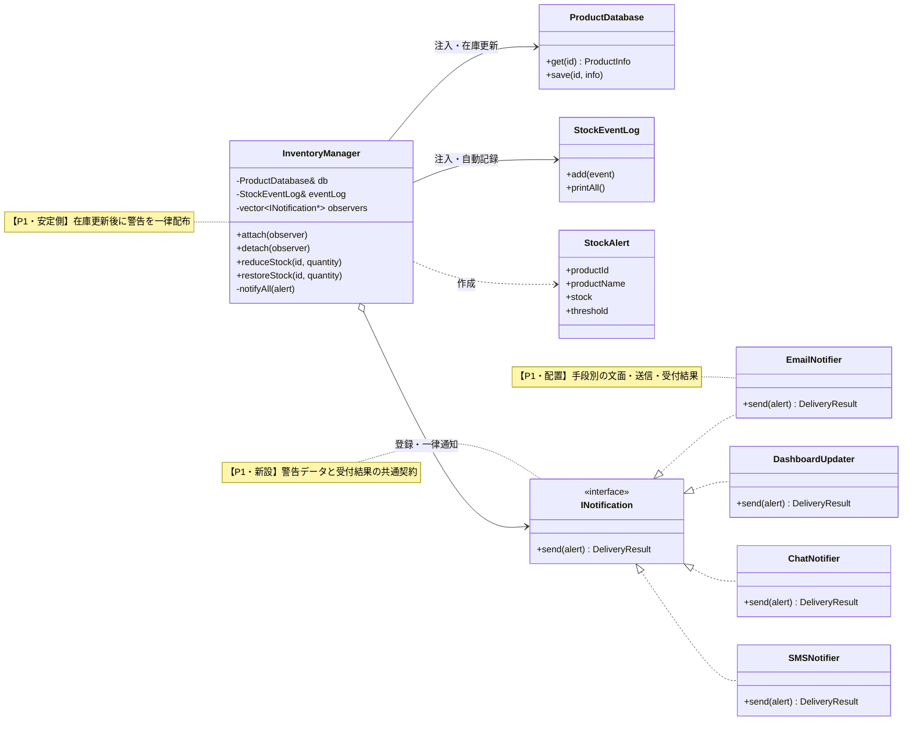

章末のObserver骨格図では、`InventoryManager` がSubject、`INotification` がObserver、各通知クラスがConcreteObserverに対応します。

#### 変更軸ごとの完成コード追跡

| 課題ID | 完成コードの適用先 | 実装後に起きたこと | 完了条件の最終確認 |
|---|---|---|---|
| P1 | 全 `INotification` 実装、`InventoryManager::attach/notifyAll()`、`StockAlert`、DB・ログ注入 | 在庫更新とログ記録の後、手段別の文面で一律配布し、成功・保留・失敗を集約して他通知を継続した | 通知手段追加で `InventoryManager` のメンバ・分岐・ループを増やさない |

### 7-2：動作シーケンス図

ステップ3で到達した通知分離構造の実行時のやり取りを確認します。組み立て側が依存を注入・登録し、`InventoryManager` が在庫更新後の `StockAlert` を、具象クラスを知らずに配る流れです。

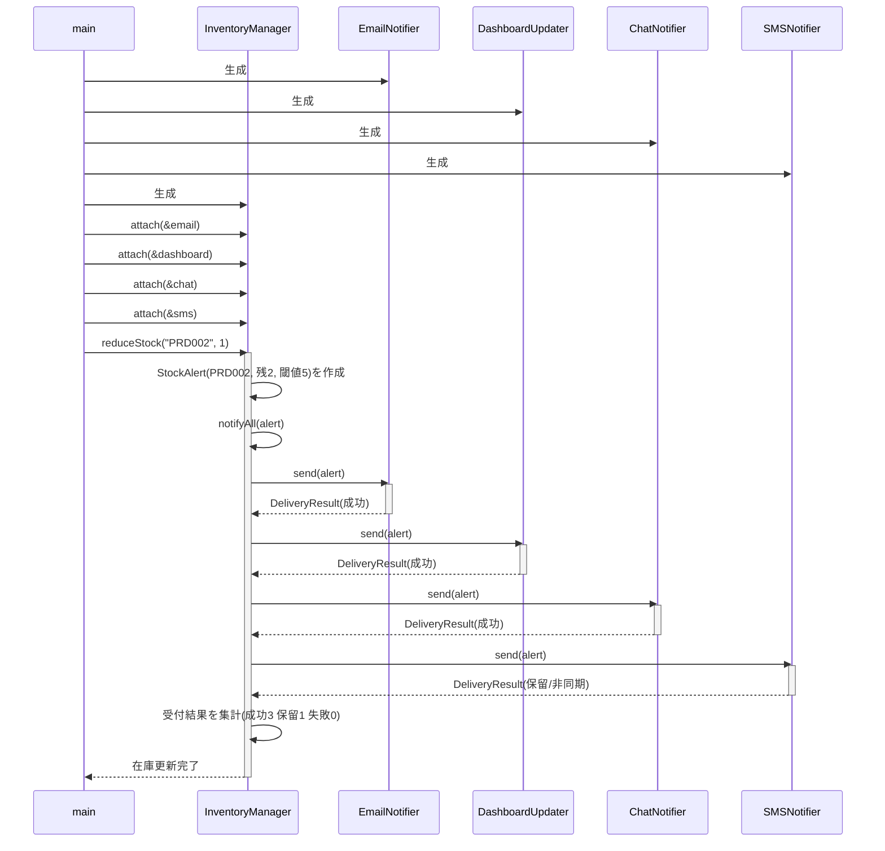

同期の3件は成功を即返し、非同期のSMSは保留を返します。通知元は結果の内訳を分岐せず、成功・保留・失敗の件数を数えるだけで済みます。SMSが受付失敗を返しても、集計の失敗件数が増えるだけで通知ループの構造は変わりません。

### 7-3：変更影響グラフ（改善後）

フェーズ3で確認した「SMS通知の追加」のシナリオを、3-2と同じ粒度で再度適用します。

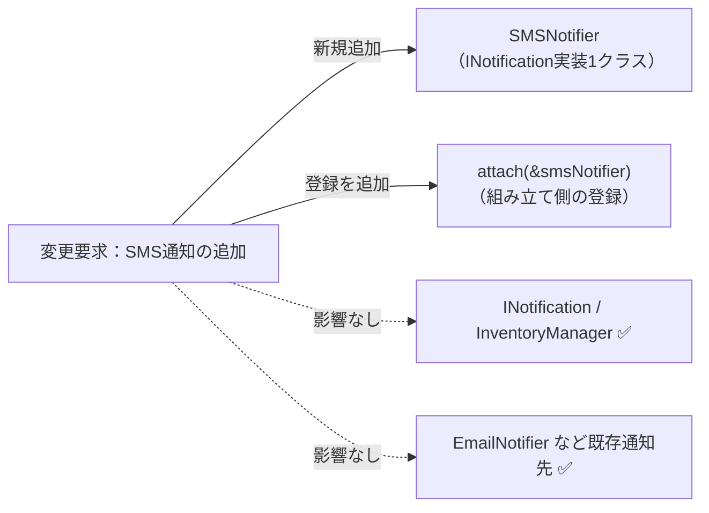

フェーズ3の変更影響グラフと同じ要求・同じ粒度で比べると、共通契約 `INotification` と通知元 `InventoryManager`、既存通知先は変更先から消えました。SMS通知の追加は、`SMSNotifier` の1クラスと登録（`attach`）だけに限定されます。

| 3-2で影響した場所 | 修正後 | 構造変更との対応 |
|---|---|---|
| `InventoryManager` のメンバ・`notifyAll()` の呼び出し | **修正しない** | 送信手段を各通知クラスへ移した |
| 3-2には通知部品の契約がなかった | `SMSNotifier` を1クラス追加する | 通知先の変更先を新しく作った |
| 通知先の登録 | 組み立て側で `attach` を1行増やす | 登録だけを増やす |

### 7-4：変更シナリオ表

フェーズ1の現状コードと改善後で、変更の影響がどう変わるかを対比します。

| **シナリオ** | **フェーズ1の現状コードでの影響** | **この設計での影響** |
|---|---|---|
| SMS通知を追加 | `InventoryManager` に `SMSNotifier` フィールドを追加し `notifyAll` を修正 | `SMSNotifier` 実装クラスを新規作成し登録するだけ |
| 非同期の通知先を追加（受付だけ返す） | `notifyAll` に待ち方や保留判定の分岐を追加 | `send()` が `DeliveryResult` の保留を返すだけ。通知元は集計で吸収 |
| 一部の通知先が失敗しても在庫は止めない | `notifyAll` に通知先ごとの成否分岐を追加 | 失敗を `DeliveryResult` で返すだけ。通知元は失敗件数を数える |
| メール通知の送信先を変更 | `InventoryManager` 内の `EmailNotifier` 呼び出しを修正 | `EmailNotifier` のみ修正 |
| 特定条件でのみ通知する仕様を追加 | `InventoryManager` の通知ロジック全体を修正 | 対象の通知先クラスの `send()` に条件を追加するだけ |

フェーズ1の現状コードでは通知先の追加・変更のたびに `InventoryManager` を直接修正する必要がありました。改善後は `InventoryManager` に触れず、通知先のクラスだけを変えれば済みます——それがこの設計で手に入れたものです。諦めたものは、通知のたびにインターフェースを経由するというわずかな間接性と、通知先の登録・解除を管理する手間、クラス数の増加です。

---

## 整理

### 問題・原因・課題・解決策

| | 内容 |
|---|---|
| **問題** | 通知先が変わるたびに `InventoryManager` のメンバ変数・コンストラクタ・`notifyAll` の3箇所が連動して変わる。非同期や部分失敗を足すと成否分岐まで通知元へ入り込む |
| **原因** | `InventoryManager` が通知先の具体クラス名・送信メソッド・同期非同期の別・受付成否を直接知っており、通知先の増加や失敗の扱いが通知元クラスの修正に直結している |
| **課題** | 通知元と通知先を切り離し、`InventoryManager` が通知先の具体名や成否の扱いを知らずに、在庫イベントを出して受付結果を集約するだけで済む構造にする |
| **解決策** | 通知分離構造：`INotification` インターフェースを介して通知先を登録リストで管理し、`send()` が `DeliveryResult`（成功・保留・失敗）を返す。`InventoryManager` は `attach()` と `notifyAll()` で件数を数えるだけを知る |

### フェーズとこの章でやったこと

| **フェーズ** | **この章でやったこと** |
| --- | --- |
| 🔵 フェーズ1：現状把握 | 在庫管理システムにおいて、通知元と複数の通知先クラスが密接に結合している構造を観察した。 |
| 🟣 フェーズ2：仮説立案 | 在庫通知の運用担当者へのヒアリングを通じ、通知先が今後も頻繁に入れ替わることを「変動要因」として確定した。 |
| 🟣 フェーズ3：問題特定 | 新しい通知手段を追加しようとすると、既存の通知元クラスを毎回修正する必要が生じるという「痛み」を確認した。 |
| 🟠 フェーズ4：原因分析 | 通知元が、通知先の具体的な実装を直接知っていることが、影響範囲を広げる根本原因だと特定した。 |
| 🟡 フェーズ5：課題定義 | `StockAlert` と `DeliveryResult` をP1の接続データとし、通知手段の種類・文面・同期非同期を在庫処理から外す課題を定めた。 |
| 🔴 フェーズ6：対策検討 | 分離・配置・組み立ての三観点から一つの完成構造を決め、採用クラス図をコードへ3段階で反映した。 |
| 🟢 フェーズ7：対策実施 | 通知元はインターフェースのリストを保持し受付結果を集計するだけに留め、通知先を動的に登録・解除でき、非同期・部分失敗も通知ループを変えずに扱える構造を実現した。この構造が 通知分離構造と呼ばれると知った。 |

### 責任の移動

| **責任** | **変更前** | **変更後** |
| --- | --- | --- |
| 在庫減算と通知先への通知 | `InventoryManager` | `InventoryManager`（変わらず） |
| 具体的な通知先クラスの直接保持 | `InventoryManager`（メンバとして直接宣言） | 組み立て側が共通契約の登録リストへ追加・解除 |
| 個別の通知手段と文面 | `EmailNotifier` 等（固有メソッド） | `EmailNotifier` 等が `StockAlert` から手段別に整形 |
| 同期・非同期・受付成否の扱い | 通知元へ入り込みそうだった | 各通知先が `DeliveryResult` で返す |
| 受付結果の集約 | —（なし） | `InventoryManager` が件数を数える |
| 通知受け取り契約の定義 | —（なし） | `INotification`（`DeliveryResult` を返す） |

> **このプロセスを回した結果にたどり着いた構造こそが 通知分離構造 です。**

---

### 複雑さを足しても対策は変わるか

この章に足した4つの複雑さが、7フェーズのどこで見え、どの構造で解けたかを対応させます。複雑度が上がっても、扱う場所を通知先側と `DeliveryResult` へ寄せることで、通知元は在庫イベントの発生と受付結果の集約だけに集中できました。

| 追加した複雑さ | 見えた原因 | 定めた課題 | 採用した構造 |
|---|---|---|---|
| 在庫不足イベント | 通知の発生が在庫更新に埋まっている | 通知元はイベント発生に集中する | 閾値判定で `notifyAll` を呼ぶだけに留める |
| 複数通知先 | 通知先の具体名が通知元へ漏れる | 通知先を同じ契約で束ねる | `INotification` の登録リストで同報する |
| 非同期通知 | 待ち方が通知元へ入り込もうとする | 結果の返り方を通知先側へ寄せる | `send()` が保留（`PENDING`）を返す |
| 部分失敗 | 通知先ごとの成否分岐が通知元へ入る | 一部失敗でも在庫と他通知を止めない | `DeliveryResult` の失敗を件数で数える |

---

## 振り返り

### 「この章を読むと得られること」は手に入ったか

| **得られること** | **この章のどこで示したか** |
| --- | --- |
| 変動箇所の識別力 | フェーズ2の変わる見込み/当面安定テーブルで特定しました。 |
| 接続点の診断力 | フェーズ4で、通知先の種類・送信方法・同期非同期・受付成否が通知元へ漏れていることを確認しました。 |
| 構造改善の説明力 | フェーズ7の変更影響グラフ対比で証明しました。 |
| 動的な通知先管理 | フェーズ6と7で、`attach()` による動的登録の仕組みを学びました。 |

### 3つの設計原則はどう適用されたか

* **原則1「変わるものをカプセル化せよ」の現れ**
* **具体化された場所：** 各通知先クラス（`EmailNotifier`, `ChatNotifier` など）
* **解説：** 送信という「変わる理由」を個別のクラスに分離し、具体的な実装を隠蔽しました。


* **原則2「実装ではなくインターフェースに対してプログラムせよ」の現れ**
* **具体化された場所：** `INotification` インターフェース
* **解説：** 通知元は具体的な通知先クラスを知らず、インターフェースを通じて通知を送るようになりました。


* **原則3「継承よりコンポジションを優先せよ」の現れ**
* **具体化された場所：** `InventoryManager` 内の `vector<INotification*>`
* **解説：** 継承階層で通知先を増やすのではなく、コンポジション（登録）によって動的に通知先を管理する構造にしました。

---

## あなたのコードで考えてみてください

この章で辿った思考プロセスを、あなた自身のコードに当てはめてみましょう。

1. **変動の兆候を探す：** あなたのコードに「ある処理が完了したとき、複数の箇所に通知や後処理を追加する必要があった」メソッドがありますか？
2. **変える理由を問う：** 通知先（ログ、メール、画面更新など）の増減は、どの業務機能に属する変更ですか？その業務機能の知識が通知元のコードに埋め込まれていませんか？
3. **結合の強さを測る：** 通知先を1つ追加するとき、通知元のクラスを直接書き換える必要がありますか？そのとき既存の通知ロジックが壊れる可能性はどのくらいですか？
4. **分けた後を想像する：** もし「通知元」と「通知先」が互いの具体クラスを知らなくて済むとしたら、新しい通知先の追加は何ファイルの変更で完結しますか？

---

**題材を置き換えるときの共通手順**

この章の題材名を、自分の現場のシステム名に置き換えて考えます。

1. そのシステムは、誰が何を達成するために使うものか。
2. 入力、加工、出力は何か。
3. 最近入った変更要求、または次に来そうな変更要求は何か。
4. その変更で、触りたくない場所まで修正や再テストが広がるか。
5. 変えたいものと守りたいものを分けると、接続点には何を残すべきか。
6. 何もしない、関数化、クラス分離、契約導入、登録/組み立て移動のうち、どこまで進めるのが今回の文脈に合うか。

## パターン解説：Observer パターン

Observer（観察者）という名の通り、あるオブジェクトの状態変化を、複数の「観察者」に自動的に通知する仕組みです。

### パターンの骨格

「通知を送る側（Subject）」が「通知を受け取る側（Observer）」のリストを保持し、状態が変化したときに一斉に通知を送ります。

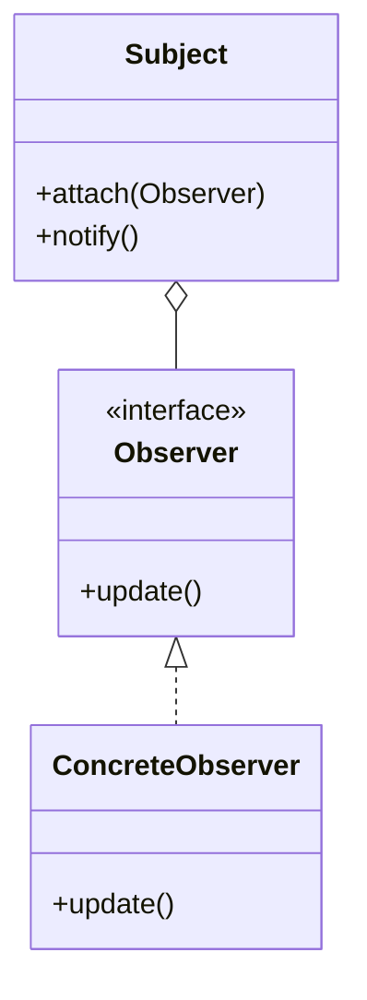

### 抽象骨格の実行シーケンス

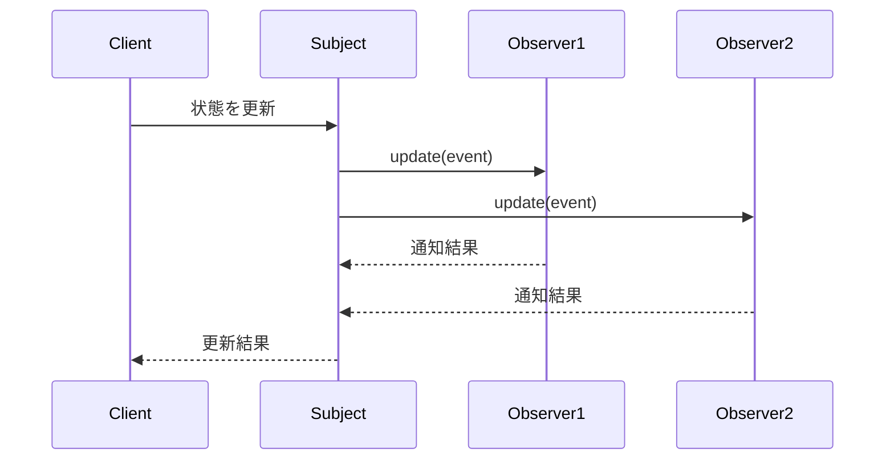

Subjectは具象通知先ではなくObserver契約の登録一覧だけを走査します。

### この章の実装との対応

`InventoryManager` が `Subject`（通知を送る側）、`INotification` が `Observer`（抽象ロール）、`EmailNotifier` 等が `ConcreteObserver`（具象観察者）に対応します。

### 使いどころと限界

* **使うと良い状況**：ある状態の変化を、複数の相手に即座に伝えたい場合。また、通知先が将来増えることが分かっている場合。
* **使わない方が良い状況**：（1）通知先が固定で増減の予定がない場合（例：ログ出力先が1か所のみで将来も変わらない）。（2）通知の順序や確実性が求められる同期処理の場合（例：処理AがBの完了を待ってから実行する必要がある連鎖処理）。このような場合、Observerの登録リストを管理するコストが設計の複雑さを増すだけになります。

* **寿命と通知中の変更に注意する状況**：SubjectがObserverを生ポインタで保持する場合、Observerを先に破棄するとダングリングポインタになります。登録解除を必須にする、所有期間を上位でそろえる、寿命の契約を決めます。また通知中の登録・解除、同一Observerの重複登録、Observer例外時に残りへ通知するかも仕様として定めます。

【過剰コード：変化の予定がないものまでパターン化した例】

```cpp
// そもそも通知先がメール一択で、今後も増える予定がないなら、
// 複雑な登録リストを管理するObserverパターンは過剰です。

```

### この章のまとめ

在庫通知というドメインと Observerパターンの関係を一言で言うなら、通知元が通知先を「具体的なクラス名で知ること」をやめ、「通知できる何か」という契約に置き換えることです。新しい通知先はリスナークラスとして追加し、組み立て箇所で登録します。通知契約が変わらない限り、在庫管理クラスの通知ループへ通知先ごとの分岐を増やさずに済みます。

7つのフェーズを通じて、読者は在庫管理クラスが通知先のクラス名を直接知っているという観察から始まり、「通知先が増えるたびに在庫管理を修正する」という痛みの分析を経て、通知先をリストとして管理し契約だけを通じて呼ぶという判断へと進みました。フェーズ2のヒアリングで「通知先は今後も追加される」と確認した時点で変化軸が確定し、フェーズ4で通知先の具体クラス名が接続点を越えて漏れていることを特定した時点で解決の方向が定まる——その気づきの順序こそが、この章の体験の核心です。

あなたのコードの中にも、ある処理が完了したときに複数の場所へ通知・連携を行っている箇所があるはずです。その通知先が「どの業務機能に属するか」を問うことが、通知先を登録して増減できる構造が必要かどうかを判断する入口になります。
