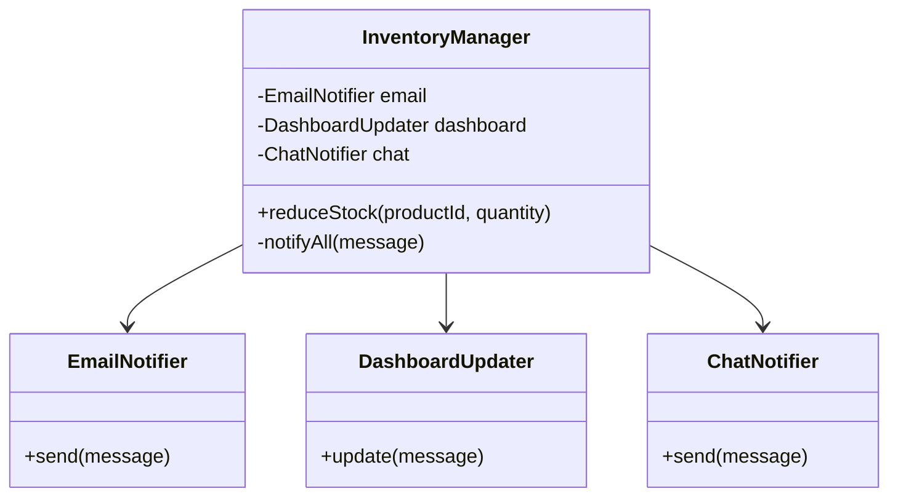
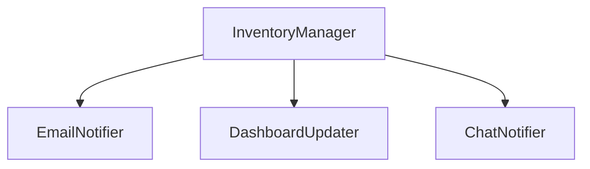
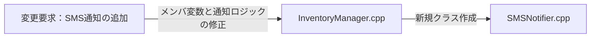
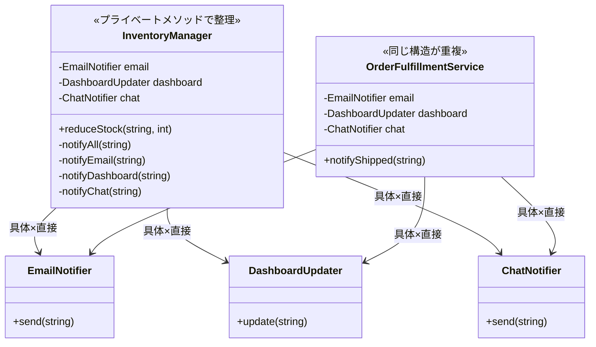
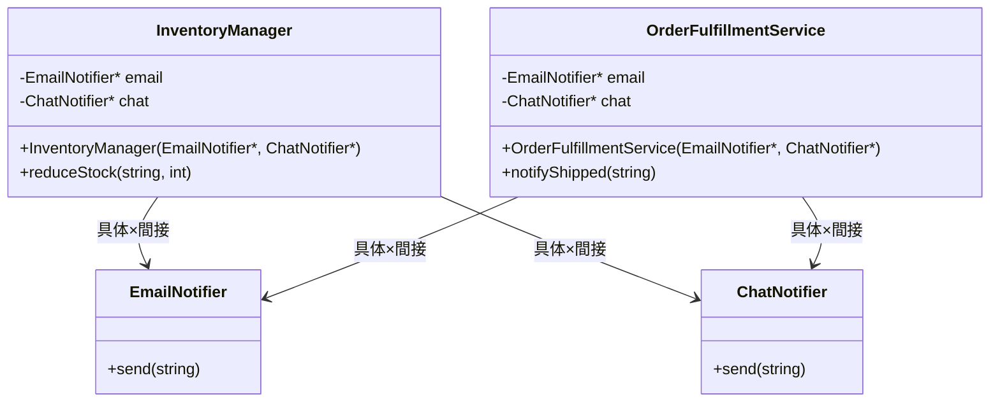
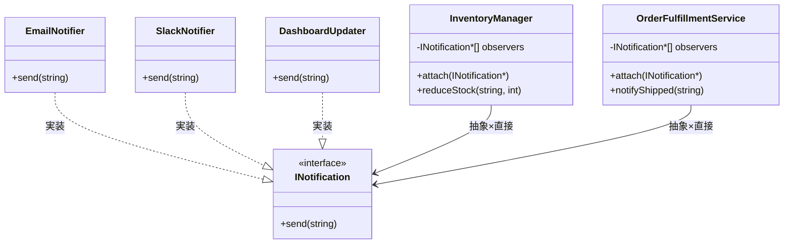
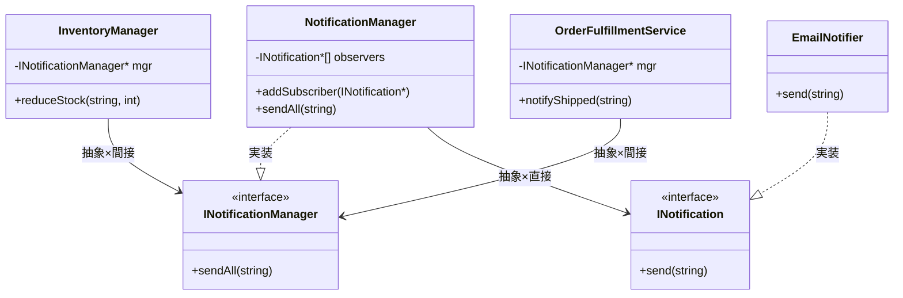
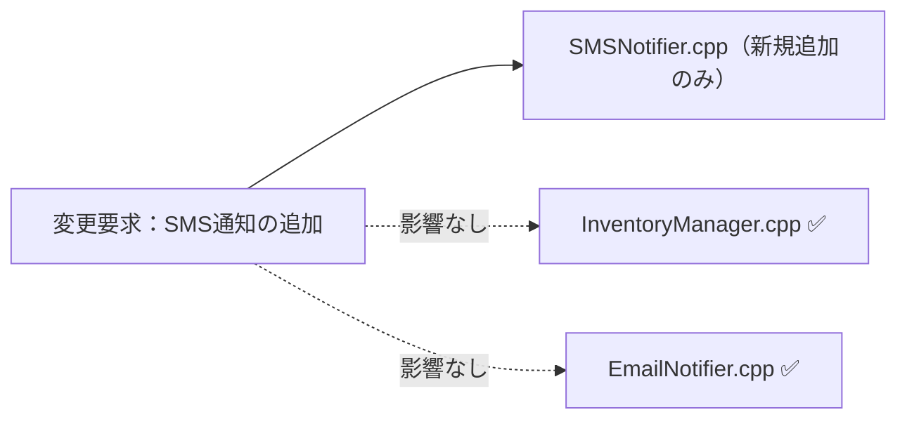
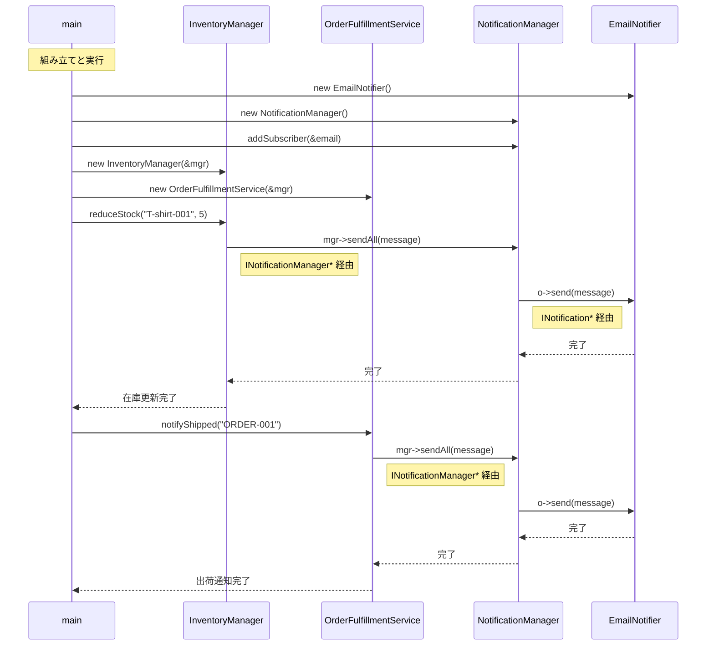
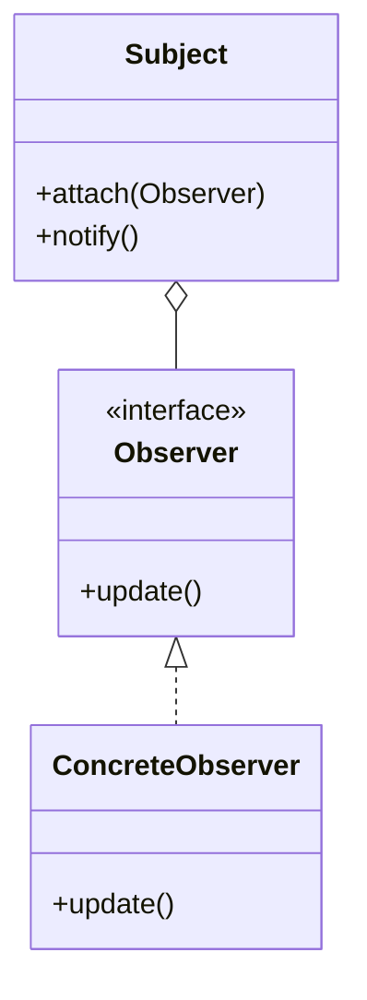

## 第7章 変わる通知先 ―― Observer パターン

―― 思考の型：一つの変化を、複数の相手にどう伝えるか

### この章の核心

**通知元のコードが通知先クラスを具体的なクラス名で直接知っていると、通知先が増えるたびに通知元クラスを書き換えることになり、修正のたびに無関係なクラスまで変更になる。**

---

### この章を読むと得られること

この章のテーマは「誰に伝えるか」という問いです。通知先を増やすたびに通知元のコードを書き換えている——そんな設計の「伝言の密結合」がこの章で扱う問題です。

* **得られること1：** 「変化の発生元」と「変化を受け取る側」という観点で、コードの変動箇所を識別できるようになる
* **得られること2：** 接続点（クラスとクラスのつなぎ目）が「具体×直接」（専用型のクラスを直接知っている状態）になっているクラスを見て、そこが変更の痛みの発生源だと判断できるようになる
* **得られること3：** 接続点の形を変えると変更がどのように局所化（変更の影響が1クラスだけで済む状態）されるかを、構造から説明できるようになる
* **得られること4：** 通知を送る側が通知先を具体的に知らなくても、動的に通知先を増やしたり減らしたりできる視点

## 🔵 フェーズ1：現状把握 ―― コードとクラス構成を読む
### 1-1：このシステムの仕様

このシステムは、アパレルメーカーの在庫数を管理し、**在庫が閾値を下回ったときに複数の通知先へ通知**します。

在庫の増減を記録し、一定数を下回るイベントが発生すると、登録されているすべての通知先へ同時にメッセージを送ります。

**通知の動作ルール**

| 状況 | 動作 |
|---|---|
| 在庫が閾値以下に減少した | 登録済みの全通知先へ通知を送る |
| 在庫が閾値を超えている | 通知しない |
| 通知先が1件も登録されていない | 何もしない（エラーにならない） |

**現在登録されている通知先**

| 通知先 | 通知手段 | 担当者 |
|---|---|---|
| EmailNotifier | メール | 倉庫担当者 |
| DashboardUpdater | 社内ダッシュボード | 在庫管理チーム |
| ChatNotifier | 社内チャット | 在庫担当者 |

---
---

### 1-2：動作例テーブル ―― 仕様を「動かした結果」で確認する

コードを読む前に、このシステムがどんな入力に対してどんな出力を返すかを確認します。この章のどの案も、以下の動作を実現します。

| シナリオ | 操作 | Email通知 | Slack通知 | ダッシュボード更新 |
| --- | --- | --- | --- | --- |
| 在庫が閾値以下に減少（通常） | `reduceStock("T-shirt-001", 5)` | 送信される | 送信される | 更新される |
| 在庫が閾値以下に減少（複数通知先） | `reduceStock("Pants-002", 3)` | 送信される | 送信される | 更新される |
| 在庫が補充された（閾値超え） | `restoreStock("T-shirt-001", 20)` | 送信されない | 送信されない | 更新されない |
| 在庫が閾値ちょうどに減少（境界値） | `reduceStock("Cap-003", 1)` | 送信される | 送信される | 更新される |
| 出荷完了イベント | `notifyShipped("ORDER-001")` | 送信される | 送信される | 更新される |
| 通知先をSlackのみ登録した状態 | `reduceStock("Shoes-004", 2)` | 送信されない | 送信される | 更新されない |

このテーブルが示す通り、在庫が閾値以下になるたびに登録されているすべての通知先へメッセージが届き、閾値を超えていれば誰にも送らない、という動作が核心です。「どの案を選ぶか」は実装の構造の話であって、この動作結果は変わりません。

---
---

### 1-3：実装コード

それでは、実際にシステムを動かしているコードを見てみましょう。在庫が減った際に各通知先へメッセージを送る処理をシミュレートしています。

はじめに、各通知先クラスの定義です。それぞれが独立した実装を持ち、InventoryManager から直接呼び出されています。

```cpp
#include <iostream>
#include <string>

using namespace std;

// 各通知先の具体的な実装
class EmailNotifier {
public:
    void send(string m) { cout << "Email: " << m << endl; }
};
class DashboardUpdater {
public:
    void update(string m) { cout << "Dashboard: " << m << endl; }
};
class ChatNotifier {
public:
    void send(string m) { cout << "Chat: " << m << endl; }
};
```

通知先クラスはそれぞれ独立した送信メソッドを持っていますが、メソッド名が `send` と `update` で統一されていないことに気づきます。このメソッド名の違いが、通知を一律に扱う際の障害になります。次に、これらを直接呼び出す InventoryManager の実装を見てみましょう。

```cpp
class InventoryManager {
private:
    EmailNotifier email;
    DashboardUpdater dashboard;
    ChatNotifier chat;

public:
    void reduceStock(string productId, int quantity) {
        cout << "商品 " << productId
             << " の在庫を " << quantity << " 減らしました。" << endl;
        
        // 在庫が減ったことを検知して通知する
        string message = "商品 " + productId + " の在庫が減少しました。";
        notifyAll(message);
    }

private:
    void notifyAll(string message) {
        // 通知先が増えるたびに、ここが修正される
        email.send(message);
        dashboard.update(message);
        chat.send(message);
    }
};

int main() {
    InventoryManager manager;
    manager.reduceStock("T-shirt-001", 5);
    return 0;
}
```

このコードを見ると、InventoryManager クラスがどの通知先クラスが存在し、どうやって通知を送るかをすべて直接知っていることが分かります。

---
---

### 1-4：クラス構成図

システムのクラス構成を可視化し、構造を確認します。



この図が示す通り、InventoryManager という単一のクラスが、通知先であるすべてのクラス（メール、ダッシュボード、チャット）を直接保持している構成になっています。

---
---

### 1-5：依存グラフ

クラス間の「依存の方向」をマクロな視点で示します。



InventoryManager に、通知先となるクラスが集中していることが分かります。

---
---

### 1-6：実行結果

上記コードの実行結果：

```text
商品 T-shirt-001 の在庫を 5 減らしました。
Email: 商品 T-shirt-001 の在庫が減少しました。
Dashboard: 商品 T-shirt-001 の在庫が減少しました。
Chat: 商品 T-shirt-001 の在庫が減少しました。

```

これから検討するのは、同じ機能を保ちながら、変更に強い構造をどう作るかという点です。

---

### 1-7：届いた変更要求

ある週の月曜日、店舗運営部の田中部長から、在庫管理システムの改善依頼がメールで届きました。

「在庫が少なくなった時に、倉庫担当者のスマホへSMS（ショートメッセージ）で直接通知を送れるようにしたいんだ。今はメールだけだから、どうしても確認が遅れて発注が漏れることがあってね。来月の店舗改装のタイミングで運用を変えたいから、なんとか対応してくれないか？」

なるほど、倉庫担当者のスマホへのSMS通知ですね。確かに、バックヤードで作業中の担当者にとって、メールよりも気づきやすい手段が必要というのは、現場のオペレーションとして非常に理にかなっています。

ただ、ふとあの `InventoryManager` クラスの通知処理を思い出しました。あのクラスは、各通知先クラスを個別に保持し、`notifyAll` メソッドの中でそれぞれの送信メソッドを直列に呼び出していました。このまま新しい `SMSNotifier` クラスを書き足すと、また通知ロジックが一つ増え、クラスの中が通知先の知識で溢れかえってしまいそうです。

**仕様変更の内容**

変更要求を受けて、通知先の構成がどう変わるかを整理します。

| 通知先 | 変更前 | 変更後 |
|---|---|---|
| EmailNotifier（メール） | あり | 変更なし |
| DashboardUpdater（ダッシュボード） | あり | 変更なし |
| ChatNotifier（チャット） | あり | 変更なし |
| **SMSNotifier（SMS通知）** | なし | **新規追加** |

在庫が閾値を下回ったとき、これまでの3チャネル（メール・ダッシュボード・チャット）に加えて、倉庫担当者のスマートフォンへSMSが送信されるようになります。

通知のトリガー条件（在庫が閾値以下になること）と、「登録されている全通知先へ同時に通知する」という動作ルールは変わりません。変わるのは「通知先の種類が1つ増える」という点だけです。

---

## 🟣 フェーズ2：仮説立案 ―― 何が変わるかを観察し、ヒアリングで裏付ける

ここからフェーズ2（仮説立案）に進みます。フェーズ1で観察した事実をもとに、「何が変わるか・変わらないか」を仮説として立て、関係者へのヒアリングで裏付けます。

### 2-1：責任テーブル

各クラスが「何を知るべきか（責任）」を定義し、事実を確認します。

| **クラス名** | **責任（1文）** | **知るべきこと** |
| --- | --- | --- |
| InventoryManager | 在庫を減算し、関係者に通知する。 | 在庫数、在庫減少時の通知先クラスの実装。 |

この表から、InventoryManager が在庫管理という本来の責務に加えて、通知先クラスのインスタンス化や具体的な送信方法までを知っている状態が見て取れます。私自身、現場でこういうコードを見ると「このクラスは一体、何箇所に気を配ればいいのだろう…」と感じてしまうのですが、皆さんはいかがでしょうか。

### 2-2：責任チェック表

このコード行が誰の判断で変わるかを追跡することで、同じクラスに異なる管理者の判断が混在していないかを確認します。コードが実際に「知っていること」を一行ずつ照合し、その知識が誰の判断で変わるのかを観察します。

| **コードの行** | **持っている知識** | **管理者（観察）** |
| --- | --- | --- |
| email.send(message); | メール通知クラスの存在と送信方法 | 通知先を選定するシステム管理者 |
| dashboard.update(message); | ダッシュボードの存在と更新方法 | 画面表示を決めるUI担当者 |
| chat.send(message); | チャット通知クラスの存在と送信方法 | 連絡網を決めるチーム管理者 |

責任チェックで見えたことを散文で述べます。通知に関する処理が InventoryManager の中で直列に並んでいることが見えました。まだ「問題だ」と判定しませんが、通知先という「管理者が異なる知識」が同じ場所に並んでいることが見えた、という事実に留めておきます。

### 2-3：今回の確定変更テーブル ―― 変更要求で確実に変わること

フェーズ1での観察と、今回届いた変更要求を材料にして、「今回の対応で確実に変わること」を整理します。これは将来の話ではなく、今回の要求対応に直結する変動です。

| **分類** | **今回の確定変更** | **根拠** |
| --- | --- | --- |
| 🔴 **変動する** | 通知先に SMSNotifier クラスが追加される | 田中部長からの変更要求が確定しているため |
| 🔴 **変動する** | `InventoryManager` の `notifyAll` に SMS送信の呼び出しが増える | 現状の構造では新しい通知先を直接追記する必要があるため |
| 🟢 **不変** | 「在庫が少なくなった」というイベント発生そのもののロジック | 商品の在庫を管理するというシステム本来の目的であり、通知の手段とは独立しているため |

コードを読んだだけで「ここは間違いなく変わる」「ここは絶対に変わらない」と自分一人で断定してしまうのは危険です。今の設計思想では、新しい通知先が増えるたびに `InventoryManager` 自体を書き換える必要があると読み取れますが、本当に将来もこのまま追加し続ける運用でよいのか、関係者に直接確認します。

### ヒアリングに向けた背景確認

このシステムは、あるアパレルメーカーの在庫管理システムを支える一部です。日々、全国の店舗から刻々と送られてくる売上データを受けて、倉庫にある在庫数を減らし、規定数を下回れば追加発注をかける、といった業務の流れを管理しています。

システムが立ち上がった当初は、在庫が減ったことを倉庫の担当者に「メール」で送るだけで十分でした。しかし、昨今のデジタル化の流れを受け、在庫状況をリアルタイムで「社内ダッシュボード」に反映させたり、在庫が少なくなったら「在庫担当者のチャット」に通知したりと、在庫の変動を追いかける相手がどんどん増えてきました。

コードを眺めてみると、在庫が減ったことを検知する InventoryManager クラスの中で、メール送信クラス、ダッシュボード更新クラス、チャット通知クラスといった、具体的な通知先クラスを直接呼び出す構成になっています。システムが小さかった頃は、これらすべてを InventoryManager が把握していても問題はありませんでした。

一見すると、このコードは処理が一つにまとまっており、何が起きているか非常に分かりやすく整理されているように見えます。

### 2-4：関係者ヒアリング

仮説を携えて、店舗運営部の田中部長と開発チームのミーティングを行いました。チームで話し合う価値がある部分だと思います。

**開発者：** 「田中部長、SMS通知の件承知しました。一点確認ですが、今回のような新しい通知手段は、今後もキャンペーンや業務効率化のたびに追加されていく予定でしょうか？」

**田中部長：** 「そうなんだよ。次は店舗のバックヤードにある音声通知システムと連携したいという話もあってね。しばらくは、新しい通知方法がどんどん増えていくと思うよ。」

**開発者：** 「なるほど。通知手段の入れ替わりは激しそうですね。では、通知のタイミング（在庫が少なくなった瞬間など）といった『通知の基準』自体は今後も変わらないと考えてよいでしょうか？」

**田中部長：** 「ああ、そこは変わらないよ。あくまで『在庫が切迫した時』に知らせるというルール自体は固定だ。」

**開発者：** 「承知しました。通知手段（先）は頻繁に増減するけれど、通知の基準（トリガー）は安定しているということですね。」

ヒアリングの結果、通知先という変動要素が今後も際限なく増え続けることが確定しました。これまでのように `InventoryManager` に新しい通知先をハードコードし続けるのは、システムの拡張性として限界がきているようです。

> **現実のヒアリングでは——** このシナリオでは相手がちょうど設計に役立つ情報を教えてくれています。現実には「変わるかどうか分からない」「たぶん変わらない」という答えが返ることも多いです。そのときは、コードの変更履歴（`git log`）や過去の障害記録を「ヒアリングの代わり」として使ってみてください。「過去に何度変わったか」が、「将来変わりやすいか」の最も正直な証拠です。

### 2-5：将来リスクテーブル ―― ヒアリングで判明した今後の変化リスク

ヒアリングで明らかになった「将来変わるかもしれないこと」を、確定変更とは分けて整理します。これは今すぐ対応するかどうかの判断材料であり、設計の方向性に影響します。

| **分類** | **将来リスク** | **変わるタイミング** | **根拠（誰との確認か）** |
| --- | --- | --- | --- |
| 🔴 **変動リスク高** | 通知先となるクラスの種類とその実装（音声通知システムなど） | 業務要件の変更があるたび | 田中部長との合意 |
| 🔴 **変動リスク高** | 通知先の増減（動的な登録・解除） | 随時 | 田中部長との合意 |
| 🟢 **不変** | 「在庫減少」というイベントの発生タイミング | 変わらない | ロジックの骨格として合意 |

通知先という「管理者が異なる知識」が今後も増え続けることが確定しました。今の `InventoryManager` クラスにこれ以上責任を背負わせるのは、そろそろ限界かもしれません。

フェーズ2で「通知手段の入れ替わりが激しい」という現状が確定しました。次のフェーズ3では、その要求を今のコードのままで変更しようとしたときに何が起きるか、実際に試みてみましょう。

---

## 🟣 フェーズ3：問題特定 ―― 変更の痛みを発見する

### 3-1：変更シミュレーション

田中部長からの「倉庫担当者のスマホへSMSで通知を送りたい」という要求を、今のコードで実装しようと試みます。

はじめに、SMSを送るための SMSNotifier クラスを新規作成します。次に、通知の中心である InventoryManager クラスを開き、新しく作成した SMSNotifier クラスのインスタンスをメンバ変数として追加します。
コンストラクタで SMSNotifier を初期化し、さらに `notifyAll` メソッド内にも `sms.send(message);` という行を書き加える必要があります。つまり、コンストラクタと `notifyAll` の両方に、新クラスの初期化と呼び出しを追加しなければなりません。

ここでふと、ある懸念が頭をよぎります。「この先、在庫通知の種類がもっと増えたらどうなるのだろう？」と。
メール、ダッシュボード、チャットに続き、SMS、そして先ほど部長が言及した音声通知まで増えれば、InventoryManager クラスの notifyAll メソッドには何十行もの通知処理が並ぶことになります。さらに、通知先クラスが一つ増えるたびに、InventoryManager のメンバ変数を書き換え、コンストラクタを修正し、notifyAll を書き換えるという、同じような「掃除」を何度も繰り返すことになるのです。

### 3-2：変更影響グラフ

変更を試みた結果、コード内の依存関係がどうなっているかを図にしてみます。



変更を加えるたびに InventoryManager が修正対象となり、通知先が増えるほど、このクラスが知るべき知識がどんどん増幅していく様子が見て取れます。

### 3-3：痛みの言語化

変更を試みる中で、構造上の問題が2つ浮かび上がりました。

1つ目は、InventoryManager が「通知先の存在」と「送信方法」という2種類の知識を抱え込んでいることです。本来、通知のタイミング（在庫が切迫した瞬間）の管理だけが責務であるべきなのに、通知先クラスの名前と各クラスのメソッド名まで知っています。結果として、通知先が増えるたびにメンバ変数・コンストラクタ・notifyAllの3箇所を修正しなければならず、このクラスの変更理由が際限なく増えていきます。

2つ目は、通知先と通知元の変更理由が混在していることです。通知先クラスが変わるたびに、通知元の InventoryManager まで修正対象になります。これは「在庫管理のビジネスルール」と「通知手段の選択」という、本来異なる変更理由を1つのクラスが抱えている状態です。

フェーズ3で「変更のたびに通知元クラスが書き換わる」という痛みが確認できました。次のフェーズ4では、この痛みの構造的な原因を、責任の境界や接続形態の観点から言語化していきます。

---

## 🟠 フェーズ4：原因分析 ―― なぜ辛いのかを構造で言語化する

### 4-1：観察→原因テーブル

フェーズ3で観察した「痛み」と、その根本にある構造的な原因を対応させてみます。

| **観察** | **原因の方向** |
| --- | --- |
| 新しい通知先を追加するたびに、通知元の InventoryManager クラスの修正が必要になる | InventoryManager が、通知する必要がある相手の「具体的なクラス名」と「通知方法」を直接知っているから |
| 通知先のクラスが変わったり増えたりするたびに、通知元クラスが影響を受ける | 在庫管理という「変わらないもの」と、通知先という「変わるもの」が、同じクラスの中に混在しているから |

こうして整理すると、問題の本質が見えてきます。通知元である InventoryManager は、「在庫が減った」という事実を伝えたいだけなのに、その情報を「誰が」「どう受け取るか」という詳細な実装までを全部抱え込んでしまっているのです。これでは、通知先が増えるたびにこのクラスを汚していくことになり、影響範囲が広がり続けるのは避けられません。

### 4-2：変わるもの / 変わらないものテーブル

原因の方向性が見えたところで、「変わり続けるもの」と「変わってほしくないもの」を明確に切り分けます。

| **変わり続けるもの（🔴）** | **変わってほしくないもの（🟢）** |
| --- | --- |
| 通知先のクラス（メール、ダッシュボード、チャット等）、その追加や削除、および具体的な通知手段 | 「在庫が少なくなった」というイベントの発生通知そのもの、およびそのトリガーとなる在庫管理ロジック |

「在庫が少なくなった」という出来事は、通知先が増えようが減ろうがシステムの中では等しく起きています。この「イベント発生の事実」こそが、変わってほしくないコア部分です。一方、通知先はビジネスの都合で今後も変動し続けます。この「変わる側」をうまく分離できれば、通知元は常に安定した状態を保てるはずです。

### 4-3：接続形態を診断する

現在のシステムがどのような接続形態にあるのか、2×2マトリクスを用いて診断してみます。ここでは「クラス間の接続の形」をハードウェアのケーブル接続に置き換えて説明します。「具体」はクラス名を直接知っている状態、「直接」はインターフェースや仲介役を挟まずに呼び出している状態に対応します。

今の InventoryManager クラスは、通知先である EmailNotifier や ChatNotifier といった具体的なクラスを直接インポートして、メソッドを直接呼び出しています。これをケーブルの比喩で例えるなら、Lightningケーブルで直差しの状態（具体×直接）だと言えます。

通知先の機能（機器）を、通知元のクラス（iPhone本体）に専用規格のケーブルで直差ししているような状態です。新しい通知先を追加しようとすれば、本体側にその通知先専用の新しい差込口を追加で用意しなければなりません。これでは、通知先が増えるたびに通知元のクラスが修正され、影響が飛び火するのは当然です。

|  | 直接（直差し） | 間接（アダプター経由） |
|:---:|:---|:---|
| **具体**（専用規格） | **← 現在地**　ライトニング直生え → iPhone（直差し） | ライトニング直生え → ゲーム機専用アダプタを挟む → ゲーム機 |
| **抽象**（汎用規格） | Type-C直生え → 各種機器（直差し） | ライトニング直生え → Type-C変換アダプタを挟む → 各種機器 |

このコードで言うと：

| ケーブル比喩 | コードの対応箇所 |
|---|---|
| 「具体」＝専用規格ケーブル | `EmailNotifier email;` / `DashboardUpdater dashboard;` / `ChatNotifier chat;` — 3つの通知先クラスを具体名で `InventoryManager` のメンバとして直接宣言している |
| 「直接」＝直差し | `email.send(message); dashboard.update(message); chat.send(message);` — インターフェースや登録リストを介さず、`notifyAll()` 内で3つを直接呼び出している |

現状の InventoryManager と各通知先は、その「変わる理由」が異なります。このまま密接に接続させておくと、一方の変更がもう一方に波及し続けます。両者を切り離して疎な関係にすることが、根本原因への対処になります。

フェーズ4で根本原因が言語化できました。分けるべき場所（変わる理由が異なる2つのもの）が特定できた段階です。しかし「どこを分けるか」は分かっても、「何を（どの塊を）取り出せばいいか」はまだ曖昧です。次のフェーズ5では、この「取り出すターゲット」を具体的に特定します。


---

## 🟡 フェーズ5：課題定義 ―― 解くべき接続点を特定する

フェーズ4で、「通知元クラス（`InventoryManager`）が通知先クラスの具体名を知りすぎている」という構造の問題を特定しました。しかし、単に「分ける」と決めただけでは、どのように分けるべきかという指針がまだ定まっていません。

ここで、解くべき課題を4つの視点で具体化し、対策案を検討するための土台を作ります。

### 5-1：接続点の特定

フェーズ4の分析から、`InventoryManager` と各通知先の間には、以下のような接続点（ジョイント）が存在することが分かります。

* 接続点A：`InventoryManager` ←→ `EmailNotifier` の境界
* 接続点B：`InventoryManager` ←→ `DashboardUpdater` の境界
* 接続点C：`InventoryManager` ←→ `ChatNotifier` の境界

合計で3つの接続点が存在します。通知先が増えるたびにこの境界線が増えていくことが、これまで私たちが直面してきた「grep地獄」や「影響範囲の拡大」の直接的な原因です。これらの接続点を、個別の具体クラスから切り離すことが今回の重要な課題です。

### 5-2：クライアントへの影響範囲

分離対象である通知先クラスを呼び出しているのは、`InventoryManager` クラスそのものです。したがって、ここでの「クライアント」は `InventoryManager` になります。

接続点の形を変えるということは、`InventoryManager` の `notifyAll` メソッド周辺のコードを大幅に書き換えることを意味します。このクラスは通知ロジックの心臓部にあたるため、ここをリファクタリングして「通知先を意識しなくていい構造」に作り変えることは、今後の変更耐性を大きく左右する重要な修正になります。

### 5-3：課題まとめ表

これまでの情報を一覧に整理します。

| **接続点** | **分けた理由** | **非機能制約** | **クライアント影響** |
| --- | --- | --- | --- |
| 接続点A〜C | 通知先が頻繁に変わるため、通知元と通知先を疎結合にしたい | 通常は低頻度・セール時にイベントが集中し通知先数に比例して処理時間増大 | `InventoryManager` の通知ロジックに影響 |

この表から、私たちの目指する必要がある方向性が明確になりました。通知先が何であろうと、`InventoryManager` はその詳細を知らずに「通知を送る」という行為だけを行えるようにすればよいのです。

フェーズ5で「何を解くか」が確定しました。次のフェーズ6では、この課題に対してどのような構造を導入する必要があるか、コストと将来性を見極めて対策ステップを検討します。

---

## 🔴 フェーズ6：段階的進化 ―― どこまで設計を進めるべきか

変更要求に対する解決策を、接続形態（具体・抽象 × 直接・間接）の観点から4つの案として整理しました。どの案も、動作例テーブル（1-X）で示した動作を実現します。違うのは「変更が来たときにどこを触ることになるか」です。開発の文脈に応じて、最適な選択肢を冷静に見極めていきましょう。

### 6-1：接続の形 2×2マトリクス

現在の接続形態（Lightning直差し＝具体×直接）から、通知の柔軟性を高めるためにどの方向へ移動する必要があるかを整理します。

| 接続形態 | ケーブル例 | 特徴 |
|:---:|:---|:---|
| **具体×直接**（← 現在地） | ライトニング直生え → iPhone（直差し） | 専用端子のみ対応。差し替え不可 |
| **具体×間接** | ライトニング直生え → ゲーム機専用アダプタを挟む → ゲーム機 | 変換器を挟むが規格は専用のまま |
| **抽象×直接** | Type-C直生え → 各種機器（直差し） | どのメーカーでも同じ口で繋がる |
| **抽象×間接** | ライトニング直生え → Type-C変換アダプタを挟む → 各種機器 | アダプタを介して汎用規格で展開可能 |

各案のトレードオフ表では「低／中／高」の3段階で評価します。判定基準は次の通りです。変更容易性「低」＝通知先追加のたびに複数クラスの修正が必要、「高」＝新クラスを1つ作成するだけで完結。テスト容易性「低」＝具体クラスへの依存が強く切り離せない、「高」＝スタブを差し込んで独立してテスト可能。実装コスト「低」＝今のコードに1行足すだけ、「高」＝新しいクラスや層の追加が必要。

---

#### Step 1：具体×直接 ―― プライベートメソッドで責任を整理する

**この形の考え方：**
接続の形は変えません（具体×直接のまま）。フェーズ3で示したコードを、通知先ごとの処理をプライベートメソッドに抽出した形で整理します。各処理の意味がメソッド名で明確になり、`notifyAll` の見通しが改善されますが、通知先が増えるたびにメンバ変数・メソッド・呼び出し側に影響が波及する問題は残ります。

**手段の比較：**

| 手段 | 方法 | 特徴 |
|---|---|---|
| 手段A：プライベートメソッド抽出 | 各通知先への呼び出しをプライベートメソッドに抽出する | 変更が最小限。通知先が増えるたびにメンバ変数と呼び出しが増え続ける問題は残る |
| 手段B：if分岐で切り替え | 通知先の種類をフラグで管理し `if` で分岐 | 条件が増えるほど複雑化し読みにくくなる |

**手段A**（フェーズ3のコードをベースに、プライベートメソッドで整理した形を示すため）のコードを以下に示します。

> **注：** 以下のコード例には `OrderFulfillmentService`（出荷完了を管理するクラス）が登場します。これは「在庫変動以外にも通知が必要な場面がある」という実務での典型的な状況を示すために追加しています。具体×直接の構造のまま通知先を追加すると、同じ通知ロジックが複数のクラスに重複してしまうことを示すための例です。

**構造図：**



両呼び出し元がそれぞれ同じ具体通知クラスを個別に直接抱え込み、通知ロジックと通知先の知識が両方に重複して存在している。

【コード例】

はじめに各通知先クラスの実装です。

```cpp
// 各通知先（変更前と同じ）
class EmailNotifier {
public:
    void send(string m) { cout << "Email: " << m << endl; }
};
class DashboardUpdater {
public:
    void update(string m) { cout << "Dashboard: " << m << endl; }
};
class ChatNotifier {
public:
    void send(string m) { cout << "Chat: " << m << endl; }
};
```

次に、フェーズ3のコードをベースに、プライベートメソッドで整理した呼び出し元1を見てみましょう。

```cpp
// 呼び出し元1：在庫変動を管理するクラス
class InventoryManager {
    // ← 具体：各通知先クラスを直接保持している
    EmailNotifier email;
    DashboardUpdater dashboard;
    ChatNotifier chat;

    // プライベートメソッドで各通知先への処理を整理する
    void notifyEmail(string message) {
        email.send(message);
    }
    void notifyDashboard(string message) {
        dashboard.update(message);
    }
    void notifyChat(string message) {
        chat.send(message);
    }

    void notifyAll(string message) {
        notifyEmail(message);
        notifyDashboard(message);
        notifyChat(message);
    }

public:
    void reduceStock(string productId, int quantity) {
        string message = "商品 " + productId + " の在庫が減少しました。";
        notifyAll(message);
    }
};
```

このコードを見ると、フェーズ3の直書きコードと比べて `notifyAll` の見通しが改善されています。しかし、通知先が増えるたびにメンバ変数・プライベートメソッド・`notifyAll` の3か所を探して修正し、呼び出し側も変わり続けることは変わりません。次に呼び出し元2（出荷完了を管理するクラス）を見てみましょう。

```cpp
// 呼び出し元2：出荷完了を管理するクラス
// ← 同じ通知ロジックをここにも複製する（重複の発生）
class OrderFulfillmentService {
    EmailNotifier email;        // ← 同じ具体クラスをここでも直接保持
    DashboardUpdater dashboard;
    ChatNotifier chat;
public:
    void notifyShipped(string orderId) {
        string message = "注文 " + orderId + " が出荷されました。";
        // ← InventoryManagerと同じ通知ロジックがそのまま重複する
        email.send(message);
        dashboard.update(message);
        chat.send(message);
    }
};
```

このコードを見ると、`InventoryManager` と `OrderFulfillmentService` の両方が、同じ通知先クラスを個別に抱え込み、同じ通知ロジックを重複して持っていることが分かります。通知先が1つ増えれば、2つのクラスをそれぞれ修正しなければなりません。

**呼び出し側から見た違い（main() 例）：**

```cpp
// Step 1（具体×直接）の呼び出し側
int main() {
    // 在庫変動の呼び出し元
    InventoryManager manager;
    manager.reduceStock("T-shirt-001", 5);

    // 出荷完了の呼び出し元
    OrderFulfillmentService fulfillment;
    fulfillment.notifyShipped("ORDER-001");
    return 0;
}
```

一文要約：プライベートメソッドでクラス内部の見通しは改善されたが、具体型を直接保持する構造は変わらず、通知先が増えるたびに両方の呼び出し元を修正しなければならない。

**この形のトレードオフ：**

* 変更容易性：低（通知先が増えるたびに `InventoryManager` と `OrderFulfillmentService` の両方を修正する必要がある）
* テスト容易性：低（特定の通知だけをテストするための切り離しができない）
* 実装コスト：低（今のコードにプライベートメソッドを抽出するだけ）

---

#### Step 2：具体×間接 ―― 処理を別クラスに切り出して委ねる

**この形の考え方：**
通知ロジックを個別のクラスに切り出し、`InventoryManager` はそれら具体クラスを名指しで知っていますが、実際の通知処理はそのオブジェクトに「委ねる」（間接）構造です。直接自分で `email.send()` を呼ぶのではなく、呼び出しを委譲する点がStep 1との違いです。

**手段の比較：**

| 手段 | 方法 | 特徴 |
|---|---|---|
| 手段A：メンバ変数として宣言 | 具体クラスをメンバとしてコンストラクタで初期化 | 委譲の仕組みが明確。通知先が増えるたびにメンバ変数の追加が必要 |
| 手段B：ポインタリストで管理 | 具体型のポインタリストを持つ | リストで管理できるが、型が具体型のままなので抽象化の恩恵が得られない |

**手段A**（「具体×間接」の委譲構造を最も素直に示すため）のコードを以下に示します。

**構造図：**



`InventoryManager` は `EmailNotifier*` という具体型を名指しで知っているが、処理自体はそのオブジェクトに委ねる（間接）。新しい通知先が増えるたびに両方の呼び出し元で修正が発生する点は変わらない。

【コード例】

はじめに EmailNotifier と ChatNotifier の実装です。

```cpp
// 具体的な通知クラス（インターフェースなし）
class EmailNotifier {
public:
    void send(string m) { cout << "Email: " << m << endl; }
};
class ChatNotifier {
public:
    void send(string m) { cout << "Chat: " << m << endl; }
};
```

各クラスが通知の責任を持ち、処理の中身はこちらに委ねられています。次に呼び出し元の実装を見てみましょう。

```cpp
// 呼び出し元1：在庫変動を管理するクラス
class InventoryManager {
    // ← 具体：EmailNotifier*という具体型を名指しで知っている
    EmailNotifier* email;
    // ← 間接：処理はこのオブジェクトに委ねる（自分でやらない）
    ChatNotifier* chat;
public:
    InventoryManager(EmailNotifier* e, ChatNotifier* c)
        : email(e), chat(c) {}

    void reduceStock(string productId, int quantity) {
        string message = "商品 " + productId + " の在庫が減少しました。";
        email->send(message);  // ← 間接：emailオブジェクトに委ねる
        chat->send(message);
    }
};

// 呼び出し元2：出荷完了を管理するクラス
// ← 同じ具体クラスへの依存がここでも重複する
class OrderFulfillmentService {
    // ← 同じ具体型を名指しで知っている（重複）
    EmailNotifier* email;
    ChatNotifier* chat;
public:
    OrderFulfillmentService(EmailNotifier* e, ChatNotifier* c)
        : email(e), chat(c) {}

    void notifyShipped(string orderId) {
        string message = "注文 " + orderId + " が出荷されました。";
        email->send(message);
        chat->send(message);
    }
};
```

このコードを見ると、処理はオブジェクトに委ねている（間接）ものの、`InventoryManager` と `OrderFulfillmentService` の両方が `EmailNotifier*` という具体型を名指しで知っている（具体）ことが分かります。新しい通知先が増えるたびに、両方のクラスのコンストラクタとメンバ変数を修正しなければなりません。

**呼び出し側から見た違い（main() 例）：**

```cpp
// Step 2（具体×間接）の呼び出し側
int main() {
    // ← 呼び出し側で具体クラスを生成して渡す
    EmailNotifier email;
    ChatNotifier chat;

    InventoryManager manager(&email, &chat);
    manager.reduceStock("T-shirt-001", 5);

    OrderFulfillmentService fulfillment(&email, &chat);
    fulfillment.notifyShipped("ORDER-001");
    return 0;
}
```

一文要約：処理は委ねるオブジェクトに委譲されているが（間接）、`EmailNotifier` という具体クラス名を両方の呼び出し元が直接知り続けており（具体）、新しい通知先が増えれば両方を修正しなければならない。

**この形のトレードオフ：**

* 変更容易性：低〜中（処理ロジックは分離できたが、通知先の種類が増えるたびに両方の呼び出し元の修正が必要）
* テスト容易性：低（具体クラスへの依存が強いため切り離せない）
* 実装コスト：中（コンストラクタインジェクションへの切り出し工数が発生する）

---

#### Step 3：抽象×直接 ―― インターフェースを挟み、型だけで接続する

**この形の考え方：**
すべての通知先クラスに共通のインターフェース（契約）を持たせることで、通知元は「具体的な型」ではなく「インターフェース型」だけを知る状態にする。通知元はリストで通知先を管理し、実行時に通知先を登録・解除できる。

**手段の比較：**

| 手段 | 方法 | 特徴 |
|---|---|---|
| 手段A：コンストラクタインジェクション | コンストラクタでリストを受け取る | 一度組み立てたら変更しない場合に明快 |
| 手段B：addSubscriber()メソッド | 実行時に `attach()` を呼んで通知先リストに追加 | 柔軟に増減できる。組み立て側が登録を管理する |
| 手段C：ポーリング | 通知先が定期的に状態を確認しに来る | 通知元が通知先を一切知らずに済む。ただし遅延が発生する |

**手段B**（通知先を実行時に動的に追加・削除できる柔軟性が、田中部長の要求「どんどん増えていく」に最も適合する）のコードを以下に示します。

**構造図：**



`main()` だけが具体クラスを知り、`InventoryManager` と `OrderFulfillmentService` は `INotification*` のリストを保持するだけで具体的な通知クラスを一切知らずに済む。

【コード例】

はじめに、すべての通知先が実装する必要がある契約（インターフェース）を定義します。

```cpp
// 通知先が満たする必要がある契約（インターフェース）
class INotification {
public:
    virtual ~INotification() = default;
    virtual void send(string m) = 0;
};
```

このインターフェースが「通知先とは何か」を定義します。次に具体的な通知先クラスを見てみましょう。

```cpp
// 具体的な通知先クラス群（それぞれ INotification を実装する）
class EmailNotifier : public INotification {
public:
    void send(string m) override {
        cout << "Email: " << m << endl;
    }
};

class SlackNotifier : public INotification {
public:
    void send(string m) override {
        cout << "Slack: " << m << endl;
    }
};

class DashboardUpdater : public INotification {
public:
    void send(string m) override {
        cout << "Dashboard: " << m << endl;
    }
};
```

3つの通知先クラスはすべて `INotification` を実装しており、`send()` メソッドという共通の窓口を持っています。次に通知元クラスを見てみましょう。

```cpp
// 呼び出し元1：在庫変動を管理するクラス
class InventoryManager {
    // ← 抽象：INotification*型で受け取り、具体クラスを知らない
    vector<INotification*> observers;
public:
    void attach(INotification* o) { observers.push_back(o); }
    void reduceStock(string productId, int quantity) {
        string message = "商品 " + productId + " の在庫が減少しました。";
        // ← 直接：インターフェース経由で直接呼ぶ
        for(auto* o : observers) o->send(message);
    }
};

// 呼び出し元2：出荷完了を管理するクラス
// ← 同じインターフェース型を外から受け取るため、重複も密結合も生じない
class OrderFulfillmentService {
    vector<INotification*> observers; // ← 抽象：具体クラスを知らない
public:
    void attach(INotification* o) { observers.push_back(o); }
    void notifyShipped(string orderId) {
        string message = "注文 " + orderId + " が出荷されました。";
        for(auto* o : observers) o->send(message);
    }
};
```

このコードを見ると、`InventoryManager` も `OrderFulfillmentService` も、具体的な通知クラスを一切知らずに済んでいることが分かります。どのクラスを使うかは外側（呼び出し側）で決めてインターフェース経由で渡すだけです。

最後に、呼び出し側（main）で具体クラスを組み立てます。

```cpp
// Step 3（抽象×直接）の呼び出し側
int main() {
    // ← 具体：呼び出し側だけが具体クラスを生成
    EmailNotifier email;
    SlackNotifier slack;
    DashboardUpdater dashboard;

    // 在庫変動の呼び出し元：インターフェース経由で注入
    InventoryManager manager;
    manager.attach(&email);
    manager.attach(&slack);
    manager.attach(&dashboard);
    manager.reduceStock("T-shirt-001", 5);

    // 出荷完了の呼び出し元：同じインターフェース経由で注入（重複なし）
    OrderFulfillmentService fulfillment;
    fulfillment.attach(&email);
    fulfillment.attach(&slack);
    fulfillment.notifyShipped("ORDER-001");
    return 0;
}
```

一文要約：`main()` が具体クラスを組み立て、両方の呼び出し元は `INotification*` というインターフェース型だけを介して通知するため、通知先が変わっても呼び出し元のコードは変わらない。

**この形のトレードオフ：**

* 変更容易性：中〜高（通知先の追加は通知元を触らずに登録処理だけで済む）
* テスト容易性：高（スタブをインターフェースに差し込める）
* 実装コスト：中（インターフェース定義と管理構造の導入が必要）

---

#### Step 4：抽象×間接 ―― インターフェース＋仲介役を両立する

**この形の考え方：**
インターフェース（Step 3）と仲介役（マネージャー）を組み合わせ、通知先を抽象化しつつ、仲介役（マネージャー）を通じて疎結合を維持する。通知元は「通知先リストを管理する抽象的なマネージャー」を知るだけという、極めて疎結合な構造。

**手段の比較：**

| 手段 | 方法 | 特徴 |
|---|---|---|
| 手段A：リスナーリスト管理 | 各呼び出し元が `INotification*` リストを直接持つ | Step 3と同じ。仲介役がないため管理が分散する |
| 手段B：イベントバス経由 | 通知をイベントとして発行し、購読者が受け取る | 完全に疎結合だが、イベント型の定義・管理コストが増す |

**手段A（マネージャーインターフェース経由）**（`INotificationManager*` を介することで、呼び出し元が個別の通知先リスト管理から解放される。イベントバスほど複雑にならずに疎結合を実現できる）のコードを以下に示します。

**構造図：**



`InventoryManager` と `OrderFulfillmentService` は `INotificationManager*` という抽象インターフェースしか知らず、具体的な実装の知識は `main()` の組み立て部分だけに閉じている。

【コード例】

はじめに、マネージャーのインターフェースと各通知先のインターフェースを定義します。

```cpp
// 通知先のインターフェース
class INotification {
public:
    virtual ~INotification() = default;
    virtual void send(string m) = 0;
};

// マネージャーのインターフェース（← 抽象：呼び出し元はこれだけを知る）
class INotificationManager {
public:
    virtual ~INotificationManager() = default;
    virtual void sendAll(string m) = 0;
};
```

2層のインターフェースがあることで、呼び出し元はマネージャーの詳細も、個別の通知先クラスも知らずに済みます。次にその実装を見てみましょう。

```cpp
// マネージャーの具体実装（INotification* のリストを管理する）
class NotificationManager : public INotificationManager {
    // ← 抽象：INotification*型で受け取り、具体実装を知らない
    // ← 間接：Managerを経由するため内部クラス群が見えない
    vector<INotification*> observers;
public:
    void addSubscriber(INotification* o) { observers.push_back(o); }
    void sendAll(string m) override {
        for(auto* o : observers) o->send(m);
    }
};
```

`NotificationManager` は `INotification*` のリストを管理しますが、どの具体クラスが入るかは知りません。次に各通知先の実装です。

```cpp
// 具体的な通知先クラス群
class EmailNotifier : public INotification {
public:
    void send(string m) override {
        cout << "Email: " << m << endl;
    }
};

class SlackNotifier : public INotification {
public:
    void send(string m) override {
        cout << "Slack: " << m << endl;
    }
};
```

通知先クラスは `INotification` を実装するだけで、マネージャーの存在も呼び出し元の存在も知りません。次に呼び出し元のクラスです。

```cpp
// 呼び出し元1：在庫変動を管理するクラス
class InventoryManager {
    INotificationManager* mgr; // ← 抽象：具体マネージャーを知らない
public:
    InventoryManager(INotificationManager* m) : mgr(m) {}
    void reduceStock(string productId, int quantity) {
        string message = "商品 " + productId + " の在庫が減少しました。";
        mgr->sendAll(message); // ← 間接：Managerを経由して通知
    }
};

// 呼び出し元2：出荷完了を管理するクラス
// ← 同じ抽象マネージャーを外から受け取るため、重複も密結合も生じない
class OrderFulfillmentService {
    INotificationManager* mgr; // ← 抽象：同じ抽象インターフェースで受け取る
public:
    OrderFulfillmentService(INotificationManager* m) : mgr(m) {}
    void notifyShipped(string orderId) {
        string message = "注文 " + orderId + " が出荷されました。";
        mgr->sendAll(message); // ← 間接：Managerを経由して通知
    }
};
```

このコードを見ると、`InventoryManager` も `OrderFulfillmentService` も、抽象マネージャーのインターフェースだけを知り、具体的な通知クラスについては何も知らなくて済んでいることが分かります。最後に組み立て側（main）です。

```cpp
// Step 4（抽象×間接）の呼び出し側
int main() {
    EmailNotifier email;          // ← 具体：組み立て側だけが具体型を知る
    SlackNotifier slack;
    NotificationManager mgr;
    mgr.addSubscriber(&email);
    mgr.addSubscriber(&slack);

    // 在庫変動の呼び出し元：抽象マネージャーのみ見えて具体実装は隠れる
    InventoryManager manager(&mgr);
    manager.reduceStock("T-shirt-001", 5);

    // 出荷完了の呼び出し元：同じ抽象マネージャーを共有（重複なし）
    OrderFulfillmentService fulfillment(&mgr);
    fulfillment.notifyShipped("ORDER-001");
    return 0;
}
```

一文要約：呼び出し元→`INotificationManager*`→`INotification*` という2段階の抽象型を経由するため、どの具体クラスが動くかは `main()` の組み立て部分だけが知っている。

**この形のトレードオフ：**

* 変更容易性：高（通知先も、通知元も、お互いを全く知らなくて済む）
* テスト容易性：高（マネージャーも各通知先も独立してテスト可能）
* 実装コスト：高（クラス数と層が増え、構造の理解にコストがかかる）

---

### どこまで設計を進めるべきか（採用案の決断）

それぞれのステップには一長一短があります。ステップ3の「抽象×直接（インターフェース化）」は強力ですが、インターフェースを導入する「初期投資コスト」もかかります。どこで止めるかは、**「今後の変更頻度（ビジネス要求）」**で決断します。

*   **Step 1（具体×直接）で止めるケース：** 通知先がメールとログだけで、今後絶対に増えない場合。
*   **Step 2（具体×間接）で止めるケース：** 通知先は固定だが、一時的な通知のON/OFFなど、管理を1か所にまとめたい場合。
*   **Step 3（抽象×直接）で止めるケース：** 「チャット」「SMS」「別システム」など、今後新しい通知先が増減することが見込まれる場合。通知元を一切修正せずに拡張できる仕組みを作るのが適切です。
*   **Step 4（抽象×間接）まで進むケース：** 通知元が非常に多く、複数システムから横断的に通知が行われるため、通知管理専用のサーバーやバス（EventBusなど）に役割を委譲したい場合。

**今回の決断：**
フェーズ2のヒアリングで「田中部長からSMSへの通知が要望されている」ことが確定しています。また、今後も別システムとの連携により通知先が増える可能性があります。未来のコストを最小化しつつ、現在の実装コストを許容範囲内に抑えるため、**ステップ3（抽象×直接）で止める**決断を下します。Step 4のManager層の追加は、現在の通知管理の規模では過剰と判断しました。

### 6-5：耐久テスト

フェーズ2のヒアリングで挙がった「将来の変更」に対し、Step 3の構造で対応できるかテストします。

| **変更シナリオ** | **触る場所** | **コスト評価** |
| --- | --- | --- |
| 新しい通知先「音声通知システム」を追加する | `AudioNotifier` を作成し、`attach` するのみ | 低 |
| 既存の「ダッシュボード通知」を廃止する | `detach` を呼び出すのみ（クラスの削除は不要） | 低 |

Step 3の構造を採用することで、通知元クラス（`InventoryManager`）のコードを一切変更することなく、安全に通知先の増減に対応できることが実証できました。

---

## 🟢 フェーズ7：対策実施 ―― 変化に強いコードを完成させる

採用したStep 3（抽象×直接）を実装し、通知元と通知先の依存関係を劇的に改善します。この設計によって、通知元の InventoryManager は「誰に通知するか」を一切知ることなく、「通知を送る」という自分の責務だけを果たすようになります。

**この構造は、Observer（オブザーバー）パターンと呼ばれています。**

名前の由来は、Subject（被観察者・通知を送る側）がObserver（観察者・通知先）に通知する仕組みだから、Observerパターンと呼ばれています。通知を「受け取る側」の役割名が、このパターンの名称になっています。

通知を送る側（Subject）がオブザーバーのリストを保持し、状態が変化したときに一斉に通知を送るという構造が、私たちが選んだStep 3そのものです。フェーズ1から積み上げてきた思考の結果、たどり着いた構造に名前があった——というのが本書の伝えたいことです。

### 7-1：解決後のコード（全体）

インターフェース INotification を定義し、通知先クラスがこれを実装するようにします。InventoryManager は INotification* のリストを管理するだけで済みます。

はじめに、すべての通知先が実装する必要がある契約となるインターフェースを定義します。

```cpp
#include <iostream>
#include <vector>
#include <string>
#include <algorithm>

using namespace std;

// 通知先が満たする必要がある契約（インターフェース）
class INotification {
public:
    virtual ~INotification() = default;
    virtual void send(string m) = 0;
};
```

`INotification` がすべての通知先クラスが守るべき「契約」を定義します。次に、この契約を実装する具体的な通知先クラスを個別に見てみましょう。

```cpp
// 通知先1：メール通知
class EmailNotifier : public INotification {
public:
    void send(string m) override {
        cout << "Email: " << m << endl;
    }
};
```

```cpp
// 通知先2：チャット通知
class ChatNotifier : public INotification {
public:
    void send(string m) override {
        cout << "Chat: " << m << endl;
    }
};
```

```cpp
// ← 新しい通知先を追加する場合は、このクラスを1つ増やすだけ（ここだけ変わる）
// 通知先3：SMS通知（田中部長の要求に対応）
class SMSNotifier : public INotification {
public:
    void send(string m) override {
        cout << "SMS: " << m << endl;
    }
};
```

3つの通知先クラスはいずれも `INotification` を実装しているだけで、互いの存在を知りません。また `InventoryManager` の存在も知りません。次に通知元クラスを見てみましょう。

```cpp
// 通知元クラス（Subject に相当）
class InventoryManager {
private:
    vector<INotification*> observers; // ← 具体的な実装クラスを知らない

public:
    // 通知先の登録
    void attach(INotification* o) { observers.push_back(o); }

    void reduceStock(string productId, int quantity) {
        cout << "商品 " << productId
             << " の在庫を " << quantity << " 減らしました。" << endl;
        notifyAll("商品 " + productId + " の在庫が減少しました。");
    }

private:
    void notifyAll(string message) {
        // 通知先が何であれ、一律に通知を送る
        for (auto* o : observers) {
            o->send(message);
        }
    }
};
```

`InventoryManager` は `INotification*` のリストを持つだけで、`EmailNotifier` や `SMSNotifier` の名前を一切知りません。最後に、具体クラスを組み立てる部分（main）を見てみましょう。

```cpp
int main() {
    // 依存の組み立て（BatchApplication相当）
    InventoryManager manager;
    EmailNotifier email;
    ChatNotifier chat;
    SMSNotifier sms;

    manager.attach(&email);
    manager.attach(&chat);
    manager.attach(&sms); // ← 柔軟に通知先を追加可能

    manager.reduceStock("T-shirt-001", 5);
    return 0;
}
```

このコードにより、InventoryManager は通知先の具体的な実装に一切依存しなくなりました。新しい通知方法が増えても InventoryManager を修正する必要はありません。

### 7-2：変更影響グラフ（改善後）

フェーズ3で行った「SMS通知を追加する」という要求を、改善後の構造で見てみましょう。



フェーズ3のグラフと比較して、新しい通知先の追加という要求が、新規クラスの作成と登録処理（attach）だけに閉じるようになりました。既存の通知元クラスや他の通知先クラスには一切影響が及んでいません。

### 7-3：変更シナリオ表

この設計で手に入れた「変更への耐性」を整理します。

| **シナリオ** | **変わるクラス（触る場所）** | **変わらないクラス** |
| --- | --- | --- |
| 新しい通知先「音声通知」を追加する | AudioNotifier（新規作成）、main（登録処理） | InventoryManager, EmailNotifier 等すべての既存クラス |
| 既存の「メール通知」を廃止する | main（`manager.attach(&email)` の呼び出しを削除。EmailNotifierクラス定義はコードに残るが、登録されないため呼び出されない） | InventoryManager, INotification, 他の通知先クラス |
| 通知の基準を変更する | InventoryManager | INotification, 各通知先クラス |

変更が来ても、触るのは新規作成するクラスか、組み立てを行うコードだけ——それがこの設計で手に入れたものだ。諦めたものは、通知のたびにインターフェースを経由するというわずかな間接性と、Observerの登録・解除を管理するクラス数の増加だ。

---

### 7-4：接続形態の確認 ── この設計はどの接続か

フェーズ4-3で診断した通り、変更前のコードは **具体×直接** の状態でした。
採用した Observer パターンでは、接続形態が **抽象×直接（USB-C直差し）** へと変化しています。

**動作図（シーケンス図）：**



**「抽象×直接」の証拠となるコード：**

```cpp
class InventoryManager {
    vector<INotification*> observers; // ← インターフェース型 = 「抽象」の証拠
public:
    void notifyAll(string message) {
        for (auto* o : observers) o->send(message); // ← 直接呼び出し = 「直接」の証拠
    }
};
```

- `vector<INotification*>` の要素型が `INotification*`（純粋仮想クラス）→ **「抽象」** の証拠（具体的な通知クラス名を知らない）
- `o->send(message)` は中間クラスを挟まない直接呼び出し → **「直接」** の証拠

「通知先を差し替えたい（Observer を自由に追加・変更したい）」という動機から、**抽象×直接** が選ばれました。

### 整理・振り返り・パターン解説

第7章の締めくくりとして、私たちが辿ってきた7フェーズの思考プロセスを振り返ります。このプロセスを意識的に回すことで、通知先のような「変動する相手」に対しても、依存を恐れずに設計できる力が身につくはずです。

#### 7フェーズとこの章でやったこと

| **フェーズ** | **この章でやったこと** |
| --- | --- |
| 🔵 フェーズ1：現状把握 | 在庫管理システムにおいて、通知元と複数の通知先クラスが密接に結合している構造を観察した。 |
| 🟣 フェーズ2：仮説立案 | 在庫通知の運用担当者へのヒアリングを通じ、通知先が今後も頻繁に入れ替わることを「変動要因」として確定した。 |
| 🟣 フェーズ3：問題特定 | 新しい通知手段を追加しようとすると、既存の通知元クラスを毎回修正しなければならないという「痛み」を確認した。 |
| 🟠 フェーズ4：原因分析 | 通知元が、通知先の具体的な実装を直接知っていることが、影響範囲を広げる根本原因だと特定した。 |
| 🟡 フェーズ5：課題定義 | ホットパスではないため間接層を許容し、通知元と通知先を疎結合にする接続形態を課題とした。 |
| 🔴 フェーズ6：対策案検討 | Step 1〜Step 4を比較し、インターフェースを導入する抽象×直接構造（Step 3）を採用した。 |
| 🟢 フェーズ7：対策実施 | 通知元はインターフェースのリストを保持するだけに留め、通知先を動的に登録・解除できる構造を実現した。この構造が Observer パターンと呼ばれると知った。 |

#### 各クラスの最終的な責任

最終的なクラス構成は以下の通り整理されました。これにより、個別のクラスが特定の責任に集中できる体制が整いました。

| **クラス名** | **責任（1文）** | **変わる理由** |
| --- | --- | --- |
| `INotification` | 通知先が実装する必要がある通知受け取りの契約を提供する。 | なし（抽象） |
| `InventoryManager` | 在庫を減算し、登録された通知先にイベントを通知する。 | 在庫管理のビジネスルールが変わる場合 |
| `EmailNotifier` 他 | 通知を受け取り、個別の手段でメッセージを送信する。 | 各通知手段のプロトコル変更がある場合 |

> **このプロセスを回した結果にたどり着いた構造こそが Observer パターン です。**

#### 振り返り：「この章を読むと得られること」は手に入ったか

| **得られること** | **この章のどこで示したか** |
| --- | --- |
| 変動箇所の識別力 | フェーズ2の変動/不変テーブルで特定しました。 |
| 接続形態の診断力 | フェーズ4のケーブル比喩診断で明らかにしました。 |
| 構造改善の説明力 | フェーズ7の変更影響グラフ対比で証明しました。 |

#### 振り返り：3つの設計原則はどう適用されたか

* **原則1「変わるものをカプセル化せよ」の現れ**
* **具体化された場所：** 各通知先クラス（`EmailNotifier`, `ChatNotifier` など）
* **解説：** 送信という「変わる理由」を個別のクラスに分離し、具体的な実装を隠蔽しました。


* **原則2「実装ではなくインターフェースに対してプログラムせよ」の現れ**
* **具体化された場所：** `INotification` インターフェース
* **解説：** 通知元は具体的な通知先クラスを知らず、インターフェースを通じて通知を送るようになりました。


* **原則3「継承よりコンポジションを優先せよ」の現れ**
* **具体化された場所：** `InventoryManager` 内の `vector<INotification*>`
* **解説：** 継承階層で通知先を増やすのではなく、コンポジション（登録）によって動的に通知先を管理する構造にしました。


---

### あなたのコードで考えてみてください

この章で辿った思考プロセスを、あなた自身のコードに当てはめてみましょう。

1. **変動の兆候を探す：** あなたのコードに「ある処理が完了したとき、複数の箇所に通知や後処理を追加する必要があった」メソッドがありますか？
2. **変える理由を問う：** 通知先（ログ、メール、画面更新など）の増減は、誰の判断で決まりますか？その判断が通知元のコードに埋め込まれていませんか？
3. **結合の強さを測る：** 通知先を1つ追加するとき、通知元のクラスを直接書き換える必要がありますか？そのとき既存の通知ロジックが壊れる可能性はどのくらいですか？
4. **分けた後を想像する：** もし「通知元」と「通知先」が互いの具体クラスを知らなくて済むとしたら、新しい通知先の追加は何ファイルの変更で完結しますか？

---

### パターン解説：Observer パターン

Observer（観察者）という名の通り、あるオブジェクトの状態変化を、複数の「観察者」に自動的に通知する仕組みです。

#### パターンの骨格

「通知を送る側（Subject）」が「通知を受け取る側（Observer）」のリストを保持し、状態が変化したときに一斉に通知を送ります。



#### この章の実装との対応

`InventoryManager` が `Subject`（通知を送る側）、`INotification` が `Observer`（抽象ロール）、`EmailNotifier` 等が `ConcreteObserver`（具象観察者）に対応します。

#### 使いどころと限界

* **使うと良い状況**：ある状態の変化を、複数の相手に即座に伝えたい場合。また、通知先が将来増えることが分かっている場合。
* **使わない方が良い状況**：（1）通知先が固定で増減の予定がない場合（例：ログ出力先が1か所のみで将来も変わらない）。（2）通知の順序や確実性が求められる同期処理の場合（例：処理AがBの完了を待ってから実行する必要がある連鎖処理）。このような場合、Observerの登録リストを管理するコストが設計の複雑さを増すだけになります。

【過剰コード：変化の予定がないものまでパターン化した例】

```cpp
// そもそも通知先がメール一択で、今後も増える予定がないなら、
// 複雑な登録リストを管理するObserverパターンは過剰です。

```


