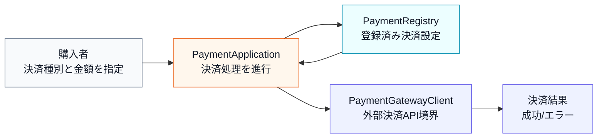
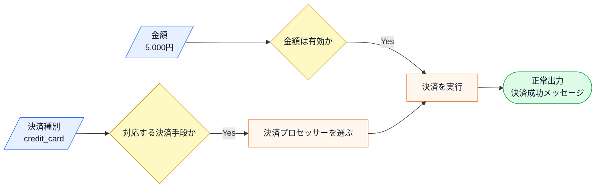
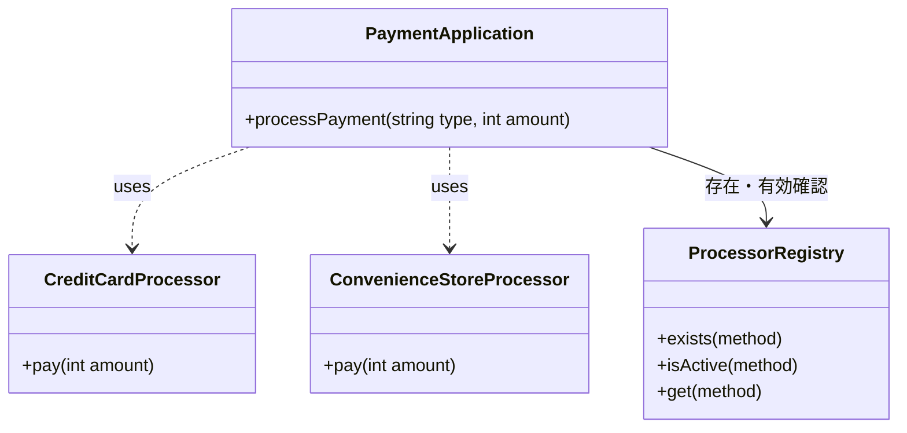
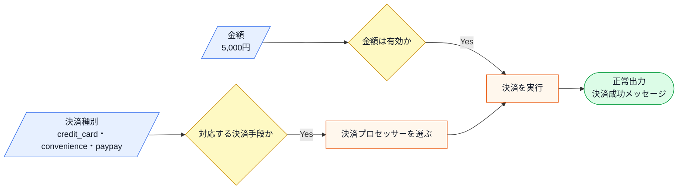
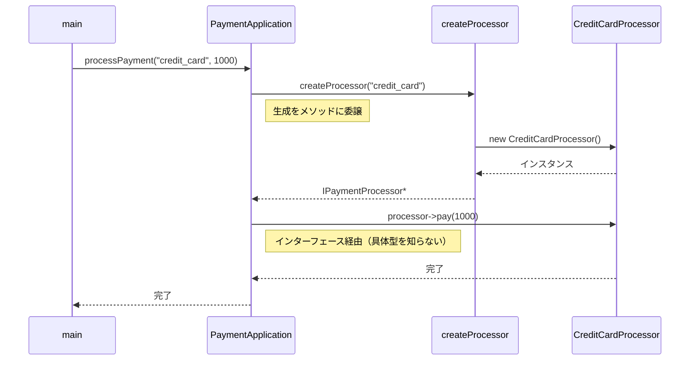
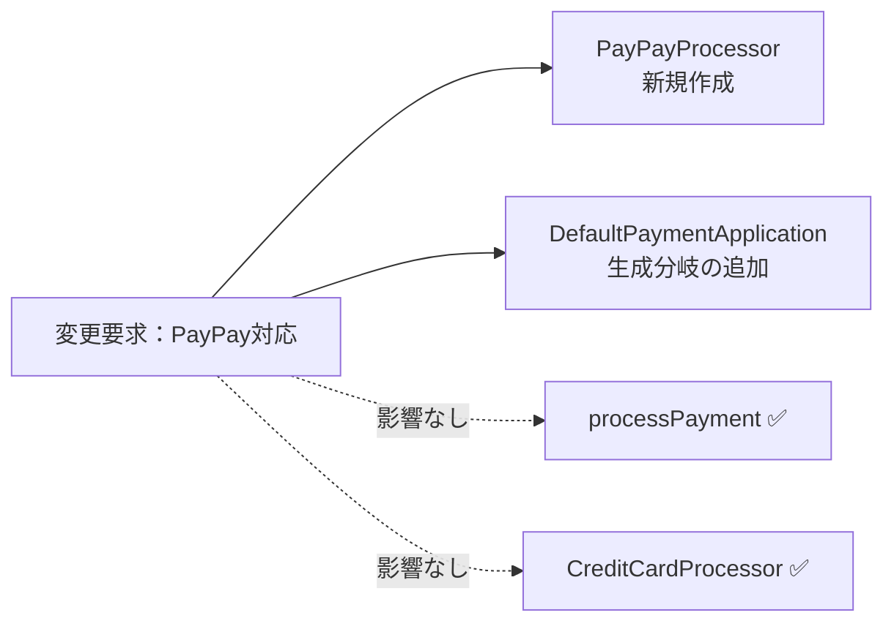
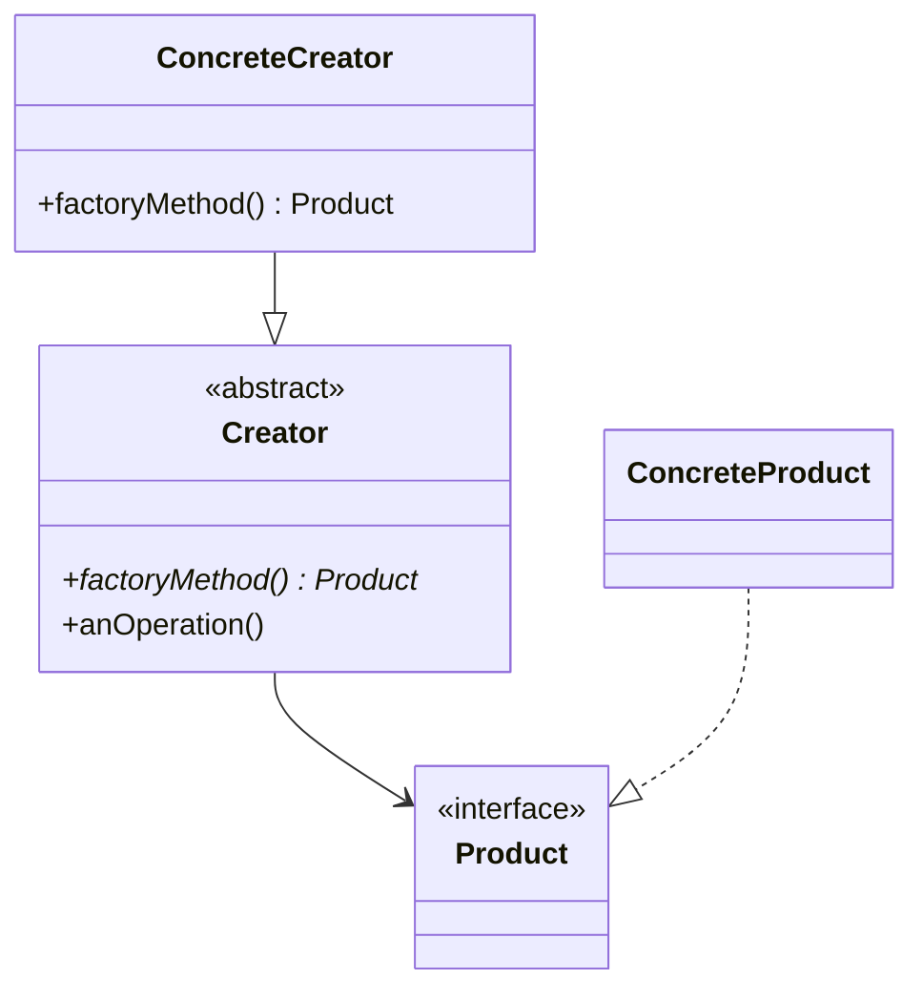

## 第8章 生成と利用を分ける ―― Factory Method パターン

―― 思考の型：インスタンスを生成する責任を、どこに置くか

### この章の核心

**決済手段が増えるたびに、決済を利用する注文処理まで修正が必要になる。こういう問題は、「何を作るか」という生成判断が、「作られたものを使う」処理の中に混在しているシステムで起きている。**

---

### この章を読むと得られること

この章が問うのは「作る」ことの設計です——オブジェクトを生成している場所が、利用している場所と同居していると何が起きるか。「決済プロセッサーを切り替えたいだけなのに、なぜこんなにコードを変える必要があるのか」という問いが出てきたことがあるなら、この章に答えがあります。

* **得られること1：** 「オブジェクトを生成する」という観点で、コードの変動箇所を識別できるようになる
* **得られること2：** 利用処理が決済手段のクラス名と生成方法をどこまで知っているかを接続点から調べ、生成と利用の混在による痛みを説明できるようになる
* **得られること3：** 生成の責任を利用処理から分けることで、決済手段追加の変更をCreatorと組み立て箇所へ寄せられることを説明できるようになる
* **得られること4：** 利用側が具体的な生成ロジックを知らずに、必要な機能を持つオブジェクトを受け取れる視点

## 🔵 フェーズ1：現状把握 ―― 仕様を整理し、システムと紐付ける

決済処理システムが何を入力として受け取り、どの処理で加工し、何を出力するのかを整理します。

### 1-1：このシステムの仕様

このシステムは、ECサイトでお客様が選択した決済手段に応じて、**決済処理を実行**します。

「決済種別」と「金額」を入力として受け取り、対応する決済プロセッサーを呼び出して処理を行います。

この章で扱う現状仕様は、次の範囲です。

| 仕様項目 | この章で扱う値 | 具体例 | 何に使うか |
|---|---|---|---|
| 決済種別 | クレジットカード・コンビニなど | credit、convenience | どの決済処理を使うかを決める |
| 金額 | 決済対象金額 | 5,000円 | 選ばれた決済処理へ渡す |
| 決済設定 | 有効/無効、手数料など | credit は有効、手数料3% | 決済を受け付けてよいかを確認する |
| 出力 | 決済成功またはエラー | creditで5,000円決済成功、未対応決済エラー | 決済種別ごとの結果を照合する |

ここで確認する対象は、決済種別からどの処理へ進むかです。

決済設定は、利用者が毎回入力する値ではありません。利用者が選ぶのは決済種別と金額であり、システムは登録済みの決済設定を見て、どの決済処理を呼ぶかを決めます。

**仕様整理図：保存データとアクセス関係**



上の文章と表で仕様を一通り確認したので、まず正常に決済できる場合の入力・判定・加工・出力の流れとして整理します。

**仕様整理図：正常系の入力・判定・加工・出力**



この図から読み取ることは、次の3点です。

- 決済種別は、どの決済処理を使うかを決める入力である。
- 金額確認と決済手段の選択がそろって、初めて決済実行へ進む。
- 正常系では、登録済みの決済処理を選んで外部決済API境界へ処理を渡し、成功メッセージを返す。

**エラー条件**

正常系の決済実行へ進めない入力や外部境界の懸念は、次のように分けて扱います。

| エラー条件 | どこで分かるか | 出力 | 保存・通知などの副作用 |
|---|---|---|---|
| 決済種別が未登録 | 決済設定の検索時 | 未対応決済エラー | 決済API呼び出しなし |
| 金額が1円未満 | 金額確認時 | 金額エラー | 決済API呼び出しなし |
| 決済APIが失敗する | `PaymentGatewayClient` 呼び出し時 | この章の1-1では詳細扱いなし | 実システムでは失敗ログ、再試行、決済状態の照会を検討する |

**現在対応している決済手段**

この章のシステムは、決済種別を文字列（"credit_card" や "convenience" のような識別子）で受け取ります。お客様が選択肢を選んだ瞬間に識別子がフロントエンドから送られてくるため、バックエンド側では「この文字列が来たら、この処理を呼ぶ」という対応が必要になります。言わば「メニューの番号を渡すと、対応する料理が届く」イメージです。

| 決済種別 | 入力値 | 処理内容 |
|---|---|---|
| クレジットカード決済 | credit_card | クレジットカードの認証と決済を実行する |
| コンビニ決済 | convenience | コンビニ払いの支払い番号を発行する |

クレジットカードは「その場で認証・即時決済」、コンビニ払いは「支払い番号を発行して後日支払い」という点で、処理の性質が大きく異なります。この違いが、後のフェーズで「なぜ決済手段ごとに異なる処理が必要になるか」を理解する鍵になります。

**決済の実行フロー**

「種別を受け取って→対応する処理を選んで→実行して→結果を返す」という流れ自体は、決済手段が何種類になっても変わりません。「変わらない骨格」と「変わる中身（決済手段）」を区別して読んでおくと、後のフェーズで役立ちます。

1. 決済アプリケーションが決済種別を受け取る
2. 種別に応じた決済手段を選択する
3. 選択した決済手段で処理を実行する
4. 処理結果（成功／失敗）を返す

**この仕様を決める業務機能**

決済システムでは、「どの決済手段を採用するか」という判断と、「その決済手段をどう実装するか」という判断は、属する業務機能が異なることがあります。ここでは、後のフェーズで確認する材料として、どの業務機能がどの仕様を決めているかを整理します。

**この仕様を決める業務機能**
| 業務機能 | この章の仕様で決めていること |
|---|---|
| 決済手段・サービス管理 | どの決済手段を追加・廃止するか |
| 処理の骨格（開発設計判断） | 決済フロー・共通仕様の構造 |

後のフェーズで変更要求を扱うとき、どの業務機能の知識なのかを確認するための名前として使います。

### 1-2：動作例テーブル

仕様を定義したところで、実際にどのような入力に対してどのような結果が返るかを確認します。このテーブルは「このシステムが正しく動いているとはどういう状態か」の基準になります。後で設計の改善（リファクタリング）を段階的に進めるときも、この表に立ち返ります。

| 決済種別 | 金額 | 状態 | 期待される結果 |
|---|---|---|---|
| クレジットカード | 1000円 | 正常 | 「クレジットで 1000 円決済しました。」を出力し完了を返す |
| コンビニ払い | 500円 | 正常 | 「コンビニで 500 円の支払い番号を発行しました。」を出力し完了を返す |

この表は変更要求前に対応している2種類の決済を示しています。この章で
比べるのは、同じ動作を保ちながら、決済手段が増えたときにどこを変更する
構造になるかという違いです。

コードを読む前に、このシステムが「何をする必要があるか」をこの表で確認できました。次は、この仕様を担うクラスの顔ぶれと責任を確認します。

---

### 1-3：登場クラスとクラス構成図

仕様と動作例が確認できたところで、登場するクラスを先に確認します。

| クラス名 | 役割 | 担当する仕様 |
|---|---|---|
| `PaymentApplication` | 決済種別を受け取り、対応する決済処理を呼び出す | 決済手段の選択と実行 |
| `CreditCardProcessor` | クレジットカード決済を実行する | クレジットカード決済 |
| `ConvenienceStoreProcessor` | コンビニ決済を実行する | コンビニ決済 |
| `ProcessorRegistry` | 決済方法の設定を保持するデータストア | 決済方法の存在確認・有効フラグの参照 |

各クラスの責任を把握したところで、クラス間の関係を図で整理します。



**クラス図に出てくる主な操作**

| クラス | 操作 | 何ができるか |
|---|---|---|
| `PaymentApplication` | `processPayment()` | 決済種別と金額を受け取り、対応する決済処理を呼び出す |
| `CreditCardProcessor` | `pay()` | クレジットカード決済を実行する |
| `ConvenienceStoreProcessor` | `pay()` | コンビニ決済の支払い番号発行などを実行する |


この図が示す通り、`PaymentApplication` というクラスが、クレジットカードやコンビニ決済といった個別の決済プロセッサーを直接利用（依存）している構成になっています。


**この章での簡略化**

1-3でクラス構成を確認したので、掲載コードで何を代替しているかを整理してからフェーズ1の現状コードへ進みます。

この章では、実際の決済API、カード情報、セキュリティ処理を扱わず、`PaymentGatewayClient` という決済API境界スタブを呼ぶ形で表します。スタブの内部だけが `std::cout` を使います。論点は「生成する決済プロセッサーの種類が増えたとき、生成責任をどこに置くか」です。決済認証、返金、通信エラー処理は本章では扱いません。

---

### 1-4：実装コード（現状）

このシステムには以下の4種類の決済方法があらかじめ登録されています。

| 決済方法ID | 名称 | 有効 | 手数料率 |
|---|---|---|---|
| credit_card | クレジットカード | ✓ | 3.0% |
| bank_transfer | 銀行振込 | ✓ | 0.5% |
| convenience | コンビニ払い | ✓ | 0% |
| crypto | 暗号通貨 | ✗（無効） | 1.0% |

無効な決済方法や未登録のIDを指定するとエラーになります。コードを読む前にこの対応を把握しておくと、動作結果が追いやすくなります。

```cpp
#include <iostream>
#include <map>
#include <memory>
#include <stdexcept>
#include <string>
#include <vector>

using namespace std;

// 決済方法の設定を保持するデータ構造
struct ProcessorConfig {
    string name;      // 決済方法名
    bool isActive;    // 有効フラグ
    double feeRate;   // 手数料率
};

// 決済方法の設定を一元管理するレジストリ
class ProcessorRegistry {
private:
    map<string, ProcessorConfig> registry;
public:
    ProcessorRegistry() {
        registry["credit_card"]   = {"クレジットカード", true,  0.030};
        registry["bank_transfer"] = {"銀行振込",        true,  0.005};
        registry["convenience"]   = {"コンビニ払い",    true,  0.000};
        registry["crypto"]        = {"暗号通貨",        false, 0.010};
    }

    bool exists(const string& method) const {
        return registry.count(method) > 0;
    }

    bool isActive(const string& method) const {
        return registry.at(method).isActive;
    }

    ProcessorConfig get(const string& method) const {
        return registry.at(method);
    }
};

// 各決済手段の具体的な処理
class CreditCardProcessor {
public:
    void pay(int amount) {
        cout << "クレジットで "
             << amount << " 円決済しました。" << endl;
    }
};

class ConvenienceStoreProcessor {
public:
    void pay(int amount) {
        cout << "コンビニで " << amount
             << " 円の支払い番号を発行しました。" << endl;
    }
};

// 決済を統括するクラス
class PaymentApplication {
    ProcessorRegistry registry;
public:
    void processPayment(const string& type, int amount) {
        // レジストリで存在確認
        if (!registry.exists(type)) {
            cout << "エラー：未登録の決済方法です: " << type << endl;
            return;
        }
        // レジストリで有効フラグを確認
        if (!registry.isActive(type)) {
            ProcessorConfig cfg = registry.get(type);
            cout << "エラー：" << cfg.name
                 << " は現在無効です。" << endl;
            return;
        }
        // 決済方法に応じてプロセッサを生成して実行
        if (type == "credit_card") {
            CreditCardProcessor processor;
            processor.pay(amount);
        } else if (type == "convenience") {
            ConvenienceStoreProcessor processor;
            processor.pay(amount);
        }
    }
};

int main() {
    PaymentApplication app;
    app.processPayment("credit_card", 1000);   // 正常
    app.processPayment("convenience", 500);    // 正常
    app.processPayment("crypto", 300);         // エラー：無効
    app.processPayment("unknown", 200);        // エラー：未登録
    return 0;
}
```

実行対象コード：1-4の現状コード
対応する動作例：1-2の動作例テーブル
確認したいこと：入力、加工、出力が仕様どおりに対応していること

実行結果：

```
クレジットで 1000 円決済しました。
コンビニで 500 円の支払い番号を発行しました。
エラー：暗号通貨 は現在無効です。
エラー：未登録の決済方法です: unknown
```

このコードを見ると、`PaymentApplication` クラスが、どの決済手段のクラスを生成し、どう実行するかをすべて直接知っていることが分かります。

---

### 1-5：変更要求

**変更要求の発生背景：** 今回の変更要求は決済プラットフォームチームから届いています。新しい決済手段の導入を推進するチームです。この点をフェーズ2の「どの業務機能による変化か」への伏線として覚えておきます。


ある週の火曜日、決済プラットフォームチームのリーダーからチャットで連絡が入りました。

「急ぎの相談なんだけど、来月から導入する新しい決済手段として『PayPay』に対応してほしいんだ。今のシステムでそのまま行けるか確認して、もし難しそうなら方針を教えてもらえるかな？ 決済手段が増えるのはビジネス上不可欠だから、なんとか対応したいんだ。」

なるほど、PayPayの対応ですね。コード上の PaymentApplication クラスを見ると、現状では CreditCardProcessor や ConvenienceStoreProcessor を直接 new して使っています。

**仕様変更の内容**

変更要求を受けて、対応する決済手段がどう変わるかを整理します。

| 決済手段 | 変更前 | 変更後 |
|---|---|---|
| クレジットカード（`"credit_card"`） | 対応済み | 変更なし |
| コンビニ払い（`"convenience"`） | 対応済み | 変更なし |
| **PayPay（`"paypay"`）** | 未対応 | **新規追加** |

PayPay決済が追加されても、決済の実行フロー（「種別を受け取り→プロセッサーを選択→処理を実行→結果を返す」）は変わりません。変わるのは「対応できる種別が1つ増える」という点だけです。

PayPay決済の動作：`"paypay"` を受け取ると、PayPay用のプロセッサーが呼び出され「PayPayで〇〇円決済しました」という結果を返します。

**変更前後の入力・判定・加工・出力差分**

1-1の現状仕様を退避し、変更要求を当てた後の仕様と同じ粒度で並べます。以降の分析では、この差分を追います。

| 要素 | 変更前（1-1の現状仕様） | 変更後（今回の要求） | 差分として追うもの |
|---|---|---|---|
| 入力 | 決済種別、金額、決済設定 | 決済種別、金額、決済設定、PayPay | 決済種別が増える |
| 判定 | 対応済み決済手段か、金額は有効か | PayPayを含めて対応済みか、金額は有効か | 選択条件が増える |
| 加工 | 決済種別に応じた処理を実行 | PayPay用処理も同じ流れで実行 | 生成する処理部品が増える |
| 出力 | 決済成功または未対応エラー | PayPay決済成功または未対応エラー | 成功出力の種類が増える |

**変更後の入力・加工・出力**

変更後の仕様を、1-1と同じ粒度で、正常系の入力・判定・加工・出力として確認します。1-1の図との差分は、入力の「決済種別」に `"paypay"` が加わることだけで、判定・加工・出力の流れ自体は変わりません。



この図から読み取ることは、次の3点です。

- 図の箱は1つも増えておらず、変わるのは「決済種別」の選択肢に `"paypay"` が加わることだけである。
- 「対応する決済手段か」の判定と「決済プロセッサーを選ぶ」の加工が、新しい種別を受け付けられるようになる必要がある。
- 金額の確認と、決済成功メッセージ・エラーという出力の形は変わらない。

変更後も、失敗条件は正常系図へ混ぜずに別で確認します。

| エラー条件 | どこで分かるか | 出力 | 保存・通知などの副作用 |
|---|---|---|---|
| 決済種別が未登録 | 決済設定の検索時 | 未対応決済エラー | 決済API呼び出しなし |
| 金額が1円未満 | 金額確認時 | 金額エラー | 決済API呼び出しなし |
| PayPay APIが失敗する | `PaymentGatewayClient` 呼び出し時 | この章のコードでは詳細を省略 | 実システムでは失敗ログ、再試行、決済状態の照会を検討する |

種別が1つ増えるだけの変更が、実際のコードではどれだけの修正になるかを、フェーズ3で変更を試すコードで確認します。

フェーズ1でシステムの現状と変更要求が把握できました。次のフェーズ2では、「何を変え、何を守るか」を整理します。

## 🟣 フェーズ2：仮説立案 ―― 何が変わるかを観察し、ヒアリングで裏付ける
### 2-1：変わりそうな仕様の見当をつける

ここで作る一覧は、思いつきで「変わりそう」と感じたものを並べる表ではありません。フェーズ1で確認した仕様・動作例・クラス図を材料に、次の順で候補を絞ります。

1. 仕様図と動作例から、入力・判定・加工・出力のうち条件や値が変わりそうな箇所を拾う。
2. その箇所が、1-3のどのクラス・メソッドに書かれているかを対応づける。
3. その仕様が、どんな理由で、何をきっかけに、どのくらいの頻度で変わりそうかを仮説として書く。
4. 逆に、当面変えない前提にできる処理の骨格も分けておく。

この手順で見ると、「決済を実行する」という大きな処理全体ではなく、その中のどの決済手段・生成条件・具体クラス名が変更候補なのかを読者自身で追えるようになります。

フェーズ2では、フェーズ1で見た仕様のうち、どの決済手段・生成条件・実行手順が変わりそうかを見当づけます。責務の配置は、変更要求を当てた後の痛みと合わせて確認します。

| 仕様候補 | 仕様上の場所 | フェーズ1の現状コードでの場所 | 見立て |
|---|---|---|---|
| 決済手段の種類 | 入力、判定 | `PaymentApplication.processPayment()` | 新しい決済手段が増える可能性があるため、今回見る |
| 決済処理オブジェクトの生成 | 加工前の準備 | `PaymentApplication.processPayment()` | 決済手段ごとの生成条件や具体型が変わる可能性があるため、今回見る |
| 決済実行の流れ | 加工、出力 | `process()` 相当の呼び出し | 決済を実行する大枠は当面維持する前提で見る |

この表から、今回の検討対象は「決済手段の選択」と「具体的な決済処理の生成」に絞れます。生成条件が同じ場所に書かれて困るかどうかは、フェーズ3で変更を入れてから確認します。

### 2-2：今回の変更で確実に変わること

今回の変更要求から確定している変更は2点です。

- **`PayPayProcessor` という新しい具体クラスの追加**：PayPay決済の実装クラスを新規作成する
- **`PaymentApplication` 内の分岐条件への `"paypay"` 追記**：フェーズ1の現状コードの構造上、型名と分岐が直結しているため

ただし「この変更が1回限りか、今後も続くか」によって、どこまで設計を変えるべきかが大きく変わります。関係者に確認します。

### ヒアリングに向けた背景確認

このシステムは、ある決済サービス事業者の「決済プロセッサー」を管理する基盤です。お客様がECサイトで買い物をするとき、クレジットカード決済やコンビニ決済など、さまざまな決済手段を選択しますが、このシステムは裏側でその手段ごとの処理を振り分ける役割を担っています。

当初、このサービスはクレジットカード決済だけをサポートしていました。しかし、ユーザーの利便性を高めるために、後からコンビニ決済、さらにPayPayなどのQRコード決済と、次々に新しい決済手段が追加されてきました。

コードを眺めてみると、`PaymentApplication` クラスという決済処理を統括するクラスの中で、`CreditCardProcessor` や `ConvenienceStoreProcessor` といった各決済手段の具体クラスを直接 `new` して利用する構成になっています。新しい決済手段が増えるたびに、この `PaymentApplication` クラスに新しい `else if` 文が追加され、利用するクラスが増え続けてきました。

### 2-3：関係者ヒアリング


仮説を持って、決済プラットフォームチームの担当者と話し合いを持ちました。

- **開発者：** 「PayPay対応の件ですが、今の構造だと決済手段が増えるたびに PaymentApplication クラスを修正する必要があります。今後も新しい決済手段は追加される予定でしょうか？」
- **決済担当者：** 「ああ、かなりハイペースで追加していく予定だよ。次は銀行系の決済も入るし、後払いサービスも検討している。だから、決済手段が増えるたびに基幹部分のコードを書き換えるようなことはなるべく避けてほしいんだ。」
- **開発者：** 「なるほど。では、決済処理を実行する時のインターフェース（金額を渡して実行する点）は今後も変わらないでしょうか？」
- **決済担当者：** 「そこは固定だよ。どの手段でも『金額を受け取って決済する』という手続き自体は同じだからね。」
- **開発者：** 「分かりました。決済の実行ルールは固定だけれど、生成する対象（プロセッサーの種類）はどんどん増えていくということですね。」

### 2-4：ヒアリングで判明した将来リスク

ヒアリングで浮かび上がった「確定ではないが、近い将来起こりうる変化」を記録します。これは今回の設計判断の材料です。

| **将来リスク** | **時期の目安** | **根拠** |
|---|---|---|
| 決済手段の種類がさらに増加する（銀行系・後払いなど） | 新しい決済手段の追加ごと | 「かなりハイペースで追加していく予定」との合意 |
| 決済手段を特定するための識別子と具体クラスの紐付け | 新しい決済手段の追加ごと | 識別子と生成が現在直結しており、追加のたびに修正が必要 |

フェーズ2で「今変わること（確定）」と「将来変わるかもしれないこと（リスク）」を分けて整理できました。次のフェーズ3では、現在の構造で変更を試みたときに何が起きるかを確認します。

### 2-5：変わる見込みと当面安定の前提を確定する

2-4のヒアリング結果をもとに、将来起こりうる変更仕様を整理します。

| 変更内容 | 現在 | 将来（時期の目安） |
|---|---|---|
| 対応する決済手段の種類 | クレジット・コンビニの2種類 | 銀行系・後払いサービスなど、追加ごとに増加 |
| 決済種別と具体クラスの紐付け箇所 | `PaymentApplication` 内の `if-else` に直書き | 追加のたびに紐付け条件が増え続ける |

この変化が来たとき、現在の構造では `PaymentApplication` を毎回開いて修正することになります。次のフェーズ3では、実際にその修正を試みて何が起きるかを確認します。

---

## 🟣 フェーズ3：問題特定 ―― 変更の痛みを発見する
### 3-1：変更を試みる

「PayPay対応」の要求を、今のコードで実装しようと試みます。変更前のコードの中心部分はこうでした（レジストリによる存在・有効チェックは今回の変更で変わらないため、この抜粋では省略しています）。

```cpp
void processPayment(string type, int amount) {
    if (type == "credit_card") {
        CreditCardProcessor processor;
        processor.pay(amount);
    } else if (type == "convenience") {
        ConvenienceStoreProcessor processor;
        processor.pay(amount);
    }
}
```

このコードにPayPay対応を追加すると、以下のようになります。

```cpp
void processPayment(string type, int amount) {
    if (type == "credit_card") {
        CreditCardProcessor processor;
        processor.pay(amount);
    } else if (type == "convenience") {
        ConvenienceStoreProcessor processor;
        processor.pay(amount);
    } else if (type == "paypay") {  // ← 追加
        PayPayProcessor processor;   // ← 追加
        processor.pay(amount);       // ← 追加
    }
}
```

変更後のコードを実行すると、次のような結果になります。

```cpp
// スタブ：本物の決済処理の代わりに表示だけを行う差し替えクラス
// （変更後の実行確認用）
class CreditCardProcessor {
public:
    void pay(int amount) {
        std::cout << "[クレジット] " << amount
                  << " 円" << std::endl;
    }
};
class ConvenienceStoreProcessor {
public:
    void pay(int amount) {
        std::cout << "[コンビニ] " << amount
                  << " 円" << std::endl;
    }
};
class PayPayProcessor {
public:
    void pay(int amount) {
        std::cout << "[PayPay] " << amount
                  << " 円" << std::endl;
    }
};

void processPayment(std::string type, int amount) {
    if (type == "credit_card") {
        CreditCardProcessor p; p.pay(amount);
    } else if (type == "convenience") {
        ConvenienceStoreProcessor p; p.pay(amount);
    } else if (type == "paypay") { // ← 追加
        PayPayProcessor p; p.pay(amount);
    }
}

int main() {
    processPayment("credit_card",  5000);
    processPayment("convenience", 10000);
    processPayment("paypay",       3000); // ← 新規
    return 0;
}
```

実行対象コード：3-1の変更試行コード
対応する動作例：変更要求後の代表ケース
確認したいこと：変更要求を現状構造へ当てはめたとき、修正箇所と痛みがどこに出るか

実行結果：

```
[クレジット] 5000 円
[コンビニ] 10000 円
[PayPay] 3000 円
```

PayPay対応は正しく動いています。しかし `processPayment` の `if-else` に3行追加し、新クラスを作成する必要がありました。

一見シンプルな追加ですが、問題が浮かび上がります。決済手段が増えるたびにこの `PaymentApplication` クラスがどんどん長くなり、修正のたびにクラス内の既存ロジックを触らなければならないという事実です。もし決済手段が10個、20個と増えたら、このクラスは管理不能なほど巨大な「神クラス」になってしまうでしょう。

さらに、将来的に別の画面やバッチ処理といった異なる呼び出し元からも決済処理を利用することになり、同じ分岐ロジックを複製しなければならなくなった場合、そちらでも同様の修正が必要になってしまいます。

### 3-2：変更影響グラフ


新しい決済手段という「ビジネス上の変化」を実装するたびに、本来は決済手段の振り分けだけを担う役割を持つ `PaymentApplication` クラスが必ず修正対象として矢印を向けられていることが分かります。

### 3-3：痛みの言語化

**1つ目：修正のたびに「決済の統括者」が汚染される辛さ。** このクラスは本来、どの決済手段を使うかを判断するだけで良いはずなのに、個別のプロセッサーの生成方法や詳細な使い方までを直接握りしめています。決済手段が増えるたびにこのクラスを書き直す必要があるため、変更のたびにバグを混入させるリスクが付きまといます。

**2つ目：決済手段という「変わるもの」と、決済の振り分けという「変わらない構造」が同じ場所に混在している辛さ。** 決済プロセッサーが増えるたびに `if-else` のジャングルが深まり、コードの見通しが悪くなります。新しい決済手段を一つ足すだけで、既存の無関係な決済手段のコードまで巻き込んでテストをやり直す必要に迫られる状況は、開発のスピードを著しく低下させる要因になっています。

フェーズ3で「変更のたびに決済統括クラスが書き換わる」という痛みが確認できました。次のフェーズ4では、利用処理と生成処理の接続点に漏れている知識を確認します。

---
> **📌 問題（確定）**
> 決済手段が変わるたびに、利用側の `PaymentApplication` クラスの分岐条件・生成コードが連動して変わる。決済手段という「属する業務機能が異なる知識」が、決済の振り分けフローと同じクラスに混在しているため、決済手段の追加・変更が統括クラスへの修正を引き起こし続ける。
---

ここまでで「何が痛いか」が見えました。次のフェーズ4では、その痛みが「なぜ起きているか」を構造の言葉で言語化します。

---

## 🟠 フェーズ4：原因分析 ―― なぜ辛いのかを構造で言語化する
### 4-1：痛みの根源を探る（観察と原因）

フェーズ3で確認した「変更の辛さ」は、コードのどこから来ているのでしょうか。コードを注意深く観察すると、痛みを引き起こしている2つの事実が浮かび上がってきます。

第一に、新しい決済手段を追加するとき、なぜ毎回 `PaymentApplication` を開かなければならないのでしょうか？
それは、このクラス自身が「クレジットカードなら `CreditCardProcessor` を生成する」「PayPayなら `PayPayProcessor` を生成する」といった**具体的なクラス名と生成方法をすべて直接知ってしまっている（抱え込んでいる）**からです。

第二に、なぜ変更の影響範囲が読めず、全テストをやり直す恐怖を感じるのでしょうか？
それは、「決済の振り分けフロー（変わらない骨格）」と「どの具体クラスを生成するか（変わる生成ロジック）」が、**同じメソッドの中で物理的に混ざり合っている**からです。

この「症状（痛み）」と「根本原因」を整理すると、以下のようになります。

| **観察した症状（痛み）** | **構造的な原因（痛みの根源）** |
|---|---|
| 決済手段を追加するたびに統括クラスが修正対象になる | `PaymentApplication` が各決済手段の具体的なクラス名と生成方法を直接知っているから |
| 影響範囲が読めず、全テストをやり直す恐怖 | 「決済の振り分けフロー」と「具体クラスの生成ロジック」という変わる理由が異なる2つのものが同じメソッドの中に混在しているから |

### 4-2：変わるもの/変わってほしくないもの

> **「変わらないもの」と「変わってほしくないもの」は異なります。** 「変わらないもの」は経験的事実（今まで変わっていない）、「変わってほしくないもの」は設計意図（ここを安定させてほかを守りたい）です。ここで整理するのは後者です。

| **変わるもの（生成ロジック）** | **変わってほしくないもの（振り分けの骨格）** |
|---|---|
| 決済プロセッサーの具体的なクラス（クレジット、コンビニ、PayPay等） | 「金額を受け取って決済を実行する」というAPIの定義（インターフェース） |
| 各決済手段の生成方法・コンストラクタ引数 | 決済の振り分けフロー全体 |

**【変わる部分（変わり続ける生成コード）】**
```cpp
        if (type == "credit_card") {
            CreditCardProcessor processor;
            processor.pay(amount);
        } else if (type == "paypay") {
            PayPayProcessor processor;
            processor.pay(amount);
        }
        // 銀行振込・Apple Pay など、決済手段を追加するたびに
        // else if がここに増える
```

**【変わってほしくない部分（守りたい骨格）】**
```cpp
        // どの決済手段であっても
        // 「種別を受け取り→実行する」という流れは変わらない
        // (ここに変わる部分の生成ロジックが入っている状態)
```

### 4-3：接続点に漏れている生成の知識を確認する

ここでの「確認すること」は、前節までに見つけた原因から抽出します。まず、原因文から「守りたい骨格」と「変わる差分」を分けます。次に、その差分を動かすために骨格側が知ってしまっている名前・条件・順序・型を拾います。最後に、接続点に残す最小の約束を、値・型・操作・イベントとして書きます。

原因によって、接続点で見る抽象観点は変わります。条件分岐が原因なら条件・定数・選択基準を見ます。処理手順が原因なら呼び出し順・前後条件・失敗時分岐を見ます。生成判断が原因なら具体クラス名・生成条件・登録場所を見ます。通知や外部連携が原因なら通知先・タイミング・成否の扱いを見ます。データや状態が原因なら、境界を流れる値・型・状態を見ます。

現在の `PaymentApplication` は、すべての決済プロセッサーを自分自身の中で直接生成しています。

**【生成方法が利用処理へ漏れているコード】**
```cpp
class PaymentApplication {
public:
    void processPayment(string type, int amount) {
        // 具体クラスを直接知り、直接生成して呼び出している
        if (type == "credit_card") {
            // ← 利用処理が生成するクラス名を知っている
            CreditCardProcessor processor;
            processor.pay(amount);
        }
        // PayPay・銀行振込など、決済手段を追加するたびに else if がここに増える
    }
};
```

新しい決済手段が増えるたびに、決済フローを持つ`PaymentApplication`を開き、生成分岐を追加する必要があります。利用処理が生成するクラス名を知っているためです。

決済の振り分けフローと個別の生成ロジックは、変わる理由が全く異なります。これらが同じ場所に混在していることが、根本原因として確認できました。

今回見直す接続点は、「決済手段を生成して利用処理へ渡す境界」です。利用側は`pay()`できることだけを知れば十分です。

フェーズ4で根本原因が言語化できました。「どこを分けるか」は明確です。次のフェーズ5では、その境界で実際に何が流れているかを値・型のレベルで具体化し、「何を変え、何を守るか」を明確にします。

---
> **📌 原因（確定）**
> `PaymentApplication`が決済手段のクラス名と生成方法を知っている。決済手段の追加が、変えたくない決済フローの修正へ直結している。
---

「何が痛いか（問題）」と「なぜ痛いか（原因）」が揃いました。次のフェーズ5では、「何を切り離す必要があるか（課題）」を、接続点で流れるデータのレベルで言語化します。

---

## 🟡 フェーズ5：課題定義 ―― 解くべき接続点を定める
フェーズ4は「なぜ辛いか」を答えました。フェーズ5が問うのは「分けるべき境界で、実際に何が流れているか」です。クラスの参照関係ではなく、**値・型のレベル**に降りていきます。

フェーズ4の分析により、問題は「決済の振り分けフロー」と「具体クラスの生成ロジック」が混在していることだと分かりました。その境界で何がやり取りされているかを具体化します。

### 接続点を特定する

接続点は、クラス図の線やインターフェース名から探すのではなく、変更要求を当てて特定します。まず、その要求で変えたい側と変えたくない側を分けます。次に、両者がどのメソッド呼び出し・引数・戻り値・生成・イベントでつながっているかを見ます。そのつながりのうち、変更要求のたびに知識が漏れて修正が波及する場所が、ここで解くべき接続点です。

`processPayment()` の中で分けるべき境界は1か所です。決済処理を利用する流れと、具体的な処理クラスを生成する判断との境界を見ます。

```cpp
void processPayment(string type, int amount) {
    // ↓ 具体クラスを選んで生成する判断（変わり続ける）
    if (type == "credit_card") {
        CreditCardProcessor processor;
        processor.pay(amount);
    } else if (type == "convenience") {
        ConvenienceStoreProcessor processor;
        processor.pay(amount);
    } else if (type == "paypay") {
        PayPayProcessor processor;
        processor.pay(amount);
    }
    // ↑ ここまでが分離するターゲット
}
```

生成処理が振り分けフローに提供しているのは「`pay(amount)` を実行できるオブジェクト」です。

| 接続点 | 接続するデータ | 変わるもの |
|---|---|---|
| 具体クラス生成 → `processPayment()` の骨格 | `pay(int)` を持つオブジェクト（将来はIPaymentProcessor*） | 生成する具体クラスの種類 |

### 何を変え、何を守るか

- **変わるもの**：生成する具体クラス（CreditCardProcessor / ConvenienceStoreProcessor / PayPayProcessor …）。新しい決済手段が追加されるたびに生成判断が増える。
- **守りたい前提**：振り分けフローが呼ぶ操作（`pay(amount)`）。振り分けロジックが期待するインターフェース形は変わらない。

呼び出し元（`PaymentApplication`）が必要とするのは「`pay(amount)` を呼べること」です。問題は「どのクラスを生成するか」という**生成判断**まで同じクラスへ積み重なっていることです。

**現状のままでよい場面**：決済手段が1種類で固定されるなら、利用処理で生成する単純さを保つ判断もあります。今回は決済手段が増えるため、利用フローから生成判断を分ける設計を検討します。

---
> **📌 課題（確定）**
> 「決済の振り分けフロー（`processPayment`）」と「決済プロセッサーの生成ロジック（具体クラスの選択と`new`）」を切り離す必要がある。渡すデータ（`pay(amount)` を呼べるオブジェクト）の形は安定しているため、「何を呼ぶか」ではなく「どのクラスを生成するか」という生成の知識を `PaymentApplication` から取り除くことが課題である。
---

問題・原因・課題の3点が揃いました。次のフェーズ6では、この課題を解消するための具体的な設計案を段階的に検討します。

---

## 🔴 フェーズ6：対策検討 ―― 案を比べ、採用する形を決める

フェーズ6では、第0章の段階的進化アプローチを標準フローとして使います。ただし、ここでのステップは一本道の作業手順ではなく、対策案を比較するための候補です。まず小さな整理で何が見えるかを確認し、次に責任の移動、契約、窓口、組み合わせ、生成責任の移動のうち、この章の課題に必要な案だけを比べます。章の題材に合わない案を省略したり、順序を入れ替えたり、接続点ごとに分岐させたりする場合は、論点外・効果不足・導入コスト過多・接続点が別であるなどの理由を本文中で説明します。
フェーズ5で「変わるのは生成する具体クラスと選択条件であり、振り分けフローが使う操作インターフェースは安定している」ことが分かりました。ここでは、生成判断をどこへ移すと変更を局所化できるかを、段階を追って試します。それぞれの段階で「まだ何が残っているか」を確認し、その積み重ねの先で「どこまで進むべきか」を決断します。

フェーズ5の課題から、対策候補は次のように出します。

| フェーズ4で見えた原因 | フェーズ5で定めた課題 | だからフェーズ6で見る候補 |
|---|---|---|
| 決済種別ごとの具体クラス生成と選択条件が呼び出し元へ集まっている | 決済処理の呼び出し元から、具体クラス名と生成条件を切り離す | まず生成処理を関数化し、選択条件がどこに残るかを見る |
| 決済種別が増えるたびに `if` と `new` が増える | 決済種別追加時に呼び出し元を触らない生成境界を作る | 共通の決済処理契約を作り、生成責任を専用の場所へ移す案を見る |
| 有効/無効や手数料など設定も決済種別ごとに変わる | 生成判断と決済実行を分け、設定変更の影響を局所化する | 登録方式や生成担当クラスまで進める必要があるか判断する |

### ステップ1：各処理を独立した関数として切り出す（共通構造を発見する）

`processPayment` の中を見ると、「どの種別か判断する if-else」と「具体クラスを生成して pay() を呼ぶ」が一体になっています。「とりあえず読みやすくしよう」と思ったとき、最初に思いつくのは「決済手段ごとの生成と実行を、それぞれ独立したプライベートメソッドとして切り出す」ことではないでしょうか。

クラスは分けず、`PaymentApplication` の中に `payByCredit` / `payByCvs` / `payByPayPay` といった手段ごとのメソッドを作り、`processPayment` は種別の判断だけを担当します。

```cpp
class PaymentApplication {
private:
    // 各決済処理を独立したメソッドとして切り出す
    void payByCredit(int amount) {
        CreditCardProcessor processor;
        processor.pay(amount);
    }

    void payByCvs(int amount) {
        ConvenienceStoreProcessor processor;
        processor.pay(amount);
    }

    void payByPayPay(int amount) {
        PayPayProcessor processor;
        processor.pay(amount);
    }

public:
    void processPayment(string type, int amount) {
        // 種別の判断だけをここで行う
        if (type == "credit_card")       payByCredit(amount);
        else if (type == "convenience")  payByCvs(amount);
        else if (type == "paypay")       payByPayPay(amount);
    }
};
```

`processPayment` が「どの手段を呼ぶか」という制御だけを担い、各決済の実行処理はそれぞれの専用メソッドへ分かれた形になっています。

**この段階の評価：**
切り出した3つのメソッド（`payByCredit` / `payByCvs` / `payByPayPay`）を並べてみると、いずれも「プロセッサーを生成して `pay(amount)` を呼ぶ」という同じシグネチャ・同じ構造を持っていることに気づきます。また、`processPayment` が「どれを呼ぶか」という制御を担い、各メソッドが「実際に処理する」という分離も見えてきました。

この観察が、次の問いを生みます。「同じ構造を持つ複数のメソッドが並んでいるなら、その共通部分を一つに抽象化できないか。そして、処理の実行ではなく『どのクラスを生成するか』という判断だけを切り出す方法はないだろうか」。

「生成の知識を `PaymentApplication` の外に出せないか」という問いが自然に湧いてきます。

### ステップ2：生成ロジックを専用の PaymentFactory クラスに分離する

ステップ1で気になったのは「生成の知識が `PaymentApplication` に留まっている」という点でした。「では、生成の担当クラスを別に作ろう」という次の一手を試してみます。生成した各プロセッサーを共通の型で受け渡すため、`pay(int)` だけを約束する共通インターフェース `IPaymentProcessor` をここで導入します（定義と各クラスの実装コードはステップ3の冒頭で示します）。

```cpp
// 生成の責任を専用クラスに分離する
class PaymentFactory {
public:
    IPaymentProcessor* create(string type) {
        if (type == "credit_card") return new CreditCardProcessor();
        if (type == "paypay")      return new PayPayProcessor();
        if (type == "convenience")
            return new ConvenienceStoreProcessor();
        return nullptr;
    }
};

class PaymentApplication {
private:
    PaymentFactory factory;  // ← 生成の担当を外部クラスに委ねる

public:
    void processPayment(string type, int amount) {
        IPaymentProcessor* processor = factory.create(type);
        if (processor) {
            processor->pay(amount);
            delete processor;
        }
    }
};
```

`PaymentApplication` は `PaymentFactory` に生成を依頼するだけになり、具体クラスの名前（`CreditCardProcessor` など）を直接知らなくなっています。

**この段階の評価：**
生成の責任を `PaymentApplication` から切り出せました。`PaymentApplication` は決済の振り分けフローに集中できるようになっています。しかし今度は `PaymentFactory` がすべての具体クラスを知っており、新しい決済手段を追加するたびに `PaymentFactory` を修正する必要があります。「修正が必要なクラスが `PaymentApplication` から `PaymentFactory` に移っただけ」という見方もできます。

もう少し深く考えると、`PaymentFactory` は固定された1つのクラスです。「テスト環境ではモック用のプロセッサーを使いたい」「本番とステージングで生成ロジックを変えたい」といった要求が来たとき、`PaymentFactory` ごと差し替える仕組みがありません。Factory クラスを分離したのに、その Factory 自体が固定されてしまっているのです。

「Factory の生成ロジック自体を差し替え可能にできないか」という問いが見えてきます。

### ステップ3：生成メソッドを抽象化し、具体クラスに委ねる

ステップ2の `PaymentFactory` は、「どの具体クラスを生成するか」という知識を一手に持つ固定されたクラスでした。この発想を逆転させてみます。`PaymentApplication` 自体に `createProcessor` という抽象メソッドを宣言し、「生成の仕方は自分では決めない、サブクラスに任せる」という構造にします。

> [!INFO] コラム: ただの生成メソッドと抽象化された生成の違い
> 「生成するだけの別メソッド（関数）を作れば十分では？」と思うかもしれません。しかし、それだけでは「そのメソッドを持つクラス」が全ての具体クラスを知っている状態は変わりません。この生成の抽象化構造の核心は、「具体的な生成処理をサブクラスに委ねる」ことです。これにより、呼び出し側の変更を抑えながら、テスト用のモックに差し替えたり、環境ごとに生成するクラスを切り替えたりしやすくなります。

はじめに、すべての決済プロセッサーが従う共通のインターフェースを定義します。

```cpp
// 決済プロセッサーの共通インターフェース（契約）
class IPaymentProcessor {
public:
    virtual ~IPaymentProcessor() {}
    virtual void pay(int amount) = 0;
};
```

`IPaymentProcessor` は「金額を受け取って決済を実行する」という約束だけを定義します。

次に、各決済手段の具体クラスがこのインターフェースを実装します。

```cpp
class CreditCardProcessor : public IPaymentProcessor {
public:
    void pay(int amount) override {
        cout << "クレジットで " << amount << " 円決済しました。" << endl;
    }
};

class PayPayProcessor : public IPaymentProcessor {
public:
    void pay(int amount) override {
        cout << "PayPayで " << amount << " 円決済しました。" << endl;
    }
};

class ConvenienceStoreProcessor : public IPaymentProcessor {
public:
    void pay(int amount) override {
        cout << "コンビニで " << amount
             << " 円の支払い番号を発行しました。" << endl;
    }
};
```

どのクラスも `IPaymentProcessor` を実装しており、呼び出し側は `pay(amount)` という一つの窓口だけを使えます。

そして核心の構造です。`PaymentApplication` は `createProcessor` を純粋仮想メソッドとして宣言し、具体的な生成はサブクラスに委ねます。

```cpp
// 生成の仕方を「サブクラスに任せる」抽象クラス
class PaymentApplication {
protected:
    //  生成分離構造：「何を作るか」はサブクラスが決める
    virtual IPaymentProcessor* createProcessor(string type) = 0;

public:
    void processPayment(string type, int amount) {
        // ← 生成結果の型は IPaymentProcessor* だけを知る
        IPaymentProcessor* processor = createProcessor(type);
        if (processor) {
            processor->pay(amount);
            delete processor;
        }
    }
};

// 主な生成ロジックはここに集中する
class DefaultPaymentApplication : public PaymentApplication {
protected:
    IPaymentProcessor* createProcessor(string type) override {
        if (type == "credit_card") return new CreditCardProcessor();
        if (type == "paypay")      return new PayPayProcessor();
        if (type == "convenience")
            return new ConvenienceStoreProcessor();
        return nullptr;
    }
};
```

`PaymentApplication` の `processPayment` は `IPaymentProcessor*` を受け取って `pay` を呼びます。「どのクラスを生成するか」という判断は `DefaultPaymentApplication` へ移りました。新しい決済手段を追加するときは、具体Processorと生成判断を変更しますが、決済を実行する共通フローへ分岐を増やさずに済みます。

**この段階の評価：**
`PaymentApplication`（振り分けフローの骨格）から、`DefaultPaymentApplication`へ生成判断を移しました。新しい決済手段を追加するときはCreatorの生成処理と、必要に応じて種別の入力・組み立て設定を変更します。`processPayment`の処理手順は変更せずに済みます。「テスト用にモックプロセッサーを使いたい」という要求では、別のCreatorを用意できます。

---

### 採用する形を決める

3つのステップにはそれぞれトレードオフがあります。ステップ3の抽象化は強力ですが、クラスの数が増えるという「初期投資コスト」もかかります。どこで止めるかは、**「今後の変更頻度（ビジネス要求）」**で決断します。

今回の課題は、決済を実行する流れではなく、「どの決済処理を生成するか」という判断が利用側に寄っていることです。生成判断をどこまで外へ出すかを、次の順で比べます。

| 案 | 解けること | 残ること | 今回の判断 |
|---|---|---|---|
| 何もしない | 追加コストはない | 決済手段追加のたびに利用側の分岐を修正する | 追加頻度と合わない |
| 生成処理を関数化 | 生成判断に名前が付く | 具体型名は利用側の近くに残る | 最初の整理として有効 |
| 具体ファクトリへ移す | 生成判断を1か所へ寄せられる | 環境別・テスト用の生成方法を差し替えにくい | 中間策として有効 |
| 生成の契約を抽象化する | 利用側は生成方法を差し替えられる | Creatorクラスと組み立てが増える | 決済手段追加が続くため採用する |

*   **ステップ1（プライベートメソッド化）で止めるケース：** 決済手段が2〜3種類で今後増える予定が全くない場合。生成処理がひとまとまりになるだけで、読みやすさは十分改善されます。
*   **ステップ2（具体ファクトリへの分離）で止めるケース：** 生成ロジックを `PaymentApplication` から切り出したいが、抽象化とサブクラスを増やすコストをまだかけたくない場合の「中間策」です。変更の主体が `PaymentFactory` に移るため、`PaymentApplication` への修正は不要になります。
*   **ステップ3（抽象化ファクトリ）まで進むケース：** 「今後も新しい決済手段が追加される」と確定しており、かつ「生成の仕方そのものを差し替えたい（テスト・環境別設定など）」という要求が見込まれる場合。今すぐ初期投資コストを払ってでも、将来の変更コストを最小化するのが適切です。

**今回の決断：**
フェーズ2のヒアリングで、決済担当者から「かなりハイペースで追加していく予定」と明言されています。したがって、今回は**ステップ3（抽象化ファクトリ）まで進化させる**決断を下します。

フェーズ6で採用する形が決まりました。次のフェーズ7では、この決断を最終的なコードに落とし込みます。

## 🟢 フェーズ7：対策実施 ―― 変化に強いコードを完成させる
生成するオブジェクトの種類（決済手段）を、利用側から隠蔽するメソッドに集約し、利用側がインターフェースを通じてインスタンスを得る構造——これが **生成分離構造（ファクトリーメソッド）** と呼ばれています。

### 7-1：解決後のコード（全体）

ステップ3で決断した構造を、実行可能な完全なコードとして組み上げます。各役割ごとにコードを分けて確認します。

**1. インターフェース（契約）の定義**
すべての決済プロセッサーが守るべき共通のインターフェースを定義します。

```cpp
#include <iostream>
#include <map>
#include <memory>
#include <stdexcept>
#include <string>
#include <vector>

using namespace std;

// インターフェース：ビジネス責任で命名
class IPaymentProcessor {
public:
    virtual ~IPaymentProcessor() {}
    virtual void pay(int amount) = 0;
};
```

`IPaymentProcessor` は「決済を実行するために持つべきメソッドと戻り値の約束」を定義します。具体クラスが何であれ、このインターフェースさえ実装していれば、利用側はそのまま使えます。

**1-b. レジストリ（データ層）の定義**
決済方法の設定を `std::map` で一元管理します。生成メソッドがプロセッサーを生成する前に、レジストリで「登録されているか」「有効か」を確認します。

```cpp
// 決済方法の設定を保持するデータ構造
struct ProcessorConfig {
    string name;      // 決済方法名
    bool isActive;    // 有効フラグ
    double feeRate;   // 手数料率
};

// 決済方法の設定を一元管理するレジストリ
class ProcessorRegistry {
private:
    map<string, ProcessorConfig> registry;
public:
    ProcessorRegistry() {
        registry["credit_card"]   = {"クレジットカード", true,  0.030};
        registry["bank_transfer"] = {"銀行振込",        true,  0.005};
        registry["convenience"]   = {"コンビニ払い",    true,  0.000};
        registry["crypto"]        = {"暗号通貨",        false, 0.010};
    }

    bool exists(const string& method) const {
        return registry.count(method) > 0;
    }

    bool isActive(const string& method) const {
        return registry.at(method).isActive;
    }

    ProcessorConfig get(const string& method) const {
        return registry.at(method);
    }
};
```

`ProcessorRegistry` はデータ層として機能します。決済手段の有効・無効や手数料率の変更では、このクラスが主な修正先になります。生成分離構造の生成ロジックとは、変更理由を分けて考えられます。

決済ログ（`PaymentLog`）はシステム起動時は空で、決済処理が実行されるたびに結果を1件追記します。ファイルへの保存は行わず、実行中のメモリ上にのみ保持します。

```cpp
struct PaymentRecord {
    std::string method;       // "credit_card", "bank_transfer", etc.
    std::string methodName;   // "クレジットカード", "銀行振込", etc.
    int amount;
    std::string status;       // "成功", "失敗"
};

// 決済ログを管理するクラス
class PaymentLog {
    std::vector<PaymentRecord> records;
public:
    void add(const std::string& method, const std::string& methodName,
             int amount, const std::string& status) {
        records.push_back({method, methodName, amount, status});
    }
    void printAll() const {
        for (const auto& r : records) {
            std::cout << "[" << r.method << "] " << r.methodName
                      << " " << r.amount << "円 -> " << r.status << std::endl;
        }
    }
    int size() const { return (int)records.size(); }
};
```

**2. 個別の決済プロセッサーの実装（具体）**
インターフェースを満たす具体的な決済クラスを作成します。本体コードに触れることなく、このクラス群だけを自由に追加・変更できます。

```cpp
class PaymentGatewayClient {
public:
    void chargeCreditCard(int amount) {
        cout << "[PaymentGateway] クレジットで "
             << amount << " 円決済しました。" << endl;
    }
    void issueConvenienceStoreCode(int amount) {
        cout << "[PaymentGateway] コンビニで " << amount
             << " 円の支払い番号を発行しました。" << endl;
    }
    void chargePayPay(int amount) {
        cout << "[PaymentGateway] PayPayで "
             << amount << " 円決済しました。" << endl;
    }
};

class CreditCardProcessor : public IPaymentProcessor {
    PaymentGatewayClient& client;
public:
    CreditCardProcessor(PaymentGatewayClient& client) : client(client) {}
    void pay(int amount) override {
        client.chargeCreditCard(amount);
    }
};

class ConvenienceStoreProcessor : public IPaymentProcessor {
    PaymentGatewayClient& client;
public:
    ConvenienceStoreProcessor(PaymentGatewayClient& client) : client(client) {}
    void pay(int amount) override {
        client.issueConvenienceStoreCode(amount);
    }
};

// 新しい決済手段の処理は新しいProcessorへ置き、生成側から選択する
class PayPayProcessor : public IPaymentProcessor {
    PaymentGatewayClient& client;
public:
    PayPayProcessor(PaymentGatewayClient& client) : client(client) {}
    void pay(int amount) override {
        client.chargePayPay(amount);
    }
};
```

**3. 本体クラス（生成分離構造を持つCreator）**
決済を行う本体クラスです。`PaymentApplication` が「振り分けフローの骨格」を担い、`DefaultPaymentApplication` が「どのクラスを生成するか」という判断を一手に引き受けます。利用側である `processPayment` はインターフェースを通じて結果を受け取るだけになります。

> [!NOTE] 
> このサンプルでは他言語との横断的な比較とコードの簡潔化のため、生ポインタを使用しています。本書では全章を通じて生ポインタを使い、所有権の議論よりも構造の変化に集中します。

```cpp
// 振り分けフローの骨格（生成は知らない）
class PaymentApplication {
protected:
    // 生成分離構造：生成はサブクラスに委ねる
    virtual IPaymentProcessor*
    createProcessor(const string& type) = 0;

public:
    virtual ~PaymentApplication() = default;

    void processPayment(const string& type, int amount) {
        IPaymentProcessor* processor = createProcessor(type);
        processor->pay(amount); // ← 実装詳細を直接触らない
        delete processor;       // インスタンスの破棄
    }
};

// 具体的な生成判断を、この具象Creatorへまとめる
class DefaultPaymentApplication : public PaymentApplication {
    ProcessorRegistry registry;  // ← データ層でバリデーション
    PaymentGatewayClient gatewayClient;
protected:
    IPaymentProcessor*
    createProcessor(const string& type) override {
        // レジストリで存在確認
        if (!registry.exists(type)) {
            throw invalid_argument(
                "未登録の決済方法です: " + type);
        }
        // レジストリで有効フラグを確認
        if (!registry.isActive(type)) {
            ProcessorConfig cfg = registry.get(type);
            throw invalid_argument(
                cfg.name + " は現在無効です。");
        }
        if (type == "credit_card")
            return new CreditCardProcessor(gatewayClient);
        if (type == "convenience")
            return new ConvenienceStoreProcessor(gatewayClient);
        if (type == "paypay")
            return new PayPayProcessor(gatewayClient);
        throw invalid_argument("未対応の決済種別: " + type);
    }
};
```

この例は、1つの具象Creatorが引数に応じてProductを選ぶ**引数付き生成分離構造**です。レジストリによるバリデーションを生成の前段に置くことで、「登録されていない」「無効である」という2種類のエラーを生成ロジックと分けて表現できます。生成と利用は分離できますが、新しい種別の追加では新しいProcessorに加えて `DefaultPaymentApplication::createProcessor()` の分岐も変更します。種別ごとに具象Creatorを分ける設計なら中央の分岐は減らせますが、Creatorのクラス数と組み立て設定が増えます。

**4. 組み立てと実行（メイン関数）**

```cpp
int main() {
    DefaultPaymentApplication app;  // ← 具体的な生成担当を選ぶのはここだけ
    PaymentLog payLog;

    // 正常ケース
    app.processPayment("credit_card", 1000);
    payLog.add("credit_card", "クレジットカード", 1000, "成功");

    app.processPayment("paypay", 700);     // ← 新しい決済手段も呼び出せる
    payLog.add("paypay", "PayPay", 700, "成功");

    app.processPayment("convenience", 500);
    payLog.add("convenience", "コンビニ払い", 500, "成功");

    // エラーケース：無効な決済方法
    try {
        app.processPayment("crypto", 300); // isActive == false
    } catch (const invalid_argument& e) {
        cout << "エラー：" << e.what() << endl;
        payLog.add("crypto", "暗号通貨", 300, "失敗");
    }

    // エラーケース：未登録の決済方法
    try {
        app.processPayment("unknown", 200);
    } catch (const invalid_argument& e) {
        cout << "エラー：" << e.what() << endl;
        payLog.add("unknown", "不明", 200, "失敗");
    }

    cout << "\n--- 決済ログ ---\n";
    payLog.printAll();

    return 0;
}
```

実行対象コード：7-1の解決後コード
対応する動作例：1-2の動作例テーブル、および変更要求後の代表ケース
確認したいこと：外部から見える結果を保ちながら、変更理由ごとの責任が分離されていること

実行結果：

```
クレジットで 1000 円決済しました。
PayPayで 700 円決済しました。
コンビニで 500 円の支払い番号を発行しました。
エラー：暗号通貨 は現在無効です。
エラー：未登録の決済方法です: unknown

--- 決済ログ ---
[credit_card] クレジットカード 1000円 -> 成功
[paypay] PayPay 700円 -> 成功
[convenience] コンビニ払い 500円 -> 成功
[crypto] 暗号通貨 300円 -> 失敗
[unknown] 不明 200円 -> 失敗
```

掲載した実行結果から、新しく追加したPayPay決済も含めて、正常ケースが処理されています。さらにレジストリを通じた2種類のエラー条件——無効な決済方法と未登録の決済方法——が `processPayment` の骨格に手を加えることなく表現できています。`processPayment` の中から具体的な決済手段のクラス名（`CreditCardProcessor` 等）を外し、インターフェースを通じた決済の呼び出しに統一しました。


### 7-2：動作シーケンス図

ステップ3で到達した生成分離構造の実行時のオブジェクト間のやり取りを可視化します。`PaymentApplication` が `createProcessor` を通じて生成の判断を委譲し、利用側は `IPaymentProcessor*` というインターフェース経由で処理を実行する流れが確認できます。

> **図の読み方：** `createProcessor` はシーケンス図では独立した参加者として描かれていますが、実際には `PaymentApplication`（またはそのサブクラス）のメソッドです。処理の委譲関係を明確に可視化するために図上で分離して表現しています。



### 7-3：変更影響グラフ（改善後）



フェーズ3の変更影響グラフと比べると、変更は新しいProductと具象Creatorの生成判断へ寄り、利用フロー `processPayment()` と既存Productを保てます。「1か所だけ」ではなく、生成に関係する場所を予測できることが効果です。

### 7-4：変更シナリオ表

フェーズ1の現状コードと改善後で、変更の影響がどう変わるかを対比します。

| **シナリオ** | **フェーズ1の現状コードでの影響** | **この設計での影響** |
|---|---|---|
| PayPay決済を追加 | `PaymentApplication` の if-else に分岐を追加 | `PayPayProcessor` を新規作成し、`DefaultPaymentApplication` の生成分岐を追加するだけ |
| クレジットカードの決済ロジックを変更 | `PaymentApplication` 内の生成・処理ロジックを修正 | `CreditCardProcessor` のみ修正 |
| 決済後の共通処理（ログ等）を追加 | `PaymentApplication` の各 if 分岐に追記 | `PaymentApplication` の `processPayment()` に1箇所追加 |


フェーズ1の現状コードでは決済手段の追加・変更のたびに `PaymentApplication` の if-else を直接修正する必要がありました。改善後は `PaymentApplication` に触れず、対象の Creator または Processor クラスだけを変えれば済みます——それがこの設計で手に入れたものです。

---

## 整理

### 問題・原因・課題・解決策

| | 内容 |
|---|---|
| **問題** | 決済手段が変わるたびに `PaymentApplication` の分岐条件・生成コードが連動して変わる |
| **原因** | `PaymentApplication` が具体的な決済プロセッサーのクラス名と生成方法を直接知っており、決済手段の追加コストが統括クラスの修正回数に直結している |
| **課題** | 振り分けフローと生成ロジックを切り離し、`PaymentApplication` が具体クラスを知らずに決済を実行できる構造にする |
| **解決策** | 生成分離構造：`createProcessor` という抽象メソッドに生成の判断を委ね、`processPayment` は `IPaymentProcessor` インターフェースのポインタ（またはインスタンス）を受け取って利用する |

### フェーズとこの章でやったこと

| **フェーズ** | **この章でやったこと** |
|---|---|
| 🔵 フェーズ1：現状把握 | 仕様と動作例テーブルを確認した後、コードをクラス単位で読んだ。クラス構成図と変更要求を把握した |
| 🟣 フェーズ2：仮説立案 | 業務機能の所在表でクラスごとの変わる理由を確認した。今回の確定変更とヒアリングで判明した将来リスクを分けて整理した |
| 🟣 フェーズ3：問題特定 | PayPay追加を試み、決済手段が増えるたびに統括クラスが修正対象になることを確認した |
| 🟠 フェーズ4：原因分析 | 変わる理由が異なる2つのもの（振り分けフローと生成ロジック）が同じ場所にいることが痛みの根本と特定した |
| 🟡 フェーズ5：課題定義 | IPaymentProcessor* を共通の接続点とし、具体クラスの生成判断を利用側から分ける課題を定めた |
| 🔴 フェーズ6：対策検討 | 3ステップの段階的進化でそれぞれの限界を確認し、ステップ3（生成分離構造・抽象化）まで進化させる決断を下した |
| 🟢 フェーズ7：対策実施 | 最終コードを実装し、変更影響グラフで変更の局所化を確認した |

### 責任の移動

| **責任** | **変更前** | **変更後** |
|---|---|---|
| 決済の振り分けフローの進行 | `PaymentApplication` | `PaymentApplication`（変わらず） |
| 決済種別に応じたプロセッサーの生成 | `PaymentApplication`（if-else + new 直書き） | `PaymentApplication.createProcessor()`（生成分離構造として分離） |
| 各決済の具体的な処理 | `CreditCardProcessor` 等（変わらず） | `CreditCardProcessor` 等（`IPaymentProcessor`経由に） |
| 決済処理の契約定義 | —（なし） | `IPaymentProcessor` |

---

## 振り返り

### 「この章を読むと得られること」は手に入ったか

| **得られること** | **この章のどこで示したか** |
|---|---|
| 1. 変動箇所の識別 | フェーズ2の業務機能の所在表と変わる理由の分析で、生成ロジックを変動要因として特定した |
| 2. 接続点の診断 | フェーズ4で、決済手段のクラス名と生成方法が利用処理へ漏れている状態を確認した |
| 3. 変更局所化の説明 | フェーズ7の変更シナリオ表で、新しいProductと具象Creatorへ変更を寄せ、利用フローを保つ構造を示した |
| 4. 利用側が生成知識から解放される視点 | フェーズ6のステップ3で、`processPayment` からif文が消える様子を示した |

### 3つの設計原則はどう適用されたか

**原則1「変わるものをカプセル化せよ」の現れ**

- 具体化された場所：`createProcessor` メソッド（生成分離構造）
- 解説：具体クラスの生成という「変わる理由」を、メソッド内にカプセル化した。新しい決済手段が追加されても `processPayment` は無影響。

**原則2「実装ではなくインターフェースに対してプログラムせよ」の現れ**

- 具体化された場所：`PaymentApplication` の `processPayment` メソッド内の `IPaymentProcessor* processor`
- 解説：具体的な決済クラスではなく `IPaymentProcessor` インターフェースだけを知ることで、実行時にどの決済手段が呼び出されるかを気にせず処理フローを進められる。

**原則3「継承よりコンポジションを優先せよ」の現れ**

- 具体化された場所：`PaymentApplication` と決済プロセッサーの接続
- 解説：生成したプロセッサーインスタンスを「利用する（コンポジション）」という関係を保ちつつ、生成の手順だけをメソッドに分離した。継承で新しい手段を追加しようとすると階層が深くなるが、コンポジション＋インターフェースは追加コストを最小化する。

---

## あなたのコードで考えてみてください

1. **変動の兆候を探す：** あなたのコードに「使う具体クラスが条件によって変わる」`if-else` や `switch` があり、新しい種類が増えるたびにそこを書き換えている箇所がありますか？
2. **変える理由を問う：** 「どのクラスを生成するか」という判断は、どの業務機能に属しますか？それは業務ルールの変化ですか、それとも技術的な都合ですか？
3. **結合の強さを測る：** 利用側が具体クラスの名前を直接知っていると、「別の実装に切り替える」ときに利用側も変更する必要がありますか？その変更はどのくらい広がりますか？
4. **分けた後を想像する：** もし「生成の知識」を1か所に集めると、新しい実装を追加するとき変わるファイルはどこだけになりますか？利用側は本当に何も変えなくて済みますか？

---

**題材を置き換えるときの共通手順**

この章の題材名を、自分の現場のシステム名に置き換えて考えます。

1. そのシステムは、誰が何を達成するために使うものか。
2. 入力、加工、出力は何か。
3. 最近入った変更要求、または次に来そうな変更要求は何か。
4. その変更で、触りたくない場所まで修正や再テストが広がるか。
5. 変えたいものと守りたいものを分けると、接続点には何を残すべきか。
6. 何もしない、関数化、クラス分離、契約導入、登録/組み立て移動のうち、どこまで進めるのが今回の文脈に合うか。

## パターン解説：Factory Method パターン

### パターンの骨格

Factory Method パターンは、Productを生成するためのメソッドを定義し、どの具体Productを作るかをサブクラスへ委ねるパターンです。Creatorの利用フローから具体Productの生成コードを分けられますが、具象Creatorは自分が生成するProductを知ります。



### この章の実装との対応

GoF（Gang of Four）とは、1994年に出版された書籍『Design Patterns』の4人の著者の総称です。彼らが整理した23のパターンは、現在も設計の共通言語として広く使われています。

| GoFの名前 | この章での対応 |
|---|---|
| Creator | `PaymentApplication`（`createProcessor` を持つ） |
| factoryMethod | `createProcessor(string type)` |
| Product | `IPaymentProcessor` |
| ConcreteProduct | `CreditCardProcessor` / `PayPayProcessor` / `ConvenienceStoreProcessor` |

### 使いどころと限界

- **使うと良い：** クラスが生成するオブジェクトの具体クラスを特定できない場合、または将来的に新しいサブクラスを柔軟に追加したい場合。今後もオブジェクトの種類が増え続けると確定しているとき。
- **使わない方が良い：** 生成するクラスが常に1種類で固定されていて、今後増える見込みがない場合。ファイル数とクラス数が増えるコストが見合わない。

```cpp
// 決済手段が1種類しかなく、今後も増える予定がない場合
// Factory Methodを導入すると、かえって複雑になります。

// ❌ 過剰なFactory（固定クラスをnewするだけなら不要）
class PaymentApplication {
    IPaymentProcessor* createProcessor() {
        return new CreditCardProcessor(); // ← 常にこれだけ
    }
public:
    void processPayment(int amount) {
        IPaymentProcessor* p = createProcessor();
        p->pay(amount);
        delete p;
    }
};

// ✅ この場合はシンプルに直接生成すれば十分
class PaymentApplication {
public:
    void processPayment(int amount) {
        CreditCardProcessor processor;
        processor.pay(amount);
    }
};
```

生成するクラスが常に1種類で固定されているなら、Factoryを介する必要はありません。「今後も変わらない」という確信があるときは、シンプルな直接生成の方が読みやすいコードになります。

### この章のまとめ

決済処理というドメインと Factory Methodパターンの関係を一言で言うなら、「生成」と「利用」を分離することで、「どの具体クラスを使うか」の決定を呼び出し側から引き剥がせる、ということです。`processPayment` がクレジットカード・銀行振り込み・電子マネーという具体クラス名と生成方法を直接知っていた限り、新しい決済手段が来るたびに決済処理フロー全体を触る必要がありました。生成の判断を `createProcessor` へ移した瞬間、利用側は何が来るかを知らなくてよくなりました。

7つのフェーズを通じて、読者は決済処理クラスが具体クラスを知りすぎているという観察から始まり、「どの業務機能によって決済手段が決まるか」の分析を経て、生成責任を分離するという判断へと進みました。フェーズ2のヒアリングで「決済手段は今後も追加される」と確認した時点で生成の変動軸が確定し、フェーズ4で利用処理が生成知識を持っていることを接続点として特定した時点で、生成と利用を切り分ける方向性が定まりました。`processPayment` の中からif文が消えた瞬間が、この章の到達点です。

あなたのコードの中にも、処理ロジックの中で具体クラスを生成し、そのクラス名や生成条件を呼び出し元が知っている箇所があるはずです。「この生成ロジックはどの業務機能によるか」を問うことが、Factory Methodを使う理由を見つける入口になります。
