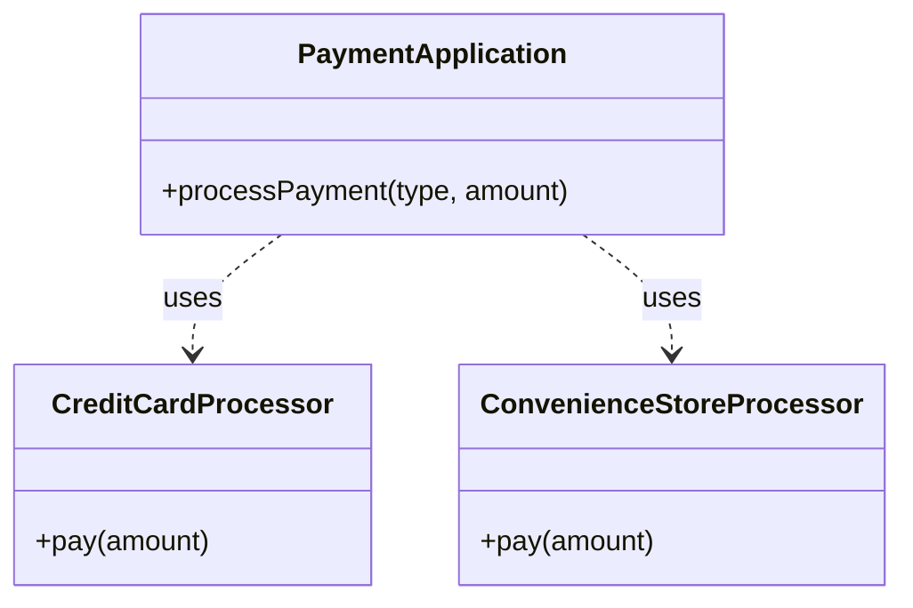
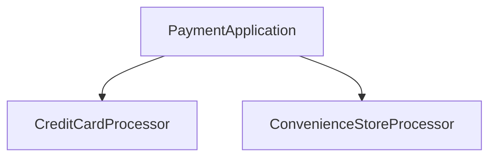
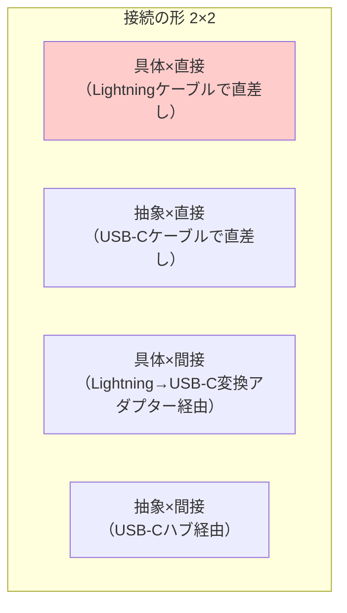
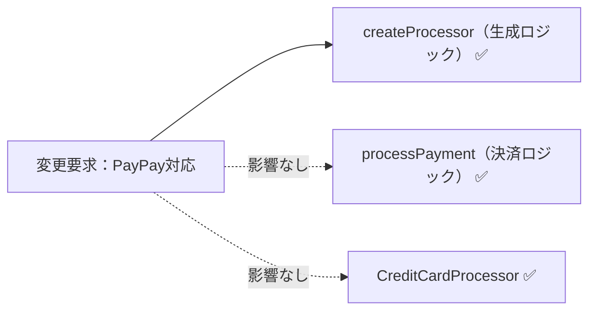
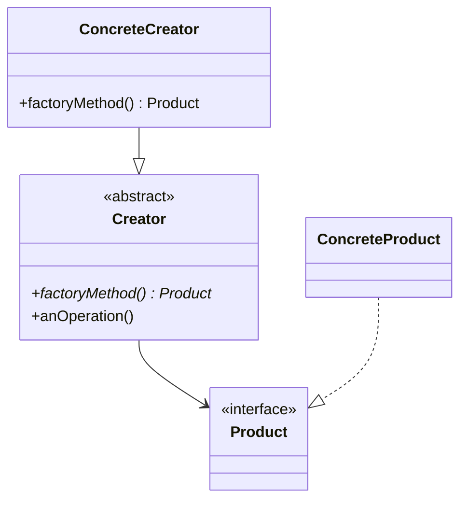

## 第8章 変わる生成の種類 ―― Factory Method パターン

―― 思考の型：インスタンスを生成する責任を、どこに置くか

### この章の核心

**ある機能を利用しようとするとき、その機能を実現するための「オブジェクトの生成」まで呼び出し側が担ってしまうと、新しい実装が必要になった際に呼び出し側まで芋づる式に修正しなければならなくなる。**

---

### この章を読むと得られること

第1章から第7章では「使う」ことの設計を扱いました。この章が問うのは「作る」ことの設計です——オブジェクトを生成している場所が、利用している場所と同居していると何が起きるか。「決済プロセッサーを切り替えたいだけなのに、なぜこんなにコードを変えなければならないのか」という問いが出てきたことがあるなら、この章に答えがあります。

* **得られること1：** 「オブジェクトを生成する」という観点で、コードの変動箇所を識別できるようになる
* **得られること2：** 接続点が「具体×直接」になっているクラスを見て、そこが生成と利用の混在による変更の痛みの発生源だと判断できるようになる
* **得られること3：** 生成の責任を分離し、インターフェースを介してインスタンスを得る構造にすることで、変更がどのように局所化（変更の影響が1クラスだけで済む状態）されるかを説明できるようになる
* **得られること4：** 利用側が具体的な生成ロジックを知らずに、必要な機能を持つオブジェクトを受け取れる視点

## 🔵 フェーズ1：現状把握 ―― 変更が来る前にコードを把握する

### 1-1：システムの背景

このシステムは、ある決済サービス事業者の「決済プロセッサー」を管理する基盤です。お客様がECサイトで買い物をするとき、クレジットカード決済やコンビニ決済など、さまざまな決済手段を選択しますが、このシステムは裏側でその手段ごとの処理を振り分ける役割を担っています。

当初、このサービスはクレジットカード決済だけをサポートしていました。しかし、ユーザーの利便性を高めるために、後からコンビニ決済、さらにPayPayなどのQRコード決済と、次々に新しい決済手段が追加されてきました。

コードを眺めてみると、`PaymentApplication` クラスという決済処理を統括するクラスの中で、`CreditCardProcessor` や `ConvenienceStoreProcessor` といった各決済手段の具体クラスを直接 `new` して利用する構成になっています。新しい決済手段が増えるたびに、この `PaymentApplication` クラスに新しい `case` 文や `if` 文が追加され、利用するクラスが増え続けてきました。

一見すると、一つのクラスがすべての決済手段を一元管理しており、処理全体を把握しやすいコードに見えます。このコードが今日まで多くのユーザーの決済を支え、事業の拡大とともに成長してきた事実を、まず率直に認めたいと思います。

---

### 1-2：仕様表

読者の皆さんがコードを読む前に、このシステムが「現在何をしているのか」を一覧で整理しておきましょう。

| **機能名** | **担当クラス** | **入力** | **出力** |
| --- | --- | --- | --- |
| 決済処理の実行 | `PaymentApplication` | 決済手段の種類(string), 金額(int) | 各決済プロセッサの実行結果 |
| クレジット決済 | `CreditCardProcessor` | 金額(int) | クレジットカード決済完了 |
| コンビニ決済 | `ConvenienceStoreProcessor` | 金額(int) | コンビニ支払い番号発行 |

---

### 1-3：クラス構成図

システムのクラス構成を可視化し、構造を確認します。



この図が示す通り、`PaymentApplication` というクラスが、クレジットカードやコンビニ決済といった個別の決済プロセッサーを直接利用（依存）している構成になっています。

---

### 1-4：責任配置テーブル

各クラスが「何を知るべきか（責任）」を定義し、事実を確認します。

| **クラス名** | **責任（1文）** | **知るべきこと** |
| --- | --- | --- |
| `PaymentApplication` | 決済手段の種類に応じて適切な決済処理をキックする。 | 利用可能な全決済プロセッサの具体名と、その生成方法。 |
| `CreditCardProcessor` | クレジットカード決済を実行する。 | クレジットカード特有のAPIやパラメータ。 |
| `ConvenienceStoreProcessor` | コンビニ決済を実行する。 | コンビニ特有のAPIやパラメータ。 |

この表から、`PaymentApplication` が本来の責務である「決済処理の振り分け」だけでなく、すべての決済手段の「具体名」や「生成方法」までを知っている状態が見て取れます。新しい決済手段が増えるたびに、このクラスがどんどん知るべきことを増やしていく、少し重たい構造になっていると言えるかもしれません。

---

### 1-5：依存グラフ

クラス間の「依存の方向」をマクロな視点で示します。



`PaymentApplication` に、すべての決済プロセッサーへの矢印が集中していることが分かります。

---

### 1-6：実装コード

それでは、実際にシステムを動かしているコードを見てみましょう。決済手段を切り替えて処理を実行する様子が分かります。

```cpp
#include <iostream>
#include <string>

using namespace std;

// 各決済手段の具体的な処理
class CreditCardProcessor {
public:
    void pay(int amount) {
        cout << "クレジットカードで " << amount << " 円決済しました。" << endl;
    }
};

class ConvenienceStoreProcessor {
public:
    void pay(int amount) {
        cout << "コンビニで " << amount << " 円の支払い番号を発行しました。" << endl;
    }
};

// 決済を統括するクラス
class PaymentApplication {
public:
    void processPayment(string type, int amount) {
        // ← 生成と利用が混在している箇所
        if (type == "credit") {
            CreditCardProcessor processor;
            processor.pay(amount);
        } else if (type == "cvs") {
            ConvenienceStoreProcessor processor;
            processor.pay(amount);
        }
    }
};

int main() {
    PaymentApplication app;
    app.processPayment("credit", 1000);
    app.processPayment("cvs", 500);
    return 0;
}

```

このコードを見ると、`PaymentApplication` クラスが、どの決済手段のクラスを生成し、どう実行するかをすべて直接知っていることが分かります。

---

### 1-7：実行結果

上記のコードを実行した結果は以下のようになります。

```text
クレジットカードで 1000 円決済しました。
コンビニで 500 円の支払い番号を発行しました。

```

> このコードは正しく動く。これから変えていくのは「機能」ではなく「構造」だ。

---

### 1-8：責任チェック表

コードが実際に「知っていること」を一行ずつ照合し、その知識が誰の判断で変わるのかを観察します。

| **コードの行** | **持っている知識** | **管理者（観察）** |
| --- | --- | --- |
| `CreditCardProcessor processor;` | クレジットカード決済クラスのクラス名と生成方法 | 決済手段を実装する開発者 |
| `if (type == "credit") { ... }` | クレジットカード決済を「credit」という文字列で特定する条件 | 画面側のUI担当者と決済手段を紐付ける担当者 |

責任チェックで見えたことを散文で述べます。`PaymentApplication` が、本来は決済ロジックの実行に集中すべき場所であるにもかかわらず、どのクラスを使って決済を行うかという「生成の知識」までを抱え込んでいる様子が観察できます。この「生成」と「利用」が同じ場所に並んでいることが、今後の修正を難しくする要因になりそうです。

要するに、決済手段ごとにクラスの生成処理を分岐させているという観察から、「オブジェクトの生成ロジック」と「機能の利用ロジック」が同じ場所に混在しているという構造の問題が見えてくる。

フェーズ1で責任配置の観察が終わりました。次のフェーズ2では、変更要求を受けて「何が変わり、何が変わらないか」の仮説を立てます。

フェーズ1で責任配置の観察が終わりました。次のフェーズ2では、現場に届いた変更要求を起点にして「何が変わり、何が変わらないか」の仮説を立て、関係者とのヒアリングを通じてそれを確定させていきます。生成の責任と利用の責任が一致しない箇所こそが、のちの問題の発生源になります。

---

## 🟠 フェーズ2：仮説立案 ―― 変更要求を受けて、変動と不変を整理する

### 2-1：届いた変更要求

ある週の火曜日、決済プラットフォームチームのリーダーからチャットで連絡が入りました。

「急ぎの相談なんだけど、来月から導入する新しい決済手段として『PayPay』に対応してほしいんだ。今のシステムでそのまま行けるか確認して、もし難しそうなら方針を教えてもらえるかな？ 決済手段が増えるのはビジネス上不可欠だから、なんとか対応したいんだ。」

なるほど、PayPayの対応ですね。コード上の PaymentApplication クラスを見ると、現状では CreditCardProcessor や ConvenienceStoreProcessor を直接 new して使っています。このままでは新しい決済手段が増えるたびに、PaymentApplication に新しい分岐を書き足し、クラスを直接生成するコードが増殖し続けることになります。このままの構造で対応してしまって本当に良いのか、少し立ち止まって考えてみたいと思います。

### 2-2：変動・不変の仮説テーブル

フェーズ1での観察（1-8の責任チェック表）を材料にして、この先の変更に対する仮説を立ててみます。

| **分類** | **仮説** | **根拠（フェーズ1の観察から）** |
| --- | --- | --- |
| 🔴 **変動しそう** | 新しい決済プロセッサーの種類とその生成ロジック | 1-8で、決済手段ごとの分岐と生成が PaymentApplication に混在していると観察したため。 |
| 🔴 **変動しそう** | 決済手段を識別するための識別子（type文字列） | 1-8で、識別用文字列と具体クラスの生成が直結していると観察したため。 |
| 🟢 **不変** | 「決済を実行する」というAPIインターフェース自体 | 決済手段が何であれ、金額を渡して処理を実行するという業務ルールは変わらないため。 |

コードを読んだだけで「生成ロジックはあちこちに変更が飛び火する」と断定するのは少し性急かもしれません。まずはこの仮説が現場の実態と合っているかを、チームメンバーや決済プラットフォームの担当者に確認するプロセスが必要です。

### 2-3：関係者ヒアリング

仮説を持って、決済プラットフォームチームの担当者と話し合いを持ちました。

**開発者：** 「PayPay対応の件ですが、今の構造だと決済手段が増えるたびに PaymentApplication クラスを修正する必要があります。今後も新しい決済手段は追加される予定でしょうか？」

**決済担当者：** 「ああ、かなりハイペースで追加していく予定だよ。次は銀行系の決済も入るし、後払いサービスも検討している。だから、決済手段が増えるたびに基幹部分のコードを書き換えるようなことはなるべく避けてほしいんだ。」

**開発者：** 「なるほど。では、決済処理を実行する時のインターフェース（金額を渡して実行する点）は今後も変わらないでしょうか？」

**決済担当者：** 「そこは固定だよ。どの手段でも『金額を受け取って決済する』という手続き自体は同じだからね。」

**開発者：** 「分かりました。決済の実行ルールは固定だけれど、生成する対象（プロセッサーの種類）はどんどん増えていくということですね。」

ヒアリングを通じて、決済の実行そのものは安定している一方で、その裏側にある「具体クラスの生成」が非常に不安定な変動要素であることが確定しました。

### 2-4：確定した変動/不変テーブル

ヒアリング結果を反映し、今回の設計で対象とすべき変動・不変を確定させました。

| **分類** | **具体的な内容** | **変わるタイミング** | **根拠（誰との確認か）** |
| --- | --- | --- | --- |
| 🔴 **変動する** | どの具体クラスを生成するかというロジック | 新しい決済手段の追加ごと | 決済担当者との合意 |
| 🔴 **変動する** | 決済手段を特定するための識別子と具体クラスの紐付け | 新しい決済手段の追加ごと | 決済担当者との合意 |
| 🟢 **不変** | 「決済を実行する」というインターフェース | 変わらない | 業務ルールとして合意 |

今後、新しい決済手段が追加されるたびに、決済の骨格を変えることなく、生成部分だけを切り替えられる構造が必要そうです。フェーズ2で「何が変わり、何が変わらないか」が確定しました。次のフェーズ3では、変更要求を実際に今のコードで試みて、何が起きるかを確認します。

フェーズ2で「決済プロセッサーの種類と生成ロジック」が頻繁に変わるという仮説が確定しました。次のフェーズ3では、その要求を今のコードのままで変更しようとすると何が起きるか、実際に試みてみましょう。

---

## 🟡 フェーズ3：問題特定 ―― 変更を試みて、痛みを発見する

### 3-1：変更シミュレーション

決済プラットフォームチームから届いた「PayPay対応」の要求を、今のコードで実装しようと試みます。

まず、`PayPayProcessor` という新しい決済処理クラスを新規作成します。次に、決済を統括している `PaymentApplication` クラスを開き、`processPayment` メソッドの中身を修正しなければなりません。具体的には、引数の `type` を判定する `if` 文（あるいは `case` 文）に `else if (type == "paypay")` という分岐を書き足し、その中で `PayPayProcessor` クラスを `new` して `pay` メソッドを呼び出す処理を実装します。

ここで気づくのは、決済手段が増えるたびにこの `PaymentApplication` クラスがどんどん長くなり、修正のたびにクラス内の既存ロジックを触らなければならないという事実です。もし決済手段が10個、20個と増えたら、このクラスは管理不能なほど巨大な「神クラス」になってしまうでしょう。

### 3-2：変更影響グラフ

変更を試みた結果、構造にどのような負荷がかかっているかをグラフ化してみます。


グラフを見ると、新しい決済手段という「ビジネス上の変化」を実装するたびに、本来は決済手段の振り分けだけを担うべき `PaymentApplication` クラスが必ず修正対象として矢印を向けられていることが分かります。

### 3-3：痛みの言語化

「新しい決済手段を追加するたびに、既存の決済ロジックまで再コンパイルしなきゃいけないのか…」

変更をシミュレーションする中で、エンジニアとして感じる「痛み」が鮮明になりました。

1つ目は、修正のたびに「決済の統括者」である `PaymentApplication` が汚染されていく辛さです。このクラスは本来、どの決済手段を使うかを判断するだけで良いはずなのに、個別のプロセッサーの生成方法や詳細な使い方までを直接握りしめています。決済手段が増えるたびにこのクラスを書き直す必要があるため、変更のたびにバグを混入させるリスクが付きまといます。

2つ目は、決済手段という「変わるもの」と、決済の振り分けという「変わらない構造」が同じ場所に混在しているという辛さです。決済プロセッサーが増えるたびに `if-else` のジャングルが深まり、コードの見通しが悪くなります。新しい決済手段を一つ足すだけで、既存の無関係な決済手段のコードまで巻き込んでテストをやり直さなければならない状況は、開発のスピードを著しく低下させる要因になっています。

フェーズ3で「今のままでは変更が辛い」という事実が確認できました。次のフェーズ4では、なぜこれほどまでに痛みが広がるのか、その根本的な原因を構造の観点から言語化します。


フェーズ3で「変更のたびに決済統括クラスが書き換わる」という痛みが確認できました。次のフェーズ4では、この痛みの構造的な原因を、責任の境界や接続形態の観点から言語化していきます。

---

## 🔴 フェーズ4：原因分析 ―― なぜ辛いのかを構造的に言語化する

### 4-1：観察→原因テーブル

フェーズ3で観察した「痛み」と、その根本にある構造的な原因を対応させてみます。

| **観察** | **原因の方向** |
| --- | --- |
| 新しい決済手段を追加するたびに、決済統括クラス（`PaymentApplication`）の修正が必要になる | `PaymentApplication` が、利用する決済手段の「具体的なクラス名」と「生成方法」を直接知っているから |
| 決済手段が増減するたびに、決済統括クラスが影響を受ける | 決済の「振り分け」という変わらない構造と、決済手段の「生成・具体名」という変わるものが、同じクラスの中に混在しているから |

こうして整理すると、問題の本質が見えてきます。決済統括クラスは本来、「金額を決済する」という命令を適切な相手に流すだけでよいはずです。しかし現状では、その相手が誰で、どうやって用意すべきかという詳細までを抱え込んでしまっています。これでは決済手段が増えるたびにこのクラスを汚すことになり、影響範囲が広がり続けるのは避けられません。

### 4-2：変わるもの / 変わらないものテーブル

原因の方向性が見えたところで、「変わり続けるもの」と「変わってほしくないもの」を明確に切り分けます。

| **変わり続けるもの（🔴）** | **変わってほしくないもの（🟢）** |
| --- | --- |
| 決済プロセッサーの具体的なクラス（クレジット、コンビニ、PayPay等）、およびそれらの生成ロジック | 「金額を受け取って決済を実行する」というAPIの定義（インターフェース）、および決済の振り分けフロー |

「金額を受け取って決済する」という手順は、どの決済手段であっても等しく発生します。この「決済実行の契約」こそが、変わってほしくないコア部分です。一方、どの具体的なプロセッサーを使って生成するかは、ビジネス要件によって今後も変動し続けます。この「変わる側」をうまく分離できれば、決済統括クラスは常に安定した状態を保てるはずです。

### 4-3：ケーブルで考える

現在のシステムがどのような接続形態にあるのか、2×2マトリクスを用いて診断してみます。

今の `PaymentApplication` クラスは、新しい決済手段を追加するたびに `new` 演算子で具体クラスを生成しています。これをケーブルの比喩で例えるなら、USB-Cケーブルを自作の専用基板にはんだ付けして直差ししている状態（具体×直接）だと言えます。

新しい機器（決済手段）をつなごうとするたびに、基板上の回路をいじり、物理的にはんだ付けをし直すような大工事が必要です。これでは、手段が増えるたびにメインの制御基板そのものを傷つけることになり、影響が広がるのは当然です。

```mermaid
quadrantChart
    title Factory Method パターン ── ★具体×直接（Lightning直差し）
    x-axis 直接（直差し） --> 間接（アダプター経由）
    y-axis 抽象（汎用規格） --> 具体（専用規格）
    quadrant-1 専用アダプター経由 (具体×間接)
    quadrant-2 ★ Lightning直差し (具体×直接)
    quadrant-3 USB-C直差し (抽象×直接)
    quadrant-4 USB-Cハブ経由 (抽象×間接)
    Lightning直差し: [0.25, 0.75]
    専用アダプター経由: [0.8, 0.75]
    USB-C直差し: [0.25, 0.25]
    USB-Cハブ経由: [0.8, 0.25]
```

このコードで言うと：

| ケーブル比喩 | コードの対応箇所 |
|---|---|
| 「具体」＝専用規格ケーブル | `CreditCardProcessor processor;` / `ConvenienceStoreProcessor processor;` — `if-else` の各枝で決済クラスの具体名を直接記述してインスタンス化している |
| 「直接」＝直差し | `if (type == "credit") { CreditCardProcessor processor; processor.pay(amount); }` — ファクトリを介さず `processPayment()` 内で直接生成・実行している |

現状の `PaymentApplication` と各決済プロセッサーは、その「変わる理由」が大きく異なります。メインの決済処理を安定させるためにも、具体クラスの生成という変動要素を、このクラスの外へと追い出すべきだと判断できます。

フェーズ4で根本原因が言語化できました。次のフェーズ5では、解決すべき問題を具体的に定めます。


---

## 🟣 フェーズ5：課題定義 ―― 解くべき問題を具体的に定める

フェーズ4で、「決済手段の具体クラスを直接生成している箇所が、決済ロジックの安定性を損なっている」という構造の問題を特定しました。しかし、単に「生成を分ける」と決めただけでは、どのように分けるべきかという指針がまだ定まっていません。

ここで、解くべき課題を4つの視点で具体化し、対策案を検討するための土台を作ります。

### 5-1：接続点の特定

フェーズ4の分析から、決済統括クラスである `PaymentApplication` と各プロセッサーの間には、以下のような接続点（ジョイント）が存在することが分かります。

* 接続点A：`PaymentApplication` ←→ `CreditCardProcessor` の生成・利用の境界
* 接続点B：`PaymentApplication` ←→ `ConvenienceStoreProcessor` の生成・利用の境界
* 接続点C：`PaymentApplication` ←→ `PayPayProcessor` の生成・利用の境界

合計で3つの接続点が存在します。新しい決済手段が追加されるたびに、`PaymentApplication` 内の分岐ロジックにこの接続点が追加され、既存コードを侵食していくことが、私たちが直面してきた「修正の連鎖」の直接的な原因です。これらの接続点を具体クラスから切り離し、抽象的な生成窓口へと統合することが今回の重要な課題です。

### 5-2：非機能制約の確認

接続の形を設計するにあたって、システム上の制約を確認しておきます。

| **確認項目** | **内容** | **この章での判断** |
| --- | --- | --- |
| 変更頻度 | この接続点はどのくらいの頻度で変わるか | 高（今後も決済手段が続々と追加される） |
| パフォーマンス | ホットパスか（高頻度で呼ばれるか） | はい（すべての決済の起点となるため、呼び出し頻度は非常に高い） |
| メモリ | 間接層の追加でオーバーヘッドが問題になるか | いいえ（生成処理自体は一度きりのため、メモリ負荷は軽微） |

変更頻度が「高」であるため、将来的に決済手段が増えても `PaymentApplication` を修正せずに済むような柔軟な抽象化が必須です。一方で「ホットパス」であるという点も無視できません。生成ロジック自体は高頻度で実行されるため、間接層を過剰に重ねるよりも、シンプルでオーバーヘッドの少ない接続の形が望まれます。

### 5-3：クライアントへの影響範囲

この接続点における「クライアント」は、具体的に決済プロセッサーを利用している `PaymentApplication` クラスです。接続点の形を変えるということは、このクラスの `processPayment` メソッド内にある `if` 文や `new` を排除することを意味します。ここをリファクタリングして「どの具体クラスが生成されるかを知らなくていい構造」に作り変えることは、今後の決済手段の追加コストを劇的に改善するはずです。

### 5-4：課題まとめ表

これまでの情報を一覧に整理します。

| **接続点** | **分けた理由** | **非機能制約** | **クライアント影響** |
| --- | --- | --- | --- |
| 接続点A〜C | 決済手段ごとの生成ロジックが混在している | ホットパス（高頻度） | `PaymentApplication` の利用ロジックに影響 |

この表から、私たちが目指すべき方向性が明確になりました。決済手段が何であろうと、`PaymentApplication` はその具体的なクラス名を知らずに、決済を実行するための「オブジェクトの生成窓口」だけを利用できるようにするのです。

フェーズ5で「何を解くか」が確定しました。次のフェーズ6では、この課題に対してどのような構造を導入すべきか、コストと将来性を見極めて対策案を検討します。


## 🟢 フェーズ6：対策案検討 ―― 解決策を並べ、コストで選ぶ

変更要求に対する解決策を、接続形態（具体・抽象 × 直接・間接）の観点から5つの案として整理しました。どの案にも一長一短があります。開発の文脈に応じて、最適な選択肢を冷静に見極めていきましょう。

### 6-1：接続の形 2×2マトリクス

現在の接続形態（具体×直接）から、決済手段の追加に柔軟に対応するためにどの方向へ移動すべきかを整理します。



---

#### 案0：現状維持 ―― 構造を変えない

**この形の考え方：**
クラスの分割も接続形態の変更もしない。既存の `processPayment` メソッドの中に、新しい決済手段のための `if` や `case` 文を書き足し、具体クラスをその場で `new` する。変更頻度が低く、納期が極めて厳しい場合に合理的な選択となる。

**この形にするための準備：**

* 既存の `if-else` の並びに新しい分岐を追加する

【コード例】

```cpp
void processPayment(string type, int amount) {
    if (type == "credit") {
        CreditCardProcessor p; p.pay(amount); // ← 具体：CreditCardProcessorという型名を直接書いている
    } else if (type == "paypay") {            // ← 追記
        PayPayProcessor p; p.pay(amount);     // ← 具体：PayPayProcessorという型名を直接書いている
    }
}

```

**呼び出し側から見た違い（main() 例）：**

```cpp
// 案0（現状維持）の呼び出し側
int main() {
    PaymentApplication app;             // ← 直接：PaymentApplicationを直接生成して使う
    app.processPayment("credit", 1000); // ← 具体：内部にCreditCardProcessorなどが直書きされている
    app.processPayment("paypay", 700);
    return 0;
}
```

**この形のトレードオフ：**

* 変更容易性：低（新しい手段のたびに統括クラスを修正する）
* テスト容易性：低（決済処理と生成が混在しており分離不可）
* 実装コスト：低（今のコードに数行足すだけ）

---

#### 案1：具体×直接 ―― クラスは分けるが参照は具体型のまま

**この形の考え方：**
決済処理をクラスとして抽出するが、`PaymentApplication` は相変わらず具体クラスを直接 `new` する。責任の境界は明確になるが、生成ロジックの混在は解消されない。

**この形にするための準備：**

1. 決済処理を別クラスとして切り出す
2. `PaymentApplication` からその具体クラスを `new` するコードを呼び出す

【コード例】

```cpp
void processPayment(string type, int amount) {
    if (type == "paypay") {
        PayPayProcessor p; // ← 具体：PayPayProcessorという型名を直接書いている
        p.pay(amount);     // ← 直接：呼び出し側がこのクラスを直接インスタンス化している
    }
}

```

**呼び出し側から見た違い（main() 例）：**

```cpp
// 案1（具体×直接）の呼び出し側
int main() {
    PaymentApplication app; // ← 直接：PaymentApplicationを直接生成して使う
    app.processPayment("paypay", 700); // ← 具体：内部でPayPayProcessorが直接生成される
    return 0;
}
```

**この形のトレードオフ：**

* 変更容易性：低（決済手段追加のたびに `PaymentApplication` の修正が必要）
* テスト容易性：低（具体クラスへの依存が強いため切り離せない）
* 実装コスト：低（抽出するだけのシンプルなリファクタリング）

---

#### 案2：抽象×直接 ―― インターフェースを挟み、型だけで接続する

**この形の考え方：**
各決済プロセッサーに共通のインターフェース（契約）を持たせ、生成の窓口をメソッドとして切り出す。この構造を **Factory Method パターン** と呼ぶ。利用側は「どんな具体クラスか」を知らずに、インターフェースを介して決済を実行できるようになる。

**この形にするための準備：**

1. `IPaymentProcessor` インターフェースを定義する
2. 各プロセッサーにこれを実装させる
3. `PaymentApplication` に「生成を担うメソッド（Factory Method）」を定義する

【コード例】

```cpp
class IPaymentProcessor { // ← ここを Factory Method パターンと呼ぶ
public:
    virtual void pay(int amount) = 0;
};

// 呼び出し側の修正
void processPayment(string type, int amount) {
    IPaymentProcessor* p = createProcessor(type); // ← 抽象：IPaymentProcessor*型で受け取り、具体クラスを知らない
    p->pay(amount);                               // ← 直接：中間クラスを挟まずに直接呼び出す
}

```

**呼び出し側から見た違い（main() 例）：**

```cpp
// 案2（抽象×直接）の呼び出し側
int main() {
    PaymentApplication app;              // ← 直接：PaymentApplicationを直接生成
    app.processPayment("credit", 1000);  // ← 抽象：呼び出し側は具体クラスを知らない
    app.processPayment("paypay", 700);
    return 0;
}
```

**この形のトレードオフ：**

* 変更容易性：中〜高（生成ロジックは切り出されたため、元の決済ロジックは無影響）
* テスト容易性：高（インターフェースに対しスタブを差し込める）
* 実装コスト：中（インターフェース設計と生成メソッドの導入が必要）

---

#### 案3：具体×間接 ―― 仲介クラスを置くが、具体型を知っている

**この形の考え方：**
`PaymentApplication` と決済プロセッサーの間に「決済マネージャー」を置く。統括クラスはマネージャーだけを知り、マネージャーが各プロセッサーの生成を管理する。

**この形にするための準備：**

1. `ProcessorManager` を作成する
2. マネージャーに具体クラスの生成・管理責任を持たせる
3. `PaymentApplication` はマネージャーのメソッドを呼ぶだけにする

【コード例】

```cpp
class ProcessorManager {
public:
    void execute(string type, int amount) {
        if (type == "paypay") {
            PayPayProcessor p; p.pay(amount); // ← 具体：マネージャーが具体クラスを直接知っている
        }
    }
};

class PaymentApplication {
    ProcessorManager manager; // ← 具体：ProcessorManagerという具体型を持っている
public:
    void processPayment(string type, int amount) {
        manager.execute(type, amount); // ← 間接：マネージャー経由で呼ぶため具体プロセッサーが見えない
    }
};

```

**呼び出し側から見た違い（main() 例）：**

```cpp
// 案3（具体×間接）の呼び出し側
int main() {
    PaymentApplication app;  // ← 間接：ProcessorManagerが内部に隠れており呼び出し側には見えない
    app.processPayment("paypay", 700); // 内部でProcessorManagerが動くが、呼び出し側は知らない
    return 0;
}
```

**この形のトレードオフ：**

* 変更容易性：中（通知先の増減修正はマネージャーに閉じる）
* テスト容易性：中（マネージャーをスタブ化すればテスト可能）
* 実装コスト：中（仲介クラスの責任設計が必要）

---

#### 案4：抽象×間接 ―― インターフェース＋仲介役を両立する

**この形の考え方：**
インターフェース（案2）と仲介役（案3）を組み合わせる。通知元は抽象インターフェースを知り、その具体的な生成は仲介役（Factory）に委ねる。最も柔軟だがクラス構成は複雑になる。

**この形にするための準備：**

1. 案2のインターフェース導入
2. 案3の仲介役クラスに、インターフェースを介して生成させる

【コード例】

```cpp
class PaymentFactory { // ← 抽象：生成の窓口をインターフェースとして定義
public:
    virtual IPaymentProcessor* create(string type) = 0; // ← 抽象：IPaymentProcessor*型で返す
};

class PaymentApplication {
    PaymentFactory* factory; // ← 抽象：PaymentFactory*型で受け取り、具体実装を知らない
public:
    PaymentApplication(PaymentFactory* f) : factory(f) {}
    void processPayment(string type, int amount) {
        IPaymentProcessor* p = factory->create(type); // ← 間接：Factoryを経由するため具体クラスが見えない
        p->pay(amount);
    }
};

```

**呼び出し側から見た違い（main() 例）：**

```cpp
// 案4（抽象×間接）の呼び出し側
int main() {
    ConcretePaymentFactory factory;      // ← 具体：組み立て側だけが具体型を知る
    PaymentApplication app(&factory);    // ← 間接：抽象Factoryのみ見えて具体実装は隠れる
    app.processPayment("credit", 1000);
    return 0;
}
```

**この形のトレードオフ：**

* 変更容易性：高（どの層の実装が変わっても他層は無影響）
* テスト容易性：高（全層でスタブに差し替え可）
* 実装コスト：高（I/F設計と仲介クラスの双方が必要）

---

### 6-7：評価軸

対策案を比較するための「ものさし」を先に宣言します。全章で共通の3軸を採用し、パフォーマンスへの影響をVETO（拒否権）として設定します。

| **評価軸** | **意味** | **ウェイト** |
| --- | --- | --- |
| 変更容易性 | 変更要求（決済手段の増減）に対し、触る場所が最小で済むか | ×3 |
| テスト容易性 | プロセッサーをスタブ/モックに差し替えて決済基盤を独立してテストできるか | ×2 |
| 可読性 | インターフェースや生成クラスの導入による構造の理解コスト | ×1 |

**採点基準（章共通）：**

| 点数 | 変更容易性 | テスト容易性 | 可読性 |
| --- | --- | --- | --- |
| 3 | 1クラス追加のみで完結 | スタブ1つで完全に切り離せる | クラス増なし・直感的に理解可能 |
| 2 | 2〜3クラスの修正が必要 | 一部スタブが必要だが可能 | クラス1〜2個増・標準的な構造 |
| 1 | 4クラス以上の波及 | 実装に依存しテストが困難 | 中間層が複数増え理解コストが高い |

**パフォーマンスの VETO 判定：**
フェーズ5の課題定義において、この決済基盤はすべての決済の起点となる「ホットパス（頻繁に呼び出されるコードパス）」であると判定されました。 そのため、間接層を過剰に増やす案4（抽象×間接）の採用には慎重を期し、パフォーマンス計測で明確な劣化がない限り、よりオーバーヘッドの小さい構成を優先します。

---

### 6-8：コスト天秤

5つの案を、現在および未来のコスト観点で比較します。

| **案** | **現在の対応コスト** | **未来の対応コスト** |
| --- | --- | --- |
| 案0：構造を変えない | 低 | 高 |
| 案1：具体×直接 | 低〜中 | 高 |
| 案2：抽象×直接 | 中 | 低〜中 |
| 案3：具体×間接 | 中 | 中 |
| 案4：抽象×間接 | 高 | 低 |

**ステップ1：採点表**

| 案 | 変更容易性（×3） | テスト容易性（×2） | 可読性（×1） |
| --- | --- | --- | --- |
| 案0：構造を変えない | 1 | 1 | 3 |
| 案1：具体×直接 | 1 | 2 | 3 |
| 案2：抽象×直接 | 3 | 3 | 2 |
| 案3：具体×間接 | 2 | 2 | 2 |
| 案4：抽象×間接 | 3 | 3 | 1 |

**ステップ2：加重合計表**

| 案 | 加重スコア | 判定 |
| --- | --- | --- |
| 案0 | 1×3＋1×2＋3×1＝8 |  |
| 案1 | 1×3＋2×2＋3×1＝10 |  |
| 案2 | 3×3＋3×2＋2×1＝17 | ← 採用候補 |
| 案3 | 2×3＋2×2＋2×1＝12 |  |
| 案4 | 3×3＋3×2＋1×1＝16 | ※VETOの確認が必要 |

※案4は柔軟ですが、ホットパスであることを考慮し、シンプルな構造で高い変更耐性を持つ案2（抽象×直接）を第一候補とします。

---

### 6-9：採用案の決定

**採用する案：** 案2（抽象×直接 ―― これを Factory Method パターンと呼ぶ）

**理由：**
ホットパスであるため、間接参照によるコストを避けつつ、決済手段の増減という「変動要因」をインターフェースと生成メソッドにカプセル化（変更の影響を1クラスに閉じること）できるためです。 案4ほどの過剰な複雑さを避けつつ、将来の変更に十分対応できるバランスの良い選択です。

---

### 6-10：耐久テスト

フェーズ2のヒアリングで挙がった将来のリスクに対する耐性を確認します。

| **変更シナリオ** | **触る場所** | **コスト評価** |
| --- | --- | --- |
| 銀行系決済を追加する | 新しいクラスを作り、`createProcessor` を修正するだけ | 低 |
| 後払い決済に変更がある | そのプロセッサクラスを修正するだけ | 低 |

採用した設計では、新しい決済手段の追加が「新しいクラスの作成と生成ロジックの修正」に閉じており、既存の決済基盤ロジックには影響を与えないことが実証されました。

## 🟤 フェーズ7：対策実施 ―― 決断し、変化に強い設計を手に入れる

採用案である Factory Method パターン（案2：抽象×直接）を実装し、決済プロセッサーの生成をカプセル化（変更の影響が1クラスだけで済む状態）します。 これにより、決済処理のメインロジックから具体的なクラス名の依存を排除します。

### 7-1：解決後のコード（全体）

インターフェース `IPaymentProcessor` を定義し、具体的な生成ロジックを `PaymentApplication` クラスのファクトリメソッドとして集約します。

```cpp
#include <iostream>
#include <string>

using namespace std;

// インターフェース：ビジネス責任で命名
class IPaymentProcessor {
public:
    virtual ~IPaymentProcessor() = default;
    virtual void pay(int amount) = 0;
};

// 具体的な実装クラス（技術名で命名してもよい）
class CreditCardProcessor : public IPaymentProcessor {
public:
    void pay(int amount) override {
        cout << "クレジットで " << amount << " 円決済しました。" << endl;
    }
};

class ConvenienceStoreProcessor : public IPaymentProcessor {
public:
    void pay(int amount) override {
        cout << "コンビニで " << amount << " 円の支払い番号を発行しました。" << endl;
    }
};

// ← 新しい決済手段（PayPayなど）はここに追加するだけ（ここだけ変わる）
class PayPayProcessor : public IPaymentProcessor {
public:
    void pay(int amount) override {
        cout << "PayPayで " << amount << " 円決済しました。" << endl;
    }
};

class PaymentApplication {
private:
    // Factory Method：生成ロジックをここに集約
    IPaymentProcessor* createProcessor(string type) {
        if (type == "credit") return new CreditCardProcessor();
        if (type == "cvs") return new ConvenienceStoreProcessor();
        if (type == "paypay") return new PayPayProcessor(); // ← ここだけ変わる
        return nullptr;
    }

public:
    void processPayment(string type, int amount) {
        IPaymentProcessor* processor = createProcessor(type); // ← 知らなくていい
        if (processor) {
            processor->pay(amount); // ← 知らなくていい
            delete processor;
        }
    }
};

int main() {
    PaymentApplication app;
    app.processPayment("credit", 1000);
    app.processPayment("paypay", 700); // ← 新しい決済手段も呼び出せる
    return 0;
}

```

この実装により、`processPayment` メソッド内のロジックは、決済プロセッサーがどのようなクラスであっても共通のメソッドを呼ぶだけでよくなりました。

### 7-2：変更影響グラフ（改善後）

フェーズ3で行った「PayPay決済の追加」という要求を、改善後の構造で再確認します。



→ フェーズ3のグラフと比較して、決済手段の追加という変更要求が、生成ロジックの部分だけに限定され、決済本体のロジックには影響が及ばなくなりました。

### 7-3：変更シナリオ表

この設計で得た変更耐性をまとめます。

| **シナリオ** | **変わるクラス（触る場所）** | **変わらないクラス** |
| --- | --- | --- |
| 新しい決済手段（銀行系）を追加する | `createProcessor` メソッド | `PaymentApplication` (決済ロジック), `IPaymentProcessor` |
| 既存の「コンビニ決済」の実装を変更する | `ConvenienceStoreProcessor` | `PaymentApplication`, 他の決済手段クラス |

変更が来ても、触るのは生成ロジックを管理する1箇所だけ——それがこの設計で手に入れたものです。 諦めたものは、メソッドの追加というわずかな複雑さです。

---

### 7-4：接続形態の確認 ── この設計はどの接続か

フェーズ4-3で診断した通り、変更前のコードは **具体×直接** の状態でした。
採用した Factory Method パターンでは、接続形態が **抽象×直接（USB-C直差し）** へと変化しています。

**「抽象×直接」の証拠となるコード：**

```cpp
class PaymentApplication {
public:
    void processPayment(string type, int amount) {
        IPaymentProcessor* processor = createProcessor(type); // ← インターフェース型 = 「抽象」の証拠
        if (processor) {
            processor->pay(amount); // ← 直接呼び出し = 「直接」の証拠
        }
    }
private:
    IPaymentProcessor* createProcessor(string type) { // ← Factory Method
        if (type == "credit") return new CreditCardProcessor();
        // ...
    }
};
```

- `IPaymentProcessor*` はインターフェース型 → **「抽象」** の証拠（具体的な決済クラス名を知らない）
- `processor->pay(amount)` は中間クラスを挟まない直接呼び出し → **「直接」** の証拠

「生成の仕方だけを差し替えたい（決済手段を追加・変更したい）」という動機から、**抽象×直接** が選ばれました。

### 整理・振り返り・パターン解説

第8章の締めくくりとして、私たちが辿ってきた7フェーズの思考プロセスを振り返ります。 このプロセスを意識的に回すことで、決済プロセッサーのような「変化を伴うインスタンス生成」に対しても、依存を恐れずに設計できる力が身につくはずです。

#### 7フェーズとこの章でやったこと

| **フェーズ** | **この章でやったこと** |
| --- | --- |
| 🔵 フェーズ1：現状把握 | 決済サービスにおいて、決済プロセッサーの生成と利用が同じクラスに混在している構造を観察した。 |
| 🟠 フェーズ2：仮説立案 | プラットフォームチームへのヒアリングを通じ、新しい決済手段が今後も増え続けることを「変動要因」として確定した。 |
| 🟡 フェーズ3：問題特定 | 具体的な決済手段を追加しようとすると、決済統括クラスが修正対象になるという「痛み」を確認した。 |
| 🔴 フェーズ4：原因分析 | 生成と利用のロジックが混在していることが、変更影響を広げる根本原因だと特定した。 |
| 🟣 フェーズ5：課題定義 | ホットパスであることを考慮し、過剰な間接層を避けつつ、具体クラスへの依存を断つ接続形態を課題とした。 |
| 🟢 フェーズ6：対策案検討 | 案0〜案4を比較し、インターフェースと生成メソッドを導入する Factory Method パターン構造（案2）を採用した。 |
| 🟤 フェーズ7：対策実施 | 決済統括クラス内に生成の窓口を移譲し、決済の実行ロジックを変更から保護した。 |

#### 各クラスの最終的な責任

最終的なクラス構成は以下の通り整理されました。 各クラスが単一の役割を担い、変更理由が隔離されています。

| **クラス名** | **責任（1文）** | **変わる理由** |
| --- | --- | --- |
| `IPaymentProcessor` | 決済処理が実装すべきインタフェースを提供する。 | なし（抽象） |
| `PaymentApplication` | 決済手段の種類に応じて、適切なプロセッサーを選択・生成し実行する。 | 決済の振り分けフローが変わる場合 |
| `CreditCardProcessor` 等 | 各決済プロセッサの具体的な決済APIを実行する。 | 各決済手段のAPIやパラメータが変わる場合 |

> **このプロセスを回した結果にたどり着いた構造こそが Factory Method パターン です。**
> 

#### 振り返り：「この章を読むと得られること」は手に入ったか

| **得られること** | **この章のどこで示したか** |
| --- | --- |
| 変動箇所の識別力 | フェーズ2の仮説テーブルで、生成ロジックを変動要因として特定しました。 |
| 接続形態の診断力 | フェーズ4のケーブル比喩で「具体×直接」の弊害を診断しました。 |
| 構造改善の説明力 | フェーズ7の変更影響グラフで、変更が局所化された様子を説明しました。 |

#### 振り返り：第0章の3つの設計原則はどう適用されたか

* **原則1「変わるものをカプセル化せよ」の現れ**
* **具体化された場所：** `createProcessor` メソッド（Factory Method）
* **解説：** 具体クラスの生成という「変わる理由」を、メソッド内にカプセル化しました。


* **原則2「実装ではなくインターフェースに対してプログラムせよ」の現れ**
* **具体化された場所：** `IPaymentProcessor` インターフェース
* **解説：** `PaymentApplication` は具体型ではなくインターフェース型を使って決済を実行するようになりました。


* **原則3「継承よりコンポジションを優先せよ」の現れ**
* **具体化された場所：** `PaymentApplication` による決済ロジック
* **解説：** 生成したインスタンスを「利用」するというコンポジションの関係を保ちつつ、生成手順のみをメソッドに分離しました。


---

### パターン解説：Factory Method パターン

Factory Method パターンは、インスタンスの生成をサブクラスやメソッドに委譲することで、具体クラスへの依存を断ち切り、利用側をインスタンス生成の知識から解放します。

#### パターンの骨格



#### この章の実装との対応

`Creator` が `PaymentApplication`（生成メソッドを持つ）、`Product` が `IPaymentProcessor`（インターフェース）、`ConcreteProduct` が各決済プロセッサークラスに対応します。

#### 使いどころと限界

* **使うと良い状況**：クラスが生成すべきオブジェクトの具体クラスを特定できない場合や、将来的に新しいサブクラスを柔軟に追加したい場合。


* **使わない方が良い状況**：生成ロジックが極めて単純で、将来的な拡張の余地が全くない場合。


【過剰コード：変化の予定がないものまでパターン化した例】

```cpp
// 単に固定のクラスをnewするだけで、手段が増える予定もない場合は、
// Factory Methodを導入するとコードが却って複雑になります。

```

### この章のまとめ

接続点の形を「具体クラスへの直差し」から「生成窓口を介した抽象接続」に変えたことで、利用側は具体的な生成の責任から解放されました。 これにより、新しい決済手段が追加されても、既存の決済フローを変更することなく拡張できるようになりました。