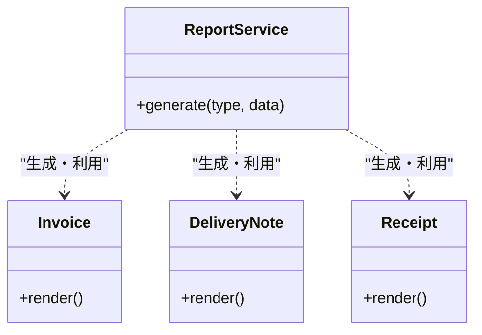
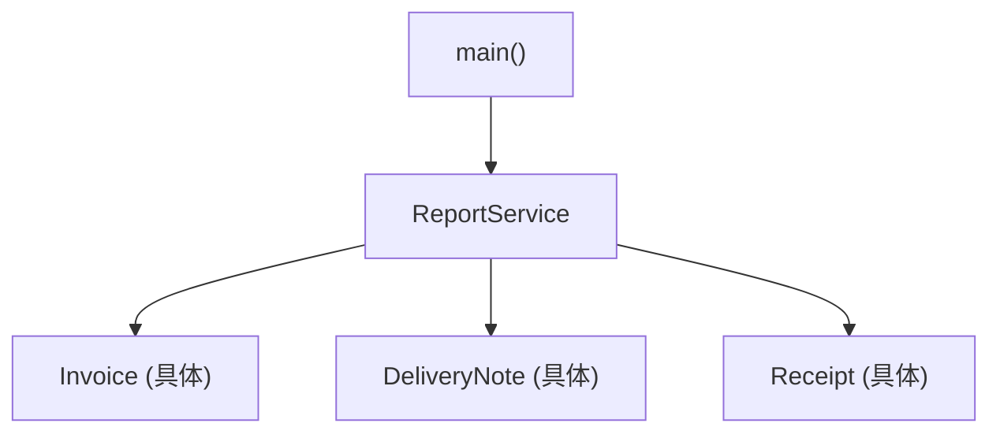
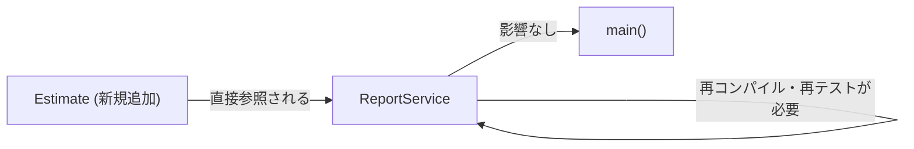
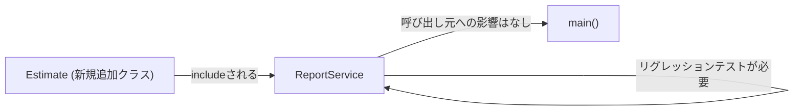
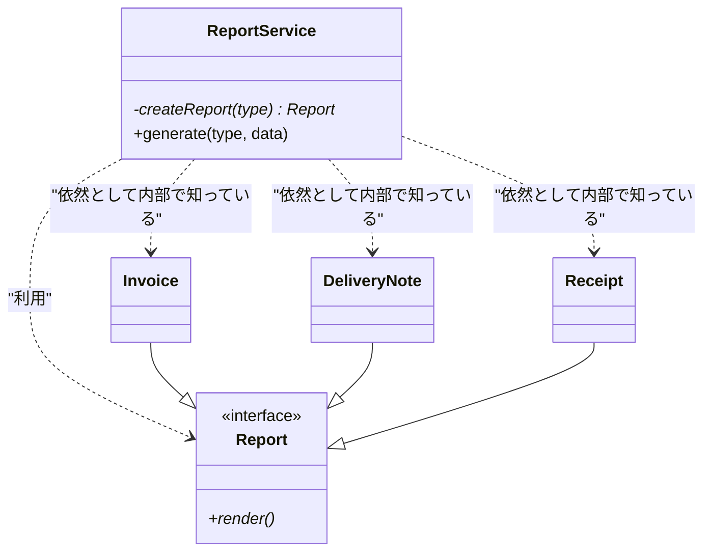
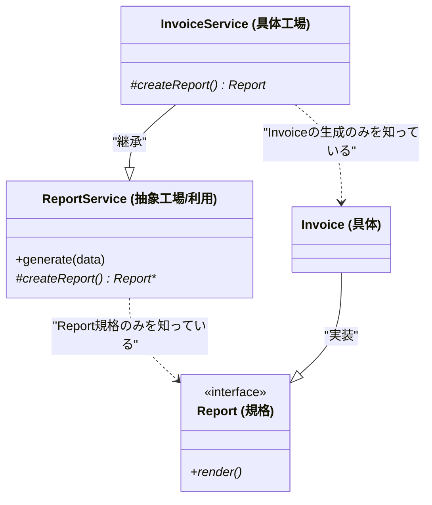
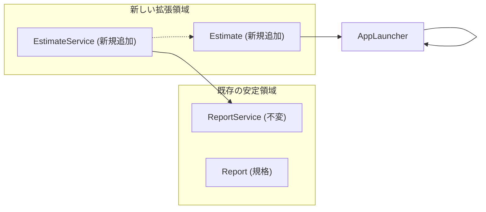
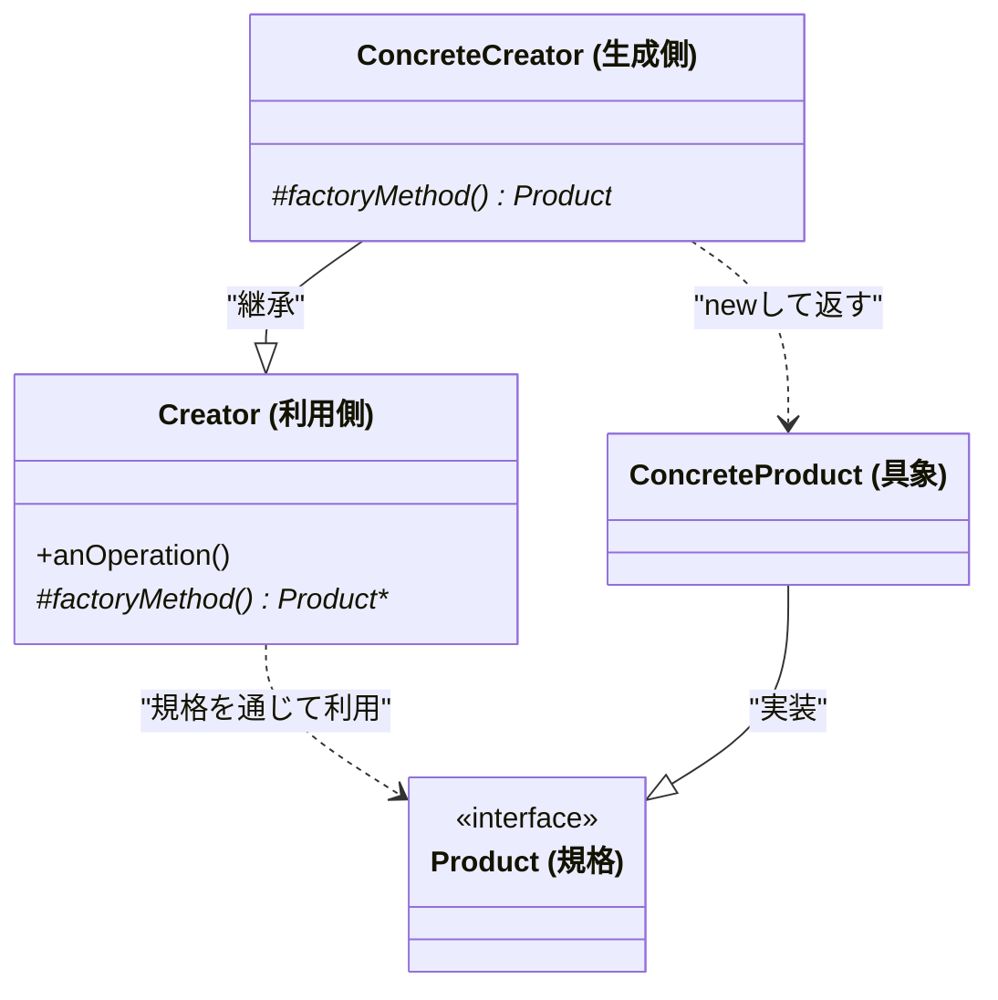

## 第8章　Factory Method

―― 思考の型： 「作る判断」と「使う処理」の混在を解消する

### この章の核心

「どのオブジェクトを作るか」という判断をサブクラスや別の場所に切り離すことで、利用側のコードを修正することなく、新しい種類のオブジェクトを自由に追加・差し替えできるようにします。

> **【レゴブロックで考える：Factory Method】**
> 
> 飛行機や船など、いろいろなものに作り変えられる「魔法の組み立てボックス」をイメージしてください。ボックスの「外側」はいつも同じ形をしていて、遊び方は変わりません。でも、中に差し込む「設計図パーツ」を入れ替えるだけで、ボックスから出てくる完成品がガラリと変わります。中身を入れ替えるときに、ボックス本体をバラバラに分解して作り直す必要はありません。
> 
> [ImagePrompt: A 3D isometric illustration of a colorful Lego "magic box" machine. A child is sliding a small blue instruction plate into a slot on the side. Depending on the plate, the machine's output conveyor belt shows different small Lego models: a tiny plane, a tiny boat, and a tiny car. Clean white background, educational toy aesthetic.]

### この章を読むと得られること

- **得られること1：** 「新しい種類が増えるたびにif文が伸びていく」という負の連鎖を断ち切る構造を見つけられるようになる
    
- **得られること2：** オブジェクトの「生成ロジック」と「利用ロジック」を切り離し、それぞれ独立してテストや拡張ができるようになる
    
- **得られること3：** 顧客ごとのカスタマイズや環境設定に応じたオブジェクトの切り替えを、既存コードを壊さずに行う判断基準がわかる
    

---

### ステップ0：システムを把握し、仮説を立てる ―― クラス構成を見てから「変わりそうな場所」を予測する

- **入力：** 帳票出力システムのシナリオ説明 ＋ クラス構成の概要
    
- **産物：** 変動と不変の「仮説テーブル」
    

> **全パターンに共通する問い**
> 
> 「このコードの中に、『変わる理由』が異なる2つのものが、同じ場所に混在していないか？」
> 
> ※「変わる理由」とは「誰の判断で変わるか」のことです。

#### 8.0 この章のシステム構成と仮説

**この章で扱うシステム：**

業務システムのデータを元に、PDF形式の帳票を出力するモジュールを扱います。現在は請求書、納品書、領収書の3種類に対応していますが、ビジネスの成長に合わせて新しい帳票が追加される予定です。

**仕様表（何ができるシステムか）**

|**機能名**|**担当クラス**|**入力**|**出力**|
|---|---|---|---|
|帳票生成・出力管理|`ReportService`|帳票種別、データ|PDF出力実行|
|請求書出力|`Invoice`|請求データ|PDFイメージ|
|納品書出力|`DeliveryNote`|納品データ|PDFイメージ|
|領収書出力|`Receipt`|領収データ|PDFイメージ|

**クラス構成の概要**




→ **`ReportService` がすべての具体的な帳票クラスを直接知っており、生成と利用の両方を抱え込んでいます。**

**各クラスの責任一覧**

|**クラス名**|**対象責任（1文）**|**知るべきこと**|
|---|---|---|
|`ReportService`|指定された種別の帳票を作り、出力を実行する|全ての帳票種別と、その作り方、および出力手順|
|`Invoice`|請求書の内容をPDF形式で描画する|請求データの構造|
|`DeliveryNote`|納品書の内容をPDF形式で描画する|納品データの構造|
|`Receipt`|領収書の内容をPDF形式で描画する|領収データの構造|

この構成を踏まえた上で、仮説を立てます。

**変動と不変の仮説（実装コードを読む前に立てる）**

|**分類**|**仮説**|**根拠（クラス構成から読み取れること）**|
|---|---|---|
|🔴 **変動する**|帳票の種類（見積書など）|ビジネス要件の変化で、新しい書類形式が必要になるのは必然だから|
|🔴 **変動する**|帳票の生成ルール|「どの顧客にはどのテンプレートを使うか」といった判断基準は変わりやすい|
|🟢 **不変**|帳票を出力する手順|「生成して、描画（render）して、完了報告する」という業務の流れ自体は変わらない|

この仮説をステップ2（8.3）でヒアリング後に確定します。次は、実際にこの構造がどのようなコードになっているかを見ていきましょう。

### ステップ1：実装コードを読む ―― 責任チェックで問題の行を見つける

- **入力：** ステップ0で把握したクラス責任 ＋ 実際の実装コード
    
- **産物：** 責任チェック表。「このクラスが持つべきでない知識」が混在している行の発見
    

#### 8.1 実装コードと責任チェック

ステップ0で、各クラスが担うべき役割を整理しました。一見すると、それぞれの帳票クラスが自分の描画ロジックを持ち、`ReportService` がそれらを統括しているように見えます。しかし、実際のコードの中身を覗いてみると、ある「密な結合」が潜んでいることがわかります。

まずは、現在のシステムの全体像を依存関係の視点から確認してみましょう。

**依存の広がり（実装前の全体像）**




→ **利用側である `ReportService` が、すべての具体的な帳票クラス（Invoice等）を直接参照しています。**

この構造が、コードレベルでどのような問題を引き起こしているのか。実際に動いているコードを読み解いていきましょう。


```cpp
#include <iostream>
#include <string>

// --- 各帳票の具象クラス ---
// 本来は別ファイルですが、ここでは流れを追うために並べて記述します。

class Invoice {
public:
    void render() {
        std::cout << "[PDF] 請求書を出力しました。明細：..." << std::endl;
    }
};

class DeliveryNote {
public:
    void render() {
        std::cout << "[PDF] 納品書を出力しました。宛先：..." << std::endl;
    }
};

class Receipt {
public:
    void render() {
        std::cout << "[PDF] 領収書を出力しました。但し書き：..." << std::endl;
    }
};

// --- サービス層 ---

class ReportService {
public:
    // 帳票の種類を判断して生成し、出力を実行する
    void generate(std::string type, std::string data) {
        std::cout << "--- 帳票出力プロセス開始 ---" << std::endl;

        // 【問題の箇所】
        // 1. 生成ロジック：種類に応じて具体的なクラスを選んでnewする
        if (type == "Invoice") {
            Invoice report; // ← 具体クラスを知っている
            report.render();
        } 
        else if (type == "DeliveryNote") {
            DeliveryNote report; // ← 具体クラスを知っている
            report.render();
        } 
        else if (type == "Receipt") {
            Receipt report; // ← 具体クラスを知っている
            report.render();
        }

        // 2. 利用ロジック：出力完了後の共通処理
        std::cout << "ログ保存: " << type << " を出力完了しました。" << std::endl;
        std::cout << "--- 帳票出力プロセス終了 ---" << std::endl;
    }
};

// --- 起点コード ---

int main() {
    ReportService service;
    
    // 請求書を出力
    service.generate("Invoice", "2025-10-01, 50000JPY");
    
    // 納品書を出力
    service.generate("DeliveryNote", "2025-10-01, Client-A");

    return 0;
}
```

**実行結果：**

```
--- 帳票出力プロセス開始 ---
[PDF] 請求書を出力しました。明細：...
ログ保存: Invoice を出力完了しました。
--- 帳票出力プロセス終了 ---
--- 帳票出力プロセス開始 ---
[PDF] 納品書を出力しました。宛先：...
ログ保存: DeliveryNote を出力完了しました。
--- 帳票出力プロセス終了 ---
```

このコードは意図通りに動作します。しかし、設計の視点から見ると、`ReportService` はあまりに「多くのことを知りすぎている」状態です。責任チェック表を使って、1行ずつ確認してみましょう。

**責任チェック： ReportService は自分の責任だけを持っているか**

`ReportService` の責任： 「指定された種別の帳票を作り、出力を実行する」 知るべきこと： 「帳票という抽象的な存在の扱い方」であって、「具体的な各帳票の作り方」ではないはずです。

|**コードの行**|**持っている知識**|**責任内か**|
|---|---|---|
|`if (type == "Invoice")`|「Invoice」という具体的な文字列と判定ルール|✗ 生成の詳細（判断）|
|`Invoice report;`|`Invoice` クラスという具体的な型情報|✗ 具象への依存|
|`report.render();`|帳票には `render()` という操作があること|✅ 利用側の知識|
|`std::cout << "ログ保存..."`|出力完了後のビジネスフロー|✅ Serviceの主責任|

一見、うまくまとまっているように見える `generate` メソッドですが、実は「どのオブジェクトを作るか」という**生成の判断**と、「作ったものをどう使うか」という**利用の処理**が、一つのメソッドの中で癒着してしまっています。

この「混在」が、次にやってくる変更要求でどのような痛みをもたらすのか。現場の声を聞いてみましょう。

#### 8.2 届いた変更要求

営業部門の担当者が、少し申し訳なさそうにデスクにやってきました。

> **営業担当：** 「すみません、新しい帳票の追加をお願いしたいんです。今月の末から『見積書（Estimate）』もシステムから出せるようにしたくて。来月からはさらに、特定の優良顧客向けにロゴ入りの豪華な特別デザイン版も用意したいという話が出ています。まずは見積書だけでいいんですが、対応できそうですか？」

月末。あと数日しかありません。今のコードに見積書を追加するには、あの `if / else` ブロックを開いて、新しい具体クラスを `new` するコードを書き足す必要がありそうです。

---

### ステップ2：仮説を確定する ―― 関係者ヒアリングで「変わる理由」に根拠をつける

- **入力：** ステップ0の仮説 × ステップ1の責任チェック結果
    
- **産物：** 確定した変動/不変テーブル（「誰の判断で変わるか」明記）
    

#### 8.3 仮説の検証と変動/不変の確定

ステップ1で、`ReportService::generate` の中に「生成の判断（if/else）」と「出力後の共通処理」が混ざり合っていることを確認しました。しかし、これだけで「このif文を消すべきだ！」と結論づけるのは早計です。設計における「正解」は、常に現場のビジネス要件や将来の予測の中にあります。

そこで、今回の変更要求の背景にある意図をより深く理解するために、関係者へのヒアリングを行いました。

**関係者ヒアリング**

- **開発者：** 「今回追加する『見積書』ですが、今後もこのように種類は増えていくのでしょうか？」
    
- **営業マネージャー：** 「ええ。来期にはさらに数種類の帳票を追加する予定です。実はそれだけじゃなくて、特定の『大口顧客』については、既存の請求書でもロゴを入れたりレイアウトを変えたりといった、顧客別のカスタマイズ版を出したいという要望が強く出ています。」
    
- **開発者：** 「なるほど。では、単に種類が増えるだけでなく、『どの種類の、どのバージョン（顧客別等）を作るか』というルール自体も複雑になりそうですね。」
    
- **営業マネージャー：** 「その通りです。ただ、帳票を出力した後にログを記録したり、PDFとして確定させたりする『出力フロー』そのものは、どの帳票でも共通のルールとして守ってほしいんです。」
    

この対話から、非常に重要な事実が浮かび上がってきました。帳票の種類や、その生成ルール（誰にどのバージョンを出すか）は**激しく変動する**一方で、それらを「どう利用して業務を完結させるか」というフローは**不変である**ということです。

ヒアリング結果を元に、変動と不変の境界を確定させます。

|**分類**|**具体的な内容**|**変わるタイミング**|**根拠**|
|---|---|---|---|
|🔴 **変動する**|生成される帳票の「具象型」|新しい帳票種別（見積書など）が追加されたとき|営業部門の拡大方針|
|🔴 **変動する**|「どの帳票を作るか」の判断ルール|顧客ごとにデザインをカスタマイズする要件が出たとき|顧客満足度向上のための施策|
|🟢 **不変**|帳票を生成・利用する「業務手順」|帳票種別が増えても、出力手順（render -> log）は変わらない|システムのコアロジックとしての共通合意|

> **設計の決断：**
> 
> 🟢 不変な「業務の手順（利用側）」を、変動する「具体的な作り方（生成側）」の知識から完全に隔離します。
> 
> 利用側は「何かが作られること」は知っていますが、「どうやって、何が作られたか」の詳細には一切触れない構造を目指します。

---

### ステップ3：課題分析 ―― 変更が来たとき、どこが辛いかを確認する

- **入力：** ヒアリング済みの変更要件（見積書追加 ＋ 顧客別カスタマイズ）
    
- **産物：** 変更影響グラフ（現状）と、「痛み」の言語化
    

#### 8.4 今のコードで見積書を追加しようとすると

ヒアリングで確定した「変動」の波を、現在の `ReportService` にぶつけてみます。まずは、単純に見積書（Estimate）を追加するだけの作業をイメージしてみましょう。

**依存の広がり（現状の変更影響）**

コード スニペット



→ **新しい帳票を1つ追加するたびに、本来「不変」であるはずの `ReportService` の心臓部（generateメソッド）をメスで開かなければなりません。**

一見、if文を1行足すだけなら簡単そうに思えるかもしれません。しかし、現場で私たちが直面するのは、もっと「泥臭い」痛みです。

**現場の「痛み」：その1 ―― grep地獄とコンパイルの連鎖** 「見積書を追加するだけ」と思っても、今の構造では `ReportService` が `Invoice` も `Receipt` も全ての具体クラスを `include` しています。新しいクラスを足すたびにこの巨大な集約クラスを修正し、再ビルドが必要になります。「どのファイルを開けばいいのか？」という問いに対し、常にこの `Service` クラスという巨大な壁が立ちはだかります。

**現場の「痛み」：その2 ―― 二次元の分岐という悪夢** さらに恐ろしいのは、ヒアリングで挙がった「顧客別のカスタマイズ」です。もし `ReportService` の中でこれに対応しようとすれば、if文は「帳票種別」×「顧客」という二次元の複雑なマトリックスへと変貌します。

> **開発者の呟き：**
> 
> 「見積書を足すだけなのに、なぜ既存の請求書や領収書を扱っているデリケートな `ReportService` をいじらなきゃいけないんだ？ もし if 文の条件を書き間違えたら、関係ない請求書の出力まで壊れてしまうかもしれない……」

この恐怖感の正体は、**「不変であるべき利用ロジック」が「変動し続ける生成ロジック」の知識を直接抱え込んでいること**にあります。

次は、この困難の根本にある設計の問題を、第0章の「手札」に照らし合わせて分析していきます。

### ステップ3：課題分析 ―― 変更が来たとき、どこが辛いかを確認する

- **入力：** ヒアリング済みの変更要件（見積書追加 ＋ 顧客別カスタマイズ）
    
- **産物：** 変更影響グラフ（現状）と、「痛み」の言語化
    

#### 8.4 今のコードで見積書を追加しようとすると

ヒアリングの結果、今回の「見積書（Estimate）の追加」は、単なる一回限りの修正ではなく、今後続く「帳票ラッシュ」の幕開けに過ぎないことが分かりました。

今の `ReportService` のままで、この波に立ち向かうとどうなるでしょうか。まずは、見積書を1つ追加する際の「変更の飛び火」を可視化してみます。

**依存の広がり（現状の変更影響）**

コード スニペット



→ 新しい帳票を1つ追加するたびに、本来「不変」であるはずの `ReportService` の心臓部（generateメソッド）をメスで開かなければなりません。

一見、if文を数行足すだけなら簡単そうに見えるかもしれません。しかし、現場で実際にこのコードと向き合う私たちが感じるのは、もっと「泥臭い」痛みです。

**現場の「痛み」：その1 ―― grep地獄とコンパイルの連鎖** 「見積書を追加するだけ」と思っても、今の構造では `ReportService` が `Invoice` も `DeliveryNote` も `Receipt` も、全ての具体クラスを `include` しています。新しいクラスを1つ足すたびに、この巨大な集約クラスを書き換え、再ビルドが必要になります。将来、帳票が20種類、30種類と増えた時、この `generate` メソッドの if 文はどこまで伸びていくのでしょうか。目的のコードに辿り着くために、延々とスクロールを繰り返す自分の姿が目に浮かびます。

**現場の「痛み」：その2 ―― 「触るのが怖い」という心理的障壁** さらに深刻なのが、ヒアリングで挙がった「顧客別のカスタマイズ」です。もし `ReportService` の中で「顧客Aならこの請求書」「顧客Bならロゴ入り」といった条件分岐まで抱え込もうとすれば、if文は「帳票種別」×「顧客属性」という複雑なマトリックスへと変貌します。

> **開発者の呟き：**
> 
> 「見積書を足したいだけなのに、なぜ既存の『請求書』や『領収書』を扱っているデリケートな `ReportService` をいじらなきゃいけないんだ？ もし if 文の判定を書き間違えたら、無関係な請求書の出力フローまで壊してしまうかもしれない……。修正の影響がどこまで及ぶか、確信が持てないよ」

この恐怖感の正体は、**「不変であるべき利用手順」が「変動し続ける生成ロジック」を直接抱え込んでいること**にあります。

---

### ステップ4：原因分析 ―― 困難の根本にある設計の問題を言語化する

- **入力：** ステップ3で観察した「痛み」
    
- **産物：** 困難の根本にある設計の問題の言語化
    

ステップ3では、見積書の追加や顧客別のカスタマイズという変更要求に対し、今の構造では「不変であるはずの出力フロー」を何度も修正し、再テストしなければならないという「痛み」を共有しました。なぜ、たった一つのクラスを追加するだけで、システム全体の心臓部を触るような恐怖感を感じてしまうのでしょうか。

その原因を、第0章で学んだ「要素」と「関係」の視点から、さらに深く掘り下げてみましょう。

|**観察した事実**|**原因の方向**|
|---|---|
|新しい帳票種別を追加するたびに `ReportService::generate()` の if/else を開いて変更している|「どのオブジェクトを作るか」という判断ロジックが、利用側のコードに漏れ出している|
|「どの帳票を作るか」という生成の判断と、「作った帳票をどう出力するか」という利用処理が同じメソッドにある|本来異なるはずの「変わる理由」が、一つの場所に癒着してしまっている|
|呼び出し元（Service）が、全具体クラス（Invoice・DeliveryNote・Receipt）の型情報を知っている|依存の方向が「具体的な実装」に向いており、結合が固着している|

#### 8.5 変わるものと変わらないものが同じ場所にいる

この困難の正体は、**「不変」であるべき業務手順の中に、「変動」し続ける生成の詳細が混ざり込んでいること**にあります。

`ReportService` が本来担うべきは、「帳票を出力し、その結果を管理する」というビジネスフローです。しかし、今のコードでは「どの具体クラスを `new` すべきか」という、製造現場の細かいルールまで Service が抱え込んでしまっています。

これを、設計の「手札」に照らし合わせると、以下の4つの側面で問題が起きていることが分かります。

|**次元**|**物理操作（手札）**|**本質的な原因（何が問題か）**|**使うべき構造的対策案（本質）**|
|---|---|---|---|
|**要素**|**① 分割する**|「オブジェクトを作る責任」と「オブジェクトを使う責任」という、異なる2つの責任が一つの塊に癒着している|生成ロジックの抽出と分離|
|**要素**|**② 隠蔽する**|どの具体クラスを生成するかという「製造の詳細」が、利用側に無防備に露出している|生成プロセスのカプセル化|
|**関係**|**③ 規格化する**|Service が特定の「具体的な実装」に直接依存しており、差し替えが効かない|帳票インターフェースによるつなぎ目の統一|
|**関係**|**④ 間接化する**|部品を「直接 new する」という結合が、拡張を妨げている|生成をサブクラスや工場に委ねる間接層の導入|

**原因分析の結論：** 私たちが直面しているのは、**「製造（生成）」と「使用（利用）」という、全く別のライフサイクルを持つコードが無理やり同居させられている**という問題です。

「何を作るか」は営業方針や顧客のわがままで頻繁に変わりますが、「作ったものをどう使うか」はそう簡単には変わりません。この2つを同じ場所に置いておくことは、変動の激しい製造現場の中に、落ち着いて仕事をするべき管理オフィスを建ててしまうようなものです。

> **この章の思考の型：** オブジェクトの生成を分離し、「作る判断（🔴変動）」と「使う処理（🟢不変）」を物理的に分けること。

この「製造と使用の分離」を、レゴブロックの操作で具体的にどう実現していくのか。次のステップ5では、まず「分離と隠蔽」という基本の手札を使って、この癒着を剥がすことから始めてみましょう。

---

### ステップ5：対策案の検討 ―― 原因から手札を選ぶ

- **ステップ4で特定した真因：** 「製造（生成）」と「使用（利用）」の責任が `ReportService` 内に癒着し、不変であるべき出力フローが変動し続ける具象クラスの詳細（型情報）に直接依存していること。
    

この癒着を剥がし、営業マネージャーが危惧していた「将来の帳票ラッシュ」や「顧客別のカスタマイズ」に耐えうる柔軟な骨格を作っていきましょう。第0章の「物理操作（手札）」を順番に適用し、段階的に構造を組み替えていきます。

---

#### 8.6 手順1：分離・隠蔽を試す（手段①：単純なメソッド抽出）

まずは、最も基本的な手札である **「① 分割する」** と **「② 隠蔽する」** を使って、`generate` メソッドの中に散らばっていた `new` の塊を、一つの専用メソッドに隔離してみます。

これにより、メインの出力手順から「具体的なクラス名」というノイズを排除することを目指します。


```cpp
#include <iostream>
#include <string>

// --- 規格（インターフェース）の導入 ---
// Q4-1: インターフェース名は「帳票」というビジネス上の責任で命名します。
// 実装手段（PDF等）に依存しない名前にすることで、将来の変更に備えます。
class Report {
public:
    virtual ~Report() {}
    virtual void render() = 0; // 規格化：すべての帳票はこの操作を持つ
};

// --- 具体的な帳票クラス（実装） ---
class Invoice : public Report {
public:
    void render() { std::cout << "[PDF] 請求書を描画" << std::endl; }
};

class DeliveryNote : public Report {
public:
    void render() { std::cout << "[PDF] 納品書を描画" << std::endl; }
};

class Receipt : public Report {
public:
    void render() { std::cout << "[PDF] 領収書を描画" << std::endl; }
};
```

次に、これらを利用する `ReportService` をリファクタリングします。


```cpp
// --- サービス層（手段①の適用） ---

class ReportService {
public:
    // Q1-1: このクラスの責任は「帳票出力の業務フローを完結させること」です。
    void generate(std::string type, std::string data) {
        std::cout << "--- 帳票出力プロセス開始 ---" << std::endl;

        // 【手札：② 隠蔽する】
        // 生成の詳細をメソッドの裏側に隠すことで、この行は「型」を意識せずに済む
        Report* report = createReport(type); 

        if (report != NULL) {
            // 【手札：③ 規格化する】
            // 具体的な型（Invoice等）ではなく、規格（Report）に対して命令する
            report->render(); 
            delete report;
        }

        std::cout << "ログ保存: " << type << " を出力完了しました。" << std::endl;
        std::cout << "--- 帳票出力プロセス終了 ---" << std::endl;
    }

private:
    // 【手札：① 分割する】
    // 「作る判断」という責任を、このメソッドに閉じ込めた
    Report* createReport(std::string type) {
        if (type == "Invoice")      return new Invoice();      // ← 具体クラスを知っている
        if (type == "DeliveryNote") return new DeliveryNote(); // ← 具体クラスを知っている
        if (type == "Receipt")      return new Receipt();      // ← 具体クラスを知っている
        return NULL;
    }
};
```

**手段①の構造図：**




**手段①の評価と残る課題：** 「生成」を `createReport` メソッドに隔離したことで、`generate` メソッド自体は「不変な業務フロー」を表現できるようになりました。

しかし、責任チェック（Q1-2）を行うと、まだ不十分な点が見えてきます。

1. **責任の混在：** `ReportService` クラスという一つの大きな箱の中に、依然として「業務フローの管理」と「全具体クラスの製造判断」という2つの異なる理由で変わるコードが同居しています。
    
2. **拡張の限界：** 新しい帳票（見積書）を足すには、結局 `ReportService` のソースコードを開いて `createReport` 内の if 文を書き換えなければなりません。
    
3. **カスタマイズの困難：** 営業マネージャーが言っていた「顧客ごとに作るものを変える」という要件に応えようとすると、この private メソッドにさらに複雑な引数を渡す必要が出てきます。
    

結局、`ReportService` は依然として「全ての具体クラスの知識」という重荷を背負ったままなのです。

---

#### 8.7 手順2：規格化・間接化を重ねる（手段②：Factory Methodの導入）

手段①の限界を突破するために、第0章の最強の手札 **「④ 間接化する」** を適用します。

具体的には、「ReportService 自体が作る」のではなく、**「作るという行為そのもの」を抽象化し、その判断を専門家に任せる構造**へと進化させます。これが **Factory Methodパターン** の真髄です。

[ImagePrompt: A top-down 3D illustration of Lego blocks. A main grey machine frame (ReportService) has a large square empty slot in its center. A child is holding a specialized yellow module labeled "InvoiceFactory" and is about to plug it into the slot. Nearby, other modules like "EstimateFactory" and "CustomReportFactory" are waiting on the table. Educational illustration style, bright colors, clean white background.]


```cpp
// --- 手順2：Factory Method による間接化 ---

// Q2-1: なぜここでもインターフェースを使うのか？
// 呼び出し元が「どう作るか」という具体的なルールに依存するのを防ぐためです。
class ReportService {
public:
    virtual ~ReportService() {}

    // Q1-1: このクラスの不変な業務フローを定義する
    void generate(std::string data) {
        std::cout << "--- 帳票出力プロセス開始 ---" << std::endl;

        // 【手札：④ 間接化する】
        // 「自分」ではなく「サブクラス（専門家）」に生成を委ねる。
        // これにより、Serviceは具体的に何が作られるかを知らなくて済む。
        Report* report = createReport(); 

        if (report != NULL) {
            report->render(); 
            delete report;
        }

        std::cout << "--- 帳票出力プロセス終了 ---" << std::endl;
    }

protected:
    // これが「Factory Method（工場の製造メソッド）」
    // Q2-3: 自身を抽象化（virtual化）することで、生成ロジックとの結合を切り離す
    virtual Report* createReport() = 0; 
};
```

次に、各帳票種別に応じた「専門の Service（工場）」を定義します。


```cpp
// --- 具体的な製造を担うサブクラス ---

class InvoiceService : public ReportService {
protected:
    // Q1-2: このクラスが知っているのは「Invoiceの作り方」だけ。
    // 他の納品書や領収書のことは一切知らなくてよい。
    Report* createReport() {
        return new Invoice();
    }
};

class DeliveryNoteService : public ReportService {
protected:
    Report* createReport() {
        return new DeliveryNote();
    }
};
```

さらに、将来の「顧客別カスタマイズ」にもこの構造なら美しく対応できます。


```cpp
// Q5-2: ステップ2で予告した将来のリスク（顧客別カスタマイズ）への伏線回収
class CustomerASpecialService : public ReportService {
protected:
    Report* createReport() {
        // 顧客A専用の特殊なロゴ入り帳票オブジェクトを生成して返す
        // return new CustomerASpecialInvoice(); 
        std::cout << "[Log] 顧客A専用の製造ルールを適用しました" << std::endl;
        return new Invoice(); 
    }
};
```

そして、これらを一箇所で組み立てるのが「Composition Root（組み立てクラス）」の役割です。


```cpp
// Q3-1: 具体クラスを生成しているのはどこか？
// この「組み立て役」だけが、全ての具体クラスを知っている唯一の場所になります。
class AppLauncher {
public:
    void run(int mode) {
        ReportService* service = NULL;

        // Q3-3: 使う部品の組み合わせが変わったとき、ここだけを変えれば済む
        if (mode == 1) service = new InvoiceService();
        if (mode == 2) service = new DeliveryNoteService();
        if (mode == 3) service = new CustomerASpecialService();

        if (service != NULL) {
            service->generate("Dummy Data"); // 業務実行
            delete service;
        }
    }
};
```

**手段②の構造図（解決後）：**

コード スニペット



**手段②の評価：** この構造により、`ReportService` はついに「どの具体クラスを `new` すべきか」という重荷から解放されました。

- **置換（⑤）と拡張（⑥）：** 新しい帳票が増えても、既存の `ReportService` は一切変更不要です。新しい Factory クラス（具体工場）を一つ追加するだけで済みます。
    
- **依存の逆転：** 利用側が実装側に依存するのではなく、両者が「規格（Report）」と「生成の抽象（createReport）」という契約に依存する形になりました。
    

手段①では解決できなかった「責任の混在」が、Factory Method という「間接化の層」を挟むことで見事に分離されたのです。

次は、これら2つの手段を設計の天秤にかけ、どちらが私たちの現場にとって「正しい」投資なのかを判断しましょう。

### ステップ6：天秤にかける ―― 手段を評価する

- **入力：** 手続き的なリファクタリング（手段①）と Factory Method パターン（手段②）
    
- **産物：** 評価軸に基づく比較表と、現場の状況に即した最終決断
    

ここまで、帳票生成の「癒着」を剥がすために2つの手段を試してきました。

手段①は、生成処理をメソッドとして切り出す「手続き的な整理」です。コードは読みやすくなりましたが、`ReportService` が依然として「全ての具体クラス」を知っているという依存の重みは解消されませんでした。

対する手段②（Factory Method）は、「作る」という行為そのものを抽象化し、サブクラスという「専門家」に任せることで、`ReportService` を完全に「不変なフロー」だけに専念させる構造です。

どちらが優れているか、という絶対的な正解はありません。大切なのは、ステップ2のヒアリングで浮き彫りになった「将来の変更リスク」に対して、どちらがより少ないコストで立ち向かえるかという「投資判断」です。

---

#### 8.8 評価軸の宣言

今回の設計を評価するために、以下の4つの軸を定義します。

1. **置換・拡張の容易性（未来の設計コスト）：** 新しい帳票（見積書など）を足すとき、既存のコードを壊さずに済むか。
    
2. **変更の局所性（未来の評価コスト）：** 修正が必要になったとき、影響範囲（テストし直す範囲）がどれだけ狭く収まるか。
    
3. **実装のシンプルさ（現状の設計コスト）：** クラス数や構造の複雑さを、チームが受け入れられる範囲に抑えられているか。
    
4. **テストの独立性：** 特定の帳票生成だけを切り出して、独立してテストできるか。
    

---

#### 8.9 手段① vs 手段② の比較

これらの軸に沿って、2つの手段を天秤にかけてみましょう。

|**評価軸**|**手段①（分離・隠蔽のみ）**|**手段②（＋規格化・間接化）**|**評価の観点**|
|---|---|---|---|
|**拡張の容易性**|△ 不合格。新しい帳票を足すたびに `Service` の if 文を書き換える必要がある。|◎ 合格。既存コードに触れず、新しい Factory クラスを足すだけで「拡張」できる。|**「置換・拡張」**の能力。|
|**変更の局所性**|△ 種類が増えるほど `Service` クラスが巨大化し、grep や再ビルドの範囲が広がる。|◎ 変更は追加した Factory クラス内に閉じ込められ、他への影響が波及しない。|**「保守・追跡性」**。|
|**実装コスト**|◎ 非常に低い。既存クラスにメソッドを1つ足すだけであり、学習コストも最小。|△ やや高い。インターフェースやサブクラスが増え、構造の把握に時間がかかる。|**「初期実装の速さ」**。|
|**テストの独立性**|✗ 常に `Service` の生成ロジックを通るため、特定の帳票だけを狙い撃ちしにくい。|◎ Factory クラス単体で生成を確認できるため、テストコードも簡潔になる。|**「評価コスト」**。|

> **結論：**
> 
> 今回のプロジェクトでは、**手段②（Factory Method）を採用します。**
> 
> 営業マネージャーとのヒアリングで「今後も帳票がラッシュで増える」「顧客別のカスタマイズが必須」という激しい変動が確定しているからです。手段①の「シンプルさ」というメリットよりも、手段②の「変更を局所化できる」というメリットの方が、中長期的なメンテナンスコストを劇的に下げてくれると判断しました。

---

#### 8.10 耐久テスト ―― ヒアリングで挙がった変化が来た

採用した構造が本当に強いのか、ステップ2で予告されていた「将来のリスク」をぶつけてみましょう。

**シナリオ：** 「見積書（Estimate）」を至急追加せよ。さらに、特定の優良顧客向けに「特別な製造ルール」を適用した `SpecialInvoiceService` を導入せよ。

今の構造なら、既存の `ReportService`（業務フロー）や他の帳票クラスを一切開く必要はありません。


```cpp
// --- 耐久テスト：新しい帳票種別の追加 ---

class Estimate : public Report {
public:
    void render() { 
        std::cout << "[PDF] 見積書を出力：有効期限は30日間です。" << std::endl; 
    }
};

// 新しいFactory（具体工場）を追加するだけ。
// Q4-2: 実装クラス名に「Estimate」という技術的・ビジネス的意味を含めることで、
// 差し替えた瞬間に「何が作られるか」が明白になります。
class EstimateService : public ReportService {
protected:
    Report* createReport() {
        return new Estimate(); // ← 新規追加！既存コードは触っていない
    }
};
```

さらに、顧客別のカスタマイズも「既存の `Invoice` を作りつつ、製造プロセスだけを変える」といった柔軟な対応が可能です。


```cpp
// --- 耐久テスト：特定の顧客向け製造ルールの追加 ---

class PremiumCustomerService : public ReportService {
protected:
    Report* createReport() {
        // ここに「優良顧客向けのテンプレートを選ぶ」といった
        // 複雑な製造判断を閉じ込められる
        std::cout << "[Log] プレミアム顧客向けのロゴ付加処理を実行しました" << std::endl;
        return new Invoice(); 
    }
};
```

**結果の解説：** この変更において、メインの業務手順（render してログを出す）を書いた `ReportService` クラスのファイルは一度も開いていません。変更影響グラフ（Q9-1）で言えば、影響範囲は「新しく作ったファイル」の中に 100% 閉じ込められています。これが設計で手に入れた「未来の安寧」です。

---

#### 8.11 使う場面・使わない場面

Factory Method は強力ですが、あらゆる場面で使うべき「銀の弾丸」ではありません。

**【過剰コード：変化の予定がないものまでパターン化した例】**

もし、システムの帳票が「請求書」の1種類だけで、今後も増える可能性が 0% なのであれば、手段②はただの「複雑すぎるコード」になってしまいます。

```cpp
// ✗ 過剰設計の例：
// 1種類しかないのにわざわざ抽象Serviceと具象Serviceに分ける。
// 読む側は「なぜこんなにクラスがあるんだ？」と混乱し、grepの回数だけが増える。
```

今のあなたのプロジェクトにこのパターンを適用すべきか、以下の表で判断してください。

|**状況**|**適切な選択**|**理由**|
|---|---|---|
|**作るオブジェクトが1種類で不変**|**パターンを使わない（手段①よりシンプルに）**|分けるコストがメリットを上回るため。無理に分けると「過剰設計」になる。|
|**生成ロジックが 1 行（new するだけ）**|**手段①（メソッド抽出）**|インターフェースを増やすコストを払うほど、生成判断が複雑ではないため。|
|**生成する種類が頻繁に増える**|**手段②（Factory Method）**|既存コードの変更をゼロにできるメリットが、クラス増加のコストを上回るため。|
|**生成ルールが顧客や環境で激しく変わる**|**手段②（Factory Method）**|「生成の判断」そのものをサブクラスに隠蔽し、動的に置換できる能力が必要なため。|

> **設計に絶対の正解はありません。**
> 
> 「将来の変化が来ない」と確信できるなら、あえて「分けない」という選択をすることも、立派なエンジニアリングの決断です。今回は「将来の帳票ラッシュ」という明確なリスクがあったからこそ、この投資を行いました。

---

#### 8.12 補足：型変更の限界について

Q6-1 で懸念される「引数の型（シグネチャ）の変更」について正直にお話しします。もし `render()` メソッドの引数に新しいパラメータが追加されたら、たとえ Factory Method を使っていても、全てのサブクラスの修正が必要です。

設計構造は「つなぎ目の変更」までは守ってくれません。そのため、第0章で触れた「値オブジェクト」などを使って、インターフェースに渡す型そのものを安定させる戦略を併用することが重要になります。このパターンの限界を知っておくことも、熟練への第一歩です。

### ステップ7：決断と、手に入れた未来

―― 変化の嵐を、新しいFactoryの追加だけで受け流す

ここまで、手続き的な整理（手段①）の限界を見極め、Factory Method（手段②）という「製造と使用の間接化」によって、システム全体の柔軟性を手に入れてきました。

最後に、私たちが到達した最終的なコードの全容と、その構造がもたらす「変更への強さ」を客観的な指標で確認しましょう。

#### 8.13 解決後のコード（全体）

このコードが、今後の帳票ラッシュを支える強固な屋台骨となります。`main` 関数はプログラムを起動するだけの存在になり、`AppLauncher` が組み立ての全責任を負い、`ReportService` は純粋な業務フローの番人へと進化しました。


```cpp
#include <iostream>
#include <string>

// --- 1. 規格（インターフェース）の定義 ---
// ビジネス上の責任「何を描画するか」で命名
class Report {
public:
    virtual ~Report() {}
    virtual void render() = 0; // すべての帳票が合意すべき契約
};

// --- 2. 具体的な帳票の実装（製造物） ---
class Invoice : public Report {
public:
    void render() {
        std::cout << "[PDF] 請求書を描画しました。" << std::endl;
    }
};

class DeliveryNote : public Report {
public:
    void render() {
        std::cout << "[PDF] 納品書を描画しました。" << std::endl;
    }
};

// --- 3. サービスの枠組み（Factory Method） ---
// 不変な「利用手順」を定義するクラス
class ReportService {
public:
    virtual ~ReportService() {}

    // 不変な業務フロー：生成して、利用し、完了させる
    void generate() {
        std::cout << "--- 帳票出力プロセス開始 ---" << std::endl;

        // 【手札：④ 間接化】 
        // 誰が作るかはサブクラス（Factory）に任せる
        Report* report = createReport(); 

        if (report != NULL) {
            report->render(); // 規格に対して命令する
            delete report;
        }

        std::cout << "--- ログ記録完了 ---" << std::endl;
        std::cout << "--- 帳票出力プロセス終了 ---" << std::endl;
    }

protected:
    // 製造の責任をサブクラスに委ねるための抽象メソッド[cite: 1, 2]
    virtual Report* createReport() = 0; 
};
```

次に、具体的な製造責任を担う Factory クラス群を示します。


```cpp
// --- 4. 具体的なサービス（Factoryの実装） ---
class InvoiceService : public ReportService {
protected:
    // Invoiceの作り方だけを知っている専門家
    Report* createReport() {
        return new Invoice(); // 具象をnewする唯一の場所
    }
};

class DeliveryNoteService : public ReportService {
protected:
    Report* createReport() {
        return new DeliveryNote();
    }
};
```

最後に、これらを組み合わせる Composition Root（組み立て点）と起点コードです。


```cpp
// --- 5. 組み立てと起動（Composition Root） ---
// Q3-1: 誰が具体クラスをnewしているか？という問いの答えがここです
class AppLauncher {
public:
    // Q3-3: 組み合わせが変わる際、修正はこのクラスだけに閉じ込めます
    void run(int mode) {
        ReportService* service = NULL;

        if (mode == 1) service = new InvoiceService();
        if (mode == 2) service = new DeliveryNoteService();

        if (service != NULL) {
            service->generate(); // 業務フローの実行
            delete service;
        }
    }
};

// Q3-2: main()はプログラムの起動のみを責任とし、具体クラスの知識を持ちません
int main() {
    AppLauncher app;
    app.run(1); // 請求書モードで起動
    return 0;
}
```

#### 8.14 変更影響グラフ（改善後）

新しい帳票を追加する際、変更がどのように局所化されたかを視覚化します。




→ 変更前（ステップ3）と比較して、既存の「ReportService」や「Report」といった安定しているべき領域のソースコードを、一切修正することなく機能拡張が可能になりました。

#### 8.15 変更シナリオ表と最終責任テーブル

この設計がどのような変更に対して「無敵」であり、何に対しては「無力」なのかを正直に整理します[cite: 2]。

**変更シナリオ表：何が変わったとき、どこが変わるか**

[cite: 2]

|**シナリオ**|**変わるクラス**|**変わらないクラス**|
|---|---|---|
|新しい帳票種別を追加する|`Estimate`, `EstimateService`, `AppLauncher`|`Report`, `ReportService`, 既存の全帳票|
|顧客別に製造ルールを変える|`SpecialFactory`, `AppLauncher`|`ReportService`, 全ての帳票クラス|
|帳票共通のログ形式を変える|`ReportService`|全ての Factory クラス, 全ての帳票クラス|
|描画メソッドの引数を変える|**全てのクラス**|なし（設計では守れない「型」の変更）|

**最終責任テーブル**

[cite: 2]

|**クラス名**|**責任（1文）**|**変わる理由**|
|---|---|---|
|`Report`|帳票が共通で持つべき振る舞いの規格を定義する|帳票の基本的な操作項目が変わるとき|
|`ReportService`|帳票の生成・利用・ログ保存の「手順」を統括する|出力手順の共通ルールが変わるとき|
|`InvoiceService`|請求書クラス（Invoice）を製造する|請求書の作り方（具象の選択）が変わるとき|
|`AppLauncher`|実行環境に応じた最適なServiceを組み立てる|システム全体でどの帳票を使うかの構成が変わるとき|

---

### 整理

#### 8ステップとこの章でやったこと

|**ステップ**|**この章でやったこと**|
|---|---|
|ステップ0|クラス図から「生成」と「利用」の混在を予測し、仮説を立てた|
|ステップ1|実装コードを読み、`Service` が具象を直接 `new` している責任違反を発見した|
|ステップ2|ヒアリングで「帳票ラッシュ」と「カスタマイズ」という変動の波を確定した|
|ステップ3|変更要求が既存の `Service` を破壊し、テスト範囲を広げる「痛み」を確認した|
|ステップ4|困難の真因が「製造（🔴変動）」と「使用（🟢不変）」の癒着にあると突き止めた|
|ステップ5|単純な抽出（手段①）の限界を超え、Factory Method（手段②）で間接化を図った|
|ステップ6|投資対効果を天秤にかけ、将来の変更コストを抑える手段②を選択した|
|ステップ7|既存コードを壊さず機能追加できる未来を手に入れ、構造を最終化した|

#### 各クラスの最終的な責任

|**クラス名**|**責任**|**変わる理由**|
|---|---|---|
|`ReportService`|帳票出力の「業務フロー」を守る|出力の共通手順（ログ保存等）が変わる時|
|`具体Service`|「どの帳票を作るか」という判断を隠蔽する|その種別の製造ルール（具象の選択）が変わる時|

> この「製造（どう作るか）」という変動の激しい詳細をサブクラスに押し込み、「使用（どう業務を完結させるか）」という不変のフローを守るプロセスこそが、Factory Methodパターンです[cite: 1, 3]。

---

### 振り返り：第0章の3つの哲学はどう適用されたか

- **哲学1「変わるものをカプセル化せよ」の現れ**
    
    - **具体化された場所：** 各 `具体Service` クラスの `createReport()` メソッド
        
    - **解説：** 「どの具体クラスを `new` するか」という製造の生々しい詳細は、Factoryメソッドの裏側に隠されました。これにより、利用側（`ReportService`）は変動の嵐から守られています。
        
- **哲学2「実装ではなくインターフェースに対してプログラムせよ」の現れ**
    
    - **具体化された場所：** `ReportService::generate()` における `Report*` 型の使用[cite: 1, 2]
        
    - **解説：** Serviceは具体的な `Invoice` や `DeliveryNote` を相手にせず、抽象的な `Report` 規格とだけ会話しています。相手が誰であっても、規格さえ守っていれば動作するという安心感を手に入れました[cite: 1]。
        
- **哲学3「継承よりコンポジションを優先せよ」の現れ**
    
    - **具体化された場所：** `AppLauncher`（Composition Root）による部品の組み立て[cite: 2]
        
    - **解説：** 実行時に適切な `Service` をインスタンス化して「組み合わせる」ことで、柔軟な構成を可能にしました。クラス間の静的な結合（継承の連鎖）ではなく、動的なパーツの差し替えで問題を解決しています[cite: 2]。
        

---

### パターン解説：Factory Methodパターン

**パターンの骨格**

Factory Methodパターンは、オブジェクトの生成をサブクラスに委ねることで、利用側のコード（Creator）と実際に作られるオブジェクト（Product）の結合を切り離す構造です[cite: 1]。

コード スニペット



**この章のまとめ**

私たちは「見積書を追加したい」という一つの変更要求から出発し、その裏側に潜む「製造と使用の混在」という大きな問題に気づきました[cite: 1, 2]。Factory Method を適用したことで、新しい帳票を足す作業は、もはや既存のプログラムを修正する「手術」ではなく、新しいパーツを横に並べる「拡張」へと変わりました。この「作る人」と「使う人」の間に引かれた境界線こそが、大規模で変化の激しいシステムを支える知恵なのです[cite: 1, 2]。