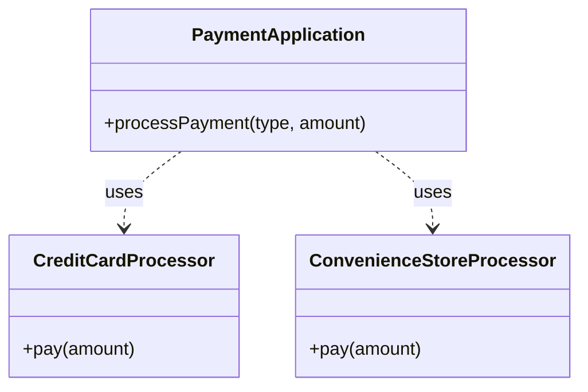
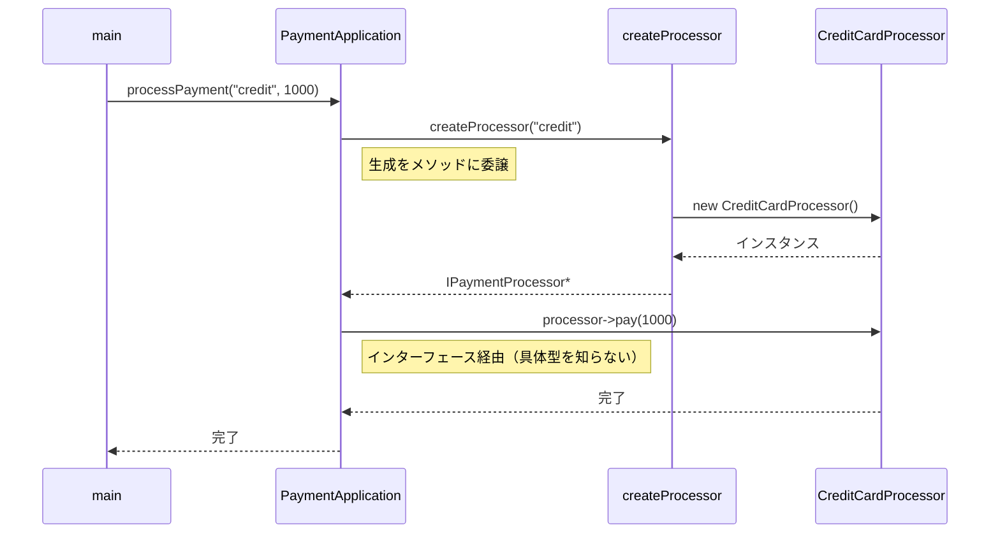
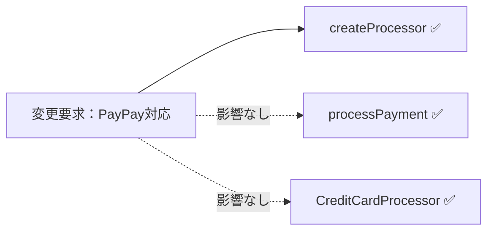
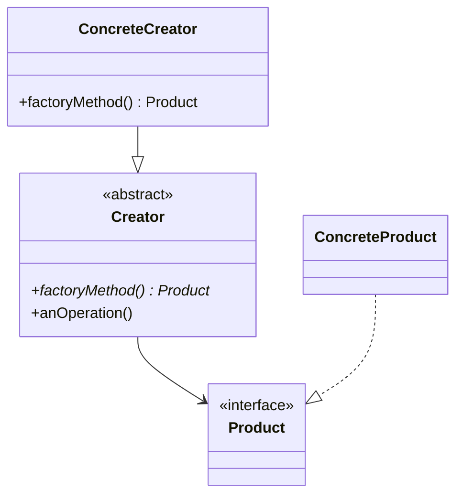

## 第8章 変わる生成の種類 ―― Factory Method パターン

―― 思考の型：インスタンスを生成する責任を、どこに置くか

### この章の核心

**ある機能を利用しようとするとき、その機能を実現するための「オブジェクトの生成」まで呼び出し側が担ってしまうと、新しい実装が必要になった際に呼び出し側まで芋づる式に修正しなければならなくなる。**

---

### この章を読むと得られること

この章が問うのは「作る」ことの設計です——オブジェクトを生成している場所が、利用している場所と同居していると何が起きるか。「決済プロセッサーを切り替えたいだけなのに、なぜこんなにコードを変えなければならないのか」という問いが出てきたことがあるなら、この章に答えがあります。

* **得られること1：** 「オブジェクトを生成する」という観点で、コードの変動箇所を識別できるようになる
* **得られること2：** 接続点（クラスとクラスのつなぎ目）が「具体×直接」（専用型のクラスを直接知っている状態）になっているクラスを見て、そこが生成と利用の混在による変更の痛みの発生源だと判断できるようになる
* **得られること3：** 生成の責任を分離し、インターフェースを介してインスタンスを得る構造にすることで、変更がどのように局所化（変更の影響が1クラスだけで済む状態）されるかを説明できるようになる
* **得られること4：** 利用側が具体的な生成ロジックを知らずに、必要な機能を持つオブジェクトを受け取れる視点

## 🔵 フェーズ1：現状把握 ―― コードとクラス構成を読む

この問題を解くために7つのフェーズを使います。はじめに現状把握から開始し、仮説立案・問題特定・原因分析・課題定義・対策検討・対策実施という順で進みます。

変更要求が来る前のシステムの現状を事実として把握するところから始めます。はじめに仕様と動作例で「このシステムが何をするか」を確認し、それからコードを読みます。

### 1-1：このシステムの仕様

このシステムは、ECサイトでお客様が選択した決済手段に応じて、**決済処理を実行**します。

「決済種別」と「金額」を入力として受け取り、対応する決済プロセッサーを呼び出して処理を行います。

**現在対応している決済手段**

| 決済種別 | 入力値 | 処理内容 |
|---|---|---|
| クレジットカード決済 | `"credit"` | クレジットカードの認証と決済を実行する |
| コンビニ決済 | `"cvs"` | コンビニ払いの支払い番号を発行する |

**決済の実行フロー**

1. `PaymentApplication` が決済種別を受け取る
2. 種別に応じた決済プロセッサー（`CreditCardProcessor` または `ConvenienceStoreProcessor`）を選択する
3. 選択したプロセッサーで決済処理を実行する
4. 処理結果（成功／失敗）を返す

---

### 1-2：動作例テーブル

仕様を定義したところで、実際にどのような入力に対してどのような結果が返るかを確認します。このテーブルは「このシステムが正しく動いているとはどういう状態か」の基準になります。後で設計の改善（リファクタリング）を段階的に進めるときも、この表に立ち返ります。

| 決済種別 | 金額 | 状態 | 期待される結果 |
|---|---|---|---|
| `"credit"` | 1000円 | 正常 | 「クレジットで 1000 円決済しました。」を出力し完了を返す |
| `"paypay"` | 700円 | 正常 | 「PayPayで 700 円決済しました。」を出力し完了を返す |
| `"cvs"` | 500円 | 正常 | 「コンビニで 500 円の支払い番号を発行しました。」を出力し完了を返す |
| `"credit"` | 980円 | 定期課金（SubscriptionService経由） | 月額課金ログを出力した後、クレジット決済を実行し完了を返す |

どのステップも「入力→出力」の動作は変わりません。この章で比べるのは「決済手段が増えたとき、どこを触れば済むか」という構造の違いです。

コードを読む前に、このシステムが「何をする必要があるか」をこの表で確認できました。次は「どのように実装されているか」を見ていきます。

---

### 1-3：実装コード（現状）

システムの現状の実装を確認します。コードを役割ごとに分けて読んでいきます。

```cpp
#include <iostream>
#include <string>

using namespace std;

// 各決済手段の具体的な処理
class CreditCardProcessor {
public:
    void pay(int amount) {
        cout << "クレジットカードで "
             << amount << " 円決済しました。" << endl;
    }
};

class ConvenienceStoreProcessor {
public:
    void pay(int amount) {
        cout << "コンビニで " << amount
             << " 円の支払い番号を発行しました。" << endl;
    }
};

// 決済を統括するクラス
class PaymentApplication {
public:
    void processPayment(string type, int amount) {
        // ← 生成と利用が混在している箇所
        if (type == "credit") {
            CreditCardProcessor processor;
            processor.pay(amount);
        } else if (type == "cvs") {
            ConvenienceStoreProcessor processor;
            processor.pay(amount);
        }
    }
};

int main() {
    PaymentApplication app;
    app.processPayment("credit", 1000);
    app.processPayment("cvs", 500);
    return 0;
}
```

上記コードの実行結果：

```
クレジットカードで 1000 円決済しました。
コンビニで 500 円の支払い番号を発行しました。
```

このコードを見ると、`PaymentApplication` クラスが、どの決済手段のクラスを生成し、どう実行するかをすべて直接知っていることが分かります。次のフェーズで変更が来たときに何が起きるかを確認します。

---

### 1-4：クラス構成図

コードを読んだところで、クラス間の関係を図で整理します。



この図が示す通り、`PaymentApplication` というクラスが、クレジットカードやコンビニ決済といった個別の決済プロセッサーを直接利用（依存）している構成になっています。

---

### 1-5：変更要求

ある週の火曜日、決済プラットフォームチームのリーダーからチャットで連絡が入りました。

「急ぎの相談なんだけど、来月から導入する新しい決済手段として『PayPay』に対応してほしいんだ。今のシステムでそのまま行けるか確認して、もし難しそうなら方針を教えてもらえるかな？ 決済手段が増えるのはビジネス上不可欠だから、なんとか対応したいんだ。」

なるほど、PayPayの対応ですね。コード上の PaymentApplication クラスを見ると、現状では CreditCardProcessor や ConvenienceStoreProcessor を直接 new して使っています。このままでは新しい決済手段が増えるたびに、PaymentApplication に新しい分岐を書き足し、クラスを直接生成するコードが増殖し続けることになります。このままの構造で対応してしまって本当に良いのか、少し立ち止まって考えてみたいと思います。

**仕様変更の内容**

変更要求を受けて、対応する決済手段がどう変わるかを整理します。

| 決済手段 | 変更前 | 変更後 |
|---|---|---|
| クレジットカード（`"credit"`） | 対応済み | 変更なし |
| コンビニ払い（`"cvs"`） | 対応済み | 変更なし |
| **PayPay（`"paypay"`）** | 未対応 | **新規追加** |

PayPay決済が追加されても、決済の実行フロー（「種別を受け取り→プロセッサーを選択→処理を実行→結果を返す」）は変わりません。変わるのは「対応できる種別が1つ増える」という点だけです。

PayPay決済の動作：`"paypay"` を受け取ると、PayPay用のプロセッサーが呼び出され「PayPayで〇〇円決済しました」という結果を返します。

フェーズ1でシステムの現状と変更要求が把握できました。次のフェーズ2では、「何が変わり、何が変わらないか」を整理します。

## 🟣 フェーズ2：仮説立案 ―― 何が変わるかを観察し、ヒアリングで裏付ける

### 2-1：責任チェック表

各クラスが「何を知るべきか」を整理します。

| **クラス名** | **責任（1文）** | **知るべきこと** |
|---|---|---|
| `PaymentApplication` | 決済手段の種類に応じて適切な決済処理をキックする | 利用可能な全決済プロセッサの具体名と、その生成方法 |
| `CreditCardProcessor` | クレジットカード決済を実行する | クレジットカード特有のAPIやパラメータ |
| `ConvenienceStoreProcessor` | コンビニ決済を実行する | コンビニ特有のAPIやパラメータ |

この表から、`PaymentApplication` が本来の責務である「決済処理の振り分け」だけでなく、すべての決済手段の「具体名」や「生成方法」までを知っている状態が見て取れます。

### 2-2：変わる理由の分析

責任チェック表でクラスの責任が整理できました。次に、コードの各行が「誰の判断で変わる知識か」を確認することで、混在している責任をさらに細かく特定します。判断基準は、「このクラスの担当者（ここでは決済基盤開発チーム）とは別の人間が変更を決定するかどうか」です。別の人間が決定するなら、それは「責任外（❌）」と判断します。

`PaymentApplication.processPayment()` の各行を見ると：

| **コードの行** | **持っている知識** | **誰の判断で変わるか** | **責任内か** |
|---|---|---|---|
| `if (type == "credit") { ... }` | クレジットカード決済クラスの生成条件と具体型名 | 決済手段を追加する事業側の判断 | ❌ 別担当者 |
| `CreditCardProcessor processor;` | 生成するクラスの具体名 | 決済手段を実装する開発チーム | ❌ 別担当者 |
| `processor.pay(amount);` | 決済処理の呼び出し方（インターフェース） | 決済基盤開発チーム | ✅ |

1つのメソッドの中に、変える理由が異なる複数の知識が混在しています。今すぐ問題とは言えませんが、これが後の痛みの予兆です。

### 2-3：今回の変更で確実に変わること

今回の変更要求から確定している変更は2点です。

- **`PayPayProcessor` という新しい具体クラスの追加**：PayPay決済の実装クラスを新規作成する
- **`PaymentApplication` 内の分岐条件への `"paypay"` 追記**：現状のコード構造上、型名と分岐が直結しているため

ただし「この変更が1回限りか、今後も続くか」によって、どこまで設計を変えるべきかが大きく変わります。関係者に確認します。

### ヒアリングに向けた背景確認

このシステムは、ある決済サービス事業者の「決済プロセッサー」を管理する基盤です。お客様がECサイトで買い物をするとき、クレジットカード決済やコンビニ決済など、さまざまな決済手段を選択しますが、このシステムは裏側でその手段ごとの処理を振り分ける役割を担っています。

当初、このサービスはクレジットカード決済だけをサポートしていました。しかし、ユーザーの利便性を高めるために、後からコンビニ決済、さらにPayPayなどのQRコード決済と、次々に新しい決済手段が追加されてきました。

コードを眺めてみると、`PaymentApplication` クラスという決済処理を統括するクラスの中で、`CreditCardProcessor` や `ConvenienceStoreProcessor` といった各決済手段の具体クラスを直接 `new` して利用する構成になっています。新しい決済手段が増えるたびに、この `PaymentApplication` クラスに新しい `else if` 文が追加され、利用するクラスが増え続けてきました。

### 2-4：関係者ヒアリング

> **現実のヒアリングでは——** 本書のヒアリングシーンでは設計判断を明確にするため、意図的に「理想的な回答」が返ってくるように描いています。これはシミュレーションです。現実には、「変わるかどうか分からない」「たぶん変わらない」という曖昧な答えが返ることも多いです。そのときは `git log` や過去の障害記録を「ヒアリングの代わり」として使ってみてください。「過去に何度変わったか」が最も正直な証拠です。

仮説を持って、決済プラットフォームチームの担当者と話し合いを持ちました。

- **開発者：** 「PayPay対応の件ですが、今の構造だと決済手段が増えるたびに PaymentApplication クラスを修正する必要があります。今後も新しい決済手段は追加される予定でしょうか？」
- **決済担当者：** 「ああ、かなりハイペースで追加していく予定だよ。次は銀行系の決済も入るし、後払いサービスも検討している。だから、決済手段が増えるたびに基幹部分のコードを書き換えるようなことはなるべく避けてほしいんだ。」
- **開発者：** 「なるほど。では、決済処理を実行する時のインターフェース（金額を渡して実行する点）は今後も変わらないでしょうか？」
- **決済担当者：** 「そこは固定だよ。どの手段でも『金額を受け取って決済する』という手続き自体は同じだからね。」
- **開発者：** 「分かりました。決済の実行ルールは固定だけれど、生成する対象（プロセッサーの種類）はどんどん増えていくということですね。」

### 2-5：ヒアリングで判明した将来リスク

ヒアリングで浮かび上がった「確定ではないが、近い将来起こりうる変化」を記録します。これは今回の設計判断の材料です。

| **将来リスク** | **時期の目安** | **根拠** |
|---|---|---|
| 決済手段の種類がさらに増加する（銀行系・後払いなど） | 新しい決済手段の追加ごと | 「かなりハイペースで追加していく予定」との合意 |
| 決済手段を特定するための識別子と具体クラスの紐付け | 新しい決済手段の追加ごと | 識別子と生成が現在直結しており、追加のたびに修正が必要 |

フェーズ2で「今変わること（確定）」と「将来変わるかもしれないこと（リスク）」を分けて整理できました。次のフェーズ3では、現在の構造で変更を試みたときに何が起きるかを確認します。

---

## 🟣 フェーズ3：問題特定 ―― 変更の痛みを発見する

### 3-1：変更を試みる

「PayPay対応」の要求を、今のコードで実装しようと試みます。変更前のコードはこうでした。

```cpp
void processPayment(string type, int amount) {
    if (type == "credit") {
        CreditCardProcessor processor;
        processor.pay(amount);
    } else if (type == "cvs") {
        ConvenienceStoreProcessor processor;
        processor.pay(amount);
    }
}
```

このコードにPayPay対応を追加すると、以下のようになります。

```cpp
void processPayment(string type, int amount) {
    if (type == "credit") {
        CreditCardProcessor processor;
        processor.pay(amount);
    } else if (type == "cvs") {
        ConvenienceStoreProcessor processor;
        processor.pay(amount);
    } else if (type == "paypay") {  // ← 追加
        PayPayProcessor processor;   // ← 追加
        processor.pay(amount);       // ← 追加
    }
}
```

一見シンプルな追加ですが、問題が浮かび上がります。決済手段が増えるたびにこの `PaymentApplication` クラスがどんどん長くなり、修正のたびにクラス内の既存ロジックを触らなければならないという事実です。もし決済手段が10個、20個と増えたら、このクラスは管理不能なほど巨大な「神クラス」になってしまうでしょう。

さらに、`SubscriptionService`（定期課金）のような別の呼び出し元が同じ分岐ロジックを持っていた場合、そちらも同様に修正しなければなりません。

### 3-2：変更影響グラフ


新しい決済手段という「ビジネス上の変化」を実装するたびに、本来は決済手段の振り分けだけを担うべき `PaymentApplication` クラスが必ず修正対象として矢印を向けられていることが分かります。

### 3-3：痛みの言語化

**1つ目：修正のたびに「決済の統括者」が汚染される辛さ。** このクラスは本来、どの決済手段を使うかを判断するだけで良いはずなのに、個別のプロセッサーの生成方法や詳細な使い方までを直接握りしめています。決済手段が増えるたびにこのクラスを書き直す必要があるため、変更のたびにバグを混入させるリスクが付きまといます。

**2つ目：決済手段という「変わるもの」と、決済の振り分けという「変わらない構造」が同じ場所に混在している辛さ。** 決済プロセッサーが増えるたびに `if-else` のジャングルが深まり、コードの見通しが悪くなります。新しい決済手段を一つ足すだけで、既存の無関係な決済手段のコードまで巻き込んでテストをやり直さなければならない状況は、開発のスピードを著しく低下させる要因になっています。

フェーズ3で「変更のたびに決済統括クラスが書き換わる」という痛みが確認できました。次のフェーズ4では、この痛みの構造的な原因を、責任の境界や接続形態の観点から言語化していきます。

---

## 🟠 フェーズ4：原因分析 ―― なぜ辛いのかを構造で言語化する

### 4-1：痛みの根源を探る（観察と原因）

フェーズ3で確認した「変更の辛さ」は、コードのどこから来ているのでしょうか。コードを注意深く観察すると、痛みを引き起こしている2つの事実が浮かび上がってきます。

第一に、新しい決済手段を追加するとき、なぜ毎回 `PaymentApplication` を開かなければならないのでしょうか？
それは、このクラス自身が「クレジットカードなら `CreditCardProcessor` を生成する」「PayPayなら `PayPayProcessor` を生成する」といった**具体的なクラス名と生成方法をすべて直接知ってしまっている（抱え込んでいる）**からです。

第二に、なぜ変更の影響範囲が読めず、全テストをやり直す恐怖を感じるのでしょうか？
それは、「決済の振り分けフロー（変わらない骨格）」と「どの具体クラスを生成するか（変わる生成ロジック）」が、**同じメソッドの中で物理的に混ざり合っている**からです。

この「症状（痛み）」と「根本原因」を整理すると、以下のようになります。

| **観察した症状（痛み）** | **構造的な原因（痛みの根源）** |
|---|---|
| 決済手段を追加するたびに統括クラスが修正対象になる | `PaymentApplication` が各決済手段の具体的なクラス名と生成方法を直接知っているから |
| 影響範囲が読めず、全テストをやり直す恐怖 | 「決済の振り分けフロー」と「具体クラスの生成ロジック」という変わる理由が異なる2つのものが同じメソッドの中に混在しているから |

### 4-2：変わるもの/変わってほしくないもの

> **「変わらないもの」と「変わってほしくないもの」は異なります。** 「変わらないもの」は経験的事実（今まで変わっていない）、「変わってほしくないもの」は設計意図（ここを安定させてほかを守りたい）です。ここで整理するのは後者です。

| **変わるもの（生成ロジック）** | **変わってほしくないもの（振り分けの骨格）** |
|---|---|
| 決済プロセッサーの具体的なクラス（クレジット、コンビニ、PayPay等） | 「金額を受け取って決済を実行する」というAPIの定義（インターフェース） |
| 各決済手段の生成方法・コンストラクタ引数 | 決済の振り分けフロー全体 |

**【変わる部分（変わり続ける生成コード）】**
```cpp
        if (type == "credit") {
            CreditCardProcessor processor;
            processor.pay(amount);
        } else if (type == "paypay") {
            PayPayProcessor processor;
            processor.pay(amount);
        }
        // 銀行振込・Apple Pay など、決済手段を追加するたびに else if がここに増える
```

**【変わらない部分（不変の骨格）】**
```cpp
        // どの決済手段であっても「種別を受け取り→実行する」という流れは変わらない
        // (ここに変わる部分の生成ロジックが入っている状態)
```

### 4-3：接続形態の診断

現在の `PaymentApplication` は、すべての決済プロセッサーを自分自身の中で直接生成しています。

**【具体×直接のコード】**
```cpp
class PaymentApplication {
public:
    void processPayment(string type, int amount) {
        // 具体クラスを直接知り、直接生成して呼び出している
        if (type == "credit") {
            CreditCardProcessor processor;  // ← 具体×直接
            processor.pay(amount);
        }
        // PayPay・銀行振込など、決済手段を追加するたびに else if がここに増える
    }
};
```

この状態は **「具体×直接」の接続形態** です。iPhoneに専用のLightningケーブルを直差ししている状態と同じで、新しい決済手段が増えるたびに本体側を開いて専用の配線（`else if` 文）を直接追加しなければなりません。

決済の振り分けフローと個別の生成ロジックは、変わる理由が全く異なります。これらが同じ場所に混在していることが、根本原因として確認できました。

私たちは今、最も密結合で変更に弱い「具体×直接」の地点にいます。

フェーズ4で根本原因が言語化できました。分けるべき場所（変わる理由が異なる2つのもの）が特定できた段階です。しかし「どこを分けるか」は分かっても、「何を（どの塊を）取り出せばいいか」はまだ曖昧です。次のフェーズ5では、この「取り出すターゲット」を具体的に特定します。

---

## 🟡 フェーズ5：課題定義 ―― 解くべき「塊」を特定する

フェーズ4は「なぜ辛いか」を答えました。フェーズ5が問うのは「その境界でどんなデータが流れているか」です。型・値のレベルに降りていきます。

フェーズ4の分析により、問題の根本原因は「決済の振り分けフロー」と「具体クラスの生成ロジック」という、変わる理由が違う2つのものが混在していることだと分かりました。

したがって、今回私たちが解くべき課題は、`PaymentApplication` の中にある **「具体クラスの生成（`if` 文と `new` の塊）」を丸ごと外に分離すること** です。

```cpp
void processPayment(string type, int amount) {
    // ↓↓↓ 今回分離するターゲット（変わり続ける生成の塊） ↓↓↓
    if (type == "credit") {
        CreditCardProcessor processor;
        processor.pay(amount);
    } else if (type == "cvs") {
        ConvenienceStoreProcessor processor;
        processor.pay(amount);
    } else if (type == "paypay") {
        PayPayProcessor processor;
        processor.pay(amount);
    }
    // ↑↑↑ ここまで ↑↑↑
}
```

最終的な目標は、この `PaymentApplication` から「どのクラスを生成するか」という知識を完全に追い出し、振り分けの骨格だけにすることです。

フェーズ5でターゲットが明確になりました。次のフェーズ6では、この「生成の塊」をどのように分離していくか、メソッド化・クラス化・抽象化と段階的に対策を検討していきます。

---

## 🔴 フェーズ6：対策検討 ―― 段階的な改善と決断

ターゲットである「生成の塊」を外に出すために、いきなり正解へ飛ぶのではなく、段階的にリファクタリングを進めてみます。それぞれの段階（ステップ）でどこまで痛みが解消されるかを確認し、今回の要件において「どのステップで止めるべきか」を決断します。

### ステップ1：生成ロジックをプライベートメソッドに切り出す（とりあえず分ける）

はじめに、クラスを分けずに、ターゲットの塊をプライベートメソッドとして分離してみます。`processPayment` の見通しが改善されることを確認しましょう。

```cpp
class PaymentApplication {
    // ← 生成ロジックをここに切り出す（Factory Methodの概念が始まる）
    void processCredit(int amount) {
        CreditCardProcessor p;
        p.pay(amount);
    }
    void processPayPay(int amount) {
        PayPayProcessor p;
        p.pay(amount);
    }
    void processCvs(int amount) {
        ConvenienceStoreProcessor p;
        p.pay(amount);
    }

public:
    void processPayment(string type, int amount) {
        if (type == "credit") { processCredit(amount); return; }
        if (type == "paypay") { processPayPay(amount); return; }
        if (type == "cvs")    { processCvs(amount);    return; }
    }
};
```

**この段階の評価：**
メインの `processPayment()` の見通しが改善されました。しかし、決済手段が増えるたびにプライベートメソッドと `processPayment` の分岐の両方を追加し続ける点は変わりません。「生成と利用を同一クラスが知っている」という根本構造は変わっていません。

### ステップ2：決済種別ごとにクラスを分ける（型ごとに責任を切り出す）

ステップ1の「1クラスが全手段の生成を知っている」という問題を解決するために、各決済手段の処理を個別のクラスとして切り出してみます。

```cpp
// 各決済手段の処理を独立したクラスとして整理する
class CreditCardProcessor {
public:
    void pay(int amount) {
        cout << "クレジットで " << amount << " 円決済しました。" << endl;
    }
};

class PayPayProcessor {
public:
    void pay(int amount) {
        cout << "PayPayで " << amount << " 円決済しました。" << endl;
    }
};

class ConvenienceStoreProcessor {
public:
    void pay(int amount) {
        cout << "コンビニで " << amount << " 円の番号を発行しました。" << endl;
    }
};

class PaymentApplication {
public:
    void processPayment(string type, int amount) {
        // クラスに分けたのに、if文と生成は本体に残ったまま！
        if (type == "credit") { CreditCardProcessor p; p.pay(amount); return; }
        if (type == "paypay") { PayPayProcessor p;     p.pay(amount); return; }
        if (type == "cvs")    { ConvenienceStoreProcessor p; p.pay(amount); return; }
    }
};
```

**この段階の評価：**
各プロセッサーが独立したクラスとして整理されました。しかし、`PaymentApplication` はまだすべての具体クラス名を直接知っており、決済手段が増えるたびに修正が必要です。これが「具体×直接」の限界です。

### ステップ3：クラス化の整理を最大化する（このクラスの中での限界）

ステップ2をさらに整理し、クラス内での最大の綺麗さを目指してみます。生成メソッドを切り出すことで、利用ロジックと生成ロジックをメソッドレベルで分離できます。

```cpp
class PaymentApplication {
    // 生成の知識をこのメソッドに集約する
    // ← この時点で「Factory Methodの概念」が現れ始める
    CreditCardProcessor* createCredit() { return new CreditCardProcessor(); }
    PayPayProcessor* createPayPay() { return new PayPayProcessor(); }
    ConvenienceStoreProcessor* createCvs() { return new ConvenienceStoreProcessor(); }

public:
    void processPayment(string type, int amount) {
        if (type == "credit") {
            CreditCardProcessor* p = createCredit();
            p->pay(amount); delete p;
        } else if (type == "paypay") {
            PayPayProcessor* p = createPayPay();
            p->pay(amount); delete p;
        } else if (type == "cvs") {
            ConvenienceStoreProcessor* p = createCvs();
            p->pay(amount); delete p;
        }
    }
};
```

**この段階の評価：**
生成と利用がメソッドレベルで分かれ、コードが整理されました。**これが「クラス内の関数化」によるコード整理の限界（最終到達点）** です。

ここで、各プロセッサークラスをよく観察してください。`CreditCardProcessor`、`PayPayProcessor`、`ConvenienceStoreProcessor` は、すべて**「同じ引数（amount）を受け取り、同じ処理パターンを持つ」という一貫した構造** を持っています。
**「綺麗にメソッドとして並べられる（構造に一貫性がある）」ということは、「共通のインターフェースとして抽象化できる」という何よりの証拠** なのです。

しかし、メソッド化のままでは最大の痛みが残っています。新しい決済手段が来るたびに結局はこの `PaymentApplication` クラスを開いて新しいメソッドを追加し、`processPayment` の中に **新しい `if` 文を書き足さなければならない** のです。このままでは、「クラスが永遠に変わり続ける」という根本問題は解決していません。

### ステップ4：具体クラスのファクトリを切り出す（具体×直接）

「クラスが肥大化してきたので、生成ロジックだけを別のクラスに切り出してみよう」という発想を試してみます。

```cpp
// 生成ロジックだけを別クラスに切り出す（インターフェースはまだない）
class ProcessorFactory {
public:
    void processCredit(int amount) {
        CreditCardProcessor p; p.pay(amount);
    }
    void processPayPay(int amount) {
        PayPayProcessor p; p.pay(amount);
    }
    void processCvs(int amount) {
        ConvenienceStoreProcessor p; p.pay(amount);
    }
};

class PaymentApplication {
    ProcessorFactory factory;
public:
    void processPayment(string type, int amount) {
        // ファクトリに分けたのに、if文は本体に残ったまま！
        // しかも全ての具体クラスをFactoryが知っている
        if (type == "credit") { factory.processCredit(amount); return; }
        if (type == "paypay") { factory.processPayPay(amount); return; }
        if (type == "cvs")    { factory.processCvs(amount);    return; }
    }
};
```

**この段階の評価：**
生成ロジックが別クラスに移りましたが、**何も本質的には解決していません**。
`if` 文は `PaymentApplication` に残ったまま、新しい決済手段が来るたびに `PaymentApplication` も `ProcessorFactory` も両方修正しなければなりません。一貫性があるなら、この `if` 文すらも外に追い出すことができるはずです。

### ステップ5：インターフェース化して「生成と判断の責任」を分離する（抽象×直接）

既存コード（本体）を一切触らずに新しい決済手段を追加するにはどうすればよいでしょうか？
「生成の判断（`if` 文）」と「具体クラスの生成（`new`）」を一か所のメソッドに集め、利用側はインターフェース（抽象）だけを知る形にします。

```cpp
// 決済プロセッサーの共通インターフェース（契約）
class IPaymentProcessor {
public:
    virtual ~IPaymentProcessor() {}
    virtual void pay(int amount) = 0;
};

// 各プロセッサーがインターフェースを実装する
class CreditCardProcessor : public IPaymentProcessor {
public:
    void pay(int amount) override {
        cout << "クレジットで " << amount << " 円決済しました。" << endl;
    }
};

class PayPayProcessor : public IPaymentProcessor {
public:
    void pay(int amount) override {
        cout << "PayPayで " << amount << " 円決済しました。" << endl;
    }
};

class ConvenienceStoreProcessor : public IPaymentProcessor {
public:
    void pay(int amount) override {
        cout << "コンビニで " << amount << " 円の番号を発行しました。" << endl;
    }
};

class PaymentApplication {
private:
    // ★ Factory Method：生成ロジックをこのメソッドに集約
    // 「どのクラスを生成するか」という判断がここに閉じ込められる
    IPaymentProcessor* createProcessor(string type) {
        if (type == "credit") return new CreditCardProcessor();
        if (type == "paypay") return new PayPayProcessor();
        if (type == "cvs")    return new ConvenienceStoreProcessor();
        return nullptr;
    }

public:
    void processPayment(string type, int amount) {
        // ← 生成結果の型は IPaymentProcessor* だけを知る（抽象）
        IPaymentProcessor* processor = createProcessor(type);
        if (processor) {
            processor->pay(amount);  // ← if文なしで呼び出せる（直接）
            delete processor;
        }
    }
};
```

**この段階の評価：**
ついに、`processPayment` の中から「どのクラスを生成するか」という `if` 文（条件ルーティング）が完全に消え去りました！ 新しい決済手段を追加するときは、`createProcessor` に1行追加するだけで対応できます。接続の形が **「抽象×直接」** へ到達したことで、利用ロジックは無傷のまま、いくらでも新しいプロセッサーを差し替えられるようになりました。

---

### どこまで設計を進めるべきか（採用ステップの決断）

それぞれのステップには一長一短があります。ステップ5のインターフェース化は強力ですが、ファイル数や型が増えるという「初期投資コスト」もかかります。どこで止めるかは、**「今後の変更頻度（ビジネス要求）」**で決断します。

*   **ステップ1（プライベートメソッド化）で止めるケース：** 決済手段が2〜3種類で今後増える予定が全くない場合。とりあえず分けておくだけで十分です。
*   **ステップ2・3（クラス化・メソッド整理）で止めるケース：** ルールが増えるかもしれないが確証がない場合。クラスを整理するだけにとどめ、本当に増えた時にステップ5へ進化させる「様子見」の判断です。
*   **ステップ4（具体ファクトリへの分離）で止めるケース：** 生成ロジックを別クラスに分けて整理したいが、インターフェース導入のコストをまだかけたくない場合の「中間策」です。
*   **ステップ5（インターフェース化・抽象化）まで進むケース：** 「今後も新しい決済手段が追加される」と確定している場合。今すぐ初期投資コストを払ってでも、将来の変更コストを最小化するのが適切です。

**今回の決断：**
フェーズ2のヒアリングで、決済担当者から「かなりハイペースで追加していく予定」と明言されています。したがって、今回は迷わず**ステップ5（インターフェース化・抽象化）まで進化させる**決断を下します。

生成するオブジェクトの種類（決済手段）を、利用側から隠蔽するメソッドに集約し、利用側がインターフェースを通じてインスタンスを得る構造——これが **Factory Method（ファクトリーメソッド）パターン** と呼ばれています。

フェーズ6で採用ステップが決まりました。次のフェーズ7では、この決断を最終的なコードに落とし込みます。

## 🟢 フェーズ7：対策実施 ―― 変化に強いコードを完成させる

### 7-1：解決後のコード（全体）

ステップ5で決断した構造を、実行可能な完全なコードとして組み上げます。各役割ごとにコードを分けて見ていきましょう。

**1. インターフェース（契約）の定義**
すべての決済プロセッサーが守るべき共通のインターフェースを定義します。

```cpp
#include <iostream>
#include <string>

using namespace std;

// インターフェース：ビジネス責任で命名
class IPaymentProcessor {
public:
    virtual ~IPaymentProcessor() {}
    virtual void pay(int amount) = 0;
};
```

`IPaymentProcessor` は「決済を実行するために持つべきメソッドと戻り値の約束」を定義します。具体クラスが何であれ、このインターフェースさえ実装していれば、利用側はそのまま使えます。

**2. 個別の決済プロセッサーの実装（具体）**
インターフェースを満たす具体的な決済クラスを作成します。本体コードに触れることなく、このクラス群だけを自由に追加・変更できます。

```cpp
class CreditCardProcessor : public IPaymentProcessor {
public:
    void pay(int amount) override {
        cout << "クレジットで " << amount
             << " 円決済しました。" << endl;
    }
};

class ConvenienceStoreProcessor : public IPaymentProcessor {
public:
    void pay(int amount) override {
        cout << "コンビニで " << amount
             << " 円の番号を発行しました。" << endl;
    }
};

// ← 新手段はここに追加するだけ（ここだけ変わる）
class PayPayProcessor : public IPaymentProcessor {
public:
    void pay(int amount) override {
        cout << "PayPayで " << amount << " 円決済しました。" << endl;
    }
};
```

**3. 本体クラス（Factory Methodを持つCreator）**
決済を行う本体クラスです。`createProcessor` というFactory Methodが「どのクラスを生成するか」という判断を一手に引き受け、利用側である `processPayment` はインターフェースを通じて結果を受け取るだけになります。

```cpp
class PaymentApplication {
private:
    // Factory Method：生成ロジックをここに集約
    IPaymentProcessor* createProcessor(string type) {
        if (type == "credit") return new CreditCardProcessor();
        if (type == "cvs")    return new ConvenienceStoreProcessor();
        // ← ここだけ変わる
        if (type == "paypay") return new PayPayProcessor();
        return nullptr;
    }

public:
    void processPayment(string type, int amount) {
        // ← 生成結果の型は気にしなくていい（IPaymentProcessor*として受け取るだけ）
        IPaymentProcessor* processor = createProcessor(type);
        if (processor) {
            processor->pay(amount); // ← 実装詳細を直接触らない
            delete processor;
        }
    }
};
```

**4. 組み立てと実行（メイン関数）**

```cpp
// 定期課金サービス：Factory Method経由でクレジット決済を行う
class SubscriptionService {
private:
    PaymentApplication* app;
public:
    SubscriptionService(PaymentApplication* a) : app(a) {}
    void chargeMonthly(int amount) {
        cout << "[定期課金] 月額 " << amount
             << " 円 課金ログを記録しました。" << endl;
        // Factory Method経由で決済を実行（SubscriptionServiceはcreditしか使わない）
        app->processPayment("credit", amount);
    }
};

int main() {
    PaymentApplication app;

    // 行1：credit / 1000円
    app.processPayment("credit", 1000);
    // 行2：paypay / 700円
    app.processPayment("paypay", 700);   // ← 新しい決済手段も呼び出せる
    // 行3：cvs / 500円
    app.processPayment("cvs", 500);
    // 行4：定期課金（SubscriptionService経由でcredit/980円）
    SubscriptionService sub(&app);
    sub.chargeMonthly(980);
    return 0;
}
```

上記コードの実行結果：

```
クレジットで 1000 円決済しました。
PayPayで 700 円決済しました。
コンビニで 500 円の番号を発行しました。
[定期課金] 月額 980 円 課金ログを記録しました。
クレジットで 980 円決済しました。
```

動作例テーブルの全4行と一致しています。`SubscriptionService` も `PaymentApplication` を通じて `createProcessor` を呼ぶため、新しい決済手段を追加しても `SubscriptionService` に一切触れる必要がありません。`processPayment` の中から具体クラス名が完全に消えました。

### 7-2：動作シーケンス図

ステップ5で到達したFactory Methodパターンの実行時のオブジェクト間のやり取りを可視化します。`PaymentApplication` が `createProcessor` を通じて生成の判断を委譲し、利用側は `IPaymentProcessor*` というインターフェース経由で処理を実行する流れが確認できます。



### 7-3：変更影響グラフ（改善後）



フェーズ3の変更影響グラフと比べると、変更要求が `createProcessor` の修正だけに閉じるようになりました。

### 7-4：変更シナリオ表

| **シナリオ** | **変わるクラス** | **変わらないクラス** |
|---|---|---|
| 銀行系決済を追加する | `createProcessor`（1行追加）、新クラスの作成 | `PaymentApplication`（利用ロジック）、他の決済クラス |
| コンビニ決済の実装を変更する | `ConvenienceStoreProcessor`（1箇所修正） | `PaymentApplication`、他の決済クラス |
| クレジット決済を廃止する | `createProcessor`（1行削除） | `PaymentApplication`（利用ロジック）、他の決済クラス |

---

## 整理

### フェーズとこの章でやったこと

| **フェーズ** | **この章でやったこと** |
|---|---|
| 🔵 フェーズ1：現状把握 | 仕様と動作例テーブルを確認した後、コードをクラス単位で読んだ。クラス構成図と変更要求を把握した |
| 🟣 フェーズ2：仮説立案 | 責任チェック表でクラスごとの変わる理由を確認した。今回の確定変更とヒアリングで判明した将来リスクを分けて整理した |
| 🟣 フェーズ3：問題特定 | PayPay追加を試み、決済手段が増えるたびに統括クラスが修正対象になることを確認した |
| 🟠 フェーズ4：原因分析 | 変わる理由が異なる2つのもの（振り分けフローと生成ロジック）が同じ場所にいることが痛みの根本と特定した |
| 🟡 フェーズ5：課題定義 | 生成の塊を分離することをターゲットとして特定した |
| 🔴 フェーズ6：対策検討 | 5ステップの段階的進化でそれぞれの痛みの限界を確認し、ステップ5（インターフェース化・抽象×直接）まで進化させる決断を下した |
| 🟢 フェーズ7：対策実施 | 最終コードを実装し、変更影響グラフで変更の局所化を確認した |

### 各クラスの最終的な責任

| **クラス名** | **責任（1文）** | **変わる理由** |
|---|---|---|
| `IPaymentProcessor` | 決済処理が実装する必要があるインターフェースを提供する | なし（抽象） |
| `PaymentApplication`（`processPayment`） | 決済手段の種類に応じて、適切なプロセッサーを呼び出し実行する | 決済の振り分けフローが変わる場合 |
| `PaymentApplication`（`createProcessor`） | 決済種別の文字列から対応するプロセッサーを生成して返す | 新しい決済手段が追加・変更される場合 |
| `CreditCardProcessor` 等 | 各決済プロセッサーの具体的な決済処理を実行する | 各決済手段のAPIやパラメータが変わる場合 |

---

## 振り返り

### 「この章を読むと得られること」は手に入ったか

| **得られること** | **この章のどこで示したか** |
|---|---|
| 1. 変動箇所の識別 | フェーズ2の責任チェック表と変わる理由の分析で、生成ロジックを変動要因として特定した |
| 2. 接続形態の診断 | フェーズ4で「具体×直接」の状態を診断した |
| 3. 変更局所化の説明 | フェーズ7の変更シナリオ表で、変更が `createProcessor` に閉じる構造を示した |
| 4. 利用側が生成知識から解放される視点 | フェーズ6のステップ5で、`processPayment` からif文が消える様子を示した |

### 3つの設計原則はどう適用されたか

**原則1「変わるものをカプセル化せよ」の現れ**

- 具体化された場所：`createProcessor` メソッド（Factory Method）
- 解説：具体クラスの生成という「変わる理由」を、メソッド内にカプセル化した。新しい決済手段が追加されても `processPayment` は無影響。

**原則2「実装ではなくインターフェースに対してプログラムせよ」の現れ**

- 具体化された場所：`PaymentApplication` の `processPayment` メソッド内の `IPaymentProcessor* processor`
- 解説：具体的な決済クラスではなく `IPaymentProcessor` インターフェースだけを知ることで、実行時にどの決済手段が呼び出されるかを気にせず処理フローを進められる。

**原則3「継承よりコンポジションを優先せよ」の現れ**

- 具体化された場所：`PaymentApplication` と決済プロセッサーの接続
- 解説：生成したプロセッサーインスタンスを「利用する（コンポジション）」という関係を保ちつつ、生成の手順だけをメソッドに分離した。継承で新しい手段を追加しようとすると階層が深くなるが、コンポジション＋インターフェースは追加コストを最小化する。

---

## あなたのコードで考えてみてください

1. **変動の兆候を探す：** あなたのコードに「使う具体クラスが条件によって変わる」`if-else` や `switch` があり、新しい種類が増えるたびにそこを書き換えている箇所がありますか？
2. **変える理由を問う：** 「どのクラスを生成するか」という判断は、誰の決定で変わりますか？それは業務ルールの変化ですか、それとも技術的な都合ですか？
3. **結合の強さを測る：** 利用側が具体クラスの名前を直接知っていると、「別の実装に切り替える」ときに利用側も変更する必要がありますか？その変更はどのくらい広がりますか？
4. **分けた後を想像する：** もし「生成の知識」を1か所に集めると、新しい実装を追加するとき変わるファイルはどこだけになりますか？利用側は本当に何も変えなくて済みますか？

---

## パターン解説：Factory Method パターン

### パターンの骨格

Factory Method パターンは、インスタンスの生成をメソッド（またはサブクラス）に委譲することで、具体クラスへの依存を断ち切り、利用側をインスタンス生成の知識から解放するパターンです。



### この章の実装との対応

GoF（Gang of Four）とは、1994年に出版された書籍『Design Patterns』の4人の著者の総称です。彼らが整理した23のパターンは、現在も設計の共通言語として広く使われています。

| GoFの名前 | この章での対応 |
|---|---|
| Creator | `PaymentApplication`（`createProcessor` を持つ） |
| factoryMethod | `createProcessor(string type)` |
| Product | `IPaymentProcessor` |
| ConcreteProduct | `CreditCardProcessor` / `PayPayProcessor` / `ConvenienceStoreProcessor` |

### 使いどころと限界

- **使うと良い：** クラスが生成するオブジェクトの具体クラスを特定できない場合、または将来的に新しいサブクラスを柔軟に追加したい場合。今後もオブジェクトの種類が増え続けると確定しているとき。
- **使わない方が良い：** 生成するクラスが常に1種類で固定されていて、今後増える見込みがない場合。ファイル数とクラス数が増えるコストが見合わない。

```cpp
// 決済手段が1種類しかなく、今後も増える予定がない場合
// Factory Methodを導入すると、かえって複雑になります。

// ❌ 過剰なFactory（固定クラスをnewするだけなら不要）
class PaymentApplication {
    IPaymentProcessor* createProcessor() {
        return new CreditCardProcessor(); // ← 常にこれだけ
    }
public:
    void processPayment(int amount) {
        IPaymentProcessor* p = createProcessor();
        p->pay(amount);
        delete p;
    }
};

// ✅ この場合はシンプルに直接生成すれば十分
class PaymentApplication {
public:
    void processPayment(int amount) {
        CreditCardProcessor processor;
        processor.pay(amount);
    }
};
```

生成するクラスが常に1種類で固定されているなら、Factoryを介する必要はありません。「今後も変わらない」という確信があるときは、シンプルな直接生成の方が読みやすいコードになります。

### この章のまとめ

この章の冒頭で示した「得られること」4点を、あらためて確認します。

**得られること1**（変動箇所の識別）：フェーズ1とフェーズ2を通じて、「決済プロセッサーの生成ロジック」そのものが変化し続けるものであることを確認しました。実行するクラスの種類が変動箇所になるという視点が得られたはずです。

**得られること2**（変更の痛みの発生源の判断）：フェーズ4で、具体クラスを直接生成している状態を「具体×直接」の接続と診断しました。この接続形態が、決済手段の追加のたびに既存コードを書き換えるリスク（痛みの発生源）になっていると判断できるようになります。

**得られること3**（接続の形の効果を説明する）：フェーズ6と7で、`createProcessor` というFactory Methodに生成の判断を集約し、利用側を `IPaymentProcessor*` インターフェースだけに接続することで、既存の決済フローには一切触れずに新しいプロセッサーを追加できるようになること（変更の局所化）を学びました。

**得られること4**（利用側が生成知識から解放される視点）：フェーズ6のステップ5で見たように、`processPayment` の中からif文が消え、「どの具体クラスが動くか」を知らずに処理を委譲できるようになった状態がFactory Methodパターンの到達点です。
