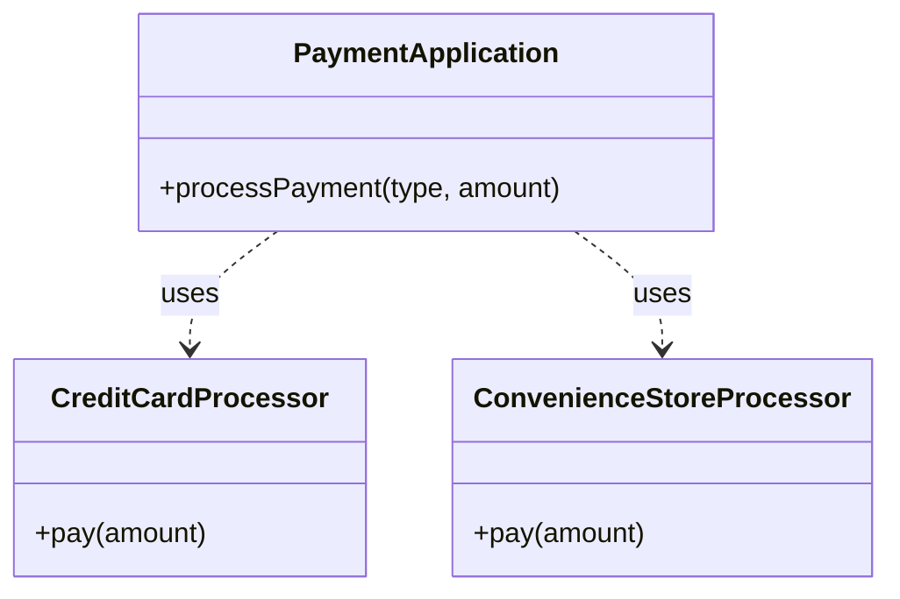
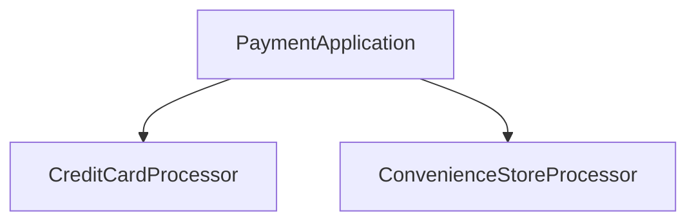
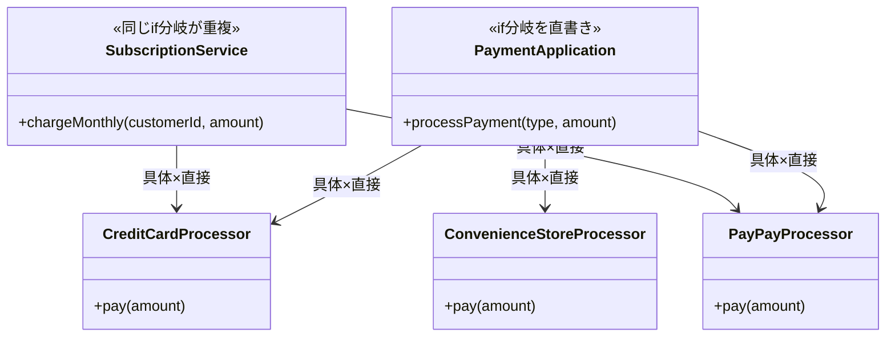
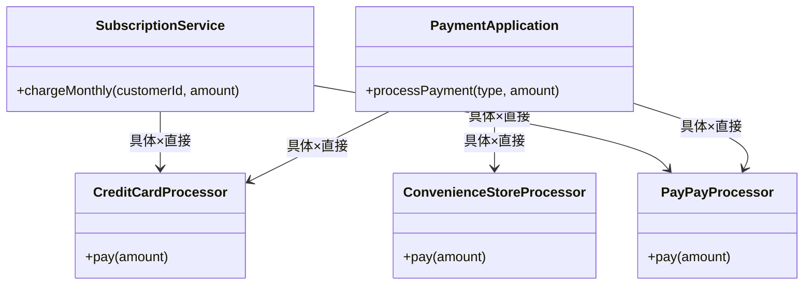
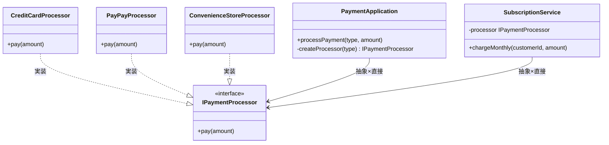
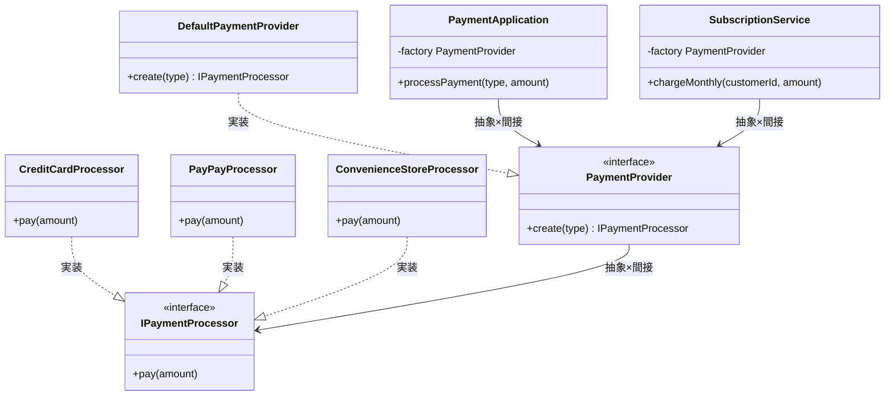
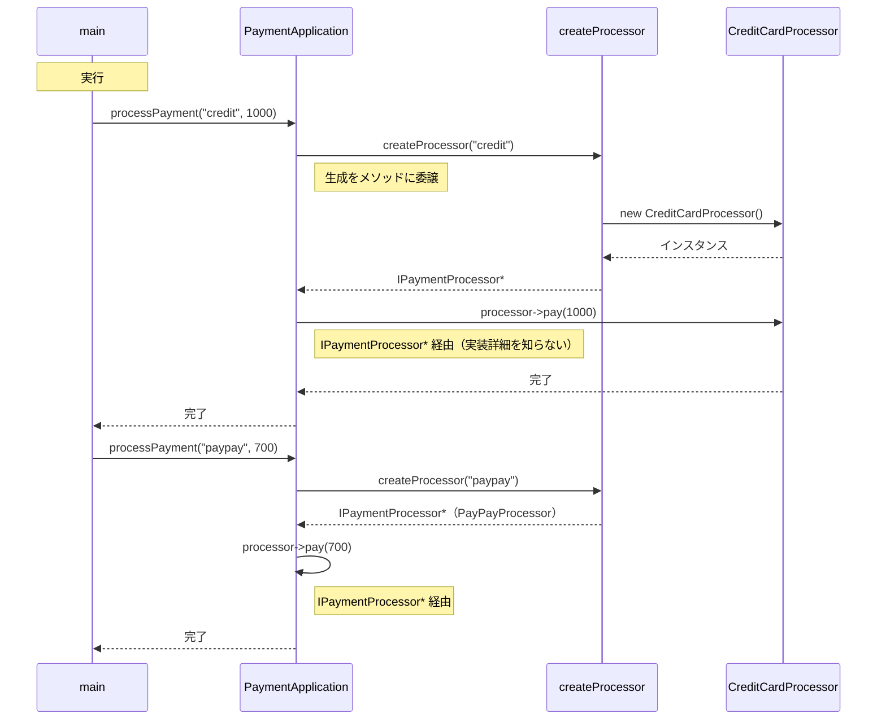
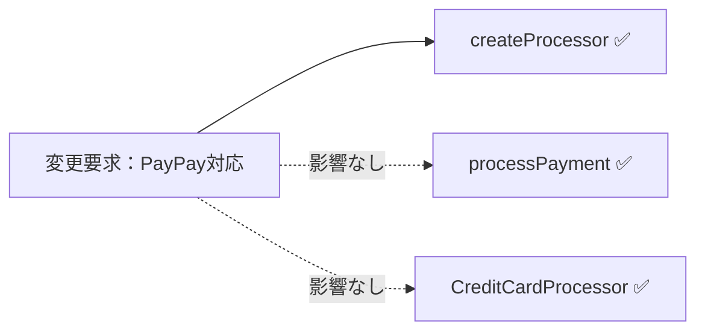
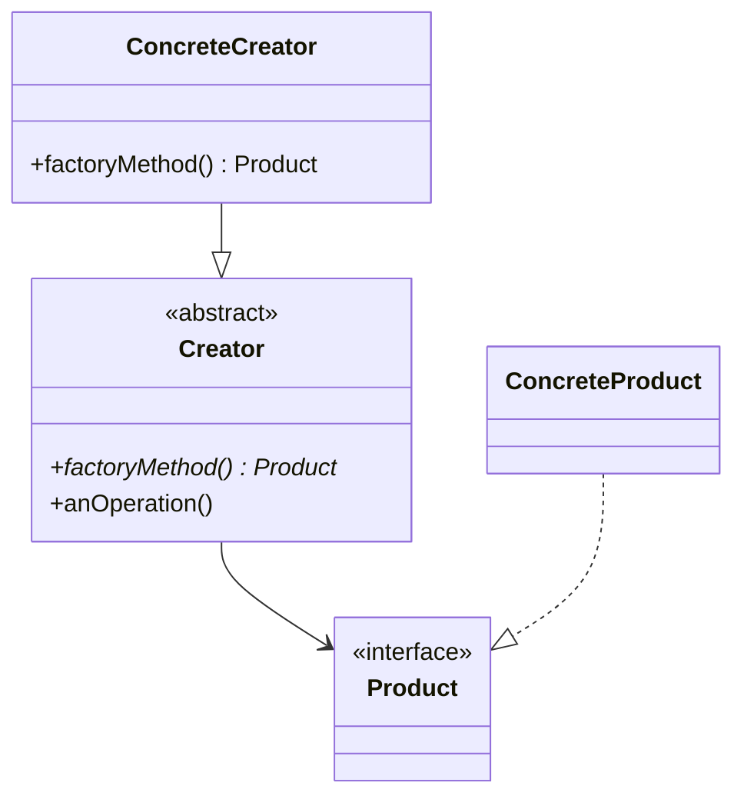

## 第8章 変わる生成の種類 ―― Factory Method パターン

―― 思考の型：インスタンスを生成する責任を、どこに置くか

### この章の核心

**ある機能を利用しようとするとき、その機能を実現するための「オブジェクトの生成」まで呼び出し側が担ってしまうと、新しい実装が必要になった際に呼び出し側まで芋づる式に修正しなければならなくなる。**

---

### この章を読むと得られること

この章が問うのは「作る」ことの設計です——オブジェクトを生成している場所が、利用している場所と同居していると何が起きるか。「決済プロセッサーを切り替えたいだけなのに、なぜこんなにコードを変えなければならないのか」という問いが出てきたことがあるなら、この章に答えがあります。

* **得られること1：** 「オブジェクトを生成する」という観点で、コードの変動箇所を識別できるようになる
* **得られること2：** 接続点（クラスとクラスのつなぎ目）が「具体×直接」（専用型のクラスを直接知っている状態）になっているクラスを見て、そこが生成と利用の混在による変更の痛みの発生源だと判断できるようになる
* **得られること3：** 生成の責任を分離し、インターフェースを介してインスタンスを得る構造にすることで、変更がどのように局所化（変更の影響が1クラスだけで済む状態）されるかを説明できるようになる
* **得られること4：** 利用側が具体的な生成ロジックを知らずに、必要な機能を持つオブジェクトを受け取れる視点

## 🔵 フェーズ1：現状把握 ―― コードとクラス構成を読む
### 1-1：このシステムの仕様

このシステムは、ECサイトでお客様が選択した決済手段に応じて、**決済処理を実行**します。

「決済種別」と「金額」を入力として受け取り、対応する決済プロセッサーを呼び出して処理を行います。

**現在対応している決済手段**

| 決済種別 | 入力値 | 処理内容 |
|---|---|---|
| クレジットカード決済 | `"credit"` | クレジットカードの認証と決済を実行する |
| コンビニ決済 | `"cvs"` | コンビニ払いの支払い番号を発行する |

**決済の実行フロー**

1. `PaymentApplication` が決済種別を受け取る
2. 種別に応じた決済プロセッサー（`CreditCardProcessor` または `ConvenienceStoreProcessor`）を選択する
3. 選択したプロセッサーで決済処理を実行する
4. 処理結果（成功／失敗）を返す

---
### 1-2：動作例テーブル ―― 仕様を「動かした結果」で確認する

コードを読む前に、このシステムがどんな入力に対してどんな出力を返すかを確認します。この章のどの案も、以下の動作を実現します。

| 決済種別 | 金額 | 状態 | 期待される結果 |
| --- | --- | --- | --- |
| `"credit"` | 1000円 | 正常 | 「クレジットで 1000 円決済しました。」を出力し完了を返す |
| `"paypay"` | 700円 | 正常 | 「PayPayで 700 円決済しました。」を出力し完了を返す |
| `"cvs"` | 500円 | 正常 | 「コンビニで 500 円の支払い番号を発行しました。」を出力し完了を返す |
| `"credit"` | 980円 | 定期課金（SubscriptionService経由） | 月額課金ログを出力した後、クレジット決済を実行し完了を返す |
| `"paypay"` | 700円 | 残高不足 | 決済失敗、エラーを返却する（プロセッサーが失敗を通知） |
| `"credit"` | 1000円 | カード無効 | 決済失敗、エラーを返却する（プロセッサーが失敗を通知） |

どの案も「入力→出力」の動作は変わりません。この章で比べるのは「決済手段が増えたとき、どこを触れば済むか」という構造の違いです。

---
### 1-3：実装コード

それでは、実際にシステムを動かしているコードを見てみましょう。決済手段を切り替えて処理を実行する様子が分かります。

```cpp
#include <iostream>
#include <string>

using namespace std;

// 各決済手段の具体的な処理
class CreditCardProcessor {
public:
    void pay(int amount) {
        cout << "クレジットカードで "
             << amount << " 円決済しました。" << endl;
    }
};

class ConvenienceStoreProcessor {
public:
    void pay(int amount) {
        cout << "コンビニで " << amount
             << " 円の支払い番号を発行しました。" << endl;
    }
};

// 決済を統括するクラス
class PaymentApplication {
public:
    void processPayment(string type, int amount) {
        // ← 生成と利用が混在している箇所
        if (type == "credit") {
            CreditCardProcessor processor;
            processor.pay(amount);
        } else if (type == "cvs") {
            ConvenienceStoreProcessor processor;
            processor.pay(amount);
        }
    }
};

int main() {
    PaymentApplication app;
    app.processPayment("credit", 1000);
    app.processPayment("cvs", 500);
    return 0;
}

```

このコードを見ると、`PaymentApplication` クラスが、どの決済手段のクラスを生成し、どう実行するかをすべて直接知っていることが分かります。

---
### 1-4：クラス構成図

システムのクラス構成を可視化し、構造を確認します。



この図が示す通り、`PaymentApplication` というクラスが、クレジットカードやコンビニ決済といった個別の決済プロセッサーを直接利用（依存）している構成になっています。

---
### 1-5：依存グラフ

クラス間の「依存の方向」をマクロな視点で示します。



`PaymentApplication` に、すべての決済プロセッサーへの矢印が集中していることが分かります。

---
### 1-6：実行結果

上記コードの実行結果：

```text
クレジットカードで 1000 円決済しました。
コンビニで 500 円の支払い番号を発行しました。

```

これから検討するのは、同じ機能を保ちながら、変更に強い構造をどう作るかという点です。

---

### 1-7：届いた変更要求

ある週の火曜日、決済プラットフォームチームのリーダーからチャットで連絡が入りました。

「急ぎの相談なんだけど、来月から導入する新しい決済手段として『PayPay』に対応してほしいんだ。今のシステムでそのまま行けるか確認して、もし難しそうなら方針を教えてもらえるかな？ 決済手段が増えるのはビジネス上不可欠だから、なんとか対応したいんだ。」

なるほど、PayPayの対応ですね。コード上の PaymentApplication クラスを見ると、現状では CreditCardProcessor や ConvenienceStoreProcessor を直接 new して使っています。このままでは新しい決済手段が増えるたびに、PaymentApplication に新しい分岐を書き足し、クラスを直接生成するコードが増殖し続けることになります。このままの構造で対応してしまって本当に良いのか、少し立ち止まって考えてみたいと思います。

**仕様変更の内容**

変更要求を受けて、対応する決済手段がどう変わるかを整理します。

| 決済手段 | 変更前 | 変更後 |
|---|---|---|
| クレジットカード（`"credit"`） | 対応済み | 変更なし |
| コンビニ払い（`"cvs"`） | 対応済み | 変更なし |
| **PayPay（`"paypay"`）** | 未対応 | **新規追加** |

PayPay決済が追加されても、決済の実行フロー（「種別を受け取り→プロセッサーを選択→処理を実行→結果を返す」）は変わりません。変わるのは「対応できる種別が1つ増える」という点だけです。

PayPay決済の動作：`"paypay"` を受け取ると、PayPay用のプロセッサーが呼び出され「PayPayで〇〇円決済しました」という結果を返します。

---

## 🟣 フェーズ2：仮説立案 ―― 何が変わるかを観察し、ヒアリングで裏付ける

### 2-1：責任テーブル

各クラスが「何を知るべきか（責任）」を定義し、事実を確認します。

| **クラス名** | **責任（1文）** | **知るべきこと** |
| --- | --- | --- |
| `PaymentApplication` | 決済手段の種類に応じて適切な決済処理をキックする。 | 利用可能な全決済プロセッサの具体名と、その生成方法。 |
| `CreditCardProcessor` | クレジットカード決済を実行する。 | クレジットカード特有のAPIやパラメータ。 |
| `ConvenienceStoreProcessor` | コンビニ決済を実行する。 | コンビニ特有のAPIやパラメータ。 |

この表から、`PaymentApplication` が本来の責務である「決済処理の振り分け」だけでなく、すべての決済手段の「具体名」や「生成方法」までを知っている状態が見て取れます。新しい決済手段が増えるたびに、このクラスがどんどん知るべきことを増やしていく、少し重たい構造になっていると言えるかもしれません。

### 2-2：責任チェック表

コードが実際に「知っていること」を一行ずつ照合し、その知識が誰の判断で変わるのかを観察します。

| **コードの行** | **持っている知識** | **管理者（観察）** |
| --- | --- | --- |
| `CreditCardProcessor processor;` | クレジットカード決済クラスのクラス名と生成方法 | 決済手段を実装する開発者 |
| `if (type == "credit") { ... }` | クレジットカード決済を「credit」という文字列で特定する条件 | 画面側のUI担当者と決済手段を紐付ける担当者 |

責任チェックで見えたことを散文で述べます。`PaymentApplication` が、本来は決済ロジックの実行に集中する必要がある場所であるにもかかわらず、どのクラスを使って決済を行うかという「生成の知識」までを抱え込んでいる様子が観察できます。この「生成」と「利用」が同じ場所に並んでいることが、今後の修正を難しくする要因になりそうです。

要するに、決済手段ごとにクラスの生成処理を分岐させているという観察から、「オブジェクトの生成ロジック」と「機能の利用ロジック」が同じ場所に混在しているという構造の問題が見えてくる。

### 2-3：今回の確定変更テーブル

フェーズ2の責任チェック表を材料にして、今回の変更要求で「確実に変わること」を整理します。

| **分類** | **具体的な内容** | **変わるタイミング** | **根拠** |
| --- | --- | --- | --- |
| 🔴 **確定変更** | `PayPayProcessor` という新しい具体クラスの追加 | 今回の要求で即時 | PayPay対応という要求が明確に届いているため |
| 🔴 **確定変更** | `PaymentApplication` 内の分岐条件への `"paypay"` 追記 | 今回の要求で即時 | 現状のコード構造上、型名と分岐が直結しているため |

コードを読んだだけで「生成ロジックはあちこちに変更が飛び火する」と断定するのは少し性急かもしれません。今回確実に変わる箇所は把握できましたが、将来も同じパターンが続くかどうかは、現場の担当者に確認するプロセスが必要です。

### ヒアリングに向けた背景確認

このシステムは、ある決済サービス事業者の「決済プロセッサー」を管理する基盤です。お客様がECサイトで買い物をするとき、クレジットカード決済やコンビニ決済など、さまざまな決済手段を選択しますが、このシステムは裏側でその手段ごとの処理を振り分ける役割を担っています。

当初、このサービスはクレジットカード決済だけをサポートしていました。しかし、ユーザーの利便性を高めるために、後からコンビニ決済、さらにPayPayなどのQRコード決済と、次々に新しい決済手段が追加されてきました。

コードを眺めてみると、`PaymentApplication` クラスという決済処理を統括するクラスの中で、`CreditCardProcessor` や `ConvenienceStoreProcessor` といった各決済手段の具体クラスを直接 `new` して利用する構成になっています。新しい決済手段が増えるたびに、この `PaymentApplication` クラスに新しい `case` 文や `if` 文が追加され、利用するクラスが増え続けてきました。

一見すると、一つのクラスがすべての決済手段を一元管理しており、処理全体を把握しやすいコードに見えます。このコードが今日まで多くのユーザーの決済を支え、事業の拡大とともに成長してきたことは確かです。

### 2-4：関係者ヒアリング

仮説を持って、決済プラットフォームチームの担当者と話し合いを持ちました。

**開発者：** 「PayPay対応の件ですが、今の構造だと決済手段が増えるたびに PaymentApplication クラスを修正する必要があります。今後も新しい決済手段は追加される予定でしょうか？」

**決済担当者：** 「ああ、かなりハイペースで追加していく予定だよ。次は銀行系の決済も入るし、後払いサービスも検討している。だから、決済手段が増えるたびに基幹部分のコードを書き換えるようなことはなるべく避けてほしいんだ。」

**開発者：** 「なるほど。では、決済処理を実行する時のインターフェース（金額を渡して実行する点）は今後も変わらないでしょうか？」

**決済担当者：** 「そこは固定だよ。どの手段でも『金額を受け取って決済する』という手続き自体は同じだからね。」

**開発者：** 「分かりました。決済の実行ルールは固定だけれど、生成する対象（プロセッサーの種類）はどんどん増えていくということですね。」

ヒアリングを通じて、決済の実行そのものは安定している一方で、その裏側にある「具体クラスの生成」が非常に不安定な変動要素であることが確定しました。

> **現実のヒアリングでは——** このシナリオでは相手がちょうど設計に役立つ情報を教えてくれています。現実には「変わるかどうか分からない」「たぶん変わらない」という答えが返ることも多いです。そのときは、コードの変更履歴（`git log`）や過去の障害記録を「ヒアリングの代わり」として使ってみてください。「過去に何度変わったか」が、「将来変わりやすいか」の最も正直な証拠です。

### 2-5：将来リスクテーブル

ヒアリングで判明した「今後変わりうるリスク」を、今回の確定変更とは分けて整理します。

| **分類** | **将来のリスク** | **変わりうるタイミング** | **根拠（ヒアリングから）** |
| --- | --- | --- | --- |
| 🟡 **将来リスク** | 決済手段の種類がさらに増加する（銀行系・後払いなど） | 新しい決済手段の追加ごと | 「かなりハイペースで追加していく予定」との合意 |
| 🟡 **将来リスク** | 決済手段を特定するための識別子と具体クラスの紐付け | 新しい決済手段の追加ごと | 識別子と生成が現在直結しており、追加のたびに修正が必要 |
| 🟢 **不変** | 「決済を実行する」というインターフェース（金額を渡して実行する） | 変わらない | 「どの手段でも手続き自体は同じ」と業務ルールとして合意 |

今後、新しい決済手段が追加されるたびに、決済の骨格を変えることなく、生成部分だけを切り替えられる構造が必要そうです。フェーズ2で「決済プロセッサーの種類と生成ロジック」が頻繁に変わるという仮説が確定しました。次のフェーズ3では、その要求を今のコードのままで変更しようとすると何が起きるか、実際に試みてみましょう。

---

## 🟣 フェーズ3：問題特定 ―― 変更の痛みを発見する

### 3-1：変更シミュレーション

決済プラットフォームチームから届いた「PayPay対応」の要求を、今のコードで実装しようと試みます。

はじめに、`PayPayProcessor` という新しい決済処理クラスを新規作成します。次に、決済を統括している `PaymentApplication` クラスを開き、`processPayment` メソッドの中身を修正しなければなりません。具体的には、引数の `type` を判定する `if` 文（あるいは `case` 文）に `else if (type == "paypay")` という分岐を書き足し、その中で `PayPayProcessor` クラスを `new` して `pay` メソッドを呼び出す処理を実装します。

ここで気づくのは、決済手段が増えるたびにこの `PaymentApplication` クラスがどんどん長くなり、修正のたびにクラス内の既存ロジックを触らなければならないという事実です。もし決済手段が10個、20個と増えたら、このクラスは管理不能なほど巨大な「神クラス」になってしまうでしょう。

### 3-2：変更影響グラフ

変更を試みた結果、構造にどのような負荷がかかっているかをグラフ化してみます。


グラフを見ると、新しい決済手段という「ビジネス上の変化」を実装するたびに、本来は決済手段の振り分けだけを担うべき `PaymentApplication` クラスが必ず修正対象として矢印を向けられていることが分かります。

### 3-3：痛みの言語化

「新しい決済手段を追加するたびに、既存の決済ロジックまで再コンパイルしなきゃいけないのか…」

変更をシミュレーションする中で、エンジニアとして感じる「痛み」が鮮明になりました。

1つ目は、修正のたびに「決済の統括者」である `PaymentApplication` が汚染されていく辛さです。このクラスは本来、どの決済手段を使うかを判断するだけで良いはずなのに、個別のプロセッサーの生成方法や詳細な使い方までを直接握りしめています。決済手段が増えるたびにこのクラスを書き直す必要があるため、変更のたびにバグを混入させるリスクが付きまといます。

2つ目は、決済手段という「変わるもの」と、決済の振り分けという「変わらない構造」が同じ場所に混在しているという辛さです。決済プロセッサーが増えるたびに `if-else` のジャングルが深まり、コードの見通しが悪くなります。新しい決済手段を一つ足すだけで、既存の無関係な決済手段のコードまで巻き込んでテストをやり直さなければならない状況は、開発のスピードを著しく低下させる要因になっています。

フェーズ3で「変更のたびに決済統括クラスが書き換わる」という痛みが確認できました。次のフェーズ4では、この痛みの構造的な原因を、責任の境界や接続形態の観点から言語化していきます。

---

## 🟠 フェーズ4：原因分析 ―― なぜ辛いのかを構造で言語化する

### 4-1：観察→原因テーブル

フェーズ3で観察した「痛み」と、その根本にある構造的な原因を対応させてみます。

| **観察** | **原因の方向** |
| --- | --- |
| 新しい決済手段を追加するたびに、決済統括クラス（`PaymentApplication`）の修正が必要になる | `PaymentApplication` が、利用する決済手段の「具体的なクラス名」と「生成方法」を直接知っているから |
| 決済手段が増減するたびに、決済統括クラスが影響を受ける | 決済の「振り分け」という変わらない構造と、決済手段の「生成・具体名」という変わるものが、同じクラスの中に混在しているから |

こうして整理すると、問題の本質が見えてきます。決済統括クラスは本来、「金額を決済する」という命令を適切な相手に流すだけでよいはずです。しかし現状では、その相手が誰で、どうやって用意する必要があるかという詳細までを抱え込んでしまっています。これでは決済手段が増えるたびにこのクラスを汚すことになり、影響範囲が広がり続けるのは避けられません。

### 4-2：変わるもの / 変わらないものテーブル

原因の方向性が見えたところで、「変わり続けるもの」と「変わってほしくないもの」を明確に切り分けます。

| **変わり続けるもの（🔴）** | **変わってほしくないもの（🟢）** |
| --- | --- |
| 決済プロセッサーの具体的なクラス（クレジット、コンビニ、PayPay等）、およびそれらの生成ロジック | 「金額を受け取って決済を実行する」というAPIの定義（インターフェース）、および決済の振り分けフロー |

「金額を受け取って決済する」という手順は、どの決済手段であっても等しく発生します。この「決済実行の契約」こそが、変わってほしくないコア部分です。一方、どの具体的なプロセッサーを使って生成するかは、ビジネス要件によって今後も変動し続けます。この「変わる側」をうまく分離できれば、決済統括クラスは常に安定した状態を保てるはずです。

### 4-3：接続形態を診断する

現在のシステムがどのような接続形態にあるのか、2×2マトリクスを用いて診断してみます。

今の `PaymentApplication` クラスは、新しい決済手段を追加するたびに `new` 演算子で具体クラスを生成しています。これをケーブルの比喩で例えるなら、専用規格の端子を持つケーブルを直接本体に差し込んでいる状態（具体×直接）だと言えます。

新しい機器（決済手段）をつなごうとするたびに、本体側の差込口の形状を新しい機器専用のものへと作り変えなければなりません。これでは、手段が増えるたびにメインの制御部分そのものを傷つけることになり、影響が広がるのは当然です。

|  | 直接（直差し） | 間接（アダプター経由） |
|:---:|:---|:---|
| **具体**（専用規格） | **← 現在地**　iPhone → [Lightning] → Apple純正ドック（Lightning端子） | iPhone → [Lightning] → [変換] → USB-A充電器（汎用端子） |
| **抽象**（汎用規格） | MacBook → [USB-C] → USB-C対応モニター（汎用端子） | MacBook → [USB-C] → [ハブ] → HDMI・USB-A・LAN |

このコードで言うと：

| ケーブル比喩 | コードの対応箇所 |
|---|---|
| 「具体」＝専用規格ケーブル | `CreditCardProcessor processor;` / `ConvenienceStoreProcessor processor;` — `if-else` の各枝で決済クラスの具体名を直接記述してインスタンス化している |
| 「直接」＝直差し | `if (type == "credit") { CreditCardProcessor processor; processor.pay(amount); }` — ファクトリを介さず `processPayment()` 内で直接生成・実行している |

現状の `PaymentApplication` と各決済プロセッサーは、その「変わる理由」が大きく異なります。メインの決済処理を安定させるためにも、具体クラスの生成という変動要素を、このクラスの外へと追い出した方がよいと判断できます。

フェーズ4で根本原因が言語化できました。次のフェーズ5では、解決する必要がある問題を具体的に定めます。


---

## 🟡 フェーズ5：課題定義 ―― 解くべき接続点を特定する

フェーズ4で、「決済手段の具体クラスを直接生成している箇所が、決済ロジックの安定性を損なっている」という構造の問題を特定しました。しかし、単に「生成を分ける」と決めただけでは、どのように分けるべきかという指針がまだ定まっていません。

ここで、解くべき課題を4つの視点で具体化し、対策案を検討するための土台を作ります。

### 5-1：接続点の特定

フェーズ4の分析から、決済統括クラスである `PaymentApplication` と各プロセッサーの間には、以下のような接続点（ジョイント）が存在することが分かります。

* 接続点A：`PaymentApplication` ←→ `CreditCardProcessor` の生成・利用の境界
* 接続点B：`PaymentApplication` ←→ `ConvenienceStoreProcessor` の生成・利用の境界
* 接続点C：`PaymentApplication` ←→ `PayPayProcessor` の生成・利用の境界

合計で3つの接続点が存在します。新しい決済手段が追加されるたびに、`PaymentApplication` 内の分岐ロジックにこの接続点が追加され、既存コードを侵食していくことが、私たちが直面してきた「修正の連鎖」の直接的な原因です。これらの接続点を具体クラスから切り離し、抽象的な生成窓口へと統合することが今回の重要な課題です。

### 5-2：非機能制約の確認

このシステムでは、すべての決済の起点となるホットパスであるため、間接層の増加によるオーバーヘッドは軽微であっても意識が必要です。それ以上に注意する必要がある点は、**決済プロバイダー障害時のフォールバック切り替え**です。生成するプロセッサーの種類を動的に変えられる設計かどうかが、この実装しやすさに直接影響します。この点は案4の選定に影響するため、案4のトレードオフで触れます。

### 5-3：クライアントへの影響範囲

この接続点における「クライアント」は、具体的に決済プロセッサーを利用している `PaymentApplication` クラスです。接続点の形を変えるということは、このクラスの `processPayment` メソッド内にある `if` 文や `new` を排除することを意味します。ここをリファクタリングして「どの具体クラスが生成されるかを知らなくていい構造」に作り変えることは、今後の決済手段の追加コストを劇的に改善するはずです。

### 5-4：課題まとめ表

これまでの情報を一覧に整理します。

| **接続点** | **分けた理由** | **非機能制約** | **クライアント影響** |
| --- | --- | --- | --- |
| 接続点A〜C | 決済手段ごとの生成ロジックが混在している | ホットパス（高頻度）・障害時のフォールバック切り替えが必要 | `PaymentApplication` の利用ロジックに影響 |

この表から、私たちが目指する必要がある方向性が明確になりました。決済手段が何であろうと、`PaymentApplication` はその具体的なクラス名を知らずに、決済を実行するための「オブジェクトの生成窓口」だけを利用できるようにするのです。

フェーズ5で「何を解くか」が確定しました。次のフェーズ6では、この課題に対してどのような構造を導入する必要があるか、コストと将来性を見極めて対策案を検討します。


## 🔴 フェーズ6：対策検討 ―― 案を比べ、採用案を決める

変更要求に対する解決策を、接続形態（具体・抽象 × 直接・間接）の観点から4つの案として整理しました。どの案にも一長一短があります。開発の文脈に応じて、最適な選択肢を冷静に見極めていきましょう。

どの案も、動作例テーブルで示した動作を実現します。違うのは「変更が来たときにどこを触ることになるか」です。

### 6-1：接続の形 2×2マトリクス

現在の接続形態（具体×直接）から、決済手段の追加に柔軟に対応するためにどの方向へ移動する必要があるかを整理します。

| 接続形態 | ケーブル例 | 特徴 |
|:---:|:---|:---|
| **具体×直接**（← 現在地） | iPhone → [Lightning] → Apple純正ドック（Lightning端子） | 専用端子のみ対応。差し替え不可 |
| **具体×間接** | iPhone → [Lightning] → [変換] → USB-A充電器（汎用端子） | 変換器を挟むが規格は専用のまま |
| **抽象×直接** | MacBook → [USB-C] → USB-C対応モニター（汎用端子） | どのメーカーでも同じ口で繋がる |
| **抽象×間接** | MacBook → [USB-C] → [ハブ] → HDMI・USB-A・LAN | ハブを介して多様な機器へ展開可能 |

---

#### 案1：現状のまま ―― 構造を変えない

**この形の考え方：**
クラスの分割も接続形態の変更もしない。既存の `processPayment` メソッドの中に、新しい決済手段のための `if` や `case` 文を書き足し、具体クラスをその場で `new` する。変更頻度が低く、納期が極めて厳しい場合に合理的な選択となる。

**手段の比較：**

| 手段 | 方法 | 特徴 |
|---|---|---|
| 手段A：if文追加 | 既存の `if-else` チェーンに `else if (type == "paypay")` を書き足す | 変更が最小で今すぐ対応できるが、決済手段が増えるたびに同じ作業が繰り返される |
| 手段B：switch-case | `if-else` を `switch-case` に書き換えて新しい `case` を追加する | 構文が整理されるが変更の波及範囲は変わらず、`SubscriptionService` の重複も解消されない |

**手段A**（既存コードへの影響が最小であり、この案の方針（構造を変えない）と一致するため）のコードを以下に示します。

**構造図：**



両クラスが同じ具体クラスを直接知っており、選択ロジックと生成コードが重複している。

**コード：IPaymentProcessor（インターフェースなし）/ CreditCardProcessor / ConvenienceStoreProcessor / PayPayProcessor**

```cpp
// 各決済手段の具体クラス（インターフェースなし）
class CreditCardProcessor {
public:
    void pay(int amount) {
        cout << "クレジットで " << amount
             << " 円決済しました。" << endl;
    }
};

class ConvenienceStoreProcessor {
public:
    void pay(int amount) {
        cout << "コンビニで " << amount
             << " 円の番号を発行しました。" << endl;
    }
};

class PayPayProcessor {
public:
    void pay(int amount) {
        cout << "PayPayで " << amount
             << " 円決済しました。" << endl;
    }
};
```

各プロセッサーは独立したクラスとして存在しているが、共通のインターフェースを持たないため、利用側はそれぞれの具体クラス名を直接知る必要があります。

**コード：PaymentApplication**

```cpp
// 呼び出し元1：個別ユーザーの購入処理
class PaymentApplication {
public:
    void processPayment(string type, int amount) {
        // ← 具体：型名を直接書いている
        if (type == "credit") { CreditCardProcessor p; p.pay(amount); return; }
        if (type == "paypay") { PayPayProcessor p; p.pay(amount); return; }
        if (type == "cvs") { ConvenienceStoreProcessor p; p.pay(amount); return; }
    }
};
```

`PaymentApplication` の中で、どのクラスを生成してどう実行するかをすべて直接記述しています。決済手段が増えるたびにこのメソッドに分岐が追加されます。

**コード：SubscriptionService**

```cpp
// 呼び出し元2：定期課金の処理
// ← 同じif-else選択ロジックをここにも複製（重複の発生）
class SubscriptionService {
public:
    void chargeMonthly(string customerId, int amount) {
        cout << "顧客 " << customerId
             << " の月額課金を処理します。" << endl;
        // ← PaymentApplicationと同じ分岐ロジックが重複する
        string type = "credit"; // 定期課金はクレジット固定
        if (type == "credit") { CreditCardProcessor p; p.pay(amount); return; }
        if (type == "paypay") { PayPayProcessor p; p.pay(amount); return; }
    }
};
```

`SubscriptionService` でも同じ分岐と具体クラスの生成が繰り返されています。新しい決済手段が追加されるたびに、2つのクラスをそれぞれ修正しなければなりません。

**コード：Composition Root（main）**

```cpp
// 案1（現状のまま）の呼び出し側
int main() {
    // 個別購入の呼び出し元
    PaymentApplication app;
    app.processPayment("credit", 1000);
    app.processPayment("paypay", 700);

    // 定期課金の呼び出し元
    SubscriptionService subscription;
    // ← 同じ選択ロジックが重複して存在
    subscription.chargeMonthly("user-001", 980);
    return 0;
}
```

一文要約：ロジックが各クラスの内部に直書きされているため、同じ分岐と具体クラスの生成コードが2か所で並行して走る。

**この形のトレードオフ：**

* 変更容易性：低（新しい手段のたびに `PaymentApplication` と `SubscriptionService` の両方を修正する必要がある）
* テスト容易性：低（決済処理と生成が混在しており分離不可）
* 実装コスト：低（今のコードに数行足すだけ）

---

#### 案2：具体×直接 ―― クラスは分けるが参照は具体型のまま

**この形の考え方：**
決済処理をクラスとして抽出するが、`PaymentApplication` は相変わらず具体クラスを直接 `new` する。責任の境界は明確になるが、生成ロジックの混在は解消されない。

**手段の比較：**

| 手段 | 方法 | 特徴 |
|---|---|---|
| 手段A：クラス分割 | 各決済プロセッサーを別クラスに切り出し、`PaymentApplication` がその具体型を直接 `new` して使う | 責任の境界が明確になるが、利用側が具体クラス名を直接知り続けるため差し替えはできない |
| 手段B：メソッド抽出 | `processPayment` 内の処理をプライベートメソッドに分ける | ファイル分割なしで整理できるが、クラス外からテスト用の実装に差し替えることができない |

**手段A**（将来のインターフェース化に向けて責任の境界を明確にするため）のコードを以下に示します。

**構造図：**



クラスは分離されたが、両クラスが各具体クラスへの矢印を重複して持っており、追加のたびに両方を修正する必要がある。

**コード：CreditCardProcessor / ConvenienceStoreProcessor / PayPayProcessor**

```cpp
// 各決済プロセッサー（インターフェースなし）
class CreditCardProcessor {
public:
    void pay(int amount) {
        cout << "クレジットで " << amount
             << " 円決済しました。" << endl;
    }
};

class ConvenienceStoreProcessor {
public:
    void pay(int amount) {
        cout << "コンビニで " << amount
             << " 円の番号を発行しました。" << endl;
    }
};

class PayPayProcessor {
public:
    void pay(int amount) {
        cout << "PayPayで " << amount << " 円決済しました。" << endl;
    }
};
```

各プロセッサーは独立したクラスとして整理されているが、共通のインターフェースはまだ存在しません。

**コード：PaymentApplication**

```cpp
// 呼び出し元1：個別ユーザーの購入処理
class PaymentApplication {
public:
    void processPayment(string type, int amount) {
        // ← 具体：型名を直接書いている
        // ← 直接：このクラスを直接生成している
        if (type == "credit") { CreditCardProcessor p; p.pay(amount); return; }
        if (type == "paypay") { PayPayProcessor p; p.pay(amount); return; }
        if (type == "cvs") { ConvenienceStoreProcessor p; p.pay(amount); return; }
    }
};
```

`PaymentApplication` は具体クラスを直接知っており、型名と分岐が密結合している状態です。

**コード：SubscriptionService**

```cpp
// 呼び出し元2：定期課金の処理
// ← 選択ロジックがここでも重複する
class SubscriptionService {
public:
    void chargeMonthly(string customerId, int amount) {
        cout << "顧客 " << customerId
             << " の月額課金を処理します。" << endl;
        // ← 同じ選択判断がここでも重複
        string type = "credit"; // 定期課金はクレジット固定
        // ← 同じ具体クラスをここでも直接生成
        if (type == "credit") { CreditCardProcessor p; p.pay(amount); return; }
        // ← どのクラスを使うかの判断がここでも重複
        if (type == "paypay") { PayPayProcessor p; p.pay(amount); return; }
    }
};
```

このコードを見ると、`PaymentApplication` と `SubscriptionService` の両方が「`CreditCardProcessor` や `PayPayProcessor` を使う」という選択ロジックを各自で保持していることが分かります。新しい決済手段を追加・変更するたびに、両方のクラスを修正する必要があります。

**コード：Composition Root（main）**

```cpp
// 案2（具体×直接）の呼び出し側
int main() {
    PaymentApplication app;
    app.processPayment("credit", 1000);
    app.processPayment("paypay", 700);

    SubscriptionService subscription;
    // ← 選択ロジックが重複して存在
    subscription.chargeMonthly("user-001", 980);
    return 0;
}
```

一文要約：クラスは分かれたが「どのクラスを呼ぶか」という判断を両方の呼び出し元がそれぞれ行っており、呼び出し経路が2本並んで重複している。

**この形のトレードオフ：**

* 変更容易性：低（決済手段追加のたびに `PaymentApplication` と `SubscriptionService` の両方の修正が必要）
* テスト容易性：低（具体クラスへの依存が強いため切り離せない）
* 実装コスト：低（抽出するだけのシンプルなリファクタリング）

---

#### 案3：抽象×直接 ―― インターフェースを挟み、型だけで接続する

**この形の考え方：**
各決済プロセッサーに共通のインターフェース（契約）を持たせ、生成の窓口をメソッドとして切り出す。利用側は「どんな具体クラスか」を知らずに、インターフェースを介して決済を実行できるようになる。

**構造図：**



`PaymentApplication` は内部でインターフェース経由に、`SubscriptionService` は外部から注入されたインターフェースのみを知り、両クラスとも具体クラスへの依存がなくなっている。

**手段の比較：**

この案を実現するために、生成の窓口をどこに置くかという実装アプローチが複数あります。

| 手段 | 方法 | 特徴 |
|---|---|---|
| 手段A：コンストラクタインジェクション | 呼び出し元（main）が具体クラスを生成してコンストラクタに渡す | 生成責任を呼び出し元に置く。シンプルだが呼び出し元が具体クラスを知る必要がある |
| 手段B：生成メソッド（クラス内） | `PaymentApplication` 内部に `createProcessor` メソッドを定義し、型文字列から生成する | 生成ロジックをクラス内に閉じ込める。決済手段追加時は `createProcessor` だけを修正すればよい |
| 手段C：設定ファイル | 設定ファイルに型名を記述し、実行時に動的に生成する | 再コンパイル不要で切り替えが可能。ただし実装コストと動的型解決のリスクが増える |

**手段B**（`createProcessor` メソッドによる生成委譲）。決済手段の追加が `createProcessor` 内の1行追加だけで完結し、`processPayment` の本体を変えずに済む。設定ファイルほどの複雑さは不要で、このシステムの変更頻度に対して十分な柔軟性を持つ。のコードを以下に示します。

**コード：IPaymentProcessor**

```cpp
// インターフェース：ビジネス責任で命名
class IPaymentProcessor {
public:
    virtual ~IPaymentProcessor() {}
    virtual void pay(int amount) = 0;
};
```

`IPaymentProcessor` を定義することで、利用側はこのインターフェース型だけを知ればよくなります。具体クラスが何であるかは、生成する側だけが知っていればよい構造になります。

**コード：CreditCardProcessor / ConvenienceStoreProcessor / PayPayProcessor**

```cpp
// 具体的な実装クラス（インターフェースを実装）
class CreditCardProcessor : public IPaymentProcessor {
public:
    void pay(int amount) override {
        cout << "クレジットで " << amount
             << " 円決済しました。" << endl;
    }
};

class ConvenienceStoreProcessor : public IPaymentProcessor {
public:
    void pay(int amount) override {
        cout << "コンビニで " << amount
             << " 円の番号を発行しました。" << endl;
    }
};

// ← 新しい決済手段はここに追加するだけ
class PayPayProcessor : public IPaymentProcessor {
public:
    void pay(int amount) override {
        cout << "PayPayで " << amount
             << " 円決済しました。" << endl;
    }
};
```

各プロセッサーが `IPaymentProcessor` を実装することで、利用側はすべての具体クラスを同じインターフェースとして扱えます。新しい手段の追加も、このパターンに従って新クラスを作るだけです。

**コード：PaymentApplication（createProcessorメソッドを含む）**

```cpp
// 呼び出し元1：個別ユーザーの購入処理
class PaymentApplication {
    // ← 抽象：IPaymentProcessor*型で受け取る
    IPaymentProcessor* createProcessor(string type) {
        if (type == "credit") return new CreditCardProcessor();
        if (type == "paypay") return new PayPayProcessor();
        if (type == "cvs") return new ConvenienceStoreProcessor();
        return nullptr;
    }
public:
    void processPayment(string type, int amount) {
        IPaymentProcessor* p = createProcessor(type);
        if (p) {
            // ← 直接：中間クラスを挟はじめにに直接呼び出す
            p->pay(amount);
            delete p;
        }
    }
};
```

`processPayment` メソッドは `IPaymentProcessor*` というインターフェース型しか知りません。新しい決済手段が追加されても、`createProcessor` メソッドに1行追加するだけで対応でき、`processPayment` 本体は変わりません。

**コード：SubscriptionService**

```cpp
// 呼び出し元2：定期課金の処理
// ← 同じIF型で外から渡すため、重複も密結合も生じない
class SubscriptionService {
    IPaymentProcessor* processor; // ← 抽象：具体クラスを知らない
public:
    SubscriptionService(IPaymentProcessor* p) : processor(p) {}
    void chargeMonthly(string customerId, int amount) {
        cout << "顧客 " << customerId
             << " の月額課金を処理します。" << endl;
        // ← 直接：インターフェース経由で直接呼ぶ
        processor->pay(amount);
    }
};
```

`SubscriptionService` はコンストラクタで `IPaymentProcessor*` を受け取るだけで、具体クラスを一切知らずに済んでいます。

**コード：Composition Root（main）**

```cpp
// 案3（抽象×直接）の呼び出し側
int main() {
    // 個別購入の呼び出し元：抽象型経由で生成・実行
    PaymentApplication app;
    app.processPayment("credit", 1000);
    app.processPayment("paypay", 700);

    // 定期課金：インターフェース経由で注入（重複なし）
    // ← 具体：呼び出し側だけが具体クラスを生成
    CreditCardProcessor credit;
    SubscriptionService subscription(&credit);
    subscription.chargeMonthly("user-001", 980);
    return 0;
}
```

一文要約：`main()` が具体型を組み立て、両方の呼び出し元は `IPaymentProcessor*` という型だけを介して同じオブジェクトを呼ぶため、具体クラスが変わっても呼び出し経路は変わらない。

**この形のトレードオフ：**

* 変更容易性：中〜高（生成ロジックは切り出されたため、利用ロジックは無影響）
* テスト容易性：高（インターフェースに対しスタブを差し込める）
* 実装コスト：中（インターフェース設計と生成メソッドの導入が必要）

---

#### 案4：抽象×間接 ―― インターフェース＋仲介役を両立する

**この形の考え方：**
インターフェース（案3）と仲介役を組み合わせる。利用側は抽象インターフェースを知り、その具体的な生成は仲介役（Factory）に委ねる。最も柔軟だがクラス構成は複雑になる。

**構造図：**



両クラスが抽象Factoryインターフェースのみを受け取り、具体クラスへの依存が完全に排除されているが、インターフェースが2層になり構造が複雑になる。

**手段の比較：**

Factory経由での生成を実現する実装アプローチにも複数の選択肢があります。

| 手段 | 方法 | 特徴 |
|---|---|---|
| 手段A：抽象生成インターフェース | `PaymentProvider` インターフェースを定義し、`DefaultPaymentProvider` が実装する。利用側はインターフェースのみ知る | 生成の抽象化が最も徹底される。Providerの実装を差し替えるだけでプロセッサー群を一括変更できる |
| 手段B：関連オブジェクト群まとめ生成 | プロセッサーだけでなく関連オブジェクト群（例：ログ記録クラスなど）もまとめて生成する生成クラスを定義する | 関連オブジェクトの整合性を保ちながら切り替える必要がある場合に有効。この章のドメインでは過剰 |
| 手段C：シンプル生成（静的メソッド） | `PaymentProvider` クラスに `static create()` メソッドを定義する | インターフェースなしで手軽に実装できるが、Providerの実装を差し替えることができない |

**手段A**（抽象生成インターフェースによる生成の委譲）。`PaymentProvider` インターフェースを介することで、テスト時にモック実装を差し込めるようになり、決済プロバイダー障害時のフォールバック実装（フェーズ5で言及）も Provider を差し替えるだけで実現できる。のコードを以下に示します。

**コード：IPaymentProcessor**

```cpp
// 決済プロセッサーのインターフェース
class IPaymentProcessor {
public:
    virtual ~IPaymentProcessor() {}
    virtual void pay(int amount) = 0;
};
```

`IPaymentProcessor` は案3と同じ定義です。利用側はこの型だけを知ればよい構造は変わりません。

**コード：CreditCardProcessor / ConvenienceStoreProcessor / PayPayProcessor**

```cpp
// 具体的な決済プロセッサー群
class CreditCardProcessor : public IPaymentProcessor {
public:
    void pay(int amount) override {
        cout << "クレジットで " << amount
             << " 円決済しました。" << endl;
    }
};

class ConvenienceStoreProcessor : public IPaymentProcessor {
public:
    void pay(int amount) override {
        cout << "コンビニで " << amount
             << " 円の番号を発行しました。" << endl;
    }
};

class PayPayProcessor : public IPaymentProcessor {
public:
    void pay(int amount) override {
        cout << "PayPayで " << amount
             << " 円決済しました。" << endl;
    }
};
```

各プロセッサーは `IPaymentProcessor` を実装します。案3と同じ構成ですが、この案ではさらに `PaymentProvider` が仲介します。

**コード：PaymentProvider（インターフェース）と DefaultPaymentProvider**

```cpp
// 生成の窓口：Factoryインターフェース
class PaymentProvider {
public:
    virtual ~PaymentProvider() {}
    virtual IPaymentProcessor* create(string type) = 0;
};

// 具体的なFactory実装
class DefaultPaymentProvider : public PaymentProvider {
public:
    IPaymentProcessor* create(string type) override {
        if (type == "credit") return new CreditCardProcessor();
        if (type == "paypay") return new PayPayProcessor();
        if (type == "cvs") return new ConvenienceStoreProcessor();
        return nullptr;
    }
};
```

`DefaultPaymentProvider` が具体クラスの生成を一手に担います。テスト時はこのFactoryをモック実装に差し替えることで、実際の決済処理を呼ばずにテストができます。

**コード：PaymentApplication**

```cpp
// 呼び出し元1：個別ユーザーの購入処理
class PaymentApplication {
    PaymentProvider* factory; // ← 抽象：具体実装を知らない
public:
    PaymentApplication(PaymentProvider* f) : factory(f) {}
    void processPayment(string type, int amount) {
        // ← 間接：Factory経由
        IPaymentProcessor* p = factory->create(type);
        if (p) { p->pay(amount); delete p; }
    }
};
```

`PaymentApplication` は `PaymentProvider*` というインターフェースだけを知り、具体的な生成ロジックを一切持ちません。

**コード：SubscriptionService**

```cpp
// 呼び出し元2：定期課金の処理
class SubscriptionService {
    // ← 抽象：同じ抽象インターフェースで受け取る
    PaymentProvider* factory;
public:
    SubscriptionService(PaymentProvider* f) : factory(f) {}
    void chargeMonthly(string customerId, int amount) {
        cout << "顧客 " << customerId
             << " の月額課金を処理します。" << endl;
        // ← 間接：Factory経由
        IPaymentProcessor* p = factory->create("credit");
        if (p) { p->pay(amount); delete p; }
    }
};
```

`SubscriptionService` も同じ `PaymentProvider*` インターフェースで受け取るため、重複も密結合も生じません。

**コード：Composition Root（main）**

```cpp
// 案4（抽象×間接）の呼び出し側
int main() {
    // ← 具体：組み立て側だけが具体型を知る
    DefaultPaymentProvider factory;

    // 個別購入：抽象Factoryのみ見えて具体実装は隠れる
    PaymentApplication app(&factory);
    app.processPayment("credit", 1000);
    app.processPayment("paypay", 700);

    // 定期課金：同じ抽象Factoryを共有（重複なし）
    SubscriptionService subscription(&factory);
    subscription.chargeMonthly("user-001", 980);
    return 0;
}
```

一文要約：呼び出し元→`PaymentProvider*`→`IPaymentProcessor*` という2段階の抽象型を経由するため、どの具体クラスが動くかは `main()` の組み立て部分だけが知っている。

**この形のトレードオフ：**

* 変更容易性：高（どの層の実装が変わっても他層は無影響）
* テスト容易性：高（全層でスタブに差し替え可）
* 実装コスト：高（I/F設計と仲介クラスの双方が必要）

---

### 6-2：評価軸

対策案を比較するための「ものさし」を先に宣言します。全章で共通の3軸を採用し、パフォーマンスへの影響をVETO（拒否権）として設定します。

| **評価軸** | **意味** | **ウェイト** |
| --- | --- | --- |
| 変更容易性 | 変更要求（決済手段の増減）に対し、触る場所が最小で済むか | ×3 |
| テスト容易性 | プロセッサーをスタブ/モックに差し替えて決済基盤を独立してテストできるか | ×2 |
| 可読性 | インターフェースや生成クラスの導入による構造の理解コスト | ×1 |

> **注：** このウェイト（変更容易性×3など）は本書の例です。チームの変更頻度・テスト文化に合わせて、比較を始める前にチームで合意してください。スコアは「答えを決める計算式」ではなく、「チームの議論を整理する道具」です。

**採点基準（章共通）：**

| 点数 | 変更容易性 | テスト容易性 | 可読性 |
| --- | --- | --- | --- |
| 3 | 1クラス追加のみで完結 | スタブ1つで完全に切り離せる | クラス増なし・直感的に理解可能 |
| 2 | 2〜3クラスの修正が必要 | 一部スタブが必要だが可能 | クラス1〜2個増・標準的な構造 |
| 1 | 4クラス以上の波及 | 実装に依存しテストが困難 | 中間層が複数増え理解コストが高い |

**パフォーマンスの VETO 判定：**
フェーズ5の課題定義において、この決済基盤はすべての決済の起点となる「ホットパス（頻繁に呼び出されるコードパス）」であると判定されました。 そのため、間接層を過剰に増やす案4（抽象×間接）の採用には慎重を期し、パフォーマンス計測で明確な劣化がない限り、よりオーバーヘッドの小さい構成を優先します。

---

### 6-3：コスト天秤

4つの案を、現在および未来のコスト観点で比較します。

| **案** | **現在の対応コスト** | **未来の対応コスト** |
| --- | --- | --- |
| 案1：現状のまま | 低 | 高 |
| 案2：具体×直接 | 低〜中 | 高 |
| 案3：抽象×直接 | 中 | 低〜中 |
| 案4：抽象×間接 | 高 | 低 |

**ステップ1：採点表**

| 案 | 変更容易性（×3） | テスト容易性（×2） | 可読性（×1） |
| --- | --- | --- | --- |
| 案1：現状のまま | 1 | 1 | 3 |
| 案2：具体×直接 | 1 | 2 | 3 |
| 案3：抽象×直接 | 3 | 3 | 2 |
| 案4：抽象×間接 | 3 | 3 | 1 |

**ステップ2：加重合計表**

| 案 | 加重スコア | 判定 |
| --- | --- | --- |
| 案1 | 1×3＋1×2＋3×1＝8 |  |
| 案2 | 1×3＋2×2＋3×1＝10 |  |
| 案3 | 3×3＋3×2＋2×1＝17 | ← 採用候補 |
| 案4 | 3×3＋3×2＋1×1＝16 | ※VETOの確認が必要 |

※案4は柔軟ですが、ホットパスであることを考慮し、シンプルな構造で高い変更耐性を持つ案3（抽象×直接）を第一候補とします。

---

### 6-4：採用案の決定

**採用する案：** 案3（抽象×直接）

**理由：**
ホットパスであるため、間接参照によるコストを避けつつ、決済手段の増減という「変動要因」をインターフェースと生成メソッドにカプセル化（変更の影響を1クラスに閉じること）できるためです。 案4ほどの過剰な複雑さを避けつつ、将来の変更に十分対応できるバランスの良い選択です。

---

### 6-5：耐久テスト

フェーズ2のヒアリングで挙がった将来のリスクに対する耐性を確認します。

| **変更シナリオ** | **触る場所** | **コスト評価** |
| --- | --- | --- |
| 銀行系決済を追加する | 新しいクラスを作り、`createProcessor` を修正するだけ | 低 |
| 後払い決済に変更がある | そのプロセッサクラスを修正するだけ | 低 |

採用した設計では、新しい決済手段の追加が「新しいクラスの作成と生成ロジックの修正」に閉じており、既存の決済基盤ロジックには影響を与えないことが実証されました。

## 🟢 フェーズ7：対策実施 ―― 変化に強いコードを完成させる

採用案である案3（抽象×直接）を実装し、決済プロセッサーの生成をカプセル化（変更の影響が1クラスだけで済む状態）します。 これにより、決済処理のメインロジックから具体的なクラス名の依存を排除します。

案3の「インターフェースを介して接続し、生成の窓口をメソッドとして切り出す」という構成（抽象×直接）を実現した結果、生成の責任が一か所に集まった構造が自然に生まれます。**この構造は、Factory Method（ファクトリーメソッド）パターンと呼ばれています。**

`createProcessor` というメソッドが「どのクラスを生成するか」という判断を一手に引き受け、利用側はインターフェースを通じて結果を受け取るだけになります。このように、生成の責任をメソッドに委譲する構造がFactory Methodパターンの核心です。

### 7-1：解決後のコード（全体）

インターフェース `IPaymentProcessor` を定義し、具体的な生成ロジックを `PaymentApplication` クラスのファクトリメソッドとして集約します。

**コード：IPaymentProcessor**

```cpp
#include <iostream>
#include <string>

using namespace std;

// インターフェース：ビジネス責任で命名
class IPaymentProcessor {
public:
    virtual ~IPaymentProcessor() {}
    virtual void pay(int amount) = 0;
};
```

`IPaymentProcessor` は「決済を実行するために持つべきメソッドと戻り値の約束」を定義します。具体クラスが何であれ、このインターフェースさえ実装していれば、利用側はそのまま使えます。

**コード：CreditCardProcessor / ConvenienceStoreProcessor / PayPayProcessor**

```cpp
// 具体的な実装クラス（技術名で命名してもよい）
class CreditCardProcessor : public IPaymentProcessor {
public:
    void pay(int amount) override {
        cout << "クレジットで " << amount
             << " 円決済しました。" << endl;
    }
};

class ConvenienceStoreProcessor : public IPaymentProcessor {
public:
    void pay(int amount) override {
        cout << "コンビニで " << amount
             << " 円の番号を発行しました。" << endl;
    }
};

// ← 新手段はここに追加するだけ（ここだけ変わる）
class PayPayProcessor : public IPaymentProcessor {
public:
    void pay(int amount) override {
        cout << "PayPayで " << amount << " 円決済しました。" << endl;
    }
};
```

各プロセッサーは `IPaymentProcessor` を実装しているため、利用側は具体的なクラス名を知る必要がありません。新しい決済手段を追加するときも、このパターンに従って新しいクラスを作成するだけです。

**コード：PaymentApplication（createProcessor Factoryメソッドを含む）**

```cpp
class PaymentApplication {
private:
    // Factory Method：生成ロジックをここに集約
    IPaymentProcessor* createProcessor(string type) {
        if (type == "credit") return new CreditCardProcessor();
        if (type == "cvs") return new ConvenienceStoreProcessor();
        // ← ここだけ変わる
        if (type == "paypay") return new PayPayProcessor();
        return nullptr;
    }

public:
    void processPayment(string type, int amount) {
        // ← 生成結果の型は気にしなくていい（IPaymentProcessor*として受け取るだけ）
        IPaymentProcessor* processor = createProcessor(type);
        if (processor) {
            processor->pay(amount); // ← 実装詳細を直接触らない（インターフェースの約束だけを信じる）
            delete processor;
        }
    }
};
```

`processPayment` メソッドは `IPaymentProcessor*` という型しか知りません。決済手段が増えたとき変わるのは `createProcessor` の中身だけで、`processPayment` 本体はそのままです。

**コード：Composition Root（main）**

```cpp
int main() {
    PaymentApplication app;
    app.processPayment("credit", 1000);
    // ← 新しい決済手段も呼び出せる
    app.processPayment("paypay", 700);
    return 0;
}
```

この実装により、`processPayment` メソッド内のロジックは、決済プロセッサーがどのようなクラスであっても共通のメソッドを呼ぶだけでよくなりました。

**動作図（シーケンス図）：**



### 7-2：変更影響グラフ（改善後）

フェーズ3で行った「PayPay決済の追加」という要求を、改善後の構造で再確認します。



→ フェーズ3のグラフと比較して、決済手段の追加という変更要求が、生成ロジックの部分だけに限定され、決済本体のロジックには影響が及ばなくなりました。

### 7-3：変更シナリオ表

この設計で得た変更耐性をまとめます。

| **シナリオ** | **変わるクラス（触る場所）** | **変わらないクラス** |
| --- | --- | --- |
| 新しい決済手段（銀行系）を追加する | `createProcessor` メソッド | `PaymentApplication` (決済ロジック), `IPaymentProcessor` |
| 既存の「コンビニ決済」の実装を変更する | `ConvenienceStoreProcessor` | `PaymentApplication`, 他の決済手段クラス |

変更が来ても、触るのは生成ロジックを管理する1箇所だけ——それがこの設計で手に入れたものです。 諦めたものは、メソッドの追加というわずかな複雑さです。

---

### 7-4：接続形態の確認 ── この設計はどの接続か

フェーズ4-3で診断した通り、変更前のコードは **具体×直接** の状態でした。
採用した Factory Method パターンでは、接続形態が **抽象×直接（USB-C直差し）** へと変化しています。

**「抽象×直接」の証拠となるコード：**

```cpp
class PaymentApplication {
public:
    void processPayment(string type, int amount) {
        // ← インターフェース型 = 「抽象」の証拠
        IPaymentProcessor* processor = createProcessor(type);
        if (processor) {
            // ← 直接呼び出し = 「直接」の証拠
            processor->pay(amount);
        }
    }
private:
    IPaymentProcessor* createProcessor(string type) { // ← Factory Method
        if (type == "credit") return new CreditCardProcessor();
        // ...
    }
};
```

- `IPaymentProcessor*` はインターフェース型 → **「抽象」** の証拠（具体的な決済クラス名を知らない）
- `processor->pay(amount)` は中間クラスを挟まない直接呼び出し → **「直接」** の証拠

「生成の仕方だけを差し替えたい（決済手段を追加・変更したい）」という動機から、**抽象×直接** が選ばれました。

### 整理・振り返り・パターン解説

第8章の締めくくりとして、私たちが辿ってきた7フェーズの思考プロセスを振り返ります。 このプロセスを意識的に回すことで、決済プロセッサーのような「変化を伴うインスタンス生成」に対しても、依存を恐れずに設計できる力が身につくはずです。

#### 7フェーズとこの章でやったこと

| **フェーズ** | **この章でやったこと** |
| --- | --- |
| 🔵 フェーズ1：現状把握 | 決済サービスにおいて、決済プロセッサーの生成と利用が同じクラスに混在している構造を観察した。 |
| 🟣 フェーズ2：仮説立案 | プラットフォームチームへのヒアリングを通じ、新しい決済手段が今後も増え続けることを「変動要因」として確定した。 |
| 🟣 フェーズ3：問題特定 | 具体的な決済手段を追加しようとすると、決済統括クラスが修正対象になるという「痛み」を確認した。 |
| 🟠 フェーズ4：原因分析 | 生成と利用のロジックが混在していることが、変更影響を広げる根本原因だと特定した。 |
| 🟡 フェーズ5：課題定義 | ホットパスであることを考慮し、過剰な間接層を避けつつ、具体クラスへの依存を断つ接続形態を課題とした。 |
| 🔴 フェーズ6：対策案検討 | 案1〜案4を比較し、インターフェースと生成メソッドを導入する構造（案3）を採用した。 |
| 🟢 フェーズ7：対策実施 | どのプロセッサーを生成するかの判断を `createProcessor()` に集約し、利用側にはその詳細を隠した。決済の実行ロジックを変更から保護した。Factory Methodパターンと命名した。 |

#### 各クラスの最終的な責任

最終的なクラス構成は以下の通り整理されました。 各クラスが単一の役割を担い、変更理由が隔離されています。

| **クラス名** | **責任（1文）** | **変わる理由** |
| --- | --- | --- |
| `IPaymentProcessor` | 決済処理が実装する必要があるインタフェースを提供する。 | なし（抽象） |
| `PaymentApplication`（実行責務：`processPayment`） | 決済手段の種類に応じて、適切なプロセッサーを呼び出し実行する。 | 決済の振り分けフローが変わる場合 |
| `PaymentApplication`（生成責務：`createProcessor`） | 決済種別の文字列から対応するプロセッサーを生成して返す。 | 新しい決済手段が追加・変更される場合 |
| `CreditCardProcessor` 等 | 各決済プロセッサの具体的な決済APIを実行する。 | 各決済手段のAPIやパラメータが変わる場合 |

> **このプロセスを回した結果にたどり着いた構造こそが Factory Method パターン です。**
> 

#### 振り返り：「この章を読むと得られること」は手に入ったか

| **得られること** | **この章のどこで示したか** |
| --- | --- |
| 変動箇所の識別力 | フェーズ2の仮説テーブルで、生成ロジックを変動要因として特定しました。 |
| 接続形態の診断力 | フェーズ4のケーブル比喩で「具体×直接」の弊害を診断しました。 |
| 構造改善の説明力 | フェーズ7の変更影響グラフで、変更が局所化された様子を説明しました。 |

**自己チェック：** 新しい決済種別を追加するとき、触るクラスは `createProcessor` だけで済んでいますか？ `processPayment` や他の決済クラスに変更が波及しているなら、生成と利用がまだ混在しているサインです。

#### 振り返り：3つの設計原則はどう適用されたか

* **原則1「変わるものをカプセル化せよ」の現れ**
* **具体化された場所：** `createProcessor` メソッド（Factory Method）
* **解説：** 具体クラスの生成という「変わる理由」を、メソッド内にカプセル化しました。


* **原則2「実装ではなくインターフェースに対してプログラムせよ」の現れ**
* **具体化された場所：** `IPaymentProcessor` インターフェース
* **解説：** `PaymentApplication` は具体型ではなくインターフェース型を使って決済を実行するようになりました。


* **原則3「継承よりコンポジションを優先せよ」の現れ**
* **具体化された場所：** `PaymentApplication` による決済ロジック
* **解説：** 生成したインスタンスを「利用」するというコンポジションの関係を保ちつつ、生成手順のみをメソッドに分離しました。


---

### あなたのコードで考えてみてください

この章で辿った思考プロセスを、あなた自身のコードに当てはめてみましょう。

1. **変動の兆候を探す：** あなたのコードに「使う具体クラスが条件によって変わる」`if-else` や `switch` があり、新しい種類が増えるたびにそこを書き換えている箇所がありますか？
2. **変える理由を問う：** 「どのクラスを生成するか」という判断は、誰の決定で変わりますか？それは業務ルールの変化ですか、それとも技術的な都合ですか？
3. **結合の強さを測る：** 利用側が具体クラスの名前を直接知っていると、「別の実装に切り替える」ときに利用側も変更する必要がありますか？その変更はどのくらい広がりますか？
4. **分けた後を想像する：** もし「生成の知識」を1か所に集めると、新しい実装を追加するとき変わるファイルはどこだけになりますか？利用側は本当に何も変えなくて済みますか？

---

### パターン解説：Factory Method パターン

Factory Method パターンは、インスタンスの生成をサブクラスやメソッドに委譲することで、具体クラスへの依存を断ち切り、利用側をインスタンス生成の知識から解放します。

#### パターンの骨格



#### この章の実装との対応

`Creator` が `PaymentApplication`（生成メソッドを持つ）、`Product` が `IPaymentProcessor`（インターフェース）、`ConcreteProduct` が各決済プロセッサークラスに対応します。

#### 使いどころと限界

* **使うと良い状況**：クラスが生成する必要があるオブジェクトの具体クラスを特定できない場合や、将来的に新しいサブクラスを柔軟に追加したい場合。


* **使わない方が良い状況**：生成ロジックが極めて単純で、将来的な拡張の余地が全くない場合。


【過剰コード：変化の予定がないものまでパターン化した例】

```cpp
// 決済手段が1種類しかなく、今後も増える予定がない場合
// Factory Methodを導入すると、かえって複雑になります。

// ❌ 過剰なFactory（固定クラスをnewするだけなら不要）
class PaymentProcessorFactory {
public:
    IPaymentProcessor* create() {
        return new CreditCardProcessor(); // ← 常にこれだけ
    }
};

class PaymentApplication {
    PaymentProcessorFactory factory;
public:
    void processPayment(int amount) {
        IPaymentProcessor* p = factory.create();
        p->pay(amount);
        delete p;
    }
};

// ✅ この場合はシンプルに直接生成すれば十分
class PaymentApplication {
public:
    void processPayment(int amount) {
        CreditCardProcessor processor;
        processor.pay(amount);
    }
};
```

生成するクラスが常に1種類で固定されているなら、Factoryを介する必要はありません。「今後も変わらない」という確信があるときは、シンプルな直接生成の方が読みやすいコードになります。


