## 第8章 生成と利用を分ける ―― Factory Method パターン

―― 思考の型：インスタンスを生成する責任を、どこに置くか

### この章の核心

**決済手段が増えるたびに、決済を利用する注文処理まで修正が必要になる。こういう問題は、「何を作るか」という生成判断が、「作られたものを使う」処理の中に混在しているシステムで起きている。**

---

### この章を読むと得られること

この章が問うのは「作る」ことの設計です——オブジェクトを生成している場所が、利用している場所と同居していると何が起きるか。「決済プロセッサーを切り替えたいだけなのに、なぜこんなにコードを変える必要があるのか」という問いが出てきたことがあるなら、この章に答えがあります。

* **得られること1：** 「オブジェクトを生成する」という観点で、コードの変動箇所を識別できるようになる
* **得られること2：** 利用処理が決済手段のクラス名と生成方法をどこまで知っているかを接続点から調べ、生成と利用の混在による痛みを説明できるようになる
* **得られること3：** 生成の責任を利用処理から分けることで、決済手段追加の変更をCreatorと組み立て箇所へ寄せられることを説明できるようになる
* **得られること4：** 利用側が具体的な生成ロジックを知らずに、必要な機能を持つオブジェクトを受け取れる視点

## 🔵 フェーズ1：現状把握 ―― 仕様を整理し、システムと紐付ける

決済処理システムが何を入力として受け取り、どの処理で加工し、何を出力するのかを整理します。

### 1-1：このシステムの仕様

このシステムは、ECサイトの注文処理から決済要求を受け取り、購入者が選んだ決済手段に応じて外部決済サービスへ処理を渡します。

決済手段は単なる表示名ではありません。クレジットカードなら認証して売上を確定し、コンビニ払いなら支払い番号を発行し、銀行振込なら振込先情報を発行して入金待ちにします。つまり、外側から見ると「決済を依頼して結果を受け取る」処理ですが、内側の手順と必要なデータは決済手段ごとに異なります。

決済手段ごとの違いは3つの軸で表れます。

**軸1：入力データの違い**

各決済手段は、金額と注文IDに加えて、手段固有のデータを要求します。

| 決済方法ID | 手段固有の入力データ |
|---|---|
| `credit_card` | カードトークン、カード名義、セキュリティコード |
| `bank_transfer` | 振込名義、銀行コード、口座種別 |
| `convenience` | 電話番号、メールアドレス、コンビニ店舗コード |

**軸2：処理タイミングの違い（同期と非同期）**

| 決済方法ID | 処理タイプ | 説明 |
|---|---|---|
| `credit_card` | 同期 | 認証→売上確定まで即時完了し、結果を返す |
| `bank_transfer` | 非同期 | 振込先を発行して保留を返し、入金確認は後で行う |
| `convenience` | 非同期 | 支払い番号を発行して保留を返し、入金確認は後で行う |

同期決済は外部APIを1回呼べば結果が確定します。非同期決済は、発行処理と入金確認が2段階に分かれます。入金確認は、保留IDを使って状態確認APIへ問い合わせます。

**軸3：エラーの段階と対処の違い**

| エラー段階 | 内容 | 対処 |
|---|---|---|
| 入力検証 | 手段固有データの不足 | 即座にエラーを返す |
| 外部API呼び出し | 認証失敗・通信エラー | リトライ可否を結果に含めて返す |
| 完了確認 | 支払い期限切れ・キャンセル | 失敗結果として確定する |

この章では、注文処理が次のような `PaymentRequest` を渡し、`PaymentResult` を受け取るシステムとして扱います。

| 仕様項目 | この章で扱う値 | 具体例 |
|---|---|---|
| 決済要求 | 注文ID、決済方法ID、金額、手段固有データ | `ORD-1001`, `credit_card`, 1000円, カードトークン等 |
| 決済設定 | 決済方法ID、有効/無効、手数料率 | `credit_card` は有効、手数料3.0% |
| 手段別の加工 | 認証、振込先発行、支払い番号発行 | カード認証API、振込先発行API、番号発行API |
| 決済結果 | 成功/保留/失敗、メッセージ、エラーコード、保留情報 | `成功: クレジット認証済み`, `保留: 振込先発行済み` |

この章の現状コードに登録されている決済手段は次の4つです。`crypto` は登録されていますが無効なので、処理は実行されません。

| 決済手段 (ID) | 有効 | 手数料率 | 処理タイプ |
|---|---|---|---|
| クレジットカード (`credit_card`) | 有効 | 3.0% | 同期 |
| 銀行振込 (`bank_transfer`) | 有効 | 0.5% | 非同期 |
| コンビニ払い (`convenience`) | 有効 | 0% | 非同期 |
| 暗号通貨 (`crypto`) | 無効 | 1.0% | 対象外 |

各決済手段の処理手順を詳しく見ます。

| 決済方法ID | 手段固有データ | 処理手順 | 正常出力 |
|---|---|---|---|
| `credit_card` | カードトークン、名義、セキュリティコード | カード認証APIを呼ぶ（同期） | 成功 |
| `bank_transfer` | 振込名義、銀行コード、口座種別 | 振込先発行APIを呼ぶ → 保留IDを発行 → 状態確認APIで入金を確認 | 保留→成功 |
| `convenience` | 電話番号、メール、店舗コード | 支払い番号発行APIを呼ぶ → 保留IDを発行 → 状態確認APIで入金を確認 | 保留→成功 |

この違いを無視して `pay(amount)` だけで扱うと、現実の決済で問題になる「手段ごとの必要情報」「同期と非同期の処理の違い」「非同期完了の確認手順」「失敗時の対処の違い」が見えなくなります。この章では外部サービスの内部実装までは作りませんが、注文処理と外部決済APIの間を流れる要求・結果・状態はコード上でも表します。

**仕様整理図：保存データとアクセス関係**

決済設定と決済結果がどこにあり、誰が使うかを先に整理します。

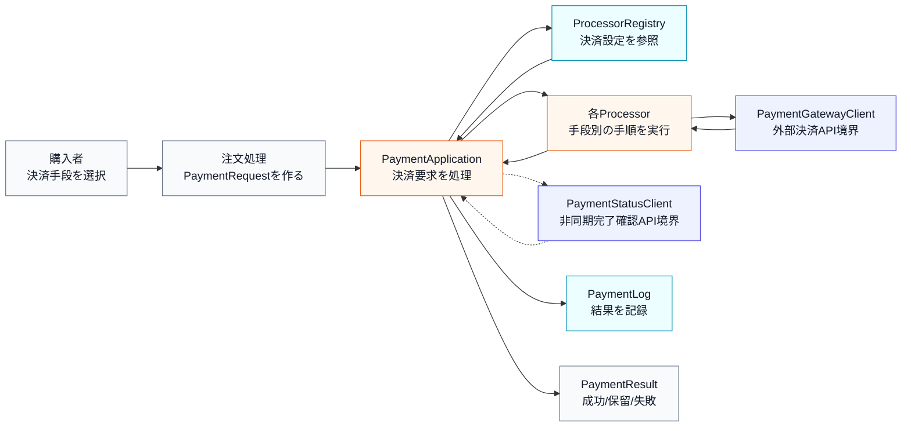

この図では、購入者が直接外部決済APIを呼ぶのではなく、注文処理が `PaymentRequest` を作り、`PaymentApplication` が登録済み設定を確認してから手段別Processorへ渡すことが分かります。非同期決済の場合は、`PaymentStatusClient` を使って入金の完了確認を行います。

**仕様整理図：正常系の入力・判定・加工・出力**

代表ケースとしてクレジットカード決済（同期）の正常系を見ます。

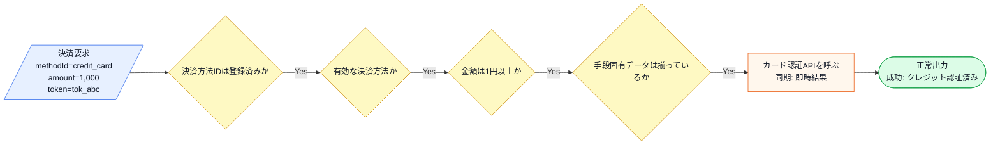

次に、銀行振込（非同期）の正常系を見ます。

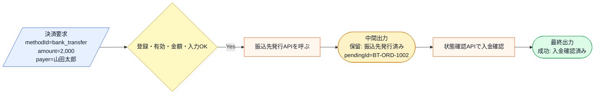

この図から読み取ることは、次の3点です。

- 同期決済（クレジットカード）はAPI呼び出し1回で結果が確定する。非同期決済（銀行振込・コンビニ）は発行→保留→完了確認の2段階になる。
- 非同期決済は保留IDを発行し、完了確認APIで最終結果を取得する。
- 手段固有データの検証は、決済実行の前に行う。カードならトークンと名義、銀行振込なら振込名義と銀行コードが必要である。

**エラー条件**

正常系の決済実行へ進めない入力や外部境界の懸念は、正常系図に混ぜず、次の表で分けて扱います。

| エラー条件 | どこで分かるか | 出力 |
|---|---|---|
| 決済方法IDが未登録 | 決済設定の検索時 | 未対応決済エラー |
| 決済方法が無効 | 有効フラグ確認時 | 無効決済エラー |
| 金額が1円未満 | 金額確認時 | 金額エラー |
| 手段固有データが不足 | 各Processorの入力検証時 | 入力不足エラー |
| 外部決済APIが失敗 | API呼び出し時 | 失敗結果（リトライ可否付き） |
| 完了確認で期限切れ | 状態確認API呼び出し時 | 期限切れエラー |

**決済の実行フロー**

決済手段ごとの中身は異なりますが、注文処理から見た大枠は共通です。

1. 注文処理が `PaymentRequest` を作る
2. 決済方法IDを使って登録済み設定を確認する
3. 有効な決済方法なら、対応するProcessorを選ぶ
4. Processorが手段固有データを検証する
5. Processorが外部決済API境界を呼ぶ
6. 同期決済なら即座に結果を返す。非同期決済なら保留を返す
7. 非同期決済の場合、保留IDで状態確認APIへ問い合わせる

この共通部分と手段別の差分を分けて読むことが、後のフェーズで「何を守り、何を分けるか」を考える材料になります。

**この仕様を決める業務機能**

| 業務機能 | この章の仕様で決めていること |
|---|---|
| 決済手段・サービス管理 | どの決済手段を追加・廃止するか |
| 処理の骨格（開発設計判断） | 決済フロー・共通仕様の構造 |

後のフェーズで変更要求を扱うとき、どの業務機能の知識なのかを確認するための名前として使います。

### 1-2：動作例テーブル

仕様を定義したところで、実際にどのような入力に対してどのような結果が返るかを確認します。このテーブルは「このシステムが正しく動いているとはどういう状態か」の基準になります。

| ケース | 決済方法ID | 金額 | 手段固有データ |
|---|---|---|---|
| カード正常（同期） | `credit_card` | 1000円 | token=tok_abc, holder=YAMADA, cvv=123 |
| 銀行振込正常（非同期） | `bank_transfer` | 2000円 | payer=山田太郎, bank=0001, type=ordinary |
| コンビニ正常（非同期） | `convenience` | 500円 | phone=09012345678, email=y@example.com, store=seven |
| カードAPI失敗 | `credit_card` | 800円 | token=ERROR_DECLINED, holder=SUZUKI, cvv=456 |
| カード入力不足 | `credit_card` | 600円 | token=tok_xyz, holder=(空), cvv=789 |
| 無効な決済方法 | `crypto` | 300円 | (なし) |
| 未登録の決済方法 | `unknown` | 200円 | (なし) |

| ケース | 期待される結果 |
|---|---|
| カード正常（同期） | 成功。クレジット認証済みの結果を返す |
| 銀行振込正常（非同期） | 保留→完了確認→成功。入金確認済みの結果を返す |
| コンビニ正常（非同期） | 保留→完了確認→成功。コンビニ入金確認済みの結果を返す |
| カードAPI失敗 | 失敗。カード認証失敗（リトライ可能）を返す |
| カード入力不足 | 失敗。カード名義が不足していますを返す |
| 無効な決済方法 | 失敗。暗号通貨は現在無効ですを返す |
| 未登録の決済方法 | 失敗。未登録の決済方法ですを返す |

この表は変更要求前に登録されている決済方法を示しています。この章で比べるのは、同じ外側の動作を保ちながら、決済手段が増えたときにどこを変更する構造になるかという違いです。

---

### 1-3：登場クラスとクラス構成図

仕様と動作例が確認できたところで、登場するクラスを先に確認します。

| クラス名 | 役割 | 担当する仕様 |
|---|---|---|
| `PaymentApplication` | 決済要求を受け取り、対応するProcessorを呼び出す | 決済手段の選択と実行、完了確認 |
| `CreditCardProcessor` | カード固有データを検証し、カード認証APIを呼ぶ | クレジットカード決済（同期） |
| `BankTransferProcessor` | 振込固有データを検証し、振込先発行APIを呼ぶ | 銀行振込（非同期） |
| `ConvenienceStoreProcessor` | コンビニ固有データを検証し、番号発行APIを呼ぶ | コンビニ決済（非同期） |
| `ProcessorRegistry` | 決済方法の設定を保持するデータストア | 決済方法の存在確認・有効フラグの参照 |
| `PaymentGatewayClient` | 外部決済APIの境界スタブ | 認証・振込先発行・番号発行の代替 |
| `PaymentStatusClient` | 非同期決済の完了確認APIの境界スタブ | 入金確認の代替 |

各クラスの責任を把握したところで、クラス間の関係を図で整理します。

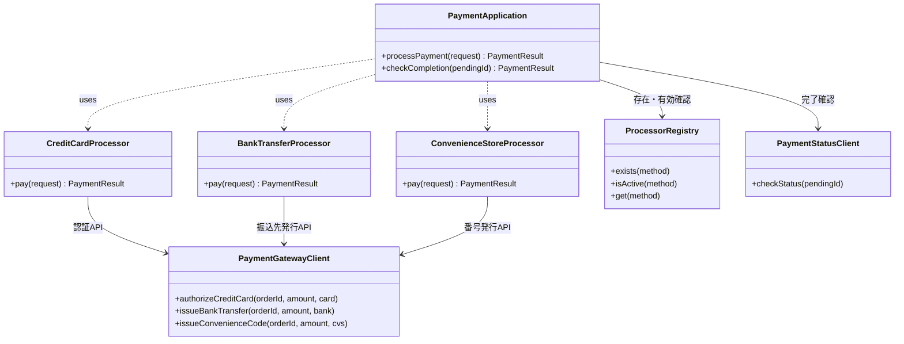

**クラス図に出てくる主な操作**

| クラス | 操作 | 何ができるか |
|---|---|---|
| `PaymentApplication` | `processPayment()` | 決済要求を受け取り、手段別処理を呼ぶ |
| `PaymentApplication` | `checkCompletion()` | 保留決済の入金を確認する |
| `CreditCardProcessor` | `pay()` | カード固有データを検証し、認証APIを呼ぶ |
| `BankTransferProcessor` | `pay()` | 振込固有データを検証し、振込先発行APIを呼ぶ |
| `ConvenienceStoreProcessor` | `pay()` | コンビニ固有データを検証し、番号発行APIを呼ぶ |
| `PaymentGatewayClient` | 各メソッド | 外部決済APIのスタブ。成功または失敗を返す |
| `PaymentStatusClient` | `checkStatus()` | 保留IDで入金状態を確認するスタブ |

この図が示す通り、`PaymentApplication` というクラスが、クレジットカード、銀行振込、コンビニ決済といった個別の決済プロセッサーを直接利用（依存）し、さらに非同期決済の完了確認も自分で制御している構成になっています。

**この章での簡略化**

1-3でクラス構成を確認したので、掲載コードで何を代替しているかを整理してからフェーズ1の現状コードへ進みます。

この章では、外部決済サービスそのものは実装せず、`PaymentGatewayClient` と `PaymentStatusClient` という2つの境界スタブを呼ぶ形で表します。スタブの内部だけが `std::cout` を使います。ただし、決済手段ごとの入力差分、同期と非同期の結果差分、外部API失敗の可能性、非同期決済の完了確認は仕様として扱います。返金、不正検知、3Dセキュア、Webhookの再送制御などは実運用では重要ですが、この章の論点である「生成する決済プロセッサーの種類が増えたとき、生成責任をどこに置くか」から外れるため、境界クラスの先にある処理として補足に留めます。

---

### 1-4：実装コード（現状）

#### コードを読む前の責任・境界・C++記法

| 対象 | 呼び出しと内部処理 | 戻り値・副作用 | 掲載上の表現 |
|---|---|---|---|
| 決済Processor | 手段別データを検証し外部API手順を進める | 成功・保留・失敗の`PaymentResult` | API Clientを固定応答で代替する |
| `PaymentApplication` | 決済種別からProcessorを生成する | `IPaymentProcessor*` | 生成物の破棄責任も組み立て側に置く |
| `map` | 決済IDや注文IDから設定を検索する | 対応データ | メモリ上の設定/注文DB |
| 例外 | 未知の決済種別など生成不能を通知する | 呼び出し元で失敗結果へ変換 | `runtime_error`を境界で捕捉する |

実カード会社、銀行、コンビニ、PayPay APIへの通信はClientスタブです。認証待ちや入金待ちは成功へ丸めず、保留状態として呼び出し元へ返します。

1-1で整理した決済手段を、コード上の設定として持ちます。手段固有の入力データは構造体で分け、非同期決済は保留情報を返し、完了確認は別の境界スタブで行います。

```cpp
#include <iostream>
#include <map>
#include <string>
#include <vector>

using namespace std;

// ---- 手段固有の入力データ ----

struct CreditCardInput {
    string cardToken;
    string holderName;
    string securityCode;
};

struct BankTransferInput {
    string payerName;
    string bankCode;
    string accountType; // "ordinary" or "checking"
};

struct ConvenienceInput {
    string phoneNumber;
    string email;
    string storeCode; // "seven","lawson","familymart"
};

// ---- 保留決済の追跡情報 ----

struct PendingInfo {
    string pendingId;  // 完了確認用ID
    string checkUrl;   // 確認先（スタブでは表示用）
    string expiresAt;  // 有効期限
};

// ---- 決済要求・結果 ----

struct PaymentRequest {
    string methodId;
    int amount;
    string orderId;
    string customerId;
    // 手段固有データ（該当する1つだけをセット）
    CreditCardInput creditCard;
    BankTransferInput bankTransfer;
    ConvenienceInput convenience;
};

struct PaymentResult {
    string status;     // "成功", "保留", "失敗"
    string message;
    bool canRetry;     // 再試行可能か
    string errorCode;  // エラーコード（空なら正常）
    PendingInfo pending; // 保留時の確認情報
};
```

各決済手段が必要とするデータが異なるため、`PaymentRequest` には手段ごとの入力構造体を持たせています。`PaymentResult` には、成功・保留・失敗のステータスに加え、リトライ可否、エラーコード、保留時の確認情報を含めています。

```cpp
// ---- 決済方法の設定 ----

struct ProcessorConfig {
    string name;
    bool isActive;
    double feeRate;
};

class ProcessorRegistry {
private:
    map<string, ProcessorConfig> registry;
public:
    ProcessorRegistry() {
        registry["credit_card"] =
            {"クレジットカード", true, 0.030};
        registry["bank_transfer"] =
            {"銀行振込", true, 0.005};
        registry["convenience"] =
            {"コンビニ払い", true, 0.000};
        registry["crypto"] =
            {"暗号通貨", false, 0.010};
    }

    bool exists(const string& method) const {
        return registry.count(method) > 0;
    }

    bool isActive(const string& method) const {
        return registry.at(method).isActive;
    }

    ProcessorConfig get(const string& method) const {
        return registry.at(method);
    }
};
```

レジストリは決済方法の設定を一元管理します。登録されているか、有効かの判定に使います。

```cpp
// ---- 外部決済API境界スタブ ----

class PaymentGatewayClient {
public:
    // カード認証（同期: 即座に成功/失敗を返す）
    PaymentResult authorizeCreditCard(
        const string& orderId,
        int amount,
        const CreditCardInput& card) {
        cout << "[決済API] カード認証"
             << " order=" << orderId
             << " amount=" << amount
             << " token=" << card.cardToken
             << " holder=" << card.holderName
             << endl;
        // スタブ: ERROR始まりなら認証失敗
        if (card.cardToken.find("ERROR") == 0) {
            return {"失敗",
                    "カード認証失敗: 残高不足",
                    true, "AUTH_DECLINED", {}};
        }
        return {"成功",
                "クレジット認証済み id=AUTH001",
                false, "", {}};
    }

    // 振込先発行（同期で発行、入金確認は非同期）
    PaymentResult issueBankTransfer(
        const string& orderId,
        int amount,
        const BankTransferInput& bank) {
        cout << "[決済API] 振込先発行"
             << " order=" << orderId
             << " amount=" << amount
             << " payer=" << bank.payerName
             << " bank=" << bank.bankCode
             << endl;
        PendingInfo p{
            "BT-" + orderId,
            "/api/bank/status/",
            "2026-07-12"};
        return {"保留",
                "振込先発行済み 口座=mizuho-1234567",
                false, "", p};
    }

    // コンビニ支払い番号発行（同期で発行、入金は非同期）
    PaymentResult issueConvenienceCode(
        const string& orderId,
        int amount,
        const ConvenienceInput& cvs) {
        cout << "[決済API] コンビニ番号発行"
             << " order=" << orderId
             << " amount=" << amount
             << " phone=" << cvs.phoneNumber
             << " store=" << cvs.storeCode
             << endl;
        PendingInfo p{
            "CVS-" + orderId,
            "/api/cvs/status/",
            "2026-07-08"};
        return {"保留",
                "支払い番号発行済み 番号=CVS-98765",
                false, "", p};
    }
};

// 非同期決済の完了確認API境界スタブ
class PaymentStatusClient {
public:
    PaymentResult checkStatus(
        const string& pendingId) {
        cout << "[状態確認API] id="
             << pendingId << endl;
        // スタブ: EXPIRE含みなら期限切れ
        if (pendingId.find("EXPIRE")
            != string::npos) {
            return {"失敗",
                    "支払い期限切れ",
                    false, "EXPIRED", {}};
        }
        if (pendingId.find("BT-") == 0) {
            return {"成功",
                    "入金確認済み",
                    false, "", {}};
        }
        if (pendingId.find("CVS-") == 0) {
            return {"成功",
                    "コンビニ入金確認済み",
                    false, "", {}};
        }
        return {"失敗",
                "不明な保留ID",
                false, "UNKNOWN_PENDING", {}};
    }
};
```

`PaymentGatewayClient` は外部決済APIの境界スタブです。カード認証は同期で即座に結果を返し、振込先発行とコンビニ番号発行は保留IDを含む保留結果を返します。`PaymentStatusClient` は非同期決済の入金確認を行う境界スタブです。保留IDに `EXPIRE` が含まれていれば期限切れとして扱います。

```cpp
// ---- 各決済手段の具体的な処理 ----

class CreditCardProcessor {
    PaymentGatewayClient& gateway;
public:
    CreditCardProcessor(
        PaymentGatewayClient& gw)
        : gateway(gw) {}

    PaymentResult pay(
        const PaymentRequest& req) {
        // カード固有の入力検証
        if (req.creditCard.cardToken.empty()) {
            return {"失敗",
                    "カードトークンが不足しています",
                    false, "MISSING_TOKEN", {}};
        }
        if (req.creditCard.holderName.empty()) {
            return {"失敗",
                    "カード名義が不足しています",
                    false, "MISSING_HOLDER", {}};
        }
        if (req.creditCard.securityCode.empty()) {
            return {"失敗",
                    "セキュリティコードが不足しています",
                    false, "MISSING_CVV", {}};
        }
        // 同期: 認証APIを呼んで即座に結果を返す
        return gateway.authorizeCreditCard(
            req.orderId, req.amount,
            req.creditCard);
    }
};

class BankTransferProcessor {
    PaymentGatewayClient& gateway;
public:
    BankTransferProcessor(
        PaymentGatewayClient& gw)
        : gateway(gw) {}

    PaymentResult pay(
        const PaymentRequest& req) {
        // 振込固有の入力検証
        if (req.bankTransfer.payerName.empty()) {
            return {"失敗",
                    "振込名義が不足しています",
                    false, "MISSING_PAYER", {}};
        }
        if (req.bankTransfer.bankCode.empty()) {
            return {"失敗",
                    "銀行コードが不足しています",
                    false, "MISSING_BANK", {}};
        }
        // 非同期: 振込先を発行し、保留を返す
        return gateway.issueBankTransfer(
            req.orderId, req.amount,
            req.bankTransfer);
    }
};

class ConvenienceStoreProcessor {
    PaymentGatewayClient& gateway;
public:
    ConvenienceStoreProcessor(
        PaymentGatewayClient& gw)
        : gateway(gw) {}

    PaymentResult pay(
        const PaymentRequest& req) {
        // コンビニ固有の入力検証
        if (req.convenience.phoneNumber.empty()) {
            return {"失敗",
                    "電話番号が不足しています",
                    false, "MISSING_PHONE", {}};
        }
        if (req.convenience.email.empty()) {
            return {"失敗",
                    "メールアドレスが不足しています",
                    false, "MISSING_EMAIL", {}};
        }
        // 非同期: 支払い番号を発行し、保留を返す
        return gateway.issueConvenienceCode(
            req.orderId, req.amount,
            req.convenience);
    }
};
```

各Processorは自分の手段に必要な入力データを検証し、対応する外部APIスタブを呼びます。クレジットカードは同期で即座に成功または失敗を返し、銀行振込とコンビニは非同期で保留（保留ID付き）を返します。

```cpp
// ---- 決済を統括するクラス ----

class PaymentApplication {
    ProcessorRegistry registry;
    PaymentGatewayClient gatewayClient;
    PaymentStatusClient statusClient;
public:
    PaymentResult processPayment(
        const PaymentRequest& request) {
        const string& type = request.methodId;

        // レジストリで存在確認
        if (!registry.exists(type)) {
            return {"失敗",
                    "未登録の決済方法です: " + type,
                    false, "UNKNOWN_METHOD", {}};
        }
        // レジストリで有効フラグを確認
        if (!registry.isActive(type)) {
            ProcessorConfig cfg
                = registry.get(type);
            return {"失敗",
                    cfg.name + " は現在無効です。",
                    false, "DISABLED", {}};
        }
        if (request.amount < 1) {
            return {"失敗",
                    "金額は1円以上で指定してください。",
                    false, "INVALID_AMOUNT", {}};
        }

        // 決済方法に応じてプロセッサを生成して実行
        if (type == "credit_card") {
            CreditCardProcessor proc(gatewayClient);
            PaymentResult result
                = proc.pay(request);
            // カード認証失敗はリトライ可能
            if (result.status == "失敗") {
                result.canRetry = true;
            }
            return result;
        } else if (type == "bank_transfer") {
            BankTransferProcessor proc(
                gatewayClient);
            PaymentResult result
                = proc.pay(request);
            // 非同期: APIエラーならそのまま返す
            return result;
        } else if (type == "convenience") {
            ConvenienceStoreProcessor proc(
                gatewayClient);
            PaymentResult result
                = proc.pay(request);
            return result;
        }
        return {"失敗",
                "未対応の決済種別です: " + type,
                false, "UNSUPPORTED", {}};
    }

    // 保留決済の完了確認
    PaymentResult checkCompletion(
        const string& pendingId) {
        return statusClient.checkStatus(pendingId);
    }
};
```

`PaymentApplication` はすべての決済手段の具体クラスを直接知っています。カード決済では認証失敗時にリトライ可能フラグを設定し、銀行振込やコンビニは保留結果をそのまま返します。手段ごとに生成するクラスと、エラー時の対処が異なっていることがコード上に表れています。

```cpp
// ---- 決済ログ ----

struct PaymentRecord {
    string method;
    int amount;
    string status;
    string errorCode;
};

class PaymentLog {
    vector<PaymentRecord> records;
public:
    void add(const string& method,
             int amount,
             const string& status,
             const string& errorCode = "") {
        records.push_back(
            {method, amount, status, errorCode});
    }
    void printAll() const {
        for (const auto& r : records) {
            cout << "[" << r.method << "] "
                 << r.amount << "円 -> "
                 << r.status;
            if (!r.errorCode.empty()) {
                cout << " (" << r.errorCode << ")";
            }
            cout << endl;
        }
    }
};

// ---- 実行 ----

int main() {
    PaymentApplication app;
    PaymentLog payLog;

    // ケース1: カード正常（同期）
    PaymentRequest r1;
    r1.methodId = "credit_card";
    r1.amount = 1000;
    r1.orderId = "ORD-1001";
    r1.customerId = "C001";
    r1.creditCard = {"tok_abc", "YAMADA", "123"};

    // ケース2: 銀行振込正常（非同期）
    PaymentRequest r2;
    r2.methodId = "bank_transfer";
    r2.amount = 2000;
    r2.orderId = "ORD-1002";
    r2.customerId = "C002";
    r2.bankTransfer
        = {"山田太郎", "0001", "ordinary"};

    // ケース3: コンビニ正常（非同期）
    PaymentRequest r3;
    r3.methodId = "convenience";
    r3.amount = 500;
    r3.orderId = "ORD-1003";
    r3.customerId = "C003";
    r3.convenience
        = {"09012345678", "y@example.com", "seven"};

    // ケース4: カードAPI失敗
    PaymentRequest r4;
    r4.methodId = "credit_card";
    r4.amount = 800;
    r4.orderId = "ORD-1004";
    r4.customerId = "C004";
    r4.creditCard
        = {"ERROR_DECLINED", "SUZUKI", "456"};

    // ケース5: カード入力不足
    PaymentRequest r5;
    r5.methodId = "credit_card";
    r5.amount = 600;
    r5.orderId = "ORD-1005";
    r5.customerId = "C005";
    r5.creditCard = {"tok_xyz", "", "789"};

    // ケース6: 無効な決済方法
    PaymentRequest r6;
    r6.methodId = "crypto";
    r6.amount = 300;
    r6.orderId = "ORD-1006";
    r6.customerId = "C006";

    // ケース7: 未登録の決済方法
    PaymentRequest r7;
    r7.methodId = "unknown";
    r7.amount = 200;
    r7.orderId = "ORD-1007";
    r7.customerId = "C007";

    vector<PaymentRequest> requests
        = {r1, r2, r3, r4, r5, r6, r7};

    for (const auto& req : requests) {
        PaymentResult result
            = app.processPayment(req);
        cout << "結果: " << req.methodId
             << " -> " << result.status
             << " (" << result.message << ")"
             << endl;

        // 保留の場合、完了確認を実行
        if (result.status == "保留") {
            cout << "  完了確認中... id="
                 << result.pending.pendingId
                 << endl;
            PaymentResult completion
                = app.checkCompletion(
                    result.pending.pendingId);
            cout << "  完了結果: "
                 << completion.status
                 << " (" << completion.message
                 << ")" << endl;
            // 最終結果で記録
            payLog.add(req.methodId,
                       req.amount,
                       completion.status,
                       completion.errorCode);
        } else {
            payLog.add(req.methodId,
                       req.amount,
                       result.status,
                       result.errorCode);
        }
    }

    cout << "\n--- 決済ログ ---\n";
    payLog.printAll();

    return 0;
}
```

実行対象コード：1-4の現状コード
対応する動作例：1-2の動作例テーブル
確認したいこと：同期決済、非同期決済の完了確認、API失敗、入力不足、無効・未登録が仕様どおりに動作すること

実行結果：

```
[決済API] カード認証 order=ORD-1001 amount=1000 token=tok_abc holder=YAMADA
結果: credit_card -> 成功 (クレジット認証済み id=AUTH001)
[決済API] 振込先発行 order=ORD-1002 amount=2000 payer=山田太郎 bank=0001
結果: bank_transfer -> 保留 (振込先発行済み 口座=mizuho-1234567)
  完了確認中... id=BT-ORD-1002
[状態確認API] id=BT-ORD-1002
  完了結果: 成功 (入金確認済み)
[決済API] コンビニ番号発行 order=ORD-1003 amount=500 phone=09012345678 store=seven
結果: convenience -> 保留 (支払い番号発行済み 番号=CVS-98765)
  完了確認中... id=CVS-ORD-1003
[状態確認API] id=CVS-ORD-1003
  完了結果: 成功 (コンビニ入金確認済み)
[決済API] カード認証 order=ORD-1004 amount=800 token=ERROR_DECLINED holder=SUZUKI
結果: credit_card -> 失敗 (カード認証失敗: 残高不足)
結果: credit_card -> 失敗 (カード名義が不足しています)
結果: crypto -> 失敗 (暗号通貨 は現在無効です。)
結果: unknown -> 失敗 (未登録の決済方法です: unknown)

--- 決済ログ ---
[credit_card] 1000円 -> 成功
[bank_transfer] 2000円 -> 成功
[convenience] 500円 -> 成功
[credit_card] 800円 -> 失敗 (AUTH_DECLINED)
[credit_card] 600円 -> 失敗 (MISSING_HOLDER)
[crypto] 300円 -> 失敗 (DISABLED)
[unknown] 200円 -> 失敗 (UNKNOWN_METHOD)
```

このコードでは、`PaymentApplication` クラスが、どの決済手段のクラスを生成し、どう実行し、エラー時にどう対処するかをすべて直接知っています。

---

### 1-5：変更要求

**変更要求の発生背景：** 今回の変更要求は決済プラットフォームチームから届いています。新しい決済手段の導入を推進するチームです。

ある週の火曜日、決済プラットフォームチームのリーダーからチャットで連絡が入りました。

「急ぎの相談なんだけど、来月から導入する新しい決済手段として『PayPay』に対応してほしいんだ。今のシステムでそのまま行けるか確認して、もし難しそうなら方針を教えてもらえるかな？」

PayPay対応です。PayPayは外部のQRコード決済サービスであり、次の特徴があります。

- **手段固有データ**: PayPayアクセストークンとマーチャントIDが必要
- **処理タイプ**: 非同期。決済セッションを作成して保留を返し、完了確認で結果を取得する
- **エラー**: PayPay固有のエラー（トークン無効、セッション期限切れ）がある

**仕様変更の内容**

| 決済手段 | 変更前 | 変更後 |
|---|---|---|
| クレジットカード | 対応済み | 変更なし |
| 銀行振込 | 対応済み | 変更なし |
| コンビニ払い | 対応済み | 変更なし |
| PayPay | 未対応 | 新規追加 |

PayPay決済が追加されても、注文処理から見た大枠（`PaymentRequest` を渡し、`PaymentResult` を受け取る）は変わりません。しかし、PayPayにはPayPay固有のアクセストークンとマーチャントIDが必要で、処理は非同期であり、完了確認ではPayPay固有の保留IDを使います。

**変更前後の入力・判定・加工・出力差分**

| 要素 | 変更前（現状仕様） | 変更後（今回の要求） | 差分として追うもの |
|---|---|---|---|
| 入力 | 3種の手段固有データ | PayPay固有データを追加 | `PayPayInput` 構造体が増える |
| 判定 | 3種の入力検証 | PayPay固有データの検証追加 | 検証ロジックが増える |
| 加工 | 同期1種、非同期2種 | 非同期がもう1種増える | PayPay決済API境界が増える |
| 出力 | 成功、保留→完了、失敗 | PayPayの保留→完了を追加 | 完了確認の対象が増える |

**変更後の入力・加工・出力**

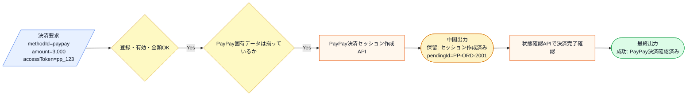

この図から読み取ることは、次の3点です。

- 注文処理から見た外側の契約は `PaymentRequest` から `PaymentResult` のままである。
- PayPayは非同期処理であり、銀行振込やコンビニと同様に保留→完了確認の2段階になる。
- PayPay固有の入力データ（アクセストークン、マーチャントID）の検証、PayPay決済API境界の呼び出し、PayPay用完了確認が新たに必要になる。

変更後も、失敗条件は正常系図へ混ぜずに別で確認します。

| エラー条件 | どこで分かるか | 出力 |
|---|---|---|
| PayPay固有データが不足 | PayPayProcessorの入力検証時 | 入力不足エラー |
| PayPay決済APIが失敗 | API呼び出し時 | 失敗結果（リトライ可否付き） |
| PayPay完了確認で期限切れ | 状態確認API時 | 期限切れエラー |

種別が1つ増えるだけの変更が、実際のコードではどれだけの修正になるかを、フェーズ3で変更を試すコードで確認します。

フェーズ1でシステムの現状と変更要求が把握できました。次のフェーズ2では、「何を変え、何を守るか」を整理します。

## 🟣 フェーズ2：仮説立案 ―― 何が変わるかを観察し、ヒアリングで裏付ける
### 2-1：変わりそうな仕様の見当をつける

ここで作る一覧は、思いつきで「変わりそう」と感じたものを並べる表ではありません。フェーズ1で確認した仕様・動作例・クラス図を材料に、次の順で候補を絞ります。

1. 仕様図と動作例から、入力・判定・加工・出力のうち条件や値が変わりそうな箇所を拾う。
2. その箇所が、1-3のどのクラス・メソッドに書かれているかを対応づける。
3. その仕様が、どんな理由で、何をきっかけに、どのくらいの頻度で変わりそうかを仮説として書く。
4. 逆に、当面変えない前提にできる処理の骨格も分けておく。

この手順で見ると、「決済を実行する」という大きな処理全体ではなく、その中のどの決済手段・生成条件・入力データ・処理手順・エラー処理が変更候補なのかを読者自身で追えるようになります。

| 仕様候補 | 仕様上の場所 | コード上の場所 | 見立て |
|---|---|---|---|
| 決済手段の種類 | 入力、判定 | `processPayment()` の if-else | 新しい決済手段が増える可能性があるため、今回見る |
| 手段固有の入力データ | 入力 | 各 `*Input` 構造体と各Processorの入力検証 | 決済手段ごとに異なるデータが必要なため、追加時に増える |
| 処理タイプ（同期/非同期） | 加工 | `processPayment()` 内のリトライ判定、`main()` の完了確認分岐 | 新しい手段が同期か非同期かで処理が変わる |
| 外部APIの呼び出し手順 | 加工、出力 | 各Processorと`PaymentGatewayClient` | 決済手段ごとに認証、番号発行、セッション作成などの手順が異なる |
| エラー処理の対処 | 出力 | `processPayment()` 内のリトライフラグ設定 | 手段ごとにリトライ可否が異なる |
| 決済実行の外側の流れ | 加工、出力 | `PaymentRequest` → `PaymentResult` | 注文処理との境界として当面維持する前提 |

この表から、今回の検討対象は「決済手段の選択と生成」「手段固有の入力検証」「同期/非同期の処理モード」「エラー処理の対処」に絞れます。

### 2-2：今回の変更で確実に変わること

今回の変更要求から確定している変更は次の通りです。

- **`PayPayInput` 構造体の追加**：PayPay固有のアクセストークンとマーチャントID
- **`PayPayProcessor` の追加**：PayPay固有の入力検証と決済API呼び出し
- **`PaymentApplication` 内の分岐条件への追記**：`"paypay"` の if-else 追加
- **`PaymentGatewayClient` へのPayPay用API追加**：PayPay決済セッション作成
- **`PaymentStatusClient` でのPayPay完了確認対応**：PayPay固有の保留ID処理
- **エラー処理の追加**：PayPay固有のエラーコードとリトライ判定

ただし「この変更が1回限りか、今後も続くか」によって、どこまで設計を変えるべきかが大きく変わります。関係者に確認します。

### ヒアリングに向けた背景確認

このシステムは、ある決済サービス事業者の「決済プロセッサー」を管理する基盤です。当初クレジットカード決済だけをサポートしていましたが、ユーザーの利便性を高めるために、後からコンビニ決済、銀行振込、そしてPayPayなどのQRコード決済と、次々に新しい決済手段が追加されてきました。

コードを見ると、`PaymentApplication` クラスが、各決済手段の具体クラスを直接生成し、手段ごとのエラー処理（リトライ可否の設定など）まで直接扱っている構成になっています。

### 2-3：関係者ヒアリング

仮説を持って、決済プラットフォームチームの担当者と話し合いを持ちました。

- **開発者：** 「PayPay対応の件ですが、今の構造だと決済手段が増えるたびに `PaymentApplication` クラスへ分岐と生成処理を追加する必要があります。手段固有の入力データ、同期か非同期かの判定、エラー処理も手段ごとに書き分けています。今後も新しい決済手段は追加される予定でしょうか？」
- **決済担当者：** 「ああ、かなりハイペースで追加していく予定だよ。次は銀行系の決済も入るし、後払いサービスも検討している。だから、決済手段が増えるたびに基幹部分のコードを書き換えるようなことはなるべく避けてほしいんだ。」
- **開発者：** 「各決済手段で必要なデータも違いますし、同期で即座に結果が出るものと、非同期で完了確認が必要なものがありますよね。注文処理から見た外側の契約、つまり決済要求を渡して結果を受け取る形は維持したい、という理解で合っていますか？」
- **決済担当者：** 「その理解で合っている。クレジットは認証、コンビニや銀行振込は入金待ち、PayPayはPayPay側のセッション確認がある。中身は違うけれど、注文処理側には同じ形で結果を返してほしい。失敗したときの対処も手段ごとに違うけど、それもこちら側で吸収してほしい。」
- **開発者：** 「分かりました。外側の契約は保ちたい一方で、手段固有の入力データ、同期/非同期の処理モード、完了確認の手順、エラー時の対処が決済手段ごとに増えていくということですね。」

### 2-4：ヒアリングで判明した将来リスク

| 将来リスク | 時期の目安 | 根拠 |
|---|---|---|
| 決済手段の種類がさらに増加する | 新しい決済手段の追加ごと | 「かなりハイペースで追加していく予定」 |
| 手段固有の入力データと検証ロジック | 追加ごと | 決済手段ごとに異なるデータが必要 |
| 同期/非同期の処理モードの増加 | 追加ごと | 新手段が同期か非同期かで処理が変わる |
| 完了確認の手順の増加 | 非同期手段の追加ごと | 非同期手段は保留→完了確認の2段階 |

フェーズ2で「今変わること（確定）」と「将来変わるかもしれないこと（リスク）」を分けて整理できました。次のフェーズ3では、現在の構造で変更を試みたときに何が起きるかを確認します。

### 2-5：変わる見込みと当面安定の前提を確定する

| 変更内容 | 現在 | 将来（時期の目安） |
|---|---|---|
| 対応する決済手段の種類 | カード・振込・コンビニ | 後払い・QRコード等、追加ごと |
| 手段固有の入力データ構造 | 3種の `*Input` 構造体 | 手段ごとに新しい構造体が増える |
| 処理タイプ（同期/非同期） | 同期1種、非同期2種 | 新手段ごとにどちらかが増える |
| 完了確認の対象 | 銀行振込、コンビニ | 非同期手段の追加ごとに増える |
| 注文処理との外側の契約 | Request → Result | 当面維持したい前提 |

この変化が来たとき、現在の構造では `PaymentApplication` を毎回開いて修正することになります。次のフェーズ3では、実際にその修正を試みて何が起きるかを確認します。

---

## 🟣 フェーズ3：問題特定 ―― 変更の痛みを発見する
### 3-1：変更を試みる

「PayPay対応」の要求を、フェーズ1の現状コードで実装しようと試みます。PayPayを追加するには、次の修正が必要です。

**修正1：PayPay固有の入力構造体を追加**

```cpp
struct PayPayInput {
    string accessToken;
    string merchantId;
};
```

**修正2：`PaymentRequest` にPayPayデータを追加**

```cpp
struct PaymentRequest {
    // ... 既存フィールド ...
    PayPayInput payPay;  // ← 追加
};
```

**修正3：`PaymentGatewayClient` にPayPay用APIを追加**

```cpp
// PaymentGatewayClientへ追加
PaymentResult chargePayPay(
    const string& orderId,
    int amount,
    const PayPayInput& pp) {
    cout << "[決済API] PayPay決済"
         << " order=" << orderId
         << " amount=" << amount
         << " token=" << pp.accessToken
         << endl;
    PendingInfo p{
        "PP-" + orderId,
        "/api/paypay/status/",
        "2026-07-10"};
    return {"保留",
            "PayPayセッション作成済み",
            false, "", p};
}
```

**修正4：`PayPayProcessor` を新規作成**

```cpp
class PayPayProcessor {
    PaymentGatewayClient& gateway;
public:
    PayPayProcessor(PaymentGatewayClient& gw)
        : gateway(gw) {}
    PaymentResult pay(
        const PaymentRequest& req) {
        if (req.payPay.accessToken.empty()) {
            return {"失敗",
                    "PayPayトークンが不足しています",
                    false, "MISSING_PP_TOKEN", {}};
        }
        if (req.payPay.merchantId.empty()) {
            return {"失敗",
                    "マーチャントIDが不足しています",
                    false, "MISSING_MERCHANT", {}};
        }
        return gateway.chargePayPay(
            req.orderId, req.amount, req.payPay);
    }
};
```

**修正5：`processPayment()` にPayPayの分岐を追加**

```cpp
// processPayment() の if-else に追加
} else if (type == "paypay") {     // ← 追加
    PayPayProcessor proc(gatewayClient); // ← 追加
    PaymentResult result               // ← 追加
        = proc.pay(request);            // ← 追加
    return result;                      // ← 追加
}
```

**修正6：`PaymentStatusClient` にPayPay対応を追加**

```cpp
// checkStatus() に追加
if (pendingId.find("PP-") == 0) {       // ← 追加
    return {"成功",                      // ← 追加
            "PayPay決済確認済み",         // ← 追加
            false, "", {}};              // ← 追加
}                                        // ← 追加
```

**修正7：レジストリに登録**

```cpp
registry["paypay"] =
    {"PayPay", true, 0.020};  // ← 追加
```

PayPay対応には7か所の修正が必要でした。入力構造体の追加、`PaymentRequest` への追加、API境界スタブの追加、Processorの新規作成、`processPayment` の分岐追加、完了確認の対応追加、レジストリへの登録です。

ここで見たいのは、分岐の行数そのものではありません。問題は、決済手段ごとの入力構造体、入力検証ロジック、API呼び出し手順、同期/非同期の処理モード、エラー対処が、決済を利用する流れの近くに積み上がることです。クレジットカードの認証、銀行振込の入金待ち、コンビニの支払い番号発行、PayPayのセッション作成は、同じ「決済」でも手順と失敗状態が異なります。その差分を利用側が知り続けるほど、追加のたびに既存の決済フローを開いて確認する範囲が広がります。

### 3-2：変更影響グラフ

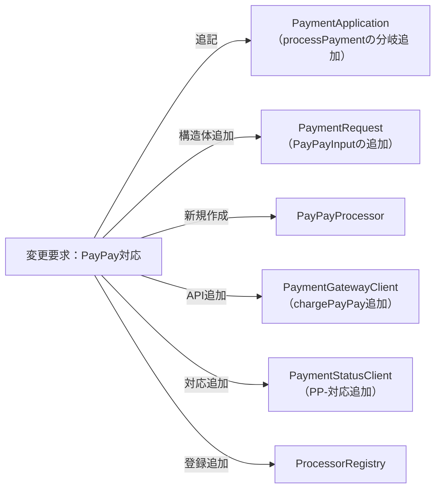

新しい決済手段という「ビジネス上の変化」を実装するたびに、本来は決済手段の振り分けだけを担う役割を持つ `PaymentApplication` クラスが必ず修正対象として矢印を向けられています。さらに、入力構造体、API境界、完了確認の対応まで広がっています。

### 3-3：痛みの言語化

**1つ目：修正のたびに「決済の統括者」が手段別の事情を知る辛さ。** `PaymentApplication` は注文処理から来た決済要求を進める場所ですが、個別のプロセッサーの具体クラス名、手段固有の入力検証、同期か非同期かの処理モード、リトライ可否などのエラー対処まで直接知っています。決済手段が増えるたびにこのクラスを書き直す必要があるため、既存のカード・銀行振込・コンビニの流れまで確認対象になります。

**2つ目：「変わるもの」が複数の軸で交差する辛さ。** 新しい決済手段を1つ足すだけでも、入力構造体の追加、Processorの新規作成、API境界の追加、完了確認の対応追加、レジストリへの登録、`processPayment` の分岐追加と、7か所に修正が広がります。これらの修正が1つのメソッドや1つのクラスに閉じず、複数のクラスに跨っていることが確認作業の範囲を広げます。

**3つ目：同期と非同期の処理モードが利用側に漏れている辛さ。** 呼び出し側（`main()`）が、どの決済手段が保留結果を返すのかを知っていて、保留の場合だけ完了確認を呼ぶ構造になっています。新しい非同期決済手段が追加されるたびに、呼び出し側も影響を受ける可能性があります。

フェーズ3で「変更のたびに決済統括クラスが書き換わり、入力検証・処理モード・エラー処理も含めた複数箇所に修正が広がる」という痛みが確認できました。次のフェーズ4では、この痛みの根本原因を構造で確認します。

---
> **📌 問題（確定）**
> 決済手段が変わるたびに、利用側の `PaymentApplication` クラスの分岐条件・生成コード・エラー対処が連動して変わる。さらに、手段固有の入力構造体、API境界、完了確認の対応が複数クラスに跨って修正が広がる。決済手段ごとの入力検証・処理モード・エラー対処という変わり続ける情報が、注文処理から見た決済フローと同じ場所に混在しているため、決済手段の追加・変更が統括クラスを含む複数箇所への修正を引き起こし続ける。
---

ここまでで「何が痛いか」が見えました。次のフェーズ4では、その痛みが「なぜ起きているか」を構造の言葉で言語化します。

---

## 🟠 フェーズ4：原因分析 ―― なぜ辛いのかを構造で言語化する
### 4-1：痛みの根源を探る（観察と原因）

フェーズ3で確認した「変更の辛さ」は、コードのどこから来ているのでしょうか。コードを見直して、具体的な依存を洗い出します。

`PaymentApplication::processPayment()` は、次の知識をすべて保持しています。

1. **具体クラス名**：`CreditCardProcessor`、`BankTransferProcessor`、`ConvenienceStoreProcessor` を直接 `new` している
2. **手段ごとのエラー対処**：カード認証失敗時に `canRetry = true` を設定する判断が手段別に書かれている
3. **処理モードの違い**：カードは同期（即座に返す）、銀行振込とコンビニは非同期（保留を返す）という区別を利用側が知っている

呼び出し側（`main()`）も追加の知識を持っています。

4. **完了確認の必要性**：結果が「保留」の場合は `checkCompletion()` を呼ぶ必要があることを知っている

これらの知識が `PaymentApplication` と呼び出し側に漏れているため、決済手段を追加するたびに、生成の分岐、エラー処理の追記、完了確認の対応が必要になります。

### 4-2：変わるもの/変わってほしくないもの

ここで、「なぜ同じクラスにいると辛いのか」を変わる理由で切り分けます。

| 変わるもの | 変わる理由 | 変わる頻度 |
|---|---|---|
| 決済手段の種類と具体クラス | 新しい決済手段が追加されるとき | ビジネス判断のたび |
| 手段固有の入力検証 | 決済手段ごとの仕様が変わるとき | 決済手段の追加や仕様変更のたび |
| 同期/非同期の処理モード | 決済手段の外部API仕様に依存 | 決済手段の追加や外部API変更のたび |
| エラー時のリトライ判定 | 外部APIのエラー仕様に依存 | 決済手段の追加や外部API変更のたび |
| 決済フローの骨格 | 注文処理との契約 | 当面変わらない前提 |

決済の外側の契約と個別の生成ロジック・入力検証・処理モード・エラー対処は、変わる理由が異なります。これらが同じ場所に混在していることが、根本原因として確認できました。

### 4-3：接続点から漏れている知識を確認する

今回見直す接続点は、「決済手段を生成して利用処理へ渡す境界」です。利用側は、具体クラス名ではなく、`PaymentRequest` を受け取り `PaymentResult` を返せるProcessorであることだけを知れば十分です。入力検証、API呼び出し手順、エラー対処の違いは、各Processorの内部に閉じ込められるはずです。

フェーズ4で根本原因が言語化できました。次のフェーズ5では、その境界で実際に何が流れているかを値・型のレベルで具体化し、「何を変え、何を守るか」を明確にします。

---
> **📌 原因（確定）**
> `PaymentApplication` が決済手段の具体クラス名、手段ごとの入力検証ロジック、同期/非同期の処理モード判定、エラー時のリトライ判定を知っている。決済手段の追加が、保ちたい `PaymentRequest` → `PaymentResult` の決済フローの修正へ直結している。
---

「何が痛いか（問題）」と「なぜ痛いか（原因）」が揃いました。次のフェーズ5では、「何を切り離す必要があるか（課題）」を、接続点で流れるデータのレベルで言語化します。

---

## 🟡 フェーズ5：課題定義 ―― 解くべき接続点を定める
フェーズ4は「なぜ辛いか」を答えました。フェーズ5が問うのは「分けるべき境界で、実際に何が流れているか」です。クラスの参照関係ではなく、**値・型のレベル**に降りていきます。

### 接続点を特定する

`processPayment()` の中で分けるべき境界は1か所です。決済処理を利用する流れと、具体的な処理クラスを生成する判断との境界を見ます。

```cpp
PaymentResult processPayment(
    const PaymentRequest& request) {
    const string& type = request.methodId;
    // ↓ 具体クラスの生成・エラー対処が混在
    if (type == "credit_card") {
        CreditCardProcessor proc(gatewayClient);
        PaymentResult result = proc.pay(request);
        if (result.status == "失敗") {
            result.canRetry = true;  // カード固有
        }
        return result;
    } else if (type == "bank_transfer") {
        BankTransferProcessor proc(gatewayClient);
        return proc.pay(request);
    } else if (type == "convenience") {
        ConvenienceStoreProcessor proc(
            gatewayClient);
        return proc.pay(request);
    } else if (type == "paypay") {
        PayPayProcessor proc(gatewayClient);
        return proc.pay(request);
    }
    // ↑ ここまでが分離するターゲット
}
```

生成処理が振り分けフローに提供しているのは「`PaymentRequest` を受け取り `PaymentResult` を返せるProcessor」です。Processorの内部では手段固有データの検証、API呼び出し手順、エラー対処が異なりますが、利用側へ残す約束はこの型にそろえます。

| 接続点 | 接続するデータ | 変わるもの |
|---|---|---|
| 具体クラス生成 → 振り分けフロー | `IPaymentProcessor*`, `PaymentRequest`, `PaymentResult` | 具体クラス、入力検証、処理モード、エラー対処 |

### 何を変え、何を守るか

- **変わるもの**：生成する具体クラス、手段固有の入力検証、同期/非同期の処理モード、エラー時のリトライ判定。新しい決済手段が追加されるたびに増える。
- **守りたい前提**：注文処理から見た `PaymentRequest` → `PaymentResult` の契約。振り分けロジックは具体クラス名も、手段固有の入力データも、処理モードの違いも知らない状態にしたい。

呼び出し元（`PaymentApplication`）が必要とするのは、具体クラス名ではなく「この要求を処理できるProcessor」です。各Processorが自分の入力検証、API呼び出し、エラー対処を内包していれば、利用側は `pay(request)` を呼ぶだけで済みます。

**現状のままでよい場面**：決済手段が1種類で固定されるなら、利用処理で生成する単純さを保つ判断もあります。今回は決済手段が増えるため、利用フローから生成判断と手段固有の知識を分ける設計を検討します。

---
> **📌 課題（確定）**
> 「注文処理から見た決済フロー（`processPayment`）」と「決済プロセッサーの生成ロジック（具体クラスの選択と `new`）」を切り離す必要がある。接続点に残す約束は `PaymentRequest` → `PaymentResult` にそろえ、具体クラス名・手段固有の入力検証・処理モード判定・エラー対処を `PaymentApplication` から取り除くことが課題である。
---

問題・原因・課題の3点が揃いました。次のフェーズ6では、この課題を解消するための具体的な設計案を段階的に検討します。

---

## 🔴 フェーズ6：対策検討 ―― 案を比べ、採用する形を決める

フェーズ6では、第0章の段階的進化アプローチを標準フローとして使います。フェーズ5で「変わるのは生成する具体クラス・手段固有の入力検証・処理モード・エラー対処であり、注文処理から見た `PaymentRequest` → `PaymentResult` の契約は守りたい」ことが分かりました。

フェーズ5の課題から、対策候補は次のように出します。

| フェーズ4で見えた原因 | フェーズ5で定めた課題 | フェーズ6で見る候補 |
|---|---|---|
| 具体クラスの生成と選択条件が呼び出し元に集まっている | 呼び出し元から具体クラス名と生成条件を切り離す | 生成処理を関数化し、選択条件がどこに残るかを見る |
| 手段ごとの入力検証・処理モード・エラー対処も混在 | 手段固有の知識をProcessorへ閉じる | 共通インターフェースで手段固有の差分を隠蔽する |

### ステップ1：各処理を独立した関数として切り出す

`processPayment` の中を見ると、「どの決済方法IDか判断する if-else」と「具体クラスを生成して要求を渡す」が一体になっています。最初に考えやすい案は、決済手段ごとの生成と実行を独立したプライベートメソッドとして切り出すことです。

```cpp
class PaymentApplication {
private:
    PaymentResult payByCredit(
        const PaymentRequest& request) {
        CreditCardProcessor proc(gatewayClient);
        PaymentResult result = proc.pay(request);
        if (result.status == "失敗") {
            result.canRetry = true;
        }
        return result;
    }

    PaymentResult payByBankTransfer(
        const PaymentRequest& request) {
        BankTransferProcessor proc(gatewayClient);
        return proc.pay(request);
    }

    PaymentResult payByCvs(
        const PaymentRequest& request) {
        ConvenienceStoreProcessor proc(
            gatewayClient);
        return proc.pay(request);
    }

    PaymentResult payByPayPay(
        const PaymentRequest& request) {
        PayPayProcessor proc(gatewayClient);
        return proc.pay(request);
    }

public:
    PaymentResult processPayment(
        const PaymentRequest& request) {
        const string& type = request.methodId;
        if (type == "credit_card")
            return payByCredit(request);
        if (type == "bank_transfer")
            return payByBankTransfer(request);
        if (type == "convenience")
            return payByCvs(request);
        if (type == "paypay")
            return payByPayPay(request);
        return {"失敗",
                "未対応の決済種別: " + type,
                false, "UNSUPPORTED", {}};
    }
};
```

**この段階の評価：**
関数化すると、各決済手段の手順に名前が付き、読みやすさは上がります。各Processorが自分の入力検証とAPI呼び出しを内包しているのは良い点です。しかし、`PaymentApplication` の中に具体クラス名、生成方法、手段別メソッドの一覧、手段ごとのエラー対処（`payByCredit` 内の `canRetry` 設定など）が残っています。新しい決済手段を追加するたびに、メソッドと分岐を追加する構造は変わりません。

「生成の知識とエラー対処を `PaymentApplication` の外に出せないか」という問いが自然に湧いてきます。

### ステップ2：生成ロジックを専用の PaymentFactory クラスに分離する

生成した各プロセッサーを共通の型で受け渡すため、`PaymentRequest` を受け取り `PaymentResult` を返す共通インターフェース `IPaymentProcessor` をここで導入します。

```cpp
class IPaymentProcessor {
public:
    virtual ~IPaymentProcessor() {}
    virtual PaymentResult pay(
        const PaymentRequest& request) = 0;
};
```

このインターフェースを実装すれば、各Processorは自分の手段固有の入力検証、API呼び出し、エラー対処を内包できます。利用側は `pay(request)` だけを呼べば、手段の違いを知らずに結果を受け取れます。

```cpp
class PaymentFactory {
public:
    IPaymentProcessor* create(string type) {
        if (type == "credit_card")
            return new CreditCardProcessor();
        if (type == "bank_transfer")
            return new BankTransferProcessor();
        if (type == "paypay")
            return new PayPayProcessor();
        if (type == "convenience")
            return new ConvenienceStoreProcessor();
        return nullptr;
    }
};

class PaymentApplication {
private:
    PaymentFactory factory;
public:
    PaymentResult processPayment(
        const PaymentRequest& request) {
        IPaymentProcessor* proc
            = factory.create(request.methodId);
        if (proc) {
            PaymentResult result
                = proc->pay(request);
            delete proc;
            return result;
        }
        return {"失敗",
                "未対応の決済種別: "
                + request.methodId,
                false, "UNSUPPORTED", {}};
    }
};
```

**この段階の評価：**
生成の責任を `PaymentApplication` から切り出せました。`PaymentApplication` は決済の振り分けフローに集中でき、手段固有の入力検証やエラー対処は各Processorに閉じ込められています。リトライ判定も各Processorの `pay()` 内で処理すれば、`processPayment` から手段固有のエラー対処が消えます。

しかし `PaymentFactory` がすべての具体クラスを知っており、新しい決済手段を追加するたびに `PaymentFactory` を修正する必要があります。「テスト環境ではモック用のプロセッサーを使いたい」「本番とステージングで生成ロジックを変えたい」といった要求が来たとき、`PaymentFactory` ごと差し替える仕組みがありません。

### ステップ3：生成メソッドを抽象化し、具体クラスに委ねる

`PaymentApplication` 自体に `createProcessor` という抽象メソッドを宣言し、「生成の仕方は自分では決めない、サブクラスに任せる」という構造にします。

> [!INFO] コラム: ただの生成メソッドと抽象化された生成の違い
> 「生成するだけの別メソッド（関数）を作れば十分では？」と思うかもしれません。しかし、それだけでは「そのメソッドを持つクラス」が全ての具体クラスを知っている状態は変わりません。この生成の抽象化構造の核心は、「具体的な生成処理をサブクラスに委ねる」ことです。これにより、呼び出し側の変更を抑えながら、テスト用のモックに差し替えたり、環境ごとに生成するクラスを切り替えたりしやすくなります。

各Processorは `IPaymentProcessor` を実装し、自分の手段固有の入力検証、API呼び出し、エラー対処をすべて `pay()` 内に閉じ込めます。利用側は `IPaymentProcessor*` だけを知り、`pay(request)` を呼ぶだけです。

```cpp
// 振り分けフローの骨格（生成は知らない）
class PaymentApplication {
protected:
    virtual IPaymentProcessor*
    createProcessor(const string& type) = 0;

public:
    virtual ~PaymentApplication() = default;

    PaymentResult processPayment(
        const PaymentRequest& request) {
        if (request.amount < 1) {
            return {"失敗",
                    "金額は1円以上で指定してください。",
                    false, "INVALID_AMOUNT", {}};
        }
        IPaymentProcessor* proc
            = createProcessor(request.methodId);
        PaymentResult result
            = proc->pay(request);
        delete proc;
        return result;
    }
};
```

`processPayment` は `IPaymentProcessor*` を受け取って `pay(request)` を呼びます。手段固有の入力検証、API呼び出し手順、エラー対処は各Processorの `pay()` 内に閉じ込められています。利用側は手段の違いを知りません。

**この段階の評価：**
`PaymentApplication`（振り分けフローの骨格）から、生成判断だけでなく、手段固有の入力検証・処理モード・エラー対処もすべて各Processorへ移りました。`processPayment` は「Processorを取得 → pay() → 結果を返す」だけです。

---

### 採用する形を決める

| 案 | 解けること | 残ること | 今回の判断 |
|---|---|---|---|
| 何もしない | 追加コストはない | 7か所に修正が広がり続ける | 追加頻度と合わない |
| 生成処理を関数化 | 生成判断に名前が付く | 具体型名と手段固有エラー処理が利用側に残る | 最初の整理として有効 |
| 具体ファクトリへ移す | 生成判断を1か所へ寄せ、入力検証やエラー対処をProcessorへ閉じる | 環境別・テスト用の生成方法を差し替えにくい | 中間策として有効 |
| 生成の契約を抽象化する | 利用側から手段固有の知識をすべて排除できる | Creatorクラスと組み立てが増える | 決済手段追加が続くため採用する |

**今回の決断：**
フェーズ2のヒアリングで「かなりハイペースで追加していく予定」と明言されています。したがって、今回は**ステップ3（抽象化ファクトリ）まで進化させる**決断を下します。

フェーズ6で採用する形が決まりました。次のフェーズ7では、この決断を最終的なコードに落とし込みます。

## 🟢 フェーズ7：対策実施 ―― 変化に強いコードを完成させる
生成するオブジェクトの種類（決済手段）を、利用側から隠蔽するメソッドに集約し、利用側がインターフェースを通じてインスタンスを得る構造——これが **生成分離構造（ファクトリーメソッド）** と呼ばれています。

### 7-1：解決後のコード（全体）

ステップ3で決断した構造を、実行可能な完全なコードとして組み上げます。各役割ごとにコードを分けて確認します。

**1. データ構造とインターフェース**

手段固有の入力データ、保留情報、決済要求・結果、共通インターフェースを定義します。

```cpp
#include <iostream>
#include <map>
#include <stdexcept>
#include <string>
#include <vector>
#include <queue>

using namespace std;

// ---- 手段固有の入力データ ----

struct CreditCardInput {
    string cardToken;
    string holderName;
    string securityCode;
};

struct BankTransferInput {
    string payerName;
    string bankCode;
    string accountType;
};

struct ConvenienceInput {
    string phoneNumber;
    string email;
    string storeCode;
};

struct PayPayInput {
    string accessToken;
    string merchantId;
};

// ---- 保留決済の追跡情報 ----

struct PendingInfo {
    string pendingId;
    string checkUrl;
    string expiresAt;
};

// ---- 決済要求・結果 ----

struct PaymentRequest {
    string methodId;
    int amount;
    string orderId;
    string customerId;
    CreditCardInput creditCard;
    BankTransferInput bankTransfer;
    ConvenienceInput convenience;
    PayPayInput payPay;
};

struct PaymentResult {
    string status;
    string message;
    bool canRetry;
    string errorCode;
    PendingInfo pending;
};

// ---- 共通インターフェース ----

class IPaymentProcessor {
public:
    virtual ~IPaymentProcessor() {}
    virtual PaymentResult pay(
        const PaymentRequest& request) = 0;
};
```

`IPaymentProcessor` は「決済要求を受け取り、決済結果を返す」という約束を定義します。手段固有の入力検証、API呼び出し、エラー対処は各Processorの `pay()` 内に閉じ込められます。

**1-b. レジストリ（データ層）の定義**

```cpp
struct ProcessorConfig {
    string name;
    bool isActive;
    double feeRate;
};

class ProcessorRegistry {
private:
    map<string, ProcessorConfig> registry;
public:
    ProcessorRegistry() {
        registry["credit_card"] =
            {"クレジットカード", true, 0.030};
        registry["bank_transfer"] =
            {"銀行振込", true, 0.005};
        registry["convenience"] =
            {"コンビニ払い", true, 0.000};
        registry["paypay"] =
            {"PayPay", true, 0.020};
        registry["crypto"] =
            {"暗号通貨", false, 0.010};
    }

    bool exists(const string& method) const {
        return registry.count(method) > 0;
    }

    bool isActive(const string& method) const {
        return registry.at(method).isActive;
    }

    ProcessorConfig get(
        const string& method) const {
        return registry.at(method);
    }
};
```

**1-c. 決済ログ**

```cpp
struct PaymentRecord {
    string method;
    int amount;
    string status;
    string errorCode;
};

class PaymentLog {
    vector<PaymentRecord> records;
public:
    void add(const string& method,
             int amount,
             const string& status,
             const string& errorCode = "") {
        records.push_back(
            {method, amount, status, errorCode});
    }
    void printAll() const {
        for (const auto& r : records) {
            cout << "[" << r.method << "] "
                 << r.amount << "円 -> "
                 << r.status;
            if (!r.errorCode.empty()) {
                cout << " (" << r.errorCode << ")";
            }
            cout << endl;
        }
    }
};
```

**2. 外部API境界スタブ**

```cpp
class PaymentGatewayClient {
public:
    PaymentResult authorizeCreditCard(
        const string& orderId,
        int amount,
        const CreditCardInput& card) {
        cout << "[PaymentGateway] カード認証"
             << " order=" << orderId
             << " amount=" << amount
             << " token=" << card.cardToken
             << endl;
        if (card.cardToken.find("ERROR") == 0) {
            return {"失敗",
                    "カード認証失敗: 残高不足",
                    true, "AUTH_DECLINED", {}};
        }
        return {"成功",
                "クレジット認証済み id=AUTH001",
                false, "", {}};
    }

    PaymentResult issueBankTransfer(
        const string& orderId,
        int amount,
        const BankTransferInput& bank) {
        cout << "[PaymentGateway] 振込先発行"
             << " order=" << orderId
             << " amount=" << amount
             << " payer=" << bank.payerName
             << endl;
        PendingInfo p{
            "BT-" + orderId,
            "/api/bank/status/",
            "2026-07-12"};
        return {"保留",
                "振込先発行済み 口座=mizuho-1234567",
                false, "", p};
    }

    PaymentResult issueConvenienceCode(
        const string& orderId,
        int amount,
        const ConvenienceInput& cvs) {
        cout << "[PaymentGateway] コンビニ番号発行"
             << " order=" << orderId
             << " amount=" << amount
             << " phone=" << cvs.phoneNumber
             << endl;
        PendingInfo p{
            "CVS-" + orderId,
            "/api/cvs/status/",
            "2026-07-08"};
        return {"保留",
                "番号発行済み 番号=CVS-98765",
                false, "", p};
    }

    PaymentResult chargePayPay(
        const string& orderId,
        int amount,
        const PayPayInput& pp) {
        cout << "[PaymentGateway] PayPay決済"
             << " order=" << orderId
             << " amount=" << amount
             << " token=" << pp.accessToken
             << endl;
        PendingInfo p{
            "PP-" + orderId,
            "/api/paypay/status/",
            "2026-07-10"};
        return {"保留",
                "PayPayセッション作成済み",
                false, "", p};
    }
};

class PaymentStatusClient {
public:
    PaymentResult checkStatus(
        const string& pendingId) {
        cout << "[状態確認API] id="
             << pendingId << endl;
        if (pendingId.find("EXPIRE")
            != string::npos) {
            return {"失敗",
                    "支払い期限切れ",
                    false, "EXPIRED", {}};
        }
        if (pendingId.find("BT-") == 0) {
            return {"成功",
                    "入金確認済み",
                    false, "", {}};
        }
        if (pendingId.find("CVS-") == 0) {
            return {"成功",
                    "コンビニ入金確認済み",
                    false, "", {}};
        }
        if (pendingId.find("PP-") == 0) {
            return {"成功",
                    "PayPay決済確認済み",
                    false, "", {}};
        }
        return {"失敗",
                "不明な保留ID",
                false, "UNKNOWN_PENDING", {}};
    }
};
```

**3. 個別の決済プロセッサーの実装**

各Processorは `IPaymentProcessor` を実装し、自分の手段固有の入力検証、API呼び出し、エラー対処をすべて `pay()` 内に閉じ込めます。

```cpp
class CreditCardProcessor
    : public IPaymentProcessor {
    PaymentGatewayClient& gateway;
public:
    CreditCardProcessor(
        PaymentGatewayClient& gw)
        : gateway(gw) {}

    PaymentResult pay(
        const PaymentRequest& req) override {
        if (req.creditCard.cardToken.empty()) {
            return {"失敗",
                    "カードトークンが不足しています",
                    false, "MISSING_TOKEN", {}};
        }
        if (req.creditCard.holderName.empty()) {
            return {"失敗",
                    "カード名義が不足しています",
                    false, "MISSING_HOLDER", {}};
        }
        if (req.creditCard.securityCode.empty()) {
            return {"失敗",
                    "セキュリティコードが不足",
                    false, "MISSING_CVV", {}};
        }
        PaymentResult result
            = gateway.authorizeCreditCard(
                req.orderId, req.amount,
                req.creditCard);
        // カード認証失敗はリトライ可能
        if (result.status == "失敗") {
            result.canRetry = true;
        }
        return result;
    }
};

class BankTransferProcessor
    : public IPaymentProcessor {
    PaymentGatewayClient& gateway;
public:
    BankTransferProcessor(
        PaymentGatewayClient& gw)
        : gateway(gw) {}

    PaymentResult pay(
        const PaymentRequest& req) override {
        if (req.bankTransfer.payerName.empty()) {
            return {"失敗",
                    "振込名義が不足しています",
                    false, "MISSING_PAYER", {}};
        }
        if (req.bankTransfer.bankCode.empty()) {
            return {"失敗",
                    "銀行コードが不足しています",
                    false, "MISSING_BANK", {}};
        }
        return gateway.issueBankTransfer(
            req.orderId, req.amount,
            req.bankTransfer);
    }
};

class ConvenienceStoreProcessor
    : public IPaymentProcessor {
    PaymentGatewayClient& gateway;
public:
    ConvenienceStoreProcessor(
        PaymentGatewayClient& gw)
        : gateway(gw) {}

    PaymentResult pay(
        const PaymentRequest& req) override {
        if (req.convenience.phoneNumber.empty()) {
            return {"失敗",
                    "電話番号が不足しています",
                    false, "MISSING_PHONE", {}};
        }
        if (req.convenience.email.empty()) {
            return {"失敗",
                    "メールアドレスが不足しています",
                    false, "MISSING_EMAIL", {}};
        }
        return gateway.issueConvenienceCode(
            req.orderId, req.amount,
            req.convenience);
    }
};

class PayPayProcessor
    : public IPaymentProcessor {
    PaymentGatewayClient& gateway;
public:
    PayPayProcessor(
        PaymentGatewayClient& gw)
        : gateway(gw) {}

    PaymentResult pay(
        const PaymentRequest& req) override {
        if (req.payPay.accessToken.empty()) {
            return {"失敗",
                    "PayPayトークンが不足しています",
                    false, "MISSING_PP_TOKEN", {}};
        }
        if (req.payPay.merchantId.empty()) {
            return {"失敗",
                    "マーチャントIDが不足しています",
                    false, "MISSING_MERCHANT", {}};
        }
        return gateway.chargePayPay(
            req.orderId, req.amount,
            req.payPay);
    }
};
```

各Processorが自分の入力検証を行い、自分のAPI境界を呼び、自分のエラー対処（カードの `canRetry` 設定など）を完結しています。利用側は手段の違いを知りません。

**4. 本体クラス（生成分離構造を持つCreator）**

```cpp
class PaymentApplication {
protected:
    virtual IPaymentProcessor*
    createProcessor(const string& type) = 0;

    PaymentStatusClient statusClient;

public:
    virtual ~PaymentApplication() = default;

    PaymentResult processPayment(
        const PaymentRequest& request) {
        if (request.amount < 1) {
            return {"失敗",
                    "金額は1円以上で指定してください。",
                    false, "INVALID_AMOUNT", {}};
        }
        IPaymentProcessor* proc
            = createProcessor(request.methodId);
        PaymentResult result
            = proc->pay(request);
        delete proc;
        return result;
    }

    // 保留決済の完了確認（汎用）
    PaymentResult checkCompletion(
        const string& pendingId) {
        return statusClient.checkStatus(pendingId);
    }
};
```

> [!NOTE] 
> このサンプルでは他言語との横断的な比較とコードの簡潔化のため、生ポインタを使用しています。本書では全章を通じて生ポインタを使い、所有権の議論よりも構造の変化に集中します。

```cpp
class DefaultPaymentApplication
    : public PaymentApplication {
    ProcessorRegistry registry;
    PaymentGatewayClient gatewayClient;
protected:
    IPaymentProcessor*
    createProcessor(const string& type) override {
        if (!registry.exists(type)) {
            throw invalid_argument(
                "未登録の決済方法です: " + type);
        }
        if (!registry.isActive(type)) {
            ProcessorConfig cfg
                = registry.get(type);
            throw invalid_argument(
                cfg.name + " は現在無効です。");
        }
        if (type == "credit_card")
            return new CreditCardProcessor(
                gatewayClient);
        if (type == "bank_transfer")
            return new BankTransferProcessor(
                gatewayClient);
        if (type == "convenience")
            return new ConvenienceStoreProcessor(
                gatewayClient);
        if (type == "paypay")
            return new PayPayProcessor(
                gatewayClient);
        throw invalid_argument(
            "未対応の決済種別: " + type);
    }
};
```

`processPayment` は `IPaymentProcessor*` を取得して `pay(request)` を呼ぶだけです。手段固有の入力検証、API呼び出し手順、エラー対処は各Processorの内部で完結しています。同期/非同期の違いも結果のステータス（「成功」か「保留」か）として自然に表れ、利用側は区別する必要がありません。完了確認は `checkCompletion()` で汎用的に処理できます。

この構成は、利用側が同期ループで呼ぶ形に限りません。掲載コードの末尾では、決済会社から届くWebフックを受け取る `WebhookController`（署名を検証し、正しいものだけをジョブキューへ積む）と、キューを取り出して同じ `processPayment` を呼ぶ `PaymentWorker` を追加しています。イベント駆動（Webhook）で受け取り、ワーカーがキューから非同期に処理する構成でも、決済手段ごとの生成・処理は同じ Factory Method の裏に隠れたままです。実運用ではワーカーは別スレッドで動きますが、掲載コードでは実スレッドを使わず、キューを同期的に空にして投入順・処理順を確認します。

> [!NOTE] ポーリング以外のアーキテクチャ（Webhook等）への応用
> 本章では、コードを1つの関数内で上から下へ流して確認できるよう、非同期決済の結果を「自ら状態確認APIへ問い合わせる（ポーリングする）」システム構成として記述しています。
> しかし現実のシステムでは、決済会社から結果がHTTPリクエストで通知される**イベント駆動（Webhook）方式**や、非同期キューを使って**別スレッドのワーカー**で結果を処理する構成も一般的です。
> アーキテクチャが変わっても、「決済手段ごとに必要な処理手順が異なる」という本質は変わりません。イベント方式であっても、Webhookを受け取るコントローラー側で Factory Method を使って対応するProcessorを生成し、署名検証や結果判定といった手段固有の処理をインターフェースの裏に隠蔽することで、本章と全く同じパターンの恩恵（利用側ロジックの単純化）を得ることができます。


**5. 組み立てと実行（メイン関数）**

```cpp
// 外部（決済会社）から届くWebフックイベント
struct WebhookEvent {
    string methodId;
    string signature;   // 署名。"valid" 以外は不正として拒否する
    PaymentRequest payload;
};

// Webフックを受け取り、署名を検証してジョブキューへ積む入口
class WebhookController {
    queue<PaymentRequest>& jobs;
public:
    explicit WebhookController(queue<PaymentRequest>& q)
        : jobs(q) {}
    bool receive(const WebhookEvent& ev) {
        if (ev.signature != "valid") {
            cout << "[Webhook] 署名検証に失敗: "
                 << ev.methodId << endl;
            return false;
        }
        cout << "[Webhook] 受理してキューへ: "
             << ev.methodId << endl;
        jobs.push(ev.payload);
        return true;
    }
};

// キューからジョブを取り出し、Factory経由で処理するワーカー
// 実運用では別スレッドで動くが、ここでは同期的にキューを空にする
class PaymentWorker {
    PaymentApplication& app;
    queue<PaymentRequest>& jobs;
public:
    PaymentWorker(PaymentApplication& a,
                  queue<PaymentRequest>& q)
        : app(a), jobs(q) {}
    void drain() {
        while (!jobs.empty()) {
            PaymentRequest req = jobs.front();
            jobs.pop();
            PaymentResult r = app.processPayment(req);
            cout << "[ワーカー] " << req.methodId
                 << " -> " << r.status << endl;
        }
    }
};

int main() {
    DefaultPaymentApplication app;
    PaymentLog payLog;

    // ケース1: カード正常（同期）
    PaymentRequest r1;
    r1.methodId = "credit_card";
    r1.amount = 1000;
    r1.orderId = "ORD-1001";
    r1.customerId = "C001";
    r1.creditCard = {"tok_abc", "YAMADA", "123"};

    // ケース2: 銀行振込正常（非同期）
    PaymentRequest r2;
    r2.methodId = "bank_transfer";
    r2.amount = 2000;
    r2.orderId = "ORD-1002";
    r2.customerId = "C002";
    r2.bankTransfer
        = {"山田太郎", "0001", "ordinary"};

    // ケース3: コンビニ正常（非同期）
    PaymentRequest r3;
    r3.methodId = "convenience";
    r3.amount = 500;
    r3.orderId = "ORD-1003";
    r3.customerId = "C003";
    r3.convenience
        = {"09012345678", "y@example.com",
           "seven"};

    // ケース4: PayPay正常（非同期）
    PaymentRequest r4;
    r4.methodId = "paypay";
    r4.amount = 3000;
    r4.orderId = "ORD-2001";
    r4.customerId = "C020";
    r4.payPay = {"pp_token_123", "MERCHANT001"};

    // ケース5: カードAPI失敗
    PaymentRequest r5;
    r5.methodId = "credit_card";
    r5.amount = 800;
    r5.orderId = "ORD-1004";
    r5.customerId = "C004";
    r5.creditCard
        = {"ERROR_DECLINED", "SUZUKI", "456"};

    // ケース6: カード入力不足
    PaymentRequest r6;
    r6.methodId = "credit_card";
    r6.amount = 600;
    r6.orderId = "ORD-1005";
    r6.customerId = "C005";
    r6.creditCard = {"tok_xyz", "", "789"};

    // ケース7: 無効な決済方法
    PaymentRequest r7;
    r7.methodId = "crypto";
    r7.amount = 300;
    r7.orderId = "ORD-1006";
    r7.customerId = "C006";

    // ケース8: 未登録の決済方法
    PaymentRequest r8;
    r8.methodId = "unknown";
    r8.amount = 200;
    r8.orderId = "ORD-1007";
    r8.customerId = "C007";

    vector<PaymentRequest> requests
        = {r1, r2, r3, r4, r5, r6, r7, r8};

    for (const auto& req : requests) {
        try {
            PaymentResult result
                = app.processPayment(req);
            cout << "結果: " << req.methodId
                 << " -> " << result.status
                 << " (" << result.message << ")"
                 << endl;

            // 保留の場合、完了確認
            if (result.status == "保留") {
                cout << "  完了確認中... id="
                     << result.pending.pendingId
                     << endl;
                PaymentResult completion
                    = app.checkCompletion(
                        result.pending.pendingId);
                cout << "  完了結果: "
                     << completion.status
                     << " (" << completion.message
                     << ")" << endl;
                payLog.add(req.methodId,
                           req.amount,
                           completion.status,
                           completion.errorCode);
            } else {
                payLog.add(req.methodId,
                           req.amount,
                           result.status,
                           result.errorCode);
            }
        } catch (const invalid_argument& e) {
            cout << "結果: " << req.methodId
                 << " -> 失敗 ("
                 << e.what() << ")" << endl;
            payLog.add(req.methodId,
                       req.amount, "失敗", "");
        }
    }

    // イベント駆動（Webhook）＋ワーカーで同じFactoryを再利用する
    cout << "\n--- Webhook + ワーカー ---\n";
    queue<PaymentRequest> jobs;
    WebhookController controller(jobs);
    PaymentWorker worker(app, jobs);
    WebhookEvent e1{"credit_card", "valid", r1};
    WebhookEvent e2{"paypay", "bad", r4};
    controller.receive(e1);   // 署名OK→キューへ
    controller.receive(e2);   // 署名NG→拒否
    worker.drain();           // キューを取り出しFactoryで処理

    cout << "\n--- 決済ログ ---\n";
    payLog.printAll();

    return 0;
}
```

実行対象コード：7-1の解決後コード
対応する動作例：1-2の動作例テーブル、および変更要求後の代表ケース
確認したいこと：外部から見える結果を保ちながら、変更理由ごとの責任が分離されていること

実行結果：

```
[PaymentGateway] カード認証 order=ORD-1001 amount=1000 token=tok_abc
結果: credit_card -> 成功 (クレジット認証済み id=AUTH001)
[PaymentGateway] 振込先発行 order=ORD-1002 amount=2000 payer=山田太郎
結果: bank_transfer -> 保留 (振込先発行済み 口座=mizuho-1234567)
  完了確認中... id=BT-ORD-1002
[状態確認API] id=BT-ORD-1002
  完了結果: 成功 (入金確認済み)
[PaymentGateway] コンビニ番号発行 order=ORD-1003 amount=500 phone=09012345678
結果: convenience -> 保留 (番号発行済み 番号=CVS-98765)
  完了確認中... id=CVS-ORD-1003
[状態確認API] id=CVS-ORD-1003
  完了結果: 成功 (コンビニ入金確認済み)
[PaymentGateway] PayPay決済 order=ORD-2001 amount=3000 token=pp_token_123
結果: paypay -> 保留 (PayPayセッション作成済み)
  完了確認中... id=PP-ORD-2001
[状態確認API] id=PP-ORD-2001
  完了結果: 成功 (PayPay決済確認済み)
[PaymentGateway] カード認証 order=ORD-1004 amount=800 token=ERROR_DECLINED
結果: credit_card -> 失敗 (カード認証失敗: 残高不足)
結果: credit_card -> 失敗 (カード名義が不足しています)
結果: crypto -> 失敗 (暗号通貨 は現在無効です。)
結果: unknown -> 失敗 (未登録の決済方法です: unknown)

--- Webhook + ワーカー ---
[Webhook] 受理してキューへ: credit_card
[Webhook] 署名検証に失敗: paypay
[PaymentGateway] カード認証 order=ORD-1001 amount=1000 token=tok_abc
[ワーカー] credit_card -> 成功

--- 決済ログ ---
[credit_card] 1000円 -> 成功
[bank_transfer] 2000円 -> 成功
[convenience] 500円 -> 成功
[paypay] 3000円 -> 成功
[credit_card] 800円 -> 失敗 (AUTH_DECLINED)
[credit_card] 600円 -> 失敗 (MISSING_HOLDER)
[crypto] 300円 -> 失敗
[unknown] 200円 -> 失敗
```

新しく追加したPayPay決済も含めて、同期決済（カード）は即座に成功し、非同期決済（銀行振込・コンビニ・PayPay）は保留→完了確認→成功の流れが動いています。カードAPI失敗、入力不足、無効・未登録の各エラーも `processPayment` の骨格に手を加えることなく表現できています。

#### 解決後のクラス構成

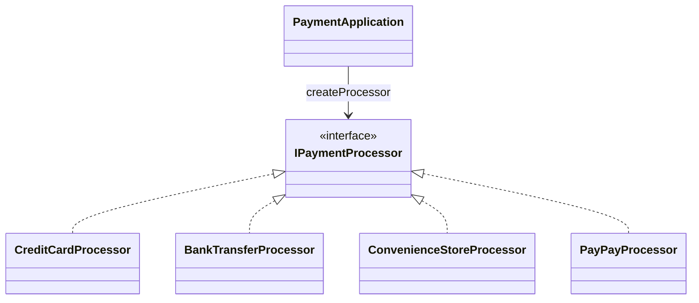

章末のFactory Method骨格図では、`PaymentApplication` がCreator、`createProcessor` がFactory Method、`IPaymentProcessor` と各実装がProduct群に対応します。

### 7-2：動作シーケンス図

ステップ3で到達した生成分離構造の実行時のオブジェクト間のやり取りを可視化します。

> **図の読み方：** `createProcessor` はシーケンス図では独立した参加者として描かれていますが、実際には `PaymentApplication`（またはそのサブクラス）のメソッドです。

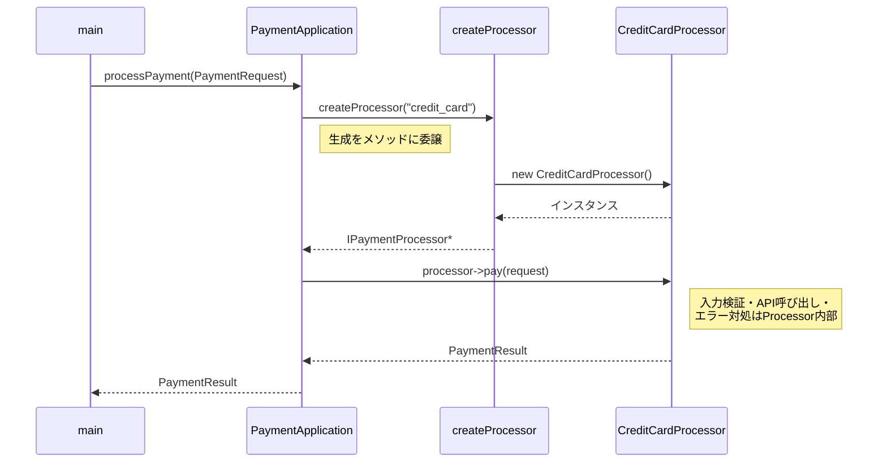

### 7-3：変更影響グラフ（改善後）

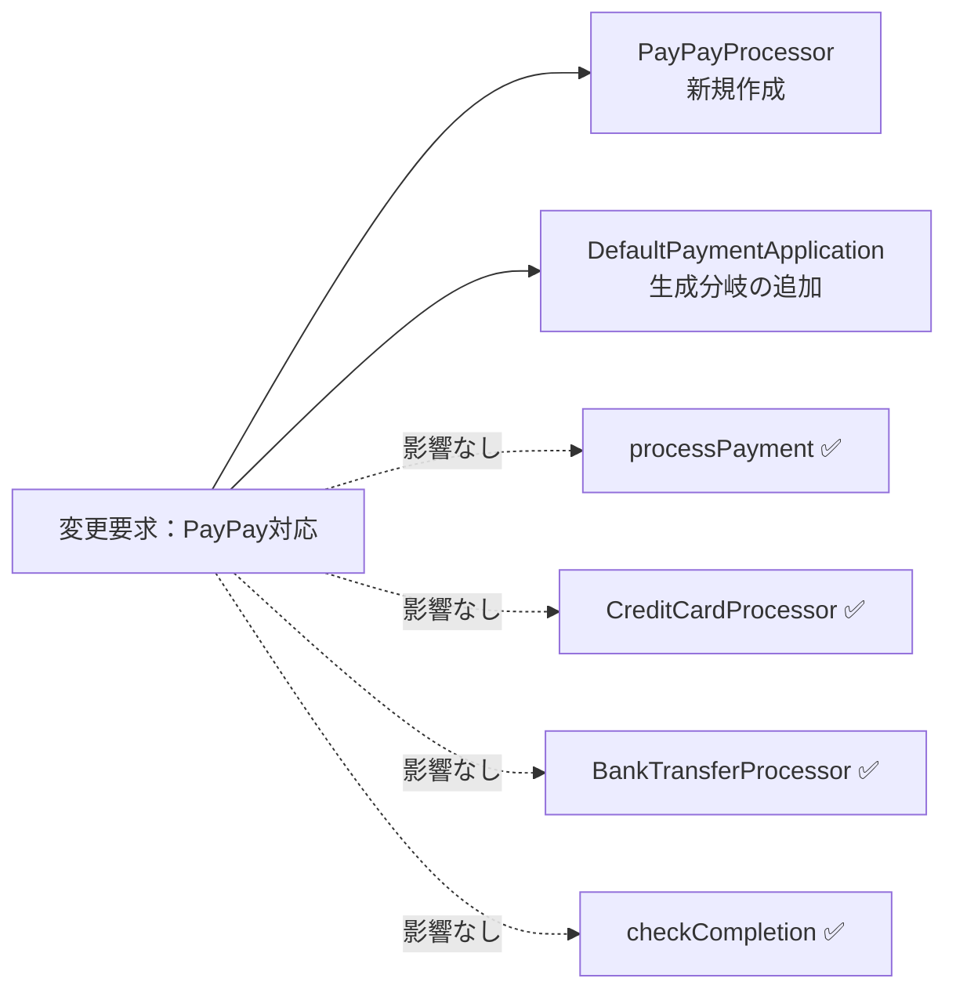

フェーズ3の変更影響グラフと比べると、変更は新しいProductと具象Creatorの生成判断へ寄り、利用フロー `processPayment()` と既存Product、完了確認ロジック `checkCompletion()` を保てます。フェーズ3では7か所の修正が必要でしたが、改善後は新しいProcessorの作成と具象Creatorの分岐追加に集中しています。

### 7-4：変更シナリオ表

| シナリオ | フェーズ1の現状コードでの影響 | この設計での影響 |
|---|---|---|
| PayPay決済を追加 | 7か所に修正が広がる | PayPayProcessorと生成分岐を追加し、processPaymentは保つ |
| カードの認証ロジック変更 | PaymentApplication内の生成・エラー処理を修正 | CreditCardProcessorだけを確認する |
| 新しい非同期決済を追加 | processPaymentに分岐追加、main()に完了確認追加 | 新Processorと生成分岐を追加。完了確認は汎用のため変更不要 |
| 決済後の共通処理を追加 | PaymentApplicationの各分岐に追記 | processPayment()に1箇所追加 |

---

## 整理

### 問題・原因・課題・解決策

| | 内容 |
|---|---|
| **問題** | 決済手段が変わるたびに `PaymentApplication` の分岐条件・生成コード・エラー対処が連動して変わり、手段固有の入力構造体・API境界・完了確認の対応が複数クラスに跨って修正が広がる |
| **原因** | `PaymentApplication` が具体クラス名、手段固有の入力検証ロジック、処理モード判定、エラー対処を直接知っている |
| **課題** | 決済フローと生成ロジックを切り離し、手段固有の入力検証・処理モード・エラー対処をProcessor内部に閉じ、`PaymentApplication` が具体クラスを知らずに `PaymentRequest` を処理できる構造にする |
| **解決策** | 生成分離構造：`createProcessor` で生成を委ね、`IPaymentProcessor` で手段固有の差分を隠蔽し、`processPayment` は `pay(request)` を呼ぶだけにする |

### フェーズとこの章でやったこと

| フェーズ | この章でやったこと |
|---|---|
| 🔵 フェーズ1 | 手段固有の入力データ、同期/非同期の処理モード、完了確認の手順、段階別エラーを含む仕様を整理し、7つの動作例で確認した |
| 🟣 フェーズ2 | 入力構造体・処理モード・エラー対処の変動軸を確認し、ヒアリングで追加頻度を裏付けた |
| 🟣 フェーズ3 | PayPay追加を試み、7か所に修正が広がることを確認した |
| 🟠 フェーズ4 | 具体クラス名・入力検証・処理モード・エラー対処が利用側に混在していることを根本原因と特定した |
| 🟡 フェーズ5 | `IPaymentProcessor*` を共通の接続点とし、手段固有の差分をProcessorへ閉じる課題を定めた |
| 🔴 フェーズ6 | 3ステップの段階的進化で生成分離構造まで進化させる決断を下した |
| 🟢 フェーズ7 | 各Processorが入力検証・API呼び出し・エラー対処を内包する最終コードを実装し、変更の局所化を確認した |

### 責任の移動

| 責任 | 変更前 | 変更後 |
|---|---|---|
| 決済フローの進行 | `PaymentApplication` | `PaymentApplication`（基底の骨格として維持） |
| 具体Processorの生成 | `PaymentApplication`（if-else + new 直書き） | `DefaultPaymentApplication::createProcessor()` |
| 手段固有の入力検証 | 各Processor内 → 変更前から分離済みだが生成と紐づいていた | 各Processor内（`IPaymentProcessor` 経由） |
| エラー対処（リトライ判定等） | `PaymentApplication`（手段ごとに直書き） | 各Processor内（`pay()` で完結） |
| 完了確認 | `PaymentApplication` + `main()`（手段を意識） | `PaymentApplication::checkCompletion()`（汎用） |
| 決済処理の契約定義 | —（なし） | `IPaymentProcessor::pay(PaymentRequest)` |

---

## 振り返り

### 「この章を読むと得られること」は手に入ったか

| 得られること | この章のどこで示したか |
|---|---|
| 1. 変動箇所の識別 | フェーズ2で入力構造体・処理モード・エラー対処を含む5つの変動軸を特定した |
| 2. 接続点の診断 | フェーズ4で、具体クラス名・入力検証・処理モード・エラー対処が利用処理へ漏れている状態を確認した |
| 3. 変更局所化の説明 | フェーズ7で、7か所の修正が2か所（新Processor＋生成分岐）に集約される構造を示した |
| 4. 利用側が生成知識から解放される視点 | フェーズ6のステップ3で、processPaymentから手段固有の知識がすべて消える様子を示した |

### 3つの設計原則はどう適用されたか

**原則1「変わるものをカプセル化せよ」の現れ**

- 具体化された場所：`createProcessor` メソッド（生成分離構造）と各Processorの `pay()` メソッド
- 解説：具体クラスの生成だけでなく、手段固有の入力検証、API呼び出し手順、エラー対処（リトライ判定）という「変わる理由」を、各Processorへ閉じ込めた。新しい決済手段が追加されても、基底の `processPayment` の骨格と、既存Processorのコードを保てる。

**原則2「実装ではなくインターフェースに対してプログラムせよ」の現れ**

- 具体化された場所：`PaymentApplication` の `processPayment` メソッド内の `IPaymentProcessor* processor`
- 解説：具体的な決済クラスではなく `IPaymentProcessor` インターフェースだけを知ることで、手段固有の入力データが何であるか、同期なのか非同期なのか、エラー時にリトライできるのかを利用側が知らずに、`PaymentRequest` を渡して `PaymentResult` を受け取れる。

**原則3「継承より合成を優先せよ」の現れ**

- 具体化された場所：`DefaultPaymentApplication` の `createProcessor` で、各Processorに `PaymentGatewayClient` を注入している
- 解説：各Processorは継承ではなく、外部APIの境界スタブへの参照を保持することで決済処理を実現している。API境界が変わっても、Processorの構造は変わらない。

---

## あなたのコードで考えてみてください

**題材を置き換えるときの共通手順**

この章の題材名を、自分の現場のシステム名に置き換えて考えます。

1. そのシステムは、誰が何を達成するために使うものか。
2. 入力、加工、出力は何か。手段や種類によって入力データが異なるか。
3. 処理の中に同期と非同期が混在しているか。非同期の場合、完了確認はどう行っているか。
4. エラーの対処は種類ごとに異なるか。利用側が種類を知ってエラー処理を分岐しているか。
5. 最近入った変更要求、または次に来そうな変更要求は何か。
6. その変更で、触りたくない場所まで修正や再テストが広がるか。
7. 変えたいものと守りたいものを分けると、接続点には何を残すべきか。
8. 何もしない、関数化、クラス分離、契約導入、登録/組み立て移動のうち、どこまで進めるのが今回の文脈に合うか。

## パターン解説：Factory Method パターン

### パターンの骨格

Factory Method パターンは、Productを生成するためのメソッドを定義し、どの具体Productを作るかをサブクラスへ委ねるパターンです。Creatorの利用フローから具体Productの生成コードを分けられますが、具象Creatorは自分が生成するProductを知ります。

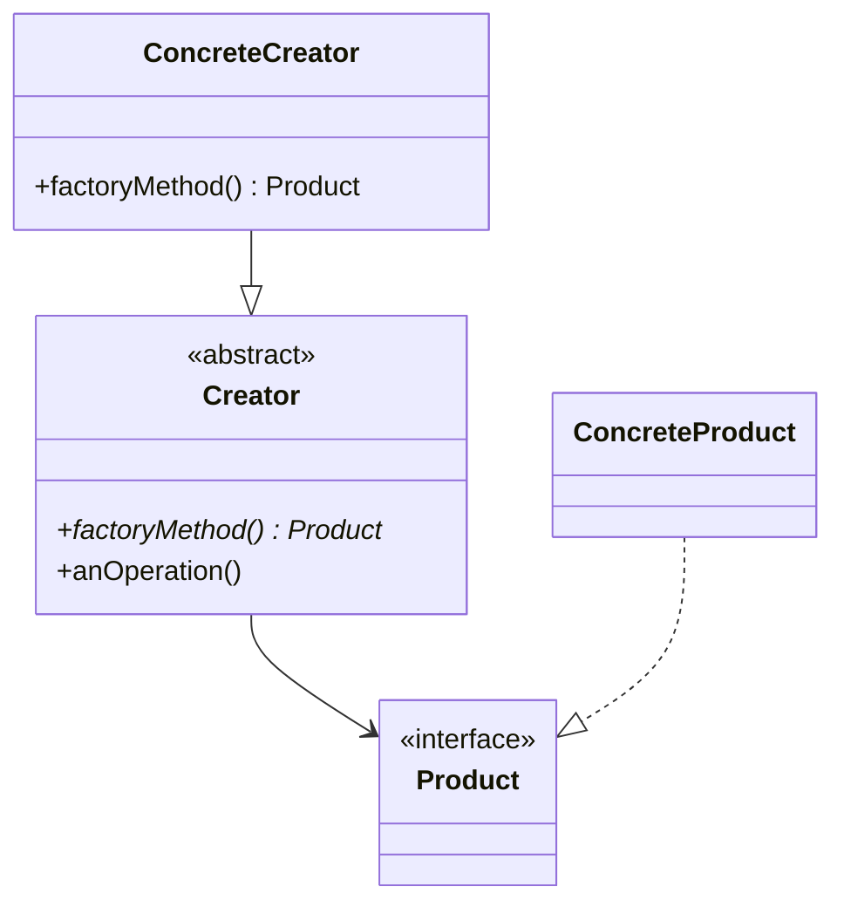

### 抽象骨格の実行シーケンス

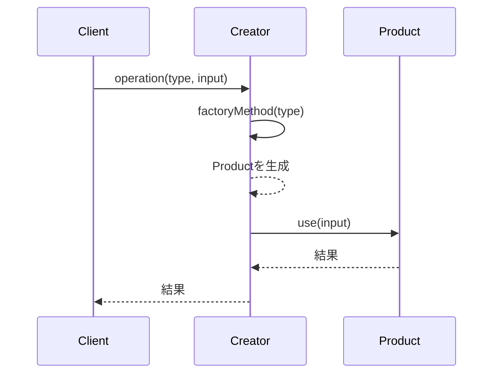

Creatorは生成をfactoryMethodへ集め、利用処理はProduct契約だけを通じて進めます。

### この章の実装との対応

GoF（Gang of Four）とは、1994年に出版された書籍『Design Patterns』の4人の著者の総称です。彼らが整理した23のパターンは、現在も設計の共通言語として広く使われています。

| GoFの名前 | この章での対応 |
|---|---|
| Creator | `PaymentApplication`（`createProcessor` を持つ） |
| factoryMethod | `createProcessor(string type)` |
| Product | `IPaymentProcessor` |
| ConcreteProduct | `CreditCardProcessor` / `BankTransferProcessor` / `ConvenienceStoreProcessor` / `PayPayProcessor` |

### 使いどころと限界

- **使うと良い：** クラスが生成するオブジェクトの具体クラスを特定できない場合、または将来的に新しいサブクラスを柔軟に追加したい場合。今後もオブジェクトの種類が増え続けると確定しているとき。各種類が異なる入力データ・処理手順・エラー対処を持ち、その差分をインターフェース越しに隠蔽したいとき。
- **使わない方が良い：** 生成するクラスが常に1種類で固定されていて、今後増える見込みがない場合。ファイル数とクラス数が増えるコストが見合わない。

```cpp
// 決済手段が1種類で今後も増える予定がない場合
// Factory Methodを導入すると、かえって複雑になる

// ❌ 過剰なFactory（固定クラスをnewするだけなら不要）
class PaymentApplication {
    PaymentGatewayClient client;
    IPaymentProcessor* createProcessor() {
        return new CreditCardProcessor(client);
    }
public:
    PaymentResult processPayment(
        const PaymentRequest& request) {
        IPaymentProcessor* p = createProcessor();
        PaymentResult result = p->pay(request);
        delete p;
        return result;
    }
};

// ✅ この場合はシンプルに直接生成すれば十分
class PaymentApplication {
    PaymentGatewayClient client;
public:
    PaymentResult processPayment(
        const PaymentRequest& request) {
        CreditCardProcessor processor(client);
        return processor.pay(request);
    }
};
```

生成するクラスが常に1種類で固定されているなら、Factoryを介する必要はありません。「今後も変わらない」という確信があるときは、シンプルな直接生成の方が読みやすいコードになります。

### この章のまとめ

決済処理というドメインとFactory Methodパターンの関係を一言で言うなら、「生成」と「利用」を分離することで、「どの具体クラスを使うか」の決定を呼び出し側から引き剥がせる、ということです。`processPayment` がクレジットカード・銀行振込・コンビニ・PayPayという具体クラス名と、手段固有の入力検証、同期/非同期の処理モード、エラー対処まで直接知っていた限り、新しい決済手段が来るたびに7か所の修正が必要でした。生成の判断を `createProcessor` へ移し、手段固有の差分を各Processorの `pay()` へ閉じ込めた瞬間、利用側は何が来るかを知らずに `PaymentRequest` を渡せるようになりました。

7つのフェーズを通じて、読者は決済処理クラスが具体クラスを知りすぎているという観察から始まり、「手段固有の入力データ・処理モード・エラー対処が利用側に漏れている」という分析を経て、生成責任の分離と手段固有知識のカプセル化という判断へと進みました。`processPayment` の骨格が `IPaymentProcessor` と `PaymentRequest` だけを知るようになったことが、この章の到達点です。

あなたのコードの中にも、処理ロジックの中で具体クラスを生成し、そのクラス名や手段固有の検証・エラー対処を呼び出し元が知っている箇所があるはずです。「この生成ロジックはどの業務機能によるか」「手段ごとの差分は利用側が知るべきか」を問うことが、Factory Methodを使う理由を見つける入口になります。
