## 第8章 生成と利用を分ける ―― Factory Method パターン

―― 思考の型：インスタンスを生成する責任を、どこに置くか

### この章の核心

**利用する処理は同じでも、条件によって生成する具象オブジェクトが変わる場面では、「何を作るか」と「作られたものを使うか」を分けて考えます。種類を増やすたびに利用側の生成分岐まで直しているなら、生成知識が利用責任へ漏れていることが兆候です。利用側を共通契約へ依存させ、具象型の選択と生成を一つの生成境界へ局所化できるかが判断軸になります。**

---

### この章を読むと得られること

この章が問うのは「作る」ことの設計です——オブジェクトを生成している場所が、利用している場所と同居していると何が起きるか。「決済プロセッサーを切り替えたいだけなのに、なぜこんなにコードを変える必要があるのか」という問いが出てきたことがあるなら、この章に答えがあります。

* **得られること1：** 「オブジェクトを生成する」という観点で、コードの変動箇所を識別できるようになる
* **得られること2：** 利用処理が決済手段のクラス名と生成方法をどこまで知っているかを接続点から調べ、生成と利用の混在による痛みを説明できるようになる
* **得られること3：** 生成の責任を利用処理から分けることで、決済手段追加の変更をCreatorと組み立て箇所へ寄せられることを説明できるようになる
* **得られること4：** 利用側が具体的な生成ロジックを知らずに、必要な機能を持つオブジェクトを受け取れる視点

## 🔵 フェーズ1：現状把握 ―― 仕様を整理し、システムと紐付ける

決済処理システムが何を入力として受け取り、どの処理で加工し、何を出力するのかを整理します。

### 1-1：このシステムの仕様

このシステムは、ECサイトの注文処理から注文ID、金額、決済手段、手段別の認証情報を受け取ります。利用可能な決済手段の登録表を参照して入力を検証し、選択された方式の処理オブジェクトを生成して外部決済サービスへ要求を渡します。返された承認・保留・失敗を共通の決済結果へ加工し、注文IDと方式を含む実行ログとして表示します。

#### まず代表入力と実行結果から動きをつかむ

詳細な仕様やコードへ入る前に、1-4の`main()`で利用者が注文ORD-1001（1000円）をクレジットカードで決済する入力を確認します。

**代表入力（1-4の`main()`から抜粋）：**
```cpp
    // 準備：決済の入口と、結果を残す台帳を組み立てる
    PaymentApplication app;
    PaymentLog payLog;

    // 1件目：クレジットカード（同期）
    PaymentRequest r1;
    r1.methodId = "credit_card";
    r1.orderId = "ORD-1001";
    r1.creditCard = {"tok_abc", "YAMADA", "123"}; // トークン・名義・CVC
    executeCase(app, payLog, r1);

    // 2件目：同じ入口へ、銀行振込（非同期）を渡す
    PaymentRequest r2;
    r2.methodId = "bank_transfer";
    r2.orderId = "ORD-1002";
    r2.bankTransfer
        = {"山田太郎", "0001", "ordinary"};
    executeCase(app, payLog, r2);
```

この入力に対する代表的な実行結果は次のとおりです。

```
[決済API] カード認証 order=ORD-1001 amount=1000 token=tok_abc holder=YAMADA
結果: credit_card -> 成功 (クレジット認証済み id=AUTH001)

[決済API] 振込先発行 order=ORD-1002 amount=2000 payer=山田太郎 bank=0001 type=ordinary
結果: bank_transfer -> 保留 (振込先発行済み 口座=mizuho-1234567)
  完了確認中... id=BT-ORD-1002
[状態確認API] id=BT-ORD-1002
  完了結果: 成功 (入金確認済み)
```

2件並べると、この章が扱う幅が見えます。**同じ入口へ渡しているのに、決済手段によって必要な入力も、結果の返り方も違います。** カードはトークンと名義を渡してその場で「成功」が返りますが、銀行振込は振込人名と銀行コードを渡して一度「保留」が返り、後から状態を確認して初めて成功が確定します。金額は台帳の注文IDから引くので、利用側は渡しません。

この入力と出力から、(1)注文・金額・支払手段・手段別の入力を渡し、(2)手段に応じた検証→外部API→結果保存の順に進み、(3)決済結果が表示される、という一連の動きが読み取れます。同じ入力を含む完全なコードと実行結果は1-4に掲載します。

#### 最初にシステム全体をつかむ

- **入力：** 注文ID、金額、決済方法IDと、カード・銀行振込・コンビニ払いに固有の入力を受け取る。
- **処理：** 決済方法を選び、その方法に必要な入力を検証して外部決済境界を呼ぶ。非同期決済では外部参照を保存し、後から入金状態を確認する。
- **出力：** 完了・保留・失敗の状態、外部参照、失敗理由を注文IDごとに保存して返す。
- **掲載コードでの代替：** 実際のカード会社、銀行、コンビニのAPIは、入力値に応じて結果を返す境界スタブで表す。手段別の入力検証、結果保存、保留から完了への更新は実際に行う。

まずこの一連の動きを押さえ、以降で要求、手段別入力、同期と非同期、外部境界、クラス、コードの順に詳細を確認します。

#### 現行要求ベースライン

| 要求ID | 現行要求 | 受入条件 |
|---|---|---|
| 要求ID1 | クレジットカードのトークン・名義・セキュリティコードを検証し、認証後に売上確定する | 必須値がそろう場合だけ同期完了を返す |
| 要求ID2 | 銀行振込の名義・銀行コード・口座種別を検証し、振込先を発行する | 必須値がそろう場合だけ入金待ちを返す |
| 要求ID3 | コンビニ払いの電話番号・メール・店舗コードを検証し、支払番号を発行する | 必須値がそろう場合だけ入金待ちを返す |
| 要求ID4 | 決済結果を注文IDごとに保存する | 完了・保留・失敗の状態と外部参照を取得できる |
| 要求ID5 | 未登録決済方法・未登録注文・未登録顧客や、手段別の不正入力を拒否する | 外部決済を呼ばず、失敗理由を返す |
| 要求ID6 | 非同期決済は外部参照で完了確認し、保存状態を更新する | 入金確認後に保留から完了へ変わる |

決済手段は単なる表示名ではありません。クレジットカードなら認証して売上を確定し、コンビニ払いなら支払い番号を発行し、銀行振込なら振込先情報を発行して入金待ちにします。つまり、外側から見ると「決済を依頼して結果を受け取る」処理ですが、内側の手順と必要なデータは決済手段ごとに異なります。

決済手段ごとの違いは3つの軸で表れます。

**軸1：入力データの違い**

各決済手段は、金額と注文IDに加えて、手段固有のデータを要求します。

| 決済方法ID | 手段固有の入力データ |
|---|---|
| `credit_card` | カードトークン、カード名義、セキュリティコード |
| `bank_transfer` | 振込名義、銀行コード、口座種別 |
| `convenience` | 電話番号、メールアドレス、コンビニ店舗コード |

**軸2：処理タイミングの違い（同期と非同期）**

| 決済方法ID | 処理タイプ | 説明 |
|---|---|---|
| `credit_card` | 同期 | 認証→売上確定まで即時完了し、結果を返す |
| `bank_transfer` | 非同期 | 振込先を発行して保留を返し、入金確認は後で行う |
| `convenience` | 非同期 | 支払い番号を発行して保留を返し、入金確認は後で行う |

同期決済は外部APIを1回呼べば結果が確定します。非同期決済は、発行処理と入金確認が2段階に分かれます。入金確認は、保留IDを使って状態確認APIへ問い合わせます。

**軸3：エラーの段階と対処の違い**

| エラー段階 | 内容 | 対処 |
|---|---|---|
| 入力検証 | 手段固有データの不足 | 即座にエラーを返す |
| 外部API呼び出し | 認証失敗・通信エラー | リトライ可否を結果に含めて返す |
| 完了確認 | 支払い期限切れ・キャンセル | 失敗結果として確定する |

この章では、注文処理が次のような決済要求を渡し、決済結果を受け取るシステムとして扱います。

| 仕様項目 | この章で扱う値 | 具体例 |
|---|---|---|
| 決済要求 | 注文ID、決済方法ID、金額、顧客ID、手段固有データ | `ORD-1001`, `credit_card`, 1000円, `C001`, カードトークン等 |
| 決済設定 | 決済方法ID、有効/無効 | `credit_card` は有効 |
| 顧客台帳 | 顧客ID → 氏名（事前保持） | `C001` → 田中 一郎 |
| 注文台帳 | 注文ID → 顧客ID・請求金額（事前保持） | `ORD-1001` → `C001`・1000円 |
| 手段別の加工 | 認証、振込先発行、支払い番号発行 | カード認証API、振込先発行API、番号発行API |
| 決済結果 | 成功/保留/失敗、メッセージ、エラーコード、保留情報 | `成功: クレジット認証済み`, `保留: 振込先発行済み` |

決済要求で利用側が指定するのは、決済方法・注文ID・手段固有の入力だけです。請求金額と注文者は注文台帳が持っているので、注文IDから引きます。未登録の注文IDは決済に進めません。引いた注文者が顧客台帳に実在し、氏名を持っていることも確認します。これは注文の持ち主を確かめる検査であり、振込名義（`payerName`）とは別物です。振込名義は代理振込を認めるため注文者と別人でもよく、利用側が決済時に指定します。事前に登録されている注文台帳（顧客台帳の氏名を含む）は次のとおりです。

| 注文ID | 顧客（ID・氏名） | 請求金額 |
|---|---|---|
| ORD-1001 | C001・田中 一郎 | 1,000円 |
| ORD-1002 | C002・佐藤 花子 | 2,000円 |
| ORD-1003 | C003・鈴木 次郎 | 500円 |
| ORD-1004 | C004・高橋 三郎 | 800円 |
| ORD-1005 | C005・伊藤 四郎 | 600円 |
| ORD-1006 | C006・渡辺 五郎 | 300円 |
| ORD-1007 | C007・山本 六郎 | 200円 |
| ORD-1008 | C008・中村 七郎 | 1,200円 |
| ORD-2001 | C020・小林 八郎 | 3,000円 |

この章の現状コードに登録されている決済手段は次の4つです。`crypto` を「未登録」にせず「登録済み・無効」として残すのは、運用で一時停止している既知の手段と、システムが知らないIDを別のエラーとして扱うためです。読者は後の動作例で「無効」と「未登録」の判定差を確認できます。

| 決済手段 (ID) | 有効 | 処理タイプ |
|---|---|---|---|
| クレジットカード (`credit_card`) | 有効 | 同期 |
| 銀行振込 (`bank_transfer`) | 有効 | 非同期 |
| コンビニ払い (`convenience`) | 有効 | 非同期 |
| 暗号通貨 (`crypto`) | 無効 | 対象外 |

各決済手段の処理手順を詳しく見ます。

| 決済方法ID | 手段固有データ | 処理手順 | 正常出力 |
|---|---|---|---|
| `credit_card` | カードトークン、名義、セキュリティコード | カード認証APIを呼ぶ（同期） | 成功 |
| `bank_transfer` | 振込名義、銀行コード、口座種別 | 振込先発行APIを呼ぶ → 保留IDを発行 → 状態確認APIで入金を確認 | 保留→成功 |
| `convenience` | 電話番号、メール、店舗コード | 支払い番号発行APIを呼ぶ → 保留IDを発行 → 状態確認APIで入金を確認 | 保留→成功 |

この違いを無視して `pay(amount)` だけで扱うと、現実の決済で問題になる「手段ごとの必要情報」「同期と非同期の処理の違い」「非同期完了の確認手順」「失敗時の対処の違い」が見えなくなります。この章では外部サービスの内部実装までは作りませんが、注文処理と外部決済APIの間を流れる要求・結果・状態はコード上でも表します。

**システム全体図：注文処理・決済・外部サービスの境界**

最も大きな境界は「購入者 → EC決済システム → 外部決済・状態確認サービス」です。注文処理、決済処理、決済設定、実行ログは対象システムの内側にまとめます。色は、灰色＝利用者・入出力、青緑＝システム内の保存データ、橙＝システム内の処理、紫＝外部システムとの境界を表します。

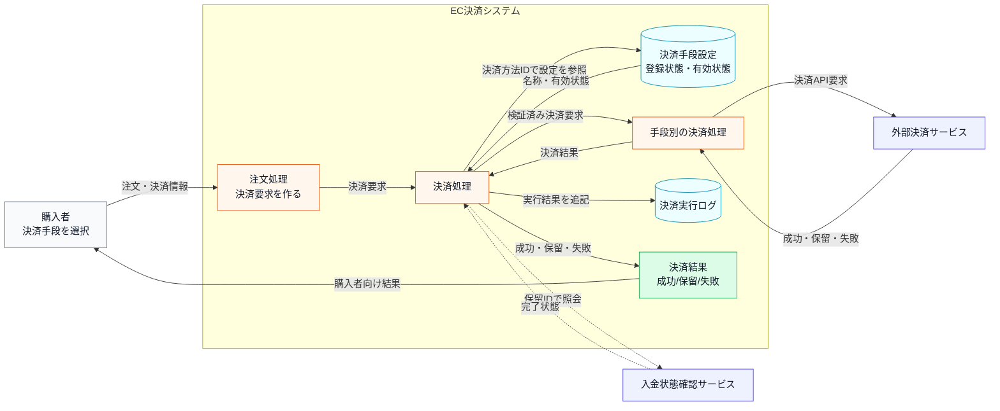
```mermaid
flowchart LR
    U["購入者<br>決済手段を選択"] -->|"注文・決済情報"| O

    subgraph PAYMENT["EC決済システム"]
        O["注文処理<br>決済要求を作る"]
        A["決済処理"]
        R[("決済手段設定<br>登録状態・有効状態")]
        P["手段別の決済処理"]
        L[("決済実行ログ")]
        O2["決済結果<br>成功/保留/失敗"]
        O -->|"決済要求"| A
        A -->|"決済方法IDで設定を参照"| R
        R -->|"名称・有効状態"| A
        A -->|"検証済み決済要求"| P
        P -->|"決済結果"| A
        A -->|"実行結果を追記"| L
        A -->|"成功・保留・失敗"| O2
    end

    P -->|"決済API要求"| G["外部決済サービス"]
    G -->|"成功・保留・失敗"| P
    A -.->|"保留IDで照会"| S["入金状態確認サービス"]
    S -.->|"完了状態"| A
    O2 -->|"購入者向け結果"| U

    classDef actor fill:#f8fafc,stroke:#64748b,color:#111827;
    classDef data fill:#ecfeff,stroke:#0891b2,color:#111827;
    classDef process fill:#fff7ed,stroke:#ea580c,color:#111827;
    classDef boundary fill:#eef2ff,stroke:#4f46e5,color:#111827;
    classDef result fill:#dcfce7,stroke:#16a34a,color:#111827;
    class U actor;
    class R,L data;
    class O,A,P process;
    class O2 result;
    class G,S boundary;
```

この図では、購入者が直接外部決済サービスを呼ぶのではなく、注文処理が決済要求を作り、決済処理システムが登録済み設定を確認してから手段別処理へ渡すことが分かります。非同期決済の場合は、入金状態確認サービスを使って完了確認を行います。

**システム内部図：正常系の入力・判定・加工・出力**

代表ケースとしてクレジットカード決済（同期）の正常系を見ます。ここでは検証済み要求を前提に処理順だけを示し、無効・入力不足などの異常系はエラー条件表へ分けます。


```mermaid
flowchart LR
    A[/検証済み決済要求<br>methodId=credit_card<br>amount=1,000<br>token=tok_abc/]:::input --> F[カード認証APIを呼ぶ<br>同期: 即時結果]:::process
    F --> G([正常出力<br>成功: クレジット認証済み]):::normal

    classDef input fill:#e7f0ff,stroke:#2563eb,color:#111827;
    classDef process fill:#fff7ed,stroke:#ea580c,color:#111827;
    classDef decision fill:#fef9c3,stroke:#ca8a04,color:#111827;
    classDef normal fill:#dcfce7,stroke:#16a34a,color:#111827;
```

次に、銀行振込（非同期）の正常系を見ます。

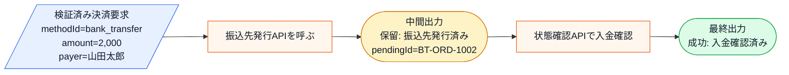
```mermaid
flowchart LR
    A[/検証済み決済要求<br>methodId=bank_transfer<br>amount=2,000<br>payer=山田太郎/]:::input --> C[振込先発行APIを呼ぶ]:::process
    C --> D([中間出力<br>保留: 振込先発行済み<br>pendingId=BT-ORD-1002]):::pending
    D --> E[状態確認APIで入金確認]:::process
    E --> F([最終出力<br>成功: 入金確認済み]):::normal

    classDef input fill:#e7f0ff,stroke:#2563eb,color:#111827;
    classDef process fill:#fff7ed,stroke:#ea580c,color:#111827;
    classDef decision fill:#fef9c3,stroke:#ca8a04,color:#111827;
    classDef pending fill:#fef3c7,stroke:#d97706,color:#111827;
    classDef normal fill:#dcfce7,stroke:#16a34a,color:#111827;
```

コンビニ決済（非同期）も銀行振込と同じ2段階です。手段固有データが異なるため、分けて示します。


```mermaid
flowchart LR
    A[/検証済み決済要求<br>methodId=convenience<br>amount=500<br>phone=090..., store=seven/]:::input --> C[受付番号発行APIを呼ぶ]:::process
    C --> D([中間出力<br>保留: 受付番号発行済み<br>pendingId=CVS-ORD-1003]):::pending
    D --> E[状態確認APIで入金確認]:::process
    E --> F([最終出力<br>成功: コンビニ入金確認済み]):::normal

    classDef input fill:#e7f0ff,stroke:#2563eb,color:#111827;
    classDef process fill:#fff7ed,stroke:#ea580c,color:#111827;
    classDef pending fill:#fef3c7,stroke:#d97706,color:#111827;
    classDef normal fill:#dcfce7,stroke:#16a34a,color:#111827;
```

この図から読み取ることは、次の3点です。

- 同期決済（クレジットカード）はAPI呼び出し1回で結果が確定する。非同期決済（銀行振込・コンビニ）は発行→保留→完了確認の2段階になる。
- 非同期決済は保留IDを発行し、完了確認APIで最終結果を取得する。銀行振込は振込先、コンビニは受付番号を発行する。
- 手段固有データの検証は、決済実行の前に行う。カードならトークンと名義、銀行振込なら振込名義と銀行コード、コンビニなら電話番号と店舗指定が必要である（各フィールド名は次の「手段固有データの定義」で確定する）。

**決済の実行フロー**

決済手段ごとの中身は異なりますが、注文処理から見た大枠は共通です。

1. 注文処理が決済要求を作る
2. 決済方法IDを使って登録済み設定を確認する
3. 有効な決済方法なら、対応するProcessorを選ぶ
4. Processorが手段固有データを検証する
5. Processorが外部決済API境界を呼ぶ
6. 同期決済なら即座に結果を返す。非同期決済なら保留を返す
7. 非同期決済の場合、保留IDで状態確認APIへ問い合わせる

この共通部分と手段別の差分を分けて読むことが、後のフェーズで「何を守り、何を分けるか」を考える材料になります。

**この仕様を決める業務機能**

| 業務機能 | この章の仕様で決めていること |
|---|---|
| 決済手段・サービス管理 | どの決済手段を追加・廃止するか |
| 処理の骨格（開発設計判断） | 決済フロー・共通仕様の構造 |

後のフェーズで変更要求を扱うとき、どの業務機能の知識なのかを確認するための名前として使います。

**エラー条件**

正常系の仕様を一通り確認したうえで、最後に、決済実行へ進めない入力や外部境界の懸念を、正常系図に混ぜず分けて整理します。

| エラー条件 | どこで分かるか | 出力 |
|---|---|---|
| 決済方法IDが未登録 | 決済設定の検索時 | 未対応決済エラー |
| 決済方法が無効 | 有効フラグ確認時 | 無効決済エラー |
| 金額が1円未満 | 金額確認時 | 金額エラー |
| 手段固有データが不足 | 各Processorの入力検証時 | 入力不足エラー |
| 外部決済APIが失敗 | API呼び出し時 | 失敗結果（リトライ可否付き） |
| 完了確認で期限切れ | 状態確認API呼び出し時 | 期限切れエラー |

### 1-2：動作例テーブル

仕様を定義したところで、実際にどのような入力に対してどのような結果が返るかを確認します。このテーブルは「このシステムが正しく動いているとはどういう状態か」の基準になります。
動作例で使う「手段固有データ」のフィールド名を、先に仕様と紐づけて定義します。決済手段ごとに必要な項目が異なるため、名前と意味を一覧にします（システム内部図で銀行振込の `payer` は振込名義、カードの `holder` はカード名義で、どちらも「名義」に当たりますが別の手段の別項目です）。

| 決済方法ID | フィールド名 | 仕様上の意味 | 取りうる値の例 |
|---|---|---|---|
| `credit_card` | `token` | カードトークン（PCI準拠のカード代替値） | `tok_abc` / `ERROR_DECLINED`（失敗を模す値） |
| `credit_card` | `holder` | カード名義 | `YAMADA` |
| `credit_card` | `cvv` | セキュリティコード | `123` |
| `bank_transfer` | `payer` | 振込名義 | `山田太郎` |
| `bank_transfer` | `bank` | 銀行コード | `0001` |
| `bank_transfer` | `type` | 口座種別（`ordinary`＝普通／`checking`＝当座） | `ordinary` |
| `convenience` | `phone` | 連絡先電話番号 | `09012345678` |
| `convenience` | `email` | 受付通知メール | `y@example.com` |
| `convenience` | `store` | 利用コンビニ指定（`seven`＝セブン 等） | `seven` |

| ケース         | 決済方法ID          | 金額    | 手段固有データ                                             |
| ----------- | --------------- | ----- | --------------------------------------------------- |
| カード正常（同期）   | `credit_card`   | 1000円 | token=tok_abc, holder=YAMADA, cvv=123               |
| 銀行振込正常（非同期） | `bank_transfer` | 2000円 | payer=山田太郎, bank=0001, type=ordinary                |
| コンビニ正常（非同期） | `convenience`   | 500円  | phone=09012345678, email=y@example.com, store=seven |
| カードAPI失敗    | `credit_card`   | 800円  | token=ERROR_DECLINED, holder=SUZUKI, cvv=456        |
| カード入力不足     | `credit_card`   | 600円  | token=tok_xyz, holder=(空), cvv=789                  |
| 無効な決済方法     | `crypto`        | 300円  | (なし)                                                |
| 未登録の決済方法    | `unknown`       | 200円  | (なし)                                                |
| カード一時失敗→再試行  | `credit_card`   | 1200円 | token=TIMEOUT_ONCE, holder=TANAKA, cvv=321          |

| ケース | 期待される結果 |
|---|---|
| カード正常（同期） | 成功。クレジット認証済みの結果を返す |
| 銀行振込正常（非同期） | 保留→完了確認→成功。入金確認済みの結果を返す |
| コンビニ正常（非同期） | 保留→完了確認→成功。コンビニ入金確認済みの結果を返す |
| カードAPI失敗 | 失敗。カード認証失敗（リトライ可能）を返す |
| カード入力不足 | 失敗。カード名義が不足していますを返す |
| 無効な決済方法 | 失敗。暗号通貨は現在無効ですを返す |
| 未登録の決済方法 | 失敗。未登録の決済方法ですを返す |
| カード一時失敗→再試行 | 1回目は失敗（リトライ可能）。再試行して成功する |

この表は変更要求前に登録されている決済方法を示しています。この章で比べるのは、同じ外側の動作を保ちながら、決済手段が増えたときにどこを変更する構造になるかという違いです。

---

### 1-3：登場クラスとクラス構成図

仕様と動作例が確認できたところで、登場するクラスを先に確認します。

| クラス名                        | 役割                                                     | 担当する仕様             |
| --------------------------- | ------------------------------------------------------ | ------------------ |
| `PaymentApplication`        | 決済要求を受け取り、対応するProcessorを呼び出す                           | 決済手段の選択と実行、完了確認    |
| `CreditCardProcessor`       | カード固有データを検証し、カード認証APIを呼ぶ                               | クレジットカード決済（同期）     |
| `BankTransferProcessor`     | 振込固有データを検証し、振込先発行APIを呼ぶ                                | 銀行振込（非同期）          |
| `ConvenienceStoreProcessor` | コンビニ固有データを検証し、番号発行APIを呼ぶ                               | コンビニ決済（非同期）        |
| `ProcessorRegistry`         | 決済方法の設定を保持するデータストア                                     | 決済方法の存在確認・有効フラグの参照 |
| `PaymentGatewayClient`      | カード・銀行振込・コンビニの各Processorから呼ばれる外部決済API境界 | 認証・振込先発行・番号発行の代替   |
| `PaymentStatusClient`       | 非同期決済の完了確認APIの境界スタブ                                    | 入金確認の代替            |
| `CreditCardInput` | カード固有の入力値 | トークン・名義・セキュリティコード |
| `BankTransferInput` | 銀行振込固有の入力値 | 振込名義・銀行コード・口座種別 |
| `ConvenienceInput` | コンビニ払い固有の入力値 | 電話番号・メール・店舗コード |
| `PendingInfo` | 非同期決済の追跡情報 | 完了確認用の保留ID |
| `PaymentRequest` | 決済1件の要求 | 決済手段・金額・注文ID・手段固有入力 |
| `PaymentResult` | 決済1件の結果 | 成功/保留/失敗・再試行可否・保留情報 |
| `ProcessorConfig` | 決済手段1件の設定 | 名称・有効状態 |
| `PaymentRecord` | 保存する決済結果1件 | 決済手段・金額・状態・エラーコード |
| `PaymentLog` | 決済結果を保存する | 実行結果の追記・一覧表示 |
| `CustomerRecord` | 保持している顧客1件 | 顧客の氏名 |
| `CustomerDirectory` | 顧客を事前保持するデータストア | 顧客IDの存在確認・照合 |
| `OrderRecord` | 保持している注文1件 | 注文の顧客ID・請求金額 |
| `OrderBook` | 注文を事前保持するデータストア | 注文IDの存在確認・顧客/金額の照合 |

各クラスの責任を把握したところで、クラス間の関係を図で整理します。`PaymentLog` と `PaymentRecord` だけが他とつながっていませんが、これは決済結果を記録するのが `PaymentApplication` ではなく組み立て側（`main()`）だからです。クラス図に `main()` は描かないため、注記で示します。


```mermaid
classDiagram
    class CreditCardInput
    class BankTransferInput
    class ConvenienceInput
    class PendingInfo
    class PaymentRequest
    class PaymentResult
    class ProcessorConfig
    class PaymentRecord
    class PaymentLog
    class CustomerRecord
    class OrderRecord
    class CustomerDirectory {
        +exists(id)
        +get(id)
    }
    class OrderBook {
        +exists(id)
        +get(id)
    }
    class PaymentApplication {
        +processPayment(request) PaymentResult
        +checkCompletion(pendingId) PaymentResult
    }
    class CreditCardProcessor {
        +pay(request, amount) PaymentResult
    }
    class BankTransferProcessor {
        +pay(request, amount) PaymentResult
    }
    class ConvenienceStoreProcessor {
        +pay(request, amount) PaymentResult
    }
    class ProcessorRegistry {
        +exists(method)
        +isActive(method)
        +get(method)
    }
    class PaymentGatewayClient {
        +authorizeCreditCard(orderId, amount, card)
        +issueBankTransfer(orderId, amount, bank)
        +issueConvenienceCode(orderId, amount, cvs)
    }
    class PaymentStatusClient {
        +checkStatus(pendingId)
    }
    PaymentApplication ..> CreditCardProcessor : uses
    PaymentApplication ..> BankTransferProcessor : uses
    PaymentApplication ..> ConvenienceStoreProcessor : uses
    PaymentApplication --> ProcessorRegistry : 存在・有効確認
    PaymentApplication --> PaymentStatusClient : 完了確認
    CreditCardProcessor --> PaymentGatewayClient : 認証API
    BankTransferProcessor --> PaymentGatewayClient : 振込先発行API
    ConvenienceStoreProcessor --> PaymentGatewayClient : 番号発行API
    PaymentRequest *-- CreditCardInput : カード入力
    PaymentRequest *-- BankTransferInput : 振込入力
    PaymentRequest *-- ConvenienceInput : コンビニ入力
    PaymentResult *-- PendingInfo : 保留時に持つ
    ProcessorRegistry *-- ProcessorConfig : 手段ID別に保存
    PaymentApplication --> CustomerDirectory : 顧客照合
    PaymentApplication --> OrderBook : 注文照合
    CustomerDirectory *-- CustomerRecord : 顧客ID別に保存
    OrderBook *-- OrderRecord : 注文ID別に保存
    PaymentApplication ..> PaymentRequest : 受け取る
    PaymentApplication ..> PaymentResult : 返す
    CreditCardProcessor ..> PaymentRequest : 受け取る
    CreditCardProcessor ..> PaymentResult : 返す
    BankTransferProcessor ..> PaymentRequest : 受け取る
    BankTransferProcessor ..> PaymentResult : 返す
    ConvenienceStoreProcessor ..> PaymentRequest : 受け取る
    ConvenienceStoreProcessor ..> PaymentResult : 返す
    PaymentLog *-- PaymentRecord : 実行結果を保存

    note for PaymentLog "組み立て側（main()のexecuteCase）が記録する。<br/>PaymentApplicationは記録しない"
```

**クラス図に出てくる主な操作**

| クラス | 操作 | 何ができるか |
|---|---|---|
| `PaymentApplication` | `processPayment()` | 決済要求を受け取り、手段別処理を呼ぶ |
| `PaymentApplication` | `checkCompletion()` | 保留決済の入金を確認する |
| `CreditCardProcessor` | `pay()` | カード固有データを検証し、認証APIを呼ぶ |
| `BankTransferProcessor` | `pay()` | 振込固有データを検証し、振込先発行APIを呼ぶ |
| `ConvenienceStoreProcessor` | `pay()` | コンビニ固有データを検証し、番号発行APIを呼ぶ |
| `PaymentGatewayClient` | 各メソッド | 外部決済APIのスタブ。成功または失敗を返す |
| `PaymentStatusClient` | `checkStatus()` | 保留IDで入金状態を確認するスタブ |

この図が示す通り、`PaymentApplication` というクラスが、クレジットカード、銀行振込、コンビニ決済といった個別の決済プロセッサーを直接利用（依存）し、さらに非同期決済の完了確認も自分で制御している構成になっています。

**この章での簡略化**

この章では、外部決済サービスそのものは実装せず、`PaymentGatewayClient` と `PaymentStatusClient` という2つの境界スタブを呼ぶ形で表します。コードを読む前提として、スタブの判定規則を固定します。

| スタブ | 入力規則 | 返す結果 |
|---|---|---|
| カード認証 | トークンが `ERROR` で始まる | 認証失敗・再試行不可 |
| カード認証 | トークンが `TIMEOUT` で始まり、同じ注文IDでの初回試行 | 通信タイムアウト・再試行可能 |
| カード認証 | `TIMEOUT` の同じ注文IDでの2回目以降 | 認証成功 |
| カード認証 | 上記以外の検証済み入力 | 即時成功 |
| 振込先・コンビニ番号発行 | 検証済み入力 | 保留ID付きの保留 |
| 完了確認 | 保留IDに `EXPIRE` を含む | 期限切れ失敗 |
| 完了確認 | `BT-`／`CVS-` で始まる | 入金確認成功 |
| 完了確認 | それ以外 | 不明な保留ID失敗 |

入力不足はProcessorがAPIを呼ぶ前に失敗させ、境界スタブには検証済み入力だけを渡します。返金、不正検知、3Dセキュアなどは、生成責任という本章の論点から外れるため境界の先に置きます。


---

### 1-4：実装コード（現状）

#### コードを読む前に：クラスの責任と境界

この表は、決済要求が生成判断、方式別処理、外部境界、結果保存をどう通るかを示す読解用の地図です。外部APIの代替規則は簡略化節へ集約しました。

| 対象 | 主な責任 | 接続先・結果 |
|---|---|---|
| 決済Processor | 手段別データを検証して外部API手順を進める | 成功・保留・失敗の`PaymentResult`を返す |
| `PaymentApplication` | 決済種別から具象Processorを選び生成する | 方式別Processorへ要求を渡す |
| 設定・注文検索 | 決済IDや注文IDから対応データを取得する | Processorへ検証材料を渡す |
| `PaymentLog` | 実行済みの決済結果を受け取る | 手段・金額・状態・エラーコードを追記する |

手段固有の入力データは構造体で分け、非同期決済は保留情報を返し、完了確認は別の境界へ渡します。

#### 現状コード

定義を1つずつ、上から順に読みます。**メンバー変数と、それを使う処理を同じ場所で見られるように**しています。宣言と定義を分けるのは `PaymentApplication` だけです。判断の基準は次の一行です。

コードを読むときは、まずメンバーが保持する状態を確認し、次に各操作の入力・戻り値・状態変更を追います。

`main()` と実行結果は最後に、ケースごとに並べます。上から順に連結すれば、そのまま1つのC++14プログラムとして動きます。

---

**共通ヘッダー**

```cpp
#include <iostream>
#include <map>
#include <string>
#include <vector>

using namespace std;
```

以降のすべてのクラスが使います。

---

**手段固有の入力データ**

3つの決済手段が必要とするデータは、それぞれ違います。

```cpp
// ---- 手段固有の入力データ ----

struct CreditCardInput {
    string cardToken;
    string holderName;
    string securityCode;
};

struct BankTransferInput {
    string payerName;
    string bankCode;
    string accountType; // "ordinary" or "checking"
};

struct ConvenienceInput {
    string phoneNumber;
    string email;
    string storeCode; // "seven","lawson","familymart"
};
```

**共通の項目が1つもありません。** カードはトークンと名義とセキュリティコード、振込は名義と銀行コードと口座種別、コンビニは電話番号とメールと店舗コードです。

---

**PendingInfo / PaymentRequest / PaymentResult**

決済1回分の要求と結果です。

```cpp
// ---- 保留決済の追跡情報 ----

struct PendingInfo {
    string pendingId;  // 完了確認用ID
};

// ---- 決済要求・結果 ----

struct PaymentRequest {
    string methodId;
    string orderId;
    // 手段固有データ（該当する1つだけをセット）
    CreditCardInput creditCard;
    BankTransferInput bankTransfer;
    ConvenienceInput convenience;
};

struct PaymentResult {
    string status;     // "成功", "保留", "失敗"
    string message;
    bool canRetry;     // 再試行可能か
    string errorCode;  // エラーコード（空なら正常）
    PendingInfo pending; // 保留時の確認情報
};
```

`PaymentRequest` は手段ごとの入力構造体を3つとも持ち、**該当する1つだけがセットされます。** `PaymentResult` には、成功・保留・失敗のステータスに加え、リトライ可否、エラーコード、保留時の確認情報を含めます。3手段の結果を1つの型で表すため、使わないフィールドが必ず残ります。

---

**ProcessorConfig と ProcessorRegistry**

決済方法の設定を一元管理します。

```cpp
// ---- 決済方法の設定 ----

struct ProcessorConfig {
    string name;
    bool isActive;
};

class ProcessorRegistry {
private:
    map<string, ProcessorConfig> registry;
public:
    ProcessorRegistry() {
        registry["credit_card"] =
            {"クレジットカード", true};
        registry["bank_transfer"] =
            {"銀行振込", true};
        registry["convenience"] =
            {"コンビニ払い", true};
        registry["crypto"] =
            {"暗号通貨", false};
    }

    bool exists(const string& method) const {
        return registry.count(method) > 0;
    }

    bool isActive(const string& method) const {
        return registry.at(method).isActive;
    }

    ProcessorConfig get(const string& method) const {
        return registry.at(method);
    }
};
```

登録されているか、有効かの判定に使います。`crypto` だけ `isActive` が `false` です。**コードから手段を削除せず、運用設定だけで一時停止できます。**

---

**CustomerRecord と CustomerDirectory**

決済要求に載る `orderId` から、システムが事前に保持している注文と顧客を引きます。この保持データは現状コードの時点から存在します（第1章 `CustomerDatabase`、第9章 `UserDatabase` と同じ「登録済みデータへ照合する」形）。

```cpp
// ---- 事前保持データ（顧客・注文） ----

// 事前保持：顧客（customerId → 氏名）
struct CustomerRecord { string name; };

class CustomerDirectory {
    map<string, CustomerRecord> records;
public:
    CustomerDirectory() {
        records["C001"] = {"田中 一郎"};
        records["C002"] = {"佐藤 花子"};
        records["C003"] = {"鈴木 次郎"};
        records["C004"] = {"高橋 三郎"};
        records["C005"] = {"伊藤 四郎"};
        records["C006"] = {"渡辺 五郎"};
        records["C007"] = {"山本 六郎"};
        records["C008"] = {"中村 七郎"};
        records["C020"] = {"小林 八郎"};
    }
    bool exists(const string& id) const { return records.count(id) > 0; }
    CustomerRecord get(const string& id) const { return records.at(id); }
};
```

顧客IDから氏名を引きます。**利用側が氏名を渡すことはありません。**

---

**OrderRecord と OrderBook**

```cpp
// 事前保持：注文（orderId → 顧客ID・請求金額）
struct OrderRecord { string customerId; int amount; };

class OrderBook {
    map<string, OrderRecord> records;
public:
    OrderBook() {
        records["ORD-1001"] = {"C001", 1000};
        records["ORD-1002"] = {"C002", 2000};
        records["ORD-1003"] = {"C003", 500};
        records["ORD-1004"] = {"C004", 800};
        records["ORD-1005"] = {"C005", 600};
        records["ORD-1006"] = {"C006", 300};
        records["ORD-1007"] = {"C007", 200};
        records["ORD-1008"] = {"C008", 1200};
        records["ORD-2001"] = {"C020", 3000};
        // 注文者が顧客台帳にいない注文（拒否の確認用）
        records["ORD-1010"] = {"C999", 900};
    }
    bool exists(const string& id) const { return records.count(id) > 0; }
    OrderRecord get(const string& id) const { return records.at(id); }
};
```

`orderId` は、この保持データに存在するもの以外を受け付けません。請求金額と注文者はここから引くので、利用側は渡しません。引いた注文者が顧客台帳にいない場合、氏名が空の場合も決済へ進みません。`ORD-1010` は注文者 `C999` が顧客台帳にいない、拒否の確認用データです。

---

**PaymentGatewayClient**

カード認証・振込先発行・コンビニ番号発行を代替する外部API境界です。

このスタブは外部決済APIを代替し、**入力を判定に使います**（印字するだけの飾りではありません）。カード認証では `cardToken` が結果を分岐させます。`ERROR` 始まりは残高不足で再試行しても変わらない失敗（`canRetry=false`）、`TIMEOUT` 始まりは一時的な通信失敗で1回目だけ失敗し再試行で成功する結果（`canRetry=true`）を返します。`orderId` は注文ごとの試行回数（`cardAttempts`）の管理キーに、`amount` はログ追跡に使います。カード名義（`holderName`）の空チェックは、呼び出し側の入力検証（後述の「カード名義が不足」ケース）で扱います。返した `canRetry` は飾りではなく、利用側の `executeCase` が読んで再試行するかを決めます（1-4の実行結果ケース8で実際に消費します）。実APIではこの位置でトークンの正当性・残高・与信を確認しますが、本章の論点は生成の分離なので、その判定を上記のキーワードで代替しています。

```cpp
// ---- 外部決済API境界スタブ ----

class PaymentGatewayClient {
    map<string, int> cardAttempts;  // 注文ごとのカード認証試行回数
public:
    // カード認証（同期: 即座に成功/失敗を返す）
    PaymentResult authorizeCreditCard(
        const string& orderId,
        int amount,
        const CreditCardInput& card) {
        cout << "[決済API] カード認証"
             << " order=" << orderId
             << " amount=" << amount
             << " token=" << card.cardToken
             << " holder=" << card.holderName
             << endl;
        int attempt = ++cardAttempts[orderId];
        // スタブ: ERROR始まりは残高不足。再試行しても結果は変わらない
        if (card.cardToken.find("ERROR") == 0) {
            return {"失敗",
                    "カード認証失敗: 残高不足",
                    false, "AUTH_DECLINED", {}};
        }
        // スタブ: TIMEOUT始まりは一時的な通信失敗。1回目だけ失敗し
        //        再試行（2回目）で成功する。canRetry=true を返す
        if (card.cardToken.find("TIMEOUT") == 0 && attempt == 1) {
            return {"失敗",
                    "カード認証失敗: 通信タイムアウト",
                    true, "NETWORK_TIMEOUT", {}};
        }
        return {"成功",
                "クレジット認証済み id=AUTH001",
                false, "", {}};
    }

    // 振込先発行（同期で発行、入金確認は非同期）
    PaymentResult issueBankTransfer(
        const string& orderId,
        int amount,
        const BankTransferInput& bank) {
        cout << "[決済API] 振込先発行"
             << " order=" << orderId
             << " amount=" << amount
             << " payer=" << bank.payerName
             << " bank=" << bank.bankCode
             << " type=" << bank.accountType
             << endl;
        PendingInfo p{"BT-" + orderId};
        return {"保留",
                "振込先発行済み 口座=mizuho-1234567",
                false, "", p};
    }

    // コンビニ支払い番号発行（同期で発行、入金は非同期）
    PaymentResult issueConvenienceCode(
        const string& orderId,
        int amount,
        const ConvenienceInput& cvs) {
        cout << "[決済API] コンビニ番号発行"
             << " order=" << orderId
             << " amount=" << amount
             << " phone=" << cvs.phoneNumber
             << " store=" << cvs.storeCode
             << endl;
        PendingInfo p{"CVS-" + orderId};
        return {"保留",
                "支払い番号発行済み 番号=CVS-98765",
                false, "", p};
    }
};
```

- **判断が2つ：** `cardToken` の内容で失敗の種類を分け、試行回数で再試行の成否を分けます
- **失敗の扱い：** `canRetry` を返し分けます。残高不足は `false`、通信タイムアウトは `true` です

カード認証は同期で即座に結果を返し、振込先発行とコンビニ番号発行は保留IDを含む保留結果を返します。

---

**PaymentStatusClient**

非同期決済の保留IDを確認する外部API境界です。保留（振込・コンビニ）が入金されず失敗する場合を、このスタブは「保留IDに `EXPIRE` を含むかどうか」で表現します。実システムでは支払い期限を過ぎると外部側が期限切れを返しますが、掲載コードではその期限切れを `EXPIRE` というキーワードで代替し、`checkStatus()` がそれを検出して「支払い期限切れ」を返します（この期限切れ失敗は1-1のエラー条件表にも掲載しています）。本章の実行ケースは正常系と再試行に焦点を当てるため、`EXPIRE` を含む保留IDは生成しませんが、非同期の失敗経路はこの分岐で表現されていることを示します。

```cpp
// 非同期決済の完了確認API境界スタブ
class PaymentStatusClient {
public:
    PaymentResult checkStatus(
        const string& pendingId) {
        cout << "[状態確認API] id="
             << pendingId << endl;
        // スタブ: EXPIRE含みなら期限切れ
        if (pendingId.find("EXPIRE")
            != string::npos) {
            return {"失敗",
                    "支払い期限切れ",
                    false, "EXPIRED", {}};
        }
        if (pendingId.find("BT-") == 0) {
            return {"成功",
                    "入金確認済み",
                    false, "", {}};
        }
        if (pendingId.find("CVS-") == 0) {
            return {"成功",
                    "コンビニ入金確認済み",
                    false, "", {}};
        }
        return {"失敗",
                "不明な保留ID",
                false, "UNKNOWN_PENDING", {}};
    }
};
```

保留IDの接頭辞で入金元を判別し、`EXPIRE` が含まれていれば期限切れとして扱います。

---

次の3つが決済手段ごとの処理クラスです。共通点と差分を追えるよう、別々のブロックで示します。

---

**CreditCardProcessor**

同期のカード決済です。

```cpp
// ---- 各決済手段の具体的な処理 ----

class CreditCardProcessor {
    PaymentGatewayClient& gateway;
public:
    CreditCardProcessor(
        PaymentGatewayClient& gw)
        : gateway(gw) {}

    PaymentResult pay(
        const PaymentRequest& req, int amount) {
        // カード固有の入力検証
        if (req.creditCard.cardToken.empty()) {
            return {"失敗",
                    "カードトークンが不足しています",
                    false, "MISSING_TOKEN", {}};
        }
        if (req.creditCard.holderName.empty()) {
            return {"失敗",
                    "カード名義が不足しています",
                    false, "MISSING_HOLDER", {}};
        }
        if (req.creditCard.securityCode.empty()) {
            return {"失敗",
                    "セキュリティコードが不足しています",
                    false, "MISSING_CVV", {}};
        }
        // 同期: 認証APIを呼んで即座に結果を返す
        return gateway.authorizeCreditCard(
            req.orderId, amount,
            req.creditCard);
    }
};
```

カード固有の3項目を検証してから認証APIを呼び、**その結果をそのまま返します。**

---

**BankTransferProcessor**

振込先発行後に保留となる銀行振込です。

```cpp
class BankTransferProcessor {
    PaymentGatewayClient& gateway;
public:
    BankTransferProcessor(
        PaymentGatewayClient& gw)
        : gateway(gw) {}

    PaymentResult pay(
        const PaymentRequest& req, int amount) {
        // 振込固有の入力検証
        if (req.bankTransfer.payerName.empty()) {
            return {"失敗",
                    "振込名義が不足しています",
                    false, "MISSING_PAYER", {}};
        }
        if (req.bankTransfer.bankCode.empty()) {
            return {"失敗",
                    "銀行コードが不足しています",
                    false, "MISSING_BANK", {}};
        }
        // 非同期: 振込先を発行し、保留を返す
        return gateway.issueBankTransfer(
            req.orderId, amount,
            req.bankTransfer);
    }
};
```

検証する項目が2つで、カードとは中身が違います。返るのは保留結果です。

---

**ConvenienceStoreProcessor**

支払い番号発行後に保留となるコンビニ決済です。

```cpp
class ConvenienceStoreProcessor {
    PaymentGatewayClient& gateway;
public:
    ConvenienceStoreProcessor(
        PaymentGatewayClient& gw)
        : gateway(gw) {}

    PaymentResult pay(
        const PaymentRequest& req, int amount) {
        // コンビニ固有の入力検証
        if (req.convenience.phoneNumber.empty()) {
            return {"失敗",
                    "電話番号が不足しています",
                    false, "MISSING_PHONE", {}};
        }
        if (req.convenience.email.empty()) {
            return {"失敗",
                    "メールアドレスが不足しています",
                    false, "MISSING_EMAIL", {}};
        }
        // 非同期: 支払い番号を発行し、保留を返す
        return gateway.issueConvenienceCode(
            req.orderId, amount,
            req.convenience);
    }
};
```

3つを並べて見比べてください。**`pay(const PaymentRequest&, int)` というシグネチャは3つとも同じで、共通の契約はどこにもありません。** 検証する項目も、返る結果の種類（同期の成功／失敗と、非同期の保留）も手段ごとに違います。

---

**PaymentApplication の宣言**

決済を統括します。

```cpp
// ---- 決済を統括するクラス ----

class PaymentApplication {
    ProcessorRegistry registry;
    PaymentGatewayClient gatewayClient;
    PaymentStatusClient statusClient;
    CustomerDirectory customers;   // 事前保持：顧客
    OrderBook orders;              // 事前保持：注文
public:
    PaymentResult processPayment(const PaymentRequest& request);
    int chargedAmount(const string& orderId) const;
    PaymentResult checkCompletion(const string& pendingId);
};
```

5つの部品をすべて値メンバとして持ち、外から差し替える余地はありません。定義を3つ、上のメンバーを見ながら読んでいきます。

---

**PaymentApplication::processPayment()**

この章の中心です。

```cpp
PaymentResult PaymentApplication::processPayment(
        const PaymentRequest& request) {
    const string& type = request.methodId;

    // レジストリで存在確認
    if (!registry.exists(type)) {
        return {"失敗",
                "未登録の決済方法です: " + type,
                false, "UNKNOWN_METHOD", {}};
    }
    // レジストリで有効フラグを確認
    if (!registry.isActive(type)) {
        ProcessorConfig cfg
            = registry.get(type);
        return {"失敗",
                cfg.name + " は現在無効です。",
                false, "DISABLED", {}};
    }
    // 注文台帳から請求金額と注文者を引く（利用側は渡さない）
    if (!orders.exists(request.orderId)) {
        return {"失敗",
                "未登録の注文です: " + request.orderId,
                false, "UNKNOWN_ORDER", {}};
    }
    OrderRecord ord = orders.get(request.orderId);
    // 注文者が顧客台帳に実在し、氏名を持つかを確認する
    if (!customers.exists(ord.customerId)) {
        return {"失敗",
                "未登録の顧客です: " + ord.customerId,
                false, "UNKNOWN_CUSTOMER", {}};
    }
    CustomerRecord customer = customers.get(ord.customerId);
    if (customer.name.empty()) {
        return {"失敗", "顧客名が登録されていません",
                false, "INVALID_CUSTOMER", {}};
    }

    // 決済方法に応じてプロセッサを生成して実行
    if (type == "credit_card") {
        CreditCardProcessor proc(gatewayClient);
        // canRetry はゲートウェイの結果に含まれる（失敗の種類で決まる）
        return proc.pay(request, ord.amount);
    } else if (type == "bank_transfer") {
        BankTransferProcessor proc(
            gatewayClient);
        PaymentResult result
            = proc.pay(request, ord.amount);
        // 非同期: APIエラーならそのまま返す
        return result;
    } else if (type == "convenience") {
        ConvenienceStoreProcessor proc(
            gatewayClient);
        PaymentResult result
            = proc.pay(request, ord.amount);
        return result;
    }
return {"失敗",
        "未対応の決済種別です: " + type,
        false, "UNSUPPORTED", {}};
}
```

- **判断が5つ：** 手段の登録、手段の有効、注文の登録、顧客の実在、顧客名の有無。5つとも通ってから決済へ進みます
- **順序に意味：** 無効な手段のProcessorを作らないよう、生成の前にすべての判定を置いています
- **失敗の扱い：** どの判定で落ちても、外部APIを1度も呼ばずに `PaymentResult` を返します

`isActive()` により、`crypto` は「システムが知らない」のではなく「登録済みだが現在は利用不可」と返せます。

**末尾の `if-else` を見てください。** `PaymentApplication` は3つの具体クラス名をすべて直接知っており、決済種別の文字列から生成するクラスを選んでいます。手段が増えれば、ここに分岐が1本増えます。

---

**PaymentApplication::chargedAmount() と checkCompletion()**

```cpp
// 台帳の請求金額を返す（記録・表示に使う）
int PaymentApplication::chargedAmount(const string& orderId) const {
    return orders.exists(orderId)
        ? orders.get(orderId).amount : 0;
}

// 保留決済の完了確認
PaymentResult PaymentApplication::checkCompletion(
        const string& pendingId) {
    return statusClient.checkStatus(pendingId);
}
```

どちらも保持データへ問い合わせるだけです。完了確認は `processPayment()` とは別の入口で、保留IDだけを受け取ります。

---

**PaymentRecord と PaymentLog**

```cpp
// ---- 決済ログ ----

struct PaymentRecord {
    string method;
    int amount;
    string status;
    string errorCode;
};

class PaymentLog {
    vector<PaymentRecord> records;
public:
    void add(const string& method,
             int amount,
             const string& status,
             const string& errorCode = "") {
        records.push_back(
            {method, amount, status, errorCode});
    }
    void printAll() const {
        for (const auto& r : records) {
            cout << "[" << r.method << "] "
                 << r.amount << "円 -> "
                 << r.status;
            if (!r.errorCode.empty()) {
                cout << " (" << r.errorCode << ")";
            }
            cout << endl;
        }
    }
};
```

手段・金額・状態・エラーコードを1件ずつ追記します。成功も失敗も同じ形で残ります。

---

#### `main()` と実行結果

1-2の動作例テーブルを、上の現状コードで通します。**見るのは、同期決済、非同期決済の完了確認、API失敗、入力不足、無効・未登録が仕様どおりに動くかです。**

一つのケースを実行した直後に結果を確認できるよう、ケースごとにコードブロックを分けます。まず、各ケースで共通する「実行・保留時の完了確認・ログ記録」を補助関数にまとめます。

```cpp
static void executeCase(
    PaymentApplication& app,
    PaymentLog& payLog,
    const PaymentRequest& req) {
    PaymentResult result = app.processPayment(req);
    // 失敗かつ再試行可能（canRetry）なら1回だけ再試行する
    if (result.status == "失敗" && result.canRetry) {
        cout << "結果: " << req.methodId << " -> " << result.status
             << " (" << result.message << ") [canRetry=true]\n";
        cout << "  再試行可能なため再試行します...\n";
        result = app.processPayment(req);
    }
    cout << "結果: " << req.methodId
         << " -> " << result.status
         << " (" << result.message << ")\n";

    if (result.status == "保留") {
        cout << "  完了確認中... id="
             << result.pending.pendingId << "\n";
        PaymentResult completion
            = app.checkCompletion(result.pending.pendingId);
        cout << "  完了結果: " << completion.status
             << " (" << completion.message << ")\n";
        payLog.add(req.methodId, app.chargedAmount(req.orderId),
                   completion.status, completion.errorCode);
    } else {
        payLog.add(req.methodId, app.chargedAmount(req.orderId),
                   result.status, result.errorCode);
    }
    cout << "\n";
}

int main() {
    PaymentApplication app;
    PaymentLog payLog;

    // ケース1: カード正常（同期）
    PaymentRequest r1;
    r1.methodId = "credit_card";
    r1.orderId = "ORD-1001";
    r1.creditCard = {"tok_abc", "YAMADA", "123"};
    executeCase(app, payLog, r1);
```

ケース1の実行結果：

```
[決済API] カード認証 order=ORD-1001 amount=1000 token=tok_abc holder=YAMADA
結果: credit_card -> 成功 (クレジット認証済み id=AUTH001)
```

次に、銀行振込の保留結果から完了確認までを実行します。

```cpp
    // ケース2: 銀行振込正常（非同期）
    PaymentRequest r2;
    r2.methodId = "bank_transfer";
    r2.orderId = "ORD-1002";
    r2.bankTransfer
        = {"山田太郎", "0001", "ordinary"};
    executeCase(app, payLog, r2);
```

ケース2の実行結果：

```
[決済API] 振込先発行 order=ORD-1002 amount=2000 payer=山田太郎 bank=0001 type=ordinary
結果: bank_transfer -> 保留 (振込先発行済み 口座=mizuho-1234567)
  完了確認中... id=BT-ORD-1002
[状態確認API] id=BT-ORD-1002
  完了結果: 成功 (入金確認済み)
```

```cpp
    // ケース3: コンビニ正常（非同期）
    PaymentRequest r3;
    r3.methodId = "convenience";
    r3.orderId = "ORD-1003";
    r3.convenience
        = {"09012345678", "y@example.com", "seven"};
    executeCase(app, payLog, r3);
```

ケース3の実行結果：

```
[決済API] コンビニ番号発行 order=ORD-1003 amount=500 phone=09012345678 store=seven
結果: convenience -> 保留 (支払い番号発行済み 番号=CVS-98765)
  完了確認中... id=CVS-ORD-1003
[状態確認API] id=CVS-ORD-1003
  完了結果: 成功 (コンビニ入金確認済み)
```

```cpp
    // ケース4: カードAPI失敗
    PaymentRequest r4;
    r4.methodId = "credit_card";
    r4.orderId = "ORD-1004";
    r4.creditCard
        = {"ERROR_DECLINED", "SUZUKI", "456"};
    executeCase(app, payLog, r4);
```

ケース4の実行結果：

```
[決済API] カード認証 order=ORD-1004 amount=800 token=ERROR_DECLINED holder=SUZUKI
結果: credit_card -> 失敗 (カード認証失敗: 残高不足)
```

```cpp
    // ケース5: カード入力不足
    PaymentRequest r5;
    r5.methodId = "credit_card";
    r5.orderId = "ORD-1005";
    r5.creditCard = {"tok_xyz", "", "789"};
    executeCase(app, payLog, r5);
```

ケース5の実行結果：

```
結果: credit_card -> 失敗 (カード名義が不足しています)
```

```cpp
    // ケース6: 無効な決済方法
    PaymentRequest r6;
    r6.methodId = "crypto";
    r6.orderId = "ORD-1006";
    executeCase(app, payLog, r6);
```

ケース6の実行結果：

```
結果: crypto -> 失敗 (暗号通貨 は現在無効です。)
```

```cpp
    // ケース7: 未登録の決済方法
    PaymentRequest r7;
    r7.methodId = "unknown";
    r7.orderId = "ORD-1007";
    executeCase(app, payLog, r7);
```

ケース7の実行結果：

```
結果: unknown -> 失敗 (未登録の決済方法です: unknown)
```

続いて、`canRetry` を実際に読んで再試行する流れを確認します。一時的な通信失敗（`TIMEOUT_ONCE`）は1回目に失敗しますが、`executeCase` が `canRetry=true` を見て再試行し、2回目で成功します。残高不足（ケース4）は `canRetry=false` のため再試行しません。

```cpp
    // ケース8: カード一時失敗 → canRetryを見て再試行し成功
    PaymentRequest r8;
    r8.methodId = "credit_card";
    r8.orderId = "ORD-1008";
    r8.creditCard = {"TIMEOUT_ONCE", "TANAKA", "321"};
    executeCase(app, payLog, r8);
```

続いて、注文台帳と顧客台帳での拒否を確認します。ケース9は台帳に無い注文ID、ケース10は注文者が顧客台帳にいない注文です。どちらも外部決済を呼びません。

```cpp
    // ケース9: 未登録の注文ID
    PaymentRequest r9;
    r9.methodId = "credit_card";
    r9.orderId = "ORD-9999";
    r9.creditCard = {"tok_abc", "YAMADA", "123"};
    executeCase(app, payLog, r9);

    // ケース10: 注文者が顧客台帳にいない注文
    PaymentRequest r10;
    r10.methodId = "credit_card";
    r10.orderId = "ORD-1010";
    r10.creditCard = {"tok_abc", "YAMADA", "123"};
    executeCase(app, payLog, r10);
```

ケース9・ケース10の実行結果（どちらも外部決済APIの行が出ていません）：

```
結果: credit_card -> 失敗 (未登録の注文です: ORD-9999)
結果: credit_card -> 失敗 (未登録の顧客です: C999)
```

ケース8の実行結果（`executeCase` が `canRetry=true` を読み、実際に1回だけ再試行しています）：

```
[決済API] カード認証 order=ORD-1008 amount=1200 token=TIMEOUT_ONCE holder=TANAKA
結果: credit_card -> 失敗 (カード認証失敗: 通信タイムアウト) [canRetry=true]
  再試行可能なため再試行します...
[決済API] カード認証 order=ORD-1008 amount=1200 token=TIMEOUT_ONCE holder=TANAKA
結果: credit_card -> 成功 (クレジット認証済み id=AUTH001)
```

最後に、ここまで各ケースで記録した最終結果をまとめて確認します。

```cpp
    cout << "\n--- 決済ログ ---\n";
    payLog.printAll();

    return 0;
}
```

決済ログの実行結果：

```
--- 決済ログ ---
[credit_card] 1000円 -> 成功
[bank_transfer] 2000円 -> 成功
[convenience] 500円 -> 成功
[credit_card] 800円 -> 失敗 (AUTH_DECLINED)
[credit_card] 600円 -> 失敗 (MISSING_HOLDER)
[crypto] 300円 -> 失敗 (DISABLED)
[unknown] 200円 -> 失敗 (UNKNOWN_METHOD)
[credit_card] 1200円 -> 成功
[credit_card] 0円 -> 失敗 (UNKNOWN_ORDER)
[credit_card] 900円 -> 失敗 (UNKNOWN_CUSTOMER)
```

このコードでは、`PaymentApplication` クラスが、どの決済手段のクラスを生成し、どう実行し、エラー時にどう対処するかをすべて直接知っています。

---

> **手元で動かすには**
> このコードは1つの `.cpp` に貼り付けて、そのままコンパイル・実行できます（例：`g++ chapter08.cpp -o app && ./app`）。`main()` は自由に組み替えて構いません。`r1.methodId` を `"bank_transfer"` や `"convenience"` へ変え、対応する手段固有入力をそろえれば、手段ごとの検証と外部API呼び出しがその場の実行結果に表れます。新しい注文を試すときは `OrderBook` の登録へ `records["ORD-1009"] = {"C001", 700};` を足し、同じ注文IDと金額で決済要求を組み立てます。カードの結果は `cardToken` で決まり、`"ERROR_..."` で始めると再試行しない失敗、`"TIMEOUT_ONCE"` で始めると1回目だけ失敗して再試行で成功します。銀行振込とコンビニ払いは保留を返し、`checkCompletion()` が保留IDで完了を確認します。外部決済サービスへは実際には接続せず、`PaymentGatewayClient` と `PaymentStatusClient` が標準出力で代替します。注文・顧客・決済結果はプロセス実行中だけ有効で、終了すると消えます（永続化はこの章の論点ではありません）。

#### 仕様入力が現状コードで使われるまで
決済要求の共通値と手段固有値が、それぞれ選択、検証、外部API呼び出しへ使われる経路を分けて追います。

| 仕様入力 | コード上の受け取り口 | 実際に使う箇所 | 結果への現れ方 |
|---|---|---|---|
| 決済方法ID | `PaymentRequest::methodId` | `ProcessorRegistry` の存在・有効確認とProcessor選択 | 手段別処理、無効エラー、未登録エラーに分かれる |
| 注文ID | `PaymentRequest::orderId` | `OrderBook` から請求金額と注文者を引く。引いた金額を各外部APIスタブと `PaymentLog` へ渡す | 未登録注文エラー、API結果の識別子、実行ログの金額に反映される |
| 顧客（注文者） | `OrderBook` から引く（利用側は渡さない） | `CustomerDirectory` の存在確認と氏名の空チェック | 未登録顧客・顧客名未登録エラーに分かれる |
| 手段固有データ | `creditCard` / `bankTransfer` / `convenience` | 各Processorの入力検証と対応API呼び出し | 成功・保留、または入力不足エラーになる |
| 保留ID | `PaymentResult::pending` | `PaymentStatusClient::checkStatus()` | 非同期決済の最終的な成功・失敗へつながる |

### 1-5：変更要求

**変更要求の発生背景：** 今回の変更要求は決済プラットフォームチームから届いています。新しい決済手段の導入を推進するチームです。

ある週の火曜日、決済プラットフォームチームのリーダーからチャットで連絡が入りました。

「急ぎの相談なんだけど、来月から導入する新しい決済手段として『PayPay』に対応してほしいんだ。今のシステムでそのまま行けるか確認して、もし難しそうなら方針を教えてもらえるかな？」

PayPay対応です。PayPayは外部のQRコード決済サービスであり、次の特徴があります。

- **手段固有データ**: PayPayアクセストークンとマーチャントIDが必要
- **処理タイプ**: 非同期。決済セッションを作成して保留を返し、完了確認で結果を取得する
- **エラー**: PayPay固有のエラー（トークン無効、セッション期限切れ）がある

依頼文とPayPay境界の制約を、実行結果で判定できる確定要求へ分けます。

| 変更依頼ID | 確定した変更内容 | 入力 | 受入条件 |
|---|---|---|---|
| 変更ID1 | PayPay固有データを検証して決済セッションを作る | アクセストークン、マーチャントID、注文ID、金額 | 入力不足・無効トークンを失敗として返し、正常時はPayPay保留IDを返す |
| 変更ID2 | PayPayの保留IDで完了状態を確認する | PayPay保留ID | 完了時は成功、期限切れ時は失敗を既存`PaymentResult`で返す |

#### 変更後要求ベースライン

| 要求ID | 変更種別・根拠となる変更ID | 変更後要求 | 受入条件 |
|---|---|---|---|
| 要求ID1 | 継続<br/>根拠: — | カード固有入力を検証し、認証後に売上確定する | 必須値不足では外部呼出しせず失敗する |
| 要求ID2 | 継続<br/>根拠: — | 銀行振込固有入力を検証し、振込先を発行する | 必須値がそろう場合だけ入金待ちになる |
| 要求ID3 | 継続<br/>根拠: — | コンビニ固有入力を検証し、支払番号を発行する | 電話番号・メール・店舗コードを照合する |
| 要求ID4 | 継続<br/>根拠: — | 決済結果を注文IDごとに保存する | 完了・保留・失敗と外部参照を取得できる |
| 要求ID5 | 継続<br/>根拠: — | 未登録方法・未登録注文・未登録顧客や、手段別の不正入力を拒否する | 外部決済を呼ばず失敗理由を返す |
| 要求ID6 | 変更<br/>根拠: 変更ID2 | 非同期決済は保留IDで完了確認し、保存状態を更新する | PayPayを含む保留決済が完了または失敗へ変わる |
| 要求ID7 | 追加<br/>根拠: 変更ID1 | PayPay固有入力を検証して決済セッションを作る | 正常時だけPayPay保留IDを返す |

**変更前→変更後の要求対照（今回変える要求IDだけ）**

現行ベースラインと変更後ベースラインを往復せずに済むよう、今回変える要求IDだけを取り出し、変更前と変更後を同じ行へ並べます。

| 要求ID | 変更前の要求（現行） | 変更後の有効要求 | 根拠変更ID |
|---|---|---|---|
| 要求ID6 | 非同期決済は外部参照で完了確認し、保存状態を更新する | 非同期決済は保留IDで完了確認し、保存状態を更新する | 変更ID2 |
| 要求ID7 | （新規・現行なし） | PayPay固有入力を検証して決済セッションを作る | 変更ID1 |

要求ID1〜要求ID5は継続（変更前＝変更後）のため対照表には載せません。変更後ベースラインで内容を確認できます。

**仕様変更の内容**

| 決済手段 | 変更前 | 変更後 |
|---|---|---|
| クレジットカード | 対応済み | 変更なし |
| 銀行振込 | 対応済み | 変更なし |
| コンビニ払い | 対応済み | 変更なし |
| PayPay | 未対応 | 新規追加 |

今回変えるのは決済手段の追加と非同期結果の扱いです。注文処理から見た**受け渡しの外形**（要求を渡して結果を受け取る）、結果型、決済履歴の保存方法は維持します。次の表で、外形として不変な部分と、手段追加に伴い構造体へ加わる部分を分けて示します。

| 決済の外形契約 | 変更前 | 変更後 |
|---|---|---|
| `PaymentRequest` の渡し方 | 決済方法ID・金額・注文/顧客IDと「手段固有データ1つ」を渡す | 渡し方は不変。ただし手段追加に伴い手段固有入力 `PayPayInput` を1フィールド追加 |
| `PaymentResult` | 成功・失敗・保留の結果を返す | **変更なし** |
| `PaymentLog` | 決済結果を履歴へ保存する | **変更なし** |

PayPay決済が追加されても、注文処理から見た大枠（`PaymentRequest` を渡し、`PaymentResult` を受け取る）は変わりません。変わるのは `PaymentRequest` の中身で、PayPay固有のアクセストークンとマーチャントIDを持つ `PayPayInput` を1つ追加します。処理は非同期であり、完了確認ではPayPay固有の保留IDを使います。

**変更前後の入力・判定・加工・出力差分**

| 要素 | 変更前（現状仕様） | 変更後（今回の要求） | 差分として追うもの |
|---|---|---|---|
| 入力 | 3種の手段固有データ | PayPay固有データを追加 | `PayPayInput` 構造体が増える |
| 判定 | 3種の入力検証 | PayPay固有データの検証追加 | 検証ロジックが増える |
| 加工 | 同期1種、非同期2種 | 非同期がもう1種増える | PayPay決済API境界が増える |
| 出力 | 成功、保留→完了、失敗 | PayPayの保留→完了を追加 | 完了確認の対象が増える |

**変更後の入力・加工・出力**

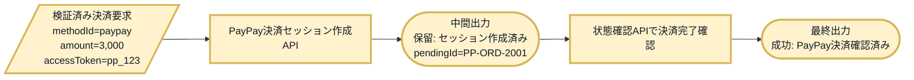
```mermaid
flowchart LR
    classDef changed fill:#fff2cc,stroke:#d6b656,stroke-width:3px,color:#111827;
    A[/検証済み決済要求<br>methodId=paypay<br>amount=3,000<br>accessToken=pp_123/]:::input --> D[PayPay決済セッション作成API]:::process
    D --> E([中間出力<br>保留: セッション作成済み<br>pendingId=PP-ORD-2001]):::pending
    E --> F[状態確認APIで決済完了確認]:::process
    F --> G([最終出力<br>成功: PayPay決済確認済み]):::normal

    class A,D,E,F,G changed;

    classDef input fill:#e7f0ff,stroke:#2563eb,color:#111827;
    classDef process fill:#fff7ed,stroke:#ea580c,color:#111827;
    classDef decision fill:#fef9c3,stroke:#ca8a04,color:#111827;
    classDef pending fill:#fef3c7,stroke:#d97706,color:#111827;
    classDef normal fill:#dcfce7,stroke:#16a34a,color:#111827;
```

この図から読み取ることは、次の3点です。

- 注文処理から見た外側の契約は `PaymentRequest` から `PaymentResult` のままである。
- PayPayは非同期処理であり、銀行振込やコンビニと同様に保留→完了確認の2段階になる。
- PayPay固有の入力データ（アクセストークン、マーチャントID）の検証、PayPay決済API境界の呼び出し、PayPay用完了確認が新たに必要になる。

変更後も、失敗条件は正常系図へ混ぜずに別で確認します。

| エラー条件 | どこで分かるか | 出力 |
|---|---|---|
| PayPay固有データが不足 | PayPayProcessorの入力検証時 | 入力不足エラー |
| PayPay決済APIが失敗 | API呼び出し時 | 失敗結果（リトライ可否付き） |
| PayPay完了確認で期限切れ | 状態確認API時 | 期限切れエラー |

種別が1つ増えるだけの変更が、実際のコードではどれだけの修正になるかを、フェーズ3「問題特定」で変更を試すコードで確認します。

**フェーズ1のまとめ：今回追う変更ID一覧**

このフェーズで確定した変更依頼を一覧にして締めます。フェーズ2「仮説立案」でこの変更IDを仮説・ヒアリングへ、フェーズ3「問題特定」で一つずつ試して痛みへ、と順につなぎます。

| 変更ID | 変更依頼の要点 | 関係する要求ID（追加は変更後ID） |
|---|---|---|
| 変更ID1 | PayPay固有データを検証して決済セッションを作る | 要求ID7 |
| 変更ID2 | PayPayの保留IDで完了状態を確認する | 要求ID6 |

フェーズ1「現状把握」でシステムの現状と変更要求が把握できました。次のフェーズ2「仮説立案」では、「何を変え、何を守るか」を整理します。

## 🟣 フェーズ2：仮説立案 ―― 何が変わるかを観察し、ヒアリングで裏付ける
### 2-1：変わりそうな仕様の見当をつける

ここで作る一覧は、思いつきで「変わりそう」と感じたものを並べる表ではありません。フェーズ1「現状把握」で確認した仕様・動作例・クラス図を材料に、次の順で候補を絞ります。

1. 仕様図と動作例から、入力・判定・加工・出力のうち条件や値が変わりそうな箇所を拾う。
2. その箇所が、1-3のどのクラス・メソッドに書かれているかを対応づける。
3. その仕様が、どんな理由で、何をきっかけに、どのくらいの頻度で変わりそうかを仮説として書く。
4. 逆に、当面変えない前提にできる処理の骨格も分けておく。

この手順で見ると、「決済を実行する」という大きな処理全体ではなく、その中のどの決済手段・生成条件・入力データ・処理手順・エラー処理が変更候補なのかを読者自身で追えるようになります。

| 仕様候補 | 仕様上の場所 | コード上の場所 | 見立て |
|---|---|---|---|
| 決済手段の種類 | 入力、判定 | `processPayment()` の if-else | 新しい決済手段が増える可能性があるため、今回見る |
| 手段固有の入力データ | 入力 | 各 `*Input` 構造体と各Processorの入力検証 | 決済手段ごとに異なるデータが必要なため、追加時に増える |
| 処理タイプ（同期/非同期） | 加工 | `processPayment()` 内のリトライ判定、`main()` の完了確認分岐 | 新しい手段が同期か非同期かで処理が変わる |
| 外部APIの呼び出し手順 | 加工、出力 | 各Processorと`PaymentGatewayClient` | 決済手段ごとに認証、番号発行、セッション作成などの手順が異なる |
| エラー処理の対処 | 出力 | `processPayment()` 内のリトライフラグ設定 | 手段ごとにリトライ可否が異なる |
| 決済実行の外側の流れ | 加工、出力 | `PaymentRequest` → `PaymentResult` | 注文処理との境界として当面維持する前提 |

この表から、今回の検討対象は「決済手段の選択と生成」「手段固有の入力検証」「同期/非同期の処理モード」「エラー処理の対処」に絞れます。

#### ヒアリングで確認すること

決済手段の追加に伴う変化と、注文処理から見た共通契約を分けて質問します。

| 見当 | 現時点の仮説 | 確認する質問 | 確認先 |
|---|---|---|---|
| 決済手段 | PayPay以外も追加される | 今後予定している決済手段はあるか | 決済担当者 |
| 外側の契約 | 要求を渡し結果を返す形は維持する | 注文処理へ返す結果の形は共通でよいか | 決済担当者 |
| 手段固有処理 | 入力・同期性・エラー対処が異なる | 手段ごとの差を決済側で吸収するか | 決済担当者 |

2-3ではこの三点を確認し、増える詳細と守る境界を確定します。

### 2-2：今回の変更で確実に変わること

1-5で確定した変更IDを、そのまま今回確実に変わることとして確認します。章ごとに異なる色や記号は使わず、以降でも同じ変更IDで追跡します。

- **変更ID1：PayPay固有データを検証して決済セッションを作る**
- **変更ID2：PayPayの保留IDで完了状態を確認する**

ただし「この変更が1回限りか、今後も続くか」によって、どこまで設計を変えるべきかが大きく変わります。関係者に確認します。

### ヒアリングに向けた背景確認

このシステムは、ある決済サービス事業者の「決済プロセッサー」を管理する基盤です。当初クレジットカード決済だけをサポートしていましたが、ユーザーの利便性を高めるために、後からコンビニ決済、銀行振込、そしてPayPayなどのQRコード決済と、次々に新しい決済手段が追加されてきました。

コードを見ると、`PaymentApplication` クラスが、各決済手段の具体クラスを直接生成し、手段ごとのエラー処理（リトライ可否の設定など）まで直接扱っている構成になっています。

### 2-3：関係者ヒアリング

仮説を持って、決済プラットフォームチームの担当者と話し合いを持ちました。

- **開発者：** 「PayPay対応の件ですが、今の構造だと決済手段が増えるたびに `PaymentApplication` クラスへ分岐と生成処理を追加する必要があります。手段固有の入力データ、同期か非同期かの判定、エラー処理も手段ごとに書き分けています。今後も新しい決済手段は追加される予定でしょうか？」
- **決済担当者：** 「ああ、かなりハイペースで追加していく予定だよ。次は銀行系の決済も入るし、後払いサービスも検討している。だから、決済手段が増えるたびに基幹部分のコードを書き換えるようなことはなるべく避けてほしいんだ。」
- **開発者：** 「各決済手段で必要なデータも違いますし、同期で即座に結果が出るものと、非同期で完了確認が必要なものがありますよね。注文処理から見た外側の契約、つまり決済要求を渡して結果を受け取る形は維持したい、という理解で合っていますか？」
- **決済担当者：** 「その理解で合っている。クレジットは認証、コンビニや銀行振込は入金待ち、PayPayはPayPay側のセッション確認がある。中身は違うけれど、注文処理側には同じ形で結果を返してほしい。失敗したときの対処も手段ごとに違うけど、それもこちら側で吸収してほしい。」
- **開発者：** 「分かりました。外側の契約は保ちたい一方で、手段固有の入力データ、同期/非同期の処理モード、完了確認の手順、エラー時の対処が決済手段ごとに増えていくということですね。」

### 2-4：ヒアリングで判明した将来リスク

| リスクID | 将来リスク | 時期の目安 | 根拠 |
|---|---|---|---|
| リスクID1 | 決済手段の種類がさらに増加する | 新しい決済手段の追加ごと | 「かなりハイペースで追加していく予定」 |
| リスクID2 | 手段固有の入力データと検証ロジック | 追加ごと | 決済手段ごとに異なるデータが必要 |
| リスクID3 | 同期/非同期の処理モードの増加 | 追加ごと | 新手段が同期か非同期かで処理が変わる |
| リスクID4 | 完了確認の手順の増加 | 非同期手段の追加ごと | 非同期手段は保留→完了確認の2段階 |

フェーズ2「仮説立案」で「今変わること（確定）」と「将来変わるかもしれないこと（リスク）」を分けて整理できました。次のフェーズ3「問題特定」では、現在の構造で変更を試みたときに何が起きるかを確認します。

### 2-5：変わる見込みと今回維持する範囲を確定する

2-4のリスクIDを、決済手段ごとに変えられるようにする部分と、注文処理から見た安定側へ分けます。「はい」は、フェーズ6で**決済手段が増えても、共通の依頼・結果・記録へ手段固有分岐を広げない構造か**を判定するための印です。

| リスクID・変化軸 | 変わる見込み | 変えられるようにする部分 | 今回維持する部分 |
|---|---|---|---|
| リスクID1：決済手段の種類がさらに増加する | はい | 決済手段ごとの具体処理と生成 | `PaymentRequest`から`PaymentResult`を返す入口、決済ログ |
| リスクID2：手段固有の入力データと検証ロジック | はい | 固有入力と検証条件 | 注文ID・金額の受け渡し、共通エラー結果 |
| リスクID3：同期/非同期の処理モードの増加 | はい | 手段ごとの受付処理 | 受付結果を同じ`PaymentResult`で返す契約 |
| リスクID4：完了確認の手順の増加 | はい | 保留IDを使う確認処理 | 完了・失敗を同じ結果契約とログへ戻す流れ |

したがって2-5の出力は、「手段固有の入力・検証・実行・完了確認は変えられるようにし、共通の依頼・結果・記録は守る」という設計条件です。フェーズ3「問題特定」では変更ID1・変更ID2だけを現在の構造へ適用し、リスクIDはフェーズ6の構造評価に使います。

---

## 🟣 フェーズ3：問題特定 ―― 変更の痛みを発見する
### 3-1：変更を試みる

「PayPay対応」の要求を、今のコードにそのまま実装してみます。

> **この抜粋の外は、現状のままです。** `PaymentLog` の記録、`CustomerDirectory` / `OrderBook` の照合、既存3つのProcessorは1-4の定義をそのまま使います。以下は1-4で読んだ順に、変更が入った定義だけを並べたものです。変更行だけの断片にはせず、どの既存構造へ何を足すのかを追える形にします。

変更した定義は7つです。1-4と同じ並び順で、上から見ていきます。

| 1-4での掲載単位 | 今回の変更 | 根拠 |
|---|---|---|
| 手段固有の入力データ | `PayPayInput` を追加 | 変更ID1 |
| `PaymentRequest` | 4つ目の手段固有入力を追加 | 変更ID1 |
| `ProcessorRegistry` | `paypay` の登録を追加 | 変更ID1 |
| `PaymentGatewayClient` | `chargePayPay()` を追加 | 変更ID1 |
| `PaymentStatusClient` | `PP-` の判定を追加 | 変更ID2 |
| （新規） | `PayPayProcessor` を追加 | 変更ID1 |
| `PaymentApplication::processPayment()` | `paypay` の分岐を追加 | 変更ID1 |

---

**PayPayInput（追加）**

```cpp
struct PayPayInput {
    string accessToken;
};
```

PayPayが必要とするのはアクセストークン1つだけです。既存3手段とは、また違う形です。

---

**PaymentRequest（変更あり）**

```cpp
struct PaymentRequest {
    string methodId;
    string orderId;
    CreditCardInput creditCard;
    BankTransferInput bankTransfer;
    ConvenienceInput convenience;
    PayPayInput payPay;  // ← 追加
};
```

既存の共通項目と手段固有入力3つを残したまま、4つ目の手段固有入力 `payPay` を追加しました。**一つの確定要求で、全手段が共有する要求型そのものを修正しています。** カードで決済する利用者にも、使われない `payPay` フィールドがついて回ります。

---

**PaymentGatewayClient（変更あり）**

既存のコンビニ番号発行と並べて、PayPayセッション発行を加えます。

```cpp
class PaymentGatewayClient {
public:
    // 既存：コンビニ番号を発行し、保留を返す
    PaymentResult issueConvenienceCode(
        const string& orderId,
        int amount,
        const ConvenienceInput& cvs) {
        cout << "[決済API] コンビニ番号発行"
             << " order=" << orderId
             << " amount=" << amount
             << " phone=" << cvs.phoneNumber
             << " store=" << cvs.storeCode << endl;
        PendingInfo p{"CVS-" + orderId};
        return {"保留",
                "支払い番号発行済み 番号=CVS-98765",
                false, "", p};
    }

    // 追加：同じ外部API境界へPayPayセッション発行を加える
    PaymentResult chargePayPay(
        const string& orderId,
        int amount,
        const PayPayInput& pp) {
        cout << "[決済API] PayPay決済"
             << " order=" << orderId
             << " amount=" << amount
             << " token=" << pp.accessToken
             << endl;
        PendingInfo p{"PP-" + orderId};
        return {"保留",
                "PayPayセッション作成済み",
                false, "", p};
    }
};
```

既存の `issueConvenienceCode()` と同じく、保留IDを含む保留結果を返します。**5つ目の関数名と、5つ目の引数の形が増えました。**

---

**PayPayProcessor（追加）**

```cpp
class PayPayProcessor {
    PaymentGatewayClient& gateway;
public:
    PayPayProcessor(PaymentGatewayClient& gw)
        : gateway(gw) {}
    PaymentResult pay(
        const PaymentRequest& req, int amount) {
        if (req.payPay.accessToken.empty()) {
            return {"失敗",
                    "PayPayトークンが不足しています",
                    false, "MISSING_PP_TOKEN", {}};
        }
        return gateway.chargePayPay(
            req.orderId, amount, req.payPay);
    }
};
```

既存3つのProcessorと同じ形です。`pay(const PaymentRequest&, int)` というシグネチャがまた一致しましたが、**共通の契約は相変わらずどこにもありません。**

---

**PaymentApplication::processPayment()（変更あり）**

`OrderBook`・`CustomerDirectory` による注文と顧客の照合は1-4のまま維持します。以下は追加した分岐に絞るため、その照合部の再掲を省いた抜粋です。

```cpp
class PaymentApplication {
    ProcessorRegistry registry;
    OrderBook orders;                // 現状のまま（照合に使う）
    CustomerDirectory customers;     // 現状のまま（照合に使う）
    PaymentGatewayClient gatewayClient;
    PaymentStatusClient statusClient;
public:
    PaymentResult processPayment(
        const PaymentRequest& request) {
        const string& type = request.methodId;

        if (!registry.exists(type)) {
            return {"失敗",
                    "未登録の決済方法です: " + type,
                    false, "UNKNOWN_METHOD", {}};
        }
        if (!registry.isActive(type)) {
            ProcessorConfig cfg = registry.get(type);
            return {"失敗",
                    cfg.name + " は現在無効です。",
                    false, "DISABLED", {}};
        }
        if (!orders.exists(request.orderId)) {
            return {"失敗",
                    "未登録の注文です: " + request.orderId,
                    false, "UNKNOWN_ORDER", {}};
        }
        OrderRecord ord = orders.get(request.orderId);

        if (type == "credit_card") {
            CreditCardProcessor proc(gatewayClient);
            return proc.pay(request, ord.amount); // canRetryは結果に含む
        } else if (type == "bank_transfer") {
            BankTransferProcessor proc(gatewayClient);
            return proc.pay(request, ord.amount);
        } else if (type == "convenience") {
            ConvenienceStoreProcessor proc(gatewayClient);
            return proc.pay(request, ord.amount);
        } else if (type == "paypay") {  // ← 追加
            PayPayProcessor proc(gatewayClient);
            return proc.pay(request, ord.amount);
        }
        return {"失敗",
                "未対応の決済種別です: " + type,
                false, "UNSUPPORTED", {}};
    }

    PaymentResult checkCompletion(
        const string& pendingId) {
        return statusClient.checkStatus(pendingId);
    }
};
```

**末尾の `if-else` へ4本目が増えました。** 既存の三つの分岐、共通の事前確認は残ったままです。PayPayだけを足したつもりでも、この関数を開いた以上、既存3手段の分岐も再確認の対象になります。

---

**PaymentStatusClient（変更あり）**

```cpp
class PaymentStatusClient {
public:
    PaymentResult checkStatus(
        const string& pendingId) {
        cout << "[状態確認API] id="
             << pendingId << endl;
        if (pendingId.find("EXPIRE") != string::npos) {
            return {"失敗", "支払い期限切れ",
                    false, "EXPIRED", {}};
        }
        if (pendingId.find("BT-") == 0) {
            return {"成功", "入金確認済み",
                    false, "", {}};
        }
        if (pendingId.find("CVS-") == 0) {
            return {"成功", "コンビニ入金確認済み",
                    false, "", {}};
        }
        if (pendingId.find("PP-") == 0) {  // ← 追加
            return {"成功", "PayPay決済確認済み",
                    false, "", {}};
        }
        return {"失敗", "不明な保留ID",
                false, "UNKNOWN_PENDING", {}};
    }
};
```

保留IDの接頭辞判定へ、`PP-` を1本足しました。**保留IDの命名規則を、外部API境界とProcessorの両方が知っている**ことになります。

---

**ProcessorRegistry のコンストラクタ（変更あり）**

`ProcessorRegistry::ProcessorRegistry()` の登録表へ1行足します。

```cpp
ProcessorRegistry() {
    registry["credit_card"] =
        {"クレジットカード", true};
    registry["bank_transfer"] =
        {"銀行振込", true};
    registry["convenience"] =
        {"コンビニ払い", true};
    registry["crypto"] =
        {"暗号通貨", false};
    registry["paypay"] =
        {"PayPay", true};  // ← 追加
}
```

登録行が1件増えただけです。**ここは痛くありません。**

---

#### `main()` と実行結果

上の7定義を1-4のコードへ当てはめ、PayPayの保留から完了確認までを通します。**見るのは動くかどうかではなく、追加が入力型・API境界・Processor・振り分け・状態確認・登録のどこまで広がったかです。**

```cpp
int main() {
    PaymentApplication app;

    // 注文台帳に登録済みの注文で試す（照合は現状のまま通る）
    PaymentRequest request;
    request.methodId = "paypay";
    request.orderId = "ORD-2001";
    request.payPay = {"pp_token"};

    PaymentResult result = app.processPayment(request);
    cout << "結果: " << request.methodId
         << " -> " << result.status
         << " (" << result.message << ")\n";

    if (result.status == "保留") {
        PaymentResult completion
            = app.checkCompletion(result.pending.pendingId);
        cout << "完了結果: " << completion.status
             << " (" << completion.message << ")\n";
    }
    return 0;
}
```

```
[決済API] PayPay決済 order=ORD-2001 amount=3000 token=pp_token
結果: paypay -> 保留 (PayPayセッション作成済み)
[状態確認API] id=PP-ORD-2001
完了結果: 成功 (PayPay決済確認済み)
```

PayPayセッションが作られ、保留IDで完了確認まで進みました。**動作は正しくなっています。** 変更要求は満たせました。

---

痛いのは結果ではなく、そこへ至る過程です。**手段を1つ足すために7か所を修正しました。** 定義を分けて並べたので、内訳が数えられます。

| 修正した定義 | 何が増えたか |
|---|---|
| 手段固有の入力データ | 4つ目の構造体 |
| `PaymentRequest` | 4つ目のフィールド（他3手段では未使用のまま残る） |
| `ProcessorRegistry` | 登録行1つ |
| `PaymentGatewayClient` | 5つ目の関数名・引数の形 |
| `PaymentStatusClient` | 保留IDの接頭辞判定1本 |
| `PayPayProcessor` | 新規クラス |
| `processPayment()` | 4本目の `if-else` |

見たいのは分岐の行数そのものではありません。PayPay固有の入力、検証、API呼び出し、保留結果、完了確認が、**決済を利用する流れの近くに散らばって追加された**ことです。既存のカード・銀行振込・コンビニも同じ分岐内にあるため、PayPayだけの変更でも既存処理を確認対象から外せません。

### 3-2：変更影響グラフ

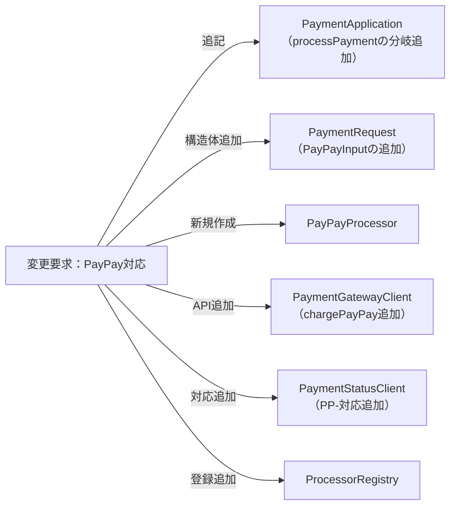
```mermaid
graph LR
    T1["変更要求：PayPay対応"]
        -->|"追記"| A["PaymentApplication<br>（processPaymentの分岐追加）"]
    T1 -->|"構造体追加"| B["PaymentRequest<br>（PayPayInputの追加）"]
    T1 -->|"新規作成"| C["PayPayProcessor"]
    T1 -->|"API追加"| D["PaymentGatewayClient<br>（chargePayPay追加）"]
    T1 -->|"対応追加"| E["PaymentStatusClient<br>（PP-対応追加）"]
    T1 -->|"登録追加"| F["ProcessorRegistry"]
```

変更影響グラフでは、PayPay対応という一つの変更要求から6つの修正先へ矢印が広がっています。`PaymentApplication` の分岐追加（変更ID1）だけでなく、入力構造体、新しいProcessor、API境界、完了確認、レジストリ登録（変更ID2）まで同時に触ることになります。

### 3-3：痛みの言語化

**1つ目：今回のPayPay追加で「決済の統括者」が手段別の事情を知った辛さ。** `PaymentApplication`へPayPayの具体クラス名、固有入力検証、非同期の保留、エラー対処を追加したため、既存のカード・銀行振込・コンビニの流れまで確認対象になりました。

**2つ目：変更ID1・変更ID2が複数の責任へ広がった辛さ。** 入力構造体、Processor、API境界、完了確認、レジストリ、`processPayment`の分岐という7か所を修正しました。一つのクラスに閉じず、複数クラスに跨ったことが確認範囲を広げています。

**3つ目：変更ID2の手段固有の完了確認が、共通経路の修正先になった辛さ。** PayPay用の保留IDと確認方法を追加するため、各方式で共通に使いたい完了確認の入口まで修正対象になりました。

フェーズ3「問題特定」で、変更ID1・変更ID2により決済統括クラスが書き換わり、入力検証・処理モード・エラー処理を含む複数箇所へ修正が広がる痛みを確認できました。

---
> **📌 問題（確定）**
> 変更ID1・変更ID2のPayPay対応で、`PaymentApplication`の分岐・生成・エラー対処、固有入力、API境界、完了確認を同時に修正した。手段固有の検証・処理モード・エラー対処が注文処理から見た決済フローと同じ場所にあり、今回の確定要求が複数箇所へ波及した。
---

観測した痛みへ`問題ID`を付け、どの変更IDから来たかを対応づけます。

| 問題ID | 観測した痛み（変更途中コード） | 起点の変更ID |
|---|---|---|
| 問題ID1 | PayPay追加で `PaymentApplication` が手段別の具体クラス名・固有検証・非同期保留・エラー対処を知り、既存手段の流れまで確認対象になった | 変更ID1 |
| 問題ID2 | 入力構造体・Processor・API境界・完了確認・レジストリ・`processPayment`分岐の7か所を修正し、複数クラスへ跨った | 変更ID1・変更ID2 |
| 問題ID3 | PayPay用の保留IDと確認方法を加えるため、各方式で共通に使いたい完了確認の入口まで修正対象になった | 変更ID2 |

ここまでで「何が痛いか」が見えました。次のフェーズ4「原因分析」では、その痛みが「なぜ起きているか」を構造の言葉で言語化します。

---

## 🟠 フェーズ4：原因分析 ―― なぜ辛いのかを構造で言語化する
### 4-1：痛みの根源を探る（観察と原因）

フェーズ3「問題特定」で確認した「変更の辛さ」は、コードのどこから来ているのでしょうか。コードを見直して、具体的な依存を洗い出します。

`PaymentApplication::processPayment()` は、次の知識をすべて保持しています。

1. **具体クラス名**：`CreditCardProcessor`、`BankTransferProcessor`、`ConvenienceStoreProcessor` を直接 `new` している
2. **手段ごとのエラー対処**：失敗の種類ごとの再試行可否（`canRetry`）を決める判断が手段別に書かれ、利用側がそれを読んで再試行する
3. **処理モードの違い**：カードは同期（即座に返す）、銀行振込とコンビニは非同期（保留を返す）という区別を利用側が知っている

呼び出し側（`main()`）も追加の知識を持っています。

4. **完了確認の必要性**：結果が「保留」の場合は `checkCompletion()` を呼ぶ必要があることを知っている

これらの知識が `PaymentApplication` と呼び出し側に漏れているため、決済手段を追加するたびに、生成の分岐、エラー処理の追記、完了確認の対応が必要になります。

このうち(1)〜(3)（と付随するリトライ判定）は方式ごとに異なる知識です。(4)はさらに二つに分けます。PayPay固有の保留IDの作り方や確認APIは方式側の知識ですが、「共通結果が保留なら共通の完了確認入口を呼ぶ」という順序は全方式で守る利用フローです。前者を変更側として追い、後者は守る側としてフェーズ5へ渡します。

### 4-2：今回変える責任/ほかの変更から守る責任

> **「今回守る」と「変わらない」は異なります。** 左列は今回の変更試行とヒアリングで変更理由を確認した責任、右列はその変更に巻き込まず守りたい責任です。将来ずっと変わる／変わらないという分類ではありません。

| **今回変える責任** | **ほかの変更から守る責任** |
|---|---|
| 決済手段の種類と具体クラス | 注文処理が同じ入口から決済を依頼できること |
| 手段固有の入力検証とAPI呼び出し | `PaymentRequest` を受け取り `PaymentResult` を返す決済契約 |
| 同期／非同期の処理モードと完了確認方法 | 決済結果を成功・保留・失敗として受け取る利用側の骨格 |
| 手段固有のエラーとリトライ判定 | 最終結果を同じ形式でログへ記録する流れ |

**【変わる部分：`PaymentApplication::processPayment()` の中の手段固有の生成・実行・エラー対処】**

```cpp
if (type == "credit_card") {
    CreditCardProcessor proc(gatewayClient);
    // 失敗の種類ごとの再試行可否（canRetry）は結果に含まれる
    return proc.pay(request, ord.amount);
} else if (type == "bank_transfer") {
    BankTransferProcessor proc(gatewayClient);
    return proc.pay(request, ord.amount);
}
```

**【今回の変更から守る部分：1-5の `executeCase()` が `PaymentApplication::processPayment()` を呼び、共通結果を扱う骨格】**

```cpp
PaymentResult result = app.processPayment(request);
payLog.add(request.methodId,
           app.chargedAmount(request.orderId),
           result.status,
           result.errorCode);
```

決済の外側の契約と個別の生成ロジック・入力検証・処理モード・エラー対処は、変わる理由が異なります。これらが同じ場所に混在していることが、根本原因として確認できました。

### 4-3：接続点に漏れている生成判断の知識を確認する

今回見直す接続点は、「決済手段を生成して利用処理へ渡す境界」です。利用側は、具体クラス名ではなく、`PaymentRequest` を受け取り `PaymentResult` を返せるProcessorであることだけを知れば十分です。入力検証、API呼び出し手順、エラー対処の違いは、各Processorの内部に閉じ込められるはずです。

フェーズ4「原因分析」で根本原因が言語化できました。次のフェーズ5「課題定義」では、その境界で実際に何が流れているかを値・型のレベルで具体化し、「何を変え、何を守るか」を明確にします。

---
> **📌 原因（確定）**
> `PaymentApplication` が決済手段の具体クラス名、手段ごとの入力検証ロジック、同期/非同期の処理モード判定、エラー時のリトライ判定を知っている。決済手段の追加が、保ちたい `PaymentRequest` → `PaymentResult` の決済フローの修正へ直結している。
---

フェーズ3の問題IDに対応づけて、構造上の原因へ`原因ID`を付けます。次のフェーズ5は、この原因IDから課題IDを導きます。

| 原因ID | 構造上の原因（何が同じ責任へ集まっているか） | 対応する問題ID |
|---|---|---|
| 原因ID1 | `PaymentApplication` が具体クラス名・手段ごとの入力検証・同期/非同期の処理モード判定・手段固有の完了確認・エラー時のリトライ判定を持ち、保ちたい `PaymentRequest`→`PaymentResult` フローの修正へ直結している | 問題ID1・問題ID2・問題ID3 |

問題ID3で分けたいのは、PayPay固有の保留IDや確認方法が共通経路の修正理由になることです。`Pending` を受けたら共通の `checkCompletion()` を呼ぶ順序そのものは方式に依存しないため、課題候補には含めず守る側へ置きます。

「何が痛いか（問題）」と「なぜ痛いか（原因）」が揃いました。次のフェーズ5「課題定義」では、「何を切り離す必要があるか（課題）」を、接続点で流れるデータのレベルで言語化します。

---

## 🟡 フェーズ5：課題定義 ―― 原因から課題を検討して確定する

フェーズ4「原因分析」で確定した原因は、まだ課題そのものではありません。まず変えるべき構造を候補として導き、システム全体で候補の関係を整理してから、解くべき接続点を確定します。

### 5-1：原因から課題候補を洗い出す

| 原因ID・確定した事実 | そのままだと残る痛み | 課題候補 | 候補を導いた理由 |
|---|---|---|---|
| 原因ID1：決済利用処理が方式名ごとの具体Processor生成と固有手順を分岐する | PayPay追加で生成分岐・入力検証・完了確認まで同時修正する | 決済方式ごとの生成と処理を利用フローから分離する | 利用フローと方式固有手順は別の理由で変わる |

ここで挙げるのは、原因のどの構造を変える必要があるかまでです。それをどのクラスへどう置くかは、課題を確定してからフェーズ6で決めます。

### 5-2：課題候補の重複と依存を整理する

| 課題候補 | 必要性・他候補との関係 | 統合／分割の判断 | 整理結果 |
|---|---|---|---|
| 方式固有の生成・処理の分離 | 必須。変更ID1・変更ID2で具象生成と非同期手順の分岐が増えた | 一つの決済方式境界として統合 | 課題として残す |

ここでは対策案の採否を決めません。原因から出した候補の重複と依存を整理し、同じ変更理由なら統合し、別の変更理由なら課題として残します。

変更IDと課題IDは一対一とは限らないため、変更依頼の数に合わせて課題を増減させません。

### 5-3：課題IDと接続点を確定する

整理した候補に課題ID1から欠番なくIDを付けます。

| 課題ID・接続点 | 接続するもの・変わる側 | 守る側 | 完了条件 |
|---|---|---|---|
| 課題ID1：決済方式の生成・実行と決済利用フローの境界 | **接続:** 決済要求と決済結果<br/>**変わる側:** 具体方式、固有入力検証、同期／非同期手順、エラー対処 | 顧客・注文照合、結果保存、共通の依頼→結果フロー | 方式追加が新しい方式実装と生成登録に閉じ、利用フローが変わらない |

📌 **システム全体の完了状態**：決済利用フローは方式固有データを含む要求を渡して共通結果を受け取り、具体方式の生成・検証・手段固有の完了方法を意識しない。共通結果が保留なら、方式を判定せず同じ完了確認入口を呼ぶ。

課題IDを定義できたので、ここまでの追跡を一列で見渡します。本章は方式固有の生成・処理という一つの軸です。問題ID3のうち方式固有の確認知識は原因ID1へ含め、方式共通の保留判定と確認順序は守る側へ置きます。

| 問題ID（フェーズ3の痛み） | 原因ID（フェーズ4の構造原因） | 課題ID（達成目標） |
|---|---|---|
| 問題ID1・問題ID2・問題ID3：手段固有の生成・検証・処理モード・完了方法が決済フローへ混在 | 原因ID1：具体クラス名・入力検証・処理モード・手段固有の完了確認・リトライ判定を統括が抱える | 課題ID1：決済方式の生成・処理を利用フローから分離 |

この表と完了状態が、そのままフェーズ6の入力です。要求の受入は要求ID、設計課題の解消は課題ID、今回の変更影響は変更IDで別々に追跡します。
## 🔴 フェーズ6：対策検討 ―― 全体のデータと実体の流れを決める

#### まず全体像 ―― どんな構造へ変えるか（抽象）

フェーズ4「原因分析」で、`PaymentApplication` が「決済の共通フロー」と「決済方式ごとの生成・検証・処理手順」という**別々の理由で変わる知識**を、同じ場所へ抱えていることを確認しました。対策は、この2つを別々の責任へ分け、一つの決済経路へ再結合することです。この段階では、問題から導いた「生成分離構造」という名前だけを使います。一般に共有されているデザインパターン名は、実装と効果を確認した後で結び付けます。

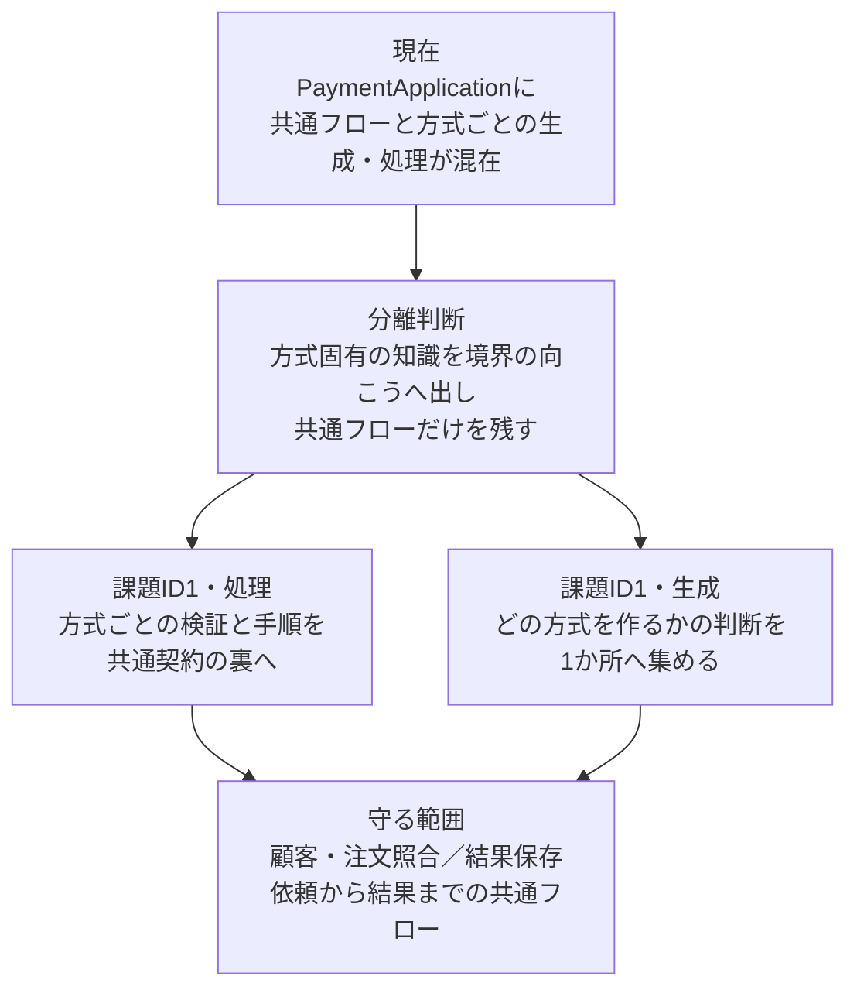
```mermaid
flowchart TB
    A[現在<br/>PaymentApplicationに<br/>共通フローと方式ごとの生成・処理が混在] --> B[分離判断<br/>方式固有の知識を境界の向こうへ出し<br/>共通フローだけを残す]
    B --> C[課題ID1・処理<br/>方式ごとの検証と手順を<br/>共通契約の裏へ]
    B --> D[課題ID1・生成<br/>どの方式を作るかの判断を<br/>1か所へ集める]
    C --> E[守る範囲<br/>顧客・注文照合／結果保存<br/>依頼から結果までの共通フロー]
    D --> E
```

**この図は上から下へ、現状・分離の判断・処理と生成の行き先・守る範囲の順で読みます。** 検討はこの図の並び順では進めません。**先に確定するのは、一番下の「守る範囲」です。** 守る範囲が決まらないと、どこで線を引いてよいかが決められないからです。

**守る範囲 ―― この章で変えないもの。**

- **顧客・注文照合**：注文台帳から請求金額と注文者を引き、顧客台帳に実在するかを確認すること。順序も含めて変えない
- **共通の依頼→結果フロー**：1回の決済要求に対して1つの結果を返す形
- **結果保存**：決済の結果を記録すること
- **保留から完了確認への2段階**：非同期の方式で保留になったら、共通の完了確認を呼ぶこと

この4つが変わっていないことは、フェーズ7の受入・回帰エビデンスで確認します。ただし、**分離と組み立ての判断を終えるたびにも照合します。**

### 対策検討のクラス図：1-3の責任と依存をどう変えるか

フェーズ1の1-3で作ったクラス図が、これから書き換えていく**基準の図**です。まずここへフェーズ2〜5の判断を注記として載せ、どの責任を残し、どの責任を移すかを確定します。

| クラス図を変える材料 | 前工程で確認したこと | クラス図へ反映すること |
|---|---|---|
| フェーズ1のクラス図 | 現在のクラス、操作、依存関係 | 変更前クラス図としてそのまま使う |
| フェーズ2の変化予測 | リスクID1〜リスクID4。方式・入力・処理モード・完了手順が増える | 毎回変わる責任へ `【移す】` と注記する |
| フェーズ4の原因 | 原因ID1。具体クラス名・入力検証・処理モード・リトライ判定を統括が抱える | 同じクラスの中で `【残す】` と `【移す】` を分ける |
| フェーズ5の接続点 | 利用フローは要求を渡して結果を受け取ればよい | 課題ID1の方式固有処理と生成判断を、統括の外へ出す |

**薄い黄色が着目クラス**です。ここでは `PaymentApplication` の `【残す】` と `【移す】` を追います。矢印は1-3と同じ利用・保持関係です。

**変更前のクラス図（基準の図）：**

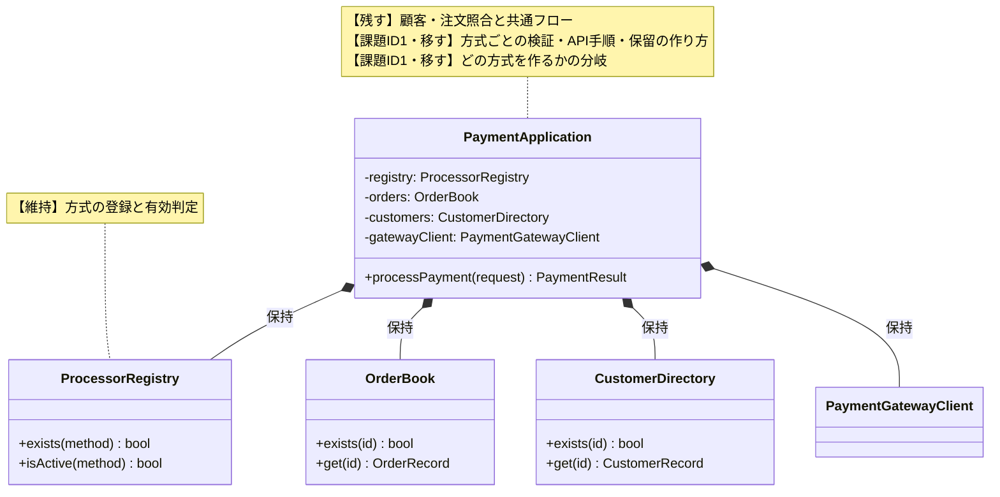
```mermaid
classDiagram
    class PaymentApplication {
        -registry: ProcessorRegistry
        -orders: OrderBook
        -customers: CustomerDirectory
        -gatewayClient: PaymentGatewayClient
        +processPayment(request) PaymentResult
    }
    class ProcessorRegistry {
        +exists(method) bool
        +isActive(method) bool
    }
    class OrderBook {
        +exists(id) bool
        +get(id) OrderRecord
    }
    class CustomerDirectory {
        +exists(id) bool
        +get(id) CustomerRecord
    }
    class PaymentGatewayClient
    PaymentApplication *-- ProcessorRegistry : 保持
    PaymentApplication *-- OrderBook : 保持
    PaymentApplication *-- CustomerDirectory : 保持
    PaymentApplication *-- PaymentGatewayClient : 保持

    note for PaymentApplication "【残す】顧客・注文照合と共通フロー<br/>【課題ID1・移す】方式ごとの検証・API手順・保留の作り方<br/>【課題ID1・移す】どの方式を作るかの分岐"
    note for ProcessorRegistry "【維持】方式の登録と有効判定"

    classDef focus fill:#FFF2CC,stroke:#D6B656,stroke-width:2px,color:#222222
    cssClass "PaymentApplication" focus
```

向きと掲載クラスは1-3から変えていません。同じ図に注記と色だけを加え、`PaymentApplication` のどの責任を残し、どの責任を移すかに着目します。**この図を基準に、分離と組み立てで必要な関係を足していきます。**

クラス図の変更として書くと、次の3操作になります。**どんなクラスを新設し、何という名前にするかは、直後の全体経路で決めます。** ここで確定しているのは操作の種類だけです。

1. 課題ID1：方式が満たす共通契約を新設し、方式ごとの検証・手順をその実装へ移す。
2. 課題ID1：どの方式を作るかの判断を、共通フローの外の1か所へ集める。
3. 課題ID1：実体を生成・所有する場所を決め、共通フローへ渡す。

これらの操作を、直後の全体経路へまとめます。

#### 全体経路を決めるための確認観点

全体経路を決めるとき、次の二点を同時に確認します。

- **契約と具体による分離**：共通フローに残す処理と、決済方式ごとの差を持つ契約・具体をセットで決める。
- **実体の組み立て**：方式の実体を誰が生成・所有・登録し、共通フローが契約として選んでどう実行するかを一本で決める。

この章では生成登録が課題の中心ですが、生成だけを切り離して考えません。何を生成するかは契約と具体の分離から決まり、生成した実体の妥当性は共通フローで実行されるところまで追って初めて確認できます。

### 全体のデータと実体の流れを先に決める

最初に、決済アプリケーションを用意し、要求に応じた決済方式を生成して結果を返すまでの全体経路を決めます。クレジットカード決済1件を一本で固定します。

| 実行順・ポイント | 掲載箇所 | 実際のコード接続 | 次の呼出先 |
|---|---|---|---|
| 1. 生成役の具体を決める | `main()` | `DefaultPaymentApplication app;`を生成し、この型が`createProcessor()`の実装を決める | 実行開始へ |
| 2. 実行開始 | `main()` | `app.processPayment(request);` | `PaymentApplication::processPayment()` |
| 3. 骨格 | `PaymentApplication::processPayment(const PaymentRequest&)` | 注文と顧客を照合し、`createProcessor(request.methodId)` を呼ぶ | `DefaultPaymentApplication::createProcessor()` |
| 4. 決済方式を生成して返す | `DefaultPaymentApplication::createProcessor(const string&)` | 登録と有効を確認し、`new CreditCardProcessor(gatewayClient)`を返す | 骨格の`IPaymentProcessor*`が受け取る |
| 5. 契約→具体 | `IPaymentProcessor::pay()` → `CreditCardProcessor::pay()` | カード固有の検証とゲートウェイ呼び出しを行い、結果を返す | 戻り値を骨格が返し、`delete proc;` で捨てる |

**生成が2か所に現れています。** 1は生成役そのものを選ぶ組み立て、4は方式の実体を作る呼び出しです。**外側は1回、内側は決済のたびに起きます。**

**全体経路の準備コードで作ったものを、3が捨てます。** 作る場所と捨てる場所が別の関数にあるので、`createProcessor()` の戻りは「借りるもの」ではなく「受け取って所有するもの」だと分離の検算で決めておく必要がありました。**所有を決めずに骨格を書くと、この `delete` を書けません。**

### 全体の流れを実現するコードを決める

**【課題の原因】** 課題ID1は、問題ID1・問題ID2・問題ID3（手段固有の生成・検証・処理モード・完了方法が決済フローへ混在）＝原因ID1（具体クラス名・入力検証・処理モード・手段固有の完了確認・リトライ判定を統括が抱える）。方式共通の保留判定と確認順序は守ったまま、方式ごとの差分を分離対象にします。

**この課題（何を解きたいか）：** 決済方式を1つ足すたびに統括クラスを開いて分岐を1本足し、その方式固有の入力検証と同期・非同期の違いまで統括が抱える。**方式追加が新しい方式実装と生成登録に閉じ、利用フローが変わらない**ようにするのが課題ID1です。

**ここで全体経路と対応づけるコード：** 共通の決済要求・結果を守りながら方式ごとの検証・手順・完了方法をどこへ置き、具体方式を誰が選択・生成するかをコードで示します。

**この章の課題は1つですが、全体経路を先に決める順序は他章と同じです。** その後、契約と具体をセットで分け、実体が生成から実行まで届くコードを確かめます。軸が一つなので、経路は一度追えば全体がつながります。

**全体経路との対応。** フェーズ5「課題の確定（5-3）」で決まったのは、方式ごとの処理と生成判断を、決済の共通フローとは別の変更へ閉じる境界を作ることです。全体経路で決めた接続を、ここから**境界を関数・表・クラス契約のどれで表し、どのコードで繋ぐか**へ落とします。

書き換える前のコードはフェーズ3「変更を試みる（3-1）」にあります。**ここで全部を再掲することはしません。** 分離と組み立ての判断に必要な数行だけを変更試行（3-1）から抜き出し、変更後と並べます。

---

#### 1. 契約と具体をセットで決める（分離）

ここでは契約だけを先に完成させません。境界へ残す操作・値と、その裏で変わる判断を持つ具体を往復し、両側がかみ合うところまでを一つの判断として扱います。

##### 契約：境界の形と受け渡しを決める

**関数を一つ切り出すだけでは、変更を閉じ込められません。** 方式ごとの分岐は `processPayment()` の `if` 連鎖に現れ、そこから呼ばれる方式固有の検証と手順も方式の数だけあります。そして2-4のリスクID1が「かなりハイペースで追加していく予定」という言葉つきで挙がっています。リスクID2（方式固有の入力と検証）、リスクID3（同期・非同期の増加）、リスクID4（完了確認の増加）も同じ方向です。**現に変更要求で、PayPayという方式が1つ増えました。** 方式ごとの検証と実行を同じ問い方で呼べるクラス契約まで分けます。

分けると決めたので、コードに線を引きます。

**掲載箇所：`PaymentApplication::processPayment(const PaymentRequest&)`** ―― 3-1の分岐（対策前）

```cpp
        if (!registry.exists(type)) { /* …未登録の断り（省略）… */ }
        if (!registry.isActive(type)) { /* …無効の断り（省略）… */ }
        if (!orders.exists(request.orderId)) { /* …未登録注文（省略）… */ }
        OrderRecord ord = orders.get(request.orderId);   // ← 残る側（照合）

        if (type == "credit_card") {                     // ← 出て行く側（生成判断）
            CreditCardProcessor proc(gatewayClient);     // ← 出て行く側（具体名）
            return proc.pay(request, ord.amount);        // ← 残る側（依頼して結果を返す）
        } else if (type == "bank_transfer") {            // ← 出て行く側
            BankTransferProcessor proc(gatewayClient);
            return proc.pay(request, ord.amount);
        }
        // …残りの方式も同じ形（省略。詳細は3-1）…
```

**割り方の根拠は、方式が増えたときに触るかどうかです。** 方式を1つ足すと `else if` が1本増え、具体クラス名が1つ増えます。**照合の3行と「依頼して結果を返す」という形は、方式が何種類あっても変わりません。**

**出て行く側が2種類あることに注意してください。** 1つは「どの具体を作るか」という**生成の判断**、もう1つは「その具体が何をするか」という**処理の中身**です。3-1では同じ `if` の中で隣り合っています。**この2つは別々に外へ出します。**

**5-3が挙げた候補は2つです。** 決済要求と、決済結果。**このうち何がいくつ境界を流れるかは、まだ決まっていません。** 形を決めます。

| 接続するもの（5-3の候補） | 決めた形 | そう決めた理由 |
|---|---|---|
| 決済要求 | **1つの値にまとめて引数で渡す。方式固有の入力もその中に持たせる** | 方式ごとに引数を変えると、方式を足すたび契約のシグネチャが変わる。それでは共通契約にならない |
| 決済結果 | **1つの値で返す**（状態・メッセージ・再試行可否・エラーコード・保留情報） | 変更前も同じ5項目を返していた。呼び出し側が実際に消費していたものをそのまま契約の戻り値にする |
| 請求金額（追加） | **引数で渡す** | 台帳から引くのは守る範囲の照合。方式側が台帳を引くと、照合が方式の数だけ散る |
| 方式そのもの | 引数で渡さない。**方式ごとに別のクラス**を用意する | 引数で渡すと、受け取った側がまた方式で分岐する。3-1の `if` が移動するだけになる |

**候補2つが、そのまま2つとも境界を流れます。** 請求金額を足して3つです。**方式だけがクラスへ変わりました。**

**「方式固有の入力を要求の中に持たせてよいのか」** ——ここは踏み外しやすいので、根拠を書きます。**要求は変更前から1つの値でした。** 3-1の `PaymentRequest` にはすでに方式ごとの入力が入っていて、`processPayment()` はそれを丸ごと `proc.pay()` へ渡していました。**新しく決めたのではなく、変更前の形をそのまま契約にしています。**

**契約の名前を決めます。** 決済方式が満たすべき約束なので `IPaymentProcessor` とします。

**掲載箇所：`IPaymentProcessor`（クラス全体）**

```cpp
// ---- 共通インターフェース ----

class IPaymentProcessor {
public:
    virtual ~IPaymentProcessor() {}
    virtual PaymentResult pay(
        const PaymentRequest& request, int amount) = 0;
};
```

**操作が1つだけです。** 検証も、API呼び出しも、保留IDの作り方も、この1操作の裏側です。**方式が同期でも非同期でも、契約から見れば「要求と金額を渡すと結果が返る」1往復です。**

**契約だけでは、決めた形が本当に成立するのか確かめられません。** 実装を1つ見ます。

**掲載箇所：`CreditCardProcessor::pay(const PaymentRequest&, int)`** ―― クレジットカードの処理（抜粋）

```cpp
    PaymentResult pay(const PaymentRequest& request,
                      int amount) override {
        // …カード番号と有効期限の検証（省略。詳細は7-1）…
        // …ゲートウェイの認証API呼び出しと結果の変換（省略）…
        return {PaymentStatus::Success, "決済完了", false, "", {}};
    }
```

- **「方式を引数で渡さない」の実態。** `if (type == "credit_card")` の比較がありません。**このクラスであること自体が『クレジットカード』だから**です
- **「要求を1つの値で渡す」の実態。** `request` からカード固有の入力を取り出しています。**銀行振込の実装は同じ `request` から別の項目を取り出します**
- **「結果を1つの値で返す」の実態。** 5項目の組を1つ返すだけで、表示も保存もしていません

変更前の `if` の中にあった「どの具体を作るか」が、ここにはありません。**では、それを決めるのは誰の仕事になるのか。それは全体経路の準備コードで決めます。**


**では、この契約を誰が呼ぶのか。**

---

##### 分離の検算：守る処理が契約だけを呼べるか

呼べるのは、方式が増えても今回維持する側だけです。出て行った側が出て行った側を呼べば、方式が増えるたびに両方を触ることになり、分けた意味が消えます。

**この章では、契約を骨格の外へ置きます。** 1つの `PaymentApplication` が、クレジットカードの決済も銀行振込の決済も扱います。**同じインスタンスが、呼び出しごとに違う方式の実体を使い分けなければなりません。** だから決済フローとは別の型として `IPaymentProcessor` を置きます。

もし方式ごとに `PaymentApplication` を丸ごと別インスタンスにするなら、契約を基底クラスの内側へ置けます。しかしそれは、決済方式の数だけ顧客照合と注文照合を持つということです。**守る範囲の「顧客・注文照合」が方式の数だけ散るので、成り立ちません。**

残った側は、共通フローを持つクラス——`PaymentApplication` です。**名前は変えません。** 1-3で書いた役割は「決済フローの統括」で、ここの後もそれは変わりません。出て行くのは方式固有の知識であって、統括すること自体ではありません。

**掲載箇所：`PaymentApplication::processPayment(const PaymentRequest&)`** ―― 骨格

```cpp
    PaymentResult processPayment(
        const PaymentRequest& request) {
        // …注文と顧客の照合（省略。詳細は7-1）…
        OrderRecord ord = orders.get(request.orderId);

        IPaymentProcessor* proc
            = createProcessor(request.methodId);   // ←この createProcessor が未定
        PaymentResult result
            = proc->pay(request, ord.amount);
        delete proc;
        return result;
    }
```

**`if` 連鎖が1行になりました。** 残ったのは「方式の実体を得て、依頼して、結果を返す」だけです。

**このコード片で具体化していないのは、`createProcessor()` の実装です。** 全体経路で決めた `DefaultPaymentApplication` が方式IDから決済方式を生成するコードを、後の準備箇所で示します。

- **なぜ書けないか。** ここへ `new CreditCardProcessor(...)` と書くと、骨格が具体の名前を知ることになります。契約の確認で分けた意味が消えます
- **どの段で決まるか。** 全体経路の準備コードで決めます
- **`PaymentApplication` 自身に持たせられないのか。** 持たせれば同じことです。**ただし、この章はここが他章と違います。** 詳しくは全体経路の準備コードで書きます

**`delete proc;` があることに注目してください。** `createProcessor()` が返したものを、骨格が捨てています。**返ってきたものを誰が捨てるかは、契約の一部です。** 借りているのか、受け取って所有するのかを決めないと、この行を書けません。**この章は「受け取って所有する」形にします。** 呼び出しのたびに新しく作る形なので、使い終えたら捨てないと増え続けます。

**変更前と比べると、`if` 連鎖と具体クラス名が1つも無くなりました。** 消えたわけではなく、`createProcessor()` の中へ移る予定です。**移した先で1か所に収まるかどうかも、全体経路の準備コードで確かめます。**

**ここで検算します。方式を1つ足したとき、この5行は変わるか。** 変わりません。`createProcessor()` の**中身**が増えるだけで、呼び方も、その後の3行も同じです。**穴が空いたままでも、この検算はできます。** 変わってしまうなら割り残しがあるので、契約の確認へ戻って線を引き直します。

**ここで図に描けるのは、骨格から契約への依存だけです。** 実体を得る経路は全体像で決めていますが、この部分図は契約との依存だけに着目するため、その線は後の組み立て図で示します。

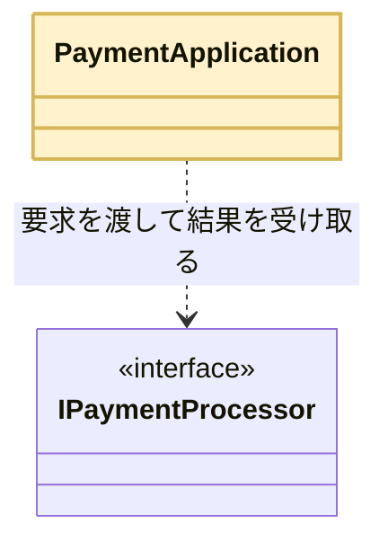
```mermaid
classDiagram
    class PaymentApplication
    class IPaymentProcessor { <<interface>> }
    PaymentApplication ..> IPaymentProcessor : 要求を渡して結果を受け取る
    class PaymentApplication:::focus
    classDef focus fill:#FFF2CC,stroke:#D6B656,stroke-width:2px
```

**基準の図にあった `PaymentApplication *-- PaymentGatewayClient` が、ここで消えます。** ゲートウェイを使うのは方式の側だからです。`ProcessorRegistry`・`OrderBook`・`CustomerDirectory` への保持は基準の図のまま変わりません。


**では、契約の裏には何を置くのか。**

---

##### 具体：契約の裏へ変わる判断を置く

契約と、それを呼ぶ骨格が決まりました。契約の確認では契約の裏を1つ覗いて、渡すもの・返すものを確かめました。**ここで残り全部を埋めます。**

**契約の確認で見た `CreditCardProcessor` の疑問が、ここで解けます。** 「どの具体を作るか」を書かないのは、それが全体経路の準備コードで決まる別の責任だからです。契約の裏に置くのは「この方式でどう検証し、どのAPIを呼び、結果をどう組み立てるか」だけです。

残りの3クラスも同じ形です。ここでは `CreditCardProcessor` と対照的なものを1つ見ます。

**掲載箇所：`ConvenienceStoreProcessor::pay(const PaymentRequest&, int)`** ―― コンビニ払い（抜粋）

```cpp
    PaymentResult pay(const PaymentRequest& request,
                      int amount) override {
        // …店舗コードの検証（省略。詳細は7-1）…
        // …払込票の発行と保留IDの採番（省略）…
        PendingInfo pending = {/* …保留情報（省略）… */};
        return {PaymentStatus::Pending, "払込票を発行しました",
                false, "", pending};
    }
```

**返している状態が違います。** クレジットカードは `Success` を返し、コンビニ払いは `Pending` を返します。**同じ契約で、同期の方式と非同期の方式が並びます。**

**骨格は、この違いを判定しません。** 保留かどうかを見て完了確認を呼ぶのは、その先の利用側です。**守る範囲の「保留から完了確認への2段階」は、方式の中ではなく共通の場所にあります。** リスクID3が「処理モードの増加」を挙げていましたが、非同期の方式が増えても、増えるのは `Pending` を返す実装であって、判定の場所ではありません。

4クラスを並べると、1-2の方式仕様がそのままクラスの一覧になります。

| 方式クラス | 固有の入力検証 | 返す状態 | 3-1での対応箇所 |
|---|---|---|---|
| `CreditCardProcessor` | カード番号・有効期限 | 成功／失敗（再試行可の場合あり） | 1本目の `if` |
| `BankTransferProcessor` | 銀行コード・口座番号 | 成功／失敗 | 2本目の `if` |
| `ConvenienceStoreProcessor` | 店舗コード | 保留（払込票を発行） | 3本目の `if` |
| `PayPayProcessor` | 電話番号 | 保留（変更要求で追加） | 4本目の `if`（変更要求で追加） |

**右端の列が、この章の分離の成果です。** 変更前は1つの `if` 連鎖に4本並んでいたものが、4つのクラスになりました。**変更要求で足したPayPayが、`PayPayProcessor` という1クラスに収まっています。**

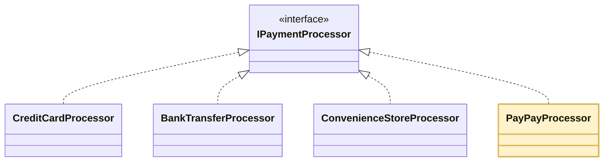
```mermaid
classDiagram
    class IPaymentProcessor { <<interface>> }
    class CreditCardProcessor
    class BankTransferProcessor
    class ConvenienceStoreProcessor
    class PayPayProcessor
    IPaymentProcessor <|.. CreditCardProcessor
    IPaymentProcessor <|.. BankTransferProcessor
    IPaymentProcessor <|.. ConvenienceStoreProcessor
    IPaymentProcessor <|.. PayPayProcessor
    class PayPayProcessor:::focus
    classDef focus fill:#FFF2CC,stroke:#D6B656,stroke-width:2px
```

`if` 連鎖の4分岐が、4つのクラスになりました。**これで課題ID1の完了条件の前半「方式追加が新しい方式実装」を満たします。** 後半の「生成登録に閉じ」は、まだです。**方式を足したとき、`createProcessor()` の中がどうなるかを決めていないからです。**

**もう一度検算します。契約のメソッド以外に書きたくなるものがあるか。** 出てきませんでした。`pay()` 1つで、同期も非同期も表せています。

**守る範囲との照合：** 4つのどれにも触っていません。方式の中身を4クラスへ移しただけで、照合もフローも保存も完了確認も変えていません。

**ここまでで、方式側の設計は終わりです。** 残っているのは、分離の検算で空いた穴——誰が方式の実体を作るか——だけになりました。**そしてここが、この章の中心です。**

---

#### 2. 全体経路をコードで組み立てる

ここからは三つを別々の設計判断として扱いません。具体を作る行から、契約として骨格へ入り、公開入口から実行される行までを一つの経路として追います。

##### 全体経路の準備：実体と所有者をコードで示す

**分離の検算で穴が1つ空きました。** `createProcessor()` です。**この章では、この穴を埋めることが課題ID1の後半そのものです。**

持つ者に必要な条件は、分離の検算で分かっています。

- **具体クラスを全部知っていること。** `new CreditCardProcessor(...)` と書く以上、その名前を知っていなければなりません
- **共通フローを持つ側ではないこと。** 知った時点で契約の確認で分けた意味が消えます

**ここで、他章と違うことが起きます。** 第9章では「引く関数を持つ者」と「共通フローを持つ者」が別のクラスになりました。**この章では、その2つを分けると `PaymentApplication` が生成役を持つことになり、結局は具体クラス名がどこかに要ります。**

**選択肢は2つです。**

- **生成役を別のクラスとして置き、`PaymentApplication` がそれを持つ。** 生成役を差し替えるには、`PaymentApplication` へ渡す実体を替える
- **`createProcessor()` を `PaymentApplication` の差し替え点にし、派生クラスが実装する。** 生成役を差し替えるには、別の派生クラスを作る

**後者を採ります。根拠は、共通フローと生成が1対1で結びついているからです。** この章の `processPayment()` は、生成した実体をその場で使い、その場で捨てます。生成役だけを差し替えたい場面——たとえばテスト用の方式群へ丸ごと替える——は、共通フローごと替えても困りません。**別のクラスへ切り出すと、`PaymentApplication` が生成役を保持する行と、それを外から渡す行が増えます。** この章の完了条件は「生成登録に閉じる」ことなので、**登録する場所が1つあれば足ります。**

**掲載箇所：`PaymentApplication`（クラス宣言・完成）**

```cpp
class PaymentApplication {
protected:
    virtual IPaymentProcessor*
    createProcessor(const string& type) = 0;   // ←分離の検算で残した穴が、ここで差し替え点になる

    PaymentStatusClient statusClient;
    CustomerDirectory customers;   // 事前保持：顧客
    OrderBook orders;              // 事前保持：注文

public:
    virtual ~PaymentApplication() = default;
    PaymentResult processPayment(const PaymentRequest& request);
    int chargedAmount(const string& orderId) const;
    PaymentResult checkCompletion(const string& pendingId);
};
```

**`PaymentApplication` が抽象クラスになりました。** `createProcessor()` が純粋仮想なので、そのままでは実体を作れません。**分離の検算で書いた `processPayment()` は1行も変わっていません。** 穴だったものが、差し替え点として宣言に並んだだけです。

**`ProcessorRegistry` と `PaymentGatewayClient` が、ここから消えています。** どちらも生成のときにだけ要るものだからです。**方式の登録を確認するのも、ゲートウェイを方式へ渡すのも、生成する側の仕事になりました。**

**掲載箇所：`DefaultPaymentApplication`（クラス全体）** ―― 差し替え点を実装する派生

```cpp
class DefaultPaymentApplication
    : public PaymentApplication {
    ProcessorRegistry registry;
    PaymentGatewayClient gatewayClient;
protected:
    IPaymentProcessor*
    createProcessor(const string& type) override {
        // …未登録・無効の方式を断る（省略。詳細は7-1）…
        if (type == PaymentMethod::CreditCard)
            return new CreditCardProcessor(gatewayClient);
        if (type == PaymentMethod::BankTransfer)
            return new BankTransferProcessor(gatewayClient);
        if (type == PaymentMethod::Convenience)
            return new ConvenienceStoreProcessor(gatewayClient);
        if (type == PaymentMethod::PayPay)
            return new PayPayProcessor(gatewayClient);
        throw invalid_argument("未対応の決済種別: " + type);
    }
};
```

**具体クラス名が4つ並んでいます。この章で、それが並ぶのはここだけです。** 変更前は共通フローの中にあった同じ分岐が、生成の1か所へ移りました。分離の検算で「移した先で1か所に収まるかどうかは全体経路の準備コードで確かめる」と書いたのが、これです。

**方式を1つ足すときに触るのは、新しい方式クラス1つと、この関数へ1行と、`ProcessorRegistry` の登録へ1行だけです。** `PaymentApplication` も既存の方式も触りません。**これで課題ID1の完了条件「方式追加が新しい方式実装と生成登録に閉じ、利用フローが変わらない」を満たします。**

**方式IDは名前付き定数（`PaymentMethod`）にしています。** 直接の文字列を分岐に書くと、打ち間違いが実行時まで止まりません。

**所有と生存期間もここで決まります。**

- `createProcessor()` は `new` した実体を返します。**呼んだ側が所有します。** 分離の検算で書いた `delete proc;` がその後始末です
- 呼び出しのたびに作って、そのたびに捨てます。**方式の実体は決済1回ぶんしか生きません**
- `registry` と `gatewayClient` は `DefaultPaymentApplication` の値メンバです。方式の実体はゲートウェイを参照で借りますが、**借りている側（方式）のほうが先に消える**ので、参照が宙に浮くことはありません
- `PaymentApplication` の `statusClient`・`customers`・`orders` も値メンバで、1-4のままです

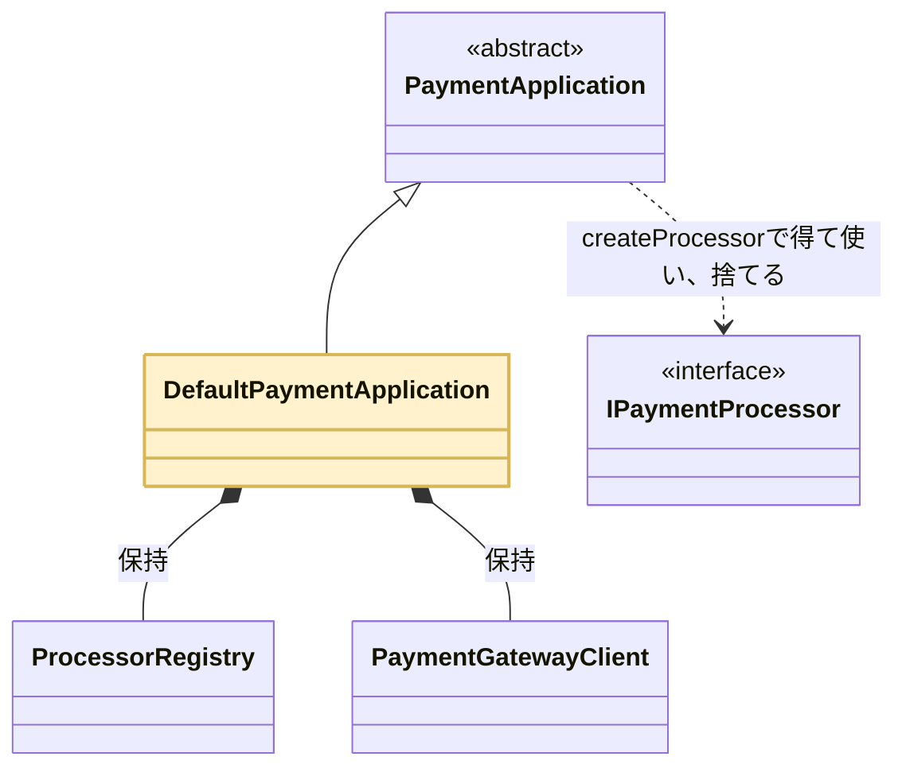
```mermaid
classDiagram
    class PaymentApplication { <<abstract>> }
    class DefaultPaymentApplication
    class IPaymentProcessor { <<interface>> }
    class ProcessorRegistry
    class PaymentGatewayClient
    PaymentApplication <|-- DefaultPaymentApplication
    PaymentApplication ..> IPaymentProcessor : createProcessorで得て使い、捨てる
    DefaultPaymentApplication *-- ProcessorRegistry : 保持
    DefaultPaymentApplication *-- PaymentGatewayClient : 保持
    class DefaultPaymentApplication:::focus
    classDef focus fill:#FFF2CC,stroke:#D6B656,stroke-width:2px
```

**継承の線が現れました。** 骨格を持つ抽象クラスと、生成を持つ派生クラスです。具体の確認で描いた4つの方式クラスはこの図に描いていませんが、変わっていません。


**ここが終わった時点で、実体はすべて存在するようになりました。** 抽象骨格、それを継いだ派生、4つの方式。**まだ起きていないのは1つだけです。骨格の `IPaymentProcessor*` と書かれた変数へ、具体が入ることです。続けて、全体経路で決めた受け渡しをコードで確認します。**

---

##### 全体経路の生成：決済方式を生成して骨格へ返す

**分離の検算で書いた骨格には、`createProcessor(request.methodId)` としか書いてありません。** `CreditCardProcessor` とは書いていません。**ここで見るのは、いつ・何によって、その実装が入るのかです。**

**この章では、2つの実装が2つの違う仕組みで入ります。**

**掲載箇所：`PaymentApplication::processPayment(const PaymentRequest&)`** ―― 分離で確定した骨格から、実装が入る2行

```cpp
        IPaymentProcessor* proc
            = createProcessor(request.methodId);   // ←ここで方式の実装が入る
```

**1つ目は、方式の実装です。** 骨格は `IPaymentProcessor*` としか書いていないのに、実行時には `CreditCardProcessor` が入ります。**決め手は `request.methodId`——利用側が渡した要求に載っている方式IDです。** 同じ `processPayment()` の呼び出しでも、要求がクレジットカードなら `CreditCardProcessor` が、コンビニ払いなら `ConvenienceStoreProcessor` が入ります。**組み立てのときに1回決まるのではありません。**

**2つ目は、`createProcessor()` そのものの実装です。** `PaymentApplication` は宣言しか持っていません。どの実装が動くかは、**`DefaultPaymentApplication` を作った時点で決まります。** コード上に「入れる行」はありません。

**同じ章に2つの形が並びます。** 何が入るかを分けて書きます。

| 何が入るか | 決め手 | 決め手の出どころ | 入る瞬間 |
|---|---|---|---|
| 方式の実装 | `request.methodId` | 利用側が渡した決済要求 | `createProcessor()` が返る行 |
| 生成役の実装 | どの派生型を作ったか | 組み立てで `DefaultPaymentApplication` を選んだこと | 実体を作った時点。行は無い |

**この2つは入れ子になっています。** 外側（生成役）が組み立て時に1回決まり、その内側で方式が呼び出しごとに決まります。**外側を差し替えれば、内側の選び方ごと替わります。** テスト用の派生を作れば、同じ `processPayment()` がテスト用の方式群を使います。

**共通しているのは、骨格が具体の名前を1文字も書いていないことだけです。** 入る仕組みは2つとも違います。


---

##### 実行：公開入口から骨格・契約・具体へつなぐ

組み立てが終わりました。呼び出し側がどう変わったかを、変更前と並べて見ます。

**掲載箇所：`main()`** ―― 3-1の組み立てと決済（対策前）

```cpp
    PaymentApplication app;
    PaymentResult r = app.processPayment(request);
```

**掲載箇所：`main()`** ―― 同じ操作（対策後）

```cpp
    DefaultPaymentApplication app;
    PaymentResult r = app.processPayment(request);
```

**決済を依頼する行は変わりませんでした。** 引数も戻り値も同じです。**変わったのは、組み立てで選ぶ型の名前だけです。**

**これが「利用フローが変わらない」の実態です。** 5-3の完了条件の後半がここで満たされます。**方式を1つ足しても、この2行は1文字も変わりません。**

**組み立ての行は増えていません。** 変更前も変更後も1行です。**この章の対策で `main()` が払ったコストは、型名が `PaymentApplication` から `DefaultPaymentApplication` へ変わったことだけです。**

**全体経路で先に決めた呼び方を、ここで実コードと突き合わせます。** 章によって公開入口が変わる場合と変わらない場合がありますが、重要なのは先に決めた経路と各コードの接続が一致することです。

**守る範囲との照合：** **共通の依頼→結果フロー**と**保留から完了確認への2段階**を保っていることを、いま確認しました。保留が返ったら共通の `checkCompletion()` を呼ぶ形も、3-1のままです。分離と組み立てを通して、守る範囲の4つはいずれも定義に反していません。最終確認はフェーズ7の受入・回帰エビデンスで行いますが、**そこで初めて確かめるのではなく、全体経路と詳細コードで照合済みです。**


#### システム全体の最終構造を決める

分離と組み立ての部分図を重ねると、システム全体の最終構造になります。`PaymentApplication` が共通フローと差し替え点を持ち、`DefaultPaymentApplication` が生成を持ち、4つの方式クラスが `IPaymentProcessor` を実装します。

**この章の完成構造は一つに定まります。** 生成役を別のクラスとして切り出し、`PaymentApplication` がそれを保持する案も置けますが、全体経路の準備コードで確かめたとおり、この章では共通フローと生成が1対1で結びついているため、保持の行と外から渡す行が増えるだけです。責任配置が異なる完成構造が複数残ったわけではないので、当て馬を並べた比較は行いません。

全体経路を実現するコードで確定した部分がすべて入っているかを、次の図で照合します。

**採用した変更後のクラス図：**


```mermaid
classDiagram
    class DefaultPaymentApplication
    class PaymentGatewayClient
    class PaymentStatusClient
    class ProcessorRegistry
    class PaymentLog
    class CustomerDirectory
    class OrderBook
    class PaymentApplication {
        <<abstract>>
    }
    class IPaymentProcessor { <<interface>> }
    class CreditCardProcessor
    class BankTransferProcessor
    class ConvenienceStoreProcessor
    class PayPayProcessor

    PaymentApplication ..> IPaymentProcessor : createProcessor
    IPaymentProcessor <|.. CreditCardProcessor
    IPaymentProcessor <|.. BankTransferProcessor
    IPaymentProcessor <|.. ConvenienceStoreProcessor
    IPaymentProcessor <|.. PayPayProcessor
    DefaultPaymentApplication --> ProcessorRegistry : 存在・有効確認
    PaymentApplication --> PaymentStatusClient : 完了確認
    DefaultPaymentApplication --|> PaymentApplication
    CreditCardProcessor --> PaymentGatewayClient : 認証API
    PaymentApplication --> CustomerDirectory : 顧客照合
    PaymentApplication --> OrderBook : 注文照合
    note for PaymentLog "組み立て側（main()のexecuteCase）が記録する。<br/>PaymentApplicationは記録しない"

    note for IPaymentProcessor "【課題ID1・新設】pay(request)の共通契約"
    note for PaymentApplication "【課題ID1・残した】決済フロー<br/>createProcessorで生成を委ねる"
    note for PayPayProcessor "【課題ID1・新設した追加手段】"

    classDef focus fill:#FFF2CC,stroke:#D6B656,stroke-width:2px,color:#222222
    cssClass "IPaymentProcessor,CreditCardProcessor,BankTransferProcessor,ConvenienceStoreProcessor,PayPayProcessor,PaymentApplication" focus
```

このクラス図が、課題ID1を反映したシステム全体の設計結論です。課題IDは図の差分を追うために使い、以降はこの構造に必要なコードだけを示します。

### 6-1：決めた流れとコードの照合

#### 流れを成立させる二つの確認

契約と具体による分離と、生成から実行までの組み立てを二行で確認します。

| 判断 | 変更前の所属 → 変更後の所属 | 設計結論 | 検算 |
|---|---|---|---|
| 契約と具体による分離 | `processPayment()` の方式分岐 → `IPaymentProcessor` と4つの方式具体 | 金額・依頼・結果を契約にし、検証・処理モード・完了情報を具体へ閉じる | 共通フローは方式固有の条件を持たない |
| 実体の組み立て | 統括が具体名を4つ抱える → `DefaultPaymentApplication::createProcessor()` | 方式IDから具体を生成して契約として返し、共通フローが `pay()` を実行して結果を処理する | 生成した方式が同じ呼出中に必ず使われ破棄される |

決済依頼の呼び方は変わりません。共通フローの内側で、方式IDに応じた具体を生成して契約として実行します。

### 6-2：システム全体の契約とデータ配置を確定する

採用システムの契約、生成場所、依存注入を一表で確定します。`PaymentResult` は対策の抽象ではなく、成否・保留・リトライ可否・保留IDを利用フローへ返す結果オブジェクトです。

```cpp
struct PaymentResult {
    string status;      // 成功・保留・失敗
    string message;     // 理由や保留ID
    bool canRetry;      // リトライ可否
    string errorCode;   // エラー分類（成功時は空）
    PendingInfo pending; // 保留時の追加情報（番号・期限など）
};
```

| 接続点を変える観点 | システム全体での設計判断                                                             | 変えたくない側が知らなくなる詳細 |
| --------- | ------------------------------------------------------------------------ | ---------------- |
| 分離方法      | 課題ID1の手段固有検証・処理モード・エラー対処を各Processorへ置く                                      | 手段ごとの入力・API手順    |
| 配置場所      | `createProcessor(type)` が具体Processorを選び生成する                              | 具体クラス名           |
| 組み立て方法    | 外側が共通依存を生成・所有してApplicationへ注入し、生成時に `PaymentGatewayClient` をProcessorへ渡す | 外部APIの実体と生存期間    |
| 安定側の実行    | 利用フローは `pay(request)` だけを呼ぶ                                              | 何を生成したか          |

新しい手段は Processor 実装と `createProcessor` の1行、`ProcessorRegistry` の登録に限られます。

### 6-3：課題から完成構造までの設計トレース

ここまでの決定を一望へまとめます。この表は設計課題だけを追います。変更要求の受入はフェーズ7の要求ID表、変更影響は7-4の変更ID表で別に確認します。

| 課題ID | 採用構造と生成・接続場所 | 完成コードの主な場所 | 確認 |
|---|---|---|---|
| 課題ID1（決済手段） | 生成分離。`createProcessor()`が具体Processorを選んで生成し、`processPayment`は`pay()`を委譲するだけ | `IPaymentProcessor`、各Processor、`createProcessor()`、`ProcessorRegistry` | `processPayment()`が具体型・固有入力・同期非同期を知らない |
| 変更対象外 | 顧客・注文の照合、結果保存、依頼→結果フロー | `PaymentApplication`、結果保存境界 | 1-4、決済結果の保存・更新 |

このクラス図、コード適用結果、シーケンス、コード変更表が、フェーズ7へ渡す完成設計です。

### 6-4：将来リスクに対する設計上の確認

ここでは将来決済方式の実装有無ではなく、フェーズ2のリスクIDを採用構造へ再適用し、共通決済入口をどこまで守れ、入力・非同期処理に何が残るかを評価します。

| リスクID・将来リスク | 現在の構造による備え | リスク発生時の変更先 | 守れる範囲・残る弱点 |
|---|---|---|---|
| リスクID1：決済手段の種類がさらに増加する | IPaymentProcessor実装を生成・登録し、利用フローはpay()だけを呼ぶ | 新Processor、生成関数、ProcessorRegistry | PaymentApplicationの共通入口を守り、追加を新Processorと生成登録へ限定できる。生成分岐は方式追加ごとに変わる |
| リスクID2：手段固有の入力データと検証ロジック | 手段固有データはPaymentRequest内の専用構造、検証は対象Processorへ置く | 入力構造、PaymentRequest、対象Processor | 他Processorを守り、検証を対象方式へ閉じられる。共通Requestへ専用構造が増え続ける点は残る弱点である |
| リスクID3：同期/非同期の処理モードの増加 | PaymentResultで成功・失敗・保留を共通化し、具体手順をProcessorへ閉じる | 対象Processor、必要な状態境界 | 呼び出し側の結果分岐を共通化できる。非同期完了の保存・再開は現在の1回のpay()だけでは完結しない |
| リスクID4：完了確認の手順の増加 | 保留IDを共通結果で返し、完了確認をPaymentStatusClient境界へ分ける | PaymentStatusClient、対象Processorまたは完了確認窓口 | pay()入口を守り、照会を境界へ閉じられる。方式横断のポーリング間隔・期限・再試行規則は未分離である |

リスクID1〜リスクID4により、生成判断だけではなく、手段固有の入力・実行・結果変換までを同じ境界の向こうへ置く必要があることを確認します。

## 🟢 フェーズ7：対策実施 ―― 変化に強いコードを完成させる
生成するオブジェクトの種類（決済手段）を、利用側から隠蔽するメソッドに集約し、利用側がインターフェースを通じてインスタンスを得る構造——これを本書では **生成分離構造** と呼びます。

### 7-1：解決後のコード（全体）

フェーズ6で確定した課題ID1を満たす生成分離構造を、実行可能な完全なコードとして組み上げます。

#### 完成後のクラス一覧

完成コードで定義する型を先に一覧化します。各型の依存方向と実現関係は、直後のクラス図で確認します。

- `DefaultPaymentApplication`、`PaymentGatewayClient`、`PaymentStatusClient`、`ProcessorRegistry`
- `PaymentLog`、`CustomerDirectory`、`OrderBook`、`PaymentApplication`
- `IPaymentProcessor`、`CreditCardProcessor`、`BankTransferProcessor`、`ConvenienceStoreProcessor`
- `PayPayProcessor`

#### 完成後のクラス図

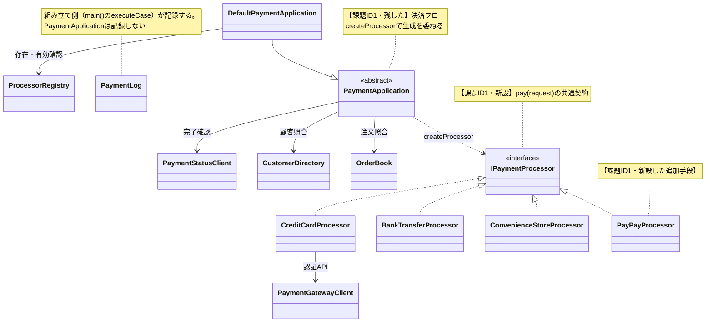
```mermaid
classDiagram
    class DefaultPaymentApplication
    class PaymentGatewayClient
    class PaymentStatusClient
    class ProcessorRegistry
    class PaymentLog
    class CustomerDirectory
    class OrderBook
    class PaymentApplication {
        <<abstract>>
    }
    class IPaymentProcessor { <<interface>> }
    class CreditCardProcessor
    class BankTransferProcessor
    class ConvenienceStoreProcessor
    class PayPayProcessor

    PaymentApplication ..> IPaymentProcessor : createProcessor
    IPaymentProcessor <|.. CreditCardProcessor
    IPaymentProcessor <|.. BankTransferProcessor
    IPaymentProcessor <|.. ConvenienceStoreProcessor
    IPaymentProcessor <|.. PayPayProcessor
    DefaultPaymentApplication --> ProcessorRegistry : 存在・有効確認
    PaymentApplication --> PaymentStatusClient : 完了確認
    DefaultPaymentApplication --|> PaymentApplication
    CreditCardProcessor --> PaymentGatewayClient : 認証API
    PaymentApplication --> CustomerDirectory : 顧客照合
    PaymentApplication --> OrderBook : 注文照合
    note for PaymentLog "組み立て側（main()のexecuteCase）が記録する。<br/>PaymentApplicationは記録しない"

    note for IPaymentProcessor "【課題ID1・新設】pay(request)の共通契約"
    note for PaymentApplication "【課題ID1・残した】決済フロー<br/>createProcessorで生成を委ねる"
    note for PayPayProcessor "【課題ID1・新設した追加手段】"

    classDef focus fill:#FFF2CC,stroke:#D6B656,stroke-width:2px,color:#222222
    cssClass "IPaymentProcessor,CreditCardProcessor,BankTransferProcessor,ConvenienceStoreProcessor,PayPayProcessor,PaymentApplication" focus
```

この完成図では、`PaymentApplication`が共通フローと生成入口を持ち、`createProcessor`が方式に応じた実体を作り、`IPaymentProcessor`と各実装が決済処理の共通契約と具体処理を担います。

#### 完成後の実行シーケンス

フェーズ6で確定した生成分離構造の実行時のオブジェクト間のやり取りを可視化します。

> **図の読み方：** `createProcessor` はシーケンス図では独立した参加者として描かれていますが、実際には `PaymentApplication`（またはそのサブクラス）のメソッドです。

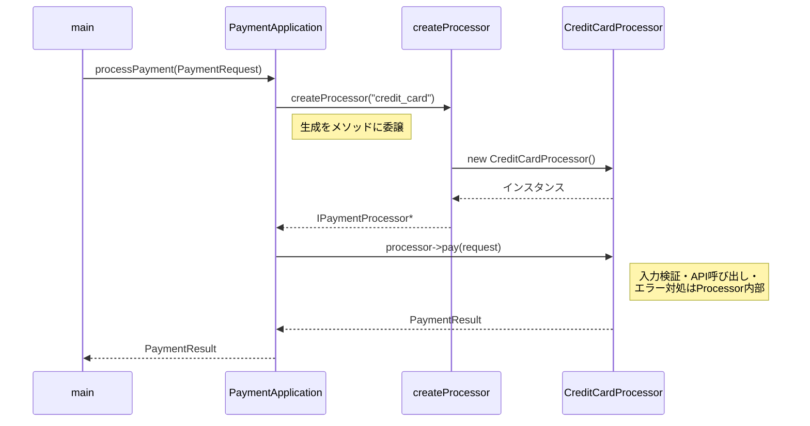
```mermaid
sequenceDiagram
    participant main
    participant PA as PaymentApplication
    participant CP as createProcessor
    participant CC as CreditCardProcessor

    main->>PA: processPayment(PaymentRequest)
    PA->>CP: createProcessor("credit_card")
    Note right of PA: 生成をメソッドに委譲
    CP->>CC: new CreditCardProcessor()
    CC-->>CP: インスタンス
    CP-->>PA: IPaymentProcessor*
    PA->>CC: processor->pay(request)
    Note right of CC: 入力検証・API呼び出し・<br>エラー対処はProcessor内部
    CC-->>PA: PaymentResult
    PA-->>main: PaymentResult
```

#### 完成コード

クラスを1つずつ、上から順に読みます。**メンバー変数と、それを使う処理を同じ場所で見られるように**しています。1-4と同じ顔ぶれが並ぶので、どこが変わったかを見比べてください。

`main()` と実行結果は最後に、ケースごとに並べます。上から順に連結すれば、そのまま1つのC++14プログラムとして動きます。

---

**共通ヘッダーと手段固有の入力データ**

決済手段ID・決済状態を名前で扱う `PaymentMethod`／`PaymentStatus` と、手段固有の入力を置きます。どのクラスにも属さない宣言で、以降のすべてのクラスが使います。

```cpp
#include <iostream>
#include <map>
#include <stdexcept>
#include <string>
#include <vector>

using namespace std;

// 決済手段ID・決済状態（直文字列を名前へ置き換える）
namespace PaymentMethod {
    const string CreditCard   = "credit_card";
    const string BankTransfer = "bank_transfer";
    const string Convenience  = "convenience";
    const string PayPay       = "paypay";
}
namespace PaymentStatus {
    const string Pending = "保留";
    const string Failed  = "失敗";
}

// ---- 手段固有の入力データ ----

struct CreditCardInput {
    string cardToken;
    string holderName;
    string securityCode;
};

struct BankTransferInput {
    string payerName;
    string bankCode;
    string accountType;
};

struct ConvenienceInput {
    string phoneNumber;
    string email;
    string storeCode;
};
```

---

**PayPayInput と PendingInfo と PaymentRequest**

```cpp
struct PayPayInput {
    string accessToken;
};

// ---- 保留決済の追跡情報 ----

struct PendingInfo {
    string pendingId;
};

// ---- 決済要求・結果 ----

struct PaymentRequest {
    string methodId;
    string orderId;
    CreditCardInput creditCard;
    BankTransferInput bankTransfer;
    ConvenienceInput convenience;
    PayPayInput payPay;
};
```

`PaymentRequest` が手段固有の入力を4つとも持つ形は3-1と同じです。**変わったのは、この要求を受け取る側です。**

---

**PaymentResult と IPaymentProcessor**

```cpp
struct PaymentResult {
    string status;
    string message;
    bool canRetry;
    string errorCode;
    PendingInfo pending;
};

// ---- 共通インターフェース ----

class IPaymentProcessor {
public:
    virtual ~IPaymentProcessor() {}
    virtual PaymentResult pay(
        const PaymentRequest& request, int amount) = 0;
};
```

`IPaymentProcessor` は「決済要求を受け取り、決済結果を返す」という約束を定義します。**3-1では4つのProcessorの `pay()` がたまたまシグネチャ一致していただけでしたが、ここで初めて契約になりました。**

---

**ProcessorConfig と ProcessorRegistry**

```cpp
struct ProcessorConfig {
    string name;
    bool isActive;
};

class ProcessorRegistry {
private:
    map<string, ProcessorConfig> registry;
public:
    ProcessorRegistry() {
        registry[PaymentMethod::CreditCard] =
            {"クレジットカード", true};
        registry[PaymentMethod::BankTransfer] =
            {"銀行振込", true};
        registry[PaymentMethod::Convenience] =
            {"コンビニ払い", true};
        registry[PaymentMethod::PayPay] =
            {"PayPay", true};
        registry["crypto"] =
            {"暗号通貨", false};
    }

    bool exists(const string& method) const {
        return registry.count(method) > 0;
    }

    bool isActive(const string& method) const {
        return registry.at(method).isActive;
    }

    ProcessorConfig get(
        const string& method) const {
        return registry.at(method);
    }
};
```

---

**CustomerRecord と CustomerDirectory**

決済要求が参照する顧客と注文を、システムが事前に保持します。`ProcessorRegistry` と同じデータ層で、要求に載る `orderId` から請求金額と注文者を引く土台です（第1章 `CustomerDatabase`、第9章 `UserDatabase` と同じ「登録済みデータへ照合する」形）。

```cpp
// 事前保持：顧客（customerId → 氏名）
struct CustomerRecord { string name; };

class CustomerDirectory {
    map<string, CustomerRecord> records;
public:
    CustomerDirectory() {
        records["C001"] = {"田中 一郎"};
        records["C002"] = {"佐藤 花子"};
        records["C003"] = {"鈴木 次郎"};
        records["C004"] = {"高橋 三郎"};
        records["C005"] = {"伊藤 四郎"};
        records["C006"] = {"渡辺 五郎"};
        records["C007"] = {"山本 六郎"};
        records["C008"] = {"中村 七郎"};
        records["C020"] = {"小林 八郎"};
    }
    bool exists(const string& id) const { return records.count(id) > 0; }
    CustomerRecord get(const string& id) const { return records.at(id); }
};

// 事前保持：注文（orderId → 顧客ID・請求金額）
struct OrderRecord { string customerId; int amount; };
```

---

**OrderBook**

```cpp
class OrderBook {
    map<string, OrderRecord> records;
public:
    OrderBook() {
        records["ORD-1001"] = {"C001", 1000};
        records["ORD-1002"] = {"C002", 2000};
        records["ORD-1003"] = {"C003", 500};
        records["ORD-1004"] = {"C004", 800};
        records["ORD-1005"] = {"C005", 600};
        records["ORD-1006"] = {"C006", 300};
        records["ORD-1007"] = {"C007", 200};
        records["ORD-1008"] = {"C008", 1200};
        records["ORD-2001"] = {"C020", 3000};
        // 注文者が顧客台帳にいない注文（拒否の確認用）
        records["ORD-1010"] = {"C999", 900};
    }
    bool exists(const string& id) const { return records.count(id) > 0; }
    OrderRecord get(const string& id) const { return records.at(id); }
};
```

`orderId` は、この保持データに存在するもの以外を受け付けません。請求金額と注文者はここから引くので、利用側は渡しません。引いた注文者が顧客台帳にいない場合、氏名が空の場合も決済へ進みません。

---

**PaymentRecord と PaymentLog**

```cpp
struct PaymentRecord {
    string method;
    int amount;
    string status;
    string errorCode;
};

class PaymentLog {
    vector<PaymentRecord> records;
public:
    void add(const string& method,
             int amount,
             const string& status,
             const string& errorCode = "") {
        records.push_back(
            {method, amount, status, errorCode});
    }
    void printAll() const {
        for (const auto& r : records) {
            cout << "[" << r.method << "] "
                 << r.amount << "円 -> "
                 << r.status;
            if (!r.errorCode.empty()) {
                cout << " (" << r.errorCode << ")";
            }
            cout << endl;
        }
    }
};
```

---

**PaymentGatewayClient**

外部決済APIの境界スタブです。

```cpp
class PaymentGatewayClient {
    map<string, int> cardAttempts;  // 注文ごとのカード認証試行回数
public:
    PaymentResult authorizeCreditCard(
        const string& orderId,
        int amount,
        const CreditCardInput& card) {
        cout << "[PaymentGateway] カード認証"
             << " order=" << orderId
             << " amount=" << amount
             << " token=" << card.cardToken
             << endl;
        int attempt = ++cardAttempts[orderId];
        // ERROR始まりは残高不足。再試行しても変わらない（canRetry=false）
        if (card.cardToken.find("ERROR") == 0) {
            return {PaymentStatus::Failed,
                    "カード認証失敗: 残高不足",
                    false, "AUTH_DECLINED", {}};
        }
        // TIMEOUT始まりは一時的な通信失敗。1回目だけ失敗し再試行で成功する
        if (card.cardToken.find("TIMEOUT") == 0 && attempt == 1) {
            return {PaymentStatus::Failed,
                    "カード認証失敗: 通信タイムアウト",
                    true, "NETWORK_TIMEOUT", {}};
        }
        return {"成功",
                "クレジット認証済み id=AUTH001",
                false, "", {}};
    }

    PaymentResult issueBankTransfer(
        const string& orderId,
        int amount,
        const BankTransferInput& bank) {
        cout << "[PaymentGateway] 振込先発行"
             << " order=" << orderId
             << " amount=" << amount
             << " payer=" << bank.payerName
             << " type=" << bank.accountType
             << endl;
        PendingInfo p{"BT-" + orderId};
        return {PaymentStatus::Pending,
                "振込先発行済み 口座=mizuho-1234567",
                false, "", p};
    }

    PaymentResult issueConvenienceCode(
        const string& orderId,
        int amount,
        const ConvenienceInput& cvs) {
        cout << "[PaymentGateway] コンビニ番号発行"
             << " order=" << orderId
             << " amount=" << amount
             << " phone=" << cvs.phoneNumber
             << " store=" << cvs.storeCode
             << endl;
        PendingInfo p{"CVS-" + orderId};
        return {PaymentStatus::Pending,
                "番号発行済み 番号=CVS-98765",
                false, "", p};
    }

    PaymentResult chargePayPay(
        const string& orderId,
        int amount,
        const PayPayInput& pp) {
        cout << "[PaymentGateway] PayPay決済"
             << " order=" << orderId
             << " amount=" << amount
             << " token=" << pp.accessToken
             << endl;
        PendingInfo p{"PP-" + orderId};
        return {PaymentStatus::Pending,
                "PayPayセッション作成済み",
                false, "", p};
    }
};
```

---

**PaymentStatusClient**

```cpp
class PaymentStatusClient {
public:
    PaymentResult checkStatus(
        const string& pendingId) {
        cout << "[状態確認API] id="
             << pendingId << endl;
        if (pendingId.find("EXPIRE")
            != string::npos) {
            return {PaymentStatus::Failed,
                    "支払い期限切れ",
                    false, "EXPIRED", {}};
        }
        if (pendingId.find("BT-") == 0) {
            return {"成功",
                    "入金確認済み",
                    false, "", {}};
        }
        if (pendingId.find("CVS-") == 0) {
            return {"成功",
                    "コンビニ入金確認済み",
                    false, "", {}};
        }
        if (pendingId.find("PP-") == 0) {
            return {"成功",
                    "PayPay決済確認済み",
                    false, "", {}};
        }
        return {PaymentStatus::Failed,
                "不明な保留ID",
                false, "UNKNOWN_PENDING", {}};
    }
};
```

---

**CreditCardProcessor と BankTransferProcessor**

各Processorは `IPaymentProcessor` を実装し、自分の手段固有の入力検証、API呼び出し、エラー対処をすべて `pay()` 内に閉じ込めます。

```cpp
class CreditCardProcessor
    : public IPaymentProcessor {
    PaymentGatewayClient& gateway;
public:
    CreditCardProcessor(
        PaymentGatewayClient& gw)
        : gateway(gw) {}

    PaymentResult pay(
        const PaymentRequest& req, int amount) override {
        if (req.creditCard.cardToken.empty()) {
            return {PaymentStatus::Failed,
                    "カードトークンが不足しています",
                    false, "MISSING_TOKEN", {}};
        }
        if (req.creditCard.holderName.empty()) {
            return {PaymentStatus::Failed,
                    "カード名義が不足しています",
                    false, "MISSING_HOLDER", {}};
        }
        if (req.creditCard.securityCode.empty()) {
            return {PaymentStatus::Failed,
                    "セキュリティコードが不足",
                    false, "MISSING_CVV", {}};
        }
        // canRetry はゲートウェイの結果に含まれる（失敗の種類で決まる）
        return gateway.authorizeCreditCard(
            req.orderId, amount,
            req.creditCard);
    }
};

class BankTransferProcessor
    : public IPaymentProcessor {
    PaymentGatewayClient& gateway;
public:
    BankTransferProcessor(
        PaymentGatewayClient& gw)
        : gateway(gw) {}

    PaymentResult pay(
        const PaymentRequest& req, int amount) override {
        if (req.bankTransfer.payerName.empty()) {
            return {PaymentStatus::Failed,
                    "振込名義が不足しています",
                    false, "MISSING_PAYER", {}};
        }
        if (req.bankTransfer.bankCode.empty()) {
            return {PaymentStatus::Failed,
                    "銀行コードが不足しています",
                    false, "MISSING_BANK", {}};
        }
        if (req.bankTransfer.accountType.empty()) {
            return {PaymentStatus::Failed,
                    "口座種別が不足しています",
                    false, "MISSING_ACCOUNT_TYPE", {}};
        }
        return gateway.issueBankTransfer(
            req.orderId, amount,
            req.bankTransfer);
    }
};
```

---

**ConvenienceStoreProcessor と PayPayProcessor**

```cpp
class ConvenienceStoreProcessor
    : public IPaymentProcessor {
    PaymentGatewayClient& gateway;
public:
    ConvenienceStoreProcessor(
        PaymentGatewayClient& gw)
        : gateway(gw) {}

    PaymentResult pay(
        const PaymentRequest& req, int amount) override {
        if (req.convenience.phoneNumber.empty()) {
            return {PaymentStatus::Failed,
                    "電話番号が不足しています",
                    false, "MISSING_PHONE", {}};
        }
        if (req.convenience.email.empty()) {
            return {PaymentStatus::Failed,
                    "メールアドレスが不足しています",
                    false, "MISSING_EMAIL", {}};
        }
        if (req.convenience.storeCode.empty()) {
            return {PaymentStatus::Failed,
                    "店舗コードが不足しています",
                    false, "MISSING_STORE", {}};
        }
        return gateway.issueConvenienceCode(
            req.orderId, amount,
            req.convenience);
    }
};

class PayPayProcessor
    : public IPaymentProcessor {
    PaymentGatewayClient& gateway;
public:
    PayPayProcessor(
        PaymentGatewayClient& gw)
        : gateway(gw) {}

    PaymentResult pay(
        const PaymentRequest& req, int amount) override {
        if (req.payPay.accessToken.empty()) {
            return {PaymentStatus::Failed,
                    "PayPayトークンが不足しています",
                    false, "MISSING_PP_TOKEN", {}};
        }
        return gateway.chargePayPay(
            req.orderId, amount,
            req.payPay);
    }
};
```

各Processorが自分の入力検証を行い、自分のAPI境界を呼び、自分のエラー対処（カードの`canRetry`設定など）を完結しています。利用側は手段固有の入力検証やAPI手順を知りません。ただし、共通結果契約に含めた`Pending`と`canRetry`は利用側も扱います。

---

**PaymentApplication（生成分離構造を持つCreator）**

```cpp
class PaymentApplication {
protected:
    virtual IPaymentProcessor*
    createProcessor(const string& type) = 0;

    PaymentStatusClient statusClient;
    CustomerDirectory customers;   // 事前保持：顧客
    OrderBook orders;              // 事前保持：注文

public:
    virtual ~PaymentApplication() = default;

    PaymentResult processPayment(
        const PaymentRequest& request) {
        // 注文台帳から請求金額と注文者を引く（利用側は渡さない）
        if (!orders.exists(request.orderId)) {
            return {PaymentStatus::Failed,
                    "未登録の注文です: " + request.orderId,
                    false, "UNKNOWN_ORDER", {}};
        }
        OrderRecord ord = orders.get(request.orderId);
        // 注文者が顧客台帳に実在し、氏名を持つかを確認する
        if (!customers.exists(ord.customerId)) {
            return {PaymentStatus::Failed,
                    "未登録の顧客です: " + ord.customerId,
                    false, "UNKNOWN_CUSTOMER", {}};
        }
        CustomerRecord customer = customers.get(ord.customerId);
        if (customer.name.empty()) {
            return {PaymentStatus::Failed,
                    "顧客名が登録されていません",
                    false, "INVALID_CUSTOMER", {}};
        }
        IPaymentProcessor* proc
            = createProcessor(request.methodId);
        PaymentResult result
            = proc->pay(request, ord.amount);
        delete proc;
        return result;
    }

    // 台帳の請求金額を返す（記録・表示に使う）
    int chargedAmount(const string& orderId) const {
        return orders.exists(orderId)
            ? orders.get(orderId).amount : 0;
    }

    // 保留決済の完了確認（汎用）
    PaymentResult checkCompletion(
        const string& pendingId) {
        return statusClient.checkStatus(pendingId);
    }
};
```
> [!NOTE]
> **外部境界の表示について：** 完成コードでは決済APIのログ接頭辞を `[決済API]` から `[PaymentGateway]` へ、カード認証と振込の表示から `holder=`・`bank=` を外しています。境界クラス名と表示をそろえ、掲載幅に収めるための整理で、送信する値そのものは変えていません。
>
> **どこを簡素化しているか：** ここで簡素化しているのは「所有権の管理」だけです。`createProcessor()` が返す生ポインタを `IPaymentProcessor* proc` で受け、`delete proc` で手動破棄しています。この `new`／`delete` の手書きが簡素化した部分で、他言語（Java・C#など、GCがある言語）と読み比べやすくするため、また所有権の記法でコードが長くならないようにするための選択です。本書は全章でこの生ポインタ方式に統一し、所有権の議論より構造の変化（生成の分離）に集中します。
> **どうなると簡素化ではなくなるか：** 生成したProcessorが「この関数の中で作って、その場で捨てる」範囲を超えると、生ポインタ＋手動 `delete` では管理しきれなくなります。たとえば、Processorを生成後に別のオブジェクトへ渡して保持させる、複数の呼び出しで使い回す、例外が途中で投げられて `delete` に到達しない、といった場合です。そのときは所有権を型で表す `std::unique_ptr`（単独所有）や `std::shared_ptr`（共有所有）へ置き換える必要があり、それはもう簡素化ではなく実務上必須の設計判断になります。この章の論点（生成と利用の分離）はどちらの書き方でも変わらないため、ここでは生ポインタのままにしています。

```cpp
class DefaultPaymentApplication
    : public PaymentApplication {
    ProcessorRegistry registry;
    PaymentGatewayClient gatewayClient;
protected:
    IPaymentProcessor*
    createProcessor(const string& type) override {
        if (!registry.exists(type)) {
            throw invalid_argument(
                "未登録の決済方法です: " + type);
        }
        if (!registry.isActive(type)) {
            ProcessorConfig cfg
                = registry.get(type);
            throw invalid_argument(
                cfg.name + " は現在無効です。");
        }
        if (type == PaymentMethod::CreditCard)
            return new CreditCardProcessor(
                gatewayClient);
        if (type == PaymentMethod::BankTransfer)
            return new BankTransferProcessor(
                gatewayClient);
        if (type == PaymentMethod::Convenience)
            return new ConvenienceStoreProcessor(
                gatewayClient);
        if (type == PaymentMethod::PayPay)
            return new PayPayProcessor(
                gatewayClient);
        throw invalid_argument(
            "未対応の決済種別: " + type);
    }
};
```

`processPayment`は`IPaymentProcessor*`を取得して`pay(request)`を呼ぶだけです。生成の分岐で使う決済手段IDと、結果のステータス（`保留`／`失敗`）は、それぞれ`PaymentMethod`・`PaymentStatus`の名前付き定数へまとめています。手段固有の入力検証、API呼び出し手順、保留IDの作り方は各Processorの内部で完結します。一方、利用側の`executeCase`は共通契約として`Pending`を判定し、共通の`checkCompletion()`を呼びます。つまり利用側が知らないのは「どの手段がどのAPI・完了手順を使うか」であり、非同期状態そのものを知らないわけではありません。

---

#### `main()` と実行結果

各部品を組み立て、代表シナリオをケースごとに実行します。まず各ケース共通の「実行・再試行・保留時の完了確認・ログ記録」を補助関数にまとめます。

```cpp
// 各ケース共通：実行し、再試行可能なら再試行し、保留なら完了確認する
static void executeCase(PaymentApplication& app,
                        PaymentLog& payLog,
                        const PaymentRequest& req) {
    try {
        PaymentResult result = app.processPayment(req);
        // 失敗かつ再試行可能（canRetry）なら1回だけ再試行する
        if (result.status == PaymentStatus::Failed
            && result.canRetry) {
            cout << "結果: " << req.methodId << " -> "
                 << result.status << " (" << result.message
                 << ") [canRetry=true]" << endl;
            cout << "  再試行可能なため再試行します..." << endl;
            result = app.processPayment(req);
        }
        cout << "結果: " << req.methodId << " -> "
             << result.status << " (" << result.message
             << ")" << endl;
        if (result.status == PaymentStatus::Pending) {
            cout << "  完了確認中... id="
                 << result.pending.pendingId << endl;
            PaymentResult completion
                = app.checkCompletion(result.pending.pendingId);
            cout << "  完了結果: " << completion.status
                 << " (" << completion.message << ")" << endl;
            payLog.add(req.methodId, app.chargedAmount(req.orderId),
                       completion.status, completion.errorCode);
        } else {
            payLog.add(req.methodId, app.chargedAmount(req.orderId),
                       result.status, result.errorCode);
        }
    } catch (const invalid_argument& e) {
        // 例外経路でも、1-4と同じエラーコードをログへ残す
        string reason = e.what();
        string code = reason.find("未登録") != string::npos
                      ? "UNKNOWN_METHOD" : "DISABLED";
        cout << "結果: " << req.methodId << " -> 失敗 ("
             << reason << ")" << endl;
        payLog.add(req.methodId, app.chargedAmount(req.orderId),
                   PaymentStatus::Failed, code);
    }
}
```

`main()` は各部品を組み立て、ケースを1件ずつ `executeCase` へ渡します。

```cpp
int main() {
    DefaultPaymentApplication app;
    PaymentLog payLog;
```

`main()` の続きです。ケース1は、同期決済（カード）の正常ケースです。

```cpp
    // ケース1: カード正常（同期）
    PaymentRequest r1;
    r1.methodId = PaymentMethod::CreditCard;
    r1.orderId = "ORD-1001";
    r1.creditCard = {"tok_abc", "YAMADA", "123"};
    executeCase(app, payLog, r1);
```

ケース1の実行結果：

```
[PaymentGateway] カード認証 order=ORD-1001 amount=1000 token=tok_abc
結果: credit_card -> 成功 (クレジット認証済み id=AUTH001)
```

---

**ケース2：非同期決済（銀行振込）の保留→完了確認**

同じ `main()` の中の続きです。

```cpp
    // ケース2: 銀行振込正常（非同期）
    PaymentRequest r2;
    r2.methodId = PaymentMethod::BankTransfer;
    r2.orderId = "ORD-1002";
    r2.bankTransfer = {"山田太郎", "0001", "ordinary"};
    executeCase(app, payLog, r2);
```

ケース2の実行結果：

```
[PaymentGateway] 振込先発行 order=ORD-1002 amount=2000 payer=山田太郎 type=ordinary
結果: bank_transfer -> 保留 (振込先発行済み 口座=mizuho-1234567)
  完了確認中... id=BT-ORD-1002
[状態確認API] id=BT-ORD-1002
  完了結果: 成功 (入金確認済み)
```

続けて `main()` の中で、ケース3は非同期決済（コンビニ）の保留→完了確認です。

```cpp
    // ケース3: コンビニ正常（非同期）
    PaymentRequest r3;
    r3.methodId = PaymentMethod::Convenience;
    r3.orderId = "ORD-1003";
    r3.convenience = {"09012345678", "y@example.com", "seven"};
    executeCase(app, payLog, r3);
```

ケース3の実行結果：

```
[PaymentGateway] コンビニ番号発行 order=ORD-1003 amount=500 phone=09012345678 store=seven
結果: convenience -> 保留 (番号発行済み 番号=CVS-98765)
  完了確認中... id=CVS-ORD-1003
[状態確認API] id=CVS-ORD-1003
  完了結果: 成功 (コンビニ入金確認済み)
```

---

**ケース4：PayPay（非同期）の保留→完了確認**

同じ `main()` の中の続きです。

```cpp
    // ケース4: PayPay正常（非同期）
    PaymentRequest r4;
    r4.methodId = PaymentMethod::PayPay;
    r4.orderId = "ORD-2001";
    r4.payPay = {"pp_token_123"};
    executeCase(app, payLog, r4);
```

ケース4の実行結果：

```
[PaymentGateway] PayPay決済 order=ORD-2001 amount=3000 token=pp_token_123
結果: paypay -> 保留 (PayPayセッション作成済み)
  完了確認中... id=PP-ORD-2001
[状態確認API] id=PP-ORD-2001
  完了結果: 成功 (PayPay決済確認済み)
```

`main()` の中のケース5は、カード認証がAPIで失敗（残高不足・再試行不可）するケースです。

```cpp
    // ケース5: カードAPI失敗（残高不足・canRetry=false）
    PaymentRequest r5;
    r5.methodId = PaymentMethod::CreditCard;
    r5.orderId = "ORD-1004";
    r5.creditCard = {"ERROR_DECLINED", "SUZUKI", "456"};
    executeCase(app, payLog, r5);
```

ケース5の実行結果（再試行不可なので再試行しません）：

```
[PaymentGateway] カード認証 order=ORD-1004 amount=800 token=ERROR_DECLINED
結果: credit_card -> 失敗 (カード認証失敗: 残高不足)
```

---

**ケース6：カード名義の不足で認証前に弾かれる**

同じ `main()` の中の続きです。

```cpp
    // ケース6: カード入力不足
    PaymentRequest r6;
    r6.methodId = PaymentMethod::CreditCard;
    r6.orderId = "ORD-1005";
    r6.creditCard = {"tok_xyz", "", "789"};
    executeCase(app, payLog, r6);
```

ケース6の実行結果：

```
結果: credit_card -> 失敗 (カード名義が不足しています)
```

`main()` の中のケース7は、登録済みだが無効な決済方法（暗号通貨）です。

```cpp
    // ケース7: 無効な決済方法
    PaymentRequest r7;
    r7.methodId = "crypto";
    r7.orderId = "ORD-1006";
    executeCase(app, payLog, r7);
```

ケース7の実行結果：

```
結果: crypto -> 失敗 (暗号通貨 は現在無効です。)
```

---

**ケース8：未登録の決済方法**

同じ `main()` の中の続きです。

```cpp
    // ケース8: 未登録の決済方法
    PaymentRequest r8;
    r8.methodId = "unknown";
    r8.orderId = "ORD-1007";
    executeCase(app, payLog, r8);
```

ケース8の実行結果：

```
結果: unknown -> 失敗 (未登録の決済方法です: unknown)
```

`main()` の中のケース9は、一時的な通信失敗で `canRetry` が立ち、`executeCase` が再試行して成功するケースです。

```cpp
    // ケース9: カード一時失敗 → canRetryを見て再試行し成功
    PaymentRequest r9;
    r9.methodId = PaymentMethod::CreditCard;
    r9.orderId = "ORD-1008";
    r9.creditCard = {"TIMEOUT_ONCE", "TANAKA", "321"};
    executeCase(app, payLog, r9);
```

ケース9の実行結果（1回目失敗→再試行→成功）：

```
[PaymentGateway] カード認証 order=ORD-1008 amount=1200 token=TIMEOUT_ONCE
結果: credit_card -> 失敗 (カード認証失敗: 通信タイムアウト) [canRetry=true]
  再試行可能なため再試行します...
[PaymentGateway] カード認証 order=ORD-1008 amount=1200 token=TIMEOUT_ONCE
結果: credit_card -> 成功 (クレジット認証済み id=AUTH001)
```

---

**ケース10・ケース11：注文台帳と顧客台帳での拒否**

同じ `main()` の中の続きです。ケース10は台帳に無い注文ID、ケース11は注文者が顧客台帳にいない注文です。どちらも外部決済を呼びません。

```cpp
    // ケース10: 未登録の注文ID
    PaymentRequest r10;
    r10.methodId = PaymentMethod::CreditCard;
    r10.orderId = "ORD-9999";
    r10.creditCard = {"tok_abc", "YAMADA", "123"};
    executeCase(app, payLog, r10);

    // ケース11: 注文者が顧客台帳にいない注文
    PaymentRequest r11;
    r11.methodId = PaymentMethod::CreditCard;
    r11.orderId = "ORD-1010";
    r11.creditCard = {"tok_abc", "YAMADA", "123"};
    executeCase(app, payLog, r11);
```

ケース10・ケース11の実行結果（どちらも外部決済APIの行が出ていません）：

```
結果: credit_card -> 失敗 (未登録の注文です: ORD-9999)
結果: credit_card -> 失敗 (未登録の顧客です: C999)
```

最後に、`main()` の末尾で各ケースの記録を確認して終了します。

```cpp
    cout << "\n--- 決済ログ ---\n";
    payLog.printAll();

    return 0;
}
```

決済ログの実行結果：

```
--- 決済ログ ---
[credit_card] 1000円 -> 成功
[bank_transfer] 2000円 -> 成功
[convenience] 500円 -> 成功
[paypay] 3000円 -> 成功
[credit_card] 800円 -> 失敗 (AUTH_DECLINED)
[credit_card] 600円 -> 失敗 (MISSING_HOLDER)
[crypto] 300円 -> 失敗 (DISABLED)
[unknown] 200円 -> 失敗 (UNKNOWN_METHOD)
[credit_card] 1200円 -> 成功
[credit_card] 0円 -> 失敗 (UNKNOWN_ORDER)
[credit_card] 900円 -> 失敗 (UNKNOWN_CUSTOMER)
```
| 要求ID2 | 銀行振込固有入力を検証し、振込先を発行する | `BankTransferProcessor` | 名義・銀行コード・口座種別の3項目を空チェックし、通った要求だけ入金待ち<br/>**判定:** 合格 |
| 要求ID3 | コンビニ固有入力を検証し、支払番号を発行する | `ConvenienceStoreProcessor` | 電話・メール・店舗コードの3項目を空チェックし、通った要求だけ支払番号を発行<br/>**判定:** 合格 |
| 要求ID4 | 決済結果を注文IDごとに保存する | `PaymentLog`、`executeCase` | 完了・保留・失敗と外部参照を保存。例外経路もDISABLED／UNKNOWN_METHODのエラーコードを残す<br/>**判定:** 合格 |
#### 最終要求の実装・受入エビデンス

変更後要求ベースラインの全有効要求IDを同じ順序で照合します。今回変わらなかった既存要求も対象にするため、要求の消失を検出できます。

| 要求ID | 最終要求 | 適用コード | 実行シナリオ・観測結果・判定 |
|---|---|---|---|
| 要求ID1 | カード固有入力を検証し、認証後に売上確定する | `CreditCardProcessor` | 必須値不足は外部呼出しなし、正常時完了<br/>**判定:** 合格 |
| 要求ID2 | 銀行振込固有入力を検証し、振込先を発行する | `BankTransferProcessor` | 正常時だけ入金待ち<br/>**判定:** 合格 |
| 要求ID3 | コンビニ固有入力を検証し、支払番号を発行する | `ConvenienceStoreProcessor` | 電話・メール・店舗コードを照合<br/>**判定:** 合格 |
| 要求ID4 | 決済結果を注文IDごとに保存する | `PaymentLog` | 完了・保留・失敗と外部参照を保存<br/>**判定:** 合格 |
| 要求ID5 | 未登録方法・未登録注文・未登録顧客や、手段別の不正入力を拒否する | `ProcessorRegistry`、`OrderBook`、`CustomerDirectory`、各Processor | 未登録注文ORD-9999と、注文者が顧客台帳にいないORD-1010を拒否し、どちらも外部決済APIを呼ばない<br/>**判定:** 合格 |
| 要求ID6 | 非同期決済は保留IDで完了確認し、保存状態を更新する | `PaymentApplication::checkCompletion()` | 保留から完了または失敗へ更新<br/>**判定:** 合格 |
| 要求ID7 | PayPay固有入力を検証して決済セッションを作る | `PayPayProcessor` | 正常時だけPayPay保留IDを返す<br/>**判定:** 合格 |

上の表は継続（要求ID1〜要求ID5）・変更（要求ID6）・追加（要求ID7）を同じ順序で並べ、変わらなかった既存要求も回帰対象に含めています。継続要求が合格していることで、既存動作が落ちていないことを確認できます。要求の受入・回帰はここで完了します。課題IDへ直接対応付けず、以下では変更試行の痛みから導いた構造課題だけを別に確認します。

#### 設計課題の構造改善結果

要求の受入とは分けて、課題IDごとに構造と変更影響を確認します。

| 課題ID | 構造差分・コード適用先 | 確認できた効果 | 残る変更先 |
|---|---|---|---|
| 課題ID1 | `PaymentApplication`の生成操作と`IPaymentProcessor`具象へ方式差分を分離 | PayPay追加が新Processorと生成登録に閉じた | 新ProcessorとRegistry設定 |
#### 変更前→変更後の不変条件照合

| 変更対象外 | 変更前 | 変更後 | 確認根拠 |
|---|---|---|---|
| 入出力契約 | `PaymentRequest`→`PaymentResult` | 同じフィールドと状態を使用 | 1-4と7-1の結果コード |
| 結果保存 | `PaymentLog` に記録 | 同じ注文ID・成否を保存 | 正常・Pending・失敗ログ |

### 7-2：動作シーケンス図の検証

完成クラス図と実行シーケンスは、完成コードへ入る前に示しました。ここまでのコード、要求追跡表、不変条件照合を証拠として、次節で変更影響を再確認します。

### 7-3：変更影響グラフ（改善後）

フェーズ3で確認した「PayPay決済の追加」のシナリオを、3-2と同じ粒度で再度適用します。

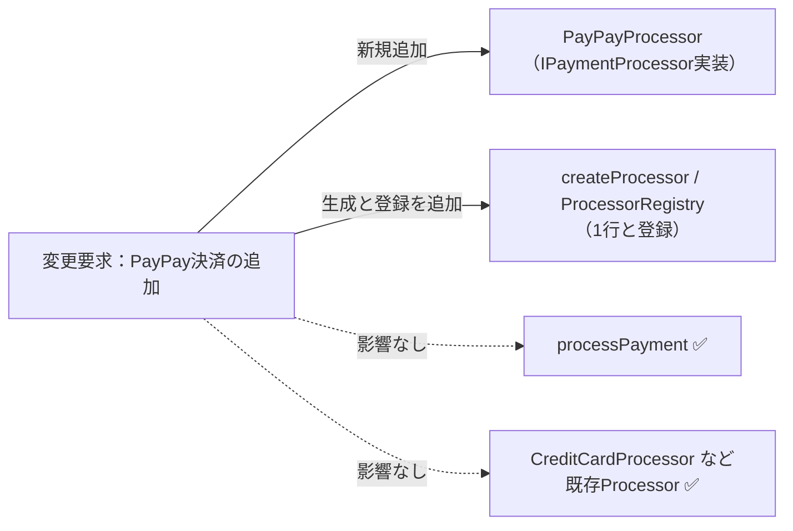
```mermaid
graph LR
    T1["変更要求：PayPay決済の追加"]
        -->|新規追加| N0["PayPayProcessor<br>（IPaymentProcessor実装）"]
    T1 -->|生成と登録を追加| N1["createProcessor / ProcessorRegistry<br>（1行と登録）"]
    T1 -. "影響なし" .-> A["processPayment ✅"]
    T1 -. "影響なし" .-> B["CreditCardProcessor など既存Processor ✅"]
```

フェーズ3の変更影響グラフと同じ要求・同じ粒度で比べると、利用フロー `processPayment` と既存Processor・完了確認は変更先から消えました。PayPay決済の追加は、`PayPayProcessor` の実装と `createProcessor`／`ProcessorRegistry` への登録だけに限定されます。

| 3-2で影響した場所 | 修正後 | 構造変更との対応 |
|---|---|---|
| `processPayment` の振り分け `if` | **修正しない** | 生成判断を `createProcessor` へ移した |
| 3-2にはProcessor契約がなかった | `PayPayProcessor` を1クラス追加する | 手段の変更先を新しく作った |
| 生成と有効判定 | `createProcessor` の1行と `ProcessorRegistry` 登録 | 生成と登録だけを増やす |

### 7-4：変更シナリオ表

今回の変更ID1・変更ID2について、フェーズ1の構造で必要だった修正と完成構造の結果を対比します。

| 変更依頼 | フェーズ1の現状構造での影響 | 完成構造での結果 |
|---|---|---|
| 変更ID1：PayPay固有データを検証して決済セッションを作る | `PaymentApplication`の入力・検証・生成・実行分岐を修正 | `PayPayProcessor`と決済API境界へ固有処理を置き、正常時だけ保留IDを返すことを確認 |
| 変更ID2：PayPayの保留IDで完了状態を確認する | `PaymentApplication`へPayPay固有の完了確認分岐を追加 | 保留IDを共通の完了確認入口へ渡し、完了・期限切れを既存`PaymentResult`で返すことを確認 |

---

## 整理

### 問題・原因・課題・解決策

| | 内容 |
|---|---|
| **問題** | 決済手段が変わるたびに `PaymentApplication` の分岐条件・生成コード・エラー対処が連動して変わり、手段固有の入力構造体・API境界・完了確認の対応が複数クラスに跨って修正が広がる |
| **原因** | `PaymentApplication` が具体クラス名、手段固有の入力検証ロジック、処理モード判定、エラー対処を直接知っている |
| **課題** | 決済フローと生成ロジックを切り離し、手段固有の入力検証・処理モード・エラー対処をProcessor内部に閉じ、`PaymentApplication` が具体クラスを知らずに `PaymentRequest` を処理できる構造にする |
| **解決策** | 生成分離構造：`createProcessor` で生成を委ね、`IPaymentProcessor` で手段固有の差分を隠蔽し、`processPayment` は `pay(request)` を呼ぶだけにする |

### フェーズとこの章でやったこと

| フェーズ | この章でやったこと |
|---|---|
| 🔵 フェーズ1 | 手段固有の入力データ、同期/非同期の処理モード、完了確認の手順、段階別エラーを含む仕様を整理し、7つの動作例で確認した |
| 🟣 フェーズ2 | 入力構造体・処理モード・エラー対処の変動軸を確認し、ヒアリングで追加頻度を裏付けた |
| 🟣 フェーズ3 | PayPay追加を試み、7か所に修正が広がることを確認した |
| 🟠 フェーズ4 | 具体クラス名・入力検証・処理モード・エラー対処が利用側に混在していることを根本原因と特定した |
| 🟡 フェーズ5 | 現状の`PaymentRequest`→`PaymentResult`を接続データとし、手段固有の生成判断・入力検証・API手順が利用フローへ漏れない課題を定めた |
| 🔴 フェーズ6 | 課題ID1を満たす最終構造は生成分離構造に一意に定まると確認し、採用クラス図を課題ID別の【1】〜【6】でコードへ反映した |
| 🟢 フェーズ7 | 各Processorが入力検証・API呼び出し・エラー対処を内包する最終コードを実装し、変更の局所化を確認した |

### 責任の移動

| 責任 | 変更前 | 変更後 |
|---|---|---|
| 決済フローの進行 | `PaymentApplication` | `PaymentApplication`（基底の骨格として維持） |
| 具体Processorの生成 | `PaymentApplication`（if-else + new 直書き） | `DefaultPaymentApplication::createProcessor()` |
| 手段固有の入力検証 | 各Processor内 → 変更前から分離済みだが生成と紐づいていた | 各Processor内（`IPaymentProcessor` 経由） |
| エラー対処（リトライ判定等） | `PaymentApplication`（手段ごとに直書き） | 各Processor内（`pay()` で完結） |
| 完了確認 | `PaymentApplication` + `main()`（手段を意識） | `PaymentApplication::checkCompletion()`（汎用） |
| 決済処理の契約定義 | —（なし） | `IPaymentProcessor::pay(PaymentRequest)` |

---

## 振り返り

### 「この章を読むと得られること」は手に入ったか

| 得られること | この章のどこで示したか |
|---|---|
| 1. 変動箇所の識別 | フェーズ2で入力構造体・処理モード・エラー対処を含む5つの変動軸を特定した |
| 2. 接続点の診断 | フェーズ4で、具体クラス名・入力検証・処理モード・エラー対処が利用処理へ漏れている状態を確認した |
| 3. 変更局所化の説明 | フェーズ7で、7か所の修正が2か所（新Processor＋生成分岐）に集約される構造を示した |
| 4. 利用側が生成知識から解放される視点 | 課題ID1節の【6】実行で、processPaymentから手段固有の知識がすべて消える様子を示した |

### 第0章の3つの設計原則はどう適用されたか

**原則1「変わるものをカプセル化せよ」の現れ**

- 具体化された場所：`createProcessor` メソッド（生成分離構造）と各Processorの `pay()` メソッド
- 解説：具体クラスの生成だけでなく、手段固有の入力検証、API呼び出し手順、エラー対処（リトライ判定）という「変わる理由」を、各Processorへ閉じ込めた。新しい決済手段が追加されても、基底の `processPayment` の骨格と、既存Processorのコードを保てる。

**原則2「実装ではなくインターフェースに対してプログラムせよ」の現れ**

- 具体化された場所：`PaymentApplication` の `processPayment` メソッド内の `IPaymentProcessor* processor`
- 解説：具体的な決済クラスではなく`IPaymentProcessor`だけを知るため、利用側は手段固有の入力検証・API手順・保留ID生成を知りません。ただし共通契約の`Pending`と`canRetry`は利用側が読み、完了確認と再試行を制御します。

**原則3「継承よりコンポジションを優先せよ」の現れ**

- 具体化された場所：`DefaultPaymentApplication` の `createProcessor` で、各Processorに `PaymentGatewayClient` を注入している
- 解説：各Processorは継承ではなく、外部APIの境界スタブへの参照を保持することで決済処理を実現している。API境界が変わっても、Processorの構造は変わらない。

---

## あなたのコードで考えてみてください

**題材を置き換えるときの共通手順**

この章の題材名を、自分の現場のシステム名に置き換えて考えます。

1. そのシステムは、誰が何を達成するために使うものか。
2. 入力、加工、出力は何か。手段や種類によって入力データが異なるか。
3. 処理の中に同期と非同期が混在しているか。非同期の場合、完了確認はどう行っているか。
4. エラーの対処は種類ごとに異なるか。利用側が種類を知ってエラー処理を分岐しているか。
5. 最近入った変更要求、または次に来そうな変更要求は何か。
6. その変更で、触りたくない場所まで修正や再テストが広がるか。
7. 変えたいものと守りたいものを分けると、接続点には何を残すべきか。
8. 全課題を満たす完成構造が複数成立するか。成立するなら、責任配置・変更影響・導入コストの差は何か。

ここまで問題から導いた「生成分離構造」は、一般に **Factory Methodパターン**と呼ばれます。ここからは題材を離れ、この名前で共有される抽象的な骨格を確認します。

## パターン解説：Factory Method パターン

### パターンの骨格

Factory Method パターンは、Productを生成するためのメソッドを定義し、どの具体Productを作るかをサブクラスへ委ねるパターンです。Creatorの利用フローから具体Productの生成コードを分けられますが、具象Creatorは自分が生成するProductを知ります。

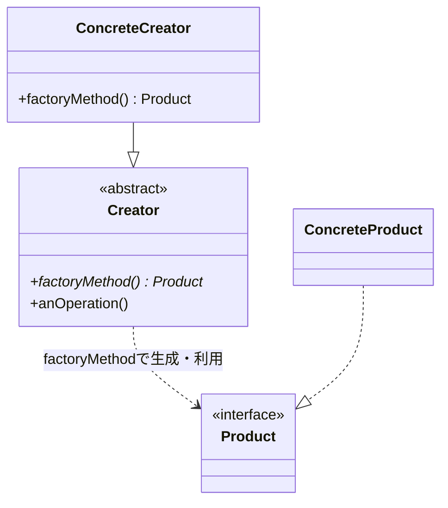
```mermaid
classDiagram
    class Creator {
        <<abstract>>
        +factoryMethod()* Product
        +anOperation()
    }
    class ConcreteCreator {
        +factoryMethod() Product
    }
    class Product {
        <<interface>>
    }
    class ConcreteProduct {
    }
    Creator ..> Product : factoryMethodで生成・利用
    ConcreteCreator --|> Creator
    ConcreteProduct ..|> Product
```

> [!INFO] コラム: C++の「インターフェース」と、クラス図の線種
> **C++に `interface` キーワードはありません。** C++でいう「インターフェース」は、次を満たす**抽象クラス**として書きます。
>
> - メンバ関数がすべて純粋仮想（`= 0`）で、実装を持たない。
> - データメンバを持たない。
> - `virtual ~Name() = default;` の仮想デストラクタを持つ（派生を安全に破棄するため）。
>
> 一方「抽象クラス」はより広く、**純粋仮想関数を1つ以上持つ**クラスを指します。実装済みのメソッドやデータメンバを持ってもかまいません（一部だけ `= 0`）。つまりインターフェースは抽象クラスの特殊形です。この章の `IPaymentProcessor` は `pay(request)` だけを純粋仮想で持つインターフェースです。
>
> ```cpp
> // インターフェース：全メソッドが純粋仮想、データなし
> class IPaymentProcessor {
> public:
>     virtual ~IPaymentProcessor() = default;
>     virtual PaymentResult pay(const PaymentRequest& r) = 0;
> };
>
> // 抽象クラス：一部を実装し、一部を純粋仮想で残す
> class AbstractProcessor {
> protected:
>     PaymentGatewayClient& gateway;   // データメンバを持てる
> public:
>     virtual ~AbstractProcessor() = default;
>     void log(const std::string& m) { /* 共通の実装 */ }
>     virtual PaymentResult pay(const PaymentRequest& r) = 0; // 未実装
> };
> ```
>
> **クラス図の線種は、コード上の関係で決まります。** 線と記号の共通規約は第0章の実例図で確認できます。本章では、`IPaymentProcessor`へ向かう破線の白三角が「契約の実装」、`PaymentApplication`から`IPaymentProcessor`へ向かう点線矢印が「生成して一時的に使う依存」、`CreditCardProcessor`から`PaymentGatewayClient`へ向かう実線矢印が「参照を保持して継続利用する関連」を表します。

### 抽象骨格の実行シーケンス

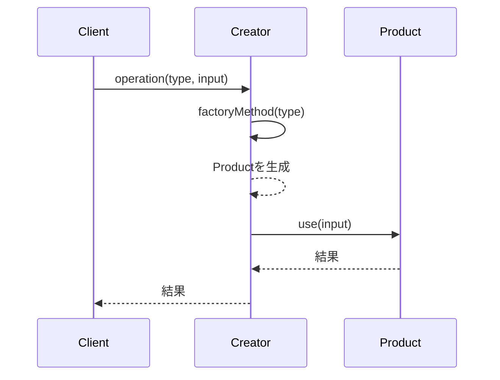
```mermaid
sequenceDiagram
    participant C as Client
    participant CR as Creator
    participant P as Product
    C->>CR: operation(type, input)
    CR->>CR: factoryMethod(type)
    CR-->>CR: Productを生成
    CR->>P: use(input)
    P-->>CR: 結果
    CR-->>C: 結果
```

Creatorは生成をfactoryMethodへ集め、利用処理はProduct契約だけを通じて進めます。

### この章の実装との対応

GoF（Gang of Four）とは、1994年に出版された書籍『Design Patterns』の4人の著者の総称です。彼らが整理した23のパターンは、現在も設計の共通言語として広く使われています。

| GoFの名前 | この章での対応 |
|---|---|
| Creator | `PaymentApplication`（`createProcessor` を持つ） |
| factoryMethod | `createProcessor(string type)` |
| Product | `IPaymentProcessor` |
| ConcreteProduct | `CreditCardProcessor` / `BankTransferProcessor` / `ConvenienceStoreProcessor` / `PayPayProcessor` |

本章の`DefaultPaymentApplication::createProcessor(type)`は、具象Creatorを決済手段ごとに分ける古典形ではなく、1つの具象Creatorが`type`を受けて選ぶ**パラメータ化Factory Method**です。この形は生成判断を1か所へ集めやすい反面、新しい決済手段の追加時には新Processorだけでなく`createProcessor()`の分岐も1行変更します。`processPayment()`や既存Processorは変更しませんが、生成側まで完全に閉じるわけではありません。生成分岐も変更したくない場合は、`methodId`と生成関数をレジストリへ登録する別構造が候補になります。本章は「利用フローから生成判断を外す」ことを目的に、この変種を採用しています。

### 使いどころと限界

- **使うと良い：** クラスが生成するオブジェクトの具体クラスを特定できない場合、または将来的に新しいサブクラスを柔軟に追加したい場合。今後もオブジェクトの種類が増え続けると確定しているとき。各種類が異なる入力データ・処理手順・エラー対処を持ち、その差分をインターフェース越しに隠蔽したいとき。
- **使わない方が良い：** 生成するクラスが常に1種類で固定されていて、今後増える見込みがない場合。ファイル数とクラス数が増えるコストが見合わない。

```cpp
// 決済手段が1種類で今後も増える予定がない場合
// 生成だけを分けるクラスを追加すると、かえって複雑になる

// ❌ 過剰なFactory（固定クラスをnewするだけなら不要）
class PaymentApplication {
    PaymentGatewayClient client;
    IPaymentProcessor* createProcessor() {
        return new CreditCardProcessor(client);
    }
public:
    PaymentResult processPayment(
        const PaymentRequest& request) {
        IPaymentProcessor* p = createProcessor();
        PaymentResult result = p->pay(request);
        delete p;
        return result;
    }
};

// ✅ この場合はシンプルに直接生成すれば十分
class PaymentApplication {
    PaymentGatewayClient client;
public:
    PaymentResult processPayment(
        const PaymentRequest& request) {
        CreditCardProcessor processor(client);
        return processor.pay(request);
    }
};
```

生成するクラスが常に1種類で固定されているなら、Factoryを介する必要はありません。「今後も変わらない」という確信があるときは、シンプルな直接生成の方が読みやすいコードになります。

### この章のまとめ

決済処理というドメインとFactory Methodパターンの関係を一言で言うなら、「生成」と「利用」を分離することで、「どの具体クラスを使うか」の決定を呼び出し側から引き剥がせる、ということです。`processPayment` がクレジットカード・銀行振込・コンビニ・PayPayという具体クラス名と、手段固有の入力検証、同期/非同期の処理モード、エラー対処まで直接知っていた限り、新しい決済手段が来るたびに7か所の修正が必要でした。生成の判断を `createProcessor` へ移し、手段固有の差分を各Processorの `pay()` へ閉じ込めた瞬間、利用側は何が来るかを知らずに `PaymentRequest` を渡せるようになりました。

7つのフェーズを通じて、読者は決済処理クラスが具体クラスを知りすぎているという観察から始まり、「手段固有の入力データ・処理モード・エラー対処が利用側に漏れている」という分析を経て、生成責任の分離と手段固有知識のカプセル化という判断へと進みました。`processPayment` の骨格が `IPaymentProcessor` と `PaymentRequest` だけを知るようになったことが、この章の到達点です。

あなたのコードの中にも、処理ロジックの中で具体クラスを生成し、そのクラス名や手段固有の検証・エラー対処を呼び出し元が知っている箇所があるはずです。「この生成ロジックはどの業務機能によるか」「手段ごとの差分は利用側が知るべきか」を問うことが、生成分離構造を導く入口になります。

いくつもの決済手段が一つのシステムに同居することは、現場ではよくあります。手段ごとにパラメータは多く、同期か非同期かで結果が確定するタイミングも違い、実際のコードはこの章よりもっと複雑です。この章であえて複雑度を上げ、少し読みづらい形にしたのは、そのノイズを取り払ったときに共通の契約を自分の手で導き出せるか、を体験してもらうためでした。各決済のProcessorは実体（インスタンス）として存在しますが、`PaymentRequest` を受け取り `PaymentResult` を返すという共通の契約さえあれば、その生成を分離できます。すると実行側は契約に対して呼ぶだけで済み、手段が増えても実体を抱え込まず、クラスの増減を気にせずに済みます。フェーズ1の時点でこのコードはすでに「処理の流れが一続き」「各決済が一つの `PaymentRequest` にまとまっている」「分岐も一か所にまとまっている」という良い状態にあり、現場ではまずこの共通の状態へ持っていくところから始めます。この章で持ち帰ってほしいのは、共通の契約を定義し、生成を分離し、実行側は契約に対して実行する、というシンプルな一点と、ノイズを除いて共通点を見つける目線です。
