## 第8章 生成と利用を分ける ―― Factory Method パターン

―― 思考の型：インスタンスを生成する責任を、どこに置くか

### この章の核心

**決済手段が増えるたびに、決済を利用する注文処理まで修正が必要になる。こういう問題は、「何を作るか」という生成判断が、「作られたものを使う」処理の中に混在しているシステムで起きている。**

---

### この章を読むと得られること

この章が問うのは「作る」ことの設計です——オブジェクトを生成している場所が、利用している場所と同居していると何が起きるか。「決済プロセッサーを切り替えたいだけなのに、なぜこんなにコードを変える必要があるのか」という問いが出てきたことがあるなら、この章に答えがあります。

* **得られること1：** 「オブジェクトを生成する」という観点で、コードの変動箇所を識別できるようになる
* **得られること2：** 利用処理が決済手段のクラス名と生成方法をどこまで知っているかを接続点から調べ、生成と利用の混在による痛みを説明できるようになる
* **得られること3：** 生成の責任を利用処理から分けることで、決済手段追加の変更をCreatorと組み立て箇所へ寄せられることを説明できるようになる
* **得られること4：** 利用側が具体的な生成ロジックを知らずに、必要な機能を持つオブジェクトを受け取れる視点

## 🔵 フェーズ1：現状把握 ―― 仕様を整理し、システムと紐付ける

決済処理システムが何を入力として受け取り、どの処理で加工し、何を出力するのかを整理します。

### 1-1：このシステムの仕様

このシステムは、ECサイトの注文処理から決済要求を受け取り、購入者が選んだ決済手段に応じて外部決済サービスへ処理を渡します。

決済手段は単なる表示名ではありません。クレジットカードなら認証して売上を確定し、コンビニ払いなら支払い番号を発行し、銀行振込なら振込先情報を発行して入金待ちにします。つまり、外側から見ると「決済を依頼して結果を受け取る」処理ですが、内側の手順と必要なデータは決済手段ごとに異なります。

決済手段ごとの違いは3つの軸で表れます。

**軸1：入力データの違い**

各決済手段は、金額と注文IDに加えて、手段固有のデータを要求します。

| 決済方法ID | 手段固有の入力データ |
|---|---|
| `credit_card` | カードトークン、カード名義、セキュリティコード |
| `bank_transfer` | 振込名義、銀行コード、口座種別 |
| `convenience` | 電話番号、メールアドレス、コンビニ店舗コード |

**軸2：処理タイミングの違い（同期と非同期）**

| 決済方法ID | 処理タイプ | 説明 |
|---|---|---|
| `credit_card` | 同期 | 認証→売上確定まで即時完了し、結果を返す |
| `bank_transfer` | 非同期 | 振込先を発行して保留を返し、入金確認は後で行う |
| `convenience` | 非同期 | 支払い番号を発行して保留を返し、入金確認は後で行う |

同期決済は外部APIを1回呼べば結果が確定します。非同期決済は、発行処理と入金確認が2段階に分かれます。入金確認は、保留IDを使って状態確認APIへ問い合わせます。

**軸3：エラーの段階と対処の違い**

| エラー段階 | 内容 | 対処 |
|---|---|---|
| 入力検証 | 手段固有データの不足 | 即座にエラーを返す |
| 外部API呼び出し | 認証失敗・通信エラー | リトライ可否を結果に含めて返す |
| 完了確認 | 支払い期限切れ・キャンセル | 失敗結果として確定する |

この章では、注文処理が次のような決済要求を渡し、決済結果を受け取るシステムとして扱います。

| 仕様項目 | この章で扱う値 | 具体例 |
|---|---|---|
| 決済要求 | 注文ID、決済方法ID、金額、顧客ID、手段固有データ | `ORD-1001`, `credit_card`, 1000円, `C001`, カードトークン等 |
| 決済設定 | 決済方法ID、有効/無効 | `credit_card` は有効 |
| 顧客台帳 | 顧客ID → 氏名（事前保持） | `C001` → 田中 一郎 |
| 注文台帳 | 注文ID → 顧客ID・請求金額（事前保持） | `ORD-1001` → `C001`・1000円 |
| 手段別の加工 | 認証、振込先発行、支払い番号発行 | カード認証API、振込先発行API、番号発行API |
| 決済結果 | 成功/保留/失敗、メッセージ、エラーコード、保留情報 | `成功: クレジット認証済み`, `保留: 振込先発行済み` |

決済要求の `注文ID`・`顧客ID`・`金額` は自由入力ではなく、システムが事前に保持する顧客台帳・注文台帳に照合します。未登録の注文・顧客や、注文の登録額と食い違う金額は決済に進めません。事前に登録されている注文台帳（顧客台帳の氏名を含む）は次のとおりです。

| 注文ID | 顧客（ID・氏名） | 請求金額 |
|---|---|---|
| ORD-1001 | C001・田中 一郎 | 1,000円 |
| ORD-1002 | C002・佐藤 花子 | 2,000円 |
| ORD-1003 | C003・鈴木 次郎 | 500円 |
| ORD-1004 | C004・高橋 三郎 | 800円 |
| ORD-1005 | C005・伊藤 四郎 | 600円 |
| ORD-1006 | C006・渡辺 五郎 | 300円 |
| ORD-1007 | C007・山本 六郎 | 200円 |
| ORD-1008 | C008・中村 七郎 | 1,200円 |
| ORD-2001 | C020・小林 八郎 | 3,000円 |

この章の現状コードに登録されている決済手段は次の4つです。`crypto` を「未登録」にせず「登録済み・無効」として残すのは、運用で一時停止している既知の手段と、システムが知らないIDを別のエラーとして扱うためです。読者は後の動作例で「無効」と「未登録」の判定差を確認できます。

| 決済手段 (ID) | 有効 | 処理タイプ |
|---|---|---|---|
| クレジットカード (`credit_card`) | 有効 | 同期 |
| 銀行振込 (`bank_transfer`) | 有効 | 非同期 |
| コンビニ払い (`convenience`) | 有効 | 非同期 |
| 暗号通貨 (`crypto`) | 無効 | 対象外 |

各決済手段の処理手順を詳しく見ます。

| 決済方法ID | 手段固有データ | 処理手順 | 正常出力 |
|---|---|---|---|
| `credit_card` | カードトークン、名義、セキュリティコード | カード認証APIを呼ぶ（同期） | 成功 |
| `bank_transfer` | 振込名義、銀行コード、口座種別 | 振込先発行APIを呼ぶ → 保留IDを発行 → 状態確認APIで入金を確認 | 保留→成功 |
| `convenience` | 電話番号、メール、店舗コード | 支払い番号発行APIを呼ぶ → 保留IDを発行 → 状態確認APIで入金を確認 | 保留→成功 |

この違いを無視して `pay(amount)` だけで扱うと、現実の決済で問題になる「手段ごとの必要情報」「同期と非同期の処理の違い」「非同期完了の確認手順」「失敗時の対処の違い」が見えなくなります。この章では外部サービスの内部実装までは作りませんが、注文処理と外部決済APIの間を流れる要求・結果・状態はコード上でも表します。

**システム全体図：注文処理・決済・外部サービスの境界**

最も大きな境界は「購入者 → EC決済システム → 外部決済・状態確認サービス」です。注文処理、決済処理、決済設定、実行ログは対象システムの内側にまとめます。色は、灰色＝利用者・入出力、青緑＝システム内の保存データ、橙＝システム内の処理、紫＝外部システムとの境界を表します。

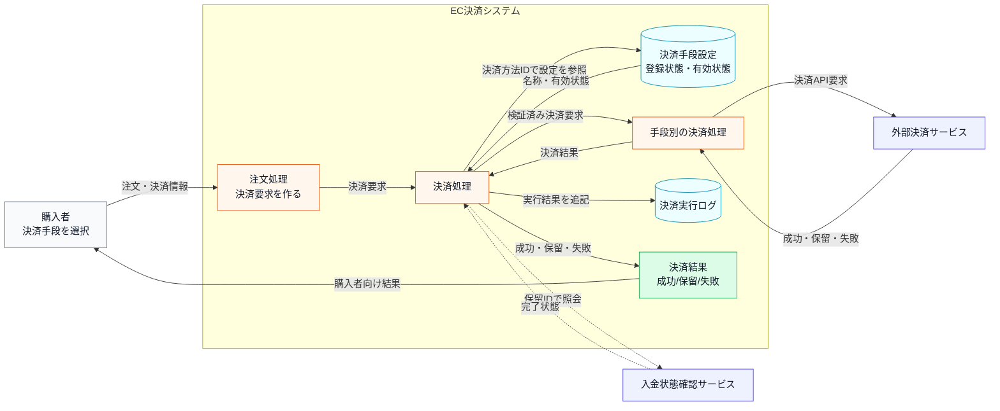
```mermaid
flowchart LR
    U["購入者<br>決済手段を選択"] -->|"注文・決済情報"| O

    subgraph PAYMENT["EC決済システム"]
        O["注文処理<br>決済要求を作る"]
        A["決済処理"]
        R[("決済手段設定<br>登録状態・有効状態")]
        P["手段別の決済処理"]
        L[("決済実行ログ")]
        O2["決済結果<br>成功/保留/失敗"]
        O -->|"決済要求"| A
        A -->|"決済方法IDで設定を参照"| R
        R -->|"名称・有効状態"| A
        A -->|"検証済み決済要求"| P
        P -->|"決済結果"| A
        A -->|"実行結果を追記"| L
        A -->|"成功・保留・失敗"| O2
    end

    P -->|"決済API要求"| G["外部決済サービス"]
    G -->|"成功・保留・失敗"| P
    A -.->|"保留IDで照会"| S["入金状態確認サービス"]
    S -.->|"完了状態"| A
    O2 -->|"購入者向け結果"| U

    classDef actor fill:#f8fafc,stroke:#64748b,color:#111827;
    classDef data fill:#ecfeff,stroke:#0891b2,color:#111827;
    classDef process fill:#fff7ed,stroke:#ea580c,color:#111827;
    classDef boundary fill:#eef2ff,stroke:#4f46e5,color:#111827;
    classDef result fill:#dcfce7,stroke:#16a34a,color:#111827;
    class U actor;
    class R,L data;
    class O,A,P process;
    class O2 result;
    class G,S boundary;
```

この図では、購入者が直接外部決済サービスを呼ぶのではなく、注文処理が決済要求を作り、決済処理システムが登録済み設定を確認してから手段別処理へ渡すことが分かります。非同期決済の場合は、入金状態確認サービスを使って完了確認を行います。

**システム内部図：正常系の入力・判定・加工・出力**

代表ケースとしてクレジットカード決済（同期）の正常系を見ます。ここでは検証済み要求を前提に処理順だけを示し、無効・入力不足などの異常系はエラー条件表へ分けます。


```mermaid
flowchart LR
    A[/検証済み決済要求<br>methodId=credit_card<br>amount=1,000<br>token=tok_abc/]:::input --> F[カード認証APIを呼ぶ<br>同期: 即時結果]:::process
    F --> G([正常出力<br>成功: クレジット認証済み]):::normal

    classDef input fill:#e7f0ff,stroke:#2563eb,color:#111827;
    classDef process fill:#fff7ed,stroke:#ea580c,color:#111827;
    classDef decision fill:#fef9c3,stroke:#ca8a04,color:#111827;
    classDef normal fill:#dcfce7,stroke:#16a34a,color:#111827;
```

次に、銀行振込（非同期）の正常系を見ます。


```mermaid
flowchart LR
    A[/検証済み決済要求<br>methodId=bank_transfer<br>amount=2,000<br>payer=山田太郎/]:::input --> C[振込先発行APIを呼ぶ]:::process
    C --> D([中間出力<br>保留: 振込先発行済み<br>pendingId=BT-ORD-1002]):::pending
    D --> E[状態確認APIで入金確認]:::process
    E --> F([最終出力<br>成功: 入金確認済み]):::normal

    classDef input fill:#e7f0ff,stroke:#2563eb,color:#111827;
    classDef process fill:#fff7ed,stroke:#ea580c,color:#111827;
    classDef decision fill:#fef9c3,stroke:#ca8a04,color:#111827;
    classDef pending fill:#fef3c7,stroke:#d97706,color:#111827;
    classDef normal fill:#dcfce7,stroke:#16a34a,color:#111827;
```

コンビニ決済（非同期）も銀行振込と同じ2段階です。手段固有データが異なるため、分けて示します。

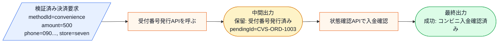
```mermaid
flowchart LR
    A[/検証済み決済要求<br>methodId=convenience<br>amount=500<br>phone=090..., store=seven/]:::input --> C[受付番号発行APIを呼ぶ]:::process
    C --> D([中間出力<br>保留: 受付番号発行済み<br>pendingId=CVS-ORD-1003]):::pending
    D --> E[状態確認APIで入金確認]:::process
    E --> F([最終出力<br>成功: コンビニ入金確認済み]):::normal

    classDef input fill:#e7f0ff,stroke:#2563eb,color:#111827;
    classDef process fill:#fff7ed,stroke:#ea580c,color:#111827;
    classDef pending fill:#fef3c7,stroke:#d97706,color:#111827;
    classDef normal fill:#dcfce7,stroke:#16a34a,color:#111827;
```

この図から読み取ることは、次の3点です。

- 同期決済（クレジットカード）はAPI呼び出し1回で結果が確定する。非同期決済（銀行振込・コンビニ）は発行→保留→完了確認の2段階になる。
- 非同期決済は保留IDを発行し、完了確認APIで最終結果を取得する。銀行振込は振込先、コンビニは受付番号を発行する。
- 手段固有データの検証は、決済実行の前に行う。カードならトークンと名義、銀行振込なら振込名義と銀行コード、コンビニなら電話番号と店舗指定が必要である（各フィールド名は次の「手段固有データの定義」で確定する）。

**決済の実行フロー**

決済手段ごとの中身は異なりますが、注文処理から見た大枠は共通です。

1. 注文処理が決済要求を作る
2. 決済方法IDを使って登録済み設定を確認する
3. 有効な決済方法なら、対応するProcessorを選ぶ
4. Processorが手段固有データを検証する
5. Processorが外部決済API境界を呼ぶ
6. 同期決済なら即座に結果を返す。非同期決済なら保留を返す
7. 非同期決済の場合、保留IDで状態確認APIへ問い合わせる

この共通部分と手段別の差分を分けて読むことが、後のフェーズで「何を守り、何を分けるか」を考える材料になります。

**この仕様を決める業務機能**

| 業務機能 | この章の仕様で決めていること |
|---|---|
| 決済手段・サービス管理 | どの決済手段を追加・廃止するか |
| 処理の骨格（開発設計判断） | 決済フロー・共通仕様の構造 |

後のフェーズで変更要求を扱うとき、どの業務機能の知識なのかを確認するための名前として使います。

**エラー条件**

正常系の仕様を一通り確認したうえで、最後に、決済実行へ進めない入力や外部境界の懸念を、正常系図に混ぜず分けて整理します。

| エラー条件 | どこで分かるか | 出力 |
|---|---|---|
| 決済方法IDが未登録 | 決済設定の検索時 | 未対応決済エラー |
| 決済方法が無効 | 有効フラグ確認時 | 無効決済エラー |
| 金額が1円未満 | 金額確認時 | 金額エラー |
| 手段固有データが不足 | 各Processorの入力検証時 | 入力不足エラー |
| 外部決済APIが失敗 | API呼び出し時 | 失敗結果（リトライ可否付き） |
| 完了確認で期限切れ | 状態確認API呼び出し時 | 期限切れエラー |

### 1-2：動作例テーブル

仕様を定義したところで、実際にどのような入力に対してどのような結果が返るかを確認します。このテーブルは「このシステムが正しく動いているとはどういう状態か」の基準になります。
動作例で使う「手段固有データ」のフィールド名を、先に仕様と紐づけて定義します。決済手段ごとに必要な項目が異なるため、名前と意味を一覧にします（システム内部図で銀行振込の `payer` は振込名義、カードの `holder` はカード名義で、どちらも「名義」に当たりますが別の手段の別項目です）。

| 決済方法ID | フィールド名 | 仕様上の意味 | 取りうる値の例 |
|---|---|---|---|
| `credit_card` | `token` | カードトークン（PCI準拠のカード代替値） | `tok_abc` / `ERROR_DECLINED`（失敗を模す値） |
| `credit_card` | `holder` | カード名義 | `YAMADA` |
| `credit_card` | `cvv` | セキュリティコード | `123` |
| `bank_transfer` | `payer` | 振込名義 | `山田太郎` |
| `bank_transfer` | `bank` | 銀行コード | `0001` |
| `bank_transfer` | `type` | 口座種別（`ordinary`＝普通／`checking`＝当座） | `ordinary` |
| `convenience` | `phone` | 連絡先電話番号 | `09012345678` |
| `convenience` | `email` | 受付通知メール | `y@example.com` |
| `convenience` | `store` | 利用コンビニ指定（`seven`＝セブン 等） | `seven` |

| ケース         | 決済方法ID          | 金額    | 手段固有データ                                             |
| ----------- | --------------- | ----- | --------------------------------------------------- |
| カード正常（同期）   | `credit_card`   | 1000円 | token=tok_abc, holder=YAMADA, cvv=123               |
| 銀行振込正常（非同期） | `bank_transfer` | 2000円 | payer=山田太郎, bank=0001, type=ordinary                |
| コンビニ正常（非同期） | `convenience`   | 500円  | phone=09012345678, email=y@example.com, store=seven |
| カードAPI失敗    | `credit_card`   | 800円  | token=ERROR_DECLINED, holder=SUZUKI, cvv=456        |
| カード入力不足     | `credit_card`   | 600円  | token=tok_xyz, holder=(空), cvv=789                  |
| 無効な決済方法     | `crypto`        | 300円  | (なし)                                                |
| 未登録の決済方法    | `unknown`       | 200円  | (なし)                                                |

| ケース | 期待される結果 |
|---|---|
| カード正常（同期） | 成功。クレジット認証済みの結果を返す |
| 銀行振込正常（非同期） | 保留→完了確認→成功。入金確認済みの結果を返す |
| コンビニ正常（非同期） | 保留→完了確認→成功。コンビニ入金確認済みの結果を返す |
| カードAPI失敗 | 失敗。カード認証失敗（リトライ可能）を返す |
| カード入力不足 | 失敗。カード名義が不足していますを返す |
| 無効な決済方法 | 失敗。暗号通貨は現在無効ですを返す |
| 未登録の決済方法 | 失敗。未登録の決済方法ですを返す |

この表は変更要求前に登録されている決済方法を示しています。この章で比べるのは、同じ外側の動作を保ちながら、決済手段が増えたときにどこを変更する構造になるかという違いです。

---

### 1-3：登場クラスとクラス構成図

仕様と動作例が確認できたところで、登場するクラスを先に確認します。

| クラス名                        | 役割                                                     | 担当する仕様             |
| --------------------------- | ------------------------------------------------------ | ------------------ |
| `PaymentApplication`        | 決済要求を受け取り、対応するProcessorを呼び出す                           | 決済手段の選択と実行、完了確認    |
| `CreditCardProcessor`       | カード固有データを検証し、カード認証APIを呼ぶ                               | クレジットカード決済（同期）     |
| `BankTransferProcessor`     | 振込固有データを検証し、振込先発行APIを呼ぶ                                | 銀行振込（非同期）          |
| `ConvenienceStoreProcessor` | コンビニ固有データを検証し、番号発行APIを呼ぶ                               | コンビニ決済（非同期）        |
| `ProcessorRegistry`         | 決済方法の設定を保持するデータストア                                     | 決済方法の存在確認・有効フラグの参照 |
| `PaymentGatewayClient`      | カード・銀行振込・コンビニの各Processorから呼ばれる外部決済API境界 | 認証・振込先発行・番号発行の代替   |
| `PaymentStatusClient`       | 非同期決済の完了確認APIの境界スタブ                                    | 入金確認の代替            |
| `CreditCardInput` | カード固有の入力値 | トークン・名義・セキュリティコード |
| `BankTransferInput` | 銀行振込固有の入力値 | 振込名義・銀行コード・口座種別 |
| `ConvenienceInput` | コンビニ払い固有の入力値 | 電話番号・メール・店舗コード |
| `PendingInfo` | 非同期決済の追跡情報 | 完了確認用の保留ID |
| `PaymentRequest` | 決済1件の要求 | 決済手段・金額・注文ID・手段固有入力 |
| `PaymentResult` | 決済1件の結果 | 成功/保留/失敗・再試行可否・保留情報 |
| `ProcessorConfig` | 決済手段1件の設定 | 名称・有効状態 |
| `PaymentRecord` | 保存する決済結果1件 | 決済手段・金額・状態・エラーコード |
| `PaymentLog` | 決済結果を保存する | 実行結果の追記・一覧表示 |
| `CustomerRecord` | 保持している顧客1件 | 顧客の氏名 |
| `CustomerDirectory` | 顧客を事前保持するデータストア | 顧客IDの存在確認・照合 |
| `OrderRecord` | 保持している注文1件 | 注文の顧客ID・請求金額 |
| `OrderBook` | 注文を事前保持するデータストア | 注文IDの存在確認・顧客/金額の照合 |

各クラスの責任を把握したところで、クラス間の関係を図で整理します。

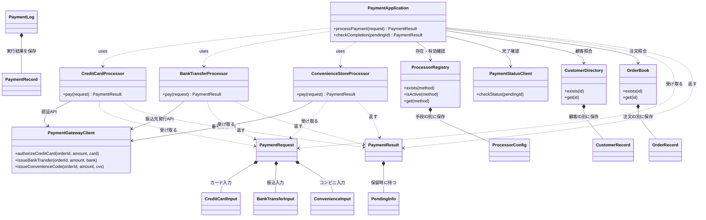
```mermaid
classDiagram
    class CreditCardInput
    class BankTransferInput
    class ConvenienceInput
    class PendingInfo
    class PaymentRequest
    class PaymentResult
    class ProcessorConfig
    class PaymentRecord
    class PaymentLog
    class CustomerRecord
    class OrderRecord
    class CustomerDirectory {
        +exists(id)
        +get(id)
    }
    class OrderBook {
        +exists(id)
        +get(id)
    }
    class PaymentApplication {
        +processPayment(request) PaymentResult
        +checkCompletion(pendingId) PaymentResult
    }
    class CreditCardProcessor {
        +pay(request) PaymentResult
    }
    class BankTransferProcessor {
        +pay(request) PaymentResult
    }
    class ConvenienceStoreProcessor {
        +pay(request) PaymentResult
    }
    class ProcessorRegistry {
        +exists(method)
        +isActive(method)
        +get(method)
    }
    class PaymentGatewayClient {
        +authorizeCreditCard(orderId, amount, card)
        +issueBankTransfer(orderId, amount, bank)
        +issueConvenienceCode(orderId, amount, cvs)
    }
    class PaymentStatusClient {
        +checkStatus(pendingId)
    }
    PaymentApplication ..> CreditCardProcessor : uses
    PaymentApplication ..> BankTransferProcessor : uses
    PaymentApplication ..> ConvenienceStoreProcessor : uses
    PaymentApplication --> ProcessorRegistry : 存在・有効確認
    PaymentApplication --> PaymentStatusClient : 完了確認
    CreditCardProcessor --> PaymentGatewayClient : 認証API
    BankTransferProcessor --> PaymentGatewayClient : 振込先発行API
    ConvenienceStoreProcessor --> PaymentGatewayClient : 番号発行API
    PaymentRequest *-- CreditCardInput : カード入力
    PaymentRequest *-- BankTransferInput : 振込入力
    PaymentRequest *-- ConvenienceInput : コンビニ入力
    PaymentResult *-- PendingInfo : 保留時に持つ
    ProcessorRegistry *-- ProcessorConfig : 手段ID別に保存
    PaymentApplication --> CustomerDirectory : 顧客照合
    PaymentApplication --> OrderBook : 注文照合
    CustomerDirectory *-- CustomerRecord : 顧客ID別に保存
    OrderBook *-- OrderRecord : 注文ID別に保存
    PaymentApplication ..> PaymentRequest : 受け取る
    PaymentApplication ..> PaymentResult : 返す
    CreditCardProcessor ..> PaymentRequest : 受け取る
    CreditCardProcessor ..> PaymentResult : 返す
    BankTransferProcessor ..> PaymentRequest : 受け取る
    BankTransferProcessor ..> PaymentResult : 返す
    ConvenienceStoreProcessor ..> PaymentRequest : 受け取る
    ConvenienceStoreProcessor ..> PaymentResult : 返す
    PaymentLog *-- PaymentRecord : 実行結果を保存
```

**クラス図に出てくる主な操作**

| クラス | 操作 | 何ができるか |
|---|---|---|
| `PaymentApplication` | `processPayment()` | 決済要求を受け取り、手段別処理を呼ぶ |
| `PaymentApplication` | `checkCompletion()` | 保留決済の入金を確認する |
| `CreditCardProcessor` | `pay()` | カード固有データを検証し、認証APIを呼ぶ |
| `BankTransferProcessor` | `pay()` | 振込固有データを検証し、振込先発行APIを呼ぶ |
| `ConvenienceStoreProcessor` | `pay()` | コンビニ固有データを検証し、番号発行APIを呼ぶ |
| `PaymentGatewayClient` | 各メソッド | 外部決済APIのスタブ。成功または失敗を返す |
| `PaymentStatusClient` | `checkStatus()` | 保留IDで入金状態を確認するスタブ |

この図が示す通り、`PaymentApplication` というクラスが、クレジットカード、銀行振込、コンビニ決済といった個別の決済プロセッサーを直接利用（依存）し、さらに非同期決済の完了確認も自分で制御している構成になっています。

**この章での簡略化**

1-3でクラス構成を確認したので、掲載コードで何を代替しているかを整理してからフェーズ1の現状コードへ進みます。

この章では、外部決済サービスそのものは実装せず、`PaymentGatewayClient` と `PaymentStatusClient` という2つの境界スタブを呼ぶ形で表します。コードを読む前提として、スタブの判定規則を固定します。

| スタブ | 入力規則 | 返す結果 |
|---|---|---|
| カード認証 | トークンが `ERROR` で始まる | 認証失敗・リトライ可能 |
| カード認証 | 上記以外の検証済み入力 | 即時成功 |
| 振込先・コンビニ番号発行 | 検証済み入力 | 保留ID付きの保留 |
| 完了確認 | 保留IDに `EXPIRE` を含む | 期限切れ失敗 |
| 完了確認 | `BT-`／`CVS-` で始まる | 入金確認成功 |
| 完了確認 | それ以外 | 不明な保留ID失敗 |

入力不足はProcessorがAPIを呼ぶ前に失敗させ、境界スタブには検証済み入力だけを渡します。返金、不正検知、3Dセキュア、Webhookの再送制御などは、生成責任という本章の論点から外れるため境界の先に置きます。


---

### 1-4：実装コード（現状）

#### コードを読む前に：クラスの責任と境界

| 対象                   | 呼び出しと内部処理             | 戻り値・副作用                                    | 掲載上の表現                  |
| -------------------- | --------------------- | ------------------------------------------ | ----------------------- |
| 決済Processor          | 手段別データを検証し外部API手順を進める | 成功・保留・失敗の`PaymentResult`                   | API Clientを固定応答で代替する    |
| `PaymentApplication` | 決済種別から具象Processorを選び、ローカル変数として生成する | 各具象Processorの `PaymentResult` | `if-else` で具体クラスを選ぶ |
| `map`                | 決済IDや注文IDから設定を検索する    | 対応データ                                      | メモリ上の設定/注文DB            |
| `PaymentLog`         | 実行済みの決済結果を受け取る | 手段・金額・状態・エラーコードを追記する | `vector`で実行結果DBを代替する |

実カード会社、銀行、コンビニ、PayPay APIへの通信はClientスタブです。認証待ちや入金待ちは成功へ丸めず、保留状態として呼び出し元へ返します。

1-1で整理した決済手段を、コード上の設定として持ちます。手段固有の入力データは構造体で分け、非同期決済は保留情報を返し、完了確認は別の境界スタブで行います。コードは責任の固まりごとに分けて読みます。

#### 仕様入力が現状コードで使われるまで

決済要求の共通値と手段固有値が、それぞれ選択、検証、外部API呼び出しへ使われる経路を分けて追います。

| 仕様入力 | コード上の受け取り口 | 実際に使う箇所 | 結果への現れ方 |
|---|---|---|---|
| 決済方法ID | `PaymentRequest::methodId` | `ProcessorRegistry` の存在・有効確認とProcessor選択 | 手段別処理、無効エラー、未登録エラーに分かれる |
| 注文ID・金額 | `PaymentRequest::orderId` / `amount` | 金額検証、`OrderBook` との照合、各外部APIスタブ、`PaymentLog` | 未登録注文・金額不一致エラー、API結果の識別子、実行ログに反映される |
| 顧客ID | `PaymentRequest::customerId` | `OrderBook` の注文所有者照合と `CustomerDirectory` の存在確認 | 注文内容不一致・未登録顧客エラーに分かれる |
| 手段固有データ | `creditCard` / `bankTransfer` / `convenience` | 各Processorの入力検証と対応API呼び出し | 成功・保留、または入力不足エラーになる |
| 保留ID | `PaymentResult::pending` | `PaymentStatusClient::checkStatus()` | 非同期決済の最終的な成功・失敗へつながる |

**① 決済の入力データと結果を表す構造体（CreditCardInput ほか / PaymentRequest / PaymentResult）**

```cpp
#include <iostream>
#include <map>
#include <string>
#include <vector>

using namespace std;

// ---- 手段固有の入力データ ----

struct CreditCardInput {
    string cardToken;
    string holderName;
    string securityCode;
};

struct BankTransferInput {
    string payerName;
    string bankCode;
    string accountType; // "ordinary" or "checking"
};

struct ConvenienceInput {
    string phoneNumber;
    string email;
    string storeCode; // "seven","lawson","familymart"
};

// ---- 保留決済の追跡情報 ----

struct PendingInfo {
    string pendingId;  // 完了確認用ID
};

// ---- 決済要求・結果 ----

struct PaymentRequest {
    string methodId;
    int amount;
    string orderId;
    string customerId;
    // 手段固有データ（該当する1つだけをセット）
    CreditCardInput creditCard;
    BankTransferInput bankTransfer;
    ConvenienceInput convenience;
};

struct PaymentResult {
    string status;     // "成功", "保留", "失敗"
    string message;
    bool canRetry;     // 再試行可能か
    string errorCode;  // エラーコード（空なら正常）
    PendingInfo pending; // 保留時の確認情報
};
```

各決済手段が必要とするデータが異なるため、`PaymentRequest` には手段ごとの入力構造体を持たせています。`PaymentResult` には、成功・保留・失敗のステータスに加え、リトライ可否、エラーコード、保留時の確認情報を含めています。

**② 決済方法の設定（ProcessorConfig / ProcessorRegistry）**

```cpp
// ---- 決済方法の設定 ----

struct ProcessorConfig {
    string name;
    bool isActive;
};

class ProcessorRegistry {
private:
    map<string, ProcessorConfig> registry;
public:
    ProcessorRegistry() {
        registry["credit_card"] =
            {"クレジットカード", true};
        registry["bank_transfer"] =
            {"銀行振込", true};
        registry["convenience"] =
            {"コンビニ払い", true};
        registry["crypto"] =
            {"暗号通貨", false};
    }

    bool exists(const string& method) const {
        return registry.count(method) > 0;
    }

    bool isActive(const string& method) const {
        return registry.at(method).isActive;
    }

    ProcessorConfig get(const string& method) const {
        return registry.at(method);
    }
};
```

レジストリは決済方法の設定を一元管理します。登録されているか、有効かの判定に使います。

**②-2 顧客・注文の保持データ（ProcessorRegistry と同じデータ層）**

決済要求に載る `customerId`・`orderId`・金額は、システムが事前に保持している顧客・注文と照合します。この保持データは現状コードの時点から存在し、フェーズ6以降の生成分離では変わりません（第1章 `CustomerDatabase`、第9章 `UserDatabase` と同じ「登録済みデータへ照合する」形）。

```cpp
// ---- 事前保持データ（顧客・注文） ----

// 事前保持：顧客（customerId → 氏名）
struct CustomerRecord { string name; };

class CustomerDirectory {
    map<string, CustomerRecord> records;
public:
    CustomerDirectory() {
        records["C001"] = {"田中 一郎"};
        records["C002"] = {"佐藤 花子"};
        records["C003"] = {"鈴木 次郎"};
        records["C004"] = {"高橋 三郎"};
        records["C005"] = {"伊藤 四郎"};
        records["C006"] = {"渡辺 五郎"};
        records["C007"] = {"山本 六郎"};
        records["C008"] = {"中村 七郎"};
        records["C020"] = {"小林 八郎"};
    }
    bool exists(const string& id) const { return records.count(id) > 0; }
    CustomerRecord get(const string& id) const { return records.at(id); }
};

// 事前保持：注文（orderId → 顧客ID・請求金額）
struct OrderRecord { string customerId; int amount; };

class OrderBook {
    map<string, OrderRecord> records;
public:
    OrderBook() {
        records["ORD-1001"] = {"C001", 1000};
        records["ORD-1002"] = {"C002", 2000};
        records["ORD-1003"] = {"C003", 500};
        records["ORD-1004"] = {"C004", 800};
        records["ORD-1005"] = {"C005", 600};
        records["ORD-1006"] = {"C006", 300};
        records["ORD-1007"] = {"C007", 200};
        records["ORD-1008"] = {"C008", 1200};
        records["ORD-2001"] = {"C020", 3000};
    }
    bool exists(const string& id) const { return records.count(id) > 0; }
    OrderRecord get(const string& id) const { return records.at(id); }
};
```

`customerId`・`orderId` は、この保持データに存在するもの以外は受け付けません。金額も注文の登録額と一致するかを照合します。

**③ 外部決済APIの境界スタブ（PaymentGatewayClient / PaymentStatusClient）**

まず、カード認証・振込先発行・コンビニ番号発行を代替する `PaymentGatewayClient` です。

このスタブは外部決済APIを代替し、**入力を判定に使います**（印字するだけの飾りではありません）。カード認証では `cardToken` が結果を分岐させます。`ERROR` 始まりは残高不足で再試行しても変わらない失敗（`canRetry=false`）、`TIMEOUT` 始まりは一時的な通信失敗で1回目だけ失敗し再試行で成功する結果（`canRetry=true`）を返します。`orderId` は注文ごとの試行回数（`cardAttempts`）の管理キーに、`amount` はログ追跡に使います。カード名義（`holderName`）の空チェックは、呼び出し側の入力検証（後述の「カード名義が不足」ケース）で扱います。返した `canRetry` は飾りではなく、利用側の `executeCase` が読んで再試行するかを決めます（1-4の実行結果ケース8で実際に消費します）。実APIではこの位置でトークンの正当性・残高・与信を確認しますが、本章の論点は生成の分離なので、その判定を上記のキーワードで代替しています。

```cpp
// ---- 外部決済API境界スタブ ----

class PaymentGatewayClient {
    map<string, int> cardAttempts;  // 注文ごとのカード認証試行回数
public:
    // カード認証（同期: 即座に成功/失敗を返す）
    PaymentResult authorizeCreditCard(
        const string& orderId,
        int amount,
        const CreditCardInput& card) {
        cout << "[決済API] カード認証"
             << " order=" << orderId
             << " amount=" << amount
             << " token=" << card.cardToken
             << " holder=" << card.holderName
             << endl;
        int attempt = ++cardAttempts[orderId];
        // スタブ: ERROR始まりは残高不足。再試行しても結果は変わらない
        if (card.cardToken.find("ERROR") == 0) {
            return {"失敗",
                    "カード認証失敗: 残高不足",
                    false, "AUTH_DECLINED", {}};
        }
        // スタブ: TIMEOUT始まりは一時的な通信失敗。1回目だけ失敗し
        //        再試行（2回目）で成功する。canRetry=true を返す
        if (card.cardToken.find("TIMEOUT") == 0 && attempt == 1) {
            return {"失敗",
                    "カード認証失敗: 通信タイムアウト",
                    true, "NETWORK_TIMEOUT", {}};
        }
        return {"成功",
                "クレジット認証済み id=AUTH001",
                false, "", {}};
    }

    // 振込先発行（同期で発行、入金確認は非同期）
    PaymentResult issueBankTransfer(
        const string& orderId,
        int amount,
        const BankTransferInput& bank) {
        cout << "[決済API] 振込先発行"
             << " order=" << orderId
             << " amount=" << amount
             << " payer=" << bank.payerName
             << " bank=" << bank.bankCode
             << " type=" << bank.accountType
             << endl;
        PendingInfo p{"BT-" + orderId};
        return {"保留",
                "振込先発行済み 口座=mizuho-1234567",
                false, "", p};
    }

    // コンビニ支払い番号発行（同期で発行、入金は非同期）
    PaymentResult issueConvenienceCode(
        const string& orderId,
        int amount,
        const ConvenienceInput& cvs) {
        cout << "[決済API] コンビニ番号発行"
             << " order=" << orderId
             << " amount=" << amount
             << " phone=" << cvs.phoneNumber
             << " store=" << cvs.storeCode
             << endl;
        PendingInfo p{"CVS-" + orderId};
        return {"保留",
                "支払い番号発行済み 番号=CVS-98765",
                false, "", p};
    }
};
```

次に、非同期決済の保留IDを確認する `PaymentStatusClient` です。保留（振込・コンビニ）が入金されず失敗する場合を、このスタブは「保留IDに `EXPIRE` を含むかどうか」で表現します。実システムでは支払い期限を過ぎると外部側が期限切れを返しますが、掲載コードではその期限切れを `EXPIRE` というキーワードで代替し、`checkStatus()` がそれを検出して「支払い期限切れ」を返します（この期限切れ失敗は1-1のエラー条件表にも掲載しています）。本章の実行ケースは正常系と再試行に焦点を当てるため、`EXPIRE` を含む保留IDは生成しませんが、非同期の失敗経路はこの分岐で表現されていることを示します。

```cpp
// 非同期決済の完了確認API境界スタブ
class PaymentStatusClient {
public:
    PaymentResult checkStatus(
        const string& pendingId) {
        cout << "[状態確認API] id="
             << pendingId << endl;
        // スタブ: EXPIRE含みなら期限切れ
        if (pendingId.find("EXPIRE")
            != string::npos) {
            return {"失敗",
                    "支払い期限切れ",
                    false, "EXPIRED", {}};
        }
        if (pendingId.find("BT-") == 0) {
            return {"成功",
                    "入金確認済み",
                    false, "", {}};
        }
        if (pendingId.find("CVS-") == 0) {
            return {"成功",
                    "コンビニ入金確認済み",
                    false, "", {}};
        }
        return {"失敗",
                "不明な保留ID",
                false, "UNKNOWN_PENDING", {}};
    }
};
```

`PaymentGatewayClient` は外部決済APIの境界スタブです。カード認証は同期で即座に結果を返し、振込先発行とコンビニ番号発行は保留IDを含む保留結果を返します。`PaymentStatusClient` は非同期決済の入金確認を行う境界スタブです。保留IDに `EXPIRE` が含まれていれば期限切れとして扱います。

**④ 各決済手段の処理クラス（CreditCardProcessor / BankTransferProcessor / ConvenienceStoreProcessor）**

共通点と差分を追えるよう、3クラスを別々のコードブロックで示します。最初は同期のカード決済です。

```cpp
// ---- 各決済手段の具体的な処理 ----

class CreditCardProcessor {
    PaymentGatewayClient& gateway;
public:
    CreditCardProcessor(
        PaymentGatewayClient& gw)
        : gateway(gw) {}

    PaymentResult pay(
        const PaymentRequest& req) {
        // カード固有の入力検証
        if (req.creditCard.cardToken.empty()) {
            return {"失敗",
                    "カードトークンが不足しています",
                    false, "MISSING_TOKEN", {}};
        }
        if (req.creditCard.holderName.empty()) {
            return {"失敗",
                    "カード名義が不足しています",
                    false, "MISSING_HOLDER", {}};
        }
        if (req.creditCard.securityCode.empty()) {
            return {"失敗",
                    "セキュリティコードが不足しています",
                    false, "MISSING_CVV", {}};
        }
        // 同期: 認証APIを呼んで即座に結果を返す
        return gateway.authorizeCreditCard(
            req.orderId, req.amount,
            req.creditCard);
    }
};
```

次は、振込先発行後に保留となる銀行振込です。

```cpp
class BankTransferProcessor {
    PaymentGatewayClient& gateway;
public:
    BankTransferProcessor(
        PaymentGatewayClient& gw)
        : gateway(gw) {}

    PaymentResult pay(
        const PaymentRequest& req) {
        // 振込固有の入力検証
        if (req.bankTransfer.payerName.empty()) {
            return {"失敗",
                    "振込名義が不足しています",
                    false, "MISSING_PAYER", {}};
        }
        if (req.bankTransfer.bankCode.empty()) {
            return {"失敗",
                    "銀行コードが不足しています",
                    false, "MISSING_BANK", {}};
        }
        // 非同期: 振込先を発行し、保留を返す
        return gateway.issueBankTransfer(
            req.orderId, req.amount,
            req.bankTransfer);
    }
};
```

最後は、支払い番号発行後に保留となるコンビニ決済です。

```cpp
class ConvenienceStoreProcessor {
    PaymentGatewayClient& gateway;
public:
    ConvenienceStoreProcessor(
        PaymentGatewayClient& gw)
        : gateway(gw) {}

    PaymentResult pay(
        const PaymentRequest& req) {
        // コンビニ固有の入力検証
        if (req.convenience.phoneNumber.empty()) {
            return {"失敗",
                    "電話番号が不足しています",
                    false, "MISSING_PHONE", {}};
        }
        if (req.convenience.email.empty()) {
            return {"失敗",
                    "メールアドレスが不足しています",
                    false, "MISSING_EMAIL", {}};
        }
        // 非同期: 支払い番号を発行し、保留を返す
        return gateway.issueConvenienceCode(
            req.orderId, req.amount,
            req.convenience);
    }
};
```

各Processorは自分の手段に必要な入力データを検証し、対応する外部APIスタブを呼びます。クレジットカードは同期で即座に成功または失敗を返し、銀行振込とコンビニは非同期で保留（保留ID付き）を返します。

**⑤ 決済を統括するクラス（PaymentApplication）**

`isActive()` は、コードから手段を削除せず運用設定だけで一時停止するための判定です。これにより、`crypto` は「システムが知らない」のではなく「登録済みだが現在は利用不可」と返せます。生成前に無効なProcessorを作らないよう、この判定を使います。

```cpp
// ---- 決済を統括するクラス ----

class PaymentApplication {
    ProcessorRegistry registry;
    PaymentGatewayClient gatewayClient;
    PaymentStatusClient statusClient;
    CustomerDirectory customers;   // 事前保持：顧客
    OrderBook orders;              // 事前保持：注文
public:
    PaymentResult processPayment(
        const PaymentRequest& request) {
        const string& type = request.methodId;

        // レジストリで存在確認
        if (!registry.exists(type)) {
            return {"失敗",
                    "未登録の決済方法です: " + type,
                    false, "UNKNOWN_METHOD", {}};
        }
        // レジストリで有効フラグを確認
        if (!registry.isActive(type)) {
            ProcessorConfig cfg
                = registry.get(type);
            return {"失敗",
                    cfg.name + " は現在無効です。",
                    false, "DISABLED", {}};
        }
        if (request.amount < 1) {
            return {"失敗",
                    "金額は1円以上で指定してください。",
                    false, "INVALID_AMOUNT", {}};
        }
        // 事前保持データと照合：注文・顧客・金額が登録済みか
        if (!orders.exists(request.orderId)) {
            return {"失敗",
                    "未登録の注文です: " + request.orderId,
                    false, "UNKNOWN_ORDER", {}};
        }
        OrderRecord ord = orders.get(request.orderId);
        if (ord.customerId != request.customerId
            || ord.amount != request.amount) {
            return {"失敗",
                    "注文内容が保持データと一致しません",
                    false, "ORDER_MISMATCH", {}};
        }
        if (!customers.exists(request.customerId)) {
            return {"失敗",
                    "未登録の顧客です: " + request.customerId,
                    false, "UNKNOWN_CUSTOMER", {}};
        }
        CustomerRecord customer = customers.get(request.customerId);
        if (customer.name.empty()) {
            return {"失敗", "顧客名が登録されていません",
                    false, "INVALID_CUSTOMER", {}};
        }

        // 決済方法に応じてプロセッサを生成して実行
        if (type == "credit_card") {
            CreditCardProcessor proc(gatewayClient);
            // canRetry はゲートウェイの結果に含まれる（失敗の種類で決まる）
            return proc.pay(request);
        } else if (type == "bank_transfer") {
            BankTransferProcessor proc(
                gatewayClient);
            PaymentResult result
                = proc.pay(request);
            // 非同期: APIエラーならそのまま返す
            return result;
        } else if (type == "convenience") {
            ConvenienceStoreProcessor proc(
                gatewayClient);
            PaymentResult result
                = proc.pay(request);
            return result;
        }
        return {"失敗",
                "未対応の決済種別です: " + type,
                false, "UNSUPPORTED", {}};
    }

    // 保留決済の完了確認
    PaymentResult checkCompletion(
        const string& pendingId) {
        return statusClient.checkStatus(pendingId);
    }
};
```

`PaymentApplication` はすべての決済手段の具体クラスを直接知っています。カード決済では認証失敗時にリトライ可能フラグを設定し、銀行振込やコンビニは保留結果をそのまま返します。手段ごとに生成するクラスと、エラー時の対処が異なっていることがコード上に表れています。

**⑥ 決済ログと実行（PaymentRecord / PaymentLog / main）**

```cpp
// ---- 決済ログ ----

struct PaymentRecord {
    string method;
    int amount;
    string status;
    string errorCode;
};

class PaymentLog {
    vector<PaymentRecord> records;
public:
    void add(const string& method,
             int amount,
             const string& status,
             const string& errorCode = "") {
        records.push_back(
            {method, amount, status, errorCode});
    }
    void printAll() const {
        for (const auto& r : records) {
            cout << "[" << r.method << "] "
                 << r.amount << "円 -> "
                 << r.status;
            if (!r.errorCode.empty()) {
                cout << " (" << r.errorCode << ")";
            }
            cout << endl;
        }
    }
};
```

以下の `main()` は一つの関数ですが、**一つのケースを実行した直後に、そのケースの結果を確認できるように**コードブロックを分けて掲載します。先に全入力を並べて最後に全結果を載せる構成にはしません。

実行対象コード：1-4の現状コード<br>
対応する動作例：1-2の動作例テーブル<br>
確認したいこと：同期決済、非同期決済の完了確認、API失敗、入力不足、無効・未登録が仕様どおりに動作すること

まず、各ケースで共通する「実行・保留時の完了確認・ログ記録」を補助関数にまとめます。

```cpp
static void executeCase(
    PaymentApplication& app,
    PaymentLog& payLog,
    const PaymentRequest& req) {
    PaymentResult result = app.processPayment(req);
    // 失敗かつ再試行可能（canRetry）なら1回だけ再試行する
    if (result.status == "失敗" && result.canRetry) {
        cout << "結果: " << req.methodId << " -> " << result.status
             << " (" << result.message << ") [canRetry=true]\n";
        cout << "  再試行可能なため再試行します...\n";
        result = app.processPayment(req);
    }
    cout << "結果: " << req.methodId
         << " -> " << result.status
         << " (" << result.message << ")\n";

    if (result.status == "保留") {
        cout << "  完了確認中... id="
             << result.pending.pendingId << "\n";
        PaymentResult completion
            = app.checkCompletion(result.pending.pendingId);
        cout << "  完了結果: " << completion.status
             << " (" << completion.message << ")\n";
        payLog.add(req.methodId, req.amount,
                   completion.status, completion.errorCode);
    } else {
        payLog.add(req.methodId, req.amount,
                   result.status, result.errorCode);
    }
    cout << "\n";
}

int main() {
    PaymentApplication app;
    PaymentLog payLog;

    // ケース1: カード正常（同期）
    PaymentRequest r1;
    r1.methodId = "credit_card";
    r1.amount = 1000;
    r1.orderId = "ORD-1001";
    r1.customerId = "C001";
    r1.creditCard = {"tok_abc", "YAMADA", "123"};
    executeCase(app, payLog, r1);
```

ケース1の実行結果：

```
[決済API] カード認証 order=ORD-1001 amount=1000 token=tok_abc holder=YAMADA
結果: credit_card -> 成功 (クレジット認証済み id=AUTH001)
```

次に、銀行振込の保留結果から完了確認までを実行します。

```cpp
    // ケース2: 銀行振込正常（非同期）
    PaymentRequest r2;
    r2.methodId = "bank_transfer";
    r2.amount = 2000;
    r2.orderId = "ORD-1002";
    r2.customerId = "C002";
    r2.bankTransfer
        = {"山田太郎", "0001", "ordinary"};
    executeCase(app, payLog, r2);
```

ケース2の実行結果：

```
[決済API] 振込先発行 order=ORD-1002 amount=2000 payer=山田太郎 bank=0001 type=ordinary
結果: bank_transfer -> 保留 (振込先発行済み 口座=mizuho-1234567)
  完了確認中... id=BT-ORD-1002
[状態確認API] id=BT-ORD-1002
  完了結果: 成功 (入金確認済み)
```

```cpp
    // ケース3: コンビニ正常（非同期）
    PaymentRequest r3;
    r3.methodId = "convenience";
    r3.amount = 500;
    r3.orderId = "ORD-1003";
    r3.customerId = "C003";
    r3.convenience
        = {"09012345678", "y@example.com", "seven"};
    executeCase(app, payLog, r3);
```

ケース3の実行結果：

```
[決済API] コンビニ番号発行 order=ORD-1003 amount=500 phone=09012345678 store=seven
結果: convenience -> 保留 (支払い番号発行済み 番号=CVS-98765)
  完了確認中... id=CVS-ORD-1003
[状態確認API] id=CVS-ORD-1003
  完了結果: 成功 (コンビニ入金確認済み)
```

```cpp
    // ケース4: カードAPI失敗
    PaymentRequest r4;
    r4.methodId = "credit_card";
    r4.amount = 800;
    r4.orderId = "ORD-1004";
    r4.customerId = "C004";
    r4.creditCard
        = {"ERROR_DECLINED", "SUZUKI", "456"};
    executeCase(app, payLog, r4);
```

ケース4の実行結果：

```
[決済API] カード認証 order=ORD-1004 amount=800 token=ERROR_DECLINED holder=SUZUKI
結果: credit_card -> 失敗 (カード認証失敗: 残高不足)
```

```cpp
    // ケース5: カード入力不足
    PaymentRequest r5;
    r5.methodId = "credit_card";
    r5.amount = 600;
    r5.orderId = "ORD-1005";
    r5.customerId = "C005";
    r5.creditCard = {"tok_xyz", "", "789"};
    executeCase(app, payLog, r5);
```

ケース5の実行結果：

```
結果: credit_card -> 失敗 (カード名義が不足しています)
```

```cpp
    // ケース6: 無効な決済方法
    PaymentRequest r6;
    r6.methodId = "crypto";
    r6.amount = 300;
    r6.orderId = "ORD-1006";
    r6.customerId = "C006";
    executeCase(app, payLog, r6);
```

ケース6の実行結果：

```
結果: crypto -> 失敗 (暗号通貨 は現在無効です。)
```

```cpp
    // ケース7: 未登録の決済方法
    PaymentRequest r7;
    r7.methodId = "unknown";
    r7.amount = 200;
    r7.orderId = "ORD-1007";
    r7.customerId = "C007";
    executeCase(app, payLog, r7);
```

ケース7の実行結果：

```
結果: unknown -> 失敗 (未登録の決済方法です: unknown)
```

続いて、`canRetry` を実際に読んで再試行する流れを確認します。一時的な通信失敗（`TIMEOUT_ONCE`）は1回目に失敗しますが、`executeCase` が `canRetry=true` を見て再試行し、2回目で成功します。残高不足（ケース4）は `canRetry=false` のため再試行しません。

```cpp
    // ケース8: カード一時失敗 → canRetryを見て再試行し成功
    PaymentRequest r8;
    r8.methodId = "credit_card";
    r8.amount = 1200;
    r8.orderId = "ORD-1008";
    r8.customerId = "C008";
    r8.creditCard = {"TIMEOUT_ONCE", "TANAKA", "321"};
    executeCase(app, payLog, r8);
```

ケース8の実行結果（`executeCase` が `canRetry=true` を読み、実際に1回だけ再試行しています）：

```
[決済API] カード認証 order=ORD-1008 amount=1200 token=TIMEOUT_ONCE holder=TANAKA
結果: credit_card -> 失敗 (カード認証失敗: 通信タイムアウト) [canRetry=true]
  再試行可能なため再試行します...
[決済API] カード認証 order=ORD-1008 amount=1200 token=TIMEOUT_ONCE holder=TANAKA
結果: credit_card -> 成功 (クレジット認証済み id=AUTH001)
```

最後に、ここまで各ケースで記録した最終結果をまとめて確認します。

```cpp
    cout << "\n--- 決済ログ ---\n";
    payLog.printAll();

    return 0;
}
```

決済ログの実行結果：

```
--- 決済ログ ---
[credit_card] 1000円 -> 成功
[bank_transfer] 2000円 -> 成功
[convenience] 500円 -> 成功
[credit_card] 800円 -> 失敗 (AUTH_DECLINED)
[credit_card] 600円 -> 失敗 (MISSING_HOLDER)
[crypto] 300円 -> 失敗 (DISABLED)
[unknown] 200円 -> 失敗 (UNKNOWN_METHOD)
[credit_card] 1200円 -> 成功
```

このコードでは、`PaymentApplication` クラスが、どの決済手段のクラスを生成し、どう実行し、エラー時にどう対処するかをすべて直接知っています。

---

### 1-5：変更要求

**変更要求の発生背景：** 今回の変更要求は決済プラットフォームチームから届いています。新しい決済手段の導入を推進するチームです。

ある週の火曜日、決済プラットフォームチームのリーダーからチャットで連絡が入りました。

「急ぎの相談なんだけど、来月から導入する新しい決済手段として『PayPay』に対応してほしいんだ。今のシステムでそのまま行けるか確認して、もし難しそうなら方針を教えてもらえるかな？」

PayPay対応です。PayPayは外部のQRコード決済サービスであり、次の特徴があります。

- **手段固有データ**: PayPayアクセストークンとマーチャントIDが必要
- **処理タイプ**: 非同期。決済セッションを作成して保留を返し、完了確認で結果を取得する
- **エラー**: PayPay固有のエラー（トークン無効、セッション期限切れ）がある

**仕様変更の内容**

| 決済手段 | 変更前 | 変更後 |
|---|---|---|
| クレジットカード | 対応済み | 変更なし |
| 銀行振込 | 対応済み | 変更なし |
| コンビニ払い | 対応済み | 変更なし |
| PayPay | 未対応 | 新規追加 |

今回変えるのは決済手段の追加と非同期結果の扱いです。注文処理から見た**受け渡しの外形**（要求を渡して結果を受け取る）、結果型、決済履歴の保存方法は維持します。次の表で、外形として不変な部分と、手段追加に伴い構造体へ加わる部分を分けて示します。

| 決済の外形契約 | 変更前 | 変更後 |
|---|---|---|
| `PaymentRequest` の渡し方 | 決済方法ID・金額・注文/顧客IDと「手段固有データ1つ」を渡す | 渡し方は不変。ただし手段追加に伴い手段固有入力 `PayPayInput` を1フィールド追加 |
| `PaymentResult` | 成功・失敗・保留の結果を返す | **変更なし** |
| `PaymentLog` | 決済結果を履歴へ保存する | **変更なし** |

PayPay決済が追加されても、注文処理から見た大枠（`PaymentRequest` を渡し、`PaymentResult` を受け取る）は変わりません。変わるのは `PaymentRequest` の中身で、PayPay固有のアクセストークンとマーチャントIDを持つ `PayPayInput` を1つ追加します。処理は非同期であり、完了確認ではPayPay固有の保留IDを使います。

**変更前後の入力・判定・加工・出力差分**

| 要素 | 変更前（現状仕様） | 変更後（今回の要求） | 差分として追うもの |
|---|---|---|---|
| 入力 | 3種の手段固有データ | PayPay固有データを追加 | `PayPayInput` 構造体が増える |
| 判定 | 3種の入力検証 | PayPay固有データの検証追加 | 検証ロジックが増える |
| 加工 | 同期1種、非同期2種 | 非同期がもう1種増える | PayPay決済API境界が増える |
| 出力 | 成功、保留→完了、失敗 | PayPayの保留→完了を追加 | 完了確認の対象が増える |

**変更後の入力・加工・出力**

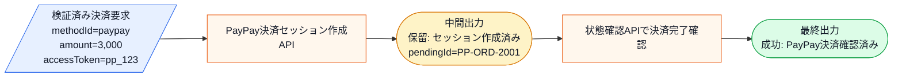
```mermaid
flowchart LR
    A[/検証済み決済要求<br>methodId=paypay<br>amount=3,000<br>accessToken=pp_123/]:::input --> D[PayPay決済セッション作成API]:::process
    D --> E([中間出力<br>保留: セッション作成済み<br>pendingId=PP-ORD-2001]):::pending
    E --> F[状態確認APIで決済完了確認]:::process
    F --> G([最終出力<br>成功: PayPay決済確認済み]):::normal

    classDef input fill:#e7f0ff,stroke:#2563eb,color:#111827;
    classDef process fill:#fff7ed,stroke:#ea580c,color:#111827;
    classDef decision fill:#fef9c3,stroke:#ca8a04,color:#111827;
    classDef pending fill:#fef3c7,stroke:#d97706,color:#111827;
    classDef normal fill:#dcfce7,stroke:#16a34a,color:#111827;
```

この図から読み取ることは、次の3点です。

- 注文処理から見た外側の契約は `PaymentRequest` から `PaymentResult` のままである。
- PayPayは非同期処理であり、銀行振込やコンビニと同様に保留→完了確認の2段階になる。
- PayPay固有の入力データ（アクセストークン、マーチャントID）の検証、PayPay決済API境界の呼び出し、PayPay用完了確認が新たに必要になる。

変更後も、失敗条件は正常系図へ混ぜずに別で確認します。

| エラー条件 | どこで分かるか | 出力 |
|---|---|---|
| PayPay固有データが不足 | PayPayProcessorの入力検証時 | 入力不足エラー |
| PayPay決済APIが失敗 | API呼び出し時 | 失敗結果（リトライ可否付き） |
| PayPay完了確認で期限切れ | 状態確認API時 | 期限切れエラー |

種別が1つ増えるだけの変更が、実際のコードではどれだけの修正になるかを、フェーズ3で変更を試すコードで確認します。

フェーズ1でシステムの現状と変更要求が把握できました。次のフェーズ2では、「何を変え、何を守るか」を整理します。

## 🟣 フェーズ2：仮説立案 ―― 何が変わるかを観察し、ヒアリングで裏付ける
### 2-1：変わりそうな仕様の見当をつける

ここで作る一覧は、思いつきで「変わりそう」と感じたものを並べる表ではありません。フェーズ1で確認した仕様・動作例・クラス図を材料に、次の順で候補を絞ります。

1. 仕様図と動作例から、入力・判定・加工・出力のうち条件や値が変わりそうな箇所を拾う。
2. その箇所が、1-3のどのクラス・メソッドに書かれているかを対応づける。
3. その仕様が、どんな理由で、何をきっかけに、どのくらいの頻度で変わりそうかを仮説として書く。
4. 逆に、当面変えない前提にできる処理の骨格も分けておく。

この手順で見ると、「決済を実行する」という大きな処理全体ではなく、その中のどの決済手段・生成条件・入力データ・処理手順・エラー処理が変更候補なのかを読者自身で追えるようになります。

| 仕様候補 | 仕様上の場所 | コード上の場所 | 見立て |
|---|---|---|---|
| 決済手段の種類 | 入力、判定 | `processPayment()` の if-else | 新しい決済手段が増える可能性があるため、今回見る |
| 手段固有の入力データ | 入力 | 各 `*Input` 構造体と各Processorの入力検証 | 決済手段ごとに異なるデータが必要なため、追加時に増える |
| 処理タイプ（同期/非同期） | 加工 | `processPayment()` 内のリトライ判定、`main()` の完了確認分岐 | 新しい手段が同期か非同期かで処理が変わる |
| 外部APIの呼び出し手順 | 加工、出力 | 各Processorと`PaymentGatewayClient` | 決済手段ごとに認証、番号発行、セッション作成などの手順が異なる |
| エラー処理の対処 | 出力 | `processPayment()` 内のリトライフラグ設定 | 手段ごとにリトライ可否が異なる |
| 決済実行の外側の流れ | 加工、出力 | `PaymentRequest` → `PaymentResult` | 注文処理との境界として当面維持する前提 |

この表から、今回の検討対象は「決済手段の選択と生成」「手段固有の入力検証」「同期/非同期の処理モード」「エラー処理の対処」に絞れます。

### 2-2：今回の変更で確実に変わること

今回の変更要求から確定している変更は次の通りです。

- **`PayPayInput` 構造体の追加**：PayPay固有のアクセストークンとマーチャントID
- **`PayPayProcessor` の追加**：PayPay固有の入力検証と決済API呼び出し
- **`PaymentApplication` 内の分岐条件への追記**：`"paypay"` の if-else 追加
- **`PaymentGatewayClient` へのPayPay用API追加**：PayPay決済セッション作成
- **`PaymentStatusClient` でのPayPay完了確認対応**：PayPay固有の保留ID処理
- **エラー処理の追加**：PayPay固有のエラーコードとリトライ判定

ただし「この変更が1回限りか、今後も続くか」によって、どこまで設計を変えるべきかが大きく変わります。関係者に確認します。

### ヒアリングに向けた背景確認

このシステムは、ある決済サービス事業者の「決済プロセッサー」を管理する基盤です。当初クレジットカード決済だけをサポートしていましたが、ユーザーの利便性を高めるために、後からコンビニ決済、銀行振込、そしてPayPayなどのQRコード決済と、次々に新しい決済手段が追加されてきました。

コードを見ると、`PaymentApplication` クラスが、各決済手段の具体クラスを直接生成し、手段ごとのエラー処理（リトライ可否の設定など）まで直接扱っている構成になっています。

### 2-3：関係者ヒアリング

仮説を持って、決済プラットフォームチームの担当者と話し合いを持ちました。

- **開発者：** 「PayPay対応の件ですが、今の構造だと決済手段が増えるたびに `PaymentApplication` クラスへ分岐と生成処理を追加する必要があります。手段固有の入力データ、同期か非同期かの判定、エラー処理も手段ごとに書き分けています。今後も新しい決済手段は追加される予定でしょうか？」
- **決済担当者：** 「ああ、かなりハイペースで追加していく予定だよ。次は銀行系の決済も入るし、後払いサービスも検討している。だから、決済手段が増えるたびに基幹部分のコードを書き換えるようなことはなるべく避けてほしいんだ。」
- **開発者：** 「各決済手段で必要なデータも違いますし、同期で即座に結果が出るものと、非同期で完了確認が必要なものがありますよね。注文処理から見た外側の契約、つまり決済要求を渡して結果を受け取る形は維持したい、という理解で合っていますか？」
- **決済担当者：** 「その理解で合っている。クレジットは認証、コンビニや銀行振込は入金待ち、PayPayはPayPay側のセッション確認がある。中身は違うけれど、注文処理側には同じ形で結果を返してほしい。失敗したときの対処も手段ごとに違うけど、それもこちら側で吸収してほしい。」
- **開発者：** 「分かりました。外側の契約は保ちたい一方で、手段固有の入力データ、同期/非同期の処理モード、完了確認の手順、エラー時の対処が決済手段ごとに増えていくということですね。」

### 2-4：ヒアリングで判明した将来リスク

| 将来リスク | 時期の目安 | 根拠 |
|---|---|---|
| 決済手段の種類がさらに増加する | 新しい決済手段の追加ごと | 「かなりハイペースで追加していく予定」 |
| 手段固有の入力データと検証ロジック | 追加ごと | 決済手段ごとに異なるデータが必要 |
| 同期/非同期の処理モードの増加 | 追加ごと | 新手段が同期か非同期かで処理が変わる |
| 完了確認の手順の増加 | 非同期手段の追加ごと | 非同期手段は保留→完了確認の2段階 |

フェーズ2で「今変わること（確定）」と「将来変わるかもしれないこと（リスク）」を分けて整理できました。次のフェーズ3では、現在の構造で変更を試みたときに何が起きるかを確認します。

### 2-5：変わる見込みと当面安定の前提を確定する

| 変更内容 | 現在 | 将来（時期の目安） |
|---|---|---|
| 対応する決済手段の種類 | カード・振込・コンビニ | 後払い・QRコード等、追加ごと |
| 手段固有の入力データ構造 | 3種の `*Input` 構造体 | 手段ごとに新しい構造体が増える |
| 処理タイプ（同期/非同期） | 同期1種、非同期2種 | 新手段ごとにどちらかが増える |
| 完了確認の対象 | 銀行振込、コンビニ | 非同期手段の追加ごとに増える |
| 注文処理との外側の契約 | Request → Result | 当面維持したい前提 |

この変化が来たとき、現在の構造では `PaymentApplication` を毎回開いて修正することになります。次のフェーズ3では、実際にその修正を試みて何が起きるかを確認します。

---

## 🟣 フェーズ3：問題特定 ―― 変更の痛みを発見する
### 3-1：変更を試みる

「PayPay対応」の要求を、フェーズ1の現状コードで実装しようと試みます。PayPayを追加するには、次の修正が必要です。

> **中間コードの継続条件：** 以下はPayPay追加で触るクラス・関数を、既存の類似処理と周辺の責任が見える範囲で示します。`ProcessorRegistry` の手段確認、`PaymentGatewayClient` / `PaymentStatusClient` の外部境界、`PaymentLog` の記録は維持します。変更行だけの断片にはせず、どの既存構造へ何を足すのかを追える形にします。

**修正1：PayPay固有の入力構造体を追加**

```cpp
struct PayPayInput {
    string accessToken;
    string merchantId;
};
```

**修正2：`PaymentRequest` にPayPayデータを追加**

```cpp
struct PaymentRequest {
    string methodId;
    int amount;
    string orderId;
    string customerId;
    CreditCardInput creditCard;
    BankTransferInput bankTransfer;
    ConvenienceInput convenience;
    PayPayInput payPay;  // ← 追加
};
```

既存の共通項目4つと手段固有入力3つを残したまま、4つ目の手段固有入力として `payPay` が増えました。新しい手段を加えるたびに共通の要求型そのものが膨らむことを、この差分から確認できます。

**修正3：`PaymentGatewayClient` にPayPay用APIを追加**

```cpp
class PaymentGatewayClient {
public:
    // 既存：コンビニ番号を発行し、保留を返す
    PaymentResult issueConvenienceCode(
        const string& orderId,
        int amount,
        const ConvenienceInput& cvs) {
        cout << "[決済API] コンビニ番号発行"
             << " order=" << orderId
             << " amount=" << amount
             << " phone=" << cvs.phoneNumber
             << " store=" << cvs.storeCode << endl;
        PendingInfo p{"CVS-" + orderId};
        return {"保留",
                "支払い番号発行済み 番号=CVS-98765",
                false, "", p};
    }

    // 追加：同じ外部API境界へPayPayセッション発行を加える
    PaymentResult chargePayPay(
        const string& orderId,
        int amount,
        const PayPayInput& pp) {
        cout << "[決済API] PayPay決済"
             << " order=" << orderId
             << " amount=" << amount
             << " token=" << pp.accessToken
             << endl;
        PendingInfo p{"PP-" + orderId};
        return {"保留",
                "PayPayセッション作成済み",
                false, "", p};
    }
};
```

**修正4：`PayPayProcessor` を新規作成**

```cpp
class PayPayProcessor {
    PaymentGatewayClient& gateway;
public:
    PayPayProcessor(PaymentGatewayClient& gw)
        : gateway(gw) {}
    PaymentResult pay(
        const PaymentRequest& req) {
        if (req.payPay.accessToken.empty()) {
            return {"失敗",
                    "PayPayトークンが不足しています",
                    false, "MISSING_PP_TOKEN", {}};
        }
        if (req.payPay.merchantId.empty()) {
            return {"失敗",
                    "マーチャントIDが不足しています",
                    false, "MISSING_MERCHANT", {}};
        }
        return gateway.chargePayPay(
            req.orderId, req.amount, req.payPay);
    }
};
```

**修正5：`processPayment()` にPayPayの分岐を追加**

```cpp
class PaymentApplication {
    ProcessorRegistry registry;
    PaymentGatewayClient gatewayClient;
    PaymentStatusClient statusClient;
public:
    PaymentResult processPayment(
        const PaymentRequest& request) {
        const string& type = request.methodId;

        if (!registry.exists(type)) {
            return {"失敗",
                    "未登録の決済方法です: " + type,
                    false, "UNKNOWN_METHOD", {}};
        }
        if (!registry.isActive(type)) {
            ProcessorConfig cfg = registry.get(type);
            return {"失敗",
                    cfg.name + " は現在無効です。",
                    false, "DISABLED", {}};
        }
        if (request.amount < 1) {
            return {"失敗",
                    "金額は1円以上で指定してください。",
                    false, "INVALID_AMOUNT", {}};
        }

        if (type == "credit_card") {
            CreditCardProcessor proc(gatewayClient);
            return proc.pay(request); // canRetryは結果に含む
        } else if (type == "bank_transfer") {
            BankTransferProcessor proc(gatewayClient);
            return proc.pay(request);
        } else if (type == "convenience") {
            ConvenienceStoreProcessor proc(gatewayClient);
            return proc.pay(request);
        } else if (type == "paypay") {  // ← 追加
            PayPayProcessor proc(gatewayClient);
            return proc.pay(request);
        }
        return {"失敗",
                "未対応の決済種別です: " + type,
                false, "UNSUPPORTED", {}};
    }

    PaymentResult checkCompletion(
        const string& pendingId) {
        return statusClient.checkStatus(pendingId);
    }
};
```

既存の三つの分岐、共通の事前確認、カード固有のエラー補正は残ったまま、同じ関数の末尾へPayPayの生成・実行分岐が増えました。これにより「どのクラスのどこへ追加したか」と「既存の何まで再確認対象になるか」の両方が見えます。

**修正6：`PaymentStatusClient` にPayPay対応を追加**

```cpp
class PaymentStatusClient {
public:
    PaymentResult checkStatus(
        const string& pendingId) {
        cout << "[状態確認API] id="
             << pendingId << endl;
        if (pendingId.find("EXPIRE") != string::npos) {
            return {"失敗", "支払い期限切れ",
                    false, "EXPIRED", {}};
        }
        if (pendingId.find("BT-") == 0) {
            return {"成功", "入金確認済み",
                    false, "", {}};
        }
        if (pendingId.find("CVS-") == 0) {
            return {"成功", "コンビニ入金確認済み",
                    false, "", {}};
        }
        if (pendingId.find("PP-") == 0) {  // ← 追加
            return {"成功", "PayPay決済確認済み",
                    false, "", {}};
        }
        return {"失敗", "不明な保留ID",
                false, "UNKNOWN_PENDING", {}};
    }
};
```

**修正7：レジストリに登録**

```cpp
ProcessorRegistry() {
    registry["credit_card"] =
        {"クレジットカード", true};
    registry["bank_transfer"] =
        {"銀行振込", true};
    registry["convenience"] =
        {"コンビニ払い", true};
    registry["crypto"] =
        {"暗号通貨", false};
    registry["paypay"] =
        {"PayPay", true};  // ← 追加
}
```

PayPay対応には7か所の修正が必要でした。入力構造体の追加、`PaymentRequest` への追加、API境界スタブの追加、Processorの新規作成、`processPayment` の分岐追加、完了確認の対応追加、レジストリへの登録です。

これら7か所をフェーズ1のコードへ適用し、PayPayの保留から完了確認までを実行します。

```cpp
int main() {
    PaymentApplication app;

    PaymentRequest request;
    request.methodId = "paypay";
    request.amount = 1500;
    request.orderId = "ORD-PP01";
    request.customerId = "C008";
    request.payPay = {"pp_token", "merchant_01"};

    PaymentResult result = app.processPayment(request);
    cout << "結果: " << request.methodId
         << " -> " << result.status
         << " (" << result.message << ")\n";

    if (result.status == "保留") {
        PaymentResult completion
            = app.checkCompletion(result.pending.pendingId);
        cout << "完了結果: " << completion.status
             << " (" << completion.message << ")\n";
    }
    return 0;
}
```

実行対象コード：3-1の7か所をフェーズ1へ適用した変更試行コード<br>
対応する動作例：PayPay決済を開始し、保留IDで完了確認する<br>
確認したいこと：PayPay要求が動作する一方で、追加が入力型・API境界・Processor・振り分け・状態確認・登録へ広がること

実行結果：

```
[決済API] PayPay決済 order=ORD-PP01 amount=1500 token=pp_token
結果: paypay -> 保留 (PayPayセッション作成済み)
[状態確認API] id=PP-ORD-PP01
完了結果: 成功 (PayPay決済確認済み)
```

ここで見たいのは、分岐の行数そのものではありません。問題は、決済手段ごとの入力構造体、入力検証ロジック、API呼び出し手順、同期/非同期の処理モード、エラー対処が、決済を利用する流れの近くに積み上がることです。クレジットカードの認証、銀行振込の入金待ち、コンビニの支払い番号発行、PayPayのセッション作成は、同じ「決済」でも手順と失敗状態が異なります。その差分を利用側が知り続けるほど、追加のたびに既存の決済フローを開いて確認する範囲が広がります。

### 3-2：変更影響グラフ

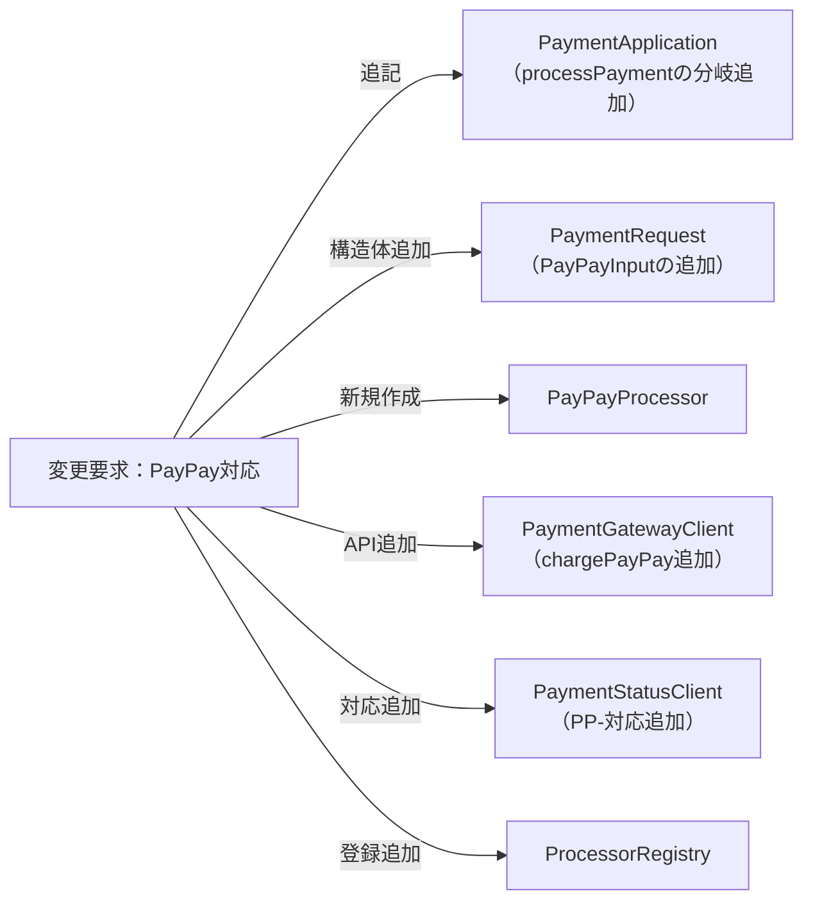
```mermaid
graph LR
    T1["変更要求：PayPay対応"]
        -->|"追記"| A["PaymentApplication<br>（processPaymentの分岐追加）"]
    T1 -->|"構造体追加"| B["PaymentRequest<br>（PayPayInputの追加）"]
    T1 -->|"新規作成"| C["PayPayProcessor"]
    T1 -->|"API追加"| D["PaymentGatewayClient<br>（chargePayPay追加）"]
    T1 -->|"対応追加"| E["PaymentStatusClient<br>（PP-対応追加）"]
    T1 -->|"登録追加"| F["ProcessorRegistry"]
```

新しい決済手段という「ビジネス上の変化」を実装するたびに、本来は決済手段の振り分けだけを担う役割を持つ `PaymentApplication` クラスが必ず修正対象として矢印を向けられています。さらに、入力構造体、API境界、完了確認の対応まで広がっています。

### 3-3：痛みの言語化

**1つ目：修正のたびに「決済の統括者」が手段別の事情を知る辛さ。** `PaymentApplication` は注文処理から来た決済要求を進める場所ですが、個別のプロセッサーの具体クラス名、手段固有の入力検証、同期か非同期かの処理モード、リトライ可否などのエラー対処まで直接知っています。決済手段が増えるたびにこのクラスを書き直す必要があるため、既存のカード・銀行振込・コンビニの流れまで確認対象になります。

**2つ目：「変わるもの」が複数の軸で交差する辛さ。** 新しい決済手段を1つ足すだけでも、入力構造体の追加、Processorの新規作成、API境界の追加、完了確認の対応追加、レジストリへの登録、`processPayment` の分岐追加と、7か所に修正が広がります。これらの修正が1つのメソッドや1つのクラスに閉じず、複数のクラスに跨っていることが確認作業の範囲を広げます。

**3つ目：同期と非同期の処理モードが利用側に漏れている辛さ。** 呼び出し側（`main()`）が、どの決済手段が保留結果を返すのかを知っていて、保留の場合だけ完了確認を呼ぶ構造になっています。新しい非同期決済手段が追加されるたびに、呼び出し側も影響を受ける可能性があります。

フェーズ3で「変更のたびに決済統括クラスが書き換わり、入力検証・処理モード・エラー処理も含めた複数箇所に修正が広がる」という痛みが確認できました。次のフェーズ4では、この痛みの根本原因を構造で確認します。

---
> **📌 問題（確定）**
> 決済手段が変わるたびに、利用側の `PaymentApplication` クラスの分岐条件・生成コード・エラー対処が連動して変わる。さらに、手段固有の入力構造体、API境界、完了確認の対応が複数クラスに跨って修正が広がる。決済手段ごとの入力検証・処理モード・エラー対処という変わり続ける情報が、注文処理から見た決済フローと同じ場所に混在しているため、決済手段の追加・変更が統括クラスを含む複数箇所への修正を引き起こし続ける。
---

ここまでで「何が痛いか」が見えました。次のフェーズ4では、その痛みが「なぜ起きているか」を構造の言葉で言語化します。

---

## 🟠 フェーズ4：原因分析 ―― なぜ辛いのかを構造で言語化する
### 4-1：痛みの根源を探る（観察と原因）

フェーズ3で確認した「変更の辛さ」は、コードのどこから来ているのでしょうか。コードを見直して、具体的な依存を洗い出します。

`PaymentApplication::processPayment()` は、次の知識をすべて保持しています。

1. **具体クラス名**：`CreditCardProcessor`、`BankTransferProcessor`、`ConvenienceStoreProcessor` を直接 `new` している
2. **手段ごとのエラー対処**：失敗の種類ごとの再試行可否（`canRetry`）を決める判断が手段別に書かれ、利用側がそれを読んで再試行する
3. **処理モードの違い**：カードは同期（即座に返す）、銀行振込とコンビニは非同期（保留を返す）という区別を利用側が知っている

呼び出し側（`main()`）も追加の知識を持っています。

4. **完了確認の必要性**：結果が「保留」の場合は `checkCompletion()` を呼ぶ必要があることを知っている

これらの知識が `PaymentApplication` と呼び出し側に漏れているため、決済手段を追加するたびに、生成の分岐、エラー処理の追記、完了確認の対応が必要になります。

### 4-2：変わるもの/変わってほしくないもの

> **「変わらないもの」と「変わってほしくないもの」は異なります。** 「変わらないもの」は経験的事実、「変わってほしくないもの」は、変わる詳細から切り離して守る設計上の骨格です。ここでは第1章と同じ観点・形式で後者を整理します。

| **変わり続けるもの（🔴）** | **変わってほしくないもの（🟢）** |
|---|---|
| 決済手段の種類と具体クラス | 注文処理が同じ入口から決済を依頼できること |
| 手段固有の入力検証とAPI呼び出し | `PaymentRequest` を受け取り `PaymentResult` を返す決済契約 |
| 同期／非同期の処理モードと完了確認方法 | 決済結果を成功・保留・失敗として受け取る利用側の骨格 |
| 手段固有のエラーとリトライ判定 | 最終結果を同じ形式でログへ記録する流れ |

**【変わる部分：手段固有の生成・実行・エラー対処】**

```cpp
if (type == "credit_card") {
    CreditCardProcessor proc(gatewayClient);
    // 失敗の種類ごとの再試行可否（canRetry）は結果に含まれる
    return proc.pay(request);
} else if (type == "bank_transfer") {
    BankTransferProcessor proc(gatewayClient);
    return proc.pay(request);
}
```

**【変わってほしくない部分：決済を依頼し、共通結果を扱う骨格】**

```cpp
PaymentResult result = app.processPayment(request);
payLog.add(request.methodId,
           request.amount,
           result.status,
           result.errorCode);
```

決済の外側の契約と個別の生成ロジック・入力検証・処理モード・エラー対処は、変わる理由が異なります。これらが同じ場所に混在していることが、根本原因として確認できました。

### 4-3：接続点から漏れている知識を確認する

今回見直す接続点は、「決済手段を生成して利用処理へ渡す境界」です。利用側は、具体クラス名ではなく、`PaymentRequest` を受け取り `PaymentResult` を返せるProcessorであることだけを知れば十分です。入力検証、API呼び出し手順、エラー対処の違いは、各Processorの内部に閉じ込められるはずです。

フェーズ4で根本原因が言語化できました。次のフェーズ5では、その境界で実際に何が流れているかを値・型のレベルで具体化し、「何を変え、何を守るか」を明確にします。

---
> **📌 原因（確定）**
> `PaymentApplication` が決済手段の具体クラス名、手段ごとの入力検証ロジック、同期/非同期の処理モード判定、エラー時のリトライ判定を知っている。決済手段の追加が、保ちたい `PaymentRequest` → `PaymentResult` の決済フローの修正へ直結している。
---

「何が痛いか（問題）」と「なぜ痛いか（原因）」が揃いました。次のフェーズ5では、「何を切り離す必要があるか（課題）」を、接続点で流れるデータのレベルで言語化します。

---

## 🟡 フェーズ5：課題定義 ―― 解くべき接続点を定める
フェーズ4は「なぜ辛いか」を答えました。フェーズ5が問うのは「分けるべき境界で、実際に何が流れているか」です。クラスの参照関係ではなく、**値・型のレベル**に降りていきます。

### 接続点を特定する

`processPayment()` の中で分けるべき境界は1か所です。決済処理を利用する流れと、具体的な処理クラスを生成する判断との境界を見ます。境界を流れる `PaymentResult` には再試行可否（`canRetry`）が含まれ、失敗の種類（残高不足は不可、通信タイムアウトは可）をゲートウェイ側が決めます。利用側（`executeCase`）はその `canRetry` を読んで再試行するかを判断します（1-4の実行結果ケース8で確認）。この「どの失敗が再試行可能か」という手段固有の判断も、`processPayment()` の分岐と一緒に置かれている点が、切り分ける対象です。

```cpp
PaymentResult processPayment(
    const PaymentRequest& request) {
    const string& type = request.methodId;
    // ↓ 具体クラスの生成・エラー対処が混在
    if (type == "credit_card") {
        CreditCardProcessor proc(gatewayClient);
        return proc.pay(request); // canRetryは結果に含む
    } else if (type == "bank_transfer") {
        BankTransferProcessor proc(gatewayClient);
        return proc.pay(request);
    } else if (type == "convenience") {
        ConvenienceStoreProcessor proc(
            gatewayClient);
        return proc.pay(request);
    } else if (type == "paypay") {
        PayPayProcessor proc(gatewayClient);
        return proc.pay(request);
    }
    // ↑ ここまでが分離するターゲット
}
```

上のコードは呼び出し元だけなので、接続先の一例も続けて確認します。

```cpp
class CreditCardProcessor {
    PaymentGatewayClient& gateway;
public:
    PaymentResult pay(const PaymentRequest& req) {
        if (req.creditCard.cardToken.empty()) {
            return {"失敗", "カードトークンが不足しています",
                    false, "MISSING_CARD_TOKEN", {}};
        }
        return gateway.authorizeCreditCard(
            req.orderId, req.amount, req.creditCard);
    }
};
```

生成処理が振り分けフローに提供しているのは「`PaymentRequest` を受け取り `PaymentResult` を返せるProcessor」です。接続先のProcessor内部では、手段固有データの検証、API呼び出し手順、エラー対処が異なります。呼び出し元の生成・`pay()` 呼び出しだけでなく、要求が接続先でどう使われ、どの結果が利用フローへ戻るかまでがP1の接続です。

**着目する共通点：** ここで見落としたくないのは、現状コードがすでに持っている「共通点」です。すべての決済手段は `PaymentRequest` を入力に取り、`PaymentResult` を返すという同じ形（データの共通点）で、`processPayment()` という同じ流れ（流れの共通点）に載っています。現場のコードでは、この共通点すらない状態から、まず入出力の型をそろえて「同じ要求を渡すと同じ結果が返る」形へ寄せる作業が必要になることも多く、その意味で現状コードはすでにかなり良い状態です。この章で「良くない例」として挙げているのは、あくまで**生成と手段固有分岐が利用フローに混ざっている**一点であり、共通の入出力がそろっているからこそ、構造を大きく変えずに共通の契約を差し込む余地があります（その契約をどの型・仕組みで表すかはフェーズ6で決めます）。課題は、この共通点の上に「変わる部分（生成・手段固有処理）」だけを切り分けることです。共通点があることを確認し、その共通点と課題を組み合わせて次のフェーズ6で対策を検討します。

| 課題ID・接続点 | 接続するデータ | 変わる側 | 守る側 |
|---|---|---|---|
| P1：具体Processorの生成・実行 → `PaymentApplication::processPayment()` | `PaymentRequest` を渡し、`PaymentResult` を受け取る | 具体Processor、手段固有の入力検証・処理モード・エラー対処 | `PaymentRequest`→`PaymentResult` の利用フロー、Worker・Webhookの入口、外部Clientとログの境界 |

システム全体の課題は、決済手段の選択・生成と手段固有の処理を `PaymentApplication` の利用フローから外し、利用側には「要求を渡して共通結果を受け取る」という約束だけを残すことです。新しい決済手段を追加しても、Worker・Webhook・決済結果の記録経路へ変更を波及させません。約束をどの型・メソッドで表すかはフェーズ6で決めます。

**現状のままでよい場面**：決済手段が1種類で固定されるなら、利用処理で生成する単純さを保つ判断もあります。今回は決済手段が増えるため、利用フローから生成判断と手段固有の知識を分ける設計を検討します。

---
> **📌 システム全体の課題（確定）**
> 「注文処理から見た決済フロー（`processPayment`）」と「決済プロセッサーの生成ロジック（具体クラスの選択と `new`）」を切り離す。接続点に残す約束は `PaymentRequest` → `PaymentResult` にそろえ、具体クラス名・手段固有の入力検証・処理モード判定・エラー対処を `PaymentApplication` から取り除く。新しい決済手段を追加しても、利用フロー・Worker・Webhookを変更しないシステムにする。
---

問題・原因・課題の3点が揃いました。次のフェーズ6では、このP1から直接、完成システムの構造を決めます。

## 🔴 フェーズ6：対策検討 ―― システム全体の最終構造を定める

P1の接続点を、次の三つの観点で完成構造へ変換します。

#### 接続点の分離・配置・組み立てを決める

| 接続点を変える観点 | システム全体の考え方 | P1のコードへの反映 |
|---|---|---|
| 分離方法 | 利用フローには `PaymentRequest`→`PaymentResult` だけを残し、具体型の選択・生成と手段固有処理を外す | `IPaymentProcessor::pay(request)` を境界にする |
| 配置場所 | 入力検証・API手順・エラー対処は各具象Processor、具体型の選択は生成メソッドへ置く | `CreditCardProcessor` 等と `createProcessor()` に配置する |
| 組み立て方法（生成・所有・登録・注入） | 組み立て側がRegistry・Gateway・StatusClient・Logを生成して所有し、Applicationへ注入する。Applicationが生成メソッドを所有し、要求ごとにProcessorを選択・生成して生ポインタで受け `delete` で破棄する | 外部依存はコンストラクタ注入、利用フローは生成結果へ `pay()` だけを呼ぶ |

表の左から右へ読むと、フェーズ5の変わる生成判断と守る決済利用の骨格が、共通操作、責任の配置、生成・所有・注入のコードへ変換されます。

#### システム全体の最終構造を決める

この三観点を同時に満たす完成形は一つです。利用フローに専用分岐を残す形はP1を解消しない途中状態なので比較しません。採用するのは、共通契約・具象Processor・生成メソッド・安定した利用フローからなる生成分離構造です。

### 対策検討のクラス図：1-3の責任と依存をどう変えるか

フェーズ1の1-3で作ったクラス図へフェーズ2〜5の判断を反映し、変更後の形へ更新します。

| クラス図を変える材料 | 前工程で確認したこと | クラス図へ反映すること |
|---|---|---|
| フェーズ1のクラス図 | 現在のクラス、操作、依存関係 | 変更前クラス図としてそのまま使う |
| フェーズ2の変化予測 | 決済手段は今後も増える | 毎回変わる責任へ `【移す】` と注記する |
| フェーズ4の原因 | `PaymentApplication` に振り分けと生成と手段固有知識が混在する | 同じクラスの中で `【残す】` と `【移す】` を分ける |
| フェーズ5の接続点 | 利用側は具体クラスを知らず、`pay(request)` だけを呼べばよい | P1の生成を `createProcessor` へ、差分を各Processorへ置く |

**薄い黄色が着目クラス**です。変更前では `PaymentApplication` の `【残す】` と `【移す】`、変更後では移動先の `【新設】` を追います。矢印は1-3と同じ利用・実装・生成関係です。

**変更前のクラス図（1-3を責任見直し用に再掲）：**

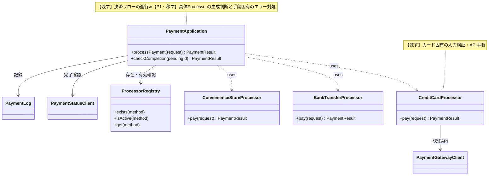
```mermaid
classDiagram
    class PaymentLog
    class PaymentApplication {
        +processPayment(request) PaymentResult
        +checkCompletion(pendingId) PaymentResult
    }
    class CreditCardProcessor {
        +pay(request) PaymentResult
    }
    class BankTransferProcessor {
        +pay(request) PaymentResult
    }
    class ConvenienceStoreProcessor {
        +pay(request) PaymentResult
    }
    class ProcessorRegistry {
        +exists(method)
        +isActive(method)
        +get(method)
    }
    class PaymentGatewayClient
    class PaymentStatusClient

    PaymentApplication ..> CreditCardProcessor : uses
    PaymentApplication ..> BankTransferProcessor : uses
    PaymentApplication ..> ConvenienceStoreProcessor : uses
    PaymentApplication --> ProcessorRegistry : 存在・有効確認
    PaymentApplication --> PaymentStatusClient : 完了確認
    PaymentApplication --> PaymentLog : 記録
    CreditCardProcessor --> PaymentGatewayClient : 認証API

    note for PaymentApplication "【残す】決済フローの進行\n【P1・移す】具体Processorの生成判断と手段固有のエラー対処"
    note for CreditCardProcessor "【残す】カード固有の入力検証・API手順"

    classDef focus fill:#FFF2CC,stroke:#D6B656,stroke-width:2px,color:#222222
    cssClass "PaymentApplication" focus
```

変更前は `PaymentApplication` が振り分けの `if`、具体Processorの生成、手段固有のエラー対処を抱え、決済手段追加のたびに分岐が増えます。

P1をクラス図の変更として書くと、次の3操作になります。

1. P1：各Processorが満たす共通契約 `IPaymentProcessor`（`pay(request)`）を新設する。
2. P1：具体Processorを選んで生成する判断を、生成メソッド `createProcessor` の1か所へ移す。
3. P1：`processPayment` は生成されたProcessorへ `pay(request)` を委譲するだけにする。

変更後は、`PaymentApplication` から具体クラス名と手段固有分岐が消え、生成が `createProcessor`、手段固有差分が各Processorへ移ったことを確認します。図中の `createProcessor` は `PaymentApplication` が宣言する仮想メソッドで、具体クラスの選択・生成は子クラス `DefaultPaymentApplication`（`--|>` で継承）が上書きします。これがFactory Methodの形で、7-1の完成コード（`DefaultPaymentApplication::createProcessor()`、`PaymentWorker`、`WebhookController`、追加手段 `PayPayProcessor`）と図が一致します。

**採用した変更後のクラス図：**


```mermaid
classDiagram
    class DefaultPaymentApplication
    class PaymentGatewayClient
    class PaymentStatusClient
    class ProcessorRegistry
    class PaymentLog
    class CustomerDirectory
    class OrderBook
    class PaymentWorker
    class WebhookController
    class PaymentApplication
    class IPaymentProcessor { <<interface>> }
    class CreditCardProcessor
    class BankTransferProcessor
    class ConvenienceStoreProcessor
    class PayPayProcessor

    PaymentApplication ..> IPaymentProcessor : createProcessor
    IPaymentProcessor <|.. CreditCardProcessor
    IPaymentProcessor <|.. BankTransferProcessor
    IPaymentProcessor <|.. ConvenienceStoreProcessor
    IPaymentProcessor <|.. PayPayProcessor
    PaymentApplication --> ProcessorRegistry : 存在・有効確認
    PaymentApplication --> PaymentStatusClient : 完了確認
    DefaultPaymentApplication --|> PaymentApplication
    PaymentWorker --> PaymentApplication : 非同期入口
    WebhookController --> PaymentApplication : 完了通知
    CreditCardProcessor --> PaymentGatewayClient : 認証API
    PaymentApplication --> PaymentLog : 記録
    PaymentApplication --> CustomerDirectory : 顧客照合
    PaymentApplication --> OrderBook : 注文照合

    note for IPaymentProcessor "【P1・新設】pay(request)の共通契約"
    note for PaymentApplication "【P1・残した】決済フロー\ncreateProcessorで生成を委ねる"
    note for PayPayProcessor "【P1・新設した追加手段】"

    classDef focus fill:#FFF2CC,stroke:#D6B656,stroke-width:2px,color:#222222
    cssClass "IPaymentProcessor,CreditCardProcessor,BankTransferProcessor,ConvenienceStoreProcessor,PayPayProcessor,PaymentApplication" focus
```

クラス図の変更とコード変更を一対一で対応させると、次のようになります。

| 課題ID | クラス図をどう変えるか | コードレベルで何をするか | 実装ステップ |
|---|---|---|---|
| P1 | 共通契約 `IPaymentProcessor` を新設する | `pay(request)` を純粋仮想で定義し各Processorが実装する | ステップ1 |
| P1 | 生成判断を生成メソッドへ寄せる | `createProcessor(type)` に具体クラスの選択・生成を集める | ステップ2 |
| P1 | 利用フローを契約中心へ変える | `processPayment` は `createProcessor` の結果へ `pay()` を委譲する | ステップ3 |

このクラス図が、P1を反映したシステム全体の設計結論です。課題IDは図の差分を追うために使い、以降はこの構造に必要なコードだけを示します。

#### 課題箇所のおさらい（フェーズ3の関連コード）

統合表で特定した箇所だけを振り返ります。P1は `processPayment` の振り分け `if` と、その中の具体Processor生成・手段固有のエラー対処です。課題に関係しないコードは省略し、フェーズ3で明記した維持条件をそのまま引き継ぎます。

```cpp
// 現状：利用フローが具体クラスの生成とエラー対処を抱えている
PaymentResult processPayment(const PaymentRequest& request) {
    const string& type = request.methodId;
    if (type == "credit_card") {
        CreditCardProcessor proc(gatewayClient);
        return proc.pay(request); // canRetryは結果に含む（カード固有）
    } else if (type == "bank_transfer") {
        BankTransferProcessor proc(gatewayClient);
        return proc.pay(request);
    } else if (type == "convenience") {
        ConvenienceStoreProcessor proc(gatewayClient);
        return proc.pay(request);
    }
    // ← 決済手段を足すたびにこの if が伸びる
}
```

### 6-1：採用設計をコードへ段階的に反映する

採用するクラス図と責任配置は、コードを書く前に確定しています。ここからの区切りは試行錯誤の履歴ではありません。完成形を理解できる大きさに分け、各ステップで「クラス図のどの操作・関連を実装したか」を確認します。

#### 実装ステップ1（P1）：共通契約 `IPaymentProcessor` を定める

各決済手段が満たす契約 `pay(request)` を定義し、既存Processorをその実装にします。手段固有の入力検証・API手順・エラー対処は各Processorの内側に閉じます。この契約化ができるのは、フェーズ5で確認したとおり、すべての決済要求がすでに `PaymentRequest` という共通の入力にまとまっているからです。もし手段ごとに引数の形がばらばらだったら、まず入出力の型を `PaymentRequest`／`PaymentResult` へそろえる作業が先に必要になります。共通点が先にそろっているからこそ、契約を1本かぶせるだけで実装を差し替えられます。

```cpp
class IPaymentProcessor {
public:
    virtual ~IPaymentProcessor() = default;
    virtual PaymentResult pay(const PaymentRequest& request) = 0;
};

class CreditCardProcessor : public IPaymentProcessor {
    PaymentGatewayClient& gateway;
public:
    explicit CreditCardProcessor(PaymentGatewayClient& g) : gateway(g) {}
    PaymentResult pay(const PaymentRequest& request) override {
        // カード固有の検証と認証API。canRetry（残高不足は不可、
        // 通信タイムアウトは可）はゲートウェイの結果に含まれる
        return gateway.authorizeCreditCard(
            request.orderId, request.amount, request.creditCard);
    }
};
```

**P1との対応：** `IPaymentProcessor <|.. CreditCardProcessor` の実装関係を実装しました。手段固有のエラー対処が利用フローから各Processorの内側へ移りました。

#### 実装ステップ2（P1）：生成判断を生成メソッドへ寄せる

具体クラスを選んで生成する判断を、`createProcessor(type)` の1か所へ集めます。新しい手段はここへ1行足すだけになります。

```cpp
class PaymentApplication {
protected:
    virtual IPaymentProcessor* createProcessor(const string& type) {
        if (type == "credit_card") return new CreditCardProcessor(gateway);
        if (type == "bank_transfer") return new BankTransferProcessor(gateway);
        if (type == "convenience")
            return new ConvenienceStoreProcessor(gateway);
        return nullptr;
    }
    // ...
};
```

**P1との対応：** `PaymentApplication ..> IPaymentProcessor : createProcessor` の依存関係（生成して一時的に使う）を実装しました。生成判断は1か所へ集まり、利用フローからは消えました。

#### 実装ステップ3（P1）：利用フローを委譲だけにする

`processPayment` は `createProcessor` で得たProcessorへ `pay(request)` を委譲するだけにします。具体クラス名も手段固有分岐も持ちません。

```cpp
PaymentResult processPayment(const PaymentRequest& request) {
    if (!registry.isActive(request.methodId))
        return {"失敗", false, "無効な決済手段"};
    IPaymentProcessor* proc = createProcessor(request.methodId);
    PaymentResult r = proc->pay(request);
    delete proc;                 // 使い終わったら破棄する
    log.record(request, r);
    return r;
}
```

**生ポインタと所有権について：** `createProcessor()` は `new` で作った具体Processorを生ポインタ（`IPaymentProcessor*`）で返します。生ポインタは「指すだけ」で所有権を持たないため、使い終わったら誰かが明示的に `delete` しないとメモリリークになります。ここでは1回の決済で作って使い捨てる一時的な部品なので、`pay()` を呼んだ直後に `delete proc` で破棄します。本書は他言語と読み比べやすいよう全章で生ポインタを使い、所有権の管理より構造の変化に集中しています。実務のC++では、この `new`／`delete` を手書きする代わりに `std::unique_ptr<IPaymentProcessor>`（単独所有・スコープを抜けると自動 `delete`）を使うのが安全で、共有して持ち回るなら `std::shared_ptr` を使います。

**P1との対応：** `processPayment` が契約だけを呼ぶ形になりました。ここで生成判断と手段固有差分が一つの生成分離構造として接続されました。

### 6-2：システム全体の契約とデータ配置を確定する

採用システムの契約、生成場所、依存注入を一表で確定します。`PaymentResult` は対策の抽象ではなく、成否・保留・リトライ可否・保留IDを利用フローへ返す結果オブジェクトです。

```cpp
struct PaymentResult {
    string status;    // 成功・保留・失敗
    bool canRetry;    // リトライ可否
    string message;   // 理由や保留ID
};
```

| 接続点を変える観点 | システム全体での設計判断                                                             | 変えたくない側が知らなくなる詳細 |
| --------- | ------------------------------------------------------------------------ | ---------------- |
| 分離方法      | P1の手段固有検証・処理モード・エラー対処を各Processorへ置く                                      | 手段ごとの入力・API手順    |
| 配置場所      | `createProcessor(type)` が具体Processorを選び生成する                              | 具体クラス名           |
| 組み立て方法    | 外側が共通依存を生成・所有してApplicationへ注入し、生成時に `PaymentGatewayClient` をProcessorへ渡す | 外部APIの実体と生存期間    |
| 安定側の実行    | 利用フローは `pay(request)` だけを呼ぶ                                              | 何を生成したか          |

新しい手段は Processor 実装と `createProcessor` の1行、`ProcessorRegistry` の登録に限られます。

#### システム全体のコード適用結果

| 追跡対象 | 課題定義で目指した状態 | 適用した構造とコード | 適用結果 |
|---|---|---|---|
| P1：決済手段 | 手段追加を具象Processorと生成・設定登録へ限定する | `IPaymentProcessor`、各Processor、`createProcessor()`、`ProcessorRegistry` | `processPayment()` は具体型・手段固有入力・同期非同期を知らず `pay()` だけを呼ぶ |
| P1を適用したシステム全体 | Worker・Webhook・ログを同じ契約のまま維持する | 外側がRegistry・Client・Logを生成・所有・注入し、Applicationが要求ごとにProcessorを生成・破棄する | 手段追加が安定した入口へ波及せず、成功・保留・失敗を同じ結果型で返せた |

**システム全体の実装結果：達成。** P1が生成分離構造として決済経路へ接続され、フェーズ5で目指した状態を実現しました。実行結果と変更影響は、完成コードを示した後のフェーズ7で確認します。

## 🟢 フェーズ7：対策実施 ―― 変化に強いコードを完成させる
生成するオブジェクトの種類（決済手段）を、利用側から隠蔽するメソッドに集約し、利用側がインターフェースを通じてインスタンスを得る構造——これが **生成分離構造（ファクトリーメソッド）** と呼ばれています。

### 7-1：解決後のコード（全体）

フェーズ6で確定したP1を満たす生成分離構造を、実行可能な完全なコードとして組み上げます。実装ステップは、採用済み構造の契約・具象生成・組み立てを理解しやすい順に反映したものです。

**1. データ構造とインターフェース**

手段固有の入力データ、保留情報、決済要求・結果、共通インターフェースを定義します。

```cpp
#include <iostream>
#include <map>
#include <stdexcept>
#include <string>
#include <vector>
#include <queue>

using namespace std;

// 決済手段ID・決済状態（直文字列を名前へ置き換える）
namespace PaymentMethod {
    const string CreditCard   = "credit_card";
    const string BankTransfer = "bank_transfer";
    const string Convenience  = "convenience";
    const string PayPay       = "paypay";
}
namespace PaymentStatus {
    const string Pending = "保留";
    const string Failed  = "失敗";
}

// ---- 手段固有の入力データ ----

struct CreditCardInput {
    string cardToken;
    string holderName;
    string securityCode;
};

struct BankTransferInput {
    string payerName;
    string bankCode;
    string accountType;
};

struct ConvenienceInput {
    string phoneNumber;
    string email;
    string storeCode;
};

struct PayPayInput {
    string accessToken;
    string merchantId;
};

// ---- 保留決済の追跡情報 ----

struct PendingInfo {
    string pendingId;
};

// ---- 決済要求・結果 ----

struct PaymentRequest {
    string methodId;
    int amount;
    string orderId;
    string customerId;
    CreditCardInput creditCard;
    BankTransferInput bankTransfer;
    ConvenienceInput convenience;
    PayPayInput payPay;
};

struct PaymentResult {
    string status;
    string message;
    bool canRetry;
    string errorCode;
    PendingInfo pending;
};

// ---- 共通インターフェース ----

class IPaymentProcessor {
public:
    virtual ~IPaymentProcessor() {}
    virtual PaymentResult pay(
        const PaymentRequest& request) = 0;
};
```

`IPaymentProcessor` は「決済要求を受け取り、決済結果を返す」という約束を定義します。手段固有の入力検証、API呼び出し、エラー対処は各Processorの `pay()` 内に閉じ込められます。

**1-b. レジストリ（データ層）の定義**

```cpp
struct ProcessorConfig {
    string name;
    bool isActive;
};

class ProcessorRegistry {
private:
    map<string, ProcessorConfig> registry;
public:
    ProcessorRegistry() {
        registry[PaymentMethod::CreditCard] =
            {"クレジットカード", true};
        registry[PaymentMethod::BankTransfer] =
            {"銀行振込", true};
        registry[PaymentMethod::Convenience] =
            {"コンビニ払い", true};
        registry[PaymentMethod::PayPay] =
            {"PayPay", true};
        registry["crypto"] =
            {"暗号通貨", false};
    }

    bool exists(const string& method) const {
        return registry.count(method) > 0;
    }

    bool isActive(const string& method) const {
        return registry.at(method).isActive;
    }

    ProcessorConfig get(
        const string& method) const {
        return registry.at(method);
    }
};
```

**1-b2. 顧客・注文の保持データ（事前登録）**

決済要求が参照する顧客と注文を、システムが事前に保持します。`ProcessorRegistry` と同じデータ層で、要求に載る `customerId`・`orderId`・金額を照合する土台です（第1章 `CustomerDatabase`、第9章 `UserDatabase` と同じ「登録済みデータへ照合する」形）。

```cpp
// 事前保持：顧客（customerId → 氏名）
struct CustomerRecord { string name; };

class CustomerDirectory {
    map<string, CustomerRecord> records;
public:
    CustomerDirectory() {
        records["C001"] = {"田中 一郎"};
        records["C002"] = {"佐藤 花子"};
        records["C003"] = {"鈴木 次郎"};
        records["C004"] = {"高橋 三郎"};
        records["C005"] = {"伊藤 四郎"};
        records["C006"] = {"渡辺 五郎"};
        records["C007"] = {"山本 六郎"};
        records["C008"] = {"中村 七郎"};
        records["C020"] = {"小林 八郎"};
    }
    bool exists(const string& id) const { return records.count(id) > 0; }
    CustomerRecord get(const string& id) const { return records.at(id); }
};

// 事前保持：注文（orderId → 顧客ID・請求金額）
struct OrderRecord { string customerId; int amount; };

class OrderBook {
    map<string, OrderRecord> records;
public:
    OrderBook() {
        records["ORD-1001"] = {"C001", 1000};
        records["ORD-1002"] = {"C002", 2000};
        records["ORD-1003"] = {"C003", 500};
        records["ORD-1004"] = {"C004", 800};
        records["ORD-1005"] = {"C005", 600};
        records["ORD-1006"] = {"C006", 300};
        records["ORD-1007"] = {"C007", 200};
        records["ORD-1008"] = {"C008", 1200};
        records["ORD-2001"] = {"C020", 3000};
    }
    bool exists(const string& id) const { return records.count(id) > 0; }
    OrderRecord get(const string& id) const { return records.at(id); }
};
```

`customerId`・`orderId` は、この保持データに存在するもの以外は受け付けません。金額も注文の登録額と一致するかを照合します。

**1-c. 決済ログ**

```cpp
struct PaymentRecord {
    string method;
    int amount;
    string status;
    string errorCode;
};

class PaymentLog {
    vector<PaymentRecord> records;
public:
    void add(const string& method,
             int amount,
             const string& status,
             const string& errorCode = "") {
        records.push_back(
            {method, amount, status, errorCode});
    }
    void printAll() const {
        for (const auto& r : records) {
            cout << "[" << r.method << "] "
                 << r.amount << "円 -> "
                 << r.status;
            if (!r.errorCode.empty()) {
                cout << " (" << r.errorCode << ")";
            }
            cout << endl;
        }
    }
};
```

**2. 外部API境界スタブ**

```cpp
class PaymentGatewayClient {
    map<string, int> cardAttempts;  // 注文ごとのカード認証試行回数
public:
    PaymentResult authorizeCreditCard(
        const string& orderId,
        int amount,
        const CreditCardInput& card) {
        cout << "[PaymentGateway] カード認証"
             << " order=" << orderId
             << " amount=" << amount
             << " token=" << card.cardToken
             << endl;
        int attempt = ++cardAttempts[orderId];
        // ERROR始まりは残高不足。再試行しても変わらない（canRetry=false）
        if (card.cardToken.find("ERROR") == 0) {
            return {PaymentStatus::Failed,
                    "カード認証失敗: 残高不足",
                    false, "AUTH_DECLINED", {}};
        }
        // TIMEOUT始まりは一時的な通信失敗。1回目だけ失敗し再試行で成功する
        if (card.cardToken.find("TIMEOUT") == 0 && attempt == 1) {
            return {PaymentStatus::Failed,
                    "カード認証失敗: 通信タイムアウト",
                    true, "NETWORK_TIMEOUT", {}};
        }
        return {"成功",
                "クレジット認証済み id=AUTH001",
                false, "", {}};
    }

    PaymentResult issueBankTransfer(
        const string& orderId,
        int amount,
        const BankTransferInput& bank) {
        cout << "[PaymentGateway] 振込先発行"
             << " order=" << orderId
             << " amount=" << amount
             << " payer=" << bank.payerName
             << " type=" << bank.accountType
             << endl;
        PendingInfo p{"BT-" + orderId};
        return {PaymentStatus::Pending,
                "振込先発行済み 口座=mizuho-1234567",
                false, "", p};
    }

    PaymentResult issueConvenienceCode(
        const string& orderId,
        int amount,
        const ConvenienceInput& cvs) {
        cout << "[PaymentGateway] コンビニ番号発行"
             << " order=" << orderId
             << " amount=" << amount
             << " phone=" << cvs.phoneNumber
             << " store=" << cvs.storeCode
             << endl;
        PendingInfo p{"CVS-" + orderId};
        return {PaymentStatus::Pending,
                "番号発行済み 番号=CVS-98765",
                false, "", p};
    }

    PaymentResult chargePayPay(
        const string& orderId,
        int amount,
        const PayPayInput& pp) {
        cout << "[PaymentGateway] PayPay決済"
             << " order=" << orderId
             << " amount=" << amount
             << " token=" << pp.accessToken
             << endl;
        PendingInfo p{"PP-" + orderId};
        return {PaymentStatus::Pending,
                "PayPayセッション作成済み",
                false, "", p};
    }
};

class PaymentStatusClient {
public:
    PaymentResult checkStatus(
        const string& pendingId) {
        cout << "[状態確認API] id="
             << pendingId << endl;
        if (pendingId.find("EXPIRE")
            != string::npos) {
            return {PaymentStatus::Failed,
                    "支払い期限切れ",
                    false, "EXPIRED", {}};
        }
        if (pendingId.find("BT-") == 0) {
            return {"成功",
                    "入金確認済み",
                    false, "", {}};
        }
        if (pendingId.find("CVS-") == 0) {
            return {"成功",
                    "コンビニ入金確認済み",
                    false, "", {}};
        }
        if (pendingId.find("PP-") == 0) {
            return {"成功",
                    "PayPay決済確認済み",
                    false, "", {}};
        }
        return {PaymentStatus::Failed,
                "不明な保留ID",
                false, "UNKNOWN_PENDING", {}};
    }
};
```

**3. 個別の決済プロセッサーの実装**

各Processorは `IPaymentProcessor` を実装し、自分の手段固有の入力検証、API呼び出し、エラー対処をすべて `pay()` 内に閉じ込めます。

```cpp
class CreditCardProcessor
    : public IPaymentProcessor {
    PaymentGatewayClient& gateway;
public:
    CreditCardProcessor(
        PaymentGatewayClient& gw)
        : gateway(gw) {}

    PaymentResult pay(
        const PaymentRequest& req) override {
        if (req.creditCard.cardToken.empty()) {
            return {PaymentStatus::Failed,
                    "カードトークンが不足しています",
                    false, "MISSING_TOKEN", {}};
        }
        if (req.creditCard.holderName.empty()) {
            return {PaymentStatus::Failed,
                    "カード名義が不足しています",
                    false, "MISSING_HOLDER", {}};
        }
        if (req.creditCard.securityCode.empty()) {
            return {PaymentStatus::Failed,
                    "セキュリティコードが不足",
                    false, "MISSING_CVV", {}};
        }
        // canRetry はゲートウェイの結果に含まれる（失敗の種類で決まる）
        return gateway.authorizeCreditCard(
            req.orderId, req.amount,
            req.creditCard);
    }
};

class BankTransferProcessor
    : public IPaymentProcessor {
    PaymentGatewayClient& gateway;
public:
    BankTransferProcessor(
        PaymentGatewayClient& gw)
        : gateway(gw) {}

    PaymentResult pay(
        const PaymentRequest& req) override {
        if (req.bankTransfer.payerName.empty()) {
            return {PaymentStatus::Failed,
                    "振込名義が不足しています",
                    false, "MISSING_PAYER", {}};
        }
        if (req.bankTransfer.bankCode.empty()) {
            return {PaymentStatus::Failed,
                    "銀行コードが不足しています",
                    false, "MISSING_BANK", {}};
        }
        return gateway.issueBankTransfer(
            req.orderId, req.amount,
            req.bankTransfer);
    }
};

class ConvenienceStoreProcessor
    : public IPaymentProcessor {
    PaymentGatewayClient& gateway;
public:
    ConvenienceStoreProcessor(
        PaymentGatewayClient& gw)
        : gateway(gw) {}

    PaymentResult pay(
        const PaymentRequest& req) override {
        if (req.convenience.phoneNumber.empty()) {
            return {PaymentStatus::Failed,
                    "電話番号が不足しています",
                    false, "MISSING_PHONE", {}};
        }
        if (req.convenience.email.empty()) {
            return {PaymentStatus::Failed,
                    "メールアドレスが不足しています",
                    false, "MISSING_EMAIL", {}};
        }
        return gateway.issueConvenienceCode(
            req.orderId, req.amount,
            req.convenience);
    }
};

class PayPayProcessor
    : public IPaymentProcessor {
    PaymentGatewayClient& gateway;
public:
    PayPayProcessor(
        PaymentGatewayClient& gw)
        : gateway(gw) {}

    PaymentResult pay(
        const PaymentRequest& req) override {
        if (req.payPay.accessToken.empty()) {
            return {PaymentStatus::Failed,
                    "PayPayトークンが不足しています",
                    false, "MISSING_PP_TOKEN", {}};
        }
        if (req.payPay.merchantId.empty()) {
            return {PaymentStatus::Failed,
                    "マーチャントIDが不足しています",
                    false, "MISSING_MERCHANT", {}};
        }
        return gateway.chargePayPay(
            req.orderId, req.amount,
            req.payPay);
    }
};
```

各Processorが自分の入力検証を行い、自分のAPI境界を呼び、自分のエラー対処（カードの`canRetry`設定など）を完結しています。利用側は手段固有の入力検証やAPI手順を知りません。ただし、共通結果契約に含めた`Pending`と`canRetry`は利用側も扱います。

**4. 本体クラス（生成分離構造を持つCreator）**

```cpp
class PaymentApplication {
protected:
    virtual IPaymentProcessor*
    createProcessor(const string& type) = 0;

    PaymentStatusClient statusClient;
    CustomerDirectory customers;   // 事前保持：顧客
    OrderBook orders;              // 事前保持：注文

public:
    virtual ~PaymentApplication() = default;

    PaymentResult processPayment(
        const PaymentRequest& request) {
        if (request.amount < 1) {
            return {PaymentStatus::Failed,
                    "金額は1円以上で指定してください。",
                    false, "INVALID_AMOUNT", {}};
        }
        // 事前保持データと照合：注文・顧客・金額が登録済みか
        if (!orders.exists(request.orderId)) {
            return {PaymentStatus::Failed,
                    "未登録の注文です: " + request.orderId,
                    false, "UNKNOWN_ORDER", {}};
        }
        OrderRecord ord = orders.get(request.orderId);
        if (ord.customerId != request.customerId
            || ord.amount != request.amount) {
            return {PaymentStatus::Failed,
                    "注文内容が保持データと一致しません",
                    false, "ORDER_MISMATCH", {}};
        }
        if (!customers.exists(request.customerId)) {
            return {PaymentStatus::Failed,
                    "未登録の顧客です: " + request.customerId,
                    false, "UNKNOWN_CUSTOMER", {}};
        }
        CustomerRecord customer = customers.get(request.customerId);
        if (customer.name.empty()) {
            return {PaymentStatus::Failed,
                    "顧客名が登録されていません",
                    false, "INVALID_CUSTOMER", {}};
        }
        IPaymentProcessor* proc
            = createProcessor(request.methodId);
        PaymentResult result
            = proc->pay(request);
        delete proc;
        return result;
    }

    // 保留決済の完了確認（汎用）
    PaymentResult checkCompletion(
        const string& pendingId) {
        return statusClient.checkStatus(pendingId);
    }
};
```
> [!NOTE]
> **どこを簡素化しているか：** ここで簡素化しているのは「所有権の管理」だけです。`createProcessor()` が返す生ポインタを `IPaymentProcessor* proc` で受け、`delete proc` で手動破棄しています。この `new`／`delete` の手書きが簡素化した部分で、他言語（Java・C#など、GCがある言語）と読み比べやすくするため、また所有権の記法でコードが長くならないようにするための選択です。本書は全章でこの生ポインタ方式に統一し、所有権の議論より構造の変化（生成の分離）に集中します。
> **どうなると簡素化ではなくなるか：** 生成したProcessorが「この関数の中で作って、その場で捨てる」範囲を超えると、生ポインタ＋手動 `delete` では管理しきれなくなります。たとえば、Processorを生成後に別のオブジェクトへ渡して保持させる、複数の呼び出しで使い回す、例外が途中で投げられて `delete` に到達しない、といった場合です。そのときは所有権を型で表す `std::unique_ptr`（単独所有）や `std::shared_ptr`（共有所有）へ置き換える必要があり、それはもう簡素化ではなく実務上必須の設計判断になります。この章の論点（生成と利用の分離）はどちらの書き方でも変わらないため、ここでは生ポインタのままにしています。

```cpp
class DefaultPaymentApplication
    : public PaymentApplication {
    ProcessorRegistry registry;
    PaymentGatewayClient gatewayClient;
protected:
    IPaymentProcessor*
    createProcessor(const string& type) override {
        if (!registry.exists(type)) {
            throw invalid_argument(
                "未登録の決済方法です: " + type);
        }
        if (!registry.isActive(type)) {
            ProcessorConfig cfg
                = registry.get(type);
            throw invalid_argument(
                cfg.name + " は現在無効です。");
        }
        if (type == PaymentMethod::CreditCard)
            return new CreditCardProcessor(
                gatewayClient);
        if (type == PaymentMethod::BankTransfer)
            return new BankTransferProcessor(
                gatewayClient);
        if (type == PaymentMethod::Convenience)
            return new ConvenienceStoreProcessor(
                gatewayClient);
        if (type == PaymentMethod::PayPay)
            return new PayPayProcessor(
                gatewayClient);
        throw invalid_argument(
            "未対応の決済種別: " + type);
    }
};
```

`processPayment`は`IPaymentProcessor*`を取得して`pay(request)`を呼ぶだけです。生成の分岐で使う決済手段IDと、結果のステータス（`保留`／`失敗`）は、それぞれ`PaymentMethod`・`PaymentStatus`の名前付き定数へまとめています。手段固有の入力検証、API呼び出し手順、保留IDの作り方は各Processorの内部で完結します。一方、利用側の`executeCase`は共通契約として`Pending`を判定し、共通の`checkCompletion()`を呼びます。つまり利用側が知らないのは「どの手段がどのAPI・完了手順を使うか」であり、非同期状態そのものを知らないわけではありません。

この構成は、利用側が同期ループで呼ぶ形に限りません。掲載コードの末尾では、決済会社から届くWebフックを受け取る `WebhookController`（署名を検証し、正しいものだけをジョブキューへ積む）と、キューを取り出して同じ `processPayment` を呼ぶ `PaymentWorker` を追加しています。イベント駆動（Webhook）で受け取り、ワーカーがキューから非同期に処理する構成でも、決済手段ごとの生成・処理は同じ Factory Method の裏に隠れたままです。実運用ではワーカーは別スレッドで動きますが、掲載コードでは実スレッドを使わず、キューを同期的に空にして投入順・処理順を確認します。ここで使う `std::queue` は先入れ先出し（FIFO）のコンテナで、`push()` で末尾へ積み、`front()` で先頭を見て `pop()` で取り出します。積んだ順に処理されるため、受け取った順序どおりに決済が進むことを確認できます。

> [!NOTE] ポーリング以外のアーキテクチャ（Webhook等）への応用
> 本章では、コードを1つの関数内で上から下へ流して確認できるよう、非同期決済の結果を「自ら状態確認APIへ問い合わせる（ポーリングする）」システム構成として記述しています。
> しかし現実のシステムでは、決済会社から結果がHTTPリクエストで通知される**イベント駆動（Webhook）方式**や、非同期キューを使って**別スレッドのワーカー**で結果を処理する構成も一般的です。
> アーキテクチャが変わっても、「決済手段ごとに必要な処理手順が異なる」という本質は変わりません。イベント方式であっても、Webhookを受け取るコントローラー側で Factory Method を使って対応するProcessorを生成し、署名検証や結果判定といった手段固有の処理をインターフェースの裏に隠蔽することで、本章と全く同じパターンの恩恵（利用側ロジックの単純化）を得ることができます。


**5. イベント駆動の入口とワーカー（WebhookEvent / WebhookController / PaymentWorker）**

決済会社からのWebフックを受け取る入口と、キューからジョブを取り出して処理するワーカーです。どちらも `PaymentApplication` を通じて処理し、決済手段ごとの詳細は知りません。

```cpp
// 外部（決済会社）から届くWebフックイベント
struct WebhookEvent {
    string methodId;
    string signature;   // 署名。"valid" 以外は不正として拒否する
    PaymentRequest payload;
};

// Webフックを受け取り、署名を検証してジョブキューへ積む入口
class WebhookController {
    queue<PaymentRequest>& jobs;
public:
    explicit WebhookController(queue<PaymentRequest>& q)
        : jobs(q) {}
    bool receive(const WebhookEvent& ev) {
        if (ev.signature != "valid") {
            cout << "[Webhook] 署名検証に失敗: "
                 << ev.methodId << endl;
            return false;
        }
        cout << "[Webhook] 受理してキューへ: "
             << ev.methodId << endl;
        jobs.push(ev.payload);
        return true;
    }
};

// キューからジョブを取り出し、Factory経由で処理するワーカー
// 実運用では別スレッドで動くが、ここでは同期的にキューを空にする
class PaymentWorker {
    PaymentApplication& app;
    queue<PaymentRequest>& jobs;
public:
    PaymentWorker(PaymentApplication& a,
                  queue<PaymentRequest>& q)
        : app(a), jobs(q) {}
    void drain() {
        while (!jobs.empty()) {
            PaymentRequest req = jobs.front();
            jobs.pop();
            PaymentResult r = app.processPayment(req);
            cout << "[ワーカー] " << req.methodId
                 << " -> " << r.status << endl;
        }
    }
};
```

`WebhookController` は署名検証だけを行ってジョブをキューへ積み、`PaymentWorker` はキューを順に処理します。アーキテクチャが同期呼び出しからイベント駆動へ変わっても、決済手段ごとの生成・処理は `PaymentApplication` の裏に隠れたままです。

**6. 組み立てと実行（main）**

各部品を組み立て、代表シナリオをケースごとに実行します。まず各ケース共通の「実行・再試行・保留時の完了確認・ログ記録」を補助関数にまとめます。

```cpp
// 各ケース共通：実行し、再試行可能なら再試行し、保留なら完了確認する
static void executeCase(PaymentApplication& app,
                        PaymentLog& payLog,
                        const PaymentRequest& req) {
    try {
        PaymentResult result = app.processPayment(req);
        // 失敗かつ再試行可能（canRetry）なら1回だけ再試行する
        if (result.status == PaymentStatus::Failed
            && result.canRetry) {
            cout << "結果: " << req.methodId << " -> "
                 << result.status << " (" << result.message
                 << ") [canRetry=true]" << endl;
            cout << "  再試行可能なため再試行します..." << endl;
            result = app.processPayment(req);
        }
        cout << "結果: " << req.methodId << " -> "
             << result.status << " (" << result.message
             << ")" << endl;
        if (result.status == PaymentStatus::Pending) {
            cout << "  完了確認中... id="
                 << result.pending.pendingId << endl;
            PaymentResult completion
                = app.checkCompletion(result.pending.pendingId);
            cout << "  完了結果: " << completion.status
                 << " (" << completion.message << ")" << endl;
            payLog.add(req.methodId, req.amount,
                       completion.status, completion.errorCode);
        } else {
            payLog.add(req.methodId, req.amount,
                       result.status, result.errorCode);
        }
    } catch (const invalid_argument& e) {
        cout << "結果: " << req.methodId << " -> 失敗 ("
             << e.what() << ")" << endl;
        payLog.add(req.methodId, req.amount,
                   PaymentStatus::Failed, "");
    }
}
```

`main()` は各部品を組み立て、ケースを1件ずつ `executeCase` へ渡します。

```cpp
int main() {
    DefaultPaymentApplication app;
    PaymentLog payLog;
```

ケース1は、同期決済（カード）の正常ケースです。

```cpp
    // ケース1: カード正常（同期）
    PaymentRequest r1;
    r1.methodId = PaymentMethod::CreditCard;
    r1.amount = 1000;
    r1.orderId = "ORD-1001";
    r1.customerId = "C001";
    r1.creditCard = {"tok_abc", "YAMADA", "123"};
    executeCase(app, payLog, r1);
```

ケース1の実行結果：

```
[PaymentGateway] カード認証 order=ORD-1001 amount=1000 token=tok_abc
結果: credit_card -> 成功 (クレジット認証済み id=AUTH001)
```

ケース2は、非同期決済（銀行振込）の保留→完了確認です。

```cpp
    // ケース2: 銀行振込正常（非同期）
    PaymentRequest r2;
    r2.methodId = PaymentMethod::BankTransfer;
    r2.amount = 2000;
    r2.orderId = "ORD-1002";
    r2.customerId = "C002";
    r2.bankTransfer = {"山田太郎", "0001", "ordinary"};
    executeCase(app, payLog, r2);
```

ケース2の実行結果：

```
[PaymentGateway] 振込先発行 order=ORD-1002 amount=2000 payer=山田太郎 type=ordinary
結果: bank_transfer -> 保留 (振込先発行済み 口座=mizuho-1234567)
  完了確認中... id=BT-ORD-1002
[状態確認API] id=BT-ORD-1002
  完了結果: 成功 (入金確認済み)
```

ケース3は、非同期決済（コンビニ）の保留→完了確認です。

```cpp
    // ケース3: コンビニ正常（非同期）
    PaymentRequest r3;
    r3.methodId = PaymentMethod::Convenience;
    r3.amount = 500;
    r3.orderId = "ORD-1003";
    r3.customerId = "C003";
    r3.convenience = {"09012345678", "y@example.com", "seven"};
    executeCase(app, payLog, r3);
```

ケース3の実行結果：

```
[PaymentGateway] コンビニ番号発行 order=ORD-1003 amount=500 phone=09012345678 store=seven
結果: convenience -> 保留 (番号発行済み 番号=CVS-98765)
  完了確認中... id=CVS-ORD-1003
[状態確認API] id=CVS-ORD-1003
  完了結果: 成功 (コンビニ入金確認済み)
```

ケース4は、変更要求で追加したPayPay（非同期）の保留→完了確認です。

```cpp
    // ケース4: PayPay正常（非同期）
    PaymentRequest r4;
    r4.methodId = PaymentMethod::PayPay;
    r4.amount = 3000;
    r4.orderId = "ORD-2001";
    r4.customerId = "C020";
    r4.payPay = {"pp_token_123", "MERCHANT001"};
    executeCase(app, payLog, r4);
```

ケース4の実行結果：

```
[PaymentGateway] PayPay決済 order=ORD-2001 amount=3000 token=pp_token_123
結果: paypay -> 保留 (PayPayセッション作成済み)
  完了確認中... id=PP-ORD-2001
[状態確認API] id=PP-ORD-2001
  完了結果: 成功 (PayPay決済確認済み)
```

ケース5は、カード認証がAPIで失敗（残高不足・再試行不可）するケースです。

```cpp
    // ケース5: カードAPI失敗（残高不足・canRetry=false）
    PaymentRequest r5;
    r5.methodId = PaymentMethod::CreditCard;
    r5.amount = 800;
    r5.orderId = "ORD-1004";
    r5.customerId = "C004";
    r5.creditCard = {"ERROR_DECLINED", "SUZUKI", "456"};
    executeCase(app, payLog, r5);
```

ケース5の実行結果（再試行不可なので再試行しません）：

```
[PaymentGateway] カード認証 order=ORD-1004 amount=800 token=ERROR_DECLINED
結果: credit_card -> 失敗 (カード認証失敗: 残高不足)
```

ケース6は、カード入力（名義）が不足していて認証前に弾かれるケースです。

```cpp
    // ケース6: カード入力不足
    PaymentRequest r6;
    r6.methodId = PaymentMethod::CreditCard;
    r6.amount = 600;
    r6.orderId = "ORD-1005";
    r6.customerId = "C005";
    r6.creditCard = {"tok_xyz", "", "789"};
    executeCase(app, payLog, r6);
```

ケース6の実行結果：

```
結果: credit_card -> 失敗 (カード名義が不足しています)
```

ケース7は、登録済みだが無効な決済方法（暗号通貨）です。

```cpp
    // ケース7: 無効な決済方法
    PaymentRequest r7;
    r7.methodId = "crypto";
    r7.amount = 300;
    r7.orderId = "ORD-1006";
    r7.customerId = "C006";
    executeCase(app, payLog, r7);
```

ケース7の実行結果：

```
結果: crypto -> 失敗 (暗号通貨 は現在無効です。)
```

ケース8は、未登録の決済方法です。

```cpp
    // ケース8: 未登録の決済方法
    PaymentRequest r8;
    r8.methodId = "unknown";
    r8.amount = 200;
    r8.orderId = "ORD-1007";
    r8.customerId = "C007";
    executeCase(app, payLog, r8);
```

ケース8の実行結果：

```
結果: unknown -> 失敗 (未登録の決済方法です: unknown)
```

ケース9は、一時的な通信失敗で `canRetry` が立ち、`executeCase` が再試行して成功するケースです。

```cpp
    // ケース9: カード一時失敗 → canRetryを見て再試行し成功
    PaymentRequest r9;
    r9.methodId = PaymentMethod::CreditCard;
    r9.amount = 1200;
    r9.orderId = "ORD-1008";
    r9.customerId = "C008";
    r9.creditCard = {"TIMEOUT_ONCE", "TANAKA", "321"};
    executeCase(app, payLog, r9);
```

ケース9の実行結果（1回目失敗→再試行→成功）：

```
[PaymentGateway] カード認証 order=ORD-1008 amount=1200 token=TIMEOUT_ONCE
結果: credit_card -> 失敗 (カード認証失敗: 通信タイムアウト) [canRetry=true]
  再試行可能なため再試行します...
[PaymentGateway] カード認証 order=ORD-1008 amount=1200 token=TIMEOUT_ONCE
結果: credit_card -> 成功 (クレジット認証済み id=AUTH001)
```

最後に、イベント駆動（Webhook）＋ワーカーでも同じFactoryが再利用されることと、各ケースの記録を確認します。

```cpp
    // イベント駆動（Webhook）＋ワーカーで同じFactoryを再利用する
    cout << "\n--- Webhook + ワーカー ---\n";
    queue<PaymentRequest> jobs;
    WebhookController controller(jobs);
    PaymentWorker worker(app, jobs);
    WebhookEvent e1{PaymentMethod::CreditCard, "valid", r1};
    WebhookEvent e2{PaymentMethod::PayPay, "bad", r4};
    controller.receive(e1);   // 署名OK→キューへ
    controller.receive(e2);   // 署名NG→拒否
    worker.drain();           // キューを取り出しFactoryで処理

    cout << "\n--- 決済ログ ---\n";
    payLog.printAll();

    return 0;
}
```

Webhook・決済ログの実行結果：

```
--- Webhook + ワーカー ---
[Webhook] 受理してキューへ: credit_card
[Webhook] 署名検証に失敗: paypay
[PaymentGateway] カード認証 order=ORD-1001 amount=1000 token=tok_abc
[ワーカー] credit_card -> 成功

--- 決済ログ ---
[credit_card] 1000円 -> 成功
[bank_transfer] 2000円 -> 成功
[convenience] 500円 -> 成功
[paypay] 3000円 -> 成功
[credit_card] 800円 -> 失敗 (AUTH_DECLINED)
[credit_card] 600円 -> 失敗 (MISSING_HOLDER)
[crypto] 300円 -> 失敗
[unknown] 200円 -> 失敗
[credit_card] 1200円 -> 成功
```

新しく追加したPayPay決済も含めて、同期決済（カード）は即座に成功し、非同期決済（銀行振込・コンビニ・PayPay）は保留→完了確認→成功の流れが動いています。カードAPI失敗、入力不足、無効・未登録の各エラーも `processPayment` の骨格に手を加えることなく表現できています。

#### 解決後のクラス構成

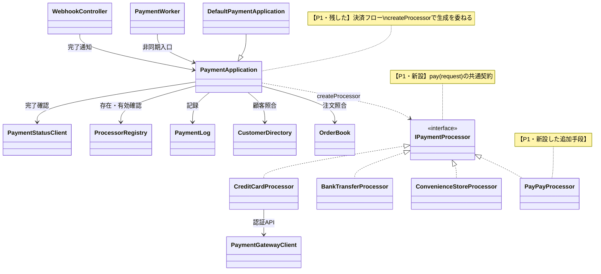
```mermaid
classDiagram
    class DefaultPaymentApplication
    class PaymentGatewayClient
    class PaymentStatusClient
    class ProcessorRegistry
    class PaymentLog
    class CustomerDirectory
    class OrderBook
    class PaymentWorker
    class WebhookController
    class PaymentApplication
    class IPaymentProcessor { <<interface>> }
    class CreditCardProcessor
    class BankTransferProcessor
    class ConvenienceStoreProcessor
    class PayPayProcessor

    PaymentApplication ..> IPaymentProcessor : createProcessor
    IPaymentProcessor <|.. CreditCardProcessor
    IPaymentProcessor <|.. BankTransferProcessor
    IPaymentProcessor <|.. ConvenienceStoreProcessor
    IPaymentProcessor <|.. PayPayProcessor
    PaymentApplication --> ProcessorRegistry : 存在・有効確認
    PaymentApplication --> PaymentStatusClient : 完了確認
    DefaultPaymentApplication --|> PaymentApplication
    PaymentWorker --> PaymentApplication : 非同期入口
    WebhookController --> PaymentApplication : 完了通知
    CreditCardProcessor --> PaymentGatewayClient : 認証API
    PaymentApplication --> PaymentLog : 記録
    PaymentApplication --> CustomerDirectory : 顧客照合
    PaymentApplication --> OrderBook : 注文照合

    note for IPaymentProcessor "【P1・新設】pay(request)の共通契約"
    note for PaymentApplication "【P1・残した】決済フロー\ncreateProcessorで生成を委ねる"
    note for PayPayProcessor "【P1・新設した追加手段】"

    classDef focus fill:#FFF2CC,stroke:#D6B656,stroke-width:2px,color:#222222
    cssClass "IPaymentProcessor,CreditCardProcessor,BankTransferProcessor,ConvenienceStoreProcessor,PayPayProcessor,PaymentApplication" focus
```

章末のFactory Method骨格図では、`PaymentApplication` がCreator、`createProcessor` がFactory Method、`IPaymentProcessor` と各実装がProduct群に対応します。

#### 変更軸ごとの完成コード追跡

| 課題ID | 完成コードの適用先 | 実装後に起きたこと | システム全体で維持できた範囲 |
|---|---|---|---|
| P1 | 全 `IPaymentProcessor` 実装、生成メソッド、`PaymentApplication`、Worker・Webhook | 同期・非同期入口は同じ `processPayment()` を使い、手段固有知識はProcessorと生成側に閉じた | 新決済でWorker・Webhookを変更せず、Processor実装と生成登録だけを追加できる |

1行は、一つの完成システムを一本の変化軸から追跡した結果です。生成分離構造がP1の完了条件を維持しています。

#### 要求→課題→構造→コード→結果の追跡

| 確定要求ID・課題ID | 構造差分・コード適用先 | 実行結果 | 残る変更先 |
|---|---|---|---|
| R1：決済手段追加と入口統一／P1 | 手段固有処理と生成をProcessor／Creatorへ分離。コード：全 `IPaymentProcessor`、`createProcessor()`、各入口 | Credit・銀行・コンビニ・PayPayが同じ `PaymentResult` を返し、Worker／Webhookも同じ処理を利用 | 新Processorと生成登録 |

#### 変更前→変更後の不変条件照合

| 変更対象外 | 変更前 | 変更後 | 確認根拠 |
|---|---|---|---|
| 入出力契約 | `PaymentRequest`→`PaymentResult` | 同じフィールドと状態を使用 | 1-4と7-1の結果コード |
| 結果保存 | `PaymentLog` に記録 | 同じ注文ID・成否を保存 | 正常・Pending・失敗ログ |

### 7-2：動作シーケンス図

フェーズ6で確定した生成分離構造の実行時のオブジェクト間のやり取りを可視化します。

> **図の読み方：** `createProcessor` はシーケンス図では独立した参加者として描かれていますが、実際には `PaymentApplication`（またはそのサブクラス）のメソッドです。

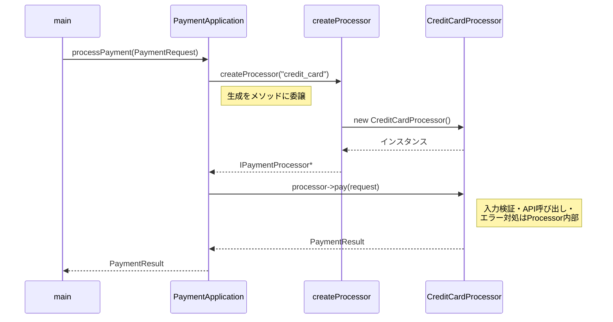
```mermaid
sequenceDiagram
    participant main
    participant PA as PaymentApplication
    participant CP as createProcessor
    participant CC as CreditCardProcessor

    main->>PA: processPayment(PaymentRequest)
    PA->>CP: createProcessor("credit_card")
    Note right of PA: 生成をメソッドに委譲
    CP->>CC: new CreditCardProcessor()
    CC-->>CP: インスタンス
    CP-->>PA: IPaymentProcessor*
    PA->>CC: processor->pay(request)
    Note right of CC: 入力検証・API呼び出し・<br>エラー対処はProcessor内部
    CC-->>PA: PaymentResult
    PA-->>main: PaymentResult
```

### 7-3：変更影響グラフ（改善後）

フェーズ3で確認した「PayPay決済の追加」のシナリオを、3-2と同じ粒度で再度適用します。

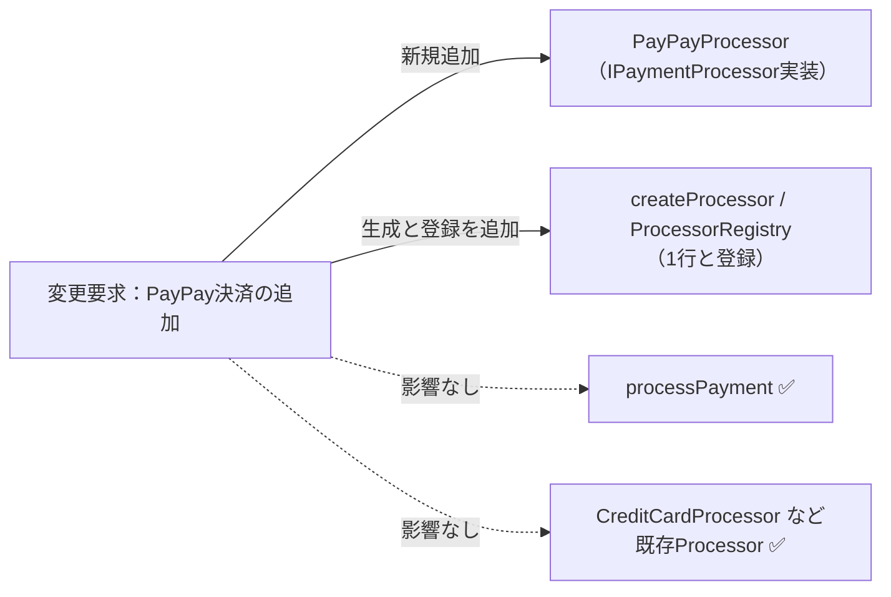
```mermaid
graph LR
    T1["変更要求：PayPay決済の追加"]
        -->|新規追加| F0["PayPayProcessor<br>（IPaymentProcessor実装）"]
    T1 -->|生成と登録を追加| F1["createProcessor / ProcessorRegistry<br>（1行と登録）"]
    T1 -. "影響なし" .-> A["processPayment ✅"]
    T1 -. "影響なし" .-> B["CreditCardProcessor など既存Processor ✅"]
```

フェーズ3の変更影響グラフと同じ要求・同じ粒度で比べると、利用フロー `processPayment` と既存Processor・完了確認は変更先から消えました。PayPay決済の追加は、`PayPayProcessor` の実装と `createProcessor`／`ProcessorRegistry` への登録だけに限定されます。

| 3-2で影響した場所 | 修正後 | 構造変更との対応 |
|---|---|---|
| `processPayment` の振り分け `if` | **修正しない** | 生成判断を `createProcessor` へ移した |
| 3-2にはProcessor契約がなかった | `PayPayProcessor` を1クラス追加する | 手段の変更先を新しく作った |
| 生成と有効判定 | `createProcessor` の1行と `ProcessorRegistry` 登録 | 生成と登録だけを増やす |

### 7-4：変更シナリオ表

| シナリオ | フェーズ1の現状コードでの影響 | この設計での影響 |
|---|---|---|
| PayPay決済を追加（非同期結果を `PaymentResult` で返す） | 7か所に修正が広がる | `PayPayInput`・決済API境界・マスター設定・`PayPayProcessor`・生成分岐を追加する。`processPayment` と既存Processorは保つ |
| カードの認証ロジック変更 | PaymentApplication内の生成・エラー処理を修正 | CreditCardProcessorだけを確認する |
| 新しい非同期決済を追加 | processPaymentに分岐追加、main()に完了確認追加 | 新Processorと生成分岐を追加。完了確認は汎用のため変更不要 |
| 決済後の共通処理を追加 | PaymentApplicationの各分岐に追記 | processPayment()に1箇所追加 |

---

## 整理

### 問題・原因・課題・解決策

| | 内容 |
|---|---|
| **問題** | 決済手段が変わるたびに `PaymentApplication` の分岐条件・生成コード・エラー対処が連動して変わり、手段固有の入力構造体・API境界・完了確認の対応が複数クラスに跨って修正が広がる |
| **原因** | `PaymentApplication` が具体クラス名、手段固有の入力検証ロジック、処理モード判定、エラー対処を直接知っている |
| **課題** | 決済フローと生成ロジックを切り離し、手段固有の入力検証・処理モード・エラー対処をProcessor内部に閉じ、`PaymentApplication` が具体クラスを知らずに `PaymentRequest` を処理できる構造にする |
| **解決策** | 生成分離構造：`createProcessor` で生成を委ね、`IPaymentProcessor` で手段固有の差分を隠蔽し、`processPayment` は `pay(request)` を呼ぶだけにする |

### フェーズとこの章でやったこと

| フェーズ | この章でやったこと |
|---|---|
| 🔵 フェーズ1 | 手段固有の入力データ、同期/非同期の処理モード、完了確認の手順、段階別エラーを含む仕様を整理し、7つの動作例で確認した |
| 🟣 フェーズ2 | 入力構造体・処理モード・エラー対処の変動軸を確認し、ヒアリングで追加頻度を裏付けた |
| 🟣 フェーズ3 | PayPay追加を試み、7か所に修正が広がることを確認した |
| 🟠 フェーズ4 | 具体クラス名・入力検証・処理モード・エラー対処が利用側に混在していることを根本原因と特定した |
| 🟡 フェーズ5 | 現状の`PaymentRequest`→`PaymentResult`を接続データとし、手段固有の生成判断・入力検証・API手順が利用フローへ漏れない課題を定めた |
| 🔴 フェーズ6 | P1を満たす最終構造は生成分離構造に一意に定まると確認し、採用クラス図を3ステップでコードへ反映した |
| 🟢 フェーズ7 | 各Processorが入力検証・API呼び出し・エラー対処を内包する最終コードを実装し、変更の局所化を確認した |

### 責任の移動

| 責任 | 変更前 | 変更後 |
|---|---|---|
| 決済フローの進行 | `PaymentApplication` | `PaymentApplication`（基底の骨格として維持） |
| 具体Processorの生成 | `PaymentApplication`（if-else + new 直書き） | `DefaultPaymentApplication::createProcessor()` |
| 手段固有の入力検証 | 各Processor内 → 変更前から分離済みだが生成と紐づいていた | 各Processor内（`IPaymentProcessor` 経由） |
| エラー対処（リトライ判定等） | `PaymentApplication`（手段ごとに直書き） | 各Processor内（`pay()` で完結） |
| 完了確認 | `PaymentApplication` + `main()`（手段を意識） | `PaymentApplication::checkCompletion()`（汎用） |
| 決済処理の契約定義 | —（なし） | `IPaymentProcessor::pay(PaymentRequest)` |

---

## 振り返り

### 「この章を読むと得られること」は手に入ったか

| 得られること | この章のどこで示したか |
|---|---|
| 1. 変動箇所の識別 | フェーズ2で入力構造体・処理モード・エラー対処を含む5つの変動軸を特定した |
| 2. 接続点の診断 | フェーズ4で、具体クラス名・入力検証・処理モード・エラー対処が利用処理へ漏れている状態を確認した |
| 3. 変更局所化の説明 | フェーズ7で、7か所の修正が2か所（新Processor＋生成分岐）に集約される構造を示した |
| 4. 利用側が生成知識から解放される視点 | フェーズ6のステップ3で、processPaymentから手段固有の知識がすべて消える様子を示した |

### 第0章の3つの設計原則はどう適用されたか

**原則1「変わるものをカプセル化せよ」の現れ**

- 具体化された場所：`createProcessor` メソッド（生成分離構造）と各Processorの `pay()` メソッド
- 解説：具体クラスの生成だけでなく、手段固有の入力検証、API呼び出し手順、エラー対処（リトライ判定）という「変わる理由」を、各Processorへ閉じ込めた。新しい決済手段が追加されても、基底の `processPayment` の骨格と、既存Processorのコードを保てる。

**原則2「実装ではなくインターフェースに対してプログラムせよ」の現れ**

- 具体化された場所：`PaymentApplication` の `processPayment` メソッド内の `IPaymentProcessor* processor`
- 解説：具体的な決済クラスではなく`IPaymentProcessor`だけを知るため、利用側は手段固有の入力検証・API手順・保留ID生成を知りません。ただし共通契約の`Pending`と`canRetry`は利用側が読み、完了確認と再試行を制御します。

**原則3「継承よりコンポジションを優先せよ」の現れ**

- 具体化された場所：`DefaultPaymentApplication` の `createProcessor` で、各Processorに `PaymentGatewayClient` を注入している
- 解説：各Processorは継承ではなく、外部APIの境界スタブへの参照を保持することで決済処理を実現している。API境界が変わっても、Processorの構造は変わらない。

---

## あなたのコードで考えてみてください

**題材を置き換えるときの共通手順**

この章の題材名を、自分の現場のシステム名に置き換えて考えます。

1. そのシステムは、誰が何を達成するために使うものか。
2. 入力、加工、出力は何か。手段や種類によって入力データが異なるか。
3. 処理の中に同期と非同期が混在しているか。非同期の場合、完了確認はどう行っているか。
4. エラーの対処は種類ごとに異なるか。利用側が種類を知ってエラー処理を分岐しているか。
5. 最近入った変更要求、または次に来そうな変更要求は何か。
6. その変更で、触りたくない場所まで修正や再テストが広がるか。
7. 変えたいものと守りたいものを分けると、接続点には何を残すべきか。
8. 全課題を満たす完成構造が複数成立するか。成立するなら、責任配置・変更影響・導入コストの差は何か。

## パターン解説：Factory Method パターン

### パターンの骨格

Factory Method パターンは、Productを生成するためのメソッドを定義し、どの具体Productを作るかをサブクラスへ委ねるパターンです。Creatorの利用フローから具体Productの生成コードを分けられますが、具象Creatorは自分が生成するProductを知ります。

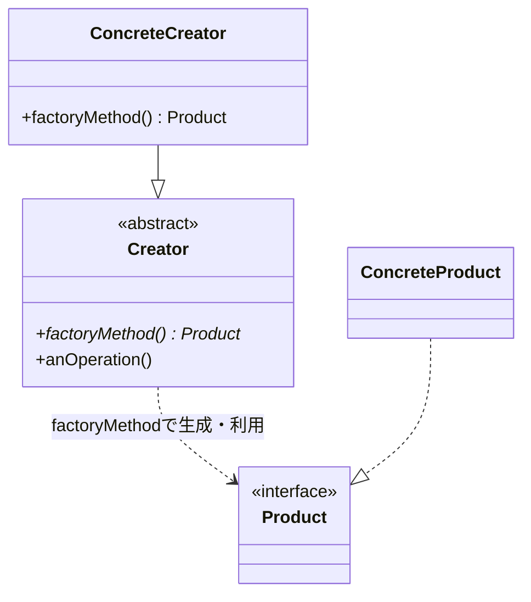
```mermaid
classDiagram
    class Creator {
        <<abstract>>
        +factoryMethod()* Product
        +anOperation()
    }
    class ConcreteCreator {
        +factoryMethod() Product
    }
    class Product {
        <<interface>>
    }
    class ConcreteProduct {
    }
    Creator ..> Product : factoryMethodで生成・利用
    ConcreteCreator --|> Creator
    ConcreteProduct ..|> Product
```

> [!INFO] コラム: C++の「インターフェース」と、クラス図の線種
> **C++に `interface` キーワードはありません。** C++でいう「インターフェース」は、次を満たす**抽象クラス**として書きます。
>
> - メンバ関数がすべて純粋仮想（`= 0`）で、実装を持たない。
> - データメンバを持たない。
> - `virtual ~Name() = default;` の仮想デストラクタを持つ（派生を安全に破棄するため）。
>
> 一方「抽象クラス」はより広く、**純粋仮想関数を1つ以上持つ**クラスを指します。実装済みのメソッドやデータメンバを持ってもかまいません（一部だけ `= 0`）。つまりインターフェースは抽象クラスの特殊形です。この章の `IPaymentProcessor` は `pay(request)` だけを純粋仮想で持つインターフェースです。
>
> ```cpp
> // インターフェース：全メソッドが純粋仮想、データなし
> class IPaymentProcessor {
> public:
>     virtual ~IPaymentProcessor() = default;
>     virtual PaymentResult pay(const PaymentRequest& r) = 0;
> };
>
> // 抽象クラス：一部を実装し、一部を純粋仮想で残す
> class AbstractProcessor {
> protected:
>     PaymentGatewayClient& gateway;   // データメンバを持てる
> public:
>     virtual ~AbstractProcessor() = default;
>     void log(const std::string& m) { /* 共通の実装 */ }
>     virtual PaymentResult pay(const PaymentRequest& r) = 0; // 未実装
> };
> ```
>
> **クラス図の線種は関係の種類で決まります。** この本では次の対応で統一します。
>
> | 関係 | Mermaid記法 | 見た目 | 使う場面 |
> |---|---|---|---|
> | 実現（インターフェース実装） | `<\|..` / `..\|>` | 破線＋白三角 | 具象がインターフェース契約を満たす |
> | 継承（クラス拡張） | `<\|--` / `--\|>` | 実線＋白三角 | 具象が抽象・基底クラスを継承する |
> | 依存（生成・一時利用） | `..>` | 破線矢印 | 生成して一時的に使い、保持しない |
> | 関連・集約・合成（保持） | `-->` / `o--` / `*--` | 実線 | メンバとして保持する |
>
> この基準で本章の図を読むと、`IPaymentProcessor <|.. CreditCardProcessor` は**実現**（インターフェース実装なので破線白三角で正しい）、`PaymentApplication ..> IPaymentProcessor` は**依存**（`createProcessor` で生成して `processPayment` の中だけで使い、メンバに保持しないので破線矢印）、`CreditCardProcessor --> PaymentGatewayClient` は**関連**（ゲートウェイを参照メンバとして保持するので実線）となります。

### 抽象骨格の実行シーケンス

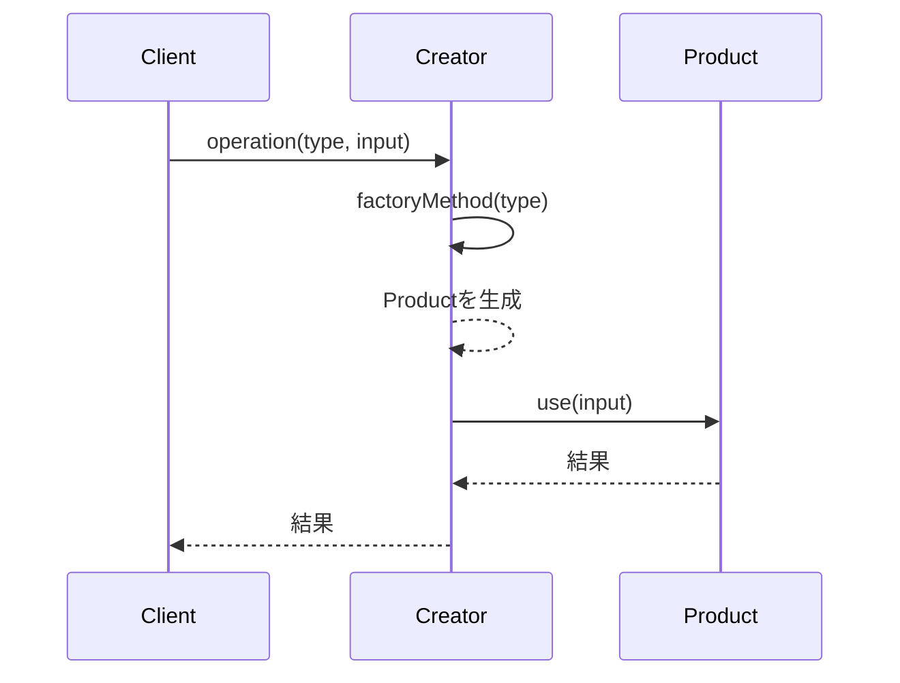
```mermaid
sequenceDiagram
    participant C as Client
    participant CR as Creator
    participant P as Product
    C->>CR: operation(type, input)
    CR->>CR: factoryMethod(type)
    CR-->>CR: Productを生成
    CR->>P: use(input)
    P-->>CR: 結果
    CR-->>C: 結果
```

Creatorは生成をfactoryMethodへ集め、利用処理はProduct契約だけを通じて進めます。

### この章の実装との対応

GoF（Gang of Four）とは、1994年に出版された書籍『Design Patterns』の4人の著者の総称です。彼らが整理した23のパターンは、現在も設計の共通言語として広く使われています。

| GoFの名前 | この章での対応 |
|---|---|
| Creator | `PaymentApplication`（`createProcessor` を持つ） |
| factoryMethod | `createProcessor(string type)` |
| Product | `IPaymentProcessor` |
| ConcreteProduct | `CreditCardProcessor` / `BankTransferProcessor` / `ConvenienceStoreProcessor` / `PayPayProcessor` |

本章の`DefaultPaymentApplication::createProcessor(type)`は、具象Creatorを決済手段ごとに分ける古典形ではなく、1つの具象Creatorが`type`を受けて選ぶ**パラメータ化Factory Method**です。この形は生成判断を1か所へ集めやすい反面、新しい決済手段の追加時には新Processorだけでなく`createProcessor()`の分岐も1行変更します。`processPayment()`や既存Processorは変更しませんが、生成側まで完全に閉じるわけではありません。生成分岐も変更したくない場合は、`methodId`と生成関数をレジストリへ登録する別構造が候補になります。本章は「利用フローから生成判断を外す」ことを目的に、この変種を採用しています。

### 使いどころと限界

- **使うと良い：** クラスが生成するオブジェクトの具体クラスを特定できない場合、または将来的に新しいサブクラスを柔軟に追加したい場合。今後もオブジェクトの種類が増え続けると確定しているとき。各種類が異なる入力データ・処理手順・エラー対処を持ち、その差分をインターフェース越しに隠蔽したいとき。
- **使わない方が良い：** 生成するクラスが常に1種類で固定されていて、今後増える見込みがない場合。ファイル数とクラス数が増えるコストが見合わない。

```cpp
// 決済手段が1種類で今後も増える予定がない場合
// Factory Methodを導入すると、かえって複雑になる

// ❌ 過剰なFactory（固定クラスをnewするだけなら不要）
class PaymentApplication {
    PaymentGatewayClient client;
    IPaymentProcessor* createProcessor() {
        return new CreditCardProcessor(client);
    }
public:
    PaymentResult processPayment(
        const PaymentRequest& request) {
        IPaymentProcessor* p = createProcessor();
        PaymentResult result = p->pay(request);
        delete p;
        return result;
    }
};

// ✅ この場合はシンプルに直接生成すれば十分
class PaymentApplication {
    PaymentGatewayClient client;
public:
    PaymentResult processPayment(
        const PaymentRequest& request) {
        CreditCardProcessor processor(client);
        return processor.pay(request);
    }
};
```

生成するクラスが常に1種類で固定されているなら、Factoryを介する必要はありません。「今後も変わらない」という確信があるときは、シンプルな直接生成の方が読みやすいコードになります。

### この章のまとめ

決済処理というドメインとFactory Methodパターンの関係を一言で言うなら、「生成」と「利用」を分離することで、「どの具体クラスを使うか」の決定を呼び出し側から引き剥がせる、ということです。`processPayment` がクレジットカード・銀行振込・コンビニ・PayPayという具体クラス名と、手段固有の入力検証、同期/非同期の処理モード、エラー対処まで直接知っていた限り、新しい決済手段が来るたびに7か所の修正が必要でした。生成の判断を `createProcessor` へ移し、手段固有の差分を各Processorの `pay()` へ閉じ込めた瞬間、利用側は何が来るかを知らずに `PaymentRequest` を渡せるようになりました。

7つのフェーズを通じて、読者は決済処理クラスが具体クラスを知りすぎているという観察から始まり、「手段固有の入力データ・処理モード・エラー対処が利用側に漏れている」という分析を経て、生成責任の分離と手段固有知識のカプセル化という判断へと進みました。`processPayment` の骨格が `IPaymentProcessor` と `PaymentRequest` だけを知るようになったことが、この章の到達点です。

あなたのコードの中にも、処理ロジックの中で具体クラスを生成し、そのクラス名や手段固有の検証・エラー対処を呼び出し元が知っている箇所があるはずです。「この生成ロジックはどの業務機能によるか」「手段ごとの差分は利用側が知るべきか」を問うことが、Factory Methodを使う理由を見つける入口になります。

いくつもの決済手段が一つのシステムに同居することは、現場ではよくあります。手段ごとにパラメータは多く、同期か非同期かで結果が確定するタイミングも違い、実際のコードはこの章よりもっと複雑です。この章であえて複雑度を上げ、少し読みづらい形にしたのは、そのノイズを取り払ったときに共通の契約を自分の手で導き出せるか、を体験してもらうためでした。各決済のProcessorは実体（インスタンス）として存在しますが、`PaymentRequest` を受け取り `PaymentResult` を返すという共通の契約さえあれば、その生成を分離できます。すると実行側は契約に対して呼ぶだけで済み、手段が増えても実体を抱え込まず、クラスの増減を気にせずに済みます。フェーズ1の時点でこのコードはすでに「処理の流れが一続き」「各決済が一つの `PaymentRequest` にまとまっている」「分岐も一か所にまとまっている」という良い状態にあり、現場ではまずこの共通の状態へ持っていくところから始めます。この章で持ち帰ってほしいのは、共通の契約を定義し、生成を分離し、実行側は契約に対して実行する、というシンプルな一点と、ノイズを除いて共通点を見つける目線です。
