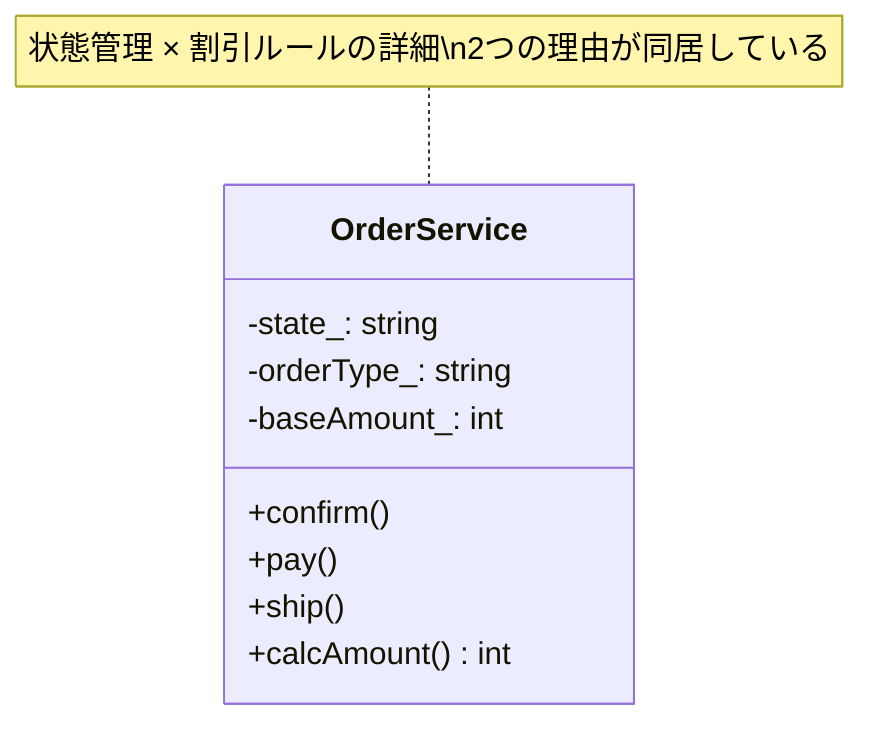
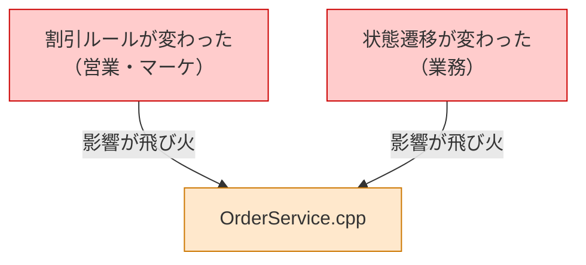
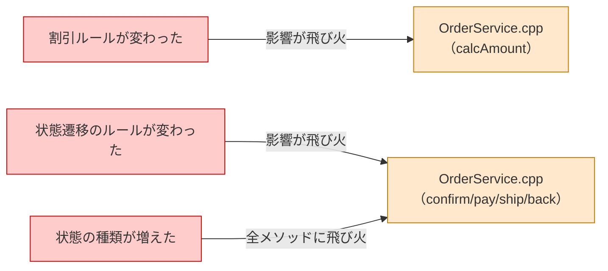
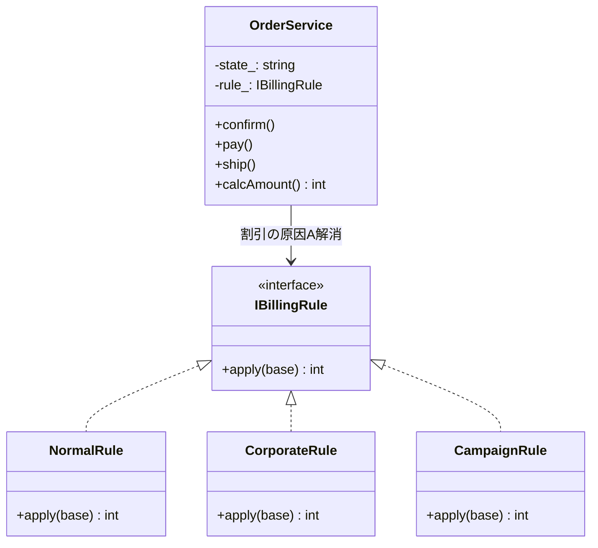
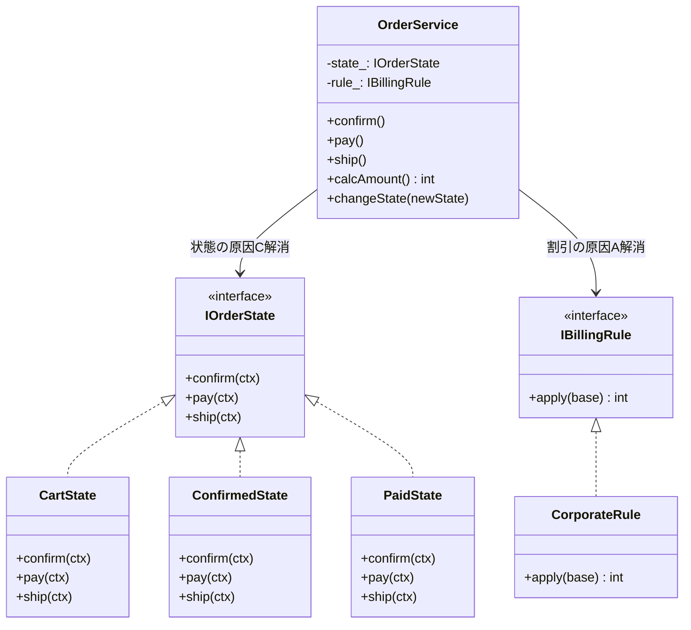
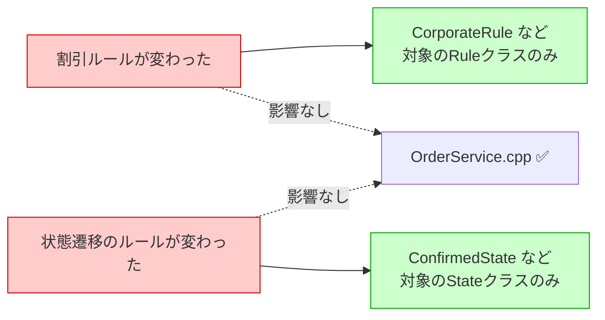
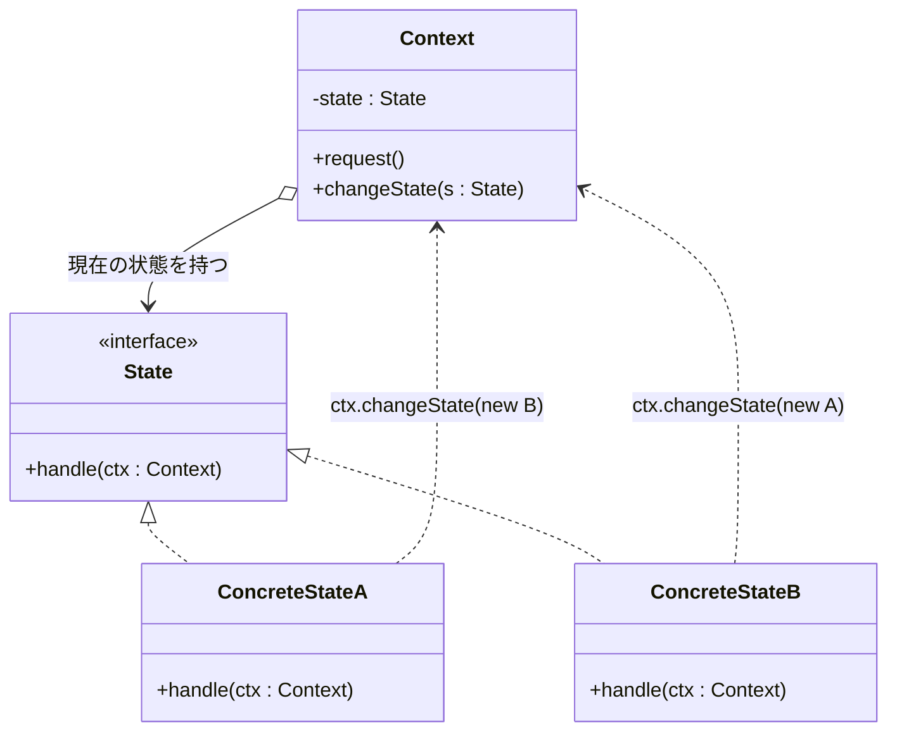
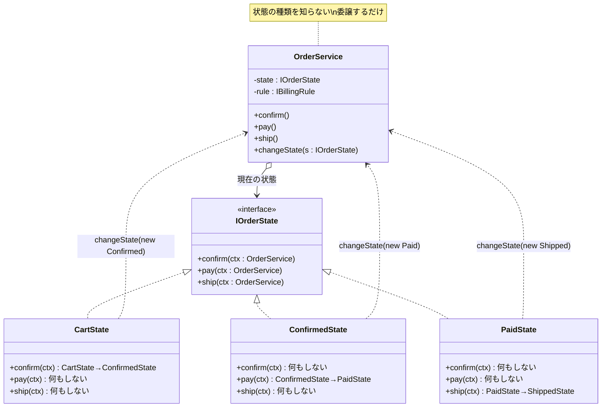

# 第二部　応用編 ―― 複数パターンの融合

---

> 第一部では、8つのパターンをそれぞれ独立した問題に当てはめる体験をしました。
>
> 現実のコードは、もう少し複雑です。
> 「変わる理由が1つだけ」の問題に出会えることは、むしろ珍しい。
> 実際には、複数の「変わる理由」が1つのシステムの中に絡み合っています。
>
> 第二部では、その複雑さに向き合います。
>
> 使う道具（8ステップのプロセス・3つの哲学）は、第一部とまったく同じです。
> ただし、ステップ4（原因分析）で**複数の根本原因**が見つかります。
> そして、ステップ5（対策案）で「1つのパターンでは解決しきれない部分」が現れ、
> 2つ目のパターンが自然に登場します。
>
> 「このパターンを使え」という結論ありきではありません。
> 問題を分析した結果として、複数のパターンが組み合わさる——その過程を体験してください。

---

| 章 | 組み合わせ | 題材 |
|---|---|---|
| 第9章 | Strategy × State | ECサイトの注文処理 |
| 第10章 | Facade × Observer × Factory Method | 外部連携バッチシステム |
| 第11章 | Template Method × Decorator × Command | レポート生成エンジン |

---

# 第9章　増え続けるルールと変わり続ける状態をどう整理するか
―― 思考の型：複数の「変わる理由」を見分けて分離する

> **この章の核心**
> 「割引の種類が変わる」と「注文の状態によって振る舞いが変わる」は、
> 別の理由で変わる。それを1つの場所に押し込むと、
> どちらの変化でも同じクラスを開くことになる。

---

## この章を読むと得られること

- 1つのシステムの中に「割引ルールを決める人」と「状態遷移を決める人」という複数の変わる理由が混在している状態を発見できるようになる
- 問題を8ステップで分析した結果として2つのパターンが自然に組み合わさるプロセスを体験し、「パターンありき」でない設計判断ができるようになる
- 変更要求が「割引ルールの変更」なのか「状態遷移の変更」なのかで影響範囲が即座に読めるようになる
- 複数パターンを組み合わせるべき状況と、1つのパターンで十分な状況を判断できるようになる

## ステップ0：システムを把握し、仮説を立てる ―― クラス構成を見てから「変わりそうな場所」を予測する

> **入力：** システムのシナリオ説明 ＋ クラス構成の概要（仕様表・責任一覧）。実装コードはまだ読まない。
> **産物：** 変動と不変の「仮説テーブル」

**【全パターン共通の問い】**

> 「このコードの中に、**『変わる理由』が異なる2つのものが、
> 同じ場所に混在していないか？」**

「変わる理由」とは **「誰の判断で変わるか」** のことです。
第一部の各章では、この問いに対する答えが1つでした。
この章では、答えが**2つ**あります。

### 9.0 この章のシステム構成と仮説

**この章で扱うシステム：**
ECサイトで受け付けた注文を処理する `OrderService` です。
注文には「カート → 確認中 → 支払い済み → 発送済み → 完了」という状態遷移があり、
さらに注文種別（通常・法人・キャンペーン）によって金額計算のルールが異なります。

**仕様表（何ができるシステムか）**

| 機能 | 担当クラス | 主な入力 | 主な出力 |
|---|---|---|---|
| 注文処理の統括 | OrderService | 注文種別 | 状態・金額 |
| カートの確定 | confirm() | （現在状態） | 状態を「確認中」へ |
| 支払いの完了 | pay() | （現在状態） | 状態を「支払い済み」へ |
| 発送の指示 | ship() | （現在状態） | 状態を「発送済み」へ |
| 金額の算出 | calcAmount() | 注文種別 | 最終金額（int） |

**クラス構成の概要**



**各クラスの責任一覧**

| クラス | 責任（1文） | 知るべきこと |
|---|---|---|
| `OrderService` | 注文の処理フローを管理する | 状態の遷移と注文種別 |

---

この構成を踏まえた上で、仮説を立てます。
`OrderService` に「状態管理 × 割引ルールの詳細」という2つの関心が同居していることが見えています。
どの部分が変わりやすく、どの部分は変わらないでしょうか。

**変動と不変の仮説（実装コードを読む前に立てる）**

| 分類 | 仮説 | 根拠（クラス構成から読み取れること） |
|---|---|---|
| 🔴 **変動する** | 割引ルールの種類・計算方法 | 営業施策のたびに変わる。クラス図でも「2つの理由が同居」と明記 |
| 🔴 **変動する** | 状態ごとに許可される操作の範囲 | 業務フロー変更のたびに変わる。同上 |
| 🟢 **不変** | 「注文を処理する」という業務の存在 | ECサイトがある限り変わらない |
| 🟢 **不変** | 状態が「カート→確認→支払い→発送→完了」という順に進む骨格 | 決済フローとして固定 |

この仮説をステップ2（9.3）でヒアリング後に確定します。

---

## ステップ1：実装コードを読む ―― 責任チェックで問題の行を見つける

> **入力：** ステップ0で把握したクラス責任 ＋ 実際の実装コード
> **産物：** 責任チェック表。「このクラスが持つべきでない知識」が混在している行の発見。

### 9.1 実装コードと責任チェック

ステップ0でクラスの責任は把握しました。
ここでは実際の実装コードを読み、「責任通りに書かれているか」を1行ずつ確認します。

**要するに「割引ルールの変わり方」と「状態遷移の変わり方」を別々のクラスに切り出し、2つの変化が互いに干渉しないようにするパターン。**

```cpp
// OrderService（今の設計）
// 責任のはず：「注文の処理フローを管理する」
class OrderService {
public:
    OrderService(const std::string& orderType)
        : state_("cart"),
          orderType_(orderType),
          baseAmount_(50000) {}

    void confirm();
    void pay();
    void ship();
    int  calcAmount();

private:
    std::string state_;
    std::string orderType_;
    int         baseAmount_;
};

void OrderService::confirm() {
    if (state_ == "cart") {
        state_ = "confirmed";
        // 確認メールを送信する処理
    }
    // cart以外の状態では何もしない（エラーも出さない）
}

void OrderService::pay() {
    if (state_ == "confirmed") {
        state_ = "paid";
        // 決済記録を作成する処理
    }
}

void OrderService::ship() {
    if (state_ == "paid") {
        state_ = "shipped";
        // 配送ラベルを生成する処理
    }
}

int OrderService::calcAmount() {
    if (orderType_ == "corporate") {
        return baseAmount_ * 90 / 100;   // 法人：10%引き
    } else if (orderType_ == "campaign") {
        return baseAmount_ * 80 / 100;   // キャンペーン：20%引き
    } else {
        return baseAmount_;              // 通常：定価
    }
}

// 呼び出し側
int main() {
    OrderService order("corporate");
    order.confirm();
    order.pay();
    order.ship();
    int amount = order.calcAmount();
    // amount = 45000（法人10%引き）
    return 0;
}
```

**実行イメージ：**
```
[OrderService] state: cart → confirm() → confirmed
[OrderService] state: confirmed → pay() → paid
[OrderService] state: paid → ship() → shipped
[OrderService] calcAmount: 50000 × 0.9 = 45000円（法人割引）
```

動いています。では、**責任チェック**に入ります。

**責任チェック：OrderServiceは自分の責任だけを持っているか**

OrderServiceの責任は「注文の処理フローを管理すること」です。
その責任を果たすために、OrderServiceが「知るべきこと」は何でしょうか。

> 現在の状態と、状態遷移の骨格（どの状態からどこへ進めるか）。

今のコードで `OrderService` が「知っていること」を1行ずつ確認します。

| コードの行 | 持っている知識 | OrderServiceの責任か |
|---|---|---|
| `if (state_ == "cart")` → confirm() | 「cart状態のときだけ確認できる」という遷移ルール | △ 遷移管理は自然だが、判断がメソッドに散在 |
| `if (state_ == "confirmed")` → pay() | 「confirmed状態のときだけ支払えるル」という遷移ルール | △ 同上 |
| `if (state_ == "paid")` → ship() | 「paid状態のときだけ発送できる」という遷移ルール | △ 同上 |
| `if (orderType_ == "corporate") ... * 90 / 100` | 法人割引の計算ルール | **✗ 営業部門の管轄** |
| `if (orderType_ == "campaign") ... * 80 / 100` | キャンペーン割引の計算ルール | **✗ マーケティング部門の管轄** |

2つの問題が見えてきました。

1. **状態ごとの振る舞い**（何ができて何ができないか）が、各メソッドに分散している
2. **割引ルール**（誰がいくら引きか）が、OrderServiceの中に直書きされている

### 9.2 届いた変更要求

以上の責任チェックを踏まえた上で、変更要求を受け取ります。

---

**営業担当**：「法人向けに、四半期末は15%引きにする『四半期末法人割引』を追加してほしい。
来月から適用です。」

**マーケティング担当**：「来月、プレミアムキャンペーンを打ちます。
30%引きのプレミアム枠も用意してください。」

**業務担当**：「カートに戻れる機能も追加したいんですが。
確認中の状態からカートに戻せるようにしてほしいです。」

---

3つの変更要求が同時に届きました。そしてすべてが `OrderService` を開くことを要求しています。

**依存の広がり**



割引ルールが変わっても、状態遷移が変わっても、同じ1つのファイルを開くことになります。

---

## ステップ2：仮説を確定する ―― 関係者ヒアリングで「変わる理由」に根拠をつける

> **入力：** ステップ0の仮説 × ステップ1の責任チェック結果。関係者（営業・業務担当など）に直接確認する。
> **産物：** 確定した変動/不変テーブル（「誰の判断で変わるか」明記）

### 9.3 仮説の検証と変動/不変の確定

ステップ0で「割引ルールは変わりやすい」「状態ごとの操作範囲は変わりやすい」という仮説を立てました。
コードを読んだ結果、仮説はコード上でも確認できます。
しかし——**コードを読んだだけで断定するのは危険**です。
「なぜ変わるのか」を関係者に確認して、予測を根拠のある事実に変えます。

**ヒアリング：**

---

**設計者**：「割引ルールは、今後どのくらいの頻度で変わりますか？」

**営業担当**：「毎シーズン変わります。法人向けは年間契約で条件が違うこともあります。
今は2種類ですが、パートナー企業向けとか、新規顧客向けも増やしたいんですよね。」

**設計者**：「状態遷移（カート→確認→支払い→発送）の順序は変わりますか？」

**業務担当**：「基本の順序は変わりません。ただ、各状態で『何ができるか』は変わることがあります。
たとえば、確認中にカートへ戻れるようにしたい、という話は前からありました。」

**設計者**：「将来、状態の数は増えますか？」

**業務担当**：「増やしたいと思っています。『入金待ち』（確認から支払い完了までの猶予期間）を
ステータスとして入れたいんですが、そこでできる操作が特殊で……」

---

**変動/不変テーブル（ヒアリング後に確定）**

| 分類 | 内容 | 変わるタイミング | 根拠（誰が確認したか） |
|---|---|---|---|
| 🔴 **変動する** | 割引ルールの種類・計算式 | 営業施策のたびに | 営業担当（頻度高い） |
| 🔴 **変動する** | 各状態で許可される操作の範囲 | 業務フロー変更のたびに | 業務担当（増える見込み） |
| 🔴 **変動する** | 状態の種類（新しいステータスが追加される） | 業務要件変化のたびに | 業務担当（入金待ち追加予定） |
| 🟢 **不変** | 「注文を処理する」という業務の骨格 | 変わらない | ECサイトの根幹 |
| 🟢 **不変** | 状態が順方向に進む遷移の基本順序 | 変わりにくい | 決済フローとして固定 |

この章の変化の特徴は、**「変わる理由が2系統ある」**ことです。

- 割引ルール → **営業部門・マーケティング部門の判断**で変わる
- 状態ごとの振る舞い → **業務部門の判断**で変わる

「誰の判断で変わるか」が異なる2つのものが、1つの `OrderService` に同居しています。

---

## ステップ3：課題分析 ―― 変更が来たとき、どこが辛いかを確認する

実際に変更要求を加えてみます。

**変更①：四半期末法人割引（15%引き）を追加する**

```cpp
int OrderService::calcAmount() {
    if (orderType_ == "corporate") {
        return baseAmount_ * 90 / 100;
    } else if (orderType_ == "corporate_quarter_end") {  // ← 追加
        return baseAmount_ * 85 / 100;
    } else if (orderType_ == "campaign") {
        return baseAmount_ * 80 / 100;
    } else if (orderType_ == "campaign_premium") {       // ← 追加
        return baseAmount_ * 70 / 100;
    } else {
        return baseAmount_;
    }
}
```

→ `calcAmount()` の中身を開いて分岐を追加しました。

**変更②：確認中からカートへ戻れる `back()` を追加する**

```cpp
void OrderService::back() {
    if (state_ == "confirmed") {     // ← 追加
        state_ = "cart";
    }
    // 他の状態では何もしない
}
```

→ 新しいメソッドを追加。ただし、将来「入金待ち」状態を追加したとき、
`confirm()` / `pay()` / `ship()` / `back()` の**全メソッドを開いて**
「入金待ちのときはどうするか」を追加しなければなりません。

**変更影響グラフ（改善前）：**



ここで重要なのは、**T1（割引変更）とT2/T3（状態変更）は互いに無関係**だということです。
にもかかわらず、どちらの変化も `OrderService.cpp` という同じファイルを開かせます。

---

## ステップ4：原因分析 ―― 困難の根本にある設計の問題を言語化する

第一部では、原因は1つでした。この章では、**原因が2つ**あります。

| 問い | 答え | 原因の切り口 |
|---|---|---|
| なぜ割引変更で OrderService が変わるか | 割引ルールの詳細（計算式）を直接知っているから | **A：変化の混在（割引）** |
| なぜ状態追加で全メソッドが変わるか | 「この状態のときこの操作はどうするか」の情報が各メソッドに分散しているから | **C：状態と振る舞いの混在** |

#### 原因A：変わるものが変わらないものと同じ場所にいる（割引ルール）

`calcAmount()` の中に、割引ルールの**計算式そのもの**が書かれています。
「× 90 / 100」という数値は、割引率が変わるたびに書き換えなければならない部分です。
ところが、それが「注文の処理フローを管理する」という変わらない責任と同じクラスにいます。

#### 原因C：状態と振る舞いの対応関係が分散している

「カート状態のときに `confirm()` を呼ぶと何が起きるか」という情報は
`confirm()` メソッドの中にあります。
「カート状態のときに `pay()` を呼ぶと何が起きるか」という情報は
`pay()` メソッドの中にあります。

新しい状態「入金待ち」を追加するとき、開発者は
**「入金待ち状態のとき、各メソッドでどう振る舞うか」を全メソッドに書き足していく**
必要があります。
「入金待ち状態の完全な振る舞い」が1か所に集まっていないのです。

---

## ステップ5：対策案の検討 ―― 2つの原因を順に解消する

第0章の手札選択表を引くと：
- 「任意の振る舞い（計算ロジック、ルールなど）が変わる」→ **インターフェース抽出**（第0章 手札）
- 「オブジェクトの状態とそれに伴う振る舞いが変わる」→ **状態クラス化**（第0章 手札）

原因が2つあるので、解消も2段階になります。

### 9.5.1 手札の適用①：インターフェース抽出で割引ルールを切り出す（原因A）

### 方向性の特定

ステップ4で2つの原因が見つかりました。それぞれの原因から方向性を導きます。

| 原因 | 自然に出てくる方向性 |
|---|---|
| 割引ルールが変わるたびに処理全体が変わる | 変わるルールを切り出す・分ける |
| 注文状態ごとの振る舞いが分散している | 状態と振る舞いを1か所に集める |

2つの原因に対して、それぞれ「手段を試す→残る課題→手段②」の流れで解消します。

---

「割引ルールの詳細が OrderService に染み出している」問題を解消します。

**発想：** `calcAmount()` の中の `if` 分岐を取り除くには、割引の「判断と計算」を
外部のオブジェクトに委ねればよい。OrderServiceは「計算結果をもらう」だけにする。

```cpp
// 割引ルールの「契約」を定義するインターフェース
class IBillingRule {
public:
    virtual int apply(int baseAmount) const = 0;
    virtual ~IBillingRule() {}
};

// 通常（定価）
class NormalRule : public IBillingRule {
public:
    int apply(int baseAmount) const {
        return baseAmount;
    }
};

// 法人割引：10%引き
class CorporateRule : public IBillingRule {
public:
    int apply(int baseAmount) const {
        return baseAmount * 90 / 100;
    }
};

// キャンペーン割引：20%引き
class CampaignRule : public IBillingRule {
public:
    int apply(int baseAmount) const {
        return baseAmount * 80 / 100;
    }
};

// 四半期末法人割引：15%引き（新規追加）
class QuarterEndCorporateRule : public IBillingRule {
public:
    int apply(int baseAmount) const {
        return baseAmount * 85 / 100;
    }
};
```

```cpp
// OrderService（インターフェース抽出適用後）
class OrderService {
public:
    OrderService(IBillingRule* rule)
        : state_("cart"),
          rule_(rule),
          baseAmount_(50000) {}

    void confirm();
    void pay();
    void ship();
    int  calcAmount();

private:
    std::string  state_;
    IBillingRule* rule_;
    int          baseAmount_;
};

int OrderService::calcAmount() {
    return rule_->apply(baseAmount_);  // ifが消えた
}
```

**責任チェック（インターフェース抽出適用後）**

| コードの行 | 持っている知識 | OrderServiceの責任か |
|---|---|---|
| `rule_->apply(baseAmount_)` | 「何かルールを適用して金額を返す」という処理の骨格 | ✅ 責任範囲内 |
| `if (orderType_ == "corporate")` | ←消えた | —— |
| `if (state_ == "cart")` → confirm | 「cart状態のときだけ確認できる」 | **まだ各メソッドに散在** |

割引ルールの問題（原因A）は解消されました。
ただし、状態ごとの振る舞いの問題（原因C）は依然として残っています。



### 9.5.2 手札の適用②：状態クラス化で振る舞いを切り出す（原因C）

次に「状態と振る舞いの対応関係が各メソッドに分散している」問題を解消します。

**発想：** 「この状態のときはこう振る舞う」という情報を、**状態ごとのクラスにまとめる**。
`confirm()`・`pay()`・`ship()` の中の `if` 分岐を取り除くには、
「今の状態」を表すオブジェクト自身に、「何ができるか」を持たせればよい。

```cpp
// 前方宣言
class OrderService;

// 状態の「契約」を定義するインターフェース
class IOrderState {
public:
    virtual void confirm(OrderService& ctx) = 0;
    virtual void pay(OrderService& ctx)     = 0;
    virtual void ship(OrderService& ctx)    = 0;
    virtual ~IOrderState() {}
};
```

各状態クラスが「自分の状態のときに各操作がどう動くか」を完結して持ちます。

```cpp
// カート状態：confirmだけ受け付ける
class CartState : public IOrderState {
public:
    void confirm(OrderService& ctx);
    void pay(OrderService& ctx)  {}   // 何もしない
    void ship(OrderService& ctx) {}   // 何もしない
};

// 確認中状態：payだけ受け付ける
class ConfirmedState : public IOrderState {
public:
    void confirm(OrderService& ctx) {} // 何もしない
    void pay(OrderService& ctx);
    void ship(OrderService& ctx) {}   // 何もしない
};

// 支払い済み状態：shipだけ受け付ける
class PaidState : public IOrderState {
public:
    void confirm(OrderService& ctx) {} // 何もしない
    void pay(OrderService& ctx)     {} // 何もしない
    void ship(OrderService& ctx);
};

// 発送済み状態：すべての遷移操作を受け付けない
class ShippedState : public IOrderState {
public:
    void confirm(OrderService& ctx) {} // 何もしない
    void pay(OrderService& ctx)     {} // 何もしない
    void ship(OrderService& ctx)    {} // 何もしない
};
```

`OrderService` は状態の詳細を知る必要がなくなります。
「今の状態オブジェクトに委ねる」だけです。

```cpp
// OrderService（状態クラス化適用後）
class OrderService {
public:
    OrderService(IBillingRule* rule, IOrderState* initialState)
        : state_(initialState),
          rule_(rule),
          baseAmount_(50000) {}

    void confirm() { state_->confirm(*this); }
    void pay()     { state_->pay(*this); }
    void ship()    { state_->ship(*this); }
    int  calcAmount() { return rule_->apply(baseAmount_); }

    // 状態クラスから状態を変更するために公開する
    void changeState(IOrderState* newState) {
        state_ = newState;
    }

private:
    IOrderState*  state_;
    IBillingRule* rule_;
    int           baseAmount_;
};
```

**責任チェック（状態クラス化適用後）**

| コードの行 | 持っている知識 | OrderServiceの責任か |
|---|---|---|
| `state_->confirm(*this)` | 「現在の状態に confirm を委ねる」という骨格 | ✅ 責任範囲内 |
| `rule_->apply(baseAmount_)` | 「ルールを適用して金額を返す」という骨格 | ✅ 責任範囲内 |
| `if (state_ == "confirmed")` など | ←消えた | —— |
| `* 90 / 100` など | ←消えた | —— |

`OrderService` から `if` 文が消えました。
両方の原因（A・C）が解消されています。



---

## ステップ6：天秤にかける ―― 解決策は未来の変化に耐えられるか

### 評価軸の宣言

解決策を評価する前に、「何を基準に判断するか」を先に宣言します。

| 評価軸 | 内容 |
|---|---|
| 割引追加コスト | 新しい割引ルールを追加するとき、既存コードに触れるか |
| 状態追加コスト | 新しい状態を追加するとき、既存コードに触れるか |
| 独立テスト | 割引ルール・状態ごとに単独でテストできるか |
| 読みやすさ | 「この状態のときは何ができるか」が1か所でわかるか |

### 比較と判断

| 評価軸 | 変更前 | Strategy追加後 | Strategy + State後 |
|---|---|---|---|
| 割引追加コスト | calcAmount()を開く | 新クラスを追加するだけ | 新クラスを追加するだけ |
| 状態追加コスト | 全メソッドを開く | 全メソッドを開く | 新クラスを追加するだけ |
| 独立テスト | OrderService全体が必要 | ルールだけでテスト可 | ルール・状態それぞれ単独でテスト可 |
| 読みやすさ | メソッドをすべて読む必要 | 改善なし | 状態クラスを読めば一覧できる |

### 耐久テスト ―― ヒアリングで挙がった変化が来たら

**シナリオ：「入金待ち」状態を追加する**

業務担当から挙がっていた要望：確認から支払い完了までの猶予期間を表す「入金待ち」状態を追加する。
この状態では、`confirm()` と `ship()` は無効で、`pay()` だけ受け付ける。

```cpp
// 新しい状態クラスを追加するだけ
class AwaitingPaymentState : public IOrderState {
public:
    void confirm(OrderService& ctx) {}  // 無効
    void pay(OrderService& ctx);        // 支払いのみ受付
    void ship(OrderService& ctx) {}     // 無効
};

void AwaitingPaymentState::pay(OrderService& ctx) {
    // 支払い処理
    PaidState* paid = new PaidState();
    ctx.changeState(paid);
}
```

**触れた既存コード：ゼロ。**
`OrderService` も、`CartState` も、`ConfirmedState` も、`IBillingRule` の実装も、
何ひとつ変更していません。

**シナリオ：プレミアムキャンペーン割引（30%引き）を追加する**

```cpp
// 新しいルールクラスを追加するだけ
class PremiumCampaignRule : public IBillingRule {
public:
    int apply(int baseAmount) const {
        return baseAmount * 70 / 100;
    }
};
```

**触れた既存コード：ゼロ。**
`OrderService` も、`CorporateRule` も、状態クラスも、何ひとつ変更していません。

### 使う場面・使わない場面

**Strategy（割引ルールの分離）を使う場面：**
- 割引の種類が今後も増える見込みがある
- 割引ルールを個別にテストしたい
- 顧客・契約種別・時期によって異なるルールを切り替えたい

**State（状態と振る舞いの分離）を使う場面：**
- 状態が4つ以上あり、今後も増える見込みがある
- 複数のメソッドが「現在の状態」によって振る舞いを変えている
- 「この状態のときは何ができるか」を一覧したい

**どちらも使わなくてよい場面：**
- 割引が1種類で変わらない、かつ状態が2〜3個で固定されている
- `calcAmount()` も状態分岐も、将来変わる見込みがない

---

## ステップ7：決断と、手に入れた未来

### 解決後のコード（全体）

```cpp
#include <string>

// =============================================
// IBillingRule（割引ルールの契約）
// =============================================
class IBillingRule {
public:
    virtual int apply(int baseAmount) const = 0;
    virtual ~IBillingRule() {}
};

class NormalRule : public IBillingRule {
public:
    int apply(int baseAmount) const {
        return baseAmount;
    }
};

class CorporateRule : public IBillingRule {
public:
    int apply(int baseAmount) const {
        return baseAmount * 90 / 100;
    }
};

class CampaignRule : public IBillingRule {
public:
    int apply(int baseAmount) const {
        return baseAmount * 80 / 100;
    }
};

class QuarterEndCorporateRule : public IBillingRule {
public:
    int apply(int baseAmount) const {
        return baseAmount * 85 / 100;
    }
};

class PremiumCampaignRule : public IBillingRule {
public:
    int apply(int baseAmount) const {
        return baseAmount * 70 / 100;
    }
};

// =============================================
// 前方宣言（OrderServiceと状態クラスが互いに参照するため）
// =============================================
class OrderService;
class CartState;
class ConfirmedState;
class PaidState;
class ShippedState;

// =============================================
// IOrderState（状態の契約）
// =============================================
class IOrderState {
public:
    virtual void confirm(OrderService& ctx) = 0;
    virtual void pay(OrderService& ctx)     = 0;
    virtual void ship(OrderService& ctx)    = 0;
    virtual ~IOrderState() {}
};

// =============================================
// 状態クラスの宣言（遷移先クラスの実装は後で定義）
// =============================================
class CartState : public IOrderState {
public:
    void confirm(OrderService& ctx); // ConfirmedStateを生成するため実装は後で
    void pay(OrderService& ctx)  {}  // カート状態では支払い不可
    void ship(OrderService& ctx) {}  // カート状態では発送不可
};

class ConfirmedState : public IOrderState {
public:
    void confirm(OrderService& ctx) {} // 確認済みなので再確認不要
    void pay(OrderService& ctx);       // PaidStateを生成するため実装は後で
    void ship(OrderService& ctx) {}    // 支払い前は発送不可
};

class PaidState : public IOrderState {
public:
    void confirm(OrderService& ctx) {} // 支払い済みなので確認不要
    void pay(OrderService& ctx)     {} // 支払い済みなので再支払い不要
    void ship(OrderService& ctx);      // ShippedStateを生成するため実装は後で
};

class ShippedState : public IOrderState {
public:
    void confirm(OrderService& ctx) {} // 発送済みなので確認不要
    void pay(OrderService& ctx)     {} // 発送済みなので支払い不要
    void ship(OrderService& ctx)    {} // 発送済みなので再発送不要
};

// =============================================
// OrderService
// =============================================
class OrderService {
public:
    OrderService(IBillingRule* rule, IOrderState* initialState)
        : state_(initialState),
          rule_(rule),
          baseAmount_(50000) {}

    void confirm()    { state_->confirm(*this); }
    void pay()        { state_->pay(*this); }
    void ship()       { state_->ship(*this); }
    int  calcAmount() { return rule_->apply(baseAmount_); }

    void changeState(IOrderState* newState) {
        state_ = newState;
    }

private:
    IOrderState*  state_;
    IBillingRule* rule_;
    int           baseAmount_;
};

// =============================================
// 状態クラスのメソッド実装（全クラス定義後）
// 各メソッドが遷移先クラスの完全な定義を参照できる
// =============================================
void CartState::confirm(OrderService& ctx) {
    // 確認メールを送信する処理
    ctx.changeState(new ConfirmedState());
}

void ConfirmedState::pay(OrderService& ctx) {
    // 決済記録を作成する処理
    ctx.changeState(new PaidState());
}

void PaidState::ship(OrderService& ctx) {
    // 配送ラベルを生成する処理
    ctx.changeState(new ShippedState());
}

// =============================================
// OrderApplication（Composition Root）
// =============================================
class OrderApplication {
public:
    void runCorporateOrder() {
        IBillingRule* rule = new CorporateRule();
        IOrderState* initialState = new CartState();
        OrderService order(rule, initialState);

        order.confirm();
        order.pay();
        order.ship();

        int amount = order.calcAmount();
        // amount = 45000（法人10%引き）
    }

    void runCampaignOrder() {
        IBillingRule* rule = new CampaignRule();
        IOrderState* initialState = new CartState();
        OrderService order(rule, initialState);

        order.confirm();
        order.pay();
        order.ship();

        int amount = order.calcAmount();
        // amount = 40000（キャンペーン20%引き）
    }
};

int main() {
    OrderApplication app;
    app.runCorporateOrder();
    app.runCampaignOrder();
    return 0;
}
```

**実行イメージ：**
```
[法人注文]
  CartState::confirm() → ConfirmedState へ遷移
  ConfirmedState::pay() → PaidState へ遷移
  PaidState::ship() → ShippedState へ遷移
  calcAmount: 50000 × 0.9 = 45000円

[キャンペーン注文]
  CartState::confirm() → ConfirmedState へ遷移
  ConfirmedState::pay() → PaidState へ遷移
  PaidState::ship() → ShippedState へ遷移
  calcAmount: 50000 × 0.8 = 40000円
```

### 変更シナリオ表と最終責任テーブル

**変更シナリオ表：**

| シナリオ | 変わるクラス | 変わらないクラス |
|---|---|---|
| 新しい割引ルールを追加する | 新しい〇〇Rule クラスを追加 | OrderService / すべての状態クラス |
| 既存の割引率を変更する | 対象の〇〇Rule のみ | OrderService / すべての状態クラス |
| 新しい注文状態を追加する | 新しい〇〇State クラスを追加 | OrderService / すべてのRuleクラス |
| ある状態での振る舞いを変える | 対象の〇〇State のみ | OrderService / 他の状態クラス |
| 注文を処理するフローを変える | OrderApplication の組み立て部分 | OrderService / Rule / State クラス群 |

**変更影響グラフ（改善後）：**



**最終責任テーブル（改善後）：**

| クラス | 責任（1文） | 変わる理由 |
|---|---|---|
| `OrderService` | 注文の処理フローを管理する | 処理フローの骨格が変わるとき |
| `CartState` | カート状態での振る舞いを定義する | カート状態の操作ルールが変わるとき |
| `ConfirmedState` | 確認中状態での振る舞いを定義する | 確認中状態の操作ルールが変わるとき |
| `PaidState` | 支払い済み状態での振る舞いを定義する | 支払い済み状態の操作ルールが変わるとき |
| `CorporateRule` | 法人割引の計算ルールを実装する | 法人割引率が変わるとき |
| `CampaignRule` | キャンペーン割引の計算ルールを実装する | キャンペーン割引率が変わるとき |
| `OrderApplication` | 注文の組み立てと依存関係の注入を行う | 組み合わせパターンが変わるとき |

---

## 整理

### 8ステップとこの章でやったこと

| ステップ | この章での問い | 得られた答え |
|---|---|---|
| ステップ0 | 何が変わりやすそうか | 割引ルール・状態ごとの振る舞いの2系統 |
| ステップ1 | OrderServiceの責任は何か | 注文フローの管理。割引計算と状態判断は責任外 |
| ステップ2 | 変化の根拠は何か | 割引は営業判断・状態は業務判断で別系統 |
| ステップ3 | どこが辛いか | 割引変更でも状態追加でも同じファイルを開く |
| ステップ4 | 原因は何か | A：割引の混在 / C：状態と振る舞いの混在（2つ） |
| ステップ5 | どう解消するか | 原因Aに Strategy、原因Cに State を順に適用 |
| ステップ6 | 未来に耐えられるか | 新状態・新割引の追加がゼロ変更で可能 |
| ステップ7 | 何を手に入れたか | 「割引軸」と「状態軸」の変化を完全に分離した構造 |

**第一部との違い：**

第一部では「原因が1つ → パターンが1つ」でした。
この章では「原因が2つ → パターンが2つ」になりました。

ただし、出発点は変わりません。
「2つのパターンを組み合わせよう」と決めて始めたのではなく、
**「2つの根本原因を分析した結果として、2つのパターンが選ばれた」**のです。

---

## 振り返り：第0章の3つの哲学はどう適用されたか

改めて、ここまで導き出してきた「最終的な設計」を、第0章でお話しした「3つの哲学」と照らし合わせてみましょう。

### 哲学1「変わるものをカプセル化せよ」の現れ

**具体化された場所（割引）：** `OrderService` から追い出された「割引率・計算式」の知識

「× 90 / 100」「× 80 / 100」という計算式——これは営業施策のたびに変わる部分です。
それを `OrderService` という「変わらないはずのクラス」から切り出し、
`CorporateRule`・`CampaignRule` というクラスに閉じ込めました。

**具体化された場所（状態）：** `OrderService` の各メソッドから追い出された「状態ごとの振る舞い」

`if (state_ == "cart")` という判断——これは状態が増えるたびに変わる部分です。
それを `OrderService` から切り出し、`CartState`・`ConfirmedState` に閉じ込めました。

### 哲学2「実装ではなくインターフェースに対してプログラムせよ」の現れ

**具体化された場所：** `OrderService` が `IBillingRule` と `IOrderState` だけを知っている構造

`OrderService` のメンバ変数は `IBillingRule* rule_` と `IOrderState* state_` です。
`CorporateRule` や `CartState` の名前は `OrderService` のコードにどこにも出てきません。
具体クラスを知っているのは `OrderApplication`（Composition Root）だけです。

割引ルールが何種類に増えても、注文状態が何個になっても、`OrderService` は一切変わりません。

### 哲学3「継承よりコンポジションを優先せよ」の現れ

**具体化された場所：** `OrderService` が `IBillingRule` と `IOrderState` を「部品として持つ」構造

もし「法人向けOrderService」「キャンペーン向けOrderService」と継承で増やしていたら、
割引の種類 × 状態の組み合わせだけクラスが爆発します。
「部品として持ち、差し替える」構造にすることで、クラスの爆発を防ぎました。

---

第一部で1つずつ学んだパターンが、現実の問題の前では組み合わさって使われます。
道具は同じです。**「変わるものを見つけ、分離する」** という問いが、
2つの答えをもたらしただけです。

---

## パターン解説：StrategyパターンとStateパターン

この章では2つのパターンが組み合わさっています。それぞれの骨格と、この章での使われ方を整理します。

### Strategyパターンの骨格（この章での役割：割引ルールの切り替え）

Strategyパターンは「処理の骨格」と「処理の中身（アルゴリズム）」を分離するパターンです。Contextは `Strategy` インターフェースだけを知り、どの実装クラスが渡されるかを知りません。実装の差し替えは外部（Composition Root）が担います。

この章では `OrderService` が `IBillingRule` だけを知り、`CorporateRule` や `CampaignRule` を直接知りません。割引ルールの追加・変更は新しいクラスを作るだけで完結します。

---

### Stateパターンの骨格（この章での役割：注文状態の遷移管理）

Stateパターンの特徴は、ContextがStateに委譲するだけでなく、State自身がContextの状態を遷移させる点にあります。



**Context** は状態を「持つ」側です。`request()` を呼ばれたら現在のStateに委譲するだけで、状態の種類を知りません。**State** は「今の状態での振る舞い」の契約です。`handle()` の引数にContextを受け取り、必要なら状態遷移を行います。**ConcreteState** は特定の状態での振る舞いと、次の状態への遷移を実装します。

### この章の実装との対応

Stateパターンの特徴は、ContextがStateに委譲するだけでなく、State自身がContextの状態を遷移させる点にあります。


**Context** は状態を「持つ」側です。`request()` を呼ばれたら現在のStateに委譲するだけで、状態の種類を知りません。**State** は「今の状態での振る舞い」の契約です。`handle()` の引数にContextを受け取り、必要なら状態遷移を行います。**ConcreteState** は特定の状態での振る舞いと、次の状態への遷移を実装します。

### この章の実装との対応



`OrderService` は `confirm()` を呼ばれると `state_->confirm(*this)` を呼ぶだけです。今が `CartState` なら `ConfirmedState` に遷移し、`ShippedState` なら何もしない——その判断は `OrderService` の外にあります。状態が1つ増えても `OrderService` は変わりません。

### StrategyパターンとStateパターンの違い

2つのパターンはUMLの図だけ見ると区別がつきません。Contextが「何かを持ち、委譲する」構造は同じです。決定的な違いは「部品を差し替える責任者」にあります。

| | Strategyパターン | Stateパターン |
|---|---|---|
| 差し替えの主体 | 外部（Composition RootがContextに注入） | 内部（ConcreteState自身がContextを遷移させる） |
| 差し替えのきっかけ | Contextを組み立てるとき | Contextのメソッドが呼ばれたとき |
| 典型的な問い | 「どのアルゴリズムを使うか」 | 「今の状態で何ができるか」 |

Strategyは「外から渡す部品」、Stateは「内部から自走する部品」です。

### どんな構造問題を解くか

「状態ごとに振る舞いが変わる処理」をContextに書き続けると、状態が増えるたびに全メソッドに `if` が追加されます。この章の `OrderService` の起点コードがそれでした。

Stateパターンはその `if` をConcreteStateに移動させます。Contextは「委譲するだけ」になり、状態が増えても既存のConcreteStateを変更する必要はありません。

### 使いどころと限界

**使いどころ：**オブジェクトが明確な「状態」を持ち、状態ごとに「できること・できないこと」が変わる場合です。状態遷移の構造が複雑になるほど、個々のConcreteStateにロジックを分散させるStateパターンが力を発揮します。

**限界：**状態が2〜3種類で今後も増える見込みがない場合、シンプルな `if` で十分です。Stateパターンは状態の数だけクラスが増えます。遷移が少ない場合のクラス増加は純粋なオーバーヘッドです。
