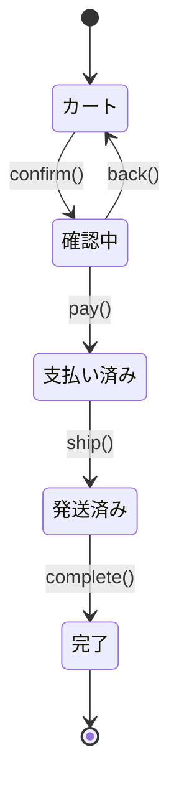
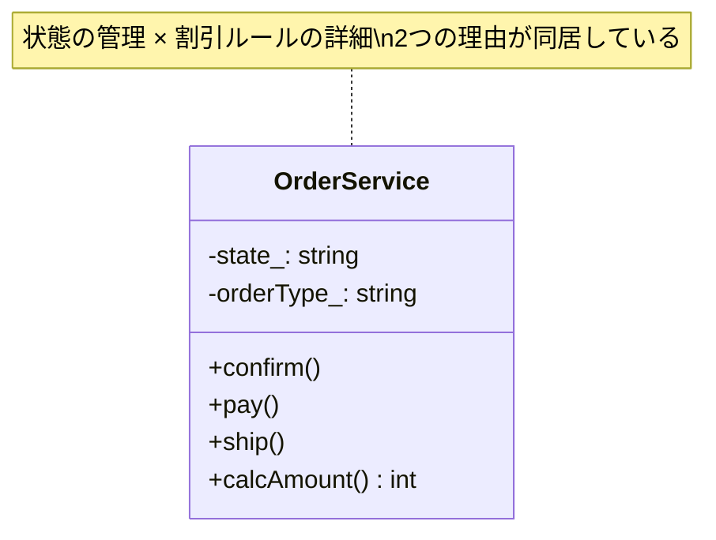
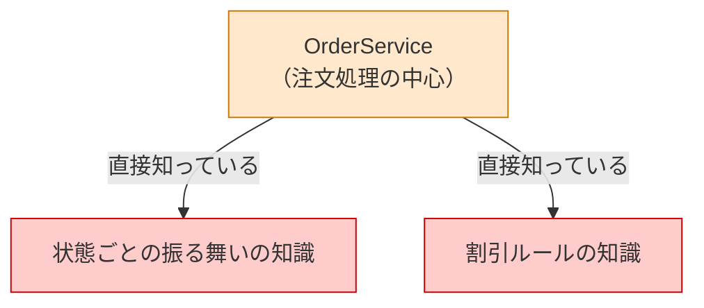
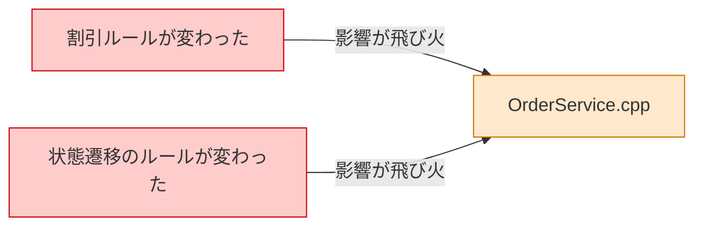
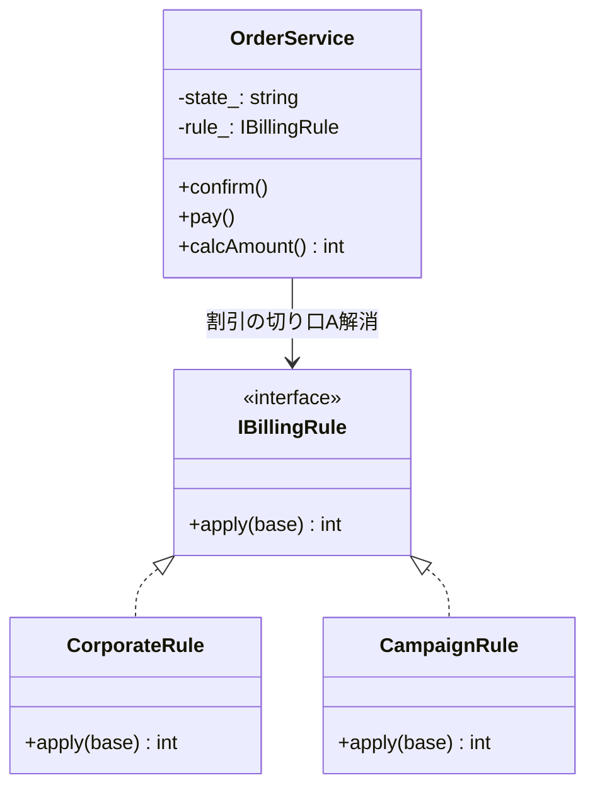
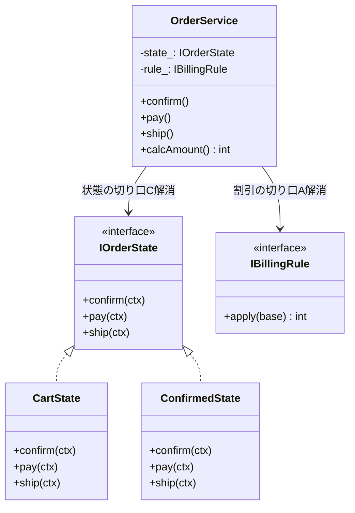
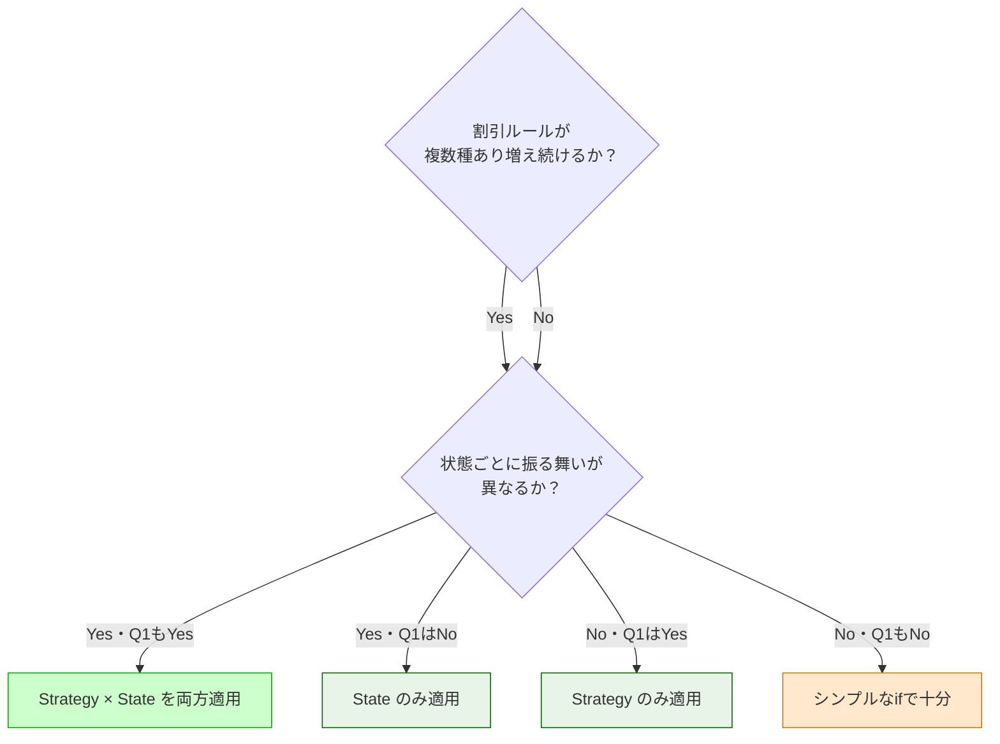
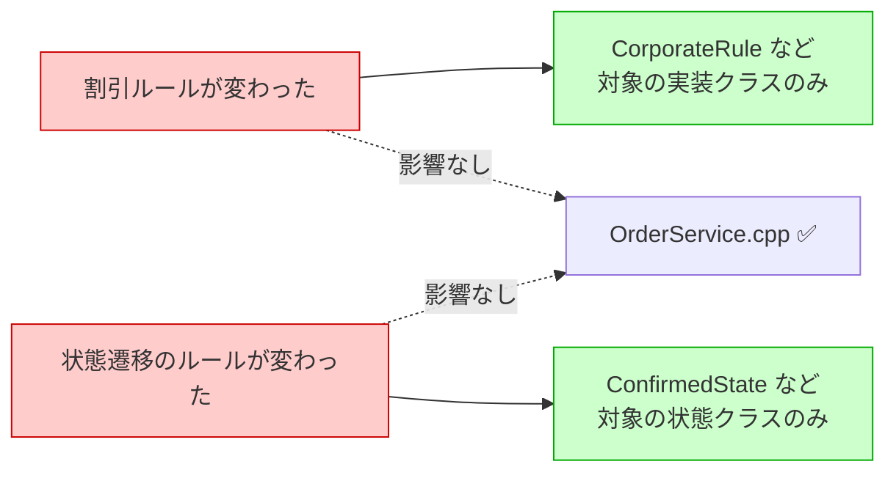

# 第二部　応用編 ―― 複数パターンの融合

---

> 第一部では、8つのパターンをそれぞれ独立した問題に当てはめる体験をしました。
>
> 現実のコードは、もう少し複雑です。
> 「変わる理由が1つだけ」の問題に出会えることは、むしろ珍しい。
> 実際には、複数の「変わる理由」が1つのシステムの中に絡み合っています。
>
> 第二部では、その複雑さに向き合います。
>
> 使う道具（8ステップのプロセス・3つの哲学）は、第一部とまったく同じです。
> ただし、ステップ4（原因分析）で**複数の根本原因**が見つかります。
> そして、ステップ5（対策案）で「1つのパターンでは解決しきれない部分」が現れ、
> 2つ目のパターンが自然に登場します。
>
> 「このパターンを使え」という結論ありきではありません。
> 問題を分析した結果として、複数のパターンが組み合わさる——その過程を体験してください。

---

| 章 | 組み合わせ | 題材 |
|---|---|---|
| 第9章 | Strategy × State | ECサイトの注文処理 |
| 第10章 | Facade × Observer × Factory Method | 外部連携バッチシステム |
| 第11章 | Template Method × Decorator × Command | レポート生成エンジン |

---

# 第9章　増え続けるルールと変わり続ける状態をどう整理するか
―― 思考の型：複数の「変わる理由」を見分けて分離する

> **この章の核心**
> 「割引の種類が変わる」と「注文の状態によって振る舞いが変わる」は、
> 別の理由で変わる。それを1つの場所に押し込むと、
> どちらの変化でも同じクラスを開くことになる。

---

## ステップ0：現状の共有と視点のチューニング

<!-- TODO: この節を実装する -->
<!-- シナリオ概要のプレースホルダー -->

**この章で扱うシステム：** ECサイトの注文処理モジュールです。
注文は「カート→確認→支払い→発送→完了」という状態遷移を持ちます。
各状態で使える操作が異なり、さらに注文種別（通常・法人・キャンペーン）によって
金額計算のルールが変わります。

**変更前のクラス構造（概要）：**

**設計のレンズをセット：**

> 「このコードの中に、**『変わる理由』が異なる2つのものが、
> 同じ場所に混在していないか？」**

この章では、その「2つのもの」が1つではなく、**複数組** 存在します。

---

## ステップ1：現状把握 ―― 責任外の関心を探す

<!-- TODO: この節を実装する -->
<!-- 起点コードと責任チェック表のプレースホルダー -->

**概要：** `OrderService` に以下が混在していることを確認する。

- 状態（string: "cart", "confirmed", "paid"…）の管理
- 状態ごとの振る舞いの分岐（`confirm()` / `pay()` / `ship()`）
- 注文種別（通常・法人・キャンペーン）による金額計算

**責任チェック表（概略）：**

| コードの行 | 持っている知識 | OrderServiceの責任か |
|---|---|---|
| `if (state == "confirmed") ...` | 状態遷移のルール | **✗ 状態管理クラスの責任** |
| `if (orderType == "corporate")` | 法人割引の条件 | **✗ 割引ルール担当の責任** |
| `amount * 0.9` など | 割引率の詳細 | **✗ 割引ルール担当の責任** |

**依存グラフ：**

---

## ステップ2：変動と不変の峻別

<!-- TODO: この節を実装する -->
<!-- ヒアリング会話と変動/不変テーブルのプレースホルダー -->

**変動/不変テーブル（概略）：**

| 分類 | 内容 | 変わるタイミング | 根拠 |
|---|---|---|---|
| 🔴 変動する | 割引ルールの種類・計算方法 | 営業施策のたびに | 営業担当確認（予定） |
| 🔴 変動する | 状態ごとの振る舞い | 業務フロー変更のたびに | 業務担当確認（予定） |
| 🟢 不変 | 「注文を処理する」という業務の存在 | 変わらない | ビジネスの根幹 |
| 🟢 不変 | 状態遷移の基本的な順序 | 変わりにくい | 業務担当確認（予定） |

---

## ステップ3：課題分析

<!-- TODO: この節を実装する -->
<!-- 変更影響グラフ（改善前）のプレースホルダー -->

**変更影響グラフ（改善前）：**

*「割引の変更」でも「状態の変更」でも同じ OrderService を開くことになる。*

---

## ステップ4：原因分析

<!-- TODO: この節を実装する -->
<!-- 複数の根本原因を示すテーブルのプレースホルダー -->

この章のポイントは、原因が**2つ**見つかることです。

| 問い | 答え | 原因の切り口 |
|---|---|---|
| なぜ割引変更で OrderService が変わるか | 割引ルールの詳細を直接知っているから | **A：変化の混在** |
| なぜ状態変更で OrderService が変わるか | 状態ごとの振る舞いを直接知っているから | **C：状態と振る舞いの混在** |

原因の切り口が2種類ある。これが第二部の特徴です。
1つのパターンでは、2つの原因を同時に解消できません。

---

## ステップ5：対策案の検討

<!-- TODO: この節を実装する -->
<!-- 2段階の解決を示すクラス図・コードのプレースホルダー -->

### 試み①：割引ルールを分離する（Strategy の適用）

まず切り口Aの問題を解消します。
割引ルールを `IBillingRule` として分離します（第1章で学んだ手法）。

責任チェック（OrderService）：割引の詳細は見えなくなった ✅
ただし、状態管理の問題（切り口C）はまだ残っています。

### 試み②：状態ごとの振る舞いを分離する（State の適用）

次に切り口Cの問題を解消します。
状態ごとの振る舞いを `IOrderState` として分離します。

---

## ステップ6：天秤にかける

<!-- TODO: この節を実装する -->
<!-- 比較テーブル・判断フローチャートのプレースホルダー -->

---

## ステップ7：決断と、手に入れた未来

<!-- TODO: この節を実装する -->
<!-- 最終コード全体・変更シナリオ表・変更影響グラフ（改善後）のプレースホルダー -->

**変更シナリオ表（概略）：**

| シナリオ | 変わるクラス | 変わらないクラス |
|---|---|---|
| 新しい割引ルールを追加する | 新しい〇〇Rule クラスを追加 | IOrderState / OrderService |
| 新しい注文状態を追加する | 新しい〇〇State クラスを追加 | IBillingRule / OrderService |
| 状態遷移のルールが変わる | 対象の〇〇State のみ | OrderService / 他の State |
| 使うルールを切り替える | OrderApplication の1行 | すべてのルール・状態クラス |

**変更影響グラフ（改善後）：**

---

## 振り返り：使ったパターンと解消した問題

| 適用したパターン | 解消した問題 | 原因の切り口 |
|---|---|---|
| Strategy | 割引ルールが増えるたびに OrderService が変わる | A：変化の混在 |
| State | 状態が増えるたびに OrderService の分岐が肥大化する | C：状態と振る舞いの混在 |

第一部では1章に1パターンでした。
この章では、1つのコードに2つの問題が混在していたため、
2つのパターンが自然に組み合わさりました。

「2つのパターンを組み合わせる」という出発点ではなく、
「2つの問題を分析した結果として2つのパターンが選ばれた」——
この順序が、第二部全体を通じて変わらないことを確認してください。

---

*一つの参考として受け取っていただければと思います。
間違えても大丈夫です。設計は一度決めたら終わりではなく、
状況が変わればまた考え直せばいい、という軽さで向き合ってほしいと思います。*
